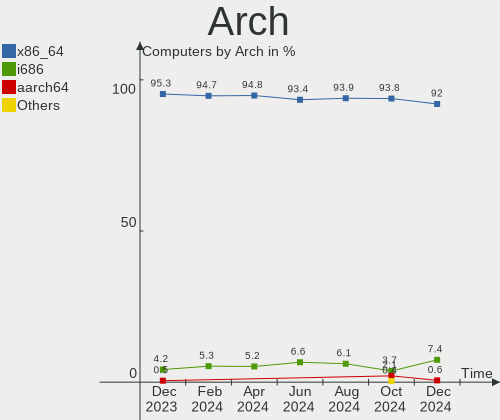
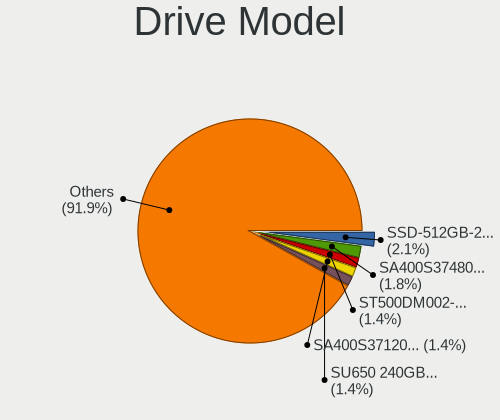
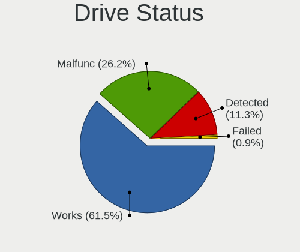

ROSA Hardware Trends
--------------------

A project to identify most popular hardware characteristics and track their change
over time based on data collected by ROSA users at https://Linux-Hardware.org.

Anyone can contribute to the study by uploading probes of their computers by
the [hw-probe](https://github.com/linuxhw/hw-probe) tool:

    sudo hw-probe -all -upload

This is a report for all computer types. See also reports for [desktops](/Dist/ROSA/Desktop/README.md) and [notebooks](/Dist/ROSA/Notebook/README.md).

Full-feature report is available here: https://linux-hardware.org/?view=trends

Period: Nov, 2019.

Contents
--------

- [ OS                       ](#os)
- [ OS Family                ](#os-family)
- [ Kernel                   ](#kernel)
- [ Kernel Family            ](#kernel-family)
- [ Kernel Major Ver.        ](#kernel-major-ver)
- [ Arch                     ](#arch)
- [ DE                       ](#de)
- [ Display Server           ](#display-server)
- [ OS Lang                  ](#os-lang)
- [ Boot Mode                ](#boot-mode)
- [ Filesystem               ](#filesystem)
- [ Dual Boot with Linux     ](#dual-boot-with-linux)
- [ Dual Boot (Win)          ](#dual-boot-win)
- [ Country                  ](#country)
- [ City                     ](#city)
- [ Vendor                   ](#vendor)
- [ Model                    ](#model)
- [ Model Family             ](#model-family)
- [ MFG Year                 ](#mfg-year)
- [ Form Factor              ](#form-factor)
- [ Secure Boot              ](#secure-boot)
- [ Coreboot                 ](#coreboot)
- [ RAM Size                 ](#ram-size)
- [ RAM Used                 ](#ram-used)
- [ Drive Vendor             ](#drive-vendor)
- [ Drive Model              ](#drive-model)
- [ Drive Kind               ](#drive-kind)
- [ Drive Connector          ](#drive-connector)
- [ Drive Size               ](#drive-size)
- [ Space Total              ](#space-total)
- [ Space Used               ](#space-used)
- [ Malfunc. Drives          ](#malfunc-drives)
- [ Malfunc. Drive Vendor    ](#malfunc-drive-vendor)
- [ Malfunc. Drive Kind      ](#malfunc-drive-kind)
- [ Failed Drives            ](#failed-drives)
- [ Failed Drive Vendor      ](#failed-drive-vendor)
- [ Drive Status             ](#drive-status)
- [ CPU Vendor               ](#cpu-vendor)
- [ CPU Model                ](#cpu-model)
- [ CPU Model Family         ](#cpu-model-family)
- [ CPU Cores                ](#cpu-cores)
- [ CPU Sockets              ](#cpu-sockets)
- [ CPU Threads              ](#cpu-threads)
- [ CPU Op-Modes             ](#cpu-op-modes)
- [ CPU Microarch            ](#cpu-microarch)
- [ CPU Microcode            ](#cpu-microcode)
- [ GPU Vendor               ](#gpu-vendor)
- [ GPU Model                ](#gpu-model)
- [ GPU Combo                ](#gpu-combo)
- [ GPU Driver               ](#gpu-driver)
- [ GPU Memory               ](#gpu-memory)
- [ Monitor Vendor           ](#monitor-vendor)
- [ Monitor Model            ](#monitor-model)
- [ Monitor Resolution       ](#monitor-resolution)
- [ Monitor Diagonal         ](#monitor-diagonal)
- [ Monitor Width            ](#monitor-width)
- [ Aspect Ratio             ](#aspect-ratio)
- [ Monitor Area             ](#monitor-area)
- [ Pixel Density            ](#pixel-density)
- [ Multiple Monitors        ](#multiple-monitors)
- [ Net Controller Vendor    ](#net-controller-vendor)
- [ Net Controller Model     ](#net-controller-model)
- [ Net Controller Kind      ](#net-controller-kind)
- [ Used Controller          ](#used-controller)
- [ NICs                     ](#nics)
- [ Unsupported Devices      ](#unsupported-devices)
- [ Unsupported Device Types ](#unsupported-device-types)

OS
--

Installed operating systems

| Name               | Computers | Percent |
|--------------------|-----------|---------|
| ROSA R11           | 247       | 83.73%  |
| ROSA R8.1          | 27        | 9.15%   |
| ROSA R10           | 10        | 3.39%   |
| ROSA R9            | 5         | 1.69%   |
| ROSA Nickel 2019.0 | 3         | 1.02%   |
| ROSA R12           | 2         | 0.68%   |
| ROSA R8            | 1         | 0.34%   |

OS Family
---------

OS without a version

| Name | Computers | Percent |
|------|-----------|---------|
| ROSA | 295       | 100%    |

Kernel
------

Version of the Linux kernel

| Version                          | Computers | Percent |
|----------------------------------|-----------|---------|
| 4.15.0-desktop-60.7rosa-x86_64   | 88        | 29.83%  |
| 4.15.0-desktop-45.1rosa-x86_64   | 83        | 28.14%  |
| 4.9.155-nrj-desktop-1rosa-x86_64 | 31        | 10.51%  |
| 4.15.0-desktop-45.1rosa-i586     | 19        | 6.44%   |
| 4.15.0-desktop-60.7rosa-i586     | 16        | 5.42%   |
| 5.0.0-desktop-33.1rosa-x86_64    | 5         | 1.69%   |
| 4.9.60-nrj-desktop-1rosa-x86_64  | 5         | 1.69%   |
| 4.9.20-nrj-desktop-1rosa-x86_64  | 5         | 1.69%   |
| 4.1.38-nrj-desktop-2rosa-x86_64  | 5         | 1.69%   |
| 4.9.9-nrj-desktop-1rosa-x86_64   | 4         | 1.36%   |
| 4.9.155-nrj-laptop-1rosa-x86_64  | 4         | 1.36%   |
| 4.9.155-nrj-desktop-1rosa-i586   | 4         | 1.36%   |
| 4.9.124-nrj-desktop-1rosa-x86_64 | 4         | 1.36%   |
| 4.9.60-nrj-desktop-1rosa-i586    | 2         | 0.68%   |
| 4.15.0-desktop-68.5rosa-x86_64   | 2         | 0.68%   |
| 4.15.0-desktop-65.4rosa-x86_64   | 2         | 0.68%   |
| 5.3.9-desktop-1omv4001           | 1         | 0.34%   |
| 5.3.8-3-MANJARO                  | 1         | 0.34%   |
| 5.3.10-nickel-2rosa-x86_64       | 1         | 0.34%   |
| 5.3.0-desktop-24.1rosa-x86_64    | 1         | 0.34%   |
| 5.3.0-desktop-20.1rosa-x86_64    | 1         | 0.34%   |
| 5.0.0-desktop-27.1rosa-x86_64    | 1         | 0.34%   |
| 5.0.0-desktop-21.2rosa-x86_64    | 1         | 0.34%   |
| 4.9.9-nrj-desktop-1rosa-i586     | 1         | 0.34%   |
| 4.9.20-nrj-desktop-1rosa-i586    | 1         | 0.34%   |
| 4.9.124-nrj-desktop-1rosa-i586   | 1         | 0.34%   |
| 4.4.74-nrj-desktop-1rosa-x86_64  | 1         | 0.34%   |
| 4.19.0-desktop-13.1rosa-x86_64   | 1         | 0.34%   |
| 4.15.0-desktop-54.3rosa-x86_64   | 1         | 0.34%   |
| 4.15.0-desktop-54.1rosa-i586     | 1         | 0.34%   |
| 4.15.0-desktop-47.2rosa-x86_64   | 1         | 0.34%   |
| 4.1.38-nrj-desktop-2rosa-i586    | 1         | 0.34%   |

Kernel Family
-------------

Linux kernel without a distro release

| Version | Computers | Percent |
|---------|-----------|---------|
| 4.15.0  | 213       | 72.2%   |
| 4.9.155 | 39        | 13.22%  |
| 5.0.0   | 7         | 2.37%   |
| 4.9.60  | 7         | 2.37%   |
| 4.9.20  | 6         | 2.03%   |
| 4.1.38  | 6         | 2.03%   |
| 4.9.9   | 5         | 1.69%   |
| 4.9.124 | 5         | 1.69%   |
| 5.3.0   | 2         | 0.68%   |
| 5.3.9   | 1         | 0.34%   |
| 5.3.8   | 1         | 0.34%   |
| 5.3.10  | 1         | 0.34%   |
| 4.4.74  | 1         | 0.34%   |
| 4.19.0  | 1         | 0.34%   |

Kernel Major Ver.
-----------------

Linux kernel major version

| Version | Computers | Percent |
|---------|-----------|---------|
| 4.15    | 213       | 72.2%   |
| 4.9     | 62        | 21.02%  |
| 5.0     | 7         | 2.37%   |
| 4.1     | 6         | 2.03%   |
| 5.3     | 5         | 1.69%   |
| 4.4     | 1         | 0.34%   |
| 4.19    | 1         | 0.34%   |

Arch
----

OS architecture (x86_64, i586, etc.)

| Name   | Computers | Percent |
|--------|-----------|---------|
| x86_64 | 249       | 84.41%  |
| i686   | 46        | 15.59%  |

DE
--

Desktop Environment

| Name    | Computers | Percent |
|---------|-----------|---------|
| KDE5    | 278       | 94.24%  |
| MATE    | 7         | 2.37%   |
| XFCE    | 5         | 1.69%   |
| Unknown | 4         | 1.36%   |
| GNOME   | 1         | 0.34%   |

Display Server
--------------

X11 or Wayland

| Name    | Computers | Percent |
|---------|-----------|---------|
| Unknown | 295       | 100%    |

OS Lang
-------

Language

| Lang    | Computers | Percent |
|---------|-----------|---------|
| Unknown | 295       | 100%    |

Boot Mode
---------

EFI or BIOS

| Mode | Computers | Percent |
|------|-----------|---------|
| BIOS | 224       | 75.93%  |
| EFI  | 71        | 24.07%  |

Filesystem
----------

Type of filesystem

| Type    | Computers | Percent |
|---------|-----------|---------|
| Ext4    | 286       | 96.95%  |
| Btrfs   | 6         | 2.03%   |
| Ext3    | 2         | 0.68%   |
| Overlay | 1         | 0.34%   |

Dual Boot with Linux
--------------------

Hosting more than one Linux

| Dual boot | Computers | Percent |
|-----------|-----------|---------|
| No        | 239       | 81.02%  |
| Yes       | 56        | 18.98%  |

Dual Boot (Win)
---------------

Hosting Linux and Windows

| Dual boot | Computers | Percent |
|-----------|-----------|---------|
| No        | 165       | 55.93%  |
| Yes       | 130       | 44.07%  |

Country
-------

Geographic location (country)

| Country        | Computers | Percent |
|----------------|-----------|---------|
| Russia         | 227       | 76.95%  |
| Belarus        | 18        | 6.1%    |
| Ukraine        | 10        | 3.39%   |
| Germany        | 4         | 1.36%   |
| Lithuania      | 3         | 1.02%   |
| Latvia         | 3         | 1.02%   |
| Canada         | 3         | 1.02%   |
| Turkey         | 2         | 0.68%   |
| Serbia         | 2         | 0.68%   |
| Poland         | 2         | 0.68%   |
| Italy          | 2         | 0.68%   |
| France         | 2         | 0.68%   |
| Australia      | 2         | 0.68%   |
| Venezuela      | 1         | 0.34%   |
| USA            | 1         | 0.34%   |
| Tunisia        | 1         | 0.34%   |
| Spain          | 1         | 0.34%   |
| Portugal       | 1         | 0.34%   |
| Kazakhstan     | 1         | 0.34%   |
| Israel         | 1         | 0.34%   |
| India          | 1         | 0.34%   |
| Estonia        | 1         | 0.34%   |
| Czech Republic | 1         | 0.34%   |
| Chile          | 1         | 0.34%   |
| Bulgaria       | 1         | 0.34%   |
| Azerbaijan     | 1         | 0.34%   |
| Austria        | 1         | 0.34%   |
| Unknown        | 1         | 0.34%   |

City
----

Geographic location (city)

| City              | Computers | Percent |
|-------------------|-----------|---------|
| Moscow            | 31        | 10.51%  |
| St Petersburg     | 17        | 5.76%   |
| Yekaterinburg     | 10        | 3.39%   |
| Nizhniy Novgorod  | 9         | 3.05%   |
| Vitebsk           | 8         | 2.71%   |
| Novosibirsk       | 8         | 2.71%   |
| Rostov-on-Don     | 7         | 2.37%   |
| Voronezh          | 5         | 1.69%   |
| Samara            | 5         | 1.69%   |
| Chelyabinsk       | 5         | 1.69%   |
| Ryazan            | 4         | 1.36%   |
| Krasnodar         | 4         | 1.36%   |
| Hlybokaye         | 4         | 1.36%   |
| Vladivostok       | 3         | 1.02%   |
| Severodvinsk      | 3         | 1.02%   |
| Riga              | 3         | 1.02%   |
| Minsk             | 3         | 1.02%   |
| Kaliningrad       | 3         | 1.02%   |
| Irkutsk           | 3         | 1.02%   |
| Bryansk           | 3         | 1.02%   |
| Abakan            | 3         | 1.02%   |
| Yuzhno-Sakhalinsk | 2         | 0.68%   |
| Volgograd         | 2         | 0.68%   |
| Tomsk             | 2         | 0.68%   |
| Tolyatti          | 2         | 0.68%   |
| Taganrog          | 2         | 0.68%   |
| Surgut            | 2         | 0.68%   |
| Stavropol         | 2         | 0.68%   |
| Smolensk          | 2         | 0.68%   |
| Saratov           | 2         | 0.68%   |
| Saransk           | 2         | 0.68%   |
| Reutov            | 2         | 0.68%   |
| Pokrovka          | 2         | 0.68%   |
| Perm              | 2         | 0.68%   |
| Nevinnomyssk      | 2         | 0.68%   |
| Nazarovo          | 2         | 0.68%   |
| Murmansk          | 2         | 0.68%   |
| Krasnoyarsk       | 2         | 0.68%   |
| Kharkiv           | 2         | 0.68%   |
| Kemerovo          | 2         | 0.68%   |
| Kazan’          | 2         | 0.68%   |
| Belgrade          | 2         | 0.68%   |
| Arkhangelsk       | 2         | 0.68%   |
| Zvenigorod        | 1         | 0.34%   |
| Zhlobin           | 1         | 0.34%   |
| Zelenoborskiy     | 1         | 0.34%   |
| Zaporizhia        | 1         | 0.34%   |
| Yoshkar-Ola       | 1         | 0.34%   |
| Yaya              | 1         | 0.34%   |
| Yakutsk           | 1         | 0.34%   |
| Volzhsk           | 1         | 0.34%   |
| Vienna            | 1         | 0.34%   |
| Verkhov'ye        | 1         | 0.34%   |
| Veliky Novgorod   | 1         | 0.34%   |
| Uzhhorod          | 1         | 0.34%   |
| Ulyanovsk         | 1         | 0.34%   |
| Ufa               | 1         | 0.34%   |
| Tyumen            | 1         | 0.34%   |
| Tulnikiai         | 1         | 0.34%   |
| Tula              | 1         | 0.34%   |

Vendor
------

Motherboard manufacturer

| Name                           | Computers | Percent |
|--------------------------------|-----------|---------|
| ASUSTek Computer               | 75        | 25.42%  |
| Gigabyte Technology            | 33        | 11.19%  |
| Lenovo                         | 32        | 10.85%  |
| MSI                            | 23        | 7.8%    |
| ASRock                         | 22        | 7.46%   |
| Hewlett-Packard                | 19        | 6.44%   |
| Acer                           | 19        | 6.44%   |
| Dell                           | 13        | 4.41%   |
| Samsung Electronics            | 9         | 3.05%   |
| Toshiba                        | 8         | 2.71%   |
| Sony                           | 5         | 1.69%   |
| Intel                          | 4         | 1.36%   |
| ECS                            | 4         | 1.36%   |
| eMachines                      | 3         | 1.02%   |
| Unknown                        | 3         | 1.02%   |
| Pegatron                       | 2         | 0.68%   |
| Packard Bell                   | 2         | 0.68%   |
| Digma                          | 2         | 0.68%   |
| Apple                          | 2         | 0.68%   |
| WinFast                        | 1         | 0.34%   |
| Standard                       | 1         | 0.34%   |
| SiS Technology                 | 1         | 0.34%   |
| Prestigio                      | 1         | 0.34%   |
| Matsushita Electric Industrial | 1         | 0.34%   |
| Maibenben                      | 1         | 0.34%   |
| LG Electronics                 | 1         | 0.34%   |
| K-Systems                      | 1         | 0.34%   |
| Fujitsu                        | 1         | 0.34%   |
| Foxconn                        | 1         | 0.34%   |
| DNS                            | 1         | 0.34%   |
| DEXP                           | 1         | 0.34%   |
| Biostar                        | 1         | 0.34%   |
| AMI                            | 1         | 0.34%   |
| Alienware                      | 1         | 0.34%   |

Model
-----

Motherboard model

| Name                                  | Computers | Percent |
|---------------------------------------|-----------|---------|
| Unknown                               | 6         | 2.03%   |
| Pavilion dv6                          | 3         | 1.02%   |
| M5A78L-M LX3                          | 3         | 1.02%   |
| H81M-S2H                              | 3         | 1.02%   |
| G50-30 80G0                           | 3         | 1.02%   |
| B570e HuronRiver Platform             | 3         | 1.02%   |
| X551CAP                               | 2         | 0.68%   |
| V200IB                                | 2         | 0.68%   |
| PRIME A320M-K                         | 2         | 0.68%   |
| P8H61-M LX3 R2.0                      | 2         | 0.68%   |
| P8H61-M LX2                           | 2         | 0.68%   |
| P5G41T-M LX2/GB                       | 2         | 0.68%   |
| P35-DS3L                              | 2         | 0.68%   |
| MS-7996                               | 2         | 0.68%   |
| MS-7680                               | 2         | 0.68%   |
| MS-7529                               | 2         | 0.68%   |
| M3A UCC                               | 2         | 0.68%   |
| M2N-X                                 | 2         | 0.68%   |
| M2N-MX SE Plus                        | 2         | 0.68%   |
| H110M-R                               | 2         | 0.68%   |
| G580 20157                            | 2         | 0.68%   |
| Aspire E1-530                         | 2         | 0.68%   |
| All Series                            | 2         | 0.68%   |
| 970 Pro3 R2.0                         | 2         | 0.68%   |
| 300E4Z/300E5Z/300E7Z                  | 2         | 0.68%   |
| Z87X-OC                               | 1         | 0.34%   |
| Z77-D3H                               | 1         | 0.34%   |
| Z77 Extreme4                          | 1         | 0.34%   |
| Z77 Extreme3                          | 1         | 0.34%   |
| Z68P-DS3                              | 1         | 0.34%   |
| Z620 Workstation                      | 1         | 0.34%   |
| XiaoMai6                              | 1         | 0.34%   |
| X550DP                                | 1         | 0.34%   |
| X540LJ                                | 1         | 0.34%   |
| X51L                                  | 1         | 0.34%   |
| X401A1                                | 1         | 0.34%   |
| X370 Taichi                           | 1         | 0.34%   |
| X101H                                 | 1         | 0.34%   |
| X101CH                                | 1         | 0.34%   |
| VPCW21Z1R                             | 1         | 0.34%   |
| VPCJ21S1R                             | 1         | 0.34%   |
| VPCEH36EF                             | 1         | 0.34%   |
| VPCEH1E1R                             | 1         | 0.34%   |
| VPCEB1E1R                             | 1         | 0.34%   |
| Vostro 1000                           | 1         | 0.34%   |
| VM60                                  | 1         | 0.34%   |
| VivoBook 15_ASUS Laptop X540MA_X543MA | 1         | 0.34%   |
| V530-22ICB AIO 10US005HRU             | 1         | 0.34%   |
| V3-771                                | 1         | 0.34%   |
| UX32LN                                | 1         | 0.34%   |
| U210/U210 Light                       | 1         | 0.34%   |
| TravelMate 5510                       | 1         | 0.34%   |
| ThinkPad X220 4290LB4                 | 1         | 0.34%   |
| ThinkPad W520 427637U                 | 1         | 0.34%   |
| ThinkPad T420s 4174BB2                | 1         | 0.34%   |
| ThinkPad R60/R60i 9461DXG             | 1         | 0.34%   |
| TERRA_PC                              | 1         | 0.34%   |
| TECRA A9                              | 1         | 0.34%   |
| SiS-650GX                             | 1         | 0.34%   |
| Satellite L755                        | 1         | 0.34%   |

Model Family
------------

Motherboard model prefix

| Name                       | Computers | Percent |
|----------------------------|-----------|---------|
| Acer Aspire                | 15        | 5.08%   |
| Dell Inspiron              | 7         | 2.37%   |
| Toshiba Satellite          | 6         | 2.03%   |
| Lenovo IdeaPad             | 6         | 2.03%   |
| HP Pavilion                | 6         | 2.03%   |
| Unknown                    | 6         | 2.03%   |
| ASUS P8H61-M               | 5         | 1.69%   |
| Lenovo ThinkPad            | 4         | 1.36%   |
| ASUS PRIME                 | 4         | 1.36%   |
| ASUS M5A78L-M              | 4         | 1.36%   |
| Lenovo G580                | 3         | 1.02%   |
| Lenovo G50-30              | 3         | 1.02%   |
| Lenovo B570e               | 3         | 1.02%   |
| Gigabyte H81M-S2H          | 3         | 1.02%   |
| Dell Latitude              | 3         | 1.02%   |
| ASUS P5G41T-M              | 3         | 1.02%   |
| ASUS M2N-MX                | 3         | 1.02%   |
| Samsung Electronics 300E4Z | 2         | 0.68%   |
| MSI MS-7996                | 2         | 0.68%   |
| MSI MS-7680                | 2         | 0.68%   |
| MSI MS-7529                | 2         | 0.68%   |
| Lenovo B590                | 2         | 0.68%   |
| HP ProBook                 | 2         | 0.68%   |
| HP Compaq                  | 2         | 0.68%   |
| Gigabyte P35-DS3L          | 2         | 0.68%   |
| Dell OptiPlex              | 2         | 0.68%   |
| ASUS X551CAP               | 2         | 0.68%   |
| ASUS V200IB                | 2         | 0.68%   |
| ASUS M5A97                 | 2         | 0.68%   |
| ASUS M2N-X                 | 2         | 0.68%   |
| ASUS H110M-R               | 2         | 0.68%   |
| ASUS All                   | 2         | 0.68%   |
| ASRock Z77                 | 2         | 0.68%   |
| ASRock M3A                 | 2         | 0.68%   |
| ASRock 970                 | 2         | 0.68%   |
| WinFast 6100M2MA           | 1         | 0.34%   |
| Toshiba TECRA              | 1         | 0.34%   |
| Toshiba SATEGO             | 1         | 0.34%   |
| Sony VPCW21Z1R             | 1         | 0.34%   |
| Sony VPCJ21S1R             | 1         | 0.34%   |
| Sony VPCEH36EF             | 1         | 0.34%   |
| Sony VPCEH1E1R             | 1         | 0.34%   |
| Sony VPCEB1E1R             | 1         | 0.34%   |
| SiS Technology SiS-650GX   | 1         | 0.34%   |
| Samsung Electronics R540   | 1         | 0.34%   |
| Samsung Electronics R519   | 1         | 0.34%   |
| Samsung Electronics N145P  | 1         | 0.34%   |
| Samsung Electronics N102SP | 1         | 0.34%   |
| Samsung Electronics N102   | 1         | 0.34%   |
| Samsung Electronics N100SP | 1         | 0.34%   |
| Samsung Electronics 350V5C | 1         | 0.34%   |
| Prestigio PSB141S01        | 1         | 0.34%   |
| Pegatron IPMSB-H61         | 1         | 0.34%   |
| Pegatron Compaq            | 1         | 0.34%   |
| Packard Bell EasyNote      | 1         | 0.34%   |
| Packard Bell DOT           | 1         | 0.34%   |
| MSI U210                   | 1         | 0.34%   |
| MSI OPTIMUS                | 1         | 0.34%   |
| MSI MS-AC1511              | 1         | 0.34%   |
| MSI MS-7B79                | 1         | 0.34%   |

MFG Year
--------

Motherboard manufacture year

| Year | Computers | Percent |
|------|-----------|---------|
| 2012 | 39        | 13.22%  |
| 2013 | 36        | 12.2%   |
| 2010 | 31        | 10.51%  |
| 2014 | 28        | 9.49%   |
| 2018 | 25        | 8.47%   |
| 2011 | 25        | 8.47%   |
| 2009 | 21        | 7.12%   |
| 2015 | 18        | 6.1%    |
| 2008 | 16        | 5.42%   |
| 2007 | 15        | 5.08%   |
| 2019 | 13        | 4.41%   |
| 2016 | 11        | 3.73%   |
| 2017 | 9         | 3.05%   |
| 2006 | 5         | 1.69%   |
| 2003 | 2         | 0.68%   |
| 2005 | 1         | 0.34%   |

Form Factor
-----------

Physical design of the computer

| Name       | Computers | Percent |
|------------|-----------|---------|
| Desktop    | 157       | 53.22%  |
| Notebook   | 127       | 43.05%  |
| All in one | 9         | 3.05%   |
| Mini pc    | 2         | 0.68%   |

Secure Boot
-----------

Enabled or disabled

| State    | Computers | Percent |
|----------|-----------|---------|
| Disabled | 295       | 100%    |

Coreboot
--------

Have coreboot on board

| Used | Computers | Percent |
|------|-----------|---------|
| No   | 295       | 100%    |

RAM Size
--------

Total RAM memory

| Size in GB | Computers | Percent |
|------------|-----------|---------|
| 3.01-4.0   | 108       | 36.61%  |
| 8.01-16.0  | 69        | 23.39%  |
| 1.01-2.0   | 40        | 13.56%  |
| 4.01-8.0   | 36        | 12.2%   |
| 2.01-3.0   | 21        | 7.12%   |
| 16.01-24.0 | 14        | 4.75%   |
| 0.01-1.0   | 5         | 1.69%   |
| 32.01-64.0 | 2         | 0.68%   |

RAM Used
--------

Used RAM memory

| Used GB  | Computers | Percent |
|----------|-----------|---------|
| 0.01-1.0 | 151       | 51.19%  |
| 1.01-2.0 | 120       | 40.68%  |
| 2.01-3.0 | 21        | 7.12%   |
| 3.01-4.0 | 2         | 0.68%   |
| 4.01-8.0 | 1         | 0.34%   |

Drive Vendor
------------

Hard drive vendors

| Vendor              | Computers | Drives  | Percent |
|---------------------|-----------|---------|---------|
| WDC                 | 94        | 106     | 23.74%  |
| Seagate             | 84        | 94      | 21.21%  |
| Toshiba             | 49        | 53      | 12.37%  |
| Hitachi             | 39        | 41      | 9.85%   |
| Samsung Electronics | 27        | 28      | 6.82%   |
| Kingston            | 16        | 16      | 4.04%   |
| China               | 9         | 9       | 2.27%   |
| HGST                | 8         | 8       | 2.02%   |
| Unknown             | 6         | 6       | 1.52%   |
| Transcend           | 5         | 5       | 1.26%   |
| SPCC                | 5         | 5       | 1.26%   |
| SanDisk             | 5         | 5       | 1.26%   |
| PLEXTOR             | 5         | 6       | 1.26%   |
| Crucial             | 5         | 5       | 1.26%   |
| MAXTOR              | 4         | 4       | 1.01%   |
| Intel               | 4         | 4       | 1.01%   |
| A-DATA Technology   | 4         | 4       | 1.01%   |
| SK Hynix            | 2         | 2       | 0.51%   |
| OCZ                 | 2         | 2       | 0.51%   |
| KingSpec            | 2         | 2       | 0.51%   |
| HUAWEI              | 2         | 2       | 0.51%   |
| GOODRAM             | 2         | 2       | 0.51%   |
| Fujitsu             | 2         | 2       | 0.51%   |
| Zheino              | 1         | 1       | 0.25%   |
| Union Memory        | 1         | 1       | 0.25%   |
| Smartbuy            | 1         | 1       | 0.25%   |
| Patriot             | 1         | 1       | 0.25%   |
| LITEONIT            | 1         | 1       | 0.25%   |
| LITEON              | 1         | 1       | 0.25%   |
| IBM/Hitachi         | 1         | 1       | 0.25%   |
| HyperX              | 1         | 1       | 0.25%   |
| Hoodisk             | 1         | 1       | 0.25%   |
| HL-DT-ST            | 1         | Unknown | 0.25%   |
| HECTRON             | 1         | 1       | 0.25%   |
| Gigabyte Technology | 1         | 1       | 0.25%   |
| Generic             | 1         | 1       | 0.25%   |
| Apacer              | 1         | 1       | 0.25%   |
| AMD                 | 1         | 1       | 0.25%   |

Drive Model
-----------

Hard drive models

| Model                        | Computers | Percent |
|------------------------------|-----------|---------|
| DT01ACA050 500GB             | 13        | 3.05%   |
| ST1000DM010-2EP102 1TB       | 7         | 1.64%   |
| MQ01ABF050 500GB             | 6         | 1.41%   |
| HTS541010A9E680 1TB          | 6         | 1.41%   |
| HDWD110 1TB                  | 6         | 1.41%   |
| ST1000LM024 HN-M101MBB 1TB   | 4         | 0.94%   |
| SATA SSD 64GB                | 4         | 0.94%   |
| SA400S37120G 120GB SSD       | 4         | 0.94%   |
| DT01ACA100 1TB               | 4         | 0.94%   |
| WD5000AAKS-00A7B2 500GB      | 3         | 0.7%    |
| WD3200BPVT-22ZEST0 320GB     | 3         | 0.7%    |
| WD10EZEX-22MFCA0 1TB         | 3         | 0.7%    |
| WD10EZEX-08WN4A0 1TB         | 3         | 0.7%    |
| SV300S37A120G 120GB SSD      | 3         | 0.7%    |
| ST500DM002-1BD142 500GB      | 3         | 0.7%    |
| ST380815AS 80GB              | 3         | 0.7%    |
| ST3500418AS 500GB            | 3         | 0.7%    |
| ST3250318AS 250GB            | 3         | 0.7%    |
| ST320LT020-9YG142 320GB      | 3         | 0.7%    |
| ST3160813AS 160GB            | 3         | 0.7%    |
| ST2000DM008-2FR102 2TB       | 3         | 0.7%    |
| ST1000LM035-1RK172 1TB       | 3         | 0.7%    |
| HTS545050A7E380 500GB        | 3         | 0.7%    |
| HDS721010DLE630 1TB          | 3         | 0.7%    |
| HDS721010CLA332 1TB          | 3         | 0.7%    |
| DT01ACA200 2TB               | 3         | 0.7%    |
| WDS240G2G0A-00JH30 240GB SSD | 2         | 0.47%   |
| WDS120G2G0A-00JH30 120GB SSD | 2         | 0.47%   |
| WD800AAJS-00PSA0 80GB        | 2         | 0.47%   |
| WD7500BPVX-22JC3T0 750GB     | 2         | 0.47%   |
| WD5000BEVT-24A0RT0 500GB     | 2         | 0.47%   |
| WD5000AZRX-00A8LB0 500GB     | 2         | 0.47%   |
| WD5000AZLX-75K2TA0 500GB     | 2         | 0.47%   |
| WD3200BPVT-24JJ5T0 320GB     | 2         | 0.47%   |
| WD1600JS-08NCB1 160GB        | 2         | 0.47%   |
| WD10EZRZ-00HTKB0 1TB         | 2         | 0.47%   |
| TS64GSSD360S 64GB            | 2         | 0.47%   |
| TS128GSSD370S 128GB          | 2         | 0.47%   |
| ST9160821AS 160GB            | 2         | 0.47%   |
| ST500LT012-1DG142 500GB      | 2         | 0.47%   |
| ST500LM012 HN-M500MBB 500GB  | 2         | 0.47%   |
| ST380215A 80GB               | 2         | 0.47%   |
| ST3320418AS 320GB            | 2         | 0.47%   |
| ST3250410AS 250GB            | 2         | 0.47%   |
| ST3160815AS 160GB            | 2         | 0.47%   |
| ST250DM000-1BD141 250GB      | 2         | 0.47%   |
| ST2000DM001-1ER164 2TB       | 2         | 0.47%   |
| ST1000DM003-1CH162 1TB       | 2         | 0.47%   |
| SSD 860 EVO 250GB            | 2         | 0.47%   |
| SSD 850 EVO 250GB            | 2         | 0.47%   |
| SSD 120GB                    | 2         | 0.47%   |
| SP2504C 250GB                | 2         | 0.47%   |
| Solid State Disk 120GB       | 2         | 0.47%   |
| SD08G  8GB                   | 2         | 0.47%   |
| SD Storage 15GB              | 2         | 0.47%   |
| SA400S37240G 240GB SSD       | 2         | 0.47%   |
| MQ01ABD032 320GB             | 2         | 0.47%   |
| MK3265GSX 320GB              | 2         | 0.47%   |
| MK2565GSX 250GB              | 2         | 0.47%   |
| HTS547575A9E384 752GB        | 2         | 0.47%   |

Drive Kind
----------

HDD or SSD

| Kind    | Computers | Drives | Percent |
|---------|-----------|--------|---------|
| HDD     | 249       | 320    | 72.17%  |
| SSD     | 80        | 89     | 23.19%  |
| MMC     | 7         | 8      | 2.03%   |
| Unknown | 5         | 4      | 1.45%   |
| NVMe    | 4         | 4      | 1.16%   |

Drive Connector
---------------

SATA, SAS, NVMe, etc.

| Type | Computers | Drives | Percent |
|------|-----------|--------|---------|
| SATA | 286       | 406    | 93.77%  |
| SAS  | 8         | 7      | 2.62%   |
| MMC  | 7         | 8      | 2.3%    |
| NVMe | 4         | 4      | 1.31%   |

Drive Size
----------

Size of hard drive

| Size in TB | Computers | Drives | Percent |
|------------|-----------|--------|---------|
| 0.01-0.5   | 245       | 309    | 71.85%  |
| 0.51-1.0   | 80        | 99     | 23.46%  |
| 1.01-2.0   | 15        | 16     | 4.4%    |
| 3.01-4.0   | 1         | 1      | 0.29%   |

Space Total
-----------

Amount of disk space available on the file system

| Size in GB     | Computers | Percent |
|----------------|-----------|---------|
| 101-250        | 82        | 27.8%   |
| 251-500        | 68        | 23.05%  |
| 501-1000       | 39        | 13.22%  |
| 1-20           | 29        | 9.83%   |
| 51-100         | 29        | 9.83%   |
| 21-50          | 23        | 7.8%    |
| 1001-2000      | 19        | 6.44%   |
| 2001-3000      | 4         | 1.36%   |
| More than 3000 | 2         | 0.68%   |

Space Used
----------

Amount of used disk space

| Used GB   | Computers | Percent |
|-----------|-----------|---------|
| 1-20      | 189       | 64.07%  |
| 101-250   | 23        | 7.8%    |
| 51-100    | 23        | 7.8%    |
| 21-50     | 22        | 7.46%   |
| 251-500   | 17        | 5.76%   |
| 501-1000  | 12        | 4.07%   |
| 1001-2000 | 7         | 2.37%   |
| 2001-3000 | 2         | 0.68%   |

Malfunc. Drives
---------------

Drive models with a malfunction

| Model                       | Computers | Drives | Percent |
|-----------------------------|-----------|--------|---------|
| ST320LT020-9YG142 320GB     | 3         | 3      | 2.4%    |
| ST500DM002-1BD142 500GB     | 2         | 2      | 1.6%    |
| ST3500418AS 500GB           | 2         | 2      | 1.6%    |
| SP2504C 250GB               | 2         | 2      | 1.6%    |
| MK3265GSX 320GB             | 2         | 2      | 1.6%    |
| MK2565GSX 250GB             | 2         | 2      | 1.6%    |
| HTS545050A7E380 500GB       | 2         | 2      | 1.6%    |
| HDS721010CLA332 1TB         | 2         | 2      | 1.6%    |
| WD800BB-55JKC0 80GB         | 1         | 1      | 0.8%    |
| WD7500BPVT-00HXZT3 752GB    | 1         | 1      | 0.8%    |
| WD7500BPVT-00HXZT1 752GB    | 1         | 1      | 0.8%    |
| WD6402AAEX-00Y9A0 640GB     | 1         | 1      | 0.8%    |
| WD6400AAKS-22A7B0 640GB     | 1         | 1      | 0.8%    |
| WD6000HLHX-01JJPV0 600GB    | 1         | 1      | 0.8%    |
| WD5000BPVT-55HXZT3 500GB    | 1         | 1      | 0.8%    |
| WD5000BEVT-60A0RT0 500GB    | 1         | 1      | 0.8%    |
| WD5000BEVT-24A0RT0 500GB    | 1         | 1      | 0.8%    |
| WD5000AVCS-732DY1 500GB     | 1         | 1      | 0.8%    |
| WD5000AAKX-22ERMA0 500GB    | 1         | 1      | 0.8%    |
| WD5000AAKS-08V0A0 500GB     | 1         | 1      | 0.8%    |
| WD5000AAKS-00UU3A0 500GB    | 1         | 1      | 0.8%    |
| WD5000AAKS-00A7B2 500GB     | 1         | 1      | 0.8%    |
| WD3200BPVT-22ZEST0 320GB    | 1         | 1      | 0.8%    |
| WD3200BPVT-22JJ5T0 320GB    | 1         | 1      | 0.8%    |
| WD2503ABYX-01WERA1 256GB    | 1         | 1      | 0.8%    |
| WD2500BEKT-60A25T1 250GB    | 1         | 1      | 0.8%    |
| WD2500AAKX-001CA0 250GB     | 1         | 1      | 0.8%    |
| WD2500AAJS-00L7A0 250GB     | 1         | 1      | 0.8%    |
| WD20EARX-00PASB0 2TB        | 1         | 1      | 0.8%    |
| WD20EARS-00S 2TB            | 1         | 1      | 0.8%    |
| WD20EARS-00MVWB0 2TB        | 1         | 1      | 0.8%    |
| WD2003FYYS-01T8B0 2TB       | 1         | 1      | 0.8%    |
| WD2000JD-22HBC0 200GB       | 1         | 1      | 0.8%    |
| WD1600AAJS-07M0A0 160GB     | 1         | 1      | 0.8%    |
| WD1600AAJS-00B4A0 160GB     | 1         | 1      | 0.8%    |
| WD1200BEVS-60UST0 120GB     | 1         | 1      | 0.8%    |
| WD10EZEX-60Z 1TB            | 1         | 1      | 0.8%    |
| WD10EARS-00Y5B1 1TB         | 1         | 1      | 0.8%    |
| WD10EACS-00D 1TB            | 1         | 1      | 0.8%    |
| WD1002FBYS-02A6B0 1TB       | 1         | 1      | 0.8%    |
| WD1002FAEX-00Z3A0 1TB       | 1         | 1      | 0.8%    |
| WD1002FAEX-00Y9A0 1TB       | 1         | 1      | 0.8%    |
| WD1002FAEX-0 1TB            | 1         | 1      | 0.8%    |
| VERTEX3 120GB SSD           | 1         | 1      | 0.8%    |
| SV300S37A120G 120GB SSD     | 1         | 1      | 0.8%    |
| STM3320820AS 320GB          | 1         | 1      | 0.8%    |
| STM3250310AS 250GB          | 1         | 1      | 0.8%    |
| ST9640320AS 640GB           | 1         | 1      | 0.8%    |
| ST9500420AS 500GB           | 1         | 1      | 0.8%    |
| ST9500325AS 500GB           | 1         | 1      | 0.8%    |
| ST9320423AS 320GB           | 1         | 1      | 0.8%    |
| ST9320310AS 320GB           | 1         | 1      | 0.8%    |
| ST9250827AS 250GB           | 1         | 1      | 0.8%    |
| ST9160310AS 160GB           | 1         | 1      | 0.8%    |
| ST500LT012-9WS14 500GB      | 1         | 1      | 0.8%    |
| ST500LM012 HN-M500MBB 500GB | 1         | 1      | 0.8%    |
| ST500LM012 HN-M5 500GB      | 1         | 1      | 0.8%    |
| ST380815AS 80GB             | 1         | 1      | 0.8%    |
| ST3802110ACE 80GB           | 1         | 1      | 0.8%    |
| ST380021A 80GB              | 1         | 1      | 0.8%    |

Malfunc. Drive Vendor
---------------------

Vendors of faulty drives

| Vendor              | Computers | Drives | Percent |
|---------------------|-----------|--------|---------|
| WDC                 | 33        | 35     | 27.73%  |
| Seagate             | 31        | 34     | 26.05%  |
| Hitachi             | 23        | 24     | 19.33%  |
| Toshiba             | 10        | 10     | 8.4%    |
| Samsung Electronics | 10        | 10     | 8.4%    |
| MAXTOR              | 2         | 2      | 1.68%   |
| Kingston            | 2         | 2      | 1.68%   |
| HGST                | 2         | 2      | 1.68%   |
| OCZ                 | 1         | 1      | 0.84%   |
| LITEONIT            | 1         | 1      | 0.84%   |
| KingSpec            | 1         | 1      | 0.84%   |
| IBM/Hitachi         | 1         | 1      | 0.84%   |
| Fujitsu             | 1         | 1      | 0.84%   |
| Crucial             | 1         | 1      | 0.84%   |

Malfunc. Drive Kind
-------------------

Kinds of faulty drives

| Kind | Computers | Drives | Percent |
|------|-----------|--------|---------|
| HDD  | 105       | 119    | 94.59%  |
| SSD  | 6         | 6      | 5.41%   |

Failed Drives
-------------

Failed drive models

| Model                 | Computers | Drives | Percent |
|-----------------------|-----------|--------|---------|
| WD1600JS-00MHB0 160GB | 1         | 1      | 25%     |
| ST3160318AS 160GB     | 1         | 1      | 25%     |
| HTS541010A9E680 1TB   | 1         | 1      | 25%     |
| HDS721010DLE630 1TB   | 1         | 1      | 25%     |

Failed Drive Vendor
-------------------

Failed drive vendors

| Vendor  | Computers | Drives | Percent |
|---------|-----------|--------|---------|
| WDC     | 1         | 1      | 25%     |
| Seagate | 1         | 1      | 25%     |
| Hitachi | 1         | 1      | 25%     |
| HGST    | 1         | 1      | 25%     |

Drive Status
------------

Number of failed and malfunc. drives

| Status   | Computers | Drives | Percent |
|----------|-----------|--------|---------|
| Works    | 208       | 279    | 61.36%  |
| Malfunc  | 110       | 125    | 32.45%  |
| Detected | 17        | 17     | 5.01%   |
| Failed   | 4         | 4      | 1.18%   |

CPU Vendor
----------

Processor vendors

| Vendor | Computers | Percent |
|--------|-----------|---------|
| Intel  | 217       | 73.56%  |
| AMD    | 78        | 26.44%  |

CPU Model
---------

Processor models

| Model                                        | Computers | Percent |
|----------------------------------------------|-----------|---------|
| Intel Celeron CPU G1840 @ 2.80GHz            | 5         | 1.69%   |
| Intel Pentium CPU 2020M @ 2.40GHz            | 4         | 1.36%   |
| Intel Core 2 Duo CPU E8500 @ 3.16GHz         | 4         | 1.36%   |
| Intel Pentium CPU G620 @ 2.60GHz             | 3         | 1.02%   |
| Intel Pentium CPU B950 @ 2.10GHz             | 3         | 1.02%   |
| Intel Pentium CPU 2117U @ 1.80GHz            | 3         | 1.02%   |
| Intel Core i3-3220 CPU @ 3.30GHz             | 3         | 1.02%   |
| Intel Core i3-3217U CPU @ 1.80GHz            | 3         | 1.02%   |
| Intel Core i3-2310M CPU @ 2.10GHz            | 3         | 1.02%   |
| Intel Core i3-2100 CPU @ 3.10GHz             | 3         | 1.02%   |
| Intel Core 2 Quad CPU Q6600 @ 2.40GHz        | 3         | 1.02%   |
| Intel Core 2 Duo CPU T7500 @ 2.20GHz         | 3         | 1.02%   |
| Intel Celeron CPU G1610 @ 2.60GHz            | 3         | 1.02%   |
| Intel Atom CPU N450 @ 1.66GHz                | 3         | 1.02%   |
| AMD FX-6300 Six-Core Processor               | 3         | 1.02%   |
| Intel Pentium Dual-Core CPU T4200 @ 2.00GHz  | 2         | 0.68%   |
| Intel Pentium Dual-Core CPU E6300 @ 2.80GHz  | 2         | 0.68%   |
| Intel Pentium Dual-Core CPU E5800 @ 3.20GHz  | 2         | 0.68%   |
| Intel Pentium Dual-Core CPU E5400 @ 2.70GHz  | 2         | 0.68%   |
| Intel Pentium Dual CPU T3200 @ 2.00GHz       | 2         | 0.68%   |
| Intel Pentium Dual CPU T2390 @ 1.86GHz       | 2         | 0.68%   |
| Intel Pentium CPU G3260 @ 3.30GHz            | 2         | 0.68%   |
| Intel Pentium CPU B960 @ 2.20GHz             | 2         | 0.68%   |
| Intel Pentium CPU B940 @ 2.00GHz             | 2         | 0.68%   |
| Intel Core i7-2670QM CPU @ 2.20GHz           | 2         | 0.68%   |
| Intel Core i7-2600 CPU @ 3.40GHz             | 2         | 0.68%   |
| Intel Core i5-7200U CPU @ 2.50GHz            | 2         | 0.68%   |
| Intel Core i5-4460 CPU @ 3.20GHz             | 2         | 0.68%   |
| Intel Core i5-4210U CPU @ 1.70GHz            | 2         | 0.68%   |
| Intel Core i5-3450 CPU @ 3.10GHz             | 2         | 0.68%   |
| Intel Core i5-3330 CPU @ 3.00GHz             | 2         | 0.68%   |
| Intel Core i5-2410M CPU @ 2.30GHz            | 2         | 0.68%   |
| Intel Core i5 CPU M 460 @ 2.53GHz            | 2         | 0.68%   |
| Intel Core i5 CPU 750 @ 2.67GHz              | 2         | 0.68%   |
| Intel Core i3-8100 CPU @ 3.60GHz             | 2         | 0.68%   |
| Intel Core i3-6100 CPU @ 3.70GHz             | 2         | 0.68%   |
| Intel Core i3-5005U CPU @ 2.00GHz            | 2         | 0.68%   |
| Intel Core i3-4170 CPU @ 3.70GHz             | 2         | 0.68%   |
| Intel Core i3-2350M CPU @ 2.30GHz            | 2         | 0.68%   |
| Intel Core i3 CPU M 380 @ 2.53GHz            | 2         | 0.68%   |
| Intel Core 2 Duo CPU E8400 @ 3.00GHz         | 2         | 0.68%   |
| Intel Celeron CPU N3350 @ 1.10GHz            | 2         | 0.68%   |
| Intel Celeron CPU N3060 @ 1.60GHz            | 2         | 0.68%   |
| Intel Celeron CPU N2840 @ 2.16GHz            | 2         | 0.68%   |
| Intel Celeron CPU G1620 @ 2.70GHz            | 2         | 0.68%   |
| Intel Atom x5-Z8350 CPU @ 1.44GHz            | 2         | 0.68%   |
| Intel Atom CPU N435 @ 1.33GHz                | 2         | 0.68%   |
| Intel Atom CPU N2100 @ 1.60GHz               | 2         | 0.68%   |
| AMD Ryzen 5 2600 Six-Core Processor          | 2         | 0.68%   |
| AMD Ryzen 5 2400G with Radeon Vega Graphics  | 2         | 0.68%   |
| AMD FX-8300 Eight-Core Processor             | 2         | 0.68%   |
| AMD FX-4130 Quad-Core Processor              | 2         | 0.68%   |
| AMD E1-1200 APU with Radeon HD Graphics      | 2         | 0.68%   |
| AMD Athlon II X2 245 Processor               | 2         | 0.68%   |
| AMD Athlon 64 X2 Dual Core Processor 4200+   | 2         | 0.68%   |
| AMD Athlon 64 X2 Dual Core Processor 4000+   | 2         | 0.68%   |
| AMD Athlon 64 Processor 3000+                | 2         | 0.68%   |
| AMD A6-9225 RADEON R4, 5 COMPUTE CORES 2C+3G | 2         | 0.68%   |
| AMD A6-6310 APU with AMD Radeon R4 Graphics  | 2         | 0.68%   |
| Intel Xeon CPU X3470 @ 2.93GHz               | 1         | 0.34%   |

CPU Model Family
----------------

Processor model prefix

| Model                   | Computers | Percent |
|-------------------------|-----------|---------|
| Intel Core i5           | 36        | 12.2%   |
| Intel Core i3           | 34        | 11.53%  |
| Intel Celeron           | 31        | 10.51%  |
| Intel Pentium           | 29        | 9.83%   |
| Intel Core 2 Duo        | 19        | 6.44%   |
| Intel Core i7           | 15        | 5.08%   |
| Intel Pentium Dual-Core | 12        | 4.07%   |
| Intel Atom              | 12        | 4.07%   |
| AMD FX                  | 12        | 4.07%   |
| AMD Athlon 64 X2        | 8         | 2.71%   |
| AMD A6                  | 8         | 2.71%   |
| Intel Pentium Dual      | 7         | 2.37%   |
| AMD Athlon II X2        | 7         | 2.37%   |
| Intel Xeon              | 6         | 2.03%   |
| Intel Core 2 Quad       | 6         | 2.03%   |
| AMD Ryzen 5             | 6         | 2.03%   |
| AMD A8                  | 5         | 1.69%   |
| Intel Core 2            | 4         | 1.36%   |
| AMD Phenom II X4        | 3         | 1.02%   |
| AMD Athlon 64           | 3         | 1.02%   |
| AMD A4                  | 3         | 1.02%   |
| AMD A10                 | 3         | 1.02%   |
| Intel Pentium 4         | 2         | 0.68%   |
| AMD Phenom II           | 2         | 0.68%   |
| AMD E2                  | 2         | 0.68%   |
| AMD E1                  | 2         | 0.68%   |
| AMD Athlon X4           | 2         | 0.68%   |
| AMD Athlon II X3        | 2         | 0.68%   |
| Intel Pentium Gold      | 1         | 0.34%   |
| Intel Genuine           | 1         | 0.34%   |
| Intel Celeron M         | 1         | 0.34%   |
| Intel Celeron Dual-Core | 1         | 0.34%   |
| AMD V140                | 1         | 0.34%   |
| AMD Turion 64 X2 Mobile | 1         | 0.34%   |
| AMD Turion 64 Mobile    | 1         | 0.34%   |
| AMD Sempron             | 1         | 0.34%   |
| AMD Ryzen 7             | 1         | 0.34%   |
| AMD Phenom II X3        | 1         | 0.34%   |
| AMD Athlon Neo          | 1         | 0.34%   |
| AMD Athlon II X4        | 1         | 0.34%   |
| AMD Athlon II Neo       | 1         | 0.34%   |
| AMD Athlon              | 1         | 0.34%   |

CPU Cores
---------

Number of processor cores

| Number | Computers | Percent |
|--------|-----------|---------|
| 2      | 186       | 63.05%  |
| 4      | 72        | 24.41%  |
| 1      | 23        | 7.8%    |
| 6      | 6         | 2.03%   |
| 3      | 6         | 2.03%   |
| 8      | 2         | 0.68%   |

CPU Sockets
-----------

Number of sockets

| Number | Computers | Percent |
|--------|-----------|---------|
| 1      | 294       | 99.66%  |
| 2      | 1         | 0.34%   |

CPU Threads
-----------

Threads per core (Hyper-Threading)

| Number | Computers | Percent |
|--------|-----------|---------|
| 1      | 185       | 62.71%  |
| 2      | 110       | 37.29%  |

CPU Op-Modes
------------

CPU Operation Modes (32-bit, 64-bit)

| Op mode        | Computers | Percent |
|----------------|-----------|---------|
| 32-bit, 64-bit | 287       | 97.29%  |
| 32-bit         | 6         | 2.03%   |
| Unknown        | 2         | 0.68%   |

CPU Microarch
-------------

Microarchitecture

| Name            | Computers | Percent |
|-----------------|-----------|---------|
| Core            | 50        | 16.95%  |
| SandyBridge     | 41        | 13.9%   |
| IvyBridge       | 33        | 11.19%  |
| Haswell         | 25        | 8.47%   |
| Skylake         | 19        | 6.44%   |
| K10             | 17        | 5.76%   |
| Piledriver      | 15        | 5.08%   |
| K8 Hammer       | 14        | 4.75%   |
| Westmere        | 11        | 3.73%   |
| Silvermont      | 11        | 3.73%   |
| Bonnell         | 8         | 2.71%   |
| Excavator       | 7         | 2.37%   |
| Zen             | 5         | 1.69%   |
| Unknown         | 5         | 1.69%   |
| Nehalem         | 4         | 1.36%   |
| NetBurst        | 3         | 1.02%   |
| Bulldozer       | 3         | 1.02%   |
| Broadwell       | 3         | 1.02%   |
| Zen+            | 2         | 0.68%   |
| Steamroller     | 2         | 0.68%   |
| Puma            | 2         | 0.68%   |
| Penryn          | 2         | 0.68%   |
| P6              | 2         | 0.68%   |
| K8 & K10 hybrid | 2         | 0.68%   |
| Jaguar          | 2         | 0.68%   |
| Goldmont        | 2         | 0.68%   |
| Bobcat          | 2         | 0.68%   |
| K10 Llano       | 1         | 0.34%   |
| K10 Liano       | 1         | 0.34%   |
| Goldmont plus   | 1         | 0.34%   |

CPU Microcode
-------------

Microcode number

| Number     | Computers | Percent |
|------------|-----------|---------|
| 0x206a7    | 38        | 12.88%  |
| 0x306a9    | 33        | 11.19%  |
| 0x1067a    | 27        | 9.15%   |
| 0x306c3    | 22        | 7.46%   |
| Unknown    | 19        | 6.44%   |
| 0x010000c8 | 12        | 4.07%   |
| 0x6fd      | 9         | 3.05%   |
| 0x20655    | 9         | 3.05%   |
| 0x06000852 | 9         | 3.05%   |
| 0x6fb      | 6         | 2.03%   |
| 0x106ca    | 6         | 2.03%   |
| 0x06001119 | 6         | 2.03%   |
| 0x30678    | 5         | 1.69%   |
| 0x906e9    | 4         | 1.36%   |
| 0x406c4    | 4         | 1.36%   |
| 0x30661    | 4         | 1.36%   |
| 0x106e5    | 4         | 1.36%   |
| 0x906ea    | 3         | 1.02%   |
| 0x6f6      | 3         | 1.02%   |
| 0x506e3    | 3         | 1.02%   |
| 0x40651    | 3         | 1.02%   |
| 0x306d4    | 3         | 1.02%   |
| 0x06006704 | 3         | 1.02%   |
| 0x0600063e | 3         | 1.02%   |
| 0x010000db | 3         | 1.02%   |
| 0x906eb    | 2         | 0.68%   |
| 0x806ea    | 2         | 0.68%   |
| 0x806e9    | 2         | 0.68%   |
| 0x506c9    | 2         | 0.68%   |
| 0x406c3    | 2         | 0.68%   |
| 0x206d7    | 2         | 0.68%   |
| 0x20652    | 2         | 0.68%   |
| 0x10676    | 2         | 0.68%   |
| 0x0800820b | 2         | 0.68%   |
| 0x07030105 | 2         | 0.68%   |
| 0x0700010f | 2         | 0.68%   |
| 0x06006705 | 2         | 0.68%   |
| 0x06003106 | 2         | 0.68%   |
| 0x05000119 | 2         | 0.68%   |
| 0x03000027 | 2         | 0.68%   |
| 0x02000057 | 2         | 0.68%   |
| 0x010000c7 | 2         | 0.68%   |
| 0xf49      | 1         | 0.34%   |
| 0xf29      | 1         | 0.34%   |
| 0xf13      | 1         | 0.34%   |
| 0x906ec    | 1         | 0.34%   |
| 0x806ec    | 1         | 0.34%   |
| 0x706a1    | 1         | 0.34%   |
| 0x6fa      | 1         | 0.34%   |
| 0x6f2      | 1         | 0.34%   |
| 0x6e8      | 1         | 0.34%   |
| 0x6d8      | 1         | 0.34%   |
| 0x10677    | 1         | 0.34%   |
| 0x08101013 | 1         | 0.34%   |
| 0x0810100b | 1         | 0.34%   |
| 0x08001138 | 1         | 0.34%   |
| 0x08001136 | 1         | 0.34%   |
| 0x0800111c | 1         | 0.34%   |
| 0x07030104 | 1         | 0.34%   |
| 0x0600611a | 1         | 0.34%   |

GPU Vendor
----------

Vendors of graphics cards

| Vendor            | Computers | Percent |
|-------------------|-----------|---------|
| Intel             | 129       | 38.97%  |
| Nvidia            | 115       | 34.74%  |
| AMD               | 85        | 25.68%  |
| ATI Technologies  | 1         | 0.3%    |
| ASPEED Technology | 1         | 0.3%    |

GPU Model
---------

Graphics card models

| Model                                                                              | Computers | Percent |
|------------------------------------------------------------------------------------|-----------|---------|
| 2nd Generation Core Processor Family Integrated Graphics Controller                | 26        | 7.43%   |
| 3rd Gen Core processor Graphics Controller                                         | 16        | 4.57%   |
| Xeon E3-1200 v3/4th Gen Core Processor Integrated Graphics Controller              | 10        | 2.86%   |
| Mobile 4 Series Chipset Integrated Graphics Controller                             | 7         | 2%      |
| Core Processor Integrated Graphics Controller                                      | 7         | 2%      |
| Mobile GM965/GL960 Integrated Graphics Controller (secondary)                      | 6         | 1.71%   |
| Mobile GM965/GL960 Integrated Graphics Controller (primary)                        | 6         | 1.71%   |
| Atom/Celeron/Pentium Processor x5-E8000/J3xxx/N3xxx Integrated Graphics Controller | 6         | 1.71%   |
| Atom Processor D4xx/D5xx/N4xx/N5xx Integrated Graphics Controller                  | 6         | 1.71%   |
| Xeon E3-1200 v2/3rd Gen Core processor Graphics Controller                         | 5         | 1.43%   |
| Stoney [Radeon R2/R3/R4/R5 Graphics]                                               | 5         | 1.43%   |
| GP107 [GeForce GTX 1050 Ti]                                                        | 5         | 1.43%   |
| GK208B [GeForce GT 710]                                                            | 5         | 1.43%   |
| GF119 [GeForce GT 610]                                                             | 5         | 1.43%   |
| Atom Processor Z36xxx/Z37xxx Series Graphics & Display                             | 5         | 1.43%   |
| Turks PRO [Radeon HD 6570/7570/8550]                                               | 4         | 1.14%   |
| RS880M [Mobility Radeon HD 4225/4250]                                              | 4         | 1.14%   |
| Park [Mobility Radeon HD 5430/5450/5470]                                           | 4         | 1.14%   |
| GK208B [GeForce GT 730]                                                            | 4         | 1.14%   |
| GK107 [GeForce GTX 650]                                                            | 4         | 1.14%   |
| GF117M [GeForce 610M/710M/810M/820M / GT 620M/625M/630M/720M]                      | 4         | 1.14%   |
| GF108M [GeForce GT 620M/630M/635M/640M LE]                                         | 4         | 1.14%   |
| GF108 [GeForce GT 630]                                                             | 4         | 1.14%   |
| Atom Processor D2xxx/N2xxx Integrated Graphics Controller                          | 4         | 1.14%   |
| Seymour [Radeon HD 6400M/7400M Series]                                             | 3         | 0.86%   |
| RS780L [Radeon 3000]                                                               | 3         | 0.86%   |
| Mullins [Radeon R4/R5 Graphics]                                                    | 3         | 0.86%   |
| HD Graphics 630                                                                    | 3         | 0.86%   |
| HD Graphics 620                                                                    | 3         | 0.86%   |
| HD Graphics 5500                                                                   | 3         | 0.86%   |
| Haswell-ULT Integrated Graphics Controller                                         | 3         | 0.86%   |
| GT215 [GeForce GT 240]                                                             | 3         | 0.86%   |
| GM107 [GeForce GTX 750 Ti]                                                         | 3         | 0.86%   |
| GF119 [GeForce GT 520]                                                             | 3         | 0.86%   |
| Caicos [Radeon HD 6450/7450/8450 / R5 230 OEM]                                     | 3         | 0.86%   |
| 82G33/G31 Express Integrated Graphics Controller                                   | 3         | 0.86%   |
| Wrestler [Radeon HD 7310]                                                          | 2         | 0.57%   |
| Whistler [Radeon HD 6630M/6650M/6750M/7670M/7690M]                                 | 2         | 0.57%   |
| Turks XT [Radeon HD 6670/7670]                                                     | 2         | 0.57%   |
| Thames [Radeon HD 7500M/7600M Series]                                              | 2         | 0.57%   |
| Sun XT [Radeon HD 8670A/8670M/8690M / R5 M330 / M430 / Radeon 520 Mobile]          | 2         | 0.57%   |
| Pitcairn PRO [Radeon HD 7850 / R7 265 / R9 270 1024SP]                             | 2         | 0.57%   |
| Lexa PRO [Radeon 540/540X/550/550X / RX 540X/550/550X]                             | 2         | 0.57%   |
| HD Graphics 500                                                                    | 2         | 0.57%   |
| GP106 [GeForce GTX 1060 6GB]                                                       | 2         | 0.57%   |
| GP106 [GeForce GTX 1060 3GB]                                                       | 2         | 0.57%   |
| GM206 [GeForce GTX 950]                                                            | 2         | 0.57%   |
| GK208 [GeForce GT 630 Rev. 2]                                                      | 2         | 0.57%   |
| GF119M [GeForce 410M]                                                              | 2         | 0.57%   |
| GF116 [GeForce GTX 550 Ti]                                                         | 2         | 0.57%   |
| GF108M [GeForce GT 525M]                                                           | 2         | 0.57%   |
| GF108 [GeForce GT 730]                                                             | 2         | 0.57%   |
| GF108 [GeForce GT 530]                                                             | 2         | 0.57%   |
| GF108 [GeForce GT 440]                                                             | 2         | 0.57%   |
| GF108 [GeForce GT 430]                                                             | 2         | 0.57%   |
| G96C [GeForce 9500 GT]                                                             | 2         | 0.57%   |
| G92 [GeForce GTS 250]                                                              | 2         | 0.57%   |
| G92 [GeForce 9800 GT]                                                              | 2         | 0.57%   |
| Cape Verde XT [Radeon HD 7770/8760 / R7 250X]                                      | 2         | 0.57%   |
| C77 [GeForce 8200M G]                                                              | 2         | 0.57%   |

GPU Combo
---------

Combinations of graphics cards

| Name           | Computers | Percent |
|----------------|-----------|---------|
| 1 x Nvidia     | 91        | 30.85%  |
| 1 x Intel      | 91        | 30.85%  |
| 1 x AMD        | 65        | 22.03%  |
| Intel + Nvidia | 26        | 8.81%   |
| 2 x AMD        | 13        | 4.41%   |
| Intel + AMD    | 8         | 2.71%   |
| 1 x ASPEED     | 1         | 0.34%   |

GPU Driver
----------

Free vs proprietary

| Driver      | Computers | Percent |
|-------------|-----------|---------|
| Free        | 259       | 87.8%   |
| Proprietary | 27        | 9.15%   |
| Unknown     | 9         | 3.05%   |

GPU Memory
----------

Total video memory

| Size in GB | Computers | Percent |
|------------|-----------|---------|
| 1.01-2.0   | 114       | 38.64%  |
| 0.01-0.5   | 71        | 24.07%  |
| 0.51-1.0   | 56        | 18.98%  |
| 3.01-4.0   | 24        | 8.14%   |
| Unknown    | 22        | 7.46%   |
| 2.01-3.0   | 5         | 1.69%   |
| 7.01-8.0   | 1         | 0.34%   |
| 5.01-6.0   | 1         | 0.34%   |
| 8.01-16.0  | 1         | 0.34%   |

Monitor Vendor
--------------

Monitor vendors

| Vendor                  | Computers | Percent |
|-------------------------|-----------|---------|
| Samsung Electronics     | 54        | 19.78%  |
| AU Optronics            | 28        | 10.26%  |
| LG Display              | 24        | 8.79%   |
| Goldstar                | 20        | 7.33%   |
| BenQ                    | 20        | 7.33%   |
| Philips                 | 14        | 5.13%   |
| Chi Mei Optoelectronics | 11        | 4.03%   |
| Acer                    | 11        | 4.03%   |
| Chimei Innolux          | 9         | 3.3%    |
| ViewSonic               | 8         | 2.93%   |
| NEC Computers           | 8         | 2.93%   |
| Dell                    | 8         | 2.93%   |
| BOE                     | 8         | 2.93%   |
| Ancor Communications    | 6         | 2.2%    |
| LG Philips              | 5         | 1.83%   |
| Lenovo                  | 5         | 1.83%   |
| Hewlett-Packard         | 4         | 1.47%   |
| AOC                     | 4         | 1.47%   |
| XYK                     | 3         | 1.1%    |
| HannStar                | 3         | 1.1%    |
| CPT                     | 3         | 1.1%    |
| Sony                    | 2         | 0.73%   |
| Envision Peripherals    | 2         | 0.73%   |
| Apple                   | 2         | 0.73%   |
| Toshiba                 | 1         | 0.37%   |
| Sharp                   | 1         | 0.37%   |
| SAC                     | 1         | 0.37%   |
| PANDA                   | 1         | 0.37%   |
| OTM                     | 1         | 0.37%   |
| MSI                     | 1         | 0.37%   |
| Medion                  | 1         | 0.37%   |
| KTC                     | 1         | 0.37%   |
| Iiyama                  | 1         | 0.37%   |
| Haier                   | 1         | 0.37%   |
| CHE                     | 1         | 0.37%   |

Monitor Model
-------------

Monitor models

| Model                                               | Computers | Percent |
|-----------------------------------------------------|-----------|---------|
| LCD Monitor CMO15A7 1366x768 350x190mm 15.7-inch    | 6         | 2.17%   |
| LCD Monitor LGD033A 1366x768 340x190mm 15.3-inch    | 4         | 1.44%   |
| LCD Monitor LGD02DC 1366x768 344x194mm 15.5-inch    | 4         | 1.44%   |
| LCD Monitor AUO47EC 1366x768 344x193mm 15.5-inch    | 4         | 1.44%   |
| LCD Monitor AUO21EC 1366x768 340x190mm 15.3-inch    | 4         | 1.44%   |
| Monitor XYK2360 1920x1080 477x268mm 21.5-inch       | 3         | 1.08%   |
| LP156WH2-TLAA LGD0230 1366x768 344x194mm 15.5-inch  | 3         | 1.08%   |
| LCD Monitor LGD039F 1366x768 345x194mm 15.6-inch    | 3         | 1.08%   |
| LCD Monitor AUO61D2 1024x600 220x130mm 10.1-inch    | 3         | 1.08%   |
| GW2270 BNQ78DB 1920x1080 476x268mm 21.5-inch        | 3         | 1.08%   |
| W2253 GSM56DB 1920x1080 477x268mm 21.5-inch         | 2         | 0.72%   |
| W1942 GSM4B6F 1440x900 408x255mm 18.9-inch          | 2         | 0.72%   |
| LCD2261 ENV2261 1920x1080 477x268mm 21.5-inch       | 2         | 0.72%   |
| LCD Monitor SEC3642 1366x768 344x194mm 15.5-inch    | 2         | 0.72%   |
| LCD Monitor SDC4852 3840x2160 340x190mm 15.3-inch   | 2         | 0.72%   |
| LCD Monitor LPLE300 1280x800 331x207mm 15.4-inch    | 2         | 0.72%   |
| LCD Monitor CMN15DB 1366x768 344x193mm 15.5-inch    | 2         | 0.72%   |
| LCD Monitor AUO38ED 1920x1080 340x190mm 15.3-inch   | 2         | 0.72%   |
| LCD Monitor AUO10EC 1366x768 340x190mm 15.3-inch    | 2         | 0.72%   |
| IPS FULLHD GSM5AB7 1920x1080 480x270mm 21.7-inch    | 2         | 0.72%   |
| GL2450 BNQ78A5 1920x1080 531x298mm 24.0-inch        | 2         | 0.72%   |
| FP93G BNQ76C7 1280x1024 376x301mm 19.0-inch         | 2         | 0.72%   |
| ASUS VS229 ACI22C2 1920x1080 477x268mm 21.5-inch    | 2         | 0.72%   |
| ZOWIE XL LCD BNQ7F3F 1920x1080 530x300mm 24.0-inch  | 1         | 0.36%   |
| W2242 GSM5678 1680x1050 474x296mm 22.0-inch         | 1         | 0.36%   |
| W2234 GSM56B8 1680x1050 474x296mm 22.0-inch         | 1         | 0.36%   |
| W2042 GSM4E7E 1680x1050 434x270mm 20.1-inch         | 1         | 0.36%   |
| W1941 GSM4B91 1360x768 406x229mm 18.4-inch          | 1         | 0.36%   |
| VX2370 SERIES VSC342C 1920x1080 509x286mm 23.0-inch | 1         | 0.36%   |
| VX229 ACI22E5 1920x1080 476x268mm 21.5-inch         | 1         | 0.36%   |
| VX2235wm-EU VSC591E 1680x1050 470x300mm 22.0-inch   | 1         | 0.36%   |
| VW2220 BNQ7B28 1920x1080 480x270mm 21.7-inch        | 1         | 0.36%   |
| VG810s VSCBF18 1280x1024 359x287mm 18.1-inch        | 1         | 0.36%   |
| VG800b-2 VSCF411 1280x1024 357x286mm 18.0-inch      | 1         | 0.36%   |
| VA916 Series VSC7C20 1280x1024 376x301mm 19.0-inch  | 1         | 0.36%   |
| VA702b VSC231C 1280x1024 338x270mm 17.0-inch        | 1         | 0.36%   |
| VA2238 SERIES VSC6E26 1920x1080 477x268mm 21.5-inch | 1         | 0.36%   |
| VA1938 Series VSC0626 1366x768 410x230mm 18.5-inch  | 1         | 0.36%   |
| V243HQ ACR00B0 1920x1080 521x293mm 23.5-inch        | 1         | 0.36%   |
| V243H ACR00DC 1920x1080 531x299mm 24.0-inch         | 1         | 0.36%   |
| V226HQL ACR032D 1920x1080 477x268mm 21.5-inch       | 1         | 0.36%   |
| V203H ACR0102 1600x900 443x249mm 20.0-inch          | 1         | 0.36%   |
| V193 ACR004C 1280x1024 376x301mm 19.0-inch          | 1         | 0.36%   |
| U2415 DELA0BA 1920x1080 518x324mm 24.1-inch         | 1         | 0.36%   |
| U2410 DELF015 1920x1200 520x320mm 24.0-inch         | 1         | 0.36%   |
| U2312HM DEL4072 1920x1080 510x290mm 23.1-inch       | 1         | 0.36%   |
| U2211H DEL405E 1920x1080 475x267mm 21.5-inch        | 1         | 0.36%   |
| TV TSB010B 1920x1080 1600x900mm 72.3-inch           | 1         | 0.36%   |
| TV SNYC901 1920x1080 1600x900mm 72.3-inch           | 1         | 0.36%   |
| T24D390 SAM0B6E 1920x1080 520x290mm 23.4-inch       | 1         | 0.36%   |
| T24B300 SAM0930 1920x1080 521x293mm 23.5-inch       | 1         | 0.36%   |
| SyncMaster SAM05C4 1920x1080 510x287mm 23.0-inch    | 1         | 0.36%   |
| SyncMaster SAM0580 1280x1024 376x301mm 19.0-inch    | 1         | 0.36%   |
| SyncMaster SAM0570 1920x1080 510x287mm 23.0-inch    | 1         | 0.36%   |
| SyncMaster SAM0499 1600x900 443x249mm 20.0-inch     | 1         | 0.36%   |
| SyncMaster SAM0482 1680x1050 433x271mm 20.1-inch    | 1         | 0.36%   |
| SyncMaster SAM036E 1280x1024 376x301mm 19.0-inch    | 1         | 0.36%   |
| SyncMaster SAM02AD 1440x900 410x257mm 19.1-inch     | 1         | 0.36%   |
| SyncMaster SAM027F 1680x1050 474x296mm 22.0-inch    | 1         | 0.36%   |
| SyncMaster SAM0259 1280x1024 376x301mm 19.0-inch    | 1         | 0.36%   |

Monitor Resolution
------------------

Monitor screen resolution

| Resolution         | Computers | Percent |
|--------------------|-----------|---------|
| 1920x1080 (FHD)    | 102       | 37.78%  |
| 1366x768 (WXGA)    | 73        | 27.04%  |
| 1280x1024 (SXGA)   | 32        | 11.85%  |
| 1280x800 (WXGA)    | 12        | 4.44%   |
| 1600x900 (HD+)     | 11        | 4.07%   |
| 1440x900 (WXGA+)   | 10        | 3.7%    |
| 1024x600           | 9         | 3.33%   |
| 1680x1050 (WSXGA+) | 8         | 2.96%   |
| 1024x768 (XGA)     | 3         | 1.11%   |
| 3840x2160 (4K)     | 2         | 0.74%   |
| 2560x1440 (QHD)    | 2         | 0.74%   |
| 3440x1440          | 1         | 0.37%   |
| 1920x1200 (WUXGA)  | 1         | 0.37%   |
| 1600x1200          | 1         | 0.37%   |
| 1400x1050          | 1         | 0.37%   |
| 1360x768           | 1         | 0.37%   |
| 1152x864           | 1         | 0.37%   |

Monitor Diagonal
----------------

Diagonal size in inches

| Inches  | Computers | Percent |
|---------|-----------|---------|
| 15      | 83        | 30.51%  |
| 21      | 36        | 13.24%  |
| 17      | 22        | 8.09%   |
| 23      | 21        | 7.72%   |
| 19      | 21        | 7.72%   |
| 24      | 13        | 4.78%   |
| 18      | 12        | 4.41%   |
| 20      | 10        | 3.68%   |
| 14      | 9         | 3.31%   |
| 13      | 9         | 3.31%   |
| 10      | 9         | 3.31%   |
| 27      | 6         | 2.21%   |
| 22      | 4         | 1.47%   |
| 12      | 3         | 1.1%    |
| 40      | 2         | 0.74%   |
| 31      | 2         | 0.74%   |
| 11      | 2         | 0.74%   |
| Unknown | 2         | 0.74%   |
| 84      | 1         | 0.37%   |
| 72      | 1         | 0.37%   |
| 52      | 1         | 0.37%   |
| 43      | 1         | 0.37%   |
| 34      | 1         | 0.37%   |
| 32      | 1         | 0.37%   |

Monitor Width
-------------

Physical width

| Width in mm | Computers | Percent |
|-------------|-----------|---------|
| 301-350     | 108       | 39.71%  |
| 401-500     | 64        | 23.53%  |
| 501-600     | 39        | 14.34%  |
| 351-400     | 28        | 10.29%  |
| 201-300     | 20        | 7.35%   |
| 601-700     | 3         | 1.1%    |
| 801-900     | 2         | 0.74%   |
| 701-800     | 2         | 0.74%   |
| 1501-2000   | 2         | 0.74%   |
| Unknown     | 2         | 0.74%   |
| 1001-1500   | 1         | 0.37%   |
| 901-1000    | 1         | 0.37%   |

Aspect Ratio
------------

Proportional relationship between the width and the height

| Ratio | Computers | Percent |
|-------|-----------|---------|
| 16/9  | 195       | 73.31%  |
| 5/4   | 32        | 12.03%  |
| 16/10 | 31        | 11.65%  |
| 4/3   | 6         | 2.26%   |
| 3/2   | 1         | 0.38%   |
| 21/9  | 1         | 0.38%   |

Monitor Area
------------

Area in inch²

| Area in inch² | Computers | Percent |
|----------------|-----------|---------|
| 101-110        | 81        | 29.56%  |
| 151-200        | 70        | 25.55%  |
| 201-250        | 40        | 14.6%   |
| 141-150        | 18        | 6.57%   |
| 81-90          | 13        | 4.74%   |
| 41-50          | 9         | 3.28%   |
| 121-130        | 7         | 2.55%   |
| 71-80          | 6         | 2.19%   |
| 301-350        | 6         | 2.19%   |
| 351-500        | 4         | 1.46%   |
| More than 1000 | 3         | 1.09%   |
| 251-300        | 3         | 1.09%   |
| 501-1000       | 3         | 1.09%   |
| 61-70          | 2         | 0.73%   |
| 51-60          | 2         | 0.73%   |
| 131-140        | 2         | 0.73%   |
| 111-120        | 2         | 0.73%   |
| Unknown        | 2         | 0.73%   |
| 91-100         | 1         | 0.36%   |

Pixel Density
-------------

Pixels per inch

| Density | Computers | Percent |
|---------|-----------|---------|
| 101-120 | 120       | 44.78%  |
| 51-100  | 116       | 43.28%  |
| 121-160 | 25        | 9.33%   |
| 161-240 | 3         | 1.12%   |
| 1-50    | 2         | 0.75%   |
| Unknown | 2         | 0.75%   |

Multiple Monitors
-----------------

Total monitors connected

| Total | Computers | Percent |
|-------|-----------|---------|
| 1     | 278       | 94.24%  |
| 2     | 11        | 3.73%   |
| 0     | 5         | 1.69%   |
| 3     | 1         | 0.34%   |

Net Controller Vendor
---------------------

Controller vendors

| Vendor                     | Computers | Percent |
|----------------------------|-----------|---------|
| Intel                      | 20        | 41.67%  |
| Nvidia                     | 7         | 14.58%  |
| Realtek Semiconductor      | 6         | 12.5%   |
| Huawei Technologies        | 5         | 10.42%  |
| ZTE WCDMA Technologies MSM | 3         | 6.25%   |
| MediaTek                   | 2         | 4.17%   |
| Broadcom Limited           | 2         | 4.17%   |
| Vimtron Electronics        | 1         | 2.08%   |
| Spreadtrum Communications  | 1         | 2.08%   |
| 3Com                       | 1         | 2.08%   |

Net Controller Model
--------------------

Controller models

| Model                                           | Computers | Percent |
|-------------------------------------------------|-----------|---------|
| MCP61 Ethernet                                  | 5         | 9.8%    |
| RTL8152 Fast Ethernet Adapter                   | 4         | 7.84%   |
| 82579V Gigabit Network Connection               | 4         | 7.84%   |
| I211 Gigabit Network Connection                 | 3         | 5.88%   |
| 82579LM Gigabit Network Connection (Lewisville) | 3         | 5.88%   |
| ZTE Mobile Broadband Station                    | 2         | 3.92%   |
| RTL8723BU 802.11n WLAN Adapter                  | 2         | 3.92%   |
| Power Ice Evo                                   | 2         | 3.92%   |
| E398 LTE/UMTS/GSM Modem/Networkcard             | 2         | 3.92%   |
| E173 3G Modem (modem-mode)                      | 2         | 3.92%   |
| Centrino Advanced-N 6205 [Taylor Peak]          | 2         | 3.92%   |
| BCM4401-B0 100Base-TX                           | 2         | 3.92%   |
| 82574L Gigabit Network Connection               | 2         | 3.92%   |
| RTL8723DE Wireless Network Adapter              | 1         | 1.96%   |
| MT65xx Android Phone                            | 1         | 1.96%   |
| Mobile Composite Device Bus                     | 1         | 1.96%   |
| MCP51 Ethernet Controller                       | 1         | 1.96%   |
| I210 Gigabit Network Connection                 | 1         | 1.96%   |
| Fly Era Nano 3                                  | 1         | 1.96%   |
| DLI-TL20                                        | 1         | 1.96%   |
| CK804 Ethernet Controller                       | 1         | 1.96%   |
| Centrino Advanced-N 6200                        | 1         | 1.96%   |
| Centrino Advanced-N + WiMAX 6250 [Kilmer Peak]  | 1         | 1.96%   |
| 82577LC Gigabit Network Connection              | 1         | 1.96%   |
| 82567LM-3 Gigabit Network Connection            | 1         | 1.96%   |
| 82566DM-2 Gigabit Network Connection            | 1         | 1.96%   |
| 82566DM Gigabit Network Connection              | 1         | 1.96%   |
| 82566DC Gigabit Network Connection              | 1         | 1.96%   |
| 3c940 10/100/1000Base-T [Marvell]               | 1         | 1.96%   |

Net Controller Kind
-------------------

Ethernet, WiFi or modem

| Kind     | Computers | Percent |
|----------|-----------|---------|
| Ethernet | 39        | 78%     |
| WiFi     | 7         | 14%     |
| Modem    | 4         | 8%      |

Used Controller
---------------

Currently used network controller

| Kind     | Computers | Percent |
|----------|-----------|---------|
| Ethernet | 21        | 87.5%   |
| WiFi     | 3         | 12.5%   |

NICs
----

Total network controllers on board

| Total | Computers | Percent |
|-------|-----------|---------|
| 2     | 144       | 48.81%  |
| 1     | 142       | 48.14%  |
| 3     | 5         | 1.69%   |
| 0     | 4         | 1.36%   |

Unsupported Devices
-------------------

Total unsupported devices on board

| Total | Computers | Percent |
|-------|-----------|---------|
| 0     | 240       | 81.36%  |
| 1     | 46        | 15.59%  |
| 2     | 8         | 2.71%   |
| 4     | 1         | 0.34%   |

Unsupported Device Types
------------------------

Types of unsupported devices

| Type                     | Computers | Percent |
|--------------------------|-----------|---------|
| Graphics card            | 24        | 38.71%  |
| Net/wireless             | 10        | 16.13%  |
| Fingerprint reader       | 10        | 16.13%  |
| Multimedia controller    | 4         | 6.45%   |
| Bluetooth                | 3         | 4.84%   |
| Sound                    | 2         | 3.23%   |
| Communication controller | 2         | 3.23%   |
| Chipcard                 | 2         | 3.23%   |
| Camera                   | 2         | 3.23%   |
| Network                  | 1         | 1.61%   |
| Flash memory             | 1         | 1.61%   |
| Dvb card                 | 1         | 1.61%   |

