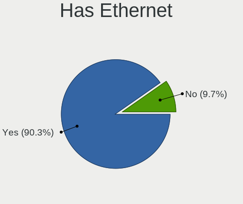
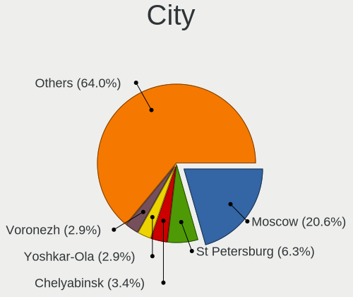
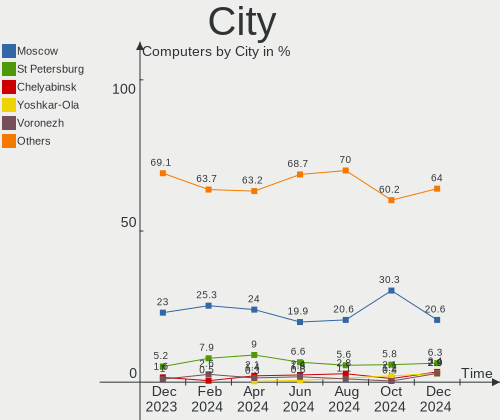
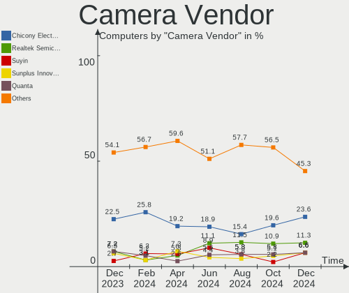

ROSA - Hardware Trends
----------------------

A project to identify most popular hardware characteristics and track their change
over time based on data collected by Linux users at https://Linux-Hardware.org.

Anyone can contribute to this report by the [hw-probe](https://github.com/linuxhw/hw-probe) tool:

    sudo -E hw-probe -all -upload

This is a report for all computer types. See also reports for [desktops](/Dist/ROSA/Desktop/README.md) and [notebooks](/Dist/ROSA/Notebook/README.md).

This report is for one last month. Overall report since the beginning of time: [TestDays](https://github.com/linuxhw/TestDays)

Period: Apr, 2023.

Contents
--------

* [ System ](#system)
  - [ OS                       ](#os)
  - [ OS Family                ](#os-family)
  - [ Kernel                   ](#kernel)
  - [ Kernel Family            ](#kernel-family)
  - [ Kernel Major Ver.        ](#kernel-major-ver)
  - [ Arch                     ](#arch)
  - [ DE                       ](#de)
  - [ Display Server           ](#display-server)
  - [ Display Manager          ](#display-manager)
  - [ OS Lang                  ](#os-lang)
  - [ Boot Mode                ](#boot-mode)
  - [ Filesystem               ](#filesystem)
  - [ Part. scheme             ](#part-scheme)
  - [ Dual Boot with Linux/BSD ](#dual-boot-with-linuxbsd)
  - [ Dual Boot (Win)          ](#dual-boot-win)

* [ Board ](#board)
  - [ Vendor                   ](#vendor)
  - [ Model                    ](#model)
  - [ Model Family             ](#model-family)
  - [ MFG Year                 ](#mfg-year)
  - [ Form Factor              ](#form-factor)
  - [ Secure Boot              ](#secure-boot)
  - [ Coreboot                 ](#coreboot)
  - [ RAM Size                 ](#ram-size)
  - [ RAM Used                 ](#ram-used)
  - [ Total Drives             ](#total-drives)
  - [ Has CD-ROM               ](#has-cd-rom)
  - [ Has Ethernet             ](#has-ethernet)
  - [ Has WiFi                 ](#has-wifi)
  - [ Has Bluetooth            ](#has-bluetooth)

* [ Location ](#location)
  - [ Country                  ](#country)
  - [ City                     ](#city)

* [ Drives ](#drives)
  - [ Drive Vendor             ](#drive-vendor)
  - [ Drive Model              ](#drive-model)
  - [ HDD Vendor               ](#hdd-vendor)
  - [ SSD Vendor               ](#ssd-vendor)
  - [ Drive Kind               ](#drive-kind)
  - [ Drive Connector          ](#drive-connector)
  - [ Drive Size               ](#drive-size)
  - [ Space Total              ](#space-total)
  - [ Space Used               ](#space-used)
  - [ Malfunc. Drives          ](#malfunc-drives)
  - [ Malfunc. Drive Vendor    ](#malfunc-drive-vendor)
  - [ Malfunc. HDD Vendor      ](#malfunc-hdd-vendor)
  - [ Malfunc. Drive Kind      ](#malfunc-drive-kind)
  - [ Failed Drives            ](#failed-drives)
  - [ Failed Drive Vendor      ](#failed-drive-vendor)
  - [ Drive Status             ](#drive-status)

* [ Storage controller ](#storage-controller)
  - [ Storage Vendor           ](#storage-vendor)
  - [ Storage Model            ](#storage-model)
  - [ Storage Kind             ](#storage-kind)

* [ Processor ](#processor)
  - [ CPU Vendor               ](#cpu-vendor)
  - [ CPU Model                ](#cpu-model)
  - [ CPU Model Family         ](#cpu-model-family)
  - [ CPU Cores                ](#cpu-cores)
  - [ CPU Sockets              ](#cpu-sockets)
  - [ CPU Threads              ](#cpu-threads)
  - [ CPU Op-Modes             ](#cpu-op-modes)
  - [ CPU Microcode            ](#cpu-microcode)
  - [ CPU Microarch            ](#cpu-microarch)

* [ Graphics ](#graphics)
  - [ GPU Vendor               ](#gpu-vendor)
  - [ GPU Model                ](#gpu-model)
  - [ GPU Combo                ](#gpu-combo)
  - [ GPU Driver               ](#gpu-driver)
  - [ GPU Memory               ](#gpu-memory)

* [ Monitor ](#monitor)
  - [ Monitor Vendor           ](#monitor-vendor)
  - [ Monitor Model            ](#monitor-model)
  - [ Monitor Resolution       ](#monitor-resolution)
  - [ Monitor Diagonal         ](#monitor-diagonal)
  - [ Monitor Width            ](#monitor-width)
  - [ Aspect Ratio             ](#aspect-ratio)
  - [ Monitor Area             ](#monitor-area)
  - [ Pixel Density            ](#pixel-density)
  - [ Multiple Monitors        ](#multiple-monitors)

* [ Network ](#network)
  - [ Net Controller Vendor    ](#net-controller-vendor)
  - [ Net Controller Model     ](#net-controller-model)
  - [ Wireless Vendor          ](#wireless-vendor)
  - [ Wireless Model           ](#wireless-model)
  - [ Ethernet Vendor          ](#ethernet-vendor)
  - [ Ethernet Model           ](#ethernet-model)
  - [ Net Controller Kind      ](#net-controller-kind)
  - [ Used Controller          ](#used-controller)
  - [ NICs                     ](#nics)
  - [ IPv6                     ](#ipv6)

* [ Bluetooth ](#bluetooth)
  - [ Bluetooth Vendor         ](#bluetooth-vendor)
  - [ Bluetooth Model          ](#bluetooth-model)

* [ Sound ](#sound)
  - [ Sound Vendor             ](#sound-vendor)
  - [ Sound Model              ](#sound-model)

* [ Memory ](#memory)
  - [ Memory Vendor            ](#memory-vendor)
  - [ Memory Model             ](#memory-model)
  - [ Memory Kind              ](#memory-kind)
  - [ Memory Form Factor       ](#memory-form-factor)
  - [ Memory Size              ](#memory-size)
  - [ Memory Speed             ](#memory-speed)

* [ Printers & scanners ](#printers--scanners)
  - [ Printer Vendor           ](#printer-vendor)
  - [ Printer Model            ](#printer-model)
  - [ Scanner Vendor           ](#scanner-vendor)
  - [ Scanner Model            ](#scanner-model)

* [ Camera ](#camera)
  - [ Camera Vendor            ](#camera-vendor)
  - [ Camera Model             ](#camera-model)

* [ Security ](#security)
  - [ Fingerprint Vendor       ](#fingerprint-vendor)
  - [ Fingerprint Model        ](#fingerprint-model)
  - [ Chipcard Vendor          ](#chipcard-vendor)
  - [ Chipcard Model           ](#chipcard-model)

* [ Unsupported ](#unsupported)
  - [ Unsupported Devices      ](#unsupported-devices)
  - [ Unsupported Device Types ](#unsupported-device-types)

System
------

OS
--

Installed operating systems

| Name       | Computers | Percent |
|------------|-----------|---------|
| ROSA 12.4  | 187       | 77.59%  |
| ROSA 12.3  | 20        | 8.3%    |
| ROSA R11.1 | 15        | 6.22%   |
| ROSA 12.2  | 10        | 4.15%   |
| ROSA 12.1  | 6         | 2.49%   |
| ROSA 12    | 2         | 0.83%   |
| ROSA 13.0  | 1         | 0.41%   |

OS Family
---------

OS without a version

| Name | Computers | Percent |
|------|-----------|---------|
| ROSA | 241       | 100%    |

Kernel
------

Version of the Linux kernel

| Version                                   | Computers | Percent |
|-------------------------------------------|-----------|---------|
| 6.1.20-generic-2rosa2021.1-x86_64         | 132       | 54.77%  |
| 5.15.103-generic-1rosa2021.1-x86_64       | 24        | 9.96%   |
| 5.10.74-generic-2rosa2021.1-x86_64        | 14        | 5.81%   |
| 5.15.75-generic-1rosa2021.1-x86_64        | 10        | 4.15%   |
| 5.10.176-generic-1rosa2021.1-x86_64       | 9         | 3.73%   |
| 5.15.79-generic-1rosa2021.1-x86_64        | 5         | 2.07%   |
| 5.15.103-generic-1rosa2021.1-i686         | 5         | 2.07%   |
| 5.10.155-generic-1rosa2021.1-x86_64       | 5         | 2.07%   |
| 6.0.12.xm1-1.klp-xanmod-rosa2021.1-x86_64 | 4         | 1.66%   |
| 5.4.83-generic-2rosa-x86_64               | 4         | 1.66%   |
| 5.4.32-generic-2rosa-x86_64               | 4         | 1.66%   |
| 5.10.74-generic-2rosa2021.1-i586          | 4         | 1.66%   |
| 4.15.0-desktop-122.124.1rosa-x86_64       | 3         | 1.24%   |
| 6.1.20.xm1-1.klp-xanmod-rosa2021.1-x86_64 | 2         | 0.83%   |
| 5.17.11-generic-2rosa2021.1-x86_64        | 2         | 0.83%   |
| 4.9.155-nrj-desktop-1rosa-i586            | 2         | 0.83%   |
| 6.3.0-generic-0.rc6.1rosa2021.1-x86_64    | 1         | 0.41%   |
| 6.2.11.xm1-1.klp-xanmod-rosa2021.1-x86_64 | 1         | 0.41%   |
| 6.1.19-generic-4rosa2023.1-x86_64         | 1         | 0.41%   |
| 6.1.19-generic-1rosa2021.1-x86_64         | 1         | 0.41%   |
| 5.4.150-generic-1rosa2021.1-x86_64        | 1         | 0.41%   |
| 5.15.77-generic-1rosa2021.1-x86_64        | 1         | 0.41%   |
| 5.15.75-generic-1rosa2021.1-i686          | 1         | 0.41%   |
| 5.10.74-generic-2rosa2021.1-arm64         | 1         | 0.41%   |
| 5.10.71-generic-1rosa2021.1-x86_64        | 1         | 0.41%   |
| 5.10.118-generic-2rosa2021.1-i586         | 1         | 0.41%   |
| 4.9.124-nrj-laptop-1rosa-i586             | 1         | 0.41%   |
| 4.15.0-desktop-122.124.1rosa-i586         | 1         | 0.41%   |

Kernel Family
-------------

Linux kernel without a distro release

| Version  | Computers | Percent |
|----------|-----------|---------|
| 6.1.20   | 134       | 55.6%   |
| 5.15.103 | 29        | 12.03%  |
| 5.10.74  | 19        | 7.88%   |
| 5.15.75  | 11        | 4.56%   |
| 5.10.176 | 9         | 3.73%   |
| 5.15.79  | 5         | 2.07%   |
| 5.10.155 | 5         | 2.07%   |
| 6.0.12   | 4         | 1.66%   |
| 5.4.83   | 4         | 1.66%   |
| 5.4.32   | 4         | 1.66%   |
| 4.15.0   | 4         | 1.66%   |
| 6.1.19   | 2         | 0.83%   |
| 5.17.11  | 2         | 0.83%   |
| 4.9.155  | 2         | 0.83%   |
| 6.3.0    | 1         | 0.41%   |
| 6.2.11   | 1         | 0.41%   |
| 5.4.150  | 1         | 0.41%   |
| 5.15.77  | 1         | 0.41%   |
| 5.10.71  | 1         | 0.41%   |
| 5.10.118 | 1         | 0.41%   |
| 4.9.124  | 1         | 0.41%   |

Kernel Major Ver.
-----------------

Linux kernel major version

| Version | Computers | Percent |
|---------|-----------|---------|
| 6.1     | 136       | 56.43%  |
| 5.15    | 46        | 19.09%  |
| 5.10    | 35        | 14.52%  |
| 5.4     | 9         | 3.73%   |
| 6.0     | 4         | 1.66%   |
| 4.15    | 4         | 1.66%   |
| 4.9     | 3         | 1.24%   |
| 5.17    | 2         | 0.83%   |
| 6.3     | 1         | 0.41%   |
| 6.2     | 1         | 0.41%   |

Arch
----

OS architecture (x86_64, i586, etc.)

| Name    | Computers | Percent |
|---------|-----------|---------|
| x86_64  | 225       | 93.36%  |
| i686    | 15        | 6.22%   |
| aarch64 | 1         | 0.41%   |

DE
--

Desktop Environment

| Name  | Computers | Percent |
|-------|-----------|---------|
| KDE5  | 130       | 53.94%  |
| GNOME | 71        | 29.46%  |
| LXQt  | 32        | 13.28%  |
| KDE4  | 6         | 2.49%   |
| MATE  | 1         | 0.41%   |
| LXDE  | 1         | 0.41%   |

Display Server
--------------

X11 or Wayland

| Name    | Computers | Percent |
|---------|-----------|---------|
| Wayland | 187       | 77.59%  |
| X11     | 52        | 21.58%  |
| Tty     | 2         | 0.83%   |

Display Manager
---------------

SDDM, LightDM, etc.

| Name    | Computers | Percent |
|---------|-----------|---------|
| SDDM    | 126       | 52.28%  |
| GDM     | 98        | 40.66%  |
| LightDM | 11        | 4.56%   |
| KDM     | 6         | 2.49%   |

OS Lang
-------

Language

| Lang  | Computers | Percent |
|-------|-----------|---------|
| ru_RU | 203       | 84.23%  |
| en_US | 8         | 3.32%   |
| pl_PL | 5         | 2.07%   |
| es_ES | 4         | 1.66%   |
| pt_BR | 3         | 1.24%   |
| it_IT | 3         | 1.24%   |
| es_MX | 2         | 0.83%   |
| en_GB | 2         | 0.83%   |
| de_DE | 2         | 0.83%   |
| sk_SK | 1         | 0.41%   |
| hu_HU | 1         | 0.41%   |
| hr_HR | 1         | 0.41%   |
| fr_FR | 1         | 0.41%   |
| fr_BE | 1         | 0.41%   |
| es_CO | 1         | 0.41%   |
| es_AR | 1         | 0.41%   |
| cs_CZ | 1         | 0.41%   |
| C     | 1         | 0.41%   |

Boot Mode
---------

EFI or BIOS

| Mode | Computers | Percent |
|------|-----------|---------|
| BIOS | 129       | 53.53%  |
| EFI  | 112       | 46.47%  |

Filesystem
----------

Type of filesystem

| Type  | Computers | Percent |
|-------|-----------|---------|
| Ext4  | 227       | 94.19%  |
| Btrfs | 11        | 4.56%   |
| F2fs  | 2         | 0.83%   |
| Xfs   | 1         | 0.41%   |

Part. scheme
------------

Scheme of partitioning

| Type    | Computers | Percent |
|---------|-----------|---------|
| GPT     | 129       | 53.53%  |
| MBR     | 111       | 46.06%  |
| Unknown | 1         | 0.41%   |

Dual Boot with Linux/BSD
------------------------

Hosting more than one Linux/BSD

| Dual boot | Computers | Percent |
|-----------|-----------|---------|
| No        | 176       | 73.03%  |
| Yes       | 65        | 26.97%  |

Dual Boot (Win)
---------------

Hosting Linux and Windows

| Dual boot | Computers | Percent |
|-----------|-----------|---------|
| No        | 135       | 56.02%  |
| Yes       | 106       | 43.98%  |

Board
-----

Vendor
------

Motherboard manufacturer

| Name                | Computers | Percent |
|---------------------|-----------|---------|
| ASUSTek Computer    | 48        | 19.92%  |
| Gigabyte Technology | 33        | 13.69%  |
| Lenovo              | 22        | 9.13%   |
| Acer                | 21        | 8.71%   |
| Hewlett-Packard     | 20        | 8.3%    |
| ASRock              | 19        | 7.88%   |
| MSI                 | 16        | 6.64%   |
| Dell                | 12        | 4.98%   |
| Samsung Electronics | 5         | 2.07%   |
| Biostar             | 5         | 2.07%   |
| Intel               | 4         | 1.66%   |
| Toshiba             | 3         | 1.24%   |
| ECS                 | 3         | 1.24%   |
| Unknown             | 3         | 1.24%   |
| Sony                | 2         | 0.83%   |
| Huanan              | 2         | 0.83%   |
| Clevo               | 2         | 0.83%   |
| X79P motherboard    | 1         | 0.41%   |
| UMAX                | 1         | 0.41%   |
| Pegatron            | 1         | 0.41%   |
| Notebook            | 1         | 0.41%   |
| Medion              | 1         | 0.41%   |
| MACHINIST           | 1         | 0.41%   |
| khadas              | 1         | 0.41%   |
| Irbis               | 1         | 0.41%   |
| HUAWEI              | 1         | 0.41%   |
| HONOR               | 1         | 0.41%   |
| Haier               | 1         | 0.41%   |
| Gateway             | 1         | 0.41%   |
| Fujitsu Siemens     | 1         | 0.41%   |
| Fujitsu             | 1         | 0.41%   |
| Foxconn             | 1         | 0.41%   |
| F-Plus Mobile       | 1         | 0.41%   |
| EPoX Computer       | 1         | 0.41%   |
| Dinson              | 1         | 0.41%   |
| Digma               | 1         | 0.41%   |
| Aquarius            | 1         | 0.41%   |
| 3Logic Group        | 1         | 0.41%   |

Model
-----

Motherboard model

| Name                                 | Computers | Percent |
|--------------------------------------|-----------|---------|
| Unknown                              | 6         | 2.49%   |
| ASUS All Series                      | 3         | 1.24%   |
| Toshiba Satellite A100               | 2         | 0.83%   |
| Samsung 350V5C/351V5C/3540VC/3440VC  | 2         | 0.83%   |
| MSI MS-7C95                          | 2         | 0.83%   |
| Gigabyte A320M-S2H V2                | 2         | 0.83%   |
| Gigabyte A320M-S2H                   | 2         | 0.83%   |
| Gigabyte A320M-H                     | 2         | 0.83%   |
| Dell Inspiron N5110                  | 2         | 0.83%   |
| ASUS X551CAP                         | 2         | 0.83%   |
| ASUS P5KPL-AM                        | 2         | 0.83%   |
| ASUS 1011PX                          | 2         | 0.83%   |
| ASRock H87 Performance               | 2         | 0.83%   |
| X79P motherboard Socket LGA-2011     | 1         | 0.41%   |
| UMAX VisionBook 15Wg Plus            | 1         | 0.41%   |
| Toshiba Satellite S50-A-K7M          | 1         | 0.41%   |
| Sony VGN-NW24MR                      | 1         | 0.41%   |
| Sony SVE1512K1RW                     | 1         | 0.41%   |
| Samsung R528/R728                    | 1         | 0.41%   |
| Samsung NC110P/NC108P/NC111P         | 1         | 0.41%   |
| Samsung 300E4C/300E5C/300E7C         | 1         | 0.41%   |
| Pegatron Compaq dx2400 Microtower PC | 1         | 0.41%   |
| Notebook W250EGQ / W270EGQ           | 1         | 0.41%   |
| MSI PPPPP-CCC#MMMMMMMM               | 1         | 0.41%   |
| MSI OPTIMUS                          | 1         | 0.41%   |
| MSI MS-7D48                          | 1         | 0.41%   |
| MSI MS-7C90                          | 1         | 0.41%   |
| MSI MS-7C56                          | 1         | 0.41%   |
| MSI MS-7B84                          | 1         | 0.41%   |
| MSI MS-7B79                          | 1         | 0.41%   |
| MSI MS-7A36                          | 1         | 0.41%   |
| MSI MS-7A15                          | 1         | 0.41%   |
| MSI MS-7817                          | 1         | 0.41%   |
| MSI MS-7673                          | 1         | 0.41%   |
| MSI MS-7592                          | 1         | 0.41%   |
| MSI GP60 2OD                         | 1         | 0.41%   |
| MSI GE72 6QC                         | 1         | 0.41%   |
| Medion V20                           | 1         | 0.41%   |
| MACHINIST X99-RS9 V3.1               | 1         | 0.41%   |
| Lenovo Y520-15IKBN 80WK              | 1         | 0.41%   |

Model Family
------------

Motherboard model prefix

| Name                    | Computers | Percent |
|-------------------------|-----------|---------|
| Acer Aspire             | 13        | 5.39%   |
| Lenovo IdeaPad          | 8         | 3.32%   |
| Dell Inspiron           | 6         | 2.49%   |
| Unknown                 | 6         | 2.49%   |
| HP Pavilion             | 5         | 2.07%   |
| HP EliteBook            | 4         | 1.66%   |
| Gigabyte A320M-S2H      | 4         | 1.66%   |
| Toshiba Satellite       | 3         | 1.24%   |
| Lenovo ThinkPad         | 3         | 1.24%   |
| HP ProBook              | 3         | 1.24%   |
| Gigabyte B550           | 3         | 1.24%   |
| ASUS PRIME              | 3         | 1.24%   |
| ASUS P5KPL-AM           | 3         | 1.24%   |
| ASUS All                | 3         | 1.24%   |
| Acer Swift              | 3         | 1.24%   |
| Acer Extensa            | 3         | 1.24%   |
| Samsung 350V5C          | 2         | 0.83%   |
| MSI MS-7C95             | 2         | 0.83%   |
| Lenovo Legion           | 2         | 0.83%   |
| Lenovo B590             | 2         | 0.83%   |
| HP Compaq               | 2         | 0.83%   |
| Gigabyte H310M          | 2         | 0.83%   |
| Gigabyte A320M-H        | 2         | 0.83%   |
| Dell OptiPlex           | 2         | 0.83%   |
| ASUS X551CAP            | 2         | 0.83%   |
| ASUS VivoBook           | 2         | 0.83%   |
| ASUS ROG                | 2         | 0.83%   |
| ASUS P8H61-M            | 2         | 0.83%   |
| ASUS ASUS               | 2         | 0.83%   |
| ASUS 1011PX             | 2         | 0.83%   |
| ASRock H87              | 2         | 0.83%   |
| ASRock H510M-HDV        | 2         | 0.83%   |
| X79P motherboard Socket | 1         | 0.41%   |
| UMAX VisionBook         | 1         | 0.41%   |
| Sony VGN-NW24MR         | 1         | 0.41%   |
| Sony SVE1512K1RW        | 1         | 0.41%   |
| Samsung R528            | 1         | 0.41%   |
| Samsung NC110P          | 1         | 0.41%   |
| Samsung 300E4C          | 1         | 0.41%   |
| Pegatron Compaq         | 1         | 0.41%   |

MFG Year
--------

Motherboard manufacture year

| Year | Computers | Percent |
|------|-----------|---------|
| 2012 | 26        | 10.79%  |
| 2011 | 22        | 9.13%   |
| 2013 | 21        | 8.71%   |
| 2021 | 19        | 7.88%   |
| 2010 | 19        | 7.88%   |
| 2020 | 18        | 7.47%   |
| 2018 | 17        | 7.05%   |
| 2022 | 16        | 6.64%   |
| 2019 | 12        | 4.98%   |
| 2009 | 12        | 4.98%   |
| 2014 | 10        | 4.15%   |
| 2007 | 10        | 4.15%   |
| 2017 | 9         | 3.73%   |
| 2008 | 9         | 3.73%   |
| 2015 | 8         | 3.32%   |
| 2016 | 6         | 2.49%   |
| 2006 | 4         | 1.66%   |
| 2005 | 3         | 1.24%   |

Form Factor
-----------

Physical design of the computer

| Name           | Computers | Percent |
|----------------|-----------|---------|
| Desktop        | 135       | 56.02%  |
| Notebook       | 101       | 41.91%  |
| Convertible    | 3         | 1.24%   |
| System on chip | 1         | 0.41%   |
| All in one     | 1         | 0.41%   |

Secure Boot
-----------

Enabled or disabled

| State    | Computers | Percent |
|----------|-----------|---------|
| Disabled | 241       | 100%    |

Coreboot
--------

Have coreboot on board

| Used | Computers | Percent |
|------|-----------|---------|
| No   | 241       | 100%    |

RAM Size
--------

Total RAM memory

| Size in GB  | Computers | Percent |
|-------------|-----------|---------|
| 3.01-4.0    | 57        | 23.65%  |
| 4.01-8.0    | 55        | 22.82%  |
| 8.01-16.0   | 44        | 18.26%  |
| 16.01-24.0  | 38        | 15.77%  |
| 32.01-64.0  | 12        | 4.98%   |
| 1.01-2.0    | 12        | 4.98%   |
| 2.01-3.0    | 11        | 4.56%   |
| 24.01-32.0  | 8         | 3.32%   |
| 64.01-256.0 | 2         | 0.83%   |
| 0.51-1.0    | 2         | 0.83%   |

RAM Used
--------

Used RAM memory

| Used GB  | Computers | Percent |
|----------|-----------|---------|
| 1.01-2.0 | 120       | 49.79%  |
| 0.51-1.0 | 49        | 20.33%  |
| 2.01-3.0 | 46        | 19.09%  |
| 4.01-8.0 | 15        | 6.22%   |
| 3.01-4.0 | 9         | 3.73%   |
| 0.01-0.5 | 2         | 0.83%   |

Total Drives
------------

Number of drives on board

| Drives | Computers | Percent |
|--------|-----------|---------|
| 1      | 138       | 57.26%  |
| 2      | 63        | 26.14%  |
| 3      | 23        | 9.54%   |
| 4      | 10        | 4.15%   |
| 5      | 5         | 2.07%   |
| 7      | 1         | 0.41%   |
| 0      | 1         | 0.41%   |

Has CD-ROM
----------

Has CD-ROM on board

| Presented | Computers | Percent |
|-----------|-----------|---------|
| No        | 155       | 64.32%  |
| Yes       | 86        | 35.68%  |

Has Ethernet
------------

Has Ethernet on board

| Presented | Computers | Percent |
|-----------|-----------|---------|
| Yes       | 218       | 90.46%  |
| No        | 23        | 9.54%   |

Has WiFi
--------

Has WiFi module

| Presented | Computers | Percent |
|-----------|-----------|---------|
| Yes       | 152       | 63.07%  |
| No        | 89        | 36.93%  |

Has Bluetooth
-------------

Has Bluetooth module

| Presented | Computers | Percent |
|-----------|-----------|---------|
| No        | 136       | 56.43%  |
| Yes       | 105       | 43.57%  |

Location
--------

Country
-------

Geographic location (country)

| Country                | Computers | Percent |
|------------------------|-----------|---------|
| Russia                 | 191       | 79.25%  |
| Germany                | 6         | 2.49%   |
| Poland                 | 5         | 2.07%   |
| Ukraine                | 4         | 1.66%   |
| Belarus                | 4         | 1.66%   |
| Italy                  | 3         | 1.24%   |
| Brazil                 | 3         | 1.24%   |
| Uzbekistan             | 2         | 0.83%   |
| Mexico                 | 2         | 0.83%   |
| Kazakhstan             | 2         | 0.83%   |
| France                 | 2         | 0.83%   |
| Colombia               | 2         | 0.83%   |
| Belgium                | 2         | 0.83%   |
| Venezuela              | 1         | 0.41%   |
| USA                    | 1         | 0.41%   |
| UK                     | 1         | 0.41%   |
| Spain                  | 1         | 0.41%   |
| Slovakia               | 1         | 0.41%   |
| Serbia                 | 1         | 0.41%   |
| Israel                 | 1         | 0.41%   |
| Iran                   | 1         | 0.41%   |
| Hungary                | 1         | 0.41%   |
| Czechia                | 1         | 0.41%   |
| Croatia                | 1         | 0.41%   |
| Bosnia and Herzegovina | 1         | 0.41%   |
| Argentina              | 1         | 0.41%   |

City
----

Geographic location (city)

| City              | Computers | Percent |
|-------------------|-----------|---------|
| Moscow            | 31        | 12.86%  |
| St Petersburg     | 16        | 6.64%   |
| Krasnodar         | 9         | 3.73%   |
| Yekaterinburg     | 7         | 2.9%    |
| Novosibirsk       | 7         | 2.9%    |
| Chelyabinsk       | 5         | 2.07%   |
| Voronezh          | 4         | 1.66%   |
| Samara            | 4         | 1.66%   |
| Rostov-on-Don     | 4         | 1.66%   |
| Ufa               | 3         | 1.24%   |
| Tambov            | 3         | 1.24%   |
| Rio de Janeiro    | 3         | 1.24%   |
| Omsk              | 3         | 1.24%   |
| Murmansk          | 3         | 1.24%   |
| Kumertau          | 3         | 1.24%   |
| Krasnoyarsk       | 3         | 1.24%   |
| Volgograd         | 2         | 0.83%   |
| Ulyanovsk         | 2         | 0.83%   |
| Tolyatti          | 2         | 0.83%   |
| Taskino           | 2         | 0.83%   |
| Tashkent          | 2         | 0.83%   |
| Saratov           | 2         | 0.83%   |
| Poznan            | 2         | 0.83%   |
| Perm              | 2         | 0.83%   |
| Mytishchi         | 2         | 0.83%   |
| Miass             | 2         | 0.83%   |
| Frankfurt am Main | 2         | 0.83%   |
| Bogotá           | 2         | 0.83%   |
| Belgorod          | 2         | 0.83%   |
| Barnaul           | 2         | 0.83%   |
| Zvenigorod        | 1         | 0.41%   |
| Zlatoust          | 1         | 0.41%   |
| Zhukovskiy        | 1         | 0.41%   |
| Zernograd         | 1         | 0.41%   |
| Yoshkar-Ola       | 1         | 0.41%   |
| Yelizovo          | 1         | 0.41%   |
| Yartsevo          | 1         | 0.41%   |
| Yaroslavl         | 1         | 0.41%   |
| Yakutsk           | 1         | 0.41%   |
| Vologda           | 1         | 0.41%   |

Drives
------

Drive Vendor
------------

Hard drive vendors

| Vendor              | Computers | Drives | Percent |
|---------------------|-----------|--------|---------|
| WDC                 | 72        | 88     | 19.73%  |
| Seagate             | 51        | 60     | 13.97%  |
| Samsung Electronics | 33        | 38     | 9.04%   |
| Kingston            | 24        | 27     | 6.58%   |
| Hitachi             | 21        | 22     | 5.75%   |
| Toshiba             | 14        | 14     | 3.84%   |
| China               | 12        | 12     | 3.29%   |
| Crucial             | 10        | 10     | 2.74%   |
| Unknown             | 9         | 9      | 2.47%   |
| HGST                | 9         | 9      | 2.47%   |
| SK hynix            | 8         | 8      | 2.19%   |
| SanDisk             | 8         | 8      | 2.19%   |
| KingSpec            | 6         | 6      | 1.64%   |
| Apacer              | 6         | 6      | 1.64%   |
| A-DATA Technology   | 6         | 7      | 1.64%   |
| Intel               | 5         | 5      | 1.37%   |
| Unknown             | 5         | 5      | 1.37%   |
| SPCC                | 4         | 4      | 1.1%    |
| Smartbuy            | 4         | 4      | 1.1%    |
| XPG                 | 3         | 3      | 0.82%   |
| Gigabyte Technology | 3         | 3      | 0.82%   |
| Digma               | 3         | 3      | 0.82%   |
| AMD                 | 3         | 3      | 0.82%   |
| XrayDisk            | 2         | 2      | 0.55%   |
| Transcend           | 2         | 2      | 0.55%   |
| Silicon Motion      | 2         | 2      | 0.55%   |
| Phison              | 2         | 2      | 0.55%   |
| Patriot             | 2         | 2      | 0.55%   |
| Netac               | 2         | 2      | 0.55%   |
| KIOXIA              | 2         | 2      | 0.55%   |
| KingDian            | 2         | 2      | 0.55%   |
| JMicron Technology  | 2         | 2      | 0.55%   |
| Hewlett-Packard     | 2         | 2      | 0.55%   |
| Fujitsu             | 2         | 2      | 0.55%   |
| Azerty              | 2         | 2      | 0.55%   |
| Wicgtyp             | 1         | 1      | 0.27%   |
| Verbatim            | 1         | 1      | 0.27%   |
| UMAX                | 1         | 1      | 0.27%   |
| TAMMUZ              | 1         | 2      | 0.27%   |
| Reletech            | 1         | 1      | 0.27%   |

Drive Model
-----------

Hard drive models

| Model                            | Computers | Percent |
|----------------------------------|-----------|---------|
| Kingston SA400S37240G 240GB SSD  | 6         | 1.5%    |
| WDC WD10EZEX-08WN4A0 1TB         | 5         | 1.25%   |
| Unknown                          | 5         | 1.25%   |
| Seagate ST1000DM010-2EP102 1TB   | 4         | 1%      |
| Kingston SA400S37480G 480GB SSD  | 4         | 1%      |
| Crucial CT240BX500SSD1 240GB     | 4         | 1%      |
| WDC WDS500G2B0A-00SM50 500GB SSD | 3         | 0.75%   |
| WDC WDS120G2G0A-00JH30 120GB SSD | 3         | 0.75%   |
| Toshiba MQ01ABD100 1TB           | 3         | 0.75%   |
| Seagate ST9500325AS 500GB        | 3         | 0.75%   |
| Seagate ST3500418AS 500GB        | 3         | 0.75%   |
| Samsung SSD 980 PRO 250GB        | 3         | 0.75%   |
| Samsung HM321HI 320GB            | 3         | 0.75%   |
| Kingston SA400S37120G 120GB SSD  | 3         | 0.75%   |
| HGST HTS545050A7E680 500GB       | 3         | 0.75%   |
| China 120GB SSD                  | 3         | 0.75%   |
| XPG GAMMIX S11 Pro 1TB           | 2         | 0.5%    |
| WDC WDS240G2G0A-00JH30 240GB SSD | 2         | 0.5%    |
| WDC WD5000LPLX-75ZNTT0 500GB     | 2         | 0.5%    |
| WDC WD5000AAKX-00ERMA0 500GB     | 2         | 0.5%    |
| WDC WD2500AAKX-00ERMA0 250GB     | 2         | 0.5%    |
| WDC WD20EZBX-00AYRA0 2TB         | 2         | 0.5%    |
| WDC WD10EZRZ-00HTKB0 1TB         | 2         | 0.5%    |
| WDC WD10EZEX-00BBHA0 1TB         | 2         | 0.5%    |
| Unknown NVMe SSD Drive 256GB     | 2         | 0.5%    |
| Toshiba MQ04ABF100 1TB           | 2         | 0.5%    |
| Toshiba DT01ACA050 500GB         | 2         | 0.5%    |
| SPCC Solid State Disk 256GB      | 2         | 0.5%    |
| Seagate ST500LT012-1DG142 500GB  | 2         | 0.5%    |
| Seagate ST3250824AS 250GB        | 2         | 0.5%    |
| Seagate ST3250310AS 250GB        | 2         | 0.5%    |
| Seagate ST250DM000-1BD141 250GB  | 2         | 0.5%    |
| Seagate ST2000DM008-2UB102 2TB   | 2         | 0.5%    |
| Seagate ST1000LM035-1RK172 970GB | 2         | 0.5%    |
| Seagate ST1000DM003-1ER162 1TB   | 2         | 0.5%    |
| Samsung SSD 970 EVO Plus 1TB     | 2         | 0.5%    |
| Samsung SSD 860 EVO 500GB        | 2         | 0.5%    |
| Samsung SSD 750 EVO 250GB        | 2         | 0.5%    |
| Kingston SNVS500G 500GB          | 2         | 0.5%    |
| JMicron Generic 1TB              | 2         | 0.5%    |

HDD Vendor
----------

Hard disk drive vendors

| Vendor              | Computers | Drives | Percent |
|---------------------|-----------|--------|---------|
| WDC                 | 61        | 70     | 36.09%  |
| Seagate             | 51        | 60     | 30.18%  |
| Hitachi             | 21        | 22     | 12.43%  |
| Toshiba             | 12        | 12     | 7.1%    |
| HGST                | 9         | 9      | 5.33%   |
| Samsung Electronics | 8         | 9      | 4.73%   |
| JMicron Technology  | 2         | 2      | 1.18%   |
| Fujitsu             | 2         | 2      | 1.18%   |
| Unknown             | 1         | 1      | 0.59%   |
| Maxtor              | 1         | 1      | 0.59%   |
| ASMT                | 1         | 2      | 0.59%   |

SSD Vendor
----------

Solid state drive vendors

| Vendor              | Computers | Drives | Percent |
|---------------------|-----------|--------|---------|
| Kingston            | 17        | 19     | 12.69%  |
| Samsung Electronics | 13        | 13     | 9.7%    |
| China               | 11        | 11     | 8.21%   |
| WDC                 | 10        | 10     | 7.46%   |
| Crucial             | 10        | 10     | 7.46%   |
| SanDisk             | 6         | 6      | 4.48%   |
| KingSpec            | 6         | 6      | 4.48%   |
| A-DATA Technology   | 5         | 5      | 3.73%   |
| SPCC                | 4         | 4      | 2.99%   |
| Smartbuy            | 4         | 4      | 2.99%   |
| Apacer              | 4         | 4      | 2.99%   |
| SK hynix            | 3         | 3      | 2.24%   |
| Intel               | 3         | 3      | 2.24%   |
| Gigabyte Technology | 3         | 3      | 2.24%   |
| Digma               | 3         | 3      | 2.24%   |
| XrayDisk            | 2         | 2      | 1.49%   |
| Transcend           | 2         | 2      | 1.49%   |
| Patriot             | 2         | 2      | 1.49%   |
| Netac               | 2         | 2      | 1.49%   |
| KingDian            | 2         | 2      | 1.49%   |
| Azerty              | 2         | 2      | 1.49%   |
| AMD                 | 2         | 2      | 1.49%   |
| Unknown             | 2         | 2      | 1.49%   |
| Wicgtyp             | 1         | 1      | 0.75%   |
| Verbatim            | 1         | 1      | 0.75%   |
| UMAX                | 1         | 1      | 0.75%   |
| Toshiba             | 1         | 1      | 0.75%   |
| TAMMUZ              | 1         | 2      | 0.75%   |
| PNY                 | 1         | 1      | 0.75%   |
| Plextor             | 1         | 1      | 0.75%   |
| Pioneer             | 1         | 1      | 0.75%   |
| Palit               | 1         | 1      | 0.75%   |
| Neo                 | 1         | 1      | 0.75%   |
| Mushkin             | 1         | 1      | 0.75%   |
| Intenso             | 1         | 1      | 0.75%   |
| HS-SSD-E100         | 1         | 1      | 0.75%   |
| Hewlett-Packard     | 1         | 1      | 0.75%   |
| GOODRAM             | 1         | 1      | 0.75%   |
| ExeGate             | 1         | 1      | 0.75%   |

Drive Kind
----------

HDD or SSD

| Kind | Computers | Drives | Percent |
|------|-----------|--------|---------|
| HDD  | 145       | 190    | 43.94%  |
| SSD  | 117       | 137    | 35.45%  |
| NVMe | 59        | 66     | 17.88%  |
| MMC  | 9         | 9      | 2.73%   |

Drive Connector
---------------

SATA, SAS, NVMe, etc.

| Type | Computers | Drives | Percent |
|------|-----------|--------|---------|
| SATA | 204       | 319    | 73.12%  |
| NVMe | 59        | 66     | 21.15%  |
| MMC  | 9         | 9      | 3.23%   |
| SAS  | 7         | 8      | 2.51%   |

Drive Size
----------

Size of hard drive

| Size in TB | Computers | Drives | Percent |
|------------|-----------|--------|---------|
| 0.01-0.5   | 175       | 235    | 68.63%  |
| 0.51-1.0   | 59        | 71     | 23.14%  |
| 1.01-2.0   | 14        | 14     | 5.49%   |
| 3.01-4.0   | 4         | 4      | 1.57%   |
| 2.01-3.0   | 2         | 2      | 0.78%   |
| 4.01-10.0  | 1         | 1      | 0.39%   |

Space Total
-----------

Amount of disk space available on the file system

| Size in GB     | Computers | Percent |
|----------------|-----------|---------|
| 101-250        | 83        | 34.44%  |
| 251-500        | 49        | 20.33%  |
| 501-1000       | 30        | 12.45%  |
| 1-20           | 23        | 9.54%   |
| 51-100         | 21        | 8.71%   |
| 21-50          | 12        | 4.98%   |
| 1001-2000      | 10        | 4.15%   |
| 2001-3000      | 8         | 3.32%   |
| More than 3000 | 5         | 2.07%   |

Space Used
----------

Amount of used disk space

| Used GB   | Computers | Percent |
|-----------|-----------|---------|
| 1-20      | 139       | 57.68%  |
| 21-50     | 30        | 12.45%  |
| 51-100    | 23        | 9.54%   |
| 101-250   | 21        | 8.71%   |
| 251-500   | 15        | 6.22%   |
| 1001-2000 | 6         | 2.49%   |
| 501-1000  | 4         | 1.66%   |
| 2001-3000 | 3         | 1.24%   |

Malfunc. Drives
---------------

Drive models with a malfunction

| Model                               | Computers | Drives | Percent |
|-------------------------------------|-----------|--------|---------|
| Seagate ST9500325AS 500GB           | 3         | 3      | 3.37%   |
| Seagate ST3500418AS 500GB           | 3         | 3      | 3.37%   |
| HGST HTS545050A7E680 500GB          | 3         | 3      | 3.37%   |
| Toshiba MQ01ABD100 1TB              | 2         | 2      | 2.25%   |
| Seagate ST3250824AS 250GB           | 2         | 2      | 2.25%   |
| Seagate ST3250310AS 250GB           | 2         | 2      | 2.25%   |
| Samsung Electronics HM321HI 320GB   | 2         | 2      | 2.25%   |
| Hitachi HDS721050CLA660 500GB       | 2         | 2      | 2.25%   |
| WDC WD7500BPVT-00HXZT3 752GB        | 1         | 1      | 1.12%   |
| WDC WD5000LPVX-22V0TT0 500GB        | 1         | 1      | 1.12%   |
| WDC WD5000LPVT-00FMCT0 500GB        | 1         | 1      | 1.12%   |
| WDC WD5000BPVT-24HXZT3 500GB        | 1         | 1      | 1.12%   |
| WDC WD5000AAKX-083CA1 500GB         | 1         | 1      | 1.12%   |
| WDC WD5000AAKX-001CA0 500GB         | 1         | 1      | 1.12%   |
| WDC WD5000AAKS-007AA0 500GB         | 1         | 1      | 1.12%   |
| WDC WD3200BPVT-22ZEST0 320GB        | 1         | 1      | 1.12%   |
| WDC WD3200BPVT-00JJ5T0 320GB        | 1         | 1      | 1.12%   |
| WDC WD3200BEVT-00A0RT0 320GB        | 1         | 1      | 1.12%   |
| WDC WD3200AAKX-001CA0 320GB         | 1         | 1      | 1.12%   |
| WDC WD3200AAKS-75L9A0 320GB         | 1         | 1      | 1.12%   |
| WDC WD3200AAJS-00YZCA0 320GB        | 1         | 1      | 1.12%   |
| WDC WD2500JS-00NCB1 250GB           | 1         | 1      | 1.12%   |
| WDC WD2500BEVT-60ZCT1 250GB         | 1         | 1      | 1.12%   |
| WDC WD20EZRX-00DC0B0 2TB            | 1         | 1      | 1.12%   |
| WDC WD20EARS-00S8B1 2TB             | 1         | 1      | 1.12%   |
| WDC WD1600AAJS-00L7A0 160GB         | 1         | 1      | 1.12%   |
| WDC WD15EARS-22MVWB0 1TB            | 1         | 1      | 1.12%   |
| WDC WD10JPVX-08JC3T5 1TB            | 1         | 1      | 1.12%   |
| WDC WD10EZEX-00MFCA0 1TB            | 1         | 1      | 1.12%   |
| Toshiba MQ04ABF100 1TB              | 1         | 1      | 1.12%   |
| Toshiba MK2046GSX 200GB             | 1         | 1      | 1.12%   |
| Toshiba HDWD105 500GB               | 1         | 1      | 1.12%   |
| SK hynix SH920 2.5 7MM 512GB SSD    | 1         | 1      | 1.12%   |
| Seagate ST9250315AS 250GB           | 1         | 1      | 1.12%   |
| Seagate ST9160827AS 160GB           | 1         | 1      | 1.12%   |
| Seagate ST750LM022 HN-M750MBB 752GB | 1         | 1      | 1.12%   |
| Seagate ST500LT012-9WS142 500GB     | 1         | 1      | 1.12%   |
| Seagate ST500LT012-1DG142 500GB     | 1         | 1      | 1.12%   |
| Seagate ST500DM002-1BD142 500GB     | 1         | 1      | 1.12%   |
| Seagate ST3640323AS 640GB           | 1         | 1      | 1.12%   |

Malfunc. Drive Vendor
---------------------

Vendors of faulty drives

| Vendor              | Computers | Drives | Percent |
|---------------------|-----------|--------|---------|
| Seagate             | 24        | 24     | 26.97%  |
| WDC                 | 21        | 21     | 23.6%   |
| Hitachi             | 12        | 12     | 13.48%  |
| Samsung Electronics | 6         | 6      | 6.74%   |
| Toshiba             | 5         | 5      | 5.62%   |
| HGST                | 4         | 4      | 4.49%   |
| KingSpec            | 3         | 3      | 3.37%   |
| SanDisk             | 2         | 2      | 2.25%   |
| Apacer              | 2         | 2      | 2.25%   |
| SK hynix            | 1         | 1      | 1.12%   |
| PNY                 | 1         | 1      | 1.12%   |
| Netac               | 1         | 1      | 1.12%   |
| Neo                 | 1         | 1      | 1.12%   |
| Kingston            | 1         | 1      | 1.12%   |
| KingDian            | 1         | 1      | 1.12%   |
| Intel               | 1         | 1      | 1.12%   |
| Fujitsu             | 1         | 1      | 1.12%   |
| Azerty              | 1         | 1      | 1.12%   |
| AMD                 | 1         | 1      | 1.12%   |

Malfunc. HDD Vendor
-------------------

Vendors of faulty HDD drives

| Vendor              | Computers | Drives | Percent |
|---------------------|-----------|--------|---------|
| Seagate             | 24        | 24     | 33.33%  |
| WDC                 | 21        | 21     | 29.17%  |
| Hitachi             | 12        | 12     | 16.67%  |
| Toshiba             | 5         | 5      | 6.94%   |
| Samsung Electronics | 5         | 5      | 6.94%   |
| HGST                | 4         | 4      | 5.56%   |
| Fujitsu             | 1         | 1      | 1.39%   |

Malfunc. Drive Kind
-------------------

Kinds of faulty drives

| Kind | Computers | Drives | Percent |
|------|-----------|--------|---------|
| HDD  | 64        | 72     | 80%     |
| SSD  | 14        | 15     | 17.5%   |
| NVMe | 2         | 2      | 2.5%    |

Failed Drives
-------------

Failed drive models

| Model                               | Computers | Drives | Percent |
|-------------------------------------|-----------|--------|---------|
| Seagate ST320LM001 HN-M320MBB 320GB | 1         | 1      | 100%    |

Failed Drive Vendor
-------------------

Failed drive vendors

| Vendor  | Computers | Drives | Percent |
|---------|-----------|--------|---------|
| Seagate | 1         | 1      | 100%    |

Drive Status
------------

Number of failed and malfunc. drives

| Status   | Computers | Drives | Percent |
|----------|-----------|--------|---------|
| Works    | 191       | 292    | 66.55%  |
| Malfunc  | 76        | 89     | 26.48%  |
| Detected | 19        | 20     | 6.62%   |
| Failed   | 1         | 1      | 0.35%   |

Storage controller
------------------

Storage Vendor
--------------

Storage controller vendors

| Vendor                       | Computers | Percent |
|------------------------------|-----------|---------|
| Intel                        | 159       | 53.54%  |
| AMD                          | 58        | 19.53%  |
| Samsung Electronics          | 15        | 5.05%   |
| Nvidia                       | 11        | 3.7%    |
| SanDisk                      | 9         | 3.03%   |
| Kingston Technology Company  | 8         | 2.69%   |
| SK hynix                     | 5         | 1.68%   |
| Silicon Motion               | 5         | 1.68%   |
| Phison Electronics           | 5         | 1.68%   |
| JMicron Technology           | 4         | 1.35%   |
| ASMedia Technology           | 4         | 1.35%   |
| ADATA Technology             | 4         | 1.35%   |
| MAXIO Technology (Hangzhou)  | 3         | 1.01%   |
| Toshiba America Info Systems | 2         | 0.67%   |
| Netac Technology             | 2         | 0.67%   |
| Shenzhen Longsys Electronics | 1         | 0.34%   |
| Realtek Semiconductor        | 1         | 0.34%   |
| KIOXIA                       | 1         | 0.34%   |

Storage Model
-------------

Storage controller models

| Model                                                                                   | Computers | Percent |
|-----------------------------------------------------------------------------------------|-----------|---------|
| AMD FCH SATA Controller [AHCI mode]                                                     | 31        | 8.42%   |
| Intel 7 Series Chipset Family 6-port SATA Controller [AHCI mode]                        | 19        | 5.16%   |
| Intel 8 Series/C220 Series Chipset Family 6-port SATA Controller 1 [AHCI mode]          | 15        | 4.08%   |
| Intel NM10/ICH7 Family SATA Controller [IDE mode]                                       | 11        | 2.99%   |
| AMD SB7x0/SB8x0/SB9x0 IDE Controller                                                    | 10        | 2.72%   |
| AMD 500 Series Chipset SATA Controller                                                  | 10        | 2.72%   |
| Intel 6 Series/C200 Series Chipset Family 6 port Desktop SATA AHCI Controller           | 9         | 2.45%   |
| Intel 82801G (ICH7 Family) IDE Controller                                               | 7         | 1.9%    |
| AMD SB7x0/SB8x0/SB9x0 SATA Controller [AHCI mode]                                       | 7         | 1.9%    |
| AMD FCH SATA Controller D                                                               | 7         | 1.9%    |
| Samsung NVMe SSD Controller SM981/PM981/PM983                                           | 6         | 1.63%   |
| Nvidia MCP61 SATA Controller                                                            | 6         | 1.63%   |
| Intel Celeron/Pentium Silver Processor SATA Controller                                  | 6         | 1.63%   |
| Intel 82801HM/HEM (ICH8M/ICH8M-E) IDE Controller                                        | 6         | 1.63%   |
| Intel 6 Series/C200 Series Chipset Family Desktop SATA Controller (IDE mode, ports 4-5) | 6         | 1.63%   |
| Intel 6 Series/C200 Series Chipset Family Desktop SATA Controller (IDE mode, ports 0-3) | 6         | 1.63%   |
| Intel 6 Series/C200 Series Chipset Family 6 port Mobile SATA AHCI Controller            | 6         | 1.63%   |
| Silicon Motion SM2263EN/SM2263XT SSD Controller                                         | 5         | 1.36%   |
| Samsung NVMe SSD Controller PM9A1/PM9A3/980PRO                                          | 5         | 1.36%   |
| Nvidia MCP61 IDE                                                                        | 5         | 1.36%   |
| Intel NM10/ICH7 Family SATA Controller [AHCI mode]                                      | 5         | 1.36%   |
| Intel Cannon Lake PCH SATA AHCI Controller                                              | 5         | 1.36%   |
| Intel 82801IBM/IEM (ICH9M/ICH9M-E) 4 port SATA Controller [AHCI mode]                   | 5         | 1.36%   |
| Intel 82801HM/HEM (ICH8M/ICH8M-E) SATA Controller [AHCI mode]                           | 5         | 1.36%   |
| AMD SB7x0/SB8x0/SB9x0 SATA Controller [IDE mode]                                        | 5         | 1.36%   |
| AMD 400 Series Chipset SATA Controller                                                  | 5         | 1.36%   |
| SanDisk WD Blue SN550 NVMe SSD                                                          | 4         | 1.09%   |
| Intel Sunrise Point-LP SATA Controller [AHCI mode]                                      | 4         | 1.09%   |
| Intel 7 Series/C210 Series Chipset Family 6-port SATA Controller [AHCI mode]            | 4         | 1.09%   |
| Intel 500 Series Chipset Family SATA AHCI Controller                                    | 4         | 1.09%   |
| Intel 200 Series PCH SATA controller [AHCI mode]                                        | 4         | 1.09%   |
| ASMedia ASM1062 Serial ATA Controller                                                   | 4         | 1.09%   |
| ADATA XPG SX8200 Pro PCIe Gen3x4 M.2 2280 Solid State Drive                             | 4         | 1.09%   |
| Phison E12 NVMe Controller                                                              | 3         | 0.82%   |
| MAXIO (Hangzhou) NVMe SSD Controller MAP1202                                            | 3         | 0.82%   |
| Intel Q170/Q150/B150/H170/H110/Z170/CM236 Chipset SATA Controller [AHCI Mode]           | 3         | 0.82%   |
| Intel HM170/QM170 Chipset SATA Controller [AHCI Mode]                                   | 3         | 0.82%   |
| Intel Atom/Celeron/Pentium Processor x5-E8000/J3xxx/N3xxx Series SATA Controller        | 3         | 0.82%   |
| Intel 82801I (ICH9 Family) 2 port SATA Controller [IDE mode]                            | 3         | 0.82%   |
| Intel 82801 Mobile SATA Controller [RAID mode]                                          | 3         | 0.82%   |

Storage Kind
------------

Kind of storage controller (IDE, SATA, NVMe, SAS, ...)

| Kind | Computers | Percent |
|------|-----------|---------|
| SATA | 184       | 59.55%  |
| IDE  | 62        | 20.06%  |
| NVMe | 58        | 18.77%  |
| RAID | 5         | 1.62%   |

Processor
---------

CPU Vendor
----------

Processor vendors

| Vendor | Computers | Percent |
|--------|-----------|---------|
| Intel  | 163       | 67.63%  |
| AMD    | 77        | 31.95%  |
| ARM    | 1         | 0.41%   |

CPU Model
---------

Processor models

| Model                                         | Computers | Percent |
|-----------------------------------------------|-----------|---------|
| Intel Core i5-2400 CPU @ 3.10GHz              | 3         | 1.24%   |
| Intel Celeron N4020 CPU @ 1.10GHz             | 3         | 1.24%   |
| AMD Ryzen 5 5600X 6-Core Processor            | 3         | 1.24%   |
| AMD Ryzen 5 5600G with Radeon Graphics        | 3         | 1.24%   |
| AMD Athlon II X2 250 Processor                | 3         | 1.24%   |
| Intel Xeon CPU E5-2640 0 @ 2.50GHz            | 2         | 0.83%   |
| Intel Pentium Silver N6000 @ 1.10GHz          | 2         | 0.83%   |
| Intel Pentium Dual CPU E2180 @ 2.00GHz        | 2         | 0.83%   |
| Intel Core i7-3630QM CPU @ 2.40GHz            | 2         | 0.83%   |
| Intel Core i5-4460 CPU @ 3.20GHz              | 2         | 0.83%   |
| Intel Core i5-3570 CPU @ 3.40GHz              | 2         | 0.83%   |
| Intel Core i5-3230M CPU @ 2.60GHz             | 2         | 0.83%   |
| Intel Core i5-3210M CPU @ 2.50GHz             | 2         | 0.83%   |
| Intel Core i5-10500H CPU @ 2.50GHz            | 2         | 0.83%   |
| Intel Core i5-10400F CPU @ 2.90GHz            | 2         | 0.83%   |
| Intel Core i3-6100U CPU @ 2.30GHz             | 2         | 0.83%   |
| Intel Core i3-3220 CPU @ 3.30GHz              | 2         | 0.83%   |
| Intel Core i3-3120M CPU @ 2.50GHz             | 2         | 0.83%   |
| Intel Core i3-3110M CPU @ 2.40GHz             | 2         | 0.83%   |
| Intel Core i3-2350M CPU @ 2.30GHz             | 2         | 0.83%   |
| Intel Core i3 CPU 550 @ 3.20GHz               | 2         | 0.83%   |
| Intel Core 2 Duo CPU P7350 @ 2.00GHz          | 2         | 0.83%   |
| Intel Core 2 Duo CPU E6750 @ 2.66GHz          | 2         | 0.83%   |
| Intel Celeron CPU N3060 @ 1.60GHz             | 2         | 0.83%   |
| Intel Celeron CPU E3400 @ 2.60GHz             | 2         | 0.83%   |
| Intel Atom CPU N570 @ 1.66GHz                 | 2         | 0.83%   |
| AMD Ryzen 7 5700G with Radeon Graphics        | 2         | 0.83%   |
| AMD Ryzen 7 4800H with Radeon Graphics        | 2         | 0.83%   |
| AMD Ryzen 7 2700 Eight-Core Processor         | 2         | 0.83%   |
| AMD Ryzen 5 4600H with Radeon Graphics        | 2         | 0.83%   |
| AMD Ryzen 5 3600 6-Core Processor             | 2         | 0.83%   |
| AMD Ryzen 3 3200G with Radeon Vega Graphics   | 2         | 0.83%   |
| AMD FX-4300 Quad-Core Processor               | 2         | 0.83%   |
| AMD A8-7600 Radeon R7, 10 Compute Cores 4C+6G | 2         | 0.83%   |
| Intel Xeon CPU L5420 @ 2.50GHz                | 1         | 0.41%   |
| Intel Xeon CPU E5620 @ 2.40GHz                | 1         | 0.41%   |
| Intel Xeon CPU E5-2690 0 @ 2.90GHz            | 1         | 0.41%   |
| Intel Xeon CPU E5-2678 v3 @ 2.50GHz           | 1         | 0.41%   |
| Intel Xeon CPU E5-2666 v3 @ 2.90GHz           | 1         | 0.41%   |
| Intel Xeon CPU E5-2640 v3 @ 2.60GHz           | 1         | 0.41%   |

CPU Model Family
----------------

Processor model prefix

| Model                   | Computers | Percent |
|-------------------------|-----------|---------|
| Intel Core i5           | 45        | 18.67%  |
| Intel Core i3           | 26        | 10.79%  |
| AMD Ryzen 5             | 22        | 9.13%   |
| Intel Celeron           | 17        | 7.05%   |
| Intel Core i7           | 16        | 6.64%   |
| Intel Core 2 Duo        | 15        | 6.22%   |
| AMD Ryzen 7             | 12        | 4.98%   |
| Intel Pentium           | 10        | 4.15%   |
| Intel Xeon              | 9         | 3.73%   |
| AMD FX                  | 8         | 3.32%   |
| Intel Atom              | 5         | 2.07%   |
| AMD Ryzen 3             | 5         | 2.07%   |
| AMD Athlon II X2        | 4         | 1.66%   |
| AMD Athlon 64 X2        | 4         | 1.66%   |
| AMD A8                  | 4         | 1.66%   |
| Other                   | 3         | 1.24%   |
| Intel Pentium Silver    | 3         | 1.24%   |
| Intel Core 2 Quad       | 3         | 1.24%   |
| Intel Celeron Dual-Core | 3         | 1.24%   |
| Intel Pentium M         | 2         | 0.83%   |
| Intel Pentium Dual-Core | 2         | 0.83%   |
| Intel Pentium Dual      | 2         | 0.83%   |
| AMD Ryzen 5 PRO         | 2         | 0.83%   |
| AMD Phenom II X4        | 2         | 0.83%   |
| AMD Athlon II X4        | 2         | 0.83%   |
| Intel Pentium Gold      | 1         | 0.41%   |
| Intel Core Duo          | 1         | 0.41%   |
| Intel Core 2            | 1         | 0.41%   |
| AMD Turion 64 X2 Mobile | 1         | 0.41%   |
| AMD Sempron             | 1         | 0.41%   |
| AMD Ryzen 9             | 1         | 0.41%   |
| AMD Ryzen 3 PRO         | 1         | 0.41%   |
| AMD Phenom II X6        | 1         | 0.41%   |
| AMD Phenom              | 1         | 0.41%   |
| AMD E1                  | 1         | 0.41%   |
| AMD Athlon II Neo       | 1         | 0.41%   |
| AMD Athlon II Dual-Core | 1         | 0.41%   |
| AMD Athlon 64           | 1         | 0.41%   |
| AMD Athlon              | 1         | 0.41%   |
| AMD A4                  | 1         | 0.41%   |

CPU Cores
---------

Number of processor cores

| Number | Computers | Percent |
|--------|-----------|---------|
| 2      | 114       | 47.3%   |
| 4      | 68        | 28.22%  |
| 6      | 34        | 14.11%  |
| 8      | 12        | 4.98%   |
| 1      | 8         | 3.32%   |
| 3      | 2         | 0.83%   |
| 24     | 1         | 0.41%   |
| 16     | 1         | 0.41%   |
| 10     | 1         | 0.41%   |

CPU Sockets
-----------

Number of sockets

| Number | Computers | Percent |
|--------|-----------|---------|
| 1      | 240       | 99.59%  |
| 2      | 1         | 0.41%   |

CPU Threads
-----------

Threads per core (Hyper-Threading)

| Number | Computers | Percent |
|--------|-----------|---------|
| 2      | 128       | 53.11%  |
| 1      | 113       | 46.89%  |

CPU Op-Modes
------------

CPU Operation Modes (32-bit, 64-bit)

| Op mode        | Computers | Percent |
|----------------|-----------|---------|
| 32-bit, 64-bit | 238       | 98.76%  |
| 32-bit         | 3         | 1.24%   |

CPU Microcode
-------------

Microcode number

| Number     | Computers | Percent |
|------------|-----------|---------|
| 0x306a9    | 25        | 10.37%  |
| 0x206a7    | 18        | 7.47%   |
| 0x306c3    | 15        | 6.22%   |
| Unknown    | 15        | 6.22%   |
| 0x1067a    | 13        | 5.39%   |
| 0x6fd      | 8         | 3.32%   |
| 0x906e9    | 6         | 2.49%   |
| 0xa0653    | 5         | 2.07%   |
| 0x6fb      | 5         | 2.07%   |
| 0x0800820d | 5         | 2.07%   |
| 0x906ea    | 4         | 1.66%   |
| 0x406e3    | 4         | 1.66%   |
| 0x20655    | 4         | 1.66%   |
| 0x20652    | 4         | 1.66%   |
| 0x0a50000d | 4         | 1.66%   |
| 0x0a50000c | 4         | 1.66%   |
| 0xa0652    | 3         | 1.24%   |
| 0x706a8    | 3         | 1.24%   |
| 0x706a1    | 3         | 1.24%   |
| 0x406c4    | 3         | 1.24%   |
| 0x106ca    | 3         | 1.24%   |
| 0x0a601203 | 3         | 1.24%   |
| 0x08600106 | 3         | 1.24%   |
| 0x08108109 | 3         | 1.24%   |
| 0x010000c8 | 3         | 1.24%   |
| 0x010000b6 | 3         | 1.24%   |
| 0x906c0    | 2         | 0.83%   |
| 0x6d8      | 2         | 0.83%   |
| 0x506e3    | 2         | 0.83%   |
| 0x40651    | 2         | 0.83%   |
| 0x306f2    | 2         | 0.83%   |
| 0x30661    | 2         | 0.83%   |
| 0x206d7    | 2         | 0.83%   |
| 0x10676    | 2         | 0.83%   |
| 0x0a201016 | 2         | 0.83%   |
| 0x08600104 | 2         | 0.83%   |
| 0x08108102 | 2         | 0.83%   |
| 0x08101007 | 2         | 0.83%   |
| 0x08001138 | 2         | 0.83%   |
| 0x06003106 | 2         | 0.83%   |

CPU Microarch
-------------

Microarchitecture

| Name             | Computers | Percent |
|------------------|-----------|---------|
| IvyBridge        | 25        | 10.37%  |
| SandyBridge      | 21        | 8.71%   |
| Haswell          | 21        | 8.71%   |
| KabyLake         | 17        | 7.05%   |
| Penryn           | 15        | 6.22%   |
| Zen 3            | 14        | 5.81%   |
| Core             | 14        | 5.81%   |
| K10              | 11        | 4.56%   |
| Zen+             | 10        | 4.15%   |
| Zen 2            | 9         | 3.73%   |
| Westmere         | 9         | 3.73%   |
| CometLake        | 9         | 3.73%   |
| Skylake          | 7         | 2.9%    |
| K8 Hammer        | 7         | 2.9%    |
| Unknown          | 7         | 2.9%    |
| Piledriver       | 6         | 2.49%   |
| Goldmont plus    | 6         | 2.49%   |
| Zen              | 5         | 2.07%   |
| Bonnell          | 5         | 2.07%   |
| Silvermont       | 4         | 1.66%   |
| Steamroller      | 3         | 1.24%   |
| P6               | 3         | 1.24%   |
| K10 Llano        | 3         | 1.24%   |
| Tremont          | 2         | 0.83%   |
| Bulldozer        | 2         | 0.83%   |
| TigerLake        | 1         | 0.41%   |
| Nehalem          | 1         | 0.41%   |
| IceLake          | 1         | 0.41%   |
| Goldmont         | 1         | 0.41%   |
| Bobcat           | 1         | 0.41%   |
| Alderlake Hybrid | 1         | 0.41%   |

Graphics
--------

GPU Vendor
----------

Vendors of graphics cards

| Vendor           | Computers | Percent |
|------------------|-----------|---------|
| Intel            | 102       | 36.04%  |
| Nvidia           | 96        | 33.92%  |
| AMD              | 84        | 29.68%  |
| ATI Technologies | 1         | 0.35%   |

GPU Model
---------

Graphics card models

| Model                                                                                    | Computers | Percent |
|------------------------------------------------------------------------------------------|-----------|---------|
| Intel 3rd Gen Core processor Graphics Controller                                         | 14        | 4.81%   |
| Intel 2nd Generation Core Processor Family Integrated Graphics Controller                | 12        | 4.12%   |
| AMD Cezanne [Radeon Vega Series / Radeon Vega Mobile Series]                             | 7         | 2.41%   |
| Nvidia GP107 [GeForce GTX 1050 Ti]                                                       | 6         | 2.06%   |
| Intel Core Processor Integrated Graphics Controller                                      | 6         | 2.06%   |
| Intel Xeon E3-1200 v2/3rd Gen Core processor Graphics Controller                         | 5         | 1.72%   |
| Intel Skylake GT2 [HD Graphics 520]                                                      | 5         | 1.72%   |
| Intel GeminiLake [UHD Graphics 600]                                                      | 5         | 1.72%   |
| AMD Renoir                                                                               | 5         | 1.72%   |
| Intel Xeon E3-1200 v3/4th Gen Core Processor Integrated Graphics Controller              | 4         | 1.37%   |
| Intel Mobile GM965/GL960 Integrated Graphics Controller (secondary)                      | 4         | 1.37%   |
| Intel Mobile GM965/GL960 Integrated Graphics Controller (primary)                        | 4         | 1.37%   |
| AMD Picasso/Raven 2 [Radeon Vega Series / Radeon Vega Mobile Series]                     | 4         | 1.37%   |
| AMD Ellesmere [Radeon RX 470/480/570/570X/580/580X/590]                                  | 4         | 1.37%   |
| Nvidia TU117 [GeForce GTX 1650]                                                          | 3         | 1.03%   |
| Nvidia GK208M [GeForce GT 740M]                                                          | 3         | 1.03%   |
| Nvidia GK208B [GeForce GT 710]                                                           | 3         | 1.03%   |
| Nvidia GF116 [GeForce GTX 550 Ti]                                                        | 3         | 1.03%   |
| Nvidia GF108 [GeForce GT 430]                                                            | 3         | 1.03%   |
| Nvidia GA106 [GeForce RTX 3060 Lite Hash Rate]                                           | 3         | 1.03%   |
| Intel Mobile 4 Series Chipset Integrated Graphics Controller                             | 3         | 1.03%   |
| Intel CometLake-H GT2 [UHD Graphics]                                                     | 3         | 1.03%   |
| Intel Atom/Celeron/Pentium Processor x5-E8000/J3xxx/N3xxx Integrated Graphics Controller | 3         | 1.03%   |
| Intel Atom Processor D4xx/D5xx/N4xx/N5xx Integrated Graphics Controller                  | 3         | 1.03%   |
| Intel 4 Series Chipset Integrated Graphics Controller                                    | 3         | 1.03%   |
| AMD Thames [Radeon HD 7550M/7570M/7650M]                                                 | 3         | 1.03%   |
| AMD Thames [Radeon HD 7500M/7600M Series]                                                | 3         | 1.03%   |
| AMD RS690M [Radeon Xpress 1200/1250/1270]                                                | 3         | 1.03%   |
| AMD Raven Ridge [Radeon Vega Series / Radeon Vega Mobile Series]                         | 3         | 1.03%   |
| AMD Navi 10 [Radeon RX 5600 OEM/5600 XT / 5700/5700 XT]                                  | 3         | 1.03%   |
| AMD Kaveri [Radeon R7 Graphics]                                                          | 3         | 1.03%   |
| AMD Cedar [Radeon HD 5000/6000/7350/8350 Series]                                         | 3         | 1.03%   |
| AMD Baffin [Radeon RX 550 640SP / RX 560/560X]                                           | 3         | 1.03%   |
| Nvidia TU117M                                                                            | 2         | 0.69%   |
| Nvidia TU116M [GeForce GTX 1660 Ti Mobile]                                               | 2         | 0.69%   |
| Nvidia GT218 [GeForce 210]                                                               | 2         | 0.69%   |
| Nvidia GP108 [GeForce GT 1030]                                                           | 2         | 0.69%   |
| Nvidia GP107 [GeForce GTX 1050]                                                          | 2         | 0.69%   |
| Nvidia GM206 [GeForce GTX 960]                                                           | 2         | 0.69%   |
| Nvidia GM107 [GeForce GTX 750 Ti]                                                        | 2         | 0.69%   |

GPU Combo
---------

Combinations of graphics cards

| Name            | Computers | Percent |
|-----------------|-----------|---------|
| 1 x Nvidia      | 68        | 28.22%  |
| 1 x Intel       | 66        | 27.39%  |
| 1 x AMD         | 64        | 26.56%  |
| Intel + Nvidia  | 21        | 8.71%   |
| Intel + AMD     | 10        | 4.15%   |
| AMD + Nvidia    | 7         | 2.9%    |
| 2 x AMD         | 3         | 1.24%   |
| Other           | 1         | 0.41%   |
| Intel + 2 x AMD | 1         | 0.41%   |

GPU Driver
----------

Free vs proprietary

| Driver      | Computers | Percent |
|-------------|-----------|---------|
| Free        | 213       | 88.38%  |
| Proprietary | 23        | 9.54%   |
| Unknown     | 5         | 2.07%   |

GPU Memory
----------

Total video memory

| Size in GB | Computers | Percent |
|------------|-----------|---------|
| Unknown    | 84        | 34.85%  |
| 0.01-0.5   | 46        | 19.09%  |
| 1.01-2.0   | 37        | 15.35%  |
| 0.51-1.0   | 34        | 14.11%  |
| 3.01-4.0   | 23        | 9.54%   |
| 7.01-8.0   | 8         | 3.32%   |
| 5.01-6.0   | 6         | 2.49%   |
| 8.01-16.0  | 2         | 0.83%   |
| 2.01-3.0   | 1         | 0.41%   |

Monitor
-------

Monitor Vendor
--------------

Monitor vendors

| Vendor                  | Computers | Percent |
|-------------------------|-----------|---------|
| Samsung Electronics     | 50        | 20.58%  |
| AU Optronics            | 19        | 7.82%   |
| LG Display              | 18        | 7.41%   |
| BOE                     | 16        | 6.58%   |
| Acer                    | 16        | 6.58%   |
| Goldstar                | 15        | 6.17%   |
| Philips                 | 12        | 4.94%   |
| Chimei Innolux          | 11        | 4.53%   |
| Hewlett-Packard         | 9         | 3.7%    |
| Chi Mei Optoelectronics | 7         | 2.88%   |
| ViewSonic               | 6         | 2.47%   |
| Ancor Communications    | 6         | 2.47%   |
| ASUSTek Computer        | 5         | 2.06%   |
| AOC                     | 5         | 2.06%   |
| Iiyama                  | 4         | 1.65%   |
| PANDA                   | 3         | 1.23%   |
| LG Philips              | 3         | 1.23%   |
| Dell                    | 3         | 1.23%   |
| BenQ                    | 3         | 1.23%   |
| Toshiba                 | 2         | 0.82%   |
| Sony                    | 2         | 0.82%   |
| NEC Computers           | 2         | 0.82%   |
| MSI                     | 2         | 0.82%   |
| LG Electronics          | 2         | 0.82%   |
| Lenovo                  | 2         | 0.82%   |
| JRY                     | 2         | 0.82%   |
| InfoVision              | 2         | 0.82%   |
| HannStar                | 2         | 0.82%   |
| Xiaomi                  | 1         | 0.41%   |
| Sharp                   | 1         | 0.41%   |
| SGT                     | 1         | 0.41%   |
| Panasonic               | 1         | 0.41%   |
| MStar                   | 1         | 0.41%   |
| Mi                      | 1         | 0.41%   |
| HKC                     | 1         | 0.41%   |
| Haier                   | 1         | 0.41%   |
| GDH                     | 1         | 0.41%   |
| ECS                     | 1         | 0.41%   |
| CSO                     | 1         | 0.41%   |
| CPT                     | 1         | 0.41%   |

Monitor Model
-------------

Monitor models

| Model                                                                    | Computers | Percent |
|--------------------------------------------------------------------------|-----------|---------|
| AU Optronics LCD Monitor AUO22EC 1366x768 344x193mm 15.5-inch            | 4         | 1.63%   |
| PANDA LCD Monitor NCP004D 1920x1080 344x194mm 15.5-inch                  | 3         | 1.22%   |
| Chimei Innolux LCD Monitor CMN14D4 1920x1080 309x173mm 13.9-inch         | 3         | 1.22%   |
| Samsung Electronics S22C200 SAM09AF 1920x1080 477x268mm 21.5-inch        | 2         | 0.82%   |
| Samsung Electronics C32F391 SAM0D34 1920x1080 698x393mm 31.5-inch        | 2         | 0.82%   |
| Samsung Electronics C27F390 SAM0D32 1920x1080 598x336mm 27.0-inch        | 2         | 0.82%   |
| LG Display LCD Monitor LGD033A 1366x768 344x194mm 15.5-inch              | 2         | 0.82%   |
| Goldstar ULTRAWIDE GSM59F1 2560x1080 673x284mm 28.8-inch                 | 2         | 0.82%   |
| Dell SE2216H DELF071 1920x1080 476x268mm 21.5-inch                       | 2         | 0.82%   |
| Chi Mei Optoelectronics LCD Monitor CMO15A7 1366x768 344x193mm 15.5-inch | 2         | 0.82%   |
| BOE LCD Monitor BOE0872 1920x1080 344x194mm 15.5-inch                    | 2         | 0.82%   |
| AU Optronics LCD Monitor AUO21EC 1366x768 344x193mm 15.5-inch            | 2         | 0.82%   |
| ASUSTek Computer VA249 AUS24C1 1920x1080 527x296mm 23.8-inch             | 2         | 0.82%   |
| Ancor Communications ASUS VS247 ACI249A 1920x1080 521x293mm 23.5-inch    | 2         | 0.82%   |
| Xiaomi Mi TV XMD0076 3840x2160 800x450mm 36.1-inch                       | 1         | 0.41%   |
| ViewSonic VX2753 SERIES VSC7228 1920x1080 597x336mm 27.0-inch            | 1         | 0.41%   |
| ViewSonic VG2030wm VSCA51E 1680x1050 433x270mm 20.1-inch                 | 1         | 0.41%   |
| ViewSonic VA2407 Series VSC8C31 1920x1080 521x293mm 23.5-inch            | 1         | 0.41%   |
| ViewSonic VA2238 SERIES VSC6E26 1920x1080 477x268mm 21.5-inch            | 1         | 0.41%   |
| ViewSonic VA2232 Series VSC8224 1680x1050 474x296mm 22.0-inch            | 1         | 0.41%   |
| ViewSonic VA2216w-4 VSC2029 1680x1050 495x291mm 22.6-inch                | 1         | 0.41%   |
| Toshiba TV TSB0108 1360x768 576x324mm 26.0-inch                          | 1         | 0.41%   |
| Toshiba LCD Monitor TV                                                   | 1         | 0.41%   |
| Sony TV SNYC901 1920x1080                                                | 1         | 0.41%   |
| Sony SDM-X95F/K SNY4800 1280x1024 376x301mm 19.0-inch                    | 1         | 0.41%   |
| Sharp LCD Monitor SHP148D 3840x2160 344x194mm 15.5-inch                  | 1         | 0.41%   |
| SGT XY238 SGT2386 1920x1080 530x290mm 23.8-inch                          | 1         | 0.41%   |
| Samsung Electronics U32J59x SAM0F52 3840x2160 697x392mm 31.5-inch        | 1         | 0.41%   |
| Samsung Electronics U28E590 SAM0C4D 3840x2160 607x345mm 27.5-inch        | 1         | 0.41%   |
| Samsung Electronics T19C350 SAM0AB6 1366x768 410x230mm 18.5-inch         | 1         | 0.41%   |
| Samsung Electronics SyncMaster SAM0598 1360x768 410x230mm 18.5-inch      | 1         | 0.41%   |
| Samsung Electronics SyncMaster SAM0594 1680x1050 459x296mm 21.5-inch     | 1         | 0.41%   |
| Samsung Electronics SyncMaster SAM0580 1280x1024 376x301mm 19.0-inch     | 1         | 0.41%   |
| Samsung Electronics SyncMaster SAM0522 1600x900 443x249mm 20.0-inch      | 1         | 0.41%   |
| Samsung Electronics SyncMaster SAM0471 1360x768 344x194mm 15.5-inch      | 1         | 0.41%   |
| Samsung Electronics SyncMaster SAM0274 1440x900 410x257mm 19.1-inch      | 1         | 0.41%   |
| Samsung Electronics SyncMaster SAM0248 1280x1024 376x301mm 19.0-inch     | 1         | 0.41%   |
| Samsung Electronics SyncMaster SAM0213 1680x1050 408x306mm 20.1-inch     | 1         | 0.41%   |
| Samsung Electronics SyncMaster SAM01F9 1280x1024 376x301mm 19.0-inch     | 1         | 0.41%   |
| Samsung Electronics SyncMaster SAM01E2 1280x1024 338x270mm 17.0-inch     | 1         | 0.41%   |

Monitor Resolution
------------------

Monitor screen resolution

| Resolution         | Computers | Percent |
|--------------------|-----------|---------|
| 1920x1080 (FHD)    | 101       | 42.26%  |
| 1366x768 (WXGA)    | 45        | 18.83%  |
| 1280x1024 (SXGA)   | 18        | 7.53%   |
| 3840x2160 (4K)     | 12        | 5.02%   |
| 1680x1050 (WSXGA+) | 10        | 4.18%   |
| 1440x900 (WXGA+)   | 10        | 4.18%   |
| 1280x800 (WXGA)    | 10        | 4.18%   |
| 1600x900 (HD+)     | 8         | 3.35%   |
| 2560x1440 (QHD)    | 4         | 1.67%   |
| 2560x1080          | 3         | 1.26%   |
| 1920x1200 (WUXGA)  | 3         | 1.26%   |
| 1360x768           | 3         | 1.26%   |
| 1024x600           | 3         | 1.26%   |
| 1024x768 (XGA)     | 2         | 0.84%   |
| 3840x1080          | 1         | 0.42%   |
| 2880x1800          | 1         | 0.42%   |
| 2560x1600          | 1         | 0.42%   |
| 1920x540           | 1         | 0.42%   |
| 1400x1050          | 1         | 0.42%   |
| 1280x720 (HD)      | 1         | 0.42%   |
| Unknown            | 1         | 0.42%   |

Monitor Diagonal
----------------

Diagonal size in inches

| Inches  | Computers | Percent |
|---------|-----------|---------|
| 15      | 63        | 25.82%  |
| 21      | 20        | 8.2%    |
| 23      | 18        | 7.38%   |
| 27      | 17        | 6.97%   |
| 24      | 17        | 6.97%   |
| 17      | 15        | 6.15%   |
| 19      | 14        | 5.74%   |
| 14      | 10        | 4.1%    |
| 18      | 8         | 3.28%   |
| 13      | 8         | 3.28%   |
| 20      | 7         | 2.87%   |
| 31      | 6         | 2.46%   |
| Unknown | 6         | 2.46%   |
| 22      | 5         | 2.05%   |
| 40      | 3         | 1.23%   |
| 34      | 3         | 1.23%   |
| 16      | 3         | 1.23%   |
| 12      | 3         | 1.23%   |
| 10      | 3         | 1.23%   |
| 72      | 2         | 0.82%   |
| 32      | 2         | 0.82%   |
| 26      | 2         | 0.82%   |
| 11      | 2         | 0.82%   |
| 99      | 1         | 0.41%   |
| 84      | 1         | 0.41%   |
| 63      | 1         | 0.41%   |
| 54      | 1         | 0.41%   |
| 52      | 1         | 0.41%   |
| 43      | 1         | 0.41%   |
| 28      | 1         | 0.41%   |

Monitor Width
-------------

Physical width

| Width in mm    | Computers | Percent |
|----------------|-----------|---------|
| 301-350        | 89        | 36.63%  |
| 501-600        | 50        | 20.58%  |
| 401-500        | 45        | 18.52%  |
| 351-400        | 16        | 6.58%   |
| 201-300        | 11        | 4.53%   |
| 601-700        | 10        | 4.12%   |
| Unknown        | 6         | 2.47%   |
| 701-800        | 5         | 2.06%   |
| 801-900        | 3         | 1.23%   |
| 1501-2000      | 3         | 1.23%   |
| 1001-1500      | 3         | 1.23%   |
| More than 2000 | 1         | 0.41%   |
| 901-1000       | 1         | 0.41%   |

Aspect Ratio
------------

Proportional relationship between the width and the height

| Ratio   | Computers | Percent |
|---------|-----------|---------|
| 16/9    | 165       | 72.05%  |
| 16/10   | 33        | 14.41%  |
| 5/4     | 18        | 7.86%   |
| Unknown | 5         | 2.18%   |
| 4/3     | 4         | 1.75%   |
| 21/9    | 3         | 1.31%   |
| 3/2     | 1         | 0.44%   |

Monitor Area
------------

Area in inch²

| Area in inch² | Computers | Percent |
|----------------|-----------|---------|
| 101-110        | 64        | 26.34%  |
| 201-250        | 46        | 18.93%  |
| 151-200        | 29        | 11.93%  |
| 301-350        | 18        | 7.41%   |
| 81-90          | 15        | 6.17%   |
| 141-150        | 15        | 6.17%   |
| 351-500        | 12        | 4.94%   |
| 251-300        | 8         | 3.29%   |
| More than 1000 | 7         | 2.88%   |
| Unknown        | 6         | 2.47%   |
| 121-130        | 5         | 2.06%   |
| 501-1000       | 4         | 1.65%   |
| 71-80          | 3         | 1.23%   |
| 61-70          | 3         | 1.23%   |
| 41-50          | 3         | 1.23%   |
| 51-60          | 2         | 0.82%   |
| 131-140        | 2         | 0.82%   |
| 111-120        | 1         | 0.41%   |

Pixel Density
-------------

Pixels per inch

| Density       | Computers | Percent |
|---------------|-----------|---------|
| 51-100        | 118       | 49.79%  |
| 101-120       | 63        | 26.58%  |
| 121-160       | 41        | 17.3%   |
| Unknown       | 6         | 2.53%   |
| 1-50          | 5         | 2.11%   |
| More than 240 | 2         | 0.84%   |
| 161-240       | 2         | 0.84%   |

Multiple Monitors
-----------------

Total monitors connected

| Total | Computers | Percent |
|-------|-----------|---------|
| 1     | 211       | 87.55%  |
| 2     | 22        | 9.13%   |
| 0     | 8         | 3.32%   |

Network
-------

Net Controller Vendor
---------------------

Controller vendors

| Vendor                   | Computers | Percent |
|--------------------------|-----------|---------|
| Realtek Semiconductor    | 160       | 46.78%  |
| Intel                    | 62        | 18.13%  |
| Qualcomm Atheros         | 50        | 14.62%  |
| Broadcom                 | 17        | 4.97%   |
| Nvidia                   | 9         | 2.63%   |
| Ralink                   | 7         | 2.05%   |
| TP-Link                  | 6         | 1.75%   |
| Ralink Technology        | 4         | 1.17%   |
| MediaTek                 | 4         | 1.17%   |
| Marvell Technology Group | 4         | 1.17%   |
| D-Link System            | 4         | 1.17%   |
| Broadcom Limited         | 3         | 0.88%   |
| Qualcomm                 | 2         | 0.58%   |
| JMicron Technology       | 2         | 0.58%   |
| Hewlett-Packard          | 2         | 0.58%   |
| D-Link                   | 2         | 0.58%   |
| Vimtron Electronics      | 1         | 0.29%   |
| Mercucys                 | 1         | 0.29%   |
| Google                   | 1         | 0.29%   |
| ASUSTek Computer         | 1         | 0.29%   |

Net Controller Model
--------------------

Controller models

| Model                                                                   | Computers | Percent |
|-------------------------------------------------------------------------|-----------|---------|
| Realtek RTL8111/8168/8411 PCI Express Gigabit Ethernet Controller       | 118       | 30.97%  |
| Realtek RTL810xE PCI Express Fast Ethernet controller                   | 18        | 4.72%   |
| Intel Wi-Fi 6 AX200                                                     | 12        | 3.15%   |
| Qualcomm Atheros AR9285 Wireless Network Adapter (PCI-Express)          | 10        | 2.62%   |
| Realtek RTL8125 2.5GbE Controller                                       | 7         | 1.84%   |
| Qualcomm Atheros AR9485 Wireless Network Adapter                        | 7         | 1.84%   |
| Realtek RTL8822CE 802.11ac PCIe Wireless Network Adapter                | 5         | 1.31%   |
| Qualcomm Atheros QCA9565 / AR9565 Wireless Network Adapter              | 5         | 1.31%   |
| Intel PRO/Wireless 3945ABG [Golan] Network Connection                   | 5         | 1.31%   |
| Ralink MT7601U Wireless Adapter                                         | 4         | 1.05%   |
| Ralink RT3290 Wireless 802.11n 1T/1R PCIe                               | 4         | 1.05%   |
| Qualcomm Atheros AR8151 v1.0 Gigabit Ethernet                           | 4         | 1.05%   |
| Nvidia MCP61 Ethernet                                                   | 4         | 1.05%   |
| Intel 82579LM Gigabit Network Connection (Lewisville)                   | 4         | 1.05%   |
| Broadcom BCM4313 802.11bgn Wireless Network Adapter                     | 4         | 1.05%   |
| Realtek RTL8821AE 802.11ac PCIe Wireless Network Adapter                | 3         | 0.79%   |
| Qualcomm Atheros QCA9377 802.11ac Wireless Network Adapter              | 3         | 0.79%   |
| Qualcomm Atheros QCA8171 Gigabit Ethernet                               | 3         | 0.79%   |
| Qualcomm Atheros AR9227 Wireless Network Adapter                        | 3         | 0.79%   |
| Qualcomm Atheros AR8161 Gigabit Ethernet                                | 3         | 0.79%   |
| Qualcomm Atheros AR242x / AR542x Wireless Network Adapter (PCI-Express) | 3         | 0.79%   |
| MediaTek MT7921 802.11ax PCI Express Wireless Network Adapter           | 3         | 0.79%   |
| Intel Wireless 8265 / 8275                                              | 3         | 0.79%   |
| Intel Wireless 7265                                                     | 3         | 0.79%   |
| Intel PRO/100 VE Network Connection                                     | 3         | 0.79%   |
| Intel Ethernet Connection I217-LM                                       | 3         | 0.79%   |
| Intel Dual Band Wireless-AC 3168NGW [Stone Peak]                        | 3         | 0.79%   |
| TP-Link TL-WN823N v2/v3 [Realtek RTL8192EU]                             | 2         | 0.52%   |
| TP-Link TL-WN821N v5/v6 [RTL8192EU]                                     | 2         | 0.52%   |
| Realtek RTL88x2bu [AC1200 Techkey]                                      | 2         | 0.52%   |
| Realtek RTL8822BE 802.11a/b/g/n/ac WiFi adapter                         | 2         | 0.52%   |
| Realtek RTL8723BU 802.11b/g/n WLAN Adapter                              | 2         | 0.52%   |
| Realtek RTL8723AE PCIe Wireless Network Adapter                         | 2         | 0.52%   |
| Realtek RTL8188EUS 802.11n Wireless Network Adapter                     | 2         | 0.52%   |
| Realtek RTL8188EE Wireless Network Adapter                              | 2         | 0.52%   |
| Realtek RTL8169 PCI Gigabit Ethernet Controller                         | 2         | 0.52%   |
| Realtek RTL8153 Gigabit Ethernet Adapter                                | 2         | 0.52%   |
| Realtek 802.11ac NIC                                                    | 2         | 0.52%   |
| Qualcomm QCNFA765 Wireless Network Adapter                              | 2         | 0.52%   |
| Qualcomm Atheros QCA6174 802.11ac Wireless Network Adapter              | 2         | 0.52%   |

Wireless Vendor
---------------

Wireless vendors

| Vendor                | Computers | Percent |
|-----------------------|-----------|---------|
| Intel                 | 46        | 29.49%  |
| Qualcomm Atheros      | 39        | 25%     |
| Realtek Semiconductor | 29        | 18.59%  |
| Broadcom              | 11        | 7.05%   |
| Ralink                | 7         | 4.49%   |
| TP-Link               | 6         | 3.85%   |
| Ralink Technology     | 4         | 2.56%   |
| MediaTek              | 4         | 2.56%   |
| D-Link System         | 3         | 1.92%   |
| Qualcomm              | 2         | 1.28%   |
| D-Link                | 2         | 1.28%   |
| Mercucys              | 1         | 0.64%   |
| Broadcom Limited      | 1         | 0.64%   |
| ASUSTek Computer      | 1         | 0.64%   |

Wireless Model
--------------

Wireless models

| Model                                                                   | Computers | Percent |
|-------------------------------------------------------------------------|-----------|---------|
| Intel Wi-Fi 6 AX200                                                     | 12        | 7.64%   |
| Qualcomm Atheros AR9285 Wireless Network Adapter (PCI-Express)          | 10        | 6.37%   |
| Qualcomm Atheros AR9485 Wireless Network Adapter                        | 7         | 4.46%   |
| Realtek RTL8822CE 802.11ac PCIe Wireless Network Adapter                | 5         | 3.18%   |
| Qualcomm Atheros QCA9565 / AR9565 Wireless Network Adapter              | 5         | 3.18%   |
| Intel PRO/Wireless 3945ABG [Golan] Network Connection                   | 5         | 3.18%   |
| Ralink MT7601U Wireless Adapter                                         | 4         | 2.55%   |
| Ralink RT3290 Wireless 802.11n 1T/1R PCIe                               | 4         | 2.55%   |
| Broadcom BCM4313 802.11bgn Wireless Network Adapter                     | 4         | 2.55%   |
| Realtek RTL8821AE 802.11ac PCIe Wireless Network Adapter                | 3         | 1.91%   |
| Qualcomm Atheros QCA9377 802.11ac Wireless Network Adapter              | 3         | 1.91%   |
| Qualcomm Atheros AR9227 Wireless Network Adapter                        | 3         | 1.91%   |
| Qualcomm Atheros AR242x / AR542x Wireless Network Adapter (PCI-Express) | 3         | 1.91%   |
| MediaTek MT7921 802.11ax PCI Express Wireless Network Adapter           | 3         | 1.91%   |
| Intel Wireless 8265 / 8275                                              | 3         | 1.91%   |
| Intel Wireless 7265                                                     | 3         | 1.91%   |
| Intel Dual Band Wireless-AC 3168NGW [Stone Peak]                        | 3         | 1.91%   |
| TP-Link TL-WN823N v2/v3 [Realtek RTL8192EU]                             | 2         | 1.27%   |
| TP-Link TL-WN821N v5/v6 [RTL8192EU]                                     | 2         | 1.27%   |
| Realtek RTL88x2bu [AC1200 Techkey]                                      | 2         | 1.27%   |
| Realtek RTL8822BE 802.11a/b/g/n/ac WiFi adapter                         | 2         | 1.27%   |
| Realtek RTL8723BU 802.11b/g/n WLAN Adapter                              | 2         | 1.27%   |
| Realtek RTL8723AE PCIe Wireless Network Adapter                         | 2         | 1.27%   |
| Realtek RTL8188EUS 802.11n Wireless Network Adapter                     | 2         | 1.27%   |
| Realtek RTL8188EE Wireless Network Adapter                              | 2         | 1.27%   |
| Realtek 802.11ac NIC                                                    | 2         | 1.27%   |
| Qualcomm QCNFA765 Wireless Network Adapter                              | 2         | 1.27%   |
| Qualcomm Atheros QCA6174 802.11ac Wireless Network Adapter              | 2         | 1.27%   |
| Qualcomm Atheros AR9462 Wireless Network Adapter                        | 2         | 1.27%   |
| Qualcomm Atheros AR9287 Wireless Network Adapter (PCI-Express)          | 2         | 1.27%   |
| Qualcomm Atheros AR5212/5213/2414 Wireless Network Adapter              | 2         | 1.27%   |
| Intel Wireless 3165                                                     | 2         | 1.27%   |
| Intel Wi-Fi 6 AX201 160MHz                                              | 2         | 1.27%   |
| Intel Centrino Advanced-N 6205 [Taylor Peak]                            | 2         | 1.27%   |
| D-Link System DWA-125 Wireless N 150 Adapter(rev.A2) [Ralink RT3070]    | 2         | 1.27%   |
| Broadcom BCM4318 [AirForce One 54g] 802.11g Wireless LAN Controller     | 2         | 1.27%   |
| Broadcom BCM43142 802.11b/g/n                                           | 2         | 1.27%   |
| Broadcom BCM4312 802.11b/g LP-PHY                                       | 2         | 1.27%   |
| TP-Link Archer T4U ver.3                                                | 1         | 0.64%   |
| TP-Link AC600 wireless Realtek RTL8811AU [Archer T2U Nano]              | 1         | 0.64%   |

Ethernet Vendor
---------------

Ethernet vendors

| Vendor                   | Computers | Percent |
|--------------------------|-----------|---------|
| Realtek Semiconductor    | 148       | 66.97%  |
| Intel                    | 27        | 12.22%  |
| Qualcomm Atheros         | 17        | 7.69%   |
| Nvidia                   | 9         | 4.07%   |
| Broadcom                 | 7         | 3.17%   |
| Marvell Technology Group | 4         | 1.81%   |
| Broadcom Limited         | 3         | 1.36%   |
| JMicron Technology       | 2         | 0.9%    |
| Vimtron Electronics      | 1         | 0.45%   |
| Hewlett-Packard          | 1         | 0.45%   |
| Google                   | 1         | 0.45%   |
| D-Link System            | 1         | 0.45%   |

Ethernet Model
--------------

Ethernet models

| Model                                                             | Computers | Percent |
|-------------------------------------------------------------------|-----------|---------|
| Realtek RTL8111/8168/8411 PCI Express Gigabit Ethernet Controller | 118       | 52.91%  |
| Realtek RTL810xE PCI Express Fast Ethernet controller             | 18        | 8.07%   |
| Realtek RTL8125 2.5GbE Controller                                 | 7         | 3.14%   |
| Qualcomm Atheros AR8151 v1.0 Gigabit Ethernet                     | 4         | 1.79%   |
| Nvidia MCP61 Ethernet                                             | 4         | 1.79%   |
| Intel 82579LM Gigabit Network Connection (Lewisville)             | 4         | 1.79%   |
| Qualcomm Atheros QCA8171 Gigabit Ethernet                         | 3         | 1.35%   |
| Qualcomm Atheros AR8161 Gigabit Ethernet                          | 3         | 1.35%   |
| Intel PRO/100 VE Network Connection                               | 3         | 1.35%   |
| Intel Ethernet Connection I217-LM                                 | 3         | 1.35%   |
| Realtek RTL8169 PCI Gigabit Ethernet Controller                   | 2         | 0.9%    |
| Realtek RTL8153 Gigabit Ethernet Adapter                          | 2         | 0.9%    |
| Qualcomm Atheros Attansic L1 Gigabit Ethernet                     | 2         | 0.9%    |
| Qualcomm Atheros AR8151 v2.0 Gigabit Ethernet                     | 2         | 0.9%    |
| Intel Ethernet Controller I225-V                                  | 2         | 0.9%    |
| Intel Ethernet Connection I217-V                                  | 2         | 0.9%    |
| Intel Ethernet Connection (14) I219-V                             | 2         | 0.9%    |
| Intel 82577LM Gigabit Network Connection                          | 2         | 0.9%    |
| Broadcom NetLink BCM5787M Gigabit Ethernet PCI Express            | 2         | 0.9%    |
| Vimtron Mobile Composite Device Bus                               | 1         | 0.45%   |
| Realtek RTL-8110SC/8169SC Gigabit Ethernet                        | 1         | 0.45%   |
| Realtek RTL-8100/8101L/8139 PCI Fast Ethernet Adapter             | 1         | 0.45%   |
| Realtek Killer E2600 Gigabit Ethernet Controller                  | 1         | 0.45%   |
| Qualcomm Atheros Killer E2400 Gigabit Ethernet Controller         | 1         | 0.45%   |
| Qualcomm Atheros AR8152 v2.0 Fast Ethernet                        | 1         | 0.45%   |
| Qualcomm Atheros AR8121/AR8113/AR8114 Gigabit or Fast Ethernet    | 1         | 0.45%   |
| Nvidia MCP77 Ethernet                                             | 1         | 0.45%   |
| Nvidia MCP67 Ethernet                                             | 1         | 0.45%   |
| Nvidia MCP51 Ethernet Controller                                  | 1         | 0.45%   |
| Nvidia CK8S Ethernet Controller                                   | 1         | 0.45%   |
| Nvidia CK804 Ethernet Controller                                  | 1         | 0.45%   |
| Marvell Group 88E8071 PCI-E Gigabit Ethernet Controller           | 1         | 0.45%   |
| Marvell Group 88E8057 PCI-E Gigabit Ethernet Controller           | 1         | 0.45%   |
| Marvell Group 88E8056 PCI-E Gigabit Ethernet Controller           | 1         | 0.45%   |
| Marvell Group 88E8040 PCI-E Fast Ethernet Controller              | 1         | 0.45%   |
| JMicron JMC260 PCI Express Fast Ethernet Controller               | 1         | 0.45%   |
| JMicron JMC250 PCI Express Gigabit Ethernet Controller            | 1         | 0.45%   |
| Intel I211 Gigabit Network Connection                             | 1         | 0.45%   |
| Intel Ethernet Connection (7) I219-V                              | 1         | 0.45%   |
| Intel Ethernet Connection (2) I219-V                              | 1         | 0.45%   |

Net Controller Kind
-------------------

Ethernet, WiFi or modem

| Kind     | Computers | Percent |
|----------|-----------|---------|
| Ethernet | 218       | 58.76%  |
| WiFi     | 152       | 40.97%  |
| Modem    | 1         | 0.27%   |

Used Controller
---------------

Currently used network controller

| Kind     | Computers | Percent |
|----------|-----------|---------|
| Ethernet | 124       | 52.1%   |
| WiFi     | 114       | 47.9%   |

NICs
----

Total network controllers on board

| Total | Computers | Percent |
|-------|-----------|---------|
| 1     | 127       | 52.7%   |
| 2     | 108       | 44.81%  |
| 0     | 4         | 1.66%   |
| 3     | 2         | 0.83%   |

IPv6
----

IPv6 vs IPv4

| Used | Computers | Percent |
|------|-----------|---------|
| No   | 224       | 92.95%  |
| Yes  | 17        | 7.05%   |

Bluetooth
---------

Bluetooth Vendor
----------------

Controller vendors

| Vendor                          | Computers | Percent |
|---------------------------------|-----------|---------|
| Intel                           | 32        | 30.19%  |
| Cambridge Silicon Radio         | 13        | 12.26%  |
| Realtek Semiconductor           | 9         | 8.49%   |
| Lite-On Technology              | 9         | 8.49%   |
| Qualcomm Atheros Communications | 8         | 7.55%   |
| IMC Networks                    | 8         | 7.55%   |
| Foxconn / Hon Hai               | 6         | 5.66%   |
| Ralink                          | 4         | 3.77%   |
| Hewlett-Packard                 | 3         | 2.83%   |
| Broadcom                        | 3         | 2.83%   |
| Toshiba                         | 2         | 1.89%   |
| ASUSTek Computer                | 2         | 1.89%   |
| USI                             | 1         | 0.94%   |
| Realtek                         | 1         | 0.94%   |
| MediaTek                        | 1         | 0.94%   |
| Foxconn International           | 1         | 0.94%   |
| Dell                            | 1         | 0.94%   |
| Alps Electric                   | 1         | 0.94%   |
| Actions                         | 1         | 0.94%   |

Bluetooth Model
---------------

Controller models

| Model                                               | Computers | Percent |
|-----------------------------------------------------|-----------|---------|
| Cambridge Silicon Radio Bluetooth Dongle (HCI mode) | 13        | 12.26%  |
| Intel AX200 Bluetooth                               | 12        | 11.32%  |
| Intel Bluetooth wireless interface                  | 10        | 9.43%   |
| Realtek Bluetooth Radio                             | 5         | 4.72%   |
| Ralink RT3290 Bluetooth                             | 4         | 3.77%   |
| Qualcomm Atheros AR3011 Bluetooth                   | 4         | 3.77%   |
| IMC Networks Atheros AR3012 Bluetooth 4.0 Adapter   | 4         | 3.77%   |
| Lite-On Atheros AR3012 Bluetooth                    | 3         | 2.83%   |
| Intel Wireless-AC 3168 Bluetooth                    | 3         | 2.83%   |
| Intel AX201 Bluetooth                               | 3         | 2.83%   |
| HP Broadcom 2070 Bluetooth Combo                    | 3         | 2.83%   |
| Realtek RTL8821A Bluetooth                          | 2         | 1.89%   |
| Qualcomm Atheros  Bluetooth Device                  | 2         | 1.89%   |
| Qualcomm Atheros AR3012 Bluetooth 4.0               | 2         | 1.89%   |
| Lite-On Qualcomm Atheros QCA9377 Bluetooth          | 2         | 1.89%   |
| Intel Bluetooth 9460/9560 Jefferson Peak (JfP)      | 2         | 1.89%   |
| Foxconn / Hon Hai Broadcom Bluetooth 2.1 Device     | 2         | 1.89%   |
| Foxconn / Hon Hai Bluetooth Device                  | 2         | 1.89%   |
| USI Bluetooth Device                                | 1         | 0.94%   |
| Toshiba Integrated Bluetooth HCI                    | 1         | 0.94%   |
| Toshiba Bluetooth Device                            | 1         | 0.94%   |
| Realtek RTL8822BE Bluetooth 4.2 Adapter             | 1         | 0.94%   |
| Realtek  Bluetooth 4.2 Adapter                      | 1         | 0.94%   |
| Realtek 802.11ac WLAN Adapter                       | 1         | 0.94%   |
| MediaTek Wireless_Device                            | 1         | 0.94%   |
| Lite-On Wireless_Device                             | 1         | 0.94%   |
| Lite-On Broadcom BCM43142A0 Bluetooth Device        | 1         | 0.94%   |
| Lite-On Bluetooth Radio                             | 1         | 0.94%   |
| Lite-On Bluetooth Device                            | 1         | 0.94%   |
| Intel Wireless-AC 9260 Bluetooth Adapter            | 1         | 0.94%   |
| Intel Centrino Advanced-N 6230 Bluetooth adapter    | 1         | 0.94%   |
| IMC Networks Wireless_Device                        | 1         | 0.94%   |
| IMC Networks Bluetooth Radio                        | 1         | 0.94%   |
| IMC Networks Bluetooth Device                       | 1         | 0.94%   |
| IMC Networks Bluetooth                              | 1         | 0.94%   |
| Foxconn International BCM43142A0 Bluetooth module   | 1         | 0.94%   |
| Foxconn / Hon Hai Wireless_Device                   | 1         | 0.94%   |
| Foxconn / Hon Hai Bluetooth USB Host Controller     | 1         | 0.94%   |
| Dell Wireless 360 Bluetooth                         | 1         | 0.94%   |
| Broadcom HP Portable SoftSailing                    | 1         | 0.94%   |

Sound
-----

Sound Vendor
------------

Sound card vendors

| Vendor                  | Computers | Percent |
|-------------------------|-----------|---------|
| Intel                   | 161       | 46.4%   |
| AMD                     | 87        | 25.07%  |
| Nvidia                  | 80        | 23.05%  |
| Creative Labs           | 4         | 1.15%   |
| C-Media Electronics     | 4         | 1.15%   |
| JMTek                   | 3         | 0.86%   |
| Generalplus Technology  | 2         | 0.58%   |
| TTGK Technology         | 1         | 0.29%   |
| Razer USA               | 1         | 0.29%   |
| Logitech                | 1         | 0.29%   |
| GN Netcom               | 1         | 0.29%   |
| BEHRINGER International | 1         | 0.29%   |
| ASUSTek Computer        | 1         | 0.29%   |

Sound Model
-----------

Sound card models

| Model                                                                      | Computers | Percent |
|----------------------------------------------------------------------------|-----------|---------|
| AMD Family 17h/19h HD Audio Controller                                     | 27        | 6.7%    |
| Intel 7 Series/C216 Chipset Family High Definition Audio Controller        | 25        | 6.2%    |
| Intel 6 Series/C200 Series Chipset Family High Definition Audio Controller | 21        | 5.21%   |
| Intel NM10/ICH7 Family High Definition Audio Controller                    | 18        | 4.47%   |
| Intel 8 Series/C220 Series Chipset High Definition Audio Controller        | 15        | 3.72%   |
| AMD SBx00 Azalia (Intel HDA)                                               | 15        | 3.72%   |
| AMD Renoir Radeon High Definition Audio Controller                         | 14        | 3.47%   |
| Nvidia GF108 High Definition Audio Controller                              | 13        | 3.23%   |
| Nvidia GP107GL High Definition Audio Controller                            | 9         | 2.23%   |
| Intel 5 Series/3400 Series Chipset High Definition Audio                   | 9         | 2.23%   |
| Intel 82801I (ICH9 Family) HD Audio Controller                             | 8         | 1.99%   |
| AMD Starship/Matisse HD Audio Controller                                   | 8         | 1.99%   |
| Intel Xeon E3-1200 v3/4th Gen Core Processor HD Audio Controller           | 7         | 1.74%   |
| Intel Sunrise Point-LP HD Audio                                            | 7         | 1.74%   |
| AMD Raven/Raven2/Fenghuang HDMI/DP Audio Controller                        | 7         | 1.74%   |
| AMD FCH Azalia Controller                                                  | 7         | 1.74%   |
| Nvidia TU107 GeForce GTX 1650 High Definition Audio Controller             | 6         | 1.49%   |
| Nvidia MCP61 High Definition Audio                                         | 6         | 1.49%   |
| Nvidia GM107 High Definition Audio Controller [GeForce 940MX]              | 6         | 1.49%   |
| Intel Celeron/Pentium Silver Processor High Definition Audio               | 6         | 1.49%   |
| Intel Cannon Lake PCH cAVS                                                 | 6         | 1.49%   |
| Intel 82801H (ICH8 Family) HD Audio Controller                             | 6         | 1.49%   |
| AMD Navi 21/23 HDMI/DP Audio Controller                                    | 6         | 1.49%   |
| AMD Family 17h (Models 00h-0fh) HD Audio Controller                        | 6         | 1.49%   |
| AMD Baffin HDMI/DP Audio [Radeon RX 550 640SP / RX 560/560X]               | 5         | 1.24%   |
| Nvidia GK208 HDMI/DP Audio Controller                                      | 4         | 0.99%   |
| Nvidia GK104 HDMI Audio Controller                                         | 4         | 0.99%   |
| Nvidia GA106 High Definition Audio Controller                              | 4         | 0.99%   |
| Intel Smart Sound Technology (SST) Audio Controller                        | 4         | 0.99%   |
| Intel 200 Series PCH HD Audio                                              | 4         | 0.99%   |
| Intel 100 Series/C230 Series Chipset Family HD Audio Controller            | 4         | 0.99%   |
| AMD Navi 10 HDMI Audio                                                     | 4         | 0.99%   |
| AMD Ellesmere HDMI Audio [Radeon RX 470/480 / 570/580/590]                 | 4         | 0.99%   |
| Nvidia TU116 High Definition Audio Controller                              | 3         | 0.74%   |
| Nvidia High Definition Audio Controller                                    | 3         | 0.74%   |
| Nvidia GP106 High Definition Audio Controller                              | 3         | 0.74%   |
| Nvidia GK106 HDMI Audio Controller                                         | 3         | 0.74%   |
| Nvidia GF116 High Definition Audio Controller                              | 3         | 0.74%   |
| JMTek USB PnP Audio Device                                                 | 3         | 0.74%   |
| Intel CM238 HD Audio Controller                                            | 3         | 0.74%   |

Memory
------

Memory Vendor
-------------

Memory module vendors

| Vendor                             | Computers | Percent |
|------------------------------------|-----------|---------|
| Unknown                            | 50        | 18.38%  |
| Kingston                           | 49        | 18.01%  |
| Samsung Electronics                | 45        | 16.54%  |
| SK hynix                           | 21        | 7.72%   |
| Micron Technology                  | 15        | 5.51%   |
| AMD                                | 12        | 4.41%   |
| Crucial                            | 11        | 4.04%   |
| A-DATA Technology                  | 11        | 4.04%   |
| Patriot                            | 8         | 2.94%   |
| Corsair                            | 7         | 2.57%   |
| Unknown                            | 6         | 2.21%   |
| Unknown (ABCD)                     | 4         | 1.47%   |
| Ramaxel Technology                 | 4         | 1.47%   |
| Elpida                             | 4         | 1.47%   |
| Nanya Technology                   | 3         | 1.1%    |
| Qumo                               | 2         | 0.74%   |
| Kllisre                            | 2         | 0.74%   |
| Foxline                            | 2         | 0.74%   |
| Apacer                             | 2         | 0.74%   |
| TOP MEDIA                          | 1         | 0.37%   |
| Smart                              | 1         | 0.37%   |
| Silicon Power                      | 1         | 0.37%   |
| Qimonda                            | 1         | 0.37%   |
| OCZ                                | 1         | 0.37%   |
| Lexar                              | 1         | 0.37%   |
| Kingmax Semiconductor              | 1         | 0.37%   |
| Kimtigo Semiconductor (HK) Limited | 1         | 0.37%   |
| KETECH                             | 1         | 0.37%   |
| GOODRAM                            | 1         | 0.37%   |
| Goldkey                            | 1         | 0.37%   |
| G.Skill                            | 1         | 0.37%   |
| Avant                              | 1         | 0.37%   |
| ASint Technology                   | 1         | 0.37%   |

Memory Model
------------

Memory module models

| Model                                                            | Computers | Percent |
|------------------------------------------------------------------|-----------|---------|
| Unknown                                                          | 6         | 2.01%   |
| Unknown RAM Module 2GB SODIMM DDR2 667MT/s                       | 5         | 1.67%   |
| Unknown RAM Module 2GB DIMM DDR2 800MT/s                         | 4         | 1.34%   |
| Unknown (ABCD) RAM 123456789012345678 3GB SODIMM LPDDR4 2400MT/s | 4         | 1.34%   |
| Samsung RAM M471B5273DH0-CH9 4GB SODIMM DDR3 1334MT/s            | 4         | 1.34%   |
| Unknown RAM Module 2GB DIMM 800MT/s                              | 3         | 1%      |
| Samsung RAM M471B5273CH0-CH9 4GB SODIMM DDR3 1334MT/s            | 3         | 1%      |
| AMD RAM R744G2606U1S 4GB DIMM DDR4 3200MT/s                      | 3         | 1%      |
| Unknown RAM Module 4GB DIMM 1600MT/s                             | 2         | 0.67%   |
| Unknown RAM Module 4GB DIMM 1333MT/s                             | 2         | 0.67%   |
| Unknown RAM Module 2GB DIMM 1600MT/s                             | 2         | 0.67%   |
| Unknown RAM Module 2048MB SODIMM 667MT/s                         | 2         | 0.67%   |
| Unknown RAM Module 2048MB DIMM DDR2 800MT/s                      | 2         | 0.67%   |
| Unknown RAM Module 1GB DIMM DDR2 800MT/s                         | 2         | 0.67%   |
| Samsung RAM M471B5773DH0-CH9 2GB SODIMM DDR3 1600MT/s            | 2         | 0.67%   |
| Samsung RAM M471B5673FH0-CH9 2GB SODIMM DDR3 1334MT/s            | 2         | 0.67%   |
| Samsung RAM M471B5173EB0-YK0 4GB SODIMM DDR3 1600MT/s            | 2         | 0.67%   |
| Samsung RAM M471B5173BH0-CK0 4GB SODIMM DDR3 1600MT/s            | 2         | 0.67%   |
| Samsung RAM M393B1K70DH0 8192MB DIMM DDR3                        | 2         | 0.67%   |
| Samsung RAM M378B5173QH0-CK0 4GB DIMM DDR3 1600MT/s              | 2         | 0.67%   |
| Qumo RAM QUM3U-8G1600C11000 8GB DIMM 1066MT/s                    | 2         | 0.67%   |
| Micron RAM 8ATF1G64HZ-3G2J1 8GB SODIMM DDR4 3200MT/s             | 2         | 0.67%   |
| Micron RAM 4ATF1G64HZ-3G2E1 8GB SODIMM DDR4 3200MT/s             | 2         | 0.67%   |
| Kingston RAM KNWMX1-ETB 4GB SODIMM DDR3 1600MT/s                 | 2         | 0.67%   |
| Kingston RAM KHX2133C14D4/4G 4GB DIMM DDR4 2933MT/s              | 2         | 0.67%   |
| Kingston RAM KHX1866C9D3/8GX 8GB DIMM DDR3 1866MT/s              | 2         | 0.67%   |
| Kingston RAM KHX1600C10D3/8G 8GB DIMM DDR3 1600MT/s              | 2         | 0.67%   |
| Kingston RAM KF3200C16D4/16GX 16GB DIMM DDR4 3200MT/s            | 2         | 0.67%   |
| Kingston RAM 99U5584-005.A00LF 4GB DIMM DDR3 1600MT/s            | 2         | 0.67%   |
| Kingston RAM 9905713-017.A00G 4GB DIMM DDR4 2866MT/s             | 2         | 0.67%   |
| AMD RAM R748G2606U2S-U 8GB DIMM DDR4 3200MT/s                    | 2         | 0.67%   |
| A-DATA RAM DDR4 3200 8GB DIMM DDR4 3600MT/s                      | 2         | 0.67%   |
| Unknown RAM Module 8GB DIMM DDR4 2667MT/s                        | 1         | 0.33%   |
| Unknown RAM Module 8GB DIMM DDR4 2133MT/s                        | 1         | 0.33%   |
| Unknown RAM Module 8GB DIMM 1600MT/s                             | 1         | 0.33%   |
| Unknown RAM Module 8GB DIMM 1333MT/s                             | 1         | 0.33%   |
| Unknown RAM Module 512MB SODIMM DDR2 667MT/s                     | 1         | 0.33%   |
| Unknown RAM Module 512MB SODIMM DDR                              | 1         | 0.33%   |
| Unknown RAM Module 512MB DIMM 400MT/s                            | 1         | 0.33%   |
| Unknown RAM Module 4GB SODIMM DDR3                               | 1         | 0.33%   |

Memory Kind
-----------

Memory module kinds

| Kind    | Computers | Percent |
|---------|-----------|---------|
| DDR3    | 91        | 37.76%  |
| DDR4    | 80        | 33.2%   |
| DDR2    | 25        | 10.37%  |
| Unknown | 24        | 9.96%   |
| SDRAM   | 7         | 2.9%    |
| LPDDR4  | 6         | 2.49%   |
| DDR     | 6         | 2.49%   |
| LPDDR5  | 1         | 0.41%   |
| DDR5    | 1         | 0.41%   |

Memory Form Factor
------------------

Physical design of the memory module

| Name         | Computers | Percent |
|--------------|-----------|---------|
| DIMM         | 129       | 53.97%  |
| SODIMM       | 105       | 43.93%  |
| Row Of Chips | 5         | 2.09%   |

Memory Size
-----------

Memory module size

| Size  | Computers | Percent |
|-------|-----------|---------|
| 4096  | 89        | 33.21%  |
| 8192  | 88        | 32.84%  |
| 2048  | 52        | 19.4%   |
| 1024  | 16        | 5.97%   |
| 16384 | 15        | 5.6%    |
| 32768 | 4         | 1.49%   |
| 512   | 4         | 1.49%   |

Memory Speed
------------

Memory module speed

| Speed   | Computers | Percent |
|---------|-----------|---------|
| 1600    | 63        | 23.16%  |
| 1333    | 30        | 11.03%  |
| 3200    | 25        | 9.19%   |
| 2667    | 19        | 6.99%   |
| 2400    | 16        | 5.88%   |
| 667     | 16        | 5.88%   |
| 800     | 13        | 4.78%   |
| 1334    | 10        | 3.68%   |
| 2133    | 9         | 3.31%   |
| Unknown | 8         | 2.94%   |
| 1866    | 7         | 2.57%   |
| 3600    | 5         | 1.84%   |
| 2933    | 5         | 1.84%   |
| 2666    | 5         | 1.84%   |
| 1066    | 4         | 1.47%   |
| 3000    | 3         | 1.1%    |
| 1867    | 3         | 1.1%    |
| 533     | 3         | 1.1%    |
| 400     | 3         | 1.1%    |
| 333     | 3         | 1.1%    |
| 6400    | 2         | 0.74%   |
| 4800    | 2         | 0.74%   |
| 3266    | 2         | 0.74%   |
| 2866    | 2         | 0.74%   |
| 2048    | 2         | 0.74%   |
| 1067    | 2         | 0.74%   |
| 4267    | 1         | 0.37%   |
| 4266    | 1         | 0.37%   |
| 4199    | 1         | 0.37%   |
| 3866    | 1         | 0.37%   |
| 3733    | 1         | 0.37%   |
| 3466    | 1         | 0.37%   |
| 3400    | 1         | 0.37%   |
| 3334    | 1         | 0.37%   |
| 3333    | 1         | 0.37%   |
| 2000    | 1         | 0.37%   |

Printers & scanners
-------------------

Printer Vendor
--------------

Printer device vendors

| Vendor              | Computers | Percent |
|---------------------|-----------|---------|
| Hewlett-Packard     | 3         | 30%     |
| Seiko Epson         | 2         | 20%     |
| Canon               | 2         | 20%     |
| Xerox               | 1         | 10%     |
| Samsung Electronics | 1         | 10%     |
| Pantum              | 1         | 10%     |

Printer Model
-------------

Printer device models

| Model                    | Computers | Percent |
|--------------------------|-----------|---------|
| Xerox VersaLink B405     | 1         | 10%     |
| Seiko Epson M2140 Series | 1         | 10%     |
| Seiko Epson L120 Series  | 1         | 10%     |
| Samsung M2070 Series     | 1         | 10%     |
| Pantum P2200 series      | 1         | 10%     |
| HP LaserJet P1005        | 1         | 10%     |
| HP LaserJet M402dn       | 1         | 10%     |
| HP LaserJet 1200         | 1         | 10%     |
| Canon PIXMA MP280        | 1         | 10%     |
| Canon LBP6020            | 1         | 10%     |

Scanner Vendor
--------------

Scanner device vendors

| Vendor          | Computers | Percent |
|-----------------|-----------|---------|
| Seiko Epson     | 1         | 50%     |
| Hewlett-Packard | 1         | 50%     |

Scanner Model
-------------

Scanner device models

| Model                                             | Computers | Percent |
|---------------------------------------------------|-----------|---------|
| Seiko Epson GT-F650 [GT-S600/Perfection V10/V100] | 1         | 50%     |
| HP ScanJet 3400cse                                | 1         | 50%     |

Camera
------

Camera Vendor
-------------

Camera device vendors

| Vendor                        | Computers | Percent |
|-------------------------------|-----------|---------|
| Chicony Electronics           | 24        | 21.82%  |
| IMC Networks                  | 13        | 11.82%  |
| Realtek Semiconductor         | 9         | 8.18%   |
| Logitech                      | 6         | 5.45%   |
| Z-Star Microelectronics       | 5         | 4.55%   |
| Quanta                        | 5         | 4.55%   |
| Microdia                      | 5         | 4.55%   |
| Acer                          | 5         | 4.55%   |
| Sunplus Innovation Technology | 4         | 3.64%   |
| Silicon Motion                | 4         | 3.64%   |
| Microsoft                     | 4         | 3.64%   |
| Y Media                       | 3         | 2.73%   |
| Syntek                        | 3         | 2.73%   |
| Suyin                         | 3         | 2.73%   |
| SunplusIT                     | 2         | 1.82%   |
| Cubeternet                    | 2         | 1.82%   |
| ALi                           | 2         | 1.82%   |
| Samsung Electronics           | 1         | 0.91%   |
| Primax Electronics            | 1         | 0.91%   |
| Lite-On Technology            | 1         | 0.91%   |
| Jieli Technology              | 1         | 0.91%   |
| GEMBIRD                       | 1         | 0.91%   |
| eMPIA Technology              | 1         | 0.91%   |
| DigiTech                      | 1         | 0.91%   |
| Bison Electronics             | 1         | 0.91%   |
| ANYKA                         | 1         | 0.91%   |
| Alcor Micro                   | 1         | 0.91%   |
| A4Tech                        | 1         | 0.91%   |

Camera Model
------------

Camera device models

| Model                                    | Computers | Percent |
|------------------------------------------|-----------|---------|
| IMC Networks Integrated Camera           | 5         | 4.5%    |
| Y Media USB Camera                       | 3         | 2.7%    |
| Realtek Integrated_Webcam_HD             | 3         | 2.7%    |
| IMC Networks USB2.0 HD UVC WebCam        | 3         | 2.7%    |
| Chicony Integrated Camera                | 3         | 2.7%    |
| Z-Star Venus USB2.0 Camera               | 2         | 1.8%    |
| Syntek Integrated Camera                 | 2         | 1.8%    |
| Quanta VGA WebCam                        | 2         | 1.8%    |
| Microsoft LifeCam HD-3000                | 2         | 1.8%    |
| Logitech Webcam C110                     | 2         | 1.8%    |
| IMC Networks UVC VGA Webcam              | 2         | 1.8%    |
| IMC Networks USB2.0 VGA UVC WebCam       | 2         | 1.8%    |
| Chicony VGA WebCam                       | 2         | 1.8%    |
| Chicony USB2.0 HD UVC WebCam             | 2         | 1.8%    |
| Chicony HD User Facing                   | 2         | 1.8%    |
| ALi Gateway Webcam                       | 2         | 1.8%    |
| Acer BisonCam, NB Pro                    | 2         | 1.8%    |
| Z-Star WebCam SC-03FFL11739P             | 1         | 0.9%    |
| Z-Star Vimicro USB Camera (Altair)       | 1         | 0.9%    |
| Z-Star Lenovo EasyCamera                 | 1         | 0.9%    |
| Syntek EasyCamera                        | 1         | 0.9%    |
| Suyin UVC 0.3M Webcam                    | 1         | 0.9%    |
| Suyin HD WebCam                          | 1         | 0.9%    |
| Suyin HD Video WebCam                    | 1         | 0.9%    |
| SunplusIT USB Camera                     | 1         | 0.9%    |
| SunplusIT HD Camera                      | 1         | 0.9%    |
| Sunplus Laptop_Integrated_Webcam_HD      | 1         | 0.9%    |
| Sunplus Integrated_Webcam_HD             | 1         | 0.9%    |
| Sunplus HD Webcam                        | 1         | 0.9%    |
| Sunplus Asus Webcam                      | 1         | 0.9%    |
| Silicon Motion WebCam SC-13HDL11939N     | 1         | 0.9%    |
| Silicon Motion WebCam SC-0311139N        | 1         | 0.9%    |
| Silicon Motion Lenovo EasyCamera         | 1         | 0.9%    |
| Silicon Motion HP Webcam-50              | 1         | 0.9%    |
| Samsung USB2.0 UVC HQ WebCam             | 1         | 0.9%    |
| Realtek USB2.0 VGA UVC WebCam            | 1         | 0.9%    |
| Realtek USB2.0 camera                    | 1         | 0.9%    |
| Realtek HP "Truevision HD" laptop camera | 1         | 0.9%    |
| Realtek HD WebCam                        | 1         | 0.9%    |
| Realtek FULL HD WEB CAM                  | 1         | 0.9%    |

Security
--------

Fingerprint Vendor
------------------

Fingerprint sensor vendors

| Vendor                     | Computers | Percent |
|----------------------------|-----------|---------|
| Shenzhen Goodix Technology | 4         | 36.36%  |
| Validity Sensors           | 3         | 27.27%  |
| Upek                       | 1         | 9.09%   |
| STMicroelectronics         | 1         | 9.09%   |
| Focal-systems.Corp         | 1         | 9.09%   |
| AuthenTec                  | 1         | 9.09%   |

Fingerprint Model
-----------------

Fingerprint sensor models

| Model                                                       | Computers | Percent |
|-------------------------------------------------------------|-----------|---------|
| Shenzhen Goodix  Fingerprint Device                         | 2         | 18.18%  |
| Shenzhen Goodix Fingerprint Reader                          | 2         | 18.18%  |
| Validity Sensors VFS491                                     | 1         | 9.09%   |
| Validity Sensors VFS451 Fingerprint Reader                  | 1         | 9.09%   |
| Validity Sensors Synaptics VFS7552 Touch Fingerprint Sensor | 1         | 9.09%   |
| Upek Biometric Touchchip/Touchstrip Fingerprint Sensor      | 1         | 9.09%   |
| STMicroelectronics Fingerprint Reader                       | 1         | 9.09%   |
| Focal-systems.Corp FT9201Fingerprint.                       | 1         | 9.09%   |
| AuthenTec AES1600                                           | 1         | 9.09%   |

Chipcard Vendor
---------------

Chipcard module vendors

| Vendor   | Computers | Percent |
|----------|-----------|---------|
| Broadcom | 1         | 100%    |

Chipcard Model
--------------

Chipcard module models

| Model                                          | Computers | Percent |
|------------------------------------------------|-----------|---------|
| Broadcom BCM5880 Secure Applications Processor | 1         | 100%    |

Unsupported
-----------

Unsupported Devices
-------------------

Total unsupported devices on board

| Total | Computers | Percent |
|-------|-----------|---------|
| 0     | 213       | 88.38%  |
| 1     | 25        | 10.37%  |
| 2     | 3         | 1.24%   |

Unsupported Device Types
------------------------

Types of unsupported devices

| Type               | Computers | Percent |
|--------------------|-----------|---------|
| Fingerprint reader | 11        | 37.93%  |
| Graphics card      | 10        | 34.48%  |
| Bluetooth          | 4         | 13.79%  |
| Unassigned class   | 1         | 3.45%   |
| Tv card            | 1         | 3.45%   |
| Net/wireless       | 1         | 3.45%   |
| Chipcard           | 1         | 3.45%   |

