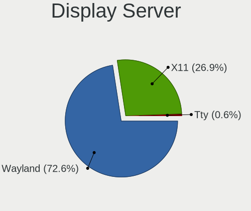
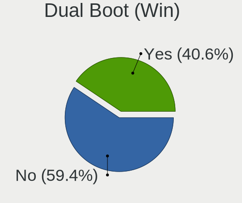

ROSA - Hardware Trends
----------------------

A project to identify most popular hardware characteristics and track their change
over time based on data collected by Linux users at https://Linux-Hardware.org.

Anyone can contribute to this report by the [hw-probe](https://github.com/linuxhw/hw-probe) tool:

    sudo -E hw-probe -all -upload

This is a report for all computer types. See also reports for [desktops](/Dist/ROSA/Desktop/README.md) and [notebooks](/Dist/ROSA/Notebook/README.md).

This report is for one last month. Overall report since the beginning of time: [TestDays](https://github.com/linuxhw/TestDays)

Period: Jan, 2024.

Contents
--------

* [ System ](#system)
  - [ OS                       ](#os)
  - [ OS Family                ](#os-family)
  - [ Kernel                   ](#kernel)
  - [ Kernel Family            ](#kernel-family)
  - [ Kernel Major Ver.        ](#kernel-major-ver)
  - [ Arch                     ](#arch)
  - [ DE                       ](#de)
  - [ Display Server           ](#display-server)
  - [ Display Manager          ](#display-manager)
  - [ OS Lang                  ](#os-lang)
  - [ Boot Mode                ](#boot-mode)
  - [ Filesystem               ](#filesystem)
  - [ Part. scheme             ](#part-scheme)
  - [ Dual Boot with Linux/BSD ](#dual-boot-with-linuxbsd)
  - [ Dual Boot (Win)          ](#dual-boot-win)

* [ Board ](#board)
  - [ Vendor                   ](#vendor)
  - [ Model                    ](#model)
  - [ Model Family             ](#model-family)
  - [ MFG Year                 ](#mfg-year)
  - [ Form Factor              ](#form-factor)
  - [ Secure Boot              ](#secure-boot)
  - [ Coreboot                 ](#coreboot)
  - [ RAM Size                 ](#ram-size)
  - [ RAM Used                 ](#ram-used)
  - [ Total Drives             ](#total-drives)
  - [ Has CD-ROM               ](#has-cd-rom)
  - [ Has Ethernet             ](#has-ethernet)
  - [ Has WiFi                 ](#has-wifi)
  - [ Has Bluetooth            ](#has-bluetooth)

* [ Location ](#location)
  - [ Country                  ](#country)
  - [ City                     ](#city)

* [ Drives ](#drives)
  - [ Drive Vendor             ](#drive-vendor)
  - [ Drive Model              ](#drive-model)
  - [ HDD Vendor               ](#hdd-vendor)
  - [ SSD Vendor               ](#ssd-vendor)
  - [ Drive Kind               ](#drive-kind)
  - [ Drive Connector          ](#drive-connector)
  - [ Drive Size               ](#drive-size)
  - [ Space Total              ](#space-total)
  - [ Space Used               ](#space-used)
  - [ Malfunc. Drives          ](#malfunc-drives)
  - [ Malfunc. Drive Vendor    ](#malfunc-drive-vendor)
  - [ Malfunc. HDD Vendor      ](#malfunc-hdd-vendor)
  - [ Malfunc. Drive Kind      ](#malfunc-drive-kind)
  - [ Failed Drives            ](#failed-drives)
  - [ Failed Drive Vendor      ](#failed-drive-vendor)
  - [ Drive Status             ](#drive-status)

* [ Storage controller ](#storage-controller)
  - [ Storage Vendor           ](#storage-vendor)
  - [ Storage Model            ](#storage-model)
  - [ Storage Kind             ](#storage-kind)

* [ Processor ](#processor)
  - [ CPU Vendor               ](#cpu-vendor)
  - [ CPU Model                ](#cpu-model)
  - [ CPU Model Family         ](#cpu-model-family)
  - [ CPU Cores                ](#cpu-cores)
  - [ CPU Sockets              ](#cpu-sockets)
  - [ CPU Threads              ](#cpu-threads)
  - [ CPU Op-Modes             ](#cpu-op-modes)
  - [ CPU Microcode            ](#cpu-microcode)
  - [ CPU Microarch            ](#cpu-microarch)

* [ Graphics ](#graphics)
  - [ GPU Vendor               ](#gpu-vendor)
  - [ GPU Model                ](#gpu-model)
  - [ GPU Combo                ](#gpu-combo)
  - [ GPU Driver               ](#gpu-driver)
  - [ GPU Memory               ](#gpu-memory)

* [ Monitor ](#monitor)
  - [ Monitor Vendor           ](#monitor-vendor)
  - [ Monitor Model            ](#monitor-model)
  - [ Monitor Resolution       ](#monitor-resolution)
  - [ Monitor Diagonal         ](#monitor-diagonal)
  - [ Monitor Width            ](#monitor-width)
  - [ Aspect Ratio             ](#aspect-ratio)
  - [ Monitor Area             ](#monitor-area)
  - [ Pixel Density            ](#pixel-density)
  - [ Multiple Monitors        ](#multiple-monitors)

* [ Network ](#network)
  - [ Net Controller Vendor    ](#net-controller-vendor)
  - [ Net Controller Model     ](#net-controller-model)
  - [ Wireless Vendor          ](#wireless-vendor)
  - [ Wireless Model           ](#wireless-model)
  - [ Ethernet Vendor          ](#ethernet-vendor)
  - [ Ethernet Model           ](#ethernet-model)
  - [ Net Controller Kind      ](#net-controller-kind)
  - [ Used Controller          ](#used-controller)
  - [ NICs                     ](#nics)
  - [ IPv6                     ](#ipv6)

* [ Bluetooth ](#bluetooth)
  - [ Bluetooth Vendor         ](#bluetooth-vendor)
  - [ Bluetooth Model          ](#bluetooth-model)

* [ Sound ](#sound)
  - [ Sound Vendor             ](#sound-vendor)
  - [ Sound Model              ](#sound-model)

* [ Memory ](#memory)
  - [ Memory Vendor            ](#memory-vendor)
  - [ Memory Model             ](#memory-model)
  - [ Memory Kind              ](#memory-kind)
  - [ Memory Form Factor       ](#memory-form-factor)
  - [ Memory Size              ](#memory-size)
  - [ Memory Speed             ](#memory-speed)

* [ Printers & scanners ](#printers--scanners)
  - [ Printer Vendor           ](#printer-vendor)
  - [ Printer Model            ](#printer-model)
  - [ Scanner Vendor           ](#scanner-vendor)
  - [ Scanner Model            ](#scanner-model)

* [ Camera ](#camera)
  - [ Camera Vendor            ](#camera-vendor)
  - [ Camera Model             ](#camera-model)

* [ Security ](#security)
  - [ Fingerprint Vendor       ](#fingerprint-vendor)
  - [ Fingerprint Model        ](#fingerprint-model)
  - [ Chipcard Vendor          ](#chipcard-vendor)
  - [ Chipcard Model           ](#chipcard-model)

* [ Unsupported ](#unsupported)
  - [ Unsupported Devices      ](#unsupported-devices)
  - [ Unsupported Device Types ](#unsupported-device-types)

System
------

OS
--

Installed operating systems

| Name        | Computers | Percent |
|-------------|-----------|---------|
| ROSA 12.4   | 161       | 80.5%   |
| ROSA 12     | 15        | 7.5%    |
| ROSA R11.1  | 12        | 6%      |
| ROSA 13.0   | 3         | 1.5%    |
| ROSA 12.2   | 3         | 1.5%    |
| ROSA 2021.1 | 2         | 1%      |
| ROSA 12.3   | 2         | 1%      |
| ROSA 12.1   | 2         | 1%      |

OS Family
---------

OS without a version

| Name | Computers | Percent |
|------|-----------|---------|
| ROSA | 200       | 100%    |

Kernel
------

Version of the Linux kernel

| Version                                   | Computers | Percent |
|-------------------------------------------|-----------|---------|
| 6.1.58-generic-1rosa2021.1-x86_64         | 95        | 47.5%   |
| 6.1.20-generic-2rosa2021.1-x86_64         | 48        | 24%     |
| 5.15.103-generic-1rosa2021.1-i686         | 7         | 3.5%    |
| 5.4.83-generic-2rosa-x86_64               | 5         | 2.5%    |
| 5.15.127-generic-1rosa2021.1-x86_64       | 5         | 2.5%    |
| 5.10.184-generic-1rosa2021.1-x86_64       | 5         | 2.5%    |
| 5.10.74-generic-2rosa2021.1-x86_64        | 4         | 2%      |
| 6.1.46-generic-2rosa2021.1-x86_64         | 3         | 1.5%    |
| 5.15.75-generic-1rosa2021.1-x86_64        | 3         | 1.5%    |
| 6.6.8.xm1-1.k-xanmod-rosa2021.1-x86_64    | 2         | 1%      |
| 6.1.58-generic-4rosa2023.1-x86_64         | 2         | 1%      |
| 5.4.150-generic-1rosa2021.1-x86_64        | 2         | 1%      |
| 6.7.0.xm1-2.k-xanmod-rosa2023.1-x86_64    | 1         | 0.5%    |
| 6.7.0.xm1-1.k-xanmod-rosa2021.1-x86_64    | 1         | 0.5%    |
| 6.5.10.xm1-1.k-xanmod-rosa2021.1-x86_64   | 1         | 0.5%    |
| 6.4.15.xm1-1.klp-xanmod-rosa2021.1-x86_64 | 1         | 0.5%    |
| 6.1.63.xm1-1.k-xanmod-rosa2021.1-x86_64   | 1         | 0.5%    |
| 5.4.83-generic-2rosa-i586                 | 1         | 0.5%    |
| 5.4.32-generic-2rosa-x86_64               | 1         | 0.5%    |
| 5.18.2.xm1-3.klp-xanmod-rosa2021.1-x86_64 | 1         | 0.5%    |
| 5.15.127-generic-1rosa2021.1-i686         | 1         | 0.5%    |
| 5.15.103-generic-1rosa2021.1-x86_64       | 1         | 0.5%    |
| 5.10.74-generic-2rosa2021.1-i586          | 1         | 0.5%    |
| 5.10.71-generic-1rosa2021.1-x86_64        | 1         | 0.5%    |
| 5.10.176-generic-1rosa2021.1-x86_64       | 1         | 0.5%    |
| 5.10.118-generic-2rosa2021.1-x86_64       | 1         | 0.5%    |
| 4.9.60-nrj-desktop-1rosa-i586             | 1         | 0.5%    |
| 4.9.155-nrj-desktop-1rosa-x86_64          | 1         | 0.5%    |
| 4.15.0-desktop-68.5rosa-x86_64            | 1         | 0.5%    |
| 4.15.0-desktop-122.124.1rosa-x86_64       | 1         | 0.5%    |
| 4.15.0-desktop-122.124.1rosa-i586         | 1         | 0.5%    |

Kernel Family
-------------

Linux kernel without a distro release

| Version  | Computers | Percent |
|----------|-----------|---------|
| 6.1.58   | 97        | 48.5%   |
| 6.1.20   | 48        | 24%     |
| 5.15.103 | 8         | 4%      |
| 5.4.83   | 6         | 3%      |
| 5.15.127 | 6         | 3%      |
| 5.10.74  | 5         | 2.5%    |
| 5.10.184 | 5         | 2.5%    |
| 6.1.46   | 3         | 1.5%    |
| 5.15.75  | 3         | 1.5%    |
| 4.15.0   | 3         | 1.5%    |
| 6.7.0    | 2         | 1%      |
| 6.6.8    | 2         | 1%      |
| 5.4.150  | 2         | 1%      |
| 6.5.10   | 1         | 0.5%    |
| 6.4.15   | 1         | 0.5%    |
| 6.1.63   | 1         | 0.5%    |
| 5.4.32   | 1         | 0.5%    |
| 5.18.2   | 1         | 0.5%    |
| 5.10.71  | 1         | 0.5%    |
| 5.10.176 | 1         | 0.5%    |
| 5.10.118 | 1         | 0.5%    |
| 4.9.60   | 1         | 0.5%    |
| 4.9.155  | 1         | 0.5%    |

Kernel Major Ver.
-----------------

Linux kernel major version

| Version | Computers | Percent |
|---------|-----------|---------|
| 6.1     | 149       | 74.5%   |
| 5.15    | 17        | 8.5%    |
| 5.10    | 13        | 6.5%    |
| 5.4     | 9         | 4.5%    |
| 4.15    | 3         | 1.5%    |
| 6.7     | 2         | 1%      |
| 6.6     | 2         | 1%      |
| 4.9     | 2         | 1%      |
| 6.5     | 1         | 0.5%    |
| 6.4     | 1         | 0.5%    |
| 5.18    | 1         | 0.5%    |

Arch
----

OS architecture (x86_64, i586, etc.)

| Name   | Computers | Percent |
|--------|-----------|---------|
| x86_64 | 188       | 94%     |
| i686   | 12        | 6%      |

DE
--

Desktop Environment

| Name     | Computers | Percent |
|----------|-----------|---------|
| KDE5     | 113       | 56.5%   |
| GNOME    | 51        | 25.5%   |
| LXQt     | 21        | 10.5%   |
| KDE4     | 8         | 4%      |
| MATE     | 2         | 1%      |
| Unknown  | 2         | 1%      |
| XFCE     | 1         | 0.5%    |
| i3       | 1         | 0.5%    |
| Cinnamon | 1         | 0.5%    |

Display Server
--------------

X11 or Wayland

| Name    | Computers | Percent |
|---------|-----------|---------|
| Wayland | 137       | 68.5%   |
| X11     | 61        | 30.5%   |
| Unknown | 2         | 1%      |

Display Manager
---------------

SDDM, LightDM, etc.

| Name    | Computers | Percent |
|---------|-----------|---------|
| SDDM    | 111       | 55.5%   |
| GDM     | 64        | 32%     |
| LightDM | 12        | 6%      |
| KDM     | 8         | 4%      |
| Unknown | 5         | 2.5%    |

OS Lang
-------

Language

| Lang    | Computers | Percent |
|---------|-----------|---------|
| ru_RU   | 182       | 91%     |
| pl_PL   | 5         | 2.5%    |
| en_US   | 4         | 2%      |
| ru_UA   | 2         | 1%      |
| sk_SK   | 1         | 0.5%    |
| pt_BR   | 1         | 0.5%    |
| nb_NO   | 1         | 0.5%    |
| es_ES   | 1         | 0.5%    |
| en_GB   | 1         | 0.5%    |
| de_CH   | 1         | 0.5%    |
| Unknown | 1         | 0.5%    |

Boot Mode
---------

EFI or BIOS

| Mode | Computers | Percent |
|------|-----------|---------|
| EFI  | 105       | 52.5%   |
| BIOS | 95        | 47.5%   |

Filesystem
----------

Type of filesystem

| Type    | Computers | Percent |
|---------|-----------|---------|
| Ext4    | 174       | 87%     |
| Btrfs   | 24        | 12%     |
| Xfs     | 1         | 0.5%    |
| Overlay | 1         | 0.5%    |

Part. scheme
------------

Scheme of partitioning

| Type    | Computers | Percent |
|---------|-----------|---------|
| GPT     | 116       | 58%     |
| MBR     | 82        | 41%     |
| Unknown | 2         | 1%      |

Dual Boot with Linux/BSD
------------------------

Hosting more than one Linux/BSD

| Dual boot | Computers | Percent |
|-----------|-----------|---------|
| No        | 158       | 79%     |
| Yes       | 42        | 21%     |

Dual Boot (Win)
---------------

Hosting Linux and Windows

| Dual boot | Computers | Percent |
|-----------|-----------|---------|
| No        | 123       | 61.5%   |
| Yes       | 77        | 38.5%   |

Board
-----

Vendor
------

Motherboard manufacturer

| Name                                 | Computers | Percent |
|--------------------------------------|-----------|---------|
| ASUSTek Computer                     | 52        | 26%     |
| Gigabyte Technology                  | 16        | 8%      |
| Acer                                 | 15        | 7.5%    |
| Lenovo                               | 14        | 7%      |
| Hewlett-Packard                      | 13        | 6.5%    |
| MSI                                  | 11        | 5.5%    |
| Intel                                | 10        | 5%      |
| ASRock                               | 9         | 4.5%    |
| Samsung Electronics                  | 5         | 2.5%    |
| Dell                                 | 5         | 2.5%    |
| Huanan                               | 4         | 2%      |
| Unknown                              | 4         | 2%      |
| Sony                                 | 3         | 1.5%    |
| Packard Bell                         | 3         | 1.5%    |
| ECS                                  | 3         | 1.5%    |
| Clevo                                | 3         | 1.5%    |
| Toshiba                              | 2         | 1%      |
| Pegatron                             | 2         | 1%      |
| OEM                                  | 2         | 1%      |
| AZW                                  | 2         | 1%      |
| TopStar                              | 1         | 0.5%    |
| Shuttle                              | 1         | 0.5%    |
| Shenzhen Meigao Electronic Equipment | 1         | 0.5%    |
| MECHREVO                             | 1         | 0.5%    |
| Matsushita Electric Industrial       | 1         | 0.5%    |
| MAINBRD                              | 1         | 0.5%    |
| MACHINIST                            | 1         | 0.5%    |
| MACHENIKE                            | 1         | 0.5%    |
| MACHCREATOR                          | 1         | 0.5%    |
| Infinix                              | 1         | 0.5%    |
| ICL                                  | 1         | 0.5%    |
| HUAWEI                               | 1         | 0.5%    |
| HJS                                  | 1         | 0.5%    |
| HIPER Technology Limited             | 1         | 0.5%    |
| Fujitsu                              | 1         | 0.5%    |
| eMachines                            | 1         | 0.5%    |
| DEPO Computers                       | 1         | 0.5%    |
| Chuwi                                | 1         | 0.5%    |
| Biostar                              | 1         | 0.5%    |
| Apple                                | 1         | 0.5%    |

Model
-----

Motherboard model

| Name                                            | Computers | Percent |
|-------------------------------------------------|-----------|---------|
| Unknown                                         | 5         | 2.5%    |
| Intel SKYBAY                                    | 4         | 2%      |
| HP Pavilion 15                                  | 2         | 1%      |
| Gigabyte B450 GAMING X                          | 2         | 1%      |
| Clevo NL41MU2                                   | 2         | 1%      |
| ASUS TUF B450M-PLUS GAMING                      | 2         | 1%      |
| ASUS P5GC-MX/1333                               | 2         | 1%      |
| Acer Aspire ES1-531                             | 2         | 1%      |
| Toshiba Satellite L40                           | 1         | 0.5%    |
| Toshiba Satellite C660                          | 1         | 0.5%    |
| TopStar V211                                    | 1         | 0.5%    |
| Sony VPCJ12M1R                                  | 1         | 0.5%    |
| Sony VPCEH3P1R                                  | 1         | 0.5%    |
| Sony VGN-NS11ER_S                               | 1         | 0.5%    |
| Shuttle XS35V3                                  | 1         | 0.5%    |
| Shenzhen Meigao Electronic Equipment UM773 Lite | 1         | 0.5%    |
| Samsung R580/R590                               | 1         | 0.5%    |
| Samsung N145P/N250P/N260P                       | 1         | 0.5%    |
| Samsung 550P5C/550P7C                           | 1         | 0.5%    |
| Samsung 300V3A/300V4A/300V5A/200A4B/200A5B      | 1         | 0.5%    |
| Samsung 300E4C/300E5C/300E7C                    | 1         | 0.5%    |
| Pegatron Pro 3010 Microtower PC                 | 1         | 0.5%    |
| Pegatron HP3520 Aio                             | 1         | 0.5%    |
| Packard Bell EasyNote TE11HC                    | 1         | 0.5%    |
| Packard Bell EasyNote ENTE70BH                  | 1         | 0.5%    |
| Packard Bell EasyNote ENLG81BA                  | 1         | 0.5%    |
| OEM TU628V2                                     | 1         | 0.5%    |
| OEM PR2710P-24                                  | 1         | 0.5%    |
| MSI PRO RPL-P DP10 (MS-B0A6)                    | 1         | 0.5%    |
| MSI MS-7D99                                     | 1         | 0.5%    |
| MSI MS-7C96                                     | 1         | 0.5%    |
| MSI MS-7C95                                     | 1         | 0.5%    |
| MSI MS-7996                                     | 1         | 0.5%    |
| MSI MS-7680                                     | 1         | 0.5%    |
| MSI MS-7576                                     | 1         | 0.5%    |
| MSI Katana GF76 11SC                            | 1         | 0.5%    |
| MSI GE60 2PL                                    | 1         | 0.5%    |
| MSI FX610MX                                     | 1         | 0.5%    |
| MSI Cubi N 8GL (MS-B171)                        | 1         | 0.5%    |
| MECHREVO Jiaolong Series GM5ZG0O                | 1         | 0.5%    |

Model Family
------------

Motherboard model prefix

| Name                                       | Computers | Percent |
|--------------------------------------------|-----------|---------|
| Acer Aspire                                | 13        | 6.5%    |
| ASUS PRIME                                 | 5         | 2.5%    |
| Unknown                                    | 5         | 2.5%    |
| Intel SKYBAY                               | 4         | 2%      |
| HP Pavilion                                | 4         | 2%      |
| ASUS VivoBook                              | 4         | 2%      |
| Packard Bell EasyNote                      | 3         | 1.5%    |
| Lenovo ThinkPad                            | 3         | 1.5%    |
| Lenovo IdeaPad                             | 3         | 1.5%    |
| Toshiba Satellite                          | 2         | 1%      |
| Intel X99                                  | 2         | 1%      |
| HP ProBook                                 | 2         | 1%      |
| HP EliteBook                               | 2         | 1%      |
| Gigabyte B450M                             | 2         | 1%      |
| Gigabyte B450                              | 2         | 1%      |
| Dell Inspiron                              | 2         | 1%      |
| Clevo NL41MU2                              | 2         | 1%      |
| ASUS TUF                                   | 2         | 1%      |
| ASUS ROG                                   | 2         | 1%      |
| ASUS P7H55-M                               | 2         | 1%      |
| ASUS P5GC-MX                               | 2         | 1%      |
| TopStar V211                               | 1         | 0.5%    |
| Sony VPCJ12M1R                             | 1         | 0.5%    |
| Sony VPCEH3P1R                             | 1         | 0.5%    |
| Sony VGN-NS11ER                            | 1         | 0.5%    |
| Shuttle XS35V3                             | 1         | 0.5%    |
| Shenzhen Meigao Electronic Equipment UM773 | 1         | 0.5%    |
| Samsung R580                               | 1         | 0.5%    |
| Samsung N145P                              | 1         | 0.5%    |
| Samsung 550P5C                             | 1         | 0.5%    |
| Samsung 300V3A                             | 1         | 0.5%    |
| Samsung 300E4C                             | 1         | 0.5%    |
| Pegatron Pro                               | 1         | 0.5%    |
| Pegatron HP3520                            | 1         | 0.5%    |
| OEM TU628V2                                | 1         | 0.5%    |
| OEM PR2710P-24                             | 1         | 0.5%    |
| MSI PRO                                    | 1         | 0.5%    |
| MSI MS-7D99                                | 1         | 0.5%    |
| MSI MS-7C96                                | 1         | 0.5%    |
| MSI MS-7C95                                | 1         | 0.5%    |

MFG Year
--------

Motherboard manufacture year

| Year | Computers | Percent |
|------|-----------|---------|
| 2022 | 23        | 11.5%   |
| 2021 | 18        | 9%      |
| 2010 | 17        | 8.5%    |
| 2012 | 15        | 7.5%    |
| 2018 | 14        | 7%      |
| 2011 | 14        | 7%      |
| 2015 | 13        | 6.5%    |
| 2013 | 10        | 5%      |
| 2009 | 10        | 5%      |
| 2020 | 9         | 4.5%    |
| 2019 | 9         | 4.5%    |
| 2016 | 8         | 4%      |
| 2014 | 8         | 4%      |
| 2008 | 8         | 4%      |
| 2007 | 8         | 4%      |
| 2023 | 6         | 3%      |
| 2017 | 5         | 2.5%    |
| 2006 | 3         | 1.5%    |
| 2005 | 1         | 0.5%    |
| 2003 | 1         | 0.5%    |

Form Factor
-----------

Physical design of the computer

| Name        | Computers | Percent |
|-------------|-----------|---------|
| Notebook    | 95        | 47.5%   |
| Desktop     | 94        | 47%     |
| All in one  | 5         | 2.5%    |
| Mini pc     | 3         | 1.5%    |
| Server      | 2         | 1%      |
| Convertible | 1         | 0.5%    |

Secure Boot
-----------

Enabled or disabled

| State    | Computers | Percent |
|----------|-----------|---------|
| Disabled | 200       | 100%    |

Coreboot
--------

Have coreboot on board

| Used | Computers | Percent |
|------|-----------|---------|
| No   | 200       | 100%    |

RAM Size
--------

Total RAM memory

| Size in GB      | Computers | Percent |
|-----------------|-----------|---------|
| 4.01-8.0        | 45        | 22.5%   |
| 3.01-4.0        | 44        | 22%     |
| 8.01-16.0       | 43        | 21.5%   |
| 16.01-24.0      | 31        | 15.5%   |
| 32.01-64.0      | 11        | 5.5%    |
| 1.01-2.0        | 11        | 5.5%    |
| 64.01-256.0     | 5         | 2.5%    |
| 2.01-3.0        | 3         | 1.5%    |
| 0.51-1.0        | 3         | 1.5%    |
| More than 256.0 | 2         | 1%      |
| 24.01-32.0      | 2         | 1%      |

RAM Used
--------

Used RAM memory

| Used GB   | Computers | Percent |
|-----------|-----------|---------|
| 1.01-2.0  | 107       | 53.5%   |
| 0.51-1.0  | 34        | 17%     |
| 2.01-3.0  | 26        | 13%     |
| 3.01-4.0  | 17        | 8.5%    |
| 4.01-8.0  | 11        | 5.5%    |
| 0.01-0.5  | 3         | 1.5%    |
| 8.01-16.0 | 2         | 1%      |

Total Drives
------------

Number of drives on board

| Drives | Computers | Percent |
|--------|-----------|---------|
| 1      | 126       | 63%     |
| 2      | 45        | 22.5%   |
| 3      | 16        | 8%      |
| 4      | 5         | 2.5%    |
| 6      | 3         | 1.5%    |
| 7      | 2         | 1%      |
| 5      | 2         | 1%      |
| 0      | 1         | 0.5%    |

Has CD-ROM
----------

Has CD-ROM on board

| Presented | Computers | Percent |
|-----------|-----------|---------|
| No        | 121       | 60.5%   |
| Yes       | 79        | 39.5%   |

Has Ethernet
------------

Has Ethernet on board

| Presented | Computers | Percent |
|-----------|-----------|---------|
| Yes       | 182       | 91%     |
| No        | 18        | 9%      |

Has WiFi
--------

Has WiFi module

| Presented | Computers | Percent |
|-----------|-----------|---------|
| Yes       | 135       | 67.5%   |
| No        | 65        | 32.5%   |

Has Bluetooth
-------------

Has Bluetooth module

| Presented | Computers | Percent |
|-----------|-----------|---------|
| Yes       | 101       | 50.5%   |
| No        | 99        | 49.5%   |

Location
--------

Country
-------

Geographic location (country)

| Country     | Computers | Percent |
|-------------|-----------|---------|
| Russia      | 176       | 88%     |
| Poland      | 6         | 3%      |
| Ukraine     | 4         | 2%      |
| Germany     | 3         | 1.5%    |
| Kazakhstan  | 2         | 1%      |
| Venezuela   | 1         | 0.5%    |
| Switzerland | 1         | 0.5%    |
| Slovakia    | 1         | 0.5%    |
| Norway      | 1         | 0.5%    |
| Kyrgyzstan  | 1         | 0.5%    |
| Czechia     | 1         | 0.5%    |
| Bulgaria    | 1         | 0.5%    |
| Brazil      | 1         | 0.5%    |
| Belarus     | 1         | 0.5%    |

City
----

Geographic location (city)

| City             | Computers | Percent |
|------------------|-----------|---------|
| Moscow           | 38        | 19%     |
| Yekaterinburg    | 9         | 4.5%    |
| St Petersburg    | 7         | 3.5%    |
| Krasnodar        | 7         | 3.5%    |
| Perm             | 5         | 2.5%    |
| Krasnoyarsk      | 5         | 2.5%    |
| Chelyabinsk      | 5         | 2.5%    |
| Volgograd        | 4         | 2%      |
| Ufa              | 4         | 2%      |
| Rostov-on-Don    | 4         | 2%      |
| Khabarovsk       | 4         | 2%      |
| Penza            | 3         | 1.5%    |
| Omsk             | 3         | 1.5%    |
| Kazan’         | 3         | 1.5%    |
| Barnaul          | 3         | 1.5%    |
| Yaroslavl        | 2         | 1%      |
| Voronezh         | 2         | 1%      |
| Vidnoye          | 2         | 1%      |
| Tambov           | 2         | 1%      |
| Samara           | 2         | 1%      |
| Ostrovtsy        | 2         | 1%      |
| Novosibirsk      | 2         | 1%      |
| Noril'sk         | 2         | 1%      |
| Nizhniy Novgorod | 2         | 1%      |
| Gliwice          | 2         | 1%      |
| Bryansk          | 2         | 1%      |
| Belovo           | 2         | 1%      |
| Belgorod         | 2         | 1%      |
| Yoshkar-Ola      | 1         | 0.5%    |
| Yakutsk          | 1         | 0.5%    |
| Wroclaw          | 1         | 0.5%    |
| Warsaw           | 1         | 0.5%    |
| Vyksa            | 1         | 0.5%    |
| Vologda          | 1         | 0.5%    |
| Vladivostok      | 1         | 0.5%    |
| Ust'-Ilimsk      | 1         | 0.5%    |
| Umay             | 1         | 0.5%    |
| Ulan-Ude         | 1         | 0.5%    |
| Tyumen           | 1         | 0.5%    |
| Troitsk          | 1         | 0.5%    |

Drives
------

Drive Vendor
------------

Hard drive vendors

| Vendor                      | Computers | Drives | Percent |
|-----------------------------|-----------|--------|---------|
| WDC                         | 51        | 64     | 17.35%  |
| Samsung Electronics         | 30        | 33     | 10.2%   |
| Seagate                     | 27        | 29     | 9.18%   |
| Kingston                    | 19        | 20     | 6.46%   |
| Toshiba                     | 16        | 17     | 5.44%   |
| Hitachi                     | 16        | 17     | 5.44%   |
| China                       | 11        | 11     | 3.74%   |
| SK hynix                    | 7         | 7      | 2.38%   |
| Apacer                      | 7         | 7      | 2.38%   |
| SanDisk                     | 6         | 6      | 2.04%   |
| HGST                        | 6         | 6      | 2.04%   |
| XrayDisk                    | 5         | 5      | 1.7%    |
| Intel                       | 5         | 6      | 1.7%    |
| A-DATA Technology           | 5         | 6      | 1.7%    |
| Unknown                     | 5         | 5      | 1.7%    |
| Unknown                     | 4         | 4      | 1.36%   |
| Crucial                     | 4         | 7      | 1.36%   |
| AMD                         | 4         | 4      | 1.36%   |
| SSSTC                       | 3         | 3      | 1.02%   |
| SPCC                        | 3         | 3      | 1.02%   |
| Micron Technology           | 3         | 3      | 1.02%   |
| MAXIO Technology (Hangzhou) | 3         | 3      | 1.02%   |
| JMicron Technology          | 3         | 3      | 1.02%   |
| Phison                      | 2         | 2      | 0.68%   |
| Patriot                     | 2         | 2      | 0.68%   |
| Netac                       | 2         | 2      | 0.68%   |
| Lenovo                      | 2         | 2      | 0.68%   |
| KingSpec                    | 2         | 2      | 0.68%   |
| HS-SSD-E100                 | 2         | 2      | 0.68%   |
| Hewlett-Packard             | 2         | 2      | 0.68%   |
| DEXP                        | 2         | 2      | 0.68%   |
| BIWIN                       | 2         | 2      | 0.68%   |
| XPG                         | 1         | 1      | 0.34%   |
| Union Memory                | 1         | 1      | 0.34%   |
| UMIS                        | 1         | 1      | 0.34%   |
| Transcend                   | 1         | 1      | 0.34%   |
| TO Exter                    | 1         | 1      | 0.34%   |
| T-FORCE                     | 1         | 1      | 0.34%   |
| Smartbuy                    | 1         | 1      | 0.34%   |
| Silicon Motion              | 1         | 1      | 0.34%   |

Drive Model
-----------

Hard drive models

| Model                                     | Computers | Percent |
|-------------------------------------------|-----------|---------|
| Seagate ST320LT020-9YG142 320GB           | 5         | 1.58%   |
| Unknown                                   | 5         | 1.58%   |
| Seagate ST500LT012-1DG142 500GB           | 4         | 1.26%   |
| Samsung MZVLW128HEGR-00000 128GB          | 4         | 1.26%   |
| Kingston SA400S37240G 240GB SSD           | 4         | 1.26%   |
| WDC WD10EZEX-21WN4A0 1TB                  | 3         | 0.95%   |
| WDC WD10EZEX-00BBHA0 1TB                  | 3         | 0.95%   |
| Toshiba MQ01ABF050 500GB                  | 3         | 0.95%   |
| Samsung SSD 860 EVO 250GB                 | 3         | 0.95%   |
| Kingston SA400S37480G 480GB SSD           | 3         | 0.95%   |
| JMicron Generic 8GB                       | 3         | 0.95%   |
| China SSD 128GB                           | 3         | 0.95%   |
| Apacer AS350 512GB SSD                    | 3         | 0.95%   |
| XrayDisk 1TB SSD                          | 2         | 0.63%   |
| WDC WDS500G2B0A-00SM50 500GB SSD          | 2         | 0.63%   |
| WDC WDS250G2B0A-00SM50 250GB SSD          | 2         | 0.63%   |
| WDC WDS120G2G0A-00JH30 120GB SSD          | 2         | 0.63%   |
| WDC WD5000AAKX-001CA0 500GB               | 2         | 0.63%   |
| WDC WD3200BPVT-22JJ5T0 320GB              | 2         | 0.63%   |
| WDC WD20EFRX-68EUZN0 2TB                  | 2         | 0.63%   |
| Unknown SD128  128GB                      | 2         | 0.63%   |
| Unknown SD/MMC/MS PRO 256GB               | 2         | 0.63%   |
| Toshiba MQ04ABF100 1TB                    | 2         | 0.63%   |
| Toshiba DT01ACA050 500GB                  | 2         | 0.63%   |
| SPCC Solid State Disk 256GB               | 2         | 0.63%   |
| SK hynix SKHynix_HFM512GDHTNI-87A0B 512GB | 2         | 0.63%   |
| Seagate ST1000LM035-1RK172 1TB            | 2         | 0.63%   |
| Seagate ST1000DM010-2EP102 1TB            | 2         | 0.63%   |
| Seagate ST1000DM003-1CH162 1TB            | 2         | 0.63%   |
| Samsung SSD 980 500GB                     | 2         | 0.63%   |
| Samsung SSD 870 QVO 1TB                   | 2         | 0.63%   |
| Samsung SSD 850 EVO 250GB                 | 2         | 0.63%   |
| Samsung SSD 840 EVO 120GB                 | 2         | 0.63%   |
| Samsung SSD 750 EVO 250GB                 | 2         | 0.63%   |
| MAXIO (Hangzhou) NVMe SSD Drive 512GB     | 2         | 0.63%   |
| Lenovo E660 SSD-2.5-512G                  | 2         | 0.63%   |
| Kingston SNVS500G 500GB                   | 2         | 0.63%   |
| Kingston SKC3000S1024G 1024GB             | 2         | 0.63%   |
| Kingston SA400M8240G 240GB SSD            | 2         | 0.63%   |
| HGST HTS541010A9E680 1TB                  | 2         | 0.63%   |

HDD Vendor
----------

Hard disk drive vendors

| Vendor              | Computers | Drives | Percent |
|---------------------|-----------|--------|---------|
| WDC                 | 41        | 50     | 35.65%  |
| Seagate             | 26        | 28     | 22.61%  |
| Hitachi             | 16        | 17     | 13.91%  |
| Toshiba             | 15        | 16     | 13.04%  |
| HGST                | 6         | 6      | 5.22%   |
| Samsung Electronics | 3         | 3      | 2.61%   |
| JMicron Technology  | 3         | 3      | 2.61%   |
| Unknown             | 2         | 2      | 1.74%   |
| TO Exter            | 1         | 1      | 0.87%   |
| Fujitsu             | 1         | 1      | 0.87%   |
| FC-1307             | 1         | 1      | 0.87%   |

SSD Vendor
----------

Solid state drive vendors

| Vendor              | Computers | Drives | Percent |
|---------------------|-----------|--------|---------|
| Samsung Electronics | 16        | 16     | 13.33%  |
| Kingston            | 14        | 14     | 11.67%  |
| WDC                 | 13        | 13     | 10.83%  |
| China               | 11        | 11     | 9.17%   |
| Apacer              | 6         | 6      | 5%      |
| A-DATA Technology   | 5         | 5      | 4.17%   |
| XrayDisk            | 4         | 4      | 3.33%   |
| SanDisk             | 4         | 4      | 3.33%   |
| AMD                 | 4         | 4      | 3.33%   |
| Unknown             | 4         | 4      | 3.33%   |
| Intel               | 3         | 3      | 2.5%    |
| SPCC                | 2         | 2      | 1.67%   |
| Lenovo              | 2         | 2      | 1.67%   |
| KingSpec            | 2         | 2      | 1.67%   |
| HS-SSD-E100         | 2         | 2      | 1.67%   |
| Hewlett-Packard     | 2         | 2      | 1.67%   |
| DEXP                | 2         | 2      | 1.67%   |
| Crucial             | 2         | 5      | 1.67%   |
| Union Memory        | 1         | 1      | 0.83%   |
| T-FORCE             | 1         | 1      | 0.83%   |
| Smartbuy            | 1         | 1      | 0.83%   |
| SK hynix            | 1         | 1      | 0.83%   |
| SCCTS-602-128G      | 1         | 1      | 0.83%   |
| PNY                 | 1         | 1      | 0.83%   |
| Plextor             | 1         | 1      | 0.83%   |
| Patriot             | 1         | 1      | 0.83%   |
| NT-2TB              | 1         | 1      | 0.83%   |
| Netac               | 1         | 1      | 0.83%   |
| MG                  | 1         | 1      | 0.83%   |
| LITEON              | 1         | 1      | 0.83%   |
| Kingmax             | 1         | 1      | 0.83%   |
| HUAXUAN             | 1         | 1      | 0.83%   |
| GS                  | 1         | 1      | 0.83%   |
| GOODRAM             | 1         | 2      | 0.83%   |
| Gigabyte Technology | 1         | 1      | 0.83%   |
| Fanxiang            | 1         | 1      | 0.83%   |
| Digma               | 1         | 1      | 0.83%   |
| CHUZUN              | 1         | 1      | 0.83%   |
| AirDisk             | 1         | 1      | 0.83%   |
| AFOX                | 1         | 1      | 0.83%   |

Drive Kind
----------

HDD or SSD

| Kind | Computers | Drives | Percent |
|------|-----------|--------|---------|
| SSD  | 108       | 124    | 40.6%   |
| HDD  | 101       | 128    | 37.97%  |
| NVMe | 53        | 64     | 19.92%  |
| MMC  | 4         | 5      | 1.5%    |

Drive Connector
---------------

SATA, SAS, NVMe, etc.

| Type | Computers | Drives | Percent |
|------|-----------|--------|---------|
| SATA | 167       | 246    | 72.61%  |
| NVMe | 53        | 64     | 23.04%  |
| SAS  | 6         | 6      | 2.61%   |
| MMC  | 4         | 5      | 1.74%   |

Drive Size
----------

Size of hard drive

| Size in TB | Computers | Drives | Percent |
|------------|-----------|--------|---------|
| 0.01-0.5   | 137       | 166    | 66.83%  |
| 0.51-1.0   | 52        | 70     | 25.37%  |
| 1.01-2.0   | 9         | 9      | 4.39%   |
| 3.01-4.0   | 3         | 3      | 1.46%   |
| 2.01-3.0   | 3         | 3      | 1.46%   |
| 4.01-10.0  | 1         | 1      | 0.49%   |

Space Total
-----------

Amount of disk space available on the file system

| Size in GB     | Computers | Percent |
|----------------|-----------|---------|
| 101-250        | 64        | 32%     |
| 251-500        | 57        | 28.5%   |
| 501-1000       | 27        | 13.5%   |
| 1-20           | 16        | 8%      |
| 1001-2000      | 12        | 6%      |
| 51-100         | 9         | 4.5%    |
| 21-50          | 7         | 3.5%    |
| More than 3000 | 5         | 2.5%    |
| 2001-3000      | 2         | 1%      |
| Unknown        | 1         | 0.5%    |

Space Used
----------

Amount of used disk space

| Used GB        | Computers | Percent |
|----------------|-----------|---------|
| 1-20           | 117       | 58.5%   |
| 21-50          | 25        | 12.5%   |
| 101-250        | 17        | 8.5%    |
| 51-100         | 16        | 8%      |
| 251-500        | 12        | 6%      |
| 501-1000       | 8         | 4%      |
| More than 3000 | 2         | 1%      |
| 1001-2000      | 2         | 1%      |
| Unknown        | 1         | 0.5%    |

Malfunc. Drives
---------------

Drive models with a malfunction

| Model                                 | Computers | Drives | Percent |
|---------------------------------------|-----------|--------|---------|
| Seagate ST320LT020-9YG142 320GB       | 5         | 5      | 8.47%   |
| Seagate ST500LT012-1DG142 500GB       | 2         | 2      | 3.39%   |
| WDC WDS240G1G0B-00RC30 240GB SSD      | 1         | 1      | 1.69%   |
| WDC WD5000BPVT-00HXZT1 500GB          | 1         | 1      | 1.69%   |
| WDC WD5000AAKX-60U6AA0 500GB          | 1         | 1      | 1.69%   |
| WDC WD5000AAKX-001CA0 500GB           | 1         | 1      | 1.69%   |
| WDC WD5000AAKS-75A7B2 500GB           | 1         | 1      | 1.69%   |
| WDC WD5000AADS-00S9B0 500GB           | 1         | 1      | 1.69%   |
| WDC WD3200BPVT-22JJ5T0 320GB          | 1         | 1      | 1.69%   |
| WDC WD3200AAKS-75L9A0 320GB           | 1         | 1      | 1.69%   |
| WDC WD1600AAJS-60PSA0 160GB           | 1         | 1      | 1.69%   |
| WDC WD10PURX-64E5EY0 1TB              | 1         | 1      | 1.69%   |
| WDC WD10JPVT-60A1YT0 1TB              | 1         | 1      | 1.69%   |
| WDC WD10EZEX-21WN4A0 1TB              | 1         | 1      | 1.69%   |
| WDC WD10EURX-63FH1Y0 1TB              | 1         | 1      | 1.69%   |
| WDC WD10EFRX-68FYTN0 1TB              | 1         | 1      | 1.69%   |
| WDC WD10EARS-00MVWB0 1TB              | 1         | 1      | 1.69%   |
| WDC WD10EALX-009BA0 1TB               | 1         | 1      | 1.69%   |
| WDC WD1003FBYX-01Y7B0 1TB             | 1         | 1      | 1.69%   |
| Toshiba MQ01ABF050 500GB              | 1         | 1      | 1.69%   |
| Toshiba MK6475GSX 640GB               | 1         | 1      | 1.69%   |
| Toshiba MK1646GSX 160GB               | 1         | 1      | 1.69%   |
| Toshiba MG04ACA100N 1TB               | 1         | 1      | 1.69%   |
| Seagate ST9250827AS 250GB             | 1         | 1      | 1.69%   |
| Seagate ST9250315AS 250GB             | 1         | 1      | 1.69%   |
| Seagate ST500DM002-1BD142 500GB       | 1         | 1      | 1.69%   |
| Seagate ST3200822AS 200GB             | 1         | 1      | 1.69%   |
| Seagate ST3160318AS 160GB             | 1         | 1      | 1.69%   |
| Seagate ST1000LM035-1RK172 1TB        | 1         | 1      | 1.69%   |
| Seagate ST1000DM010-2EP102 1TB        | 1         | 1      | 1.69%   |
| Samsung Electronics SSD 870 EVO 500GB | 1         | 1      | 1.69%   |
| Samsung Electronics HM250HI 250GB     | 1         | 1      | 1.69%   |
| Patriot M.2 P300 1024GB               | 1         | 1      | 1.69%   |
| Intel SSDSC2BF180A4L 180GB            | 1         | 1      | 1.69%   |
| Intel SSDSA2M080G2GC 80GB             | 1         | 1      | 1.69%   |
| Hitachi HUA723030ALA641 3TB           | 1         | 1      | 1.69%   |
| Hitachi HTS547564A9E384 640GB         | 1         | 1      | 1.69%   |
| Hitachi HTS547550A9E384 500GB         | 1         | 1      | 1.69%   |
| Hitachi HTS545050B9A300 500GB         | 1         | 1      | 1.69%   |
| Hitachi HTS543232L9A300 320GB         | 1         | 1      | 1.69%   |

Malfunc. Drive Vendor
---------------------

Vendors of faulty drives

| Vendor              | Computers | Drives | Percent |
|---------------------|-----------|--------|---------|
| WDC                 | 15        | 17     | 26.32%  |
| Seagate             | 14        | 14     | 24.56%  |
| Hitachi             | 10        | 10     | 17.54%  |
| Toshiba             | 4         | 4      | 7.02%   |
| HGST                | 3         | 3      | 5.26%   |
| Samsung Electronics | 2         | 2      | 3.51%   |
| Intel               | 2         | 2      | 3.51%   |
| China               | 2         | 2      | 3.51%   |
| A-DATA Technology   | 2         | 2      | 3.51%   |
| Patriot             | 1         | 1      | 1.75%   |
| Fujitsu             | 1         | 1      | 1.75%   |
| Unknown             | 1         | 1      | 1.75%   |

Malfunc. HDD Vendor
-------------------

Vendors of faulty HDD drives

| Vendor              | Computers | Drives | Percent |
|---------------------|-----------|--------|---------|
| WDC                 | 14        | 16     | 29.79%  |
| Seagate             | 14        | 14     | 29.79%  |
| Hitachi             | 10        | 10     | 21.28%  |
| Toshiba             | 4         | 4      | 8.51%   |
| HGST                | 3         | 3      | 6.38%   |
| Samsung Electronics | 1         | 1      | 2.13%   |
| Fujitsu             | 1         | 1      | 2.13%   |

Malfunc. Drive Kind
-------------------

Kinds of faulty drives

| Kind | Computers | Drives | Percent |
|------|-----------|--------|---------|
| HDD  | 45        | 49     | 81.82%  |
| SSD  | 9         | 9      | 16.36%  |
| NVMe | 1         | 1      | 1.82%   |

Failed Drives
-------------

Failed drive models

| Model                     | Computers | Drives | Percent |
|---------------------------|-----------|--------|---------|
| Seagate ST3250310AS 250GB | 1         | 1      | 100%    |

Failed Drive Vendor
-------------------

Failed drive vendors

| Vendor  | Computers | Drives | Percent |
|---------|-----------|--------|---------|
| Seagate | 1         | 1      | 100%    |

Drive Status
------------

Number of failed and malfunc. drives

| Status   | Computers | Drives | Percent |
|----------|-----------|--------|---------|
| Works    | 162       | 241    | 70.43%  |
| Malfunc  | 53        | 59     | 23.04%  |
| Detected | 14        | 20     | 6.09%   |
| Failed   | 1         | 1      | 0.43%   |

Storage controller
------------------

Storage Vendor
--------------

Storage controller vendors

| Vendor                         | Computers | Percent |
|--------------------------------|-----------|---------|
| Intel                          | 141       | 54.44%  |
| AMD                            | 40        | 15.44%  |
| Samsung Electronics            | 13        | 5.02%   |
| Nvidia                         | 8         | 3.09%   |
| MAXIO Technology (Hangzhou)    | 7         | 2.7%    |
| Silicon Motion                 | 6         | 2.32%   |
| SK hynix                       | 5         | 1.93%   |
| Kingston Technology Company    | 5         | 1.93%   |
| Phison Electronics             | 4         | 1.54%   |
| ASMedia Technology             | 4         | 1.54%   |
| VIA Technologies               | 3         | 1.16%   |
| Solid State Storage Technology | 3         | 1.16%   |
| Micron Technology              | 3         | 1.16%   |
| JMicron Technology             | 3         | 1.16%   |
| Micron/Crucial Technology      | 2         | 0.77%   |
| KIOXIA                         | 2         | 0.77%   |
| INNOGRIT                       | 2         | 0.77%   |
| ADATA Technology               | 2         | 0.77%   |
| Union Memory (Shenzhen)        | 1         | 0.39%   |
| ShenZhen TIGO Semiconductor    | 1         | 0.39%   |
| SanDisk                        | 1         | 0.39%   |
| Netac Technology               | 1         | 0.39%   |
| Marvell Technology Group       | 1         | 0.39%   |
| Broadcom / LSI                 | 1         | 0.39%   |

Storage Model
-------------

Storage controller models

| Model                                                                                   | Computers | Percent |
|-----------------------------------------------------------------------------------------|-----------|---------|
| AMD FCH SATA Controller [AHCI mode]                                                     | 26        | 8.47%   |
| Intel Q170/Q150/B150/H170/H110/Z170/CM236 Chipset SATA Controller [AHCI Mode]           | 10        | 3.26%   |
| Intel 8 Series/C220 Series Chipset Family 6-port SATA Controller 1 [AHCI mode]          | 10        | 3.26%   |
| Intel 6 Series/C200 Series Chipset Family 6 port Mobile SATA AHCI Controller            | 8         | 2.61%   |
| Intel 7 Series Chipset Family 6-port SATA Controller [AHCI mode]                        | 7         | 2.28%   |
| AMD 400 Series Chipset SATA Controller                                                  | 7         | 2.28%   |
| MAXIO (Hangzhou) NVMe SSD Controller MAP1202 (DRAM-less)                                | 6         | 1.95%   |
| Intel 5 Series/3400 Series Chipset 6 port SATA AHCI Controller                          | 6         | 1.95%   |
| AMD SB7x0/SB8x0/SB9x0 IDE Controller                                                    | 6         | 1.95%   |
| Silicon Motion SM2263EN/SM2263XT (DRAM-less) NVMe SSD Controllers                       | 5         | 1.63%   |
| Intel NM10/ICH7 Family SATA Controller [IDE mode]                                       | 5         | 1.63%   |
| Intel Celeron/Pentium Silver Processor SATA Controller                                  | 5         | 1.63%   |
| Intel Atom/Celeron/Pentium Processor x5-E8000/J3xxx/N3xxx Series SATA Controller        | 5         | 1.63%   |
| Intel 82801HM/HEM (ICH8M/ICH8M-E) SATA Controller [AHCI mode]                           | 5         | 1.63%   |
| Intel 82801HM/HEM (ICH8M/ICH8M-E) IDE Controller                                        | 5         | 1.63%   |
| Intel 82801G (ICH7 Family) IDE Controller                                               | 5         | 1.63%   |
| Samsung NVMe SSD Controller SM981/PM981/PM983                                           | 4         | 1.3%    |
| Samsung NVMe SSD Controller SM961/PM961/SM963                                           | 4         | 1.3%    |
| Intel Tiger Lake-LP SATA Controller                                                     | 4         | 1.3%    |
| Intel 8 Series SATA Controller 1 [AHCI mode]                                            | 4         | 1.3%    |
| Intel 6 Series/C200 Series Chipset Family Desktop SATA Controller (IDE mode, ports 4-5) | 4         | 1.3%    |
| Intel 6 Series/C200 Series Chipset Family Desktop SATA Controller (IDE mode, ports 0-3) | 4         | 1.3%    |
| Intel 500 Series Chipset Family SATA AHCI Controller                                    | 4         | 1.3%    |
| Intel 5 Series/3400 Series Chipset 4 port SATA IDE Controller                           | 4         | 1.3%    |
| Intel 5 Series/3400 Series Chipset 4 port SATA AHCI Controller                          | 4         | 1.3%    |
| Intel 5 Series/3400 Series Chipset 2 port SATA IDE Controller                           | 4         | 1.3%    |
| AMD SB7x0/SB8x0/SB9x0 SATA Controller [AHCI mode]                                       | 4         | 1.3%    |
| AMD 500 Series Chipset SATA Controller                                                  | 4         | 1.3%    |
| SK hynix Gold P31/BC711/PC711 NVMe Solid State Drive                                    | 3         | 0.98%   |
| Phison PS5013-E13 PCIe3 NVMe Controller (DRAM-less)                                     | 3         | 0.98%   |
| Kingston Company KC3000/FURY Renegade NVMe SSD E18                                      | 3         | 0.98%   |
| Intel Wildcat Point-LP SATA Controller [AHCI Mode]                                      | 3         | 0.98%   |
| Intel Sunrise Point-LP SATA Controller [AHCI mode]                                      | 3         | 0.98%   |
| Intel NM10/ICH7 Family SATA Controller [AHCI mode]                                      | 3         | 0.98%   |
| Intel C610/X99 series chipset 6-Port SATA Controller [AHCI mode]                        | 3         | 0.98%   |
| Intel Alder Lake-S PCH SATA Controller [AHCI Mode]                                      | 3         | 0.98%   |
| Intel 82801IBM/IEM (ICH9M/ICH9M-E) 4 port SATA Controller [AHCI mode]                   | 3         | 0.98%   |
| Intel 7 Series/C210 Series Chipset Family 6-port SATA Controller [AHCI mode]            | 3         | 0.98%   |
| Intel 6 Series/C200 Series Chipset Family 6 port Desktop SATA AHCI Controller           | 3         | 0.98%   |
| Intel 200 Series PCH SATA controller [AHCI mode]                                        | 3         | 0.98%   |

Storage Kind
------------

Kind of storage controller (IDE, SATA, NVMe, SAS, ...)

| Kind | Computers | Percent |
|------|-----------|---------|
| SATA | 163       | 61.98%  |
| NVMe | 53        | 20.15%  |
| IDE  | 40        | 15.21%  |
| RAID | 7         | 2.66%   |

Processor
---------

CPU Vendor
----------

Processor vendors

| Vendor | Computers | Percent |
|--------|-----------|---------|
| Intel  | 147       | 73.5%   |
| AMD    | 53        | 26.5%   |

CPU Model
---------

Processor models

| Model                                       | Computers | Percent |
|---------------------------------------------|-----------|---------|
| Intel 11th Gen Core i5-1135G7 @ 2.40GHz     | 5         | 2.5%    |
| Intel Core i3-6100TE CPU @ 2.70GHz          | 4         | 2%      |
| Intel Celeron CPU N3050 @ 1.60GHz           | 4         | 2%      |
| Intel Pentium CPU B960 @ 2.20GHz            | 3         | 1.5%    |
| AMD Ryzen 7 5800H with Radeon Graphics      | 3         | 1.5%    |
| Intel Pentium CPU N3700 @ 1.60GHz           | 2         | 1%      |
| Intel Core i7-3610QM CPU @ 2.30GHz          | 2         | 1%      |
| Intel Core i7-2670QM CPU @ 2.20GHz          | 2         | 1%      |
| Intel Core i5-7400 CPU @ 3.00GHz            | 2         | 1%      |
| Intel Core i5-7300HQ CPU @ 2.50GHz          | 2         | 1%      |
| Intel Core i5-4590T CPU @ 2.00GHz           | 2         | 1%      |
| Intel Core i5-1035G1 CPU @ 1.00GHz          | 2         | 1%      |
| Intel Core i3-5005U CPU @ 2.00GHz           | 2         | 1%      |
| Intel Core i3-3240 CPU @ 3.40GHz            | 2         | 1%      |
| Intel Core i3-2350M CPU @ 2.30GHz           | 2         | 1%      |
| Intel Core i3 CPU 550 @ 3.20GHz             | 2         | 1%      |
| Intel Core 2 Duo CPU T7500 @ 2.20GHz        | 2         | 1%      |
| Intel Core 2 Duo CPU T7300 @ 2.00GHz        | 2         | 1%      |
| Intel Core 2 Duo CPU E7500 @ 2.93GHz        | 2         | 1%      |
| Intel Celeron N4020 CPU @ 1.10GHz           | 2         | 1%      |
| Intel Celeron N4000 CPU @ 1.10GHz           | 2         | 1%      |
| Intel Atom CPU N450 @ 1.66GHz               | 2         | 1%      |
| AMD Ryzen 7 5825U with Radeon Graphics      | 2         | 1%      |
| AMD FX-4350 Quad-Core Processor             | 2         | 1%      |
| Intel Xeon Silver 4216 CPU @ 2.10GHz        | 1         | 0.5%    |
| Intel Xeon Gold 6348 CPU @ 2.60GHz          | 1         | 0.5%    |
| Intel Xeon CPU X3330 @ 2.66GHz              | 1         | 0.5%    |
| Intel Xeon CPU E5-2696 v3 @ 2.30GHz         | 1         | 0.5%    |
| Intel Xeon CPU E5-2680 v4 @ 2.40GHz         | 1         | 0.5%    |
| Intel Xeon CPU E5-2678 v3 @ 2.50GHz         | 1         | 0.5%    |
| Intel Xeon CPU E5-2670 v3 @ 2.30GHz         | 1         | 0.5%    |
| Intel Xeon CPU E5-2666 v3 @ 2.90GHz         | 1         | 0.5%    |
| Intel Xeon CPU E5-2650 v2 @ 2.60GHz         | 1         | 0.5%    |
| Intel Xeon CPU E5-2620 v3 @ 2.40GHz         | 1         | 0.5%    |
| Intel Xeon CPU E3-1230 V2 @ 3.30GHz         | 1         | 0.5%    |
| Intel Pentium Gold G5420 CPU @ 3.80GHz      | 1         | 0.5%    |
| Intel Pentium Dual-Core CPU T4300 @ 2.10GHz | 1         | 0.5%    |
| Intel Pentium Dual-Core CPU E5400 @ 2.70GHz | 1         | 0.5%    |
| Intel Pentium Dual CPU T2330 @ 1.60GHz      | 1         | 0.5%    |
| Intel Pentium CPU P6200 @ 2.13GHz           | 1         | 0.5%    |

CPU Model Family
----------------

Processor model prefix

| Model                   | Computers | Percent |
|-------------------------|-----------|---------|
| Intel Core i5           | 31        | 15.5%   |
| Intel Core i3           | 29        | 14.5%   |
| Other                   | 17        | 8.5%    |
| AMD Ryzen 7             | 13        | 6.5%    |
| Intel Core 2 Duo        | 12        | 6%      |
| Intel Celeron           | 12        | 6%      |
| Intel Pentium           | 11        | 5.5%    |
| Intel Xeon              | 9         | 4.5%    |
| Intel Core i7           | 9         | 4.5%    |
| AMD Ryzen 5             | 7         | 3.5%    |
| Intel Atom              | 6         | 3%      |
| AMD Ryzen 3             | 4         | 2%      |
| AMD A8                  | 4         | 2%      |
| AMD A6                  | 3         | 1.5%    |
| Intel Pentium Dual-Core | 2         | 1%      |
| Intel Genuine           | 2         | 1%      |
| AMD Phenom II X4        | 2         | 1%      |
| AMD FX                  | 2         | 1%      |
| AMD Athlon              | 2         | 1%      |
| Intel Xeon Silver       | 1         | 0.5%    |
| Intel Xeon Gold         | 1         | 0.5%    |
| Intel Pentium Gold      | 1         | 0.5%    |
| Intel Pentium Dual      | 1         | 0.5%    |
| Intel Pentium 4         | 1         | 0.5%    |
| Intel Core i9           | 1         | 0.5%    |
| Intel Core 2            | 1         | 0.5%    |
| Intel Celeron Dual-Core | 1         | 0.5%    |
| Intel Celeron D         | 1         | 0.5%    |
| AMD Turion Dual-Core    | 1         | 0.5%    |
| AMD Turion 64 X2 Mobile | 1         | 0.5%    |
| AMD Ryzen 9             | 1         | 0.5%    |
| AMD Ryzen 7 PRO         | 1         | 0.5%    |
| AMD Ryzen 5 PRO         | 1         | 0.5%    |
| AMD Ryzen 3 PRO         | 1         | 0.5%    |
| AMD PRO A10             | 1         | 0.5%    |
| AMD Phenom II X6        | 1         | 0.5%    |
| AMD Phenom II           | 1         | 0.5%    |
| AMD Phenom              | 1         | 0.5%    |
| AMD Athlon II X2        | 1         | 0.5%    |
| AMD Athlon II           | 1         | 0.5%    |

CPU Cores
---------

Number of processor cores

| Number | Computers | Percent |
|--------|-----------|---------|
| 2      | 100       | 50%     |
| 4      | 50        | 25%     |
| 8      | 17        | 8.5%    |
| 6      | 14        | 7%      |
| 1      | 6         | 3%      |
| 14     | 2         | 1%      |
| 12     | 2         | 1%      |
| 10     | 2         | 1%      |
| 3      | 2         | 1%      |
| 56     | 1         | 0.5%    |
| 28     | 1         | 0.5%    |
| 24     | 1         | 0.5%    |
| 18     | 1         | 0.5%    |
| 16     | 1         | 0.5%    |

CPU Sockets
-----------

Number of sockets

| Number | Computers | Percent |
|--------|-----------|---------|
| 1      | 197       | 98.5%   |
| 2      | 3         | 1.5%    |

CPU Threads
-----------

Threads per core (Hyper-Threading)

| Number | Computers | Percent |
|--------|-----------|---------|
| 2      | 119       | 59.5%   |
| 1      | 81        | 40.5%   |

CPU Op-Modes
------------

CPU Operation Modes (32-bit, 64-bit)

| Op mode        | Computers | Percent |
|----------------|-----------|---------|
| 32-bit, 64-bit | 196       | 98%     |
| 32-bit         | 4         | 2%      |

CPU Microcode
-------------

Microcode number

| Number     | Computers | Percent |
|------------|-----------|---------|
| 0x206a7    | 14        | 7%      |
| 0x306a9    | 9         | 4.5%    |
| Unknown    | 9         | 4.5%    |
| 0x306c3    | 8         | 4%      |
| 0x1067a    | 8         | 4%      |
| 0x20655    | 7         | 3.5%    |
| 0x0a50000c | 7         | 3.5%    |
| 0x906e9    | 6         | 3%      |
| 0x806c1    | 6         | 3%      |
| 0x406c3    | 6         | 3%      |
| 0x506e3    | 5         | 2.5%    |
| 0x306f2    | 5         | 2.5%    |
| 0x40651    | 4         | 2%      |
| 0x20652    | 4         | 2%      |
| 0x010000c8 | 4         | 2%      |
| 0x706e5    | 3         | 1.5%    |
| 0x706a8    | 3         | 1.5%    |
| 0x6fd      | 3         | 1.5%    |
| 0x6fb      | 3         | 1.5%    |
| 0x306d4    | 3         | 1.5%    |
| 0x106e5    | 3         | 1.5%    |
| 0x106ca    | 3         | 1.5%    |
| 0x08108109 | 3         | 1.5%    |
| 0x0600611a | 3         | 1.5%    |
| 0xb0671    | 2         | 1%      |
| 0xa0653    | 2         | 1%      |
| 0x906ea    | 2         | 1%      |
| 0x90675    | 2         | 1%      |
| 0x806ec    | 2         | 1%      |
| 0x806d1    | 2         | 1%      |
| 0x706a1    | 2         | 1%      |
| 0x6fa      | 2         | 1%      |
| 0x6e8      | 2         | 1%      |
| 0x406e3    | 2         | 1%      |
| 0x30678    | 2         | 1%      |
| 0x0a50000d | 2         | 1%      |
| 0x0a404102 | 2         | 1%      |
| 0x0a201205 | 2         | 1%      |
| 0x0800820d | 2         | 1%      |
| 0x06006705 | 2         | 1%      |

CPU Microarch
-------------

Microarchitecture

| Name             | Computers | Percent |
|------------------|-----------|---------|
| Haswell          | 17        | 8.5%    |
| SandyBridge      | 15        | 7.5%    |
| KabyLake         | 13        | 6.5%    |
| Zen 3            | 12        | 6%      |
| Westmere         | 11        | 5.5%    |
| IvyBridge        | 11        | 5.5%    |
| Silvermont       | 9         | 4.5%    |
| Penryn           | 9         | 4.5%    |
| Core             | 9         | 4.5%    |
| Skylake          | 8         | 4%      |
| K10              | 8         | 4%      |
| TigerLake        | 6         | 3%      |
| Icelake          | 6         | 3%      |
| Excavator        | 6         | 3%      |
| Unknown          | 6         | 3%      |
| Zen 2            | 5         | 2.5%    |
| Goldmont plus    | 5         | 2.5%    |
| Bonnell          | 5         | 2.5%    |
| Alderlake Hybrid | 5         | 2.5%    |
| Zen+             | 4         | 2%      |
| Piledriver       | 4         | 2%      |
| CometLake        | 4         | 2%      |
| Broadwell        | 4         | 2%      |
| Zen              | 3         | 1.5%    |
| Nehalem          | 3         | 1.5%    |
| P6               | 2         | 1%      |
| NetBurst         | 2         | 1%      |
| K8 Hammer        | 2         | 1%      |
| K10 Llano        | 2         | 1%      |
| Steamroller      | 1         | 0.5%    |
| K8 & K10 hybrid  | 1         | 0.5%    |
| Gracemont        | 1         | 0.5%    |
| Goldmont         | 1         | 0.5%    |

Graphics
--------

GPU Vendor
----------

Vendors of graphics cards

| Vendor            | Computers | Percent |
|-------------------|-----------|---------|
| Intel             | 99        | 43.61%  |
| Nvidia            | 68        | 29.96%  |
| AMD               | 58        | 25.55%  |
| ASPEED Technology | 2         | 0.88%   |

GPU Model
---------

Graphics card models

| Model                                                                                    | Computers | Percent |
|------------------------------------------------------------------------------------------|-----------|---------|
| Intel 2nd Generation Core Processor Family Integrated Graphics Controller                | 10        | 4.22%   |
| Intel TigerLake-LP GT2 [Iris Xe Graphics]                                                | 6         | 2.53%   |
| Intel HD Graphics 630                                                                    | 6         | 2.53%   |
| Intel Atom/Celeron/Pentium Processor x5-E8000/J3xxx/N3xxx Integrated Graphics Controller | 6         | 2.53%   |
| Intel 3rd Gen Core processor Graphics Controller                                         | 6         | 2.53%   |
| AMD Cezanne [Radeon Vega Series / Radeon Vega Mobile Series]                             | 6         | 2.53%   |
| Intel GeminiLake [UHD Graphics 600]                                                      | 5         | 2.11%   |
| Intel Core Processor Integrated Graphics Controller                                      | 5         | 2.11%   |
| Nvidia GK208B [GeForce GT 710]                                                           | 4         | 1.69%   |
| Intel HD Graphics 530                                                                    | 4         | 1.69%   |
| Intel Haswell-ULT Integrated Graphics Controller                                         | 4         | 1.69%   |
| Nvidia TU117 [GeForce GTX 1650]                                                          | 3         | 1.27%   |
| Intel Xeon E3-1200 v3/4th Gen Core Processor Integrated Graphics Controller              | 3         | 1.27%   |
| Intel Mobile GM965/GL960 Integrated Graphics Controller (secondary)                      | 3         | 1.27%   |
| Intel Mobile GM965/GL960 Integrated Graphics Controller (primary)                        | 3         | 1.27%   |
| Intel Mobile 945GM/GMS/GME, 943/940GML Express Integrated Graphics Controller            | 3         | 1.27%   |
| Intel Mobile 4 Series Chipset Integrated Graphics Controller                             | 3         | 1.27%   |
| Intel Iris Plus Graphics G1 (Ice Lake)                                                   | 3         | 1.27%   |
| Intel HD Graphics 5500                                                                   | 3         | 1.27%   |
| Intel Atom Processor Z36xxx/Z37xxx Series Graphics & Display                             | 3         | 1.27%   |
| Intel Atom Processor D4xx/D5xx/N4xx/N5xx Integrated Graphics Controller                  | 3         | 1.27%   |
| AMD Stoney [Radeon R2/R3/R4/R5 Graphics]                                                 | 3         | 1.27%   |
| AMD Renoir [Radeon RX Vega 6 (Ryzen 4000/5000 Mobile Series)]                            | 3         | 1.27%   |
| AMD Picasso/Raven 2 [Radeon Vega Series / Radeon Vega Mobile Series]                     | 3         | 1.27%   |
| AMD Navi 22 [Radeon RX 6700/6700 XT/6750 XT / 6800M/6850M XT]                            | 3         | 1.27%   |
| AMD Navi 21 [Radeon RX 6800/6800 XT / 6900 XT]                                           | 3         | 1.27%   |
| Nvidia GT216M [GeForce GT 330M]                                                          | 2         | 0.84%   |
| Nvidia GT200b [GeForce GTX 275]                                                          | 2         | 0.84%   |
| Nvidia GP107 [GeForce GTX 1050 Ti]                                                       | 2         | 0.84%   |
| Nvidia GP104 [GeForce GTX 1070]                                                          | 2         | 0.84%   |
| Nvidia GM107 [GeForce GTX 750 Ti]                                                        | 2         | 0.84%   |
| Nvidia GF119M [GeForce 610M]                                                             | 2         | 0.84%   |
| Nvidia GF116 [GeForce GTS 450 Rev. 2]                                                    | 2         | 0.84%   |
| Nvidia GA107M [GeForce RTX 3050 Mobile]                                                  | 2         | 0.84%   |
| Nvidia GA106M [GeForce RTX 3060 Mobile / Max-Q]                                          | 2         | 0.84%   |
| Nvidia C79 [GeForce G102M]                                                               | 2         | 0.84%   |
| Intel Xeon E3-1200 v2/3rd Gen Core processor Graphics Controller                         | 2         | 0.84%   |
| Intel TigerLake-H GT1 [UHD Graphics]                                                     | 2         | 0.84%   |
| Intel Skylake GT2 [HD Graphics 520]                                                      | 2         | 0.84%   |
| Intel Mobile 945GM/GMS, 943/940GML Express Integrated Graphics Controller                | 2         | 0.84%   |

GPU Combo
---------

Combinations of graphics cards

| Name           | Computers | Percent |
|----------------|-----------|---------|
| 1 x Intel      | 75        | 37.5%   |
| 1 x AMD        | 51        | 25.5%   |
| 1 x Nvidia     | 44        | 22%     |
| Intel + Nvidia | 21        | 10.5%   |
| AMD + Nvidia   | 3         | 1.5%    |
| 2 x AMD        | 2         | 1%      |
| Intel + AMD    | 2         | 1%      |
| 1 x ASPEED     | 2         | 1%      |

GPU Driver
----------

Free vs proprietary

| Driver      | Computers | Percent |
|-------------|-----------|---------|
| Free        | 177       | 88.5%   |
| Proprietary | 17        | 8.5%    |
| Unknown     | 6         | 3%      |

GPU Memory
----------

Total video memory

| Size in GB | Computers | Percent |
|------------|-----------|---------|
| Unknown    | 87        | 43.5%   |
| 1.01-2.0   | 33        | 16.5%   |
| 0.01-0.5   | 32        | 16%     |
| 0.51-1.0   | 20        | 10%     |
| 7.01-8.0   | 12        | 6%      |
| 3.01-4.0   | 8         | 4%      |
| 8.01-16.0  | 6         | 3%      |
| 5.01-6.0   | 2         | 1%      |

Monitor
-------

Monitor Vendor
--------------

Monitor vendors

| Vendor                  | Computers | Percent |
|-------------------------|-----------|---------|
| Samsung Electronics     | 31        | 16.06%  |
| AU Optronics            | 18        | 9.33%   |
| Chimei Innolux          | 16        | 8.29%   |
| LG Display              | 11        | 5.7%    |
| BOE                     | 11        | 5.7%    |
| ViewSonic               | 9         | 4.66%   |
| Acer                    | 9         | 4.66%   |
| Goldstar                | 8         | 4.15%   |
| Philips                 | 7         | 3.63%   |
| Chi Mei Optoelectronics | 6         | 3.11%   |
| AOC                     | 6         | 3.11%   |
| Dell                    | 5         | 2.59%   |
| BenQ                    | 5         | 2.59%   |
| Mi                      | 4         | 2.07%   |
| HHT                     | 4         | 2.07%   |
| LG Philips              | 3         | 1.55%   |
| Iiyama                  | 3         | 1.55%   |
| Hewlett-Packard         | 3         | 1.55%   |
| ASUSTek Computer        | 3         | 1.55%   |
| SGT                     | 2         | 1.04%   |
| HKC                     | 2         | 1.04%   |
| ___                     | 1         | 0.52%   |
| Unknown                 | 1         | 0.52%   |
| Sharp                   | 1         | 0.52%   |
| SBI                     | 1         | 0.52%   |
| PANDA                   | 1         | 0.52%   |
| Packard Bell            | 1         | 0.52%   |
| MStar                   | 1         | 0.52%   |
| MSI                     | 1         | 0.52%   |
| MKD                     | 1         | 0.52%   |
| MiTAC                   | 1         | 0.52%   |
| Lenovo                  | 1         | 0.52%   |
| KTC                     | 1         | 0.52%   |
| JXC                     | 1         | 0.52%   |
| InnoLux Display         | 1         | 0.52%   |
| InfoVision              | 1         | 0.52%   |
| IFS                     | 1         | 0.52%   |
| HUAWEI                  | 1         | 0.52%   |
| HJC                     | 1         | 0.52%   |
| DENON                   | 1         | 0.52%   |

Monitor Model
-------------

Monitor models

| Model                                                                    | Computers | Percent |
|--------------------------------------------------------------------------|-----------|---------|
| HHT ActivPanel V6 HHT0030 3840x2160 944x398mm 40.3-inch                  | 4         | 2.06%   |
| ViewSonic VA2231 Series VSCBB25 1920x1080 477x268mm 21.5-inch            | 3         | 1.55%   |
| Chimei Innolux LCD Monitor CMN15C9 1366x768 344x193mm 15.5-inch          | 3         | 1.55%   |
| Samsung Electronics SyncMaster SAM01F9 1280x1024 376x301mm 19.0-inch     | 2         | 1.03%   |
| Samsung Electronics LCD Monitor SEC3642 1366x768 344x194mm 15.5-inch     | 2         | 1.03%   |
| Samsung Electronics LCD Monitor SAM07C0 1920x1080 700x390mm 31.5-inch    | 2         | 1.03%   |
| Chimei Innolux LCD Monitor CMN1734 1600x900 382x214mm 17.2-inch          | 2         | 1.03%   |
| Chimei Innolux LCD Monitor CMN15F5 1920x1080 344x193mm 15.5-inch         | 2         | 1.03%   |
| Chimei Innolux LCD Monitor CMN15E7 1920x1080 344x193mm 15.5-inch         | 2         | 1.03%   |
| Chimei Innolux LCD Monitor CMN14D4 1920x1080 309x173mm 13.9-inch         | 2         | 1.03%   |
| Chi Mei Optoelectronics LCD Monitor CMO15A7 1366x768 344x193mm 15.5-inch | 2         | 1.03%   |
| BOE LCD Monitor BOE078B 1366x768 344x194mm 15.5-inch                     | 2         | 1.03%   |
| AU Optronics LCD Monitor AUO38ED 1920x1080 344x193mm 15.5-inch           | 2         | 1.03%   |
| AU Optronics LCD Monitor AUO22EC 1366x768 344x193mm 15.5-inch            | 2         | 1.03%   |
| AU Optronics LCD Monitor AUO21EC 1366x768 344x193mm 15.5-inch            | 2         | 1.03%   |
| AOC 2260WG5 AOC2260 1920x1080 477x268mm 21.5-inch                        | 2         | 1.03%   |
| ___ LCD TV ___0101 1920x1080                                             | 1         | 0.52%   |
| ViewSonic VX3276-FHD VSCE735 1920x1080 698x393mm 31.5-inch               | 1         | 0.52%   |
| ViewSonic VX2451 SERIES VSC2528 1920x1080 521x293mm 23.5-inch            | 1         | 0.52%   |
| ViewSonic VX2255wmSERIE VSC991F 1680x1050 474x296mm 22.0-inch            | 1         | 0.52%   |
| ViewSonic VE175 VSCEE08 1280x1024 338x270mm 17.0-inch                    | 1         | 0.52%   |
| ViewSonic VA902 VSC1B1C 1280x1024 376x301mm 19.0-inch                    | 1         | 0.52%   |
| ViewSonic VA1616wSERIES VSC0021 1366x768 348x197mm 15.7-inch             | 1         | 0.52%   |
| Unknown LCD TV 0101 1920x1080 1600x900mm 72.3-inch                       | 1         | 0.52%   |
| Sharp LQ133M1JW14 SHP1442 1920x1080 294x165mm 13.3-inch                  | 1         | 0.52%   |
| SGT XY238 SGT2386 1920x1080 530x290mm 23.8-inch                          | 1         | 0.52%   |
| SGT 2388T SGT2388 1920x1080 477x268mm 21.5-inch                          | 1         | 0.52%   |
| SBI SBID-MX075-V2 SBI009B 3840x2160 1660x934mm 75.0-inch                 | 1         | 0.52%   |
| Samsung Electronics U32J59x SAM0F52 3840x2160 697x392mm 31.5-inch        | 1         | 0.52%   |
| Samsung Electronics SyncMaster SAM0593 1920x1080 477x268mm 21.5-inch     | 1         | 0.52%   |
| Samsung Electronics SyncMaster SAM047D 1360x768 410x230mm 18.5-inch      | 1         | 0.52%   |
| Samsung Electronics SyncMaster SAM036F 1440x900 428x255mm 19.6-inch      | 1         | 0.52%   |
| Samsung Electronics SyncMaster SAM036E 1280x1024 376x301mm 19.0-inch     | 1         | 0.52%   |
| Samsung Electronics SyncMaster SAM021D 1680x1050 433x271mm 20.1-inch     | 1         | 0.52%   |
| Samsung Electronics SyncMaster SAM01B7 1280x1024 338x270mm 17.0-inch     | 1         | 0.52%   |
| Samsung Electronics SyncMaster SAM011E 1280x1024 338x270mm 17.0-inch     | 1         | 0.52%   |
| Samsung Electronics SME1920NR SAM06A4 1280x1024 376x301mm 19.0-inch      | 1         | 0.52%   |
| Samsung Electronics SMB1930NW SAM0633 1440x900 408x255mm 18.9-inch       | 1         | 0.52%   |
| Samsung Electronics SMB1920NW SAM06A5 1440x900 408x255mm 18.9-inch       | 1         | 0.52%   |
| Samsung Electronics S27R35x SAM1053 1920x1080 598x336mm 27.0-inch        | 1         | 0.52%   |

Monitor Resolution
------------------

Monitor screen resolution

| Resolution         | Computers | Percent |
|--------------------|-----------|---------|
| 1920x1080 (FHD)    | 83        | 44.39%  |
| 1366x768 (WXGA)    | 39        | 20.86%  |
| 1280x1024 (SXGA)   | 17        | 9.09%   |
| 3840x2160 (4K)     | 12        | 6.42%   |
| 1600x900 (HD+)     | 8         | 4.28%   |
| 1280x800 (WXGA)    | 7         | 3.74%   |
| 1680x1050 (WSXGA+) | 5         | 2.67%   |
| 1440x900 (WXGA+)   | 4         | 2.14%   |
| 2560x1440 (QHD)    | 3         | 1.6%    |
| 3440x1440          | 2         | 1.07%   |
| 1920x540           | 2         | 1.07%   |
| 2560x1600          | 1         | 0.53%   |
| 1920x1200 (WUXGA)  | 1         | 0.53%   |
| 1680x945           | 1         | 0.53%   |
| 1360x768           | 1         | 0.53%   |
| 1280x720 (HD)      | 1         | 0.53%   |

Monitor Diagonal
----------------

Diagonal size in inches

| Inches  | Computers | Percent |
|---------|-----------|---------|
| 15      | 60        | 31.09%  |
| 21      | 18        | 9.33%   |
| 17      | 15        | 7.77%   |
| 23      | 14        | 7.25%   |
| 27      | 13        | 6.74%   |
| 19      | 13        | 6.74%   |
| 14      | 10        | 5.18%   |
| 13      | 8         | 4.15%   |
| 24      | 5         | 2.59%   |
| 40      | 4         | 2.07%   |
| 22      | 4         | 2.07%   |
| 18      | 4         | 2.07%   |
| 31      | 3         | 1.55%   |
| 20      | 3         | 1.55%   |
| Unknown | 3         | 1.55%   |
| 46      | 2         | 1.04%   |
| 34      | 2         | 1.04%   |
| 32      | 2         | 1.04%   |
| 11      | 2         | 1.04%   |
| 75      | 1         | 0.52%   |
| 72      | 1         | 0.52%   |
| 52      | 1         | 0.52%   |
| 49      | 1         | 0.52%   |
| 39      | 1         | 0.52%   |
| 25      | 1         | 0.52%   |
| 16      | 1         | 0.52%   |
| 10      | 1         | 0.52%   |

Monitor Width
-------------

Physical width

| Width in mm | Computers | Percent |
|-------------|-----------|---------|
| 301-350     | 81        | 41.97%  |
| 401-500     | 33        | 17.1%   |
| 501-600     | 32        | 16.58%  |
| 351-400     | 19        | 9.84%   |
| 201-300     | 6         | 3.11%   |
| 701-800     | 4         | 2.07%   |
| 601-700     | 4         | 2.07%   |
| 1001-1500   | 4         | 2.07%   |
| 901-1000    | 4         | 2.07%   |
| Unknown     | 3         | 1.55%   |
| 1501-2000   | 2         | 1.04%   |
| 801-900     | 1         | 0.52%   |

Aspect Ratio
------------

Proportional relationship between the width and the height

| Ratio   | Computers | Percent |
|---------|-----------|---------|
| 16/9    | 140       | 76.09%  |
| 16/10   | 20        | 10.87%  |
| 5/4     | 16        | 8.7%    |
| 21/9    | 6         | 3.26%   |
| 4/3     | 1         | 0.54%   |
| Unknown | 1         | 0.54%   |

Monitor Area
------------

Area in inch²

| Area in inch² | Computers | Percent |
|----------------|-----------|---------|
| 101-110        | 60        | 31.09%  |
| 201-250        | 35        | 18.13%  |
| 151-200        | 20        | 10.36%  |
| 81-90          | 15        | 7.77%   |
| 301-350        | 13        | 6.74%   |
| 141-150        | 10        | 5.18%   |
| 121-130        | 8         | 4.15%   |
| 351-500        | 7         | 3.63%   |
| 501-1000       | 7         | 3.63%   |
| More than 1000 | 4         | 2.07%   |
| 71-80          | 3         | 1.55%   |
| 251-300        | 3         | 1.55%   |
| Unknown        | 3         | 1.55%   |
| 51-60          | 2         | 1.04%   |
| 41-50          | 1         | 0.52%   |
| 131-140        | 1         | 0.52%   |
| 111-120        | 1         | 0.52%   |

Pixel Density
-------------

Pixels per inch

| Density | Computers | Percent |
|---------|-----------|---------|
| 51-100  | 73        | 38.62%  |
| 101-120 | 63        | 33.33%  |
| 121-160 | 41        | 21.69%  |
| 1-50    | 5         | 2.65%   |
| 161-240 | 4         | 2.12%   |
| Unknown | 3         | 1.59%   |

Multiple Monitors
-----------------

Total monitors connected

| Total | Computers | Percent |
|-------|-----------|---------|
| 1     | 176       | 88%     |
| 2     | 13        | 6.5%    |
| 0     | 10        | 5%      |
| 3     | 1         | 0.5%    |

Network
-------

Net Controller Vendor
---------------------

Controller vendors

| Vendor                            | Computers | Percent |
|-----------------------------------|-----------|---------|
| Realtek Semiconductor             | 140       | 45.9%   |
| Intel                             | 57        | 18.69%  |
| Qualcomm Atheros                  | 49        | 16.07%  |
| MediaTek                          | 10        | 3.28%   |
| Broadcom                          | 8         | 2.62%   |
| Marvell Technology Group          | 7         | 2.3%    |
| Ralink Technology                 | 6         | 1.97%   |
| Ralink                            | 6         | 1.97%   |
| Nvidia                            | 5         | 1.64%   |
| Qualcomm                          | 2         | 0.66%   |
| JMicron Technology                | 2         | 0.66%   |
| Huawei Technologies               | 2         | 0.66%   |
| Broadcom Limited                  | 2         | 0.66%   |
| Xiaomi                            | 1         | 0.33%   |
| VIA Technologies                  | 1         | 0.33%   |
| TP-Link                           | 1         | 0.33%   |
| T & A Mobile Phones               | 1         | 0.33%   |
| Sundance Technology Inc / IC Plus | 1         | 0.33%   |
| Hewlett-Packard                   | 1         | 0.33%   |
| Google                            | 1         | 0.33%   |
| ASIX Electronics                  | 1         | 0.33%   |
| American Megatrends               | 1         | 0.33%   |

Net Controller Model
--------------------

Controller models

| Model                                                                          | Computers | Percent |
|--------------------------------------------------------------------------------|-----------|---------|
| Realtek RTL8111/8168/8211/8411 PCI Express Gigabit Ethernet Controller         | 103       | 30.29%  |
| Realtek RTL810xE PCI Express Fast Ethernet controller                          | 11        | 3.24%   |
| Qualcomm Atheros AR9285 Wireless Network Adapter (PCI-Express)                 | 11        | 3.24%   |
| Realtek RTL8125 2.5GbE Controller                                              | 8         | 2.35%   |
| Qualcomm Atheros QCA9565 / AR9565 Wireless Network Adapter                     | 7         | 2.06%   |
| Realtek RTL8821CE 802.11ac PCIe Wireless Network Adapter                       | 6         | 1.76%   |
| Realtek RTL8152 Fast Ethernet Adapter                                          | 6         | 1.76%   |
| Intel Wireless 7265                                                            | 6         | 1.76%   |
| Ralink MT7601U Wireless Adapter                                                | 5         | 1.47%   |
| MediaTek MT7921K (RZ608) Wi-Fi 6E 80MHz                                        | 5         | 1.47%   |
| Realtek RTL8822CE 802.11ac PCIe Wireless Network Adapter                       | 4         | 1.18%   |
| Realtek 802.11ac NIC                                                           | 4         | 1.18%   |
| Qualcomm Atheros QCA9377 802.11ac Wireless Network Adapter                     | 4         | 1.18%   |
| Qualcomm Atheros AR9485 Wireless Network Adapter                               | 4         | 1.18%   |
| Qualcomm Atheros AR8152 v2.0 Fast Ethernet                                     | 4         | 1.18%   |
| Qualcomm Atheros AR242x / AR542x Wireless Network Adapter (PCI-Express)        | 4         | 1.18%   |
| Intel Wireless 3165                                                            | 4         | 1.18%   |
| Intel Wi-Fi 6 AX201                                                            | 4         | 1.18%   |
| Intel PRO/Wireless 3945ABG [Golan] Network Connection                          | 4         | 1.18%   |
| Intel Ethernet Connection (2) I219-LM                                          | 4         | 1.18%   |
| Realtek RTL8188CE 802.11b/g/n WiFi Adapter                                     | 3         | 0.88%   |
| Qualcomm Atheros AR9462 Wireless Network Adapter                               | 3         | 0.88%   |
| Intel Wireless 8265 / 8275                                                     | 3         | 0.88%   |
| Intel Ethernet Connection (13) I219-V                                          | 3         | 0.88%   |
| Realtek RTL8852BE PCIe 802.11ax Wireless Network Controller                    | 2         | 0.59%   |
| Realtek RTL8723BE PCIe Wireless Network Adapter                                | 2         | 0.59%   |
| Realtek RTL-8100/8101L/8139 PCI Fast Ethernet Adapter                          | 2         | 0.59%   |
| Ralink RT3090 Wireless 802.11n 1T/1R PCIe                                      | 2         | 0.59%   |
| Qualcomm Atheros QCA6174 802.11ac Wireless Network Adapter                     | 2         | 0.59%   |
| Qualcomm Atheros Killer E220x Gigabit Ethernet Controller                      | 2         | 0.59%   |
| Qualcomm Atheros Attansic L2 Fast Ethernet                                     | 2         | 0.59%   |
| Qualcomm Atheros Attansic L1 Gigabit Ethernet                                  | 2         | 0.59%   |
| Qualcomm Atheros AR8151 v2.0 Gigabit Ethernet                                  | 2         | 0.59%   |
| Qualcomm Atheros AR8131 Gigabit Ethernet                                       | 2         | 0.59%   |
| Qualcomm Atheros AR8121/AR8113/AR8114 Gigabit or Fast Ethernet                 | 2         | 0.59%   |
| Qualcomm Android                                                               | 2         | 0.59%   |
| Nvidia MCP67 Ethernet                                                          | 2         | 0.59%   |
| MediaTek MT7922 802.11ax PCI Express Wireless Network Adapter                  | 2         | 0.59%   |
| MediaTek MT7921 802.11ax PCI Express Wireless Network Adapter                  | 2         | 0.59%   |
| Marvell Group Yukon Optima 88E8059 [PCIe Gigabit Ethernet Controller with AVB] | 2         | 0.59%   |

Wireless Vendor
---------------

Wireless vendors

| Vendor                | Computers | Percent |
|-----------------------|-----------|---------|
| Intel                 | 45        | 32.37%  |
| Qualcomm Atheros      | 36        | 25.9%   |
| Realtek Semiconductor | 28        | 20.14%  |
| MediaTek              | 10        | 7.19%   |
| Ralink Technology     | 6         | 4.32%   |
| Ralink                | 6         | 4.32%   |
| Broadcom              | 5         | 3.6%    |
| TP-Link               | 1         | 0.72%   |
| Hewlett-Packard       | 1         | 0.72%   |
| Broadcom Limited      | 1         | 0.72%   |

Wireless Model
--------------

Wireless models

| Model                                                                   | Computers | Percent |
|-------------------------------------------------------------------------|-----------|---------|
| Qualcomm Atheros AR9285 Wireless Network Adapter (PCI-Express)          | 11        | 7.91%   |
| Qualcomm Atheros QCA9565 / AR9565 Wireless Network Adapter              | 7         | 5.04%   |
| Realtek RTL8821CE 802.11ac PCIe Wireless Network Adapter                | 6         | 4.32%   |
| Intel Wireless 7265                                                     | 6         | 4.32%   |
| Ralink MT7601U Wireless Adapter                                         | 5         | 3.6%    |
| MediaTek MT7921K (RZ608) Wi-Fi 6E 80MHz                                 | 5         | 3.6%    |
| Realtek RTL8822CE 802.11ac PCIe Wireless Network Adapter                | 4         | 2.88%   |
| Realtek 802.11ac NIC                                                    | 4         | 2.88%   |
| Qualcomm Atheros QCA9377 802.11ac Wireless Network Adapter              | 4         | 2.88%   |
| Qualcomm Atheros AR9485 Wireless Network Adapter                        | 4         | 2.88%   |
| Qualcomm Atheros AR242x / AR542x Wireless Network Adapter (PCI-Express) | 4         | 2.88%   |
| Intel Wireless 3165                                                     | 4         | 2.88%   |
| Intel Wi-Fi 6 AX201                                                     | 4         | 2.88%   |
| Intel PRO/Wireless 3945ABG [Golan] Network Connection                   | 4         | 2.88%   |
| Realtek RTL8188CE 802.11b/g/n WiFi Adapter                              | 3         | 2.16%   |
| Qualcomm Atheros AR9462 Wireless Network Adapter                        | 3         | 2.16%   |
| Intel Wireless 8265 / 8275                                              | 3         | 2.16%   |
| Realtek RTL8852BE PCIe 802.11ax Wireless Network Controller             | 2         | 1.44%   |
| Realtek RTL8723BE PCIe Wireless Network Adapter                         | 2         | 1.44%   |
| Ralink RT3090 Wireless 802.11n 1T/1R PCIe                               | 2         | 1.44%   |
| Qualcomm Atheros QCA6174 802.11ac Wireless Network Adapter              | 2         | 1.44%   |
| MediaTek MT7922 802.11ax PCI Express Wireless Network Adapter           | 2         | 1.44%   |
| MediaTek MT7921 802.11ax PCI Express Wireless Network Adapter           | 2         | 1.44%   |
| Intel Wireless 7260                                                     | 2         | 1.44%   |
| Intel Wi-Fi 6 AX200                                                     | 2         | 1.44%   |
| Intel Tiger Lake PCH CNVi WiFi                                          | 2         | 1.44%   |
| Intel Ice Lake-LP PCH CNVi WiFi                                         | 2         | 1.44%   |
| Intel Dual Band Wireless-AC 3168NGW [Stone Peak]                        | 2         | 1.44%   |
| TP-Link TL-WN722N v2/v3 [Realtek RTL8188EUS]                            | 1         | 0.72%   |
| Realtek RTL8852AE 802.11ax PCIe Wireless Network Adapter                | 1         | 0.72%   |
| Realtek RTL8812AE 802.11ac PCIe Wireless Network Adapter                | 1         | 0.72%   |
| Realtek RTL8811AU 802.11a/b/g/n/ac WLAN Adapter                         | 1         | 0.72%   |
| Realtek RTL8192CU 802.11n WLAN Adapter                                  | 1         | 0.72%   |
| Realtek RTL8191SU 802.11n WLAN Adapter                                  | 1         | 0.72%   |
| Realtek RTL8191SEvB Wireless LAN Controller                             | 1         | 0.72%   |
| Realtek RTL8187B Wireless Adapter                                       | 1         | 0.72%   |
| Ralink RT5370 Wireless Adapter                                          | 1         | 0.72%   |
| Ralink RT5390R 802.11bgn PCIe Wireless Network Adapter                  | 1         | 0.72%   |
| Ralink RT5390 Wireless 802.11n 1T/1R PCIe                               | 1         | 0.72%   |
| Ralink RT3290 Wireless 802.11n 1T/1R PCIe                               | 1         | 0.72%   |

Ethernet Vendor
---------------

Ethernet vendors

| Vendor                            | Computers | Percent |
|-----------------------------------|-----------|---------|
| Realtek Semiconductor             | 130       | 65.99%  |
| Intel                             | 21        | 10.66%  |
| Qualcomm Atheros                  | 16        | 8.12%   |
| Marvell Technology Group          | 7         | 3.55%   |
| Nvidia                            | 5         | 2.54%   |
| Broadcom                          | 5         | 2.54%   |
| Qualcomm                          | 2         | 1.02%   |
| JMicron Technology                | 2         | 1.02%   |
| Huawei Technologies               | 2         | 1.02%   |
| Xiaomi                            | 1         | 0.51%   |
| VIA Technologies                  | 1         | 0.51%   |
| Sundance Technology Inc / IC Plus | 1         | 0.51%   |
| Google                            | 1         | 0.51%   |
| Broadcom Limited                  | 1         | 0.51%   |
| ASIX Electronics                  | 1         | 0.51%   |
| American Megatrends               | 1         | 0.51%   |

Ethernet Model
--------------

Ethernet models

| Model                                                                          | Computers | Percent |
|--------------------------------------------------------------------------------|-----------|---------|
| Realtek RTL8111/8168/8211/8411 PCI Express Gigabit Ethernet Controller         | 103       | 51.5%   |
| Realtek RTL810xE PCI Express Fast Ethernet controller                          | 11        | 5.5%    |
| Realtek RTL8125 2.5GbE Controller                                              | 8         | 4%      |
| Realtek RTL8152 Fast Ethernet Adapter                                          | 6         | 3%      |
| Qualcomm Atheros AR8152 v2.0 Fast Ethernet                                     | 4         | 2%      |
| Intel Ethernet Connection (2) I219-LM                                          | 4         | 2%      |
| Intel Ethernet Connection (13) I219-V                                          | 3         | 1.5%    |
| Realtek RTL-8100/8101L/8139 PCI Fast Ethernet Adapter                          | 2         | 1%      |
| Qualcomm Atheros Killer E220x Gigabit Ethernet Controller                      | 2         | 1%      |
| Qualcomm Atheros Attansic L2 Fast Ethernet                                     | 2         | 1%      |
| Qualcomm Atheros Attansic L1 Gigabit Ethernet                                  | 2         | 1%      |
| Qualcomm Atheros AR8151 v2.0 Gigabit Ethernet                                  | 2         | 1%      |
| Qualcomm Atheros AR8131 Gigabit Ethernet                                       | 2         | 1%      |
| Qualcomm Atheros AR8121/AR8113/AR8114 Gigabit or Fast Ethernet                 | 2         | 1%      |
| Qualcomm Android                                                               | 2         | 1%      |
| Nvidia MCP67 Ethernet                                                          | 2         | 1%      |
| Marvell Group Yukon Optima 88E8059 [PCIe Gigabit Ethernet Controller with AVB] | 2         | 1%      |
| Marvell Group 88E8055 PCI-E Gigabit Ethernet Controller                        | 2         | 1%      |
| Intel Ethernet Controller I225-V                                               | 2         | 1%      |
| Intel Ethernet Connection I217-LM                                              | 2         | 1%      |
| Huawei STG-LX1                                                                 | 2         | 1%      |
| Xiaomi Mi/Redmi series (RNDIS)                                                 | 1         | 0.5%    |
| VIA VT6105/VT6106S [Rhine-III]                                                 | 1         | 0.5%    |
| Sundance Inc / IC Plus IP1000 Family Gigabit Ethernet                          | 1         | 0.5%    |
| Realtek RTL8169 PCI Gigabit Ethernet Controller                                | 1         | 0.5%    |
| Realtek RTL8153 Gigabit Ethernet Adapter                                       | 1         | 0.5%    |
| Nvidia MCP77 Ethernet                                                          | 1         | 0.5%    |
| Nvidia MCP61 Ethernet                                                          | 1         | 0.5%    |
| Nvidia MCP51 Ethernet Controller                                               | 1         | 0.5%    |
| Marvell Group 88E8058 PCI-E Gigabit Ethernet Controller                        | 1         | 0.5%    |
| Marvell Group 88E8053 PCI-E Gigabit Ethernet Controller                        | 1         | 0.5%    |
| Marvell Group 88E8040 PCI-E Fast Ethernet Controller                           | 1         | 0.5%    |
| JMicron JMC260 PCI Express Fast Ethernet Controller                            | 1         | 0.5%    |
| JMicron JMC250 PCI Express Gigabit Ethernet Controller                         | 1         | 0.5%    |
| Intel WiMAX Connection 2400m                                                   | 1         | 0.5%    |
| Intel I350 Gigabit Network Connection                                          | 1         | 0.5%    |
| Intel Ethernet Connection X722 for 1GbE                                        | 1         | 0.5%    |
| Intel Ethernet Connection X722                                                 | 1         | 0.5%    |
| Intel Ethernet Connection (4) I219-V                                           | 1         | 0.5%    |
| Intel Ethernet Connection (2) I218-V                                           | 1         | 0.5%    |

Net Controller Kind
-------------------

Ethernet, WiFi or modem

| Kind     | Computers | Percent |
|----------|-----------|---------|
| Ethernet | 182       | 57.23%  |
| WiFi     | 135       | 42.45%  |
| Modem    | 1         | 0.31%   |

Used Controller
---------------

Currently used network controller

| Kind     | Computers | Percent |
|----------|-----------|---------|
| WiFi     | 102       | 50.5%   |
| Ethernet | 100       | 49.5%   |

NICs
----

Total network controllers on board

| Total | Computers | Percent |
|-------|-----------|---------|
| 2     | 107       | 53.5%   |
| 1     | 90        | 45%     |
| 3     | 2         | 1%      |
| 0     | 1         | 0.5%    |

IPv6
----

IPv6 vs IPv4

| Used | Computers | Percent |
|------|-----------|---------|
| No   | 191       | 95.5%   |
| Yes  | 9         | 4.5%    |

Bluetooth
---------

Bluetooth Vendor
----------------

Controller vendors

| Vendor                          | Computers | Percent |
|---------------------------------|-----------|---------|
| Intel                           | 33        | 32.04%  |
| Realtek Semiconductor           | 9         | 8.74%   |
| Lite-On Technology              | 9         | 8.74%   |
| Qualcomm Atheros Communications | 8         | 7.77%   |
| IMC Networks                    | 8         | 7.77%   |
| Cambridge Silicon Radio         | 8         | 7.77%   |
| Foxconn / Hon Hai               | 7         | 6.8%    |
| MediaTek                        | 6         | 5.83%   |
| Broadcom                        | 4         | 3.88%   |
| ASUSTek Computer                | 4         | 3.88%   |
| TP-Link                         | 2         | 1.94%   |
| Taiyo Yuden                     | 1         | 0.97%   |
| Ralink                          | 1         | 0.97%   |
| Hewlett-Packard                 | 1         | 0.97%   |
| Dell                            | 1         | 0.97%   |
| Apple                           | 1         | 0.97%   |

Bluetooth Model
---------------

Controller models

| Model                                               | Computers | Percent |
|-----------------------------------------------------|-----------|---------|
| Intel Bluetooth wireless interface                  | 14        | 13.59%  |
| Realtek Bluetooth Radio                             | 8         | 7.77%   |
| Cambridge Silicon Radio Bluetooth Dongle (HCI mode) | 8         | 7.77%   |
| Intel AX201 Bluetooth                               | 7         | 6.8%    |
| MediaTek Wireless_Device                            | 5         | 4.85%   |
| Qualcomm Atheros AR3011 Bluetooth                   | 4         | 3.88%   |
| Lite-On Bluetooth Device                            | 4         | 3.88%   |
| Intel Bluetooth Device                              | 3         | 2.91%   |
| Intel Bluetooth 9460/9560 Jefferson Peak (JfP)      | 3         | 2.91%   |
| IMC Networks Bluetooth Radio                        | 3         | 2.91%   |
| IMC Networks Bluetooth Device                       | 3         | 2.91%   |
| Foxconn / Hon Hai Bluetooth Device                  | 3         | 2.91%   |
| TP-Link UB500 Adapter                               | 2         | 1.94%   |
| Qualcomm Atheros AR3012 Bluetooth 4.0               | 2         | 1.94%   |
| Lite-On Qualcomm Atheros QCA9377 Bluetooth          | 2         | 1.94%   |
| Lite-On Atheros AR3012 Bluetooth                    | 2         | 1.94%   |
| Intel Centrino Bluetooth Wireless Transceiver       | 2         | 1.94%   |
| Intel AX200 Bluetooth                               | 2         | 1.94%   |
| IMC Networks Wireless_Device                        | 2         | 1.94%   |
| Foxconn / Hon Hai Wireless_Device                   | 2         | 1.94%   |
| Broadcom BCM20702 Bluetooth 4.0 [ThinkPad]          | 2         | 1.94%   |
| ASUS BT-183 Bluetooth 2.0+EDR adapter               | 2         | 1.94%   |
| Taiyo Yuden Bluetooth Device(BC04-External)         | 1         | 0.97%   |
| Realtek RTL8723B Bluetooth                          | 1         | 0.97%   |
| Ralink RT3290 Bluetooth                             | 1         | 0.97%   |
| Qualcomm Atheros  Bluetooth Device                  | 1         | 0.97%   |
| Qualcomm Atheros Bluetooth                          | 1         | 0.97%   |
| MediaTek MT7630e Bluetooth Adapter                  | 1         | 0.97%   |
| Lite-On Bluetooth Radio                             | 1         | 0.97%   |
| Intel Wireless-AC 3168 Bluetooth                    | 1         | 0.97%   |
| Intel AX210 Bluetooth                               | 1         | 0.97%   |
| HP Broadcom 2070 Bluetooth Combo                    | 1         | 0.97%   |
| Foxconn / Hon Hai BCM43142A0                        | 1         | 0.97%   |
| Foxconn / Hon Hai Acer Bluetooth module             | 1         | 0.97%   |
| Dell Wireless 355 Bluetooth                         | 1         | 0.97%   |
| Broadcom HP Portable Valentine                      | 1         | 0.97%   |
| Broadcom HP Portable Bumble Bee                     | 1         | 0.97%   |
| ASUS BT-253 Bluetooth Adapter                       | 1         | 0.97%   |
| ASUS ASUS USB-BT500                                 | 1         | 0.97%   |
| Apple Bluetooth HCI                                 | 1         | 0.97%   |

Sound
-----

Sound Vendor
------------

Sound card vendors

| Vendor                 | Computers | Percent |
|------------------------|-----------|---------|
| Intel                  | 141       | 52.03%  |
| AMD                    | 61        | 22.51%  |
| Nvidia                 | 48        | 17.71%  |
| C-Media Electronics    | 5         | 1.85%   |
| Generalplus Technology | 4         | 1.48%   |
| Creative Labs          | 2         | 0.74%   |
| ASUSTek Computer       | 2         | 0.74%   |
| Yamaha                 | 1         | 0.37%   |
| Razer USA              | 1         | 0.37%   |
| Plantronics            | 1         | 0.37%   |
| JMTek                  | 1         | 0.37%   |
| DEXP U700 microphone   | 1         | 0.37%   |
| Creative Technology    | 1         | 0.37%   |
| BR23                   | 1         | 0.37%   |
| Anlya.cn               | 1         | 0.37%   |

Sound Model
-----------

Sound card models

| Model                                                                                             | Computers | Percent |
|---------------------------------------------------------------------------------------------------|-----------|---------|
| AMD Family 17h/19h HD Audio Controller                                                            | 20        | 6.21%   |
| Intel 6 Series/C200 Series Chipset Family High Definition Audio Controller                        | 15        | 4.66%   |
| Intel 5 Series/3400 Series Chipset High Definition Audio                                          | 14        | 4.35%   |
| Intel NM10/ICH7 Family High Definition Audio Controller                                           | 12        | 3.73%   |
| AMD Renoir Radeon High Definition Audio Controller                                                | 12        | 3.73%   |
| Intel 7 Series/C216 Chipset Family High Definition Audio Controller                               | 11        | 3.42%   |
| Intel 8 Series/C220 Series Chipset High Definition Audio Controller                               | 10        | 3.11%   |
| Intel 100 Series/C230 Series Chipset Family HD Audio Controller                                   | 10        | 3.11%   |
| AMD SBx00 Azalia (Intel HDA)                                                                      | 7         | 2.17%   |
| AMD Navi 21/23 HDMI/DP Audio Controller                                                           | 7         | 2.17%   |
| Intel Xeon E3-1200 v3/4th Gen Core Processor HD Audio Controller                                  | 6         | 1.86%   |
| Intel Tiger Lake-LP Smart Sound Technology Audio Controller                                       | 6         | 1.86%   |
| Intel Atom/Celeron/Pentium Processor x5-E8000/J3xxx/N3xxx Series High Definition Audio Controller | 6         | 1.86%   |
| AMD FCH Azalia Controller                                                                         | 6         | 1.86%   |
| Nvidia GK208 HDMI/DP Audio Controller                                                             | 5         | 1.55%   |
| Intel Celeron/Pentium Silver Processor High Definition Audio                                      | 5         | 1.55%   |
| Intel 82801I (ICH9 Family) HD Audio Controller                                                    | 5         | 1.55%   |
| Intel 82801H (ICH8 Family) HD Audio Controller                                                    | 5         | 1.55%   |
| AMD Starship/Matisse HD Audio Controller                                                          | 5         | 1.55%   |
| AMD Family 15h (Models 60h-6fh) Audio Controller                                                  | 5         | 1.55%   |
| Nvidia GF108 High Definition Audio Controller                                                     | 4         | 1.24%   |
| Intel Smart Sound Technology (SST) Audio Controller                                               | 4         | 1.24%   |
| Intel Haswell-ULT HD Audio Controller                                                             | 4         | 1.24%   |
| Intel 8 Series HD Audio Controller                                                                | 4         | 1.24%   |
| Generalplus Technology USB Audio Device                                                           | 4         | 1.24%   |
| AMD Raven/Raven2/Fenghuang HDMI/DP Audio Controller                                               | 4         | 1.24%   |
| AMD Ellesmere HDMI Audio [Radeon RX 470/480 / 570/580/590]                                        | 4         | 1.24%   |
| Nvidia TU107 GeForce GTX 1650 High Definition Audio Controller                                    | 3         | 0.93%   |
| Nvidia High Definition Audio Controller                                                           | 3         | 0.93%   |
| Nvidia GP107GL High Definition Audio Controller                                                   | 3         | 0.93%   |
| Intel Wildcat Point-LP High Definition Audio Controller                                           | 3         | 0.93%   |
| Intel Sunrise Point-LP HD Audio                                                                   | 3         | 0.93%   |
| Intel Ice Lake-LP Smart Sound Technology Audio Controller                                         | 3         | 0.93%   |
| Intel Broadwell-U Audio Controller                                                                | 3         | 0.93%   |
| Intel Alder Lake-S HD Audio Controller                                                            | 3         | 0.93%   |
| Intel 200 Series PCH HD Audio                                                                     | 3         | 0.93%   |
| AMD High Definition Audio Controller                                                              | 3         | 0.93%   |
| AMD Family 17h (Models 00h-0fh) HD Audio Controller                                               | 3         | 0.93%   |
| Nvidia TU116 High Definition Audio Controller                                                     | 2         | 0.62%   |
| Nvidia TU106 High Definition Audio Controller                                                     | 2         | 0.62%   |

Memory
------

Memory Vendor
-------------

Memory module vendors

| Vendor                                  | Computers | Percent |
|-----------------------------------------|-----------|---------|
| Kingston                                | 43        | 19.37%  |
| Unknown                                 | 42        | 18.92%  |
| Samsung Electronics                     | 35        | 15.77%  |
| SK hynix                                | 28        | 12.61%  |
| Micron Technology                       | 9         | 4.05%   |
| Crucial                                 | 8         | 3.6%    |
| A-DATA Technology                       | 6         | 2.7%    |
| Patriot                                 | 5         | 2.25%   |
| Elpida                                  | 5         | 2.25%   |
| Unknown                                 | 4         | 1.8%    |
| Ramaxel Technology                      | 3         | 1.35%   |
| Nanya Technology                        | 3         | 1.35%   |
| GOODRAM                                 | 3         | 1.35%   |
| G.Skill                                 | 3         | 1.35%   |
| Apacer                                  | 3         | 1.35%   |
| AMD                                     | 3         | 1.35%   |
| Kingmax                                 | 2         | 0.9%    |
| Atermiter                               | 2         | 0.9%    |
| Wilk                                    | 1         | 0.45%   |
| Unknown (ABCD)                          | 1         | 0.45%   |
| Unknown (0x0098000000000000)            | 1         | 0.45%   |
| Smart                                   | 1         | 0.45%   |
| Silicon Power Computer & Communications | 1         | 0.45%   |
| Shenzhen Longsys                        | 1         | 0.45%   |
| Patriot Memory (PDP Systems)            | 1         | 0.45%   |
| KingSpec                                | 1         | 0.45%   |
| KINGBANK                                | 1         | 0.45%   |
| Kimtigo Semiconductor (HK) Limited      | 1         | 0.45%   |
| Hikvision                               | 1         | 0.45%   |
| ChangXin Memory                         | 1         | 0.45%   |
| ASint Technology                        | 1         | 0.45%   |
| ACPI Digital                            | 1         | 0.45%   |
| 48spaces                                | 1         | 0.45%   |

Memory Model
------------

Memory module models

| Model                                                    | Computers | Percent |
|----------------------------------------------------------|-----------|---------|
| SK hynix RAM HMT451S6BFR8A-PB 4GB SODIMM DDR3 1600MT/s   | 4         | 1.65%   |
| Samsung RAM M471A5244CB0-CTD 4096MB SODIMM DDR4 3266MT/s | 4         | 1.65%   |
| Unknown                                                  | 4         | 1.65%   |
| Unknown RAM Module 4GB DIMM DDR3 1600MT/s                | 3         | 1.24%   |
| SK hynix RAM HMA851S6AFR6N-UH 4GB SODIMM DDR4 2667MT/s   | 3         | 1.24%   |
| Samsung RAM M471A1K43EB1-CWE 8GB SODIMM DDR4 3200MT/s    | 3         | 1.24%   |
| Unknown RAM Module 4GB SODIMM DDR3                       | 2         | 0.83%   |
| Unknown RAM Module 4GB DIMM DDR3 800MT/s                 | 2         | 0.83%   |
| Unknown RAM Module 4GB DIMM 1333MT/s                     | 2         | 0.83%   |
| Unknown RAM Module 2GB SODIMM DDR2 667MT/s               | 2         | 0.83%   |
| Unknown RAM Module 2GB DIMM DDR2 667MT/s                 | 2         | 0.83%   |
| Unknown RAM Module 2GB DIMM DDR2 333MT/s                 | 2         | 0.83%   |
| Unknown RAM Module 2GB DIMM DDR 1333MT/s                 | 2         | 0.83%   |
| Unknown RAM Module 1GB SODIMM DDR2                       | 2         | 0.83%   |
| SK hynix RAM HMT41GS6BFR8A-PB 8GB SODIMM DDR3 1600MT/s   | 2         | 0.83%   |
| SK hynix RAM HMA81GS6AFR8N-UH 8GB SODIMM DDR4 2667MT/s   | 2         | 0.83%   |
| Samsung RAM M471B5773DH0-CH9 2GB SODIMM DDR3 1600MT/s    | 2         | 0.83%   |
| Samsung RAM M471B5673FH0-CH9 2GB SODIMM DDR3 1334MT/s    | 2         | 0.83%   |
| Samsung RAM M471B5273DH0-CH9 4GB SODIMM DDR3 1334MT/s    | 2         | 0.83%   |
| Samsung RAM M471B5173QH0-YK0 4096MB SODIMM DDR3 1600MT/s | 2         | 0.83%   |
| Samsung RAM M471A1G44AB0-CWE 8GB SODIMM DDR4 3200MT/s    | 2         | 0.83%   |
| Micron RAM 4ATF51264HZ-2G6E1 4GB SODIMM DDR4 2667MT/s    | 2         | 0.83%   |
| Kingston RAM KHX3000C15D4/8GX 8GB DIMM DDR4 3400MT/s     | 2         | 0.83%   |
| Kingston RAM KF3200C16D4/8GX 8GB DIMM DDR4 3600MT/s      | 2         | 0.83%   |
| Kingston RAM ACR16D3LS1KNG/4G 4GB SODIMM DDR3 1600MT/s   | 2         | 0.83%   |
| Elpida RAM EBJ41UF8BCS0-DJ-F 4GB SODIMM DDR3 1334MT/s    | 2         | 0.83%   |
| Wilk RAM GR3200S464L22/16G 16GB SODIMM DDR4 3200MT/s     | 1         | 0.41%   |
| Unknown RAM Module 8GB DIMM DDR3 1866MT/s                | 1         | 0.41%   |
| Unknown RAM Module 8GB DIMM DDR3 1600MT/s                | 1         | 0.41%   |
| Unknown RAM Module 8GB DIMM DDR 1333MT/s                 | 1         | 0.41%   |
| Unknown RAM Module 8GB DIMM 1333MT/s                     | 1         | 0.41%   |
| Unknown RAM Module 512MB SODIMM SDRAM                    | 1         | 0.41%   |
| Unknown RAM Module 512MB DIMM SDRAM                      | 1         | 0.41%   |
| Unknown RAM Module 512MB DIMM 333MT/s                    | 1         | 0.41%   |
| Unknown RAM Module 4GB SODIMM DDR4 2667MT/s              | 1         | 0.41%   |
| Unknown RAM Module 4GB SODIMM DDR4 2133MT/s              | 1         | 0.41%   |
| Unknown RAM Module 4GB DIMM SDRAM                        | 1         | 0.41%   |
| Unknown RAM Module 4GB DIMM DDR3 1333MT/s                | 1         | 0.41%   |
| Unknown RAM Module 4096MB SODIMM DDR2 667MT/s            | 1         | 0.41%   |
| Unknown RAM Module 4096MB DIMM SDRAM                     | 1         | 0.41%   |

Memory Kind
-----------

Memory module kinds

| Kind    | Computers | Percent |
|---------|-----------|---------|
| DDR4    | 74        | 37.76%  |
| DDR3    | 69        | 35.2%   |
| DDR2    | 18        | 9.18%   |
| SDRAM   | 11        | 5.61%   |
| LPDDR4  | 7         | 3.57%   |
| Unknown | 7         | 3.57%   |
| DDR     | 5         | 2.55%   |
| DRAM    | 2         | 1.02%   |
| DDR5    | 2         | 1.02%   |
| LPDDR5  | 1         | 0.51%   |

Memory Form Factor
------------------

Physical design of the memory module

| Name         | Computers | Percent |
|--------------|-----------|---------|
| SODIMM       | 104       | 54.45%  |
| DIMM         | 81        | 42.41%  |
| Row Of Chips | 6         | 3.14%   |

Memory Size
-----------

Memory module size

| Size  | Computers | Percent |
|-------|-----------|---------|
| 8192  | 68        | 31.78%  |
| 4096  | 63        | 29.44%  |
| 2048  | 44        | 20.56%  |
| 16384 | 22        | 10.28%  |
| 1024  | 9         | 4.21%   |
| 32768 | 4         | 1.87%   |
| 512   | 3         | 1.4%    |
| 65536 | 1         | 0.47%   |

Memory Speed
------------

Memory module speed

| Speed   | Computers | Percent |
|---------|-----------|---------|
| 1600    | 44        | 20.56%  |
| 3200    | 29        | 13.55%  |
| 1333    | 23        | 10.75%  |
| 2667    | 19        | 8.88%   |
| 2400    | 12        | 5.61%   |
| 667     | 12        | 5.61%   |
| 1334    | 11        | 5.14%   |
| Unknown | 11        | 5.14%   |
| 2133    | 6         | 2.8%    |
| 3600    | 5         | 2.34%   |
| 800     | 5         | 2.34%   |
| 3266    | 4         | 1.87%   |
| 3400    | 3         | 1.4%    |
| 533     | 3         | 1.4%    |
| 333     | 3         | 1.4%    |
| 4800    | 2         | 0.93%   |
| 3733    | 2         | 0.93%   |
| 2666    | 2         | 0.93%   |
| 2048    | 2         | 0.93%   |
| 1867    | 2         | 0.93%   |
| 1639    | 2         | 0.93%   |
| 6400    | 1         | 0.47%   |
| 4000    | 1         | 0.47%   |
| 3866    | 1         | 0.47%   |
| 3800    | 1         | 0.47%   |
| 3466    | 1         | 0.47%   |
| 3151    | 1         | 0.47%   |
| 2933    | 1         | 0.47%   |
| 2733    | 1         | 0.47%   |
| 1866    | 1         | 0.47%   |
| 1400    | 1         | 0.47%   |
| 1066    | 1         | 0.47%   |
| 400     | 1         | 0.47%   |

Printers & scanners
-------------------

Printer Vendor
--------------

Printer device vendors

| Vendor              | Computers | Percent |
|---------------------|-----------|---------|
| Xiaomi              | 2         | 33.33%  |
| Canon               | 2         | 33.33%  |
| Samsung Electronics | 1         | 16.67%  |
| Brother Industries  | 1         | 16.67%  |

Printer Model
-------------

Printer device models

| Model                      | Computers | Percent |
|----------------------------|-----------|---------|
| Xiaomi MiMouse 2           | 2         | 33.33%  |
| Samsung SCX-3400 Series    | 1         | 16.67%  |
| Canon PIXMA MG2500 Series  | 1         | 16.67%  |
| Canon PIXMA iP3600 Printer | 1         | 16.67%  |
| Brother DCP-7030           | 1         | 16.67%  |

Scanner Vendor
--------------

Scanner device vendors

| Vendor         | Computers | Percent |
|----------------|-----------|---------|
| Mustek Systems | 1         | 50%     |
| Canon          | 1         | 50%     |

Scanner Model
-------------

Scanner device models

| Model                       | Computers | Percent |
|-----------------------------|-----------|---------|
| Mustek Systems SNAPSCAN e22 | 1         | 50%     |
| Canon CanoScan LIDE 25      | 1         | 50%     |

Camera
------

Camera Vendor
-------------

Camera device vendors

| Vendor                                 | Computers | Percent |
|----------------------------------------|-----------|---------|
| Chicony Electronics                    | 27        | 24.32%  |
| Realtek Semiconductor                  | 7         | 6.31%   |
| Microdia                               | 7         | 6.31%   |
| Logitech                               | 7         | 6.31%   |
| IMC Networks                           | 7         | 6.31%   |
| Bison Electronics                      | 7         | 6.31%   |
| Sunplus Innovation Technology          | 5         | 4.5%    |
| Alcor Micro                            | 5         | 4.5%    |
| Suyin                                  | 4         | 3.6%    |
| Silicon Motion                         | 4         | 3.6%    |
| Quanta                                 | 4         | 3.6%    |
| Z-Star Microelectronics                | 3         | 2.7%    |
| Samsung Electronics                    | 2         | 1.8%    |
| KYE Systems (Mouse Systems)            | 2         | 1.8%    |
| Arkmicro Technologies                  | 2         | 1.8%    |
| Apple                                  | 2         | 1.8%    |
| Acer                                   | 2         | 1.8%    |
| USB Camera CS                          | 1         | 0.9%    |
| USB Camera                             | 1         | 0.9%    |
| SunplusIT                              | 1         | 0.9%    |
| Sonix Technology                       | 1         | 0.9%    |
| SJ-180517-N                            | 1         | 0.9%    |
| ShineTech                              | 1         | 0.9%    |
| Pixart Imaging                         | 1         | 0.9%    |
| Microsoft                              | 1         | 0.9%    |
| Luxvisions Innotech Limited            | 1         | 0.9%    |
| Lite-On Technology                     | 1         | 0.9%    |
| icSpring                               | 1         | 0.9%    |
| GEMBIRD                                | 1         | 0.9%    |
| Creative Technology                    | 1         | 0.9%    |
| Cheng Uei Precision Industry (Foxlink) | 1         | 0.9%    |

Camera Model
------------

Camera device models

| Model                                    | Computers | Percent |
|------------------------------------------|-----------|---------|
| Chicony VGA WebCam                       | 4         | 3.57%   |
| Chicony HD WebCam                        | 4         | 3.57%   |
| Chicony 2.0M UVC Webcam / CNF7129        | 4         | 3.57%   |
| Realtek USB Camera                       | 3         | 2.68%   |
| Logitech Webcam C270                     | 3         | 2.68%   |
| IMC Networks USB2.0 HD UVC WebCam        | 3         | 2.68%   |
| Samsung Galaxy series, misc. (MTP mode)  | 2         | 1.79%   |
| Microdia USB 2.0 Camera                  | 2         | 1.79%   |
| IMC Networks Integrated Camera           | 2         | 1.79%   |
| Chicony WebCam                           | 2         | 1.79%   |
| Chicony USB2.0 Camera                    | 2         | 1.79%   |
| Chicony Integrated Camera                | 2         | 1.79%   |
| Bison Integrated Camera                  | 2         | 1.79%   |
| Bison BisonCam,NB Pro                    | 2         | 1.79%   |
| Arkmicro USB2.0 PC CAMERA                | 2         | 1.79%   |
| Alcor Micro Asus Integrated Webcam       | 2         | 1.79%   |
| Z-Star WebCam SCB-1900N                  | 1         | 0.89%   |
| Z-Star Venus USB2.0 Camera               | 1         | 0.89%   |
| Z-Star Sirius USB 2.0 Camera             | 1         | 0.89%   |
| USB Camera USB Camera                    | 1         | 0.89%   |
| USB Camera CS USB Camera CS              | 1         | 0.89%   |
| Suyin Sony Visual Communication Camera   | 1         | 0.89%   |
| Suyin Lenovo EasyCamera                  | 1         | 0.89%   |
| Suyin HP Truevision HD                   | 1         | 0.89%   |
| Suyin Acer/Lenovo Webcam [CN0316]        | 1         | 0.89%   |
| SunplusIT USB Camera                     | 1         | 0.89%   |
| Sunplus SPCA2087 PC Camera               | 1         | 0.89%   |
| Sunplus Laptop_Integrated_Webcam_HD      | 1         | 0.89%   |
| Sunplus HP HD Webcam [Fixed]             | 1         | 0.89%   |
| Sunplus HD WebCam                        | 1         | 0.89%   |
| Sunplus 4K AutoFocus Webcam              | 1         | 0.89%   |
| Sonix USB2.0 HD UVC WebCam               | 1         | 0.89%   |
| SJ-180517-N 1080P Webcam                 | 1         | 0.89%   |
| Silicon Motion WebCam SCB-1100N          | 1         | 0.89%   |
| Silicon Motion WebCam SCB-0355N          | 1         | 0.89%   |
| Silicon Motion WebCam SC-13HDL11939N     | 1         | 0.89%   |
| Silicon Motion WebCam SC-03FFL11939N     | 1         | 0.89%   |
| ShineTech USB2.0 HD UVC WebCam           | 1         | 0.89%   |
| Realtek USB2.0 HD UVC WebCam             | 1         | 0.89%   |
| Realtek HP "Truevision HD" laptop camera | 1         | 0.89%   |

Security
--------

Fingerprint Vendor
------------------

Fingerprint sensor vendors

| Vendor                     | Computers | Percent |
|----------------------------|-----------|---------|
| Validity Sensors           | 4         | 30.77%  |
| Shenzhen Goodix Technology | 2         | 15.38%  |
| LighTuning Technology      | 2         | 15.38%  |
| Elan Microelectronics      | 2         | 15.38%  |
| FocalTech                  | 1         | 7.69%   |
| Focal-systems.Corp         | 1         | 7.69%   |
| AuthenTec                  | 1         | 7.69%   |

Fingerprint Model
-----------------

Fingerprint sensor models

| Model                                      | Computers | Percent |
|--------------------------------------------|-----------|---------|
| Shenzhen Goodix  Fingerprint Device        | 2         | 15.38%  |
| Elan ELAN:Fingerprint                      | 2         | 15.38%  |
| Validity Sensors VFS495 Fingerprint Reader | 1         | 7.69%   |
| Validity Sensors VFS471 Fingerprint Reader | 1         | 7.69%   |
| Validity Sensors VFS451 Fingerprint Reader | 1         | 7.69%   |
| Validity Sensors Fingerprint scanner       | 1         | 7.69%   |
| LighTuning Fingerprint Sensor              | 1         | 7.69%   |
| LighTuning Fingerprint Reader              | 1         | 7.69%   |
| FocalTech Fingerprint Device               | 1         | 7.69%   |
| Focal-systems.Corp FT9201Fingerprint.̚  | 1         | 7.69%   |
| AuthenTec AES1600                          | 1         | 7.69%   |

Chipcard Vendor
---------------

Chipcard module vendors

| Vendor   | Computers | Percent |
|----------|-----------|---------|
| Upek     | 1         | 50%     |
| O2 Micro | 1         | 50%     |

Chipcard Model
--------------

Chipcard module models

| Model                                                      | Computers | Percent |
|------------------------------------------------------------|-----------|---------|
| Upek TouchChip Fingerprint Coprocessor (WBF advanced mode) | 1         | 50%     |
| O2 Micro OZ776 CCID Smartcard Reader                       | 1         | 50%     |

Unsupported
-----------

Unsupported Devices
-------------------

Total unsupported devices on board

| Total | Computers | Percent |
|-------|-----------|---------|
| 0     | 163       | 81.5%   |
| 1     | 34        | 17%     |
| 5     | 1         | 0.5%    |
| 3     | 1         | 0.5%    |
| 2     | 1         | 0.5%    |

Unsupported Device Types
------------------------

Types of unsupported devices

| Type                     | Computers | Percent |
|--------------------------|-----------|---------|
| Fingerprint reader       | 13        | 31.71%  |
| Graphics card            | 11        | 26.83%  |
| Unassigned class         | 6         | 14.63%  |
| Communication controller | 3         | 7.32%   |
| Net/wireless             | 2         | 4.88%   |
| Chipcard                 | 2         | 4.88%   |
| Bluetooth                | 2         | 4.88%   |
| Net/ethernet             | 1         | 2.44%   |
| Dvb card                 | 1         | 2.44%   |

