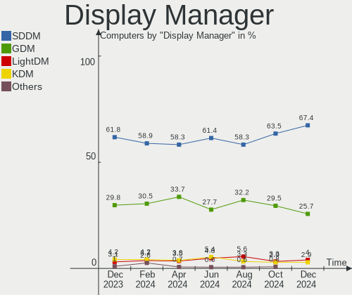
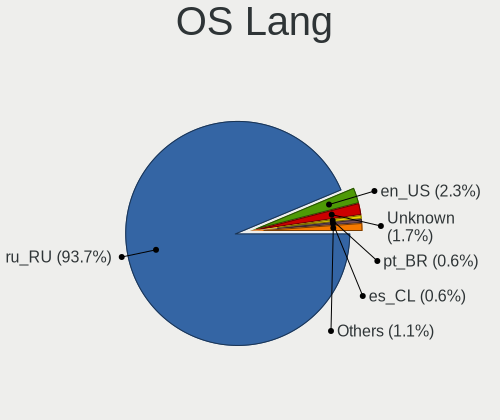
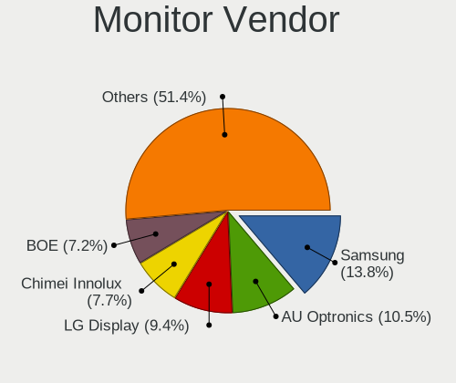
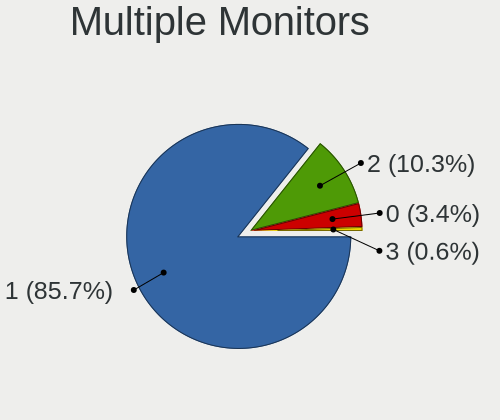
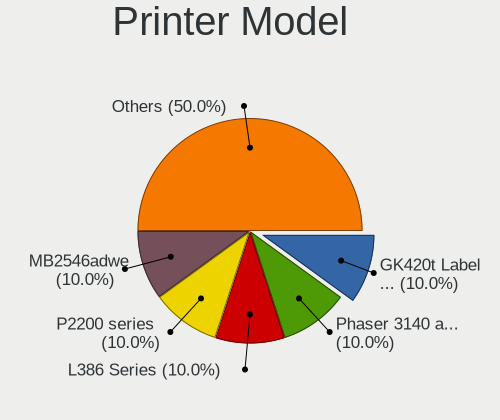

ROSA Hardware Trends
--------------------

A project to identify most popular hardware characteristics and track their change
over time based on data collected by ROSA users at https://Linux-Hardware.org.

Anyone can contribute to this report by the [hw-probe](https://github.com/linuxhw/hw-probe) tool:

    sudo -E hw-probe -all -upload

This is a report for all computer types. See also reports for [desktops](/Dist/ROSA/Desktop/README.md) and [notebooks](/Dist/ROSA/Notebook/README.md).

Full-feature report is available here: https://linux-hardware.org/?view=trends

Period: Dec, 2021.

Contents
--------

* [ System ](#system)
  - [ OS                       ](#os)
  - [ OS Family                ](#os-family)
  - [ Kernel                   ](#kernel)
  - [ Kernel Family            ](#kernel-family)
  - [ Kernel Major Ver.        ](#kernel-major-ver)
  - [ Arch                     ](#arch)
  - [ DE                       ](#de)
  - [ Display Server           ](#display-server)
  - [ Display Manager          ](#display-manager)
  - [ OS Lang                  ](#os-lang)
  - [ Boot Mode                ](#boot-mode)
  - [ Filesystem               ](#filesystem)
  - [ Part. scheme             ](#part-scheme)
  - [ Dual Boot with Linux/BSD ](#dual-boot-with-linuxbsd)
  - [ Dual Boot (Win)          ](#dual-boot-win)

* [ Board ](#board)
  - [ Vendor                   ](#vendor)
  - [ Model                    ](#model)
  - [ Model Family             ](#model-family)
  - [ MFG Year                 ](#mfg-year)
  - [ Form Factor              ](#form-factor)
  - [ Secure Boot              ](#secure-boot)
  - [ Coreboot                 ](#coreboot)
  - [ RAM Size                 ](#ram-size)
  - [ RAM Used                 ](#ram-used)
  - [ Total Drives             ](#total-drives)
  - [ Has CD-ROM               ](#has-cd-rom)
  - [ Has Ethernet             ](#has-ethernet)
  - [ Has WiFi                 ](#has-wifi)
  - [ Has Bluetooth            ](#has-bluetooth)

* [ Location ](#location)
  - [ Country                  ](#country)
  - [ City                     ](#city)

* [ Drives ](#drives)
  - [ Drive Vendor             ](#drive-vendor)
  - [ Drive Model              ](#drive-model)
  - [ HDD Vendor               ](#hdd-vendor)
  - [ SSD Vendor               ](#ssd-vendor)
  - [ Drive Kind               ](#drive-kind)
  - [ Drive Connector          ](#drive-connector)
  - [ Drive Size               ](#drive-size)
  - [ Space Total              ](#space-total)
  - [ Space Used               ](#space-used)
  - [ Malfunc. Drives          ](#malfunc-drives)
  - [ Malfunc. Drive Vendor    ](#malfunc-drive-vendor)
  - [ Malfunc. HDD Vendor      ](#malfunc-hdd-vendor)
  - [ Malfunc. Drive Kind      ](#malfunc-drive-kind)
  - [ Failed Drives            ](#failed-drives)
  - [ Failed Drive Vendor      ](#failed-drive-vendor)
  - [ Drive Status             ](#drive-status)

* [ Storage controller ](#storage-controller)
  - [ Storage Vendor           ](#storage-vendor)
  - [ Storage Model            ](#storage-model)
  - [ Storage Kind             ](#storage-kind)

* [ Processor ](#processor)
  - [ CPU Vendor               ](#cpu-vendor)
  - [ CPU Model                ](#cpu-model)
  - [ CPU Model Family         ](#cpu-model-family)
  - [ CPU Cores                ](#cpu-cores)
  - [ CPU Sockets              ](#cpu-sockets)
  - [ CPU Threads              ](#cpu-threads)
  - [ CPU Op-Modes             ](#cpu-op-modes)
  - [ CPU Microcode            ](#cpu-microcode)
  - [ CPU Microarch            ](#cpu-microarch)

* [ Graphics ](#graphics)
  - [ GPU Vendor               ](#gpu-vendor)
  - [ GPU Model                ](#gpu-model)
  - [ GPU Combo                ](#gpu-combo)
  - [ GPU Driver               ](#gpu-driver)
  - [ GPU Memory               ](#gpu-memory)

* [ Monitor ](#monitor)
  - [ Monitor Vendor           ](#monitor-vendor)
  - [ Monitor Model            ](#monitor-model)
  - [ Monitor Resolution       ](#monitor-resolution)
  - [ Monitor Diagonal         ](#monitor-diagonal)
  - [ Monitor Width            ](#monitor-width)
  - [ Aspect Ratio             ](#aspect-ratio)
  - [ Monitor Area             ](#monitor-area)
  - [ Pixel Density            ](#pixel-density)
  - [ Multiple Monitors        ](#multiple-monitors)

* [ Network ](#network)
  - [ Net Controller Vendor    ](#net-controller-vendor)
  - [ Net Controller Model     ](#net-controller-model)
  - [ Wireless Vendor          ](#wireless-vendor)
  - [ Wireless Model           ](#wireless-model)
  - [ Ethernet Vendor          ](#ethernet-vendor)
  - [ Ethernet Model           ](#ethernet-model)
  - [ Net Controller Kind      ](#net-controller-kind)
  - [ Used Controller          ](#used-controller)
  - [ NICs                     ](#nics)
  - [ IPv6                     ](#ipv6)

* [ Bluetooth ](#bluetooth)
  - [ Bluetooth Vendor         ](#bluetooth-vendor)
  - [ Bluetooth Model          ](#bluetooth-model)

* [ Sound ](#sound)
  - [ Sound Vendor             ](#sound-vendor)
  - [ Sound Model              ](#sound-model)

* [ Memory ](#memory)
  - [ Memory Vendor            ](#memory-vendor)
  - [ Memory Model             ](#memory-model)
  - [ Memory Kind              ](#memory-kind)
  - [ Memory Form Factor       ](#memory-form-factor)
  - [ Memory Size              ](#memory-size)
  - [ Memory Speed             ](#memory-speed)

* [ Printers & scanners ](#printers--scanners)
  - [ Printer Vendor           ](#printer-vendor)
  - [ Printer Model            ](#printer-model)
  - [ Scanner Vendor           ](#scanner-vendor)
  - [ Scanner Model            ](#scanner-model)

* [ Camera ](#camera)
  - [ Camera Vendor            ](#camera-vendor)
  - [ Camera Model             ](#camera-model)

* [ Security ](#security)
  - [ Fingerprint Vendor       ](#fingerprint-vendor)
  - [ Fingerprint Model        ](#fingerprint-model)
  - [ Chipcard Vendor          ](#chipcard-vendor)
  - [ Chipcard Model           ](#chipcard-model)

* [ Unsupported ](#unsupported)
  - [ Unsupported Devices      ](#unsupported-devices)
  - [ Unsupported Device Types ](#unsupported-device-types)

System
------

OS
--

Installed operating systems

| Name       | Computers | Percent |
|------------|-----------|---------|
| ROSA 12.1  | 78        | 54.55%  |
| ROSA R11.1 | 50        | 34.97%  |
| ROSA 12    | 12        | 8.39%   |
| ROSA R11   | 2         | 1.4%    |
| ROSA R8.1  | 1         | 0.7%    |

OS Family
---------

OS without a version

| Name | Computers | Percent |
|------|-----------|---------|
| ROSA | 143       | 100%    |

Kernel
------

Version of the Linux kernel

| Version                             | Computers | Percent |
|-------------------------------------|-----------|---------|
| 5.10.74-generic-2rosa2021.1-x86_64  | 79        | 55.24%  |
| 5.4.83-generic-2rosa-x86_64         | 18        | 12.59%  |
| 5.10.71-generic-1rosa2021.1-x86_64  | 10        | 6.99%   |
| 4.15.0-desktop-122.124.1rosa-x86_64 | 8         | 5.59%   |
| 5.4.83-generic-2rosa-i586           | 6         | 4.2%    |
| 5.4.32-generic-2rosa-i586           | 5         | 3.5%    |
| 5.4.32-generic-2rosa-x86_64         | 4         | 2.8%    |
| 4.9.155-nrj-desktop-1rosa-x86_64    | 4         | 2.8%    |
| 4.15.0-desktop-45.1rosa-x86_64      | 3         | 2.1%    |
| 4.15.0-desktop-122.124.1rosa-i586   | 2         | 1.4%    |
| 5.5.19-generic-1rosa-x86_64         | 1         | 0.7%    |
| 5.4.150-generic-1rosa2021.1-x86_64  | 1         | 0.7%    |
| 5.4.107-generic-0.1rosa-x86_64      | 1         | 0.7%    |
| 5.10.50-generic-1rosa-x86_64        | 1         | 0.7%    |

Kernel Family
-------------

Linux kernel without a distro release

| Version | Computers | Percent |
|---------|-----------|---------|
| 5.10.74 | 79        | 55.24%  |
| 5.4.83  | 24        | 16.78%  |
| 4.15.0  | 13        | 9.09%   |
| 5.10.71 | 10        | 6.99%   |
| 5.4.32  | 9         | 6.29%   |
| 4.9.155 | 4         | 2.8%    |
| 5.5.19  | 1         | 0.7%    |
| 5.4.150 | 1         | 0.7%    |
| 5.4.107 | 1         | 0.7%    |
| 5.10.50 | 1         | 0.7%    |

Kernel Major Ver.
-----------------

Linux kernel major version

| Version | Computers | Percent |
|---------|-----------|---------|
| 5.10    | 90        | 62.94%  |
| 5.4     | 35        | 24.48%  |
| 4.15    | 13        | 9.09%   |
| 4.9     | 4         | 2.8%    |
| 5.5     | 1         | 0.7%    |

Arch
----

OS architecture (x86_64, i586, etc.)

| Name   | Computers | Percent |
|--------|-----------|---------|
| x86_64 | 130       | 90.91%  |
| i686   | 13        | 9.09%   |

DE
--

Desktop Environment

| Name  | Computers | Percent |
|-------|-----------|---------|
| KDE5  | 90        | 62.94%  |
| KDE4  | 31        | 21.68%  |
| GNOME | 12        | 8.39%   |
| LXQt  | 8         | 5.59%   |
| XFCE  | 2         | 1.4%    |

Display Server
--------------

X11 or Wayland

| Name    | Computers | Percent |
|---------|-----------|---------|
| Wayland | 77        | 53.85%  |
| X11     | 66        | 46.15%  |

Display Manager
---------------

SDDM, LightDM, etc.

| Name    | Computers | Percent |
|---------|-----------|---------|
| GDM     | 57        | 39.86%  |
| SDDM    | 52        | 36.36%  |
| KDM     | 31        | 21.68%  |
| LightDM | 3         | 2.1%    |

OS Lang
-------

Language

| Lang    | Computers | Percent |
|---------|-----------|---------|
| ru_RU   | 123       | 86.01%  |
| ru_UA   | 3         | 2.1%    |
| en_GB   | 3         | 2.1%    |
| pl_PL   | 2         | 1.4%    |
| en_US   | 2         | 1.4%    |
| Unknown | 2         | 1.4%    |
| pt_BR   | 1         | 0.7%    |
| nl_NL   | 1         | 0.7%    |
| es_VE   | 1         | 0.7%    |
| es_PE   | 1         | 0.7%    |
| es_ES   | 1         | 0.7%    |
| en_AU   | 1         | 0.7%    |
| de_DE   | 1         | 0.7%    |
| cs_CZ   | 1         | 0.7%    |

Boot Mode
---------

EFI or BIOS

| Mode | Computers | Percent |
|------|-----------|---------|
| BIOS | 93        | 65.03%  |
| EFI  | 50        | 34.97%  |

Filesystem
----------

Type of filesystem

| Type  | Computers | Percent |
|-------|-----------|---------|
| Ext4  | 133       | 93.01%  |
| Btrfs | 8         | 5.59%   |
| Ext3  | 1         | 0.7%    |
| Ext2  | 1         | 0.7%    |

Part. scheme
------------

Scheme of partitioning

| Type | Computers | Percent |
|------|-----------|---------|
| MBR  | 73        | 51.05%  |
| GPT  | 70        | 48.95%  |

Dual Boot with Linux/BSD
------------------------

Hosting more than one Linux/BSD

| Dual boot | Computers | Percent |
|-----------|-----------|---------|
| No        | 104       | 72.73%  |
| Yes       | 39        | 27.27%  |

Dual Boot (Win)
---------------

Hosting Linux and Windows

| Dual boot | Computers | Percent |
|-----------|-----------|---------|
| Yes       | 75        | 52.45%  |
| No        | 68        | 47.55%  |

Board
-----

Vendor
------

Motherboard manufacturer

| Name                | Computers | Percent |
|---------------------|-----------|---------|
| ASUSTek Computer    | 30        | 20.98%  |
| Hewlett-Packard     | 19        | 13.29%  |
| Lenovo              | 14        | 9.79%   |
| MSI                 | 13        | 9.09%   |
| Gigabyte Technology | 11        | 7.69%   |
| ASRock              | 10        | 6.99%   |
| Samsung Electronics | 9         | 6.29%   |
| Acer                | 8         | 5.59%   |
| Sony                | 4         | 2.8%    |
| Dell                | 4         | 2.8%    |
| Packard Bell        | 2         | 1.4%    |
| Huanan              | 2         | 1.4%    |
| ECS                 | 2         | 1.4%    |
| TUXEDO              | 1         | 0.7%    |
| Toshiba             | 1         | 0.7%    |
| QIYIDA              | 1         | 0.7%    |
| Pegatron            | 1         | 0.7%    |
| Intel               | 1         | 0.7%    |
| HASEE Computer      | 1         | 0.7%    |
| Fujitsu             | 1         | 0.7%    |
| EPoX Computer       | 1         | 0.7%    |
| eMachines           | 1         | 0.7%    |
| DNS                 | 1         | 0.7%    |
| Biostar             | 1         | 0.7%    |
| BenQ                | 1         | 0.7%    |
| Apple               | 1         | 0.7%    |
| ABIT                | 1         | 0.7%    |
| Unknown             | 1         | 0.7%    |

Model
-----

Motherboard model

| Name                                       | Computers | Percent |
|--------------------------------------------|-----------|---------|
| ASUS All Series                            | 5         | 3.5%    |
| Samsung NC210/NC110                        | 2         | 1.4%    |
| Lenovo B590 20206                          | 2         | 1.4%    |
| HP Pavilion g6                             | 2         | 1.4%    |
| ASUS PRIME A320M-K                         | 2         | 1.4%    |
| Unknown                                    | 2         | 1.4%    |
| TUXEDO Pulse 15 Gen1                       | 1         | 0.7%    |
| Toshiba Satellite L30                      | 1         | 0.7%    |
| Sony VPCL22Z1R                             | 1         | 0.7%    |
| Sony VGN-FW51JF_H                          | 1         | 0.7%    |
| Sony SVE1512G1RB                           | 1         | 0.7%    |
| Sony SVE1412E1RW                           | 1         | 0.7%    |
| Samsung R530/R730                          | 1         | 0.7%    |
| Samsung R528/R728                          | 1         | 0.7%    |
| Samsung Q35/Q36                            | 1         | 0.7%    |
| Samsung N150P/N210P/N220P                  | 1         | 0.7%    |
| Samsung 300V3A/300V4A/300V5A/200A4B/200A5B | 1         | 0.7%    |
| Samsung 300E4C/300E5C/300E7C               | 1         | 0.7%    |
| Samsung 300E4A/300E5A/300E7A/3430EA/3530EA | 1         | 0.7%    |
| QIYIDA X99-H9 V2.0                         | 1         | 0.7%    |
| Pegatron H110-P1                           | 1         | 0.7%    |
| Packard Bell EN Butterfly m                | 1         | 0.7%    |
| Packard Bell EasyNote LJ75                 | 1         | 0.7%    |
| MSI OPTIMUS                                | 1         | 0.7%    |
| MSI MS-7D18                                | 1         | 0.7%    |
| MSI MS-7C51                                | 1         | 0.7%    |
| MSI MS-7B38                                | 1         | 0.7%    |
| MSI MS-7B36                                | 1         | 0.7%    |
| MSI MS-7A33                                | 1         | 0.7%    |
| MSI MS-7A15                                | 1         | 0.7%    |
| MSI MS-7808                                | 1         | 0.7%    |
| MSI MS-7693                                | 1         | 0.7%    |
| MSI MS-7583                                | 1         | 0.7%    |
| MSI MS-7238                                | 1         | 0.7%    |
| MSI GS63 7RD                               | 1         | 0.7%    |
| MSI Compaq dx7400 Microtower               | 1         | 0.7%    |
| Lenovo ThinkStation P340 30DH00H6RU        | 1         | 0.7%    |
| Lenovo ThinkPad X220 42912WG               | 1         | 0.7%    |
| Lenovo ThinkPad W540 20BG001KUK            | 1         | 0.7%    |
| Lenovo Legion Y7000 2019 81NS              | 1         | 0.7%    |
| Lenovo Legion Y540-17IRH 81Q4              | 1         | 0.7%    |
| Lenovo IdeaPad S145-15AST 81N3             | 1         | 0.7%    |
| Lenovo IdeaPad L340-15IRH Gaming 81LK      | 1         | 0.7%    |
| Lenovo IdeaPad 320-15AST 80XV              | 1         | 0.7%    |
| Lenovo IdeaPad 3 15ARE05 81W4              | 1         | 0.7%    |
| Lenovo G70-80 80FF                         | 1         | 0.7%    |
| Lenovo G580 20157                          | 1         | 0.7%    |
| Lenovo C440 10104                          | 1         | 0.7%    |
| Huanan X99-F8                              | 1         | 0.7%    |
| Huanan X79 V2.3 249PC                      | 1         | 0.7%    |
| HP Z230 Tower Workstation                  | 1         | 0.7%    |
| HP ProLiant DL360 G5                       | 1         | 0.7%    |
| HP Presario CQ57                           | 1         | 0.7%    |
| HP Pavilion x360 Convertible 14-cd0xxx     | 1         | 0.7%    |
| HP Pavilion TS 11                          | 1         | 0.7%    |
| HP Pavilion Gaming Laptop 16-a0xxx         | 1         | 0.7%    |
| HP Pavilion 15                             | 1         | 0.7%    |
| HP Notebook                                | 1         | 0.7%    |
| HP Mini 110-3000                           | 1         | 0.7%    |
| HP EliteBook Folio 9470m                   | 1         | 0.7%    |

Model Family
------------

Motherboard model prefix

| Name                  | Computers | Percent |
|-----------------------|-----------|---------|
| Acer Aspire           | 8         | 5.59%   |
| HP Pavilion           | 6         | 4.2%    |
| ASUS PRIME            | 6         | 4.2%    |
| ASUS All              | 5         | 3.5%    |
| Lenovo IdeaPad        | 4         | 2.8%    |
| HP EliteBook          | 3         | 2.1%    |
| Samsung NC210         | 2         | 1.4%    |
| Lenovo ThinkPad       | 2         | 1.4%    |
| Lenovo Legion         | 2         | 1.4%    |
| Lenovo B590           | 2         | 1.4%    |
| Unknown               | 2         | 1.4%    |
| TUXEDO Pulse          | 1         | 0.7%    |
| Toshiba Satellite     | 1         | 0.7%    |
| Sony VPCL22Z1R        | 1         | 0.7%    |
| Sony VGN-FW51JF       | 1         | 0.7%    |
| Sony SVE1512G1RB      | 1         | 0.7%    |
| Sony SVE1412E1RW      | 1         | 0.7%    |
| Samsung R530          | 1         | 0.7%    |
| Samsung R528          | 1         | 0.7%    |
| Samsung Q35           | 1         | 0.7%    |
| Samsung N150P         | 1         | 0.7%    |
| Samsung 300V3A        | 1         | 0.7%    |
| Samsung 300E4C        | 1         | 0.7%    |
| Samsung 300E4A        | 1         | 0.7%    |
| QIYIDA X99-H9         | 1         | 0.7%    |
| Pegatron H110-P1      | 1         | 0.7%    |
| Packard Bell EN       | 1         | 0.7%    |
| Packard Bell EasyNote | 1         | 0.7%    |
| MSI OPTIMUS           | 1         | 0.7%    |
| MSI MS-7D18           | 1         | 0.7%    |
| MSI MS-7C51           | 1         | 0.7%    |
| MSI MS-7B38           | 1         | 0.7%    |
| MSI MS-7B36           | 1         | 0.7%    |
| MSI MS-7A33           | 1         | 0.7%    |
| MSI MS-7A15           | 1         | 0.7%    |
| MSI MS-7808           | 1         | 0.7%    |
| MSI MS-7693           | 1         | 0.7%    |
| MSI MS-7583           | 1         | 0.7%    |
| MSI MS-7238           | 1         | 0.7%    |
| MSI GS63              | 1         | 0.7%    |
| MSI Compaq            | 1         | 0.7%    |
| Lenovo ThinkStation   | 1         | 0.7%    |
| Lenovo G70-80         | 1         | 0.7%    |
| Lenovo G580           | 1         | 0.7%    |
| Lenovo C440           | 1         | 0.7%    |
| Huanan X99-F8         | 1         | 0.7%    |
| Huanan X79            | 1         | 0.7%    |
| HP Z230               | 1         | 0.7%    |
| HP ProLiant           | 1         | 0.7%    |
| HP Presario           | 1         | 0.7%    |
| HP Notebook           | 1         | 0.7%    |
| HP Mini               | 1         | 0.7%    |
| HP Compaq             | 1         | 0.7%    |
| HP All-in-One         | 1         | 0.7%    |
| HP 630                | 1         | 0.7%    |
| HP 290                | 1         | 0.7%    |
| HP ..                 | 1         | 0.7%    |
| HASEE W65KJ1          | 1         | 0.7%    |
| Gigabyte Z390         | 1         | 0.7%    |
| Gigabyte P67A-D3-B3   | 1         | 0.7%    |

MFG Year
--------

Motherboard manufacture year

| Year | Computers | Percent |
|------|-----------|---------|
| 2011 | 18        | 12.59%  |
| 2018 | 14        | 9.79%   |
| 2010 | 14        | 9.79%   |
| 2020 | 12        | 8.39%   |
| 2016 | 11        | 7.69%   |
| 2012 | 11        | 7.69%   |
| 2021 | 10        | 6.99%   |
| 2013 | 10        | 6.99%   |
| 2009 | 8         | 5.59%   |
| 2019 | 7         | 4.9%    |
| 2015 | 7         | 4.9%    |
| 2008 | 5         | 3.5%    |
| 2007 | 5         | 3.5%    |
| 2017 | 4         | 2.8%    |
| 2006 | 3         | 2.1%    |
| 2014 | 2         | 1.4%    |
| 2005 | 2         | 1.4%    |

Form Factor
-----------

Physical design of the computer

| Name        | Computers | Percent |
|-------------|-----------|---------|
| Desktop     | 72        | 50.35%  |
| Notebook    | 65        | 45.45%  |
| All in one  | 4         | 2.8%    |
| Convertible | 1         | 0.7%    |
| Server      | 1         | 0.7%    |

Secure Boot
-----------

Enabled or disabled

| State    | Computers | Percent |
|----------|-----------|---------|
| Disabled | 143       | 100%    |

Coreboot
--------

Have coreboot on board

| Used | Computers | Percent |
|------|-----------|---------|
| No   | 143       | 100%    |

RAM Size
--------

Total RAM memory

| Size in GB | Computers | Percent |
|------------|-----------|---------|
| 3.01-4.0   | 42        | 29.37%  |
| 4.01-8.0   | 27        | 18.88%  |
| 8.01-16.0  | 26        | 18.18%  |
| 16.01-24.0 | 21        | 14.69%  |
| 1.01-2.0   | 13        | 9.09%   |
| 32.01-64.0 | 5         | 3.5%    |
| 2.01-3.0   | 5         | 3.5%    |
| 0.51-1.0   | 3         | 2.1%    |
| 24.01-32.0 | 1         | 0.7%    |

RAM Used
--------

Used RAM memory

| Used GB  | Computers | Percent |
|----------|-----------|---------|
| 1.01-2.0 | 61        | 42.66%  |
| 0.51-1.0 | 48        | 33.57%  |
| 2.01-3.0 | 18        | 12.59%  |
| 3.01-4.0 | 10        | 6.99%   |
| 4.01-8.0 | 4         | 2.8%    |
| 0.01-0.5 | 2         | 1.4%    |

Total Drives
------------

Number of drives on board

| Drives | Computers | Percent |
|--------|-----------|---------|
| 1      | 82        | 57.34%  |
| 2      | 42        | 29.37%  |
| 3      | 12        | 8.39%   |
| 4      | 6         | 4.2%    |
| 6      | 1         | 0.7%    |

Has CD-ROM
----------

Has CD-ROM on board

| Presented | Computers | Percent |
|-----------|-----------|---------|
| No        | 74        | 51.75%  |
| Yes       | 69        | 48.25%  |

Has Ethernet
------------

Has Ethernet on board

| Presented | Computers | Percent |
|-----------|-----------|---------|
| Yes       | 138       | 96.5%   |
| No        | 5         | 3.5%    |

Has WiFi
--------

Has WiFi module

| Presented | Computers | Percent |
|-----------|-----------|---------|
| Yes       | 86        | 60.14%  |
| No        | 57        | 39.86%  |

Has Bluetooth
-------------

Has Bluetooth module

| Presented | Computers | Percent |
|-----------|-----------|---------|
| No        | 84        | 58.74%  |
| Yes       | 59        | 41.26%  |

Location
--------

Country
-------

Geographic location (country)

| Country     | Computers | Percent |
|-------------|-----------|---------|
| Russia      | 101       | 70.63%  |
| Ukraine     | 12        | 8.39%   |
| Kazakhstan  | 4         | 2.8%    |
| Belarus     | 4         | 2.8%    |
| UK          | 3         | 2.1%    |
| Latvia      | 3         | 2.1%    |
| Poland      | 2         | 1.4%    |
| Germany     | 2         | 1.4%    |
| France      | 2         | 1.4%    |
| Venezuela   | 1         | 0.7%    |
| Peru        | 1         | 0.7%    |
| Netherlands | 1         | 0.7%    |
| Moldova     | 1         | 0.7%    |
| Estonia     | 1         | 0.7%    |
| Czechia     | 1         | 0.7%    |
| Bulgaria    | 1         | 0.7%    |
| Brazil      | 1         | 0.7%    |
| Austria     | 1         | 0.7%    |
| Australia   | 1         | 0.7%    |

City
----

Geographic location (city)

| City               | Computers | Percent |
|--------------------|-----------|---------|
| Moscow             | 16        | 11.19%  |
| Kazan?ˆ™           | 6         | 4.2%    |
| St Petersburg      | 4         | 2.8%    |
| Novosibirsk        | 4         | 2.8%    |
| Yekaterinburg      | 3         | 2.1%    |
| Rostov-on-Don      | 3         | 2.1%    |
| Riga               | 3         | 2.1%    |
| Minsk              | 3         | 2.1%    |
| Tyumen             | 2         | 1.4%    |
| Tver               | 2         | 1.4%    |
| Tula               | 2         | 1.4%    |
| Starotitarovskaya  | 2         | 1.4%    |
| Simferopol         | 2         | 1.4%    |
| Samara             | 2         | 1.4%    |
| Manchester         | 2         | 1.4%    |
| Krasnodar          | 2         | 1.4%    |
| Kemerovo           | 2         | 1.4%    |
| Donetsk            | 2         | 1.4%    |
| Cherepovets        | 2         | 1.4%    |
| Castera-Lectourois | 2         | 1.4%    |
| Belgorod           | 2         | 1.4%    |
| Warsaw             | 1         | 0.7%    |
| Voronezh           | 1         | 0.7%    |
| Volgograd          | 1         | 0.7%    |
| Vienna             | 1         | 0.7%    |
| Ulyanovsk          | 1         | 0.7%    |
| Ufa                | 1         | 0.7%    |
| Turnov             | 1         | 0.7%    |
| Tumbotino          | 1         | 0.7%    |
| Tomsk              | 1         | 0.7%    |
| The Hague          | 1         | 0.7%    |
| Tallinn            | 1         | 0.7%    |
| Sydney             | 1         | 0.7%    |
| Surgut             | 1         | 0.7%    |
| Stavropol          | 1         | 0.7%    |
| Solikamsk          | 1         | 0.7%    |
| Smolenshchina      | 1         | 0.7%    |
| Severoural'sk      | 1         | 0.7%    |
| Severodvinsk       | 1         | 0.7%    |
| Sevastopol         | 1         | 0.7%    |
| Semey              | 1         | 0.7%    |
| San Juan de Col??n | 1         | 0.7%    |
| Ryazan             | 1         | 0.7%    |
| Rudnyy             | 1         | 0.7%    |
| Pskov              | 1         | 0.7%    |
| Pochep             | 1         | 0.7%    |
| Petergof           | 1         | 0.7%    |
| Pernik             | 1         | 0.7%    |
| Pavlodar           | 1         | 0.7%    |
| Orenburg           | 1         | 0.7%    |
| Omsk               | 1         | 0.7%    |
| Odintsovo          | 1         | 0.7%    |
| Odessa             | 1         | 0.7%    |
| Nur-Sultan         | 1         | 0.7%    |
| Nizhny Tagil       | 1         | 0.7%    |
| Naro-Fominsk       | 1         | 0.7%    |
| Nal'chik           | 1         | 0.7%    |
| Myrnohrad          | 1         | 0.7%    |
| Minusinsk          | 1         | 0.7%    |
| Lyubertsy          | 1         | 0.7%    |

Drives
------

Drive Vendor
------------

Hard drive vendors

| Vendor              | Computers | Drives | Percent |
|---------------------|-----------|--------|---------|
| WDC                 | 41        | 44     | 18.55%  |
| Seagate             | 41        | 44     | 18.55%  |
| Samsung Electronics | 21        | 21     | 9.5%    |
| Toshiba             | 16        | 17     | 7.24%   |
| Hitachi             | 16        | 16     | 7.24%   |
| Kingston            | 9         | 9      | 4.07%   |
| Apacer              | 8         | 8      | 3.62%   |
| China               | 7         | 7      | 3.17%   |
| Crucial             | 6         | 6      | 2.71%   |
| HGST                | 5         | 5      | 2.26%   |
| SPCC                | 4         | 4      | 1.81%   |
| Unknown             | 3         | 3      | 1.36%   |
| Transcend           | 3         | 3      | 1.36%   |
| SK Hynix            | 3         | 3      | 1.36%   |
| SanDisk             | 3         | 3      | 1.36%   |
| Patriot             | 3         | 3      | 1.36%   |
| OCZ                 | 3         | 3      | 1.36%   |
| A-DATA Technology   | 3         | 3      | 1.36%   |
| Smartbuy            | 2         | 2      | 0.9%    |
| Micron Technology   | 2         | 2      | 0.9%    |
| MAXTOR              | 2         | 2      | 0.9%    |
| Intel               | 2         | 2      | 0.9%    |
| GOODRAM             | 2         | 2      | 0.9%    |
| Gigabyte Technology | 2         | 2      | 0.9%    |
| Vaseky              | 1         | 1      | 0.45%   |
| UMIS                | 1         | 1      | 0.45%   |
| TF CARD             | 1         | 1      | 0.45%   |
| Team                | 1         | 1      | 0.45%   |
| Silicon Motion      | 1         | 1      | 0.45%   |
| Phison              | 1         | 1      | 0.45%   |
| Netac               | 1         | 1      | 0.45%   |
| KingSpec            | 1         | 1      | 0.45%   |
| KingDian            | 1         | 1      | 0.45%   |
| JMicron             | 1         | 1      | 0.45%   |
| Fujitsu             | 1         | 1      | 0.45%   |
| FOXLINE             | 1         | 1      | 0.45%   |
| e2e4                | 1         | 1      | 0.45%   |
| ASMT                | 1         | 2      | 0.45%   |

Drive Model
-----------

Hard drive models

| Model                                | Computers | Percent |
|--------------------------------------|-----------|---------|
| Kingston SA400S37240G 240GB SSD      | 4         | 1.78%   |
| Apacer AS350 128GB SSD               | 4         | 1.78%   |
| WDC WDS240G2G0A-00JH30 240GB SSD     | 3         | 1.33%   |
| Seagate ST2000DM008-2FR102 2TB       | 3         | 1.33%   |
| HGST HTS545050A7E380 500GB           | 3         | 1.33%   |
| Crucial CT120BX500SSD1 120GB         | 3         | 1.33%   |
| WDC WD10EADS-65M2B0 1TB              | 2         | 0.89%   |
| Toshiba DT01ACA100 1TB               | 2         | 0.89%   |
| Smartbuy SSD 120GB                   | 2         | 0.89%   |
| Seagate ST9320423AS 320GB            | 2         | 0.89%   |
| Seagate ST500LT012-1DG142 500GB      | 2         | 0.89%   |
| Seagate ST500DM005 HD502HJ 500GB     | 2         | 0.89%   |
| Seagate ST320LT020-9YG142 320GB      | 2         | 0.89%   |
| Seagate ST1000LM024 HN-M101MBB 1TB   | 2         | 0.89%   |
| Seagate ST1000DM010-2EP102 1TB       | 2         | 0.89%   |
| Seagate ST1000DM003-1CH162 1TB       | 2         | 0.89%   |
| Hitachi HTS547575A9E384 752GB        | 2         | 0.89%   |
| Hitachi HTS543232A7A384 320GB        | 2         | 0.89%   |
| China SSD 360GB                      | 2         | 0.89%   |
| WDC WDS500G2B0A-00SM50 500GB SSD     | 1         | 0.44%   |
| WDC WDS240G2G0B-00EPW0 240GB SSD     | 1         | 0.44%   |
| WDC WDS120G2G0A-00JH30 120GB SSD     | 1         | 0.44%   |
| WDC WDS120G1G0A-00SS50 120GB SSD     | 1         | 0.44%   |
| WDC WDS100T3X0C-00SJG0 1TB           | 1         | 0.44%   |
| WDC WDS100T2B0A-00SM50 1TB SSD       | 1         | 0.44%   |
| WDC WD800JD-60MSA1 80GB              | 1         | 0.44%   |
| WDC WD800BEVS-22RST0 80GB            | 1         | 0.44%   |
| WDC WD7500BPVT-60HXZT3 752GB         | 1         | 0.44%   |
| WDC WD5003AZEX-00MK2A0 500GB         | 1         | 0.44%   |
| WDC WD5000LPVX-00V0TT0 500GB         | 1         | 0.44%   |
| WDC WD5000LPLX-60ZNTT1 500GB         | 1         | 0.44%   |
| WDC WD5000BPVT-24HXZT3 500GB         | 1         | 0.44%   |
| WDC WD5000AAKX-001CA0 500GB          | 1         | 0.44%   |
| WDC WD5000AADS-00S9B0 500GB          | 1         | 0.44%   |
| WDC WD5000AACS-00G8B1 500GB          | 1         | 0.44%   |
| WDC WD40PURZ-85TTDY0 4TB             | 1         | 0.44%   |
| WDC WD40PURZ-85AKKY0 4TB             | 1         | 0.44%   |
| WDC WD40EZRZ-22GXCB0 4TB             | 1         | 0.44%   |
| WDC WD3200BEVT-60A23T0 320GB         | 1         | 0.44%   |
| WDC WD3200AAKS-00YGA0 320GB          | 1         | 0.44%   |
| WDC WD30EZRX-00DC0B0 3TB             | 1         | 0.44%   |
| WDC WD2500JS-63MHB5 250GB            | 1         | 0.44%   |
| WDC WD2500JS-40MVB1 250GB            | 1         | 0.44%   |
| WDC WD20PURZ-85GU6Y0 2TB             | 1         | 0.44%   |
| WDC WD20EZRZ-00Z5HB0 2TB             | 1         | 0.44%   |
| WDC WD20EARS-00MVWB0 2TB             | 1         | 0.44%   |
| WDC WD1600YS-01SHB0 165GB            | 1         | 0.44%   |
| WDC WD1600AAJB-00PVA0 160GB          | 1         | 0.44%   |
| WDC WD10SPZX-24Z10 1TB               | 1         | 0.44%   |
| WDC WD10SPZX-21Z10T0 1TB             | 1         | 0.44%   |
| WDC WD10JPVX-60JC3T0 1TB             | 1         | 0.44%   |
| WDC WD10EZEX-75WN4A0 1TB             | 1         | 0.44%   |
| WDC WD10EZEX-60WN4A1 1TB             | 1         | 0.44%   |
| WDC WD10EZEX-08WN4A0 1TB             | 1         | 0.44%   |
| WDC WD10EZEX-00BN5A0 1TB             | 1         | 0.44%   |
| WDC WD1003FZEX-00K3CA0 1TB           | 1         | 0.44%   |
| WDC WD1002FAEX-00Y9A0 1TB            | 1         | 0.44%   |
| WDC PC SN730 SDBPNTY-512G-1101 512GB | 1         | 0.44%   |
| Vaseky V800/120G 120GB SSD           | 1         | 0.44%   |
| Unknown SDU1  64GB                   | 1         | 0.44%   |

HDD Vendor
----------

Hard disk drive vendors

| Vendor              | Computers | Drives | Percent |
|---------------------|-----------|--------|---------|
| Seagate             | 40        | 43     | 34.48%  |
| WDC                 | 33        | 34     | 28.45%  |
| Hitachi             | 16        | 16     | 13.79%  |
| Toshiba             | 11        | 12     | 9.48%   |
| Samsung Electronics | 8         | 8      | 6.9%    |
| HGST                | 5         | 5      | 4.31%   |
| MAXTOR              | 2         | 2      | 1.72%   |
| Fujitsu             | 1         | 1      | 0.86%   |

SSD Vendor
----------

Solid state drive vendors

| Vendor              | Computers | Drives | Percent |
|---------------------|-----------|--------|---------|
| Samsung Electronics | 9         | 9      | 10.11%  |
| WDC                 | 8         | 8      | 8.99%   |
| Kingston            | 8         | 8      | 8.99%   |
| Apacer              | 8         | 8      | 8.99%   |
| China               | 7         | 7      | 7.87%   |
| Crucial             | 6         | 6      | 6.74%   |
| Toshiba             | 5         | 5      | 5.62%   |
| SPCC                | 4         | 4      | 4.49%   |
| Transcend           | 3         | 3      | 3.37%   |
| SanDisk             | 3         | 3      | 3.37%   |
| Patriot             | 3         | 3      | 3.37%   |
| OCZ                 | 3         | 3      | 3.37%   |
| A-DATA Technology   | 3         | 3      | 3.37%   |
| Smartbuy            | 2         | 2      | 2.25%   |
| GOODRAM             | 2         | 2      | 2.25%   |
| Gigabyte Technology | 2         | 2      | 2.25%   |
| Vaseky              | 1         | 1      | 1.12%   |
| Team                | 1         | 1      | 1.12%   |
| SK Hynix            | 1         | 1      | 1.12%   |
| Seagate             | 1         | 1      | 1.12%   |
| Netac               | 1         | 1      | 1.12%   |
| Micron Technology   | 1         | 1      | 1.12%   |
| KingSpec            | 1         | 1      | 1.12%   |
| KingDian            | 1         | 1      | 1.12%   |
| JMicron             | 1         | 1      | 1.12%   |
| Intel               | 1         | 1      | 1.12%   |
| FOXLINE             | 1         | 1      | 1.12%   |
| e2e4                | 1         | 1      | 1.12%   |
| ASMT                | 1         | 2      | 1.12%   |

Drive Kind
----------

HDD or SSD

| Kind    | Computers | Drives | Percent |
|---------|-----------|--------|---------|
| HDD     | 101       | 121    | 53.44%  |
| SSD     | 71        | 90     | 37.57%  |
| NVMe    | 13        | 14     | 6.88%   |
| MMC     | 3         | 3      | 1.59%   |
| Unknown | 1         | 1      | 0.53%   |

Drive Connector
---------------

SATA, SAS, NVMe, etc.

| Type | Computers | Drives | Percent |
|------|-----------|--------|---------|
| SATA | 138       | 207    | 87.34%  |
| NVMe | 13        | 14     | 8.23%   |
| SAS  | 4         | 5      | 2.53%   |
| MMC  | 3         | 3      | 1.9%    |

Drive Size
----------

Size of hard drive

| Size in TB | Computers | Drives | Percent |
|------------|-----------|--------|---------|
| 0.01-0.5   | 120       | 157    | 71.43%  |
| 0.51-1.0   | 32        | 35     | 19.05%  |
| 1.01-2.0   | 9         | 11     | 5.36%   |
| 3.01-4.0   | 4         | 5      | 2.38%   |
| 2.01-3.0   | 3         | 3      | 1.79%   |

Space Total
-----------

Amount of disk space available on the file system

| Size in GB     | Computers | Percent |
|----------------|-----------|---------|
| 101-250        | 54        | 37.76%  |
| 251-500        | 23        | 16.08%  |
| 1-20           | 15        | 10.49%  |
| 501-1000       | 15        | 10.49%  |
| 51-100         | 12        | 8.39%   |
| 21-50          | 8         | 5.59%   |
| 1001-2000      | 7         | 4.9%    |
| More than 3000 | 5         | 3.5%    |
| 2001-3000      | 3         | 2.1%    |
| Unknown        | 1         | 0.7%    |

Space Used
----------

Amount of used disk space

| Used GB        | Computers | Percent |
|----------------|-----------|---------|
| 1-20           | 83        | 58.04%  |
| 21-50          | 23        | 16.08%  |
| 101-250        | 14        | 9.79%   |
| 51-100         | 8         | 5.59%   |
| 251-500        | 7         | 4.9%    |
| More than 3000 | 2         | 1.4%    |
| 1001-2000      | 2         | 1.4%    |
| 501-1000       | 2         | 1.4%    |
| 2001-3000      | 1         | 0.7%    |
| Unknown        | 1         | 0.7%    |

Malfunc. Drives
---------------

Drive models with a malfunction

| Model                                               | Computers | Drives | Percent |
|-----------------------------------------------------|-----------|--------|---------|
| WDC WD10EADS-65M2B0 1TB                             | 2         | 2      | 3.33%   |
| Seagate ST320LT020-9YG142 320GB                     | 2         | 2      | 3.33%   |
| Hitachi HTS547575A9E384 752GB                       | 2         | 2      | 3.33%   |
| HGST HTS545050A7E380 500GB                          | 2         | 2      | 3.33%   |
| WDC WD800JD-60MSA1 80GB                             | 1         | 1      | 1.67%   |
| WDC WD7500BPVT-60HXZT3 752GB                        | 1         | 1      | 1.67%   |
| WDC WD5000LPVX-00V0TT0 500GB                        | 1         | 1      | 1.67%   |
| WDC WD5000AAKX-001CA0 500GB                         | 1         | 1      | 1.67%   |
| WDC WD5000AACS-00G8B1 500GB                         | 1         | 1      | 1.67%   |
| WDC WD3200BEVT-60A23T0 320GB                        | 1         | 1      | 1.67%   |
| WDC WD2500JS-63MHB5 250GB                           | 1         | 1      | 1.67%   |
| WDC WD20EARS-00MVWB0 2TB                            | 1         | 1      | 1.67%   |
| WDC WD1600YS-01SHB0 165GB                           | 1         | 1      | 1.67%   |
| WDC WD1600AAJB-00PVA0 160GB                         | 1         | 1      | 1.67%   |
| WDC WD10JPVX-60JC3T0 1TB                            | 1         | 1      | 1.67%   |
| WDC WD10EZEX-60WN4A1 1TB                            | 1         | 1      | 1.67%   |
| Toshiba MK3276GSX 320GB                             | 1         | 1      | 1.67%   |
| Toshiba MK3259GSXP 320GB                            | 1         | 1      | 1.67%   |
| Toshiba MK1234GSX 120GB                             | 1         | 1      | 1.67%   |
| Toshiba DT01ACA100 1TB                              | 1         | 1      | 1.67%   |
| Toshiba DT01ACA050 500GB                            | 1         | 2      | 1.67%   |
| SPCC SSD110 120GB                                   | 1         | 1      | 1.67%   |
| SPCC Solid State Disk 56GB                          | 1         | 1      | 1.67%   |
| Seagate ST9320423AS 320GB                           | 1         | 1      | 1.67%   |
| Seagate ST500LT012-1DG142 500GB                     | 1         | 1      | 1.67%   |
| Seagate ST500LM012 HN-M500MBB 500GB                 | 1         | 1      | 1.67%   |
| Seagate ST500LM000-1EJ162 500GB                     | 1         | 1      | 1.67%   |
| Seagate ST500DM005 HD502HJ 500GB                    | 1         | 1      | 1.67%   |
| Seagate ST340014A 40GB                              | 1         | 1      | 1.67%   |
| Seagate ST3320413CS 320GB                           | 1         | 1      | 1.67%   |
| Seagate ST3000VX010-2E3166 3TB                      | 1         | 1      | 1.67%   |
| Seagate ST3000DM001-1CH166 3TB                      | 1         | 1      | 1.67%   |
| Seagate ST1000LM048-2E7172 1TB                      | 1         | 1      | 1.67%   |
| Seagate ST1000LM024 HN-M101MBB 1TB                  | 1         | 1      | 1.67%   |
| Seagate ST1000DM003-1CH162 1TB                      | 1         | 1      | 1.67%   |
| Samsung Electronics SSD 870 EVO 1TB                 | 1         | 1      | 1.67%   |
| Samsung Electronics SP2504C 250GB                   | 1         | 1      | 1.67%   |
| Samsung Electronics HS12UHE 120GB                   | 1         | 1      | 1.67%   |
| Samsung Electronics HM321HI 320GB                   | 1         | 1      | 1.67%   |
| Samsung Electronics HD322GJ 320GB                   | 1         | 1      | 1.67%   |
| OCZ VERTEX3 240GB SSD                               | 1         | 1      | 1.67%   |
| OCZ VERTEX3 120GB SSD                               | 1         | 1      | 1.67%   |
| Micron Technology MTFDDAK256MAY-1AH12ABHA 256GB SSD | 1         | 1      | 1.67%   |
| MAXTOR STM3250310AS 250GB                           | 1         | 1      | 1.67%   |
| Hitachi HTS723225A7A364 250GB                       | 1         | 1      | 1.67%   |
| Hitachi HTS547550A9E384 500GB                       | 1         | 1      | 1.67%   |
| Hitachi HTS545050B9A300 500GB                       | 1         | 1      | 1.67%   |
| Hitachi HTS543216L9SA00 160GB                       | 1         | 1      | 1.67%   |
| Hitachi HTS542512K9SA00 120GB                       | 1         | 1      | 1.67%   |
| Hitachi HDS721616PLA380 160GB                       | 1         | 1      | 1.67%   |
| Hitachi HDS721050CLA660 500GB                       | 1         | 1      | 1.67%   |
| Hitachi HDS721032CLA362 320GB                       | 1         | 1      | 1.67%   |
| Hitachi HDP725050GLA360 500GB                       | 1         | 1      | 1.67%   |
| HGST HTS545050A7E680 500GB                          | 1         | 1      | 1.67%   |
| China SSD 360GB                                     | 1         | 1      | 1.67%   |
| ASMT USB3.0 480GB                                   | 1         | 2      | 1.67%   |

Malfunc. Drive Vendor
---------------------

Vendors of faulty drives

| Vendor              | Computers | Drives | Percent |
|---------------------|-----------|--------|---------|
| WDC                 | 14        | 14     | 23.33%  |
| Seagate             | 14        | 14     | 23.33%  |
| Hitachi             | 11        | 11     | 18.33%  |
| Toshiba             | 5         | 6      | 8.33%   |
| Samsung Electronics | 5         | 5      | 8.33%   |
| HGST                | 3         | 3      | 5%      |
| SPCC                | 2         | 2      | 3.33%   |
| OCZ                 | 2         | 2      | 3.33%   |
| Micron Technology   | 1         | 1      | 1.67%   |
| MAXTOR              | 1         | 1      | 1.67%   |
| China               | 1         | 1      | 1.67%   |
| ASMT                | 1         | 2      | 1.67%   |

Malfunc. HDD Vendor
-------------------

Vendors of faulty HDD drives

| Vendor              | Computers | Drives | Percent |
|---------------------|-----------|--------|---------|
| WDC                 | 14        | 14     | 26.92%  |
| Seagate             | 14        | 14     | 26.92%  |
| Hitachi             | 11        | 11     | 21.15%  |
| Toshiba             | 5         | 6      | 9.62%   |
| Samsung Electronics | 4         | 4      | 7.69%   |
| HGST                | 3         | 3      | 5.77%   |
| MAXTOR              | 1         | 1      | 1.92%   |

Malfunc. Drive Kind
-------------------

Kinds of faulty drives

| Kind | Computers | Drives | Percent |
|------|-----------|--------|---------|
| HDD  | 46        | 53     | 85.19%  |
| SSD  | 8         | 9      | 14.81%  |

Failed Drives
-------------

Failed drive models

| Model                        | Computers | Drives | Percent |
|------------------------------|-----------|--------|---------|
| WDC WD5000BPVT-24HXZT3 500GB | 1         | 1      | 50%     |
| Seagate ST9320423AS 320GB    | 1         | 1      | 50%     |

Failed Drive Vendor
-------------------

Failed drive vendors

| Vendor  | Computers | Drives | Percent |
|---------|-----------|--------|---------|
| WDC     | 1         | 1      | 50%     |
| Seagate | 1         | 1      | 50%     |

Drive Status
------------

Number of failed and malfunc. drives

| Status   | Computers | Drives | Percent |
|----------|-----------|--------|---------|
| Works    | 110       | 157    | 64.33%  |
| Malfunc  | 51        | 62     | 29.82%  |
| Detected | 8         | 8      | 4.68%   |
| Failed   | 2         | 2      | 1.17%   |

Storage controller
------------------

Storage Vendor
--------------

Storage controller vendors

| Vendor                      | Computers | Percent |
|-----------------------------|-----------|---------|
| Intel                       | 100       | 60.24%  |
| AMD                         | 28        | 16.87%  |
| Nvidia                      | 14        | 8.43%   |
| JMicron Technology          | 6         | 3.61%   |
| Samsung Electronics         | 4         | 2.41%   |
| ASMedia Technology          | 4         | 2.41%   |
| SK Hynix                    | 2         | 1.2%    |
| Sandisk                     | 2         | 1.2%    |
| Union Memory (Shenzhen)     | 1         | 0.6%    |
| Silicon Motion              | 1         | 0.6%    |
| Phison Electronics          | 1         | 0.6%    |
| Micron Technology           | 1         | 0.6%    |
| Kingston Technology Company | 1         | 0.6%    |
| Hewlett-Packard             | 1         | 0.6%    |

Storage Model
-------------

Storage controller models

| Model                                                                                   | Computers | Percent |
|-----------------------------------------------------------------------------------------|-----------|---------|
| AMD FCH SATA Controller [AHCI mode]                                                     | 18        | 8.61%   |
| Intel 6 Series/C200 Series Chipset Family 6 port Mobile SATA AHCI Controller            | 11        | 5.26%   |
| Nvidia MCP61 SATA Controller                                                            | 8         | 3.83%   |
| Nvidia MCP61 IDE                                                                        | 8         | 3.83%   |
| Intel NM10/ICH7 Family SATA Controller [IDE mode]                                       | 8         | 3.83%   |
| Intel 7 Series Chipset Family 6-port SATA Controller [AHCI mode]                        | 8         | 3.83%   |
| Intel 82801G (ICH7 Family) IDE Controller                                               | 7         | 3.35%   |
| Intel 8 Series/C220 Series Chipset Family 6-port SATA Controller 1 [AHCI mode]          | 6         | 2.87%   |
| Intel Q170/Q150/B150/H170/H110/Z170/CM236 Chipset SATA Controller [AHCI Mode]           | 5         | 2.39%   |
| AMD SB7x0/SB8x0/SB9x0 SATA Controller [AHCI mode]                                       | 5         | 2.39%   |
| AMD FCH SATA Controller D                                                               | 5         | 2.39%   |
| Intel NM10/ICH7 Family SATA Controller [AHCI mode]                                      | 4         | 1.91%   |
| Intel Cannon Lake PCH SATA AHCI Controller                                              | 4         | 1.91%   |
| Intel 82801IBM/IEM (ICH9M/ICH9M-E) 4 port SATA Controller [AHCI mode]                   | 4         | 1.91%   |
| ASMedia ASM1062 Serial ATA Controller                                                   | 4         | 1.91%   |
| Intel Wildcat Point-LP SATA Controller [AHCI Mode]                                      | 3         | 1.44%   |
| Intel Sunrise Point-LP SATA Controller [AHCI mode]                                      | 3         | 1.44%   |
| Intel Cannon Lake Mobile PCH SATA AHCI Controller                                       | 3         | 1.44%   |
| Intel Atom/Celeron/Pentium Processor x5-E8000/J3xxx/N3xxx Series SATA Controller        | 3         | 1.44%   |
| Intel 82801HM/HEM (ICH8M/ICH8M-E) IDE Controller                                        | 3         | 1.44%   |
| Intel 82801 Mobile SATA Controller [RAID mode]                                          | 3         | 1.44%   |
| Intel 6 Series/C200 Series Chipset Family 6 port Desktop SATA AHCI Controller           | 3         | 1.44%   |
| Intel 5 Series/3400 Series Chipset 6 port SATA AHCI Controller                          | 3         | 1.44%   |
| Intel 200 Series PCH SATA controller [AHCI mode]                                        | 3         | 1.44%   |
| Sandisk WD Black SN750 / PC SN730 NVMe SSD                                              | 2         | 0.96%   |
| Samsung NVMe SSD Controller SM981/PM981/PM983                                           | 2         | 0.96%   |
| Samsung NVMe SSD Controller 980                                                         | 2         | 0.96%   |
| Nvidia MCP79 AHCI Controller                                                            | 2         | 0.96%   |
| Nvidia MCP78S [GeForce 8200] SATA Controller (non-AHCI mode)                            | 2         | 0.96%   |
| Nvidia MCP78S [GeForce 8200] IDE                                                        | 2         | 0.96%   |
| JMicron JMB363 SATA/IDE Controller                                                      | 2         | 0.96%   |
| Intel 82801HM/HEM (ICH8M/ICH8M-E) SATA Controller [AHCI mode]                           | 2         | 0.96%   |
| Intel 7 Series/C210 Series Chipset Family 6-port SATA Controller [AHCI mode]            | 2         | 0.96%   |
| Intel 6 Series/C200 Series Chipset Family Desktop SATA Controller (IDE mode, ports 4-5) | 2         | 0.96%   |
| Intel 6 Series/C200 Series Chipset Family Desktop SATA Controller (IDE mode, ports 0-3) | 2         | 0.96%   |
| AMD SB7x0/SB8x0/SB9x0 SATA Controller [IDE mode]                                        | 2         | 0.96%   |
| AMD SB7x0/SB8x0/SB9x0 IDE Controller                                                    | 2         | 0.96%   |
| AMD 400 Series Chipset SATA Controller                                                  | 2         | 0.96%   |
| Union Memory (Shenzhen) Non-Volatile memory controller                                  | 1         | 0.48%   |
| SK Hynix Gold P31 SSD                                                                   | 1         | 0.48%   |
| SK Hynix BC511                                                                          | 1         | 0.48%   |
| Silicon Motion SM2263EN/SM2263XT SSD Controller                                         | 1         | 0.48%   |
| Phison E12 NVMe Controller                                                              | 1         | 0.48%   |
| Nvidia MCP67 IDE Controller                                                             | 1         | 0.48%   |
| Nvidia MCP67 AHCI Controller                                                            | 1         | 0.48%   |
| Nvidia MCP65 SATA Controller                                                            | 1         | 0.48%   |
| Nvidia MCP65 IDE                                                                        | 1         | 0.48%   |
| Micron Non-Volatile memory controller                                                   | 1         | 0.48%   |
| Kingston Company A2000 NVMe SSD                                                         | 1         | 0.48%   |
| JMicron JMB368 IDE controller                                                           | 1         | 0.48%   |
| JMicron JMB362 SATA Controller                                                          | 1         | 0.48%   |
| JMicron JMB361 AHCI/IDE                                                                 | 1         | 0.48%   |
| JMicron JMB360 AHCI Controller                                                          | 1         | 0.48%   |
| Intel SSD 660P Series                                                                   | 1         | 0.48%   |
| Intel SATA Controller [RAID mode]                                                       | 1         | 0.48%   |
| Intel HM170/QM170 Chipset SATA Controller [AHCI Mode]                                   | 1         | 0.48%   |
| Intel Comet Lake SATA AHCI Controller                                                   | 1         | 0.48%   |
| Intel Comet Lake PCH-LP SATA RAID Premium Controller                                    | 1         | 0.48%   |
| Intel Celeron/Pentium Silver Processor SATA Controller                                  | 1         | 0.48%   |
| Intel Celeron N3350/Pentium N4200/Atom E3900 Series SATA AHCI Controller                | 1         | 0.48%   |

Storage Kind
------------

Kind of storage controller (IDE, SATA, NVMe, SAS, ...)

| Kind | Computers | Percent |
|------|-----------|---------|
| SATA | 107       | 64.85%  |
| IDE  | 39        | 23.64%  |
| NVMe | 13        | 7.88%   |
| RAID | 6         | 3.64%   |

Processor
---------

CPU Vendor
----------

Processor vendors

| Vendor | Computers | Percent |
|--------|-----------|---------|
| Intel  | 103       | 72.03%  |
| AMD    | 40        | 27.97%  |

CPU Model
---------

Processor models

| Model                                       | Computers | Percent |
|---------------------------------------------|-----------|---------|
| AMD Athlon II X2 240 Processor              | 4         | 2.8%    |
| Intel Core i5-9300H CPU @ 2.40GHz           | 3         | 2.1%    |
| Intel Core i5-2450M CPU @ 2.50GHz           | 3         | 2.1%    |
| Intel Celeron CPU N3050 @ 1.60GHz           | 3         | 2.1%    |
| Intel Pentium Dual-Core CPU T4400 @ 2.20GHz | 2         | 1.4%    |
| Intel Pentium CPU 2020M @ 2.40GHz           | 2         | 1.4%    |
| Intel Pentium 4 CPU 3.00GHz                 | 2         | 1.4%    |
| Intel Core i7-2670QM CPU @ 2.20GHz          | 2         | 1.4%    |
| Intel Core i5-8400 CPU @ 2.80GHz            | 2         | 1.4%    |
| Intel Core i5-2540M CPU @ 2.60GHz           | 2         | 1.4%    |
| Intel Core i5-2500 CPU @ 3.30GHz            | 2         | 1.4%    |
| Intel Core i3-8100 CPU @ 3.60GHz            | 2         | 1.4%    |
| Intel Core i3-2310M CPU @ 2.10GHz           | 2         | 1.4%    |
| Intel Core 2 Duo CPU E7400 @ 2.80GHz        | 2         | 1.4%    |
| Intel Atom CPU N455 @ 1.66GHz               | 2         | 1.4%    |
| Intel Atom CPU N450 @ 1.66GHz               | 2         | 1.4%    |
| AMD Ryzen 5 2600 Six-Core Processor         | 2         | 1.4%    |
| AMD Ryzen 5 2400G with Radeon Vega Graphics | 2         | 1.4%    |
| AMD Ryzen 3 2200G with Radeon Vega Graphics | 2         | 1.4%    |
| AMD FX-8350 Eight-Core Processor            | 2         | 1.4%    |
| AMD Athlon 200GE with Radeon Vega Graphics  | 2         | 1.4%    |
| Intel Xeon CPU L5410 @ 2.33GHz              | 1         | 0.7%    |
| Intel Xeon CPU E5450 @ 3.00GHz              | 1         | 0.7%    |
| Intel Xeon CPU E5440 @ 2.83GHz              | 1         | 0.7%    |
| Intel Xeon CPU E5-2689 0 @ 2.60GHz          | 1         | 0.7%    |
| Intel Xeon CPU E5-2678 v3 @ 2.50GHz         | 1         | 0.7%    |
| Intel Xeon CPU E5-2630 v3 @ 2.40GHz         | 1         | 0.7%    |
| Intel Pentium Silver J5040 CPU @ 2.00GHz    | 1         | 0.7%    |
| Intel Pentium Gold G5420 CPU @ 3.80GHz      | 1         | 0.7%    |
| Intel Pentium Dual-Core CPU E5800 @ 3.20GHz | 1         | 0.7%    |
| Intel Pentium Dual-Core CPU E5200 @ 2.50GHz | 1         | 0.7%    |
| Intel Pentium Dual CPU E2160 @ 1.80GHz      | 1         | 0.7%    |
| Intel Pentium CPU G860 @ 3.00GHz            | 1         | 0.7%    |
| Intel Pentium CPU G645 @ 2.90GHz            | 1         | 0.7%    |
| Intel Pentium CPU G4400 @ 3.30GHz           | 1         | 0.7%    |
| Intel Pentium CPU B980 @ 2.40GHz            | 1         | 0.7%    |
| Intel Pentium CPU B950 @ 2.10GHz            | 1         | 0.7%    |
| Intel Pentium CPU B940 @ 2.00GHz            | 1         | 0.7%    |
| Intel Pentium 4 CPU 2.66GHz                 | 1         | 0.7%    |
| Intel Genuine CPU U7300 @ 1.30GHz           | 1         | 0.7%    |
| Intel Core i9-10900K CPU @ 3.70GHz          | 1         | 0.7%    |
| Intel Core i7-8550U CPU @ 1.80GHz           | 1         | 0.7%    |
| Intel Core i7-7700HQ CPU @ 2.80GHz          | 1         | 0.7%    |
| Intel Core i7-4770K CPU @ 3.50GHz           | 1         | 0.7%    |
| Intel Core i7-4700MQ CPU @ 2.40GHz          | 1         | 0.7%    |
| Intel Core i7-3770K CPU @ 3.50GHz           | 1         | 0.7%    |
| Intel Core i7-3687U CPU @ 2.10GHz           | 1         | 0.7%    |
| Intel Core i7-10750H CPU @ 2.60GHz          | 1         | 0.7%    |
| Intel Core i5-9400 CPU @ 2.90GHz            | 1         | 0.7%    |
| Intel Core i5-8250U CPU @ 1.60GHz           | 1         | 0.7%    |
| Intel Core i5-7600 CPU @ 3.50GHz            | 1         | 0.7%    |
| Intel Core i5-7200U CPU @ 2.50GHz           | 1         | 0.7%    |
| Intel Core i5-6400 CPU @ 2.70GHz            | 1         | 0.7%    |
| Intel Core i5-6200U CPU @ 2.30GHz           | 1         | 0.7%    |
| Intel Core i5-5200U CPU @ 2.20GHz           | 1         | 0.7%    |
| Intel Core i5-4590 CPU @ 3.30GHz            | 1         | 0.7%    |
| Intel Core i5-4460 CPU @ 3.20GHz            | 1         | 0.7%    |
| Intel Core i5-4440 CPU @ 3.10GHz            | 1         | 0.7%    |
| Intel Core i5-4200U CPU @ 1.60GHz           | 1         | 0.7%    |
| Intel Core i5-3550 CPU @ 3.30GHz            | 1         | 0.7%    |

CPU Model Family
----------------

Processor model prefix

| Model                   | Computers | Percent |
|-------------------------|-----------|---------|
| Intel Core i5           | 28        | 19.58%  |
| Intel Core i3           | 17        | 11.89%  |
| Intel Core i7           | 9         | 6.29%   |
| Intel Celeron           | 9         | 6.29%   |
| Intel Pentium           | 8         | 5.59%   |
| AMD Athlon II X2        | 7         | 4.9%    |
| Intel Xeon              | 6         | 4.2%    |
| Intel Core 2 Duo        | 6         | 4.2%    |
| Intel Pentium Dual-Core | 4         | 2.8%    |
| Intel Atom              | 4         | 2.8%    |
| AMD Ryzen 5             | 4         | 2.8%    |
| Intel Pentium 4         | 3         | 2.1%    |
| AMD Ryzen 3             | 3         | 2.1%    |
| AMD FX                  | 3         | 2.1%    |
| AMD Athlon 64 X2        | 3         | 2.1%    |
| AMD Athlon              | 3         | 2.1%    |
| AMD A6                  | 3         | 2.1%    |
| AMD Sempron             | 2         | 1.4%    |
| AMD Ryzen 7             | 2         | 1.4%    |
| AMD E                   | 2         | 1.4%    |
| AMD A8                  | 2         | 1.4%    |
| Other                   | 1         | 0.7%    |
| Intel Pentium Silver    | 1         | 0.7%    |
| Intel Pentium Gold      | 1         | 0.7%    |
| Intel Pentium Dual      | 1         | 0.7%    |
| Intel Genuine           | 1         | 0.7%    |
| Intel Core i9           | 1         | 0.7%    |
| Intel Core 2 Quad       | 1         | 0.7%    |
| Intel Core 2            | 1         | 0.7%    |
| Intel Celeron M         | 1         | 0.7%    |
| Intel Celeron Dual-Core | 1         | 0.7%    |
| AMD Turion 64 X2 Mobile | 1         | 0.7%    |
| AMD Ryzen 9             | 1         | 0.7%    |
| AMD Phenom              | 1         | 0.7%    |
| AMD E2                  | 1         | 0.7%    |
| AMD E1                  | 1         | 0.7%    |

CPU Cores
---------

Number of processor cores

| Number | Computers | Percent |
|--------|-----------|---------|
| 2      | 79        | 55.24%  |
| 4      | 38        | 26.57%  |
| 1      | 11        | 7.69%   |
| 6      | 7         | 4.9%    |
| 8      | 6         | 4.2%    |
| 12     | 1         | 0.7%    |
| 10     | 1         | 0.7%    |

CPU Sockets
-----------

Number of sockets

| Number | Computers | Percent |
|--------|-----------|---------|
| 1      | 142       | 99.3%   |
| 2      | 1         | 0.7%    |

CPU Threads
-----------

Threads per core (Hyper-Threading)

| Number | Computers | Percent |
|--------|-----------|---------|
| 1      | 78        | 54.55%  |
| 2      | 65        | 45.45%  |

CPU Op-Modes
------------

CPU Operation Modes (32-bit, 64-bit)

| Op mode        | Computers | Percent |
|----------------|-----------|---------|
| 32-bit, 64-bit | 142       | 99.3%   |
| 32-bit         | 1         | 0.7%    |

CPU Microcode
-------------

Microcode number

| Number     | Computers | Percent |
|------------|-----------|---------|
| 0x206a7    | 19        | 13.29%  |
| 0x1067a    | 12        | 8.39%   |
| 0x306a9    | 8         | 5.59%   |
| 0x906ea    | 7         | 4.9%    |
| 0x306c3    | 7         | 4.9%    |
| Unknown    | 7         | 4.9%    |
| 0x010000c8 | 5         | 3.5%    |
| 0x506e3    | 4         | 2.8%    |
| 0x106ca    | 4         | 2.8%    |
| 0x906e9    | 3         | 2.1%    |
| 0x406c3    | 3         | 2.1%    |
| 0x306d4    | 3         | 2.1%    |
| 0x20652    | 3         | 2.1%    |
| 0x10676    | 3         | 2.1%    |
| 0x08101016 | 3         | 2.1%    |
| 0x0810100b | 3         | 2.1%    |
| 0x06000852 | 3         | 2.1%    |
| 0x906eb    | 2         | 1.4%    |
| 0x806ea    | 2         | 1.4%    |
| 0x6fd      | 2         | 1.4%    |
| 0x306f2    | 2         | 1.4%    |
| 0x20655    | 2         | 1.4%    |
| 0x0800820d | 2         | 1.4%    |
| 0x0700010f | 2         | 1.4%    |
| 0x05000119 | 2         | 1.4%    |
| 0x010000c7 | 2         | 1.4%    |
| 0xf4a      | 1         | 0.7%    |
| 0xf49      | 1         | 0.7%    |
| 0xf43      | 1         | 0.7%    |
| 0xa0653    | 1         | 0.7%    |
| 0xa0652    | 1         | 0.7%    |
| 0x806ec    | 1         | 0.7%    |
| 0x806e9    | 1         | 0.7%    |
| 0x706e5    | 1         | 0.7%    |
| 0x706a8    | 1         | 0.7%    |
| 0x6f6      | 1         | 0.7%    |
| 0x6ec      | 1         | 0.7%    |
| 0x506c9    | 1         | 0.7%    |
| 0x406e3    | 1         | 0.7%    |
| 0x40651    | 1         | 0.7%    |
| 0x206d7    | 1         | 0.7%    |
| 0x10661    | 1         | 0.7%    |
| 0x0a50000c | 1         | 0.7%    |
| 0x08600106 | 1         | 0.7%    |
| 0x08600103 | 1         | 0.7%    |
| 0x08001138 | 1         | 0.7%    |
| 0x07030105 | 1         | 0.7%    |
| 0x06006705 | 1         | 0.7%    |
| 0x06006704 | 1         | 0.7%    |
| 0x0600611a | 1         | 0.7%    |
| 0x06001119 | 1         | 0.7%    |
| 0x03000027 | 1         | 0.7%    |
| 0x02000057 | 1         | 0.7%    |
| 0x01000095 | 1         | 0.7%    |

CPU Microarch
-------------

Microarchitecture

| Name            | Computers | Percent |
|-----------------|-----------|---------|
| SandyBridge     | 20        | 13.99%  |
| KabyLake        | 16        | 11.19%  |
| Penryn          | 15        | 10.49%  |
| Haswell         | 10        | 6.99%   |
| K10             | 9         | 6.29%   |
| IvyBridge       | 8         | 5.59%   |
| Zen             | 7         | 4.9%    |
| Westmere        | 5         | 3.5%    |
| Skylake         | 5         | 3.5%    |
| K8 Hammer       | 5         | 3.5%    |
| Piledriver      | 4         | 2.8%    |
| Core            | 4         | 2.8%    |
| Bonnell         | 4         | 2.8%    |
| Silvermont      | 3         | 2.1%    |
| NetBurst        | 3         | 2.1%    |
| Excavator       | 3         | 2.1%    |
| CometLake       | 3         | 2.1%    |
| Broadwell       | 3         | 2.1%    |
| Zen+            | 2         | 1.4%    |
| Zen 2           | 2         | 1.4%    |
| Jaguar          | 2         | 1.4%    |
| Bobcat          | 2         | 1.4%    |
| Zen 3           | 1         | 0.7%    |
| Puma            | 1         | 0.7%    |
| P6              | 1         | 0.7%    |
| K8 & K10 hybrid | 1         | 0.7%    |
| K10 Llano       | 1         | 0.7%    |
| IceLake         | 1         | 0.7%    |
| Goldmont plus   | 1         | 0.7%    |
| Goldmont        | 1         | 0.7%    |

Graphics
--------

GPU Vendor
----------

Vendors of graphics cards

| Vendor | Computers | Percent |
|--------|-----------|---------|
| Nvidia | 64        | 39.02%  |
| Intel  | 62        | 37.8%   |
| AMD    | 38        | 23.17%  |

GPU Model
---------

Graphics card models

| Model                                                                                    | Computers | Percent |
|------------------------------------------------------------------------------------------|-----------|---------|
| Intel 2nd Generation Core Processor Family Integrated Graphics Controller                | 15        | 8.77%   |
| Intel 3rd Gen Core processor Graphics Controller                                         | 5         | 2.92%   |
| AMD Raven Ridge [Radeon Vega Series / Radeon Vega Mobile Series]                         | 5         | 2.92%   |
| Nvidia GP107 [GeForce GTX 1050 Ti]                                                       | 4         | 2.34%   |
| Intel Atom Processor D4xx/D5xx/N4xx/N5xx Integrated Graphics Controller                  | 4         | 2.34%   |
| Nvidia GM107 [GeForce GTX 750 Ti]                                                        | 3         | 1.75%   |
| Nvidia GK107 [GeForce GTX 650]                                                           | 3         | 1.75%   |
| Intel Mobile 4 Series Chipset Integrated Graphics Controller                             | 3         | 1.75%   |
| Intel HD Graphics 5500                                                                   | 3         | 1.75%   |
| Intel Atom/Celeron/Pentium Processor x5-E8000/J3xxx/N3xxx Integrated Graphics Controller | 3         | 1.75%   |
| AMD Ellesmere [Radeon RX 470/480/570/570X/580/580X/590]                                  | 3         | 1.75%   |
| Nvidia TU117 [GeForce GTX 1650]                                                          | 2         | 1.17%   |
| Nvidia TU116 [GeForce GTX 1660]                                                          | 2         | 1.17%   |
| Nvidia GP107M [GeForce GTX 1050 Mobile]                                                  | 2         | 1.17%   |
| Nvidia GK208BM [GeForce 920M]                                                            | 2         | 1.17%   |
| Nvidia GK208B [GeForce GT 710]                                                           | 2         | 1.17%   |
| Nvidia G92 [GeForce 9800 GT]                                                             | 2         | 1.17%   |
| Nvidia G84 [GeForce 8600 GT]                                                             | 2         | 1.17%   |
| Nvidia G72 [GeForce 7200 GS / 7300 SE]                                                   | 2         | 1.17%   |
| Intel UHD Graphics 620                                                                   | 2         | 1.17%   |
| Intel Mobile GM965/GL960 Integrated Graphics Controller (secondary)                      | 2         | 1.17%   |
| Intel Mobile GM965/GL960 Integrated Graphics Controller (primary)                        | 2         | 1.17%   |
| Intel HD Graphics 530                                                                    | 2         | 1.17%   |
| Intel CoffeeLake-S GT2 [UHD Graphics 630]                                                | 2         | 1.17%   |
| Intel 82G33/G31 Express Integrated Graphics Controller                                   | 2         | 1.17%   |
| AMD Stoney [Radeon R2/R3/R4/R5 Graphics]                                                 | 2         | 1.17%   |
| AMD Seymour [Radeon HD 6400M/7400M Series]                                               | 2         | 1.17%   |
| AMD RV730 PRO [Radeon HD 4650]                                                           | 2         | 1.17%   |
| AMD Renoir                                                                               | 2         | 1.17%   |
| Nvidia TU116M [GeForce GTX 1660 Ti Mobile]                                               | 1         | 0.58%   |
| Nvidia TU106M [GeForce RTX 2060 Mobile]                                                  | 1         | 0.58%   |
| Nvidia TU106M [GeForce RTX 2060 Max-Q]                                                   | 1         | 0.58%   |
| Nvidia NV44 [GeForce 6200 SE TurboCache]                                                 | 1         | 0.58%   |
| Nvidia NV43 [GeForce 6600]                                                               | 1         | 0.58%   |
| Nvidia GT218M [GeForce 310M]                                                             | 1         | 0.58%   |
| Nvidia GT216 [GeForce GT 220]                                                            | 1         | 0.58%   |
| Nvidia GP108M [GeForce MX250]                                                            | 1         | 0.58%   |
| Nvidia GP108 [GeForce GT 1030]                                                           | 1         | 0.58%   |
| Nvidia GP107M [GeForce GTX 1050 3 GB Max-Q]                                              | 1         | 0.58%   |
| Nvidia GP107GL [Quadro P620]                                                             | 1         | 0.58%   |
| Nvidia GP106 [GeForce GTX 1060 6GB]                                                      | 1         | 0.58%   |
| Nvidia GP106 [GeForce GTX 1060 3GB]                                                      | 1         | 0.58%   |
| Nvidia GM206 [GeForce GTX 960]                                                           | 1         | 0.58%   |
| Nvidia GM108M [GeForce MX130]                                                            | 1         | 0.58%   |
| Nvidia GM107 [GeForce GTX 750]                                                           | 1         | 0.58%   |
| Nvidia GK208M [GeForce GT 740M]                                                          | 1         | 0.58%   |
| Nvidia GK208B [GeForce GT 730]                                                           | 1         | 0.58%   |
| Nvidia GK107GLM [Quadro K1100M]                                                          | 1         | 0.58%   |
| Nvidia GK107GL [Quadro K2000]                                                            | 1         | 0.58%   |
| Nvidia GK104 [GeForce GTX 760]                                                           | 1         | 0.58%   |
| Nvidia GF119M [GeForce GT 520MX]                                                         | 1         | 0.58%   |
| Nvidia GF119M [GeForce 610M]                                                             | 1         | 0.58%   |
| Nvidia GF119 [GeForce GT 520]                                                            | 1         | 0.58%   |
| Nvidia GF117M [GeForce 610M/710M/810M/820M / GT 620M/625M/630M/720M]                     | 1         | 0.58%   |
| Nvidia GF116 [GeForce GTX 550 Ti]                                                        | 1         | 0.58%   |
| Nvidia GF108M [GeForce GT 620M/630M/635M/640M LE]                                        | 1         | 0.58%   |
| Nvidia GF108M [GeForce GT 540M]                                                          | 1         | 0.58%   |
| Nvidia GF108M [GeForce GT 435M]                                                          | 1         | 0.58%   |
| Nvidia GF108M [GeForce 610M]                                                             | 1         | 0.58%   |
| Nvidia GF108 [GeForce GT 620]                                                            | 1         | 0.58%   |

GPU Combo
---------

Combinations of graphics cards

| Name           | Computers | Percent |
|----------------|-----------|---------|
| 1 x Nvidia     | 48        | 33.57%  |
| 1 x Intel      | 42        | 29.37%  |
| 1 x AMD        | 30        | 20.98%  |
| Intel + Nvidia | 15        | 10.49%  |
| 2 x AMD        | 4         | 2.8%    |
| Intel + AMD    | 3         | 2.1%    |
| AMD + Nvidia   | 1         | 0.7%    |

GPU Driver
----------

Free vs proprietary

| Driver      | Computers | Percent |
|-------------|-----------|---------|
| Free        | 129       | 90.21%  |
| Proprietary | 11        | 7.69%   |
| Unknown     | 3         | 2.1%    |

GPU Memory
----------

Total video memory

| Size in GB | Computers | Percent |
|------------|-----------|---------|
| Unknown    | 44        | 30.77%  |
| 0.01-0.5   | 34        | 23.78%  |
| 0.51-1.0   | 26        | 18.18%  |
| 1.01-2.0   | 19        | 13.29%  |
| 3.01-4.0   | 11        | 7.69%   |
| 5.01-6.0   | 6         | 4.2%    |
| 2.01-3.0   | 2         | 1.4%    |
| 7.01-8.0   | 1         | 0.7%    |

Monitor
-------

Monitor Vendor
--------------

Monitor vendors

| Vendor                  | Computers | Percent |
|-------------------------|-----------|---------|
| Samsung Electronics     | 31        | 21.83%  |
| AU Optronics            | 14        | 9.86%   |
| LG Display              | 11        | 7.75%   |
| Goldstar                | 11        | 7.75%   |
| Chimei Innolux          | 9         | 6.34%   |
| Philips                 | 7         | 4.93%   |
| BenQ                    | 7         | 4.93%   |
| Hewlett-Packard         | 6         | 4.23%   |
| BOE                     | 6         | 4.23%   |
| Acer                    | 6         | 4.23%   |
| Chi Mei Optoelectronics | 4         | 2.82%   |
| AOC                     | 4         | 2.82%   |
| ViewSonic               | 3         | 2.11%   |
| Sony                    | 3         | 2.11%   |
| Dell                    | 3         | 2.11%   |
| Ancor Communications    | 3         | 2.11%   |
| PANDA                   | 2         | 1.41%   |
| LG Philips              | 2         | 1.41%   |
| ASUSTek Computer        | 2         | 1.41%   |
| SKY                     | 1         | 0.7%    |
| Sharp                   | 1         | 0.7%    |
| NEC Computers           | 1         | 0.7%    |
| Lenovo                  | 1         | 0.7%    |
| Iiyama                  | 1         | 0.7%    |
| HannStar                | 1         | 0.7%    |
| Haier                   | 1         | 0.7%    |
| Apple                   | 1         | 0.7%    |

Monitor Model
-------------

Monitor models

| Model                                                                 | Computers | Percent |
|-----------------------------------------------------------------------|-----------|---------|
| Samsung Electronics SyncMaster SAM011F 1280x1024 376x301mm 19.0-inch  | 2         | 1.4%    |
| Samsung Electronics S22B300 SAM08AC 1680x1050 480x270mm 21.7-inch     | 2         | 1.4%    |
| Philips PHL 237E7 PHLC101 1920x1080 509x286mm 23.0-inch               | 2         | 1.4%    |
| LG Display LCD Monitor LGD02F2 1366x768 344x194mm 15.5-inch           | 2         | 1.4%    |
| LG Display LCD Monitor LGD02DC 1366x768 344x194mm 15.5-inch           | 2         | 1.4%    |
| Goldstar FULL HD GSM5B55 1920x1080 480x270mm 21.7-inch                | 2         | 1.4%    |
| Chimei Innolux LCD Monitor CMN1472 1366x768 309x174mm 14.0-inch       | 2         | 1.4%    |
| BenQ GW2270 BNQ78DB 1920x1080 476x268mm 21.5-inch                     | 2         | 1.4%    |
| AU Optronics LCD Monitor AUO21EC 1366x768 340x190mm 15.3-inch         | 2         | 1.4%    |
| ViewSonic VG730m VSC951E 1280x1024 338x270mm 17.0-inch                | 1         | 0.7%    |
| ViewSonic VA2231 Series VSCBB25 1920x1080 477x268mm 21.5-inch         | 1         | 0.7%    |
| ViewSonic Q19wb VSCB71E 1440x900 410x257mm 19.1-inch                  | 1         | 0.7%    |
| Sony TV SNYEE01 1920x1080 1600x900mm 72.3-inch                        | 1         | 0.7%    |
| Sony TV  *06 SNY8B03 4096x2160 1220x680mm 55.0-inch                   | 1         | 0.7%    |
| Sony SDM-HS74 SNY2F70 1280x1024 338x270mm 17.0-inch                   | 1         | 0.7%    |
| SKY TV-monitor SKY0401 1920x1080 885x498mm 40.0-inch                  | 1         | 0.7%    |
| Sharp LQ156M1JW01 SHP14C3 1920x1080 344x194mm 15.5-inch               | 1         | 0.7%    |
| Samsung Electronics SyncMaster SAM05C5 1920x1080                      | 1         | 0.7%    |
| Samsung Electronics SyncMaster SAM0598 1360x768 410x230mm 18.5-inch   | 1         | 0.7%    |
| Samsung Electronics SyncMaster SAM03E3 1680x1050 433x271mm 20.1-inch  | 1         | 0.7%    |
| Samsung Electronics SyncMaster SAM036F 1440x900 428x255mm 19.6-inch   | 1         | 0.7%    |
| Samsung Electronics SyncMaster SAM02AD 1440x900 410x257mm 19.1-inch   | 1         | 0.7%    |
| Samsung Electronics SyncMaster SAM022B 1280x1024 338x270mm 17.0-inch  | 1         | 0.7%    |
| Samsung Electronics SyncMaster SAM01B7 1280x1024 338x270mm 17.0-inch  | 1         | 0.7%    |
| Samsung Electronics SyncMaster SAM0161 1280x1024 338x270mm 17.0-inch  | 1         | 0.7%    |
| Samsung Electronics SyncMaster SAM011E 1280x1024 338x270mm 17.0-inch  | 1         | 0.7%    |
| Samsung Electronics S27F358 SAM0D72 1920x1080 598x336mm 27.0-inch     | 1         | 0.7%    |
| Samsung Electronics S24D390 SAM0B65 1920x1080 520x290mm 23.4-inch     | 1         | 0.7%    |
| Samsung Electronics S23B370 SAM089B 1920x1080 510x290mm 23.1-inch     | 1         | 0.7%    |
| Samsung Electronics LCD Monitor SEC5741 1280x800 261x163mm 12.1-inch  | 1         | 0.7%    |
| Samsung Electronics LCD Monitor SEC544B 1600x900 382x214mm 17.2-inch  | 1         | 0.7%    |
| Samsung Electronics LCD Monitor SEC5441 1366x768 344x194mm 15.5-inch  | 1         | 0.7%    |
| Samsung Electronics LCD Monitor SEC4542 1280x800 303x190mm 14.1-inch  | 1         | 0.7%    |
| Samsung Electronics LCD Monitor SEC4351 1366x768 344x194mm 15.5-inch  | 1         | 0.7%    |
| Samsung Electronics LCD Monitor SEC4251 1366x768 344x194mm 15.5-inch  | 1         | 0.7%    |
| Samsung Electronics LCD Monitor SEC4141 1366x768 344x193mm 15.5-inch  | 1         | 0.7%    |
| Samsung Electronics LCD Monitor SEC3953 1366x768 256x144mm 11.6-inch  | 1         | 0.7%    |
| Samsung Electronics LCD Monitor SEC3649 1366x768 309x174mm 14.0-inch  | 1         | 0.7%    |
| Samsung Electronics LCD Monitor SEC3541 1366x768 344x194mm 15.5-inch  | 1         | 0.7%    |
| Samsung Electronics LCD Monitor SEC3451 1366x768 344x194mm 15.5-inch  | 1         | 0.7%    |
| Samsung Electronics LCD Monitor SEC324A 1366x768 344x194mm 15.5-inch  | 1         | 0.7%    |
| Samsung Electronics LCD Monitor SEC3245 1366x768 344x194mm 15.5-inch  | 1         | 0.7%    |
| Samsung Electronics LCD Monitor SEC3242 1920x1080 230x130mm 10.4-inch | 1         | 0.7%    |
| Samsung Electronics LCD Monitor SEC3052 1366x768 256x144mm 11.6-inch  | 1         | 0.7%    |
| Samsung Electronics C27F390 SAM0D32 1920x1080 600x340mm 27.2-inch     | 1         | 0.7%    |
| Philips PHL 322E1 PHLC20F 1920x1080 698x393mm 31.5-inch               | 1         | 0.7%    |
| Philips PHL 223V5 PHLC0CF 1920x1080 480x270mm 21.7-inch               | 1         | 0.7%    |
| Philips 220SW PHL086F 1680x1050 474x296mm 22.0-inch                   | 1         | 0.7%    |
| Philips 200WB PHL0842 1680x1050 433x271mm 20.1-inch                   | 1         | 0.7%    |
| Philips 190S PHL083F 1280x1024 376x301mm 19.0-inch                    | 1         | 0.7%    |
| PANDA LM156LF1L03 NCP001C 1920x1080 344x194mm 15.5-inch               | 1         | 0.7%    |
| PANDA LCD Monitor NCP0046 1920x1080 344x194mm 15.5-inch               | 1         | 0.7%    |
| NEC Computers E224Wi NEC694F 1920x1080 476x267mm 21.5-inch            | 1         | 0.7%    |
| LG Philips LCD Monitor LPLC800 1280x800 331x207mm 15.4-inch           | 1         | 0.7%    |
| LG Philips LCD Monitor LPLA002 1440x900 367x230mm 17.1-inch           | 1         | 0.7%    |
| LG Display LCD Monitor LGD05E5 1920x1080 344x194mm 15.5-inch          | 1         | 0.7%    |
| LG Display LCD Monitor LGD059D 1920x1080 309x174mm 14.0-inch          | 1         | 0.7%    |
| LG Display LCD Monitor LGD046F 1920x1080 344x194mm 15.5-inch          | 1         | 0.7%    |
| LG Display LCD Monitor LGD046E 1920x1080 380x210mm 17.1-inch          | 1         | 0.7%    |
| LG Display LCD Monitor LGD0351 1366x768 340x190mm 15.3-inch           | 1         | 0.7%    |

Monitor Resolution
------------------

Monitor screen resolution

| Resolution         | Computers | Percent |
|--------------------|-----------|---------|
| 1920x1080 (FHD)    | 61        | 43.26%  |
| 1366x768 (WXGA)    | 36        | 25.53%  |
| 1280x1024 (SXGA)   | 12        | 8.51%   |
| 1680x1050 (WSXGA+) | 6         | 4.26%   |
| 1600x900 (HD+)     | 5         | 3.55%   |
| 1440x900 (WXGA+)   | 5         | 3.55%   |
| 1280x800 (WXGA)    | 5         | 3.55%   |
| 3840x2160 (4K)     | 4         | 2.84%   |
| 2560x1440 (QHD)    | 2         | 1.42%   |
| 1024x600           | 2         | 1.42%   |
| 3440x1440          | 1         | 0.71%   |
| 2560x1080          | 1         | 0.71%   |
| 1360x768           | 1         | 0.71%   |

Monitor Diagonal
----------------

Diagonal size in inches

| Inches  | Computers | Percent |
|---------|-----------|---------|
| 15      | 39        | 27.27%  |
| 21      | 18        | 12.59%  |
| 17      | 14        | 9.79%   |
| 23      | 11        | 7.69%   |
| 27      | 10        | 6.99%   |
| 19      | 8         | 5.59%   |
| 14      | 7         | 4.9%    |
| 24      | 6         | 4.2%    |
| 13      | 5         | 3.5%    |
| 22      | 3         | 2.1%    |
| 20      | 3         | 2.1%    |
| 18      | 3         | 2.1%    |
| 10      | 3         | 2.1%    |
| 12      | 2         | 1.4%    |
| 11      | 2         | 1.4%    |
| 72      | 1         | 0.7%    |
| 55      | 1         | 0.7%    |
| 52      | 1         | 0.7%    |
| 40      | 1         | 0.7%    |
| 34      | 1         | 0.7%    |
| 31      | 1         | 0.7%    |
| 26      | 1         | 0.7%    |
| 16      | 1         | 0.7%    |
| Unknown | 1         | 0.7%    |

Monitor Width
-------------

Physical width

| Width in mm | Computers | Percent |
|-------------|-----------|---------|
| 301-350     | 58        | 40.56%  |
| 401-500     | 31        | 21.68%  |
| 501-600     | 28        | 19.58%  |
| 351-400     | 11        | 7.69%   |
| 201-300     | 8         | 5.59%   |
| 1001-1500   | 2         | 1.4%    |
| 801-900     | 1         | 0.7%    |
| 701-800     | 1         | 0.7%    |
| 601-700     | 1         | 0.7%    |
| 1501-2000   | 1         | 0.7%    |
| Unknown     | 1         | 0.7%    |

Aspect Ratio
------------

Proportional relationship between the width and the height

| Ratio | Computers | Percent |
|-------|-----------|---------|
| 16/9  | 108       | 78.26%  |
| 16/10 | 15        | 10.87%  |
| 5/4   | 12        | 8.7%    |
| 4/3   | 1         | 0.72%   |
| 3/2   | 1         | 0.72%   |
| 21/9  | 1         | 0.72%   |

Monitor Area
------------

Area in inch²

| Area in inch² | Computers | Percent |
|----------------|-----------|---------|
| 101-110        | 40        | 27.97%  |
| 201-250        | 34        | 23.78%  |
| 151-200        | 14        | 9.79%   |
| 141-150        | 12        | 8.39%   |
| 81-90          | 11        | 7.69%   |
| 301-350        | 11        | 7.69%   |
| 121-130        | 4         | 2.8%    |
| More than 1000 | 3         | 2.1%    |
| 41-50          | 3         | 2.1%    |
| 61-70          | 2         | 1.4%    |
| 51-60          | 2         | 1.4%    |
| 351-500        | 2         | 1.4%    |
| 71-80          | 1         | 0.7%    |
| 251-300        | 1         | 0.7%    |
| 131-140        | 1         | 0.7%    |
| 501-1000       | 1         | 0.7%    |
| Unknown        | 1         | 0.7%    |

Pixel Density
-------------

Pixels per inch

| Density | Computers | Percent |
|---------|-----------|---------|
| 51-100  | 61        | 43.26%  |
| 101-120 | 52        | 36.88%  |
| 121-160 | 21        | 14.89%  |
| 1-50    | 3         | 2.13%   |
| 161-240 | 3         | 2.13%   |
| Unknown | 1         | 0.71%   |

Multiple Monitors
-----------------

Total monitors connected

| Total | Computers | Percent |
|-------|-----------|---------|
| 1     | 133       | 93.01%  |
| 2     | 8         | 5.59%   |
| 0     | 2         | 1.4%    |

Network
-------

Net Controller Vendor
---------------------

Controller vendors

| Vendor                    | Computers | Percent |
|---------------------------|-----------|---------|
| Realtek Semiconductor     | 101       | 47.87%  |
| Intel                     | 29        | 13.74%  |
| Qualcomm Atheros          | 26        | 12.32%  |
| Broadcom                  | 13        | 6.16%   |
| Nvidia                    | 9         | 4.27%   |
| Marvell Technology Group  | 7         | 3.32%   |
| Huawei Technologies       | 5         | 2.37%   |
| Ralink                    | 4         | 1.9%    |
| Broadcom Limited          | 4         | 1.9%    |
| TP-Link                   | 3         | 1.42%   |
| Xiaomi                    | 1         | 0.47%   |
| VIA Technologies          | 1         | 0.47%   |
| Spreadtrum Communications | 1         | 0.47%   |
| Ralink Technology         | 1         | 0.47%   |
| Microsoft                 | 1         | 0.47%   |
| MEDIATEK                  | 1         | 0.47%   |
| Hewlett-Packard           | 1         | 0.47%   |
| GCT Semiconductor         | 1         | 0.47%   |
| Dell                      | 1         | 0.47%   |
| D-Link                    | 1         | 0.47%   |

Net Controller Model
--------------------

Controller models

| Model                                                                         | Computers | Percent |
|-------------------------------------------------------------------------------|-----------|---------|
| Realtek RTL8111/8168/8411 PCI Express Gigabit Ethernet Controller             | 77        | 32.49%  |
| Realtek RTL810xE PCI Express Fast Ethernet controller                         | 16        | 6.75%   |
| Qualcomm Atheros AR9285 Wireless Network Adapter (PCI-Express)                | 8         | 3.38%   |
| Nvidia MCP61 Ethernet                                                         | 6         | 2.53%   |
| Qualcomm Atheros AR9485 Wireless Network Adapter                              | 5         | 2.11%   |
| Broadcom BCM4313 802.11bgn Wireless Network Adapter                           | 5         | 2.11%   |
| Realtek RTL8821CE 802.11ac PCIe Wireless Network Adapter                      | 4         | 1.69%   |
| Realtek RTL8723BE PCIe Wireless Network Adapter                               | 4         | 1.69%   |
| Qualcomm Atheros AR8151 v2.0 Gigabit Ethernet                                 | 4         | 1.69%   |
| Intel Centrino Wireless-N 130                                                 | 4         | 1.69%   |
| Realtek RTL8188EUS 802.11n Wireless Network Adapter                           | 3         | 1.27%   |
| Realtek RTL-8100/8101L/8139 PCI Fast Ethernet Adapter                         | 3         | 1.27%   |
| Qualcomm Atheros AR242x / AR542x Wireless Network Adapter (PCI-Express)       | 3         | 1.27%   |
| Marvell Group 88E8040 PCI-E Fast Ethernet Controller                          | 3         | 1.27%   |
| Intel 82579LM Gigabit Network Connection (Lewisville)                         | 3         | 1.27%   |
| Ralink RT3290 Wireless 802.11n 1T/1R PCIe                                     | 2         | 0.84%   |
| Qualcomm Atheros QCA9565 / AR9565 Wireless Network Adapter                    | 2         | 0.84%   |
| Qualcomm Atheros QCA9377 802.11ac Wireless Network Adapter                    | 2         | 0.84%   |
| Nvidia MCP77 Ethernet                                                         | 2         | 0.84%   |
| Intel Wireless 8265 / 8275                                                    | 2         | 0.84%   |
| Intel Wireless 3160                                                           | 2         | 0.84%   |
| Intel Ethernet Connection I217-LM                                             | 2         | 0.84%   |
| Intel Centrino Advanced-N 6205 [Taylor Peak]                                  | 2         | 0.84%   |
| Intel Cannon Lake PCH CNVi WiFi                                               | 2         | 0.84%   |
| Huawei ELE-AL00                                                               | 2         | 0.84%   |
| Huawei E353/E3131                                                             | 2         | 0.84%   |
| Broadcom Limited BCM4321 802.11a/b/g/n                                        | 2         | 0.84%   |
| Broadcom BCM4352 802.11ac Wireless Network Adapter                            | 2         | 0.84%   |
| Broadcom BCM43142 802.11b/g/n                                                 | 2         | 0.84%   |
| Xiaomi Mi/Redmi series (RNDIS)                                                | 1         | 0.42%   |
| VIA VT6105/VT6106S [Rhine-III]                                                | 1         | 0.42%   |
| TP-Link TL-WN823N v2/v3 [Realtek RTL8192EU]                                   | 1         | 0.42%   |
| TP-Link TL-WN722N v2/v3 [Realtek RTL8188EUS]                                  | 1         | 0.42%   |
| TP-Link Archer T2U PLUS [RTL8821AU]                                           | 1         | 0.42%   |
| Spreadtrum Nokia C30                                                          | 1         | 0.42%   |
| Realtek RTL8822CE 802.11ac PCIe Wireless Network Adapter                      | 1         | 0.42%   |
| Realtek RTL8811AU 802.11a/b/g/n/ac WLAN Adapter                               | 1         | 0.42%   |
| Realtek RTL8723BU 802.11b/g/n WLAN Adapter                                    | 1         | 0.42%   |
| Realtek RTL8192EE PCIe Wireless Network Adapter                               | 1         | 0.42%   |
| Realtek RTL8191SU 802.11n WLAN Adapter                                        | 1         | 0.42%   |
| Realtek RTL8169 PCI Gigabit Ethernet Controller                               | 1         | 0.42%   |
| Realtek RTL8125 2.5GbE Controller                                             | 1         | 0.42%   |
| Realtek 802.11ac NIC                                                          | 1         | 0.42%   |
| Ralink RT2870/RT3070 Wireless Adapter                                         | 1         | 0.42%   |
| Ralink RT3090 Wireless 802.11n 1T/1R PCIe                                     | 1         | 0.42%   |
| Ralink RT2500 Wireless 802.11bg                                               | 1         | 0.42%   |
| Qualcomm Atheros QCA6174 802.11ac Wireless Network Adapter                    | 1         | 0.42%   |
| Qualcomm Atheros Killer E2500 Gigabit Ethernet Controller                     | 1         | 0.42%   |
| Qualcomm Atheros AR9462 Wireless Network Adapter                              | 1         | 0.42%   |
| Qualcomm Atheros AR8162 Fast Ethernet                                         | 1         | 0.42%   |
| Qualcomm Atheros AR8131 Gigabit Ethernet                                      | 1         | 0.42%   |
| Qualcomm Atheros AR2413/AR2414 Wireless Network Adapter [AR5005G(S) 802.11bg] | 1         | 0.42%   |
| Nvidia MCP67 Ethernet                                                         | 1         | 0.42%   |
| Microsoft XBOX ACC                                                            | 1         | 0.42%   |
| MEDIATEK Network controller                                                   | 1         | 0.42%   |
| Marvell Group 88E8056 PCI-E Gigabit Ethernet Controller                       | 1         | 0.42%   |
| Marvell Group 88E8055 PCI-E Gigabit Ethernet Controller                       | 1         | 0.42%   |
| Marvell Group 88E8053 PCI-E Gigabit Ethernet Controller                       | 1         | 0.42%   |
| Marvell Group 88E8039 PCI-E Fast Ethernet Controller                          | 1         | 0.42%   |
| Intel Wireless 7260                                                           | 1         | 0.42%   |

Wireless Vendor
---------------

Wireless vendors

| Vendor                | Computers | Percent |
|-----------------------|-----------|---------|
| Intel                 | 25        | 28.09%  |
| Qualcomm Atheros      | 23        | 25.84%  |
| Realtek Semiconductor | 17        | 19.1%   |
| Broadcom              | 10        | 11.24%  |
| Ralink                | 4         | 4.49%   |
| TP-Link               | 3         | 3.37%   |
| Broadcom Limited      | 2         | 2.25%   |
| Ralink Technology     | 1         | 1.12%   |
| Microsoft             | 1         | 1.12%   |
| MEDIATEK              | 1         | 1.12%   |
| Dell                  | 1         | 1.12%   |
| D-Link                | 1         | 1.12%   |

Wireless Model
--------------

Wireless models

| Model                                                                         | Computers | Percent |
|-------------------------------------------------------------------------------|-----------|---------|
| Qualcomm Atheros AR9285 Wireless Network Adapter (PCI-Express)                | 8         | 8.99%   |
| Qualcomm Atheros AR9485 Wireless Network Adapter                              | 5         | 5.62%   |
| Broadcom BCM4313 802.11bgn Wireless Network Adapter                           | 5         | 5.62%   |
| Realtek RTL8821CE 802.11ac PCIe Wireless Network Adapter                      | 4         | 4.49%   |
| Realtek RTL8723BE PCIe Wireless Network Adapter                               | 4         | 4.49%   |
| Intel Centrino Wireless-N 130                                                 | 4         | 4.49%   |
| Realtek RTL8188EUS 802.11n Wireless Network Adapter                           | 3         | 3.37%   |
| Qualcomm Atheros AR242x / AR542x Wireless Network Adapter (PCI-Express)       | 3         | 3.37%   |
| Ralink RT3290 Wireless 802.11n 1T/1R PCIe                                     | 2         | 2.25%   |
| Qualcomm Atheros QCA9565 / AR9565 Wireless Network Adapter                    | 2         | 2.25%   |
| Qualcomm Atheros QCA9377 802.11ac Wireless Network Adapter                    | 2         | 2.25%   |
| Intel Wireless 8265 / 8275                                                    | 2         | 2.25%   |
| Intel Wireless 3160                                                           | 2         | 2.25%   |
| Intel Centrino Advanced-N 6205 [Taylor Peak]                                  | 2         | 2.25%   |
| Intel Cannon Lake PCH CNVi WiFi                                               | 2         | 2.25%   |
| Broadcom Limited BCM4321 802.11a/b/g/n                                        | 2         | 2.25%   |
| Broadcom BCM4352 802.11ac Wireless Network Adapter                            | 2         | 2.25%   |
| Broadcom BCM43142 802.11b/g/n                                                 | 2         | 2.25%   |
| TP-Link TL-WN823N v2/v3 [Realtek RTL8192EU]                                   | 1         | 1.12%   |
| TP-Link TL-WN722N v2/v3 [Realtek RTL8188EUS]                                  | 1         | 1.12%   |
| TP-Link Archer T2U PLUS [RTL8821AU]                                           | 1         | 1.12%   |
| Realtek RTL8822CE 802.11ac PCIe Wireless Network Adapter                      | 1         | 1.12%   |
| Realtek RTL8811AU 802.11a/b/g/n/ac WLAN Adapter                               | 1         | 1.12%   |
| Realtek RTL8723BU 802.11b/g/n WLAN Adapter                                    | 1         | 1.12%   |
| Realtek RTL8192EE PCIe Wireless Network Adapter                               | 1         | 1.12%   |
| Realtek RTL8191SU 802.11n WLAN Adapter                                        | 1         | 1.12%   |
| Realtek 802.11ac NIC                                                          | 1         | 1.12%   |
| Ralink RT2870/RT3070 Wireless Adapter                                         | 1         | 1.12%   |
| Ralink RT3090 Wireless 802.11n 1T/1R PCIe                                     | 1         | 1.12%   |
| Ralink RT2500 Wireless 802.11bg                                               | 1         | 1.12%   |
| Qualcomm Atheros QCA6174 802.11ac Wireless Network Adapter                    | 1         | 1.12%   |
| Qualcomm Atheros AR9462 Wireless Network Adapter                              | 1         | 1.12%   |
| Qualcomm Atheros AR2413/AR2414 Wireless Network Adapter [AR5005G(S) 802.11bg] | 1         | 1.12%   |
| Microsoft XBOX ACC                                                            | 1         | 1.12%   |
| MEDIATEK Network controller                                                   | 1         | 1.12%   |
| Intel Wireless 7260                                                           | 1         | 1.12%   |
| Intel WiFi Link 5100                                                          | 1         | 1.12%   |
| Intel Wi-Fi 6 AX200                                                           | 1         | 1.12%   |
| Intel PRO/Wireless 4965 AG or AGN [Kedron] Network Connection                 | 1         | 1.12%   |
| Intel PRO/Wireless 3945ABG [Golan] Network Connection                         | 1         | 1.12%   |
| Intel Dual Band Wireless-AC 3168NGW [Stone Peak]                              | 1         | 1.12%   |
| Intel Comet Lake PCH-LP CNVi WiFi                                             | 1         | 1.12%   |
| Intel Comet Lake PCH CNVi WiFi                                                | 1         | 1.12%   |
| Intel Centrino Wireless-N 2230                                                | 1         | 1.12%   |
| Intel Centrino Wireless-N 1030 [Rainbow Peak]                                 | 1         | 1.12%   |
| Intel Centrino Wireless-N 1000 [Condor Peak]                                  | 1         | 1.12%   |
| Intel Centrino Wireless-N 100                                                 | 1         | 1.12%   |
| Intel Centrino Advanced-N 6235                                                | 1         | 1.12%   |
| Dell DW5811e Snapdragon???„?? X7 LTE                                          | 1         | 1.12%   |
| D-Link DWA-125 Wireless N 150 Adapter(rev.A3) [Ralink RT5370]                 | 1         | 1.12%   |
| Broadcom BCM43227 802.11b/g/n                                                 | 1         | 1.12%   |

Ethernet Vendor
---------------

Ethernet vendors

| Vendor                    | Computers | Percent |
|---------------------------|-----------|---------|
| Realtek Semiconductor     | 97        | 67.36%  |
| Intel                     | 10        | 6.94%   |
| Nvidia                    | 9         | 6.25%   |
| Qualcomm Atheros          | 7         | 4.86%   |
| Marvell Technology Group  | 7         | 4.86%   |
| Huawei Technologies       | 4         | 2.78%   |
| Broadcom                  | 4         | 2.78%   |
| Broadcom Limited          | 2         | 1.39%   |
| Xiaomi                    | 1         | 0.69%   |
| VIA Technologies          | 1         | 0.69%   |
| Spreadtrum Communications | 1         | 0.69%   |
| GCT Semiconductor         | 1         | 0.69%   |

Ethernet Model
--------------

Ethernet models

| Model                                                             | Computers | Percent |
|-------------------------------------------------------------------|-----------|---------|
| Realtek RTL8111/8168/8411 PCI Express Gigabit Ethernet Controller | 77        | 52.74%  |
| Realtek RTL810xE PCI Express Fast Ethernet controller             | 16        | 10.96%  |
| Nvidia MCP61 Ethernet                                             | 6         | 4.11%   |
| Qualcomm Atheros AR8151 v2.0 Gigabit Ethernet                     | 4         | 2.74%   |
| Realtek RTL-8100/8101L/8139 PCI Fast Ethernet Adapter             | 3         | 2.05%   |
| Marvell Group 88E8040 PCI-E Fast Ethernet Controller              | 3         | 2.05%   |
| Intel 82579LM Gigabit Network Connection (Lewisville)             | 3         | 2.05%   |
| Nvidia MCP77 Ethernet                                             | 2         | 1.37%   |
| Intel Ethernet Connection I217-LM                                 | 2         | 1.37%   |
| Huawei ELE-AL00                                                   | 2         | 1.37%   |
| Huawei E353/E3131                                                 | 2         | 1.37%   |
| Xiaomi Mi/Redmi series (RNDIS)                                    | 1         | 0.68%   |
| VIA VT6105/VT6106S [Rhine-III]                                    | 1         | 0.68%   |
| Spreadtrum Nokia C30                                              | 1         | 0.68%   |
| Realtek RTL8169 PCI Gigabit Ethernet Controller                   | 1         | 0.68%   |
| Realtek RTL8125 2.5GbE Controller                                 | 1         | 0.68%   |
| Qualcomm Atheros Killer E2500 Gigabit Ethernet Controller         | 1         | 0.68%   |
| Qualcomm Atheros AR8162 Fast Ethernet                             | 1         | 0.68%   |
| Qualcomm Atheros AR8131 Gigabit Ethernet                          | 1         | 0.68%   |
| Nvidia MCP67 Ethernet                                             | 1         | 0.68%   |
| Marvell Group 88E8056 PCI-E Gigabit Ethernet Controller           | 1         | 0.68%   |
| Marvell Group 88E8055 PCI-E Gigabit Ethernet Controller           | 1         | 0.68%   |
| Marvell Group 88E8053 PCI-E Gigabit Ethernet Controller           | 1         | 0.68%   |
| Marvell Group 88E8039 PCI-E Fast Ethernet Controller              | 1         | 0.68%   |
| Intel I211 Gigabit Network Connection                             | 1         | 0.68%   |
| Intel I210 Gigabit Network Connection                             | 1         | 0.68%   |
| Intel Ethernet Connection I217-V                                  | 1         | 0.68%   |
| Intel Ethernet Connection (4) I219-V                              | 1         | 0.68%   |
| Intel Ethernet Connection (4) I219-LM                             | 1         | 0.68%   |
| Intel Ethernet Connection (11) I219-LM                            | 1         | 0.68%   |
| GCT LU150 LTE Modem [Yota LU150]                                  | 1         | 0.68%   |
| Broadcom NetXtreme BCM5751 Gigabit Ethernet PCI Express           | 1         | 0.68%   |
| Broadcom NetLink BCM5906M Fast Ethernet PCI Express               | 1         | 0.68%   |
| Broadcom NetLink BCM57785 Gigabit Ethernet PCIe                   | 1         | 0.68%   |
| Broadcom Limited NetXtreme II BCM5708 Gigabit Ethernet            | 1         | 0.68%   |
| Broadcom Limited NetLink BCM57780 Gigabit Ethernet PCIe           | 1         | 0.68%   |
| Broadcom BCM4401-B0 100Base-TX                                    | 1         | 0.68%   |

Net Controller Kind
-------------------

Ethernet, WiFi or modem

| Kind     | Computers | Percent |
|----------|-----------|---------|
| Ethernet | 138       | 61.06%  |
| WiFi     | 86        | 38.05%  |
| Modem    | 2         | 0.88%   |

Used Controller
---------------

Currently used network controller

| Kind     | Computers | Percent |
|----------|-----------|---------|
| Ethernet | 77        | 53.47%  |
| WiFi     | 67        | 46.53%  |

NICs
----

Total network controllers on board

| Total | Computers | Percent |
|-------|-----------|---------|
| 2     | 73        | 51.05%  |
| 1     | 66        | 46.15%  |
| 3     | 2         | 1.4%    |
| 0     | 2         | 1.4%    |

IPv6
----

IPv6 vs IPv4

| Used | Computers | Percent |
|------|-----------|---------|
| No   | 141       | 98.6%   |
| Yes  | 2         | 1.4%    |

Bluetooth
---------

Bluetooth Vendor
----------------

Controller vendors

| Vendor                          | Computers | Percent |
|---------------------------------|-----------|---------|
| Intel                           | 16        | 26.67%  |
| Realtek Semiconductor           | 9         | 15%     |
| Qualcomm Atheros Communications | 7         | 11.67%  |
| Cambridge Silicon Radio         | 7         | 11.67%  |
| Broadcom                        | 5         | 8.33%   |
| Foxconn / Hon Hai               | 4         | 6.67%   |
| IMC Networks                    | 3         | 5%      |
| ASUSTek Computer                | 3         | 5%      |
| Ralink                          | 2         | 3.33%   |
| Lite-On Technology              | 1         | 1.67%   |
| Hewlett-Packard                 | 1         | 1.67%   |
| Foxconn International           | 1         | 1.67%   |
| Apple                           | 1         | 1.67%   |

Bluetooth Model
---------------

Controller models

| Model                                               | Computers | Percent |
|-----------------------------------------------------|-----------|---------|
| Realtek Bluetooth Radio                             | 7         | 11.67%  |
| Cambridge Silicon Radio Bluetooth Dongle (HCI mode) | 7         | 11.67%  |
| Intel Bluetooth Device                              | 6         | 10%     |
| Intel Centrino Advanced-N 6230 Bluetooth adapter    | 4         | 6.67%   |
| Qualcomm Atheros AR3011 Bluetooth                   | 3         | 5%      |
| Realtek  Bluetooth 4.2 Adapter                      | 2         | 3.33%   |
| Ralink RT3290 Bluetooth                             | 2         | 3.33%   |
| Qualcomm Atheros  Bluetooth Device                  | 2         | 3.33%   |
| Intel Centrino Bluetooth Wireless Transceiver       | 2         | 3.33%   |
| Intel Bluetooth wireless interface                  | 2         | 3.33%   |
| IMC Networks Bluetooth Device                       | 2         | 3.33%   |
| Foxconn / Hon Hai Bluetooth USB Host Controller     | 2         | 3.33%   |
| Qualcomm Atheros Bluetooth                          | 1         | 1.67%   |
| Qualcomm Atheros AR3012 Bluetooth 4.0               | 1         | 1.67%   |
| Lite-On Atheros AR3012 Bluetooth                    | 1         | 1.67%   |
| Intel Wireless-AC 3168 Bluetooth                    | 1         | 1.67%   |
| Intel AX200 Bluetooth                               | 1         | 1.67%   |
| IMC Networks Wireless_Device                        | 1         | 1.67%   |
| HP Broadcom 2070 Bluetooth Combo                    | 1         | 1.67%   |
| Foxconn International BCM43142A0 Bluetooth module   | 1         | 1.67%   |
| Foxconn / Hon Hai Bluetooth Device                  | 1         | 1.67%   |
| Foxconn / Hon Hai Acer Bluetooth module             | 1         | 1.67%   |
| Broadcom HP Portable Valentine                      | 1         | 1.67%   |
| Broadcom Bluetooth 2.0+eDR dongle                   | 1         | 1.67%   |
| Broadcom BCM2070 Bluetooth Device                   | 1         | 1.67%   |
| Broadcom BCM2045B (BDC-2.1)                         | 1         | 1.67%   |
| Broadcom BCM2045 Bluetooth                          | 1         | 1.67%   |
| ASUS BT-270 Bluetooth Adapter                       | 1         | 1.67%   |
| ASUS BCM20702A0                                     | 1         | 1.67%   |
| ASUS ASUS USB-BT500                                 | 1         | 1.67%   |
| Apple Bluetooth USB Host Controller                 | 1         | 1.67%   |

Sound
-----

Sound Vendor
------------

Sound card vendors

| Vendor              | Computers | Percent |
|---------------------|-----------|---------|
| Intel               | 99        | 48.77%  |
| Nvidia              | 53        | 26.11%  |
| AMD                 | 42        | 20.69%  |
| C-Media Electronics | 2         | 0.99%   |
| Yamaha              | 1         | 0.49%   |
| Unknown             | 1         | 0.49%   |
| Razer USA           | 1         | 0.49%   |
| Logitech            | 1         | 0.49%   |
| JMTek               | 1         | 0.49%   |
| Creative Labs       | 1         | 0.49%   |
| ASUSTek Computer    | 1         | 0.49%   |

Sound Model
-----------

Sound card models

| Model                                                                                             | Computers | Percent |
|---------------------------------------------------------------------------------------------------|-----------|---------|
| Intel 6 Series/C200 Series Chipset Family High Definition Audio Controller                        | 16        | 6.9%    |
| Intel NM10/ICH7 Family High Definition Audio Controller                                           | 11        | 4.74%   |
| Intel 7 Series/C216 Chipset Family High Definition Audio Controller                               | 11        | 4.74%   |
| AMD Family 17h (Models 10h-1fh) HD Audio Controller                                               | 9         | 3.88%   |
| Nvidia MCP61 High Definition Audio                                                                | 8         | 3.45%   |
| Intel 8 Series/C220 Series Chipset High Definition Audio Controller                               | 8         | 3.45%   |
| AMD SBx00 Azalia (Intel HDA)                                                                      | 8         | 3.45%   |
| Intel Cannon Lake PCH cAVS                                                                        | 7         | 3.02%   |
| Nvidia GP107GL High Definition Audio Controller                                                   | 6         | 2.59%   |
| Nvidia GF108 High Definition Audio Controller                                                     | 6         | 2.59%   |
| AMD FCH Azalia Controller                                                                         | 6         | 2.59%   |
| Nvidia GK208 HDMI/DP Audio Controller                                                             | 5         | 2.16%   |
| Nvidia GK107 HDMI Audio Controller                                                                | 5         | 2.16%   |
| Intel 82801I (ICH9 Family) HD Audio Controller                                                    | 5         | 2.16%   |
| Intel 5 Series/3400 Series Chipset High Definition Audio                                          | 5         | 2.16%   |
| Intel 100 Series/C230 Series Chipset Family HD Audio Controller                                   | 5         | 2.16%   |
| AMD RV710/730 HDMI Audio [Radeon HD 4000 series]                                                  | 5         | 2.16%   |
| AMD Raven/Raven2/Fenghuang HDMI/DP Audio Controller                                               | 5         | 2.16%   |
| Nvidia GM107 High Definition Audio Controller [GeForce 940MX]                                     | 4         | 1.72%   |
| Intel Sunrise Point-LP HD Audio                                                                   | 4         | 1.72%   |
| Intel 82801H (ICH8 Family) HD Audio Controller                                                    | 4         | 1.72%   |
| AMD Kabini HDMI/DP Audio                                                                          | 4         | 1.72%   |
| Nvidia TU116 High Definition Audio Controller                                                     | 3         | 1.29%   |
| Intel Wildcat Point-LP High Definition Audio Controller                                           | 3         | 1.29%   |
| Intel Broadwell-U Audio Controller                                                                | 3         | 1.29%   |
| Intel Atom/Celeron/Pentium Processor x5-E8000/J3xxx/N3xxx Series High Definition Audio Controller | 3         | 1.29%   |
| Intel 200 Series PCH HD Audio                                                                     | 3         | 1.29%   |
| AMD Renoir Radeon High Definition Audio Controller                                                | 3         | 1.29%   |
| AMD Family 17h (Models 00h-0fh) HD Audio Controller                                               | 3         | 1.29%   |
| AMD Ellesmere HDMI Audio [Radeon RX 470/480 / 570/580/590]                                        | 3         | 1.29%   |
| Nvidia TU107 GeForce GTX 1650 High Definition Audio Controller                                    | 2         | 0.86%   |
| Nvidia TU106 High Definition Audio Controller                                                     | 2         | 0.86%   |
| Nvidia MCP79 High Definition Audio                                                                | 2         | 0.86%   |
| Nvidia MCP72XE/MCP72P/MCP78U/MCP78S High Definition Audio                                         | 2         | 0.86%   |
| Nvidia GP106 High Definition Audio Controller                                                     | 2         | 0.86%   |
| Intel Xeon E3-1200 v3/4th Gen Core Processor HD Audio Controller                                  | 2         | 0.86%   |
| Intel Comet Lake PCH cAVS                                                                         | 2         | 0.86%   |
| AMD Redwood HDMI Audio [Radeon HD 5000 Series]                                                    | 2         | 0.86%   |
| AMD High Definition Audio Controller                                                              | 2         | 0.86%   |
| AMD Family 15h (Models 60h-6fh) Audio Controller                                                  | 2         | 0.86%   |
| Yamaha Steinberg UR12                                                                             | 1         | 0.43%   |
| Unknown USB PnP Audio Device                                                                      | 1         | 0.43%   |
| Razer USA Kraken 7.1 V2                                                                           | 1         | 0.43%   |
| Nvidia MCP67 High Definition Audio                                                                | 1         | 0.43%   |
| Nvidia MCP65 High Definition Audio                                                                | 1         | 0.43%   |
| Nvidia High Definition Audio Controller                                                           | 1         | 0.43%   |
| Nvidia GT216 HDMI Audio Controller                                                                | 1         | 0.43%   |
| Nvidia GP108 High Definition Audio Controller                                                     | 1         | 0.43%   |
| Nvidia GM206 High Definition Audio Controller                                                     | 1         | 0.43%   |
| Nvidia GK104 HDMI Audio Controller                                                                | 1         | 0.43%   |
| Nvidia GF119 HDMI Audio Controller                                                                | 1         | 0.43%   |
| Nvidia GF116 High Definition Audio Controller                                                     | 1         | 0.43%   |
| Logitech Zone Wired                                                                               | 1         | 0.43%   |
| JMTek USB PnP Audio Device                                                                        | 1         | 0.43%   |
| Intel USB PnP Sound Device                                                                        | 1         | 0.43%   |
| Intel Ice Lake-LP Smart Sound Technology Audio Controller                                         | 1         | 0.43%   |
| Intel Haswell-ULT HD Audio Controller                                                             | 1         | 0.43%   |
| Intel Comet Lake PCH-LP cAVS                                                                      | 1         | 0.43%   |
| Intel CM238 HD Audio Controller                                                                   | 1         | 0.43%   |
| Intel Celeron/Pentium Silver Processor High Definition Audio                                      | 1         | 0.43%   |

Memory
------

Memory Vendor
-------------

Memory module vendors

| Vendor                | Computers | Percent |
|-----------------------|-----------|---------|
| Unknown               | 41        | 24.85%  |
| Kingston              | 25        | 15.15%  |
| Samsung Electronics   | 21        | 12.73%  |
| SK Hynix              | 17        | 10.3%   |
| Micron Technology     | 9         | 5.45%   |
| AMD                   | 9         | 5.45%   |
| Crucial               | 7         | 4.24%   |
| A-DATA Technology     | 6         | 3.64%   |
| Ramaxel Technology    | 5         | 3.03%   |
| Patriot               | 5         | 3.03%   |
| 48spaces              | 3         | 1.82%   |
| Elpida                | 2         | 1.21%   |
| atermiter             | 2         | 1.21%   |
| Unknown               | 2         | 1.21%   |
| Unknown (ABCD)        | 1         | 0.61%   |
| TOP MEDIA             | 1         | 0.61%   |
| SHARETRONIC           | 1         | 0.61%   |
| Reboto                | 1         | 0.61%   |
| Nanya Technology      | 1         | 0.61%   |
| Kingmax Semiconductor | 1         | 0.61%   |
| GOODRAM               | 1         | 0.61%   |
| G.Skill               | 1         | 0.61%   |
| Corsair               | 1         | 0.61%   |
| ASint Technology      | 1         | 0.61%   |
| Aeneon                | 1         | 0.61%   |

Memory Model
------------

Memory module models

| Model                                                                     | Computers | Percent |
|---------------------------------------------------------------------------|-----------|---------|
| Unknown RAM Module 2GB DIMM SDRAM                                         | 4         | 2.23%   |
| Unknown RAM Module 2048MB DIMM 400MT/s                                    | 3         | 1.68%   |
| 48spaces RAM 012345678901234567890123456789012345 2GB SODIMM DDR2 667MT/s | 3         | 1.68%   |
| Unknown RAM Module 4GB SODIMM DDR3                                        | 2         | 1.12%   |
| Unknown RAM Module 2GB DIMM                                               | 2         | 1.12%   |
| Unknown RAM Module 2048MB SODIMM DDR2                                     | 2         | 1.12%   |
| Unknown RAM Module 2048MB DIMM DDR2 800MT/s                               | 2         | 1.12%   |
| Unknown RAM Module 2048MB DIMM 1333MT/s                                   | 2         | 1.12%   |
| SK Hynix RAM HMT451S6BFR8A-PB 4GB SODIMM DDR3 1600MT/s                    | 2         | 1.12%   |
| SK Hynix RAM HMT325S6CFR8C-PB 2048MB SODIMM DDR3 1600MT/s                 | 2         | 1.12%   |
| Samsung RAM M471B5773DH0-CH9 2048MB SODIMM DDR3 1600MT/s                  | 2         | 1.12%   |
| Samsung RAM M471B5273DM0-CH9 4GB SODIMM DDR3 1334MT/s                     | 2         | 1.12%   |
| Samsung RAM M471B5173DB0-YK0 4096MB SODIMM DDR3 1600MT/s                  | 2         | 1.12%   |
| Ramaxel RAM RMT3020EC58E9F1333 4GB SODIMM DDR3 4199MT/s                   | 2         | 1.12%   |
| Patriot RAM PSD34G13332 4GB DIMM DDR3 1333MT/s                            | 2         | 1.12%   |
| Kingston RAM KHX2666C16/8G 8GB DIMM DDR4 3200MT/s                         | 2         | 1.12%   |
| Kingston RAM 99U5469-045.A00LF 4GB SODIMM DDR3 1600MT/s                   | 2         | 1.12%   |
| A-DATA RAM AD73I1C1674EV 4096MB SODIMM DDR3 1334MT/s                      | 2         | 1.12%   |
| Unknown                                                                   | 2         | 1.12%   |
| Unknown RAM Module 8GB DIMM DDR3 1600MT/s                                 | 1         | 0.56%   |
| Unknown RAM Module 512MB SODIMM DDR                                       | 1         | 0.56%   |
| Unknown RAM Module 512MB DIMM SDRAM                                       | 1         | 0.56%   |
| Unknown RAM Module 4GB DIMM DDR3 1333MT/s                                 | 1         | 0.56%   |
| Unknown RAM Module 4096MB SODIMM DDR3                                     | 1         | 0.56%   |
| Unknown RAM Module 4096MB DIMM 1333MT/s                                   | 1         | 0.56%   |
| Unknown RAM Module 4096MB DIMM                                            | 1         | 0.56%   |
| Unknown RAM Module 2GB SODIMM DDR2 800MT/s                                | 1         | 0.56%   |
| Unknown RAM Module 2GB DIMM DDR3 667MT/s                                  | 1         | 0.56%   |
| Unknown RAM Module 2GB DIMM DDR2 400MT/s                                  | 1         | 0.56%   |
| Unknown RAM Module 2GB DIMM DDR2 333MT/s                                  | 1         | 0.56%   |
| Unknown RAM Module 2GB DIMM DDR 1333MT/s                                  | 1         | 0.56%   |
| Unknown RAM Module 2GB DIMM 400MT/s                                       | 1         | 0.56%   |
| Unknown RAM Module 2048MB SODIMM DDR2 800MT/s                             | 1         | 0.56%   |
| Unknown RAM Module 2048MB SODIMM DDR                                      | 1         | 0.56%   |
| Unknown RAM Module 2048MB FB-DIMM DDR2 667MT/s                            | 1         | 0.56%   |
| Unknown RAM Module 2048MB DIMM SDRAM 1333MT/s                             | 1         | 0.56%   |
| Unknown RAM Module 2048MB DIMM SDRAM                                      | 1         | 0.56%   |
| Unknown RAM Module 2048MB DIMM DDR 1333MT/s                               | 1         | 0.56%   |
| Unknown RAM Module 2048MB DIMM 800MT/s                                    | 1         | 0.56%   |
| Unknown RAM Module 1GB SODIMM DDR2 667MT/s                                | 1         | 0.56%   |
| Unknown RAM Module 1GB DIMM SDRAM                                         | 1         | 0.56%   |
| Unknown RAM Module 1GB DIMM                                               | 1         | 0.56%   |
| Unknown RAM Module 1024MB SODIMM DRAM 667MT/s                             | 1         | 0.56%   |
| Unknown RAM Module 1024MB SODIMM DRAM                                     | 1         | 0.56%   |
| Unknown RAM Module 1024MB SODIMM DDR2 800MT/s                             | 1         | 0.56%   |
| Unknown RAM Module 1024MB DIMM DDR2 266MT/s                               | 1         | 0.56%   |
| Unknown RAM Module 1024MB DIMM 400MT/s                                    | 1         | 0.56%   |
| Unknown RAM 3000 C16 Series 8192MB DIMM DDR4 2133MT/s                     | 1         | 0.56%   |
| Unknown (ABCD) RAM 123456789012345678 2GB SODIMM LPDDR4 2400MT/s          | 1         | 0.56%   |
| TOP MEDIA RAM D4U8G1Rx8 8GB DIMM DDR4 2400MT/s                            | 1         | 0.56%   |
| SK Hynix RAM QUM3S-4G1600C11L 4096MB SODIMM DDR3 1600MT/s                 | 1         | 0.56%   |
| SK Hynix RAM Module 8GB DIMM DDR3 1600MT/s                                | 1         | 0.56%   |
| SK Hynix RAM Module 512MB DIMM DDR2 533MT/s                               | 1         | 0.56%   |
| SK Hynix RAM HYMP125S64CP8-Y5 2048MB SODIMM DDR2 667MT/s                  | 1         | 0.56%   |
| SK Hynix RAM HYMP112S64CP6-Y5 1024MB SODIMM DDR2 667MT/s                  | 1         | 0.56%   |
| SK Hynix RAM HMT425S6CFR6A-PB 2GB SODIMM DDR3 1600MT/s                    | 1         | 0.56%   |
| SK Hynix RAM HMT41GU6BFR8C-PB 8GB DIMM DDR3 1600MT/s                      | 1         | 0.56%   |
| SK Hynix RAM HMT351S6EFR8A-PB 4GB SODIMM DDR3 1600MT/s                    | 1         | 0.56%   |
| SK Hynix RAM HMT351S6CFR8C-PB 4GB SODIMM DDR3 1600MT/s                    | 1         | 0.56%   |
| SK Hynix RAM HMT351S6CFR8C-PB 4GB SODIMM DDR3 1333MT/s                    | 1         | 0.56%   |

Memory Kind
-----------

Memory module kinds

| Kind    | Computers | Percent |
|---------|-----------|---------|
| DDR3    | 62        | 42.76%  |
| DDR4    | 41        | 28.28%  |
| DDR2    | 14        | 9.66%   |
| Unknown | 12        | 8.28%   |
| SDRAM   | 10        | 6.9%    |
| DDR     | 3         | 2.07%   |
| DRAM    | 2         | 1.38%   |
| LPDDR4  | 1         | 0.69%   |

Memory Form Factor
------------------

Physical design of the memory module

| Name         | Computers | Percent |
|--------------|-----------|---------|
| DIMM         | 72        | 50%     |
| SODIMM       | 70        | 48.61%  |
| Row Of Chips | 1         | 0.69%   |
| FB-DIMM      | 1         | 0.69%   |

Memory Size
-----------

Memory module size

| Size  | Computers | Percent |
|-------|-----------|---------|
| 4096  | 49        | 31.01%  |
| 2048  | 46        | 29.11%  |
| 8192  | 39        | 24.68%  |
| 1024  | 12        | 7.59%   |
| 16384 | 7         | 4.43%   |
| 512   | 4         | 2.53%   |
| 32768 | 1         | 0.63%   |

Memory Speed
------------

Memory module speed

| Speed   | Computers | Percent |
|---------|-----------|---------|
| 1600    | 35        | 22.01%  |
| 1333    | 18        | 11.32%  |
| Unknown | 16        | 10.06%  |
| 2667    | 12        | 7.55%   |
| 3200    | 11        | 6.92%   |
| 2400    | 11        | 6.92%   |
| 667     | 9         | 5.66%   |
| 1334    | 7         | 4.4%    |
| 800     | 7         | 4.4%    |
| 400     | 6         | 3.77%   |
| 2133    | 5         | 3.14%   |
| 4199    | 3         | 1.89%   |
| 3000    | 2         | 1.26%   |
| 2666    | 2         | 1.26%   |
| 1867    | 2         | 1.26%   |
| 1067    | 2         | 1.26%   |
| 533     | 2         | 1.26%   |
| 3600    | 1         | 0.63%   |
| 3500    | 1         | 0.63%   |
| 3266    | 1         | 0.63%   |
| 2934    | 1         | 0.63%   |
| 2800    | 1         | 0.63%   |
| 1866    | 1         | 0.63%   |
| 1400    | 1         | 0.63%   |
| 333     | 1         | 0.63%   |
| 266     | 1         | 0.63%   |

Printers & scanners
-------------------

Printer Vendor
--------------

Printer device vendors

| Vendor          | Computers | Percent |
|-----------------|-----------|---------|
| Seiko Epson     | 1         | 25%     |
| Hewlett-Packard | 1         | 25%     |
| Dell            | 1         | 25%     |
| Canon           | 1         | 25%     |

Printer Model
-------------

Printer device models

| Model                   | Computers | Percent |
|-------------------------|-----------|---------|
| Seiko Epson L132 Series | 1         | 25%     |
| HP DeskJet 2130 series  | 1         | 25%     |
| Dell AIO 810            | 1         | 25%     |
| Canon TS5100 series     | 1         | 25%     |

Scanner Vendor
--------------

Scanner device vendors

| Vendor | Computers | Percent |
|--------|-----------|---------|
| Canon  | 1         | 100%    |

Scanner Model
-------------

Scanner device models

| Model                  | Computers | Percent |
|------------------------|-----------|---------|
| Canon CanoScan LIDE 25 | 1         | 100%    |

Camera
------

Camera Vendor
-------------

Camera device vendors

| Vendor                                 | Computers | Percent |
|----------------------------------------|-----------|---------|
| Chicony Electronics                    | 17        | 20.73%  |
| Logitech                               | 8         | 9.76%   |
| Silicon Motion                         | 5         | 6.1%    |
| Microdia                               | 5         | 6.1%    |
| IMC Networks                           | 5         | 6.1%    |
| Cheng Uei Precision Industry (Foxlink) | 5         | 6.1%    |
| Acer                                   | 4         | 4.88%   |
| Z-Star Microelectronics                | 3         | 3.66%   |
| Suyin                                  | 3         | 3.66%   |
| Sunplus Innovation Technology          | 3         | 3.66%   |
| Lite-On Technology                     | 3         | 3.66%   |
| Alcor Micro                            | 3         | 3.66%   |
| Ricoh                                  | 2         | 2.44%   |
| Realtek Semiconductor                  | 2         | 2.44%   |
| DigiTech                               | 2         | 2.44%   |
| Syntek                                 | 1         | 1.22%   |
| Samsung Electronics                    | 1         | 1.22%   |
| Quanta                                 | 1         | 1.22%   |
| Nebraska Furniture Mart                | 1         | 1.22%   |
| KYE Systems (Mouse Systems)            | 1         | 1.22%   |
| Hewlett-Packard                        | 1         | 1.22%   |
| Genesys Logic                          | 1         | 1.22%   |
| GEMBIRD                                | 1         | 1.22%   |
| Cubeternet                             | 1         | 1.22%   |
| Arkmicro Technologies                  | 1         | 1.22%   |
| Apple                                  | 1         | 1.22%   |
| A4Tech                                 | 1         | 1.22%   |

Camera Model
------------

Camera device models

| Model                                                | Computers | Percent |
|------------------------------------------------------|-----------|---------|
| Silicon Motion WebCam SC-0311139N                    | 4         | 4.88%   |
| Logitech Webcam C270                                 | 3         | 3.66%   |
| Lite-On Integrated Camera                            | 3         | 3.66%   |
| Cheng Uei Precision Industry (Foxlink) HP Webcam-101 | 3         | 3.66%   |
| Logitech Logitech Webcam C160                        | 2         | 2.44%   |
| DigiTech USB 2.0 PC Camera                           | 2         | 2.44%   |
| Chicony USB2.0 VGA UVC WebCam                        | 2         | 2.44%   |
| Alcor Micro Asus Integrated Webcam                   | 2         | 2.44%   |
| Acer USB2.0 Camera                                   | 2         | 2.44%   |
| Acer Lenovo Integrated Webcam                        | 2         | 2.44%   |
| Z-Star Webcam                                        | 1         | 1.22%   |
| Z-Star Venus USB2.0 Camera                           | 1         | 1.22%   |
| Z-Star Lenovo USB2.0 UVC Camera                      | 1         | 1.22%   |
| Syntek Integrated Camera                             | 1         | 1.22%   |
| Suyin HP Truevision HD                               | 1         | 1.22%   |
| Suyin Acer/HP Integrated Webcam [CN0314]             | 1         | 1.22%   |
| Suyin Acer CrystalEye Webcam                         | 1         | 1.22%   |
| Sunplus Integrated_Webcam_HD                         | 1         | 1.22%   |
| Sunplus HD WebCam                                    | 1         | 1.22%   |
| Sunplus 1.3M HD WebCam                               | 1         | 1.22%   |
| Silicon Motion WebCam SC-13HDL11939N                 | 1         | 1.22%   |
| Samsung Galaxy A5 (MTP)                              | 1         | 1.22%   |
| Ricoh USB2.0 Camera                                  | 1         | 1.22%   |
| Ricoh Sony Vaio Integrated Webcam                    | 1         | 1.22%   |
| Realtek Integrated_Webcam_HD                         | 1         | 1.22%   |
| Realtek HP "Truevision HD" laptop camera             | 1         | 1.22%   |
| Quanta HP TrueVision HD Camera                       | 1         | 1.22%   |
| Nebraska Furniture Mart USB 2.0 PC cam               | 1         | 1.22%   |
| Microdia USB 2.0 Camera                              | 1         | 1.22%   |
| Microdia Sonix USB 2.0 Camera                        | 1         | 1.22%   |
| Microdia Sonix Integrated Webcam                     | 1         | 1.22%   |
| Microdia Lenovo EasyCamera                           | 1         | 1.22%   |
| Microdia Camera                                      | 1         | 1.22%   |
| Logitech Webcam C310                                 | 1         | 1.22%   |
| Logitech HD Pro Webcam C920                          | 1         | 1.22%   |
| Logitech C922 Pro Stream Webcam                      | 1         | 1.22%   |
| KYE Systems (Mouse Systems) Genius Webcam            | 1         | 1.22%   |
| IMC Networks USB2.0 HD UVC WebCam                    | 1         | 1.22%   |
| IMC Networks Integrated Webcam                       | 1         | 1.22%   |
| IMC Networks Integrated Camera                       | 1         | 1.22%   |
| IMC Networks HP TrueVision HD Camera                 | 1         | 1.22%   |
| IMC Networks EasyCamera                              | 1         | 1.22%   |
| HP Webcam HD 4310                                    | 1         | 1.22%   |
| Genesys Logic Camera                                 | 1         | 1.22%   |
| GEMBIRD USB2.0 PC CAMERA                             | 1         | 1.22%   |
| Cubeternet GL-UPC822 UVC WebCam                      | 1         | 1.22%   |
| Chicony Webcam                                       | 1         | 1.22%   |
| Chicony VGA Webcam                                   | 1         | 1.22%   |
| Chicony USB2.0 Camera                                | 1         | 1.22%   |
| Chicony USB2.0 0.3M UVC WebCam                       | 1         | 1.22%   |
| Chicony USB 2.0 Webcam                               | 1         | 1.22%   |
| Chicony USB 2.0 Camera                               | 1         | 1.22%   |
| Chicony Lenovo Integrated Camera (0.3MP)             | 1         | 1.22%   |
| Chicony Lenovo EasyCamera                            | 1         | 1.22%   |
| Chicony HP Wide Vision HD Camera                     | 1         | 1.22%   |
| Chicony HP Integrated Webcam                         | 1         | 1.22%   |
| Chicony HP HD Webcam [Fixed]                         | 1         | 1.22%   |
| Chicony HP HD Camera                                 | 1         | 1.22%   |
| Chicony HD Webcam                                    | 1         | 1.22%   |
| Chicony Fujitsu Integrated Camera                    | 1         | 1.22%   |

Security
--------

Fingerprint Vendor
------------------

Fingerprint sensor vendors

| Vendor             | Computers | Percent |
|--------------------|-----------|---------|
| Validity Sensors   | 2         | 66.67%  |
| STMicroelectronics | 1         | 33.33%  |

Fingerprint Model
-----------------

Fingerprint sensor models

| Model                                      | Computers | Percent |
|--------------------------------------------|-----------|---------|
| Validity Sensors VFS491                    | 1         | 33.33%  |
| Validity Sensors VFS471 Fingerprint Reader | 1         | 33.33%  |
| STMicroelectronics Fingerprint Reader      | 1         | 33.33%  |

Chipcard Vendor
---------------

Chipcard module vendors

| Vendor   | Computers | Percent |
|----------|-----------|---------|
| OmniKey  | 1         | 50%     |
| Broadcom | 1         | 50%     |

Chipcard Model
--------------

Chipcard module models

| Model                | Computers | Percent |
|----------------------|-----------|---------|
| OmniKey CardMan 1021 | 1         | 50%     |
| Broadcom 5880        | 1         | 50%     |

Unsupported
-----------

Unsupported Devices
-------------------

Total unsupported devices on board

| Total | Computers | Percent |
|-------|-----------|---------|
| 0     | 124       | 86.71%  |
| 1     | 18        | 12.59%  |
| 2     | 1         | 0.7%    |

Unsupported Device Types
------------------------

Types of unsupported devices

| Type                  | Computers | Percent |
|-----------------------|-----------|---------|
| Graphics card         | 7         | 35%     |
| Fingerprint reader    | 3         | 15%     |
| Net/wireless          | 2         | 10%     |
| Multimedia controller | 2         | 10%     |
| Chipcard              | 2         | 10%     |
| Bluetooth             | 2         | 10%     |
| Unassigned class      | 1         | 5%      |
| Storage               | 1         | 5%      |

