ROSA - Hardware Trends (Desktops)
---------------------------------

A project to identify most popular hardware characteristics and track their change
over time based on data collected by Linux users at https://Linux-Hardware.org.

Anyone can contribute to this report by the [hw-probe](https://github.com/linuxhw/hw-probe) tool:

    sudo -E hw-probe -all -upload

This report is for one last month. Overall report since the beginning of time: [TestDays](https://github.com/linuxhw/TestDays)

Period: Dec, 2025.

Contents
--------

* [ System ](#system)
  - [ OS                       ](#os)
  - [ OS Family                ](#os-family)
  - [ Kernel                   ](#kernel)
  - [ Kernel Family            ](#kernel-family)
  - [ Kernel Major Ver.        ](#kernel-major-ver)
  - [ Arch                     ](#arch)
  - [ DE                       ](#de)
  - [ Display Server           ](#display-server)
  - [ Display Manager          ](#display-manager)
  - [ OS Lang                  ](#os-lang)
  - [ Boot Mode                ](#boot-mode)
  - [ Filesystem               ](#filesystem)
  - [ Part. scheme             ](#part-scheme)
  - [ Dual Boot with Linux/BSD ](#dual-boot-with-linuxbsd)
  - [ Dual Boot (Win)          ](#dual-boot-win)

* [ Board ](#board)
  - [ Vendor                   ](#vendor)
  - [ Model                    ](#model)
  - [ Model Family             ](#model-family)
  - [ MFG Year                 ](#mfg-year)
  - [ Form Factor              ](#form-factor)
  - [ Secure Boot              ](#secure-boot)
  - [ Coreboot                 ](#coreboot)
  - [ RAM Size                 ](#ram-size)
  - [ RAM Used                 ](#ram-used)
  - [ Total Drives             ](#total-drives)
  - [ Has CD-ROM               ](#has-cd-rom)
  - [ Has Ethernet             ](#has-ethernet)
  - [ Has WiFi                 ](#has-wifi)
  - [ Has Bluetooth            ](#has-bluetooth)

* [ Location ](#location)
  - [ Country                  ](#country)
  - [ City                     ](#city)

* [ Drives ](#drives)
  - [ Drive Vendor             ](#drive-vendor)
  - [ Drive Model              ](#drive-model)
  - [ HDD Vendor               ](#hdd-vendor)
  - [ SSD Vendor               ](#ssd-vendor)
  - [ Drive Kind               ](#drive-kind)
  - [ Drive Connector          ](#drive-connector)
  - [ Drive Size               ](#drive-size)
  - [ Space Total              ](#space-total)
  - [ Space Used               ](#space-used)
  - [ Malfunc. Drives          ](#malfunc-drives)
  - [ Malfunc. Drive Vendor    ](#malfunc-drive-vendor)
  - [ Malfunc. HDD Vendor      ](#malfunc-hdd-vendor)
  - [ Malfunc. Drive Kind      ](#malfunc-drive-kind)
  - [ Failed Drives            ](#failed-drives)
  - [ Failed Drive Vendor      ](#failed-drive-vendor)
  - [ Drive Status             ](#drive-status)

* [ Storage controller ](#storage-controller)
  - [ Storage Vendor           ](#storage-vendor)
  - [ Storage Model            ](#storage-model)
  - [ Storage Kind             ](#storage-kind)

* [ Processor ](#processor)
  - [ CPU Vendor               ](#cpu-vendor)
  - [ CPU Model                ](#cpu-model)
  - [ CPU Model Family         ](#cpu-model-family)
  - [ CPU Cores                ](#cpu-cores)
  - [ CPU Sockets              ](#cpu-sockets)
  - [ CPU Threads              ](#cpu-threads)
  - [ CPU Op-Modes             ](#cpu-op-modes)
  - [ CPU Microcode            ](#cpu-microcode)
  - [ CPU Microarch            ](#cpu-microarch)

* [ Graphics ](#graphics)
  - [ GPU Vendor               ](#gpu-vendor)
  - [ GPU Model                ](#gpu-model)
  - [ GPU Combo                ](#gpu-combo)
  - [ GPU Driver               ](#gpu-driver)
  - [ GPU Memory               ](#gpu-memory)

* [ Monitor ](#monitor)
  - [ Monitor Vendor           ](#monitor-vendor)
  - [ Monitor Model            ](#monitor-model)
  - [ Monitor Resolution       ](#monitor-resolution)
  - [ Monitor Diagonal         ](#monitor-diagonal)
  - [ Monitor Width            ](#monitor-width)
  - [ Aspect Ratio             ](#aspect-ratio)
  - [ Monitor Area             ](#monitor-area)
  - [ Pixel Density            ](#pixel-density)
  - [ Multiple Monitors        ](#multiple-monitors)

* [ Network ](#network)
  - [ Net Controller Vendor    ](#net-controller-vendor)
  - [ Net Controller Model     ](#net-controller-model)
  - [ Wireless Vendor          ](#wireless-vendor)
  - [ Wireless Model           ](#wireless-model)
  - [ Ethernet Vendor          ](#ethernet-vendor)
  - [ Ethernet Model           ](#ethernet-model)
  - [ Net Controller Kind      ](#net-controller-kind)
  - [ Used Controller          ](#used-controller)
  - [ NICs                     ](#nics)
  - [ IPv6                     ](#ipv6)

* [ Bluetooth ](#bluetooth)
  - [ Bluetooth Vendor         ](#bluetooth-vendor)
  - [ Bluetooth Model          ](#bluetooth-model)

* [ Sound ](#sound)
  - [ Sound Vendor             ](#sound-vendor)
  - [ Sound Model              ](#sound-model)

* [ Memory ](#memory)
  - [ Memory Vendor            ](#memory-vendor)
  - [ Memory Model             ](#memory-model)
  - [ Memory Kind              ](#memory-kind)
  - [ Memory Form Factor       ](#memory-form-factor)
  - [ Memory Size              ](#memory-size)
  - [ Memory Speed             ](#memory-speed)

* [ Printers & scanners ](#printers--scanners)
  - [ Printer Vendor           ](#printer-vendor)
  - [ Printer Model            ](#printer-model)
  - [ Scanner Vendor           ](#scanner-vendor)
  - [ Scanner Model            ](#scanner-model)

* [ Camera ](#camera)
  - [ Camera Vendor            ](#camera-vendor)
  - [ Camera Model             ](#camera-model)

* [ Security ](#security)
  - [ Fingerprint Vendor       ](#fingerprint-vendor)
  - [ Fingerprint Model        ](#fingerprint-model)
  - [ Chipcard Vendor          ](#chipcard-vendor)
  - [ Chipcard Model           ](#chipcard-model)

* [ Unsupported ](#unsupported)
  - [ Unsupported Devices      ](#unsupported-devices)
  - [ Unsupported Device Types ](#unsupported-device-types)

System
------

OS
--

Installed operating systems

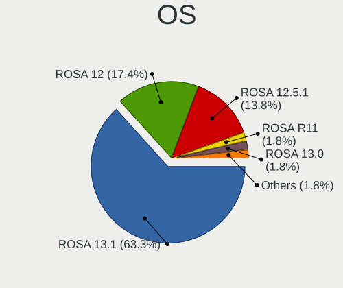

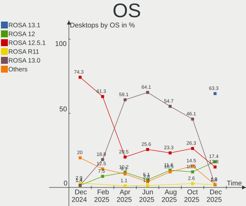

| Name        | Desktops | Percent |
|-------------|----------|---------|
| ROSA 13.1   | 69       | 63.3%   |
| ROSA 12     | 19       | 17.43%  |
| ROSA 12.5.1 | 15       | 13.76%  |
| ROSA R11    | 2        | 1.83%   |
| ROSA 13.0   | 2        | 1.83%   |
| ROSA R11.1  | 1        | 0.92%   |
| ROSA 12.5   | 1        | 0.92%   |

OS Family
---------

OS without a version

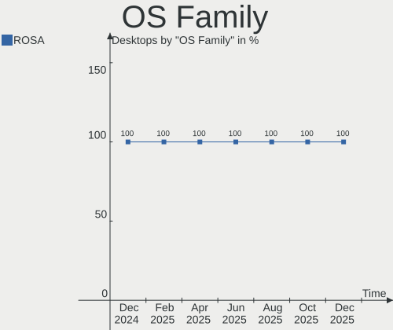

| Name | Desktops | Percent |
|------|----------|---------|
| ROSA | 109      | 100%    |

Kernel
------

Version of the Linux kernel

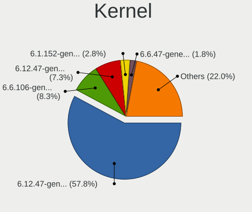

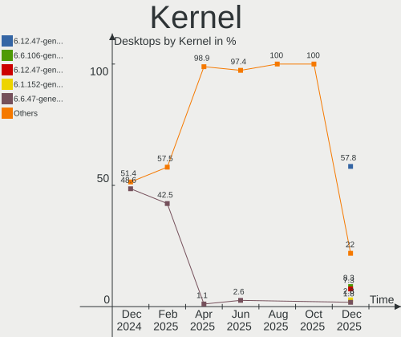

| Version                             | Desktops | Percent |
|-------------------------------------|----------|---------|
| 6.12.47-generic-5rosa13-x86_64      | 63       | 57.8%   |
| 6.6.106-generic-3rosa2021.1-x86_64  | 9        | 8.26%   |
| 6.12.47-generic-5rosa2021.1-x86_64  | 8        | 7.34%   |
| 6.1.152-generic-2rosa2021.1-x86_64  | 3        | 2.75%   |
| 6.6.47-generic-1rosa2021.1-x86_64   | 2        | 1.83%   |
| 6.6.27-generic-3rosa2021.1-x86_64   | 2        | 1.83%   |
| 6.12.47-generic-2rosa13-x86_64      | 2        | 1.83%   |
| 6.12.13-generic-4rosa13-x86_64      | 2        | 1.83%   |
| 6.1.46-generic-2rosa2021.1-x86_64   | 2        | 1.83%   |
| 4.15.0-desktop-45.1rosa-x86_64      | 2        | 1.83%   |
| 6.6.78-generic-2rosa2021.1-x86_64   | 1        | 0.92%   |
| 6.6.21-generic-8rosa2021.1-x86_64   | 1        | 0.92%   |
| 6.6.106-generic-1rosa2021.1-x86_64  | 1        | 0.92%   |
| 6.18.2-generic-2rosa13-x86_64       | 1        | 0.92%   |
| 6.17.9-generic-1rosa13-loongarch    | 1        | 0.92%   |
| 6.12.47-generic-3rosa2021.1-x86_64  | 1        | 0.92%   |
| 6.12.34-generic-1rosa13-x86_64      | 1        | 0.92%   |
| 6.1.89-generic-2rosa2021.1-x86_64   | 1        | 0.92%   |
| 6.1.81-generic-2rosa2021.1-x86_64   | 1        | 0.92%   |
| 6.1.58-generic-1rosa2021.1-x86_64   | 1        | 0.92%   |
| 5.15.193-generic-2rosa2021.1-x86_64 | 1        | 0.92%   |
| 5.10.71-generic-1rosa2021.1-x86_64  | 1        | 0.92%   |
| 5.10.244-generic-1rosa2021.1-x86_64 | 1        | 0.92%   |
| 4.15.0-desktop-122.124.1rosa-x86_64 | 1        | 0.92%   |

Kernel Family
-------------

Linux kernel without a distro release

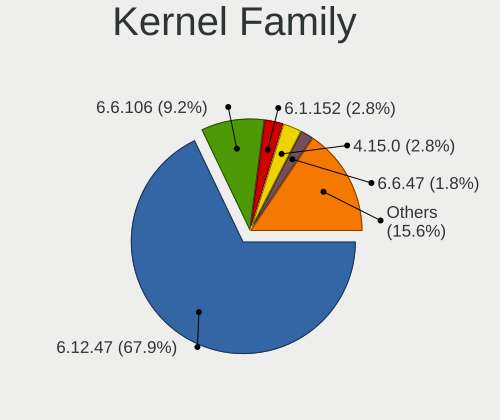

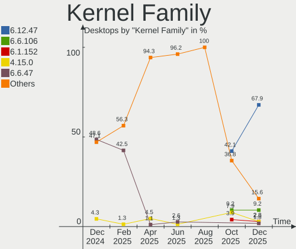

| Version  | Desktops | Percent |
|----------|----------|---------|
| 6.12.47  | 74       | 67.89%  |
| 6.6.106  | 10       | 9.17%   |
| 6.1.152  | 3        | 2.75%   |
| 4.15.0   | 3        | 2.75%   |
| 6.6.47   | 2        | 1.83%   |
| 6.6.27   | 2        | 1.83%   |
| 6.12.13  | 2        | 1.83%   |
| 6.1.46   | 2        | 1.83%   |
| 6.6.78   | 1        | 0.92%   |
| 6.6.21   | 1        | 0.92%   |
| 6.18.2   | 1        | 0.92%   |
| 6.17.9   | 1        | 0.92%   |
| 6.12.34  | 1        | 0.92%   |
| 6.1.89   | 1        | 0.92%   |
| 6.1.81   | 1        | 0.92%   |
| 6.1.58   | 1        | 0.92%   |
| 5.15.193 | 1        | 0.92%   |
| 5.10.71  | 1        | 0.92%   |
| 5.10.244 | 1        | 0.92%   |

Kernel Major Ver.
-----------------

Linux kernel major version

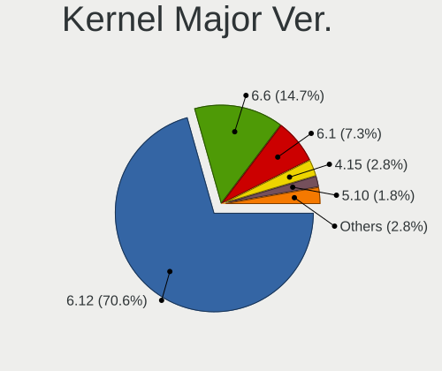

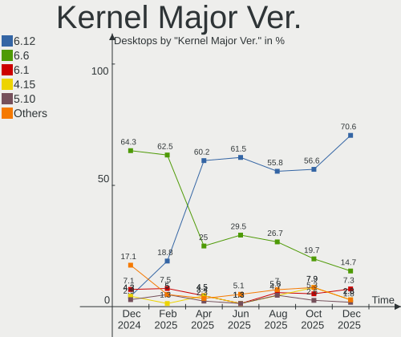

| Version | Desktops | Percent |
|---------|----------|---------|
| 6.12    | 77       | 70.64%  |
| 6.6     | 16       | 14.68%  |
| 6.1     | 8        | 7.34%   |
| 4.15    | 3        | 2.75%   |
| 5.10    | 2        | 1.83%   |
| 6.18    | 1        | 0.92%   |
| 6.17    | 1        | 0.92%   |
| 5.15    | 1        | 0.92%   |

Arch
----

OS architecture (x86_64, i586, etc.)

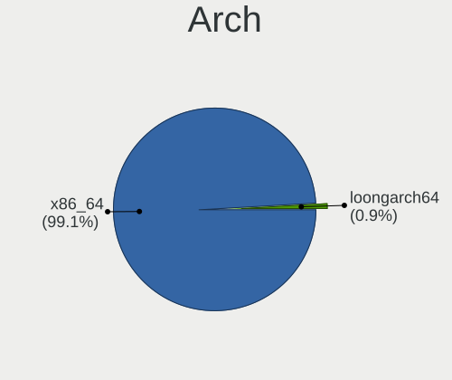

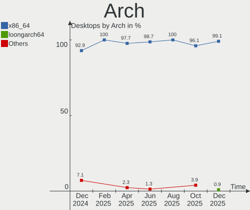

| Name        | Desktops | Percent |
|-------------|----------|---------|
| x86_64      | 108      | 99.08%  |
| loongarch64 | 1        | 0.92%   |

DE
--

Desktop Environment

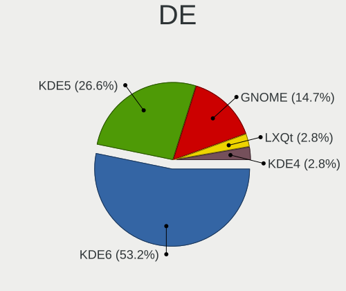

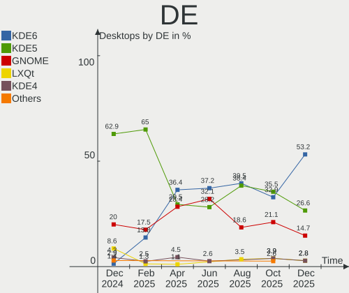

| Name  | Desktops | Percent |
|-------|----------|---------|
| KDE6  | 58       | 53.21%  |
| KDE5  | 29       | 26.61%  |
| GNOME | 16       | 14.68%  |
| LXQt  | 3        | 2.75%   |
| KDE4  | 3        | 2.75%   |

Display Server
--------------

X11 or Wayland

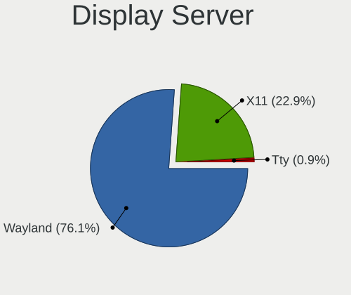

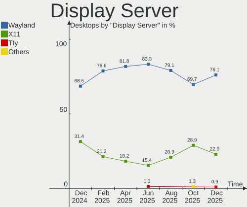

| Name    | Desktops | Percent |
|---------|----------|---------|
| Wayland | 83       | 76.15%  |
| X11     | 25       | 22.94%  |
| Tty     | 1        | 0.92%   |

Display Manager
---------------

SDDM, LightDM, etc.

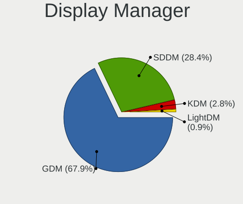

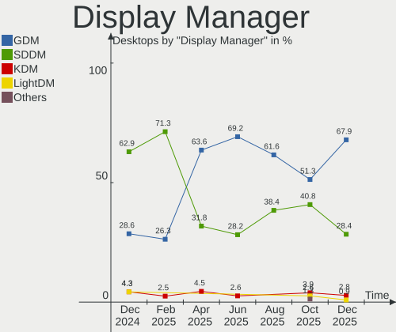

| Name    | Desktops | Percent |
|---------|----------|---------|
| GDM     | 74       | 67.89%  |
| SDDM    | 31       | 28.44%  |
| KDM     | 3        | 2.75%   |
| LightDM | 1        | 0.92%   |

OS Lang
-------

Language

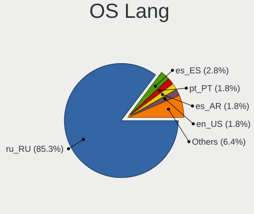

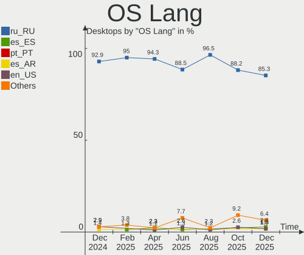

| Lang    | Desktops | Percent |
|---------|----------|---------|
| ru_RU   | 93       | 85.32%  |
| es_ES   | 3        | 2.75%   |
| pt_PT   | 2        | 1.83%   |
| es_AR   | 2        | 1.83%   |
| en_US   | 2        | 1.83%   |
| Unknown | 2        | 1.83%   |
| pt_BR   | 1        | 0.92%   |
| fr_CA   | 1        | 0.92%   |
| es_CO   | 1        | 0.92%   |
| C       | 1        | 0.92%   |
| ar_SA   | 1        | 0.92%   |

Boot Mode
---------

EFI or BIOS

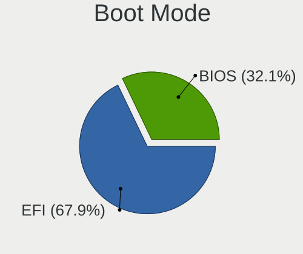

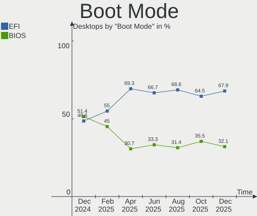

| Mode | Desktops | Percent |
|------|----------|---------|
| EFI  | 74       | 67.89%  |
| BIOS | 35       | 32.11%  |

Filesystem
----------

Type of filesystem

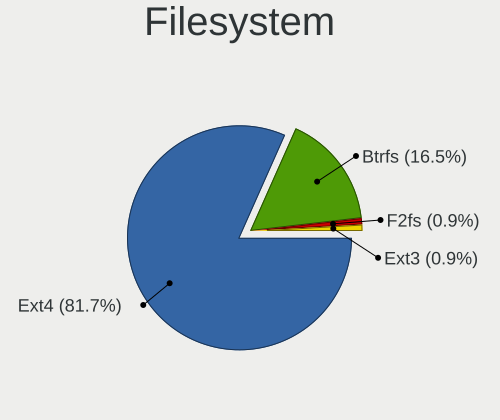

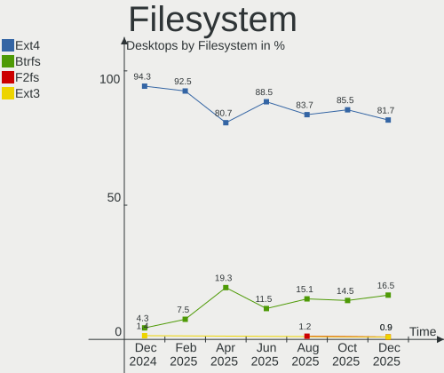

| Type  | Desktops | Percent |
|-------|----------|---------|
| Ext4  | 89       | 81.65%  |
| Btrfs | 18       | 16.51%  |
| F2fs  | 1        | 0.92%   |
| Ext3  | 1        | 0.92%   |

Part. scheme
------------

Scheme of partitioning

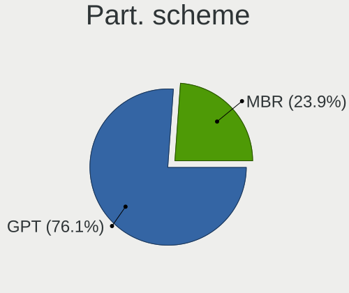

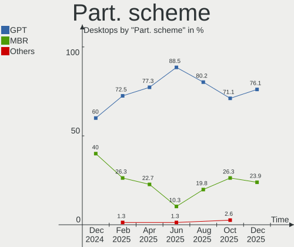

| Type | Desktops | Percent |
|------|----------|---------|
| GPT  | 83       | 76.15%  |
| MBR  | 26       | 23.85%  |

Dual Boot with Linux/BSD
------------------------

Hosting more than one Linux/BSD

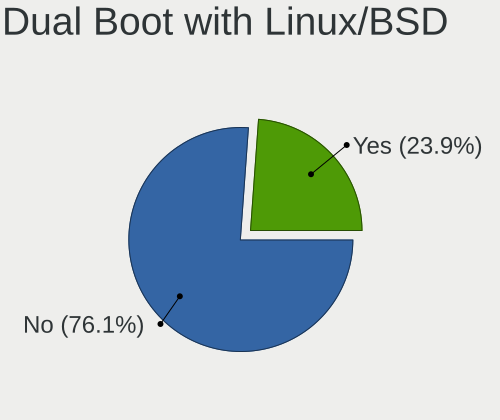

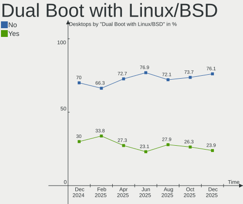

| Dual boot | Desktops | Percent |
|-----------|----------|---------|
| No        | 83       | 76.15%  |
| Yes       | 26       | 23.85%  |

Dual Boot (Win)
---------------

Hosting Linux and Windows

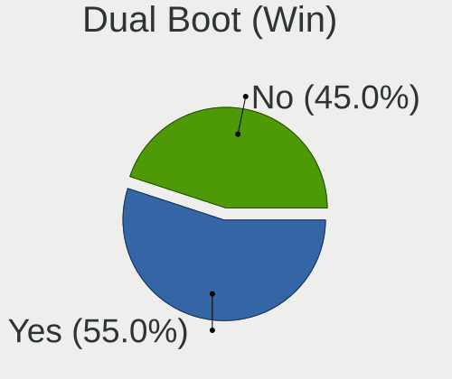

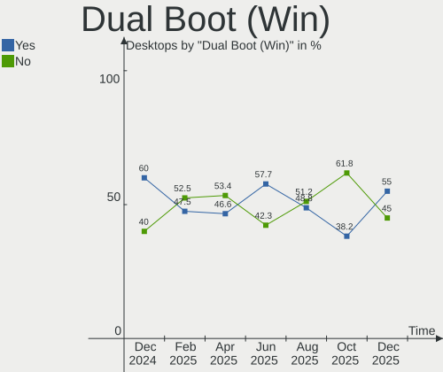

| Dual boot | Desktops | Percent |
|-----------|----------|---------|
| Yes       | 60       | 55.05%  |
| No        | 49       | 44.95%  |

Board
-----

Vendor
------

Motherboard manufacturer

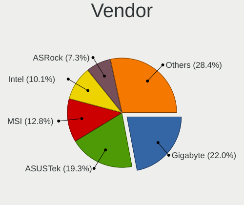

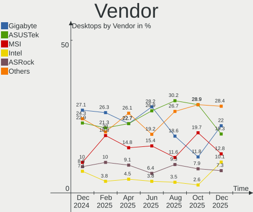

| Name                | Desktops | Percent |
|---------------------|----------|---------|
| Gigabyte Technology | 24       | 22.02%  |
| ASUSTek Computer    | 21       | 19.27%  |
| MSI                 | 14       | 12.84%  |
| Intel               | 11       | 10.09%  |
| ASRock              | 8        | 7.34%   |
| Unknown             | 5        | 4.59%   |
| Hewlett-Packard     | 4        | 3.67%   |
| MocTex              | 3        | 2.75%   |
| MAINBRD             | 3        | 2.75%   |
| Lenovo              | 3        | 2.75%   |
| Huanan              | 3        | 2.75%   |
| SHUANGWEI           | 1        | 0.92%   |
| Pegatron            | 1        | 0.92%   |
| OEM                 | 1        | 0.92%   |
| Machinist           | 1        | 0.92%   |
| J&W                 | 1        | 0.92%   |
| Dell                | 1        | 0.92%   |
| Biostar             | 1        | 0.92%   |
| AZW                 | 1        | 0.92%   |
| Acer                | 1        | 0.92%   |
| 3Q                  | 1        | 0.92%   |

Model
-----

Motherboard model

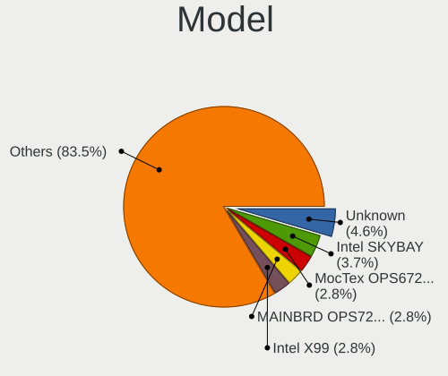

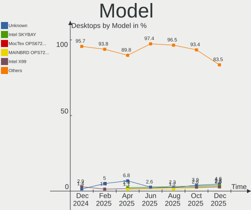

| Name                                 | Desktops | Percent |
|--------------------------------------|----------|---------|
| Unknown                              | 5        | 4.59%   |
| Intel SKYBAY                         | 4        | 3.67%   |
| MocTex OPS6725-SHA                   | 3        | 2.75%   |
| MAINBRD OPS72A-SHA                   | 3        | 2.75%   |
| Intel X99                            | 3        | 2.75%   |
| MSI MPG B560 Trident A (MS-B926)     | 2        | 1.83%   |
| Gigabyte G31M-ES2L                   | 2        | 1.83%   |
| ASUS PRIME A320M-K                   | 2        | 1.83%   |
| SHUANGWEI ST-X79M-2011 V2.0          | 1        | 0.92%   |
| Pegatron Compaq dx2400 Microtower PC | 1        | 0.92%   |
| OEM X79G                             | 1        | 0.92%   |
| MSI PPPPP-CCC#MMMMMMMM               | 1        | 0.92%   |
| MSI MS-7E56                          | 1        | 0.92%   |
| MSI MS-7D51                          | 1        | 0.92%   |
| MSI MS-7D46                          | 1        | 0.92%   |
| MSI MS-7C52                          | 1        | 0.92%   |
| MSI MS-7C39                          | 1        | 0.92%   |
| MSI MS-7B78                          | 1        | 0.92%   |
| MSI MS-7A75                          | 1        | 0.92%   |
| MSI MS-7A39                          | 1        | 0.92%   |
| MSI MS-7A15                          | 1        | 0.92%   |
| MSI MS-7974                          | 1        | 0.92%   |
| MSI MS-7529                          | 1        | 0.92%   |
| Machinist X99-D8 MAX                 | 1        | 0.92%   |
| Lenovo ThinkCentre M79 10JAS00B00    | 1        | 0.92%   |
| Lenovo ThinkCentre M710t 10MAS4BD00  | 1        | 0.92%   |
| Lenovo Bantry CRB SDK0J40697 WIN     | 1        | 0.92%   |
| J&W H81M-G2S                         | 1        | 0.92%   |
| Intel X99E                           | 1        | 0.92%   |
| Intel X99-K V7.0                     | 1        | 0.92%   |
| Intel X79-VG2 V2.2                   | 1        | 0.92%   |
| Intel B75                            | 1        | 0.92%   |
| Huanan X99-TF                        | 1        | 0.92%   |
| Huanan X99-QD4                       | 1        | 0.92%   |
| Huanan B75                           | 1        | 0.92%   |
| HP EliteDesk 800 G2 DM 35W           | 1        | 0.92%   |
| HP EliteDesk 705 G3 SFF              | 1        | 0.92%   |
| HP Compaq dc7700 Small Form Factor   | 1        | 0.92%   |
| HP 200-5421ru                        | 1        | 0.92%   |
| Gigabyte Z890 EAGLE WIFI7            | 1        | 0.92%   |

Model Family
------------

Motherboard model prefix

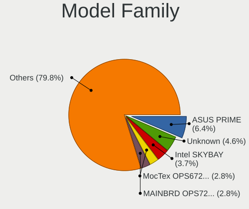

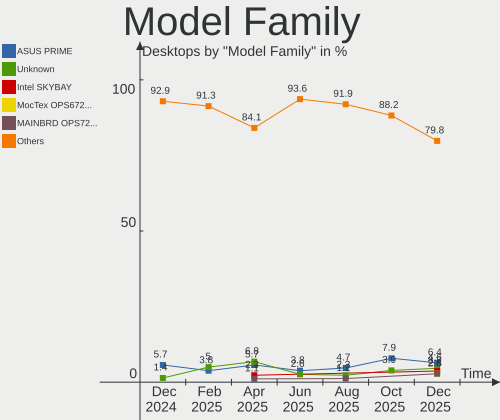

| Name                   | Desktops | Percent |
|------------------------|----------|---------|
| ASUS PRIME             | 7        | 6.42%   |
| Unknown                | 5        | 4.59%   |
| Intel SKYBAY           | 4        | 3.67%   |
| MocTex OPS6725-SHA     | 3        | 2.75%   |
| MAINBRD OPS72A-SHA     | 3        | 2.75%   |
| Intel X99              | 3        | 2.75%   |
| Gigabyte B450M         | 3        | 2.75%   |
| MSI MPG                | 2        | 1.83%   |
| Lenovo ThinkCentre     | 2        | 1.83%   |
| HP EliteDesk           | 2        | 1.83%   |
| Gigabyte G31M-ES2L     | 2        | 1.83%   |
| ASRock H510M-HDV       | 2        | 1.83%   |
| ASRock B450M           | 2        | 1.83%   |
| SHUANGWEI ST-X79M-2011 | 1        | 0.92%   |
| Pegatron Compaq        | 1        | 0.92%   |
| OEM X79G               | 1        | 0.92%   |
| MSI PPPPP-CCC#MMMMMMMM | 1        | 0.92%   |
| MSI MS-7E56            | 1        | 0.92%   |
| MSI MS-7D51            | 1        | 0.92%   |
| MSI MS-7D46            | 1        | 0.92%   |
| MSI MS-7C52            | 1        | 0.92%   |
| MSI MS-7C39            | 1        | 0.92%   |
| MSI MS-7B78            | 1        | 0.92%   |
| MSI MS-7A75            | 1        | 0.92%   |
| MSI MS-7A39            | 1        | 0.92%   |
| MSI MS-7A15            | 1        | 0.92%   |
| MSI MS-7974            | 1        | 0.92%   |
| MSI MS-7529            | 1        | 0.92%   |
| Machinist X99-D8       | 1        | 0.92%   |
| Lenovo Bantry          | 1        | 0.92%   |
| J&W H81M-G2S           | 1        | 0.92%   |
| Intel X99E             | 1        | 0.92%   |
| Intel X99-K            | 1        | 0.92%   |
| Intel X79-VG2          | 1        | 0.92%   |
| Intel B75              | 1        | 0.92%   |
| Huanan X99-TF          | 1        | 0.92%   |
| Huanan X99-QD4         | 1        | 0.92%   |
| Huanan B75             | 1        | 0.92%   |
| HP Compaq              | 1        | 0.92%   |
| HP 200-5421ru          | 1        | 0.92%   |

MFG Year
--------

Motherboard manufacture year

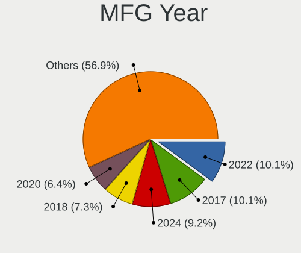

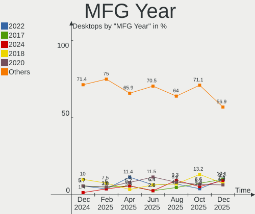

| Year    | Desktops | Percent |
|---------|----------|---------|
| 2022    | 11       | 10.09%  |
| 2017    | 11       | 10.09%  |
| 2024    | 10       | 9.17%   |
| 2018    | 8        | 7.34%   |
| 2020    | 7        | 6.42%   |
| 2012    | 7        | 6.42%   |
| 2019    | 6        | 5.5%    |
| 2013    | 6        | 5.5%    |
| 2023    | 5        | 4.59%   |
| 2021    | 5        | 4.59%   |
| 2015    | 5        | 4.59%   |
| 2016    | 4        | 3.67%   |
| 2011    | 4        | 3.67%   |
| 2009    | 4        | 3.67%   |
| 2025    | 3        | 2.75%   |
| 2008    | 3        | 2.75%   |
| 2007    | 3        | 2.75%   |
| 2014    | 2        | 1.83%   |
| 2010    | 2        | 1.83%   |
| 2006    | 2        | 1.83%   |
| Unknown | 1        | 0.92%   |

Form Factor
-----------

Physical design of the computer

| Name    | Desktops | Percent |
|---------|----------|---------|
| Desktop | 109      | 100%    |

Secure Boot
-----------

Enabled or disabled

| State    | Desktops | Percent |
|----------|----------|---------|
| Disabled | 109      | 100%    |

Coreboot
--------

Have coreboot on board

| Used | Desktops | Percent |
|------|----------|---------|
| No   | 109      | 100%    |

RAM Size
--------

Total RAM memory

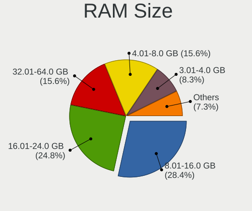

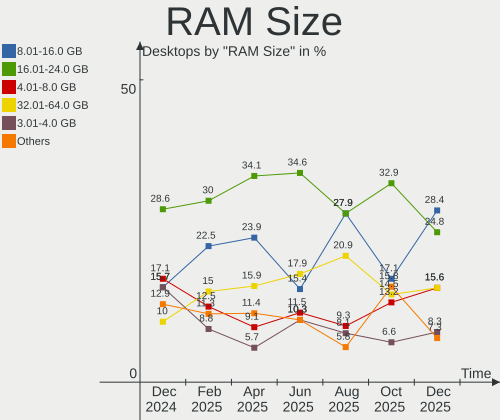

| Size in GB  | Desktops | Percent |
|-------------|----------|---------|
| 8.01-16.0   | 31       | 28.44%  |
| 16.01-24.0  | 27       | 24.77%  |
| 4.01-8.0    | 17       | 15.6%   |
| 32.01-64.0  | 17       | 15.6%   |
| 3.01-4.0    | 9        | 8.26%   |
| 64.01-256.0 | 4        | 3.67%   |
| 24.01-32.0  | 2        | 1.83%   |
| 2.01-3.0    | 1        | 0.92%   |
| 1.01-2.0    | 1        | 0.92%   |

RAM Used
--------

Used RAM memory

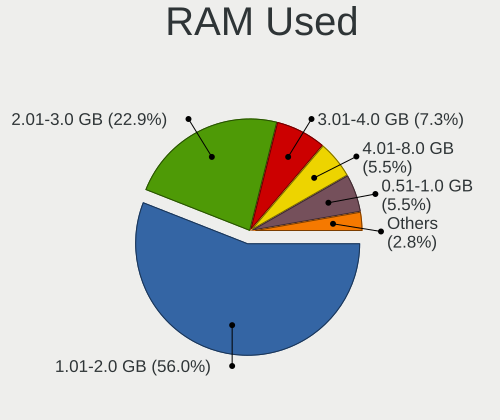

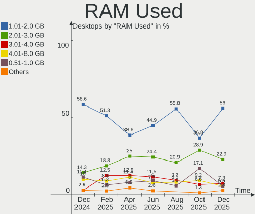

| Used GB    | Desktops | Percent |
|------------|----------|---------|
| 1.01-2.0   | 61       | 55.96%  |
| 2.01-3.0   | 25       | 22.94%  |
| 3.01-4.0   | 8        | 7.34%   |
| 4.01-8.0   | 6        | 5.5%    |
| 0.51-1.0   | 6        | 5.5%    |
| 8.01-16.0  | 2        | 1.83%   |
| 16.01-24.0 | 1        | 0.92%   |

Total Drives
------------

Number of drives on board

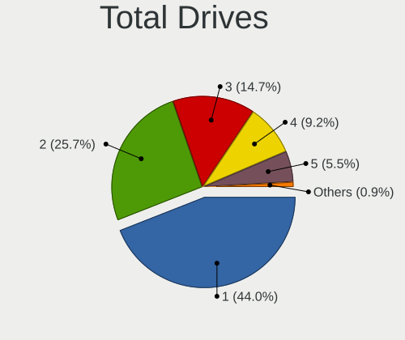

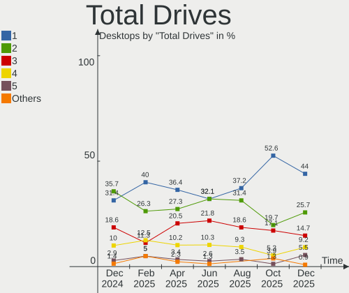

| Drives | Desktops | Percent |
|--------|----------|---------|
| 1      | 48       | 44.04%  |
| 2      | 28       | 25.69%  |
| 3      | 16       | 14.68%  |
| 4      | 10       | 9.17%   |
| 5      | 6        | 5.5%    |
| 8      | 1        | 0.92%   |

Has CD-ROM
----------

Has CD-ROM on board

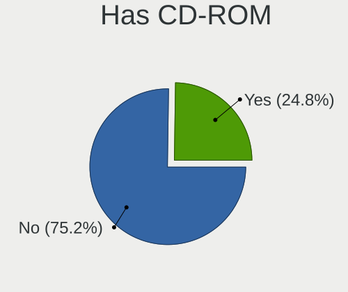

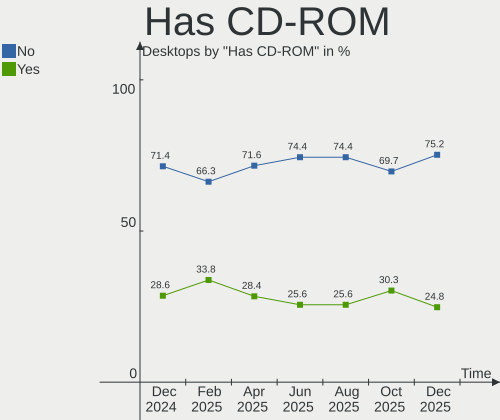

| Presented | Desktops | Percent |
|-----------|----------|---------|
| No        | 82       | 75.23%  |
| Yes       | 27       | 24.77%  |

Has Ethernet
------------

Has Ethernet on board

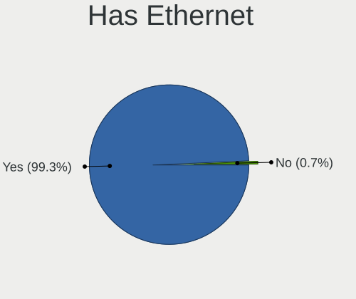

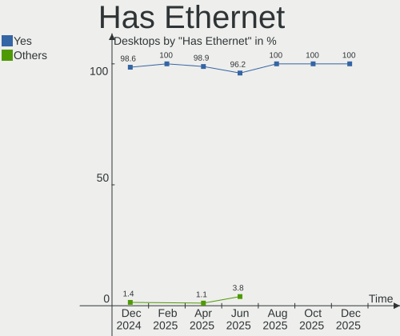

| Presented | Desktops | Percent |
|-----------|----------|---------|
| Yes       | 109      | 100%    |

Has WiFi
--------

Has WiFi module

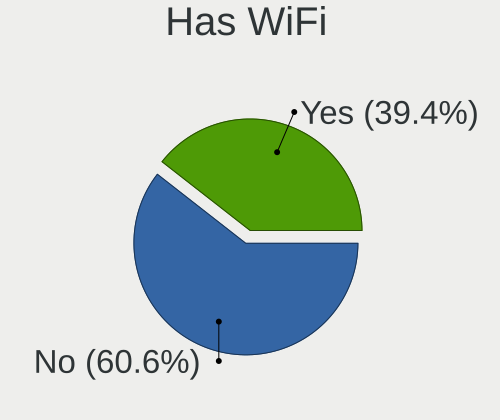

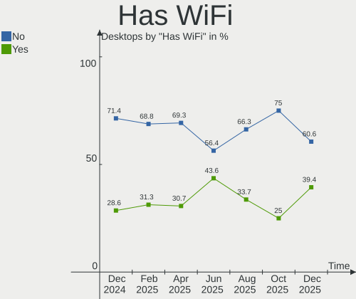

| Presented | Desktops | Percent |
|-----------|----------|---------|
| No        | 66       | 60.55%  |
| Yes       | 43       | 39.45%  |

Has Bluetooth
-------------

Has Bluetooth module

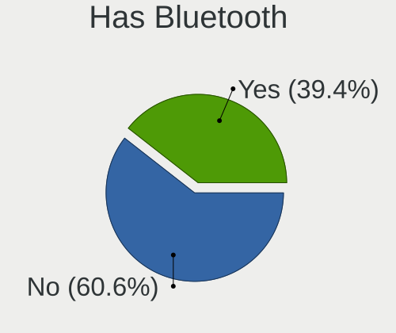

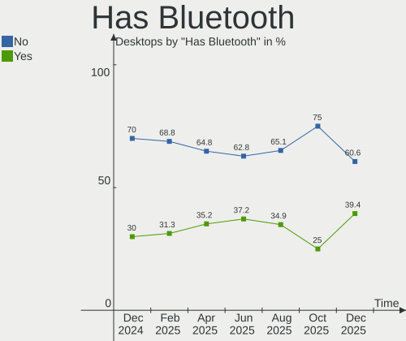

| Presented | Desktops | Percent |
|-----------|----------|---------|
| No        | 66       | 60.55%  |
| Yes       | 43       | 39.45%  |

Location
--------

Country
-------

Geographic location (country)

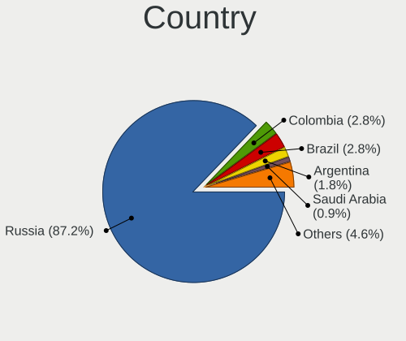

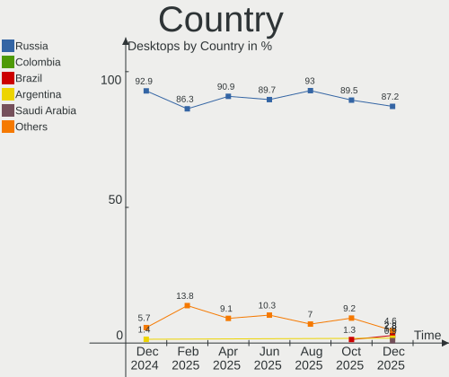

| Country      | Desktops | Percent |
|--------------|----------|---------|
| Russia       | 95       | 87.16%  |
| Colombia     | 3        | 2.75%   |
| Brazil       | 3        | 2.75%   |
| Argentina    | 2        | 1.83%   |
| Saudi Arabia | 1        | 0.92%   |
| Mexico       | 1        | 0.92%   |
| Latvia       | 1        | 0.92%   |
| Egypt        | 1        | 0.92%   |
| Czechia      | 1        | 0.92%   |
| Canada       | 1        | 0.92%   |

City
----

Geographic location (city)

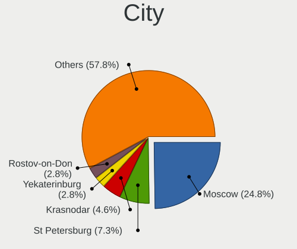

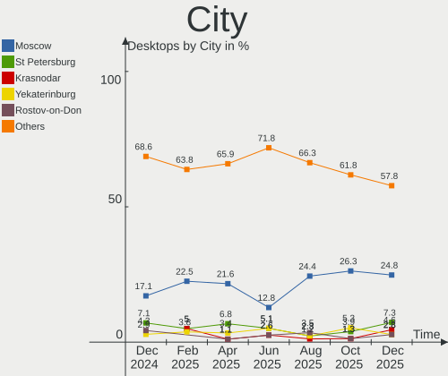

| City             | Desktops | Percent |
|------------------|----------|---------|
| Moscow           | 27       | 24.77%  |
| St Petersburg    | 8        | 7.34%   |
| Krasnodar        | 5        | 4.59%   |
| Yekaterinburg    | 3        | 2.75%   |
| Rostov-on-Don    | 3        | 2.75%   |
| Krasnoyarsk      | 3        | 2.75%   |
| Voronezh         | 2        | 1.83%   |
| Vladivostok      | 2        | 1.83%   |
| Tula             | 2        | 1.83%   |
| Stavropol        | 2        | 1.83%   |
| Smolensk         | 2        | 1.83%   |
| Novosibirsk      | 2        | 1.83%   |
| Bogotá          | 2        | 1.83%   |
| Angarsk          | 2        | 1.83%   |
| Zaural'skiy      | 1        | 0.92%   |
| Volzhsky         | 1        | 0.92%   |
| Volgograd        | 1        | 0.92%   |
| Vladimir         | 1        | 0.92%   |
| Velikiye Luki    | 1        | 0.92%   |
| Tver             | 1        | 0.92%   |
| Taganrog         | 1        | 0.92%   |
| Stary Oskol      | 1        | 0.92%   |
| Shawinigan       | 1        | 0.92%   |
| Severomorsk      | 1        | 0.92%   |
| Serpukhov        | 1        | 0.92%   |
| Santiago de Cali | 1        | 0.92%   |
| Santa Adelia     | 1        | 0.92%   |
| Riga             | 1        | 0.92%   |
| Prague           | 1        | 0.92%   |
| Porto Alegre     | 1        | 0.92%   |
| Novy Urengoy     | 1        | 0.92%   |
| Nova Iguaçu     | 1        | 0.92%   |
| Noril'sk         | 1        | 0.92%   |
| Nizhniy Novgorod | 1        | 0.92%   |
| Medina           | 1        | 0.92%   |
| Marks            | 1        | 0.92%   |
| Lyudinovo        | 1        | 0.92%   |
| Lipetsk          | 1        | 0.92%   |
| Kurgan           | 1        | 0.92%   |
| Kirov            | 1        | 0.92%   |

Drives
------

Drive Vendor
------------

Hard drive vendors

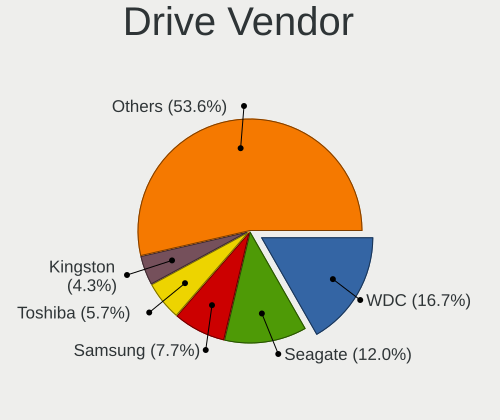

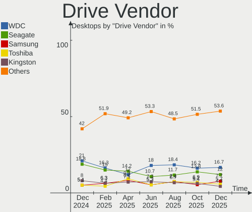

| Vendor                      | Desktops | Drives | Percent |
|-----------------------------|----------|--------|---------|
| WDC                         | 35       | 48     | 16.75%  |
| Seagate                     | 25       | 27     | 11.96%  |
| Samsung Electronics         | 16       | 19     | 7.66%   |
| Toshiba                     | 12       | 13     | 5.74%   |
| Kingston                    | 9        | 10     | 4.31%   |
| China                       | 8        | 8      | 3.83%   |
| MAXIO Technology (Hangzhou) | 7        | 8      | 3.35%   |
| FORESEE                     | 7        | 7      | 3.35%   |
| Hitachi                     | 6        | 6      | 2.87%   |
| Apacer                      | 6        | 6      | 2.87%   |
| Silicon Motion              | 5        | 6      | 2.39%   |
| SanDisk                     | 5        | 5      | 2.39%   |
| Netac                       | 5        | 5      | 2.39%   |
| KingSpec                    | 5        | 5      | 2.39%   |
| AMD                         | 5        | 5      | 2.39%   |
| Realtek Semiconductor       | 4        | 4      | 1.91%   |
| DEXP                        | 3        | 3      | 1.44%   |
| A-DATA Technology           | 3        | 3      | 1.44%   |
| SPCC                        | 2        | 2      | 0.96%   |
| Smartbuy                    | 2        | 2      | 0.96%   |
| QOPP                        | 2        | 2      | 0.96%   |
| Phison Electronics          | 2        | 2      | 0.96%   |
| Patriot                     | 2        | 2      | 0.96%   |
| OCZ                         | 2        | 2      | 0.96%   |
| Kingston Technology Company | 2        | 2      | 0.96%   |
| HGST                        | 2        | 2      | 0.96%   |
| Fujitsu                     | 2        | 2      | 0.96%   |
| Crucial                     | 2        | 2      | 0.96%   |
| VIEW                        | 1        | 1      | 0.48%   |
| UnionSine                   | 1        | 1      | 0.48%   |
| T-FORCE                     | 1        | 1      | 0.48%   |
| Realtek                     | 1        | 1      | 0.48%   |
| Phison                      | 1        | 1      | 0.48%   |
| MyDigitalSSD                | 1        | 1      | 0.48%   |
| MSI                         | 1        | 1      | 0.48%   |
| Maxtor                      | 1        | 1      | 0.48%   |
| LITEON                      | 1        | 1      | 0.48%   |
| Lite-On                     | 1        | 1      | 0.48%   |
| KIOXIA                      | 1        | 1      | 0.48%   |
| KingFast                    | 1        | 1      | 0.48%   |

Drive Model
-----------

Hard drive models

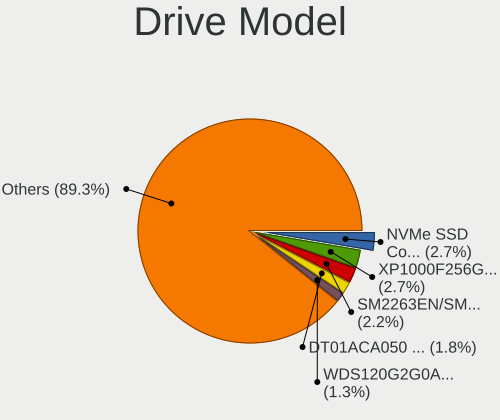

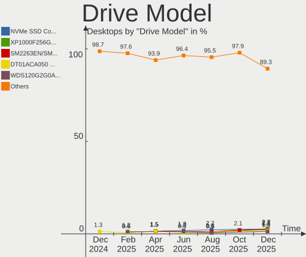

| Model                                                 | Desktops | Percent |
|-------------------------------------------------------|----------|---------|
| MAXIO (Hangzhou) NVMe SSD Controller MAP1202 2TB      | 6        | 2.68%   |
| FORESEE XP1000F256G 256GB                             | 6        | 2.68%   |
| Silicon Motion SM2263EN/SM2263XT SSD Controller 512GB | 5        | 2.23%   |
| Toshiba DT01ACA050 500GB                              | 4        | 1.79%   |
| WDC WDS120G2G0A-00JH30 120GB SSD                      | 3        | 1.34%   |
| WDC WD10EALS-00Z8A0 1TB                               | 3        | 1.34%   |
| Seagate ST1000DM010-2EP102 1TB                        | 3        | 1.34%   |
| Samsung SSD 870 EVO 500GB                             | 3        | 1.34%   |
| Samsung MZVLW128HEGR-00000 128GB                      | 3        | 1.34%   |
| Toshiba HDWD110 1TB                                   | 2        | 0.89%   |
| Toshiba DT01ACA100 1TB                                | 2        | 0.89%   |
| SPCC Solid State Disk 256GB                           | 2        | 0.89%   |
| Seagate ST3500418AS 500GB                             | 2        | 0.89%   |
| Seagate ST3250310AS 250GB                             | 2        | 0.89%   |
| Seagate ST1000LM049-2GH172 1TB                        | 2        | 0.89%   |
| Seagate ST1000DM003-1SB10C 1TB                        | 2        | 0.89%   |
| Seagate ST1000DM003-1CH162 1TB                        | 2        | 0.89%   |
| SanDisk SDSSDHP128G 128GB                             | 2        | 0.89%   |
| Samsung NVMe SSD Controller SM981/PM981/PM983 1TB     | 2        | 0.89%   |
| OCZ VERTEX4 128GB SSD                                 | 2        | 0.89%   |
| Kingston SA400S37240G 240GB SSD                       | 2        | 0.89%   |
| KingSpec P3-1TB SSD                                   | 2        | 0.89%   |
| Apacer AS350 512GB SSD                                | 2        | 0.89%   |
| Apacer AS350 256GB SSD                                | 2        | 0.89%   |
| WDC WDS500G2B0A-00SM50 500GB                          | 1        | 0.45%   |
| WDC WDS240G2G0B-00EPW0 240GB SSD                      | 1        | 0.45%   |
| WDC WDS100T2B0A-00SM50 1TB SSD                        | 1        | 0.45%   |
| WDC WD800JD-75MSA3 80GB                               | 1        | 0.45%   |
| WDC WD5000AZRZ-00HTKB0 500GB                          | 1        | 0.45%   |
| WDC WD5000AAKX-75U6AA0 500GB                          | 1        | 0.45%   |
| WDC WD5000AAKX-08U6AA0 500GB                          | 1        | 0.45%   |
| WDC WD5000AAKX-00ERMA0 500GB                          | 1        | 0.45%   |
| WDC WD5000AAKS-00V1A0 500GB                           | 1        | 0.45%   |
| WDC WD5000AADS-00S9B0 500GB                           | 1        | 0.45%   |
| WDC WD40PURX-64GVNY0 4TB                              | 1        | 0.45%   |
| WDC WD40EZAZ-00SF3B0 4TB                              | 1        | 0.45%   |
| WDC WD400BB-00JHA0 40GB                               | 1        | 0.45%   |
| WDC WD3200BEVT-22ZCT0 320GB                           | 1        | 0.45%   |
| WDC WD3200AAJS-22L7A0 320GB                           | 1        | 0.45%   |
| WDC WD3200AAJS-00L7A0 320GB                           | 1        | 0.45%   |

HDD Vendor
----------

Hard disk drive vendors

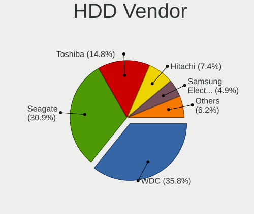

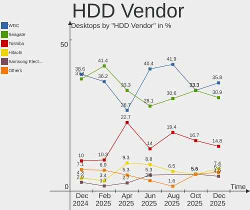

| Vendor              | Desktops | Drives | Percent |
|---------------------|----------|--------|---------|
| WDC                 | 29       | 41     | 35.8%   |
| Seagate             | 25       | 27     | 30.86%  |
| Toshiba             | 12       | 13     | 14.81%  |
| Hitachi             | 6        | 6      | 7.41%   |
| Samsung Electronics | 4        | 4      | 4.94%   |
| HGST                | 2        | 2      | 2.47%   |
| Fujitsu             | 2        | 2      | 2.47%   |
| Maxtor              | 1        | 1      | 1.23%   |

SSD Vendor
----------

Solid state drive vendors

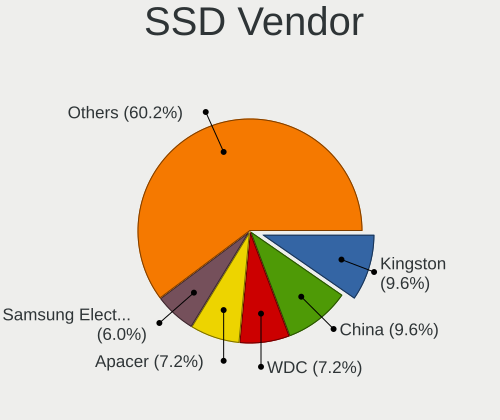

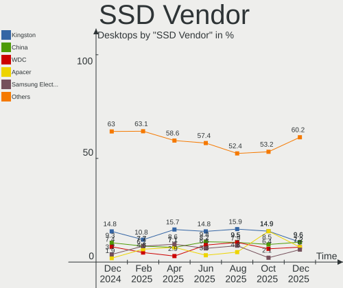

| Vendor              | Desktops | Drives | Percent |
|---------------------|----------|--------|---------|
| Kingston            | 8        | 9      | 9.64%   |
| China               | 8        | 8      | 9.64%   |
| WDC                 | 6        | 6      | 7.23%   |
| Apacer              | 6        | 6      | 7.23%   |
| Samsung Electronics | 5        | 6      | 6.02%   |
| AMD                 | 5        | 5      | 6.02%   |
| Netac               | 4        | 4      | 4.82%   |
| KingSpec            | 4        | 4      | 4.82%   |
| DEXP                | 3        | 3      | 3.61%   |
| A-DATA Technology   | 3        | 3      | 3.61%   |
| SPCC                | 2        | 2      | 2.41%   |
| Smartbuy            | 2        | 2      | 2.41%   |
| SanDisk             | 2        | 2      | 2.41%   |
| QOPP                | 2        | 2      | 2.41%   |
| Patriot             | 2        | 2      | 2.41%   |
| OCZ                 | 2        | 2      | 2.41%   |
| Crucial             | 2        | 2      | 2.41%   |
| VIEW                | 1        | 1      | 1.2%    |
| UnionSine           | 1        | 1      | 1.2%    |
| MyDigitalSSD        | 1        | 1      | 1.2%    |
| MSI                 | 1        | 1      | 1.2%    |
| LITEON              | 1        | 1      | 1.2%    |
| Lite-On             | 1        | 1      | 1.2%    |
| KingFast            | 1        | 1      | 1.2%    |
| HS-SSD-WAVE(S)      | 1        | 1      | 1.2%    |
| GOODRAM             | 1        | 1      | 1.2%    |
| ExeGate             | 1        | 1      | 1.2%    |
| EAGET               | 1        | 1      | 1.2%    |
| Digma               | 1        | 1      | 1.2%    |
| BOLUNSHUAI          | 1        | 1      | 1.2%    |
| AXIOMTEK            | 1        | 1      | 1.2%    |
| ANKEJE              | 1        | 1      | 1.2%    |
| AGI                 | 1        | 1      | 1.2%    |
| 2.5"                | 1        | 1      | 1.2%    |

Drive Kind
----------

HDD or SSD

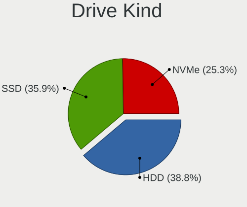

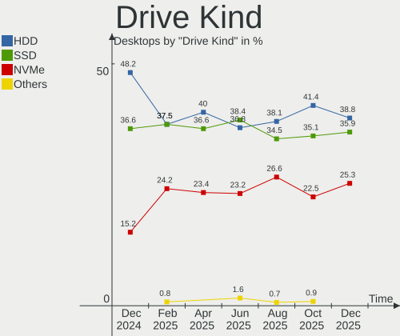

| Kind | Desktops | Drives | Percent |
|------|----------|--------|---------|
| HDD  | 66       | 96     | 38.82%  |
| SSD  | 61       | 85     | 35.88%  |
| NVMe | 43       | 50     | 25.29%  |

Drive Connector
---------------

SATA, SAS, NVMe, etc.

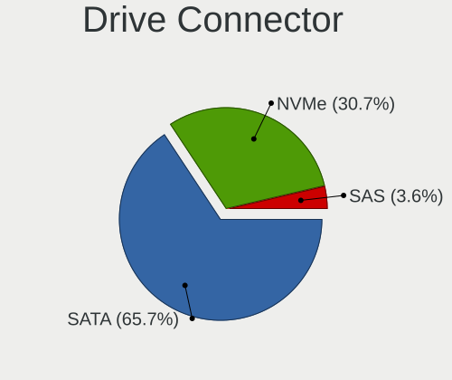

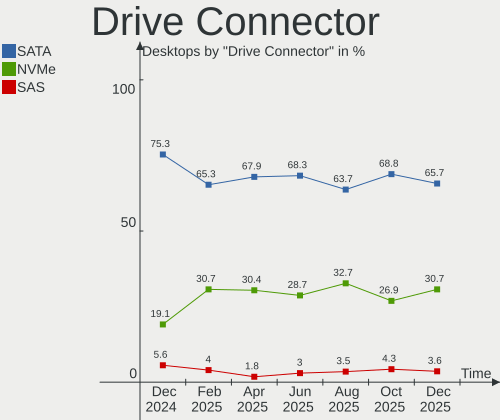

| Type | Desktops | Drives | Percent |
|------|----------|--------|---------|
| SATA | 90       | 177    | 65.69%  |
| NVMe | 42       | 49     | 30.66%  |
| SAS  | 5        | 5      | 3.65%   |

Drive Size
----------

Size of hard drive

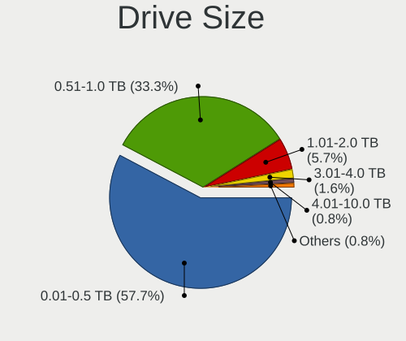

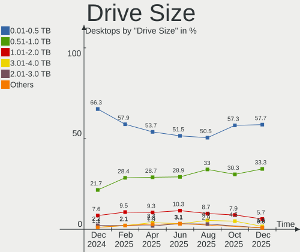

| Size in TB | Desktops | Drives | Percent |
|------------|----------|--------|---------|
| 0.01-0.5   | 71       | 111    | 57.72%  |
| 0.51-1.0   | 41       | 56     | 33.33%  |
| 1.01-2.0   | 7        | 10     | 5.69%   |
| 3.01-4.0   | 2        | 2      | 1.63%   |
| 2.01-3.0   | 1        | 1      | 0.81%   |
| 4.01-10.0  | 1        | 1      | 0.81%   |

Space Total
-----------

Amount of disk space available on the file system

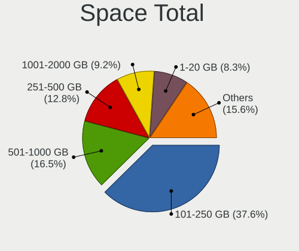

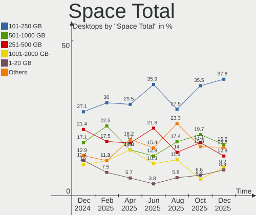

| Size in GB     | Desktops | Percent |
|----------------|----------|---------|
| 101-250        | 41       | 37.61%  |
| 501-1000       | 18       | 16.51%  |
| 251-500        | 14       | 12.84%  |
| 1001-2000      | 10       | 9.17%   |
| 1-20           | 9        | 8.26%   |
| 2001-3000      | 6        | 5.5%    |
| 51-100         | 5        | 4.59%   |
| More than 3000 | 4        | 3.67%   |
| 21-50          | 2        | 1.83%   |

Space Used
----------

Amount of used disk space

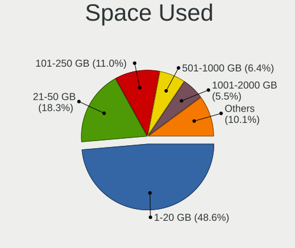

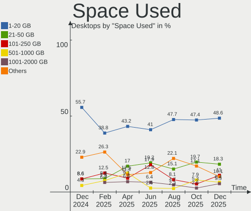

| Used GB        | Desktops | Percent |
|----------------|----------|---------|
| 1-20           | 53       | 48.62%  |
| 21-50          | 20       | 18.35%  |
| 101-250        | 12       | 11.01%  |
| 501-1000       | 7        | 6.42%   |
| 1001-2000      | 6        | 5.5%    |
| 251-500        | 5        | 4.59%   |
| 51-100         | 4        | 3.67%   |
| More than 3000 | 2        | 1.83%   |

Malfunc. Drives
---------------

Drive models with a malfunction

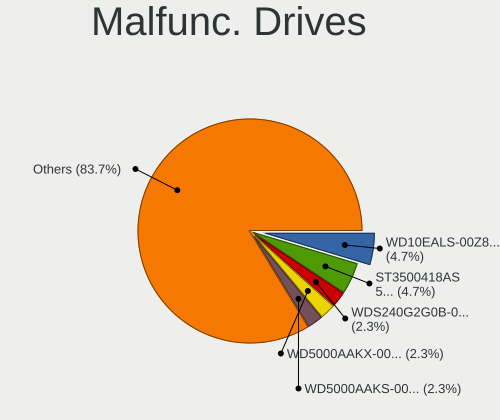

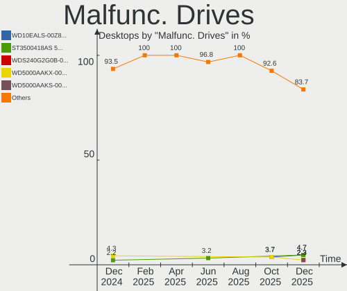

| Model                                                       | Desktops | Drives | Percent |
|-------------------------------------------------------------|----------|--------|---------|
| WDC WD10EALS-00Z8A0 1TB                                     | 2        | 2      | 4.65%   |
| Seagate ST3500418AS 500GB                                   | 2        | 2      | 4.65%   |
| WDC WDS240G2G0B-00EPW0 240GB SSD                            | 1        | 1      | 2.33%   |
| WDC WD5000AAKX-00ERMA0 500GB                                | 1        | 1      | 2.33%   |
| WDC WD5000AAKS-00V1A0 500GB                                 | 1        | 1      | 2.33%   |
| WDC WD5000AADS-00S9B0 500GB                                 | 1        | 1      | 2.33%   |
| WDC WD400BB-00JHA0 40GB                                     | 1        | 1      | 2.33%   |
| WDC WD3200AAJS-22L7A0 320GB                                 | 1        | 1      | 2.33%   |
| WDC WD3200AAJS-00L7A0 320GB                                 | 1        | 1      | 2.33%   |
| WDC WD3200AAJS-00B4A0 320GB                                 | 1        | 1      | 2.33%   |
| WDC WD2000FYYZ-01UL1B0 2TB                                  | 1        | 1      | 2.33%   |
| WDC WD10EARS-00Y5B1 1TB                                     | 1        | 1      | 2.33%   |
| WDC WD10EARS-003BB1 1TB                                     | 1        | 1      | 2.33%   |
| UnionSine SSD 128GB                                         | 1        | 1      | 2.33%   |
| Toshiba DT01ACA100 1TB                                      | 1        | 1      | 2.33%   |
| Seagate ST500LT012-1DG142 500GB                             | 1        | 1      | 2.33%   |
| Seagate ST380013AS 80GB                                     | 1        | 1      | 2.33%   |
| Seagate ST3320613AS 320GB                                   | 1        | 1      | 2.33%   |
| Seagate ST3250820AS 250GB                                   | 1        | 1      | 2.33%   |
| Seagate ST3250310AS 250GB                                   | 1        | 1      | 2.33%   |
| Seagate ST3160812AS 160GB                                   | 1        | 1      | 2.33%   |
| Seagate ST1000LM035-1RK172 1TB                              | 1        | 1      | 2.33%   |
| Seagate ST1000DM010-2EP102 1TB                              | 1        | 1      | 2.33%   |
| Seagate ST1000DM003-9YN162 1TB                              | 1        | 1      | 2.33%   |
| Seagate ST1000DM003-1SB10C 1TB                              | 1        | 1      | 2.33%   |
| Samsung Electronics SSD 870 EVO 500GB                       | 1        | 1      | 2.33%   |
| Samsung Electronics SSD 870 EVO 250GB                       | 1        | 1      | 2.33%   |
| Samsung Electronics HM321HI 320GB                           | 1        | 1      | 2.33%   |
| Samsung Electronics HD253GJ 250GB                           | 1        | 1      | 2.33%   |
| Samsung Electronics HD161HJ 160GB                           | 1        | 1      | 2.33%   |
| Samsung Electronics HD120IJ 120GB                           | 1        | 1      | 2.33%   |
| Netac SSD 120GB                                             | 1        | 1      | 2.33%   |
| MAXIO Technology (Hangzhou) NVMe SSD Controller MAP1202 2TB | 1        | 1      | 2.33%   |
| Kingston SKC6002048G 2TB SSD                                | 1        | 1      | 2.33%   |
| Hitachi HDT725025VLA380 250GB                               | 1        | 1      | 2.33%   |
| HGST HTS721010A9E630 1TB                                    | 1        | 1      | 2.33%   |
| Fujitsu MHZ2200BH G2 200GB                                  | 1        | 1      | 2.33%   |
| ExeGate EX280472RUS(256G 256GB SSD                          | 1        | 1      | 2.33%   |
| Crucial CT120BX500SSD1 120GB                                | 1        | 1      | 2.33%   |
| China SSD 256GB                                             | 1        | 1      | 2.33%   |

Malfunc. Drive Vendor
---------------------

Vendors of faulty drives

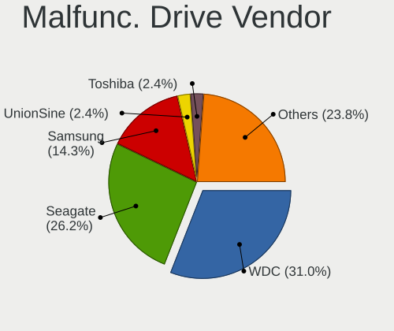

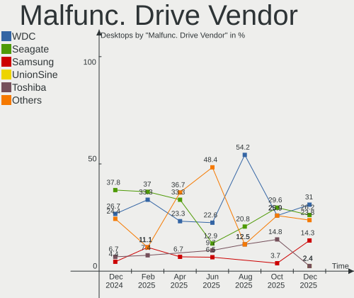

| Vendor                      | Desktops | Drives | Percent |
|-----------------------------|----------|--------|---------|
| WDC                         | 13       | 13     | 30.95%  |
| Seagate                     | 11       | 12     | 26.19%  |
| Samsung Electronics         | 6        | 6      | 14.29%  |
| UnionSine                   | 1        | 1      | 2.38%   |
| Toshiba                     | 1        | 1      | 2.38%   |
| Netac                       | 1        | 1      | 2.38%   |
| MAXIO Technology (Hangzhou) | 1        | 1      | 2.38%   |
| Kingston                    | 1        | 1      | 2.38%   |
| Hitachi                     | 1        | 1      | 2.38%   |
| HGST                        | 1        | 1      | 2.38%   |
| Fujitsu                     | 1        | 1      | 2.38%   |
| ExeGate                     | 1        | 1      | 2.38%   |
| Crucial                     | 1        | 1      | 2.38%   |
| China                       | 1        | 1      | 2.38%   |
| AMD                         | 1        | 1      | 2.38%   |

Malfunc. HDD Vendor
-------------------

Vendors of faulty HDD drives

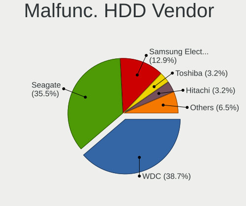

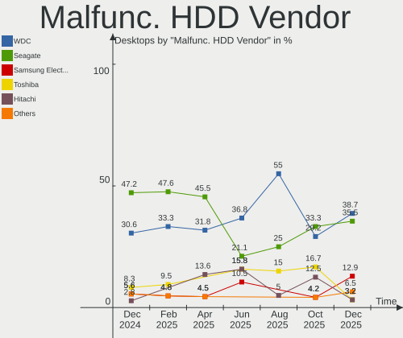

| Vendor              | Desktops | Drives | Percent |
|---------------------|----------|--------|---------|
| WDC                 | 12       | 12     | 38.71%  |
| Seagate             | 11       | 12     | 35.48%  |
| Samsung Electronics | 4        | 4      | 12.9%   |
| Toshiba             | 1        | 1      | 3.23%   |
| Hitachi             | 1        | 1      | 3.23%   |
| HGST                | 1        | 1      | 3.23%   |
| Fujitsu             | 1        | 1      | 3.23%   |

Malfunc. Drive Kind
-------------------

Kinds of faulty drives

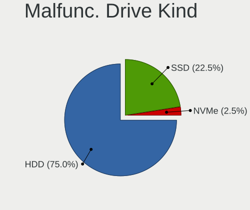

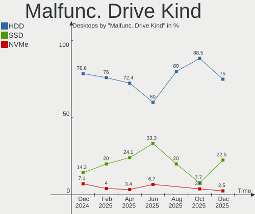

| Kind | Desktops | Drives | Percent |
|------|----------|--------|---------|
| HDD  | 30       | 32     | 75%     |
| SSD  | 9        | 10     | 22.5%   |
| NVMe | 1        | 1      | 2.5%    |

Failed Drives
-------------

Failed drive models

Zero info for selected period =(

Failed Drive Vendor
-------------------

Failed drive vendors

Zero info for selected period =(

Drive Status
------------

Number of failed and malfunc. drives

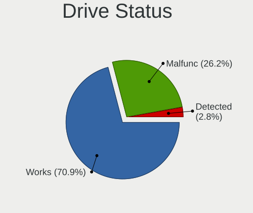

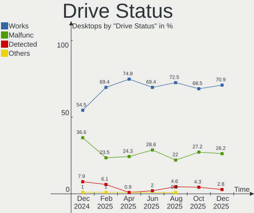

| Status   | Desktops | Drives | Percent |
|----------|----------|--------|---------|
| Works    | 100      | 184    | 70.92%  |
| Malfunc  | 37       | 43     | 26.24%  |
| Detected | 4        | 4      | 2.84%   |

Storage controller
------------------

Storage Vendor
--------------

Storage controller vendors

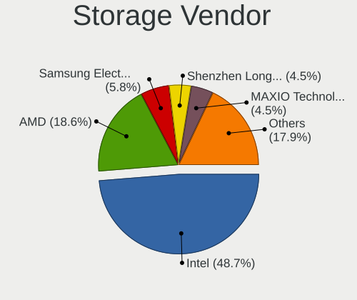

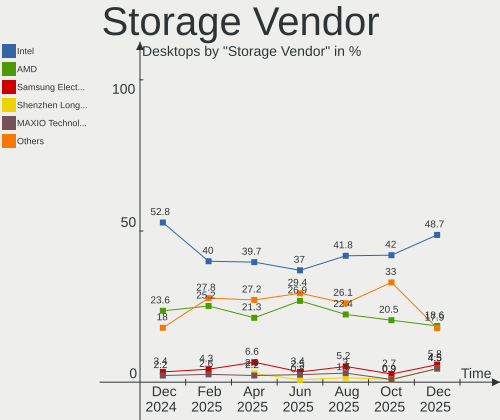

| Vendor                       | Desktops | Percent |
|------------------------------|----------|---------|
| Intel                        | 76       | 48.72%  |
| AMD                          | 29       | 18.59%  |
| Samsung Electronics          | 9        | 5.77%   |
| Shenzhen Longsys Electronics | 7        | 4.49%   |
| MAXIO Technology (Hangzhou)  | 7        | 4.49%   |
| Silicon Motion               | 6        | 3.85%   |
| SanDisk                      | 4        | 2.56%   |
| Realtek Semiconductor        | 4        | 2.56%   |
| Phison Electronics           | 3        | 1.92%   |
| Kingston Technology Company  | 3        | 1.92%   |
| JMicron Technology           | 2        | 1.28%   |
| Netac Technology             | 1        | 0.64%   |
| Marvell Technology Group     | 1        | 0.64%   |
| Loongson Technology          | 1        | 0.64%   |
| KIOXIA                       | 1        | 0.64%   |
| INNOGRIT                     | 1        | 0.64%   |
| ADATA Technology             | 1        | 0.64%   |

Storage Model
-------------

Storage controller models

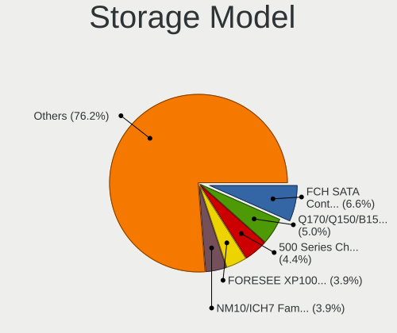

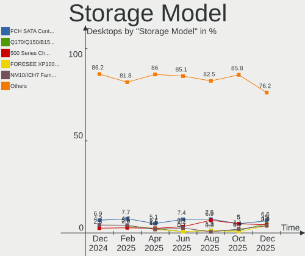

| Model                                                                                                              | Desktops | Percent |
|--------------------------------------------------------------------------------------------------------------------|----------|---------|
| AMD FCH SATA Controller [AHCI mode]                                                                                | 12       | 6.63%   |
| Intel Q170/Q150/B150/H170/H110/Z170/CM236 Chipset SATA Controller [AHCI Mode]                                      | 9        | 4.97%   |
| Intel 500 Series Chipset Family SATA AHCI Controller                                                               | 8        | 4.42%   |
| Shenzhen Longsys FORESEE XP1000 / Lexar Professional CFexpress Type B Gold series, NM620 PCIe NVME SSD (DRAM-less) | 7        | 3.87%   |
| Intel NM10/ICH7 Family SATA Controller [IDE mode]                                                                  | 7        | 3.87%   |
| Silicon Motion SM2263EN/SM2263XT (DRAM-less) NVMe SSD Controllers                                                  | 6        | 3.31%   |
| MAXIO (Hangzhou) NVMe SSD Controller MAP1202 (DRAM-less)                                                           | 6        | 3.31%   |
| Intel Alder Lake-P SATA AHCI Controller                                                                            | 6        | 3.31%   |
| Intel 200 Series PCH SATA controller [AHCI mode]                                                                   | 6        | 3.31%   |
| AMD 400 Series Chipset SATA Controller                                                                             | 6        | 3.31%   |
| Intel 82801G (ICH7 Family) IDE Controller                                                                          | 5        | 2.76%   |
| Intel 8 Series/C220 Series Chipset Family 6-port SATA Controller 1 [AHCI mode]                                     | 5        | 2.76%   |
| Intel 7 Series/C210 Series Chipset Family 6-port SATA Controller [AHCI mode]                                       | 5        | 2.76%   |
| Intel 6 Series/C200 Series Chipset Family 6 port Desktop SATA AHCI Controller                                      | 4        | 2.21%   |
| AMD SB7x0/SB8x0/SB9x0 IDE Controller                                                                               | 4        | 2.21%   |
| AMD A320 Chipset SATA Controller [AHCI mode]                                                                       | 4        | 2.21%   |
| Samsung NVMe SSD Controller SM961/PM961/SM963                                                                      | 3        | 1.66%   |
| Intel C610/X99 series chipset 6-Port SATA Controller [AHCI mode]                                                   | 3        | 1.66%   |
| Intel Alder Lake-S PCH SATA Controller [AHCI Mode]                                                                 | 3        | 1.66%   |
| AMD SB7x0/SB8x0/SB9x0 SATA Controller [IDE mode]                                                                   | 3        | 1.66%   |
| AMD 600 Series Chipset SATA Controller                                                                             | 3        | 1.66%   |
| AMD 500 Series Chipset SATA Controller                                                                             | 3        | 1.66%   |
| AMD 300 Series Chipset SATA Controller                                                                             | 3        | 1.66%   |
| SanDisk WD Green SN350 240GB (DRAM-less) / SN560E NVMe SSD                                                         | 2        | 1.1%    |
| Samsung NVMe SSD Controller SM981/PM981/PM983                                                                      | 2        | 1.1%    |
| Realtek RTS5765DL NVMe SSD Controller (DRAM-less)                                                                  | 2        | 1.1%    |
| Phison PS5015-E15 PCIe3 NVMe Controller (DRAM-less)                                                                | 2        | 1.1%    |
| Intel Volume Management Device NVMe RAID Controller                                                                | 2        | 1.1%    |
| Intel C600/X79 series chipset 6-Port SATA AHCI Controller                                                          | 2        | 1.1%    |
| Intel 82801I (ICH9 Family) 2 port SATA Controller [IDE mode]                                                       | 2        | 1.1%    |
| Intel 7 Series/C210 Series Chipset Family 4-port SATA Controller [IDE mode]                                        | 2        | 1.1%    |
| Intel 7 Series/C210 Series Chipset Family 2-port SATA Controller [IDE mode]                                        | 2        | 1.1%    |
| Intel 5 Series/3400 Series Chipset 6 port SATA AHCI Controller                                                     | 2        | 1.1%    |
| AMD SB7x0/SB8x0/SB9x0 SATA Controller [AHCI mode]                                                                  | 2        | 1.1%    |
| SanDisk Ultra 3D / WD PC SN530, IX SN530, Blue SN550 NVMe SSD (DRAM-less)                                          | 1        | 0.55%   |
| SanDisk Extreme Pro / WD Black SN750 / PC SN730 / Red SN700 NVMe SSD                                               | 1        | 0.55%   |
| Samsung NVMe SSD Controller PM9C1a (DRAM-less)                                                                     | 1        | 0.55%   |
| Samsung NVMe SSD Controller PM9A1/PM9A3/980PRO                                                                     | 1        | 0.55%   |
| Samsung NVMe SSD Controller 980 (DRAM-less)                                                                        | 1        | 0.55%   |
| Samsung NVMe SSD 9100 PRO [PM9E1]                                                                                  | 1        | 0.55%   |

Storage Kind
------------

Kind of storage controller (IDE, SATA, NVMe, SAS, ...)

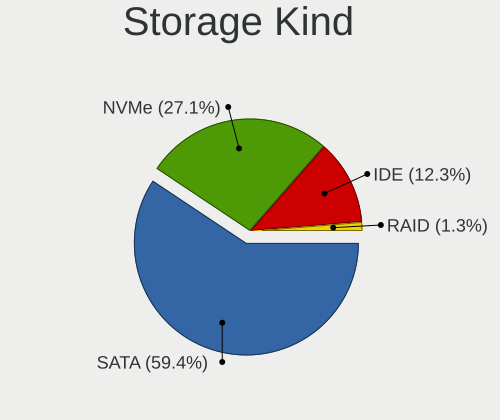

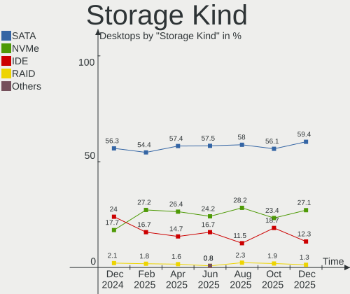

| Kind | Desktops | Percent |
|------|----------|---------|
| SATA | 92       | 59.35%  |
| NVMe | 42       | 27.1%   |
| IDE  | 19       | 12.26%  |
| RAID | 2        | 1.29%   |

Processor
---------

CPU Vendor
----------

Processor vendors

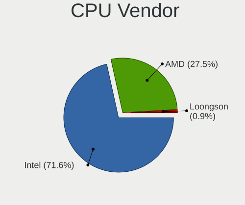

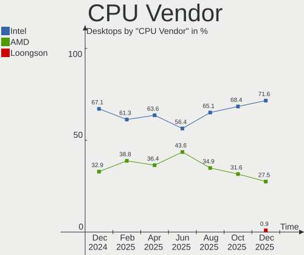

| Vendor   | Desktops | Percent |
|----------|----------|---------|
| Intel    | 78       | 71.56%  |
| AMD      | 30       | 27.52%  |
| Loongson | 1        | 0.92%   |

CPU Model
---------

Processor models

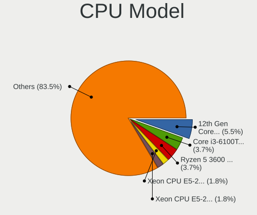

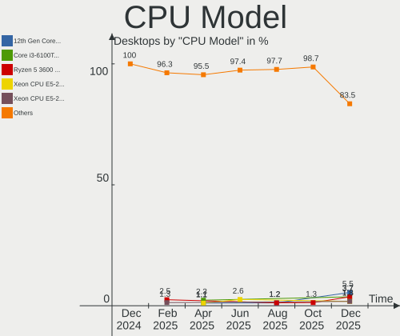

| Model                                        | Desktops | Percent |
|----------------------------------------------|----------|---------|
| Intel 12th Gen Core i7-1280P                 | 6        | 5.5%    |
| Intel Core i3-6100TE CPU @ 2.70GHz           | 4        | 3.67%   |
| AMD Ryzen 5 3600 6-Core Processor            | 4        | 3.67%   |
| Intel Xeon CPU E5-2689 0 @ 2.60GHz           | 2        | 1.83%   |
| Intel Xeon CPU E5-2673 v3 @ 2.40GHz          | 2        | 1.83%   |
| Intel Pentium Gold G6405 CPU @ 4.10GHz       | 2        | 1.83%   |
| Intel Core i5-9400 CPU @ 2.90GHz             | 2        | 1.83%   |
| Intel Core i5-7400 CPU @ 3.00GHz             | 2        | 1.83%   |
| Intel Core i5-3470 CPU @ 3.20GHz             | 2        | 1.83%   |
| Intel Core i3-7100 CPU @ 3.90GHz             | 2        | 1.83%   |
| Intel Core 2 Duo CPU E7500 @ 2.93GHz         | 2        | 1.83%   |
| Intel 12th Gen Core i5-12400                 | 2        | 1.83%   |
| Intel 11th Gen Core i7-11700 @ 2.50GHz       | 2        | 1.83%   |
| AMD Ryzen 5 7500F 6-Core Processor           | 2        | 1.83%   |
| AMD Ryzen 5 5600G with Radeon Graphics       | 2        | 1.83%   |
| AMD Ryzen 3 3200G with Radeon Vega Graphics  | 2        | 1.83%   |
| AMD A10 PRO-7800B R7, 12 Compute Cores 4C+8G | 2        | 1.83%   |
| Loongson Loongson 3A                         | 1        | 0.92%   |
| Intel Xeon CPU X5690 @ 3.47GHz               | 1        | 0.92%   |
| Intel Xeon CPU X3210 @ 2.13GHz               | 1        | 0.92%   |
| Intel Xeon CPU E5450 @ 3.00GHz               | 1        | 0.92%   |
| Intel Xeon CPU E5-2697 v4 @ 2.30GHz          | 1        | 0.92%   |
| Intel Xeon CPU E5-2690 v3 @ 2.60GHz          | 1        | 0.92%   |
| Intel Xeon CPU E5-2680 v4 @ 2.40GHz          | 1        | 0.92%   |
| Intel Xeon CPU E5-2676 v3 @ 2.40GHz          | 1        | 0.92%   |
| Intel Xeon CPU E5-2670 0 @ 2.60GHz           | 1        | 0.92%   |
| Intel Xeon CPU E5-2667 v4 @ 3.20GHz          | 1        | 0.92%   |
| Intel Xeon CPU E3-1275 v5 @ 3.60GHz          | 1        | 0.92%   |
| Intel Xeon CPU E3-1240 V2 @ 3.40GHz          | 1        | 0.92%   |
| Intel Pentium Silver J5040 CPU @ 2.00GHz     | 1        | 0.92%   |
| Intel Pentium Dual-Core CPU E5300 @ 2.60GHz  | 1        | 0.92%   |
| Intel Pentium Dual CPU E2180 @ 2.00GHz       | 1        | 0.92%   |
| Intel Pentium Dual CPU E2140 @ 1.60GHz       | 1        | 0.92%   |
| Intel Pentium CPU G620 @ 2.60GHz             | 1        | 0.92%   |
| Intel Pentium CPU G4400 @ 3.30GHz            | 1        | 0.92%   |
| Intel Pentium CPU G2120 @ 3.10GHz            | 1        | 0.92%   |
| Intel Pentium CPU G2030 @ 3.00GHz            | 1        | 0.92%   |
| Intel Pentium CPU G2010 @ 2.80GHz            | 1        | 0.92%   |
| Intel Core Ultra 9 285K                      | 1        | 0.92%   |
| Intel Core i7-8700 CPU @ 3.20GHz             | 1        | 0.92%   |

CPU Model Family
----------------

Processor model prefix

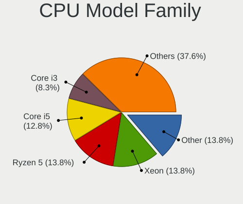

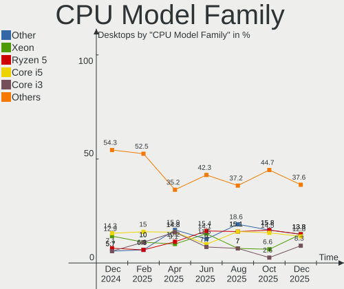

| Model                   | Desktops | Percent |
|-------------------------|----------|---------|
| Other                   | 15       | 13.76%  |
| Intel Xeon              | 15       | 13.76%  |
| AMD Ryzen 5             | 15       | 13.76%  |
| Intel Core i5           | 14       | 12.84%  |
| Intel Core i3           | 9        | 8.26%   |
| Intel Pentium           | 5        | 4.59%   |
| Intel Core i7           | 5        | 4.59%   |
| Intel Celeron           | 4        | 3.67%   |
| Intel Core 2 Duo        | 3        | 2.75%   |
| AMD FX                  | 3        | 2.75%   |
| AMD A10                 | 3        | 2.75%   |
| Intel Pentium Gold      | 2        | 1.83%   |
| Intel Pentium Dual      | 2        | 1.83%   |
| AMD Ryzen 7             | 2        | 1.83%   |
| AMD Ryzen 3             | 2        | 1.83%   |
| Intel Pentium Silver    | 1        | 0.92%   |
| Intel Pentium Dual-Core | 1        | 0.92%   |
| Intel Core 2 Quad       | 1        | 0.92%   |
| Intel Core 2            | 1        | 0.92%   |
| Intel Core              | 1        | 0.92%   |
| AMD Ryzen 9             | 1        | 0.92%   |
| AMD PRO A10             | 1        | 0.92%   |
| AMD Athlon II X3        | 1        | 0.92%   |
| AMD Athlon II X2        | 1        | 0.92%   |
| AMD A8                  | 1        | 0.92%   |

CPU Cores
---------

Number of processor cores

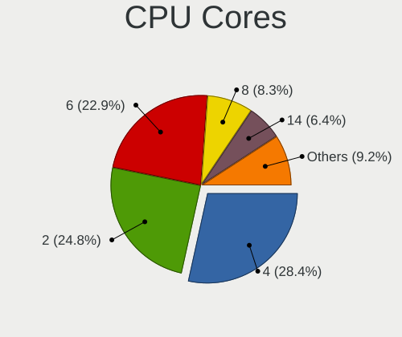

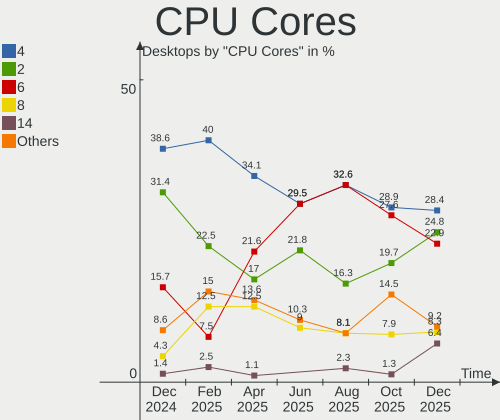

| Number | Desktops | Percent |
|--------|----------|---------|
| 4      | 31       | 28.44%  |
| 2      | 27       | 24.77%  |
| 6      | 25       | 22.94%  |
| 8      | 9        | 8.26%   |
| 14     | 7        | 6.42%   |
| 12     | 5        | 4.59%   |
| 3      | 2        | 1.83%   |
| 36     | 1        | 0.92%   |
| 24     | 1        | 0.92%   |
| 1      | 1        | 0.92%   |

CPU Sockets
-----------

Number of sockets

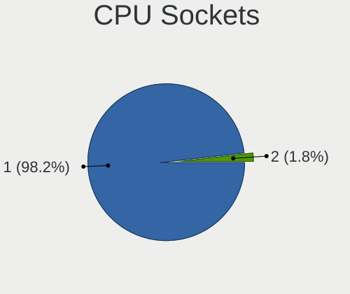

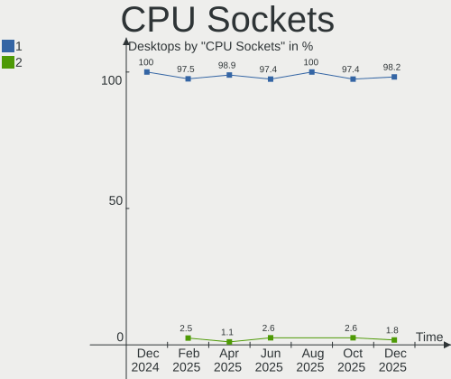

| Number | Desktops | Percent |
|--------|----------|---------|
| 1      | 107      | 98.17%  |
| 2      | 2        | 1.83%   |

CPU Threads
-----------

Threads per core (Hyper-Threading)

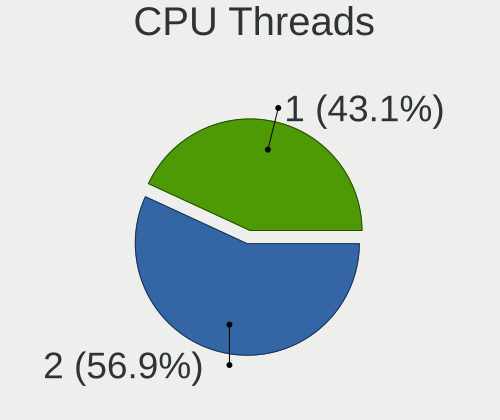

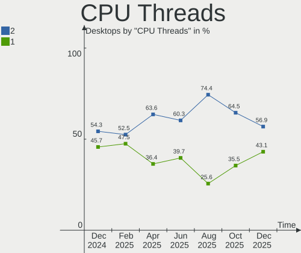

| Number | Desktops | Percent |
|--------|----------|---------|
| 2      | 62       | 56.88%  |
| 1      | 47       | 43.12%  |

CPU Op-Modes
------------

CPU Operation Modes (32-bit, 64-bit)

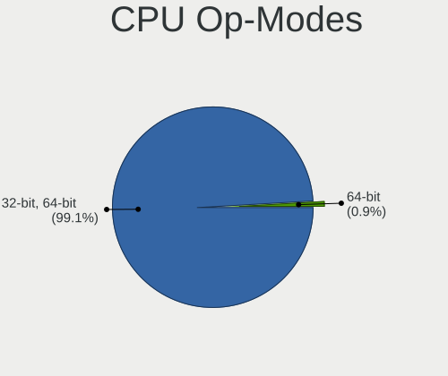

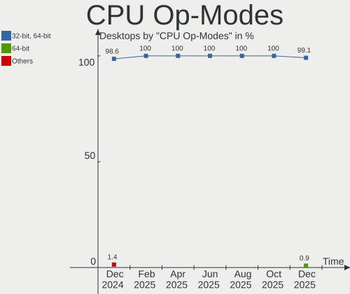

| Op mode        | Desktops | Percent |
|----------------|----------|---------|
| 32-bit, 64-bit | 108      | 99.08%  |
| 64-bit         | 1        | 0.92%   |

CPU Microcode
-------------

Microcode number

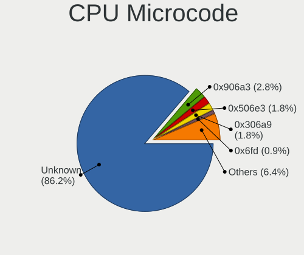

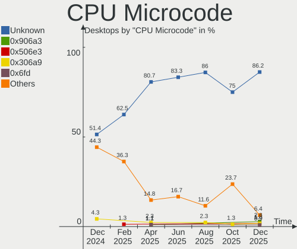

| Number     | Desktops | Percent |
|------------|----------|---------|
| Unknown    | 94       | 86.24%  |
| 0x906a3    | 3        | 2.75%   |
| 0x506e3    | 2        | 1.83%   |
| 0x306a9    | 2        | 1.83%   |
| 0x6fd      | 1        | 0.92%   |
| 0x6fb      | 1        | 0.92%   |
| 0x206a7    | 1        | 0.92%   |
| 0x1067a    | 1        | 0.92%   |
| 0x0a50000c | 1        | 0.92%   |
| 0x0810810e | 1        | 0.92%   |
| 0x06000822 | 1        | 0.92%   |
| 0x010000b7 | 1        | 0.92%   |

CPU Microarch
-------------

Microarchitecture

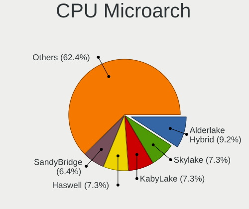

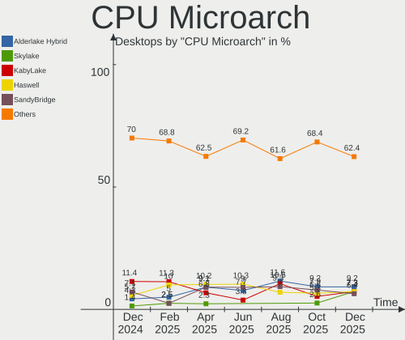

| Name             | Desktops | Percent |
|------------------|----------|---------|
| Alderlake Hybrid | 10       | 9.17%   |
| Skylake          | 8        | 7.34%   |
| KabyLake         | 8        | 7.34%   |
| Haswell          | 8        | 7.34%   |
| SandyBridge      | 7        | 6.42%   |
| IvyBridge        | 7        | 6.42%   |
| Core             | 6        | 5.5%    |
| Zen+             | 5        | 4.59%   |
| Zen 3            | 5        | 4.59%   |
| Zen 2            | 5        | 4.59%   |
| Penryn           | 5        | 4.59%   |
| Icelake          | 4        | 3.67%   |
| CometLake        | 4        | 3.67%   |
| Unknown          | 4        | 3.67%   |
| Westmere         | 3        | 2.75%   |
| Steamroller      | 3        | 2.75%   |
| Piledriver       | 3        | 2.75%   |
| Broadwell        | 3        | 2.75%   |
| Zen              | 2        | 1.83%   |
| K10              | 2        | 1.83%   |
| Tremont          | 1        | 0.92%   |
| Silvermont       | 1        | 0.92%   |
| Nehalem          | 1        | 0.92%   |
| Lunarlake Hybrid | 1        | 0.92%   |
| Goldmont plus    | 1        | 0.92%   |
| Excavator        | 1        | 0.92%   |
| Bulldozer        | 1        | 0.92%   |

Graphics
--------

GPU Vendor
----------

Vendors of graphics cards

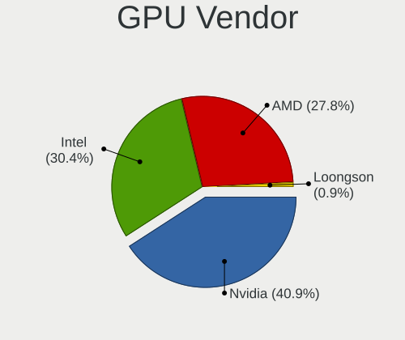

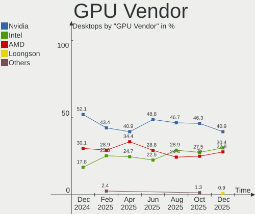

| Vendor              | Desktops | Percent |
|---------------------|----------|---------|
| Nvidia              | 47       | 40.87%  |
| Intel               | 35       | 30.43%  |
| AMD                 | 32       | 27.83%  |
| Loongson Technology | 1        | 0.87%   |

GPU Model
---------

Graphics card models

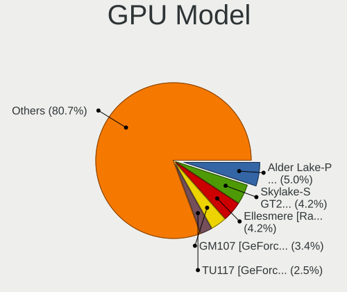

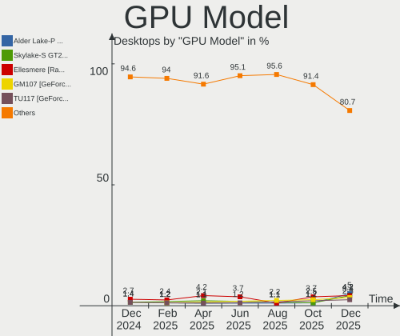

| Model                                                                       | Desktops | Percent |
|-----------------------------------------------------------------------------|----------|---------|
| Intel Alder Lake-P GT2 [Iris Xe Graphics]                                   | 6        | 5.04%   |
| Intel Skylake-S GT2 [HD Graphics 530]                                       | 5        | 4.2%    |
| AMD Ellesmere [Radeon RX 470/480/570/570X/580/580X/590]                     | 5        | 4.2%    |
| Nvidia GM107 [GeForce GTX 750 Ti]                                           | 4        | 3.36%   |
| Nvidia TU117 [GeForce GTX 1650]                                             | 3        | 2.52%   |
| Nvidia GT218 [GeForce 210]                                                  | 3        | 2.52%   |
| Nvidia GF108 [GeForce GT 440]                                               | 3        | 2.52%   |
| AMD Picasso/Raven 2 [Radeon Vega Series / Radeon Vega Mobile Series]        | 3        | 2.52%   |
| AMD Kaveri [Radeon R7 Graphics]                                             | 3        | 2.52%   |
| Nvidia TU106 [GeForce RTX 2060 SUPER]                                       | 2        | 1.68%   |
| Nvidia GP107 [GeForce GTX 1050]                                             | 2        | 1.68%   |
| Nvidia GP107 [GeForce GTX 1050 Ti]                                          | 2        | 1.68%   |
| Nvidia AD104 [GeForce RTX 4070 SUPER]                                       | 2        | 1.68%   |
| Intel Xeon E3-1200 v3/4th Gen Core Processor Integrated Graphics Controller | 2        | 1.68%   |
| Intel Xeon E3-1200 v2/3rd Gen Core processor Graphics Controller            | 2        | 1.68%   |
| Intel Kaby Lake-S GT2 [HD Graphics 630]                                     | 2        | 1.68%   |
| Intel DG2 [Arc A380]                                                        | 2        | 1.68%   |
| Intel CometLake-S GT1 [UHD Graphics 610]                                    | 2        | 1.68%   |
| Intel CoffeeLake-S GT2 [UHD Graphics 630]                                   | 2        | 1.68%   |
| Intel 82G33/G31 Express Integrated Graphics Controller                      | 2        | 1.68%   |
| Intel 2nd Generation Core Processor Family Integrated Graphics Controller   | 2        | 1.68%   |
| AMD RV515 [Radeon X1300/X1550]                                              | 2        | 1.68%   |
| AMD RV515 [Radeon X1300/X1550 Series] (Secondary)                           | 2        | 1.68%   |
| AMD Navi 44 [Radeon RX 9060 XT]                                             | 2        | 1.68%   |
| AMD Lexa PRO [Radeon 540/540X/550/550X / RX 540X/550/550X]                  | 2        | 1.68%   |
| AMD Cezanne [Radeon Vega Series / Radeon Vega Mobile Series]                | 2        | 1.68%   |
| Nvidia TU116 [GeForce GTX 1660 Ti]                                          | 1        | 0.84%   |
| Nvidia TU106 [GeForce GTX 1650]                                             | 1        | 0.84%   |
| Nvidia GT218M [GeForce G210M]                                               | 1        | 0.84%   |
| Nvidia GT218 [GeForce 8400 GS Rev. 3]                                       | 1        | 0.84%   |
| Nvidia GT200b [GeForce GTX 285]                                             | 1        | 0.84%   |
| Nvidia GP107GL [Quadro P400]                                                | 1        | 0.84%   |
| Nvidia GP106 [GeForce GTX 1060 3GB]                                         | 1        | 0.84%   |
| Nvidia GM206 [GeForce GTX 960]                                              | 1        | 0.84%   |
| Nvidia GM206 [GeForce GTX 950]                                              | 1        | 0.84%   |
| Nvidia GM107 [GeForce GTX 750]                                              | 1        | 0.84%   |
| Nvidia GK208B [GeForce GT 710]                                              | 1        | 0.84%   |
| Nvidia GK208 [GeForce GT 630 Rev. 2]                                        | 1        | 0.84%   |
| Nvidia GK107 [GeForce GTX 650]                                              | 1        | 0.84%   |
| Nvidia GK107 [GeForce GT 640]                                               | 1        | 0.84%   |

GPU Combo
---------

Combinations of graphics cards

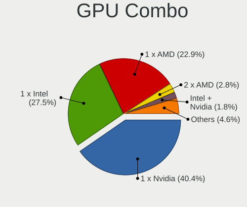

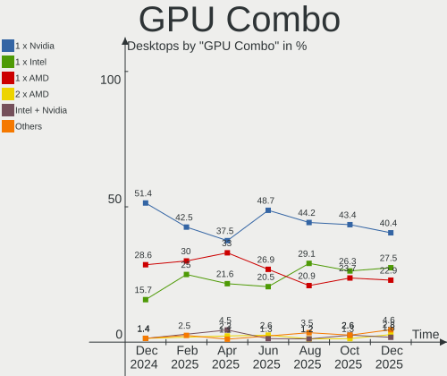

| Name                    | Desktops | Percent |
|-------------------------|----------|---------|
| 1 x Nvidia              | 44       | 40.37%  |
| 1 x Intel               | 30       | 27.52%  |
| 1 x AMD                 | 25       | 22.94%  |
| 2 x AMD                 | 3        | 2.75%   |
| Intel + Nvidia          | 2        | 1.83%   |
| Intel + AMD             | 2        | 1.83%   |
| 2 x Intel               | 1        | 0.92%   |
| 1 x Loongson Technology | 1        | 0.92%   |
| AMD + Nvidia            | 1        | 0.92%   |

GPU Driver
----------

Free vs proprietary

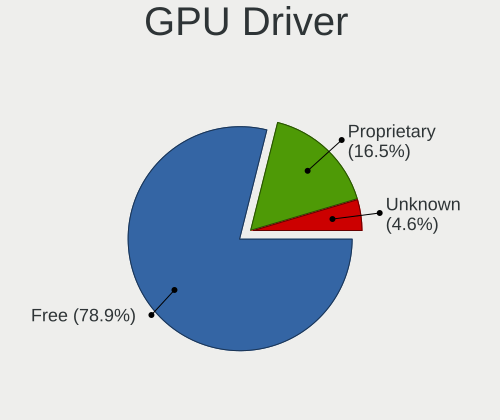

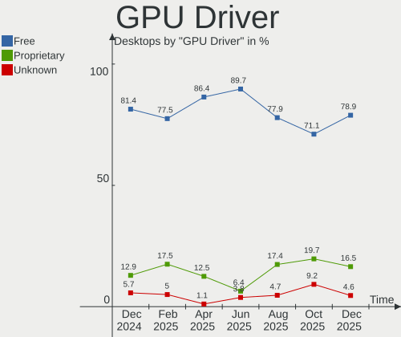

| Driver      | Desktops | Percent |
|-------------|----------|---------|
| Free        | 86       | 78.9%   |
| Proprietary | 18       | 16.51%  |
| Unknown     | 5        | 4.59%   |

GPU Memory
----------

Total video memory

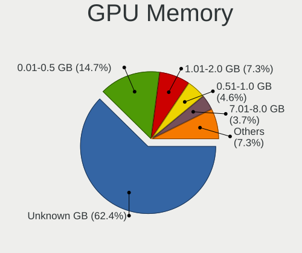

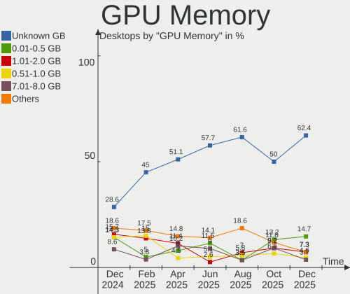

| Size in GB | Desktops | Percent |
|------------|----------|---------|
| Unknown    | 68       | 62.39%  |
| 0.01-0.5   | 16       | 14.68%  |
| 1.01-2.0   | 8        | 7.34%   |
| 0.51-1.0   | 5        | 4.59%   |
| 7.01-8.0   | 4        | 3.67%   |
| 3.01-4.0   | 4        | 3.67%   |
| 8.01-16.0  | 3        | 2.75%   |
| 16.01-24.0 | 1        | 0.92%   |

Monitor
-------

Monitor Vendor
--------------

Monitor vendors

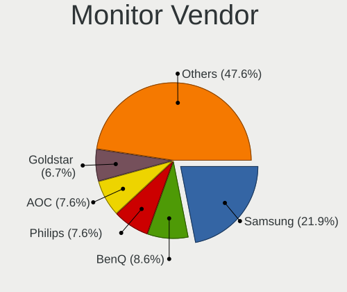

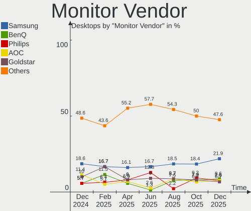

| Vendor               | Desktops | Percent |
|----------------------|----------|---------|
| Samsung Electronics  | 23       | 21.9%   |
| BenQ                 | 9        | 8.57%   |
| Philips              | 8        | 7.62%   |
| AOC                  | 8        | 7.62%   |
| Goldstar             | 7        | 6.67%   |
| Hewlett-Packard      | 6        | 5.71%   |
| Dell                 | 5        | 4.76%   |
| SKG                  | 4        | 3.81%   |
| HHT                  | 4        | 3.81%   |
| ViewSonic            | 3        | 2.86%   |
| SAC                  | 3        | 2.86%   |
| Mi                   | 3        | 2.86%   |
| Acer                 | 3        | 2.86%   |
| Sony                 | 2        | 1.9%    |
| Iiyama               | 2        | 1.9%    |
| Ancor Communications | 2        | 1.9%    |
| VIE                  | 1        | 0.95%   |
| STD                  | 1        | 0.95%   |
| Skyworth             | 1        | 0.95%   |
| SGT                  | 1        | 0.95%   |
| Pixio                | 1        | 0.95%   |
| Novatek              | 1        | 0.95%   |
| MTK                  | 1        | 0.95%   |
| MStar                | 1        | 0.95%   |
| MSI                  | 1        | 0.95%   |
| LED                  | 1        | 0.95%   |
| Hitachi              | 1        | 0.95%   |
| DET                  | 1        | 0.95%   |
| CTV                  | 1        | 0.95%   |

Monitor Model
-------------

Monitor models

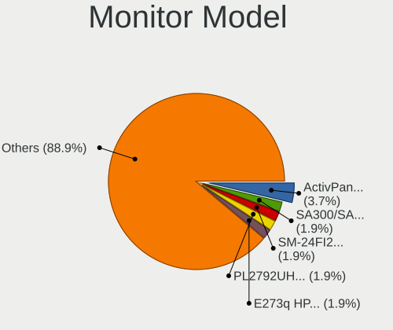

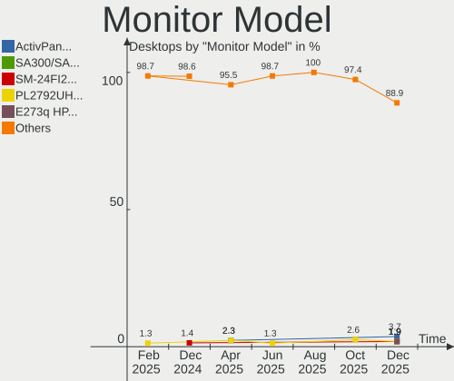

| Model                                                                   | Desktops | Percent |
|-------------------------------------------------------------------------|----------|---------|
| HHT ActivPanel V6 HHT0030 3840x2160 944x398mm 40.3-inch                 | 4        | 3.7%    |
| Samsung Electronics SA300/SA350 SAM0788 1366x768 410x230mm 18.5-inch    | 2        | 1.85%   |
| SAC SM-24FI221 SAC2453 1920x1080 530x290mm 23.8-inch                    | 2        | 1.85%   |
| Iiyama PL2792UH IVM664E 3840x2160 600x340mm 27.2-inch                   | 2        | 1.85%   |
| Hewlett-Packard E273q HPN3474 2560x1440 597x336mm 27.0-inch             | 2        | 1.85%   |
| BenQ LCD BNQ801B 2560x1440 527x296mm 23.8-inch                          | 2        | 1.85%   |
| AOC 24G2W1G3 AOC2402 1920x1080 527x296mm 23.8-inch                      | 2        | 1.85%   |
| ViewSonic VX2409 SERIES VSC6C2E 1920x1080 521x293mm 23.5-inch           | 1        | 0.93%   |
| ViewSonic VA2407 Series VSC8C31 1920x1080 521x293mm 23.5-inch           | 1        | 0.93%   |
| ViewSonic VA2342 SERIES VSCFA2B 1920x1080 509x286mm 23.0-inch           | 1        | 0.93%   |
| VIE ATHEN U2L 21 VIE2150 1920x1080 476x268mm 21.5-inch                  | 1        | 0.93%   |
| STD HDMI STD2020 1920x1080 520x310mm 23.8-inch                          | 1        | 0.93%   |
| Sony SDM-HS75P SNY2300 1280x1024 338x270mm 17.0-inch                    | 1        | 0.93%   |
| Sony LCD Monitor MS_9005 1920x1080                                      | 1        | 0.93%   |
| Skyworth TV MONITOR SKY0030 1920x1080 1430x800mm 64.5-inch              | 1        | 0.93%   |
| SKG H27T22 SKG2702 2560x1440 530x280mm 23.6-inch                        | 1        | 0.93%   |
| SKG DEXP DQ27N2 SKG2771 2560x1440 531x298mm 24.0-inch                   | 1        | 0.93%   |
| SKG DEXP DF27N1 SKG2713 1920x1080 597x336mm 27.0-inch                   | 1        | 0.93%   |
| SKG AQ27H1 SKG2722 2560x1440 620x370mm 28.4-inch                        | 1        | 0.93%   |
| SGT HDMI SGT3200 2560x1440 600x330mm 27.0-inch                          | 1        | 0.93%   |
| Samsung Electronics SyncMaster SAM0580 1280x1024 376x301mm 19.0-inch    | 1        | 0.93%   |
| Samsung Electronics SyncMaster SAM0350 1440x900 428x255mm 19.6-inch     | 1        | 0.93%   |
| Samsung Electronics SyncMaster SAM02F5 1920x1200                        | 1        | 0.93%   |
| Samsung Electronics SyncMaster SAM026E 1280x1024 376x301mm 19.0-inch    | 1        | 0.93%   |
| Samsung Electronics SyncMaster SAM021C 1400x1050 408x300mm 19.9-inch    | 1        | 0.93%   |
| Samsung Electronics SyncMaster SAM01E1 1280x1024 376x301mm 19.0-inch    | 1        | 0.93%   |
| Samsung Electronics SyncMaster SAM01B7 1280x1024 340x270mm 17.1-inch    | 1        | 0.93%   |
| Samsung Electronics SyncMaster SAM011F 1280x1024 376x301mm 19.0-inch    | 1        | 0.93%   |
| Samsung Electronics SyncMaster SAM011E 1280x1024 338x270mm 17.0-inch    | 1        | 0.93%   |
| Samsung Electronics SMEX2220 SAM0685 1920x1080 477x268mm 21.5-inch      | 1        | 0.93%   |
| Samsung Electronics S27D590 SAM0BE9 1920x1080 598x336mm 27.0-inch       | 1        | 0.93%   |
| Samsung Electronics S24R35xFZ SAM71A8 1920x1080 521x293mm 23.5-inch     | 1        | 0.93%   |
| Samsung Electronics S24F350 SAM0D20 1920x1080 521x293mm 23.5-inch       | 1        | 0.93%   |
| Samsung Electronics S22D300 SAM0B3F 1920x1080 477x268mm 21.5-inch       | 1        | 0.93%   |
| Samsung Electronics S22C300 SAM0A1E 1920x1080 477x268mm 21.5-inch       | 1        | 0.93%   |
| Samsung Electronics S20B300 SAM08A8 1600x900 443x249mm 20.0-inch        | 1        | 0.93%   |
| Samsung Electronics S19C200 SAM09AC 1366x768 410x230mm 18.5-inch        | 1        | 0.93%   |
| Samsung Electronics LS24C43xG SAM743B 1920x1080 527x296mm 23.8-inch     | 1        | 0.93%   |
| Samsung Electronics LCD Monitor SAM712D 3840x2160 1872x1053mm 84.6-inch | 1        | 0.93%   |
| Samsung Electronics LCD Monitor SAM0E90 1366x768 609x347mm 27.6-inch    | 1        | 0.93%   |

Monitor Resolution
------------------

Monitor screen resolution

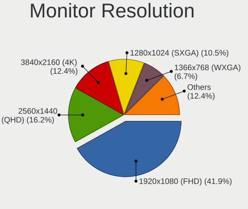

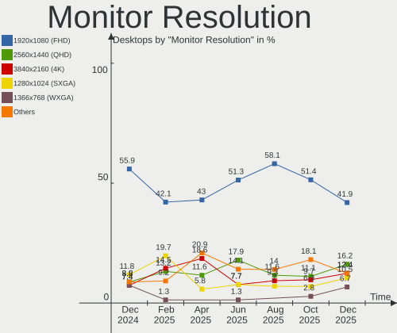

| Resolution         | Desktops | Percent |
|--------------------|----------|---------|
| 1920x1080 (FHD)    | 44       | 41.9%   |
| 2560x1440 (QHD)    | 17       | 16.19%  |
| 3840x2160 (4K)     | 13       | 12.38%  |
| 1280x1024 (SXGA)   | 11       | 10.48%  |
| 1366x768 (WXGA)    | 7        | 6.67%   |
| 1920x1200 (WUXGA)  | 3        | 2.86%   |
| 1680x1050 (WSXGA+) | 3        | 2.86%   |
| 1440x900 (WXGA+)   | 3        | 2.86%   |
| 1600x900 (HD+)     | 2        | 1.9%    |
| 2560x1600          | 1        | 0.95%   |
| 1400x1050          | 1        | 0.95%   |

Monitor Diagonal
----------------

Diagonal size in inches

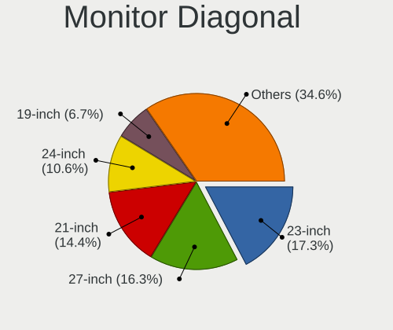

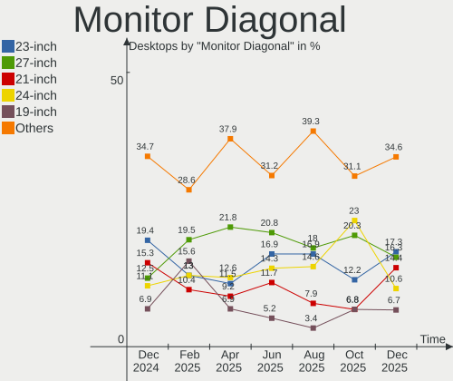

| Inches  | Desktops | Percent |
|---------|----------|---------|
| 23      | 18       | 17.31%  |
| 27      | 17       | 16.35%  |
| 21      | 15       | 14.42%  |
| 24      | 11       | 10.58%  |
| 19      | 7        | 6.73%   |
| 40      | 5        | 4.81%   |
| 18      | 5        | 4.81%   |
| 17      | 5        | 4.81%   |
| 20      | 4        | 3.85%   |
| 31      | 3        | 2.88%   |
| 64      | 2        | 1.92%   |
| 22      | 2        | 1.92%   |
| 15      | 2        | 1.92%   |
| 84      | 1        | 0.96%   |
| 72      | 1        | 0.96%   |
| 52      | 1        | 0.96%   |
| 32      | 1        | 0.96%   |
| 29      | 1        | 0.96%   |
| 28      | 1        | 0.96%   |
| 26      | 1        | 0.96%   |
| Unknown | 1        | 0.96%   |

Monitor Width
-------------

Physical width

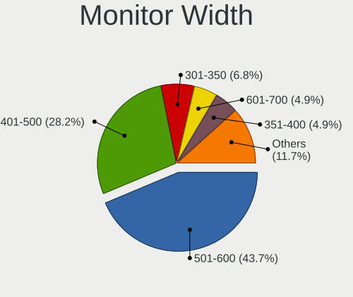

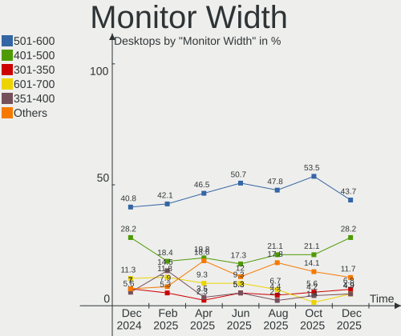

| Width in mm | Desktops | Percent |
|-------------|----------|---------|
| 501-600     | 45       | 43.69%  |
| 401-500     | 29       | 28.16%  |
| 301-350     | 7        | 6.8%    |
| 601-700     | 5        | 4.85%   |
| 351-400     | 5        | 4.85%   |
| 901-1000    | 4        | 3.88%   |
| 1001-1500   | 3        | 2.91%   |
| 1501-2000   | 2        | 1.94%   |
| 801-900     | 1        | 0.97%   |
| 701-800     | 1        | 0.97%   |
| Unknown     | 1        | 0.97%   |

Aspect Ratio
------------

Proportional relationship between the width and the height

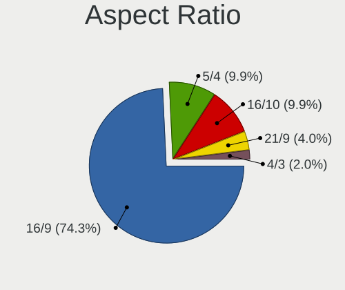

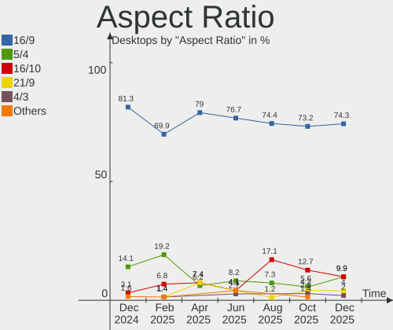

| Ratio | Desktops | Percent |
|-------|----------|---------|
| 16/9  | 75       | 74.26%  |
| 5/4   | 10       | 9.9%    |
| 16/10 | 10       | 9.9%    |
| 21/9  | 4        | 3.96%   |
| 4/3   | 2        | 1.98%   |

Monitor Area
------------

Area in inch²

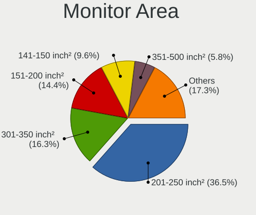

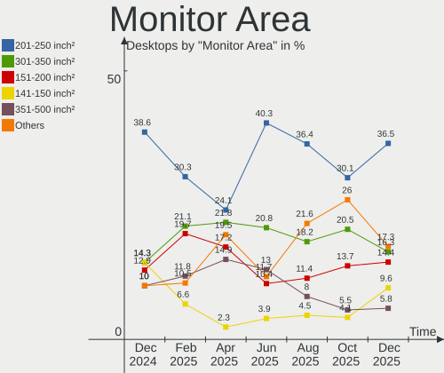

| Area in inch² | Desktops | Percent |
|----------------|----------|---------|
| 201-250        | 38       | 36.54%  |
| 301-350        | 17       | 16.35%  |
| 151-200        | 15       | 14.42%  |
| 141-150        | 10       | 9.62%   |
| 351-500        | 6        | 5.77%   |
| More than 1000 | 5        | 4.81%   |
| 251-300        | 5        | 4.81%   |
| 501-1000       | 5        | 4.81%   |
| 111-120        | 1        | 0.96%   |
| 101-110        | 1        | 0.96%   |
| Unknown        | 1        | 0.96%   |

Pixel Density
-------------

Pixels per inch

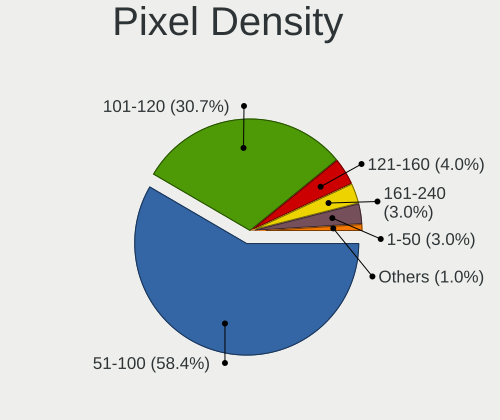

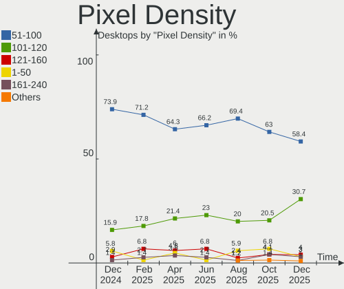

| Density | Desktops | Percent |
|---------|----------|---------|
| 51-100  | 59       | 58.42%  |
| 101-120 | 31       | 30.69%  |
| 121-160 | 4        | 3.96%   |
| 1-50    | 3        | 2.97%   |
| 161-240 | 3        | 2.97%   |
| Unknown | 1        | 0.99%   |

Multiple Monitors
-----------------

Total monitors connected

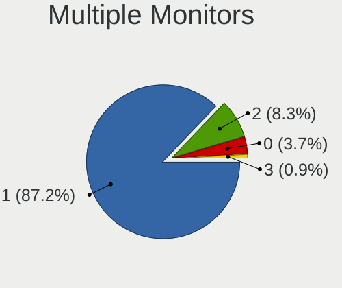

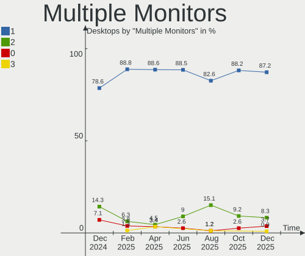

| Total | Desktops | Percent |
|-------|----------|---------|
| 1     | 95       | 87.16%  |
| 2     | 9        | 8.26%   |
| 0     | 4        | 3.67%   |
| 3     | 1        | 0.92%   |

Network
-------

Net Controller Vendor
---------------------

Controller vendors

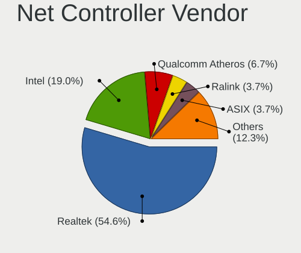

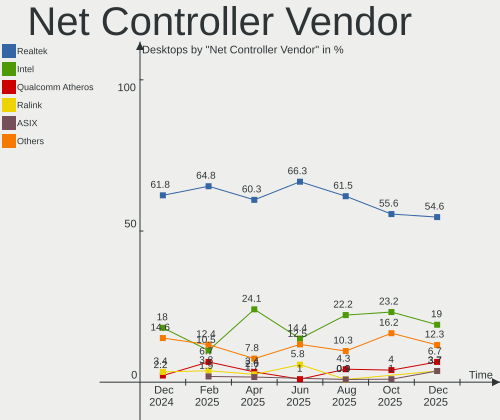

| Vendor                          | Desktops | Percent |
|---------------------------------|----------|---------|
| Realtek Semiconductor           | 89       | 54.6%   |
| Intel                           | 31       | 19.02%  |
| Qualcomm Atheros                | 11       | 6.75%   |
| Ralink Technology               | 6        | 3.68%   |
| ASIX Electronics                | 6        | 3.68%   |
| MediaTek                        | 4        | 2.45%   |
| TP-Link                         | 3        | 1.84%   |
| Xiaomi                          | 2        | 1.23%   |
| Ralink                          | 2        | 1.23%   |
| Marvell Technology Group        | 2        | 1.23%   |
| Broadcom                        | 2        | 1.23%   |
| Qualcomm Technologies           | 1        | 0.61%   |
| Qualcomm Atheros Communications | 1        | 0.61%   |
| NetGear                         | 1        | 0.61%   |
| Loongson Technology             | 1        | 0.61%   |
| Edimax Technology               | 1        | 0.61%   |

Net Controller Model
--------------------

Controller models

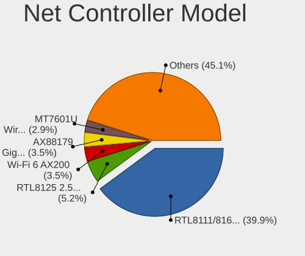

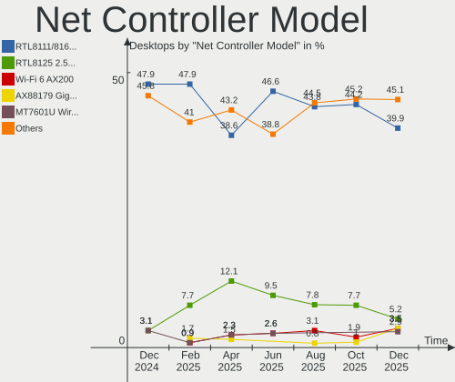

| Model                                                                  | Desktops | Percent |
|------------------------------------------------------------------------|----------|---------|
| Realtek RTL8111/8168/8211/8411 PCI Express Gigabit Ethernet Controller | 69       | 39.88%  |
| Realtek RTL8125 2.5GbE Controller                                      | 9        | 5.2%    |
| Intel Wi-Fi 6 AX200                                                    | 6        | 3.47%   |
| ASIX AX88179 Gigabit Ethernet                                          | 6        | 3.47%   |
| Ralink MT7601U Wireless Adapter                                        | 5        | 2.89%   |
| Realtek RTL8152 Fast Ethernet Adapter                                  | 4        | 2.31%   |
| Intel Ethernet Connection (2) I219-LM                                  | 4        | 2.31%   |
| Realtek RTL810xE PCI Express Fast Ethernet controller                  | 3        | 1.73%   |
| Intel Wireless 7265                                                    | 3        | 1.73%   |
| Intel Wi-Fi 6E(802.11ax) AX210/AX1675* 2x2 [Typhoon Peak]              | 3        | 1.73%   |
| Intel Ethernet Connection (2) I219-V                                   | 3        | 1.73%   |
| Intel Dual Band Wireless-AC 3168NGW [Stone Peak]                       | 3        | 1.73%   |
| Xiaomi Mi/Redmi series (RNDIS + ADB)                                   | 2        | 1.16%   |
| Realtek RTL8126 5GbE Controller                                        | 2        | 1.16%   |
| Realtek 802.11ac NIC                                                   | 2        | 1.16%   |
| Qualcomm Atheros Attansic L1 Gigabit Ethernet                          | 2        | 1.16%   |
| Qualcomm Atheros AR8151 v2.0 Gigabit Ethernet                          | 2        | 1.16%   |
| Qualcomm Atheros AR8131 Gigabit Ethernet                               | 2        | 1.16%   |
| TP-Link TL-WN823N v2/v3 [Realtek RTL8192EU]                            | 1        | 0.58%   |
| TP-Link 802.11n NIC                                                    | 1        | 0.58%   |
| TP-Link 802.11ac NIC                                                   | 1        | 0.58%   |
| Realtek RTL8922AE 802.11be PCIe Wireless Network Adapter               | 1        | 0.58%   |
| Realtek RTL8852BE PCIe 802.11ax Wireless Network Controller            | 1        | 0.58%   |
| Realtek RTL8821CE 802.11ac PCIe Wireless Network Adapter               | 1        | 0.58%   |
| Realtek RTL8188GU 802.11n WLAN Adapter (After Modeswitch)              | 1        | 0.58%   |
| Realtek RTL8188ETV Wireless LAN 802.11n Network Adapter                | 1        | 0.58%   |
| Realtek RTL8187SE Wireless LAN Controller                              | 1        | 0.58%   |
| Realtek RTL-8185 IEEE 802.11a/b/g Wireless LAN Controller              | 1        | 0.58%   |
| Realtek RTL-8100/8101L/8139 PCI Fast Ethernet Adapter                  | 1        | 0.58%   |
| Realtek Killer E2600 GbE Controller                                    | 1        | 0.58%   |
| Ralink RT5370 Wireless Adapter                                         | 1        | 0.58%   |
| Ralink RT5390 Wireless 802.11n 1T/1R PCIe                              | 1        | 0.58%   |
| Ralink RT2561/RT61 rev B 802.11g                                       | 1        | 0.58%   |
| Qualcomm WCN785x Wi-Fi 7(802.11be) 320MHz 2x2 [FastConnect 7800]       | 1        | 0.58%   |
| Qualcomm Atheros Killer E220x Gigabit Ethernet Controller              | 1        | 0.58%   |
| Qualcomm Atheros AR9271 802.11n                                        | 1        | 0.58%   |
| Qualcomm Atheros AR9485 Wireless Network Adapter                       | 1        | 0.58%   |
| Qualcomm Atheros AR93xx Wireless Network Adapter                       | 1        | 0.58%   |
| Qualcomm Atheros AR8152 v2.0 Fast Ethernet                             | 1        | 0.58%   |
| Qualcomm Atheros AR5212/5213/2414 Wireless Network Adapter             | 1        | 0.58%   |

Wireless Vendor
---------------

Wireless vendors

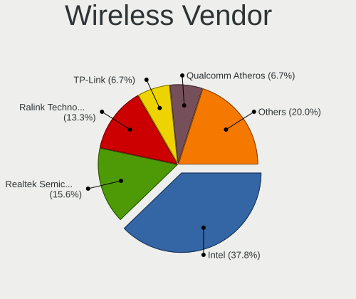

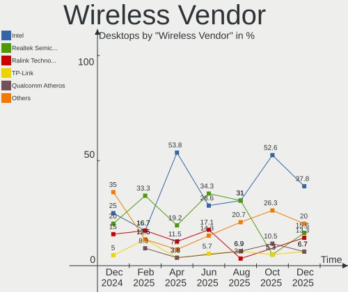

| Vendor                          | Desktops | Percent |
|---------------------------------|----------|---------|
| Intel                           | 17       | 37.78%  |
| Realtek Semiconductor           | 7        | 15.56%  |
| Ralink Technology               | 6        | 13.33%  |
| TP-Link                         | 3        | 6.67%   |
| Qualcomm Atheros                | 3        | 6.67%   |
| MediaTek                        | 3        | 6.67%   |
| Ralink                          | 2        | 4.44%   |
| Qualcomm Atheros Communications | 1        | 2.22%   |
| NetGear                         | 1        | 2.22%   |
| Edimax Technology               | 1        | 2.22%   |
| Broadcom                        | 1        | 2.22%   |

Wireless Model
--------------

Wireless models

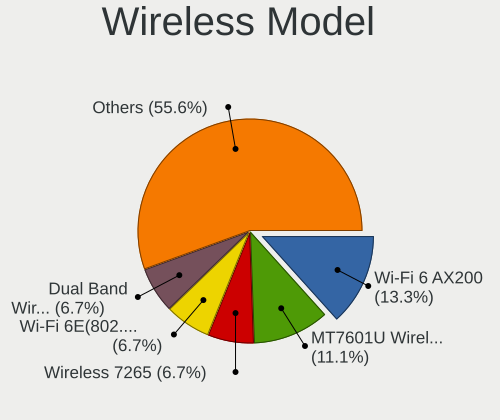

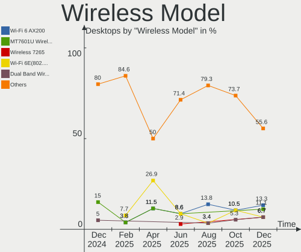

| Model                                                                | Desktops | Percent |
|----------------------------------------------------------------------|----------|---------|
| Intel Wi-Fi 6 AX200                                                  | 6        | 13.33%  |
| Ralink MT7601U Wireless Adapter                                      | 5        | 11.11%  |
| Intel Wireless 7265                                                  | 3        | 6.67%   |
| Intel Wi-Fi 6E(802.11ax) AX210/AX1675* 2x2 [Typhoon Peak]            | 3        | 6.67%   |
| Intel Dual Band Wireless-AC 3168NGW [Stone Peak]                     | 3        | 6.67%   |
| Realtek 802.11ac NIC                                                 | 2        | 4.44%   |
| TP-Link TL-WN823N v2/v3 [Realtek RTL8192EU]                          | 1        | 2.22%   |
| TP-Link 802.11n NIC                                                  | 1        | 2.22%   |
| TP-Link 802.11ac NIC                                                 | 1        | 2.22%   |
| Realtek RTL8821CE 802.11ac PCIe Wireless Network Adapter             | 1        | 2.22%   |
| Realtek RTL8188GU 802.11n WLAN Adapter (After Modeswitch)            | 1        | 2.22%   |
| Realtek RTL8188ETV Wireless LAN 802.11n Network Adapter              | 1        | 2.22%   |
| Realtek RTL8187SE Wireless LAN Controller                            | 1        | 2.22%   |
| Realtek RTL-8185 IEEE 802.11a/b/g Wireless LAN Controller            | 1        | 2.22%   |
| Ralink RT5370 Wireless Adapter                                       | 1        | 2.22%   |
| Ralink RT5390 Wireless 802.11n 1T/1R PCIe                            | 1        | 2.22%   |
| Ralink RT2561/RT61 rev B 802.11g                                     | 1        | 2.22%   |
| Qualcomm Atheros AR9271 802.11n                                      | 1        | 2.22%   |
| Qualcomm Atheros AR9485 Wireless Network Adapter                     | 1        | 2.22%   |
| Qualcomm Atheros AR93xx Wireless Network Adapter                     | 1        | 2.22%   |
| Qualcomm Atheros AR5212/5213/2414 Wireless Network Adapter           | 1        | 2.22%   |
| NetGear WNA1100 Wireless-N 150 [Atheros AR9271]                      | 1        | 2.22%   |
| MediaTek MT7922 802.11ax PCI Express Wireless Network Adapter        | 1        | 2.22%   |
| MediaTek MT7921 802.11ax PCIe Wireless Network Adapter [Filogic 330] | 1        | 2.22%   |
| MediaTek MT7612U 802.11a/b/g/n/ac Wireless Adapter                   | 1        | 2.22%   |
| Intel Wireless 3165                                                  | 1        | 2.22%   |
| Intel Tiger Lake PCH CNVi WiFi                                       | 1        | 2.22%   |
| Edimax EW-7811Un 802.11n Wireless Adapter [Realtek RTL8188CUS]       | 1        | 2.22%   |
| Broadcom BCM4360 802.11ac Dual Band Wireless Network Adapter         | 1        | 2.22%   |

Ethernet Vendor
---------------

Ethernet vendors

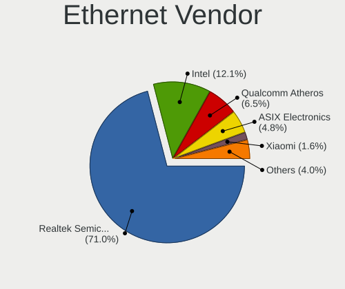

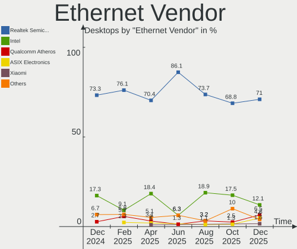

| Vendor                   | Desktops | Percent |
|--------------------------|----------|---------|
| Realtek Semiconductor    | 88       | 70.97%  |
| Intel                    | 15       | 12.1%   |
| Qualcomm Atheros         | 8        | 6.45%   |
| ASIX Electronics         | 6        | 4.84%   |
| Xiaomi                   | 2        | 1.61%   |
| Marvell Technology Group | 2        | 1.61%   |
| Qualcomm Technologies    | 1        | 0.81%   |
| Loongson Technology      | 1        | 0.81%   |
| Broadcom                 | 1        | 0.81%   |

Ethernet Model
--------------

Ethernet models

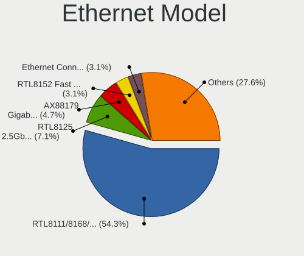

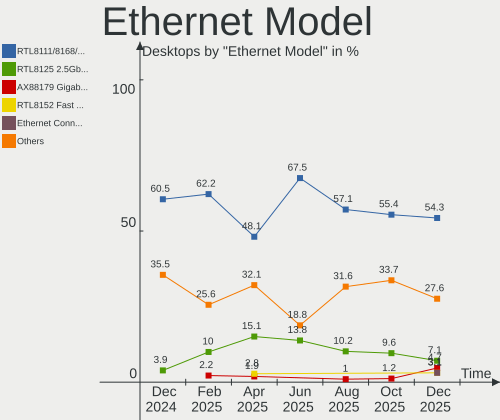

| Model                                                                  | Desktops | Percent |
|------------------------------------------------------------------------|----------|---------|
| Realtek RTL8111/8168/8211/8411 PCI Express Gigabit Ethernet Controller | 69       | 54.33%  |
| Realtek RTL8125 2.5GbE Controller                                      | 9        | 7.09%   |
| ASIX AX88179 Gigabit Ethernet                                          | 6        | 4.72%   |
| Realtek RTL8152 Fast Ethernet Adapter                                  | 4        | 3.15%   |
| Intel Ethernet Connection (2) I219-LM                                  | 4        | 3.15%   |
| Realtek RTL810xE PCI Express Fast Ethernet controller                  | 3        | 2.36%   |
| Intel Ethernet Connection (2) I219-V                                   | 3        | 2.36%   |
| Xiaomi Mi/Redmi series (RNDIS + ADB)                                   | 2        | 1.57%   |
| Realtek RTL8126 5GbE Controller                                        | 2        | 1.57%   |
| Qualcomm Atheros Attansic L1 Gigabit Ethernet                          | 2        | 1.57%   |
| Qualcomm Atheros AR8151 v2.0 Gigabit Ethernet                          | 2        | 1.57%   |
| Qualcomm Atheros AR8131 Gigabit Ethernet                               | 2        | 1.57%   |
| Realtek RTL8922AE 802.11be PCIe Wireless Network Adapter               | 1        | 0.79%   |
| Realtek RTL8852BE PCIe 802.11ax Wireless Network Controller            | 1        | 0.79%   |
| Realtek RTL-8100/8101L/8139 PCI Fast Ethernet Adapter                  | 1        | 0.79%   |
| Realtek Killer E2600 GbE Controller                                    | 1        | 0.79%   |
| Qualcomm WCN785x Wi-Fi 7(802.11be) 320MHz 2x2 [FastConnect 7800]       | 1        | 0.79%   |
| Qualcomm Atheros Killer E220x Gigabit Ethernet Controller              | 1        | 0.79%   |
| Qualcomm Atheros AR8152 v2.0 Fast Ethernet                             | 1        | 0.79%   |
| Marvell Group 88E8056 PCI-E Gigabit Ethernet Controller                | 1        | 0.79%   |
| Marvell Group 88E8001 Gigabit Ethernet Controller                      | 1        | 0.79%   |
| Loongson 2K2000 / 7A2000 Chipset Gigabit Ethernet Controller           | 1        | 0.79%   |
| Intel I211 Gigabit Network Connection                                  | 1        | 0.79%   |
| Intel Ethernet Controller I226-V                                       | 1        | 0.79%   |
| Intel Ethernet Connection I219-LM                                      | 1        | 0.79%   |
| Intel Ethernet Connection (7) I219-V                                   | 1        | 0.79%   |
| Intel Ethernet Connection (17) I219-V                                  | 1        | 0.79%   |
| Intel Ethernet Connection (14) I219-V                                  | 1        | 0.79%   |
| Intel 82566DM-2 Gigabit Network Connection                             | 1        | 0.79%   |
| Intel 82566DM Gigabit Network Connection                               | 1        | 0.79%   |
| Broadcom NetXtreme BCM5762 Gigabit Ethernet PCIe                       | 1        | 0.79%   |

Net Controller Kind
-------------------

Ethernet, WiFi or modem

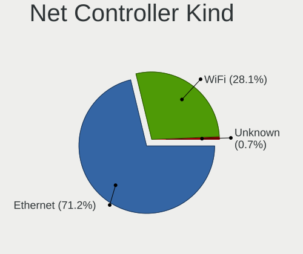

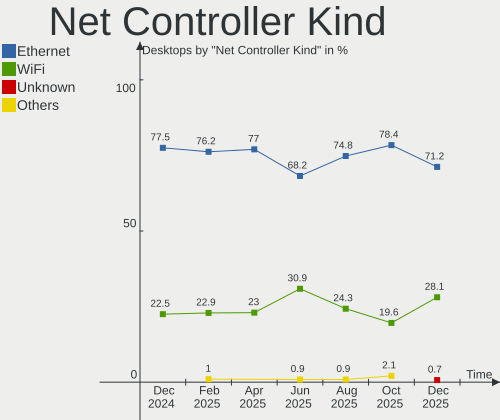

| Kind     | Desktops | Percent |
|----------|----------|---------|
| Ethernet | 109      | 71.24%  |
| WiFi     | 43       | 28.1%   |
| Unknown  | 1        | 0.65%   |

Used Controller
---------------

Currently used network controller

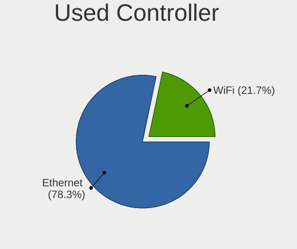

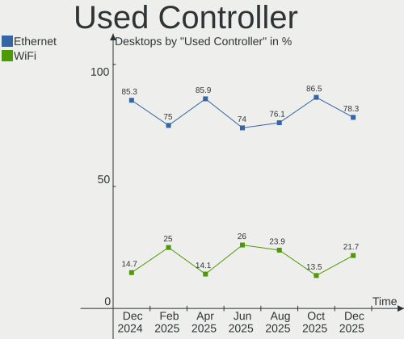

| Kind     | Desktops | Percent |
|----------|----------|---------|
| Ethernet | 83       | 78.3%   |
| WiFi     | 23       | 21.7%   |

NICs
----

Total network controllers on board

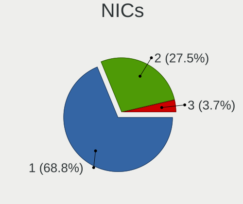

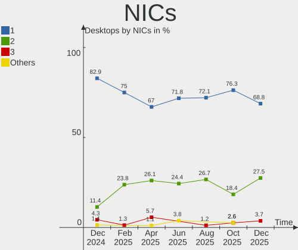

| Total | Desktops | Percent |
|-------|----------|---------|
| 1     | 75       | 68.81%  |
| 2     | 30       | 27.52%  |
| 3     | 4        | 3.67%   |

IPv6
----

IPv6 vs IPv4

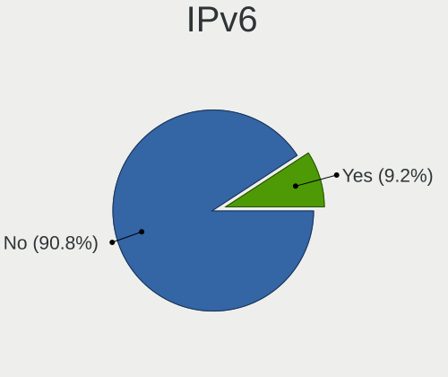

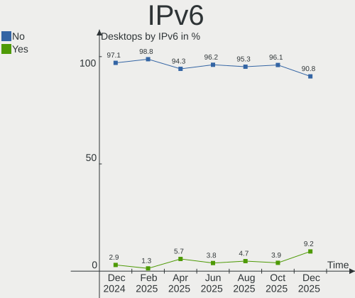

| Used | Desktops | Percent |
|------|----------|---------|
| No   | 99       | 90.83%  |
| Yes  | 10       | 9.17%   |

Bluetooth
---------

Bluetooth Vendor
----------------

Controller vendors

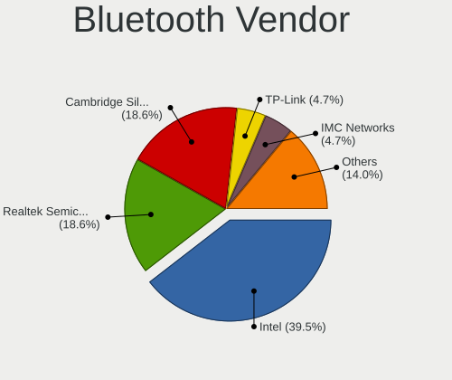

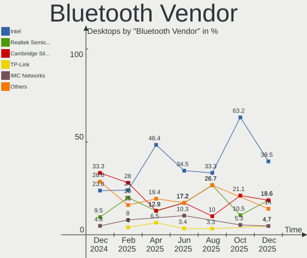

| Vendor                          | Desktops | Percent |
|---------------------------------|----------|---------|
| Intel                           | 17       | 39.53%  |
| Realtek Semiconductor           | 8        | 18.6%   |
| Cambridge Silicon Radio         | 8        | 18.6%   |
| TP-Link                         | 2        | 4.65%   |
| IMC Networks                    | 2        | 4.65%   |
| Foxconn / Hon Hai               | 2        | 4.65%   |
| Qualcomm Atheros Communications | 1        | 2.33%   |
| MediaTek                        | 1        | 2.33%   |
| Actions                         | 1        | 2.33%   |
| Unknown                         | 1        | 2.33%   |

Bluetooth Model
---------------

Controller models

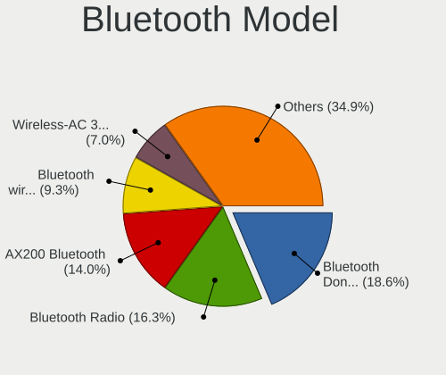

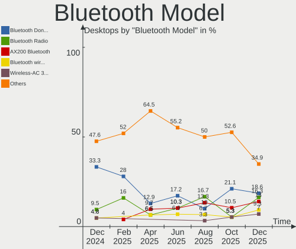

| Model                                               | Desktops | Percent |
|-----------------------------------------------------|----------|---------|
| Cambridge Silicon Radio Bluetooth Dongle (HCI mode) | 8        | 18.6%   |
| Realtek Bluetooth Radio                             | 7        | 16.28%  |
| Intel AX200 Bluetooth                               | 6        | 13.95%  |
| Intel Bluetooth wireless interface                  | 4        | 9.3%    |
| Intel Wireless-AC 3168 Bluetooth                    | 3        | 6.98%   |
| Intel AX210 Bluetooth                               | 3        | 6.98%   |
| TP-Link TP-T@- UB500 Adapter                        | 2        | 4.65%   |
| Realtek Bluetooth 5.3 Radio                         | 1        | 2.33%   |
| Qualcomm Atheros AR3011 Bluetooth                   | 1        | 2.33%   |
| MediaTek Wireless_Device                            | 1        | 2.33%   |
| Intel AX201 Bluetooth                               | 1        | 2.33%   |
| IMC Networks Wireless_Device                        | 1        | 2.33%   |
| IMC Networks Bluetooth Radio                        | 1        | 2.33%   |
| Foxconn / Hon Hai MediaTek Bluetooth Adapter        | 1        | 2.33%   |
| Foxconn / Hon Hai Bluetooth Device                  | 1        | 2.33%   |
| Actions general adapter                             | 1        | 2.33%   |
| Unknown                                             | 1        | 2.33%   |

Sound
-----

Sound Vendor
------------

Sound card vendors

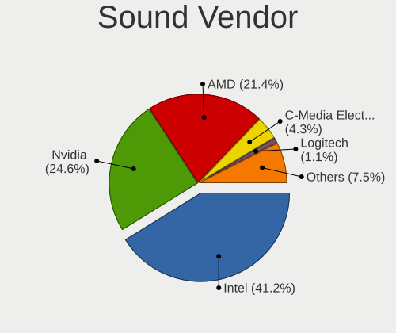

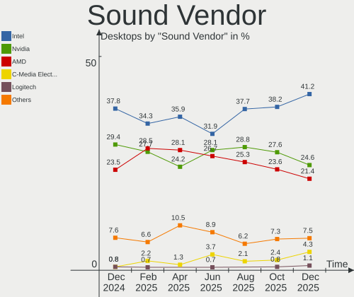

| Vendor                                       | Desktops | Percent |
|----------------------------------------------|----------|---------|
| Intel                                        | 77       | 41.18%  |
| Nvidia                                       | 46       | 24.6%   |
| AMD                                          | 40       | 21.39%  |
| C-Media Electronics                          | 8        | 4.28%   |
| Logitech                                     | 2        | 1.07%   |
| JMTek                                        | 2        | 1.07%   |
| ASUSTek Computer                             | 2        | 1.07%   |
| Zoran Co. Personal Media Division (Nogatech) | 1        | 0.53%   |
| Texas Instruments                            | 1        | 0.53%   |
| Micro Star International                     | 1        | 0.53%   |
| Loongson Technology                          | 1        | 0.53%   |
| KTMicro                                      | 1        | 0.53%   |
| Kingston Technology                          | 1        | 0.53%   |
| Jieli Technology                             | 1        | 0.53%   |
| Hewlett-Packard                              | 1        | 0.53%   |
| Elite Silicon                                | 1        | 0.53%   |
| Creative Labs                                | 1        | 0.53%   |

Sound Model
-----------

Sound card models

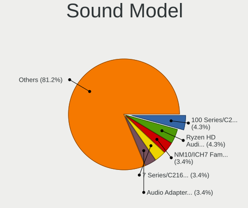

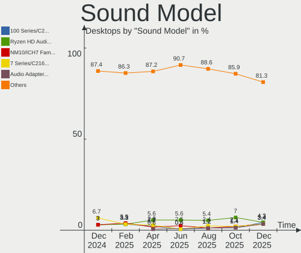

| Model                                                                      | Desktops | Percent |
|----------------------------------------------------------------------------|----------|---------|
| Intel 100 Series/C230 Series Chipset Family HD Audio Controller            | 9        | 4.33%   |
| AMD Ryzen HD Audio Controller                                              | 9        | 4.33%   |
| Intel NM10/ICH7 Family High Definition Audio Controller                    | 7        | 3.37%   |
| Intel 7 Series/C216 Chipset Family High Definition Audio Controller        | 7        | 3.37%   |
| C-Media Electronics Audio Adapter (Unitek Y-247A)                          | 7        | 3.37%   |
| Nvidia GF108 High Definition Audio Controller                              | 6        | 2.88%   |
| Intel Alder Lake PCH-P High Definition Audio Controller                    | 6        | 2.88%   |
| Intel 200 Series PCH HD Audio                                              | 6        | 2.88%   |
| AMD Starship/Matisse HD Audio Controller                                   | 6        | 2.88%   |
| AMD Ellesmere HDMI Audio [Radeon RX 470/480 / 570/580/590]                 | 6        | 2.88%   |
| Nvidia High Definition Audio Controller                                    | 5        | 2.4%    |
| Nvidia GP107GL High Definition Audio Controller                            | 5        | 2.4%    |
| Nvidia GM107 High Definition Audio Controller [GeForce 940MX]              | 5        | 2.4%    |
| Intel C610/X99 series chipset HD Audio Controller                          | 5        | 2.4%    |
| Intel 8 Series/C220 Series Chipset High Definition Audio Controller        | 5        | 2.4%    |
| Intel 6 Series/C200 Series Chipset Family High Definition Audio Controller | 5        | 2.4%    |
| AMD SBx00 Azalia (Intel HDA)                                               | 5        | 2.4%    |
| Intel Tiger Lake-H HD Audio Controller                                     | 4        | 1.92%   |
| Intel Smart Sound Technology (SST) Audio Controller                        | 4        | 1.92%   |
| AMD Renoir/Cezanne HDMI/DP Audio Controller                                | 4        | 1.92%   |
| AMD FCH Azalia Controller                                                  | 4        | 1.92%   |
| AMD Family 17h (Models 00h-0fh) HD Audio Controller                        | 4        | 1.92%   |
| Nvidia TU107 GeForce GTX 1650 High Definition Audio Controller             | 3        | 1.44%   |
| Nvidia TU106 High Definition Audio Controller                              | 3        | 1.44%   |
| Intel Alder Lake-S HD Audio Controller                                     | 3        | 1.44%   |
| Intel 5 Series/3400 Series Chipset High Definition Audio                   | 3        | 1.44%   |
| AMD Raven/Raven2/Fenghuang HDMI/DP Audio Controller                        | 3        | 1.44%   |
| AMD Kaveri HDMI/DP Audio Controller                                        | 3        | 1.44%   |
| Nvidia GM206 High Definition Audio Controller                              | 2        | 0.96%   |
| Nvidia GK208 HDMI/DP Audio Controller                                      | 2        | 0.96%   |
| Nvidia GK107 HDMI Audio Controller                                         | 2        | 0.96%   |
| Nvidia GA107 High Definition Audio Controller                              | 2        | 0.96%   |
| Nvidia GA104 High Definition Audio Controller                              | 2        | 0.96%   |
| Nvidia AD104 High Definition Audio Controller                              | 2        | 0.96%   |
| Intel DG2 Audio Controller                                                 | 2        | 0.96%   |
| Intel C600/X79 series chipset High Definition Audio Controller             | 2        | 0.96%   |
| Intel 82801I (ICH9 Family) HD Audio Controller                             | 2        | 0.96%   |
| AMD RV710/730 HDMI Audio [Radeon HD 4000 series]                           | 2        | 0.96%   |
| AMD Navi 48 HDMI/DP Audio Controller                                       | 2        | 0.96%   |
| AMD Baffin HDMI/DP Audio [Radeon RX 550 640SP / RX 560/560X]               | 2        | 0.96%   |

Memory
------

Memory Vendor
-------------

Memory module vendors

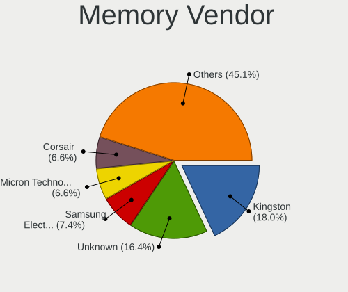

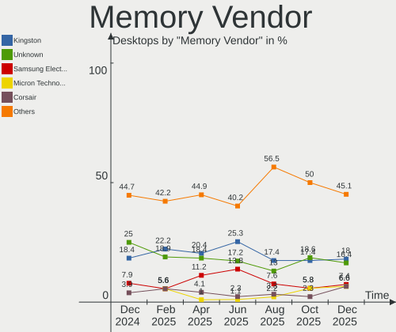

| Vendor                  | Desktops | Percent |
|-------------------------|----------|---------|
| Kingston                | 22       | 18.03%  |
| Unknown                 | 20       | 16.39%  |
| Samsung Electronics     | 9        | 7.38%   |
| Micron Technology       | 8        | 6.56%   |
| Corsair                 | 8        | 6.56%   |
| Crucial                 | 7        | 5.74%   |
| SK hynix                | 6        | 4.92%   |
| A-DATA Technology       | 6        | 4.92%   |
| Unknown                 | 6        | 4.92%   |
| AMD                     | 5        | 4.1%    |
| Patriot                 | 4        | 3.28%   |
| Shenzhen Longsys        | 3        | 2.46%   |
| Gold Key                | 3        | 2.46%   |
| G.Skill                 | 3        | 2.46%   |
| Apacer                  | 2        | 1.64%   |
| Team                    | 1        | 0.82%   |
| Shenzhen Shi Bolunshuai | 1        | 0.82%   |
| PUSKILL                 | 1        | 0.82%   |
| Patriot Memory          | 1        | 0.82%   |
| Kingmax                 | 1        | 0.82%   |
| Juhor                   | 1        | 0.82%   |
| Hikvision               | 1        | 0.82%   |
| Hikstorage              | 1        | 0.82%   |
| Avant                   | 1        | 0.82%   |
| Atermiter               | 1        | 0.82%   |

Memory Model
------------

Memory module models

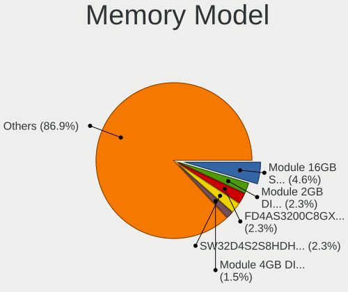

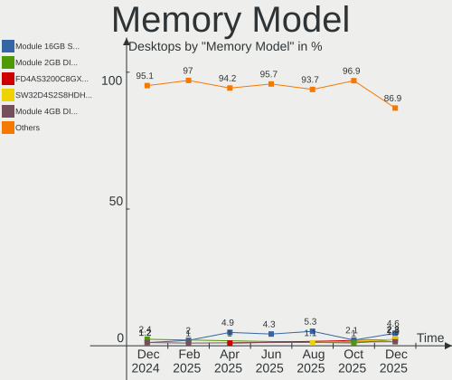

| Model                                                        | Desktops | Percent |
|--------------------------------------------------------------|----------|---------|
| Unknown                                                      | 6        | 4.62%   |
| Unknown RAM Module 2GB DIMM DDR2 800MT/s                     | 3        | 2.31%   |
| Shenzhen Longsys RAM FD4AS3200C8GXE 8GB SODIMM DDR4 3200MT/s | 3        | 2.31%   |
| Kingston RAM SW32D4S2S8HDH-8 8GB SODIMM DDR4 3200MT/s        | 3        | 2.31%   |
| Unknown RAM Module 4GB DIMM SDRAM                            | 2        | 1.54%   |
| Unknown RAM Module 4GB DIMM 1333MT/s                         | 2        | 1.54%   |
| Unknown RAM Module 2GB DIMM 800MT/s                          | 2        | 1.54%   |
| Unknown RAM Module 2GB DIMM 1333MT/s                         | 2        | 1.54%   |
| Kingston RAM HP5189-2180-ELC 2GB DIMM DDR2 800MT/s           | 2        | 1.54%   |
| Crucial RAM CT8G4DFS824A.C8FE 8GB DIMM DDR4 3000MT/s         | 2        | 1.54%   |
| Unknown RAM Module 8GB DIMM DDR4 2400MT/s                    | 1        | 0.77%   |
| Unknown RAM Module 8GB DIMM DDR3 800MT/s                     | 1        | 0.77%   |
| Unknown RAM Module 8GB DIMM 1333MT/s                         | 1        | 0.77%   |
| Unknown RAM Module 4GB DIMM DDR4 2133MT/s                    | 1        | 0.77%   |
| Unknown RAM Module 4GB DIMM DDR3 1067MT/s                    | 1        | 0.77%   |
| Unknown RAM Module 4GB DIMM 1600MT/s                         | 1        | 0.77%   |
| Unknown RAM Module 2GB DIMM SDRAM                            | 1        | 0.77%   |
| Unknown RAM Module 2GB DIMM 667MT/s                          | 1        | 0.77%   |
| Unknown RAM Module 2048MB DIMM SDRAM 533MT/s                 | 1        | 0.77%   |
| Unknown RAM Module 1GB DIMM 800MT/s                          | 1        | 0.77%   |
| Unknown RAM Module 1024MB DIMM SDRAM 533MT/s                 | 1        | 0.77%   |
| Unknown RAM Module 1024MB DIMM DDR2 800MT/s                  | 1        | 0.77%   |
| Unknown RAM DDR4 NB 8G 2666 8GB SODIMM DDR4 2667MT/s         | 1        | 0.77%   |
| Team RAM Elite-18 4GB DIMM DDR3 1866MT/s                     | 1        | 0.77%   |
| SK hynix RAM Module 4GB SODIMM DDR4 2133MT/s                 | 1        | 0.77%   |
| SK hynix RAM HMT351U6EFR8C-PB 4GB DIMM DDR3 1600MT/s         | 1        | 0.77%   |
| SK hynix RAM HMT351U6CFR8C 4GB DIMM DDR3 1333MT/s            | 1        | 0.77%   |
| SK hynix RAM HMA81GU6CJR8N-XN 8GB DIMM DDR4 3200MT/s         | 1        | 0.77%   |
| SK hynix RAM HMA42GR7MFR4N-TF 16GB DIMM DDR4 3200MT/s        | 1        | 0.77%   |
| SK hynix RAM HMA42GR7AFR4N-UH 16GB DIMM DDR4 2400MT/s        | 1        | 0.77%   |
| Shenzhen Shi Bolunshuai RAM Module 16GB SODIMM DDR4 2667MT/s | 1        | 0.77%   |
| Samsung RAM Module 4GB SODIMM DDR4 2133MT/s                  | 1        | 0.77%   |
| Samsung RAM Module 4GB DIMM DDR4 2400MT/s                    | 1        | 0.77%   |
| Samsung RAM Module 4GB DIMM DDR4 2133MT/s                    | 1        | 0.77%   |
| Samsung RAM M393B1G70BH0 8GB DIMM DDR3 1600MT/s              | 1        | 0.77%   |
| Samsung RAM M393A4K40CB1-CRC 32GB DIMM DDR4 2400MT/s         | 1        | 0.77%   |
| Samsung RAM M393A4K40BB1-CRC 32GB DIMM DDR4 2400MT/s         | 1        | 0.77%   |
| Samsung RAM M393A1G40DB0-CPB 8GB DIMM DDR4 2667MT/s          | 1        | 0.77%   |
| Samsung RAM M378A5244CB0-CRC 4GB DIMM DDR4 3066MT/s          | 1        | 0.77%   |
| Samsung RAM M378A1K43CB2-CRC 8GB DIMM DDR4 3500MT/s          | 1        | 0.77%   |

Memory Kind
-----------

Memory module kinds

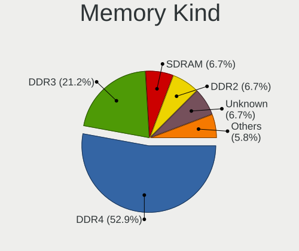

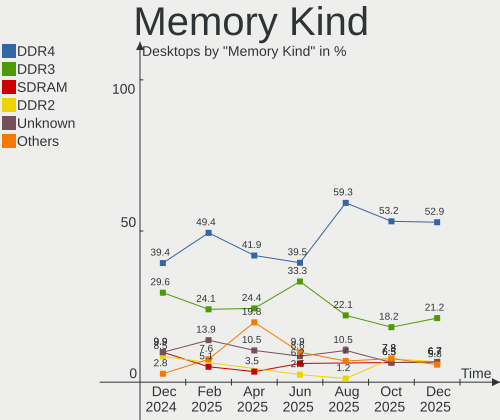

| Kind    | Desktops | Percent |
|---------|----------|---------|
| DDR4    | 55       | 52.88%  |
| DDR3    | 22       | 21.15%  |
| SDRAM   | 7        | 6.73%   |
| DDR2    | 7        | 6.73%   |
| Unknown | 7        | 6.73%   |
| DDR5    | 5        | 4.81%   |
| DRAM    | 1        | 0.96%   |

Memory Form Factor
------------------

Physical design of the memory module

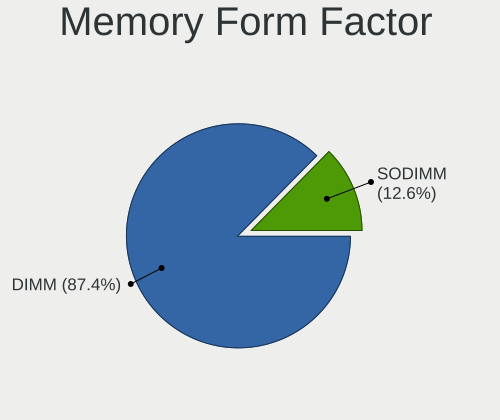

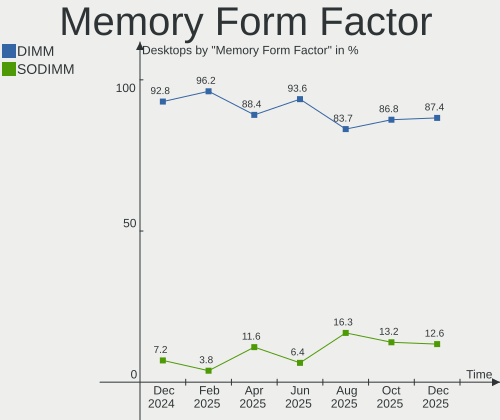

| Name   | Desktops | Percent |
|--------|----------|---------|
| DIMM   | 90       | 87.38%  |
| SODIMM | 13       | 12.62%  |

Memory Size
-----------

Memory module size

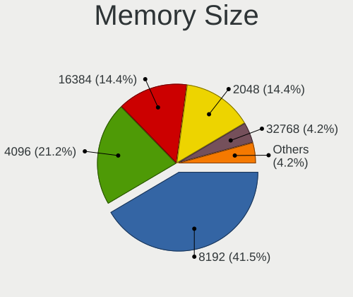

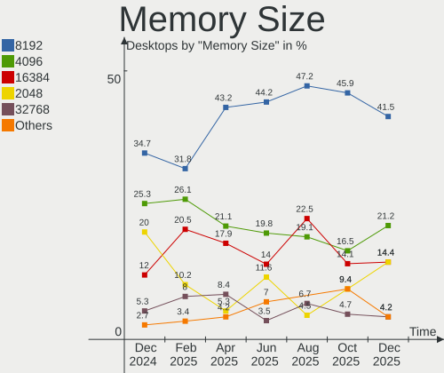

| Size  | Desktops | Percent |
|-------|----------|---------|
| 8192  | 49       | 41.53%  |
| 4096  | 25       | 21.19%  |
| 16384 | 17       | 14.41%  |
| 2048  | 17       | 14.41%  |
| 32768 | 5        | 4.24%   |
| 1024  | 4        | 3.39%   |
| 49152 | 1        | 0.85%   |

Memory Speed
------------

Memory module speed

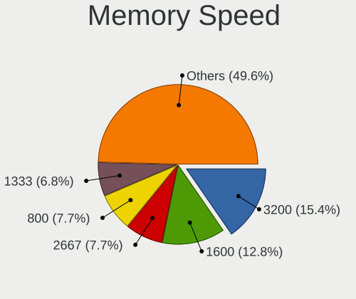

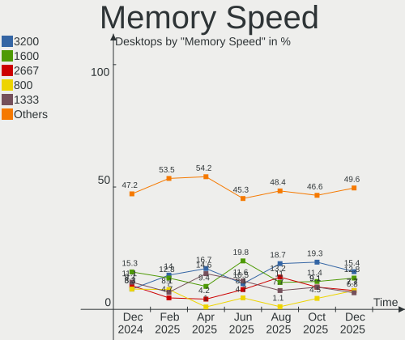

| Speed   | Desktops | Percent |
|---------|----------|---------|
| 3200    | 18       | 15.38%  |
| 1600    | 15       | 12.82%  |
| 2667    | 9        | 7.69%   |
| 800     | 9        | 7.69%   |
| 1333    | 8        | 6.84%   |
| 2400    | 7        | 5.98%   |
| 2133    | 6        | 5.13%   |
| 3400    | 5        | 4.27%   |
| 3600    | 4        | 3.42%   |
| Unknown | 4        | 3.42%   |
| 6000    | 3        | 2.56%   |
| 1800    | 3        | 2.56%   |
| 3800    | 2        | 1.71%   |
| 3000    | 2        | 1.71%   |
| 2800    | 2        | 1.71%   |
| 2666    | 2        | 1.71%   |
| 1648    | 2        | 1.71%   |
| 667     | 2        | 1.71%   |
| 7000    | 1        | 0.85%   |
| 5600    | 1        | 0.85%   |
| 3500    | 1        | 0.85%   |
| 3467    | 1        | 0.85%   |
| 3466    | 1        | 0.85%   |
| 3333    | 1        | 0.85%   |
| 3066    | 1        | 0.85%   |
| 2934    | 1        | 0.85%   |
| 2933    | 1        | 0.85%   |
| 1867    | 1        | 0.85%   |
| 1866    | 1        | 0.85%   |
| 1067    | 1        | 0.85%   |
| 533     | 1        | 0.85%   |
| 400     | 1        | 0.85%   |

Printers & scanners
-------------------

Printer Vendor
--------------

Printer device vendors

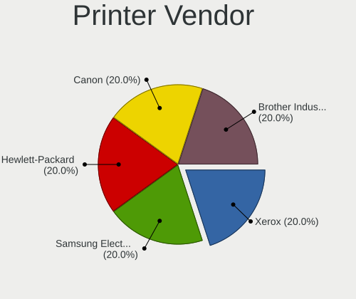

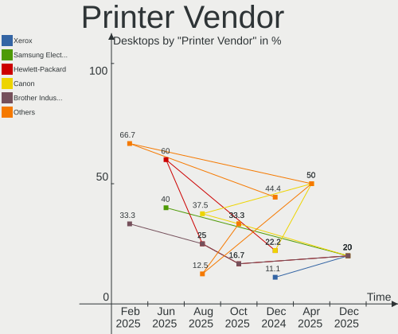

| Vendor              | Desktops | Percent |
|---------------------|----------|---------|
| Xerox               | 1        | 20%     |
| Samsung Electronics | 1        | 20%     |
| Hewlett-Packard     | 1        | 20%     |
| Canon               | 1        | 20%     |
| Brother Industries  | 1        | 20%     |

Printer Model
-------------

Printer device models

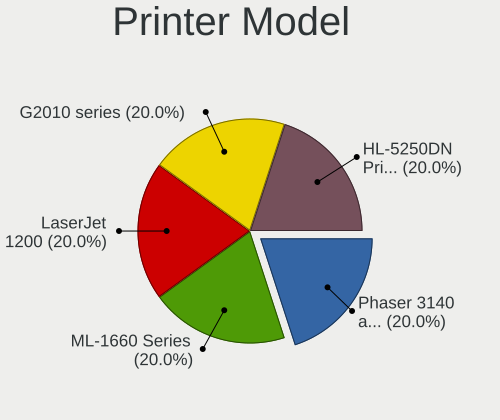

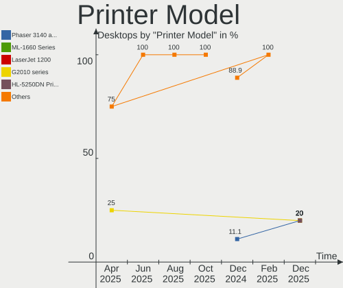

| Model                      | Desktops | Percent |
|----------------------------|----------|---------|
| Xerox Phaser 3140 and 3155 | 1        | 20%     |
| Samsung ML-1660 Series     | 1        | 20%     |
| HP LaserJet 1200           | 1        | 20%     |
| Canon G2010 series         | 1        | 20%     |
| Brother HL-5250DN Printer  | 1        | 20%     |

Scanner Vendor
--------------

Scanner device vendors

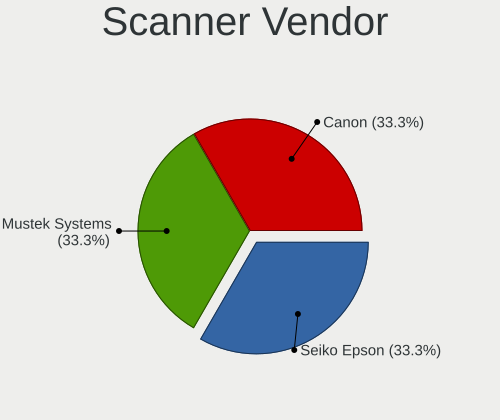

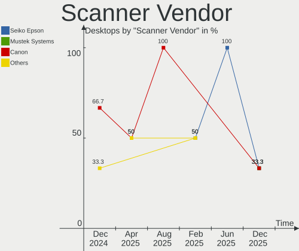

| Vendor         | Desktops | Percent |
|----------------|----------|---------|
| Seiko Epson    | 1        | 33.33%  |
| Mustek Systems | 1        | 33.33%  |
| Canon          | 1        | 33.33%  |

Scanner Model
-------------

Scanner device models

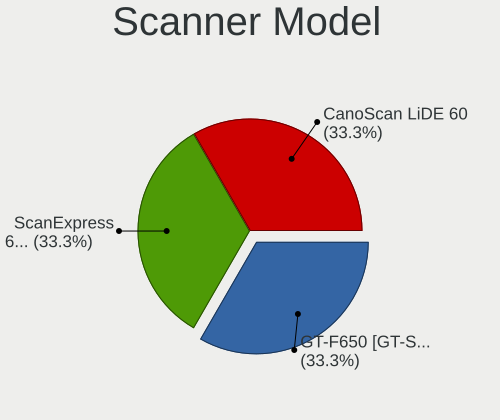

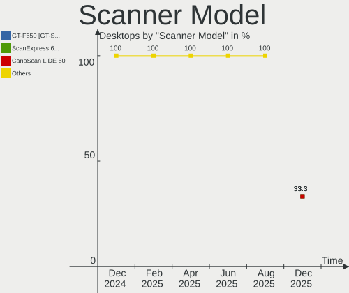

| Model                                             | Desktops | Percent |
|---------------------------------------------------|----------|---------|
| Seiko Epson GT-F650 [GT-S600/Perfection V10/V100] | 1        | 33.33%  |
| Mustek Systems ScanExpress 600 CU                 | 1        | 33.33%  |
| Canon CanoScan LiDE 60                            | 1        | 33.33%  |

Camera
------

Camera Vendor
-------------

Camera device vendors

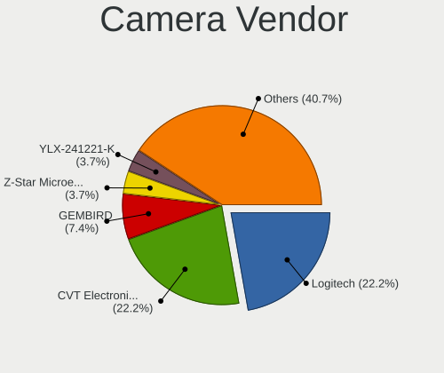

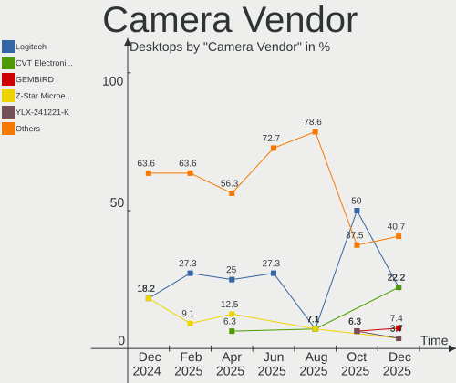

| Vendor                        | Desktops | Percent |
|-------------------------------|----------|---------|
| Logitech                      | 6        | 22.22%  |
| CVT Electronics.Co.           | 6        | 22.22%  |
| GEMBIRD                       | 2        | 7.41%   |
| Z-Star Microelectronics       | 1        | 3.7%    |
| YLX-241221-K                  | 1        | 3.7%    |
| Sunplus Innovation Technology | 1        | 3.7%    |
| Realtek Semiconductor         | 1        | 3.7%    |
| Microdia                      | 1        | 3.7%    |
| KYE Systems (Mouse Systems)   | 1        | 3.7%    |
| Hewlett-Packard               | 1        | 3.7%    |
| Generalplus Technology        | 1        | 3.7%    |
| Creative Technology           | 1        | 3.7%    |
| Chicony Electronics           | 1        | 3.7%    |
| Aveo Technology               | 1        | 3.7%    |
| Arkmicro Technologies         | 1        | 3.7%    |
| Alcor Micro                   | 1        | 3.7%    |

Camera Model
------------

Camera device models

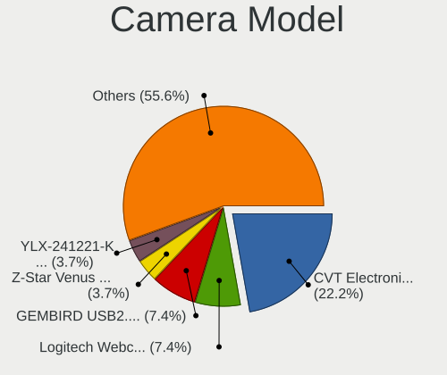

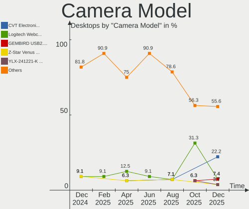

| Model                                  | Desktops | Percent |
|----------------------------------------|----------|---------|
| CVT Electronics.Co. USB Camera         | 6        | 22.22%  |
| Logitech Webcam C270                   | 2        | 7.41%   |
| GEMBIRD USB2.0 PC CAMERA               | 2        | 7.41%   |
| Z-Star Venus USB2.0 Camera             | 1        | 3.7%    |
| YLX-241221-K DEXP DWC-FHD04            | 1        | 3.7%    |
| Sunplus Full HD webcam                 | 1        | 3.7%    |
| Realtek Thronmax Stream Go Pro Webcam  | 1        | 3.7%    |
| Microdia Camera                        | 1        | 3.7%    |
| Logitech Webcam C930e                  | 1        | 3.7%    |
| Logitech Webcam C310                   | 1        | 3.7%    |
| Logitech Webcam C250                   | 1        | 3.7%    |
| Logitech Webcam C170                   | 1        | 3.7%    |
| KYE Systems (Mouse Systems) iSlim 321R | 1        | 3.7%    |
| HP Webcam HD 4310                      | 1        | 3.7%    |
| Generalplus GENERAL WEBCAM             | 1        | 3.7%    |
| Creative Live! Cam Sync [VF0520]       | 1        | 3.7%    |
| Chicony HP Webcam                      | 1        | 3.7%    |
| Aveo Camera                            | 1        | 3.7%    |
| Arkmicro USB2.0 PC CAMERA              | 1        | 3.7%    |
| Alcor Micro USB 2.0 PC Camera          | 1        | 3.7%    |

Security
--------

Fingerprint Vendor
------------------

Fingerprint sensor vendors

Zero info for selected period =(

Fingerprint Model
-----------------

Fingerprint sensor models

Zero info for selected period =(

Chipcard Vendor
---------------

Chipcard module vendors

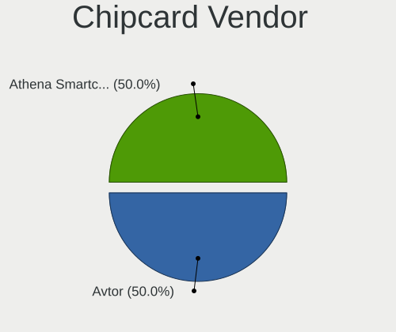

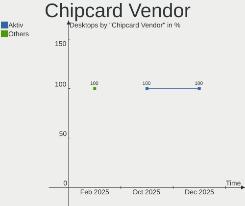

| Vendor | Desktops | Percent |
|--------|----------|---------|
| Aktiv  | 1        | 100%    |

Chipcard Model
--------------

Chipcard module models

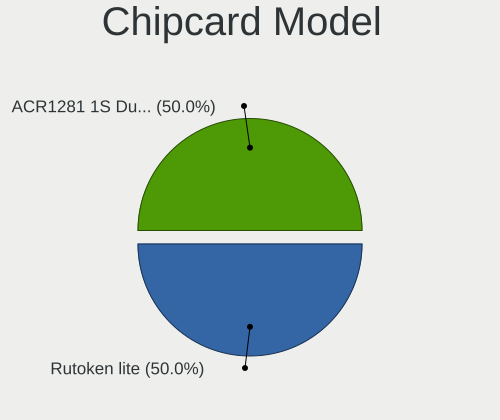

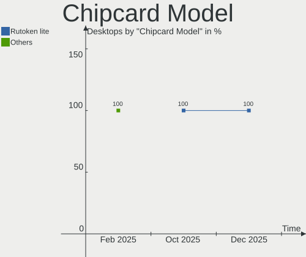

| Model              | Desktops | Percent |
|--------------------|----------|---------|
| Aktiv Rutoken lite | 1        | 100%    |

Unsupported
-----------

Unsupported Devices
-------------------

Total unsupported devices on board

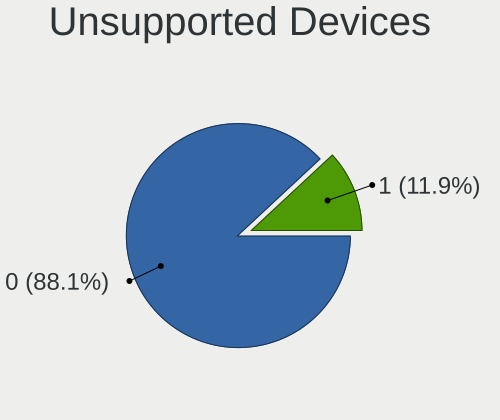

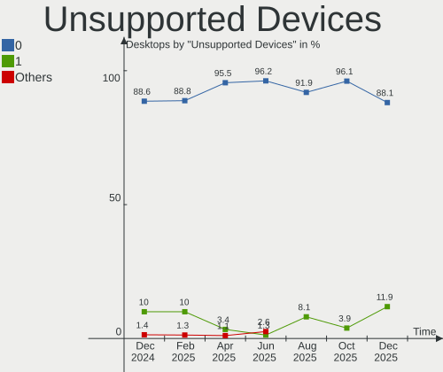

| Total | Desktops | Percent |
|-------|----------|---------|
| 0     | 96       | 88.07%  |
| 1     | 13       | 11.93%  |

Unsupported Device Types
------------------------

Types of unsupported devices

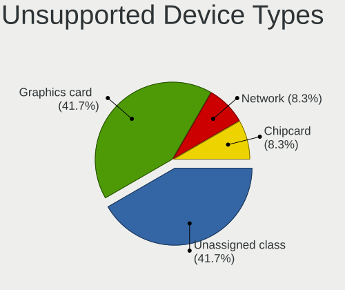

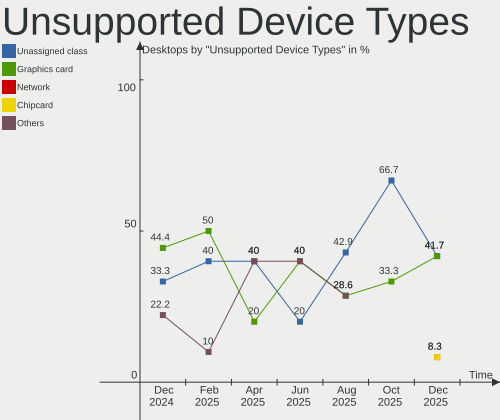

| Type             | Desktops | Percent |
|------------------|----------|---------|
| Unassigned class | 5        | 41.67%  |
| Graphics card    | 5        | 41.67%  |
| Network          | 1        | 8.33%   |
| Chipcard         | 1        | 8.33%   |

