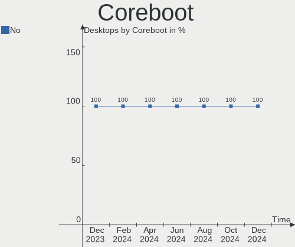
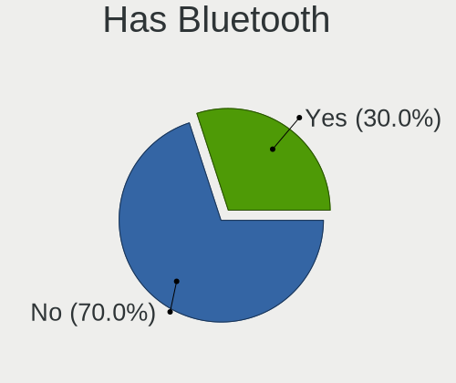
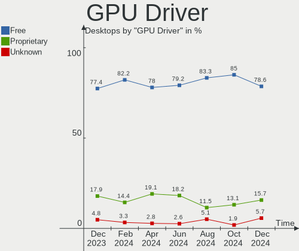
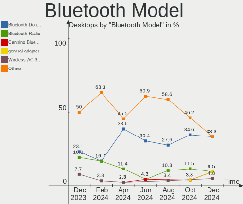

ROSA - Hardware Trends (Desktops)
---------------------------------

A project to identify most popular hardware characteristics and track their change
over time based on data collected by Linux users at https://Linux-Hardware.org.

Anyone can contribute to this report by the [hw-probe](https://github.com/linuxhw/hw-probe) tool:

    sudo -E hw-probe -all -upload

This report is for one last month. Overall report since the beginning of time: [TestDays](https://github.com/linuxhw/TestDays)

Period: Nov, 2023.

Contents
--------

* [ System ](#system)
  - [ OS                       ](#os)
  - [ OS Family                ](#os-family)
  - [ Kernel                   ](#kernel)
  - [ Kernel Family            ](#kernel-family)
  - [ Kernel Major Ver.        ](#kernel-major-ver)
  - [ Arch                     ](#arch)
  - [ DE                       ](#de)
  - [ Display Server           ](#display-server)
  - [ Display Manager          ](#display-manager)
  - [ OS Lang                  ](#os-lang)
  - [ Boot Mode                ](#boot-mode)
  - [ Filesystem               ](#filesystem)
  - [ Part. scheme             ](#part-scheme)
  - [ Dual Boot with Linux/BSD ](#dual-boot-with-linuxbsd)
  - [ Dual Boot (Win)          ](#dual-boot-win)

* [ Board ](#board)
  - [ Vendor                   ](#vendor)
  - [ Model                    ](#model)
  - [ Model Family             ](#model-family)
  - [ MFG Year                 ](#mfg-year)
  - [ Form Factor              ](#form-factor)
  - [ Secure Boot              ](#secure-boot)
  - [ Coreboot                 ](#coreboot)
  - [ RAM Size                 ](#ram-size)
  - [ RAM Used                 ](#ram-used)
  - [ Total Drives             ](#total-drives)
  - [ Has CD-ROM               ](#has-cd-rom)
  - [ Has Ethernet             ](#has-ethernet)
  - [ Has WiFi                 ](#has-wifi)
  - [ Has Bluetooth            ](#has-bluetooth)

* [ Location ](#location)
  - [ Country                  ](#country)
  - [ City                     ](#city)

* [ Drives ](#drives)
  - [ Drive Vendor             ](#drive-vendor)
  - [ Drive Model              ](#drive-model)
  - [ HDD Vendor               ](#hdd-vendor)
  - [ SSD Vendor               ](#ssd-vendor)
  - [ Drive Kind               ](#drive-kind)
  - [ Drive Connector          ](#drive-connector)
  - [ Drive Size               ](#drive-size)
  - [ Space Total              ](#space-total)
  - [ Space Used               ](#space-used)
  - [ Malfunc. Drives          ](#malfunc-drives)
  - [ Malfunc. Drive Vendor    ](#malfunc-drive-vendor)
  - [ Malfunc. HDD Vendor      ](#malfunc-hdd-vendor)
  - [ Malfunc. Drive Kind      ](#malfunc-drive-kind)
  - [ Failed Drives            ](#failed-drives)
  - [ Failed Drive Vendor      ](#failed-drive-vendor)
  - [ Drive Status             ](#drive-status)

* [ Storage controller ](#storage-controller)
  - [ Storage Vendor           ](#storage-vendor)
  - [ Storage Model            ](#storage-model)
  - [ Storage Kind             ](#storage-kind)

* [ Processor ](#processor)
  - [ CPU Vendor               ](#cpu-vendor)
  - [ CPU Model                ](#cpu-model)
  - [ CPU Model Family         ](#cpu-model-family)
  - [ CPU Cores                ](#cpu-cores)
  - [ CPU Sockets              ](#cpu-sockets)
  - [ CPU Threads              ](#cpu-threads)
  - [ CPU Op-Modes             ](#cpu-op-modes)
  - [ CPU Microcode            ](#cpu-microcode)
  - [ CPU Microarch            ](#cpu-microarch)

* [ Graphics ](#graphics)
  - [ GPU Vendor               ](#gpu-vendor)
  - [ GPU Model                ](#gpu-model)
  - [ GPU Combo                ](#gpu-combo)
  - [ GPU Driver               ](#gpu-driver)
  - [ GPU Memory               ](#gpu-memory)

* [ Monitor ](#monitor)
  - [ Monitor Vendor           ](#monitor-vendor)
  - [ Monitor Model            ](#monitor-model)
  - [ Monitor Resolution       ](#monitor-resolution)
  - [ Monitor Diagonal         ](#monitor-diagonal)
  - [ Monitor Width            ](#monitor-width)
  - [ Aspect Ratio             ](#aspect-ratio)
  - [ Monitor Area             ](#monitor-area)
  - [ Pixel Density            ](#pixel-density)
  - [ Multiple Monitors        ](#multiple-monitors)

* [ Network ](#network)
  - [ Net Controller Vendor    ](#net-controller-vendor)
  - [ Net Controller Model     ](#net-controller-model)
  - [ Wireless Vendor          ](#wireless-vendor)
  - [ Wireless Model           ](#wireless-model)
  - [ Ethernet Vendor          ](#ethernet-vendor)
  - [ Ethernet Model           ](#ethernet-model)
  - [ Net Controller Kind      ](#net-controller-kind)
  - [ Used Controller          ](#used-controller)
  - [ NICs                     ](#nics)
  - [ IPv6                     ](#ipv6)

* [ Bluetooth ](#bluetooth)
  - [ Bluetooth Vendor         ](#bluetooth-vendor)
  - [ Bluetooth Model          ](#bluetooth-model)

* [ Sound ](#sound)
  - [ Sound Vendor             ](#sound-vendor)
  - [ Sound Model              ](#sound-model)

* [ Memory ](#memory)
  - [ Memory Vendor            ](#memory-vendor)
  - [ Memory Model             ](#memory-model)
  - [ Memory Kind              ](#memory-kind)
  - [ Memory Form Factor       ](#memory-form-factor)
  - [ Memory Size              ](#memory-size)
  - [ Memory Speed             ](#memory-speed)

* [ Printers & scanners ](#printers--scanners)
  - [ Printer Vendor           ](#printer-vendor)
  - [ Printer Model            ](#printer-model)
  - [ Scanner Vendor           ](#scanner-vendor)
  - [ Scanner Model            ](#scanner-model)

* [ Camera ](#camera)
  - [ Camera Vendor            ](#camera-vendor)
  - [ Camera Model             ](#camera-model)

* [ Security ](#security)
  - [ Fingerprint Vendor       ](#fingerprint-vendor)
  - [ Fingerprint Model        ](#fingerprint-model)
  - [ Chipcard Vendor          ](#chipcard-vendor)
  - [ Chipcard Model           ](#chipcard-model)

* [ Unsupported ](#unsupported)
  - [ Unsupported Devices      ](#unsupported-devices)
  - [ Unsupported Device Types ](#unsupported-device-types)

System
------

OS
--

Installed operating systems

| Name       | Desktops | Percent |
|------------|----------|---------|
| ROSA 12.4  | 72       | 75%     |
| ROSA 12    | 12       | 12.5%   |
| ROSA R11.1 | 4        | 4.17%   |
| ROSA 13.0  | 4        | 4.17%   |
| ROSA 12.3  | 3        | 3.13%   |
| ROSA 12.2  | 1        | 1.04%   |

OS Family
---------

OS without a version

| Name | Desktops | Percent |
|------|----------|---------|
| ROSA | 96       | 100%    |

Kernel
------

Version of the Linux kernel

| Version                                   | Desktops | Percent |
|-------------------------------------------|----------|---------|
| 6.1.58-generic-1rosa2021.1-x86_64         | 42       | 43.75%  |
| 6.1.20-generic-2rosa2021.1-x86_64         | 22       | 22.92%  |
| 6.1.46-generic-2rosa2021.1-x86_64         | 5        | 5.21%   |
| 5.10.184-generic-1rosa2021.1-x86_64       | 5        | 5.21%   |
| 6.5.10.xm1-1.k-xanmod-rosa2021.1-x86_64   | 3        | 3.13%   |
| 5.15.75-generic-1rosa2021.1-x86_64        | 3        | 3.13%   |
| 6.1.57-generic-1rosa2023.1-x86_64         | 2        | 2.08%   |
| 5.15.127-generic-1rosa2021.1-x86_64       | 2        | 2.08%   |
| 5.10.74-generic-2rosa2021.1-x86_64        | 2        | 2.08%   |
| 4.15.0-desktop-122.124.1rosa-x86_64       | 2        | 2.08%   |
| 4.15.0-desktop-122.124.1rosa-i586         | 2        | 2.08%   |
| 6.4.12.xm1-1.klp-xanmod-rosa2021.1-x86_64 | 1        | 1.04%   |
| 6.3.12-generic-1rosa2021.1-x86_64         | 1        | 1.04%   |
| 6.1.58-generic-3rosa2023.1-x86_64         | 1        | 1.04%   |
| 6.1.58-generic-1rosa2023.1-x86_64         | 1        | 1.04%   |
| 5.15.117-generic-1rosa2021.1-x86_64       | 1        | 1.04%   |
| 5.15.103-generic-1rosa2021.1-i686         | 1        | 1.04%   |

Kernel Family
-------------

Linux kernel without a distro release

| Version  | Desktops | Percent |
|----------|----------|---------|
| 6.1.58   | 44       | 45.83%  |
| 6.1.20   | 22       | 22.92%  |
| 6.1.46   | 5        | 5.21%   |
| 5.10.184 | 5        | 5.21%   |
| 4.15.0   | 4        | 4.17%   |
| 6.5.10   | 3        | 3.13%   |
| 5.15.75  | 3        | 3.13%   |
| 6.1.57   | 2        | 2.08%   |
| 5.15.127 | 2        | 2.08%   |
| 5.10.74  | 2        | 2.08%   |
| 6.4.12   | 1        | 1.04%   |
| 6.3.12   | 1        | 1.04%   |
| 5.15.117 | 1        | 1.04%   |
| 5.15.103 | 1        | 1.04%   |

Kernel Major Ver.
-----------------

Linux kernel major version

| Version | Desktops | Percent |
|---------|----------|---------|
| 6.1     | 73       | 76.04%  |
| 5.15    | 7        | 7.29%   |
| 5.10    | 7        | 7.29%   |
| 4.15    | 4        | 4.17%   |
| 6.5     | 3        | 3.13%   |
| 6.4     | 1        | 1.04%   |
| 6.3     | 1        | 1.04%   |

Arch
----

OS architecture (x86_64, i586, etc.)

| Name   | Desktops | Percent |
|--------|----------|---------|
| x86_64 | 93       | 96.88%  |
| i686   | 3        | 3.13%   |

DE
--

Desktop Environment

| Name  | Desktops | Percent |
|-------|----------|---------|
| KDE5  | 57       | 59.38%  |
| GNOME | 24       | 25%     |
| LXQt  | 11       | 11.46%  |
| KDE4  | 3        | 3.13%   |
| i3    | 1        | 1.04%   |

Display Server
--------------

X11 or Wayland

| Name    | Desktops | Percent |
|---------|----------|---------|
| Wayland | 62       | 64.58%  |
| X11     | 34       | 35.42%  |

Display Manager
---------------

SDDM, LightDM, etc.

| Name    | Desktops | Percent |
|---------|----------|---------|
| SDDM    | 55       | 57.29%  |
| GDM     | 35       | 36.46%  |
| LightDM | 3        | 3.13%   |
| KDM     | 3        | 3.13%   |

OS Lang
-------

Language

| Lang  | Desktops | Percent |
|-------|----------|---------|
| ru_RU | 92       | 95.83%  |
| zh_TW | 1        | 1.04%   |
| it_IT | 1        | 1.04%   |
| en_US | 1        | 1.04%   |
| de_DE | 1        | 1.04%   |

Boot Mode
---------

EFI or BIOS

| Mode | Desktops | Percent |
|------|----------|---------|
| EFI  | 64       | 66.67%  |
| BIOS | 32       | 33.33%  |

Filesystem
----------

Type of filesystem

| Type    | Desktops | Percent |
|---------|----------|---------|
| Ext4    | 77       | 80.21%  |
| Btrfs   | 16       | 16.67%  |
| F2fs    | 2        | 2.08%   |
| Overlay | 1        | 1.04%   |

Part. scheme
------------

Scheme of partitioning

| Type | Desktops | Percent |
|------|----------|---------|
| GPT  | 69       | 71.88%  |
| MBR  | 27       | 28.13%  |

Dual Boot with Linux/BSD
------------------------

Hosting more than one Linux/BSD

| Dual boot | Desktops | Percent |
|-----------|----------|---------|
| No        | 77       | 80.21%  |
| Yes       | 19       | 19.79%  |

Dual Boot (Win)
---------------

Hosting Linux and Windows

| Dual boot | Desktops | Percent |
|-----------|----------|---------|
| No        | 52       | 54.17%  |
| Yes       | 44       | 45.83%  |

Board
-----

Vendor
------

Motherboard manufacturer

| Name                                 | Desktops | Percent |
|--------------------------------------|----------|---------|
| ASUSTek Computer                     | 27       | 28.13%  |
| Gigabyte Technology                  | 21       | 21.88%  |
| MSI                                  | 11       | 11.46%  |
| ASRock                               | 10       | 10.42%  |
| Intel                                | 7        | 7.29%   |
| Unknown                              | 5        | 5.21%   |
| Pegatron                             | 2        | 2.08%   |
| Huanan                               | 2        | 2.08%   |
| Dell                                 | 2        | 2.08%   |
| Shenzhen Meigao Electronic Equipment | 1        | 1.04%   |
| MAINBRD                              | 1        | 1.04%   |
| Lenovo                               | 1        | 1.04%   |
| INTECH PRO                           | 1        | 1.04%   |
| Hewlett-Packard                      | 1        | 1.04%   |
| ECS                                  | 1        | 1.04%   |
| Biostar                              | 1        | 1.04%   |
| AOpen                                | 1        | 1.04%   |
| Acer                                 | 1        | 1.04%   |

Model
-----

Motherboard model

| Name                                            | Desktops | Percent |
|-------------------------------------------------|----------|---------|
| Unknown                                         | 5        | 5.21%   |
| Intel SKYBAY                                    | 3        | 3.13%   |
| MSI MS-7C95                                     | 2        | 2.08%   |
| MSI MS-7641                                     | 2        | 2.08%   |
| ASRock B450 Pro4                                | 2        | 2.08%   |
| Shenzhen Meigao Electronic Equipment UM773 Lite | 1        | 1.04%   |
| Pegatron VS257AA-ACB 600-1040ru                 | 1        | 1.04%   |
| Pegatron IPMIP-H55-GEN                          | 1        | 1.04%   |
| MSI PRO ADL-N Cubi N (MS-B0A9)                  | 1        | 1.04%   |
| MSI MS-7D89                                     | 1        | 1.04%   |
| MSI MS-7C96                                     | 1        | 1.04%   |
| MSI MS-7C37                                     | 1        | 1.04%   |
| MSI MS-7B33                                     | 1        | 1.04%   |
| MSI MS-7996                                     | 1        | 1.04%   |
| MSI MS-7599                                     | 1        | 1.04%   |
| MAINBRD OPS62A-SHA                              | 1        | 1.04%   |
| Lenovo ThinkCentre M82 2929E13                  | 1        | 1.04%   |
| Intel X99 V1.0                                  | 1        | 1.04%   |
| Intel H610-MIX                                  | 1        | 1.04%   |
| Intel DH61DL AAG14066-205                       | 1        | 1.04%   |
| Intel DG33BU AAD79951-407                       | 1        | 1.04%   |
| INTECH PRO H510-M2                              | 1        | 1.04%   |
| Huanan X99-F8                                   | 1        | 1.04%   |
| Huanan X99 F8D V2.2                             | 1        | 1.04%   |
| HP ProDesk 600 G1 DM                            | 1        | 1.04%   |
| Gigabyte Z390 GAMING X                          | 1        | 1.04%   |
| Gigabyte Z270P-D3                               | 1        | 1.04%   |
| Gigabyte X570 UD                                | 1        | 1.04%   |
| Gigabyte H410M S2H V2                           | 1        | 1.04%   |
| Gigabyte H410M H V2                             | 1        | 1.04%   |
| Gigabyte GA-780T-D3L                            | 1        | 1.04%   |
| Gigabyte EP43-DS3L                              | 1        | 1.04%   |
| Gigabyte D525TUD                                | 1        | 1.04%   |
| Gigabyte B85M-D3V                               | 1        | 1.04%   |
| Gigabyte B760M DS3H DDR4                        | 1        | 1.04%   |
| Gigabyte B760 GAMING X                          | 1        | 1.04%   |
| Gigabyte B75M-HD3                               | 1        | 1.04%   |
| Gigabyte B75M-D3V                               | 1        | 1.04%   |
| Gigabyte B560M DS3H                             | 1        | 1.04%   |
| Gigabyte B560 HD3                               | 1        | 1.04%   |

Model Family
------------

Motherboard model prefix

| Name                                       | Desktops | Percent |
|--------------------------------------------|----------|---------|
| ASUS PRIME                                 | 6        | 6.25%   |
| Unknown                                    | 5        | 5.21%   |
| Intel SKYBAY                               | 3        | 3.13%   |
| MSI MS-7C95                                | 2        | 2.08%   |
| MSI MS-7641                                | 2        | 2.08%   |
| Gigabyte H410M                             | 2        | 2.08%   |
| Dell OptiPlex                              | 2        | 2.08%   |
| ASRock B450                                | 2        | 2.08%   |
| Shenzhen Meigao Electronic Equipment UM773 | 1        | 1.04%   |
| Pegatron VS257AA-ACB                       | 1        | 1.04%   |
| Pegatron IPMIP-H55-GEN                     | 1        | 1.04%   |
| MSI PRO                                    | 1        | 1.04%   |
| MSI MS-7D89                                | 1        | 1.04%   |
| MSI MS-7C96                                | 1        | 1.04%   |
| MSI MS-7C37                                | 1        | 1.04%   |
| MSI MS-7B33                                | 1        | 1.04%   |
| MSI MS-7996                                | 1        | 1.04%   |
| MSI MS-7599                                | 1        | 1.04%   |
| MAINBRD OPS62A-SHA                         | 1        | 1.04%   |
| Lenovo ThinkCentre                         | 1        | 1.04%   |
| Intel X99                                  | 1        | 1.04%   |
| Intel H610-MIX                             | 1        | 1.04%   |
| Intel DH61DL                               | 1        | 1.04%   |
| Intel DG33BU                               | 1        | 1.04%   |
| INTECH PRO H510-M2                         | 1        | 1.04%   |
| Huanan X99-F8                              | 1        | 1.04%   |
| Huanan X99                                 | 1        | 1.04%   |
| HP ProDesk                                 | 1        | 1.04%   |
| Gigabyte Z390                              | 1        | 1.04%   |
| Gigabyte Z270P-D3                          | 1        | 1.04%   |
| Gigabyte X570                              | 1        | 1.04%   |
| Gigabyte GA-780T-D3L                       | 1        | 1.04%   |
| Gigabyte EP43-DS3L                         | 1        | 1.04%   |
| Gigabyte D525TUD                           | 1        | 1.04%   |
| Gigabyte B85M-D3V                          | 1        | 1.04%   |
| Gigabyte B760M                             | 1        | 1.04%   |
| Gigabyte B760                              | 1        | 1.04%   |
| Gigabyte B75M-HD3                          | 1        | 1.04%   |
| Gigabyte B75M-D3V                          | 1        | 1.04%   |
| Gigabyte B560M                             | 1        | 1.04%   |

MFG Year
--------

Motherboard manufacture year

| Year | Desktops | Percent |
|------|----------|---------|
| 2018 | 13       | 13.54%  |
| 2021 | 9        | 9.38%   |
| 2020 | 8        | 8.33%   |
| 2012 | 8        | 8.33%   |
| 2011 | 7        | 7.29%   |
| 2010 | 7        | 7.29%   |
| 2022 | 6        | 6.25%   |
| 2019 | 6        | 6.25%   |
| 2023 | 5        | 5.21%   |
| 2017 | 5        | 5.21%   |
| 2009 | 5        | 5.21%   |
| 2013 | 4        | 4.17%   |
| 2008 | 4        | 4.17%   |
| 2014 | 3        | 3.13%   |
| 2015 | 2        | 2.08%   |
| 2007 | 2        | 2.08%   |
| 2016 | 1        | 1.04%   |
| 2005 | 1        | 1.04%   |

Form Factor
-----------

Physical design of the computer

| Name    | Desktops | Percent |
|---------|----------|---------|
| Desktop | 96       | 100%    |

Secure Boot
-----------

Enabled or disabled

| State    | Desktops | Percent |
|----------|----------|---------|
| Disabled | 96       | 100%    |

Coreboot
--------

Have coreboot on board

| Used | Desktops | Percent |
|------|----------|---------|
| No   | 96       | 100%    |

RAM Size
--------

Total RAM memory

| Size in GB      | Desktops | Percent |
|-----------------|----------|---------|
| 8.01-16.0       | 30       | 31.25%  |
| 4.01-8.0        | 23       | 23.96%  |
| 16.01-24.0      | 15       | 15.63%  |
| 3.01-4.0        | 12       | 12.5%   |
| 32.01-64.0      | 9        | 9.38%   |
| 64.01-256.0     | 4        | 4.17%   |
| More than 256.0 | 1        | 1.04%   |
| 2.01-3.0        | 1        | 1.04%   |
| 0.51-1.0        | 1        | 1.04%   |

RAM Used
--------

Used RAM memory

| Used GB   | Desktops | Percent |
|-----------|----------|---------|
| 1.01-2.0  | 50       | 52.08%  |
| 2.01-3.0  | 14       | 14.58%  |
| 0.51-1.0  | 14       | 14.58%  |
| 4.01-8.0  | 10       | 10.42%  |
| 3.01-4.0  | 6        | 6.25%   |
| 8.01-16.0 | 1        | 1.04%   |
| 0.01-0.5  | 1        | 1.04%   |

Total Drives
------------

Number of drives on board

| Drives | Desktops | Percent |
|--------|----------|---------|
| 1      | 40       | 41.67%  |
| 2      | 31       | 32.29%  |
| 3      | 13       | 13.54%  |
| 4      | 5        | 5.21%   |
| 5      | 3        | 3.13%   |
| 7      | 2        | 2.08%   |
| 6      | 2        | 2.08%   |

Has CD-ROM
----------

Has CD-ROM on board

| Presented | Desktops | Percent |
|-----------|----------|---------|
| No        | 72       | 75%     |
| Yes       | 24       | 25%     |

Has Ethernet
------------

Has Ethernet on board

| Presented | Desktops | Percent |
|-----------|----------|---------|
| Yes       | 96       | 100%    |

Has WiFi
--------

Has WiFi module

| Presented | Desktops | Percent |
|-----------|----------|---------|
| No        | 59       | 61.46%  |
| Yes       | 37       | 38.54%  |

Has Bluetooth
-------------

Has Bluetooth module

| Presented | Desktops | Percent |
|-----------|----------|---------|
| No        | 67       | 69.79%  |
| Yes       | 29       | 30.21%  |

Location
--------

Country
-------

Geographic location (country)

| Country    | Desktops | Percent |
|------------|----------|---------|
| Russia     | 88       | 91.67%  |
| Taiwan     | 1        | 1.04%   |
| Serbia     | 1        | 1.04%   |
| Portugal   | 1        | 1.04%   |
| Kazakhstan | 1        | 1.04%   |
| Italy      | 1        | 1.04%   |
| Germany    | 1        | 1.04%   |
| Estonia    | 1        | 1.04%   |
| Belarus    | 1        | 1.04%   |

City
----

Geographic location (city)

| City                | Desktops | Percent |
|---------------------|----------|---------|
| Moscow              | 31       | 32.29%  |
| Krasnodar           | 6        | 6.25%   |
| Volgograd           | 4        | 4.17%   |
| St Petersburg       | 4        | 4.17%   |
| Novosibirsk         | 4        | 4.17%   |
| Yekaterinburg       | 3        | 3.13%   |
| Zlatoust            | 2        | 2.08%   |
| Yaroslavl           | 2        | 2.08%   |
| Voronezh            | 2        | 2.08%   |
| Kavkazskaya         | 2        | 2.08%   |
| Volgodonsk          | 1        | 1.04%   |
| Vladivostok         | 1        | 1.04%   |
| Ulyanovsk           | 1        | 1.04%   |
| Ufa                 | 1        | 1.04%   |
| Tver                | 1        | 1.04%   |
| Tula                | 1        | 1.04%   |
| Tallinn             | 1        | 1.04%   |
| Slavyansk-na-Kubani | 1        | 1.04%   |
| Saratov             | 1        | 1.04%   |
| Saransk             | 1        | 1.04%   |
| Rostov-on-Don       | 1        | 1.04%   |
| Rome                | 1        | 1.04%   |
| Perm                | 1        | 1.04%   |
| Novokuznetsk        | 1        | 1.04%   |
| New Taipei          | 1        | 1.04%   |
| Monino              | 1        | 1.04%   |
| Mogilev             | 1        | 1.04%   |
| Luga                | 1        | 1.04%   |
| Lipetsk             | 1        | 1.04%   |
| Krymsk              | 1        | 1.04%   |
| Krasnoyarsk         | 1        | 1.04%   |
| Kraljevo            | 1        | 1.04%   |
| Kostroma            | 1        | 1.04%   |
| Khabarovsk          | 1        | 1.04%   |
| Karaganda           | 1        | 1.04%   |
| Kanevskaya          | 1        | 1.04%   |
| Kamensk-Shakhtinsky | 1        | 1.04%   |
| Halle               | 1        | 1.04%   |
| Gelendzhik          | 1        | 1.04%   |
| Engel's             | 1        | 1.04%   |

Drives
------

Drive Vendor
------------

Hard drive vendors

| Vendor                      | Desktops | Drives | Percent |
|-----------------------------|----------|--------|---------|
| WDC                         | 28       | 40     | 16.37%  |
| Seagate                     | 26       | 33     | 15.2%   |
| Samsung Electronics         | 15       | 16     | 8.77%   |
| Kingston                    | 12       | 14     | 7.02%   |
| A-DATA Technology           | 9        | 12     | 5.26%   |
| Toshiba                     | 8        | 9      | 4.68%   |
| SPCC                        | 5        | 5      | 2.92%   |
| China                       | 5        | 6      | 2.92%   |
| Netac                       | 4        | 5      | 2.34%   |
| Hitachi                     | 4        | 4      | 2.34%   |
| Apacer                      | 4        | 4      | 2.34%   |
| XrayDisk                    | 3        | 3      | 1.75%   |
| XPG                         | 3        | 4      | 1.75%   |
| KingSpec                    | 3        | 3      | 1.75%   |
| JMicron Technology          | 3        | 3      | 1.75%   |
| Crucial                     | 3        | 5      | 1.75%   |
| AMD                         | 3        | 3      | 1.75%   |
| Unknown                     | 2        | 2      | 1.17%   |
| Patriot                     | 2        | 3      | 1.17%   |
| OCZ                         | 2        | 2      | 1.17%   |
| Intel                       | 2        | 2      | 1.17%   |
| HGST                        | 2        | 2      | 1.17%   |
| DEXP                        | 2        | 2      | 1.17%   |
| Transcend                   | 1        | 1      | 0.58%   |
| Silicon Motion              | 1        | 1      | 0.58%   |
| SanDisk                     | 1        | 1      | 0.58%   |
| RUN                         | 1        | 1      | 0.58%   |
| Reeinno                     | 1        | 1      | 0.58%   |
| Realtek                     | 1        | 1      | 0.58%   |
| RADIUM                      | 1        | 1      | 0.58%   |
| Maxtor                      | 1        | 1      | 0.58%   |
| MAXIO Technology (Hangzhou) | 1        | 1      | 0.58%   |
| LaCie                       | 1        | 1      | 0.58%   |
| Kingston Technology Company | 1        | 1      | 0.58%   |
| KingFast                    | 1        | 1      | 0.58%   |
| GOODRAM                     | 1        | 1      | 0.58%   |
| Fujitsu                     | 1        | 1      | 0.58%   |
| ExcelStor                   | 1        | 1      | 0.58%   |
| Digma                       | 1        | 1      | 0.58%   |
| Colorful                    | 1        | 1      | 0.58%   |

Drive Model
-----------

Hard drive models

| Model                            | Desktops | Percent |
|----------------------------------|----------|---------|
| Kingston SA400S37240G 240GB SSD  | 4        | 1.98%   |
| WDC WDS120G2G0A-00JH30 120GB SSD | 3        | 1.49%   |
| WDC WD10EZEX-00BBHA0 1TB         | 3        | 1.49%   |
| Toshiba DT01ACA100 1TB           | 3        | 1.49%   |
| Seagate ST2000DM008-2FR102 2TB   | 3        | 1.49%   |
| WDC WD10EZRX-00A8LB0 1TB         | 2        | 0.99%   |
| WDC WD10EZEX-22MFCA0 1TB         | 2        | 0.99%   |
| Toshiba DT01ACA050 500GB         | 2        | 0.99%   |
| SPCC Solid State Disk 128GB      | 2        | 0.99%   |
| Seagate ST1000NM0011 1TB         | 2        | 0.99%   |
| Seagate ST1000DX001-1CM162 1TB   | 2        | 0.99%   |
| Samsung HD253GJ 250GB            | 2        | 0.99%   |
| Patriot P210 256GB SSD           | 2        | 0.99%   |
| Netac SSD 512GB                  | 2        | 0.99%   |
| Kingston SA400S37480G 480GB SSD  | 2        | 0.99%   |
| Kingston SA400S37120G 120GB SSD  | 2        | 0.99%   |
| KingSpec Z1-512 512GB            | 2        | 0.99%   |
| JMicron Generic 250GB            | 2        | 0.99%   |
| Crucial CT500P5PSSD8 500GB       | 2        | 0.99%   |
| A-DATA SX8200PNP 256GB           | 2        | 0.99%   |
| XrayDisk SSD 120GB               | 1        | 0.5%    |
| XrayDisk 256GB SSD               | 1        | 0.5%    |
| XrayDisk 1TB SSD                 | 1        | 0.5%    |
| XPG SPECTRIX S20G 1TB            | 1        | 0.5%    |
| XPG GAMMIX S50 Lite 512GB        | 1        | 0.5%    |
| XPG GAMMIX S5 512GB              | 1        | 0.5%    |
| XPG GAMMIX S11 Pro 256GB         | 1        | 0.5%    |
| WDC WDS500G2B0A-00SM50 500GB SSD | 1        | 0.5%    |
| WDC WDS250G2B0A-00SM50 250GB SSD | 1        | 0.5%    |
| WDC WDS240G2G0B-00EPW0 240GB SSD | 1        | 0.5%    |
| WDC WD7502AAEX-00Y9A0 752GB      | 1        | 0.5%    |
| WDC WD5000LPVX-22V0TT0 500GB     | 1        | 0.5%    |
| WDC WD5000BEVT-22A0RT0 500GB     | 1        | 0.5%    |
| WDC WD5000AZLX-35K2TA0 500GB     | 1        | 0.5%    |
| WDC WD40EFAX-68JH4N1 4TB         | 1        | 0.5%    |
| WDC WD4003FRYZ-01F0DB0 4TB       | 1        | 0.5%    |
| WDC WD3200LPVX-00V0TT0 320GB     | 1        | 0.5%    |
| WDC WD30PURZ-85GU6Y0 3TB         | 1        | 0.5%    |
| WDC WD2500JS-00NCB1 250GB        | 1        | 0.5%    |
| WDC WD2500AAKX-001CA0 250GB      | 1        | 0.5%    |

HDD Vendor
----------

Hard disk drive vendors

| Vendor              | Desktops | Drives | Percent |
|---------------------|----------|--------|---------|
| Seagate             | 26       | 33     | 35.14%  |
| WDC                 | 25       | 33     | 33.78%  |
| Toshiba             | 8        | 9      | 10.81%  |
| Samsung Electronics | 5        | 5      | 6.76%   |
| Hitachi             | 4        | 4      | 5.41%   |
| HGST                | 2        | 2      | 2.7%    |
| Unknown             | 1        | 1      | 1.35%   |
| Maxtor              | 1        | 1      | 1.35%   |
| Fujitsu             | 1        | 1      | 1.35%   |
| ExcelStor           | 1        | 1      | 1.35%   |

SSD Vendor
----------

Solid state drive vendors

| Vendor              | Desktops | Drives | Percent |
|---------------------|----------|--------|---------|
| Kingston            | 8        | 9      | 12.12%  |
| WDC                 | 6        | 6      | 9.09%   |
| China               | 5        | 6      | 7.58%   |
| Samsung Electronics | 4        | 4      | 6.06%   |
| Netac               | 4        | 4      | 6.06%   |
| A-DATA Technology   | 4        | 4      | 6.06%   |
| XrayDisk            | 3        | 3      | 4.55%   |
| Apacer              | 3        | 3      | 4.55%   |
| SPCC                | 2        | 2      | 3.03%   |
| Patriot             | 2        | 3      | 3.03%   |
| OCZ                 | 2        | 2      | 3.03%   |
| JMicron Technology  | 2        | 2      | 3.03%   |
| DEXP                | 2        | 2      | 3.03%   |
| AMD                 | 2        | 2      | 3.03%   |
| Transcend           | 1        | 1      | 1.52%   |
| SanDisk             | 1        | 1      | 1.52%   |
| RUN                 | 1        | 1      | 1.52%   |
| Reeinno             | 1        | 1      | 1.52%   |
| Realtek             | 1        | 1      | 1.52%   |
| RADIUM              | 1        | 1      | 1.52%   |
| KingSpec            | 1        | 1      | 1.52%   |
| KingFast            | 1        | 1      | 1.52%   |
| Intel               | 1        | 1      | 1.52%   |
| GOODRAM             | 1        | 1      | 1.52%   |
| Digma               | 1        | 1      | 1.52%   |
| Crucial             | 1        | 1      | 1.52%   |
| Colorful            | 1        | 1      | 1.52%   |
| BR                  | 1        | 1      | 1.52%   |
| AXIOMTEK            | 1        | 1      | 1.52%   |
| ANACOMDA            | 1        | 1      | 1.52%   |
| Unknown             | 1        | 1      | 1.52%   |

Drive Kind
----------

HDD or SSD

| Kind    | Desktops | Drives | Percent |
|---------|----------|--------|---------|
| HDD     | 62       | 90     | 41.06%  |
| SSD     | 52       | 69     | 34.44%  |
| NVMe    | 33       | 40     | 21.85%  |
| Unknown | 4        | 4      | 2.65%   |

Drive Connector
---------------

SATA, SAS, NVMe, etc.

| Type | Desktops | Drives | Percent |
|------|----------|--------|---------|
| SATA | 85       | 156    | 68%     |
| NVMe | 33       | 40     | 26.4%   |
| SAS  | 7        | 7      | 5.6%    |

Drive Size
----------

Size of hard drive

| Size in TB | Desktops | Drives | Percent |
|------------|----------|--------|---------|
| 0.01-0.5   | 67       | 99     | 57.26%  |
| 0.51-1.0   | 34       | 41     | 29.06%  |
| 1.01-2.0   | 12       | 15     | 10.26%  |
| 3.01-4.0   | 2        | 2      | 1.71%   |
| 2.01-3.0   | 1        | 1      | 0.85%   |
| 4.01-10.0  | 1        | 1      | 0.85%   |

Space Total
-----------

Amount of disk space available on the file system

| Size in GB     | Desktops | Percent |
|----------------|----------|---------|
| 101-250        | 30       | 31.25%  |
| 251-500        | 19       | 19.79%  |
| 1001-2000      | 11       | 11.46%  |
| 501-1000       | 10       | 10.42%  |
| 1-20           | 9        | 9.38%   |
| 51-100         | 7        | 7.29%   |
| More than 3000 | 5        | 5.21%   |
| 2001-3000      | 5        | 5.21%   |

Space Used
----------

Amount of used disk space

| Used GB        | Desktops | Percent |
|----------------|----------|---------|
| 1-20           | 47       | 48.96%  |
| 21-50          | 15       | 15.63%  |
| 501-1000       | 9        | 9.38%   |
| 101-250        | 7        | 7.29%   |
| 251-500        | 6        | 6.25%   |
| 1001-2000      | 5        | 5.21%   |
| 51-100         | 4        | 4.17%   |
| 2001-3000      | 2        | 2.08%   |
| More than 3000 | 1        | 1.04%   |

Malfunc. Drives
---------------

Drive models with a malfunction

| Model                             | Desktops | Drives | Percent |
|-----------------------------------|----------|--------|---------|
| Seagate ST1000NM0011 1TB          | 2        | 2      | 6.67%   |
| WDC WD7502AAEX-00Y9A0 752GB       | 1        | 1      | 3.33%   |
| WDC WD5000BEVT-22A0RT0 500GB      | 1        | 1      | 3.33%   |
| WDC WD2500JS-00NCB1 250GB         | 1        | 1      | 3.33%   |
| WDC WD20EARS-00MVWB0 2TB          | 1        | 1      | 3.33%   |
| WDC WD10JPVX-22JC3T0 1TB          | 1        | 1      | 3.33%   |
| WDC WD10EZRX-00A8LB0 1TB          | 1        | 1      | 3.33%   |
| WDC WD1003FZEX-00K3CA0 1TB        | 1        | 1      | 3.33%   |
| Toshiba MQ04ABF100 1TB            | 1        | 1      | 3.33%   |
| Toshiba MK8034GSX 80GB            | 1        | 1      | 3.33%   |
| Toshiba DT01ACA100 1TB            | 1        | 1      | 3.33%   |
| Seagate ST9250315AS 250GB         | 1        | 1      | 3.33%   |
| Seagate ST380815AS 80GB           | 1        | 1      | 3.33%   |
| Seagate ST3320613AS 320GB         | 1        | 1      | 3.33%   |
| Seagate ST3250624AS 250GB         | 1        | 1      | 3.33%   |
| Seagate ST3160815AS 160GB         | 1        | 1      | 3.33%   |
| Seagate ST31500541AS 1TB          | 1        | 1      | 3.33%   |
| Seagate ST31000524AS 1TB          | 1        | 1      | 3.33%   |
| Seagate ST250DM000-1BD141 250GB   | 1        | 1      | 3.33%   |
| Seagate ST2000DM008-2FR102 2TB    | 1        | 1      | 3.33%   |
| Seagate ST1000DM010-2EP102 1TB    | 1        | 1      | 3.33%   |
| Samsung Electronics HD253GJ 250GB | 1        | 1      | 3.33%   |
| RADIUM SATA 3.0 256GB SSD         | 1        | 1      | 3.33%   |
| Netac SSD 240GB                   | 1        | 1      | 3.33%   |
| Kingston SV300S37A120G 120GB SSD  | 1        | 1      | 3.33%   |
| Intel SSDSC2CW060A3 64GB          | 1        | 1      | 3.33%   |
| Hitachi HTS723225L9A360 250GB     | 1        | 1      | 3.33%   |
| Fujitsu MHW2160BH PL 160GB        | 1        | 1      | 3.33%   |
| ExcelStor Technology J9250S 250GB | 1        | 1      | 3.33%   |

Malfunc. Drive Vendor
---------------------

Vendors of faulty drives

| Vendor              | Desktops | Drives | Percent |
|---------------------|----------|--------|---------|
| Seagate             | 10       | 12     | 35.71%  |
| WDC                 | 7        | 7      | 25%     |
| Toshiba             | 3        | 3      | 10.71%  |
| Samsung Electronics | 1        | 1      | 3.57%   |
| RADIUM              | 1        | 1      | 3.57%   |
| Netac               | 1        | 1      | 3.57%   |
| Kingston            | 1        | 1      | 3.57%   |
| Intel               | 1        | 1      | 3.57%   |
| Hitachi             | 1        | 1      | 3.57%   |
| Fujitsu             | 1        | 1      | 3.57%   |
| ExcelStor           | 1        | 1      | 3.57%   |

Malfunc. HDD Vendor
-------------------

Vendors of faulty HDD drives

| Vendor              | Desktops | Drives | Percent |
|---------------------|----------|--------|---------|
| Seagate             | 10       | 12     | 41.67%  |
| WDC                 | 7        | 7      | 29.17%  |
| Toshiba             | 3        | 3      | 12.5%   |
| Samsung Electronics | 1        | 1      | 4.17%   |
| Hitachi             | 1        | 1      | 4.17%   |
| Fujitsu             | 1        | 1      | 4.17%   |
| ExcelStor           | 1        | 1      | 4.17%   |

Malfunc. Drive Kind
-------------------

Kinds of faulty drives

| Kind | Desktops | Drives | Percent |
|------|----------|--------|---------|
| HDD  | 21       | 26     | 84%     |
| SSD  | 4        | 4      | 16%     |

Failed Drives
-------------

Failed drive models

| Model                    | Desktops | Drives | Percent |
|--------------------------|----------|--------|---------|
| HGST HTS541010A9E680 1TB | 1        | 1      | 100%    |

Failed Drive Vendor
-------------------

Failed drive vendors

| Vendor | Desktops | Drives | Percent |
|--------|----------|--------|---------|
| HGST   | 1        | 1      | 100%    |

Drive Status
------------

Number of failed and malfunc. drives

| Status   | Desktops | Drives | Percent |
|----------|----------|--------|---------|
| Works    | 85       | 163    | 71.43%  |
| Malfunc  | 24       | 30     | 20.17%  |
| Detected | 9        | 9      | 7.56%   |
| Failed   | 1        | 1      | 0.84%   |

Storage controller
------------------

Storage Vendor
--------------

Storage controller vendors

| Vendor                      | Desktops | Percent |
|-----------------------------|----------|---------|
| Intel                       | 65       | 44.22%  |
| AMD                         | 29       | 19.73%  |
| Samsung Electronics         | 7        | 4.76%   |
| Realtek Semiconductor       | 6        | 4.08%   |
| Kingston Technology Company | 6        | 4.08%   |
| ADATA Technology            | 6        | 4.08%   |
| JMicron Technology          | 5        | 3.4%    |
| ASMedia Technology          | 4        | 2.72%   |
| Silicon Motion              | 3        | 2.04%   |
| Micron/Crucial Technology   | 3        | 2.04%   |
| Marvell Technology Group    | 3        | 2.04%   |
| VIA Technologies            | 2        | 1.36%   |
| Phison Electronics          | 2        | 1.36%   |
| Nvidia                      | 2        | 1.36%   |
| Netac Technology            | 2        | 1.36%   |
| SanDisk                     | 1        | 0.68%   |
| MAXIO Technology (Hangzhou) | 1        | 0.68%   |

Storage Model
-------------

Storage controller models

| Model                                                                                   | Desktops | Percent |
|-----------------------------------------------------------------------------------------|----------|---------|
| AMD FCH SATA Controller [AHCI mode]                                                     | 9        | 5.03%   |
| AMD SB7x0/SB8x0/SB9x0 IDE Controller                                                    | 8        | 4.47%   |
| Intel 8 Series/C220 Series Chipset Family 6-port SATA Controller 1 [AHCI mode]          | 6        | 3.35%   |
| AMD SB7x0/SB8x0/SB9x0 SATA Controller [AHCI mode]                                       | 6        | 3.35%   |
| AMD 500 Series Chipset SATA Controller                                                  | 6        | 3.35%   |
| AMD 400 Series Chipset SATA Controller                                                  | 6        | 3.35%   |
| Intel Q170/Q150/B150/H170/H110/Z170/CM236 Chipset SATA Controller [AHCI Mode]           | 5        | 2.79%   |
| Intel NM10/ICH7 Family SATA Controller [IDE mode]                                       | 5        | 2.79%   |
| Samsung NVMe SSD Controller SM981/PM981/PM983                                           | 4        | 2.23%   |
| Intel Comet Lake SATA AHCI Controller                                                   | 4        | 2.23%   |
| Intel Cannon Lake PCH SATA AHCI Controller                                              | 4        | 2.23%   |
| Intel 500 Series Chipset Family SATA AHCI Controller                                    | 4        | 2.23%   |
| ASMedia ASM1062 Serial ATA Controller                                                   | 4        | 2.23%   |
| AMD SB7x0/SB8x0/SB9x0 SATA Controller [IDE mode]                                        | 4        | 2.23%   |
| Silicon Motion SM2263EN/SM2263XT (DRAM-less) NVMe SSD Controllers                       | 3        | 1.68%   |
| Realtek RTS5763DL NVMe SSD Controller (DRAM-less)                                       | 3        | 1.68%   |
| Intel 82801JI (ICH10 Family) 4 port SATA IDE Controller #1                              | 3        | 1.68%   |
| Intel 82801JI (ICH10 Family) 2 port SATA IDE Controller #2                              | 3        | 1.68%   |
| Intel 82801G (ICH7 Family) IDE Controller                                               | 3        | 1.68%   |
| Intel 700 Series Chipset Family SATA AHCI Controller                                    | 3        | 1.68%   |
| Intel 7 Series/C210 Series Chipset Family 6-port SATA Controller [AHCI mode]            | 3        | 1.68%   |
| Intel 6 Series/C200 Series Chipset Family 6 port Desktop SATA AHCI Controller           | 3        | 1.68%   |
| Intel 5 Series/3400 Series Chipset 4 port SATA IDE Controller                           | 3        | 1.68%   |
| Intel 5 Series/3400 Series Chipset 2 port SATA IDE Controller                           | 3        | 1.68%   |
| Intel 200 Series PCH SATA controller [AHCI mode]                                        | 3        | 1.68%   |
| ADATA XPG SX8200 Pro PCIe Gen3x4 M.2 2280 Solid State Drive                             | 3        | 1.68%   |
| VIA VT6415 PATA IDE Host Controller                                                     | 2        | 1.12%   |
| Realtek RTS5762 NVMe SSD Controller                                                     | 2        | 1.12%   |
| Micron/Crucial P5 Plus NVMe PCIe SSD                                                    | 2        | 1.12%   |
| Marvell Group 88SE6101/6102 single-port PATA133 interface                               | 2        | 1.12%   |
| Kingston Company NV1 NVMe SSD SM2263XT                                                  | 2        | 1.12%   |
| Kingston Company KC3000/FURY Renegade NVMe SSD E18                                      | 2        | 1.12%   |
| JMicron JMB363 SATA/IDE Controller                                                      | 2        | 1.12%   |
| Intel Celeron/Pentium Silver Processor SATA Controller                                  | 2        | 1.12%   |
| Intel C610/X99 series chipset 6-Port SATA Controller [AHCI mode]                        | 2        | 1.12%   |
| Intel Alder Lake-S PCH SATA Controller [AHCI Mode]                                      | 2        | 1.12%   |
| Intel 7 Series/C210 Series Chipset Family 4-port SATA Controller [IDE mode]             | 2        | 1.12%   |
| Intel 7 Series/C210 Series Chipset Family 2-port SATA Controller [IDE mode]             | 2        | 1.12%   |
| Intel 6 Series/C200 Series Chipset Family Desktop SATA Controller (IDE mode, ports 4-5) | 2        | 1.12%   |
| Intel 6 Series/C200 Series Chipset Family Desktop SATA Controller (IDE mode, ports 0-3) | 2        | 1.12%   |

Storage Kind
------------

Kind of storage controller (IDE, SATA, NVMe, SAS, ...)

| Kind | Desktops | Percent |
|------|----------|---------|
| SATA | 75       | 53.57%  |
| NVMe | 33       | 23.57%  |
| IDE  | 29       | 20.71%  |
| RAID | 3        | 2.14%   |

Processor
---------

CPU Vendor
----------

Processor vendors

| Vendor | Desktops | Percent |
|--------|----------|---------|
| Intel  | 65       | 67.71%  |
| AMD    | 31       | 32.29%  |

CPU Model
---------

Processor models

| Model                                  | Desktops | Percent |
|----------------------------------------|----------|---------|
| AMD Ryzen 5 5600G with Radeon Graphics | 4        | 4.17%   |
| AMD Ryzen 5 5600X 6-Core Processor     | 3        | 3.13%   |
| AMD Phenom II X4 965 Processor         | 3        | 3.13%   |
| Intel Core i5-3330 CPU @ 3.00GHz       | 2        | 2.08%   |
| Intel Core i3-6100TE CPU @ 2.70GHz     | 2        | 2.08%   |
| Intel Core i3-2120 CPU @ 3.30GHz       | 2        | 2.08%   |
| Intel Core 2 Duo CPU E6750 @ 2.66GHz   | 2        | 2.08%   |
| Intel 11th Gen Core i5-11400 @ 2.60GHz | 2        | 2.08%   |
| AMD Ryzen 7 5700X 8-Core Processor     | 2        | 2.08%   |
| AMD Ryzen 5 3600 6-Core Processor      | 2        | 2.08%   |
| Intel Xeon CPU E5-2689 0 @ 2.60GHz     | 1        | 1.04%   |
| Intel Xeon CPU E5-2680 v4 @ 2.40GHz    | 1        | 1.04%   |
| Intel Xeon CPU E5-2678 v3 @ 2.50GHz    | 1        | 1.04%   |
| Intel Xeon CPU E5-2640 0 @ 2.50GHz     | 1        | 1.04%   |
| Intel Xeon CPU E5-2620 v3 @ 2.40GHz    | 1        | 1.04%   |
| Intel Xeon CPU E3-1220 v3 @ 3.10GHz    | 1        | 1.04%   |
| Intel Pentium Gold G5420 CPU @ 3.80GHz | 1        | 1.04%   |
| Intel Pentium CPU G620 @ 2.60GHz       | 1        | 1.04%   |
| Intel Pentium CPU G3220 @ 3.00GHz      | 1        | 1.04%   |
| Intel Pentium CPU G2120 @ 3.10GHz      | 1        | 1.04%   |
| Intel N200                             | 1        | 1.04%   |
| Intel Core i9-9980XE CPU @ 3.00GHz     | 1        | 1.04%   |
| Intel Core i7-9700F CPU @ 3.00GHz      | 1        | 1.04%   |
| Intel Core i7-2600 CPU @ 3.40GHz       | 1        | 1.04%   |
| Intel Core i7-10700F CPU @ 2.90GHz     | 1        | 1.04%   |
| Intel Core i7 CPU 930 @ 2.80GHz        | 1        | 1.04%   |
| Intel Core i7 CPU 870 @ 2.93GHz        | 1        | 1.04%   |
| Intel Core i5-8500T CPU @ 2.10GHz      | 1        | 1.04%   |
| Intel Core i5-7400 CPU @ 3.00GHz       | 1        | 1.04%   |
| Intel Core i5-6500TE CPU @ 2.30GHz     | 1        | 1.04%   |
| Intel Core i5-4670T CPU @ 2.30GHz      | 1        | 1.04%   |
| Intel Core i5-4590T CPU @ 2.00GHz      | 1        | 1.04%   |
| Intel Core i5-4440 CPU @ 3.10GHz       | 1        | 1.04%   |
| Intel Core i5-10505 CPU @ 3.20GHz      | 1        | 1.04%   |
| Intel Core i5-10500H CPU @ 2.50GHz     | 1        | 1.04%   |
| Intel Core i5-10400F CPU @ 2.90GHz     | 1        | 1.04%   |
| Intel Core i5 CPU M 460 @ 2.53GHz      | 1        | 1.04%   |
| Intel Core i3-9100 CPU @ 3.60GHz       | 1        | 1.04%   |
| Intel Core i3-7320 CPU @ 4.10GHz       | 1        | 1.04%   |
| Intel Core i3-7300 CPU @ 4.00GHz       | 1        | 1.04%   |

CPU Model Family
----------------

Processor model prefix

| Model              | Desktops | Percent |
|--------------------|----------|---------|
| Intel Core i5      | 12       | 12.5%   |
| Intel Core i3      | 12       | 12.5%   |
| AMD Ryzen 5        | 11       | 11.46%  |
| Other              | 10       | 10.42%  |
| Intel Core 2 Duo   | 7        | 7.29%   |
| Intel Xeon         | 6        | 6.25%   |
| Intel Core i7      | 5        | 5.21%   |
| AMD Ryzen 7        | 4        | 4.17%   |
| AMD Phenom II X4   | 4        | 4.17%   |
| Intel Pentium      | 3        | 3.13%   |
| Intel Celeron      | 3        | 3.13%   |
| Intel Core 2 Quad  | 2        | 2.08%   |
| AMD FX             | 2        | 2.08%   |
| AMD Athlon II X4   | 2        | 2.08%   |
| AMD Athlon II X2   | 2        | 2.08%   |
| AMD A8             | 2        | 2.08%   |
| Intel Pentium Gold | 1        | 1.04%   |
| Intel Core i9      | 1        | 1.04%   |
| Intel Core 2       | 1        | 1.04%   |
| Intel Celeron D    | 1        | 1.04%   |
| Intel Atom         | 1        | 1.04%   |
| AMD Ryzen 3 PRO    | 1        | 1.04%   |
| AMD Ryzen 3        | 1        | 1.04%   |
| AMD Phenom II X6   | 1        | 1.04%   |
| AMD Athlon X4      | 1        | 1.04%   |

CPU Cores
---------

Number of processor cores

| Number | Desktops | Percent |
|--------|----------|---------|
| 4      | 31       | 32.29%  |
| 2      | 29       | 30.21%  |
| 6      | 22       | 22.92%  |
| 8      | 7        | 7.29%   |
| 14     | 2        | 2.08%   |
| 24     | 1        | 1.04%   |
| 18     | 1        | 1.04%   |
| 16     | 1        | 1.04%   |
| 3      | 1        | 1.04%   |
| 1      | 1        | 1.04%   |

CPU Sockets
-----------

Number of sockets

| Number | Desktops | Percent |
|--------|----------|---------|
| 1      | 95       | 98.96%  |
| 2      | 1        | 1.04%   |

CPU Threads
-----------

Threads per core (Hyper-Threading)

| Number | Desktops | Percent |
|--------|----------|---------|
| 2      | 55       | 57.29%  |
| 1      | 41       | 42.71%  |

CPU Op-Modes
------------

CPU Operation Modes (32-bit, 64-bit)

| Op mode        | Desktops | Percent |
|----------------|----------|---------|
| 32-bit, 64-bit | 96       | 100%    |

CPU Microcode
-------------

Microcode number

| Number     | Desktops | Percent |
|------------|----------|---------|
| Unknown    | 7        | 7.29%   |
| 0x306c3    | 5        | 5.21%   |
| 0x1067a    | 5        | 5.21%   |
| 0x010000c8 | 5        | 5.21%   |
| 0x506e3    | 4        | 4.17%   |
| 0x306a9    | 4        | 4.17%   |
| 0x206a7    | 4        | 4.17%   |
| 0x0a20120a | 4        | 4.17%   |
| 0xa0671    | 3        | 3.13%   |
| 0x906e9    | 3        | 3.13%   |
| 0xa0655    | 2        | 2.08%   |
| 0xa0653    | 2        | 2.08%   |
| 0x906ea    | 2        | 2.08%   |
| 0x90675    | 2        | 2.08%   |
| 0x706a8    | 2        | 2.08%   |
| 0x6fb      | 2        | 2.08%   |
| 0x306f2    | 2        | 2.08%   |
| 0x20655    | 2        | 2.08%   |
| 0x10676    | 2        | 2.08%   |
| 0x0a50000f | 2        | 2.08%   |
| 0x0a50000d | 2        | 2.08%   |
| 0x08701030 | 2        | 2.08%   |
| 0x0800820d | 2        | 2.08%   |
| 0x06003106 | 2        | 2.08%   |
| 0xf64      | 1        | 1.04%   |
| 0xb06f5    | 1        | 1.04%   |
| 0xb06e0    | 1        | 1.04%   |
| 0xb0671    | 1        | 1.04%   |
| 0xa0652    | 1        | 1.04%   |
| 0x906eb    | 1        | 1.04%   |
| 0x806c1    | 1        | 1.04%   |
| 0x6f6      | 1        | 1.04%   |
| 0x406f1    | 1        | 1.04%   |
| 0x206d7    | 1        | 1.04%   |
| 0x106e5    | 1        | 1.04%   |
| 0x106ca    | 1        | 1.04%   |
| 0x106a5    | 1        | 1.04%   |
| 0x0a404102 | 1        | 1.04%   |
| 0x0a20120e | 1        | 1.04%   |
| 0x0a201204 | 1        | 1.04%   |

CPU Microarch
-------------

Microarchitecture

| Name             | Desktops | Percent |
|------------------|----------|---------|
| Zen 3            | 10       | 10.42%  |
| K10              | 9        | 9.38%   |
| Penryn           | 7        | 7.29%   |
| KabyLake         | 7        | 7.29%   |
| Haswell          | 7        | 7.29%   |
| CometLake        | 7        | 7.29%   |
| SandyBridge      | 6        | 6.25%   |
| Skylake          | 5        | 5.21%   |
| IvyBridge        | 4        | 4.17%   |
| Alderlake Hybrid | 4        | 4.17%   |
| Zen+             | 3        | 3.13%   |
| Zen 2            | 3        | 3.13%   |
| Icelake          | 3        | 3.13%   |
| Core             | 3        | 3.13%   |
| Westmere         | 2        | 2.08%   |
| Steamroller      | 2        | 2.08%   |
| Nehalem          | 2        | 2.08%   |
| Goldmont plus    | 2        | 2.08%   |
| Unknown          | 2        | 2.08%   |
| TigerLake        | 1        | 1.04%   |
| Piledriver       | 1        | 1.04%   |
| NetBurst         | 1        | 1.04%   |
| Gracemont        | 1        | 1.04%   |
| Excavator        | 1        | 1.04%   |
| Bulldozer        | 1        | 1.04%   |
| Broadwell        | 1        | 1.04%   |
| Bonnell          | 1        | 1.04%   |

Graphics
--------

GPU Vendor
----------

Vendors of graphics cards

| Vendor      | Desktops | Percent |
|-------------|----------|---------|
| Nvidia      | 46       | 45.54%  |
| AMD         | 28       | 27.72%  |
| Intel       | 26       | 25.74%  |
| S3 Graphics | 1        | 0.99%   |

GPU Model
---------

Graphics card models

| Model                                                                       | Desktops | Percent |
|-----------------------------------------------------------------------------|----------|---------|
| AMD Ellesmere [Radeon RX 470/480/570/570X/580/580X/590]                     | 4        | 3.96%   |
| Nvidia GK208B [GeForce GT 710]                                              | 3        | 2.97%   |
| Nvidia GA106 [GeForce RTX 3060 Lite Hash Rate]                              | 3        | 2.97%   |
| Intel Xeon E3-1200 v3/4th Gen Core Processor Integrated Graphics Controller | 3        | 2.97%   |
| Intel HD Graphics 530                                                       | 3        | 2.97%   |
| Intel CometLake-S GT2 [UHD Graphics 630]                                    | 3        | 2.97%   |
| AMD Navi 24 [Radeon RX 6400/6500 XT/6500M]                                  | 3        | 2.97%   |
| AMD Cezanne [Radeon Vega Series / Radeon Vega Mobile Series]                | 3        | 2.97%   |
| Nvidia TU117 [GeForce GTX 1650]                                             | 2        | 1.98%   |
| Nvidia TU116 [GeForce GTX 1660 SUPER]                                       | 2        | 1.98%   |
| Nvidia TU104 [GeForce RTX 2070 SUPER]                                       | 2        | 1.98%   |
| Nvidia NV43 [GeForce 6600]                                                  | 2        | 1.98%   |
| Nvidia GP107 [GeForce GTX 1050 Ti]                                          | 2        | 1.98%   |
| Nvidia GP106 [GeForce GTX 1060 6GB]                                         | 2        | 1.98%   |
| Nvidia GM107 [GeForce GTX 750]                                              | 2        | 1.98%   |
| Nvidia GK107 [GeForce GT 640]                                               | 2        | 1.98%   |
| Nvidia GF108 [GeForce GT 430]                                               | 2        | 1.98%   |
| Intel Xeon E3-1200 v2/3rd Gen Core processor Graphics Controller            | 2        | 1.98%   |
| Intel HD Graphics 630                                                       | 2        | 1.98%   |
| Intel GeminiLake [UHD Graphics 600]                                         | 2        | 1.98%   |
| Intel Alder Lake-S GT1 [UHD Graphics 730]                                   | 2        | 1.98%   |
| Intel 82G33/G31 Express Integrated Graphics Controller                      | 2        | 1.98%   |
| AMD Navi 22 [Radeon RX 6700/6700 XT/6750 XT / 6800M/6850M XT]               | 2        | 1.98%   |
| AMD Lexa PRO [Radeon 540/540X/550/550X / RX 540X/550/550X]                  | 2        | 1.98%   |
| S3 Graphics 86c375 [ViRGE/DX] or 86c385 [ViRGE/GX]                          | 1        | 0.99%   |
| Nvidia TU116 [GeForce GTX 1660]                                             | 1        | 0.99%   |
| Nvidia TU116 [GeForce GTX 1650]                                             | 1        | 0.99%   |
| Nvidia GT218 [GeForce 210]                                                  | 1        | 0.99%   |
| Nvidia GT215 [GeForce GT 240]                                               | 1        | 0.99%   |
| Nvidia GP107 [GeForce GTX 1050]                                             | 1        | 0.99%   |
| Nvidia GP106 [GeForce GTX 1060 3GB]                                         | 1        | 0.99%   |
| Nvidia GP104 [GeForce GTX 1070]                                             | 1        | 0.99%   |
| Nvidia GM107 [GeForce GTX 750 Ti]                                           | 1        | 0.99%   |
| Nvidia GK208B [GeForce GT 730]                                              | 1        | 0.99%   |
| Nvidia GK107 [GeForce GTX 650]                                              | 1        | 0.99%   |
| Nvidia GK106 [GeForce GTX 650 Ti]                                           | 1        | 0.99%   |
| Nvidia GK104 [GeForce GTX 670]                                              | 1        | 0.99%   |
| Nvidia GF119 [GeForce GT 610]                                               | 1        | 0.99%   |
| Nvidia GF104 [GeForce GTX 460 SE]                                           | 1        | 0.99%   |
| Nvidia GA106 [Geforce RTX 3050]                                             | 1        | 0.99%   |

GPU Combo
---------

Combinations of graphics cards

| Name                | Desktops | Percent |
|---------------------|----------|---------|
| 1 x Nvidia          | 43       | 44.79%  |
| 1 x AMD             | 27       | 28.13%  |
| 1 x Intel           | 22       | 22.92%  |
| Intel + Nvidia      | 2        | 2.08%   |
| Intel + S3 Graphics | 1        | 1.04%   |
| AMD + Nvidia        | 1        | 1.04%   |

GPU Driver
----------

Free vs proprietary

| Driver      | Desktops | Percent |
|-------------|----------|---------|
| Free        | 77       | 80.21%  |
| Proprietary | 12       | 12.5%   |
| Unknown     | 7        | 7.29%   |

GPU Memory
----------

Total video memory

| Size in GB | Desktops | Percent |
|------------|----------|---------|
| Unknown    | 35       | 36.46%  |
| 1.01-2.0   | 15       | 15.63%  |
| 0.01-0.5   | 13       | 13.54%  |
| 0.51-1.0   | 10       | 10.42%  |
| 3.01-4.0   | 8        | 8.33%   |
| 8.01-16.0  | 6        | 6.25%   |
| 7.01-8.0   | 5        | 5.21%   |
| 5.01-6.0   | 4        | 4.17%   |

Monitor
-------

Monitor Vendor
--------------

Monitor vendors

| Vendor               | Desktops | Percent |
|----------------------|----------|---------|
| Samsung Electronics  | 18       | 20.69%  |
| Acer                 | 13       | 14.94%  |
| Philips              | 11       | 12.64%  |
| Goldstar             | 8        | 9.2%    |
| BenQ                 | 5        | 5.75%   |
| Dell                 | 4        | 4.6%    |
| AOC                  | 3        | 3.45%   |
| ViewSonic            | 2        | 2.3%    |
| HHT                  | 2        | 2.3%    |
| Gigabyte Technology  | 2        | 2.3%    |
| Ancor Communications | 2        | 2.3%    |
| VIE                  | 1        | 1.15%   |
| SGT                  | 1        | 1.15%   |
| SAC                  | 1        | 1.15%   |
| Rubin                | 1        | 1.15%   |
| RTK                  | 1        | 1.15%   |
| RoverScan            | 1        | 1.15%   |
| Packard Bell         | 1        | 1.15%   |
| Newline              | 1        | 1.15%   |
| NEC Computers        | 1        | 1.15%   |
| MKD                  | 1        | 1.15%   |
| Mi                   | 1        | 1.15%   |
| Lenovo               | 1        | 1.15%   |
| Hewlett-Packard      | 1        | 1.15%   |
| FUN                  | 1        | 1.15%   |
| Denver               | 1        | 1.15%   |
| ASUSTek Computer     | 1        | 1.15%   |
| Aosiman              | 1        | 1.15%   |

Monitor Model
-------------

Monitor models

| Model                                                                  | Desktops | Percent |
|------------------------------------------------------------------------|----------|---------|
| Samsung Electronics C27F390 SAM0D32 1920x1080 598x336mm 27.0-inch      | 2        | 2.27%   |
| HHT ActivPanel V6 HHT0030 3840x2160 944x398mm 40.3-inch                | 2        | 2.27%   |
| AOC 27V2G5 AOC2702 1920x1080 598x336mm 27.0-inch                       | 2        | 2.27%   |
| Acer K272HUL ACR0524 2560x1440 598x336mm 27.0-inch                     | 2        | 2.27%   |
| ViewSonic VP920 Series VSCB01C 1280x1024 376x301mm 19.0-inch           | 1        | 1.14%   |
| ViewSonic VA916 Series VSC7C20 1280x1024 376x301mm 19.0-inch           | 1        | 1.14%   |
| VIE 2256 VIEE003 1920x1080 473x296mm 22.0-inch                         | 1        | 1.14%   |
| SGT XY238 SGT2386 1920x1080 530x290mm 23.8-inch                        | 1        | 1.14%   |
| Samsung Electronics U32J59x SAM0F52 3840x2160 697x392mm 31.5-inch      | 1        | 1.14%   |
| Samsung Electronics U28E590 SAM0C4D 3840x2160 610x350mm 27.7-inch      | 1        | 1.14%   |
| Samsung Electronics SyncMaster SAM026E 1280x1024 376x301mm 19.0-inch   | 1        | 1.14%   |
| Samsung Electronics SyncMaster SAM011E 1280x1024 338x270mm 17.0-inch   | 1        | 1.14%   |
| Samsung Electronics SMEX2220 SAM0686 1920x1080 477x268mm 21.5-inch     | 1        | 1.14%   |
| Samsung Electronics SME2320 SAM06B1 1920x1080 510x287mm 23.0-inch      | 1        | 1.14%   |
| Samsung Electronics SMBX2035 SAM06FD 1600x900 443x249mm 20.0-inch      | 1        | 1.14%   |
| Samsung Electronics SMB1920NW SAM06A5 1440x900 408x255mm 18.9-inch     | 1        | 1.14%   |
| Samsung Electronics SA300/SA350 SAM084A 1920x1080 510x287mm 23.0-inch  | 1        | 1.14%   |
| Samsung Electronics S32D850 SAM0BCC 2560x1440 708x398mm 32.0-inch      | 1        | 1.14%   |
| Samsung Electronics S27E332 SAM0F60 1920x1080 598x336mm 27.0-inch      | 1        | 1.14%   |
| Samsung Electronics S24F350 SAM0D20 1920x1080 521x293mm 23.5-inch      | 1        | 1.14%   |
| Samsung Electronics S23C200 SAM09BB 1920x1080 510x287mm 23.0-inch      | 1        | 1.14%   |
| Samsung Electronics S22E200 SAM0C6D 1920x1080 477x268mm 21.5-inch      | 1        | 1.14%   |
| Samsung Electronics S20C300 SAM0A15 1600x900 432x240mm 19.5-inch       | 1        | 1.14%   |
| Samsung Electronics C32R50x SAM7000 1920x1080 698x393mm 31.5-inch      | 1        | 1.14%   |
| Samsung Electronics 570S/580S TFT SAM4A75 1024x768 304x228mm 15.0-inch | 1        | 1.14%   |
| SAC 22A404F SAC2253 1920x1080 480x260mm 21.5-inch                      | 1        | 1.14%   |
| Rubin RB-23SL1UF RUB2011 1920x1080 510x290mm 23.1-inch                 | 1        | 1.14%   |
| RTK LCD Monitor RTK1D1A 1920x1080 1020x570mm 46.0-inch                 | 1        | 1.14%   |
| RoverScan Futura 172 DVM7777 1280x1024 338x270mm 17.0-inch             | 1        | 1.14%   |
| Philips PHL32E1N3600 PHLC283 2560x1440 697x392mm 31.5-inch             | 1        | 1.14%   |
| Philips PHL 272B7QPJ PHL0900 2560x1440 597x336mm 27.0-inch             | 1        | 1.14%   |
| Philips PHL 243V7 PHLC155 1920x1080 527x296mm 23.8-inch                | 1        | 1.14%   |
| Philips PHL 242S1 PHL0944 1920x1080 527x296mm 23.8-inch                | 1        | 1.14%   |
| Philips PHL 241B8Q PHL0929 1920x1080 527x296mm 23.8-inch               | 1        | 1.14%   |
| Philips PHL 223V5 PHLC0CF 1920x1080 477x268mm 21.5-inch                | 1        | 1.14%   |
| Philips 244E PHLC036 1920x1080 521x293mm 23.5-inch                     | 1        | 1.14%   |
| Philips 236V4 PHLC0B3 1920x1080 510x287mm 23.0-inch                    | 1        | 1.14%   |
| Philips 227EL PHLC079 1920x1080 480x268mm 21.6-inch                    | 1        | 1.14%   |
| Philips 190S1 PHL087A 1440x900 408x255mm 18.9-inch                     | 1        | 1.14%   |
| Philips 170S PHL082B 1280x1024 338x270mm 17.0-inch                     | 1        | 1.14%   |

Monitor Resolution
------------------

Monitor screen resolution

| Resolution         | Desktops | Percent |
|--------------------|----------|---------|
| 1920x1080 (FHD)    | 43       | 50%     |
| 3840x2160 (4K)     | 11       | 12.79%  |
| 1280x1024 (SXGA)   | 11       | 12.79%  |
| 2560x1440 (QHD)    | 6        | 6.98%   |
| 1600x900 (HD+)     | 4        | 4.65%   |
| 1680x1050 (WSXGA+) | 3        | 3.49%   |
| 1440x900 (WXGA+)   | 3        | 3.49%   |
| 2560x1080          | 2        | 2.33%   |
| 1366x768 (WXGA)    | 2        | 2.33%   |
| 1024x768 (XGA)     | 1        | 1.16%   |

Monitor Diagonal
----------------

Diagonal size in inches

| Inches | Desktops | Percent |
|--------|----------|---------|
| 23     | 17       | 19.54%  |
| 27     | 12       | 13.79%  |
| 21     | 12       | 13.79%  |
| 19     | 8        | 9.2%    |
| 17     | 7        | 8.05%   |
| 40     | 5        | 5.75%   |
| 24     | 5        | 5.75%   |
| 32     | 3        | 3.45%   |
| 31     | 3        | 3.45%   |
| 22     | 3        | 3.45%   |
| 20     | 3        | 3.45%   |
| 18     | 3        | 3.45%   |
| 34     | 2        | 2.3%    |
| 49     | 1        | 1.15%   |
| 46     | 1        | 1.15%   |
| 15     | 1        | 1.15%   |
| 14     | 1        | 1.15%   |

Monitor Width
-------------

Physical width

| Width in mm | Desktops | Percent |
|-------------|----------|---------|
| 501-600     | 34       | 38.64%  |
| 401-500     | 25       | 28.41%  |
| 301-350     | 8        | 9.09%   |
| 701-800     | 5        | 5.68%   |
| 601-700     | 4        | 4.55%   |
| 351-400     | 4        | 4.55%   |
| 901-1000    | 3        | 3.41%   |
| 801-900     | 2        | 2.27%   |
| 1001-1500   | 2        | 2.27%   |
| 201-300     | 1        | 1.14%   |

Aspect Ratio
------------

Proportional relationship between the width and the height

| Ratio | Desktops | Percent |
|-------|----------|---------|
| 16/9  | 59       | 69.41%  |
| 5/4   | 11       | 12.94%  |
| 16/10 | 7        | 8.24%   |
| 21/9  | 5        | 5.88%   |
| 4/3   | 2        | 2.35%   |
| 32/9  | 1        | 1.18%   |

Monitor Area
------------

Area in inch

| Area in inch | Desktops | Percent |
|----------------|----------|---------|
| 201-250        | 32       | 37.21%  |
| 151-200        | 15       | 17.44%  |
| 301-350        | 12       | 13.95%  |
| 141-150        | 9        | 10.47%  |
| 351-500        | 8        | 9.3%    |
| 501-1000       | 7        | 8.14%   |
| 101-110        | 2        | 2.33%   |
| 251-300        | 1        | 1.16%   |

Pixel Density
-------------

Pixels per inch

| Density | Desktops | Percent |
|---------|----------|---------|
| 51-100  | 61       | 72.62%  |
| 101-120 | 17       | 20.24%  |
| 121-160 | 3        | 3.57%   |
| 161-240 | 2        | 2.38%   |
| 1-50    | 1        | 1.19%   |

Multiple Monitors
-----------------

Total monitors connected

| Total | Desktops | Percent |
|-------|----------|---------|
| 1     | 85       | 88.54%  |
| 2     | 6        | 6.25%   |
| 0     | 5        | 5.21%   |

Network
-------

Net Controller Vendor
---------------------

Controller vendors

| Vendor                   | Desktops | Percent |
|--------------------------|----------|---------|
| Realtek Semiconductor    | 76       | 58.91%  |
| Intel                    | 25       | 19.38%  |
| Ralink Technology        | 7        | 5.43%   |
| Qualcomm Atheros         | 4        | 3.1%    |
| Marvell Technology Group | 4        | 3.1%    |
| TP-Link                  | 3        | 2.33%   |
| Ralink                   | 3        | 2.33%   |
| MediaTek                 | 3        | 2.33%   |
| Nvidia                   | 2        | 1.55%   |
| Xiaomi                   | 1        | 0.78%   |
| Huawei Technologies      | 1        | 0.78%   |

Net Controller Model
--------------------

Controller models

| Model                                                             | Desktops | Percent |
|-------------------------------------------------------------------|----------|---------|
| Realtek RTL8111/8168/8411 PCI Express Gigabit Ethernet Controller | 62       | 44.6%   |
| Realtek RTL8125 2.5GbE Controller                                 | 4        | 2.88%   |
| Ralink RT5370 Wireless Adapter                                    | 4        | 2.88%   |
| Intel Wi-Fi 6 AX200                                               | 4        | 2.88%   |
| Realtek RTL8152 Fast Ethernet Adapter                             | 3        | 2.16%   |
| Realtek RTL810xE PCI Express Fast Ethernet controller             | 3        | 2.16%   |
| Marvell Group 88E8056 PCI-E Gigabit Ethernet Controller           | 3        | 2.16%   |
| Realtek RTL8153 Gigabit Ethernet Adapter                          | 2        | 1.44%   |
| Qualcomm Atheros AR9485 Wireless Network Adapter                  | 2        | 1.44%   |
| MediaTek MT7921K (RZ608) Wi-Fi 6E 80MHz                           | 2        | 1.44%   |
| Intel Wireless 7265                                               | 2        | 1.44%   |
| Intel Ethernet Controller I225-V                                  | 2        | 1.44%   |
| Intel Ethernet Connection I217-LM                                 | 2        | 1.44%   |
| Intel Ethernet Connection (2) I219-V                              | 2        | 1.44%   |
| Intel Ethernet Connection (2) I219-LM                             | 2        | 1.44%   |
| Xiaomi Mi/Redmi series (RNDIS)                                    | 1        | 0.72%   |
| TP-Link TL-WN722N v2/v3 [Realtek RTL8188EUS]                      | 1        | 0.72%   |
| TP-Link Archer T3U [Realtek RTL8812BU]                            | 1        | 0.72%   |
| TP-Link 802.11n NIC                                               | 1        | 0.72%   |
| Realtek RTL88x2bu [AC1200 Techkey]                                | 1        | 0.72%   |
| Realtek RTL8812AE 802.11ac PCIe Wireless Network Adapter          | 1        | 0.72%   |
| Realtek RTL8811AU 802.11a/b/g/n/ac WLAN Adapter                   | 1        | 0.72%   |
| Realtek RTL8723BE PCIe Wireless Network Adapter                   | 1        | 0.72%   |
| Realtek RTL8188FTV 802.11b/g/n 1T1R 2.4G WLAN Adapter             | 1        | 0.72%   |
| Realtek RTL8188EUS 802.11n Wireless Network Adapter               | 1        | 0.72%   |
| Realtek RTL-8185 IEEE 802.11a/b/g Wireless LAN Controller         | 1        | 0.72%   |
| Realtek RTL-8110SC/8169SC Gigabit Ethernet                        | 1        | 0.72%   |
| Ralink RT3572 Wireless Adapter                                    | 1        | 0.72%   |
| Ralink RT2870/RT3070 Wireless Adapter                             | 1        | 0.72%   |
| Ralink MT7601U Wireless Adapter                                   | 1        | 0.72%   |
| Ralink RT5360 Wireless 802.11n 1T/1R                              | 1        | 0.72%   |
| Ralink RT3092 Wireless 802.11n 2T/2R PCIe                         | 1        | 0.72%   |
| Ralink RT3060 Wireless 802.11n 1T/1R                              | 1        | 0.72%   |
| Qualcomm Atheros QCA9377 802.11ac Wireless Network Adapter        | 1        | 0.72%   |
| Qualcomm Atheros AR8121/AR8113/AR8114 Gigabit or Fast Ethernet    | 1        | 0.72%   |
| Nvidia MCP79 Ethernet                                             | 1        | 0.72%   |
| Nvidia MCP61 Ethernet                                             | 1        | 0.72%   |
| MediaTek MT7922 802.11ax PCI Express Wireless Network Adapter     | 1        | 0.72%   |
| Marvell Group 88E8053 PCI-E Gigabit Ethernet Controller           | 1        | 0.72%   |
| Marvell Group 88E8001 Gigabit Ethernet Controller                 | 1        | 0.72%   |

Wireless Vendor
---------------

Wireless vendors

| Vendor                | Desktops | Percent |
|-----------------------|----------|---------|
| Intel                 | 10       | 27.78%  |
| Realtek Semiconductor | 7        | 19.44%  |
| Ralink Technology     | 7        | 19.44%  |
| TP-Link               | 3        | 8.33%   |
| Ralink                | 3        | 8.33%   |
| Qualcomm Atheros      | 3        | 8.33%   |
| MediaTek              | 3        | 8.33%   |

Wireless Model
--------------

Wireless models

| Model                                                         | Desktops | Percent |
|---------------------------------------------------------------|----------|---------|
| Ralink RT5370 Wireless Adapter                                | 4        | 11.11%  |
| Intel Wi-Fi 6 AX200                                           | 4        | 11.11%  |
| Qualcomm Atheros AR9485 Wireless Network Adapter              | 2        | 5.56%   |
| MediaTek MT7921K (RZ608) Wi-Fi 6E 80MHz                       | 2        | 5.56%   |
| Intel Wireless 7265                                           | 2        | 5.56%   |
| TP-Link TL-WN722N v2/v3 [Realtek RTL8188EUS]                  | 1        | 2.78%   |
| TP-Link Archer T3U [Realtek RTL8812BU]                        | 1        | 2.78%   |
| TP-Link 802.11n NIC                                           | 1        | 2.78%   |
| Realtek RTL88x2bu [AC1200 Techkey]                            | 1        | 2.78%   |
| Realtek RTL8812AE 802.11ac PCIe Wireless Network Adapter      | 1        | 2.78%   |
| Realtek RTL8811AU 802.11a/b/g/n/ac WLAN Adapter               | 1        | 2.78%   |
| Realtek RTL8723BE PCIe Wireless Network Adapter               | 1        | 2.78%   |
| Realtek RTL8188FTV 802.11b/g/n 1T1R 2.4G WLAN Adapter         | 1        | 2.78%   |
| Realtek RTL8188EUS 802.11n Wireless Network Adapter           | 1        | 2.78%   |
| Realtek RTL-8185 IEEE 802.11a/b/g Wireless LAN Controller     | 1        | 2.78%   |
| Ralink RT3572 Wireless Adapter                                | 1        | 2.78%   |
| Ralink RT2870/RT3070 Wireless Adapter                         | 1        | 2.78%   |
| Ralink MT7601U Wireless Adapter                               | 1        | 2.78%   |
| Ralink RT5360 Wireless 802.11n 1T/1R                          | 1        | 2.78%   |
| Ralink RT3092 Wireless 802.11n 2T/2R PCIe                     | 1        | 2.78%   |
| Ralink RT3060 Wireless 802.11n 1T/1R                          | 1        | 2.78%   |
| Qualcomm Atheros QCA9377 802.11ac Wireless Network Adapter    | 1        | 2.78%   |
| MediaTek MT7922 802.11ax PCI Express Wireless Network Adapter | 1        | 2.78%   |
| Intel Dual Band Wireless-AC 3168NGW [Stone Peak]              | 1        | 2.78%   |
| Intel CNVi: Wi-Fi                                             | 1        | 2.78%   |
| Intel Centrino Advanced-N 6205 [Taylor Peak]                  | 1        | 2.78%   |
| Intel 700 Series Chipset Family Wi-Fi                         | 1        | 2.78%   |

Ethernet Vendor
---------------

Ethernet vendors

| Vendor                   | Desktops | Percent |
|--------------------------|----------|---------|
| Realtek Semiconductor    | 75       | 73.53%  |
| Intel                    | 18       | 17.65%  |
| Marvell Technology Group | 4        | 3.92%   |
| Nvidia                   | 2        | 1.96%   |
| Xiaomi                   | 1        | 0.98%   |
| Qualcomm Atheros         | 1        | 0.98%   |
| Huawei Technologies      | 1        | 0.98%   |

Ethernet Model
--------------

Ethernet models

| Model                                                             | Desktops | Percent |
|-------------------------------------------------------------------|----------|---------|
| Realtek RTL8111/8168/8411 PCI Express Gigabit Ethernet Controller | 62       | 60.19%  |
| Realtek RTL8125 2.5GbE Controller                                 | 4        | 3.88%   |
| Realtek RTL8152 Fast Ethernet Adapter                             | 3        | 2.91%   |
| Realtek RTL810xE PCI Express Fast Ethernet controller             | 3        | 2.91%   |
| Marvell Group 88E8056 PCI-E Gigabit Ethernet Controller           | 3        | 2.91%   |
| Realtek RTL8153 Gigabit Ethernet Adapter                          | 2        | 1.94%   |
| Intel Ethernet Controller I225-V                                  | 2        | 1.94%   |
| Intel Ethernet Connection I217-LM                                 | 2        | 1.94%   |
| Intel Ethernet Connection (2) I219-V                              | 2        | 1.94%   |
| Intel Ethernet Connection (2) I219-LM                             | 2        | 1.94%   |
| Xiaomi Mi/Redmi series (RNDIS)                                    | 1        | 0.97%   |
| Realtek RTL-8110SC/8169SC Gigabit Ethernet                        | 1        | 0.97%   |
| Qualcomm Atheros AR8121/AR8113/AR8114 Gigabit or Fast Ethernet    | 1        | 0.97%   |
| Nvidia MCP79 Ethernet                                             | 1        | 0.97%   |
| Nvidia MCP61 Ethernet                                             | 1        | 0.97%   |
| Marvell Group 88E8053 PCI-E Gigabit Ethernet Controller           | 1        | 0.97%   |
| Marvell Group 88E8001 Gigabit Ethernet Controller                 | 1        | 0.97%   |
| Intel Ethernet Controller I226-V                                  | 1        | 0.97%   |
| Intel Ethernet Connection I219-LM                                 | 1        | 0.97%   |
| Intel Ethernet Connection (7) I219-V                              | 1        | 0.97%   |
| Intel Ethernet Connection (7) I219-LM                             | 1        | 0.97%   |
| Intel Ethernet Connection (13) I219-V                             | 1        | 0.97%   |
| Intel 82579V Gigabit Network Connection                           | 1        | 0.97%   |
| Intel 82579LM Gigabit Network Connection (Lewisville)             | 1        | 0.97%   |
| Intel 82577LM Gigabit Network Connection                          | 1        | 0.97%   |
| Intel 82567LM-3 Gigabit Network Connection                        | 1        | 0.97%   |
| Intel 82566DC-2 Gigabit Network Connection                        | 1        | 0.97%   |
| Huawei E353/E3131                                                 | 1        | 0.97%   |

Net Controller Kind
-------------------

Ethernet, WiFi or modem

| Kind     | Desktops | Percent |
|----------|----------|---------|
| Ethernet | 96       | 72.73%  |
| WiFi     | 36       | 27.27%  |

Used Controller
---------------

Currently used network controller

| Kind     | Desktops | Percent |
|----------|----------|---------|
| Ethernet | 77       | 79.38%  |
| WiFi     | 20       | 20.62%  |

NICs
----

Total network controllers on board

| Total | Desktops | Percent |
|-------|----------|---------|
| 1     | 73       | 76.04%  |
| 2     | 22       | 22.92%  |
| 3     | 1        | 1.04%   |

IPv6
----

IPv6 vs IPv4

| Used | Desktops | Percent |
|------|----------|---------|
| No   | 89       | 92.71%  |
| Yes  | 7        | 7.29%   |

Bluetooth
---------

Bluetooth Vendor
----------------

Controller vendors

| Vendor                  | Desktops | Percent |
|-------------------------|----------|---------|
| Intel                   | 9        | 31.03%  |
| Cambridge Silicon Radio | 5        | 17.24%  |
| Realtek Semiconductor   | 3        | 10.34%  |
| MediaTek                | 3        | 10.34%  |
| Broadcom                | 3        | 10.34%  |
| ASUSTek Computer        | 3        | 10.34%  |
| TP-Link                 | 2        | 6.9%    |
| Lite-On Technology      | 1        | 3.45%   |

Bluetooth Model
---------------

Controller models

| Model                                               | Desktops | Percent |
|-----------------------------------------------------|----------|---------|
| Cambridge Silicon Radio Bluetooth Dongle (HCI mode) | 5        | 17.24%  |
| Intel AX200 Bluetooth                               | 4        | 13.79%  |
| Realtek Bluetooth Radio                             | 3        | 10.34%  |
| MediaTek Wireless_Device                            | 3        | 10.34%  |
| TP-Link TP-Cdj+ UB5A Adapter                        | 2        | 6.9%    |
| Intel Bluetooth wireless interface                  | 2        | 6.9%    |
| ASUS ASUS USB-BT500                                 | 2        | 6.9%    |
| Lite-On Qualcomm Atheros QCA9377 Bluetooth          | 1        | 3.45%   |
| Intel Wireless-AC 3168 Bluetooth                    | 1        | 3.45%   |
| Intel Bluetooth Device                              | 1        | 3.45%   |
| Intel Bluetooth 9460/9560 Jefferson Peak (JfP)      | 1        | 3.45%   |
| Broadcom HP Bluetooth Module                        | 1        | 3.45%   |
| Broadcom Bluetooth 3.0+HS USB Adapter               | 1        | 3.45%   |
| Broadcom BCM920702 Bluetooth 4.0 Zero Touch Dongle  | 1        | 3.45%   |
| ASUS Broadcom BCM20702A0 Bluetooth                  | 1        | 3.45%   |

Sound
-----

Sound Vendor
------------

Sound card vendors

| Vendor                                          | Desktops | Percent |
|-------------------------------------------------|----------|---------|
| Intel                                           | 62       | 39.49%  |
| Nvidia                                          | 40       | 25.48%  |
| AMD                                             | 39       | 24.84%  |
| Texas Instruments                               | 2        | 1.27%   |
| Razer USA                                       | 2        | 1.27%   |
| Generalplus Technology                          | 2        | 1.27%   |
| Creative Labs                                   | 2        | 1.27%   |
| C-Media Electronics                             | 2        | 1.27%   |
| SteelSeries ApS                                 | 1        | 0.64%   |
| Micro Star International                        | 1        | 0.64%   |
| Licensed by Sony Computer Entertainment America | 1        | 0.64%   |
| JMTek                                           | 1        | 0.64%   |
| DisplayLink                                     | 1        | 0.64%   |
| A4Tech                                          | 1        | 0.64%   |

Sound Model
-----------

Sound card models

| Model                                                                      | Desktops | Percent |
|----------------------------------------------------------------------------|----------|---------|
| AMD SBx00 Azalia (Intel HDA)                                               | 10       | 5.59%   |
| AMD Starship/Matisse HD Audio Controller                                   | 8        | 4.47%   |
| AMD Navi 21/23 HDMI/DP Audio Controller                                    | 7        | 3.91%   |
| AMD Family 17h/19h HD Audio Controller                                     | 7        | 3.91%   |
| Intel 8 Series/C220 Series Chipset High Definition Audio Controller        | 6        | 3.35%   |
| Intel NM10/ICH7 Family High Definition Audio Controller                    | 5        | 2.79%   |
| Intel 7 Series/C216 Chipset Family High Definition Audio Controller        | 5        | 2.79%   |
| Intel 6 Series/C200 Series Chipset Family High Definition Audio Controller | 5        | 2.79%   |
| Intel 100 Series/C230 Series Chipset Family HD Audio Controller            | 5        | 2.79%   |
| AMD Renoir Radeon High Definition Audio Controller                         | 5        | 2.79%   |
| Nvidia TU116 High Definition Audio Controller                              | 4        | 2.23%   |
| Nvidia GK208 HDMI/DP Audio Controller                                      | 4        | 2.23%   |
| Nvidia GA106 High Definition Audio Controller                              | 4        | 2.23%   |
| Intel Cannon Lake PCH cAVS                                                 | 4        | 2.23%   |
| Intel 200 Series PCH HD Audio                                              | 4        | 2.23%   |
| AMD Ellesmere HDMI Audio [Radeon RX 470/480 / 570/580/590]                 | 4        | 2.23%   |
| Nvidia GP107GL High Definition Audio Controller                            | 3        | 1.68%   |
| Nvidia GP106 High Definition Audio Controller                              | 3        | 1.68%   |
| Nvidia GM107 High Definition Audio Controller [GeForce 940MX]              | 3        | 1.68%   |
| Nvidia GK107 HDMI Audio Controller                                         | 3        | 1.68%   |
| Intel Tiger Lake-H HD Audio Controller                                     | 3        | 1.68%   |
| Intel Comet Lake PCH cAVS                                                  | 3        | 1.68%   |
| Intel 82801JI (ICH10 Family) HD Audio Controller                           | 3        | 1.68%   |
| Intel 700 Series Chipset Family Precise Touch and Stylus Port #1           | 3        | 1.68%   |
| Intel 5 Series/3400 Series Chipset High Definition Audio                   | 3        | 1.68%   |
| AMD Baffin HDMI/DP Audio [Radeon RX 550 640SP / RX 560/560X]               | 3        | 1.68%   |
| Texas Instruments PCM2902 Audio Codec                                      | 2        | 1.12%   |
| Nvidia TU107 GeForce GTX 1650 High Definition Audio Controller             | 2        | 1.12%   |
| Nvidia TU104 HD Audio Controller                                           | 2        | 1.12%   |
| Nvidia High Definition Audio Controller                                    | 2        | 1.12%   |
| Nvidia GF108 High Definition Audio Controller                              | 2        | 1.12%   |
| Intel Xeon E3-1200 v3/4th Gen Core Processor HD Audio Controller           | 2        | 1.12%   |
| Intel Smart Sound Technology (SST) Audio Controller                        | 2        | 1.12%   |
| Intel Celeron/Pentium Silver Processor High Definition Audio               | 2        | 1.12%   |
| Intel Alder Lake-S HD Audio Controller                                     | 2        | 1.12%   |
| Intel 82801I (ICH9 Family) HD Audio Controller                             | 2        | 1.12%   |
| Generalplus Technology USB Audio Device                                    | 2        | 1.12%   |
| AMD RV710/730 HDMI Audio [Radeon HD 4000 series]                           | 2        | 1.12%   |
| AMD Oland/Hainan/Cape Verde/Pitcairn HDMI Audio [Radeon HD 7000 Series]    | 2        | 1.12%   |
| AMD FCH Azalia Controller                                                  | 2        | 1.12%   |

Memory
------

Memory Vendor
-------------

Memory module vendors

| Vendor                                  | Desktops | Percent |
|-----------------------------------------|----------|---------|
| Unknown                                 | 25       | 25%     |
| Kingston                                | 19       | 19%     |
| Crucial                                 | 8        | 8%      |
| Samsung Electronics                     | 7        | 7%      |
| Patriot                                 | 6        | 6%      |
| Unknown                                 | 6        | 6%      |
| SK hynix                                | 3        | 3%      |
| Micron Technology                       | 3        | 3%      |
| Corsair                                 | 3        | 3%      |
| A-DATA Technology                       | 3        | 3%      |
| KingSpec                                | 2        | 2%      |
| Apacer                                  | 2        | 2%      |
| AMD                                     | 2        | 2%      |
| Unknown (0x00FFFFFFFFFFFFFF)            | 1        | 1%      |
| TakeMS                                  | 1        | 1%      |
| Silicon Power Computer & Communications | 1        | 1%      |
| Shenzhen Longsys                        | 1        | 1%      |
| Patriot Memory (PDP Systems)            | 1        | 1%      |
| MLLSE                                   | 1        | 1%      |
| Kimtigo                                 | 1        | 1%      |
| Hexon                                   | 1        | 1%      |
| GOODRAM                                 | 1        | 1%      |
| G.Skill                                 | 1        | 1%      |
| Atermiter                               | 1        | 1%      |

Memory Model
------------

Memory module models

| Model                                                         | Desktops | Percent |
|---------------------------------------------------------------|----------|---------|
| Unknown                                                       | 6        | 5.36%   |
| Patriot RAM 3200 C16 Series 16GB DIMM DDR4 3600MT/s           | 3        | 2.68%   |
| Unknown RAM Module 2GB DIMM DDR2 800MT/s                      | 2        | 1.79%   |
| Unknown RAM Module 2GB DIMM 1333MT/s                          | 2        | 1.79%   |
| Unknown RAM Module 1GB DIMM 667MT/s                           | 2        | 1.79%   |
| Kingston RAM KF3200C16D4/8GX 8GB DIMM DDR4 3600MT/s           | 2        | 1.79%   |
| Kingston RAM 99U5584-007.A00LF 4GB DIMM DDR3 1333MT/s         | 2        | 1.79%   |
| A-DATA RAM DDR4 3600 16GB DIMM DDR4 3800MT/s                  | 2        | 1.79%   |
| Unknown RAM Module 8GB DIMM DDR4 2400MT/s                     | 1        | 0.89%   |
| Unknown RAM Module 8GB DIMM DDR3 1866MT/s                     | 1        | 0.89%   |
| Unknown RAM Module 8GB DIMM DDR3 1600MT/s                     | 1        | 0.89%   |
| Unknown RAM Module 512MB DIMM SDRAM                           | 1        | 0.89%   |
| Unknown RAM Module 4GB DIMM DDR3 1600MT/s                     | 1        | 0.89%   |
| Unknown RAM Module 4GB DIMM DDR3 1333MT/s                     | 1        | 0.89%   |
| Unknown RAM Module 4GB DIMM DDR3 1067MT/s                     | 1        | 0.89%   |
| Unknown RAM Module 4GB DIMM DDR3 1066MT/s                     | 1        | 0.89%   |
| Unknown RAM Module 4GB DIMM 667MT/s                           | 1        | 0.89%   |
| Unknown RAM Module 4GB DIMM 400MT/s                           | 1        | 0.89%   |
| Unknown RAM Module 4GB DIMM 1600MT/s                          | 1        | 0.89%   |
| Unknown RAM Module 4GB DIMM 1333MT/s                          | 1        | 0.89%   |
| Unknown RAM Module 2GB DIMM SDRAM 667MT/s                     | 1        | 0.89%   |
| Unknown RAM Module 2GB DIMM DDR3 1066MT/s                     | 1        | 0.89%   |
| Unknown RAM Module 2GB DIMM DDR2 667MT/s                      | 1        | 0.89%   |
| Unknown RAM Module 2GB DIMM DDR2 533MT/s                      | 1        | 0.89%   |
| Unknown RAM Module 2GB DIMM DDR 1333MT/s                      | 1        | 0.89%   |
| Unknown RAM Module 2GB DIMM 800MT/s                           | 1        | 0.89%   |
| Unknown RAM Module 2GB DIMM 667MT/s                           | 1        | 0.89%   |
| Unknown RAM Module 2GB DIMM 400MT/s                           | 1        | 0.89%   |
| Unknown RAM Module 2GB DIMM 1066MT/s                          | 1        | 0.89%   |
| Unknown RAM Module 2048MB DIMM SDRAM                          | 1        | 0.89%   |
| Unknown RAM Module 2048MB DIMM DDR2 800MT/s                   | 1        | 0.89%   |
| Unknown RAM Module 1GB DIMM DDR2 667MT/s                      | 1        | 0.89%   |
| Unknown (0x00FFFFFFFFFFFFFF) RAM Module 2GB DIMM DDR2 800MT/s | 1        | 0.89%   |
| TakeMS RAM TMS2GB364E081139EM 2GB DIMM DDR3 1333MT/s          | 1        | 0.89%   |
| SK hynix RAM HMT451U6BFR8A-PB 4GB DIMM DDR3 1600MT/s          | 1        | 0.89%   |
| SK hynix RAM HMT41GS6BFR8A-PB 8GB SODIMM DDR3 1600MT/s        | 1        | 0.89%   |
| SK hynix RAM HMT41GS6AFR8A-PB 8GB SODIMM DDR3 1600MT/s        | 1        | 0.89%   |
| SK hynix RAM HMT325U6BFR8C-H9 2GB DIMM DDR3 1333MT/s          | 1        | 0.89%   |
| Silicon Power & RAM Module 16GB DIMM DDR4 2667MT/s            | 1        | 0.89%   |
| Shenzhen Longsys RAM FD4AS3200C4GZH 4GB SODIMM DDR4 3200MT/s  | 1        | 0.89%   |

Memory Kind
-----------

Memory module kinds

| Kind    | Desktops | Percent |
|---------|----------|---------|
| DDR4    | 45       | 49.45%  |
| DDR3    | 22       | 24.18%  |
| Unknown | 9        | 9.89%   |
| DDR2    | 7        | 7.69%   |
| SDRAM   | 4        | 4.4%    |
| DDR5    | 3        | 3.3%    |
| DDR     | 1        | 1.1%    |

Memory Form Factor
------------------

Physical design of the memory module

| Name   | Desktops | Percent |
|--------|----------|---------|
| DIMM   | 82       | 90.11%  |
| SODIMM | 9        | 9.89%   |

Memory Size
-----------

Memory module size

| Size  | Desktops | Percent |
|-------|----------|---------|
| 8192  | 33       | 32.67%  |
| 4096  | 26       | 25.74%  |
| 2048  | 21       | 20.79%  |
| 16384 | 8        | 7.92%   |
| 32768 | 7        | 6.93%   |
| 1024  | 4        | 3.96%   |
| 65536 | 1        | 0.99%   |
| 512   | 1        | 0.99%   |

Memory Speed
------------

Memory module speed

| Speed   | Desktops | Percent |
|---------|----------|---------|
| 1333    | 12       | 12.37%  |
| 2667    | 11       | 11.34%  |
| 3200    | 10       | 10.31%  |
| 3600    | 8        | 8.25%   |
| 1600    | 8        | 8.25%   |
| 2400    | 5        | 5.15%   |
| 800     | 5        | 5.15%   |
| 667     | 5        | 5.15%   |
| 1866    | 4        | 4.12%   |
| 2133    | 3        | 3.09%   |
| 400     | 3        | 3.09%   |
| 4800    | 2        | 2.06%   |
| 3800    | 2        | 2.06%   |
| 2866    | 2        | 2.06%   |
| 2800    | 2        | 2.06%   |
| 2666    | 2        | 2.06%   |
| 1066    | 2        | 2.06%   |
| Unknown | 2        | 2.06%   |
| 6000    | 1        | 1.03%   |
| 3400    | 1        | 1.03%   |
| 3333    | 1        | 1.03%   |
| 2934    | 1        | 1.03%   |
| 2933    | 1        | 1.03%   |
| 1648    | 1        | 1.03%   |
| 1400    | 1        | 1.03%   |
| 1067    | 1        | 1.03%   |
| 533     | 1        | 1.03%   |

Printers & scanners
-------------------

Printer Vendor
--------------

Printer device vendors

| Vendor          | Desktops | Percent |
|-----------------|----------|---------|
| Hewlett-Packard | 2        | 50%     |
| Pantum          | 1        | 25%     |
| Canon           | 1        | 25%     |

Printer Model
-------------

Printer device models

| Model               | Desktops | Percent |
|---------------------|----------|---------|
| Pantum M6500 series | 1        | 25%     |
| HP LaserJet P1102   | 1        | 25%     |
| HP LaserJet M402d   | 1        | 25%     |
| Canon TS6000 series | 1        | 25%     |

Scanner Vendor
--------------

Scanner device vendors

Zero info for selected period =(

Scanner Model
-------------

Scanner device models

Zero info for selected period =(

Camera
------

Camera Vendor
-------------

Camera device vendors

| Vendor                  | Desktops | Percent |
|-------------------------|----------|---------|
| Microdia                | 3        | 21.43%  |
| Logitech                | 3        | 21.43%  |
| Z-Star Microelectronics | 1        | 7.14%   |
| SunplusIT               | 1        | 7.14%   |
| Microsoft               | 1        | 7.14%   |
| lihappe8                | 1        | 7.14%   |
| Jieli Technology        | 1        | 7.14%   |
| GEMBIRD                 | 1        | 7.14%   |
| Creative Technology     | 1        | 7.14%   |
| Chicony Electronics     | 1        | 7.14%   |

Camera Model
------------

Camera device models

| Model                                       | Desktops | Percent |
|---------------------------------------------|----------|---------|
| Microdia Camera                             | 2        | 14.29%  |
| Z-Star Venus USB2.0 Camera                  | 1        | 7.14%   |
| SunplusIT USB Camera                        | 1        | 7.14%   |
| Microsoft LifeCam VX-2000                   | 1        | 7.14%   |
| Microdia Defender G-Lens 2577 HD720p Camera | 1        | 7.14%   |
| Logitech Webcam C270                        | 1        | 7.14%   |
| Logitech HD Webcam C615                     | 1        | 7.14%   |
| Logitech HD Webcam C525                     | 1        | 7.14%   |
| lihappe8 USB 2.0 Camera                     | 1        | 7.14%   |
| Jieli USB PHY 2.0                           | 1        | 7.14%   |
| GEMBIRD USB2.0 PC CAMERA                    | 1        | 7.14%   |
| Creative Live! Cam Sync 1080p               | 1        | 7.14%   |
| Chicony CNF8050 Webcam                      | 1        | 7.14%   |

Security
--------

Fingerprint Vendor
------------------

Fingerprint sensor vendors

Zero info for selected period =(

Fingerprint Model
-----------------

Fingerprint sensor models

Zero info for selected period =(

Chipcard Vendor
---------------

Chipcard module vendors

Zero info for selected period =(

Chipcard Model
--------------

Chipcard module models

Zero info for selected period =(

Unsupported
-----------

Unsupported Devices
-------------------

Total unsupported devices on board

| Total | Desktops | Percent |
|-------|----------|---------|
| 0     | 84       | 87.5%   |
| 1     | 10       | 10.42%  |
| 2     | 2        | 2.08%   |

Unsupported Device Types
------------------------

Types of unsupported devices

| Type                     | Desktops | Percent |
|--------------------------|----------|---------|
| Graphics card            | 9        | 64.29%  |
| Unassigned class         | 2        | 14.29%  |
| Communication controller | 2        | 14.29%  |
| Storage/raid             | 1        | 7.14%   |

