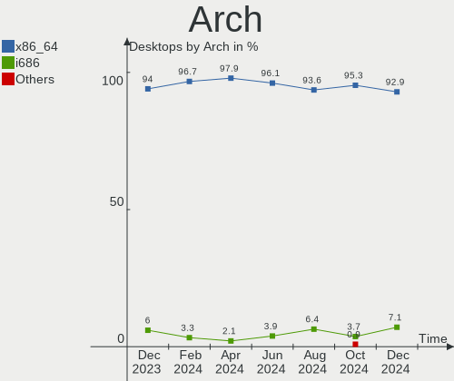
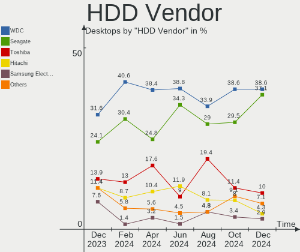
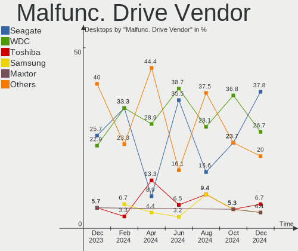
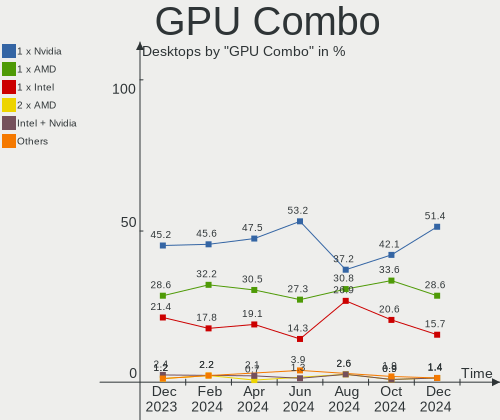
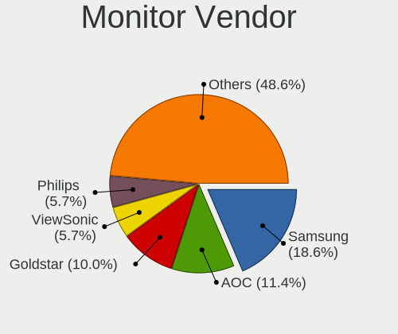
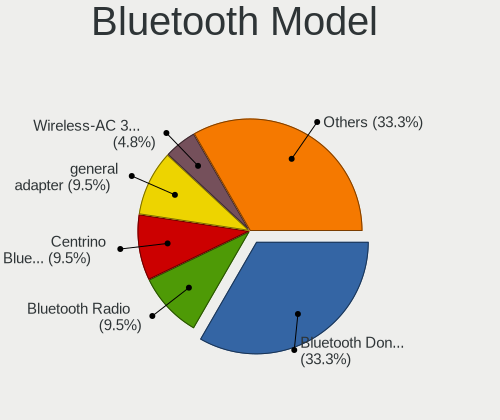

ROSA - Hardware Trends (Desktops)
---------------------------------

A project to identify most popular hardware characteristics and track their change
over time based on data collected by Linux users at https://Linux-Hardware.org.

Anyone can contribute to this report by the [hw-probe](https://github.com/linuxhw/hw-probe) tool:

    sudo -E hw-probe -all -upload

This report is for one last month. Overall report since the beginning of time: [TestCoverage](https://github.com/linuxhw/TestCoverage)

Period: Oct, 2022.

Contents
--------

* [ System ](#system)
  - [ OS                       ](#os)
  - [ OS Family                ](#os-family)
  - [ Kernel                   ](#kernel)
  - [ Kernel Family            ](#kernel-family)
  - [ Kernel Major Ver.        ](#kernel-major-ver)
  - [ Arch                     ](#arch)
  - [ DE                       ](#de)
  - [ Display Server           ](#display-server)
  - [ Display Manager          ](#display-manager)
  - [ OS Lang                  ](#os-lang)
  - [ Boot Mode                ](#boot-mode)
  - [ Filesystem               ](#filesystem)
  - [ Part. scheme             ](#part-scheme)
  - [ Dual Boot with Linux/BSD ](#dual-boot-with-linuxbsd)
  - [ Dual Boot (Win)          ](#dual-boot-win)

* [ Board ](#board)
  - [ Vendor                   ](#vendor)
  - [ Model                    ](#model)
  - [ Model Family             ](#model-family)
  - [ MFG Year                 ](#mfg-year)
  - [ Form Factor              ](#form-factor)
  - [ Secure Boot              ](#secure-boot)
  - [ Coreboot                 ](#coreboot)
  - [ RAM Size                 ](#ram-size)
  - [ RAM Used                 ](#ram-used)
  - [ Total Drives             ](#total-drives)
  - [ Has CD-ROM               ](#has-cd-rom)
  - [ Has Ethernet             ](#has-ethernet)
  - [ Has WiFi                 ](#has-wifi)
  - [ Has Bluetooth            ](#has-bluetooth)

* [ Location ](#location)
  - [ Country                  ](#country)
  - [ City                     ](#city)

* [ Drives ](#drives)
  - [ Drive Vendor             ](#drive-vendor)
  - [ Drive Model              ](#drive-model)
  - [ HDD Vendor               ](#hdd-vendor)
  - [ SSD Vendor               ](#ssd-vendor)
  - [ Drive Kind               ](#drive-kind)
  - [ Drive Connector          ](#drive-connector)
  - [ Drive Size               ](#drive-size)
  - [ Space Total              ](#space-total)
  - [ Space Used               ](#space-used)
  - [ Malfunc. Drives          ](#malfunc-drives)
  - [ Malfunc. Drive Vendor    ](#malfunc-drive-vendor)
  - [ Malfunc. HDD Vendor      ](#malfunc-hdd-vendor)
  - [ Malfunc. Drive Kind      ](#malfunc-drive-kind)
  - [ Failed Drives            ](#failed-drives)
  - [ Failed Drive Vendor      ](#failed-drive-vendor)
  - [ Drive Status             ](#drive-status)

* [ Storage controller ](#storage-controller)
  - [ Storage Vendor           ](#storage-vendor)
  - [ Storage Model            ](#storage-model)
  - [ Storage Kind             ](#storage-kind)

* [ Processor ](#processor)
  - [ CPU Vendor               ](#cpu-vendor)
  - [ CPU Model                ](#cpu-model)
  - [ CPU Model Family         ](#cpu-model-family)
  - [ CPU Cores                ](#cpu-cores)
  - [ CPU Sockets              ](#cpu-sockets)
  - [ CPU Threads              ](#cpu-threads)
  - [ CPU Op-Modes             ](#cpu-op-modes)
  - [ CPU Microcode            ](#cpu-microcode)
  - [ CPU Microarch            ](#cpu-microarch)

* [ Graphics ](#graphics)
  - [ GPU Vendor               ](#gpu-vendor)
  - [ GPU Model                ](#gpu-model)
  - [ GPU Combo                ](#gpu-combo)
  - [ GPU Driver               ](#gpu-driver)
  - [ GPU Memory               ](#gpu-memory)

* [ Monitor ](#monitor)
  - [ Monitor Vendor           ](#monitor-vendor)
  - [ Monitor Model            ](#monitor-model)
  - [ Monitor Resolution       ](#monitor-resolution)
  - [ Monitor Diagonal         ](#monitor-diagonal)
  - [ Monitor Width            ](#monitor-width)
  - [ Aspect Ratio             ](#aspect-ratio)
  - [ Monitor Area             ](#monitor-area)
  - [ Pixel Density            ](#pixel-density)
  - [ Multiple Monitors        ](#multiple-monitors)

* [ Network ](#network)
  - [ Net Controller Vendor    ](#net-controller-vendor)
  - [ Net Controller Model     ](#net-controller-model)
  - [ Wireless Vendor          ](#wireless-vendor)
  - [ Wireless Model           ](#wireless-model)
  - [ Ethernet Vendor          ](#ethernet-vendor)
  - [ Ethernet Model           ](#ethernet-model)
  - [ Net Controller Kind      ](#net-controller-kind)
  - [ Used Controller          ](#used-controller)
  - [ NICs                     ](#nics)
  - [ IPv6                     ](#ipv6)

* [ Bluetooth ](#bluetooth)
  - [ Bluetooth Vendor         ](#bluetooth-vendor)
  - [ Bluetooth Model          ](#bluetooth-model)

* [ Sound ](#sound)
  - [ Sound Vendor             ](#sound-vendor)
  - [ Sound Model              ](#sound-model)

* [ Memory ](#memory)
  - [ Memory Vendor            ](#memory-vendor)
  - [ Memory Model             ](#memory-model)
  - [ Memory Kind              ](#memory-kind)
  - [ Memory Form Factor       ](#memory-form-factor)
  - [ Memory Size              ](#memory-size)
  - [ Memory Speed             ](#memory-speed)

* [ Printers & scanners ](#printers--scanners)
  - [ Printer Vendor           ](#printer-vendor)
  - [ Printer Model            ](#printer-model)
  - [ Scanner Vendor           ](#scanner-vendor)
  - [ Scanner Model            ](#scanner-model)

* [ Camera ](#camera)
  - [ Camera Vendor            ](#camera-vendor)
  - [ Camera Model             ](#camera-model)

* [ Security ](#security)
  - [ Fingerprint Vendor       ](#fingerprint-vendor)
  - [ Fingerprint Model        ](#fingerprint-model)
  - [ Chipcard Vendor          ](#chipcard-vendor)
  - [ Chipcard Model           ](#chipcard-model)

* [ Unsupported ](#unsupported)
  - [ Unsupported Devices      ](#unsupported-devices)
  - [ Unsupported Device Types ](#unsupported-device-types)

System
------

OS
--

Installed operating systems

| Name       | Desktops | Percent |
|------------|----------|---------|
| ROSA 12.2  | 121      | 85.21%  |
| ROSA R11.1 | 11       | 7.75%   |
| ROSA 12.3  | 5        | 3.52%   |
| ROSA 12.1  | 3        | 2.11%   |
| ROSA R11   | 2        | 1.41%   |

OS Family
---------

OS without a version

| Name | Desktops | Percent |
|------|----------|---------|
| ROSA | 142      | 100%    |

Kernel
------

Version of the Linux kernel

| Version                                   | Desktops | Percent |
|-------------------------------------------|----------|---------|
| 5.10.74-generic-2rosa2021.1-x86_64        | 58       | 40.85%  |
| 5.10.118-generic-2rosa2021.1-x86_64       | 38       | 26.76%  |
| 5.17.11-generic-2rosa2021.1-x86_64        | 7        | 4.93%   |
| 5.18.18.xm1-1-xanmod-rosa2021.1-x86_64    | 4        | 2.82%   |
| 5.15.43-generic-2rosa2021.1-x86_64        | 4        | 2.82%   |
| 5.10.150-generic-1rosa2021.1-x86_64       | 4        | 2.82%   |
| 5.4.83-generic-2rosa-x86_64               | 3        | 2.11%   |
| 5.4.83-generic-2rosa-i586                 | 3        | 2.11%   |
| 5.15.75-generic-1rosa2021.1-x86_64        | 3        | 2.11%   |
| 5.15.74-generic-1rosa2021.1-x86_64        | 2        | 1.41%   |
| 5.10.118-generic-2rosa2021.1-i586         | 2        | 1.41%   |
| 4.15.0-desktop-45.1rosa-x86_64            | 2        | 1.41%   |
| 4.15.0-desktop-122.124.1rosa-x86_64       | 2        | 1.41%   |
| 6.0.6.xm1-1.klp-xanmod-rosa2021.1-x86_64  | 1        | 0.7%    |
| 6.0.2.xm1-1.klp-xanmod-rosa2021.1-x86_64  | 1        | 0.7%    |
| 6.0.0.xm1-4.klp-xanmod-rosa2021.1-x86_64  | 1        | 0.7%    |
| 5.4.32-generic-2rosa-x86_64               | 1        | 0.7%    |
| 5.4.32-generic-2rosa-i586                 | 1        | 0.7%    |
| 5.19.8.xm1-1.klp-xanmod-rosa2021.1-x86_64 | 1        | 0.7%    |
| 5.19.12-generic-2rosa2021.1-x86_64        | 1        | 0.7%    |
| 5.10.74-generic-2rosa2021.1-i586          | 1        | 0.7%    |
| 5.10.149-generic-1rosa2021.1-x86_64       | 1        | 0.7%    |
| 4.9.155-nrj-desktop-1rosa-i586            | 1        | 0.7%    |

Kernel Family
-------------

Linux kernel without a distro release

| Version  | Desktops | Percent |
|----------|----------|---------|
| 5.10.74  | 59       | 41.55%  |
| 5.10.118 | 40       | 28.17%  |
| 5.17.11  | 7        | 4.93%   |
| 5.4.83   | 6        | 4.23%   |
| 5.18.18  | 4        | 2.82%   |
| 5.15.43  | 4        | 2.82%   |
| 5.10.150 | 4        | 2.82%   |
| 4.15.0   | 4        | 2.82%   |
| 5.15.75  | 3        | 2.11%   |
| 5.4.32   | 2        | 1.41%   |
| 5.15.74  | 2        | 1.41%   |
| 6.0.6    | 1        | 0.7%    |
| 6.0.2    | 1        | 0.7%    |
| 6.0.0    | 1        | 0.7%    |
| 5.19.8   | 1        | 0.7%    |
| 5.19.12  | 1        | 0.7%    |
| 5.10.149 | 1        | 0.7%    |
| 4.9.155  | 1        | 0.7%    |

Kernel Major Ver.
-----------------

Linux kernel major version

| Version | Desktops | Percent |
|---------|----------|---------|
| 5.10    | 104      | 73.24%  |
| 5.15    | 9        | 6.34%   |
| 5.4     | 8        | 5.63%   |
| 5.17    | 7        | 4.93%   |
| 5.18    | 4        | 2.82%   |
| 4.15    | 4        | 2.82%   |
| 6.0     | 3        | 2.11%   |
| 5.19    | 2        | 1.41%   |
| 4.9     | 1        | 0.7%    |

Arch
----

OS architecture (x86_64, i586, etc.)

| Name   | Desktops | Percent |
|--------|----------|---------|
| x86_64 | 134      | 94.37%  |
| i686   | 8        | 5.63%   |

DE
--

Desktop Environment

| Name  | Desktops | Percent |
|-------|----------|---------|
| KDE5  | 70       | 49.3%   |
| GNOME | 54       | 38.03%  |
| LXQt  | 11       | 7.75%   |
| KDE4  | 7        | 4.93%   |

Display Server
--------------

X11 or Wayland

| Name    | Desktops | Percent |
|---------|----------|---------|
| Wayland | 105      | 73.94%  |
| X11     | 37       | 26.06%  |

Display Manager
---------------

SDDM, LightDM, etc.

| Name    | Desktops | Percent |
|---------|----------|---------|
| SDDM    | 70       | 49.3%   |
| GDM     | 62       | 43.66%  |
| KDM     | 7        | 4.93%   |
| LightDM | 3        | 2.11%   |

OS Lang
-------

Language

| Lang    | Desktops | Percent |
|---------|----------|---------|
| ru_RU   | 131      | 92.25%  |
| de_DE   | 3        | 2.11%   |
| es_ES   | 2        | 1.41%   |
| en_US   | 2        | 1.41%   |
| Unknown | 2        | 1.41%   |
| ru_UA   | 1        | 0.7%    |
| es_AR   | 1        | 0.7%    |

Boot Mode
---------

EFI or BIOS

| Mode | Desktops | Percent |
|------|----------|---------|
| EFI  | 74       | 52.11%  |
| BIOS | 68       | 47.89%  |

Filesystem
----------

Type of filesystem

| Type  | Desktops | Percent |
|-------|----------|---------|
| Ext4  | 132      | 92.96%  |
| Btrfs | 7        | 4.93%   |
| F2fs  | 2        | 1.41%   |
| Ext3  | 1        | 0.7%    |

Part. scheme
------------

Scheme of partitioning

| Type | Desktops | Percent |
|------|----------|---------|
| GPT  | 93       | 65.49%  |
| MBR  | 49       | 34.51%  |

Dual Boot with Linux/BSD
------------------------

Hosting more than one Linux/BSD

| Dual boot | Desktops | Percent |
|-----------|----------|---------|
| No        | 99       | 69.72%  |
| Yes       | 43       | 30.28%  |

Dual Boot (Win)
---------------

Hosting Linux and Windows

| Dual boot | Desktops | Percent |
|-----------|----------|---------|
| No        | 77       | 54.23%  |
| Yes       | 65       | 45.77%  |

Board
-----

Vendor
------

Motherboard manufacturer

| Name                | Desktops | Percent |
|---------------------|----------|---------|
| Gigabyte Technology | 42       | 29.58%  |
| ASUSTek Computer    | 36       | 25.35%  |
| MSI                 | 15       | 10.56%  |
| ASRock              | 15       | 10.56%  |
| Fujitsu             | 4        | 2.82%   |
| ECS                 | 4        | 2.82%   |
| Biostar             | 4        | 2.82%   |
| Hewlett-Packard     | 3        | 2.11%   |
| Dell                | 3        | 2.11%   |
| Intel               | 2        | 1.41%   |
| Foxconn             | 2        | 1.41%   |
| Unknown             | 2        | 1.41%   |
| Sapphire            | 1        | 0.7%    |
| Pegatron            | 1        | 0.7%    |
| OEM                 | 1        | 0.7%    |
| MiTAC               | 1        | 0.7%    |
| Lenovo              | 1        | 0.7%    |
| Kllisre             | 1        | 0.7%    |
| Founder             | 1        | 0.7%    |
| eMachines           | 1        | 0.7%    |
| Colorful Technology | 1        | 0.7%    |
| Acer                | 1        | 0.7%    |

Model
-----

Motherboard model

| Name                               | Desktops | Percent |
|------------------------------------|----------|---------|
| Gigabyte B450M DS3H                | 3        | 2.11%   |
| ASUS All Series                    | 3        | 2.11%   |
| Unknown                            | 3        | 2.11%   |
| MSI MS-7C52                        | 2        | 1.41%   |
| MSI MS-7817                        | 2        | 1.41%   |
| Gigabyte Z97-HD3                   | 2        | 1.41%   |
| Gigabyte EP41-UD3L                 | 2        | 1.41%   |
| Gigabyte B550 GAMING X V2          | 2        | 1.41%   |
| Gigabyte A320M-S2H                 | 2        | 1.41%   |
| ASUS P8H77-V                       | 2        | 1.41%   |
| ASUS GU609AA-ACB a6230.ru          | 2        | 1.41%   |
| Sapphire IPC-E350M1                | 1        | 0.7%    |
| Pegatron Compaq dx2400 Microtower  | 1        | 0.7%    |
| MSI MS-7D82                        | 1        | 0.7%    |
| MSI MS-7D15                        | 1        | 0.7%    |
| MSI MS-7C75                        | 1        | 0.7%    |
| MSI MS-7B89                        | 1        | 0.7%    |
| MSI MS-7B87                        | 1        | 0.7%    |
| MSI MS-7B86                        | 1        | 0.7%    |
| MSI MS-7B19                        | 1        | 0.7%    |
| MSI MS-7A39                        | 1        | 0.7%    |
| MSI MS-7A34                        | 1        | 0.7%    |
| MSI MS-7680                        | 1        | 0.7%    |
| MSI MS-7430                        | 1        | 0.7%    |
| MiTAC E220 E220AQ-601              | 1        | 0.7%    |
| Lenovo ThinkCentre M71z 1782RP4    | 1        | 0.7%    |
| Kllisre X79 V1.2                   | 1        | 0.7%    |
| Intel X99                          | 1        | 0.7%    |
| Intel D946GZAB AAD66610-300        | 1        | 0.7%    |
| HP ProDesk 400 G7 Microtower PC    | 1        | 0.7%    |
| HP Compaq dc5700 Small Form Factor | 1        | 0.7%    |
| HP 260-a104ur                      | 1        | 0.7%    |
| Gigabyte X99-SLI-CF                | 1        | 0.7%    |
| Gigabyte X58A-UD7                  | 1        | 0.7%    |
| Gigabyte X470 AORUS ULTRA GAMING   | 1        | 0.7%    |
| Gigabyte PH67-UD3-B3               | 1        | 0.7%    |
| Gigabyte P67X-UD3-B3               | 1        | 0.7%    |
| Gigabyte P35-S3                    | 1        | 0.7%    |
| Gigabyte H81M-S1                   | 1        | 0.7%    |
| Gigabyte H81M-H                    | 1        | 0.7%    |

Model Family
------------

Motherboard model prefix

| Name                | Desktops | Percent |
|---------------------|----------|---------|
| ASUS PRIME          | 7        | 4.93%   |
| Gigabyte B450M      | 5        | 3.52%   |
| Fujitsu ESPRIMO     | 4        | 2.82%   |
| ASUS P8H61-M        | 3        | 2.11%   |
| ASUS All            | 3        | 2.11%   |
| Unknown             | 3        | 2.11%   |
| MSI MS-7C52         | 2        | 1.41%   |
| MSI MS-7817         | 2        | 1.41%   |
| Gigabyte Z97-HD3    | 2        | 1.41%   |
| Gigabyte H410M      | 2        | 1.41%   |
| Gigabyte EP41-UD3L  | 2        | 1.41%   |
| Gigabyte B550       | 2        | 1.41%   |
| Gigabyte B450       | 2        | 1.41%   |
| Gigabyte A320M-S2H  | 2        | 1.41%   |
| Dell OptiPlex       | 2        | 1.41%   |
| ASUS ROG            | 2        | 1.41%   |
| ASUS P8H77-V        | 2        | 1.41%   |
| ASUS P5Q            | 2        | 1.41%   |
| ASUS M5A97          | 2        | 1.41%   |
| ASUS GU609AA-ACB    | 2        | 1.41%   |
| Sapphire IPC-E350M1 | 1        | 0.7%    |
| Pegatron Compaq     | 1        | 0.7%    |
| MSI MS-7D82         | 1        | 0.7%    |
| MSI MS-7D15         | 1        | 0.7%    |
| MSI MS-7C75         | 1        | 0.7%    |
| MSI MS-7B89         | 1        | 0.7%    |
| MSI MS-7B87         | 1        | 0.7%    |
| MSI MS-7B86         | 1        | 0.7%    |
| MSI MS-7B19         | 1        | 0.7%    |
| MSI MS-7A39         | 1        | 0.7%    |
| MSI MS-7A34         | 1        | 0.7%    |
| MSI MS-7680         | 1        | 0.7%    |
| MSI MS-7430         | 1        | 0.7%    |
| MiTAC E220          | 1        | 0.7%    |
| Lenovo ThinkCentre  | 1        | 0.7%    |
| Kllisre X79         | 1        | 0.7%    |
| Intel X99           | 1        | 0.7%    |
| Intel D946GZAB      | 1        | 0.7%    |
| HP ProDesk          | 1        | 0.7%    |
| HP Compaq           | 1        | 0.7%    |

MFG Year
--------

Motherboard manufacture year

| Year | Desktops | Percent |
|------|----------|---------|
| 2018 | 15       | 10.56%  |
| 2012 | 15       | 10.56%  |
| 2011 | 15       | 10.56%  |
| 2013 | 11       | 7.75%   |
| 2021 | 10       | 7.04%   |
| 2020 | 10       | 7.04%   |
| 2019 | 10       | 7.04%   |
| 2017 | 10       | 7.04%   |
| 2007 | 8        | 5.63%   |
| 2010 | 7        | 4.93%   |
| 2009 | 7        | 4.93%   |
| 2016 | 6        | 4.23%   |
| 2014 | 6        | 4.23%   |
| 2008 | 5        | 3.52%   |
| 2022 | 3        | 2.11%   |
| 2015 | 3        | 2.11%   |
| 2006 | 1        | 0.7%    |

Form Factor
-----------

Physical design of the computer

| Name    | Desktops | Percent |
|---------|----------|---------|
| Desktop | 142      | 100%    |

Secure Boot
-----------

Enabled or disabled

| State    | Desktops | Percent |
|----------|----------|---------|
| Disabled | 142      | 100%    |

Coreboot
--------

Have coreboot on board

| Used | Desktops | Percent |
|------|----------|---------|
| No   | 142      | 100%    |

RAM Size
--------

Total RAM memory

| Size in GB  | Desktops | Percent |
|-------------|----------|---------|
| 16.01-24.0  | 41       | 28.87%  |
| 8.01-16.0   | 31       | 21.83%  |
| 4.01-8.0    | 23       | 16.2%   |
| 3.01-4.0    | 22       | 15.49%  |
| 32.01-64.0  | 10       | 7.04%   |
| 1.01-2.0    | 7        | 4.93%   |
| 24.01-32.0  | 3        | 2.11%   |
| 2.01-3.0    | 3        | 2.11%   |
| 64.01-256.0 | 2        | 1.41%   |

RAM Used
--------

Used RAM memory

| Used GB  | Desktops | Percent |
|----------|----------|---------|
| 1.01-2.0 | 84       | 59.15%  |
| 0.51-1.0 | 31       | 21.83%  |
| 2.01-3.0 | 20       | 14.08%  |
| 3.01-4.0 | 4        | 2.82%   |
| 4.01-8.0 | 3        | 2.11%   |

Total Drives
------------

Number of drives on board

| Drives | Desktops | Percent |
|--------|----------|---------|
| 1      | 59       | 41.55%  |
| 2      | 41       | 28.87%  |
| 3      | 31       | 21.83%  |
| 4      | 6        | 4.23%   |
| 6      | 2        | 1.41%   |
| 8      | 1        | 0.7%    |
| 7      | 1        | 0.7%    |
| 5      | 1        | 0.7%    |

Has CD-ROM
----------

Has CD-ROM on board

| Presented | Desktops | Percent |
|-----------|----------|---------|
| No        | 93       | 65.49%  |
| Yes       | 49       | 34.51%  |

Has Ethernet
------------

Has Ethernet on board

| Presented | Desktops | Percent |
|-----------|----------|---------|
| Yes       | 141      | 99.3%   |
| No        | 1        | 0.7%    |

Has WiFi
--------

Has WiFi module

| Presented | Desktops | Percent |
|-----------|----------|---------|
| No        | 93       | 65.49%  |
| Yes       | 49       | 34.51%  |

Has Bluetooth
-------------

Has Bluetooth module

| Presented | Desktops | Percent |
|-----------|----------|---------|
| No        | 105      | 73.94%  |
| Yes       | 37       | 26.06%  |

Location
--------

Country
-------

Geographic location (country)

| Country    | Desktops | Percent |
|------------|----------|---------|
| Russia     | 125      | 88.03%  |
| Germany    | 4        | 2.82%   |
| Ukraine    | 2        | 1.41%   |
| Estonia    | 2        | 1.41%   |
| USA        | 1        | 0.7%    |
| Spain      | 1        | 0.7%    |
| Moldova    | 1        | 0.7%    |
| Latvia     | 1        | 0.7%    |
| Kazakhstan | 1        | 0.7%    |
| Czechia    | 1        | 0.7%    |
| Colombia   | 1        | 0.7%    |
| Argentina  | 1        | 0.7%    |
| Algeria    | 1        | 0.7%    |

City
----

Geographic location (city)

| City              | Desktops | Percent |
|-------------------|----------|---------|
| Moscow            | 16       | 11.27%  |
| Novosibirsk       | 6        | 4.23%   |
| St Petersburg     | 5        | 3.52%   |
| Novokuznetsk      | 5        | 3.52%   |
| Krasnodar         | 5        | 3.52%   |
| Ufa               | 4        | 2.82%   |
| Yekaterinburg     | 3        | 2.11%   |
| Voronezh          | 3        | 2.11%   |
| Stavropol         | 3        | 2.11%   |
| Pskov             | 3        | 2.11%   |
| Chelyabinsk       | 3        | 2.11%   |
| Tyumen            | 2        | 1.41%   |
| Tver              | 2        | 1.41%   |
| Samara            | 2        | 1.41%   |
| Rostov-on-Don     | 2        | 1.41%   |
| Kirov             | 2        | 1.41%   |
| Khimki            | 2        | 1.41%   |
| Kemerovo          | 2        | 1.41%   |
| Kazan’          | 2        | 1.41%   |
| Blagoveshchensk   | 2        | 1.41%   |
| Berezniki         | 2        | 1.41%   |
| Yuzhno-Sakhalinsk | 1        | 0.7%    |
| Yartsevo          | 1        | 0.7%    |
| Yaroslavl         | 1        | 0.7%    |
| Volzhskiy         | 1        | 0.7%    |
| Vologda           | 1        | 0.7%    |
| Vladivostok       | 1        | 0.7%    |
| Veliky Novgorod   | 1        | 0.7%    |
| Ust-Kamenogorsk   | 1        | 0.7%    |
| Uryupinsk         | 1        | 0.7%    |
| Tula              | 1        | 0.7%    |
| Tomsk             | 1        | 0.7%    |
| Tiraspol          | 1        | 0.7%    |
| Tartu             | 1        | 0.7%    |
| Tambov            | 1        | 0.7%    |
| Syktyvkar         | 1        | 0.7%    |
| Surgut            | 1        | 0.7%    |
| Sochi             | 1        | 0.7%    |
| Snezhinsk         | 1        | 0.7%    |
| Smolensk          | 1        | 0.7%    |

Drives
------

Drive Vendor
------------

Hard drive vendors

| Vendor              | Desktops | Drives | Percent |
|---------------------|----------|--------|---------|
| WDC                 | 54       | 67     | 20.77%  |
| Seagate             | 52       | 62     | 20%     |
| Samsung Electronics | 16       | 17     | 6.15%   |
| Toshiba             | 15       | 16     | 5.77%   |
| Kingston            | 15       | 15     | 5.77%   |
| Hitachi             | 13       | 14     | 5%      |
| SPCC                | 9        | 9      | 3.46%   |
| AMD                 | 8        | 8      | 3.08%   |
| China               | 7        | 7      | 2.69%   |
| A-DATA Technology   | 7        | 8      | 2.69%   |
| Crucial             | 6        | 9      | 2.31%   |
| Apacer              | 5        | 5      | 1.92%   |
| SanDisk             | 4        | 4      | 1.54%   |
| Intel               | 4        | 4      | 1.54%   |
| Unknown             | 3        | 3      | 1.15%   |
| Transcend           | 3        | 3      | 1.15%   |
| Plextor             | 3        | 3      | 1.15%   |
| Patriot             | 3        | 3      | 1.15%   |
| Netac               | 3        | 3      | 1.15%   |
| Maxtor              | 3        | 3      | 1.15%   |
| OCZ-VERTEX3         | 2        | 2      | 0.77%   |
| KingSpec            | 2        | 2      | 0.77%   |
| JMicron Technology  | 2        | 2      | 0.77%   |
| HGST                | 2        | 2      | 0.77%   |
| Zheino              | 1        | 1      | 0.38%   |
| XPG                 | 1        | 1      | 0.38%   |
| Team                | 1        | 1      | 0.38%   |
| T-FORCE             | 1        | 1      | 0.38%   |
| Smartbuy            | 1        | 1      | 0.38%   |
| Phison              | 1        | 1      | 0.38%   |
| NVME USB            | 1        | 1      | 0.38%   |
| Neo                 | 1        | 1      | 0.38%   |
| Magnetic Data       | 1        | 1      | 0.38%   |
| KIOXIA              | 1        | 1      | 0.38%   |
| KingDian            | 1        | 1      | 0.38%   |
| Hewlett-Packard     | 1        | 1      | 0.38%   |
| GOODRAM             | 1        | 1      | 0.38%   |
| Gigabyte Technology | 1        | 1      | 0.38%   |
| Foxline             | 1        | 1      | 0.38%   |
| ASMT                | 1        | 2      | 0.38%   |

Drive Model
-----------

Hard drive models

| Model                             | Desktops | Percent |
|-----------------------------------|----------|---------|
| Seagate ST1000DM010-2EP102 1TB    | 9        | 3.13%   |
| Toshiba HDWD110 1TB               | 5        | 1.74%   |
| Kingston SA400S37240G 240GB SSD   | 4        | 1.39%   |
| Apacer AS350 128GB SSD            | 4        | 1.39%   |
| WDC WDS240G2G0A-00JH30 240GB SSD  | 3        | 1.04%   |
| WDC WDS120G2G0A-00JH30 120GB SSD  | 3        | 1.04%   |
| WDC WD10EZEX-08WN4A0 1TB          | 3        | 1.04%   |
| Toshiba DT01ACA050 500GB          | 3        | 1.04%   |
| SPCC Solid State Disk 120GB       | 3        | 1.04%   |
| Seagate ST500DM002-1BD142 500GB   | 3        | 1.04%   |
| Seagate ST3250310AS 250GB         | 3        | 1.04%   |
| Seagate ST2000DM008-2FR102 2TB    | 3        | 1.04%   |
| Samsung SSD 860 EVO 250GB         | 3        | 1.04%   |
| Kingston SNVS500G 500GB           | 3        | 1.04%   |
| WDC WDS500G2B0A-00SM50 500GB SSD  | 2        | 0.69%   |
| WDC WD20EARS-00S8B1 2TB           | 2        | 0.69%   |
| WDC WD10EZRX-00L4HB0 1TB          | 2        | 0.69%   |
| WDC WD10EZEX-07ZF5A0 1TB          | 2        | 0.69%   |
| Toshiba HDWD120 2TB               | 2        | 0.69%   |
| Toshiba DT01ACA100 1TB            | 2        | 0.69%   |
| SPCC Solid State Disk 128GB       | 2        | 0.69%   |
| Seagate ST380815AS 80GB           | 2        | 0.69%   |
| Seagate ST380215A 80GB            | 2        | 0.69%   |
| Seagate ST1000DM003-9YN162 1TB    | 2        | 0.69%   |
| Seagate ST1000DM003-1SB102 1TB    | 2        | 0.69%   |
| SanDisk SSD G5 BICS4 500GB        | 2        | 0.69%   |
| Samsung SSD 970 EVO 250GB         | 2        | 0.69%   |
| OCZ-VERTEX3 MI 120GB SSD          | 2        | 0.69%   |
| Kingston SNVS250G 250GB           | 2        | 0.69%   |
| Kingston SA400S37480G 480GB SSD   | 2        | 0.69%   |
| Hitachi HDS721616PLA380 160GB     | 2        | 0.69%   |
| Hitachi HDS721025CLA382 250GB     | 2        | 0.69%   |
| Crucial CT480BX500SSD1 480GB      | 2        | 0.69%   |
| Crucial CT240BX500SSD1 240GB      | 2        | 0.69%   |
| China SSD 512GB                   | 2        | 0.69%   |
| AMD R5SL240G 240GB SSD            | 2        | 0.69%   |
| AMD R5SL120G 120GB SSD            | 2        | 0.69%   |
| A-DATA SU650 120GB SSD            | 2        | 0.69%   |
| Zheino CHN-25SATAA3-480 480GB SSD | 1        | 0.35%   |
| XPG GAMMIX S11 Pro 1TB            | 1        | 0.35%   |

HDD Vendor
----------

Hard disk drive vendors

| Vendor              | Desktops | Drives | Percent |
|---------------------|----------|--------|---------|
| Seagate             | 51       | 61     | 37.23%  |
| WDC                 | 47       | 55     | 34.31%  |
| Toshiba             | 14       | 15     | 10.22%  |
| Hitachi             | 13       | 14     | 9.49%   |
| Samsung Electronics | 4        | 4      | 2.92%   |
| Maxtor              | 3        | 3      | 2.19%   |
| HGST                | 2        | 2      | 1.46%   |
| Unknown             | 1        | 1      | 0.73%   |
| Magnetic Data       | 1        | 1      | 0.73%   |
| ASMT                | 1        | 2      | 0.73%   |

SSD Vendor
----------

Solid state drive vendors

| Vendor              | Desktops | Drives | Percent |
|---------------------|----------|--------|---------|
| WDC                 | 10       | 11     | 10.2%   |
| SPCC                | 9        | 9      | 9.18%   |
| Kingston            | 9        | 9      | 9.18%   |
| Samsung Electronics | 7        | 7      | 7.14%   |
| China               | 7        | 7      | 7.14%   |
| AMD                 | 7        | 7      | 7.14%   |
| Crucial             | 5        | 8      | 5.1%    |
| Apacer              | 5        | 5      | 5.1%    |
| A-DATA Technology   | 5        | 5      | 5.1%    |
| SanDisk             | 4        | 4      | 4.08%   |
| Plextor             | 3        | 3      | 3.06%   |
| Unknown             | 2        | 2      | 2.04%   |
| Patriot             | 2        | 2      | 2.04%   |
| OCZ-VERTEX3         | 2        | 2      | 2.04%   |
| Netac               | 2        | 2      | 2.04%   |
| KingSpec            | 2        | 2      | 2.04%   |
| Intel               | 2        | 2      | 2.04%   |
| Zheino              | 1        | 1      | 1.02%   |
| Transcend           | 1        | 1      | 1.02%   |
| Toshiba             | 1        | 1      | 1.02%   |
| Team                | 1        | 1      | 1.02%   |
| T-FORCE             | 1        | 1      | 1.02%   |
| Smartbuy            | 1        | 1      | 1.02%   |
| Neo                 | 1        | 1      | 1.02%   |
| KingDian            | 1        | 1      | 1.02%   |
| Hewlett-Packard     | 1        | 1      | 1.02%   |
| GOODRAM             | 1        | 1      | 1.02%   |
| Gigabyte Technology | 1        | 1      | 1.02%   |
| Foxline             | 1        | 1      | 1.02%   |
| AGI                 | 1        | 1      | 1.02%   |
| 1TB                 | 1        | 1      | 1.02%   |
| Unknown             | 1        | 1      | 1.02%   |

Drive Kind
----------

HDD or SSD

| Kind    | Desktops | Drives | Percent |
|---------|----------|--------|---------|
| HDD     | 109      | 158    | 50%     |
| SSD     | 80       | 102    | 36.7%   |
| NVMe    | 28       | 30     | 12.84%  |
| Unknown | 1        | 1      | 0.46%   |

Drive Connector
---------------

SATA, SAS, NVMe, etc.

| Type | Desktops | Drives | Percent |
|------|----------|--------|---------|
| SATA | 136      | 255    | 80.47%  |
| NVMe | 26       | 28     | 15.38%  |
| SAS  | 7        | 8      | 4.14%   |

Drive Size
----------

Size of hard drive

| Size in TB | Desktops | Drives | Percent |
|------------|----------|--------|---------|
| 0.01-0.5   | 117      | 172    | 60.94%  |
| 0.51-1.0   | 53       | 62     | 27.6%   |
| 1.01-2.0   | 16       | 20     | 8.33%   |
| 2.01-3.0   | 3        | 3      | 1.56%   |
| 3.01-4.0   | 1        | 1      | 0.52%   |
| 10.01-20.0 | 1        | 1      | 0.52%   |
| 4.01-10.0  | 1        | 1      | 0.52%   |

Space Total
-----------

Amount of disk space available on the file system

| Size in GB     | Desktops | Percent |
|----------------|----------|---------|
| 101-250        | 47       | 33.1%   |
| 251-500        | 23       | 16.2%   |
| 501-1000       | 23       | 16.2%   |
| 1001-2000      | 17       | 11.97%  |
| 1-20           | 11       | 7.75%   |
| 21-50          | 8        | 5.63%   |
| 51-100         | 7        | 4.93%   |
| 2001-3000      | 4        | 2.82%   |
| More than 3000 | 2        | 1.41%   |

Space Used
----------

Amount of used disk space

| Used GB        | Desktops | Percent |
|----------------|----------|---------|
| 1-20           | 86       | 60.56%  |
| 21-50          | 16       | 11.27%  |
| 501-1000       | 10       | 7.04%   |
| 251-500        | 9        | 6.34%   |
| 101-250        | 9        | 6.34%   |
| 51-100         | 6        | 4.23%   |
| 1001-2000      | 5        | 3.52%   |
| More than 3000 | 1        | 0.7%    |

Malfunc. Drives
---------------

Drive models with a malfunction

| Model                           | Desktops | Drives | Percent |
|---------------------------------|----------|--------|---------|
| Seagate ST3250310AS 250GB       | 3        | 3      | 4.76%   |
| WDC WD20EARS-00S8B1 2TB         | 2        | 2      | 3.17%   |
| Seagate ST1000DM010-2EP102 1TB  | 2        | 2      | 3.17%   |
| OCZ-VERTEX3 MI 120GB SSD        | 2        | 2      | 3.17%   |
| WDC WD800BD-22MRA1 80GB         | 1        | 1      | 1.59%   |
| WDC WD7500BPVT-22A1YT0 752GB    | 1        | 1      | 1.59%   |
| WDC WD6400AAKS-22A7B2 640GB     | 1        | 1      | 1.59%   |
| WDC WD5000AAKX-60U6AA0 500GB    | 1        | 1      | 1.59%   |
| WDC WD5000AAKX-00ERMA0 500GB    | 1        | 1      | 1.59%   |
| WDC WD5000AAKX-001CA0 500GB     | 1        | 1      | 1.59%   |
| WDC WD3200AAJS-65B4A0 320GB     | 1        | 1      | 1.59%   |
| WDC WD3200AAJS-00L7A0 320GB     | 1        | 1      | 1.59%   |
| WDC WD20EZRZ-00Z5HB0 2TB        | 1        | 1      | 1.59%   |
| WDC WD20EZRX-00DC0B0 2TB        | 1        | 1      | 1.59%   |
| WDC WD20EARX-00PASB0 2TB        | 1        | 1      | 1.59%   |
| WDC WD2003FYPS-27W9B0 2TB       | 1        | 1      | 1.59%   |
| WDC WD10EZRX-00L4HB0 1TB        | 1        | 1      | 1.59%   |
| WDC WD10EZEX-75WN4A0 1TB        | 1        | 1      | 1.59%   |
| WDC WD10EARS-00Y5B1 1TB         | 1        | 1      | 1.59%   |
| WDC WD1003FZEX-00MK2A0 1TB      | 1        | 1      | 1.59%   |
| WDC WD1002FAEX-00Z3A0 1TB       | 1        | 1      | 1.59%   |
| Toshiba DT01ACA050 500GB        | 1        | 2      | 1.59%   |
| SPCC Solid State Disk 56GB      | 1        | 1      | 1.59%   |
| SPCC Solid State Disk 240GB     | 1        | 1      | 1.59%   |
| Seagate ST9500325AS 500GB       | 1        | 1      | 1.59%   |
| Seagate ST500NM0011 500GB       | 1        | 1      | 1.59%   |
| Seagate ST500DM002-9YN14C 500GB | 1        | 1      | 1.59%   |
| Seagate ST500DM002-1BD142 500GB | 1        | 1      | 1.59%   |
| Seagate ST3808110AS 80GB        | 1        | 1      | 1.59%   |
| Seagate ST3320418AS 320GB       | 1        | 1      | 1.59%   |
| Seagate ST3120814A 120GB        | 1        | 1      | 1.59%   |
| Seagate ST3120022A 120GB        | 1        | 1      | 1.59%   |
| Seagate ST31000340AS 1TB        | 1        | 1      | 1.59%   |
| Seagate ST31000333AS 1TB        | 1        | 1      | 1.59%   |
| Seagate ST250DM000-1BD141 250GB | 1        | 1      | 1.59%   |
| Seagate ST2000VX000-1ES164 2TB  | 1        | 1      | 1.59%   |
| Seagate ST2000DX002-2DV164 2TB  | 1        | 1      | 1.59%   |
| Seagate ST2000DX001-1CM164 2TB  | 1        | 1      | 1.59%   |
| Seagate ST1000DM003-9YN162 1TB  | 1        | 1      | 1.59%   |
| Samsung Electronics HD103UJ 1TB | 1        | 1      | 1.59%   |

Malfunc. Drive Vendor
---------------------

Vendors of faulty drives

| Vendor              | Desktops | Drives | Percent |
|---------------------|----------|--------|---------|
| Seagate             | 18       | 20     | 31.03%  |
| WDC                 | 16       | 19     | 27.59%  |
| Hitachi             | 7        | 7      | 12.07%  |
| Maxtor              | 3        | 3      | 5.17%   |
| SPCC                | 2        | 2      | 3.45%   |
| OCZ-VERTEX3         | 2        | 2      | 3.45%   |
| Toshiba             | 1        | 2      | 1.72%   |
| Samsung Electronics | 1        | 1      | 1.72%   |
| Netac               | 1        | 1      | 1.72%   |
| Neo                 | 1        | 1      | 1.72%   |
| Magnetic Data       | 1        | 1      | 1.72%   |
| Kingston            | 1        | 1      | 1.72%   |
| KingSpec            | 1        | 1      | 1.72%   |
| HGST                | 1        | 1      | 1.72%   |
| Crucial             | 1        | 1      | 1.72%   |
| Unknown             | 1        | 1      | 1.72%   |

Malfunc. HDD Vendor
-------------------

Vendors of faulty HDD drives

| Vendor              | Desktops | Drives | Percent |
|---------------------|----------|--------|---------|
| Seagate             | 18       | 20     | 37.5%   |
| WDC                 | 16       | 19     | 33.33%  |
| Hitachi             | 7        | 7      | 14.58%  |
| Maxtor              | 3        | 3      | 6.25%   |
| Toshiba             | 1        | 2      | 2.08%   |
| Samsung Electronics | 1        | 1      | 2.08%   |
| Magnetic Data       | 1        | 1      | 2.08%   |
| HGST                | 1        | 1      | 2.08%   |

Malfunc. Drive Kind
-------------------

Kinds of faulty drives

| Kind | Desktops | Drives | Percent |
|------|----------|--------|---------|
| HDD  | 41       | 54     | 80.39%  |
| SSD  | 10       | 10     | 19.61%  |

Failed Drives
-------------

Failed drive models

Zero info for selected period =(

Failed Drive Vendor
-------------------

Failed drive vendors

Zero info for selected period =(

Drive Status
------------

Number of failed and malfunc. drives

| Status   | Desktops | Drives | Percent |
|----------|----------|--------|---------|
| Works    | 128      | 223    | 70.33%  |
| Malfunc  | 50       | 64     | 27.47%  |
| Detected | 4        | 4      | 2.2%    |

Storage controller
------------------

Storage Vendor
--------------

Storage controller vendors

| Vendor                      | Desktops | Percent |
|-----------------------------|----------|---------|
| Intel                       | 90       | 47.87%  |
| AMD                         | 45       | 23.94%  |
| Marvell Technology Group    | 9        | 4.79%   |
| Nvidia                      | 7        | 3.72%   |
| Samsung Electronics         | 6        | 3.19%   |
| Kingston Technology Company | 6        | 3.19%   |
| JMicron Technology          | 6        | 3.19%   |
| ASMedia Technology          | 4        | 2.13%   |
| Silicon Motion              | 3        | 1.6%    |
| ADATA Technology            | 3        | 1.6%    |
| Transcend                   | 1        | 0.53%   |
| Silicon Image               | 1        | 0.53%   |
| Seagate Technology          | 1        | 0.53%   |
| SanDisk                     | 1        | 0.53%   |
| Realtek Semiconductor       | 1        | 0.53%   |
| Phison Electronics          | 1        | 0.53%   |
| Micron/Crucial Technology   | 1        | 0.53%   |
| MAXIO Technology (Hangzhou) | 1        | 0.53%   |
| KIOXIA                      | 1        | 0.53%   |

Storage Model
-------------

Storage controller models

| Model                                                                                   | Desktops | Percent |
|-----------------------------------------------------------------------------------------|----------|---------|
| AMD FCH SATA Controller [AHCI mode]                                                     | 22       | 8.8%    |
| AMD 400 Series Chipset SATA Controller                                                  | 14       | 5.6%    |
| Intel 8 Series/C220 Series Chipset Family 6-port SATA Controller 1 [AHCI mode]          | 9        | 3.6%    |
| Intel 6 Series/C200 Series Chipset Family 6 port Desktop SATA AHCI Controller           | 9        | 3.6%    |
| Intel NM10/ICH7 Family SATA Controller [IDE mode]                                       | 7        | 2.8%    |
| Intel 200 Series PCH SATA controller [AHCI mode]                                        | 7        | 2.8%    |
| AMD SB7x0/SB8x0/SB9x0 IDE Controller                                                    | 7        | 2.8%    |
| Intel 82801G (ICH7 Family) IDE Controller                                               | 6        | 2.4%    |
| Intel 6 Series/C200 Series Chipset Family Desktop SATA Controller (IDE mode, ports 4-5) | 6        | 2.4%    |
| Intel 6 Series/C200 Series Chipset Family Desktop SATA Controller (IDE mode, ports 0-3) | 6        | 2.4%    |
| Intel 500 Series Chipset Family SATA AHCI Controller                                    | 6        | 2.4%    |
| AMD SB7x0/SB8x0/SB9x0 SATA Controller [AHCI mode]                                       | 6        | 2.4%    |
| AMD 500 Series Chipset SATA Controller                                                  | 6        | 2.4%    |
| JMicron JMB363 SATA/IDE Controller                                                      | 5        | 2%      |
| Intel Q170/Q150/B150/H170/H110/Z170/CM236 Chipset SATA Controller [AHCI Mode]           | 5        | 2%      |
| AMD SB7x0/SB8x0/SB9x0 SATA Controller [IDE mode]                                        | 5        | 2%      |
| AMD FCH SATA Controller D                                                               | 5        | 2%      |
| Samsung NVMe SSD Controller SM981/PM981/PM983                                           | 4        | 1.6%    |
| Kingston Company Company Non-Volatile memory controller                                 | 4        | 1.6%    |
| Intel Comet Lake SATA AHCI Controller                                                   | 4        | 1.6%    |
| Intel 82801JI (ICH10 Family) 4 port SATA IDE Controller #1                              | 4        | 1.6%    |
| Intel 82801JI (ICH10 Family) 2 port SATA IDE Controller #2                              | 4        | 1.6%    |
| Intel 7 Series/C210 Series Chipset Family 6-port SATA Controller [AHCI mode]            | 4        | 1.6%    |
| ASMedia ASM1062 Serial ATA Controller                                                   | 4        | 1.6%    |
| Nvidia MCP61 SATA Controller                                                            | 3        | 1.2%    |
| Nvidia MCP61 IDE                                                                        | 3        | 1.2%    |
| Marvell Group 88SE6101/6102 single-port PATA133 interface                               | 3        | 1.2%    |
| Intel Atom Processor E3800 Series SATA AHCI Controller                                  | 3        | 1.2%    |
| Intel 400 Series Chipset Family SATA AHCI Controller                                    | 3        | 1.2%    |
| Silicon Motion SM2263EN/SM2263XT SSD Controller                                         | 2        | 0.8%    |
| Marvell Group 88SE9128 PCIe SATA 6 Gb/s RAID controller                                 | 2        | 0.8%    |
| Intel C610/X99 series chipset 6-Port SATA Controller [AHCI mode]                        | 2        | 0.8%    |
| Intel Alder Lake-S PCH SATA Controller [AHCI Mode]                                      | 2        | 0.8%    |
| Intel 9 Series Chipset Family SATA Controller [AHCI Mode]                               | 2        | 0.8%    |
| Intel 82801IR/IO/IH (ICH9R/DO/DH) 6 port SATA Controller [AHCI mode]                    | 2        | 0.8%    |
| Intel 82801I (ICH9 Family) 2 port SATA Controller [IDE mode]                            | 2        | 0.8%    |
| Intel 7 Series/C210 Series Chipset Family 4-port SATA Controller [IDE mode]             | 2        | 0.8%    |
| Intel 7 Series/C210 Series Chipset Family 2-port SATA Controller [IDE mode]             | 2        | 0.8%    |
| AMD 300 Series Chipset SATA Controller                                                  | 2        | 0.8%    |
| ADATA XPG SX8200 Pro PCIe Gen3x4 M.2 2280 Solid State Drive                             | 2        | 0.8%    |

Storage Kind
------------

Kind of storage controller (IDE, SATA, NVMe, SAS, ...)

| Kind | Desktops | Percent |
|------|----------|---------|
| SATA | 113      | 60.11%  |
| IDE  | 43       | 22.87%  |
| NVMe | 26       | 13.83%  |
| RAID | 6        | 3.19%   |

Processor
---------

CPU Vendor
----------

Processor vendors

| Vendor | Desktops | Percent |
|--------|----------|---------|
| Intel  | 91       | 64.08%  |
| AMD    | 51       | 35.92%  |

CPU Model
---------

Processor models

| Model                                       | Desktops | Percent |
|---------------------------------------------|----------|---------|
| Intel Core i5-3470 CPU @ 3.20GHz            | 4        | 2.82%   |
| Intel Core i3-10100F CPU @ 3.60GHz          | 4        | 2.82%   |
| AMD Ryzen 5 3600 6-Core Processor           | 4        | 2.82%   |
| Intel Core i5-8400 CPU @ 2.80GHz            | 3        | 2.11%   |
| Intel Core i3-9100F CPU @ 3.60GHz           | 3        | 2.11%   |
| Intel Core i3-10100 CPU @ 3.60GHz           | 3        | 2.11%   |
| AMD Ryzen 5 2600 Six-Core Processor         | 3        | 2.11%   |
| AMD Ryzen 5 1600 Six-Core Processor         | 3        | 2.11%   |
| Intel Xeon CPU E5-2650 v2 @ 2.60GHz         | 2        | 1.41%   |
| Intel Pentium CPU G630 @ 2.70GHz            | 2        | 1.41%   |
| Intel Pentium CPU G3220 @ 3.00GHz           | 2        | 1.41%   |
| Intel Core i7-7700K CPU @ 4.20GHz           | 2        | 1.41%   |
| Intel Core i5-2400 CPU @ 3.10GHz            | 2        | 1.41%   |
| Intel Core 2 Quad CPU Q9550 @ 2.83GHz       | 2        | 1.41%   |
| Intel Core 2 Duo CPU E7400 @ 2.80GHz        | 2        | 1.41%   |
| Intel Core 2 Duo CPU E4500 @ 2.20GHz        | 2        | 1.41%   |
| Intel Celeron CPU J1800 @ 2.41GHz           | 2        | 1.41%   |
| Intel 11th Gen Core i5-11400 @ 2.60GHz      | 2        | 1.41%   |
| AMD Ryzen 5 5600X 6-Core Processor          | 2        | 1.41%   |
| AMD Ryzen 3 1200 Quad-Core Processor        | 2        | 1.41%   |
| AMD Phenom II X4 945 Processor              | 2        | 1.41%   |
| AMD FX-4350 Quad-Core Processor             | 2        | 1.41%   |
| AMD E-350 Processor                         | 2        | 1.41%   |
| AMD Athlon 3000G with Radeon Vega Graphics  | 2        | 1.41%   |
| Intel Xeon CPU X3470 @ 2.93GHz              | 1        | 0.7%    |
| Intel Xeon CPU E5450 @ 3.00GHz              | 1        | 0.7%    |
| Intel Xeon CPU E5-2630L v3 @ 1.80GHz        | 1        | 0.7%    |
| Intel Xeon CPU E31270 @ 3.40GHz             | 1        | 0.7%    |
| Intel Xeon CPU E3-1270 v3 @ 3.50GHz         | 1        | 0.7%    |
| Intel Xeon CPU E3-1240 V2 @ 3.40GHz         | 1        | 0.7%    |
| Intel Pentium Dual-Core CPU E6700 @ 3.20GHz | 1        | 0.7%    |
| Intel Pentium Dual-Core CPU E5700 @ 3.00GHz | 1        | 0.7%    |
| Intel Pentium CPU J3710 @ 1.60GHz           | 1        | 0.7%    |
| Intel Pentium CPU G870 @ 3.10GHz            | 1        | 0.7%    |
| Intel Pentium CPU G4600 @ 3.60GHz           | 1        | 0.7%    |
| Intel Pentium CPU G4400 @ 3.30GHz           | 1        | 0.7%    |
| Intel Pentium CPU G3420 @ 3.20GHz           | 1        | 0.7%    |
| Intel Pentium 4 CPU 3.00GHz                 | 1        | 0.7%    |
| Intel Genuine CPU 0000 @ 2.40GHz            | 1        | 0.7%    |
| Intel Core i7-5820K CPU @ 3.30GHz           | 1        | 0.7%    |

CPU Model Family
----------------

Processor model prefix

| Model                   | Desktops | Percent |
|-------------------------|----------|---------|
| Intel Core i5           | 26       | 18.31%  |
| Intel Core i3           | 14       | 9.86%   |
| AMD Ryzen 5             | 13       | 9.15%   |
| Intel Pentium           | 9        | 6.34%   |
| Intel Xeon              | 8        | 5.63%   |
| Intel Core i7           | 8        | 5.63%   |
| Intel Core 2 Duo        | 8        | 5.63%   |
| AMD FX                  | 7        | 4.93%   |
| AMD Ryzen 7             | 5        | 3.52%   |
| Other                   | 4        | 2.82%   |
| Intel Core 2 Quad       | 4        | 2.82%   |
| Intel Celeron           | 4        | 2.82%   |
| AMD Ryzen 3             | 4        | 2.82%   |
| AMD Phenom II X4        | 4        | 2.82%   |
| Intel Pentium Dual-Core | 2        | 1.41%   |
| AMD Ryzen 3 PRO         | 2        | 1.41%   |
| AMD E                   | 2        | 1.41%   |
| AMD Athlon 64 X2        | 2        | 1.41%   |
| AMD Athlon              | 2        | 1.41%   |
| AMD A8                  | 2        | 1.41%   |
| Intel Pentium 4         | 1        | 0.7%    |
| Intel Genuine           | 1        | 0.7%    |
| Intel Celeron D         | 1        | 0.7%    |
| Intel Atom              | 1        | 0.7%    |
| AMD Ryzen 9             | 1        | 0.7%    |
| AMD Ryzen 5 PRO         | 1        | 0.7%    |
| AMD Phenom II X6        | 1        | 0.7%    |
| AMD E2                  | 1        | 0.7%    |
| AMD Athlon II X3        | 1        | 0.7%    |
| AMD Athlon II Neo       | 1        | 0.7%    |
| AMD Athlon 64           | 1        | 0.7%    |
| AMD A10                 | 1        | 0.7%    |

CPU Cores
---------

Number of processor cores

| Number | Desktops | Percent |
|--------|----------|---------|
| 4      | 62       | 43.66%  |
| 2      | 38       | 26.76%  |
| 6      | 26       | 18.31%  |
| 8      | 8        | 5.63%   |
| 3      | 3        | 2.11%   |
| 1      | 3        | 2.11%   |
| 12     | 1        | 0.7%    |
| 10     | 1        | 0.7%    |

CPU Sockets
-----------

Number of sockets

| Number | Desktops | Percent |
|--------|----------|---------|
| 1      | 142      | 100%    |

CPU Threads
-----------

Threads per core (Hyper-Threading)

| Number | Desktops | Percent |
|--------|----------|---------|
| 1      | 72       | 50.7%   |
| 2      | 70       | 49.3%   |

CPU Op-Modes
------------

CPU Operation Modes (32-bit, 64-bit)

| Op mode        | Desktops | Percent |
|----------------|----------|---------|
| 32-bit, 64-bit | 142      | 100%    |

CPU Microcode
-------------

Microcode number

| Number     | Desktops | Percent |
|------------|----------|---------|
| 0x306c3    | 12       | 8.45%   |
| 0x206a7    | 11       | 7.75%   |
| 0x306a9    | 10       | 7.04%   |
| 0xa0653    | 9        | 6.34%   |
| 0x1067a    | 8        | 5.63%   |
| 0x906ea    | 6        | 4.23%   |
| 0x08001138 | 6        | 4.23%   |
| 0x010000c8 | 5        | 3.52%   |
| Unknown    | 5        | 3.52%   |
| 0x08701021 | 4        | 2.82%   |
| 0x08108109 | 4        | 2.82%   |
| 0x906e9    | 3        | 2.11%   |
| 0x506e3    | 3        | 2.11%   |
| 0x30678    | 3        | 2.11%   |
| 0x0800820d | 3        | 2.11%   |
| 0xa0671    | 2        | 1.41%   |
| 0xa0655    | 2        | 1.41%   |
| 0x90672    | 2        | 1.41%   |
| 0x6fd      | 2        | 1.41%   |
| 0x6fb      | 2        | 1.41%   |
| 0x306f2    | 2        | 1.41%   |
| 0x306e4    | 2        | 1.41%   |
| 0x106a5    | 2        | 1.41%   |
| 0x10676    | 2        | 1.41%   |
| 0x08701013 | 2        | 1.41%   |
| 0x08001126 | 2        | 1.41%   |
| 0x06003106 | 2        | 1.41%   |
| 0x06000852 | 2        | 1.41%   |
| 0x06000817 | 2        | 1.41%   |
| 0x05000029 | 2        | 1.41%   |
| 0xf65      | 1        | 0.7%    |
| 0xf4a      | 1        | 0.7%    |
| 0x906eb    | 1        | 0.7%    |
| 0x406c4    | 1        | 0.7%    |
| 0x106e5    | 1        | 0.7%    |
| 0x106c2    | 1        | 0.7%    |
| 0x10677    | 1        | 0.7%    |
| 0x0a50000d | 1        | 0.7%    |
| 0x0a20120a | 1        | 0.7%    |
| 0x0a201205 | 1        | 0.7%    |

CPU Microarch
-------------

Microarchitecture

| Name             | Desktops | Percent |
|------------------|----------|---------|
| Haswell          | 14       | 9.86%   |
| IvyBridge        | 12       | 8.45%   |
| SandyBridge      | 11       | 7.75%   |
| Penryn           | 11       | 7.75%   |
| KabyLake         | 11       | 7.75%   |
| CometLake        | 11       | 7.75%   |
| Zen              | 9        | 6.34%   |
| Zen+             | 8        | 5.63%   |
| Zen 2            | 7        | 4.93%   |
| K10              | 7        | 4.93%   |
| Piledriver       | 6        | 4.23%   |
| Zen 3            | 4        | 2.82%   |
| Silvermont       | 4        | 2.82%   |
| Core             | 4        | 2.82%   |
| Skylake          | 3        | 2.11%   |
| Nehalem          | 3        | 2.11%   |
| K8 Hammer        | 3        | 2.11%   |
| Steamroller      | 2        | 1.41%   |
| NetBurst         | 2        | 1.41%   |
| Bobcat           | 2        | 1.41%   |
| Unknown          | 2        | 1.41%   |
| Puma             | 1        | 0.7%    |
| K10 Llano        | 1        | 0.7%    |
| Icelake          | 1        | 0.7%    |
| Bulldozer        | 1        | 0.7%    |
| Bonnell          | 1        | 0.7%    |
| Alderlake Hybrid | 1        | 0.7%    |

Graphics
--------

GPU Vendor
----------

Vendors of graphics cards

| Vendor | Desktops | Percent |
|--------|----------|---------|
| Nvidia | 76       | 51.01%  |
| AMD    | 42       | 28.19%  |
| Intel  | 31       | 20.81%  |

GPU Model
---------

Graphics card models

| Model                                                                       | Desktops | Percent |
|-----------------------------------------------------------------------------|----------|---------|
| Nvidia GP107 [GeForce GTX 1050 Ti]                                          | 7        | 4.64%   |
| Nvidia GK208B [GeForce GT 730]                                              | 5        | 3.31%   |
| Intel Xeon E3-1200 v3/4th Gen Core Processor Integrated Graphics Controller | 5        | 3.31%   |
| Intel Xeon E3-1200 v2/3rd Gen Core processor Graphics Controller            | 5        | 3.31%   |
| Nvidia GM107 [GeForce GTX 750 Ti]                                           | 4        | 2.65%   |
| Nvidia GK208B [GeForce GT 710]                                              | 4        | 2.65%   |
| Nvidia GF108 [GeForce GT 430]                                               | 4        | 2.65%   |
| Intel 2nd Generation Core Processor Family Integrated Graphics Controller   | 4        | 2.65%   |
| AMD Ellesmere [Radeon RX 470/480/570/570X/580/580X/590]                     | 4        | 2.65%   |
| AMD Caicos [Radeon HD 6450/7450/8450 / R5 230 OEM]                          | 4        | 2.65%   |
| Nvidia GM206 [GeForce GTX 950]                                              | 3        | 1.99%   |
| Nvidia GF116 [GeForce GTX 550 Ti]                                           | 3        | 1.99%   |
| Intel CometLake-S GT2 [UHD Graphics 630]                                    | 3        | 1.99%   |
| AMD Picasso/Raven 2 [Radeon Vega Series / Radeon Vega Mobile Series]        | 3        | 1.99%   |
| AMD Navi 24 [Radeon RX 6400 / 6500 XT]                                      | 3        | 1.99%   |
| AMD Navi 23 [Radeon RX 6600/6600 XT/6600M]                                  | 3        | 1.99%   |
| AMD Lexa PRO [Radeon 540/540X/550/550X / RX 540X/550/550X]                  | 3        | 1.99%   |
| Nvidia TU117 [GeForce GTX 1650]                                             | 2        | 1.32%   |
| Nvidia TU116 [GeForce GTX 1660]                                             | 2        | 1.32%   |
| Nvidia TU106 [GeForce RTX 2060 SUPER]                                       | 2        | 1.32%   |
| Nvidia GT216 [GeForce GT 220]                                               | 2        | 1.32%   |
| Nvidia GP106 [GeForce GTX 1060 3GB]                                         | 2        | 1.32%   |
| Nvidia GP104 [GeForce GTX 1070]                                             | 2        | 1.32%   |
| Nvidia GK107 [GeForce GTX 650]                                              | 2        | 1.32%   |
| Nvidia G92 [GeForce GTS 250]                                                | 2        | 1.32%   |
| Nvidia G92 [GeForce 9800 GT]                                                | 2        | 1.32%   |
| Intel CoffeeLake-S GT2 [UHD Graphics 630]                                   | 2        | 1.32%   |
| Intel Atom Processor Z36xxx/Z37xxx Series Graphics & Display                | 2        | 1.32%   |
| Intel 4 Series Chipset Integrated Graphics Controller                       | 2        | 1.32%   |
| AMD Wrestler [Radeon HD 6310]                                               | 2        | 1.32%   |
| AMD Turks XT [Radeon HD 6670/7670]                                          | 2        | 1.32%   |
| AMD Navi 22 [Radeon RX 6700/6700 XT/6750 XT / 6800M]                        | 2        | 1.32%   |
| AMD Kaveri [Radeon R7 Graphics]                                             | 2        | 1.32%   |
| AMD Juniper XT [Radeon HD 5770]                                             | 2        | 1.32%   |
| Nvidia TU117 [GeForce GTX 1630]                                             | 1        | 0.66%   |
| Nvidia TU116 [GeForce GTX 1660 SUPER]                                       | 1        | 0.66%   |
| Nvidia GT218 [GeForce 210]                                                  | 1        | 0.66%   |
| Nvidia GT200b [GeForce GTX 285]                                             | 1        | 0.66%   |
| Nvidia GT200b [GeForce GTX 275]                                             | 1        | 0.66%   |
| Nvidia GP108 [GeForce GT 1030]                                              | 1        | 0.66%   |

GPU Combo
---------

Combinations of graphics cards

| Name           | Desktops | Percent |
|----------------|----------|---------|
| 1 x Nvidia     | 72       | 50.7%   |
| 1 x AMD        | 38       | 26.76%  |
| 1 x Intel      | 24       | 16.9%   |
| Intel + Nvidia | 4        | 2.82%   |
| 2 x AMD        | 2        | 1.41%   |
| Intel + AMD    | 2        | 1.41%   |

GPU Driver
----------

Free vs proprietary

| Driver      | Desktops | Percent |
|-------------|----------|---------|
| Free        | 117      | 82.39%  |
| Proprietary | 18       | 12.68%  |
| Unknown     | 7        | 4.93%   |

GPU Memory
----------

Total video memory

| Size in GB | Desktops | Percent |
|------------|----------|---------|
| Unknown    | 40       | 28.17%  |
| 1.01-2.0   | 28       | 19.72%  |
| 0.51-1.0   | 25       | 17.61%  |
| 0.01-0.5   | 18       | 12.68%  |
| 3.01-4.0   | 14       | 9.86%   |
| 7.01-8.0   | 11       | 7.75%   |
| 5.01-6.0   | 2        | 1.41%   |
| 2.01-3.0   | 2        | 1.41%   |
| 8.01-16.0  | 2        | 1.41%   |

Monitor
-------

Monitor Vendor
--------------

Monitor vendors

| Vendor               | Desktops | Percent |
|----------------------|----------|---------|
| Samsung Electronics  | 30       | 23.44%  |
| Goldstar             | 24       | 18.75%  |
| BenQ                 | 14       | 10.94%  |
| Acer                 | 10       | 7.81%   |
| Philips              | 7        | 5.47%   |
| AOC                  | 7        | 5.47%   |
| ViewSonic            | 6        | 4.69%   |
| NEC Computers        | 5        | 3.91%   |
| Hewlett-Packard      | 5        | 3.91%   |
| Dell                 | 3        | 2.34%   |
| Ancor Communications | 3        | 2.34%   |
| Panasonic            | 2        | 1.56%   |
| Iiyama               | 2        | 1.56%   |
| CHD                  | 2        | 1.56%   |
| MSI                  | 1        | 0.78%   |
| Lenovo               | 1        | 0.78%   |
| KTC                  | 1        | 0.78%   |
| HannStar             | 1        | 0.78%   |
| Gigabyte Technology  | 1        | 0.78%   |
| Fujitsu Siemens      | 1        | 0.78%   |
| Founder              | 1        | 0.78%   |
| Envision Peripherals | 1        | 0.78%   |

Monitor Model
-------------

Monitor models

| Model                                                                 | Desktops | Percent |
|-----------------------------------------------------------------------|----------|---------|
| Samsung Electronics SME1920N SAM06A3 1366x768 410x230mm 18.5-inch     | 2        | 1.5%    |
| Samsung Electronics SA300/SA350 SAM0795 1920x1080 521x293mm 23.5-inch | 2        | 1.5%    |
| Samsung Electronics LCD Monitor SAM03D4 1360x768                      | 2        | 1.5%    |
| Goldstar W2242 GSM5677 1680x1050 474x296mm 22.0-inch                  | 2        | 1.5%    |
| Goldstar FULL HD GSM5B55 1920x1080 480x270mm 21.7-inch                | 2        | 1.5%    |
| BenQ T90X BNQ76AF 1280x1024 376x301mm 19.0-inch                       | 2        | 1.5%    |
| BenQ GW2270 BNQ78DB 1920x1080 480x270mm 21.7-inch                     | 2        | 1.5%    |
| BenQ G2420HD BNQ7840 1920x1080 531x299mm 24.0-inch                    | 2        | 1.5%    |
| AOC Q3279WG5B AOC3279 2560x1440 725x428mm 33.1-inch                   | 2        | 1.5%    |
| Acer V193W ACR0025 1440x900 408x255mm 18.9-inch                       | 2        | 1.5%    |
| ViewSonic VX2452 Series VSCDE2E 1920x1080 521x293mm 23.5-inch         | 1        | 0.75%   |
| ViewSonic VX2433wm VSC3822 1920x1080 520x290mm 23.4-inch              | 1        | 0.75%   |
| ViewSonic VG700 VSC3E08 1280x1024 338x270mm 17.0-inch                 | 1        | 0.75%   |
| ViewSonic VA705 Series VSC2825 1280x1024 338x270mm 17.0-inch          | 1        | 0.75%   |
| ViewSonic VA703-3Series VSC631E 1280x1024 338x270mm 17.0-inch         | 1        | 0.75%   |
| ViewSonic VA1616wSERIES VSC0021 1366x768 348x197mm 15.7-inch          | 1        | 0.75%   |
| Samsung Electronics U28E590 SAM0C4D 3840x2160 607x345mm 27.5-inch     | 1        | 0.75%   |
| Samsung Electronics SyncMaster SAM0580 1280x1024 376x301mm 19.0-inch  | 1        | 0.75%   |
| Samsung Electronics SyncMaster SAM050A 1920x1080 477x268mm 21.5-inch  | 1        | 0.75%   |
| Samsung Electronics SyncMaster SAM030C 1680x1050 474x296mm 22.0-inch  | 1        | 0.75%   |
| Samsung Electronics SyncMaster SAM027F 1680x1050 474x296mm 22.0-inch  | 1        | 0.75%   |
| Samsung Electronics SyncMaster SAM0274 1440x900 410x257mm 19.1-inch   | 1        | 0.75%   |
| Samsung Electronics SyncMaster SAM01F9 1280x1024 376x301mm 19.0-inch  | 1        | 0.75%   |
| Samsung Electronics SyncMaster SAM011F 1280x1024 376x301mm 19.0-inch  | 1        | 0.75%   |
| Samsung Electronics SyncMaster SAM011E 1280x1024 338x270mm 17.0-inch  | 1        | 0.75%   |
| Samsung Electronics SyncMaster SAM00EC 1280x1024 376x301mm 19.0-inch  | 1        | 0.75%   |
| Samsung Electronics SyncMaster SAM00BB 1280x1024 376x301mm 19.0-inch  | 1        | 0.75%   |
| Samsung Electronics SyncMaster SAM00A1 1280x1024 340x270mm 17.1-inch  | 1        | 0.75%   |
| Samsung Electronics SME1920NR SAM06A4 1280x1024 376x301mm 19.0-inch   | 1        | 0.75%   |
| Samsung Electronics SMBX2240 SAM0684 1920x1080 477x268mm 21.5-inch    | 1        | 0.75%   |
| Samsung Electronics SA300/SA350 SAM078B 1600x900 443x249mm 20.0-inch  | 1        | 0.75%   |
| Samsung Electronics S24R65x SAM1027 1920x1080 527x296mm 23.8-inch     | 1        | 0.75%   |
| Samsung Electronics S24R35x SAM100E 1920x1080 521x293mm 23.5-inch     | 1        | 0.75%   |
| Samsung Electronics S24F350 SAM0D20 1920x1080 521x293mm 23.5-inch     | 1        | 0.75%   |
| Samsung Electronics S24E391 SAM0C12 1920x1080 521x293mm 23.5-inch     | 1        | 0.75%   |
| Samsung Electronics S24D300 SAM0B43 1920x1080 531x299mm 24.0-inch     | 1        | 0.75%   |
| Samsung Electronics S24C350 SAM0A37 1920x1080 520x290mm 23.4-inch     | 1        | 0.75%   |
| Samsung Electronics S22E200 SAM0C6C 1920x1080 477x268mm 21.5-inch     | 1        | 0.75%   |
| Samsung Electronics LS32A70 SAM7165 3840x2160 698x393mm 31.5-inch     | 1        | 0.75%   |
| Samsung Electronics LCD Monitor SAM0B30 1920x1080 885x498mm 40.0-inch | 1        | 0.75%   |

Monitor Resolution
------------------

Monitor screen resolution

| Resolution         | Desktops | Percent |
|--------------------|----------|---------|
| 1920x1080 (FHD)    | 58       | 44.62%  |
| 1280x1024 (SXGA)   | 21       | 16.15%  |
| 1440x900 (WXGA+)   | 9        | 6.92%   |
| 1680x1050 (WSXGA+) | 8        | 6.15%   |
| 2560x1440 (QHD)    | 7        | 5.38%   |
| 1600x900 (HD+)     | 7        | 5.38%   |
| 3840x2160 (4K)     | 6        | 4.62%   |
| 1366x768 (WXGA)    | 5        | 3.85%   |
| 1360x768           | 3        | 2.31%   |
| 3440x1440          | 2        | 1.54%   |
| 2560x1080          | 2        | 1.54%   |
| 1920x1200 (WUXGA)  | 1        | 0.77%   |
| 1600x1200          | 1        | 0.77%   |

Monitor Diagonal
----------------

Diagonal size in inches

| Inches  | Desktops | Percent |
|---------|----------|---------|
| 23      | 27       | 20.45%  |
| 21      | 20       | 15.15%  |
| 19      | 17       | 12.88%  |
| 18      | 11       | 8.33%   |
| 17      | 11       | 8.33%   |
| 24      | 10       | 7.58%   |
| 31      | 7        | 5.3%    |
| 20      | 7        | 5.3%    |
| 27      | 6        | 4.55%   |
| 34      | 4        | 3.03%   |
| 22      | 4        | 3.03%   |
| 33      | 2        | 1.52%   |
| Unknown | 2        | 1.52%   |
| 54      | 1        | 0.76%   |
| 48      | 1        | 0.76%   |
| 41      | 1        | 0.76%   |
| 15      | 1        | 0.76%   |

Monitor Width
-------------

Physical width

| Width in mm | Desktops | Percent |
|-------------|----------|---------|
| 401-500     | 51       | 38.93%  |
| 501-600     | 38       | 29.01%  |
| 301-350     | 12       | 9.16%   |
| 351-400     | 11       | 8.4%    |
| 601-700     | 8        | 6.11%   |
| 701-800     | 6        | 4.58%   |
| 1001-1500   | 2        | 1.53%   |
| Unknown     | 2        | 1.53%   |
| 901-1000    | 1        | 0.76%   |

Aspect Ratio
------------

Proportional relationship between the width and the height

| Ratio | Desktops | Percent |
|-------|----------|---------|
| 16/9  | 83       | 65.35%  |
| 5/4   | 21       | 16.54%  |
| 16/10 | 16       | 12.6%   |
| 21/9  | 4        | 3.15%   |
| 3/2   | 3        | 2.36%   |

Monitor Area
------------

Area in inch²

| Area in inch² | Desktops | Percent |
|----------------|----------|---------|
| 201-250        | 54       | 41.22%  |
| 151-200        | 34       | 25.95%  |
| 141-150        | 17       | 12.98%  |
| 351-500        | 13       | 9.92%   |
| 301-350        | 6        | 4.58%   |
| More than 1000 | 2        | 1.53%   |
| Unknown        | 2        | 1.53%   |
| 251-300        | 1        | 0.76%   |
| 101-110        | 1        | 0.76%   |
| 501-1000       | 1        | 0.76%   |

Pixel Density
-------------

Pixels per inch

| Density | Desktops | Percent |
|---------|----------|---------|
| 51-100  | 95       | 73.64%  |
| 101-120 | 24       | 18.6%   |
| 121-160 | 4        | 3.1%    |
| 1-50    | 3        | 2.33%   |
| Unknown | 2        | 1.55%   |
| 161-240 | 1        | 0.78%   |

Multiple Monitors
-----------------

Total monitors connected

| Total | Desktops | Percent |
|-------|----------|---------|
| 1     | 118      | 83.1%   |
| 0     | 15       | 10.56%  |
| 2     | 9        | 6.34%   |

Network
-------

Net Controller Vendor
---------------------

Controller vendors

| Vendor                          | Desktops | Percent |
|---------------------------------|----------|---------|
| Realtek Semiconductor           | 105      | 54.97%  |
| Intel                           | 28       | 14.66%  |
| Qualcomm Atheros                | 19       | 9.95%   |
| Ralink Technology               | 6        | 3.14%   |
| TP-Link                         | 5        | 2.62%   |
| Ralink                          | 5        | 2.62%   |
| Nvidia                          | 5        | 2.62%   |
| Xiaomi                          | 2        | 1.05%   |
| MediaTek                        | 2        | 1.05%   |
| Broadcom                        | 2        | 1.05%   |
| ASUSTek Computer                | 2        | 1.05%   |
| ZTE WCDMA Technologies MSM      | 1        | 0.52%   |
| VIA Technologies                | 1        | 0.52%   |
| Texas Instruments               | 1        | 0.52%   |
| Samsung Electronics             | 1        | 0.52%   |
| Qualcomm Atheros Communications | 1        | 0.52%   |
| OPPO Electronics                | 1        | 0.52%   |
| Microsoft                       | 1        | 0.52%   |
| Marvell Technology Group        | 1        | 0.52%   |
| Huawei Technologies             | 1        | 0.52%   |
| Broadcom Limited                | 1        | 0.52%   |

Net Controller Model
--------------------

Controller models

| Model                                                             | Desktops | Percent |
|-------------------------------------------------------------------|----------|---------|
| Realtek RTL8111/8168/8411 PCI Express Gigabit Ethernet Controller | 86       | 42.16%  |
| Realtek RTL8188EUS 802.11n Wireless Network Adapter               | 5        | 2.45%   |
| Realtek RTL8125 2.5GbE Controller                                 | 5        | 2.45%   |
| Intel Ethernet Connection (2) I219-V                              | 5        | 2.45%   |
| Ralink MT7601U Wireless Adapter                                   | 4        | 1.96%   |
| Qualcomm Atheros AR8152 v2.0 Fast Ethernet                        | 4        | 1.96%   |
| Qualcomm Atheros AR8151 v2.0 Gigabit Ethernet                     | 3        | 1.47%   |
| Qualcomm Atheros AR8121/AR8113/AR8114 Gigabit or Fast Ethernet    | 3        | 1.47%   |
| TP-Link TL-WN821N v5/v6 [RTL8192EU]                               | 2        | 0.98%   |
| Realtek RTL8187 Wireless Adapter                                  | 2        | 0.98%   |
| Realtek RTL810xE PCI Express Fast Ethernet controller             | 2        | 0.98%   |
| Realtek RTL-8100/8101L/8139 PCI Fast Ethernet Adapter             | 2        | 0.98%   |
| Realtek 802.11ac NIC                                              | 2        | 0.98%   |
| Qualcomm Atheros AR9485 Wireless Network Adapter                  | 2        | 0.98%   |
| Qualcomm Atheros AR8161 Gigabit Ethernet                          | 2        | 0.98%   |
| Nvidia MCP61 Ethernet                                             | 2        | 0.98%   |
| Intel Wi-Fi 6 AX200                                               | 2        | 0.98%   |
| Intel NM10/ICH7 Family LAN Controller                             | 2        | 0.98%   |
| Intel Ethernet Connection (14) I219-V                             | 2        | 0.98%   |
| ZTE WCDMA MSM ZTE MSM                                             | 1        | 0.49%   |
| Xiaomi Mi/Redmi series (RNDIS)                                    | 1        | 0.49%   |
| Xiaomi Mi/Redmi series (RNDIS + ADB)                              | 1        | 0.49%   |
| VIA VT6105/VT6106S [Rhine-III]                                    | 1        | 0.49%   |
| TP-Link Archer T4U ver.3                                          | 1        | 0.49%   |
| TP-Link Archer T2U PLUS [RTL8821AU]                               | 1        | 0.49%   |
| TP-Link 802.11ac NIC                                              | 1        | 0.49%   |
| Texas Instruments TI CC2540 USB CDC                               | 1        | 0.49%   |
| Samsung Galaxy series, misc. (tethering mode)                     | 1        | 0.49%   |
| Realtek RTL8821AE 802.11ac PCIe Wireless Network Adapter          | 1        | 0.49%   |
| Realtek RTL8814AU 802.11a/b/g/n/ac Wireless Adapter               | 1        | 0.49%   |
| Realtek RTL8723BE PCIe Wireless Network Adapter                   | 1        | 0.49%   |
| Realtek RTL8192EU 802.11b/g/n WLAN Adapter                        | 1        | 0.49%   |
| Realtek RTL8192CE PCIe Wireless Network Adapter                   | 1        | 0.49%   |
| Realtek RTL8188EE Wireless Network Adapter                        | 1        | 0.49%   |
| Realtek RTL8188CE 802.11b/g/n WiFi Adapter                        | 1        | 0.49%   |
| Realtek RTL8169 PCI Gigabit Ethernet Controller                   | 1        | 0.49%   |
| Realtek RTL-8110SC/8169SC Gigabit Ethernet                        | 1        | 0.49%   |
| Ralink RT5370 Wireless Adapter                                    | 1        | 0.49%   |
| Ralink RT3072 Wireless Adapter                                    | 1        | 0.49%   |
| Ralink RT5390 Wireless 802.11n 1T/1R PCIe                         | 1        | 0.49%   |

Wireless Vendor
---------------

Wireless vendors

| Vendor                          | Desktops | Percent |
|---------------------------------|----------|---------|
| Realtek Semiconductor           | 15       | 29.41%  |
| Intel                           | 9        | 17.65%  |
| Ralink Technology               | 6        | 11.76%  |
| TP-Link                         | 5        | 9.8%    |
| Ralink                          | 5        | 9.8%    |
| Qualcomm Atheros                | 5        | 9.8%    |
| ASUSTek Computer                | 2        | 3.92%   |
| Qualcomm Atheros Communications | 1        | 1.96%   |
| Microsoft                       | 1        | 1.96%   |
| MediaTek                        | 1        | 1.96%   |
| Broadcom                        | 1        | 1.96%   |

Wireless Model
--------------

Wireless models

| Model                                                               | Desktops | Percent |
|---------------------------------------------------------------------|----------|---------|
| Realtek RTL8188EUS 802.11n Wireless Network Adapter                 | 5        | 9.62%   |
| Ralink MT7601U Wireless Adapter                                     | 4        | 7.69%   |
| TP-Link TL-WN821N v5/v6 [RTL8192EU]                                 | 2        | 3.85%   |
| Realtek RTL8187 Wireless Adapter                                    | 2        | 3.85%   |
| Realtek 802.11ac NIC                                                | 2        | 3.85%   |
| Qualcomm Atheros AR9485 Wireless Network Adapter                    | 2        | 3.85%   |
| Intel Wi-Fi 6 AX200                                                 | 2        | 3.85%   |
| TP-Link Archer T4U ver.3                                            | 1        | 1.92%   |
| TP-Link Archer T2U PLUS [RTL8821AU]                                 | 1        | 1.92%   |
| TP-Link 802.11ac NIC                                                | 1        | 1.92%   |
| Realtek RTL8821AE 802.11ac PCIe Wireless Network Adapter            | 1        | 1.92%   |
| Realtek RTL8814AU 802.11a/b/g/n/ac Wireless Adapter                 | 1        | 1.92%   |
| Realtek RTL8723BE PCIe Wireless Network Adapter                     | 1        | 1.92%   |
| Realtek RTL8192EU 802.11b/g/n WLAN Adapter                          | 1        | 1.92%   |
| Realtek RTL8192CE PCIe Wireless Network Adapter                     | 1        | 1.92%   |
| Realtek RTL8188EE Wireless Network Adapter                          | 1        | 1.92%   |
| Realtek RTL8188CE 802.11b/g/n WiFi Adapter                          | 1        | 1.92%   |
| Ralink RT5370 Wireless Adapter                                      | 1        | 1.92%   |
| Ralink RT3072 Wireless Adapter                                      | 1        | 1.92%   |
| Ralink RT5390 Wireless 802.11n 1T/1R PCIe                           | 1        | 1.92%   |
| Ralink RT5360 Wireless 802.11n 1T/1R                                | 1        | 1.92%   |
| Ralink RT3090 Wireless 802.11n 1T/1R PCIe                           | 1        | 1.92%   |
| Ralink RT2561/RT61 rev B 802.11g                                    | 1        | 1.92%   |
| Ralink RT2561/RT61 802.11g PCI                                      | 1        | 1.92%   |
| Qualcomm Atheros QCA6174 802.11ac Wireless Network Adapter          | 1        | 1.92%   |
| Qualcomm Atheros AR9271 802.11n                                     | 1        | 1.92%   |
| Qualcomm Atheros AR93xx Wireless Network Adapter                    | 1        | 1.92%   |
| Qualcomm Atheros AR2417 Wireless Network Adapter [AR5007G 802.11bg] | 1        | 1.92%   |
| Microsoft XBOX ACC                                                  | 1        | 1.92%   |
| MediaTek MT7921 802.11ax PCI Express Wireless Network Adapter       | 1        | 1.92%   |
| Intel Wireless 8265 / 8275                                          | 1        | 1.92%   |
| Intel Wireless 7265                                                 | 1        | 1.92%   |
| Intel WiFi Link 5100                                                | 1        | 1.92%   |
| Intel Wi-Fi 6 AX210/AX211/AX411 160MHz                              | 1        | 1.92%   |
| Intel Centrino Wireless-N 2230                                      | 1        | 1.92%   |
| Intel Centrino Wireless-N 130                                       | 1        | 1.92%   |
| Intel Alder Lake-S PCH CNVi WiFi                                    | 1        | 1.92%   |
| Broadcom BCM43224 802.11a/b/g/n                                     | 1        | 1.92%   |
| ASUS USB-AC56 802.11a/b/g/n/ac Wireless Adapter [Realtek RTL8812AU] | 1        | 1.92%   |
| ASUS N10 Nano 802.11n Network Adapter [Realtek RTL8192CU]           | 1        | 1.92%   |

Ethernet Vendor
---------------

Ethernet vendors

| Vendor                     | Desktops | Percent |
|----------------------------|----------|---------|
| Realtek Semiconductor      | 97       | 64.67%  |
| Intel                      | 23       | 15.33%  |
| Qualcomm Atheros           | 14       | 9.33%   |
| Nvidia                     | 5        | 3.33%   |
| Xiaomi                     | 2        | 1.33%   |
| ZTE WCDMA Technologies MSM | 1        | 0.67%   |
| VIA Technologies           | 1        | 0.67%   |
| Samsung Electronics        | 1        | 0.67%   |
| OPPO Electronics           | 1        | 0.67%   |
| MediaTek                   | 1        | 0.67%   |
| Marvell Technology Group   | 1        | 0.67%   |
| Huawei Technologies        | 1        | 0.67%   |
| Broadcom Limited           | 1        | 0.67%   |
| Broadcom                   | 1        | 0.67%   |

Ethernet Model
--------------

Ethernet models

| Model                                                             | Desktops | Percent |
|-------------------------------------------------------------------|----------|---------|
| Realtek RTL8111/8168/8411 PCI Express Gigabit Ethernet Controller | 86       | 56.95%  |
| Realtek RTL8125 2.5GbE Controller                                 | 5        | 3.31%   |
| Intel Ethernet Connection (2) I219-V                              | 5        | 3.31%   |
| Qualcomm Atheros AR8152 v2.0 Fast Ethernet                        | 4        | 2.65%   |
| Qualcomm Atheros AR8151 v2.0 Gigabit Ethernet                     | 3        | 1.99%   |
| Qualcomm Atheros AR8121/AR8113/AR8114 Gigabit or Fast Ethernet    | 3        | 1.99%   |
| Realtek RTL810xE PCI Express Fast Ethernet controller             | 2        | 1.32%   |
| Realtek RTL-8100/8101L/8139 PCI Fast Ethernet Adapter             | 2        | 1.32%   |
| Qualcomm Atheros AR8161 Gigabit Ethernet                          | 2        | 1.32%   |
| Nvidia MCP61 Ethernet                                             | 2        | 1.32%   |
| Intel NM10/ICH7 Family LAN Controller                             | 2        | 1.32%   |
| Intel Ethernet Connection (14) I219-V                             | 2        | 1.32%   |
| ZTE WCDMA MSM ZTE MSM                                             | 1        | 0.66%   |
| Xiaomi Mi/Redmi series (RNDIS)                                    | 1        | 0.66%   |
| Xiaomi Mi/Redmi series (RNDIS + ADB)                              | 1        | 0.66%   |
| VIA VT6105/VT6106S [Rhine-III]                                    | 1        | 0.66%   |
| Samsung Galaxy series, misc. (tethering mode)                     | 1        | 0.66%   |
| Realtek RTL8169 PCI Gigabit Ethernet Controller                   | 1        | 0.66%   |
| Realtek RTL-8110SC/8169SC Gigabit Ethernet                        | 1        | 0.66%   |
| Qualcomm Atheros QCA8171 Gigabit Ethernet                         | 1        | 0.66%   |
| Qualcomm Atheros Killer E2500 Gigabit Ethernet Controller         | 1        | 0.66%   |
| OPPO RMX2180                                                      | 1        | 0.66%   |
| Nvidia MCP79 Ethernet                                             | 1        | 0.66%   |
| Nvidia MCP77 Ethernet                                             | 1        | 0.66%   |
| Nvidia CK804 Ethernet Controller                                  | 1        | 0.66%   |
| MediaTek TECNO Pouvoir 3 Air                                      | 1        | 0.66%   |
| Marvell Group 88E8057 PCI-E Gigabit Ethernet Controller           | 1        | 0.66%   |
| Intel PRO/100 VM Network Connection                               | 1        | 0.66%   |
| Intel I211 Gigabit Network Connection                             | 1        | 0.66%   |
| Intel Ethernet Controller I225-V                                  | 1        | 0.66%   |
| Intel Ethernet Connection I217-LM                                 | 1        | 0.66%   |
| Intel Ethernet Connection (7) I219-V                              | 1        | 0.66%   |
| Intel Ethernet Connection (2) I219-LM                             | 1        | 0.66%   |
| Intel Ethernet Connection (2) I218-V                              | 1        | 0.66%   |
| Intel Ethernet Connection (17) I219-V                             | 1        | 0.66%   |
| Intel Ethernet Connection (11) I219-V                             | 1        | 0.66%   |
| Intel Ethernet Connection (11) I219-LM                            | 1        | 0.66%   |
| Intel 82579V Gigabit Network Connection                           | 1        | 0.66%   |
| Intel 82579LM Gigabit Network Connection (Lewisville)             | 1        | 0.66%   |
| Intel 82573L Gigabit Ethernet Controller                          | 1        | 0.66%   |

Net Controller Kind
-------------------

Ethernet, WiFi or modem

| Kind     | Desktops | Percent |
|----------|----------|---------|
| Ethernet | 141      | 73.82%  |
| WiFi     | 49       | 25.65%  |
| Modem    | 1        | 0.52%   |

Used Controller
---------------

Currently used network controller

| Kind     | Desktops | Percent |
|----------|----------|---------|
| Ethernet | 110      | 78.57%  |
| WiFi     | 30       | 21.43%  |

NICs
----

Total network controllers on board

| Total | Desktops | Percent |
|-------|----------|---------|
| 1     | 108      | 76.06%  |
| 2     | 30       | 21.13%  |
| 3     | 2        | 1.41%   |
| 0     | 2        | 1.41%   |

IPv6
----

IPv6 vs IPv4

| Used | Desktops | Percent |
|------|----------|---------|
| No   | 131      | 92.25%  |
| Yes  | 11       | 7.75%   |

Bluetooth
---------

Bluetooth Vendor
----------------

Controller vendors

| Vendor                          | Desktops | Percent |
|---------------------------------|----------|---------|
| Cambridge Silicon Radio         | 17       | 45.95%  |
| Intel                           | 7        | 18.92%  |
| Realtek Semiconductor           | 4        | 10.81%  |
| Qualcomm Atheros Communications | 2        | 5.41%   |
| ASUSTek Computer                | 2        | 5.41%   |
| TP-Link                         | 1        | 2.7%    |
| Realtek                         | 1        | 2.7%    |
| MediaTek                        | 1        | 2.7%    |
| Integrated System Solution      | 1        | 2.7%    |
| Broadcom                        | 1        | 2.7%    |

Bluetooth Model
---------------

Controller models

| Model                                                 | Desktops | Percent |
|-------------------------------------------------------|----------|---------|
| Cambridge Silicon Radio Bluetooth Dongle (HCI mode)   | 17       | 45.95%  |
| Realtek Bluetooth Radio                               | 4        | 10.81%  |
| Qualcomm Atheros AR3011 Bluetooth                     | 2        | 5.41%   |
| Intel Bluetooth wireless interface                    | 2        | 5.41%   |
| Intel AX200 Bluetooth                                 | 2        | 5.41%   |
| TP-Link TPuLink UB500 Adapter                         | 1        | 2.7%    |
| Realtek Bluetooth Radio                               | 1        | 2.7%    |
| MediaTek Wireless_Device                              | 1        | 2.7%    |
| Intel Centrino Bluetooth Wireless Transceiver         | 1        | 2.7%    |
| Intel Bluetooth Device                                | 1        | 2.7%    |
| Intel AX210 Bluetooth                                 | 1        | 2.7%    |
| Integrated System Solution KY-BT100 Bluetooth Adapter | 1        | 2.7%    |
| Broadcom Bluetooth 3.0 Device                         | 1        | 2.7%    |
| ASUS Qualcomm Bluetooth 4.1                           | 1        | 2.7%    |
| ASUS Broadcom BCM20702A0 Bluetooth                    | 1        | 2.7%    |

Sound
-----

Sound Vendor
------------

Sound card vendors

| Vendor                                          | Desktops | Percent |
|-------------------------------------------------|----------|---------|
| Intel                                           | 89       | 36.78%  |
| Nvidia                                          | 68       | 28.1%   |
| AMD                                             | 64       | 26.45%  |
| C-Media Electronics                             | 5        | 2.07%   |
| Texas Instruments                               | 3        | 1.24%   |
| Kingston Technology                             | 3        | 1.24%   |
| JMTek                                           | 2        | 0.83%   |
| Generalplus Technology                          | 2        | 0.83%   |
| Creative Labs                                   | 2        | 0.83%   |
| Vitana                                          | 1        | 0.41%   |
| Licensed by Sony Computer Entertainment America | 1        | 0.41%   |
| Emotiva                                         | 1        | 0.41%   |
| Creative Technology                             | 1        | 0.41%   |

Sound Model
-----------

Sound card models

| Model                                                                             | Desktops | Percent |
|-----------------------------------------------------------------------------------|----------|---------|
| Intel 6 Series/C200 Series Chipset Family High Definition Audio Controller        | 16       | 5.99%   |
| AMD SBx00 Azalia (Intel HDA)                                                      | 13       | 4.87%   |
| AMD Family 17h (Models 00h-0fh) HD Audio Controller                               | 12       | 4.49%   |
| Intel 8 Series/C220 Series Chipset High Definition Audio Controller               | 10       | 3.75%   |
| Nvidia GK208 HDMI/DP Audio Controller                                             | 9        | 3.37%   |
| Intel NM10/ICH7 Family High Definition Audio Controller                           | 9        | 3.37%   |
| AMD Starship/Matisse HD Audio Controller                                          | 9        | 3.37%   |
| AMD Navi 21/23 HDMI/DP Audio Controller                                           | 9        | 3.37%   |
| Nvidia GP107GL High Definition Audio Controller                                   | 8        | 3%      |
| Intel 7 Series/C216 Chipset Family High Definition Audio Controller               | 6        | 2.25%   |
| Intel 200 Series PCH HD Audio                                                     | 6        | 2.25%   |
| AMD Family 17h/19h HD Audio Controller                                            | 6        | 2.25%   |
| Nvidia GM107 High Definition Audio Controller [GeForce 940MX]                     | 5        | 1.87%   |
| Intel 82801JI (ICH10 Family) HD Audio Controller                                  | 5        | 1.87%   |
| Intel 100 Series/C230 Series Chipset Family HD Audio Controller                   | 5        | 1.87%   |
| AMD Ellesmere HDMI Audio [Radeon RX 470/480 / 570/580/590]                        | 5        | 1.87%   |
| AMD Baffin HDMI/DP Audio [Radeon RX 550 640SP / RX 560/560X]                      | 5        | 1.87%   |
| Nvidia GP104 High Definition Audio Controller                                     | 4        | 1.5%    |
| Nvidia GM206 High Definition Audio Controller                                     | 4        | 1.5%    |
| Nvidia GF108 High Definition Audio Controller                                     | 4        | 1.5%    |
| Intel Comet Lake PCH cAVS                                                         | 4        | 1.5%    |
| Intel Audio device                                                                | 4        | 1.5%    |
| Intel 82801I (ICH9 Family) HD Audio Controller                                    | 4        | 1.5%    |
| AMD FCH Azalia Controller                                                         | 4        | 1.5%    |
| AMD Caicos HDMI Audio [Radeon HD 6450 / 7450/8450/8490 OEM / R5 230/235/235X OEM] | 4        | 1.5%    |
| Nvidia TU116 High Definition Audio Controller                                     | 3        | 1.12%   |
| Nvidia TU107 GeForce GTX 1650 High Definition Audio Controller                    | 3        | 1.12%   |
| Nvidia MCP61 High Definition Audio                                                | 3        | 1.12%   |
| Nvidia GP106 High Definition Audio Controller                                     | 3        | 1.12%   |
| Nvidia GK107 HDMI Audio Controller                                                | 3        | 1.12%   |
| Nvidia GF116 High Definition Audio Controller                                     | 3        | 1.12%   |
| Intel Xeon E3-1200 v3/4th Gen Core Processor HD Audio Controller                  | 3        | 1.12%   |
| Intel Comet Lake PCH-V cAVS                                                       | 3        | 1.12%   |
| Intel Atom Processor Z36xxx/Z37xxx Series High Definition Audio Controller        | 3        | 1.12%   |
| Texas Instruments PCM2902 Audio Codec                                             | 2        | 0.75%   |
| Nvidia TU106 High Definition Audio Controller                                     | 2        | 0.75%   |
| Nvidia GT216 HDMI Audio Controller                                                | 2        | 0.75%   |
| Nvidia GA104 High Definition Audio Controller                                     | 2        | 0.75%   |
| Kingston Technology HyperX 7.1 Audio                                              | 2        | 0.75%   |
| JMTek USB PnP Audio Device                                                        | 2        | 0.75%   |

Memory
------

Memory Vendor
-------------

Memory module vendors

| Vendor                                  | Desktops | Percent |
|-----------------------------------------|----------|---------|
| Kingston                                | 33       | 19.53%  |
| Unknown                                 | 30       | 17.75%  |
| AMD                                     | 19       | 11.24%  |
| Samsung Electronics                     | 16       | 9.47%   |
| SK hynix                                | 7        | 4.14%   |
| Patriot                                 | 7        | 4.14%   |
| Crucial                                 | 7        | 4.14%   |
| Corsair                                 | 7        | 4.14%   |
| GOODRAM                                 | 5        | 2.96%   |
| Qumo                                    | 4        | 2.37%   |
| Micron Technology                       | 4        | 2.37%   |
| A-DATA Technology                       | 4        | 2.37%   |
| G.Skill                                 | 3        | 1.78%   |
| Apacer                                  | 3        | 1.78%   |
| Unknown                                 | 3        | 1.78%   |
| Ramaxel Technology                      | 2        | 1.18%   |
| Unknown (0x8001440000000000)            | 1        | 0.59%   |
| Unifosa                                 | 1        | 0.59%   |
| Silicon Power Computer & Communications | 1        | 0.59%   |
| Shenzhen Micro Innovation Industry      | 1        | 0.59%   |
| Patriot Memory (PDP Systems)            | 1        | 0.59%   |
| Netac                                   | 1        | 0.59%   |
| Nanya Technology                        | 1        | 0.59%   |
| Kllisre                                 | 1        | 0.59%   |
| Kingmax                                 | 1        | 0.59%   |
| KETECH                                  | 1        | 0.59%   |
| GeIL                                    | 1        | 0.59%   |
| Foxline                                 | 1        | 0.59%   |
| Elpida                                  | 1        | 0.59%   |
| Atermiter                               | 1        | 0.59%   |
| ASint Technology                        | 1        | 0.59%   |

Memory Model
------------

Memory module models

| Model                                                    | Desktops | Percent |
|----------------------------------------------------------|----------|---------|
| AMD RAM R534G1601U1S 4GB DIMM DDR3 1600MT/s              | 5        | 2.6%    |
| Unknown RAM Module 4GB DIMM DDR3 1333MT/s                | 3        | 1.56%   |
| AMD RAM R9S48G3206U2S 8GB DIMM DDR4 3200MT/s             | 3        | 1.56%   |
| Unknown                                                  | 3        | 1.56%   |
| Unknown RAM Module 512MB DIMM                            | 2        | 1.04%   |
| Unknown RAM Module 4GB DIMM 1333MT/s                     | 2        | 1.04%   |
| Unknown RAM Module 2GB DIMM 1333MT/s                     | 2        | 1.04%   |
| Samsung RAM M378B5173EB0-YK0 4GB DIMM DDR3 1600MT/s      | 2        | 1.04%   |
| Samsung RAM M3 78T2953CZ3-CE6 1GB DIMM DDR2 667MT/s      | 2        | 1.04%   |
| Qumo RAM QUM3U-8G1600C11000 8GB DIMM 1066MT/s            | 2        | 1.04%   |
| Patriot RAM PSD34G13332 ...... 4GB DIMM DDR3 1600MT/s    | 2        | 1.04%   |
| Kingston RAM KHX2666C16/8G 8GB DIMM DDR4 3466MT/s        | 2        | 1.04%   |
| Kingston RAM KHX2400C15/8G 8GB DIMM DDR4 3400MT/s        | 2        | 1.04%   |
| Kingston RAM 99U5471-054.A00LF 8GB DIMM DDR3 1600MT/s    | 2        | 1.04%   |
| Kingston RAM 9905584-017.A00LF 4096MB DIMM DDR3 1600MT/s | 2        | 1.04%   |
| Corsair RAM CMK16GX4M2A2666C16 8GB DIMM DDR4 3400MT/s    | 2        | 1.04%   |
| A-DATA RAM DDR4 3200 16GB DIMM DDR4 3400MT/s             | 2        | 1.04%   |
| Unknown RAM Module 4GB DIMM SDRAM                        | 1        | 0.52%   |
| Unknown RAM Module 4GB DIMM DDR3 1600MT/s                | 1        | 0.52%   |
| Unknown RAM Module 4GB DIMM 800MT/s                      | 1        | 0.52%   |
| Unknown RAM Module 4GB DIMM 400MT/s                      | 1        | 0.52%   |
| Unknown RAM Module 4GB DIMM 1600MT/s                     | 1        | 0.52%   |
| Unknown RAM Module 4096MB DIMM DDR 1333MT/s              | 1        | 0.52%   |
| Unknown RAM Module 2GB DIMM DDR3 1333MT/s                | 1        | 0.52%   |
| Unknown RAM Module 2GB DIMM DDR2 800MT/s                 | 1        | 0.52%   |
| Unknown RAM Module 2GB DIMM DDR2 667MT/s                 | 1        | 0.52%   |
| Unknown RAM Module 2GB DIMM DDR 800MT/s                  | 1        | 0.52%   |
| Unknown RAM Module 2GB DIMM DDR 1333MT/s                 | 1        | 0.52%   |
| Unknown RAM Module 2GB DIMM 800MT/s                      | 1        | 0.52%   |
| Unknown RAM Module 2GB DIMM 400MT/s                      | 1        | 0.52%   |
| Unknown RAM Module 2048MB DIMM DDR2 800MT/s              | 1        | 0.52%   |
| Unknown RAM Module 2048MB DIMM DDR 800MT/s               | 1        | 0.52%   |
| Unknown RAM Module 2048MB DIMM DDR 1333MT/s              | 1        | 0.52%   |
| Unknown RAM Module 2048MB DIMM                           | 1        | 0.52%   |
| Unknown RAM Module 1GB DIMM DDR2 667MT/s                 | 1        | 0.52%   |
| Unknown RAM Module 1GB DIMM DDR2 333MT/s                 | 1        | 0.52%   |
| Unknown RAM Module 1GB DIMM DDR 800MT/s                  | 1        | 0.52%   |
| Unknown RAM Module 1GB DIMM DDR 1333MT/s                 | 1        | 0.52%   |
| Unknown RAM Module 1GB DIMM 800MT/s                      | 1        | 0.52%   |
| Unknown RAM Module 16GB DIMM DDR4 2667MT/s               | 1        | 0.52%   |

Memory Kind
-----------

Memory module kinds

| Kind    | Desktops | Percent |
|---------|----------|---------|
| DDR4    | 57       | 40.71%  |
| DDR3    | 48       | 34.29%  |
| Unknown | 17       | 12.14%  |
| DDR2    | 11       | 7.86%   |
| DDR     | 4        | 2.86%   |
| SDRAM   | 3        | 2.14%   |

Memory Form Factor
------------------

Physical design of the memory module

| Name   | Desktops | Percent |
|--------|----------|---------|
| DIMM   | 136      | 96.45%  |
| SODIMM | 5        | 3.55%   |

Memory Size
-----------

Memory module size

| Size  | Desktops | Percent |
|-------|----------|---------|
| 8192  | 68       | 43.31%  |
| 4096  | 38       | 24.2%   |
| 2048  | 22       | 14.01%  |
| 1024  | 13       | 8.28%   |
| 16384 | 9        | 5.73%   |
| 32768 | 3        | 1.91%   |
| 512   | 3        | 1.91%   |
| 16    | 1        | 0.64%   |

Memory Speed
------------

Memory module speed

| Speed   | Desktops | Percent |
|---------|----------|---------|
| 1600    | 31       | 19.38%  |
| 1333    | 22       | 13.75%  |
| 3200    | 13       | 8.13%   |
| 2667    | 13       | 8.13%   |
| 2400    | 11       | 6.88%   |
| 800     | 10       | 6.25%   |
| 3400    | 9        | 5.63%   |
| 667     | 5        | 3.13%   |
| 3600    | 4        | 2.5%    |
| Unknown | 4        | 2.5%    |
| 3466    | 3        | 1.88%   |
| 2933    | 3        | 1.88%   |
| 2666    | 3        | 1.88%   |
| 2133    | 3        | 1.88%   |
| 1066    | 3        | 1.88%   |
| 3000    | 2        | 1.25%   |
| 2048    | 2        | 1.25%   |
| 2000    | 2        | 1.25%   |
| 1867    | 2        | 1.25%   |
| 1067    | 2        | 1.25%   |
| 400     | 2        | 1.25%   |
| 49926   | 1        | 0.63%   |
| 4800    | 1        | 0.63%   |
| 3866    | 1        | 0.63%   |
| 3333    | 1        | 0.63%   |
| 3066    | 1        | 0.63%   |
| 2866    | 1        | 0.63%   |
| 2465    | 1        | 0.63%   |
| 1866    | 1        | 0.63%   |
| 1334    | 1        | 0.63%   |
| 533     | 1        | 0.63%   |
| 333     | 1        | 0.63%   |

Printers & scanners
-------------------

Printer Vendor
--------------

Printer device vendors

| Vendor              | Desktops | Percent |
|---------------------|----------|---------|
| Hewlett-Packard     | 8        | 50%     |
| Samsung Electronics | 3        | 18.75%  |
| Canon               | 2        | 12.5%   |
| Xerox               | 1        | 6.25%   |
| Seiko Epson         | 1        | 6.25%   |
| Brother Industries  | 1        | 6.25%   |

Printer Model
-------------

Printer device models

| Model                            | Desktops | Percent |
|----------------------------------|----------|---------|
| HP LaserJet P1005                | 2        | 12.5%   |
| Xerox WorkCentre 6015B           | 1        | 6.25%   |
| Seiko Epson L312 Series          | 1        | 6.25%   |
| Samsung Xerox Phaser 3116        | 1        | 6.25%   |
| Samsung SCX-3200 Series          | 1        | 6.25%   |
| Samsung M2070 Series             | 1        | 6.25%   |
| HP Photosmart B010 series        | 1        | 6.25%   |
| HP LaserJet P3010 Series         | 1        | 6.25%   |
| HP LaserJet 1320                 | 1        | 6.25%   |
| HP LaserJet 1020                 | 1        | 6.25%   |
| HP LaserJet 1018                 | 1        | 6.25%   |
| HP Deskjet 3520 series           | 1        | 6.25%   |
| Canon PIXMA MP230                | 1        | 6.25%   |
| Canon MF3010                     | 1        | 6.25%   |
| Brother DCP-7057 scanner/printer | 1        | 6.25%   |

Scanner Vendor
--------------

Scanner device vendors

Zero info for selected period =(

Scanner Model
-------------

Scanner device models

Zero info for selected period =(

Camera
------

Camera Vendor
-------------

Camera device vendors

| Vendor                      | Desktops | Percent |
|-----------------------------|----------|---------|
| Logitech                    | 16       | 50%     |
| Z-Star Microelectronics     | 2        | 6.25%   |
| Microsoft                   | 2        | 6.25%   |
| Microdia                    | 2        | 6.25%   |
| Trust                       | 1        | 3.13%   |
| SiGma Micro                 | 1        | 3.13%   |
| Lenovo                      | 1        | 3.13%   |
| KYE Systems (Mouse Systems) | 1        | 3.13%   |
| Hewlett-Packard             | 1        | 3.13%   |
| GEMBIRD                     | 1        | 3.13%   |
| Chicony Electronics         | 1        | 3.13%   |
| Arkmicro Technologies       | 1        | 3.13%   |
| Apple                       | 1        | 3.13%   |
| A4Tech                      | 1        | 3.13%   |

Camera Model
------------

Camera device models

| Model                                     | Desktops | Percent |
|-------------------------------------------|----------|---------|
| Logitech Webcam C270                      | 9        | 28.13%  |
| Microsoft LifeCam VX-800                  | 2        | 6.25%   |
| Microdia Camera                           | 2        | 6.25%   |
| Z-Star USB2.0 Camera                      | 1        | 3.13%   |
| Z-Star Integrated Camera                  | 1        | 3.13%   |
| Trust 17676 Webcam                        | 1        | 3.13%   |
| SiGma Micro WebCam SiGma Micro            | 1        | 3.13%   |
| Logitech Webcam C925e                     | 1        | 3.13%   |
| Logitech Webcam C310                      | 1        | 3.13%   |
| Logitech Webcam C210                      | 1        | 3.13%   |
| Logitech Webcam C170                      | 1        | 3.13%   |
| Logitech HD Webcam C525                   | 1        | 3.13%   |
| Logitech HD Webcam B910                   | 1        | 3.13%   |
| Logitech C922 Pro Stream Webcam           | 1        | 3.13%   |
| Lenovo FHD Webcam                         | 1        | 3.13%   |
| KYE Systems (Mouse Systems) FaceCam 1000X | 1        | 3.13%   |
| HP Webcam HD 4310                         | 1        | 3.13%   |
| GEMBIRD USB2.0 PC CAMERA                  | 1        | 3.13%   |
| Chicony HP Prem AF Webcam KQ245AA         | 1        | 3.13%   |
| Arkmicro USB2.0 PC CAMERA                 | 1        | 3.13%   |
| Apple iPhone 5/5C/5S/6/SE                 | 1        | 3.13%   |
| A4Tech HD 720P PC Camera                  | 1        | 3.13%   |

Security
--------

Fingerprint Vendor
------------------

Fingerprint sensor vendors

Zero info for selected period =(

Fingerprint Model
-----------------

Fingerprint sensor models

Zero info for selected period =(

Chipcard Vendor
---------------

Chipcard module vendors

Zero info for selected period =(

Chipcard Model
--------------

Chipcard module models

Zero info for selected period =(

Unsupported
-----------

Unsupported Devices
-------------------

Total unsupported devices on board

| Total | Desktops | Percent |
|-------|----------|---------|
| 0     | 123      | 86.62%  |
| 1     | 19       | 13.38%  |

Unsupported Device Types
------------------------

Types of unsupported devices

| Type                     | Desktops | Percent |
|--------------------------|----------|---------|
| Graphics card            | 9        | 45%     |
| Net/wireless             | 6        | 30%     |
| Unassigned class         | 2        | 10%     |
| Communication controller | 2        | 10%     |
| Multimedia controller    | 1        | 5%      |

