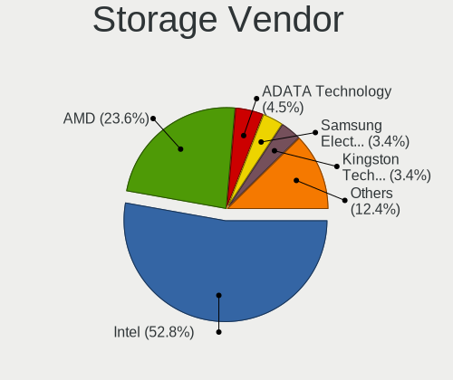
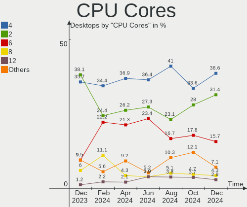
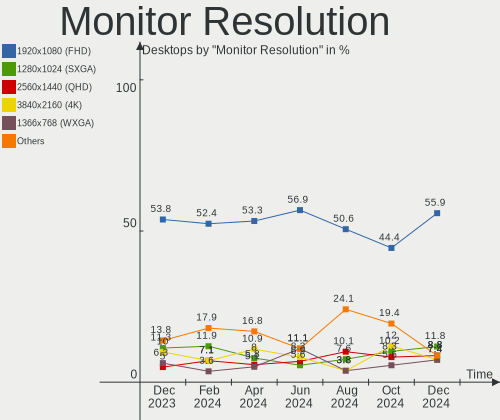
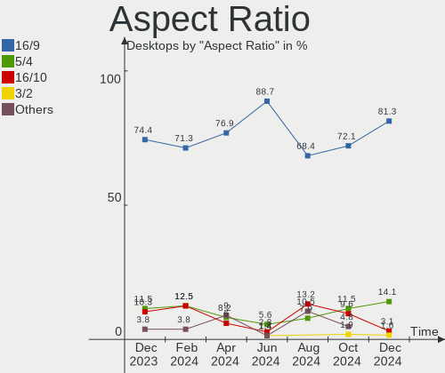

ROSA - Hardware Trends (Desktops)
---------------------------------

A project to identify most popular hardware characteristics and track their change
over time based on data collected by Linux users at https://Linux-Hardware.org.

Anyone can contribute to this report by the [hw-probe](https://github.com/linuxhw/hw-probe) tool:

    sudo -E hw-probe -all -upload

This report is for one last month. Overall report since the beginning of time: [TestDays](https://github.com/linuxhw/TestDays)

Period: May, 2023.

Contents
--------

* [ System ](#system)
  - [ OS                       ](#os)
  - [ OS Family                ](#os-family)
  - [ Kernel                   ](#kernel)
  - [ Kernel Family            ](#kernel-family)
  - [ Kernel Major Ver.        ](#kernel-major-ver)
  - [ Arch                     ](#arch)
  - [ DE                       ](#de)
  - [ Display Server           ](#display-server)
  - [ Display Manager          ](#display-manager)
  - [ OS Lang                  ](#os-lang)
  - [ Boot Mode                ](#boot-mode)
  - [ Filesystem               ](#filesystem)
  - [ Part. scheme             ](#part-scheme)
  - [ Dual Boot with Linux/BSD ](#dual-boot-with-linuxbsd)
  - [ Dual Boot (Win)          ](#dual-boot-win)

* [ Board ](#board)
  - [ Vendor                   ](#vendor)
  - [ Model                    ](#model)
  - [ Model Family             ](#model-family)
  - [ MFG Year                 ](#mfg-year)
  - [ Form Factor              ](#form-factor)
  - [ Secure Boot              ](#secure-boot)
  - [ Coreboot                 ](#coreboot)
  - [ RAM Size                 ](#ram-size)
  - [ RAM Used                 ](#ram-used)
  - [ Total Drives             ](#total-drives)
  - [ Has CD-ROM               ](#has-cd-rom)
  - [ Has Ethernet             ](#has-ethernet)
  - [ Has WiFi                 ](#has-wifi)
  - [ Has Bluetooth            ](#has-bluetooth)

* [ Location ](#location)
  - [ Country                  ](#country)
  - [ City                     ](#city)

* [ Drives ](#drives)
  - [ Drive Vendor             ](#drive-vendor)
  - [ Drive Model              ](#drive-model)
  - [ HDD Vendor               ](#hdd-vendor)
  - [ SSD Vendor               ](#ssd-vendor)
  - [ Drive Kind               ](#drive-kind)
  - [ Drive Connector          ](#drive-connector)
  - [ Drive Size               ](#drive-size)
  - [ Space Total              ](#space-total)
  - [ Space Used               ](#space-used)
  - [ Malfunc. Drives          ](#malfunc-drives)
  - [ Malfunc. Drive Vendor    ](#malfunc-drive-vendor)
  - [ Malfunc. HDD Vendor      ](#malfunc-hdd-vendor)
  - [ Malfunc. Drive Kind      ](#malfunc-drive-kind)
  - [ Failed Drives            ](#failed-drives)
  - [ Failed Drive Vendor      ](#failed-drive-vendor)
  - [ Drive Status             ](#drive-status)

* [ Storage controller ](#storage-controller)
  - [ Storage Vendor           ](#storage-vendor)
  - [ Storage Model            ](#storage-model)
  - [ Storage Kind             ](#storage-kind)

* [ Processor ](#processor)
  - [ CPU Vendor               ](#cpu-vendor)
  - [ CPU Model                ](#cpu-model)
  - [ CPU Model Family         ](#cpu-model-family)
  - [ CPU Cores                ](#cpu-cores)
  - [ CPU Sockets              ](#cpu-sockets)
  - [ CPU Threads              ](#cpu-threads)
  - [ CPU Op-Modes             ](#cpu-op-modes)
  - [ CPU Microcode            ](#cpu-microcode)
  - [ CPU Microarch            ](#cpu-microarch)

* [ Graphics ](#graphics)
  - [ GPU Vendor               ](#gpu-vendor)
  - [ GPU Model                ](#gpu-model)
  - [ GPU Combo                ](#gpu-combo)
  - [ GPU Driver               ](#gpu-driver)
  - [ GPU Memory               ](#gpu-memory)

* [ Monitor ](#monitor)
  - [ Monitor Vendor           ](#monitor-vendor)
  - [ Monitor Model            ](#monitor-model)
  - [ Monitor Resolution       ](#monitor-resolution)
  - [ Monitor Diagonal         ](#monitor-diagonal)
  - [ Monitor Width            ](#monitor-width)
  - [ Aspect Ratio             ](#aspect-ratio)
  - [ Monitor Area             ](#monitor-area)
  - [ Pixel Density            ](#pixel-density)
  - [ Multiple Monitors        ](#multiple-monitors)

* [ Network ](#network)
  - [ Net Controller Vendor    ](#net-controller-vendor)
  - [ Net Controller Model     ](#net-controller-model)
  - [ Wireless Vendor          ](#wireless-vendor)
  - [ Wireless Model           ](#wireless-model)
  - [ Ethernet Vendor          ](#ethernet-vendor)
  - [ Ethernet Model           ](#ethernet-model)
  - [ Net Controller Kind      ](#net-controller-kind)
  - [ Used Controller          ](#used-controller)
  - [ NICs                     ](#nics)
  - [ IPv6                     ](#ipv6)

* [ Bluetooth ](#bluetooth)
  - [ Bluetooth Vendor         ](#bluetooth-vendor)
  - [ Bluetooth Model          ](#bluetooth-model)

* [ Sound ](#sound)
  - [ Sound Vendor             ](#sound-vendor)
  - [ Sound Model              ](#sound-model)

* [ Memory ](#memory)
  - [ Memory Vendor            ](#memory-vendor)
  - [ Memory Model             ](#memory-model)
  - [ Memory Kind              ](#memory-kind)
  - [ Memory Form Factor       ](#memory-form-factor)
  - [ Memory Size              ](#memory-size)
  - [ Memory Speed             ](#memory-speed)

* [ Printers & scanners ](#printers--scanners)
  - [ Printer Vendor           ](#printer-vendor)
  - [ Printer Model            ](#printer-model)
  - [ Scanner Vendor           ](#scanner-vendor)
  - [ Scanner Model            ](#scanner-model)

* [ Camera ](#camera)
  - [ Camera Vendor            ](#camera-vendor)
  - [ Camera Model             ](#camera-model)

* [ Security ](#security)
  - [ Fingerprint Vendor       ](#fingerprint-vendor)
  - [ Fingerprint Model        ](#fingerprint-model)
  - [ Chipcard Vendor          ](#chipcard-vendor)
  - [ Chipcard Model           ](#chipcard-model)

* [ Unsupported ](#unsupported)
  - [ Unsupported Devices      ](#unsupported-devices)
  - [ Unsupported Device Types ](#unsupported-device-types)

System
------

OS
--

Installed operating systems

| Name        | Desktops | Percent |
|-------------|----------|---------|
| ROSA 12.4   | 85       | 76.58%  |
| ROSA 12.3   | 11       | 9.91%   |
| ROSA R11.1  | 6        | 5.41%   |
| ROSA 13.0   | 2        | 1.8%    |
| ROSA 12.1   | 2        | 1.8%    |
| ROSA 12     | 2        | 1.8%    |
| ROSA R11    | 1        | 0.9%    |
| ROSA 2021.1 | 1        | 0.9%    |
| ROSA 12.2   | 1        | 0.9%    |

OS Family
---------

OS without a version

| Name | Desktops | Percent |
|------|----------|---------|
| ROSA | 111      | 100%    |

Kernel
------

Version of the Linux kernel

| Version                                   | Desktops | Percent |
|-------------------------------------------|----------|---------|
| 6.1.20-generic-2rosa2021.1-x86_64         | 64       | 57.66%  |
| 5.15.103-generic-1rosa2021.1-x86_64       | 8        | 7.21%   |
| 5.10.176-generic-1rosa2021.1-x86_64       | 6        | 5.41%   |
| 5.15.75-generic-1rosa2021.1-x86_64        | 5        | 4.5%    |
| 5.10.74-generic-2rosa2021.1-x86_64        | 3        | 2.7%    |
| 6.2.12.xm1-1.klp-xanmod-rosa2021.1-x86_64 | 2        | 1.8%    |
| 6.1.30.xm1-1.klp-xanmod-rosa2021.1-x86_64 | 2        | 1.8%    |
| 5.17.11-generic-2rosa2021.1-x86_64        | 2        | 1.8%    |
| 5.15.75-generic-1rosa2021.1-i686          | 2        | 1.8%    |
| 5.10.155-generic-1rosa2021.1-x86_64       | 2        | 1.8%    |
| 4.15.0-desktop-122.124.1rosa-x86_64       | 2        | 1.8%    |
| 6.3.1.xm1-1.klp-xanmod-rosa2021.1-x86_64  | 1        | 0.9%    |
| 6.3.1-generic-1rosa2021.1-x86_64          | 1        | 0.9%    |
| 6.1.29-generic-1rosa2023.1-x86_64         | 1        | 0.9%    |
| 6.1.27-generic-1rosa2023.1-x86_64         | 1        | 0.9%    |
| 6.0.12.xm1-1.klp-xanmod-rosa2021.1-x86_64 | 1        | 0.9%    |
| 5.4.83-generic-2rosa-x86_64               | 1        | 0.9%    |
| 5.4.83-generic-2rosa-i586                 | 1        | 0.9%    |
| 5.15.79-generic-1rosa2021.1-x86_64        | 1        | 0.9%    |
| 5.10.71-generic-1rosa2021.1-x86_64        | 1        | 0.9%    |
| 5.10.176-generic-1rosa2021.1-i586         | 1        | 0.9%    |
| 5.0.0-desktop-38.1rosa-x86_64             | 1        | 0.9%    |
| 4.15.0-desktop-45.1rosa-x86_64            | 1        | 0.9%    |
| 4.15.0-desktop-122.124.1rosa-i586         | 1        | 0.9%    |

Kernel Family
-------------

Linux kernel without a distro release

| Version  | Desktops | Percent |
|----------|----------|---------|
| 6.1.20   | 64       | 57.66%  |
| 5.15.103 | 8        | 7.21%   |
| 5.15.75  | 7        | 6.31%   |
| 5.10.176 | 7        | 6.31%   |
| 4.15.0   | 4        | 3.6%    |
| 5.10.74  | 3        | 2.7%    |
| 6.3.1    | 2        | 1.8%    |
| 6.2.12   | 2        | 1.8%    |
| 6.1.30   | 2        | 1.8%    |
| 5.4.83   | 2        | 1.8%    |
| 5.17.11  | 2        | 1.8%    |
| 5.10.155 | 2        | 1.8%    |
| 6.1.29   | 1        | 0.9%    |
| 6.1.27   | 1        | 0.9%    |
| 6.0.12   | 1        | 0.9%    |
| 5.15.79  | 1        | 0.9%    |
| 5.10.71  | 1        | 0.9%    |
| 5.0.0    | 1        | 0.9%    |

Kernel Major Ver.
-----------------

Linux kernel major version

| Version | Desktops | Percent |
|---------|----------|---------|
| 6.1     | 68       | 61.26%  |
| 5.15    | 16       | 14.41%  |
| 5.10    | 13       | 11.71%  |
| 4.15    | 4        | 3.6%    |
| 6.3     | 2        | 1.8%    |
| 6.2     | 2        | 1.8%    |
| 5.4     | 2        | 1.8%    |
| 5.17    | 2        | 1.8%    |
| 6.0     | 1        | 0.9%    |
| 5.0     | 1        | 0.9%    |

Arch
----

OS architecture (x86_64, i586, etc.)

| Name   | Desktops | Percent |
|--------|----------|---------|
| x86_64 | 106      | 95.5%   |
| i686   | 5        | 4.5%    |

DE
--

Desktop Environment

| Name  | Desktops | Percent |
|-------|----------|---------|
| KDE5  | 63       | 56.76%  |
| GNOME | 31       | 27.93%  |
| LXQt  | 10       | 9.01%   |
| KDE4  | 6        | 5.41%   |
| XFCE  | 1        | 0.9%    |

Display Server
--------------

X11 or Wayland

| Name    | Desktops | Percent |
|---------|----------|---------|
| Wayland | 80       | 72.07%  |
| X11     | 31       | 27.93%  |

Display Manager
---------------

SDDM, LightDM, etc.

| Name    | Desktops | Percent |
|---------|----------|---------|
| SDDM    | 60       | 54.05%  |
| GDM     | 41       | 36.94%  |
| KDM     | 6        | 5.41%   |
| LightDM | 3        | 2.7%    |
| Unknown | 1        | 0.9%    |

OS Lang
-------

Language

| Lang    | Desktops | Percent |
|---------|----------|---------|
| ru_RU   | 99       | 89.19%  |
| de_DE   | 3        | 2.7%    |
| en_US   | 2        | 1.8%    |
| tr_TR   | 1        | 0.9%    |
| pt_PT   | 1        | 0.9%    |
| pt_BR   | 1        | 0.9%    |
| it_IT   | 1        | 0.9%    |
| es_MX   | 1        | 0.9%    |
| es_ES   | 1        | 0.9%    |
| Unknown | 1        | 0.9%    |

Boot Mode
---------

EFI or BIOS

| Mode | Desktops | Percent |
|------|----------|---------|
| EFI  | 56       | 50.45%  |
| BIOS | 55       | 49.55%  |

Filesystem
----------

Type of filesystem

| Type  | Desktops | Percent |
|-------|----------|---------|
| Ext4  | 103      | 92.79%  |
| Btrfs | 7        | 6.31%   |
| F2fs  | 1        | 0.9%    |

Part. scheme
------------

Scheme of partitioning

| Type    | Desktops | Percent |
|---------|----------|---------|
| GPT     | 73       | 65.77%  |
| MBR     | 37       | 33.33%  |
| Unknown | 1        | 0.9%    |

Dual Boot with Linux/BSD
------------------------

Hosting more than one Linux/BSD

| Dual boot | Desktops | Percent |
|-----------|----------|---------|
| No        | 79       | 71.17%  |
| Yes       | 32       | 28.83%  |

Dual Boot (Win)
---------------

Hosting Linux and Windows

| Dual boot | Desktops | Percent |
|-----------|----------|---------|
| No        | 60       | 54.05%  |
| Yes       | 51       | 45.95%  |

Board
-----

Vendor
------

Motherboard manufacturer

| Name                | Desktops | Percent |
|---------------------|----------|---------|
| ASUSTek Computer    | 35       | 31.53%  |
| Gigabyte Technology | 33       | 29.73%  |
| ASRock              | 13       | 11.71%  |
| MSI                 | 11       | 9.91%   |
| Acer                | 4        | 3.6%    |
| OEM                 | 2        | 1.8%    |
| Intel               | 2        | 1.8%    |
| Hewlett-Packard     | 2        | 1.8%    |
| Biostar             | 2        | 1.8%    |
| Unknown             | 2        | 1.8%    |
| MACHINIST           | 1        | 0.9%    |
| Lenovo              | 1        | 0.9%    |
| Huanan              | 1        | 0.9%    |
| ECS                 | 1        | 0.9%    |
| Dell                | 1        | 0.9%    |

Model
-----

Motherboard model

| Name                            | Desktops | Percent |
|---------------------------------|----------|---------|
| ASUS All Series                 | 5        | 4.5%    |
| ASRock B450 Gaming K4           | 3        | 2.7%    |
| Gigabyte B550 AORUS PRO AC      | 2        | 1.8%    |
| Gigabyte B450M S2H              | 2        | 1.8%    |
| Unknown                         | 2        | 1.8%    |
| OEM X99-Turbo                   | 1        | 0.9%    |
| OEM X79G                        | 1        | 0.9%    |
| MSI MS-7D25                     | 1        | 0.9%    |
| MSI MS-7D18                     | 1        | 0.9%    |
| MSI MS-7C37                     | 1        | 0.9%    |
| MSI MS-7B17                     | 1        | 0.9%    |
| MSI MS-7A38                     | 1        | 0.9%    |
| MSI MS-7A33                     | 1        | 0.9%    |
| MSI MS-7A15                     | 1        | 0.9%    |
| MSI MS-7970                     | 1        | 0.9%    |
| MSI MS-7599                     | 1        | 0.9%    |
| MSI MS-7597                     | 1        | 0.9%    |
| MSI MS-7592                     | 1        | 0.9%    |
| MACHINIST E5-RS9 V1.11          | 1        | 0.9%    |
| Lenovo ThinkCentre M71e 3176RV9 | 1        | 0.9%    |
| Intel DG41WV AAE90316-101       | 1        | 0.9%    |
| Intel B75                       | 1        | 0.9%    |
| Huanan X99 F8D V2.2             | 1        | 0.9%    |
| HP Z420 Workstation             | 1        | 0.9%    |
| HP Compaq Pro 6300 SFF          | 1        | 0.9%    |
| Gigabyte Z68MA-D2H-B3           | 1        | 0.9%    |
| Gigabyte H97M-D3H               | 1        | 0.9%    |
| Gigabyte H81M-S1                | 1        | 0.9%    |
| Gigabyte H61M-S2PH              | 1        | 0.9%    |
| Gigabyte H61M-S1                | 1        | 0.9%    |
| Gigabyte H55M-S2H               | 1        | 0.9%    |
| Gigabyte H510M H                | 1        | 0.9%    |
| Gigabyte H410M H V3             | 1        | 0.9%    |
| Gigabyte H310M S2H 2.0          | 1        | 0.9%    |
| Gigabyte GA-MA770T-UD3          | 1        | 0.9%    |
| Gigabyte GA-MA770-US3           | 1        | 0.9%    |
| Gigabyte GA-E240N               | 1        | 0.9%    |
| Gigabyte GA-A55M-S2HP           | 1        | 0.9%    |
| Gigabyte GA-970A-UD3            | 1        | 0.9%    |
| Gigabyte GA-970A-D3             | 1        | 0.9%    |

Model Family
------------

Motherboard model prefix

| Name                  | Desktops | Percent |
|-----------------------|----------|---------|
| ASUS PRIME            | 6        | 5.41%   |
| ASUS All              | 5        | 4.5%    |
| ASUS TUF              | 4        | 3.6%    |
| ASUS ROG              | 3        | 2.7%    |
| ASUS P8H61-M          | 3        | 2.7%    |
| ASRock B450           | 3        | 2.7%    |
| Acer Aspire           | 3        | 2.7%    |
| Gigabyte B550         | 2        | 1.8%    |
| Gigabyte B450M        | 2        | 1.8%    |
| ASUS Maximus          | 2        | 1.8%    |
| Unknown               | 2        | 1.8%    |
| OEM X99-Turbo         | 1        | 0.9%    |
| OEM X79G              | 1        | 0.9%    |
| MSI MS-7D25           | 1        | 0.9%    |
| MSI MS-7D18           | 1        | 0.9%    |
| MSI MS-7C37           | 1        | 0.9%    |
| MSI MS-7B17           | 1        | 0.9%    |
| MSI MS-7A38           | 1        | 0.9%    |
| MSI MS-7A33           | 1        | 0.9%    |
| MSI MS-7A15           | 1        | 0.9%    |
| MSI MS-7970           | 1        | 0.9%    |
| MSI MS-7599           | 1        | 0.9%    |
| MSI MS-7597           | 1        | 0.9%    |
| MSI MS-7592           | 1        | 0.9%    |
| MACHINIST E5-RS9      | 1        | 0.9%    |
| Lenovo ThinkCentre    | 1        | 0.9%    |
| Intel DG41WV          | 1        | 0.9%    |
| Intel B75             | 1        | 0.9%    |
| Huanan X99            | 1        | 0.9%    |
| HP Z420               | 1        | 0.9%    |
| HP Compaq             | 1        | 0.9%    |
| Gigabyte Z68MA-D2H-B3 | 1        | 0.9%    |
| Gigabyte H97M-D3H     | 1        | 0.9%    |
| Gigabyte H81M-S1      | 1        | 0.9%    |
| Gigabyte H61M-S2PH    | 1        | 0.9%    |
| Gigabyte H61M-S1      | 1        | 0.9%    |
| Gigabyte H55M-S2H     | 1        | 0.9%    |
| Gigabyte H510M        | 1        | 0.9%    |
| Gigabyte H410M        | 1        | 0.9%    |
| Gigabyte H310M        | 1        | 0.9%    |

MFG Year
--------

Motherboard manufacture year

| Year | Desktops | Percent |
|------|----------|---------|
| 2012 | 16       | 14.41%  |
| 2018 | 12       | 10.81%  |
| 2021 | 11       | 9.91%   |
| 2011 | 10       | 9.01%   |
| 2013 | 9        | 8.11%   |
| 2020 | 8        | 7.21%   |
| 2009 | 8        | 7.21%   |
| 2010 | 7        | 6.31%   |
| 2014 | 6        | 5.41%   |
| 2022 | 5        | 4.5%    |
| 2019 | 5        | 4.5%    |
| 2016 | 4        | 3.6%    |
| 2017 | 3        | 2.7%    |
| 2015 | 3        | 2.7%    |
| 2007 | 2        | 1.8%    |
| 2023 | 1        | 0.9%    |
| 2006 | 1        | 0.9%    |

Form Factor
-----------

Physical design of the computer

| Name    | Desktops | Percent |
|---------|----------|---------|
| Desktop | 111      | 100%    |

Secure Boot
-----------

Enabled or disabled

| State    | Desktops | Percent |
|----------|----------|---------|
| Disabled | 111      | 100%    |

Coreboot
--------

Have coreboot on board

| Used | Desktops | Percent |
|------|----------|---------|
| No   | 111      | 100%    |

RAM Size
--------

Total RAM memory

| Size in GB  | Desktops | Percent |
|-------------|----------|---------|
| 8.01-16.0   | 32       | 28.83%  |
| 16.01-24.0  | 29       | 26.13%  |
| 4.01-8.0    | 19       | 17.12%  |
| 32.01-64.0  | 13       | 11.71%  |
| 3.01-4.0    | 12       | 10.81%  |
| 64.01-256.0 | 4        | 3.6%    |
| 24.01-32.0  | 1        | 0.9%    |
| 0.51-1.0    | 1        | 0.9%    |

RAM Used
--------

Used RAM memory

| Used GB   | Desktops | Percent |
|-----------|----------|---------|
| 1.01-2.0  | 56       | 50.45%  |
| 2.01-3.0  | 28       | 25.23%  |
| 0.51-1.0  | 12       | 10.81%  |
| 4.01-8.0  | 7        | 6.31%   |
| 3.01-4.0  | 6        | 5.41%   |
| 8.01-16.0 | 2        | 1.8%    |

Total Drives
------------

Number of drives on board

| Drives | Desktops | Percent |
|--------|----------|---------|
| 2      | 38       | 34.23%  |
| 1      | 38       | 34.23%  |
| 3      | 23       | 20.72%  |
| 4      | 7        | 6.31%   |
| 5      | 4        | 3.6%    |
| 6      | 1        | 0.9%    |

Has CD-ROM
----------

Has CD-ROM on board

| Presented | Desktops | Percent |
|-----------|----------|---------|
| No        | 76       | 68.47%  |
| Yes       | 35       | 31.53%  |

Has Ethernet
------------

Has Ethernet on board

| Presented | Desktops | Percent |
|-----------|----------|---------|
| Yes       | 111      | 100%    |

Has WiFi
--------

Has WiFi module

| Presented | Desktops | Percent |
|-----------|----------|---------|
| No        | 73       | 65.77%  |
| Yes       | 38       | 34.23%  |

Has Bluetooth
-------------

Has Bluetooth module

| Presented | Desktops | Percent |
|-----------|----------|---------|
| No        | 86       | 77.48%  |
| Yes       | 25       | 22.52%  |

Location
--------

Country
-------

Geographic location (country)

| Country | Desktops | Percent |
|---------|----------|---------|
| Russia  | 93       | 83.78%  |
| Ukraine | 3        | 2.7%    |
| Germany | 3        | 2.7%    |
| Belarus | 3        | 2.7%    |
| USA     | 2        | 1.8%    |
| Brazil  | 2        | 1.8%    |
| Turkey  | 1        | 0.9%    |
| Spain   | 1        | 0.9%    |
| Mexico  | 1        | 0.9%    |
| Italy   | 1        | 0.9%    |
| Czechia | 1        | 0.9%    |

City
----

Geographic location (city)

| City          | Desktops | Percent |
|---------------|----------|---------|
| Moscow        | 19       | 17.12%  |
| St Petersburg | 7        | 6.31%   |
| Krasnodar     | 5        | 4.5%    |
| Yekaterinburg | 4        | 3.6%    |
| Kanevskaya    | 3        | 2.7%    |
| Volgograd     | 2        | 1.8%    |
| Tyumen        | 2        | 1.8%    |
| Saransk       | 2        | 1.8%    |
| Samara        | 2        | 1.8%    |
| Rostov-on-Don | 2        | 1.8%    |
| Orenburg      | 2        | 1.8%    |
| Omsk          | 2        | 1.8%    |
| Novosibirsk   | 2        | 1.8%    |
| Kirov         | 2        | 1.8%    |
| Khabarovsk    | 2        | 1.8%    |
| Bryansk       | 2        | 1.8%    |
| Zlatoust      | 1        | 0.9%    |
| Zhabinka      | 1        | 0.9%    |
| Zelenodolsk   | 1        | 0.9%    |
| Voronezh      | 1        | 0.9%    |
| Volgodonsk    | 1        | 0.9%    |
| Vladimir      | 1        | 0.9%    |
| Valley Stream | 1        | 0.9%    |
| Ulyanovsk     | 1        | 0.9%    |
| Troitsk       | 1        | 0.9%    |
| Tomsk         | 1        | 0.9%    |
| Tolyatti      | 1        | 0.9%    |
| Tambov        | 1        | 0.9%    |
| Simferopol    | 1        | 0.9%    |
| Shakhty       | 1        | 0.9%    |
| Sevastopol    | 1        | 0.9%    |
| Rome          | 1        | 0.9%    |
| Prague        | 1        | 0.9%    |
| Podolsk       | 1        | 0.9%    |
| Poa           | 1        | 0.9%    |
| Pinsk         | 1        | 0.9%    |
| Perm          | 1        | 0.9%    |
| Oryol         | 1        | 0.9%    |
| Oronogo       | 1        | 0.9%    |
| Novy Urengoy  | 1        | 0.9%    |

Drives
------

Drive Vendor
------------

Hard drive vendors

| Vendor              | Desktops | Drives | Percent |
|---------------------|----------|--------|---------|
| WDC                 | 39       | 52     | 18.57%  |
| Seagate             | 34       | 41     | 16.19%  |
| Samsung Electronics | 21       | 27     | 10%     |
| Kingston            | 13       | 13     | 6.19%   |
| Toshiba             | 12       | 13     | 5.71%   |
| Hitachi             | 9        | 9      | 4.29%   |
| Crucial             | 7        | 7      | 3.33%   |
| KingSpec            | 5        | 5      | 2.38%   |
| AMD                 | 5        | 5      | 2.38%   |
| Intel               | 4        | 4      | 1.9%    |
| HGST                | 4        | 4      | 1.9%    |
| A-DATA Technology   | 4        | 4      | 1.9%    |
| SPCC                | 3        | 4      | 1.43%   |
| Smartbuy            | 3        | 3      | 1.43%   |
| SanDisk             | 3        | 3      | 1.43%   |
| China               | 3        | 3      | 1.43%   |
| Apacer              | 3        | 3      | 1.43%   |
| XPG                 | 2        | 2      | 0.95%   |
| Unknown             | 2        | 2      | 0.95%   |
| Silicon Motion      | 2        | 2      | 0.95%   |
| Patriot             | 2        | 2      | 0.95%   |
| Maxtor              | 2        | 2      | 0.95%   |
| Hewlett-Packard     | 2        | 3      | 0.95%   |
| Gigabyte Technology | 2        | 2      | 0.95%   |
| Colorful            | 2        | 2      | 0.95%   |
| Unknown             | 2        | 2      | 0.95%   |
| ZM-SSD              | 1        | 1      | 0.48%   |
| ZHITAI              | 1        | 1      | 0.48%   |
| XrayDisk            | 1        | 1      | 0.48%   |
| Transcend           | 1        | 1      | 0.48%   |
| StoreJet            | 1        | 1      | 0.48%   |
| SK hynix            | 1        | 1      | 0.48%   |
| Plextor             | 1        | 1      | 0.48%   |
| ORICO               | 1        | 1      | 0.48%   |
| OCZ                 | 1        | 1      | 0.48%   |
| NGFF                | 1        | 1      | 0.48%   |
| Netac               | 1        | 1      | 0.48%   |
| MSI                 | 1        | 1      | 0.48%   |
| KingDian            | 1        | 1      | 0.48%   |
| JAMESDONKEY         | 1        | 1      | 0.48%   |

Drive Model
-----------

Hard drive models

| Model                            | Desktops | Percent |
|----------------------------------|----------|---------|
| WDC WD10EZEX-08WN4A0 1TB         | 4        | 1.7%    |
| Seagate ST500DM002-1BD142 500GB  | 4        | 1.7%    |
| Seagate ST1000DM010-2EP102 1TB   | 4        | 1.7%    |
| WDC WD5000AAKX-00ERMA0 500GB     | 3        | 1.28%   |
| WDC WD10EZEX-00BBHA0 1TB         | 3        | 1.28%   |
| Toshiba HDWD110 1TB              | 3        | 1.28%   |
| Kingston SA400S37240G 240GB SSD  | 3        | 1.28%   |
| Kingston SA400S37120G 120GB SSD  | 3        | 1.28%   |
| KingSpec P3-128 128GB SSD        | 3        | 1.28%   |
| Crucial CT240BX500SSD1 240GB     | 3        | 1.28%   |
| WDC WDS240G2G0A-00JH30 240GB SSD | 2        | 0.85%   |
| WDC WDS100T2B0C-00PXH0 1TB       | 2        | 0.85%   |
| WDC WD10EZEX-00RKKA0 1TB         | 2        | 0.85%   |
| Toshiba DT01ACA100 1TB           | 2        | 0.85%   |
| Toshiba DT01ACA050 500GB         | 2        | 0.85%   |
| Seagate ST3250310AS 250GB        | 2        | 0.85%   |
| Seagate ST2000DM005-2CW102 2TB   | 2        | 0.85%   |
| Seagate ST1000DM003-1CH162 1TB   | 2        | 0.85%   |
| Samsung SSD 970 EVO Plus 500GB   | 2        | 0.85%   |
| Samsung SSD 870 EVO 250GB        | 2        | 0.85%   |
| Samsung HM321HI 320GB            | 2        | 0.85%   |
| China SSD 128GB                  | 2        | 0.85%   |
| Unknown                          | 2        | 0.85%   |
| ZM-SSD SSD 256GB                 | 1        | 0.43%   |
| ZHITAI SC001 Active 256GB SSD    | 1        | 0.43%   |
| XrayDisk 512GB SSD               | 1        | 0.43%   |
| XPG GAMMIX S5 512GB              | 1        | 0.43%   |
| XPG GAMMIX S11 Pro 512GB         | 1        | 0.43%   |
| WDC WDS500G2B0A-00SM50 500GB SSD | 1        | 0.43%   |
| WDC WDS500G2B0A 500GB SSD        | 1        | 0.43%   |
| WDC WDS240G2G0B-00EPW0 240GB SSD | 1        | 0.43%   |
| WDC WD80EDAZ-11TA3A0 8TB         | 1        | 0.43%   |
| WDC WD800JD-00MSA1 80GB          | 1        | 0.43%   |
| WDC WD800JD-00HKA0 80GB          | 1        | 0.43%   |
| WDC WD7500AADS-00M2B0 752GB      | 1        | 0.43%   |
| WDC WD5000LPCX-75VHAT0 500GB     | 1        | 0.43%   |
| WDC WD5000HHTZ-04N21V0 500GB     | 1        | 0.43%   |
| WDC WD5000AZLX-00CL5A0 500GB     | 1        | 0.43%   |
| WDC WD5000AAKX-001CA0 500GB      | 1        | 0.43%   |
| WDC WD5000AAKS-00V6A0 500GB      | 1        | 0.43%   |

HDD Vendor
----------

Hard disk drive vendors

| Vendor              | Desktops | Drives | Percent |
|---------------------|----------|--------|---------|
| WDC                 | 36       | 45     | 35.29%  |
| Seagate             | 32       | 39     | 31.37%  |
| Toshiba             | 12       | 13     | 11.76%  |
| Hitachi             | 9        | 9      | 8.82%   |
| Samsung Electronics | 6        | 6      | 5.88%   |
| HGST                | 4        | 4      | 3.92%   |
| Maxtor              | 2        | 2      | 1.96%   |
| Unknown             | 1        | 1      | 0.98%   |

SSD Vendor
----------

Solid state drive vendors

| Vendor              | Desktops | Drives | Percent |
|---------------------|----------|--------|---------|
| Kingston            | 11       | 11     | 13.1%   |
| Samsung Electronics | 10       | 12     | 11.9%   |
| Crucial             | 7        | 7      | 8.33%   |
| WDC                 | 5        | 5      | 5.95%   |
| KingSpec            | 5        | 5      | 5.95%   |
| AMD                 | 5        | 5      | 5.95%   |
| Smartbuy            | 3        | 3      | 3.57%   |
| SanDisk             | 3        | 3      | 3.57%   |
| Intel               | 3        | 3      | 3.57%   |
| China               | 3        | 3      | 3.57%   |
| SPCC                | 2        | 2      | 2.38%   |
| Hewlett-Packard     | 2        | 3      | 2.38%   |
| A-DATA Technology   | 2        | 2      | 2.38%   |
| Unknown             | 2        | 2      | 2.38%   |
| ZM-SSD              | 1        | 1      | 1.19%   |
| ZHITAI              | 1        | 1      | 1.19%   |
| XrayDisk            | 1        | 1      | 1.19%   |
| Unknown             | 1        | 1      | 1.19%   |
| StoreJet            | 1        | 1      | 1.19%   |
| Seagate             | 1        | 1      | 1.19%   |
| Plextor             | 1        | 1      | 1.19%   |
| Patriot             | 1        | 1      | 1.19%   |
| OCZ                 | 1        | 1      | 1.19%   |
| NGFF                | 1        | 1      | 1.19%   |
| Netac               | 1        | 1      | 1.19%   |
| KingDian            | 1        | 1      | 1.19%   |
| JAMESDONKEY         | 1        | 1      | 1.19%   |
| Intenso             | 1        | 2      | 1.19%   |
| Gigabyte Technology | 1        | 1      | 1.19%   |
| Foxline             | 1        | 1      | 1.19%   |
| e2e4                | 1        | 1      | 1.19%   |
| Corsair             | 1        | 1      | 1.19%   |
| Colorful            | 1        | 1      | 1.19%   |
| Biostar             | 1        | 1      | 1.19%   |
| Apacer              | 1        | 1      | 1.19%   |

Drive Kind
----------

HDD or SSD

| Kind | Desktops | Drives | Percent |
|------|----------|--------|---------|
| HDD  | 81       | 119    | 45.25%  |
| SSD  | 70       | 88     | 39.11%  |
| NVMe | 28       | 33     | 15.64%  |

Drive Connector
---------------

SATA, SAS, NVMe, etc.

| Type | Desktops | Drives | Percent |
|------|----------|--------|---------|
| SATA | 105      | 203    | 76.64%  |
| NVMe | 28       | 33     | 20.44%  |
| SAS  | 4        | 4      | 2.92%   |

Drive Size
----------

Size of hard drive

| Size in TB | Desktops | Drives | Percent |
|------------|----------|--------|---------|
| 0.01-0.5   | 92       | 130    | 59.35%  |
| 0.51-1.0   | 44       | 56     | 28.39%  |
| 1.01-2.0   | 11       | 12     | 7.1%    |
| 3.01-4.0   | 4        | 5      | 2.58%   |
| 2.01-3.0   | 2        | 2      | 1.29%   |
| 4.01-10.0  | 2        | 2      | 1.29%   |

Space Total
-----------

Amount of disk space available on the file system

| Size in GB     | Desktops | Percent |
|----------------|----------|---------|
| 101-250        | 38       | 34.23%  |
| 251-500        | 16       | 14.41%  |
| 501-1000       | 15       | 13.51%  |
| 1-20           | 11       | 9.91%   |
| More than 3000 | 8        | 7.21%   |
| 2001-3000      | 8        | 7.21%   |
| 51-100         | 7        | 6.31%   |
| 1001-2000      | 6        | 5.41%   |
| 21-50          | 2        | 1.8%    |

Space Used
----------

Amount of used disk space

| Used GB   | Desktops | Percent |
|-----------|----------|---------|
| 1-20      | 56       | 50.45%  |
| 21-50     | 16       | 14.41%  |
| 101-250   | 12       | 10.81%  |
| 1001-2000 | 7        | 6.31%   |
| 251-500   | 6        | 5.41%   |
| 501-1000  | 6        | 5.41%   |
| 51-100    | 5        | 4.5%    |
| 2001-3000 | 3        | 2.7%    |

Malfunc. Drives
---------------

Drive models with a malfunction

| Model                               | Desktops | Drives | Percent |
|-------------------------------------|----------|--------|---------|
| WDC WD10EZEX-00RKKA0 1TB            | 2        | 2      | 4%      |
| Toshiba DT01ACA100 1TB              | 2        | 2      | 4%      |
| Seagate ST3250310AS 250GB           | 2        | 2      | 4%      |
| Samsung Electronics HM321HI 320GB   | 2        | 2      | 4%      |
| XrayDisk 512GB SSD                  | 1        | 1      | 2%      |
| XPG GAMMIX S5 512GB                 | 1        | 1      | 2%      |
| WDC WDS240G2G0B-00EPW0 240GB SSD    | 1        | 1      | 2%      |
| WDC WD800JD-00MSA1 80GB             | 1        | 1      | 2%      |
| WDC WD800JD-00HKA0 80GB             | 1        | 1      | 2%      |
| WDC WD7500AADS-00M2B0 752GB         | 1        | 1      | 2%      |
| WDC WD5000AAKX-00ERMA0 500GB        | 1        | 1      | 2%      |
| WDC WD5000AAKX-001CA0 500GB         | 1        | 1      | 2%      |
| WDC WD5000AAKS-00V6A0 500GB         | 1        | 1      | 2%      |
| WDC WD3200BPVT-00JJ5T0 320GB        | 1        | 1      | 2%      |
| WDC WD3200AAJS-56B4A0 320GB         | 1        | 1      | 2%      |
| WDC WD3200AAJS-00YZCA0 320GB        | 1        | 1      | 2%      |
| WDC WD2500BEVT-60ZCT1 250GB         | 1        | 1      | 2%      |
| WDC WD2500AAKX-001CA0 250GB         | 1        | 1      | 2%      |
| WDC WD2500AAKS-00UU3A0 250GB        | 1        | 1      | 2%      |
| WDC WD2005FBYZ-01YCBB3 2TB          | 1        | 1      | 2%      |
| WDC WD10JPVX-60JC3T0 1TB            | 1        | 1      | 2%      |
| WDC WD10EFRX-68PJCN0 1TB            | 1        | 1      | 2%      |
| Toshiba MQ01ABD075 752GB            | 1        | 1      | 2%      |
| Toshiba MK6459GSXP 640GB            | 1        | 1      | 2%      |
| Toshiba MK3276GSX -63 320GB         | 1        | 1      | 2%      |
| Toshiba HDWD105 500GB               | 1        | 1      | 2%      |
| Toshiba DT01ACA050 500GB            | 1        | 1      | 2%      |
| Smartbuy SSD 240GB                  | 1        | 1      | 2%      |
| Seagate ST500NM0011 500GB           | 1        | 1      | 2%      |
| Seagate ST3500413AS 500GB           | 1        | 1      | 2%      |
| Seagate ST3320613AS 320GB           | 1        | 1      | 2%      |
| Seagate ST3320418AS 320GB           | 1        | 1      | 2%      |
| Seagate ST1000DM003-9YN162 1TB      | 1        | 1      | 2%      |
| Seagate ST1000DM003-1CH162 1TB      | 1        | 1      | 2%      |
| Samsung Electronics SSD 970 EVO 1TB | 1        | 1      | 2%      |
| Samsung Electronics HD502IJ 500GB   | 1        | 1      | 2%      |
| ORICO V500 128GB                    | 1        | 1      | 2%      |
| Netac SSD 240GB                     | 1        | 1      | 2%      |
| Intel SSDSC2KW480H6 480GB           | 1        | 1      | 2%      |
| Intel SSDSC2CT180A3 180GB           | 1        | 1      | 2%      |

Malfunc. Drive Vendor
---------------------

Vendors of faulty drives

| Vendor              | Desktops | Drives | Percent |
|---------------------|----------|--------|---------|
| WDC                 | 14       | 18     | 31.11%  |
| Toshiba             | 7        | 7      | 15.56%  |
| Seagate             | 7        | 8      | 15.56%  |
| Samsung Electronics | 4        | 4      | 8.89%   |
| Intel               | 2        | 2      | 4.44%   |
| AMD                 | 2        | 2      | 4.44%   |
| XrayDisk            | 1        | 1      | 2.22%   |
| XPG                 | 1        | 1      | 2.22%   |
| Smartbuy            | 1        | 1      | 2.22%   |
| ORICO               | 1        | 1      | 2.22%   |
| Netac               | 1        | 1      | 2.22%   |
| Hitachi             | 1        | 1      | 2.22%   |
| HGST                | 1        | 1      | 2.22%   |
| Hewlett-Packard     | 1        | 1      | 2.22%   |
| Unknown             | 1        | 1      | 2.22%   |

Malfunc. HDD Vendor
-------------------

Vendors of faulty HDD drives

| Vendor              | Desktops | Drives | Percent |
|---------------------|----------|--------|---------|
| WDC                 | 14       | 17     | 42.42%  |
| Toshiba             | 7        | 7      | 21.21%  |
| Seagate             | 7        | 8      | 21.21%  |
| Samsung Electronics | 3        | 3      | 9.09%   |
| Hitachi             | 1        | 1      | 3.03%   |
| HGST                | 1        | 1      | 3.03%   |

Malfunc. Drive Kind
-------------------

Kinds of faulty drives

| Kind | Desktops | Drives | Percent |
|------|----------|--------|---------|
| HDD  | 32       | 37     | 71.11%  |
| SSD  | 10       | 10     | 22.22%  |
| NVMe | 3        | 3      | 6.67%   |

Failed Drives
-------------

Failed drive models

| Model                       | Desktops | Drives | Percent |
|-----------------------------|----------|--------|---------|
| WDC WD10EZEX-60WN4A0 1TB    | 1        | 1      | 33.33%  |
| Toshiba MK3265GSX 320GB     | 1        | 1      | 33.33%  |
| Hitachi HDS721010DLE630 1TB | 1        | 1      | 33.33%  |

Failed Drive Vendor
-------------------

Failed drive vendors

| Vendor  | Desktops | Drives | Percent |
|---------|----------|--------|---------|
| WDC     | 1        | 1      | 33.33%  |
| Toshiba | 1        | 1      | 33.33%  |
| Hitachi | 1        | 1      | 33.33%  |

Drive Status
------------

Number of failed and malfunc. drives

| Status   | Desktops | Drives | Percent |
|----------|----------|--------|---------|
| Works    | 90       | 182    | 65.69%  |
| Malfunc  | 40       | 50     | 29.2%   |
| Detected | 4        | 5      | 2.92%   |
| Failed   | 3        | 3      | 2.19%   |

Storage controller
------------------

Storage Vendor
--------------

Storage controller vendors

| Vendor                      | Desktops | Percent |
|-----------------------------|----------|---------|
| Intel                       | 67       | 42.41%  |
| AMD                         | 44       | 27.85%  |
| Samsung Electronics         | 8        | 5.06%   |
| Silicon Motion              | 7        | 4.43%   |
| ASMedia Technology          | 7        | 4.43%   |
| Phison Electronics          | 5        | 3.16%   |
| JMicron Technology          | 5        | 3.16%   |
| ADATA Technology            | 4        | 2.53%   |
| SanDisk                     | 2        | 1.27%   |
| Marvell Technology Group    | 2        | 1.27%   |
| Kingston Technology Company | 2        | 1.27%   |
| VIA Technologies            | 1        | 0.63%   |
| SK hynix                    | 1        | 0.63%   |
| Seagate Technology          | 1        | 0.63%   |
| Realtek Semiconductor       | 1        | 0.63%   |
| Nvidia                      | 1        | 0.63%   |

Storage Model
-------------

Storage controller models

| Model                                                                                   | Desktops | Percent |
|-----------------------------------------------------------------------------------------|----------|---------|
| AMD FCH SATA Controller [AHCI mode]                                                     | 18       | 9.09%   |
| AMD SB7x0/SB8x0/SB9x0 IDE Controller                                                    | 10       | 5.05%   |
| AMD SB7x0/SB8x0/SB9x0 SATA Controller [IDE mode]                                        | 9        | 4.55%   |
| Intel 8 Series/C220 Series Chipset Family 6-port SATA Controller 1 [AHCI mode]          | 8        | 4.04%   |
| Intel 500 Series Chipset Family SATA AHCI Controller                                    | 8        | 4.04%   |
| AMD 400 Series Chipset SATA Controller                                                  | 8        | 4.04%   |
| Intel NM10/ICH7 Family SATA Controller [IDE mode]                                       | 7        | 3.54%   |
| Intel 6 Series/C200 Series Chipset Family 6 port Desktop SATA AHCI Controller           | 7        | 3.54%   |
| ASMedia ASM1062 Serial ATA Controller                                                   | 7        | 3.54%   |
| AMD SB7x0/SB8x0/SB9x0 SATA Controller [AHCI mode]                                       | 7        | 3.54%   |
| Silicon Motion SM2263EN/SM2263XT SSD Controller                                         | 6        | 3.03%   |
| Samsung NVMe SSD Controller SM981/PM981/PM983                                           | 6        | 3.03%   |
| Intel 6 Series/C200 Series Chipset Family Desktop SATA Controller (IDE mode, ports 4-5) | 6        | 3.03%   |
| Intel 6 Series/C200 Series Chipset Family Desktop SATA Controller (IDE mode, ports 0-3) | 6        | 3.03%   |
| AMD 500 Series Chipset SATA Controller                                                  | 6        | 3.03%   |
| Intel 7 Series/C210 Series Chipset Family 6-port SATA Controller [AHCI mode]            | 5        | 2.53%   |
| Samsung NVMe SSD Controller PM9A1/PM9A3/980PRO                                          | 3        | 1.52%   |
| Phison PS5013 E13 NVMe Controller                                                       | 3        | 1.52%   |
| Intel Q170/Q150/B150/H170/H110/Z170/CM236 Chipset SATA Controller [AHCI Mode]           | 3        | 1.52%   |
| Intel 9 Series Chipset Family SATA Controller [AHCI Mode]                               | 3        | 1.52%   |
| Intel 200 Series PCH SATA controller [AHCI mode]                                        | 3        | 1.52%   |
| AMD FCH SATA Controller [IDE mode]                                                      | 3        | 1.52%   |
| AMD FCH SATA Controller D                                                               | 3        | 1.52%   |
| AMD FCH IDE Controller                                                                  | 3        | 1.52%   |
| SanDisk WD Blue SN550 NVMe SSD                                                          | 2        | 1.01%   |
| JMicron JMB363 SATA/IDE Controller                                                      | 2        | 1.01%   |
| JMicron JMB362 SATA Controller                                                          | 2        | 1.01%   |
| Intel Cannon Lake PCH SATA AHCI Controller                                              | 2        | 1.01%   |
| Intel C600/X79 series chipset 6-Port SATA AHCI Controller                               | 2        | 1.01%   |
| Intel Alder Lake-S PCH SATA Controller [AHCI Mode]                                      | 2        | 1.01%   |
| Intel 82801G (ICH7 Family) IDE Controller                                               | 2        | 1.01%   |
| Intel 5 Series/3400 Series Chipset 6 port SATA AHCI Controller                          | 2        | 1.01%   |
| ADATA XPG SX8200 Pro PCIe Gen3x4 M.2 2280 Solid State Drive                             | 2        | 1.01%   |
| ADATA A Non-Volatile memory controller                                                  | 2        | 1.01%   |
| VIA VT6421 IDE/SATA Controller                                                          | 1        | 0.51%   |
| SK hynix Gold P31/PC711 NVMe Solid State Drive                                          | 1        | 0.51%   |
| Silicon Motion SM2262/SM2262EN SSD Controller                                           | 1        | 0.51%   |
| Seagate FireCuda 520 SSD                                                                | 1        | 0.51%   |
| Realtek NVMe Controller                                                                 | 1        | 0.51%   |
| Phison Electronics Non-Volatile memory controller                                       | 1        | 0.51%   |

Storage Kind
------------

Kind of storage controller (IDE, SATA, NVMe, SAS, ...)

| Kind | Desktops | Percent |
|------|----------|---------|
| SATA | 93       | 59.62%  |
| IDE  | 32       | 20.51%  |
| NVMe | 28       | 17.95%  |
| RAID | 2        | 1.28%   |
| SAS  | 1        | 0.64%   |

Processor
---------

CPU Vendor
----------

Processor vendors

| Vendor | Desktops | Percent |
|--------|----------|---------|
| Intel  | 66       | 59.46%  |
| AMD    | 45       | 40.54%  |

CPU Model
---------

Processor models

| Model                                       | Desktops | Percent |
|---------------------------------------------|----------|---------|
| Intel Core i3-2120 CPU @ 3.30GHz            | 3        | 2.7%    |
| AMD Ryzen 5 5600X 6-Core Processor          | 3        | 2.7%    |
| AMD Ryzen 5 3600 6-Core Processor           | 3        | 2.7%    |
| AMD FX-6300 Six-Core Processor              | 3        | 2.7%    |
| Intel Pentium Dual-Core CPU E5700 @ 3.00GHz | 2        | 1.8%    |
| Intel Core i5-4460 CPU @ 3.20GHz            | 2        | 1.8%    |
| Intel Core i5-3570 CPU @ 3.40GHz            | 2        | 1.8%    |
| Intel Core i3-10100 CPU @ 3.60GHz           | 2        | 1.8%    |
| AMD Ryzen 5 2600 Six-Core Processor         | 2        | 1.8%    |
| AMD Ryzen 3 1200 Quad-Core Processor        | 2        | 1.8%    |
| AMD Athlon II X2 250 Processor              | 2        | 1.8%    |
| Intel Xeon CPU E5-2690 v3 @ 2.60GHz         | 1        | 0.9%    |
| Intel Xeon CPU E5-2678 v3 @ 2.50GHz         | 1        | 0.9%    |
| Intel Xeon CPU E5-2670 v3 @ 2.30GHz         | 1        | 0.9%    |
| Intel Xeon CPU E5-2670 v2 @ 2.50GHz         | 1        | 0.9%    |
| Intel Xeon CPU E5-2640 0 @ 2.50GHz          | 1        | 0.9%    |
| Intel Xeon CPU E5-1603 0 @ 2.80GHz          | 1        | 0.9%    |
| Intel Xeon CPU E3-1240 V2 @ 3.40GHz         | 1        | 0.9%    |
| Intel Pentium Gold G6405 CPU @ 4.10GHz      | 1        | 0.9%    |
| Intel Pentium Dual-Core CPU E6600 @ 3.06GHz | 1        | 0.9%    |
| Intel Pentium CPU G3260 @ 3.30GHz           | 1        | 0.9%    |
| Intel Pentium CPU G3240 @ 3.10GHz           | 1        | 0.9%    |
| Intel Pentium CPU G2030 @ 3.00GHz           | 1        | 0.9%    |
| Intel Pentium CPU G2020 @ 2.90GHz           | 1        | 0.9%    |
| Intel Core i7-6700 CPU @ 3.40GHz            | 1        | 0.9%    |
| Intel Core i7-3820 CPU @ 3.60GHz            | 1        | 0.9%    |
| Intel Core i5-9600KF CPU @ 3.70GHz          | 1        | 0.9%    |
| Intel Core i5-9400F CPU @ 2.90GHz           | 1        | 0.9%    |
| Intel Core i5-8400 CPU @ 2.80GHz            | 1        | 0.9%    |
| Intel Core i5-7600 CPU @ 3.50GHz            | 1        | 0.9%    |
| Intel Core i5-4590T CPU @ 2.00GHz           | 1        | 0.9%    |
| Intel Core i5-4570 CPU @ 3.20GHz            | 1        | 0.9%    |
| Intel Core i5-4440 CPU @ 3.10GHz            | 1        | 0.9%    |
| Intel Core i5-3570K CPU @ 3.40GHz           | 1        | 0.9%    |
| Intel Core i5-3550 CPU @ 3.30GHz            | 1        | 0.9%    |
| Intel Core i5-3470 CPU @ 3.20GHz            | 1        | 0.9%    |
| Intel Core i5-3450 CPU @ 3.10GHz            | 1        | 0.9%    |
| Intel Core i5-2320 CPU @ 3.00GHz            | 1        | 0.9%    |
| Intel Core i5-2310 CPU @ 2.90GHz            | 1        | 0.9%    |
| Intel Core i5-2300 CPU @ 2.80GHz            | 1        | 0.9%    |

CPU Model Family
----------------

Processor model prefix

| Model                   | Desktops | Percent |
|-------------------------|----------|---------|
| Intel Core i5           | 22       | 19.82%  |
| Intel Core i3           | 12       | 10.81%  |
| AMD Ryzen 5             | 9        | 8.11%   |
| Intel Xeon              | 7        | 6.31%   |
| AMD FX                  | 6        | 5.41%   |
| Other                   | 5        | 4.5%    |
| Intel Core 2 Quad       | 5        | 4.5%    |
| AMD Ryzen 7             | 5        | 4.5%    |
| Intel Pentium           | 4        | 3.6%    |
| AMD Ryzen 3             | 4        | 3.6%    |
| Intel Pentium Dual-Core | 3        | 2.7%    |
| Intel Celeron           | 3        | 2.7%    |
| Intel Core i7           | 2        | 1.8%    |
| Intel Core 2 Duo        | 2        | 1.8%    |
| AMD Phenom II X6        | 2        | 1.8%    |
| AMD Phenom II X4        | 2        | 1.8%    |
| AMD E                   | 2        | 1.8%    |
| AMD Athlon X4           | 2        | 1.8%    |
| AMD Athlon II X4        | 2        | 1.8%    |
| AMD Athlon II X2        | 2        | 1.8%    |
| AMD A4                  | 2        | 1.8%    |
| Intel Pentium Gold      | 1        | 0.9%    |
| AMD Ryzen 9             | 1        | 0.9%    |
| AMD Ryzen 7 PRO         | 1        | 0.9%    |
| AMD Opteron             | 1        | 0.9%    |
| AMD Athlon X2           | 1        | 0.9%    |
| AMD Athlon              | 1        | 0.9%    |
| AMD A8                  | 1        | 0.9%    |
| AMD A10                 | 1        | 0.9%    |

CPU Cores
---------

Number of processor cores

| Number | Desktops | Percent |
|--------|----------|---------|
| 4      | 43       | 38.74%  |
| 2      | 31       | 27.93%  |
| 6      | 18       | 16.22%  |
| 8      | 7        | 6.31%   |
| 3      | 3        | 2.7%    |
| 1      | 3        | 2.7%    |
| 12     | 2        | 1.8%    |
| 10     | 2        | 1.8%    |
| 24     | 1        | 0.9%    |
| 16     | 1        | 0.9%    |

CPU Sockets
-----------

Number of sockets

| Number | Desktops | Percent |
|--------|----------|---------|
| 1      | 110      | 99.1%   |
| 2      | 1        | 0.9%    |

CPU Threads
-----------

Threads per core (Hyper-Threading)

| Number | Desktops | Percent |
|--------|----------|---------|
| 2      | 58       | 52.25%  |
| 1      | 53       | 47.75%  |

CPU Op-Modes
------------

CPU Operation Modes (32-bit, 64-bit)

| Op mode        | Desktops | Percent |
|----------------|----------|---------|
| 32-bit, 64-bit | 111      | 100%    |

CPU Microcode
-------------

Microcode number

| Number     | Desktops | Percent |
|------------|----------|---------|
| 0x306c3    | 9        | 8.11%   |
| 0x306a9    | 9        | 8.11%   |
| 0x206a7    | 7        | 6.31%   |
| 0x1067a    | 6        | 5.41%   |
| 0xa0653    | 5        | 4.5%    |
| 0x0800820d | 5        | 4.5%    |
| Unknown    | 5        | 4.5%    |
| 0xa0671    | 3        | 2.7%    |
| 0x306f2    | 3        | 2.7%    |
| 0x206d7    | 3        | 2.7%    |
| 0x08701021 | 3        | 2.7%    |
| 0x06003106 | 3        | 2.7%    |
| 0x906ea    | 2        | 1.8%    |
| 0x906e9    | 2        | 1.8%    |
| 0x6fb      | 2        | 1.8%    |
| 0x506e3    | 2        | 1.8%    |
| 0x0a20120a | 2        | 1.8%    |
| 0x08701013 | 2        | 1.8%    |
| 0x08108109 | 2        | 1.8%    |
| 0x06001119 | 2        | 1.8%    |
| 0x0600081c | 2        | 1.8%    |
| 0xa0655    | 1        | 0.9%    |
| 0x906ed    | 1        | 0.9%    |
| 0x906eb    | 1        | 0.9%    |
| 0x90675    | 1        | 0.9%    |
| 0x90672    | 1        | 0.9%    |
| 0x706a8    | 1        | 0.9%    |
| 0x6fd      | 1        | 0.9%    |
| 0x306e4    | 1        | 0.9%    |
| 0x20655    | 1        | 0.9%    |
| 0x20652    | 1        | 0.9%    |
| 0x106e5    | 1        | 0.9%    |
| 0x10677    | 1        | 0.9%    |
| 0x0a601203 | 1        | 0.9%    |
| 0x0a201205 | 1        | 0.9%    |
| 0x0a201204 | 1        | 0.9%    |
| 0x0a201025 | 1        | 0.9%    |
| 0x0a201016 | 1        | 0.9%    |
| 0x08108102 | 1        | 0.9%    |
| 0x08101016 | 1        | 0.9%    |

CPU Microarch
-------------

Microarchitecture

| Name             | Desktops | Percent |
|------------------|----------|---------|
| Haswell          | 12       | 10.81%  |
| IvyBridge        | 11       | 9.91%   |
| SandyBridge      | 10       | 9.01%   |
| Zen+             | 8        | 7.21%   |
| Piledriver       | 8        | 7.21%   |
| Penryn           | 7        | 6.31%   |
| K10              | 7        | 6.31%   |
| Zen 3            | 6        | 5.41%   |
| KabyLake         | 6        | 5.41%   |
| CometLake        | 6        | 5.41%   |
| Zen 2            | 5        | 4.5%    |
| Steamroller      | 3        | 2.7%    |
| Icelake          | 3        | 2.7%    |
| Core             | 3        | 2.7%    |
| Westmere         | 2        | 1.8%    |
| Skylake          | 2        | 1.8%    |
| Excavator        | 2        | 1.8%    |
| Bobcat           | 2        | 1.8%    |
| Alderlake Hybrid | 2        | 1.8%    |
| Zen              | 1        | 0.9%    |
| Nehalem          | 1        | 0.9%    |
| K10 Llano        | 1        | 0.9%    |
| Goldmont plus    | 1        | 0.9%    |
| Bulldozer        | 1        | 0.9%    |
| Unknown          | 1        | 0.9%    |

Graphics
--------

GPU Vendor
----------

Vendors of graphics cards

| Vendor | Desktops | Percent |
|--------|----------|---------|
| Nvidia | 61       | 53.04%  |
| AMD    | 34       | 29.57%  |
| Intel  | 20       | 17.39%  |

GPU Model
---------

Graphics card models

| Model                                                                       | Desktops | Percent |
|-----------------------------------------------------------------------------|----------|---------|
| AMD Ellesmere [Radeon RX 470/480/570/570X/580/580X/590]                     | 7        | 6.09%   |
| Intel Xeon E3-1200 v2/3rd Gen Core processor Graphics Controller            | 6        | 5.22%   |
| Nvidia GP108 [GeForce GT 1030]                                              | 5        | 4.35%   |
| Intel Xeon E3-1200 v3/4th Gen Core Processor Integrated Graphics Controller | 4        | 3.48%   |
| Nvidia GP107 [GeForce GTX 1050 Ti]                                          | 3        | 2.61%   |
| Nvidia GK106 [GeForce GTX 660]                                              | 3        | 2.61%   |
| AMD Picasso/Raven 2 [Radeon Vega Series / Radeon Vega Mobile Series]        | 3        | 2.61%   |
| Nvidia TU117 [GeForce GTX 1650]                                             | 2        | 1.74%   |
| Nvidia TU116 [GeForce GTX 1660]                                             | 2        | 1.74%   |
| Nvidia GT218 [GeForce 210]                                                  | 2        | 1.74%   |
| Nvidia GP106 [GeForce GTX 1060 6GB]                                         | 2        | 1.74%   |
| Nvidia GM107 [GeForce GTX 750 Ti]                                           | 2        | 1.74%   |
| Nvidia GK208B [GeForce GT 710]                                              | 2        | 1.74%   |
| Nvidia GK106 [GeForce GTX 650 Ti]                                           | 2        | 1.74%   |
| Nvidia GF119 [GeForce GT 610]                                               | 2        | 1.74%   |
| Nvidia GF116 [GeForce GTX 550 Ti]                                           | 2        | 1.74%   |
| Nvidia GA106 [GeForce RTX 3060]                                             | 2        | 1.74%   |
| Nvidia G94 [GeForce 9600 GT]                                                | 2        | 1.74%   |
| Intel 2nd Generation Core Processor Family Integrated Graphics Controller   | 2        | 1.74%   |
| AMD Wrestler [Radeon HD 6310]                                               | 2        | 1.74%   |
| AMD Navi 22 [Radeon RX 6700/6700 XT/6750 XT / 6800M/6850M XT]               | 2        | 1.74%   |
| AMD Navi 21 [Radeon RX 6800/6800 XT / 6900 XT]                              | 2        | 1.74%   |
| AMD Navi 10 [Radeon RX 5600 OEM/5600 XT / 5700/5700 XT]                     | 2        | 1.74%   |
| AMD Lexa PRO [Radeon 540/540X/550/550X / RX 540X/550/550X]                  | 2        | 1.74%   |
| Nvidia TU117 [GeForce GTX 1630]                                             | 1        | 0.87%   |
| Nvidia TU116 [GeForce GTX 1660 Ti]                                          | 1        | 0.87%   |
| Nvidia TU116 [GeForce GTX 1660 SUPER]                                       | 1        | 0.87%   |
| Nvidia TU116 [GeForce GTX 1650]                                             | 1        | 0.87%   |
| Nvidia TU116 [GeForce GTX 1650 SUPER]                                       | 1        | 0.87%   |
| Nvidia TU106 [GeForce RTX 2060 SUPER]                                       | 1        | 0.87%   |
| Nvidia TU106 [GeForce RTX 2060 Rev. A]                                      | 1        | 0.87%   |
| Nvidia GT218 [GeForce 8400 GS Rev. 3]                                       | 1        | 0.87%   |
| Nvidia GT216 [GeForce GT 220]                                               | 1        | 0.87%   |
| Nvidia GT215 [GeForce GT 240]                                               | 1        | 0.87%   |
| Nvidia GP102 [GeForce GTX 1080 Ti]                                          | 1        | 0.87%   |
| Nvidia GM206 [GeForce GTX 960]                                              | 1        | 0.87%   |
| Nvidia GM206 [GeForce GTX 950]                                              | 1        | 0.87%   |
| Nvidia GM107GL [Quadro K620]                                                | 1        | 0.87%   |
| Nvidia GM107 [GeForce GTX 750]                                              | 1        | 0.87%   |
| Nvidia GK208B [GeForce GT 730]                                              | 1        | 0.87%   |

GPU Combo
---------

Combinations of graphics cards

| Name        | Desktops | Percent |
|-------------|----------|---------|
| 1 x Nvidia  | 61       | 54.95%  |
| 1 x AMD     | 33       | 29.73%  |
| 1 x Intel   | 16       | 14.41%  |
| Intel + AMD | 1        | 0.9%    |

GPU Driver
----------

Free vs proprietary

| Driver      | Desktops | Percent |
|-------------|----------|---------|
| Free        | 84       | 75.68%  |
| Proprietary | 27       | 24.32%  |

GPU Memory
----------

Total video memory

| Size in GB | Desktops | Percent |
|------------|----------|---------|
| Unknown    | 28       | 25.23%  |
| 0.51-1.0   | 22       | 19.82%  |
| 1.01-2.0   | 20       | 18.02%  |
| 3.01-4.0   | 10       | 9.01%   |
| 0.01-0.5   | 9        | 8.11%   |
| 7.01-8.0   | 8        | 7.21%   |
| 8.01-16.0  | 8        | 7.21%   |
| 5.01-6.0   | 5        | 4.5%    |
| 16.01-24.0 | 1        | 0.9%    |

Monitor
-------

Monitor Vendor
--------------

Monitor vendors

| Vendor               | Desktops | Percent |
|----------------------|----------|---------|
| Samsung Electronics  | 17       | 15.32%  |
| Goldstar             | 17       | 15.32%  |
| Acer                 | 15       | 13.51%  |
| Philips              | 10       | 9.01%   |
| AOC                  | 8        | 7.21%   |
| ViewSonic            | 5        | 4.5%    |
| Hewlett-Packard      | 5        | 4.5%    |
| BenQ                 | 5        | 4.5%    |
| ASUSTek Computer     | 5        | 4.5%    |
| Ancor Communications | 5        | 4.5%    |
| Sony                 | 3        | 2.7%    |
| Iiyama               | 3        | 2.7%    |
| MSI                  | 2        | 1.8%    |
| Xiaomi               | 1        | 0.9%    |
| Sun                  | 1        | 0.9%    |
| SGT                  | 1        | 0.9%    |
| Panasonic            | 1        | 0.9%    |
| MStar                | 1        | 0.9%    |
| Gigabyte Technology  | 1        | 0.9%    |
| FOU                  | 1        | 0.9%    |
| ELSA                 | 1        | 0.9%    |
| Dell                 | 1        | 0.9%    |
| CHD                  | 1        | 0.9%    |
| Unknown              | 1        | 0.9%    |

Monitor Model
-------------

Monitor models

| Model                                                                 | Desktops | Percent |
|-----------------------------------------------------------------------|----------|---------|
| Philips PHL 243V7 PHLC155 1920x1080 527x296mm 23.8-inch               | 3        | 2.7%    |
| MSI MAG241C MSI3EA2 1920x1080 521x293mm 23.5-inch                     | 2        | 1.8%    |
| Iiyama PL2792Q IVM6637 2560x1440 597x336mm 27.0-inch                  | 2        | 1.8%    |
| Goldstar FULL HD GSM5B55 1920x1080 480x270mm 21.7-inch                | 2        | 1.8%    |
| AOC 27P2DG5 AOC2702 1920x1080 598x336mm 27.0-inch                     | 2        | 1.8%    |
| Ancor Communications ASUS VP228 ACI22C3 1920x1080 476x268mm 21.5-inch | 2        | 1.8%    |
| Xiaomi Mi TV XMD0076 3840x2160 800x450mm 36.1-inch                    | 1        | 0.9%    |
| ViewSonic VX2753 SERIES VSC7228 1920x1080 597x336mm 27.0-inch         | 1        | 0.9%    |
| ViewSonic VX1940w VSC6A20 1680x1050 410x260mm 19.1-inch               | 1        | 0.9%    |
| ViewSonic VA703-3Series VSC631E 1280x1024 338x270mm 17.0-inch         | 1        | 0.9%    |
| ViewSonic VA2261 VSC0F30 1920x1080 477x268mm 21.5-inch                | 1        | 0.9%    |
| ViewSonic VA1912 SERIES VSCBA2B 1366x768 410x230mm 18.5-inch          | 1        | 0.9%    |
| Sun 48FHD_LCD_TV SCE0301 1920x1080 1280x720mm 57.8-inch               | 1        | 0.9%    |
| Sony TV SNYC901 1920x1080                                             | 1        | 0.9%    |
| Sony TV SNY9B01 1360x768                                              | 1        | 0.9%    |
| Sony SDM-E76D SNYB300 1280x1024 338x270mm 17.0-inch                   | 1        | 0.9%    |
| SGT XY238 SGT2386 1920x1080 530x290mm 23.8-inch                       | 1        | 0.9%    |
| Samsung Electronics U32J59x SAM0F52 3840x2160 697x392mm 31.5-inch     | 1        | 0.9%    |
| Samsung Electronics SyncMaster SAM0370 1680x1050 459x296mm 21.5-inch  | 1        | 0.9%    |
| Samsung Electronics SyncMaster SAM036E 1280x1024 376x301mm 19.0-inch  | 1        | 0.9%    |
| Samsung Electronics SME1920N SAM06A3 1360x768 410x230mm 18.5-inch     | 1        | 0.9%    |
| Samsung Electronics SME1720NR SAM0696 1280x1024 338x270mm 17.0-inch   | 1        | 0.9%    |
| Samsung Electronics SMBX2250 SAM071B 1920x1080 480x270mm 21.7-inch    | 1        | 0.9%    |
| Samsung Electronics SMB2230HD SAM070B 1920x1080 476x268mm 21.5-inch   | 1        | 0.9%    |
| Samsung Electronics S24D332 SAM0F5E 1920x1080 531x299mm 24.0-inch     | 1        | 0.9%    |
| Samsung Electronics S23E200 SAM0C72 1920x1080 510x287mm 23.0-inch     | 1        | 0.9%    |
| Samsung Electronics LCD Monitor SAM0B30 1920x1080 885x498mm 40.0-inch | 1        | 0.9%    |
| Samsung Electronics LCD Monitor SAM07D0 1360x768 700x390mm 31.5-inch  | 1        | 0.9%    |
| Samsung Electronics F27G3xTF SAM710E 1920x1080 600x330mm 27.0-inch    | 1        | 0.9%    |
| Samsung Electronics C32F391 SAM0D34 1920x1080 698x393mm 31.5-inch     | 1        | 0.9%    |
| Samsung Electronics C27R50x SAM0F9E 1920x1080 598x336mm 27.0-inch     | 1        | 0.9%    |
| Samsung Electronics C27F390 SAM0D33 1920x1080 598x336mm 27.0-inch     | 1        | 0.9%    |
| Samsung Electronics C27F390 SAM0D32 1920x1080 598x336mm 27.0-inch     | 1        | 0.9%    |
| Samsung Electronics C24F390 SAM0D2C 1920x1080 521x293mm 23.5-inch     | 1        | 0.9%    |
| Philips PHL BDM4350 PHL08FA 3840x2160 953x543mm 43.2-inch             | 1        | 0.9%    |
| Philips PHL 273V7 PHLC156 1920x1080 598x336mm 27.0-inch               | 1        | 0.9%    |
| Philips PHL 272V8 PHLC21A 1920x1080 598x336mm 27.0-inch               | 1        | 0.9%    |
| Philips PHL 243V5 PHLC0D1 1920x1080 521x293mm 23.5-inch               | 1        | 0.9%    |
| Philips PHL 241V8 PHLC212 1920x1080 527x296mm 23.8-inch               | 1        | 0.9%    |
| Philips 19S PHL0878 1280x1024 376x301mm 19.0-inch                     | 1        | 0.9%    |

Monitor Resolution
------------------

Monitor screen resolution

| Resolution         | Desktops | Percent |
|--------------------|----------|---------|
| 1920x1080 (FHD)    | 53       | 49.07%  |
| 1280x1024 (SXGA)   | 11       | 10.19%  |
| 3840x2160 (4K)     | 10       | 9.26%   |
| 2560x1440 (QHD)    | 8        | 7.41%   |
| 1366x768 (WXGA)    | 8        | 7.41%   |
| 1440x900 (WXGA+)   | 6        | 5.56%   |
| 1680x1050 (WSXGA+) | 5        | 4.63%   |
| 1600x900 (HD+)     | 3        | 2.78%   |
| 2560x1080          | 2        | 1.85%   |
| 1360x768           | 2        | 1.85%   |

Monitor Diagonal
----------------

Diagonal size in inches

| Inches  | Desktops | Percent |
|---------|----------|---------|
| 21      | 19       | 17.43%  |
| 24      | 16       | 14.68%  |
| 27      | 14       | 12.84%  |
| 19      | 9        | 8.26%   |
| 23      | 8        | 7.34%   |
| 18      | 8        | 7.34%   |
| 31      | 7        | 6.42%   |
| 17      | 6        | 5.5%    |
| 20      | 5        | 4.59%   |
| 72      | 2        | 1.83%   |
| 54      | 2        | 1.83%   |
| 34      | 2        | 1.83%   |
| 15      | 2        | 1.83%   |
| 57      | 1        | 0.92%   |
| 52      | 1        | 0.92%   |
| 43      | 1        | 0.92%   |
| 40      | 1        | 0.92%   |
| 33      | 1        | 0.92%   |
| 32      | 1        | 0.92%   |
| 22      | 1        | 0.92%   |
| 14      | 1        | 0.92%   |
| Unknown | 1        | 0.92%   |

Monitor Width
-------------

Physical width

| Width in mm | Desktops | Percent |
|-------------|----------|---------|
| 501-600     | 37       | 33.94%  |
| 401-500     | 37       | 33.94%  |
| 601-700     | 8        | 7.34%   |
| 301-350     | 8        | 7.34%   |
| 351-400     | 5        | 4.59%   |
| 701-800     | 4        | 3.67%   |
| 1001-1500   | 4        | 3.67%   |
| 1501-2000   | 2        | 1.83%   |
| 801-900     | 1        | 0.92%   |
| 201-300     | 1        | 0.92%   |
| 901-1000    | 1        | 0.92%   |
| Unknown     | 1        | 0.92%   |

Aspect Ratio
------------

Proportional relationship between the width and the height

| Ratio   | Desktops | Percent |
|---------|----------|---------|
| 16/9    | 80       | 75.47%  |
| 5/4     | 11       | 10.38%  |
| 16/10   | 11       | 10.38%  |
| 21/9    | 2        | 1.89%   |
| 4/3     | 1        | 0.94%   |
| Unknown | 1        | 0.94%   |

Monitor Area
------------

Area in inch

| Area in inch | Desktops | Percent |
|----------------|----------|---------|
| 201-250        | 37       | 34.26%  |
| 151-200        | 20       | 18.52%  |
| 301-350        | 14       | 12.96%  |
| 141-150        | 12       | 11.11%  |
| 351-500        | 11       | 10.19%  |
| More than 1000 | 6        | 5.56%   |
| 101-110        | 3        | 2.78%   |
| 251-300        | 2        | 1.85%   |
| 501-1000       | 2        | 1.85%   |
| Unknown        | 1        | 0.93%   |

Pixel Density
-------------

Pixels per inch

| Density | Desktops | Percent |
|---------|----------|---------|
| 51-100  | 68       | 64.76%  |
| 101-120 | 26       | 24.76%  |
| 1-50    | 6        | 5.71%   |
| 121-160 | 4        | 3.81%   |
| Unknown | 1        | 0.95%   |

Multiple Monitors
-----------------

Total monitors connected

| Total | Desktops | Percent |
|-------|----------|---------|
| 1     | 103      | 92.79%  |
| 2     | 7        | 6.31%   |
| 0     | 1        | 0.9%    |

Network
-------

Net Controller Vendor
---------------------

Controller vendors

| Vendor                | Desktops | Percent |
|-----------------------|----------|---------|
| Realtek Semiconductor | 85       | 61.15%  |
| Intel                 | 26       | 18.71%  |
| Qualcomm Atheros      | 7        | 5.04%   |
| TP-Link               | 4        | 2.88%   |
| Ralink Technology     | 3        | 2.16%   |
| VIA Technologies      | 2        | 1.44%   |
| NetGear               | 2        | 1.44%   |
| Mercucys              | 2        | 1.44%   |
| MediaTek              | 2        | 1.44%   |
| Youjie by Honeywell   | 1        | 0.72%   |
| Samsung Electronics   | 1        | 0.72%   |
| Ralink                | 1        | 0.72%   |
| Huawei Technologies   | 1        | 0.72%   |
| D-Link System         | 1        | 0.72%   |
| Broadcom              | 1        | 0.72%   |

Net Controller Model
--------------------

Controller models

| Model                                                               | Desktops | Percent |
|---------------------------------------------------------------------|----------|---------|
| Realtek RTL8111/8168/8411 PCI Express Gigabit Ethernet Controller   | 75       | 47.77%  |
| Realtek RTL8125 2.5GbE Controller                                   | 6        | 3.82%   |
| Intel Wi-Fi 6 AX200                                                 | 5        | 3.18%   |
| Intel Ethernet Controller I225-V                                    | 4        | 2.55%   |
| Realtek RTL8188EUS 802.11n Wireless Network Adapter                 | 3        | 1.91%   |
| Intel 82579V Gigabit Network Connection                             | 3        | 1.91%   |
| VIA VT6105/VT6106S [Rhine-III]                                      | 2        | 1.27%   |
| Realtek RTL8192CU 802.11n WLAN Adapter                              | 2        | 1.27%   |
| Realtek RTL8188FTV 802.11b/g/n 1T1R 2.4G WLAN Adapter               | 2        | 1.27%   |
| Realtek RTL810xE PCI Express Fast Ethernet controller               | 2        | 1.27%   |
| Ralink MT7601U Wireless Adapter                                     | 2        | 1.27%   |
| Intel Ethernet Connection (7) I219-V                                | 2        | 1.27%   |
| Intel Ethernet Connection (2) I219-V                                | 2        | 1.27%   |
| Intel Ethernet Connection (2) I218-V                                | 2        | 1.27%   |
| Intel Ethernet Connection (14) I219-V                               | 2        | 1.27%   |
| Intel 82579LM Gigabit Network Connection (Lewisville)               | 2        | 1.27%   |
| Youjie by Honeywell HF500                                           | 1        | 0.64%   |
| TP-Link TL-WN822N Version 4 RTL8192EU                               | 1        | 0.64%   |
| TP-Link TL-WN722N v2/v3 [Realtek RTL8188EUS]                        | 1        | 0.64%   |
| TP-Link Archer T3U [Realtek RTL8812BU]                              | 1        | 0.64%   |
| TP-Link Archer T1U 802.11a/n/ac Wireless Adapter [MediaTek MT7610U] | 1        | 0.64%   |
| Samsung Galaxy series, misc. (tethering mode)                       | 1        | 0.64%   |
| Realtek RTL8822CE 802.11ac PCIe Wireless Network Adapter            | 1        | 0.64%   |
| Realtek RTL8821CE 802.11ac PCIe Wireless Network Adapter            | 1        | 0.64%   |
| Realtek RTL8192EU 802.11b/g/n WLAN Adapter                          | 1        | 0.64%   |
| Realtek RTL8192EE PCIe Wireless Network Adapter                     | 1        | 0.64%   |
| Realtek RTL8188SU 802.11n WLAN Adapter                              | 1        | 0.64%   |
| Realtek RTL8188EE Wireless Network Adapter                          | 1        | 0.64%   |
| Ralink RT2870/RT3070 Wireless Adapter                               | 1        | 0.64%   |
| Ralink RT3060 Wireless 802.11n 1T/1R                                | 1        | 0.64%   |
| Qualcomm Atheros QCA8171 Gigabit Ethernet                           | 1        | 0.64%   |
| Qualcomm Atheros Attansic L1 Gigabit Ethernet                       | 1        | 0.64%   |
| Qualcomm Atheros AR9285 Wireless Network Adapter (PCI-Express)      | 1        | 0.64%   |
| Qualcomm Atheros AR8151 v2.0 Gigabit Ethernet                       | 1        | 0.64%   |
| Qualcomm Atheros AR8151 v1.0 Gigabit Ethernet                       | 1        | 0.64%   |
| Qualcomm Atheros AR8132 Fast Ethernet                               | 1        | 0.64%   |
| Qualcomm Atheros AR5212/5213/2414 Wireless Network Adapter          | 1        | 0.64%   |
| NetGear WNA1100 Wireless-N 150 [Atheros AR9271]                     | 1        | 0.64%   |
| NetGear A6150                                                       | 1        | 0.64%   |
| Mercucys MW300UM RTL8192EU wifi                                     | 1        | 0.64%   |

Wireless Vendor
---------------

Wireless vendors

| Vendor                | Desktops | Percent |
|-----------------------|----------|---------|
| Realtek Semiconductor | 13       | 33.33%  |
| Intel                 | 10       | 25.64%  |
| TP-Link               | 4        | 10.26%  |
| Ralink Technology     | 3        | 7.69%   |
| Qualcomm Atheros      | 2        | 5.13%   |
| NetGear               | 2        | 5.13%   |
| Mercucys              | 2        | 5.13%   |
| Ralink                | 1        | 2.56%   |
| MediaTek              | 1        | 2.56%   |
| Broadcom              | 1        | 2.56%   |

Wireless Model
--------------

Wireless models

| Model                                                               | Desktops | Percent |
|---------------------------------------------------------------------|----------|---------|
| Intel Wi-Fi 6 AX200                                                 | 5        | 12.82%  |
| Realtek RTL8188EUS 802.11n Wireless Network Adapter                 | 3        | 7.69%   |
| Realtek RTL8192CU 802.11n WLAN Adapter                              | 2        | 5.13%   |
| Realtek RTL8188FTV 802.11b/g/n 1T1R 2.4G WLAN Adapter               | 2        | 5.13%   |
| Ralink MT7601U Wireless Adapter                                     | 2        | 5.13%   |
| TP-Link TL-WN822N Version 4 RTL8192EU                               | 1        | 2.56%   |
| TP-Link TL-WN722N v2/v3 [Realtek RTL8188EUS]                        | 1        | 2.56%   |
| TP-Link Archer T3U [Realtek RTL8812BU]                              | 1        | 2.56%   |
| TP-Link Archer T1U 802.11a/n/ac Wireless Adapter [MediaTek MT7610U] | 1        | 2.56%   |
| Realtek RTL8822CE 802.11ac PCIe Wireless Network Adapter            | 1        | 2.56%   |
| Realtek RTL8821CE 802.11ac PCIe Wireless Network Adapter            | 1        | 2.56%   |
| Realtek RTL8192EU 802.11b/g/n WLAN Adapter                          | 1        | 2.56%   |
| Realtek RTL8192EE PCIe Wireless Network Adapter                     | 1        | 2.56%   |
| Realtek RTL8188SU 802.11n WLAN Adapter                              | 1        | 2.56%   |
| Realtek RTL8188EE Wireless Network Adapter                          | 1        | 2.56%   |
| Ralink RT2870/RT3070 Wireless Adapter                               | 1        | 2.56%   |
| Ralink RT3060 Wireless 802.11n 1T/1R                                | 1        | 2.56%   |
| Qualcomm Atheros AR9285 Wireless Network Adapter (PCI-Express)      | 1        | 2.56%   |
| Qualcomm Atheros AR5212/5213/2414 Wireless Network Adapter          | 1        | 2.56%   |
| NetGear WNA1100 Wireless-N 150 [Atheros AR9271]                     | 1        | 2.56%   |
| NetGear A6150                                                       | 1        | 2.56%   |
| Mercucys MW300UM RTL8192EU wifi                                     | 1        | 2.56%   |
| Mercucys 802.11n NIC                                                | 1        | 2.56%   |
| MediaTek MT7921K (RZ608) Wi-Fi 6E 80MHz                             | 1        | 2.56%   |
| Intel Wireless-AC 9260                                              | 1        | 2.56%   |
| Intel Tiger Lake PCH CNVi WiFi                                      | 1        | 2.56%   |
| Intel Dual Band Wireless-AC 3168NGW [Stone Peak]                    | 1        | 2.56%   |
| Intel Comet Lake PCH CNVi WiFi                                      | 1        | 2.56%   |
| Intel Cannon Lake PCH CNVi WiFi                                     | 1        | 2.56%   |
| Broadcom BCM4360 802.11ac Wireless Network Adapter                  | 1        | 2.56%   |

Ethernet Vendor
---------------

Ethernet vendors

| Vendor                | Desktops | Percent |
|-----------------------|----------|---------|
| Realtek Semiconductor | 83       | 71.55%  |
| Intel                 | 22       | 18.97%  |
| Qualcomm Atheros      | 5        | 4.31%   |
| VIA Technologies      | 2        | 1.72%   |
| Samsung Electronics   | 1        | 0.86%   |
| MediaTek              | 1        | 0.86%   |
| Huawei Technologies   | 1        | 0.86%   |
| D-Link System         | 1        | 0.86%   |

Ethernet Model
--------------

Ethernet models

| Model                                                             | Desktops | Percent |
|-------------------------------------------------------------------|----------|---------|
| Realtek RTL8111/8168/8411 PCI Express Gigabit Ethernet Controller | 75       | 64.1%   |
| Realtek RTL8125 2.5GbE Controller                                 | 6        | 5.13%   |
| Intel Ethernet Controller I225-V                                  | 4        | 3.42%   |
| Intel 82579V Gigabit Network Connection                           | 3        | 2.56%   |
| VIA VT6105/VT6106S [Rhine-III]                                    | 2        | 1.71%   |
| Realtek RTL810xE PCI Express Fast Ethernet controller             | 2        | 1.71%   |
| Intel Ethernet Connection (7) I219-V                              | 2        | 1.71%   |
| Intel Ethernet Connection (2) I219-V                              | 2        | 1.71%   |
| Intel Ethernet Connection (2) I218-V                              | 2        | 1.71%   |
| Intel Ethernet Connection (14) I219-V                             | 2        | 1.71%   |
| Intel 82579LM Gigabit Network Connection (Lewisville)             | 2        | 1.71%   |
| Samsung Galaxy series, misc. (tethering mode)                     | 1        | 0.85%   |
| Qualcomm Atheros QCA8171 Gigabit Ethernet                         | 1        | 0.85%   |
| Qualcomm Atheros Attansic L1 Gigabit Ethernet                     | 1        | 0.85%   |
| Qualcomm Atheros AR8151 v2.0 Gigabit Ethernet                     | 1        | 0.85%   |
| Qualcomm Atheros AR8151 v1.0 Gigabit Ethernet                     | 1        | 0.85%   |
| Qualcomm Atheros AR8132 Fast Ethernet                             | 1        | 0.85%   |
| MediaTek TECNO SPARK 9T                                           | 1        | 0.85%   |
| Intel I211 Gigabit Network Connection                             | 1        | 0.85%   |
| Intel Ethernet Connection I217-LM                                 | 1        | 0.85%   |
| Intel Ethernet Connection (17) I219-V                             | 1        | 0.85%   |
| Intel Ethernet Connection (11) I219-V                             | 1        | 0.85%   |
| Intel 82583V Gigabit Network Connection                           | 1        | 0.85%   |
| Intel 82567V-2 Gigabit Network Connection                         | 1        | 0.85%   |
| Huawei ANE-LX1                                                    | 1        | 0.85%   |
| D-Link System DGE-528T Gigabit Ethernet Adapter                   | 1        | 0.85%   |

Net Controller Kind
-------------------

Ethernet, WiFi or modem

| Kind     | Desktops | Percent |
|----------|----------|---------|
| Ethernet | 111      | 74%     |
| WiFi     | 38       | 25.33%  |
| Modem    | 1        | 0.67%   |

Used Controller
---------------

Currently used network controller

| Kind     | Desktops | Percent |
|----------|----------|---------|
| Ethernet | 84       | 80.77%  |
| WiFi     | 20       | 19.23%  |

NICs
----

Total network controllers on board

| Total | Desktops | Percent |
|-------|----------|---------|
| 1     | 88       | 79.28%  |
| 2     | 20       | 18.02%  |
| 3     | 2        | 1.8%    |
| 0     | 1        | 0.9%    |

IPv6
----

IPv6 vs IPv4

| Used | Desktops | Percent |
|------|----------|---------|
| No   | 106      | 95.5%   |
| Yes  | 5        | 4.5%    |

Bluetooth
---------

Bluetooth Vendor
----------------

Controller vendors

| Vendor                          | Desktops | Percent |
|---------------------------------|----------|---------|
| Intel                           | 10       | 38.46%  |
| Cambridge Silicon Radio         | 7        | 26.92%  |
| Realtek Semiconductor           | 3        | 11.54%  |
| TP-Link                         | 1        | 3.85%   |
| Qualcomm Atheros Communications | 1        | 3.85%   |
| MediaTek                        | 1        | 3.85%   |
| IMC Networks                    | 1        | 3.85%   |
| ASUSTek Computer                | 1        | 3.85%   |
| Actions                         | 1        | 3.85%   |

Bluetooth Model
---------------

Controller models

| Model                                               | Desktops | Percent |
|-----------------------------------------------------|----------|---------|
| Cambridge Silicon Radio Bluetooth Dongle (HCI mode) | 7        | 26.92%  |
| Intel AX200 Bluetooth                               | 5        | 19.23%  |
| Realtek Bluetooth Radio                             | 3        | 11.54%  |
| Intel AX201 Bluetooth                               | 2        | 7.69%   |
| TP-Link UB500 Adapter                               | 1        | 3.85%   |
| Qualcomm Atheros AR3011 Bluetooth                   | 1        | 3.85%   |
| MediaTek Wireless_Device                            | 1        | 3.85%   |
| Intel Wireless-AC 9260 Bluetooth Adapter            | 1        | 3.85%   |
| Intel Wireless-AC 3168 Bluetooth                    | 1        | 3.85%   |
| Intel Bluetooth 9460/9560 Jefferson Peak (JfP)      | 1        | 3.85%   |
| IMC Networks Bluetooth Radio                        | 1        | 3.85%   |
| ASUS ASUS USB-BT500                                 | 1        | 3.85%   |
| Actions general adapter                             | 1        | 3.85%   |

Sound
-----

Sound Vendor
------------

Sound card vendors

| Vendor                                       | Desktops | Percent |
|----------------------------------------------|----------|---------|
| Intel                                        | 63       | 32.14%  |
| Nvidia                                       | 59       | 30.1%   |
| AMD                                          | 53       | 27.04%  |
| C-Media Electronics                          | 4        | 2.04%   |
| Logitech                                     | 2        | 1.02%   |
| JMTek                                        | 2        | 1.02%   |
| Creative Labs                                | 2        | 1.02%   |
| Zoran Co. Personal Media Division (Nogatech) | 1        | 0.51%   |
| Yamaha                                       | 1        | 0.51%   |
| VIA Technologies                             | 1        | 0.51%   |
| Sennheiser Communications                    | 1        | 0.51%   |
| Razer USA                                    | 1        | 0.51%   |
| Kingston Technology                          | 1        | 0.51%   |
| Hewlett-Packard                              | 1        | 0.51%   |
| Generalplus Technology                       | 1        | 0.51%   |
| BEHRINGER International                      | 1        | 0.51%   |
| ASUSTek Computer                             | 1        | 0.51%   |
| A4Tech                                       | 1        | 0.51%   |

Sound Model
-----------

Sound card models

| Model                                                                      | Desktops | Percent |
|----------------------------------------------------------------------------|----------|---------|
| AMD SBx00 Azalia (Intel HDA)                                               | 15       | 6.67%   |
| Intel 6 Series/C200 Series Chipset Family High Definition Audio Controller | 13       | 5.78%   |
| AMD Starship/Matisse HD Audio Controller                                   | 11       | 4.89%   |
| Intel 8 Series/C220 Series Chipset High Definition Audio Controller        | 8        | 3.56%   |
| Intel NM10/ICH7 Family High Definition Audio Controller                    | 7        | 3.11%   |
| AMD Ellesmere HDMI Audio [Radeon RX 470/480 / 570/580/590]                 | 7        | 3.11%   |
| Nvidia TU116 High Definition Audio Controller                              | 6        | 2.67%   |
| Intel Smart Sound Technology (SST) Audio Controller                        | 6        | 2.67%   |
| AMD FCH Azalia Controller                                                  | 6        | 2.67%   |
| Nvidia GP108 High Definition Audio Controller                              | 5        | 2.22%   |
| Nvidia GK106 HDMI Audio Controller                                         | 5        | 2.22%   |
| Intel 7 Series/C216 Chipset Family High Definition Audio Controller        | 5        | 2.22%   |
| AMD Navi 21/23 HDMI/DP Audio Controller                                    | 5        | 2.22%   |
| AMD Family 17h/19h HD Audio Controller                                     | 5        | 2.22%   |
| AMD Family 17h (Models 00h-0fh) HD Audio Controller                        | 5        | 2.22%   |
| Nvidia High Definition Audio Controller                                    | 4        | 1.78%   |
| Nvidia GM107 High Definition Audio Controller [GeForce 940MX]              | 4        | 1.78%   |
| Nvidia GA106 High Definition Audio Controller                              | 4        | 1.78%   |
| Intel Xeon E3-1200 v3/4th Gen Core Processor HD Audio Controller           | 4        | 1.78%   |
| AMD Raven/Raven2/Fenghuang HDMI/DP Audio Controller                        | 4        | 1.78%   |
| Nvidia TU107 GeForce GTX 1650 High Definition Audio Controller             | 3        | 1.33%   |
| Nvidia GP107GL High Definition Audio Controller                            | 3        | 1.33%   |
| Nvidia GK208 HDMI/DP Audio Controller                                      | 3        | 1.33%   |
| Nvidia GF119 HDMI Audio Controller                                         | 3        | 1.33%   |
| Nvidia GF116 High Definition Audio Controller                              | 3        | 1.33%   |
| Intel C600/X79 series chipset High Definition Audio Controller             | 3        | 1.33%   |
| Intel 5 Series/3400 Series Chipset High Definition Audio                   | 3        | 1.33%   |
| Intel 200 Series PCH HD Audio                                              | 3        | 1.33%   |
| Nvidia TU106 High Definition Audio Controller                              | 2        | 0.89%   |
| Nvidia GP106 High Definition Audio Controller                              | 2        | 0.89%   |
| Nvidia GM206 High Definition Audio Controller                              | 2        | 0.89%   |
| Nvidia GF108 High Definition Audio Controller                              | 2        | 0.89%   |
| Intel Tiger Lake-H HD Audio Controller                                     | 2        | 0.89%   |
| Intel Cannon Lake PCH cAVS                                                 | 2        | 0.89%   |
| Intel Alder Lake-S HD Audio Controller                                     | 2        | 0.89%   |
| Intel 9 Series Chipset Family HD Audio Controller                          | 2        | 0.89%   |
| Intel 100 Series/C230 Series Chipset Family HD Audio Controller            | 2        | 0.89%   |
| C-Media Electronics USB Audio Device                                       | 2        | 0.89%   |
| AMD Wrestler HDMI Audio                                                    | 2        | 0.89%   |
| AMD RV710/730 HDMI Audio [Radeon HD 4000 series]                           | 2        | 0.89%   |

Memory
------

Memory Vendor
-------------

Memory module vendors

| Vendor                             | Desktops | Percent |
|------------------------------------|----------|---------|
| Unknown                            | 30       | 23.62%  |
| Kingston                           | 25       | 19.69%  |
| Samsung Electronics                | 11       | 8.66%   |
| Crucial                            | 8        | 6.3%    |
| AMD                                | 8        | 6.3%    |
| SK hynix                           | 7        | 5.51%   |
| Patriot                            | 5        | 3.94%   |
| GOODRAM                            | 4        | 3.15%   |
| G.Skill                            | 4        | 3.15%   |
| Micron Technology                  | 3        | 2.36%   |
| Corsair                            | 3        | 2.36%   |
| A-DATA Technology                  | 3        | 2.36%   |
| Kingmax                            | 2        | 1.57%   |
| Atermiter                          | 2        | 1.57%   |
| Unknown                            | 2        | 1.57%   |
| Unknown (ABCD)                     | 1        | 0.79%   |
| Team                               | 1        | 0.79%   |
| Silicon Power                      | 1        | 0.79%   |
| Ramos Technology                   | 1        | 0.79%   |
| Kllisre                            | 1        | 0.79%   |
| Kimtigo Semiconductor (HK) Limited | 1        | 0.79%   |
| Gold Key                           | 1        | 0.79%   |
| Elpida                             | 1        | 0.79%   |
| e2e4                               | 1        | 0.79%   |
| Apacer                             | 1        | 0.79%   |

Memory Model
------------

Memory module models

| Model                                                          | Desktops | Percent |
|----------------------------------------------------------------|----------|---------|
| Unknown RAM Module 4GB DIMM DDR3 1333MT/s                      | 4        | 2.86%   |
| Unknown RAM Module 2GB DIMM 800MT/s                            | 3        | 2.14%   |
| Unknown RAM Module 4GB DIMM 1600MT/s                           | 2        | 1.43%   |
| Unknown RAM Module 4GB DIMM 1333MT/s                           | 2        | 1.43%   |
| Unknown RAM Module 4096MB DIMM 1333MT/s                        | 2        | 1.43%   |
| Unknown RAM Module 2GB DIMM SDRAM                              | 2        | 1.43%   |
| Unknown RAM Module 2GB DIMM 1333MT/s                           | 2        | 1.43%   |
| Kingston RAM KHX1600C9D3/4GX 4GB DIMM DDR3 1600MT/s            | 2        | 1.43%   |
| Kingston RAM KHX1600C10D3/4G 4GB DIMM DDR3 1866MT/s            | 2        | 1.43%   |
| AMD RAM R7S48G2606U2S 8192MB DIMM DDR4 2667MT/s                | 2        | 1.43%   |
| Unknown                                                        | 2        | 1.43%   |
| Unknown RAM Module 8GB DIMM DDR4 2667MT/s                      | 1        | 0.71%   |
| Unknown RAM Module 8GB DIMM DDR3 1866MT/s                      | 1        | 0.71%   |
| Unknown RAM Module 8GB DIMM DDR3 1600MT/s                      | 1        | 0.71%   |
| Unknown RAM Module 8GB DIMM 1600MT/s                           | 1        | 0.71%   |
| Unknown RAM Module 8GB DIMM 1333MT/s                           | 1        | 0.71%   |
| Unknown RAM Module 8GB DIMM 1066MT/s                           | 1        | 0.71%   |
| Unknown RAM Module 8192MB DIMM DDR3 1333MT/s                   | 1        | 0.71%   |
| Unknown RAM Module 4GB DIMM SDRAM                              | 1        | 0.71%   |
| Unknown RAM Module 4GB DIMM DDR2 800MT/s                       | 1        | 0.71%   |
| Unknown RAM Module 4GB DIMM 400MT/s                            | 1        | 0.71%   |
| Unknown RAM Module 4096MB DIMM 1800MT/s                        | 1        | 0.71%   |
| Unknown RAM Module 2GB DIMM SDRAM 667MT/s                      | 1        | 0.71%   |
| Unknown RAM Module 2GB DIMM SDRAM 533MT/s                      | 1        | 0.71%   |
| Unknown RAM Module 2GB DIMM SDRAM 1066MT/s                     | 1        | 0.71%   |
| Unknown RAM Module 2GB DIMM DDR2 667MT/s                       | 1        | 0.71%   |
| Unknown RAM Module 2048MB DIMM 1800MT/s                        | 1        | 0.71%   |
| Unknown RAM Module 1GB DIMM SDRAM 533MT/s                      | 1        | 0.71%   |
| Unknown RAM Module 1GB DIMM 800MT/s                            | 1        | 0.71%   |
| Unknown (ABCD) RAM 123456789012345678 2GB DIMM LPDDR4 2400MT/s | 1        | 0.71%   |
| Team RAM TEAMGROUP-UD4-3000 8GB DIMM DDR4 3000MT/s             | 1        | 0.71%   |
| SK hynix RAM MPPU8GBPC1600 8GB SODIMM DDR3 1600MT/s            | 1        | 0.71%   |
| SK hynix RAM Module 4GB DIMM DDR3 1333MT/s                     | 1        | 0.71%   |
| SK hynix RAM HMT41GS6BFR8A-PB 8GB SODIMM DDR3 1600MT/s         | 1        | 0.71%   |
| SK hynix RAM HMT41GS6AFR8A-PB 8GB SODIMM DDR3 1600MT/s         | 1        | 0.71%   |
| SK hynix RAM HMT325U6CFR8C-PB 2048MB DIMM DDR3 1600MT/s        | 1        | 0.71%   |
| SK hynix RAM HMA82GU6CJR8N-XN 16GB DIMM DDR4 3333MT/s          | 1        | 0.71%   |
| SK hynix RAM HMA81GU6DJR8N-XN 8GB DIMM DDR4 3200MT/s           | 1        | 0.71%   |
| SK hynix RAM HMA81GU6AFR8N-UH 8GB DIMM DDR4 2400MT/s           | 1        | 0.71%   |
| Silicon Power RAM DBLT4GN568S 4096MB DIMM DDR3 1333MT/s        | 1        | 0.71%   |

Memory Kind
-----------

Memory module kinds

| Kind    | Desktops | Percent |
|---------|----------|---------|
| DDR4    | 41       | 37.96%  |
| DDR3    | 39       | 36.11%  |
| Unknown | 14       | 12.96%  |
| SDRAM   | 8        | 7.41%   |
| DDR5    | 2        | 1.85%   |
| DDR2    | 2        | 1.85%   |
| LPDDR4  | 1        | 0.93%   |
| DRAM    | 1        | 0.93%   |

Memory Form Factor
------------------

Physical design of the memory module

| Name   | Desktops | Percent |
|--------|----------|---------|
| DIMM   | 103      | 96.26%  |
| SODIMM | 4        | 3.74%   |

Memory Size
-----------

Memory module size

| Size  | Desktops | Percent |
|-------|----------|---------|
| 4096  | 45       | 36.29%  |
| 8192  | 43       | 34.68%  |
| 2048  | 18       | 14.52%  |
| 16384 | 12       | 9.68%   |
| 32768 | 4        | 3.23%   |
| 1024  | 2        | 1.61%   |

Memory Speed
------------

Memory module speed

| Speed   | Desktops | Percent |
|---------|----------|---------|
| 1600    | 21       | 17.65%  |
| 1333    | 21       | 17.65%  |
| 3200    | 8        | 6.72%   |
| 2667    | 8        | 6.72%   |
| 1866    | 7        | 5.88%   |
| 3600    | 6        | 5.04%   |
| 2400    | 6        | 5.04%   |
| 800     | 6        | 5.04%   |
| 3333    | 3        | 2.52%   |
| 2800    | 3        | 2.52%   |
| 2133    | 3        | 2.52%   |
| Unknown | 3        | 2.52%   |
| 3400    | 2        | 1.68%   |
| 3266    | 2        | 1.68%   |
| 3000    | 2        | 1.68%   |
| 1800    | 2        | 1.68%   |
| 1066    | 2        | 1.68%   |
| 667     | 2        | 1.68%   |
| 6000    | 1        | 0.84%   |
| 4800    | 1        | 0.84%   |
| 4133    | 1        | 0.84%   |
| 4000    | 1        | 0.84%   |
| 3866    | 1        | 0.84%   |
| 3466    | 1        | 0.84%   |
| 3334    | 1        | 0.84%   |
| 2933    | 1        | 0.84%   |
| 2666    | 1        | 0.84%   |
| 1400    | 1        | 0.84%   |
| 533     | 1        | 0.84%   |
| 400     | 1        | 0.84%   |

Printers & scanners
-------------------

Printer Vendor
--------------

Printer device vendors

| Vendor                 | Desktops | Percent |
|------------------------|----------|---------|
| Hewlett-Packard        | 3        | 42.86%  |
| Xerox                  | 1        | 14.29%  |
| Pantum                 | 1        | 14.29%  |
| Custom Engineering SPA | 1        | 14.29%  |
| Brother Industries     | 1        | 14.29%  |

Printer Model
-------------

Printer device models

| Model                              | Desktops | Percent |
|------------------------------------|----------|---------|
| Xerox Phaser 3140 and 3155         | 1        | 14.29%  |
| Pantum M6550NW series              | 1        | 14.29%  |
| HP Officejet 4620 series           | 1        | 14.29%  |
| HP LaserJet P1006                  | 1        | 14.29%  |
| HP LaserJet 1022                   | 1        | 14.29%  |
| Custom Engineering SPA VKP80200dpi | 1        | 14.29%  |
| Brother HL-2240 series             | 1        | 14.29%  |

Scanner Vendor
--------------

Scanner device vendors

| Vendor          | Desktops | Percent |
|-----------------|----------|---------|
| Canon           | 2        | 66.67%  |
| Hewlett-Packard | 1        | 33.33%  |

Scanner Model
-------------

Scanner device models

| Model                              | Desktops | Percent |
|------------------------------------|----------|---------|
| HP ScanJet 3970c                   | 1        | 33.33%  |
| Canon CanoScan N670U/N676U/LiDE 20 | 1        | 33.33%  |
| Canon CanoScan LiDE 110            | 1        | 33.33%  |

Camera
------

Camera Vendor
-------------

Camera device vendors

| Vendor                  | Desktops | Percent |
|-------------------------|----------|---------|
| Logitech                | 6        | 30%     |
| Z-Star Microelectronics | 3        | 15%     |
| Microsoft               | 2        | 10%     |
| Creative Technology     | 2        | 10%     |
| A4Tech                  | 2        | 10%     |
| SunplusIT               | 1        | 5%      |
| Realtek Semiconductor   | 1        | 5%      |
| Guillemot               | 1        | 5%      |
| Generalplus Technology  | 1        | 5%      |
| GEMBIRD                 | 1        | 5%      |

Camera Model
------------

Camera device models

| Model                                  | Desktops | Percent |
|----------------------------------------|----------|---------|
| Z-Star Venus USB2.0 Camera             | 2        | 10%     |
| A4Tech FHD 1080P PC Camera             | 2        | 10%     |
| Z-Star A4 TECH USB2.0 PC Camera E      | 1        | 5%      |
| SunplusIT USB Camera                   | 1        | 5%      |
| Realtek FULL HD 1080P Webcam           | 1        | 5%      |
| Microsoft LifeCam VX-500 [1357]        | 1        | 5%      |
| Microsoft LifeCam VX-2000              | 1        | 5%      |
| Logitech Webcam C310                   | 1        | 5%      |
| Logitech Webcam C300                   | 1        | 5%      |
| Logitech Webcam C270                   | 1        | 5%      |
| Logitech Logitech Webcam C160          | 1        | 5%      |
| Logitech HD Webcam C910                | 1        | 5%      |
| Logitech HD Webcam C525                | 1        | 5%      |
| Guillemot Dualpix HD720p for Notebooks | 1        | 5%      |
| Generalplus GENERAL WEBCAM             | 1        | 5%      |
| GEMBIRD USB2.0 PC CAMERA               | 1        | 5%      |
| Creative VF0530 Live! Cam Chat IM      | 1        | 5%      |
| Creative Live! Cam Sync 1080p          | 1        | 5%      |

Security
--------

Fingerprint Vendor
------------------

Fingerprint sensor vendors

Zero info for selected period =(

Fingerprint Model
-----------------

Fingerprint sensor models

Zero info for selected period =(

Chipcard Vendor
---------------

Chipcard module vendors

Zero info for selected period =(

Chipcard Model
--------------

Chipcard module models

Zero info for selected period =(

Unsupported
-----------

Unsupported Devices
-------------------

Total unsupported devices on board

| Total | Desktops | Percent |
|-------|----------|---------|
| 0     | 106      | 95.5%   |
| 1     | 5        | 4.5%    |

Unsupported Device Types
------------------------

Types of unsupported devices

| Type             | Desktops | Percent |
|------------------|----------|---------|
| Net/wireless     | 3        | 60%     |
| Unassigned class | 1        | 20%     |
| Net/ethernet     | 1        | 20%     |

