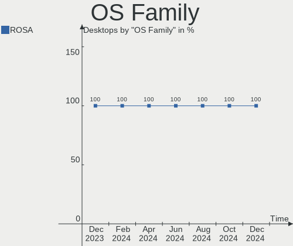
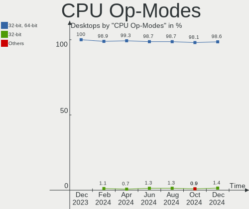
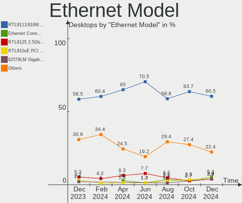

ROSA Hardware Trends (Desktops)
-------------------------------

A project to identify most popular hardware characteristics and track their change
over time based on data collected by ROSA users at https://Linux-Hardware.org.

Anyone can contribute to this report by the [hw-probe](https://github.com/linuxhw/hw-probe) tool:

    sudo -E hw-probe -all -upload

Full-feature report is available here: https://linux-hardware.org/?view=trends

Period: Jan, 2022.

Contents
--------

* [ System ](#system)
  - [ OS                       ](#os)
  - [ OS Family                ](#os-family)
  - [ Kernel                   ](#kernel)
  - [ Kernel Family            ](#kernel-family)
  - [ Kernel Major Ver.        ](#kernel-major-ver)
  - [ Arch                     ](#arch)
  - [ DE                       ](#de)
  - [ Display Server           ](#display-server)
  - [ Display Manager          ](#display-manager)
  - [ OS Lang                  ](#os-lang)
  - [ Boot Mode                ](#boot-mode)
  - [ Filesystem               ](#filesystem)
  - [ Part. scheme             ](#part-scheme)
  - [ Dual Boot with Linux/BSD ](#dual-boot-with-linuxbsd)
  - [ Dual Boot (Win)          ](#dual-boot-win)

* [ Board ](#board)
  - [ Vendor                   ](#vendor)
  - [ Model                    ](#model)
  - [ Model Family             ](#model-family)
  - [ MFG Year                 ](#mfg-year)
  - [ Form Factor              ](#form-factor)
  - [ Secure Boot              ](#secure-boot)
  - [ Coreboot                 ](#coreboot)
  - [ RAM Size                 ](#ram-size)
  - [ RAM Used                 ](#ram-used)
  - [ Total Drives             ](#total-drives)
  - [ Has CD-ROM               ](#has-cd-rom)
  - [ Has Ethernet             ](#has-ethernet)
  - [ Has WiFi                 ](#has-wifi)
  - [ Has Bluetooth            ](#has-bluetooth)

* [ Location ](#location)
  - [ Country                  ](#country)
  - [ City                     ](#city)

* [ Drives ](#drives)
  - [ Drive Vendor             ](#drive-vendor)
  - [ Drive Model              ](#drive-model)
  - [ HDD Vendor               ](#hdd-vendor)
  - [ SSD Vendor               ](#ssd-vendor)
  - [ Drive Kind               ](#drive-kind)
  - [ Drive Connector          ](#drive-connector)
  - [ Drive Size               ](#drive-size)
  - [ Space Total              ](#space-total)
  - [ Space Used               ](#space-used)
  - [ Malfunc. Drives          ](#malfunc-drives)
  - [ Malfunc. Drive Vendor    ](#malfunc-drive-vendor)
  - [ Malfunc. HDD Vendor      ](#malfunc-hdd-vendor)
  - [ Malfunc. Drive Kind      ](#malfunc-drive-kind)
  - [ Failed Drives            ](#failed-drives)
  - [ Failed Drive Vendor      ](#failed-drive-vendor)
  - [ Drive Status             ](#drive-status)

* [ Storage controller ](#storage-controller)
  - [ Storage Vendor           ](#storage-vendor)
  - [ Storage Model            ](#storage-model)
  - [ Storage Kind             ](#storage-kind)

* [ Processor ](#processor)
  - [ CPU Vendor               ](#cpu-vendor)
  - [ CPU Model                ](#cpu-model)
  - [ CPU Model Family         ](#cpu-model-family)
  - [ CPU Cores                ](#cpu-cores)
  - [ CPU Sockets              ](#cpu-sockets)
  - [ CPU Threads              ](#cpu-threads)
  - [ CPU Op-Modes             ](#cpu-op-modes)
  - [ CPU Microcode            ](#cpu-microcode)
  - [ CPU Microarch            ](#cpu-microarch)

* [ Graphics ](#graphics)
  - [ GPU Vendor               ](#gpu-vendor)
  - [ GPU Model                ](#gpu-model)
  - [ GPU Combo                ](#gpu-combo)
  - [ GPU Driver               ](#gpu-driver)
  - [ GPU Memory               ](#gpu-memory)

* [ Monitor ](#monitor)
  - [ Monitor Vendor           ](#monitor-vendor)
  - [ Monitor Model            ](#monitor-model)
  - [ Monitor Resolution       ](#monitor-resolution)
  - [ Monitor Diagonal         ](#monitor-diagonal)
  - [ Monitor Width            ](#monitor-width)
  - [ Aspect Ratio             ](#aspect-ratio)
  - [ Monitor Area             ](#monitor-area)
  - [ Pixel Density            ](#pixel-density)
  - [ Multiple Monitors        ](#multiple-monitors)

* [ Network ](#network)
  - [ Net Controller Vendor    ](#net-controller-vendor)
  - [ Net Controller Model     ](#net-controller-model)
  - [ Wireless Vendor          ](#wireless-vendor)
  - [ Wireless Model           ](#wireless-model)
  - [ Ethernet Vendor          ](#ethernet-vendor)
  - [ Ethernet Model           ](#ethernet-model)
  - [ Net Controller Kind      ](#net-controller-kind)
  - [ Used Controller          ](#used-controller)
  - [ NICs                     ](#nics)
  - [ IPv6                     ](#ipv6)

* [ Bluetooth ](#bluetooth)
  - [ Bluetooth Vendor         ](#bluetooth-vendor)
  - [ Bluetooth Model          ](#bluetooth-model)

* [ Sound ](#sound)
  - [ Sound Vendor             ](#sound-vendor)
  - [ Sound Model              ](#sound-model)

* [ Memory ](#memory)
  - [ Memory Vendor            ](#memory-vendor)
  - [ Memory Model             ](#memory-model)
  - [ Memory Kind              ](#memory-kind)
  - [ Memory Form Factor       ](#memory-form-factor)
  - [ Memory Size              ](#memory-size)
  - [ Memory Speed             ](#memory-speed)

* [ Printers & scanners ](#printers--scanners)
  - [ Printer Vendor           ](#printer-vendor)
  - [ Printer Model            ](#printer-model)
  - [ Scanner Vendor           ](#scanner-vendor)
  - [ Scanner Model            ](#scanner-model)

* [ Camera ](#camera)
  - [ Camera Vendor            ](#camera-vendor)
  - [ Camera Model             ](#camera-model)

* [ Security ](#security)
  - [ Fingerprint Vendor       ](#fingerprint-vendor)
  - [ Fingerprint Model        ](#fingerprint-model)
  - [ Chipcard Vendor          ](#chipcard-vendor)
  - [ Chipcard Model           ](#chipcard-model)

* [ Unsupported ](#unsupported)
  - [ Unsupported Devices      ](#unsupported-devices)
  - [ Unsupported Device Types ](#unsupported-device-types)

System
------

OS
--

Installed operating systems

| Name       | Desktops | Percent |
|------------|----------|---------|
| ROSA 12.1  | 48       | 54.55%  |
| ROSA R11.1 | 30       | 34.09%  |
| ROSA 12    | 7        | 7.95%   |
| ROSA R11   | 2        | 2.27%   |
| ROSA R10   | 1        | 1.14%   |

OS Family
---------

OS without a version

| Name | Desktops | Percent |
|------|----------|---------|
| ROSA | 88       | 100%    |

Kernel
------

Version of the Linux kernel

| Version                                   | Desktops | Percent |
|-------------------------------------------|----------|---------|
| 5.10.74-generic-2rosa2021.1-x86_64        | 48       | 54.55%  |
| 5.4.83-generic-2rosa-x86_64               | 11       | 12.5%   |
| 4.15.0-desktop-122.124.1rosa-x86_64       | 10       | 11.36%  |
| 5.10.71-generic-1rosa2021.1-x86_64        | 5        | 5.68%   |
| 5.4.32-generic-2rosa-x86_64               | 4        | 4.55%   |
| 5.4.32-generic-2rosa-i586                 | 2        | 2.27%   |
| 4.15.0-desktop-45.1rosa-x86_64            | 2        | 2.27%   |
| 5.16.3.xm1-1.klp-xanmod-rosa2021.1-x86_64 | 1        | 1.14%   |
| 5.10.74-generic-4rosa2021.1-x86_64        | 1        | 1.14%   |
| 4.9.60-nrj-desktop-1rosa-x86_64           | 1        | 1.14%   |
| 4.9.155-nrj-desktop-1rosa-x86_64          | 1        | 1.14%   |
| 4.9.155-nrj-desktop-1rosa-i586            | 1        | 1.14%   |
| 4.15.0-desktop-45.1rosa-i586              | 1        | 1.14%   |

Kernel Family
-------------

Linux kernel without a distro release

| Version | Desktops | Percent |
|---------|----------|---------|
| 5.10.74 | 49       | 55.68%  |
| 4.15.0  | 13       | 14.77%  |
| 5.4.83  | 11       | 12.5%   |
| 5.4.32  | 6        | 6.82%   |
| 5.10.71 | 5        | 5.68%   |
| 4.9.155 | 2        | 2.27%   |
| 5.16.3  | 1        | 1.14%   |
| 4.9.60  | 1        | 1.14%   |

Kernel Major Ver.
-----------------

Linux kernel major version

| Version | Desktops | Percent |
|---------|----------|---------|
| 5.10    | 54       | 61.36%  |
| 5.4     | 17       | 19.32%  |
| 4.15    | 13       | 14.77%  |
| 4.9     | 3        | 3.41%   |
| 5.16    | 1        | 1.14%   |

Arch
----

OS architecture (x86_64, i586, etc.)

| Name   | Desktops | Percent |
|--------|----------|---------|
| x86_64 | 84       | 95.45%  |
| i686   | 4        | 4.55%   |

DE
--

Desktop Environment

| Name  | Desktops | Percent |
|-------|----------|---------|
| KDE5  | 54       | 61.36%  |
| KDE4  | 21       | 23.86%  |
| GNOME | 7        | 7.95%   |
| LXQt  | 3        | 3.41%   |
| MATE  | 2        | 2.27%   |
| KDE   | 1        | 1.14%   |

Display Server
--------------

X11 or Wayland

| Name    | Desktops | Percent |
|---------|----------|---------|
| Wayland | 47       | 53.41%  |
| X11     | 41       | 46.59%  |

Display Manager
---------------

SDDM, LightDM, etc.

| Name    | Desktops | Percent |
|---------|----------|---------|
| GDM     | 33       | 37.5%   |
| SDDM    | 31       | 35.23%  |
| KDM     | 23       | 26.14%  |
| LightDM | 1        | 1.14%   |

OS Lang
-------

Language

| Lang    | Desktops | Percent |
|---------|----------|---------|
| ru_RU   | 74       | 84.09%  |
| pl_PL   | 4        | 4.55%   |
| Unknown | 3        | 3.41%   |
| en_US   | 2        | 2.27%   |
| de_DE   | 2        | 2.27%   |
| ru_UA   | 1        | 1.14%   |
| pt_BR   | 1        | 1.14%   |
| C       | 1        | 1.14%   |

Boot Mode
---------

EFI or BIOS

| Mode | Desktops | Percent |
|------|----------|---------|
| BIOS | 55       | 62.5%   |
| EFI  | 33       | 37.5%   |

Filesystem
----------

Type of filesystem

| Type  | Desktops | Percent |
|-------|----------|---------|
| Ext4  | 82       | 93.18%  |
| Btrfs | 5        | 5.68%   |
| Ext3  | 1        | 1.14%   |

Part. scheme
------------

Scheme of partitioning

| Type    | Desktops | Percent |
|---------|----------|---------|
| GPT     | 44       | 50%     |
| MBR     | 43       | 48.86%  |
| Unknown | 1        | 1.14%   |

Dual Boot with Linux/BSD
------------------------

Hosting more than one Linux/BSD

| Dual boot | Desktops | Percent |
|-----------|----------|---------|
| No        | 56       | 63.64%  |
| Yes       | 32       | 36.36%  |

Dual Boot (Win)
---------------

Hosting Linux and Windows

| Dual boot | Desktops | Percent |
|-----------|----------|---------|
| No        | 51       | 57.95%  |
| Yes       | 37       | 42.05%  |

Board
-----

Vendor
------

Motherboard manufacturer

| Name                | Desktops | Percent |
|---------------------|----------|---------|
| ASUSTek Computer    | 27       | 30.68%  |
| Gigabyte Technology | 18       | 20.45%  |
| ASRock              | 11       | 12.5%   |
| MSI                 | 10       | 11.36%  |
| Unknown             | 4        | 4.55%   |
| Hewlett-Packard     | 3        | 3.41%   |
| Dell                | 3        | 3.41%   |
| Intel               | 2        | 2.27%   |
| Acer                | 2        | 2.27%   |
| Supermicro          | 1        | 1.14%   |
| Pegatron            | 1        | 1.14%   |
| MB                  | 1        | 1.14%   |
| Lenovo              | 1        | 1.14%   |
| Huanan              | 1        | 1.14%   |
| Fujitsu             | 1        | 1.14%   |
| ECS                 | 1        | 1.14%   |
| Biostar             | 1        | 1.14%   |

Model
-----

Motherboard model

| Name                               | Desktops | Percent |
|------------------------------------|----------|---------|
| ASUS All Series                    | 4        | 4.55%   |
| Unknown                            | 4        | 4.55%   |
| ASUS P5KPL-AM                      | 2        | 2.27%   |
| ASUS P5G41T-M LX                   | 2        | 2.27%   |
| ASRock 760GM-S3                    | 2        | 2.27%   |
| Supermicro C7Q67                   | 1        | 1.14%   |
| Pegatron IPPPV-D3G                 | 1        | 1.14%   |
| MSI MS-7D18                        | 1        | 1.14%   |
| MSI MS-7C89                        | 1        | 1.14%   |
| MSI MS-7B89                        | 1        | 1.14%   |
| MSI MS-7B86                        | 1        | 1.14%   |
| MSI MS-7A38                        | 1        | 1.14%   |
| MSI MS-7A36                        | 1        | 1.14%   |
| MSI MS-7895                        | 1        | 1.14%   |
| MSI MS-7599                        | 1        | 1.14%   |
| MSI MS-7430                        | 1        | 1.14%   |
| MSI MPG B560 Trident A (MS-B926)   | 1        | 1.14%   |
| MB A320-SF110                      | 1        | 1.14%   |
| Lenovo ThinkCentre Edge71 1583C5G  | 1        | 1.14%   |
| Intel X79                          | 1        | 1.14%   |
| Intel DG35EC AAE29266-203          | 1        | 1.14%   |
| Huanan X99-BD4 V1.31               | 1        | 1.14%   |
| HP Pippin2                         | 1        | 1.14%   |
| HP Compaq dc7600 Small Form Factor | 1        | 1.14%   |
| HP Compaq 6200 Pro SFF PC          | 1        | 1.14%   |
| Gigabyte Z97-HD3                   | 1        | 1.14%   |
| Gigabyte Z390 UD V2                | 1        | 1.14%   |
| Gigabyte Pro, Std, Elt Series      | 1        | 1.14%   |
| Gigabyte P67A-D3-B3                | 1        | 1.14%   |
| Gigabyte P31-DS3L                  | 1        | 1.14%   |
| Gigabyte H61M-S1                   | 1        | 1.14%   |
| Gigabyte GA-78LMT-S2PV             | 1        | 1.14%   |
| Gigabyte GA-78LMT-S2P              | 1        | 1.14%   |
| Gigabyte G41MT-USB3                | 1        | 1.14%   |
| Gigabyte F2A68HM-DS2               | 1        | 1.14%   |
| Gigabyte B85M-HD3                  | 1        | 1.14%   |
| Gigabyte B450M S2H                 | 1        | 1.14%   |
| Gigabyte B450 GAMING X             | 1        | 1.14%   |
| Gigabyte B450 AORUS PRO            | 1        | 1.14%   |
| Gigabyte B365M H                   | 1        | 1.14%   |
| Gigabyte B250M-D3H                 | 1        | 1.14%   |
| Gigabyte A320M-S2H                 | 1        | 1.14%   |
| Gigabyte 970A-DS3P                 | 1        | 1.14%   |
| Fujitsu ESPRIMO P7935              | 1        | 1.14%   |
| ECS G31T-M7                        | 1        | 1.14%   |
| Dell Precision T1500               | 1        | 1.14%   |
| Dell OptiPlex 9010                 | 1        | 1.14%   |
| Dell Inspiron 530                  | 1        | 1.14%   |
| Biostar A55MH                      | 1        | 1.14%   |
| ASUS Z77-A                         | 1        | 1.14%   |
| ASUS Q170T                         | 1        | 1.14%   |
| ASUS PRIME H310-PLUS R2.0          | 1        | 1.14%   |
| ASUS PRIME A320M-K                 | 1        | 1.14%   |
| ASUS P9X79                         | 1        | 1.14%   |
| ASUS P8P67 DELUXE                  | 1        | 1.14%   |
| ASUS P8H77-V                       | 1        | 1.14%   |
| ASUS P8H61-M LX2                   | 1        | 1.14%   |
| ASUS P7H55-M SI                    | 1        | 1.14%   |
| ASUS P7H55-M PRO                   | 1        | 1.14%   |
| ASUS P5Q SE2                       | 1        | 1.14%   |

Model Family
------------

Motherboard model prefix

| Name                   | Desktops | Percent |
|------------------------|----------|---------|
| ASUS All               | 4        | 4.55%   |
| Unknown                | 4        | 4.55%   |
| ASUS P5G41T-M          | 3        | 3.41%   |
| HP Compaq              | 2        | 2.27%   |
| Gigabyte B450          | 2        | 2.27%   |
| ASUS PRIME             | 2        | 2.27%   |
| ASUS P7H55-M           | 2        | 2.27%   |
| ASUS P5KPL-AM          | 2        | 2.27%   |
| ASRock 760GM-S3        | 2        | 2.27%   |
| Acer Aspire            | 2        | 2.27%   |
| Supermicro C7Q67       | 1        | 1.14%   |
| Pegatron IPPPV-D3G     | 1        | 1.14%   |
| MSI MS-7D18            | 1        | 1.14%   |
| MSI MS-7C89            | 1        | 1.14%   |
| MSI MS-7B89            | 1        | 1.14%   |
| MSI MS-7B86            | 1        | 1.14%   |
| MSI MS-7A38            | 1        | 1.14%   |
| MSI MS-7A36            | 1        | 1.14%   |
| MSI MS-7895            | 1        | 1.14%   |
| MSI MS-7599            | 1        | 1.14%   |
| MSI MS-7430            | 1        | 1.14%   |
| MSI MPG                | 1        | 1.14%   |
| MB A320-SF110          | 1        | 1.14%   |
| Lenovo ThinkCentre     | 1        | 1.14%   |
| Intel X79              | 1        | 1.14%   |
| Intel DG35EC           | 1        | 1.14%   |
| Huanan X99-BD4         | 1        | 1.14%   |
| HP Pippin2             | 1        | 1.14%   |
| Gigabyte Z97-HD3       | 1        | 1.14%   |
| Gigabyte Z390          | 1        | 1.14%   |
| Gigabyte Pro           | 1        | 1.14%   |
| Gigabyte P67A-D3-B3    | 1        | 1.14%   |
| Gigabyte P31-DS3L      | 1        | 1.14%   |
| Gigabyte H61M-S1       | 1        | 1.14%   |
| Gigabyte GA-78LMT-S2PV | 1        | 1.14%   |
| Gigabyte GA-78LMT-S2P  | 1        | 1.14%   |
| Gigabyte G41MT-USB3    | 1        | 1.14%   |
| Gigabyte F2A68HM-DS2   | 1        | 1.14%   |
| Gigabyte B85M-HD3      | 1        | 1.14%   |
| Gigabyte B450M         | 1        | 1.14%   |
| Gigabyte B365M         | 1        | 1.14%   |
| Gigabyte B250M-D3H     | 1        | 1.14%   |
| Gigabyte A320M-S2H     | 1        | 1.14%   |
| Gigabyte 970A-DS3P     | 1        | 1.14%   |
| Fujitsu ESPRIMO        | 1        | 1.14%   |
| ECS G31T-M7            | 1        | 1.14%   |
| Dell Precision         | 1        | 1.14%   |
| Dell OptiPlex          | 1        | 1.14%   |
| Dell Inspiron          | 1        | 1.14%   |
| Biostar A55MH          | 1        | 1.14%   |
| ASUS Z77-A             | 1        | 1.14%   |
| ASUS Q170T             | 1        | 1.14%   |
| ASUS P9X79             | 1        | 1.14%   |
| ASUS P8P67             | 1        | 1.14%   |
| ASUS P8H77-V           | 1        | 1.14%   |
| ASUS P8H61-M           | 1        | 1.14%   |
| ASUS P5Q               | 1        | 1.14%   |
| ASUS P5P43TD           | 1        | 1.14%   |
| ASUS P5P41D            | 1        | 1.14%   |
| ASUS M5A78L-M          | 1        | 1.14%   |

MFG Year
--------

Motherboard manufacture year

| Year | Desktops | Percent |
|------|----------|---------|
| 2010 | 11       | 12.5%   |
| 2012 | 10       | 11.36%  |
| 2019 | 9        | 10.23%  |
| 2013 | 7        | 7.95%   |
| 2020 | 6        | 6.82%   |
| 2018 | 6        | 6.82%   |
| 2011 | 6        | 6.82%   |
| 2009 | 6        | 6.82%   |
| 2021 | 5        | 5.68%   |
| 2014 | 5        | 5.68%   |
| 2008 | 4        | 4.55%   |
| 2007 | 4        | 4.55%   |
| 2015 | 3        | 3.41%   |
| 2017 | 2        | 2.27%   |
| 2016 | 2        | 2.27%   |
| 2006 | 1        | 1.14%   |
| 2005 | 1        | 1.14%   |

Form Factor
-----------

Physical design of the computer

| Name    | Desktops | Percent |
|---------|----------|---------|
| Desktop | 88       | 100%    |

Secure Boot
-----------

Enabled or disabled

| State    | Desktops | Percent |
|----------|----------|---------|
| Disabled | 88       | 100%    |

Coreboot
--------

Have coreboot on board

| Used | Desktops | Percent |
|------|----------|---------|
| No   | 88       | 100%    |

RAM Size
--------

Total RAM memory

| Size in GB  | Desktops | Percent |
|-------------|----------|---------|
| 3.01-4.0    | 24       | 27.27%  |
| 4.01-8.0    | 18       | 20.45%  |
| 8.01-16.0   | 18       | 20.45%  |
| 16.01-24.0  | 16       | 18.18%  |
| 32.01-64.0  | 4        | 4.55%   |
| 1.01-2.0    | 4        | 4.55%   |
| 24.01-32.0  | 2        | 2.27%   |
| 64.01-256.0 | 1        | 1.14%   |
| 0.51-1.0    | 1        | 1.14%   |

RAM Used
--------

Used RAM memory

| Used GB  | Desktops | Percent |
|----------|----------|---------|
| 1.01-2.0 | 39       | 44.32%  |
| 0.51-1.0 | 22       | 25%     |
| 2.01-3.0 | 17       | 19.32%  |
| 4.01-8.0 | 7        | 7.95%   |
| 3.01-4.0 | 2        | 2.27%   |
| 0.01-0.5 | 1        | 1.14%   |

Total Drives
------------

Number of drives on board

| Drives | Desktops | Percent |
|--------|----------|---------|
| 1      | 39       | 44.32%  |
| 2      | 27       | 30.68%  |
| 3      | 11       | 12.5%   |
| 4      | 6        | 6.82%   |
| 6      | 2        | 2.27%   |
| 5      | 2        | 2.27%   |
| 0      | 1        | 1.14%   |

Has CD-ROM
----------

Has CD-ROM on board

| Presented | Desktops | Percent |
|-----------|----------|---------|
| No        | 45       | 51.14%  |
| Yes       | 43       | 48.86%  |

Has Ethernet
------------

Has Ethernet on board

| Presented | Desktops | Percent |
|-----------|----------|---------|
| Yes       | 86       | 97.73%  |
| No        | 2        | 2.27%   |

Has WiFi
--------

Has WiFi module

| Presented | Desktops | Percent |
|-----------|----------|---------|
| No        | 59       | 67.05%  |
| Yes       | 29       | 32.95%  |

Has Bluetooth
-------------

Has Bluetooth module

| Presented | Desktops | Percent |
|-----------|----------|---------|
| No        | 77       | 87.5%   |
| Yes       | 11       | 12.5%   |

Location
--------

Country
-------

Geographic location (country)

| Country    | Desktops | Percent |
|------------|----------|---------|
| Russia     | 68       | 77.27%  |
| Ukraine    | 5        | 5.68%   |
| Poland     | 5        | 5.68%   |
| Germany    | 3        | 3.41%   |
| USA        | 1        | 1.14%   |
| Spain      | 1        | 1.14%   |
| Kazakhstan | 1        | 1.14%   |
| Finland    | 1        | 1.14%   |
| Canada     | 1        | 1.14%   |
| Brazil     | 1        | 1.14%   |
| Belarus    | 1        | 1.14%   |

City
----

Geographic location (city)

| City              | Desktops | Percent |
|-------------------|----------|---------|
| Moscow            | 16       | 18.18%  |
| St Petersburg     | 4        | 4.55%   |
| Krasnodar         | 3        | 3.41%   |
| Chelyabinsk       | 3        | 3.41%   |
| Samara            | 2        | 2.27%   |
| Novosibirsk       | 2        | 2.27%   |
| Nizhniy Novgorod  | 2        | 2.27%   |
| Yekaterinburg     | 1        | 1.14%   |
| Yaroslavl         | 1        | 1.14%   |
| Wroclaw           | 1        | 1.14%   |
| Wisla             | 1        | 1.14%   |
| Voronezh          | 1        | 1.14%   |
| Volgograd         | 1        | 1.14%   |
| Vladimir          | 1        | 1.14%   |
| Vladikavkaz       | 1        | 1.14%   |
| Valley Stream     | 1        | 1.14%   |
| Ust'-Kut          | 1        | 1.14%   |
| Tyumen            | 1        | 1.14%   |
| Tver              | 1        | 1.14%   |
| Tomsk             | 1        | 1.14%   |
| Tambov            | 1        | 1.14%   |
| Surrey            | 1        | 1.14%   |
| Sosnovyy Bor      | 1        | 1.14%   |
| Simferopol        | 1        | 1.14%   |
| Severodvinsk      | 1        | 1.14%   |
| Sein?¤joki        | 1        | 1.14%   |
| Schw?¤bisch Hall  | 1        | 1.14%   |
| Saratov           | 1        | 1.14%   |
| Rostov-on-Don     | 1        | 1.14%   |
| Perm              | 1        | 1.14%   |
| Pavlovsk          | 1        | 1.14%   |
| Osipenko          | 1        | 1.14%   |
| Oryol             | 1        | 1.14%   |
| Omsk              | 1        | 1.14%   |
| Nyagan            | 1        | 1.14%   |
| Novoul'yanovsk    | 1        | 1.14%   |
| Noril'sk          | 1        | 1.14%   |
| Nevel             | 1        | 1.14%   |
| Mi?„sk Mazowiecki | 1        | 1.14%   |
| Malinovskiy       | 1        | 1.14%   |
| Madrid            | 1        | 1.14%   |
| Liski             | 1        | 1.14%   |
| Lipetsk           | 1        | 1.14%   |
| Kurgan            | 1        | 1.14%   |
| Kudymkar          | 1        | 1.14%   |
| Kryvyi Rih        | 1        | 1.14%   |
| Kremenchug        | 1        | 1.14%   |
| Krakow            | 1        | 1.14%   |
| Kostroma          | 1        | 1.14%   |
| Kolomna           | 1        | 1.14%   |
| Ko?›cian          | 1        | 1.14%   |
| Kedrovka          | 1        | 1.14%   |
| Kazan?ˆ™          | 1        | 1.14%   |
| Karaganda         | 1        | 1.14%   |
| Gomel             | 1        | 1.14%   |
| Fryazino          | 1        | 1.14%   |
| Frankfurt am Main | 1        | 1.14%   |
| Donetsk           | 1        | 1.14%   |
| Chita             | 1        | 1.14%   |
| Cherepovets       | 1        | 1.14%   |

Drives
------

Drive Vendor
------------

Hard drive vendors

| Vendor              | Desktops | Drives | Percent |
|---------------------|----------|--------|---------|
| WDC                 | 34       | 36     | 21.25%  |
| Seagate             | 31       | 38     | 19.38%  |
| Toshiba             | 13       | 14     | 8.13%   |
| Kingston            | 11       | 12     | 6.88%   |
| Hitachi             | 11       | 11     | 6.88%   |
| Samsung Electronics | 10       | 11     | 6.25%   |
| Crucial             | 6        | 6      | 3.75%   |
| A-DATA Technology   | 6        | 7      | 3.75%   |
| SPCC                | 3        | 3      | 1.88%   |
| Patriot             | 3        | 3      | 1.88%   |
| Intel               | 3        | 4      | 1.88%   |
| GOODRAM             | 3        | 3      | 1.88%   |
| Apacer              | 3        | 3      | 1.88%   |
| XrayDisk            | 2        | 2      | 1.25%   |
| Smartbuy            | 2        | 2      | 1.25%   |
| MAXTOR              | 2        | 2      | 1.25%   |
| JMicron             | 2        | 2      | 1.25%   |
| China               | 2        | 2      | 1.25%   |
| Verbatim            | 1        | 1      | 0.63%   |
| Unknown             | 1        | 1      | 0.63%   |
| Transcend           | 1        | 1      | 0.63%   |
| Team                | 1        | 1      | 0.63%   |
| Silicon Motion      | 1        | 1      | 0.63%   |
| SanDisk             | 1        | 1      | 0.63%   |
| OCZ                 | 1        | 1      | 0.63%   |
| KingSpec            | 1        | 1      | 0.63%   |
| Intenso             | 1        | 1      | 0.63%   |
| HGST                | 1        | 1      | 0.63%   |
| Gigabyte Technology | 1        | 1      | 0.63%   |
| AMD                 | 1        | 1      | 0.63%   |
| Unknown             | 1        | 1      | 0.63%   |

Drive Model
-----------

Hard drive models

| Model                              | Desktops | Percent |
|------------------------------------|----------|---------|
| Crucial CT240BX500SSD1 240GB       | 5        | 2.92%   |
| Toshiba HDWD110 1TB                | 4        | 2.34%   |
| Seagate ST500DM002-1BD142 500GB    | 4        | 2.34%   |
| Seagate ST500DM009-2F110A 500GB    | 3        | 1.75%   |
| Seagate ST2000DM008-2FR102 2TB     | 3        | 1.75%   |
| Kingston SA400S37120G 120GB SSD    | 3        | 1.75%   |
| XrayDisk SSD 256GB                 | 2        | 1.17%   |
| Toshiba DT01ACA050 500GB           | 2        | 1.17%   |
| Seagate ST500LT012-1DG142 500GB    | 2        | 1.17%   |
| Seagate ST4000DM004-2CV104 4TB     | 2        | 1.17%   |
| Kingston SA400S37240G 240GB SSD    | 2        | 1.17%   |
| Kingston SA2000M8250G 250GB        | 2        | 1.17%   |
| JMicron Generic 128GB              | 2        | 1.17%   |
| A-DATA SU630 240GB SSD             | 2        | 1.17%   |
| WDC WDS500G1B0A-00H9H0 500GB SSD   | 1        | 0.58%   |
| WDC WDS250G2B0A-00SM50 250GB SSD   | 1        | 0.58%   |
| WDC WDS240G2G0A-00JH30 240GB SSD   | 1        | 0.58%   |
| WDC WDS100T2B0C-00PXH0 1TB         | 1        | 0.58%   |
| WDC WD800BEVS-22RST0 80GB          | 1        | 0.58%   |
| WDC WD6000HLHX-01JJPV0 600GB       | 1        | 0.58%   |
| WDC WD5002AALX-00J37A0 500GB       | 1        | 0.58%   |
| WDC WD5000LPSX-00A6WT0 500GB       | 1        | 0.58%   |
| WDC WD5000LPCX-24VHAT0 500GB       | 1        | 0.58%   |
| WDC WD5000AZRZ-00HTKB0 500GB       | 1        | 0.58%   |
| WDC WD5000AAKX-001CA0 500GB        | 1        | 0.58%   |
| WDC WD5000AADS-00S9B0 500GB        | 1        | 0.58%   |
| WDC WD5000AADS-00M2B0 500GB        | 1        | 0.58%   |
| WDC WD3200AAJS-56M0A0 320GB        | 1        | 0.58%   |
| WDC WD30EZRZ-00GXCB0 3TB           | 1        | 0.58%   |
| WDC WD30EFRX-68EUZN0 3TB           | 1        | 0.58%   |
| WDC WD2500AAJS-60M0A0 250GB        | 1        | 0.58%   |
| WDC WD2500AAJS-22VTA0 250GB        | 1        | 0.58%   |
| WDC WD20EURX-63T0FY0 2TB           | 1        | 0.58%   |
| WDC WD20EFRX-68EUZN0 2TB           | 1        | 0.58%   |
| WDC WD2003FYYS-02W0B0 2TB          | 1        | 0.58%   |
| WDC WD1600AAJS-75PSA0 160GB        | 1        | 0.58%   |
| WDC WD1600AAJS-08PSA0 160GB        | 1        | 0.58%   |
| WDC WD15EARS-00Z5B1 1TB            | 1        | 0.58%   |
| WDC WD10EZEX-75WN4A1 1TB           | 1        | 0.58%   |
| WDC WD10EZEX-75WN4A0 1TB           | 1        | 0.58%   |
| WDC WD10EZEX-22BN5A0 1TB           | 1        | 0.58%   |
| WDC WD10EZEX-21M2NA0 1TB           | 1        | 0.58%   |
| WDC WD10EZEX-08WN4A0 1TB           | 1        | 0.58%   |
| WDC WD10EZEX-08M2NA0 1TB           | 1        | 0.58%   |
| WDC WD10EZEX-00WN4A0 1TB           | 1        | 0.58%   |
| WDC WD10EARS-00MVWB0 1TB           | 1        | 0.58%   |
| WDC WD10EADS-22M2B0 1TB            | 1        | 0.58%   |
| WDC WD10EADS-11M2B2 1TB            | 1        | 0.58%   |
| WDC WD1003FZEX-00K3CA0 1TB         | 1        | 0.58%   |
| WDC PC SN530 SDBPNPZ-1T00-1032 1TB | 1        | 0.58%   |
| Verbatim Vi550 S3 SSD 512GB        | 1        | 0.58%   |
| Unknown SD/MMC/MS PRO 128GB        | 1        | 0.58%   |
| Transcend TS256GMTE220S 256GB      | 1        | 0.58%   |
| Toshiba TR200 480GB SSD            | 1        | 0.58%   |
| Toshiba TR200 240GB SSD            | 1        | 0.58%   |
| Toshiba MQ01ABF050 500GB           | 1        | 0.58%   |
| Toshiba MK5065GSXF 500GB           | 1        | 0.58%   |
| Toshiba MK3259GSXP 320GB           | 1        | 0.58%   |
| Toshiba HDWD105 500GB              | 1        | 0.58%   |
| Toshiba DT01ACA100 1TB             | 1        | 0.58%   |

HDD Vendor
----------

Hard disk drive vendors

| Vendor              | Desktops | Drives | Percent |
|---------------------|----------|--------|---------|
| Seagate             | 31       | 38     | 34.07%  |
| WDC                 | 29       | 31     | 31.87%  |
| Toshiba             | 11       | 12     | 12.09%  |
| Hitachi             | 11       | 11     | 12.09%  |
| Samsung Electronics | 6        | 6      | 6.59%   |
| Unknown             | 1        | 1      | 1.1%    |
| MAXTOR              | 1        | 1      | 1.1%    |
| HGST                | 1        | 1      | 1.1%    |

SSD Vendor
----------

Solid state drive vendors

| Vendor              | Desktops | Drives | Percent |
|---------------------|----------|--------|---------|
| Kingston            | 7        | 8      | 14.29%  |
| Crucial             | 6        | 6      | 12.24%  |
| WDC                 | 3        | 3      | 6.12%   |
| SPCC                | 3        | 3      | 6.12%   |
| Samsung Electronics | 3        | 4      | 6.12%   |
| GOODRAM             | 3        | 3      | 6.12%   |
| Apacer              | 3        | 3      | 6.12%   |
| A-DATA Technology   | 3        | 3      | 6.12%   |
| XrayDisk            | 2        | 2      | 4.08%   |
| Toshiba             | 2        | 2      | 4.08%   |
| China               | 2        | 2      | 4.08%   |
| Verbatim            | 1        | 1      | 2.04%   |
| Team                | 1        | 1      | 2.04%   |
| Smartbuy            | 1        | 1      | 2.04%   |
| SanDisk             | 1        | 1      | 2.04%   |
| Patriot             | 1        | 1      | 2.04%   |
| OCZ                 | 1        | 1      | 2.04%   |
| MAXTOR              | 1        | 1      | 2.04%   |
| KingSpec            | 1        | 1      | 2.04%   |
| Intenso             | 1        | 1      | 2.04%   |
| Gigabyte Technology | 1        | 1      | 2.04%   |
| AMD                 | 1        | 1      | 2.04%   |
| Unknown             | 1        | 1      | 2.04%   |

Drive Kind
----------

HDD or SSD

| Kind | Desktops | Drives | Percent |
|------|----------|--------|---------|
| HDD  | 69       | 101    | 52.67%  |
| SSD  | 42       | 51     | 32.06%  |
| NVMe | 20       | 22     | 15.27%  |

Drive Connector
---------------

SATA, SAS, NVMe, etc.

| Type | Desktops | Drives | Percent |
|------|----------|--------|---------|
| SATA | 83       | 147    | 78.3%   |
| NVMe | 18       | 20     | 16.98%  |
| SAS  | 5        | 7      | 4.72%   |

Drive Size
----------

Size of hard drive

| Size in TB | Desktops | Drives | Percent |
|------------|----------|--------|---------|
| 0.01-0.5   | 72       | 100    | 62.61%  |
| 0.51-1.0   | 28       | 33     | 24.35%  |
| 1.01-2.0   | 10       | 11     | 8.7%    |
| 3.01-4.0   | 2        | 4      | 1.74%   |
| 2.01-3.0   | 2        | 2      | 1.74%   |
| 4.01-10.0  | 1        | 2      | 0.87%   |

Space Total
-----------

Amount of disk space available on the file system

| Size in GB     | Desktops | Percent |
|----------------|----------|---------|
| 101-250        | 22       | 25%     |
| 251-500        | 16       | 18.18%  |
| 501-1000       | 13       | 14.77%  |
| 1-20           | 11       | 12.5%   |
| 1001-2000      | 9        | 10.23%  |
| 51-100         | 7        | 7.95%   |
| 2001-3000      | 4        | 4.55%   |
| More than 3000 | 3        | 3.41%   |
| 21-50          | 2        | 2.27%   |
| Unknown        | 1        | 1.14%   |

Space Used
----------

Amount of used disk space

| Used GB        | Desktops | Percent |
|----------------|----------|---------|
| 1-20           | 49       | 55.68%  |
| 21-50          | 11       | 12.5%   |
| 501-1000       | 8        | 9.09%   |
| 251-500        | 5        | 5.68%   |
| 101-250        | 5        | 5.68%   |
| 1001-2000      | 5        | 5.68%   |
| 51-100         | 2        | 2.27%   |
| More than 3000 | 1        | 1.14%   |
| 2001-3000      | 1        | 1.14%   |
| Unknown        | 1        | 1.14%   |

Malfunc. Drives
---------------

Drive models with a malfunction

| Model                              | Desktops | Drives | Percent |
|------------------------------------|----------|--------|---------|
| Seagate ST500DM002-1BD142 500GB    | 2        | 2      | 5.56%   |
| WDC WD5000AADS-00M2B0 500GB        | 1        | 1      | 2.78%   |
| WDC WD2500AAJS-60M0A0 250GB        | 1        | 1      | 2.78%   |
| WDC WD1600AAJS-08PSA0 160GB        | 1        | 1      | 2.78%   |
| WDC WD15EARS-00Z5B1 1TB            | 1        | 1      | 2.78%   |
| WDC WD10EARS-00MVWB0 1TB           | 1        | 1      | 2.78%   |
| WDC WD10EADS-22M2B0 1TB            | 1        | 1      | 2.78%   |
| WDC WD10EADS-11M2B2 1TB            | 1        | 1      | 2.78%   |
| Toshiba MQ01ABF050 500GB           | 1        | 1      | 2.78%   |
| Toshiba MK3259GSXP 320GB           | 1        | 1      | 2.78%   |
| Toshiba DT01ACA100 1TB             | 1        | 1      | 2.78%   |
| SPCC SSD110 120GB                  | 1        | 1      | 2.78%   |
| Seagate ST9500423AS 500GB          | 1        | 1      | 2.78%   |
| Seagate ST9500325AS 500GB          | 1        | 1      | 2.78%   |
| Seagate ST3320613AS 320GB          | 1        | 1      | 2.78%   |
| Seagate ST3250318AS 250GB          | 1        | 1      | 2.78%   |
| Seagate ST3160215AS 160GB          | 1        | 1      | 2.78%   |
| Seagate ST31500341AS 1TB           | 1        | 1      | 2.78%   |
| Seagate ST3120813AS 120GB          | 1        | 1      | 2.78%   |
| SanDisk SD6SF1M128G1022I 128GB SSD | 1        | 1      | 2.78%   |
| Samsung Electronics HM250HJ 250GB  | 1        | 1      | 2.78%   |
| Samsung Electronics HD160JJ 160GB  | 1        | 1      | 2.78%   |
| Samsung Electronics HD080HJ/ 80GB  | 1        | 1      | 2.78%   |
| MAXTOR 7B300S0 304GB               | 1        | 1      | 2.78%   |
| Kingston SHFS37A120G 120GB SSD     | 1        | 1      | 2.78%   |
| Intel SSDPEKKW256G7 256GB          | 1        | 1      | 2.78%   |
| Hitachi HTS542525K9SA00 250GB      | 1        | 1      | 2.78%   |
| Hitachi HDT722525DLAT80 250GB      | 1        | 1      | 2.78%   |
| Hitachi HDT721010SLA360 1TB        | 1        | 1      | 2.78%   |
| Hitachi HDS721616PLA380 164GB      | 1        | 1      | 2.78%   |
| Hitachi HDS721050CLA660 500GB      | 1        | 1      | 2.78%   |
| Hitachi HDS721050CLA362 500GB      | 1        | 1      | 2.78%   |
| Hitachi HDS721010CLA332 1TB        | 1        | 1      | 2.78%   |
| Hitachi HDP725025GLA380 250GB      | 1        | 1      | 2.78%   |
| Apacer AS350 120GB SSD             | 1        | 1      | 2.78%   |

Malfunc. Drive Vendor
---------------------

Vendors of faulty drives

| Vendor              | Desktops | Drives | Percent |
|---------------------|----------|--------|---------|
| Seagate             | 9        | 9      | 25%     |
| Hitachi             | 8        | 8      | 22.22%  |
| WDC                 | 7        | 7      | 19.44%  |
| Toshiba             | 3        | 3      | 8.33%   |
| Samsung Electronics | 3        | 3      | 8.33%   |
| SPCC                | 1        | 1      | 2.78%   |
| SanDisk             | 1        | 1      | 2.78%   |
| MAXTOR              | 1        | 1      | 2.78%   |
| Kingston            | 1        | 1      | 2.78%   |
| Intel               | 1        | 1      | 2.78%   |
| Apacer              | 1        | 1      | 2.78%   |

Malfunc. HDD Vendor
-------------------

Vendors of faulty HDD drives

| Vendor              | Desktops | Drives | Percent |
|---------------------|----------|--------|---------|
| Seagate             | 9        | 9      | 29.03%  |
| Hitachi             | 8        | 8      | 25.81%  |
| WDC                 | 7        | 7      | 22.58%  |
| Toshiba             | 3        | 3      | 9.68%   |
| Samsung Electronics | 3        | 3      | 9.68%   |
| MAXTOR              | 1        | 1      | 3.23%   |

Malfunc. Drive Kind
-------------------

Kinds of faulty drives

| Kind | Desktops | Drives | Percent |
|------|----------|--------|---------|
| HDD  | 26       | 31     | 83.87%  |
| SSD  | 4        | 4      | 12.9%   |
| NVMe | 1        | 1      | 3.23%   |

Failed Drives
-------------

Failed drive models

| Model                    | Desktops | Drives | Percent |
|--------------------------|----------|--------|---------|
| Seagate ST31000528AS 1TB | 1        | 1      | 100%    |

Failed Drive Vendor
-------------------

Failed drive vendors

| Vendor  | Desktops | Drives | Percent |
|---------|----------|--------|---------|
| Seagate | 1        | 1      | 100%    |

Drive Status
------------

Number of failed and malfunc. drives

| Status   | Desktops | Drives | Percent |
|----------|----------|--------|---------|
| Works    | 75       | 131    | 68.81%  |
| Malfunc  | 29       | 36     | 26.61%  |
| Detected | 4        | 6      | 3.67%   |
| Failed   | 1        | 1      | 0.92%   |

Storage controller
------------------

Storage Vendor
--------------

Storage controller vendors

| Vendor                      | Desktops | Percent |
|-----------------------------|----------|---------|
| Intel                       | 60       | 52.17%  |
| AMD                         | 28       | 24.35%  |
| JMicron Technology          | 6        | 5.22%   |
| Kingston Technology Company | 4        | 3.48%   |
| Silicon Motion              | 3        | 2.61%   |
| Realtek Semiconductor       | 3        | 2.61%   |
| Sandisk                     | 2        | 1.74%   |
| Phison Electronics          | 2        | 1.74%   |
| Marvell Technology Group    | 2        | 1.74%   |
| VIA Technologies            | 1        | 0.87%   |
| Samsung Electronics         | 1        | 0.87%   |
| Nvidia                      | 1        | 0.87%   |
| ASMedia Technology          | 1        | 0.87%   |
| ADATA Technology            | 1        | 0.87%   |

Storage Model
-------------

Storage controller models

| Model                                                                                   | Desktops | Percent |
|-----------------------------------------------------------------------------------------|----------|---------|
| Intel NM10/ICH7 Family SATA Controller [IDE mode]                                       | 13       | 7.83%   |
| AMD FCH SATA Controller [AHCI mode]                                                     | 13       | 7.83%   |
| Intel 82801G (ICH7 Family) IDE Controller                                               | 11       | 6.63%   |
| AMD SB7x0/SB8x0/SB9x0 IDE Controller                                                    | 8        | 4.82%   |
| AMD 400 Series Chipset SATA Controller                                                  | 8        | 4.82%   |
| Intel 8 Series/C220 Series Chipset Family 6-port SATA Controller 1 [AHCI mode]          | 6        | 3.61%   |
| AMD SB7x0/SB8x0/SB9x0 SATA Controller [IDE mode]                                        | 6        | 3.61%   |
| AMD FCH SATA Controller D                                                               | 5        | 3.01%   |
| JMicron JMB368 IDE controller                                                           | 4        | 2.41%   |
| Intel C600/X79 series chipset 6-Port SATA AHCI Controller                               | 4        | 2.41%   |
| Intel 6 Series/C200 Series Chipset Family Desktop SATA Controller (IDE mode, ports 4-5) | 4        | 2.41%   |
| Intel 6 Series/C200 Series Chipset Family Desktop SATA Controller (IDE mode, ports 0-3) | 4        | 2.41%   |
| Intel 6 Series/C200 Series Chipset Family 6 port Desktop SATA AHCI Controller           | 4        | 2.41%   |
| Intel 200 Series PCH SATA controller [AHCI mode]                                        | 4        | 2.41%   |
| AMD FCH SATA Controller [IDE mode]                                                      | 4        | 2.41%   |
| Realtek Realtek Non-Volatile memory controller                                          | 3        | 1.81%   |
| Intel Q170/Q150/B150/H170/H110/Z170/CM236 Chipset SATA Controller [AHCI Mode]           | 3        | 1.81%   |
| AMD SB7x0/SB8x0/SB9x0 SATA Controller [AHCI mode]                                       | 3        | 1.81%   |
| Silicon Motion SM2263EN/SM2263XT SSD Controller                                         | 2        | 1.2%    |
| Sandisk WD Blue SN550 NVMe SSD                                                          | 2        | 1.2%    |
| Phison PS5013 E13 NVMe Controller                                                       | 2        | 1.2%    |
| Kingston Company A2000 NVMe SSD                                                         | 2        | 1.2%    |
| JMicron JMB362 SATA Controller                                                          | 2        | 1.2%    |
| Intel 82801JI (ICH10 Family) 4 port SATA IDE Controller #1                              | 2        | 1.2%    |
| Intel 82801JI (ICH10 Family) 2 port SATA IDE Controller #2                              | 2        | 1.2%    |
| Intel 500 Series Chipset Family SATA AHCI Controller                                    | 2        | 1.2%    |
| Intel 5 Series/3400 Series Chipset 6 port SATA AHCI Controller                          | 2        | 1.2%    |
| Intel 5 Series/3400 Series Chipset 4 port SATA IDE Controller                           | 2        | 1.2%    |
| Intel 5 Series/3400 Series Chipset 2 port SATA IDE Controller                           | 2        | 1.2%    |
| AMD FCH IDE Controller                                                                  | 2        | 1.2%    |
| VIA VT6415 PATA IDE Host Controller                                                     | 1        | 0.6%    |
| Silicon Motion SM2262/SM2262EN SSD Controller                                           | 1        | 0.6%    |
| Samsung NVMe SSD Controller SM981/PM981/PM983                                           | 1        | 0.6%    |
| Nvidia MCP55 SATA Controller                                                            | 1        | 0.6%    |
| Nvidia MCP55 IDE                                                                        | 1        | 0.6%    |
| Marvell Group 88SE9128 PCIe SATA 6 Gb/s RAID controller with HyperDuo                   | 1        | 0.6%    |
| Marvell Group 88SE614x SATA II PCI-E controller                                         | 1        | 0.6%    |
| Kingston Company U-SNS8154P3 NVMe SSD                                                   | 1        | 0.6%    |
| Kingston Company Company Non-Volatile memory controller                                 | 1        | 0.6%    |
| Intel Sunrise Point-LP SATA Controller [AHCI mode]                                      | 1        | 0.6%    |
| Intel SSD Pro 7600p/760p/E 6100p Series                                                 | 1        | 0.6%    |
| Intel SSD 600P Series                                                                   | 1        | 0.6%    |
| Intel SATA Controller [RAID mode]                                                       | 1        | 0.6%    |
| Intel Non-Volatile memory controller                                                    | 1        | 0.6%    |
| Intel NM10/ICH7 Family SATA Controller [AHCI mode]                                      | 1        | 0.6%    |
| Intel Cannon Lake PCH SATA AHCI Controller                                              | 1        | 0.6%    |
| Intel Atom Processor E3800 Series SATA AHCI Controller                                  | 1        | 0.6%    |
| Intel 9 Series Chipset Family SATA Controller [AHCI Mode]                               | 1        | 0.6%    |
| Intel 82801JI (ICH10 Family) SATA AHCI Controller                                       | 1        | 0.6%    |
| Intel 82801JD/DO (ICH10 Family) 4-port SATA IDE Controller                              | 1        | 0.6%    |
| Intel 82801JD/DO (ICH10 Family) 2-port SATA IDE Controller                              | 1        | 0.6%    |
| Intel 82801IR/IO/IH (ICH9R/DO/DH) 4 port SATA Controller [IDE mode]                     | 1        | 0.6%    |
| Intel 82801I (ICH9 Family) 2 port SATA Controller [IDE mode]                            | 1        | 0.6%    |
| Intel 82801HR/HO/HH (ICH8R/DO/DH) 2 port SATA Controller [IDE mode]                     | 1        | 0.6%    |
| Intel 82801H (ICH8 Family) 4 port SATA Controller [IDE mode]                            | 1        | 0.6%    |
| Intel 7 Series/C210 Series Chipset Family 6-port SATA Controller [AHCI mode]            | 1        | 0.6%    |
| Intel 7 Series/C210 Series Chipset Family 4-port SATA Controller [IDE mode]             | 1        | 0.6%    |
| Intel 7 Series/C210 Series Chipset Family 2-port SATA Controller [IDE mode]             | 1        | 0.6%    |
| Intel 500 Series Chipset Family SATA RAID Controller                                    | 1        | 0.6%    |
| Intel 400 Series Chipset Family SATA AHCI Controller                                    | 1        | 0.6%    |

Storage Kind
------------

Kind of storage controller (IDE, SATA, NVMe, SAS, ...)

| Kind | Desktops | Percent |
|------|----------|---------|
| SATA | 63       | 52.5%   |
| IDE  | 37       | 30.83%  |
| NVMe | 18       | 15%     |
| RAID | 2        | 1.67%   |

Processor
---------

CPU Vendor
----------

Processor vendors

| Vendor | Desktops | Percent |
|--------|----------|---------|
| Intel  | 59       | 67.05%  |
| AMD    | 29       | 32.95%  |

CPU Model
---------

Processor models

| Model                                       | Desktops | Percent |
|---------------------------------------------|----------|---------|
| AMD Ryzen 3 2200G with Radeon Vega Graphics | 3        | 3.41%   |
| Intel Xeon CPU E5-2640 0 @ 2.50GHz          | 2        | 2.27%   |
| Intel Pentium CPU G4400 @ 3.30GHz           | 2        | 2.27%   |
| Intel Core i3 CPU 540 @ 3.07GHz             | 2        | 2.27%   |
| AMD Ryzen 5 2600X Six-Core Processor        | 2        | 2.27%   |
| AMD Ryzen 5 2600 Six-Core Processor         | 2        | 2.27%   |
| AMD Athlon II X4 640 Processor              | 2        | 2.27%   |
| Intel Xeon CPU E5-2689 0 @ 2.60GHz          | 1        | 1.14%   |
| Intel Xeon CPU E5-2670 v3 @ 2.30GHz         | 1        | 1.14%   |
| Intel Xeon CPU E5-2650 v2 @ 2.60GHz         | 1        | 1.14%   |
| Intel Xeon CPU E31270 @ 3.40GHz             | 1        | 1.14%   |
| Intel Xeon CPU E3-1246 v3 @ 3.50GHz         | 1        | 1.14%   |
| Intel Pentium Gold G5420 CPU @ 3.80GHz      | 1        | 1.14%   |
| Intel Pentium Dual-Core CPU E6800 @ 3.33GHz | 1        | 1.14%   |
| Intel Pentium Dual-Core CPU E6600 @ 3.06GHz | 1        | 1.14%   |
| Intel Pentium Dual-Core CPU E5700 @ 3.00GHz | 1        | 1.14%   |
| Intel Pentium Dual-Core CPU E5200 @ 2.50GHz | 1        | 1.14%   |
| Intel Pentium D CPU 2.80GHz                 | 1        | 1.14%   |
| Intel Pentium CPU G630 @ 2.70GHz            | 1        | 1.14%   |
| Intel Pentium CPU G620 @ 2.60GHz            | 1        | 1.14%   |
| Intel Pentium CPU G3240 @ 3.10GHz           | 1        | 1.14%   |
| Intel Pentium CPU G3220 @ 3.00GHz           | 1        | 1.14%   |
| Intel Core i7-7700K CPU @ 4.20GHz           | 1        | 1.14%   |
| Intel Core i7-4790 CPU @ 3.60GHz            | 1        | 1.14%   |
| Intel Core i7-4770 CPU @ 3.40GHz            | 1        | 1.14%   |
| Intel Core i7-3820 CPU @ 3.60GHz            | 1        | 1.14%   |
| Intel Core i5-9600KF CPU @ 3.70GHz          | 1        | 1.14%   |
| Intel Core i5-6500 CPU @ 3.20GHz            | 1        | 1.14%   |
| Intel Core i5-4670 CPU @ 3.40GHz            | 1        | 1.14%   |
| Intel Core i5-3550 CPU @ 3.30GHz            | 1        | 1.14%   |
| Intel Core i5-3470 CPU @ 3.20GHz            | 1        | 1.14%   |
| Intel Core i5-3450 CPU @ 3.10GHz            | 1        | 1.14%   |
| Intel Core i5-2500K CPU @ 3.30GHz           | 1        | 1.14%   |
| Intel Core i5-10400 CPU @ 2.90GHz           | 1        | 1.14%   |
| Intel Core i3-8100 CPU @ 3.60GHz            | 1        | 1.14%   |
| Intel Core i3-6100U CPU @ 2.30GHz           | 1        | 1.14%   |
| Intel Core i3-6100 CPU @ 3.70GHz            | 1        | 1.14%   |
| Intel Core i3-3240 CPU @ 3.40GHz            | 1        | 1.14%   |
| Intel Core i3-2120 CPU @ 3.30GHz            | 1        | 1.14%   |
| Intel Core i3-2100 CPU @ 3.10GHz            | 1        | 1.14%   |
| Intel Core i3-10100 CPU @ 3.60GHz           | 1        | 1.14%   |
| Intel Core i3 CPU 530 @ 2.93GHz             | 1        | 1.14%   |
| Intel Core 2 Quad CPU Q9650 @ 3.00GHz       | 1        | 1.14%   |
| Intel Core 2 Quad CPU Q9550 @ 2.83GHz       | 1        | 1.14%   |
| Intel Core 2 Quad CPU Q9500 @ 2.83GHz       | 1        | 1.14%   |
| Intel Core 2 Quad CPU Q9400 @ 2.66GHz       | 1        | 1.14%   |
| Intel Core 2 Quad CPU Q8400 @ 2.66GHz       | 1        | 1.14%   |
| Intel Core 2 Quad CPU Q8200 @ 2.33GHz       | 1        | 1.14%   |
| Intel Core 2 Duo CPU E8500 @ 3.16GHz        | 1        | 1.14%   |
| Intel Core 2 Duo CPU E8400 @ 3.00GHz        | 1        | 1.14%   |
| Intel Core 2 Duo CPU E7500 @ 2.93GHz        | 1        | 1.14%   |
| Intel Core 2 Duo CPU E6750 @ 2.66GHz        | 1        | 1.14%   |
| Intel Core 2 Duo CPU E4500 @ 2.20GHz        | 1        | 1.14%   |
| Intel Core 2 Duo CPU E4400 @ 2.00GHz        | 1        | 1.14%   |
| Intel Core 2 CPU 6600 @ 2.40GHz             | 1        | 1.14%   |
| Intel Celeron CPU J1800 @ 2.41GHz           | 1        | 1.14%   |
| Intel Celeron CPU E3400 @ 2.60GHz           | 1        | 1.14%   |
| Intel Atom CPU D425 @ 1.80GHz               | 1        | 1.14%   |
| Intel 11th Gen Core i7-11700 @ 2.50GHz      | 1        | 1.14%   |
| Intel 11th Gen Core i5-11400F @ 2.60GHz     | 1        | 1.14%   |

CPU Model Family
----------------

Processor model prefix

| Model                   | Desktops | Percent |
|-------------------------|----------|---------|
| Intel Core i3           | 10       | 11.36%  |
| Intel Core i5           | 8        | 9.09%   |
| Intel Xeon              | 7        | 7.95%   |
| AMD Ryzen 5             | 7        | 7.95%   |
| Intel Pentium           | 6        | 6.82%   |
| Intel Core 2 Quad       | 6        | 6.82%   |
| Intel Core 2 Duo        | 6        | 6.82%   |
| Intel Pentium Dual-Core | 4        | 4.55%   |
| Intel Core i7           | 4        | 4.55%   |
| AMD Ryzen 3             | 4        | 4.55%   |
| AMD FX                  | 4        | 4.55%   |
| Other                   | 2        | 2.27%   |
| Intel Celeron           | 2        | 2.27%   |
| AMD Athlon II X4        | 2        | 2.27%   |
| AMD A4                  | 2        | 2.27%   |
| Intel Pentium Gold      | 1        | 1.14%   |
| Intel Pentium D         | 1        | 1.14%   |
| Intel Core 2            | 1        | 1.14%   |
| Intel Atom              | 1        | 1.14%   |
| AMD Ryzen 5 PRO         | 1        | 1.14%   |
| AMD PRO A10             | 1        | 1.14%   |
| AMD Phenom II X6        | 1        | 1.14%   |
| AMD Phenom II X4        | 1        | 1.14%   |
| AMD Phenom              | 1        | 1.14%   |
| AMD Athlon II X2        | 1        | 1.14%   |
| AMD Athlon 64 X2        | 1        | 1.14%   |
| AMD Athlon              | 1        | 1.14%   |
| AMD A8                  | 1        | 1.14%   |
| AMD A6                  | 1        | 1.14%   |

CPU Cores
---------

Number of processor cores

| Number | Desktops | Percent |
|--------|----------|---------|
| 2      | 38       | 43.18%  |
| 4      | 32       | 36.36%  |
| 6      | 12       | 13.64%  |
| 8      | 3        | 3.41%   |
| 12     | 1        | 1.14%   |
| 3      | 1        | 1.14%   |
| 1      | 1        | 1.14%   |

CPU Sockets
-----------

Number of sockets

| Number | Desktops | Percent |
|--------|----------|---------|
| 1      | 88       | 100%    |

CPU Threads
-----------

Threads per core (Hyper-Threading)

| Number | Desktops | Percent |
|--------|----------|---------|
| 1      | 49       | 55.68%  |
| 2      | 39       | 44.32%  |

CPU Op-Modes
------------

CPU Operation Modes (32-bit, 64-bit)

| Op mode        | Desktops | Percent |
|----------------|----------|---------|
| 32-bit, 64-bit | 88       | 100%    |

CPU Microcode
-------------

Microcode number

| Number     | Desktops | Percent |
|------------|----------|---------|
| 0x1067a    | 13       | 14.77%  |
| 0x306c3    | 6        | 6.82%   |
| 0x206a7    | 6        | 6.82%   |
| 0x506e3    | 4        | 4.55%   |
| 0x306a9    | 4        | 4.55%   |
| 0x206d7    | 4        | 4.55%   |
| 0x0800820d | 4        | 4.55%   |
| 0x010000c8 | 4        | 4.55%   |
| 0x08101016 | 3        | 3.41%   |
| 0x06000852 | 3        | 3.41%   |
| 0xa0671    | 2        | 2.27%   |
| 0xa0653    | 2        | 2.27%   |
| 0x6fd      | 2        | 2.27%   |
| 0x20652    | 2        | 2.27%   |
| 0xf64      | 1        | 1.14%   |
| 0x906ed    | 1        | 1.14%   |
| 0x906eb    | 1        | 1.14%   |
| 0x906ea    | 1        | 1.14%   |
| 0x906e9    | 1        | 1.14%   |
| 0x6fb      | 1        | 1.14%   |
| 0x6f6      | 1        | 1.14%   |
| 0x406e3    | 1        | 1.14%   |
| 0x306f2    | 1        | 1.14%   |
| 0x306e4    | 1        | 1.14%   |
| 0x30678    | 1        | 1.14%   |
| 0x20655    | 1        | 1.14%   |
| 0x106ca    | 1        | 1.14%   |
| 0x10676    | 1        | 1.14%   |
| 0x08701021 | 1        | 1.14%   |
| 0x08600106 | 1        | 1.14%   |
| 0x0810100b | 1        | 1.14%   |
| 0x08101007 | 1        | 1.14%   |
| 0x08001138 | 1        | 1.14%   |
| 0x07030106 | 1        | 1.14%   |
| 0x0700010f | 1        | 1.14%   |
| 0x0600611a | 1        | 1.14%   |
| 0x06003106 | 1        | 1.14%   |
| 0x06001119 | 1        | 1.14%   |
| 0x0600063e | 1        | 1.14%   |
| 0x03000027 | 1        | 1.14%   |
| 0x010000dc | 1        | 1.14%   |
| 0x01000083 | 1        | 1.14%   |
| Unknown    | 1        | 1.14%   |

CPU Microarch
-------------

Microarchitecture

| Name        | Desktops | Percent |
|-------------|----------|---------|
| Penryn      | 14       | 15.91%  |
| SandyBridge | 10       | 11.36%  |
| Haswell     | 7        | 7.95%   |
| Zen         | 6        | 6.82%   |
| K10         | 6        | 6.82%   |
| Skylake     | 5        | 5.68%   |
| IvyBridge   | 5        | 5.68%   |
| Zen+        | 4        | 4.55%   |
| Piledriver  | 4        | 4.55%   |
| KabyLake    | 4        | 4.55%   |
| Core        | 4        | 4.55%   |
| Westmere    | 3        | 3.41%   |
| Zen 2       | 2        | 2.27%   |
| CometLake   | 2        | 2.27%   |
| Steamroller | 1        | 1.14%   |
| Silvermont  | 1        | 1.14%   |
| Puma        | 1        | 1.14%   |
| NetBurst    | 1        | 1.14%   |
| K8 Hammer   | 1        | 1.14%   |
| K10 Llano   | 1        | 1.14%   |
| Jaguar      | 1        | 1.14%   |
| Icelake     | 1        | 1.14%   |
| Excavator   | 1        | 1.14%   |
| Bulldozer   | 1        | 1.14%   |
| Bonnell     | 1        | 1.14%   |
| Unknown     | 1        | 1.14%   |

Graphics
--------

GPU Vendor
----------

Vendors of graphics cards

| Vendor | Desktops | Percent |
|--------|----------|---------|
| Nvidia | 50       | 53.76%  |
| AMD    | 22       | 23.66%  |
| Intel  | 21       | 22.58%  |

GPU Model
---------

Graphics card models

| Model                                                                       | Desktops | Percent |
|-----------------------------------------------------------------------------|----------|---------|
| AMD Raven Ridge [Radeon Vega Series / Radeon Vega Mobile Series]            | 5        | 5.38%   |
| Intel 4 Series Chipset Integrated Graphics Controller                       | 4        | 4.3%    |
| AMD RS780L [Radeon 3000]                                                    | 4        | 4.3%    |
| Nvidia GM107 [GeForce GTX 750 Ti]                                           | 3        | 3.23%   |
| Nvidia GK208B [GeForce GT 730]                                              | 3        | 3.23%   |
| Nvidia GF119 [GeForce GT 610]                                               | 3        | 3.23%   |
| Nvidia G94 [GeForce 9600 GT]                                                | 3        | 3.23%   |
| Intel Xeon E3-1200 v3/4th Gen Core Processor Integrated Graphics Controller | 3        | 3.23%   |
| Nvidia TU117 [GeForce GTX 1650]                                             | 2        | 2.15%   |
| Nvidia GT218 [GeForce 210]                                                  | 2        | 2.15%   |
| Nvidia GP107 [GeForce GTX 1050 Ti]                                          | 2        | 2.15%   |
| Nvidia GK208B [GeForce GT 710]                                              | 2        | 2.15%   |
| Nvidia GF116 [GeForce GTX 550 Ti]                                           | 2        | 2.15%   |
| Nvidia GF116 [GeForce GTS 450 Rev. 2]                                       | 2        | 2.15%   |
| Intel Core Processor Integrated Graphics Controller                         | 2        | 2.15%   |
| Intel CometLake-S GT2 [UHD Graphics 630]                                    | 2        | 2.15%   |
| Intel 2nd Generation Core Processor Family Integrated Graphics Controller   | 2        | 2.15%   |
| AMD Curacao PRO [Radeon R7 370 / R9 270/370 OEM]                            | 2        | 2.15%   |
| Nvidia TU116 [GeForce GTX 1660]                                             | 1        | 1.08%   |
| Nvidia GT218 [ION]                                                          | 1        | 1.08%   |
| Nvidia GT216 [GeForce GT 220]                                               | 1        | 1.08%   |
| Nvidia GP108 [GeForce GT 1030]                                              | 1        | 1.08%   |
| Nvidia GP107 [GeForce GTX 1050]                                             | 1        | 1.08%   |
| Nvidia GP106 [GeForce GTX 1060 6GB]                                         | 1        | 1.08%   |
| Nvidia GP106 [GeForce GTX 1060 3GB]                                         | 1        | 1.08%   |
| Nvidia GP104 [GeForce GTX 1080]                                             | 1        | 1.08%   |
| Nvidia GM107GL [Quadro K2200]                                               | 1        | 1.08%   |
| Nvidia GK208B [GeForce GT 720]                                              | 1        | 1.08%   |
| Nvidia GK208 [GeForce GT 630 Rev. 2]                                        | 1        | 1.08%   |
| Nvidia GK107 [GeForce GT 740]                                               | 1        | 1.08%   |
| Nvidia GK106 [GeForce GTX 660]                                              | 1        | 1.08%   |
| Nvidia GK104 [GeForce GTX 760]                                              | 1        | 1.08%   |
| Nvidia GF119 [GeForce GT 705]                                               | 1        | 1.08%   |
| Nvidia GF114 [GeForce GTX 560 Ti]                                           | 1        | 1.08%   |
| Nvidia GF108 [GeForce GT 730]                                               | 1        | 1.08%   |
| Nvidia GF108 [GeForce GT 430]                                               | 1        | 1.08%   |
| Nvidia GF104 [GeForce GTX 460 SE]                                           | 1        | 1.08%   |
| Nvidia GA106 [GeForce RTX 3060 Lite Hash Rate]                              | 1        | 1.08%   |
| Nvidia G96C [GeForce 9500 GT]                                               | 1        | 1.08%   |
| Nvidia G96C [GeForce 9400 GT]                                               | 1        | 1.08%   |
| Nvidia G92 [GeForce GTS 250]                                                | 1        | 1.08%   |
| Nvidia G86 [GeForce 8500 GT]                                                | 1        | 1.08%   |
| Nvidia G84 [GeForce 8600 GT]                                                | 1        | 1.08%   |
| Nvidia G71 [GeForce 7900 GS]                                                | 1        | 1.08%   |
| Intel Xeon E3-1200 v3 Processor Integrated Graphics Controller              | 1        | 1.08%   |
| Intel Xeon E3-1200 v2/3rd Gen Core processor Graphics Controller            | 1        | 1.08%   |
| Intel Skylake GT2 [HD Graphics 520]                                         | 1        | 1.08%   |
| Intel HD Graphics 530                                                       | 1        | 1.08%   |
| Intel HD Graphics 510                                                       | 1        | 1.08%   |
| Intel CoffeeLake-S GT1 [UHD Graphics 610]                                   | 1        | 1.08%   |
| Intel Atom Processor Z36xxx/Z37xxx Series Graphics & Display                | 1        | 1.08%   |
| Intel 82945G/GZ Integrated Graphics Controller                              | 1        | 1.08%   |
| AMD SuperSumo [Radeon HD 6410D]                                             | 1        | 1.08%   |
| AMD RV730 PRO [Radeon HD 4650]                                              | 1        | 1.08%   |
| AMD RV610 [Radeon HD 2400 PRO]                                              | 1        | 1.08%   |
| AMD Renoir                                                                  | 1        | 1.08%   |
| AMD Mullins [Radeon R3 Graphics]                                            | 1        | 1.08%   |
| AMD Kaveri [Radeon R7 Graphics]                                             | 1        | 1.08%   |
| AMD Kabini [Radeon HD 8400 / R3 Series]                                     | 1        | 1.08%   |
| AMD Ellesmere [Radeon RX 470/480/570/570X/580/580X/590]                     | 1        | 1.08%   |

GPU Combo
---------

Combinations of graphics cards

| Name           | Desktops | Percent |
|----------------|----------|---------|
| 1 x Nvidia     | 47       | 53.41%  |
| 1 x AMD        | 22       | 25%     |
| 1 x Intel      | 17       | 19.32%  |
| Intel + Nvidia | 2        | 2.27%   |

GPU Driver
----------

Free vs proprietary

| Driver      | Desktops | Percent |
|-------------|----------|---------|
| Free        | 74       | 84.09%  |
| Proprietary | 12       | 13.64%  |
| Unknown     | 2        | 2.27%   |

GPU Memory
----------

Total video memory

| Size in GB | Desktops | Percent |
|------------|----------|---------|
| 1.01-2.0   | 24       | 27.27%  |
| 0.51-1.0   | 20       | 22.73%  |
| Unknown    | 17       | 19.32%  |
| 0.01-0.5   | 16       | 18.18%  |
| 3.01-4.0   | 7        | 7.95%   |
| 5.01-6.0   | 2        | 2.27%   |
| 7.01-8.0   | 1        | 1.14%   |
| 2.01-3.0   | 1        | 1.14%   |

Monitor
-------

Monitor Vendor
--------------

Monitor vendors

| Vendor               | Desktops | Percent |
|----------------------|----------|---------|
| Goldstar             | 19       | 21.59%  |
| Samsung Electronics  | 14       | 15.91%  |
| Acer                 | 12       | 13.64%  |
| Hewlett-Packard      | 6        | 6.82%   |
| Philips              | 5        | 5.68%   |
| ViewSonic            | 4        | 4.55%   |
| BenQ                 | 4        | 4.55%   |
| NEC Computers        | 3        | 3.41%   |
| Dell                 | 3        | 3.41%   |
| AOC                  | 3        | 3.41%   |
| Sony                 | 2        | 2.27%   |
| Lenovo               | 2        | 2.27%   |
| Iiyama               | 2        | 2.27%   |
| Toshiba              | 1        | 1.14%   |
| RTK                  | 1        | 1.14%   |
| PPP                  | 1        | 1.14%   |
| Onkyo                | 1        | 1.14%   |
| Medion               | 1        | 1.14%   |
| InnoLux Display      | 1        | 1.14%   |
| HKC                  | 1        | 1.14%   |
| Fujitsu Siemens      | 1        | 1.14%   |
| Ancor Communications | 1        | 1.14%   |

Monitor Model
-------------

Monitor models

| Model                                                                  | Desktops | Percent |
|------------------------------------------------------------------------|----------|---------|
| Goldstar LG FULL HD GSM5B55 1920x1080 480x270mm 21.7-inch              | 3        | 3.37%   |
| ViewSonic VA2248 SERIES VSC0E28 1920x1080 477x268mm 21.5-inch          | 2        | 2.25%   |
| Philips PHL 237E7 PHLC101 1920x1080 510x290mm 23.1-inch                | 2        | 2.25%   |
| ViewSonic Q20wb VSCA81F 1680x1050 433x271mm 20.1-inch                  | 1        | 1.12%   |
| ViewSonic LCD Monitor VSC0A28 1920x1080 480x270mm 21.7-inch            | 1        | 1.12%   |
| Toshiba TV TSB0105 1920x1080 708x398mm 32.0-inch                       | 1        | 1.12%   |
| Sony TV SNYC901 1920x1080                                              | 1        | 1.12%   |
| Sony SDM-HS74 SNY2F70 1280x1024 338x270mm 17.0-inch                    | 1        | 1.12%   |
| Samsung Electronics SyncMaster SAM021E 1680x1050 433x271mm 20.1-inch   | 1        | 1.12%   |
| Samsung Electronics SyncMaster SAM018F 1280x1024 338x270mm 17.0-inch   | 1        | 1.12%   |
| Samsung Electronics SyncMaster SAM011F 1280x1024 380x300mm 19.1-inch   | 1        | 1.12%   |
| Samsung Electronics SyncMaster SAM011D 1024x768 304x228mm 15.0-inch    | 1        | 1.12%   |
| Samsung Electronics SME1920NR SAM06A4 1280x1024 376x301mm 19.0-inch    | 1        | 1.12%   |
| Samsung Electronics SMB2030N SAM0634 1600x900 440x250mm 19.9-inch      | 1        | 1.12%   |
| Samsung Electronics S27E391 SAM0C16 1920x1080 598x336mm 27.0-inch      | 1        | 1.12%   |
| Samsung Electronics S24F350 SAM0D21 1920x1080 521x293mm 23.5-inch      | 1        | 1.12%   |
| Samsung Electronics S24F350 SAM0D20 1920x1080 521x293mm 23.5-inch      | 1        | 1.12%   |
| Samsung Electronics S22C200 SAM09B7 1920x1080 477x268mm 21.5-inch      | 1        | 1.12%   |
| Samsung Electronics LCD Monitor SAM0B60 1920x1080 1060x590mm 47.8-inch | 1        | 1.12%   |
| Samsung Electronics LCD Monitor SAM0658 1920x1080 886x498mm 40.0-inch  | 1        | 1.12%   |
| Samsung Electronics C27F390 SAM0D32 1920x1080 598x336mm 27.0-inch      | 1        | 1.12%   |
| Samsung Electronics C24F390 SAM0D2C 1920x1080 521x293mm 23.5-inch      | 1        | 1.12%   |
| RTK LCD Monitor RTK1D1A 1920x1080 1020x570mm 46.0-inch                 | 1        | 1.12%   |
| PPP VGA PPP2150 1920x1080 426x239mm 19.2-inch                          | 1        | 1.12%   |
| PPP HDMI PPPF017 1920x1080 480x260mm 21.5-inch                         | 1        | 1.12%   |
| Philips PHL 325E1 PHLC20E 2560x1440 697x392mm 31.5-inch                | 1        | 1.12%   |
| Philips PHL 223V5 PHLC0CF 1920x1080 477x268mm 21.5-inch                | 1        | 1.12%   |
| Philips 227E4QH PHLC0AA 1920x1080 477x268mm 21.5-inch                  | 1        | 1.12%   |
| Onkyo TX-SR875 ONK0798 1920x540                                        | 1        | 1.12%   |
| NEC Computers LCD73VM NEC66C3 1280x1024 338x270mm 17.0-inch            | 1        | 1.12%   |
| NEC Computers EX231Wp NEC684E 1920x1080 510x287mm 23.0-inch            | 1        | 1.12%   |
| NEC Computers EA243WM NEC6864 1920x1200 519x324mm 24.1-inch            | 1        | 1.12%   |
| Medion MD 20120 MED3608 1920x1080 521x293mm 23.5-inch                  | 1        | 1.12%   |
| Lenovo LEN S24e-10 LEN61CA 1920x1080 527x296mm 23.8-inch               | 1        | 1.12%   |
| Lenovo L192 Wide LEN6920 1440x900 408x255mm 18.9-inch                  | 1        | 1.12%   |
| InnoLux Display Vw19G2 INL19C3 1440x900 410x260mm 19.1-inch            | 1        | 1.12%   |
| Iiyama PL2792UH IVM664E 3840x2160 596x335mm 26.9-inch                  | 1        | 1.12%   |
| Iiyama PL2374HD IVM561C 1920x1080 509x286mm 23.0-inch                  | 1        | 1.12%   |
| HKC TV HKC0101 1360x768                                                | 1        | 1.12%   |
| Hewlett-Packard V27i HPN36B1 1920x1080 600x340mm 27.2-inch             | 1        | 1.12%   |
| Hewlett-Packard V24i HPN36AC 1920x1080 527x296mm 23.8-inch             | 1        | 1.12%   |
| Hewlett-Packard S1931 HWP2917 1366x768 410x230mm 18.5-inch             | 1        | 1.12%   |
| Hewlett-Packard L1925 HWP259A 1280x1024 376x301mm 19.0-inch            | 1        | 1.12%   |
| Hewlett-Packard E231 HWP3064 1920x1080 510x287mm 23.0-inch             | 1        | 1.12%   |
| Hewlett-Packard 2311gt HWP2981 1920x1080 510x287mm 23.0-inch           | 1        | 1.12%   |
| Goldstar W2246 GSM5783 1920x1080 477x268mm 21.5-inch                   | 1        | 1.12%   |
| Goldstar W1943 GSM4BAD 1360x768 406x229mm 18.4-inch                    | 1        | 1.12%   |
| Goldstar ULTRAWIDE GSM59F1 2560x1080 677x290mm 29.0-inch               | 1        | 1.12%   |
| Goldstar L204WT GSM4E48 1680x1050 434x270mm 20.1-inch                  | 1        | 1.12%   |
| Goldstar L192WS GSM4B32 1440x900 410x256mm 19.0-inch                   | 1        | 1.12%   |
| Goldstar L1752T GSM4433 1280x1024 340x270mm 17.1-inch                  | 1        | 1.12%   |
| Goldstar L1752S GSM4432 1280x1024 338x270mm 17.0-inch                  | 1        | 1.12%   |
| Goldstar L1730S GSM438D 1280x1024 338x270mm 17.0-inch                  | 1        | 1.12%   |
| Goldstar IPS234 GSM58DA 1920x1080 510x290mm 23.1-inch                  | 1        | 1.12%   |
| Goldstar HDR 4K GSM7750 3840x2160 697x392mm 31.5-inch                  | 1        | 1.12%   |
| Goldstar HDR 4K GSM7706 3840x2160 600x340mm 27.2-inch                  | 1        | 1.12%   |
| Goldstar F920B GSM4A95 2048x1536 350x262mm 17.2-inch                   | 1        | 1.12%   |
| Goldstar E2241 GSM581A 1920x1080 477x268mm 21.5-inch                   | 1        | 1.12%   |
| Goldstar 24MP76 GSM5A28 1920x1080 530x300mm 24.0-inch                  | 1        | 1.12%   |
| Goldstar 22EN43 GSM59D7 1920x1080 477x268mm 21.5-inch                  | 1        | 1.12%   |

Monitor Resolution
------------------

Monitor screen resolution

| Resolution         | Desktops | Percent |
|--------------------|----------|---------|
| 1920x1080 (FHD)    | 43       | 48.86%  |
| 1280x1024 (SXGA)   | 14       | 15.91%  |
| 3840x2160 (4K)     | 7        | 7.95%   |
| 1440x900 (WXGA+)   | 5        | 5.68%   |
| 1366x768 (WXGA)    | 4        | 4.55%   |
| 2560x1440 (QHD)    | 3        | 3.41%   |
| 1680x1050 (WSXGA+) | 3        | 3.41%   |
| 1920x1200 (WUXGA)  | 2        | 2.27%   |
| 1600x900 (HD+)     | 2        | 2.27%   |
| 1360x768           | 2        | 2.27%   |
| 2560x1080          | 1        | 1.14%   |
| 1920x540           | 1        | 1.14%   |
| 1024x768 (XGA)     | 1        | 1.14%   |

Monitor Diagonal
----------------

Diagonal size in inches

| Inches  | Desktops | Percent |
|---------|----------|---------|
| 21      | 16       | 18.18%  |
| 23      | 15       | 17.05%  |
| 17      | 10       | 11.36%  |
| 19      | 9        | 10.23%  |
| 27      | 8        | 9.09%   |
| 18      | 7        | 7.95%   |
| 24      | 5        | 5.68%   |
| 20      | 5        | 5.68%   |
| 72      | 2        | 2.27%   |
| 31      | 2        | 2.27%   |
| 54      | 1        | 1.14%   |
| 46      | 1        | 1.14%   |
| 40      | 1        | 1.14%   |
| 34      | 1        | 1.14%   |
| 33      | 1        | 1.14%   |
| 32      | 1        | 1.14%   |
| 22      | 1        | 1.14%   |
| 15      | 1        | 1.14%   |
| Unknown | 1        | 1.14%   |

Monitor Width
-------------

Physical width

| Width in mm | Desktops | Percent |
|-------------|----------|---------|
| 401-500     | 32       | 37.21%  |
| 501-600     | 28       | 32.56%  |
| 301-350     | 11       | 12.79%  |
| 351-400     | 4        | 4.65%   |
| 701-800     | 3        | 3.49%   |
| 601-700     | 2        | 2.33%   |
| 1501-2000   | 2        | 2.33%   |
| 1001-1500   | 2        | 2.33%   |
| 801-900     | 1        | 1.16%   |
| Unknown     | 1        | 1.16%   |

Aspect Ratio
------------

Proportional relationship between the width and the height

| Ratio | Desktops | Percent |
|-------|----------|---------|
| 16/9  | 57       | 65.52%  |
| 5/4   | 13       | 14.94%  |
| 16/10 | 13       | 14.94%  |
| 4/3   | 2        | 2.3%    |
| 32/9  | 1        | 1.15%   |
| 21/9  | 1        | 1.15%   |

Monitor Area
------------

Area in inch²

| Area in inch² | Desktops | Percent |
|----------------|----------|---------|
| 201-250        | 32       | 36.78%  |
| 151-200        | 18       | 20.69%  |
| 141-150        | 15       | 17.24%  |
| 301-350        | 8        | 9.2%    |
| 351-500        | 5        | 5.75%   |
| More than 1000 | 3        | 3.45%   |
| 251-300        | 2        | 2.3%    |
| 501-1000       | 2        | 2.3%    |
| 101-110        | 1        | 1.15%   |
| Unknown        | 1        | 1.15%   |

Pixel Density
-------------

Pixels per inch

| Density | Desktops | Percent |
|---------|----------|---------|
| 51-100  | 60       | 70.59%  |
| 101-120 | 17       | 20%     |
| 1-50    | 4        | 4.71%   |
| 161-240 | 2        | 2.35%   |
| 121-160 | 1        | 1.18%   |
| Unknown | 1        | 1.18%   |

Multiple Monitors
-----------------

Total monitors connected

| Total | Desktops | Percent |
|-------|----------|---------|
| 1     | 78       | 88.64%  |
| 2     | 9        | 10.23%  |
| 0     | 1        | 1.14%   |

Network
-------

Net Controller Vendor
---------------------

Controller vendors

| Vendor                     | Desktops | Percent |
|----------------------------|----------|---------|
| Realtek Semiconductor      | 60       | 51.72%  |
| Intel                      | 19       | 16.38%  |
| Qualcomm Atheros           | 11       | 9.48%   |
| Ralink Technology          | 8        | 6.9%    |
| ASUSTek Computer           | 4        | 3.45%   |
| TP-Link                    | 3        | 2.59%   |
| Microsoft                  | 2        | 1.72%   |
| ZyXEL Communications       | 1        | 0.86%   |
| ZTE WCDMA Technologies MSM | 1        | 0.86%   |
| Ralink                     | 1        | 0.86%   |
| Nvidia                     | 1        | 0.86%   |
| Mercucys                   | 1        | 0.86%   |
| IMC Networks               | 1        | 0.86%   |
| Huawei Technologies        | 1        | 0.86%   |
| Broadcom Limited           | 1        | 0.86%   |
| Broadcom                   | 1        | 0.86%   |

Net Controller Model
--------------------

Controller models

| Model                                                               | Desktops | Percent |
|---------------------------------------------------------------------|----------|---------|
| Realtek RTL8111/8168/8411 PCI Express Gigabit Ethernet Controller   | 54       | 43.2%   |
| Realtek RTL810xE PCI Express Fast Ethernet controller               | 3        | 2.4%    |
| Ralink MT7601U Wireless Adapter                                     | 3        | 2.4%    |
| Intel 82579LM Gigabit Network Connection (Lewisville)               | 3        | 2.4%    |
| TP-Link TL-WN823N v2/v3 [Realtek RTL8192EU]                         | 2        | 1.6%    |
| Realtek RTL8188EUS 802.11n Wireless Network Adapter                 | 2        | 1.6%    |
| Realtek RTL8125 2.5GbE Controller                                   | 2        | 1.6%    |
| Ralink RT5370 Wireless Adapter                                      | 2        | 1.6%    |
| Ralink RT2870/RT3070 Wireless Adapter                               | 2        | 1.6%    |
| Qualcomm Atheros AR8151 v2.0 Gigabit Ethernet                       | 2        | 1.6%    |
| Qualcomm Atheros AR8131 Gigabit Ethernet                            | 2        | 1.6%    |
| Qualcomm Atheros AR8121/AR8113/AR8114 Gigabit or Fast Ethernet      | 2        | 1.6%    |
| Intel Ethernet Connection (2) I219-V                                | 2        | 1.6%    |
| Intel 82579V Gigabit Network Connection                             | 2        | 1.6%    |
| ASUS USB-N13 802.11n Network Adapter (rev. B1) [Realtek RTL8192CU]  | 2        | 1.6%    |
| ZyXEL ZyXEL Dual-Band Wireless AC USB Adapter                       | 1        | 0.8%    |
| ZTE WCDMA MSM Spreadtrum Phone                                      | 1        | 0.8%    |
| TP-Link 802.11ac WLAN Adapter                                       | 1        | 0.8%    |
| Realtek RTL8723BE PCIe Wireless Network Adapter                     | 1        | 0.8%    |
| Realtek RTL8192EU 802.11b/g/n WLAN Adapter                          | 1        | 0.8%    |
| Realtek RTL8188EE Wireless Network Adapter                          | 1        | 0.8%    |
| Realtek RTL8169 PCI Gigabit Ethernet Controller                     | 1        | 0.8%    |
| Realtek RTL-8100/8101L/8139 PCI Fast Ethernet Adapter               | 1        | 0.8%    |
| Realtek 802.11ac NIC                                                | 1        | 0.8%    |
| Ralink MT7610U ("Archer T2U" 2.4G+5G WLAN Adapter                   | 1        | 0.8%    |
| Ralink RT5360 Wireless 802.11n 1T/1R                                | 1        | 0.8%    |
| Qualcomm Atheros QCA8171 Gigabit Ethernet                           | 1        | 0.8%    |
| Qualcomm Atheros Killer E220x Gigabit Ethernet Controller           | 1        | 0.8%    |
| Qualcomm Atheros Attansic L2 Fast Ethernet                          | 1        | 0.8%    |
| Qualcomm Atheros AR9485 Wireless Network Adapter                    | 1        | 0.8%    |
| Qualcomm Atheros AR8161 Gigabit Ethernet                            | 1        | 0.8%    |
| Nvidia MCP55 Ethernet                                               | 1        | 0.8%    |
| Microsoft XBOX ACC                                                  | 1        | 0.8%    |
| Microsoft Xbox 360 Wireless Adapter                                 | 1        | 0.8%    |
| Mercucys 802.11n NIC                                                | 1        | 0.8%    |
| Intel Wireless 7265                                                 | 1        | 0.8%    |
| Intel Wireless 3165                                                 | 1        | 0.8%    |
| Intel Wi-Fi 6 AX210/AX211/AX411 160MHz                              | 1        | 0.8%    |
| Intel Wi-Fi 6 AX200                                                 | 1        | 0.8%    |
| Intel NM10/ICH7 Family LAN Controller                               | 1        | 0.8%    |
| Intel I211 Gigabit Network Connection                               | 1        | 0.8%    |
| Intel Ethernet Connection (2) I219-LM                               | 1        | 0.8%    |
| Intel Ethernet Connection (14) I219-V                               | 1        | 0.8%    |
| Intel Ethernet Connection (12) I219-V                               | 1        | 0.8%    |
| Intel 82574L Gigabit Network Connection                             | 1        | 0.8%    |
| Intel 82573L Gigabit Ethernet Controller                            | 1        | 0.8%    |
| Intel 82567LM-3 Gigabit Network Connection                          | 1        | 0.8%    |
| Intel 82566DC Gigabit Network Connection                            | 1        | 0.8%    |
| Intel 82562V-2 10/100 Network Connection                            | 1        | 0.8%    |
| IMC Networks RTL8191S WLAN Adapter                                  | 1        | 0.8%    |
| Huawei Broadband stick                                              | 1        | 0.8%    |
| Broadcom NetLink BCM57780 Gigabit Ethernet PCIe                     | 1        | 0.8%    |
| Broadcom Limited NetXtreme BCM5752 Gigabit Ethernet PCI Express     | 1        | 0.8%    |
| ASUS WL-167G v3 802.11n Adapter [Realtek RTL8188SU]                 | 1        | 0.8%    |
| ASUS USB-AC56 802.11a/b/g/n/ac Wireless Adapter [Realtek RTL8812AU] | 1        | 0.8%    |

Wireless Vendor
---------------

Wireless vendors

| Vendor                | Desktops | Percent |
|-----------------------|----------|---------|
| Ralink Technology     | 8        | 25.81%  |
| Realtek Semiconductor | 5        | 16.13%  |
| Intel                 | 4        | 12.9%   |
| ASUSTek Computer      | 4        | 12.9%   |
| TP-Link               | 3        | 9.68%   |
| Microsoft             | 2        | 6.45%   |
| ZyXEL Communications  | 1        | 3.23%   |
| Ralink                | 1        | 3.23%   |
| Qualcomm Atheros      | 1        | 3.23%   |
| Mercucys              | 1        | 3.23%   |
| IMC Networks          | 1        | 3.23%   |

Wireless Model
--------------

Wireless models

| Model                                                               | Desktops | Percent |
|---------------------------------------------------------------------|----------|---------|
| Ralink MT7601U Wireless Adapter                                     | 3        | 9.38%   |
| TP-Link TL-WN823N v2/v3 [Realtek RTL8192EU]                         | 2        | 6.25%   |
| Realtek RTL8188EUS 802.11n Wireless Network Adapter                 | 2        | 6.25%   |
| Ralink RT5370 Wireless Adapter                                      | 2        | 6.25%   |
| Ralink RT2870/RT3070 Wireless Adapter                               | 2        | 6.25%   |
| ASUS USB-N13 802.11n Network Adapter (rev. B1) [Realtek RTL8192CU]  | 2        | 6.25%   |
| ZyXEL ZyXEL Dual-Band Wireless AC USB Adapter                       | 1        | 3.13%   |
| TP-Link 802.11ac WLAN Adapter                                       | 1        | 3.13%   |
| Realtek RTL8723BE PCIe Wireless Network Adapter                     | 1        | 3.13%   |
| Realtek RTL8192EU 802.11b/g/n WLAN Adapter                          | 1        | 3.13%   |
| Realtek RTL8188EE Wireless Network Adapter                          | 1        | 3.13%   |
| Realtek 802.11ac NIC                                                | 1        | 3.13%   |
| Ralink MT7610U ("Archer T2U" 2.4G+5G WLAN Adapter                   | 1        | 3.13%   |
| Ralink RT5360 Wireless 802.11n 1T/1R                                | 1        | 3.13%   |
| Qualcomm Atheros AR9485 Wireless Network Adapter                    | 1        | 3.13%   |
| Microsoft XBOX ACC                                                  | 1        | 3.13%   |
| Microsoft Xbox 360 Wireless Adapter                                 | 1        | 3.13%   |
| Mercucys 802.11n NIC                                                | 1        | 3.13%   |
| Intel Wireless 7265                                                 | 1        | 3.13%   |
| Intel Wireless 3165                                                 | 1        | 3.13%   |
| Intel Wi-Fi 6 AX210/AX211/AX411 160MHz                              | 1        | 3.13%   |
| Intel Wi-Fi 6 AX200                                                 | 1        | 3.13%   |
| IMC Networks RTL8191S WLAN Adapter                                  | 1        | 3.13%   |
| ASUS WL-167G v3 802.11n Adapter [Realtek RTL8188SU]                 | 1        | 3.13%   |
| ASUS USB-AC56 802.11a/b/g/n/ac Wireless Adapter [Realtek RTL8812AU] | 1        | 3.13%   |

Ethernet Vendor
---------------

Ethernet vendors

| Vendor                     | Desktops | Percent |
|----------------------------|----------|---------|
| Realtek Semiconductor      | 60       | 66.67%  |
| Intel                      | 16       | 17.78%  |
| Qualcomm Atheros           | 10       | 11.11%  |
| ZTE WCDMA Technologies MSM | 1        | 1.11%   |
| Nvidia                     | 1        | 1.11%   |
| Broadcom Limited           | 1        | 1.11%   |
| Broadcom                   | 1        | 1.11%   |

Ethernet Model
--------------

Ethernet models

| Model                                                             | Desktops | Percent |
|-------------------------------------------------------------------|----------|---------|
| Realtek RTL8111/8168/8411 PCI Express Gigabit Ethernet Controller | 54       | 58.7%   |
| Realtek RTL810xE PCI Express Fast Ethernet controller             | 3        | 3.26%   |
| Intel 82579LM Gigabit Network Connection (Lewisville)             | 3        | 3.26%   |
| Realtek RTL8125 2.5GbE Controller                                 | 2        | 2.17%   |
| Qualcomm Atheros AR8151 v2.0 Gigabit Ethernet                     | 2        | 2.17%   |
| Qualcomm Atheros AR8131 Gigabit Ethernet                          | 2        | 2.17%   |
| Qualcomm Atheros AR8121/AR8113/AR8114 Gigabit or Fast Ethernet    | 2        | 2.17%   |
| Intel Ethernet Connection (2) I219-V                              | 2        | 2.17%   |
| Intel 82579V Gigabit Network Connection                           | 2        | 2.17%   |
| ZTE WCDMA MSM Spreadtrum Phone                                    | 1        | 1.09%   |
| Realtek RTL8169 PCI Gigabit Ethernet Controller                   | 1        | 1.09%   |
| Realtek RTL-8100/8101L/8139 PCI Fast Ethernet Adapter             | 1        | 1.09%   |
| Qualcomm Atheros QCA8171 Gigabit Ethernet                         | 1        | 1.09%   |
| Qualcomm Atheros Killer E220x Gigabit Ethernet Controller         | 1        | 1.09%   |
| Qualcomm Atheros Attansic L2 Fast Ethernet                        | 1        | 1.09%   |
| Qualcomm Atheros AR8161 Gigabit Ethernet                          | 1        | 1.09%   |
| Nvidia MCP55 Ethernet                                             | 1        | 1.09%   |
| Intel NM10/ICH7 Family LAN Controller                             | 1        | 1.09%   |
| Intel I211 Gigabit Network Connection                             | 1        | 1.09%   |
| Intel Ethernet Connection (2) I219-LM                             | 1        | 1.09%   |
| Intel Ethernet Connection (14) I219-V                             | 1        | 1.09%   |
| Intel Ethernet Connection (12) I219-V                             | 1        | 1.09%   |
| Intel 82574L Gigabit Network Connection                           | 1        | 1.09%   |
| Intel 82573L Gigabit Ethernet Controller                          | 1        | 1.09%   |
| Intel 82567LM-3 Gigabit Network Connection                        | 1        | 1.09%   |
| Intel 82566DC Gigabit Network Connection                          | 1        | 1.09%   |
| Intel 82562V-2 10/100 Network Connection                          | 1        | 1.09%   |
| Broadcom NetLink BCM57780 Gigabit Ethernet PCIe                   | 1        | 1.09%   |
| Broadcom Limited NetXtreme BCM5752 Gigabit Ethernet PCI Express   | 1        | 1.09%   |

Net Controller Kind
-------------------

Ethernet, WiFi or modem

| Kind     | Desktops | Percent |
|----------|----------|---------|
| Ethernet | 86       | 74.14%  |
| WiFi     | 29       | 25%     |
| Modem    | 1        | 0.86%   |

Used Controller
---------------

Currently used network controller

| Kind     | Desktops | Percent |
|----------|----------|---------|
| Ethernet | 74       | 80.43%  |
| WiFi     | 18       | 19.57%  |

NICs
----

Total network controllers on board

| Total | Desktops | Percent |
|-------|----------|---------|
| 1     | 73       | 82.95%  |
| 2     | 12       | 13.64%  |
| 0     | 2        | 2.27%   |
| 3     | 1        | 1.14%   |

IPv6
----

IPv6 vs IPv4

| Used | Desktops | Percent |
|------|----------|---------|
| No   | 79       | 89.77%  |
| Yes  | 9        | 10.23%  |

Bluetooth
---------

Bluetooth Vendor
----------------

Controller vendors

| Vendor                     | Desktops | Percent |
|----------------------------|----------|---------|
| Intel                      | 4        | 36.36%  |
| Cambridge Silicon Radio    | 4        | 36.36%  |
| Integrated System Solution | 2        | 18.18%  |
| Realtek Semiconductor      | 1        | 9.09%   |

Bluetooth Model
---------------

Controller models

| Model                                                 | Desktops | Percent |
|-------------------------------------------------------|----------|---------|
| Cambridge Silicon Radio Bluetooth Dongle (HCI mode)   | 4        | 36.36%  |
| Intel Bluetooth Device                                | 3        | 27.27%  |
| Realtek Bluetooth Radio                               | 1        | 9.09%   |
| Intel AX210 Bluetooth                                 | 1        | 9.09%   |
| Integrated System Solution KY-BT100 Bluetooth Adapter | 1        | 9.09%   |
| Integrated System Solution Bluetooth Device           | 1        | 9.09%   |

Sound
-----

Sound Vendor
------------

Sound card vendors

| Vendor                     | Desktops | Percent |
|----------------------------|----------|---------|
| Intel                      | 58       | 40.85%  |
| Nvidia                     | 42       | 29.58%  |
| AMD                        | 31       | 21.83%  |
| Creative Labs              | 4        | 2.82%   |
| C-Media Electronics        | 4        | 2.82%   |
| Tenx Technology            | 1        | 0.7%    |
| Shenzhen Riitek Technology | 1        | 0.7%    |
| JMTek                      | 1        | 0.7%    |

Sound Model
-----------

Sound card models

| Model                                                                             | Desktops | Percent |
|-----------------------------------------------------------------------------------|----------|---------|
| Intel NM10/ICH7 Family High Definition Audio Controller                           | 14       | 8.75%   |
| AMD SBx00 Azalia (Intel HDA)                                                      | 9        | 5.63%   |
| Intel 6 Series/C200 Series Chipset Family High Definition Audio Controller        | 8        | 5%      |
| Nvidia GK208 HDMI/DP Audio Controller                                             | 7        | 4.38%   |
| Intel 8 Series/C220 Series Chipset High Definition Audio Controller               | 6        | 3.75%   |
| AMD Family 17h (Models 10h-1fh) HD Audio Controller                               | 6        | 3.75%   |
| AMD Raven/Raven2/Fenghuang HDMI/DP Audio Controller                               | 5        | 3.13%   |
| AMD FCH Azalia Controller                                                         | 5        | 3.13%   |
| AMD Family 17h (Models 00h-0fh) HD Audio Controller                               | 5        | 3.13%   |
| Nvidia GM107 High Definition Audio Controller [GeForce 940MX]                     | 4        | 2.5%    |
| Nvidia GF119 HDMI Audio Controller                                                | 4        | 2.5%    |
| Nvidia GF116 High Definition Audio Controller                                     | 4        | 2.5%    |
| Intel C600/X79 series chipset High Definition Audio Controller                    | 4        | 2.5%    |
| Intel 200 Series PCH HD Audio                                                     | 4        | 2.5%    |
| Nvidia High Definition Audio Controller                                           | 3        | 1.88%   |
| Nvidia GP107GL High Definition Audio Controller                                   | 3        | 1.88%   |
| Intel Xeon E3-1200 v3/4th Gen Core Processor HD Audio Controller                  | 3        | 1.88%   |
| Intel 82801JI (ICH10 Family) HD Audio Controller                                  | 3        | 1.88%   |
| Intel 7 Series/C216 Chipset Family High Definition Audio Controller               | 3        | 1.88%   |
| Intel 5 Series/3400 Series Chipset High Definition Audio                          | 3        | 1.88%   |
| Intel 100 Series/C230 Series Chipset Family HD Audio Controller                   | 3        | 1.88%   |
| Nvidia TU107 GeForce GTX 1650 High Definition Audio Controller                    | 2        | 1.25%   |
| Nvidia GP106 High Definition Audio Controller                                     | 2        | 1.25%   |
| Nvidia GF108 High Definition Audio Controller                                     | 2        | 1.25%   |
| Creative Labs Sound Core3D [Sound Blaster Recon3D / Z-Series]                     | 2        | 1.25%   |
| C-Media Electronics CMI8788 [Oxygen HD Audio]                                     | 2        | 1.25%   |
| AMD Oland/Hainan/Cape Verde/Pitcairn HDMI Audio [Radeon HD 7000 Series]           | 2        | 1.25%   |
| AMD Kabini HDMI/DP Audio                                                          | 2        | 1.25%   |
| AMD Caicos HDMI Audio [Radeon HD 6450 / 7450/8450/8490 OEM / R5 230/235/235X OEM] | 2        | 1.25%   |
| Tenx Technology TP6911 Audio Headset                                              | 1        | 0.63%   |
| Shenzhen Riitek Technology Multimedia Air Mouse Keyboard                          | 1        | 0.63%   |
| Nvidia TU116 High Definition Audio Controller                                     | 1        | 0.63%   |
| Nvidia MCP55 High Definition Audio                                                | 1        | 0.63%   |
| Nvidia GT216 HDMI Audio Controller                                                | 1        | 0.63%   |
| Nvidia GP108 High Definition Audio Controller                                     | 1        | 0.63%   |
| Nvidia GP104 High Definition Audio Controller                                     | 1        | 0.63%   |
| Nvidia GK107 HDMI Audio Controller                                                | 1        | 0.63%   |
| Nvidia GK106 HDMI Audio Controller                                                | 1        | 0.63%   |
| Nvidia GK104 HDMI Audio Controller                                                | 1        | 0.63%   |
| Nvidia GF114 HDMI Audio Controller                                                | 1        | 0.63%   |
| Nvidia GF104 High Definition Audio Controller                                     | 1        | 0.63%   |
| Nvidia Audio device                                                               | 1        | 0.63%   |
| JMTek USB PnP Audio Device                                                        | 1        | 0.63%   |
| Intel USB PnP Sound Device                                                        | 1        | 0.63%   |
| Intel Tiger Lake-H HD Audio Controller                                            | 1        | 0.63%   |
| Intel Sunrise Point-LP HD Audio                                                   | 1        | 0.63%   |
| Intel Comet Lake PCH-V cAVS                                                       | 1        | 0.63%   |
| Intel Cannon Lake PCH cAVS                                                        | 1        | 0.63%   |
| Intel Audio device                                                                | 1        | 0.63%   |
| Intel Atom Processor Z36xxx/Z37xxx Series High Definition Audio Controller        | 1        | 0.63%   |
| Intel 9 Series Chipset Family HD Audio Controller                                 | 1        | 0.63%   |
| Intel 82801JD/DO (ICH10 Family) HD Audio Controller                               | 1        | 0.63%   |
| Intel 82801I (ICH9 Family) HD Audio Controller                                    | 1        | 0.63%   |
| Intel 82801H (ICH8 Family) HD Audio Controller                                    | 1        | 0.63%   |
| Creative Labs EMU10k1 [Sound Blaster Live! Series]                                | 1        | 0.63%   |
| Creative Labs CA0106/CA0111 [SB Live!/Audigy/X-Fi Series]                         | 1        | 0.63%   |
| C-Media Electronics CM102-A+/102S+ Audio Controller                               | 1        | 0.63%   |
| C-Media Electronics Audio Adapter (Unitek Y-247A)                                 | 1        | 0.63%   |
| AMD Starship/Matisse HD Audio Controller                                          | 1        | 0.63%   |
| AMD RV710/730 HDMI Audio [Radeon HD 4000 series]                                  | 1        | 0.63%   |

Memory
------

Memory Vendor
-------------

Memory module vendors

| Vendor              | Desktops | Percent |
|---------------------|----------|---------|
| Unknown             | 32       | 29.91%  |
| Kingston            | 24       | 22.43%  |
| Samsung Electronics | 10       | 9.35%   |
| Patriot             | 7        | 6.54%   |
| Crucial             | 6        | 5.61%   |
| SK Hynix            | 5        | 4.67%   |
| Corsair             | 5        | 4.67%   |
| GOODRAM             | 3        | 2.8%    |
| AMD                 | 3        | 2.8%    |
| TOP MEDIA           | 2        | 1.87%   |
| Wilk                | 1        | 0.93%   |
| Reboto              | 1        | 0.93%   |
| PNY                 | 1        | 0.93%   |
| Micron Technology   | 1        | 0.93%   |
| Kingmax             | 1        | 0.93%   |
| Huanan              | 1        | 0.93%   |
| GeIL                | 1        | 0.93%   |
| Elpida              | 1        | 0.93%   |
| Apacer              | 1        | 0.93%   |
| A-DATA Technology   | 1        | 0.93%   |

Memory Model
------------

Memory module models

| Model                                                                   | Desktops | Percent |
|-------------------------------------------------------------------------|----------|---------|
| Unknown RAM Module 2GB DIMM 1333MT/s                                    | 4        | 3.33%   |
| Unknown RAM Module 2048MB DIMM DDR2 800MT/s                             | 3        | 2.5%    |
| Patriot RAM PSD34G13332 ...... 4GB DIMM DDR3 1333MT/s                   | 3        | 2.5%    |
| Unknown RAM Module 4GB DIMM 667MT/s                                     | 2        | 1.67%   |
| Unknown RAM Module 4GB DIMM 1333MT/s                                    | 2        | 1.67%   |
| Unknown RAM Module 2GB DIMM DDR 1333MT/s                                | 2        | 1.67%   |
| Unknown RAM Module 2048MB DIMM SDRAM                                    | 2        | 1.67%   |
| TOP MEDIA RAM D4U8G1Rx8 8GB DIMM DDR4 2400MT/s                          | 2        | 1.67%   |
| Samsung RAM M393B5170GB0 4GB DIMM DDR3 1866MT/s                         | 2        | 1.67%   |
| Samsung RAM M393B1K70DH0 8192MB DIMM DDR3 1866MT/s                      | 2        | 1.67%   |
| Patriot RAM PSD48G266681 8GB DIMM DDR4 2934MT/s                         | 2        | 1.67%   |
| Wilk RAM IR2400D464L15S/8G 8GB DIMM DDR4 2133MT/s                       | 1        | 0.83%   |
| Unknown RAM Module 8GB DIMM DDR3 1600MT/s                               | 1        | 0.83%   |
| Unknown RAM Module 8GB DIMM DDR3 1333MT/s                               | 1        | 0.83%   |
| Unknown RAM Module 8GB DIMM 1333MT/s                                    | 1        | 0.83%   |
| Unknown RAM Module 8192MB DIMM DDR3 1333MT/s                            | 1        | 0.83%   |
| Unknown RAM Module 4GB DIMM DDR3 1333MT/s                               | 1        | 0.83%   |
| Unknown RAM Module 4GB DIMM 800MT/s                                     | 1        | 0.83%   |
| Unknown RAM Module 4GB DIMM                                             | 1        | 0.83%   |
| Unknown RAM Module 4096MB DIMM DDR3 1333MT/s                            | 1        | 0.83%   |
| Unknown RAM Module 4096MB DIMM 667MT/s                                  | 1        | 0.83%   |
| Unknown RAM Module 2GB DIMM SDRAM                                       | 1        | 0.83%   |
| Unknown RAM Module 2GB DIMM DDR3 667MT/s                                | 1        | 0.83%   |
| Unknown RAM Module 2GB DIMM DDR2 800MT/s                                | 1        | 0.83%   |
| Unknown RAM Module 2GB DIMM DDR2 667MT/s                                | 1        | 0.83%   |
| Unknown RAM Module 2GB DIMM 800MT/s                                     | 1        | 0.83%   |
| Unknown RAM Module 2GB DIMM                                             | 1        | 0.83%   |
| Unknown RAM Module 2048MB DIMM 1333MT/s                                 | 1        | 0.83%   |
| Unknown RAM Module 1GB DIMM 800MT/s                                     | 1        | 0.83%   |
| Unknown RAM Module 1GB DIMM 400MT/s                                     | 1        | 0.83%   |
| Unknown RAM Module 1024MB DIMM DDR3 800MT/s                             | 1        | 0.83%   |
| Unknown RAM Module 1024MB DIMM DDR2 266MT/s                             | 1        | 0.83%   |
| Unknown RAM CL19-19-19 D4-2666 8192MB DIMM DDR4 2400MT/s                | 1        | 0.83%   |
| SK Hynix RAM HYMP125U64CP8-S6 2048MB DIMM DDR2 49926MT/s                | 1        | 0.83%   |
| SK Hynix RAM HMT41GS6BFR8A-PB 8GB DIMM DDR3 1600MT/s                    | 1        | 0.83%   |
| SK Hynix RAM HMT351U6CFR8C-H9 4096MB DIMM DDR3 1333MT/s                 | 1        | 0.83%   |
| SK Hynix RAM HMA81GU6CJR8N-XN 8GB DIMM DDR4 3200MT/s                    | 1        | 0.83%   |
| SK Hynix RAM 48594D503531325536344350382D59352020 1GB DIMM DDR2 667MT/s | 1        | 0.83%   |
| Samsung RAM Module 2048MB DIMM DDR3 1067MT/s                            | 1        | 0.83%   |
| Samsung RAM M378B5773CH0-CH9 2GB DIMM 1867MT/s                          | 1        | 0.83%   |
| Samsung RAM M378B5273DH0-CH9 4GB DIMM DDR3 2133MT/s                     | 1        | 0.83%   |
| Samsung RAM M378B5273CH0-CK0 4096MB DIMM DDR3 2000MT/s                  | 1        | 0.83%   |
| Samsung RAM M378A1K43DB2-CTD 8GB DIMM DDR4 4333MT/s                     | 1        | 0.83%   |
| Samsung RAM M3 78T2953CZ3-CE6 1GB DIMM DDR2 667MT/s                     | 1        | 0.83%   |
| Samsung RAM 4D3320373854353636334548332D43463720 2GB DIMM DDR2 667MT/s  | 1        | 0.83%   |
| Reboto RAM 4gb 1600 4GB DIMM DDR3 800MT/s                               | 1        | 0.83%   |
| PNY RAM 64C0MHHHJ-HS 4096MB DIMM 1333MT/s                               | 1        | 0.83%   |
| Patriot RAM PSD44G213382 4096MB DIMM DDR4 2133MT/s                      | 1        | 0.83%   |
| Patriot RAM PSD34G133381 4096MB DIMM DDR3 1333MT/s                      | 1        | 0.83%   |
| Micron RAM M378B5273BH1-CK0 8GB SODIMM DDR3 1600MT/s                    | 1        | 0.83%   |
| Kingston RAM Module 8192MB DIMM DDR3 1333MT/s                           | 1        | 0.83%   |
| Kingston RAM Module 4096MB DIMM DDR3 1333MT/s                           | 1        | 0.83%   |
| Kingston RAM Module 2048MB DIMM DDR2 800MT/s                            | 1        | 0.83%   |
| Kingston RAM Module 1GB DIMM DDR2 667MT/s                               | 1        | 0.83%   |
| Kingston RAM Module 1024MB DIMM DDR2 800MT/s                            | 1        | 0.83%   |
| Kingston RAM Module 1024MB DIMM DDR2 667MT/s                            | 1        | 0.83%   |
| Kingston RAM KHX2933C15D4/8GX 8GB DIMM DDR4 2933MT/s                    | 1        | 0.83%   |
| Kingston RAM KHX2666C16/16G 16GB DIMM DDR4 3200MT/s                     | 1        | 0.83%   |
| Kingston RAM KHX2400C15D4/4G 4GB DIMM DDR4 3151MT/s                     | 1        | 0.83%   |
| Kingston RAM KHX2133C14D4/8G 8GB DIMM DDR4 2667MT/s                     | 1        | 0.83%   |

Memory Kind
-----------

Memory module kinds

| Kind    | Desktops | Percent |
|---------|----------|---------|
| DDR3    | 32       | 36.36%  |
| DDR4    | 26       | 29.55%  |
| Unknown | 14       | 15.91%  |
| DDR2    | 11       | 12.5%   |
| SDRAM   | 3        | 3.41%   |
| DDR     | 2        | 2.27%   |

Memory Form Factor
------------------

Physical design of the memory module

| Name   | Desktops | Percent |
|--------|----------|---------|
| DIMM   | 84       | 95.45%  |
| SODIMM | 4        | 4.55%   |

Memory Size
-----------

Memory module size

| Size  | Desktops | Percent |
|-------|----------|---------|
| 4096  | 32       | 32%     |
| 8192  | 30       | 30%     |
| 2048  | 27       | 27%     |
| 1024  | 8        | 8%      |
| 16384 | 3        | 3%      |

Memory Speed
------------

Memory module speed

| Speed   | Desktops | Percent |
|---------|----------|---------|
| 1333    | 21       | 21%     |
| 1600    | 13       | 13%     |
| 800     | 11       | 11%     |
| 2400    | 8        | 8%      |
| 667     | 8        | 8%      |
| 2133    | 6        | 6%      |
| 2667    | 5        | 5%      |
| Unknown | 5        | 5%      |
| 3200    | 4        | 4%      |
| 1866    | 3        | 3%      |
| 2934    | 2        | 2%      |
| 2933    | 2        | 2%      |
| 2666    | 2        | 2%      |
| 49926   | 1        | 1%      |
| 4333    | 1        | 1%      |
| 3600    | 1        | 1%      |
| 3151    | 1        | 1%      |
| 3000    | 1        | 1%      |
| 2000    | 1        | 1%      |
| 1867    | 1        | 1%      |
| 1067    | 1        | 1%      |
| 400     | 1        | 1%      |
| 266     | 1        | 1%      |

Printers & scanners
-------------------

Printer Vendor
--------------

Printer device vendors

| Vendor                 | Desktops | Percent |
|------------------------|----------|---------|
| Hewlett-Packard        | 3        | 60%     |
| Panasonic (Matsushita) | 1        | 20%     |
| Canon                  | 1        | 20%     |

Printer Model
-------------

Printer device models

| Model                              | Desktops | Percent |
|------------------------------------|----------|---------|
| Panasonic (Matsushita) KX-MB1500RU | 1        | 20%     |
| HP LaserJet 1020                   | 1        | 20%     |
| HP LaserJet 1010                   | 1        | 20%     |
| HP DeskJet 2130 series             | 1        | 20%     |
| Canon PIXMA MP495                  | 1        | 20%     |

Scanner Vendor
--------------

Scanner device vendors

| Vendor         | Desktops | Percent |
|----------------|----------|---------|
| Mustek Systems | 1        | 100%    |

Scanner Model
-------------

Scanner device models

| Model                               | Desktops | Percent |
|-------------------------------------|----------|---------|
| Mustek Systems BearPaw 2448 TA Plus | 1        | 100%    |

Camera
------

Camera Vendor
-------------

Camera device vendors

| Vendor                      | Desktops | Percent |
|-----------------------------|----------|---------|
| Logitech                    | 6        | 54.55%  |
| Microdia                    | 2        | 18.18%  |
| KYE Systems (Mouse Systems) | 2        | 18.18%  |
| Z-Star Microelectronics     | 1        | 9.09%   |

Camera Model
------------

Camera device models

| Model                                     | Desktops | Percent |
|-------------------------------------------|----------|---------|
| Logitech Webcam C270                      | 4        | 36.36%  |
| Microdia Camera                           | 2        | 18.18%  |
| Z-Star Vimicro USB Camera (Altair)        | 1        | 9.09%   |
| Logitech HD Webcam C510                   | 1        | 9.09%   |
| Logitech HD Pro Webcam C920               | 1        | 9.09%   |
| KYE Systems (Mouse Systems) FaceCam 1000X | 1        | 9.09%   |
| KYE Systems (Mouse Systems) eFace 1300    | 1        | 9.09%   |

Security
--------

Fingerprint Vendor
------------------

Fingerprint sensor vendors

Zero info for selected period =(

Fingerprint Model
-----------------

Fingerprint sensor models

Zero info for selected period =(

Chipcard Vendor
---------------

Chipcard module vendors

Zero info for selected period =(

Chipcard Model
--------------

Chipcard module models

Zero info for selected period =(

Unsupported
-----------

Unsupported Devices
-------------------

Total unsupported devices on board

| Total | Desktops | Percent |
|-------|----------|---------|
| 0     | 79       | 89.77%  |
| 1     | 9        | 10.23%  |

Unsupported Device Types
------------------------

Types of unsupported devices

| Type                     | Desktops | Percent |
|--------------------------|----------|---------|
| Net/wireless             | 3        | 33.33%  |
| Graphics card            | 3        | 33.33%  |
| Storage/ata              | 1        | 11.11%  |
| Multimedia controller    | 1        | 11.11%  |
| Communication controller | 1        | 11.11%  |

