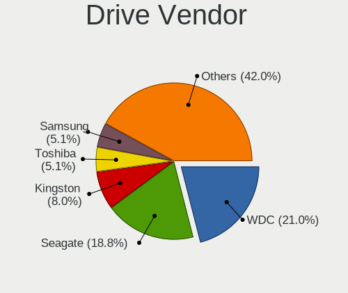
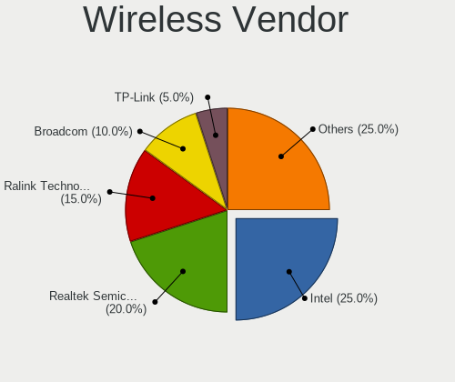

ROSA Hardware Trends (Desktops)
-------------------------------

A project to identify most popular hardware characteristics and track their change
over time based on data collected by ROSA users at https://Linux-Hardware.org.

Anyone can contribute to this report by the [hw-probe](https://github.com/linuxhw/hw-probe) tool:

    sudo -E hw-probe -all -upload

Full-feature report is available here: https://linux-hardware.org/?view=trends&formfactor=desktop

Period: Oct, 2021.

Contents
--------

* [ System ](#system)
  - [ OS                       ](#os)
  - [ OS Family                ](#os-family)
  - [ Kernel                   ](#kernel)
  - [ Kernel Family            ](#kernel-family)
  - [ Kernel Major Ver.        ](#kernel-major-ver)
  - [ Arch                     ](#arch)
  - [ DE                       ](#de)
  - [ Display Server           ](#display-server)
  - [ Display Manager          ](#display-manager)
  - [ OS Lang                  ](#os-lang)
  - [ Boot Mode                ](#boot-mode)
  - [ Filesystem               ](#filesystem)
  - [ Part. scheme             ](#part-scheme)
  - [ Dual Boot with Linux/BSD ](#dual-boot-with-linuxbsd)
  - [ Dual Boot (Win)          ](#dual-boot-win)

* [ Board ](#board)
  - [ Vendor                   ](#vendor)
  - [ Model                    ](#model)
  - [ Model Family             ](#model-family)
  - [ MFG Year                 ](#mfg-year)
  - [ Form Factor              ](#form-factor)
  - [ Secure Boot              ](#secure-boot)
  - [ Coreboot                 ](#coreboot)
  - [ RAM Size                 ](#ram-size)
  - [ RAM Used                 ](#ram-used)
  - [ Total Drives             ](#total-drives)
  - [ Has CD-ROM               ](#has-cd-rom)
  - [ Has Ethernet             ](#has-ethernet)
  - [ Has WiFi                 ](#has-wifi)
  - [ Has Bluetooth            ](#has-bluetooth)

* [ Location ](#location)
  - [ Country                  ](#country)
  - [ City                     ](#city)

* [ Drives ](#drives)
  - [ Drive Vendor             ](#drive-vendor)
  - [ Drive Model              ](#drive-model)
  - [ HDD Vendor               ](#hdd-vendor)
  - [ SSD Vendor               ](#ssd-vendor)
  - [ Drive Kind               ](#drive-kind)
  - [ Drive Connector          ](#drive-connector)
  - [ Drive Size               ](#drive-size)
  - [ Space Total              ](#space-total)
  - [ Space Used               ](#space-used)
  - [ Malfunc. Drives          ](#malfunc-drives)
  - [ Malfunc. Drive Vendor    ](#malfunc-drive-vendor)
  - [ Malfunc. HDD Vendor      ](#malfunc-hdd-vendor)
  - [ Malfunc. Drive Kind      ](#malfunc-drive-kind)
  - [ Failed Drives            ](#failed-drives)
  - [ Failed Drive Vendor      ](#failed-drive-vendor)
  - [ Drive Status             ](#drive-status)

* [ Storage controller ](#storage-controller)
  - [ Storage Vendor           ](#storage-vendor)
  - [ Storage Model            ](#storage-model)
  - [ Storage Kind             ](#storage-kind)

* [ Processor ](#processor)
  - [ CPU Vendor               ](#cpu-vendor)
  - [ CPU Model                ](#cpu-model)
  - [ CPU Model Family         ](#cpu-model-family)
  - [ CPU Cores                ](#cpu-cores)
  - [ CPU Sockets              ](#cpu-sockets)
  - [ CPU Threads              ](#cpu-threads)
  - [ CPU Op-Modes             ](#cpu-op-modes)
  - [ CPU Microcode            ](#cpu-microcode)
  - [ CPU Microarch            ](#cpu-microarch)

* [ Graphics ](#graphics)
  - [ GPU Vendor               ](#gpu-vendor)
  - [ GPU Model                ](#gpu-model)
  - [ GPU Combo                ](#gpu-combo)
  - [ GPU Driver               ](#gpu-driver)
  - [ GPU Memory               ](#gpu-memory)

* [ Monitor ](#monitor)
  - [ Monitor Vendor           ](#monitor-vendor)
  - [ Monitor Model            ](#monitor-model)
  - [ Monitor Resolution       ](#monitor-resolution)
  - [ Monitor Diagonal         ](#monitor-diagonal)
  - [ Monitor Width            ](#monitor-width)
  - [ Aspect Ratio             ](#aspect-ratio)
  - [ Monitor Area             ](#monitor-area)
  - [ Pixel Density            ](#pixel-density)
  - [ Multiple Monitors        ](#multiple-monitors)

* [ Network ](#network)
  - [ Net Controller Vendor    ](#net-controller-vendor)
  - [ Net Controller Model     ](#net-controller-model)
  - [ Wireless Vendor          ](#wireless-vendor)
  - [ Wireless Model           ](#wireless-model)
  - [ Ethernet Vendor          ](#ethernet-vendor)
  - [ Ethernet Model           ](#ethernet-model)
  - [ Net Controller Kind      ](#net-controller-kind)
  - [ Used Controller          ](#used-controller)
  - [ NICs                     ](#nics)
  - [ IPv6                     ](#ipv6)

* [ Bluetooth ](#bluetooth)
  - [ Bluetooth Vendor         ](#bluetooth-vendor)
  - [ Bluetooth Model          ](#bluetooth-model)

* [ Sound ](#sound)
  - [ Sound Vendor             ](#sound-vendor)
  - [ Sound Model              ](#sound-model)

* [ Memory ](#memory)
  - [ Memory Vendor            ](#memory-vendor)
  - [ Memory Model             ](#memory-model)
  - [ Memory Kind              ](#memory-kind)
  - [ Memory Form Factor       ](#memory-form-factor)
  - [ Memory Size              ](#memory-size)
  - [ Memory Speed             ](#memory-speed)

* [ Printers & scanners ](#printers--scanners)
  - [ Printer Vendor           ](#printer-vendor)
  - [ Printer Model            ](#printer-model)
  - [ Scanner Vendor           ](#scanner-vendor)
  - [ Scanner Model            ](#scanner-model)

* [ Camera ](#camera)
  - [ Camera Vendor            ](#camera-vendor)
  - [ Camera Model             ](#camera-model)

* [ Security ](#security)
  - [ Fingerprint Vendor       ](#fingerprint-vendor)
  - [ Fingerprint Model        ](#fingerprint-model)
  - [ Chipcard Vendor          ](#chipcard-vendor)
  - [ Chipcard Model           ](#chipcard-model)

* [ Unsupported ](#unsupported)
  - [ Unsupported Devices      ](#unsupported-devices)
  - [ Unsupported Device Types ](#unsupported-device-types)

System
------

OS
--

Installed operating systems

| Name        | Desktops | Percent |
|-------------|----------|---------|
| ROSA 12     | 62       | 49.21%  |
| ROSA R11.1  | 58       | 46.03%  |
| ROSA R12    | 3        | 2.38%   |
| ROSA R9-R11 | 1        | 0.79%   |
| ROSA R9     | 1        | 0.79%   |
| ROSA R11    | 1        | 0.79%   |

OS Family
---------

OS without a version

| Name | Desktops | Percent |
|------|----------|---------|
| ROSA | 126      | 100%    |

Kernel
------

Version of the Linux kernel

| Version                             | Desktops | Percent |
|-------------------------------------|----------|---------|
| 5.10.71-generic-1rosa2021.1-x86_64  | 61       | 48.41%  |
| 5.4.83-generic-2rosa-x86_64         | 17       | 13.49%  |
| 4.15.0-desktop-122.124.1rosa-x86_64 | 14       | 11.11%  |
| 5.4.32-generic-2rosa-x86_64         | 12       | 9.52%   |
| 5.4.32-generic-2rosa-i586           | 5        | 3.97%   |
| 5.4.83-generic-2rosa-i586           | 4        | 3.17%   |
| 5.10.70-generic-2rosa2021.1-x86_64  | 3        | 2.38%   |
| 4.15.0-desktop-122.124.1rosa-i586   | 3        | 2.38%   |
| 4.9.155-nrj-desktop-1rosa-x86_64    | 2        | 1.59%   |
| 5.4.150-generic-1rosa2021.1-x86_64  | 1        | 0.79%   |
| 4.9.20-nrj-desktop-1rosa-i586       | 1        | 0.79%   |
| 4.15.0-desktop-47.2rosa-x86_64      | 1        | 0.79%   |
| 4.15.0-desktop-45.1rosa-x86_64      | 1        | 0.79%   |
| 4.15.0-desktop-45.1rosa-i586        | 1        | 0.79%   |

Kernel Family
-------------

Linux kernel without a distro release

| Version | Desktops | Percent |
|---------|----------|---------|
| 5.10.71 | 61       | 48.41%  |
| 5.4.83  | 21       | 16.67%  |
| 4.15.0  | 20       | 15.87%  |
| 5.4.32  | 17       | 13.49%  |
| 5.10.70 | 3        | 2.38%   |
| 4.9.155 | 2        | 1.59%   |
| 5.4.150 | 1        | 0.79%   |
| 4.9.20  | 1        | 0.79%   |

Kernel Major Ver.
-----------------

Linux kernel major version

| Version | Desktops | Percent |
|---------|----------|---------|
| 5.10    | 64       | 50.79%  |
| 5.4     | 39       | 30.95%  |
| 4.15    | 20       | 15.87%  |
| 4.9     | 3        | 2.38%   |

Arch
----

OS architecture (x86_64, i586, etc.)

| Name   | Desktops | Percent |
|--------|----------|---------|
| x86_64 | 112      | 88.89%  |
| i686   | 14       | 11.11%  |

DE
--

Desktop Environment

| Name    | Desktops | Percent |
|---------|----------|---------|
| KDE5    | 78       | 61.9%   |
| KDE4    | 33       | 26.19%  |
| LXQt    | 9        | 7.14%   |
| XFCE    | 3        | 2.38%   |
| GNOME   | 2        | 1.59%   |
| Unknown | 1        | 0.79%   |

Display Server
--------------

X11 or Wayland

| Name    | Desktops | Percent |
|---------|----------|---------|
| X11     | 73       | 57.94%  |
| Wayland | 53       | 42.06%  |

Display Manager
---------------

SDDM, LightDM, etc.

| Name | Desktops | Percent |
|------|----------|---------|
| GDM  | 61       | 48.41%  |
| KDM  | 33       | 26.19%  |
| SDDM | 32       | 25.4%   |

OS Lang
-------

Language

| Lang    | Desktops | Percent |
|---------|----------|---------|
| ru_RU   | 109      | 86.51%  |
| en_US   | 4        | 3.17%   |
| fr_FR   | 3        | 2.38%   |
| pl_PL   | 2        | 1.59%   |
| en_GB   | 2        | 1.59%   |
| Unknown | 2        | 1.59%   |
| pt_BR   | 1        | 0.79%   |
| es_ES   | 1        | 0.79%   |
| es_CO   | 1        | 0.79%   |
| de_DE   | 1        | 0.79%   |

Boot Mode
---------

EFI or BIOS

| Mode | Desktops | Percent |
|------|----------|---------|
| BIOS | 82       | 65.08%  |
| EFI  | 44       | 34.92%  |

Filesystem
----------

Type of filesystem

| Type  | Desktops | Percent |
|-------|----------|---------|
| Ext4  | 120      | 95.24%  |
| Ext3  | 2        | 1.59%   |
| Btrfs | 2        | 1.59%   |
| Xfs   | 1        | 0.79%   |
| F2fs  | 1        | 0.79%   |

Part. scheme
------------

Scheme of partitioning

| Type | Desktops | Percent |
|------|----------|---------|
| MBR  | 75       | 59.52%  |
| GPT  | 51       | 40.48%  |

Dual Boot with Linux/BSD
------------------------

Hosting more than one Linux/BSD

| Dual boot | Desktops | Percent |
|-----------|----------|---------|
| No        | 87       | 69.05%  |
| Yes       | 39       | 30.95%  |

Dual Boot (Win)
---------------

Hosting Linux and Windows

| Dual boot | Desktops | Percent |
|-----------|----------|---------|
| Yes       | 63       | 50%     |
| No        | 63       | 50%     |

Board
-----

Vendor
------

Motherboard manufacturer

| Name                | Desktops | Percent |
|---------------------|----------|---------|
| ASUSTek Computer    | 30       | 23.81%  |
| Gigabyte Technology | 22       | 17.46%  |
| MSI                 | 18       | 14.29%  |
| ASRock              | 18       | 14.29%  |
| Lenovo              | 5        | 3.97%   |
| Intel               | 5        | 3.97%   |
| Hewlett-Packard     | 4        | 3.17%   |
| Dell                | 4        | 3.17%   |
| Acer                | 3        | 2.38%   |
| Unknown             | 3        | 2.38%   |
| Huanan              | 2        | 1.59%   |
| ECS                 | 2        | 1.59%   |
| Shuttle             | 1        | 0.79%   |
| Nvidia              | 1        | 0.79%   |
| ICL                 | 1        | 0.79%   |
| IBM                 | 1        | 0.79%   |
| Fujitsu Siemens     | 1        | 0.79%   |
| Fujitsu             | 1        | 0.79%   |
| Colorful Technology | 1        | 0.79%   |
| Biostar             | 1        | 0.79%   |
| Athermiter/PlexHD   | 1        | 0.79%   |
| AQUARIUS            | 1        | 0.79%   |

Model
-----

Motherboard model

| Name                                   | Desktops | Percent |
|----------------------------------------|----------|---------|
| ASUS All Series                        | 3        | 2.38%   |
| Unknown                                | 3        | 2.38%   |
| MSI MS-7A36                            | 2        | 1.59%   |
| MSI MS-7592                            | 2        | 1.59%   |
| MSI MS-7529                            | 2        | 1.59%   |
| Dell OptiPlex 760                      | 2        | 1.59%   |
| ASRock G41M-VS3                        | 2        | 1.59%   |
| ASRock G31M-GS                         | 2        | 1.59%   |
| Shuttle SN78S                          | 1        | 0.79%   |
| Nvidia MCP7A                           | 1        | 0.79%   |
| MSI MS-7C51                            | 1        | 0.79%   |
| MSI MS-7B98                            | 1        | 0.79%   |
| MSI MS-7B38                            | 1        | 0.79%   |
| MSI MS-7A33                            | 1        | 0.79%   |
| MSI MS-7A15                            | 1        | 0.79%   |
| MSI MS-7995                            | 1        | 0.79%   |
| MSI MS-7817                            | 1        | 0.79%   |
| MSI MS-7808                            | 1        | 0.79%   |
| MSI MS-7721                            | 1        | 0.79%   |
| MSI MS-7693                            | 1        | 0.79%   |
| MSI MS-7309                            | 1        | 0.79%   |
| MSI MS-7222                            | 1        | 0.79%   |
| Lenovo ThinkCentre M93z 10AES02G00     | 1        | 0.79%   |
| Lenovo ThinkCentre M71e 3167A46        | 1        | 0.79%   |
| Lenovo ThinkCentre A55 89857DG         | 1        | 0.79%   |
| Lenovo IdeaCentre 300-20ISH 90DA00HNRS | 1        | 0.79%   |
| Lenovo H420                            | 1        | 0.79%   |
| Intel X99                              | 1        | 0.79%   |
| Intel X79                              | 1        | 0.79%   |
| Intel Thurley                          | 1        | 0.79%   |
| Intel DG31PR AAD97573-203              | 1        | 0.79%   |
| Intel D946GZAB AAD66610-300            | 1        | 0.79%   |
| ICL H410SB                             | 1        | 0.79%   |
| IBM 9210D7G                            | 1        | 0.79%   |
| Huanan X99-8M-F V1.1                   | 1        | 0.79%   |
| Huanan X99 F8D V2.2                    | 1        | 0.79%   |
| HP Z230 Tower Workstation              | 1        | 0.79%   |
| HP Compaq dc5800 Microtower            | 1        | 0.79%   |
| HP Compaq 6200 Pro SFF PC              | 1        | 0.79%   |
| HP 500-333nr                           | 1        | 0.79%   |
| Gigabyte Z87P-D3                       | 1        | 0.79%   |
| Gigabyte Z87-HD3                       | 1        | 0.79%   |
| Gigabyte X79-UD3                       | 1        | 0.79%   |
| Gigabyte X570 GAMING X                 | 1        | 0.79%   |
| Gigabyte P75-D3                        | 1        | 0.79%   |
| Gigabyte P35-DS3R                      | 1        | 0.79%   |
| Gigabyte H77N-WIFI                     | 1        | 0.79%   |
| Gigabyte H61M-S2PH                     | 1        | 0.79%   |
| Gigabyte GB-XGPDR1-00                  | 1        | 0.79%   |
| Gigabyte GA-MA790GP-DS4H               | 1        | 0.79%   |
| Gigabyte GA-MA78GM-UD2H                | 1        | 0.79%   |
| Gigabyte GA-MA78GM-S2H                 | 1        | 0.79%   |
| Gigabyte GA-970A-UD3                   | 1        | 0.79%   |
| Gigabyte GA-78LMT-S2P                  | 1        | 0.79%   |
| Gigabyte GA-78LMT-S2                   | 1        | 0.79%   |
| Gigabyte G41MT-S2                      | 1        | 0.79%   |
| Gigabyte F2A88X-D3HP                   | 1        | 0.79%   |
| Gigabyte EP45-DS3L                     | 1        | 0.79%   |
| Gigabyte B450 AORUS ELITE              | 1        | 0.79%   |
| Gigabyte AB350M-DS3H                   | 1        | 0.79%   |

Model Family
------------

Motherboard model prefix

| Name                     | Desktops | Percent |
|--------------------------|----------|---------|
| ASUS PRIME               | 4        | 3.17%   |
| Lenovo ThinkCentre       | 3        | 2.38%   |
| Dell OptiPlex            | 3        | 2.38%   |
| ASUS All                 | 3        | 2.38%   |
| Unknown                  | 3        | 2.38%   |
| MSI MS-7A36              | 2        | 1.59%   |
| MSI MS-7592              | 2        | 1.59%   |
| MSI MS-7529              | 2        | 1.59%   |
| HP Compaq                | 2        | 1.59%   |
| ASUS P8H61-M             | 2        | 1.59%   |
| ASRock G41M-VS3          | 2        | 1.59%   |
| ASRock G31M-GS           | 2        | 1.59%   |
| Acer Veriton             | 2        | 1.59%   |
| Shuttle SN78S            | 1        | 0.79%   |
| Nvidia MCP7A             | 1        | 0.79%   |
| MSI MS-7C51              | 1        | 0.79%   |
| MSI MS-7B98              | 1        | 0.79%   |
| MSI MS-7B38              | 1        | 0.79%   |
| MSI MS-7A33              | 1        | 0.79%   |
| MSI MS-7A15              | 1        | 0.79%   |
| MSI MS-7995              | 1        | 0.79%   |
| MSI MS-7817              | 1        | 0.79%   |
| MSI MS-7808              | 1        | 0.79%   |
| MSI MS-7721              | 1        | 0.79%   |
| MSI MS-7693              | 1        | 0.79%   |
| MSI MS-7309              | 1        | 0.79%   |
| MSI MS-7222              | 1        | 0.79%   |
| Lenovo IdeaCentre        | 1        | 0.79%   |
| Lenovo H420              | 1        | 0.79%   |
| Intel X99                | 1        | 0.79%   |
| Intel X79                | 1        | 0.79%   |
| Intel Thurley            | 1        | 0.79%   |
| Intel DG31PR             | 1        | 0.79%   |
| Intel D946GZAB           | 1        | 0.79%   |
| ICL H410SB               | 1        | 0.79%   |
| IBM 9210D7G              | 1        | 0.79%   |
| Huanan X99-8M-F          | 1        | 0.79%   |
| Huanan X99               | 1        | 0.79%   |
| HP Z230                  | 1        | 0.79%   |
| HP 500-333nr             | 1        | 0.79%   |
| Gigabyte Z87P-D3         | 1        | 0.79%   |
| Gigabyte Z87-HD3         | 1        | 0.79%   |
| Gigabyte X79-UD3         | 1        | 0.79%   |
| Gigabyte X570            | 1        | 0.79%   |
| Gigabyte P75-D3          | 1        | 0.79%   |
| Gigabyte P35-DS3R        | 1        | 0.79%   |
| Gigabyte H77N-WIFI       | 1        | 0.79%   |
| Gigabyte H61M-S2PH       | 1        | 0.79%   |
| Gigabyte GB-XGPDR1-00    | 1        | 0.79%   |
| Gigabyte GA-MA790GP-DS4H | 1        | 0.79%   |
| Gigabyte GA-MA78GM-UD2H  | 1        | 0.79%   |
| Gigabyte GA-MA78GM-S2H   | 1        | 0.79%   |
| Gigabyte GA-970A-UD3     | 1        | 0.79%   |
| Gigabyte GA-78LMT-S2P    | 1        | 0.79%   |
| Gigabyte GA-78LMT-S2     | 1        | 0.79%   |
| Gigabyte G41MT-S2        | 1        | 0.79%   |
| Gigabyte F2A88X-D3HP     | 1        | 0.79%   |
| Gigabyte EP45-DS3L       | 1        | 0.79%   |
| Gigabyte B450            | 1        | 0.79%   |
| Gigabyte AB350M-DS3H     | 1        | 0.79%   |

MFG Year
--------

Motherboard manufacture year

| Year | Desktops | Percent |
|------|----------|---------|
| 2019 | 14       | 11.11%  |
| 2009 | 12       | 9.52%   |
| 2014 | 11       | 8.73%   |
| 2012 | 11       | 8.73%   |
| 2011 | 10       | 7.94%   |
| 2010 | 10       | 7.94%   |
| 2018 | 8        | 6.35%   |
| 2013 | 8        | 6.35%   |
| 2021 | 7        | 5.56%   |
| 2020 | 7        | 5.56%   |
| 2015 | 7        | 5.56%   |
| 2007 | 7        | 5.56%   |
| 2016 | 4        | 3.17%   |
| 2008 | 4        | 3.17%   |
| 2006 | 3        | 2.38%   |
| 2017 | 1        | 0.79%   |
| 2005 | 1        | 0.79%   |
| 2004 | 1        | 0.79%   |

Form Factor
-----------

Physical design of the computer

| Name    | Desktops | Percent |
|---------|----------|---------|
| Desktop | 126      | 100%    |

Secure Boot
-----------

Enabled or disabled

| State    | Desktops | Percent |
|----------|----------|---------|
| Disabled | 126      | 100%    |

Coreboot
--------

Have coreboot on board

| Used | Desktops | Percent |
|------|----------|---------|
| No   | 126      | 100%    |

RAM Size
--------

Total RAM memory

| Size in GB  | Desktops | Percent |
|-------------|----------|---------|
| 8.01-16.0   | 37       | 29.37%  |
| 3.01-4.0    | 26       | 20.63%  |
| 4.01-8.0    | 19       | 15.08%  |
| 16.01-24.0  | 19       | 15.08%  |
| 1.01-2.0    | 12       | 9.52%   |
| 2.01-3.0    | 5        | 3.97%   |
| 32.01-64.0  | 4        | 3.17%   |
| 0.51-1.0    | 2        | 1.59%   |
| 24.01-32.0  | 1        | 0.79%   |
| 64.01-256.0 | 1        | 0.79%   |

RAM Used
--------

Used RAM memory

| Used GB  | Desktops | Percent |
|----------|----------|---------|
| 1.01-2.0 | 59       | 46.83%  |
| 0.51-1.0 | 49       | 38.89%  |
| 2.01-3.0 | 6        | 4.76%   |
| 4.01-8.0 | 5        | 3.97%   |
| 3.01-4.0 | 5        | 3.97%   |
| 0.01-0.5 | 2        | 1.59%   |

Total Drives
------------

Number of drives on board

| Drives | Desktops | Percent |
|--------|----------|---------|
| 1      | 66       | 52.38%  |
| 2      | 31       | 24.6%   |
| 3      | 20       | 15.87%  |
| 4      | 6        | 4.76%   |
| 5      | 2        | 1.59%   |
| 0      | 1        | 0.79%   |

Has CD-ROM
----------

Has CD-ROM on board

| Presented | Desktops | Percent |
|-----------|----------|---------|
| Yes       | 66       | 52.38%  |
| No        | 60       | 47.62%  |

Has Ethernet
------------

Has Ethernet on board

| Presented | Desktops | Percent |
|-----------|----------|---------|
| Yes       | 125      | 99.21%  |
| No        | 1        | 0.79%   |

Has WiFi
--------

Has WiFi module

| Presented | Desktops | Percent |
|-----------|----------|---------|
| No        | 91       | 72.22%  |
| Yes       | 35       | 27.78%  |

Has Bluetooth
-------------

Has Bluetooth module

| Presented | Desktops | Percent |
|-----------|----------|---------|
| No        | 105      | 83.33%  |
| Yes       | 21       | 16.67%  |

Location
--------

Country
-------

Geographic location (country)

| Country    | Desktops | Percent |
|------------|----------|---------|
| Russia     | 94       | 74.6%   |
| Ukraine    | 8        | 6.35%   |
| Poland     | 3        | 2.38%   |
| France     | 3        | 2.38%   |
| UK         | 2        | 1.59%   |
| Kazakhstan | 2        | 1.59%   |
| Greece     | 2        | 1.59%   |
| Germany    | 2        | 1.59%   |
| Belarus    | 2        | 1.59%   |
| USA        | 1        | 0.79%   |
| Moldova    | 1        | 0.79%   |
| Mexico     | 1        | 0.79%   |
| India      | 1        | 0.79%   |
| Hungary    | 1        | 0.79%   |
| Colombia   | 1        | 0.79%   |
| Brazil     | 1        | 0.79%   |
| Austria    | 1        | 0.79%   |

City
----

Geographic location (city)

| City              | Desktops | Percent |
|-------------------|----------|---------|
| Moscow            | 22       | 17.46%  |
| St Petersburg     | 9        | 7.14%   |
| Yekaterinburg     | 5        | 3.97%   |
| Irkutsk           | 4        | 3.17%   |
| Paris             | 3        | 2.38%   |
| Nizhniy Novgorod  | 3        | 2.38%   |
| Kazan?ˆ™          | 3        | 2.38%   |
| Chelyabinsk       | 3        | 2.38%   |
| Samara            | 2        | 1.59%   |
| Novosibirsk       | 2        | 1.59%   |
| Miass             | 2        | 1.59%   |
| Cherepovets       | 2        | 1.59%   |
| Bryansk           | 2        | 1.59%   |
| Yoshkar-Ola       | 1        | 0.79%   |
| Voronezh          | 1        | 0.79%   |
| Volgodonsk        | 1        | 0.79%   |
| Vladivostok       | 1        | 0.79%   |
| Vienna            | 1        | 0.79%   |
| Veliky Novgorod   | 1        | 0.79%   |
| Ust-Kamenogorsk   | 1        | 0.79%   |
| Uruapan           | 1        | 0.79%   |
| Ulyanovsk         | 1        | 0.79%   |
| Tyumen            | 1        | 0.79%   |
| Tula              | 1        | 0.79%   |
| Torzhok           | 1        | 0.79%   |
| Tiraspol          | 1        | 0.79%   |
| Temirtau          | 1        | 0.79%   |
| Taman'            | 1        | 0.79%   |
| Taganrog          | 1        | 0.79%   |
| Szigetszentmarton | 1        | 0.79%   |
| Stuttgart         | 1        | 0.79%   |
| Sosnowiec         | 1        | 0.79%   |
| Sochi             | 1        | 0.79%   |
| Simferopol        | 1        | 0.79%   |
| Sevastopol        | 1        | 0.79%   |
| Serdobsk          | 1        | 0.79%   |
| Saransk           | 1        | 0.79%   |
| Ryazan            | 1        | 0.79%   |
| Rostov-on-Don     | 1        | 0.79%   |
| Pyatigorsk        | 1        | 0.79%   |
| Perm              | 1        | 0.79%   |
| Omsk              | 1        | 0.79%   |
| Odessa            | 1        | 0.79%   |
| Nyagan            | 1        | 0.79%   |
| Novy Urengoy      | 1        | 0.79%   |
| Novoaltaysk       | 1        | 0.79%   |
| Newark            | 1        | 0.79%   |
| Nashik            | 1        | 0.79%   |
| Naousa            | 1        | 0.79%   |
| Mykolayiv         | 1        | 0.79%   |
| Moelfre           | 1        | 0.79%   |
| Minsk             | 1        | 0.79%   |
| Medell?­n         | 1        | 0.79%   |
| Makiivka          | 1        | 0.79%   |
| Lipetsk           | 1        | 0.79%   |
| Kyiv              | 1        | 0.79%   |
| Krasnoyarsk       | 1        | 0.79%   |
| Krasnodar         | 1        | 0.79%   |
| Krakow            | 1        | 0.79%   |
| Kovrov            | 1        | 0.79%   |

Drives
------

Drive Vendor
------------

Hard drive vendors

| Vendor              | Desktops | Drives  | Percent |
|---------------------|----------|---------|---------|
| WDC                 | 55       | 66      | 27.36%  |
| Seagate             | 35       | 38      | 17.41%  |
| Samsung Electronics | 18       | 20      | 8.96%   |
| Toshiba             | 14       | 17      | 6.97%   |
| Hitachi             | 12       | 12      | 5.97%   |
| Kingston            | 7        | 7       | 3.48%   |
| SanDisk             | 6        | 8       | 2.99%   |
| China               | 6        | 6       | 2.99%   |
| SPCC                | 4        | 4       | 1.99%   |
| OCZ                 | 4        | 4       | 1.99%   |
| MAXTOR              | 4        | 4       | 1.99%   |
| A-DATA Technology   | 4        | 4       | 1.99%   |
| GOODRAM             | 3        | 4       | 1.49%   |
| PLEXTOR             | 2        | 2       | 1%      |
| KingDian            | 2        | 2       | 1%      |
| Intenso             | 2        | 3       | 1%      |
| Intel               | 2        | 2       | 1%      |
| HGST                | 2        | 2       | 1%      |
| FOXLINE             | 2        | 2       | 1%      |
| Apacer              | 2        | 2       | 1%      |
| Smartbuy            | 1        | 1       | 0.5%    |
| Silicon Motion      | 1        | 1       | 0.5%    |
| Patriot             | 1        | 1       | 0.5%    |
| Mass                | 1        | Unknown | 0.5%    |
| Lexar               | 1        | 1       | 0.5%    |
| KingSpec            | 1        | 1       | 0.5%    |
| KingFast            | 1        | 1       | 0.5%    |
| Hewlett-Packard     | 1        | 1       | 0.5%    |
| Gigabyte Technology | 1        | 1       | 0.5%    |
| GeIL                | 1        | 1       | 0.5%    |
| Crucial             | 1        | 1       | 0.5%    |
| CHN25SATAS1         | 1        | 1       | 0.5%    |
| AMD                 | 1        | 1       | 0.5%    |
| 2.5                 | 1        | 1       | 0.5%    |
| Unknown             | 1        | 1       | 0.5%    |

Drive Model
-----------

Hard drive models

| Model                            | Desktops | Percent |
|----------------------------------|----------|---------|
| Toshiba HDWD110 1TB              | 5        | 2.28%   |
| Toshiba DT01ACA050 500GB         | 4        | 1.83%   |
| Seagate ST500DM002-1BD142 500GB  | 4        | 1.83%   |
| WDC WD20PURZ-85GU6Y0 2TB         | 3        | 1.37%   |
| Seagate ST2000DM008-2FR102 2TB   | 3        | 1.37%   |
| Seagate ST1000DM010-2EP102 1TB   | 3        | 1.37%   |
| Kingston SA400S37120G 120GB SSD  | 3        | 1.37%   |
| WDC WDS240G2G0A-00JH30 240GB SSD | 2        | 0.91%   |
| WDC WD10PURZ-85U8XY0 1TB         | 2        | 0.91%   |
| WDC WD10EZRX-00L4HB0 1TB         | 2        | 0.91%   |
| WDC WD10EZEX-21M2NA0 1TB         | 2        | 0.91%   |
| WDC WD10EZEX-08WN4A0 1TB         | 2        | 0.91%   |
| WDC WD10EZEX-00BN5A0 1TB         | 2        | 0.91%   |
| WDC WD10EADS-65M2B0 1TB          | 2        | 0.91%   |
| Toshiba HDWD105 500GB            | 2        | 0.91%   |
| Seagate ST380815AS 80GB          | 2        | 0.91%   |
| Seagate ST3160811AS 160GB        | 2        | 0.91%   |
| SanDisk SDSSDA120G 120GB         | 2        | 0.91%   |
| Samsung SSD 860 EVO 250GB        | 2        | 0.91%   |
| Samsung SSD 750 EVO 250GB        | 2        | 0.91%   |
| Samsung HD502HJ 500GB            | 2        | 0.91%   |
| Hitachi HDS721050CLA360 500GB    | 2        | 0.91%   |
| WDC WDS250G2B0A-00SM50 250GB SSD | 1        | 0.46%   |
| WDC WDS240G2G0B-00EPW0 240GB SSD | 1        | 0.46%   |
| WDC WD800JD-23LSA0 80GB          | 1        | 0.46%   |
| WDC WD800JD-08MSA1 80GB          | 1        | 0.46%   |
| WDC WD800JD-00LSA5 80GB          | 1        | 0.46%   |
| WDC WD800JD-00LSA0 80GB          | 1        | 0.46%   |
| WDC WD60EFRX-68MYMN1 6TB         | 1        | 0.46%   |
| WDC WD60EFRX-68L0BN1 6TB         | 1        | 0.46%   |
| WDC WD5003AZEX-00MK2A0 500GB     | 1        | 0.46%   |
| WDC WD5003ABYZ-011FA0 500GB      | 1        | 0.46%   |
| WDC WD5002ABYS-01B1B0 500GB      | 1        | 0.46%   |
| WDC WD5000LPVX-00V0TT0 500GB     | 1        | 0.46%   |
| WDC WD5000LPCX-00VHAT0 500GB     | 1        | 0.46%   |
| WDC WD5000BEVT-22A0RT0 500GB     | 1        | 0.46%   |
| WDC WD5000AZRX-00A8LB0 500GB     | 1        | 0.46%   |
| WDC WD5000AZLX-22JKKA0 500GB     | 1        | 0.46%   |
| WDC WD5000AZLX-08K2TA0 500GB     | 1        | 0.46%   |
| WDC WD5000AZLX-00K2TA0 500GB     | 1        | 0.46%   |
| WDC WD5000AVDS-63U7B1 500GB      | 1        | 0.46%   |
| WDC WD5000AAKX-75U6AA0 500GB     | 1        | 0.46%   |
| WDC WD5000AAKX-60U6AA0 500GB     | 1        | 0.46%   |
| WDC WD5000AAKX-08U6AA0 500GB     | 1        | 0.46%   |
| WDC WD5000AAKX-083CA1 500GB      | 1        | 0.46%   |
| WDC WD5000AAKX-001CA0 500GB      | 1        | 0.46%   |
| WDC WD5000AAKS-00E4A0 500GB      | 1        | 0.46%   |
| WDC WD5000AADS-00S9B0 500GB      | 1        | 0.46%   |
| WDC WD4003FRYZ-01F0DB0 4TB       | 1        | 0.46%   |
| WDC WD3200BPVT-22JJ5T0 320GB     | 1        | 0.46%   |
| WDC WD3200AAKB-00WHA0 320GB      | 1        | 0.46%   |
| WDC WD3200AAJS-00L7A0 320GB      | 1        | 0.46%   |
| WDC WD30EZRX-00MMMB0 3TB         | 1        | 0.46%   |
| WDC WD2500KS-00MJB0 250GB        | 1        | 0.46%   |
| WDC WD2500JS-00NCB1 250GB        | 1        | 0.46%   |
| WDC WD2500AAKX-083CA1 250GB      | 1        | 0.46%   |
| WDC WD20EZRZ-00Z5HB0 2TB         | 1        | 0.46%   |
| WDC WD20EARS-00MVWB0 2TB         | 1        | 0.46%   |
| WDC WD1600AAJS-22PSA0 160GB      | 1        | 0.46%   |
| WDC WD15EARS-00Z5B1 1TB          | 1        | 0.46%   |

HDD Vendor
----------

Hard disk drive vendors

| Vendor              | Desktops | Drives | Percent |
|---------------------|----------|--------|---------|
| WDC                 | 52       | 62     | 40.31%  |
| Seagate             | 35       | 38     | 27.13%  |
| Toshiba             | 14       | 16     | 10.85%  |
| Hitachi             | 12       | 12     | 9.3%    |
| Samsung Electronics | 10       | 11     | 7.75%   |
| MAXTOR              | 4        | 4      | 3.1%    |
| HGST                | 2        | 2      | 1.55%   |

SSD Vendor
----------

Solid state drive vendors

| Vendor              | Desktops | Drives | Percent |
|---------------------|----------|--------|---------|
| SanDisk             | 6        | 8      | 9.09%   |
| Samsung Electronics | 6        | 7      | 9.09%   |
| Kingston            | 6        | 6      | 9.09%   |
| China               | 6        | 6      | 9.09%   |
| WDC                 | 4        | 4      | 6.06%   |
| SPCC                | 4        | 4      | 6.06%   |
| OCZ                 | 4        | 4      | 6.06%   |
| GOODRAM             | 3        | 4      | 4.55%   |
| PLEXTOR             | 2        | 2      | 3.03%   |
| KingDian            | 2        | 2      | 3.03%   |
| Intenso             | 2        | 3      | 3.03%   |
| FOXLINE             | 2        | 2      | 3.03%   |
| Apacer              | 2        | 2      | 3.03%   |
| A-DATA Technology   | 2        | 2      | 3.03%   |
| Toshiba             | 1        | 1      | 1.52%   |
| Smartbuy            | 1        | 1      | 1.52%   |
| Patriot             | 1        | 1      | 1.52%   |
| Lexar               | 1        | 1      | 1.52%   |
| KingSpec            | 1        | 1      | 1.52%   |
| KingFast            | 1        | 1      | 1.52%   |
| Intel               | 1        | 1      | 1.52%   |
| Hewlett-Packard     | 1        | 1      | 1.52%   |
| Gigabyte Technology | 1        | 1      | 1.52%   |
| GeIL                | 1        | 1      | 1.52%   |
| Crucial             | 1        | 1      | 1.52%   |
| CHN25SATAS1         | 1        | 1      | 1.52%   |
| AMD                 | 1        | 1      | 1.52%   |
| 2.5                 | 1        | 1      | 1.52%   |
| Unknown             | 1        | 1      | 1.52%   |

Drive Kind
----------

HDD or SSD

| Kind    | Desktops | Drives  | Percent |
|---------|----------|---------|---------|
| HDD     | 105      | 145     | 62.5%   |
| SSD     | 55       | 71      | 32.74%  |
| NVMe    | 7        | 7       | 4.17%   |
| Unknown | 1        | Unknown | 0.6%    |

Drive Connector
---------------

SATA, SAS, NVMe, etc.

| Type | Desktops | Drives | Percent |
|------|----------|--------|---------|
| SATA | 124      | 214    | 92.54%  |
| NVMe | 7        | 7      | 5.22%   |
| SAS  | 3        | 2      | 2.24%   |

Drive Size
----------

Size of hard drive

| Size in TB | Desktops | Drives | Percent |
|------------|----------|--------|---------|
| 0.01-0.5   | 109      | 151    | 66.06%  |
| 0.51-1.0   | 38       | 44     | 23.03%  |
| 1.01-2.0   | 12       | 13     | 7.27%   |
| 2.01-3.0   | 3        | 3      | 1.82%   |
| 4.01-10.0  | 2        | 4      | 1.21%   |
| 3.01-4.0   | 1        | 1      | 0.61%   |

Space Total
-----------

Amount of disk space available on the file system

| Size in GB     | Desktops | Percent |
|----------------|----------|---------|
| 101-250        | 37       | 29.37%  |
| 1-20           | 17       | 13.49%  |
| 251-500        | 16       | 12.7%   |
| 51-100         | 15       | 11.9%   |
| 501-1000       | 13       | 10.32%  |
| 1001-2000      | 12       | 9.52%   |
| 21-50          | 9        | 7.14%   |
| 2001-3000      | 4        | 3.17%   |
| More than 3000 | 3        | 2.38%   |

Space Used
----------

Amount of used disk space

| Used GB        | Desktops | Percent |
|----------------|----------|---------|
| 1-20           | 86       | 68.25%  |
| 101-250        | 9        | 7.14%   |
| 51-100         | 8        | 6.35%   |
| 1001-2000      | 7        | 5.56%   |
| 251-500        | 5        | 3.97%   |
| 501-1000       | 5        | 3.97%   |
| 21-50          | 3        | 2.38%   |
| More than 3000 | 2        | 1.59%   |
| 2001-3000      | 1        | 0.79%   |

Malfunc. Drives
---------------

Drive models with a malfunction

| Model                             | Desktops | Drives | Percent |
|-----------------------------------|----------|--------|---------|
| Toshiba DT01ACA050 500GB          | 3        | 4      | 5.08%   |
| WDC WD10EADS-65M2B0 1TB           | 2        | 2      | 3.39%   |
| Seagate ST500DM002-1BD142 500GB   | 2        | 2      | 3.39%   |
| WDC WDS240G2G0B-00EPW0 240GB SSD  | 1        | 1      | 1.69%   |
| WDC WD800JD-23LSA0 80GB           | 1        | 1      | 1.69%   |
| WDC WD800JD-00LSA0 80GB           | 1        | 1      | 1.69%   |
| WDC WD5000BEVT-22A0RT0 500GB      | 1        | 1      | 1.69%   |
| WDC WD5000AZLX-22JKKA0 500GB      | 1        | 1      | 1.69%   |
| WDC WD5000AAKX-60U6AA0 500GB      | 1        | 1      | 1.69%   |
| WDC WD5000AAKX-083CA1 500GB       | 1        | 1      | 1.69%   |
| WDC WD30EZRX-00MMMB0 3TB          | 1        | 1      | 1.69%   |
| WDC WD2500KS-00MJB0 250GB         | 1        | 1      | 1.69%   |
| WDC WD2500JS-00NCB1 250GB         | 1        | 1      | 1.69%   |
| WDC WD20PURZ-85GU6Y0 2TB          | 1        | 1      | 1.69%   |
| WDC WD20EARS-00MVWB0 2TB          | 1        | 1      | 1.69%   |
| WDC WD15EARS-00Z5B1 1TB           | 1        | 1      | 1.69%   |
| WDC WD10EZEX-00RKKA0 1TB          | 1        | 1      | 1.69%   |
| WDC WD10EADS-00L5B1 1TB           | 1        | 1      | 1.69%   |
| Toshiba MK2552GSX 250GB           | 1        | 1      | 1.69%   |
| Toshiba MK2002TSKB 2TB            | 1        | 1      | 1.69%   |
| Toshiba DT01ACA100 1TB            | 1        | 1      | 1.69%   |
| Seagate ST380815AS 80GB           | 1        | 1      | 1.69%   |
| Seagate ST380011A 34GB            | 1        | 1      | 1.69%   |
| Seagate ST3750640AS 752GB         | 1        | 1      | 1.69%   |
| Seagate ST3500418AS 500GB         | 1        | 1      | 1.69%   |
| Seagate ST3360320AS 360GB         | 1        | 1      | 1.69%   |
| Seagate ST3250312AS 250GB         | 1        | 1      | 1.69%   |
| Seagate ST3250310AS 250GB         | 1        | 1      | 1.69%   |
| Seagate ST3160811AS 160GB         | 1        | 1      | 1.69%   |
| Seagate ST3160215A 160GB          | 1        | 1      | 1.69%   |
| Seagate ST3120827AS 120GB         | 1        | 1      | 1.69%   |
| Seagate ST31000340AS 1TB          | 1        | 1      | 1.69%   |
| Seagate ST3000DM008-2DM166 3TB    | 1        | 1      | 1.69%   |
| Seagate ST3000DM001-1CH166 3TB    | 1        | 1      | 1.69%   |
| Seagate ST1000DM010-2EP102 1TB    | 1        | 1      | 1.69%   |
| Samsung Electronics SP2504C 250GB | 1        | 1      | 1.69%   |
| Samsung Electronics SP2004C 200GB | 1        | 1      | 1.69%   |
| Samsung Electronics HD503HI 500GB | 1        | 1      | 1.69%   |
| Samsung Electronics HD502IJ 500GB | 1        | 1      | 1.69%   |
| Samsung Electronics HD502HI 500GB | 1        | 2      | 1.69%   |
| Samsung Electronics HD154UI 1TB   | 1        | 1      | 1.69%   |
| Samsung Electronics HD103SI 1TB   | 1        | 1      | 1.69%   |
| OCZ VERTEX3 240GB SSD             | 1        | 1      | 1.69%   |
| OCZ VERTEX3 120GB SSD             | 1        | 1      | 1.69%   |
| MAXTOR STM3160815AS 160GB         | 1        | 1      | 1.69%   |
| MAXTOR 6Y080M0 82GB               | 1        | 1      | 1.69%   |
| MAXTOR 6E040L0 41GB               | 1        | 1      | 1.69%   |
| KingSpec P4-240 240GB SSD         | 1        | 1      | 1.69%   |
| Hitachi HTS545025B9A300 250GB     | 1        | 1      | 1.69%   |
| Hitachi HDS721680PLA380 80GB      | 1        | 1      | 1.69%   |
| Hitachi HDS721050CLA360 500GB     | 1        | 1      | 1.69%   |
| Hitachi HDS721032CLA362 320GB     | 1        | 1      | 1.69%   |
| Hitachi HDS721010CLA330 1TB       | 1        | 1      | 1.69%   |
| Hitachi HDP725050GLA360 500GB     | 1        | 1      | 1.69%   |
| A-DATA Technology SX8200PNP 256GB | 1        | 1      | 1.69%   |

Malfunc. Drive Vendor
---------------------

Vendors of faulty drives

| Vendor              | Desktops | Drives | Percent |
|---------------------|----------|--------|---------|
| WDC                 | 17       | 17     | 28.81%  |
| Seagate             | 16       | 16     | 27.12%  |
| Samsung Electronics | 7        | 8      | 11.86%  |
| Toshiba             | 6        | 7      | 10.17%  |
| Hitachi             | 6        | 6      | 10.17%  |
| MAXTOR              | 3        | 3      | 5.08%   |
| OCZ                 | 2        | 2      | 3.39%   |
| KingSpec            | 1        | 1      | 1.69%   |
| A-DATA Technology   | 1        | 1      | 1.69%   |

Malfunc. HDD Vendor
-------------------

Vendors of faulty HDD drives

| Vendor              | Desktops | Drives | Percent |
|---------------------|----------|--------|---------|
| WDC                 | 16       | 16     | 29.63%  |
| Seagate             | 16       | 16     | 29.63%  |
| Samsung Electronics | 7        | 8      | 12.96%  |
| Toshiba             | 6        | 7      | 11.11%  |
| Hitachi             | 6        | 6      | 11.11%  |
| MAXTOR              | 3        | 3      | 5.56%   |

Malfunc. Drive Kind
-------------------

Kinds of faulty drives

| Kind | Desktops | Drives | Percent |
|------|----------|--------|---------|
| HDD  | 47       | 56     | 90.38%  |
| SSD  | 4        | 4      | 7.69%   |
| NVMe | 1        | 1      | 1.92%   |

Failed Drives
-------------

Failed drive models

| Model                       | Desktops | Drives | Percent |
|-----------------------------|----------|--------|---------|
| WDC WD3200AAJS-00L7A0 320GB | 1        | 1      | 50%     |
| Seagate ST3320613AS 320GB   | 1        | 1      | 50%     |

Failed Drive Vendor
-------------------

Failed drive vendors

| Vendor  | Desktops | Drives | Percent |
|---------|----------|--------|---------|
| WDC     | 1        | 1      | 50%     |
| Seagate | 1        | 1      | 50%     |

Drive Status
------------

Number of failed and malfunc. drives

| Status   | Desktops | Drives | Percent |
|----------|----------|--------|---------|
| Works    | 99       | 158    | 64.71%  |
| Malfunc  | 49       | 61     | 32.03%  |
| Detected | 3        | 2      | 1.96%   |
| Failed   | 2        | 2      | 1.31%   |

Storage controller
------------------

Storage Vendor
--------------

Storage controller vendors

| Vendor                   | Desktops | Percent |
|--------------------------|----------|---------|
| Intel                    | 84       | 57.14%  |
| AMD                      | 32       | 21.77%  |
| Nvidia                   | 9        | 6.12%   |
| JMicron Technology       | 7        | 4.76%   |
| VIA Technologies         | 3        | 2.04%   |
| ASMedia Technology       | 3        | 2.04%   |
| Samsung Electronics      | 2        | 1.36%   |
| Marvell Technology Group | 2        | 1.36%   |
| ADATA Technology         | 2        | 1.36%   |
| Silicon Motion           | 1        | 0.68%   |
| Silicon Image            | 1        | 0.68%   |
| Phison Electronics       | 1        | 0.68%   |

Storage Model
-------------

Storage controller models

| Model                                                                                   | Desktops | Percent |
|-----------------------------------------------------------------------------------------|----------|---------|
| Intel NM10/ICH7 Family SATA Controller [IDE mode]                                       | 18       | 8.57%   |
| AMD FCH SATA Controller [AHCI mode]                                                     | 17       | 8.1%    |
| Intel 82801G (ICH7 Family) IDE Controller                                               | 16       | 7.62%   |
| AMD SB7x0/SB8x0/SB9x0 IDE Controller                                                    | 11       | 5.24%   |
| Intel 8 Series/C220 Series Chipset Family 6-port SATA Controller 1 [AHCI mode]          | 10       | 4.76%   |
| Intel 6 Series/C200 Series Chipset Family 6 port Desktop SATA AHCI Controller           | 9        | 4.29%   |
| AMD SB7x0/SB8x0/SB9x0 SATA Controller [IDE mode]                                        | 8        | 3.81%   |
| Nvidia MCP61 SATA Controller                                                            | 7        | 3.33%   |
| Nvidia MCP61 IDE                                                                        | 6        | 2.86%   |
| JMicron JMB363 SATA/IDE Controller                                                      | 5        | 2.38%   |
| AMD SB7x0/SB8x0/SB9x0 SATA Controller [AHCI mode]                                       | 5        | 2.38%   |
| AMD FCH SATA Controller D                                                               | 5        | 2.38%   |
| Intel Q170/Q150/B150/H170/H110/Z170/CM236 Chipset SATA Controller [AHCI Mode]           | 4        | 1.9%    |
| Intel 200 Series PCH SATA controller [AHCI mode]                                        | 4        | 1.9%    |
| Intel 82801JI (ICH10 Family) SATA AHCI Controller                                       | 3        | 1.43%   |
| Intel 82801I (ICH9 Family) 2 port SATA Controller [IDE mode]                            | 3        | 1.43%   |
| Intel 7 Series/C210 Series Chipset Family 6-port SATA Controller [AHCI mode]            | 3        | 1.43%   |
| Intel 7 Series/C210 Series Chipset Family 4-port SATA Controller [IDE mode]             | 3        | 1.43%   |
| Intel 7 Series/C210 Series Chipset Family 2-port SATA Controller [IDE mode]             | 3        | 1.43%   |
| Intel 6 Series/C200 Series Chipset Family Desktop SATA Controller (IDE mode, ports 4-5) | 3        | 1.43%   |
| Intel 6 Series/C200 Series Chipset Family Desktop SATA Controller (IDE mode, ports 0-3) | 3        | 1.43%   |
| ASMedia ASM1062 Serial ATA Controller                                                   | 3        | 1.43%   |
| AMD 300 Series Chipset SATA Controller                                                  | 3        | 1.43%   |
| VIA VT82C586A/B/VT82C686/A/B/VT823x/A/C PIPC Bus Master IDE                             | 2        | 0.95%   |
| VIA VIA VT6420 SATA RAID Controller                                                     | 2        | 0.95%   |
| JMicron JMB368 IDE controller                                                           | 2        | 0.95%   |
| Intel Cannon Lake PCH SATA AHCI Controller                                              | 2        | 0.95%   |
| Intel C610/X99 series chipset sSATA Controller [AHCI mode]                              | 2        | 0.95%   |
| Intel C610/X99 series chipset 6-Port SATA Controller [AHCI mode]                        | 2        | 0.95%   |
| Intel C600/X79 series chipset 6-Port SATA AHCI Controller                               | 2        | 0.95%   |
| Intel 82801JD/DO (ICH10 Family) SATA AHCI Controller                                    | 2        | 0.95%   |
| Intel 82801IB (ICH9) 2 port SATA Controller [IDE mode]                                  | 2        | 0.95%   |
| Intel 400 Series Chipset Family SATA AHCI Controller                                    | 2        | 0.95%   |
| AMD X370 Series Chipset SATA Controller                                                 | 2        | 0.95%   |
| AMD Starship/Matisse Chipset SATA Controller [AHCI mode]                                | 2        | 0.95%   |
| AMD 400 Series Chipset SATA Controller                                                  | 2        | 0.95%   |
| ADATA XPG SX8200 Pro PCIe Gen3x4 M.2 2280 Solid State Drive                             | 2        | 0.95%   |
| VIA VT6421 IDE/SATA Controller                                                          | 1        | 0.48%   |
| Silicon Motion SM2263EN/SM2263XT SSD Controller                                         | 1        | 0.48%   |
| Silicon Image SiI 3132 Serial ATA Raid II Controller                                    | 1        | 0.48%   |
| Samsung NVMe SSD Controller SM981/PM981/PM983                                           | 1        | 0.48%   |
| Samsung NVMe SSD Controller 980                                                         | 1        | 0.48%   |
| Phison E7 NVMe Controller                                                               | 1        | 0.48%   |
| Nvidia MCP79 SATA Controller                                                            | 1        | 0.48%   |
| Nvidia MCP78S [GeForce 8200] SATA Controller (non-AHCI mode)                            | 1        | 0.48%   |
| Nvidia MCP78S [GeForce 8200] IDE                                                        | 1        | 0.48%   |
| Marvell Group 88SE9172 SATA 6Gb/s Controller                                            | 1        | 0.48%   |
| Marvell Group 88SE6111/6121 SATA II / PATA Controller                                   | 1        | 0.48%   |
| Intel SSD Pro 7600p/760p/E 6100p Series                                                 | 1        | 0.48%   |
| Intel SATA Controller [RAID mode]                                                       | 1        | 0.48%   |
| Intel Celeron/Pentium Silver Processor SATA Controller                                  | 1        | 0.48%   |
| Intel 82801JI (ICH10 Family) 4 port SATA IDE Controller #1                              | 1        | 0.48%   |
| Intel 82801JI (ICH10 Family) 2 port SATA IDE Controller #2                              | 1        | 0.48%   |
| Intel 82801IR/IO/IH (ICH9R/DO/DH) 6 port SATA Controller [AHCI mode]                    | 1        | 0.48%   |
| Intel 82801IR/IO/IH (ICH9R/DO/DH) 4 port SATA Controller [IDE mode]                     | 1        | 0.48%   |
| Intel 82801HR/HO/HH (ICH8R/DO/DH) 2 port SATA Controller [IDE mode]                     | 1        | 0.48%   |
| Intel 82801H (ICH8 Family) 4 port SATA Controller [IDE mode]                            | 1        | 0.48%   |
| Intel 82801GR/GDH (ICH7R/ICH7DH) SATA Controller [RAID mode]                            | 1        | 0.48%   |
| Intel 82801EB/ER (ICH5/ICH5R) IDE Controller                                            | 1        | 0.48%   |
| Intel 82801EB (ICH5) SATA Controller                                                    | 1        | 0.48%   |

Storage Kind
------------

Kind of storage controller (IDE, SATA, NVMe, SAS, ...)

| Kind | Desktops | Percent |
|------|----------|---------|
| SATA | 80       | 52.29%  |
| IDE  | 61       | 39.87%  |
| NVMe | 7        | 4.58%   |
| RAID | 5        | 3.27%   |

Processor
---------

CPU Vendor
----------

Processor vendors

| Vendor | Desktops | Percent |
|--------|----------|---------|
| Intel  | 86       | 68.25%  |
| AMD    | 40       | 31.75%  |

CPU Model
---------

Processor models

| Model                                         | Desktops | Percent |
|-----------------------------------------------|----------|---------|
| Intel Pentium Dual-Core CPU E5300 @ 2.60GHz   | 3        | 2.38%   |
| Intel Pentium 4 CPU 3.00GHz                   | 3        | 2.38%   |
| AMD Athlon II X2 240 Processor                | 3        | 2.38%   |
| Intel Xeon CPU E5450 @ 3.00GHz                | 2        | 1.59%   |
| Intel Xeon CPU E5-2620 v3 @ 2.40GHz           | 2        | 1.59%   |
| Intel Pentium CPU G630 @ 2.70GHz              | 2        | 1.59%   |
| Intel Core i5-3470 CPU @ 3.20GHz              | 2        | 1.59%   |
| Intel Core i5-2500 CPU @ 3.30GHz              | 2        | 1.59%   |
| Intel Core i3-2120 CPU @ 3.30GHz              | 2        | 1.59%   |
| Intel Core 2 Duo CPU E8500 @ 3.16GHz          | 2        | 1.59%   |
| Intel Core 2 Duo CPU E8400 @ 3.00GHz          | 2        | 1.59%   |
| Intel Core 2 Duo CPU E7500 @ 2.93GHz          | 2        | 1.59%   |
| Intel Core 2 Duo CPU E4500 @ 2.20GHz          | 2        | 1.59%   |
| AMD Ryzen 5 3600 6-Core Processor             | 2        | 1.59%   |
| AMD Ryzen 5 2400G with Radeon Vega Graphics   | 2        | 1.59%   |
| AMD Ryzen 3 2200G with Radeon Vega Graphics   | 2        | 1.59%   |
| AMD Phenom 8650 Triple-Core Processor         | 2        | 1.59%   |
| AMD FX-6300 Six-Core Processor                | 2        | 1.59%   |
| AMD A8-9600 RADEON R7, 10 COMPUTE CORES 4C+6G | 2        | 1.59%   |
| Intel Xeon CPU X3450 @ 2.67GHz                | 1        | 0.79%   |
| Intel Xeon CPU E5-2678 v3 @ 2.50GHz           | 1        | 0.79%   |
| Intel Xeon CPU E5-2640 v3 @ 2.60GHz           | 1        | 0.79%   |
| Intel Xeon CPU E5-2620 v2 @ 2.10GHz           | 1        | 0.79%   |
| Intel Xeon CPU E5-2420 0 @ 1.90GHz            | 1        | 0.79%   |
| Intel Xeon CPU E3-1245 v3 @ 3.40GHz           | 1        | 0.79%   |
| Intel Pentium Silver J5005 CPU @ 1.50GHz      | 1        | 0.79%   |
| Intel Pentium Dual-Core CPU E6700 @ 3.20GHz   | 1        | 0.79%   |
| Intel Pentium Dual-Core CPU E6600 @ 3.06GHz   | 1        | 0.79%   |
| Intel Pentium Dual-Core CPU E6300 @ 2.80GHz   | 1        | 0.79%   |
| Intel Pentium Dual-Core CPU E5700 @ 3.00GHz   | 1        | 0.79%   |
| Intel Pentium Dual CPU E2200 @ 2.20GHz        | 1        | 0.79%   |
| Intel Pentium D CPU 3.40GHz                   | 1        | 0.79%   |
| Intel Pentium D CPU 3.00GHz                   | 1        | 0.79%   |
| Intel Pentium CPU G840 @ 2.80GHz              | 1        | 0.79%   |
| Intel Pentium CPU G4400 @ 3.30GHz             | 1        | 0.79%   |
| Intel Pentium CPU G3430 @ 3.30GHz             | 1        | 0.79%   |
| Intel Pentium CPU G3420 @ 3.20GHz             | 1        | 0.79%   |
| Intel Pentium CPU G3220 @ 3.00GHz             | 1        | 0.79%   |
| Intel Pentium CPU G2130 @ 3.20GHz             | 1        | 0.79%   |
| Intel Pentium 4 CPU 3.20GHz                   | 1        | 0.79%   |
| Intel Core i7-9700K CPU @ 3.60GHz             | 1        | 0.79%   |
| Intel Core i7-3820 CPU @ 3.60GHz              | 1        | 0.79%   |
| Intel Core i7-3770K CPU @ 3.50GHz             | 1        | 0.79%   |
| Intel Core i7 CPU 930 @ 2.80GHz               | 1        | 0.79%   |
| Intel Core i5-9600K CPU @ 3.70GHz             | 1        | 0.79%   |
| Intel Core i5-9400 CPU @ 2.90GHz              | 1        | 0.79%   |
| Intel Core i5-8400 CPU @ 2.80GHz              | 1        | 0.79%   |
| Intel Core i5-4690K CPU @ 3.50GHz             | 1        | 0.79%   |
| Intel Core i5-4670K CPU @ 3.40GHz             | 1        | 0.79%   |
| Intel Core i5-4590T CPU @ 2.00GHz             | 1        | 0.79%   |
| Intel Core i5-4570 CPU @ 3.20GHz              | 1        | 0.79%   |
| Intel Core i5-4430 CPU @ 3.00GHz              | 1        | 0.79%   |
| Intel Core i5-3470S CPU @ 2.90GHz             | 1        | 0.79%   |
| Intel Core i5-3450 CPU @ 3.10GHz              | 1        | 0.79%   |
| Intel Core i5-2400S CPU @ 2.50GHz             | 1        | 0.79%   |
| Intel Core i5-2320 CPU @ 3.00GHz              | 1        | 0.79%   |
| Intel Core i5-2310 CPU @ 2.90GHz              | 1        | 0.79%   |
| Intel Core i5-10400 CPU @ 2.90GHz             | 1        | 0.79%   |
| Intel Core i3-9100 CPU @ 3.60GHz              | 1        | 0.79%   |
| Intel Core i3-7350K CPU @ 4.20GHz             | 1        | 0.79%   |

CPU Model Family
----------------

Processor model prefix

| Model                   | Desktops | Percent |
|-------------------------|----------|---------|
| Intel Core i5           | 18       | 14.29%  |
| Intel Xeon              | 10       | 7.94%   |
| Intel Core i3           | 10       | 7.94%   |
| Intel Core 2 Duo        | 10       | 7.94%   |
| Intel Pentium           | 8        | 6.35%   |
| Intel Pentium Dual-Core | 7        | 5.56%   |
| AMD Ryzen 5             | 7        | 5.56%   |
| AMD Athlon II X2        | 6        | 4.76%   |
| AMD FX                  | 5        | 3.97%   |
| Intel Pentium 4         | 4        | 3.17%   |
| Intel Core i7           | 4        | 3.17%   |
| Intel Celeron           | 4        | 3.17%   |
| Intel Core 2 Quad       | 3        | 2.38%   |
| Intel Core 2            | 3        | 2.38%   |
| AMD Ryzen 3             | 3        | 2.38%   |
| Intel Pentium D         | 2        | 1.59%   |
| AMD Ryzen 7             | 2        | 1.59%   |
| AMD Phenom II X4        | 2        | 1.59%   |
| AMD Phenom              | 2        | 1.59%   |
| AMD Athlon II X4        | 2        | 1.59%   |
| AMD Athlon 64 X2        | 2        | 1.59%   |
| AMD A8                  | 2        | 1.59%   |
| Other                   | 1        | 0.79%   |
| Intel Pentium Silver    | 1        | 0.79%   |
| Intel Pentium Dual      | 1        | 0.79%   |
| AMD Sempron X2          | 1        | 0.79%   |
| AMD Ryzen 5 PRO         | 1        | 0.79%   |
| AMD Phenom II X3        | 1        | 0.79%   |
| AMD Athlon X4           | 1        | 0.79%   |
| AMD A6                  | 1        | 0.79%   |
| AMD A4                  | 1        | 0.79%   |
| AMD A10                 | 1        | 0.79%   |

CPU Cores
---------

Number of processor cores

| Number | Desktops | Percent |
|--------|----------|---------|
| 2      | 56       | 44.44%  |
| 4      | 38       | 30.16%  |
| 6      | 14       | 11.11%  |
| 1      | 7        | 5.56%   |
| 3      | 6        | 4.76%   |
| 8      | 4        | 3.17%   |
| 24     | 1        | 0.79%   |

CPU Sockets
-----------

Number of sockets

| Number | Desktops | Percent |
|--------|----------|---------|
| 1      | 125      | 99.21%  |
| 2      | 1        | 0.79%   |

CPU Threads
-----------

Threads per core (Hyper-Threading)

| Number | Desktops | Percent |
|--------|----------|---------|
| 1      | 79       | 62.7%   |
| 2      | 47       | 37.3%   |

CPU Op-Modes
------------

CPU Operation Modes (32-bit, 64-bit)

| Op mode        | Desktops | Percent |
|----------------|----------|---------|
| 32-bit, 64-bit | 124      | 98.41%  |
| 32-bit         | 2        | 1.59%   |

CPU Microcode
-------------

Microcode number

| Number     | Desktops | Percent |
|------------|----------|---------|
| 0x1067a    | 15       | 11.9%   |
| 0x306c3    | 10       | 7.94%   |
| 0x206a7    | 10       | 7.94%   |
| 0x306a9    | 7        | 5.56%   |
| 0x010000c8 | 7        | 5.56%   |
| Unknown    | 5        | 3.97%   |
| 0x6fd      | 4        | 3.17%   |
| 0x08701021 | 4        | 3.17%   |
| 0x06000852 | 4        | 3.17%   |
| 0x306f2    | 3        | 2.38%   |
| 0x010000db | 3        | 2.38%   |
| 0x906ed    | 2        | 1.59%   |
| 0x906eb    | 2        | 1.59%   |
| 0x906e9    | 2        | 1.59%   |
| 0x6fb      | 2        | 1.59%   |
| 0x6f2      | 2        | 1.59%   |
| 0x506e3    | 2        | 1.59%   |
| 0x206d7    | 2        | 1.59%   |
| 0x10676    | 2        | 1.59%   |
| 0x0810100b | 2        | 1.59%   |
| 0x0800820d | 2        | 1.59%   |
| 0x0600611a | 2        | 1.59%   |
| 0x06003106 | 2        | 1.59%   |
| 0x06001119 | 2        | 1.59%   |
| 0xf64      | 1        | 0.79%   |
| 0xf62      | 1        | 0.79%   |
| 0xf4a      | 1        | 0.79%   |
| 0xf49      | 1        | 0.79%   |
| 0xf43      | 1        | 0.79%   |
| 0xf41      | 1        | 0.79%   |
| 0xf29      | 1        | 0.79%   |
| 0xa0671    | 1        | 0.79%   |
| 0xa0654    | 1        | 0.79%   |
| 0xa0653    | 1        | 0.79%   |
| 0x906ec    | 1        | 0.79%   |
| 0x906ea    | 1        | 0.79%   |
| 0x706a1    | 1        | 0.79%   |
| 0x6f6      | 1        | 0.79%   |
| 0x306e4    | 1        | 0.79%   |
| 0x20655    | 1        | 0.79%   |
| 0x106e5    | 1        | 0.79%   |
| 0x106a5    | 1        | 0.79%   |
| 0x10677    | 1        | 0.79%   |
| 0x08108109 | 1        | 0.79%   |
| 0x08101016 | 1        | 0.79%   |
| 0x08101013 | 1        | 0.79%   |
| 0x08101007 | 1        | 0.79%   |
| 0x08001129 | 1        | 0.79%   |
| 0x0600063e | 1        | 0.79%   |
| 0x0100009f | 1        | 0.79%   |
| 0x01000095 | 1        | 0.79%   |
| 0x01000083 | 1        | 0.79%   |

CPU Microarch
-------------

Microarchitecture

| Name          | Desktops | Percent |
|---------------|----------|---------|
| Penryn        | 18       | 14.29%  |
| Haswell       | 15       | 11.9%   |
| K10           | 14       | 11.11%  |
| SandyBridge   | 12       | 9.52%   |
| Core          | 9        | 7.14%   |
| KabyLake      | 8        | 6.35%   |
| IvyBridge     | 8        | 6.35%   |
| NetBurst      | 7        | 5.56%   |
| Zen           | 6        | 4.76%   |
| Piledriver    | 6        | 4.76%   |
| Zen 2         | 4        | 3.17%   |
| Zen+          | 3        | 2.38%   |
| Steamroller   | 2        | 1.59%   |
| Skylake       | 2        | 1.59%   |
| Nehalem       | 2        | 1.59%   |
| K8 Hammer     | 2        | 1.59%   |
| Excavator     | 2        | 1.59%   |
| CometLake     | 2        | 1.59%   |
| Westmere      | 1        | 0.79%   |
| Goldmont plus | 1        | 0.79%   |
| Bulldozer     | 1        | 0.79%   |
| Unknown       | 1        | 0.79%   |

Graphics
--------

GPU Vendor
----------

Vendors of graphics cards

| Vendor           | Desktops | Percent |
|------------------|----------|---------|
| Nvidia           | 70       | 53.44%  |
| Intel            | 30       | 22.9%   |
| AMD              | 30       | 22.9%   |
| VIA Technologies | 1        | 0.76%   |

GPU Model
---------

Graphics card models

| Model                                                                         | Desktops | Percent |
|-------------------------------------------------------------------------------|----------|---------|
| AMD Ellesmere [Radeon RX 470/480/570/570X/580/580X/590]                       | 6        | 4.48%   |
| Intel 2nd Generation Core Processor Family Integrated Graphics Controller     | 5        | 3.73%   |
| Nvidia GP108 [GeForce GT 1030]                                                | 4        | 2.99%   |
| Nvidia GK208B [GeForce GT 730]                                                | 4        | 2.99%   |
| Nvidia GK208B [GeForce GT 710]                                                | 4        | 2.99%   |
| Nvidia GK107 [GeForce GTX 650]                                                | 4        | 2.99%   |
| AMD Raven Ridge [Radeon Vega Series / Radeon Vega Mobile Series]              | 4        | 2.99%   |
| Nvidia GF108 [GeForce GT 630]                                                 | 3        | 2.24%   |
| Intel Xeon E3-1200 v3/4th Gen Core Processor Integrated Graphics Controller   | 3        | 2.24%   |
| Intel CometLake-S GT2 [UHD Graphics 630]                                      | 3        | 2.24%   |
| Intel CoffeeLake-S GT2 [UHD Graphics 630]                                     | 3        | 2.24%   |
| Intel 4 Series Chipset Integrated Graphics Controller                         | 3        | 2.24%   |
| Nvidia GT218 [GeForce 210]                                                    | 2        | 1.49%   |
| Nvidia GM107 [GeForce GTX 750 Ti]                                             | 2        | 1.49%   |
| Nvidia GF119 [GeForce GT 610]                                                 | 2        | 1.49%   |
| Nvidia GF119 [GeForce GT 520]                                                 | 2        | 1.49%   |
| Nvidia GF108 [GeForce GT 730]                                                 | 2        | 1.49%   |
| Nvidia GF108 [GeForce GT 430]                                                 | 2        | 1.49%   |
| Nvidia GF106 [GeForce GTS 450]                                                | 2        | 1.49%   |
| Nvidia G94 [GeForce 9600 GT]                                                  | 2        | 1.49%   |
| Nvidia C61 [GeForce 6150SE nForce 430]                                        | 2        | 1.49%   |
| Intel HD Graphics 630                                                         | 2        | 1.49%   |
| Intel 82G33/G31 Express Integrated Graphics Controller                        | 2        | 1.49%   |
| Intel 82945G/GZ Integrated Graphics Controller                                | 2        | 1.49%   |
| AMD Wani [Radeon R5/R6/R7 Graphics]                                           | 2        | 1.49%   |
| AMD RV370 [Radeon X300]                                                       | 2        | 1.49%   |
| AMD RV370 [Radeon X300 SE]                                                    | 2        | 1.49%   |
| AMD Redwood XT [Radeon HD 5670/5690/5730]                                     | 2        | 1.49%   |
| AMD Lexa PRO [Radeon 540/540X/550/550X / RX 540X/550/550X]                    | 2        | 1.49%   |
| VIA Technologies CN700/P4M800 Pro/P4M800 CE/VN800 Graphics [S3 UniChrome Pro] | 1        | 0.75%   |
| Nvidia TU116 [GeForce GTX 1660 Ti]                                            | 1        | 0.75%   |
| Nvidia TU116 [GeForce GTX 1650 SUPER]                                         | 1        | 0.75%   |
| Nvidia TU104 [GeForce RTX 2070 SUPER]                                         | 1        | 0.75%   |
| Nvidia NV44A [GeForce 6200]                                                   | 1        | 0.75%   |
| Nvidia GT215 [GeForce GT 240]                                                 | 1        | 0.75%   |
| Nvidia GT200GL [Quadro FX 3800]                                               | 1        | 0.75%   |
| Nvidia GT200b [GeForce GTX 285]                                               | 1        | 0.75%   |
| Nvidia GP107 [GeForce GTX 1050 Ti]                                            | 1        | 0.75%   |
| Nvidia GP106 [GeForce GTX 1060 3GB]                                           | 1        | 0.75%   |
| Nvidia GP104 [GeForce GTX 1080]                                               | 1        | 0.75%   |
| Nvidia GM206 [GeForce GTX 960]                                                | 1        | 0.75%   |
| Nvidia GM206 [GeForce GTX 750 v2]                                             | 1        | 0.75%   |
| Nvidia GM107 [GeForce GTX 750]                                                | 1        | 0.75%   |
| Nvidia GM107 [GeForce GTX 745]                                                | 1        | 0.75%   |
| Nvidia GK208B [GeForce GT 720]                                                | 1        | 0.75%   |
| Nvidia GK107 [GeForce GT 640]                                                 | 1        | 0.75%   |
| Nvidia GK106 [GeForce GTX 660]                                                | 1        | 0.75%   |
| Nvidia GK106 [GeForce GTX 650 Ti]                                             | 1        | 0.75%   |
| Nvidia GF116 [GeForce GTX 550 Ti]                                             | 1        | 0.75%   |
| Nvidia GF116 [GeForce GTS 450 Rev. 2]                                         | 1        | 0.75%   |
| Nvidia GF114 [GeForce GTX 560]                                                | 1        | 0.75%   |
| Nvidia GF108 [GeForce GT 440]                                                 | 1        | 0.75%   |
| Nvidia G98 [GeForce 8400 GS Rev. 2]                                           | 1        | 0.75%   |
| Nvidia G96C [GeForce 9500 GT]                                                 | 1        | 0.75%   |
| Nvidia G96C [GeForce 9400 GT]                                                 | 1        | 0.75%   |
| Nvidia G92 [GeForce GTS 250]                                                  | 1        | 0.75%   |
| Nvidia G92 [GeForce 9800 GT]                                                  | 1        | 0.75%   |
| Nvidia G92 [GeForce 9600 GSO]                                                 | 1        | 0.75%   |
| Nvidia G86 [GeForce 8500 GT]                                                  | 1        | 0.75%   |
| Nvidia G84 [GeForce 8600 GT]                                                  | 1        | 0.75%   |

GPU Combo
---------

Combinations of graphics cards

| Name           | Desktops | Percent |
|----------------|----------|---------|
| 1 x Nvidia     | 67       | 53.17%  |
| 1 x Intel      | 27       | 21.43%  |
| 1 x AMD        | 26       | 20.63%  |
| 2 x AMD        | 2        | 1.59%   |
| 2 x Nvidia     | 1        | 0.79%   |
| 1 x VIA        | 1        | 0.79%   |
| Intel + Nvidia | 1        | 0.79%   |
| AMD + Nvidia   | 1        | 0.79%   |

GPU Driver
----------

Free vs proprietary

| Driver      | Desktops | Percent |
|-------------|----------|---------|
| Free        | 106      | 84.13%  |
| Proprietary | 19       | 15.08%  |
| Unknown     | 1        | 0.79%   |

GPU Memory
----------

Total video memory

| Size in GB | Desktops | Percent |
|------------|----------|---------|
| 0.51-1.0   | 36       | 28.57%  |
| Unknown    | 28       | 22.22%  |
| 1.01-2.0   | 23       | 18.25%  |
| 0.01-0.5   | 23       | 18.25%  |
| 3.01-4.0   | 10       | 7.94%   |
| 7.01-8.0   | 5        | 3.97%   |
| 2.01-3.0   | 1        | 0.79%   |

Monitor
-------

Monitor Vendor
--------------

Monitor vendors

| Vendor               | Desktops | Percent |
|----------------------|----------|---------|
| Samsung Electronics  | 30       | 25.64%  |
| Acer                 | 15       | 12.82%  |
| BenQ                 | 12       | 10.26%  |
| Goldstar             | 9        | 7.69%   |
| Philips              | 7        | 5.98%   |
| Ancor Communications | 7        | 5.98%   |
| ViewSonic            | 6        | 5.13%   |
| Dell                 | 5        | 4.27%   |
| Iiyama               | 3        | 2.56%   |
| Hewlett-Packard      | 3        | 2.56%   |
| Sony                 | 2        | 1.71%   |
| GDH                  | 2        | 1.71%   |
| AOC                  | 2        | 1.71%   |
| XSP                  | 1        | 0.85%   |
| Toshiba              | 1        | 0.85%   |
| RTK                  | 1        | 0.85%   |
| NEC Computers        | 1        | 0.85%   |
| MStar                | 1        | 0.85%   |
| MSI                  | 1        | 0.85%   |
| MiTAC                | 1        | 0.85%   |
| Mi                   | 1        | 0.85%   |
| Lenovo               | 1        | 0.85%   |
| HKC                  | 1        | 0.85%   |
| Haier                | 1        | 0.85%   |
| eMachines            | 1        | 0.85%   |
| DRD                  | 1        | 0.85%   |
| ASUSTek Computer     | 1        | 0.85%   |

Monitor Model
-------------

Monitor models

| Model                                                                  | Desktops | Percent |
|------------------------------------------------------------------------|----------|---------|
| Samsung Electronics SyncMaster SAM01E1 1280x1024 376x301mm 19.0-inch   | 3        | 2.54%   |
| Ancor Communications ASUS VW193D ACI19D5 1440x900 408x255mm 18.9-inch  | 3        | 2.54%   |
| Samsung Electronics SyncMaster SAM022B 1280x1024 338x270mm 17.0-inch   | 2        | 1.69%   |
| Acer AL1717 A ACRAD46 1280x1024 338x270mm 17.0-inch                    | 2        | 1.69%   |
| XSP Digital XSP2380 1920x1080 520x310mm 23.8-inch                      | 1        | 0.85%   |
| ViewSonic VP191s VSCB916 1280x1024 376x301mm 19.0-inch                 | 1        | 0.85%   |
| ViewSonic VA2445 SERIES VSC712E 1920x1080 521x293mm 23.5-inch          | 1        | 0.85%   |
| ViewSonic VA2419 Series VSC7B32 1920x1080 527x296mm 23.8-inch          | 1        | 0.85%   |
| ViewSonic VA2261 VSC0F30 1920x1080 477x268mm 21.5-inch                 | 1        | 0.85%   |
| ViewSonic VA2016w-2 VSC2820 1680x1050 433x271mm 20.1-inch              | 1        | 0.85%   |
| ViewSonic VA1913 series VSC1A22 1366x768 410x230mm 18.5-inch           | 1        | 0.85%   |
| Toshiba TV TSB010B 1920x1080 1600x900mm 72.3-inch                      | 1        | 0.85%   |
| Sony TV SNYEE01 1920x1080 1600x900mm 72.3-inch                         | 1        | 0.85%   |
| Sony TV SNYC901 1920x1080 1600x900mm 72.3-inch                         | 1        | 0.85%   |
| Samsung Electronics U32J59x SAM0F52 3840x2160 697x392mm 31.5-inch      | 1        | 0.85%   |
| Samsung Electronics SyncMaster SAM0609 1920x1080 510x290mm 23.1-inch   | 1        | 0.85%   |
| Samsung Electronics SyncMaster SAM0594 1680x1050 459x296mm 21.5-inch   | 1        | 0.85%   |
| Samsung Electronics SyncMaster SAM0524 1920x1080 477x268mm 21.5-inch   | 1        | 0.85%   |
| Samsung Electronics SyncMaster SAM0499 1600x900 443x249mm 20.0-inch    | 1        | 0.85%   |
| Samsung Electronics SyncMaster SAM0482 1680x1050 433x271mm 20.1-inch   | 1        | 0.85%   |
| Samsung Electronics SyncMaster SAM03E4 1680x1050 474x296mm 22.0-inch   | 1        | 0.85%   |
| Samsung Electronics SyncMaster SAM0352 1680x1050 459x296mm 21.5-inch   | 1        | 0.85%   |
| Samsung Electronics SyncMaster SAM0287 1680x1050 474x296mm 22.0-inch   | 1        | 0.85%   |
| Samsung Electronics SyncMaster SAM0285 1440x900 410x257mm 19.1-inch    | 1        | 0.85%   |
| Samsung Electronics SyncMaster SAM026F 1280x1024 376x301mm 19.0-inch   | 1        | 0.85%   |
| Samsung Electronics SyncMaster SAM0254 1680x1050 474x296mm 22.0-inch   | 1        | 0.85%   |
| Samsung Electronics SyncMaster SAM0043 1024x768 312x234mm 15.4-inch    | 1        | 0.85%   |
| Samsung Electronics SMS19A100 SAM0867 1366x768 410x230mm 18.5-inch     | 1        | 0.85%   |
| Samsung Electronics SME2320 SAM06B2 1920x1080 510x287mm 23.0-inch      | 1        | 0.85%   |
| Samsung Electronics SME1920NR SAM06A4 1280x1024 376x301mm 19.0-inch    | 1        | 0.85%   |
| Samsung Electronics SA300/SA350 SAM0791 1920x1080 510x287mm 23.0-inch  | 1        | 0.85%   |
| Samsung Electronics S24D390 SAM0B65 1920x1080 520x290mm 23.4-inch      | 1        | 0.85%   |
| Samsung Electronics S24C350 SAM0A37 1920x1080 521x293mm 23.5-inch      | 1        | 0.85%   |
| Samsung Electronics S23A750D SAM0796 1920x1080 509x286mm 23.0-inch     | 1        | 0.85%   |
| Samsung Electronics S22E391 SAM0C0D 1920x1080 477x268mm 21.5-inch      | 1        | 0.85%   |
| Samsung Electronics S22C570 SAM0A55 1920x1080 480x270mm 21.7-inch      | 1        | 0.85%   |
| Samsung Electronics LCD Monitor SAM0E33 1920x1080 1210x680mm 54.6-inch | 1        | 0.85%   |
| Samsung Electronics LCD Monitor SAM07C5 1920x1080 1020x570mm 46.0-inch | 1        | 0.85%   |
| Samsung Electronics LCD Monitor SAM07C0 1920x1080 700x390mm 31.5-inch  | 1        | 0.85%   |
| Samsung Electronics C24F390 SAM0D2C 1920x1080 520x290mm 23.4-inch      | 1        | 0.85%   |
| RTK LCD Monitor RTK1D1A 1920x1080 1020x570mm 46.0-inch                 | 1        | 0.85%   |
| Philips PHL 325E1 PHLC20E 2560x1440 697x392mm 31.5-inch                | 1        | 0.85%   |
| Philips PHL 243V5 PHLC0D1 1920x1080 521x293mm 23.5-inch                | 1        | 0.85%   |
| Philips PHL 234E5 PHLC0C7 1920x1080 509x286mm 23.0-inch                | 1        | 0.85%   |
| Philips 273EL PHLC07C 1920x1080 598x336mm 27.0-inch                    | 1        | 0.85%   |
| Philips 237E4 PHLC0AD 1920x1080 509x286mm 23.0-inch                    | 1        | 0.85%   |
| Philips 221V PHL0888 1920x1080 480x270mm 21.7-inch                     | 1        | 0.85%   |
| Philips 220V PHL0882 1680x1050 474x296mm 22.0-inch                     | 1        | 0.85%   |
| NEC Computers LCD170V NEC66D4 1280x1024 338x270mm 17.0-inch            | 1        | 0.85%   |
| MStar TV_MONITOR MST0030 1440x900 1150x650mm 52.0-inch                 | 1        | 0.85%   |
| MSI G27C5 MSI3CA9 1920x1080 598x336mm 27.0-inch                        | 1        | 0.85%   |
| MiTAC MTC26T42 MTC0B01 1920x1080 700x390mm 31.5-inch                   | 1        | 0.85%   |
| Mi Redmi Monitor XMI23C3 1920x1080 527x293mm 23.7-inch                 | 1        | 0.85%   |
| Lenovo LEN-E92I-C LEN0093 1920x1080 509x286mm 23.0-inch                | 1        | 0.85%   |
| Iiyama PLX2783H IVM6648 1920x1080 598x336mm 27.0-inch                  | 1        | 0.85%   |
| Iiyama PL2474H IVM6146 1920x1080 521x293mm 23.5-inch                   | 1        | 0.85%   |
| Iiyama PL2282H IVM5635 1920x1080 480x270mm 21.7-inch                   | 1        | 0.85%   |
| HKC Checksum: 0x2a (valid) HKC2160 1920x1080 360x270mm 17.7-inch       | 1        | 0.85%   |
| Hewlett-Packard V22 HPN36A8 1920x1080 477x268mm 21.5-inch              | 1        | 0.85%   |
| Hewlett-Packard 27ea HPN3395 1920x1080 527x296mm 23.8-inch             | 1        | 0.85%   |

Monitor Resolution
------------------

Monitor screen resolution

| Resolution         | Desktops | Percent |
|--------------------|----------|---------|
| 1920x1080 (FHD)    | 64       | 55.65%  |
| 1280x1024 (SXGA)   | 13       | 11.3%   |
| 1680x1050 (WSXGA+) | 9        | 7.83%   |
| 1440x900 (WXGA+)   | 6        | 5.22%   |
| 2560x1440 (QHD)    | 4        | 3.48%   |
| 1600x900 (HD+)     | 4        | 3.48%   |
| 1366x768 (WXGA)    | 4        | 3.48%   |
| 3840x2160 (4K)     | 3        | 2.61%   |
| 1920x1200 (WUXGA)  | 3        | 2.61%   |
| 1024x768 (XGA)     | 2        | 1.74%   |
| 1920x540           | 1        | 0.87%   |
| 1600x1200          | 1        | 0.87%   |
| 1360x768           | 1        | 0.87%   |

Monitor Diagonal
----------------

Diagonal size in inches

| Inches | Desktops | Percent |
|--------|----------|---------|
| 21     | 23       | 19.66%  |
| 23     | 20       | 17.09%  |
| 19     | 13       | 11.11%  |
| 24     | 12       | 10.26%  |
| 27     | 8        | 6.84%   |
| 17     | 8        | 6.84%   |
| 20     | 6        | 5.13%   |
| 18     | 5        | 4.27%   |
| 22     | 4        | 3.42%   |
| 72     | 3        | 2.56%   |
| 54     | 2        | 1.71%   |
| 52     | 2        | 1.71%   |
| 32     | 2        | 1.71%   |
| 31     | 2        | 1.71%   |
| 15     | 2        | 1.71%   |
| 46     | 1        | 0.85%   |
| 40     | 1        | 0.85%   |
| 33     | 1        | 0.85%   |
| 25     | 1        | 0.85%   |
| 16     | 1        | 0.85%   |

Monitor Width
-------------

Physical width

| Width in mm | Desktops | Percent |
|-------------|----------|---------|
| 401-500     | 45       | 38.46%  |
| 501-600     | 40       | 34.19%  |
| 301-350     | 9        | 7.69%   |
| 351-400     | 8        | 6.84%   |
| 1001-1500   | 5        | 4.27%   |
| 701-800     | 3        | 2.56%   |
| 601-700     | 3        | 2.56%   |
| 1501-2000   | 3        | 2.56%   |
| 801-900     | 1        | 0.85%   |

Aspect Ratio
------------

Proportional relationship between the width and the height

| Ratio | Desktops | Percent |
|-------|----------|---------|
| 16/9  | 81       | 70.43%  |
| 16/10 | 18       | 15.65%  |
| 5/4   | 12       | 10.43%  |
| 4/3   | 3        | 2.61%   |
| 6/5   | 1        | 0.87%   |

Monitor Area
------------

Area in inch²

| Area in inch² | Desktops | Percent |
|----------------|----------|---------|
| 201-250        | 50       | 42.74%  |
| 151-200        | 26       | 22.22%  |
| 141-150        | 12       | 10.26%  |
| 301-350        | 8        | 6.84%   |
| More than 1000 | 7        | 5.98%   |
| 351-500        | 5        | 4.27%   |
| 251-300        | 4        | 3.42%   |
| 111-120        | 2        | 1.71%   |
| 501-1000       | 2        | 1.71%   |
| 101-110        | 1        | 0.85%   |

Pixel Density
-------------

Pixels per inch

| Density | Desktops | Percent |
|---------|----------|---------|
| 51-100  | 81       | 69.83%  |
| 101-120 | 22       | 18.97%  |
| 1-50    | 8        | 6.9%    |
| 121-160 | 5        | 4.31%   |

Multiple Monitors
-----------------

Total monitors connected

| Total | Desktops | Percent |
|-------|----------|---------|
| 1     | 117      | 92.86%  |
| 2     | 5        | 3.97%   |
| 0     | 4        | 3.17%   |

Network
-------

Net Controller Vendor
---------------------

Controller vendors

| Vendor                     | Desktops | Percent |
|----------------------------|----------|---------|
| Realtek Semiconductor      | 83       | 49.11%  |
| Intel                      | 30       | 17.75%  |
| Qualcomm Atheros           | 16       | 9.47%   |
| Nvidia                     | 9        | 5.33%   |
| Ralink Technology          | 7        | 4.14%   |
| Xiaomi                     | 4        | 2.37%   |
| VIA Technologies           | 4        | 2.37%   |
| Huawei Technologies        | 3        | 1.78%   |
| TP-Link                    | 2        | 1.18%   |
| Marvell Technology Group   | 2        | 1.18%   |
| Broadcom                   | 2        | 1.18%   |
| ZTE WCDMA Technologies MSM | 1        | 0.59%   |
| Xilinx                     | 1        | 0.59%   |
| Vimtron Electronics        | 1        | 0.59%   |
| Realtek                    | 1        | 0.59%   |
| Ralink                     | 1        | 0.59%   |
| MediaTek                   | 1        | 0.59%   |
| D-Link                     | 1        | 0.59%   |

Net Controller Model
--------------------

Controller models

| Model                                                             | Desktops | Percent |
|-------------------------------------------------------------------|----------|---------|
| Realtek RTL8111/8168/8411 PCI Express Gigabit Ethernet Controller | 71       | 39.66%  |
| Nvidia MCP61 Ethernet                                             | 7        | 3.91%   |
| Ralink MT7601U Wireless Adapter                                   | 4        | 2.23%   |
| Intel Ethernet Connection I217-LM                                 | 4        | 2.23%   |
| Xiaomi Mi/Redmi series (RNDIS)                                    | 3        | 1.68%   |
| Realtek RTL8188CE 802.11b/g/n WiFi Adapter                        | 3        | 1.68%   |
| Realtek RTL810xE PCI Express Fast Ethernet controller             | 3        | 1.68%   |
| Realtek 802.11ac NIC                                              | 3        | 1.68%   |
| Qualcomm Atheros AR8152 v2.0 Fast Ethernet                        | 3        | 1.68%   |
| Qualcomm Atheros AR8151 v2.0 Gigabit Ethernet                     | 3        | 1.68%   |
| VIA VT6102/VT6103 [Rhine-II]                                      | 2        | 1.12%   |
| Realtek RTL8187 Wireless Adapter                                  | 2        | 1.12%   |
| Ralink RT2870/RT3070 Wireless Adapter                             | 2        | 1.12%   |
| Qualcomm Atheros Attansic L1 Gigabit Ethernet                     | 2        | 1.12%   |
| Qualcomm Atheros AR9227 Wireless Network Adapter                  | 2        | 1.12%   |
| Qualcomm Atheros AR8131 Gigabit Ethernet                          | 2        | 1.12%   |
| Intel Wireless-AC 9260                                            | 2        | 1.12%   |
| Intel Ethernet Connection (2) I219-V                              | 2        | 1.12%   |
| Intel 82579V Gigabit Network Connection                           | 2        | 1.12%   |
| Intel 82567LM-3 Gigabit Network Connection                        | 2        | 1.12%   |
| ZTE WCDMA MSM ZTE WCDMA MSM                                       | 1        | 0.56%   |
| Xilinx Network controller                                         | 1        | 0.56%   |
| Xiaomi Mi/Redmi series (RNDIS + ADB)                              | 1        | 0.56%   |
| Vimtron Mobile Composite Device Bus                               | 1        | 0.56%   |
| VIA VT6105/VT6106S [Rhine-III]                                    | 1        | 0.56%   |
| VIA VIA VNT-6656 [WiFi 802.11b/g USB Dongle]                      | 1        | 0.56%   |
| TP-Link TL-WN822N Version 4 RTL8192EU                             | 1        | 0.56%   |
| TP-Link TL-WN821N v5/v6 [RTL8192EU]                               | 1        | 0.56%   |
| Realtek RTL88x2bu [AC1200 Techkey]                                | 1        | 0.56%   |
| Realtek RTL8192CU 802.11n WLAN Adapter                            | 1        | 0.56%   |
| Realtek RTL8188EUS 802.11n Wireless Network Adapter               | 1        | 0.56%   |
| Realtek RTL8188EE Wireless Network Adapter                        | 1        | 0.56%   |
| Realtek RTL8169 PCI Gigabit Ethernet Controller                   | 1        | 0.56%   |
| Realtek RTL8125 2.5GbE Controller                                 | 1        | 0.56%   |
| Realtek RTL-8100/8101L/8139 PCI Fast Ethernet Adapter             | 1        | 0.56%   |
| Realtek 802.11n NIC                                               | 1        | 0.56%   |
| Ralink RT5372 Wireless Adapter                                    | 1        | 0.56%   |
| Ralink RT2561/RT61 802.11g PCI                                    | 1        | 0.56%   |
| Qualcomm Atheros Attansic L2 Fast Ethernet                        | 1        | 0.56%   |
| Qualcomm Atheros AR93xx Wireless Network Adapter                  | 1        | 0.56%   |
| Qualcomm Atheros AR8161 Gigabit Ethernet                          | 1        | 0.56%   |
| Qualcomm Atheros AR8121/AR8113/AR8114 Gigabit or Fast Ethernet    | 1        | 0.56%   |
| Nvidia MCP79 Ethernet                                             | 1        | 0.56%   |
| Nvidia MCP77 Ethernet                                             | 1        | 0.56%   |
| MediaTek moto g(8) power lite                                     | 1        | 0.56%   |
| Marvell Group 88E8053 PCI-E Gigabit Ethernet Controller           | 1        | 0.56%   |
| Marvell Group 88E8052 PCI-E ASF Gigabit Ethernet Controller       | 1        | 0.56%   |
| Intel Wireless 7265                                               | 1        | 0.56%   |
| Intel Wireless 3165                                               | 1        | 0.56%   |
| Intel WiMAX/WiFi Link 5150                                        | 1        | 0.56%   |
| Intel Wi-Fi 6 AX210/AX211/AX411 160MHz                            | 1        | 0.56%   |
| Intel Wi-Fi 6 AX200                                               | 1        | 0.56%   |
| Intel PRO/100 VM Network Connection                               | 1        | 0.56%   |
| Intel NM10/ICH7 Family LAN Controller                             | 1        | 0.56%   |
| Intel I211 Gigabit Network Connection                             | 1        | 0.56%   |
| Intel Ethernet Connection I217-V                                  | 1        | 0.56%   |
| Intel Ethernet Connection (7) I219-V                              | 1        | 0.56%   |
| Intel Ethernet Connection (14) I219-V                             | 1        | 0.56%   |
| Intel Ethernet Connection (12) I219-V                             | 1        | 0.56%   |
| Intel Dual Band Wireless-AC 3168NGW [Stone Peak]                  | 1        | 0.56%   |

Wireless Vendor
---------------

Wireless vendors

| Vendor                | Desktops | Percent |
|-----------------------|----------|---------|
| Realtek Semiconductor | 12       | 32.43%  |
| Intel                 | 9        | 24.32%  |
| Ralink Technology     | 7        | 18.92%  |
| Qualcomm Atheros      | 3        | 8.11%   |
| TP-Link               | 2        | 5.41%   |
| VIA Technologies      | 1        | 2.7%    |
| Realtek               | 1        | 2.7%    |
| Ralink                | 1        | 2.7%    |
| D-Link                | 1        | 2.7%    |

Wireless Model
--------------

Wireless models

| Model                                                         | Desktops | Percent |
|---------------------------------------------------------------|----------|---------|
| Ralink MT7601U Wireless Adapter                               | 4        | 10.53%  |
| Realtek RTL8188CE 802.11b/g/n WiFi Adapter                    | 3        | 7.89%   |
| Realtek 802.11ac NIC                                          | 3        | 7.89%   |
| Realtek RTL8187 Wireless Adapter                              | 2        | 5.26%   |
| Ralink RT2870/RT3070 Wireless Adapter                         | 2        | 5.26%   |
| Qualcomm Atheros AR9227 Wireless Network Adapter              | 2        | 5.26%   |
| Intel Wireless-AC 9260                                        | 2        | 5.26%   |
| VIA VIA VNT-6656 [WiFi 802.11b/g USB Dongle]                  | 1        | 2.63%   |
| TP-Link TL-WN822N Version 4 RTL8192EU                         | 1        | 2.63%   |
| TP-Link TL-WN821N v5/v6 [RTL8192EU]                           | 1        | 2.63%   |
| Realtek RTL88x2bu [AC1200 Techkey]                            | 1        | 2.63%   |
| Realtek RTL8192CU 802.11n WLAN Adapter                        | 1        | 2.63%   |
| Realtek RTL8188EUS 802.11n Wireless Network Adapter           | 1        | 2.63%   |
| Realtek RTL8188EE Wireless Network Adapter                    | 1        | 2.63%   |
| Realtek 802.11n NIC                                           | 1        | 2.63%   |
| Ralink RT5372 Wireless Adapter                                | 1        | 2.63%   |
| Ralink RT2561/RT61 802.11g PCI                                | 1        | 2.63%   |
| Qualcomm Atheros AR93xx Wireless Network Adapter              | 1        | 2.63%   |
| Intel Wireless 7265                                           | 1        | 2.63%   |
| Intel Wireless 3165                                           | 1        | 2.63%   |
| Intel WiMAX/WiFi Link 5150                                    | 1        | 2.63%   |
| Intel Wi-Fi 6 AX210/AX211/AX411 160MHz                        | 1        | 2.63%   |
| Intel Wi-Fi 6 AX200                                           | 1        | 2.63%   |
| Intel Dual Band Wireless-AC 3168NGW [Stone Peak]              | 1        | 2.63%   |
| Intel Centrino Wireless-N 2230                                | 1        | 2.63%   |
| Intel Centrino Wireless-N 130                                 | 1        | 2.63%   |
| D-Link DWA-125 Wireless N 150 Adapter(rev.A3) [Ralink RT5370] | 1        | 2.63%   |

Ethernet Vendor
---------------

Ethernet vendors

| Vendor                     | Desktops | Percent |
|----------------------------|----------|---------|
| Realtek Semiconductor      | 76       | 55.47%  |
| Intel                      | 23       | 16.79%  |
| Qualcomm Atheros           | 13       | 9.49%   |
| Nvidia                     | 9        | 6.57%   |
| Xiaomi                     | 4        | 2.92%   |
| VIA Technologies           | 3        | 2.19%   |
| Marvell Technology Group   | 2        | 1.46%   |
| Huawei Technologies        | 2        | 1.46%   |
| Broadcom                   | 2        | 1.46%   |
| ZTE WCDMA Technologies MSM | 1        | 0.73%   |
| Vimtron Electronics        | 1        | 0.73%   |
| MediaTek                   | 1        | 0.73%   |

Ethernet Model
--------------

Ethernet models

| Model                                                             | Desktops | Percent |
|-------------------------------------------------------------------|----------|---------|
| Realtek RTL8111/8168/8411 PCI Express Gigabit Ethernet Controller | 71       | 51.08%  |
| Nvidia MCP61 Ethernet                                             | 7        | 5.04%   |
| Intel Ethernet Connection I217-LM                                 | 4        | 2.88%   |
| Xiaomi Mi/Redmi series (RNDIS)                                    | 3        | 2.16%   |
| Realtek RTL810xE PCI Express Fast Ethernet controller             | 3        | 2.16%   |
| Qualcomm Atheros AR8152 v2.0 Fast Ethernet                        | 3        | 2.16%   |
| Qualcomm Atheros AR8151 v2.0 Gigabit Ethernet                     | 3        | 2.16%   |
| VIA VT6102/VT6103 [Rhine-II]                                      | 2        | 1.44%   |
| Qualcomm Atheros Attansic L1 Gigabit Ethernet                     | 2        | 1.44%   |
| Qualcomm Atheros AR8131 Gigabit Ethernet                          | 2        | 1.44%   |
| Intel Ethernet Connection (2) I219-V                              | 2        | 1.44%   |
| Intel 82579V Gigabit Network Connection                           | 2        | 1.44%   |
| Intel 82567LM-3 Gigabit Network Connection                        | 2        | 1.44%   |
| ZTE WCDMA MSM ZTE WCDMA MSM                                       | 1        | 0.72%   |
| Xiaomi Mi/Redmi series (RNDIS + ADB)                              | 1        | 0.72%   |
| Vimtron Mobile Composite Device Bus                               | 1        | 0.72%   |
| VIA VT6105/VT6106S [Rhine-III]                                    | 1        | 0.72%   |
| Realtek RTL8169 PCI Gigabit Ethernet Controller                   | 1        | 0.72%   |
| Realtek RTL8125 2.5GbE Controller                                 | 1        | 0.72%   |
| Realtek RTL-8100/8101L/8139 PCI Fast Ethernet Adapter             | 1        | 0.72%   |
| Qualcomm Atheros Attansic L2 Fast Ethernet                        | 1        | 0.72%   |
| Qualcomm Atheros AR8161 Gigabit Ethernet                          | 1        | 0.72%   |
| Qualcomm Atheros AR8121/AR8113/AR8114 Gigabit or Fast Ethernet    | 1        | 0.72%   |
| Nvidia MCP79 Ethernet                                             | 1        | 0.72%   |
| Nvidia MCP77 Ethernet                                             | 1        | 0.72%   |
| MediaTek moto g(8) power lite                                     | 1        | 0.72%   |
| Marvell Group 88E8053 PCI-E Gigabit Ethernet Controller           | 1        | 0.72%   |
| Marvell Group 88E8052 PCI-E ASF Gigabit Ethernet Controller       | 1        | 0.72%   |
| Intel PRO/100 VM Network Connection                               | 1        | 0.72%   |
| Intel NM10/ICH7 Family LAN Controller                             | 1        | 0.72%   |
| Intel I211 Gigabit Network Connection                             | 1        | 0.72%   |
| Intel Ethernet Connection I217-V                                  | 1        | 0.72%   |
| Intel Ethernet Connection (7) I219-V                              | 1        | 0.72%   |
| Intel Ethernet Connection (14) I219-V                             | 1        | 0.72%   |
| Intel Ethernet Connection (12) I219-V                             | 1        | 0.72%   |
| Intel 82579LM Gigabit Network Connection (Lewisville)             | 1        | 0.72%   |
| Intel 82573E Gigabit Ethernet Controller (Copper)                 | 1        | 0.72%   |
| Intel 82567V-2 Gigabit Network Connection                         | 1        | 0.72%   |
| Intel 82566DM-2 Gigabit Network Connection                        | 1        | 0.72%   |
| Intel 82562V-2 10/100 Network Connection                          | 1        | 0.72%   |
| Intel 82547EI Gigabit Ethernet Controller                         | 1        | 0.72%   |
| Intel 82541PI Gigabit Ethernet Controller                         | 1        | 0.72%   |
| Huawei E353/E3131                                                 | 1        | 0.72%   |
| Huawei BLA-L29                                                    | 1        | 0.72%   |
| Broadcom NetLink BCM5786 Gigabit Ethernet PCI Express             | 1        | 0.72%   |
| Broadcom Micromax                                                 | 1        | 0.72%   |

Net Controller Kind
-------------------

Ethernet, WiFi or modem

| Kind     | Desktops | Percent |
|----------|----------|---------|
| Ethernet | 125      | 77.16%  |
| WiFi     | 35       | 21.6%   |
| Modem    | 1        | 0.62%   |
| Unknown  | 1        | 0.62%   |

Used Controller
---------------

Currently used network controller

| Kind     | Desktops | Percent |
|----------|----------|---------|
| Ethernet | 101      | 81.45%  |
| WiFi     | 23       | 18.55%  |

NICs
----

Total network controllers on board

| Total | Desktops | Percent |
|-------|----------|---------|
| 1     | 102      | 80.95%  |
| 2     | 20       | 15.87%  |
| 3     | 3        | 2.38%   |
| 0     | 1        | 0.79%   |

IPv6
----

IPv6 vs IPv4

| Used | Desktops | Percent |
|------|----------|---------|
| No   | 116      | 92.06%  |
| Yes  | 10       | 7.94%   |

Bluetooth
---------

Bluetooth Vendor
----------------

Controller vendors

| Vendor                  | Desktops | Percent |
|-------------------------|----------|---------|
| Cambridge Silicon Radio | 9        | 42.86%  |
| Intel                   | 7        | 33.33%  |
| Realtek Semiconductor   | 2        | 9.52%   |
| Broadcom                | 2        | 9.52%   |
| ASUSTek Computer        | 1        | 4.76%   |

Bluetooth Model
---------------

Controller models

| Model                                               | Desktops | Percent |
|-----------------------------------------------------|----------|---------|
| Cambridge Silicon Radio Bluetooth Dongle (HCI mode) | 9        | 42.86%  |
| Realtek Bluetooth Radio                             | 2        | 9.52%   |
| Intel Bluetooth wireless interface                  | 2        | 9.52%   |
| Intel Wireless-AC 9260 Bluetooth Adapter            | 1        | 4.76%   |
| Intel Wireless-AC 3168 Bluetooth                    | 1        | 4.76%   |
| Intel Bluetooth Device                              | 1        | 4.76%   |
| Intel AX210 Bluetooth                               | 1        | 4.76%   |
| Intel AX200 Bluetooth                               | 1        | 4.76%   |
| Broadcom BCM20702A0 Bluetooth 4.0                   | 1        | 4.76%   |
| Broadcom BCM2035 Bluetooth dongle                   | 1        | 4.76%   |
| ASUS Broadcom BCM20702A0 Bluetooth                  | 1        | 4.76%   |

Sound
-----

Sound Vendor
------------

Sound card vendors

| Vendor                    | Desktops | Percent |
|---------------------------|----------|---------|
| Intel                     | 81       | 39.9%   |
| Nvidia                    | 59       | 29.06%  |
| AMD                       | 47       | 23.15%  |
| Logitech                  | 4        | 1.97%   |
| Creative Labs             | 4        | 1.97%   |
| VIA Technologies          | 2        | 0.99%   |
| C-Media Electronics       | 2        | 0.99%   |
| Sennheiser Communications | 1        | 0.49%   |
| Pixart Imaging            | 1        | 0.49%   |
| JMTek                     | 1        | 0.49%   |
| BEHRINGER International   | 1        | 0.49%   |

Sound Model
-----------

Sound card models

| Model                                                                             | Desktops | Percent |
|-----------------------------------------------------------------------------------|----------|---------|
| Intel NM10/ICH7 Family High Definition Audio Controller                           | 20       | 9.05%   |
| AMD SBx00 Azalia (Intel HDA)                                                      | 13       | 5.88%   |
| Intel 8 Series/C220 Series Chipset High Definition Audio Controller               | 12       | 5.43%   |
| Intel 6 Series/C200 Series Chipset Family High Definition Audio Controller        | 12       | 5.43%   |
| Nvidia GK208 HDMI/DP Audio Controller                                             | 9        | 4.07%   |
| Nvidia GF108 High Definition Audio Controller                                     | 8        | 3.62%   |
| Nvidia MCP61 High Definition Audio                                                | 7        | 3.17%   |
| Intel 7 Series/C216 Chipset Family High Definition Audio Controller               | 6        | 2.71%   |
| AMD Family 17h (Models 10h-1fh) HD Audio Controller                               | 6        | 2.71%   |
| AMD Ellesmere HDMI Audio [Radeon RX 470/480 / 570/580/590]                        | 6        | 2.71%   |
| Nvidia GK107 HDMI Audio Controller                                                | 5        | 2.26%   |
| AMD Raven/Raven2/Fenghuang HDMI/DP Audio Controller                               | 5        | 2.26%   |
| Nvidia GP108 High Definition Audio Controller                                     | 4        | 1.81%   |
| Nvidia GM107 High Definition Audio Controller [GeForce 940MX]                     | 4        | 1.81%   |
| Nvidia GF119 HDMI Audio Controller                                                | 4        | 1.81%   |
| Intel Xeon E3-1200 v3/4th Gen Core Processor HD Audio Controller                  | 4        | 1.81%   |
| Intel 82801JI (ICH10 Family) HD Audio Controller                                  | 4        | 1.81%   |
| Intel 82801I (ICH9 Family) HD Audio Controller                                    | 4        | 1.81%   |
| Intel 100 Series/C230 Series Chipset Family HD Audio Controller                   | 4        | 1.81%   |
| AMD Starship/Matisse HD Audio Controller                                          | 4        | 1.81%   |
| AMD FCH Azalia Controller                                                         | 4        | 1.81%   |
| Intel C610/X99 series chipset HD Audio Controller                                 | 3        | 1.36%   |
| Intel 200 Series PCH HD Audio                                                     | 3        | 1.36%   |
| AMD Redwood HDMI Audio [Radeon HD 5000 Series]                                    | 3        | 1.36%   |
| AMD Family 17h (Models 00h-0fh) HD Audio Controller                               | 3        | 1.36%   |
| VIA Technologies VT8233/A/8235/8237 AC97 Audio Controller                         | 2        | 0.9%    |
| Nvidia TU116 High Definition Audio Controller                                     | 2        | 0.9%    |
| Nvidia High Definition Audio Controller                                           | 2        | 0.9%    |
| Nvidia GM206 High Definition Audio Controller                                     | 2        | 0.9%    |
| Nvidia GK106 HDMI Audio Controller                                                | 2        | 0.9%    |
| Nvidia GF116 High Definition Audio Controller                                     | 2        | 0.9%    |
| Nvidia GF106 High Definition Audio Controller                                     | 2        | 0.9%    |
| Logitech USB Headset H540                                                         | 2        | 0.9%    |
| Intel Comet Lake PCH-V Smart Sound Technology Audio Controller                    | 2        | 0.9%    |
| Intel C600/X79 series chipset High Definition Audio Controller                    | 2        | 0.9%    |
| Intel 82801JD/DO (ICH10 Family) HD Audio Controller                               | 2        | 0.9%    |
| Intel 5 Series/3400 Series Chipset High Definition Audio                          | 2        | 0.9%    |
| Creative Labs CA0106/CA0111 [SB Live!/Audigy/X-Fi Series]                         | 2        | 0.9%    |
| AMD Oland/Hainan/Cape Verde/Pitcairn HDMI Audio [Radeon HD 7000 Series]           | 2        | 0.9%    |
| AMD Kabini HDMI/DP Audio                                                          | 2        | 0.9%    |
| AMD Family 15h (Models 60h-6fh) Audio Controller                                  | 2        | 0.9%    |
| AMD Cedar HDMI Audio [Radeon HD 5400/6300/7300 Series]                            | 2        | 0.9%    |
| AMD Caicos HDMI Audio [Radeon HD 6450 / 7450/8450/8490 OEM / R5 230/235/235X OEM] | 2        | 0.9%    |
| AMD Baffin HDMI/DP Audio [Radeon RX 550 640SP / RX 560/560X]                      | 2        | 0.9%    |
| Sennheiser Communications Headset [PC 8]                                          | 1        | 0.45%   |
| Pixart Imaging Multimedia audio controller                                        | 1        | 0.45%   |
| Nvidia TU104 HD Audio Controller                                                  | 1        | 0.45%   |
| Nvidia MCP79 High Definition Audio                                                | 1        | 0.45%   |
| Nvidia MCP72XE/MCP72P/MCP78U/MCP78S High Definition Audio                         | 1        | 0.45%   |
| Nvidia GP107GL High Definition Audio Controller                                   | 1        | 0.45%   |
| Nvidia GP106 High Definition Audio Controller                                     | 1        | 0.45%   |
| Nvidia GP104 High Definition Audio Controller                                     | 1        | 0.45%   |
| Nvidia GF114 HDMI Audio Controller                                                | 1        | 0.45%   |
| Logitech PRO X                                                                    | 1        | 0.45%   |
| Logitech G430 Surround Sound Gaming Headset                                       | 1        | 0.45%   |
| JMTek USB PnP Audio Device                                                        | 1        | 0.45%   |
| Intel Tiger Lake-H HD Audio Controller                                            | 1        | 0.45%   |
| Intel Celeron/Pentium Silver Processor High Definition Audio                      | 1        | 0.45%   |
| Intel Cannon Lake PCH cAVS                                                        | 1        | 0.45%   |
| Intel 82801H (ICH8 Family) HD Audio Controller                                    | 1        | 0.45%   |

Memory
------

Memory Vendor
-------------

Memory module vendors

| Vendor                       | Desktops | Percent |
|------------------------------|----------|---------|
| Unknown                      | 53       | 35.57%  |
| Kingston                     | 27       | 18.12%  |
| Samsung Electronics          | 13       | 8.72%   |
| Corsair                      | 7        | 4.7%    |
| SK Hynix                     | 6        | 4.03%   |
| Crucial                      | 6        | 4.03%   |
| Micron Technology            | 5        | 3.36%   |
| AMD                          | 5        | 3.36%   |
| A-DATA Technology            | 4        | 2.68%   |
| Patriot                      | 3        | 2.01%   |
| Elpida                       | 3        | 2.01%   |
| Team                         | 2        | 1.34%   |
| GOODRAM                      | 2        | 1.34%   |
| Goldkey                      | 2        | 1.34%   |
| Unknown (0x8001440000000000) | 1        | 0.67%   |
| TOP MEDIA                    | 1        | 0.67%   |
| Ramos Technology             | 1        | 0.67%   |
| Ramaxel Technology           | 1        | 0.67%   |
| Nanya Technology             | 1        | 0.67%   |
| Kllisre                      | 1        | 0.67%   |
| Kingmax                      | 1        | 0.67%   |
| GeIL                         | 1        | 0.67%   |
| Foxline                      | 1        | 0.67%   |
| atermiter                    | 1        | 0.67%   |
| Unknown                      | 1        | 0.67%   |

Memory Model
------------

Memory module models

| Model                                                         | Desktops | Percent |
|---------------------------------------------------------------|----------|---------|
| Unknown RAM Module 2GB DIMM 800MT/s                           | 4        | 2.38%   |
| Kingston RAM KHX1600C9D3/4GX 4096MB DIMM DDR3 2400MT/s        | 4        | 2.38%   |
| Unknown RAM Module 4096MB DIMM 1333MT/s                       | 3        | 1.79%   |
| Unknown RAM Module 2GB DIMM SDRAM                             | 3        | 1.79%   |
| Unknown RAM Module 512MB DIMM DDR 400MT/s                     | 2        | 1.19%   |
| Unknown RAM Module 4GB DIMM DDR3 1333MT/s                     | 2        | 1.19%   |
| Unknown RAM Module 2048MB DIMM DDR3 1333MT/s                  | 2        | 1.19%   |
| Unknown RAM Module 2048MB DIMM DDR2 400MT/s                   | 2        | 1.19%   |
| Unknown RAM Module 2048MB DIMM 800MT/s                        | 2        | 1.19%   |
| Unknown RAM Module 2048MB DIMM 1333MT/s                       | 2        | 1.19%   |
| Unknown RAM Module 1024MB DIMM                                | 2        | 1.19%   |
| SK Hynix RAM HYMP112U64CP8-Y5 1GB DIMM DDR2 1639MT/s          | 2        | 1.19%   |
| Micron RAM 16KTF51264AZ-1G6M1 4096MB DIMM 1600MT/s            | 2        | 1.19%   |
| Kingston RAM KHX1600C9D3/2GX 2GB DIMM DDR3 1600MT/s           | 2        | 1.19%   |
| Kingston RAM 99U5474-028.A00LF 4GB DIMM DDR3 1600MT/s         | 2        | 1.19%   |
| Kingston RAM 99U5471-020.A00LF 4096MB DIMM DDR3 1600MT/s      | 2        | 1.19%   |
| Kingston RAM 9905471-017.A00LF 4096MB DIMM DDR3 1333MT/s      | 2        | 1.19%   |
| Unknown RAM Module 8GB DIMM DDR3 1600MT/s                     | 1        | 0.6%    |
| Unknown RAM Module 8192MB DIMM DDR3 1600MT/s                  | 1        | 0.6%    |
| Unknown RAM Module 8192MB DIMM DDR3 1333MT/s                  | 1        | 0.6%    |
| Unknown RAM Module 4GB DIMM DDR4 2400MT/s                     | 1        | 0.6%    |
| Unknown RAM Module 4GB DIMM DDR 1066MT/s                      | 1        | 0.6%    |
| Unknown RAM Module 4GB DIMM 400MT/s                           | 1        | 0.6%    |
| Unknown RAM Module 4GB DIMM 1333MT/s                          | 1        | 0.6%    |
| Unknown RAM Module 4GB DIMM                                   | 1        | 0.6%    |
| Unknown RAM Module 4096MB DIMM SDRAM 1066MT/s                 | 1        | 0.6%    |
| Unknown RAM Module 4096MB DIMM SDRAM                          | 1        | 0.6%    |
| Unknown RAM Module 4096MB DIMM 800MT/s                        | 1        | 0.6%    |
| Unknown RAM Module 4096MB DIMM 1600MT/s                       | 1        | 0.6%    |
| Unknown RAM Module 2GB DIMM SDRAM 800MT/s                     | 1        | 0.6%    |
| Unknown RAM Module 2GB DIMM SDRAM 1066MT/s                    | 1        | 0.6%    |
| Unknown RAM Module 2GB DIMM DDR3 1333MT/s                     | 1        | 0.6%    |
| Unknown RAM Module 2GB DIMM DDR2 800MT/s                      | 1        | 0.6%    |
| Unknown RAM Module 2GB DIMM DDR2                              | 1        | 0.6%    |
| Unknown RAM Module 2GB DIMM DDR 1333MT/s                      | 1        | 0.6%    |
| Unknown RAM Module 2GB DIMM DDR 1066MT/s                      | 1        | 0.6%    |
| Unknown RAM Module 2GB DIMM                                   | 1        | 0.6%    |
| Unknown RAM Module 2048MB DIMM SDRAM 800MT/s                  | 1        | 0.6%    |
| Unknown RAM Module 2048MB DIMM SDRAM                          | 1        | 0.6%    |
| Unknown RAM Module 2048MB DIMM DDR2 333MT/s                   | 1        | 0.6%    |
| Unknown RAM Module 2048MB DIMM DDR 800MT/s                    | 1        | 0.6%    |
| Unknown RAM Module 2048MB DIMM DDR 133MT/s                    | 1        | 0.6%    |
| Unknown RAM Module 1GB DIMM SDRAM                             | 1        | 0.6%    |
| Unknown RAM Module 1GB DIMM DDR2 800MT/s                      | 1        | 0.6%    |
| Unknown RAM Module 1GB DIMM 800MT/s                           | 1        | 0.6%    |
| Unknown RAM Module 1GB DIMM 400MT/s                           | 1        | 0.6%    |
| Unknown RAM Module 1024MB DIMM SDRAM                          | 1        | 0.6%    |
| Unknown RAM Module 1024MB DIMM DDR2 800MT/s                   | 1        | 0.6%    |
| Unknown RAM Module 1024MB DIMM DDR2 667MT/s                   | 1        | 0.6%    |
| Unknown RAM Module 1024MB DIMM DDR2 533MT/s                   | 1        | 0.6%    |
| Unknown RAM Module 1024MB DIMM DDR2 333MT/s                   | 1        | 0.6%    |
| Unknown RAM Module 1024MB DIMM DDR 400MT/s                    | 1        | 0.6%    |
| Unknown RAM Module 1024MB DIMM 800MT/s                        | 1        | 0.6%    |
| Unknown RAM .D3512NSA-CA3G1000 4096MB DIMM 1066MT/s           | 1        | 0.6%    |
| Unknown (0x8001440000000000) RAM Module 2GB DIMM DDR2 667MT/s | 1        | 0.6%    |
| TOP MEDIA RAM D4U8G1Rx8 8GB DIMM DDR4 2400MT/s                | 1        | 0.6%    |
| Team RAM TEAMGROUP-UD4-2400 8GB DIMM DDR4 3007MT/s            | 1        | 0.6%    |
| Team RAM TEAMGROUP-UD4-2400 8192MB DIMM DDR4 2400MT/s         | 1        | 0.6%    |
| SK Hynix RAM ZEON 8GB DIMM DDR4 2400MT/s                      | 1        | 0.6%    |
| SK Hynix RAM HMT41GS6BFR8A-PB 8192MB SODIMM DDR3 1600MT/s     | 1        | 0.6%    |

Memory Kind
-----------

Memory module kinds

| Kind    | Desktops | Percent |
|---------|----------|---------|
| DDR3    | 41       | 31.78%  |
| DDR4    | 33       | 25.58%  |
| Unknown | 19       | 14.73%  |
| DDR2    | 15       | 11.63%  |
| SDRAM   | 14       | 10.85%  |
| DDR     | 6        | 4.65%   |
| DRAM    | 1        | 0.78%   |

Memory Form Factor
------------------

Physical design of the memory module

| Name   | Desktops | Percent |
|--------|----------|---------|
| DIMM   | 120      | 96.77%  |
| SODIMM | 4        | 3.23%   |

Memory Size
-----------

Memory module size

| Size  | Desktops | Percent |
|-------|----------|---------|
| 4096  | 44       | 31.43%  |
| 2048  | 38       | 27.14%  |
| 8192  | 31       | 22.14%  |
| 1024  | 18       | 12.86%  |
| 16384 | 7        | 5%      |
| 512   | 2        | 1.43%   |

Memory Speed
------------

Memory module speed

| Speed   | Desktops | Percent |
|---------|----------|---------|
| 1600    | 25       | 17.61%  |
| 1333    | 23       | 16.2%   |
| 2400    | 18       | 12.68%  |
| 800     | 15       | 10.56%  |
| 2667    | 11       | 7.75%   |
| Unknown | 11       | 7.75%   |
| 667     | 6        | 4.23%   |
| 400     | 5        | 3.52%   |
| 1066    | 4        | 2.82%   |
| 2933    | 3        | 2.11%   |
| 2133    | 2        | 1.41%   |
| 1867    | 2        | 1.41%   |
| 1639    | 2        | 1.41%   |
| 3600    | 1        | 0.7%    |
| 3533    | 1        | 0.7%    |
| 3500    | 1        | 0.7%    |
| 3400    | 1        | 0.7%    |
| 3200    | 1        | 0.7%    |
| 3151    | 1        | 0.7%    |
| 3007    | 1        | 0.7%    |
| 3000    | 1        | 0.7%    |
| 2800    | 1        | 0.7%    |
| 2666    | 1        | 0.7%    |
| 2048    | 1        | 0.7%    |
| 1067    | 1        | 0.7%    |
| 533     | 1        | 0.7%    |
| 333     | 1        | 0.7%    |
| 133     | 1        | 0.7%    |

Printers & scanners
-------------------

Printer Vendor
--------------

Printer device vendors

| Vendor              | Desktops | Percent |
|---------------------|----------|---------|
| Hewlett-Packard     | 3        | 42.86%  |
| Seiko Epson         | 2        | 28.57%  |
| Samsung Electronics | 2        | 28.57%  |

Printer Model
-------------

Printer device models

| Model                    | Desktops | Percent |
|--------------------------|----------|---------|
| Seiko Epson L222 Series  | 1        | 14.29%  |
| Seiko Epson L210 Series  | 1        | 14.29%  |
| Samsung SCX-4100 Scanner | 1        | 14.29%  |
| Samsung Phaser 3121      | 1        | 14.29%  |
| HP LaserJet 1020         | 1        | 14.29%  |
| HP LaserJet 1010         | 1        | 14.29%  |
| HP DeskJet 2130 series   | 1        | 14.29%  |

Scanner Vendor
--------------

Scanner device vendors

| Vendor | Desktops | Percent |
|--------|----------|---------|
| Canon  | 2        | 100%    |

Scanner Model
-------------

Scanner device models

| Model                   | Desktops | Percent |
|-------------------------|----------|---------|
| Canon CanoScan LiDE 210 | 1        | 50%     |
| Canon CanoScan LiDE 110 | 1        | 50%     |

Camera
------

Camera Vendor
-------------

Camera device vendors

| Vendor                      | Desktops | Percent |
|-----------------------------|----------|---------|
| Logitech                    | 8        | 30.77%  |
| Microsoft                   | 3        | 11.54%  |
| Z-Star Microelectronics     | 2        | 7.69%   |
| KYE Systems (Mouse Systems) | 2        | 7.69%   |
| A4Tech                      | 2        | 7.69%   |
| Trust                       | 1        | 3.85%   |
| Pixart Imaging              | 1        | 3.85%   |
| Novatek Microelectronics    | 1        | 3.85%   |
| lihappe8                    | 1        | 3.85%   |
| Hewlett-Packard             | 1        | 3.85%   |
| GEMBIRD                     | 1        | 3.85%   |
| Cubeternet                  | 1        | 3.85%   |
| Alcor Micro                 | 1        | 3.85%   |
| Unknown                     | 1        | 3.85%   |

Camera Model
------------

Camera device models

| Model                                      | Desktops | Percent |
|--------------------------------------------|----------|---------|
| Logitech Webcam C270                       | 3        | 11.54%  |
| Z-Star Venus USB2.0 Camera                 | 2        | 7.69%   |
| Trust 17676 Webcam                         | 1        | 3.85%   |
| Pixart Imaging Multimedia audio controller | 1        | 3.85%   |
| Novatek AF HD 720P Webcam                  | 1        | 3.85%   |
| Microsoft LifeCam VX-800                   | 1        | 3.85%   |
| Microsoft LifeCam VX-700                   | 1        | 3.85%   |
| Microsoft LifeCam VX-2000                  | 1        | 3.85%   |
| Logitech Webcam C310                       | 1        | 3.85%   |
| Logitech Webcam C170                       | 1        | 3.85%   |
| Logitech Logitech Webcam C160              | 1        | 3.85%   |
| Logitech HD Webcam B910                    | 1        | 3.85%   |
| Logitech C922 Pro Stream Webcam            | 1        | 3.85%   |
| lihappe8 USB 2.0 Camera                    | 1        | 3.85%   |
| KYE Systems (Mouse Systems) FaceCam 1320   | 1        | 3.85%   |
| KYE Systems (Mouse Systems) eFace 1300     | 1        | 3.85%   |
| HP Webcam HD 4310                          | 1        | 3.85%   |
| GEMBIRD USB2.0 PC CAMERA                   | 1        | 3.85%   |
| Cubeternet GL-UPC822 UVC WebCam            | 1        | 3.85%   |
| Alcor Micro USB FHD Camera                 | 1        | 3.85%   |
| A4Tech HD 720P PC Camera                   | 1        | 3.85%   |
| A4Tech FHD 1080P PC Camera                 | 1        | 3.85%   |
| Unknown                                    | 1        | 3.85%   |

Security
--------

Fingerprint Vendor
------------------

Fingerprint sensor vendors

Zero info for selected period =(

Fingerprint Model
-----------------

Fingerprint sensor models

Zero info for selected period =(

Chipcard Vendor
---------------

Chipcard module vendors

Zero info for selected period =(

Chipcard Model
--------------

Chipcard module models

Zero info for selected period =(

Unsupported
-----------

Unsupported Devices
-------------------

Total unsupported devices on board

| Total | Desktops | Percent |
|-------|----------|---------|
| 0     | 117      | 92.86%  |
| 1     | 9        | 7.14%   |

Unsupported Device Types
------------------------

Types of unsupported devices

| Type                     | Desktops | Percent |
|--------------------------|----------|---------|
| Unassigned class         | 3        | 33.33%  |
| Net/wireless             | 2        | 22.22%  |
| Graphics card            | 2        | 22.22%  |
| Communication controller | 1        | 11.11%  |
| Bluetooth                | 1        | 11.11%  |

