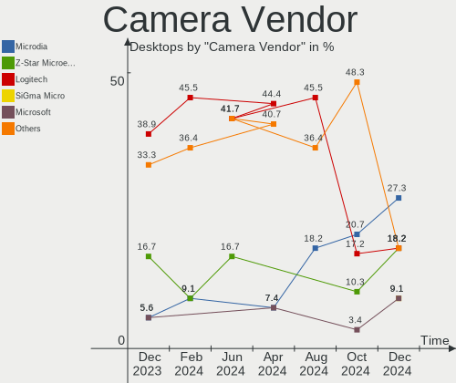

ROSA Hardware Trends (Desktops)
-------------------------------

A project to identify most popular hardware characteristics and track their change
over time based on data collected by Linux users at https://Linux-Hardware.org.

Anyone can contribute to this report by the [hw-probe](https://github.com/linuxhw/hw-probe) tool:

    sudo -E hw-probe -all -upload

Full-feature report is available here: https://linux-hardware.org/?view=trends&formfactor=desktop

Period: Jul, 2021.

Contents
--------

* [ System ](#system)
  - [ OS                       ](#os)
  - [ OS Family                ](#os-family)
  - [ Kernel                   ](#kernel)
  - [ Kernel Family            ](#kernel-family)
  - [ Kernel Major Ver.        ](#kernel-major-ver)
  - [ Arch                     ](#arch)
  - [ DE                       ](#de)
  - [ Display Server           ](#display-server)
  - [ Display Manager          ](#display-manager)
  - [ OS Lang                  ](#os-lang)
  - [ Boot Mode                ](#boot-mode)
  - [ Filesystem               ](#filesystem)
  - [ Part. scheme             ](#part-scheme)
  - [ Dual Boot with Linux/BSD ](#dual-boot-with-linuxbsd)
  - [ Dual Boot (Win)          ](#dual-boot-win)

* [ Board ](#board)
  - [ Vendor                   ](#vendor)
  - [ Model                    ](#model)
  - [ Model Family             ](#model-family)
  - [ MFG Year                 ](#mfg-year)
  - [ Form Factor              ](#form-factor)
  - [ Secure Boot              ](#secure-boot)
  - [ Coreboot                 ](#coreboot)
  - [ RAM Size                 ](#ram-size)
  - [ RAM Used                 ](#ram-used)
  - [ Total Drives             ](#total-drives)
  - [ Has CD-ROM               ](#has-cd-rom)
  - [ Has Ethernet             ](#has-ethernet)
  - [ Has WiFi                 ](#has-wifi)
  - [ Has Bluetooth            ](#has-bluetooth)

* [ Location ](#location)
  - [ Country                  ](#country)
  - [ City                     ](#city)

* [ Drives ](#drives)
  - [ Drive Vendor             ](#drive-vendor)
  - [ Drive Model              ](#drive-model)
  - [ HDD Vendor               ](#hdd-vendor)
  - [ SSD Vendor               ](#ssd-vendor)
  - [ Drive Kind               ](#drive-kind)
  - [ Drive Connector          ](#drive-connector)
  - [ Drive Size               ](#drive-size)
  - [ Space Total              ](#space-total)
  - [ Space Used               ](#space-used)
  - [ Malfunc. Drives          ](#malfunc-drives)
  - [ Malfunc. Drive Vendor    ](#malfunc-drive-vendor)
  - [ Malfunc. HDD Vendor      ](#malfunc-hdd-vendor)
  - [ Malfunc. Drive Kind      ](#malfunc-drive-kind)
  - [ Failed Drives            ](#failed-drives)
  - [ Failed Drive Vendor      ](#failed-drive-vendor)
  - [ Drive Status             ](#drive-status)

* [ Storage controller ](#storage-controller)
  - [ Storage Vendor           ](#storage-vendor)
  - [ Storage Model            ](#storage-model)
  - [ Storage Kind             ](#storage-kind)

* [ Processor ](#processor)
  - [ CPU Vendor               ](#cpu-vendor)
  - [ CPU Model                ](#cpu-model)
  - [ CPU Model Family         ](#cpu-model-family)
  - [ CPU Cores                ](#cpu-cores)
  - [ CPU Sockets              ](#cpu-sockets)
  - [ CPU Threads              ](#cpu-threads)
  - [ CPU Op-Modes             ](#cpu-op-modes)
  - [ CPU Microcode            ](#cpu-microcode)
  - [ CPU Microarch            ](#cpu-microarch)

* [ Graphics ](#graphics)
  - [ GPU Vendor               ](#gpu-vendor)
  - [ GPU Model                ](#gpu-model)
  - [ GPU Combo                ](#gpu-combo)
  - [ GPU Driver               ](#gpu-driver)
  - [ GPU Memory               ](#gpu-memory)

* [ Monitor ](#monitor)
  - [ Monitor Vendor           ](#monitor-vendor)
  - [ Monitor Model            ](#monitor-model)
  - [ Monitor Resolution       ](#monitor-resolution)
  - [ Monitor Diagonal         ](#monitor-diagonal)
  - [ Monitor Width            ](#monitor-width)
  - [ Aspect Ratio             ](#aspect-ratio)
  - [ Monitor Area             ](#monitor-area)
  - [ Pixel Density            ](#pixel-density)
  - [ Multiple Monitors        ](#multiple-monitors)

* [ Network ](#network)
  - [ Net Controller Vendor    ](#net-controller-vendor)
  - [ Net Controller Model     ](#net-controller-model)
  - [ Wireless Vendor          ](#wireless-vendor)
  - [ Wireless Model           ](#wireless-model)
  - [ Ethernet Vendor          ](#ethernet-vendor)
  - [ Ethernet Model           ](#ethernet-model)
  - [ Net Controller Kind      ](#net-controller-kind)
  - [ Used Controller          ](#used-controller)
  - [ NICs                     ](#nics)
  - [ IPv6                     ](#ipv6)

* [ Bluetooth ](#bluetooth)
  - [ Bluetooth Vendor         ](#bluetooth-vendor)
  - [ Bluetooth Model          ](#bluetooth-model)

* [ Sound ](#sound)
  - [ Sound Vendor             ](#sound-vendor)
  - [ Sound Model              ](#sound-model)

* [ Memory ](#memory)
  - [ Memory Vendor            ](#memory-vendor)
  - [ Memory Model             ](#memory-model)
  - [ Memory Kind              ](#memory-kind)
  - [ Memory Form Factor       ](#memory-form-factor)
  - [ Memory Size              ](#memory-size)
  - [ Memory Speed             ](#memory-speed)

* [ Printers & scanners ](#printers-&-scanners)
  - [ Printer Vendor           ](#printer-vendor)
  - [ Printer Model            ](#printer-model)
  - [ Scanner Vendor           ](#scanner-vendor)
  - [ Scanner Model            ](#scanner-model)

* [ Camera ](#camera)
  - [ Camera Vendor            ](#camera-vendor)
  - [ Camera Model             ](#camera-model)

* [ Security ](#security)
  - [ Fingerprint Vendor       ](#fingerprint-vendor)
  - [ Fingerprint Model        ](#fingerprint-model)
  - [ Chipcard Vendor          ](#chipcard-vendor)
  - [ Chipcard Model           ](#chipcard-model)

* [ Unsupported ](#unsupported)
  - [ Unsupported Devices      ](#unsupported-devices)
  - [ Unsupported Device Types ](#unsupported-device-types)

System
------

OS
--

Installed operating systems

| Name       | Desktops | Percent |
|------------|----------|---------|
| ROSA R11.1 | 62       | 81.58%  |
| ROSA R11   | 8        | 10.53%  |
| ROSA R12   | 3        | 3.95%   |
| ROSA R8.1  | 2        | 2.63%   |
| ROSA R10   | 1        | 1.32%   |

OS Family
---------

OS without a version

| Name | Desktops | Percent |
|------|----------|---------|
| ROSA | 76       | 100%    |

Kernel
------

Version of the Linux kernel

| Version                             | Desktops | Percent |
|-------------------------------------|----------|---------|
| 5.4.83-generic-2rosa-x86_64         | 18       | 23.68%  |
| 5.4.32-generic-2rosa-x86_64         | 17       | 22.37%  |
| 4.15.0-desktop-122.124.1rosa-x86_64 | 10       | 13.16%  |
| 4.15.0-desktop-45.1rosa-x86_64      | 7        | 9.21%   |
| 5.4.83-generic-2rosa-i586           | 4        | 5.26%   |
| 5.4.32-generic-2rosa-i586           | 4        | 5.26%   |
| 4.9.155-nrj-desktop-1rosa-x86_64    | 4        | 5.26%   |
| 4.15.0-desktop-45.1rosa-i586        | 2        | 2.63%   |
| 5.4.112-nrj-desktop-1rosa-x86_64    | 1        | 1.32%   |
| 5.10.52-generic-1rosa2021.1-x86_64  | 1        | 1.32%   |
| 5.10.48-generic-1rosa2021.1-x86_64  | 1        | 1.32%   |
| 5.10.47-generic-2rosa2019.1-x86_64  | 1        | 1.32%   |
| 5.10.31-generic-1rosa-x86_64        | 1        | 1.32%   |
| 4.9.60-nrj-desktop-1rosa-x86_64     | 1        | 1.32%   |
| 4.19.197-nrj-desktop-3rosa-x86_64   | 1        | 1.32%   |
| 4.15.0-desktop-94.1rosa-x86_64      | 1        | 1.32%   |
| 4.15.0-desktop-122.124.1rosa-i586   | 1        | 1.32%   |
| 4.1.38-nrj-desktop-2rosa-x86_64     | 1        | 1.32%   |

Kernel Family
-------------

Linux kernel without a distro release

| Version  | Desktops | Percent |
|----------|----------|---------|
| 5.4.83   | 22       | 28.95%  |
| 5.4.32   | 21       | 27.63%  |
| 4.15.0   | 21       | 27.63%  |
| 4.9.155  | 4        | 5.26%   |
| 5.4.112  | 1        | 1.32%   |
| 5.10.52  | 1        | 1.32%   |
| 5.10.48  | 1        | 1.32%   |
| 5.10.47  | 1        | 1.32%   |
| 5.10.31  | 1        | 1.32%   |
| 4.9.60   | 1        | 1.32%   |
| 4.19.197 | 1        | 1.32%   |
| 4.1.38   | 1        | 1.32%   |

Kernel Major Ver.
-----------------

Linux kernel major version

| Version | Desktops | Percent |
|---------|----------|---------|
| 5.4     | 44       | 57.89%  |
| 4.15    | 21       | 27.63%  |
| 4.9     | 5        | 6.58%   |
| 5.10    | 4        | 5.26%   |
| 4.19    | 1        | 1.32%   |
| 4.1     | 1        | 1.32%   |

Arch
----

OS architecture (x86_64, i586, etc.)

| Name   | Desktops | Percent |
|--------|----------|---------|
| x86_64 | 65       | 85.53%  |
| i686   | 11       | 14.47%  |

DE
--

Desktop Environment

| Name | Desktops | Percent |
|------|----------|---------|
| KDE4 | 50       | 65.79%  |
| KDE5 | 18       | 23.68%  |
| LXQt | 4        | 5.26%   |
| XFCE | 3        | 3.95%   |
| MATE | 1        | 1.32%   |

Display Server
--------------

X11 or Wayland

| Name    | Desktops | Percent |
|---------|----------|---------|
| X11     | 74       | 97.37%  |
| Wayland | 2        | 2.63%   |

Display Manager
---------------

SDDM, LightDM, etc.

| Name | Desktops | Percent |
|------|----------|---------|
| KDM  | 50       | 65.79%  |
| SDDM | 24       | 31.58%  |
| GDM  | 2        | 2.63%   |

OS Lang
-------

Language

| Lang    | Desktops | Percent |
|---------|----------|---------|
| ru_RU   | 56       | 73.68%  |
| Unknown | 11       | 14.47%  |
| fr_FR   | 3        | 3.95%   |
| pt_BR   | 2        | 2.63%   |
| en_US   | 2        | 2.63%   |
| es_ES   | 1        | 1.32%   |
| de_DE   | 1        | 1.32%   |

Boot Mode
---------

EFI or BIOS

| Mode | Desktops | Percent |
|------|----------|---------|
| BIOS | 64       | 84.21%  |
| EFI  | 12       | 15.79%  |

Filesystem
----------

Type of filesystem

| Type  | Desktops | Percent |
|-------|----------|---------|
| Ext4  | 72       | 94.74%  |
| Btrfs | 2        | 2.63%   |
| F2fs  | 1        | 1.32%   |
| Ext3  | 1        | 1.32%   |

Part. scheme
------------

Scheme of partitioning

| Type    | Desktops | Percent |
|---------|----------|---------|
| MBR     | 58       | 76.32%  |
| GPT     | 17       | 22.37%  |
| Unknown | 1        | 1.32%   |

Dual Boot with Linux/BSD
------------------------

Hosting more than one Linux/BSD

| Dual boot | Desktops | Percent |
|-----------|----------|---------|
| No        | 59       | 77.63%  |
| Yes       | 17       | 22.37%  |

Dual Boot (Win)
---------------

Hosting Linux and Windows

| Dual boot | Desktops | Percent |
|-----------|----------|---------|
| No        | 44       | 57.89%  |
| Yes       | 32       | 42.11%  |

Board
-----

Vendor
------

Motherboard manufacturer

| Name                | Desktops | Percent |
|---------------------|----------|---------|
| ASUSTek Computer    | 33       | 43.42%  |
| Gigabyte Technology | 13       | 17.11%  |
| MSI                 | 9        | 11.84%  |
| ASRock              | 6        | 7.89%   |
| Lenovo              | 2        | 2.63%   |
| ECS                 | 2        | 2.63%   |
| Dell                | 2        | 2.63%   |
| Acer                | 2        | 2.63%   |
| Packard Bell        | 1        | 1.32%   |
| Intel               | 1        | 1.32%   |
| Huanan              | 1        | 1.32%   |
| Hewlett-Packard     | 1        | 1.32%   |
| Fujitsu             | 1        | 1.32%   |
| Foxconn             | 1        | 1.32%   |
| Biostar             | 1        | 1.32%   |

Model
-----

Motherboard model

| Name                            | Desktops | Percent |
|---------------------------------|----------|---------|
| MSI MS-7C51                     | 2        | 2.63%   |
| Gigabyte H310M S2 2.0           | 2        | 2.63%   |
| ASUS PRIME A320M-K              | 2        | 2.63%   |
| Packard Bell Cuba MS-7301       | 1        | 1.32%   |
| MSI MS-7A15                     | 1        | 1.32%   |
| MSI MS-7817                     | 1        | 1.32%   |
| MSI MS-7680                     | 1        | 1.32%   |
| MSI MS-7673                     | 1        | 1.32%   |
| MSI MS-7641                     | 1        | 1.32%   |
| MSI MS-7529                     | 1        | 1.32%   |
| MSI Compaq dx7400 Microtower    | 1        | 1.32%   |
| Lenovo H420                     | 1        | 1.32%   |
| Lenovo Board                    | 1        | 1.32%   |
| Intel DZ68DB AAG27985-101       | 1        | 1.32%   |
| Huanan X99-F8                   | 1        | 1.32%   |
| HP Compaq 6200 Pro SFF PC       | 1        | 1.32%   |
| Gigabyte Z87-HD3                | 1        | 1.32%   |
| Gigabyte Z370 HD3               | 1        | 1.32%   |
| Gigabyte P35C-DS3R              | 1        | 1.32%   |
| Gigabyte M61PM-S2               | 1        | 1.32%   |
| Gigabyte J1800N-D2H             | 1        | 1.32%   |
| Gigabyte GA-MA770-UD3           | 1        | 1.32%   |
| Gigabyte EP43-UD3L              | 1        | 1.32%   |
| Gigabyte A320M-S2H V2           | 1        | 1.32%   |
| Gigabyte 965P-S3                | 1        | 1.32%   |
| Gigabyte 945PLM-S2              | 1        | 1.32%   |
| Gigabyte 8I915P Duo             | 1        | 1.32%   |
| Fujitsu FUTRO S700              | 1        | 1.32%   |
| Foxconn RS690M2MA               | 1        | 1.32%   |
| ECS G43T-WM                     | 1        | 1.32%   |
| ECS G41T-M5                     | 1        | 1.32%   |
| Dell Precision T7610            | 1        | 1.32%   |
| Dell OptiPlex 9020M             | 1        | 1.32%   |
| Biostar A10N-9830E              | 1        | 1.32%   |
| ASUS PX606AA-ABF SR1460FR FR520 | 1        | 1.32%   |
| ASUS PRIME Z390M-PLUS           | 1        | 1.32%   |
| ASUS PRIME H310M-R R2.0         | 1        | 1.32%   |
| ASUS PRIME B450-PLUS            | 1        | 1.32%   |
| ASUS PRIME B350-PLUS            | 1        | 1.32%   |
| ASUS PRIME A320M-R              | 1        | 1.32%   |
| ASUS P8Z77-V PRO                | 1        | 1.32%   |
| ASUS P8H67                      | 1        | 1.32%   |
| ASUS P8H61-M LX                 | 1        | 1.32%   |
| ASUS P8H61-M LE                 | 1        | 1.32%   |
| ASUS P6T WS PRO                 | 1        | 1.32%   |
| ASUS P6T SE                     | 1        | 1.32%   |
| ASUS P5WD2-Premium              | 1        | 1.32%   |
| ASUS P5QPL-AM                   | 1        | 1.32%   |
| ASUS P5Q-E                      | 1        | 1.32%   |
| ASUS P5Q TURBO                  | 1        | 1.32%   |
| ASUS P5KPL-VM                   | 1        | 1.32%   |
| ASUS M5A99X EVO R2.0            | 1        | 1.32%   |
| ASUS M5A97 R2.0                 | 1        | 1.32%   |
| ASUS M5A78L-M LX3               | 1        | 1.32%   |
| ASUS M5A78L-M LE/USB3           | 1        | 1.32%   |
| ASUS M5A78L-M LE                | 1        | 1.32%   |
| ASUS M4N68T-M-LE-V2             | 1        | 1.32%   |
| ASUS M4A88T-M                   | 1        | 1.32%   |
| ASUS M4A79XTD EVO               | 1        | 1.32%   |
| ASUS M2N-MX                     | 1        | 1.32%   |

Model Family
------------

Motherboard model prefix

| Name                  | Desktops | Percent |
|-----------------------|----------|---------|
| ASUS PRIME            | 7        | 9.21%   |
| ASUS M5A78L-M         | 3        | 3.95%   |
| MSI MS-7C51           | 2        | 2.63%   |
| Gigabyte H310M        | 2        | 2.63%   |
| ASUS P8H61-M          | 2        | 2.63%   |
| ASUS P6T              | 2        | 2.63%   |
| Acer Aspire           | 2        | 2.63%   |
| Packard Bell Cuba     | 1        | 1.32%   |
| MSI MS-7A15           | 1        | 1.32%   |
| MSI MS-7817           | 1        | 1.32%   |
| MSI MS-7680           | 1        | 1.32%   |
| MSI MS-7673           | 1        | 1.32%   |
| MSI MS-7641           | 1        | 1.32%   |
| MSI MS-7529           | 1        | 1.32%   |
| MSI Compaq            | 1        | 1.32%   |
| Lenovo H420           | 1        | 1.32%   |
| Lenovo Board          | 1        | 1.32%   |
| Intel DZ68DB          | 1        | 1.32%   |
| Huanan X99-F8         | 1        | 1.32%   |
| HP Compaq             | 1        | 1.32%   |
| Gigabyte Z87-HD3      | 1        | 1.32%   |
| Gigabyte Z370         | 1        | 1.32%   |
| Gigabyte P35C-DS3R    | 1        | 1.32%   |
| Gigabyte M61PM-S2     | 1        | 1.32%   |
| Gigabyte J1800N-D2H   | 1        | 1.32%   |
| Gigabyte GA-MA770-UD3 | 1        | 1.32%   |
| Gigabyte EP43-UD3L    | 1        | 1.32%   |
| Gigabyte A320M-S2H    | 1        | 1.32%   |
| Gigabyte 965P-S3      | 1        | 1.32%   |
| Gigabyte 945PLM-S2    | 1        | 1.32%   |
| Gigabyte 8I915P       | 1        | 1.32%   |
| Fujitsu FUTRO         | 1        | 1.32%   |
| Foxconn RS690M2MA     | 1        | 1.32%   |
| ECS G43T-WM           | 1        | 1.32%   |
| ECS G41T-M5           | 1        | 1.32%   |
| Dell Precision        | 1        | 1.32%   |
| Dell OptiPlex         | 1        | 1.32%   |
| Biostar A10N-9830E    | 1        | 1.32%   |
| ASUS PX606AA-ABF      | 1        | 1.32%   |
| ASUS P8Z77-V          | 1        | 1.32%   |
| ASUS P8H67            | 1        | 1.32%   |
| ASUS P5WD2-Premium    | 1        | 1.32%   |
| ASUS P5QPL-AM         | 1        | 1.32%   |
| ASUS P5Q-E            | 1        | 1.32%   |
| ASUS P5Q              | 1        | 1.32%   |
| ASUS P5KPL-VM         | 1        | 1.32%   |
| ASUS M5A99X           | 1        | 1.32%   |
| ASUS M5A97            | 1        | 1.32%   |
| ASUS M4N68T-M-LE-V2   | 1        | 1.32%   |
| ASUS M4A88T-M         | 1        | 1.32%   |
| ASUS M4A79XTD         | 1        | 1.32%   |
| ASUS M2N-MX           | 1        | 1.32%   |
| ASUS M2N              | 1        | 1.32%   |
| ASUS H61M-E           | 1        | 1.32%   |
| ASUS GU609AA-ACB      | 1        | 1.32%   |
| ASUS B75M-A           | 1        | 1.32%   |
| ASUS A68HM-K          | 1        | 1.32%   |
| ASRock Z68            | 1        | 1.32%   |
| ASRock N68C-S         | 1        | 1.32%   |
| ASRock M3A770DE       | 1        | 1.32%   |

MFG Year
--------

Motherboard manufacture year

| Year | Desktops | Percent |
|------|----------|---------|
| 2009 | 9        | 11.84%  |
| 2011 | 8        | 10.53%  |
| 2019 | 7        | 9.21%   |
| 2013 | 6        | 7.89%   |
| 2012 | 6        | 7.89%   |
| 2010 | 6        | 7.89%   |
| 2020 | 5        | 6.58%   |
| 2018 | 5        | 6.58%   |
| 2008 | 4        | 5.26%   |
| 2007 | 4        | 5.26%   |
| 2015 | 3        | 3.95%   |
| 2014 | 3        | 3.95%   |
| 2006 | 3        | 3.95%   |
| 2017 | 2        | 2.63%   |
| 2016 | 2        | 2.63%   |
| 2005 | 2        | 2.63%   |
| 2021 | 1        | 1.32%   |

Form Factor
-----------

Physical design of the computer

| Name    | Desktops | Percent |
|---------|----------|---------|
| Desktop | 76       | 100%    |

Secure Boot
-----------

Enabled or disabled

| State    | Desktops | Percent |
|----------|----------|---------|
| Disabled | 76       | 100%    |

Coreboot
--------

Have coreboot on board

| Used | Desktops | Percent |
|------|----------|---------|
| No   | 76       | 100%    |

RAM Size
--------

Total RAM memory

| Size in GB  | Desktops | Percent |
|-------------|----------|---------|
| 3.01-4.0    | 17       | 22.37%  |
| 8.01-16.0   | 17       | 22.37%  |
| 4.01-8.0    | 13       | 17.11%  |
| 16.01-24.0  | 12       | 15.79%  |
| 1.01-2.0    | 11       | 14.47%  |
| 2.01-3.0    | 3        | 3.95%   |
| 32.01-64.0  | 2        | 2.63%   |
| 64.01-256.0 | 1        | 1.32%   |

RAM Used
--------

Used RAM memory

| Used GB  | Desktops | Percent |
|----------|----------|---------|
| 1.01-2.0 | 31       | 40.79%  |
| 0.51-1.0 | 29       | 38.16%  |
| 2.01-3.0 | 9        | 11.84%  |
| 4.01-8.0 | 3        | 3.95%   |
| 3.01-4.0 | 3        | 3.95%   |
| 0.01-0.5 | 1        | 1.32%   |

Total Drives
------------

Number of drives on board

| Drives | Desktops | Percent |
|--------|----------|---------|
| 1      | 50       | 65.79%  |
| 2      | 17       | 22.37%  |
| 3      | 7        | 9.21%   |
| 4      | 2        | 2.63%   |

Has CD-ROM
----------

Has CD-ROM on board

| Presented | Desktops | Percent |
|-----------|----------|---------|
| Yes       | 45       | 59.21%  |
| No        | 31       | 40.79%  |

Has Ethernet
------------

Has Ethernet on board

| Presented | Desktops | Percent |
|-----------|----------|---------|
| Yes       | 76       | 100%    |

Has WiFi
--------

Has WiFi module

| Presented | Desktops | Percent |
|-----------|----------|---------|
| No        | 60       | 78.95%  |
| Yes       | 16       | 21.05%  |

Has Bluetooth
-------------

Has Bluetooth module

| Presented | Desktops | Percent |
|-----------|----------|---------|
| No        | 69       | 90.79%  |
| Yes       | 7        | 9.21%   |

Location
--------

Country
-------

Geographic location (country)

| Country    | Desktops | Percent |
|------------|----------|---------|
| Russia     | 60       | 78.95%  |
| Ukraine    | 4        | 5.26%   |
| France     | 4        | 5.26%   |
| Brazil     | 2        | 2.63%   |
| USA        | 1        | 1.32%   |
| Serbia     | 1        | 1.32%   |
| Moldova    | 1        | 1.32%   |
| Kazakhstan | 1        | 1.32%   |
| Germany    | 1        | 1.32%   |
| Argentina  | 1        | 1.32%   |

City
----

Geographic location (city)

| City                   | Desktops | Percent |
|------------------------|----------|---------|
| Moscow                 | 8        | 10.53%  |
| St Petersburg          | 7        | 9.21%   |
| Novosibirsk            | 6        | 7.89%   |
| Yekaterinburg          | 5        | 6.58%   |
| Voronezh               | 2        | 2.63%   |
| Ryazan                 | 2        | 2.63%   |
| Rostov-on-Don          | 2        | 2.63%   |
| Laudun-lArdoise        | 2        | 2.63%   |
| Zelenodolsk            | 1        | 1.32%   |
| Vladivostok            | 1        | 1.32%   |
| Ulyanovsk              | 1        | 1.32%   |
| Tver                   | 1        | 1.32%   |
| Tours                  | 1        | 1.32%   |
| Tolyatti               | 1        | 1.32%   |
| Tiraspol               | 1        | 1.32%   |
| Srednyaya Akhtuba      | 1        | 1.32%   |
| S??o Bernardo do Campo | 1        | 1.32%   |
| Saratov                | 1        | 1.32%   |
| Rostock                | 1        | 1.32%   |
| Petrozavodsk           | 1        | 1.32%   |
| Pervouralsk            | 1        | 1.32%   |
| Penza                  | 1        | 1.32%   |
| Nizhniy Novgorod       | 1        | 1.32%   |
| Nevinnomyssk           | 1        | 1.32%   |
| Malonikolayevka        | 1        | 1.32%   |
| Macei??                | 1        | 1.32%   |
| Krasnogorsk            | 1        | 1.32%   |
| Krasnodar              | 1        | 1.32%   |
| Kostroma               | 1        | 1.32%   |
| Kopeysk                | 1        | 1.32%   |
| Ivanovo                | 1        | 1.32%   |
| Istra                  | 1        | 1.32%   |
| Ishim                  | 1        | 1.32%   |
| Huntsville             | 1        | 1.32%   |
| Hayvoron               | 1        | 1.32%   |
| Haedo                  | 1        | 1.32%   |
| Gatchina               | 1        | 1.32%   |
| Donetsk                | 1        | 1.32%   |
| Chita                  | 1        | 1.32%   |
| Cheremkhovo            | 1        | 1.32%   |
| Chelyabinsk            | 1        | 1.32%   |
| Chateauneuf-de-Gadagne | 1        | 1.32%   |
| Buzuluk                | 1        | 1.32%   |
| Bryansk                | 1        | 1.32%   |
| Biysk                  | 1        | 1.32%   |
| Birsk                  | 1        | 1.32%   |
| Belgrade               | 1        | 1.32%   |
| Barvinkove             | 1        | 1.32%   |
| Almaty                 | 1        | 1.32%   |
| Al'met'yevsk           | 1        | 1.32%   |

Drives
------

Drive Vendor
------------

Hard drive vendors

| Vendor              | Desktops | Drives | Percent |
|---------------------|----------|--------|---------|
| WDC                 | 30       | 37     | 29.7%   |
| Seagate             | 19       | 21     | 18.81%  |
| Samsung Electronics | 10       | 10     | 9.9%    |
| Kingston            | 7        | 7      | 6.93%   |
| Hitachi             | 7        | 8      | 6.93%   |
| Toshiba             | 6        | 7      | 5.94%   |
| SanDisk             | 4        | 4      | 3.96%   |
| Crucial             | 3        | 3      | 2.97%   |
| Smartbuy            | 2        | 2      | 1.98%   |
| PLEXTOR             | 2        | 2      | 1.98%   |
| Intel               | 2        | 2      | 1.98%   |
| SPCC                | 1        | 1      | 0.99%   |
| Patriot             | 1        | 1      | 0.99%   |
| OCZ                 | 1        | 2      | 0.99%   |
| Kingmax             | 1        | 1      | 0.99%   |
| InnoDisk            | 1        | 1      | 0.99%   |
| Corsair             | 1        | 1      | 0.99%   |
| CHN25SATAS1         | 1        | 1      | 0.99%   |
| China               | 1        | 1      | 0.99%   |
| Apacer              | 1        | 1      | 0.99%   |

Drive Model
-----------

Hard drive models

| Model                            | Desktops | Percent |
|----------------------------------|----------|---------|
| Kingston SA400S37120G 120GB SSD  | 4        | 3.64%   |
| Seagate ST1000DM010-2EP102 1TB   | 3        | 2.73%   |
| Kingston SA400S37240G 240GB SSD  | 3        | 2.73%   |
| WDC WD3200AAKX-001CA0 320GB      | 2        | 1.82%   |
| Toshiba DT01ACA100 1TB           | 2        | 1.82%   |
| Toshiba DT01ACA050 500GB         | 2        | 1.82%   |
| Seagate ST500DM002-1BD142 500GB  | 2        | 1.82%   |
| Seagate ST3320418AS 320GB        | 2        | 1.82%   |
| Seagate ST3160815AS 160GB        | 2        | 1.82%   |
| Crucial CT120BX500SSD1 120GB     | 2        | 1.82%   |
| WDC WDS240G2G0A-00JH30 240GB SSD | 1        | 0.91%   |
| WDC WDS120G2G0B-00EPW0 120GB SSD | 1        | 0.91%   |
| WDC WDS120G2G0A-00JH30 120GB SSD | 1        | 0.91%   |
| WDC WDS100T2B0B-00YS70 1TB SSD   | 1        | 0.91%   |
| WDC WD800AAJS-00PSA0 80GB        | 1        | 0.91%   |
| WDC WD800AAJS-00L7A0 80GB        | 1        | 0.91%   |
| WDC WD7501AALS-00J7B1 752GB      | 1        | 0.91%   |
| WDC WD6400AAKS-22A7B0 640GB      | 1        | 0.91%   |
| WDC WD5000AAKX-083CA1 500GB      | 1        | 0.91%   |
| WDC WD5000AAKX-001CA0 500GB      | 1        | 0.91%   |
| WDC WD5000AAKB-00H8A0 500GB      | 1        | 0.91%   |
| WDC WD5000AADS-00S9B0 500GB      | 1        | 0.91%   |
| WDC WD3200AVVS-63L2B0 320GB      | 1        | 0.91%   |
| WDC WD3200AUDX-56WNHY0 320GB     | 1        | 0.91%   |
| WDC WD3200AAKS-00L9A0 320GB      | 1        | 0.91%   |
| WDC WD3200AAJS-65M0A0 320GB      | 1        | 0.91%   |
| WDC WD3200AAJS-22B4A0 320GB      | 1        | 0.91%   |
| WDC WD30EZRX-00DC0B0 3TB         | 1        | 0.91%   |
| WDC WD30EFRX-68EUZN0 3TB         | 1        | 0.91%   |
| WDC WD2500YD-01NVB1 256GB        | 1        | 0.91%   |
| WDC WD2500JS-00NCB1 250GB        | 1        | 0.91%   |
| WDC WD2500JB-00REA0 250GB        | 1        | 0.91%   |
| WDC WD2500AAKX-00ERMA0 250GB     | 1        | 0.91%   |
| WDC WD20PURZ-85GU6Y0 2TB         | 1        | 0.91%   |
| WDC WD1600JD-22HBB0 160GB        | 1        | 0.91%   |
| WDC WD1600AAJS-22PSA0 160GB      | 1        | 0.91%   |
| WDC WD10TPVT-00HT5T1 1TB         | 1        | 0.91%   |
| WDC WD10EZRX-00L4HB0 1TB         | 1        | 0.91%   |
| WDC WD10EZRX-00A8LB0 1TB         | 1        | 0.91%   |
| WDC WD10EZEX-22MFCA0 1TB         | 1        | 0.91%   |
| WDC WD10EZEX-08WN4A0 1TB         | 1        | 0.91%   |
| WDC WD10EZEX-08M2NA0 1TB         | 1        | 0.91%   |
| WDC WD10EARX-00N0YB0 1TB         | 1        | 0.91%   |
| WDC WD10EADS-65M2B0 1TB          | 1        | 0.91%   |
| Toshiba MQ01ABD032 320GB         | 1        | 0.91%   |
| Toshiba MK3252GSX 320GB          | 1        | 0.91%   |
| Toshiba HDWD110 1TB              | 1        | 0.91%   |
| SPCC Solid State Disk 256GB      | 1        | 0.91%   |
| Smartbuy SSD 120GB               | 1        | 0.91%   |
| Smartbuy m.2 PS5008T-2280T 256GB | 1        | 0.91%   |
| Seagate ST9500420AS 500GB        | 1        | 0.91%   |
| Seagate ST380011A 80GB           | 1        | 0.91%   |
| Seagate ST3500413AS 500GB        | 1        | 0.91%   |
| Seagate ST340016A 40GB           | 1        | 0.91%   |
| Seagate ST340014A 40GB           | 1        | 0.91%   |
| Seagate ST3320620AS 320GB        | 1        | 0.91%   |
| Seagate ST3320413AS 320GB        | 1        | 0.91%   |
| Seagate ST3250820AS 250GB        | 1        | 0.91%   |
| Seagate ST3160318AS 160GB        | 1        | 0.91%   |
| Seagate ST31000524AS 1TB         | 1        | 0.91%   |

HDD Vendor
----------

Hard disk drive vendors

| Vendor              | Desktops | Drives | Percent |
|---------------------|----------|--------|---------|
| WDC                 | 26       | 33     | 40%     |
| Seagate             | 19       | 21     | 29.23%  |
| Samsung Electronics | 7        | 7      | 10.77%  |
| Hitachi             | 7        | 8      | 10.77%  |
| Toshiba             | 6        | 7      | 9.23%   |

SSD Vendor
----------

Solid state drive vendors

| Vendor              | Desktops | Drives | Percent |
|---------------------|----------|--------|---------|
| Kingston            | 7        | 7      | 21.88%  |
| WDC                 | 4        | 4      | 12.5%   |
| SanDisk             | 4        | 4      | 12.5%   |
| Crucial             | 3        | 3      | 9.38%   |
| Samsung Electronics | 2        | 2      | 6.25%   |
| SPCC                | 1        | 1      | 3.13%   |
| Smartbuy            | 1        | 1      | 3.13%   |
| PLEXTOR             | 1        | 1      | 3.13%   |
| Patriot             | 1        | 1      | 3.13%   |
| OCZ                 | 1        | 2      | 3.13%   |
| Kingmax             | 1        | 1      | 3.13%   |
| Intel               | 1        | 1      | 3.13%   |
| InnoDisk            | 1        | 1      | 3.13%   |
| Corsair             | 1        | 1      | 3.13%   |
| CHN25SATAS1         | 1        | 1      | 3.13%   |
| China               | 1        | 1      | 3.13%   |
| Apacer              | 1        | 1      | 3.13%   |

Drive Kind
----------

HDD or SSD

| Kind | Desktops | Drives | Percent |
|------|----------|--------|---------|
| HDD  | 59       | 76     | 65.56%  |
| SSD  | 27       | 33     | 30%     |
| NVMe | 4        | 4      | 4.44%   |

Drive Connector
---------------

SATA, SAS, NVMe, etc.

| Type | Desktops | Drives | Percent |
|------|----------|--------|---------|
| SATA | 73       | 108    | 93.59%  |
| NVMe | 4        | 4      | 5.13%   |
| SAS  | 1        | 1      | 1.28%   |

Drive Size
----------

Size of hard drive

| Size in TB | Desktops | Drives | Percent |
|------------|----------|--------|---------|
| 0.01-0.5   | 65       | 85     | 76.47%  |
| 0.51-1.0   | 17       | 20     | 20%     |
| 3.01-4.0   | 1        | 1      | 1.18%   |
| 2.01-3.0   | 1        | 2      | 1.18%   |
| 1.01-2.0   | 1        | 1      | 1.18%   |

Space Total
-----------

Amount of disk space available on the file system

| Size in GB     | Desktops | Percent |
|----------------|----------|---------|
| 101-250        | 26       | 34.21%  |
| 251-500        | 13       | 17.11%  |
| 501-1000       | 11       | 14.47%  |
| 21-50          | 8        | 10.53%  |
| 51-100         | 8        | 10.53%  |
| 1-20           | 6        | 7.89%   |
| 1001-2000      | 3        | 3.95%   |
| More than 3000 | 1        | 1.32%   |

Space Used
----------

Amount of used disk space

| Used GB        | Desktops | Percent |
|----------------|----------|---------|
| 1-20           | 54       | 71.05%  |
| 21-50          | 7        | 9.21%   |
| 51-100         | 5        | 6.58%   |
| 251-500        | 4        | 5.26%   |
| 101-250        | 3        | 3.95%   |
| 501-1000       | 2        | 2.63%   |
| More than 3000 | 1        | 1.32%   |

Malfunc. Drives
---------------

Drive models with a malfunction

| Model                              | Desktops | Drives | Percent |
|------------------------------------|----------|--------|---------|
| WDC WD6400AAKS-22A7B0 640GB        | 1        | 1      | 2.86%   |
| WDC WD5000AAKX-083CA1 500GB        | 1        | 1      | 2.86%   |
| WDC WD5000AAKX-001CA0 500GB        | 1        | 1      | 2.86%   |
| WDC WD5000AADS-00S9B0 500GB        | 1        | 1      | 2.86%   |
| WDC WD3200AVVS-63L2B0 320GB        | 1        | 1      | 2.86%   |
| WDC WD3200AAKX-001CA0 320GB        | 1        | 1      | 2.86%   |
| WDC WD3200AAKS-00L9A0 320GB        | 1        | 1      | 2.86%   |
| WDC WD3200AAJS-65M0A0 320GB        | 1        | 1      | 2.86%   |
| WDC WD3200AAJS-22B4A0 320GB        | 1        | 1      | 2.86%   |
| WDC WD2500JB-00REA0 250GB          | 1        | 1      | 2.86%   |
| WDC WD2500AAKX-00ERMA0 250GB       | 1        | 1      | 2.86%   |
| WDC WD20PURZ-85GU6Y0 2TB           | 1        | 1      | 2.86%   |
| WDC WD1600JD-22HBB0 160GB          | 1        | 1      | 2.86%   |
| WDC WD10TPVT-00HT5T1 1TB           | 1        | 1      | 2.86%   |
| WDC WD10EARX-00N0YB0 1TB           | 1        | 1      | 2.86%   |
| WDC WD10EADS-65M2B0 1TB            | 1        | 1      | 2.86%   |
| Toshiba MK3252GSX 320GB            | 1        | 1      | 2.86%   |
| Toshiba DT01ACA050 500GB           | 1        | 1      | 2.86%   |
| Seagate ST9500420AS 500GB          | 1        | 1      | 2.86%   |
| Seagate ST500DM002-1BD142 500GB    | 1        | 1      | 2.86%   |
| Seagate ST380011A 80GB             | 1        | 1      | 2.86%   |
| Seagate ST340016A 40GB             | 1        | 1      | 2.86%   |
| Seagate ST3160318AS 160GB          | 1        | 1      | 2.86%   |
| Samsung Electronics SP2504C 250GB  | 1        | 1      | 2.86%   |
| Samsung Electronics SP2004C 200GB  | 1        | 1      | 2.86%   |
| Samsung Electronics HD160JJ/ 160GB | 1        | 1      | 2.86%   |
| Samsung Electronics HD082GJ 80GB   | 1        | 1      | 2.86%   |
| Kingston SA400S37240G 240GB SSD    | 1        | 1      | 2.86%   |
| Kingmax SSD 60GB                   | 1        | 1      | 2.86%   |
| Hitachi HTS547550A9E384 500GB      | 1        | 1      | 2.86%   |
| Hitachi HDS721050CLA362 500GB      | 1        | 1      | 2.86%   |
| Hitachi HDS721032CLA362 320GB      | 1        | 1      | 2.86%   |
| Hitachi HDP725050GLA360 500GB      | 1        | 1      | 2.86%   |
| Hitachi HDP725040GLA360 400GB      | 1        | 2      | 2.86%   |
| Corsair Force LS SSD 64GB          | 1        | 1      | 2.86%   |

Malfunc. Drive Vendor
---------------------

Vendors of faulty drives

| Vendor              | Desktops | Drives | Percent |
|---------------------|----------|--------|---------|
| WDC                 | 16       | 16     | 45.71%  |
| Seagate             | 5        | 5      | 14.29%  |
| Hitachi             | 5        | 6      | 14.29%  |
| Samsung Electronics | 4        | 4      | 11.43%  |
| Toshiba             | 2        | 2      | 5.71%   |
| Kingston            | 1        | 1      | 2.86%   |
| Kingmax             | 1        | 1      | 2.86%   |
| Corsair             | 1        | 1      | 2.86%   |

Malfunc. HDD Vendor
-------------------

Vendors of faulty HDD drives

| Vendor              | Desktops | Drives | Percent |
|---------------------|----------|--------|---------|
| WDC                 | 16       | 16     | 50%     |
| Seagate             | 5        | 5      | 15.63%  |
| Hitachi             | 5        | 6      | 15.63%  |
| Samsung Electronics | 4        | 4      | 12.5%   |
| Toshiba             | 2        | 2      | 6.25%   |

Malfunc. Drive Kind
-------------------

Kinds of faulty drives

| Kind | Desktops | Drives | Percent |
|------|----------|--------|---------|
| HDD  | 31       | 33     | 91.18%  |
| SSD  | 3        | 3      | 8.82%   |

Failed Drives
-------------

Failed drive models

| Model                             | Desktops | Drives | Percent |
|-----------------------------------|----------|--------|---------|
| Samsung Electronics HD252HJ 250GB | 1        | 1      | 100%    |

Failed Drive Vendor
-------------------

Failed drive vendors

| Vendor              | Desktops | Drives | Percent |
|---------------------|----------|--------|---------|
| Samsung Electronics | 1        | 1      | 100%    |

Drive Status
------------

Number of failed and malfunc. drives

| Status   | Desktops | Drives | Percent |
|----------|----------|--------|---------|
| Works    | 55       | 75     | 61.11%  |
| Malfunc  | 33       | 36     | 36.67%  |
| Detected | 1        | 1      | 1.11%   |
| Failed   | 1        | 1      | 1.11%   |

Storage controller
------------------

Storage Vendor
--------------

Storage controller vendors

| Vendor                   | Desktops | Percent |
|--------------------------|----------|---------|
| Intel                    | 46       | 50%     |
| AMD                      | 24       | 26.09%  |
| Nvidia                   | 6        | 6.52%   |
| JMicron Technology       | 4        | 4.35%   |
| VIA Technologies         | 3        | 3.26%   |
| Marvell Technology Group | 2        | 2.17%   |
| ASMedia Technology       | 2        | 2.17%   |
| Silicon Image            | 1        | 1.09%   |
| Samsung Electronics      | 1        | 1.09%   |
| Phison Electronics       | 1        | 1.09%   |
| Lite-On Technology       | 1        | 1.09%   |
| Broadcom / LSI           | 1        | 1.09%   |

Storage Model
-------------

Storage controller models

| Model                                                                                   | Desktops | Percent |
|-----------------------------------------------------------------------------------------|----------|---------|
| AMD FCH SATA Controller [AHCI mode]                                                     | 11       | 7.86%   |
| AMD SB7x0/SB8x0/SB9x0 IDE Controller                                                    | 8        | 5.71%   |
| Intel NM10/ICH7 Family SATA Controller [IDE mode]                                       | 7        | 5%      |
| Intel 82801G (ICH7 Family) IDE Controller                                               | 7        | 5%      |
| AMD SB7x0/SB8x0/SB9x0 SATA Controller [IDE mode]                                        | 7        | 5%      |
| Nvidia MCP61 SATA Controller                                                            | 5        | 3.57%   |
| Nvidia MCP61 IDE                                                                        | 5        | 3.57%   |
| Intel 82801JI (ICH10 Family) 4 port SATA IDE Controller #1                              | 5        | 3.57%   |
| Intel 82801JI (ICH10 Family) 2 port SATA IDE Controller #2                              | 5        | 3.57%   |
| Intel 6 Series/C200 Series Chipset Family Desktop SATA Controller (IDE mode, ports 4-5) | 5        | 3.57%   |
| Intel 6 Series/C200 Series Chipset Family Desktop SATA Controller (IDE mode, ports 0-3) | 5        | 3.57%   |
| Intel 6 Series/C200 Series Chipset Family 6 port Desktop SATA AHCI Controller           | 5        | 3.57%   |
| AMD FCH SATA Controller D                                                               | 5        | 3.57%   |
| Intel 200 Series PCH SATA controller [AHCI mode]                                        | 4        | 2.86%   |
| AMD SB7x0/SB8x0/SB9x0 SATA Controller [AHCI mode]                                       | 4        | 2.86%   |
| Intel 8 Series/C220 Series Chipset Family 6-port SATA Controller 1 [AHCI mode]          | 3        | 2.14%   |
| AMD 300 Series Chipset SATA Controller                                                  | 3        | 2.14%   |
| Marvell Group 88SE6111/6121 SATA II / PATA Controller                                   | 2        | 1.43%   |
| JMicron JMB363 SATA/IDE Controller                                                      | 2        | 1.43%   |
| Intel 82801JI (ICH10 Family) SATA AHCI Controller                                       | 2        | 1.43%   |
| Intel 82801I (ICH9 Family) 2 port SATA Controller [IDE mode]                            | 2        | 1.43%   |
| Intel 82801FB/FW (ICH6/ICH6W) SATA Controller                                           | 2        | 1.43%   |
| Intel 82801FB/FBM/FR/FW/FRW (ICH6 Family) IDE Controller                                | 2        | 1.43%   |
| ASMedia ASM1062 Serial ATA Controller                                                   | 2        | 1.43%   |
| VIA VT82C586A/B/VT82C686/A/B/VT823x/A/C PIPC Bus Master IDE                             | 1        | 0.71%   |
| VIA VT8237A SATA 2-Port Controller                                                      | 1        | 0.71%   |
| VIA VT6415 PATA IDE Host Controller                                                     | 1        | 0.71%   |
| VIA VT6410 ATA133 RAID controller                                                       | 1        | 0.71%   |
| Silicon Image SiI 3132 Serial ATA Raid II Controller                                    | 1        | 0.71%   |
| Samsung NVMe Controller                                                                 | 1        | 0.71%   |
| Phison NVMe Storage Controller                                                          | 1        | 0.71%   |
| Nvidia MCP73 SATA RAID Controller                                                       | 1        | 0.71%   |
| Nvidia MCP73 IDE Controller                                                             | 1        | 0.71%   |
| Lite-On Non-Volatile memory controller                                                  | 1        | 0.71%   |
| JMicron JMB368 IDE controller                                                           | 1        | 0.71%   |
| JMicron JMB361 AHCI/IDE                                                                 | 1        | 0.71%   |
| Intel SSD 600P Series                                                                   | 1        | 0.71%   |
| Intel SATA Controller [RAID mode]                                                       | 1        | 0.71%   |
| Intel Q170/Q150/B150/H170/H110/Z170/CM236 Chipset SATA Controller [AHCI Mode]           | 1        | 0.71%   |
| Intel Cannon Lake PCH SATA AHCI Controller                                              | 1        | 0.71%   |
| Intel C610/X99 series chipset 6-Port SATA Controller [AHCI mode]                        | 1        | 0.71%   |
| Intel C600/X79 series chipset 6-Port SATA AHCI Controller                               | 1        | 0.71%   |
| Intel Atom Processor E3800 Series SATA AHCI Controller                                  | 1        | 0.71%   |
| Intel 82801IR/IO/IH (ICH9R/DO/DH) 4 port SATA Controller [IDE mode]                     | 1        | 0.71%   |
| Intel 82801IB (ICH9) 2 port SATA Controller [IDE mode]                                  | 1        | 0.71%   |
| Intel 82801HR/HO/HH (ICH8R/DO/DH) 2 port SATA Controller [IDE mode]                     | 1        | 0.71%   |
| Intel 82801H (ICH8 Family) 4 port SATA Controller [IDE mode]                            | 1        | 0.71%   |
| Intel 82801GR/GDH (ICH7R/ICH7DH) SATA Controller [RAID mode]                            | 1        | 0.71%   |
| Intel 7 Series/C210 Series Chipset Family 6-port SATA Controller [AHCI mode]            | 1        | 0.71%   |
| Intel 7 Series/C210 Series Chipset Family 4-port SATA Controller [IDE mode]             | 1        | 0.71%   |
| Intel 7 Series/C210 Series Chipset Family 2-port SATA Controller [IDE mode]             | 1        | 0.71%   |
| Broadcom / LSI SAS2308 PCI-Express Fusion-MPT SAS-2                                     | 1        | 0.71%   |
| AMD Starship/Matisse Chipset SATA Controller [AHCI mode]                                | 1        | 0.71%   |
| AMD SB600 Non-Raid-5 SATA                                                               | 1        | 0.71%   |
| AMD SB600 IDE                                                                           | 1        | 0.71%   |
| AMD 400 Series Chipset SATA Controller                                                  | 1        | 0.71%   |

Storage Kind
------------

Kind of storage controller (IDE, SATA, NVMe, SAS, ...)

| Kind | Desktops | Percent |
|------|----------|---------|
| SATA | 44       | 46.32%  |
| IDE  | 41       | 43.16%  |
| RAID | 5        | 5.26%   |
| NVMe | 4        | 4.21%   |
| SAS  | 1        | 1.05%   |

Processor
---------

CPU Vendor
----------

Processor vendors

| Vendor | Desktops | Percent |
|--------|----------|---------|
| Intel  | 47       | 61.84%  |
| AMD    | 29       | 38.16%  |

CPU Model
---------

Processor models

| Model                                          | Desktops | Percent |
|------------------------------------------------|----------|---------|
| Intel Core 2 Duo CPU E8400 @ 3.00GHz           | 3        | 3.95%   |
| Intel Pentium Gold G5400 CPU @ 3.70GHz         | 2        | 2.63%   |
| Intel Core i7 CPU 950 @ 3.07GHz                | 2        | 2.63%   |
| Intel Core i5-2500 CPU @ 3.30GHz               | 2        | 2.63%   |
| Intel Core i5-2320 CPU @ 3.00GHz               | 2        | 2.63%   |
| Intel Core 2 Duo CPU E4500 @ 2.20GHz           | 2        | 2.63%   |
| AMD FX-6300 Six-Core Processor                 | 2        | 2.63%   |
| AMD Athlon II X4 635 Processor                 | 2        | 2.63%   |
| AMD Athlon II X2 270 Processor                 | 2        | 2.63%   |
| AMD Athlon 64 X2 Dual Core Processor 5000+     | 2        | 2.63%   |
| AMD Athlon 3000G with Radeon Vega Graphics     | 2        | 2.63%   |
| AMD A8-9600 RADEON R7, 10 COMPUTE CORES 4C+6G  | 2        | 2.63%   |
| Intel Xeon CPU X5260 @ 3.33GHz                 | 1        | 1.32%   |
| Intel Xeon CPU E5-2697 v2 @ 2.70GHz            | 1        | 1.32%   |
| Intel Xeon CPU E5-2678 v3 @ 2.50GHz            | 1        | 1.32%   |
| Intel Pentium Dual-Core CPU E6600 @ 3.06GHz    | 1        | 1.32%   |
| Intel Pentium Dual-Core CPU E5300 @ 2.60GHz    | 1        | 1.32%   |
| Intel Pentium Dual CPU E2180 @ 2.00GHz         | 1        | 1.32%   |
| Intel Pentium Dual CPU E2160 @ 1.80GHz         | 1        | 1.32%   |
| Intel Pentium D CPU 3.00GHz                    | 1        | 1.32%   |
| Intel Pentium CPU G850 @ 2.90GHz               | 1        | 1.32%   |
| Intel Pentium CPU G3240 @ 3.10GHz              | 1        | 1.32%   |
| Intel Pentium CPU G2030 @ 3.00GHz              | 1        | 1.32%   |
| Intel Pentium CPU G2020 @ 2.90GHz              | 1        | 1.32%   |
| Intel Pentium 4 CPU 3.20GHz                    | 1        | 1.32%   |
| Intel Pentium 4 CPU 3.00GHz                    | 1        | 1.32%   |
| Intel Pentium 4 CPU 2.66GHz                    | 1        | 1.32%   |
| Intel Core i5-9600K CPU @ 3.70GHz              | 1        | 1.32%   |
| Intel Core i5-8400 CPU @ 2.80GHz               | 1        | 1.32%   |
| Intel Core i5-4670S CPU @ 3.10GHz              | 1        | 1.32%   |
| Intel Core i5-4590T CPU @ 2.00GHz              | 1        | 1.32%   |
| Intel Core i5-2550K CPU @ 3.40GHz              | 1        | 1.32%   |
| Intel Core i5-2500K CPU @ 3.30GHz              | 1        | 1.32%   |
| Intel Core i5-2400 CPU @ 3.10GHz               | 1        | 1.32%   |
| Intel Core i5-2300 CPU @ 2.80GHz               | 1        | 1.32%   |
| Intel Core i3-8100 CPU @ 3.60GHz               | 1        | 1.32%   |
| Intel Core i3-3240 CPU @ 3.40GHz               | 1        | 1.32%   |
| Intel Core i3-3220 CPU @ 3.30GHz               | 1        | 1.32%   |
| Intel Core 2 Quad CPU Q9550 @ 2.83GHz          | 1        | 1.32%   |
| Intel Core 2 Quad CPU @ 2.40GHz                | 1        | 1.32%   |
| Intel Core 2 Duo CPU E8500 @ 3.16GHz           | 1        | 1.32%   |
| Intel Core 2 Duo CPU E6550 @ 2.33GHz           | 1        | 1.32%   |
| Intel Core 2 Duo CPU E4400 @ 2.00GHz           | 1        | 1.32%   |
| Intel Celeron CPU J1800 @ 2.41GHz              | 1        | 1.32%   |
| Intel Celeron CPU G3900 @ 2.80GHz              | 1        | 1.32%   |
| Intel Celeron CPU 2.80GHz                      | 1        | 1.32%   |
| AMD Ryzen 5 3600 6-Core Processor              | 1        | 1.32%   |
| AMD Ryzen 5 2600 Six-Core Processor            | 1        | 1.32%   |
| AMD Ryzen 5 2400G with Radeon Vega Graphics    | 1        | 1.32%   |
| AMD Ryzen 5 1600 Six-Core Processor            | 1        | 1.32%   |
| AMD Ryzen 3 3200G with Radeon Vega Graphics    | 1        | 1.32%   |
| AMD Ryzen 3 2200G with Radeon Vega Graphics    | 1        | 1.32%   |
| AMD Phenom II X4 955 Processor                 | 1        | 1.32%   |
| AMD Phenom II X4 925 Processor                 | 1        | 1.32%   |
| AMD G-T44R Processor                           | 1        | 1.32%   |
| AMD FX-9830P RADEON R7, 12 COMPUTE CORES 4C+8G | 1        | 1.32%   |
| AMD FX-4300 Quad-Core Processor                | 1        | 1.32%   |
| AMD Athlon X4 845 Quad Core Processor          | 1        | 1.32%   |
| AMD Athlon II X2 260 Processor                 | 1        | 1.32%   |
| AMD Athlon II X2 255 Processor                 | 1        | 1.32%   |

CPU Model Family
----------------

Processor model prefix

| Model                   | Desktops | Percent |
|-------------------------|----------|---------|
| Intel Core i5           | 12       | 15.79%  |
| Intel Core 2 Duo        | 8        | 10.53%  |
| AMD Athlon II X2        | 6        | 7.89%   |
| Intel Pentium           | 4        | 5.26%   |
| AMD Ryzen 5             | 4        | 5.26%   |
| AMD FX                  | 4        | 5.26%   |
| Intel Xeon              | 3        | 3.95%   |
| Intel Pentium 4         | 3        | 3.95%   |
| Intel Core i3           | 3        | 3.95%   |
| Intel Celeron           | 3        | 3.95%   |
| AMD Athlon 64 X2        | 3        | 3.95%   |
| Intel Pentium Gold      | 2        | 2.63%   |
| Intel Pentium Dual-Core | 2        | 2.63%   |
| Intel Pentium Dual      | 2        | 2.63%   |
| Intel Core i7           | 2        | 2.63%   |
| Intel Core 2 Quad       | 2        | 2.63%   |
| AMD Ryzen 3             | 2        | 2.63%   |
| AMD Phenom II X4        | 2        | 2.63%   |
| AMD Athlon II X4        | 2        | 2.63%   |
| AMD Athlon              | 2        | 2.63%   |
| AMD A8                  | 2        | 2.63%   |
| Intel Pentium D         | 1        | 1.32%   |
| AMD G                   | 1        | 1.32%   |
| AMD Athlon X4           | 1        | 1.32%   |

CPU Cores
---------

Number of processor cores

| Number  | Desktops | Percent |
|---------|----------|---------|
| 2       | 40       | 52.63%  |
| 4       | 21       | 27.63%  |
| 6       | 5        | 6.58%   |
| 1       | 5        | 6.58%   |
| 3       | 2        | 2.63%   |
| 24      | 1        | 1.32%   |
| 12      | 1        | 1.32%   |
| Unknown | 1        | 1.32%   |

CPU Sockets
-----------

Number of sockets

| Number | Desktops | Percent |
|--------|----------|---------|
| 1      | 75       | 98.68%  |
| 2      | 1        | 1.32%   |

CPU Threads
-----------

Threads per core (Hyper-Threading)

| Number  | Desktops | Percent |
|---------|----------|---------|
| 1       | 54       | 71.05%  |
| 2       | 21       | 27.63%  |
| Unknown | 1        | 1.32%   |

CPU Op-Modes
------------

CPU Operation Modes (32-bit, 64-bit)

| Op mode        | Desktops | Percent |
|----------------|----------|---------|
| 32-bit, 64-bit | 75       | 98.68%  |
| 32-bit         | 1        | 1.32%   |

CPU Microcode
-------------

Microcode number

| Number     | Desktops | Percent |
|------------|----------|---------|
| 0x206a7    | 9        | 11.84%  |
| 0x010000c8 | 7        | 9.21%   |
| 0x6fd      | 5        | 6.58%   |
| 0x1067a    | 5        | 6.58%   |
| Unknown    | 5        | 6.58%   |
| 0x306a9    | 4        | 5.26%   |
| 0x0600611a | 4        | 5.26%   |
| 0x906ea    | 3        | 3.95%   |
| 0x306c3    | 3        | 3.95%   |
| 0x08108109 | 3        | 3.95%   |
| 0xf49      | 2        | 2.63%   |
| 0xf41      | 2        | 2.63%   |
| 0x106a5    | 2        | 2.63%   |
| 0x10676    | 2        | 2.63%   |
| 0x06000852 | 2        | 2.63%   |
| 0xf65      | 1        | 1.32%   |
| 0x906ec    | 1        | 1.32%   |
| 0x906eb    | 1        | 1.32%   |
| 0x6fb      | 1        | 1.32%   |
| 0x6f7      | 1        | 1.32%   |
| 0x506e3    | 1        | 1.32%   |
| 0x306f2    | 1        | 1.32%   |
| 0x306e4    | 1        | 1.32%   |
| 0x30679    | 1        | 1.32%   |
| 0x08701021 | 1        | 1.32%   |
| 0x08101016 | 1        | 1.32%   |
| 0x0810100b | 1        | 1.32%   |
| 0x0800820d | 1        | 1.32%   |
| 0x08001129 | 1        | 1.32%   |
| 0x0600084f | 1        | 1.32%   |
| 0x05000101 | 1        | 1.32%   |
| 0x010000db | 1        | 1.32%   |
| 0x010000c7 | 1        | 1.32%   |

CPU Microarch
-------------

Microarchitecture

| Name        | Desktops | Percent |
|-------------|----------|---------|
| K10         | 10       | 13.16%  |
| SandyBridge | 9        | 11.84%  |
| Penryn      | 8        | 10.53%  |
| Core        | 7        | 9.21%   |
| NetBurst    | 5        | 6.58%   |
| KabyLake    | 5        | 6.58%   |
| IvyBridge   | 5        | 6.58%   |
| Zen+        | 4        | 5.26%   |
| Haswell     | 4        | 5.26%   |
| Excavator   | 4        | 5.26%   |
| Zen         | 3        | 3.95%   |
| Piledriver  | 3        | 3.95%   |
| K8 Hammer   | 3        | 3.95%   |
| Nehalem     | 2        | 2.63%   |
| Zen 2       | 1        | 1.32%   |
| Skylake     | 1        | 1.32%   |
| Silvermont  | 1        | 1.32%   |
| Bobcat      | 1        | 1.32%   |

Graphics
--------

GPU Vendor
----------

Vendors of graphics cards

| Vendor | Desktops | Percent |
|--------|----------|---------|
| Nvidia | 46       | 58.23%  |
| AMD    | 18       | 22.78%  |
| Intel  | 15       | 18.99%  |

GPU Model
---------

Graphics card models

| Model                                                                       | Desktops | Percent |
|-----------------------------------------------------------------------------|----------|---------|
| Nvidia GT218 [GeForce 210]                                                  | 4        | 5%      |
| Intel 2nd Generation Core Processor Family Integrated Graphics Controller   | 4        | 5%      |
| Nvidia GK208B [GeForce GT 730]                                              | 3        | 3.75%   |
| Nvidia GF116 [GeForce GTX 550 Ti]                                           | 3        | 3.75%   |
| Nvidia G86 [GeForce 8500 GT]                                                | 3        | 3.75%   |
| Intel Xeon E3-1200 v3/4th Gen Core Processor Integrated Graphics Controller | 3        | 3.75%   |
| Intel 4 Series Chipset Integrated Graphics Controller                       | 3        | 3.75%   |
| Nvidia GP107 [GeForce GTX 1050 Ti]                                          | 2        | 2.5%    |
| Nvidia GF119 [GeForce GT 610]                                               | 2        | 2.5%    |
| Nvidia GF108 [GeForce GT 630]                                               | 2        | 2.5%    |
| Nvidia G98 [GeForce 8400 GS Rev. 2]                                         | 2        | 2.5%    |
| Nvidia G84 [GeForce 8600 GT]                                                | 2        | 2.5%    |
| Intel CoffeeLake-S GT1 [UHD Graphics 610]                                   | 2        | 2.5%    |
| AMD Wani [Radeon R5/R6/R7 Graphics]                                         | 2        | 2.5%    |
| AMD Redwood PRO [Radeon HD 5550/5570/5630/6510/6610/7570]                   | 2        | 2.5%    |
| AMD Picasso                                                                 | 2        | 2.5%    |
| Nvidia TU117 [GeForce GTX 1650]                                             | 1        | 1.25%   |
| Nvidia TU116 [GeForce GTX 1660]                                             | 1        | 1.25%   |
| Nvidia TU116 [GeForce GTX 1660 SUPER]                                       | 1        | 1.25%   |
| Nvidia NV43 [GeForce 6600]                                                  | 1        | 1.25%   |
| Nvidia GT215 [GeForce GT 240]                                               | 1        | 1.25%   |
| Nvidia GT200b [GeForce GTX 275]                                             | 1        | 1.25%   |
| Nvidia GT200 [GeForce GTX 260]                                              | 1        | 1.25%   |
| Nvidia GM107 [GeForce GTX 750 Ti]                                           | 1        | 1.25%   |
| Nvidia GM107 [GeForce GTX 745]                                              | 1        | 1.25%   |
| Nvidia GK208B [GeForce GT 710]                                              | 1        | 1.25%   |
| Nvidia GK107 [GeForce GT 740]                                               | 1        | 1.25%   |
| Nvidia GK106GL [Quadro K4000]                                               | 1        | 1.25%   |
| Nvidia GK106 [GeForce GTX 650 Ti]                                           | 1        | 1.25%   |
| Nvidia GF116 [GeForce GT 640 OEM]                                           | 1        | 1.25%   |
| Nvidia GF108 [GeForce GT 730]                                               | 1        | 1.25%   |
| Nvidia GF108 [GeForce GT 440]                                               | 1        | 1.25%   |
| Nvidia GF108 [GeForce GT 430]                                               | 1        | 1.25%   |
| Nvidia GF104 [GeForce GTX 460]                                              | 1        | 1.25%   |
| Nvidia G96C [GeForce 9500 GT]                                               | 1        | 1.25%   |
| Nvidia G96C [GeForce 9400 GT]                                               | 1        | 1.25%   |
| Nvidia G94 [GeForce 9600 GT]                                                | 1        | 1.25%   |
| Nvidia G73 [GeForce 7300 GT]                                                | 1        | 1.25%   |
| Nvidia G71 [GeForce 7900 GS]                                                | 1        | 1.25%   |
| Intel Xeon E3-1200 v2/3rd Gen Core processor Graphics Controller            | 1        | 1.25%   |
| Intel HD Graphics 510                                                       | 1        | 1.25%   |
| Intel Atom Processor Z36xxx/Z37xxx Series Graphics & Display                | 1        | 1.25%   |
| AMD Wrestler [Radeon HD 6250]                                               | 1        | 1.25%   |
| AMD Turks PRO [Radeon HD 6570/7570/8550 / R5 230]                           | 1        | 1.25%   |
| AMD RV710 [Radeon HD 4350/4550]                                             | 1        | 1.25%   |
| AMD RV515 PRO [Radeon X1300/X1550 Series] (Secondary)                       | 1        | 1.25%   |
| AMD RV515 PRO [Radeon X1300/X1550 Series]                                   | 1        | 1.25%   |
| AMD RS780L [Radeon 3000]                                                    | 1        | 1.25%   |
| AMD RS690 [Radeon X1200]                                                    | 1        | 1.25%   |
| AMD Oland XT [Radeon HD 8670 / R5 340X OEM / R7 250/350/350X OEM]           | 1        | 1.25%   |
| AMD Oland PRO [Radeon R7 240/340]                                           | 1        | 1.25%   |
| AMD Navi 10 [Radeon RX 5600 OEM/5600 XT / 5700/5700 XT]                     | 1        | 1.25%   |
| AMD Curacao PRO [Radeon R7 370 / R9 270/370 OEM]                            | 1        | 1.25%   |
| AMD Bonaire XTX [Radeon R7 260X/360]                                        | 1        | 1.25%   |
| AMD Barts PRO [Radeon HD 6850]                                              | 1        | 1.25%   |

GPU Combo
---------

Combinations of graphics cards

| Name           | Desktops | Percent |
|----------------|----------|---------|
| 1 x Nvidia     | 44       | 57.89%  |
| 1 x AMD        | 16       | 21.05%  |
| 1 x Intel      | 13       | 17.11%  |
| 2 x AMD        | 1        | 1.32%   |
| Intel + Nvidia | 1        | 1.32%   |
| AMD + Nvidia   | 1        | 1.32%   |

GPU Driver
----------

Free vs proprietary

| Driver      | Desktops | Percent |
|-------------|----------|---------|
| Free        | 51       | 67.11%  |
| Proprietary | 17       | 22.37%  |
| Unknown     | 8        | 10.53%  |

GPU Memory
----------

Total video memory

| Size in GB | Desktops | Percent |
|------------|----------|---------|
| 0.51-1.0   | 22       | 28.95%  |
| 0.01-0.5   | 19       | 25%     |
| 1.01-2.0   | 15       | 19.74%  |
| Unknown    | 13       | 17.11%  |
| 3.01-4.0   | 3        | 3.95%   |
| 5.01-6.0   | 2        | 2.63%   |
| 2.01-3.0   | 2        | 2.63%   |

Monitor
-------

Monitor Vendor
--------------

Monitor vendors

| Vendor               | Desktops | Percent |
|----------------------|----------|---------|
| Samsung Electronics  | 25       | 33.33%  |
| Goldstar             | 10       | 13.33%  |
| Acer                 | 10       | 13.33%  |
| Hewlett-Packard      | 7        | 9.33%   |
| ViewSonic            | 4        | 5.33%   |
| BenQ                 | 4        | 5.33%   |
| AOC                  | 3        | 4%      |
| Ancor Communications | 3        | 4%      |
| Philips              | 2        | 2.67%   |
| OEM                  | 1        | 1.33%   |
| Iiyama               | 1        | 1.33%   |
| HannStar             | 1        | 1.33%   |
| Haier                | 1        | 1.33%   |
| Fujitsu Siemens      | 1        | 1.33%   |
| Dell                 | 1        | 1.33%   |
| Compaq Computer      | 1        | 1.33%   |

Monitor Model
-------------

Monitor models

| Model                                                                  | Desktops | Percent |
|------------------------------------------------------------------------|----------|---------|
| Hewlett-Packard L1702 HWP2601 1280x1024 340x270mm 17.1-inch            | 3        | 4%      |
| Samsung Electronics SyncMaster SAM0285 1440x900 410x257mm 19.1-inch    | 2        | 2.67%   |
| Acer AL1717 A ACRAD46 1280x1024 338x270mm 17.0-inch                    | 2        | 2.67%   |
| ViewSonic VX715 VSC4319 1280x1024 338x270mm 17.0-inch                  | 1        | 1.33%   |
| ViewSonic VX2263 Series VSC692F 1920x1080 476x268mm 21.5-inch          | 1        | 1.33%   |
| ViewSonic VG800b-2 VSCF411 1280x1024 357x286mm 18.0-inch               | 1        | 1.33%   |
| ViewSonic VA1931 Series VSC5826 1366x768 410x230mm 18.5-inch           | 1        | 1.33%   |
| Samsung Electronics SyncMaster SAM0599 1600x900 443x249mm 20.0-inch    | 1        | 1.33%   |
| Samsung Electronics SyncMaster SAM0467 1920x1200 518x324mm 24.1-inch   | 1        | 1.33%   |
| Samsung Electronics SyncMaster SAM036E 1280x1024 376x301mm 19.0-inch   | 1        | 1.33%   |
| Samsung Electronics SyncMaster SAM0302 1680x1050 459x296mm 21.5-inch   | 1        | 1.33%   |
| Samsung Electronics SyncMaster SAM022B 1280x1024 338x270mm 17.0-inch   | 1        | 1.33%   |
| Samsung Electronics SyncMaster SAM021C 1400x1050 408x300mm 19.9-inch   | 1        | 1.33%   |
| Samsung Electronics SyncMaster SAM021B 1400x1050 408x300mm 19.9-inch   | 1        | 1.33%   |
| Samsung Electronics SyncMaster SAM01E1 1280x1024 376x301mm 19.0-inch   | 1        | 1.33%   |
| Samsung Electronics SyncMaster SAM0196 1280x960 340x270mm 17.1-inch    | 1        | 1.33%   |
| Samsung Electronics SyncMaster SAM011E 1280x1024 338x270mm 17.0-inch   | 1        | 1.33%   |
| Samsung Electronics SyncMaster SAM011D 1024x768 304x228mm 15.0-inch    | 1        | 1.33%   |
| Samsung Electronics SyncMaster SAM0013 1280x1024 376x301mm 19.0-inch   | 1        | 1.33%   |
| Samsung Electronics SMS19A100 SAM0867 1366x768 410x230mm 18.5-inch     | 1        | 1.33%   |
| Samsung Electronics SME1920NR SAM06A4 1280x1024 376x301mm 19.0-inch    | 1        | 1.33%   |
| Samsung Electronics SMB1930N SAM0632 1366x768 410x230mm 18.5-inch      | 1        | 1.33%   |
| Samsung Electronics S27F350 SAM0D23 1920x1080 598x336mm 27.0-inch      | 1        | 1.33%   |
| Samsung Electronics S24F350 SAM0D20 1920x1080 521x293mm 23.5-inch      | 1        | 1.33%   |
| Samsung Electronics S24C350 SAM0A37 1920x1080 521x293mm 23.5-inch      | 1        | 1.33%   |
| Samsung Electronics S22C200 SAM09AF 1920x1080 477x268mm 21.5-inch      | 1        | 1.33%   |
| Samsung Electronics S22B300 SAM08AB 1920x1080 477x268mm 21.5-inch      | 1        | 1.33%   |
| Samsung Electronics LCD Monitor SAM0A7D 1920x1080 1060x626mm 48.5-inch | 1        | 1.33%   |
| Samsung Electronics C27JG5x SAM0F58 2560x1440 597x336mm 27.0-inch      | 1        | 1.33%   |
| Samsung Electronics C24F390 SAM0D2C 1920x1080 520x290mm 23.4-inch      | 1        | 1.33%   |
| Philips PHL 241B7Q PHL0909 1920x1080 530x300mm 24.0-inch               | 1        | 1.33%   |
| Philips PHL 193V5 PHLC0CD 1366x768 410x230mm 18.5-inch                 | 1        | 1.33%   |
| OEM 32W_LCD_TV OEM3700 1920x1080                                       | 1        | 1.33%   |
| Iiyama X2483_2481 IVM6128 1920x1080 527x296mm 23.8-inch                | 1        | 1.33%   |
| Hewlett-Packard 27ea HPN3395 1920x1080 527x296mm 23.8-inch             | 1        | 1.33%   |
| Hewlett-Packard 24y HPN3504 1920x1080 528x297mm 23.9-inch              | 1        | 1.33%   |
| Hewlett-Packard 22f HPN3541 1920x1080 500x300mm 23.0-inch              | 1        | 1.33%   |
| Hewlett-Packard 2009 HWP2827 1600x900 442x249mm 20.0-inch              | 1        | 1.33%   |
| HannStar HZ221D HSD66C7 1680x1050 474x296mm 22.0-inch                  | 1        | 1.33%   |
| Haier LED39C800F HAI17FC 1920x1080 1150x650mm 52.0-inch                | 1        | 1.33%   |
| Goldstar W2261 GSM56CF 1920x1080 477x268mm 21.5-inch                   | 1        | 1.33%   |
| Goldstar L1953S GSM4B3E 1280x1024 338x270mm 17.0-inch                  | 1        | 1.33%   |
| Goldstar L1942 GSM4B86 1280x1024 376x301mm 19.0-inch                   | 1        | 1.33%   |
| Goldstar L1750SQ GSM43E8 1280x1024 338x270mm 17.0-inch                 | 1        | 1.33%   |
| Goldstar IPS226 GSM5806 1920x1080 477x268mm 21.5-inch                  | 1        | 1.33%   |
| Goldstar FULL HD GSM5B55 1920x1080 480x270mm 21.7-inch                 | 1        | 1.33%   |
| Goldstar E2350 GSM5790 1920x1080 510x290mm 23.1-inch                   | 1        | 1.33%   |
| Goldstar 27GL650F GSM5B70 1920x1080 531x298mm 24.0-inch                | 1        | 1.33%   |
| Goldstar 22M35 GSM5A31 1920x1080 480x270mm 21.7-inch                   | 1        | 1.33%   |
| Goldstar 20EN33 GSM4EE1 1600x900 443x249mm 20.0-inch                   | 1        | 1.33%   |
| Fujitsu Siemens A17-2 DVI FUS0620 1280x1024 338x270mm 17.0-inch        | 1        | 1.33%   |
| Dell S2240L DELD054 1920x1080 476x267mm 21.5-inch                      | 1        | 1.33%   |
| Compaq Computer S710 CPQ1366 1280x1024 306x230mm 15.1-inch             | 1        | 1.33%   |
| BenQ X900 BNQ7A02 1280x1024 376x301mm 19.0-inch                        | 1        | 1.33%   |
| BenQ VW2420H BNQ7B26 1920x1080 531x298mm 24.0-inch                     | 1        | 1.33%   |
| BenQ V2320H BNQ7B22 1920x1080 509x286mm 23.0-inch                      | 1        | 1.33%   |
| BenQ G2320HDBL BNQ78B2 1920x1080 510x287mm 23.0-inch                   | 1        | 1.33%   |
| AOC 919 AOC1919 1280x1024 380x300mm 19.1-inch                          | 1        | 1.33%   |
| AOC 22B1W AOC2201 1920x1080 476x268mm 21.5-inch                        | 1        | 1.33%   |
| AOC 1970W AOC1970 1366x768 410x230mm 18.5-inch                         | 1        | 1.33%   |

Monitor Resolution
------------------

Monitor screen resolution

| Resolution         | Desktops | Percent |
|--------------------|----------|---------|
| 1920x1080 (FHD)    | 29       | 38.67%  |
| 1280x1024 (SXGA)   | 24       | 32%     |
| 1366x768 (WXGA)    | 5        | 6.67%   |
| 1600x900 (HD+)     | 3        | 4%      |
| 1440x900 (WXGA+)   | 3        | 4%      |
| 1400x1050          | 3        | 4%      |
| 1920x1200 (WUXGA)  | 2        | 2.67%   |
| 1680x1050 (WSXGA+) | 2        | 2.67%   |
| 3840x2160 (4K)     | 1        | 1.33%   |
| 2560x1440 (QHD)    | 1        | 1.33%   |
| 1920x540           | 1        | 1.33%   |
| 1024x768 (XGA)     | 1        | 1.33%   |

Monitor Diagonal
----------------

Diagonal size in inches

| Inches | Desktops | Percent |
|--------|----------|---------|
| 19     | 13       | 17.33%  |
| 17     | 12       | 16%     |
| 24     | 11       | 14.67%  |
| 21     | 11       | 14.67%  |
| 23     | 8        | 10.67%  |
| 20     | 6        | 8%      |
| 18     | 6        | 8%      |
| 27     | 3        | 4%      |
| 15     | 2        | 2.67%   |
| 52     | 1        | 1.33%   |
| 48     | 1        | 1.33%   |
| 22     | 1        | 1.33%   |

Monitor Width
-------------

Physical width

| Width in mm | Desktops | Percent |
|-------------|----------|---------|
| 401-500     | 27       | 36%     |
| 501-600     | 21       | 28%     |
| 301-350     | 14       | 18.67%  |
| 351-400     | 11       | 14.67%  |
| 1001-1500   | 2        | 2.67%   |

Aspect Ratio
------------

Proportional relationship between the width and the height

| Ratio | Desktops | Percent |
|-------|----------|---------|
| 16/9  | 40       | 53.33%  |
| 5/4   | 22       | 29.33%  |
| 16/10 | 6        | 8%      |
| 4/3   | 5        | 6.67%   |
| 6/5   | 1        | 1.33%   |
| 3/2   | 1        | 1.33%   |

Monitor Area
------------

Area in inch

| Area in inch | Desktops | Percent |
|----------------|----------|---------|
| 201-250        | 28       | 37.33%  |
| 151-200        | 22       | 29.33%  |
| 141-150        | 17       | 22.67%  |
| 301-350        | 3        | 4%      |
| More than 1000 | 2        | 2.67%   |
| 251-300        | 1        | 1.33%   |
| 111-120        | 1        | 1.33%   |
| 101-110        | 1        | 1.33%   |

Pixel Density
-------------

Pixels per inch

| Density | Desktops | Percent |
|---------|----------|---------|
| 51-100  | 62       | 82.67%  |
| 101-120 | 11       | 14.67%  |
| 1-50    | 2        | 2.67%   |

Multiple Monitors
-----------------

Total monitors connected

| Total | Desktops | Percent |
|-------|----------|---------|
| 1     | 75       | 98.68%  |
| 2     | 1        | 1.32%   |

Network
-------

Net Controller Vendor
---------------------

Controller vendors

| Vendor                            | Desktops | Percent |
|-----------------------------------|----------|---------|
| Realtek Semiconductor             | 49       | 51.58%  |
| Intel                             | 13       | 13.68%  |
| Qualcomm Atheros                  | 8        | 8.42%   |
| Nvidia                            | 6        | 6.32%   |
| Marvell Technology Group          | 4        | 4.21%   |
| Huawei Technologies               | 4        | 4.21%   |
| TP-Link                           | 3        | 3.16%   |
| Qualcomm Atheros Communications   | 2        | 2.11%   |
| VIA Technologies                  | 1        | 1.05%   |
| Sundance Technology Inc / IC Plus | 1        | 1.05%   |
| Samsung Electronics               | 1        | 1.05%   |
| Ralink Technology                 | 1        | 1.05%   |
| Ralink                            | 1        | 1.05%   |
| Broadcom Limited                  | 1        | 1.05%   |

Net Controller Model
--------------------

Controller models

| Model                                                                                | Desktops | Percent |
|--------------------------------------------------------------------------------------|----------|---------|
| Realtek RTL8111/8168/8411 PCI Express Gigabit Ethernet Controller                    | 43       | 42.16%  |
| Nvidia MCP61 Ethernet                                                                | 5        | 4.9%    |
| Realtek RTL-8100/8101L/8139 PCI Fast Ethernet Adapter                                | 4        | 3.92%   |
| Marvell Group 88E8001 Gigabit Ethernet Controller                                    | 3        | 2.94%   |
| Intel 82579V Gigabit Network Connection                                              | 3        | 2.94%   |
| Intel 82579LM Gigabit Network Connection (Lewisville)                                | 3        | 2.94%   |
| Realtek RTL8188EUS 802.11n Wireless Network Adapter                                  | 2        | 1.96%   |
| Qualcomm Atheros AR8121/AR8113/AR8114 Gigabit or Fast Ethernet                       | 2        | 1.96%   |
| Marvell Group 88E8056 PCI-E Gigabit Ethernet Controller                              | 2        | 1.96%   |
| Intel 82567V-2 Gigabit Network Connection                                            | 2        | 1.96%   |
| Huawei Modem/Networkcard                                                             | 2        | 1.96%   |
| Huawei E353/E3131                                                                    | 2        | 1.96%   |
| VIA VT6102/VT6103 [Rhine-II]                                                         | 1        | 0.98%   |
| TP-Link TL-WN823N v2/v3 [Realtek RTL8192EU]                                          | 1        | 0.98%   |
| TP-Link TL-WN821N Version 5 RTL8192EU                                                | 1        | 0.98%   |
| TP-Link TL-WN722N v2/v3 [Realtek RTL8188EUS]                                         | 1        | 0.98%   |
| Sundance Inc / IC Plus IC Plus IP100A Integrated 10/100 Ethernet MAC + PHY           | 1        | 0.98%   |
| Samsung Galaxy series, misc. (tethering mode)                                        | 1        | 0.98%   |
| Realtek RTL8811AU 802.11a/b/g/n/ac WLAN Adapter                                      | 1        | 0.98%   |
| Realtek RTL8192CU 802.11n WLAN Adapter                                               | 1        | 0.98%   |
| Realtek RTL810xE PCI Express Fast Ethernet controller                                | 1        | 0.98%   |
| Realtek RTL-8110SC/8169SC Gigabit Ethernet                                           | 1        | 0.98%   |
| Ralink MT7601U Wireless Adapter                                                      | 1        | 0.98%   |
| Ralink RT5392 PCIe Wireless Network Adapter                                          | 1        | 0.98%   |
| Qualcomm Atheros QCA8171 Gigabit Ethernet                                            | 1        | 0.98%   |
| Qualcomm Atheros TP-Link TL-WN821N v3 / TL-WN822N v2 802.11n [Atheros AR7010+AR9287] | 1        | 0.98%   |
| Qualcomm Atheros AR9271 802.11n                                                      | 1        | 0.98%   |
| Qualcomm Atheros Attansic L1 Gigabit Ethernet                                        | 1        | 0.98%   |
| Qualcomm Atheros AR9287 Wireless Network Adapter (PCI-Express)                       | 1        | 0.98%   |
| Qualcomm Atheros AR9227 Wireless Network Adapter                                     | 1        | 0.98%   |
| Qualcomm Atheros AR8152 v2.0 Fast Ethernet                                           | 1        | 0.98%   |
| Qualcomm Atheros AR8151 v2.0 Gigabit Ethernet                                        | 1        | 0.98%   |
| Nvidia MCP73 Ethernet                                                                | 1        | 0.98%   |
| Intel Wi-Fi 6 AX200                                                                  | 1        | 0.98%   |
| Intel NM10/ICH7 Family LAN Controller                                                | 1        | 0.98%   |
| Intel I210 Gigabit Network Connection                                                | 1        | 0.98%   |
| Intel Ethernet Connection I217-LM                                                    | 1        | 0.98%   |
| Intel Ethernet Connection (7) I219-V                                                 | 1        | 0.98%   |
| Intel Ethernet Connection (2) I219-V                                                 | 1        | 0.98%   |
| Intel 82573V Gigabit Ethernet Controller (Copper)                                    | 1        | 0.98%   |
| Broadcom Limited NetXtreme BCM5722 Gigabit Ethernet PCI Express                      | 1        | 0.98%   |

Wireless Vendor
---------------

Wireless vendors

| Vendor                          | Desktops | Percent |
|---------------------------------|----------|---------|
| Realtek Semiconductor           | 4        | 25%     |
| TP-Link                         | 3        | 18.75%  |
| Qualcomm Atheros Communications | 2        | 12.5%   |
| Qualcomm Atheros                | 2        | 12.5%   |
| Huawei Technologies             | 2        | 12.5%   |
| Ralink Technology               | 1        | 6.25%   |
| Ralink                          | 1        | 6.25%   |
| Intel                           | 1        | 6.25%   |

Wireless Model
--------------

Wireless models

| Model                                                                                | Desktops | Percent |
|--------------------------------------------------------------------------------------|----------|---------|
| Realtek RTL8188EUS 802.11n Wireless Network Adapter                                  | 2        | 12.5%   |
| Huawei Modem/Networkcard                                                             | 2        | 12.5%   |
| TP-Link TL-WN823N v2/v3 [Realtek RTL8192EU]                                          | 1        | 6.25%   |
| TP-Link TL-WN821N Version 5 RTL8192EU                                                | 1        | 6.25%   |
| TP-Link TL-WN722N v2/v3 [Realtek RTL8188EUS]                                         | 1        | 6.25%   |
| Realtek RTL8811AU 802.11a/b/g/n/ac WLAN Adapter                                      | 1        | 6.25%   |
| Realtek RTL8192CU 802.11n WLAN Adapter                                               | 1        | 6.25%   |
| Ralink MT7601U Wireless Adapter                                                      | 1        | 6.25%   |
| Ralink RT5392 PCIe Wireless Network Adapter                                          | 1        | 6.25%   |
| Qualcomm Atheros TP-Link TL-WN821N v3 / TL-WN822N v2 802.11n [Atheros AR7010+AR9287] | 1        | 6.25%   |
| Qualcomm Atheros AR9271 802.11n                                                      | 1        | 6.25%   |
| Qualcomm Atheros AR9287 Wireless Network Adapter (PCI-Express)                       | 1        | 6.25%   |
| Qualcomm Atheros AR9227 Wireless Network Adapter                                     | 1        | 6.25%   |
| Intel Wi-Fi 6 AX200                                                                  | 1        | 6.25%   |

Ethernet Vendor
---------------

Ethernet vendors

| Vendor                            | Desktops | Percent |
|-----------------------------------|----------|---------|
| Realtek Semiconductor             | 48       | 57.83%  |
| Intel                             | 13       | 15.66%  |
| Qualcomm Atheros                  | 6        | 7.23%   |
| Nvidia                            | 6        | 7.23%   |
| Marvell Technology Group          | 4        | 4.82%   |
| Huawei Technologies               | 2        | 2.41%   |
| VIA Technologies                  | 1        | 1.2%    |
| Sundance Technology Inc / IC Plus | 1        | 1.2%    |
| Samsung Electronics               | 1        | 1.2%    |
| Broadcom Limited                  | 1        | 1.2%    |

Ethernet Model
--------------

Ethernet models

| Model                                                                      | Desktops | Percent |
|----------------------------------------------------------------------------|----------|---------|
| Realtek RTL8111/8168/8411 PCI Express Gigabit Ethernet Controller          | 43       | 50%     |
| Nvidia MCP61 Ethernet                                                      | 5        | 5.81%   |
| Realtek RTL-8100/8101L/8139 PCI Fast Ethernet Adapter                      | 4        | 4.65%   |
| Marvell Group 88E8001 Gigabit Ethernet Controller                          | 3        | 3.49%   |
| Intel 82579V Gigabit Network Connection                                    | 3        | 3.49%   |
| Intel 82579LM Gigabit Network Connection (Lewisville)                      | 3        | 3.49%   |
| Qualcomm Atheros AR8121/AR8113/AR8114 Gigabit or Fast Ethernet             | 2        | 2.33%   |
| Marvell Group 88E8056 PCI-E Gigabit Ethernet Controller                    | 2        | 2.33%   |
| Intel 82567V-2 Gigabit Network Connection                                  | 2        | 2.33%   |
| Huawei E353/E3131                                                          | 2        | 2.33%   |
| VIA VT6102/VT6103 [Rhine-II]                                               | 1        | 1.16%   |
| Sundance Inc / IC Plus IC Plus IP100A Integrated 10/100 Ethernet MAC + PHY | 1        | 1.16%   |
| Samsung Galaxy series, misc. (tethering mode)                              | 1        | 1.16%   |
| Realtek RTL810xE PCI Express Fast Ethernet controller                      | 1        | 1.16%   |
| Realtek RTL-8110SC/8169SC Gigabit Ethernet                                 | 1        | 1.16%   |
| Qualcomm Atheros QCA8171 Gigabit Ethernet                                  | 1        | 1.16%   |
| Qualcomm Atheros Attansic L1 Gigabit Ethernet                              | 1        | 1.16%   |
| Qualcomm Atheros AR8152 v2.0 Fast Ethernet                                 | 1        | 1.16%   |
| Qualcomm Atheros AR8151 v2.0 Gigabit Ethernet                              | 1        | 1.16%   |
| Nvidia MCP73 Ethernet                                                      | 1        | 1.16%   |
| Intel NM10/ICH7 Family LAN Controller                                      | 1        | 1.16%   |
| Intel I210 Gigabit Network Connection                                      | 1        | 1.16%   |
| Intel Ethernet Connection I217-LM                                          | 1        | 1.16%   |
| Intel Ethernet Connection (7) I219-V                                       | 1        | 1.16%   |
| Intel Ethernet Connection (2) I219-V                                       | 1        | 1.16%   |
| Intel 82573V Gigabit Ethernet Controller (Copper)                          | 1        | 1.16%   |
| Broadcom Limited NetXtreme BCM5722 Gigabit Ethernet PCI Express            | 1        | 1.16%   |

Net Controller Kind
-------------------

Ethernet, WiFi or modem

| Kind     | Desktops | Percent |
|----------|----------|---------|
| Ethernet | 76       | 82.61%  |
| WiFi     | 16       | 17.39%  |

Used Controller
---------------

Currently used network controller

| Kind     | Desktops | Percent |
|----------|----------|---------|
| Ethernet | 64       | 86.49%  |
| WiFi     | 10       | 13.51%  |

NICs
----

Total network controllers on board

| Total | Desktops | Percent |
|-------|----------|---------|
| 1     | 63       | 82.89%  |
| 2     | 11       | 14.47%  |
| 3     | 1        | 1.32%   |
| 0     | 1        | 1.32%   |

IPv6
----

IPv6 vs IPv4

| Used | Desktops | Percent |
|------|----------|---------|
| No   | 71       | 93.42%  |
| Yes  | 5        | 6.58%   |

Bluetooth
---------

Bluetooth Vendor
----------------

Controller vendors

| Vendor                  | Desktops | Percent |
|-------------------------|----------|---------|
| Cambridge Silicon Radio | 6        | 85.71%  |
| Intel                   | 1        | 14.29%  |

Bluetooth Model
---------------

Controller models

| Model                                               | Desktops | Percent |
|-----------------------------------------------------|----------|---------|
| Cambridge Silicon Radio Bluetooth Dongle (HCI mode) | 6        | 85.71%  |
| Intel AX200 Bluetooth                               | 1        | 14.29%  |

Sound
-----

Sound Vendor
------------

Sound card vendors

| Vendor              | Desktops | Percent |
|---------------------|----------|---------|
| Intel               | 44       | 37.93%  |
| Nvidia              | 33       | 28.45%  |
| AMD                 | 31       | 26.72%  |
| Creative Labs       | 4        | 3.45%   |
| C-Media Electronics | 2        | 1.72%   |
| VIA Technologies    | 1        | 0.86%   |
| Bose                | 1        | 0.86%   |

Sound Model
-----------

Sound card models

| Model                                                                      | Desktops | Percent |
|----------------------------------------------------------------------------|----------|---------|
| AMD SBx00 Azalia (Intel HDA)                                               | 12       | 9.3%    |
| Intel 6 Series/C200 Series Chipset Family High Definition Audio Controller | 10       | 7.75%   |
| Intel NM10/ICH7 Family High Definition Audio Controller                    | 8        | 6.2%    |
| Intel 82801JI (ICH10 Family) HD Audio Controller                           | 7        | 5.43%   |
| Nvidia GF108 High Definition Audio Controller                              | 5        | 3.88%   |
| AMD Family 17h (Models 10h-1fh) HD Audio Controller                        | 5        | 3.88%   |
| Nvidia MCP61 High Definition Audio                                         | 4        | 3.1%    |
| Nvidia High Definition Audio Controller                                    | 4        | 3.1%    |
| Nvidia GK208 HDMI/DP Audio Controller                                      | 4        | 3.1%    |
| Nvidia GF116 High Definition Audio Controller                              | 4        | 3.1%    |
| Intel 200 Series PCH HD Audio                                              | 4        | 3.1%    |
| Intel Xeon E3-1200 v3/4th Gen Core Processor HD Audio Controller           | 3        | 2.33%   |
| Intel 8 Series/C220 Series Chipset High Definition Audio Controller        | 3        | 2.33%   |
| AMD Oland/Hainan/Cape Verde/Pitcairn HDMI Audio [Radeon HD 7000 Series]    | 3        | 2.33%   |
| AMD Family 15h (Models 60h-6fh) Audio Controller                           | 3        | 2.33%   |
| Nvidia TU116 High Definition Audio Controller                              | 2        | 1.55%   |
| Nvidia GP107GL High Definition Audio Controller                            | 2        | 1.55%   |
| Nvidia GM107 High Definition Audio Controller [GeForce 940MX]              | 2        | 1.55%   |
| Nvidia GK106 HDMI Audio Controller                                         | 2        | 1.55%   |
| Nvidia GF119 HDMI Audio Controller                                         | 2        | 1.55%   |
| Intel 82801I (ICH9 Family) HD Audio Controller                             | 2        | 1.55%   |
| Intel 7 Series/C216 Chipset Family High Definition Audio Controller        | 2        | 1.55%   |
| AMD Redwood HDMI Audio [Radeon HD 5000 Series]                             | 2        | 1.55%   |
| AMD Raven/Raven2/Fenghuang HDMI/DP Audio Controller                        | 2        | 1.55%   |
| AMD Kabini HDMI/DP Audio                                                   | 2        | 1.55%   |
| AMD Family 17h (Models 00h-0fh) HD Audio Controller                        | 2        | 1.55%   |
| VIA Technologies VX900/VT8xxx High Definition Audio Controller             | 1        | 0.78%   |
| Nvidia TU107 GeForce GTX 1650 High Definition Audio Controller             | 1        | 0.78%   |
| Nvidia MCP73 High Definition Audio                                         | 1        | 0.78%   |
| Nvidia GK107 HDMI Audio Controller                                         | 1        | 0.78%   |
| Nvidia GF104 High Definition Audio Controller                              | 1        | 0.78%   |
| Intel Cannon Lake PCH cAVS                                                 | 1        | 0.78%   |
| Intel C610/X99 series chipset HD Audio Controller                          | 1        | 0.78%   |
| Intel C600/X79 series chipset High Definition Audio Controller             | 1        | 0.78%   |
| Intel Atom Processor Z36xxx/Z37xxx Series High Definition Audio Controller | 1        | 0.78%   |
| Intel 82801H (ICH8 Family) HD Audio Controller                             | 1        | 0.78%   |
| Intel 82801FB/FBM/FR/FW/FRW (ICH6 Family) High Definition Audio Controller | 1        | 0.78%   |
| Intel 82801FB/FBM/FR/FW/FRW (ICH6 Family) AC'97 Audio Controller           | 1        | 0.78%   |
| Intel 100 Series/C230 Series Chipset Family HD Audio Controller            | 1        | 0.78%   |
| Creative Labs Sound Core3D [Sound Blaster Recon3D / Z-Series]              | 1        | 0.78%   |
| Creative Labs EMU20k1 [Sound Blaster X-Fi Series]                          | 1        | 0.78%   |
| Creative Labs EMU10k2/CA0100/CA0102/CA10200 [Sound Blaster Audigy Series]  | 1        | 0.78%   |
| Creative Labs CA0108/CA10300 [Sound Blaster Audigy Series]                 | 1        | 0.78%   |
| C-Media Electronics CMI8738/CMI8768 PCI Audio                              | 1        | 0.78%   |
| C-Media Electronics Audio Adapter (Unitek Y-247A)                          | 1        | 0.78%   |
| Bose Revolve+ SoundLink                                                    | 1        | 0.78%   |
| AMD Wrestler HDMI Audio                                                    | 1        | 0.78%   |
| AMD Turks HDMI Audio [Radeon HD 6500/6600 / 6700M Series]                  | 1        | 0.78%   |
| AMD Tobago HDMI Audio [Radeon R7 360 / R9 360 OEM]                         | 1        | 0.78%   |
| AMD Starship/Matisse HD Audio Controller                                   | 1        | 0.78%   |
| AMD RV710/730 HDMI Audio [Radeon HD 4000 series]                           | 1        | 0.78%   |
| AMD Navi 10 HDMI Audio                                                     | 1        | 0.78%   |
| AMD FCH Azalia Controller                                                  | 1        | 0.78%   |
| AMD Barts HDMI Audio [Radeon HD 6790/6850/6870 / 7720 OEM]                 | 1        | 0.78%   |

Memory
------

Memory Vendor
-------------

Memory module vendors

| Vendor              | Desktops | Percent |
|---------------------|----------|---------|
| Unknown             | 36       | 44.44%  |
| Kingston            | 14       | 17.28%  |
| Samsung Electronics | 6        | 7.41%   |
| Crucial             | 6        | 7.41%   |
| SK Hynix            | 4        | 4.94%   |
| Corsair             | 4        | 4.94%   |
| GOODRAM             | 2        | 2.47%   |
| AMD                 | 2        | 2.47%   |
| Unknown (89D0)      | 1        | 1.23%   |
| Silicon Power       | 1        | 1.23%   |
| Ramaxel Technology  | 1        | 1.23%   |
| Micron Technology   | 1        | 1.23%   |
| Gloway              | 1        | 1.23%   |
| GeIL                | 1        | 1.23%   |
| Elpida              | 1        | 1.23%   |

Memory Model
------------

Memory module models

| Model                                                     | Desktops | Percent |
|-----------------------------------------------------------|----------|---------|
| Unknown RAM Module 2048MB DIMM 800MT/s                    | 5        | 5.38%   |
| Unknown RAM Module 2048MB DIMM DDR2 800MT/s               | 4        | 4.3%    |
| Unknown RAM Module 1024MB DIMM DDR2 667MT/s               | 4        | 4.3%    |
| Unknown RAM Module 2048MB DIMM SDRAM                      | 2        | 2.15%   |
| Unknown RAM Module 2048MB DIMM DDR3 1333MT/s              | 2        | 2.15%   |
| Unknown RAM Module 2048MB DIMM DDR2 667MT/s               | 2        | 2.15%   |
| Unknown RAM Module 2048MB DIMM 1333MT/s                   | 2        | 2.15%   |
| Unknown RAM Module 2048MB DIMM 1066MT/s                   | 2        | 2.15%   |
| Unknown RAM Module 1024MB DIMM 66MT/s                     | 2        | 2.15%   |
| Kingston RAM KHX1600C9D3/4GX 4096MB DIMM DDR3 2400MT/s    | 2        | 2.15%   |
| Kingston RAM 9905474-012.A00LF 2048MB DIMM 1333MT/s       | 2        | 2.15%   |
| GOODRAM RAM IRX2666D464L16S/8G 8GB DIMM DDR4 3200MT/s     | 2        | 2.15%   |
| AMD RAM R744G2606U1S 4096MB DIMM DDR4 2800MT/s            | 2        | 2.15%   |
| Unknown RAM Module 8192MB DIMM DDR4 2667MT/s              | 1        | 1.08%   |
| Unknown RAM Module 8192MB DIMM DDR3 1600MT/s              | 1        | 1.08%   |
| Unknown RAM Module 8192MB DIMM 1600MT/s                   | 1        | 1.08%   |
| Unknown RAM Module 8192MB DIMM 1333MT/s                   | 1        | 1.08%   |
| Unknown RAM Module 512MB DIMM DDR2 667MT/s                | 1        | 1.08%   |
| Unknown RAM Module 512MB DIMM DDR2                        | 1        | 1.08%   |
| Unknown RAM Module 512MB DIMM DDR                         | 1        | 1.08%   |
| Unknown RAM Module 512MB DIMM 66MT/s                      | 1        | 1.08%   |
| Unknown RAM Module 4096MB DIMM 1600MT/s                   | 1        | 1.08%   |
| Unknown RAM Module 4096MB DIMM 1333MT/s                   | 1        | 1.08%   |
| Unknown RAM Module 2048MB DIMM DDR2 333MT/s               | 1        | 1.08%   |
| Unknown RAM Module 2048MB DIMM 667MT/s                    | 1        | 1.08%   |
| Unknown RAM Module 2048MB DIMM 400MT/s                    | 1        | 1.08%   |
| Unknown RAM Module 1024MB DIMM SDRAM                      | 1        | 1.08%   |
| Unknown RAM Module 1024MB DIMM DDR2 800MT/s               | 1        | 1.08%   |
| Unknown RAM Module 1024MB DIMM DDR2 333MT/s               | 1        | 1.08%   |
| Unknown RAM Module 1024MB DIMM DDR2                       | 1        | 1.08%   |
| Unknown (89D0) RAM Module 4096MB DIMM DDR3 1600MT/s       | 1        | 1.08%   |
| SK Hynix RAM HMT451R7AFR8C-RD 4096MB DIMM DDR3 1866MT/s   | 1        | 1.08%   |
| SK Hynix RAM HMT41GS6BFR8A-PB 8GB SODIMM DDR3 1600MT/s    | 1        | 1.08%   |
| SK Hynix RAM HMT41GS6AFR8A-PB 8GB SODIMM DDR3 1600MT/s    | 1        | 1.08%   |
| SK Hynix RAM HMT325U6CFR8C-H9 2GB DIMM 1333MT/s           | 1        | 1.08%   |
| SK Hynix RAM HMAA1GU6CJR6N-XN 8192MB DIMM DDR4 3200MT/s   | 1        | 1.08%   |
| Silicon Power RAM DBLT2GN568S 2048MB DIMM DDR3 1333MT/s   | 1        | 1.08%   |
| Samsung RAM M471B5673FH0-CH9 2048MB SODIMM DDR3 1334MT/s  | 1        | 1.08%   |
| Samsung RAM M378B5773CH0-CH9 2GB DIMM 1867MT/s            | 1        | 1.08%   |
| Samsung RAM M378B5673GB0-CH9 2048MB DIMM DDR3 1333MT/s    | 1        | 1.08%   |
| Samsung RAM M378B5173EB0-YK0 4GB DIMM DDR3 1600MT/s       | 1        | 1.08%   |
| Samsung RAM M378B5173BH0-CK0 4096MB DIMM DDR3 1600MT/s    | 1        | 1.08%   |
| Samsung RAM M378A1G43TB1-CTD 8192MB DIMM DDR4 2667MT/s    | 1        | 1.08%   |
| Samsung RAM M3 78T2953CZ3-CE6 1024MB DIMM DDR2 667MT/s    | 1        | 1.08%   |
| Ramaxel RAM RMR1870EF48E8W1333 2048MB DIMM DDR3 1333MT/s  | 1        | 1.08%   |
| Micron RAM 16KTF51264AZ-1G6M1 4096MB DIMM DDR3 1600MT/s   | 1        | 1.08%   |
| Kingston RAM KHX2666C16/8G 8GB DIMM DDR4 3200MT/s         | 1        | 1.08%   |
| Kingston RAM KHX2400C15/8G 8GB DIMM DDR4 2933MT/s         | 1        | 1.08%   |
| Kingston RAM KHX2133C11D3/4GX 4096MB DIMM DDR3 2134MT/s   | 1        | 1.08%   |
| Kingston RAM KHX1866C10D3/4G 4096MB DIMM DDR3 1866MT/s    | 1        | 1.08%   |
| Kingston RAM KHX1600C9D3/2GX 2048MB DIMM DDR3 1600MT/s    | 1        | 1.08%   |
| Kingston RAM KHX1600C10D3/8G 8GB DIMM DDR3 1867MT/s       | 1        | 1.08%   |
| Kingston RAM HP497157-D88-ELFWG 2048MB DIMM DDR3 1333MT/s | 1        | 1.08%   |
| Kingston RAM 99U5584-007.A00LF 4096MB DIMM DDR3 1333MT/s  | 1        | 1.08%   |
| Kingston RAM 99U5471-020.A00LF 4GB DIMM DDR3 1600MT/s     | 1        | 1.08%   |
| Kingston RAM 99U5471-012.A00LF 4096MB DIMM DDR3 1600MT/s  | 1        | 1.08%   |
| Kingston RAM 9905702-204.A00G 8192MB DIMM DDR4 2666MT/s   | 1        | 1.08%   |
| Kingston RAM 9905471-017.A00LF 4096MB DIMM DDR3 1333MT/s  | 1        | 1.08%   |
| Kingston RAM 9905471-001.A01LF 2048MB DIMM DDR3 1600MT/s  | 1        | 1.08%   |
| Gloway RAM TYA4U2666D19082C 8192MB DIMM DDR4 2666MT/s     | 1        | 1.08%   |

Memory Kind
-----------

Memory module kinds

| Kind    | Desktops | Percent |
|---------|----------|---------|
| DDR3    | 25       | 32.89%  |
| DDR4    | 18       | 23.68%  |
| Unknown | 16       | 21.05%  |
| DDR2    | 13       | 17.11%  |
| SDRAM   | 3        | 3.95%   |
| DDR     | 1        | 1.32%   |

Memory Form Factor
------------------

Physical design of the memory module

| Name   | Desktops | Percent |
|--------|----------|---------|
| DIMM   | 74       | 97.37%  |
| SODIMM | 2        | 2.63%   |

Memory Size
-----------

Memory module size

| Size  | Desktops | Percent |
|-------|----------|---------|
| 2048  | 30       | 36.14%  |
| 8192  | 21       | 25.3%   |
| 4096  | 16       | 19.28%  |
| 1024  | 11       | 13.25%  |
| 512   | 4        | 4.82%   |
| 16384 | 1        | 1.2%    |

Memory Speed
------------

Memory module speed

| Speed   | Desktops | Percent |
|---------|----------|---------|
| 1600    | 13       | 16.46%  |
| 1333    | 10       | 12.66%  |
| 800     | 10       | 12.66%  |
| 667     | 7        | 8.86%   |
| 3200    | 5        | 6.33%   |
| 2667    | 5        | 6.33%   |
| Unknown | 5        | 6.33%   |
| 2666    | 3        | 3.8%    |
| 2400    | 3        | 3.8%    |
| 1867    | 3        | 3.8%    |
| 2800    | 2        | 2.53%   |
| 2133    | 2        | 2.53%   |
| 1066    | 2        | 2.53%   |
| 66      | 2        | 2.53%   |
| 3007    | 1        | 1.27%   |
| 2933    | 1        | 1.27%   |
| 2134    | 1        | 1.27%   |
| 1866    | 1        | 1.27%   |
| 1334    | 1        | 1.27%   |
| 400     | 1        | 1.27%   |
| 333     | 1        | 1.27%   |

Printers & scanners
-------------------

Printer Vendor
--------------

Printer device vendors

| Vendor                 | Desktops | Percent |
|------------------------|----------|---------|
| Panasonic (Matsushita) | 1        | 50%     |
| Hewlett-Packard        | 1        | 50%     |

Printer Model
-------------

Printer device models

| Model                                                        | Desktops | Percent |
|--------------------------------------------------------------|----------|---------|
| Panasonic (Matsushita) KX-MB2030 Multifunction Laser Printer | 1        | 50%     |
| HP ENVY 4520 series                                          | 1        | 50%     |

Scanner Vendor
--------------

Scanner device vendors

| Vendor | Desktops | Percent |
|--------|----------|---------|
| Canon  | 3        | 100%    |

Scanner Model
-------------

Scanner device models

| Model                         | Desktops | Percent |
|-------------------------------|----------|---------|
| Canon CanoScan N1240U/LiDE 30 | 1        | 33.33%  |
| Canon CanoScan LIDE 25        | 1        | 33.33%  |
| Canon CanoScan LiDE 110       | 1        | 33.33%  |

Camera
------

Camera Vendor
-------------

Camera device vendors

| Vendor                      | Desktops | Percent |
|-----------------------------|----------|---------|
| Z-Star Microelectronics     | 2        | 16.67%  |
| Logitech                    | 2        | 16.67%  |
| KYE Systems (Mouse Systems) | 2        | 16.67%  |
| Samsung Electronics         | 1        | 8.33%   |
| Microsoft                   | 1        | 8.33%   |
| Microdia                    | 1        | 8.33%   |
| Aveo Technology             | 1        | 8.33%   |
| Arkmicro Technologies       | 1        | 8.33%   |
| A4Tech                      | 1        | 8.33%   |

Camera Model
------------

Camera device models

| Model                                     | Desktops | Percent |
|-------------------------------------------|----------|---------|
| Z-Star Venus USB2.0 Camera                | 1        | 8.33%   |
| Z-Star A4 TECH USB2.0 PC Camera J         | 1        | 8.33%   |
| Samsung Galaxy A5 (MTP)                   | 1        | 8.33%   |
| Microsoft LifeCam VX-700                  | 1        | 8.33%   |
| Microdia MSI Starcam Racer                | 1        | 8.33%   |
| Logitech Webcam C270                      | 1        | 8.33%   |
| Logitech Webcam C250                      | 1        | 8.33%   |
| KYE Systems (Mouse Systems) Genius Webcam | 1        | 8.33%   |
| KYE Systems (Mouse Systems) FaceCam 1000X | 1        | 8.33%   |
| Aveo UVC camera (Bresser microscope)      | 1        | 8.33%   |
| Arkmicro USB2.0 PC CAMERA                 | 1        | 8.33%   |
| A4Tech FHD 1080P PC Camera                | 1        | 8.33%   |

Security
--------

Fingerprint Vendor
------------------

Fingerprint sensor vendors

Zero info for selected period =(

Fingerprint Model
-----------------

Fingerprint sensor models

Zero info for selected period =(

Chipcard Vendor
---------------

Chipcard module vendors

Zero info for selected period =(

Chipcard Model
--------------

Chipcard module models

Zero info for selected period =(

Unsupported
-----------

Unsupported Devices
-------------------

Total unsupported devices on board

| Total | Desktops | Percent |
|-------|----------|---------|
| 0     | 65       | 85.53%  |
| 1     | 10       | 13.16%  |
| 2     | 1        | 1.32%   |

Unsupported Device Types
------------------------

Types of unsupported devices

| Type                     | Desktops | Percent |
|--------------------------|----------|---------|
| Graphics card            | 9        | 75%     |
| Unassigned class         | 1        | 8.33%   |
| Net/wireless             | 1        | 8.33%   |
| Communication controller | 1        | 8.33%   |

