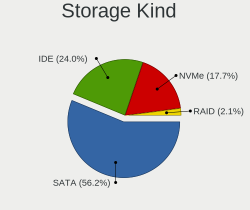
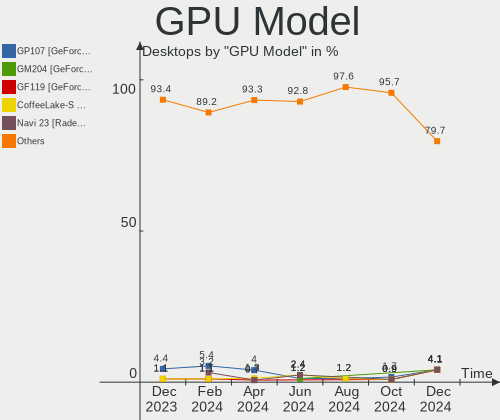
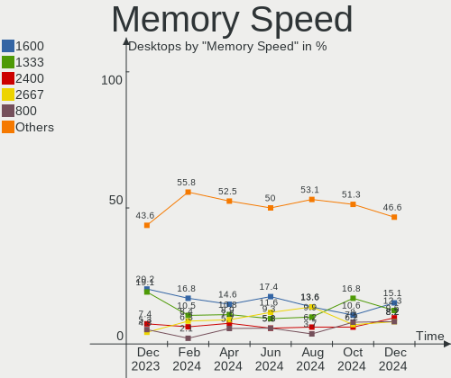

ROSA - Hardware Trends (Desktops)
---------------------------------

A project to identify most popular hardware characteristics and track their change
over time based on data collected by Linux users at https://Linux-Hardware.org.

Anyone can contribute to this report by the [hw-probe](https://github.com/linuxhw/hw-probe) tool:

    sudo -E hw-probe -all -upload

This report is for one last month. Overall report since the beginning of time: [TestCoverage](https://github.com/linuxhw/TestCoverage)

Period: May, 2022.

Contents
--------

* [ System ](#system)
  - [ OS                       ](#os)
  - [ OS Family                ](#os-family)
  - [ Kernel                   ](#kernel)
  - [ Kernel Family            ](#kernel-family)
  - [ Kernel Major Ver.        ](#kernel-major-ver)
  - [ Arch                     ](#arch)
  - [ DE                       ](#de)
  - [ Display Server           ](#display-server)
  - [ Display Manager          ](#display-manager)
  - [ OS Lang                  ](#os-lang)
  - [ Boot Mode                ](#boot-mode)
  - [ Filesystem               ](#filesystem)
  - [ Part. scheme             ](#part-scheme)
  - [ Dual Boot with Linux/BSD ](#dual-boot-with-linuxbsd)
  - [ Dual Boot (Win)          ](#dual-boot-win)

* [ Board ](#board)
  - [ Vendor                   ](#vendor)
  - [ Model                    ](#model)
  - [ Model Family             ](#model-family)
  - [ MFG Year                 ](#mfg-year)
  - [ Form Factor              ](#form-factor)
  - [ Secure Boot              ](#secure-boot)
  - [ Coreboot                 ](#coreboot)
  - [ RAM Size                 ](#ram-size)
  - [ RAM Used                 ](#ram-used)
  - [ Total Drives             ](#total-drives)
  - [ Has CD-ROM               ](#has-cd-rom)
  - [ Has Ethernet             ](#has-ethernet)
  - [ Has WiFi                 ](#has-wifi)
  - [ Has Bluetooth            ](#has-bluetooth)

* [ Location ](#location)
  - [ Country                  ](#country)
  - [ City                     ](#city)

* [ Drives ](#drives)
  - [ Drive Vendor             ](#drive-vendor)
  - [ Drive Model              ](#drive-model)
  - [ HDD Vendor               ](#hdd-vendor)
  - [ SSD Vendor               ](#ssd-vendor)
  - [ Drive Kind               ](#drive-kind)
  - [ Drive Connector          ](#drive-connector)
  - [ Drive Size               ](#drive-size)
  - [ Space Total              ](#space-total)
  - [ Space Used               ](#space-used)
  - [ Malfunc. Drives          ](#malfunc-drives)
  - [ Malfunc. Drive Vendor    ](#malfunc-drive-vendor)
  - [ Malfunc. HDD Vendor      ](#malfunc-hdd-vendor)
  - [ Malfunc. Drive Kind      ](#malfunc-drive-kind)
  - [ Failed Drives            ](#failed-drives)
  - [ Failed Drive Vendor      ](#failed-drive-vendor)
  - [ Drive Status             ](#drive-status)

* [ Storage controller ](#storage-controller)
  - [ Storage Vendor           ](#storage-vendor)
  - [ Storage Model            ](#storage-model)
  - [ Storage Kind             ](#storage-kind)

* [ Processor ](#processor)
  - [ CPU Vendor               ](#cpu-vendor)
  - [ CPU Model                ](#cpu-model)
  - [ CPU Model Family         ](#cpu-model-family)
  - [ CPU Cores                ](#cpu-cores)
  - [ CPU Sockets              ](#cpu-sockets)
  - [ CPU Threads              ](#cpu-threads)
  - [ CPU Op-Modes             ](#cpu-op-modes)
  - [ CPU Microcode            ](#cpu-microcode)
  - [ CPU Microarch            ](#cpu-microarch)

* [ Graphics ](#graphics)
  - [ GPU Vendor               ](#gpu-vendor)
  - [ GPU Model                ](#gpu-model)
  - [ GPU Combo                ](#gpu-combo)
  - [ GPU Driver               ](#gpu-driver)
  - [ GPU Memory               ](#gpu-memory)

* [ Monitor ](#monitor)
  - [ Monitor Vendor           ](#monitor-vendor)
  - [ Monitor Model            ](#monitor-model)
  - [ Monitor Resolution       ](#monitor-resolution)
  - [ Monitor Diagonal         ](#monitor-diagonal)
  - [ Monitor Width            ](#monitor-width)
  - [ Aspect Ratio             ](#aspect-ratio)
  - [ Monitor Area             ](#monitor-area)
  - [ Pixel Density            ](#pixel-density)
  - [ Multiple Monitors        ](#multiple-monitors)

* [ Network ](#network)
  - [ Net Controller Vendor    ](#net-controller-vendor)
  - [ Net Controller Model     ](#net-controller-model)
  - [ Wireless Vendor          ](#wireless-vendor)
  - [ Wireless Model           ](#wireless-model)
  - [ Ethernet Vendor          ](#ethernet-vendor)
  - [ Ethernet Model           ](#ethernet-model)
  - [ Net Controller Kind      ](#net-controller-kind)
  - [ Used Controller          ](#used-controller)
  - [ NICs                     ](#nics)
  - [ IPv6                     ](#ipv6)

* [ Bluetooth ](#bluetooth)
  - [ Bluetooth Vendor         ](#bluetooth-vendor)
  - [ Bluetooth Model          ](#bluetooth-model)

* [ Sound ](#sound)
  - [ Sound Vendor             ](#sound-vendor)
  - [ Sound Model              ](#sound-model)

* [ Memory ](#memory)
  - [ Memory Vendor            ](#memory-vendor)
  - [ Memory Model             ](#memory-model)
  - [ Memory Kind              ](#memory-kind)
  - [ Memory Form Factor       ](#memory-form-factor)
  - [ Memory Size              ](#memory-size)
  - [ Memory Speed             ](#memory-speed)

* [ Printers & scanners ](#printers--scanners)
  - [ Printer Vendor           ](#printer-vendor)
  - [ Printer Model            ](#printer-model)
  - [ Scanner Vendor           ](#scanner-vendor)
  - [ Scanner Model            ](#scanner-model)

* [ Camera ](#camera)
  - [ Camera Vendor            ](#camera-vendor)
  - [ Camera Model             ](#camera-model)

* [ Security ](#security)
  - [ Fingerprint Vendor       ](#fingerprint-vendor)
  - [ Fingerprint Model        ](#fingerprint-model)
  - [ Chipcard Vendor          ](#chipcard-vendor)
  - [ Chipcard Model           ](#chipcard-model)

* [ Unsupported ](#unsupported)
  - [ Unsupported Devices      ](#unsupported-devices)
  - [ Unsupported Device Types ](#unsupported-device-types)

System
------

OS
--

Installed operating systems

| Name       | Desktops | Percent |
|------------|----------|---------|
| ROSA 12.2  | 141      | 87.04%  |
| ROSA R11.1 | 15       | 9.26%   |
| ROSA 12.1  | 6        | 3.7%    |

OS Family
---------

OS without a version

| Name | Desktops | Percent |
|------|----------|---------|
| ROSA | 162      | 100%    |

Kernel
------

Version of the Linux kernel

| Version                                    | Desktops | Percent |
|--------------------------------------------|----------|---------|
| 5.10.74-generic-2rosa2021.1-x86_64         | 128      | 79.01%  |
| 5.15.32-generic-6rosa2021.1-x86_64         | 12       | 7.41%   |
| 5.4.83-generic-2rosa-x86_64                | 7        | 4.32%   |
| 4.15.0-desktop-122.124.1rosa-x86_64        | 3        | 1.85%   |
| 5.4.32-generic-2rosa-i586                  | 2        | 1.23%   |
| 5.10.74-generic-2rosa2021.1-i586           | 2        | 1.23%   |
| 5.4.32-generic-2rosa-x86_64                | 1        | 0.62%   |
| 5.17.11.xm1-1.klp-xanmod-rosa2021.1-x86_64 | 1        | 0.62%   |
| 5.17.11-generic-1rosa2021.1-x86_64         | 1        | 0.62%   |
| 5.16.20-generic-1rosa2021.1-x86_64         | 1        | 0.62%   |
| 5.16.18-generic-1rosa2021.1-x86_64         | 1        | 0.62%   |
| 5.16.17-generic-1rosa2021.1-x86_64         | 1        | 0.62%   |
| 4.9.155-nrj-desktop-1rosa-x86_64           | 1        | 0.62%   |
| 4.15.0-desktop-122.124.1rosa-i586          | 1        | 0.62%   |

Kernel Family
-------------

Linux kernel without a distro release

| Version | Desktops | Percent |
|---------|----------|---------|
| 5.10.74 | 130      | 80.25%  |
| 5.15.32 | 12       | 7.41%   |
| 5.4.83  | 7        | 4.32%   |
| 4.15.0  | 4        | 2.47%   |
| 5.4.32  | 3        | 1.85%   |
| 5.17.11 | 2        | 1.23%   |
| 5.16.20 | 1        | 0.62%   |
| 5.16.18 | 1        | 0.62%   |
| 5.16.17 | 1        | 0.62%   |
| 4.9.155 | 1        | 0.62%   |

Kernel Major Ver.
-----------------

Linux kernel major version

| Version | Desktops | Percent |
|---------|----------|---------|
| 5.10    | 130      | 80.25%  |
| 5.15    | 12       | 7.41%   |
| 5.4     | 10       | 6.17%   |
| 4.15    | 4        | 2.47%   |
| 5.16    | 3        | 1.85%   |
| 5.17    | 2        | 1.23%   |
| 4.9     | 1        | 0.62%   |

Arch
----

OS architecture (x86_64, i586, etc.)

| Name   | Desktops | Percent |
|--------|----------|---------|
| x86_64 | 157      | 96.91%  |
| i686   | 5        | 3.09%   |

DE
--

Desktop Environment

| Name  | Desktops | Percent |
|-------|----------|---------|
| KDE5  | 79       | 48.77%  |
| GNOME | 61       | 37.65%  |
| LXQt  | 12       | 7.41%   |
| KDE4  | 8        | 4.94%   |
| XFCE  | 2        | 1.23%   |

Display Server
--------------

X11 or Wayland

| Name    | Desktops | Percent |
|---------|----------|---------|
| Wayland | 124      | 76.54%  |
| X11     | 38       | 23.46%  |

Display Manager
---------------

SDDM, LightDM, etc.

| Name    | Desktops | Percent |
|---------|----------|---------|
| SDDM    | 76       | 46.91%  |
| GDM     | 76       | 46.91%  |
| KDM     | 8        | 4.94%   |
| LightDM | 2        | 1.23%   |

OS Lang
-------

Language

| Lang        | Desktops | Percent |
|-------------|----------|---------|
| ru_RU       | 145      | 89.51%  |
| en_US       | 4        | 2.47%   |
| ru_UA       | 3        | 1.85%   |
| de_DE       | 3        | 1.85%   |
| pl_PL       | 2        | 1.23%   |
| sr_RS@latin | 1        | 0.62%   |
| pt_PT       | 1        | 0.62%   |
| it_IT       | 1        | 0.62%   |
| fr_FR       | 1        | 0.62%   |
| es_ES       | 1        | 0.62%   |

Boot Mode
---------

EFI or BIOS

| Mode | Desktops | Percent |
|------|----------|---------|
| BIOS | 88       | 54.32%  |
| EFI  | 74       | 45.68%  |

Filesystem
----------

Type of filesystem

| Type     | Desktops | Percent |
|----------|----------|---------|
| Ext4     | 154      | 95.06%  |
| Btrfs    | 6        | 3.7%    |
| Reiserfs | 1        | 0.62%   |
| F2fs     | 1        | 0.62%   |

Part. scheme
------------

Scheme of partitioning

| Type | Desktops | Percent |
|------|----------|---------|
| GPT  | 101      | 62.35%  |
| MBR  | 61       | 37.65%  |

Dual Boot with Linux/BSD
------------------------

Hosting more than one Linux/BSD

| Dual boot | Desktops | Percent |
|-----------|----------|---------|
| No        | 112      | 69.14%  |
| Yes       | 50       | 30.86%  |

Dual Boot (Win)
---------------

Hosting Linux and Windows

| Dual boot | Desktops | Percent |
|-----------|----------|---------|
| Yes       | 96       | 59.26%  |
| No        | 66       | 40.74%  |

Board
-----

Vendor
------

Motherboard manufacturer

| Name                | Desktops | Percent |
|---------------------|----------|---------|
| Gigabyte Technology | 47       | 29.01%  |
| ASUSTek Computer    | 47       | 29.01%  |
| ASRock              | 21       | 12.96%  |
| MSI                 | 17       | 10.49%  |
| Intel               | 4        | 2.47%   |
| Huanan              | 4        | 2.47%   |
| Acer                | 4        | 2.47%   |
| Lenovo              | 3        | 1.85%   |
| Dell                | 3        | 1.85%   |
| Unknown             | 3        | 1.85%   |
| Foxconn             | 2        | 1.23%   |
| ECS                 | 2        | 1.23%   |
| MACHINIST           | 1        | 0.62%   |
| Hewlett-Packard     | 1        | 0.62%   |
| Fujitsu             | 1        | 0.62%   |
| EPoX Computer       | 1        | 0.62%   |
| ABIT                | 1        | 0.62%   |

Model
-----

Motherboard model

| Name                                                                   | Desktops | Percent |
|------------------------------------------------------------------------|----------|---------|
| ASUS All Series                                                        | 5        | 3.09%   |
| ASRock N68-S3 UCC                                                      | 3        | 1.85%   |
| Unknown                                                                | 3        | 1.85%   |
| MSI MS-7B86                                                            | 2        | 1.23%   |
| Gigabyte P61A-D3                                                       | 2        | 1.23%   |
| Gigabyte H77-DS3H                                                      | 2        | 1.23%   |
| ASUS M5A78L-M LE/USB3                                                  | 2        | 1.23%   |
| ASUS H110M-R                                                           | 2        | 1.23%   |
| ASUS A68HM-K                                                           | 2        | 1.23%   |
| ASRock B450 Gaming K4                                                  | 2        | 1.23%   |
| MSI MS-7D32                                                            | 1        | 0.62%   |
| MSI MS-7C96                                                            | 1        | 0.62%   |
| MSI MS-7C86                                                            | 1        | 0.62%   |
| MSI MS-7C56                                                            | 1        | 0.62%   |
| MSI MS-7C09                                                            | 1        | 0.62%   |
| MSI MS-7C02                                                            | 1        | 0.62%   |
| MSI MS-7B98                                                            | 1        | 0.62%   |
| MSI MS-7B93                                                            | 1        | 0.62%   |
| MSI MS-7B89                                                            | 1        | 0.62%   |
| MSI MS-7B47                                                            | 1        | 0.62%   |
| MSI MS-7A38                                                            | 1        | 0.62%   |
| MSI MS-7885                                                            | 1        | 0.62%   |
| MSI MS-7693                                                            | 1        | 0.62%   |
| MSI MS-7641                                                            | 1        | 0.62%   |
| MSI MS-7615                                                            | 1        | 0.62%   |
| MACHINIST X99-K9 V2.0                                                  | 1        | 0.62%   |
| Lenovo ThinkCentre M55 8795B1G                                         | 1        | 0.62%   |
| Lenovo IdeaCentre 310S-08IGM 90HX003JRS                                | 1        | 0.62%   |
| Lenovo H420                                                            | 1        | 0.62%   |
| Intel X79 V2.72B                                                       | 1        | 0.62%   |
| Intel X79                                                              | 1        | 0.62%   |
| Intel MAHOBAY                                                          | 1        | 0.62%   |
| Intel DH55TC AAE70932-204                                              | 1        | 0.62%   |
| Huanan X99-F8 NALEX                                                    | 1        | 0.62%   |
| Huanan X99-F8                                                          | 1        | 0.62%   |
| Huanan X99 F8D V2.2                                                    | 1        | 0.62%   |
| Huanan X79 INTEL (INTEL Xeon E5/Corei7 DMI2 - C600/C200 Cipset V2.49PB | 1        | 0.62%   |
| HP Z600 Workstation                                                    | 1        | 0.62%   |
| Gigabyte Z97-HD3                                                       | 1        | 0.62%   |
| Gigabyte Z87P-D3                                                       | 1        | 0.62%   |
| Gigabyte Z370M D3H                                                     | 1        | 0.62%   |
| Gigabyte X570 GAMING X                                                 | 1        | 0.62%   |
| Gigabyte X470 AORUS GAMING 7 WIFI                                      | 1        | 0.62%   |
| Gigabyte Pro, Std, Elt Series                                          | 1        | 0.62%   |
| Gigabyte P75-D3                                                        | 1        | 0.62%   |
| Gigabyte P67A-D3-B3                                                    | 1        | 0.62%   |
| Gigabyte P31-S3L                                                       | 1        | 0.62%   |
| Gigabyte P31-S3G                                                       | 1        | 0.62%   |
| Gigabyte IMB1900N                                                      | 1        | 0.62%   |
| Gigabyte H81M-S2V                                                      | 1        | 0.62%   |
| Gigabyte H77N-WIFI                                                     | 1        | 0.62%   |
| Gigabyte H67N-USB3-B3                                                  | 1        | 0.62%   |
| Gigabyte H61M-DS2                                                      | 1        | 0.62%   |
| Gigabyte H57M-USB3                                                     | 1        | 0.62%   |
| Gigabyte H55M-USB3                                                     | 1        | 0.62%   |
| Gigabyte H55-UD3H                                                      | 1        | 0.62%   |
| Gigabyte H310M S2P 2.0                                                 | 1        | 0.62%   |
| Gigabyte H110M-S2V                                                     | 1        | 0.62%   |
| Gigabyte GA-MA770-UD3                                                  | 1        | 0.62%   |
| Gigabyte GA-870A-USB3                                                  | 1        | 0.62%   |

Model Family
------------

Motherboard model prefix

| Name                  | Desktops | Percent |
|-----------------------|----------|---------|
| ASUS PRIME            | 5        | 3.09%   |
| ASUS All              | 5        | 3.09%   |
| Dell OptiPlex         | 3        | 1.85%   |
| ASUS ROG              | 3        | 1.85%   |
| ASUS M5A97            | 3        | 1.85%   |
| ASRock N68-S3         | 3        | 1.85%   |
| Acer Aspire           | 3        | 1.85%   |
| Unknown               | 3        | 1.85%   |
| MSI MS-7B86           | 2        | 1.23%   |
| Intel X79             | 2        | 1.23%   |
| Huanan X99-F8         | 2        | 1.23%   |
| Gigabyte P61A-D3      | 2        | 1.23%   |
| Gigabyte H77-DS3H     | 2        | 1.23%   |
| Gigabyte B450M        | 2        | 1.23%   |
| Gigabyte AB350M-DS3H  | 2        | 1.23%   |
| ASUS M5A78L-M         | 2        | 1.23%   |
| ASUS H110M-R          | 2        | 1.23%   |
| ASUS A68HM-K          | 2        | 1.23%   |
| ASRock B450           | 2        | 1.23%   |
| MSI MS-7D32           | 1        | 0.62%   |
| MSI MS-7C96           | 1        | 0.62%   |
| MSI MS-7C86           | 1        | 0.62%   |
| MSI MS-7C56           | 1        | 0.62%   |
| MSI MS-7C09           | 1        | 0.62%   |
| MSI MS-7C02           | 1        | 0.62%   |
| MSI MS-7B98           | 1        | 0.62%   |
| MSI MS-7B93           | 1        | 0.62%   |
| MSI MS-7B89           | 1        | 0.62%   |
| MSI MS-7B47           | 1        | 0.62%   |
| MSI MS-7A38           | 1        | 0.62%   |
| MSI MS-7885           | 1        | 0.62%   |
| MSI MS-7693           | 1        | 0.62%   |
| MSI MS-7641           | 1        | 0.62%   |
| MSI MS-7615           | 1        | 0.62%   |
| MACHINIST X99-K9      | 1        | 0.62%   |
| Lenovo ThinkCentre    | 1        | 0.62%   |
| Lenovo IdeaCentre     | 1        | 0.62%   |
| Lenovo H420           | 1        | 0.62%   |
| Intel MAHOBAY         | 1        | 0.62%   |
| Intel DH55TC          | 1        | 0.62%   |
| Huanan X99            | 1        | 0.62%   |
| Huanan X79            | 1        | 0.62%   |
| HP Z600               | 1        | 0.62%   |
| Gigabyte Z97-HD3      | 1        | 0.62%   |
| Gigabyte Z87P-D3      | 1        | 0.62%   |
| Gigabyte Z370M        | 1        | 0.62%   |
| Gigabyte X570         | 1        | 0.62%   |
| Gigabyte X470         | 1        | 0.62%   |
| Gigabyte Pro          | 1        | 0.62%   |
| Gigabyte P75-D3       | 1        | 0.62%   |
| Gigabyte P67A-D3-B3   | 1        | 0.62%   |
| Gigabyte P31-S3L      | 1        | 0.62%   |
| Gigabyte P31-S3G      | 1        | 0.62%   |
| Gigabyte IMB1900N     | 1        | 0.62%   |
| Gigabyte H81M-S2V     | 1        | 0.62%   |
| Gigabyte H77N-WIFI    | 1        | 0.62%   |
| Gigabyte H67N-USB3-B3 | 1        | 0.62%   |
| Gigabyte H61M-DS2     | 1        | 0.62%   |
| Gigabyte H57M-USB3    | 1        | 0.62%   |
| Gigabyte H55M-USB3    | 1        | 0.62%   |

MFG Year
--------

Motherboard manufacture year

| Year | Desktops | Percent |
|------|----------|---------|
| 2018 | 19       | 11.73%  |
| 2012 | 19       | 11.73%  |
| 2013 | 13       | 8.02%   |
| 2016 | 12       | 7.41%   |
| 2011 | 12       | 7.41%   |
| 2020 | 11       | 6.79%   |
| 2019 | 11       | 6.79%   |
| 2010 | 11       | 6.79%   |
| 2017 | 9        | 5.56%   |
| 2014 | 9        | 5.56%   |
| 2021 | 8        | 4.94%   |
| 2015 | 8        | 4.94%   |
| 2009 | 6        | 3.7%    |
| 2008 | 6        | 3.7%    |
| 2007 | 6        | 3.7%    |
| 2006 | 1        | 0.62%   |
| 2005 | 1        | 0.62%   |

Form Factor
-----------

Physical design of the computer

| Name    | Desktops | Percent |
|---------|----------|---------|
| Desktop | 162      | 100%    |

Secure Boot
-----------

Enabled or disabled

| State    | Desktops | Percent |
|----------|----------|---------|
| Disabled | 162      | 100%    |

Coreboot
--------

Have coreboot on board

| Used | Desktops | Percent |
|------|----------|---------|
| No   | 162      | 100%    |

RAM Size
--------

Total RAM memory

| Size in GB  | Desktops | Percent |
|-------------|----------|---------|
| 8.01-16.0   | 45       | 27.78%  |
| 16.01-24.0  | 37       | 22.84%  |
| 4.01-8.0    | 26       | 16.05%  |
| 3.01-4.0    | 25       | 15.43%  |
| 32.01-64.0  | 14       | 8.64%   |
| 1.01-2.0    | 9        | 5.56%   |
| 24.01-32.0  | 3        | 1.85%   |
| 64.01-256.0 | 3        | 1.85%   |

RAM Used
--------

Used RAM memory

| Used GB  | Desktops | Percent |
|----------|----------|---------|
| 1.01-2.0 | 85       | 52.47%  |
| 0.51-1.0 | 42       | 25.93%  |
| 2.01-3.0 | 21       | 12.96%  |
| 3.01-4.0 | 9        | 5.56%   |
| 4.01-8.0 | 4        | 2.47%   |
| 0.01-0.5 | 1        | 0.62%   |

Total Drives
------------

Number of drives on board

| Drives | Desktops | Percent |
|--------|----------|---------|
| 1      | 62       | 38.27%  |
| 2      | 47       | 29.01%  |
| 3      | 29       | 17.9%   |
| 4      | 16       | 9.88%   |
| 5      | 5        | 3.09%   |
| 0      | 2        | 1.23%   |
| 6      | 1        | 0.62%   |

Has CD-ROM
----------

Has CD-ROM on board

| Presented | Desktops | Percent |
|-----------|----------|---------|
| No        | 92       | 56.79%  |
| Yes       | 70       | 43.21%  |

Has Ethernet
------------

Has Ethernet on board

| Presented | Desktops | Percent |
|-----------|----------|---------|
| Yes       | 159      | 98.15%  |
| No        | 3        | 1.85%   |

Has WiFi
--------

Has WiFi module

| Presented | Desktops | Percent |
|-----------|----------|---------|
| No        | 126      | 77.78%  |
| Yes       | 36       | 22.22%  |

Has Bluetooth
-------------

Has Bluetooth module

| Presented | Desktops | Percent |
|-----------|----------|---------|
| No        | 135      | 83.33%  |
| Yes       | 27       | 16.67%  |

Location
--------

Country
-------

Geographic location (country)

| Country    | Desktops | Percent |
|------------|----------|---------|
| Russia     | 135      | 83.33%  |
| Ukraine    | 10       | 6.17%   |
| Poland     | 3        | 1.85%   |
| Germany    | 3        | 1.85%   |
| Serbia     | 2        | 1.23%   |
| Kazakhstan | 2        | 1.23%   |
| UK         | 1        | 0.62%   |
| Lithuania  | 1        | 0.62%   |
| Italy      | 1        | 0.62%   |
| France     | 1        | 0.62%   |
| Brazil     | 1        | 0.62%   |
| Bolivia    | 1        | 0.62%   |
| Belarus    | 1        | 0.62%   |

City
----

Geographic location (city)

| City               | Desktops | Percent |
|--------------------|----------|---------|
| Moscow             | 25       | 15.43%  |
| St Petersburg      | 11       | 6.79%   |
| Yekaterinburg      | 4        | 2.47%   |
| Perm               | 4        | 2.47%   |
| Krasnodar          | 4        | 2.47%   |
| Samara             | 3        | 1.85%   |
| Voronezh           | 2        | 1.23%   |
| Ufa                | 2        | 1.23%   |
| Tver               | 2        | 1.23%   |
| Tula               | 2        | 1.23%   |
| Tomsk              | 2        | 1.23%   |
| Tolyatti           | 2        | 1.23%   |
| Sevastopol         | 2        | 1.23%   |
| Rostov-on-Don      | 2        | 1.23%   |
| Pyatigorsk         | 2        | 1.23%   |
| Novopskov          | 2        | 1.23%   |
| Noril'sk           | 2        | 1.23%   |
| Nizhniy Novgorod   | 2        | 1.23%   |
| Kremenchug         | 2        | 1.23%   |
| Kostroma           | 2        | 1.23%   |
| Chelyabinsk        | 2        | 1.23%   |
| Bratsk             | 2        | 1.23%   |
| Belgrade           | 2        | 1.23%   |
| Yuzhno-Sakhalinsk  | 1        | 0.62%   |
| Yoshkar-Ola        | 1        | 0.62%   |
| Yasinovataya       | 1        | 0.62%   |
| Yartsevo           | 1        | 0.62%   |
| Yakutsk            | 1        | 0.62%   |
| Wroclaw            | 1        | 0.62%   |
| Volkhov            | 1        | 0.62%   |
| Volgograd          | 1        | 0.62%   |
| Veliky Novgorod    | 1        | 0.62%   |
| Velikiye Luki      | 1        | 0.62%   |
| Valuyki            | 1        | 0.62%   |
| Tuapse             | 1        | 0.62%   |
| Tsimlyansk         | 1        | 0.62%   |
| Torun              | 1        | 0.62%   |
| Tambov             | 1        | 0.62%   |
| Taganrog           | 1        | 0.62%   |
| Syktyvkar          | 1        | 0.62%   |
| Surgut             | 1        | 0.62%   |
| Sterlitamak        | 1        | 0.62%   |
| Stavropol          | 1        | 0.62%   |
| Sorokyne           | 1        | 0.62%   |
| Simferopol         | 1        | 0.62%   |
| Shelekhov          | 1        | 0.62%   |
| Sergiyev Posad     | 1        | 0.62%   |
| Saratov            | 1        | 0.62%   |
| Sao Joao de Meriti | 1        | 0.62%   |
| Santa Cruz         | 1        | 0.62%   |
| Rueil-Malmaison    | 1        | 0.62%   |
| Ridder             | 1        | 0.62%   |
| Pskov              | 1        | 0.62%   |
| Petrozavodsk       | 1        | 0.62%   |
| Petropavl          | 1        | 0.62%   |
| Petergof           | 1        | 0.62%   |
| Penza              | 1        | 0.62%   |
| Pavlovsk           | 1        | 0.62%   |
| Odintsovo          | 1        | 0.62%   |
| Novotroitsk        | 1        | 0.62%   |

Drives
------

Drive Vendor
------------

Hard drive vendors

| Vendor              | Desktops | Drives | Percent |
|---------------------|----------|--------|---------|
| WDC                 | 65       | 78     | 21.31%  |
| Seagate             | 58       | 67     | 19.02%  |
| Samsung Electronics | 29       | 33     | 9.51%   |
| Toshiba             | 22       | 23     | 7.21%   |
| Hitachi             | 13       | 13     | 4.26%   |
| Kingston            | 12       | 12     | 3.93%   |
| A-DATA Technology   | 12       | 12     | 3.93%   |
| Crucial             | 11       | 12     | 3.61%   |
| China               | 6        | 6      | 1.97%   |
| Apacer              | 6        | 7      | 1.97%   |
| HGST                | 5        | 5      | 1.64%   |
| GOODRAM             | 5        | 5      | 1.64%   |
| XrayDisk            | 4        | 6      | 1.31%   |
| OCZ                 | 4        | 4      | 1.31%   |
| XPG                 | 3        | 3      | 0.98%   |
| Smartbuy            | 3        | 4      | 0.98%   |
| Silicon Motion      | 3        | 4      | 0.98%   |
| Intel               | 3        | 3      | 0.98%   |
| Gigabyte Technology | 3        | 3      | 0.98%   |
| Unknown             | 2        | 2      | 0.66%   |
| SPCC                | 2        | 2      | 0.66%   |
| Phison              | 2        | 2      | 0.66%   |
| Patriot             | 2        | 2      | 0.66%   |
| MAXTOR              | 2        | 2      | 0.66%   |
| KingSpec            | 2        | 2      | 0.66%   |
| Intenso             | 2        | 2      | 0.66%   |
| AMD                 | 2        | 2      | 0.66%   |
| Zheino              | 1        | 1      | 0.33%   |
| Transcend           | 1        | 1      | 0.33%   |
| THU                 | 1        | 1      | 0.33%   |
| Teclast             | 1        | 1      | 0.33%   |
| Team                | 1        | 1      | 0.33%   |
| SK Hynix            | 1        | 1      | 0.33%   |
| SanDisk             | 1        | 1      | 0.33%   |
| ROG                 | 1        | 1      | 0.33%   |
| QUMO                | 1        | 1      | 0.33%   |
| PNY                 | 1        | 1      | 0.33%   |
| PLEXTOR             | 1        | 1      | 0.33%   |
| Pioneer             | 1        | 1      | 0.33%   |
| Netac               | 1        | 1      | 0.33%   |
| LITEON              | 1        | 1      | 0.33%   |
| Leven               | 1        | 1      | 0.33%   |
| KIOXIA-EXCERIA      | 1        | 1      | 0.33%   |
| HUAWEI              | 1        | 1      | 0.33%   |
| Hewlett-Packard     | 1        | 1      | 0.33%   |
| FOXLINE             | 1        | 1      | 0.33%   |
| e2e4                | 1        | 1      | 0.33%   |
| ASMT                | 1        | 2      | 0.33%   |
| Apple               | 1        | 1      | 0.33%   |

Drive Model
-----------

Hard drive models

| Model                             | Desktops | Percent |
|-----------------------------------|----------|---------|
| Toshiba HDWD110 1TB               | 9        | 2.69%   |
| Seagate ST1000DM010-2EP102 1TB    | 8        | 2.39%   |
| Seagate ST500DM002-1BD142 500GB   | 6        | 1.79%   |
| Seagate ST380815AS 80GB           | 4        | 1.19%   |
| Samsung SSD 860 EVO 250GB         | 4        | 1.19%   |
| WDC WDS240G2G0B-00EPW0 240GB SSD  | 3        | 0.9%    |
| WDC WD20EZRZ-00Z5HB0 2TB          | 3        | 0.9%    |
| WDC WD10EZEX-08WN4A0 1TB          | 3        | 0.9%    |
| Seagate ST1000DM003-1CH162 1TB    | 3        | 0.9%    |
| Crucial CT240BX500SSD1 240GB      | 3        | 0.9%    |
| Apacer AS350 256GB SSD            | 3        | 0.9%    |
| A-DATA SU650 240GB SSD            | 3        | 0.9%    |
| XPG GAMMIX S11 Pro 256GB          | 2        | 0.6%    |
| WDC WD5000AAKX-001CA0 500GB       | 2        | 0.6%    |
| WDC WD20EZBX-00AYRA0 2TB          | 2        | 0.6%    |
| WDC WD10EZEX-00RKKA0 1TB          | 2        | 0.6%    |
| WDC WD10EZEX-00BN5A0 1TB          | 2        | 0.6%    |
| Unknown SD/MMC/MS PRO 999GB       | 2        | 0.6%    |
| Toshiba HDWD105 500GB             | 2        | 0.6%    |
| Toshiba DT01ACA050 500GB          | 2        | 0.6%    |
| Smartbuy SSD 240GB                | 2        | 0.6%    |
| Seagate ST3160815AS 160GB         | 2        | 0.6%    |
| Seagate ST31000528AS 1TB          | 2        | 0.6%    |
| Seagate ST31000524AS 1TB          | 2        | 0.6%    |
| Seagate ST2000DM001-9YN164 2TB    | 2        | 0.6%    |
| Seagate ST2000DM001-1CH164 2TB    | 2        | 0.6%    |
| Seagate ST1000LM049-2GH172 1TB    | 2        | 0.6%    |
| Samsung SSD 970 EVO Plus 250GB    | 2        | 0.6%    |
| Samsung SSD 860 EVO 500GB         | 2        | 0.6%    |
| Samsung SSD 850 EVO 250GB         | 2        | 0.6%    |
| MAXTOR 6V080E0 82GB               | 2        | 0.6%    |
| Kingston SUV400S37120G 120GB SSD  | 2        | 0.6%    |
| Kingston SA400S37480G 480GB SSD   | 2        | 0.6%    |
| Kingston SA400S37120G 120GB SSD   | 2        | 0.6%    |
| Hitachi HDP725025GLA380 250GB     | 2        | 0.6%    |
| GOODRAM SSDPR-CX400-128-G2 128GB  | 2        | 0.6%    |
| Gigabyte GP-GSTFS31240GNTD 240GB  | 2        | 0.6%    |
| Crucial CT480BX500SSD1 480GB      | 2        | 0.6%    |
| China SSD 240GB                   | 2        | 0.6%    |
| Apacer AS350 128GB SSD            | 2        | 0.6%    |
| A-DATA SU650 120GB SSD            | 2        | 0.6%    |
| Zheino CHN-25SATAS3-128 128GB SSD | 1        | 0.3%    |
| XrayDisk SSD 256GB                | 1        | 0.3%    |
| XrayDisk SSD 240GB                | 1        | 0.3%    |
| XrayDisk SSD 1TB                  | 1        | 0.3%    |
| XrayDisk SSD 120GB                | 1        | 0.3%    |
| XrayDisk 256GB                    | 1        | 0.3%    |
| XPG GAMMIX S5 512GB               | 1        | 0.3%    |
| WDC WDS500G3X0C-00SJG0 500GB      | 1        | 0.3%    |
| WDC WDS500G2B0B-00YS70 500GB SSD  | 1        | 0.3%    |
| WDC WDS500G2B0A-00SM50 500GB SSD  | 1        | 0.3%    |
| WDC WDS240G2G0A-00JH30 240GB SSD  | 1        | 0.3%    |
| WDC WDS120G2G0A-00JH30 120GB SSD  | 1        | 0.3%    |
| WDC WDS100T3X0C-00SJG0 1TB        | 1        | 0.3%    |
| WDC WDS100T2B0B-00YS70 1TB SSD    | 1        | 0.3%    |
| WDC WD7500BPVT-00HXZT3 752GB      | 1        | 0.3%    |
| WDC WD7500AARS-003BB1 752GB       | 1        | 0.3%    |
| WDC WD6400AARS-00Y5B1 640GB       | 1        | 0.3%    |
| WDC WD5003AZEX-00K3CA0 500GB      | 1        | 0.3%    |
| WDC WD5003AZEX-00K1GA0 500GB      | 1        | 0.3%    |

HDD Vendor
----------

Hard disk drive vendors

| Vendor              | Desktops | Drives | Percent |
|---------------------|----------|--------|---------|
| WDC                 | 60       | 68     | 35.29%  |
| Seagate             | 58       | 66     | 34.12%  |
| Toshiba             | 22       | 22     | 12.94%  |
| Hitachi             | 13       | 13     | 7.65%   |
| Samsung Electronics | 6        | 6      | 3.53%   |
| HGST                | 5        | 5      | 2.94%   |
| Unknown             | 2        | 2      | 1.18%   |
| MAXTOR              | 2        | 2      | 1.18%   |
| ASMT                | 1        | 2      | 0.59%   |
| Apple               | 1        | 1      | 0.59%   |

SSD Vendor
----------

Solid state drive vendors

| Vendor              | Desktops | Drives | Percent |
|---------------------|----------|--------|---------|
| Samsung Electronics | 15       | 16     | 13.76%  |
| Kingston            | 10       | 10     | 9.17%   |
| Crucial             | 10       | 11     | 9.17%   |
| A-DATA Technology   | 9        | 9      | 8.26%   |
| WDC                 | 8        | 8      | 7.34%   |
| China               | 6        | 6      | 5.5%    |
| Apacer              | 6        | 7      | 5.5%    |
| OCZ                 | 4        | 4      | 3.67%   |
| GOODRAM             | 4        | 4      | 3.67%   |
| XrayDisk            | 3        | 5      | 2.75%   |
| Smartbuy            | 3        | 4      | 2.75%   |
| Intel               | 3        | 3      | 2.75%   |
| SPCC                | 2        | 2      | 1.83%   |
| Patriot             | 2        | 2      | 1.83%   |
| KingSpec            | 2        | 2      | 1.83%   |
| Intenso             | 2        | 2      | 1.83%   |
| Gigabyte Technology | 2        | 2      | 1.83%   |
| AMD                 | 2        | 2      | 1.83%   |
| Zheino              | 1        | 1      | 0.92%   |
| Toshiba             | 1        | 1      | 0.92%   |
| THU                 | 1        | 1      | 0.92%   |
| Team                | 1        | 1      | 0.92%   |
| Seagate             | 1        | 1      | 0.92%   |
| SanDisk             | 1        | 1      | 0.92%   |
| QUMO                | 1        | 1      | 0.92%   |
| PNY                 | 1        | 1      | 0.92%   |
| PLEXTOR             | 1        | 1      | 0.92%   |
| Pioneer             | 1        | 1      | 0.92%   |
| LITEON              | 1        | 1      | 0.92%   |
| Leven               | 1        | 1      | 0.92%   |
| KIOXIA-EXCERIA      | 1        | 1      | 0.92%   |
| Hewlett-Packard     | 1        | 1      | 0.92%   |
| FOXLINE             | 1        | 1      | 0.92%   |
| e2e4                | 1        | 1      | 0.92%   |

Drive Kind
----------

HDD or SSD

| Kind    | Desktops | Drives | Percent |
|---------|----------|--------|---------|
| HDD     | 131      | 187    | 51.57%  |
| SSD     | 88       | 115    | 34.65%  |
| NVMe    | 33       | 35     | 12.99%  |
| Unknown | 2        | 2      | 0.79%   |

Drive Connector
---------------

SATA, SAS, NVMe, etc.

| Type | Desktops | Drives | Percent |
|------|----------|--------|---------|
| SATA | 158      | 296    | 80.2%   |
| NVMe | 33       | 35     | 16.75%  |
| SAS  | 6        | 8      | 3.05%   |

Drive Size
----------

Size of hard drive

| Size in TB | Desktops | Drives | Percent |
|------------|----------|--------|---------|
| 0.01-0.5   | 137      | 194    | 59.83%  |
| 0.51-1.0   | 64       | 77     | 27.95%  |
| 1.01-2.0   | 18       | 20     | 7.86%   |
| 3.01-4.0   | 5        | 6      | 2.18%   |
| 2.01-3.0   | 3        | 3      | 1.31%   |
| 4.01-10.0  | 2        | 2      | 0.87%   |

Space Total
-----------

Amount of disk space available on the file system

| Size in GB     | Desktops | Percent |
|----------------|----------|---------|
| 101-250        | 52       | 32.1%   |
| 251-500        | 28       | 17.28%  |
| 501-1000       | 19       | 11.73%  |
| 1001-2000      | 18       | 11.11%  |
| 1-20           | 16       | 9.88%   |
| 51-100         | 12       | 7.41%   |
| 21-50          | 11       | 6.79%   |
| More than 3000 | 4        | 2.47%   |
| 2001-3000      | 2        | 1.23%   |

Space Used
----------

Amount of used disk space

| Used GB        | Desktops | Percent |
|----------------|----------|---------|
| 1-20           | 103      | 63.58%  |
| 21-50          | 15       | 9.26%   |
| 101-250        | 15       | 9.26%   |
| 251-500        | 10       | 6.17%   |
| 501-1000       | 8        | 4.94%   |
| 51-100         | 7        | 4.32%   |
| 1001-2000      | 2        | 1.23%   |
| More than 3000 | 1        | 0.62%   |
| 2001-3000      | 1        | 0.62%   |

Malfunc. Drives
---------------

Drive models with a malfunction

| Model                               | Desktops | Drives | Percent |
|-------------------------------------|----------|--------|---------|
| Seagate ST500DM002-1BD142 500GB     | 3        | 3      | 4.05%   |
| Seagate ST3160815AS 160GB           | 2        | 2      | 2.7%    |
| Seagate ST31000528AS 1TB            | 2        | 2      | 2.7%    |
| Seagate ST2000DM001-9YN164 2TB      | 2        | 2      | 2.7%    |
| XPG GAMMIX S5 512GB                 | 1        | 1      | 1.35%   |
| WDC WDS240G2G0A-00JH30 240GB SSD    | 1        | 1      | 1.35%   |
| WDC WD7500AARS-003BB1 752GB         | 1        | 1      | 1.35%   |
| WDC WD6400AARS-00Y5B1 640GB         | 1        | 1      | 1.35%   |
| WDC WD5000LPVX-22V0TT0 500GB        | 1        | 1      | 1.35%   |
| WDC WD5000AZRZ-00HTKB0 500GB        | 1        | 1      | 1.35%   |
| WDC WD5000AAKX-22ERMA0 500GB        | 1        | 1      | 1.35%   |
| WDC WD5000AAKX-00ERMA0 500GB        | 1        | 1      | 1.35%   |
| WDC WD5000AAKX-001CA0 500GB         | 1        | 1      | 1.35%   |
| WDC WD5000AAKS-22V1A0 500GB         | 1        | 1      | 1.35%   |
| WDC WD5000AAKS-00UU3A0 500GB        | 1        | 1      | 1.35%   |
| WDC WD3200BPVT-75ZEST0 320GB        | 1        | 1      | 1.35%   |
| WDC WD30EFRX-68EUZN0 3TB            | 1        | 1      | 1.35%   |
| WDC WD2500BEVT-60ZCT1 250GB         | 1        | 1      | 1.35%   |
| WDC WD2500AAKX-00ERMA0 250GB        | 1        | 1      | 1.35%   |
| WDC WD2500AAJS-07B4A0 250GB         | 1        | 1      | 1.35%   |
| WDC WD20EARS-00MVWB0 2TB            | 1        | 1      | 1.35%   |
| WDC WD20EADS-00R6B0 2TB             | 1        | 1      | 1.35%   |
| WDC WD1600BEVS-22UST0 160GB         | 1        | 1      | 1.35%   |
| WDC WD1600AAJS-00L7A0 160GB         | 1        | 1      | 1.35%   |
| WDC WD15EARX-00ZUDB0 1TB            | 1        | 1      | 1.35%   |
| WDC WD15EARS-00MVWB0 1TB            | 1        | 1      | 1.35%   |
| WDC WD1200JD-00HBB0 120GB           | 1        | 1      | 1.35%   |
| WDC WD10EZRZ-00HTKB0 1TB            | 1        | 1      | 1.35%   |
| WDC WD10EZEX-60WN4A1 1TB            | 1        | 1      | 1.35%   |
| WDC WD10EZEX-00RKKA0 1TB            | 1        | 1      | 1.35%   |
| WDC WD10EFRX-68JCSN0 1TB            | 1        | 1      | 1.35%   |
| WDC WD1001FALS-00Y6A0 1TB           | 1        | 1      | 1.35%   |
| Toshiba MQ01ABD050 500GB            | 1        | 1      | 1.35%   |
| Toshiba MK1246GSX 120GB             | 1        | 1      | 1.35%   |
| Smartbuy SSD 240GB                  | 1        | 1      | 1.35%   |
| Seagate ST500DM002-1BC142 500GB     | 1        | 1      | 1.35%   |
| Seagate ST380815AS 80GB             | 1        | 1      | 1.35%   |
| Seagate ST3500418AS 500GB           | 1        | 1      | 1.35%   |
| Seagate ST3300831AS 304GB           | 1        | 1      | 1.35%   |
| Seagate ST3250824AS 250GB           | 1        | 1      | 1.35%   |
| Seagate ST3250310AS 250GB           | 1        | 1      | 1.35%   |
| Seagate ST3160827AS 160GB           | 1        | 1      | 1.35%   |
| Seagate ST3160811AS 160GB           | 1        | 1      | 1.35%   |
| Seagate ST31000333AS 1TB            | 1        | 1      | 1.35%   |
| Seagate ST2000LM003 HN-M201RAD 2TB  | 1        | 1      | 1.35%   |
| Seagate ST1000LM014-1EJ164 1TB      | 1        | 1      | 1.35%   |
| Seagate ST1000DM003-1CH162 1TB      | 1        | 1      | 1.35%   |
| Samsung Electronics SV0221H 20GB    | 1        | 1      | 1.35%   |
| Samsung Electronics SSD 970 EVO 1TB | 1        | 1      | 1.35%   |
| Samsung Electronics SSD 870 EVO 2TB | 1        | 1      | 1.35%   |
| Samsung Electronics SP2504C 250GB   | 1        | 1      | 1.35%   |
| Samsung Electronics SP0812C 80GB    | 1        | 1      | 1.35%   |
| Samsung Electronics HD321KJ 320GB   | 1        | 1      | 1.35%   |
| Samsung Electronics HD080HJ 80GB    | 1        | 1      | 1.35%   |
| OCZ VERTEX450 128GB SSD             | 1        | 1      | 1.35%   |
| MAXTOR 6V080E0 82GB                 | 1        | 1      | 1.35%   |
| Leven JAJS300M240C 240GB            | 1        | 1      | 1.35%   |
| Kingston SUV400S37120G 120GB SSD    | 1        | 1      | 1.35%   |
| Intenso SSD Sata III 512GB          | 1        | 1      | 1.35%   |
| Hitachi HUA722010CLA630 1TB         | 1        | 1      | 1.35%   |

Malfunc. Drive Vendor
---------------------

Vendors of faulty drives

| Vendor              | Desktops | Drives | Percent |
|---------------------|----------|--------|---------|
| WDC                 | 25       | 27     | 36.23%  |
| Seagate             | 18       | 21     | 26.09%  |
| Samsung Electronics | 7        | 7      | 10.14%  |
| Hitachi             | 7        | 7      | 10.14%  |
| Toshiba             | 2        | 2      | 2.9%    |
| XPG                 | 1        | 1      | 1.45%   |
| Smartbuy            | 1        | 1      | 1.45%   |
| OCZ                 | 1        | 1      | 1.45%   |
| MAXTOR              | 1        | 1      | 1.45%   |
| Leven               | 1        | 1      | 1.45%   |
| Kingston            | 1        | 1      | 1.45%   |
| Intenso             | 1        | 1      | 1.45%   |
| HGST                | 1        | 1      | 1.45%   |
| Crucial             | 1        | 1      | 1.45%   |
| AMD                 | 1        | 1      | 1.45%   |

Malfunc. HDD Vendor
-------------------

Vendors of faulty HDD drives

| Vendor              | Desktops | Drives | Percent |
|---------------------|----------|--------|---------|
| WDC                 | 24       | 26     | 41.38%  |
| Seagate             | 18       | 21     | 31.03%  |
| Hitachi             | 7        | 7      | 12.07%  |
| Samsung Electronics | 5        | 5      | 8.62%   |
| Toshiba             | 2        | 2      | 3.45%   |
| MAXTOR              | 1        | 1      | 1.72%   |
| HGST                | 1        | 1      | 1.72%   |

Malfunc. Drive Kind
-------------------

Kinds of faulty drives

| Kind | Desktops | Drives | Percent |
|------|----------|--------|---------|
| HDD  | 52       | 63     | 82.54%  |
| SSD  | 9        | 9      | 14.29%  |
| NVMe | 2        | 2      | 3.17%   |

Failed Drives
-------------

Failed drive models

| Model                    | Desktops | Drives | Percent |
|--------------------------|----------|--------|---------|
| WDC WD20EARX-00PASB0 2TB | 1        | 1      | 33.33%  |
| Toshiba MQ01ABD075 752GB | 1        | 1      | 33.33%  |
| Seagate ST31000520AS 1TB | 1        | 2      | 33.33%  |

Failed Drive Vendor
-------------------

Failed drive vendors

| Vendor  | Desktops | Drives | Percent |
|---------|----------|--------|---------|
| WDC     | 1        | 1      | 33.33%  |
| Toshiba | 1        | 1      | 33.33%  |
| Seagate | 1        | 2      | 33.33%  |

Drive Status
------------

Number of failed and malfunc. drives

| Status   | Desktops | Drives | Percent |
|----------|----------|--------|---------|
| Works    | 141      | 257    | 67.14%  |
| Malfunc  | 62       | 74     | 29.52%  |
| Detected | 4        | 4      | 1.9%    |
| Failed   | 3        | 4      | 1.43%   |

Storage controller
------------------

Storage Vendor
--------------

Storage controller vendors

| Vendor                        | Desktops | Percent |
|-------------------------------|----------|---------|
| Intel                         | 99       | 45.83%  |
| AMD                           | 57       | 26.39%  |
| Samsung Electronics           | 11       | 5.09%   |
| Silicon Motion                | 8        | 3.7%    |
| JMicron Technology            | 8        | 3.7%    |
| Nvidia                        | 6        | 2.78%   |
| ASMedia Technology            | 6        | 2.78%   |
| ADATA Technology              | 5        | 2.31%   |
| Phison Electronics            | 3        | 1.39%   |
| Marvell Technology Group      | 3        | 1.39%   |
| VIA Technologies              | 2        | 0.93%   |
| Sandisk                       | 2        | 0.93%   |
| Kingston Technology Company   | 2        | 0.93%   |
| SK Hynix                      | 1        | 0.46%   |
| Realtek Semiconductor         | 1        | 0.46%   |
| Micron/Crucial Technology     | 1        | 0.46%   |
| Integrated Technology Express | 1        | 0.46%   |

Storage Model
-------------

Storage controller models

| Model                                                                                   | Desktops | Percent |
|-----------------------------------------------------------------------------------------|----------|---------|
| AMD FCH SATA Controller [AHCI mode]                                                     | 29       | 10.39%  |
| AMD 400 Series Chipset SATA Controller                                                  | 13       | 4.66%   |
| Intel 8 Series/C220 Series Chipset Family 6-port SATA Controller 1 [AHCI mode]          | 12       | 4.3%    |
| Intel 200 Series PCH SATA controller [AHCI mode]                                        | 12       | 4.3%    |
| AMD SB7x0/SB8x0/SB9x0 IDE Controller                                                    | 11       | 3.94%   |
| Intel Q170/Q150/B150/H170/H110/Z170/CM236 Chipset SATA Controller [AHCI Mode]           | 10       | 3.58%   |
| Intel 6 Series/C200 Series Chipset Family 6 port Desktop SATA AHCI Controller           | 10       | 3.58%   |
| Intel NM10/ICH7 Family SATA Controller [IDE mode]                                       | 9        | 3.23%   |
| AMD SB7x0/SB8x0/SB9x0 SATA Controller [IDE mode]                                        | 9        | 3.23%   |
| AMD SB7x0/SB8x0/SB9x0 SATA Controller [AHCI mode]                                       | 9        | 3.23%   |
| Intel 7 Series/C210 Series Chipset Family 6-port SATA Controller [AHCI mode]            | 8        | 2.87%   |
| Silicon Motion SM2263EN/SM2263XT SSD Controller                                         | 6        | 2.15%   |
| Samsung NVMe SSD Controller SM981/PM981/PM983                                           | 6        | 2.15%   |
| ASMedia ASM1062 Serial ATA Controller                                                   | 6        | 2.15%   |
| Intel C610/X99 series chipset 6-Port SATA Controller [AHCI mode]                        | 5        | 1.79%   |
| AMD 500 Series Chipset SATA Controller                                                  | 5        | 1.79%   |
| Nvidia MCP61 SATA Controller                                                            | 4        | 1.43%   |
| Nvidia MCP61 IDE                                                                        | 4        | 1.43%   |
| JMicron JMB363 SATA/IDE Controller                                                      | 4        | 1.43%   |
| Intel 82801G (ICH7 Family) IDE Controller                                               | 4        | 1.43%   |
| AMD 300 Series Chipset SATA Controller                                                  | 4        | 1.43%   |
| Intel 7 Series/C210 Series Chipset Family 4-port SATA Controller [IDE mode]             | 3        | 1.08%   |
| Intel 7 Series/C210 Series Chipset Family 2-port SATA Controller [IDE mode]             | 3        | 1.08%   |
| Intel 6 Series/C200 Series Chipset Family Desktop SATA Controller (IDE mode, ports 4-5) | 3        | 1.08%   |
| Intel 6 Series/C200 Series Chipset Family Desktop SATA Controller (IDE mode, ports 0-3) | 3        | 1.08%   |
| Intel 500 Series Chipset Family SATA AHCI Controller                                    | 3        | 1.08%   |
| Intel 5 Series/3400 Series Chipset 4 port SATA IDE Controller                           | 3        | 1.08%   |
| Intel 5 Series/3400 Series Chipset 2 port SATA IDE Controller                           | 3        | 1.08%   |
| AMD FCH SATA Controller D                                                               | 3        | 1.08%   |
| AMD FCH IDE Controller                                                                  | 3        | 1.08%   |
| ADATA XPG SX8200 Pro PCIe Gen3x4 M.2 2280 Solid State Drive                             | 3        | 1.08%   |
| VIA VT6415 PATA IDE Host Controller                                                     | 2        | 0.72%   |
| Silicon Motion SM2262/SM2262EN SSD Controller                                           | 2        | 0.72%   |
| Samsung NVMe SSD Controller SM961/PM961/SM963                                           | 2        | 0.72%   |
| Samsung NVMe SSD Controller 980                                                         | 2        | 0.72%   |
| Phison PS5013 E13 NVMe Controller                                                       | 2        | 0.72%   |
| JMicron JMB368 IDE controller                                                           | 2        | 0.72%   |
| Intel SATA Controller [RAID mode]                                                       | 2        | 0.72%   |
| Intel C600/X79 series chipset 6-Port SATA AHCI Controller                               | 2        | 0.72%   |
| Intel 9 Series Chipset Family SATA Controller [AHCI Mode]                               | 2        | 0.72%   |
| Intel 82801JI (ICH10 Family) SATA AHCI Controller                                       | 2        | 0.72%   |
| Intel 82801HR/HO/HH (ICH8R/DO/DH) 2 port SATA Controller [IDE mode]                     | 2        | 0.72%   |
| Intel 82801H (ICH8 Family) 4 port SATA Controller [IDE mode]                            | 2        | 0.72%   |
| AMD X370 Series Chipset SATA Controller                                                 | 2        | 0.72%   |
| AMD SB600 Non-Raid-5 SATA                                                               | 2        | 0.72%   |
| AMD SB600 IDE                                                                           | 2        | 0.72%   |
| AMD FCH SATA Controller [IDE mode]                                                      | 2        | 0.72%   |
| SK Hynix SC300 512GB M.2 2280 SATA Solid State Drive                                    | 1        | 0.36%   |
| Sandisk WD Black SN750 / PC SN730 NVMe SSD                                              | 1        | 0.36%   |
| Sandisk WD Black 2018/SN750 / PC SN720 NVMe SSD                                         | 1        | 0.36%   |
| Samsung NVMe SSD Controller PM9A1/PM9A3/980PRO                                          | 1        | 0.36%   |
| Realtek Realtek Non-Volatile memory controller                                          | 1        | 0.36%   |
| Phison Electronics Non-Volatile memory controller                                       | 1        | 0.36%   |
| Nvidia nForce3 Serial ATA Controller                                                    | 1        | 0.36%   |
| Nvidia MCP67 IDE Controller                                                             | 1        | 0.36%   |
| Nvidia MCP67 AHCI Controller                                                            | 1        | 0.36%   |
| Nvidia CK8S Parallel ATA Controller (v2.5)                                              | 1        | 0.36%   |
| Micron/Crucial P1 NVMe PCIe SSD                                                         | 1        | 0.36%   |
| Marvell Group 88SE9172 SATA III 6Gb/s RAID Controller                                   | 1        | 0.36%   |
| Marvell Group 88SE9172 SATA 6Gb/s Controller                                            | 1        | 0.36%   |

Storage Kind
------------

Kind of storage controller (IDE, SATA, NVMe, SAS, ...)

| Kind | Desktops | Percent |
|------|----------|---------|
| SATA | 134      | 60.91%  |
| IDE  | 50       | 22.73%  |
| NVMe | 33       | 15%     |
| RAID | 3        | 1.36%   |

Processor
---------

CPU Vendor
----------

Processor vendors

| Vendor | Desktops | Percent |
|--------|----------|---------|
| Intel  | 100      | 61.73%  |
| AMD    | 62       | 38.27%  |

CPU Model
---------

Processor models

| Model                                       | Desktops | Percent |
|---------------------------------------------|----------|---------|
| AMD Ryzen 5 1600 Six-Core Processor         | 5        | 3.09%   |
| Intel Xeon CPU E5-2678 v3 @ 2.50GHz         | 3        | 1.85%   |
| Intel Core i5-2400 CPU @ 3.10GHz            | 3        | 1.85%   |
| Intel Core i3-7100 CPU @ 3.90GHz            | 3        | 1.85%   |
| AMD Ryzen 5 2600 Six-Core Processor         | 3        | 1.85%   |
| Intel Xeon CPU E5-2650 v2 @ 2.60GHz         | 2        | 1.23%   |
| Intel Pentium CPU G620 @ 2.60GHz            | 2        | 1.23%   |
| Intel Core i7-4770 CPU @ 3.40GHz            | 2        | 1.23%   |
| Intel Core i5-4460 CPU @ 3.20GHz            | 2        | 1.23%   |
| Intel Core i5-3470 CPU @ 3.20GHz            | 2        | 1.23%   |
| Intel Core i5-2310 CPU @ 2.90GHz            | 2        | 1.23%   |
| Intel Core i5 CPU 760 @ 2.80GHz             | 2        | 1.23%   |
| Intel Core i3-8100 CPU @ 3.60GHz            | 2        | 1.23%   |
| Intel Core i3-6100 CPU @ 3.70GHz            | 2        | 1.23%   |
| Intel Core 2 Duo CPU E8400 @ 3.00GHz        | 2        | 1.23%   |
| AMD Ryzen 7 2700 Eight-Core Processor       | 2        | 1.23%   |
| AMD Ryzen 5 5600G with Radeon Graphics      | 2        | 1.23%   |
| AMD Ryzen 5 3600 6-Core Processor           | 2        | 1.23%   |
| AMD Ryzen 5 3500X 6-Core Processor          | 2        | 1.23%   |
| AMD Ryzen 5 3400G with Radeon Vega Graphics | 2        | 1.23%   |
| AMD FX-6300 Six-Core Processor              | 2        | 1.23%   |
| AMD Athlon X4 840 Quad Core Processor       | 2        | 1.23%   |
| AMD Athlon II X2 220 Processor              | 2        | 1.23%   |
| AMD A4-6300 APU with Radeon HD Graphics     | 2        | 1.23%   |
| Intel Xeon CPU X5670 @ 2.93GHz              | 1        | 0.62%   |
| Intel Xeon CPU X3470 @ 2.93GHz              | 1        | 0.62%   |
| Intel Xeon CPU L5420 @ 2.50GHz              | 1        | 0.62%   |
| Intel Xeon CPU E5450 @ 3.00GHz              | 1        | 0.62%   |
| Intel Xeon CPU E5-2690 v3 @ 2.60GHz         | 1        | 0.62%   |
| Intel Xeon CPU E5-2690 0 @ 2.90GHz          | 1        | 0.62%   |
| Intel Xeon CPU E5-2620 0 @ 2.00GHz          | 1        | 0.62%   |
| Intel Xeon CPU E3-1280 V2 @ 3.60GHz         | 1        | 0.62%   |
| Intel Xeon CPU E3-1240 V2 @ 3.40GHz         | 1        | 0.62%   |
| Intel Pentium Gold G5420 CPU @ 3.80GHz      | 1        | 0.62%   |
| Intel Pentium Gold G5400 CPU @ 3.70GHz      | 1        | 0.62%   |
| Intel Pentium Dual-Core CPU E6300 @ 2.80GHz | 1        | 0.62%   |
| Intel Pentium Dual-Core CPU E5200 @ 2.50GHz | 1        | 0.62%   |
| Intel Pentium Dual CPU E2220 @ 2.40GHz      | 1        | 0.62%   |
| Intel Pentium CPU J3710 @ 1.60GHz           | 1        | 0.62%   |
| Intel Pentium CPU G860 @ 3.00GHz            | 1        | 0.62%   |
| Intel Pentium CPU G4560 @ 3.50GHz           | 1        | 0.62%   |
| Intel Pentium CPU G4400 @ 3.30GHz           | 1        | 0.62%   |
| Intel Pentium CPU G3260 @ 3.30GHz           | 1        | 0.62%   |
| Intel Pentium CPU G3240 @ 3.10GHz           | 1        | 0.62%   |
| Intel Pentium 4 CPU 2.66GHz                 | 1        | 0.62%   |
| Intel Genuine CPU 0000 @ 2.40GHz            | 1        | 0.62%   |
| Intel Core i7-9700K CPU @ 3.60GHz           | 1        | 0.62%   |
| Intel Core i7-7700 CPU @ 3.60GHz            | 1        | 0.62%   |
| Intel Core i7-5820K CPU @ 3.30GHz           | 1        | 0.62%   |
| Intel Core i7-3770 CPU @ 3.40GHz            | 1        | 0.62%   |
| Intel Core i7-2600 CPU @ 3.40GHz            | 1        | 0.62%   |
| Intel Core i7 CPU K 875 @ 2.93GHz           | 1        | 0.62%   |
| Intel Core i7 CPU 950 @ 3.07GHz             | 1        | 0.62%   |
| Intel Core i5-9500T CPU @ 2.20GHz           | 1        | 0.62%   |
| Intel Core i5-9400F CPU @ 2.90GHz           | 1        | 0.62%   |
| Intel Core i5-8600K CPU @ 3.60GHz           | 1        | 0.62%   |
| Intel Core i5-8600 CPU @ 3.10GHz            | 1        | 0.62%   |
| Intel Core i5-8500 CPU @ 3.00GHz            | 1        | 0.62%   |
| Intel Core i5-7600 CPU @ 3.50GHz            | 1        | 0.62%   |
| Intel Core i5-7500 CPU @ 3.40GHz            | 1        | 0.62%   |

CPU Model Family
----------------

Processor model prefix

| Model                   | Desktops | Percent |
|-------------------------|----------|---------|
| Intel Core i5           | 25       | 15.43%  |
| AMD Ryzen 5             | 19       | 11.73%  |
| Intel Core i3           | 17       | 10.49%  |
| Intel Xeon              | 14       | 8.64%   |
| Intel Core i7           | 9        | 5.56%   |
| Intel Pentium           | 8        | 4.94%   |
| AMD FX                  | 7        | 4.32%   |
| Intel Core 2 Duo        | 6        | 3.7%    |
| Intel Celeron           | 6        | 3.7%    |
| Other                   | 5        | 3.09%   |
| AMD Ryzen 7             | 5        | 3.09%   |
| AMD Ryzen 3             | 4        | 2.47%   |
| AMD Phenom II X4        | 4        | 2.47%   |
| AMD Athlon II X2        | 4        | 2.47%   |
| Intel Core 2 Quad       | 3        | 1.85%   |
| AMD A4                  | 3        | 1.85%   |
| Intel Pentium Gold      | 2        | 1.23%   |
| Intel Pentium Dual-Core | 2        | 1.23%   |
| AMD Athlon X4           | 2        | 1.23%   |
| AMD Athlon 64 X2        | 2        | 1.23%   |
| Intel Pentium Dual      | 1        | 0.62%   |
| Intel Pentium 4         | 1        | 0.62%   |
| Intel Genuine           | 1        | 0.62%   |
| Intel Core 2            | 1        | 0.62%   |
| AMD Sempron             | 1        | 0.62%   |
| AMD Ryzen 5 PRO         | 1        | 0.62%   |
| AMD Phenom II X6        | 1        | 0.62%   |
| AMD Phenom II X3        | 1        | 0.62%   |
| AMD Phenom II X2        | 1        | 0.62%   |
| AMD Phenom              | 1        | 0.62%   |
| AMD E                   | 1        | 0.62%   |
| AMD C-60                | 1        | 0.62%   |
| AMD Athlon II X4        | 1        | 0.62%   |
| AMD A8                  | 1        | 0.62%   |
| AMD A6                  | 1        | 0.62%   |

CPU Cores
---------

Number of processor cores

| Number | Desktops | Percent |
|--------|----------|---------|
| 4      | 58       | 35.8%   |
| 2      | 49       | 30.25%  |
| 6      | 28       | 17.28%  |
| 8      | 10       | 6.17%   |
| 1      | 7        | 4.32%   |
| 12     | 5        | 3.09%   |
| 3      | 4        | 2.47%   |
| 24     | 1        | 0.62%   |

CPU Sockets
-----------

Number of sockets

| Number | Desktops | Percent |
|--------|----------|---------|
| 1      | 160      | 98.77%  |
| 2      | 2        | 1.23%   |

CPU Threads
-----------

Threads per core (Hyper-Threading)

| Number | Desktops | Percent |
|--------|----------|---------|
| 1      | 82       | 50.62%  |
| 2      | 80       | 49.38%  |

CPU Op-Modes
------------

CPU Operation Modes (32-bit, 64-bit)

| Op mode        | Desktops | Percent |
|----------------|----------|---------|
| 32-bit, 64-bit | 162      | 100%    |

CPU Microcode
-------------

Microcode number

| Number     | Desktops | Percent |
|------------|----------|---------|
| 0x306c3    | 13       | 8.02%   |
| 0x306a9    | 12       | 7.41%   |
| 0x206a7    | 11       | 6.79%   |
| 0x010000c8 | 9        | 5.56%   |
| 0x906ea    | 8        | 4.94%   |
| 0x906e9    | 7        | 4.32%   |
| 0x1067a    | 6        | 3.7%    |
| 0x08701021 | 6        | 3.7%    |
| 0x0800820d | 6        | 3.7%    |
| 0x506e3    | 5        | 3.09%   |
| 0x306f2    | 5        | 3.09%   |
| 0x106e5    | 4        | 2.47%   |
| 0x08001138 | 4        | 2.47%   |
| 0x06001119 | 4        | 2.47%   |
| 0x06000852 | 4        | 2.47%   |
| Unknown    | 4        | 2.47%   |
| 0xa0671    | 3        | 1.85%   |
| 0x906eb    | 3        | 1.85%   |
| 0x6fb      | 3        | 1.85%   |
| 0x6fd      | 2        | 1.23%   |
| 0x306e4    | 2        | 1.23%   |
| 0x206d7    | 2        | 1.23%   |
| 0x10676    | 2        | 1.23%   |
| 0x08600106 | 2        | 1.23%   |
| 0x08108109 | 2        | 1.23%   |
| 0x06003106 | 2        | 1.23%   |
| 0x0600063e | 2        | 1.23%   |
| 0x05000119 | 2        | 1.23%   |
| 0x010000db | 2        | 1.23%   |
| 0xf41      | 1        | 0.62%   |
| 0xa0653    | 1        | 0.62%   |
| 0x906ed    | 1        | 0.62%   |
| 0x90672    | 1        | 0.62%   |
| 0x706a1    | 1        | 0.62%   |
| 0x6f2      | 1        | 0.62%   |
| 0x406c4    | 1        | 0.62%   |
| 0x30679    | 1        | 0.62%   |
| 0x206c2    | 1        | 0.62%   |
| 0x106a5    | 1        | 0.62%   |
| 0x10677    | 1        | 0.62%   |
| 0x0a50000c | 1        | 0.62%   |
| 0x0a50000b | 1        | 0.62%   |
| 0x0a201009 | 1        | 0.62%   |
| 0x08701013 | 1        | 0.62%   |
| 0x08108102 | 1        | 0.62%   |
| 0x0810100b | 1        | 0.62%   |
| 0x08101004 | 1        | 0.62%   |
| 0x08001137 | 1        | 0.62%   |
| 0x08001126 | 1        | 0.62%   |
| 0x0600611a | 1        | 0.62%   |
| 0x06000822 | 1        | 0.62%   |
| 0x03000027 | 1        | 0.62%   |
| 0x010000dc | 1        | 0.62%   |
| 0x01000083 | 1        | 0.62%   |

CPU Microarch
-------------

Microarchitecture

| Name             | Desktops | Percent |
|------------------|----------|---------|
| KabyLake         | 19       | 11.73%  |
| Haswell          | 19       | 11.73%  |
| IvyBridge        | 14       | 8.64%   |
| SandyBridge      | 13       | 8.02%   |
| K10              | 13       | 8.02%   |
| Zen+             | 9        | 5.56%   |
| Zen 2            | 9        | 5.56%   |
| Piledriver       | 9        | 5.56%   |
| Penryn           | 9        | 5.56%   |
| Zen              | 8        | 4.94%   |
| Core             | 6        | 3.7%    |
| Skylake          | 5        | 3.09%   |
| Nehalem          | 5        | 3.09%   |
| Zen 3            | 3        | 1.85%   |
| K8 Hammer        | 3        | 1.85%   |
| Unknown          | 3        | 1.85%   |
| Steamroller      | 2        | 1.23%   |
| Silvermont       | 2        | 1.23%   |
| Bulldozer        | 2        | 1.23%   |
| Bobcat           | 2        | 1.23%   |
| Westmere         | 1        | 0.62%   |
| NetBurst         | 1        | 0.62%   |
| K10 Llano        | 1        | 0.62%   |
| Goldmont plus    | 1        | 0.62%   |
| Excavator        | 1        | 0.62%   |
| CometLake        | 1        | 0.62%   |
| Alderlake Hybrid | 1        | 0.62%   |

Graphics
--------

GPU Vendor
----------

Vendors of graphics cards

| Vendor           | Desktops | Percent |
|------------------|----------|---------|
| Nvidia           | 83       | 49.11%  |
| AMD              | 50       | 29.59%  |
| Intel            | 35       | 20.71%  |
| ATI Technologies | 1        | 0.59%   |

GPU Model
---------

Graphics card models

| Model                                                                       | Desktops | Percent |
|-----------------------------------------------------------------------------|----------|---------|
| Nvidia GP107 [GeForce GTX 1050 Ti]                                          | 14       | 8.14%   |
| AMD Ellesmere [Radeon RX 470/480/570/570X/580/580X/590]                     | 9        | 5.23%   |
| Nvidia GM107 [GeForce GTX 750 Ti]                                           | 5        | 2.91%   |
| Nvidia GF116 [GeForce GTX 550 Ti]                                           | 4        | 2.33%   |
| Intel Xeon E3-1200 v3/4th Gen Core Processor Integrated Graphics Controller | 4        | 2.33%   |
| Intel CoffeeLake-S GT2 [UHD Graphics 630]                                   | 4        | 2.33%   |
| Intel 2nd Generation Core Processor Family Integrated Graphics Controller   | 4        | 2.33%   |
| Nvidia GP108 [GeForce GT 1030]                                              | 3        | 1.74%   |
| Nvidia GK208B [GeForce GT 710]                                              | 3        | 1.74%   |
| Nvidia GK107 [GeForce GTX 650]                                              | 3        | 1.74%   |
| Nvidia G94 [GeForce 9600 GT]                                                | 3        | 1.74%   |
| Intel HD Graphics 530                                                       | 3        | 1.74%   |
| Intel 4 Series Chipset Integrated Graphics Controller                       | 3        | 1.74%   |
| AMD Lexa PRO [Radeon 540/540X/550/550X / RX 540X/550/550X]                  | 3        | 1.74%   |
| AMD Caicos [Radeon HD 6450/7450/8450 / R5 230 OEM]                          | 3        | 1.74%   |
| Nvidia TU116 [GeForce GTX 1660]                                             | 2        | 1.16%   |
| Nvidia TU104 [GeForce RTX 2070 SUPER]                                       | 2        | 1.16%   |
| Nvidia GT218 [GeForce 210]                                                  | 2        | 1.16%   |
| Nvidia GT216 [GeForce GT 220]                                               | 2        | 1.16%   |
| Nvidia GP107 [GeForce GTX 1050]                                             | 2        | 1.16%   |
| Nvidia GP106 [GeForce GTX 1060 3GB]                                         | 2        | 1.16%   |
| Nvidia GM204 [GeForce GTX 970]                                              | 2        | 1.16%   |
| Nvidia GK106 [GeForce GTX 660]                                              | 2        | 1.16%   |
| Nvidia GF108 [GeForce GT 730]                                               | 2        | 1.16%   |
| Nvidia GF108 [GeForce GT 630]                                               | 2        | 1.16%   |
| Intel Xeon E3-1200 v2/3rd Gen Core processor Graphics Controller            | 2        | 1.16%   |
| Intel HD Graphics 630                                                       | 2        | 1.16%   |
| Intel CoffeeLake-S GT1 [UHD Graphics 610]                                   | 2        | 1.16%   |
| Intel 4th Generation Core Processor Family Integrated Graphics Controller   | 2        | 1.16%   |
| AMD Turks PRO [Radeon HD 6570/7570/8550 / R5 230]                           | 2        | 1.16%   |
| AMD Renoir                                                                  | 2        | 1.16%   |
| AMD Raven Ridge [Radeon Vega Series / Radeon Vega Mobile Series]            | 2        | 1.16%   |
| AMD Juniper XT [Radeon HD 5770]                                             | 2        | 1.16%   |
| AMD Cezanne                                                                 | 2        | 1.16%   |
| Nvidia TU117 [GeForce GTX 1650]                                             | 1        | 0.58%   |
| Nvidia TU116 [GeForce GTX 1660 SUPER]                                       | 1        | 0.58%   |
| Nvidia TU116 [GeForce GTX 1650 SUPER]                                       | 1        | 0.58%   |
| Nvidia TU106 [GeForce RTX 2060 SUPER]                                       | 1        | 0.58%   |
| Nvidia TU104 [GeForce RTX 2080 Rev. A]                                      | 1        | 0.58%   |
| Nvidia NV34 [GeForce FX 5500]                                               | 1        | 0.58%   |
| Nvidia GT200 [GeForce GTX 260]                                              | 1        | 0.58%   |
| Nvidia GP106 [GeForce GTX 1060 6GB]                                         | 1        | 0.58%   |
| Nvidia GP104 [GeForce GTX 1080]                                             | 1        | 0.58%   |
| Nvidia GP104 [GeForce GTX 1070]                                             | 1        | 0.58%   |
| Nvidia GP104 [GeForce GTX 1060 3GB]                                         | 1        | 0.58%   |
| Nvidia GM206 [GeForce GTX 950]                                              | 1        | 0.58%   |
| Nvidia GM107GL [Quadro K620]                                                | 1        | 0.58%   |
| Nvidia GM107 [GeForce GTX 750]                                              | 1        | 0.58%   |
| Nvidia GK208 [GeForce GT 630 Rev. 2]                                        | 1        | 0.58%   |
| Nvidia GK107GL [Quadro K600]                                                | 1        | 0.58%   |
| Nvidia GK106 [GeForce GTX 650 Ti]                                           | 1        | 0.58%   |
| Nvidia GK106 [GeForce GTX 650 Ti Boost]                                     | 1        | 0.58%   |
| Nvidia GK104 [GeForce GTX 660 Ti]                                           | 1        | 0.58%   |
| Nvidia GF119 [GeForce GT 705]                                               | 1        | 0.58%   |
| Nvidia GF119 [GeForce GT 520]                                               | 1        | 0.58%   |
| Nvidia GF114 [GeForce GTX 560 Ti]                                           | 1        | 0.58%   |
| Nvidia GF110 [GeForce GTX 570 Rev. 2]                                       | 1        | 0.58%   |
| Nvidia GF108 [GeForce GT 440]                                               | 1        | 0.58%   |
| Nvidia GA104 [GeForce RTX 3070]                                             | 1        | 0.58%   |
| Nvidia G98 [GeForce 8400 GS Rev. 2]                                         | 1        | 0.58%   |

GPU Combo
---------

Combinations of graphics cards

| Name           | Desktops | Percent |
|----------------|----------|---------|
| 1 x Nvidia     | 82       | 50.62%  |
| 1 x AMD        | 48       | 29.63%  |
| 1 x Intel      | 28       | 17.28%  |
| 2 x AMD        | 3        | 1.85%   |
| Intel + Nvidia | 1        | 0.62%   |

GPU Driver
----------

Free vs proprietary

| Driver      | Desktops | Percent |
|-------------|----------|---------|
| Free        | 136      | 83.95%  |
| Proprietary | 21       | 12.96%  |
| Unknown     | 5        | 3.09%   |

GPU Memory
----------

Total video memory

| Size in GB | Desktops | Percent |
|------------|----------|---------|
| 1.01-2.0   | 33       | 20.37%  |
| Unknown    | 33       | 20.37%  |
| 0.51-1.0   | 30       | 18.52%  |
| 3.01-4.0   | 24       | 14.81%  |
| 0.01-0.5   | 21       | 12.96%  |
| 7.01-8.0   | 15       | 9.26%   |
| 5.01-6.0   | 4        | 2.47%   |
| 2.01-3.0   | 1        | 0.62%   |
| 8.01-16.0  | 1        | 0.62%   |

Monitor
-------

Monitor Vendor
--------------

Monitor vendors

| Vendor               | Desktops | Percent |
|----------------------|----------|---------|
| Samsung Electronics  | 42       | 26.58%  |
| Goldstar             | 30       | 18.99%  |
| Acer                 | 13       | 8.23%   |
| BenQ                 | 12       | 7.59%   |
| Philips              | 11       | 6.96%   |
| Dell                 | 7        | 4.43%   |
| Hewlett-Packard      | 6        | 3.8%    |
| AOC                  | 5        | 3.16%   |
| Ancor Communications | 5        | 3.16%   |
| Iiyama               | 4        | 2.53%   |
| ASUSTek Computer     | 4        | 2.53%   |
| ViewSonic            | 2        | 1.27%   |
| Unknown (XXX)        | 2        | 1.27%   |
| Panasonic            | 2        | 1.27%   |
| NEC Computers        | 2        | 1.27%   |
| Mi                   | 2        | 1.27%   |
| VIE                  | 1        | 0.63%   |
| Sony                 | 1        | 0.63%   |
| SGT                  | 1        | 0.63%   |
| Plain Tree Systems   | 1        | 0.63%   |
| Packard Bell         | 1        | 0.63%   |
| HYO                  | 1        | 0.63%   |
| Haier                | 1        | 0.63%   |
| BOE                  | 1        | 0.63%   |
| AOpen                | 1        | 0.63%   |

Monitor Model
-------------

Monitor models

| Model                                                                   | Desktops | Percent |
|-------------------------------------------------------------------------|----------|---------|
| Goldstar FULL HD GSM5B55 1920x1080 480x270mm 21.7-inch                  | 4        | 2.47%   |
| Goldstar MP59G GSM5B34 1920x1080 480x270mm 21.7-inch                    | 3        | 1.85%   |
| Unknown (XXX) Union TV XXX2841 1920x1080 1209x680mm 54.6-inch           | 2        | 1.23%   |
| Samsung Electronics S24F350 SAM0D20 1920x1080 521x293mm 23.5-inch       | 2        | 1.23%   |
| Samsung Electronics LCD Monitor SAM0902 1920x1080 700x390mm 31.5-inch   | 2        | 1.23%   |
| Samsung Electronics C24F390 SAM0D2C 1920x1080 521x293mm 23.5-inch       | 2        | 1.23%   |
| Philips PHL 223V5 PHLC0CF 1920x1080 480x270mm 21.7-inch                 | 2        | 1.23%   |
| Goldstar W1942 GSM4B6F 1440x900 408x255mm 18.9-inch                     | 2        | 1.23%   |
| BenQ GW2270 BNQ78DB 1920x1080 476x268mm 21.5-inch                       | 2        | 1.23%   |
| AOC 24B2W1G5 AOC2402 1920x1080 527x296mm 23.8-inch                      | 2        | 1.23%   |
| Ancor Communications ASUS VP228 ACI22C3 1920x1080 476x268mm 21.5-inch   | 2        | 1.23%   |
| Acer S221HQL ACR01A9 1920x1080 477x268mm 21.5-inch                      | 2        | 1.23%   |
| ViewSonic VX3276-FHD VSCE735 1920x1080 698x393mm 31.5-inch              | 1        | 0.62%   |
| ViewSonic VA2445 SERIES VSC712E 1920x1080 521x293mm 23.5-inch           | 1        | 0.62%   |
| VIE LED MONITOR VIE2302 1920x1080 473x296mm 22.0-inch                   | 1        | 0.62%   |
| Sony SDM-HS95 SNY2700 1280x1024 376x301mm 19.0-inch                     | 1        | 0.62%   |
| SGT XY238 SGT2386 1920x1080 530x290mm 23.8-inch                         | 1        | 0.62%   |
| Samsung Electronics U32J59x SAM0F52 3840x2160 697x392mm 31.5-inch       | 1        | 0.62%   |
| Samsung Electronics SyncMaster SAM0594 1680x1050 459x296mm 21.5-inch    | 1        | 0.62%   |
| Samsung Electronics SyncMaster SAM04DE 1920x1080 477x268mm 21.5-inch    | 1        | 0.62%   |
| Samsung Electronics SyncMaster SAM0482 1680x1050 433x271mm 20.1-inch    | 1        | 0.62%   |
| Samsung Electronics SyncMaster SAM047B 1280x1024 338x270mm 17.0-inch    | 1        | 0.62%   |
| Samsung Electronics SyncMaster SAM03E1 1440x900 410x257mm 19.1-inch     | 1        | 0.62%   |
| Samsung Electronics SyncMaster SAM03D1 1680x1050 433x271mm 20.1-inch    | 1        | 0.62%   |
| Samsung Electronics SyncMaster SAM0370 1680x1050 459x296mm 21.5-inch    | 1        | 0.62%   |
| Samsung Electronics SyncMaster SAM0302 1680x1050 459x296mm 21.5-inch    | 1        | 0.62%   |
| Samsung Electronics SyncMaster SAM02AD 1440x900 410x257mm 19.1-inch     | 1        | 0.62%   |
| Samsung Electronics SyncMaster SAM0167 1280x1024 338x270mm 17.0-inch    | 1        | 0.62%   |
| Samsung Electronics SyncMaster SAM00E5 1280x1024 338x270mm 17.0-inch    | 1        | 0.62%   |
| Samsung Electronics SyncMaster SAM0043 1280x1024 312x234mm 15.4-inch    | 1        | 0.62%   |
| Samsung Electronics SMT27A750 SAM0809 1920x1080 598x336mm 27.0-inch     | 1        | 0.62%   |
| Samsung Electronics SMS22A200/460 SAM0831 1920x1080 477x268mm 21.5-inch | 1        | 0.62%   |
| Samsung Electronics SMBX2335 SAM0702 1920x1080 510x287mm 23.0-inch      | 1        | 0.62%   |
| Samsung Electronics SMB2030N SAM0634 1600x900 443x249mm 20.0-inch       | 1        | 0.62%   |
| Samsung Electronics S24F350 SAM0D21 1920x1080 521x293mm 23.5-inch       | 1        | 0.62%   |
| Samsung Electronics S24E390 SAM0C1A 1920x1080 521x293mm 23.5-inch       | 1        | 0.62%   |
| Samsung Electronics S24D590 SAM0B47 1920x1080 521x293mm 23.5-inch       | 1        | 0.62%   |
| Samsung Electronics S24D332 SAM0F5E 1920x1080 531x299mm 24.0-inch       | 1        | 0.62%   |
| Samsung Electronics S24B300 SAM08CB 1920x1080 521x293mm 23.5-inch       | 1        | 0.62%   |
| Samsung Electronics S23B370 SAM08C0 1920x1080 510x290mm 23.1-inch       | 1        | 0.62%   |
| Samsung Electronics S22C200 SAM09B6 1920x1080 477x268mm 21.5-inch       | 1        | 0.62%   |
| Samsung Electronics S20B300 SAM08A7 1600x900 443x249mm 20.0-inch        | 1        | 0.62%   |
| Samsung Electronics S19B300 SAM08A4 1366x768 410x230mm 18.5-inch        | 1        | 0.62%   |
| Samsung Electronics LCD Monitor SAM7048 1366x768 522x293mm 23.6-inch    | 1        | 0.62%   |
| Samsung Electronics LCD Monitor SAM0E35 1920x1080 1210x680mm 54.6-inch  | 1        | 0.62%   |
| Samsung Electronics LCD Monitor SAM0B60 1920x1080 887x500mm 40.1-inch   | 1        | 0.62%   |
| Samsung Electronics LCD Monitor SAM07C0 1920x1080 700x390mm 31.5-inch   | 1        | 0.62%   |
| Samsung Electronics LCD Monitor SAM0297 1360x768 885x498mm 40.0-inch    | 1        | 0.62%   |
| Samsung Electronics LC32G5xT SAM7089 2560x1440 700x400mm 31.7-inch      | 1        | 0.62%   |
| Samsung Electronics LC24RG50 SAM0F91 1920x1080 532x304mm 24.1-inch      | 1        | 0.62%   |
| Samsung Electronics C32JG5x SAM0FDE 2560x1440 697x392mm 31.5-inch       | 1        | 0.62%   |
| Samsung Electronics C27JG5x SAM0F58 2560x1440 597x336mm 27.0-inch       | 1        | 0.62%   |
| Samsung Electronics C27H58x SAM0DD6 1920x1080 600x340mm 27.2-inch       | 1        | 0.62%   |
| Samsung Electronics C27FG7x SAM0E41 1920x1080 598x337mm 27.0-inch       | 1        | 0.62%   |
| Samsung Electronics C27F390 SAM0D32 1920x1080 598x336mm 27.0-inch       | 1        | 0.62%   |
| Plain Tree Systems Monitor PTS06A5 1280x1024 337x270mm 17.0-inch        | 1        | 0.62%   |
| Philips PHL 278E8Q PHLC161 1920x1080 598x336mm 27.0-inch                | 1        | 0.62%   |
| Philips PHL 273V7 PHLC156 1920x1080 598x336mm 27.0-inch                 | 1        | 0.62%   |
| Philips PHL 247E6 PHLC0E7 1920x1080 521x293mm 23.5-inch                 | 1        | 0.62%   |
| Philips PHL 243V7 PHLC155 1920x1080 527x296mm 23.8-inch                 | 1        | 0.62%   |

Monitor Resolution
------------------

Monitor screen resolution

| Resolution         | Desktops | Percent |
|--------------------|----------|---------|
| 1920x1080 (FHD)    | 95       | 60.9%   |
| 1280x1024 (SXGA)   | 17       | 10.9%   |
| 1680x1050 (WSXGA+) | 9        | 5.77%   |
| 2560x1440 (QHD)    | 8        | 5.13%   |
| 3840x2160 (4K)     | 6        | 3.85%   |
| 1366x768 (WXGA)    | 6        | 3.85%   |
| 1600x900 (HD+)     | 4        | 2.56%   |
| 1440x900 (WXGA+)   | 4        | 2.56%   |
| 2560x1080          | 2        | 1.28%   |
| 1024x768 (XGA)     | 2        | 1.28%   |
| 3440x1440          | 1        | 0.64%   |
| 1400x1050          | 1        | 0.64%   |
| 1360x768           | 1        | 0.64%   |

Monitor Diagonal
----------------

Diagonal size in inches

| Inches | Desktops | Percent |
|--------|----------|---------|
| 21     | 40       | 24.84%  |
| 23     | 33       | 20.5%   |
| 24     | 16       | 9.94%   |
| 27     | 11       | 6.83%   |
| 17     | 11       | 6.83%   |
| 19     | 9        | 5.59%   |
| 31     | 7        | 4.35%   |
| 18     | 7        | 4.35%   |
| 54     | 6        | 3.73%   |
| 20     | 6        | 3.73%   |
| 22     | 5        | 3.11%   |
| 34     | 3        | 1.86%   |
| 40     | 2        | 1.24%   |
| 15     | 2        | 1.24%   |
| 84     | 1        | 0.62%   |
| 52     | 1        | 0.62%   |
| 26     | 1        | 0.62%   |

Monitor Width
-------------

Physical width

| Width in mm | Desktops | Percent |
|-------------|----------|---------|
| 401-500     | 59       | 38.06%  |
| 501-600     | 57       | 36.77%  |
| 301-350     | 13       | 8.39%   |
| 601-700     | 7        | 4.52%   |
| 1001-1500   | 7        | 4.52%   |
| 351-400     | 6        | 3.87%   |
| 701-800     | 3        | 1.94%   |
| 801-900     | 2        | 1.29%   |
| 1501-2000   | 1        | 0.65%   |

Aspect Ratio
------------

Proportional relationship between the width and the height

| Ratio | Desktops | Percent |
|-------|----------|---------|
| 16/9  | 116      | 75.82%  |
| 5/4   | 17       | 11.11%  |
| 16/10 | 11       | 7.19%   |
| 4/3   | 3        | 1.96%   |
| 3/2   | 3        | 1.96%   |
| 21/9  | 3        | 1.96%   |

Monitor Area
------------

Area in inch

| Area in inch | Desktops | Percent |
|----------------|----------|---------|
| 201-250        | 83       | 53.21%  |
| 151-200        | 22       | 14.1%   |
| 141-150        | 16       | 10.26%  |
| 301-350        | 11       | 7.05%   |
| 351-500        | 10       | 6.41%   |
| More than 1000 | 8        | 5.13%   |
| 251-300        | 2        | 1.28%   |
| 501-1000       | 2        | 1.28%   |
| 111-120        | 1        | 0.64%   |
| 101-110        | 1        | 0.64%   |

Pixel Density
-------------

Pixels per inch

| Density | Desktops | Percent |
|---------|----------|---------|
| 51-100  | 104      | 67.97%  |
| 101-120 | 40       | 26.14%  |
| 1-50    | 8        | 5.23%   |
| 121-160 | 1        | 0.65%   |

Multiple Monitors
-----------------

Total monitors connected

| Total | Desktops | Percent |
|-------|----------|---------|
| 1     | 137      | 84.57%  |
| 2     | 12       | 7.41%   |
| 0     | 12       | 7.41%   |
| 3     | 1        | 0.62%   |

Network
-------

Net Controller Vendor
---------------------

Controller vendors

| Vendor                            | Desktops | Percent |
|-----------------------------------|----------|---------|
| Realtek Semiconductor             | 114      | 57.87%  |
| Intel                             | 32       | 16.24%  |
| Qualcomm Atheros                  | 12       | 6.09%   |
| TP-Link                           | 6        | 3.05%   |
| Nvidia                            | 5        | 2.54%   |
| Huawei Technologies               | 4        | 2.03%   |
| Qualcomm Atheros Communications   | 3        | 1.52%   |
| Broadcom                          | 3        | 1.52%   |
| Sundance Technology Inc / IC Plus | 2        | 1.02%   |
| Ralink Technology                 | 2        | 1.02%   |
| Microsoft                         | 2        | 1.02%   |
| Marvell Technology Group          | 2        | 1.02%   |
| D-Link System                     | 2        | 1.02%   |
| Xiaomi                            | 1        | 0.51%   |
| VIA Technologies                  | 1        | 0.51%   |
| Sierra Wireless                   | 1        | 0.51%   |
| Samsung Electronics               | 1        | 0.51%   |
| OPPO Electronics                  | 1        | 0.51%   |
| MediaTek                          | 1        | 0.51%   |
| Manta                             | 1        | 0.51%   |
| ASUSTek Computer                  | 1        | 0.51%   |

Net Controller Model
--------------------

Controller models

| Model                                                                                | Desktops | Percent |
|--------------------------------------------------------------------------------------|----------|---------|
| Realtek RTL8111/8168/8411 PCI Express Gigabit Ethernet Controller                    | 104      | 47.71%  |
| Intel Ethernet Connection (2) I219-V                                                 | 7        | 3.21%   |
| Realtek RTL810xE PCI Express Fast Ethernet controller                                | 6        | 2.75%   |
| Qualcomm Atheros AR8151 v2.0 Gigabit Ethernet                                        | 5        | 2.29%   |
| Intel Wi-Fi 6 AX200                                                                  | 5        | 2.29%   |
| Intel I211 Gigabit Network Connection                                                | 5        | 2.29%   |
| Realtek RTL-8100/8101L/8139 PCI Fast Ethernet Adapter                                | 4        | 1.83%   |
| Nvidia MCP61 Ethernet                                                                | 3        | 1.38%   |
| Intel Ethernet Controller I225-V                                                     | 3        | 1.38%   |
| Intel 82579V Gigabit Network Connection                                              | 3        | 1.38%   |
| TP-Link TL-WN722N v2/v3 [Realtek RTL8188EUS]                                         | 2        | 0.92%   |
| Sundance Inc / IC Plus IC Plus IP100A Integrated 10/100 Ethernet MAC + PHY           | 2        | 0.92%   |
| Realtek RTL8188EUS 802.11n Wireless Network Adapter                                  | 2        | 0.92%   |
| Ralink MT7601U Wireless Adapter                                                      | 2        | 0.92%   |
| Qualcomm Atheros AR9271 802.11n                                                      | 2        | 0.92%   |
| Qualcomm Atheros AR8161 Gigabit Ethernet                                             | 2        | 0.92%   |
| Marvell Group 88E8056 PCI-E Gigabit Ethernet Controller                              | 2        | 0.92%   |
| Intel Ethernet Connection I217-LM                                                    | 2        | 0.92%   |
| Intel Ethernet Connection (2) I218-V                                                 | 2        | 0.92%   |
| Huawei E353/E3131                                                                    | 2        | 0.92%   |
| Xiaomi Mi/Redmi series (RNDIS)                                                       | 1        | 0.46%   |
| VIA VT6105/VT6106S [Rhine-III]                                                       | 1        | 0.46%   |
| TP-Link TL-WN822N Version 4 RTL8192EU                                                | 1        | 0.46%   |
| TP-Link Archer T3U [Realtek RTL8812BU]                                               | 1        | 0.46%   |
| TP-Link 802.11n NIC                                                                  | 1        | 0.46%   |
| TP-Link 802.11ac NIC                                                                 | 1        | 0.46%   |
| Sierra Wireless AirPrime MC7455 3G/4G LTE Modem                                      | 1        | 0.46%   |
| Samsung GT-I9070 (network tethering, USB debugging enabled)                          | 1        | 0.46%   |
| Realtek RTL8821AE 802.11ac PCIe Wireless Network Adapter                             | 1        | 0.46%   |
| Realtek RTL8812AE 802.11ac PCIe Wireless Network Adapter                             | 1        | 0.46%   |
| Realtek RTL8192EE PCIe Wireless Network Adapter                                      | 1        | 0.46%   |
| Realtek RTL8188EE Wireless Network Adapter                                           | 1        | 0.46%   |
| Realtek RTL8169 PCI Gigabit Ethernet Controller                                      | 1        | 0.46%   |
| Realtek RTL8125 2.5GbE Controller                                                    | 1        | 0.46%   |
| Realtek RTL-8110SC/8169SC Gigabit Ethernet                                           | 1        | 0.46%   |
| Realtek 802.11ac NIC                                                                 | 1        | 0.46%   |
| Qualcomm Atheros TP-Link TL-WN821N v3 / TL-WN822N v2 802.11n [Atheros AR7010+AR9287] | 1        | 0.46%   |
| Qualcomm Atheros Attansic L1 Gigabit Ethernet                                        | 1        | 0.46%   |
| Qualcomm Atheros AR9285 Wireless Network Adapter (PCI-Express)                       | 1        | 0.46%   |
| Qualcomm Atheros AR8132 Fast Ethernet                                                | 1        | 0.46%   |
| Qualcomm Atheros AR8131 Gigabit Ethernet                                             | 1        | 0.46%   |
| Qualcomm Atheros AR8121/AR8113/AR8114 Gigabit or Fast Ethernet                       | 1        | 0.46%   |
| OPPO realme X50 5G                                                                   | 1        | 0.46%   |
| Nvidia MCP67 Ethernet                                                                | 1        | 0.46%   |
| Nvidia CK8S Ethernet Controller                                                      | 1        | 0.46%   |
| Microsoft XBOX ACC                                                                   | 1        | 0.46%   |
| Microsoft Xbox 360 Wireless Adapter                                                  | 1        | 0.46%   |
| MediaTek SP514                                                                       | 1        | 0.46%   |
| Manta MM812                                                                          | 1        | 0.46%   |
| Intel Wireless-AC 9260                                                               | 1        | 0.46%   |
| Intel Wireless 3165                                                                  | 1        | 0.46%   |
| Intel Wi-Fi 6 AX210/AX211/AX411 160MHz                                               | 1        | 0.46%   |
| Intel Ethernet Connection I217-V                                                     | 1        | 0.46%   |
| Intel Ethernet Connection (7) I219-V                                                 | 1        | 0.46%   |
| Intel Ethernet Connection (2) I219-LM                                                | 1        | 0.46%   |
| Intel Ethernet Connection (12) I219-V                                                | 1        | 0.46%   |
| Intel Ethernet Connection (11) I219-V                                                | 1        | 0.46%   |
| Intel Dual Band Wireless-AC 3168NGW [Stone Peak]                                     | 1        | 0.46%   |
| Intel Centrino Wireless-N 2230                                                       | 1        | 0.46%   |
| Intel Alder Lake-S PCH CNVi WiFi                                                     | 1        | 0.46%   |

Wireless Vendor
---------------

Wireless vendors

| Vendor                          | Desktops | Percent |
|---------------------------------|----------|---------|
| Intel                           | 11       | 29.73%  |
| Realtek Semiconductor           | 7        | 18.92%  |
| TP-Link                         | 6        | 16.22%  |
| Qualcomm Atheros Communications | 3        | 8.11%   |
| Ralink Technology               | 2        | 5.41%   |
| Microsoft                       | 2        | 5.41%   |
| D-Link System                   | 2        | 5.41%   |
| Sierra Wireless                 | 1        | 2.7%    |
| Qualcomm Atheros                | 1        | 2.7%    |
| Broadcom                        | 1        | 2.7%    |
| ASUSTek Computer                | 1        | 2.7%    |

Wireless Model
--------------

Wireless models

| Model                                                                                | Desktops | Percent |
|--------------------------------------------------------------------------------------|----------|---------|
| Intel Wi-Fi 6 AX200                                                                  | 5        | 13.51%  |
| TP-Link TL-WN722N v2/v3 [Realtek RTL8188EUS]                                         | 2        | 5.41%   |
| Realtek RTL8188EUS 802.11n Wireless Network Adapter                                  | 2        | 5.41%   |
| Ralink MT7601U Wireless Adapter                                                      | 2        | 5.41%   |
| Qualcomm Atheros AR9271 802.11n                                                      | 2        | 5.41%   |
| TP-Link TL-WN822N Version 4 RTL8192EU                                                | 1        | 2.7%    |
| TP-Link Archer T3U [Realtek RTL8812BU]                                               | 1        | 2.7%    |
| TP-Link 802.11n NIC                                                                  | 1        | 2.7%    |
| TP-Link 802.11ac NIC                                                                 | 1        | 2.7%    |
| Sierra Wireless AirPrime MC7455 3G/4G LTE Modem                                      | 1        | 2.7%    |
| Realtek RTL8821AE 802.11ac PCIe Wireless Network Adapter                             | 1        | 2.7%    |
| Realtek RTL8812AE 802.11ac PCIe Wireless Network Adapter                             | 1        | 2.7%    |
| Realtek RTL8192EE PCIe Wireless Network Adapter                                      | 1        | 2.7%    |
| Realtek RTL8188EE Wireless Network Adapter                                           | 1        | 2.7%    |
| Realtek 802.11ac NIC                                                                 | 1        | 2.7%    |
| Qualcomm Atheros TP-Link TL-WN821N v3 / TL-WN822N v2 802.11n [Atheros AR7010+AR9287] | 1        | 2.7%    |
| Qualcomm Atheros AR9285 Wireless Network Adapter (PCI-Express)                       | 1        | 2.7%    |
| Microsoft XBOX ACC                                                                   | 1        | 2.7%    |
| Microsoft Xbox 360 Wireless Adapter                                                  | 1        | 2.7%    |
| Intel Wireless-AC 9260                                                               | 1        | 2.7%    |
| Intel Wireless 3165                                                                  | 1        | 2.7%    |
| Intel Wi-Fi 6 AX210/AX211/AX411 160MHz                                               | 1        | 2.7%    |
| Intel Dual Band Wireless-AC 3168NGW [Stone Peak]                                     | 1        | 2.7%    |
| Intel Centrino Wireless-N 2230                                                       | 1        | 2.7%    |
| Intel Alder Lake-S PCH CNVi WiFi                                                     | 1        | 2.7%    |
| D-Link System DWA-131 802.11n Wireless N Nano Adapter(rev.A1) [Realtek RTL8192SU]    | 1        | 2.7%    |
| D-Link System DWA-126 802.11n Wireless Adapter [Atheros AR9271]                      | 1        | 2.7%    |
| Broadcom BCM4352 802.11ac Wireless Network Adapter                                   | 1        | 2.7%    |
| ASUS N10 Nano 802.11n Network Adapter [Realtek RTL8192CU]                            | 1        | 2.7%    |

Ethernet Vendor
---------------

Ethernet vendors

| Vendor                            | Desktops | Percent |
|-----------------------------------|----------|---------|
| Realtek Semiconductor             | 113      | 65.32%  |
| Intel                             | 30       | 17.34%  |
| Qualcomm Atheros                  | 11       | 6.36%   |
| Nvidia                            | 5        | 2.89%   |
| Huawei Technologies               | 3        | 1.73%   |
| Sundance Technology Inc / IC Plus | 2        | 1.16%   |
| Marvell Technology Group          | 2        | 1.16%   |
| Broadcom                          | 2        | 1.16%   |
| Xiaomi                            | 1        | 0.58%   |
| VIA Technologies                  | 1        | 0.58%   |
| Samsung Electronics               | 1        | 0.58%   |
| OPPO Electronics                  | 1        | 0.58%   |
| MediaTek                          | 1        | 0.58%   |

Ethernet Model
--------------

Ethernet models

| Model                                                                         | Desktops | Percent |
|-------------------------------------------------------------------------------|----------|---------|
| Realtek RTL8111/8168/8411 PCI Express Gigabit Ethernet Controller             | 104      | 58.1%   |
| Intel Ethernet Connection (2) I219-V                                          | 7        | 3.91%   |
| Realtek RTL810xE PCI Express Fast Ethernet controller                         | 6        | 3.35%   |
| Qualcomm Atheros AR8151 v2.0 Gigabit Ethernet                                 | 5        | 2.79%   |
| Intel I211 Gigabit Network Connection                                         | 5        | 2.79%   |
| Realtek RTL-8100/8101L/8139 PCI Fast Ethernet Adapter                         | 4        | 2.23%   |
| Nvidia MCP61 Ethernet                                                         | 3        | 1.68%   |
| Intel Ethernet Controller I225-V                                              | 3        | 1.68%   |
| Intel 82579V Gigabit Network Connection                                       | 3        | 1.68%   |
| Sundance Inc / IC Plus IC Plus IP100A Integrated 10/100 Ethernet MAC + PHY    | 2        | 1.12%   |
| Qualcomm Atheros AR8161 Gigabit Ethernet                                      | 2        | 1.12%   |
| Marvell Group 88E8056 PCI-E Gigabit Ethernet Controller                       | 2        | 1.12%   |
| Intel Ethernet Connection I217-LM                                             | 2        | 1.12%   |
| Intel Ethernet Connection (2) I218-V                                          | 2        | 1.12%   |
| Huawei E353/E3131                                                             | 2        | 1.12%   |
| Xiaomi Mi/Redmi series (RNDIS)                                                | 1        | 0.56%   |
| VIA VT6105/VT6106S [Rhine-III]                                                | 1        | 0.56%   |
| Samsung GT-I9070 (network tethering, USB debugging enabled)                   | 1        | 0.56%   |
| Realtek RTL8169 PCI Gigabit Ethernet Controller                               | 1        | 0.56%   |
| Realtek RTL8125 2.5GbE Controller                                             | 1        | 0.56%   |
| Realtek RTL-8110SC/8169SC Gigabit Ethernet                                    | 1        | 0.56%   |
| Qualcomm Atheros Attansic L1 Gigabit Ethernet                                 | 1        | 0.56%   |
| Qualcomm Atheros AR8132 Fast Ethernet                                         | 1        | 0.56%   |
| Qualcomm Atheros AR8131 Gigabit Ethernet                                      | 1        | 0.56%   |
| Qualcomm Atheros AR8121/AR8113/AR8114 Gigabit or Fast Ethernet                | 1        | 0.56%   |
| OPPO realme X50 5G                                                            | 1        | 0.56%   |
| Nvidia MCP67 Ethernet                                                         | 1        | 0.56%   |
| Nvidia CK8S Ethernet Controller                                               | 1        | 0.56%   |
| MediaTek SP514                                                                | 1        | 0.56%   |
| Intel Ethernet Connection I217-V                                              | 1        | 0.56%   |
| Intel Ethernet Connection (7) I219-V                                          | 1        | 0.56%   |
| Intel Ethernet Connection (2) I219-LM                                         | 1        | 0.56%   |
| Intel Ethernet Connection (12) I219-V                                         | 1        | 0.56%   |
| Intel Ethernet Connection (11) I219-V                                         | 1        | 0.56%   |
| Intel 82583V Gigabit Network Connection                                       | 1        | 0.56%   |
| Intel 82578DC Gigabit Network Connection                                      | 1        | 0.56%   |
| Intel 82575EB Gigabit Network Connection                                      | 1        | 0.56%   |
| Intel 82571EB/82571GB Gigabit Ethernet Controller D0/D1 (copper applications) | 1        | 0.56%   |
| Intel 82567LM-3 Gigabit Network Connection                                    | 1        | 0.56%   |
| Huawei MAR-LX1A                                                               | 1        | 0.56%   |
| Broadcom NetXtreme BCM5764M Gigabit Ethernet PCIe                             | 1        | 0.56%   |
| Broadcom NetXtreme BCM5755 Gigabit Ethernet PCI Express                       | 1        | 0.56%   |

Net Controller Kind
-------------------

Ethernet, WiFi or modem

| Kind     | Desktops | Percent |
|----------|----------|---------|
| Ethernet | 159      | 80.71%  |
| WiFi     | 36       | 18.27%  |
| Modem    | 1        | 0.51%   |
| Unknown  | 1        | 0.51%   |

Used Controller
---------------

Currently used network controller

| Kind     | Desktops | Percent |
|----------|----------|---------|
| Ethernet | 138      | 88.46%  |
| WiFi     | 18       | 11.54%  |

NICs
----

Total network controllers on board

| Total | Desktops | Percent |
|-------|----------|---------|
| 1     | 132      | 81.48%  |
| 2     | 21       | 12.96%  |
| 3     | 5        | 3.09%   |
| 0     | 3        | 1.85%   |
| 4     | 1        | 0.62%   |

IPv6
----

IPv6 vs IPv4

| Used | Desktops | Percent |
|------|----------|---------|
| No   | 155      | 95.68%  |
| Yes  | 7        | 4.32%   |

Bluetooth
---------

Bluetooth Vendor
----------------

Controller vendors

| Vendor                     | Desktops | Percent |
|----------------------------|----------|---------|
| Cambridge Silicon Radio    | 12       | 44.44%  |
| Intel                      | 11       | 40.74%  |
| Integrated System Solution | 2        | 7.41%   |
| Realtek Semiconductor      | 1        | 3.7%    |
| ASUSTek Computer           | 1        | 3.7%    |

Bluetooth Model
---------------

Controller models

| Model                                               | Desktops | Percent |
|-----------------------------------------------------|----------|---------|
| Cambridge Silicon Radio Bluetooth Dongle (HCI mode) | 12       | 44.44%  |
| Intel AX200 Bluetooth                               | 5        | 18.52%  |
| Integrated System Solution Bluetooth Device         | 2        | 7.41%   |
| Realtek Bluetooth Radio                             | 1        | 3.7%    |
| Intel Wireless-AC 9260 Bluetooth Adapter            | 1        | 3.7%    |
| Intel Wireless-AC 3168 Bluetooth                    | 1        | 3.7%    |
| Intel Centrino Bluetooth Wireless Transceiver       | 1        | 3.7%    |
| Intel Bluetooth wireless interface                  | 1        | 3.7%    |
| Intel AX210 Bluetooth                               | 1        | 3.7%    |
| Intel AX201 Bluetooth                               | 1        | 3.7%    |
| ASUS Bluetooth Radio                                | 1        | 3.7%    |

Sound
-----

Sound Vendor
------------

Sound card vendors

| Vendor                               | Desktops | Percent |
|--------------------------------------|----------|---------|
| Intel                                | 94       | 34.06%  |
| Nvidia                               | 77       | 27.9%   |
| AMD                                  | 73       | 26.45%  |
| C-Media Electronics                  | 7        | 2.54%   |
| JMTek                                | 4        | 1.45%   |
| Creative Labs                        | 4        | 1.45%   |
| Logitech                             | 2        | 0.72%   |
| Kingston Technology                  | 2        | 0.72%   |
| ASUSTek Computer                     | 2        | 0.72%   |
| Yamaha                               | 1        | 0.36%   |
| Thesycon Systemsoftware & Consulting | 1        | 0.36%   |
| Texas Instruments                    | 1        | 0.36%   |
| Sennheiser Communications            | 1        | 0.36%   |
| SAVITECH                             | 1        | 0.36%   |
| Plantronics                          | 1        | 0.36%   |
| Micro Star International             | 1        | 0.36%   |
| DEXP BK-20                           | 1        | 0.36%   |
| Creative Technology                  | 1        | 0.36%   |
| Compal Electronics                   | 1        | 0.36%   |
| ATI Technologies                     | 1        | 0.36%   |

Sound Model
-----------

Sound card models

| Model                                                                             | Desktops | Percent |
|-----------------------------------------------------------------------------------|----------|---------|
| AMD SBx00 Azalia (Intel HDA)                                                      | 18       | 5.79%   |
| Nvidia GP107GL High Definition Audio Controller                                   | 16       | 5.14%   |
| Intel 6 Series/C200 Series Chipset Family High Definition Audio Controller        | 13       | 4.18%   |
| Intel 200 Series PCH HD Audio                                                     | 13       | 4.18%   |
| Intel 7 Series/C216 Chipset Family High Definition Audio Controller               | 12       | 3.86%   |
| AMD Family 17h (Models 00h-0fh) HD Audio Controller                               | 12       | 3.86%   |
| Intel 8 Series/C220 Series Chipset High Definition Audio Controller               | 11       | 3.54%   |
| Intel 100 Series/C230 Series Chipset Family HD Audio Controller                   | 10       | 3.22%   |
| Intel NM10/ICH7 Family High Definition Audio Controller                           | 9        | 2.89%   |
| AMD Family 17h/19h HD Audio Controller                                            | 9        | 2.89%   |
| AMD Ellesmere HDMI Audio [Radeon RX 470/480 / 570/580/590]                        | 9        | 2.89%   |
| AMD Starship/Matisse HD Audio Controller                                          | 8        | 2.57%   |
| Nvidia GM107 High Definition Audio Controller [GeForce 940MX]                     | 7        | 2.25%   |
| AMD FCH Azalia Controller                                                         | 7        | 2.25%   |
| Intel Xeon E3-1200 v3/4th Gen Core Processor HD Audio Controller                  | 6        | 1.93%   |
| Nvidia GF108 High Definition Audio Controller                                     | 5        | 1.61%   |
| Intel C610/X99 series chipset HD Audio Controller                                 | 5        | 1.61%   |
| AMD Oland/Hainan/Cape Verde/Pitcairn HDMI Audio [Radeon HD 7000 Series]           | 5        | 1.61%   |
| Nvidia TU116 High Definition Audio Controller                                     | 4        | 1.29%   |
| Nvidia GK208 HDMI/DP Audio Controller                                             | 4        | 1.29%   |
| Nvidia GK107 HDMI Audio Controller                                                | 4        | 1.29%   |
| Nvidia GK106 HDMI Audio Controller                                                | 4        | 1.29%   |
| Nvidia GF116 High Definition Audio Controller                                     | 4        | 1.29%   |
| JMTek USB PnP Audio Device                                                        | 4        | 1.29%   |
| C-Media Electronics CMI8738/CMI8768 PCI Audio                                     | 4        | 1.29%   |
| AMD Renoir Radeon High Definition Audio Controller                                | 4        | 1.29%   |
| AMD Juniper HDMI Audio [Radeon HD 5700 Series]                                    | 4        | 1.29%   |
| Nvidia TU104 HD Audio Controller                                                  | 3        | 0.96%   |
| Nvidia GP108 High Definition Audio Controller                                     | 3        | 0.96%   |
| Nvidia GP106 High Definition Audio Controller                                     | 3        | 0.96%   |
| Nvidia GP104 High Definition Audio Controller                                     | 3        | 0.96%   |
| Intel Tiger Lake-H HD Audio Controller                                            | 3        | 0.96%   |
| Intel 82801JI (ICH10 Family) HD Audio Controller                                  | 3        | 0.96%   |
| Intel 5 Series/3400 Series Chipset High Definition Audio                          | 3        | 0.96%   |
| AMD Raven/Raven2/Fenghuang HDMI/DP Audio Controller                               | 3        | 0.96%   |
| AMD Caicos HDMI Audio [Radeon HD 6450 / 7450/8450/8490 OEM / R5 230/235/235X OEM] | 3        | 0.96%   |
| AMD Baffin HDMI/DP Audio [Radeon RX 550 640SP / RX 560/560X]                      | 3        | 0.96%   |
| Nvidia MCP61 High Definition Audio                                                | 2        | 0.64%   |
| Nvidia High Definition Audio Controller                                           | 2        | 0.64%   |
| Nvidia GT216 HDMI Audio Controller                                                | 2        | 0.64%   |
| Nvidia GM204 High Definition Audio Controller                                     | 2        | 0.64%   |
| Nvidia GF119 HDMI Audio Controller                                                | 2        | 0.64%   |
| Intel C600/X79 series chipset High Definition Audio Controller                    | 2        | 0.64%   |
| Intel 82801H (ICH8 Family) HD Audio Controller                                    | 2        | 0.64%   |
| Creative Labs CA0108/CA10300 [Sound Blaster Audigy Series]                        | 2        | 0.64%   |
| AMD Turks HDMI Audio [Radeon HD 6500/6600 / 6700M Series]                         | 2        | 0.64%   |
| AMD Tobago HDMI Audio [Radeon R7 360 / R9 360 OEM]                                | 2        | 0.64%   |
| AMD Navi 21/23 HDMI/DP Audio Controller                                           | 2        | 0.64%   |
| Yamaha Steinberg UR22mkII                                                         | 1        | 0.32%   |
| Thesycon Systemsoftware & Consulting SMSL USB AUDIO                               | 1        | 0.32%   |
| Texas Instruments PCM2704 16-bit stereo audio DAC                                 | 1        | 0.32%   |
| Sennheiser Communications Sennheiser USB headset                                  | 1        | 0.32%   |
| SAVITECH SA9023 audio controller                                                  | 1        | 0.32%   |
| Plantronics Wireless Audio                                                        | 1        | 0.32%   |
| Nvidia TU107 GeForce GTX 1650 High Definition Audio Controller                    | 1        | 0.32%   |
| Nvidia TU106 High Definition Audio Controller                                     | 1        | 0.32%   |
| Nvidia nForce3 250Gb AC'97 Audio Controller                                       | 1        | 0.32%   |
| Nvidia GM206 High Definition Audio Controller                                     | 1        | 0.32%   |
| Nvidia GK104 HDMI Audio Controller                                                | 1        | 0.32%   |
| Nvidia GF114 HDMI Audio Controller                                                | 1        | 0.32%   |

Memory
------

Memory Vendor
-------------

Memory module vendors

| Vendor              | Desktops | Percent |
|---------------------|----------|---------|
| Kingston            | 44       | 23.16%  |
| Unknown             | 39       | 20.53%  |
| Samsung Electronics | 14       | 7.37%   |
| AMD                 | 12       | 6.32%   |
| Patriot             | 11       | 5.79%   |
| SK Hynix            | 10       | 5.26%   |
| Crucial             | 9        | 4.74%   |
| GOODRAM             | 8        | 4.21%   |
| Corsair             | 8        | 4.21%   |
| A-DATA Technology   | 6        | 3.16%   |
| Kingmax             | 4        | 2.11%   |
| G.Skill             | 4        | 2.11%   |
| Unknown             | 4        | 2.11%   |
| Micron Technology   | 3        | 1.58%   |
| Nanya Technology    | 2        | 1.05%   |
| Apacer              | 2        | 1.05%   |
| Team                | 1        | 0.53%   |
| TakeMS              | 1        | 0.53%   |
| SHARETRONIC         | 1        | 0.53%   |
| Ramaxel Technology  | 1        | 0.53%   |
| Qumo                | 1        | 0.53%   |
| PDPSystems          | 1        | 0.53%   |
| GeIL                | 1        | 0.53%   |
| e2e4                | 1        | 0.53%   |
| Carry               | 1        | 0.53%   |
| Apotop              | 1        | 0.53%   |

Memory Model
------------

Memory module models

| Model                                                    | Desktops | Percent |
|----------------------------------------------------------|----------|---------|
| Unknown                                                  | 4        | 1.85%   |
| Unknown RAM Module 4GB DIMM DDR3 1333MT/s                | 3        | 1.39%   |
| Unknown RAM Module 2GB DIMM DDR3 1333MT/s                | 3        | 1.39%   |
| Unknown RAM Module 2GB DIMM DDR2 800MT/s                 | 3        | 1.39%   |
| Unknown RAM Module 2GB DIMM 800MT/s                      | 3        | 1.39%   |
| Patriot RAM PSD44G240081 4GB DIMM DDR4 2400MT/s          | 3        | 1.39%   |
| Kingston RAM KHX3200C16D4/8GX 8192MB DIMM DDR4 3533MT/s  | 3        | 1.39%   |
| Kingston RAM KHX2666C16/8G 8GB DIMM DDR4 3466MT/s        | 3        | 1.39%   |
| AMD RAM R748G2606U2S 8GB DIMM DDR4 3200MT/s              | 3        | 1.39%   |
| AMD RAM R534G1601U1S 4GB DIMM DDR3 1600MT/s              | 3        | 1.39%   |
| Unknown RAM Module 4GB DIMM 1600MT/s                     | 2        | 0.93%   |
| Unknown RAM Module 4GB DIMM 1333MT/s                     | 2        | 0.93%   |
| Unknown RAM Module 2GB DIMM 667MT/s                      | 2        | 0.93%   |
| Unknown RAM Module 2GB DIMM 1333MT/s                     | 2        | 0.93%   |
| Unknown RAM Module 1GB DIMM SDRAM                        | 2        | 0.93%   |
| SK Hynix RAM HMT351U6CFR8C-H9 4GB DIMM DDR3 1600MT/s     | 2        | 0.93%   |
| Samsung RAM M378A5244CB0-CRC 4GB DIMM DDR4 3066MT/s      | 2        | 0.93%   |
| Kingston RAM KHX1600C9D3/4GX 4096MB DIMM DDR3 2400MT/s   | 2        | 0.93%   |
| Kingston RAM 99U5471-020.A00LF 4GB DIMM DDR3 1600MT/s    | 2        | 0.93%   |
| Kingston RAM 99U5471-012.A00LF 4GB DIMM DDR3 1600MT/s    | 2        | 0.93%   |
| GOODRAM RAM IRX2666D464L16S/8G 8192MB DIMM DDR4 3200MT/s | 2        | 0.93%   |
| Unknown RAM Module 8GB DIMM DDR3 1333MT/s                | 1        | 0.46%   |
| Unknown RAM Module 8GB DIMM 1600MT/s                     | 1        | 0.46%   |
| Unknown RAM Module 8192MB DIMM 1333MT/s                  | 1        | 0.46%   |
| Unknown RAM Module 4GB DIMM DDR3 1600MT/s                | 1        | 0.46%   |
| Unknown RAM Module 4GB DIMM 667MT/s                      | 1        | 0.46%   |
| Unknown RAM Module 4GB DIMM 400MT/s                      | 1        | 0.46%   |
| Unknown RAM Module 4096MB DIMM 1333MT/s                  | 1        | 0.46%   |
| Unknown RAM Module 4096MB DIMM                           | 1        | 0.46%   |
| Unknown RAM Module 2GB DIMM SDRAM                        | 1        | 0.46%   |
| Unknown RAM Module 2GB DIMM DDR3 1067MT/s                | 1        | 0.46%   |
| Unknown RAM Module 2GB DIMM DDR2 1067MT/s                | 1        | 0.46%   |
| Unknown RAM Module 2GB DIMM 400MT/s                      | 1        | 0.46%   |
| Unknown RAM Module 2GB DIMM                              | 1        | 0.46%   |
| Unknown RAM Module 2048MB DIMM SDRAM                     | 1        | 0.46%   |
| Unknown RAM Module 2048MB DIMM DDR2 400MT/s              | 1        | 0.46%   |
| Unknown RAM Module 2048MB DIMM 800MT/s                   | 1        | 0.46%   |
| Unknown RAM Module 2048MB DIMM 1333MT/s                  | 1        | 0.46%   |
| Unknown RAM Module 2048MB DIMM 1066MT/s                  | 1        | 0.46%   |
| Unknown RAM Module 2048MB DIMM                           | 1        | 0.46%   |
| Unknown RAM Module 1GB DIMM DDR2 800MT/s                 | 1        | 0.46%   |
| Unknown RAM Module 1GB DIMM DDR2 667MT/s                 | 1        | 0.46%   |
| Unknown RAM Module 1GB DIMM 800MT/s                      | 1        | 0.46%   |
| Unknown RAM Module 1GB DIMM                              | 1        | 0.46%   |
| Unknown RAM Module 1024MB DIMM SDRAM                     | 1        | 0.46%   |
| Unknown RAM Module 1024MB DIMM                           | 1        | 0.46%   |
| Unknown RAM 3000 C16 Series 8192MB DIMM DDR4 2133MT/s    | 1        | 0.46%   |
| Team RAM Dark-1600 2GB DIMM DDR3 1600MT/s                | 1        | 0.46%   |
| TakeMS RAM TMS2GB364D081139AV 2GB DIMM DDR3 1333MT/s     | 1        | 0.46%   |
| SK Hynix RAM Module 4GB DIMM DDR3 1600MT/s               | 1        | 0.46%   |
| SK Hynix RAM HYMP112U64CP8-Y5 1024MB DIMM DDR2 1639MT/s  | 1        | 0.46%   |
| SK Hynix RAM HMT41GS6BFR8A-PB 8GB SODIMM DDR3 1600MT/s   | 1        | 0.46%   |
| SK Hynix RAM HMT41GS6BFR8A-PB 8192MB DIMM DDR3 1600MT/s  | 1        | 0.46%   |
| SK Hynix RAM HMT41GS6AFR8A-PB 8GB SODIMM DDR3 1600MT/s   | 1        | 0.46%   |
| SK Hynix RAM HMT351U7EFR8A 4GB DIMM DDR3 1866MT/s        | 1        | 0.46%   |
| SK Hynix RAM HMT351U7CFR8A 4GB DIMM DDR3 1866MT/s        | 1        | 0.46%   |
| SK Hynix RAM HMT325U6CFR8C-H9 2GB DIMM DDR3 1600MT/s     | 1        | 0.46%   |
| SK Hynix RAM HMT151R7TFR4C-H9 4GB DIMM DDR3 1333MT/s     | 1        | 0.46%   |
| SK Hynix RAM HMT151R7BFR4C-H9 4GB DIMM DDR3 1333MT/s     | 1        | 0.46%   |
| SK Hynix RAM HMA851S6CJR6N-VK 4GB SODIMM DDR4 2667MT/s   | 1        | 0.46%   |

Memory Kind
-----------

Memory module kinds

| Kind    | Desktops | Percent |
|---------|----------|---------|
| DDR3    | 65       | 39.88%  |
| DDR4    | 62       | 38.04%  |
| Unknown | 23       | 14.11%  |
| DDR2    | 9        | 5.52%   |
| SDRAM   | 4        | 2.45%   |

Memory Form Factor
------------------

Physical design of the memory module

| Name   | Desktops | Percent |
|--------|----------|---------|
| DIMM   | 158      | 97.53%  |
| SODIMM | 4        | 2.47%   |

Memory Size
-----------

Memory module size

| Size  | Desktops | Percent |
|-------|----------|---------|
| 4096  | 70       | 37.23%  |
| 8192  | 60       | 31.91%  |
| 2048  | 34       | 18.09%  |
| 16384 | 11       | 5.85%   |
| 1024  | 9        | 4.79%   |
| 32768 | 4        | 2.13%   |

Memory Speed
------------

Memory module speed

| Speed   | Desktops | Percent |
|---------|----------|---------|
| 1600    | 39       | 21.55%  |
| 1333    | 31       | 17.13%  |
| 2400    | 14       | 7.73%   |
| 3200    | 13       | 7.18%   |
| 2133    | 10       | 5.52%   |
| 800     | 8        | 4.42%   |
| 2667    | 7        | 3.87%   |
| Unknown | 7        | 3.87%   |
| 3600    | 5        | 2.76%   |
| 3466    | 5        | 2.76%   |
| 1866    | 5        | 2.76%   |
| 667     | 5        | 2.76%   |
| 3000    | 4        | 2.21%   |
| 3533    | 3        | 1.66%   |
| 2800    | 3        | 1.66%   |
| 1867    | 3        | 1.66%   |
| 400     | 3        | 1.66%   |
| 3400    | 2        | 1.1%    |
| 3066    | 2        | 1.1%    |
| 1067    | 2        | 1.1%    |
| 57535   | 1        | 0.55%   |
| 4333    | 1        | 0.55%   |
| 3800    | 1        | 0.55%   |
| 3733    | 1        | 0.55%   |
| 2933    | 1        | 0.55%   |
| 2666    | 1        | 0.55%   |
| 2048    | 1        | 0.55%   |
| 1800    | 1        | 0.55%   |
| 1639    | 1        | 0.55%   |
| 1066    | 1        | 0.55%   |

Printers & scanners
-------------------

Printer Vendor
--------------

Printer device vendors

| Vendor              | Desktops | Percent |
|---------------------|----------|---------|
| Hewlett-Packard     | 4        | 40%     |
| Canon               | 3        | 30%     |
| Seiko Epson         | 1        | 10%     |
| Samsung Electronics | 1        | 10%     |
| Pantum              | 1        | 10%     |

Printer Model
-------------

Printer device models

| Model                               | Desktops | Percent |
|-------------------------------------|----------|---------|
| Seiko Epson L222 Series             | 1        | 10%     |
| Samsung ML-2010P Mono Laser Printer | 1        | 10%     |
| Pantum M6500 series                 | 1        | 10%     |
| HP Smart Tank 500 series            | 1        | 10%     |
| HP LaserJet P1006                   | 1        | 10%     |
| HP LaserJet 1018                    | 1        | 10%     |
| HP LaserJet 1000                    | 1        | 10%     |
| Canon MF4600 series                 | 1        | 10%     |
| Canon LBP2900                       | 1        | 10%     |
| Canon iR1024                        | 1        | 10%     |

Scanner Vendor
--------------

Scanner device vendors

| Vendor                      | Desktops | Percent |
|-----------------------------|----------|---------|
| Hewlett-Packard             | 2        | 40%     |
| Canon                       | 2        | 40%     |
| Acer Peripherals (now BenQ) | 1        | 20%     |

Scanner Model
-------------

Scanner device models

| Model                                 | Desktops | Percent |
|---------------------------------------|----------|---------|
| HP ScanJet 3970c                      | 1        | 20%     |
| HP ScanJet 2300c                      | 1        | 20%     |
| Canon CanoScan LiDE 60                | 1        | 20%     |
| Canon CanoScan LIDE 25                | 1        | 20%     |
| Acer Peripherals (now BenQ) Benq 5000 | 1        | 20%     |

Camera
------

Camera Vendor
-------------

Camera device vendors

| Vendor                        | Desktops | Percent |
|-------------------------------|----------|---------|
| Logitech                      | 14       | 36.84%  |
| Microsoft                     | 4        | 10.53%  |
| Microdia                      | 3        | 7.89%   |
| Sunplus Innovation Technology | 2        | 5.26%   |
| Samsung Electronics           | 2        | 5.26%   |
| Realtek Semiconductor         | 2        | 5.26%   |
| Aveo Technology               | 2        | 5.26%   |
| Arkmicro Technologies         | 2        | 5.26%   |
| Pixart Imaging                | 1        | 2.63%   |
| Philips (or NXP)              | 1        | 2.63%   |
| Hewlett-Packard               | 1        | 2.63%   |
| Genesys Logic                 | 1        | 2.63%   |
| GEMBIRD                       | 1        | 2.63%   |
| Creative Technology           | 1        | 2.63%   |
| Apple                         | 1        | 2.63%   |

Camera Model
------------

Camera device models

| Model                                  | Desktops | Percent |
|----------------------------------------|----------|---------|
| Logitech Webcam C270                   | 7        | 18.42%  |
| Samsung Galaxy A5 (MTP)                | 2        | 5.26%   |
| Microsoft LifeCam HD-3000              | 2        | 5.26%   |
| Logitech Webcam C310                   | 2        | 5.26%   |
| Logitech Webcam C110                   | 2        | 5.26%   |
| Arkmicro USB2.0 PC CAMERA              | 2        | 5.26%   |
| Sunplus HD 720P webcam                 | 1        | 2.63%   |
| Sunplus Canyon CNS-CWC5 Webcam         | 1        | 2.63%   |
| Realtek USB Camera                     | 1        | 2.63%   |
| Realtek Full HD webcam                 | 1        | 2.63%   |
| Pixart Imaging Webcam Genius iLook 300 | 1        | 2.63%   |
| Philips (or NXP) SPZ2500               | 1        | 2.63%   |
| Microsoft LifeCam VX-2000              | 1        | 2.63%   |
| Microsoft LifeCam HD-5000              | 1        | 2.63%   |
| Microdia USB DEVICE                    | 1        | 2.63%   |
| Microdia USB 2.0 Camera                | 1        | 2.63%   |
| Microdia Camera                        | 1        | 2.63%   |
| Logitech Webcam C210                   | 1        | 2.63%   |
| Logitech Webcam B500                   | 1        | 2.63%   |
| Logitech Logitech Webcam C160          | 1        | 2.63%   |
| HP Webcam HD 4310                      | 1        | 2.63%   |
| Genesys Logic USB2.0 Digital Camera    | 1        | 2.63%   |
| GEMBIRD TIGA Device                    | 1        | 2.63%   |
| Creative Live! Cam Sync 1080p          | 1        | 2.63%   |
| Aveo USB2.0 Camera                     | 1        | 2.63%   |
| Aveo Camera                            | 1        | 2.63%   |
| Apple iPhone 5/5C/5S/6/SE              | 1        | 2.63%   |

Security
--------

Fingerprint Vendor
------------------

Fingerprint sensor vendors

Zero info for selected period =(

Fingerprint Model
-----------------

Fingerprint sensor models

Zero info for selected period =(

Chipcard Vendor
---------------

Chipcard module vendors

| Vendor                | Desktops | Percent |
|-----------------------|----------|---------|
| Aktiv                 | 1        | 50%     |
| Advanced Card Systems | 1        | 50%     |

Chipcard Model
--------------

Chipcard module models

| Model                                        | Desktops | Percent |
|----------------------------------------------|----------|---------|
| Aktiv Rutoken lite                           | 1        | 50%     |
| Advanced Card Systems ACR1281 1S Dual Reader | 1        | 50%     |

Unsupported
-----------

Unsupported Devices
-------------------

Total unsupported devices on board

| Total | Desktops | Percent |
|-------|----------|---------|
| 0     | 150      | 92.59%  |
| 1     | 11       | 6.79%   |
| 2     | 1        | 0.62%   |

Unsupported Device Types
------------------------

Types of unsupported devices

| Type                  | Desktops | Percent |
|-----------------------|----------|---------|
| Unassigned class      | 5        | 38.46%  |
| Graphics card         | 5        | 38.46%  |
| Net/wireless          | 1        | 7.69%   |
| Multimedia controller | 1        | 7.69%   |
| Chipcard              | 1        | 7.69%   |

