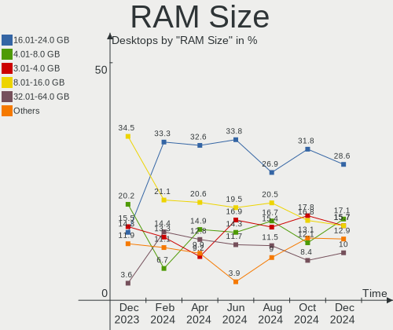
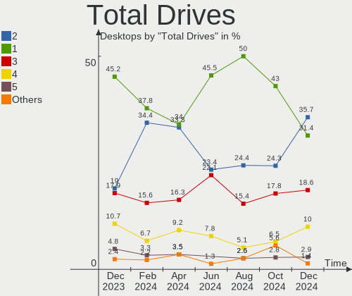
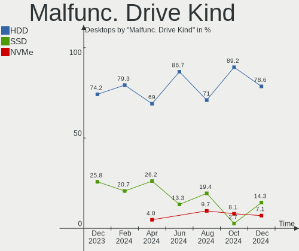
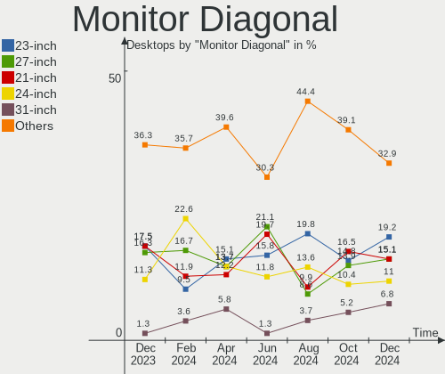
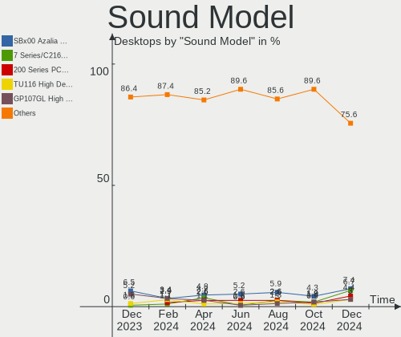

ROSA Hardware Trends (Desktop)
------------------------------

A project to identify most popular hardware characteristics and track their change
over time based on data collected by ROSA users at https://Linux-Hardware.org.

Anyone can contribute to the study by uploading probes of their computers by
the [hw-probe](https://github.com/linuxhw/hw-probe) tool:

    sudo -E hw-probe -all -upload

Full-feature report is available here: https://linux-hardware.org/?view=trends&formfactor=desktop

Period: Jun, 2021.

Contents
--------

- [ OS                       ](#os)
- [ OS Family                ](#os-family)
- [ Kernel                   ](#kernel)
- [ Kernel Family            ](#kernel-family)
- [ Kernel Major Ver.        ](#kernel-major-ver)
- [ Arch                     ](#arch)
- [ DE                       ](#de)
- [ Display Server           ](#display-server)
- [ Display Manager          ](#display-manager)
- [ OS Lang                  ](#os-lang)
- [ Boot Mode                ](#boot-mode)
- [ Filesystem               ](#filesystem)
- [ Part. scheme             ](#part-scheme)
- [ Dual Boot with Linux/BSD ](#dual-boot-with-linux/bsd)
- [ Dual Boot (Win)          ](#dual-boot-win)
- [ Country                  ](#country)
- [ City                     ](#city)
- [ Vendor                   ](#vendor)
- [ Model                    ](#model)
- [ Model Family             ](#model-family)
- [ MFG Year                 ](#mfg-year)
- [ Form Factor              ](#form-factor)
- [ Secure Boot              ](#secure-boot)
- [ Coreboot                 ](#coreboot)
- [ RAM Size                 ](#ram-size)
- [ RAM Used                 ](#ram-used)
- [ Has CD-ROM               ](#has-cd-rom)
- [ Total Drives             ](#total-drives)
- [ Has Ethernet             ](#has-ethernet)
- [ Has WiFi                 ](#has-wifi)
- [ Has Bluetooth            ](#has-bluetooth)
- [ Drive Vendor             ](#drive-vendor)
- [ Drive Model              ](#drive-model)
- [ HDD Vendor               ](#hdd-vendor)
- [ SSD Vendor               ](#ssd-vendor)
- [ Drive Kind               ](#drive-kind)
- [ Drive Connector          ](#drive-connector)
- [ Drive Size               ](#drive-size)
- [ Space Total              ](#space-total)
- [ Space Used               ](#space-used)
- [ Malfunc. Drives          ](#malfunc-drives)
- [ Malfunc. Drive Vendor    ](#malfunc-drive-vendor)
- [ Malfunc. HDD Vendor      ](#malfunc-hdd-vendor)
- [ Malfunc. Drive Kind      ](#malfunc-drive-kind)
- [ Failed Drives            ](#failed-drives)
- [ Failed Drive Vendor      ](#failed-drive-vendor)
- [ Drive Status             ](#drive-status)
- [ Storage Vendor           ](#storage-vendor)
- [ Storage Model            ](#storage-model)
- [ Storage Kind             ](#storage-kind)
- [ CPU Vendor               ](#cpu-vendor)
- [ CPU Model                ](#cpu-model)
- [ CPU Model Family         ](#cpu-model-family)
- [ CPU Cores                ](#cpu-cores)
- [ CPU Sockets              ](#cpu-sockets)
- [ CPU Threads              ](#cpu-threads)
- [ CPU Op-Modes             ](#cpu-op-modes)
- [ CPU Microcode            ](#cpu-microcode)
- [ CPU Microarch            ](#cpu-microarch)
- [ GPU Vendor               ](#gpu-vendor)
- [ GPU Model                ](#gpu-model)
- [ GPU Combo                ](#gpu-combo)
- [ GPU Driver               ](#gpu-driver)
- [ GPU Memory               ](#gpu-memory)
- [ Monitor Vendor           ](#monitor-vendor)
- [ Monitor Model            ](#monitor-model)
- [ Monitor Resolution       ](#monitor-resolution)
- [ Monitor Diagonal         ](#monitor-diagonal)
- [ Monitor Width            ](#monitor-width)
- [ Aspect Ratio             ](#aspect-ratio)
- [ Monitor Area             ](#monitor-area)
- [ Pixel Density            ](#pixel-density)
- [ Multiple Monitors        ](#multiple-monitors)
- [ Net Controller Vendor    ](#net-controller-vendor)
- [ Net Controller Model     ](#net-controller-model)
- [ Wireless Vendor          ](#wireless-vendor)
- [ Wireless Model           ](#wireless-model)
- [ Ethernet Vendor          ](#ethernet-vendor)
- [ Ethernet Model           ](#ethernet-model)
- [ Net Controller Kind      ](#net-controller-kind)
- [ Used Controller          ](#used-controller)
- [ NICs                     ](#nics)
- [ IPv6                     ](#ipv6)
- [ Memory Vendor            ](#memory-vendor)
- [ Memory Model             ](#memory-model)
- [ Memory Kind              ](#memory-kind)
- [ Memory Form Factor       ](#memory-form-factor)
- [ Memory Size              ](#memory-size)
- [ Memory Speed             ](#memory-speed)
- [ Sound Vendor             ](#sound-vendor)
- [ Sound Model              ](#sound-model)
- [ Camera Vendor            ](#camera-vendor)
- [ Camera Model             ](#camera-model)
- [ Fingerprint Vendor       ](#fingerprint-vendor)
- [ Fingerprint Model        ](#fingerprint-model)
- [ Chipcard Vendor          ](#chipcard-vendor)
- [ Chipcard Model           ](#chipcard-model)
- [ Printer Vendor           ](#printer-vendor)
- [ Printer Model            ](#printer-model)
- [ Scanner Vendor           ](#scanner-vendor)
- [ Scanner Model            ](#scanner-model)
- [ Bluetooth Vendor         ](#bluetooth-vendor)
- [ Bluetooth Model          ](#bluetooth-model)
- [ Unsupported Devices      ](#unsupported-devices)
- [ Unsupported Device Types ](#unsupported-device-types)

OS
--

Installed operating systems

| Name       | Desktops | Percent |
|------------|----------|---------|
| ROSA R11.1 | 52       | 82.54%  |
| ROSA R11   | 7        | 11.11%  |
| ROSA R12   | 3        | 4.76%   |
| ROSA R10   | 1        | 1.59%   |

OS Family
---------

OS without a version

| Name | Desktops | Percent |
|------|----------|---------|
| ROSA | 63       | 100%    |

Kernel
------

Version of the Linux kernel

| Version                             | Desktops | Percent |
|-------------------------------------|----------|---------|
| 5.4.83-generic-2rosa-x86_64         | 17       | 26.98%  |
| 5.4.32-generic-2rosa-x86_64         | 11       | 17.46%  |
| 4.15.0-desktop-122.124.1rosa-x86_64 | 8        | 12.7%   |
| 5.4.83-generic-2rosa-i586           | 6        | 9.52%   |
| 4.15.0-desktop-45.1rosa-x86_64      | 6        | 9.52%   |
| 5.4.32-generic-2rosa-i586           | 3        | 4.76%   |
| 5.10.31-generic-1rosa-x86_64        | 2        | 3.17%   |
| 4.9.155-nrj-desktop-1rosa-x86_64    | 2        | 3.17%   |
| 5.4.122-generic-1rosa2019.1-x86_64  | 1        | 1.59%   |
| 5.12.8-generic-1rosa-x86_64         | 1        | 1.59%   |
| 5.10.42-generic-1rosa2019.1-x86_64  | 1        | 1.59%   |
| 5.10.40-generic-1rosa2019.1-x86_64  | 1        | 1.59%   |
| 4.9.60-nrj-desktop-1rosa-i586       | 1        | 1.59%   |
| 4.15.0-desktop-47.2rosa-x86_64      | 1        | 1.59%   |
| 4.15.0-desktop-45.1rosa-i586        | 1        | 1.59%   |
| 4.15.0-desktop-122.124.1rosa-i586   | 1        | 1.59%   |

Kernel Family
-------------

Linux kernel without a distro release

| Version | Desktops | Percent |
|---------|----------|---------|
| 5.4.83  | 23       | 36.51%  |
| 4.15.0  | 17       | 26.98%  |
| 5.4.32  | 14       | 22.22%  |
| 5.10.31 | 2        | 3.17%   |
| 4.9.155 | 2        | 3.17%   |
| 5.4.122 | 1        | 1.59%   |
| 5.12.8  | 1        | 1.59%   |
| 5.10.42 | 1        | 1.59%   |
| 5.10.40 | 1        | 1.59%   |
| 4.9.60  | 1        | 1.59%   |

Kernel Major Ver.
-----------------

Linux kernel major version

| Version | Desktops | Percent |
|---------|----------|---------|
| 5.4     | 38       | 60.32%  |
| 4.15    | 17       | 26.98%  |
| 5.10    | 4        | 6.35%   |
| 4.9     | 3        | 4.76%   |
| 5.12    | 1        | 1.59%   |

Arch
----

OS architecture (x86_64, i586, etc.)

| Name   | Desktops | Percent |
|--------|----------|---------|
| x86_64 | 51       | 80.95%  |
| i686   | 12       | 19.05%  |

DE
--

Desktop Environment

| Name  | Desktops | Percent |
|-------|----------|---------|
| KDE4  | 30       | 47.62%  |
| KDE5  | 24       | 38.1%   |
| LXQt  | 6        | 9.52%   |
| XFCE  | 1        | 1.59%   |
| KDE   | 1        | 1.59%   |
| GNOME | 1        | 1.59%   |

Display Server
--------------

X11 or Wayland

| Name    | Desktops | Percent |
|---------|----------|---------|
| X11     | 62       | 98.41%  |
| Wayland | 1        | 1.59%   |

Display Manager
---------------

SDDM, LightDM, etc.

| Name | Desktops | Percent |
|------|----------|---------|
| SDDM | 31       | 49.21%  |
| KDM  | 31       | 49.21%  |
| GDM  | 1        | 1.59%   |

OS Lang
-------

Language

| Lang    | Desktops | Percent |
|---------|----------|---------|
| ru_RU   | 46       | 73.02%  |
| Unknown | 8        | 12.7%   |
| pl_PL   | 3        | 4.76%   |
| en_US   | 2        | 3.17%   |
| de_DE   | 2        | 3.17%   |
| sk_SK   | 1        | 1.59%   |
| pt_BR   | 1        | 1.59%   |

Boot Mode
---------

EFI or BIOS

| Mode | Desktops | Percent |
|------|----------|---------|
| BIOS | 46       | 73.02%  |
| EFI  | 17       | 26.98%  |

Filesystem
----------

Type of filesystem

| Type    | Desktops | Percent |
|---------|----------|---------|
| Ext4    | 58       | 92.06%  |
| Btrfs   | 4        | 6.35%   |
| Unknown | 1        | 1.59%   |

Part. scheme
------------

Scheme of partitioning

| Type    | Desktops | Percent |
|---------|----------|---------|
| MBR     | 39       | 61.9%   |
| GPT     | 23       | 36.51%  |
| Unknown | 1        | 1.59%   |

Dual Boot with Linux/BSD
------------------------

Hosting more than one Linux/BSD

| Dual boot | Desktops | Percent |
|-----------|----------|---------|
| No        | 48       | 76.19%  |
| Yes       | 15       | 23.81%  |

Dual Boot (Win)
---------------

Hosting Linux and Windows

| Dual boot | Desktops | Percent |
|-----------|----------|---------|
| No        | 34       | 53.97%  |
| Yes       | 29       | 46.03%  |

Country
-------

Geographic location (country)

| Country    | Desktops | Percent |
|------------|----------|---------|
| Russia     | 44       | 69.84%  |
| Ukraine    | 5        | 7.94%   |
| Poland     | 3        | 4.76%   |
| Germany    | 3        | 4.76%   |
| Brazil     | 2        | 3.17%   |
| Belarus    | 2        | 3.17%   |
| Slovakia   | 1        | 1.59%   |
| Kazakhstan | 1        | 1.59%   |
| Italy      | 1        | 1.59%   |
| France     | 1        | 1.59%   |

City
----

Geographic location (city)

| City             | Desktops | Percent |
|------------------|----------|---------|
| Moscow           | 11       | 17.46%  |
| Saratov          | 3        | 4.76%   |
| Novosibirsk      | 3        | 4.76%   |
| Krasnodar        | 3        | 4.76%   |
| Chelyabinsk      | 3        | 4.76%   |
| Tambov           | 2        | 3.17%   |
| St Petersburg    | 2        | 3.17%   |
| Rostov-on-Don    | 2        | 3.17%   |
| Wisla            | 1        | 1.59%   |
| Volgograd        | 1        | 1.59%   |
| Vitebsk          | 1        | 1.59%   |
| Verona           | 1        | 1.59%   |
| Tver             | 1        | 1.59%   |
| Tolyatti         | 1        | 1.59%   |
| Temirtau         | 1        | 1.59%   |
| Taganrog         | 1        | 1.59%   |
| Sumy             | 1        | 1.59%   |
| Stola            | 1        | 1.59%   |
| Schauenburg      | 1        | 1.59%   |
| Ryazhsk          | 1        | 1.59%   |
| Rio de Janeiro   | 1        | 1.59%   |
| Otzberg          | 1        | 1.59%   |
| Orenburg         | 1        | 1.59%   |
| Oberhausen       | 1        | 1.59%   |
| Nizhniy Novgorod | 1        | 1.59%   |
| Murmansk         | 1        | 1.59%   |
| Montescot        | 1        | 1.59%   |
| Miass            | 1        | 1.59%   |
| Lipetsk          | 1        | 1.59%   |
| Kytlym           | 1        | 1.59%   |
| Klonowa          | 1        | 1.59%   |
| Kerch            | 1        | 1.59%   |
| Kaliningrad      | 1        | 1.59%   |
| Jaslo            | 1        | 1.59%   |
| Izhevsk          | 1        | 1.59%   |
| Elektrostal      | 1        | 1.59%   |
| Donetsk          | 1        | 1.59%   |
| Curitiba         | 1        | 1.59%   |
| Brest            | 1        | 1.59%   |
| Boyarka          | 1        | 1.59%   |
| Boguchany        | 1        | 1.59%   |
| Artemivs'k       | 1        | 1.59%   |

Vendor
------

Motherboard manufacturer

| Name                | Desktops | Percent |
|---------------------|----------|---------|
| ASUSTek Computer    | 21       | 33.33%  |
| Gigabyte Technology | 15       | 23.81%  |
| ASRock              | 5        | 7.94%   |
| MSI                 | 4        | 6.35%   |
| Biostar             | 4        | 6.35%   |
| Intel               | 3        | 4.76%   |
| Hewlett-Packard     | 2        | 3.17%   |
| Foxconn             | 2        | 3.17%   |
| Dell                | 2        | 3.17%   |
| Acer                | 2        | 3.17%   |
| NEC Computers       | 1        | 1.59%   |
| Lenovo              | 1        | 1.59%   |
| ECS                 | 1        | 1.59%   |

Model
-----

Motherboard model

| Name                        | Desktops | Percent |
|-----------------------------|----------|---------|
| ASUS PRIME A320M-K          | 2        | 3.17%   |
| NEC Computers SiS650        | 1        | 1.59%   |
| MSI MS-7C84                 | 1        | 1.59%   |
| MSI MS-7529                 | 1        | 1.59%   |
| MSI MS-7519                 | 1        | 1.59%   |
| MSI MS-7388                 | 1        | 1.59%   |
| Lenovo H535 10117           | 1        | 1.59%   |
| Intel Intel E5 M2L-8D       | 1        | 1.59%   |
| Intel H61M-S1               | 1        | 1.59%   |
| Intel D945GNT AAC96315-405  | 1        | 1.59%   |
| HP ProDesk 600 G1 DM        | 1        | 1.59%   |
| HP Compaq dc5750 Microtower | 1        | 1.59%   |
| Gigabyte Z97M-DS3H          | 1        | 1.59%   |
| Gigabyte P75-D3             | 1        | 1.59%   |
| Gigabyte P35-DS3L           | 1        | 1.59%   |
| Gigabyte H81M-S1            | 1        | 1.59%   |
| Gigabyte H310M S2 2.0       | 1        | 1.59%   |
| Gigabyte GA-MA78GM-UD2H     | 1        | 1.59%   |
| Gigabyte GA-MA770T-UD3      | 1        | 1.59%   |
| Gigabyte GA-78LMT-S2        | 1        | 1.59%   |
| Gigabyte GA-770T-USB3       | 1        | 1.59%   |
| Gigabyte F2A55M-S1          | 1        | 1.59%   |
| Gigabyte E3000N             | 1        | 1.59%   |
| Gigabyte B75M-D3H           | 1        | 1.59%   |
| Gigabyte B75-D3V            | 1        | 1.59%   |
| Gigabyte B360M-HD3          | 1        | 1.59%   |
| Gigabyte AB350M-DS3H V2     | 1        | 1.59%   |
| Foxconn GEG                 | 1        | 1.59%   |
| Foxconn 945 7AD Series      | 1        | 1.59%   |
| ECS H61H2-M12               | 1        | 1.59%   |
| Dell OptiPlex 990           | 1        | 1.59%   |
| Dell OptiPlex 9020M         | 1        | 1.59%   |
| Biostar TA770E              | 1        | 1.59%   |
| Biostar NF520-A2 TE         | 1        | 1.59%   |
| Biostar Hi-Fi A70U3P        | 1        | 1.59%   |
| Biostar G31-M7 TE           | 1        | 1.59%   |
| ASUS PRIME H310M-R R2.0     | 1        | 1.59%   |
| ASUS PRIME B450M-K          | 1        | 1.59%   |
| ASUS P9X79                  | 1        | 1.59%   |
| ASUS P8Z77-V PRO            | 1        | 1.59%   |
| ASUS P8Z77-V LX             | 1        | 1.59%   |
| ASUS P8H67                  | 1        | 1.59%   |
| ASUS P8B75-M LE             | 1        | 1.59%   |
| ASUS P5WD2-Premium          | 1        | 1.59%   |
| ASUS P5P41D                 | 1        | 1.59%   |
| ASUS P5LD2-SE               | 1        | 1.59%   |
| ASUS P5G41T-M LX2/GB        | 1        | 1.59%   |
| ASUS P4P800                 | 1        | 1.59%   |
| ASUS M5A97 R2.0             | 1        | 1.59%   |
| ASUS M5A78L-M LX/BR         | 1        | 1.59%   |
| ASUS M5A78L-M LE/USB3       | 1        | 1.59%   |
| ASUS M3A76-CM               | 1        | 1.59%   |
| ASUS H110M-C                | 1        | 1.59%   |
| ASUS GU609AA-ACB a6230.ru   | 1        | 1.59%   |
| ASUS A68HM-K                | 1        | 1.59%   |
| ASRock P43DE3               | 1        | 1.59%   |
| ASRock N68-VS3 UCC          | 1        | 1.59%   |
| ASRock J3355B-ITX           | 1        | 1.59%   |
| ASRock H310CM-DVS           | 1        | 1.59%   |
| ASRock 880GM-LE             | 1        | 1.59%   |

Model Family
------------

Motherboard model prefix

| Name                    | Desktops | Percent |
|-------------------------|----------|---------|
| ASUS PRIME              | 4        | 6.35%   |
| Dell OptiPlex           | 2        | 3.17%   |
| ASUS P8Z77-V            | 2        | 3.17%   |
| ASUS M5A78L-M           | 2        | 3.17%   |
| Acer Aspire             | 2        | 3.17%   |
| NEC Computers SiS650    | 1        | 1.59%   |
| MSI MS-7C84             | 1        | 1.59%   |
| MSI MS-7529             | 1        | 1.59%   |
| MSI MS-7519             | 1        | 1.59%   |
| MSI MS-7388             | 1        | 1.59%   |
| Lenovo H535             | 1        | 1.59%   |
| Intel Intel             | 1        | 1.59%   |
| Intel H61M-S1           | 1        | 1.59%   |
| Intel D945GNT           | 1        | 1.59%   |
| HP ProDesk              | 1        | 1.59%   |
| HP Compaq               | 1        | 1.59%   |
| Gigabyte Z97M-DS3H      | 1        | 1.59%   |
| Gigabyte P75-D3         | 1        | 1.59%   |
| Gigabyte P35-DS3L       | 1        | 1.59%   |
| Gigabyte H81M-S1        | 1        | 1.59%   |
| Gigabyte H310M          | 1        | 1.59%   |
| Gigabyte GA-MA78GM-UD2H | 1        | 1.59%   |
| Gigabyte GA-MA770T-UD3  | 1        | 1.59%   |
| Gigabyte GA-78LMT-S2    | 1        | 1.59%   |
| Gigabyte GA-770T-USB3   | 1        | 1.59%   |
| Gigabyte F2A55M-S1      | 1        | 1.59%   |
| Gigabyte E3000N         | 1        | 1.59%   |
| Gigabyte B75M-D3H       | 1        | 1.59%   |
| Gigabyte B75-D3V        | 1        | 1.59%   |
| Gigabyte B360M-HD3      | 1        | 1.59%   |
| Gigabyte AB350M-DS3H    | 1        | 1.59%   |
| Foxconn GEG             | 1        | 1.59%   |
| Foxconn 945             | 1        | 1.59%   |
| ECS H61H2-M12           | 1        | 1.59%   |
| Biostar TA770E          | 1        | 1.59%   |
| Biostar NF520-A2        | 1        | 1.59%   |
| Biostar Hi-Fi           | 1        | 1.59%   |
| Biostar G31-M7          | 1        | 1.59%   |
| ASUS P9X79              | 1        | 1.59%   |
| ASUS P8H67              | 1        | 1.59%   |
| ASUS P8B75-M            | 1        | 1.59%   |
| ASUS P5WD2-Premium      | 1        | 1.59%   |
| ASUS P5P41D             | 1        | 1.59%   |
| ASUS P5LD2-SE           | 1        | 1.59%   |
| ASUS P5G41T-M           | 1        | 1.59%   |
| ASUS P4P800             | 1        | 1.59%   |
| ASUS M5A97              | 1        | 1.59%   |
| ASUS M3A76-CM           | 1        | 1.59%   |
| ASUS H110M-C            | 1        | 1.59%   |
| ASUS GU609AA-ACB        | 1        | 1.59%   |
| ASUS A68HM-K            | 1        | 1.59%   |
| ASRock P43DE3           | 1        | 1.59%   |
| ASRock N68-VS3          | 1        | 1.59%   |
| ASRock J3355B-ITX       | 1        | 1.59%   |
| ASRock H310CM-DVS       | 1        | 1.59%   |
| ASRock 880GM-LE         | 1        | 1.59%   |

MFG Year
--------

Motherboard manufacture year

| Year | Desktops | Percent |
|------|----------|---------|
| 2018 | 6        | 9.52%   |
| 2013 | 6        | 9.52%   |
| 2012 | 6        | 9.52%   |
| 2010 | 6        | 9.52%   |
| 2015 | 5        | 7.94%   |
| 2014 | 5        | 7.94%   |
| 2009 | 5        | 7.94%   |
| 2006 | 5        | 7.94%   |
| 2011 | 4        | 6.35%   |
| 2020 | 3        | 4.76%   |
| 2019 | 3        | 4.76%   |
| 2017 | 3        | 4.76%   |
| 2007 | 2        | 3.17%   |
| 2003 | 2        | 3.17%   |
| 2021 | 1        | 1.59%   |
| 2008 | 1        | 1.59%   |

Form Factor
-----------

Physical design of the computer

| Name    | Desktops | Percent |
|---------|----------|---------|
| Desktop | 63       | 100%    |

Secure Boot
-----------

Enabled or disabled

| State    | Desktops | Percent |
|----------|----------|---------|
| Disabled | 63       | 100%    |

Coreboot
--------

Have coreboot on board

| Used | Desktops | Percent |
|------|----------|---------|
| No   | 63       | 100%    |

RAM Size
--------

Total RAM memory

| Size in GB | Desktops | Percent |
|------------|----------|---------|
| 8.01-16.0  | 21       | 33.33%  |
| 3.01-4.0   | 16       | 25.4%   |
| 4.01-8.0   | 11       | 17.46%  |
| 16.01-24.0 | 6        | 9.52%   |
| 2.01-3.0   | 3        | 4.76%   |
| 1.01-2.0   | 3        | 4.76%   |
| 32.01-64.0 | 2        | 3.17%   |
| 0.51-1.0   | 1        | 1.59%   |

RAM Used
--------

Used RAM memory

| Used GB   | Desktops | Percent |
|-----------|----------|---------|
| 1.01-2.0  | 33       | 52.38%  |
| 0.51-1.0  | 25       | 39.68%  |
| 2.01-3.0  | 2        | 3.17%   |
| 4.01-8.0  | 1        | 1.59%   |
| 8.01-16.0 | 1        | 1.59%   |
| 0.01-0.5  | 1        | 1.59%   |

Has CD-ROM
----------

Has CD-ROM on board

| Presented | Desktops | Percent |
|-----------|----------|---------|
| Yes       | 41       | 65.08%  |
| No        | 22       | 34.92%  |

Total Drives
------------

Number of drives on board

| Drives | Desktops | Percent |
|--------|----------|---------|
| 1      | 34       | 53.97%  |
| 2      | 15       | 23.81%  |
| 3      | 8        | 12.7%   |
| 4      | 5        | 7.94%   |
| 5      | 1        | 1.59%   |

Has Ethernet
------------

Has Ethernet on board

| Presented | Desktops | Percent |
|-----------|----------|---------|
| Yes       | 62       | 98.41%  |
| No        | 1        | 1.59%   |

Has WiFi
--------

Has WiFi module

| Presented | Desktops | Percent |
|-----------|----------|---------|
| No        | 51       | 80.95%  |
| Yes       | 12       | 19.05%  |

Has Bluetooth
-------------

Has Bluetooth module

| Presented | Desktops | Percent |
|-----------|----------|---------|
| No        | 59       | 93.65%  |
| Yes       | 4        | 6.35%   |

Drive Vendor
------------

Hard drive vendors

| Vendor              | Desktops | Drives | Percent |
|---------------------|----------|--------|---------|
| Seagate             | 29       | 35     | 30.53%  |
| WDC                 | 24       | 29     | 25.26%  |
| Toshiba             | 8        | 8      | 8.42%   |
| Samsung Electronics | 5        | 7      | 5.26%   |
| Hitachi             | 5        | 6      | 5.26%   |
| Kingston            | 4        | 4      | 4.21%   |
| A-DATA Technology   | 3        | 3      | 3.16%   |
| Crucial             | 2        | 3      | 2.11%   |
| China               | 2        | 3      | 2.11%   |
| Unknown             | 1        | 1      | 1.05%   |
| TF CARD             | 1        | 1      | 1.05%   |
| SPCC                | 1        | 1      | 1.05%   |
| SanDisk             | 1        | 1      | 1.05%   |
| PLEXTOR             | 1        | 1      | 1.05%   |
| ORICO               | 1        | 1      | 1.05%   |
| OCZ                 | 1        | 1      | 1.05%   |
| Lite-On             | 1        | 1      | 1.05%   |
| Intel               | 1        | 1      | 1.05%   |
| Fujitsu             | 1        | 1      | 1.05%   |
| Corsair             | 1        | 1      | 1.05%   |
| Apacer              | 1        | 1      | 1.05%   |
| AMD                 | 1        | 2      | 1.05%   |

Drive Model
-----------

Hard drive models

| Model                               | Desktops | Percent |
|-------------------------------------|----------|---------|
| Seagate ST500DM002-1BD142 500GB     | 3        | 2.7%    |
| Seagate ST2000DM008-2FR102 2TB      | 3        | 2.7%    |
| WDC WD5000AAKX-00ERMA0 500GB        | 2        | 1.8%    |
| Toshiba HDWD120 2TB                 | 2        | 1.8%    |
| Toshiba DT01ACA050 500GB            | 2        | 1.8%    |
| Seagate ST3808110AS 80GB            | 2        | 1.8%    |
| Seagate ST3250410AS 250GB           | 2        | 1.8%    |
| Seagate ST1000DM010-2EP102 1TB      | 2        | 1.8%    |
| Seagate ST1000DM003-1SB102 1TB      | 2        | 1.8%    |
| Kingston SA400S37120G 120GB SSD     | 2        | 1.8%    |
| China SSD 120GB                     | 2        | 1.8%    |
| WDC WDS250G2B0A-00SM50 250GB SSD    | 1        | 0.9%    |
| WDC WDS120G2G0A-00JH30 120GB SSD    | 1        | 0.9%    |
| WDC WDS100T2B0C-00PXH0 1TB          | 1        | 0.9%    |
| WDC WD800JD-22JNA0 80GB             | 1        | 0.9%    |
| WDC WD7500AZEX-00ZF5A0 752GB        | 1        | 0.9%    |
| WDC WD6400AAKS-65A7B2 640GB         | 1        | 0.9%    |
| WDC WD5001AALS-00L3B2 500GB         | 1        | 0.9%    |
| WDC WD5000AZLX-08K2TA0 500GB        | 1        | 0.9%    |
| WDC WD5000AAKX-00U6AA0 500GB        | 1        | 0.9%    |
| WDC WD5000AAKX-001CA0 500GB         | 1        | 0.9%    |
| WDC WD3200AAKX-001CA0 320GB         | 1        | 0.9%    |
| WDC WD30EZRX-00DC0B0 3TB            | 1        | 0.9%    |
| WDC WD30EFRX-68EUZN0 3TB            | 1        | 0.9%    |
| WDC WD2500JB-00REA0 250GB           | 1        | 0.9%    |
| WDC WD20EZRZ-00Z5HB0 2TB            | 1        | 0.9%    |
| WDC WD20EZAZ-00L9GB0 2TB            | 1        | 0.9%    |
| WDC WD20EZAZ-00GGJB0 2TB            | 1        | 0.9%    |
| WDC WD20EARX-00PASB0 2TB            | 1        | 0.9%    |
| WDC WD2000JS-22MHB0 200GB           | 1        | 0.9%    |
| WDC WD1600AAJS-22PSA0 160GB         | 1        | 0.9%    |
| WDC WD10EZRZ-22HTKB0 1TB            | 1        | 0.9%    |
| WDC WD10EZRZ-00Z5HB0 1TB            | 1        | 0.9%    |
| WDC WD10EZEX-21M2NA0 1TB            | 1        | 0.9%    |
| WDC WD10EZEX-08WN4A0 1TB            | 1        | 0.9%    |
| WDC WD10EZEX-00WN4A0 1TB            | 1        | 0.9%    |
| WDC WD10EARX-00N0YB0 1TB            | 1        | 0.9%    |
| WDC WD10EALS-00Z8A0 1TB             | 1        | 0.9%    |
| Unknown SD/MMC/MS PRO 128GB         | 1        | 0.9%    |
| Toshiba MK3252GSX 320GB             | 1        | 0.9%    |
| Toshiba HDWD110 1TB                 | 1        | 0.9%    |
| Toshiba HDWD105 500GB               | 1        | 0.9%    |
| Toshiba DT01ACA100 1TB              | 1        | 0.9%    |
| TF CARD storage 8GB                 | 1        | 0.9%    |
| SPCC Solid State Disk 256GB         | 1        | 0.9%    |
| Seagate ST9160314AS 160GB           | 1        | 0.9%    |
| Seagate ST9120822AS 120GB           | 1        | 0.9%    |
| Seagate ST500LM021-1KJ152 500GB     | 1        | 0.9%    |
| Seagate ST500DM009-2F110A 500GB     | 1        | 0.9%    |
| Seagate ST500DM002-1SB10A 500GB     | 1        | 0.9%    |
| Seagate ST3802110A 80GB             | 1        | 0.9%    |
| Seagate ST380013AS 80GB             | 1        | 0.9%    |
| Seagate ST3500418AS 500GB           | 1        | 0.9%    |
| Seagate ST340016A 40GB              | 1        | 0.9%    |
| Seagate ST340014A 40GB              | 1        | 0.9%    |
| Seagate ST3320418AS 320GB           | 1        | 0.9%    |
| Seagate ST320LM001 HN-M320MBB 320GB | 1        | 0.9%    |
| Seagate ST320DM000-1BD14C 320GB     | 1        | 0.9%    |
| Seagate ST3160815AS 160GB           | 1        | 0.9%    |
| Seagate ST3160812AS 160GB           | 1        | 0.9%    |

HDD Vendor
----------

Hard disk drive vendors

| Vendor              | Desktops | Drives | Percent |
|---------------------|----------|--------|---------|
| Seagate             | 29       | 35     | 42.65%  |
| WDC                 | 22       | 26     | 32.35%  |
| Toshiba             | 8        | 8      | 11.76%  |
| Hitachi             | 5        | 6      | 7.35%   |
| Samsung Electronics | 3        | 5      | 4.41%   |
| Fujitsu             | 1        | 1      | 1.47%   |

SSD Vendor
----------

Solid state drive vendors

| Vendor              | Desktops | Drives | Percent |
|---------------------|----------|--------|---------|
| A-DATA Technology   | 3        | 3      | 15%     |
| WDC                 | 2        | 2      | 10%     |
| Samsung Electronics | 2        | 2      | 10%     |
| Kingston            | 2        | 2      | 10%     |
| Crucial             | 2        | 3      | 10%     |
| China               | 2        | 3      | 10%     |
| SPCC                | 1        | 1      | 5%      |
| SanDisk             | 1        | 1      | 5%      |
| PLEXTOR             | 1        | 1      | 5%      |
| OCZ                 | 1        | 1      | 5%      |
| Lite-On             | 1        | 1      | 5%      |
| Apacer              | 1        | 1      | 5%      |
| AMD                 | 1        | 2      | 5%      |

Drive Kind
----------

HDD or SSD

| Kind    | Desktops | Drives | Percent |
|---------|----------|--------|---------|
| HDD     | 57       | 81     | 70.37%  |
| SSD     | 17       | 23     | 20.99%  |
| NVMe    | 5        | 6      | 6.17%   |
| Unknown | 2        | 2      | 2.47%   |

Drive Connector
---------------

SATA, SAS, NVMe, etc.

| Type | Desktops | Drives | Percent |
|------|----------|--------|---------|
| SATA | 62       | 102    | 87.32%  |
| NVMe | 5        | 6      | 7.04%   |
| SAS  | 4        | 4      | 5.63%   |

Drive Size
----------

Size of hard drive

| Size in TB | Desktops | Drives | Percent |
|------------|----------|--------|---------|
| 0.01-0.5   | 52       | 71     | 65%     |
| 0.51-1.0   | 16       | 20     | 20%     |
| 1.01-2.0   | 10       | 10     | 12.5%   |
| 2.01-3.0   | 2        | 3      | 2.5%    |

Space Total
-----------

Amount of disk space available on the file system

| Size in GB     | Desktops | Percent |
|----------------|----------|---------|
| 101-250        | 19       | 30.16%  |
| 251-500        | 10       | 15.87%  |
| 501-1000       | 10       | 15.87%  |
| 51-100         | 10       | 15.87%  |
| 1-20           | 5        | 7.94%   |
| 1001-2000      | 3        | 4.76%   |
| More than 3000 | 2        | 3.17%   |
| 21-50          | 2        | 3.17%   |
| 2001-3000      | 2        | 3.17%   |

Space Used
----------

Amount of used disk space

| Used GB        | Desktops | Percent |
|----------------|----------|---------|
| 1-20           | 42       | 66.67%  |
| 21-50          | 6        | 9.52%   |
| 251-500        | 5        | 7.94%   |
| 51-100         | 4        | 6.35%   |
| 501-1000       | 3        | 4.76%   |
| 101-250        | 2        | 3.17%   |
| More than 3000 | 1        | 1.59%   |

Malfunc. Drives
---------------

Drive models with a malfunction

| Model                             | Desktops | Drives | Percent |
|-----------------------------------|----------|--------|---------|
| Seagate ST500DM002-1BD142 500GB   | 3        | 3      | 12%     |
| WDC WD5000AAKX-00U6AA0 500GB      | 1        | 1      | 4%      |
| WDC WD5000AAKX-001CA0 500GB       | 1        | 1      | 4%      |
| WDC WD2500JB-00REA0 250GB         | 1        | 1      | 4%      |
| WDC WD2000JS-22MHB0 200GB         | 1        | 1      | 4%      |
| WDC WD10EZEX-08WN4A0 1TB          | 1        | 1      | 4%      |
| WDC WD10EARX-00N0YB0 1TB          | 1        | 1      | 4%      |
| Toshiba MK3252GSX 320GB           | 1        | 1      | 4%      |
| Toshiba DT01ACA050 500GB          | 1        | 1      | 4%      |
| Seagate ST9160314AS 160GB         | 1        | 1      | 4%      |
| Seagate ST500LM021-1KJ152 500GB   | 1        | 1      | 4%      |
| Seagate ST3802110A 80GB           | 1        | 1      | 4%      |
| Seagate ST380013AS 80GB           | 1        | 1      | 4%      |
| Seagate ST3000VX010-2E3166 3TB    | 1        | 1      | 4%      |
| Seagate ST1000DM010-2EP102 1TB    | 1        | 1      | 4%      |
| Samsung Electronics SP2004C 200GB | 1        | 1      | 4%      |
| Samsung Electronics HD252KJ 250GB | 1        | 1      | 4%      |
| Samsung Electronics HD161HJ 160GB | 1        | 1      | 4%      |
| OCZ SOLID3 64GB SSD               | 1        | 1      | 4%      |
| Hitachi HDS721050CLA360 500GB     | 1        | 1      | 4%      |
| Hitachi HDS721010DLE630 1TB       | 1        | 1      | 4%      |
| Hitachi HDP725032GLA360 320GB     | 1        | 1      | 4%      |
| AMD R3SL240G 240GB SSD            | 1        | 2      | 4%      |

Malfunc. Drive Vendor
---------------------

Vendors of faulty drives

| Vendor              | Desktops | Drives | Percent |
|---------------------|----------|--------|---------|
| Seagate             | 9        | 9      | 37.5%   |
| WDC                 | 6        | 6      | 25%     |
| Hitachi             | 3        | 3      | 12.5%   |
| Toshiba             | 2        | 2      | 8.33%   |
| Samsung Electronics | 2        | 3      | 8.33%   |
| OCZ                 | 1        | 1      | 4.17%   |
| AMD                 | 1        | 2      | 4.17%   |

Malfunc. HDD Vendor
-------------------

Vendors of faulty HDD drives

| Vendor              | Desktops | Drives | Percent |
|---------------------|----------|--------|---------|
| Seagate             | 9        | 9      | 40.91%  |
| WDC                 | 6        | 6      | 27.27%  |
| Hitachi             | 3        | 3      | 13.64%  |
| Toshiba             | 2        | 2      | 9.09%   |
| Samsung Electronics | 2        | 3      | 9.09%   |

Malfunc. Drive Kind
-------------------

Kinds of faulty drives

| Kind | Desktops | Drives | Percent |
|------|----------|--------|---------|
| HDD  | 21       | 23     | 91.3%   |
| SSD  | 2        | 3      | 8.7%    |

Failed Drives
-------------

Failed drive models

Zero info for selected period =(

Failed Drive Vendor
-------------------

Failed drive vendors

Zero info for selected period =(

Drive Status
------------

Number of failed and malfunc. drives

| Status   | Desktops | Drives | Percent |
|----------|----------|--------|---------|
| Works    | 50       | 83     | 65.79%  |
| Malfunc  | 23       | 26     | 30.26%  |
| Detected | 3        | 3      | 3.95%   |

Storage Vendor
--------------

Storage controller vendors

| Vendor                           | Desktops | Percent |
|----------------------------------|----------|---------|
| Intel                            | 38       | 50%     |
| AMD                              | 22       | 28.95%  |
| JMicron Technology               | 3        | 3.95%   |
| VIA Technologies                 | 2        | 2.63%   |
| Phison Electronics               | 2        | 2.63%   |
| Nvidia                           | 2        | 2.63%   |
| ASMedia Technology               | 2        | 2.63%   |
| Silicon Motion                   | 1        | 1.32%   |
| Silicon Integrated Systems [SiS] | 1        | 1.32%   |
| Silicon Image                    | 1        | 1.32%   |
| Sandisk                          | 1        | 1.32%   |
| Kingston Technology Company      | 1        | 1.32%   |

Storage Model
-------------

Storage controller models

| Model                                                                                   | Desktops | Percent |
|-----------------------------------------------------------------------------------------|----------|---------|
| Intel 82801G (ICH7 Family) IDE Controller                                               | 9        | 8.04%   |
| AMD SB7x0/SB8x0/SB9x0 IDE Controller                                                    | 9        | 8.04%   |
| AMD FCH SATA Controller [AHCI mode]                                                     | 9        | 8.04%   |
| Intel NM10/ICH7 Family SATA Controller [IDE mode]                                       | 8        | 7.14%   |
| AMD SB7x0/SB8x0/SB9x0 SATA Controller [IDE mode]                                        | 6        | 5.36%   |
| Intel 8 Series/C220 Series Chipset Family 6-port SATA Controller 1 [AHCI mode]          | 4        | 3.57%   |
| AMD SB7x0/SB8x0/SB9x0 SATA Controller [AHCI mode]                                       | 4        | 3.57%   |
| Intel 7 Series/C210 Series Chipset Family 6-port SATA Controller [AHCI mode]            | 3        | 2.68%   |
| Intel 7 Series/C210 Series Chipset Family 4-port SATA Controller [IDE mode]             | 3        | 2.68%   |
| Intel 7 Series/C210 Series Chipset Family 2-port SATA Controller [IDE mode]             | 3        | 2.68%   |
| Intel 6 Series/C200 Series Chipset Family 6 port Desktop SATA AHCI Controller           | 3        | 2.68%   |
| Intel 200 Series PCH SATA controller [AHCI mode]                                        | 3        | 2.68%   |
| VIA VT6415 PATA IDE Host Controller                                                     | 2        | 1.79%   |
| JMicron JMB368 IDE controller                                                           | 2        | 1.79%   |
| Intel C600/X79 series chipset 6-Port SATA AHCI Controller                               | 2        | 1.79%   |
| Intel 82801JI (ICH10 Family) 4 port SATA IDE Controller #1                              | 2        | 1.79%   |
| Intel 82801JI (ICH10 Family) 2 port SATA IDE Controller #2                              | 2        | 1.79%   |
| ASMedia ASM1062 Serial ATA Controller                                                   | 2        | 1.79%   |
| AMD SB600 Non-Raid-5 SATA                                                               | 2        | 1.79%   |
| AMD SB600 IDE                                                                           | 2        | 1.79%   |
| AMD FCH SATA Controller D                                                               | 2        | 1.79%   |
| Silicon Motion SM2263EN/SM2263XT SSD Controller                                         | 1        | 0.89%   |
| Silicon Integrated Systems [SiS] 5513 IDE Controller                                    | 1        | 0.89%   |
| Silicon Image SiI 3132 Serial ATA Raid II Controller                                    | 1        | 0.89%   |
| Sandisk WD Blue SN550 NVMe SSD                                                          | 1        | 0.89%   |
| Phison E7 NVMe Controller                                                               | 1        | 0.89%   |
| Phison E16 PCIe4 NVMe Controller                                                        | 1        | 0.89%   |
| Nvidia MCP65 SATA Controller                                                            | 1        | 0.89%   |
| Nvidia MCP65 IDE                                                                        | 1        | 0.89%   |
| Nvidia MCP61 SATA Controller                                                            | 1        | 0.89%   |
| Nvidia MCP61 IDE                                                                        | 1        | 0.89%   |
| Kingston Company A2000 NVMe SSD                                                         | 1        | 0.89%   |
| JMicron JMB361 AHCI/IDE                                                                 | 1        | 0.89%   |
| Intel SSD 660P Series                                                                   | 1        | 0.89%   |
| Intel Q170/Q150/B150/H170/H110/Z170/CM236 Chipset SATA Controller [AHCI Mode]           | 1        | 0.89%   |
| Intel Celeron N3350/Pentium N4200/Atom E3900 Series SATA AHCI Controller                | 1        | 0.89%   |
| Intel Cannon Lake PCH SATA AHCI Controller                                              | 1        | 0.89%   |
| Intel 9 Series Chipset Family SATA Controller [AHCI Mode]                               | 1        | 0.89%   |
| Intel 82801JI (ICH10 Family) SATA AHCI Controller                                       | 1        | 0.89%   |
| Intel 82801IB (ICH9) 4 port SATA Controller [AHCI mode]                                 | 1        | 0.89%   |
| Intel 82801GR/GDH (ICH7R/ICH7DH) SATA Controller [RAID mode]                            | 1        | 0.89%   |
| Intel 82801EB/ER (ICH5/ICH5R) IDE Controller                                            | 1        | 0.89%   |
| Intel 82801EB (ICH5) SATA Controller                                                    | 1        | 0.89%   |
| Intel 6 Series/C200 Series Chipset Family Desktop SATA Controller (IDE mode, ports 4-5) | 1        | 0.89%   |
| Intel 6 Series/C200 Series Chipset Family Desktop SATA Controller (IDE mode, ports 0-3) | 1        | 0.89%   |
| Intel 5 Series/3400 Series Chipset 4 port SATA IDE Controller                           | 1        | 0.89%   |
| Intel 5 Series/3400 Series Chipset 2 port SATA IDE Controller                           | 1        | 0.89%   |
| AMD FCH SATA Controller [IDE mode]                                                      | 1        | 0.89%   |
| AMD FCH IDE Controller                                                                  | 1        | 0.89%   |
| AMD 400 Series Chipset SATA Controller                                                  | 1        | 0.89%   |
| AMD 300 Series Chipset SATA Controller                                                  | 1        | 0.89%   |

Storage Kind
------------

Kind of storage controller (IDE, SATA, NVMe, SAS, ...)

| Kind | Desktops | Percent |
|------|----------|---------|
| SATA | 43       | 51.19%  |
| IDE  | 34       | 40.48%  |
| NVMe | 5        | 5.95%   |
| RAID | 2        | 2.38%   |

CPU Vendor
----------

Processor vendors

| Vendor | Desktops | Percent |
|--------|----------|---------|
| Intel  | 39       | 61.9%   |
| AMD    | 24       | 38.1%   |

CPU Model
---------

Processor models

| Model                                         | Desktops | Percent |
|-----------------------------------------------|----------|---------|
| Intel Pentium Gold G5400 CPU @ 3.70GHz        | 2        | 3.17%   |
| Intel Core i5-3470 CPU @ 3.20GHz              | 2        | 3.17%   |
| Intel Core i5-3450 CPU @ 3.10GHz              | 2        | 3.17%   |
| Intel Celeron CPU 3.06GHz                     | 2        | 3.17%   |
| AMD Athlon X4 840 Quad Core Processor         | 2        | 3.17%   |
| AMD Athlon II X2 250 Processor                | 2        | 3.17%   |
| Intel Xeon CPU E5-2689 0 @ 2.60GHz            | 1        | 1.59%   |
| Intel Pentium Dual-Core CPU E6600 @ 3.06GHz   | 1        | 1.59%   |
| Intel Pentium Dual-Core CPU E5400 @ 2.70GHz   | 1        | 1.59%   |
| Intel Pentium Dual-Core CPU E5300 @ 2.60GHz   | 1        | 1.59%   |
| Intel Pentium CPU G630 @ 2.70GHz              | 1        | 1.59%   |
| Intel Pentium CPU G4400 @ 3.30GHz             | 1        | 1.59%   |
| Intel Pentium CPU G3240 @ 3.10GHz             | 1        | 1.59%   |
| Intel Pentium CPU G3220T @ 2.60GHz            | 1        | 1.59%   |
| Intel Pentium 4 CPU 3.00GHz                   | 1        | 1.59%   |
| Intel Pentium 4 CPU 2.40GHz                   | 1        | 1.59%   |
| Intel Pentium 4 CPU 1.60GHz                   | 1        | 1.59%   |
| Intel Core i7-3820 CPU @ 3.60GHz              | 1        | 1.59%   |
| Intel Core i5-4690 CPU @ 3.50GHz              | 1        | 1.59%   |
| Intel Core i5-4590T CPU @ 2.00GHz             | 1        | 1.59%   |
| Intel Core i5-3330 CPU @ 3.00GHz              | 1        | 1.59%   |
| Intel Core i5-2500K CPU @ 3.30GHz             | 1        | 1.59%   |
| Intel Core i5-2500 CPU @ 3.30GHz              | 1        | 1.59%   |
| Intel Core i3-9100F CPU @ 3.60GHz             | 1        | 1.59%   |
| Intel Core i3-9100 CPU @ 3.60GHz              | 1        | 1.59%   |
| Intel Core i3-3240 CPU @ 3.40GHz              | 1        | 1.59%   |
| Intel Core i3-2100 CPU @ 3.10GHz              | 1        | 1.59%   |
| Intel Core i3 CPU 550 @ 3.20GHz               | 1        | 1.59%   |
| Intel Core 2 Duo CPU E8400 @ 3.00GHz          | 1        | 1.59%   |
| Intel Core 2 Duo CPU E7500 @ 2.93GHz          | 1        | 1.59%   |
| Intel Core 2 Duo CPU E6550 @ 2.33GHz          | 1        | 1.59%   |
| Intel Core 2 Duo CPU E4500 @ 2.20GHz          | 1        | 1.59%   |
| Intel Core 2 CPU 6600 @ 2.40GHz               | 1        | 1.59%   |
| Intel Celeron CPU J3355 @ 2.00GHz             | 1        | 1.59%   |
| Intel Celeron CPU G1840 @ 2.80GHz             | 1        | 1.59%   |
| Intel Celeron CPU E3400 @ 2.60GHz             | 1        | 1.59%   |
| Intel Celeron CPU E1200 @ 1.60GHz             | 1        | 1.59%   |
| AMD Ryzen 7 1800X Eight-Core Processor        | 1        | 1.59%   |
| AMD Ryzen 5 3600XT 6-Core Processor           | 1        | 1.59%   |
| AMD Ryzen 3 2200G with Radeon Vega Graphics   | 1        | 1.59%   |
| AMD Ryzen 3 1200 Quad-Core Processor          | 1        | 1.59%   |
| AMD Phenom II X4 B50 Processor                | 1        | 1.59%   |
| AMD Phenom II X4 945 Processor                | 1        | 1.59%   |
| AMD Phenom II X3 720 Processor                | 1        | 1.59%   |
| AMD Phenom 8450 Triple-Core Processor         | 1        | 1.59%   |
| AMD FX-8300 Eight-Core Processor              | 1        | 1.59%   |
| AMD FX-4300 Quad-Core Processor               | 1        | 1.59%   |
| AMD E2-3000 APU with Radeon HD Graphics       | 1        | 1.59%   |
| AMD Athlon II X2 250e Processor               | 1        | 1.59%   |
| AMD Athlon II X2 220 Processor                | 1        | 1.59%   |
| AMD Athlon II X2 215 Processor                | 1        | 1.59%   |
| AMD Athlon 64 X2 Dual Core Processor 6000+    | 1        | 1.59%   |
| AMD Athlon 64 X2 Dual Core Processor 5400+    | 1        | 1.59%   |
| AMD Athlon 64 X2 Dual Core Processor 3600+    | 1        | 1.59%   |
| AMD A8-9600 RADEON R7, 10 COMPUTE CORES 4C+6G | 1        | 1.59%   |
| AMD A6-6400K APU with Radeon HD Graphics      | 1        | 1.59%   |
| AMD A4-6300 APU with Radeon HD Graphics       | 1        | 1.59%   |

CPU Model Family
----------------

Processor model prefix

| Model                   | Desktops | Percent |
|-------------------------|----------|---------|
| Intel Core i5           | 9        | 14.29%  |
| Intel Celeron           | 6        | 9.52%   |
| Intel Core i3           | 5        | 7.94%   |
| AMD Athlon II X2        | 5        | 7.94%   |
| Intel Pentium           | 4        | 6.35%   |
| Intel Core 2 Duo        | 4        | 6.35%   |
| Intel Pentium Dual-Core | 3        | 4.76%   |
| Intel Pentium 4         | 3        | 4.76%   |
| AMD Athlon 64 X2        | 3        | 4.76%   |
| Intel Pentium Gold      | 2        | 3.17%   |
| AMD Ryzen 3             | 2        | 3.17%   |
| AMD Phenom II X4        | 2        | 3.17%   |
| AMD FX                  | 2        | 3.17%   |
| AMD Athlon X4           | 2        | 3.17%   |
| Intel Xeon              | 1        | 1.59%   |
| Intel Core i7           | 1        | 1.59%   |
| Intel Core 2            | 1        | 1.59%   |
| AMD Ryzen 7             | 1        | 1.59%   |
| AMD Ryzen 5             | 1        | 1.59%   |
| AMD Phenom II X3        | 1        | 1.59%   |
| AMD Phenom              | 1        | 1.59%   |
| AMD E2                  | 1        | 1.59%   |
| AMD A8                  | 1        | 1.59%   |
| AMD A6                  | 1        | 1.59%   |
| AMD A4                  | 1        | 1.59%   |

CPU Cores
---------

Number of processor cores

| Number | Desktops | Percent |
|--------|----------|---------|
| 2      | 34       | 53.97%  |
| 4      | 17       | 26.98%  |
| 1      | 7        | 11.11%  |
| 3      | 2        | 3.17%   |
| 16     | 1        | 1.59%   |
| 8      | 1        | 1.59%   |
| 6      | 1        | 1.59%   |

CPU Sockets
-----------

Number of sockets

| Number | Desktops | Percent |
|--------|----------|---------|
| 1      | 62       | 98.41%  |
| 2      | 1        | 1.59%   |

CPU Threads
-----------

Threads per core (Hyper-Threading)

| Number | Desktops | Percent |
|--------|----------|---------|
| 1      | 45       | 71.43%  |
| 2      | 18       | 28.57%  |

CPU Op-Modes
------------

CPU Operation Modes (32-bit, 64-bit)

| Op mode        | Desktops | Percent |
|----------------|----------|---------|
| 32-bit, 64-bit | 61       | 96.83%  |
| 32-bit         | 2        | 3.17%   |

CPU Microcode
-------------

Microcode number

| Number     | Desktops | Percent |
|------------|----------|---------|
| 0x306a9    | 6        | 9.52%   |
| 0x306c3    | 5        | 7.94%   |
| 0x1067a    | 5        | 7.94%   |
| 0x010000c8 | 5        | 7.94%   |
| 0x206a7    | 4        | 6.35%   |
| Unknown    | 4        | 6.35%   |
| 0xf49      | 3        | 4.76%   |
| 0x906ea    | 3        | 4.76%   |
| 0x6fd      | 2        | 3.17%   |
| 0x206d7    | 2        | 3.17%   |
| 0x08001137 | 2        | 3.17%   |
| 0x06003106 | 2        | 3.17%   |
| 0x06001119 | 2        | 3.17%   |
| 0x06000852 | 2        | 3.17%   |
| 0xf29      | 1        | 1.59%   |
| 0xf24      | 1        | 1.59%   |
| 0x906eb    | 1        | 1.59%   |
| 0x6fb      | 1        | 1.59%   |
| 0x6f6      | 1        | 1.59%   |
| 0x506e3    | 1        | 1.59%   |
| 0x506c9    | 1        | 1.59%   |
| 0x20655    | 1        | 1.59%   |
| 0x10676    | 1        | 1.59%   |
| 0x08701021 | 1        | 1.59%   |
| 0x08101016 | 1        | 1.59%   |
| 0x0700010f | 1        | 1.59%   |
| 0x0600611a | 1        | 1.59%   |
| 0x010000db | 1        | 1.59%   |
| 0x010000c9 | 1        | 1.59%   |
| 0x010000c7 | 1        | 1.59%   |

CPU Microarch
-------------

Microarchitecture

| Name        | Desktops | Percent |
|-------------|----------|---------|
| K10         | 9        | 14.29%  |
| SandyBridge | 6        | 9.52%   |
| Penryn      | 6        | 9.52%   |
| IvyBridge   | 6        | 9.52%   |
| NetBurst    | 5        | 7.94%   |
| Haswell     | 5        | 7.94%   |
| Piledriver  | 4        | 6.35%   |
| KabyLake    | 4        | 6.35%   |
| Core        | 4        | 6.35%   |
| Zen         | 3        | 4.76%   |
| Steamroller | 2        | 3.17%   |
| K8 Hammer   | 2        | 3.17%   |
| Zen 2       | 1        | 1.59%   |
| Westmere    | 1        | 1.59%   |
| Skylake     | 1        | 1.59%   |
| Jaguar      | 1        | 1.59%   |
| Goldmont    | 1        | 1.59%   |
| Excavator   | 1        | 1.59%   |
| Unknown     | 1        | 1.59%   |

GPU Vendor
----------

Vendors of graphics cards

| Vendor                           | Desktops | Percent |
|----------------------------------|----------|---------|
| Nvidia                           | 36       | 54.55%  |
| AMD                              | 18       | 27.27%  |
| Intel                            | 10       | 15.15%  |
| Silicon Integrated Systems [SiS] | 1        | 1.52%   |
| ATI Technologies                 | 1        | 1.52%   |

GPU Model
---------

Graphics card models

| Model                                                                       | Desktops | Percent |
|-----------------------------------------------------------------------------|----------|---------|
| Nvidia GT218 [GeForce 210]                                                  | 4        | 5.88%   |
| Intel Xeon E3-1200 v3/4th Gen Core Processor Integrated Graphics Controller | 4        | 5.88%   |
| Nvidia GP107 [GeForce GTX 1050 Ti]                                          | 3        | 4.41%   |
| Nvidia GF108 [GeForce GT 440]                                               | 3        | 4.41%   |
| Nvidia GP106 [GeForce GTX 1060 6GB]                                         | 2        | 2.94%   |
| Nvidia GK208B [GeForce GT 710]                                              | 2        | 2.94%   |
| Nvidia GF116 [GeForce GTX 550 Ti]                                           | 2        | 2.94%   |
| Nvidia G96C [GeForce 9400 GT]                                               | 2        | 2.94%   |
| Intel CoffeeLake-S GT1 [UHD Graphics 610]                                   | 2        | 2.94%   |
| AMD Turks XT [Radeon HD 6670/7670]                                          | 2        | 2.94%   |
| AMD RS780L [Radeon 3000]                                                    | 2        | 2.94%   |
| Silicon Integrated Systems [SiS] 65x/M650/740 PCI/AGP VGA Display Adapter   | 1        | 1.47%   |
| Nvidia TU116 [GeForce GTX 1660 SUPER]                                       | 1        | 1.47%   |
| Nvidia GT218 [GeForce 8400 GS Rev. 3]                                       | 1        | 1.47%   |
| Nvidia GP106 [GeForce GTX 1060 3GB]                                         | 1        | 1.47%   |
| Nvidia GM206 [GeForce GTX 950]                                              | 1        | 1.47%   |
| Nvidia GK208B [GeForce GT 730]                                              | 1        | 1.47%   |
| Nvidia GK107 [GeForce GTX 650]                                              | 1        | 1.47%   |
| Nvidia GK107 [GeForce GT 640]                                               | 1        | 1.47%   |
| Nvidia GK106 [GeForce GTX 650 Ti]                                           | 1        | 1.47%   |
| Nvidia GF119 [GeForce GT 705]                                               | 1        | 1.47%   |
| Nvidia GF119 [GeForce GT 610]                                               | 1        | 1.47%   |
| Nvidia GF116 [GeForce GT 640 OEM]                                           | 1        | 1.47%   |
| Nvidia GF108 [GeForce GT 630]                                               | 1        | 1.47%   |
| Nvidia GF104 [GeForce GTX 460]                                              | 1        | 1.47%   |
| Nvidia G94 [GeForce 9600 GT]                                                | 1        | 1.47%   |
| Nvidia G92 [GeForce 9800 GT]                                                | 1        | 1.47%   |
| Nvidia G84 [GeForce 8600 GT]                                                | 1        | 1.47%   |
| Nvidia G72 [GeForce 7200 GS / 7300 SE]                                      | 1        | 1.47%   |
| Nvidia C61 [GeForce 7025 / nForce 630a]                                     | 1        | 1.47%   |
| Intel Xeon E3-1200 v2/3rd Gen Core processor Graphics Controller            | 1        | 1.47%   |
| Intel HD Graphics 510                                                       | 1        | 1.47%   |
| Intel HD Graphics 500                                                       | 1        | 1.47%   |
| Intel 82945G/GZ Integrated Graphics Controller                              | 1        | 1.47%   |
| ATI Technologies Wani [Radeon R5/R6/R7 Graphics]                            | 1        | 1.47%   |
| AMD RV730 XT [Radeon HD 4670]                                               | 1        | 1.47%   |
| AMD RV730 PRO [Radeon HD 4650]                                              | 1        | 1.47%   |
| AMD RV630 PRO [Radeon HD 2600 PRO]                                          | 1        | 1.47%   |
| AMD RV280 [Radeon 9200 SE]                                                  | 1        | 1.47%   |
| AMD Richland [Radeon HD 8470D]                                              | 1        | 1.47%   |
| AMD Redwood PRO [Radeon HD 5550/5570/5630/6510/6610/7570]                   | 1        | 1.47%   |
| AMD Raven Ridge [Radeon Vega Series / Radeon Vega Mobile Series]            | 1        | 1.47%   |
| AMD Radeon R7 240                                                           | 1        | 1.47%   |
| AMD R430 [Radeon X800] (Secondary)                                          | 1        | 1.47%   |
| AMD R430 [Radeon X800]                                                      | 1        | 1.47%   |
| AMD Oland PRO [Radeon R7 240/340]                                           | 1        | 1.47%   |
| AMD Navi 10 [Radeon RX 5600 OEM/5600 XT / 5700/5700 XT]                     | 1        | 1.47%   |
| AMD Lexa PRO [Radeon 540/540X/550/550X / RX 540X/550/550X]                  | 1        | 1.47%   |
| AMD Kabini [Radeon HD 8280 / R3 Series]                                     | 1        | 1.47%   |
| AMD Juniper PRO [Radeon HD 5750]                                            | 1        | 1.47%   |
| AMD Bonaire XTX [Radeon R7 260X/360]                                        | 1        | 1.47%   |

GPU Combo
---------

Combinations of graphics cards

| Name           | Desktops | Percent |
|----------------|----------|---------|
| 1 x Nvidia     | 34       | 53.97%  |
| 1 x AMD        | 16       | 25.4%   |
| 1 x Intel      | 8        | 12.7%   |
| 2 x AMD        | 2        | 3.17%   |
| 1 x SiS        | 1        | 1.59%   |
| Intel + Nvidia | 1        | 1.59%   |
| AMD + Nvidia   | 1        | 1.59%   |

GPU Driver
----------

Free vs proprietary

| Driver      | Desktops | Percent |
|-------------|----------|---------|
| Free        | 46       | 73.02%  |
| Proprietary | 14       | 22.22%  |
| Unknown     | 3        | 4.76%   |

GPU Memory
----------

Total video memory

| Size in GB | Desktops | Percent |
|------------|----------|---------|
| 0.51-1.0   | 21       | 33.33%  |
| 0.01-0.5   | 14       | 22.22%  |
| Unknown    | 8        | 12.7%   |
| 3.01-4.0   | 7        | 11.11%  |
| 1.01-2.0   | 7        | 11.11%  |
| 5.01-6.0   | 3        | 4.76%   |
| 2.01-3.0   | 2        | 3.17%   |
| 7.01-8.0   | 1        | 1.59%   |

Monitor Vendor
--------------

Monitor vendors

| Vendor               | Desktops | Percent |
|----------------------|----------|---------|
| Samsung Electronics  | 13       | 21.67%  |
| Goldstar             | 10       | 16.67%  |
| Acer                 | 10       | 16.67%  |
| Dell                 | 6        | 10%     |
| Philips              | 4        | 6.67%   |
| BenQ                 | 4        | 6.67%   |
| Hewlett-Packard      | 3        | 5%      |
| Ancor Communications | 3        | 5%      |
| ViewSonic            | 2        | 3.33%   |
| Lenovo               | 2        | 3.33%   |
| MStar                | 1        | 1.67%   |
| Medion               | 1        | 1.67%   |
| AOC                  | 1        | 1.67%   |

Monitor Model
-------------

Monitor models

| Model                                                                 | Desktops | Percent |
|-----------------------------------------------------------------------|----------|---------|
| Acer AL1717 A ACRAD46 1280x1024 338x270mm 17.0-inch                   | 2        | 3.33%   |
| ViewSonic VX2253 Series VSC0A28 1920x1080 476x268mm 21.5-inch         | 1        | 1.67%   |
| ViewSonic VA1616wSERIES VSC0021 1366x768 348x197mm 15.7-inch          | 1        | 1.67%   |
| Samsung Electronics T24B301 SAM098E 1920x1080 521x293mm 23.5-inch     | 1        | 1.67%   |
| Samsung Electronics SyncMaster SAM0483 1440x900 408x255mm 18.9-inch   | 1        | 1.67%   |
| Samsung Electronics SyncMaster SAM03E3 1680x1050 433x271mm 20.1-inch  | 1        | 1.67%   |
| Samsung Electronics SyncMaster SAM010B 1280x1024 338x270mm 17.0-inch  | 1        | 1.67%   |
| Samsung Electronics SyncMaster SAM0013 1280x1024 376x301mm 19.0-inch  | 1        | 1.67%   |
| Samsung Electronics SMS19A100 SAM0867 1366x768 410x230mm 18.5-inch    | 1        | 1.67%   |
| Samsung Electronics SMB1930N SAM0632 1366x768 410x230mm 18.5-inch     | 1        | 1.67%   |
| Samsung Electronics SA300/SA350 SAM078C 1600x900 443x249mm 20.0-inch  | 1        | 1.67%   |
| Samsung Electronics S34J55x SAM0F70 3440x1440 797x333mm 34.0-inch     | 1        | 1.67%   |
| Samsung Electronics S27A950D SAM079D 1920x1080 598x336mm 27.0-inch    | 1        | 1.67%   |
| Samsung Electronics S24C350 SAM0A37 1920x1080 521x293mm 23.5-inch     | 1        | 1.67%   |
| Samsung Electronics S22B150 SAM08A3 1920x1080 477x268mm 21.5-inch     | 1        | 1.67%   |
| Samsung Electronics C27F390 SAM0D32 1920x1080 600x340mm 27.2-inch     | 1        | 1.67%   |
| Philips PHL BDM3270 PHL08E7 2560x1440 708x398mm 32.0-inch             | 1        | 1.67%   |
| Philips PHL 273V7 PHLC156 1920x1080 598x336mm 27.0-inch               | 1        | 1.67%   |
| Philips 237EQ PHLC090 1920x1080 509x286mm 23.0-inch                   | 1        | 1.67%   |
| Philips 190S PHL0859 1280x1024 376x301mm 19.0-inch                    | 1        | 1.67%   |
| MStar TV_MONITOR MST0030 1440x900 1150x650mm 52.0-inch                | 1        | 1.67%   |
| Medion MD20830 MEA5106 1920x1080 527x296mm 23.8-inch                  | 1        | 1.67%   |
| Lenovo LEN L24e-20 LEN65DF 1920x1080 527x296mm 23.8-inch              | 1        | 1.67%   |
| Lenovo LEN D27-20B LEN65F5 1920x1080 598x336mm 27.0-inch              | 1        | 1.67%   |
| Hewlett-Packard L1520 HWP13C7 1024x768 304x228mm 15.0-inch            | 1        | 1.67%   |
| Hewlett-Packard E231 HWP3064 1920x1080 510x287mm 23.0-inch            | 1        | 1.67%   |
| Hewlett-Packard 27ea HPN3395 1920x1080 527x296mm 23.8-inch            | 1        | 1.67%   |
| Goldstar W2343 GSM5700 1920x1080 474x296mm 22.0-inch                  | 1        | 1.67%   |
| Goldstar W1942 GSM4B6F 1440x900 408x255mm 18.9-inch                   | 1        | 1.67%   |
| Goldstar L1970HR GSM4AE9 1280x1024 376x301mm 19.0-inch                | 1        | 1.67%   |
| Goldstar L1950S GSM4AA1 1280x1024 376x301mm 19.0-inch                 | 1        | 1.67%   |
| Goldstar L192WS GSM4B32 1440x900 410x256mm 19.0-inch                  | 1        | 1.67%   |
| Goldstar L1918S GSM4B31 1280x1024 376x301mm 19.0-inch                 | 1        | 1.67%   |
| Goldstar L1751SQ GSM43F1 1280x1024 338x270mm 17.0-inch                | 1        | 1.67%   |
| Goldstar L1750SQ GSM43E8 1280x1024 338x270mm 17.0-inch                | 1        | 1.67%   |
| Goldstar IPS226 GSM5806 1920x1080 477x268mm 21.5-inch                 | 1        | 1.67%   |
| Goldstar 19M35 GSM4C24 1366x768 410x230mm 18.5-inch                   | 1        | 1.67%   |
| Dell U2713HM DEL407E 2560x1440 597x336mm 27.0-inch                    | 1        | 1.67%   |
| Dell SE2416H DELD082 1920x1080 527x296mm 23.8-inch                    | 1        | 1.67%   |
| Dell S2319HN DELD0CC 1920x1080 509x286mm 23.0-inch                    | 1        | 1.67%   |
| Dell P2416D DELA0C3 1920x1080 530x300mm 24.0-inch                     | 1        | 1.67%   |
| Dell G2410 DEL404B 1920x1080 531x298mm 24.0-inch                      | 1        | 1.67%   |
| Dell E153FP DELA00C 1024x768 300x230mm 14.9-inch                      | 1        | 1.67%   |
| BenQ V2320H BNQ7B22 1920x1080 509x286mm 23.0-inch                     | 1        | 1.67%   |
| BenQ GL2450H BNQ78A6 1920x1080 531x298mm 24.0-inch                    | 1        | 1.67%   |
| BenQ G2255A BNQ78B5 1920x1080 477x268mm 21.5-inch                     | 1        | 1.67%   |
| BenQ BL2706HT BNQ8029 1920x1080 598x336mm 27.0-inch                   | 1        | 1.67%   |
| AOC 2269WM AOC2269 1920x1080 480x270mm 21.7-inch                      | 1        | 1.67%   |
| Ancor Communications ASUS VW193D ACI19D5 1440x900 408x255mm 18.9-inch | 1        | 1.67%   |
| Ancor Communications ASUS VS229 ACI22C2 1920x1080 477x268mm 21.5-inch | 1        | 1.67%   |
| Ancor Communications ASUS VB195 ACI19B5 1280x1024 376x301mm 19.0-inch | 1        | 1.67%   |
| Acer VG220Q ACR06D8 1920x1080 476x268mm 21.5-inch                     | 1        | 1.67%   |
| Acer V223W ACR0027 1680x1050 473x296mm 22.0-inch                      | 1        | 1.67%   |
| Acer V193 ACR004C 1280x1024 376x301mm 19.0-inch                       | 1        | 1.67%   |
| Acer V173 ACR0023 1280x1024 340x270mm 17.1-inch                       | 1        | 1.67%   |
| Acer B246HL ACR0338 1920x1080 531x299mm 24.0-inch                     | 1        | 1.67%   |
| Acer B243W ACR0021 1920x1200 582x375mm 27.3-inch                      | 1        | 1.67%   |
| Acer AL1717 ACRAD54 1280x1024 338x270mm 17.0-inch                     | 1        | 1.67%   |
| Acer AL171 ACRAD18 1280x1024 338x270mm 17.0-inch                      | 1        | 1.67%   |

Monitor Resolution
------------------

Monitor screen resolution

| Resolution         | Desktops | Percent |
|--------------------|----------|---------|
| 1920x1080 (FHD)    | 26       | 43.33%  |
| 1280x1024 (SXGA)   | 14       | 23.33%  |
| 1366x768 (WXGA)    | 4        | 6.67%   |
| 2560x1440 (QHD)    | 3        | 5%      |
| 1680x1050 (WSXGA+) | 3        | 5%      |
| 1440x900 (WXGA+)   | 3        | 5%      |
| 1024x768 (XGA)     | 2        | 3.33%   |
| 3840x2160 (4K)     | 1        | 1.67%   |
| 3440x1440          | 1        | 1.67%   |
| 1920x1200 (WUXGA)  | 1        | 1.67%   |
| 1600x900 (HD+)     | 1        | 1.67%   |
| 1280x720 (HD)      | 1        | 1.67%   |

Monitor Diagonal
----------------

Diagonal size in inches

| Inches | Desktops | Percent |
|--------|----------|---------|
| 19     | 9        | 15%     |
| 23     | 8        | 13.33%  |
| 17     | 8        | 13.33%  |
| 24     | 7        | 11.67%  |
| 21     | 7        | 11.67%  |
| 27     | 6        | 10%     |
| 18     | 4        | 6.67%   |
| 15     | 3        | 5%      |
| 22     | 2        | 3.33%   |
| 20     | 2        | 3.33%   |
| 52     | 1        | 1.67%   |
| 40     | 1        | 1.67%   |
| 34     | 1        | 1.67%   |
| 32     | 1        | 1.67%   |

Monitor Width
-------------

Physical width

| Width in mm | Desktops | Percent |
|-------------|----------|---------|
| 501-600     | 21       | 35.59%  |
| 401-500     | 17       | 28.81%  |
| 301-350     | 11       | 18.64%  |
| 351-400     | 7        | 11.86%  |
| 801-900     | 1        | 1.69%   |
| 701-800     | 1        | 1.69%   |
| 1001-1500   | 1        | 1.69%   |

Aspect Ratio
------------

Proportional relationship between the width and the height

| Ratio | Desktops | Percent |
|-------|----------|---------|
| 16/9  | 34       | 57.63%  |
| 5/4   | 14       | 23.73%  |
| 16/10 | 7        | 11.86%  |
| 4/3   | 2        | 3.39%   |
| 6/5   | 1        | 1.69%   |
| 21/9  | 1        | 1.69%   |

Monitor Area
------------

Area in inch

| Area in inch | Desktops | Percent |
|----------------|----------|---------|
| 201-250        | 22       | 37.29%  |
| 151-200        | 14       | 23.73%  |
| 141-150        | 11       | 18.64%  |
| 301-350        | 6        | 10.17%  |
| 101-110        | 3        | 5.08%   |
| More than 1000 | 1        | 1.69%   |
| 351-500        | 1        | 1.69%   |
| 501-1000       | 1        | 1.69%   |

Pixel Density
-------------

Pixels per inch

| Density | Desktops | Percent |
|---------|----------|---------|
| 51-100  | 48       | 81.36%  |
| 101-120 | 9        | 15.25%  |
| 1-50    | 1        | 1.69%   |
| 121-160 | 1        | 1.69%   |

Multiple Monitors
-----------------

Total monitors connected

| Total | Desktops | Percent |
|-------|----------|---------|
| 1     | 56       | 88.89%  |
| 2     | 6        | 9.52%   |
| 0     | 1        | 1.59%   |

Net Controller Vendor
---------------------

Controller vendors

| Vendor                            | Desktops | Percent |
|-----------------------------------|----------|---------|
| Realtek Semiconductor             | 48       | 59.26%  |
| Intel                             | 11       | 13.58%  |
| Ralink Technology                 | 4        | 4.94%   |
| Qualcomm Atheros                  | 4        | 4.94%   |
| ZTE WCDMA Technologies MSM        | 1        | 1.23%   |
| Xiaomi                            | 1        | 1.23%   |
| VIA Technologies                  | 1        | 1.23%   |
| TP-Link                           | 1        | 1.23%   |
| Sundance Technology Inc / IC Plus | 1        | 1.23%   |
| Silicon Integrated Systems [SiS]  | 1        | 1.23%   |
| Qualcomm Atheros Communications   | 1        | 1.23%   |
| Nvidia                            | 1        | 1.23%   |
| NetGear                           | 1        | 1.23%   |
| Marvell Technology Group          | 1        | 1.23%   |
| Huawei Technologies               | 1        | 1.23%   |
| HTC (High Tech Computer)          | 1        | 1.23%   |
| D-Link System                     | 1        | 1.23%   |
| Broadcom Limited                  | 1        | 1.23%   |

Net Controller Model
--------------------

Controller models

| Model                                                                      | Desktops | Percent |
|----------------------------------------------------------------------------|----------|---------|
| Realtek RTL8111/8168/8411 PCI Express Gigabit Ethernet Controller          | 42       | 50%     |
| Realtek RTL-8100/8101L/8139 PCI Fast Ethernet Adapter                      | 4        | 4.76%   |
| Intel Wi-Fi 6 AX200                                                        | 2        | 2.38%   |
| Intel NM10/ICH7 Family LAN Controller                                      | 2        | 2.38%   |
| Intel Ethernet Connection I217-LM                                          | 2        | 2.38%   |
| Intel 82579V Gigabit Network Connection                                    | 2        | 2.38%   |
| ZTE WCDMA MSM Z6201V                                                       | 1        | 1.19%   |
| Xiaomi Mi/Redmi series (RNDIS)                                             | 1        | 1.19%   |
| VIA VT6105/VT6106S [Rhine-III]                                             | 1        | 1.19%   |
| TP-Link 802.11n NIC                                                        | 1        | 1.19%   |
| Sundance Inc / IC Plus IC Plus IP100A Integrated 10/100 Ethernet MAC + PHY | 1        | 1.19%   |
| Silicon Integrated Systems [SiS] AC'97 Modem Controller                    | 1        | 1.19%   |
| Realtek RTL8811AU 802.11a/b/g/n/ac WLAN Adapter                            | 1        | 1.19%   |
| Realtek RTL8188EE Wireless Network Adapter                                 | 1        | 1.19%   |
| Realtek RTL8125 2.5GbE Controller                                          | 1        | 1.19%   |
| Realtek RTL810xE PCI Express Fast Ethernet controller                      | 1        | 1.19%   |
| Ralink RT5370 Wireless Adapter                                             | 1        | 1.19%   |
| Ralink RT2501/RT2573 Wireless Adapter                                      | 1        | 1.19%   |
| Ralink MT7610U ("Archer T2U" 2.4G+5G WLAN Adapter                          | 1        | 1.19%   |
| Ralink MT7601U Wireless Adapter                                            | 1        | 1.19%   |
| Qualcomm Atheros AR9271 802.11n                                            | 1        | 1.19%   |
| Qualcomm Atheros AR8161 Gigabit Ethernet                                   | 1        | 1.19%   |
| Qualcomm Atheros AR8152 v2.0 Fast Ethernet                                 | 1        | 1.19%   |
| Qualcomm Atheros AR8121/AR8113/AR8114 Gigabit or Fast Ethernet             | 1        | 1.19%   |
| Qualcomm Atheros AR5212/5213/2414 Wireless Network Adapter                 | 1        | 1.19%   |
| Nvidia MCP61 Ethernet                                                      | 1        | 1.19%   |
| NetGear AirCard 810S                                                       | 1        | 1.19%   |
| Marvell Group 88E8001 Gigabit Ethernet Controller                          | 1        | 1.19%   |
| Intel 82579LM Gigabit Network Connection (Lewisville)                      | 1        | 1.19%   |
| Intel 82573V Gigabit Ethernet Controller (Copper)                          | 1        | 1.19%   |
| Intel 82567V-2 Gigabit Network Connection                                  | 1        | 1.19%   |
| Intel 82541PI Gigabit Ethernet Controller                                  | 1        | 1.19%   |
| Huawei Modem/Networkcard                                                   | 1        | 1.19%   |
| HTC (High Tech Computer) MT65xx Android Phone                              | 1        | 1.19%   |
| D-Link System AirPlus G DWL-G122 Wireless Adapter(rev.C1) [Ralink RT2571W] | 1        | 1.19%   |
| Broadcom Limited NetXtreme BCM5755 Gigabit Ethernet PCI Express            | 1        | 1.19%   |

Wireless Vendor
---------------

Wireless vendors

| Vendor                          | Desktops | Percent |
|---------------------------------|----------|---------|
| Ralink Technology               | 4        | 33.33%  |
| Realtek Semiconductor           | 2        | 16.67%  |
| Intel                           | 2        | 16.67%  |
| TP-Link                         | 1        | 8.33%   |
| Qualcomm Atheros Communications | 1        | 8.33%   |
| Qualcomm Atheros                | 1        | 8.33%   |
| D-Link System                   | 1        | 8.33%   |

Wireless Model
--------------

Wireless models

| Model                                                                      | Desktops | Percent |
|----------------------------------------------------------------------------|----------|---------|
| Intel Wi-Fi 6 AX200                                                        | 2        | 16.67%  |
| TP-Link 802.11n NIC                                                        | 1        | 8.33%   |
| Realtek RTL8811AU 802.11a/b/g/n/ac WLAN Adapter                            | 1        | 8.33%   |
| Realtek RTL8188EE Wireless Network Adapter                                 | 1        | 8.33%   |
| Ralink RT5370 Wireless Adapter                                             | 1        | 8.33%   |
| Ralink RT2501/RT2573 Wireless Adapter                                      | 1        | 8.33%   |
| Ralink MT7610U ("Archer T2U" 2.4G+5G WLAN Adapter                          | 1        | 8.33%   |
| Ralink MT7601U Wireless Adapter                                            | 1        | 8.33%   |
| Qualcomm Atheros AR9271 802.11n                                            | 1        | 8.33%   |
| Qualcomm Atheros AR5212/5213/2414 Wireless Network Adapter                 | 1        | 8.33%   |
| D-Link System AirPlus G DWL-G122 Wireless Adapter(rev.C1) [Ralink RT2571W] | 1        | 8.33%   |

Ethernet Vendor
---------------

Ethernet vendors

| Vendor                            | Desktops | Percent |
|-----------------------------------|----------|---------|
| Realtek Semiconductor             | 47       | 68.12%  |
| Intel                             | 10       | 14.49%  |
| Qualcomm Atheros                  | 3        | 4.35%   |
| ZTE WCDMA Technologies MSM        | 1        | 1.45%   |
| Xiaomi                            | 1        | 1.45%   |
| VIA Technologies                  | 1        | 1.45%   |
| Sundance Technology Inc / IC Plus | 1        | 1.45%   |
| Nvidia                            | 1        | 1.45%   |
| NetGear                           | 1        | 1.45%   |
| Marvell Technology Group          | 1        | 1.45%   |
| HTC (High Tech Computer)          | 1        | 1.45%   |
| Broadcom Limited                  | 1        | 1.45%   |

Ethernet Model
--------------

Ethernet models

| Model                                                                      | Desktops | Percent |
|----------------------------------------------------------------------------|----------|---------|
| Realtek RTL8111/8168/8411 PCI Express Gigabit Ethernet Controller          | 42       | 60%     |
| Realtek RTL-8100/8101L/8139 PCI Fast Ethernet Adapter                      | 4        | 5.71%   |
| Intel NM10/ICH7 Family LAN Controller                                      | 2        | 2.86%   |
| Intel Ethernet Connection I217-LM                                          | 2        | 2.86%   |
| Intel 82579V Gigabit Network Connection                                    | 2        | 2.86%   |
| ZTE WCDMA MSM Z6201V                                                       | 1        | 1.43%   |
| Xiaomi Mi/Redmi series (RNDIS)                                             | 1        | 1.43%   |
| VIA VT6105/VT6106S [Rhine-III]                                             | 1        | 1.43%   |
| Sundance Inc / IC Plus IC Plus IP100A Integrated 10/100 Ethernet MAC + PHY | 1        | 1.43%   |
| Realtek RTL8125 2.5GbE Controller                                          | 1        | 1.43%   |
| Realtek RTL810xE PCI Express Fast Ethernet controller                      | 1        | 1.43%   |
| Qualcomm Atheros AR8161 Gigabit Ethernet                                   | 1        | 1.43%   |
| Qualcomm Atheros AR8152 v2.0 Fast Ethernet                                 | 1        | 1.43%   |
| Qualcomm Atheros AR8121/AR8113/AR8114 Gigabit or Fast Ethernet             | 1        | 1.43%   |
| Nvidia MCP61 Ethernet                                                      | 1        | 1.43%   |
| NetGear AirCard 810S                                                       | 1        | 1.43%   |
| Marvell Group 88E8001 Gigabit Ethernet Controller                          | 1        | 1.43%   |
| Intel 82579LM Gigabit Network Connection (Lewisville)                      | 1        | 1.43%   |
| Intel 82573V Gigabit Ethernet Controller (Copper)                          | 1        | 1.43%   |
| Intel 82567V-2 Gigabit Network Connection                                  | 1        | 1.43%   |
| Intel 82541PI Gigabit Ethernet Controller                                  | 1        | 1.43%   |
| HTC (High Tech Computer) MT65xx Android Phone                              | 1        | 1.43%   |
| Broadcom Limited NetXtreme BCM5755 Gigabit Ethernet PCI Express            | 1        | 1.43%   |

Net Controller Kind
-------------------

Ethernet, WiFi or modem

| Kind     | Desktops | Percent |
|----------|----------|---------|
| Ethernet | 62       | 81.58%  |
| WiFi     | 12       | 15.79%  |
| Modem    | 2        | 2.63%   |

Used Controller
---------------

Currently used network controller

| Kind     | Desktops | Percent |
|----------|----------|---------|
| Ethernet | 55       | 84.62%  |
| WiFi     | 10       | 15.38%  |

NICs
----

Total network controllers on board

| Total | Desktops | Percent |
|-------|----------|---------|
| 1     | 51       | 80.95%  |
| 2     | 10       | 15.87%  |
| 0     | 2        | 3.17%   |

IPv6
----

IPv6 vs IPv4

| Used | Desktops | Percent |
|------|----------|---------|
| No   | 60       | 95.24%  |
| Yes  | 3        | 4.76%   |

Memory Vendor
-------------

Memory module vendors

| Vendor              | Desktops | Percent |
|---------------------|----------|---------|
| Unknown             | 27       | 36%     |
| Kingston            | 11       | 14.67%  |
| Corsair             | 7        | 9.33%   |
| Samsung Electronics | 5        | 6.67%   |
| Patriot             | 5        | 6.67%   |
| SK Hynix            | 4        | 5.33%   |
| Crucial             | 3        | 4%      |
| GOODRAM             | 2        | 2.67%   |
| G.Skill             | 2        | 2.67%   |
| Unknown (89D0)      | 1        | 1.33%   |
| Transcend           | 1        | 1.33%   |
| TakeMS              | 1        | 1.33%   |
| Silicon Power       | 1        | 1.33%   |
| HEXON               | 1        | 1.33%   |
| Foxline             | 1        | 1.33%   |
| Elpida              | 1        | 1.33%   |
| AMD                 | 1        | 1.33%   |
| AENEON              | 1        | 1.33%   |

Memory Model
------------

Memory module models

| Model                                                     | Desktops | Percent |
|-----------------------------------------------------------|----------|---------|
| Unknown RAM Module 2048MB DIMM SDRAM                      | 4        | 4.71%   |
| Unknown RAM Module 2048MB DIMM 800MT/s                    | 3        | 3.53%   |
| Unknown RAM Module 1024MB DIMM SDRAM                      | 3        | 3.53%   |
| Unknown RAM Module 2048MB DIMM 1333MT/s                   | 2        | 2.35%   |
| Crucial RAM CT51264BA160BJ.M8F 4096MB DIMM DDR3 1600MT/s  | 2        | 2.35%   |
| Unknown RAM Module 8192MB DIMM DDR3 1600MT/s              | 1        | 1.18%   |
| Unknown RAM Module 512MB DIMM SDRAM 266MT/s               | 1        | 1.18%   |
| Unknown RAM Module 512MB DIMM SDRAM                       | 1        | 1.18%   |
| Unknown RAM Module 4096MB DIMM DDR3 1333MT/s              | 1        | 1.18%   |
| Unknown RAM Module 4096MB DIMM 400MT/s                    | 1        | 1.18%   |
| Unknown RAM Module 4096MB DIMM 1333MT/s                   | 1        | 1.18%   |
| Unknown RAM Module 4096MB DIMM 1066MT/s                   | 1        | 1.18%   |
| Unknown RAM Module 256MB DIMM SDRAM 266MT/s               | 1        | 1.18%   |
| Unknown RAM Module 2048MB DIMM DDR3 1333MT/s              | 1        | 1.18%   |
| Unknown RAM Module 2048MB DIMM DDR2 800MT/s               | 1        | 1.18%   |
| Unknown RAM Module 2048MB DIMM DDR2 667MT/s               | 1        | 1.18%   |
| Unknown RAM Module 2048MB DIMM 400MT/s                    | 1        | 1.18%   |
| Unknown RAM Module 2048MB DIMM 1800MT/s                   | 1        | 1.18%   |
| Unknown RAM Module 2048MB DIMM                            | 1        | 1.18%   |
| Unknown RAM Module 1024MB DIMM DDR2 800MT/s               | 1        | 1.18%   |
| Unknown RAM Module 1024MB DIMM DDR2 57535MT/s             | 1        | 1.18%   |
| Unknown RAM Module 1024MB DIMM DDR2 533MT/s               | 1        | 1.18%   |
| Unknown (89D0) RAM Module 4096MB DIMM DDR3 1600MT/s       | 1        | 1.18%   |
| Transcend RAM JM800QLU-1G 1024MB DIMM DDR2 800MT/s        | 1        | 1.18%   |
| TakeMS RAM TMS2GB264D081805EQ 2048MB DIMM DDR2 333MT/s    | 1        | 1.18%   |
| SK Hynix RAM HYMP125U64CP8-S6 2GB DIMM DDR2 49926MT/s     | 1        | 1.18%   |
| SK Hynix RAM HMT451U6BFR8C-PB 4096MB DIMM DDR3 1600MT/s   | 1        | 1.18%   |
| SK Hynix RAM HMT41GS6BFR8A-PB 8192MB SODIMM DDR3 1600MT/s | 1        | 1.18%   |
| SK Hynix RAM HMT41GS6AFR8A-PB 8GB SODIMM DDR3 1600MT/s    | 1        | 1.18%   |
| SK Hynix RAM HMT351U6CFR8C-PB 4096MB DIMM DDR3 1800MT/s   | 1        | 1.18%   |
| SK Hynix RAM HMT351U6CFR8C-H9 4096MB DIMM DDR3 1600MT/s   | 1        | 1.18%   |
| SK Hynix RAM HMT325U6EFR8C-PB 2048MB DIMM DDR3 1600MT/s   | 1        | 1.18%   |
| Silicon Power RAM DBLT2GNC88S 2048MB DIMM DDR3 1333MT/s   | 1        | 1.18%   |
| Samsung RAM M471B5273BH1-CH9 4096MB SODIMM DDR3 1333MT/s  | 1        | 1.18%   |
| Samsung RAM M471B5173DB0-YK0 4096MB SODIMM DDR3 1600MT/s  | 1        | 1.18%   |
| Samsung RAM M393B5170GB0 4096MB DIMM DDR3 1866MT/s        | 1        | 1.18%   |
| Samsung RAM M378B5273DH0-CK0 4GB DIMM DDR3 2200MT/s       | 1        | 1.18%   |
| Samsung RAM M378B5173CB0-CK0 4096MB DIMM DDR3 2000MT/s    | 1        | 1.18%   |
| Samsung RAM M3 78T2953CZ3-CE6 1024MB DIMM DDR2 667MT/s    | 1        | 1.18%   |
| Patriot RAM PSD44G213382 4096MB DIMM DDR4 2133MT/s        | 1        | 1.18%   |
| Patriot RAM PSD34G160081 4096MB DIMM DDR3 1600MT/s        | 1        | 1.18%   |
| Patriot RAM PSD34G133381 4096MB DIMM DDR3 1333MT/s        | 1        | 1.18%   |
| Patriot RAM PSD21G8002 1024MB DIMM DDR2 800MT/s           | 1        | 1.18%   |
| Patriot RAM 2400 C15 Series 4096MB DIMM DDR4 2400MT/s     | 1        | 1.18%   |
| Kingston RAM Module 4096MB DIMM DDR3 1333MT/s             | 1        | 1.18%   |
| Kingston RAM Module 2048MB DIMM DDR2 800MT/s              | 1        | 1.18%   |
| Kingston RAM KHX1866C10D3/4G 4GB DIMM DDR3 1866MT/s       | 1        | 1.18%   |
| Kingston RAM KHX1600C9D3/8GX 8192MB DIMM DDR3 1600MT/s    | 1        | 1.18%   |
| Kingston RAM KHX1600C9D3/4GX 4096MB DIMM DDR3 2400MT/s    | 1        | 1.18%   |
| Kingston RAM 99U5584-005.A00LF 4096MB DIMM DDR3 1600MT/s  | 1        | 1.18%   |
| Kingston RAM 99U5474-038.A00LF 4096MB DIMM DDR3 1333MT/s  | 1        | 1.18%   |
| Kingston RAM 99U5474-028.A00LF 4096MB DIMM DDR3 1600MT/s  | 1        | 1.18%   |
| Kingston RAM 99U5471-020.A00LF 4096MB DIMM DDR3 1600MT/s  | 1        | 1.18%   |
| Kingston RAM 99U5471-012.A00LF 4GB DIMM 1600MT/s          | 1        | 1.18%   |
| Kingston RAM 9905584-015.A00LF 4096MB DIMM DDR3 1600MT/s  | 1        | 1.18%   |
| Kingston RAM 9905474-012.A00LF 2048MB DIMM DDR3 1333MT/s  | 1        | 1.18%   |
| Kingston RAM 9905315-060.A01LF0 512MB DIMM DDR2 333MT/s   | 1        | 1.18%   |
| HEXON RAM HEXON0000000000000 512MB DIMM DDR2 333MT/s      | 1        | 1.18%   |
| GOODRAM RAM GY1600D364L10/8G 8192MB DIMM DDR3 1600MT/s    | 1        | 1.18%   |
| GOODRAM RAM GR2400D464L17S/8G 8192MB DIMM DDR4 2400MT/s   | 1        | 1.18%   |

Memory Kind
-----------

Memory module kinds

| Kind    | Desktops | Percent |
|---------|----------|---------|
| DDR3    | 26       | 41.27%  |
| DDR4    | 10       | 15.87%  |
| Unknown | 10       | 15.87%  |
| SDRAM   | 9        | 14.29%  |
| DDR2    | 8        | 12.7%   |

Memory Form Factor
------------------

Physical design of the memory module

| Name   | Desktops | Percent |
|--------|----------|---------|
| DIMM   | 60       | 95.24%  |
| SODIMM | 3        | 4.76%   |

Memory Size
-----------

Memory module size

| Size  | Desktops | Percent |
|-------|----------|---------|
| 4096  | 25       | 35.71%  |
| 2048  | 20       | 28.57%  |
| 8192  | 10       | 14.29%  |
| 1024  | 9        | 12.86%  |
| 512   | 3        | 4.29%   |
| 16384 | 2        | 2.86%   |
| 256   | 1        | 1.43%   |

Memory Speed
------------

Memory module speed

| Speed   | Desktops | Percent |
|---------|----------|---------|
| 1600    | 16       | 23.19%  |
| 1333    | 10       | 14.49%  |
| Unknown | 9        | 13.04%  |
| 800     | 6        | 8.7%    |
| 2400    | 4        | 5.8%    |
| 3200    | 2        | 2.9%    |
| 2133    | 2        | 2.9%    |
| 1800    | 2        | 2.9%    |
| 667     | 2        | 2.9%    |
| 400     | 2        | 2.9%    |
| 57535   | 1        | 1.45%   |
| 49926   | 1        | 1.45%   |
| 3733    | 1        | 1.45%   |
| 3020    | 1        | 1.45%   |
| 3007    | 1        | 1.45%   |
| 2200    | 1        | 1.45%   |
| 2134    | 1        | 1.45%   |
| 2000    | 1        | 1.45%   |
| 1867    | 1        | 1.45%   |
| 1866    | 1        | 1.45%   |
| 1066    | 1        | 1.45%   |
| 533     | 1        | 1.45%   |
| 333     | 1        | 1.45%   |
| 266     | 1        | 1.45%   |

Sound Vendor
------------

Sound card vendors

| Vendor                           | Desktops | Percent |
|----------------------------------|----------|---------|
| Intel                            | 38       | 38%     |
| Nvidia                           | 29       | 29%     |
| AMD                              | 26       | 26%     |
| Ensoniq                          | 2        | 2%      |
| Creative Labs                    | 2        | 2%      |
| Silicon Integrated Systems [SiS] | 1        | 1%      |
| C-Media Electronics              | 1        | 1%      |
| ATI Technologies                 | 1        | 1%      |

Sound Model
-----------

Sound card models

| Model                                                                      | Desktops | Percent |
|----------------------------------------------------------------------------|----------|---------|
| AMD SBx00 Azalia (Intel HDA)                                               | 12       | 10.34%  |
| Intel NM10/ICH7 Family High Definition Audio Controller                    | 9        | 7.76%   |
| Intel 7 Series/C216 Chipset Family High Definition Audio Controller        | 6        | 5.17%   |
| AMD FCH Azalia Controller                                                  | 5        | 4.31%   |
| Nvidia High Definition Audio Controller                                    | 4        | 3.45%   |
| Nvidia GF108 High Definition Audio Controller                              | 4        | 3.45%   |
| Intel Xeon E3-1200 v3/4th Gen Core Processor HD Audio Controller           | 4        | 3.45%   |
| Intel 8 Series/C220 Series Chipset High Definition Audio Controller        | 4        | 3.45%   |
| Intel 6 Series/C200 Series Chipset Family High Definition Audio Controller | 4        | 3.45%   |
| Nvidia GP107GL High Definition Audio Controller                            | 3        | 2.59%   |
| Nvidia GP106 High Definition Audio Controller                              | 3        | 2.59%   |
| Nvidia GK208 HDMI/DP Audio Controller                                      | 3        | 2.59%   |
| Nvidia GF116 High Definition Audio Controller                              | 3        | 2.59%   |
| Intel 82801JI (ICH10 Family) HD Audio Controller                           | 3        | 2.59%   |
| Intel 200 Series PCH HD Audio                                              | 3        | 2.59%   |
| Nvidia GK107 HDMI Audio Controller                                         | 2        | 1.72%   |
| Nvidia GF119 HDMI Audio Controller                                         | 2        | 1.72%   |
| Intel C600/X79 series chipset High Definition Audio Controller             | 2        | 1.72%   |
| AMD Turks HDMI Audio [Radeon HD 6500/6600 / 6700M Series]                  | 2        | 1.72%   |
| AMD RV710/730 HDMI Audio [Radeon HD 4000 series]                           | 2        | 1.72%   |
| AMD Oland/Hainan/Cape Verde/Pitcairn HDMI Audio [Radeon HD 7000 Series]    | 2        | 1.72%   |
| AMD Family 17h (Models 00h-0fh) HD Audio Controller                        | 2        | 1.72%   |
| Silicon Integrated Systems [SiS] SiS7012 AC'97 Sound Controller            | 1        | 0.86%   |
| Nvidia TU116 High Definition Audio Controller                              | 1        | 0.86%   |
| Nvidia MCP65 High Definition Audio                                         | 1        | 0.86%   |
| Nvidia MCP61 High Definition Audio                                         | 1        | 0.86%   |
| Nvidia GM206 High Definition Audio Controller                              | 1        | 0.86%   |
| Nvidia GK106 HDMI Audio Controller                                         | 1        | 0.86%   |
| Nvidia GF104 High Definition Audio Controller                              | 1        | 0.86%   |
| Intel Celeron N3350/Pentium N4200/Atom E3900 Series Audio Cluster          | 1        | 0.86%   |
| Intel Cannon Lake PCH cAVS                                                 | 1        | 0.86%   |
| Intel 9 Series Chipset Family HD Audio Controller                          | 1        | 0.86%   |
| Intel 82801I (ICH9 Family) HD Audio Controller                             | 1        | 0.86%   |
| Intel 82801EB/ER (ICH5/ICH5R) AC'97 Audio Controller                       | 1        | 0.86%   |
| Intel 5 Series/3400 Series Chipset High Definition Audio                   | 1        | 0.86%   |
| Intel 100 Series/C230 Series Chipset Family HD Audio Controller            | 1        | 0.86%   |
| Ensoniq ES1371/ES1373 / Creative Labs CT2518                               | 1        | 0.86%   |
| Ensoniq 5880B / Creative Labs CT5880                                       | 1        | 0.86%   |
| Creative Labs EMU20k1 [Sound Blaster X-Fi Series]                          | 1        | 0.86%   |
| Creative Labs CA0106/CA0111 [SB Live!/Audigy/X-Fi Series]                  | 1        | 0.86%   |
| C-Media Electronics CMI8738/CMI8768 PCI Audio                              | 1        | 0.86%   |
| ATI Technologies Kabini HDMI/DP Audio                                      | 1        | 0.86%   |
| AMD Trinity HDMI Audio Controller                                          | 1        | 0.86%   |
| AMD Tobago HDMI Audio [Radeon R7 360 / R9 360 OEM]                         | 1        | 0.86%   |
| AMD Starship/Matisse HD Audio Controller                                   | 1        | 0.86%   |
| AMD RV630 HDMI Audio [Radeon HD 2600 PRO/XT / HD 3610]                     | 1        | 0.86%   |
| AMD Redwood HDMI Audio [Radeon HD 5000 Series]                             | 1        | 0.86%   |
| AMD Raven/Raven2/Fenghuang HDMI/DP Audio Controller                        | 1        | 0.86%   |
| AMD Navi 10 HDMI Audio                                                     | 1        | 0.86%   |
| AMD Kabini HDMI/DP Audio                                                   | 1        | 0.86%   |
| AMD Juniper HDMI Audio [Radeon HD 5700 Series]                             | 1        | 0.86%   |
| AMD Family 17h (Models 10h-1fh) HD Audio Controller                        | 1        | 0.86%   |
| AMD Family 15h (Models 60h-6fh) Audio Controller                           | 1        | 0.86%   |
| AMD Baffin HDMI/DP Audio [Radeon RX 550 640SP / RX 560/560X]               | 1        | 0.86%   |

Camera Vendor
-------------

Camera device vendors

| Vendor                  | Desktops | Percent |
|-------------------------|----------|---------|
| Logitech                | 5        | 55.56%  |
| Z-Star Microelectronics | 1        | 11.11%  |
| Sonix Technology        | 1        | 11.11%  |
| GenesysLogic Technology | 1        | 11.11%  |
| Aveo Technology         | 1        | 11.11%  |

Camera Model
------------

Camera device models

| Model                             | Desktops | Percent |
|-----------------------------------|----------|---------|
| Logitech Webcam C270              | 4        | 44.44%  |
| Z-Star UVC USB2.0 Camera          | 1        | 11.11%  |
| Sonix ZZ3                         | 1        | 11.11%  |
| Logitech Webcam C170              | 1        | 11.11%  |
| GenesysLogic USB2.0 UVC PC Camera | 1        | 11.11%  |
| Aveo Camera                       | 1        | 11.11%  |

Fingerprint Vendor
------------------

Fingerprint sensor vendors

Zero info for selected period =(

Fingerprint Model
-----------------

Fingerprint sensor models

Zero info for selected period =(

Chipcard Vendor
---------------

Chipcard module vendors

| Vendor | Desktops | Percent |
|--------|----------|---------|
| Aktiv  | 1        | 100%    |

Chipcard Model
--------------

Chipcard module models

| Model          | Desktops | Percent |
|----------------|----------|---------|
| Aktiv KAZTOKEN | 1        | 100%    |

Printer Vendor
--------------

Printer device vendors

| Vendor              | Desktops | Percent |
|---------------------|----------|---------|
| WinChipHead         | 1        | 25%     |
| Samsung Electronics | 1        | 25%     |
| Hewlett-Packard     | 1        | 25%     |
| Canon               | 1        | 25%     |

Printer Model
-------------

Printer device models

| Model                                   | Desktops | Percent |
|-----------------------------------------|----------|---------|
| WinChipHead CH34x printer adapter cable | 1        | 25%     |
| Samsung Xerox Phaser 3117 Laser Printer | 1        | 25%     |
| HP LaserJet 1018                        | 1        | 25%     |
| Canon LBP810                            | 1        | 25%     |

Scanner Vendor
--------------

Scanner device vendors

| Vendor | Desktops | Percent |
|--------|----------|---------|
| Canon  | 2        | 100%    |

Scanner Model
-------------

Scanner device models

| Model                   | Desktops | Percent |
|-------------------------|----------|---------|
| Canon CanoScan LiDE 220 | 1        | 50%     |
| Canon CanoScan          | 1        | 50%     |

Bluetooth Vendor
----------------

Controller vendors

| Vendor                  | Desktops | Percent |
|-------------------------|----------|---------|
| Intel                   | 2        | 50%     |
| Cambridge Silicon Radio | 2        | 50%     |

Bluetooth Model
---------------

Controller models

| Model                                               | Desktops | Percent |
|-----------------------------------------------------|----------|---------|
| Intel AX200 Bluetooth                               | 2        | 50%     |
| Cambridge Silicon Radio Bluetooth Dongle (HCI mode) | 2        | 50%     |

Unsupported Devices
-------------------

Total unsupported devices on board

| Total | Desktops | Percent |
|-------|----------|---------|
| 0     | 56       | 88.89%  |
| 1     | 7        | 11.11%  |

Unsupported Device Types
------------------------

Types of unsupported devices

| Type                     | Desktops | Percent |
|--------------------------|----------|---------|
| Graphics card            | 3        | 42.86%  |
| Tv card                  | 1        | 14.29%  |
| Net/wireless             | 1        | 14.29%  |
| Communication controller | 1        | 14.29%  |
| Chipcard                 | 1        | 14.29%  |

