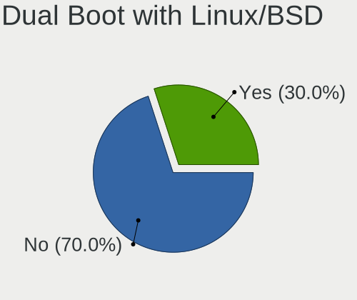
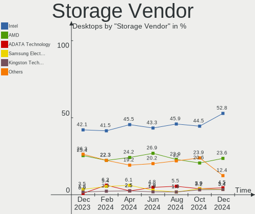
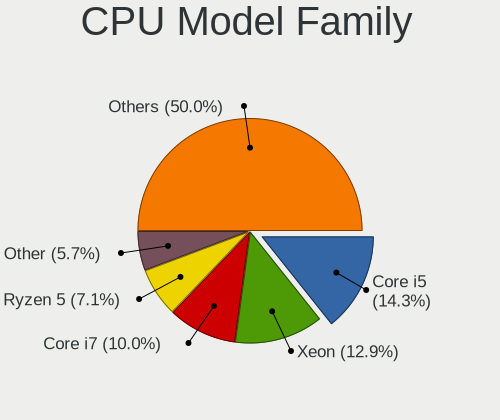
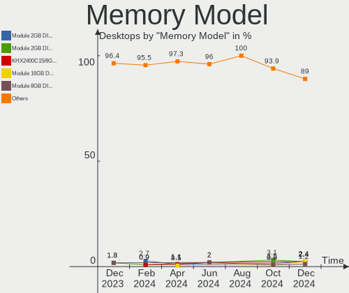
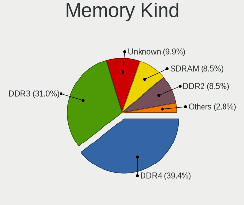

ROSA Hardware Trends (Desktop)
------------------------------

A project to identify most popular hardware characteristics and track their change
over time based on data collected by ROSA users at https://Linux-Hardware.org.

Anyone can contribute to the study by uploading probes of their computers by
the [hw-probe](https://github.com/linuxhw/hw-probe) tool:

    sudo -E hw-probe -all -upload

Full-feature report is available here: https://linux-hardware.org/?view=trends&formfactor=desktop

Period: Oct, 2020.

Contents
--------

- [ OS                       ](#os)
- [ OS Family                ](#os-family)
- [ Kernel                   ](#kernel)
- [ Kernel Family            ](#kernel-family)
- [ Kernel Major Ver.        ](#kernel-major-ver)
- [ Arch                     ](#arch)
- [ DE                       ](#de)
- [ Display Server           ](#display-server)
- [ Display Manager          ](#display-manager)
- [ OS Lang                  ](#os-lang)
- [ Boot Mode                ](#boot-mode)
- [ Filesystem               ](#filesystem)
- [ Part. scheme             ](#part-scheme)
- [ Dual Boot with Linux/BSD ](#dual-boot-with-linux/bsd)
- [ Dual Boot (Win)          ](#dual-boot-win)
- [ Country                  ](#country)
- [ City                     ](#city)
- [ Vendor                   ](#vendor)
- [ Model                    ](#model)
- [ Model Family             ](#model-family)
- [ MFG Year                 ](#mfg-year)
- [ Form Factor              ](#form-factor)
- [ Secure Boot              ](#secure-boot)
- [ Coreboot                 ](#coreboot)
- [ RAM Size                 ](#ram-size)
- [ RAM Used                 ](#ram-used)
- [ Has CD-ROM               ](#has-cd-rom)
- [ Total Drives             ](#total-drives)
- [ Has Ethernet             ](#has-ethernet)
- [ Drive Vendor             ](#drive-vendor)
- [ HDD Vendor               ](#hdd-vendor)
- [ SSD Vendor               ](#ssd-vendor)
- [ Drive Model              ](#drive-model)
- [ Drive Kind               ](#drive-kind)
- [ Drive Connector          ](#drive-connector)
- [ Drive Size               ](#drive-size)
- [ Space Total              ](#space-total)
- [ Space Used               ](#space-used)
- [ Malfunc. Drives          ](#malfunc-drives)
- [ Malfunc. Drive Vendor    ](#malfunc-drive-vendor)
- [ Malfunc. HDD Vendor      ](#malfunc-hdd-vendor)
- [ Malfunc. Drive Kind      ](#malfunc-drive-kind)
- [ Failed Drives            ](#failed-drives)
- [ Failed Drive Vendor      ](#failed-drive-vendor)
- [ Drive Status             ](#drive-status)
- [ Storage Vendor           ](#storage-vendor)
- [ Storage Model            ](#storage-model)
- [ Storage Kind             ](#storage-kind)
- [ CPU Vendor               ](#cpu-vendor)
- [ CPU Model                ](#cpu-model)
- [ CPU Model Family         ](#cpu-model-family)
- [ CPU Cores                ](#cpu-cores)
- [ CPU Sockets              ](#cpu-sockets)
- [ CPU Threads              ](#cpu-threads)
- [ CPU Op-Modes             ](#cpu-op-modes)
- [ CPU Microcode            ](#cpu-microcode)
- [ CPU Microarch            ](#cpu-microarch)
- [ GPU Vendor               ](#gpu-vendor)
- [ GPU Model                ](#gpu-model)
- [ GPU Combo                ](#gpu-combo)
- [ GPU Driver               ](#gpu-driver)
- [ GPU Memory               ](#gpu-memory)
- [ Monitor Vendor           ](#monitor-vendor)
- [ Monitor Model            ](#monitor-model)
- [ Monitor Resolution       ](#monitor-resolution)
- [ Monitor Diagonal         ](#monitor-diagonal)
- [ Monitor Width            ](#monitor-width)
- [ Aspect Ratio             ](#aspect-ratio)
- [ Monitor Area             ](#monitor-area)
- [ Pixel Density            ](#pixel-density)
- [ Multiple Monitors        ](#multiple-monitors)
- [ Net Controller Vendor    ](#net-controller-vendor)
- [ Net Controller Model     ](#net-controller-model)
- [ Wireless Vendor          ](#wireless-vendor)
- [ Wireless Model           ](#wireless-model)
- [ Ethernet Vendor          ](#ethernet-vendor)
- [ Ethernet Model           ](#ethernet-model)
- [ Net Controller Kind      ](#net-controller-kind)
- [ Used Controller          ](#used-controller)
- [ NICs                     ](#nics)
- [ Memory Vendor            ](#memory-vendor)
- [ Memory Model             ](#memory-model)
- [ Memory Kind              ](#memory-kind)
- [ Memory Form Factor       ](#memory-form-factor)
- [ Memory Size              ](#memory-size)
- [ Memory Speed             ](#memory-speed)
- [ Sound Vendor             ](#sound-vendor)
- [ Sound Model              ](#sound-model)
- [ Camera Vendor            ](#camera-vendor)
- [ Camera Model             ](#camera-model)
- [ Fingerprint Vendor       ](#fingerprint-vendor)
- [ Fingerprint Model        ](#fingerprint-model)
- [ Chipcard Vendor          ](#chipcard-vendor)
- [ Chipcard Model           ](#chipcard-model)
- [ Printer Vendor           ](#printer-vendor)
- [ Printer Model            ](#printer-model)
- [ Scanner Vendor           ](#scanner-vendor)
- [ Scanner Model            ](#scanner-model)
- [ Bluetooth Vendor         ](#bluetooth-vendor)
- [ Bluetooth Model          ](#bluetooth-model)
- [ Unsupported Devices      ](#unsupported-devices)
- [ Unsupported Device Types ](#unsupported-device-types)

OS
--

Installed operating systems

| Name         | Desktops | Percent |
|--------------|----------|---------|
| ROSA R11.1   | 66       | 55.93%  |
| ROSA R11     | 35       | 29.66%  |
| ROSA R8.1    | 7        | 5.93%   |
| ROSA 2019.05 | 4        | 3.39%   |
| ROSA R10     | 3        | 2.54%   |
| ROSA R9      | 2        | 1.69%   |
| ROSA R9-R11  | 1        | 0.85%   |

OS Family
---------

OS without a version

| Name | Desktops | Percent |
|------|----------|---------|
| ROSA | 118      | 100%    |

Kernel
------

Version of the Linux kernel

| Version                           | Desktops | Percent |
|-----------------------------------|----------|---------|
| 4.15.0-desktop-94.1rosa-x86_64    | 29       | 24.58%  |
| 4.15.0-desktop-45.1rosa-x86_64    | 28       | 23.73%  |
| 5.4.40-generic-1rosa-x86_64       | 13       | 11.02%  |
| 4.15.0-desktop-45.1rosa-i586      | 7        | 5.93%   |
| 5.4.32-generic-2rosa-x86_64       | 6        | 5.08%   |
| 4.9.155-nrj-desktop-1rosa-x86_64  | 5        | 4.24%   |
| 5.4.60-nickel-2rosa2019.05-x86_64 | 4        | 3.39%   |
| 4.15.0-desktop-94.1rosa-i586      | 4        | 3.39%   |
| 4.1.38-nrj-desktop-2rosa-x86_64   | 4        | 3.39%   |
| 4.9.155-nrj-desktop-1rosa-i586    | 3        | 2.54%   |
| 4.9.60-nrj-desktop-1rosa-x86_64   | 2        | 1.69%   |
| 4.15.0-desktop-68.5rosa-x86_64    | 2        | 1.69%   |
| 5.8.9-generic-1rosa-x86_64        | 1        | 0.85%   |
| 5.8.0-desktop-21.22.1rosa-x86_64  | 1        | 0.85%   |
| 5.4.40-generic-1rosa-i586         | 1        | 0.85%   |
| 5.4.32-generic-2rosa-i586         | 1        | 0.85%   |
| 5.4.28-generic-1rosa-x86_64       | 1        | 0.85%   |
| 4.9.60-nrj-desktop-1rosa-i586     | 1        | 0.85%   |
| 4.9.20-nrj-desktop-1rosa-x86_64   | 1        | 0.85%   |
| 4.9.20-nrj-desktop-1rosa-i586     | 1        | 0.85%   |
| 4.15.0-desktop-91.1rosa-x86_64    | 1        | 0.85%   |
| 4.1.38-nrj-desktop-2rosa-i586     | 1        | 0.85%   |
| 3.14.15-nrj-desktop-pae-1rosa     | 1        | 0.85%   |

Kernel Family
-------------

Linux kernel without a distro release

| Version | Desktops | Percent |
|---------|----------|---------|
| 4.15.0  | 71       | 60.17%  |
| 5.4.40  | 14       | 11.86%  |
| 4.9.155 | 8        | 6.78%   |
| 5.4.32  | 7        | 5.93%   |
| 4.1.38  | 5        | 4.24%   |
| 5.4.60  | 4        | 3.39%   |
| 4.9.60  | 3        | 2.54%   |
| 4.9.20  | 2        | 1.69%   |
| 5.8.9   | 1        | 0.85%   |
| 5.8.0   | 1        | 0.85%   |
| 5.4.28  | 1        | 0.85%   |
| 3.14.15 | 1        | 0.85%   |

Kernel Major Ver.
-----------------

Linux kernel major version

| Version | Desktops | Percent |
|---------|----------|---------|
| 4.15    | 71       | 60.17%  |
| 5.4     | 26       | 22.03%  |
| 4.9     | 13       | 11.02%  |
| 4.1     | 5        | 4.24%   |
| 5.8     | 2        | 1.69%   |
| 3.14    | 1        | 0.85%   |

Arch
----

OS architecture (x86_64, i586, etc.)

| Name   | Desktops | Percent |
|--------|----------|---------|
| x86_64 | 98       | 83.05%  |
| i686   | 20       | 16.95%  |

DE
--

Desktop Environment

| Name  | Desktops | Percent |
|-------|----------|---------|
| KDE4  | 75       | 63.56%  |
| KDE5  | 30       | 25.42%  |
| LXQt  | 6        | 5.08%   |
| XFCE  | 3        | 2.54%   |
| MATE  | 3        | 2.54%   |
| GNOME | 1        | 0.85%   |

Display Server
--------------

X11 or Wayland

| Name | Desktops | Percent |
|------|----------|---------|
| X11  | 118      | 100%    |

Display Manager
---------------

SDDM, LightDM, etc.

| Name | Desktops | Percent |
|------|----------|---------|
| KDM  | 76       | 64.41%  |
| SDDM | 41       | 34.75%  |
| GDM  | 1        | 0.85%   |

OS Lang
-------

Language

| Lang    | Desktops | Percent |
|---------|----------|---------|
| ru_RU   | 58       | 49.15%  |
| Unknown | 45       | 38.14%  |
| pl_PL   | 5        | 4.24%   |
| en_US   | 3        | 2.54%   |
| es_ES   | 2        | 1.69%   |
| pt_PT   | 1        | 0.85%   |
| pt_BR   | 1        | 0.85%   |
| es_AR   | 1        | 0.85%   |
| en_GB   | 1        | 0.85%   |
| de_DE   | 1        | 0.85%   |

Boot Mode
---------

EFI or BIOS

| Mode | Desktops | Percent |
|------|----------|---------|
| BIOS | 98       | 83.05%  |
| EFI  | 20       | 16.95%  |

Filesystem
----------

Type of filesystem

| Type  | Desktops | Percent |
|-------|----------|---------|
| Ext4  | 114      | 96.61%  |
| Btrfs | 2        | 1.69%   |
| Xfs   | 1        | 0.85%   |
| Ext2  | 1        | 0.85%   |

Part. scheme
------------

Scheme of partitioning

| Type    | Desktops | Percent |
|---------|----------|---------|
| MBR     | 85       | 72.03%  |
| GPT     | 31       | 26.27%  |
| Unknown | 2        | 1.69%   |

Dual Boot with Linux/BSD
------------------------

Hosting more than one Linux/BSD

| Dual boot | Desktops | Percent |
|-----------|----------|---------|
| No        | 94       | 79.66%  |
| Yes       | 24       | 20.34%  |

Dual Boot (Win)
---------------

Hosting Linux and Windows

| Dual boot | Desktops | Percent |
|-----------|----------|---------|
| No        | 61       | 51.69%  |
| Yes       | 57       | 48.31%  |

Country
-------

Geographic location (country)

| Country    | Desktops | Percent |
|------------|----------|---------|
| Russia     | 86       | 72.88%  |
| Poland     | 6        | 5.08%   |
| Italy      | 3        | 2.54%   |
| France     | 3        | 2.54%   |
| USA        | 2        | 1.69%   |
| Ukraine    | 2        | 1.69%   |
| Portugal   | 2        | 1.69%   |
| Kazakhstan | 2        | 1.69%   |
| Uzbekistan | 1        | 0.85%   |
| UK         | 1        | 0.85%   |
| Spain      | 1        | 0.85%   |
| Norway     | 1        | 0.85%   |
| Moldova    | 1        | 0.85%   |
| Mexico     | 1        | 0.85%   |
| Germany    | 1        | 0.85%   |
| Estonia    | 1        | 0.85%   |
| Egypt      | 1        | 0.85%   |
| Bulgaria   | 1        | 0.85%   |
| Brazil     | 1        | 0.85%   |
| Argentina  | 1        | 0.85%   |

City
----

Geographic location (city)

| City                     | Desktops | Percent |
|--------------------------|----------|---------|
| Moscow                   | 13       | 11.02%  |
| Novosibirsk              | 5        | 4.24%   |
| St Petersburg            | 4        | 3.39%   |
| Perm                     | 3        | 2.54%   |
| Omsk                     | 3        | 2.54%   |
| Krasnodar                | 3        | 2.54%   |
| Tomsk                    | 2        | 1.69%   |
| Syktyvkar                | 2        | 1.69%   |
| Saratov                  | 2        | 1.69%   |
| Nizhniy Novgorod         | 2        | 1.69%   |
| Lipetsk                  | 2        | 1.69%   |
| Kyiv                     | 2        | 1.69%   |
| Kazan’                 | 2        | 1.69%   |
| Gatchina                 | 2        | 1.69%   |
| Barnaul                  | 2        | 1.69%   |
| Łódź                  | 1        | 0.85%   |
| Warsaw                   | 1        | 0.85%   |
| Vyksa                    | 1        | 0.85%   |
| Vsevolozhsk              | 1        | 0.85%   |
| Voronezh                 | 1        | 0.85%   |
| Volzhskiy                | 1        | 0.85%   |
| Vogue                    | 1        | 0.85%   |
| Usinsk                   | 1        | 0.85%   |
| Uren'                    | 1        | 0.85%   |
| Tver                     | 1        | 0.85%   |
| Tromsø                  | 1        | 0.85%   |
| Trier                    | 1        | 0.85%   |
| Torres Vedras            | 1        | 0.85%   |
| Tokarnia                 | 1        | 0.85%   |
| Strezhevoy               | 1        | 0.85%   |
| Stavropol                | 1        | 0.85%   |
| Sofia                    | 1        | 0.85%   |
| Snezhinsk                | 1        | 0.85%   |
| Smolensk                 | 1        | 0.85%   |
| Shebekino                | 1        | 0.85%   |
| Serpukhov                | 1        | 0.85%   |
| Sergiyev Posad           | 1        | 0.85%   |
| San Felice Circeo        | 1        | 0.85%   |
| Safonovo                 | 1        | 0.85%   |
| Rostov-on-Don            | 1        | 0.85%   |
| Petropavlovsk-Kamchatsky | 1        | 0.85%   |
| Onor                     | 1        | 0.85%   |
| Nur-Sultan               | 1        | 0.85%   |
| Novomoskovsk             | 1        | 0.85%   |
| Nevinnomyssk             | 1        | 0.85%   |
| Neath                    | 1        | 0.85%   |
| Málaga                  | 1        | 0.85%   |
| Montpellier              | 1        | 0.85%   |
| Mikun'                   | 1        | 0.85%   |
| Mikołów                | 1        | 0.85%   |
| Marostica                | 1        | 0.85%   |
| Maignelay-Montigny       | 1        | 0.85%   |
| Luza                     | 1        | 0.85%   |
| Lesnikovo                | 1        | 0.85%   |
| Kurgan                   | 1        | 0.85%   |
| Kostroma                 | 1        | 0.85%   |
| Kopeysk                  | 1        | 0.85%   |
| Klintsy                  | 1        | 0.85%   |
| Kingisepp                | 1        | 0.85%   |
| Karmana Shahri           | 1        | 0.85%   |

Vendor
------

Motherboard manufacturer

| Name                | Desktops | Percent |
|---------------------|----------|---------|
| ASUSTek Computer    | 49       | 41.53%  |
| Gigabyte Technology | 27       | 22.88%  |
| MSI                 | 11       | 9.32%   |
| ASRock              | 11       | 9.32%   |
| Dell                | 4        | 3.39%   |
| Acer                | 3        | 2.54%   |
| Pegatron            | 2        | 1.69%   |
| Hewlett-Packard     | 2        | 1.69%   |
| Biostar             | 2        | 1.69%   |
| Unknown             | 2        | 1.69%   |
| Packard Bell        | 1        | 0.85%   |
| LORD ELECTRONICS    | 1        | 0.85%   |
| Kraftway            | 1        | 0.85%   |
| Foxconn             | 1        | 0.85%   |
| ECS                 | 1        | 0.85%   |

Model
-----

Motherboard model

| Name                            | Desktops | Percent |
|---------------------------------|----------|---------|
| ASUS PRIME H310M-R R2.0         | 3        | 2.54%   |
| Gigabyte H61M-S1                | 2        | 1.69%   |
| Gigabyte 970A-DS3P              | 2        | 1.69%   |
| ASUS P8H61-M LX3 R2.0           | 2        | 1.69%   |
| ASUS P5QPL-AM                   | 2        | 1.69%   |
| Unknown                         | 2        | 1.69%   |
| Pegatron VN432AA-ABF CQ5202FR   | 1        | 0.85%   |
| Pegatron IPPCR-DB               | 1        | 0.85%   |
| Packard Bell imedia S2185       | 1        | 0.85%   |
| MSI OPTIMUS                     | 1        | 0.85%   |
| MSI MS-7C52                     | 1        | 0.85%   |
| MSI MS-7B86                     | 1        | 0.85%   |
| MSI MS-7A38                     | 1        | 0.85%   |
| MSI MS-7A15                     | 1        | 0.85%   |
| MSI MS-7996                     | 1        | 0.85%   |
| MSI MS-7721                     | 1        | 0.85%   |
| MSI MS-7369                     | 1        | 0.85%   |
| MSI MS-7367                     | 1        | 0.85%   |
| MSI MS-7346                     | 1        | 0.85%   |
| MSI MS-7267                     | 1        | 0.85%   |
| LORD ELECTRONICS INTEL G41 V1.0 | 1        | 0.85%   |
| Kraftway KWH310                 | 1        | 0.85%   |
| HP ProDesk 405 G2 MT            | 1        | 0.85%   |
| HP Compaq 6000 Pro MT PC        | 1        | 0.85%   |
| Gigabyte P35-DS3L               | 1        | 0.85%   |
| Gigabyte M52LT-D3               | 1        | 0.85%   |
| Gigabyte H61M-DS2H              | 1        | 0.85%   |
| Gigabyte GA-MA790XT-UD4P        | 1        | 0.85%   |
| Gigabyte GA-MA78LM-S2           | 1        | 0.85%   |
| Gigabyte GA-MA785GT-UD3H        | 1        | 0.85%   |
| Gigabyte GA-MA74GM-S2           | 1        | 0.85%   |
| Gigabyte GA-78LMT-S2PV          | 1        | 0.85%   |
| Gigabyte G41MT-D3               | 1        | 0.85%   |
| Gigabyte G41M-Combo             | 1        | 0.85%   |
| Gigabyte G31M-ES2L              | 1        | 0.85%   |
| Gigabyte F2A55-DS3              | 1        | 0.85%   |
| Gigabyte EP41-UD3L              | 1        | 0.85%   |
| Gigabyte E3800N                 | 1        | 0.85%   |
| Gigabyte E3000N                 | 1        | 0.85%   |
| Gigabyte D510UD                 | 1        | 0.85%   |
| Gigabyte B75M-D3H               | 1        | 0.85%   |
| Gigabyte B550M AORUS PRO        | 1        | 0.85%   |
| Gigabyte B450M DS3H             | 1        | 0.85%   |
| Gigabyte AB350-Gaming           | 1        | 0.85%   |
| Gigabyte 965P-S3                | 1        | 0.85%   |
| Gigabyte 945GM-S2               | 1        | 0.85%   |
| Gigabyte 8I915GMF               | 1        | 0.85%   |
| Foxconn 500B Microtower         | 1        | 0.85%   |
| ECS GeForce6100PM-M2            | 1        | 0.85%   |
| Dell OptiPlex 755               | 1        | 0.85%   |
| Dell OptiPlex 7040              | 1        | 0.85%   |
| Dell OptiPlex 380               | 1        | 0.85%   |
| Dell ASM100                     | 1        | 0.85%   |
| Biostar TB250-BTC               | 1        | 0.85%   |
| Biostar A960D+V3                | 1        | 0.85%   |
| ASUS SABERTOOTH 990FX           | 1        | 0.85%   |
| ASUS ROG STRIX Z370-I GAMING    | 1        | 0.85%   |
| ASUS PS308AA-AB9 a839.pt        | 1        | 0.85%   |
| ASUS Pro, Std, Elt Series       | 1        | 0.85%   |
| ASUS P8Z68-V GEN3               | 1        | 0.85%   |

Model Family
------------

Motherboard model prefix

| Name                     | Desktops | Percent |
|--------------------------|----------|---------|
| ASUS P8H61-M             | 4        | 3.39%   |
| Dell OptiPlex            | 3        | 2.54%   |
| ASUS PRIME               | 3        | 2.54%   |
| ASUS M5A78L-M            | 3        | 2.54%   |
| Gigabyte H61M-S1         | 2        | 1.69%   |
| Gigabyte 970A-DS3P       | 2        | 1.69%   |
| ASUS P5QPL-AM            | 2        | 1.69%   |
| ASUS P5Q                 | 2        | 1.69%   |
| ASUS M5A97               | 2        | 1.69%   |
| Acer Veriton             | 2        | 1.69%   |
| Unknown                  | 2        | 1.69%   |
| Pegatron VN432AA-ABF     | 1        | 0.85%   |
| Pegatron IPPCR-DB        | 1        | 0.85%   |
| Packard Bell imedia      | 1        | 0.85%   |
| MSI OPTIMUS              | 1        | 0.85%   |
| MSI MS-7C52              | 1        | 0.85%   |
| MSI MS-7B86              | 1        | 0.85%   |
| MSI MS-7A38              | 1        | 0.85%   |
| MSI MS-7A15              | 1        | 0.85%   |
| MSI MS-7996              | 1        | 0.85%   |
| MSI MS-7721              | 1        | 0.85%   |
| MSI MS-7369              | 1        | 0.85%   |
| MSI MS-7367              | 1        | 0.85%   |
| MSI MS-7346              | 1        | 0.85%   |
| MSI MS-7267              | 1        | 0.85%   |
| LORD ELECTRONICS INTEL   | 1        | 0.85%   |
| Kraftway KWH310          | 1        | 0.85%   |
| HP ProDesk               | 1        | 0.85%   |
| HP Compaq                | 1        | 0.85%   |
| Gigabyte P35-DS3L        | 1        | 0.85%   |
| Gigabyte M52LT-D3        | 1        | 0.85%   |
| Gigabyte H61M-DS2H       | 1        | 0.85%   |
| Gigabyte GA-MA790XT-UD4P | 1        | 0.85%   |
| Gigabyte GA-MA78LM-S2    | 1        | 0.85%   |
| Gigabyte GA-MA785GT-UD3H | 1        | 0.85%   |
| Gigabyte GA-MA74GM-S2    | 1        | 0.85%   |
| Gigabyte GA-78LMT-S2PV   | 1        | 0.85%   |
| Gigabyte G41MT-D3        | 1        | 0.85%   |
| Gigabyte G41M-Combo      | 1        | 0.85%   |
| Gigabyte G31M-ES2L       | 1        | 0.85%   |
| Gigabyte F2A55-DS3       | 1        | 0.85%   |
| Gigabyte EP41-UD3L       | 1        | 0.85%   |
| Gigabyte E3800N          | 1        | 0.85%   |
| Gigabyte E3000N          | 1        | 0.85%   |
| Gigabyte D510UD          | 1        | 0.85%   |
| Gigabyte B75M-D3H        | 1        | 0.85%   |
| Gigabyte B550M           | 1        | 0.85%   |
| Gigabyte B450M           | 1        | 0.85%   |
| Gigabyte AB350-Gaming    | 1        | 0.85%   |
| Gigabyte 965P-S3         | 1        | 0.85%   |
| Gigabyte 945GM-S2        | 1        | 0.85%   |
| Gigabyte 8I915GMF        | 1        | 0.85%   |
| Foxconn 500B             | 1        | 0.85%   |
| ECS GeForce6100PM-M2     | 1        | 0.85%   |
| Dell ASM100              | 1        | 0.85%   |
| Biostar TB250-BTC        | 1        | 0.85%   |
| Biostar A960D+V3         | 1        | 0.85%   |
| ASUS SABERTOOTH          | 1        | 0.85%   |
| ASUS ROG                 | 1        | 0.85%   |
| ASUS PS308AA-AB9         | 1        | 0.85%   |

MFG Year
--------

Motherboard manufacture year

| Year | Desktops | Percent |
|------|----------|---------|
| 2012 | 16       | 13.56%  |
| 2010 | 16       | 13.56%  |
| 2018 | 10       | 8.47%   |
| 2016 | 9        | 7.63%   |
| 2011 | 9        | 7.63%   |
| 2009 | 9        | 7.63%   |
| 2007 | 9        | 7.63%   |
| 2008 | 8        | 6.78%   |
| 2019 | 7        | 5.93%   |
| 2013 | 6        | 5.08%   |
| 2020 | 4        | 3.39%   |
| 2017 | 4        | 3.39%   |
| 2015 | 4        | 3.39%   |
| 2014 | 2        | 1.69%   |
| 2006 | 2        | 1.69%   |
| 2005 | 2        | 1.69%   |
| 2004 | 1        | 0.85%   |

Form Factor
-----------

Physical design of the computer

| Name    | Desktops | Percent |
|---------|----------|---------|
| Desktop | 118      | 100%    |

Secure Boot
-----------

Enabled or disabled

| State    | Desktops | Percent |
|----------|----------|---------|
| Disabled | 118      | 100%    |

Coreboot
--------

Have coreboot on board

| Used | Desktops | Percent |
|------|----------|---------|
| No   | 118      | 100%    |

RAM Size
--------

Total RAM memory

| Size in GB | Desktops | Percent |
|------------|----------|---------|
| 3.01-4.0   | 34       | 28.81%  |
| 8.01-16.0  | 29       | 24.58%  |
| 1.01-2.0   | 18       | 15.25%  |
| 4.01-8.0   | 17       | 14.41%  |
| 16.01-24.0 | 12       | 10.17%  |
| 2.01-3.0   | 6        | 5.08%   |
| 0.01-1.0   | 2        | 1.69%   |

RAM Used
--------

Used RAM memory

| Used GB  | Desktops | Percent |
|----------|----------|---------|
| 0.01-1.0 | 56       | 47.46%  |
| 1.01-2.0 | 49       | 41.53%  |
| 2.01-3.0 | 8        | 6.78%   |
| 3.01-4.0 | 3        | 2.54%   |
| 4.01-8.0 | 2        | 1.69%   |

Has CD-ROM
----------

Has CD-ROM on board

| Presented | Desktops | Percent |
|-----------|----------|---------|
| Yes       | 79       | 66.95%  |
| No        | 39       | 33.05%  |

Total Drives
------------

Number of drives on board

| Drives | Desktops | Percent |
|--------|----------|---------|
| 1      | 68       | 57.63%  |
| 2      | 33       | 27.97%  |
| 3      | 7        | 5.93%   |
| 4      | 5        | 4.24%   |
| 7      | 2        | 1.69%   |
| 0      | 2        | 1.69%   |
| 5      | 1        | 0.85%   |

Has Ethernet
------------

Has Ethernet on board

| Presented | Desktops | Percent |
|-----------|----------|---------|
| Yes       | 118      | 100%    |

Drive Vendor
------------

Hard drive vendors

| Vendor              | Desktops | Drives | Percent |
|---------------------|----------|--------|---------|
| Seagate             | 48       | 55     | 27.43%  |
| WDC                 | 43       | 54     | 24.57%  |
| Samsung Electronics | 18       | 20     | 10.29%  |
| Toshiba             | 10       | 10     | 5.71%   |
| MAXTOR              | 7        | 8      | 4%      |
| Kingston            | 7        | 7      | 4%      |
| Hitachi             | 6        | 6      | 3.43%   |
| FOXLINE             | 4        | 4      | 2.29%   |
| Patriot             | 3        | 3      | 1.71%   |
| Intel               | 3        | 4      | 1.71%   |
| GOODRAM             | 3        | 3      | 1.71%   |
| Crucial             | 3        | 4      | 1.71%   |
| China               | 3        | 3      | 1.71%   |
| SPCC                | 2        | 2      | 1.14%   |
| HUAWEI              | 2        | 2      | 1.14%   |
| Corsair             | 2        | 2      | 1.14%   |
| Zheino              | 1        | 1      | 0.57%   |
| WD MediaMax         | 1        | 1      | 0.57%   |
| PNY                 | 1        | 1      | 0.57%   |
| PLEXTOR             | 1        | 1      | 0.57%   |
| MIXZA               | 1        | 1      | 0.57%   |
| KingSpec            | 1        | 1      | 0.57%   |
| Kingmax             | 1        | 1      | 0.57%   |
| HGST                | 1        | 1      | 0.57%   |
| Gigabyte Technology | 1        | 1      | 0.57%   |
| Apacer              | 1        | 1      | 0.57%   |
| A-DATA Technology   | 1        | 1      | 0.57%   |

HDD Vendor
----------

Hard disk drive vendors

| Vendor              | Desktops | Drives | Percent |
|---------------------|----------|--------|---------|
| Seagate             | 48       | 55     | 38.4%   |
| WDC                 | 40       | 50     | 32%     |
| Samsung Electronics | 12       | 12     | 9.6%    |
| Toshiba             | 10       | 10     | 8%      |
| MAXTOR              | 7        | 8      | 5.6%    |
| Hitachi             | 6        | 6      | 4.8%    |
| WD MediaMax         | 1        | 1      | 0.8%    |
| HGST                | 1        | 1      | 0.8%    |

SSD Vendor
----------

Solid state drive vendors

| Vendor              | Desktops | Drives | Percent |
|---------------------|----------|--------|---------|
| Kingston            | 7        | 7      | 14.89%  |
| Samsung Electronics | 5        | 6      | 10.64%  |
| FOXLINE             | 4        | 4      | 8.51%   |
| WDC                 | 3        | 3      | 6.38%   |
| Patriot             | 3        | 3      | 6.38%   |
| Intel               | 3        | 4      | 6.38%   |
| GOODRAM             | 3        | 3      | 6.38%   |
| Crucial             | 3        | 3      | 6.38%   |
| China               | 3        | 3      | 6.38%   |
| SPCC                | 2        | 2      | 4.26%   |
| Corsair             | 2        | 2      | 4.26%   |
| Zheino              | 1        | 1      | 2.13%   |
| PNY                 | 1        | 1      | 2.13%   |
| PLEXTOR             | 1        | 1      | 2.13%   |
| MIXZA               | 1        | 1      | 2.13%   |
| KingSpec            | 1        | 1      | 2.13%   |
| Kingmax             | 1        | 1      | 2.13%   |
| Gigabyte Technology | 1        | 1      | 2.13%   |
| Apacer              | 1        | 1      | 2.13%   |
| A-DATA Technology   | 1        | 1      | 2.13%   |

Drive Model
-----------

Hard drive models

| Model                        | Desktops | Percent |
|------------------------------|----------|---------|
| ST1000DM010-2EP102 1TB       | 5        | 2.6%    |
| ST3500418AS 500GB            | 3        | 1.56%   |
| WD800JD-22MSA1 80GB          | 2        | 1.04%   |
| WD20EARX-00PASB0 2TB         | 2        | 1.04%   |
| WD20EARS-00MVWB0 2TB         | 2        | 1.04%   |
| WD15EARS-00MVWB0 1TB         | 2        | 1.04%   |
| WD10EZEX-00MFCA0 1TB         | 2        | 1.04%   |
| SV300S37A120G 120GB SSD      | 2        | 1.04%   |
| STM3250820AS 250GB           | 2        | 1.04%   |
| ST9500325AS 500GB            | 2        | 1.04%   |
| ST500LT012-1DG142 500GB      | 2        | 1.04%   |
| ST500DM002-1BD142 500GB      | 2        | 1.04%   |
| ST380011A 80GB               | 2        | 1.04%   |
| ST3250310AS 250GB            | 2        | 1.04%   |
| ST31000524AS 1TB             | 2        | 1.04%   |
| ST1000DM003-1CH162 1TB       | 2        | 1.04%   |
| SSD 860 EVO 250GB            | 2        | 1.04%   |
| SSD 120GB                    | 2        | 1.04%   |
| SA400S37240G 240GB SSD       | 2        | 1.04%   |
| HDWD110 1TB                  | 2        | 1.04%   |
| HDWD105 500GB                | 2        | 1.04%   |
| HD160JJ 160GB                | 2        | 1.04%   |
| FLSSD512X5 512GB             | 2        | 1.04%   |
| DT01ACA100 1TB               | 2        | 1.04%   |
| DT01ACA050 500GB             | 2        | 1.04%   |
| WL250GSA872 250GB            | 1        | 0.52%   |
| WDS250G1B0C-00S6U0 250GB     | 1        | 0.52%   |
| WDS240G2G0A-00JH30 240GB SSD | 1        | 0.52%   |
| WDS120G2G0A-00JH30 120GB SSD | 1        | 0.52%   |
| WDS100T2B0A-00SM50 1TB SSD   | 1        | 0.52%   |
| WD7500AADS-00M2B0 752GB      | 1        | 0.52%   |
| WD6400AAKS-65Z7B0 640GB      | 1        | 0.52%   |
| WD5002AALX-00J37A0 500GB     | 1        | 0.52%   |
| WD5000LPCX-24VHAT0 500GB     | 1        | 0.52%   |
| WD5000AZRX-00A8LB0 500GB     | 1        | 0.52%   |
| WD5000AZLX-60K2TA0 500GB     | 1        | 0.52%   |
| WD5000AZLX-00JKKA0 500GB     | 1        | 0.52%   |
| WD5000AAKX-75U6AA0 500GB     | 1        | 0.52%   |
| WD5000AAKX-08ERMA0 500GB     | 1        | 0.52%   |
| WD5000AAKX-00ERMA0 500GB     | 1        | 0.52%   |
| WD5000AADS-00S9B0 500GB      | 1        | 0.52%   |
| WD40PURZ-85TTDY0 4TB         | 1        | 0.52%   |
| WD40EZRZ-75GXCB0 4TB         | 1        | 0.52%   |
| WD3200BPVT-22ZEST0 320GB     | 1        | 0.52%   |
| WD3200AAKS-00V1A0 320GB      | 1        | 0.52%   |
| WD3200AAKS-00SBA0 320GB      | 1        | 0.52%   |
| WD3200AAJS-22B4A0 320GB      | 1        | 0.52%   |
| WD30EZRX-00D8PB0 3TB         | 1        | 0.52%   |
| WD2500BEVT-00A23T0 250GB     | 1        | 0.52%   |
| WD2500AAKX-001CA0 250GB      | 1        | 0.52%   |
| WD2500AAJS-60B4A0 250GB      | 1        | 0.52%   |
| WD2500AAJS-22RYA0 250GB      | 1        | 0.52%   |
| WD20PURZ-85GU6Y0 2TB         | 1        | 0.52%   |
| WD2000JD-22HBC0 200GB        | 1        | 0.52%   |
| WD2000JD-00HBB0 200GB        | 1        | 0.52%   |
| WD1600JS-00NCB1 160GB        | 1        | 0.52%   |
| WD1600AAJS-75M0A0 160GB      | 1        | 0.52%   |
| WD1600AAJS-08PSA0 160GB      | 1        | 0.52%   |
| WD15EARS-00S0XB0 1TB         | 1        | 0.52%   |
| WD10EZRX-00L4HB0 1TB         | 1        | 0.52%   |

Drive Kind
----------

HDD or SSD

| Kind    | Desktops | Drives | Percent |
|---------|----------|--------|---------|
| HDD     | 102      | 143    | 69.39%  |
| SSD     | 40       | 49     | 27.21%  |
| NVMe    | 3        | 4      | 2.04%   |
| Unknown | 2        | 2      | 1.36%   |

Drive Connector
---------------

SATA, SAS, NVMe, etc.

| Type | Desktops | Drives | Percent |
|------|----------|--------|---------|
| SATA | 115      | 191    | 95.04%  |
| SAS  | 3        | 3      | 2.48%   |
| NVMe | 3        | 4      | 2.48%   |

Drive Size
----------

Size of hard drive

| Size in TB | Desktops | Drives | Percent |
|------------|----------|--------|---------|
| 0.01-0.5   | 98       | 134    | 66.67%  |
| 0.51-1.0   | 38       | 43     | 25.85%  |
| 1.01-2.0   | 6        | 8      | 4.08%   |
| 3.01-4.0   | 3        | 4      | 2.04%   |
| 2.01-3.0   | 2        | 3      | 1.36%   |

Space Total
-----------

Amount of disk space available on the file system

| Size in GB     | Desktops | Percent |
|----------------|----------|---------|
| 101-250        | 32       | 27.12%  |
| 251-500        | 28       | 23.73%  |
| 1-20           | 20       | 16.95%  |
| 51-100         | 12       | 10.17%  |
| 501-1000       | 11       | 9.32%   |
| 21-50          | 8        | 6.78%   |
| 1001-2000      | 4        | 3.39%   |
| 2001-3000      | 2        | 1.69%   |
| More than 3000 | 1        | 0.85%   |

Space Used
----------

Amount of used disk space

| Used GB        | Desktops | Percent |
|----------------|----------|---------|
| 1-20           | 81       | 68.64%  |
| 21-50          | 10       | 8.47%   |
| 501-1000       | 7        | 5.93%   |
| 251-500        | 6        | 5.08%   |
| 101-250        | 6        | 5.08%   |
| 51-100         | 6        | 5.08%   |
| More than 3000 | 1        | 0.85%   |
| 1001-2000      | 1        | 0.85%   |

Malfunc. Drives
---------------

Drive models with a malfunction

| Model                    | Desktops | Drives | Percent |
|--------------------------|----------|--------|---------|
| WD15EARS-00MVWB0 1TB     | 2        | 2      | 3.17%   |
| ST3500418AS 500GB        | 2        | 3      | 3.17%   |
| ST3250310AS 250GB        | 2        | 2      | 3.17%   |
| HD160JJ 160GB            | 2        | 2      | 3.17%   |
| WD800JD-22MSA1 80GB      | 1        | 1      | 1.59%   |
| WD7500AADS-00M2B0 752GB  | 1        | 1      | 1.59%   |
| WD5000AAKX-75U6AA0 500GB | 1        | 1      | 1.59%   |
| WD5000AADS-00S9B0 500GB  | 1        | 1      | 1.59%   |
| WD40PURZ-85TTDY0 4TB     | 1        | 1      | 1.59%   |
| WD3200BPVT-22ZEST0 320GB | 1        | 1      | 1.59%   |
| WD3200AAKS-00V1A0 320GB  | 1        | 1      | 1.59%   |
| WD3200AAJS-22B4A0 320GB  | 1        | 1      | 1.59%   |
| WD2500BEVT-00A23T0 250GB | 1        | 1      | 1.59%   |
| WD2500AAKX-001CA0 250GB  | 1        | 1      | 1.59%   |
| WD2500AAJS-22RYA0 250GB  | 1        | 1      | 1.59%   |
| WD20EARX-00PASB0 2TB     | 1        | 1      | 1.59%   |
| WD20EARS-00MVWB0 2TB     | 1        | 1      | 1.59%   |
| WD1600JS-00NCB1 160GB    | 1        | 1      | 1.59%   |
| WD1600AAJS-75M0A0 160GB  | 1        | 1      | 1.59%   |
| WD1600AAJS-08PSA0 160GB  | 1        | 1      | 1.59%   |
| WD10EADS-22M2B0 1TB      | 1        | 1      | 1.59%   |
| WD10EADS-00M2B0 1TB      | 1        | 1      | 1.59%   |
| STM3320613AS 320GB       | 1        | 1      | 1.59%   |
| STM3250820AS 250GB       | 1        | 2      | 1.59%   |
| STM3250310AS 250GB       | 1        | 1      | 1.59%   |
| ST9500325AS 500GB        | 1        | 1      | 1.59%   |
| ST9320423AS 320GB        | 1        | 1      | 1.59%   |
| ST9250315AS 250GB        | 1        | 1      | 1.59%   |
| ST500LT012-1DG142 500GB  | 1        | 1      | 1.59%   |
| ST500DM002-1BD142 500GB  | 1        | 1      | 1.59%   |
| ST380215A 80GB           | 1        | 1      | 1.59%   |
| ST380011A 80GB           | 1        | 1      | 1.59%   |
| ST3750525AS 752GB        | 1        | 1      | 1.59%   |
| ST3500412AS 500GB        | 1        | 1      | 1.59%   |
| ST3320613AS 320GB        | 1        | 1      | 1.59%   |
| ST3320418AS 320GB        | 1        | 1      | 1.59%   |
| ST3320413CS 320GB        | 1        | 1      | 1.59%   |
| ST3250410AS 250GB        | 1        | 1      | 1.59%   |
| ST3160812AS 160GB        | 1        | 1      | 1.59%   |
| ST3160212A 160GB         | 1        | 1      | 1.59%   |
| ST3120813AS 120GB        | 1        | 1      | 1.59%   |
| ST31000524AS 1TB         | 1        | 1      | 1.59%   |
| ST1500DL003-9VT16L 1TB   | 1        | 1      | 1.59%   |
| ST1000DL002-9TT153 1TB   | 1        | 1      | 1.59%   |
| SSD 60GB                 | 1        | 1      | 1.59%   |
| SP2504C 250GB            | 1        | 1      | 1.59%   |
| SP1604N 160GB            | 1        | 1      | 1.59%   |
| Solid State Disk 120GB   | 1        | 1      | 1.59%   |
| HTS542525K9A300 250GB    | 1        | 1      | 1.59%   |
| HDT721016SLA380 160GB    | 1        | 1      | 1.59%   |
| HDS721616PLA380 160GB    | 1        | 1      | 1.59%   |
| HDS721010CLA330 1TB      | 1        | 1      | 1.59%   |
| HD501LJ 500GB            | 1        | 1      | 1.59%   |
| HD321KJ 320GB            | 1        | 1      | 1.59%   |
| HD161GJ 160GB            | 1        | 1      | 1.59%   |
| Force LS SSD 240GB       | 1        | 1      | 1.59%   |
| CT525MX300SSD1 528GB     | 1        | 1      | 1.59%   |
| 7L300S0 304GB            | 1        | 1      | 1.59%   |
| 6V200E0 208GB            | 1        | 1      | 1.59%   |

Malfunc. Drive Vendor
---------------------

Vendors of faulty drives

| Vendor              | Desktops | Drives | Percent |
|---------------------|----------|--------|---------|
| Seagate             | 22       | 24     | 36.07%  |
| WDC                 | 19       | 20     | 31.15%  |
| Samsung Electronics | 7        | 7      | 11.48%  |
| MAXTOR              | 5        | 6      | 8.2%    |
| Hitachi             | 4        | 4      | 6.56%   |
| SPCC                | 1        | 1      | 1.64%   |
| Kingmax             | 1        | 1      | 1.64%   |
| Crucial             | 1        | 1      | 1.64%   |
| Corsair             | 1        | 1      | 1.64%   |

Malfunc. HDD Vendor
-------------------

Vendors of faulty HDD drives

| Vendor              | Desktops | Drives | Percent |
|---------------------|----------|--------|---------|
| Seagate             | 22       | 24     | 38.6%   |
| WDC                 | 19       | 20     | 33.33%  |
| Samsung Electronics | 7        | 7      | 12.28%  |
| MAXTOR              | 5        | 6      | 8.77%   |
| Hitachi             | 4        | 4      | 7.02%   |

Malfunc. Drive Kind
-------------------

Kinds of faulty drives

| Kind | Desktops | Drives | Percent |
|------|----------|--------|---------|
| HDD  | 53       | 61     | 92.98%  |
| SSD  | 4        | 4      | 7.02%   |

Failed Drives
-------------

Failed drive models

| Model                 | Desktops | Drives | Percent |
|-----------------------|----------|--------|---------|
| ST31000524AS 1TB      | 1        | 1      | 50%     |
| HTS545050A7E380 500GB | 1        | 1      | 50%     |

Failed Drive Vendor
-------------------

Failed drive vendors

| Vendor  | Desktops | Drives | Percent |
|---------|----------|--------|---------|
| Seagate | 1        | 1      | 50%     |
| HGST    | 1        | 1      | 50%     |

Drive Status
------------

Number of failed and malfunc. drives

| Status   | Desktops | Drives | Percent |
|----------|----------|--------|---------|
| Works    | 84       | 126    | 57.14%  |
| Malfunc  | 56       | 65     | 38.1%   |
| Detected | 5        | 5      | 3.4%    |
| Failed   | 2        | 2      | 1.36%   |

Storage Vendor
--------------

Storage controller vendors

| Vendor                           | Desktops | Percent |
|----------------------------------|----------|---------|
| Intel                            | 68       | 48.57%  |
| AMD                              | 38       | 27.14%  |
| JMicron Technology               | 14       | 10%     |
| Nvidia                           | 11       | 7.86%   |
| Marvell Technology Group         | 3        | 2.14%   |
| VIA Technologies                 | 1        | 0.71%   |
| Silicon Integrated Systems [SiS] | 1        | 0.71%   |
| Sandisk                          | 1        | 0.71%   |
| Samsung Electronics              | 1        | 0.71%   |
| Micron/Crucial Technology        | 1        | 0.71%   |
| ASMedia Technology               | 1        | 0.71%   |

Storage Model
-------------

Storage controller models

| Model                                                                             | Desktops | Percent |
|-----------------------------------------------------------------------------------|----------|---------|
| NM10/ICH7 Family SATA Controller [IDE mode]                                       | 17       | 8.06%   |
| SB7x0/SB8x0/SB9x0 IDE Controller                                                  | 14       | 6.64%   |
| FCH SATA Controller [AHCI mode]                                                   | 13       | 6.16%   |
| 82801G (ICH7 Family) IDE Controller                                               | 13       | 6.16%   |
| SB7x0/SB8x0/SB9x0 SATA Controller [IDE mode]                                      | 10       | 4.74%   |
| 6 Series/C200 Series Chipset Family Desktop SATA Controller (IDE mode, ports 4-5) | 9        | 4.27%   |
| 6 Series/C200 Series Chipset Family Desktop SATA Controller (IDE mode, ports 0-3) | 9        | 4.27%   |
| SB7x0/SB8x0/SB9x0 SATA Controller [AHCI mode]                                     | 8        | 3.79%   |
| MCP61 SATA Controller                                                             | 7        | 3.32%   |
| JMB363 SATA/IDE Controller                                                        | 7        | 3.32%   |
| MCP61 IDE                                                                         | 6        | 2.84%   |
| 6 Series/C200 Series Chipset Family 6 port Desktop SATA AHCI Controller           | 6        | 2.84%   |
| 200 Series PCH SATA controller [AHCI mode]                                        | 6        | 2.84%   |
| SB600 Non-Raid-5 SATA                                                             | 4        | 1.9%    |
| SB600 IDE                                                                         | 4        | 1.9%    |
| JMB368 IDE controller                                                             | 4        | 1.9%    |
| 82801HR/HO/HH (ICH8R/DO/DH) 2 port SATA Controller [IDE mode]                     | 4        | 1.9%    |
| 82801H (ICH8 Family) 4 port SATA Controller [IDE mode]                            | 4        | 1.9%    |
| 400 Series Chipset SATA Controller                                                | 4        | 1.9%    |
| NM10/ICH7 Family SATA Controller [AHCI mode]                                      | 3        | 1.42%   |
| Q170/Q150/B150/H170/H110/Z170/CM236 Chipset SATA Controller [AHCI Mode]           | 2        | 0.95%   |
| JMB362 SATA Controller                                                            | 2        | 0.95%   |
| FCH SATA Controller [IDE mode]                                                    | 2        | 0.95%   |
| FCH IDE Controller                                                                | 2        | 0.95%   |
| Cannon Lake PCH SATA AHCI Controller                                              | 2        | 0.95%   |
| 82801JI (ICH10 Family) SATA AHCI Controller                                       | 2        | 0.95%   |
| 82801JI (ICH10 Family) 4 port SATA IDE Controller #1                              | 2        | 0.95%   |
| 82801JI (ICH10 Family) 2 port SATA IDE Controller #2                              | 2        | 0.95%   |
| 82801IB (ICH9) 2 port SATA Controller [IDE mode]                                  | 2        | 0.95%   |
| 82801I (ICH9 Family) 2 port SATA Controller [IDE mode]                            | 2        | 0.95%   |
| 8 Series/C220 Series Chipset Family 6-port SATA Controller 1 [AHCI mode]          | 2        | 0.95%   |
| 5 Series/3400 Series Chipset 4 port SATA IDE Controller                           | 2        | 0.95%   |
| 5 Series/3400 Series Chipset 2 port SATA IDE Controller                           | 2        | 0.95%   |
| X370 Series Chipset SATA Controller                                               | 1        | 0.47%   |
| WD Black 2018 / PC SN520 NVMe SSD                                                 | 1        | 0.47%   |
| VT6415 PATA IDE Host Controller                                                   | 1        | 0.47%   |
| SATA Controller [RAID mode]                                                       | 1        | 0.47%   |
| SATA controller                                                                   | 1        | 0.47%   |
| RAID bus controller 180 SATA/PATA  [SiS]                                          | 1        | 0.47%   |
| P1 NVMe PCIe SSD                                                                  | 1        | 0.47%   |
| NVMe SSD Controller SM981/PM981/PM983                                             | 1        | 0.47%   |
| MCP78S [GeForce 8200] SATA Controller (non-AHCI mode)                             | 1        | 0.47%   |
| MCP78S [GeForce 8200] IDE                                                         | 1        | 0.47%   |
| MCP65 SATA Controller                                                             | 1        | 0.47%   |
| MCP65 IDE                                                                         | 1        | 0.47%   |
| MCP51 Serial ATA Controller                                                       | 1        | 0.47%   |
| MCP51 IDE                                                                         | 1        | 0.47%   |
| JMB361 AHCI/IDE                                                                   | 1        | 0.47%   |
| CK804 Serial ATA Controller                                                       | 1        | 0.47%   |
| CK804 IDE                                                                         | 1        | 0.47%   |
| ASM1062 Serial ATA Controller                                                     | 1        | 0.47%   |
| 88SE9120 SATA 6Gb/s Controller                                                    | 1        | 0.47%   |
| 88SE6111/6121 SATA II / PATA Controller                                           | 1        | 0.47%   |
| 88SE6101/6102 single-port PATA133 interface                                       | 1        | 0.47%   |
| 82801JD/DO (ICH10 Family) SATA AHCI Controller                                    | 1        | 0.47%   |
| 82801IR/IO/IH (ICH9R/DO/DH) 6 port SATA Controller [AHCI mode]                    | 1        | 0.47%   |
| 82801FB/FW (ICH6/ICH6W) SATA Controller                                           | 1        | 0.47%   |
| 82801EB/ER (ICH5/ICH5R) IDE Controller                                            | 1        | 0.47%   |
| 8 Series/C220 Series Chipset Family 4-port SATA Controller 1 [IDE mode]           | 1        | 0.47%   |
| 8 Series/C220 Series Chipset Family 2-port SATA Controller 2 [IDE mode]           | 1        | 0.47%   |

Storage Kind
------------

Kind of storage controller (IDE, SATA, NVMe, SAS, ...)

| Kind | Desktops | Percent |
|------|----------|---------|
| IDE  | 75       | 51.72%  |
| SATA | 66       | 45.52%  |
| NVMe | 3        | 2.07%   |
| RAID | 1        | 0.69%   |

CPU Vendor
----------

Processor vendors

| Vendor | Desktops | Percent |
|--------|----------|---------|
| Intel  | 69       | 58.47%  |
| AMD    | 49       | 41.53%  |

CPU Model
---------

Processor models

| Model                                       | Desktops | Percent |
|---------------------------------------------|----------|---------|
| Intel Core 2 Duo CPU E7500 @ 2.93GHz        | 3        | 2.54%   |
| Intel Celeron G4920 CPU @ 3.20GHz           | 3        | 2.54%   |
| Intel Pentium Dual-Core CPU E5300 @ 2.60GHz | 2        | 1.69%   |
| Intel Core i7-3770 CPU @ 3.40GHz            | 2        | 1.69%   |
| Intel Core i7-2600 CPU @ 3.40GHz            | 2        | 1.69%   |
| Intel Core i5-2300 CPU @ 2.80GHz            | 2        | 1.69%   |
| Intel Core i3-2120 CPU @ 3.30GHz            | 2        | 1.69%   |
| Intel Core 2 Quad CPU Q9650 @ 3.00GHz       | 2        | 1.69%   |
| Intel Core 2 Duo CPU E8400 @ 3.00GHz        | 2        | 1.69%   |
| Intel Core 2 Duo CPU E4500 @ 2.20GHz        | 2        | 1.69%   |
| AMD Phenom II X6 1075T Processor            | 2        | 1.69%   |
| AMD FX-6300 Six-Core Processor              | 2        | 1.69%   |
| AMD Athlon II X2 250 Processor              | 2        | 1.69%   |
| AMD Athlon II X2 240 Processor              | 2        | 1.69%   |
| AMD Athlon II X2 215 Processor              | 2        | 1.69%   |
| AMD Athlon 64 X2 Dual Core Processor 5000+  | 2        | 1.69%   |
| AMD Athlon 64 X2 Dual Core Processor 4400+  | 2        | 1.69%   |
| Intel Xeon CPU L5410 @ 2.33GHz              | 1        | 0.85%   |
| Intel Xeon CPU E3-1265L v3 @ 2.50GHz        | 1        | 0.85%   |
| Intel Pentium Gold G5420 CPU @ 3.80GHz      | 1        | 0.85%   |
| Intel Pentium Dual-Core CPU E6500 @ 2.93GHz | 1        | 0.85%   |
| Intel Pentium Dual-Core CPU E5700 @ 3.00GHz | 1        | 0.85%   |
| Intel Pentium Dual-Core CPU E5500 @ 2.80GHz | 1        | 0.85%   |
| Intel Pentium Dual CPU E2200 @ 2.20GHz      | 1        | 0.85%   |
| Intel Pentium D CPU 3.40GHz                 | 1        | 0.85%   |
| Intel Pentium CPU G620 @ 2.60GHz            | 1        | 0.85%   |
| Intel Pentium CPU G2120 @ 3.10GHz           | 1        | 0.85%   |
| Intel Pentium CPU G2030 @ 3.00GHz           | 1        | 0.85%   |
| Intel Pentium 4 CPU 3.00GHz                 | 1        | 0.85%   |
| Intel Genuine CPU 2160 @ 1.80GHz            | 1        | 0.85%   |
| Intel Genuine CPU 2140 @ 1.60GHz            | 1        | 0.85%   |
| Intel Genuine CPU 0000 @ 3.40GHz            | 1        | 0.85%   |
| Intel Core i7 CPU 950 @ 3.07GHz             | 1        | 0.85%   |
| Intel Core i7 CPU 860 @ 2.80GHz             | 1        | 0.85%   |
| Intel Core i5-9500 CPU @ 3.00GHz            | 1        | 0.85%   |
| Intel Core i5-8400 CPU @ 2.80GHz            | 1        | 0.85%   |
| Intel Core i5-7400 CPU @ 3.00GHz            | 1        | 0.85%   |
| Intel Core i5-6500 CPU @ 3.20GHz            | 1        | 0.85%   |
| Intel Core i5-4570TE CPU @ 2.70GHz          | 1        | 0.85%   |
| Intel Core i5-3450 CPU @ 3.10GHz            | 1        | 0.85%   |
| Intel Core i5-3350P CPU @ 3.10GHz           | 1        | 0.85%   |
| Intel Core i5 CPU 760 @ 2.80GHz             | 1        | 0.85%   |
| Intel Core i3-8100 CPU @ 3.60GHz            | 1        | 0.85%   |
| Intel Core i3-7350K CPU @ 4.20GHz           | 1        | 0.85%   |
| Intel Core i3-3220 CPU @ 3.30GHz            | 1        | 0.85%   |
| Intel Core i3-2100 CPU @ 3.10GHz            | 1        | 0.85%   |
| Intel Core i3 CPU 550 @ 3.20GHz             | 1        | 0.85%   |
| Intel Core 2 Quad CPU Q9400 @ 2.66GHz       | 1        | 0.85%   |
| Intel Core 2 Quad CPU Q9300 @ 2.50GHz       | 1        | 0.85%   |
| Intel Core 2 Quad CPU Q8400 @ 2.66GHz       | 1        | 0.85%   |
| Intel Core 2 Duo CPU E7600 @ 3.06GHz        | 1        | 0.85%   |
| Intel Core 2 Duo CPU E7200 @ 2.53GHz        | 1        | 0.85%   |
| Intel Core 2 Duo CPU E6750 @ 2.66GHz        | 1        | 0.85%   |
| Intel Core 2 Duo CPU E4400 @ 2.00GHz        | 1        | 0.85%   |
| Intel Core 2 CPU 6600 @ 2.40GHz             | 1        | 0.85%   |
| Intel Celeron CPU G1840 @ 2.80GHz           | 1        | 0.85%   |
| Intel Celeron CPU G1610 @ 2.60GHz           | 1        | 0.85%   |
| Intel Celeron CPU 847 @ 1.10GHz             | 1        | 0.85%   |
| Intel Celeron CPU 450 @ 2.20GHz             | 1        | 0.85%   |
| Intel Celeron CPU 2.80GHz                   | 1        | 0.85%   |

CPU Model Family
----------------

Processor model prefix

| Model                   | Desktops | Percent |
|-------------------------|----------|---------|
| Intel Core 2 Duo        | 11       | 9.32%   |
| Intel Core i5           | 10       | 8.47%   |
| Intel Celeron           | 9        | 7.63%   |
| AMD Athlon II X2        | 9        | 7.63%   |
| Intel Core i3           | 7        | 5.93%   |
| AMD FX                  | 7        | 5.93%   |
| AMD Athlon 64 X2        | 7        | 5.93%   |
| Intel Core i7           | 6        | 5.08%   |
| Intel Pentium Dual-Core | 5        | 4.24%   |
| Intel Core 2 Quad       | 5        | 4.24%   |
| Intel Pentium           | 3        | 2.54%   |
| Intel Genuine           | 3        | 2.54%   |
| Intel Atom              | 3        | 2.54%   |
| AMD Ryzen 5             | 3        | 2.54%   |
| AMD Ryzen 3             | 3        | 2.54%   |
| AMD Phenom II X6        | 3        | 2.54%   |
| AMD Phenom II X4        | 3        | 2.54%   |
| AMD A8                  | 3        | 2.54%   |
| Intel Xeon              | 2        | 1.69%   |
| AMD E2                  | 2        | 1.69%   |
| AMD Athlon 64           | 2        | 1.69%   |
| Intel Pentium Gold      | 1        | 0.85%   |
| Intel Pentium Dual      | 1        | 0.85%   |
| Intel Pentium D         | 1        | 0.85%   |
| Intel Pentium 4         | 1        | 0.85%   |
| Intel Core 2            | 1        | 0.85%   |
| AMD Ryzen 7             | 1        | 0.85%   |
| AMD E1                  | 1        | 0.85%   |
| AMD Athlon X4           | 1        | 0.85%   |
| AMD Athlon II X4        | 1        | 0.85%   |
| AMD Athlon              | 1        | 0.85%   |
| AMD A6                  | 1        | 0.85%   |
| AMD A4                  | 1        | 0.85%   |

CPU Cores
---------

Number of processor cores

| Number | Desktops | Percent |
|--------|----------|---------|
| 2      | 60       | 50.85%  |
| 4      | 34       | 28.81%  |
| 1      | 11       | 9.32%   |
| 6      | 9        | 7.63%   |
| 3      | 3        | 2.54%   |
| 8      | 1        | 0.85%   |

CPU Sockets
-----------

Number of sockets

| Number | Desktops | Percent |
|--------|----------|---------|
| 1      | 118      | 100%    |

CPU Threads
-----------

Threads per core (Hyper-Threading)

| Number | Desktops | Percent |
|--------|----------|---------|
| 1      | 84       | 71.19%  |
| 2      | 34       | 28.81%  |

CPU Op-Modes
------------

CPU Operation Modes (32-bit, 64-bit)

| Op mode        | Desktops | Percent |
|----------------|----------|---------|
| 32-bit, 64-bit | 117      | 99.15%  |
| 32-bit         | 1        | 0.85%   |

CPU Microcode
-------------

Microcode number

| Number     | Desktops | Percent |
|------------|----------|---------|
| 0x1067a    | 13       | 11.02%  |
| Unknown    | 12       | 10.17%  |
| 0x206a7    | 9        | 7.63%   |
| 0x010000c8 | 9        | 7.63%   |
| 0x306a9    | 8        | 6.78%   |
| 0x06000852 | 5        | 4.24%   |
| 0x906eb    | 4        | 3.39%   |
| 0x906ea    | 4        | 3.39%   |
| 0x6fd      | 4        | 3.39%   |
| 0x306c3    | 3        | 2.54%   |
| 0x106ca    | 3        | 2.54%   |
| 0x10676    | 3        | 2.54%   |
| 0x0700010f | 3        | 2.54%   |
| 0x010000dc | 3        | 2.54%   |
| 0x906e9    | 2        | 1.69%   |
| 0x6f2      | 2        | 1.69%   |
| 0x106e5    | 2        | 1.69%   |
| 0x0800820d | 2        | 1.69%   |
| 0x08001138 | 2        | 1.69%   |
| 0x06001119 | 2        | 1.69%   |
| 0x0600063e | 2        | 1.69%   |
| 0x010000db | 2        | 1.69%   |
| 0xf65      | 1        | 0.85%   |
| 0xf64      | 1        | 0.85%   |
| 0xf41      | 1        | 0.85%   |
| 0xf34      | 1        | 0.85%   |
| 0x6fb      | 1        | 0.85%   |
| 0x6f6      | 1        | 0.85%   |
| 0x506e3    | 1        | 0.85%   |
| 0x20655    | 1        | 0.85%   |
| 0x106a5    | 1        | 0.85%   |
| 0x10677    | 1        | 0.85%   |
| 0x10661    | 1        | 0.85%   |
| 0x08701021 | 1        | 0.85%   |
| 0x08108109 | 1        | 0.85%   |
| 0x0800111c | 1        | 0.85%   |
| 0x07030106 | 1        | 0.85%   |
| 0x0600611a | 1        | 0.85%   |
| 0x06006113 | 1        | 0.85%   |
| 0x06003106 | 1        | 0.85%   |
| 0x010000c7 | 1        | 0.85%   |

CPU Microarch
-------------

Microarchitecture

| Name        | Desktops | Percent |
|-------------|----------|---------|
| Penryn      | 18       | 15.25%  |
| K10         | 15       | 12.71%  |
| KabyLake    | 10       | 8.47%   |
| K8 Hammer   | 10       | 8.47%   |
| SandyBridge | 9        | 7.63%   |
| Core        | 9        | 7.63%   |
| IvyBridge   | 8        | 6.78%   |
| Piledriver  | 7        | 5.93%   |
| NetBurst    | 4        | 3.39%   |
| Zen+        | 3        | 2.54%   |
| Zen         | 3        | 2.54%   |
| Nehalem     | 3        | 2.54%   |
| Jaguar      | 3        | 2.54%   |
| Haswell     | 3        | 2.54%   |
| Bonnell     | 3        | 2.54%   |
| Excavator   | 2        | 1.69%   |
| Bulldozer   | 2        | 1.69%   |
| Zen 2       | 1        | 0.85%   |
| Westmere    | 1        | 0.85%   |
| Steamroller | 1        | 0.85%   |
| Skylake     | 1        | 0.85%   |
| Puma        | 1        | 0.85%   |
| K6          | 1        | 0.85%   |

GPU Vendor
----------

Vendors of graphics cards

| Vendor | Desktops | Percent |
|--------|----------|---------|
| Nvidia | 59       | 47.97%  |
| AMD    | 35       | 28.46%  |
| Intel  | 29       | 23.58%  |

GPU Model
---------

Graphics card models

| Model                                                               | Desktops | Percent |
|---------------------------------------------------------------------|----------|---------|
| 2nd Generation Core Processor Family Integrated Graphics Controller | 6        | 4.84%   |
| GP108 [GeForce GT 1030]                                             | 4        | 3.23%   |
| GK208B [GeForce GT 710]                                             | 4        | 3.23%   |
| GF119 [GeForce GT 610]                                              | 4        | 3.23%   |
| G94 [GeForce 9600 GT]                                               | 4        | 3.23%   |
| 4 Series Chipset Integrated Graphics Controller                     | 4        | 3.23%   |
| Xeon E3-1200 v2/3rd Gen Core processor Graphics Controller          | 3        | 2.42%   |
| UHD Graphics 610                                                    | 3        | 2.42%   |
| RS780L [Radeon 3000]                                                | 3        | 2.42%   |
| Redwood XT [Radeon HD 5670/5690/5730]                               | 3        | 2.42%   |
| GT215 [GeForce GT 240]                                              | 3        | 2.42%   |
| GP107 [GeForce GTX 1050 Ti]                                         | 3        | 2.42%   |
| GK208B [GeForce GT 730]                                             | 3        | 2.42%   |
| GF108 [GeForce GT 430]                                              | 3        | 2.42%   |
| 82945G/GZ Integrated Graphics Controller                            | 3        | 2.42%   |
| TU116 [GeForce GTX 1660]                                            | 2        | 1.61%   |
| Oland PRO [Radeon R7 240/340]                                       | 2        | 1.61%   |
| Lexa PRO [Radeon 540/540X/550/550X / RX 540X/550/550X]              | 2        | 1.61%   |
| Kabini [Radeon HD 8280 / R3 Series]                                 | 2        | 1.61%   |
| GT218 [GeForce 210]                                                 | 2        | 1.61%   |
| GM107 [GeForce GTX 750 Ti]                                          | 2        | 1.61%   |
| GK107 [GeForce GTX 650]                                             | 2        | 1.61%   |
| GF104 [GeForce GTX 460]                                             | 2        | 1.61%   |
| C61 [GeForce 7025 / nForce 630a]                                    | 2        | 1.61%   |
| Atom Processor D4xx/D5xx/N4xx/N5xx Integrated Graphics Controller   | 2        | 1.61%   |
| Wani [Radeon R5/R6/R7 Graphics]                                     | 1        | 0.81%   |
| UHD Graphics 630 (Desktop)                                          | 1        | 0.81%   |
| Turks XT [Radeon HD 6670/7670]                                      | 1        | 0.81%   |
| Turks PRO [Radeon HD 6570/7570/8550]                                | 1        | 0.81%   |
| Tahiti XT [Radeon HD 7970/8970 OEM / R9 280X]                       | 1        | 0.81%   |
| RV730 XT [Radeon HD 4670]                                           | 1        | 0.81%   |
| RV730 PRO [Radeon HD 4650]                                          | 1        | 0.81%   |
| RV610 [Radeon HD 2400 PRO]                                          | 1        | 0.81%   |
| RV280 [Radeon 9200 PRO] (Secondary)                                 | 1        | 0.81%   |
| RV280 [Radeon 9200 PRO / 9250]                                      | 1        | 0.81%   |
| RS880 [Radeon HD 4200]                                              | 1        | 0.81%   |
| RS690 [Radeon X1200]                                                | 1        | 0.81%   |
| Richland [Radeon HD 8470D]                                          | 1        | 0.81%   |
| Picasso                                                             | 1        | 0.81%   |
| Opal XT [Radeon R7 M265/M365X/M465]                                 | 1        | 0.81%   |
| Oland XT [Radeon HD 8670 / R7 250/350]                              | 1        | 0.81%   |
| NV11 [GeForce2 MX/MX 400]                                           | 1        | 0.81%   |
| Navi 14 [Radeon RX 5500/5500M / Pro 5500M]                          | 1        | 0.81%   |
| Mullins [Radeon R4/R5 Graphics]                                     | 1        | 0.81%   |
| Mach64 VT4 [Video Xpression+]                                       | 1        | 0.81%   |
| Kabini [Radeon HD 8240 / R3 Series]                                 | 1        | 0.81%   |
| HD Graphics P630                                                    | 1        | 0.81%   |
| HD Graphics 630                                                     | 1        | 0.81%   |
| HD Graphics 530                                                     | 1        | 0.81%   |
| GT218 [ION]                                                         | 1        | 0.81%   |
| GT218 [GeForce 8400 GS Rev. 3]                                      | 1        | 0.81%   |
| GT216 [GeForce GT 220]                                              | 1        | 0.81%   |
| GP107 [GeForce GTX 1050]                                            | 1        | 0.81%   |
| GP106 [GeForce GTX 1060 3GB]                                        | 1        | 0.81%   |
| GM206 [GeForce GTX 950]                                             | 1        | 0.81%   |
| GM107M [GeForce GTX 860M]                                           | 1        | 0.81%   |
| GK104 [GeForce GTX 770]                                             | 1        | 0.81%   |
| GF119 [NVS 315]                                                     | 1        | 0.81%   |
| GF116 [GeForce GTX 550 Ti]                                          | 1        | 0.81%   |
| GF108 [GeForce GT 630]                                              | 1        | 0.81%   |

GPU Combo
---------

Combinations of graphics cards

| Name        | Desktops | Percent |
|-------------|----------|---------|
| 1 x Nvidia  | 59       | 50%     |
| 1 x AMD     | 30       | 25.42%  |
| 1 x Intel   | 26       | 22.03%  |
| Intel + AMD | 2        | 1.69%   |
| 2 x AMD     | 1        | 0.85%   |

GPU Driver
----------

Free vs proprietary

| Driver      | Desktops | Percent |
|-------------|----------|---------|
| Free        | 89       | 75.42%  |
| Proprietary | 19       | 16.1%   |
| Unknown     | 10       | 8.47%   |

GPU Memory
----------

Total video memory

| Size in GB | Desktops | Percent |
|------------|----------|---------|
| 0.01-0.5   | 31       | 26.27%  |
| 1.01-2.0   | 29       | 24.58%  |
| 0.51-1.0   | 24       | 20.34%  |
| Unknown    | 22       | 18.64%  |
| 3.01-4.0   | 9        | 7.63%   |
| 5.01-6.0   | 2        | 1.69%   |
| 2.01-3.0   | 1        | 0.85%   |

Monitor Vendor
--------------

Monitor vendors

| Vendor               | Desktops | Percent |
|----------------------|----------|---------|
| Samsung Electronics  | 24       | 19.83%  |
| BenQ                 | 15       | 12.4%   |
| Goldstar             | 13       | 10.74%  |
| ViewSonic            | 10       | 8.26%   |
| Acer                 | 9        | 7.44%   |
| AOC                  | 6        | 4.96%   |
| Philips              | 5        | 4.13%   |
| Hewlett-Packard      | 5        | 4.13%   |
| Dell                 | 5        | 4.13%   |
| Ancor Communications | 5        | 4.13%   |
| NEC Computers        | 4        | 3.31%   |
| Sony                 | 2        | 1.65%   |
| Iiyama               | 2        | 1.65%   |
| ___                  | 1        | 0.83%   |
| Unknown              | 1        | 0.83%   |
| TEO                  | 1        | 0.83%   |
| SKY                  | 1        | 0.83%   |
| RHT                  | 1        | 0.83%   |
| Panasonic            | 1        | 0.83%   |
| MiTAC                | 1        | 0.83%   |
| LSC                  | 1        | 0.83%   |
| Lacie                | 1        | 0.83%   |
| IBM                  | 1        | 0.83%   |
| Hyundai ImageQuest   | 1        | 0.83%   |
| HIB                  | 1        | 0.83%   |
| Haier                | 1        | 0.83%   |
| Fujitsu Siemens      | 1        | 0.83%   |
| Compaq Computer      | 1        | 0.83%   |
| AGO                  | 1        | 0.83%   |

Monitor Model
-------------

Monitor models

| Model                                                                             | Desktops | Percent |
|-----------------------------------------------------------------------------------|----------|---------|
| VA2419 Series VSC7B32 1920x1080 527x296mm 23.8-inch                               | 4        | 3.31%   |
| GL2450 BNQ78A5 1920x1080 531x298mm 24.0-inch                                      | 2        | 1.65%   |
| G2420HD BNQ7840 1920x1080 530x300mm 24.0-inch                                     | 2        | 1.65%   |
| E910 BNQ791A 1280x1024 376x301mm 19.0-inch                                        | 2        | 1.65%   |
| AL1717 A ACRAD46 1280x1024 338x270mm 17.0-inch                                    | 2        | 1.65%   |
| W2246 GSM5783 1920x1080 477x268mm 21.5-inch                                       | 1        | 0.83%   |
| W2242 GSM5677 1680x1050 474x296mm 22.0-inch                                       | 1        | 0.83%   |
| W1942 GSM4B6F 1440x900 408x255mm 18.9-inch                                        | 1        | 0.83%   |
| VX2778 Series VSC8432 2560x1440 597x336mm 27.0-inch                               | 1        | 0.83%   |
| VX2450 SERIES VSCE226 1920x1080 525x297mm 23.7-inch                               | 1        | 0.83%   |
| VW222 ACI22A2 1680x1050 473x296mm 22.0-inch                                       | 1        | 0.83%   |
| VP171s-2 VSC4B1B 1280x1024 338x270mm 17.0-inch                                    | 1        | 0.83%   |
| VH240a HPN3499 1920x1080 527x296mm 23.8-inch                                      | 1        | 0.83%   |
| VA2261 VSC0F30 1920x1080 477x268mm 21.5-inch                                      | 1        | 0.83%   |
| V2200Eco BNQ7D04 1920x1080 477x268mm 21.5-inch                                    | 1        | 0.83%   |
| V2200Eco BNQ7D03 1920x1080 477x268mm 21.5-inch                                    | 1        | 0.83%   |
| V203H ACR00C7 1600x900 443x249mm 20.0-inch                                        | 1        | 0.83%   |
| U2515H DELD06F 2560x1440 553x311mm 25.0-inch                                      | 1        | 0.83%   |
| TV-monitor SKY0401 1920x1080 885x498mm 40.0-inch                                  | 1        | 0.83%   |
| TV SNYC901 1920x1080 1600x900mm 72.3-inch                                         | 1        | 0.83%   |
| TV MEIC122 1280x720 697x392mm 31.5-inch                                           | 1        | 0.83%   |
| TL565 TEO5550 1024x768 304x228mm 15.0-inch                                        | 1        | 0.83%   |
| T17-1 FUS0542 1280x1024 334x270mm 16.9-inch                                       | 1        | 0.83%   |
| T-PLATFORMS LSC282B 1920x1080 479x269mm 21.6-inch                                 | 1        | 0.83%   |
| SyncMaster SAM04D3 1920x1080 531x298mm 24.0-inch                                  | 1        | 0.83%   |
| SyncMaster SAM03E4 1680x1050 474x296mm 22.0-inch                                  | 1        | 0.83%   |
| SyncMaster SAM03C2 1680x1050 459x296mm 21.5-inch                                  | 1        | 0.83%   |
| SyncMaster SAM037C 1680x1050 474x296mm 22.0-inch                                  | 1        | 0.83%   |
| SyncMaster SAM036F 1440x900 428x255mm 19.6-inch                                   | 1        | 0.83%   |
| SyncMaster SAM02AD 1440x900 410x257mm 19.1-inch                                   | 1        | 0.83%   |
| SyncMaster SAM02A1 1280x1024 376x301mm 19.0-inch                                  | 1        | 0.83%   |
| SyncMaster SAM01B7 1280x1024 338x270mm 17.0-inch                                  | 1        | 0.83%   |
| SyncMaster SAM01AC 1280x1024 312x234mm 15.4-inch                                  | 1        | 0.83%   |
| SyncMaster SAM011E 1280x1024 338x270mm 17.0-inch                                  | 1        | 0.83%   |
| SyncMaster SAM010B 1280x1024 338x270mm 17.0-inch                                  | 1        | 0.83%   |
| SyncMaster SAM0022 1280x1024 312x234mm 15.4-inch                                  | 1        | 0.83%   |
| SMS19A100 SAM0867 1366x768 410x230mm 18.5-inch                                    | 1        | 0.83%   |
| SMB1930N SAM0632 1366x768 410x230mm 18.5-inch                                     | 1        | 0.83%   |
| SDM-S75A/E SNY3400 1280x1024 338x270mm 17.0-inch                                  | 1        | 0.83%   |
| S24D300 SAM0B43 1920x1080 531x299mm 24.0-inch                                     | 1        | 0.83%   |
| S22E390 SAM0C18 1920x1080 480x270mm 21.7-inch                                     | 1        | 0.83%   |
| S22C450 SAM09C4 1920x1080 477x268mm 21.5-inch                                     | 1        | 0.83%   |
| S2240T DELA096 1920x1080 477x268mm 21.5-inch                                      | 1        | 0.83%   |
| S191HQL ACR01E5 1366x768 410x230mm 18.5-inch                                      | 1        | 0.83%   |
| QEMU Monitor RHT1234 2048x1152 260x190mm 12.7-inch                                | 1        | 0.83%   |
| PLE2008HDS IVM539C 1600x900 443x249mm 20.0-inch                                   | 1        | 0.83%   |
| PL2530H IVM6133 1920x1080 540x300mm 24.3-inch                                     | 1        | 0.83%   |
| PHL26PFL3405 PHLD075 1920x1080 580x330mm 26.3-inch                                | 1        | 0.83%   |
| PHL 273V7 PHLC156 1920x1080 598x336mm 27.0-inch                                   | 1        | 0.83%   |
| P2418D DELD0C1 2560x1440 526x296mm 23.8-inch                                      | 1        | 0.83%   |
| P201 HWP3056 1600x900 443x249mm 20.0-inch                                         | 1        | 0.83%   |
| NX2240w VSC6F20 1680x1050 474x296mm 22.0-inch                                     | 1        | 0.83%   |
| N91S HIQ6002 1280x1024 376x301mm 19.0-inch                                        | 1        | 0.83%   |
| Mystery TV MTC9527 1920x1080 1150x650mm 52.0-inch                                 | 1        | 0.83%   |
| MX279 ACI27C3 1920x1080 600x340mm 27.2-inch                                       | 1        | 0.83%   |
| Monitor ranges (GTF): 48-62Hz V, 14-68kHz H, max dotclock 150MHz ___9000 1440x900 | 1        | 0.83%   |
| LM720/LM720A AOCA781 1280x1024 340x270mm 17.1-inch                                | 1        | 0.83%   |
| LED39C800F HAI17FC 1920x1080 1150x650mm 52.0-inch                                 | 1        | 0.83%   |
| LCDTV16 9000 1360x768 1600x900mm 72.3-inch                                        | 1        | 0.83%   |
| LCD73VM NEC66C3 1280x1024 338x270mm 17.0-inch                                     | 1        | 0.83%   |

Monitor Resolution
------------------

Monitor screen resolution

| Resolution         | Desktops | Percent |
|--------------------|----------|---------|
| 1920x1080 (FHD)    | 46       | 38.66%  |
| 1280x1024 (SXGA)   | 31       | 26.05%  |
| 1366x768 (WXGA)    | 9        | 7.56%   |
| 1680x1050 (WSXGA+) | 8        | 6.72%   |
| 1600x900 (HD+)     | 6        | 5.04%   |
| 2560x1440 (QHD)    | 4        | 3.36%   |
| 1440x900 (WXGA+)   | 4        | 3.36%   |
| 1360x768           | 3        | 2.52%   |
| 1600x1200          | 2        | 1.68%   |
| 1280x720 (HD)      | 2        | 1.68%   |
| 1024x768 (XGA)     | 2        | 1.68%   |
| 2048x1152          | 1        | 0.84%   |
| 1920x1200 (WUXGA)  | 1        | 0.84%   |

Monitor Diagonal
----------------

Diagonal size in inches

| Inches  | Desktops | Percent |
|---------|----------|---------|
| 17      | 18       | 15%     |
| 24      | 16       | 13.33%  |
| 21      | 16       | 13.33%  |
| 19      | 15       | 12.5%   |
| 23      | 10       | 8.33%   |
| 18      | 8        | 6.67%   |
| 20      | 6        | 5%      |
| 27      | 5        | 4.17%   |
| 22      | 5        | 4.17%   |
| 15      | 4        | 3.33%   |
| 72      | 2        | 1.67%   |
| 52      | 2        | 1.67%   |
| 40      | 2        | 1.67%   |
| 31      | 2        | 1.67%   |
| 12      | 2        | 1.67%   |
| Unknown | 2        | 1.67%   |
| 54      | 1        | 0.83%   |
| 46      | 1        | 0.83%   |
| 43      | 1        | 0.83%   |
| 25      | 1        | 0.83%   |
| 16      | 1        | 0.83%   |

Monitor Width
-------------

Physical width

| Width in mm | Desktops | Percent |
|-------------|----------|---------|
| 401-500     | 40       | 33.33%  |
| 501-600     | 31       | 25.83%  |
| 301-350     | 23       | 19.17%  |
| 351-400     | 11       | 9.17%   |
| 1001-1500   | 4        | 3.33%   |
| 801-900     | 2        | 1.67%   |
| 601-700     | 2        | 1.67%   |
| 201-300     | 2        | 1.67%   |
| 1501-2000   | 2        | 1.67%   |
| Unknown     | 2        | 1.67%   |
| 901-1000    | 1        | 0.83%   |

Aspect Ratio
------------

Proportional relationship between the width and the height

| Ratio | Desktops | Percent |
|-------|----------|---------|
| 16/9  | 68       | 58.62%  |
| 5/4   | 29       | 25%     |
| 16/10 | 9        | 7.76%   |
| 4/3   | 7        | 6.03%   |
| 3/2   | 2        | 1.72%   |
| 6/5   | 1        | 0.86%   |

Monitor Area
------------

Area in inch²

| Area in inch² | Desktops | Percent |
|----------------|----------|---------|
| 201-250        | 39       | 32.5%   |
| 151-200        | 27       | 22.5%   |
| 141-150        | 26       | 21.67%  |
| More than 1000 | 5        | 4.17%   |
| 301-350        | 5        | 4.17%   |
| 501-1000       | 4        | 3.33%   |
| 251-300        | 3        | 2.5%    |
| 71-80          | 2        | 1.67%   |
| 351-500        | 2        | 1.67%   |
| 111-120        | 2        | 1.67%   |
| 101-110        | 2        | 1.67%   |
| Unknown        | 2        | 1.67%   |
| 131-140        | 1        | 0.83%   |

Pixel Density
-------------

Pixels per inch

| Density | Desktops | Percent |
|---------|----------|---------|
| 51-100  | 85       | 72.03%  |
| 101-120 | 18       | 15.25%  |
| 1-50    | 10       | 8.47%   |
| 161-240 | 2        | 1.69%   |
| Unknown | 2        | 1.69%   |
| 121-160 | 1        | 0.85%   |

Multiple Monitors
-----------------

Total monitors connected

| Total | Desktops | Percent |
|-------|----------|---------|
| 1     | 108      | 91.53%  |
| 2     | 9        | 7.63%   |
| 0     | 1        | 0.85%   |

Net Controller Vendor
---------------------

Controller vendors

| Vendor                           | Desktops | Percent |
|----------------------------------|----------|---------|
| Realtek Semiconductor            | 86       | 54.43%  |
| Qualcomm Atheros                 | 17       | 10.76%  |
| Intel                            | 11       | 6.96%   |
| Nvidia                           | 10       | 6.33%   |
| Ralink Technology                | 6        | 3.8%    |
| Xilinx                           | 4        | 2.53%   |
| Marvell Technology Group         | 4        | 2.53%   |
| Huawei Technologies              | 4        | 2.53%   |
| TP-Link                          | 2        | 1.27%   |
| Ralink                           | 2        | 1.27%   |
| ASUSTek Computer                 | 2        | 1.27%   |
| ZTE WCDMA Technologies MSM       | 1        | 0.63%   |
| Silicon Integrated Systems [SiS] | 1        | 0.63%   |
| Samsung Electronics              | 1        | 0.63%   |
| Qualcomm Atheros Communications  | 1        | 0.63%   |
| NetGear                          | 1        | 0.63%   |
| JMicron Technology               | 1        | 0.63%   |
| Digitech Systems                 | 1        | 0.63%   |
| D-Link System                    | 1        | 0.63%   |
| D-Link                           | 1        | 0.63%   |
| Broadcom Inc. and subsidiaries   | 1        | 0.63%   |

Net Controller Model
--------------------

Controller models

| Model                                                          | Desktops | Percent |
|----------------------------------------------------------------|----------|---------|
| RTL8111/8168/8411 PCI Express Gigabit Ethernet Controller      | 75       | 43.86%  |
| RTL-8100/8101L/8139 PCI Fast Ethernet Adapter                  | 8        | 4.68%   |
| MCP61 Ethernet                                                 | 7        | 4.09%   |
| RTL810xE PCI Express Fast Ethernet controller                  | 6        | 3.51%   |
| Network controller                                             | 4        | 2.34%   |
| RTL8188EUS 802.11n Wireless Network Adapter                    | 3        | 1.75%   |
| MT7601U Wireless Adapter                                       | 3        | 1.75%   |
| Attansic L1 Gigabit Ethernet                                   | 3        | 1.75%   |
| AR8121/AR8113/AR8114 Gigabit or Fast Ethernet                  | 3        | 1.75%   |
| RTL8188EE Wireless Network Adapter                             | 2        | 1.17%   |
| RT5370 Wireless Adapter                                        | 2        | 1.17%   |
| Modem/Networkcard                                              | 2        | 1.17%   |
| AR9285 Wireless Network Adapter (PCI-Express)                  | 2        | 1.17%   |
| AR9227 Wireless Network Adapter                                | 2        | 1.17%   |
| AR5212/5213/2414 Wireless Network Adapter                      | 2        | 1.17%   |
| 88E8056 PCI-E Gigabit Ethernet Controller                      | 2        | 1.17%   |
| 802.11ac WLAN Adapter                                          | 2        | 1.17%   |
| Wireless 7265                                                  | 1        | 0.58%   |
| Wireless 7260                                                  | 1        | 0.58%   |
| WG111v3 54 Mbps Wireless [realtek RTL8187B]                    | 1        | 0.58%   |
| USB-N13 802.11n Network Adapter (rev. B1) [Realtek RTL8192CU]  | 1        | 0.58%   |
| USB-AC56 802.11a/b/g/n/ac Wireless Adapter [Realtek RTL8812AU] | 1        | 0.58%   |
| USB SCSI CD-ROM                                                | 1        | 0.58%   |
| SiS900 PCI Fast Ethernet                                       | 1        | 0.58%   |
| RTL8822BE 802.11a/b/g/n/ac WiFi adapter                        | 1        | 0.58%   |
| RTL8723AE PCIe Wireless Network Adapter                        | 1        | 0.58%   |
| RTL8169 PCI Gigabit Ethernet Controller                        | 1        | 0.58%   |
| RTL-8185 IEEE 802.11a/b/g Wireless LAN Controller              | 1        | 0.58%   |
| RT3090 Wireless 802.11n 1T/1R PCIe                             | 1        | 0.58%   |
| RT2561/RT61 802.11g PCI                                        | 1        | 0.58%   |
| RT2070 Wireless Adapter                                        | 1        | 0.58%   |
| QCA8171 Gigabit Ethernet                                       | 1        | 0.58%   |
| NM10/ICH7 Family LAN Controller                                | 1        | 0.58%   |
| NetLink BCM57780 Gigabit Ethernet PCIe                         | 1        | 0.58%   |
| MCP77 Ethernet                                                 | 1        | 0.58%   |
| MCP51 Ethernet Controller                                      | 1        | 0.58%   |
| Killer E220x Gigabit Ethernet Controller                       | 1        | 0.58%   |
| JMC250 PCI Express Gigabit Ethernet Controller                 | 1        | 0.58%   |
| I211 Gigabit Network Connection                                | 1        | 0.58%   |
| Hotspot                                                        | 1        | 0.58%   |
| Galaxy series, misc. (tethering mode)                          | 1        | 0.58%   |
| Ethernet Connection (2) I219-V                                 | 1        | 0.58%   |
| Ethernet Connection (2) I219-LM                                | 1        | 0.58%   |
| E161/E169/E620/E800 HSDPA Modem                                | 1        | 0.58%   |
| DWA-125 11n Adapter                                            | 1        | 0.58%   |
| Dual Band Wireless-AC 3168NGW [Stone Peak]                     | 1        | 0.58%   |
| CK804 Ethernet Controller                                      | 1        | 0.58%   |
| Broadband stick                                                | 1        | 0.58%   |
| Attansic L2 Fast Ethernet                                      | 1        | 0.58%   |
| AR9485 Wireless Network Adapter                                | 1        | 0.58%   |
| AR9271 802.11n                                                 | 1        | 0.58%   |
| AR8151 v2.0 Gigabit Ethernet                                   | 1        | 0.58%   |
| AirPlus G DWL-G122 Wireless Adapter(rev.C1) [Ralink RT2571W]   | 1        | 0.58%   |
| 88E8053 PCI-E Gigabit Ethernet Controller                      | 1        | 0.58%   |
| 88E8001 Gigabit Ethernet Controller                            | 1        | 0.58%   |
| 82583V Gigabit Network Connection                              | 1        | 0.58%   |
| 82579V Gigabit Network Connection                              | 1        | 0.58%   |
| 82567LM-3 Gigabit Network Connection                           | 1        | 0.58%   |
| 82566DM-2 Gigabit Network Connection                           | 1        | 0.58%   |
| 82557/8/9/0/1 Ethernet Pro 100                                 | 1        | 0.58%   |

Wireless Vendor
---------------

Wireless vendors

| Vendor                          | Desktops | Percent |
|---------------------------------|----------|---------|
| Realtek Semiconductor           | 8        | 23.53%  |
| Qualcomm Atheros                | 7        | 20.59%  |
| Ralink Technology               | 6        | 17.65%  |
| Intel                           | 3        | 8.82%   |
| TP-Link                         | 2        | 5.88%   |
| Ralink                          | 2        | 5.88%   |
| ASUSTek Computer                | 2        | 5.88%   |
| Qualcomm Atheros Communications | 1        | 2.94%   |
| NetGear                         | 1        | 2.94%   |
| D-Link System                   | 1        | 2.94%   |
| D-Link                          | 1        | 2.94%   |

Wireless Model
--------------

Wireless models

| Model                                                          | Desktops | Percent |
|----------------------------------------------------------------|----------|---------|
| RTL8188EUS 802.11n Wireless Network Adapter                    | 3        | 8.82%   |
| MT7601U Wireless Adapter                                       | 3        | 8.82%   |
| RTL8188EE Wireless Network Adapter                             | 2        | 5.88%   |
| RT5370 Wireless Adapter                                        | 2        | 5.88%   |
| AR9285 Wireless Network Adapter (PCI-Express)                  | 2        | 5.88%   |
| AR9227 Wireless Network Adapter                                | 2        | 5.88%   |
| AR5212/5213/2414 Wireless Network Adapter                      | 2        | 5.88%   |
| 802.11ac WLAN Adapter                                          | 2        | 5.88%   |
| Wireless 7265                                                  | 1        | 2.94%   |
| Wireless 7260                                                  | 1        | 2.94%   |
| WG111v3 54 Mbps Wireless [realtek RTL8187B]                    | 1        | 2.94%   |
| USB-N13 802.11n Network Adapter (rev. B1) [Realtek RTL8192CU]  | 1        | 2.94%   |
| USB-AC56 802.11a/b/g/n/ac Wireless Adapter [Realtek RTL8812AU] | 1        | 2.94%   |
| RTL8822BE 802.11a/b/g/n/ac WiFi adapter                        | 1        | 2.94%   |
| RTL8723AE PCIe Wireless Network Adapter                        | 1        | 2.94%   |
| RTL-8185 IEEE 802.11a/b/g Wireless LAN Controller              | 1        | 2.94%   |
| RT3090 Wireless 802.11n 1T/1R PCIe                             | 1        | 2.94%   |
| RT2561/RT61 802.11g PCI                                        | 1        | 2.94%   |
| RT2070 Wireless Adapter                                        | 1        | 2.94%   |
| DWA-125 11n Adapter                                            | 1        | 2.94%   |
| Dual Band Wireless-AC 3168NGW [Stone Peak]                     | 1        | 2.94%   |
| AR9485 Wireless Network Adapter                                | 1        | 2.94%   |
| AR9271 802.11n                                                 | 1        | 2.94%   |
| AirPlus G DWL-G122 Wireless Adapter(rev.C1) [Ralink RT2571W]   | 1        | 2.94%   |

Ethernet Vendor
---------------

Ethernet vendors

| Vendor                           | Desktops | Percent |
|----------------------------------|----------|---------|
| Realtek Semiconductor            | 83       | 68.6%   |
| Qualcomm Atheros                 | 10       | 8.26%   |
| Nvidia                           | 10       | 8.26%   |
| Intel                            | 9        | 7.44%   |
| Marvell Technology Group         | 4        | 3.31%   |
| ZTE WCDMA Technologies MSM       | 1        | 0.83%   |
| Silicon Integrated Systems [SiS] | 1        | 0.83%   |
| Samsung Electronics              | 1        | 0.83%   |
| JMicron Technology               | 1        | 0.83%   |
| Broadcom Inc. and subsidiaries   | 1        | 0.83%   |

Ethernet Model
--------------

Ethernet models

| Model                                                     | Desktops | Percent |
|-----------------------------------------------------------|----------|---------|
| RTL8111/8168/8411 PCI Express Gigabit Ethernet Controller | 75       | 58.59%  |
| RTL-8100/8101L/8139 PCI Fast Ethernet Adapter             | 8        | 6.25%   |
| MCP61 Ethernet                                            | 7        | 5.47%   |
| RTL810xE PCI Express Fast Ethernet controller             | 6        | 4.69%   |
| Attansic L1 Gigabit Ethernet                              | 3        | 2.34%   |
| AR8121/AR8113/AR8114 Gigabit or Fast Ethernet             | 3        | 2.34%   |
| 88E8056 PCI-E Gigabit Ethernet Controller                 | 2        | 1.56%   |
| USB SCSI CD-ROM                                           | 1        | 0.78%   |
| SiS900 PCI Fast Ethernet                                  | 1        | 0.78%   |
| RTL8169 PCI Gigabit Ethernet Controller                   | 1        | 0.78%   |
| QCA8171 Gigabit Ethernet                                  | 1        | 0.78%   |
| NM10/ICH7 Family LAN Controller                           | 1        | 0.78%   |
| NetLink BCM57780 Gigabit Ethernet PCIe                    | 1        | 0.78%   |
| MCP77 Ethernet                                            | 1        | 0.78%   |
| MCP51 Ethernet Controller                                 | 1        | 0.78%   |
| Killer E220x Gigabit Ethernet Controller                  | 1        | 0.78%   |
| JMC250 PCI Express Gigabit Ethernet Controller            | 1        | 0.78%   |
| I211 Gigabit Network Connection                           | 1        | 0.78%   |
| Galaxy series, misc. (tethering mode)                     | 1        | 0.78%   |
| Ethernet Connection (2) I219-V                            | 1        | 0.78%   |
| Ethernet Connection (2) I219-LM                           | 1        | 0.78%   |
| CK804 Ethernet Controller                                 | 1        | 0.78%   |
| Attansic L2 Fast Ethernet                                 | 1        | 0.78%   |
| AR8151 v2.0 Gigabit Ethernet                              | 1        | 0.78%   |
| 88E8053 PCI-E Gigabit Ethernet Controller                 | 1        | 0.78%   |
| 88E8001 Gigabit Ethernet Controller                       | 1        | 0.78%   |
| 82583V Gigabit Network Connection                         | 1        | 0.78%   |
| 82579V Gigabit Network Connection                         | 1        | 0.78%   |
| 82567LM-3 Gigabit Network Connection                      | 1        | 0.78%   |
| 82566DM-2 Gigabit Network Connection                      | 1        | 0.78%   |
| 82557/8/9/0/1 Ethernet Pro 100                            | 1        | 0.78%   |

Net Controller Kind
-------------------

Ethernet, WiFi or modem

| Kind     | Desktops | Percent |
|----------|----------|---------|
| Ethernet | 118      | 74.21%  |
| WiFi     | 32       | 20.13%  |
| Unknown  | 5        | 3.14%   |
| Modem    | 4        | 2.52%   |

Used Controller
---------------

Currently used network controller

| Kind     | Desktops | Percent |
|----------|----------|---------|
| Ethernet | 95       | 84.07%  |
| WiFi     | 18       | 15.93%  |

NICs
----

Total network controllers on board

| Total | Desktops | Percent |
|-------|----------|---------|
| 1     | 88       | 74.58%  |
| 2     | 27       | 22.88%  |
| 3     | 3        | 2.54%   |

Memory Vendor
-------------

Memory module vendors

| Vendor              | Desktops | Percent |
|---------------------|----------|---------|
| Unknown             | 62       | 48.06%  |
| Kingston            | 23       | 17.83%  |
| Samsung Electronics | 8        | 6.2%    |
| SK Hynix            | 7        | 5.43%   |
| Crucial             | 7        | 5.43%   |
| Micron Technology   | 5        | 3.88%   |
| Foxline             | 4        | 3.1%    |
| Nanya Technology    | 3        | 2.33%   |
| Elpida              | 3        | 2.33%   |
| Corsair             | 3        | 2.33%   |
| G.Skill             | 2        | 1.55%   |
| GOODRAM             | 1        | 0.78%   |
| A-DATA Technology   | 1        | 0.78%   |

Memory Model
------------

Memory module models

| Model                                             | Desktops | Percent |
|---------------------------------------------------|----------|---------|
| RAM Module 2048MB DIMM 800MT/s                    | 5        | 3.42%   |
| RAM Module 2048MB DIMM DDR3 1333MT/s              | 4        | 2.74%   |
| RAM Module 2048MB DIMM 1333MT/s                   | 4        | 2.74%   |
| RAM Module 2048MB DIMM SDRAM                      | 3        | 2.05%   |
| RAM Module 2048MB DIMM DDR2 800MT/s               | 3        | 2.05%   |
| RAM Module 2048MB DIMM DDR2 667MT/s               | 3        | 2.05%   |
| RAM Module 2048MB DIMM 400MT/s                    | 3        | 2.05%   |
| RAM Module 1024MB DIMM DDR2 800MT/s               | 3        | 2.05%   |
| RAM FL2400D4U17-8G 8192MB DIMM DDR4 2400MT/s      | 3        | 2.05%   |
| RAM Module 8192MB DIMM DDR3 1600MT/s              | 2        | 1.37%   |
| RAM Module 8192MB DIMM DDR3 1333MT/s              | 2        | 1.37%   |
| RAM Module 4096MB DIMM 1333MT/s                   | 2        | 1.37%   |
| RAM Module 4096MB DIMM 1066MT/s                   | 2        | 1.37%   |
| RAM Module 2048MB DIMM DDR2                       | 2        | 1.37%   |
| RAM Module 2048MB DIMM DDR 1333MT/s               | 2        | 1.37%   |
| RAM Module 1024MB DIMM SDRAM                      | 2        | 1.37%   |
| RAM Module 1024MB DIMM DDR2 266MT/s               | 2        | 1.37%   |
| RAM Module 1024MB DIMM 800MT/s                    | 2        | 1.37%   |
| RAM M378B5773CH0-CH9 2048MB DIMM DDR3 1867MT/s    | 2        | 1.37%   |
| RAM M378A1K43CB2-CTD 8192MB DIMM DDR4 3200MT/s    | 2        | 1.37%   |
| RAM EBJ21UE8BDF0-DJ-F 2048MB DIMM DDR3 1333MT/s   | 2        | 1.37%   |
| RAM CMZ4GX3M1A1600C9 4096MB DIMM 1600MT/s         | 2        | 1.37%   |
| RAM 99U5584-005.A00LF 4GB DIMM DDR3 1600MT/s      | 2        | 1.37%   |
| RAM NT2GC64B88B0NS-CG 2048MB SODIMM DDR3 1334MT/s | 1        | 0.68%   |
| RAM NT2GC64B88B0NF-CG 2048MB DIMM DDR3 1333MT/s   | 1        | 0.68%   |
| RAM Module 8192MB DIMM DDR4 2666MT/s              | 1        | 0.68%   |
| RAM Module 8192MB DIMM 1333MT/s                   | 1        | 0.68%   |
| RAM Module 512MB DIMM DDR                         | 1        | 0.68%   |
| RAM Module 512MB DIMM 400MT/s                     | 1        | 0.68%   |
| RAM Module 4096MB DIMM SDRAM 800MT/s              | 1        | 0.68%   |
| RAM Module 4096MB DIMM SDRAM                      | 1        | 0.68%   |
| RAM Module 4096MB DIMM DDR4 2400MT/s              | 1        | 0.68%   |
| RAM Module 4096MB DIMM DDR3 1600MT/s              | 1        | 0.68%   |
| RAM Module 4096MB DIMM DDR3 1333MT/s              | 1        | 0.68%   |
| RAM Module 4096MB DIMM 400MT/s                    | 1        | 0.68%   |
| RAM Module 4096MB DIMM                            | 1        | 0.68%   |
| RAM Module 256MB DIMM DDR                         | 1        | 0.68%   |
| RAM Module 256MB DIMM 400MT/s                     | 1        | 0.68%   |
| RAM Module 2048MB DIMM DDR3 1600MT/s              | 1        | 0.68%   |
| RAM Module 2048MB DIMM DDR3 1067MT/s              | 1        | 0.68%   |
| RAM Module 2048MB DIMM 49926MT/s                  | 1        | 0.68%   |
| RAM Module 2048MB DIMM 1066MT/s                   | 1        | 0.68%   |
| RAM Module 1024MB SODIMM DDR2 667MT/s             | 1        | 0.68%   |
| RAM Module 1024MB DIMM SDRAM 800MT/s              | 1        | 0.68%   |
| RAM Module 1024MB DIMM SDRAM 667MT/s              | 1        | 0.68%   |
| RAM Module 1024MB DIMM DDR2 667MT/s               | 1        | 0.68%   |
| RAM Module 1024MB DIMM DDR2 400MT/s               | 1        | 0.68%   |
| RAM Module 1024MB DIMM DDR2 1066MT/s              | 1        | 0.68%   |
| RAM Module 1024MB DIMM DDR                        | 1        | 0.68%   |
| RAM Module 1024MB DIMM 667MT/s                    | 1        | 0.68%   |
| RAM Module 1024MB DIMM 400MT/s                    | 1        | 0.68%   |
| RAM Module 1024MB DIMM 1333MT/s                   | 1        | 0.68%   |
| RAM Module 1024MB DIMM 1066MT/s                   | 1        | 0.68%   |
| RAM Module 1024MB DIMM                            | 1        | 0.68%   |
| RAM M471B5273DH0-CH9 4GB SODIMM DDR3 1334MT/s     | 1        | 0.68%   |
| RAM M378B5773DH0-CH9 2048MB DIMM DDR3 1333MT/s    | 1        | 0.68%   |
| RAM M378A1G43TB1-CTD 8192MB DIMM DDR4 2667MT/s    | 1        | 0.68%   |
| RAM M378A1G43DB0-CPB 8192MB DIMM DDR4 2133MT/s    | 1        | 0.68%   |
| RAM M3 78T2953CZ3-CE6 1024MB DIMM DDR2 667MT/s    | 1        | 0.68%   |
| RAM M3 78T2863QZS-CF7 1GB DIMM DDR2 800MT/s       | 1        | 0.68%   |

Memory Kind
-----------

Memory module kinds

| Kind    | Desktops | Percent |
|---------|----------|---------|
| DDR3    | 43       | 37.07%  |
| Unknown | 24       | 20.69%  |
| DDR4    | 18       | 15.52%  |
| DDR2    | 18       | 15.52%  |
| SDRAM   | 9        | 7.76%   |
| DDR     | 4        | 3.45%   |

Memory Form Factor
------------------

Physical design of the memory module

| Name   | Desktops | Percent |
|--------|----------|---------|
| DIMM   | 112      | 96.55%  |
| SODIMM | 4        | 3.45%   |

Memory Size
-----------

Memory module size

| Size | Desktops | Percent |
|------|----------|---------|
| 2048 | 44       | 33.08%  |
| 4096 | 33       | 24.81%  |
| 8192 | 27       | 20.3%   |
| 1024 | 25       | 18.8%   |
| 512  | 2        | 1.5%    |
| 256  | 2        | 1.5%    |

Memory Speed
------------

Memory module speed

| Speed   | Desktops | Percent |
|---------|----------|---------|
| 1333    | 27       | 21.26%  |
| 1600    | 19       | 14.96%  |
| 800     | 16       | 12.6%   |
| 667     | 11       | 8.66%   |
| Unknown | 11       | 8.66%   |
| 2400    | 8        | 6.3%    |
| 3200    | 5        | 3.94%   |
| 1066    | 5        | 3.94%   |
| 400     | 5        | 3.94%   |
| 2133    | 4        | 3.15%   |
| 49926   | 2        | 1.57%   |
| 3000    | 2        | 1.57%   |
| 2667    | 2        | 1.57%   |
| 1867    | 2        | 1.57%   |
| 1334    | 2        | 1.57%   |
| 266     | 2        | 1.57%   |
| 2800    | 1        | 0.79%   |
| 2666    | 1        | 0.79%   |
| 1648    | 1        | 0.79%   |
| 1067    | 1        | 0.79%   |

Sound Vendor
------------

Sound card vendors

| Vendor                           | Desktops | Percent |
|----------------------------------|----------|---------|
| Intel                            | 68       | 38.2%   |
| Nvidia                           | 52       | 29.21%  |
| AMD                              | 50       | 28.09%  |
| C-Media Electronics              | 2        | 1.12%   |
| Texas Instruments                | 1        | 0.56%   |
| Silicon Integrated Systems [SiS] | 1        | 0.56%   |
| Logitech                         | 1        | 0.56%   |
| JMTek                            | 1        | 0.56%   |
| Creative Technology              | 1        | 0.56%   |
| Creative Labs                    | 1        | 0.56%   |

Sound Model
-----------

Sound card models

| Model                                                                         | Desktops | Percent |
|-------------------------------------------------------------------------------|----------|---------|
| SBx00 Azalia (Intel HDA)                                                      | 22       | 10.84%  |
| NM10/ICH7 Family High Definition Audio Controller                             | 19       | 9.36%   |
| 6 Series/C200 Series Chipset Family High Definition Audio Controller          | 14       | 6.9%    |
| FCH Azalia Controller                                                         | 9        | 4.43%   |
| MCP61 High Definition Audio                                                   | 7        | 3.45%   |
| High Definition Audio Controller                                              | 7        | 3.45%   |
| GK208 HDMI/DP Audio Controller                                                | 7        | 3.45%   |
| 200 Series PCH HD Audio                                                       | 6        | 2.96%   |
| Oland/Hainan/Cape Verde/Pitcairn HDMI Audio [Radeon HD 7000 Series]           | 5        | 2.46%   |
| Kabini HDMI/DP Audio                                                          | 5        | 2.46%   |
| GF119 HDMI Audio Controller                                                   | 5        | 2.46%   |
| GF108 High Definition Audio Controller                                        | 5        | 2.46%   |
| Family 17h (Models 00h-0fh) HD Audio Controller                               | 5        | 2.46%   |
| GP108 High Definition Audio Controller                                        | 4        | 1.97%   |
| GP107GL High Definition Audio Controller                                      | 4        | 1.97%   |
| 82801JI (ICH10 Family) HD Audio Controller                                    | 4        | 1.97%   |
| 82801H (ICH8 Family) HD Audio Controller                                      | 4        | 1.97%   |
| Redwood HDMI Audio [Radeon HD 5000 Series]                                    | 3        | 1.48%   |
| GM107 High Definition Audio Controller [GeForce 940MX]                        | 3        | 1.48%   |
| 82801I (ICH9 Family) HD Audio Controller                                      | 3        | 1.48%   |
| 8 Series/C220 Series Chipset High Definition Audio Controller                 | 3        | 1.48%   |
| 5 Series/3400 Series Chipset High Definition Audio                            | 3        | 1.48%   |
| 100 Series/C230 Series Chipset Family HD Audio Controller                     | 3        | 1.48%   |
| Turks HDMI Audio [Radeon HD 6500/6600 / 6700M Series]                         | 2        | 0.99%   |
| TU116 High Definition Audio Controller                                        | 2        | 0.99%   |
| RV710/730 HDMI Audio [Radeon HD 4000 series]                                  | 2        | 0.99%   |
| RS780 HDMI Audio [Radeon 3000/3100 / HD 3200/3300]                            | 2        | 0.99%   |
| GF116 High Definition Audio Controller                                        | 2        | 0.99%   |
| GF104 High Definition Audio Controller                                        | 2        | 0.99%   |
| Cannon Lake PCH cAVS                                                          | 2        | 0.99%   |
| Caicos HDMI Audio [Radeon HD 6450 / 7450/8450/8490 OEM / R5 230/235/235X OEM] | 2        | 0.99%   |
| Baffin HDMI/DP Audio [Radeon RX 550 640SP / RX 560/560X]                      | 2        | 0.99%   |
| 7 Series/C216 Chipset Family High Definition Audio Controller                 | 2        | 0.99%   |
| USB PnP Sound Device                                                          | 1        | 0.49%   |
| USB PnP Audio Device                                                          | 1        | 0.49%   |
| USB Audio Device                                                              | 1        | 0.49%   |
| Trinity HDMI Audio Controller                                                 | 1        | 0.49%   |
| Tahiti HDMI Audio [Radeon HD 7870 XT / 7950/7970]                             | 1        | 0.49%   |
| Starship/Matisse HD Audio Controller                                          | 1        | 0.49%   |
| Sound Blaster X7                                                              | 1        | 0.49%   |
| SiS7012 AC'97 Sound Controller                                                | 1        | 0.49%   |
| RV610 HDMI Audio [Radeon HD 2350 PRO / 2400 PRO/XT / HD 3410]                 | 1        | 0.49%   |
| RS880 HDMI Audio [Radeon HD 4200 Series]                                      | 1        | 0.49%   |
| Raven/Raven2/Fenghuang HDMI/DP Audio Controller                               | 1        | 0.49%   |
| PCM2704C stereo audio DAC                                                     | 1        | 0.49%   |
| Navi 10 HDMI Audio                                                            | 1        | 0.49%   |
| MCP72XE/MCP72P/MCP78U/MCP78S High Definition Audio                            | 1        | 0.49%   |
| MCP65 High Definition Audio                                                   | 1        | 0.49%   |
| MCP51 High Definition Audio                                                   | 1        | 0.49%   |
| GT216 HDMI Audio Controller                                                   | 1        | 0.49%   |
| GP106 High Definition Audio Controller                                        | 1        | 0.49%   |
| GM206 High Definition Audio Controller                                        | 1        | 0.49%   |
| GK107 HDMI Audio Controller                                                   | 1        | 0.49%   |
| GK104 HDMI Audio Controller                                                   | 1        | 0.49%   |
| GF106 High Definition Audio Controller                                        | 1        | 0.49%   |
| G430 Surround Sound Gaming Headset                                            | 1        | 0.49%   |
| Family 17h (Models 10h-1fh) HD Audio Controller                               | 1        | 0.49%   |
| Ellesmere HDMI Audio [Radeon RX 470/480 / 570/580/590]                        | 1        | 0.49%   |
| CM108 Audio Controller                                                        | 1        | 0.49%   |
| CK804 AC'97 Audio Controller                                                  | 1        | 0.49%   |

Camera Vendor
-------------

Camera device vendors

| Vendor                      | Desktops | Percent |
|-----------------------------|----------|---------|
| Logitech                    | 5        | 26.32%  |
| Arkmicro Technologies       | 3        | 15.79%  |
| Z-Star Microelectronics     | 2        | 10.53%  |
| Tobii Technology AB         | 1        | 5.26%   |
| Realtek Semiconductor       | 1        | 5.26%   |
| Microsoft                   | 1        | 5.26%   |
| Microdia                    | 1        | 5.26%   |
| KYE Systems (Mouse Systems) | 1        | 5.26%   |
| Genesys Logic               | 1        | 5.26%   |
| GEMBIRD                     | 1        | 5.26%   |
| Cubeternet                  | 1        | 5.26%   |
| Alcor Micro                 | 1        | 5.26%   |

Camera Model
------------

Camera device models

| Model                                     | Desktops | Percent |
|-------------------------------------------|----------|---------|
| Webcam C310                               | 3        | 15.79%  |
| Webcam C270                               | 2        | 10.53%  |
| USB2.0 PC CAMERA                          | 2        | 10.53%  |
| Webcam Carrefour                          | 1        | 5.26%   |
| Vimicro USB Camera (Altair)               | 1        | 5.26%   |
| USB 2.0 PC Camera                         | 1        | 5.26%   |
| LifeCam HD-3000                           | 1        | 5.26%   |
| Lenovo EasyCamera                         | 1        | 5.26%   |
| Integrated Camera                         | 1        | 5.26%   |
| GL-UPC822 UVC WebCam                      | 1        | 5.26%   |
| Generic UVC 1.00 camera [AppoTech AX2311] | 1        | 5.26%   |
| FULL HD 1080P Webcam                      | 1        | 5.26%   |
| FaceCam 1000X                             | 1        | 5.26%   |
| EyeChip                                   | 1        | 5.26%   |
| A4 TECH USB2.0 PC Camera J                | 1        | 5.26%   |

Fingerprint Vendor
------------------

Fingerprint sensor vendors

Zero info for selected period =(

Fingerprint Model
-----------------

Fingerprint sensor models

Zero info for selected period =(

Chipcard Vendor
---------------

Chipcard module vendors

Zero info for selected period =(

Chipcard Model
--------------

Chipcard module models

Zero info for selected period =(

Printer Vendor
--------------

Printer device vendors

| Vendor              | Desktops | Percent |
|---------------------|----------|---------|
| Hewlett-Packard     | 4        | 36.36%  |
| Canon               | 3        | 27.27%  |
| Seiko Epson         | 2        | 18.18%  |
| Samsung Electronics | 1        | 9.09%   |
| Kyocera             | 1        | 9.09%   |

Printer Model
-------------

Printer device models

| Model                        | Desktops | Percent |
|------------------------------|----------|---------|
| TASKalfa 2201                | 1        | 9.09%   |
| Smart Tank 500 series        | 1        | 9.09%   |
| Printer                      | 1        | 9.09%   |
| ML-1640 Series Laser Printer | 1        | 9.09%   |
| MF3010                       | 1        | 9.09%   |
| LaserJet 1020                | 1        | 9.09%   |
| LaserJet 1010                | 1        | 9.09%   |
| L395 Series                  | 1        | 9.09%   |
| iP4900 series                | 1        | 9.09%   |
| G1010 series                 | 1        | 9.09%   |
| EWS UPD                      | 1        | 9.09%   |

Scanner Vendor
--------------

Scanner device vendors

| Vendor | Desktops | Percent |
|--------|----------|---------|
| Canon  | 1        | 100%    |

Scanner Model
-------------

Scanner device models

| Model             | Desktops | Percent |
|-------------------|----------|---------|
| CanoScan LiDE 120 | 1        | 100%    |

Bluetooth Vendor
----------------

Controller vendors

| Vendor                     | Desktops | Percent |
|----------------------------|----------|---------|
| Cambridge Silicon Radio    | 4        | 33.33%  |
| ASUSTek Computer           | 3        | 25%     |
| Intel                      | 2        | 16.67%  |
| Realtek Semiconductor      | 1        | 8.33%   |
| Integrated System Solution | 1        | 8.33%   |
| Belkin Components          | 1        | 8.33%   |

Bluetooth Model
---------------

Controller models

| Model                         | Desktops | Percent |
|-------------------------------|----------|---------|
| Bluetooth Dongle (HCI mode)   | 4        | 33.33%  |
| Wireless-AC 3168 Bluetooth    | 1        | 8.33%   |
| RTL8723A Bluetooth            | 1        | 8.33%   |
| Broadcom BCM20702A0 Bluetooth | 1        | 8.33%   |
| Bluetooth wireless interface  | 1        | 8.33%   |
| Bluetooth Radio               | 1        | 8.33%   |
| Bluetooth Mini Dongle         | 1        | 8.33%   |
| Bluetooth Device              | 1        | 8.33%   |
| Bluetooth Adapter             | 1        | 8.33%   |

Unsupported Devices
-------------------

Total unsupported devices on board

| Total | Desktops | Percent |
|-------|----------|---------|
| 0     | 98       | 83.05%  |
| 1     | 18       | 15.25%  |
| 2     | 2        | 1.69%   |

Unsupported Device Types
------------------------

Types of unsupported devices

| Type                     | Desktops | Percent |
|--------------------------|----------|---------|
| Graphics card            | 12       | 57.14%  |
| Network                  | 4        | 19.05%  |
| Net/wireless             | 4        | 19.05%  |
| Communication controller | 1        | 4.76%   |

