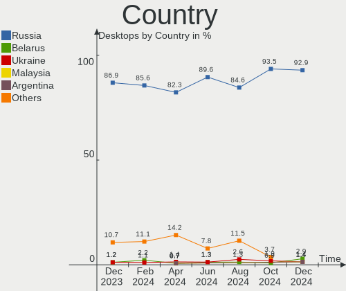
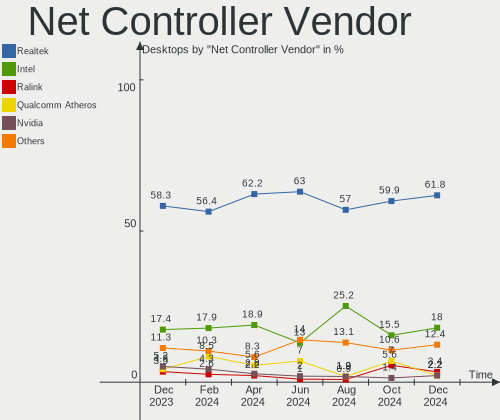

ROSA Hardware Trends (Desktop)
------------------------------

A project to identify most popular hardware characteristics and track their change
over time based on data collected by ROSA users at https://Linux-Hardware.org.

Anyone can contribute to the study by uploading probes of their computers by
the [hw-probe](https://github.com/linuxhw/hw-probe) tool:

    sudo -E hw-probe -all -upload

Full-feature report is available here: https://linux-hardware.org/?view=trends&formfactor=desktop

Period: Jan, 2021.

Contents
--------

- [ OS                       ](#os)
- [ OS Family                ](#os-family)
- [ Kernel                   ](#kernel)
- [ Kernel Family            ](#kernel-family)
- [ Kernel Major Ver.        ](#kernel-major-ver)
- [ Arch                     ](#arch)
- [ DE                       ](#de)
- [ Display Server           ](#display-server)
- [ Display Manager          ](#display-manager)
- [ OS Lang                  ](#os-lang)
- [ Boot Mode                ](#boot-mode)
- [ Filesystem               ](#filesystem)
- [ Part. scheme             ](#part-scheme)
- [ Dual Boot with Linux/BSD ](#dual-boot-with-linux/bsd)
- [ Dual Boot (Win)          ](#dual-boot-win)
- [ Country                  ](#country)
- [ City                     ](#city)
- [ Vendor                   ](#vendor)
- [ Model                    ](#model)
- [ Model Family             ](#model-family)
- [ MFG Year                 ](#mfg-year)
- [ Form Factor              ](#form-factor)
- [ Secure Boot              ](#secure-boot)
- [ Coreboot                 ](#coreboot)
- [ RAM Size                 ](#ram-size)
- [ RAM Used                 ](#ram-used)
- [ Has CD-ROM               ](#has-cd-rom)
- [ Total Drives             ](#total-drives)
- [ Has Ethernet             ](#has-ethernet)
- [ Drive Vendor             ](#drive-vendor)
- [ Drive Model              ](#drive-model)
- [ HDD Vendor               ](#hdd-vendor)
- [ SSD Vendor               ](#ssd-vendor)
- [ Drive Kind               ](#drive-kind)
- [ Drive Connector          ](#drive-connector)
- [ Drive Size               ](#drive-size)
- [ Space Total              ](#space-total)
- [ Space Used               ](#space-used)
- [ Malfunc. Drives          ](#malfunc-drives)
- [ Malfunc. Drive Vendor    ](#malfunc-drive-vendor)
- [ Malfunc. HDD Vendor      ](#malfunc-hdd-vendor)
- [ Malfunc. Drive Kind      ](#malfunc-drive-kind)
- [ Failed Drives            ](#failed-drives)
- [ Failed Drive Vendor      ](#failed-drive-vendor)
- [ Drive Status             ](#drive-status)
- [ Storage Vendor           ](#storage-vendor)
- [ Storage Model            ](#storage-model)
- [ Storage Kind             ](#storage-kind)
- [ CPU Vendor               ](#cpu-vendor)
- [ CPU Model                ](#cpu-model)
- [ CPU Model Family         ](#cpu-model-family)
- [ CPU Cores                ](#cpu-cores)
- [ CPU Sockets              ](#cpu-sockets)
- [ CPU Threads              ](#cpu-threads)
- [ CPU Op-Modes             ](#cpu-op-modes)
- [ CPU Microcode            ](#cpu-microcode)
- [ CPU Microarch            ](#cpu-microarch)
- [ GPU Vendor               ](#gpu-vendor)
- [ GPU Model                ](#gpu-model)
- [ GPU Combo                ](#gpu-combo)
- [ GPU Driver               ](#gpu-driver)
- [ GPU Memory               ](#gpu-memory)
- [ Monitor Vendor           ](#monitor-vendor)
- [ Monitor Model            ](#monitor-model)
- [ Monitor Resolution       ](#monitor-resolution)
- [ Monitor Diagonal         ](#monitor-diagonal)
- [ Monitor Width            ](#monitor-width)
- [ Aspect Ratio             ](#aspect-ratio)
- [ Monitor Area             ](#monitor-area)
- [ Pixel Density            ](#pixel-density)
- [ Multiple Monitors        ](#multiple-monitors)
- [ Net Controller Vendor    ](#net-controller-vendor)
- [ Net Controller Model     ](#net-controller-model)
- [ Wireless Vendor          ](#wireless-vendor)
- [ Wireless Model           ](#wireless-model)
- [ Ethernet Vendor          ](#ethernet-vendor)
- [ Ethernet Model           ](#ethernet-model)
- [ Net Controller Kind      ](#net-controller-kind)
- [ Used Controller          ](#used-controller)
- [ NICs                     ](#nics)
- [ Memory Vendor            ](#memory-vendor)
- [ Memory Model             ](#memory-model)
- [ Memory Kind              ](#memory-kind)
- [ Memory Form Factor       ](#memory-form-factor)
- [ Memory Size              ](#memory-size)
- [ Memory Speed             ](#memory-speed)
- [ Sound Vendor             ](#sound-vendor)
- [ Sound Model              ](#sound-model)
- [ Camera Vendor            ](#camera-vendor)
- [ Camera Model             ](#camera-model)
- [ Fingerprint Vendor       ](#fingerprint-vendor)
- [ Fingerprint Model        ](#fingerprint-model)
- [ Chipcard Vendor          ](#chipcard-vendor)
- [ Chipcard Model           ](#chipcard-model)
- [ Printer Vendor           ](#printer-vendor)
- [ Printer Model            ](#printer-model)
- [ Scanner Vendor           ](#scanner-vendor)
- [ Scanner Model            ](#scanner-model)
- [ Bluetooth Vendor         ](#bluetooth-vendor)
- [ Bluetooth Model          ](#bluetooth-model)
- [ Unsupported Devices      ](#unsupported-devices)
- [ Unsupported Device Types ](#unsupported-device-types)

OS
--

Installed operating systems

| Name       | Desktops | Percent |
|------------|----------|---------|
| ROSA R11.1 | 65       | 61.32%  |
| ROSA R11   | 31       | 29.25%  |
| ROSA R10   | 5        | 4.72%   |
| ROSA R12   | 4        | 3.77%   |
| ROSA R9    | 1        | 0.94%   |

OS Family
---------

OS without a version

| Name | Desktops | Percent |
|------|----------|---------|
| ROSA | 106      | 100%    |

Kernel
------

Version of the Linux kernel

| Version                             | Desktops | Percent |
|-------------------------------------|----------|---------|
| 4.15.0-desktop-122.124.1rosa-x86_64 | 29       | 27.36%  |
| 4.15.0-desktop-45.1rosa-x86_64      | 19       | 17.92%  |
| 5.4.83-generic-2rosa-x86_64         | 11       | 10.38%  |
| 4.15.0-desktop-45.1rosa-i586        | 9        | 8.49%   |
| 5.4.32-generic-2rosa-x86_64         | 6        | 5.66%   |
| 4.9.155-nrj-desktop-1rosa-x86_64    | 5        | 4.72%   |
| 4.9.60-nrj-desktop-1rosa-x86_64     | 4        | 3.77%   |
| 4.15.0-desktop-122.124.1rosa-i586   | 3        | 2.83%   |
| 5.4.83-generic-2rosa-i586           | 2        | 1.89%   |
| 5.10.4-generic-3rosa2019.1-x86_64   | 2        | 1.89%   |
| 4.9.60-nrj-desktop-1rosa-i586       | 2        | 1.89%   |
| 4.9.20-nrj-desktop-1rosa-i586       | 2        | 1.89%   |
| 4.9.155-nrj-desktop-1rosa-i586      | 2        | 1.89%   |
| 4.15.0-desktop-94.1rosa-x86_64      | 2        | 1.89%   |
| 5.9.14-generic-1rosa-x86_64         | 1        | 0.94%   |
| 5.5.19-generic-1rosa-x86_64         | 1        | 0.94%   |
| 5.4.49-nrj-desktop-1rosa-x86_64     | 1        | 0.94%   |
| 5.10.4-generic-5rosa2019.1-x86_64   | 1        | 0.94%   |
| 5.10.4-generic-2rosa2019.1-x86_64   | 1        | 0.94%   |
| 5.10.0-desktop-12.13.2rosa-x86_64   | 1        | 0.94%   |
| 4.19.104-nrj-desktop-1rosa-x86_64   | 1        | 0.94%   |
| 4.15.0-desktop-68.5rosa-x86_64      | 1        | 0.94%   |

Kernel Family
-------------

Linux kernel without a distro release

| Version  | Desktops | Percent |
|----------|----------|---------|
| 4.15.0   | 63       | 59.43%  |
| 5.4.83   | 13       | 12.26%  |
| 4.9.155  | 7        | 6.6%    |
| 5.4.32   | 6        | 5.66%   |
| 4.9.60   | 6        | 5.66%   |
| 5.10.4   | 4        | 3.77%   |
| 4.9.20   | 2        | 1.89%   |
| 5.9.14   | 1        | 0.94%   |
| 5.5.19   | 1        | 0.94%   |
| 5.4.49   | 1        | 0.94%   |
| 5.10.0   | 1        | 0.94%   |
| 4.19.104 | 1        | 0.94%   |

Kernel Major Ver.
-----------------

Linux kernel major version

| Version | Desktops | Percent |
|---------|----------|---------|
| 4.15    | 63       | 59.43%  |
| 5.4     | 20       | 18.87%  |
| 4.9     | 15       | 14.15%  |
| 5.10    | 5        | 4.72%   |
| 5.9     | 1        | 0.94%   |
| 5.5     | 1        | 0.94%   |
| 4.19    | 1        | 0.94%   |

Arch
----

OS architecture (x86_64, i586, etc.)

| Name   | Desktops | Percent |
|--------|----------|---------|
| x86_64 | 86       | 81.13%  |
| i686   | 20       | 18.87%  |

DE
--

Desktop Environment

| Name    | Desktops | Percent |
|---------|----------|---------|
| KDE4    | 63       | 59.43%  |
| KDE5    | 30       | 28.3%   |
| LXQt    | 6        | 5.66%   |
| XFCE    | 4        | 3.77%   |
| KDE     | 1        | 0.94%   |
| GNOME   | 1        | 0.94%   |
| Unknown | 1        | 0.94%   |

Display Server
--------------

X11 or Wayland

| Name | Desktops | Percent |
|------|----------|---------|
| X11  | 106      | 100%    |

Display Manager
---------------

SDDM, LightDM, etc.

| Name | Desktops | Percent |
|------|----------|---------|
| KDM  | 64       | 60.38%  |
| SDDM | 40       | 37.74%  |
| TDM  | 2        | 1.89%   |

OS Lang
-------

Language

| Lang    | Desktops | Percent |
|---------|----------|---------|
| ru_RU   | 56       | 52.83%  |
| Unknown | 36       | 33.96%  |
| en_US   | 3        | 2.83%   |
| pt_BR   | 2        | 1.89%   |
| it_IT   | 2        | 1.89%   |
| fr_FR   | 2        | 1.89%   |
| es_ES   | 2        | 1.89%   |
| pl_PL   | 1        | 0.94%   |
| ja_JP   | 1        | 0.94%   |
| de_DE   | 1        | 0.94%   |

Boot Mode
---------

EFI or BIOS

| Mode | Desktops | Percent |
|------|----------|---------|
| BIOS | 78       | 73.58%  |
| EFI  | 28       | 26.42%  |

Filesystem
----------

Type of filesystem

| Type  | Desktops | Percent |
|-------|----------|---------|
| Ext4  | 101      | 95.28%  |
| Btrfs | 2        | 1.89%   |
| Xfs   | 1        | 0.94%   |
| Ext3  | 1        | 0.94%   |
| Aufs  | 1        | 0.94%   |

Part. scheme
------------

Scheme of partitioning

| Type    | Desktops | Percent |
|---------|----------|---------|
| MBR     | 70       | 66.04%  |
| GPT     | 32       | 30.19%  |
| Unknown | 4        | 3.77%   |

Dual Boot with Linux/BSD
------------------------

Hosting more than one Linux/BSD

| Dual boot | Desktops | Percent |
|-----------|----------|---------|
| No        | 81       | 76.42%  |
| Yes       | 25       | 23.58%  |

Dual Boot (Win)
---------------

Hosting Linux and Windows

| Dual boot | Desktops | Percent |
|-----------|----------|---------|
| Yes       | 58       | 54.72%  |
| No        | 48       | 45.28%  |

Country
-------

Geographic location (country)

| Country    | Desktops | Percent |
|------------|----------|---------|
| Russia     | 80       | 75.47%  |
| Ukraine    | 5        | 4.72%   |
| Kazakhstan | 3        | 2.83%   |
| Italy      | 3        | 2.83%   |
| USA        | 2        | 1.89%   |
| France     | 2        | 1.89%   |
| Canada     | 2        | 1.89%   |
| Brazil     | 2        | 1.89%   |
| Spain      | 1        | 0.94%   |
| Poland     | 1        | 0.94%   |
| Norway     | 1        | 0.94%   |
| Mexico     | 1        | 0.94%   |
| Japan      | 1        | 0.94%   |
| Israel     | 1        | 0.94%   |
| Germany    | 1        | 0.94%   |

City
----

Geographic location (city)

| City                     | Desktops | Percent |
|--------------------------|----------|---------|
| Moscow                   | 10       | 9.43%   |
| Krasnodar                | 6        | 5.66%   |
| Ekaterinburg             | 5        | 4.72%   |
| Voronezh                 | 4        | 3.77%   |
| Novosibirsk              | 4        | 3.77%   |
| Volgograd                | 3        | 2.83%   |
| Rostov-on-Don            | 3        | 2.83%   |
| Yaroslavl                | 2        | 1.89%   |
| Tyumen                   | 2        | 1.89%   |
| St Petersburg            | 2        | 1.89%   |
| Schio                    | 2        | 1.89%   |
| Kaluga                   | 2        | 1.89%   |
| Almaty                   | 2        | 1.89%   |
| Zheleznogorsk            | 1        | 0.94%   |
| Yoshkar-Ola              | 1        | 0.94%   |
| Vyborg                   | 1        | 0.94%   |
| Vladivostok              | 1        | 0.94%   |
| Vicenza                  | 1        | 0.94%   |
| Velikiye Luki            | 1        | 0.94%   |
| Ulyanovsk                | 1        | 0.94%   |
| Ufa                      | 1        | 0.94%   |
| Tomsk                    | 1        | 0.94%   |
| Tel Aviv                 | 1        | 0.94%   |
| Tambov                   | 1        | 0.94%   |
| Taganrog                 | 1        | 0.94%   |
| Słupsk                  | 1        | 0.94%   |
| Steinkjer                | 1        | 0.94%   |
| Stavropol                | 1        | 0.94%   |
| Smolensk                 | 1        | 0.94%   |
| Salvador                 | 1        | 0.94%   |
| Saint-Romain-le-Puy      | 1        | 0.94%   |
| Saint-Georges            | 1        | 0.94%   |
| Ryazan                   | 1        | 0.94%   |
| Rechitsa                 | 1        | 0.94%   |
| Ramenskoye               | 1        | 0.94%   |
| Poltava                  | 1        | 0.94%   |
| Pittsburgh               | 1        | 0.94%   |
| Petropavlovsk-Kamchatsky | 1        | 0.94%   |
| Petropavl                | 1        | 0.94%   |
| Oryol                    | 1        | 0.94%   |
| Olenegorsk               | 1        | 0.94%   |
| Okoneshnikovo            | 1        | 0.94%   |
| Okayama                  | 1        | 0.94%   |
| Nyagan                   | 1        | 0.94%   |
| Novorossiysk             | 1        | 0.94%   |
| Nizhniy Novgorod         | 1        | 0.94%   |
| Nizhnevartovsk           | 1        | 0.94%   |
| Newark                   | 1        | 0.94%   |
| Neftekamsk               | 1        | 0.94%   |
| Málaga                  | 1        | 0.94%   |
| Munich                   | 1        | 0.94%   |
| Minusinsk                | 1        | 0.94%   |
| Mezhdurechensk           | 1        | 0.94%   |
| Mala Danylivka           | 1        | 0.94%   |
| Kyiv                     | 1        | 0.94%   |
| Kurgan                   | 1        | 0.94%   |
| Kopeysk                  | 1        | 0.94%   |
| Kirov                    | 1        | 0.94%   |
| Kingisepp                | 1        | 0.94%   |
| Kazan’                 | 1        | 0.94%   |

Vendor
------

Motherboard manufacturer

| Name                | Desktops | Percent |
|---------------------|----------|---------|
| ASUSTek Computer    | 36       | 33.96%  |
| Gigabyte Technology | 26       | 24.53%  |
| ASRock              | 12       | 11.32%  |
| MSI                 | 11       | 10.38%  |
| ECS                 | 5        | 4.72%   |
| Acer                | 4        | 3.77%   |
| Lenovo              | 2        | 1.89%   |
| Dell                | 2        | 1.89%   |
| Semp Toshiba        | 1        | 0.94%   |
| Pegatron            | 1        | 0.94%   |
| Intel               | 1        | 0.94%   |
| Huanan              | 1        | 0.94%   |
| Fujitsu             | 1        | 0.94%   |
| Foxconn             | 1        | 0.94%   |
| Biostar             | 1        | 0.94%   |
| Unknown             | 1        | 0.94%   |

Model
-----

Motherboard model

| Name                            | Desktops | Percent |
|---------------------------------|----------|---------|
| MSI MS-7025                     | 3        | 2.83%   |
| ASUS All Series                 | 3        | 2.83%   |
| MSI MS-7A36                     | 2        | 1.89%   |
| Gigabyte B75M-D3V               | 2        | 1.89%   |
| Gigabyte 970A-DS3P              | 2        | 1.89%   |
| ASUS PRIME H310M-R R2.0         | 2        | 1.89%   |
| Semp Toshiba STI                | 1        | 0.94%   |
| Pegatron IPXCR_VN1              | 1        | 0.94%   |
| MSI MS-7974                     | 1        | 0.94%   |
| MSI MS-7693                     | 1        | 0.94%   |
| MSI MS-7529                     | 1        | 0.94%   |
| MSI MS-7345                     | 1        | 0.94%   |
| MSI MS-7309                     | 1        | 0.94%   |
| MSI MS-7181                     | 1        | 0.94%   |
| Lenovo ThinkCentre M90p 5485AG8 | 1        | 0.94%   |
| Lenovo ThinkCentre M57 6075G4G  | 1        | 0.94%   |
| Intel DG965SS AAD41678-304      | 1        | 0.94%   |
| Huanan X79 V13                  | 1        | 0.94%   |
| Gigabyte Z77-DS3H               | 1        | 0.94%   |
| Gigabyte Z68MA-D2H-B3           | 1        | 0.94%   |
| Gigabyte Z170X-Gaming 7         | 1        | 0.94%   |
| Gigabyte P35-S3G                | 1        | 0.94%   |
| Gigabyte P31-ES3G               | 1        | 0.94%   |
| Gigabyte J1800N-D2P             | 1        | 0.94%   |
| Gigabyte H61M-S1                | 1        | 0.94%   |
| Gigabyte H61M-DS2               | 1        | 0.94%   |
| Gigabyte H110M-S2PV-CF          | 1        | 0.94%   |
| Gigabyte GEG                    | 1        | 0.94%   |
| Gigabyte GA-990XA-UD3           | 1        | 0.94%   |
| Gigabyte GA-770T-USB3           | 1        | 0.94%   |
| Gigabyte G41M-ES2L              | 1        | 0.94%   |
| Gigabyte G41M-Combo             | 1        | 0.94%   |
| Gigabyte EP45-UD3LR             | 1        | 0.94%   |
| Gigabyte EP43-S3L               | 1        | 0.94%   |
| Gigabyte EP31-DS3L              | 1        | 0.94%   |
| Gigabyte D525TUD                | 1        | 0.94%   |
| Gigabyte B450M S2H              | 1        | 0.94%   |
| Gigabyte A320M-S2H V2           | 1        | 0.94%   |
| Gigabyte A320M-H                | 1        | 0.94%   |
| Gigabyte 970A-UD3P              | 1        | 0.94%   |
| Fujitsu ESPRIMO P900            | 1        | 0.94%   |
| Foxconn Pro, Std, Elt Series    | 1        | 0.94%   |
| ECS H81M-C2H                    | 1        | 0.94%   |
| ECS G31T-M7                     | 1        | 0.94%   |
| ECS G31T-M                      | 1        | 0.94%   |
| ECS BAT-I                       | 1        | 0.94%   |
| ECS A85F2-A GOLDEN              | 1        | 0.94%   |
| Dell OptiPlex 755               | 1        | 0.94%   |
| Dell Dimension 8400             | 1        | 0.94%   |
| Biostar H310MHP                 | 1        | 0.94%   |
| ASUS Z170-A                     | 1        | 0.94%   |
| ASUS TUF B450-PLUS GAMING       | 1        | 0.94%   |
| ASUS TERRA_PC                   | 1        | 0.94%   |
| ASUS SABERTOOTH Z77             | 1        | 0.94%   |
| ASUS PRIME B450M-A              | 1        | 0.94%   |
| ASUS P8Z77-V LX                 | 1        | 0.94%   |
| ASUS P8Z77-M                    | 1        | 0.94%   |
| ASUS P8H67-M                    | 1        | 0.94%   |
| ASUS P8H61-MX                   | 1        | 0.94%   |
| ASUS P8H61-M PRO                | 1        | 0.94%   |

Model Family
------------

Motherboard model prefix

| Name                   | Desktops | Percent |
|------------------------|----------|---------|
| MSI MS-7025            | 3        | 2.83%   |
| ASUS PRIME             | 3        | 2.83%   |
| ASUS M5A97             | 3        | 2.83%   |
| ASUS All               | 3        | 2.83%   |
| Acer Aspire            | 3        | 2.83%   |
| MSI MS-7A36            | 2        | 1.89%   |
| Lenovo ThinkCentre     | 2        | 1.89%   |
| Gigabyte B75M-D3V      | 2        | 1.89%   |
| Gigabyte 970A-DS3P     | 2        | 1.89%   |
| ASUS P8H61-M           | 2        | 1.89%   |
| ASUS P7H55-M           | 2        | 1.89%   |
| ASUS P5G41T-M          | 2        | 1.89%   |
| Semp Toshiba STI       | 1        | 0.94%   |
| Pegatron IPXCR         | 1        | 0.94%   |
| MSI MS-7974            | 1        | 0.94%   |
| MSI MS-7693            | 1        | 0.94%   |
| MSI MS-7529            | 1        | 0.94%   |
| MSI MS-7345            | 1        | 0.94%   |
| MSI MS-7309            | 1        | 0.94%   |
| MSI MS-7181            | 1        | 0.94%   |
| Intel DG965SS          | 1        | 0.94%   |
| Huanan X79             | 1        | 0.94%   |
| Gigabyte Z77-DS3H      | 1        | 0.94%   |
| Gigabyte Z68MA-D2H-B3  | 1        | 0.94%   |
| Gigabyte Z170X-Gaming  | 1        | 0.94%   |
| Gigabyte P35-S3G       | 1        | 0.94%   |
| Gigabyte P31-ES3G      | 1        | 0.94%   |
| Gigabyte J1800N-D2P    | 1        | 0.94%   |
| Gigabyte H61M-S1       | 1        | 0.94%   |
| Gigabyte H61M-DS2      | 1        | 0.94%   |
| Gigabyte H110M-S2PV-CF | 1        | 0.94%   |
| Gigabyte GEG           | 1        | 0.94%   |
| Gigabyte GA-990XA-UD3  | 1        | 0.94%   |
| Gigabyte GA-770T-USB3  | 1        | 0.94%   |
| Gigabyte G41M-ES2L     | 1        | 0.94%   |
| Gigabyte G41M-Combo    | 1        | 0.94%   |
| Gigabyte EP45-UD3LR    | 1        | 0.94%   |
| Gigabyte EP43-S3L      | 1        | 0.94%   |
| Gigabyte EP31-DS3L     | 1        | 0.94%   |
| Gigabyte D525TUD       | 1        | 0.94%   |
| Gigabyte B450M         | 1        | 0.94%   |
| Gigabyte A320M-S2H     | 1        | 0.94%   |
| Gigabyte A320M-H       | 1        | 0.94%   |
| Gigabyte 970A-UD3P     | 1        | 0.94%   |
| Fujitsu ESPRIMO        | 1        | 0.94%   |
| Foxconn Pro            | 1        | 0.94%   |
| ECS H81M-C2H           | 1        | 0.94%   |
| ECS G31T-M7            | 1        | 0.94%   |
| ECS G31T-M             | 1        | 0.94%   |
| ECS BAT-I              | 1        | 0.94%   |
| ECS A85F2-A            | 1        | 0.94%   |
| Dell OptiPlex          | 1        | 0.94%   |
| Dell Dimension         | 1        | 0.94%   |
| Biostar H310MHP        | 1        | 0.94%   |
| ASUS Z170-A            | 1        | 0.94%   |
| ASUS TUF               | 1        | 0.94%   |
| ASUS TERRA             | 1        | 0.94%   |
| ASUS SABERTOOTH        | 1        | 0.94%   |
| ASUS P8Z77-V           | 1        | 0.94%   |
| ASUS P8Z77-M           | 1        | 0.94%   |

MFG Year
--------

Motherboard manufacture year

| Year | Desktops | Percent |
|------|----------|---------|
| 2010 | 14       | 13.21%  |
| 2012 | 12       | 11.32%  |
| 2013 | 10       | 9.43%   |
| 2019 | 9        | 8.49%   |
| 2018 | 8        | 7.55%   |
| 2015 | 7        | 6.6%    |
| 2011 | 7        | 6.6%    |
| 2007 | 7        | 6.6%    |
| 2014 | 6        | 5.66%   |
| 2009 | 6        | 5.66%   |
| 2008 | 6        | 5.66%   |
| 2016 | 5        | 4.72%   |
| 2006 | 4        | 3.77%   |
| 2020 | 3        | 2.83%   |
| 2005 | 2        | 1.89%   |

Form Factor
-----------

Physical design of the computer

| Name    | Desktops | Percent |
|---------|----------|---------|
| Desktop | 106      | 100%    |

Secure Boot
-----------

Enabled or disabled

| State    | Desktops | Percent |
|----------|----------|---------|
| Disabled | 106      | 100%    |

Coreboot
--------

Have coreboot on board

| Used | Desktops | Percent |
|------|----------|---------|
| No   | 106      | 100%    |

RAM Size
--------

Total RAM memory

| Size in GB | Desktops | Percent |
|------------|----------|---------|
| 8.01-16.0  | 28       | 26.42%  |
| 3.01-4.0   | 24       | 22.64%  |
| 4.01-8.0   | 18       | 16.98%  |
| 16.01-24.0 | 18       | 16.98%  |
| 1.01-2.0   | 9        | 8.49%   |
| 2.01-3.0   | 7        | 6.6%    |
| 32.01-64.0 | 1        | 0.94%   |
| 24.01-32.0 | 1        | 0.94%   |

RAM Used
--------

Used RAM memory

| Used GB   | Desktops | Percent |
|-----------|----------|---------|
| 1.01-2.0  | 46       | 43.4%   |
| 0.51-1.0  | 40       | 37.74%  |
| 2.01-3.0  | 12       | 11.32%  |
| 4.01-8.0  | 5        | 4.72%   |
| 0.01-0.5  | 2        | 1.89%   |
| 8.01-16.0 | 1        | 0.94%   |

Has CD-ROM
----------

Has CD-ROM on board

| Presented | Desktops | Percent |
|-----------|----------|---------|
| Yes       | 61       | 57.55%  |
| No        | 45       | 42.45%  |

Total Drives
------------

Number of drives on board

| Drives | Desktops | Percent |
|--------|----------|---------|
| 1      | 54       | 50.94%  |
| 2      | 33       | 31.13%  |
| 3      | 11       | 10.38%  |
| 4      | 5        | 4.72%   |
| 5      | 2        | 1.89%   |
| 6      | 1        | 0.94%   |

Has Ethernet
------------

Has Ethernet on board

| Presented | Desktops | Percent |
|-----------|----------|---------|
| Yes       | 104      | 98.11%  |
| No        | 2        | 1.89%   |

Drive Vendor
------------

Hard drive vendors

| Vendor              | Desktops | Drives | Percent |
|---------------------|----------|--------|---------|
| WDC                 | 47       | 64     | 28.66%  |
| Seagate             | 43       | 46     | 26.22%  |
| Samsung Electronics | 12       | 14     | 7.32%   |
| Kingston            | 10       | 10     | 6.1%    |
| Hitachi             | 10       | 10     | 6.1%    |
| Toshiba             | 6        | 6      | 3.66%   |
| SPCC                | 5        | 7      | 3.05%   |
| Maxtor              | 4        | 5      | 2.44%   |
| A-DATA Technology   | 4        | 4      | 2.44%   |
| Apacer              | 3        | 3      | 1.83%   |
| SanDisk             | 2        | 2      | 1.22%   |
| PLEXTOR             | 2        | 2      | 1.22%   |
| Kingmax             | 2        | 2      | 1.22%   |
| Intel               | 2        | 2      | 1.22%   |
| China               | 2        | 2      | 1.22%   |
| USB3.0              | 1        | 1      | 0.61%   |
| Unknown             | 1        | 1      | 0.61%   |
| QUMO                | 1        | 1      | 0.61%   |
| Lexar               | 1        | 1      | 0.61%   |
| KingSpec            | 1        | 1      | 0.61%   |
| HGST                | 1        | 1      | 0.61%   |
| Hewlett-Packard     | 1        | 1      | 0.61%   |
| Gigabyte Technology | 1        | 1      | 0.61%   |
| Fujitsu             | 1        | 1      | 0.61%   |
| Crucial             | 1        | 1      | 0.61%   |

Drive Model
-----------

Hard drive models

| Model                            | Desktops | Percent |
|----------------------------------|----------|---------|
| Seagate ST3320613AS 320GB        | 4        | 2.15%   |
| Kingston SA400S37120G 120GB SSD  | 4        | 2.15%   |
| WDC WDS120G2G0A-00JH30 120GB SSD | 3        | 1.61%   |
| WDC WD10EZEX-00RKKA0 1TB         | 3        | 1.61%   |
| Toshiba HDWD110 1TB              | 3        | 1.61%   |
| Seagate ST500DM002-1BD142 500GB  | 3        | 1.61%   |
| Seagate ST3160815AS 160GB        | 3        | 1.61%   |
| Seagate ST1000DM010-2EP102 1TB   | 3        | 1.61%   |
| WDC WDS250G2B0A-00SM50 250GB SSD | 2        | 1.08%   |
| WDC WD5000AAKX-001CA0 500GB      | 2        | 1.08%   |
| WDC WD3200AAKS-00L9A0 320GB      | 2        | 1.08%   |
| WDC WD3200AAJS-22B4A0 320GB      | 2        | 1.08%   |
| WDC WD3200AAJS-08L7A0 320GB      | 2        | 1.08%   |
| WDC WD20EZAZ-00GGJB0 2TB         | 2        | 1.08%   |
| WDC WD10EZRX-00L4HB0 1TB         | 2        | 1.08%   |
| WDC WD10EZEX-08WN4A0 1TB         | 2        | 1.08%   |
| WDC WD10EALX-009BA0 1TB          | 2        | 1.08%   |
| SPCC Solid State Disk 240GB      | 2        | 1.08%   |
| SPCC Solid State Disk 120GB      | 2        | 1.08%   |
| Seagate ST3500418AS 500GB        | 2        | 1.08%   |
| Seagate ST3400620AS 400GB        | 2        | 1.08%   |
| Seagate ST3250410AS 250GB        | 2        | 1.08%   |
| Seagate ST2000DM001-1ER164 2TB   | 2        | 1.08%   |
| Samsung HD161HJ 160GB            | 2        | 1.08%   |
| Samsung HD154UI 1TB              | 2        | 1.08%   |
| Kingston SH103S3120G 120GB SSD   | 2        | 1.08%   |
| Hitachi HTS543232A7A384 320GB    | 2        | 1.08%   |
| China 128GB SSD                  | 2        | 1.08%   |
| Apacer AS350 240GB SSD           | 2        | 1.08%   |
| A-DATA SU650 240GB SSD           | 2        | 1.08%   |
| WDC WDS480G2G0A-00JH30 480GB SSD | 1        | 0.54%   |
| WDC WDS120G2G0B-00EPW0 120GB SSD | 1        | 0.54%   |
| WDC WDS100T2B0A-00SM50 1TB SSD   | 1        | 0.54%   |
| WDC WD800JD-55MSA1 80GB          | 1        | 0.54%   |
| WDC WD800BB-00JHC0 80GB          | 1        | 0.54%   |
| WDC WD800BB-00FRA0 80GB          | 1        | 0.54%   |
| WDC WD6402AAEX-00Y9A0 640GB      | 1        | 0.54%   |
| WDC WD6400BEVT-22A0RT0 640GB     | 1        | 0.54%   |
| WDC WD6400AARS-00Y5B1 640GB      | 1        | 0.54%   |
| WDC WD5000LPLX-00ZNTT0 500GB     | 1        | 0.54%   |
| WDC WD5000AAKX-221CA1 500GB      | 1        | 0.54%   |
| WDC WD5000AAKS-00V1A0 500GB      | 1        | 0.54%   |
| WDC WD5000AADS-00S9B0 500GB      | 1        | 0.54%   |
| WDC WD5000AADS-00M2B0 500GB      | 1        | 0.54%   |
| WDC WD3200JS-55PDB0 320GB        | 1        | 0.54%   |
| WDC WD3200BPVT-00HXZT3 320GB     | 1        | 0.54%   |
| WDC WD3200AAKS-00B3A0 320GB      | 1        | 0.54%   |
| WDC WD30PURZ-85GU6Y0 3TB         | 1        | 0.54%   |
| WDC WD30PURX-64P6ZY0 3TB         | 1        | 0.54%   |
| WDC WD20EZRZ-00Z5HB0 2TB         | 1        | 0.54%   |
| WDC WD20EARX-00PASB0 2TB         | 1        | 0.54%   |
| WDC WD20EARS-00MVWB0 2TB         | 1        | 0.54%   |
| WDC WD1600JS-00NCB1 160GB        | 1        | 0.54%   |
| WDC WD1600BEVT-08A23T1 160GB     | 1        | 0.54%   |
| WDC WD1600AAJS-60B4A0 160GB      | 1        | 0.54%   |
| WDC WD1600AAJS-00L7A0 160GB      | 1        | 0.54%   |
| WDC WD15EVDS-63V9B1 1TB          | 1        | 0.54%   |
| WDC WD15EARS-00MVWB0 1TB         | 1        | 0.54%   |
| WDC WD10PURX-64E5EY0 1TB         | 1        | 0.54%   |
| WDC WD10JPVX-75JC3T0 1TB         | 1        | 0.54%   |

HDD Vendor
----------

Hard disk drive vendors

| Vendor              | Desktops | Drives | Percent |
|---------------------|----------|--------|---------|
| WDC                 | 45       | 56     | 37.19%  |
| Seagate             | 43       | 46     | 35.54%  |
| Samsung Electronics | 10       | 11     | 8.26%   |
| Hitachi             | 10       | 10     | 8.26%   |
| Toshiba             | 5        | 5      | 4.13%   |
| Maxtor              | 4        | 5      | 3.31%   |
| USB3.0              | 1        | 1      | 0.83%   |
| HGST                | 1        | 1      | 0.83%   |
| Hewlett-Packard     | 1        | 1      | 0.83%   |
| Fujitsu             | 1        | 1      | 0.83%   |

SSD Vendor
----------

Solid state drive vendors

| Vendor              | Desktops | Drives | Percent |
|---------------------|----------|--------|---------|
| Kingston            | 9        | 9      | 19.57%  |
| WDC                 | 7        | 8      | 15.22%  |
| SPCC                | 5        | 6      | 10.87%  |
| A-DATA Technology   | 4        | 4      | 8.7%    |
| Apacer              | 3        | 3      | 6.52%   |
| SanDisk             | 2        | 2      | 4.35%   |
| Samsung Electronics | 2        | 2      | 4.35%   |
| PLEXTOR             | 2        | 2      | 4.35%   |
| Kingmax             | 2        | 2      | 4.35%   |
| Intel               | 2        | 2      | 4.35%   |
| China               | 2        | 2      | 4.35%   |
| Toshiba             | 1        | 1      | 2.17%   |
| QUMO                | 1        | 1      | 2.17%   |
| Lexar               | 1        | 1      | 2.17%   |
| KingSpec            | 1        | 1      | 2.17%   |
| Gigabyte Technology | 1        | 1      | 2.17%   |
| Crucial             | 1        | 1      | 2.17%   |

Drive Kind
----------

HDD or SSD

| Kind    | Desktops | Drives | Percent |
|---------|----------|--------|---------|
| HDD     | 93       | 137    | 66.43%  |
| SSD     | 43       | 48     | 30.71%  |
| NVMe    | 3        | 3      | 2.14%   |
| Unknown | 1        | 1      | 0.71%   |

Drive Connector
---------------

SATA, SAS, NVMe, etc.

| Type | Desktops | Drives | Percent |
|------|----------|--------|---------|
| SATA | 106      | 182    | 93.81%  |
| SAS  | 4        | 4      | 3.54%   |
| NVMe | 3        | 3      | 2.65%   |

Drive Size
----------

Size of hard drive

| Size in TB | Desktops | Drives | Percent |
|------------|----------|--------|---------|
| 0.01-0.5   | 90       | 129    | 64.75%  |
| 0.51-1.0   | 35       | 41     | 25.18%  |
| 1.01-2.0   | 12       | 12     | 8.63%   |
| 3.01-4.0   | 1        | 1      | 0.72%   |
| 2.01-3.0   | 1        | 2      | 0.72%   |

Space Total
-----------

Amount of disk space available on the file system

| Size in GB     | Desktops | Percent |
|----------------|----------|---------|
| 101-250        | 30       | 28.3%   |
| 251-500        | 19       | 17.92%  |
| 501-1000       | 15       | 14.15%  |
| 51-100         | 14       | 13.21%  |
| 21-50          | 7        | 6.6%    |
| 1-20           | 7        | 6.6%    |
| 1001-2000      | 6        | 5.66%   |
| 2001-3000      | 5        | 4.72%   |
| More than 3000 | 2        | 1.89%   |
| Unknown        | 1        | 0.94%   |

Space Used
----------

Amount of used disk space

| Used GB        | Desktops | Percent |
|----------------|----------|---------|
| 1-20           | 65       | 61.32%  |
| 21-50          | 8        | 7.55%   |
| 501-1000       | 8        | 7.55%   |
| 51-100         | 8        | 7.55%   |
| 251-500        | 7        | 6.6%    |
| 101-250        | 4        | 3.77%   |
| 1001-2000      | 4        | 3.77%   |
| More than 3000 | 1        | 0.94%   |
| Unknown        | 1        | 0.94%   |

Malfunc. Drives
---------------

Drive models with a malfunction

| Model                             | Desktops | Drives | Percent |
|-----------------------------------|----------|--------|---------|
| Seagate ST3320613AS 320GB         | 3        | 3      | 4.48%   |
| WDC WD3200AAJS-22B4A0 320GB       | 2        | 2      | 2.99%   |
| SPCC Solid State Disk 240GB       | 2        | 2      | 2.99%   |
| Seagate ST500DM002-1BD142 500GB   | 2        | 2      | 2.99%   |
| Seagate ST3500418AS 500GB         | 2        | 3      | 2.99%   |
| Seagate ST3250410AS 250GB         | 2        | 2      | 2.99%   |
| Seagate ST3160815AS 160GB         | 2        | 2      | 2.99%   |
| Samsung Electronics HD161HJ 160GB | 2        | 2      | 2.99%   |
| Hitachi HTS543232A7A384 320GB     | 2        | 2      | 2.99%   |
| WDC WDS120G2G0B-00EPW0 120GB SSD  | 1        | 1      | 1.49%   |
| WDC WD800BB-00JHC0 80GB           | 1        | 1      | 1.49%   |
| WDC WD800BB-00FRA0 80GB           | 1        | 1      | 1.49%   |
| WDC WD6400BEVT-22A0RT0 640GB      | 1        | 1      | 1.49%   |
| WDC WD5000AAKX-001CA0 500GB       | 1        | 1      | 1.49%   |
| WDC WD5000AAKS-00V1A0 500GB       | 1        | 1      | 1.49%   |
| WDC WD5000AADS-00M2B0 500GB       | 1        | 1      | 1.49%   |
| WDC WD3200AAJS-08L7A0 320GB       | 1        | 1      | 1.49%   |
| WDC WD30PURX-64P6ZY0 3TB          | 1        | 1      | 1.49%   |
| WDC WD1600AAJS-60B4A0 160GB       | 1        | 1      | 1.49%   |
| WDC WD15EVDS-63V9B1 1TB           | 1        | 1      | 1.49%   |
| WDC WD15EARS-00MVWB0 1TB          | 1        | 1      | 1.49%   |
| WDC WD10PURX-64E5EY0 1TB          | 1        | 1      | 1.49%   |
| WDC WD10EZEX-00RKKA0 1TB          | 1        | 1      | 1.49%   |
| WDC WD10EALX-009BA0 1TB           | 1        | 1      | 1.49%   |
| Toshiba DT01ACA100 1TB            | 1        | 1      | 1.49%   |
| Seagate ST96812AS 64GB            | 1        | 1      | 1.49%   |
| Seagate ST9640320AS 640GB         | 1        | 1      | 1.49%   |
| Seagate ST9500325AS 500GB         | 1        | 1      | 1.49%   |
| Seagate ST9320423AS 320GB         | 1        | 1      | 1.49%   |
| Seagate ST500LM021-1KJ152 500GB   | 1        | 1      | 1.49%   |
| Seagate ST320014A 20GB            | 1        | 1      | 1.49%   |
| Seagate ST320011A 20GB            | 1        | 1      | 1.49%   |
| Seagate ST32000641AS 2TB          | 1        | 1      | 1.49%   |
| Seagate ST3160815SV 160GB         | 1        | 1      | 1.49%   |
| Seagate ST3160813AS 160GB         | 1        | 1      | 1.49%   |
| Seagate ST31000524AS 1TB          | 1        | 1      | 1.49%   |
| Samsung Electronics SP2504C 250GB | 1        | 1      | 1.49%   |
| Samsung Electronics SP2014N 200GB | 1        | 1      | 1.49%   |
| Samsung Electronics HD160HJ 160GB | 1        | 1      | 1.49%   |
| Samsung Electronics HD154UI 1TB   | 1        | 1      | 1.49%   |
| Samsung Electronics HD120IJ 120GB | 1        | 1      | 1.49%   |
| PLEXTOR PX-128M3 128GB SSD        | 1        | 1      | 1.49%   |
| Maxtor 6Y080L0 82GB               | 1        | 1      | 1.49%   |
| Maxtor 6V200E0 208GB              | 1        | 1      | 1.49%   |
| Maxtor 2F020J0 21GB               | 1        | 1      | 1.49%   |
| Kingston SV300S37A120G 120GB SSD  | 1        | 1      | 1.49%   |
| Kingston SHFS37A120G 120GB SSD    | 1        | 1      | 1.49%   |
| Kingmax SSD 240GB                 | 1        | 1      | 1.49%   |
| Kingmax SSD 120GB                 | 1        | 1      | 1.49%   |
| Hitachi HTS545032B9A300 320GB     | 1        | 1      | 1.49%   |
| Hitachi HDS728080PLAT20 82GB      | 1        | 1      | 1.49%   |
| Hitachi HDS721616PLA380 160GB     | 1        | 1      | 1.49%   |
| Hitachi HDS721032CLA362 320GB     | 1        | 1      | 1.49%   |
| Hitachi HCS5C1050DLE630 500GB     | 1        | 1      | 1.49%   |
| HGST HTS545050A7E680 500GB        | 1        | 1      | 1.49%   |
| Hewlett-Packard MB2000GCWLT 2TB   | 1        | 1      | 1.49%   |
| A-DATA Technology SX900 128GB SSD | 1        | 1      | 1.49%   |

Malfunc. Drive Vendor
---------------------

Vendors of faulty drives

| Vendor              | Desktops | Drives | Percent |
|---------------------|----------|--------|---------|
| Seagate             | 22       | 23     | 33.85%  |
| WDC                 | 15       | 17     | 23.08%  |
| Samsung Electronics | 7        | 7      | 10.77%  |
| Hitachi             | 7        | 7      | 10.77%  |
| Maxtor              | 3        | 3      | 4.62%   |
| SPCC                | 2        | 2      | 3.08%   |
| Kingston            | 2        | 2      | 3.08%   |
| Kingmax             | 2        | 2      | 3.08%   |
| Toshiba             | 1        | 1      | 1.54%   |
| PLEXTOR             | 1        | 1      | 1.54%   |
| HGST                | 1        | 1      | 1.54%   |
| Hewlett-Packard     | 1        | 1      | 1.54%   |
| A-DATA Technology   | 1        | 1      | 1.54%   |

Malfunc. HDD Vendor
-------------------

Vendors of faulty HDD drives

| Vendor              | Desktops | Drives | Percent |
|---------------------|----------|--------|---------|
| Seagate             | 22       | 23     | 39.29%  |
| WDC                 | 14       | 16     | 25%     |
| Samsung Electronics | 7        | 7      | 12.5%   |
| Hitachi             | 7        | 7      | 12.5%   |
| Maxtor              | 3        | 3      | 5.36%   |
| Toshiba             | 1        | 1      | 1.79%   |
| HGST                | 1        | 1      | 1.79%   |
| Hewlett-Packard     | 1        | 1      | 1.79%   |

Malfunc. Drive Kind
-------------------

Kinds of faulty drives

| Kind | Desktops | Drives | Percent |
|------|----------|--------|---------|
| HDD  | 49       | 59     | 84.48%  |
| SSD  | 9        | 9      | 15.52%  |

Failed Drives
-------------

Failed drive models

| Model                     | Desktops | Drives | Percent |
|---------------------------|----------|--------|---------|
| Seagate ST3320613AS 320GB | 1        | 1      | 50%     |
| Seagate ST3250620AS 250GB | 1        | 1      | 50%     |

Failed Drive Vendor
-------------------

Failed drive vendors

| Vendor  | Desktops | Drives | Percent |
|---------|----------|--------|---------|
| Seagate | 2        | 2      | 100%    |

Drive Status
------------

Number of failed and malfunc. drives

| Status   | Desktops | Drives | Percent |
|----------|----------|--------|---------|
| Works    | 76       | 114    | 54.68%  |
| Malfunc  | 56       | 68     | 40.29%  |
| Detected | 5        | 5      | 3.6%    |
| Failed   | 2        | 2      | 1.44%   |

Storage Vendor
--------------

Storage controller vendors

| Vendor                           | Desktops | Percent |
|----------------------------------|----------|---------|
| Intel                            | 73       | 59.84%  |
| AMD                              | 25       | 20.49%  |
| Nvidia                           | 6        | 4.92%   |
| JMicron Technology               | 5        | 4.1%    |
| ASMedia Technology               | 4        | 3.28%   |
| VIA Technologies                 | 3        | 2.46%   |
| Marvell Technology Group         | 2        | 1.64%   |
| Silicon Motion                   | 1        | 0.82%   |
| Silicon Integrated Systems [SiS] | 1        | 0.82%   |
| Samsung Electronics              | 1        | 0.82%   |
| Kingston Technology Company      | 1        | 0.82%   |

Storage Model
-------------

Storage controller models

| Model                                                                                   | Desktops | Percent |
|-----------------------------------------------------------------------------------------|----------|---------|
| Intel NM10/ICH7 Family SATA Controller [IDE mode]                                       | 19       | 10.44%  |
| Intel 82801G (ICH7 Family) IDE Controller                                               | 13       | 7.14%   |
| AMD SB7x0/SB8x0/SB9x0 SATA Controller [AHCI mode]                                       | 10       | 5.49%   |
| AMD FCH SATA Controller [AHCI mode]                                                     | 8        | 4.4%    |
| AMD SB7x0/SB8x0/SB9x0 IDE Controller                                                    | 6        | 3.3%    |
| Intel Q170/Q150/B150/H170/H110/Z170/CM236 Chipset SATA Controller [AHCI Mode]           | 5        | 2.75%   |
| Intel 6 Series/C200 Series Chipset Family Desktop SATA Controller (IDE mode, ports 4-5) | 5        | 2.75%   |
| Intel 6 Series/C200 Series Chipset Family Desktop SATA Controller (IDE mode, ports 0-3) | 5        | 2.75%   |
| Intel 6 Series/C200 Series Chipset Family 6 port Desktop SATA AHCI Controller           | 5        | 2.75%   |
| JMicron JMB368 IDE controller                                                           | 4        | 2.2%    |
| Intel Atom Processor E3800 Series SATA AHCI Controller                                  | 4        | 2.2%    |
| Intel 7 Series/C210 Series Chipset Family 6-port SATA Controller [AHCI mode]            | 4        | 2.2%    |
| Intel 200 Series PCH SATA controller [AHCI mode]                                        | 4        | 2.2%    |
| AMD SB7x0/SB8x0/SB9x0 SATA Controller [IDE mode]                                        | 4        | 2.2%    |
| AMD 400 Series Chipset SATA Controller                                                  | 4        | 2.2%    |
| Nvidia nForce3 Serial ATA Controller 2                                                  | 3        | 1.65%   |
| Nvidia nForce3 Serial ATA Controller                                                    | 3        | 1.65%   |
| Nvidia MCP61 SATA Controller                                                            | 3        | 1.65%   |
| Nvidia MCP61 IDE                                                                        | 3        | 1.65%   |
| Nvidia CK8S Parallel ATA Controller (v2.5)                                              | 3        | 1.65%   |
| Intel 82801I (ICH9 Family) 2 port SATA Controller [IDE mode]                            | 3        | 1.65%   |
| Intel 8 Series/C220 Series Chipset Family 6-port SATA Controller 1 [AHCI mode]          | 3        | 1.65%   |
| Intel 5 Series/3400 Series Chipset 6 port SATA AHCI Controller                          | 3        | 1.65%   |
| ASMedia ASM1062 Serial ATA Controller                                                   | 3        | 1.65%   |
| AMD FCH SATA Controller D                                                               | 3        | 1.65%   |
| VIA VT82C586A/B/VT82C686/A/B/VT823x/A/C PIPC Bus Master IDE                             | 2        | 1.1%    |
| Intel 82Q35 Express PT IDER Controller                                                  | 2        | 1.1%    |
| Intel 82801JI (ICH10 Family) 4 port SATA IDE Controller #1                              | 2        | 1.1%    |
| Intel 82801JI (ICH10 Family) 2 port SATA IDE Controller #2                              | 2        | 1.1%    |
| Intel 82801IR/IO/IH (ICH9R/DO/DH) 4 port SATA Controller [IDE mode]                     | 2        | 1.1%    |
| Intel 8 Series/C220 Series Chipset Family 4-port SATA Controller 1 [IDE mode]           | 2        | 1.1%    |
| Intel 8 Series/C220 Series Chipset Family 2-port SATA Controller 2 [IDE mode]           | 2        | 1.1%    |
| Intel 7 Series/C210 Series Chipset Family 4-port SATA Controller [IDE mode]             | 2        | 1.1%    |
| Intel 7 Series/C210 Series Chipset Family 2-port SATA Controller [IDE mode]             | 2        | 1.1%    |
| Intel 5 Series/3400 Series Chipset 4 port SATA IDE Controller                           | 2        | 1.1%    |
| Intel 5 Series/3400 Series Chipset 2 port SATA IDE Controller                           | 2        | 1.1%    |
| VIA VT8237A SATA 2-Port Controller                                                      | 1        | 0.55%   |
| VIA VT6415 PATA IDE Host Controller                                                     | 1        | 0.55%   |
| VIA VIA VT6420 SATA RAID Controller                                                     | 1        | 0.55%   |
| Silicon Motion SM2263EN/SM2263XT SSD Controller                                         | 1        | 0.55%   |
| Silicon Integrated Systems [SiS] RAID bus controller 180 SATA/PATA  [SiS]               | 1        | 0.55%   |
| Silicon Integrated Systems [SiS] 5513 IDE Controller                                    | 1        | 0.55%   |
| Samsung NVMe SSD Controller SM981/PM981/PM983                                           | 1        | 0.55%   |
| Marvell Group 88SE6111/6121 SATA II / PATA Controller                                   | 1        | 0.55%   |
| Marvell Group 88SE6101/6102 single-port PATA133 interface                               | 1        | 0.55%   |
| Kingston Company A2000 NVMe SSD                                                         | 1        | 0.55%   |
| JMicron JMB362 SATA Controller                                                          | 1        | 0.55%   |
| Intel Cannon Lake PCH SATA AHCI Controller                                              | 1        | 0.55%   |
| Intel C610/X99 series chipset sSATA Controller [AHCI mode]                              | 1        | 0.55%   |
| Intel C600/X79 series chipset 6-Port SATA AHCI Controller                               | 1        | 0.55%   |
| Intel 9 Series Chipset Family SATA Controller [AHCI Mode]                               | 1        | 0.55%   |
| Intel 82801JI (ICH10 Family) SATA AHCI Controller                                       | 1        | 0.55%   |
| Intel 82801IR/IO/IH (ICH9R/DO/DH) 6 port SATA Controller [AHCI mode]                    | 1        | 0.55%   |
| Intel 82801IB (ICH9) 2 port SATA Controller [IDE mode]                                  | 1        | 0.55%   |
| Intel 82801HB (ICH8) 4 port SATA Controller [AHCI mode]                                 | 1        | 0.55%   |
| Intel 82801FR/FRW (ICH6R/ICH6RW) SATA Controller                                        | 1        | 0.55%   |
| Intel 82801FB/FBM/FR/FW/FRW (ICH6 Family) IDE Controller                                | 1        | 0.55%   |
| Intel 82801EB/ER (ICH5/ICH5R) IDE Controller                                            | 1        | 0.55%   |
| Intel 82801EB (ICH5) SATA Controller                                                    | 1        | 0.55%   |
| Intel 7 Series Chipset Family 6-port SATA Controller [AHCI mode]                        | 1        | 0.55%   |

Storage Kind
------------

Kind of storage controller (IDE, SATA, NVMe, SAS, ...)

| Kind | Desktops | Percent |
|------|----------|---------|
| SATA | 62       | 49.6%   |
| IDE  | 59       | 47.2%   |
| NVMe | 3        | 2.4%    |
| RAID | 1        | 0.8%    |

CPU Vendor
----------

Processor vendors

| Vendor | Desktops | Percent |
|--------|----------|---------|
| Intel  | 74       | 69.81%  |
| AMD    | 32       | 30.19%  |

CPU Model
---------

Processor models

| Model                                       | Desktops | Percent |
|---------------------------------------------|----------|---------|
| Intel Celeron CPU G530 @ 2.40GHz            | 3        | 2.83%   |
| AMD Ryzen 3 2200G with Radeon Vega Graphics | 3        | 2.83%   |
| AMD Athlon 64 Processor 3000+               | 3        | 2.83%   |
| Intel Pentium Dual-Core CPU E5300 @ 2.60GHz | 2        | 1.89%   |
| Intel Pentium D CPU 3.00GHz                 | 2        | 1.89%   |
| Intel Pentium CPU G630 @ 2.70GHz            | 2        | 1.89%   |
| Intel Core i3-8100 CPU @ 3.60GHz            | 2        | 1.89%   |
| Intel Core i3-3220 CPU @ 3.30GHz            | 2        | 1.89%   |
| Intel Core i3 CPU 530 @ 2.93GHz             | 2        | 1.89%   |
| Intel Core 2 Duo CPU E7500 @ 2.93GHz        | 2        | 1.89%   |
| Intel Core 2 CPU 4300 @ 1.80GHz             | 2        | 1.89%   |
| Intel Celeron CPU J1900 @ 1.99GHz           | 2        | 1.89%   |
| Intel Celeron CPU J1800 @ 2.41GHz           | 2        | 1.89%   |
| AMD FX-8350 Eight-Core Processor            | 2        | 1.89%   |
| AMD FX-8300 Eight-Core Processor            | 2        | 1.89%   |
| AMD FX-6300 Six-Core Processor              | 2        | 1.89%   |
| AMD Athlon II X2 240 Processor              | 2        | 1.89%   |
| Intel Xeon CPU L5420 @ 2.50GHz              | 1        | 0.94%   |
| Intel Xeon CPU E5440 @ 2.83GHz              | 1        | 0.94%   |
| Intel Xeon CPU E5-2678 v3 @ 2.50GHz         | 1        | 0.94%   |
| Intel Xeon CPU E5-1650 v2 @ 3.50GHz         | 1        | 0.94%   |
| Intel Pentium Dual-Core CPU E5500 @ 2.80GHz | 1        | 0.94%   |
| Intel Pentium Dual CPU E2220 @ 2.40GHz      | 1        | 0.94%   |
| Intel Pentium Dual CPU E2200 @ 2.20GHz      | 1        | 0.94%   |
| Intel Pentium D CPU 2.66GHz                 | 1        | 0.94%   |
| Intel Pentium CPU G850 @ 2.90GHz            | 1        | 0.94%   |
| Intel Pentium CPU G620 @ 2.60GHz            | 1        | 0.94%   |
| Intel Pentium CPU G4500 @ 3.50GHz           | 1        | 0.94%   |
| Intel Pentium CPU G3220 @ 3.00GHz           | 1        | 0.94%   |
| Intel Pentium 4 CPU 3.80GHz                 | 1        | 0.94%   |
| Intel Genuine CPU 2160 @ 1.80GHz            | 1        | 0.94%   |
| Intel Genuine CPU 2140 @ 1.60GHz            | 1        | 0.94%   |
| Intel Core i7-6700 CPU @ 3.40GHz            | 1        | 0.94%   |
| Intel Core i7-4790K CPU @ 4.00GHz           | 1        | 0.94%   |
| Intel Core i7-3770 CPU @ 3.40GHz            | 1        | 0.94%   |
| Intel Core i7-2600S CPU @ 2.80GHz           | 1        | 0.94%   |
| Intel Core i7-2600 CPU @ 3.40GHz            | 1        | 0.94%   |
| Intel Core i5-8400 CPU @ 2.80GHz            | 1        | 0.94%   |
| Intel Core i5-4430 CPU @ 3.00GHz            | 1        | 0.94%   |
| Intel Core i5-3570 CPU @ 3.40GHz            | 1        | 0.94%   |
| Intel Core i5-3470 CPU @ 3.20GHz            | 1        | 0.94%   |
| Intel Core i5-2400 CPU @ 3.10GHz            | 1        | 0.94%   |
| Intel Core i5 CPU 760 @ 2.80GHz             | 1        | 0.94%   |
| Intel Core i5 CPU 650 @ 3.20GHz             | 1        | 0.94%   |
| Intel Core i3-9300 CPU @ 3.70GHz            | 1        | 0.94%   |
| Intel Core i3-9100F CPU @ 3.60GHz           | 1        | 0.94%   |
| Intel Core i3-9100 CPU @ 3.60GHz            | 1        | 0.94%   |
| Intel Core i3-7100 CPU @ 3.90GHz            | 1        | 0.94%   |
| Intel Core i3-6100 CPU @ 3.70GHz            | 1        | 0.94%   |
| Intel Core i3-4360 CPU @ 3.70GHz            | 1        | 0.94%   |
| Intel Core i3-4170 CPU @ 3.70GHz            | 1        | 0.94%   |
| Intel Core i3-2120 CPU @ 3.30GHz            | 1        | 0.94%   |
| Intel Core i3 CPU 540 @ 3.07GHz             | 1        | 0.94%   |
| Intel Core 2 Quad CPU Q9550 @ 2.83GHz       | 1        | 0.94%   |
| Intel Core 2 Quad CPU Q6600 @ 2.40GHz       | 1        | 0.94%   |
| Intel Core 2 Duo CPU E8400 @ 3.00GHz        | 1        | 0.94%   |
| Intel Core 2 Duo CPU E8200 @ 2.66GHz        | 1        | 0.94%   |
| Intel Core 2 Duo CPU E7400 @ 2.80GHz        | 1        | 0.94%   |
| Intel Core 2 Duo CPU E7300 @ 2.66GHz        | 1        | 0.94%   |
| Intel Core 2 Duo CPU E6750 @ 2.66GHz        | 1        | 0.94%   |

CPU Model Family
----------------

Processor model prefix

| Model                   | Desktops | Percent |
|-------------------------|----------|---------|
| Intel Core i3           | 15       | 14.15%  |
| Intel Celeron           | 11       | 10.38%  |
| Intel Core 2 Duo        | 9        | 8.49%   |
| AMD FX                  | 8        | 7.55%   |
| Intel Core i5           | 7        | 6.6%    |
| Intel Pentium           | 6        | 5.66%   |
| Intel Core i7           | 5        | 4.72%   |
| Intel Xeon              | 4        | 3.77%   |
| AMD Ryzen 3             | 4        | 3.77%   |
| Intel Pentium Dual-Core | 3        | 2.83%   |
| Intel Pentium D         | 3        | 2.83%   |
| Intel Core 2            | 3        | 2.83%   |
| AMD Ryzen 5             | 3        | 2.83%   |
| AMD Athlon II X2        | 3        | 2.83%   |
| AMD Athlon 64           | 3        | 2.83%   |
| Intel Pentium Dual      | 2        | 1.89%   |
| Intel Genuine           | 2        | 1.89%   |
| Intel Core 2 Quad       | 2        | 1.89%   |
| AMD Phenom II X6        | 2        | 1.89%   |
| AMD Phenom II X4        | 2        | 1.89%   |
| AMD Athlon II X4        | 2        | 1.89%   |
| AMD Athlon              | 2        | 1.89%   |
| Intel Pentium 4         | 1        | 0.94%   |
| Intel Atom              | 1        | 0.94%   |
| AMD Sempron             | 1        | 0.94%   |
| AMD Athlon X4           | 1        | 0.94%   |
| AMD Athlon 64 X2        | 1        | 0.94%   |

CPU Cores
---------

Number of processor cores

| Number | Desktops | Percent |
|--------|----------|---------|
| 2      | 55       | 51.89%  |
| 4      | 36       | 33.96%  |
| 6      | 6        | 5.66%   |
| 1      | 6        | 5.66%   |
| 3      | 2        | 1.89%   |
| 12     | 1        | 0.94%   |

CPU Sockets
-----------

Number of sockets

| Number | Desktops | Percent |
|--------|----------|---------|
| 1      | 106      | 100%    |

CPU Threads
-----------

Threads per core (Hyper-Threading)

| Number | Desktops | Percent |
|--------|----------|---------|
| 1      | 74       | 69.81%  |
| 2      | 32       | 30.19%  |

CPU Op-Modes
------------

CPU Operation Modes (32-bit, 64-bit)

| Op mode        | Desktops | Percent |
|----------------|----------|---------|
| 32-bit, 64-bit | 105      | 99.06%  |
| 32-bit         | 1        | 0.94%   |

CPU Microcode
-------------

Microcode number

| Number     | Desktops | Percent |
|------------|----------|---------|
| 0x206a7    | 11       | 10.38%  |
| 0x1067a    | 8        | 7.55%   |
| 0x06000852 | 7        | 6.6%    |
| 0x306c3    | 6        | 5.66%   |
| 0x306a9    | 6        | 5.66%   |
| Unknown    | 6        | 5.66%   |
| 0x906eb    | 4        | 3.77%   |
| 0x6f2      | 4        | 3.77%   |
| 0x10676    | 4        | 3.77%   |
| 0x010000c8 | 4        | 3.77%   |
| 0x6fd      | 3        | 2.83%   |
| 0x6fb      | 3        | 2.83%   |
| 0x506e3    | 3        | 2.83%   |
| 0x30673    | 3        | 2.83%   |
| 0x906ea    | 2        | 1.89%   |
| 0x20655    | 2        | 1.89%   |
| 0x20652    | 2        | 1.89%   |
| 0x08108109 | 2        | 1.89%   |
| 0x08101016 | 2        | 1.89%   |
| 0x010000db | 2        | 1.89%   |
| 0xf65      | 1        | 0.94%   |
| 0xf64      | 1        | 0.94%   |
| 0xf4a      | 1        | 0.94%   |
| 0xf47      | 1        | 0.94%   |
| 0xf34      | 1        | 0.94%   |
| 0x906e9    | 1        | 0.94%   |
| 0x6f6      | 1        | 0.94%   |
| 0x306f2    | 1        | 0.94%   |
| 0x306e4    | 1        | 0.94%   |
| 0x30678    | 1        | 0.94%   |
| 0x106e5    | 1        | 0.94%   |
| 0x106ca    | 1        | 0.94%   |
| 0x08701021 | 1        | 0.94%   |
| 0x08101007 | 1        | 0.94%   |
| 0x0800820d | 1        | 0.94%   |
| 0x08001138 | 1        | 0.94%   |
| 0x0700010f | 1        | 0.94%   |
| 0x06001119 | 1        | 0.94%   |
| 0x0600063e | 1        | 0.94%   |
| 0x010000dc | 1        | 0.94%   |
| 0x010000bf | 1        | 0.94%   |
| 0x0100009f | 1        | 0.94%   |

CPU Microarch
-------------

Microarchitecture

| Name        | Desktops | Percent |
|-------------|----------|---------|
| Penryn      | 13       | 12.26%  |
| SandyBridge | 11       | 10.38%  |
| Core        | 11       | 10.38%  |
| K10         | 9        | 8.49%   |
| Piledriver  | 8        | 7.55%   |
| KabyLake    | 7        | 6.6%    |
| IvyBridge   | 7        | 6.6%    |
| Haswell     | 7        | 6.6%    |
| NetBurst    | 5        | 4.72%   |
| Zen         | 4        | 3.77%   |
| Westmere    | 4        | 3.77%   |
| Silvermont  | 4        | 3.77%   |
| K8 Hammer   | 4        | 3.77%   |
| Zen+        | 3        | 2.83%   |
| Skylake     | 3        | 2.83%   |
| Zen 2       | 1        | 0.94%   |
| Nehalem     | 1        | 0.94%   |
| Jaguar      | 1        | 0.94%   |
| Bulldozer   | 1        | 0.94%   |
| Bonnell     | 1        | 0.94%   |
| Unknown     | 1        | 0.94%   |

GPU Vendor
----------

Vendors of graphics cards

| Vendor | Desktops | Percent |
|--------|----------|---------|
| Nvidia | 61       | 55.96%  |
| AMD    | 27       | 24.77%  |
| Intel  | 21       | 19.27%  |

GPU Model
---------

Graphics card models

| Model                                                                       | Desktops | Percent |
|-----------------------------------------------------------------------------|----------|---------|
| Nvidia GK208B [GeForce GT 710]                                              | 7        | 6.09%   |
| Nvidia GP108 [GeForce GT 1030]                                              | 4        | 3.48%   |
| Intel Atom Processor Z36xxx/Z37xxx Series Graphics & Display                | 4        | 3.48%   |
| Intel 4 Series Chipset Integrated Graphics Controller                       | 4        | 3.48%   |
| Nvidia GT218 [GeForce 210]                                                  | 3        | 2.61%   |
| Nvidia G96C [GeForce 9500 GT]                                               | 3        | 2.61%   |
| Nvidia G94 [GeForce 9600 GT]                                                | 3        | 2.61%   |
| Intel 2nd Generation Core Processor Family Integrated Graphics Controller   | 3        | 2.61%   |
| AMD Raven Ridge [Radeon Vega Series / Radeon Vega Mobile Series]            | 3        | 2.61%   |
| AMD Ellesmere [Radeon RX 470/480/570/570X/580/580X/590]                     | 3        | 2.61%   |
| Nvidia TU116 [GeForce GTX 1650]                                             | 2        | 1.74%   |
| Nvidia GM107 [GeForce GTX 750 Ti]                                           | 2        | 1.74%   |
| Nvidia GK104 [GeForce GTX 760]                                              | 2        | 1.74%   |
| Nvidia GF108 [GeForce GT 440]                                               | 2        | 1.74%   |
| Nvidia GF108 [GeForce GT 430]                                               | 2        | 1.74%   |
| Intel UHD Graphics 630                                                      | 2        | 1.74%   |
| Intel 82G33/G31 Express Integrated Graphics Controller                      | 2        | 1.74%   |
| Intel 82945G/GZ Integrated Graphics Controller                              | 2        | 1.74%   |
| AMD Turks XT [Radeon HD 6670/7670]                                          | 2        | 1.74%   |
| AMD RV280 [Radeon 9200 PRO] (Secondary)                                     | 2        | 1.74%   |
| AMD RV280 [Radeon 9200 PRO / 9250]                                          | 2        | 1.74%   |
| AMD Picasso                                                                 | 2        | 1.74%   |
| Nvidia TU117 [GeForce GTX 1650]                                             | 1        | 0.87%   |
| Nvidia TU116 [GeForce GTX 1660]                                             | 1        | 0.87%   |
| Nvidia TU106 [GeForce RTX 2070]                                             | 1        | 0.87%   |
| Nvidia NV43 [GeForce 6600 GT]                                               | 1        | 0.87%   |
| Nvidia NV18 [GeForce4 MX 440 AGP 8x]                                        | 1        | 0.87%   |
| Nvidia GT216 [GeForce GT 220]                                               | 1        | 0.87%   |
| Nvidia GT215 [GeForce GT 240]                                               | 1        | 0.87%   |
| Nvidia GP107 [GeForce GTX 1050 Ti]                                          | 1        | 0.87%   |
| Nvidia GP107 [GeForce GTX 1050 3GB]                                         | 1        | 0.87%   |
| Nvidia GP106 [GeForce GTX 1060 6GB]                                         | 1        | 0.87%   |
| Nvidia GP106 [GeForce GTX 1060 3GB]                                         | 1        | 0.87%   |
| Nvidia GM206 [GeForce GTX 950]                                              | 1        | 0.87%   |
| Nvidia GM204 [GeForce GTX 980]                                              | 1        | 0.87%   |
| Nvidia GM107 [GeForce GTX 750]                                              | 1        | 0.87%   |
| Nvidia GK208B [GeForce GT 730]                                              | 1        | 0.87%   |
| Nvidia GK107 [GeForce GT 740]                                               | 1        | 0.87%   |
| Nvidia GK107 [GeForce GT 640]                                               | 1        | 0.87%   |
| Nvidia GK106 [GeForce GTX 660]                                              | 1        | 0.87%   |
| Nvidia GK106 [GeForce GTX 650 Ti]                                           | 1        | 0.87%   |
| Nvidia GK104 [GeForce GTX 680]                                              | 1        | 0.87%   |
| Nvidia GK104 [GeForce GTX 660 Ti]                                           | 1        | 0.87%   |
| Nvidia GF119 [GeForce GT 520]                                               | 1        | 0.87%   |
| Nvidia GF116 [GeForce GTX 550 Ti]                                           | 1        | 0.87%   |
| Nvidia GF108 [GeForce GT 730]                                               | 1        | 0.87%   |
| Nvidia GF108 [GeForce GT 630]                                               | 1        | 0.87%   |
| Nvidia GF108 [GeForce GT 620]                                               | 1        | 0.87%   |
| Nvidia GA102 [GeForce RTX 3080]                                             | 1        | 0.87%   |
| Nvidia G96CGL [Quadro FX 580]                                               | 1        | 0.87%   |
| Nvidia G92 [GeForce 8800 GT]                                                | 1        | 0.87%   |
| Nvidia G86 [GeForce 8500 GT]                                                | 1        | 0.87%   |
| Nvidia G86 [GeForce 8400 GS]                                                | 1        | 0.87%   |
| Nvidia C61 [GeForce 6100 nForce 405]                                        | 1        | 0.87%   |
| Intel Xeon E3-1200 v3/4th Gen Core Processor Integrated Graphics Controller | 1        | 0.87%   |
| Intel Core Processor Integrated Graphics Controller                         | 1        | 0.87%   |
| Intel Atom Processor D4xx/D5xx/N4xx/N5xx Integrated Graphics Controller     | 1        | 0.87%   |
| Intel 3rd Gen Core processor Graphics Controller                            | 1        | 0.87%   |
| AMD Turks PRO [Radeon HD 6570/7570/8550]                                    | 1        | 0.87%   |
| AMD Tahiti XT [Radeon HD 7970/8970 OEM / R9 280X]                           | 1        | 0.87%   |

GPU Combo
---------

Combinations of graphics cards

| Name             | Desktops | Percent |
|------------------|----------|---------|
| 1 x Nvidia       | 58       | 54.72%  |
| 1 x Intel        | 21       | 19.81%  |
| 1 x AMD          | 21       | 19.81%  |
| 2 x AMD          | 5        | 4.72%   |
| AMD + 2 x Nvidia | 1        | 0.94%   |

GPU Driver
----------

Free vs proprietary

| Driver      | Desktops | Percent |
|-------------|----------|---------|
| Free        | 75       | 70.75%  |
| Proprietary | 20       | 18.87%  |
| Unknown     | 11       | 10.38%  |

GPU Memory
----------

Total video memory

| Size in GB | Desktops | Percent |
|------------|----------|---------|
| 1.01-2.0   | 33       | 31.13%  |
| 0.01-0.5   | 24       | 22.64%  |
| Unknown    | 20       | 18.87%  |
| 0.51-1.0   | 18       | 16.98%  |
| 3.01-4.0   | 5        | 4.72%   |
| 7.01-8.0   | 2        | 1.89%   |
| 5.01-6.0   | 2        | 1.89%   |
| 2.01-3.0   | 2        | 1.89%   |

Monitor Vendor
--------------

Monitor vendors

| Vendor               | Desktops | Percent |
|----------------------|----------|---------|
| Samsung Electronics  | 22       | 20.95%  |
| Goldstar             | 15       | 14.29%  |
| Philips              | 11       | 10.48%  |
| Acer                 | 11       | 10.48%  |
| BenQ                 | 7        | 6.67%   |
| Hewlett-Packard      | 6        | 5.71%   |
| ViewSonic            | 4        | 3.81%   |
| AOC                  | 4        | 3.81%   |
| Dell                 | 3        | 2.86%   |
| Lenovo               | 2        | 1.9%    |
| Iiyama               | 2        | 1.9%    |
| Ancor Communications | 2        | 1.9%    |
| ___                  | 1        | 0.95%   |
| Unknown              | 1        | 0.95%   |
| Toshiba              | 1        | 0.95%   |
| Sony                 | 1        | 0.95%   |
| Sceptre Tech         | 1        | 0.95%   |
| Plain Tree Systems   | 1        | 0.95%   |
| NEC Computers        | 1        | 0.95%   |
| MiTAC                | 1        | 0.95%   |
| IOD                  | 1        | 0.95%   |
| IBM                  | 1        | 0.95%   |
| HannStar             | 1        | 0.95%   |
| Haier                | 1        | 0.95%   |
| Fujitsu Siemens      | 1        | 0.95%   |
| CVT                  | 1        | 0.95%   |
| CHR                  | 1        | 0.95%   |
| ASUSTek Computer     | 1        | 0.95%   |

Monitor Model
-------------

Monitor models

| Model                                                                   | Desktops | Percent |
|-------------------------------------------------------------------------|----------|---------|
| Samsung Electronics SyncMaster SAM021C 1400x1050 408x300mm 19.9-inch    | 2        | 1.9%    |
| Samsung Electronics SyncMaster SAM011E 1280x1024 338x270mm 17.0-inch    | 2        | 1.9%    |
| Samsung Electronics SAMTRON STN0021 1280x1024 338x270mm 17.0-inch       | 2        | 1.9%    |
| Hewlett-Packard 2311gt HWP2981 1920x1080 510x287mm 23.0-inch            | 2        | 1.9%    |
| ___ LCDTV16 ___0101 1600x1200 1600x900mm 72.3-inch                      | 1        | 0.95%   |
| ViewSonic VX2450 SERIES VSCE226 1920x1080 525x297mm 23.7-inch           | 1        | 0.95%   |
| ViewSonic VX2263 Series VSC692F 1920x1080 476x268mm 21.5-inch           | 1        | 0.95%   |
| ViewSonic VA2248 SERIES VSC0E28 1920x1080 477x268mm 21.5-inch           | 1        | 0.95%   |
| ViewSonic VA2212 Series VSCBD2B 1920x1080 477x268mm 21.5-inch           | 1        | 0.95%   |
| Unknown LCD TV 0101 1920x1080 1600x900mm 72.3-inch                      | 1        | 0.95%   |
| Toshiba TV TSB010B 1920x1080 1600x900mm 72.3-inch                       | 1        | 0.95%   |
| Sony TV SNY5104 1920x1080 1600x900mm 72.3-inch                          | 1        | 0.95%   |
| Sceptre Tech E22 SPT08D5 1920x1080 521x293mm 23.5-inch                  | 1        | 0.95%   |
| Samsung Electronics T24D390 SAM0B6E 1920x1080 520x290mm 23.4-inch       | 1        | 0.95%   |
| Samsung Electronics SyncMaster SAM0285 1440x900 410x257mm 19.1-inch     | 1        | 0.95%   |
| Samsung Electronics SyncMaster SAM0254 1680x1050 474x296mm 22.0-inch    | 1        | 0.95%   |
| Samsung Electronics SyncMaster SAM01F9 1280x1024 376x301mm 19.0-inch    | 1        | 0.95%   |
| Samsung Electronics SyncMaster SAM01E9 1280x1024 376x301mm 19.0-inch    | 1        | 0.95%   |
| Samsung Electronics SyncMaster SAM0194 1280x1024 376x301mm 19.0-inch    | 1        | 0.95%   |
| Samsung Electronics SyncMaster SAM018F 1280x1024 338x270mm 17.0-inch    | 1        | 0.95%   |
| Samsung Electronics SyncMaster SAM0107 1280x1024 312x234mm 15.4-inch    | 1        | 0.95%   |
| Samsung Electronics SME1720NR SAM0696 1280x1024 338x270mm 17.0-inch     | 1        | 0.95%   |
| Samsung Electronics SMB1920NW SAM06A5 1920x1080 410x260mm 19.1-inch     | 1        | 0.95%   |
| Samsung Electronics S24F350 SAM0D21 1680x1050 520x290mm 23.4-inch       | 1        | 0.95%   |
| Samsung Electronics S24D390 SAM0B65 1920x1080 520x290mm 23.4-inch       | 1        | 0.95%   |
| Samsung Electronics S24D300 SAM0B42 1920x1080 531x299mm 24.0-inch       | 1        | 0.95%   |
| Samsung Electronics LCD Monitor SAM0FEF 3840x2160 1872x1053mm 84.6-inch | 1        | 0.95%   |
| Samsung Electronics LCD Monitor SAM090B 1920x1080 1020x570mm 46.0-inch  | 1        | 0.95%   |
| Samsung Electronics LCD Monitor SAM00B1 1280x1024 338x270mm 17.0-inch   | 1        | 0.95%   |
| Plain Tree Systems Monitor PTS06A5 1280x1024 337x270mm 17.0-inch        | 1        | 0.95%   |
| Philips PHL 325E1 PHLC20E 2560x1440 697x392mm 31.5-inch                 | 1        | 0.95%   |
| Philips PHL 273V7 PHLC156 1920x1080 598x336mm 27.0-inch                 | 1        | 0.95%   |
| Philips PHL 272E1 PHLC210 1920x1080 598x336mm 27.0-inch                 | 1        | 0.95%   |
| Philips PHL 243V7 PHLC155 1920x1080 530x300mm 24.0-inch                 | 1        | 0.95%   |
| Philips PHL 237E7 PHLC101 1920x1080 509x286mm 23.0-inch                 | 1        | 0.95%   |
| Philips 247EL PHLC084 1920x1080 521x293mm 23.5-inch                     | 1        | 0.95%   |
| Philips 229CQ PHLC09E 1920x1080 480x268mm 21.6-inch                     | 1        | 0.95%   |
| Philips 19SL PHL08B6 1280x1024 376x301mm 19.0-inch                      | 1        | 0.95%   |
| Philips 197EL PHLC08B 1366x768 410x230mm 18.5-inch                      | 1        | 0.95%   |
| Philips 190S PHL083F 1280x1024 376x301mm 19.0-inch                      | 1        | 0.95%   |
| Philips 190S PHL082F 1280x1024 338x270mm 17.0-inch                      | 1        | 0.95%   |
| NEC Computers LCD1990SXi NEC66AC 1280x1024 376x301mm 19.0-inch          | 1        | 0.95%   |
| MiTAC MTC26T42 MTC0B01 1920x1080 700x390mm 31.5-inch                    | 1        | 0.95%   |
| Lenovo Y25f LEN2450 1920x1080 544x303mm 24.5-inch                       | 1        | 0.95%   |
| Lenovo LEN L172 LEN114C 1280x1024 338x270mm 17.0-inch                   | 1        | 0.95%   |
| IOD LCD-RDT242XP IOD1891 1920x1080 527x296mm 23.8-inch                  | 1        | 0.95%   |
| Iiyama X2483_2481 IVM6128 1920x1080 527x296mm 23.8-inch                 | 1        | 0.95%   |
| Iiyama PL2492H IVM612F 1920x1080 530x300mm 24.0-inch                    | 1        | 0.95%   |
| IBM L171 IBM24C9 1280x1024 340x270mm 17.1-inch                          | 1        | 0.95%   |
| Hewlett-Packard LE1901w HWP2842 1440x900 410x256mm 19.0-inch            | 1        | 0.95%   |
| Hewlett-Packard LE1711 HWP2856 1280x960 340x270mm 17.1-inch             | 1        | 0.95%   |
| Hewlett-Packard 23xi HWP3032 1920x1080 510x290mm 23.1-inch              | 1        | 0.95%   |
| Hewlett-Packard 22f HPN3542 1920x1080 476x267mm 21.5-inch               | 1        | 0.95%   |
| HannStar HSG1141 HSP001C 1920x1080 590x370mm 27.4-inch                  | 1        | 0.95%   |
| Haier LED39C800F HAI17FC 1920x1080 1150x650mm 52.0-inch                 | 1        | 0.95%   |
| Goldstar W2243 GSM56FE 1920x1080 477x269mm 21.6-inch                    | 1        | 0.95%   |
| Goldstar W1952 GSM4B77 1440x900 410x260mm 19.1-inch                     | 1        | 0.95%   |
| Goldstar TV GSM5649 1360x768 700x392mm 31.6-inch                        | 1        | 0.95%   |
| Goldstar StudioWorks 7 73N GSM42ED 1280x1024 310x230mm 15.2-inch        | 1        | 0.95%   |
| Goldstar M2343A GSM5616 1360x768 508x286mm 23.0-inch                    | 1        | 0.95%   |

Monitor Resolution
------------------

Monitor screen resolution

| Resolution         | Desktops | Percent |
|--------------------|----------|---------|
| 1920x1080 (FHD)    | 50       | 48.08%  |
| 1280x1024 (SXGA)   | 27       | 25.96%  |
| 1440x900 (WXGA+)   | 7        | 6.73%   |
| 1600x900 (HD+)     | 4        | 3.85%   |
| 1680x1050 (WSXGA+) | 3        | 2.88%   |
| 1366x768 (WXGA)    | 3        | 2.88%   |
| 2560x1440 (QHD)    | 2        | 1.92%   |
| 1400x1050          | 2        | 1.92%   |
| 1360x768           | 2        | 1.92%   |
| 3840x2160 (4K)     | 1        | 0.96%   |
| 1920x540           | 1        | 0.96%   |
| 1280x960           | 1        | 0.96%   |
| 1024x768 (XGA)     | 1        | 0.96%   |

Monitor Diagonal
----------------

Diagonal size in inches

| Inches | Desktops | Percent |
|--------|----------|---------|
| 19     | 21       | 20%     |
| 23     | 15       | 14.29%  |
| 21     | 15       | 14.29%  |
| 24     | 13       | 12.38%  |
| 17     | 13       | 12.38%  |
| 20     | 6        | 5.71%   |
| 27     | 4        | 3.81%   |
| 72     | 3        | 2.86%   |
| 22     | 3        | 2.86%   |
| 18     | 3        | 2.86%   |
| 15     | 3        | 2.86%   |
| 31     | 2        | 1.9%    |
| 84     | 1        | 0.95%   |
| 54     | 1        | 0.95%   |
| 52     | 1        | 0.95%   |
| 32     | 1        | 0.95%   |

Monitor Width
-------------

Physical width

| Width in mm | Desktops | Percent |
|-------------|----------|---------|
| 501-600     | 32       | 31.07%  |
| 401-500     | 32       | 31.07%  |
| 301-350     | 16       | 15.53%  |
| 351-400     | 14       | 13.59%  |
| 1501-2000   | 4        | 3.88%   |
| 601-700     | 2        | 1.94%   |
| 1001-1500   | 2        | 1.94%   |
| 701-800     | 1        | 0.97%   |

Aspect Ratio
------------

Proportional relationship between the width and the height

| Ratio | Desktops | Percent |
|-------|----------|---------|
| 16/9  | 60       | 57.69%  |
| 5/4   | 27       | 25.96%  |
| 16/10 | 13       | 12.5%   |
| 4/3   | 4        | 3.85%   |

Monitor Area
------------

Area in inch²

| Area in inch² | Desktops | Percent |
|----------------|----------|---------|
| 201-250        | 39       | 37.86%  |
| 151-200        | 29       | 28.16%  |
| 141-150        | 16       | 15.53%  |
| More than 1000 | 6        | 5.83%   |
| 301-350        | 4        | 3.88%   |
| 351-500        | 3        | 2.91%   |
| 251-300        | 3        | 2.91%   |
| 111-120        | 2        | 1.94%   |
| 101-110        | 1        | 0.97%   |

Pixel Density
-------------

Pixels per inch

| Density | Desktops | Percent |
|---------|----------|---------|
| 51-100  | 80       | 77.67%  |
| 101-120 | 16       | 15.53%  |
| 1-50    | 6        | 5.83%   |
| 121-160 | 1        | 0.97%   |

Multiple Monitors
-----------------

Total monitors connected

| Total | Desktops | Percent |
|-------|----------|---------|
| 1     | 96       | 90.57%  |
| 2     | 6        | 5.66%   |
| 0     | 4        | 3.77%   |

Net Controller Vendor
---------------------

Controller vendors

| Vendor                           | Desktops | Percent |
|----------------------------------|----------|---------|
| Realtek Semiconductor            | 80       | 56.74%  |
| Qualcomm Atheros                 | 15       | 10.64%  |
| Intel                            | 11       | 7.8%    |
| Ralink Technology                | 9        | 6.38%   |
| Nvidia                           | 5        | 3.55%   |
| VIA Technologies                 | 3        | 2.13%   |
| Vimtron Electronics              | 2        | 1.42%   |
| Qualcomm Atheros Communications  | 2        | 1.42%   |
| Qualcomm                         | 2        | 1.42%   |
| Huawei Technologies              | 2        | 1.42%   |
| ZTE WCDMA Technologies MSM       | 1        | 0.71%   |
| Silicon Integrated Systems [SiS] | 1        | 0.71%   |
| Samsung Electronics              | 1        | 0.71%   |
| Ralink                           | 1        | 0.71%   |
| MediaTek                         | 1        | 0.71%   |
| Marvell Technology Group         | 1        | 0.71%   |
| D-Link System                    | 1        | 0.71%   |
| D-Link                           | 1        | 0.71%   |
| Broadcom Inc. and subsidiaries   | 1        | 0.71%   |
| ASUSTek Computer                 | 1        | 0.71%   |

Net Controller Model
--------------------

Controller models

| Model                                                                             | Desktops | Percent |
|-----------------------------------------------------------------------------------|----------|---------|
| Realtek RTL8111/8168/8411 PCI Express Gigabit Ethernet Controller                 | 69       | 46.31%  |
| Ralink MT7601U Wireless Adapter                                                   | 6        | 4.03%   |
| Realtek RTL-8100/8101L/8139 PCI Fast Ethernet Adapter                             | 5        | 3.36%   |
| Realtek RTL8169 PCI Gigabit Ethernet Controller                                   | 4        | 2.68%   |
| Realtek RTL810xE PCI Express Fast Ethernet controller                             | 3        | 2.01%   |
| Ralink RT2870/RT3070 Wireless Adapter                                             | 3        | 2.01%   |
| Qualcomm Atheros AR8151 v2.0 Gigabit Ethernet                                     | 3        | 2.01%   |
| Nvidia MCP61 Ethernet                                                             | 3        | 2.01%   |
| Intel Ethernet Connection (2) I219-V                                              | 3        | 2.01%   |
| Vimtron Mobile Composite Device Bus                                               | 2        | 1.34%   |
| VIA VT6102/VT6103 [Rhine-II]                                                      | 2        | 1.34%   |
| Qualcomm Atheros AR9271 802.11n                                                   | 2        | 1.34%   |
| Qualcomm Atheros Attansic L2 Fast Ethernet                                        | 2        | 1.34%   |
| Qualcomm Atheros AR9485 Wireless Network Adapter                                  | 2        | 1.34%   |
| Qualcomm Atheros AR8152 v2.0 Fast Ethernet                                        | 2        | 1.34%   |
| Qualcomm 8920FT CD-ROM                                                            | 2        | 1.34%   |
| Nvidia CK8S Ethernet Controller                                                   | 2        | 1.34%   |
| Intel 82566DM-2 Gigabit Network Connection                                        | 2        | 1.34%   |
| ZTE WCDMA MSM USB SCSI CD-ROM                                                     | 1        | 0.67%   |
| VIA VT6105/VT6106S [Rhine-III]                                                    | 1        | 0.67%   |
| Silicon Integrated Systems [SiS] SiS900 PCI Fast Ethernet                         | 1        | 0.67%   |
| Samsung Galaxy series, misc. (tethering mode)                                     | 1        | 0.67%   |
| Realtek RTL8192CU 802.11n WLAN Adapter                                            | 1        | 0.67%   |
| Realtek RTL-8185 IEEE 802.11a/b/g Wireless LAN Controller                         | 1        | 0.67%   |
| Realtek RTL-8110SC/8169SC Gigabit Ethernet                                        | 1        | 0.67%   |
| Realtek 802.11ac NIC                                                              | 1        | 0.67%   |
| Ralink MT7610U ("Archer T2U" 2.4G+5G WLAN Adapter                                 | 1        | 0.67%   |
| Ralink RT3060 Wireless 802.11n 1T/1R                                              | 1        | 0.67%   |
| Qualcomm Atheros Killer E2500 Gigabit Ethernet Controller                         | 1        | 0.67%   |
| Qualcomm Atheros AR9462 Wireless Network Adapter                                  | 1        | 0.67%   |
| Qualcomm Atheros AR93xx Wireless Network Adapter                                  | 1        | 0.67%   |
| Qualcomm Atheros AR8131 Gigabit Ethernet                                          | 1        | 0.67%   |
| Qualcomm Atheros AR8121/AR8113/AR8114 Gigabit or Fast Ethernet                    | 1        | 0.67%   |
| Qualcomm Atheros AR5212/5213/2414 Wireless Network Adapter                        | 1        | 0.67%   |
| MediaTek BV6000S                                                                  | 1        | 0.67%   |
| Marvell Group 88E8053 PCI-E Gigabit Ethernet Controller                           | 1        | 0.67%   |
| Intel Wi-Fi 6 AX200                                                               | 1        | 0.67%   |
| Intel Ethernet Connection (2) I218-V                                              | 1        | 0.67%   |
| Intel 82579V Gigabit Network Connection                                           | 1        | 0.67%   |
| Intel 82579LM Gigabit Network Connection (Lewisville)                             | 1        | 0.67%   |
| Intel 82578DM Gigabit Network Connection                                          | 1        | 0.67%   |
| Intel 82574L Gigabit Network Connection                                           | 1        | 0.67%   |
| Intel 82573L Gigabit Ethernet Controller                                          | 1        | 0.67%   |
| Intel 82566DC Gigabit Network Connection                                          | 1        | 0.67%   |
| Huawei SNE-LX1                                                                    | 1        | 0.67%   |
| Huawei E353/E3131                                                                 | 1        | 0.67%   |
| D-Link System DWA-131 802.11n Wireless N Nano Adapter(rev.A1) [Realtek RTL8192SU] | 1        | 0.67%   |
| D-Link 802.11 n WLAN                                                              | 1        | 0.67%   |
| Broadcom Inc. and subsidiaries NetXtreme BCM5751 Gigabit Ethernet PCI Express     | 1        | 0.67%   |
| ASUS N10 Nano 802.11n Network Adapter [Realtek RTL8192CU]                         | 1        | 0.67%   |

Wireless Vendor
---------------

Wireless vendors

| Vendor                          | Desktops | Percent |
|---------------------------------|----------|---------|
| Ralink Technology               | 9        | 37.5%   |
| Qualcomm Atheros                | 5        | 20.83%  |
| Realtek Semiconductor           | 3        | 12.5%   |
| Qualcomm Atheros Communications | 2        | 8.33%   |
| Ralink                          | 1        | 4.17%   |
| Intel                           | 1        | 4.17%   |
| D-Link System                   | 1        | 4.17%   |
| D-Link                          | 1        | 4.17%   |
| ASUSTek Computer                | 1        | 4.17%   |

Wireless Model
--------------

Wireless models

| Model                                                                             | Desktops | Percent |
|-----------------------------------------------------------------------------------|----------|---------|
| Ralink MT7601U Wireless Adapter                                                   | 6        | 24%     |
| Ralink RT2870/RT3070 Wireless Adapter                                             | 3        | 12%     |
| Qualcomm Atheros AR9271 802.11n                                                   | 2        | 8%      |
| Qualcomm Atheros AR9485 Wireless Network Adapter                                  | 2        | 8%      |
| Realtek RTL8192CU 802.11n WLAN Adapter                                            | 1        | 4%      |
| Realtek RTL-8185 IEEE 802.11a/b/g Wireless LAN Controller                         | 1        | 4%      |
| Realtek 802.11ac NIC                                                              | 1        | 4%      |
| Ralink MT7610U ("Archer T2U" 2.4G+5G WLAN Adapter                                 | 1        | 4%      |
| Ralink RT3060 Wireless 802.11n 1T/1R                                              | 1        | 4%      |
| Qualcomm Atheros AR9462 Wireless Network Adapter                                  | 1        | 4%      |
| Qualcomm Atheros AR93xx Wireless Network Adapter                                  | 1        | 4%      |
| Qualcomm Atheros AR5212/5213/2414 Wireless Network Adapter                        | 1        | 4%      |
| Intel Wi-Fi 6 AX200                                                               | 1        | 4%      |
| D-Link System DWA-131 802.11n Wireless N Nano Adapter(rev.A1) [Realtek RTL8192SU] | 1        | 4%      |
| D-Link 802.11 n WLAN                                                              | 1        | 4%      |
| ASUS N10 Nano 802.11n Network Adapter [Realtek RTL8192CU]                         | 1        | 4%      |

Ethernet Vendor
---------------

Ethernet vendors

| Vendor                           | Desktops | Percent |
|----------------------------------|----------|---------|
| Realtek Semiconductor            | 78       | 65.55%  |
| Intel                            | 11       | 9.24%   |
| Qualcomm Atheros                 | 10       | 8.4%    |
| Nvidia                           | 5        | 4.2%    |
| VIA Technologies                 | 3        | 2.52%   |
| Vimtron Electronics              | 2        | 1.68%   |
| Qualcomm                         | 2        | 1.68%   |
| Huawei Technologies              | 2        | 1.68%   |
| ZTE WCDMA Technologies MSM       | 1        | 0.84%   |
| Silicon Integrated Systems [SiS] | 1        | 0.84%   |
| Samsung Electronics              | 1        | 0.84%   |
| MediaTek                         | 1        | 0.84%   |
| Marvell Technology Group         | 1        | 0.84%   |
| Broadcom Inc. and subsidiaries   | 1        | 0.84%   |

Ethernet Model
--------------

Ethernet models

| Model                                                                         | Desktops | Percent |
|-------------------------------------------------------------------------------|----------|---------|
| Realtek RTL8111/8168/8411 PCI Express Gigabit Ethernet Controller             | 69       | 55.65%  |
| Realtek RTL-8100/8101L/8139 PCI Fast Ethernet Adapter                         | 5        | 4.03%   |
| Realtek RTL8169 PCI Gigabit Ethernet Controller                               | 4        | 3.23%   |
| Realtek RTL810xE PCI Express Fast Ethernet controller                         | 3        | 2.42%   |
| Qualcomm Atheros AR8151 v2.0 Gigabit Ethernet                                 | 3        | 2.42%   |
| Nvidia MCP61 Ethernet                                                         | 3        | 2.42%   |
| Intel Ethernet Connection (2) I219-V                                          | 3        | 2.42%   |
| Vimtron Mobile Composite Device Bus                                           | 2        | 1.61%   |
| VIA VT6102/VT6103 [Rhine-II]                                                  | 2        | 1.61%   |
| Qualcomm Atheros Attansic L2 Fast Ethernet                                    | 2        | 1.61%   |
| Qualcomm Atheros AR8152 v2.0 Fast Ethernet                                    | 2        | 1.61%   |
| Qualcomm 8920FT CD-ROM                                                        | 2        | 1.61%   |
| Nvidia CK8S Ethernet Controller                                               | 2        | 1.61%   |
| Intel 82566DM-2 Gigabit Network Connection                                    | 2        | 1.61%   |
| ZTE WCDMA MSM USB SCSI CD-ROM                                                 | 1        | 0.81%   |
| VIA VT6105/VT6106S [Rhine-III]                                                | 1        | 0.81%   |
| Silicon Integrated Systems [SiS] SiS900 PCI Fast Ethernet                     | 1        | 0.81%   |
| Samsung Galaxy series, misc. (tethering mode)                                 | 1        | 0.81%   |
| Realtek RTL-8110SC/8169SC Gigabit Ethernet                                    | 1        | 0.81%   |
| Qualcomm Atheros Killer E2500 Gigabit Ethernet Controller                     | 1        | 0.81%   |
| Qualcomm Atheros AR8131 Gigabit Ethernet                                      | 1        | 0.81%   |
| Qualcomm Atheros AR8121/AR8113/AR8114 Gigabit or Fast Ethernet                | 1        | 0.81%   |
| MediaTek BV6000S                                                              | 1        | 0.81%   |
| Marvell Group 88E8053 PCI-E Gigabit Ethernet Controller                       | 1        | 0.81%   |
| Intel Ethernet Connection (2) I218-V                                          | 1        | 0.81%   |
| Intel 82579V Gigabit Network Connection                                       | 1        | 0.81%   |
| Intel 82579LM Gigabit Network Connection (Lewisville)                         | 1        | 0.81%   |
| Intel 82578DM Gigabit Network Connection                                      | 1        | 0.81%   |
| Intel 82574L Gigabit Network Connection                                       | 1        | 0.81%   |
| Intel 82573L Gigabit Ethernet Controller                                      | 1        | 0.81%   |
| Intel 82566DC Gigabit Network Connection                                      | 1        | 0.81%   |
| Huawei SNE-LX1                                                                | 1        | 0.81%   |
| Huawei E353/E3131                                                             | 1        | 0.81%   |
| Broadcom Inc. and subsidiaries NetXtreme BCM5751 Gigabit Ethernet PCI Express | 1        | 0.81%   |

Net Controller Kind
-------------------

Ethernet, WiFi or modem

| Kind     | Desktops | Percent |
|----------|----------|---------|
| Ethernet | 104      | 81.89%  |
| WiFi     | 23       | 18.11%  |

Used Controller
---------------

Currently used network controller

| Kind     | Desktops | Percent |
|----------|----------|---------|
| Ethernet | 83       | 82.18%  |
| WiFi     | 18       | 17.82%  |

NICs
----

Total network controllers on board

| Total | Desktops | Percent |
|-------|----------|---------|
| 1     | 87       | 82.08%  |
| 2     | 18       | 16.98%  |
| 0     | 1        | 0.94%   |

Memory Vendor
-------------

Memory module vendors

| Vendor              | Desktops | Percent |
|---------------------|----------|---------|
| Unknown             | 55       | 47.83%  |
| Kingston            | 16       | 13.91%  |
| Corsair             | 7        | 6.09%   |
| SK Hynix            | 5        | 4.35%   |
| Micron Technology   | 5        | 4.35%   |
| AMD                 | 4        | 3.48%   |
| Samsung Electronics | 3        | 2.61%   |
| Crucial             | 3        | 2.61%   |
| Transcend           | 2        | 1.74%   |
| Ramaxel Technology  | 2        | 1.74%   |
| Patriot             | 2        | 1.74%   |
| OCZ                 | 2        | 1.74%   |
| TOP MEDIA           | 1        | 0.87%   |
| Team                | 1        | 0.87%   |
| Reboto              | 1        | 0.87%   |
| GOODRAM             | 1        | 0.87%   |
| Goldkey             | 1        | 0.87%   |
| GeIL                | 1        | 0.87%   |
| Elpida              | 1        | 0.87%   |
| Apacer              | 1        | 0.87%   |
| A-DATA Technology   | 1        | 0.87%   |

Memory Model
------------

Memory module models

| Model                                                                 | Desktops | Percent |
|-----------------------------------------------------------------------|----------|---------|
| Unknown RAM Module 2048MB DIMM SDRAM                                  | 5        | 3.94%   |
| Unknown RAM Module 2048MB DIMM 800MT/s                                | 5        | 3.94%   |
| Unknown RAM Module 1024MB DIMM SDRAM                                  | 5        | 3.94%   |
| Unknown RAM Module 2048MB DIMM DDR2 800MT/s                           | 4        | 3.15%   |
| Unknown RAM Module 2048MB DIMM DDR 1333MT/s                           | 3        | 2.36%   |
| Unknown RAM Module 2048MB DIMM 1333MT/s                               | 3        | 2.36%   |
| Unknown RAM Module 1024MB DIMM 800MT/s                                | 3        | 2.36%   |
| Unknown RAM Module 8192MB DIMM                                        | 2        | 1.57%   |
| Unknown RAM Module 512MB DIMM SDRAM                                   | 2        | 1.57%   |
| Unknown RAM Module 4096MB DIMM DDR3 1333MT/s                          | 2        | 1.57%   |
| Unknown RAM Module 4096MB DIMM 800MT/s                                | 2        | 1.57%   |
| Unknown RAM Module 4096MB DIMM 1333MT/s                               | 2        | 1.57%   |
| Unknown RAM Module 2048MB DIMM DDR3 667MT/s                           | 2        | 1.57%   |
| Unknown RAM Module 2048MB DIMM DDR3 1333MT/s                          | 2        | 1.57%   |
| Unknown RAM Module 2048MB DIMM 400MT/s                                | 2        | 1.57%   |
| Unknown RAM Module 1024MB DIMM                                        | 2        | 1.57%   |
| Transcend RAM JM1600KLN-4G 4096MB DIMM DDR3 1600MT/s                  | 2        | 1.57%   |
| Kingston RAM 99U5471-012.A00LF 4096MB DIMM DDR3 1600MT/s              | 2        | 1.57%   |
| Unknown RAM Module 8192MB DIMM DDR4 2400MT/s                          | 1        | 0.79%   |
| Unknown RAM Module 8192MB DIMM DDR3 1067MT/s                          | 1        | 0.79%   |
| Unknown RAM Module 4096MB DIMM SDRAM                                  | 1        | 0.79%   |
| Unknown RAM Module 4096MB DIMM DDR3 1600MT/s                          | 1        | 0.79%   |
| Unknown RAM Module 4096MB DIMM DDR 1333MT/s                           | 1        | 0.79%   |
| Unknown RAM Module 4096MB DIMM 400MT/s                                | 1        | 0.79%   |
| Unknown RAM Module 4096MB DIMM 1600MT/s                               | 1        | 0.79%   |
| Unknown RAM Module 2048MB SODIMM DDR2 667MT/s                         | 1        | 0.79%   |
| Unknown RAM Module 2048MB DIMM DDR3 1067MT/s                          | 1        | 0.79%   |
| Unknown RAM Module 2048MB DIMM DDR2 333MT/s                           | 1        | 0.79%   |
| Unknown RAM Module 2048MB DIMM 667MT/s                                | 1        | 0.79%   |
| Unknown RAM Module 2048MB DIMM 1066MT/s                               | 1        | 0.79%   |
| Unknown RAM Module 1024MB DIMM DDR2 800MT/s                           | 1        | 0.79%   |
| Unknown RAM Module 1024MB DIMM DDR2 333MT/s                           | 1        | 0.79%   |
| Unknown RAM Module 1024MB DIMM DDR2 266MT/s                           | 1        | 0.79%   |
| Unknown RAM Module 1024MB DIMM 667MT/s                                | 1        | 0.79%   |
| Unknown RAM IR1600D364L10/8G 8192MB DIMM DDR3 1333MT/s                | 1        | 0.79%   |
| Transcend RAM JM1333KLN-4G 4096MB DIMM DDR3 1333MT/s                  | 1        | 0.79%   |
| TOP MEDIA RAM D4U8G1Rx8 8192MB DIMM DDR4 2400MT/s                     | 1        | 0.79%   |
| Team RAM TEAMGROUP-UD4-3200 8192MB DIMM DDR4 3200MT/s                 | 1        | 0.79%   |
| SK Hynix RAM Module 4096MB SODIMM DDR3 1333MT/s                       | 1        | 0.79%   |
| SK Hynix RAM Module 2048MB DIMM DDR2 800MT/s                          | 1        | 0.79%   |
| SK Hynix RAM HMT41GS6BFR8A-PB 8192MB DIMM DDR3 1600MT/s               | 1        | 0.79%   |
| SK Hynix RAM HMT351U6BFR8C-H9 4096MB DIMM DDR3 1333MT/s               | 1        | 0.79%   |
| SK Hynix RAM HMT351S6CFR8C-PB 4096MB DIMM DDR3 1067MT/s               | 1        | 0.79%   |
| Samsung RAM M393B1K70CHD 8192MB DIMM DDR3 1600MT/s                    | 1        | 0.79%   |
| Samsung RAM M378B5673GB0-CH9 2048MB DIMM DDR3 1333MT/s                | 1        | 0.79%   |
| Samsung RAM M378B1G73QH0-CK0 8192MB DIMM DDR3 1600MT/s                | 1        | 0.79%   |
| Reboto RAM 4gb 1600 4096MB DIMM DDR3 800MT/s                          | 1        | 0.79%   |
| Ramaxel RAM RMR5040ED58E9W1600 4096MB DIMM DDR3 1600MT/s              | 1        | 0.79%   |
| Ramaxel RAM RMR1870EF48E8W1333 2048MB DIMM DDR3 1333MT/s              | 1        | 0.79%   |
| Patriot RAM PSD38G16002 8192MB DIMM DDR3 1600MT/s                     | 1        | 0.79%   |
| Patriot RAM 1600LL Series 2048MB DIMM DDR3 1333MT/s                   | 1        | 0.79%   |
| OCZ RAM OCZ2N1066SR1G 1024MB DIMM DDR2 667MT/s                        | 1        | 0.79%   |
| OCZ RAM 4F435A325250523830304334324720202020 2048MB DIMM DDR2 800MT/s | 1        | 0.79%   |
| Micron RAM Module 4096MB DIMM DDR4 2400MT/s                           | 1        | 0.79%   |
| Micron RAM Module 4096MB DIMM DDR3 1333MT/s                           | 1        | 0.79%   |
| Micron RAM ITC 4096MB DIMM DDR3 1648MT/s                              | 1        | 0.79%   |
| Micron RAM 8HTF12864AY-667E1 1024MB DIMM DDR 667MT/s                  | 1        | 0.79%   |
| Micron RAM 16KTF51264HZ-1G6M1 4096MB DIMM DDR3 1333MT/s               | 1        | 0.79%   |
| Kingston RAM Module 4096MB SODIMM DDR3 1333MT/s                       | 1        | 0.79%   |
| Kingston RAM King 2048MB DIMM DDR2 800MT/s                            | 1        | 0.79%   |

Memory Kind
-----------

Memory module kinds

| Kind    | Desktops | Percent |
|---------|----------|---------|
| DDR3    | 37       | 35.92%  |
| Unknown | 22       | 21.36%  |
| DDR4    | 17       | 16.5%   |
| SDRAM   | 14       | 13.59%  |
| DDR2    | 10       | 9.71%   |
| DDR     | 3        | 2.91%   |

Memory Form Factor
------------------

Physical design of the memory module

| Name   | Desktops | Percent |
|--------|----------|---------|
| DIMM   | 98       | 96.08%  |
| SODIMM | 4        | 3.92%   |

Memory Size
-----------

Memory module size

| Size  | Desktops | Percent |
|-------|----------|---------|
| 2048  | 38       | 33.04%  |
| 4096  | 34       | 29.57%  |
| 8192  | 22       | 19.13%  |
| 1024  | 16       | 13.91%  |
| 16384 | 3        | 2.61%   |
| 512   | 2        | 1.74%   |

Memory Speed
------------

Memory module speed

| Speed   | Desktops | Percent |
|---------|----------|---------|
| 1333    | 25       | 22.12%  |
| 1600    | 18       | 15.93%  |
| 800     | 16       | 14.16%  |
| Unknown | 16       | 14.16%  |
| 667     | 8        | 7.08%   |
| 2400    | 7        | 6.19%   |
| 2667    | 4        | 3.54%   |
| 3200    | 3        | 2.65%   |
| 1067    | 3        | 2.65%   |
| 400     | 3        | 2.65%   |
| 2133    | 2        | 1.77%   |
| 3400    | 1        | 0.88%   |
| 3066    | 1        | 0.88%   |
| 2800    | 1        | 0.88%   |
| 1648    | 1        | 0.88%   |
| 1334    | 1        | 0.88%   |
| 1066    | 1        | 0.88%   |
| 333     | 1        | 0.88%   |
| 266     | 1        | 0.88%   |

Sound Vendor
------------

Sound card vendors

| Vendor                           | Desktops | Percent |
|----------------------------------|----------|---------|
| Intel                            | 71       | 42.01%  |
| Nvidia                           | 53       | 31.36%  |
| AMD                              | 34       | 20.12%  |
| C-Media Electronics              | 3        | 1.78%   |
| VIA Technologies                 | 2        | 1.18%   |
| Creative Labs                    | 2        | 1.18%   |
| Silicon Integrated Systems [SiS] | 1        | 0.59%   |
| FIFINE Microphones               | 1        | 0.59%   |
| Corsair                          | 1        | 0.59%   |
| BEHRINGER International          | 1        | 0.59%   |

Sound Model
-----------

Sound card models

| Model                                                                             | Desktops | Percent |
|-----------------------------------------------------------------------------------|----------|---------|
| Intel NM10/ICH7 Family High Definition Audio Controller                           | 19       | 10.33%  |
| AMD SBx00 Azalia (Intel HDA)                                                      | 15       | 8.15%   |
| Intel 6 Series/C200 Series Chipset Family High Definition Audio Controller        | 9        | 4.89%   |
| Nvidia GK208 HDMI/DP Audio Controller                                             | 8        | 4.35%   |
| Nvidia GF108 High Definition Audio Controller                                     | 7        | 3.8%    |
| Intel 7 Series/C216 Chipset Family High Definition Audio Controller               | 7        | 3.8%    |
| Intel 8 Series/C220 Series Chipset High Definition Audio Controller               | 5        | 2.72%   |
| Intel 5 Series/3400 Series Chipset High Definition Audio                          | 5        | 2.72%   |
| Intel 100 Series/C230 Series Chipset Family HD Audio Controller                   | 5        | 2.72%   |
| AMD Raven/Raven2/Fenghuang HDMI/DP Audio Controller                               | 5        | 2.72%   |
| AMD Family 17h (Models 10h-1fh) HD Audio Controller                               | 5        | 2.72%   |
| Nvidia High Definition Audio Controller                                           | 4        | 2.17%   |
| Nvidia GP108 High Definition Audio Controller                                     | 4        | 2.17%   |
| Nvidia GK104 HDMI Audio Controller                                                | 4        | 2.17%   |
| Intel Atom Processor Z36xxx/Z37xxx Series High Definition Audio Controller        | 4        | 2.17%   |
| Intel 82801I (ICH9 Family) HD Audio Controller                                    | 4        | 2.17%   |
| Intel 200 Series PCH HD Audio                                                     | 4        | 2.17%   |
| Nvidia TU116 High Definition Audio Controller                                     | 3        | 1.63%   |
| Nvidia nForce3 250Gb AC'97 Audio Controller                                       | 3        | 1.63%   |
| Nvidia MCP61 High Definition Audio                                                | 3        | 1.63%   |
| Nvidia GM107 High Definition Audio Controller [GeForce 940MX]                     | 3        | 1.63%   |
| AMD Turks HDMI Audio [Radeon HD 6500/6600 / 6700M Series]                         | 3        | 1.63%   |
| AMD Oland/Hainan/Cape Verde/Pitcairn HDMI Audio [Radeon HD 7000 Series]           | 3        | 1.63%   |
| AMD Ellesmere HDMI Audio [Radeon RX 470/480 / 570/580/590]                        | 3        | 1.63%   |
| Nvidia GP107GL High Definition Audio Controller                                   | 2        | 1.09%   |
| Nvidia GP106 High Definition Audio Controller                                     | 2        | 1.09%   |
| Nvidia GK107 HDMI Audio Controller                                                | 2        | 1.09%   |
| Nvidia GK106 HDMI Audio Controller                                                | 2        | 1.09%   |
| Intel 82801JI (ICH10 Family) HD Audio Controller                                  | 2        | 1.09%   |
| C-Media Electronics CMI8738/CMI8768 PCI Audio                                     | 2        | 1.09%   |
| AMD FCH Azalia Controller                                                         | 2        | 1.09%   |
| AMD Family 17h (Models 00h-0fh) HD Audio Controller                               | 2        | 1.09%   |
| AMD Caicos HDMI Audio [Radeon HD 6450 / 7450/8450/8490 OEM / R5 230/235/235X OEM] | 2        | 1.09%   |
| VIA Technologies VT8237A/VT8251 HDA Controller                                    | 1        | 0.54%   |
| VIA Technologies VT8233/A/8235/8237 AC97 Audio Controller                         | 1        | 0.54%   |
| Silicon Integrated Systems [SiS] SiS7012 AC'97 Sound Controller                   | 1        | 0.54%   |
| Nvidia TU107 GeForce GTX 1650 High Definition Audio Controller                    | 1        | 0.54%   |
| Nvidia TU106 High Definition Audio Controller                                     | 1        | 0.54%   |
| Nvidia GT216 HDMI Audio Controller                                                | 1        | 0.54%   |
| Nvidia GM206 High Definition Audio Controller                                     | 1        | 0.54%   |
| Nvidia GM204 High Definition Audio Controller                                     | 1        | 0.54%   |
| Nvidia GF119 HDMI Audio Controller                                                | 1        | 0.54%   |
| Nvidia GF116 High Definition Audio Controller                                     | 1        | 0.54%   |
| Nvidia GA102 High Definition Audio Controller                                     | 1        | 0.54%   |
| Intel Xeon E3-1200 v3/4th Gen Core Processor HD Audio Controller                  | 1        | 0.54%   |
| Intel Cannon Lake PCH cAVS                                                        | 1        | 0.54%   |
| Intel C610/X99 series chipset HD Audio Controller                                 | 1        | 0.54%   |
| Intel C600/X79 series chipset High Definition Audio Controller                    | 1        | 0.54%   |
| Intel 9 Series Chipset Family HD Audio Controller                                 | 1        | 0.54%   |
| Intel 82801H (ICH8 Family) HD Audio Controller                                    | 1        | 0.54%   |
| Intel 82801FB/FBM/FR/FW/FRW (ICH6 Family) AC'97 Audio Controller                  | 1        | 0.54%   |
| Intel 82801EB/ER (ICH5/ICH5R) AC'97 Audio Controller                              | 1        | 0.54%   |
| FIFINE Microphones FIFINE K670 Microphone                                         | 1        | 0.54%   |
| Creative Labs EMU10k2/CA0100/CA0102/CA10200 [Sound Blaster Audigy Series]         | 1        | 0.54%   |
| Creative Labs CA0106/CA0111 [SB Live!/Audigy/X-Fi Series]                         | 1        | 0.54%   |
| Corsair HS60 PRO Surround USB Sound Adapter                                       | 1        | 0.54%   |
| C-Media Electronics CM108 Audio Controller                                        | 1        | 0.54%   |
| BEHRINGER International C-1U                                                      | 1        | 0.54%   |
| AMD Tahiti HDMI Audio [Radeon HD 7870 XT / 7950/7970]                             | 1        | 0.54%   |
| AMD Starship/Matisse HD Audio Controller                                          | 1        | 0.54%   |

Camera Vendor
-------------

Camera device vendors

| Vendor                                            | Desktops | Percent |
|---------------------------------------------------|----------|---------|
| Logitech                                          | 2        | 11.76%  |
| Generalplus Technology                            | 2        | 11.76%  |
| Cubeternet                                        | 2        | 11.76%  |
| Creative Technology                               | 2        | 11.76%  |
| Z-Star Microelectronics                           | 1        | 5.88%   |
| STMicroelectronics Imaging Division (VLSI Vision) | 1        | 5.88%   |
| Pixart Imaging                                    | 1        | 5.88%   |
| Microsoft                                         | 1        | 5.88%   |
| Microdia                                          | 1        | 5.88%   |
| KYE Systems (Mouse Systems)                       | 1        | 5.88%   |
| IMC Networks                                      | 1        | 5.88%   |
| Aveo Technology                                   | 1        | 5.88%   |
| Arkmicro Technologies                             | 1        | 5.88%   |

Camera Model
------------

Camera device models

| Model                                                            | Desktops | Percent |
|------------------------------------------------------------------|----------|---------|
| Z-Star A4 TECH USB2.0 PC Camera J                                | 1        | 5.88%   |
| STMicroelectronics Imaging Division (VLSI Vision) STV0680 Camera | 1        | 5.88%   |
| Pixart Imaging USB2.0_Camera                                     | 1        | 5.88%   |
| Microsoft LifeCam VX-700                                         | 1        | 5.88%   |
| Microdia Laptop_Integrated_Webcam_FHD                            | 1        | 5.88%   |
| Logitech Webcam C270                                             | 1        | 5.88%   |
| Logitech HD Webcam B910                                          | 1        | 5.88%   |
| KYE Systems (Mouse Systems) eFace 1300                           | 1        | 5.88%   |
| IMC Networks USB 2.0 UVC VGA WebCam                              | 1        | 5.88%   |
| Generalplus WEB CAM                                              | 1        | 5.88%   |
| Generalplus 808 Camera #9 (web-cam mode)                         | 1        | 5.88%   |
| Cubeternet WebCam                                                | 1        | 5.88%   |
| Cubeternet GL-UPC822 UVC WebCam                                  | 1        | 5.88%   |
| Creative VF0690 Live! Cam Socialize HD AF                        | 1        | 5.88%   |
| Creative VF0610 Live! Cam Socialize HD                           | 1        | 5.88%   |
| Aveo Camera                                                      | 1        | 5.88%   |
| Arkmicro USB2.0 PC CAMERA                                        | 1        | 5.88%   |

Fingerprint Vendor
------------------

Fingerprint sensor vendors

Zero info for selected period =(

Fingerprint Model
-----------------

Fingerprint sensor models

Zero info for selected period =(

Chipcard Vendor
---------------

Chipcard module vendors

Zero info for selected period =(

Chipcard Model
--------------

Chipcard module models

Zero info for selected period =(

Printer Vendor
--------------

Printer device vendors

| Vendor              | Desktops | Percent |
|---------------------|----------|---------|
| Hewlett-Packard     | 2        | 40%     |
| Samsung Electronics | 1        | 20%     |
| Canon               | 1        | 20%     |
| Brother Industries  | 1        | 20%     |

Printer Model
-------------

Printer device models

| Model                     | Desktops | Percent |
|---------------------------|----------|---------|
| Samsung SCX-4200 series   | 1        | 20%     |
| HP LaserJet 1320          | 1        | 20%     |
| HP LaserJet 1010          | 1        | 20%     |
| Canon PIXMA MG2500 Series | 1        | 20%     |
| Brother DCP-7010          | 1        | 20%     |

Scanner Vendor
--------------

Scanner device vendors

| Vendor      | Desktops | Percent |
|-------------|----------|---------|
| Seiko Epson | 2        | 100%    |

Scanner Model
-------------

Scanner device models

| Model                                                   | Desktops | Percent |
|---------------------------------------------------------|----------|---------|
| Seiko Epson GT-F730 [GT-S630/Perfection V33/V330 Photo] | 1        | 50%     |
| Seiko Epson GT-7400U [Perfection 1270]                  | 1        | 50%     |

Bluetooth Vendor
----------------

Controller vendors

| Vendor                  | Desktops | Percent |
|-------------------------|----------|---------|
| Cambridge Silicon Radio | 2        | 40%     |
| Lite-On Technology      | 1        | 20%     |
| Intel                   | 1        | 20%     |
| Broadcom                | 1        | 20%     |

Bluetooth Model
---------------

Controller models

| Model                                               | Desktops | Percent |
|-----------------------------------------------------|----------|---------|
| Cambridge Silicon Radio Bluetooth Dongle (HCI mode) | 2        | 40%     |
| Lite-On Bluetooth Device                            | 1        | 20%     |
| Intel AX200 Bluetooth                               | 1        | 20%     |
| Broadcom BCM2045 Bluetooth                          | 1        | 20%     |

Unsupported Devices
-------------------

Total unsupported devices on board

| Total | Desktops | Percent |
|-------|----------|---------|
| 0     | 88       | 83.02%  |
| 1     | 17       | 16.04%  |
| 3     | 1        | 0.94%   |

Unsupported Device Types
------------------------

Types of unsupported devices

| Type             | Desktops | Percent |
|------------------|----------|---------|
| Graphics card    | 15       | 83.33%  |
| Net/wireless     | 2        | 11.11%  |
| Unassigned class | 1        | 5.56%   |

