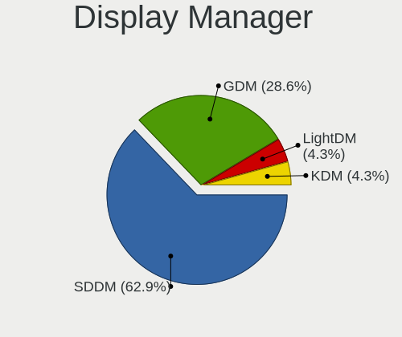
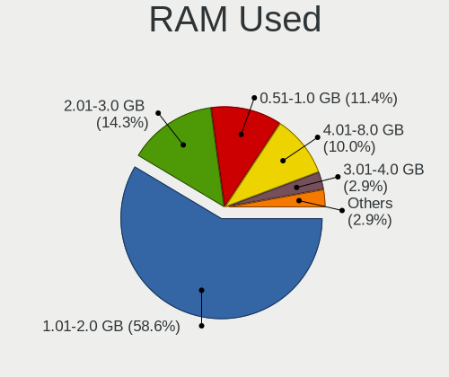
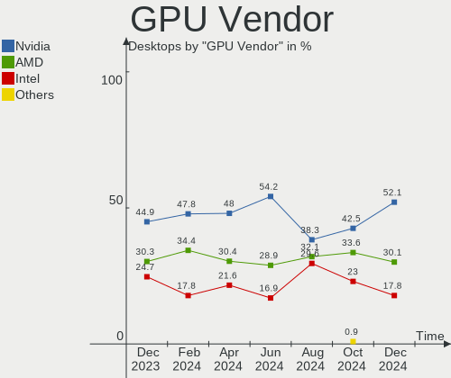
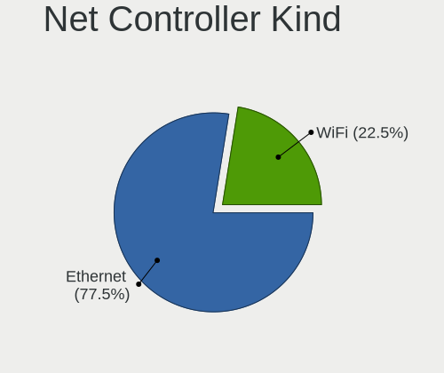
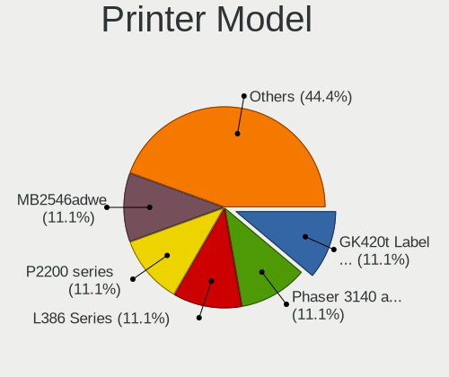
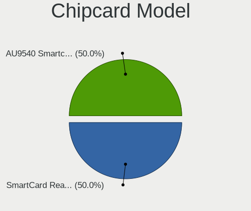

ROSA Hardware Trends (Desktops)
-------------------------------

A project to identify most popular hardware characteristics and track their change
over time based on data collected by ROSA users at https://Linux-Hardware.org.

Anyone can contribute to this report by the [hw-probe](https://github.com/linuxhw/hw-probe) tool:

    sudo -E hw-probe -all -upload

Full-feature report is available here: https://linux-hardware.org/?view=trends

Period: Mar, 2022.

Contents
--------

* [ System ](#system)
  - [ OS                       ](#os)
  - [ OS Family                ](#os-family)
  - [ Kernel                   ](#kernel)
  - [ Kernel Family            ](#kernel-family)
  - [ Kernel Major Ver.        ](#kernel-major-ver)
  - [ Arch                     ](#arch)
  - [ DE                       ](#de)
  - [ Display Server           ](#display-server)
  - [ Display Manager          ](#display-manager)
  - [ OS Lang                  ](#os-lang)
  - [ Boot Mode                ](#boot-mode)
  - [ Filesystem               ](#filesystem)
  - [ Part. scheme             ](#part-scheme)
  - [ Dual Boot with Linux/BSD ](#dual-boot-with-linuxbsd)
  - [ Dual Boot (Win)          ](#dual-boot-win)

* [ Board ](#board)
  - [ Vendor                   ](#vendor)
  - [ Model                    ](#model)
  - [ Model Family             ](#model-family)
  - [ MFG Year                 ](#mfg-year)
  - [ Form Factor              ](#form-factor)
  - [ Secure Boot              ](#secure-boot)
  - [ Coreboot                 ](#coreboot)
  - [ RAM Size                 ](#ram-size)
  - [ RAM Used                 ](#ram-used)
  - [ Total Drives             ](#total-drives)
  - [ Has CD-ROM               ](#has-cd-rom)
  - [ Has Ethernet             ](#has-ethernet)
  - [ Has WiFi                 ](#has-wifi)
  - [ Has Bluetooth            ](#has-bluetooth)

* [ Location ](#location)
  - [ Country                  ](#country)
  - [ City                     ](#city)

* [ Drives ](#drives)
  - [ Drive Vendor             ](#drive-vendor)
  - [ Drive Model              ](#drive-model)
  - [ HDD Vendor               ](#hdd-vendor)
  - [ SSD Vendor               ](#ssd-vendor)
  - [ Drive Kind               ](#drive-kind)
  - [ Drive Connector          ](#drive-connector)
  - [ Drive Size               ](#drive-size)
  - [ Space Total              ](#space-total)
  - [ Space Used               ](#space-used)
  - [ Malfunc. Drives          ](#malfunc-drives)
  - [ Malfunc. Drive Vendor    ](#malfunc-drive-vendor)
  - [ Malfunc. HDD Vendor      ](#malfunc-hdd-vendor)
  - [ Malfunc. Drive Kind      ](#malfunc-drive-kind)
  - [ Failed Drives            ](#failed-drives)
  - [ Failed Drive Vendor      ](#failed-drive-vendor)
  - [ Drive Status             ](#drive-status)

* [ Storage controller ](#storage-controller)
  - [ Storage Vendor           ](#storage-vendor)
  - [ Storage Model            ](#storage-model)
  - [ Storage Kind             ](#storage-kind)

* [ Processor ](#processor)
  - [ CPU Vendor               ](#cpu-vendor)
  - [ CPU Model                ](#cpu-model)
  - [ CPU Model Family         ](#cpu-model-family)
  - [ CPU Cores                ](#cpu-cores)
  - [ CPU Sockets              ](#cpu-sockets)
  - [ CPU Threads              ](#cpu-threads)
  - [ CPU Op-Modes             ](#cpu-op-modes)
  - [ CPU Microcode            ](#cpu-microcode)
  - [ CPU Microarch            ](#cpu-microarch)

* [ Graphics ](#graphics)
  - [ GPU Vendor               ](#gpu-vendor)
  - [ GPU Model                ](#gpu-model)
  - [ GPU Combo                ](#gpu-combo)
  - [ GPU Driver               ](#gpu-driver)
  - [ GPU Memory               ](#gpu-memory)

* [ Monitor ](#monitor)
  - [ Monitor Vendor           ](#monitor-vendor)
  - [ Monitor Model            ](#monitor-model)
  - [ Monitor Resolution       ](#monitor-resolution)
  - [ Monitor Diagonal         ](#monitor-diagonal)
  - [ Monitor Width            ](#monitor-width)
  - [ Aspect Ratio             ](#aspect-ratio)
  - [ Monitor Area             ](#monitor-area)
  - [ Pixel Density            ](#pixel-density)
  - [ Multiple Monitors        ](#multiple-monitors)

* [ Network ](#network)
  - [ Net Controller Vendor    ](#net-controller-vendor)
  - [ Net Controller Model     ](#net-controller-model)
  - [ Wireless Vendor          ](#wireless-vendor)
  - [ Wireless Model           ](#wireless-model)
  - [ Ethernet Vendor          ](#ethernet-vendor)
  - [ Ethernet Model           ](#ethernet-model)
  - [ Net Controller Kind      ](#net-controller-kind)
  - [ Used Controller          ](#used-controller)
  - [ NICs                     ](#nics)
  - [ IPv6                     ](#ipv6)

* [ Bluetooth ](#bluetooth)
  - [ Bluetooth Vendor         ](#bluetooth-vendor)
  - [ Bluetooth Model          ](#bluetooth-model)

* [ Sound ](#sound)
  - [ Sound Vendor             ](#sound-vendor)
  - [ Sound Model              ](#sound-model)

* [ Memory ](#memory)
  - [ Memory Vendor            ](#memory-vendor)
  - [ Memory Model             ](#memory-model)
  - [ Memory Kind              ](#memory-kind)
  - [ Memory Form Factor       ](#memory-form-factor)
  - [ Memory Size              ](#memory-size)
  - [ Memory Speed             ](#memory-speed)

* [ Printers & scanners ](#printers--scanners)
  - [ Printer Vendor           ](#printer-vendor)
  - [ Printer Model            ](#printer-model)
  - [ Scanner Vendor           ](#scanner-vendor)
  - [ Scanner Model            ](#scanner-model)

* [ Camera ](#camera)
  - [ Camera Vendor            ](#camera-vendor)
  - [ Camera Model             ](#camera-model)

* [ Security ](#security)
  - [ Fingerprint Vendor       ](#fingerprint-vendor)
  - [ Fingerprint Model        ](#fingerprint-model)
  - [ Chipcard Vendor          ](#chipcard-vendor)
  - [ Chipcard Model           ](#chipcard-model)

* [ Unsupported ](#unsupported)
  - [ Unsupported Devices      ](#unsupported-devices)
  - [ Unsupported Device Types ](#unsupported-device-types)

System
------

OS
--

Installed operating systems

| Name       | Desktops | Percent |
|------------|----------|---------|
| ROSA 12.2  | 193      | 76.59%  |
| ROSA R11.1 | 30       | 11.9%   |
| ROSA 12.1  | 22       | 8.73%   |
| ROSA 12    | 4        | 1.59%   |
| ROSA R11   | 2        | 0.79%   |
| ROSA R10   | 1        | 0.4%    |

OS Family
---------

OS without a version

| Name | Desktops | Percent |
|------|----------|---------|
| ROSA | 252      | 100%    |

Kernel
------

Version of the Linux kernel

| Version                                    | Desktops | Percent |
|--------------------------------------------|----------|---------|
| 5.10.74-generic-2rosa2021.1-x86_64         | 207      | 82.14%  |
| 5.4.83-generic-2rosa-x86_64                | 8        | 3.17%   |
| 4.15.0-desktop-122.124.1rosa-x86_64        | 6        | 2.38%   |
| 5.10.71-generic-1rosa2021.1-x86_64         | 5        | 1.98%   |
| 5.4.32-generic-2rosa-x86_64                | 4        | 1.59%   |
| 5.4.32-generic-2rosa-i586                  | 4        | 1.59%   |
| 5.4.83-generic-2rosa-i586                  | 3        | 1.19%   |
| 4.15.0-desktop-45.1rosa-x86_64             | 3        | 1.19%   |
| 5.15.28-generic-1rosa2021.1-x86_64         | 2        | 0.79%   |
| 5.10.74-generic-2rosa2021.1-i586           | 2        | 0.79%   |
| 4.9.155-nrj-desktop-1rosa-x86_64           | 2        | 0.79%   |
| 4.15.0-desktop-122.124.1rosa-i586          | 2        | 0.79%   |
| 5.16.18-generic-1rosa2021.1-x86_64         | 1        | 0.4%    |
| 5.16.16.xm1-1.klp-xanmod-rosa2021.1-x86_64 | 1        | 0.4%    |
| 5.16.11.xm1-1.klp-xanmod-rosa2021.1-x86_64 | 1        | 0.4%    |
| 4.9.60-nrj-desktop-1rosa-x86_64            | 1        | 0.4%    |

Kernel Family
-------------

Linux kernel without a distro release

| Version | Desktops | Percent |
|---------|----------|---------|
| 5.10.74 | 209      | 82.94%  |
| 5.4.83  | 11       | 4.37%   |
| 4.15.0  | 11       | 4.37%   |
| 5.4.32  | 8        | 3.17%   |
| 5.10.71 | 5        | 1.98%   |
| 5.15.28 | 2        | 0.79%   |
| 4.9.155 | 2        | 0.79%   |
| 5.16.18 | 1        | 0.4%    |
| 5.16.16 | 1        | 0.4%    |
| 5.16.11 | 1        | 0.4%    |
| 4.9.60  | 1        | 0.4%    |

Kernel Major Ver.
-----------------

Linux kernel major version

| Version | Desktops | Percent |
|---------|----------|---------|
| 5.10    | 214      | 84.92%  |
| 5.4     | 19       | 7.54%   |
| 4.15    | 11       | 4.37%   |
| 5.16    | 3        | 1.19%   |
| 4.9     | 3        | 1.19%   |
| 5.15    | 2        | 0.79%   |

Arch
----

OS architecture (x86_64, i586, etc.)

| Name   | Desktops | Percent |
|--------|----------|---------|
| x86_64 | 241      | 95.63%  |
| i686   | 11       | 4.37%   |

DE
--

Desktop Environment

| Name  | Desktops | Percent |
|-------|----------|---------|
| KDE5  | 124      | 49.21%  |
| GNOME | 85       | 33.73%  |
| KDE4  | 25       | 9.92%   |
| LXQt  | 17       | 6.75%   |
| XFCE  | 1        | 0.4%    |

Display Server
--------------

X11 or Wayland

| Name    | Desktops | Percent |
|---------|----------|---------|
| Wayland | 183      | 72.62%  |
| X11     | 69       | 27.38%  |

Display Manager
---------------

SDDM, LightDM, etc.

| Name    | Desktops | Percent |
|---------|----------|---------|
| GDM     | 123      | 48.81%  |
| SDDM    | 102      | 40.48%  |
| KDM     | 25       | 9.92%   |
| LightDM | 2        | 0.79%   |

OS Lang
-------

Language

| Lang    | Desktops | Percent |
|---------|----------|---------|
| ru_RU   | 238      | 94.44%  |
| en_US   | 4        | 1.59%   |
| Unknown | 4        | 1.59%   |
| ru_UA   | 2        | 0.79%   |
| de_DE   | 2        | 0.79%   |
| en_GB   | 1        | 0.4%    |
| bg_BG   | 1        | 0.4%    |

Boot Mode
---------

EFI or BIOS

| Mode | Desktops | Percent |
|------|----------|---------|
| BIOS | 133      | 52.78%  |
| EFI  | 119      | 47.22%  |

Filesystem
----------

Type of filesystem

| Type  | Desktops | Percent |
|-------|----------|---------|
| Ext4  | 245      | 97.22%  |
| Btrfs | 7        | 2.78%   |

Part. scheme
------------

Scheme of partitioning

| Type    | Desktops | Percent |
|---------|----------|---------|
| GPT     | 164      | 65.08%  |
| MBR     | 87       | 34.52%  |
| Unknown | 1        | 0.4%    |

Dual Boot with Linux/BSD
------------------------

Hosting more than one Linux/BSD

| Dual boot | Desktops | Percent |
|-----------|----------|---------|
| No        | 182      | 72.22%  |
| Yes       | 70       | 27.78%  |

Dual Boot (Win)
---------------

Hosting Linux and Windows

| Dual boot | Desktops | Percent |
|-----------|----------|---------|
| Yes       | 143      | 56.75%  |
| No        | 109      | 43.25%  |

Board
-----

Vendor
------

Motherboard manufacturer

| Name                                  | Desktops | Percent |
|---------------------------------------|----------|---------|
| ASUSTek Computer                      | 76       | 30.16%  |
| Gigabyte Technology                   | 72       | 28.57%  |
| ASRock                                | 43       | 17.06%  |
| MSI                                   | 26       | 10.32%  |
| ECS                                   | 5        | 1.98%   |
| Acer                                  | 5        | 1.98%   |
| Hewlett-Packard                       | 4        | 1.59%   |
| Dell                                  | 4        | 1.59%   |
| Unknown                               | 4        | 1.59%   |
| Lenovo                                | 2        | 0.79%   |
| Intel                                 | 2        | 0.79%   |
| Fujitsu                               | 2        | 0.79%   |
| Biostar                               | 2        | 0.79%   |
| Q87IX-06 12/05/18 Vision Corvalent V4 | 1        | 0.4%    |
| JW Technology                         | 1        | 0.4%    |
| Irbis                                 | 1        | 0.4%    |
| Foxconn                               | 1        | 0.4%    |
| AZW                                   | 1        | 0.4%    |

Model
-----

Motherboard model

| Name                                 | Desktops | Percent |
|--------------------------------------|----------|---------|
| ASUS All Series                      | 7        | 2.78%   |
| Unknown                              | 5        | 1.98%   |
| Gigabyte 970A-DS3P                   | 4        | 1.59%   |
| Gigabyte B450 AORUS ELITE            | 3        | 1.19%   |
| ASRock H110M-DGS R3.0                | 3        | 1.19%   |
| MSI MS-7A38                          | 2        | 0.79%   |
| MSI MS-7A36                          | 2        | 0.79%   |
| MSI MS-7817                          | 2        | 0.79%   |
| Gigabyte X470 AORUS GAMING 7 WIFI    | 2        | 0.79%   |
| Gigabyte H110M-S2V                   | 2        | 0.79%   |
| Gigabyte B560M H                     | 2        | 0.79%   |
| Gigabyte B550M S2H                   | 2        | 0.79%   |
| Gigabyte B450M DS3H                  | 2        | 0.79%   |
| Gigabyte AB350M-DS3H                 | 2        | 0.79%   |
| ASUS PRIME H310M-R R2.0              | 2        | 0.79%   |
| ASUS P8Z77-V LX                      | 2        | 0.79%   |
| ASUS P8H61-M LE                      | 2        | 0.79%   |
| ASUS P8B75-V                         | 2        | 0.79%   |
| ASUS P5K                             | 2        | 0.79%   |
| ASUS M5A78L-M LX3                    | 2        | 0.79%   |
| ASRock N68C-S UCC                    | 2        | 0.79%   |
| ASRock H55M-LE                       | 2        | 0.79%   |
| ASRock G41C-GS R2.0                  | 2        | 0.79%   |
| Acer Aspire XC-885                   | 2        | 0.79%   |
| MSI MS-7D22                          | 1        | 0.4%    |
| MSI MS-7C75                          | 1        | 0.4%    |
| MSI MS-7C37                          | 1        | 0.4%    |
| MSI MS-7C02                          | 1        | 0.4%    |
| MSI MS-7B98                          | 1        | 0.4%    |
| MSI MS-7B86                          | 1        | 0.4%    |
| MSI MS-7A71                          | 1        | 0.4%    |
| MSI MS-7A34                          | 1        | 0.4%    |
| MSI MS-7850                          | 1        | 0.4%    |
| MSI MS-7788                          | 1        | 0.4%    |
| MSI MS-7758                          | 1        | 0.4%    |
| MSI MS-7693                          | 1        | 0.4%    |
| MSI MS-7680                          | 1        | 0.4%    |
| MSI MS-7673                          | 1        | 0.4%    |
| MSI MS-7636                          | 1        | 0.4%    |
| MSI MS-7592                          | 1        | 0.4%    |
| MSI MS-7388                          | 1        | 0.4%    |
| MSI MS-7383                          | 1        | 0.4%    |
| MSI MS-7346                          | 1        | 0.4%    |
| MSI MS-7250                          | 1        | 0.4%    |
| Lenovo ThinkCentre M92 3207AF1       | 1        | 0.4%    |
| Lenovo H420                          | 1        | 0.4%    |
| JW JW-A61PM-D3 Ver1.0                | 1        | 0.4%    |
| Irbis NB660                          | 1        | 0.4%    |
| Intel D945GCLF2 AAE46416-101         | 1        | 0.4%    |
| Intel B75                            | 1        | 0.4%    |
| HP Slim Desktop S01-aF0xxx           | 1        | 0.4%    |
| HP ProDesk 400 G5 Desktop Mini       | 1        | 0.4%    |
| HP Pavilion Gaming Desktop TG01-2xxx | 1        | 0.4%    |
| HP Compaq dc7600 Small Form Factor   | 1        | 0.4%    |
| Gigabyte Z97-HD3                     | 1        | 0.4%    |
| Gigabyte Z77X-D3H                    | 1        | 0.4%    |
| Gigabyte Z77-DS3H                    | 1        | 0.4%    |
| Gigabyte Z590 VISION G               | 1        | 0.4%    |
| Gigabyte Z590 GAMING X               | 1        | 0.4%    |
| Gigabyte Z370M D3H                   | 1        | 0.4%    |

Model Family
------------

Motherboard model prefix

| Name                 | Desktops | Percent |
|----------------------|----------|---------|
| ASUS PRIME           | 16       | 6.35%   |
| ASUS All             | 7        | 2.78%   |
| Gigabyte B450        | 5        | 1.98%   |
| ASUS P8H61-M         | 5        | 1.98%   |
| Unknown              | 5        | 1.98%   |
| Gigabyte 970A-DS3P   | 4        | 1.59%   |
| Gigabyte X470        | 3        | 1.19%   |
| Gigabyte B560M       | 3        | 1.19%   |
| Gigabyte B550M       | 3        | 1.19%   |
| Gigabyte B450M       | 3        | 1.19%   |
| Dell OptiPlex        | 3        | 1.19%   |
| ASUS P8Z77-V         | 3        | 1.19%   |
| ASUS M5A78L-M        | 3        | 1.19%   |
| ASRock H110M-DGS     | 3        | 1.19%   |
| ASRock G41C-GS       | 3        | 1.19%   |
| Acer Aspire          | 3        | 1.19%   |
| MSI MS-7A38          | 2        | 0.79%   |
| MSI MS-7A36          | 2        | 0.79%   |
| MSI MS-7817          | 2        | 0.79%   |
| Gigabyte Z590        | 2        | 0.79%   |
| Gigabyte H110M-S2V   | 2        | 0.79%   |
| Gigabyte AB350M-DS3H | 2        | 0.79%   |
| Fujitsu ESPRIMO      | 2        | 0.79%   |
| ASUS ROG             | 2        | 0.79%   |
| ASUS P8B75-V         | 2        | 0.79%   |
| ASUS P8B75-M         | 2        | 0.79%   |
| ASUS P5Q             | 2        | 0.79%   |
| ASUS P5K             | 2        | 0.79%   |
| ASUS P5G41T-M        | 2        | 0.79%   |
| ASUS M5A97           | 2        | 0.79%   |
| ASUS M2N-MX          | 2        | 0.79%   |
| ASRock N68C-S        | 2        | 0.79%   |
| ASRock H55M-LE       | 2        | 0.79%   |
| ASRock B450M         | 2        | 0.79%   |
| Acer Veriton         | 2        | 0.79%   |
| MSI MS-7D22          | 1        | 0.4%    |
| MSI MS-7C75          | 1        | 0.4%    |
| MSI MS-7C37          | 1        | 0.4%    |
| MSI MS-7C02          | 1        | 0.4%    |
| MSI MS-7B98          | 1        | 0.4%    |
| MSI MS-7B86          | 1        | 0.4%    |
| MSI MS-7A71          | 1        | 0.4%    |
| MSI MS-7A34          | 1        | 0.4%    |
| MSI MS-7850          | 1        | 0.4%    |
| MSI MS-7788          | 1        | 0.4%    |
| MSI MS-7758          | 1        | 0.4%    |
| MSI MS-7693          | 1        | 0.4%    |
| MSI MS-7680          | 1        | 0.4%    |
| MSI MS-7673          | 1        | 0.4%    |
| MSI MS-7636          | 1        | 0.4%    |
| MSI MS-7592          | 1        | 0.4%    |
| MSI MS-7388          | 1        | 0.4%    |
| MSI MS-7383          | 1        | 0.4%    |
| MSI MS-7346          | 1        | 0.4%    |
| MSI MS-7250          | 1        | 0.4%    |
| Lenovo ThinkCentre   | 1        | 0.4%    |
| Lenovo H420          | 1        | 0.4%    |
| JW JW-A61PM-D3       | 1        | 0.4%    |
| Irbis NB660          | 1        | 0.4%    |
| Intel D945GCLF2      | 1        | 0.4%    |

MFG Year
--------

Motherboard manufacture year

| Year | Desktops | Percent |
|------|----------|---------|
| 2018 | 36       | 14.29%  |
| 2012 | 28       | 11.11%  |
| 2011 | 26       | 10.32%  |
| 2021 | 19       | 7.54%   |
| 2013 | 16       | 6.35%   |
| 2019 | 15       | 5.95%   |
| 2016 | 15       | 5.95%   |
| 2010 | 15       | 5.95%   |
| 2009 | 14       | 5.56%   |
| 2008 | 14       | 5.56%   |
| 2017 | 12       | 4.76%   |
| 2020 | 11       | 4.37%   |
| 2007 | 10       | 3.97%   |
| 2014 | 9        | 3.57%   |
| 2015 | 5        | 1.98%   |
| 2006 | 5        | 1.98%   |
| 2022 | 1        | 0.4%    |
| 2005 | 1        | 0.4%    |

Form Factor
-----------

Physical design of the computer

| Name    | Desktops | Percent |
|---------|----------|---------|
| Desktop | 252      | 100%    |

Secure Boot
-----------

Enabled or disabled

| State    | Desktops | Percent |
|----------|----------|---------|
| Disabled | 252      | 100%    |

Coreboot
--------

Have coreboot on board

| Used | Desktops | Percent |
|------|----------|---------|
| No   | 252      | 100%    |

RAM Size
--------

Total RAM memory

| Size in GB  | Desktops | Percent |
|-------------|----------|---------|
| 8.01-16.0   | 66       | 26.19%  |
| 16.01-24.0  | 63       | 25%     |
| 3.01-4.0    | 50       | 19.84%  |
| 4.01-8.0    | 35       | 13.89%  |
| 32.01-64.0  | 20       | 7.94%   |
| 1.01-2.0    | 8        | 3.17%   |
| 2.01-3.0    | 5        | 1.98%   |
| 24.01-32.0  | 3        | 1.19%   |
| 64.01-256.0 | 2        | 0.79%   |

RAM Used
--------

Used RAM memory

| Used GB   | Desktops | Percent |
|-----------|----------|---------|
| 1.01-2.0  | 147      | 58.33%  |
| 0.51-1.0  | 60       | 23.81%  |
| 2.01-3.0  | 31       | 12.3%   |
| 4.01-8.0  | 6        | 2.38%   |
| 3.01-4.0  | 5        | 1.98%   |
| 0.01-0.5  | 2        | 0.79%   |
| 8.01-16.0 | 1        | 0.4%    |

Total Drives
------------

Number of drives on board

| Drives | Desktops | Percent |
|--------|----------|---------|
| 1      | 89       | 35.32%  |
| 2      | 67       | 26.59%  |
| 3      | 60       | 23.81%  |
| 4      | 22       | 8.73%   |
| 5      | 9        | 3.57%   |
| 6      | 2        | 0.79%   |
| 8      | 1        | 0.4%    |
| 7      | 1        | 0.4%    |
| 0      | 1        | 0.4%    |

Has CD-ROM
----------

Has CD-ROM on board

| Presented | Desktops | Percent |
|-----------|----------|---------|
| No        | 154      | 61.11%  |
| Yes       | 98       | 38.89%  |

Has Ethernet
------------

Has Ethernet on board

| Presented | Desktops | Percent |
|-----------|----------|---------|
| Yes       | 250      | 99.21%  |
| No        | 2        | 0.79%   |

Has WiFi
--------

Has WiFi module

| Presented | Desktops | Percent |
|-----------|----------|---------|
| No        | 182      | 72.22%  |
| Yes       | 70       | 27.78%  |

Has Bluetooth
-------------

Has Bluetooth module

| Presented | Desktops | Percent |
|-----------|----------|---------|
| No        | 202      | 80.16%  |
| Yes       | 50       | 19.84%  |

Location
--------

Country
-------

Geographic location (country)

| Country    | Desktops | Percent |
|------------|----------|---------|
| Russia     | 229      | 90.87%  |
| Ukraine    | 6        | 2.38%   |
| Kazakhstan | 5        | 1.98%   |
| Belarus    | 3        | 1.19%   |
| Germany    | 2        | 0.79%   |
| UK         | 1        | 0.4%    |
| Sweden     | 1        | 0.4%    |
| Latvia     | 1        | 0.4%    |
| Italy      | 1        | 0.4%    |
| Israel     | 1        | 0.4%    |
| Finland    | 1        | 0.4%    |
| Bulgaria   | 1        | 0.4%    |

City
----

Geographic location (city)

| City             | Desktops | Percent |
|------------------|----------|---------|
| Moscow           | 44       | 17.46%  |
| St Petersburg    | 16       | 6.35%   |
| Rostov-on-Don    | 9        | 3.57%   |
| Volgograd        | 8        | 3.17%   |
| Yekaterinburg    | 6        | 2.38%   |
| Vladivostok      | 6        | 2.38%   |
| Samara           | 6        | 2.38%   |
| Novosibirsk      | 6        | 2.38%   |
| Orenburg         | 5        | 1.98%   |
| Irkutsk          | 4        | 1.59%   |
| Bryansk          | 4        | 1.59%   |
| Yoshkar-Ola      | 3        | 1.19%   |
| Tyumen           | 3        | 1.19%   |
| Saratov          | 3        | 1.19%   |
| Novokuznetsk     | 3        | 1.19%   |
| Chelyabinsk      | 3        | 1.19%   |
| Voronezh         | 2        | 0.79%   |
| Vitebsk          | 2        | 0.79%   |
| Tula             | 2        | 0.79%   |
| Trubchëvsk      | 2        | 0.79%   |
| Tolyatti         | 2        | 0.79%   |
| Shadrinsk        | 2        | 0.79%   |
| Sevastopol       | 2        | 0.79%   |
| Pskov            | 2        | 0.79%   |
| Pogar            | 2        | 0.79%   |
| Perm             | 2        | 0.79%   |
| Penza            | 2        | 0.79%   |
| Omsk             | 2        | 0.79%   |
| Novy Urengoy     | 2        | 0.79%   |
| Nizhniy Novgorod | 2        | 0.79%   |
| Lobnya           | 2        | 0.79%   |
| Lipetsk          | 2        | 0.79%   |
| Krasnoyarsk      | 2        | 0.79%   |
| Kirov            | 2        | 0.79%   |
| Elektrostal      | 2        | 0.79%   |
| Buzuluk          | 2        | 0.79%   |
| Belgorod         | 2        | 0.79%   |
| Arkhangelsk      | 2        | 0.79%   |
| Almaty           | 2        | 0.79%   |
| Zlatoust         | 1        | 0.4%    |
| Zheleznogorsk    | 1        | 0.4%    |
| Zaterechnyy      | 1        | 0.4%    |
| Yaroslavl        | 1        | 0.4%    |
| Volgodonsk       | 1        | 0.4%    |
| Vladikavkaz      | 1        | 0.4%    |
| Ulan-Ude         | 1        | 0.4%    |
| Uglich           | 1        | 0.4%    |
| Tsarskoye Selo   | 1        | 0.4%    |
| Tomsk            | 1        | 0.4%    |
| Tampere          | 1        | 0.4%    |
| Tambov           | 1        | 0.4%    |
| Taganrog         | 1        | 0.4%    |
| Syktyvkar        | 1        | 0.4%    |
| Surgut           | 1        | 0.4%    |
| Sudzha           | 1        | 0.4%    |
| Sofia            | 1        | 0.4%    |
| Sochi            | 1        | 0.4%    |
| Smolensk         | 1        | 0.4%    |
| Severodvinsk     | 1        | 0.4%    |
| Sarkand          | 1        | 0.4%    |

Drives
------

Drive Vendor
------------

Hard drive vendors

| Vendor              | Desktops | Drives  | Percent |
|---------------------|----------|---------|---------|
| Seagate             | 105      | 136     | 21.65%  |
| WDC                 | 100      | 130     | 20.62%  |
| Samsung Electronics | 41       | 49      | 8.45%   |
| Kingston            | 31       | 34      | 6.39%   |
| Toshiba             | 30       | 33      | 6.19%   |
| Hitachi             | 16       | 18      | 3.3%    |
| China               | 16       | 16      | 3.3%    |
| SPCC                | 15       | 15      | 3.09%   |
| A-DATA Technology   | 13       | 14      | 2.68%   |
| Crucial             | 9        | 11      | 1.86%   |
| SanDisk             | 7        | 7       | 1.44%   |
| AMD                 | 7        | 7       | 1.44%   |
| MAXTOR              | 6        | 7       | 1.24%   |
| Intel               | 6        | 6       | 1.24%   |
| GOODRAM             | 6        | 7       | 1.24%   |
| Gigabyte Technology | 6        | 6       | 1.24%   |
| Apacer              | 6        | 6       | 1.24%   |
| XPG                 | 5        | 5       | 1.03%   |
| HGST                | 5        | 6       | 1.03%   |
| Unknown             | 4        | 4       | 0.82%   |
| PLEXTOR             | 3        | 5       | 0.62%   |
| Netac               | 3        | 3       | 0.62%   |
| KingFast            | 3        | 3       | 0.62%   |
| Transcend           | 2        | 2       | 0.41%   |
| Team                | 2        | 2       | 0.41%   |
| Smartbuy            | 2        | 2       | 0.41%   |
| SK Hynix            | 2        | 2       | 0.41%   |
| OCZ                 | 2        | 2       | 0.41%   |
| KingSpec            | 2        | 2       | 0.41%   |
| Hewlett-Packard     | 2        | 2       | 0.41%   |
| Corsair             | 2        | 2       | 0.41%   |
| ZTE                 | 1        | 1       | 0.21%   |
| XrayDisk            | 1        | 1       | 0.21%   |
| USB3.0              | 1        | 1       | 0.21%   |
| TPH01204000GB       | 1        | 1       | 0.21%   |
| T-FORCE             | 1        | 1       | 0.21%   |
| Silicon Motion      | 1        | 1       | 0.21%   |
| SETHRISE            | 1        | 1       | 0.21%   |
| Phison              | 1        | 1       | 0.21%   |
| Patriot             | 1        | 1       | 0.21%   |
| OCZ-VERTEX3         | 1        | 1       | 0.21%   |
| OCZ-VERTEX          | 1        | 1       | 0.21%   |
| Mass                | 1        | Unknown | 0.21%   |
| KIOXIA              | 1        | 1       | 0.21%   |
| KingDian            | 1        | 1       | 0.21%   |
| JMicron             | 1        | 1       | 0.21%   |
| Intenso             | 1        | 1       | 0.21%   |
| Hoodisk             | 1        | 1       | 0.21%   |
| Hikvision           | 1        | 1       | 0.21%   |
| GSemi               | 1        | 1       | 0.21%   |
| Fujitsu             | 1        | 1       | 0.21%   |
| FOXLINE             | 1        | 1       | 0.21%   |
| ExcelStor           | 1        | 2       | 0.21%   |
| Espada              | 1        | 1       | 0.21%   |
| Apple               | 1        | 1       | 0.21%   |
| AFOX                | 1        | 1       | 0.21%   |
| Unknown             | 1        | 1       | 0.21%   |

Drive Model
-----------

Hard drive models

| Model                            | Desktops | Percent |
|----------------------------------|----------|---------|
| Seagate ST1000DM010-2EP102 1TB   | 13       | 2.35%   |
| WDC WDS240G2G0A-00JH30 240GB SSD | 8        | 1.44%   |
| Kingston SA400S37240G 240GB SSD  | 8        | 1.44%   |
| WDC WD10EZEX-08WN4A0 1TB         | 7        | 1.26%   |
| Toshiba HDWD110 1TB              | 7        | 1.26%   |
| Toshiba DT01ACA100 1TB           | 7        | 1.26%   |
| Samsung SSD 860 EVO 250GB        | 7        | 1.26%   |
| Seagate ST3500418AS 500GB        | 6        | 1.08%   |
| WDC WDS120G2G0A-00JH30 120GB SSD | 5        | 0.9%    |
| Toshiba DT01ACA050 500GB         | 5        | 0.9%    |
| SPCC Solid State Disk 128GB      | 5        | 0.9%    |
| Seagate ST500DM002-1BD142 500GB  | 5        | 0.9%    |
| AMD R5SL120G 120GB SSD           | 5        | 0.9%    |
| SPCC Solid State Disk 240GB      | 4        | 0.72%   |
| Seagate ST380011A 80GB           | 4        | 0.72%   |
| Kingston SA400S37120G 120GB SSD  | 4        | 0.72%   |
| Hitachi HDS721010CLA330 1TB      | 4        | 0.72%   |
| Crucial CT240BX500SSD1 240GB     | 4        | 0.72%   |
| XPG GAMMIX S5 256GB              | 3        | 0.54%   |
| WDC WD5000AAKX-001CA0 500GB      | 3        | 0.54%   |
| WDC WD10EZEX-08M2NA0 1TB         | 3        | 0.54%   |
| WDC WD10EZEX-00BN5A0 1TB         | 3        | 0.54%   |
| Unknown SD/MMC/MS PRO 32GB       | 3        | 0.54%   |
| Seagate ST380815AS 80GB          | 3        | 0.54%   |
| Seagate ST3250310AS 250GB        | 3        | 0.54%   |
| Seagate ST3160815AS 160GB        | 3        | 0.54%   |
| Seagate ST3160318AS 160GB        | 3        | 0.54%   |
| Seagate ST31000528AS 1TB         | 3        | 0.54%   |
| Seagate ST2000DM001-1CH164 2TB   | 3        | 0.54%   |
| Samsung SSD 860 EVO 500GB        | 3        | 0.54%   |
| Samsung HD322HJ 320GB            | 3        | 0.54%   |
| GOODRAM SSDPR-CX400-128-G2 128GB | 3        | 0.54%   |
| A-DATA SU650 120GB SSD           | 3        | 0.54%   |
| XPG GAMMIX S11 Pro 256GB         | 2        | 0.36%   |
| WDC WDS480G2G0A-00JH30 480GB SSD | 2        | 0.36%   |
| WDC WDS120G1G0A-00SS50 120GB SSD | 2        | 0.36%   |
| WDC WDS100T2B0A-00SM50 1TB SSD   | 2        | 0.36%   |
| WDC WD800AAJS-00PSA0 80GB        | 2        | 0.36%   |
| WDC WD5000AZRX-00A8LB0 500GB     | 2        | 0.36%   |
| WDC WD5000AAKX-60U6AA0 500GB     | 2        | 0.36%   |
| WDC WD3200AAKS-00UU3A0 320GB     | 2        | 0.36%   |
| WDC WD30EZRZ-00GXCB0 3TB         | 2        | 0.36%   |
| WDC WD20EZRZ-00Z5HB0 2TB         | 2        | 0.36%   |
| WDC WD10EZEX-00RKKA0 1TB         | 2        | 0.36%   |
| WDC WD10EZEX-00BBHA0 1TB         | 2        | 0.36%   |
| WDC WD10EALX-009BA0 1TB          | 2        | 0.36%   |
| Toshiba TR200 480GB SSD          | 2        | 0.36%   |
| SPCC Solid State Disk 256GB      | 2        | 0.36%   |
| SPCC Solid State Disk 120GB      | 2        | 0.36%   |
| Seagate ST500DM002-1BC142 500GB  | 2        | 0.36%   |
| Seagate ST340014A 40GB           | 2        | 0.36%   |
| Seagate ST3320613AS 320GB        | 2        | 0.36%   |
| Seagate ST3250410AS 250GB        | 2        | 0.36%   |
| Seagate ST3160812AS 160GB        | 2        | 0.36%   |
| Seagate ST3120811AS 120GB        | 2        | 0.36%   |
| Seagate ST3000DM008-2DM166 3TB   | 2        | 0.36%   |
| Seagate ST2000DM006-2DM164 2TB   | 2        | 0.36%   |
| Seagate ST2000DM005-2CW102 2TB   | 2        | 0.36%   |
| Seagate ST1000DX001-1CM162 1TB   | 2        | 0.36%   |
| Seagate ST1000DM003-1SB102 1TB   | 2        | 0.36%   |

HDD Vendor
----------

Hard disk drive vendors

| Vendor              | Desktops | Drives | Percent |
|---------------------|----------|--------|---------|
| Seagate             | 105      | 136    | 39.92%  |
| WDC                 | 84       | 98     | 31.94%  |
| Toshiba             | 28       | 30     | 10.65%  |
| Hitachi             | 16       | 18     | 6.08%   |
| Samsung Electronics | 11       | 12     | 4.18%   |
| MAXTOR              | 6        | 7      | 2.28%   |
| HGST                | 5        | 6      | 1.9%    |
| Unknown             | 4        | 4      | 1.52%   |
| TPH01204000GB       | 1        | 1      | 0.38%   |
| Fujitsu             | 1        | 1      | 0.38%   |
| ExcelStor           | 1        | 2      | 0.38%   |
| Apple               | 1        | 1      | 0.38%   |

SSD Vendor
----------

Solid state drive vendors

| Vendor              | Desktops | Drives | Percent |
|---------------------|----------|--------|---------|
| Kingston            | 24       | 26     | 13.19%  |
| WDC                 | 22       | 24     | 12.09%  |
| Samsung Electronics | 22       | 23     | 12.09%  |
| China               | 16       | 16     | 8.79%   |
| SPCC                | 14       | 14     | 7.69%   |
| Crucial             | 9        | 9      | 4.95%   |
| SanDisk             | 7        | 7      | 3.85%   |
| A-DATA Technology   | 7        | 7      | 3.85%   |
| GOODRAM             | 6        | 7      | 3.3%    |
| Apacer              | 6        | 6      | 3.3%    |
| AMD                 | 5        | 5      | 2.75%   |
| Toshiba             | 3        | 3      | 1.65%   |
| Netac               | 3        | 3      | 1.65%   |
| KingFast            | 3        | 3      | 1.65%   |
| Gigabyte Technology | 3        | 3      | 1.65%   |
| Transcend           | 2        | 2      | 1.1%    |
| Team                | 2        | 2      | 1.1%    |
| OCZ                 | 2        | 2      | 1.1%    |
| KingSpec            | 2        | 2      | 1.1%    |
| Intel               | 2        | 2      | 1.1%    |
| Hewlett-Packard     | 2        | 2      | 1.1%    |
| Corsair             | 2        | 2      | 1.1%    |
| XrayDisk            | 1        | 1      | 0.55%   |
| USB3.0              | 1        | 1      | 0.55%   |
| T-FORCE             | 1        | 1      | 0.55%   |
| Smartbuy            | 1        | 1      | 0.55%   |
| PLEXTOR             | 1        | 1      | 0.55%   |
| Patriot             | 1        | 1      | 0.55%   |
| OCZ-VERTEX3         | 1        | 1      | 0.55%   |
| OCZ-VERTEX          | 1        | 1      | 0.55%   |
| KingDian            | 1        | 1      | 0.55%   |
| JMicron             | 1        | 1      | 0.55%   |
| Intenso             | 1        | 1      | 0.55%   |
| Hoodisk             | 1        | 1      | 0.55%   |
| Hikvision           | 1        | 1      | 0.55%   |
| GSemi               | 1        | 1      | 0.55%   |
| FOXLINE             | 1        | 1      | 0.55%   |
| Espada              | 1        | 1      | 0.55%   |
| AFOX                | 1        | 1      | 0.55%   |
| Unknown             | 1        | 1      | 0.55%   |

Drive Kind
----------

HDD or SSD

| Kind    | Desktops | Drives | Percent |
|---------|----------|--------|---------|
| HDD     | 208      | 316    | 51.87%  |
| SSD     | 139      | 188    | 34.66%  |
| NVMe    | 52       | 65     | 12.97%  |
| Unknown | 2        | 1      | 0.5%    |

Drive Connector
---------------

SATA, SAS, NVMe, etc.

| Type | Desktops | Drives | Percent |
|------|----------|--------|---------|
| SATA | 239      | 494    | 78.88%  |
| NVMe | 52       | 65     | 17.16%  |
| SAS  | 12       | 11     | 3.96%   |

Drive Size
----------

Size of hard drive

| Size in TB | Desktops | Drives | Percent |
|------------|----------|--------|---------|
| 0.01-0.5   | 211      | 341    | 62.06%  |
| 0.51-1.0   | 92       | 116    | 27.06%  |
| 1.01-2.0   | 26       | 34     | 7.65%   |
| 2.01-3.0   | 5        | 5      | 1.47%   |
| 3.01-4.0   | 4        | 6      | 1.18%   |
| 4.01-10.0  | 2        | 2      | 0.59%   |

Space Total
-----------

Amount of disk space available on the file system

| Size in GB     | Desktops | Percent |
|----------------|----------|---------|
| 101-250        | 85       | 33.73%  |
| 251-500        | 44       | 17.46%  |
| 51-100         | 28       | 11.11%  |
| 1001-2000      | 27       | 10.71%  |
| 1-20           | 25       | 9.92%   |
| 501-1000       | 23       | 9.13%   |
| 21-50          | 8        | 3.17%   |
| More than 3000 | 5        | 1.98%   |
| 2001-3000      | 5        | 1.98%   |
| Unknown        | 2        | 0.79%   |

Space Used
----------

Amount of used disk space

| Used GB        | Desktops | Percent |
|----------------|----------|---------|
| 1-20           | 162      | 64.29%  |
| 21-50          | 26       | 10.32%  |
| 101-250        | 14       | 5.56%   |
| 501-1000       | 14       | 5.56%   |
| 251-500        | 12       | 4.76%   |
| 51-100         | 12       | 4.76%   |
| 1001-2000      | 6        | 2.38%   |
| 2001-3000      | 3        | 1.19%   |
| Unknown        | 2        | 0.79%   |
| More than 3000 | 1        | 0.4%    |

Malfunc. Drives
---------------

Drive models with a malfunction

| Model                              | Desktops | Drives | Percent |
|------------------------------------|----------|--------|---------|
| WDC WDS240G2G0A-00JH30 240GB SSD   | 3        | 3      | 2.33%   |
| Toshiba DT01ACA050 500GB           | 3        | 3      | 2.33%   |
| Hitachi HDS721010CLA330 1TB        | 3        | 3      | 2.33%   |
| WDC WDS480G2G0A-00JH30 480GB SSD   | 2        | 2      | 1.55%   |
| WDC WD5000AAKX-60U6AA0 500GB       | 2        | 2      | 1.55%   |
| WDC WD3200AAKS-00UU3A0 320GB       | 2        | 2      | 1.55%   |
| WDC WD10EALX-009BA0 1TB            | 2        | 2      | 1.55%   |
| Seagate ST380815AS 80GB            | 2        | 2      | 1.55%   |
| Seagate ST3500418AS 500GB          | 2        | 2      | 1.55%   |
| Seagate ST3320613AS 320GB          | 2        | 2      | 1.55%   |
| Seagate ST3250310AS 250GB          | 2        | 2      | 1.55%   |
| Seagate ST3160815AS 160GB          | 2        | 2      | 1.55%   |
| Seagate ST3160318AS 160GB          | 2        | 2      | 1.55%   |
| Seagate ST3120811AS 120GB          | 2        | 2      | 1.55%   |
| Seagate ST31000528AS 1TB           | 2        | 2      | 1.55%   |
| WDC WDS480G2G0B-00EPW0 480GB SSD   | 1        | 1      | 0.78%   |
| WDC WD6402AAEX-00Y9A0 640GB        | 1        | 1      | 0.78%   |
| WDC WD5001AALS-00E3A0 500GB        | 1        | 1      | 0.78%   |
| WDC WD5000AZLX-60K2TA0 500GB       | 1        | 1      | 0.78%   |
| WDC WD5000AAKX-08U6AA0 500GB       | 1        | 1      | 0.78%   |
| WDC WD5000AAKX-083CA1 500GB        | 1        | 1      | 0.78%   |
| WDC WD5000AAKS-00D2B0 500GB        | 1        | 1      | 0.78%   |
| WDC WD5000AAKS-00A7B2 500GB        | 1        | 1      | 0.78%   |
| WDC WD5000AACS-00ZUB0 500GB        | 1        | 1      | 0.78%   |
| WDC WD3200BPVT-60JJ5T0 320GB       | 1        | 1      | 0.78%   |
| WDC WD3200BPVT-24ZEST0 320GB       | 1        | 1      | 0.78%   |
| WDC WD3200BPVT-22ZEST0 320GB       | 1        | 1      | 0.78%   |
| WDC WD3200AAKX-001CA0 320GB        | 1        | 1      | 0.78%   |
| WDC WD3200AAKS-00L6A0 320GB        | 1        | 1      | 0.78%   |
| WDC WD3200AAJS-65VWA0 320GB        | 1        | 1      | 0.78%   |
| WDC WD3200AAJS-65B4A0 320GB        | 1        | 1      | 0.78%   |
| WDC WD3200AAJS-07M0A0 320GB        | 1        | 1      | 0.78%   |
| WDC WD3200AAJS-00L7A0 320GB        | 1        | 1      | 0.78%   |
| WDC WD2500AAKX-001CA0 250GB        | 1        | 1      | 0.78%   |
| WDC WD20EARS-00S8B1 2TB            | 1        | 1      | 0.78%   |
| WDC WD2002FYPS-02W3B0 2TB          | 1        | 1      | 0.78%   |
| WDC WD1600AAJS-00L7A0 160GB        | 1        | 1      | 0.78%   |
| WDC WD15EARX-00ZUDB0 1TB           | 1        | 1      | 0.78%   |
| WDC WD10EZEX-00RKKA0 1TB           | 1        | 1      | 0.78%   |
| WDC WD10EARX-00N0YB0 1TB           | 1        | 1      | 0.78%   |
| WDC WD10EARS-00Z5B1 1TB            | 1        | 1      | 0.78%   |
| WDC WD10EARS-00Y5B1 1TB            | 1        | 1      | 0.78%   |
| WDC WD10EADS-00M2B0 1TB            | 1        | 1      | 0.78%   |
| WDC WD10EADS-00L5B1 1TB            | 1        | 1      | 0.78%   |
| WDC WD1003FBYZ-010FB0 1TB          | 1        | 1      | 0.78%   |
| Toshiba MQ01ABF050 500GB           | 1        | 1      | 0.78%   |
| Toshiba MK7559GSXP 752GB           | 1        | 1      | 0.78%   |
| Toshiba MK1059GSM 1TB              | 1        | 1      | 0.78%   |
| Toshiba HDWD110 1TB                | 1        | 2      | 0.78%   |
| Team T2535T480G 480GB SSD          | 1        | 1      | 0.78%   |
| Seagate ST9888430AS 888GB          | 1        | 1      | 0.78%   |
| Seagate ST980811AS 80GB            | 1        | 1      | 0.78%   |
| Seagate ST9500420AS 500GB          | 1        | 1      | 0.78%   |
| Seagate ST9320325AS 320GB          | 1        | 1      | 0.78%   |
| Seagate ST500LM000-1EJ162-SSHD-8GB | 1        | 1      | 0.78%   |
| Seagate ST500DM002-1BD142 500GB    | 1        | 1      | 0.78%   |
| Seagate ST4000NM0035-1V4107 4TB    | 1        | 2      | 0.78%   |
| Seagate ST3500320AS 500GB          | 1        | 1      | 0.78%   |
| Seagate ST340810A 40GB             | 1        | 1      | 0.78%   |
| Seagate ST340014A 40GB             | 1        | 1      | 0.78%   |

Malfunc. Drive Vendor
---------------------

Vendors of faulty drives

| Vendor              | Desktops | Drives | Percent |
|---------------------|----------|--------|---------|
| Seagate             | 47       | 52     | 39.17%  |
| WDC                 | 36       | 41     | 30%     |
| Hitachi             | 8        | 9      | 6.67%   |
| Toshiba             | 7        | 8      | 5.83%   |
| Samsung Electronics | 7        | 7      | 5.83%   |
| MAXTOR              | 3        | 3      | 2.5%    |
| SanDisk             | 2        | 2      | 1.67%   |
| Kingston            | 2        | 2      | 1.67%   |
| Team                | 1        | 1      | 0.83%   |
| OCZ-VERTEX3         | 1        | 1      | 0.83%   |
| OCZ                 | 1        | 1      | 0.83%   |
| Netac               | 1        | 1      | 0.83%   |
| Intel               | 1        | 1      | 0.83%   |
| ExcelStor           | 1        | 2      | 0.83%   |
| Espada              | 1        | 1      | 0.83%   |
| A-DATA Technology   | 1        | 1      | 0.83%   |

Malfunc. HDD Vendor
-------------------

Vendors of faulty HDD drives

| Vendor              | Desktops | Drives | Percent |
|---------------------|----------|--------|---------|
| Seagate             | 47       | 52     | 44.76%  |
| WDC                 | 32       | 35     | 30.48%  |
| Hitachi             | 8        | 9      | 7.62%   |
| Toshiba             | 7        | 8      | 6.67%   |
| Samsung Electronics | 7        | 7      | 6.67%   |
| MAXTOR              | 3        | 3      | 2.86%   |
| ExcelStor           | 1        | 2      | 0.95%   |

Malfunc. Drive Kind
-------------------

Kinds of faulty drives

| Kind | Desktops | Drives | Percent |
|------|----------|--------|---------|
| HDD  | 93       | 116    | 85.32%  |
| SSD  | 16       | 17     | 14.68%  |

Failed Drives
-------------

Failed drive models

| Model                           | Desktops | Drives | Percent |
|---------------------------------|----------|--------|---------|
| Seagate ST31000528AS 1TB        | 1        | 1      | 33.33%  |
| Seagate ST250DM000-1BD141 250GB | 1        | 1      | 33.33%  |
| Seagate ST2000DM001-1CH164 2TB  | 1        | 1      | 33.33%  |

Failed Drive Vendor
-------------------

Failed drive vendors

| Vendor  | Desktops | Drives | Percent |
|---------|----------|--------|---------|
| Seagate | 3        | 3      | 100%    |

Drive Status
------------

Number of failed and malfunc. drives

| Status   | Desktops | Drives | Percent |
|----------|----------|--------|---------|
| Works    | 217      | 427    | 65.76%  |
| Malfunc  | 102      | 133    | 30.91%  |
| Detected | 8        | 7      | 2.42%   |
| Failed   | 3        | 3      | 0.91%   |

Storage controller
------------------

Storage Vendor
--------------

Storage controller vendors

| Vendor                        | Desktops | Percent |
|-------------------------------|----------|---------|
| Intel                         | 160      | 48.19%  |
| AMD                           | 80       | 24.1%   |
| Samsung Electronics           | 13       | 3.92%   |
| Nvidia                        | 13       | 3.92%   |
| Kingston Technology Company   | 8        | 2.41%   |
| ADATA Technology              | 8        | 2.41%   |
| Sandisk                       | 7        | 2.11%   |
| Phison Electronics            | 6        | 1.81%   |
| JMicron Technology            | 6        | 1.81%   |
| ASMedia Technology            | 6        | 1.81%   |
| Silicon Motion                | 5        | 1.51%   |
| Marvell Technology Group      | 5        | 1.51%   |
| VIA Technologies              | 3        | 0.9%    |
| Realtek Semiconductor         | 3        | 0.9%    |
| Lite-On Technology            | 3        | 0.9%    |
| Micron/Crucial Technology     | 2        | 0.6%    |
| SK Hynix                      | 1        | 0.3%    |
| Silicon Image                 | 1        | 0.3%    |
| KIOXIA                        | 1        | 0.3%    |
| Integrated Technology Express | 1        | 0.3%    |

Storage Model
-------------

Storage controller models

| Model                                                                                   | Desktops | Percent |
|-----------------------------------------------------------------------------------------|----------|---------|
| AMD FCH SATA Controller [AHCI mode]                                                     | 40       | 8.77%   |
| Intel NM10/ICH7 Family SATA Controller [IDE mode]                                       | 23       | 5.04%   |
| AMD SB7x0/SB8x0/SB9x0 IDE Controller                                                    | 23       | 5.04%   |
| AMD 400 Series Chipset SATA Controller                                                  | 21       | 4.61%   |
| Intel 82801G (ICH7 Family) IDE Controller                                               | 18       | 3.95%   |
| AMD SB7x0/SB8x0/SB9x0 SATA Controller [IDE mode]                                        | 17       | 3.73%   |
| Intel 6 Series/C200 Series Chipset Family Desktop SATA Controller (IDE mode, ports 4-5) | 16       | 3.51%   |
| Intel 6 Series/C200 Series Chipset Family Desktop SATA Controller (IDE mode, ports 0-3) | 16       | 3.51%   |
| Intel 200 Series PCH SATA controller [AHCI mode]                                        | 14       | 3.07%   |
| Intel Q170/Q150/B150/H170/H110/Z170/CM236 Chipset SATA Controller [AHCI Mode]           | 13       | 2.85%   |
| Intel 8 Series/C220 Series Chipset Family 6-port SATA Controller 1 [AHCI mode]          | 11       | 2.41%   |
| Intel 6 Series/C200 Series Chipset Family 6 port Desktop SATA AHCI Controller           | 11       | 2.41%   |
| Intel 500 Series Chipset Family SATA AHCI Controller                                    | 11       | 2.41%   |
| Nvidia MCP61 SATA Controller                                                            | 10       | 2.19%   |
| Nvidia MCP61 IDE                                                                        | 10       | 2.19%   |
| Intel 7 Series/C210 Series Chipset Family 6-port SATA Controller [AHCI mode]            | 10       | 2.19%   |
| AMD SB7x0/SB8x0/SB9x0 SATA Controller [AHCI mode]                                       | 10       | 2.19%   |
| Samsung NVMe SSD Controller SM981/PM981/PM983                                           | 8        | 1.75%   |
| Intel Cannon Lake PCH SATA AHCI Controller                                              | 7        | 1.54%   |
| JMicron JMB363 SATA/IDE Controller                                                      | 6        | 1.32%   |
| ASMedia ASM1062 Serial ATA Controller                                                   | 6        | 1.32%   |
| Silicon Motion SM2263EN/SM2263XT SSD Controller                                         | 5        | 1.1%    |
| Intel SATA Controller [RAID mode]                                                       | 5        | 1.1%    |
| AMD 500 Series Chipset SATA Controller                                                  | 5        | 1.1%    |
| ADATA XPG SX8200 Pro PCIe Gen3x4 M.2 2280 Solid State Drive                             | 5        | 1.1%    |
| Phison PS5013 E13 NVMe Controller                                                       | 4        | 0.88%   |
| Intel 82801JI (ICH10 Family) 4 port SATA IDE Controller #1                              | 4        | 0.88%   |
| Intel 82801JI (ICH10 Family) 2 port SATA IDE Controller #2                              | 4        | 0.88%   |
| Intel 7 Series/C210 Series Chipset Family 4-port SATA Controller [IDE mode]             | 4        | 0.88%   |
| Intel 7 Series/C210 Series Chipset Family 2-port SATA Controller [IDE mode]             | 4        | 0.88%   |
| AMD FCH SATA Controller D                                                               | 4        | 0.88%   |
| Samsung NVMe SSD Controller 980                                                         | 3        | 0.66%   |
| Kingston Company A2000 NVMe SSD                                                         | 3        | 0.66%   |
| Intel 9 Series Chipset Family SATA Controller [AHCI Mode]                               | 3        | 0.66%   |
| Intel 82801I (ICH9 Family) 2 port SATA Controller [IDE mode]                            | 3        | 0.66%   |
| Intel 5 Series/3400 Series Chipset 6 port SATA AHCI Controller                          | 3        | 0.66%   |
| Intel 5 Series/3400 Series Chipset 4 port SATA IDE Controller                           | 3        | 0.66%   |
| Intel 5 Series/3400 Series Chipset 2 port SATA IDE Controller                           | 3        | 0.66%   |
| AMD X370 Series Chipset SATA Controller                                                 | 3        | 0.66%   |
| AMD FCH IDE Controller                                                                  | 3        | 0.66%   |
| AMD 300 Series Chipset SATA Controller                                                  | 3        | 0.66%   |
| VIA VT6415 PATA IDE Host Controller                                                     | 2        | 0.44%   |
| Sandisk WD Blue SN500 / PC SN520 NVMe SSD                                               | 2        | 0.44%   |
| Sandisk Non-Volatile memory controller                                                  | 2        | 0.44%   |
| Samsung NVMe SSD Controller SM961/PM961/SM963                                           | 2        | 0.44%   |
| Realtek Realtek Non-Volatile memory controller                                          | 2        | 0.44%   |
| Marvell Group 88SE9172 SATA 6Gb/s Controller                                            | 2        | 0.44%   |
| Lite-On M8Pe Series NVMe SSD                                                            | 2        | 0.44%   |
| Kingston Company U-SNS8154P3 NVMe SSD                                                   | 2        | 0.44%   |
| Kingston Company Company Non-Volatile memory controller                                 | 2        | 0.44%   |
| Intel Volume Management Device NVMe RAID Controller                                     | 2        | 0.44%   |
| Intel SSD Pro 7600p/760p/E 6100p Series                                                 | 2        | 0.44%   |
| Intel NVMe Optane Memory Series                                                         | 2        | 0.44%   |
| Intel Comet Lake SATA AHCI Controller                                                   | 2        | 0.44%   |
| Intel Celeron N3350/Pentium N4200/Atom E3900 Series SATA AHCI Controller                | 2        | 0.44%   |
| Intel C600/X79 series chipset 6-Port SATA AHCI Controller                               | 2        | 0.44%   |
| Intel Alder Lake-S PCH SATA Controller [AHCI Mode]                                      | 2        | 0.44%   |
| Intel 82801IB (ICH9) 2 port SATA Controller [IDE mode]                                  | 2        | 0.44%   |
| AMD SB600 Non-Raid-5 SATA                                                               | 2        | 0.44%   |
| AMD SB600 IDE                                                                           | 2        | 0.44%   |

Storage Kind
------------

Kind of storage controller (IDE, SATA, NVMe, SAS, ...)

| Kind | Desktops | Percent |
|------|----------|---------|
| SATA | 179      | 52.19%  |
| IDE  | 102      | 29.74%  |
| NVMe | 52       | 15.16%  |
| RAID | 9        | 2.62%   |
| SAS  | 1        | 0.29%   |

Processor
---------

CPU Vendor
----------

Processor vendors

| Vendor | Desktops | Percent |
|--------|----------|---------|
| Intel  | 161      | 63.89%  |
| AMD    | 91       | 36.11%  |

CPU Model
---------

Processor models

| Model                                       | Desktops | Percent |
|---------------------------------------------|----------|---------|
| Intel Core i5-3470 CPU @ 3.20GHz            | 7        | 2.78%   |
| Intel Pentium CPU G620 @ 2.60GHz            | 4        | 1.59%   |
| Intel Core i5-2300 CPU @ 2.80GHz            | 4        | 1.59%   |
| Intel Core 2 Duo CPU E8400 @ 3.00GHz        | 4        | 1.59%   |
| Intel Core i7-7700K CPU @ 4.20GHz           | 3        | 1.19%   |
| Intel Core i5-7400 CPU @ 3.00GHz            | 3        | 1.19%   |
| Intel Core i3-3220 CPU @ 3.30GHz            | 3        | 1.19%   |
| Intel Core i3-10105 CPU @ 3.70GHz           | 3        | 1.19%   |
| AMD Ryzen 5 5600G with Radeon Graphics      | 3        | 1.19%   |
| AMD Ryzen 5 3600 6-Core Processor           | 3        | 1.19%   |
| AMD Ryzen 5 2600 Six-Core Processor         | 3        | 1.19%   |
| AMD Ryzen 5 2400G with Radeon Vega Graphics | 3        | 1.19%   |
| AMD FX-8300 Eight-Core Processor            | 3        | 1.19%   |
| Intel Xeon CPU E3-1240 V2 @ 3.40GHz         | 2        | 0.79%   |
| Intel Pentium Dual-Core CPU E5700 @ 3.00GHz | 2        | 0.79%   |
| Intel Pentium CPU G4400 @ 3.30GHz           | 2        | 0.79%   |
| Intel Core i7-9700K CPU @ 3.60GHz           | 2        | 0.79%   |
| Intel Core i7-7700 CPU @ 3.60GHz            | 2        | 0.79%   |
| Intel Core i7-6700K CPU @ 4.00GHz           | 2        | 0.79%   |
| Intel Core i7-6700 CPU @ 3.40GHz            | 2        | 0.79%   |
| Intel Core i5-9400F CPU @ 2.90GHz           | 2        | 0.79%   |
| Intel Core i5-8400 CPU @ 2.80GHz            | 2        | 0.79%   |
| Intel Core i5-7500 CPU @ 3.40GHz            | 2        | 0.79%   |
| Intel Core i5-3450 CPU @ 3.10GHz            | 2        | 0.79%   |
| Intel Core i5-2500K CPU @ 3.30GHz           | 2        | 0.79%   |
| Intel Core i5-2400 CPU @ 3.10GHz            | 2        | 0.79%   |
| Intel Core i3-9100 CPU @ 3.60GHz            | 2        | 0.79%   |
| Intel Core i3-2120 CPU @ 3.30GHz            | 2        | 0.79%   |
| Intel Core i3-2100 CPU @ 3.10GHz            | 2        | 0.79%   |
| Intel Core 2 Quad CPU Q9550 @ 2.83GHz       | 2        | 0.79%   |
| Intel Core 2 Quad CPU Q9400 @ 2.66GHz       | 2        | 0.79%   |
| Intel Core 2 Duo CPU E7500 @ 2.93GHz        | 2        | 0.79%   |
| Intel Core 2 Duo CPU E6750 @ 2.66GHz        | 2        | 0.79%   |
| Intel Core 2 CPU 4300 @ 1.80GHz             | 2        | 0.79%   |
| Intel Celeron CPU G1820 @ 2.70GHz           | 2        | 0.79%   |
| Intel Atom CPU 330 @ 1.60GHz                | 2        | 0.79%   |
| AMD Ryzen 7 2700X Eight-Core Processor      | 2        | 0.79%   |
| AMD Ryzen 5 4600G with Radeon Graphics      | 2        | 0.79%   |
| AMD Ryzen 5 3600X 6-Core Processor          | 2        | 0.79%   |
| AMD Ryzen 5 3400G with Radeon Vega Graphics | 2        | 0.79%   |
| AMD Ryzen 5 1600 Six-Core Processor         | 2        | 0.79%   |
| AMD Ryzen 3 3200G with Radeon Vega Graphics | 2        | 0.79%   |
| AMD Ryzen 3 1200 Quad-Core Processor        | 2        | 0.79%   |
| AMD FX-8350 Eight-Core Processor            | 2        | 0.79%   |
| AMD FX-6300 Six-Core Processor              | 2        | 0.79%   |
| AMD FX-4300 Quad-Core Processor             | 2        | 0.79%   |
| AMD Athlon II X4 635 Processor              | 2        | 0.79%   |
| AMD Athlon II X2 240 Processor              | 2        | 0.79%   |
| AMD Athlon II X2 215 Processor              | 2        | 0.79%   |
| AMD Athlon 64 X2 Dual Core Processor 3800+  | 2        | 0.79%   |
| AMD Athlon 200GE with Radeon Vega Graphics  | 2        | 0.79%   |
| AMD A4-5300 APU with Radeon HD Graphics     | 2        | 0.79%   |
| Intel Xeon CPU X5460 @ 3.16GHz              | 1        | 0.4%    |
| Intel Xeon CPU X5450 @ 3.00GHz              | 1        | 0.4%    |
| Intel Xeon CPU E5450 @ 3.00GHz              | 1        | 0.4%    |
| Intel Xeon CPU E5-2689 0 @ 2.60GHz          | 1        | 0.4%    |
| Intel Xeon CPU E5-2620 0 @ 2.00GHz          | 1        | 0.4%    |
| Intel Xeon CPU E31270 @ 3.40GHz             | 1        | 0.4%    |
| Intel Xeon CPU E31230 @ 3.20GHz             | 1        | 0.4%    |
| Intel Xeon CPU E3-1270 v3 @ 3.50GHz         | 1        | 0.4%    |

CPU Model Family
----------------

Processor model prefix

| Model                   | Desktops | Percent |
|-------------------------|----------|---------|
| Intel Core i5           | 44       | 17.46%  |
| AMD Ryzen 5             | 24       | 9.52%   |
| Intel Core i3           | 22       | 8.73%   |
| Intel Pentium           | 19       | 7.54%   |
| Intel Core i7           | 18       | 7.14%   |
| AMD FX                  | 15       | 5.95%   |
| Intel Xeon              | 10       | 3.97%   |
| Intel Core 2 Duo        | 10       | 3.97%   |
| Intel Celeron           | 10       | 3.97%   |
| AMD Athlon II X2        | 8        | 3.17%   |
| AMD Ryzen 7             | 7        | 2.78%   |
| AMD Athlon 64 X2        | 7        | 2.78%   |
| Other                   | 6        | 2.38%   |
| Intel Pentium Dual-Core | 6        | 2.38%   |
| AMD Ryzen 3             | 6        | 2.38%   |
| Intel Core 2 Quad       | 5        | 1.98%   |
| Intel Core 2            | 5        | 1.98%   |
| AMD Athlon II X4        | 3        | 1.19%   |
| Intel Pentium Gold      | 2        | 0.79%   |
| Intel Pentium Dual      | 2        | 0.79%   |
| Intel Atom              | 2        | 0.79%   |
| AMD Phenom              | 2        | 0.79%   |
| AMD Athlon X4           | 2        | 0.79%   |
| AMD Athlon II X3        | 2        | 0.79%   |
| AMD Athlon              | 2        | 0.79%   |
| AMD A8                  | 2        | 0.79%   |
| AMD A4                  | 2        | 0.79%   |
| Intel Pentium D         | 1        | 0.4%    |
| AMD Ryzen 9             | 1        | 0.4%    |
| AMD Ryzen 5 PRO         | 1        | 0.4%    |
| AMD Ryzen 3 PRO         | 1        | 0.4%    |
| AMD Phenom II X6        | 1        | 0.4%    |
| AMD E2                  | 1        | 0.4%    |
| AMD E1                  | 1        | 0.4%    |
| AMD Athlon 64           | 1        | 0.4%    |
| AMD A10                 | 1        | 0.4%    |

CPU Cores
---------

Number of processor cores

| Number  | Desktops | Percent |
|---------|----------|---------|
| 4       | 99       | 39.29%  |
| 2       | 91       | 36.11%  |
| 6       | 33       | 13.1%   |
| 8       | 13       | 5.16%   |
| 1       | 7        | 2.78%   |
| 3       | 5        | 1.98%   |
| 12      | 2        | 0.79%   |
| 16      | 1        | 0.4%    |
| Unknown | 1        | 0.4%    |

CPU Sockets
-----------

Number of sockets

| Number | Desktops | Percent |
|--------|----------|---------|
| 1      | 251      | 99.6%   |
| 2      | 1        | 0.4%    |

CPU Threads
-----------

Threads per core (Hyper-Threading)

| Number  | Desktops | Percent |
|---------|----------|---------|
| 1       | 138      | 54.76%  |
| 2       | 113      | 44.84%  |
| Unknown | 1        | 0.4%    |

CPU Op-Modes
------------

CPU Operation Modes (32-bit, 64-bit)

| Op mode        | Desktops | Percent |
|----------------|----------|---------|
| 32-bit, 64-bit | 252      | 100%    |

CPU Microcode
-------------

Microcode number

| Number     | Desktops | Percent |
|------------|----------|---------|
| 0x206a7    | 24       | 9.52%   |
| 0x1067a    | 21       | 8.33%   |
| 0x306a9    | 16       | 6.35%   |
| 0x306c3    | 14       | 5.56%   |
| 0x06000852 | 14       | 5.56%   |
| 0x906e9    | 13       | 5.16%   |
| Unknown    | 11       | 4.37%   |
| 0x506e3    | 10       | 3.97%   |
| 0x010000c8 | 10       | 3.97%   |
| 0xa0653    | 9        | 3.57%   |
| 0x906ea    | 9        | 3.57%   |
| 0x0800820d | 8        | 3.17%   |
| 0x08701021 | 7        | 2.78%   |
| 0x08108109 | 5        | 1.98%   |
| 0x08101016 | 5        | 1.98%   |
| 0x08001138 | 5        | 1.98%   |
| 0x6f2      | 4        | 1.59%   |
| 0x0a50000c | 4        | 1.59%   |
| 0xa0671    | 3        | 1.19%   |
| 0xa0655    | 3        | 1.19%   |
| 0x906eb    | 3        | 1.19%   |
| 0x106e5    | 3        | 1.19%   |
| 0x08600106 | 3        | 1.19%   |
| 0x06001119 | 3        | 1.19%   |
| 0x906ec    | 2        | 0.79%   |
| 0x90672    | 2        | 0.79%   |
| 0x6fd      | 2        | 0.79%   |
| 0x6fb      | 2        | 0.79%   |
| 0x506c9    | 2        | 0.79%   |
| 0x406c4    | 2        | 0.79%   |
| 0x206d7    | 2        | 0.79%   |
| 0x20655    | 2        | 0.79%   |
| 0x106c2    | 2        | 0.79%   |
| 0x0600611a | 2        | 0.79%   |
| 0xf64      | 1        | 0.4%    |
| 0xf49      | 1        | 0.4%    |
| 0x906ed    | 1        | 0.4%    |
| 0x706a8    | 1        | 0.4%    |
| 0x6f7      | 1        | 0.4%    |
| 0x6f6      | 1        | 0.4%    |
| 0x30679    | 1        | 0.4%    |
| 0x20652    | 1        | 0.4%    |
| 0x10676    | 1        | 0.4%    |
| 0x10661    | 1        | 0.4%    |
| 0x0a201009 | 1        | 0.4%    |
| 0x08701013 | 1        | 0.4%    |
| 0x08101013 | 1        | 0.4%    |
| 0x08101007 | 1        | 0.4%    |
| 0x08001137 | 1        | 0.4%    |
| 0x07030106 | 1        | 0.4%    |
| 0x0700010f | 1        | 0.4%    |
| 0x06003106 | 1        | 0.4%    |
| 0x06003104 | 1        | 0.4%    |
| 0x0600063e | 1        | 0.4%    |
| 0x010000dc | 1        | 0.4%    |
| 0x010000db | 1        | 0.4%    |
| 0x010000c7 | 1        | 0.4%    |
| 0x01000095 | 1        | 0.4%    |
| 0x01000083 | 1        | 0.4%    |

CPU Microarch
-------------

Microarchitecture

| Name          | Desktops | Percent |
|---------------|----------|---------|
| KabyLake      | 28       | 11.11%  |
| SandyBridge   | 27       | 10.71%  |
| Penryn        | 22       | 8.73%   |
| Piledriver    | 17       | 6.75%   |
| K10           | 17       | 6.75%   |
| IvyBridge     | 16       | 6.35%   |
| Haswell       | 14       | 5.56%   |
| Zen+          | 13       | 5.16%   |
| Zen           | 13       | 5.16%   |
| CometLake     | 12       | 4.76%   |
| Zen 2         | 11       | 4.37%   |
| Core          | 11       | 4.37%   |
| Skylake       | 10       | 3.97%   |
| K8 Hammer     | 8        | 3.17%   |
| Zen 3         | 5        | 1.98%   |
| Unknown       | 5        | 1.98%   |
| Westmere      | 3        | 1.19%   |
| Silvermont    | 3        | 1.19%   |
| Nehalem       | 3        | 1.19%   |
| Steamroller   | 2        | 0.79%   |
| NetBurst      | 2        | 0.79%   |
| Goldmont      | 2        | 0.79%   |
| Excavator     | 2        | 0.79%   |
| Bonnell       | 2        | 0.79%   |
| Puma          | 1        | 0.4%    |
| Jaguar        | 1        | 0.4%    |
| Goldmont plus | 1        | 0.4%    |
| Bulldozer     | 1        | 0.4%    |

Graphics
--------

GPU Vendor
----------

Vendors of graphics cards

| Vendor           | Desktops | Percent |
|------------------|----------|---------|
| Nvidia           | 135      | 51.33%  |
| AMD              | 78       | 29.66%  |
| Intel            | 49       | 18.63%  |
| ATI Technologies | 1        | 0.38%   |

GPU Model
---------

Graphics card models

| Model                                                                                    | Desktops | Percent |
|------------------------------------------------------------------------------------------|----------|---------|
| Nvidia GP107 [GeForce GTX 1050 Ti]                                                       | 9        | 3.37%   |
| Nvidia GK208B [GeForce GT 710]                                                           | 9        | 3.37%   |
| AMD Ellesmere [Radeon RX 470/480/570/570X/580/580X/590]                                  | 8        | 3%      |
| Intel 2nd Generation Core Processor Family Integrated Graphics Controller                | 7        | 2.62%   |
| Nvidia TU117 [GeForce GTX 1650]                                                          | 6        | 2.25%   |
| Intel Xeon E3-1200 v3/4th Gen Core Processor Integrated Graphics Controller              | 6        | 2.25%   |
| Nvidia GT218 [GeForce 210]                                                               | 5        | 1.87%   |
| Intel CometLake-S GT2 [UHD Graphics 630]                                                 | 5        | 1.87%   |
| Intel CoffeeLake-S GT2 [UHD Graphics 630]                                                | 5        | 1.87%   |
| AMD Raven Ridge [Radeon Vega Series / Radeon Vega Mobile Series]                         | 5        | 1.87%   |
| Nvidia GP107 [GeForce GTX 1050]                                                          | 4        | 1.5%    |
| Nvidia GM107 [GeForce GTX 750 Ti]                                                        | 4        | 1.5%    |
| Nvidia GF116 [GeForce GTX 550 Ti]                                                        | 4        | 1.5%    |
| Nvidia G92 [GeForce GTS 250]                                                             | 4        | 1.5%    |
| Intel 4 Series Chipset Integrated Graphics Controller                                    | 4        | 1.5%    |
| AMD Picasso/Raven 2 [Radeon Vega Series / Radeon Vega Mobile Series]                     | 4        | 1.5%    |
| AMD Cezanne                                                                              | 4        | 1.5%    |
| Nvidia GT215 [GeForce GT 240]                                                            | 3        | 1.12%   |
| Nvidia GP106 [GeForce GTX 1060 6GB]                                                      | 3        | 1.12%   |
| Nvidia GP106 [GeForce GTX 1060 3GB]                                                      | 3        | 1.12%   |
| Nvidia GP104 [GeForce GTX 1070]                                                          | 3        | 1.12%   |
| Nvidia GM206 [GeForce GTX 960]                                                           | 3        | 1.12%   |
| Nvidia GM206 [GeForce GTX 950]                                                           | 3        | 1.12%   |
| Nvidia GK106 [GeForce GTX 660]                                                           | 3        | 1.12%   |
| Nvidia GF106 [GeForce GTS 450]                                                           | 3        | 1.12%   |
| Intel Xeon E3-1200 v2/3rd Gen Core processor Graphics Controller                         | 3        | 1.12%   |
| Intel HD Graphics 630                                                                    | 3        | 1.12%   |
| Intel 82945G/GZ Integrated Graphics Controller                                           | 3        | 1.12%   |
| AMD Turks XT [Radeon HD 6670/7670]                                                       | 3        | 1.12%   |
| AMD Tahiti XT [Radeon HD 7970/8970 OEM / R9 280X]                                        | 3        | 1.12%   |
| AMD RS780L [Radeon 3000]                                                                 | 3        | 1.12%   |
| AMD Renoir                                                                               | 3        | 1.12%   |
| AMD Oland XT [Radeon HD 8670 / R5 340X OEM / R7 250/350/350X OEM]                        | 3        | 1.12%   |
| AMD Navi 10 [Radeon RX 5600 OEM/5600 XT / 5700/5700 XT]                                  | 3        | 1.12%   |
| AMD Baffin [Radeon RX 460/560D / Pro 450/455/460/555/555X/560/560X]                      | 3        | 1.12%   |
| Nvidia TU116 [GeForce GTX 1660]                                                          | 2        | 0.75%   |
| Nvidia TU104 [GeForce RTX 2070 SUPER]                                                    | 2        | 0.75%   |
| Nvidia GT218 [GeForce 8400 GS Rev. 3]                                                    | 2        | 0.75%   |
| Nvidia GT216 [GeForce GT 220]                                                            | 2        | 0.75%   |
| Nvidia GP108 [GeForce GT 1030]                                                           | 2        | 0.75%   |
| Nvidia GP104 [GeForce GTX 1080]                                                          | 2        | 0.75%   |
| Nvidia GP102 [GeForce GTX 1080 Ti]                                                       | 2        | 0.75%   |
| Nvidia GK208 [GeForce GT 630 Rev. 2]                                                     | 2        | 0.75%   |
| Nvidia GK107 [GeForce GTX 650]                                                           | 2        | 0.75%   |
| Nvidia GK106 [GeForce GTX 650 Ti]                                                        | 2        | 0.75%   |
| Nvidia GK104 [GeForce GTX 760]                                                           | 2        | 0.75%   |
| Nvidia GF119 [GeForce GT 610]                                                            | 2        | 0.75%   |
| Nvidia GF114 [GeForce GTX 560]                                                           | 2        | 0.75%   |
| Nvidia GF114 [GeForce GTX 560 Ti]                                                        | 2        | 0.75%   |
| Nvidia GF108 [GeForce GT 730]                                                            | 2        | 0.75%   |
| Nvidia GF108 [GeForce GT 430]                                                            | 2        | 0.75%   |
| Nvidia GF104 [GeForce GTX 460 SE]                                                        | 2        | 0.75%   |
| Nvidia G96C [GeForce 9400 GT]                                                            | 2        | 0.75%   |
| Nvidia G92 [GeForce 9800 GT]                                                             | 2        | 0.75%   |
| Nvidia G86 [GeForce 8500 GT]                                                             | 2        | 0.75%   |
| Intel HD Graphics 510                                                                    | 2        | 0.75%   |
| Intel Atom/Celeron/Pentium Processor x5-E8000/J3xxx/N3xxx Integrated Graphics Controller | 2        | 0.75%   |
| Intel 82G33/G31 Express Integrated Graphics Controller                                   | 2        | 0.75%   |
| AMD RV770 [Radeon HD 4850]                                                               | 2        | 0.75%   |
| AMD RS880 [Radeon HD 4200]                                                               | 2        | 0.75%   |

GPU Combo
---------

Combinations of graphics cards

| Name           | Desktops | Percent |
|----------------|----------|---------|
| 1 x Nvidia     | 127      | 50.4%   |
| 1 x AMD        | 74       | 29.37%  |
| 1 x Intel      | 40       | 15.87%  |
| Intel + Nvidia | 5        | 1.98%   |
| 2 x AMD        | 3        | 1.19%   |
| AMD + Nvidia   | 2        | 0.79%   |
| 2 x Nvidia     | 1        | 0.4%    |

GPU Driver
----------

Free vs proprietary

| Driver      | Desktops | Percent |
|-------------|----------|---------|
| Free        | 223      | 88.49%  |
| Proprietary | 22       | 8.73%   |
| Unknown     | 7        | 2.78%   |

GPU Memory
----------

Total video memory

| Size in GB | Desktops | Percent |
|------------|----------|---------|
| 0.51-1.0   | 59       | 23.41%  |
| 1.01-2.0   | 47       | 18.65%  |
| Unknown    | 46       | 18.25%  |
| 0.01-0.5   | 38       | 15.08%  |
| 3.01-4.0   | 29       | 11.51%  |
| 7.01-8.0   | 18       | 7.14%   |
| 5.01-6.0   | 9        | 3.57%   |
| 2.01-3.0   | 4        | 1.59%   |
| 8.01-16.0  | 2        | 0.79%   |

Monitor
-------

Monitor Vendor
--------------

Monitor vendors

| Vendor               | Desktops | Percent |
|----------------------|----------|---------|
| Samsung Electronics  | 70       | 29.17%  |
| Goldstar             | 31       | 12.92%  |
| Acer                 | 28       | 11.67%  |
| AOC                  | 21       | 8.75%   |
| Philips              | 17       | 7.08%   |
| BenQ                 | 16       | 6.67%   |
| Hewlett-Packard      | 10       | 4.17%   |
| Dell                 | 10       | 4.17%   |
| ViewSonic            | 7        | 2.92%   |
| NEC Computers        | 4        | 1.67%   |
| Mi                   | 3        | 1.25%   |
| Lenovo               | 3        | 1.25%   |
| Iiyama               | 3        | 1.25%   |
| Ancor Communications | 3        | 1.25%   |
| VIE                  | 2        | 0.83%   |
| Sony                 | 2        | 0.83%   |
| Xiaomi               | 1        | 0.42%   |
| Sunplus              | 1        | 0.42%   |
| PPP                  | 1        | 0.42%   |
| JRY                  | 1        | 0.42%   |
| IBM                  | 1        | 0.42%   |
| Haier                | 1        | 0.42%   |
| Fujitsu Siemens      | 1        | 0.42%   |
| Envision Peripherals | 1        | 0.42%   |
| CVT                  | 1        | 0.42%   |
| ASUSTek Computer     | 1        | 0.42%   |

Monitor Model
-------------

Monitor models

| Model                                                                | Desktops | Percent |
|----------------------------------------------------------------------|----------|---------|
| Goldstar FULL HD GSM5B55 1920x1080 480x270mm 21.7-inch               | 4        | 1.63%   |
| Samsung Electronics C24F390 SAM0D2C 1920x1080 521x293mm 23.5-inch    | 3        | 1.22%   |
| AOC Q27G2WG4 AOC2702 2560x1440 597x336mm 27.0-inch                   | 3        | 1.22%   |
| Acer AL1716A ACRAD46 1280x1024 338x270mm 17.0-inch                   | 3        | 1.22%   |
| VIE LED MONITOR VIE2302 1920x1080 473x296mm 22.0-inch                | 2        | 0.82%   |
| Samsung Electronics SyncMaster SAM036F 1440x900 428x255mm 19.6-inch  | 2        | 0.82%   |
| Samsung Electronics SyncMaster SAM036E 1280x1024 376x301mm 19.0-inch | 2        | 0.82%   |
| Samsung Electronics SyncMaster SAM01B7 1280x1024 338x270mm 17.0-inch | 2        | 0.82%   |
| Samsung Electronics SyncMaster SAM0168 1280x1024 338x270mm 17.0-inch | 2        | 0.82%   |
| Samsung Electronics SyncMaster SAM011E 1280x1024 338x270mm 17.0-inch | 2        | 0.82%   |
| Philips PHL 273V7 PHLC156 1920x1080 598x336mm 27.0-inch              | 2        | 0.82%   |
| Philips PHL 243V7 PHLC155 1920x1080 527x296mm 23.8-inch              | 2        | 0.82%   |
| Mi Monitor XMI3444 3440x1440 797x334mm 34.0-inch                     | 2        | 0.82%   |
| Lenovo LEN L24e-20 LEN65DF 1920x1080 527x296mm 23.8-inch             | 2        | 0.82%   |
| Goldstar W2242 GSM5677 1680x1050 490x320mm 23.0-inch                 | 2        | 0.82%   |
| Goldstar MP59G GSM5B35 1920x1080 600x340mm 27.2-inch                 | 2        | 0.82%   |
| Goldstar IPS FULLHD GSM5AB7 1920x1080 480x270mm 21.7-inch            | 2        | 0.82%   |
| Goldstar IPS FULLHD GSM5AB6 1920x1080 480x270mm 21.7-inch            | 2        | 0.82%   |
| Dell 2007FP DELA021 1600x1200 367x275mm 18.1-inch                    | 2        | 0.82%   |
| AOC 2769M AOC2769 1920x1080 598x336mm 27.0-inch                      | 2        | 0.82%   |
| AOC 2470W AOC2470 1920x1080 521x293mm 23.5-inch                      | 2        | 0.82%   |
| AOC 2276W AOC2276 1920x1080 477x268mm 21.5-inch                      | 2        | 0.82%   |
| Acer V233H ACR0090 1920x1080 510x287mm 23.0-inch                     | 2        | 0.82%   |
| Xiaomi Mi TV XMD004A 1920x1080 708x398mm 32.0-inch                   | 1        | 0.41%   |
| ViewSonic VX2370 SERIES VSC342C 1920x1080 509x286mm 23.0-inch        | 1        | 0.41%   |
| ViewSonic VE710s VSCF518 1280x1024 338x270mm 17.0-inch               | 1        | 0.41%   |
| ViewSonic VA2465 SERIES VSCB730 1920x1080 521x293mm 23.5-inch        | 1        | 0.41%   |
| ViewSonic VA2431 Series VSCD824 1920x1080 521x293mm 23.5-inch        | 1        | 0.41%   |
| ViewSonic VA1931 Series VSCAC25 1366x768 410x230mm 18.5-inch         | 1        | 0.41%   |
| ViewSonic VA1903a VSC8A31 1366x768 410x230mm 18.5-inch               | 1        | 0.41%   |
| ViewSonic PJD5555LW VSC3A30 1920x1080                                | 1        | 0.41%   |
| Sunplus Monitor TV SPVFFFF 1920x1080 376x301mm 19.0-inch             | 1        | 0.41%   |
| Sony TV SNYEE01 1920x1080                                            | 1        | 0.41%   |
| Sony SDM-HS75P SNY2200 1280x1024 338x270mm 17.0-inch                 | 1        | 0.41%   |
| Samsung Electronics U28E590 SAM0C4E 3840x2160 608x345mm 27.5-inch    | 1        | 0.41%   |
| Samsung Electronics SyncMaster SAM05F5 1600x900 443x249mm 20.0-inch  | 1        | 0.41%   |
| Samsung Electronics SyncMaster SAM0589 1920x1080 521x293mm 23.5-inch | 1        | 0.41%   |
| Samsung Electronics SyncMaster SAM0524 1920x1080 480x270mm 21.7-inch | 1        | 0.41%   |
| Samsung Electronics SyncMaster SAM043F 1920x1200 518x324mm 24.1-inch | 1        | 0.41%   |
| Samsung Electronics SyncMaster SAM03E2 1680x1050 433x271mm 20.1-inch | 1        | 0.41%   |
| Samsung Electronics SyncMaster SAM03D2 1680x1050 474x296mm 22.0-inch | 1        | 0.41%   |
| Samsung Electronics SyncMaster SAM03D0 1440x900 410x257mm 19.1-inch  | 1        | 0.41%   |
| Samsung Electronics SyncMaster SAM03C2 1680x1050 459x296mm 21.5-inch | 1        | 0.41%   |
| Samsung Electronics SyncMaster SAM037E 1680x1050 430x270mm 20.0-inch | 1        | 0.41%   |
| Samsung Electronics SyncMaster SAM037C 1680x1050 474x296mm 22.0-inch | 1        | 0.41%   |
| Samsung Electronics SyncMaster SAM030E 1680x1050 474x296mm 22.0-inch | 1        | 0.41%   |
| Samsung Electronics SyncMaster SAM0292 1280x1024 376x301mm 19.0-inch | 1        | 0.41%   |
| Samsung Electronics SyncMaster SAM0285 1440x900 410x257mm 19.1-inch  | 1        | 0.41%   |
| Samsung Electronics SyncMaster SAM027C 1680x1050 433x271mm 20.1-inch | 1        | 0.41%   |
| Samsung Electronics SyncMaster SAM0226 1440x900 410x257mm 19.1-inch  | 1        | 0.41%   |
| Samsung Electronics SyncMaster SAM01DF 1280x1024 376x301mm 19.0-inch | 1        | 0.41%   |
| Samsung Electronics SyncMaster SAM01D0 1600x1200 432x324mm 21.3-inch | 1        | 0.41%   |
| Samsung Electronics SyncMaster SAM0167 1280x1024 338x270mm 17.0-inch | 1        | 0.41%   |
| Samsung Electronics SyncMaster SAM0107 1280x1024 312x234mm 15.4-inch | 1        | 0.41%   |
| Samsung Electronics SyncMaster SAM009D 1024x768 304x228mm 15.0-inch  | 1        | 0.41%   |
| Samsung Electronics SyncMaster SAM0013 1280x1024 376x301mm 19.0-inch | 1        | 0.41%   |
| Samsung Electronics SMS24A850 SAM0825 1920x1200 518x324mm 24.1-inch  | 1        | 0.41%   |
| Samsung Electronics SMS19A100 SAM0867 1366x768 410x230mm 18.5-inch   | 1        | 0.41%   |
| Samsung Electronics SME1920NR SAM06A4 1280x1024 376x301mm 19.0-inch  | 1        | 0.41%   |
| Samsung Electronics SME1720NR SAM0696 1280x1024 338x270mm 17.0-inch  | 1        | 0.41%   |

Monitor Resolution
------------------

Monitor screen resolution

| Resolution         | Desktops | Percent |
|--------------------|----------|---------|
| 1920x1080 (FHD)    | 113      | 47.28%  |
| 1280x1024 (SXGA)   | 35       | 14.64%  |
| 3840x2160 (4K)     | 14       | 5.86%   |
| 2560x1440 (QHD)    | 13       | 5.44%   |
| 1680x1050 (WSXGA+) | 13       | 5.44%   |
| 1440x900 (WXGA+)   | 12       | 5.02%   |
| 1600x900 (HD+)     | 10       | 4.18%   |
| 1366x768 (WXGA)    | 7        | 2.93%   |
| 1920x1200 (WUXGA)  | 5        | 2.09%   |
| 1600x1200          | 5        | 2.09%   |
| 3440x1440          | 3        | 1.26%   |
| 1360x768           | 3        | 1.26%   |
| 2560x1080          | 2        | 0.84%   |
| 1024x768 (XGA)     | 2        | 0.84%   |
| 1280x768           | 1        | 0.42%   |
| 1152x864           | 1        | 0.42%   |

Monitor Diagonal
----------------

Diagonal size in inches

| Inches  | Desktops | Percent |
|---------|----------|---------|
| 21      | 45       | 18.6%   |
| 23      | 36       | 14.88%  |
| 27      | 28       | 11.57%  |
| 19      | 24       | 9.92%   |
| 24      | 22       | 9.09%   |
| 17      | 22       | 9.09%   |
| 20      | 15       | 6.2%    |
| 18      | 9        | 3.72%   |
| 31      | 8        | 3.31%   |
| 22      | 8        | 3.31%   |
| 34      | 6        | 2.48%   |
| 15      | 4        | 1.65%   |
| 54      | 3        | 1.24%   |
| Unknown | 3        | 1.24%   |
| 74      | 1        | 0.41%   |
| 72      | 1        | 0.41%   |
| 65      | 1        | 0.41%   |
| 52      | 1        | 0.41%   |
| 41      | 1        | 0.41%   |
| 26      | 1        | 0.41%   |
| 25      | 1        | 0.41%   |
| 16      | 1        | 0.41%   |
| 13      | 1        | 0.41%   |

Monitor Width
-------------

Physical width

| Width in mm | Desktops | Percent |
|-------------|----------|---------|
| 401-500     | 88       | 37.13%  |
| 501-600     | 82       | 34.6%   |
| 301-350     | 27       | 11.39%  |
| 351-400     | 13       | 5.49%   |
| 601-700     | 9        | 3.8%    |
| 701-800     | 6        | 2.53%   |
| 1001-1500   | 5        | 2.11%   |
| Unknown     | 3        | 1.27%   |
| 1501-2000   | 2        | 0.84%   |
| 201-300     | 1        | 0.42%   |
| 901-1000    | 1        | 0.42%   |

Aspect Ratio
------------

Proportional relationship between the width and the height

| Ratio | Desktops | Percent |
|-------|----------|---------|
| 16/9  | 153      | 65.11%  |
| 5/4   | 33       | 14.04%  |
| 16/10 | 31       | 13.19%  |
| 4/3   | 10       | 4.26%   |
| 21/9  | 5        | 2.13%   |
| 3/2   | 2        | 0.85%   |
| 6/5   | 1        | 0.43%   |

Monitor Area
------------

Area in inch²

| Area in inch² | Desktops | Percent |
|----------------|----------|---------|
| 201-250        | 97       | 40.42%  |
| 151-200        | 49       | 20.42%  |
| 301-350        | 29       | 12.08%  |
| 141-150        | 29       | 12.08%  |
| 351-500        | 13       | 5.42%   |
| More than 1000 | 7        | 2.92%   |
| 251-300        | 5        | 2.08%   |
| Unknown        | 3        | 1.25%   |
| 111-120        | 2        | 0.83%   |
| 101-110        | 2        | 0.83%   |
| 501-1000       | 2        | 0.83%   |
| 81-90          | 1        | 0.42%   |
| 131-140        | 1        | 0.42%   |

Pixel Density
-------------

Pixels per inch

| Density | Desktops | Percent |
|---------|----------|---------|
| 51-100  | 162      | 69.23%  |
| 101-120 | 53       | 22.65%  |
| 1-50    | 9        | 3.85%   |
| 121-160 | 4        | 1.71%   |
| 161-240 | 3        | 1.28%   |
| Unknown | 3        | 1.28%   |

Multiple Monitors
-----------------

Total monitors connected

| Total | Desktops | Percent |
|-------|----------|---------|
| 1     | 214      | 84.92%  |
| 2     | 19       | 7.54%   |
| 0     | 17       | 6.75%   |
| 3     | 2        | 0.79%   |

Network
-------

Net Controller Vendor
---------------------

Controller vendors

| Vendor                          | Desktops | Percent |
|---------------------------------|----------|---------|
| Realtek Semiconductor           | 185      | 57.28%  |
| Intel                           | 43       | 13.31%  |
| Qualcomm Atheros                | 32       | 9.91%   |
| Nvidia                          | 12       | 3.72%   |
| TP-Link                         | 10       | 3.1%    |
| Ralink Technology               | 8        | 2.48%   |
| Ralink                          | 4        | 1.24%   |
| Broadcom                        | 4        | 1.24%   |
| Xiaomi                          | 3        | 0.93%   |
| VIA Technologies                | 2        | 0.62%   |
| Qualcomm Atheros Communications | 2        | 0.62%   |
| MediaTek                        | 2        | 0.62%   |
| Marvell Technology Group        | 2        | 0.62%   |
| Huawei Technologies             | 2        | 0.62%   |
| Broadcom Limited                | 2        | 0.62%   |
| ZTE WCDMA Technologies MSM      | 1        | 0.31%   |
| Vimtron Electronics             | 1        | 0.31%   |
| T & A Mobile Phones             | 1        | 0.31%   |
| OPPO Electronics                | 1        | 0.31%   |
| NetGear                         | 1        | 0.31%   |
| Mercucys                        | 1        | 0.31%   |
| HTC (High Tech Computer)        | 1        | 0.31%   |
| D-Link System                   | 1        | 0.31%   |
| ASUSTek Computer                | 1        | 0.31%   |
| Accton Technology               | 1        | 0.31%   |

Net Controller Model
--------------------

Controller models

| Model                                                                         | Desktops | Percent |
|-------------------------------------------------------------------------------|----------|---------|
| Realtek RTL8111/8168/8411 PCI Express Gigabit Ethernet Controller             | 168      | 48.28%  |
| Intel Ethernet Connection (2) I219-V                                          | 13       | 3.74%   |
| Nvidia MCP61 Ethernet                                                         | 9        | 2.59%   |
| Intel I211 Gigabit Network Connection                                         | 7        | 2.01%   |
| Realtek RTL8125 2.5GbE Controller                                             | 6        | 1.72%   |
| Ralink MT7601U Wireless Adapter                                               | 6        | 1.72%   |
| Qualcomm Atheros AR9485 Wireless Network Adapter                              | 6        | 1.72%   |
| Qualcomm Atheros AR8151 v2.0 Gigabit Ethernet                                 | 6        | 1.72%   |
| Realtek RTL-8100/8101L/8139 PCI Fast Ethernet Adapter                         | 4        | 1.15%   |
| Xiaomi Mi/Redmi series (RNDIS)                                                | 3        | 0.86%   |
| Realtek RTL8821CE 802.11ac PCIe Wireless Network Adapter                      | 3        | 0.86%   |
| Realtek RTL810xE PCI Express Fast Ethernet controller                         | 3        | 0.86%   |
| Qualcomm Atheros AR9227 Wireless Network Adapter                              | 3        | 0.86%   |
| Qualcomm Atheros AR8121/AR8113/AR8114 Gigabit or Fast Ethernet                | 3        | 0.86%   |
| Intel Ethernet Controller I225-V                                              | 3        | 0.86%   |
| Intel 82579V Gigabit Network Connection                                       | 3        | 0.86%   |
| Intel 82579LM Gigabit Network Connection (Lewisville)                         | 3        | 0.86%   |
| TP-Link TL-WN722N v2/v3 [Realtek RTL8188EUS]                                  | 2        | 0.57%   |
| TP-Link Archer T4U ver.3                                                      | 2        | 0.57%   |
| TP-Link Archer T3U [Realtek RTL8812BU]                                        | 2        | 0.57%   |
| TP-Link 802.11ac NIC                                                          | 2        | 0.57%   |
| Realtek RTL8812AE 802.11ac PCIe Wireless Network Adapter                      | 2        | 0.57%   |
| Realtek RTL8192EE PCIe Wireless Network Adapter                               | 2        | 0.57%   |
| Realtek RTL8188EUS 802.11n Wireless Network Adapter                           | 2        | 0.57%   |
| Realtek RTL8188CE 802.11b/g/n WiFi Adapter                                    | 2        | 0.57%   |
| Realtek RTL8169 PCI Gigabit Ethernet Controller                               | 2        | 0.57%   |
| Qualcomm Atheros QCA8171 Gigabit Ethernet                                     | 2        | 0.57%   |
| Qualcomm Atheros QCA6174 802.11ac Wireless Network Adapter                    | 2        | 0.57%   |
| Qualcomm Atheros AR9271 802.11n                                               | 2        | 0.57%   |
| Qualcomm Atheros Attansic L1 Gigabit Ethernet                                 | 2        | 0.57%   |
| Qualcomm Atheros AR8152 v2.0 Fast Ethernet                                    | 2        | 0.57%   |
| Qualcomm Atheros AR2413/AR2414 Wireless Network Adapter [AR5005G(S) 802.11bg] | 2        | 0.57%   |
| MediaTek U FEEL                                                               | 2        | 0.57%   |
| Intel Wireless-AC 9260                                                        | 2        | 0.57%   |
| Intel Ethernet Connection (7) I219-V                                          | 2        | 0.57%   |
| Huawei Modem/Networkcard                                                      | 2        | 0.57%   |
| ZTE WCDMA MSM ZTE Mobile Broadband Station                                    | 1        | 0.29%   |
| Vimtron Mobile Composite Device Bus                                           | 1        | 0.29%   |
| VIA VT6105/VT6106S [Rhine-III]                                                | 1        | 0.29%   |
| VIA VT6102/VT6103 [Rhine-II]                                                  | 1        | 0.29%   |
| TP-Link TL-WN823N v2/v3 [Realtek RTL8192EU]                                   | 1        | 0.29%   |
| TP-Link Archer T2U PLUS [RTL8821AU]                                           | 1        | 0.29%   |
| T & A Mobile Phones Alcatel 3X                                                | 1        | 0.29%   |
| Realtek RTL8723BU 802.11b/g/n WLAN Adapter                                    | 1        | 0.29%   |
| Realtek RTL8192EU 802.11b/g/n WLAN Adapter                                    | 1        | 0.29%   |
| Realtek RTL8192CU 802.11n WLAN Adapter                                        | 1        | 0.29%   |
| Realtek RTL8192CE PCIe Wireless Network Adapter                               | 1        | 0.29%   |
| Realtek RTL8191SU 802.11n WLAN Adapter                                        | 1        | 0.29%   |
| Realtek RTL8188CUS 802.11n WLAN Adapter                                       | 1        | 0.29%   |
| Realtek RTL-8110SC/8169SC Gigabit Ethernet                                    | 1        | 0.29%   |
| Realtek 802.11ac NIC                                                          | 1        | 0.29%   |
| Ralink RT3072 Wireless Adapter                                                | 1        | 0.29%   |
| Ralink RT2870/RT3070 Wireless Adapter                                         | 1        | 0.29%   |
| Ralink RT5392 PCIe Wireless Network Adapter                                   | 1        | 0.29%   |
| Ralink RT3060 Wireless 802.11n 1T/1R                                          | 1        | 0.29%   |
| Ralink RT2561/RT61 rev B 802.11g                                              | 1        | 0.29%   |
| Ralink RT2561/RT61 802.11g PCI                                                | 1        | 0.29%   |
| Qualcomm Atheros Killer E2500 Gigabit Ethernet Controller                     | 1        | 0.29%   |
| Qualcomm Atheros Attansic L2 Fast Ethernet                                    | 1        | 0.29%   |
| Qualcomm Atheros AR93xx Wireless Network Adapter                              | 1        | 0.29%   |

Wireless Vendor
---------------

Wireless vendors

| Vendor                          | Desktops | Percent |
|---------------------------------|----------|---------|
| Realtek Semiconductor           | 18       | 23.68%  |
| Qualcomm Atheros                | 17       | 22.37%  |
| TP-Link                         | 10       | 13.16%  |
| Intel                           | 9        | 11.84%  |
| Ralink Technology               | 8        | 10.53%  |
| Ralink                          | 4        | 5.26%   |
| Broadcom                        | 3        | 3.95%   |
| Qualcomm Atheros Communications | 2        | 2.63%   |
| NetGear                         | 1        | 1.32%   |
| Mercucys                        | 1        | 1.32%   |
| Broadcom Limited                | 1        | 1.32%   |
| ASUSTek Computer                | 1        | 1.32%   |
| Accton Technology               | 1        | 1.32%   |

Wireless Model
--------------

Wireless models

| Model                                                                         | Desktops | Percent |
|-------------------------------------------------------------------------------|----------|---------|
| Ralink MT7601U Wireless Adapter                                               | 6        | 7.89%   |
| Qualcomm Atheros AR9485 Wireless Network Adapter                              | 6        | 7.89%   |
| Realtek RTL8821CE 802.11ac PCIe Wireless Network Adapter                      | 3        | 3.95%   |
| Qualcomm Atheros AR9227 Wireless Network Adapter                              | 3        | 3.95%   |
| TP-Link TL-WN722N v2/v3 [Realtek RTL8188EUS]                                  | 2        | 2.63%   |
| TP-Link Archer T4U ver.3                                                      | 2        | 2.63%   |
| TP-Link Archer T3U [Realtek RTL8812BU]                                        | 2        | 2.63%   |
| TP-Link 802.11ac NIC                                                          | 2        | 2.63%   |
| Realtek RTL8812AE 802.11ac PCIe Wireless Network Adapter                      | 2        | 2.63%   |
| Realtek RTL8192EE PCIe Wireless Network Adapter                               | 2        | 2.63%   |
| Realtek RTL8188EUS 802.11n Wireless Network Adapter                           | 2        | 2.63%   |
| Realtek RTL8188CE 802.11b/g/n WiFi Adapter                                    | 2        | 2.63%   |
| Qualcomm Atheros QCA6174 802.11ac Wireless Network Adapter                    | 2        | 2.63%   |
| Qualcomm Atheros AR9271 802.11n                                               | 2        | 2.63%   |
| Qualcomm Atheros AR2413/AR2414 Wireless Network Adapter [AR5005G(S) 802.11bg] | 2        | 2.63%   |
| Intel Wireless-AC 9260                                                        | 2        | 2.63%   |
| TP-Link TL-WN823N v2/v3 [Realtek RTL8192EU]                                   | 1        | 1.32%   |
| TP-Link Archer T2U PLUS [RTL8821AU]                                           | 1        | 1.32%   |
| Realtek RTL8723BU 802.11b/g/n WLAN Adapter                                    | 1        | 1.32%   |
| Realtek RTL8192EU 802.11b/g/n WLAN Adapter                                    | 1        | 1.32%   |
| Realtek RTL8192CU 802.11n WLAN Adapter                                        | 1        | 1.32%   |
| Realtek RTL8192CE PCIe Wireless Network Adapter                               | 1        | 1.32%   |
| Realtek RTL8191SU 802.11n WLAN Adapter                                        | 1        | 1.32%   |
| Realtek RTL8188CUS 802.11n WLAN Adapter                                       | 1        | 1.32%   |
| Realtek 802.11ac NIC                                                          | 1        | 1.32%   |
| Ralink RT3072 Wireless Adapter                                                | 1        | 1.32%   |
| Ralink RT2870/RT3070 Wireless Adapter                                         | 1        | 1.32%   |
| Ralink RT5392 PCIe Wireless Network Adapter                                   | 1        | 1.32%   |
| Ralink RT3060 Wireless 802.11n 1T/1R                                          | 1        | 1.32%   |
| Ralink RT2561/RT61 rev B 802.11g                                              | 1        | 1.32%   |
| Ralink RT2561/RT61 802.11g PCI                                                | 1        | 1.32%   |
| Qualcomm Atheros AR93xx Wireless Network Adapter                              | 1        | 1.32%   |
| Qualcomm Atheros AR928X Wireless Network Adapter (PCI-Express)                | 1        | 1.32%   |
| Qualcomm Atheros AR9287 Wireless Network Adapter (PCI-Express)                | 1        | 1.32%   |
| Qualcomm Atheros AR922X Wireless Network Adapter                              | 1        | 1.32%   |
| NetGear WNA1100 Wireless-N 150 [Atheros AR9271]                               | 1        | 1.32%   |
| Mercucys 802.11n NIC                                                          | 1        | 1.32%   |
| Intel Wireless 7265                                                           | 1        | 1.32%   |
| Intel Wireless 3165                                                           | 1        | 1.32%   |
| Intel Wireless 3160                                                           | 1        | 1.32%   |
| Intel Wi-Fi 6 AX210/AX211/AX411 160MHz                                        | 1        | 1.32%   |
| Intel Wi-Fi 6 AX200                                                           | 1        | 1.32%   |
| Intel Dual Band Wireless-AC 3168NGW [Stone Peak]                              | 1        | 1.32%   |
| Intel Cannon Lake PCH CNVi WiFi                                               | 1        | 1.32%   |
| Broadcom Limited BCM4360 802.11ac Wireless Network Adapter                    | 1        | 1.32%   |
| Broadcom BCM43602 802.11ac Wireless LAN SoC                                   | 1        | 1.32%   |
| Broadcom BCM4360 802.11ac Wireless Network Adapter                            | 1        | 1.32%   |
| Broadcom BCM4352 802.11ac Wireless Network Adapter                            | 1        | 1.32%   |
| ASUS USB-N13 802.11n Network Adapter (rev. B1) [Realtek RTL8192CU]            | 1        | 1.32%   |
| Accton WN7512BEP Wireless LAN adapter                                         | 1        | 1.32%   |

Ethernet Vendor
---------------

Ethernet vendors

| Vendor                   | Desktops | Percent |
|--------------------------|----------|---------|
| Realtek Semiconductor    | 182      | 68.42%  |
| Intel                    | 38       | 14.29%  |
| Qualcomm Atheros         | 18       | 6.77%   |
| Nvidia                   | 12       | 4.51%   |
| Xiaomi                   | 3        | 1.13%   |
| VIA Technologies         | 2        | 0.75%   |
| MediaTek                 | 2        | 0.75%   |
| Marvell Technology Group | 2        | 0.75%   |
| Vimtron Electronics      | 1        | 0.38%   |
| T & A Mobile Phones      | 1        | 0.38%   |
| OPPO Electronics         | 1        | 0.38%   |
| HTC (High Tech Computer) | 1        | 0.38%   |
| D-Link System            | 1        | 0.38%   |
| Broadcom Limited         | 1        | 0.38%   |
| Broadcom                 | 1        | 0.38%   |

Ethernet Model
--------------

Ethernet models

| Model                                                             | Desktops | Percent |
|-------------------------------------------------------------------|----------|---------|
| Realtek RTL8111/8168/8411 PCI Express Gigabit Ethernet Controller | 168      | 62.45%  |
| Intel Ethernet Connection (2) I219-V                              | 13       | 4.83%   |
| Nvidia MCP61 Ethernet                                             | 9        | 3.35%   |
| Intel I211 Gigabit Network Connection                             | 7        | 2.6%    |
| Realtek RTL8125 2.5GbE Controller                                 | 6        | 2.23%   |
| Qualcomm Atheros AR8151 v2.0 Gigabit Ethernet                     | 6        | 2.23%   |
| Realtek RTL-8100/8101L/8139 PCI Fast Ethernet Adapter             | 4        | 1.49%   |
| Xiaomi Mi/Redmi series (RNDIS)                                    | 3        | 1.12%   |
| Realtek RTL810xE PCI Express Fast Ethernet controller             | 3        | 1.12%   |
| Qualcomm Atheros AR8121/AR8113/AR8114 Gigabit or Fast Ethernet    | 3        | 1.12%   |
| Intel Ethernet Controller I225-V                                  | 3        | 1.12%   |
| Intel 82579V Gigabit Network Connection                           | 3        | 1.12%   |
| Intel 82579LM Gigabit Network Connection (Lewisville)             | 3        | 1.12%   |
| Realtek RTL8169 PCI Gigabit Ethernet Controller                   | 2        | 0.74%   |
| Qualcomm Atheros QCA8171 Gigabit Ethernet                         | 2        | 0.74%   |
| Qualcomm Atheros Attansic L1 Gigabit Ethernet                     | 2        | 0.74%   |
| Qualcomm Atheros AR8152 v2.0 Fast Ethernet                        | 2        | 0.74%   |
| MediaTek U FEEL                                                   | 2        | 0.74%   |
| Intel Ethernet Connection (7) I219-V                              | 2        | 0.74%   |
| Vimtron Mobile Composite Device Bus                               | 1        | 0.37%   |
| VIA VT6105/VT6106S [Rhine-III]                                    | 1        | 0.37%   |
| VIA VT6102/VT6103 [Rhine-II]                                      | 1        | 0.37%   |
| T & A Mobile Phones Alcatel 3X                                    | 1        | 0.37%   |
| Realtek RTL-8110SC/8169SC Gigabit Ethernet                        | 1        | 0.37%   |
| Qualcomm Atheros Killer E2500 Gigabit Ethernet Controller         | 1        | 0.37%   |
| Qualcomm Atheros Attansic L2 Fast Ethernet                        | 1        | 0.37%   |
| Qualcomm Atheros AR8132 Fast Ethernet                             | 1        | 0.37%   |
| OPPO RMX2001                                                      | 1        | 0.37%   |
| Nvidia MCP79 Ethernet                                             | 1        | 0.37%   |
| Nvidia MCP55 Ethernet                                             | 1        | 0.37%   |
| Nvidia MCP51 Ethernet Controller                                  | 1        | 0.37%   |
| Marvell Group 88E8056 PCI-E Gigabit Ethernet Controller           | 1        | 0.37%   |
| Marvell Group 88E8001 Gigabit Ethernet Controller                 | 1        | 0.37%   |
| Intel Ethernet Connection I217-LM                                 | 1        | 0.37%   |
| Intel Ethernet Connection (7) I219-LM                             | 1        | 0.37%   |
| Intel Ethernet Connection (17) I219-V                             | 1        | 0.37%   |
| Intel Ethernet Connection (14) I219-V                             | 1        | 0.37%   |
| Intel Ethernet Connection (11) I219-V                             | 1        | 0.37%   |
| Intel Ethernet Connection (10) I219-V                             | 1        | 0.37%   |
| Intel 82583V Gigabit Network Connection                           | 1        | 0.37%   |
| Intel 82567LM-3 Gigabit Network Connection                        | 1        | 0.37%   |
| HTC (High Tech Computer) Desire HD (modem mode)                   | 1        | 0.37%   |
| D-Link System DGE-530T Gigabit Ethernet Adapter (rev 11)          | 1        | 0.37%   |
| Broadcom NetXtreme BCM5751 Gigabit Ethernet PCI Express           | 1        | 0.37%   |
| Broadcom Limited NetXtreme BCM5752 Gigabit Ethernet PCI Express   | 1        | 0.37%   |

Net Controller Kind
-------------------

Ethernet, WiFi or modem

| Kind     | Desktops | Percent |
|----------|----------|---------|
| Ethernet | 250      | 77.4%   |
| WiFi     | 70       | 21.67%  |
| Modem    | 3        | 0.93%   |

Used Controller
---------------

Currently used network controller

| Kind     | Desktops | Percent |
|----------|----------|---------|
| Ethernet | 204      | 82.93%  |
| WiFi     | 42       | 17.07%  |

NICs
----

Total network controllers on board

| Total | Desktops | Percent |
|-------|----------|---------|
| 1     | 198      | 78.57%  |
| 2     | 52       | 20.63%  |
| 3     | 1        | 0.4%    |
| 0     | 1        | 0.4%    |

IPv6
----

IPv6 vs IPv4

| Used | Desktops | Percent |
|------|----------|---------|
| No   | 241      | 95.63%  |
| Yes  | 11       | 4.37%   |

Bluetooth
---------

Bluetooth Vendor
----------------

Controller vendors

| Vendor                          | Desktops | Percent |
|---------------------------------|----------|---------|
| Cambridge Silicon Radio         | 22       | 44%     |
| Intel                           | 8        | 16%     |
| ASUSTek Computer                | 8        | 16%     |
| Realtek Semiconductor           | 5        | 10%     |
| Broadcom                        | 2        | 4%      |
| Apple                           | 2        | 4%      |
| Roper                           | 1        | 2%      |
| Qualcomm Atheros Communications | 1        | 2%      |
| Integrated System Solution      | 1        | 2%      |

Bluetooth Model
---------------

Controller models

| Model                                               | Desktops | Percent |
|-----------------------------------------------------|----------|---------|
| Cambridge Silicon Radio Bluetooth Dongle (HCI mode) | 22       | 44%     |
| Realtek Bluetooth Radio                             | 4        | 8%      |
| ASUS Broadcom BCM20702A0 Bluetooth                  | 3        | 6%      |
| ASUS ASUS USB-BT500                                 | 3        | 6%      |
| Intel Bluetooth wireless interface                  | 2        | 4%      |
| Intel Bluetooth Device                              | 2        | 4%      |
| ASUS Qualcomm Bluetooth 4.1                         | 2        | 4%      |
| Roper Class 1 Bluetooth Dongle                      | 1        | 2%      |
| Realtek  Bluetooth 4.2 Adapter                      | 1        | 2%      |
| Qualcomm Atheros Bluetooth USB Host Controller      | 1        | 2%      |
| Intel Wireless-AC 3168 Bluetooth                    | 1        | 2%      |
| Intel Bluetooth 9460/9560 Jefferson Peak (JfP)      | 1        | 2%      |
| Intel AX210 Bluetooth                               | 1        | 2%      |
| Intel AX200 Bluetooth                               | 1        | 2%      |
| Integrated System Solution Bluetooth Device         | 1        | 2%      |
| Broadcom Bluetooth 3.0 Dongle                       | 1        | 2%      |
| Broadcom BCM20702A0 Bluetooth 4.0                   | 1        | 2%      |
| Apple Bluetooth USB Host Controller                 | 1        | 2%      |
| Apple Bluetooth Host Controller                     | 1        | 2%      |

Sound
-----

Sound Vendor
------------

Sound card vendors

| Vendor                   | Desktops | Percent |
|--------------------------|----------|---------|
| Intel                    | 149      | 34.98%  |
| Nvidia                   | 125      | 29.34%  |
| AMD                      | 110      | 25.82%  |
| C-Media Electronics      | 14       | 3.29%   |
| Creative Labs            | 6        | 1.41%   |
| VIA Technologies         | 3        | 0.7%    |
| Logitech                 | 3        | 0.7%    |
| Generalplus Technology   | 2        | 0.47%   |
| XMOS                     | 1        | 0.23%   |
| Texas Instruments        | 1        | 0.23%   |
| SAVITECH                 | 1        | 0.23%   |
| Samson Technologies      | 1        | 0.23%   |
| JMTek                    | 1        | 0.23%   |
| Giga-Byte Technology     | 1        | 0.23%   |
| Focusrite-Novation       | 1        | 0.23%   |
| DigiTech                 | 1        | 0.23%   |
| Dell                     | 1        | 0.23%   |
| Cypress Semiconductor    | 1        | 0.23%   |
| Creative Technology      | 1        | 0.23%   |
| ATI Technologies         | 1        | 0.23%   |
| Asahi Kasei Microsystems | 1        | 0.23%   |
| A4Tech                   | 1        | 0.23%   |

Sound Model
-----------

Sound card models

| Model                                                                      | Desktops | Percent |
|----------------------------------------------------------------------------|----------|---------|
| AMD SBx00 Azalia (Intel HDA)                                               | 29       | 6.05%   |
| Intel 6 Series/C200 Series Chipset Family High Definition Audio Controller | 26       | 5.43%   |
| Intel NM10/ICH7 Family High Definition Audio Controller                    | 21       | 4.38%   |
| AMD Family 17h/19h HD Audio Controller                                     | 19       | 3.97%   |
| Intel 7 Series/C216 Chipset Family High Definition Audio Controller        | 15       | 3.13%   |
| Intel 200 Series PCH HD Audio                                              | 15       | 3.13%   |
| Nvidia GP107GL High Definition Audio Controller                            | 13       | 2.71%   |
| AMD Family 17h (Models 00h-0fh) HD Audio Controller                        | 13       | 2.71%   |
| Nvidia GK208 HDMI/DP Audio Controller                                      | 12       | 2.51%   |
| Nvidia High Definition Audio Controller                                    | 11       | 2.3%    |
| Intel 8 Series/C220 Series Chipset High Definition Audio Controller        | 11       | 2.3%    |
| Intel 100 Series/C230 Series Chipset Family HD Audio Controller            | 11       | 2.3%    |
| Nvidia MCP61 High Definition Audio                                         | 10       | 2.09%   |
| Intel Audio device                                                         | 9        | 1.88%   |
| AMD Starship/Matisse HD Audio Controller                                   | 9        | 1.88%   |
| AMD Raven/Raven2/Fenghuang HDMI/DP Audio Controller                        | 9        | 1.88%   |
| AMD FCH Azalia Controller                                                  | 8        | 1.67%   |
| AMD Ellesmere HDMI Audio [Radeon RX 470/480 / 570/580/590]                 | 8        | 1.67%   |
| AMD Renoir Radeon High Definition Audio Controller                         | 7        | 1.46%   |
| Nvidia TU107 GeForce GTX 1650 High Definition Audio Controller             | 6        | 1.25%   |
| Nvidia GP106 High Definition Audio Controller                              | 6        | 1.25%   |
| Nvidia GM206 High Definition Audio Controller                              | 6        | 1.25%   |
| Nvidia GK106 HDMI Audio Controller                                         | 6        | 1.25%   |
| Nvidia GF108 High Definition Audio Controller                              | 6        | 1.25%   |
| Intel Cannon Lake PCH cAVS                                                 | 6        | 1.25%   |
| Intel 5 Series/3400 Series Chipset High Definition Audio                   | 6        | 1.25%   |
| C-Media Electronics KLIM Mantis Audio 7.1                                  | 6        | 1.25%   |
| AMD Baffin HDMI/DP Audio [Radeon RX 550 640SP / RX 560/560X]               | 6        | 1.25%   |
| Nvidia TU116 High Definition Audio Controller                              | 5        | 1.04%   |
| Nvidia GP104 High Definition Audio Controller                              | 5        | 1.04%   |
| Nvidia GM107 High Definition Audio Controller [GeForce 940MX]              | 5        | 1.04%   |
| Intel Xeon E3-1200 v3/4th Gen Core Processor HD Audio Controller           | 5        | 1.04%   |
| AMD Oland/Hainan/Cape Verde/Pitcairn HDMI Audio [Radeon HD 7000 Series]    | 5        | 1.04%   |
| Nvidia GK104 HDMI Audio Controller                                         | 4        | 0.84%   |
| Nvidia GF116 High Definition Audio Controller                              | 4        | 0.84%   |
| Nvidia GF114 HDMI Audio Controller                                         | 4        | 0.84%   |
| Intel 82801JI (ICH10 Family) HD Audio Controller                           | 4        | 0.84%   |
| AMD Juniper HDMI Audio [Radeon HD 5700 Series]                             | 4        | 0.84%   |
| Nvidia GT216 HDMI Audio Controller                                         | 3        | 0.63%   |
| Nvidia GK107 HDMI Audio Controller                                         | 3        | 0.63%   |
| Nvidia GF119 HDMI Audio Controller                                         | 3        | 0.63%   |
| Nvidia GF106 High Definition Audio Controller                              | 3        | 0.63%   |
| Nvidia GF104 High Definition Audio Controller                              | 3        | 0.63%   |
| Intel USB PnP Sound Device                                                 | 3        | 0.63%   |
| Intel Tiger Lake-H HD Audio Controller                                     | 3        | 0.63%   |
| Intel 9 Series Chipset Family HD Audio Controller                          | 3        | 0.63%   |
| Intel 82801I (ICH9 Family) HD Audio Controller                             | 3        | 0.63%   |
| AMD Turks HDMI Audio [Radeon HD 6500/6600 / 6700M Series]                  | 3        | 0.63%   |
| AMD Tahiti HDMI Audio [Radeon HD 7870 XT / 7950/7970]                      | 3        | 0.63%   |
| AMD RV770 HDMI Audio [Radeon HD 4850/4870]                                 | 3        | 0.63%   |
| AMD Redwood HDMI Audio [Radeon HD 5000 Series]                             | 3        | 0.63%   |
| AMD Navi 10 HDMI Audio                                                     | 3        | 0.63%   |
| AMD Kabini HDMI/DP Audio                                                   | 3        | 0.63%   |
| Nvidia TU106 High Definition Audio Controller                              | 2        | 0.42%   |
| Nvidia TU104 HD Audio Controller                                           | 2        | 0.42%   |
| Nvidia GP108 High Definition Audio Controller                              | 2        | 0.42%   |
| Nvidia GP102 HDMI Audio Controller                                         | 2        | 0.42%   |
| Nvidia GM204 High Definition Audio Controller                              | 2        | 0.42%   |
| Intel Comet Lake PCH cAVS                                                  | 2        | 0.42%   |
| Intel Celeron N3350/Pentium N4200/Atom E3900 Series Audio Cluster          | 2        | 0.42%   |

Memory
------

Memory Vendor
-------------

Memory module vendors

| Vendor                       | Desktops | Percent |
|------------------------------|----------|---------|
| Unknown                      | 78       | 26.71%  |
| Kingston                     | 67       | 22.95%  |
| Crucial                      | 28       | 9.59%   |
| Samsung Electronics          | 26       | 8.9%    |
| Corsair                      | 22       | 7.53%   |
| SK Hynix                     | 10       | 3.42%   |
| AMD                          | 9        | 3.08%   |
| Micron Technology            | 8        | 2.74%   |
| Patriot                      | 7        | 2.4%    |
| A-DATA Technology            | 5        | 1.71%   |
| G.Skill                      | 4        | 1.37%   |
| GOODRAM                      | 3        | 1.03%   |
| Transcend                    | 2        | 0.68%   |
| Silicon Power                | 2        | 0.68%   |
| Kllisre                      | 2        | 0.68%   |
| Kingmax                      | 2        | 0.68%   |
| Goldkey                      | 2        | 0.68%   |
| Apacer                       | 2        | 0.68%   |
| Wilk                         | 1        | 0.34%   |
| Unknown (ABCD)               | 1        | 0.34%   |
| Unknown (AB)                 | 1        | 0.34%   |
| Unifosa                      | 1        | 0.34%   |
| TOP MEDIA                    | 1        | 0.34%   |
| Ramos Technology             | 1        | 0.34%   |
| Ramaxel Technology           | 1        | 0.34%   |
| Qumo                         | 1        | 0.34%   |
| Patriot Memory (PDP Systems) | 1        | 0.34%   |
| Neo Forza                    | 1        | 0.34%   |
| Hewlett-Packard              | 1        | 0.34%   |
| Elpida                       | 1        | 0.34%   |
| Unknown                      | 1        | 0.34%   |

Memory Model
------------

Memory module models

| Model                                                    | Desktops | Percent |
|----------------------------------------------------------|----------|---------|
| Unknown RAM Module 2GB DIMM SDRAM                        | 10       | 3.05%   |
| Unknown RAM Module 2GB DIMM DDR2 800MT/s                 | 5        | 1.52%   |
| Unknown RAM Module 2GB DIMM 800MT/s                      | 5        | 1.52%   |
| Unknown RAM Module 2GB DIMM 1333MT/s                     | 5        | 1.52%   |
| Unknown RAM Module 4GB DIMM 1333MT/s                     | 4        | 1.22%   |
| Kingston RAM KHX3200C16D4/8GX 8GB DIMM DDR4 3533MT/s     | 4        | 1.22%   |
| Kingston RAM KHX1600C9D3/4GX 4GB DIMM DDR3 2400MT/s      | 4        | 1.22%   |
| Unknown RAM Module 2GB DIMM DDR3 1333MT/s                | 3        | 0.91%   |
| Unknown RAM Module 2GB DIMM DDR2                         | 3        | 0.91%   |
| Unknown RAM Module 2048MB DIMM 800MT/s                   | 3        | 0.91%   |
| Samsung RAM M378A1G43TB1-CTD 8GB DIMM DDR4 3400MT/s      | 3        | 0.91%   |
| Kingston RAM KHX2666C16/8G 8GB DIMM DDR4 3200MT/s        | 3        | 0.91%   |
| Unknown RAM Module 8GB DIMM DDR3 1333MT/s                | 2        | 0.61%   |
| Unknown RAM Module 8GB DIMM 1333MT/s                     | 2        | 0.61%   |
| Unknown RAM Module 4GB DIMM SDRAM                        | 2        | 0.61%   |
| Unknown RAM Module 4GB DIMM DDR3 1333MT/s                | 2        | 0.61%   |
| Unknown RAM Module 4096MB DIMM 1333MT/s                  | 2        | 0.61%   |
| Unknown RAM Module 2048MB DIMM DDR2 800MT/s              | 2        | 0.61%   |
| Unknown RAM Module 2048MB DIMM DDR2 667MT/s              | 2        | 0.61%   |
| Unknown RAM Module 2048MB DIMM 1333MT/s                  | 2        | 0.61%   |
| Unknown RAM Module 1GB DIMM SDRAM                        | 2        | 0.61%   |
| Unknown RAM Module 1GB DIMM DDR2 800MT/s                 | 2        | 0.61%   |
| Unknown RAM Module 1GB DIMM DDR2 667MT/s                 | 2        | 0.61%   |
| Samsung RAM M378B5273DH0-CH9 4GB DIMM DDR3 2133MT/s      | 2        | 0.61%   |
| Samsung RAM M378A5244CB0-CTD 4GB DIMM DDR4 3334MT/s      | 2        | 0.61%   |
| Samsung RAM M378A1K43CB2-CTD 8GB DIMM DDR4 3200MT/s      | 2        | 0.61%   |
| Patriot RAM 3200 C16 Series 8GB DIMM DDR4 3200MT/s       | 2        | 0.61%   |
| Kingston RAM KHX3000C15D4/8GX 8GB DIMM DDR4 3400MT/s     | 2        | 0.61%   |
| Kingston RAM KHX1600C10D3/8G 8GB DIMM DDR3 1867MT/s      | 2        | 0.61%   |
| Kingston RAM KF3200C16D4/8GX 8GB DIMM DDR4 3200MT/s      | 2        | 0.61%   |
| Kingston RAM CL16-16-16 D4-2400 8GB DIMM DDR4 2134MT/s   | 2        | 0.61%   |
| Kingston RAM 99U5474-038.A00LF 4GB DIMM DDR3 1333MT/s    | 2        | 0.61%   |
| Kingston RAM 9905471-011.A00LF 4GB DIMM DDR3 1600MT/s    | 2        | 0.61%   |
| Crucial RAM CT8G4DFS8213.C8FBR1 8GB DIMM DDR4 2133MT/s   | 2        | 0.61%   |
| Corsair RAM CMK16GX4M2B3200C16 8192MB DIMM DDR4 3600MT/s | 2        | 0.61%   |
| Corsair RAM CMK16GX4M2A2666C16 8GB DIMM DDR4 3200MT/s    | 2        | 0.61%   |
| Corsair RAM CMK16GX4M2A2400C16 8GB DIMM DDR4 2933MT/s    | 2        | 0.61%   |
| Wilk RAM GR2666D464L19S/8G 8GB DIMM DDR4 2667MT/s        | 1        | 0.3%    |
| Unknown RAM Module 8GB DIMM DDR3 1600MT/s                | 1        | 0.3%    |
| Unknown RAM Module 8GB DIMM 667MT/s                      | 1        | 0.3%    |
| Unknown RAM Module 8GB DIMM 1600MT/s                     | 1        | 0.3%    |
| Unknown RAM Module 8192MB DIMM 667MT/s                   | 1        | 0.3%    |
| Unknown RAM Module 512MB DIMM DDR2 667MT/s               | 1        | 0.3%    |
| Unknown RAM Module 512MB DIMM DDR2 333MT/s               | 1        | 0.3%    |
| Unknown RAM Module 4GB DIMM DDR4 2133MT/s                | 1        | 0.3%    |
| Unknown RAM Module 4GB DIMM DDR3 1600MT/s                | 1        | 0.3%    |
| Unknown RAM Module 4GB DIMM DDR3 1067MT/s                | 1        | 0.3%    |
| Unknown RAM Module 4GB DIMM 400MT/s                      | 1        | 0.3%    |
| Unknown RAM Module 4GB DIMM                              | 1        | 0.3%    |
| Unknown RAM Module 4096MB DIMM SDRAM 1333MT/s            | 1        | 0.3%    |
| Unknown RAM Module 4096MB DIMM DDR3 1600MT/s             | 1        | 0.3%    |
| Unknown RAM Module 32MB DIMM DDR2 52217MT/s              | 1        | 0.3%    |
| Unknown RAM Module 2GB DIMM DDR3 1600MT/s                | 1        | 0.3%    |
| Unknown RAM Module 2GB DIMM DDR3 1066MT/s                | 1        | 0.3%    |
| Unknown RAM Module 2GB DIMM DDR2 667MT/s                 | 1        | 0.3%    |
| Unknown RAM Module 2GB DIMM DDR2 333MT/s                 | 1        | 0.3%    |
| Unknown RAM Module 2GB DIMM DDR2 266MT/s                 | 1        | 0.3%    |
| Unknown RAM Module 2GB DIMM DDR2 1067MT/s                | 1        | 0.3%    |
| Unknown RAM Module 2GB DIMM DDR 800MT/s                  | 1        | 0.3%    |
| Unknown RAM Module 2GB DIMM 667MT/s                      | 1        | 0.3%    |

Memory Kind
-----------

Memory module kinds

| Kind    | Desktops | Percent |
|---------|----------|---------|
| DDR4    | 95       | 37.55%  |
| DDR3    | 82       | 32.41%  |
| Unknown | 27       | 10.67%  |
| DDR2    | 26       | 10.28%  |
| SDRAM   | 20       | 7.91%   |
| LPDDR4  | 2        | 0.79%   |
| DDR     | 1        | 0.4%    |

Memory Form Factor
------------------

Physical design of the memory module

| Name   | Desktops | Percent |
|--------|----------|---------|
| DIMM   | 244      | 97.6%   |
| SODIMM | 6        | 2.4%    |

Memory Size
-----------

Memory module size

| Size  | Desktops | Percent |
|-------|----------|---------|
| 8192  | 88       | 31.65%  |
| 4096  | 77       | 27.7%   |
| 2048  | 66       | 23.74%  |
| 16384 | 21       | 7.55%   |
| 1024  | 17       | 6.12%   |
| 32768 | 6        | 2.16%   |
| 512   | 2        | 0.72%   |
| 32    | 1        | 0.36%   |

Memory Speed
------------

Memory module speed

| Speed   | Desktops | Percent |
|---------|----------|---------|
| 1600    | 49       | 17.5%   |
| 1333    | 43       | 15.36%  |
| 3200    | 24       | 8.57%   |
| 2400    | 24       | 8.57%   |
| 800     | 21       | 7.5%    |
| Unknown | 16       | 5.71%   |
| 2667    | 15       | 5.36%   |
| 667     | 13       | 4.64%   |
| 2133    | 9        | 3.21%   |
| 3600    | 6        | 2.14%   |
| 3400    | 5        | 1.79%   |
| 2933    | 5        | 1.79%   |
| 3533    | 4        | 1.43%   |
| 400     | 4        | 1.43%   |
| 3334    | 3        | 1.07%   |
| 3000    | 3        | 1.07%   |
| 2666    | 3        | 1.07%   |
| 1867    | 3        | 1.07%   |
| 1067    | 3        | 1.07%   |
| 1639    | 2        | 0.71%   |
| 533     | 2        | 0.71%   |
| 333     | 2        | 0.71%   |
| 52217   | 1        | 0.36%   |
| 4333    | 1        | 0.36%   |
| 4266    | 1        | 0.36%   |
| 3466    | 1        | 0.36%   |
| 3266    | 1        | 0.36%   |
| 3151    | 1        | 0.36%   |
| 3100    | 1        | 0.36%   |
| 3066    | 1        | 0.36%   |
| 3020    | 1        | 0.36%   |
| 3007    | 1        | 0.36%   |
| 2800    | 1        | 0.36%   |
| 2448    | 1        | 0.36%   |
| 2187    | 1        | 0.36%   |
| 2176    | 1        | 0.36%   |
| 2134    | 1        | 0.36%   |
| 2048    | 1        | 0.36%   |
| 1866    | 1        | 0.36%   |
| 1800    | 1        | 0.36%   |
| 1400    | 1        | 0.36%   |
| 1066    | 1        | 0.36%   |
| 266     | 1        | 0.36%   |

Printers & scanners
-------------------

Printer Vendor
--------------

Printer device vendors

| Vendor             | Desktops | Percent |
|--------------------|----------|---------|
| Hewlett-Packard    | 5        | 41.67%  |
| Canon              | 3        | 25%     |
| Pantum             | 2        | 16.67%  |
| NXP Semiconductors | 1        | 8.33%   |
| Brother Industries | 1        | 8.33%   |

Printer Model
-------------

Printer device models

| Model                         | Desktops | Percent |
|-------------------------------|----------|---------|
| HP LaserJet 1018              | 2        | 16.67%  |
| Pantum P2200 series           | 1        | 8.33%   |
| Pantum M6500W series          | 1        | 8.33%   |
| NXP Semiconductors Printer-80 | 1        | 8.33%   |
| HP LaserJet 1200              | 1        | 8.33%   |
| HP LaserJet 1010              | 1        | 8.33%   |
| HP DeskJet 2130 series        | 1        | 8.33%   |
| Canon MF4010 series           | 1        | 8.33%   |
| Canon LBP6000                 | 1        | 8.33%   |
| Canon LBP2900                 | 1        | 8.33%   |
| Brother DCP-L2500D            | 1        | 8.33%   |

Scanner Vendor
--------------

Scanner device vendors

| Vendor         | Desktops | Percent |
|----------------|----------|---------|
| Canon          | 4        | 66.67%  |
| Seiko Epson    | 1        | 16.67%  |
| Mustek Systems | 1        | 16.67%  |

Scanner Model
-------------

Scanner device models

| Model                                                    | Desktops | Percent |
|----------------------------------------------------------|----------|---------|
| Seiko Epson GT-F500/GT-F550 [Perfection 2480/2580 PHOTO] | 1        | 16.67%  |
| Mustek Systems BearPaw 1200 CU Plus                      | 1        | 16.67%  |
| Canon CanoScan LIDE 25                                   | 1        | 16.67%  |
| Canon CanoScan LiDE 120                                  | 1        | 16.67%  |
| Canon CanoScan LiDE 110                                  | 1        | 16.67%  |
| Canon CanoScan LiDE 100                                  | 1        | 16.67%  |

Camera
------

Camera Vendor
-------------

Camera device vendors

| Vendor                        | Desktops | Percent |
|-------------------------------|----------|---------|
| Logitech                      | 18       | 38.3%   |
| Z-Star Microelectronics       | 8        | 17.02%  |
| Microdia                      | 4        | 8.51%   |
| KYE Systems (Mouse Systems)   | 3        | 6.38%   |
| Cubeternet                    | 2        | 4.26%   |
| Syntek                        | 1        | 2.13%   |
| Sunplus IT                    | 1        | 2.13%   |
| Sunplus Innovation Technology | 1        | 2.13%   |
| Sony                          | 1        | 2.13%   |
| Silicon Motion                | 1        | 2.13%   |
| Pixart Imaging                | 1        | 2.13%   |
| Novatel Wireless              | 1        | 2.13%   |
| GEMBIRD                       | 1        | 2.13%   |
| Chicony Electronics           | 1        | 2.13%   |
| AVerMedia Technologies        | 1        | 2.13%   |
| Aveo Technology               | 1        | 2.13%   |
| A4Tech                        | 1        | 2.13%   |

Camera Model
------------

Camera device models

| Model                                       | Desktops | Percent |
|---------------------------------------------|----------|---------|
| Logitech Webcam C270                        | 10       | 21.28%  |
| Z-Star Venus USB2.0 Camera                  | 5        | 10.64%  |
| Microdia Camera                             | 3        | 6.38%   |
| Z-Star A4 TECH USB2.0 PC Camera J           | 2        | 4.26%   |
| Z-Star Vimicro USB2.0 Camera                | 1        | 2.13%   |
| Syntek HD WebCam                            | 1        | 2.13%   |
| Sunplus IT Full HD webcam                   | 1        | 2.13%   |
| Sunplus FULL HD webcam                      | 1        | 2.13%   |
| Sony CEVCECM                                | 1        | 2.13%   |
| Silicon Motion Silicon Motion Camera        | 1        | 2.13%   |
| Pixart Imaging GE 1.3 MP MiniCam Pro        | 1        | 2.13%   |
| Novatel Wireless Merlin U740 (non-Vodafone) | 1        | 2.13%   |
| Microdia Integrated_Webcam_FHD              | 1        | 2.13%   |
| Logitech Webcam Pro 9000                    | 1        | 2.13%   |
| Logitech Webcam C310                        | 1        | 2.13%   |
| Logitech Webcam C250                        | 1        | 2.13%   |
| Logitech Webcam C210                        | 1        | 2.13%   |
| Logitech Webcam C170                        | 1        | 2.13%   |
| Logitech Webcam C110                        | 1        | 2.13%   |
| Logitech HD Webcam C525                     | 1        | 2.13%   |
| Logitech BRIO                               | 1        | 2.13%   |
| KYE Systems (Mouse Systems) iSlim 1300 V2   | 1        | 2.13%   |
| KYE Systems (Mouse Systems) FaceCam 1000X   | 1        | 2.13%   |
| KYE Systems (Mouse Systems) eFace 1300      | 1        | 2.13%   |
| GEMBIRD USB2.0 PC CAMERA                    | 1        | 2.13%   |
| Cubeternet WebCam                           | 1        | 2.13%   |
| Cubeternet GL-UPC822 UVC WebCam             | 1        | 2.13%   |
| Chicony CNF7166                             | 1        | 2.13%   |
| AVerMedia AVerMedia USB Device              | 1        | 2.13%   |
| Aveo USB2.0 UVC PC Camera                   | 1        | 2.13%   |
| A4Tech FHD 1080P PC Camera                  | 1        | 2.13%   |

Security
--------

Fingerprint Vendor
------------------

Fingerprint sensor vendors

Zero info for selected period =(

Fingerprint Model
-----------------

Fingerprint sensor models

Zero info for selected period =(

Chipcard Vendor
---------------

Chipcard module vendors

| Vendor                | Desktops | Percent |
|-----------------------|----------|---------|
| Advanced Card Systems | 1        | 100%    |

Chipcard Model
--------------

Chipcard module models

| Model                        | Desktops | Percent |
|------------------------------|----------|---------|
| Advanced Card Systems ACR39U | 1        | 100%    |

Unsupported
-----------

Unsupported Devices
-------------------

Total unsupported devices on board

| Total | Desktops | Percent |
|-------|----------|---------|
| 0     | 235      | 93.25%  |
| 1     | 16       | 6.35%   |
| 2     | 1        | 0.4%    |

Unsupported Device Types
------------------------

Types of unsupported devices

| Type                  | Desktops | Percent |
|-----------------------|----------|---------|
| Graphics card         | 10       | 55.56%  |
| Net/wireless          | 5        | 27.78%  |
| Multimedia controller | 2        | 11.11%  |
| Chipcard              | 1        | 5.56%   |

