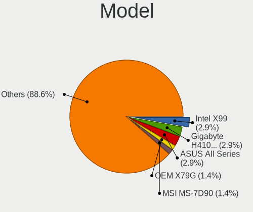

ROSA - Hardware Trends (Desktops)
---------------------------------

A project to identify most popular hardware characteristics and track their change
over time based on data collected by Linux users at https://Linux-Hardware.org.

Anyone can contribute to this report by the [hw-probe](https://github.com/linuxhw/hw-probe) tool:

    sudo -E hw-probe -all -upload

This report is for one last month. Overall report since the beginning of time: [TestDays](https://github.com/linuxhw/TestDays)

Period: Dec, 2024.

Contents
--------

* [ System ](#system)
  - [ OS                       ](#os)
  - [ OS Family                ](#os-family)
  - [ Kernel                   ](#kernel)
  - [ Kernel Family            ](#kernel-family)
  - [ Kernel Major Ver.        ](#kernel-major-ver)
  - [ Arch                     ](#arch)
  - [ DE                       ](#de)
  - [ Display Server           ](#display-server)
  - [ Display Manager          ](#display-manager)
  - [ OS Lang                  ](#os-lang)
  - [ Boot Mode                ](#boot-mode)
  - [ Filesystem               ](#filesystem)
  - [ Part. scheme             ](#part-scheme)
  - [ Dual Boot with Linux/BSD ](#dual-boot-with-linuxbsd)
  - [ Dual Boot (Win)          ](#dual-boot-win)

* [ Board ](#board)
  - [ Vendor                   ](#vendor)
  - [ Model                    ](#model)
  - [ Model Family             ](#model-family)
  - [ MFG Year                 ](#mfg-year)
  - [ Form Factor              ](#form-factor)
  - [ Secure Boot              ](#secure-boot)
  - [ Coreboot                 ](#coreboot)
  - [ RAM Size                 ](#ram-size)
  - [ RAM Used                 ](#ram-used)
  - [ Total Drives             ](#total-drives)
  - [ Has CD-ROM               ](#has-cd-rom)
  - [ Has Ethernet             ](#has-ethernet)
  - [ Has WiFi                 ](#has-wifi)
  - [ Has Bluetooth            ](#has-bluetooth)

* [ Location ](#location)
  - [ Country                  ](#country)
  - [ City                     ](#city)

* [ Drives ](#drives)
  - [ Drive Vendor             ](#drive-vendor)
  - [ Drive Model              ](#drive-model)
  - [ HDD Vendor               ](#hdd-vendor)
  - [ SSD Vendor               ](#ssd-vendor)
  - [ Drive Kind               ](#drive-kind)
  - [ Drive Connector          ](#drive-connector)
  - [ Drive Size               ](#drive-size)
  - [ Space Total              ](#space-total)
  - [ Space Used               ](#space-used)
  - [ Malfunc. Drives          ](#malfunc-drives)
  - [ Malfunc. Drive Vendor    ](#malfunc-drive-vendor)
  - [ Malfunc. HDD Vendor      ](#malfunc-hdd-vendor)
  - [ Malfunc. Drive Kind      ](#malfunc-drive-kind)
  - [ Failed Drives            ](#failed-drives)
  - [ Failed Drive Vendor      ](#failed-drive-vendor)
  - [ Drive Status             ](#drive-status)

* [ Storage controller ](#storage-controller)
  - [ Storage Vendor           ](#storage-vendor)
  - [ Storage Model            ](#storage-model)
  - [ Storage Kind             ](#storage-kind)

* [ Processor ](#processor)
  - [ CPU Vendor               ](#cpu-vendor)
  - [ CPU Model                ](#cpu-model)
  - [ CPU Model Family         ](#cpu-model-family)
  - [ CPU Cores                ](#cpu-cores)
  - [ CPU Sockets              ](#cpu-sockets)
  - [ CPU Threads              ](#cpu-threads)
  - [ CPU Op-Modes             ](#cpu-op-modes)
  - [ CPU Microcode            ](#cpu-microcode)
  - [ CPU Microarch            ](#cpu-microarch)

* [ Graphics ](#graphics)
  - [ GPU Vendor               ](#gpu-vendor)
  - [ GPU Model                ](#gpu-model)
  - [ GPU Combo                ](#gpu-combo)
  - [ GPU Driver               ](#gpu-driver)
  - [ GPU Memory               ](#gpu-memory)

* [ Monitor ](#monitor)
  - [ Monitor Vendor           ](#monitor-vendor)
  - [ Monitor Model            ](#monitor-model)
  - [ Monitor Resolution       ](#monitor-resolution)
  - [ Monitor Diagonal         ](#monitor-diagonal)
  - [ Monitor Width            ](#monitor-width)
  - [ Aspect Ratio             ](#aspect-ratio)
  - [ Monitor Area             ](#monitor-area)
  - [ Pixel Density            ](#pixel-density)
  - [ Multiple Monitors        ](#multiple-monitors)

* [ Network ](#network)
  - [ Net Controller Vendor    ](#net-controller-vendor)
  - [ Net Controller Model     ](#net-controller-model)
  - [ Wireless Vendor          ](#wireless-vendor)
  - [ Wireless Model           ](#wireless-model)
  - [ Ethernet Vendor          ](#ethernet-vendor)
  - [ Ethernet Model           ](#ethernet-model)
  - [ Net Controller Kind      ](#net-controller-kind)
  - [ Used Controller          ](#used-controller)
  - [ NICs                     ](#nics)
  - [ IPv6                     ](#ipv6)

* [ Bluetooth ](#bluetooth)
  - [ Bluetooth Vendor         ](#bluetooth-vendor)
  - [ Bluetooth Model          ](#bluetooth-model)

* [ Sound ](#sound)
  - [ Sound Vendor             ](#sound-vendor)
  - [ Sound Model              ](#sound-model)

* [ Memory ](#memory)
  - [ Memory Vendor            ](#memory-vendor)
  - [ Memory Model             ](#memory-model)
  - [ Memory Kind              ](#memory-kind)
  - [ Memory Form Factor       ](#memory-form-factor)
  - [ Memory Size              ](#memory-size)
  - [ Memory Speed             ](#memory-speed)

* [ Printers & scanners ](#printers--scanners)
  - [ Printer Vendor           ](#printer-vendor)
  - [ Printer Model            ](#printer-model)
  - [ Scanner Vendor           ](#scanner-vendor)
  - [ Scanner Model            ](#scanner-model)

* [ Camera ](#camera)
  - [ Camera Vendor            ](#camera-vendor)
  - [ Camera Model             ](#camera-model)

* [ Security ](#security)
  - [ Fingerprint Vendor       ](#fingerprint-vendor)
  - [ Fingerprint Model        ](#fingerprint-model)
  - [ Chipcard Vendor          ](#chipcard-vendor)
  - [ Chipcard Model           ](#chipcard-model)

* [ Unsupported ](#unsupported)
  - [ Unsupported Devices      ](#unsupported-devices)
  - [ Unsupported Device Types ](#unsupported-device-types)

System
------

OS
--

Installed operating systems

| Name        | Desktops | Percent |
|-------------|----------|---------|
| ROSA 12.5.1 | 52       | 74.29%  |
| ROSA R11.1  | 4        | 5.71%   |
| ROSA 12.6   | 3        | 4.29%   |
| ROSA 12.3   | 3        | 4.29%   |
| ROSA R11    | 2        | 2.86%   |
| ROSA 12.5   | 2        | 2.86%   |
| ROSA 13.0   | 1        | 1.43%   |
| ROSA 12.4   | 1        | 1.43%   |
| ROSA 12.1   | 1        | 1.43%   |
| ROSA 12     | 1        | 1.43%   |

OS Family
---------

OS without a version

| Name | Desktops | Percent |
|------|----------|---------|
| ROSA | 70       | 100%    |

Kernel
------

Version of the Linux kernel

| Version                                       | Desktops | Percent |
|-----------------------------------------------|----------|---------|
| 6.6.47-generic-1rosa2021.1-x86_64             | 34       | 48.57%  |
| 6.6.27-generic-3rosa2021.1-x86_64             | 10       | 14.29%  |
| 6.1.89-generic-2rosa2021.1-x86_64             | 4        | 5.71%   |
| 5.15.75-generic-1rosa2021.1-x86_64            | 2        | 2.86%   |
| 5.15.170-generic-1rosa2021.1-i686             | 2        | 2.86%   |
| 6.6.21-generic-8rosa2021.1-x86_64             | 1        | 1.43%   |
| 6.12.4-generic-3rosa2021.1-x86_64             | 1        | 1.43%   |
| 6.12.1.xm2-x64v2.k.1-xanmod-rosa2021.1-x86_64 | 1        | 1.43%   |
| 6.12.1.xm1-x64v2.k.1-xanmod-rosa2021.1-x86_64 | 1        | 1.43%   |
| 6.11.10-generic-4rosa13-x86_64                | 1        | 1.43%   |
| 6.1.20-generic-2rosa2021.1-x86_64             | 1        | 1.43%   |
| 5.4.32-generic-2rosa-x86_64                   | 1        | 1.43%   |
| 5.4.107-generic-0.1rosa-x86_64                | 1        | 1.43%   |
| 5.17.11-generic-2rosa2021.1-x86_64            | 1        | 1.43%   |
| 5.17.11-generic-2rosa2021.1-i686              | 1        | 1.43%   |
| 5.15.127-generic-1rosa2021.1-x86_64           | 1        | 1.43%   |
| 5.15.103-generic-1rosa2021.1-x86_64           | 1        | 1.43%   |
| 5.10.74-generic-2rosa2021.1-x86_64            | 1        | 1.43%   |
| 5.10.155-generic-1rosa2021.1-x86_64           | 1        | 1.43%   |
| 4.9.155-nrj-desktop-1rosa-x86_64              | 1        | 1.43%   |
| 4.15.0-desktop-45.1rosa-x86_64                | 1        | 1.43%   |
| 4.15.0-desktop-45.1rosa-i586                  | 1        | 1.43%   |
| 4.15.0-desktop-122.124.1rosa-i586             | 1        | 1.43%   |

Kernel Family
-------------

Linux kernel without a distro release

| Version  | Desktops | Percent |
|----------|----------|---------|
| 6.6.47   | 34       | 48.57%  |
| 6.6.27   | 10       | 14.29%  |
| 6.1.89   | 4        | 5.71%   |
| 4.15.0   | 3        | 4.29%   |
| 6.12.1   | 2        | 2.86%   |
| 5.17.11  | 2        | 2.86%   |
| 5.15.75  | 2        | 2.86%   |
| 5.15.170 | 2        | 2.86%   |
| 6.6.21   | 1        | 1.43%   |
| 6.12.4   | 1        | 1.43%   |
| 6.11.10  | 1        | 1.43%   |
| 6.1.20   | 1        | 1.43%   |
| 5.4.32   | 1        | 1.43%   |
| 5.4.107  | 1        | 1.43%   |
| 5.15.127 | 1        | 1.43%   |
| 5.15.103 | 1        | 1.43%   |
| 5.10.74  | 1        | 1.43%   |
| 5.10.155 | 1        | 1.43%   |
| 4.9.155  | 1        | 1.43%   |

Kernel Major Ver.
-----------------

Linux kernel major version

| Version | Desktops | Percent |
|---------|----------|---------|
| 6.6     | 45       | 64.29%  |
| 5.15    | 6        | 8.57%   |
| 6.1     | 5        | 7.14%   |
| 6.12    | 3        | 4.29%   |
| 4.15    | 3        | 4.29%   |
| 5.4     | 2        | 2.86%   |
| 5.17    | 2        | 2.86%   |
| 5.10    | 2        | 2.86%   |
| 6.11    | 1        | 1.43%   |
| 4.9     | 1        | 1.43%   |

Arch
----

OS architecture (x86_64, i586, etc.)

| Name   | Desktops | Percent |
|--------|----------|---------|
| x86_64 | 65       | 92.86%  |
| i686   | 5        | 7.14%   |

DE
--

Desktop Environment

| Name    | Desktops | Percent |
|---------|----------|---------|
| KDE5    | 44       | 62.86%  |
| GNOME   | 14       | 20%     |
| LXQt    | 6        | 8.57%   |
| KDE4    | 3        | 4.29%   |
| XFCE    | 1        | 1.43%   |
| Budgie  | 1        | 1.43%   |
| Unknown | 1        | 1.43%   |

Display Server
--------------

X11 or Wayland

| Name    | Desktops | Percent |
|---------|----------|---------|
| Wayland | 48       | 68.57%  |
| X11     | 22       | 31.43%  |

Display Manager
---------------

SDDM, LightDM, etc.

| Name    | Desktops | Percent |
|---------|----------|---------|
| SDDM    | 44       | 62.86%  |
| GDM     | 20       | 28.57%  |
| LightDM | 3        | 4.29%   |
| KDM     | 3        | 4.29%   |

OS Lang
-------

Language

| Lang    | Desktops | Percent |
|---------|----------|---------|
| ru_RU   | 65       | 92.86%  |
| en_US   | 2        | 2.86%   |
| Unknown | 2        | 2.86%   |
| es_AR   | 1        | 1.43%   |

Boot Mode
---------

EFI or BIOS

| Mode | Desktops | Percent |
|------|----------|---------|
| BIOS | 36       | 51.43%  |
| EFI  | 34       | 48.57%  |

Filesystem
----------

Type of filesystem

| Type  | Desktops | Percent |
|-------|----------|---------|
| Ext4  | 66       | 94.29%  |
| Btrfs | 3        | 4.29%   |
| Ext3  | 1        | 1.43%   |

Part. scheme
------------

Scheme of partitioning

| Type | Desktops | Percent |
|------|----------|---------|
| GPT  | 42       | 60%     |
| MBR  | 28       | 40%     |

Dual Boot with Linux/BSD
------------------------

Hosting more than one Linux/BSD

| Dual boot | Desktops | Percent |
|-----------|----------|---------|
| No        | 49       | 70%     |
| Yes       | 21       | 30%     |

Dual Boot (Win)
---------------

Hosting Linux and Windows

| Dual boot | Desktops | Percent |
|-----------|----------|---------|
| Yes       | 42       | 60%     |
| No        | 28       | 40%     |

Board
-----

Vendor
------

Motherboard manufacturer

| Name                | Desktops | Percent |
|---------------------|----------|---------|
| Gigabyte Technology | 19       | 27.14%  |
| ASUSTek Computer    | 16       | 22.86%  |
| MSI                 | 7        | 10%     |
| ASRock              | 6        | 8.57%   |
| Intel               | 5        | 7.14%   |
| Lenovo              | 4        | 5.71%   |
| Biostar             | 3        | 4.29%   |
| Huanan              | 2        | 2.86%   |
| Acer                | 2        | 2.86%   |
| OEM                 | 1        | 1.43%   |
| MACHINIST           | 1        | 1.43%   |
| Fujitsu             | 1        | 1.43%   |
| Foxconn             | 1        | 1.43%   |
| Aquarius            | 1        | 1.43%   |
| Unknown             | 1        | 1.43%   |

Model
-----

Motherboard model

| Name                                | Desktops | Percent |
|-------------------------------------|----------|---------|
| Intel X99                           | 2        | 2.86%   |
| Gigabyte H410M H V3                 | 2        | 2.86%   |
| ASUS All Series                     | 2        | 2.86%   |
| OEM X79G                            | 1        | 1.43%   |
| MSI MS-7D90                         | 1        | 1.43%   |
| MSI MS-7C52                         | 1        | 1.43%   |
| MSI MS-7A38                         | 1        | 1.43%   |
| MSI MS-7751                         | 1        | 1.43%   |
| MSI MS-7721                         | 1        | 1.43%   |
| MSI MS-7592                         | 1        | 1.43%   |
| MSI MS-7529                         | 1        | 1.43%   |
| MACHINIST X99-RS9 V3.1              | 1        | 1.43%   |
| Lenovo ThinkCentre M92z 33252S6     | 1        | 1.43%   |
| Lenovo ThinkCentre M79 10JAS05300   | 1        | 1.43%   |
| Lenovo ThinkCentre M710q 10MR006JRU | 1        | 1.43%   |
| Lenovo IdeaCentre Q180 10087&3110   | 1        | 1.43%   |
| Intel DQ67SW AAG12527-310           | 1        | 1.43%   |
| Intel DP35DP AAD81073-206           | 1        | 1.43%   |
| Intel B75                           | 1        | 1.43%   |
| Huanan X99-F8 GAMING V5.0           | 1        | 1.43%   |
| Huanan B75                          | 1        | 1.43%   |
| Gigabyte H77N-WIFI                  | 1        | 1.43%   |
| Gigabyte H61M-DS2                   | 1        | 1.43%   |
| Gigabyte H610M H DDR4               | 1        | 1.43%   |
| Gigabyte H470 HD3                   | 1        | 1.43%   |
| Gigabyte H310M S2H                  | 1        | 1.43%   |
| Gigabyte GA-MA770T-UD3              | 1        | 1.43%   |
| Gigabyte GA-MA770-DS3               | 1        | 1.43%   |
| Gigabyte B75M-HD3                   | 1        | 1.43%   |
| Gigabyte B75-D3V                    | 1        | 1.43%   |
| Gigabyte B650M AORUS ELITE          | 1        | 1.43%   |
| Gigabyte B450M S2H                  | 1        | 1.43%   |
| Gigabyte B360M-DS3H                 | 1        | 1.43%   |
| Gigabyte AB350M-DS3H V2             | 1        | 1.43%   |
| Gigabyte AB350M-DS3H                | 1        | 1.43%   |
| Gigabyte 970A-UD3P                  | 1        | 1.43%   |
| Gigabyte 970A-DS3P                  | 1        | 1.43%   |
| Gigabyte 8PEMT4                     | 1        | 1.43%   |
| Fujitsu ESPRIMO P900                | 1        | 1.43%   |
| Foxconn G43M01                      | 1        | 1.43%   |

Model Family
------------

Motherboard model prefix

| Name                   | Desktops | Percent |
|------------------------|----------|---------|
| ASUS PRIME             | 4        | 5.71%   |
| Lenovo ThinkCentre     | 3        | 4.29%   |
| Intel X99              | 2        | 2.86%   |
| Gigabyte H410M         | 2        | 2.86%   |
| Gigabyte AB350M-DS3H   | 2        | 2.86%   |
| ASUS All               | 2        | 2.86%   |
| OEM X79G               | 1        | 1.43%   |
| MSI MS-7D90            | 1        | 1.43%   |
| MSI MS-7C52            | 1        | 1.43%   |
| MSI MS-7A38            | 1        | 1.43%   |
| MSI MS-7751            | 1        | 1.43%   |
| MSI MS-7721            | 1        | 1.43%   |
| MSI MS-7592            | 1        | 1.43%   |
| MSI MS-7529            | 1        | 1.43%   |
| MACHINIST X99-RS9      | 1        | 1.43%   |
| Lenovo IdeaCentre      | 1        | 1.43%   |
| Intel DQ67SW           | 1        | 1.43%   |
| Intel DP35DP           | 1        | 1.43%   |
| Intel B75              | 1        | 1.43%   |
| Huanan X99-F8          | 1        | 1.43%   |
| Huanan B75             | 1        | 1.43%   |
| Gigabyte H77N-WIFI     | 1        | 1.43%   |
| Gigabyte H61M-DS2      | 1        | 1.43%   |
| Gigabyte H610M         | 1        | 1.43%   |
| Gigabyte H470          | 1        | 1.43%   |
| Gigabyte H310M         | 1        | 1.43%   |
| Gigabyte GA-MA770T-UD3 | 1        | 1.43%   |
| Gigabyte GA-MA770-DS3  | 1        | 1.43%   |
| Gigabyte B75M-HD3      | 1        | 1.43%   |
| Gigabyte B75-D3V       | 1        | 1.43%   |
| Gigabyte B650M         | 1        | 1.43%   |
| Gigabyte B450M         | 1        | 1.43%   |
| Gigabyte B360M-DS3H    | 1        | 1.43%   |
| Gigabyte 970A-UD3P     | 1        | 1.43%   |
| Gigabyte 970A-DS3P     | 1        | 1.43%   |
| Gigabyte 8PEMT4        | 1        | 1.43%   |
| Fujitsu ESPRIMO        | 1        | 1.43%   |
| Foxconn G43M01         | 1        | 1.43%   |
| Biostar N68S3B         | 1        | 1.43%   |
| Biostar Hi-Fi          | 1        | 1.43%   |

MFG Year
--------

Motherboard manufacture year

| Year | Desktops | Percent |
|------|----------|---------|
| 2012 | 12       | 17.14%  |
| 2018 | 7        | 10%     |
| 2009 | 7        | 10%     |
| 2019 | 6        | 8.57%   |
| 2020 | 4        | 5.71%   |
| 2017 | 4        | 5.71%   |
| 2016 | 4        | 5.71%   |
| 2022 | 3        | 4.29%   |
| 2021 | 3        | 4.29%   |
| 2014 | 3        | 4.29%   |
| 2013 | 3        | 4.29%   |
| 2011 | 3        | 4.29%   |
| 2008 | 3        | 4.29%   |
| 2007 | 3        | 4.29%   |
| 2024 | 2        | 2.86%   |
| 2023 | 1        | 1.43%   |
| 2010 | 1        | 1.43%   |
| 2003 | 1        | 1.43%   |

Form Factor
-----------

Physical design of the computer

| Name    | Desktops | Percent |
|---------|----------|---------|
| Desktop | 70       | 100%    |

Secure Boot
-----------

Enabled or disabled

| State    | Desktops | Percent |
|----------|----------|---------|
| Disabled | 70       | 100%    |

Coreboot
--------

Have coreboot on board

| Used | Desktops | Percent |
|------|----------|---------|
| No   | 70       | 100%    |

RAM Size
--------

Total RAM memory

| Size in GB  | Desktops | Percent |
|-------------|----------|---------|
| 16.01-24.0  | 20       | 28.57%  |
| 4.01-8.0    | 12       | 17.14%  |
| 3.01-4.0    | 11       | 15.71%  |
| 8.01-16.0   | 11       | 15.71%  |
| 32.01-64.0  | 7        | 10%     |
| 64.01-256.0 | 4        | 5.71%   |
| 2.01-3.0    | 3        | 4.29%   |
| 1.01-2.0    | 1        | 1.43%   |
| 0.51-1.0    | 1        | 1.43%   |

RAM Used
--------

Used RAM memory

| Used GB   | Desktops | Percent |
|-----------|----------|---------|
| 1.01-2.0  | 41       | 58.57%  |
| 2.01-3.0  | 10       | 14.29%  |
| 0.51-1.0  | 8        | 11.43%  |
| 4.01-8.0  | 7        | 10%     |
| 3.01-4.0  | 2        | 2.86%   |
| 8.01-16.0 | 1        | 1.43%   |
| 0.01-0.5  | 1        | 1.43%   |

Total Drives
------------

Number of drives on board

| Drives | Desktops | Percent |
|--------|----------|---------|
| 2      | 25       | 35.71%  |
| 1      | 22       | 31.43%  |
| 3      | 13       | 18.57%  |
| 4      | 7        | 10%     |
| 5      | 2        | 2.86%   |
| 6      | 1        | 1.43%   |

Has CD-ROM
----------

Has CD-ROM on board

| Presented | Desktops | Percent |
|-----------|----------|---------|
| No        | 50       | 71.43%  |
| Yes       | 20       | 28.57%  |

Has Ethernet
------------

Has Ethernet on board

| Presented | Desktops | Percent |
|-----------|----------|---------|
| Yes       | 69       | 98.57%  |
| No        | 1        | 1.43%   |

Has WiFi
--------

Has WiFi module

| Presented | Desktops | Percent |
|-----------|----------|---------|
| No        | 50       | 71.43%  |
| Yes       | 20       | 28.57%  |

Has Bluetooth
-------------

Has Bluetooth module

| Presented | Desktops | Percent |
|-----------|----------|---------|
| No        | 49       | 70%     |
| Yes       | 21       | 30%     |

Location
--------

Country
-------

Geographic location (country)

| Country   | Desktops | Percent |
|-----------|----------|---------|
| Russia    | 65       | 92.86%  |
| Belarus   | 2        | 2.86%   |
| Ukraine   | 1        | 1.43%   |
| Malaysia  | 1        | 1.43%   |
| Argentina | 1        | 1.43%   |

City
----

Geographic location (city)

| City             | Desktops | Percent |
|------------------|----------|---------|
| Moscow           | 12       | 17.14%  |
| St Petersburg    | 5        | 7.14%   |
| Rostov-on-Don    | 3        | 4.29%   |
| Krasnoyarsk      | 3        | 4.29%   |
| Yekaterinburg    | 2        | 2.86%   |
| Voronezh         | 2        | 2.86%   |
| Tula             | 2        | 2.86%   |
| Perm             | 2        | 2.86%   |
| Lipetsk          | 2        | 2.86%   |
| Chelyabinsk      | 2        | 2.86%   |
| Yaroslavl        | 1        | 1.43%   |
| Vladimir         | 1        | 1.43%   |
| Ulan-Ude         | 1        | 1.43%   |
| Tambov           | 1        | 1.43%   |
| Taganrog         | 1        | 1.43%   |
| Sterlitamak      | 1        | 1.43%   |
| Shelekhov        | 1        | 1.43%   |
| Saratov          | 1        | 1.43%   |
| Saransk          | 1        | 1.43%   |
| Samara           | 1        | 1.43%   |
| Prokop'yevsk     | 1        | 1.43%   |
| Petrozavodsk     | 1        | 1.43%   |
| Ozersk           | 1        | 1.43%   |
| Otradnoye        | 1        | 1.43%   |
| Novosibirsk      | 1        | 1.43%   |
| Novoshakhtinsk   | 1        | 1.43%   |
| Novorossiysk     | 1        | 1.43%   |
| Nizhny Tagil     | 1        | 1.43%   |
| Mar del Plata    | 1        | 1.43%   |
| Lviv             | 1        | 1.43%   |
| Kota Kinabalu    | 1        | 1.43%   |
| Kostroma         | 1        | 1.43%   |
| Korolyov         | 1        | 1.43%   |
| Kopeysk          | 1        | 1.43%   |
| Konstantinovsk   | 1        | 1.43%   |
| Kazan’         | 1        | 1.43%   |
| Kaliningrad      | 1        | 1.43%   |
| Irkutsk          | 1        | 1.43%   |
| Gubkin           | 1        | 1.43%   |
| Goryachiy Klyuch | 1        | 1.43%   |

Drives
------

Drive Vendor
------------

Hard drive vendors

| Vendor                      | Desktops | Drives | Percent |
|-----------------------------|----------|--------|---------|
| WDC                         | 29       | 34     | 21.01%  |
| Seagate                     | 26       | 33     | 18.84%  |
| Kingston                    | 11       | 12     | 7.97%   |
| Toshiba                     | 7        | 8      | 5.07%   |
| Samsung Electronics         | 7        | 7      | 5.07%   |
| A-DATA Technology           | 6        | 6      | 4.35%   |
| China                       | 5        | 5      | 3.62%   |
| SPCC                        | 3        | 3      | 2.17%   |
| Netac                       | 3        | 3      | 2.17%   |
| KingSpec                    | 3        | 3      | 2.17%   |
| Hitachi                     | 3        | 4      | 2.17%   |
| Unknown                     | 3        | 3      | 2.17%   |
| SanDisk                     | 2        | 2      | 1.45%   |
| Maxtor                      | 2        | 2      | 1.45%   |
| Crucial                     | 2        | 2      | 1.45%   |
| Apacer                      | 2        | 2      | 1.45%   |
| AMD                         | 2        | 2      | 1.45%   |
| XPG                         | 1        | 1      | 0.72%   |
| Unknown                     | 1        | 1      | 0.72%   |
| Transcend                   | 1        | 1      | 0.72%   |
| Realtek Semiconductor       | 1        | 1      | 0.72%   |
| Plextor                     | 1        | 1      | 0.72%   |
| Patriot                     | 1        | 1      | 0.72%   |
| OSCOO                       | 1        | 1      | 0.72%   |
| Micron_5                    | 1        | 1      | 0.72%   |
| MAXIO Technology (Hangzhou) | 1        | 1      | 0.72%   |
| LITEON                      | 1        | 1      | 0.72%   |
| Kston                       | 1        | 1      | 0.72%   |
| KingDian                    | 1        | 2      | 0.72%   |
| JMicron Technology          | 1        | 1      | 0.72%   |
| Intel                       | 1        | 1      | 0.72%   |
| HS-SSD-WAVE(S)              | 1        | 1      | 0.72%   |
| HGST HTS                    | 1        | 1      | 0.72%   |
| Hewlett-Packard             | 1        | 1      | 0.72%   |
| Espada                      | 1        | 1      | 0.72%   |
| DEXP                        | 1        | 1      | 0.72%   |
| Colorful                    | 1        | 1      | 0.72%   |
| ADATA SU                    | 1        | 1      | 0.72%   |
| 256MB                       | 1        | 1      | 0.72%   |

Drive Model
-----------

Hard drive models

| Model                            | Desktops | Percent |
|----------------------------------|----------|---------|
| Seagate ST500DM002-1BD142 500GB  | 4        | 2.61%   |
| Kingston SA400S37240G 240GB SSD  | 3        | 1.96%   |
| Kingston SA400S37120G 120GB SSD  | 3        | 1.96%   |
| Unknown                          | 3        | 1.96%   |
| WDC WDS240G2G0A-00JH30 240GB SSD | 2        | 1.31%   |
| WDC WD5000AAKX-00ERMA0 500GB     | 2        | 1.31%   |
| WDC WD5000AAKS-00UU3A0 500GB     | 2        | 1.31%   |
| WDC WD10EZEX-08WN4A0 1TB         | 2        | 1.31%   |
| Toshiba HDWD110 1TB              | 2        | 1.31%   |
| Toshiba HDWD105 500GB            | 2        | 1.31%   |
| Toshiba DT01ACA050 500GB         | 2        | 1.31%   |
| Seagate ST9250315AS 250GB        | 2        | 1.31%   |
| Seagate ST1000DM010-2EP102 1TB   | 2        | 1.31%   |
| Seagate ST1000DM010-2DM162 1TB   | 2        | 1.31%   |
| Netac SSD 128GB                  | 2        | 1.31%   |
| KingSpec P3-512 512GB SSD        | 2        | 1.31%   |
| Hitachi HDS721616PLA380 160GB    | 2        | 1.31%   |
| China SSD 128GB                  | 2        | 1.31%   |
| A-DATA SX8200PNP 512GB           | 2        | 1.31%   |
| XPG GAMMIX S5 256GB              | 1        | 0.65%   |
| WDC WDS256G1X0C-00ENX0 256GB     | 1        | 0.65%   |
| WDC WDS250G2B0A 250GB SSD        | 1        | 0.65%   |
| WDC WDS100T2B0A-00SM50 1TB SSD   | 1        | 0.65%   |
| WDC WD5000LPVX-80V0TT0 500GB     | 1        | 0.65%   |
| WDC WD5000LPLX-00ZNTT0 500GB     | 1        | 0.65%   |
| WDC WD5000AZLX-08K2TA0 500GB     | 1        | 0.65%   |
| WDC WD5000AZLX-00JKKA0 500GB     | 1        | 0.65%   |
| WDC WD5000AAKX-60U6AA0 500GB     | 1        | 0.65%   |
| WDC WD5000AAKS-00A7B0 500GB      | 1        | 0.65%   |
| WDC WD5000AADS-00S9B0 500GB      | 1        | 0.65%   |
| WDC WD400BB-00JHC0 40GB          | 1        | 0.65%   |
| WDC WD3200AVVS-56L2B0 320GB      | 1        | 0.65%   |
| WDC WD3200AAKX-001CA0 320GB      | 1        | 0.65%   |
| WDC WD3200AAKS-00L9A0 320GB      | 1        | 0.65%   |
| WDC WD3200AAJS-56B4A0 320GB      | 1        | 0.65%   |
| WDC WD3200AAJS-00L7A0 320GB      | 1        | 0.65%   |
| WDC WD3200AAJS-00B4A0 320GB      | 1        | 0.65%   |
| WDC WD30EZRX-00D8PB0 3TB         | 1        | 0.65%   |
| WDC WD20PURZ-85GU6Y0 2TB         | 1        | 0.65%   |
| WDC WD20EURS-63S48Y0 2TB         | 1        | 0.65%   |

HDD Vendor
----------

Hard disk drive vendors

| Vendor              | Desktops | Drives | Percent |
|---------------------|----------|--------|---------|
| WDC                 | 27       | 29     | 38.57%  |
| Seagate             | 26       | 33     | 37.14%  |
| Toshiba             | 7        | 8      | 10%     |
| Hitachi             | 3        | 4      | 4.29%   |
| Samsung Electronics | 2        | 2      | 2.86%   |
| Maxtor              | 2        | 2      | 2.86%   |
| JMicron Technology  | 1        | 1      | 1.43%   |
| HGST HTS            | 1        | 1      | 1.43%   |
| 256MB               | 1        | 1      | 1.43%   |

SSD Vendor
----------

Solid state drive vendors

| Vendor              | Desktops | Drives | Percent |
|---------------------|----------|--------|---------|
| Kingston            | 8        | 9      | 14.81%  |
| China               | 5        | 5      | 9.26%   |
| WDC                 | 4        | 4      | 7.41%   |
| SPCC                | 3        | 3      | 5.56%   |
| Netac               | 3        | 3      | 5.56%   |
| KingSpec            | 3        | 3      | 5.56%   |
| A-DATA Technology   | 3        | 3      | 5.56%   |
| Unknown             | 3        | 3      | 5.56%   |
| SanDisk             | 2        | 2      | 3.7%    |
| Samsung Electronics | 2        | 2      | 3.7%    |
| Crucial             | 2        | 2      | 3.7%    |
| AMD                 | 2        | 2      | 3.7%    |
| Transcend           | 1        | 1      | 1.85%   |
| Plextor             | 1        | 1      | 1.85%   |
| Patriot             | 1        | 1      | 1.85%   |
| OSCOO               | 1        | 1      | 1.85%   |
| Micron_5            | 1        | 1      | 1.85%   |
| Kston               | 1        | 1      | 1.85%   |
| KingDian            | 1        | 2      | 1.85%   |
| HS-SSD-WAVE(S)      | 1        | 1      | 1.85%   |
| Hewlett-Packard     | 1        | 1      | 1.85%   |
| Espada              | 1        | 1      | 1.85%   |
| DEXP                | 1        | 1      | 1.85%   |
| Colorful            | 1        | 1      | 1.85%   |
| Apacer              | 1        | 1      | 1.85%   |
| ADATA SU            | 1        | 1      | 1.85%   |

Drive Kind
----------

HDD or SSD

| Kind | Desktops | Drives | Percent |
|------|----------|--------|---------|
| HDD  | 54       | 81     | 48.21%  |
| SSD  | 41       | 56     | 36.61%  |
| NVMe | 17       | 17     | 15.18%  |

Drive Connector
---------------

SATA, SAS, NVMe, etc.

| Type | Desktops | Drives | Percent |
|------|----------|--------|---------|
| SATA | 67       | 132    | 75.28%  |
| NVMe | 17       | 17     | 19.1%   |
| SAS  | 5        | 5      | 5.62%   |

Drive Size
----------

Size of hard drive

| Size in TB | Desktops | Drives | Percent |
|------------|----------|--------|---------|
| 0.01-0.5   | 61       | 102    | 66.3%   |
| 0.51-1.0   | 20       | 24     | 21.74%  |
| 1.01-2.0   | 7        | 7      | 7.61%   |
| 2.01-3.0   | 2        | 2      | 2.17%   |
| 10.01-20.0 | 1        | 1      | 1.09%   |
| 4.01-10.0  | 1        | 1      | 1.09%   |

Space Total
-----------

Amount of disk space available on the file system

| Size in GB     | Desktops | Percent |
|----------------|----------|---------|
| 101-250        | 19       | 27.14%  |
| 251-500        | 15       | 21.43%  |
| 501-1000       | 12       | 17.14%  |
| 1-20           | 8        | 11.43%  |
| 1001-2000      | 7        | 10%     |
| 51-100         | 4        | 5.71%   |
| More than 3000 | 2        | 2.86%   |
| 21-50          | 2        | 2.86%   |
| 2001-3000      | 1        | 1.43%   |

Space Used
----------

Amount of used disk space

| Used GB        | Desktops | Percent |
|----------------|----------|---------|
| 1-20           | 39       | 55.71%  |
| 251-500        | 7        | 10%     |
| 51-100         | 7        | 10%     |
| 21-50          | 6        | 8.57%   |
| 101-250        | 6        | 8.57%   |
| 501-1000       | 3        | 4.29%   |
| More than 3000 | 1        | 1.43%   |
| 2001-3000      | 1        | 1.43%   |

Malfunc. Drives
---------------

Drive models with a malfunction

| Model                             | Desktops | Drives | Percent |
|-----------------------------------|----------|--------|---------|
| Seagate ST500DM002-1BD142 500GB   | 4        | 4      | 8.7%    |
| WDC WD5000AAKX-00ERMA0 500GB      | 2        | 2      | 4.35%   |
| Toshiba DT01ACA050 500GB          | 2        | 2      | 4.35%   |
| XPG GAMMIX S5 256GB               | 1        | 1      | 2.17%   |
| WDC WDS240G2G0A-00JH30 240GB SSD  | 1        | 1      | 2.17%   |
| WDC WD5000LPVX-80V0TT0 500GB      | 1        | 1      | 2.17%   |
| WDC WD5000AAKX-60U6AA0 500GB      | 1        | 1      | 2.17%   |
| WDC WD5000AAKS-00UU3A0 500GB      | 1        | 1      | 2.17%   |
| WDC WD3200AVVS-56L2B0 320GB       | 1        | 1      | 2.17%   |
| WDC WD3200AAKX-001CA0 320GB       | 1        | 1      | 2.17%   |
| WDC WD3200AAKS-00L9A0 320GB       | 1        | 1      | 2.17%   |
| WDC WD3200AAJS-56B4A0 320GB       | 1        | 1      | 2.17%   |
| WDC WD3200AAJS-00L7A0 320GB       | 1        | 1      | 2.17%   |
| WDC WD15EADS-00S2B0 1TB           | 1        | 1      | 2.17%   |
| Transcend TS128GSSD230S 128GB     | 1        | 1      | 2.17%   |
| Toshiba MK3276GSX -63 320GB       | 1        | 1      | 2.17%   |
| SPCC Solid State Disk 120GB       | 1        | 1      | 2.17%   |
| Seagate ST9500325AS 500GB         | 1        | 1      | 2.17%   |
| Seagate ST9320325AS 320GB         | 1        | 1      | 2.17%   |
| Seagate ST9250315AS 250GB         | 1        | 1      | 2.17%   |
| Seagate ST500NM0011 500GB         | 1        | 1      | 2.17%   |
| Seagate ST380211AS 80GB           | 1        | 1      | 2.17%   |
| Seagate ST3500418AS 500GB         | 1        | 1      | 2.17%   |
| Seagate ST3320418AS 320GB         | 1        | 1      | 2.17%   |
| Seagate ST3320413CS 320GB         | 1        | 1      | 2.17%   |
| Seagate ST3250820AS 250GB         | 1        | 1      | 2.17%   |
| Seagate ST3250410AS 250GB         | 1        | 1      | 2.17%   |
| Seagate ST2000DM006-2DM164 2TB    | 1        | 1      | 2.17%   |
| Seagate ST1000DM010-2EP102 1TB    | 1        | 2      | 2.17%   |
| Seagate ST1000DM010-2DM162 1TB    | 1        | 1      | 2.17%   |
| Seagate ST1000DM003-9YN162 1TB    | 1        | 1      | 2.17%   |
| Samsung Electronics HM321HI 320GB | 1        | 1      | 2.17%   |
| Samsung Electronics HD120IJ 120GB | 1        | 1      | 2.17%   |
| Maxtor STM3320820A 320GB          | 1        | 1      | 2.17%   |
| Maxtor STM3160211AS 160GB         | 1        | 1      | 2.17%   |
| LITEON CA1-8D128 128GB            | 1        | 1      | 2.17%   |
| Kingston SA400S37480G 480GB SSD   | 1        | 1      | 2.17%   |
| Hitachi HDS721616PLA380 160GB     | 1        | 1      | 2.17%   |
| Espada ES1LMS1603-016 16GB SSD    | 1        | 1      | 2.17%   |
| Apacer AS2280P4 256GB             | 1        | 1      | 2.17%   |

Malfunc. Drive Vendor
---------------------

Vendors of faulty drives

| Vendor              | Desktops | Drives | Percent |
|---------------------|----------|--------|---------|
| Seagate             | 17       | 19     | 37.78%  |
| WDC                 | 12       | 12     | 26.67%  |
| Toshiba             | 3        | 3      | 6.67%   |
| Samsung Electronics | 2        | 2      | 4.44%   |
| Maxtor              | 2        | 2      | 4.44%   |
| XPG                 | 1        | 1      | 2.22%   |
| Transcend           | 1        | 1      | 2.22%   |
| SPCC                | 1        | 1      | 2.22%   |
| LITEON              | 1        | 1      | 2.22%   |
| Kingston            | 1        | 1      | 2.22%   |
| Hitachi             | 1        | 1      | 2.22%   |
| Espada              | 1        | 1      | 2.22%   |
| Apacer              | 1        | 1      | 2.22%   |
| AMD                 | 1        | 1      | 2.22%   |

Malfunc. HDD Vendor
-------------------

Vendors of faulty HDD drives

| Vendor              | Desktops | Drives | Percent |
|---------------------|----------|--------|---------|
| Seagate             | 17       | 19     | 47.22%  |
| WDC                 | 11       | 11     | 30.56%  |
| Toshiba             | 3        | 3      | 8.33%   |
| Samsung Electronics | 2        | 2      | 5.56%   |
| Maxtor              | 2        | 2      | 5.56%   |
| Hitachi             | 1        | 1      | 2.78%   |

Malfunc. Drive Kind
-------------------

Kinds of faulty drives

| Kind | Desktops | Drives | Percent |
|------|----------|--------|---------|
| HDD  | 33       | 38     | 78.57%  |
| SSD  | 6        | 6      | 14.29%  |
| NVMe | 3        | 3      | 7.14%   |

Failed Drives
-------------

Failed drive models

| Model                     | Desktops | Drives | Percent |
|---------------------------|----------|--------|---------|
| Seagate ST9250315AS 250GB | 1        | 1      | 100%    |

Failed Drive Vendor
-------------------

Failed drive vendors

| Vendor  | Desktops | Drives | Percent |
|---------|----------|--------|---------|
| Seagate | 1        | 1      | 100%    |

Drive Status
------------

Number of failed and malfunc. drives

| Status   | Desktops | Drives | Percent |
|----------|----------|--------|---------|
| Works    | 55       | 96     | 54.46%  |
| Malfunc  | 37       | 47     | 36.63%  |
| Detected | 8        | 10     | 7.92%   |
| Failed   | 1        | 1      | 0.99%   |

Storage controller
------------------

Storage Vendor
--------------

Storage controller vendors

| Vendor                      | Desktops | Percent |
|-----------------------------|----------|---------|
| Intel                       | 47       | 52.81%  |
| AMD                         | 21       | 23.6%   |
| ADATA Technology            | 4        | 4.49%   |
| Samsung Electronics         | 3        | 3.37%   |
| Kingston Technology Company | 3        | 3.37%   |
| Nvidia                      | 2        | 2.25%   |
| MAXIO Technology (Hangzhou) | 2        | 2.25%   |
| ASMedia Technology          | 2        | 2.25%   |
| SanDisk                     | 1        | 1.12%   |
| Realtek Semiconductor       | 1        | 1.12%   |
| Marvell Technology Group    | 1        | 1.12%   |
| Lite-On Technology          | 1        | 1.12%   |
| INNOGRIT                    | 1        | 1.12%   |

Storage Model
-------------

Storage controller models

| Model                                                                          | Desktops | Percent |
|--------------------------------------------------------------------------------|----------|---------|
| AMD FCH SATA Controller [AHCI mode]                                            | 8        | 6.9%    |
| Intel 7 Series/C210 Series Chipset Family 6-port SATA Controller [AHCI mode]   | 7        | 6.03%   |
| AMD SB7x0/SB8x0/SB9x0 IDE Controller                                           | 7        | 6.03%   |
| Intel 200 Series PCH SATA controller [AHCI mode]                               | 6        | 5.17%   |
| Intel NM10/ICH7 Family SATA Controller [IDE mode]                              | 5        | 4.31%   |
| AMD SB7x0/SB8x0/SB9x0 SATA Controller [IDE mode]                               | 5        | 4.31%   |
| Intel 82801G (ICH7 Family) IDE Controller                                      | 4        | 3.45%   |
| AMD SB7x0/SB8x0/SB9x0 SATA Controller [AHCI mode]                              | 4        | 3.45%   |
| Intel Cannon Lake PCH SATA AHCI Controller                                     | 3        | 2.59%   |
| Intel 8 Series/C220 Series Chipset Family 6-port SATA Controller 1 [AHCI mode] | 3        | 2.59%   |
| Intel 7 Series/C210 Series Chipset Family 4-port SATA Controller [IDE mode]    | 3        | 2.59%   |
| Intel 7 Series/C210 Series Chipset Family 2-port SATA Controller [IDE mode]    | 3        | 2.59%   |
| Intel 500 Series Chipset Family SATA AHCI Controller                           | 3        | 2.59%   |
| AMD A320 Chipset SATA Controller [AHCI mode]                                   | 3        | 2.59%   |
| Nvidia MCP61 SATA Controller                                                   | 2        | 1.72%   |
| MAXIO (Hangzhou) NVMe SSD Controller MAP1202 (DRAM-less)                       | 2        | 1.72%   |
| Kingston Company KC3000/FURY Renegade NVMe SSD [E18]                           | 2        | 1.72%   |
| Intel Raptor Lake SATA AHCI Controller                                         | 2        | 1.72%   |
| Intel C610/X99 series chipset 6-Port SATA Controller [AHCI mode]               | 2        | 1.72%   |
| Intel 6 Series/C200 Series Chipset Family 6 port Desktop SATA AHCI Controller  | 2        | 1.72%   |
| ASMedia ASM1061/ASM1062 Serial ATA Controller                                  | 2        | 1.72%   |
| AMD 400 Series Chipset SATA Controller                                         | 2        | 1.72%   |
| AMD 300 Series Chipset SATA Controller                                         | 2        | 1.72%   |
| ADATA XPG SX8200 Pro PCIe Gen3x4 M.2 2280 Solid State Drive                    | 2        | 1.72%   |
| SanDisk WD Black NVMe SSD                                                      | 1        | 0.86%   |
| Samsung NVMe SSD Controller SM981/PM981/PM983                                  | 1        | 0.86%   |
| Samsung NVMe SSD Controller PM9A1/PM9A3/980PRO                                 | 1        | 0.86%   |
| Samsung NVMe SSD Controller 980 (DRAM-less)                                    | 1        | 0.86%   |
| Realtek RTS5765DL NVMe SSD Controller (DRAM-less)                              | 1        | 0.86%   |
| Nvidia MCP61 IDE                                                               | 1        | 0.86%   |
| Marvell Group 88SE6101/6102 single-port PATA133 interface                      | 1        | 0.86%   |
| Lite-On CA1-8D128 NVMe SSD                                                     | 1        | 0.86%   |
| Kingston Company NV2 NVMe SSD [TC2200] (DRAM-less)                             | 1        | 0.86%   |
| Intel Volume Management Device NVMe RAID Controller                            | 1        | 0.86%   |
| Intel SATA Controller [RAID mode]                                              | 1        | 0.86%   |
| Intel NVMe Optane Memory Series                                                | 1        | 0.86%   |
| Intel Comet Lake SATA AHCI Controller                                          | 1        | 0.86%   |
| Intel C600/X79 series chipset 6-Port SATA AHCI Controller                      | 1        | 0.86%   |
| Intel Atom Processor E3800 Series SATA AHCI Controller                         | 1        | 0.86%   |
| Intel Alder Lake-S PCH SATA Controller [AHCI Mode]                             | 1        | 0.86%   |

Storage Kind
------------

Kind of storage controller (IDE, SATA, NVMe, SAS, ...)

| Kind | Desktops | Percent |
|------|----------|---------|
| SATA | 54       | 56.25%  |
| IDE  | 23       | 23.96%  |
| NVMe | 17       | 17.71%  |
| RAID | 2        | 2.08%   |

Processor
---------

CPU Vendor
----------

Processor vendors

| Vendor | Desktops | Percent |
|--------|----------|---------|
| Intel  | 47       | 67.14%  |
| AMD    | 23       | 32.86%  |

CPU Model
---------

Processor models

| Model                                       | Desktops | Percent |
|---------------------------------------------|----------|---------|
| AMD Athlon II X2 250 Processor              | 3        | 4.29%   |
| Intel Core i5-2400 CPU @ 3.10GHz            | 2        | 2.86%   |
| Intel Core i3-10100F CPU @ 3.60GHz          | 2        | 2.86%   |
| Intel Xeon CPU E5-2696 v3 @ 2.30GHz         | 1        | 1.43%   |
| Intel Xeon CPU E5-2680 v4 @ 2.40GHz         | 1        | 1.43%   |
| Intel Xeon CPU E5-2670 v2 @ 2.50GHz         | 1        | 1.43%   |
| Intel Xeon CPU E5-2650 v4 @ 2.20GHz         | 1        | 1.43%   |
| Intel Xeon CPU E5-2630 v3 @ 2.40GHz         | 1        | 1.43%   |
| Intel Xeon CPU E31230 @ 3.20GHz             | 1        | 1.43%   |
| Intel Xeon CPU E3-1270 V2 @ 3.50GHz         | 1        | 1.43%   |
| Intel Xeon CPU E3-1240 V2 @ 3.40GHz         | 1        | 1.43%   |
| Intel Xeon CPU E3-1220 V2 @ 3.10GHz         | 1        | 1.43%   |
| Intel Pentium Gold G5420T CPU @ 3.20GHz     | 1        | 1.43%   |
| Intel Pentium Dual-Core CPU E5300 @ 2.60GHz | 1        | 1.43%   |
| Intel Pentium CPU J2900 @ 2.41GHz           | 1        | 1.43%   |
| Intel Pentium CPU G4560T @ 2.90GHz          | 1        | 1.43%   |
| Intel Pentium 4 CPU 2.40GHz                 | 1        | 1.43%   |
| Intel Core i7-8700 CPU @ 3.20GHz            | 1        | 1.43%   |
| Intel Core i7-7700 CPU @ 3.60GHz            | 1        | 1.43%   |
| Intel Core i7-6700 CPU @ 3.40GHz            | 1        | 1.43%   |
| Intel Core i7-3770K CPU @ 3.50GHz           | 1        | 1.43%   |
| Intel Core i7-3770 CPU @ 3.40GHz            | 1        | 1.43%   |
| Intel Core i7-2700K CPU @ 3.50GHz           | 1        | 1.43%   |
| Intel Core i7-2600 CPU @ 3.40GHz            | 1        | 1.43%   |
| Intel Core i5-9400 CPU @ 2.90GHz            | 1        | 1.43%   |
| Intel Core i5-8400 CPU @ 2.80GHz            | 1        | 1.43%   |
| Intel Core i5-7400 CPU @ 3.00GHz            | 1        | 1.43%   |
| Intel Core i5-4670K CPU @ 3.40GHz           | 1        | 1.43%   |
| Intel Core i5-4590S CPU @ 3.00GHz           | 1        | 1.43%   |
| Intel Core i5-3550 CPU @ 3.30GHz            | 1        | 1.43%   |
| Intel Core i5-3470 CPU @ 3.20GHz            | 1        | 1.43%   |
| Intel Core i5-10400F CPU @ 2.90GHz          | 1        | 1.43%   |
| Intel Core i3-10100 CPU @ 3.60GHz           | 1        | 1.43%   |
| Intel Core i3 CPU 530 @ 2.93GHz             | 1        | 1.43%   |
| Intel Core 2 Quad CPU Q8200 @ 2.33GHz       | 1        | 1.43%   |
| Intel Core 2 Duo CPU E8400 @ 3.00GHz        | 1        | 1.43%   |
| Intel Core 2 Duo CPU E7500 @ 2.93GHz        | 1        | 1.43%   |
| Intel Core 2 CPU 6320 @ 1.86GHz             | 1        | 1.43%   |
| Intel Celeron G4930 CPU @ 3.20GHz           | 1        | 1.43%   |
| Intel Celeron CPU G1620 @ 2.70GHz           | 1        | 1.43%   |

CPU Model Family
----------------

Processor model prefix

| Model                   | Desktops | Percent |
|-------------------------|----------|---------|
| Intel Core i5           | 10       | 14.29%  |
| Intel Xeon              | 9        | 12.86%  |
| Intel Core i7           | 7        | 10%     |
| AMD Ryzen 5             | 5        | 7.14%   |
| Other                   | 4        | 5.71%   |
| Intel Core i3           | 4        | 5.71%   |
| AMD Athlon II X2        | 4        | 5.71%   |
| Intel Celeron           | 3        | 4.29%   |
| AMD FX                  | 3        | 4.29%   |
| Intel Pentium           | 2        | 2.86%   |
| Intel Core 2 Duo        | 2        | 2.86%   |
| AMD Ryzen 3             | 2        | 2.86%   |
| AMD Athlon 64 X2        | 2        | 2.86%   |
| AMD A8                  | 2        | 2.86%   |
| Intel Pentium Gold      | 1        | 1.43%   |
| Intel Pentium Dual-Core | 1        | 1.43%   |
| Intel Pentium 4         | 1        | 1.43%   |
| Intel Core 2 Quad       | 1        | 1.43%   |
| Intel Core 2            | 1        | 1.43%   |
| Intel Atom              | 1        | 1.43%   |
| AMD Sempron             | 1        | 1.43%   |
| AMD Ryzen 7             | 1        | 1.43%   |
| AMD PRO A8              | 1        | 1.43%   |
| AMD Phenom              | 1        | 1.43%   |
| AMD Athlon              | 1        | 1.43%   |

CPU Cores
---------

Number of processor cores

| Number | Desktops | Percent |
|--------|----------|---------|
| 4      | 27       | 38.57%  |
| 2      | 22       | 31.43%  |
| 6      | 11       | 15.71%  |
| 8      | 3        | 4.29%   |
| 12     | 2        | 2.86%   |
| 1      | 2        | 2.86%   |
| 18     | 1        | 1.43%   |
| 14     | 1        | 1.43%   |
| 10     | 1        | 1.43%   |

CPU Sockets
-----------

Number of sockets

| Number | Desktops | Percent |
|--------|----------|---------|
| 1      | 70       | 100%    |

CPU Threads
-----------

Threads per core (Hyper-Threading)

| Number | Desktops | Percent |
|--------|----------|---------|
| 2      | 38       | 54.29%  |
| 1      | 32       | 45.71%  |

CPU Op-Modes
------------

CPU Operation Modes (32-bit, 64-bit)

| Op mode        | Desktops | Percent |
|----------------|----------|---------|
| 32-bit, 64-bit | 69       | 98.57%  |
| 32-bit         | 1        | 1.43%   |

CPU Microcode
-------------

Microcode number

| Number     | Desktops | Percent |
|------------|----------|---------|
| Unknown    | 36       | 51.43%  |
| 0x1067a    | 4        | 5.71%   |
| 0x306a9    | 3        | 4.29%   |
| 0x010000c8 | 3        | 4.29%   |
| 0x906e9    | 2        | 2.86%   |
| 0x406f1    | 2        | 2.86%   |
| 0x06003106 | 2        | 2.86%   |
| 0x010000b7 | 2        | 2.86%   |
| 0xf27      | 1        | 1.43%   |
| 0x906eb    | 1        | 1.43%   |
| 0x906ea    | 1        | 1.43%   |
| 0x306f2    | 1        | 1.43%   |
| 0x20652    | 1        | 1.43%   |
| 0x0b404006 | 1        | 1.43%   |
| 0x0a500011 | 1        | 1.43%   |
| 0x08701021 | 1        | 1.43%   |
| 0x08600109 | 1        | 1.43%   |
| 0x08108109 | 1        | 1.43%   |
| 0x0800820d | 1        | 1.43%   |
| 0x06006118 | 1        | 1.43%   |
| 0x0600081f | 1        | 1.43%   |
| 0x0600081c | 1        | 1.43%   |
| 0x01000095 | 1        | 1.43%   |
| 0x01000083 | 1        | 1.43%   |

CPU Microarch
-------------

Microarchitecture

| Name             | Desktops | Percent |
|------------------|----------|---------|
| IvyBridge        | 9        | 12.86%  |
| KabyLake         | 8        | 11.43%  |
| K10              | 7        | 10%     |
| SandyBridge      | 5        | 7.14%   |
| Penryn           | 5        | 7.14%   |
| Haswell          | 4        | 5.71%   |
| CometLake        | 4        | 5.71%   |
| Piledriver       | 3        | 4.29%   |
| Alderlake Hybrid | 3        | 4.29%   |
| Zen+             | 2        | 2.86%   |
| Zen 3            | 2        | 2.86%   |
| Zen 2            | 2        | 2.86%   |
| Steamroller      | 2        | 2.86%   |
| K8 Hammer        | 2        | 2.86%   |
| Broadwell        | 2        | 2.86%   |
| Zen              | 1        | 1.43%   |
| Westmere         | 1        | 1.43%   |
| Skylake          | 1        | 1.43%   |
| Silvermont       | 1        | 1.43%   |
| NetBurst         | 1        | 1.43%   |
| Icelake          | 1        | 1.43%   |
| Excavator        | 1        | 1.43%   |
| Core             | 1        | 1.43%   |
| Bonnell          | 1        | 1.43%   |
| Unknown          | 1        | 1.43%   |

Graphics
--------

GPU Vendor
----------

Vendors of graphics cards

| Vendor | Desktops | Percent |
|--------|----------|---------|
| Nvidia | 38       | 52.05%  |
| AMD    | 22       | 30.14%  |
| Intel  | 13       | 17.81%  |

GPU Model
---------

Graphics card models

| Model                                                            | Desktops | Percent |
|------------------------------------------------------------------|----------|---------|
| Nvidia GP107 [GeForce GTX 1050 Ti]                               | 3        | 4.05%   |
| Nvidia GM204 [GeForce GTX 970]                                   | 3        | 4.05%   |
| Nvidia GF119 [GeForce GT 610]                                    | 3        | 4.05%   |
| Intel CoffeeLake-S GT2 [UHD Graphics 630]                        | 3        | 4.05%   |
| AMD Navi 23 [Radeon RX 6600/6600 XT/6600M]                       | 3        | 4.05%   |
| Nvidia TU116 [GeForce GTX 1660 SUPER]                            | 2        | 2.7%    |
| Nvidia GT218 [GeForce 210]                                       | 2        | 2.7%    |
| Nvidia GK208B [GeForce GT 710]                                   | 2        | 2.7%    |
| Nvidia GF116 [GeForce GTX 550 Ti]                                | 2        | 2.7%    |
| Nvidia AD107 [GeForce RTX 4060]                                  | 2        | 2.7%    |
| Intel Xeon E3-1200 v2/3rd Gen Core processor Graphics Controller | 2        | 2.7%    |
| Intel CoffeeLake-S GT1 [UHD Graphics 610]                        | 2        | 2.7%    |
| AMD RS780L [Radeon 3000]                                         | 2        | 2.7%    |
| AMD Polaris 20 XL [Radeon RX 580 2048SP]                         | 2        | 2.7%    |
| AMD Kaveri [Radeon R7 Graphics]                                  | 2        | 2.7%    |
| AMD Ellesmere [Radeon RX 470/480/570/570X/580/580X/590]          | 2        | 2.7%    |
| Nvidia TU117 [GeForce GTX 1650]                                  | 1        | 1.35%   |
| Nvidia TU116 [GeForce GTX 1660]                                  | 1        | 1.35%   |
| Nvidia TU116 [GeForce GTX 1660 Ti]                               | 1        | 1.35%   |
| Nvidia TU106 [GeForce GTX 1650]                                  | 1        | 1.35%   |
| Nvidia GT215 [GeForce GT 320]                                    | 1        | 1.35%   |
| Nvidia GP107 [GeForce GTX 1050]                                  | 1        | 1.35%   |
| Nvidia GP106 [GeForce GTX 1060 3GB]                              | 1        | 1.35%   |
| Nvidia GP104 [GeForce GTX 1060 6GB]                              | 1        | 1.35%   |
| Nvidia GK208B [GeForce GT 730]                                   | 1        | 1.35%   |
| Nvidia GK107 [GeForce GTX 650]                                   | 1        | 1.35%   |
| Nvidia GK107 [GeForce GT 740]                                    | 1        | 1.35%   |
| Nvidia GK104 [GeForce GTX 770]                                   | 1        | 1.35%   |
| Nvidia GK104 [GeForce GTX 660 Rev. 2]                            | 1        | 1.35%   |
| Nvidia GF108 [GeForce GT 730]                                    | 1        | 1.35%   |
| Nvidia GF108 [GeForce GT 440]                                    | 1        | 1.35%   |
| Nvidia G94 [GeForce 9600 GT]                                     | 1        | 1.35%   |
| Nvidia G92 [GeForce GTS 250]                                     | 1        | 1.35%   |
| Nvidia G92 [GeForce 9800 GT]                                     | 1        | 1.35%   |
| Nvidia G84 [GeForce 8600 GT]                                     | 1        | 1.35%   |
| Intel IvyBridge GT2 [HD Graphics 4000]                           | 1        | 1.35%   |
| Intel HD Graphics 630                                            | 1        | 1.35%   |
| Intel HD Graphics 610                                            | 1        | 1.35%   |
| Intel HD Graphics 530                                            | 1        | 1.35%   |
| Intel Atom Processor Z36xxx/Z37xxx Series Graphics & Display     | 1        | 1.35%   |

GPU Combo
---------

Combinations of graphics cards

| Name           | Desktops | Percent |
|----------------|----------|---------|
| 1 x Nvidia     | 36       | 51.43%  |
| 1 x AMD        | 20       | 28.57%  |
| 1 x Intel      | 11       | 15.71%  |
| 2 x AMD        | 1        | 1.43%   |
| Intel + Nvidia | 1        | 1.43%   |
| AMD + Nvidia   | 1        | 1.43%   |

GPU Driver
----------

Free vs proprietary

| Driver      | Desktops | Percent |
|-------------|----------|---------|
| Free        | 55       | 78.57%  |
| Proprietary | 11       | 15.71%  |
| Unknown     | 4        | 5.71%   |

GPU Memory
----------

Total video memory

| Size in GB | Desktops | Percent |
|------------|----------|---------|
| Unknown    | 20       | 28.57%  |
| 1.01-2.0   | 11       | 15.71%  |
| 0.51-1.0   | 10       | 14.29%  |
| 0.01-0.5   | 10       | 14.29%  |
| 3.01-4.0   | 9        | 12.86%  |
| 7.01-8.0   | 6        | 8.57%   |
| 5.01-6.0   | 2        | 2.86%   |
| 2.01-3.0   | 1        | 1.43%   |
| 16.01-24.0 | 1        | 1.43%   |

Monitor
-------

Monitor Vendor
--------------

Monitor vendors

| Vendor               | Desktops | Percent |
|----------------------|----------|---------|
| Samsung Electronics  | 13       | 18.57%  |
| AOC                  | 8        | 11.43%  |
| Goldstar             | 7        | 10%     |
| ViewSonic            | 4        | 5.71%   |
| Philips              | 4        | 5.71%   |
| BenQ                 | 4        | 5.71%   |
| SKG                  | 3        | 4.29%   |
| Hewlett-Packard      | 3        | 4.29%   |
| Ancor Communications | 3        | 4.29%   |
| SAC                  | 2        | 2.86%   |
| Dell                 | 2        | 2.86%   |
| Acer                 | 2        | 2.86%   |
| VIE                  | 1        | 1.43%   |
| Sony                 | 1        | 1.43%   |
| Sharp                | 1        | 1.43%   |
| Plain Tree Systems   | 1        | 1.43%   |
| NEC Computers        | 1        | 1.43%   |
| MSI                  | 1        | 1.43%   |
| Mi                   | 1        | 1.43%   |
| Lenovo               | 1        | 1.43%   |
| Hyundai ImageQuest   | 1        | 1.43%   |
| HannStar             | 1        | 1.43%   |
| GDH                  | 1        | 1.43%   |
| Envision Peripherals | 1        | 1.43%   |
| CTV                  | 1        | 1.43%   |
| CHD                  | 1        | 1.43%   |
| ASUSTek Computer     | 1        | 1.43%   |

Monitor Model
-------------

Monitor models

| Model                                                                  | Desktops | Percent |
|------------------------------------------------------------------------|----------|---------|
| Samsung Electronics C32F391 SAM0D34 1920x1080 698x393mm 31.5-inch      | 2        | 2.74%   |
| Philips PHL 243V7 PHLC155 1920x1080 527x296mm 23.8-inch                | 2        | 2.74%   |
| Goldstar 22EN33 GSM597C 1920x1080 480x270mm 21.7-inch                  | 2        | 2.74%   |
| BenQ G925HDA BNQ7843 1366x768 410x230mm 18.5-inch                      | 2        | 2.74%   |
| ViewSonic VX2458 series VSC0437 1920x1080 521x293mm 23.5-inch          | 1        | 1.37%   |
| ViewSonic VX2433wm VSC3822 1920x1080 520x290mm 23.4-inch               | 1        | 1.37%   |
| ViewSonic VE175 VSCEE08 1280x1024 340x270mm 17.1-inch                  | 1        | 1.37%   |
| ViewSonic VA2232 Series VSC8224 1680x1050 474x296mm 22.0-inch          | 1        | 1.37%   |
| VIE AF32AWB VIE3200 2560x1440 698x392mm 31.5-inch                      | 1        | 1.37%   |
| VIE AF32AWB VIE2700 2560x1440 597x336mm 27.0-inch                      | 1        | 1.37%   |
| Sony TV SNY2C02 1920x1080 886x498mm 40.0-inch                          | 1        | 1.37%   |
| SKG VG2791SEF SKG2713 1920x1080 597x336mm 27.0-inch                    | 1        | 1.37%   |
| SKG DEXP DF24N2 SKG2413 1920x1080 597x336mm 27.0-inch                  | 1        | 1.37%   |
| SKG AQ27H1M SKG2720 2560x1440 530x280mm 23.6-inch                      | 1        | 1.37%   |
| Sharp HDMI SHP111D 1920x1080 631x354mm 28.5-inch                       | 1        | 1.37%   |
| Samsung Electronics SyncMaster SAM02AD 1440x900 410x257mm 19.1-inch    | 1        | 1.37%   |
| Samsung Electronics SMS19A100 SAM0867 1366x768 410x230mm 18.5-inch     | 1        | 1.37%   |
| Samsung Electronics SMEX2220 SAM0686 1920x1080 477x268mm 21.5-inch     | 1        | 1.37%   |
| Samsung Electronics SMB2340 SAM0691 1920x1080 510x290mm 23.1-inch      | 1        | 1.37%   |
| Samsung Electronics SAMTRON STN0021 1280x1024 338x270mm 17.0-inch      | 1        | 1.37%   |
| Samsung Electronics S24B300 SAM08CC 1920x1080 521x293mm 23.5-inch      | 1        | 1.37%   |
| Samsung Electronics S22C200 SAM09AF 1920x1080 477x268mm 21.5-inch      | 1        | 1.37%   |
| Samsung Electronics S22B150 SAM08A3 1920x1080 477x268mm 21.5-inch      | 1        | 1.37%   |
| Samsung Electronics S19C200 SAM09AC 1366x768 410x230mm 18.5-inch       | 1        | 1.37%   |
| Samsung Electronics LCD Monitor SAM0B5C 1920x1080 1212x682mm 54.8-inch | 1        | 1.37%   |
| Samsung Electronics LCD Monitor SAM0902 1920x1080 700x390mm 31.5-inch  | 1        | 1.37%   |
| Samsung Electronics C24F390 SAM0D2C 1920x1080 521x293mm 23.5-inch      | 1        | 1.37%   |
| SAC 27P501Q SAC2753 2560x1440 597x336mm 27.0-inch                      | 1        | 1.37%   |
| SAC 24P501F SAC2453 1920x1080 530x290mm 23.8-inch                      | 1        | 1.37%   |
| Plain Tree Systems Monitor PTS06A5 1280x1024 337x270mm 17.0-inch       | 1        | 1.37%   |
| Philips PHL 241V8 PHLC212 1920x1080 527x296mm 23.8-inch                | 1        | 1.37%   |
| Philips PHL 223V5 PHLC0CF 1920x1080 480x270mm 21.7-inch                | 1        | 1.37%   |
| NEC Computers LCD195VXM+ NEC66C1 1280x1024 376x301mm 19.0-inch         | 1        | 1.37%   |
| MSI MP273A MSI40B4 1920x1080 600x330mm 27.0-inch                       | 1        | 1.37%   |
| Mi P27FBB-RG XMIB008 1920x1080 597x336mm 27.0-inch                     | 1        | 1.37%   |
| Lenovo LEN-M92z-B LEN0092 1920x1080 509x286mm 23.0-inch                | 1        | 1.37%   |
| Hyundai ImageQuest L72S HIQ5001 1280x1024 337x270mm 17.0-inch          | 1        | 1.37%   |
| Hewlett-Packard P240va HWP3308 1920x1080 527x296mm 23.8-inch           | 1        | 1.37%   |
| Hewlett-Packard LE1711 HWP2856 1280x1024 340x270mm 17.1-inch           | 1        | 1.37%   |
| Hewlett-Packard LA2405x HWP301F 1920x1200 518x324mm 24.1-inch          | 1        | 1.37%   |

Monitor Resolution
------------------

Monitor screen resolution

| Resolution         | Desktops | Percent |
|--------------------|----------|---------|
| 1920x1080 (FHD)    | 38       | 55.88%  |
| 1280x1024 (SXGA)   | 8        | 11.76%  |
| 2560x1440 (QHD)    | 6        | 8.82%   |
| 3840x2160 (4K)     | 5        | 7.35%   |
| 1366x768 (WXGA)    | 5        | 7.35%   |
| 1600x900 (HD+)     | 2        | 2.94%   |
| 1920x1200 (WUXGA)  | 1        | 1.47%   |
| 1680x1050 (WSXGA+) | 1        | 1.47%   |
| 1440x900 (WXGA+)   | 1        | 1.47%   |
| 1280x960           | 1        | 1.47%   |

Monitor Diagonal
----------------

Diagonal size in inches

| Inches | Desktops | Percent |
|--------|----------|---------|
| 23     | 14       | 19.18%  |
| 27     | 11       | 15.07%  |
| 21     | 11       | 15.07%  |
| 24     | 8        | 10.96%  |
| 31     | 5        | 6.85%   |
| 19     | 5        | 6.85%   |
| 18     | 5        | 6.85%   |
| 17     | 5        | 6.85%   |
| 54     | 2        | 2.74%   |
| 20     | 2        | 2.74%   |
| 55     | 1        | 1.37%   |
| 52     | 1        | 1.37%   |
| 32     | 1        | 1.37%   |
| 28     | 1        | 1.37%   |
| 22     | 1        | 1.37%   |

Monitor Width
-------------

Physical width

| Width in mm | Desktops | Percent |
|-------------|----------|---------|
| 501-600     | 30       | 42.25%  |
| 401-500     | 20       | 28.17%  |
| 601-700     | 7        | 9.86%   |
| 301-350     | 5        | 7.04%   |
| 351-400     | 4        | 5.63%   |
| 1001-1500   | 4        | 5.63%   |
| 701-800     | 1        | 1.41%   |

Aspect Ratio
------------

Proportional relationship between the width and the height

| Ratio | Desktops | Percent |
|-------|----------|---------|
| 16/9  | 52       | 81.25%  |
| 5/4   | 9        | 14.06%  |
| 16/10 | 2        | 3.13%   |
| 3/2   | 1        | 1.56%   |

Monitor Area
------------

Area in inch²

| Area in inch² | Desktops | Percent |
|----------------|----------|---------|
| 201-250        | 27       | 38.03%  |
| 301-350        | 12       | 16.9%   |
| 141-150        | 10       | 14.08%  |
| 151-200        | 9        | 12.68%  |
| 351-500        | 6        | 8.45%   |
| More than 1000 | 4        | 5.63%   |
| 251-300        | 3        | 4.23%   |

Pixel Density
-------------

Pixels per inch

| Density | Desktops | Percent |
|---------|----------|---------|
| 51-100  | 51       | 73.91%  |
| 101-120 | 11       | 15.94%  |
| 1-50    | 4        | 5.8%    |
| 121-160 | 2        | 2.9%    |
| 161-240 | 1        | 1.45%   |

Multiple Monitors
-----------------

Total monitors connected

| Total | Desktops | Percent |
|-------|----------|---------|
| 1     | 55       | 78.57%  |
| 2     | 10       | 14.29%  |
| 0     | 5        | 7.14%   |

Network
-------

Net Controller Vendor
---------------------

Controller vendors

| Vendor                                 | Desktops | Percent |
|----------------------------------------|----------|---------|
| Realtek Semiconductor                  | 55       | 61.8%   |
| Intel                                  | 16       | 17.98%  |
| Ralink Technology                      | 3        | 3.37%   |
| Qualcomm Atheros                       | 2        | 2.25%   |
| Nvidia                                 | 2        | 2.25%   |
| MediaTek                               | 2        | 2.25%   |
| Broadcom                               | 2        | 2.25%   |
| TP-Link                                | 1        | 1.12%   |
| Sony Ericsson Mobile Communications AB | 1        | 1.12%   |
| Qualcomm Atheros Communications        | 1        | 1.12%   |
| NetGear                                | 1        | 1.12%   |
| Huawei Technologies                    | 1        | 1.12%   |
| D-Link                                 | 1        | 1.12%   |
| ASUSTek Computer                       | 1        | 1.12%   |

Net Controller Model
--------------------

Controller models

| Model                                                                  | Desktops | Percent |
|------------------------------------------------------------------------|----------|---------|
| Realtek RTL8111/8168/8211/8411 PCI Express Gigabit Ethernet Controller | 46       | 47.92%  |
| Intel Ethernet Connection (2) I219-V                                   | 4        | 4.17%   |
| Realtek RTL8125 2.5GbE Controller                                      | 3        | 3.13%   |
| Realtek RTL810xE PCI Express Fast Ethernet controller                  | 3        | 3.13%   |
| Ralink MT7601U Wireless Adapter                                        | 3        | 3.13%   |
| Intel 82579LM Gigabit Network Connection (Lewisville)                  | 3        | 3.13%   |
| Realtek RTL-8100/8101L/8139 PCI Fast Ethernet Adapter                  | 2        | 2.08%   |
| Qualcomm Atheros AR8161 Gigabit Ethernet                               | 2        | 2.08%   |
| Nvidia MCP61 Ethernet                                                  | 2        | 2.08%   |
| Intel Ethernet Connection (14) I219-V                                  | 2        | 2.08%   |
| Intel Centrino Wireless-N 2230                                         | 2        | 2.08%   |
| TP-Link AC600 wireless Realtek RTL8811AU [Archer T2U Nano]             | 1        | 1.04%   |
| Sony Ericsson Mobile AB G3112                                          | 1        | 1.04%   |
| Realtek RTL88x2bu [AC1200 Techkey]                                     | 1        | 1.04%   |
| Realtek RTL8188CUS 802.11n WLAN Adapter                                | 1        | 1.04%   |
| Realtek RTL8188CE 802.11b/g/n WiFi Adapter                             | 1        | 1.04%   |
| Realtek RTL8153 Gigabit Ethernet Adapter                               | 1        | 1.04%   |
| Realtek 802.11ax WLAN Adapter                                          | 1        | 1.04%   |
| Qualcomm Atheros AR9271 802.11n                                        | 1        | 1.04%   |
| NetGear WG111v3 54 Mbps Wireless [realtek RTL8187B]                    | 1        | 1.04%   |
| MediaTek MT7921 802.11ax PCI Express Wireless Network Adapter          | 1        | 1.04%   |
| MediaTek Infinix SMART 5                                               | 1        | 1.04%   |
| Intel I211 Gigabit Network Connection                                  | 1        | 1.04%   |
| Intel Ethernet Connection (11) I219-V                                  | 1        | 1.04%   |
| Intel Dual Band Wireless-AC 3168NGW [Stone Peak]                       | 1        | 1.04%   |
| Intel Dual Band Wireless-AC 3165 Plus Bluetooth                        | 1        | 1.04%   |
| Intel Cannon Lake PCH CNVi WiFi                                        | 1        | 1.04%   |
| Intel 82579V Gigabit Network Connection                                | 1        | 1.04%   |
| Intel 82578DC Gigabit Network Connection                               | 1        | 1.04%   |
| Intel 82566DC-2 Gigabit Network Connection                             | 1        | 1.04%   |
| Huawei E353/E3131                                                      | 1        | 1.04%   |
| D-Link 802.11 n WLAN                                                   | 1        | 1.04%   |
| Broadcom BCM4360 802.11ac Dual Band Wireless Network Adapter           | 1        | 1.04%   |
| Broadcom BCM43228 802.11a/b/g/n                                        | 1        | 1.04%   |
| ASUS USB-N14 802.11b/g/n (2x2) Wireless Adapter [Ralink RT5372]        | 1        | 1.04%   |

Wireless Vendor
---------------

Wireless vendors

| Vendor                          | Desktops | Percent |
|---------------------------------|----------|---------|
| Intel                           | 5        | 25%     |
| Realtek Semiconductor           | 4        | 20%     |
| Ralink Technology               | 3        | 15%     |
| Broadcom                        | 2        | 10%     |
| TP-Link                         | 1        | 5%      |
| Qualcomm Atheros Communications | 1        | 5%      |
| NetGear                         | 1        | 5%      |
| MediaTek                        | 1        | 5%      |
| D-Link                          | 1        | 5%      |
| ASUSTek Computer                | 1        | 5%      |

Wireless Model
--------------

Wireless models

| Model                                                           | Desktops | Percent |
|-----------------------------------------------------------------|----------|---------|
| Ralink MT7601U Wireless Adapter                                 | 3        | 15%     |
| Intel Centrino Wireless-N 2230                                  | 2        | 10%     |
| TP-Link AC600 wireless Realtek RTL8811AU [Archer T2U Nano]      | 1        | 5%      |
| Realtek RTL88x2bu [AC1200 Techkey]                              | 1        | 5%      |
| Realtek RTL8188CUS 802.11n WLAN Adapter                         | 1        | 5%      |
| Realtek RTL8188CE 802.11b/g/n WiFi Adapter                      | 1        | 5%      |
| Realtek 802.11ax WLAN Adapter                                   | 1        | 5%      |
| Qualcomm Atheros AR9271 802.11n                                 | 1        | 5%      |
| NetGear WG111v3 54 Mbps Wireless [realtek RTL8187B]             | 1        | 5%      |
| MediaTek MT7921 802.11ax PCI Express Wireless Network Adapter   | 1        | 5%      |
| Intel Dual Band Wireless-AC 3168NGW [Stone Peak]                | 1        | 5%      |
| Intel Dual Band Wireless-AC 3165 Plus Bluetooth                 | 1        | 5%      |
| Intel Cannon Lake PCH CNVi WiFi                                 | 1        | 5%      |
| D-Link 802.11 n WLAN                                            | 1        | 5%      |
| Broadcom BCM4360 802.11ac Dual Band Wireless Network Adapter    | 1        | 5%      |
| Broadcom BCM43228 802.11a/b/g/n                                 | 1        | 5%      |
| ASUS USB-N14 802.11b/g/n (2x2) Wireless Adapter [Ralink RT5372] | 1        | 5%      |

Ethernet Vendor
---------------

Ethernet vendors

| Vendor                                 | Desktops | Percent |
|----------------------------------------|----------|---------|
| Realtek Semiconductor                  | 55       | 73.33%  |
| Intel                                  | 13       | 17.33%  |
| Qualcomm Atheros                       | 2        | 2.67%   |
| Nvidia                                 | 2        | 2.67%   |
| Sony Ericsson Mobile Communications AB | 1        | 1.33%   |
| MediaTek                               | 1        | 1.33%   |
| Huawei Technologies                    | 1        | 1.33%   |

Ethernet Model
--------------

Ethernet models

| Model                                                                  | Desktops | Percent |
|------------------------------------------------------------------------|----------|---------|
| Realtek RTL8111/8168/8211/8411 PCI Express Gigabit Ethernet Controller | 46       | 60.53%  |
| Intel Ethernet Connection (2) I219-V                                   | 4        | 5.26%   |
| Realtek RTL8125 2.5GbE Controller                                      | 3        | 3.95%   |
| Realtek RTL810xE PCI Express Fast Ethernet controller                  | 3        | 3.95%   |
| Intel 82579LM Gigabit Network Connection (Lewisville)                  | 3        | 3.95%   |
| Realtek RTL-8100/8101L/8139 PCI Fast Ethernet Adapter                  | 2        | 2.63%   |
| Qualcomm Atheros AR8161 Gigabit Ethernet                               | 2        | 2.63%   |
| Nvidia MCP61 Ethernet                                                  | 2        | 2.63%   |
| Intel Ethernet Connection (14) I219-V                                  | 2        | 2.63%   |
| Sony Ericsson Mobile AB G3112                                          | 1        | 1.32%   |
| Realtek RTL8153 Gigabit Ethernet Adapter                               | 1        | 1.32%   |
| MediaTek Infinix SMART 5                                               | 1        | 1.32%   |
| Intel I211 Gigabit Network Connection                                  | 1        | 1.32%   |
| Intel Ethernet Connection (11) I219-V                                  | 1        | 1.32%   |
| Intel 82579V Gigabit Network Connection                                | 1        | 1.32%   |
| Intel 82578DC Gigabit Network Connection                               | 1        | 1.32%   |
| Intel 82566DC-2 Gigabit Network Connection                             | 1        | 1.32%   |
| Huawei E353/E3131                                                      | 1        | 1.32%   |

Net Controller Kind
-------------------

Ethernet, WiFi or modem

| Kind     | Desktops | Percent |
|----------|----------|---------|
| Ethernet | 69       | 77.53%  |
| WiFi     | 20       | 22.47%  |

Used Controller
---------------

Currently used network controller

| Kind     | Desktops | Percent |
|----------|----------|---------|
| Ethernet | 58       | 85.29%  |
| WiFi     | 10       | 14.71%  |

NICs
----

Total network controllers on board

| Total | Desktops | Percent |
|-------|----------|---------|
| 1     | 58       | 82.86%  |
| 2     | 8        | 11.43%  |
| 3     | 3        | 4.29%   |
| 0     | 1        | 1.43%   |

IPv6
----

IPv6 vs IPv4

| Used | Desktops | Percent |
|------|----------|---------|
| No   | 68       | 97.14%  |
| Yes  | 2        | 2.86%   |

Bluetooth
---------

Bluetooth Vendor
----------------

Controller vendors

| Vendor                  | Desktops | Percent |
|-------------------------|----------|---------|
| Cambridge Silicon Radio | 7        | 33.33%  |
| Intel                   | 5        | 23.81%  |
| Realtek Semiconductor   | 2        | 9.52%   |
| Broadcom                | 2        | 9.52%   |
| Actions                 | 2        | 9.52%   |
| IMC Networks            | 1        | 4.76%   |
| ASUSTek Computer        | 1        | 4.76%   |
| Apple                   | 1        | 4.76%   |

Bluetooth Model
---------------

Controller models

| Model                                               | Desktops | Percent |
|-----------------------------------------------------|----------|---------|
| Cambridge Silicon Radio Bluetooth Dongle (HCI mode) | 7        | 33.33%  |
| Realtek Bluetooth Radio                             | 2        | 9.52%   |
| Intel Centrino Bluetooth Wireless Transceiver       | 2        | 9.52%   |
| Actions general adapter                             | 2        | 9.52%   |
| Intel Wireless-AC 3168 Bluetooth                    | 1        | 4.76%   |
| Intel Bluetooth wireless interface                  | 1        | 4.76%   |
| Intel Bluetooth 9460/9560 Jefferson Peak (JfP)      | 1        | 4.76%   |
| IMC Networks Wireless_Device                        | 1        | 4.76%   |
| Broadcom HP Portable Bumble Bee                     | 1        | 4.76%   |
| Broadcom Bluetooth 3.0 Dongle                       | 1        | 4.76%   |
| ASUS Broadcom BCM20702A0 Bluetooth                  | 1        | 4.76%   |
| Apple Bluetooth Host Controller                     | 1        | 4.76%   |

Sound
-----

Sound Vendor
------------

Sound card vendors

| Vendor                                          | Desktops | Percent |
|-------------------------------------------------|----------|---------|
| Intel                                           | 45       | 37.82%  |
| Nvidia                                          | 35       | 29.41%  |
| AMD                                             | 28       | 23.53%  |
| Creative Labs                                   | 2        | 1.68%   |
| Zoran Co. Personal Media Division (Nogatech)    | 1        | 0.84%   |
| VIA Technologies                                | 1        | 0.84%   |
| Thesycon Systemsoftware & Consulting            | 1        | 0.84%   |
| Texas Instruments                               | 1        | 0.84%   |
| Logitech                                        | 1        | 0.84%   |
| Licensed by Sony Computer Entertainment America | 1        | 0.84%   |
| Jieli Technology                                | 1        | 0.84%   |
| C-Media Electronics                             | 1        | 0.84%   |
| Anker                                           | 1        | 0.84%   |

Sound Model
-----------

Sound card models

| Model                                                                             | Desktops | Percent |
|-----------------------------------------------------------------------------------|----------|---------|
| AMD SBx00 Azalia (Intel HDA)                                                      | 10       | 7.41%   |
| Intel 7 Series/C216 Chipset Family High Definition Audio Controller               | 9        | 6.67%   |
| Intel 200 Series PCH HD Audio                                                     | 6        | 4.44%   |
| Nvidia TU116 High Definition Audio Controller                                     | 4        | 2.96%   |
| Nvidia GP107GL High Definition Audio Controller                                   | 4        | 2.96%   |
| Intel NM10/ICH7 Family High Definition Audio Controller                           | 4        | 2.96%   |
| AMD Family 17h/19h/1ah HD Audio Controller                                        | 4        | 2.96%   |
| AMD Ellesmere HDMI Audio [Radeon RX 470/480 / 570/580/590]                        | 4        | 2.96%   |
| Nvidia High Definition Audio Controller                                           | 3        | 2.22%   |
| Nvidia GM204 High Definition Audio Controller                                     | 3        | 2.22%   |
| Nvidia GK208 HDMI/DP Audio Controller                                             | 3        | 2.22%   |
| Nvidia GF119 HDMI Audio Controller                                                | 3        | 2.22%   |
| Intel Smart Sound Technology (SST) Audio Controller                               | 3        | 2.22%   |
| Intel Cannon Lake PCH cAVS                                                        | 3        | 2.22%   |
| Intel C610/X99 series chipset HD Audio Controller                                 | 3        | 2.22%   |
| Intel 8 Series/C220 Series Chipset High Definition Audio Controller               | 3        | 2.22%   |
| Intel 6 Series/C200 Series Chipset Family High Definition Audio Controller        | 3        | 2.22%   |
| AMD Navi 21/23 HDMI/DP Audio Controller                                           | 3        | 2.22%   |
| Nvidia MCP61 High Definition Audio                                                | 2        | 1.48%   |
| Nvidia GK107 HDMI Audio Controller                                                | 2        | 1.48%   |
| Nvidia GK104 HDMI Audio Controller                                                | 2        | 1.48%   |
| Nvidia GF116 High Definition Audio Controller                                     | 2        | 1.48%   |
| Nvidia GF108 High Definition Audio Controller                                     | 2        | 1.48%   |
| Nvidia AD107 High Definition Audio Controller                                     | 2        | 1.48%   |
| Intel Raptor Lake High Definition Audio Controller                                | 2        | 1.48%   |
| AMD Starship/Matisse HD Audio Controller                                          | 2        | 1.48%   |
| AMD Renoir Radeon High Definition Audio Controller                                | 2        | 1.48%   |
| AMD Kaveri HDMI/DP Audio Controller                                               | 2        | 1.48%   |
| AMD FCH Azalia Controller                                                         | 2        | 1.48%   |
| AMD Family 17h (Models 00h-0fh) HD Audio Controller                               | 2        | 1.48%   |
| AMD Caicos HDMI Audio [Radeon HD 6450 / 7450/8450/8490 OEM / R5 230/235/235X OEM] | 2        | 1.48%   |
| Zoran Co. Personal Media Division (Nogatech) USB Audio and HID                    | 1        | 0.74%   |
| VIA Technologies VT1720/24 [Envy24PT/HT] PCI Multi-Channel Audio Controller       | 1        | 0.74%   |
| Thesycon Systemsoftware & Consulting E70                                          | 1        | 0.74%   |
| Texas Instruments PCM2902 Audio Codec                                             | 1        | 0.74%   |
| Nvidia TU107 GeForce GTX 1650 High Definition Audio Controller                    | 1        | 0.74%   |
| Nvidia TU106 High Definition Audio Controller                                     | 1        | 0.74%   |
| Nvidia GP106 High Definition Audio Controller                                     | 1        | 0.74%   |
| Nvidia GP104 High Definition Audio Controller                                     | 1        | 0.74%   |
| Logitech G430 Surround Sound Gaming Headset                                       | 1        | 0.74%   |

Memory
------

Memory Vendor
-------------

Memory module vendors

| Vendor              | Desktops | Percent |
|---------------------|----------|---------|
| Unknown             | 19       | 25%     |
| Kingston            | 14       | 18.42%  |
| Samsung Electronics | 6        | 7.89%   |
| Crucial             | 6        | 7.89%   |
| AMD                 | 5        | 6.58%   |
| Patriot             | 4        | 5.26%   |
| SK hynix            | 3        | 3.95%   |
| Corsair             | 3        | 3.95%   |
| Atermiter           | 3        | 3.95%   |
| Kllisre             | 2        | 2.63%   |
| A-DATA Technology   | 2        | 2.63%   |
| Unknown (0B85)      | 1        | 1.32%   |
| Transcend           | 1        | 1.32%   |
| Team                | 1        | 1.32%   |
| Ramaxel Technology  | 1        | 1.32%   |
| Patriot Memory      | 1        | 1.32%   |
| Netac               | 1        | 1.32%   |
| Kingmax             | 1        | 1.32%   |
| Elpida              | 1        | 1.32%   |
| Unknown             | 1        | 1.32%   |

Memory Model
------------

Memory module models

| Model                                                      | Desktops | Percent |
|------------------------------------------------------------|----------|---------|
| Unknown RAM Module 2GB DIMM SDRAM                          | 2        | 2.44%   |
| Unknown RAM Module 2GB DIMM DDR2 800MT/s                   | 2        | 2.44%   |
| Kingston RAM KHX2400C15/8G 8GB DIMM DDR4 3400MT/s          | 2        | 2.44%   |
| Atermiter RAM Module 16GB DIMM DDR4 3200MT/s               | 2        | 2.44%   |
| Unknown RAM Module 8GB DIMM DDR3 1600MT/s                  | 1        | 1.22%   |
| Unknown RAM Module 8192MB DIMM DDR4 2133MT/s               | 1        | 1.22%   |
| Unknown RAM Module 512MB DIMM 333MT/s                      | 1        | 1.22%   |
| Unknown RAM Module 4GB DIMM SDRAM                          | 1        | 1.22%   |
| Unknown RAM Module 4GB DIMM DDR2 800MT/s                   | 1        | 1.22%   |
| Unknown RAM Module 4GB DIMM DDR2 667MT/s                   | 1        | 1.22%   |
| Unknown RAM Module 4GB DIMM 667MT/s                        | 1        | 1.22%   |
| Unknown RAM Module 4096MB DIMM 800MT/s                     | 1        | 1.22%   |
| Unknown RAM Module 2GB DIMM SDRAM 800MT/s                  | 1        | 1.22%   |
| Unknown RAM Module 2GB DIMM DDR2 667MT/s                   | 1        | 1.22%   |
| Unknown RAM Module 2GB DIMM 667MT/s                        | 1        | 1.22%   |
| Unknown RAM Module 2GB DIMM 533MT/s                        | 1        | 1.22%   |
| Unknown RAM Module 2GB DIMM 1333MT/s                       | 1        | 1.22%   |
| Unknown RAM Module 2GB DIMM 1066MT/s                       | 1        | 1.22%   |
| Unknown RAM Module 2048MB DIMM DDR2 800MT/s                | 1        | 1.22%   |
| Unknown RAM Module 16GB DIMM DDR4 2400MT/s                 | 1        | 1.22%   |
| Unknown RAM Module 1024MB DIMM 800MT/s                     | 1        | 1.22%   |
| Unknown (0B85) RAM Module 8GB DIMM DDR3 1333MT/s           | 1        | 1.22%   |
| Transcend RAM JM1333KLN-4G 4GB DIMM DDR3 1600MT/s          | 1        | 1.22%   |
| Team RAM TEAMGROUP-UD4-3200 8GB DIMM DDR4 3800MT/s         | 1        | 1.22%   |
| SK hynix RAM HMT325U6BFR8C-H9 2GB DIMM DDR3 1333MT/s       | 1        | 1.22%   |
| SK hynix RAM HMT125U6TFR8C-H9 2GB DIMM DDR3 1333MT/s       | 1        | 1.22%   |
| SK hynix RAM HMA81GU6AFR8N-UH 8GB DIMM DDR4 2400MT/s       | 1        | 1.22%   |
| Samsung RAM QUM3U-4G1600C11 4GB DIMM DDR3 1600MT/s         | 1        | 1.22%   |
| Samsung RAM M471A5143SB1-CRC 4GB SODIMM DDR4 2400MT/s      | 1        | 1.22%   |
| Samsung RAM M393B2G70BH0 16GB DIMM DDR3 1866MT/s           | 1        | 1.22%   |
| Samsung RAM M393A4K40CB2-CTD 32GB DIMM DDR4 2667MT/s       | 1        | 1.22%   |
| Samsung RAM M378B5673EH1-CH9 2048MB DIMM DDR3 1333MT/s     | 1        | 1.22%   |
| Samsung RAM M378B2873EH1-CH9 1024MB DIMM DDR3 1334MT/s     | 1        | 1.22%   |
| Samsung RAM M378A1K43EB2-CVF 8GB DIMM DDR4 3266MT/s        | 1        | 1.22%   |
| Ramaxel RAM RMUA5110ME78HAF-2666 8GB DIMM DDR4 2667MT/s    | 1        | 1.22%   |
| Patriot RAM PSD48G266681S 8GB SODIMM DDR4 2933MT/s         | 1        | 1.22%   |
| Patriot RAM PSD38G13332 8GB DIMM DDR3 1333MT/s             | 1        | 1.22%   |
| Patriot RAM 3200 Series 16384MB DIMM DDR4 3200MT/s         | 1        | 1.22%   |
| Patriot RAM 2666 C16 Series 8GB DIMM DDR4 3400MT/s         | 1        | 1.22%   |
| Patriot Memory RAM 3200 C16 Series 32GB DIMM DDR4 3400MT/s | 1        | 1.22%   |

Memory Kind
-----------

Memory module kinds

| Kind    | Desktops | Percent |
|---------|----------|---------|
| DDR4    | 28       | 39.44%  |
| DDR3    | 22       | 30.99%  |
| Unknown | 7        | 9.86%   |
| SDRAM   | 6        | 8.45%   |
| DDR2    | 6        | 8.45%   |
| DDR5    | 2        | 2.82%   |

Memory Form Factor
------------------

Physical design of the memory module

| Name   | Desktops | Percent |
|--------|----------|---------|
| DIMM   | 64       | 92.75%  |
| SODIMM | 5        | 7.25%   |

Memory Size
-----------

Memory module size

| Size  | Desktops | Percent |
|-------|----------|---------|
| 8192  | 26       | 34.67%  |
| 4096  | 19       | 25.33%  |
| 2048  | 15       | 20%     |
| 16384 | 9        | 12%     |
| 32768 | 4        | 5.33%   |
| 1024  | 1        | 1.33%   |
| 512   | 1        | 1.33%   |

Memory Speed
------------

Memory module speed

| Speed   | Desktops | Percent |
|---------|----------|---------|
| 1600    | 11       | 15.07%  |
| 1333    | 9        | 12.33%  |
| 2400    | 7        | 9.59%   |
| 2667    | 6        | 8.22%   |
| 800     | 6        | 8.22%   |
| 3200    | 5        | 6.85%   |
| 3400    | 4        | 5.48%   |
| Unknown | 4        | 5.48%   |
| 667     | 3        | 4.11%   |
| 1866    | 2        | 2.74%   |
| 1066    | 2        | 2.74%   |
| 5808    | 1        | 1.37%   |
| 5600    | 1        | 1.37%   |
| 3800    | 1        | 1.37%   |
| 3266    | 1        | 1.37%   |
| 3133    | 1        | 1.37%   |
| 3066    | 1        | 1.37%   |
| 2933    | 1        | 1.37%   |
| 2666    | 1        | 1.37%   |
| 2133    | 1        | 1.37%   |
| 1800    | 1        | 1.37%   |
| 1334    | 1        | 1.37%   |
| 533     | 1        | 1.37%   |
| 400     | 1        | 1.37%   |
| 333     | 1        | 1.37%   |

Printers & scanners
-------------------

Printer Vendor
--------------

Printer device vendors

| Vendor                | Desktops | Percent |
|-----------------------|----------|---------|
| Hewlett-Packard       | 2        | 22.22%  |
| Canon                 | 2        | 22.22%  |
| Zebra                 | 1        | 11.11%  |
| Xerox                 | 1        | 11.11%  |
| Seiko Epson           | 1        | 11.11%  |
| Pantum                | 1        | 11.11%  |
| Lexmark International | 1        | 11.11%  |

Printer Model
-------------

Printer device models

| Model                            | Desktops | Percent |
|----------------------------------|----------|---------|
| Zebra GK420t Label Printer       | 1        | 11.11%  |
| Xerox Phaser 3140 and 3155       | 1        | 11.11%  |
| Seiko Epson L386 Series          | 1        | 11.11%  |
| Pantum P2200 series              | 1        | 11.11%  |
| Lexmark International MB2546adwe | 1        | 11.11%  |
| HP Smart Tank 580-590 series     | 1        | 11.11%  |
| HP Deskjet 3520 series           | 1        | 11.11%  |
| Canon MF4010 series              | 1        | 11.11%  |
| Canon LBP2900                    | 1        | 11.11%  |

Scanner Vendor
--------------

Scanner device vendors

| Vendor          | Desktops | Percent |
|-----------------|----------|---------|
| Canon           | 2        | 66.67%  |
| Hewlett-Packard | 1        | 33.33%  |

Scanner Model
-------------

Scanner device models

| Model                              | Desktops | Percent |
|------------------------------------|----------|---------|
| HP Scanjet G2710                   | 1        | 33.33%  |
| Canon CanoScan N670U/N676U/LiDE 20 | 1        | 33.33%  |
| Canon CanoScan LIDE 25             | 1        | 33.33%  |

Camera
------

Camera Vendor
-------------

Camera device vendors

| Vendor                  | Desktops | Percent |
|-------------------------|----------|---------|
| Microdia                | 3        | 27.27%  |
| Z-Star Microelectronics | 2        | 18.18%  |
| Logitech                | 2        | 18.18%  |
| SiGma Micro             | 1        | 9.09%   |
| Microsoft               | 1        | 9.09%   |
| Hewlett-Packard         | 1        | 9.09%   |
| Genesys Logic           | 1        | 9.09%   |

Camera Model
------------

Camera device models

| Model                              | Desktops | Percent |
|------------------------------------|----------|---------|
| Microdia Camera                    | 2        | 18.18%  |
| Z-Star Venus USB2.0 Camera         | 1        | 9.09%   |
| Z-Star Integrated Camera           | 1        | 9.09%   |
| SiGma Micro WebCam SiGma Micro     | 1        | 9.09%   |
| Microsoft LifeCam Cinema           | 1        | 9.09%   |
| Microdia Webcam Vitade AF          | 1        | 9.09%   |
| Logitech Webcam C270               | 1        | 9.09%   |
| Logitech BRIO Ultra HD Webcam      | 1        | 9.09%   |
| HP Webcam HD 4310                  | 1        | 9.09%   |
| Genesys Logic USB2.0 UVC PC Camera | 1        | 9.09%   |

Security
--------

Fingerprint Vendor
------------------

Fingerprint sensor vendors

Zero info for selected period =(

Fingerprint Model
-----------------

Fingerprint sensor models

Zero info for selected period =(

Chipcard Vendor
---------------

Chipcard module vendors

Zero info for selected period =(

Chipcard Model
--------------

Chipcard module models

Zero info for selected period =(

Unsupported
-----------

Unsupported Devices
-------------------

Total unsupported devices on board

| Total | Desktops | Percent |
|-------|----------|---------|
| 0     | 61       | 87.14%  |
| 1     | 8        | 11.43%  |
| 2     | 1        | 1.43%   |

Unsupported Device Types
------------------------

Types of unsupported devices

| Type                     | Desktops | Percent |
|--------------------------|----------|---------|
| Graphics card            | 5        | 50%     |
| Unassigned class         | 3        | 30%     |
| Net/wireless             | 1        | 10%     |
| Communication controller | 1        | 10%     |

