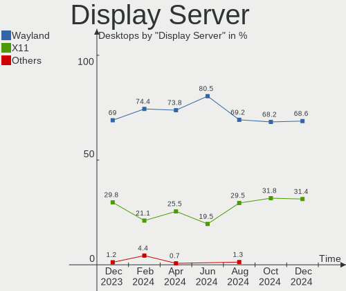
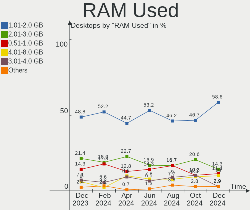
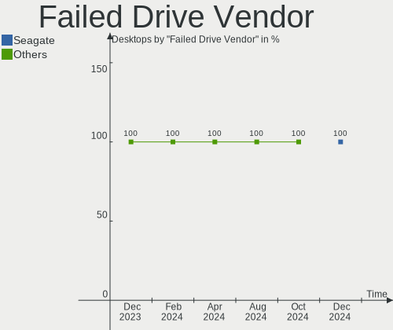
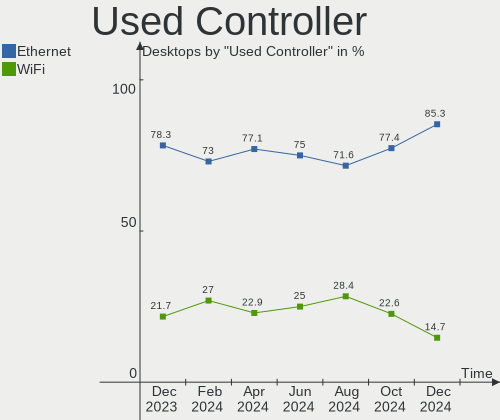
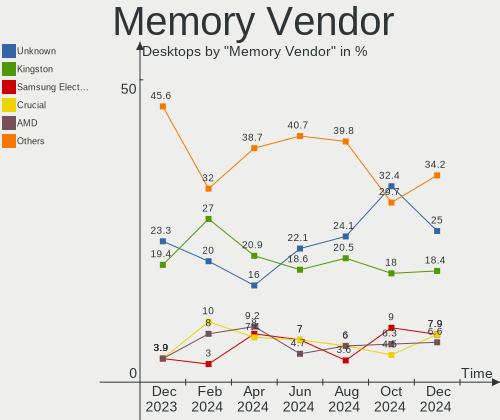

ROSA Hardware Trends (Desktops)
-------------------------------

A project to identify most popular hardware characteristics and track their change
over time based on data collected by ROSA users at https://Linux-Hardware.org.

Anyone can contribute to this report by the [hw-probe](https://github.com/linuxhw/hw-probe) tool:

    sudo -E hw-probe -all -upload

Full-feature report is available here: https://linux-hardware.org/?view=trends

Period: Feb, 2022.

Contents
--------

* [ System ](#system)
  - [ OS                       ](#os)
  - [ OS Family                ](#os-family)
  - [ Kernel                   ](#kernel)
  - [ Kernel Family            ](#kernel-family)
  - [ Kernel Major Ver.        ](#kernel-major-ver)
  - [ Arch                     ](#arch)
  - [ DE                       ](#de)
  - [ Display Server           ](#display-server)
  - [ Display Manager          ](#display-manager)
  - [ OS Lang                  ](#os-lang)
  - [ Boot Mode                ](#boot-mode)
  - [ Filesystem               ](#filesystem)
  - [ Part. scheme             ](#part-scheme)
  - [ Dual Boot with Linux/BSD ](#dual-boot-with-linuxbsd)
  - [ Dual Boot (Win)          ](#dual-boot-win)

* [ Board ](#board)
  - [ Vendor                   ](#vendor)
  - [ Model                    ](#model)
  - [ Model Family             ](#model-family)
  - [ MFG Year                 ](#mfg-year)
  - [ Form Factor              ](#form-factor)
  - [ Secure Boot              ](#secure-boot)
  - [ Coreboot                 ](#coreboot)
  - [ RAM Size                 ](#ram-size)
  - [ RAM Used                 ](#ram-used)
  - [ Total Drives             ](#total-drives)
  - [ Has CD-ROM               ](#has-cd-rom)
  - [ Has Ethernet             ](#has-ethernet)
  - [ Has WiFi                 ](#has-wifi)
  - [ Has Bluetooth            ](#has-bluetooth)

* [ Location ](#location)
  - [ Country                  ](#country)
  - [ City                     ](#city)

* [ Drives ](#drives)
  - [ Drive Vendor             ](#drive-vendor)
  - [ Drive Model              ](#drive-model)
  - [ HDD Vendor               ](#hdd-vendor)
  - [ SSD Vendor               ](#ssd-vendor)
  - [ Drive Kind               ](#drive-kind)
  - [ Drive Connector          ](#drive-connector)
  - [ Drive Size               ](#drive-size)
  - [ Space Total              ](#space-total)
  - [ Space Used               ](#space-used)
  - [ Malfunc. Drives          ](#malfunc-drives)
  - [ Malfunc. Drive Vendor    ](#malfunc-drive-vendor)
  - [ Malfunc. HDD Vendor      ](#malfunc-hdd-vendor)
  - [ Malfunc. Drive Kind      ](#malfunc-drive-kind)
  - [ Failed Drives            ](#failed-drives)
  - [ Failed Drive Vendor      ](#failed-drive-vendor)
  - [ Drive Status             ](#drive-status)

* [ Storage controller ](#storage-controller)
  - [ Storage Vendor           ](#storage-vendor)
  - [ Storage Model            ](#storage-model)
  - [ Storage Kind             ](#storage-kind)

* [ Processor ](#processor)
  - [ CPU Vendor               ](#cpu-vendor)
  - [ CPU Model                ](#cpu-model)
  - [ CPU Model Family         ](#cpu-model-family)
  - [ CPU Cores                ](#cpu-cores)
  - [ CPU Sockets              ](#cpu-sockets)
  - [ CPU Threads              ](#cpu-threads)
  - [ CPU Op-Modes             ](#cpu-op-modes)
  - [ CPU Microcode            ](#cpu-microcode)
  - [ CPU Microarch            ](#cpu-microarch)

* [ Graphics ](#graphics)
  - [ GPU Vendor               ](#gpu-vendor)
  - [ GPU Model                ](#gpu-model)
  - [ GPU Combo                ](#gpu-combo)
  - [ GPU Driver               ](#gpu-driver)
  - [ GPU Memory               ](#gpu-memory)

* [ Monitor ](#monitor)
  - [ Monitor Vendor           ](#monitor-vendor)
  - [ Monitor Model            ](#monitor-model)
  - [ Monitor Resolution       ](#monitor-resolution)
  - [ Monitor Diagonal         ](#monitor-diagonal)
  - [ Monitor Width            ](#monitor-width)
  - [ Aspect Ratio             ](#aspect-ratio)
  - [ Monitor Area             ](#monitor-area)
  - [ Pixel Density            ](#pixel-density)
  - [ Multiple Monitors        ](#multiple-monitors)

* [ Network ](#network)
  - [ Net Controller Vendor    ](#net-controller-vendor)
  - [ Net Controller Model     ](#net-controller-model)
  - [ Wireless Vendor          ](#wireless-vendor)
  - [ Wireless Model           ](#wireless-model)
  - [ Ethernet Vendor          ](#ethernet-vendor)
  - [ Ethernet Model           ](#ethernet-model)
  - [ Net Controller Kind      ](#net-controller-kind)
  - [ Used Controller          ](#used-controller)
  - [ NICs                     ](#nics)
  - [ IPv6                     ](#ipv6)

* [ Bluetooth ](#bluetooth)
  - [ Bluetooth Vendor         ](#bluetooth-vendor)
  - [ Bluetooth Model          ](#bluetooth-model)

* [ Sound ](#sound)
  - [ Sound Vendor             ](#sound-vendor)
  - [ Sound Model              ](#sound-model)

* [ Memory ](#memory)
  - [ Memory Vendor            ](#memory-vendor)
  - [ Memory Model             ](#memory-model)
  - [ Memory Kind              ](#memory-kind)
  - [ Memory Form Factor       ](#memory-form-factor)
  - [ Memory Size              ](#memory-size)
  - [ Memory Speed             ](#memory-speed)

* [ Printers & scanners ](#printers--scanners)
  - [ Printer Vendor           ](#printer-vendor)
  - [ Printer Model            ](#printer-model)
  - [ Scanner Vendor           ](#scanner-vendor)
  - [ Scanner Model            ](#scanner-model)

* [ Camera ](#camera)
  - [ Camera Vendor            ](#camera-vendor)
  - [ Camera Model             ](#camera-model)

* [ Security ](#security)
  - [ Fingerprint Vendor       ](#fingerprint-vendor)
  - [ Fingerprint Model        ](#fingerprint-model)
  - [ Chipcard Vendor          ](#chipcard-vendor)
  - [ Chipcard Model           ](#chipcard-model)

* [ Unsupported ](#unsupported)
  - [ Unsupported Devices      ](#unsupported-devices)
  - [ Unsupported Device Types ](#unsupported-device-types)

System
------

OS
--

Installed operating systems

| Name       | Desktops | Percent |
|------------|----------|---------|
| ROSA 12.2  | 40       | 44.44%  |
| ROSA 12.1  | 25       | 27.78%  |
| ROSA R11.1 | 21       | 23.33%  |
| ROSA 12    | 2        | 2.22%   |
| ROSA R11   | 1        | 1.11%   |
| ROSA R10   | 1        | 1.11%   |

OS Family
---------

OS without a version

| Name | Desktops | Percent |
|------|----------|---------|
| ROSA | 90       | 100%    |

Kernel
------

Version of the Linux kernel

| Version                                   | Desktops | Percent |
|-------------------------------------------|----------|---------|
| 5.10.74-generic-2rosa2021.1-x86_64        | 62       | 68.89%  |
| 5.4.83-generic-2rosa-x86_64               | 6        | 6.67%   |
| 5.4.32-generic-2rosa-x86_64               | 4        | 4.44%   |
| 4.9.155-nrj-desktop-1rosa-x86_64          | 4        | 4.44%   |
| 4.15.0-desktop-122.124.1rosa-x86_64       | 4        | 4.44%   |
| 5.16.8.xm1-1.klp-xanmod-rosa2021.1-x86_64 | 2        | 2.22%   |
| 5.5.19-generic-1rosa-x86_64               | 1        | 1.11%   |
| 5.16.3.xm1-1.klp-xanmod-rosa2021.1-x86_64 | 1        | 1.11%   |
| 5.10.74-generic-2rosa2021.1-i586          | 1        | 1.11%   |
| 5.10.71-generic-1rosa2021.1-x86_64        | 1        | 1.11%   |
| 4.9.95-nrj-desktop-2rosa-x86_64           | 1        | 1.11%   |
| 4.9.155-nrj-desktop-1rosa-i586            | 1        | 1.11%   |
| 4.15.0-desktop-45.1rosa-x86_64            | 1        | 1.11%   |
| 4.15.0-desktop-122.124.1rosa-i586         | 1        | 1.11%   |

Kernel Family
-------------

Linux kernel without a distro release

| Version | Desktops | Percent |
|---------|----------|---------|
| 5.10.74 | 63       | 70%     |
| 5.4.83  | 6        | 6.67%   |
| 4.15.0  | 6        | 6.67%   |
| 4.9.155 | 5        | 5.56%   |
| 5.4.32  | 4        | 4.44%   |
| 5.16.8  | 2        | 2.22%   |
| 5.5.19  | 1        | 1.11%   |
| 5.16.3  | 1        | 1.11%   |
| 5.10.71 | 1        | 1.11%   |
| 4.9.95  | 1        | 1.11%   |

Kernel Major Ver.
-----------------

Linux kernel major version

| Version | Desktops | Percent |
|---------|----------|---------|
| 5.10    | 64       | 71.11%  |
| 5.4     | 10       | 11.11%  |
| 4.9     | 6        | 6.67%   |
| 4.15    | 6        | 6.67%   |
| 5.16    | 3        | 3.33%   |
| 5.5     | 1        | 1.11%   |

Arch
----

OS architecture (x86_64, i586, etc.)

| Name   | Desktops | Percent |
|--------|----------|---------|
| x86_64 | 87       | 96.67%  |
| i686   | 3        | 3.33%   |

DE
--

Desktop Environment

| Name  | Desktops | Percent |
|-------|----------|---------|
| KDE5  | 51       | 56.67%  |
| GNOME | 19       | 21.11%  |
| KDE4  | 13       | 14.44%  |
| LXQt  | 5        | 5.56%   |
| XFCE  | 1        | 1.11%   |
| MATE  | 1        | 1.11%   |

Display Server
--------------

X11 or Wayland

| Name    | Desktops | Percent |
|---------|----------|---------|
| Wayland | 57       | 63.33%  |
| X11     | 33       | 36.67%  |

Display Manager
---------------

SDDM, LightDM, etc.

| Name    | Desktops | Percent |
|---------|----------|---------|
| SDDM    | 48       | 53.33%  |
| GDM     | 27       | 30%     |
| KDM     | 13       | 14.44%  |
| LightDM | 2        | 2.22%   |

OS Lang
-------

Language

| Lang    | Desktops | Percent |
|---------|----------|---------|
| ru_RU   | 73       | 81.11%  |
| ru_UA   | 3        | 3.33%   |
| ro_RO   | 2        | 2.22%   |
| pl_PL   | 2        | 2.22%   |
| de_DE   | 2        | 2.22%   |
| Unknown | 2        | 2.22%   |
| pt_BR   | 1        | 1.11%   |
| hu_HU   | 1        | 1.11%   |
| es_ES   | 1        | 1.11%   |
| es_AR   | 1        | 1.11%   |
| en_US   | 1        | 1.11%   |
| en_GB   | 1        | 1.11%   |

Boot Mode
---------

EFI or BIOS

| Mode | Desktops | Percent |
|------|----------|---------|
| BIOS | 57       | 63.33%  |
| EFI  | 33       | 36.67%  |

Filesystem
----------

Type of filesystem

| Type  | Desktops | Percent |
|-------|----------|---------|
| Ext4  | 83       | 92.22%  |
| Btrfs | 6        | 6.67%   |
| F2fs  | 1        | 1.11%   |

Part. scheme
------------

Scheme of partitioning

| Type | Desktops | Percent |
|------|----------|---------|
| GPT  | 47       | 52.22%  |
| MBR  | 43       | 47.78%  |

Dual Boot with Linux/BSD
------------------------

Hosting more than one Linux/BSD

| Dual boot | Desktops | Percent |
|-----------|----------|---------|
| No        | 65       | 72.22%  |
| Yes       | 25       | 27.78%  |

Dual Boot (Win)
---------------

Hosting Linux and Windows

| Dual boot | Desktops | Percent |
|-----------|----------|---------|
| No        | 50       | 55.56%  |
| Yes       | 40       | 44.44%  |

Board
-----

Vendor
------

Motherboard manufacturer

| Name                | Desktops | Percent |
|---------------------|----------|---------|
| ASUSTek Computer    | 28       | 31.11%  |
| Gigabyte Technology | 23       | 25.56%  |
| ASRock              | 11       | 12.22%  |
| MSI                 | 10       | 11.11%  |
| Pegatron            | 3        | 3.33%   |
| Dell                | 3        | 3.33%   |
| ECS                 | 2        | 2.22%   |
| Packard Bell        | 1        | 1.11%   |
| Lenovo              | 1        | 1.11%   |
| Intel               | 1        | 1.11%   |
| Huanan              | 1        | 1.11%   |
| Hewlett-Packard     | 1        | 1.11%   |
| Fujitsu Siemens     | 1        | 1.11%   |
| Foxconn             | 1        | 1.11%   |
| Biostar             | 1        | 1.11%   |
| Acer                | 1        | 1.11%   |
| Unknown             | 1        | 1.11%   |

Model
-----

Motherboard model

| Name                               | Desktops | Percent |
|------------------------------------|----------|---------|
| ASUS All Series                    | 4        | 4.44%   |
| Gigabyte H61M-S1                   | 3        | 3.33%   |
| Gigabyte 970A-DS3P                 | 2        | 2.22%   |
| ASUS P8H61-M LX3                   | 2        | 2.22%   |
| ASUS P5P43TD                       | 2        | 2.22%   |
| ASRock 970 Pro3 R2.0               | 2        | 2.22%   |
| Pegatron VS257AA-ACB 600-1040ru    | 1        | 1.11%   |
| Pegatron G5210ru                   | 1        | 1.11%   |
| Pegatron Compaq dx2400 Microtower  | 1        | 1.11%   |
| Packard Bell IMEDIA S1800          | 1        | 1.11%   |
| MSI MS-7D18                        | 1        | 1.11%   |
| MSI MS-7C52                        | 1        | 1.11%   |
| MSI MS-7C02                        | 1        | 1.11%   |
| MSI MS-7A40                        | 1        | 1.11%   |
| MSI MS-7A33                        | 1        | 1.11%   |
| MSI MS-7974                        | 1        | 1.11%   |
| MSI MS-7732                        | 1        | 1.11%   |
| MSI MS-7636                        | 1        | 1.11%   |
| MSI MS-7346                        | 1        | 1.11%   |
| MSI MPG B560 Trident A (MS-B926)   | 1        | 1.11%   |
| Lenovo ThinkCentre M90p 5485AG8    | 1        | 1.11%   |
| Intel D945GCLF2 AAE46416-101       | 1        | 1.11%   |
| Huanan X99 F8D V2.2                | 1        | 1.11%   |
| HP Compaq dc7600 Small Form Factor | 1        | 1.11%   |
| Gigabyte Z77-DS3H                  | 1        | 1.11%   |
| Gigabyte TERRA_PC                  | 1        | 1.11%   |
| Gigabyte P35-DS3R                  | 1        | 1.11%   |
| Gigabyte H77N-WIFI                 | 1        | 1.11%   |
| Gigabyte H77-DS3H                  | 1        | 1.11%   |
| Gigabyte H61M-S2PV                 | 1        | 1.11%   |
| Gigabyte H61M-DS2                  | 1        | 1.11%   |
| Gigabyte H57M-USB3                 | 1        | 1.11%   |
| Gigabyte H510M S2H V2              | 1        | 1.11%   |
| Gigabyte GA-MA78G-DS3H             | 1        | 1.11%   |
| Gigabyte GA-78LMT-S2P              | 1        | 1.11%   |
| Gigabyte E2500N                    | 1        | 1.11%   |
| Gigabyte B560M H                   | 1        | 1.11%   |
| Gigabyte B450M S2H                 | 1        | 1.11%   |
| Gigabyte B250M-DS3H                | 1        | 1.11%   |
| Gigabyte AB350M-DS3H V2            | 1        | 1.11%   |
| Gigabyte A320M-S2H V2              | 1        | 1.11%   |
| Gigabyte A320M-H                   | 1        | 1.11%   |
| Fujitsu Siemens MS-7504VP-PV       | 1        | 1.11%   |
| Foxconn MCP61M05                   | 1        | 1.11%   |
| ECS G41T-R3                        | 1        | 1.11%   |
| ECS A740GM-M                       | 1        | 1.11%   |
| Dell OptiPlex 9020M                | 1        | 1.11%   |
| Dell OptiPlex 7010                 | 1        | 1.11%   |
| Dell OptiPlex 5090                 | 1        | 1.11%   |
| Biostar NF560-A2G                  | 1        | 1.11%   |
| ASUS Z170-A                        | 1        | 1.11%   |
| ASUS TUF B450M-PLUS GAMING         | 1        | 1.11%   |
| ASUS PRO H410M-C                   | 1        | 1.11%   |
| ASUS PRIME X370-PRO                | 1        | 1.11%   |
| ASUS PRIME B460M-A R2.0            | 1        | 1.11%   |
| ASUS P8H67-M PRO                   | 1        | 1.11%   |
| ASUS P8H67                         | 1        | 1.11%   |
| ASUS P5P800-VM                     | 1        | 1.11%   |
| ASUS P5P41D                        | 1        | 1.11%   |
| ASUS P5L1394                       | 1        | 1.11%   |

Model Family
------------

Motherboard model prefix

| Name                         | Desktops | Percent |
|------------------------------|----------|---------|
| ASUS All                     | 4        | 4.44%   |
| Gigabyte H61M-S1             | 3        | 3.33%   |
| Dell OptiPlex                | 3        | 3.33%   |
| Gigabyte 970A-DS3P           | 2        | 2.22%   |
| ASUS PRIME                   | 2        | 2.22%   |
| ASUS P8H61-M                 | 2        | 2.22%   |
| ASUS P5P43TD                 | 2        | 2.22%   |
| ASRock 970                   | 2        | 2.22%   |
| Pegatron VS257AA-ACB         | 1        | 1.11%   |
| Pegatron G5210ru             | 1        | 1.11%   |
| Pegatron Compaq              | 1        | 1.11%   |
| Packard Bell IMEDIA          | 1        | 1.11%   |
| MSI MS-7D18                  | 1        | 1.11%   |
| MSI MS-7C52                  | 1        | 1.11%   |
| MSI MS-7C02                  | 1        | 1.11%   |
| MSI MS-7A40                  | 1        | 1.11%   |
| MSI MS-7A33                  | 1        | 1.11%   |
| MSI MS-7974                  | 1        | 1.11%   |
| MSI MS-7732                  | 1        | 1.11%   |
| MSI MS-7636                  | 1        | 1.11%   |
| MSI MS-7346                  | 1        | 1.11%   |
| MSI MPG                      | 1        | 1.11%   |
| Lenovo ThinkCentre           | 1        | 1.11%   |
| Intel D945GCLF2              | 1        | 1.11%   |
| Huanan X99                   | 1        | 1.11%   |
| HP Compaq                    | 1        | 1.11%   |
| Gigabyte Z77-DS3H            | 1        | 1.11%   |
| Gigabyte TERRA               | 1        | 1.11%   |
| Gigabyte P35-DS3R            | 1        | 1.11%   |
| Gigabyte H77N-WIFI           | 1        | 1.11%   |
| Gigabyte H77-DS3H            | 1        | 1.11%   |
| Gigabyte H61M-S2PV           | 1        | 1.11%   |
| Gigabyte H61M-DS2            | 1        | 1.11%   |
| Gigabyte H57M-USB3           | 1        | 1.11%   |
| Gigabyte H510M               | 1        | 1.11%   |
| Gigabyte GA-MA78G-DS3H       | 1        | 1.11%   |
| Gigabyte GA-78LMT-S2P        | 1        | 1.11%   |
| Gigabyte E2500N              | 1        | 1.11%   |
| Gigabyte B560M               | 1        | 1.11%   |
| Gigabyte B450M               | 1        | 1.11%   |
| Gigabyte B250M-DS3H          | 1        | 1.11%   |
| Gigabyte AB350M-DS3H         | 1        | 1.11%   |
| Gigabyte A320M-S2H           | 1        | 1.11%   |
| Gigabyte A320M-H             | 1        | 1.11%   |
| Fujitsu Siemens MS-7504VP-PV | 1        | 1.11%   |
| Foxconn MCP61M05             | 1        | 1.11%   |
| ECS G41T-R3                  | 1        | 1.11%   |
| ECS A740GM-M                 | 1        | 1.11%   |
| Biostar NF560-A2G            | 1        | 1.11%   |
| ASUS Z170-A                  | 1        | 1.11%   |
| ASUS TUF                     | 1        | 1.11%   |
| ASUS PRO                     | 1        | 1.11%   |
| ASUS P8H67-M                 | 1        | 1.11%   |
| ASUS P8H67                   | 1        | 1.11%   |
| ASUS P5P800-VM               | 1        | 1.11%   |
| ASUS P5P41D                  | 1        | 1.11%   |
| ASUS P5L1394                 | 1        | 1.11%   |
| ASUS P5K                     | 1        | 1.11%   |
| ASUS P5E-VM                  | 1        | 1.11%   |
| ASUS M5A97                   | 1        | 1.11%   |

MFG Year
--------

Motherboard manufacture year

| Year | Desktops | Percent |
|------|----------|---------|
| 2012 | 14       | 15.56%  |
| 2010 | 9        | 10%     |
| 2018 | 8        | 8.89%   |
| 2009 | 8        | 8.89%   |
| 2008 | 8        | 8.89%   |
| 2011 | 7        | 7.78%   |
| 2021 | 6        | 6.67%   |
| 2007 | 6        | 6.67%   |
| 2013 | 5        | 5.56%   |
| 2014 | 4        | 4.44%   |
| 2017 | 3        | 3.33%   |
| 2015 | 3        | 3.33%   |
| 2006 | 3        | 3.33%   |
| 2022 | 2        | 2.22%   |
| 2016 | 2        | 2.22%   |
| 2019 | 1        | 1.11%   |
| 2005 | 1        | 1.11%   |

Form Factor
-----------

Physical design of the computer

| Name    | Desktops | Percent |
|---------|----------|---------|
| Desktop | 90       | 100%    |

Secure Boot
-----------

Enabled or disabled

| State    | Desktops | Percent |
|----------|----------|---------|
| Disabled | 90       | 100%    |

Coreboot
--------

Have coreboot on board

| Used | Desktops | Percent |
|------|----------|---------|
| No   | 90       | 100%    |

RAM Size
--------

Total RAM memory

| Size in GB  | Desktops | Percent |
|-------------|----------|---------|
| 3.01-4.0    | 29       | 32.22%  |
| 8.01-16.0   | 22       | 24.44%  |
| 16.01-24.0  | 15       | 16.67%  |
| 4.01-8.0    | 14       | 15.56%  |
| 1.01-2.0    | 7        | 7.78%   |
| 24.01-32.0  | 1        | 1.11%   |
| 2.01-3.0    | 1        | 1.11%   |
| 64.01-256.0 | 1        | 1.11%   |

RAM Used
--------

Used RAM memory

| Used GB  | Desktops | Percent |
|----------|----------|---------|
| 1.01-2.0 | 37       | 41.11%  |
| 0.51-1.0 | 30       | 33.33%  |
| 2.01-3.0 | 12       | 13.33%  |
| 3.01-4.0 | 7        | 7.78%   |
| 4.01-8.0 | 3        | 3.33%   |
| 0.01-0.5 | 1        | 1.11%   |

Total Drives
------------

Number of drives on board

| Drives | Desktops | Percent |
|--------|----------|---------|
| 1      | 39       | 43.33%  |
| 2      | 28       | 31.11%  |
| 3      | 13       | 14.44%  |
| 4      | 9        | 10%     |
| 6      | 1        | 1.11%   |

Has CD-ROM
----------

Has CD-ROM on board

| Presented | Desktops | Percent |
|-----------|----------|---------|
| No        | 52       | 57.78%  |
| Yes       | 38       | 42.22%  |

Has Ethernet
------------

Has Ethernet on board

| Presented | Desktops | Percent |
|-----------|----------|---------|
| Yes       | 88       | 97.78%  |
| No        | 2        | 2.22%   |

Has WiFi
--------

Has WiFi module

| Presented | Desktops | Percent |
|-----------|----------|---------|
| No        | 64       | 71.11%  |
| Yes       | 26       | 28.89%  |

Has Bluetooth
-------------

Has Bluetooth module

| Presented | Desktops | Percent |
|-----------|----------|---------|
| No        | 79       | 87.78%  |
| Yes       | 11       | 12.22%  |

Location
--------

Country
-------

Geographic location (country)

| Country    | Desktops | Percent |
|------------|----------|---------|
| Russia     | 65       | 72.22%  |
| Ukraine    | 10       | 11.11%  |
| Spain      | 2        | 2.22%   |
| Romania    | 2        | 2.22%   |
| Poland     | 2        | 2.22%   |
| Kazakhstan | 2        | 2.22%   |
| Germany    | 2        | 2.22%   |
| Hungary    | 1        | 1.11%   |
| Egypt      | 1        | 1.11%   |
| Czechia    | 1        | 1.11%   |
| Brazil     | 1        | 1.11%   |
| Argentina  | 1        | 1.11%   |

City
----

Geographic location (city)

| City                    | Desktops | Percent |
|-------------------------|----------|---------|
| Moscow                  | 9        | 10%     |
| St Petersburg           | 5        | 5.56%   |
| Novosibirsk             | 5        | 5.56%   |
| Krasnodar               | 4        | 4.44%   |
| Voronezh                | 3        | 3.33%   |
| Tyumen                  | 2        | 2.22%   |
| Saratov                 | 2        | 2.22%   |
| Samara                  | 2        | 2.22%   |
| Orenburg                | 2        | 2.22%   |
| Lipetsk                 | 2        | 2.22%   |
| Krasnoyarsk             | 2        | 2.22%   |
| Kemerovo                | 2        | 2.22%   |
| Zavitinsk               | 1        | 1.11%   |
| Zaporizhzhia            | 1        | 1.11%   |
| Yefremov                | 1        | 1.11%   |
| Yaroslavl               | 1        | 1.11%   |
| Vladikavkaz             | 1        | 1.11%   |
| Velikiye Luki           | 1        | 1.11%   |
| Vakhrushi               | 1        | 1.11%   |
| Ufa                     | 1        | 1.11%   |
| Tashtagol               | 1        | 1.11%   |
| Taldykorgan             | 1        | 1.11%   |
| Szombathely             | 1        | 1.11%   |
| Surgut                  | 1        | 1.11%   |
| Studenok                | 1        | 1.11%   |
| Sterlitamak             | 1        | 1.11%   |
| Simferopol              | 1        | 1.11%   |
| Severodvinsk            | 1        | 1.11%   |
| Sevastopol              | 1        | 1.11%   |
| Sehnde                  | 1        | 1.11%   |
| Saransk                 | 1        | 1.11%   |
| Salavat                 | 1        | 1.11%   |
| Poznan                  | 1        | 1.11%   |
| Pinneberg               | 1        | 1.11%   |
| Piatra Olt              | 1        | 1.11%   |
| Pershotravensk          | 1        | 1.11%   |
| Nur-Sultan              | 1        | 1.11%   |
| Novomoskovsk            | 1        | 1.11%   |
| Novokuznetsk            | 1        | 1.11%   |
| Nizhniy Novgorod        | 1        | 1.11%   |
| Nevel                   | 1        | 1.11%   |
| Mykolayiv               | 1        | 1.11%   |
| Makiivka                | 1        | 1.11%   |
| Madrid                  | 1        | 1.11%   |
| Luhansk                 | 1        | 1.11%   |
| Kamensk-Ural'skiy       | 1        | 1.11%   |
| Izhevsk                 | 1        | 1.11%   |
| Irkutsk                 | 1        | 1.11%   |
| Gliwice                 | 1        | 1.11%   |
| Engel's                 | 1        | 1.11%   |
| Elektrogorsk            | 1        | 1.11%   |
| Craiova                 | 1        | 1.11%   |
| Castelló de la Plana | 1        | 1.11%   |
| Cairo                   | 1        | 1.11%   |
| Cabo Frio               | 1        | 1.11%   |
| Buenos Aires            | 1        | 1.11%   |
| Brno                    | 1        | 1.11%   |
| Blagoveshchensk         | 1        | 1.11%   |
| Barnaul                 | 1        | 1.11%   |
| Balashov                | 1        | 1.11%   |

Drives
------

Drive Vendor
------------

Hard drive vendors

| Vendor              | Desktops | Drives | Percent |
|---------------------|----------|--------|---------|
| WDC                 | 38       | 44     | 25%     |
| Seagate             | 30       | 39     | 19.74%  |
| Samsung Electronics | 18       | 18     | 11.84%  |
| Hitachi             | 10       | 12     | 6.58%   |
| Toshiba             | 8        | 8      | 5.26%   |
| Kingston            | 7        | 9      | 4.61%   |
| Crucial             | 6        | 8      | 3.95%   |
| Apacer              | 5        | 5      | 3.29%   |
| China               | 4        | 4      | 2.63%   |
| XrayDisk            | 2        | 2      | 1.32%   |
| SPCC                | 2        | 2      | 1.32%   |
| SanDisk             | 2        | 2      | 1.32%   |
| Intel               | 2        | 2      | 1.32%   |
| AMD                 | 2        | 2      | 1.32%   |
| XPG                 | 1        | 1      | 0.66%   |
| Smartbuy            | 1        | 1      | 0.66%   |
| SK Hynix            | 1        | 1      | 0.66%   |
| Silicon Motion      | 1        | 1      | 0.66%   |
| OCZ                 | 1        | 1      | 0.66%   |
| MAXTOR              | 1        | 1      | 0.66%   |
| LITEON              | 1        | 1      | 0.66%   |
| KingSpec            | 1        | 1      | 0.66%   |
| JMicron             | 1        | 1      | 0.66%   |
| Intenso             | 1        | 1      | 0.66%   |
| HGST                | 1        | 1      | 0.66%   |
| Gigabyte Technology | 1        | 1      | 0.66%   |
| e2e4                | 1        | 1      | 0.66%   |
| CHN25SATAS1         | 1        | 2      | 0.66%   |
| APS-SL3N            | 1        | 1      | 0.66%   |
| A-DATA Technology   | 1        | 1      | 0.66%   |

Drive Model
-----------

Hard drive models

| Model                              | Desktops | Percent |
|------------------------------------|----------|---------|
| Seagate ST250DM000-1BD141 250GB    | 4        | 2.33%   |
| Seagate ST1000DM010-2EP102 1TB     | 4        | 2.33%   |
| Kingston SA400S37120G 120GB SSD    | 4        | 2.33%   |
| WDC WDS240G2G0A-00JH30 240GB SSD   | 3        | 1.74%   |
| Seagate Expansion+ 2TB             | 3        | 1.74%   |
| Crucial CT240BX500SSD1 240GB       | 3        | 1.74%   |
| WDC WD5000AAKX-00ERMA0 500GB       | 2        | 1.16%   |
| WDC WD20EZAZ-00GGJB0 2TB           | 2        | 1.16%   |
| WDC WD1600AAJS-00L7A0 160GB        | 2        | 1.16%   |
| WDC WD10EZRZ-00HTKB0 1TB           | 2        | 1.16%   |
| Toshiba TR200 480GB SSD            | 2        | 1.16%   |
| Seagate ST500DM002-1BD142 500GB    | 2        | 1.16%   |
| Seagate ST3500418AS 500GB          | 2        | 1.16%   |
| Seagate ST2000DM008-2FR102 2TB     | 2        | 1.16%   |
| Samsung SSD 970 EVO Plus 250GB     | 2        | 1.16%   |
| Samsung HD321KJ 320GB              | 2        | 1.16%   |
| Samsung HD154UI 1TB                | 2        | 1.16%   |
| Kingston SA400S37240G 240GB SSD    | 2        | 1.16%   |
| Hitachi HTS545050A7E380 500GB      | 2        | 1.16%   |
| Hitachi HDS721050CLA360 500GB      | 2        | 1.16%   |
| China SSD 120GB                    | 2        | 1.16%   |
| Apacer AS350 240GB SSD             | 2        | 1.16%   |
| XrayDisk SSD 256GB                 | 1        | 0.58%   |
| XrayDisk SSD 120GB                 | 1        | 0.58%   |
| XPG GAMMIX S5 256GB                | 1        | 0.58%   |
| WDC WD800JD-60LSA0 80GB            | 1        | 0.58%   |
| WDC WD7500AZEX-00RKKA0 752GB       | 1        | 0.58%   |
| WDC WD5000LPSX-00A6WT0 500GB       | 1        | 0.58%   |
| WDC WD5000BEVT-2 500GB             | 1        | 0.58%   |
| WDC WD5000AAKX-001CA0 500GB        | 1        | 0.58%   |
| WDC WD5000AAKS-22V1A0 500GB        | 1        | 0.58%   |
| WDC WD5000AAKS-00E4A0 500GB        | 1        | 0.58%   |
| WDC WD40EFRX-68WT0N0 4TB           | 1        | 0.58%   |
| WDC WD4003FRYZ-01F0DB0 4TB         | 1        | 0.58%   |
| WDC WD3200BPVT-22JJ5T0 320GB       | 1        | 0.58%   |
| WDC WD3200AAJS-56M0A0 320GB        | 1        | 0.58%   |
| WDC WD3200AAJS-08L7A0 320GB        | 1        | 0.58%   |
| WDC WD3200AAJS-00L7A0 320GB        | 1        | 0.58%   |
| WDC WD3200AAJS-00B4A0 320GB        | 1        | 0.58%   |
| WDC WD30EZRX-00SPEB0 3TB           | 1        | 0.58%   |
| WDC WD30EFRX-68EUZN0 3TB           | 1        | 0.58%   |
| WDC WD2500JS-00NCB1 250GB          | 1        | 0.58%   |
| WDC WD2500AAKX-753CA1 250GB        | 1        | 0.58%   |
| WDC WD2500AAKS-00B3A0 250GB        | 1        | 0.58%   |
| WDC WD2500AAJS-60M0A0 250GB        | 1        | 0.58%   |
| WDC WD2500AAJS-00VTA0 250GB        | 1        | 0.58%   |
| WDC WD20PURX-64P6ZY0 2TB           | 1        | 0.58%   |
| WDC WD20EZBX-00AYRA0 2TB           | 1        | 0.58%   |
| WDC WD1600YD-01NVB1 165GB          | 1        | 0.58%   |
| WDC WD1600AAJS-08PSA0 160GB        | 1        | 0.58%   |
| WDC WD10JPVX-75JC3T0 1TB           | 1        | 0.58%   |
| WDC WD10EZRZ-22HTKB0 1TB           | 1        | 0.58%   |
| WDC WD10EZRX-00A8LB0 1TB           | 1        | 0.58%   |
| WDC WD10EZEX-75WN4A1 1TB           | 1        | 0.58%   |
| WDC WD10EZEX-21WN4A0 1TB           | 1        | 0.58%   |
| WDC WD10EZEX-21M2NA0 1TB           | 1        | 0.58%   |
| WDC WD10EZEX-08WN4A0 1TB           | 1        | 0.58%   |
| WDC PC SN530 SDBPNPZ-1T00-1032 1TB | 1        | 0.58%   |
| Toshiba MK6476GSX 640GB            | 1        | 0.58%   |
| Toshiba MK3265GSX 320GB            | 1        | 0.58%   |

HDD Vendor
----------

Hard disk drive vendors

| Vendor              | Desktops | Drives | Percent |
|---------------------|----------|--------|---------|
| WDC                 | 35       | 40     | 37.63%  |
| Seagate             | 30       | 39     | 32.26%  |
| Samsung Electronics | 10       | 10     | 10.75%  |
| Hitachi             | 10       | 12     | 10.75%  |
| Toshiba             | 6        | 6      | 6.45%   |
| MAXTOR              | 1        | 1      | 1.08%   |
| HGST                | 1        | 1      | 1.08%   |

SSD Vendor
----------

Solid state drive vendors

| Vendor              | Desktops | Drives | Percent |
|---------------------|----------|--------|---------|
| Kingston            | 7        | 8      | 13.73%  |
| Samsung Electronics | 6        | 6      | 11.76%  |
| Crucial             | 6        | 8      | 11.76%  |
| China               | 4        | 4      | 7.84%   |
| Apacer              | 4        | 4      | 7.84%   |
| WDC                 | 3        | 3      | 5.88%   |
| XrayDisk            | 2        | 2      | 3.92%   |
| Toshiba             | 2        | 2      | 3.92%   |
| SPCC                | 2        | 2      | 3.92%   |
| SanDisk             | 2        | 2      | 3.92%   |
| Intel               | 2        | 2      | 3.92%   |
| AMD                 | 2        | 2      | 3.92%   |
| Smartbuy            | 1        | 1      | 1.96%   |
| OCZ                 | 1        | 1      | 1.96%   |
| LITEON              | 1        | 1      | 1.96%   |
| KingSpec            | 1        | 1      | 1.96%   |
| Intenso             | 1        | 1      | 1.96%   |
| Gigabyte Technology | 1        | 1      | 1.96%   |
| CHN25SATAS1         | 1        | 2      | 1.96%   |
| APS-SL3N            | 1        | 1      | 1.96%   |
| A-DATA Technology   | 1        | 1      | 1.96%   |

Drive Kind
----------

HDD or SSD

| Kind | Desktops | Drives | Percent |
|------|----------|--------|---------|
| HDD  | 75       | 109    | 59.52%  |
| SSD  | 42       | 55     | 33.33%  |
| NVMe | 9        | 10     | 7.14%   |

Drive Connector
---------------

SATA, SAS, NVMe, etc.

| Type | Desktops | Drives | Percent |
|------|----------|--------|---------|
| SATA | 88       | 160    | 86.27%  |
| NVMe | 9        | 9      | 8.82%   |
| SAS  | 5        | 5      | 4.9%    |

Drive Size
----------

Size of hard drive

| Size in TB | Desktops | Drives | Percent |
|------------|----------|--------|---------|
| 0.01-0.5   | 74       | 118    | 64.91%  |
| 0.51-1.0   | 25       | 27     | 21.93%  |
| 1.01-2.0   | 10       | 13     | 8.77%   |
| 3.01-4.0   | 2        | 2      | 1.75%   |
| 4.01-10.0  | 2        | 2      | 1.75%   |
| 2.01-3.0   | 1        | 2      | 0.88%   |

Space Total
-----------

Amount of disk space available on the file system

| Size in GB     | Desktops | Percent |
|----------------|----------|---------|
| 101-250        | 30       | 33.33%  |
| 251-500        | 15       | 16.67%  |
| 501-1000       | 10       | 11.11%  |
| 51-100         | 9        | 10%     |
| 1001-2000      | 8        | 8.89%   |
| 21-50          | 7        | 7.78%   |
| 2001-3000      | 4        | 4.44%   |
| 1-20           | 3        | 3.33%   |
| More than 3000 | 2        | 2.22%   |
| Unknown        | 2        | 2.22%   |

Space Used
----------

Amount of used disk space

| Used GB        | Desktops | Percent |
|----------------|----------|---------|
| 1-20           | 50       | 55.56%  |
| 21-50          | 10       | 11.11%  |
| 251-500        | 8        | 8.89%   |
| 101-250        | 7        | 7.78%   |
| 51-100         | 5        | 5.56%   |
| 1001-2000      | 3        | 3.33%   |
| 501-1000       | 3        | 3.33%   |
| Unknown        | 2        | 2.22%   |
| More than 3000 | 1        | 1.11%   |
| 2001-3000      | 1        | 1.11%   |

Malfunc. Drives
---------------

Drive models with a malfunction

| Model                             | Desktops | Drives | Percent |
|-----------------------------------|----------|--------|---------|
| Seagate ST250DM000-1BD141 250GB   | 3        | 3      | 7.32%   |
| WDC WD1600AAJS-00L7A0 160GB       | 2        | 2      | 4.88%   |
| Samsung Electronics HD321KJ 320GB | 2        | 2      | 4.88%   |
| WDC WD5000AAKX-00ERMA0 500GB      | 1        | 1      | 2.44%   |
| WDC WD5000AAKX-001CA0 500GB       | 1        | 1      | 2.44%   |
| WDC WD5000AAKS-22V1A0 500GB       | 1        | 1      | 2.44%   |
| WDC WD5000AAKS-00E4A0 500GB       | 1        | 1      | 2.44%   |
| WDC WD2500AAJS-60M0A0 250GB       | 1        | 1      | 2.44%   |
| WDC WD2500AAJS-00VTA0 250GB       | 1        | 1      | 2.44%   |
| WDC WD20PURX-64P6ZY0 2TB          | 1        | 1      | 2.44%   |
| WDC WD1600YD-01NVB1 165GB         | 1        | 1      | 2.44%   |
| WDC WD1600AAJS-08PSA0 160GB       | 1        | 1      | 2.44%   |
| WDC WD10JPVX-75JC3T0 1TB          | 1        | 1      | 2.44%   |
| Toshiba MK6476GSX 640GB           | 1        | 1      | 2.44%   |
| SPCC SSD110 120GB                 | 1        | 1      | 2.44%   |
| Seagate ST9320423AS 320GB         | 1        | 1      | 2.44%   |
| Seagate ST9250315AS 250GB         | 1        | 1      | 2.44%   |
| Seagate ST3808110AS 80GB          | 1        | 1      | 2.44%   |
| Seagate ST380215AS 80GB           | 1        | 1      | 2.44%   |
| Seagate ST3500413AS 500GB         | 1        | 1      | 2.44%   |
| Seagate ST3500410AS 500GB         | 1        | 1      | 2.44%   |
| Seagate ST3500320AS 500GB         | 1        | 1      | 2.44%   |
| Seagate ST3250310AS 250GB         | 1        | 1      | 2.44%   |
| Seagate ST31000524AS 1TB          | 1        | 1      | 2.44%   |
| Seagate ST1500DL003-9VT16L 1TB    | 1        | 1      | 2.44%   |
| Seagate ST1000DM010-2EP102 1TB    | 1        | 1      | 2.44%   |
| Seagate ST1000DM003-9YN162 1TB    | 1        | 1      | 2.44%   |
| Samsung Electronics SP2504C 250GB | 1        | 1      | 2.44%   |
| Samsung Electronics SP0812C 80GB  | 1        | 1      | 2.44%   |
| Samsung Electronics HD250HJ 250GB | 1        | 1      | 2.44%   |
| Samsung Electronics HD154UI 1TB   | 1        | 1      | 2.44%   |
| Samsung Electronics HD080HJ/ 80GB | 1        | 1      | 2.44%   |
| OCZ VERTEX3 120GB SSD             | 1        | 1      | 2.44%   |
| Kingston SA400S37240G 240GB SSD   | 1        | 1      | 2.44%   |
| Hitachi HTS545016B9A300 160GB     | 1        | 1      | 2.44%   |
| Hitachi HDS721050DLE630 500GB     | 1        | 1      | 2.44%   |
| Crucial CT275MX300SSD1 275GB      | 1        | 1      | 2.44%   |

Malfunc. Drive Vendor
---------------------

Vendors of faulty drives

| Vendor              | Desktops | Drives | Percent |
|---------------------|----------|--------|---------|
| Seagate             | 13       | 15     | 34.21%  |
| WDC                 | 11       | 12     | 28.95%  |
| Samsung Electronics | 7        | 7      | 18.42%  |
| Hitachi             | 2        | 2      | 5.26%   |
| Toshiba             | 1        | 1      | 2.63%   |
| SPCC                | 1        | 1      | 2.63%   |
| OCZ                 | 1        | 1      | 2.63%   |
| Kingston            | 1        | 1      | 2.63%   |
| Crucial             | 1        | 1      | 2.63%   |

Malfunc. HDD Vendor
-------------------

Vendors of faulty HDD drives

| Vendor              | Desktops | Drives | Percent |
|---------------------|----------|--------|---------|
| Seagate             | 13       | 15     | 38.24%  |
| WDC                 | 11       | 12     | 32.35%  |
| Samsung Electronics | 7        | 7      | 20.59%  |
| Hitachi             | 2        | 2      | 5.88%   |
| Toshiba             | 1        | 1      | 2.94%   |

Malfunc. Drive Kind
-------------------

Kinds of faulty drives

| Kind | Desktops | Drives | Percent |
|------|----------|--------|---------|
| HDD  | 28       | 37     | 87.5%   |
| SSD  | 4        | 4      | 12.5%   |

Failed Drives
-------------

Failed drive models

| Model                            | Desktops | Drives | Percent |
|----------------------------------|----------|--------|---------|
| WDC WD3200AAJS-00L7A0 320GB      | 1        | 1      | 50%     |
| Seagate ST320DM001 HD322GJ 320GB | 1        | 1      | 50%     |

Failed Drive Vendor
-------------------

Failed drive vendors

| Vendor  | Desktops | Drives | Percent |
|---------|----------|--------|---------|
| WDC     | 1        | 1      | 50%     |
| Seagate | 1        | 1      | 50%     |

Drive Status
------------

Number of failed and malfunc. drives

| Status   | Desktops | Drives | Percent |
|----------|----------|--------|---------|
| Works    | 73       | 127    | 66.36%  |
| Malfunc  | 31       | 41     | 28.18%  |
| Detected | 4        | 4      | 3.64%   |
| Failed   | 2        | 2      | 1.82%   |

Storage controller
------------------

Storage Vendor
--------------

Storage controller vendors

| Vendor                      | Desktops | Percent |
|-----------------------------|----------|---------|
| Intel                       | 52       | 47.71%  |
| AMD                         | 28       | 25.69%  |
| Nvidia                      | 10       | 9.17%   |
| JMicron Technology          | 7        | 6.42%   |
| VIA Technologies            | 2        | 1.83%   |
| Silicon Motion              | 2        | 1.83%   |
| Samsung Electronics         | 2        | 1.83%   |
| SK Hynix                    | 1        | 0.92%   |
| Sandisk                     | 1        | 0.92%   |
| Phison Electronics          | 1        | 0.92%   |
| Kingston Technology Company | 1        | 0.92%   |
| ASMedia Technology          | 1        | 0.92%   |
| ADATA Technology            | 1        | 0.92%   |

Storage Model
-------------

Storage controller models

| Model                                                                                   | Desktops | Percent |
|-----------------------------------------------------------------------------------------|----------|---------|
| AMD FCH SATA Controller [AHCI mode]                                                     | 14       | 8.97%   |
| Intel 6 Series/C200 Series Chipset Family Desktop SATA Controller (IDE mode, ports 4-5) | 9        | 5.77%   |
| Intel 6 Series/C200 Series Chipset Family Desktop SATA Controller (IDE mode, ports 0-3) | 9        | 5.77%   |
| Intel NM10/ICH7 Family SATA Controller [IDE mode]                                       | 8        | 5.13%   |
| Intel 82801G (ICH7 Family) IDE Controller                                               | 7        | 4.49%   |
| AMD SB7x0/SB8x0/SB9x0 SATA Controller [AHCI mode]                                       | 7        | 4.49%   |
| AMD SB7x0/SB8x0/SB9x0 IDE Controller                                                    | 7        | 4.49%   |
| Nvidia MCP61 SATA Controller                                                            | 5        | 3.21%   |
| Intel 8 Series/C220 Series Chipset Family 6-port SATA Controller 1 [AHCI mode]          | 5        | 3.21%   |
| Intel 500 Series Chipset Family SATA AHCI Controller                                    | 5        | 3.21%   |
| AMD SB7x0/SB8x0/SB9x0 SATA Controller [IDE mode]                                        | 5        | 3.21%   |
| AMD 400 Series Chipset SATA Controller                                                  | 5        | 3.21%   |
| Nvidia MCP61 IDE                                                                        | 4        | 2.56%   |
| Intel 7 Series/C210 Series Chipset Family 6-port SATA Controller [AHCI mode]            | 4        | 2.56%   |
| Intel 5 Series/3400 Series Chipset 6 port SATA AHCI Controller                          | 4        | 2.56%   |
| JMicron JMB368 IDE controller                                                           | 3        | 1.92%   |
| Intel 82801I (ICH9 Family) 2 port SATA Controller [IDE mode]                            | 3        | 1.92%   |
| VIA VT6415 PATA IDE Host Controller                                                     | 2        | 1.28%   |
| Silicon Motion SM2263EN/SM2263XT SSD Controller                                         | 2        | 1.28%   |
| Samsung NVMe SSD Controller SM981/PM981/PM983                                           | 2        | 1.28%   |
| Nvidia MCP51 Serial ATA Controller                                                      | 2        | 1.28%   |
| Nvidia MCP51 IDE                                                                        | 2        | 1.28%   |
| JMicron JMB363 SATA/IDE Controller                                                      | 2        | 1.28%   |
| Intel 82801JI (ICH10 Family) 4 port SATA IDE Controller #1                              | 2        | 1.28%   |
| Intel 82801JI (ICH10 Family) 2 port SATA IDE Controller #2                              | 2        | 1.28%   |
| Intel 82801IB (ICH9) 2 port SATA Controller [IDE mode]                                  | 2        | 1.28%   |
| Intel 82801EB/ER (ICH5/ICH5R) IDE Controller                                            | 2        | 1.28%   |
| Intel 82801EB (ICH5) SATA Controller                                                    | 2        | 1.28%   |
| AMD X370 Series Chipset SATA Controller                                                 | 2        | 1.28%   |
| AMD 300 Series Chipset SATA Controller                                                  | 2        | 1.28%   |
| SK Hynix Gold P31 SSD                                                                   | 1        | 0.64%   |
| Sandisk WD Blue SN550 NVMe SSD                                                          | 1        | 0.64%   |
| Phison PS5013 E13 NVMe Controller                                                       | 1        | 0.64%   |
| Nvidia MCP79 AHCI Controller                                                            | 1        | 0.64%   |
| Nvidia MCP65 SATA Controller                                                            | 1        | 0.64%   |
| Nvidia MCP65 IDE                                                                        | 1        | 0.64%   |
| Nvidia GeForce 7100/nForce 630i SATA                                                    | 1        | 0.64%   |
| Kingston Company A2000 NVMe SSD                                                         | 1        | 0.64%   |
| JMicron JMB362 SATA Controller                                                          | 1        | 0.64%   |
| JMicron JMB360 AHCI Controller                                                          | 1        | 0.64%   |
| Intel SATA Controller [RAID mode]                                                       | 1        | 0.64%   |
| Intel NM10/ICH7 Family SATA Controller [AHCI mode]                                      | 1        | 0.64%   |
| Intel Comet Lake SATA AHCI Controller                                                   | 1        | 0.64%   |
| Intel Celeron N3350/Pentium N4200/Atom E3900 Series SATA AHCI Controller                | 1        | 0.64%   |
| Intel C610/X99 series chipset 6-Port SATA Controller [AHCI mode]                        | 1        | 0.64%   |
| Intel 82801JI (ICH10 Family) SATA AHCI Controller                                       | 1        | 0.64%   |
| Intel 82801IR/IO/IH (ICH9R/DO/DH) 6 port SATA Controller [AHCI mode]                    | 1        | 0.64%   |
| Intel 82801IR/IO/IH (ICH9R/DO/DH) 4 port SATA Controller [IDE mode]                     | 1        | 0.64%   |
| Intel 6 Series/C200 Series Chipset Family 6 port Desktop SATA AHCI Controller           | 1        | 0.64%   |
| Intel 400 Series Chipset Family SATA AHCI Controller                                    | 1        | 0.64%   |
| Intel 200 Series PCH SATA controller [AHCI mode]                                        | 1        | 0.64%   |
| ASMedia ASM1062 Serial ATA Controller                                                   | 1        | 0.64%   |
| AMD FCH SATA Controller [IDE mode]                                                      | 1        | 0.64%   |
| AMD FCH SATA Controller D                                                               | 1        | 0.64%   |
| AMD FCH IDE Controller                                                                  | 1        | 0.64%   |
| ADATA A Non-Volatile memory controller                                                  | 1        | 0.64%   |

Storage Kind
------------

Kind of storage controller (IDE, SATA, NVMe, SAS, ...)

| Kind | Desktops | Percent |
|------|----------|---------|
| SATA | 58       | 52.73%  |
| IDE  | 42       | 38.18%  |
| NVMe | 9        | 8.18%   |
| RAID | 1        | 0.91%   |

Processor
---------

CPU Vendor
----------

Processor vendors

| Vendor | Desktops | Percent |
|--------|----------|---------|
| Intel  | 55       | 61.11%  |
| AMD    | 35       | 38.89%  |

CPU Model
---------

Processor models

| Model                                       | Desktops | Percent |
|---------------------------------------------|----------|---------|
| Intel Core 2 Duo CPU E8400 @ 3.00GHz        | 3        | 3.33%   |
| Intel Pentium Dual-Core CPU E5700 @ 3.00GHz | 2        | 2.22%   |
| Intel Pentium D CPU 2.80GHz                 | 2        | 2.22%   |
| Intel Pentium CPU G850 @ 2.90GHz            | 2        | 2.22%   |
| Intel Core i3-10100 CPU @ 3.60GHz           | 2        | 2.22%   |
| Intel Core 2 Quad CPU Q8200 @ 2.33GHz       | 2        | 2.22%   |
| Intel 11th Gen Core i5-11500 @ 2.70GHz      | 2        | 2.22%   |
| AMD Ryzen 3 2200G with Radeon Vega Graphics | 2        | 2.22%   |
| AMD FX-8350 Eight-Core Processor            | 2        | 2.22%   |
| Intel Xeon CPU L5420 @ 2.50GHz              | 1        | 1.11%   |
| Intel Xeon CPU E5450 @ 3.00GHz              | 1        | 1.11%   |
| Intel Xeon CPU E5-2678 v3 @ 2.50GHz         | 1        | 1.11%   |
| Intel Xeon CPU E31230 @ 3.20GHz             | 1        | 1.11%   |
| Intel Pentium Dual-Core CPU E6300 @ 2.80GHz | 1        | 1.11%   |
| Intel Pentium CPU G620 @ 2.60GHz            | 1        | 1.11%   |
| Intel Pentium CPU G3240 @ 3.10GHz           | 1        | 1.11%   |
| Intel Pentium CPU G3220 @ 3.00GHz           | 1        | 1.11%   |
| Intel Pentium CPU G2030 @ 3.00GHz           | 1        | 1.11%   |
| Intel Pentium CPU G2010 @ 2.80GHz           | 1        | 1.11%   |
| Intel Pentium 4 CPU 3.40GHz                 | 1        | 1.11%   |
| Intel Pentium 4 CPU 2.80GHz                 | 1        | 1.11%   |
| Intel Core i7-3770S CPU @ 3.10GHz           | 1        | 1.11%   |
| Intel Core i5-7600 CPU @ 3.50GHz            | 1        | 1.11%   |
| Intel Core i5-6600 CPU @ 3.30GHz            | 1        | 1.11%   |
| Intel Core i5-4690 CPU @ 3.50GHz            | 1        | 1.11%   |
| Intel Core i5-4590T CPU @ 2.00GHz           | 1        | 1.11%   |
| Intel Core i5-4430 CPU @ 3.00GHz            | 1        | 1.11%   |
| Intel Core i5-3470 CPU @ 3.20GHz            | 1        | 1.11%   |
| Intel Core i5-2500K CPU @ 3.30GHz           | 1        | 1.11%   |
| Intel Core i5-2400 CPU @ 3.10GHz            | 1        | 1.11%   |
| Intel Core i5-10400 CPU @ 2.90GHz           | 1        | 1.11%   |
| Intel Core i5 CPU 760 @ 2.80GHz             | 1        | 1.11%   |
| Intel Core i5 CPU 650 @ 3.20GHz             | 1        | 1.11%   |
| Intel Core i3-3220 CPU @ 3.30GHz            | 1        | 1.11%   |
| Intel Core i3-2120 CPU @ 3.30GHz            | 1        | 1.11%   |
| Intel Core i3-2100 CPU @ 3.10GHz            | 1        | 1.11%   |
| Intel Core i3 CPU 550 @ 3.20GHz             | 1        | 1.11%   |
| Intel Core i3 CPU 530 @ 2.93GHz             | 1        | 1.11%   |
| Intel Core 2 Quad CPU Q9400 @ 2.66GHz       | 1        | 1.11%   |
| Intel Core 2 Quad CPU Q6600 @ 2.40GHz       | 1        | 1.11%   |
| Intel Core 2 Duo CPU T9600 @ 2.80GHz        | 1        | 1.11%   |
| Intel Core 2 Duo CPU E7200 @ 2.53GHz        | 1        | 1.11%   |
| Intel Core 2 Duo CPU E4500 @ 2.20GHz        | 1        | 1.11%   |
| Intel Core 2 CPU 6600 @ 2.40GHz             | 1        | 1.11%   |
| Intel Celeron G5900 CPU @ 3.40GHz           | 1        | 1.11%   |
| Intel Celeron CPU J3455 @ 1.50GHz           | 1        | 1.11%   |
| Intel Celeron CPU G1610T @ 2.30GHz          | 1        | 1.11%   |
| Intel Atom CPU 330 @ 1.60GHz                | 1        | 1.11%   |
| Intel 11th Gen Core i7-11700 @ 2.50GHz      | 1        | 1.11%   |
| AMD Sempron Processor 3200+                 | 1        | 1.11%   |
| AMD Ryzen 7 PRO 3700 8-Core Processor       | 1        | 1.11%   |
| AMD Ryzen 7 PRO 2700 Eight-Core Processor   | 1        | 1.11%   |
| AMD Ryzen 7 5700G with Radeon Graphics      | 1        | 1.11%   |
| AMD Ryzen 5 2400G with Radeon Vega Graphics | 1        | 1.11%   |
| AMD Ryzen 5 1600 Six-Core Processor         | 1        | 1.11%   |
| AMD Ryzen 3 3200G with Radeon Vega Graphics | 1        | 1.11%   |
| AMD Ryzen 3 1200 Quad-Core Processor        | 1        | 1.11%   |
| AMD Phenom II X6 1100T Processor            | 1        | 1.11%   |
| AMD Phenom II X4 945 Processor              | 1        | 1.11%   |
| AMD Phenom 9850 Quad-Core Processor         | 1        | 1.11%   |

CPU Model Family
----------------

Processor model prefix

| Model                   | Desktops | Percent |
|-------------------------|----------|---------|
| Intel Core i5           | 11       | 12.22%  |
| Intel Pentium           | 7        | 7.78%   |
| Intel Core i3           | 7        | 7.78%   |
| Intel Core 2 Duo        | 6        | 6.67%   |
| AMD FX                  | 6        | 6.67%   |
| Intel Xeon              | 4        | 4.44%   |
| Intel Core 2 Quad       | 4        | 4.44%   |
| AMD Ryzen 3             | 4        | 4.44%   |
| AMD Athlon 64 X2        | 4        | 4.44%   |
| Other                   | 3        | 3.33%   |
| Intel Pentium Dual-Core | 3        | 3.33%   |
| Intel Celeron           | 3        | 3.33%   |
| Intel Pentium D         | 2        | 2.22%   |
| Intel Pentium 4         | 2        | 2.22%   |
| AMD Ryzen 7 PRO         | 2        | 2.22%   |
| AMD Ryzen 5             | 2        | 2.22%   |
| AMD Phenom              | 2        | 2.22%   |
| AMD Athlon II X4        | 2        | 2.22%   |
| AMD Athlon              | 2        | 2.22%   |
| AMD A6                  | 2        | 2.22%   |
| Intel Core i7           | 1        | 1.11%   |
| Intel Core 2            | 1        | 1.11%   |
| Intel Atom              | 1        | 1.11%   |
| AMD Sempron             | 1        | 1.11%   |
| AMD Ryzen 7             | 1        | 1.11%   |
| AMD Phenom II X6        | 1        | 1.11%   |
| AMD Phenom II X4        | 1        | 1.11%   |
| AMD E1                  | 1        | 1.11%   |
| AMD Athlon X4           | 1        | 1.11%   |
| AMD Athlon II X3        | 1        | 1.11%   |
| AMD Athlon II X2        | 1        | 1.11%   |
| AMD A4                  | 1        | 1.11%   |

CPU Cores
---------

Number of processor cores

| Number | Desktops | Percent |
|--------|----------|---------|
| 2      | 37       | 41.11%  |
| 4      | 34       | 37.78%  |
| 6      | 5        | 5.56%   |
| 1      | 5        | 5.56%   |
| 8      | 4        | 4.44%   |
| 3      | 4        | 4.44%   |
| 24     | 1        | 1.11%   |

CPU Sockets
-----------

Number of sockets

| Number | Desktops | Percent |
|--------|----------|---------|
| 1      | 89       | 98.89%  |
| 2      | 1        | 1.11%   |

CPU Threads
-----------

Threads per core (Hyper-Threading)

| Number | Desktops | Percent |
|--------|----------|---------|
| 1      | 57       | 63.33%  |
| 2      | 33       | 36.67%  |

CPU Op-Modes
------------

CPU Operation Modes (32-bit, 64-bit)

| Op mode        | Desktops | Percent |
|----------------|----------|---------|
| 32-bit, 64-bit | 89       | 98.89%  |
| 32-bit         | 1        | 1.11%   |

CPU Microcode
-------------

Microcode number

| Number     | Desktops | Percent |
|------------|----------|---------|
| 0x1067a    | 11       | 12.22%  |
| 0x206a7    | 8        | 8.89%   |
| 0x306a9    | 6        | 6.67%   |
| 0x06000852 | 6        | 6.67%   |
| Unknown    | 6        | 6.67%   |
| 0x306c3    | 5        | 5.56%   |
| 0xa0653    | 4        | 4.44%   |
| 0x010000c8 | 4        | 4.44%   |
| 0xa0671    | 3        | 3.33%   |
| 0x20655    | 3        | 3.33%   |
| 0x08101016 | 3        | 3.33%   |
| 0x06001119 | 3        | 3.33%   |
| 0xf64      | 2        | 2.22%   |
| 0x08108109 | 2        | 2.22%   |
| 0x0700010f | 2        | 2.22%   |
| 0xf43      | 1        | 1.11%   |
| 0xf33      | 1        | 1.11%   |
| 0x906e9    | 1        | 1.11%   |
| 0x6fd      | 1        | 1.11%   |
| 0x6fb      | 1        | 1.11%   |
| 0x6f6      | 1        | 1.11%   |
| 0x506e3    | 1        | 1.11%   |
| 0x506c9    | 1        | 1.11%   |
| 0x306f2    | 1        | 1.11%   |
| 0x106e5    | 1        | 1.11%   |
| 0x106c2    | 1        | 1.11%   |
| 0x10677    | 1        | 1.11%   |
| 0x10676    | 1        | 1.11%   |
| 0x0a50000c | 1        | 1.11%   |
| 0x08701013 | 1        | 1.11%   |
| 0x0800820d | 1        | 1.11%   |
| 0x08001138 | 1        | 1.11%   |
| 0x08001137 | 1        | 1.11%   |
| 0x03000027 | 1        | 1.11%   |
| 0x010000dc | 1        | 1.11%   |
| 0x010000c7 | 1        | 1.11%   |
| 0x01000095 | 1        | 1.11%   |

CPU Microarch
-------------

Microarchitecture

| Name        | Desktops | Percent |
|-------------|----------|---------|
| Penryn      | 13       | 14.44%  |
| Piledriver  | 9        | 10%     |
| SandyBridge | 8        | 8.89%   |
| K10         | 8        | 8.89%   |
| IvyBridge   | 6        | 6.67%   |
| Haswell     | 6        | 6.67%   |
| Zen         | 5        | 5.56%   |
| K8 Hammer   | 5        | 5.56%   |
| NetBurst    | 4        | 4.44%   |
| CometLake   | 4        | 4.44%   |
| Zen+        | 3        | 3.33%   |
| Westmere    | 3        | 3.33%   |
| Core        | 3        | 3.33%   |
| Jaguar      | 2        | 2.22%   |
| Unknown     | 2        | 2.22%   |
| Zen 3       | 1        | 1.11%   |
| Zen 2       | 1        | 1.11%   |
| Skylake     | 1        | 1.11%   |
| Nehalem     | 1        | 1.11%   |
| KabyLake    | 1        | 1.11%   |
| K10 Llano   | 1        | 1.11%   |
| Icelake     | 1        | 1.11%   |
| Goldmont    | 1        | 1.11%   |
| Bonnell     | 1        | 1.11%   |

Graphics
--------

GPU Vendor
----------

Vendors of graphics cards

| Vendor | Desktops | Percent |
|--------|----------|---------|
| Nvidia | 49       | 51.58%  |
| AMD    | 25       | 26.32%  |
| Intel  | 21       | 22.11%  |

GPU Model
---------

Graphics card models

| Model                                                                       | Desktops | Percent |
|-----------------------------------------------------------------------------|----------|---------|
| Nvidia GP107 [GeForce GTX 1050 Ti]                                          | 5        | 5.15%   |
| Nvidia GP107 [GeForce GTX 1050]                                             | 3        | 3.09%   |
| Nvidia G96C [GeForce 9500 GT]                                               | 3        | 3.09%   |
| Intel Xeon E3-1200 v3/4th Gen Core Processor Integrated Graphics Controller | 3        | 3.09%   |
| Intel Xeon E3-1200 v2/3rd Gen Core processor Graphics Controller            | 3        | 3.09%   |
| Intel RocketLake-S GT1 [UHD Graphics 750]                                   | 3        | 3.09%   |
| Intel CometLake-S GT2 [UHD Graphics 630]                                    | 3        | 3.09%   |
| AMD Raven Ridge [Radeon Vega Series / Radeon Vega Mobile Series]            | 3        | 3.09%   |
| Nvidia GM206 [GeForce GTX 960]                                              | 2        | 2.06%   |
| Nvidia GM107 [GeForce GTX 750]                                              | 2        | 2.06%   |
| Nvidia GK208B [GeForce GT 710]                                              | 2        | 2.06%   |
| Nvidia GF119 [GeForce GT 610]                                               | 2        | 2.06%   |
| Nvidia GF108 [GeForce GT 730]                                               | 2        | 2.06%   |
| Nvidia GF108 [GeForce GT 630]                                               | 2        | 2.06%   |
| Intel 82945G/GZ Integrated Graphics Controller                              | 2        | 2.06%   |
| Intel 2nd Generation Core Processor Family Integrated Graphics Controller   | 2        | 2.06%   |
| AMD Picasso/Raven 2 [Radeon Vega Series / Radeon Vega Mobile Series]        | 2        | 2.06%   |
| AMD Ellesmere [Radeon RX 470/480/570/570X/580/580X/590]                     | 2        | 2.06%   |
| Nvidia TU117 [GeForce GTX 1650]                                             | 1        | 1.03%   |
| Nvidia TU116 [GeForce GTX 1660 SUPER]                                       | 1        | 1.03%   |
| Nvidia NV43 [GeForce 6600]                                                  | 1        | 1.03%   |
| Nvidia NV34 [GeForce FX 5200]                                               | 1        | 1.03%   |
| Nvidia GT218 [GeForce 8400 GS Rev. 3]                                       | 1        | 1.03%   |
| Nvidia GT218 [GeForce 210]                                                  | 1        | 1.03%   |
| Nvidia GT216 [GeForce GT 220]                                               | 1        | 1.03%   |
| Nvidia GT215 [GeForce GT 220]                                               | 1        | 1.03%   |
| Nvidia GT200 [GeForce GTX 260]                                              | 1        | 1.03%   |
| Nvidia GP108 [GeForce GT 1030]                                              | 1        | 1.03%   |
| Nvidia GP106 [GeForce GTX 1060 6GB]                                         | 1        | 1.03%   |
| Nvidia GM107 [GeForce GTX 750 Ti]                                           | 1        | 1.03%   |
| Nvidia GK208B [GeForce GT 730]                                              | 1        | 1.03%   |
| Nvidia GK107 [GeForce GTX 650]                                              | 1        | 1.03%   |
| Nvidia GK107 [GeForce GT 640]                                               | 1        | 1.03%   |
| Nvidia GK104 [GeForce GTX 760]                                              | 1        | 1.03%   |
| Nvidia GF114 [GeForce GTX 560]                                              | 1        | 1.03%   |
| Nvidia GF108GL [Quadro 600]                                                 | 1        | 1.03%   |
| Nvidia GF108 [GeForce GT 440]                                               | 1        | 1.03%   |
| Nvidia GF108 [GeForce GT 430]                                               | 1        | 1.03%   |
| Nvidia G96C [GeForce 9400 GT]                                               | 1        | 1.03%   |
| Nvidia G92 [GeForce GTS 250]                                                | 1        | 1.03%   |
| Nvidia G92 [GeForce 9800 GT]                                                | 1        | 1.03%   |
| Nvidia G84 [GeForce 8400 GS]                                                | 1        | 1.03%   |
| Nvidia C79 [GeForce 9300]                                                   | 1        | 1.03%   |
| Nvidia C61 [GeForce 6150SE nForce 430]                                      | 1        | 1.03%   |
| Intel IvyBridge GT2 [HD Graphics 4000]                                      | 1        | 1.03%   |
| Intel HD Graphics 500                                                       | 1        | 1.03%   |
| Intel Core Processor Integrated Graphics Controller                         | 1        | 1.03%   |
| Intel CometLake-S GT1 [UHD Graphics 610]                                    | 1        | 1.03%   |
| Intel 82G33/G31 Express Integrated Graphics Controller                      | 1        | 1.03%   |
| AMD Trinity 2 [Radeon HD 7480D]                                             | 1        | 1.03%   |
| AMD Tobago PRO [Radeon R7 360 / R9 360 OEM]                                 | 1        | 1.03%   |
| AMD Sumo [Radeon HD 6530D]                                                  | 1        | 1.03%   |
| AMD RV730 XT [Radeon HD 4670]                                               | 1        | 1.03%   |
| AMD RV370 [Radeon X300/X550/X1050 Series] (Secondary)                       | 1        | 1.03%   |
| AMD RV370 [Radeon X300/X550/X1050 Series]                                   | 1        | 1.03%   |
| AMD RV350 [Radeon 9550] (Secondary)                                         | 1        | 1.03%   |
| AMD RV350 [Radeon 9550]                                                     | 1        | 1.03%   |
| AMD RS880 [Radeon HD 4200]                                                  | 1        | 1.03%   |
| AMD RS780 [Radeon HD 3200]                                                  | 1        | 1.03%   |
| AMD Redwood XT [Radeon HD 5670/5690/5730]                                   | 1        | 1.03%   |

GPU Combo
---------

Combinations of graphics cards

| Name       | Desktops | Percent |
|------------|----------|---------|
| 1 x Nvidia | 48       | 53.33%  |
| 1 x AMD    | 23       | 25.56%  |
| 1 x Intel  | 17       | 18.89%  |
| 2 x AMD    | 2        | 2.22%   |

GPU Driver
----------

Free vs proprietary

| Driver      | Desktops | Percent |
|-------------|----------|---------|
| Free        | 79       | 87.78%  |
| Proprietary | 8        | 8.89%   |
| Unknown     | 3        | 3.33%   |

GPU Memory
----------

Total video memory

| Size in GB | Desktops | Percent |
|------------|----------|---------|
| 1.01-2.0   | 27       | 30%     |
| 0.01-0.5   | 19       | 21.11%  |
| 0.51-1.0   | 18       | 20%     |
| Unknown    | 15       | 16.67%  |
| 3.01-4.0   | 9        | 10%     |
| 5.01-6.0   | 2        | 2.22%   |

Monitor
-------

Monitor Vendor
--------------

Monitor vendors

| Vendor               | Desktops | Percent |
|----------------------|----------|---------|
| Samsung Electronics  | 25       | 29.76%  |
| Acer                 | 10       | 11.9%   |
| Goldstar             | 9        | 10.71%  |
| Philips              | 7        | 8.33%   |
| Hewlett-Packard      | 6        | 7.14%   |
| BenQ                 | 6        | 7.14%   |
| Dell                 | 4        | 4.76%   |
| Ancor Communications | 4        | 4.76%   |
| ViewSonic            | 2        | 2.38%   |
| XXE                  | 1        | 1.19%   |
| Unknown              | 1        | 1.19%   |
| Panasonic            | 1        | 1.19%   |
| NEC Computers        | 1        | 1.19%   |
| Lenovo               | 1        | 1.19%   |
| KTC                  | 1        | 1.19%   |
| Iiyama               | 1        | 1.19%   |
| Fujitsu Siemens      | 1        | 1.19%   |
| BBK                  | 1        | 1.19%   |
| ASUSTek Computer     | 1        | 1.19%   |
| AOC                  | 1        | 1.19%   |

Monitor Model
-------------

Monitor models

| Model                                                                  | Desktops | Percent |
|------------------------------------------------------------------------|----------|---------|
| Samsung Electronics SyncMaster SAM036F 1440x900 428x255mm 19.6-inch    | 2        | 2.35%   |
| Philips PHL 237E7 PHLC101 1920x1080 509x286mm 23.0-inch                | 2        | 2.35%   |
| Goldstar LG FULL HD GSM5B55 1920x1080 480x270mm 21.7-inch              | 2        | 2.35%   |
| Goldstar L1730S GSM438D 1280x1024 338x270mm 17.0-inch                  | 2        | 2.35%   |
| XXE 17" TFT-LCD XXE700C 1280x1024 337x270mm 17.0-inch                  | 1        | 1.18%   |
| ViewSonic VA703-3Series VSC631E 1280x1024 338x270mm 17.0-inch          | 1        | 1.18%   |
| ViewSonic VA2231 Series VSC5C26 1920x1080 477x268mm 21.5-inch          | 1        | 1.18%   |
| Unknown LCD Monitor FFFF 2288x1287 2550x2550mm 142.0-inch              | 1        | 1.18%   |
| Samsung Electronics U32J59x SAM0F52 3840x2160 697x392mm 31.5-inch      | 1        | 1.18%   |
| Samsung Electronics SyncMaster SAM04DE 1920x1080 510x290mm 23.1-inch   | 1        | 1.18%   |
| Samsung Electronics SyncMaster SAM04D4 1920x1080 531x298mm 24.0-inch   | 1        | 1.18%   |
| Samsung Electronics SyncMaster SAM0286 1280x720 372x209mm 16.8-inch    | 1        | 1.18%   |
| Samsung Electronics SyncMaster SAM01E1 1280x1024 376x301mm 19.0-inch   | 1        | 1.18%   |
| Samsung Electronics SyncMaster SAM01B7 1280x1024 338x270mm 17.0-inch   | 1        | 1.18%   |
| Samsung Electronics SyncMaster SAM018F 1280x1024 338x270mm 17.0-inch   | 1        | 1.18%   |
| Samsung Electronics SyncMaster SAM0167 1280x1024 338x270mm 17.0-inch   | 1        | 1.18%   |
| Samsung Electronics SME1920NR SAM06A4 1280x1024 376x301mm 19.0-inch    | 1        | 1.18%   |
| Samsung Electronics SMBX2250 SAM071B 1920x1080 477x268mm 21.5-inch     | 1        | 1.18%   |
| Samsung Electronics SMB2220N SAM06A2 1920x1080 477x268mm 21.5-inch     | 1        | 1.18%   |
| Samsung Electronics S24R35x SAM100E 1920x1080 527x296mm 23.8-inch      | 1        | 1.18%   |
| Samsung Electronics S24D300 SAM0B43 1920x1080 531x299mm 24.0-inch      | 1        | 1.18%   |
| Samsung Electronics S22C200 SAM09AF 1920x1080 477x268mm 21.5-inch      | 1        | 1.18%   |
| Samsung Electronics S22B300 SAM08AC 1920x1080 477x268mm 21.5-inch      | 1        | 1.18%   |
| Samsung Electronics S22B300 SAM08AB 1920x1080 477x268mm 21.5-inch      | 1        | 1.18%   |
| Samsung Electronics LCD Monitor SAM7103 3840x2160 700x390mm 31.5-inch  | 1        | 1.18%   |
| Samsung Electronics LCD Monitor SAM0E35 1920x1080 1210x680mm 54.6-inch | 1        | 1.18%   |
| Samsung Electronics LCD Monitor SAM0B32 1366x768 607x345mm 27.5-inch   | 1        | 1.18%   |
| Samsung Electronics LCD Monitor SAM0A7C 1366x768 698x393mm 31.5-inch   | 1        | 1.18%   |
| Samsung Electronics C49RG9x SAM0F9B 2560x1440 1193x336mm 48.8-inch     | 1        | 1.18%   |
| Samsung Electronics C27F390 SAM0D32 1920x1080 598x336mm 27.0-inch      | 1        | 1.18%   |
| Samsung Electronics C24F390 SAM0D2C 1920x1080 521x293mm 23.5-inch      | 1        | 1.18%   |
| Philips PHL 275B1 PHL0946 2560x1440 597x336mm 27.0-inch                | 1        | 1.18%   |
| Philips 243E PHLC060 1920x1080 531x299mm 24.0-inch                     | 1        | 1.18%   |
| Philips 220WS PHL0851 1680x1050 474x296mm 22.0-inch                    | 1        | 1.18%   |
| Philips 196V4 PHLC0AF 1366x768 410x230mm 18.5-inch                     | 1        | 1.18%   |
| Philips 190B PHL081A 1280x1024 376x301mm 19.0-inch                     | 1        | 1.18%   |
| Panasonic TV MEIA296 1920x1080 698x392mm 31.5-inch                     | 1        | 1.18%   |
| NEC Computers LCD72VM NEC6659 1280x1024 338x270mm 17.0-inch            | 1        | 1.18%   |
| Lenovo LEN L172 LEN114C 1280x1024 338x270mm 17.0-inch                  | 1        | 1.18%   |
| KTC H-9005L KTC1990 1280x1024 338x270mm 17.0-inch                      | 1        | 1.18%   |
| Iiyama PL2792UH IVM664E 3840x2160 596x335mm 26.9-inch                  | 1        | 1.18%   |
| Hewlett-Packard TouchSmart HWP4001 1920x1080 510x290mm 23.1-inch       | 1        | 1.18%   |
| Hewlett-Packard LE1901w HWP2842 1440x900 410x256mm 19.0-inch           | 1        | 1.18%   |
| Hewlett-Packard L1706 HWP265C 1280x1024 337x270mm 17.0-inch            | 1        | 1.18%   |
| Hewlett-Packard E231 HWP3065 1920x1080 510x287mm 23.0-inch             | 1        | 1.18%   |
| Hewlett-Packard E231 HWP3064 1920x1080 510x287mm 23.0-inch             | 1        | 1.18%   |
| Hewlett-Packard 27ea HPN3395 1920x1080 527x296mm 23.8-inch             | 1        | 1.18%   |
| Hewlett-Packard 2311gt HWP2981 1920x1080 510x287mm 23.0-inch           | 1        | 1.18%   |
| Goldstar W1942 GSM4B6F 1440x900 410x260mm 19.1-inch                    | 1        | 1.18%   |
| Goldstar L204WT GSM4E48 1680x1050 434x270mm 20.1-inch                  | 1        | 1.18%   |
| Goldstar L1952S GSM4AE0 1280x1024 376x301mm 19.0-inch                  | 1        | 1.18%   |
| Goldstar F920B GSM4A95 2048x1536 350x262mm 17.2-inch                   | 1        | 1.18%   |
| Goldstar 23MP55 GSM5A23 1920x1080 510x290mm 23.1-inch                  | 1        | 1.18%   |
| Fujitsu Siemens P22W-3 FUS073C 1920x1080 473x296mm 22.0-inch           | 1        | 1.18%   |
| Dell U2715H DELD066 2560x1440 600x340mm 27.2-inch                      | 1        | 1.18%   |
| Dell SE2216H DELF071 1920x1080 476x268mm 21.5-inch                     | 1        | 1.18%   |
| Dell S2721HS DEL41F9 1920x1080 598x336mm 27.0-inch                     | 1        | 1.18%   |
| Dell 1909W DELA03C 1440x900 408x255mm 18.9-inch                        | 1        | 1.18%   |
| BenQ GW2406Z BNQ78E1 1920x1080 530x300mm 24.0-inch                     | 1        | 1.18%   |
| BenQ GW2270 BNQ78DB 1920x1080 476x268mm 21.5-inch                      | 1        | 1.18%   |

Monitor Resolution
------------------

Monitor screen resolution

| Resolution         | Desktops | Percent |
|--------------------|----------|---------|
| 1920x1080 (FHD)    | 38       | 45.24%  |
| 1280x1024 (SXGA)   | 20       | 23.81%  |
| 3840x2160 (4K)     | 6        | 7.14%   |
| 1440x900 (WXGA+)   | 4        | 4.76%   |
| 1366x768 (WXGA)    | 4        | 4.76%   |
| 2560x1440 (QHD)    | 3        | 3.57%   |
| 1680x1050 (WSXGA+) | 3        | 3.57%   |
| 1600x900 (HD+)     | 2        | 2.38%   |
| 2288x1287          | 1        | 1.19%   |
| 1920x540           | 1        | 1.19%   |
| 1920x1200 (WUXGA)  | 1        | 1.19%   |
| 1280x720 (HD)      | 1        | 1.19%   |

Monitor Diagonal
----------------

Diagonal size in inches

| Inches | Desktops | Percent |
|--------|----------|---------|
| 21     | 14       | 16.87%  |
| 17     | 13       | 15.66%  |
| 24     | 11       | 13.25%  |
| 19     | 11       | 13.25%  |
| 23     | 10       | 12.05%  |
| 27     | 5        | 6.02%   |
| 22     | 3        | 3.61%   |
| 20     | 3        | 3.61%   |
| 32     | 2        | 2.41%   |
| 31     | 2        | 2.41%   |
| 18     | 2        | 2.41%   |
| 142    | 1        | 1.2%    |
| 84     | 1        | 1.2%    |
| 54     | 1        | 1.2%    |
| 48     | 1        | 1.2%    |
| 43     | 1        | 1.2%    |
| 40     | 1        | 1.2%    |
| 16     | 1        | 1.2%    |

Monitor Width
-------------

Physical width

| Width in mm    | Desktops | Percent |
|----------------|----------|---------|
| 401-500        | 27       | 32.14%  |
| 501-600        | 26       | 30.95%  |
| 301-350        | 13       | 15.48%  |
| 351-400        | 8        | 9.52%   |
| 701-800        | 2        | 2.38%   |
| 601-700        | 2        | 2.38%   |
| 1001-1500      | 2        | 2.38%   |
| More than 2000 | 1        | 1.19%   |
| 801-900        | 1        | 1.19%   |
| 1501-2000      | 1        | 1.19%   |
| 901-1000       | 1        | 1.19%   |

Aspect Ratio
------------

Proportional relationship between the width and the height

| Ratio | Desktops | Percent |
|-------|----------|---------|
| 16/9  | 54       | 64.29%  |
| 5/4   | 19       | 22.62%  |
| 16/10 | 8        | 9.52%   |
| 4/3   | 1        | 1.19%   |
| 32/9  | 1        | 1.19%   |
| 1.00  | 1        | 1.19%   |

Monitor Area
------------

Area in inch²

| Area in inch² | Desktops | Percent |
|----------------|----------|---------|
| 201-250        | 35       | 41.67%  |
| 151-200        | 17       | 20.24%  |
| 141-150        | 15       | 17.86%  |
| 301-350        | 5        | 5.95%   |
| 351-500        | 4        | 4.76%   |
| More than 1000 | 3        | 3.57%   |
| 501-1000       | 3        | 3.57%   |
| 251-300        | 1        | 1.19%   |
| 121-130        | 1        | 1.19%   |

Pixel Density
-------------

Pixels per inch

| Density | Desktops | Percent |
|---------|----------|---------|
| 51-100  | 60       | 72.29%  |
| 101-120 | 17       | 20.48%  |
| 1-50    | 4        | 4.82%   |
| 161-240 | 1        | 1.2%    |
| 121-160 | 1        | 1.2%    |

Multiple Monitors
-----------------

Total monitors connected

| Total | Desktops | Percent |
|-------|----------|---------|
| 1     | 81       | 90%     |
| 2     | 5        | 5.56%   |
| 0     | 4        | 4.44%   |

Network
-------

Net Controller Vendor
---------------------

Controller vendors

| Vendor                          | Desktops | Percent |
|---------------------------------|----------|---------|
| Realtek Semiconductor           | 62       | 54.39%  |
| Intel                           | 12       | 10.53%  |
| Qualcomm Atheros                | 10       | 8.77%   |
| Nvidia                          | 9        | 7.89%   |
| TP-Link                         | 3        | 2.63%   |
| Ralink Technology               | 3        | 2.63%   |
| Ralink                          | 3        | 2.63%   |
| ASUSTek Computer                | 2        | 1.75%   |
| T & A Mobile Phones             | 1        | 0.88%   |
| Qualcomm Atheros Communications | 1        | 0.88%   |
| Philips (or NXP)                | 1        | 0.88%   |
| MediaTek                        | 1        | 0.88%   |
| Marvell Technology Group        | 1        | 0.88%   |
| JMicron Technology              | 1        | 0.88%   |
| D-Link System                   | 1        | 0.88%   |
| Broadcom Limited                | 1        | 0.88%   |
| Broadcom                        | 1        | 0.88%   |
| 3Com                            | 1        | 0.88%   |

Net Controller Model
--------------------

Controller models

| Model                                                                         | Desktops | Percent |
|-------------------------------------------------------------------------------|----------|---------|
| Realtek RTL8111/8168/8411 PCI Express Gigabit Ethernet Controller             | 51       | 42.5%   |
| Realtek RTL-8100/8101L/8139 PCI Fast Ethernet Adapter                         | 5        | 4.17%   |
| Nvidia MCP61 Ethernet                                                         | 5        | 4.17%   |
| Qualcomm Atheros Attansic L1 Gigabit Ethernet                                 | 3        | 2.5%    |
| Realtek RTL8188EUS 802.11n Wireless Network Adapter                           | 2        | 1.67%   |
| Realtek RTL8125 2.5GbE Controller                                             | 2        | 1.67%   |
| Ralink MT7601U Wireless Adapter                                               | 2        | 1.67%   |
| Qualcomm Atheros AR8121/AR8113/AR8114 Gigabit or Fast Ethernet                | 2        | 1.67%   |
| Nvidia MCP51 Ethernet Controller                                              | 2        | 1.67%   |
| TP-Link TL-WN722N v2/v3 [Realtek RTL8188EUS]                                  | 1        | 0.83%   |
| TP-Link AC600 wireless Realtek RTL8811AU [Archer T2U Nano]                    | 1        | 0.83%   |
| TP-Link 802.11n NIC                                                           | 1        | 0.83%   |
| T & A Mobile Phones Alcatel 3X                                                | 1        | 0.83%   |
| Realtek RTL8812AE 802.11ac PCIe Wireless Network Adapter                      | 1        | 0.83%   |
| Realtek RTL8811AU 802.11a/b/g/n/ac WLAN Adapter                               | 1        | 0.83%   |
| Realtek RTL8192EE PCIe Wireless Network Adapter                               | 1        | 0.83%   |
| Realtek RTL8192CE PCIe Wireless Network Adapter                               | 1        | 0.83%   |
| Realtek RTL8188CUS 802.11n WLAN Adapter                                       | 1        | 0.83%   |
| Realtek RTL8169 PCI Gigabit Ethernet Controller                               | 1        | 0.83%   |
| Realtek RTL810xE PCI Express Fast Ethernet controller                         | 1        | 0.83%   |
| Ralink RT2870/RT3070 Wireless Adapter                                         | 1        | 0.83%   |
| Ralink RT3092 Wireless 802.11n 2T/2R PCIe                                     | 1        | 0.83%   |
| Ralink RT3060 Wireless 802.11n 1T/1R                                          | 1        | 0.83%   |
| Ralink RT2760 Wireless 802.11n 1T/2R                                          | 1        | 0.83%   |
| Qualcomm Atheros QCA8171 Gigabit Ethernet                                     | 1        | 0.83%   |
| Qualcomm Atheros AR9271 802.11n                                               | 1        | 0.83%   |
| Qualcomm Atheros Attansic L2 Fast Ethernet                                    | 1        | 0.83%   |
| Qualcomm Atheros AR8161 Gigabit Ethernet                                      | 1        | 0.83%   |
| Qualcomm Atheros AR8151 v2.0 Gigabit Ethernet                                 | 1        | 0.83%   |
| Qualcomm Atheros AR2413/AR2414 Wireless Network Adapter [AR5005G(S) 802.11bg] | 1        | 0.83%   |
| Philips (or NXP) PTA-128                                                      | 1        | 0.83%   |
| Nvidia MCP79 Ethernet                                                         | 1        | 0.83%   |
| Nvidia MCP73 Ethernet                                                         | 1        | 0.83%   |
| MediaTek Wiko U316AT                                                          | 1        | 0.83%   |
| Marvell Group 88E8056 PCI-E Gigabit Ethernet Controller                       | 1        | 0.83%   |
| JMicron JMC260 PCI Express Fast Ethernet Controller                           | 1        | 0.83%   |
| Intel Wi-Fi 6 AX210/AX211/AX411 160MHz                                        | 1        | 0.83%   |
| Intel Wi-Fi 6 AX200                                                           | 1        | 0.83%   |
| Intel NM10/ICH7 Family LAN Controller                                         | 1        | 0.83%   |
| Intel I211 Gigabit Network Connection                                         | 1        | 0.83%   |
| Intel Ethernet Connection I217-LM                                             | 1        | 0.83%   |
| Intel Ethernet Connection (2) I219-V                                          | 1        | 0.83%   |
| Intel Ethernet Connection (14) I219-LM                                        | 1        | 0.83%   |
| Intel Ethernet Connection (12) I219-V                                         | 1        | 0.83%   |
| Intel Ethernet Connection (11) I219-V                                         | 1        | 0.83%   |
| Intel Dual Band Wireless-AC 3168NGW [Stone Peak]                              | 1        | 0.83%   |
| Intel Centrino Wireless-N 2230                                                | 1        | 0.83%   |
| Intel 82579LM Gigabit Network Connection (Lewisville)                         | 1        | 0.83%   |
| Intel 82578DM Gigabit Network Connection                                      | 1        | 0.83%   |
| D-Link System DWA-126 802.11n Wireless Adapter [Atheros AR9271]               | 1        | 0.83%   |
| Broadcom NetXtreme BCM57760 Gigabit Ethernet PCIe                             | 1        | 0.83%   |
| Broadcom Limited NetXtreme BCM5752 Gigabit Ethernet PCI Express               | 1        | 0.83%   |
| ASUS USB-AC56 802.11a/b/g/n/ac Wireless Adapter [Realtek RTL8812AU]           | 1        | 0.83%   |
| ASUS N10 Nano 802.11n Network Adapter [Realtek RTL8192CU]                     | 1        | 0.83%   |
| 3Com 3c905C-TX/TX-M [Tornado]                                                 | 1        | 0.83%   |

Wireless Vendor
---------------

Wireless vendors

| Vendor                          | Desktops | Percent |
|---------------------------------|----------|---------|
| Realtek Semiconductor           | 7        | 26.92%  |
| Intel                           | 4        | 15.38%  |
| TP-Link                         | 3        | 11.54%  |
| Ralink Technology               | 3        | 11.54%  |
| Ralink                          | 3        | 11.54%  |
| ASUSTek Computer                | 2        | 7.69%   |
| Qualcomm Atheros Communications | 1        | 3.85%   |
| Qualcomm Atheros                | 1        | 3.85%   |
| Philips (or NXP)                | 1        | 3.85%   |
| D-Link System                   | 1        | 3.85%   |

Wireless Model
--------------

Wireless models

| Model                                                                         | Desktops | Percent |
|-------------------------------------------------------------------------------|----------|---------|
| Realtek RTL8188EUS 802.11n Wireless Network Adapter                           | 2        | 7.69%   |
| Ralink MT7601U Wireless Adapter                                               | 2        | 7.69%   |
| TP-Link TL-WN722N v2/v3 [Realtek RTL8188EUS]                                  | 1        | 3.85%   |
| TP-Link AC600 wireless Realtek RTL8811AU [Archer T2U Nano]                    | 1        | 3.85%   |
| TP-Link 802.11n NIC                                                           | 1        | 3.85%   |
| Realtek RTL8812AE 802.11ac PCIe Wireless Network Adapter                      | 1        | 3.85%   |
| Realtek RTL8811AU 802.11a/b/g/n/ac WLAN Adapter                               | 1        | 3.85%   |
| Realtek RTL8192EE PCIe Wireless Network Adapter                               | 1        | 3.85%   |
| Realtek RTL8192CE PCIe Wireless Network Adapter                               | 1        | 3.85%   |
| Realtek RTL8188CUS 802.11n WLAN Adapter                                       | 1        | 3.85%   |
| Ralink RT2870/RT3070 Wireless Adapter                                         | 1        | 3.85%   |
| Ralink RT3092 Wireless 802.11n 2T/2R PCIe                                     | 1        | 3.85%   |
| Ralink RT3060 Wireless 802.11n 1T/1R                                          | 1        | 3.85%   |
| Ralink RT2760 Wireless 802.11n 1T/2R                                          | 1        | 3.85%   |
| Qualcomm Atheros AR9271 802.11n                                               | 1        | 3.85%   |
| Qualcomm Atheros AR2413/AR2414 Wireless Network Adapter [AR5005G(S) 802.11bg] | 1        | 3.85%   |
| Philips (or NXP) PTA-128                                                      | 1        | 3.85%   |
| Intel Wi-Fi 6 AX210/AX211/AX411 160MHz                                        | 1        | 3.85%   |
| Intel Wi-Fi 6 AX200                                                           | 1        | 3.85%   |
| Intel Dual Band Wireless-AC 3168NGW [Stone Peak]                              | 1        | 3.85%   |
| Intel Centrino Wireless-N 2230                                                | 1        | 3.85%   |
| D-Link System DWA-126 802.11n Wireless Adapter [Atheros AR9271]               | 1        | 3.85%   |
| ASUS USB-AC56 802.11a/b/g/n/ac Wireless Adapter [Realtek RTL8812AU]           | 1        | 3.85%   |
| ASUS N10 Nano 802.11n Network Adapter [Realtek RTL8192CU]                     | 1        | 3.85%   |

Ethernet Vendor
---------------

Ethernet vendors

| Vendor                   | Desktops | Percent |
|--------------------------|----------|---------|
| Realtek Semiconductor    | 58       | 63.04%  |
| Qualcomm Atheros         | 9        | 9.78%   |
| Nvidia                   | 9        | 9.78%   |
| Intel                    | 9        | 9.78%   |
| T & A Mobile Phones      | 1        | 1.09%   |
| MediaTek                 | 1        | 1.09%   |
| Marvell Technology Group | 1        | 1.09%   |
| JMicron Technology       | 1        | 1.09%   |
| Broadcom Limited         | 1        | 1.09%   |
| Broadcom                 | 1        | 1.09%   |
| 3Com                     | 1        | 1.09%   |

Ethernet Model
--------------

Ethernet models

| Model                                                             | Desktops | Percent |
|-------------------------------------------------------------------|----------|---------|
| Realtek RTL8111/8168/8411 PCI Express Gigabit Ethernet Controller | 51       | 54.26%  |
| Realtek RTL-8100/8101L/8139 PCI Fast Ethernet Adapter             | 5        | 5.32%   |
| Nvidia MCP61 Ethernet                                             | 5        | 5.32%   |
| Qualcomm Atheros Attansic L1 Gigabit Ethernet                     | 3        | 3.19%   |
| Realtek RTL8125 2.5GbE Controller                                 | 2        | 2.13%   |
| Qualcomm Atheros AR8121/AR8113/AR8114 Gigabit or Fast Ethernet    | 2        | 2.13%   |
| Nvidia MCP51 Ethernet Controller                                  | 2        | 2.13%   |
| T & A Mobile Phones Alcatel 3X                                    | 1        | 1.06%   |
| Realtek RTL8169 PCI Gigabit Ethernet Controller                   | 1        | 1.06%   |
| Realtek RTL810xE PCI Express Fast Ethernet controller             | 1        | 1.06%   |
| Qualcomm Atheros QCA8171 Gigabit Ethernet                         | 1        | 1.06%   |
| Qualcomm Atheros Attansic L2 Fast Ethernet                        | 1        | 1.06%   |
| Qualcomm Atheros AR8161 Gigabit Ethernet                          | 1        | 1.06%   |
| Qualcomm Atheros AR8151 v2.0 Gigabit Ethernet                     | 1        | 1.06%   |
| Nvidia MCP79 Ethernet                                             | 1        | 1.06%   |
| Nvidia MCP73 Ethernet                                             | 1        | 1.06%   |
| MediaTek Wiko U316AT                                              | 1        | 1.06%   |
| Marvell Group 88E8056 PCI-E Gigabit Ethernet Controller           | 1        | 1.06%   |
| JMicron JMC260 PCI Express Fast Ethernet Controller               | 1        | 1.06%   |
| Intel NM10/ICH7 Family LAN Controller                             | 1        | 1.06%   |
| Intel I211 Gigabit Network Connection                             | 1        | 1.06%   |
| Intel Ethernet Connection I217-LM                                 | 1        | 1.06%   |
| Intel Ethernet Connection (2) I219-V                              | 1        | 1.06%   |
| Intel Ethernet Connection (14) I219-LM                            | 1        | 1.06%   |
| Intel Ethernet Connection (12) I219-V                             | 1        | 1.06%   |
| Intel Ethernet Connection (11) I219-V                             | 1        | 1.06%   |
| Intel 82579LM Gigabit Network Connection (Lewisville)             | 1        | 1.06%   |
| Intel 82578DM Gigabit Network Connection                          | 1        | 1.06%   |
| Broadcom NetXtreme BCM57760 Gigabit Ethernet PCIe                 | 1        | 1.06%   |
| Broadcom Limited NetXtreme BCM5752 Gigabit Ethernet PCI Express   | 1        | 1.06%   |
| 3Com 3c905C-TX/TX-M [Tornado]                                     | 1        | 1.06%   |

Net Controller Kind
-------------------

Ethernet, WiFi or modem

| Kind     | Desktops | Percent |
|----------|----------|---------|
| Ethernet | 88       | 77.19%  |
| WiFi     | 26       | 22.81%  |

Used Controller
---------------

Currently used network controller

| Kind     | Desktops | Percent |
|----------|----------|---------|
| Ethernet | 72       | 80.9%   |
| WiFi     | 17       | 19.1%   |

NICs
----

Total network controllers on board

| Total | Desktops | Percent |
|-------|----------|---------|
| 1     | 73       | 81.11%  |
| 2     | 14       | 15.56%  |
| 3     | 2        | 2.22%   |
| 0     | 1        | 1.11%   |

IPv6
----

IPv6 vs IPv4

| Used | Desktops | Percent |
|------|----------|---------|
| No   | 85       | 94.44%  |
| Yes  | 5        | 5.56%   |

Bluetooth
---------

Bluetooth Vendor
----------------

Controller vendors

| Vendor                  | Desktops | Percent |
|-------------------------|----------|---------|
| Cambridge Silicon Radio | 5        | 45.45%  |
| Intel                   | 4        | 36.36%  |
| Realtek Semiconductor   | 1        | 9.09%   |
| Broadcom                | 1        | 9.09%   |

Bluetooth Model
---------------

Controller models

| Model                                               | Desktops | Percent |
|-----------------------------------------------------|----------|---------|
| Cambridge Silicon Radio Bluetooth Dongle (HCI mode) | 5        | 45.45%  |
| Realtek Bluetooth Radio                             | 1        | 9.09%   |
| Intel Wireless-AC 3168 Bluetooth                    | 1        | 9.09%   |
| Intel Centrino Bluetooth Wireless Transceiver       | 1        | 9.09%   |
| Intel Bluetooth Device                              | 1        | 9.09%   |
| Intel AX200 Bluetooth                               | 1        | 9.09%   |
| Broadcom HP Bluetooth Module                        | 1        | 9.09%   |

Sound
-----

Sound Vendor
------------

Sound card vendors

| Vendor                     | Desktops | Percent |
|----------------------------|----------|---------|
| Intel                      | 50       | 37.04%  |
| Nvidia                     | 44       | 32.59%  |
| AMD                        | 33       | 24.44%  |
| C-Media Electronics        | 4        | 2.96%   |
| Shenzhen Riitek Technology | 1        | 0.74%   |
| Realtek Semiconductor      | 1        | 0.74%   |
| GYROCOM C&C                | 1        | 0.74%   |
| Creative Labs              | 1        | 0.74%   |

Sound Model
-----------

Sound card models

| Model                                                                             | Desktops | Percent |
|-----------------------------------------------------------------------------------|----------|---------|
| Intel 6 Series/C200 Series Chipset Family High Definition Audio Controller        | 10       | 6.49%   |
| AMD SBx00 Azalia (Intel HDA)                                                      | 10       | 6.49%   |
| Intel NM10/ICH7 Family High Definition Audio Controller                           | 9        | 5.84%   |
| Nvidia GP107GL High Definition Audio Controller                                   | 8        | 5.19%   |
| Nvidia GF108 High Definition Audio Controller                                     | 7        | 4.55%   |
| AMD Family 17h/19h HD Audio Controller                                            | 6        | 3.9%    |
| Nvidia MCP61 High Definition Audio                                                | 5        | 3.25%   |
| Intel 8 Series/C220 Series Chipset High Definition Audio Controller               | 5        | 3.25%   |
| AMD Raven/Raven2/Fenghuang HDMI/DP Audio Controller                               | 5        | 3.25%   |
| AMD FCH Azalia Controller                                                         | 5        | 3.25%   |
| Intel 82801I (ICH9 Family) HD Audio Controller                                    | 4        | 2.6%    |
| Nvidia High Definition Audio Controller                                           | 3        | 1.95%   |
| Nvidia GM107 High Definition Audio Controller [GeForce 940MX]                     | 3        | 1.95%   |
| Nvidia GK208 HDMI/DP Audio Controller                                             | 3        | 1.95%   |
| Intel Xeon E3-1200 v3/4th Gen Core Processor HD Audio Controller                  | 3        | 1.95%   |
| Intel Tiger Lake-H HD Audio Controller                                            | 3        | 1.95%   |
| Intel 82801JI (ICH10 Family) HD Audio Controller                                  | 3        | 1.95%   |
| Intel 7 Series/C216 Chipset Family High Definition Audio Controller               | 3        | 1.95%   |
| Intel 5 Series/3400 Series Chipset High Definition Audio                          | 3        | 1.95%   |
| AMD Family 17h (Models 00h-0fh) HD Audio Controller                               | 3        | 1.95%   |
| Nvidia MCP51 High Definition Audio                                                | 2        | 1.3%    |
| Nvidia GM206 High Definition Audio Controller                                     | 2        | 1.3%    |
| Nvidia GK107 HDMI Audio Controller                                                | 2        | 1.3%    |
| Intel Audio device                                                                | 2        | 1.3%    |
| Intel 82801EB/ER (ICH5/ICH5R) AC'97 Audio Controller                              | 2        | 1.3%    |
| C-Media Electronics CMI8788 [Oxygen HD Audio]                                     | 2        | 1.3%    |
| C-Media Electronics CMI8738/CMI8768 PCI Audio                                     | 2        | 1.3%    |
| AMD Oland/Hainan/Cape Verde/Pitcairn HDMI Audio [Radeon HD 7000 Series]           | 2        | 1.3%    |
| AMD Kabini HDMI/DP Audio                                                          | 2        | 1.3%    |
| AMD Ellesmere HDMI Audio [Radeon RX 470/480 / 570/580/590]                        | 2        | 1.3%    |
| AMD Baffin HDMI/DP Audio [Radeon RX 550 640SP / RX 560/560X]                      | 2        | 1.3%    |
| Shenzhen Riitek Technology Multimedia Air Mouse Keyboard                          | 1        | 0.65%   |
| Realtek Semiconductor USB Audio                                                   | 1        | 0.65%   |
| Nvidia TU116 High Definition Audio Controller                                     | 1        | 0.65%   |
| Nvidia TU107 GeForce GTX 1650 High Definition Audio Controller                    | 1        | 0.65%   |
| Nvidia MCP79 High Definition Audio                                                | 1        | 0.65%   |
| Nvidia MCP73 High Definition Audio                                                | 1        | 0.65%   |
| Nvidia MCP65 High Definition Audio                                                | 1        | 0.65%   |
| Nvidia GT216 HDMI Audio Controller                                                | 1        | 0.65%   |
| Nvidia GP108 High Definition Audio Controller                                     | 1        | 0.65%   |
| Nvidia GP106 High Definition Audio Controller                                     | 1        | 0.65%   |
| Nvidia GK104 HDMI Audio Controller                                                | 1        | 0.65%   |
| Nvidia GF119 HDMI Audio Controller                                                | 1        | 0.65%   |
| Nvidia GF114 HDMI Audio Controller                                                | 1        | 0.65%   |
| Intel Comet Lake PCH-V cAVS                                                       | 1        | 0.65%   |
| Intel Comet Lake PCH cAVS                                                         | 1        | 0.65%   |
| Intel Celeron N3350/Pentium N4200/Atom E3900 Series Audio Cluster                 | 1        | 0.65%   |
| Intel C610/X99 series chipset HD Audio Controller                                 | 1        | 0.65%   |
| Intel 200 Series PCH HD Audio                                                     | 1        | 0.65%   |
| Intel 100 Series/C230 Series Chipset Family HD Audio Controller                   | 1        | 0.65%   |
| GYROCOM C&C DigiHug USB Audio                                                     | 1        | 0.65%   |
| Creative Labs CA0106/CA0111 [SB Live!/Audigy/X-Fi Series]                         | 1        | 0.65%   |
| AMD Tobago HDMI Audio [Radeon R7 360 / R9 360 OEM]                                | 1        | 0.65%   |
| AMD Starship/Matisse HD Audio Controller                                          | 1        | 0.65%   |
| AMD RV710/730 HDMI Audio [Radeon HD 4000 series]                                  | 1        | 0.65%   |
| AMD RS880 HDMI Audio [Radeon HD 4200 Series]                                      | 1        | 0.65%   |
| AMD RS780 HDMI Audio [Radeon 3000/3100 / HD 3200/3300]                            | 1        | 0.65%   |
| AMD Renoir Radeon High Definition Audio Controller                                | 1        | 0.65%   |
| AMD Redwood HDMI Audio [Radeon HD 5000 Series]                                    | 1        | 0.65%   |
| AMD Caicos HDMI Audio [Radeon HD 6450 / 7450/8450/8490 OEM / R5 230/235/235X OEM] | 1        | 0.65%   |

Memory
------

Memory Vendor
-------------

Memory module vendors

| Vendor                     | Desktops | Percent |
|----------------------------|----------|---------|
| Unknown                    | 35       | 35%     |
| Kingston                   | 9        | 9%      |
| Crucial                    | 9        | 9%      |
| SK Hynix                   | 8        | 8%      |
| AMD                        | 8        | 8%      |
| Samsung Electronics        | 5        | 5%      |
| Corsair                    | 5        | 5%      |
| Micron Technology          | 3        | 3%      |
| Qumo                       | 2        | 2%      |
| Kllisre                    | 2        | 2%      |
| Kingmax                    | 2        | 2%      |
| Unknown (00FFFFFFFFFFFFFF) | 1        | 1%      |
| Unigen                     | 1        | 1%      |
| Unifosa                    | 1        | 1%      |
| Silicon Power              | 1        | 1%      |
| Reboto                     | 1        | 1%      |
| Ramaxel Technology         | 1        | 1%      |
| Patriot                    | 1        | 1%      |
| Nanya Technology           | 1        | 1%      |
| Kingmax Semiconductor      | 1        | 1%      |
| GOODRAM                    | 1        | 1%      |
| Elpida                     | 1        | 1%      |
| Unknown                    | 1        | 1%      |

Memory Model
------------

Memory module models

| Model                                                           | Desktops | Percent |
|-----------------------------------------------------------------|----------|---------|
| Unknown RAM Module 2GB DIMM SDRAM                               | 4        | 3.54%   |
| Unknown RAM Module 4GB DIMM DDR3 1333MT/s                       | 3        | 2.65%   |
| Unknown RAM Module 2GB DIMM 1333MT/s                            | 3        | 2.65%   |
| Unknown RAM Module 4GB DIMM DDR3 1600MT/s                       | 2        | 1.77%   |
| Unknown RAM Module 2GB DIMM DDR2 800MT/s                        | 2        | 1.77%   |
| Unknown RAM Module 2048MB DIMM SDRAM                            | 2        | 1.77%   |
| SK Hynix RAM HMT451U6AFR8C-PB 4GB DIMM DDR3 1600MT/s            | 2        | 1.77%   |
| SK Hynix RAM DMT351E6CFR8C-H9 4096MB DIMM DDR3 1333MT/s         | 2        | 1.77%   |
| AMD RAM R748G2606U2S 8GB DIMM DDR4 3200MT/s                     | 2        | 1.77%   |
| AMD RAM R748G2400U2S 8GB DIMM DDR4 2400MT/s                     | 2        | 1.77%   |
| AMD RAM R5S38G1601U2S 8GB DIMM DDR3 1600MT/s                    | 2        | 1.77%   |
| Unknown RAM Module 512MB DIMM DDR                               | 1        | 0.88%   |
| Unknown RAM Module 512MB DIMM 667MT/s                           | 1        | 0.88%   |
| Unknown RAM Module 4GB DIMM 667MT/s                             | 1        | 0.88%   |
| Unknown RAM Module 4GB DIMM 1333MT/s                            | 1        | 0.88%   |
| Unknown RAM Module 4096MB DIMM SDRAM 1333MT/s                   | 1        | 0.88%   |
| Unknown RAM Module 4096MB DIMM DDR3 1333MT/s                    | 1        | 0.88%   |
| Unknown RAM Module 4096MB DIMM 800MT/s                          | 1        | 0.88%   |
| Unknown RAM Module 2GB DIMM DDR3 667MT/s                        | 1        | 0.88%   |
| Unknown RAM Module 2GB DIMM DDR3 1067MT/s                       | 1        | 0.88%   |
| Unknown RAM Module 2GB DIMM DDR2 533MT/s                        | 1        | 0.88%   |
| Unknown RAM Module 2GB DIMM 800MT/s                             | 1        | 0.88%   |
| Unknown RAM Module 2GB DIMM 400MT/s                             | 1        | 0.88%   |
| Unknown RAM Module 2GB DIMM 1066MT/s                            | 1        | 0.88%   |
| Unknown RAM Module 256MB DIMM DDR                               | 1        | 0.88%   |
| Unknown RAM Module 2048MB DIMM DDR2 800MT/s                     | 1        | 0.88%   |
| Unknown RAM Module 2048MB DIMM 800MT/s                          | 1        | 0.88%   |
| Unknown RAM Module 2048MB DIMM 1333MT/s                         | 1        | 0.88%   |
| Unknown RAM Module 1GB DIMM SDRAM                               | 1        | 0.88%   |
| Unknown RAM Module 1GB DIMM DDR3 1333MT/s                       | 1        | 0.88%   |
| Unknown RAM Module 1GB DIMM DDR2 800MT/s                        | 1        | 0.88%   |
| Unknown RAM Module 1GB DIMM DDR2 400MT/s                        | 1        | 0.88%   |
| Unknown RAM Module 1GB DIMM 667MT/s                             | 1        | 0.88%   |
| Unknown RAM Module 1GB DIMM 1333MT/s                            | 1        | 0.88%   |
| Unknown RAM Module 1GB DIMM                                     | 1        | 0.88%   |
| Unknown RAM Module 1024MB DIMM DDR2 800MT/s                     | 1        | 0.88%   |
| Unknown RAM Module 1024MB DIMM DDR2 667MT/s                     | 1        | 0.88%   |
| Unknown (00FFFFFFFFFFFFFF) RAM Module 2048MB DIMM DDR2 1639MT/s | 1        | 0.88%   |
| Unigen RAM UG51U6411P8DU-BD1 4096MB DIMM DDR3 1600MT/s          | 1        | 0.88%   |
| Unifosa RAM Module 4GB DIMM DDR3 1333MT/s                       | 1        | 0.88%   |
| Unifosa RAM Module 4096MB DIMM DDR3 1333MT/s                    | 1        | 0.88%   |
| SK Hynix RAM HMT41GS6BFR8A-PB 8192MB SODIMM DDR3 1600MT/s       | 1        | 0.88%   |
| SK Hynix RAM HMT41GS6AFR8A-PB 8192MB SODIMM DDR3 1600MT/s       | 1        | 0.88%   |
| SK Hynix RAM HMT351U6CFR8C-H9 4GB DIMM DDR3 1600MT/s            | 1        | 0.88%   |
| SK Hynix RAM HMT325U6BFR8C-H9 2GB DIMM DDR3 1333MT/s            | 1        | 0.88%   |
| SK Hynix RAM HMT125U6TFR8C-G7 2GB DIMM DDR3 1066MT/s            | 1        | 0.88%   |
| SK Hynix RAM HMA81GU6CJR8N-XN 8192MB DIMM DDR4 3200MT/s         | 1        | 0.88%   |
| Silicon Power RAM DBLT2GNC88S 2048MB DIMM DDR3 1333MT/s         | 1        | 0.88%   |
| Samsung RAM M471B5673EH1-CH9 2GB DIMM SDRAM 1333MT/s            | 1        | 0.88%   |
| Samsung RAM M393A2G40DB0-CPB 16GB DIMM DDR4 2133MT/s            | 1        | 0.88%   |
| Samsung RAM M378A1K43CB2-CTD 8192MB DIMM DDR4 3200MT/s          | 1        | 0.88%   |
| Samsung RAM M378A1G44AB0-CWE 8GB DIMM DDR4 3200MT/s             | 1        | 0.88%   |
| Samsung RAM M3 78T2953CZ3-CE6 1GB DIMM DDR2 667MT/s             | 1        | 0.88%   |
| Reboto RAM 4gb 1600 4GB DIMM DDR3 800MT/s                       | 1        | 0.88%   |
| Ramaxel RAM RMR1870EF48E8W1333 2GB DIMM DDR3 1333MT/s           | 1        | 0.88%   |
| Qumo RAM QUM3U-8G1600C11 8GB DIMM DDR3 1600MT/s                 | 1        | 0.88%   |
| Qumo RAM QUM3S-4G1600K11L 4GB SODIMM DDR3 1600MT/s              | 1        | 0.88%   |
| Patriot RAM PSD34G13332 4GB DIMM DDR3 1333MT/s                  | 1        | 0.88%   |
| Nanya RAM M2F4GH64CB8HB6N-DI 4GB DIMM DDR3 1600MT/s             | 1        | 0.88%   |
| Micron RAM 9905458-026.A00LF 8GB DIMM DDR3 1333MT/s             | 1        | 0.88%   |

Memory Kind
-----------

Memory module kinds

| Kind    | Desktops | Percent |
|---------|----------|---------|
| DDR3    | 36       | 40%     |
| DDR4    | 20       | 22.22%  |
| DDR2    | 12       | 13.33%  |
| Unknown | 12       | 13.33%  |
| SDRAM   | 9        | 10%     |
| DDR     | 1        | 1.11%   |

Memory Form Factor
------------------

Physical design of the memory module

| Name   | Desktops | Percent |
|--------|----------|---------|
| DIMM   | 88       | 97.78%  |
| SODIMM | 2        | 2.22%   |

Memory Size
-----------

Memory module size

| Size  | Desktops | Percent |
|-------|----------|---------|
| 2048  | 32       | 31.37%  |
| 4096  | 27       | 26.47%  |
| 8192  | 25       | 24.51%  |
| 1024  | 12       | 11.76%  |
| 16384 | 3        | 2.94%   |
| 512   | 2        | 1.96%   |
| 256   | 1        | 0.98%   |

Memory Speed
------------

Memory module speed

| Speed   | Desktops | Percent |
|---------|----------|---------|
| 1333    | 21       | 21%     |
| 1600    | 20       | 20%     |
| 3200    | 9        | 9%      |
| 800     | 9        | 9%      |
| Unknown | 9        | 9%      |
| 667     | 7        | 7%      |
| 2400    | 5        | 5%      |
| 2667    | 3        | 3%      |
| 2666    | 2        | 2%      |
| 2133    | 2        | 2%      |
| 1066    | 2        | 2%      |
| 533     | 2        | 2%      |
| 400     | 2        | 2%      |
| 3466    | 1        | 1%      |
| 3400    | 1        | 1%      |
| 2933    | 1        | 1%      |
| 2866    | 1        | 1%      |
| 2800    | 1        | 1%      |
| 1639    | 1        | 1%      |
| 1067    | 1        | 1%      |

Printers & scanners
-------------------

Printer Vendor
--------------

Printer device vendors

| Vendor                | Desktops | Percent |
|-----------------------|----------|---------|
| Hewlett-Packard       | 3        | 33.33%  |
| Canon                 | 3        | 33.33%  |
| Samsung Electronics   | 2        | 22.22%  |
| Lexmark International | 1        | 11.11%  |

Printer Model
-------------

Printer device models

| Model                            | Desktops | Percent |
|----------------------------------|----------|---------|
| Samsung SCX-4200 series          | 1        | 11.11%  |
| Samsung M332x 382x 402x Series   | 1        | 11.11%  |
| Lexmark International B2236dw    | 1        | 11.11%  |
| HP LaserJet 1020                 | 1        | 11.11%  |
| HP DeskJet 2700 series           | 1        | 11.11%  |
| HP Deskjet 2050 J510             | 1        | 11.11%  |
| Canon PIXMA MP230                | 1        | 11.11%  |
| Canon LBP2900                    | 1        | 11.11%  |
| Canon LaserShot LBP-1120 Printer | 1        | 11.11%  |

Scanner Vendor
--------------

Scanner device vendors

| Vendor         | Desktops | Percent |
|----------------|----------|---------|
| Mustek Systems | 1        | 100%    |

Scanner Model
-------------

Scanner device models

| Model                               | Desktops | Percent |
|-------------------------------------|----------|---------|
| Mustek Systems BearPaw 2448 TA Plus | 1        | 100%    |

Camera
------

Camera Vendor
-------------

Camera device vendors

| Vendor                      | Desktops | Percent |
|-----------------------------|----------|---------|
| Logitech                    | 6        | 40%     |
| Z-Star Microelectronics     | 2        | 13.33%  |
| Chicony Electronics         | 2        | 13.33%  |
| Microsoft                   | 1        | 6.67%   |
| Microdia                    | 1        | 6.67%   |
| KYE Systems (Mouse Systems) | 1        | 6.67%   |
| Hewlett-Packard             | 1        | 6.67%   |
| GEMBIRD                     | 1        | 6.67%   |

Camera Model
------------

Camera device models

| Model                                          | Desktops | Percent |
|------------------------------------------------|----------|---------|
| Logitech Webcam C270                           | 5        | 33.33%  |
| Z-Star Venus USB2.0 Camera                     | 2        | 13.33%  |
| Microsoft LifeCam VX-2000                      | 1        | 6.67%   |
| Microdia Defender G-Lens 2577 HD720p Camera    | 1        | 6.67%   |
| Logitech HD Webcam C510                        | 1        | 6.67%   |
| KYE Systems (Mouse Systems) Genius FaceCam 312 | 1        | 6.67%   |
| HP Webcam HD 4310                              | 1        | 6.67%   |
| GEMBIRD USB2.0 PC CAMERA                       | 1        | 6.67%   |
| Chicony USB2.0 FHD UVC WebCam                  | 1        | 6.67%   |
| Chicony CNF8050 Webcam                         | 1        | 6.67%   |

Security
--------

Fingerprint Vendor
------------------

Fingerprint sensor vendors

Zero info for selected period =(

Fingerprint Model
-----------------

Fingerprint sensor models

Zero info for selected period =(

Chipcard Vendor
---------------

Chipcard module vendors

Zero info for selected period =(

Chipcard Model
--------------

Chipcard module models

Zero info for selected period =(

Unsupported
-----------

Unsupported Devices
-------------------

Total unsupported devices on board

| Total | Desktops | Percent |
|-------|----------|---------|
| 0     | 84       | 93.33%  |
| 1     | 5        | 5.56%   |
| 2     | 1        | 1.11%   |

Unsupported Device Types
------------------------

Types of unsupported devices

| Type             | Desktops | Percent |
|------------------|----------|---------|
| Graphics card    | 3        | 50%     |
| Net/wireless     | 2        | 33.33%  |
| Unassigned class | 1        | 16.67%  |

