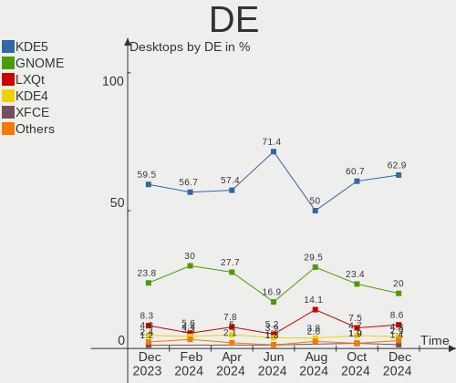
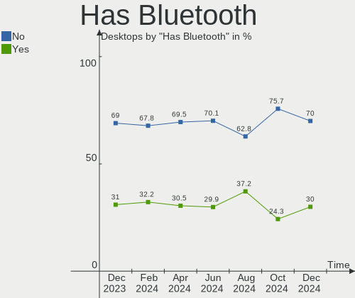

ROSA - Hardware Trends (Desktops)
---------------------------------

A project to identify most popular hardware characteristics and track their change
over time based on data collected by Linux users at https://Linux-Hardware.org.

Anyone can contribute to this report by the [hw-probe](https://github.com/linuxhw/hw-probe) tool:

    sudo -E hw-probe -all -upload

This report is for one last month. Overall report since the beginning of time: [TestCoverage](https://github.com/linuxhw/TestCoverage)

Period: Jun, 2022.

Contents
--------

* [ System ](#system)
  - [ OS                       ](#os)
  - [ OS Family                ](#os-family)
  - [ Kernel                   ](#kernel)
  - [ Kernel Family            ](#kernel-family)
  - [ Kernel Major Ver.        ](#kernel-major-ver)
  - [ Arch                     ](#arch)
  - [ DE                       ](#de)
  - [ Display Server           ](#display-server)
  - [ Display Manager          ](#display-manager)
  - [ OS Lang                  ](#os-lang)
  - [ Boot Mode                ](#boot-mode)
  - [ Filesystem               ](#filesystem)
  - [ Part. scheme             ](#part-scheme)
  - [ Dual Boot with Linux/BSD ](#dual-boot-with-linuxbsd)
  - [ Dual Boot (Win)          ](#dual-boot-win)

* [ Board ](#board)
  - [ Vendor                   ](#vendor)
  - [ Model                    ](#model)
  - [ Model Family             ](#model-family)
  - [ MFG Year                 ](#mfg-year)
  - [ Form Factor              ](#form-factor)
  - [ Secure Boot              ](#secure-boot)
  - [ Coreboot                 ](#coreboot)
  - [ RAM Size                 ](#ram-size)
  - [ RAM Used                 ](#ram-used)
  - [ Total Drives             ](#total-drives)
  - [ Has CD-ROM               ](#has-cd-rom)
  - [ Has Ethernet             ](#has-ethernet)
  - [ Has WiFi                 ](#has-wifi)
  - [ Has Bluetooth            ](#has-bluetooth)

* [ Location ](#location)
  - [ Country                  ](#country)
  - [ City                     ](#city)

* [ Drives ](#drives)
  - [ Drive Vendor             ](#drive-vendor)
  - [ Drive Model              ](#drive-model)
  - [ HDD Vendor               ](#hdd-vendor)
  - [ SSD Vendor               ](#ssd-vendor)
  - [ Drive Kind               ](#drive-kind)
  - [ Drive Connector          ](#drive-connector)
  - [ Drive Size               ](#drive-size)
  - [ Space Total              ](#space-total)
  - [ Space Used               ](#space-used)
  - [ Malfunc. Drives          ](#malfunc-drives)
  - [ Malfunc. Drive Vendor    ](#malfunc-drive-vendor)
  - [ Malfunc. HDD Vendor      ](#malfunc-hdd-vendor)
  - [ Malfunc. Drive Kind      ](#malfunc-drive-kind)
  - [ Failed Drives            ](#failed-drives)
  - [ Failed Drive Vendor      ](#failed-drive-vendor)
  - [ Drive Status             ](#drive-status)

* [ Storage controller ](#storage-controller)
  - [ Storage Vendor           ](#storage-vendor)
  - [ Storage Model            ](#storage-model)
  - [ Storage Kind             ](#storage-kind)

* [ Processor ](#processor)
  - [ CPU Vendor               ](#cpu-vendor)
  - [ CPU Model                ](#cpu-model)
  - [ CPU Model Family         ](#cpu-model-family)
  - [ CPU Cores                ](#cpu-cores)
  - [ CPU Sockets              ](#cpu-sockets)
  - [ CPU Threads              ](#cpu-threads)
  - [ CPU Op-Modes             ](#cpu-op-modes)
  - [ CPU Microcode            ](#cpu-microcode)
  - [ CPU Microarch            ](#cpu-microarch)

* [ Graphics ](#graphics)
  - [ GPU Vendor               ](#gpu-vendor)
  - [ GPU Model                ](#gpu-model)
  - [ GPU Combo                ](#gpu-combo)
  - [ GPU Driver               ](#gpu-driver)
  - [ GPU Memory               ](#gpu-memory)

* [ Monitor ](#monitor)
  - [ Monitor Vendor           ](#monitor-vendor)
  - [ Monitor Model            ](#monitor-model)
  - [ Monitor Resolution       ](#monitor-resolution)
  - [ Monitor Diagonal         ](#monitor-diagonal)
  - [ Monitor Width            ](#monitor-width)
  - [ Aspect Ratio             ](#aspect-ratio)
  - [ Monitor Area             ](#monitor-area)
  - [ Pixel Density            ](#pixel-density)
  - [ Multiple Monitors        ](#multiple-monitors)

* [ Network ](#network)
  - [ Net Controller Vendor    ](#net-controller-vendor)
  - [ Net Controller Model     ](#net-controller-model)
  - [ Wireless Vendor          ](#wireless-vendor)
  - [ Wireless Model           ](#wireless-model)
  - [ Ethernet Vendor          ](#ethernet-vendor)
  - [ Ethernet Model           ](#ethernet-model)
  - [ Net Controller Kind      ](#net-controller-kind)
  - [ Used Controller          ](#used-controller)
  - [ NICs                     ](#nics)
  - [ IPv6                     ](#ipv6)

* [ Bluetooth ](#bluetooth)
  - [ Bluetooth Vendor         ](#bluetooth-vendor)
  - [ Bluetooth Model          ](#bluetooth-model)

* [ Sound ](#sound)
  - [ Sound Vendor             ](#sound-vendor)
  - [ Sound Model              ](#sound-model)

* [ Memory ](#memory)
  - [ Memory Vendor            ](#memory-vendor)
  - [ Memory Model             ](#memory-model)
  - [ Memory Kind              ](#memory-kind)
  - [ Memory Form Factor       ](#memory-form-factor)
  - [ Memory Size              ](#memory-size)
  - [ Memory Speed             ](#memory-speed)

* [ Printers & scanners ](#printers--scanners)
  - [ Printer Vendor           ](#printer-vendor)
  - [ Printer Model            ](#printer-model)
  - [ Scanner Vendor           ](#scanner-vendor)
  - [ Scanner Model            ](#scanner-model)

* [ Camera ](#camera)
  - [ Camera Vendor            ](#camera-vendor)
  - [ Camera Model             ](#camera-model)

* [ Security ](#security)
  - [ Fingerprint Vendor       ](#fingerprint-vendor)
  - [ Fingerprint Model        ](#fingerprint-model)
  - [ Chipcard Vendor          ](#chipcard-vendor)
  - [ Chipcard Model           ](#chipcard-model)

* [ Unsupported ](#unsupported)
  - [ Unsupported Devices      ](#unsupported-devices)
  - [ Unsupported Device Types ](#unsupported-device-types)

System
------

OS
--

Installed operating systems

| Name         | Desktops | Percent |
|--------------|----------|---------|
| ROSA 12.2    | 135      | 86.54%  |
| ROSA R11.1   | 13       | 8.33%   |
| ROSA 12.1    | 4        | 2.56%   |
| ROSA R11     | 1        | 0.64%   |
| ROSA R10     | 1        | 0.64%   |
| ROSA 2019.05 | 1        | 0.64%   |
| ROSA 12      | 1        | 0.64%   |

OS Family
---------

OS without a version

| Name | Desktops | Percent |
|------|----------|---------|
| ROSA | 156      | 100%    |

Kernel
------

Version of the Linux kernel

| Version                                   | Desktops | Percent |
|-------------------------------------------|----------|---------|
| 5.10.74-generic-2rosa2021.1-x86_64        | 84       | 53.85%  |
| 5.10.118-generic-2rosa2021.1-x86_64       | 19       | 12.18%  |
| 5.18.3.xm1-1.klp-xanmod-rosa2021.1-x86_64 | 8        | 5.13%   |
| 5.18.1.xm1-3.klp-xanmod-rosa2021.1-x86_64 | 6        | 3.85%   |
| 5.17.11-generic-2rosa2021.1-x86_64        | 5        | 3.21%   |
| 5.4.83-generic-2rosa-x86_64               | 3        | 1.92%   |
| 5.18.6.xm1-1.klp-xanmod-rosa2021.1-x86_64 | 3        | 1.92%   |
| 5.17.11-generic-1rosa2021.1-x86_64        | 3        | 1.92%   |
| 5.15.43-generic-2rosa2021.1-x86_64        | 3        | 1.92%   |
| 5.4.32-generic-2rosa-x86_64               | 2        | 1.28%   |
| 5.18.4.xm1-1.klp-xanmod-rosa2021.1-x86_64 | 2        | 1.28%   |
| 4.15.0-desktop-122.124.1rosa-x86_64       | 2        | 1.28%   |
| 4.15.0-desktop-122.124.1rosa-i586         | 2        | 1.28%   |
| 5.4.83-generic-2rosa-i586                 | 1        | 0.64%   |
| 5.4.32-generic-2rosa-i586                 | 1        | 0.64%   |
| 5.4.139-nickel-4rosa2019.05-x86_64        | 1        | 0.64%   |
| 5.18.8.xm1-1.klp-xanmod-rosa2021.1-x86_64 | 1        | 0.64%   |
| 5.18.2.xm1-3.klp-xanmod-rosa2021.1-x86_64 | 1        | 0.64%   |
| 5.18.1-generic-2rosa2021.1-x86_64         | 1        | 0.64%   |
| 5.16.19-generic-2rosa2021.1-x86_64        | 1        | 0.64%   |
| 5.15.43-generic-1rosa2021.1-x86_64        | 1        | 0.64%   |
| 5.15.32-generic-6rosa2021.1-x86_64        | 1        | 0.64%   |
| 5.10.71-generic-1rosa2021.1-x86_64        | 1        | 0.64%   |
| 4.9.60-nrj-desktop-1rosa-x86_64           | 1        | 0.64%   |
| 4.9.155-nrj-desktop-1rosa-i586            | 1        | 0.64%   |
| 4.15.0-desktop-45.1rosa-x86_64            | 1        | 0.64%   |
| 4.15.0-desktop-45.1rosa-i586              | 1        | 0.64%   |

Kernel Family
-------------

Linux kernel without a distro release

| Version  | Desktops | Percent |
|----------|----------|---------|
| 5.10.74  | 84       | 53.85%  |
| 5.10.118 | 19       | 12.18%  |
| 5.18.3   | 8        | 5.13%   |
| 5.17.11  | 8        | 5.13%   |
| 5.18.1   | 7        | 4.49%   |
| 4.15.0   | 6        | 3.85%   |
| 5.4.83   | 4        | 2.56%   |
| 5.15.43  | 4        | 2.56%   |
| 5.4.32   | 3        | 1.92%   |
| 5.18.6   | 3        | 1.92%   |
| 5.18.4   | 2        | 1.28%   |
| 5.4.139  | 1        | 0.64%   |
| 5.18.8   | 1        | 0.64%   |
| 5.18.2   | 1        | 0.64%   |
| 5.16.19  | 1        | 0.64%   |
| 5.15.32  | 1        | 0.64%   |
| 5.10.71  | 1        | 0.64%   |
| 4.9.60   | 1        | 0.64%   |
| 4.9.155  | 1        | 0.64%   |

Kernel Major Ver.
-----------------

Linux kernel major version

| Version | Desktops | Percent |
|---------|----------|---------|
| 5.10    | 104      | 66.67%  |
| 5.18    | 22       | 14.1%   |
| 5.4     | 8        | 5.13%   |
| 5.17    | 8        | 5.13%   |
| 4.15    | 6        | 3.85%   |
| 5.15    | 5        | 3.21%   |
| 4.9     | 2        | 1.28%   |
| 5.16    | 1        | 0.64%   |

Arch
----

OS architecture (x86_64, i586, etc.)

| Name   | Desktops | Percent |
|--------|----------|---------|
| x86_64 | 150      | 96.15%  |
| i686   | 6        | 3.85%   |

DE
--

Desktop Environment

| Name  | Desktops | Percent |
|-------|----------|---------|
| KDE5  | 68       | 43.59%  |
| GNOME | 68       | 43.59%  |
| KDE4  | 13       | 8.33%   |
| LXQt  | 6        | 3.85%   |
| MATE  | 1        | 0.64%   |

Display Server
--------------

X11 or Wayland

| Name    | Desktops | Percent |
|---------|----------|---------|
| Wayland | 113      | 72.44%  |
| X11     | 43       | 27.56%  |

Display Manager
---------------

SDDM, LightDM, etc.

| Name    | Desktops | Percent |
|---------|----------|---------|
| GDM     | 80       | 51.28%  |
| SDDM    | 62       | 39.74%  |
| KDM     | 13       | 8.33%   |
| LightDM | 1        | 0.64%   |

OS Lang
-------

Language

| Lang    | Desktops | Percent |
|---------|----------|---------|
| ru_RU   | 144      | 92.31%  |
| Unknown | 3        | 1.92%   |
| ru_UA   | 2        | 1.28%   |
| en_US   | 2        | 1.28%   |
| de_DE   | 2        | 1.28%   |
| lt_LT   | 1        | 0.64%   |
| es_CO   | 1        | 0.64%   |
| C       | 1        | 0.64%   |

Boot Mode
---------

EFI or BIOS

| Mode | Desktops | Percent |
|------|----------|---------|
| BIOS | 78       | 50%     |
| EFI  | 78       | 50%     |

Filesystem
----------

Type of filesystem

| Type  | Desktops | Percent |
|-------|----------|---------|
| Ext4  | 149      | 95.51%  |
| Btrfs | 6        | 3.85%   |
| Ext3  | 1        | 0.64%   |

Part. scheme
------------

Scheme of partitioning

| Type    | Desktops | Percent |
|---------|----------|---------|
| GPT     | 103      | 66.03%  |
| MBR     | 52       | 33.33%  |
| Unknown | 1        | 0.64%   |

Dual Boot with Linux/BSD
------------------------

Hosting more than one Linux/BSD

| Dual boot | Desktops | Percent |
|-----------|----------|---------|
| No        | 104      | 66.67%  |
| Yes       | 52       | 33.33%  |

Dual Boot (Win)
---------------

Hosting Linux and Windows

| Dual boot | Desktops | Percent |
|-----------|----------|---------|
| Yes       | 97       | 62.18%  |
| No        | 59       | 37.82%  |

Board
-----

Vendor
------

Motherboard manufacturer

| Name                | Desktops | Percent |
|---------------------|----------|---------|
| Gigabyte Technology | 45       | 28.85%  |
| ASUSTek Computer    | 42       | 26.92%  |
| ASRock              | 25       | 16.03%  |
| MSI                 | 18       | 11.54%  |
| Unknown             | 4        | 2.56%   |
| Intel               | 3        | 1.92%   |
| Huanan              | 3        | 1.92%   |
| Dell                | 3        | 1.92%   |
| Acer                | 3        | 1.92%   |
| ECS                 | 2        | 1.28%   |
| Biostar             | 2        | 1.28%   |
| Yadro               | 1        | 0.64%   |
| Lenovo              | 1        | 0.64%   |
| Kraftway            | 1        | 0.64%   |
| JGINYUE             | 1        | 0.64%   |
| Hewlett-Packard     | 1        | 0.64%   |
| Foxconn             | 1        | 0.64%   |

Model
-----

Motherboard model

| Name                                   | Desktops | Percent |
|----------------------------------------|----------|---------|
| Unknown                                | 4        | 2.56%   |
| Gigabyte H110M-S2V                     | 3        | 1.92%   |
| MSI MS-7A71                            | 2        | 1.28%   |
| MSI MS-7A38                            | 2        | 1.28%   |
| MSI MS-7752                            | 2        | 1.28%   |
| Gigabyte Z77-D3H                       | 2        | 1.28%   |
| Gigabyte X470 AORUS ULTRA GAMING       | 2        | 1.28%   |
| ASUS TUF B450M-PRO GAMING              | 2        | 1.28%   |
| ASUS P8H61-M LX3 R2.0                  | 2        | 1.28%   |
| ASUS M5A99X EVO R2.0                   | 2        | 1.28%   |
| ASUS M5A97 R2.0                        | 2        | 1.28%   |
| ASUS M5A78L-M LX3                      | 2        | 1.28%   |
| ASRock N68C-S UCC                      | 2        | 1.28%   |
| ASRock H310CM-HDV                      | 2        | 1.28%   |
| ASRock ALiveXFire-eSATA2               | 2        | 1.28%   |
| Yadro TB560-D4                         | 1        | 0.64%   |
| MSI MS-7C75                            | 1        | 0.64%   |
| MSI MS-7C37                            | 1        | 0.64%   |
| MSI MS-7B98                            | 1        | 0.64%   |
| MSI MS-7B93                            | 1        | 0.64%   |
| MSI MS-7B86                            | 1        | 0.64%   |
| MSI MS-7994                            | 1        | 0.64%   |
| MSI MS-7895                            | 1        | 0.64%   |
| MSI MS-7817                            | 1        | 0.64%   |
| MSI MS-7808                            | 1        | 0.64%   |
| MSI MS-7673                            | 1        | 0.64%   |
| MSI MS-7641                            | 1        | 0.64%   |
| MSI GEG                                | 1        | 0.64%   |
| Lenovo IdeaCentre 720-18APR 90HY004CRS | 1        | 0.64%   |
| Kraftway KWH310-TI                     | 1        | 0.64%   |
| JGINYUE B85I PLUS V2.1                 | 1        | 0.64%   |
| Intel X99 V102                         | 1        | 0.64%   |
| Intel X99 V1.0                         | 1        | 0.64%   |
| Intel X79M-S                           | 1        | 0.64%   |
| Huanan X99 F8D V2.2                    | 1        | 0.64%   |
| Huanan H97-ZD3 V2.0                    | 1        | 0.64%   |
| Huanan Gaming F8                       | 1        | 0.64%   |
| HP Pavilion Gaming Desktop TG01-1xxx   | 1        | 0.64%   |
| Gigabyte Z77X-UD5H                     | 1        | 0.64%   |
| Gigabyte Z590 GAMING X                 | 1        | 0.64%   |
| Gigabyte Z170X-Gaming 3                | 1        | 0.64%   |
| Gigabyte X99-Gaming 5                  | 1        | 0.64%   |
| Gigabyte X58A-UD3R                     | 1        | 0.64%   |
| Gigabyte P55-UD3R                      | 1        | 0.64%   |
| Gigabyte P35-S3G                       | 1        | 0.64%   |
| Gigabyte P31-S3G                       | 1        | 0.64%   |
| Gigabyte M68M-S2P                      | 1        | 0.64%   |
| Gigabyte M61PME-S2P                    | 1        | 0.64%   |
| Gigabyte H97-HD3                       | 1        | 0.64%   |
| Gigabyte H77-DS3H                      | 1        | 0.64%   |
| Gigabyte H55M-USB3                     | 1        | 0.64%   |
| Gigabyte H55M-S2H                      | 1        | 0.64%   |
| Gigabyte H410M S2H V3                  | 1        | 0.64%   |
| Gigabyte H410M H V3                    | 1        | 0.64%   |
| Gigabyte H110M-S2V-CF                  | 1        | 0.64%   |
| Gigabyte H110M-M.2                     | 1        | 0.64%   |
| Gigabyte GA-MA78G-DS3H                 | 1        | 0.64%   |
| Gigabyte GA-MA770-UD3                  | 1        | 0.64%   |
| Gigabyte GA-880GMA-USB3                | 1        | 0.64%   |
| Gigabyte GA-870A-UD3                   | 1        | 0.64%   |

Model Family
------------

Motherboard model prefix

| Name                     | Desktops | Percent |
|--------------------------|----------|---------|
| ASUS PRIME               | 6        | 3.85%   |
| Unknown                  | 4        | 2.56%   |
| Gigabyte H110M-S2V       | 3        | 1.92%   |
| ASUS TUF                 | 3        | 1.92%   |
| ASUS P8H61-M             | 3        | 1.92%   |
| ASUS P7H55-M             | 3        | 1.92%   |
| MSI MS-7A71              | 2        | 1.28%   |
| MSI MS-7A38              | 2        | 1.28%   |
| MSI MS-7752              | 2        | 1.28%   |
| Intel X99                | 2        | 1.28%   |
| Gigabyte Z77-D3H         | 2        | 1.28%   |
| Gigabyte X470            | 2        | 1.28%   |
| Gigabyte H410M           | 2        | 1.28%   |
| Gigabyte B450            | 2        | 1.28%   |
| Dell OptiPlex            | 2        | 1.28%   |
| ASUS ROG                 | 2        | 1.28%   |
| ASUS P5KPL-AM            | 2        | 1.28%   |
| ASUS M5A99X              | 2        | 1.28%   |
| ASUS M5A97               | 2        | 1.28%   |
| ASUS M5A78L-M            | 2        | 1.28%   |
| ASRock N68C-S            | 2        | 1.28%   |
| ASRock H310CM-HDV        | 2        | 1.28%   |
| ASRock B450M             | 2        | 1.28%   |
| ASRock ALiveXFire-eSATA2 | 2        | 1.28%   |
| Acer Aspire              | 2        | 1.28%   |
| Yadro TB560-D4           | 1        | 0.64%   |
| MSI MS-7C75              | 1        | 0.64%   |
| MSI MS-7C37              | 1        | 0.64%   |
| MSI MS-7B98              | 1        | 0.64%   |
| MSI MS-7B93              | 1        | 0.64%   |
| MSI MS-7B86              | 1        | 0.64%   |
| MSI MS-7994              | 1        | 0.64%   |
| MSI MS-7895              | 1        | 0.64%   |
| MSI MS-7817              | 1        | 0.64%   |
| MSI MS-7808              | 1        | 0.64%   |
| MSI MS-7673              | 1        | 0.64%   |
| MSI MS-7641              | 1        | 0.64%   |
| MSI GEG                  | 1        | 0.64%   |
| Lenovo IdeaCentre        | 1        | 0.64%   |
| Kraftway KWH310-TI       | 1        | 0.64%   |
| JGINYUE B85I             | 1        | 0.64%   |
| Intel X79M-S             | 1        | 0.64%   |
| Huanan X99               | 1        | 0.64%   |
| Huanan H97-ZD3           | 1        | 0.64%   |
| Huanan Gaming            | 1        | 0.64%   |
| HP Pavilion              | 1        | 0.64%   |
| Gigabyte Z77X-UD5H       | 1        | 0.64%   |
| Gigabyte Z590            | 1        | 0.64%   |
| Gigabyte Z170X-Gaming    | 1        | 0.64%   |
| Gigabyte X99-Gaming      | 1        | 0.64%   |
| Gigabyte X58A-UD3R       | 1        | 0.64%   |
| Gigabyte P55-UD3R        | 1        | 0.64%   |
| Gigabyte P35-S3G         | 1        | 0.64%   |
| Gigabyte P31-S3G         | 1        | 0.64%   |
| Gigabyte M68M-S2P        | 1        | 0.64%   |
| Gigabyte M61PME-S2P      | 1        | 0.64%   |
| Gigabyte H97-HD3         | 1        | 0.64%   |
| Gigabyte H77-DS3H        | 1        | 0.64%   |
| Gigabyte H55M-USB3       | 1        | 0.64%   |
| Gigabyte H55M-S2H        | 1        | 0.64%   |

MFG Year
--------

Motherboard manufacture year

| Year | Desktops | Percent |
|------|----------|---------|
| 2012 | 21       | 13.46%  |
| 2018 | 16       | 10.26%  |
| 2019 | 15       | 9.62%   |
| 2020 | 14       | 8.97%   |
| 2021 | 12       | 7.69%   |
| 2009 | 12       | 7.69%   |
| 2016 | 11       | 7.05%   |
| 2010 | 10       | 6.41%   |
| 2011 | 9        | 5.77%   |
| 2008 | 8        | 5.13%   |
| 2007 | 8        | 5.13%   |
| 2017 | 5        | 3.21%   |
| 2013 | 5        | 3.21%   |
| 2015 | 3        | 1.92%   |
| 2014 | 3        | 1.92%   |
| 2006 | 3        | 1.92%   |
| 2022 | 1        | 0.64%   |

Form Factor
-----------

Physical design of the computer

| Name    | Desktops | Percent |
|---------|----------|---------|
| Desktop | 156      | 100%    |

Secure Boot
-----------

Enabled or disabled

| State    | Desktops | Percent |
|----------|----------|---------|
| Disabled | 156      | 100%    |

Coreboot
--------

Have coreboot on board

| Used | Desktops | Percent |
|------|----------|---------|
| No   | 156      | 100%    |

RAM Size
--------

Total RAM memory

| Size in GB  | Desktops | Percent |
|-------------|----------|---------|
| 16.01-24.0  | 44       | 28.21%  |
| 8.01-16.0   | 38       | 24.36%  |
| 4.01-8.0    | 22       | 14.1%   |
| 32.01-64.0  | 20       | 12.82%  |
| 3.01-4.0    | 20       | 12.82%  |
| 1.01-2.0    | 5        | 3.21%   |
| 24.01-32.0  | 3        | 1.92%   |
| 2.01-3.0    | 2        | 1.28%   |
| 64.01-256.0 | 2        | 1.28%   |

RAM Used
--------

Used RAM memory

| Used GB   | Desktops | Percent |
|-----------|----------|---------|
| 1.01-2.0  | 78       | 50%     |
| 0.51-1.0  | 39       | 25%     |
| 2.01-3.0  | 21       | 13.46%  |
| 3.01-4.0  | 9        | 5.77%   |
| 4.01-8.0  | 8        | 5.13%   |
| 8.01-16.0 | 1        | 0.64%   |

Total Drives
------------

Number of drives on board

| Drives | Desktops | Percent |
|--------|----------|---------|
| 1      | 47       | 30.13%  |
| 2      | 45       | 28.85%  |
| 3      | 34       | 21.79%  |
| 4      | 16       | 10.26%  |
| 5      | 6        | 3.85%   |
| 6      | 4        | 2.56%   |
| 0      | 2        | 1.28%   |
| 8      | 1        | 0.64%   |
| 7      | 1        | 0.64%   |

Has CD-ROM
----------

Has CD-ROM on board

| Presented | Desktops | Percent |
|-----------|----------|---------|
| No        | 102      | 65.38%  |
| Yes       | 54       | 34.62%  |

Has Ethernet
------------

Has Ethernet on board

| Presented | Desktops | Percent |
|-----------|----------|---------|
| Yes       | 156      | 100%    |

Has WiFi
--------

Has WiFi module

| Presented | Desktops | Percent |
|-----------|----------|---------|
| No        | 116      | 74.36%  |
| Yes       | 40       | 25.64%  |

Has Bluetooth
-------------

Has Bluetooth module

| Presented | Desktops | Percent |
|-----------|----------|---------|
| No        | 125      | 80.13%  |
| Yes       | 31       | 19.87%  |

Location
--------

Country
-------

Geographic location (country)

| Country     | Desktops | Percent |
|-------------|----------|---------|
| Russia      | 141      | 90.38%  |
| Ukraine     | 3        | 1.92%   |
| Lithuania   | 2        | 1.28%   |
| Kazakhstan  | 2        | 1.28%   |
| Germany     | 2        | 1.28%   |
| Turkey      | 1        | 0.64%   |
| Poland      | 1        | 0.64%   |
| Netherlands | 1        | 0.64%   |
| Israel      | 1        | 0.64%   |
| Estonia     | 1        | 0.64%   |
| Colombia    | 1        | 0.64%   |

City
----

Geographic location (city)

| City                   | Desktops | Percent |
|------------------------|----------|---------|
| Moscow                 | 15       | 9.62%   |
| St Petersburg          | 10       | 6.41%   |
| Samara                 | 7        | 4.49%   |
| Chelyabinsk            | 7        | 4.49%   |
| Krasnodar              | 5        | 3.21%   |
| Yekaterinburg          | 4        | 2.56%   |
| Vladivostok            | 4        | 2.56%   |
| Tyumen                 | 4        | 2.56%   |
| Novosibirsk            | 4        | 2.56%   |
| Saratov                | 3        | 1.92%   |
| Rostov-on-Don          | 3        | 1.92%   |
| Voronezh               | 2        | 1.28%   |
| Syktyvkar              | 2        | 1.28%   |
| Sochi                  | 2        | 1.28%   |
| Severodvinsk           | 2        | 1.28%   |
| Saransk                | 2        | 1.28%   |
| Ryazan                 | 2        | 1.28%   |
| Omsk                   | 2        | 1.28%   |
| Nizhniy Novgorod       | 2        | 1.28%   |
| Khabarovsk             | 2        | 1.28%   |
| Zarechnyy              | 1        | 0.64%   |
| Yuzhno-Sakhalinsk      | 1        | 0.64%   |
| Yoshkar-Ola            | 1        | 0.64%   |
| Yessentuki             | 1        | 0.64%   |
| Yelizovo               | 1        | 0.64%   |
| Yaroslavl              | 1        | 0.64%   |
| Yakutsk                | 1        | 0.64%   |
| Witten                 | 1        | 0.64%   |
| Vologda                | 1        | 0.64%   |
| Vladimir               | 1        | 0.64%   |
| Vladikavkaz            | 1        | 0.64%   |
| Ulyanovsk              | 1        | 0.64%   |
| Uglich                 | 1        | 0.64%   |
| Ufa                    | 1        | 0.64%   |
| Tula                   | 1        | 0.64%   |
| Tomsk                  | 1        | 0.64%   |
| Tolyatti               | 1        | 0.64%   |
| Tel Aviv               | 1        | 0.64%   |
| Tambov                 | 1        | 0.64%   |
| Surgut                 | 1        | 0.64%   |
| Sterlitamak            | 1        | 0.64%   |
| Smolensk               | 1        | 0.64%   |
| Siemianowice Śląskie | 1        | 0.64%   |
| Shumerlya              | 1        | 0.64%   |
| Sevastopol             | 1        | 0.64%   |
| Sergiyev Posad         | 1        | 0.64%   |
| Sarov                  | 1        | 0.64%   |
| Santiago de Cali       | 1        | 0.64%   |
| Ridder                 | 1        | 0.64%   |
| Raseiniai              | 1        | 0.64%   |
| Prokop'yevsk           | 1        | 0.64%   |
| Podolsk                | 1        | 0.64%   |
| Petrozavodsk           | 1        | 0.64%   |
| Petropavl              | 1        | 0.64%   |
| Perm                   | 1        | 0.64%   |
| Penza                  | 1        | 0.64%   |
| Pechora                | 1        | 0.64%   |
| Pärnu                 | 1        | 0.64%   |
| Ozersk                 | 1        | 0.64%   |
| Otradnoye              | 1        | 0.64%   |

Drives
------

Drive Vendor
------------

Hard drive vendors

| Vendor              | Desktops | Drives | Percent |
|---------------------|----------|--------|---------|
| Seagate             | 71       | 89     | 22.05%  |
| WDC                 | 68       | 85     | 21.12%  |
| Samsung Electronics | 29       | 29     | 9.01%   |
| Toshiba             | 18       | 20     | 5.59%   |
| Hitachi             | 14       | 15     | 4.35%   |
| China               | 14       | 15     | 4.35%   |
| Kingston            | 13       | 17     | 4.04%   |
| A-DATA Technology   | 13       | 14     | 4.04%   |
| SPCC                | 8        | 8      | 2.48%   |
| Apacer              | 8        | 9      | 2.48%   |
| KingSpec            | 5        | 5      | 1.55%   |
| Smartbuy            | 4        | 4      | 1.24%   |
| SanDisk             | 4        | 4      | 1.24%   |
| HGST                | 4        | 4      | 1.24%   |
| Goodram             | 4        | 4      | 1.24%   |
| Gigabyte Technology | 4        | 4      | 1.24%   |
| Crucial             | 4        | 4      | 1.24%   |
| OCZ                 | 3        | 3      | 0.93%   |
| Maxtor              | 3        | 3      | 0.93%   |
| Plextor             | 2        | 2      | 0.62%   |
| Intenso             | 2        | 2      | 0.62%   |
| Intel               | 2        | 2      | 0.62%   |
| Corsair             | 2        | 2      | 0.62%   |
| ASMT                | 2        | 4      | 0.62%   |
| AMD                 | 2        | 2      | 0.62%   |
| XPG                 | 1        | 1      | 0.31%   |
| WALRAM              | 1        | 1      | 0.31%   |
| Unknown             | 1        | 2      | 0.31%   |
| Transcend           | 1        | 1      | 0.31%   |
| Team                | 1        | 1      | 0.31%   |
| SK hynix            | 1        | 1      | 0.31%   |
| Silicon Motion      | 1        | 1      | 0.31%   |
| SETHRISE            | 1        | 1      | 0.31%   |
| Phison              | 1        | 1      | 0.31%   |
| Palit               | 1        | 1      | 0.31%   |
| Netac               | 1        | 1      | 0.31%   |
| Leven               | 1        | 1      | 0.31%   |
| KIOXIA-EXCERIA      | 1        | 1      | 0.31%   |
| Kingmax             | 1        | 1      | 0.31%   |
| KingDian            | 1        | 1      | 0.31%   |
| Hewlett-Packard     | 1        | 1      | 0.31%   |
| Fujitsu             | 1        | 1      | 0.31%   |
| Foxline             | 1        | 1      | 0.31%   |
| addlink             | 1        | 1      | 0.31%   |

Drive Model
-----------

Hard drive models

| Model                                | Desktops | Percent |
|--------------------------------------|----------|---------|
| Seagate ST2000DM008-2FR102 2TB       | 7        | 1.93%   |
| Toshiba HDWD110 1TB                  | 6        | 1.66%   |
| Seagate ST1000DM010-2EP102 1TB       | 6        | 1.66%   |
| WDC WD10EZEX-08WN4A0 1TB             | 5        | 1.38%   |
| Seagate ST500DM002-1BD142 500GB      | 5        | 1.38%   |
| WDC WDS120G2G0A-00JH30 120GB SSD     | 4        | 1.1%    |
| Seagate ST1000LM024 HN-M101MBB 1TB   | 4        | 1.1%    |
| Seagate ST1000DM003-1CH162 1TB       | 4        | 1.1%    |
| Samsung SSD 860 EVO 250GB            | 4        | 1.1%    |
| Kingston SA400S37240G 240GB SSD      | 4        | 1.1%    |
| WDC WDS240G2G0A-00JH30 240GB SSD     | 3        | 0.83%   |
| WDC WD20PURZ-85GU6Y0 2TB             | 3        | 0.83%   |
| Toshiba DT01ACA100 1TB               | 3        | 0.83%   |
| Seagate ST3250310AS 250GB            | 3        | 0.83%   |
| Seagate ST1000NM0033-9ZM173 1TB      | 3        | 0.83%   |
| Samsung SSD 970 EVO Plus 500GB       | 3        | 0.83%   |
| Kingston SNVS500G 500GB              | 3        | 0.83%   |
| Goodram SSDPR-CL100-120-G2 120GB     | 3        | 0.83%   |
| Gigabyte GP-GSTFS31120GNTD 120GB SSD | 3        | 0.83%   |
| Apacer AS350 512GB SSD               | 3        | 0.83%   |
| Apacer AS350 128GB SSD               | 3        | 0.83%   |
| A-DATA SX6000PNP 256GB               | 3        | 0.83%   |
| A-DATA SU650 240GB SSD               | 3        | 0.83%   |
| WDC WD800JD-22MSA1 80GB              | 2        | 0.55%   |
| WDC WD6400AAKS-22A7B0 640GB          | 2        | 0.55%   |
| WDC WD5000AZRZ-00HTKB0 500GB         | 2        | 0.55%   |
| WDC WD5000AAKX-001CA0 500GB          | 2        | 0.55%   |
| WDC WD10EZEX-00RKKA0 1TB             | 2        | 0.55%   |
| Toshiba DT01ACA050 500GB             | 2        | 0.55%   |
| SPCC Solid State Disk 256GB          | 2        | 0.55%   |
| SPCC Solid State Disk 128GB          | 2        | 0.55%   |
| SPCC Solid State Disk 120GB          | 2        | 0.55%   |
| Seagate ST500DM009-2F110A 500GB      | 2        | 0.55%   |
| Seagate ST3120022A 120GB             | 2        | 0.55%   |
| Seagate ST2000DM001-1ER164 2TB       | 2        | 0.55%   |
| Seagate ST2000DM001-1CH164 2TB       | 2        | 0.55%   |
| Seagate ST1000DM003-9YN162 1TB       | 2        | 0.55%   |
| Seagate ST1000DM003-1ER162 1TB       | 2        | 0.55%   |
| Seagate Expansion 1TB                | 2        | 0.55%   |
| Samsung SSD 970 PRO 512GB            | 2        | 0.55%   |
| Samsung SSD 970 EVO Plus 250GB       | 2        | 0.55%   |
| Samsung SSD 970 EVO 250GB            | 2        | 0.55%   |
| Samsung SSD 960 EVO 500GB            | 2        | 0.55%   |
| Samsung SSD 850 EVO 250GB            | 2        | 0.55%   |
| Kingston SA400S37120G 120GB SSD      | 2        | 0.55%   |
| Kingston SA1000M8240G 240GB          | 2        | 0.55%   |
| Hitachi HDS728080PLAT20 82GB         | 2        | 0.55%   |
| Hitachi HDS721616PLA380 160GB        | 2        | 0.55%   |
| Hitachi HDS721050CLA360 500GB        | 2        | 0.55%   |
| Crucial CT120BX500SSD1 120GB         | 2        | 0.55%   |
| China SSD 120GB                      | 2        | 0.55%   |
| China SATA SSD 128GB                 | 2        | 0.55%   |
| China 120GB SSD                      | 2        | 0.55%   |
| Apacer AS350 256GB SSD               | 2        | 0.55%   |
| XPG GAMMIX S5 1TB                    | 1        | 0.28%   |
| WDC WDS500G2B0C-00PXH0 500GB         | 1        | 0.28%   |
| WDC WDS250G2B0A-00SM50 250GB SSD     | 1        | 0.28%   |
| WDC WDS240G2G0B-00EPW0 240GB SSD     | 1        | 0.28%   |
| WDC WDS240G1G0A-00SS50 240GB SSD     | 1        | 0.28%   |
| WDC WDS120G2G0B-00EPW0 120GB SSD     | 1        | 0.28%   |

HDD Vendor
----------

Hard disk drive vendors

| Vendor              | Desktops | Drives | Percent |
|---------------------|----------|--------|---------|
| Seagate             | 71       | 89     | 39.44%  |
| WDC                 | 61       | 70     | 33.89%  |
| Toshiba             | 18       | 19     | 10%     |
| Hitachi             | 14       | 15     | 7.78%   |
| Samsung Electronics | 6        | 6      | 3.33%   |
| HGST                | 4        | 4      | 2.22%   |
| Maxtor              | 3        | 3      | 1.67%   |
| ASMT                | 2        | 4      | 1.11%   |
| Fujitsu             | 1        | 1      | 0.56%   |

SSD Vendor
----------

Solid state drive vendors

| Vendor              | Desktops | Drives | Percent |
|---------------------|----------|--------|---------|
| China               | 14       | 15     | 12.17%  |
| WDC                 | 12       | 12     | 10.43%  |
| Samsung Electronics | 10       | 10     | 8.7%    |
| Kingston            | 9        | 11     | 7.83%   |
| SPCC                | 8        | 8      | 6.96%   |
| Apacer              | 8        | 9      | 6.96%   |
| A-DATA Technology   | 8        | 8      | 6.96%   |
| KingSpec            | 5        | 5      | 4.35%   |
| Smartbuy            | 4        | 4      | 3.48%   |
| Goodram             | 4        | 4      | 3.48%   |
| SanDisk             | 3        | 3      | 2.61%   |
| OCZ                 | 3        | 3      | 2.61%   |
| Gigabyte Technology | 3        | 3      | 2.61%   |
| Crucial             | 3        | 3      | 2.61%   |
| Plextor             | 2        | 2      | 1.74%   |
| Intenso             | 2        | 2      | 1.74%   |
| Intel               | 2        | 2      | 1.74%   |
| Corsair             | 2        | 2      | 1.74%   |
| WALRAM              | 1        | 1      | 0.87%   |
| Transcend           | 1        | 1      | 0.87%   |
| Toshiba             | 1        | 1      | 0.87%   |
| Team                | 1        | 1      | 0.87%   |
| Palit               | 1        | 1      | 0.87%   |
| Netac               | 1        | 1      | 0.87%   |
| Leven               | 1        | 1      | 0.87%   |
| KIOXIA-EXCERIA      | 1        | 1      | 0.87%   |
| Kingmax             | 1        | 1      | 0.87%   |
| KingDian            | 1        | 1      | 0.87%   |
| Hewlett-Packard     | 1        | 1      | 0.87%   |
| Foxline             | 1        | 1      | 0.87%   |
| AMD                 | 1        | 1      | 0.87%   |

Drive Kind
----------

HDD or SSD

| Kind    | Desktops | Drives | Percent |
|---------|----------|--------|---------|
| HDD     | 129      | 211    | 50.59%  |
| SSD     | 90       | 119    | 35.29%  |
| NVMe    | 35       | 38     | 13.73%  |
| Unknown | 1        | 2      | 0.39%   |

Drive Connector
---------------

SATA, SAS, NVMe, etc.

| Type | Desktops | Drives | Percent |
|------|----------|--------|---------|
| SATA | 148      | 323    | 78.31%  |
| NVMe | 35       | 38     | 18.52%  |
| SAS  | 6        | 9      | 3.17%   |

Drive Size
----------

Size of hard drive

| Size in TB | Desktops | Drives | Percent |
|------------|----------|--------|---------|
| 0.01-0.5   | 126      | 200    | 55.26%  |
| 0.51-1.0   | 64       | 87     | 28.07%  |
| 1.01-2.0   | 27       | 31     | 11.84%  |
| 3.01-4.0   | 6        | 7      | 2.63%   |
| 2.01-3.0   | 3        | 3      | 1.32%   |
| 10.01-20.0 | 1        | 1      | 0.44%   |
| 4.01-10.0  | 1        | 1      | 0.44%   |

Space Total
-----------

Amount of disk space available on the file system

| Size in GB     | Desktops | Percent |
|----------------|----------|---------|
| 101-250        | 51       | 32.69%  |
| 251-500        | 24       | 15.38%  |
| 501-1000       | 24       | 15.38%  |
| 1-20           | 19       | 12.18%  |
| 1001-2000      | 12       | 7.69%   |
| 51-100         | 12       | 7.69%   |
| More than 3000 | 7        | 4.49%   |
| 2001-3000      | 6        | 3.85%   |
| 21-50          | 1        | 0.64%   |

Space Used
----------

Amount of used disk space

| Used GB        | Desktops | Percent |
|----------------|----------|---------|
| 1-20           | 95       | 60.9%   |
| 101-250        | 17       | 10.9%   |
| 21-50          | 13       | 8.33%   |
| 51-100         | 11       | 7.05%   |
| 501-1000       | 7        | 4.49%   |
| 251-500        | 6        | 3.85%   |
| 1001-2000      | 4        | 2.56%   |
| 2001-3000      | 2        | 1.28%   |
| More than 3000 | 1        | 0.64%   |

Malfunc. Drives
---------------

Drive models with a malfunction

| Model                              | Desktops | Drives | Percent |
|------------------------------------|----------|--------|---------|
| Seagate ST3250310AS 250GB          | 3        | 3      | 3.9%    |
| WDC WD10EZEX-00RKKA0 1TB           | 2        | 2      | 2.6%    |
| Toshiba DT01ACA100 1TB             | 2        | 2      | 2.6%    |
| Seagate ST500DM002-1BD142 500GB    | 2        | 3      | 2.6%    |
| Seagate ST1000LM024 HN-M101MBB 1TB | 2        | 2      | 2.6%    |
| WDC WDS120G2G0A-00JH30 120GB SSD   | 1        | 1      | 1.3%    |
| WDC WD7500AARX-00N0YB0 752GB       | 1        | 1      | 1.3%    |
| WDC WD7500AARS-00Y5B1 752GB        | 1        | 1      | 1.3%    |
| WDC WD6400AAKS-22A7B0 640GB        | 1        | 1      | 1.3%    |
| WDC WD5001AALS-00E3A0 500GB        | 1        | 1      | 1.3%    |
| WDC WD5000BPVT-24HXZT3 500GB       | 1        | 1      | 1.3%    |
| WDC WD5000AZRZ-00HTKB0 500GB       | 1        | 1      | 1.3%    |
| WDC WD5000AAKX-001CA0 500GB        | 1        | 1      | 1.3%    |
| WDC WD5000AAKS-00UU3A0 500GB       | 1        | 1      | 1.3%    |
| WDC WD5000AADS-00S9B0 500GB        | 1        | 1      | 1.3%    |
| WDC WD3202ABYS-02B7A0 320GB        | 1        | 1      | 1.3%    |
| WDC WD3200AAKX-001CA0 320GB        | 1        | 1      | 1.3%    |
| WDC WD3200AAKS-00UU3A0 320GB       | 1        | 1      | 1.3%    |
| WDC WD3200AAKS-00B3A0 320GB        | 1        | 1      | 1.3%    |
| WDC WD3200AAJS-65B4A0 320GB        | 1        | 1      | 1.3%    |
| WDC WD3200AAJS-08L7A0 320GB        | 1        | 1      | 1.3%    |
| WDC WD3200AAJB-00J3A0 320GB        | 1        | 1      | 1.3%    |
| WDC WD30PURX-64P6ZY0 3TB           | 1        | 1      | 1.3%    |
| WDC WD2500AAKS-00UU3A0 250GB       | 1        | 1      | 1.3%    |
| WDC WD20PURZ-85GU6Y0 2TB           | 1        | 1      | 1.3%    |
| WDC WD20EARS-00MVWB0 2TB           | 1        | 1      | 1.3%    |
| WDC WD2003FZEX-00Z4SA0 2TB         | 1        | 1      | 1.3%    |
| WDC WD15EARS-00MVWB0 1TB           | 1        | 1      | 1.3%    |
| WDC WD1502FYPS-01U1B1 1TB          | 1        | 1      | 1.3%    |
| WDC WD10JPCX-24UE4T0 1TB           | 1        | 1      | 1.3%    |
| WDC WD10EARS-00Y5B1 1TB            | 1        | 1      | 1.3%    |
| Toshiba MK3265GSX 320GB            | 1        | 1      | 1.3%    |
| Toshiba MK1652GSX 160GB            | 1        | 1      | 1.3%    |
| Seagate ST500DM002-1BC142 500GB    | 1        | 1      | 1.3%    |
| Seagate ST4000NM0035-1V4107 4TB    | 1        | 2      | 1.3%    |
| Seagate ST380013AS 80GB            | 1        | 1      | 1.3%    |
| Seagate ST3500418AS 500GB          | 1        | 1      | 1.3%    |
| Seagate ST3500413AS 500GB          | 1        | 1      | 1.3%    |
| Seagate ST3250318AS 250GB          | 1        | 1      | 1.3%    |
| Seagate ST3160827AS 160GB          | 1        | 1      | 1.3%    |
| Seagate ST3160811AS 160GB          | 1        | 1      | 1.3%    |
| Seagate ST3160215A 160GB           | 1        | 1      | 1.3%    |
| Seagate ST31500341AS 1TB           | 1        | 1      | 1.3%    |
| Seagate ST3120814A 120GB           | 1        | 1      | 1.3%    |
| Seagate ST3120022A 120GB           | 1        | 1      | 1.3%    |
| Seagate ST31000524AS 1TB           | 1        | 1      | 1.3%    |
| Seagate ST3000DM007-1WY10G 3TB     | 1        | 1      | 1.3%    |
| Seagate ST2000DM001-1CH164 2TB     | 1        | 1      | 1.3%    |
| Seagate ST2000DL003-9VT166 2TB     | 1        | 1      | 1.3%    |
| Seagate ST1000LM014-SSHD-8GB       | 1        | 1      | 1.3%    |
| Seagate ST1000DM003-9YN162 1TB     | 1        | 1      | 1.3%    |
| Seagate ST1000DM003-1CH162 1TB     | 1        | 1      | 1.3%    |
| Samsung Electronics SP0802N 80GB   | 1        | 1      | 1.3%    |
| Samsung Electronics HD250HJ 250GB  | 1        | 1      | 1.3%    |
| OCZ VECTOR150 120GB SSD            | 1        | 1      | 1.3%    |
| Maxtor STM3160211AS 160GB          | 1        | 1      | 1.3%    |
| Maxtor 6G160P0 160GB               | 1        | 1      | 1.3%    |
| Leven JAJS300M240C 240GB SSD       | 1        | 1      | 1.3%    |
| KingSpec P3-256 256GB SSD          | 1        | 1      | 1.3%    |
| Kingmax SSD 120GB                  | 1        | 1      | 1.3%    |

Malfunc. Drive Vendor
---------------------

Vendors of faulty drives

| Vendor              | Desktops | Drives | Percent |
|---------------------|----------|--------|---------|
| WDC                 | 27       | 28     | 36%     |
| Seagate             | 25       | 28     | 33.33%  |
| Hitachi             | 7        | 7      | 9.33%   |
| Toshiba             | 4        | 4      | 5.33%   |
| Samsung Electronics | 2        | 2      | 2.67%   |
| Maxtor              | 2        | 2      | 2.67%   |
| OCZ                 | 1        | 1      | 1.33%   |
| Leven               | 1        | 1      | 1.33%   |
| KingSpec            | 1        | 1      | 1.33%   |
| Kingmax             | 1        | 1      | 1.33%   |
| Intenso             | 1        | 1      | 1.33%   |
| HGST                | 1        | 1      | 1.33%   |
| Fujitsu             | 1        | 1      | 1.33%   |
| China               | 1        | 1      | 1.33%   |

Malfunc. HDD Vendor
-------------------

Vendors of faulty HDD drives

| Vendor              | Desktops | Drives | Percent |
|---------------------|----------|--------|---------|
| WDC                 | 26       | 27     | 38.24%  |
| Seagate             | 25       | 28     | 36.76%  |
| Hitachi             | 7        | 7      | 10.29%  |
| Toshiba             | 4        | 4      | 5.88%   |
| Samsung Electronics | 2        | 2      | 2.94%   |
| Maxtor              | 2        | 2      | 2.94%   |
| HGST                | 1        | 1      | 1.47%   |
| Fujitsu             | 1        | 1      | 1.47%   |

Malfunc. Drive Kind
-------------------

Kinds of faulty drives

| Kind | Desktops | Drives | Percent |
|------|----------|--------|---------|
| HDD  | 58       | 72     | 89.23%  |
| SSD  | 7        | 7      | 10.77%  |

Failed Drives
-------------

Failed drive models

| Model                             | Desktops | Drives | Percent |
|-----------------------------------|----------|--------|---------|
| Seagate ST9500325AS 500GB         | 1        | 1      | 50%     |
| Samsung Electronics SP2504C 250GB | 1        | 1      | 50%     |

Failed Drive Vendor
-------------------

Failed drive vendors

| Vendor              | Desktops | Drives | Percent |
|---------------------|----------|--------|---------|
| Seagate             | 1        | 1      | 50%     |
| Samsung Electronics | 1        | 1      | 50%     |

Drive Status
------------

Number of failed and malfunc. drives

| Status   | Desktops | Drives | Percent |
|----------|----------|--------|---------|
| Works    | 134      | 281    | 65.37%  |
| Malfunc  | 62       | 79     | 30.24%  |
| Detected | 7        | 8      | 3.41%   |
| Failed   | 2        | 2      | 0.98%   |

Storage controller
------------------

Storage Vendor
--------------

Storage controller vendors

| Vendor                      | Desktops | Percent |
|-----------------------------|----------|---------|
| Intel                       | 94       | 43.93%  |
| AMD                         | 54       | 25.23%  |
| Samsung Electronics         | 13       | 6.07%   |
| JMicron Technology          | 10       | 4.67%   |
| Realtek Semiconductor       | 6        | 2.8%    |
| Nvidia                      | 6        | 2.8%    |
| ASMedia Technology          | 6        | 2.8%    |
| Marvell Technology Group    | 5        | 2.34%   |
| SanDisk                     | 4        | 1.87%   |
| Kingston Technology Company | 4        | 1.87%   |
| VIA Technologies            | 3        | 1.4%    |
| Silicon Motion              | 3        | 1.4%    |
| Phison Electronics          | 3        | 1.4%    |
| SK hynix                    | 1        | 0.47%   |
| Micron/Crucial Technology   | 1        | 0.47%   |
| ADATA Technology            | 1        | 0.47%   |

Storage Model
-------------

Storage controller models

| Model                                                                                   | Desktops | Percent |
|-----------------------------------------------------------------------------------------|----------|---------|
| AMD FCH SATA Controller [AHCI mode]                                                     | 24       | 8.3%    |
| AMD 400 Series Chipset SATA Controller                                                  | 19       | 6.57%   |
| Intel NM10/ICH7 Family SATA Controller [IDE mode]                                       | 13       | 4.5%    |
| AMD SB7x0/SB8x0/SB9x0 IDE Controller                                                    | 13       | 4.5%    |
| Intel Q170/Q150/B150/H170/H110/Z170/CM236 Chipset SATA Controller [AHCI Mode]           | 10       | 3.46%   |
| Samsung NVMe SSD Controller SM981/PM981/PM983                                           | 9        | 3.11%   |
| Intel 82801G (ICH7 Family) IDE Controller                                               | 9        | 3.11%   |
| AMD SB7x0/SB8x0/SB9x0 SATA Controller [IDE mode]                                        | 9        | 3.11%   |
| Intel 200 Series PCH SATA controller [AHCI mode]                                        | 8        | 2.77%   |
| AMD SB7x0/SB8x0/SB9x0 SATA Controller [AHCI mode]                                       | 8        | 2.77%   |
| JMicron JMB363 SATA/IDE Controller                                                      | 7        | 2.42%   |
| Intel 8 Series/C220 Series Chipset Family 6-port SATA Controller 1 [AHCI mode]          | 6        | 2.08%   |
| Intel 500 Series Chipset Family SATA AHCI Controller                                    | 6        | 2.08%   |
| Intel 5 Series/3400 Series Chipset 4 port SATA IDE Controller                           | 6        | 2.08%   |
| Intel 5 Series/3400 Series Chipset 2 port SATA IDE Controller                           | 6        | 2.08%   |
| ASMedia ASM1062 Serial ATA Controller                                                   | 6        | 2.08%   |
| Realtek Realtek Non-Volatile memory controller                                          | 5        | 1.73%   |
| Nvidia MCP61 SATA Controller                                                            | 5        | 1.73%   |
| Intel 7 Series/C210 Series Chipset Family 6-port SATA Controller [AHCI mode]            | 5        | 1.73%   |
| Intel 6 Series/C200 Series Chipset Family Desktop SATA Controller (IDE mode, ports 4-5) | 5        | 1.73%   |
| Intel 6 Series/C200 Series Chipset Family Desktop SATA Controller (IDE mode, ports 0-3) | 5        | 1.73%   |
| Intel 6 Series/C200 Series Chipset Family 6 port Desktop SATA AHCI Controller           | 5        | 1.73%   |
| AMD 500 Series Chipset SATA Controller                                                  | 5        | 1.73%   |
| Nvidia MCP61 IDE                                                                        | 4        | 1.38%   |
| Intel C610/X99 series chipset 6-Port SATA Controller [AHCI mode]                        | 4        | 1.38%   |
| Intel 82801JI (ICH10 Family) 4 port SATA IDE Controller #1                              | 4        | 1.38%   |
| Intel 82801JI (ICH10 Family) 2 port SATA IDE Controller #2                              | 4        | 1.38%   |
| Intel 7 Series/C210 Series Chipset Family 4-port SATA Controller [IDE mode]             | 4        | 1.38%   |
| Intel 7 Series/C210 Series Chipset Family 2-port SATA Controller [IDE mode]             | 4        | 1.38%   |
| AMD FCH SATA Controller D                                                               | 4        | 1.38%   |
| VIA VT6415 PATA IDE Host Controller                                                     | 3        | 1.04%   |
| Silicon Motion SM2263EN/SM2263XT SSD Controller                                         | 3        | 1.04%   |
| SanDisk WD Blue SN550 NVMe SSD                                                          | 3        | 1.04%   |
| JMicron JMB368 IDE controller                                                           | 3        | 1.04%   |
| Intel Cannon Lake PCH SATA AHCI Controller                                              | 3        | 1.04%   |
| Intel C600/X79 series chipset 6-Port SATA AHCI Controller                               | 3        | 1.04%   |
| Samsung NVMe SSD Controller SM961/PM961/SM963                                           | 2        | 0.69%   |
| Samsung NVMe SSD Controller 980                                                         | 2        | 0.69%   |
| Marvell Group 88SE912x SATA 6Gb/s Controller [IDE mode]                                 | 2        | 0.69%   |
| Kingston Company U-SNS8154P3 NVMe SSD                                                   | 2        | 0.69%   |
| Kingston Company Company Non-Volatile memory controller                                 | 2        | 0.69%   |
| Kingston Company SNVS2000G [NV1 NVMe PCIe SSD 2TB]                                      | 2        | 0.69%   |
| Intel 9 Series Chipset Family SATA Controller [AHCI Mode]                               | 2        | 0.69%   |
| Intel 82801I (ICH9 Family) 2 port SATA Controller [IDE mode]                            | 2        | 0.69%   |
| Intel 82801HR/HO/HH (ICH8R/DO/DH) 2 port SATA Controller [IDE mode]                     | 2        | 0.69%   |
| Intel 82801H (ICH8 Family) 4 port SATA Controller [IDE mode]                            | 2        | 0.69%   |
| AMD SB600 Non-Raid-5 SATA                                                               | 2        | 0.69%   |
| AMD SB600 IDE                                                                           | 2        | 0.69%   |
| SK hynix BC501 NVMe Solid State Drive                                                   | 1        | 0.35%   |
| SanDisk WD Blue SN570 NVMe SSD                                                          | 1        | 0.35%   |
| Realtek RTS5763DL NVMe SSD Controller                                                   | 1        | 0.35%   |
| Phison PS5013 E13 NVMe Controller                                                       | 1        | 0.35%   |
| Phison Electronics Non-Volatile memory controller                                       | 1        | 0.35%   |
| Phison E12 NVMe Controller                                                              | 1        | 0.35%   |
| Nvidia MCP78S [GeForce 8200] IDE                                                        | 1        | 0.35%   |
| Nvidia MCP78S [GeForce 8200] AHCI Controller                                            | 1        | 0.35%   |
| Micron/Crucial P2 NVMe PCIe SSD                                                         | 1        | 0.35%   |
| Marvell Group 88SE91A3 SATA-600 Controller                                              | 1        | 0.35%   |
| Marvell Group 88SE9172 SATA 6Gb/s Controller                                            | 1        | 0.35%   |
| Marvell Group 88SE912x IDE Controller                                                   | 1        | 0.35%   |

Storage Kind
------------

Kind of storage controller (IDE, SATA, NVMe, SAS, ...)

| Kind | Desktops | Percent |
|------|----------|---------|
| SATA | 111      | 53.62%  |
| IDE  | 59       | 28.5%   |
| NVMe | 35       | 16.91%  |
| RAID | 2        | 0.97%   |

Processor
---------

CPU Vendor
----------

Processor vendors

| Vendor | Desktops | Percent |
|--------|----------|---------|
| Intel  | 95       | 60.9%   |
| AMD    | 61       | 39.1%   |

CPU Model
---------

Processor models

| Model                                       | Desktops | Percent |
|---------------------------------------------|----------|---------|
| Intel Core i7-7700K CPU @ 4.20GHz           | 4        | 2.56%   |
| AMD Ryzen 7 3700X 8-Core Processor          | 3        | 1.92%   |
| AMD Ryzen 7 2700 Eight-Core Processor       | 3        | 1.92%   |
| AMD Ryzen 5 3600 6-Core Processor           | 3        | 1.92%   |
| AMD Ryzen 5 2600 Six-Core Processor         | 3        | 1.92%   |
| Intel Xeon CPU E5-2640 0 @ 2.50GHz          | 2        | 1.28%   |
| Intel Pentium Dual-Core CPU E5400 @ 2.70GHz | 2        | 1.28%   |
| Intel Core i7-6700 CPU @ 3.40GHz            | 2        | 1.28%   |
| Intel Core i7-4770 CPU @ 3.40GHz            | 2        | 1.28%   |
| Intel Core i5-9400 CPU @ 2.90GHz            | 2        | 1.28%   |
| Intel Core i5-7600 CPU @ 3.50GHz            | 2        | 1.28%   |
| Intel Core i5 CPU 760 @ 2.80GHz             | 2        | 1.28%   |
| Intel Core i3-7100 CPU @ 3.90GHz            | 2        | 1.28%   |
| Intel Core i3-6100 CPU @ 3.70GHz            | 2        | 1.28%   |
| Intel Core i3 CPU 530 @ 2.93GHz             | 2        | 1.28%   |
| Intel Core 2 Quad CPU Q6600 @ 2.40GHz       | 2        | 1.28%   |
| Intel Core 2 Duo CPU E6550 @ 2.33GHz        | 2        | 1.28%   |
| AMD Ryzen 5 5600G with Radeon Graphics      | 2        | 1.28%   |
| AMD Ryzen 5 1600 Six-Core Processor         | 2        | 1.28%   |
| AMD Ryzen 3 3200G with Radeon Vega Graphics | 2        | 1.28%   |
| AMD Ryzen 3 2200G with Radeon Vega Graphics | 2        | 1.28%   |
| AMD Phenom II X6 1055T Processor            | 2        | 1.28%   |
| AMD Phenom II X4 945 Processor              | 2        | 1.28%   |
| Intel Xeon CPU X3470 @ 2.93GHz              | 1        | 0.64%   |
| Intel Xeon CPU X3440 @ 2.53GHz              | 1        | 0.64%   |
| Intel Xeon CPU E5-2690 v3 @ 2.60GHz         | 1        | 0.64%   |
| Intel Xeon CPU E5-2678 v3 @ 2.50GHz         | 1        | 0.64%   |
| Intel Xeon CPU E5-2650 v2 @ 2.60GHz         | 1        | 0.64%   |
| Intel Xeon CPU E5-2630 v3 @ 2.40GHz         | 1        | 0.64%   |
| Intel Xeon CPU E5-2630 v2 @ 2.60GHz         | 1        | 0.64%   |
| Intel Xeon CPU E5-2620 v3 @ 2.40GHz         | 1        | 0.64%   |
| Intel Xeon CPU E5-2620 0 @ 2.00GHz          | 1        | 0.64%   |
| Intel Xeon CPU E31270 @ 3.40GHz             | 1        | 0.64%   |
| Intel Xeon CPU E31245 @ 3.30GHz             | 1        | 0.64%   |
| Intel Xeon CPU E3-1270 V2 @ 3.50GHz         | 1        | 0.64%   |
| Intel Xeon CPU E3-1265L v3 @ 2.50GHz        | 1        | 0.64%   |
| Intel Pentium Gold G5400 CPU @ 3.70GHz      | 1        | 0.64%   |
| Intel Pentium Dual-Core CPU E6300 @ 2.80GHz | 1        | 0.64%   |
| Intel Pentium Dual-Core CPU E5700 @ 3.00GHz | 1        | 0.64%   |
| Intel Pentium Dual CPU E2180 @ 2.00GHz      | 1        | 0.64%   |
| Intel Pentium D CPU 2.80GHz                 | 1        | 0.64%   |
| Intel Pentium CPU G4600 @ 3.60GHz           | 1        | 0.64%   |
| Intel Pentium CPU G4400 @ 3.30GHz           | 1        | 0.64%   |
| Intel Pentium CPU G2030T @ 2.60GHz          | 1        | 0.64%   |
| Intel Pentium 4 CPU 3.20GHz                 | 1        | 0.64%   |
| Intel Genuine CPU 0000 @ 2.40GHz            | 1        | 0.64%   |
| Intel Core i7-9700K CPU @ 3.60GHz           | 1        | 0.64%   |
| Intel Core i7-5960X CPU @ 3.00GHz           | 1        | 0.64%   |
| Intel Core i7-4790K CPU @ 4.00GHz           | 1        | 0.64%   |
| Intel Core i7-4790 CPU @ 3.60GHz            | 1        | 0.64%   |
| Intel Core i7-3770K CPU @ 3.50GHz           | 1        | 0.64%   |
| Intel Core i7-3770 CPU @ 3.40GHz            | 1        | 0.64%   |
| Intel Core i7-2600K CPU @ 3.40GHz           | 1        | 0.64%   |
| Intel Core i7-10700F CPU @ 2.90GHz          | 1        | 0.64%   |
| Intel Core i7 CPU 950 @ 3.07GHz             | 1        | 0.64%   |
| Intel Core i5-9500F CPU @ 3.00GHz           | 1        | 0.64%   |
| Intel Core i5-4590T CPU @ 2.00GHz           | 1        | 0.64%   |
| Intel Core i5-3570K CPU @ 3.40GHz           | 1        | 0.64%   |
| Intel Core i5-3550 CPU @ 3.30GHz            | 1        | 0.64%   |
| Intel Core i5-3330 CPU @ 3.00GHz            | 1        | 0.64%   |

CPU Model Family
----------------

Processor model prefix

| Model                   | Desktops | Percent |
|-------------------------|----------|---------|
| Intel Core i7           | 17       | 10.9%   |
| Intel Core i5           | 16       | 10.26%  |
| AMD Ryzen 5             | 16       | 10.26%  |
| Intel Xeon              | 15       | 9.62%   |
| Intel Core i3           | 14       | 8.97%   |
| AMD Ryzen 7             | 9        | 5.77%   |
| Intel Core 2 Duo        | 7        | 4.49%   |
| AMD Phenom II X4        | 6        | 3.85%   |
| AMD FX                  | 6        | 3.85%   |
| Other                   | 5        | 3.21%   |
| Intel Core 2 Quad       | 5        | 3.21%   |
| Intel Pentium Dual-Core | 4        | 2.56%   |
| AMD Ryzen 3             | 4        | 2.56%   |
| AMD Athlon 64 X2        | 4        | 2.56%   |
| Intel Pentium           | 3        | 1.92%   |
| AMD Athlon II X3        | 3        | 1.92%   |
| Intel Celeron           | 2        | 1.28%   |
| AMD Phenom II X6        | 2        | 1.28%   |
| AMD Athlon II X4        | 2        | 1.28%   |
| AMD A4                  | 2        | 1.28%   |
| Intel Pentium Gold      | 1        | 0.64%   |
| Intel Pentium Dual      | 1        | 0.64%   |
| Intel Pentium D         | 1        | 0.64%   |
| Intel Pentium 4         | 1        | 0.64%   |
| Intel Genuine           | 1        | 0.64%   |
| Intel Core 2            | 1        | 0.64%   |
| Intel Atom              | 1        | 0.64%   |
| AMD Ryzen 5 PRO         | 1        | 0.64%   |
| AMD Ryzen 3 PRO         | 1        | 0.64%   |
| AMD PRO A10             | 1        | 0.64%   |
| AMD Phenom              | 1        | 0.64%   |
| AMD Athlon II X2        | 1        | 0.64%   |
| AMD A8                  | 1        | 0.64%   |
| AMD A10                 | 1        | 0.64%   |

CPU Cores
---------

Number of processor cores

| Number | Desktops | Percent |
|--------|----------|---------|
| 4      | 57       | 36.54%  |
| 2      | 40       | 25.64%  |
| 6      | 29       | 18.59%  |
| 8      | 18       | 11.54%  |
| 3      | 7        | 4.49%   |
| 1      | 3        | 1.92%   |
| 24     | 1        | 0.64%   |
| 12     | 1        | 0.64%   |

CPU Sockets
-----------

Number of sockets

| Number | Desktops | Percent |
|--------|----------|---------|
| 1      | 155      | 99.36%  |
| 2      | 1        | 0.64%   |

CPU Threads
-----------

Threads per core (Hyper-Threading)

| Number | Desktops | Percent |
|--------|----------|---------|
| 2      | 91       | 58.33%  |
| 1      | 65       | 41.67%  |

CPU Op-Modes
------------

CPU Operation Modes (32-bit, 64-bit)

| Op mode        | Desktops | Percent |
|----------------|----------|---------|
| 32-bit, 64-bit | 156      | 100%    |

CPU Microcode
-------------

Microcode number

| Number     | Desktops | Percent |
|------------|----------|---------|
| 0x306a9    | 10       | 6.41%   |
| 0x906e9    | 9        | 5.77%   |
| 0x1067a    | 9        | 5.77%   |
| 0x306c3    | 8        | 5.13%   |
| 0x08701021 | 8        | 5.13%   |
| 0x206a7    | 7        | 4.49%   |
| 0x0800820d | 7        | 4.49%   |
| 0x010000c8 | 6        | 3.85%   |
| 0xa0671    | 5        | 3.21%   |
| 0x6fb      | 5        | 3.21%   |
| 0x506e3    | 5        | 3.21%   |
| 0x306f2    | 5        | 3.21%   |
| 0x106e5    | 5        | 3.21%   |
| 0x010000db | 5        | 3.21%   |
| Unknown    | 5        | 3.21%   |
| 0x906ea    | 4        | 2.56%   |
| 0x06000852 | 4        | 2.56%   |
| 0x206d7    | 3        | 1.92%   |
| 0x08600106 | 3        | 1.92%   |
| 0x06001119 | 3        | 1.92%   |
| 0xa0655    | 2        | 1.28%   |
| 0xa0653    | 2        | 1.28%   |
| 0x906ed    | 2        | 1.28%   |
| 0x906eb    | 2        | 1.28%   |
| 0x6fd      | 2        | 1.28%   |
| 0x306e4    | 2        | 1.28%   |
| 0x20652    | 2        | 1.28%   |
| 0x0a50000c | 2        | 1.28%   |
| 0x08108109 | 2        | 1.28%   |
| 0x08101016 | 2        | 1.28%   |
| 0x0600063e | 2        | 1.28%   |
| 0x010000dc | 2        | 1.28%   |
| 0xf64      | 1        | 0.64%   |
| 0xf62      | 1        | 0.64%   |
| 0x6f6      | 1        | 0.64%   |
| 0x106ca    | 1        | 0.64%   |
| 0x106a5    | 1        | 0.64%   |
| 0x10676    | 1        | 0.64%   |
| 0x0a50000d | 1        | 0.64%   |
| 0x0a201205 | 1        | 0.64%   |
| 0x08701013 | 1        | 0.64%   |
| 0x0810100b | 1        | 0.64%   |
| 0x08001138 | 1        | 0.64%   |
| 0x08001137 | 1        | 0.64%   |
| 0x08001126 | 1        | 0.64%   |
| 0x0600611a | 1        | 0.64%   |
| 0x06003106 | 1        | 0.64%   |
| 0x01000083 | 1        | 0.64%   |

CPU Microarch
-------------

Microarchitecture

| Name        | Desktops | Percent |
|-------------|----------|---------|
| KabyLake    | 17       | 10.9%   |
| K10         | 15       | 9.62%   |
| Haswell     | 13       | 8.33%   |
| Zen 2       | 12       | 7.69%   |
| IvyBridge   | 12       | 7.69%   |
| SandyBridge | 10       | 6.41%   |
| Penryn      | 10       | 6.41%   |
| Zen+        | 9        | 5.77%   |
| Core        | 8        | 5.13%   |
| Piledriver  | 7        | 4.49%   |
| Zen         | 6        | 3.85%   |
| Nehalem     | 6        | 3.85%   |
| Skylake     | 5        | 3.21%   |
| Zen 3       | 4        | 2.56%   |
| K8 Hammer   | 4        | 2.56%   |
| CometLake   | 4        | 2.56%   |
| Icelake     | 3        | 1.92%   |
| Westmere    | 2        | 1.28%   |
| NetBurst    | 2        | 1.28%   |
| Bulldozer   | 2        | 1.28%   |
| Unknown     | 2        | 1.28%   |
| Steamroller | 1        | 0.64%   |
| Excavator   | 1        | 0.64%   |
| Bonnell     | 1        | 0.64%   |

Graphics
--------

GPU Vendor
----------

Vendors of graphics cards

| Vendor | Desktops | Percent |
|--------|----------|---------|
| Nvidia | 82       | 50.31%  |
| AMD    | 58       | 35.58%  |
| Intel  | 23       | 14.11%  |

GPU Model
---------

Graphics card models

| Model                                                                       | Desktops | Percent |
|-----------------------------------------------------------------------------|----------|---------|
| AMD Ellesmere [Radeon RX 470/480/570/570X/580/580X/590]                     | 14       | 8.48%   |
| Nvidia GT218 [GeForce 210]                                                  | 5        | 3.03%   |
| Nvidia GP107 [GeForce GTX 1050]                                             | 5        | 3.03%   |
| Nvidia GP107 [GeForce GTX 1050 Ti]                                          | 5        | 3.03%   |
| AMD Lexa PRO [Radeon 540/540X/550/550X / RX 540X/550/550X]                  | 4        | 2.42%   |
| Nvidia TU117 [GeForce GTX 1650]                                             | 3        | 1.82%   |
| Nvidia GP106 [GeForce GTX 1060 6GB]                                         | 3        | 1.82%   |
| Nvidia GM107 [GeForce GTX 750 Ti]                                           | 3        | 1.82%   |
| Nvidia GK107 [GeForce GTX 650]                                              | 3        | 1.82%   |
| Nvidia GF116 [GeForce GTX 550 Ti]                                           | 3        | 1.82%   |
| Nvidia GF108 [GeForce GT 630]                                               | 3        | 1.82%   |
| Nvidia G94 [GeForce 9600 GT]                                                | 3        | 1.82%   |
| Intel HD Graphics 630                                                       | 3        | 1.82%   |
| Intel CoffeeLake-S GT2 [UHD Graphics 630]                                   | 3        | 1.82%   |
| AMD RS780L [Radeon 3000]                                                    | 3        | 1.82%   |
| AMD Renoir                                                                  | 3        | 1.82%   |
| Nvidia TU104 [GeForce RTX 2070 SUPER]                                       | 2        | 1.21%   |
| Nvidia GP108 [GeForce GT 1030]                                              | 2        | 1.21%   |
| Nvidia GP104 [GeForce GTX 1070]                                             | 2        | 1.21%   |
| Nvidia GM206 [GeForce GTX 960]                                              | 2        | 1.21%   |
| Nvidia GM204 [GeForce GTX 970]                                              | 2        | 1.21%   |
| Nvidia GK208B [GeForce GT 730]                                              | 2        | 1.21%   |
| Nvidia GK208B [GeForce GT 710]                                              | 2        | 1.21%   |
| Nvidia GF108 [GeForce GT 430]                                               | 2        | 1.21%   |
| Nvidia G92 [GeForce GTS 250]                                                | 2        | 1.21%   |
| Nvidia G92 [GeForce 9800 GT]                                                | 2        | 1.21%   |
| Intel Xeon E3-1200 v3/4th Gen Core Processor Integrated Graphics Controller | 2        | 1.21%   |
| Intel IvyBridge GT2 [HD Graphics 4000]                                      | 2        | 1.21%   |
| Intel Core Processor Integrated Graphics Controller                         | 2        | 1.21%   |
| Intel 82G33/G31 Express Integrated Graphics Controller                      | 2        | 1.21%   |
| Intel 4th Generation Core Processor Family Integrated Graphics Controller   | 2        | 1.21%   |
| AMD Trinity 2 [Radeon HD 7480D]                                             | 2        | 1.21%   |
| AMD Raven Ridge [Radeon Vega Series / Radeon Vega Mobile Series]            | 2        | 1.21%   |
| AMD Picasso/Raven 2 [Radeon Vega Series / Radeon Vega Mobile Series]        | 2        | 1.21%   |
| AMD Navi 10 [Radeon RX 5600 OEM/5600 XT / 5700/5700 XT]                     | 2        | 1.21%   |
| AMD Cezanne                                                                 | 2        | 1.21%   |
| AMD Cape Verde XT [Radeon HD 7770/8760 / R7 250X]                           | 2        | 1.21%   |
| AMD Baffin [Radeon RX 550 640SP / RX 560/560X]                              | 2        | 1.21%   |
| Nvidia TU116 [GeForce GTX 1660]                                             | 1        | 0.61%   |
| Nvidia TU106 [GeForce RTX 2070]                                             | 1        | 0.61%   |
| Nvidia TU106 [GeForce RTX 2060 12GB]                                        | 1        | 0.61%   |
| Nvidia TU104 [GeForce RTX 2080 Rev. A]                                      | 1        | 0.61%   |
| Nvidia GT218 [ION]                                                          | 1        | 0.61%   |
| Nvidia GT216 [GeForce GT 220]                                               | 1        | 0.61%   |
| Nvidia GP106 [GeForce GTX 1060 3GB]                                         | 1        | 0.61%   |
| Nvidia GP104 [GeForce GTX 1070 Ti]                                          | 1        | 0.61%   |
| Nvidia GP102 [GeForce GTX 1080 Ti]                                          | 1        | 0.61%   |
| Nvidia GM206 [GeForce GTX 950]                                              | 1        | 0.61%   |
| Nvidia GM204 [GeForce GTX 980]                                              | 1        | 0.61%   |
| Nvidia GK107 [GeForce GT 740]                                               | 1        | 0.61%   |
| Nvidia GK106 [GeForce GTX 660]                                              | 1        | 0.61%   |
| Nvidia GK106 [GeForce GTX 650 OEM]                                          | 1        | 0.61%   |
| Nvidia GF119 [GeForce GT 610]                                               | 1        | 0.61%   |
| Nvidia GF116 [GeForce GTS 450 Rev. 2]                                       | 1        | 0.61%   |
| Nvidia GF108 [GeForce GT 730]                                               | 1        | 0.61%   |
| Nvidia GA106 [Geforce RTX 3050]                                             | 1        | 0.61%   |
| Nvidia GA104 [GeForce RTX 3060]                                             | 1        | 0.61%   |
| Nvidia GA104 [GeForce RTX 3060 Ti Lite Hash Rate]                           | 1        | 0.61%   |
| Nvidia GA102 [GeForce RTX 3080 12GB]                                        | 1        | 0.61%   |
| Nvidia G96C [GeForce 9400 GT]                                               | 1        | 0.61%   |

GPU Combo
---------

Combinations of graphics cards

| Name           | Desktops | Percent |
|----------------|----------|---------|
| 1 x Nvidia     | 77       | 49.36%  |
| 1 x AMD        | 55       | 35.26%  |
| 1 x Intel      | 18       | 11.54%  |
| Intel + Nvidia | 3        | 1.92%   |
| 2 x AMD        | 2        | 1.28%   |
| AMD + Nvidia   | 1        | 0.64%   |

GPU Driver
----------

Free vs proprietary

| Driver      | Desktops | Percent |
|-------------|----------|---------|
| Free        | 132      | 84.62%  |
| Proprietary | 17       | 10.9%   |
| Unknown     | 7        | 4.49%   |

GPU Memory
----------

Total video memory

| Size in GB | Desktops | Percent |
|------------|----------|---------|
| 0.51-1.0   | 30       | 19.23%  |
| 1.01-2.0   | 29       | 18.59%  |
| Unknown    | 27       | 17.31%  |
| 3.01-4.0   | 24       | 15.38%  |
| 0.01-0.5   | 20       | 12.82%  |
| 7.01-8.0   | 19       | 12.18%  |
| 5.01-6.0   | 4        | 2.56%   |
| 8.01-16.0  | 2        | 1.28%   |
| 2.01-3.0   | 1        | 0.64%   |

Monitor
-------

Monitor Vendor
--------------

Monitor vendors

| Vendor               | Desktops | Percent |
|----------------------|----------|---------|
| Samsung Electronics  | 33       | 21.43%  |
| Goldstar             | 27       | 17.53%  |
| Acer                 | 15       | 9.74%   |
| BenQ                 | 14       | 9.09%   |
| Philips              | 12       | 7.79%   |
| ViewSonic            | 8        | 5.19%   |
| AOC                  | 8        | 5.19%   |
| Iiyama               | 6        | 3.9%    |
| Hewlett-Packard      | 5        | 3.25%   |
| Dell                 | 4        | 2.6%    |
| Ancor Communications | 3        | 1.95%   |
| Toshiba              | 2        | 1.3%    |
| Mi                   | 2        | 1.3%    |
| Envision Peripherals | 2        | 1.3%    |
| ASUSTek Computer     | 2        | 1.3%    |
| ___                  | 1        | 0.65%   |
| Unknown              | 1        | 0.65%   |
| Panasonic            | 1        | 0.65%   |
| NEC Computers        | 1        | 0.65%   |
| MSI                  | 1        | 0.65%   |
| HKC                  | 1        | 0.65%   |
| Haier                | 1        | 0.65%   |
| Fujitsu Siemens      | 1        | 0.65%   |
| ECS                  | 1        | 0.65%   |
| CTV                  | 1        | 0.65%   |
| AOpen                | 1        | 0.65%   |

Monitor Model
-------------

Monitor models

| Model                                                                  | Desktops | Percent |
|------------------------------------------------------------------------|----------|---------|
| Goldstar MP59G GSM5B34 1920x1080 480x270mm 21.7-inch                   | 3        | 1.91%   |
| Samsung Electronics S24F350 SAM0D20 1920x1080 521x293mm 23.5-inch      | 2        | 1.27%   |
| Philips PHL 273V5 PHLC0D2 1920x1080 598x336mm 27.0-inch                | 2        | 1.27%   |
| Mi Monitor XMI23C3 1920x1080 527x293mm 23.7-inch                       | 2        | 1.27%   |
| Iiyama PLX2783H IVM6648 1920x1080 598x336mm 27.0-inch                  | 2        | 1.27%   |
| Goldstar ULTRAWIDE GSM59F1 2560x1080 673x284mm 28.8-inch               | 2        | 1.27%   |
| AOC 27V2G5 AOC2702 1920x1080 598x336mm 27.0-inch                       | 2        | 1.27%   |
| AOC 2490W1 AOC2490 1920x1080 527x296mm 23.8-inch                       | 2        | 1.27%   |
| Acer V226HQL ACR0335 1920x1080 477x268mm 21.5-inch                     | 2        | 1.27%   |
| Acer G246HYL ACR035B 1920x1080 527x296mm 23.8-inch                     | 2        | 1.27%   |
| ___ LCD TV ___0101 1360x768                                            | 1        | 0.64%   |
| ViewSonic VX2363 Series VSC6B2F 1920x1080 509x286mm 23.0-inch          | 1        | 0.64%   |
| ViewSonic VX2239 SERIES VSC5225 1920x1080 480x270mm 21.7-inch          | 1        | 0.64%   |
| ViewSonic VX2235wm-EU VSC591E 1680x1050 474x296mm 22.0-inch            | 1        | 0.64%   |
| ViewSonic VP920 Series VSCB01C 1280x1024 376x301mm 19.0-inch           | 1        | 0.64%   |
| ViewSonic VA2238 SERIES VSC6E26 1920x1080 477x268mm 21.5-inch          | 1        | 0.64%   |
| ViewSonic VA2231 Series VSCBB25 1920x1080 477x268mm 21.5-inch          | 1        | 0.64%   |
| ViewSonic VA2216w-4 VSC2029 1680x1050 495x291mm 22.6-inch              | 1        | 0.64%   |
| ViewSonic PJD5555LW VSC3A30 1920x1080                                  | 1        | 0.64%   |
| Unknown LCD TV 0101 1920x1080 1600x900mm 72.3-inch                     | 1        | 0.64%   |
| Toshiba TV TSB0108 1920x540                                            | 1        | 0.64%   |
| Toshiba T2091W LCD2091 1600x900 443x249mm 20.0-inch                    | 1        | 0.64%   |
| Samsung Electronics U32J59x SAM0F52 3840x2160 697x392mm 31.5-inch      | 1        | 0.64%   |
| Samsung Electronics U28E590 SAM0C4E 3840x2160 608x345mm 27.5-inch      | 1        | 0.64%   |
| Samsung Electronics SyncMaster SAM0570 1920x1080 510x287mm 23.0-inch   | 1        | 0.64%   |
| Samsung Electronics SyncMaster SAM0560 1440x900 408x255mm 18.9-inch    | 1        | 0.64%   |
| Samsung Electronics SyncMaster SAM04D3 1920x1080 531x298mm 24.0-inch   | 1        | 0.64%   |
| Samsung Electronics SyncMaster SAM03D0 1440x900 410x257mm 19.1-inch    | 1        | 0.64%   |
| Samsung Electronics SyncMaster SAM0274 1440x900 410x257mm 19.1-inch    | 1        | 0.64%   |
| Samsung Electronics SyncMaster SAM01E1 1280x1024 376x301mm 19.0-inch   | 1        | 0.64%   |
| Samsung Electronics SyncMaster SAM01B7 1280x1024 338x270mm 17.0-inch   | 1        | 0.64%   |
| Samsung Electronics SyncMaster SAM011E 1280x1024 338x270mm 17.0-inch   | 1        | 0.64%   |
| Samsung Electronics SyncMaster SAM00C8 1280x1024 338x270mm 17.0-inch   | 1        | 0.64%   |
| Samsung Electronics SMS23A550H SAM07CA 1920x1080 509x286mm 23.0-inch   | 1        | 0.64%   |
| Samsung Electronics SMBX2331 SAM076F 1920x1080 509x286mm 23.0-inch     | 1        | 0.64%   |
| Samsung Electronics SMB2030N SAM0634 1600x900 443x249mm 20.0-inch      | 1        | 0.64%   |
| Samsung Electronics SA300/SA350 SAM078D 1600x900 443x249mm 20.0-inch   | 1        | 0.64%   |
| Samsung Electronics S24R35x SAM100E 1920x1080 527x296mm 23.8-inch      | 1        | 0.64%   |
| Samsung Electronics S22E390 SAM0C18 1920x1080 477x268mm 21.5-inch      | 1        | 0.64%   |
| Samsung Electronics S22C200 SAM09B7 1920x1080 477x268mm 21.5-inch      | 1        | 0.64%   |
| Samsung Electronics S22B350 SAM08D4 1920x1080 477x268mm 21.5-inch      | 1        | 0.64%   |
| Samsung Electronics S22B300 SAM08A9 1600x900 443x249mm 20.0-inch       | 1        | 0.64%   |
| Samsung Electronics LCD Monitor SAM0C3C 1366x768 609x347mm 27.6-inch   | 1        | 0.64%   |
| Samsung Electronics LCD Monitor SAM0C39 1920x1080 885x498mm 40.0-inch  | 1        | 0.64%   |
| Samsung Electronics LCD Monitor SAM0A7D 1920x1080 1060x626mm 48.5-inch | 1        | 0.64%   |
| Samsung Electronics LCD Monitor SAM0902 1920x1080 890x500mm 40.2-inch  | 1        | 0.64%   |
| Samsung Electronics LCD Monitor SAM0669 1920x1080                      | 1        | 0.64%   |
| Samsung Electronics LC32G5xT SAM7089 2560x1440 700x400mm 31.7-inch     | 1        | 0.64%   |
| Samsung Electronics LC27G5xT SAM707A 2560x1440 597x336mm 27.0-inch     | 1        | 0.64%   |
| Samsung Electronics C32JG5x SAM0FDF 2560x1440 697x392mm 31.5-inch      | 1        | 0.64%   |
| Samsung Electronics C27FG7x SAM0E41 1920x1080 598x337mm 27.0-inch      | 1        | 0.64%   |
| Samsung Electronics C27F390 SAM0D33 1920x1080 598x336mm 27.0-inch      | 1        | 0.64%   |
| Samsung Electronics C27F390 SAM0D32 1920x1080 598x336mm 27.0-inch      | 1        | 0.64%   |
| Philips PHL 328E9F PHLC181 2560x1440 697x392mm 31.5-inch               | 1        | 0.64%   |
| Philips PHL 273V7 PHLC156 1920x1080 598x336mm 27.0-inch                | 1        | 0.64%   |
| Philips PHL 271E1 PHLC208 1920x1080 598x336mm 27.0-inch                | 1        | 0.64%   |
| Philips PHL 245E1 PHLC20B 2560x1440 527x296mm 23.8-inch                | 1        | 0.64%   |
| Philips PHL 243V7 PHLC155 1920x1080 527x296mm 23.8-inch                | 1        | 0.64%   |
| Philips PHL 223V5 PHLC0CF 1920x1080 477x268mm 21.5-inch                | 1        | 0.64%   |
| Philips 273ELH PHLC07D 1920x1080 598x336mm 27.0-inch                   | 1        | 0.64%   |

Monitor Resolution
------------------

Monitor screen resolution

| Resolution         | Desktops | Percent |
|--------------------|----------|---------|
| 1920x1080 (FHD)    | 78       | 53.06%  |
| 1280x1024 (SXGA)   | 15       | 10.2%   |
| 2560x1440 (QHD)    | 10       | 6.8%    |
| 3840x2160 (4K)     | 9        | 6.12%   |
| 1440x900 (WXGA+)   | 8        | 5.44%   |
| 1680x1050 (WSXGA+) | 7        | 4.76%   |
| 1600x900 (HD+)     | 5        | 3.4%    |
| 1366x768 (WXGA)    | 5        | 3.4%    |
| 2560x1080          | 3        | 2.04%   |
| 1920x1200 (WUXGA)  | 2        | 1.36%   |
| 3440x1440          | 1        | 0.68%   |
| 1920x540           | 1        | 0.68%   |
| 1600x1200          | 1        | 0.68%   |
| 1360x768           | 1        | 0.68%   |
| 1024x768 (XGA)     | 1        | 0.68%   |

Monitor Diagonal
----------------

Diagonal size in inches

| Inches  | Desktops | Percent |
|---------|----------|---------|
| 21      | 28       | 18.06%  |
| 24      | 22       | 14.19%  |
| 27      | 20       | 12.9%   |
| 23      | 20       | 12.9%   |
| 19      | 12       | 7.74%   |
| 31      | 11       | 7.1%    |
| 17      | 10       | 6.45%   |
| 20      | 6        | 3.87%   |
| 18      | 6        | 3.87%   |
| 22      | 5        | 3.23%   |
| 34      | 4        | 2.58%   |
| 72      | 2        | 1.29%   |
| Unknown | 2        | 1.29%   |
| 54      | 1        | 0.65%   |
| 52      | 1        | 0.65%   |
| 48      | 1        | 0.65%   |
| 47      | 1        | 0.65%   |
| 41      | 1        | 0.65%   |
| 32      | 1        | 0.65%   |
| 15      | 1        | 0.65%   |

Monitor Width
-------------

Physical width

| Width in mm | Desktops | Percent |
|-------------|----------|---------|
| 501-600     | 56       | 36.84%  |
| 401-500     | 53       | 34.87%  |
| 601-700     | 13       | 8.55%   |
| 301-350     | 11       | 7.24%   |
| 701-800     | 5        | 3.29%   |
| 351-400     | 5        | 3.29%   |
| 1001-1500   | 4        | 2.63%   |
| 1501-2000   | 2        | 1.32%   |
| Unknown     | 2        | 1.32%   |
| 901-1000    | 1        | 0.66%   |

Aspect Ratio
------------

Proportional relationship between the width and the height

| Ratio | Desktops | Percent |
|-------|----------|---------|
| 16/9  | 108      | 74.48%  |
| 16/10 | 16       | 11.03%  |
| 5/4   | 14       | 9.66%   |
| 21/9  | 4        | 2.76%   |
| 4/3   | 2        | 1.38%   |
| 3/2   | 1        | 0.69%   |

Monitor Area
------------

Area in inch²

| Area in inch² | Desktops | Percent |
|----------------|----------|---------|
| 201-250        | 62       | 41.33%  |
| 151-200        | 23       | 15.33%  |
| 301-350        | 20       | 13.33%  |
| 351-500        | 16       | 10.67%  |
| 141-150        | 15       | 10%     |
| More than 1000 | 5        | 3.33%   |
| 251-300        | 4        | 2.67%   |
| 501-1000       | 2        | 1.33%   |
| Unknown        | 2        | 1.33%   |
| 101-110        | 1        | 0.67%   |

Pixel Density
-------------

Pixels per inch

| Density | Desktops | Percent |
|---------|----------|---------|
| 51-100  | 101      | 67.79%  |
| 101-120 | 30       | 20.13%  |
| 1-50    | 8        | 5.37%   |
| 121-160 | 6        | 4.03%   |
| 161-240 | 2        | 1.34%   |
| Unknown | 2        | 1.34%   |

Multiple Monitors
-----------------

Total monitors connected

| Total | Desktops | Percent |
|-------|----------|---------|
| 1     | 130      | 83.33%  |
| 2     | 17       | 10.9%   |
| 0     | 8        | 5.13%   |
| 3     | 1        | 0.64%   |

Network
-------

Net Controller Vendor
---------------------

Controller vendors

| Vendor                            | Desktops | Percent |
|-----------------------------------|----------|---------|
| Realtek Semiconductor             | 114      | 58.76%  |
| Intel                             | 24       | 12.37%  |
| Qualcomm Atheros                  | 18       | 9.28%   |
| TP-Link                           | 7        | 3.61%   |
| Nvidia                            | 6        | 3.09%   |
| Ralink Technology                 | 4        | 2.06%   |
| VIA Technologies                  | 3        | 1.55%   |
| Xiaomi                            | 1        | 0.52%   |
| Vimtron Electronics               | 1        | 0.52%   |
| Sundance Technology Inc / IC Plus | 1        | 0.52%   |
| Samsung Electronics               | 1        | 0.52%   |
| Qualcomm                          | 1        | 0.52%   |
| OPPO Electronics                  | 1        | 0.52%   |
| NetGear                           | 1        | 0.52%   |
| Microsoft                         | 1        | 0.52%   |
| MediaTek                          | 1        | 0.52%   |
| Marvell Technology Group          | 1        | 0.52%   |
| Huawei Technologies               | 1        | 0.52%   |
| Gemtek                            | 1        | 0.52%   |
| D-Link System                     | 1        | 0.52%   |
| D-Link                            | 1        | 0.52%   |
| Broadcom Limited                  | 1        | 0.52%   |
| Broadcom                          | 1        | 0.52%   |
| Belkin Components                 | 1        | 0.52%   |
| ASIX Electronics                  | 1        | 0.52%   |

Net Controller Model
--------------------

Controller models

| Model                                                               | Desktops | Percent |
|---------------------------------------------------------------------|----------|---------|
| Realtek RTL8111/8168/8411 PCI Express Gigabit Ethernet Controller   | 102      | 47.66%  |
| Intel Wi-Fi 6 AX200                                                 | 6        | 2.8%    |
| Intel Ethernet Connection (2) I219-V                                | 6        | 2.8%    |
| Realtek RTL810xE PCI Express Fast Ethernet controller               | 5        | 2.34%   |
| Nvidia MCP61 Ethernet                                               | 5        | 2.34%   |
| Intel I211 Gigabit Network Connection                               | 5        | 2.34%   |
| VIA VT6105/VT6106S [Rhine-III]                                      | 3        | 1.4%    |
| Realtek RTL8188EUS 802.11n Wireless Network Adapter                 | 3        | 1.4%    |
| Realtek RTL8125 2.5GbE Controller                                   | 3        | 1.4%    |
| Qualcomm Atheros AR8161 Gigabit Ethernet                            | 3        | 1.4%    |
| Qualcomm Atheros AR8151 v2.0 Gigabit Ethernet                       | 3        | 1.4%    |
| Intel Ethernet Controller I225-V                                    | 3        | 1.4%    |
| TP-Link 802.11n NIC                                                 | 2        | 0.93%   |
| TP-Link 802.11ac NIC                                                | 2        | 0.93%   |
| Realtek RTL8821CE 802.11ac PCIe Wireless Network Adapter            | 2        | 0.93%   |
| Realtek RTL8192EE PCIe Wireless Network Adapter                     | 2        | 0.93%   |
| Realtek RTL8192CU 802.11n WLAN Adapter                              | 2        | 0.93%   |
| Realtek 802.11ac NIC                                                | 2        | 0.93%   |
| Ralink MT7601U Wireless Adapter                                     | 2        | 0.93%   |
| Qualcomm Atheros QCA8171 Gigabit Ethernet                           | 2        | 0.93%   |
| Qualcomm Atheros Attansic L2 Fast Ethernet                          | 2        | 0.93%   |
| Qualcomm Atheros AR9287 Wireless Network Adapter (PCI-Express)      | 2        | 0.93%   |
| Intel Ethernet Connection I217-LM                                   | 2        | 0.93%   |
| Intel Ethernet Connection (14) I219-V                               | 2        | 0.93%   |
| Xiaomi Mi/Redmi series (RNDIS)                                      | 1        | 0.47%   |
| Vimtron Mobile Composite Device Bus                                 | 1        | 0.47%   |
| TP-Link UE300 10/100/1000 LAN (ethernet mode) [Realtek RTL8153]     | 1        | 0.47%   |
| TP-Link TL-WN821N v5/v6 [RTL8192EU]                                 | 1        | 0.47%   |
| TP-Link TL-WN722N v2/v3 [Realtek RTL8188EUS]                        | 1        | 0.47%   |
| Sundance Inc / IC Plus IP1000 Family Gigabit Ethernet               | 1        | 0.47%   |
| Samsung Galaxy series, misc. (tethering mode)                       | 1        | 0.47%   |
| Realtek RTL8812AE 802.11ac PCIe Wireless Network Adapter            | 1        | 0.47%   |
| Realtek RTL8811AU 802.11a/b/g/n/ac WLAN Adapter                     | 1        | 0.47%   |
| Realtek RTL8192CE PCIe Wireless Network Adapter                     | 1        | 0.47%   |
| Realtek RTL8188FTV 802.11b/g/n 1T1R 2.4G WLAN Adapter               | 1        | 0.47%   |
| Realtek RTL8188CUS 802.11n WLAN Adapter                             | 1        | 0.47%   |
| Realtek RTL-8110SC/8169SC Gigabit Ethernet                          | 1        | 0.47%   |
| Realtek RTL-8100/8101L/8139 PCI Fast Ethernet Adapter               | 1        | 0.47%   |
| Ralink RT5370 Wireless Adapter                                      | 1        | 0.47%   |
| Ralink RT2870/RT3070 Wireless Adapter                               | 1        | 0.47%   |
| Qualcomm Redmi 9T                                                   | 1        | 0.47%   |
| Qualcomm Atheros Killer E2400 Gigabit Ethernet Controller           | 1        | 0.47%   |
| Qualcomm Atheros Killer E220x Gigabit Ethernet Controller           | 1        | 0.47%   |
| Qualcomm Atheros Attansic L1 Gigabit Ethernet                       | 1        | 0.47%   |
| Qualcomm Atheros AR9485 Wireless Network Adapter                    | 1        | 0.47%   |
| Qualcomm Atheros AR8151 v1.0 Gigabit Ethernet                       | 1        | 0.47%   |
| Qualcomm Atheros AR8121/AR8113/AR8114 Gigabit or Fast Ethernet      | 1        | 0.47%   |
| Qualcomm Atheros AR2417 Wireless Network Adapter [AR5007G 802.11bg] | 1        | 0.47%   |
| OPPO Find X2 Lite                                                   | 1        | 0.47%   |
| Nvidia MCP77 Ethernet                                               | 1        | 0.47%   |
| NetGear WNA1000M 802.11bgn [Realtek RTL8188CUS]                     | 1        | 0.47%   |
| Microsoft XBOX ACC                                                  | 1        | 0.47%   |
| MediaTek TECNO SPARK 3                                              | 1        | 0.47%   |
| Marvell Group 88E8056 PCI-E Gigabit Ethernet Controller             | 1        | 0.47%   |
| Intel Wi-Fi 6 AX210/AX211/AX411 160MHz                              | 1        | 0.47%   |
| Intel Ethernet Connection (7) I219-V                                | 1        | 0.47%   |
| Intel Ethernet Connection (12) I219-V                               | 1        | 0.47%   |
| Intel Dual Band Wireless-AC 3165 Plus Bluetooth                     | 1        | 0.47%   |
| Intel 82579V Gigabit Network Connection                             | 1        | 0.47%   |
| Huawei COL-L29                                                      | 1        | 0.47%   |

Wireless Vendor
---------------

Wireless vendors

| Vendor                | Desktops | Percent |
|-----------------------|----------|---------|
| Realtek Semiconductor | 15       | 35.71%  |
| Intel                 | 8        | 19.05%  |
| TP-Link               | 6        | 14.29%  |
| Ralink Technology     | 4        | 9.52%   |
| Qualcomm Atheros      | 4        | 9.52%   |
| NetGear               | 1        | 2.38%   |
| Microsoft             | 1        | 2.38%   |
| D-Link System         | 1        | 2.38%   |
| D-Link                | 1        | 2.38%   |
| Broadcom Limited      | 1        | 2.38%   |

Wireless Model
--------------

Wireless models

| Model                                                                | Desktops | Percent |
|----------------------------------------------------------------------|----------|---------|
| Intel Wi-Fi 6 AX200                                                  | 6        | 13.95%  |
| Realtek RTL8188EUS 802.11n Wireless Network Adapter                  | 3        | 6.98%   |
| TP-Link 802.11n NIC                                                  | 2        | 4.65%   |
| TP-Link 802.11ac NIC                                                 | 2        | 4.65%   |
| Realtek RTL8821CE 802.11ac PCIe Wireless Network Adapter             | 2        | 4.65%   |
| Realtek RTL8192EE PCIe Wireless Network Adapter                      | 2        | 4.65%   |
| Realtek RTL8192CU 802.11n WLAN Adapter                               | 2        | 4.65%   |
| Realtek 802.11ac NIC                                                 | 2        | 4.65%   |
| Ralink MT7601U Wireless Adapter                                      | 2        | 4.65%   |
| Qualcomm Atheros AR9287 Wireless Network Adapter (PCI-Express)       | 2        | 4.65%   |
| TP-Link TL-WN821N v5/v6 [RTL8192EU]                                  | 1        | 2.33%   |
| TP-Link TL-WN722N v2/v3 [Realtek RTL8188EUS]                         | 1        | 2.33%   |
| Realtek RTL8812AE 802.11ac PCIe Wireless Network Adapter             | 1        | 2.33%   |
| Realtek RTL8811AU 802.11a/b/g/n/ac WLAN Adapter                      | 1        | 2.33%   |
| Realtek RTL8192CE PCIe Wireless Network Adapter                      | 1        | 2.33%   |
| Realtek RTL8188FTV 802.11b/g/n 1T1R 2.4G WLAN Adapter                | 1        | 2.33%   |
| Realtek RTL8188CUS 802.11n WLAN Adapter                              | 1        | 2.33%   |
| Ralink RT5370 Wireless Adapter                                       | 1        | 2.33%   |
| Ralink RT2870/RT3070 Wireless Adapter                                | 1        | 2.33%   |
| Qualcomm Atheros AR9485 Wireless Network Adapter                     | 1        | 2.33%   |
| Qualcomm Atheros AR2417 Wireless Network Adapter [AR5007G 802.11bg]  | 1        | 2.33%   |
| NetGear WNA1000M 802.11bgn [Realtek RTL8188CUS]                      | 1        | 2.33%   |
| Microsoft XBOX ACC                                                   | 1        | 2.33%   |
| Intel Wi-Fi 6 AX210/AX211/AX411 160MHz                               | 1        | 2.33%   |
| Intel Dual Band Wireless-AC 3165 Plus Bluetooth                      | 1        | 2.33%   |
| D-Link System DWA-125 Wireless N 150 Adapter(rev.A2) [Ralink RT3070] | 1        | 2.33%   |
| D-Link DWA-140 RangeBooster N Adapter(rev.B3) [Ralink RT5372]        | 1        | 2.33%   |
| Broadcom Limited BCM4331 802.11a/b/g/n                               | 1        | 2.33%   |

Ethernet Vendor
---------------

Ethernet vendors

| Vendor                            | Desktops | Percent |
|-----------------------------------|----------|---------|
| Realtek Semiconductor             | 112      | 65.5%   |
| Intel                             | 21       | 12.28%  |
| Qualcomm Atheros                  | 15       | 8.77%   |
| Nvidia                            | 6        | 3.51%   |
| VIA Technologies                  | 3        | 1.75%   |
| Xiaomi                            | 1        | 0.58%   |
| Vimtron Electronics               | 1        | 0.58%   |
| TP-Link                           | 1        | 0.58%   |
| Sundance Technology Inc / IC Plus | 1        | 0.58%   |
| Samsung Electronics               | 1        | 0.58%   |
| Qualcomm                          | 1        | 0.58%   |
| OPPO Electronics                  | 1        | 0.58%   |
| MediaTek                          | 1        | 0.58%   |
| Marvell Technology Group          | 1        | 0.58%   |
| Huawei Technologies               | 1        | 0.58%   |
| Gemtek                            | 1        | 0.58%   |
| Broadcom                          | 1        | 0.58%   |
| Belkin Components                 | 1        | 0.58%   |
| ASIX Electronics                  | 1        | 0.58%   |

Ethernet Model
--------------

Ethernet models

| Model                                                             | Desktops | Percent |
|-------------------------------------------------------------------|----------|---------|
| Realtek RTL8111/8168/8411 PCI Express Gigabit Ethernet Controller | 102      | 59.65%  |
| Intel Ethernet Connection (2) I219-V                              | 6        | 3.51%   |
| Realtek RTL810xE PCI Express Fast Ethernet controller             | 5        | 2.92%   |
| Nvidia MCP61 Ethernet                                             | 5        | 2.92%   |
| Intel I211 Gigabit Network Connection                             | 5        | 2.92%   |
| VIA VT6105/VT6106S [Rhine-III]                                    | 3        | 1.75%   |
| Realtek RTL8125 2.5GbE Controller                                 | 3        | 1.75%   |
| Qualcomm Atheros AR8161 Gigabit Ethernet                          | 3        | 1.75%   |
| Qualcomm Atheros AR8151 v2.0 Gigabit Ethernet                     | 3        | 1.75%   |
| Intel Ethernet Controller I225-V                                  | 3        | 1.75%   |
| Qualcomm Atheros QCA8171 Gigabit Ethernet                         | 2        | 1.17%   |
| Qualcomm Atheros Attansic L2 Fast Ethernet                        | 2        | 1.17%   |
| Intel Ethernet Connection I217-LM                                 | 2        | 1.17%   |
| Intel Ethernet Connection (14) I219-V                             | 2        | 1.17%   |
| Xiaomi Mi/Redmi series (RNDIS)                                    | 1        | 0.58%   |
| Vimtron Mobile Composite Device Bus                               | 1        | 0.58%   |
| TP-Link UE300 10/100/1000 LAN (ethernet mode) [Realtek RTL8153]   | 1        | 0.58%   |
| Sundance Inc / IC Plus IP1000 Family Gigabit Ethernet             | 1        | 0.58%   |
| Samsung Galaxy series, misc. (tethering mode)                     | 1        | 0.58%   |
| Realtek RTL-8110SC/8169SC Gigabit Ethernet                        | 1        | 0.58%   |
| Realtek RTL-8100/8101L/8139 PCI Fast Ethernet Adapter             | 1        | 0.58%   |
| Qualcomm Redmi 9T                                                 | 1        | 0.58%   |
| Qualcomm Atheros Killer E2400 Gigabit Ethernet Controller         | 1        | 0.58%   |
| Qualcomm Atheros Killer E220x Gigabit Ethernet Controller         | 1        | 0.58%   |
| Qualcomm Atheros Attansic L1 Gigabit Ethernet                     | 1        | 0.58%   |
| Qualcomm Atheros AR8151 v1.0 Gigabit Ethernet                     | 1        | 0.58%   |
| Qualcomm Atheros AR8121/AR8113/AR8114 Gigabit or Fast Ethernet    | 1        | 0.58%   |
| OPPO Find X2 Lite                                                 | 1        | 0.58%   |
| Nvidia MCP77 Ethernet                                             | 1        | 0.58%   |
| MediaTek TECNO SPARK 3                                            | 1        | 0.58%   |
| Marvell Group 88E8056 PCI-E Gigabit Ethernet Controller           | 1        | 0.58%   |
| Intel Ethernet Connection (7) I219-V                              | 1        | 0.58%   |
| Intel Ethernet Connection (12) I219-V                             | 1        | 0.58%   |
| Intel 82579V Gigabit Network Connection                           | 1        | 0.58%   |
| Huawei COL-L29                                                    | 1        | 0.58%   |
| Gemtek WLTUBA-107 [Yota 4G LTE]                                   | 1        | 0.58%   |
| Broadcom NetLink BCM57781 Gigabit Ethernet PCIe                   | 1        | 0.58%   |
| Belkin Components F5D5050 100Mbps Ethernet                        | 1        | 0.58%   |
| ASIX AX88772B                                                     | 1        | 0.58%   |

Net Controller Kind
-------------------

Ethernet, WiFi or modem

| Kind     | Desktops | Percent |
|----------|----------|---------|
| Ethernet | 156      | 79.59%  |
| WiFi     | 40       | 20.41%  |

Used Controller
---------------

Currently used network controller

| Kind     | Desktops | Percent |
|----------|----------|---------|
| Ethernet | 135      | 87.66%  |
| WiFi     | 19       | 12.34%  |

NICs
----

Total network controllers on board

| Total | Desktops | Percent |
|-------|----------|---------|
| 1     | 130      | 83.33%  |
| 2     | 22       | 14.1%   |
| 3     | 2        | 1.28%   |
| 0     | 2        | 1.28%   |

IPv6
----

IPv6 vs IPv4

| Used | Desktops | Percent |
|------|----------|---------|
| No   | 151      | 96.79%  |
| Yes  | 5        | 3.21%   |

Bluetooth
---------

Bluetooth Vendor
----------------

Controller vendors

| Vendor                          | Desktops | Percent |
|---------------------------------|----------|---------|
| Cambridge Silicon Radio         | 15       | 48.39%  |
| Intel                           | 8        | 25.81%  |
| Realtek Semiconductor           | 4        | 12.9%   |
| TP-Link                         | 1        | 3.23%   |
| Qualcomm Atheros Communications | 1        | 3.23%   |
| Conwise Technology              | 1        | 3.23%   |
| Broadcom                        | 1        | 3.23%   |

Bluetooth Model
---------------

Controller models

| Model                                               | Desktops | Percent |
|-----------------------------------------------------|----------|---------|
| Cambridge Silicon Radio Bluetooth Dongle (HCI mode) | 15       | 48.39%  |
| Intel AX200 Bluetooth                               | 6        | 19.35%  |
| Realtek Bluetooth Radio                             | 4        | 12.9%   |
| TP-Link UB500 Adapter                               | 1        | 3.23%   |
| Qualcomm Atheros Bluetooth USB Host Controller      | 1        | 3.23%   |
| Intel Bluetooth wireless interface                  | 1        | 3.23%   |
| Intel AX210 Bluetooth                               | 1        | 3.23%   |
| Conwise CW6622                                      | 1        | 3.23%   |
| Broadcom BCM2045 Bluetooth                          | 1        | 3.23%   |

Sound
-----

Sound Vendor
------------

Sound card vendors

| Vendor                   | Desktops | Percent |
|--------------------------|----------|---------|
| Intel                    | 93       | 34.7%   |
| AMD                      | 81       | 30.22%  |
| Nvidia                   | 73       | 27.24%  |
| C-Media Electronics      | 7        | 2.61%   |
| Kingston Technology      | 2        | 0.75%   |
| Generalplus Technology   | 2        | 0.75%   |
| Creative Labs            | 2        | 0.75%   |
| Texas Instruments        | 1        | 0.37%   |
| SAVITECH                 | 1        | 0.37%   |
| Nordic Semiconductor ASA | 1        | 0.37%   |
| Logitech                 | 1        | 0.37%   |
| Dell                     | 1        | 0.37%   |
| Creative Technology      | 1        | 0.37%   |
| BY EDIFIER               | 1        | 0.37%   |
| ASUSTek Computer         | 1        | 0.37%   |

Sound Model
-----------

Sound card models

| Model                                                                      | Desktops | Percent |
|----------------------------------------------------------------------------|----------|---------|
| AMD SBx00 Azalia (Intel HDA)                                               | 19       | 6.27%   |
| AMD Ellesmere HDMI Audio [Radeon RX 470/480 / 570/580/590]                 | 14       | 4.62%   |
| Intel NM10/ICH7 Family High Definition Audio Controller                    | 13       | 4.29%   |
| AMD Family 17h/19h HD Audio Controller                                     | 11       | 3.63%   |
| Nvidia GP107GL High Definition Audio Controller                            | 10       | 3.3%    |
| Intel 6 Series/C200 Series Chipset Family High Definition Audio Controller | 10       | 3.3%    |
| Intel 100 Series/C230 Series Chipset Family HD Audio Controller            | 10       | 3.3%    |
| AMD Starship/Matisse HD Audio Controller                                   | 10       | 3.3%    |
| AMD Family 17h (Models 00h-0fh) HD Audio Controller                        | 10       | 3.3%    |
| Intel 7 Series/C216 Chipset Family High Definition Audio Controller        | 9        | 2.97%   |
| Intel 200 Series PCH HD Audio                                              | 9        | 2.97%   |
| Intel 8 Series/C220 Series Chipset High Definition Audio Controller        | 7        | 2.31%   |
| Intel 5 Series/3400 Series Chipset High Definition Audio                   | 7        | 2.31%   |
| Nvidia GF108 High Definition Audio Controller                              | 6        | 1.98%   |
| AMD Renoir Radeon High Definition Audio Controller                         | 6        | 1.98%   |
| AMD Baffin HDMI/DP Audio [Radeon RX 550 640SP / RX 560/560X]               | 6        | 1.98%   |
| Nvidia High Definition Audio Controller                                    | 5        | 1.65%   |
| Intel Xeon E3-1200 v3/4th Gen Core Processor HD Audio Controller           | 5        | 1.65%   |
| Nvidia MCP61 High Definition Audio                                         | 4        | 1.32%   |
| Nvidia GP106 High Definition Audio Controller                              | 4        | 1.32%   |
| Nvidia GK208 HDMI/DP Audio Controller                                      | 4        | 1.32%   |
| Nvidia GK107 HDMI Audio Controller                                         | 4        | 1.32%   |
| Nvidia GF116 High Definition Audio Controller                              | 4        | 1.32%   |
| Intel Tiger Lake-H HD Audio Controller                                     | 4        | 1.32%   |
| Intel C610/X99 series chipset HD Audio Controller                          | 4        | 1.32%   |
| Intel 82801JI (ICH10 Family) HD Audio Controller                           | 4        | 1.32%   |
| AMD Raven/Raven2/Fenghuang HDMI/DP Audio Controller                        | 4        | 1.32%   |
| AMD Oland/Hainan/Cape Verde/Pitcairn HDMI Audio [Radeon HD 7000 Series]    | 4        | 1.32%   |
| AMD FCH Azalia Controller                                                  | 4        | 1.32%   |
| Nvidia TU107 GeForce GTX 1650 High Definition Audio Controller             | 3        | 0.99%   |
| Nvidia TU104 HD Audio Controller                                           | 3        | 0.99%   |
| Nvidia GP104 High Definition Audio Controller                              | 3        | 0.99%   |
| Nvidia GM206 High Definition Audio Controller                              | 3        | 0.99%   |
| Nvidia GM204 High Definition Audio Controller                              | 3        | 0.99%   |
| Nvidia GM107 High Definition Audio Controller [GeForce 940MX]              | 3        | 0.99%   |
| Intel C600/X79 series chipset High Definition Audio Controller             | 3        | 0.99%   |
| Nvidia TU106 High Definition Audio Controller                              | 2        | 0.66%   |
| Nvidia GP108 High Definition Audio Controller                              | 2        | 0.66%   |
| Nvidia GK106 HDMI Audio Controller                                         | 2        | 0.66%   |
| Nvidia GA104 High Definition Audio Controller                              | 2        | 0.66%   |
| Kingston Technology HyperX 7.1 Audio                                       | 2        | 0.66%   |
| Intel Cannon Lake PCH cAVS                                                 | 2        | 0.66%   |
| Intel Audio device                                                         | 2        | 0.66%   |
| Intel 9 Series Chipset Family HD Audio Controller                          | 2        | 0.66%   |
| Intel 82801I (ICH9 Family) HD Audio Controller                             | 2        | 0.66%   |
| Intel 82801H (ICH8 Family) HD Audio Controller                             | 2        | 0.66%   |
| Generalplus Technology IMYB 7.1 Channel                                    | 2        | 0.66%   |
| AMD Navi 21/23 HDMI/DP Audio Controller                                    | 2        | 0.66%   |
| AMD Navi 10 HDMI Audio                                                     | 2        | 0.66%   |
| AMD Cayman/Antilles HDMI Audio [Radeon HD 6930/6950/6970/6990]             | 2        | 0.66%   |
| Texas Instruments PCM2704 16-bit stereo audio DAC                          | 1        | 0.33%   |
| SAVITECH SA9023 audio controller                                           | 1        | 0.33%   |
| Nvidia TU116 High Definition Audio Controller                              | 1        | 0.33%   |
| Nvidia MCP72XE/MCP72P/MCP78U/MCP78S High Definition Audio                  | 1        | 0.33%   |
| Nvidia GT216 HDMI Audio Controller                                         | 1        | 0.33%   |
| Nvidia GP102 HDMI Audio Controller                                         | 1        | 0.33%   |
| Nvidia GF119 HDMI Audio Controller                                         | 1        | 0.33%   |
| Nvidia GA102 High Definition Audio Controller                              | 1        | 0.33%   |
| Nvidia Audio device                                                        | 1        | 0.33%   |
| Nordic Semiconductor ASA Smart Control                                     | 1        | 0.33%   |

Memory
------

Memory Vendor
-------------

Memory module vendors

| Vendor              | Desktops | Percent |
|---------------------|----------|---------|
| Unknown             | 50       | 28.09%  |
| Kingston            | 36       | 20.22%  |
| Crucial             | 15       | 8.43%   |
| Samsung Electronics | 14       | 7.87%   |
| AMD                 | 12       | 6.74%   |
| Corsair             | 9        | 5.06%   |
| SK hynix            | 6        | 3.37%   |
| Patriot             | 5        | 2.81%   |
| A-DATA Technology   | 5        | 2.81%   |
| Goodram             | 3        | 1.69%   |
| G.Skill             | 3        | 1.69%   |
| Apacer              | 3        | 1.69%   |
| Micron Technology   | 2        | 1.12%   |
| Kingmax             | 2        | 1.12%   |
| Foxline             | 2        | 1.12%   |
| Unifosa             | 1        | 0.56%   |
| Team                | 1        | 0.56%   |
| Super Talent        | 1        | 0.56%   |
| Silicon Power       | 1        | 0.56%   |
| Ramaxel Technology  | 1        | 0.56%   |
| PLEXHD              | 1        | 0.56%   |
| Nanya Technology    | 1        | 0.56%   |
| Kllisre             | 1        | 0.56%   |
| Juhor               | 1        | 0.56%   |
| GeIL                | 1        | 0.56%   |
| Unknown             | 1        | 0.56%   |

Memory Model
------------

Memory module models

| Model                                                     | Desktops | Percent |
|-----------------------------------------------------------|----------|---------|
| Unknown RAM Module 2GB DIMM SDRAM                         | 5        | 2.44%   |
| Unknown RAM Module 2GB DIMM 800MT/s                       | 4        | 1.95%   |
| Unknown RAM Module 2GB DIMM 1333MT/s                      | 3        | 1.46%   |
| Unknown RAM Module 2048MB DIMM 800MT/s                    | 3        | 1.46%   |
| Kingston RAM KHX2666C16/8G 8GB DIMM DDR4 3466MT/s         | 3        | 1.46%   |
| Unknown RAM Module 8GB DIMM DDR3 1600MT/s                 | 2        | 0.98%   |
| Unknown RAM Module 4GB DIMM DDR3 1333MT/s                 | 2        | 0.98%   |
| Unknown RAM Module 4GB DIMM DDR 1333MT/s                  | 2        | 0.98%   |
| Unknown RAM Module 4096MB DIMM 1333MT/s                   | 2        | 0.98%   |
| Unknown RAM Module 2GB DIMM DDR2 800MT/s                  | 2        | 0.98%   |
| Unknown RAM Module 2GB DIMM DDR2 667MT/s                  | 2        | 0.98%   |
| Unknown RAM Module 2GB DIMM DDR2 266MT/s                  | 2        | 0.98%   |
| Unknown RAM Module 2GB DIMM 400MT/s                       | 2        | 0.98%   |
| Unknown RAM Module 1024MB DIMM DDR2 266MT/s               | 2        | 0.98%   |
| Samsung RAM M393B5170GB0 4GB DIMM DDR3 1866MT/s           | 2        | 0.98%   |
| Samsung RAM M378A1K43CB2-CRC 8GB DIMM DDR4 3500MT/s       | 2        | 0.98%   |
| Patriot RAM PSD44G240081 4GB DIMM DDR4 2400MT/s           | 2        | 0.98%   |
| Kingston RAM KHX1600C10D3/8G 8GB DIMM DDR3 1600MT/s       | 2        | 0.98%   |
| Kingston RAM KF3200C16D4/8GX 8GB DIMM DDR4 3600MT/s       | 2        | 0.98%   |
| Apacer RAM 78.C1GMS.AUB0B 8GB DIMM DDR4 2400MT/s          | 2        | 0.98%   |
| AMD RAM R7416G2606U2S 16GB DIMM DDR4 2666MT/s             | 2        | 0.98%   |
| AMD RAM R5S38G1601U2S 8GB DIMM DDR3 1600MT/s              | 2        | 0.98%   |
| AMD RAM R538G1601U2S 8GB DIMM DDR3 1600MT/s               | 2        | 0.98%   |
| Unknown RAM Module 8GB DIMM DDR3 1333MT/s                 | 1        | 0.49%   |
| Unknown RAM Module 8GB DIMM 1333MT/s                      | 1        | 0.49%   |
| Unknown RAM Module 8192MB DIMM 400MT/s                    | 1        | 0.49%   |
| Unknown RAM Module 512MB DIMM DDR2 533MT/s                | 1        | 0.49%   |
| Unknown RAM Module 4GB DIMM DDR3 1600MT/s                 | 1        | 0.49%   |
| Unknown RAM Module 4GB DIMM DDR2 266MT/s                  | 1        | 0.49%   |
| Unknown RAM Module 4GB DIMM 800MT/s                       | 1        | 0.49%   |
| Unknown RAM Module 4GB DIMM 667MT/s                       | 1        | 0.49%   |
| Unknown RAM Module 4GB DIMM 400MT/s                       | 1        | 0.49%   |
| Unknown RAM Module 4GB DIMM 1333MT/s                      | 1        | 0.49%   |
| Unknown RAM Module 4096MB DIMM DDR 1333MT/s               | 1        | 0.49%   |
| Unknown RAM Module 2GB DIMM SDRAM 667MT/s                 | 1        | 0.49%   |
| Unknown RAM Module 2GB DIMM SDRAM 533MT/s                 | 1        | 0.49%   |
| Unknown RAM Module 2GB DIMM DDR 1333MT/s                  | 1        | 0.49%   |
| Unknown RAM Module 2048MB DIMM DDR2 800MT/s               | 1        | 0.49%   |
| Unknown RAM Module 2048MB DIMM DDR2 667MT/s               | 1        | 0.49%   |
| Unknown RAM Module 2048MB DIMM DDR2 266MT/s               | 1        | 0.49%   |
| Unknown RAM Module 2048MB DIMM DDR 1333MT/s               | 1        | 0.49%   |
| Unknown RAM Module 2048MB DIMM 400MT/s                    | 1        | 0.49%   |
| Unknown RAM Module 2048MB DIMM 1333MT/s                   | 1        | 0.49%   |
| Unknown RAM Module 1GB DIMM DDR3 1333MT/s                 | 1        | 0.49%   |
| Unknown RAM Module 1GB DIMM DDR2 800MT/s                  | 1        | 0.49%   |
| Unknown RAM Module 1GB DIMM DDR2 667MT/s                  | 1        | 0.49%   |
| Unknown RAM Module 1GB DIMM DDR2 533MT/s                  | 1        | 0.49%   |
| Unknown RAM Module 1GB DIMM DDR2 333MT/s                  | 1        | 0.49%   |
| Unknown RAM Module 1GB DIMM DDR2 266MT/s                  | 1        | 0.49%   |
| Unknown RAM Module 1GB DIMM 800MT/s                       | 1        | 0.49%   |
| Unknown RAM Module 1GB DIMM 667MT/s                       | 1        | 0.49%   |
| Unknown RAM Module 1024MB DIMM DDR2 800MT/s               | 1        | 0.49%   |
| Unknown RAM 3733 C17 Series 8192MB DIMM DDR4 2133MT/s     | 1        | 0.49%   |
| Unifosa RAM GU672203EP0200 1GB SODIMM DDR3 1333MT/s       | 1        | 0.49%   |
| Team RAM TEAMGROUP-UD4-2666 8192MB DIMM DDR4 2667MT/s     | 1        | 0.49%   |
| Super Talent RAM SUPERTALENT02 4GB DIMM DDR3 1600MT/s     | 1        | 0.49%   |
| SK hynix RAM Module 4GB DIMM DDR3 1333MT/s                | 1        | 0.49%   |
| SK hynix RAM HMT41GS6BFR8A-PB 8GB SODIMM DDR3 1600MT/s    | 1        | 0.49%   |
| SK hynix RAM HMT41GS6AFR8A-PB 8192MB SODIMM DDR3 1600MT/s | 1        | 0.49%   |
| SK hynix RAM HMT351U6EFR8C-PB 4GB DIMM DDR3 1800MT/s      | 1        | 0.49%   |

Memory Kind
-----------

Memory module kinds

| Kind    | Desktops | Percent |
|---------|----------|---------|
| DDR4    | 66       | 42.86%  |
| DDR3    | 43       | 27.92%  |
| Unknown | 22       | 14.29%  |
| DDR2    | 13       | 8.44%   |
| SDRAM   | 7        | 4.55%   |
| DDR     | 3        | 1.95%   |

Memory Form Factor
------------------

Physical design of the memory module

| Name   | Desktops | Percent |
|--------|----------|---------|
| DIMM   | 149      | 96.75%  |
| SODIMM | 5        | 3.25%   |

Memory Size
-----------

Memory module size

| Size  | Desktops | Percent |
|-------|----------|---------|
| 8192  | 64       | 35.36%  |
| 4096  | 50       | 27.62%  |
| 2048  | 34       | 18.78%  |
| 16384 | 17       | 9.39%   |
| 1024  | 12       | 6.63%   |
| 32768 | 3        | 1.66%   |
| 512   | 1        | 0.55%   |

Memory Speed
------------

Memory module speed

| Speed   | Desktops | Percent |
|---------|----------|---------|
| 1333    | 26       | 15.2%   |
| 1600    | 23       | 13.45%  |
| 800     | 12       | 7.02%   |
| 2667    | 11       | 6.43%   |
| 3200    | 10       | 5.85%   |
| 2400    | 10       | 5.85%   |
| 3600    | 9        | 5.26%   |
| 2133    | 7        | 4.09%   |
| 667     | 6        | 3.51%   |
| 2933    | 5        | 2.92%   |
| 266     | 5        | 2.92%   |
| Unknown | 5        | 2.92%   |
| 1867    | 4        | 2.34%   |
| 1866    | 4        | 2.34%   |
| 3733    | 3        | 1.75%   |
| 3466    | 3        | 1.75%   |
| 2666    | 3        | 1.75%   |
| 400     | 3        | 1.75%   |
| 3500    | 2        | 1.17%   |
| 3400    | 2        | 1.17%   |
| 3000    | 2        | 1.17%   |
| 2866    | 2        | 1.17%   |
| 1800    | 2        | 1.17%   |
| 533     | 2        | 1.17%   |
| 3533    | 1        | 0.58%   |
| 3467    | 1        | 0.58%   |
| 3334    | 1        | 0.58%   |
| 3333    | 1        | 0.58%   |
| 3100    | 1        | 0.58%   |
| 3066    | 1        | 0.58%   |
| 2934    | 1        | 0.58%   |
| 2800    | 1        | 0.58%   |
| 1648    | 1        | 0.58%   |
| 333     | 1        | 0.58%   |

Printers & scanners
-------------------

Printer Vendor
--------------

Printer device vendors

| Vendor             | Desktops | Percent |
|--------------------|----------|---------|
| Hewlett-Packard    | 1        | 50%     |
| Brother Industries | 1        | 50%     |

Printer Model
-------------

Printer device models

| Model                            | Desktops | Percent |
|----------------------------------|----------|---------|
| HP LaserJet P1102                | 1        | 50%     |
| Brother DCP-7057 scanner/printer | 1        | 50%     |

Scanner Vendor
--------------

Scanner device vendors

| Vendor | Desktops | Percent |
|--------|----------|---------|
| Canon  | 1        | 100%    |

Scanner Model
-------------

Scanner device models

| Model                   | Desktops | Percent |
|-------------------------|----------|---------|
| Canon CanoScan LiDE 100 | 1        | 100%    |

Camera
------

Camera Vendor
-------------

Camera device vendors

| Vendor                        | Desktops | Percent |
|-------------------------------|----------|---------|
| Logitech                      | 8        | 30.77%  |
| Microsoft                     | 5        | 19.23%  |
| Z-Star Microelectronics       | 2        | 7.69%   |
| Unknown                       | 1        | 3.85%   |
| Sunplus Innovation Technology | 1        | 3.85%   |
| Pixart Imaging                | 1        | 3.85%   |
| Novatel Wireless              | 1        | 3.85%   |
| Microdia                      | 1        | 3.85%   |
| Cubeternet                    | 1        | 3.85%   |
| Creative Technology           | 1        | 3.85%   |
| Aveo Technology               | 1        | 3.85%   |
| Arkmicro Technologies         | 1        | 3.85%   |
| Alcor Micro                   | 1        | 3.85%   |
| Unknown                       | 1        | 3.85%   |

Camera Model
------------

Camera device models

| Model                                       | Desktops | Percent |
|---------------------------------------------|----------|---------|
| Logitech Webcam C270                        | 6        | 23.08%  |
| Microsoft LifeCam VX-800                    | 2        | 7.69%   |
| Microsoft LifeCam HD-3000                   | 2        | 7.69%   |
| Z-Star A4 TECH USB2.0 PC Camera J           | 1        | 3.85%   |
| Z-Star A4 tech USB2.0 Camera                | 1        | 3.85%   |
| Unknown HD camera                           | 1        | 3.85%   |
| Sunplus 2K FHD camera                       | 1        | 3.85%   |
| Pixart Imaging GE 1.3 MP MiniCam Pro        | 1        | 3.85%   |
| Novatel Wireless Merlin U740 (non-Vodafone) | 1        | 3.85%   |
| Microsoft LifeCam VX-2000                   | 1        | 3.85%   |
| Microdia Webcam Vitade AF                   | 1        | 3.85%   |
| Logitech Logitech Webcam C160               | 1        | 3.85%   |
| Logitech HD Webcam C525                     | 1        | 3.85%   |
| Cubeternet GL-UPC822 UVC WebCam             | 1        | 3.85%   |
| Creative VF0690 Live! Cam Socialize HD AF   | 1        | 3.85%   |
| Aveo USB2.0 Camera                          | 1        | 3.85%   |
| Arkmicro USB2.0 PC CAMERA                   | 1        | 3.85%   |
| Alcor Micro USB 2.0 PC Camera               | 1        | 3.85%   |
| Unknown                                     | 1        | 3.85%   |

Security
--------

Fingerprint Vendor
------------------

Fingerprint sensor vendors

Zero info for selected period =(

Fingerprint Model
-----------------

Fingerprint sensor models

Zero info for selected period =(

Chipcard Vendor
---------------

Chipcard module vendors

Zero info for selected period =(

Chipcard Model
--------------

Chipcard module models

Zero info for selected period =(

Unsupported
-----------

Unsupported Devices
-------------------

Total unsupported devices on board

| Total | Desktops | Percent |
|-------|----------|---------|
| 0     | 139      | 89.1%   |
| 1     | 17       | 10.9%   |

Unsupported Device Types
------------------------

Types of unsupported devices

| Type                     | Desktops | Percent |
|--------------------------|----------|---------|
| Graphics card            | 7        | 38.89%  |
| Net/wireless             | 5        | 27.78%  |
| Unassigned class         | 4        | 22.22%  |
| Multimedia controller    | 1        | 5.56%   |
| Communication controller | 1        | 5.56%   |

