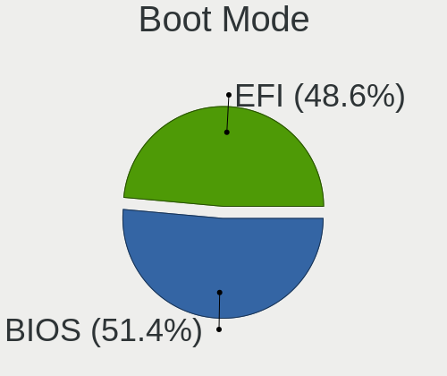
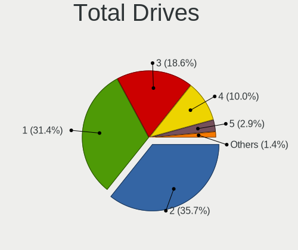
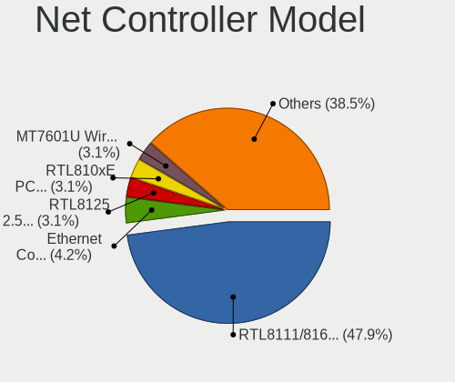

ROSA - Hardware Trends (Desktops)
---------------------------------

A project to identify most popular hardware characteristics and track their change
over time based on data collected by Linux users at https://Linux-Hardware.org.

Anyone can contribute to this report by the [hw-probe](https://github.com/linuxhw/hw-probe) tool:

    sudo -E hw-probe -all -upload

This report is for one last month. Overall report since the beginning of time: [TestCoverage](https://github.com/linuxhw/TestCoverage)

Period: Dec, 2022.

Contents
--------

* [ System ](#system)
  - [ OS                       ](#os)
  - [ OS Family                ](#os-family)
  - [ Kernel                   ](#kernel)
  - [ Kernel Family            ](#kernel-family)
  - [ Kernel Major Ver.        ](#kernel-major-ver)
  - [ Arch                     ](#arch)
  - [ DE                       ](#de)
  - [ Display Server           ](#display-server)
  - [ Display Manager          ](#display-manager)
  - [ OS Lang                  ](#os-lang)
  - [ Boot Mode                ](#boot-mode)
  - [ Filesystem               ](#filesystem)
  - [ Part. scheme             ](#part-scheme)
  - [ Dual Boot with Linux/BSD ](#dual-boot-with-linuxbsd)
  - [ Dual Boot (Win)          ](#dual-boot-win)

* [ Board ](#board)
  - [ Vendor                   ](#vendor)
  - [ Model                    ](#model)
  - [ Model Family             ](#model-family)
  - [ MFG Year                 ](#mfg-year)
  - [ Form Factor              ](#form-factor)
  - [ Secure Boot              ](#secure-boot)
  - [ Coreboot                 ](#coreboot)
  - [ RAM Size                 ](#ram-size)
  - [ RAM Used                 ](#ram-used)
  - [ Total Drives             ](#total-drives)
  - [ Has CD-ROM               ](#has-cd-rom)
  - [ Has Ethernet             ](#has-ethernet)
  - [ Has WiFi                 ](#has-wifi)
  - [ Has Bluetooth            ](#has-bluetooth)

* [ Location ](#location)
  - [ Country                  ](#country)
  - [ City                     ](#city)

* [ Drives ](#drives)
  - [ Drive Vendor             ](#drive-vendor)
  - [ Drive Model              ](#drive-model)
  - [ HDD Vendor               ](#hdd-vendor)
  - [ SSD Vendor               ](#ssd-vendor)
  - [ Drive Kind               ](#drive-kind)
  - [ Drive Connector          ](#drive-connector)
  - [ Drive Size               ](#drive-size)
  - [ Space Total              ](#space-total)
  - [ Space Used               ](#space-used)
  - [ Malfunc. Drives          ](#malfunc-drives)
  - [ Malfunc. Drive Vendor    ](#malfunc-drive-vendor)
  - [ Malfunc. HDD Vendor      ](#malfunc-hdd-vendor)
  - [ Malfunc. Drive Kind      ](#malfunc-drive-kind)
  - [ Failed Drives            ](#failed-drives)
  - [ Failed Drive Vendor      ](#failed-drive-vendor)
  - [ Drive Status             ](#drive-status)

* [ Storage controller ](#storage-controller)
  - [ Storage Vendor           ](#storage-vendor)
  - [ Storage Model            ](#storage-model)
  - [ Storage Kind             ](#storage-kind)

* [ Processor ](#processor)
  - [ CPU Vendor               ](#cpu-vendor)
  - [ CPU Model                ](#cpu-model)
  - [ CPU Model Family         ](#cpu-model-family)
  - [ CPU Cores                ](#cpu-cores)
  - [ CPU Sockets              ](#cpu-sockets)
  - [ CPU Threads              ](#cpu-threads)
  - [ CPU Op-Modes             ](#cpu-op-modes)
  - [ CPU Microcode            ](#cpu-microcode)
  - [ CPU Microarch            ](#cpu-microarch)

* [ Graphics ](#graphics)
  - [ GPU Vendor               ](#gpu-vendor)
  - [ GPU Model                ](#gpu-model)
  - [ GPU Combo                ](#gpu-combo)
  - [ GPU Driver               ](#gpu-driver)
  - [ GPU Memory               ](#gpu-memory)

* [ Monitor ](#monitor)
  - [ Monitor Vendor           ](#monitor-vendor)
  - [ Monitor Model            ](#monitor-model)
  - [ Monitor Resolution       ](#monitor-resolution)
  - [ Monitor Diagonal         ](#monitor-diagonal)
  - [ Monitor Width            ](#monitor-width)
  - [ Aspect Ratio             ](#aspect-ratio)
  - [ Monitor Area             ](#monitor-area)
  - [ Pixel Density            ](#pixel-density)
  - [ Multiple Monitors        ](#multiple-monitors)

* [ Network ](#network)
  - [ Net Controller Vendor    ](#net-controller-vendor)
  - [ Net Controller Model     ](#net-controller-model)
  - [ Wireless Vendor          ](#wireless-vendor)
  - [ Wireless Model           ](#wireless-model)
  - [ Ethernet Vendor          ](#ethernet-vendor)
  - [ Ethernet Model           ](#ethernet-model)
  - [ Net Controller Kind      ](#net-controller-kind)
  - [ Used Controller          ](#used-controller)
  - [ NICs                     ](#nics)
  - [ IPv6                     ](#ipv6)

* [ Bluetooth ](#bluetooth)
  - [ Bluetooth Vendor         ](#bluetooth-vendor)
  - [ Bluetooth Model          ](#bluetooth-model)

* [ Sound ](#sound)
  - [ Sound Vendor             ](#sound-vendor)
  - [ Sound Model              ](#sound-model)

* [ Memory ](#memory)
  - [ Memory Vendor            ](#memory-vendor)
  - [ Memory Model             ](#memory-model)
  - [ Memory Kind              ](#memory-kind)
  - [ Memory Form Factor       ](#memory-form-factor)
  - [ Memory Size              ](#memory-size)
  - [ Memory Speed             ](#memory-speed)

* [ Printers & scanners ](#printers--scanners)
  - [ Printer Vendor           ](#printer-vendor)
  - [ Printer Model            ](#printer-model)
  - [ Scanner Vendor           ](#scanner-vendor)
  - [ Scanner Model            ](#scanner-model)

* [ Camera ](#camera)
  - [ Camera Vendor            ](#camera-vendor)
  - [ Camera Model             ](#camera-model)

* [ Security ](#security)
  - [ Fingerprint Vendor       ](#fingerprint-vendor)
  - [ Fingerprint Model        ](#fingerprint-model)
  - [ Chipcard Vendor          ](#chipcard-vendor)
  - [ Chipcard Model           ](#chipcard-model)

* [ Unsupported ](#unsupported)
  - [ Unsupported Devices      ](#unsupported-devices)
  - [ Unsupported Device Types ](#unsupported-device-types)

System
------

OS
--

Installed operating systems

| Name        | Desktops | Percent |
|-------------|----------|---------|
| ROSA 12.3   | 129      | 83.23%  |
| ROSA R11.1  | 12       | 7.74%   |
| ROSA 12.2   | 10       | 6.45%   |
| ROSA R9-R11 | 1        | 0.65%   |
| ROSA R11    | 1        | 0.65%   |
| ROSA 2021.1 | 1        | 0.65%   |
| ROSA 12     | 1        | 0.65%   |

OS Family
---------

OS without a version

| Name | Desktops | Percent |
|------|----------|---------|
| ROSA | 155      | 100%    |

Kernel
------

Version of the Linux kernel

| Version                                   | Desktops | Percent |
|-------------------------------------------|----------|---------|
| 5.15.79-generic-1rosa2021.1-x86_64        | 48       | 30.97%  |
| 5.15.75-generic-1rosa2021.1-x86_64        | 37       | 23.87%  |
| 5.10.155-generic-1rosa2021.1-x86_64       | 16       | 10.32%  |
| 5.17.11-generic-2rosa2021.1-x86_64        | 8        | 5.16%   |
| 5.15.77-generic-1rosa2021.1-x86_64        | 6        | 3.87%   |
| 5.10.74-generic-2rosa2021.1-x86_64        | 6        | 3.87%   |
| 4.15.0-desktop-122.124.1rosa-x86_64       | 6        | 3.87%   |
| 5.10.118-generic-2rosa2021.1-x86_64       | 4        | 2.58%   |
| 5.15.75-generic-1rosa2021.1-i686          | 3        | 1.94%   |
| 6.1.0.xm1-1.klp-xanmod-rosa2021.1-x86_64  | 2        | 1.29%   |
| 6.0.7.xm1-1.klp-xanmod-rosa2021.1-x86_64  | 2        | 1.29%   |
| 4.15.0-desktop-45.1rosa-x86_64            | 2        | 1.29%   |
| 4.15.0-desktop-122.124.1rosa-i586         | 2        | 1.29%   |
| 6.1.0-generic-2rosa2021.1-x86_64          | 1        | 0.65%   |
| 6.1.0-generic-0.rc8.1rosa2021.1-x86_64    | 1        | 0.65%   |
| 6.0.3.xm1-1.klp-xanmod-rosa2021.1-x86_64  | 1        | 0.65%   |
| 6.0.12.xm1-1.klp-xanmod-rosa2021.1-x86_64 | 1        | 0.65%   |
| 5.4.83-generic-2rosa-x86_64               | 1        | 0.65%   |
| 5.4.83-generic-2rosa-i586                 | 1        | 0.65%   |
| 5.4.32-generic-2rosa-i586                 | 1        | 0.65%   |
| 5.18.19-generic-3rosa2021.1-x86_64        | 1        | 0.65%   |
| 5.18.18.xm1-1-xanmod-rosa2021.1-x86_64    | 1        | 0.65%   |
| 5.10.74-generic-2rosa2021.1-i586          | 1        | 0.65%   |
| 5.10.71-generic-1rosa2021.1-x86_64        | 1        | 0.65%   |
| 5.10.150-generic-1rosa2021.1-x86_64       | 1        | 0.65%   |
| 4.9.155-nrj-desktop-1rosa-x86_64          | 1        | 0.65%   |

Kernel Family
-------------

Linux kernel without a distro release

| Version  | Desktops | Percent |
|----------|----------|---------|
| 5.15.79  | 48       | 30.97%  |
| 5.15.75  | 40       | 25.81%  |
| 5.10.155 | 16       | 10.32%  |
| 4.15.0   | 10       | 6.45%   |
| 5.17.11  | 8        | 5.16%   |
| 5.10.74  | 7        | 4.52%   |
| 5.15.77  | 6        | 3.87%   |
| 6.1.0    | 4        | 2.58%   |
| 5.10.118 | 4        | 2.58%   |
| 6.0.7    | 2        | 1.29%   |
| 5.4.83   | 2        | 1.29%   |
| 6.0.3    | 1        | 0.65%   |
| 6.0.12   | 1        | 0.65%   |
| 5.4.32   | 1        | 0.65%   |
| 5.18.19  | 1        | 0.65%   |
| 5.18.18  | 1        | 0.65%   |
| 5.10.71  | 1        | 0.65%   |
| 5.10.150 | 1        | 0.65%   |
| 4.9.155  | 1        | 0.65%   |

Kernel Major Ver.
-----------------

Linux kernel major version

| Version | Desktops | Percent |
|---------|----------|---------|
| 5.15    | 94       | 60.65%  |
| 5.10    | 29       | 18.71%  |
| 4.15    | 10       | 6.45%   |
| 5.17    | 8        | 5.16%   |
| 6.1     | 4        | 2.58%   |
| 6.0     | 4        | 2.58%   |
| 5.4     | 3        | 1.94%   |
| 5.18    | 2        | 1.29%   |
| 4.9     | 1        | 0.65%   |

Arch
----

OS architecture (x86_64, i586, etc.)

| Name   | Desktops | Percent |
|--------|----------|---------|
| x86_64 | 147      | 94.84%  |
| i686   | 8        | 5.16%   |

DE
--

Desktop Environment

| Name  | Desktops | Percent |
|-------|----------|---------|
| KDE5  | 88       | 56.77%  |
| GNOME | 40       | 25.81%  |
| LXQt  | 17       | 10.97%  |
| KDE4  | 10       | 6.45%   |

Display Server
--------------

X11 or Wayland

| Name    | Desktops | Percent |
|---------|----------|---------|
| Wayland | 114      | 73.55%  |
| X11     | 41       | 26.45%  |

Display Manager
---------------

SDDM, LightDM, etc.

| Name    | Desktops | Percent |
|---------|----------|---------|
| SDDM    | 88       | 56.77%  |
| GDM     | 50       | 32.26%  |
| KDM     | 10       | 6.45%   |
| LightDM | 5        | 3.23%   |
| Unknown | 2        | 1.29%   |

OS Lang
-------

Language

| Lang    | Desktops | Percent |
|---------|----------|---------|
| ru_RU   | 141      | 90.97%  |
| en_US   | 6        | 3.87%   |
| pt_PT   | 2        | 1.29%   |
| sk_SK   | 1        | 0.65%   |
| ro_RO   | 1        | 0.65%   |
| fr_FR   | 1        | 0.65%   |
| fr_BE   | 1        | 0.65%   |
| en_CA   | 1        | 0.65%   |
| Unknown | 1        | 0.65%   |

Boot Mode
---------

EFI or BIOS

| Mode | Desktops | Percent |
|------|----------|---------|
| BIOS | 79       | 50.97%  |
| EFI  | 76       | 49.03%  |

Filesystem
----------

Type of filesystem

| Type  | Desktops | Percent |
|-------|----------|---------|
| Ext4  | 148      | 95.48%  |
| Btrfs | 5        | 3.23%   |
| F2fs  | 2        | 1.29%   |

Part. scheme
------------

Scheme of partitioning

| Type    | Desktops | Percent |
|---------|----------|---------|
| GPT     | 95       | 61.29%  |
| MBR     | 58       | 37.42%  |
| Unknown | 2        | 1.29%   |

Dual Boot with Linux/BSD
------------------------

Hosting more than one Linux/BSD

| Dual boot | Desktops | Percent |
|-----------|----------|---------|
| No        | 105      | 67.74%  |
| Yes       | 50       | 32.26%  |

Dual Boot (Win)
---------------

Hosting Linux and Windows

| Dual boot | Desktops | Percent |
|-----------|----------|---------|
| No        | 81       | 52.26%  |
| Yes       | 74       | 47.74%  |

Board
-----

Vendor
------

Motherboard manufacturer

| Name                | Desktops | Percent |
|---------------------|----------|---------|
| ASUSTek Computer    | 53       | 34.19%  |
| Gigabyte Technology | 45       | 29.03%  |
| ASRock              | 17       | 10.97%  |
| MSI                 | 12       | 7.74%   |
| Intel               | 8        | 5.16%   |
| Hewlett-Packard     | 6        | 3.87%   |
| Huanan              | 2        | 1.29%   |
| Dell                | 2        | 1.29%   |
| Aquarius            | 2        | 1.29%   |
| Unknown             | 2        | 1.29%   |
| Graviton            | 1        | 0.65%   |
| eMachines           | 1        | 0.65%   |
| ECS                 | 1        | 0.65%   |
| Biostar             | 1        | 0.65%   |
| AZW                 | 1        | 0.65%   |
| 3Q                  | 1        | 0.65%   |

Model
-----

Motherboard model

| Name                                   | Desktops | Percent |
|----------------------------------------|----------|---------|
| ASUS All Series                        | 5        | 3.23%   |
| Gigabyte B450 GAMING X                 | 3        | 1.94%   |
| MSI MS-7309                            | 2        | 1.29%   |
| Gigabyte F2A68HM-DS2                   | 2        | 1.29%   |
| Gigabyte A320M-H                       | 2        | 1.29%   |
| Gigabyte 970A-DS3P                     | 2        | 1.29%   |
| ASUS PRIME B450M-A                     | 2        | 1.29%   |
| ASUS M2N-XE                            | 2        | 1.29%   |
| ASUS H110M-R                           | 2        | 1.29%   |
| Aquarius P30 K44 R53                   | 2        | 1.29%   |
| Unknown                                | 2        | 1.29%   |
| MSI PRO H510 DP21 (MS-B0A4)            | 1        | 0.65%   |
| MSI MS-7D54                            | 1        | 0.65%   |
| MSI MS-7C95                            | 1        | 0.65%   |
| MSI MS-7C91                            | 1        | 0.65%   |
| MSI MS-7C37                            | 1        | 0.65%   |
| MSI MS-7B19                            | 1        | 0.65%   |
| MSI MS-7A34                            | 1        | 0.65%   |
| MSI MS-7850                            | 1        | 0.65%   |
| MSI MS-7817                            | 1        | 0.65%   |
| MSI MS-7673                            | 1        | 0.65%   |
| Intel X99                              | 1        | 0.65%   |
| Intel X79v2.72 KD V2.0                 | 1        | 0.65%   |
| Intel SHARKBAY                         | 1        | 0.65%   |
| Intel MAHOBAY                          | 1        | 0.65%   |
| Intel Jasper Lake Client Platform      | 1        | 0.65%   |
| Intel DG41CN AAE82429-102              | 1        | 0.65%   |
| Intel D2500HN AAG81480-500             | 1        | 0.65%   |
| Intel D2500HN AAG34776-404             | 1        | 0.65%   |
| Huanan X99-QD4 V1.0                    | 1        | 0.65%   |
| Huanan X99 F8D V2.2                    | 1        | 0.65%   |
| HP Z620 Workstation                    | 1        | 0.65%   |
| HP ProDesk 600 G1 SFF                  | 1        | 0.65%   |
| HP Pavilion Gaming Desktop TG01-2xxx   | 1        | 0.65%   |
| HP Compaq dc7800 Convertible Minitower | 1        | 0.65%   |
| HP 310-1201ru                          | 1        | 0.65%   |
| HP 260 G2 DM                           | 1        | 0.65%   |
| Graviton DMB-H510-MCA01                | 1        | 0.65%   |
| Gigabyte X470 AORUS ULTRA GAMING       | 1        | 0.65%   |
| Gigabyte X470 AORUS GAMING 7 WIFI      | 1        | 0.65%   |

Model Family
------------

Motherboard model prefix

| Name                 | Desktops | Percent |
|----------------------|----------|---------|
| ASUS PRIME           | 15       | 9.68%   |
| ASUS All             | 5        | 3.23%   |
| Gigabyte B450        | 4        | 2.58%   |
| MSI MS-7309          | 2        | 1.29%   |
| Intel D2500HN        | 2        | 1.29%   |
| Gigabyte X470        | 2        | 1.29%   |
| Gigabyte F2A68HM-DS2 | 2        | 1.29%   |
| Gigabyte B550        | 2        | 1.29%   |
| Gigabyte A320M-H     | 2        | 1.29%   |
| Gigabyte 970A-DS3P   | 2        | 1.29%   |
| Dell OptiPlex        | 2        | 1.29%   |
| ASUS P8Z77-V         | 2        | 1.29%   |
| ASUS P8H61-M         | 2        | 1.29%   |
| ASUS P5KPL-AM        | 2        | 1.29%   |
| ASUS M2N-XE          | 2        | 1.29%   |
| ASUS H110M-R         | 2        | 1.29%   |
| ASRock P67           | 2        | 1.29%   |
| Aquarius P30         | 2        | 1.29%   |
| Unknown              | 2        | 1.29%   |
| MSI PRO              | 1        | 0.65%   |
| MSI MS-7D54          | 1        | 0.65%   |
| MSI MS-7C95          | 1        | 0.65%   |
| MSI MS-7C91          | 1        | 0.65%   |
| MSI MS-7C37          | 1        | 0.65%   |
| MSI MS-7B19          | 1        | 0.65%   |
| MSI MS-7A34          | 1        | 0.65%   |
| MSI MS-7850          | 1        | 0.65%   |
| MSI MS-7817          | 1        | 0.65%   |
| MSI MS-7673          | 1        | 0.65%   |
| Intel X99            | 1        | 0.65%   |
| Intel X79v2.72       | 1        | 0.65%   |
| Intel SHARKBAY       | 1        | 0.65%   |
| Intel MAHOBAY        | 1        | 0.65%   |
| Intel Jasper         | 1        | 0.65%   |
| Intel DG41CN         | 1        | 0.65%   |
| Huanan X99-QD4       | 1        | 0.65%   |
| Huanan X99           | 1        | 0.65%   |
| HP Z620              | 1        | 0.65%   |
| HP ProDesk           | 1        | 0.65%   |
| HP Pavilion          | 1        | 0.65%   |

MFG Year
--------

Motherboard manufacture year

| Year | Desktops | Percent |
|------|----------|---------|
| 2018 | 19       | 12.26%  |
| 2012 | 19       | 12.26%  |
| 2013 | 13       | 8.39%   |
| 2020 | 10       | 6.45%   |
| 2014 | 10       | 6.45%   |
| 2009 | 10       | 6.45%   |
| 2021 | 9        | 5.81%   |
| 2019 | 9        | 5.81%   |
| 2011 | 9        | 5.81%   |
| 2010 | 9        | 5.81%   |
| 2022 | 7        | 4.52%   |
| 2017 | 7        | 4.52%   |
| 2016 | 6        | 3.87%   |
| 2007 | 6        | 3.87%   |
| 2015 | 5        | 3.23%   |
| 2008 | 4        | 2.58%   |
| 2006 | 1        | 0.65%   |
| 2005 | 1        | 0.65%   |
| 2004 | 1        | 0.65%   |

Form Factor
-----------

Physical design of the computer

| Name    | Desktops | Percent |
|---------|----------|---------|
| Desktop | 155      | 100%    |

Secure Boot
-----------

Enabled or disabled

| State    | Desktops | Percent |
|----------|----------|---------|
| Disabled | 155      | 100%    |

Coreboot
--------

Have coreboot on board

| Used | Desktops | Percent |
|------|----------|---------|
| No   | 155      | 100%    |

RAM Size
--------

Total RAM memory

| Size in GB  | Desktops | Percent |
|-------------|----------|---------|
| 16.01-24.0  | 53       | 34.19%  |
| 3.01-4.0    | 29       | 18.71%  |
| 8.01-16.0   | 29       | 18.71%  |
| 4.01-8.0    | 18       | 11.61%  |
| 32.01-64.0  | 11       | 7.1%    |
| 1.01-2.0    | 6        | 3.87%   |
| 2.01-3.0    | 3        | 1.94%   |
| 64.01-256.0 | 3        | 1.94%   |
| 24.01-32.0  | 2        | 1.29%   |
| 0.51-1.0    | 1        | 0.65%   |

RAM Used
--------

Used RAM memory

| Used GB   | Desktops | Percent |
|-----------|----------|---------|
| 1.01-2.0  | 71       | 45.81%  |
| 0.51-1.0  | 33       | 21.29%  |
| 2.01-3.0  | 32       | 20.65%  |
| 4.01-8.0  | 8        | 5.16%   |
| 3.01-4.0  | 8        | 5.16%   |
| 0.01-0.5  | 2        | 1.29%   |
| 8.01-16.0 | 1        | 0.65%   |

Total Drives
------------

Number of drives on board

| Drives | Desktops | Percent |
|--------|----------|---------|
| 1      | 61       | 39.35%  |
| 2      | 51       | 32.9%   |
| 3      | 24       | 15.48%  |
| 4      | 13       | 8.39%   |
| 5      | 3        | 1.94%   |
| 9      | 1        | 0.65%   |
| 7      | 1        | 0.65%   |
| 0      | 1        | 0.65%   |

Has CD-ROM
----------

Has CD-ROM on board

| Presented | Desktops | Percent |
|-----------|----------|---------|
| No        | 98       | 63.23%  |
| Yes       | 57       | 36.77%  |

Has Ethernet
------------

Has Ethernet on board

| Presented | Desktops | Percent |
|-----------|----------|---------|
| Yes       | 154      | 99.35%  |
| No        | 1        | 0.65%   |

Has WiFi
--------

Has WiFi module

| Presented | Desktops | Percent |
|-----------|----------|---------|
| No        | 106      | 68.39%  |
| Yes       | 49       | 31.61%  |

Has Bluetooth
-------------

Has Bluetooth module

| Presented | Desktops | Percent |
|-----------|----------|---------|
| No        | 111      | 71.61%  |
| Yes       | 44       | 28.39%  |

Location
--------

Country
-------

Geographic location (country)

| Country  | Desktops | Percent |
|----------|----------|---------|
| Russia   | 138      | 89.03%  |
| Belarus  | 4        | 2.58%   |
| Ukraine  | 3        | 1.94%   |
| Belgium  | 2        | 1.29%   |
| USA      | 1        | 0.65%   |
| Slovakia | 1        | 0.65%   |
| Romania  | 1        | 0.65%   |
| Portugal | 1        | 0.65%   |
| Moldova  | 1        | 0.65%   |
| Czechia  | 1        | 0.65%   |
| Canada   | 1        | 0.65%   |
| Brazil   | 1        | 0.65%   |

City
----

Geographic location (city)

| City               | Desktops | Percent |
|--------------------|----------|---------|
| Moscow             | 28       | 18.06%  |
| St Petersburg      | 10       | 6.45%   |
| Krasnodar          | 7        | 4.52%   |
| Rostov-on-Don      | 4        | 2.58%   |
| Yekaterinburg      | 3        | 1.94%   |
| Tambov             | 3        | 1.94%   |
| Saratov            | 3        | 1.94%   |
| Samara             | 3        | 1.94%   |
| Nizhniy Novgorod   | 3        | 1.94%   |
| Irkutsk            | 3        | 1.94%   |
| Chelyabinsk        | 3        | 1.94%   |
| Voronezh           | 2        | 1.29%   |
| Volgograd          | 2        | 1.29%   |
| Stavropol          | 2        | 1.29%   |
| Pskov              | 2        | 1.29%   |
| Perm               | 2        | 1.29%   |
| Orenburg           | 2        | 1.29%   |
| Omsk               | 2        | 1.29%   |
| Novosibirsk        | 2        | 1.29%   |
| Nivelles           | 2        | 1.29%   |
| Khabarovsk         | 2        | 1.29%   |
| Gomel              | 2        | 1.29%   |
| Cheboksary         | 2        | 1.29%   |
| Yaroslavl          | 1        | 0.65%   |
| Vsevolozhsk        | 1        | 0.65%   |
| Vladikavkaz        | 1        | 0.65%   |
| Valday             | 1        | 0.65%   |
| Ufa                | 1        | 0.65%   |
| Tula               | 1        | 0.65%   |
| Tolyatti           | 1        | 0.65%   |
| Tiraspol           | 1        | 0.65%   |
| Stroitel'          | 1        | 0.65%   |
| Simferopol         | 1        | 0.65%   |
| Shakhtarsk         | 1        | 0.65%   |
| Severodvinsk       | 1        | 0.65%   |
| Sergiyev Posad     | 1        | 0.65%   |
| Serebryanyye Prudy | 1        | 0.65%   |
| Semiluki           | 1        | 0.65%   |
| Saransk            | 1        | 0.65%   |
| Sao Paulo          | 1        | 0.65%   |

Drives
------

Drive Vendor
------------

Hard drive vendors

| Vendor                      | Desktops | Drives | Percent |
|-----------------------------|----------|--------|---------|
| WDC                         | 57       | 65     | 19.93%  |
| Seagate                     | 52       | 65     | 18.18%  |
| Kingston                    | 24       | 27     | 8.39%   |
| Toshiba                     | 22       | 23     | 7.69%   |
| Samsung Electronics         | 15       | 17     | 5.24%   |
| A-DATA Technology           | 15       | 15     | 5.24%   |
| Hitachi                     | 14       | 15     | 4.9%    |
| China                       | 8        | 8      | 2.8%    |
| Apacer                      | 7        | 7      | 2.45%   |
| Intel                       | 6        | 8      | 2.1%    |
| SanDisk                     | 5        | 5      | 1.75%   |
| Gigabyte Technology         | 5        | 5      | 1.75%   |
| HGST                        | 4        | 4      | 1.4%    |
| Unknown                     | 4        | 4      | 1.4%    |
| SPCC                        | 3        | 3      | 1.05%   |
| Patriot                     | 3        | 3      | 1.05%   |
| GOODRAM                     | 3        | 3      | 1.05%   |
| Crucial                     | 3        | 3      | 1.05%   |
| AMD                         | 3        | 3      | 1.05%   |
| XrayDisk                    | 2        | 2      | 0.7%    |
| Unknown                     | 2        | 2      | 0.7%    |
| Smartbuy                    | 2        | 2      | 0.7%    |
| Plextor                     | 2        | 2      | 0.7%    |
| OCZ                         | 2        | 2      | 0.7%    |
| KingSpec                    | 2        | 2      | 0.7%    |
| XPG                         | 1        | 1      | 0.35%   |
| Transcend                   | 1        | 1      | 0.35%   |
| TAMMUZ                      | 1        | 1      | 0.35%   |
| Silicon Motion              | 1        | 1      | 0.35%   |
| SATAFIRM                    | 1        | 1      | 0.35%   |
| OCZ-VERTEX3                 | 1        | 1      | 0.35%   |
| OCZ-VERTEX                  | 1        | 1      | 0.35%   |
| Netac                       | 1        | 1      | 0.35%   |
| Neo                         | 1        | 1      | 0.35%   |
| Maxtor                      | 1        | 1      | 0.35%   |
| MAXIO Technology (Hangzhou) | 1        | 1      | 0.35%   |
| Kllisre                     | 1        | 2      | 0.35%   |
| KIOXIA-EXCERIA              | 1        | 1      | 0.35%   |
| KIOXIA                      | 1        | 1      | 0.35%   |
| KingFast                    | 1        | 1      | 0.35%   |

Drive Model
-----------

Hard drive models

| Model                            | Desktops | Percent |
|----------------------------------|----------|---------|
| Seagate ST1000DM010-2EP102 1TB   | 8        | 2.58%   |
| Kingston SA400S37240G 240GB SSD  | 7        | 2.26%   |
| Toshiba DT01ACA100 1TB           | 6        | 1.94%   |
| Toshiba DT01ACA050 500GB         | 5        | 1.61%   |
| Kingston SA400S37120G 120GB SSD  | 5        | 1.61%   |
| WDC WDS120G2G0A-00JH30 120GB SSD | 4        | 1.29%   |
| WDC WD10EZEX-08WN4A0 1TB         | 4        | 1.29%   |
| Toshiba HDWD110 1TB              | 4        | 1.29%   |
| Seagate ST500DM002-1BD142 500GB  | 4        | 1.29%   |
| Apacer AS350 128GB SSD           | 4        | 1.29%   |
| Unknown                          | 4        | 1.29%   |
| WDC WD1003FZEX-00MK2A0 1TB       | 3        | 0.97%   |
| Seagate ST1000DM003-9YN162 1TB   | 3        | 0.97%   |
| Seagate ST1000DM003-1CH162 1TB   | 3        | 0.97%   |
| Samsung SSD 970 EVO Plus 250GB   | 3        | 0.97%   |
| A-DATA SX6000PNP 256GB           | 3        | 0.97%   |
| WDC WD10EZEX-22MFCA0 1TB         | 2        | 0.65%   |
| WDC WD10EZEX-00BBHA0 1TB         | 2        | 0.65%   |
| SPCC Solid State Disk 128GB      | 2        | 0.65%   |
| Seagate ST3320620AS 320GB        | 2        | 0.65%   |
| Seagate ST3320613AS 320GB        | 2        | 0.65%   |
| Seagate ST2000DM001-1ER164 2TB   | 2        | 0.65%   |
| Seagate ST1000DM003-1ER162 1TB   | 2        | 0.65%   |
| SanDisk SDSSDA120G 120GB         | 2        | 0.65%   |
| Samsung SSD 850 PRO 256GB        | 2        | 0.65%   |
| Kingston SA400S37480G 480GB SSD  | 2        | 0.65%   |
| Hitachi HDS721616PLA380 160GB    | 2        | 0.65%   |
| Hitachi HDS721050CLA360 500GB    | 2        | 0.65%   |
| Hitachi HDP725050GLA360 500GB    | 2        | 0.65%   |
| HGST HTS545050A7E380 500GB       | 2        | 0.65%   |
| China 256GB SSD                  | 2        | 0.65%   |
| AMD R5SL240G 240GB SSD           | 2        | 0.65%   |
| A-DATA SU650 240GB SSD           | 2        | 0.65%   |
| A-DATA SU630 240GB SSD           | 2        | 0.65%   |
| XrayDisk SSD 256GB               | 1        | 0.32%   |
| XrayDisk SSD 128GB               | 1        | 0.32%   |
| XPG GAMMIX S11 Pro 512GB         | 1        | 0.32%   |
| WDC WDS500G2B0C-00PXH0 500GB     | 1        | 0.32%   |
| WDC WDS500G1R0A-68A4W0 500GB SSD | 1        | 0.32%   |
| WDC WDS250G2B0C-00PXH0 250GB     | 1        | 0.32%   |

HDD Vendor
----------

Hard disk drive vendors

| Vendor              | Desktops | Drives | Percent |
|---------------------|----------|--------|---------|
| WDC                 | 52       | 55     | 36.11%  |
| Seagate             | 50       | 63     | 34.72%  |
| Toshiba             | 20       | 20     | 13.89%  |
| Hitachi             | 14       | 15     | 9.72%   |
| HGST                | 4        | 4      | 2.78%   |
| Samsung Electronics | 3        | 3      | 2.08%   |
| Maxtor              | 1        | 1      | 0.69%   |

SSD Vendor
----------

Solid state drive vendors

| Vendor              | Desktops | Drives | Percent |
|---------------------|----------|--------|---------|
| Kingston            | 18       | 20     | 16.36%  |
| A-DATA Technology   | 11       | 11     | 10%     |
| China               | 8        | 8      | 7.27%   |
| WDC                 | 7        | 7      | 6.36%   |
| Samsung Electronics | 6        | 6      | 5.45%   |
| Apacer              | 6        | 6      | 5.45%   |
| SanDisk             | 4        | 4      | 3.64%   |
| Intel               | 4        | 5      | 3.64%   |
| Unknown             | 4        | 4      | 3.64%   |
| SPCC                | 3        | 3      | 2.73%   |
| Patriot             | 3        | 3      | 2.73%   |
| GOODRAM             | 3        | 3      | 2.73%   |
| Gigabyte Technology | 3        | 3      | 2.73%   |
| Crucial             | 3        | 3      | 2.73%   |
| AMD                 | 3        | 3      | 2.73%   |
| XrayDisk            | 2        | 2      | 1.82%   |
| Smartbuy            | 2        | 2      | 1.82%   |
| Plextor             | 2        | 2      | 1.82%   |
| OCZ                 | 2        | 2      | 1.82%   |
| KingSpec            | 2        | 2      | 1.82%   |
| Unknown             | 1        | 1      | 0.91%   |
| Toshiba             | 1        | 1      | 0.91%   |
| TAMMUZ              | 1        | 1      | 0.91%   |
| Seagate             | 1        | 1      | 0.91%   |
| SATAFIRM            | 1        | 1      | 0.91%   |
| OCZ-VERTEX3         | 1        | 1      | 0.91%   |
| OCZ-VERTEX          | 1        | 1      | 0.91%   |
| Neo                 | 1        | 1      | 0.91%   |
| KingFast            | 1        | 1      | 0.91%   |
| HS-SSD-C100         | 1        | 1      | 0.91%   |
| Hewlett-Packard     | 1        | 1      | 0.91%   |
| Espada              | 1        | 1      | 0.91%   |
| Corsair             | 1        | 1      | 0.91%   |
| 1TB                 | 1        | 1      | 0.91%   |

Drive Kind
----------

HDD or SSD

| Kind | Desktops | Drives | Percent |
|------|----------|--------|---------|
| HDD  | 116      | 161    | 48.13%  |
| SSD  | 86       | 113    | 35.68%  |
| NVMe | 39       | 43     | 16.18%  |

Drive Connector
---------------

SATA, SAS, NVMe, etc.

| Type | Desktops | Drives | Percent |
|------|----------|--------|---------|
| SATA | 143      | 272    | 77.72%  |
| NVMe | 39       | 43     | 21.2%   |
| SAS  | 2        | 2      | 1.09%   |

Drive Size
----------

Size of hard drive

| Size in TB | Desktops | Drives | Percent |
|------------|----------|--------|---------|
| 0.01-0.5   | 120      | 178    | 59.11%  |
| 0.51-1.0   | 57       | 66     | 28.08%  |
| 1.01-2.0   | 17       | 19     | 8.37%   |
| 3.01-4.0   | 5        | 5      | 2.46%   |
| 2.01-3.0   | 2        | 3      | 0.99%   |
| 4.01-10.0  | 2        | 3      | 0.99%   |

Space Total
-----------

Amount of disk space available on the file system

| Size in GB     | Desktops | Percent |
|----------------|----------|---------|
| 101-250        | 48       | 30.97%  |
| 501-1000       | 26       | 16.77%  |
| 251-500        | 21       | 13.55%  |
| 1001-2000      | 16       | 10.32%  |
| 51-100         | 15       | 9.68%   |
| 1-20           | 11       | 7.1%    |
| 21-50          | 7        | 4.52%   |
| 2001-3000      | 6        | 3.87%   |
| More than 3000 | 5        | 3.23%   |

Space Used
----------

Amount of used disk space

| Used GB        | Desktops | Percent |
|----------------|----------|---------|
| 1-20           | 82       | 52.9%   |
| 101-250        | 19       | 12.26%  |
| 21-50          | 16       | 10.32%  |
| 51-100         | 13       | 8.39%   |
| 251-500        | 11       | 7.1%    |
| 1001-2000      | 6        | 3.87%   |
| 501-1000       | 5        | 3.23%   |
| 2001-3000      | 2        | 1.29%   |
| More than 3000 | 1        | 0.65%   |

Malfunc. Drives
---------------

Drive models with a malfunction

| Model                                   | Desktops | Drives | Percent |
|-----------------------------------------|----------|--------|---------|
| Seagate ST1000DM003-9YN162 1TB          | 2        | 2      | 4%      |
| Hitachi HDS721616PLA380 160GB           | 2        | 2      | 4%      |
| WDC WDS240G2G0A-00JH30 240GB SSD        | 1        | 1      | 2%      |
| WDC WD6401AALS-00L3B2 640GB             | 1        | 1      | 2%      |
| WDC WD6401AALS-00J7B0 640GB             | 1        | 1      | 2%      |
| WDC WD5000AAKX-221CA0 500GB             | 1        | 1      | 2%      |
| WDC WD5000AAKS-08WWPA0 500GB            | 1        | 1      | 2%      |
| WDC WD3200AAKS-00L9A0 320GB             | 1        | 1      | 2%      |
| WDC WD2500JS-63MHB5 250GB               | 1        | 1      | 2%      |
| WDC WD2500BEVT-00ZCT0 250GB             | 1        | 1      | 2%      |
| WDC WD2500AAKX-00ERMA0 250GB            | 1        | 1      | 2%      |
| WDC WD1600BEVS-22RST0 160GB             | 1        | 1      | 2%      |
| WDC WD1600AAJB-00J3A0 160GB             | 1        | 1      | 2%      |
| WDC WD10EZEX-22MFCA0 1TB                | 1        | 1      | 2%      |
| WDC WD10EZEX-21WN4A0 1TB                | 1        | 1      | 2%      |
| WDC WD10EARS-00Z5B1 1TB                 | 1        | 1      | 2%      |
| WDC WD1003FZEX-00MK2A0 1TB              | 1        | 1      | 2%      |
| WDC WD1003FBYX-01Y7B1 1TB               | 1        | 1      | 2%      |
| Seagate ST500DM002-1BD142 500GB         | 1        | 1      | 2%      |
| Seagate ST3802110A 80GB                 | 1        | 1      | 2%      |
| Seagate ST3320620AS 320GB               | 1        | 1      | 2%      |
| Seagate ST3320613AS 320GB               | 1        | 1      | 2%      |
| Seagate ST3250820A 250GB                | 1        | 1      | 2%      |
| Seagate ST3250410AS 250GB               | 1        | 1      | 2%      |
| Seagate ST3160023A 160GB                | 1        | 1      | 2%      |
| Seagate ST250LT012-9WS141 250GB         | 1        | 1      | 2%      |
| Seagate ST2000DM001-1ER164 2TB          | 1        | 1      | 2%      |
| Seagate ST1000DX002-2DV162 1TB          | 1        | 1      | 2%      |
| Seagate ST1000DL002-9TT153 1TB          | 1        | 1      | 2%      |
| SanDisk SSD PLUS 240GB                  | 1        | 1      | 2%      |
| SanDisk SDSSDA120G 120GB                | 1        | 1      | 2%      |
| Samsung Electronics SSD 970 EVO 1TB     | 1        | 1      | 2%      |
| Samsung Electronics SSD 850 PRO 256GB   | 1        | 1      | 2%      |
| OCZ-VERTEX3 MI 240GB SSD                | 1        | 1      | 2%      |
| Neo Forza NFS121SA312-6007000 120GB SSD | 1        | 1      | 2%      |
| Kingston SA400S37120G 120GB SSD         | 1        | 1      | 2%      |
| Hitachi HTS541680J9SA00 80GB            | 1        | 1      | 2%      |
| Hitachi HTS541612J9SA00 120GB           | 1        | 1      | 2%      |
| Hitachi HDS721680PLA380 80GB            | 1        | 1      | 2%      |
| Hitachi HDS721050CLA360 500GB           | 1        | 1      | 2%      |

Malfunc. Drive Vendor
---------------------

Vendors of faulty drives

| Vendor              | Desktops | Drives | Percent |
|---------------------|----------|--------|---------|
| WDC                 | 15       | 16     | 30.61%  |
| Seagate             | 13       | 13     | 26.53%  |
| Hitachi             | 8        | 8      | 16.33%  |
| SanDisk             | 2        | 2      | 4.08%   |
| Samsung Electronics | 2        | 2      | 4.08%   |
| A-DATA Technology   | 2        | 2      | 4.08%   |
| OCZ-VERTEX3         | 1        | 1      | 2.04%   |
| Neo                 | 1        | 1      | 2.04%   |
| Kingston            | 1        | 1      | 2.04%   |
| HGST                | 1        | 1      | 2.04%   |
| Espada              | 1        | 1      | 2.04%   |
| Apacer              | 1        | 1      | 2.04%   |
| Unknown             | 1        | 1      | 2.04%   |

Malfunc. HDD Vendor
-------------------

Vendors of faulty HDD drives

| Vendor  | Desktops | Drives | Percent |
|---------|----------|--------|---------|
| WDC     | 15       | 15     | 40.54%  |
| Seagate | 13       | 13     | 35.14%  |
| Hitachi | 8        | 8      | 21.62%  |
| HGST    | 1        | 1      | 2.7%    |

Malfunc. Drive Kind
-------------------

Kinds of faulty drives

| Kind | Desktops | Drives | Percent |
|------|----------|--------|---------|
| HDD  | 37       | 37     | 74%     |
| SSD  | 12       | 12     | 24%     |
| NVMe | 1        | 1      | 2%      |

Failed Drives
-------------

Failed drive models

| Model                             | Desktops | Drives | Percent |
|-----------------------------------|----------|--------|---------|
| WDC WD800JB-00FMA0 80GB           | 1        | 1      | 33.33%  |
| Samsung Electronics HD503HI 500GB | 1        | 1      | 33.33%  |
| HGST HTS545050A7E380 500GB        | 1        | 1      | 33.33%  |

Failed Drive Vendor
-------------------

Failed drive vendors

| Vendor              | Desktops | Drives | Percent |
|---------------------|----------|--------|---------|
| WDC                 | 1        | 1      | 33.33%  |
| Samsung Electronics | 1        | 1      | 33.33%  |
| HGST                | 1        | 1      | 33.33%  |

Drive Status
------------

Number of failed and malfunc. drives

| Status   | Desktops | Drives | Percent |
|----------|----------|--------|---------|
| Works    | 139      | 254    | 71.65%  |
| Malfunc  | 46       | 50     | 23.71%  |
| Detected | 6        | 10     | 3.09%   |
| Failed   | 3        | 3      | 1.55%   |

Storage controller
------------------

Storage Vendor
--------------

Storage controller vendors

| Vendor                       | Desktops | Percent |
|------------------------------|----------|---------|
| Intel                        | 92       | 42.79%  |
| AMD                          | 53       | 24.65%  |
| Nvidia                       | 12       | 5.58%   |
| JMicron Technology           | 9        | 4.19%   |
| Samsung Electronics          | 7        | 3.26%   |
| Kingston Technology Company  | 7        | 3.26%   |
| ASMedia Technology           | 6        | 2.79%   |
| Marvell Technology Group     | 5        | 2.33%   |
| SanDisk                      | 4        | 1.86%   |
| Realtek Semiconductor        | 4        | 1.86%   |
| Toshiba America Info Systems | 3        | 1.4%    |
| Silicon Motion               | 3        | 1.4%    |
| Phison Electronics           | 3        | 1.4%    |
| MAXIO Technology (Hangzhou)  | 2        | 0.93%   |
| Seagate Technology           | 1        | 0.47%   |
| Netac Technology             | 1        | 0.47%   |
| KIOXIA                       | 1        | 0.47%   |
| INNOGRIT                     | 1        | 0.47%   |
| ADATA Technology             | 1        | 0.47%   |

Storage Model
-------------

Storage controller models

| Model                                                                                   | Desktops | Percent |
|-----------------------------------------------------------------------------------------|----------|---------|
| AMD FCH SATA Controller [AHCI mode]                                                     | 26       | 9.22%   |
| AMD 400 Series Chipset SATA Controller                                                  | 14       | 4.96%   |
| Intel 8 Series/C220 Series Chipset Family 6-port SATA Controller 1 [AHCI mode]          | 11       | 3.9%    |
| Intel NM10/ICH7 Family SATA Controller [IDE mode]                                       | 8        | 2.84%   |
| AMD SB7x0/SB8x0/SB9x0 SATA Controller [AHCI mode]                                       | 8        | 2.84%   |
| Nvidia MCP61 SATA Controller                                                            | 7        | 2.48%   |
| Nvidia MCP61 IDE                                                                        | 7        | 2.48%   |
| Intel Q170/Q150/B150/H170/H110/Z170/CM236 Chipset SATA Controller [AHCI Mode]           | 7        | 2.48%   |
| AMD SB7x0/SB8x0/SB9x0 IDE Controller                                                    | 7        | 2.48%   |
| AMD 500 Series Chipset SATA Controller                                                  | 7        | 2.48%   |
| Samsung NVMe SSD Controller SM981/PM981/PM983                                           | 6        | 2.13%   |
| JMicron JMB363 SATA/IDE Controller                                                      | 6        | 2.13%   |
| Intel 6 Series/C200 Series Chipset Family Desktop SATA Controller (IDE mode, ports 4-5) | 6        | 2.13%   |
| Intel 6 Series/C200 Series Chipset Family Desktop SATA Controller (IDE mode, ports 0-3) | 6        | 2.13%   |
| Intel 500 Series Chipset Family SATA AHCI Controller                                    | 6        | 2.13%   |
| Kingston Company Company Non-Volatile memory controller                                 | 5        | 1.77%   |
| Intel 9 Series Chipset Family SATA Controller [AHCI Mode]                               | 5        | 1.77%   |
| ASMedia ASM1062 Serial ATA Controller                                                   | 5        | 1.77%   |
| Realtek Realtek Non-Volatile memory controller                                          | 4        | 1.42%   |
| Intel SATA Controller [RAID mode]                                                       | 4        | 1.42%   |
| Intel 82801G (ICH7 Family) IDE Controller                                               | 4        | 1.42%   |
| Intel 7 Series/C210 Series Chipset Family 6-port SATA Controller [AHCI mode]            | 4        | 1.42%   |
| Intel 7 Series/C210 Series Chipset Family 4-port SATA Controller [IDE mode]             | 4        | 1.42%   |
| Intel 7 Series/C210 Series Chipset Family 2-port SATA Controller [IDE mode]             | 4        | 1.42%   |
| Intel 5 Series/3400 Series Chipset 4 port SATA IDE Controller                           | 4        | 1.42%   |
| Intel 5 Series/3400 Series Chipset 2 port SATA IDE Controller                           | 4        | 1.42%   |
| AMD FCH SATA Controller D                                                               | 4        | 1.42%   |
| AMD 300 Series Chipset SATA Controller                                                  | 4        | 1.42%   |
| SanDisk WD Blue SN550 NVMe SSD                                                          | 3        | 1.06%   |
| JMicron JMB368 IDE controller                                                           | 3        | 1.06%   |
| Intel NM10/ICH7 Family SATA Controller [AHCI mode]                                      | 3        | 1.06%   |
| Intel Cannon Lake PCH SATA AHCI Controller                                              | 3        | 1.06%   |
| Intel C610/X99 series chipset 6-Port SATA Controller [AHCI mode]                        | 3        | 1.06%   |
| Intel 6 Series/C200 Series Chipset Family 6 port Desktop SATA AHCI Controller           | 3        | 1.06%   |
| Intel 200 Series PCH SATA controller [AHCI mode]                                        | 3        | 1.06%   |
| AMD SB7x0/SB8x0/SB9x0 SATA Controller [IDE mode]                                        | 3        | 1.06%   |
| AMD FCH SATA Controller [IDE mode]                                                      | 3        | 1.06%   |
| Toshiba America Info Systems XG6 NVMe SSD Controller                                    | 2        | 0.71%   |
| Silicon Motion SM2263EN/SM2263XT SSD Controller                                         | 2        | 0.71%   |
| Phison PS5013 E13 NVMe Controller                                                       | 2        | 0.71%   |

Storage Kind
------------

Kind of storage controller (IDE, SATA, NVMe, SAS, ...)

| Kind | Desktops | Percent |
|------|----------|---------|
| SATA | 111      | 52.61%  |
| IDE  | 53       | 25.12%  |
| NVMe | 39       | 18.48%  |
| RAID | 7        | 3.32%   |
| SAS  | 1        | 0.47%   |

Processor
---------

CPU Vendor
----------

Processor vendors

| Vendor | Desktops | Percent |
|--------|----------|---------|
| Intel  | 91       | 58.71%  |
| AMD    | 64       | 41.29%  |

CPU Model
---------

Processor models

| Model                                       | Desktops | Percent |
|---------------------------------------------|----------|---------|
| AMD Ryzen 5 2600 Six-Core Processor         | 6        | 3.87%   |
| AMD Ryzen 5 5600X 6-Core Processor          | 4        | 2.58%   |
| AMD Ryzen 5 3600 6-Core Processor           | 4        | 2.58%   |
| Intel Atom CPU D2500 @ 1.86GHz              | 3        | 1.94%   |
| AMD Ryzen 5 5600G with Radeon Graphics      | 3        | 1.94%   |
| AMD Athlon II X2 215 Processor              | 3        | 1.94%   |
| Intel Xeon CPU E5-2678 v3 @ 2.50GHz         | 2        | 1.29%   |
| Intel Core i5-9400F CPU @ 2.90GHz           | 2        | 1.29%   |
| Intel Core i5-7400 CPU @ 3.00GHz            | 2        | 1.29%   |
| Intel Core i5-4690 CPU @ 3.50GHz            | 2        | 1.29%   |
| Intel Core i5-4570 CPU @ 3.20GHz            | 2        | 1.29%   |
| Intel Core i5-3570 CPU @ 3.40GHz            | 2        | 1.29%   |
| Intel Core i5 CPU 660 @ 3.33GHz             | 2        | 1.29%   |
| Intel Core i3-4170 CPU @ 3.70GHz            | 2        | 1.29%   |
| Intel Core i3-3240 CPU @ 3.40GHz            | 2        | 1.29%   |
| Intel Core i3-3220 CPU @ 3.30GHz            | 2        | 1.29%   |
| Intel Core i3-10105 CPU @ 3.70GHz           | 2        | 1.29%   |
| Intel Celeron N5105 @ 2.00GHz               | 2        | 1.29%   |
| AMD Ryzen 9 5900X 12-Core Processor         | 2        | 1.29%   |
| AMD Ryzen 7 2700 Eight-Core Processor       | 2        | 1.29%   |
| AMD Ryzen 5 1600 Six-Core Processor         | 2        | 1.29%   |
| AMD Ryzen 3 2200G with Radeon Vega Graphics | 2        | 1.29%   |
| AMD Ryzen 3 1200 Quad-Core Processor        | 2        | 1.29%   |
| AMD Phenom 8450 Triple-Core Processor       | 2        | 1.29%   |
| AMD FX-8320E Eight-Core Processor           | 2        | 1.29%   |
| AMD FX-6300 Six-Core Processor              | 2        | 1.29%   |
| AMD Athlon 64 X2 Dual Core Processor 5000+  | 2        | 1.29%   |
| Intel Xeon CPU E5472 @ 3.00GHz              | 1        | 0.65%   |
| Intel Xeon CPU E5-2696 v3 @ 2.30GHz         | 1        | 0.65%   |
| Intel Xeon CPU E5-2650 v2 @ 2.60GHz         | 1        | 0.65%   |
| Intel Xeon CPU E5-2640 v3 @ 2.60GHz         | 1        | 0.65%   |
| Intel Xeon CPU E5-1620 0 @ 3.60GHz          | 1        | 0.65%   |
| Intel Xeon CPU E3-1240 V2 @ 3.40GHz         | 1        | 0.65%   |
| Intel Pentium Gold G6405 CPU @ 4.10GHz      | 1        | 0.65%   |
| Intel Pentium Dual-Core CPU E6600 @ 3.06GHz | 1        | 0.65%   |
| Intel Pentium Dual-Core CPU E5400 @ 2.70GHz | 1        | 0.65%   |
| Intel Pentium D CPU 3.00GHz                 | 1        | 0.65%   |
| Intel Pentium CPU G4600 @ 3.60GHz           | 1        | 0.65%   |
| Intel Pentium CPU G4500 @ 3.50GHz           | 1        | 0.65%   |
| Intel Pentium CPU G3420 @ 3.20GHz           | 1        | 0.65%   |

CPU Model Family
----------------

Processor model prefix

| Model                   | Desktops | Percent |
|-------------------------|----------|---------|
| Intel Core i5           | 28       | 18.06%  |
| AMD Ryzen 5             | 22       | 14.19%  |
| Intel Core i3           | 16       | 10.32%  |
| Intel Celeron           | 9        | 5.81%   |
| AMD FX                  | 9        | 5.81%   |
| Intel Xeon              | 8        | 5.16%   |
| AMD Ryzen 7             | 6        | 3.87%   |
| AMD Athlon II X2        | 6        | 3.87%   |
| Intel Core i7           | 5        | 3.23%   |
| Intel Atom              | 5        | 3.23%   |
| AMD Ryzen 3             | 5        | 3.23%   |
| Other                   | 4        | 2.58%   |
| Intel Pentium           | 4        | 2.58%   |
| Intel Core 2 Quad       | 3        | 1.94%   |
| Intel Core 2 Duo        | 3        | 1.94%   |
| AMD Athlon 64 X2        | 3        | 1.94%   |
| Intel Pentium Dual-Core | 2        | 1.29%   |
| AMD Ryzen 9             | 2        | 1.29%   |
| AMD Phenom              | 2        | 1.29%   |
| Intel Pentium Gold      | 1        | 0.65%   |
| Intel Pentium D         | 1        | 0.65%   |
| Intel Genuine           | 1        | 0.65%   |
| Intel Core i9           | 1        | 0.65%   |
| AMD Sempron             | 1        | 0.65%   |
| AMD Phenom II X4        | 1        | 0.65%   |
| AMD Athlon X4           | 1        | 0.65%   |
| AMD Athlon X2           | 1        | 0.65%   |
| AMD Athlon II X3        | 1        | 0.65%   |
| AMD A8                  | 1        | 0.65%   |
| AMD A6                  | 1        | 0.65%   |
| AMD A4                  | 1        | 0.65%   |
| AMD A10                 | 1        | 0.65%   |

CPU Cores
---------

Number of processor cores

| Number | Desktops | Percent |
|--------|----------|---------|
| 4      | 53       | 34.19%  |
| 2      | 47       | 30.32%  |
| 6      | 28       | 18.06%  |
| 8      | 9        | 5.81%   |
| 1      | 7        | 4.52%   |
| 3      | 6        | 3.87%   |
| 24     | 2        | 1.29%   |
| 12     | 2        | 1.29%   |
| 18     | 1        | 0.65%   |

CPU Sockets
-----------

Number of sockets

| Number | Desktops | Percent |
|--------|----------|---------|
| 1      | 153      | 98.71%  |
| 2      | 2        | 1.29%   |

CPU Threads
-----------

Threads per core (Hyper-Threading)

| Number | Desktops | Percent |
|--------|----------|---------|
| 2      | 82       | 52.9%   |
| 1      | 73       | 47.1%   |

CPU Op-Modes
------------

CPU Operation Modes (32-bit, 64-bit)

| Op mode        | Desktops | Percent |
|----------------|----------|---------|
| 32-bit, 64-bit | 154      | 99.35%  |
| 32-bit         | 1        | 0.65%   |

CPU Microcode
-------------

Microcode number

| Number     | Desktops | Percent |
|------------|----------|---------|
| 0x306c3    | 15       | 9.68%   |
| Unknown    | 11       | 7.1%    |
| 0x306a9    | 10       | 6.45%   |
| 0x206a7    | 8        | 5.16%   |
| 0x0800820d | 8        | 5.16%   |
| 0x08701021 | 6        | 3.87%   |
| 0xa0653    | 5        | 3.23%   |
| 0x06000822 | 5        | 3.23%   |
| 0x906ea    | 4        | 2.58%   |
| 0x506e3    | 4        | 2.58%   |
| 0x1067a    | 4        | 2.58%   |
| 0x0a201205 | 4        | 2.58%   |
| 0x06001119 | 4        | 2.58%   |
| 0xa0671    | 3        | 1.94%   |
| 0x906e9    | 3        | 1.94%   |
| 0x306f2    | 3        | 1.94%   |
| 0x30661    | 3        | 1.94%   |
| 0x0a50000d | 3        | 1.94%   |
| 0x0a20120a | 3        | 1.94%   |
| 0x08001138 | 3        | 1.94%   |
| 0x010000c8 | 3        | 1.94%   |
| 0x906eb    | 2        | 1.29%   |
| 0x906c0    | 2        | 1.29%   |
| 0x6fb      | 2        | 1.29%   |
| 0x20652    | 2        | 1.29%   |
| 0x106e5    | 2        | 1.29%   |
| 0x0810100b | 2        | 1.29%   |
| 0x01000065 | 2        | 1.29%   |
| 0xf62      | 1        | 0.65%   |
| 0xf41      | 1        | 0.65%   |
| 0x90675    | 1        | 0.65%   |
| 0x6fd      | 1        | 0.65%   |
| 0x6f7      | 1        | 0.65%   |
| 0x506e1    | 1        | 0.65%   |
| 0x406e3    | 1        | 0.65%   |
| 0x406c4    | 1        | 0.65%   |
| 0x306e4    | 1        | 0.65%   |
| 0x206d7    | 1        | 0.65%   |
| 0x206c2    | 1        | 0.65%   |
| 0x106ca    | 1        | 0.65%   |

CPU Microarch
-------------

Microarchitecture

| Name             | Desktops | Percent |
|------------------|----------|---------|
| Haswell          | 20       | 12.9%   |
| Piledriver       | 12       | 7.74%   |
| Zen+             | 11       | 7.1%    |
| Zen 3            | 11       | 7.1%    |
| IvyBridge        | 11       | 7.1%    |
| KabyLake         | 10       | 6.45%   |
| K10              | 10       | 6.45%   |
| SandyBridge      | 9        | 5.81%   |
| Zen              | 7        | 4.52%   |
| Zen 2            | 6        | 3.87%   |
| Skylake          | 6        | 3.87%   |
| Penryn           | 6        | 3.87%   |
| Core             | 5        | 3.23%   |
| CometLake        | 5        | 3.23%   |
| Bonnell          | 5        | 3.23%   |
| K8 Hammer        | 4        | 2.58%   |
| Westmere         | 3        | 1.94%   |
| Icelake          | 3        | 1.94%   |
| Tremont          | 2        | 1.29%   |
| NetBurst         | 2        | 1.29%   |
| Nehalem          | 2        | 1.29%   |
| Steamroller      | 1        | 0.65%   |
| Silvermont       | 1        | 0.65%   |
| K10 Llano        | 1        | 0.65%   |
| Bulldozer        | 1        | 0.65%   |
| Alderlake Hybrid | 1        | 0.65%   |

Graphics
--------

GPU Vendor
----------

Vendors of graphics cards

| Vendor | Desktops | Percent |
|--------|----------|---------|
| Nvidia | 79       | 49.69%  |
| AMD    | 46       | 28.93%  |
| Intel  | 34       | 21.38%  |

GPU Model
---------

Graphics card models

| Model                                                                       | Desktops | Percent |
|-----------------------------------------------------------------------------|----------|---------|
| AMD Navi 22 [Radeon RX 6700/6700 XT/6750 XT / 6800M]                        | 7        | 4.29%   |
| AMD Ellesmere [Radeon RX 470/480/570/570X/580/580X/590]                     | 7        | 4.29%   |
| Nvidia GK208B [GeForce GT 710]                                              | 5        | 3.07%   |
| Intel Xeon E3-1200 v3/4th Gen Core Processor Integrated Graphics Controller | 5        | 3.07%   |
| Nvidia GM107 [GeForce GTX 750 Ti]                                           | 4        | 2.45%   |
| Nvidia TU117 [GeForce GTX 1650]                                             | 3        | 1.84%   |
| Nvidia TU116 [GeForce GTX 1660]                                             | 3        | 1.84%   |
| Nvidia GP108 [GeForce GT 1030]                                              | 3        | 1.84%   |
| Nvidia GP107 [GeForce GTX 1050 Ti]                                          | 3        | 1.84%   |
| Nvidia GM206 [GeForce GTX 960]                                              | 3        | 1.84%   |
| Nvidia GK107 [GeForce GTX 650]                                              | 3        | 1.84%   |
| Nvidia GA106 [GeForce RTX 3060 Lite Hash Rate]                              | 3        | 1.84%   |
| Nvidia G84 [GeForce 8600 GT]                                                | 3        | 1.84%   |
| Intel CoffeeLake-S GT2 [UHD Graphics 630]                                   | 3        | 1.84%   |
| Intel Atom Processor D2xxx/N2xxx Integrated Graphics Controller             | 3        | 1.84%   |
| Nvidia TU116 [GeForce GTX 1660 SUPER]                                       | 2        | 1.23%   |
| Nvidia GP107 [GeForce GTX 1050]                                             | 2        | 1.23%   |
| Nvidia GP106 [GeForce GTX 1060 6GB]                                         | 2        | 1.23%   |
| Nvidia GK208B [GeForce GT 730]                                              | 2        | 1.23%   |
| Nvidia GK106 [GeForce GTX 660]                                              | 2        | 1.23%   |
| Nvidia GF116 [GeForce GTX 550 Ti]                                           | 2        | 1.23%   |
| Nvidia GF108 [GeForce GT 630]                                               | 2        | 1.23%   |
| Nvidia GF108 [GeForce GT 440]                                               | 2        | 1.23%   |
| Intel Xeon E3-1200 v2/3rd Gen Core processor Graphics Controller            | 2        | 1.23%   |
| Intel JasperLake [UHD Graphics]                                             | 2        | 1.23%   |
| Intel HD Graphics 530                                                       | 2        | 1.23%   |
| Intel CometLake-S GT2 [UHD Graphics 630]                                    | 2        | 1.23%   |
| Intel 2nd Generation Core Processor Family Integrated Graphics Controller   | 2        | 1.23%   |
| AMD RV630 PRO [Radeon HD 2600 PRO]                                          | 2        | 1.23%   |
| AMD Raven Ridge [Radeon Vega Series / Radeon Vega Mobile Series]            | 2        | 1.23%   |
| AMD Pitcairn PRO [Radeon HD 7850 / R7 265 / R9 270 1024SP]                  | 2        | 1.23%   |
| AMD Navi 23 [Radeon RX 6650 XT]                                             | 2        | 1.23%   |
| AMD Navi 23 [Radeon RX 6600/6600 XT/6600M]                                  | 2        | 1.23%   |
| AMD Baffin [Radeon RX 550 640SP / RX 560/560X]                              | 2        | 1.23%   |
| Nvidia TU116 [GeForce GTX 1660 Ti]                                          | 1        | 0.61%   |
| Nvidia TU116 [GeForce GTX 1650]                                             | 1        | 0.61%   |
| Nvidia TU116 [GeForce GTX 1650 SUPER]                                       | 1        | 0.61%   |
| Nvidia TU106 [GeForce RTX 2060 12GB]                                        | 1        | 0.61%   |
| Nvidia NV43 [GeForce 6600 GT]                                               | 1        | 0.61%   |
| Nvidia GT218 [GeForce 210]                                                  | 1        | 0.61%   |

GPU Combo
---------

Combinations of graphics cards

| Name           | Desktops | Percent |
|----------------|----------|---------|
| 1 x Nvidia     | 76       | 49.03%  |
| 1 x AMD        | 43       | 27.74%  |
| 1 x Intel      | 30       | 19.35%  |
| 2 x AMD        | 3        | 1.94%   |
| Intel + Nvidia | 2        | 1.29%   |
| 2 x Nvidia     | 1        | 0.65%   |

GPU Driver
----------

Free vs proprietary

| Driver      | Desktops | Percent |
|-------------|----------|---------|
| Free        | 132      | 85.16%  |
| Proprietary | 18       | 11.61%  |
| Unknown     | 5        | 3.23%   |

GPU Memory
----------

Total video memory

| Size in GB | Desktops | Percent |
|------------|----------|---------|
| Unknown    | 48       | 30.97%  |
| 1.01-2.0   | 27       | 17.42%  |
| 0.01-0.5   | 23       | 14.84%  |
| 0.51-1.0   | 18       | 11.61%  |
| 3.01-4.0   | 14       | 9.03%   |
| 7.01-8.0   | 12       | 7.74%   |
| 5.01-6.0   | 6        | 3.87%   |
| 8.01-16.0  | 6        | 3.87%   |
| 2.01-3.0   | 1        | 0.65%   |

Monitor
-------

Monitor Vendor
--------------

Monitor vendors

| Vendor               | Desktops | Percent |
|----------------------|----------|---------|
| Samsung Electronics  | 34       | 22.22%  |
| BenQ                 | 18       | 11.76%  |
| Goldstar             | 15       | 9.8%    |
| AOC                  | 13       | 8.5%    |
| Dell                 | 11       | 7.19%   |
| ViewSonic            | 8        | 5.23%   |
| Acer                 | 8        | 5.23%   |
| Philips              | 7        | 4.58%   |
| Ancor Communications | 6        | 3.92%   |
| Hewlett-Packard      | 5        | 3.27%   |
| VIE                  | 3        | 1.96%   |
| NEC Computers        | 2        | 1.31%   |
| Mi                   | 2        | 1.31%   |
| Lenovo               | 2        | 1.31%   |
| Iiyama               | 2        | 1.31%   |
| Haier                | 2        | 1.31%   |
| ASUSTek Computer     | 2        | 1.31%   |
| XYK                  | 1        | 0.65%   |
| TRG                  | 1        | 0.65%   |
| STD                  | 1        | 0.65%   |
| Sony                 | 1        | 0.65%   |
| S2-Tek               | 1        | 0.65%   |
| Panasonic            | 1        | 0.65%   |
| MYS                  | 1        | 0.65%   |
| MSI                  | 1        | 0.65%   |
| Lite-On              | 1        | 0.65%   |
| KTC                  | 1        | 0.65%   |
| JRY                  | 1        | 0.65%   |
| Gigabyte Technology  | 1        | 0.65%   |
| Fujitsu Siemens      | 1        | 0.65%   |

Monitor Model
-------------

Monitor models

| Model                                                                 | Desktops | Percent |
|-----------------------------------------------------------------------|----------|---------|
| BenQ GW2270 BNQ78DB 1920x1080 480x270mm 21.7-inch                     | 3        | 1.95%   |
| AOC 1970W AOC1970 1366x768 410x230mm 18.5-inch                        | 3        | 1.95%   |
| VIE H238 VIE2380 1920x1080 530x290mm 23.8-inch                        | 2        | 1.3%    |
| Samsung Electronics C27F390 SAM0D32 1920x1080 598x336mm 27.0-inch     | 2        | 1.3%    |
| Samsung Electronics C24F390 SAM0D2C 1920x1080 521x293mm 23.5-inch     | 2        | 1.3%    |
| Philips PHL 243V7 PHLC155 1920x1080 527x296mm 23.8-inch               | 2        | 1.3%    |
| Hewlett-Packard 22es HWP331B 1920x1080 476x268mm 21.5-inch            | 2        | 1.3%    |
| Goldstar FULL HD GSM5B55 1920x1080 480x270mm 21.7-inch                | 2        | 1.3%    |
| Dell S2240L DELD054 1920x1080 476x267mm 21.5-inch                     | 2        | 1.3%    |
| BenQ GL2250H BNQ78A1 1920x1080 477x268mm 21.5-inch                    | 2        | 1.3%    |
| AOC 27V2G5 AOC2702 1920x1080 598x336mm 27.0-inch                      | 2        | 1.3%    |
| Ancor Communications ASUS VS228 ACI22FD 1920x1080 476x268mm 21.5-inch | 2        | 1.3%    |
| XYK 21.5 XYK2150 1920x1080 477x268mm 21.5-inch                        | 1        | 0.65%   |
| ViewSonic VX2370 SERIES VSC342C 1920x1080 509x286mm 23.0-inch         | 1        | 0.65%   |
| ViewSonic VP920 Series VSCB01C 1280x1024 376x301mm 19.0-inch          | 1        | 0.65%   |
| ViewSonic VA2626wm VSC3321 1920x1200 550x344mm 25.5-inch              | 1        | 0.65%   |
| ViewSonic VA2342 SERIES VSCFA2B 1920x1080 509x286mm 23.0-inch         | 1        | 0.65%   |
| ViewSonic VA2248 SERIES VSC0E28 1920x1080 477x268mm 21.5-inch         | 1        | 0.65%   |
| ViewSonic VA2238 SERIES VSC6E26 1920x1080 477x268mm 21.5-inch         | 1        | 0.65%   |
| ViewSonic VA2231 Series VSCBB25 1920x1080 477x268mm 21.5-inch         | 1        | 0.65%   |
| ViewSonic VA2231 Series VSC5C26 1920x1080 477x268mm 21.5-inch         | 1        | 0.65%   |
| VIE V185W VIE6651 1360x768 410x230mm 18.5-inch                        | 1        | 0.65%   |
| TRG F23H60 TRG24B0 1920x1080 534x307mm 24.3-inch                      | 1        | 0.65%   |
| STD APM-22110P010 STD5087 1920x1080 521x293mm 23.5-inch               | 1        | 0.65%   |
| Sony SDM-M81 SNY0380 1280x1024 359x287mm 18.1-inch                    | 1        | 0.65%   |
| Samsung Electronics U32J59x SAM0F52 3840x2160 697x392mm 31.5-inch     | 1        | 0.65%   |
| Samsung Electronics SyncMaster SAM0580 1280x1024 376x301mm 19.0-inch  | 1        | 0.65%   |
| Samsung Electronics SyncMaster SAM0482 1680x1050 433x271mm 20.1-inch  | 1        | 0.65%   |
| Samsung Electronics SyncMaster SAM036F 1440x900 428x255mm 19.6-inch   | 1        | 0.65%   |
| Samsung Electronics SyncMaster SAM036E 1280x1024 376x301mm 19.0-inch  | 1        | 0.65%   |
| Samsung Electronics SyncMaster SAM02F5 1920x1200                      | 1        | 0.65%   |
| Samsung Electronics SyncMaster SAM0274 1440x900 410x257mm 19.1-inch   | 1        | 0.65%   |
| Samsung Electronics SyncMaster SAM0214 1680x1050 408x306mm 20.1-inch  | 1        | 0.65%   |
| Samsung Electronics SyncMaster SAM0213 1680x1050 408x306mm 20.1-inch  | 1        | 0.65%   |
| Samsung Electronics SyncMaster SAM0192 1280x1024 338x270mm 17.0-inch  | 1        | 0.65%   |
| Samsung Electronics SyncMaster SAM0191 1280x1024 338x270mm 17.0-inch  | 1        | 0.65%   |
| Samsung Electronics SyncMaster SAM011F 1280x1024 376x301mm 19.0-inch  | 1        | 0.65%   |
| Samsung Electronics SMS27B750V SAM0909 1920x1080 598x336mm 27.0-inch  | 1        | 0.65%   |
| Samsung Electronics SME1920N SAM06A3 1366x768 410x230mm 18.5-inch     | 1        | 0.65%   |
| Samsung Electronics SME1920 SAM06B7 1360x768 410x230mm 18.5-inch      | 1        | 0.65%   |

Monitor Resolution
------------------

Monitor screen resolution

| Resolution         | Desktops | Percent |
|--------------------|----------|---------|
| 1920x1080 (FHD)    | 86       | 58.5%   |
| 1280x1024 (SXGA)   | 17       | 11.56%  |
| 2560x1440 (QHD)    | 9        | 6.12%   |
| 3840x2160 (4K)     | 8        | 5.44%   |
| 1920x1200 (WUXGA)  | 6        | 4.08%   |
| 1366x768 (WXGA)    | 6        | 4.08%   |
| 1440x900 (WXGA+)   | 5        | 3.4%    |
| 1680x1050 (WSXGA+) | 4        | 2.72%   |
| 1600x900 (HD+)     | 2        | 1.36%   |
| 3440x1440          | 1        | 0.68%   |
| 2560x1080          | 1        | 0.68%   |
| 1600x1200          | 1        | 0.68%   |
| 1360x768           | 1        | 0.68%   |

Monitor Diagonal
----------------

Diagonal size in inches

| Inches  | Desktops | Percent |
|---------|----------|---------|
| 21      | 39       | 26.17%  |
| 23      | 25       | 16.78%  |
| 24      | 18       | 12.08%  |
| 27      | 16       | 10.74%  |
| 19      | 15       | 10.07%  |
| 18      | 8        | 5.37%   |
| 20      | 5        | 3.36%   |
| 17      | 5        | 3.36%   |
| 31      | 4        | 2.68%   |
| 34      | 2        | 1.34%   |
| 15      | 2        | 1.34%   |
| Unknown | 2        | 1.34%   |
| 84      | 1        | 0.67%   |
| 52      | 1        | 0.67%   |
| 47      | 1        | 0.67%   |
| 42      | 1        | 0.67%   |
| 41      | 1        | 0.67%   |
| 40      | 1        | 0.67%   |
| 36      | 1        | 0.67%   |
| 25      | 1        | 0.67%   |

Monitor Width
-------------

Physical width

| Width in mm | Desktops | Percent |
|-------------|----------|---------|
| 401-500     | 58       | 39.46%  |
| 501-600     | 56       | 38.1%   |
| 351-400     | 12       | 8.16%   |
| 301-350     | 6        | 4.08%   |
| 601-700     | 4        | 2.72%   |
| 701-800     | 3        | 2.04%   |
| 1001-1500   | 2        | 1.36%   |
| 901-1000    | 2        | 1.36%   |
| Unknown     | 2        | 1.36%   |
| 801-900     | 1        | 0.68%   |
| 1501-2000   | 1        | 0.68%   |

Aspect Ratio
------------

Proportional relationship between the width and the height

| Ratio | Desktops | Percent |
|-------|----------|---------|
| 16/9  | 111      | 75.51%  |
| 5/4   | 15       | 10.2%   |
| 16/10 | 14       | 9.52%   |
| 4/3   | 4        | 2.72%   |
| 21/9  | 2        | 1.36%   |
| 3/2   | 1        | 0.68%   |

Monitor Area
------------

Area in inch

| Area in inch | Desktops | Percent |
|----------------|----------|---------|
| 201-250        | 64       | 42.95%  |
| 151-200        | 32       | 21.48%  |
| 301-350        | 16       | 10.74%  |
| 141-150        | 10       | 6.71%   |
| 251-300        | 9        | 6.04%   |
| 351-500        | 6        | 4.03%   |
| 501-1000       | 5        | 3.36%   |
| More than 1000 | 2        | 1.34%   |
| Unknown        | 2        | 1.34%   |
| 131-140        | 1        | 0.67%   |
| 111-120        | 1        | 0.67%   |
| 101-110        | 1        | 0.67%   |

Pixel Density
-------------

Pixels per inch

| Density | Desktops | Percent |
|---------|----------|---------|
| 51-100  | 91       | 62.33%  |
| 101-120 | 46       | 31.51%  |
| 1-50    | 4        | 2.74%   |
| 121-160 | 3        | 2.05%   |
| Unknown | 2        | 1.37%   |

Multiple Monitors
-----------------

Total monitors connected

| Total | Desktops | Percent |
|-------|----------|---------|
| 1     | 133      | 85.81%  |
| 2     | 14       | 9.03%   |
| 0     | 8        | 5.16%   |

Network
-------

Net Controller Vendor
---------------------

Controller vendors

| Vendor                   | Desktops | Percent |
|--------------------------|----------|---------|
| Realtek Semiconductor    | 120      | 60%     |
| Intel                    | 34       | 17%     |
| Qualcomm Atheros         | 13       | 6.5%    |
| Nvidia                   | 8        | 4%      |
| Ralink Technology        | 7        | 3.5%    |
| TP-Link                  | 4        | 2%      |
| MediaTek                 | 3        | 1.5%    |
| Ralink                   | 2        | 1%      |
| Marvell Technology Group | 2        | 1%      |
| Xiaomi                   | 1        | 0.5%    |
| VIA Technologies         | 1        | 0.5%    |
| Manta                    | 1        | 0.5%    |
| Broadcom                 | 1        | 0.5%    |
| ASUSTek Computer         | 1        | 0.5%    |
| ASIX Electronics         | 1        | 0.5%    |
| Accton Technology        | 1        | 0.5%    |

Net Controller Model
--------------------

Controller models

| Model                                                             | Desktops | Percent |
|-------------------------------------------------------------------|----------|---------|
| Realtek RTL8111/8168/8411 PCI Express Gigabit Ethernet Controller | 106      | 49.3%   |
| Ralink MT7601U Wireless Adapter                                   | 6        | 2.79%   |
| Intel Ethernet Connection (2) I219-V                              | 6        | 2.79%   |
| Intel I211 Gigabit Network Connection                             | 5        | 2.33%   |
| Realtek RTL8125 2.5GbE Controller                                 | 4        | 1.86%   |
| Nvidia MCP61 Ethernet                                             | 4        | 1.86%   |
| Realtek RTL8169 PCI Gigabit Ethernet Controller                   | 3        | 1.4%    |
| Realtek 802.11ac NIC                                              | 3        | 1.4%    |
| Qualcomm Atheros AR9485 Wireless Network Adapter                  | 3        | 1.4%    |
| MediaTek MT7921K (RZ608) Wi-Fi 6E 80MHz                           | 3        | 1.4%    |
| Intel Wi-Fi 6 AX210/AX211/AX411 160MHz                            | 3        | 1.4%    |
| Intel Wi-Fi 6 AX200                                               | 3        | 1.4%    |
| Intel Ethernet Controller I225-V                                  | 3        | 1.4%    |
| Intel 82574L Gigabit Network Connection                           | 3        | 1.4%    |
| Realtek RTL8192EE PCIe Wireless Network Adapter                   | 2        | 0.93%   |
| Realtek RTL810xE PCI Express Fast Ethernet controller             | 2        | 0.93%   |
| Realtek RTL-8110SC/8169SC Gigabit Ethernet                        | 2        | 0.93%   |
| Qualcomm Atheros AR9285 Wireless Network Adapter (PCI-Express)    | 2        | 0.93%   |
| Qualcomm Atheros AR8151 v2.0 Gigabit Ethernet                     | 2        | 0.93%   |
| Nvidia MCP77 Ethernet                                             | 2        | 0.93%   |
| Intel Wireless-AC 9260                                            | 2        | 0.93%   |
| Intel Ethernet Connection I217-LM                                 | 2        | 0.93%   |
| Xiaomi Mi/Redmi series (RNDIS)                                    | 1        | 0.47%   |
| VIA VT6105/VT6106S [Rhine-III]                                    | 1        | 0.47%   |
| TP-Link Archer T4U ver.3                                          | 1        | 0.47%   |
| TP-Link Archer T3U [Realtek RTL8812BU]                            | 1        | 0.47%   |
| TP-Link Archer T2U PLUS [RTL8821AU]                               | 1        | 0.47%   |
| TP-Link 802.11ac WLAN Adapter                                     | 1        | 0.47%   |
| Realtek RTL8822CE 802.11ac PCIe Wireless Network Adapter          | 1        | 0.47%   |
| Realtek RTL8723BE PCIe Wireless Network Adapter                   | 1        | 0.47%   |
| Realtek RTL8192EU 802.11b/g/n WLAN Adapter                        | 1        | 0.47%   |
| Realtek RTL8188EUS 802.11n Wireless Network Adapter               | 1        | 0.47%   |
| Realtek RTL8188CUS 802.11n WLAN Adapter                           | 1        | 0.47%   |
| Realtek RTL8187 Wireless Adapter                                  | 1        | 0.47%   |
| Realtek RTL-8100/8101L/8139 PCI Fast Ethernet Adapter             | 1        | 0.47%   |
| Realtek 802.11ac+Bluetooth 5.0 Adapter                            | 1        | 0.47%   |
| Ralink RT5572 Wireless Adapter                                    | 1        | 0.47%   |
| Ralink RT5390 Wireless 802.11n 1T/1R PCIe                         | 1        | 0.47%   |
| Ralink RT2561/RT61 rev B 802.11g                                  | 1        | 0.47%   |
| Qualcomm Atheros QCA8171 Gigabit Ethernet                         | 1        | 0.47%   |

Wireless Vendor
---------------

Wireless vendors

| Vendor                | Desktops | Percent |
|-----------------------|----------|---------|
| Intel                 | 13       | 25.49%  |
| Realtek Semiconductor | 11       | 21.57%  |
| Qualcomm Atheros      | 8        | 15.69%  |
| Ralink Technology     | 7        | 13.73%  |
| TP-Link               | 4        | 7.84%   |
| MediaTek              | 3        | 5.88%   |
| Ralink                | 2        | 3.92%   |
| Broadcom              | 1        | 1.96%   |
| ASUSTek Computer      | 1        | 1.96%   |
| Accton Technology     | 1        | 1.96%   |

Wireless Model
--------------

Wireless models

| Model                                                               | Desktops | Percent |
|---------------------------------------------------------------------|----------|---------|
| Ralink MT7601U Wireless Adapter                                     | 6        | 11.54%  |
| Realtek 802.11ac NIC                                                | 3        | 5.77%   |
| Qualcomm Atheros AR9485 Wireless Network Adapter                    | 3        | 5.77%   |
| MediaTek MT7921K (RZ608) Wi-Fi 6E 80MHz                             | 3        | 5.77%   |
| Intel Wi-Fi 6 AX210/AX211/AX411 160MHz                              | 3        | 5.77%   |
| Intel Wi-Fi 6 AX200                                                 | 3        | 5.77%   |
| Realtek RTL8192EE PCIe Wireless Network Adapter                     | 2        | 3.85%   |
| Qualcomm Atheros AR9285 Wireless Network Adapter (PCI-Express)      | 2        | 3.85%   |
| Intel Wireless-AC 9260                                              | 2        | 3.85%   |
| TP-Link Archer T4U ver.3                                            | 1        | 1.92%   |
| TP-Link Archer T3U [Realtek RTL8812BU]                              | 1        | 1.92%   |
| TP-Link Archer T2U PLUS [RTL8821AU]                                 | 1        | 1.92%   |
| TP-Link 802.11ac WLAN Adapter                                       | 1        | 1.92%   |
| Realtek RTL8822CE 802.11ac PCIe Wireless Network Adapter            | 1        | 1.92%   |
| Realtek RTL8723BE PCIe Wireless Network Adapter                     | 1        | 1.92%   |
| Realtek RTL8192EU 802.11b/g/n WLAN Adapter                          | 1        | 1.92%   |
| Realtek RTL8188EUS 802.11n Wireless Network Adapter                 | 1        | 1.92%   |
| Realtek RTL8188CUS 802.11n WLAN Adapter                             | 1        | 1.92%   |
| Realtek RTL8187 Wireless Adapter                                    | 1        | 1.92%   |
| Realtek 802.11ac+Bluetooth 5.0 Adapter                              | 1        | 1.92%   |
| Ralink RT5572 Wireless Adapter                                      | 1        | 1.92%   |
| Ralink RT5390 Wireless 802.11n 1T/1R PCIe                           | 1        | 1.92%   |
| Ralink RT2561/RT61 rev B 802.11g                                    | 1        | 1.92%   |
| Qualcomm Atheros AR93xx Wireless Network Adapter                    | 1        | 1.92%   |
| Qualcomm Atheros AR922X Wireless Network Adapter                    | 1        | 1.92%   |
| Qualcomm Atheros AR2417 Wireless Network Adapter [AR5007G 802.11bg] | 1        | 1.92%   |
| Intel Wireless 7265                                                 | 1        | 1.92%   |
| Intel Wireless 3165                                                 | 1        | 1.92%   |
| Intel Wireless 3160                                                 | 1        | 1.92%   |
| Intel Tiger Lake PCH CNVi WiFi                                      | 1        | 1.92%   |
| Intel Centrino Wireless-N 2230                                      | 1        | 1.92%   |
| Broadcom BCM43602 802.11ac Wireless LAN SoC                         | 1        | 1.92%   |
| ASUS USB-N10 802.11n Network Adapter [Realtek RTL8188SU]            | 1        | 1.92%   |
| Accton SMCWUSBS-N3 EZ Connect N Wireless Adapter [Ralink RT3070]    | 1        | 1.92%   |

Ethernet Vendor
---------------

Ethernet vendors

| Vendor                   | Desktops | Percent |
|--------------------------|----------|---------|
| Realtek Semiconductor    | 117      | 73.13%  |
| Intel                    | 25       | 15.63%  |
| Nvidia                   | 8        | 5%      |
| Qualcomm Atheros         | 5        | 3.13%   |
| Marvell Technology Group | 2        | 1.25%   |
| Xiaomi                   | 1        | 0.63%   |
| VIA Technologies         | 1        | 0.63%   |
| ASIX Electronics         | 1        | 0.63%   |

Ethernet Model
--------------

Ethernet models

| Model                                                             | Desktops | Percent |
|-------------------------------------------------------------------|----------|---------|
| Realtek RTL8111/8168/8411 PCI Express Gigabit Ethernet Controller | 106      | 65.43%  |
| Intel Ethernet Connection (2) I219-V                              | 6        | 3.7%    |
| Intel I211 Gigabit Network Connection                             | 5        | 3.09%   |
| Realtek RTL8125 2.5GbE Controller                                 | 4        | 2.47%   |
| Nvidia MCP61 Ethernet                                             | 4        | 2.47%   |
| Realtek RTL8169 PCI Gigabit Ethernet Controller                   | 3        | 1.85%   |
| Intel Ethernet Controller I225-V                                  | 3        | 1.85%   |
| Intel 82574L Gigabit Network Connection                           | 3        | 1.85%   |
| Realtek RTL810xE PCI Express Fast Ethernet controller             | 2        | 1.23%   |
| Realtek RTL-8110SC/8169SC Gigabit Ethernet                        | 2        | 1.23%   |
| Qualcomm Atheros AR8151 v2.0 Gigabit Ethernet                     | 2        | 1.23%   |
| Nvidia MCP77 Ethernet                                             | 2        | 1.23%   |
| Intel Ethernet Connection I217-LM                                 | 2        | 1.23%   |
| Xiaomi Mi/Redmi series (RNDIS)                                    | 1        | 0.62%   |
| VIA VT6105/VT6106S [Rhine-III]                                    | 1        | 0.62%   |
| Realtek RTL-8100/8101L/8139 PCI Fast Ethernet Adapter             | 1        | 0.62%   |
| Qualcomm Atheros QCA8171 Gigabit Ethernet                         | 1        | 0.62%   |
| Qualcomm Atheros AR8152 v2.0 Fast Ethernet                        | 1        | 0.62%   |
| Qualcomm Atheros AR8121/AR8113/AR8114 Gigabit or Fast Ethernet    | 1        | 0.62%   |
| Nvidia MCP55 Ethernet                                             | 1        | 0.62%   |
| Nvidia CK804 Ethernet Controller                                  | 1        | 0.62%   |
| Marvell Group 88E8056 PCI-E Gigabit Ethernet Controller           | 1        | 0.62%   |
| Marvell Group 88E8053 PCI-E Gigabit Ethernet Controller           | 1        | 0.62%   |
| Intel Ethernet Connection (7) I219-V                              | 1        | 0.62%   |
| Intel Ethernet Connection (5) I219-LM                             | 1        | 0.62%   |
| Intel Ethernet Connection (2) I218-V                              | 1        | 0.62%   |
| Intel Ethernet Connection (14) I219-V                             | 1        | 0.62%   |
| Intel 82579V Gigabit Network Connection                           | 1        | 0.62%   |
| Intel 82579LM Gigabit Network Connection (Lewisville)             | 1        | 0.62%   |
| Intel 82566DM-2 Gigabit Network Connection                        | 1        | 0.62%   |
| ASIX AX88772B                                                     | 1        | 0.62%   |

Net Controller Kind
-------------------

Ethernet, WiFi or modem

| Kind     | Desktops | Percent |
|----------|----------|---------|
| Ethernet | 154      | 75.49%  |
| WiFi     | 49       | 24.02%  |
| Unknown  | 1        | 0.49%   |

Used Controller
---------------

Currently used network controller

| Kind     | Desktops | Percent |
|----------|----------|---------|
| Ethernet | 126      | 80.25%  |
| WiFi     | 31       | 19.75%  |

NICs
----

Total network controllers on board

| Total | Desktops | Percent |
|-------|----------|---------|
| 1     | 113      | 72.9%   |
| 2     | 37       | 23.87%  |
| 3     | 3        | 1.94%   |
| 0     | 2        | 1.29%   |

IPv6
----

IPv6 vs IPv4

| Used | Desktops | Percent |
|------|----------|---------|
| No   | 144      | 92.9%   |
| Yes  | 11       | 7.1%    |

Bluetooth
---------

Bluetooth Vendor
----------------

Controller vendors

| Vendor                          | Desktops | Percent |
|---------------------------------|----------|---------|
| Cambridge Silicon Radio         | 19       | 43.18%  |
| Intel                           | 12       | 27.27%  |
| Realtek Semiconductor           | 4        | 9.09%   |
| MediaTek                        | 3        | 6.82%   |
| TP-Link                         | 1        | 2.27%   |
| Qualcomm Atheros Communications | 1        | 2.27%   |
| Conwise Technology              | 1        | 2.27%   |
| Broadcom                        | 1        | 2.27%   |
| ASUSTek Computer                | 1        | 2.27%   |
| Apple                           | 1        | 2.27%   |

Bluetooth Model
---------------

Controller models

| Model                                               | Desktops | Percent |
|-----------------------------------------------------|----------|---------|
| Cambridge Silicon Radio Bluetooth Dongle (HCI mode) | 19       | 43.18%  |
| Realtek Bluetooth Radio                             | 4        | 9.09%   |
| MediaTek Wireless_Device                            | 3        | 6.82%   |
| Intel Bluetooth wireless interface                  | 3        | 6.82%   |
| Intel AX200 Bluetooth                               | 3        | 6.82%   |
| Intel Wireless-AC 9260 Bluetooth Adapter            | 2        | 4.55%   |
| Intel AX210 Bluetooth                               | 2        | 4.55%   |
| TP-Link UB500 Adapter                               | 1        | 2.27%   |
| Qualcomm Atheros AR3011 Bluetooth                   | 1        | 2.27%   |
| Intel Centrino Bluetooth Wireless Transceiver       | 1        | 2.27%   |
| Intel AX201 Bluetooth                               | 1        | 2.27%   |
| Conwise CW6622                                      | 1        | 2.27%   |
| Broadcom BCM20702A0 Bluetooth 4.0                   | 1        | 2.27%   |
| ASUS Broadcom BCM20702A0 Bluetooth                  | 1        | 2.27%   |
| Apple Bluetooth Host Controller                     | 1        | 2.27%   |

Sound
-----

Sound Vendor
------------

Sound card vendors

| Vendor                      | Desktops | Percent |
|-----------------------------|----------|---------|
| Intel                       | 89       | 34.1%   |
| Nvidia                      | 78       | 29.89%  |
| AMD                         | 67       | 25.67%  |
| C-Media Electronics         | 7        | 2.68%   |
| Creative Labs               | 4        | 1.53%   |
| Logitech                    | 2        | 0.77%   |
| Creative Technology         | 2        | 0.77%   |
| VIA Technologies            | 1        | 0.38%   |
| Texas Instruments           | 1        | 0.38%   |
| Pixart Imaging              | 1        | 0.38%   |
| Micro Star International    | 1        | 0.38%   |
| KTMicro                     | 1        | 0.38%   |
| Kingston Technology         | 1        | 0.38%   |
| JMTek                       | 1        | 0.38%   |
| JBL                         | 1        | 0.38%   |
| Harman International        | 1        | 0.38%   |
| FiiO Electronics Technology | 1        | 0.38%   |
| DEXP USB Lite               | 1        | 0.38%   |
| Aisa Expert                 | 1        | 0.38%   |

Sound Model
-----------

Sound card models

| Model                                                                      | Desktops | Percent |
|----------------------------------------------------------------------------|----------|---------|
| AMD Family 17h (Models 00h-0fh) HD Audio Controller                        | 14       | 4.68%   |
| AMD Starship/Matisse HD Audio Controller                                   | 13       | 4.35%   |
| AMD Navi 21/23 HDMI/DP Audio Controller                                    | 12       | 4.01%   |
| Intel NM10/ICH7 Family High Definition Audio Controller                    | 11       | 3.68%   |
| Intel 8 Series/C220 Series Chipset High Definition Audio Controller        | 11       | 3.68%   |
| AMD SBx00 Azalia (Intel HDA)                                               | 11       | 3.68%   |
| Nvidia GK208 HDMI/DP Audio Controller                                      | 9        | 3.01%   |
| Intel 7 Series/C216 Chipset Family High Definition Audio Controller        | 9        | 3.01%   |
| Intel 6 Series/C200 Series Chipset Family High Definition Audio Controller | 9        | 3.01%   |
| Nvidia TU116 High Definition Audio Controller                              | 8        | 2.68%   |
| AMD Family 17h/19h HD Audio Controller                                     | 8        | 2.68%   |
| Nvidia MCP61 High Definition Audio                                         | 7        | 2.34%   |
| Intel 100 Series/C230 Series Chipset Family HD Audio Controller            | 7        | 2.34%   |
| AMD Ellesmere HDMI Audio [Radeon RX 470/480 / 570/580/590]                 | 7        | 2.34%   |
| AMD FCH Azalia Controller                                                  | 6        | 2.01%   |
| Nvidia GP107GL High Definition Audio Controller                            | 5        | 1.67%   |
| Nvidia GM107 High Definition Audio Controller [GeForce 940MX]              | 5        | 1.67%   |
| Nvidia GF108 High Definition Audio Controller                              | 5        | 1.67%   |
| Intel Xeon E3-1200 v3/4th Gen Core Processor HD Audio Controller           | 5        | 1.67%   |
| Intel 200 Series PCH HD Audio                                              | 5        | 1.67%   |
| Nvidia GA106 High Definition Audio Controller                              | 4        | 1.34%   |
| Intel Audio device                                                         | 4        | 1.34%   |
| Intel 9 Series Chipset Family HD Audio Controller                          | 4        | 1.34%   |
| Intel 5 Series/3400 Series Chipset High Definition Audio                   | 4        | 1.34%   |
| AMD Renoir Radeon High Definition Audio Controller                         | 4        | 1.34%   |
| AMD Oland/Hainan/Cape Verde/Pitcairn HDMI Audio [Radeon HD 7000 Series]    | 4        | 1.34%   |
| Nvidia TU107 GeForce GTX 1650 High Definition Audio Controller             | 3        | 1%      |
| Nvidia GP108 High Definition Audio Controller                              | 3        | 1%      |
| Nvidia GP104 High Definition Audio Controller                              | 3        | 1%      |
| Nvidia GM206 High Definition Audio Controller                              | 3        | 1%      |
| Nvidia GK107 HDMI Audio Controller                                         | 3        | 1%      |
| Nvidia GF116 High Definition Audio Controller                              | 3        | 1%      |
| Intel Tiger Lake-H HD Audio Controller                                     | 3        | 1%      |
| Intel Cannon Lake PCH cAVS                                                 | 3        | 1%      |
| Intel C610/X99 series chipset HD Audio Controller                          | 3        | 1%      |
| Intel 82801JI (ICH10 Family) HD Audio Controller                           | 3        | 1%      |
| Intel 82801I (ICH9 Family) HD Audio Controller                             | 3        | 1%      |
| C-Media Electronics CMI8788 [Oxygen HD Audio]                              | 3        | 1%      |
| AMD Raven/Raven2/Fenghuang HDMI/DP Audio Controller                        | 3        | 1%      |
| Nvidia MCP72XE/MCP72P/MCP78U/MCP78S High Definition Audio                  | 2        | 0.67%   |

Memory
------

Memory Vendor
-------------

Memory module vendors

| Vendor              | Desktops | Percent |
|---------------------|----------|---------|
| Unknown             | 40       | 24.54%  |
| Kingston            | 39       | 23.93%  |
| Samsung Electronics | 15       | 9.2%    |
| Crucial             | 13       | 7.98%   |
| Corsair             | 11       | 6.75%   |
| AMD                 | 8        | 4.91%   |
| SK hynix            | 5        | 3.07%   |
| Unknown             | 5        | 3.07%   |
| A-DATA Technology   | 4        | 2.45%   |
| Patriot             | 3        | 1.84%   |
| Foxline             | 3        | 1.84%   |
| Qumo                | 2        | 1.23%   |
| Patriot Memory      | 2        | 1.23%   |
| Nanya Technology    | 2        | 1.23%   |
| G.Skill             | 2        | 1.23%   |
| Unknown (89F7)      | 1        | 0.61%   |
| Unknown (0x0DD5)    | 1        | 0.61%   |
| Ramos Technology    | 1        | 0.61%   |
| Neo Forza           | 1        | 0.61%   |
| Micron Technology   | 1        | 0.61%   |
| GOODRAM             | 1        | 0.61%   |
| Golden Empire       | 1        | 0.61%   |
| Atermiter           | 1        | 0.61%   |
| Apacer              | 1        | 0.61%   |

Memory Model
------------

Memory module models

| Model                                                     | Desktops | Percent |
|-----------------------------------------------------------|----------|---------|
| Unknown                                                   | 5        | 2.69%   |
| Kingston RAM KF3200C16D4/16GX 16GB DIMM DDR4 3200MT/s     | 4        | 2.15%   |
| Crucial RAM CT8G4DFS8266.M8FD 8GB DIMM DDR4 3200MT/s      | 4        | 2.15%   |
| Unknown RAM Module 4GB DIMM DDR3 1333MT/s                 | 3        | 1.61%   |
| Unknown RAM Module 4GB DIMM DDR3 1066MT/s                 | 3        | 1.61%   |
| Unknown RAM Module 2GB DIMM DDR2 800MT/s                  | 3        | 1.61%   |
| Kingston RAM KHX1600C10D3/ 8GB DIMM DDR3 1600MT/s         | 3        | 1.61%   |
| Kingston RAM KF3200C16D4/8GX 8GB DIMM DDR4 3600MT/s       | 3        | 1.61%   |
| Unknown RAM Module 8GB DIMM 1333MT/s                      | 2        | 1.08%   |
| Unknown RAM Module 4GB DIMM 1333MT/s                      | 2        | 1.08%   |
| Unknown RAM Module 2GB DIMM 800MT/s                       | 2        | 1.08%   |
| Unknown RAM Module 256MB DIMM SDRAM                       | 2        | 1.08%   |
| Unknown RAM Module 1GB DIMM 800MT/s                       | 2        | 1.08%   |
| SK hynix RAM HMT351U6CFR8C-H9 4GB DIMM DDR3 1600MT/s      | 2        | 1.08%   |
| Samsung RAM M393A2G40DB0-CPB 16GB DIMM DDR4 2133MT/s      | 2        | 1.08%   |
| Samsung RAM M378A1G43TB1-CTD 8GB DIMM DDR4 3400MT/s       | 2        | 1.08%   |
| Patriot RAM PSD48G266681 8192MB DIMM DDR4 2934MT/s        | 2        | 1.08%   |
| Patriot Memory RAM 3200 C16 Series 8GB DIMM DDR4 3200MT/s | 2        | 1.08%   |
| Kingston RAM KHX1600C9D3/4GX 4GB DIMM DDR3 2400MT/s       | 2        | 1.08%   |
| Kingston RAM 99U5471-054.A00LF 8GB DIMM DDR3 1600MT/s     | 2        | 1.08%   |
| Kingston RAM 99U5471-037.A00LF 8GB DIMM DDR3 1600MT/s     | 2        | 1.08%   |
| Kingston RAM 99U5471-012.A00LF 4GB DIMM DDR3 1600MT/s     | 2        | 1.08%   |
| Foxline RAM FL2666D4U19-8G 8GB DIMM DDR4 2667MT/s         | 2        | 1.08%   |
| Corsair RAM CMK16GX4M2A2133C13 8GB DIMM DDR4 3000MT/s     | 2        | 1.08%   |
| AMD RAM R9S48G3206U2S 8GB DIMM DDR4 3200MT/s              | 2        | 1.08%   |
| AMD RAM R538G1601U2S 8GB DIMM DDR3 1600MT/s               | 2        | 1.08%   |
| A-DATA RAM DDR4 3200 16GB DIMM DDR4 3400MT/s              | 2        | 1.08%   |
| Unknown RAM Module 8GB DIMM DDR4 2400MT/s                 | 1        | 0.54%   |
| Unknown RAM Module 8GB DIMM DDR4 2133MT/s                 | 1        | 0.54%   |
| Unknown RAM Module 8GB DIMM 1600MT/s                      | 1        | 0.54%   |
| Unknown RAM Module 512MB DIMM SDRAM                       | 1        | 0.54%   |
| Unknown RAM Module 4GB DIMM DDR4 2400MT/s                 | 1        | 0.54%   |
| Unknown RAM Module 4GB DIMM DDR3 800MT/s                  | 1        | 0.54%   |
| Unknown RAM Module 4GB DIMM DDR3 1600MT/s                 | 1        | 0.54%   |
| Unknown RAM Module 4GB DIMM DDR2 800MT/s                  | 1        | 0.54%   |
| Unknown RAM Module 4GB DIMM DDR2 266MT/s                  | 1        | 0.54%   |
| Unknown RAM Module 4GB DIMM DDR 1333MT/s                  | 1        | 0.54%   |
| Unknown RAM Module 4096MB DIMM 400MT/s                    | 1        | 0.54%   |
| Unknown RAM Module 4096MB DIMM 1066MT/s                   | 1        | 0.54%   |
| Unknown RAM Module 2GB DIMM DDR2 667MT/s                  | 1        | 0.54%   |

Memory Kind
-----------

Memory module kinds

| Kind    | Desktops | Percent |
|---------|----------|---------|
| DDR4    | 61       | 41.22%  |
| DDR3    | 52       | 35.14%  |
| Unknown | 17       | 11.49%  |
| DDR2    | 12       | 8.11%   |
| DDR     | 3        | 2.03%   |
| SDRAM   | 2        | 1.35%   |
| LPDDR4  | 1        | 0.68%   |

Memory Form Factor
------------------

Physical design of the memory module

| Name         | Desktops | Percent |
|--------------|----------|---------|
| DIMM         | 139      | 93.92%  |
| SODIMM       | 8        | 5.41%   |
| Row Of Chips | 1        | 0.68%   |

Memory Size
-----------

Memory module size

| Size  | Desktops | Percent |
|-------|----------|---------|
| 8192  | 62       | 38.51%  |
| 4096  | 49       | 30.43%  |
| 2048  | 19       | 11.8%   |
| 16384 | 13       | 8.07%   |
| 1024  | 8        | 4.97%   |
| 32768 | 6        | 3.73%   |
| 256   | 3        | 1.86%   |
| 512   | 1        | 0.62%   |

Memory Speed
------------

Memory module speed

| Speed   | Desktops | Percent |
|---------|----------|---------|
| 1600    | 34       | 20.86%  |
| 3200    | 19       | 11.66%  |
| 1333    | 17       | 10.43%  |
| 800     | 14       | 8.59%   |
| 2400    | 10       | 6.13%   |
| 2667    | 7        | 4.29%   |
| 2133    | 7        | 4.29%   |
| 3400    | 6        | 3.68%   |
| 1066    | 6        | 3.68%   |
| 3600    | 4        | 2.45%   |
| 400     | 4        | 2.45%   |
| 1867    | 3        | 1.84%   |
| 1866    | 3        | 1.84%   |
| 667     | 3        | 1.84%   |
| 3800    | 2        | 1.23%   |
| 3666    | 2        | 1.23%   |
| 3466    | 2        | 1.23%   |
| 3000    | 2        | 1.23%   |
| 2934    | 2        | 1.23%   |
| 2933    | 2        | 1.23%   |
| 2666    | 2        | 1.23%   |
| 333     | 2        | 1.23%   |
| Unknown | 2        | 1.23%   |
| 3733    | 1        | 0.61%   |
| 3333    | 1        | 0.61%   |
| 3066    | 1        | 0.61%   |
| 2866    | 1        | 0.61%   |
| 1334    | 1        | 0.61%   |
| 533     | 1        | 0.61%   |
| 266     | 1        | 0.61%   |
| 200     | 1        | 0.61%   |

Printers & scanners
-------------------

Printer Vendor
--------------

Printer device vendors

| Vendor              | Desktops | Percent |
|---------------------|----------|---------|
| Samsung Electronics | 1        | 20%     |
| Pantum              | 1        | 20%     |
| Hewlett-Packard     | 1        | 20%     |
| Canon               | 1        | 20%     |
| Brother Industries  | 1        | 20%     |

Printer Model
-------------

Printer device models

| Model                            | Desktops | Percent |
|----------------------------------|----------|---------|
| Samsung CLX-3180 Series          | 1        | 20%     |
| Pantum M6550NW series            | 1        | 20%     |
| HP DeskJet 5810 series           | 1        | 20%     |
| Canon MF4010 series              | 1        | 20%     |
| Brother DCP-7057 scanner/printer | 1        | 20%     |

Scanner Vendor
--------------

Scanner device vendors

| Vendor                      | Desktops | Percent |
|-----------------------------|----------|---------|
| Seiko Epson                 | 2        | 50%     |
| Canon                       | 1        | 25%     |
| Acer Peripherals (now BenQ) | 1        | 25%     |

Scanner Model
-------------

Scanner device models

| Model                                                    | Desktops | Percent |
|----------------------------------------------------------|----------|---------|
| Seiko Epson GT-F650 [GT-S600/Perfection V10/V100]        | 1        | 25%     |
| Seiko Epson GT-F500/GT-F550 [Perfection 2480/2580 PHOTO] | 1        | 25%     |
| Canon CanoScan LiDE 210                                  | 1        | 25%     |
| Acer Peripherals (now BenQ) Benq 5560                    | 1        | 25%     |

Camera
------

Camera Vendor
-------------

Camera device vendors

| Vendor                        | Desktops | Percent |
|-------------------------------|----------|---------|
| Logitech                      | 7        | 24.14%  |
| Microdia                      | 5        | 17.24%  |
| KYE Systems (Mouse Systems)   | 3        | 10.34%  |
| Trust                         | 2        | 6.9%    |
| Microsoft                     | 2        | 6.9%    |
| Z-Star Microelectronics       | 1        | 3.45%   |
| Sunplus Innovation Technology | 1        | 3.45%   |
| Silicon Motion                | 1        | 3.45%   |
| Samsung Electronics           | 1        | 3.45%   |
| lihappe8                      | 1        | 3.45%   |
| Hewlett-Packard               | 1        | 3.45%   |
| Genesys Logic                 | 1        | 3.45%   |
| Chicony Electronics           | 1        | 3.45%   |
| Aveo Technology               | 1        | 3.45%   |
| Apple                         | 1        | 3.45%   |

Camera Model
------------

Camera device models

| Model                                              | Desktops | Percent |
|----------------------------------------------------|----------|---------|
| Logitech Webcam C270                               | 5        | 17.24%  |
| Microdia Sonix USB 2.0 Camera                      | 2        | 6.9%    |
| Microdia Camera                                    | 2        | 6.9%    |
| Z-Star Venus USB2.0 Camera                         | 1        | 3.45%   |
| Trust Canyon CNS-CWC6 Webcam                       | 1        | 3.45%   |
| Trust 17676 Webcam                                 | 1        | 3.45%   |
| Sunplus Full HD webcam                             | 1        | 3.45%   |
| Silicon Motion Endoscope camera                    | 1        | 3.45%   |
| Samsung Galaxy A5 (MTP)                            | 1        | 3.45%   |
| Microsoft LifeCam VX-2000                          | 1        | 3.45%   |
| Microsoft LifeCam Studio                           | 1        | 3.45%   |
| Microdia MSI Starcam Racer                         | 1        | 3.45%   |
| Logitech Webcam C210                               | 1        | 3.45%   |
| Logitech HD Webcam C525                            | 1        | 3.45%   |
| lihappe8 USB 2.0 Camera                            | 1        | 3.45%   |
| KYE Systems (Mouse Systems) JOYACCESS JA-Webcam    | 1        | 3.45%   |
| KYE Systems (Mouse Systems) Genius iSlim 2000AF V2 | 1        | 3.45%   |
| KYE Systems (Mouse Systems) FaceCam 1000X          | 1        | 3.45%   |
| HP Webcam HD 4310                                  | 1        | 3.45%   |
| Genesys Logic Camera                               | 1        | 3.45%   |
| Chicony HP High Definition Webcam                  | 1        | 3.45%   |
| Aveo Camera                                        | 1        | 3.45%   |
| Apple iPhone5/5C/5S/6                              | 1        | 3.45%   |

Security
--------

Fingerprint Vendor
------------------

Fingerprint sensor vendors

Zero info for selected period =(

Fingerprint Model
-----------------

Fingerprint sensor models

Zero info for selected period =(

Chipcard Vendor
---------------

Chipcard module vendors

| Vendor | Desktops | Percent |
|--------|----------|---------|
| Aktiv  | 1        | 100%    |

Chipcard Model
--------------

Chipcard module models

| Model              | Desktops | Percent |
|--------------------|----------|---------|
| Aktiv Rutoken lite | 1        | 100%    |

Unsupported
-----------

Unsupported Devices
-------------------

Total unsupported devices on board

| Total | Desktops | Percent |
|-------|----------|---------|
| 0     | 142      | 91.61%  |
| 1     | 13       | 8.39%   |

Unsupported Device Types
------------------------

Types of unsupported devices

| Type                     | Desktops | Percent |
|--------------------------|----------|---------|
| Graphics card            | 6        | 46.15%  |
| Unassigned class         | 3        | 23.08%  |
| Net/wireless             | 2        | 15.38%  |
| Communication controller | 1        | 7.69%   |
| Chipcard                 | 1        | 7.69%   |

