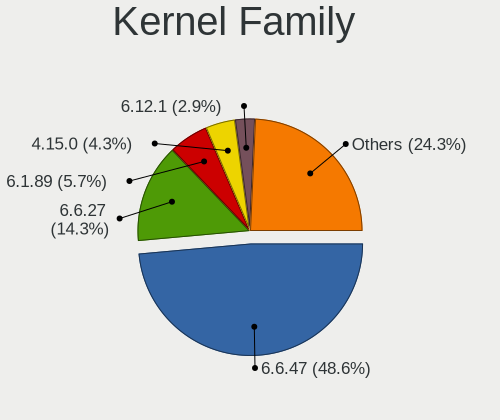
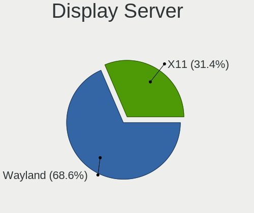
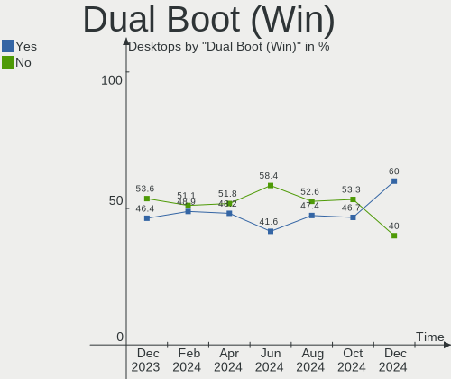
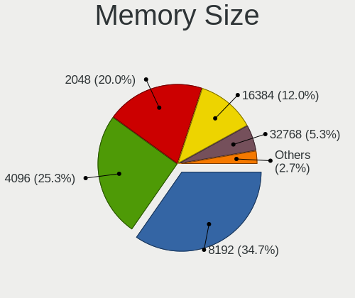

ROSA Hardware Trends (Desktop)
------------------------------

A project to identify most popular hardware characteristics and track their change
over time based on data collected by ROSA users at https://Linux-Hardware.org.

Anyone can contribute to the study by uploading probes of their computers by
the [hw-probe](https://github.com/linuxhw/hw-probe) tool:

    sudo -E hw-probe -all -upload

Full-feature report is available here: https://linux-hardware.org/?view=trends&formfactor=desktop

Period: Nov, 2020.

Contents
--------

- [ OS                       ](#os)
- [ OS Family                ](#os-family)
- [ Kernel                   ](#kernel)
- [ Kernel Family            ](#kernel-family)
- [ Kernel Major Ver.        ](#kernel-major-ver)
- [ Arch                     ](#arch)
- [ DE                       ](#de)
- [ Display Server           ](#display-server)
- [ Display Manager          ](#display-manager)
- [ OS Lang                  ](#os-lang)
- [ Boot Mode                ](#boot-mode)
- [ Filesystem               ](#filesystem)
- [ Part. scheme             ](#part-scheme)
- [ Dual Boot with Linux/BSD ](#dual-boot-with-linux/bsd)
- [ Dual Boot (Win)          ](#dual-boot-win)
- [ Country                  ](#country)
- [ City                     ](#city)
- [ Vendor                   ](#vendor)
- [ Model                    ](#model)
- [ Model Family             ](#model-family)
- [ MFG Year                 ](#mfg-year)
- [ Form Factor              ](#form-factor)
- [ Secure Boot              ](#secure-boot)
- [ Coreboot                 ](#coreboot)
- [ RAM Size                 ](#ram-size)
- [ RAM Used                 ](#ram-used)
- [ Has CD-ROM               ](#has-cd-rom)
- [ Total Drives             ](#total-drives)
- [ Has Ethernet             ](#has-ethernet)
- [ Drive Vendor             ](#drive-vendor)
- [ Drive Model              ](#drive-model)
- [ HDD Vendor               ](#hdd-vendor)
- [ SSD Vendor               ](#ssd-vendor)
- [ Drive Kind               ](#drive-kind)
- [ Drive Connector          ](#drive-connector)
- [ Drive Size               ](#drive-size)
- [ Space Total              ](#space-total)
- [ Space Used               ](#space-used)
- [ Malfunc. Drives          ](#malfunc-drives)
- [ Malfunc. Drive Vendor    ](#malfunc-drive-vendor)
- [ Malfunc. HDD Vendor      ](#malfunc-hdd-vendor)
- [ Malfunc. Drive Kind      ](#malfunc-drive-kind)
- [ Failed Drives            ](#failed-drives)
- [ Failed Drive Vendor      ](#failed-drive-vendor)
- [ Drive Status             ](#drive-status)
- [ Storage Vendor           ](#storage-vendor)
- [ Storage Model            ](#storage-model)
- [ Storage Kind             ](#storage-kind)
- [ CPU Vendor               ](#cpu-vendor)
- [ CPU Model                ](#cpu-model)
- [ CPU Model Family         ](#cpu-model-family)
- [ CPU Cores                ](#cpu-cores)
- [ CPU Sockets              ](#cpu-sockets)
- [ CPU Threads              ](#cpu-threads)
- [ CPU Op-Modes             ](#cpu-op-modes)
- [ CPU Microcode            ](#cpu-microcode)
- [ CPU Microarch            ](#cpu-microarch)
- [ GPU Vendor               ](#gpu-vendor)
- [ GPU Model                ](#gpu-model)
- [ GPU Combo                ](#gpu-combo)
- [ GPU Driver               ](#gpu-driver)
- [ GPU Memory               ](#gpu-memory)
- [ Monitor Vendor           ](#monitor-vendor)
- [ Monitor Model            ](#monitor-model)
- [ Monitor Resolution       ](#monitor-resolution)
- [ Monitor Diagonal         ](#monitor-diagonal)
- [ Monitor Width            ](#monitor-width)
- [ Aspect Ratio             ](#aspect-ratio)
- [ Monitor Area             ](#monitor-area)
- [ Pixel Density            ](#pixel-density)
- [ Multiple Monitors        ](#multiple-monitors)
- [ Net Controller Vendor    ](#net-controller-vendor)
- [ Net Controller Model     ](#net-controller-model)
- [ Wireless Vendor          ](#wireless-vendor)
- [ Wireless Model           ](#wireless-model)
- [ Ethernet Vendor          ](#ethernet-vendor)
- [ Ethernet Model           ](#ethernet-model)
- [ Net Controller Kind      ](#net-controller-kind)
- [ Used Controller          ](#used-controller)
- [ NICs                     ](#nics)
- [ Memory Vendor            ](#memory-vendor)
- [ Memory Model             ](#memory-model)
- [ Memory Kind              ](#memory-kind)
- [ Memory Form Factor       ](#memory-form-factor)
- [ Memory Size              ](#memory-size)
- [ Memory Speed             ](#memory-speed)
- [ Sound Vendor             ](#sound-vendor)
- [ Sound Model              ](#sound-model)
- [ Camera Vendor            ](#camera-vendor)
- [ Camera Model             ](#camera-model)
- [ Fingerprint Vendor       ](#fingerprint-vendor)
- [ Fingerprint Model        ](#fingerprint-model)
- [ Chipcard Vendor          ](#chipcard-vendor)
- [ Chipcard Model           ](#chipcard-model)
- [ Printer Vendor           ](#printer-vendor)
- [ Printer Model            ](#printer-model)
- [ Scanner Vendor           ](#scanner-vendor)
- [ Scanner Model            ](#scanner-model)
- [ Bluetooth Vendor         ](#bluetooth-vendor)
- [ Bluetooth Model          ](#bluetooth-model)
- [ Unsupported Devices      ](#unsupported-devices)
- [ Unsupported Device Types ](#unsupported-device-types)

OS
--

Installed operating systems

| Name       | Desktops | Percent |
|------------|----------|---------|
| ROSA R11.1 | 76       | 57.58%  |
| ROSA R11   | 39       | 29.55%  |
| ROSA R8.1  | 8        | 6.06%   |
| ROSA R12   | 4        | 3.03%   |
| ROSA R10   | 4        | 3.03%   |
| RED X4     | 1        | 0.76%   |

OS Family
---------

OS without a version

| Name | Desktops | Percent |
|------|----------|---------|
| ROSA | 132      | 100%    |

Kernel
------

Version of the Linux kernel

| Version                                       | Desktops | Percent |
|-----------------------------------------------|----------|---------|
| 4.15.0-desktop-45.1rosa-x86_64                | 33       | 25%     |
| 4.15.0-desktop-122.124.1rosa-x86_64           | 33       | 25%     |
| 5.4.40-generic-1rosa-x86_64                   | 8        | 6.06%   |
| 4.15.0-desktop-94.1rosa-x86_64                | 7        | 5.3%    |
| 4.15.0-desktop-45.1rosa-i586                  | 7        | 5.3%    |
| 5.4.32-generic-2rosa-x86_64                   | 6        | 4.55%   |
| 4.9.155-nrj-desktop-1rosa-x86_64              | 5        | 3.79%   |
| 4.15.0-desktop-122.124.1rosa-i586             | 4        | 3.03%   |
| 5.4.72-generic-1rosa-x86_64                   | 3        | 2.27%   |
| 5.4.72-generic-1rosa-i586                     | 3        | 2.27%   |
| 4.9.60-nrj-desktop-1rosa-x86_64               | 3        | 2.27%   |
| 4.1.38-nrj-desktop-2rosa-x86_64               | 3        | 2.27%   |
| 5.9.11.xm1-1-generic-xanmod-rosa2019.1-x86_64 | 1        | 0.76%   |
| 5.4.77-generic-1rosa2019.1-x86_64             | 1        | 0.76%   |
| 5.4.72-generic-1rosa2019.1-x86_64             | 1        | 0.76%   |
| 5.4.40-generic-1rosa-i586                     | 1        | 0.76%   |
| 5.4.35-nrj-desktop-1rosa-x86_64               | 1        | 0.76%   |
| 5.4.32-generic-2rosa-i586                     | 1        | 0.76%   |
| 5.4.0-desktop-11.1rosa-x86_64                 | 1        | 0.76%   |
| 5.4.0-56-generic                              | 1        | 0.76%   |
| 5.0.0-desktop-38.1rosa-x86_64                 | 1        | 0.76%   |
| 4.9.9-nrj-desktop-1rosa-x86_64                | 1        | 0.76%   |
| 4.9.60-nrj-desktop-1rosa-i586                 | 1        | 0.76%   |
| 4.4.74-nrj-desktop-1rosa-x86_64               | 1        | 0.76%   |
| 4.16.18-nrj-desktop-1rosa-x86_64              | 1        | 0.76%   |
| 4.15.0-desktop-94.1rosa-i586                  | 1        | 0.76%   |
| 4.15.0-desktop-91.3rosa-x86_64                | 1        | 0.76%   |
| 4.15.0-desktop-68.5rosa-i586                  | 1        | 0.76%   |
| 4.15.0-desktop-47.2rosa-x86_64                | 1        | 0.76%   |

Kernel Family
-------------

Linux kernel without a distro release

| Version | Desktops | Percent |
|---------|----------|---------|
| 4.15.0  | 88       | 66.67%  |
| 5.4.40  | 9        | 6.82%   |
| 5.4.72  | 7        | 5.3%    |
| 5.4.32  | 7        | 5.3%    |
| 4.9.155 | 5        | 3.79%   |
| 4.9.60  | 4        | 3.03%   |
| 4.1.38  | 3        | 2.27%   |
| 5.4.0   | 2        | 1.52%   |
| 5.9.11  | 1        | 0.76%   |
| 5.4.77  | 1        | 0.76%   |
| 5.4.35  | 1        | 0.76%   |
| 5.0.0   | 1        | 0.76%   |
| 4.9.9   | 1        | 0.76%   |
| 4.4.74  | 1        | 0.76%   |
| 4.16.18 | 1        | 0.76%   |

Kernel Major Ver.
-----------------

Linux kernel major version

| Version | Desktops | Percent |
|---------|----------|---------|
| 4.15    | 88       | 66.67%  |
| 5.4     | 27       | 20.45%  |
| 4.9     | 10       | 7.58%   |
| 4.1     | 3        | 2.27%   |
| 5.9     | 1        | 0.76%   |
| 5.0     | 1        | 0.76%   |
| 4.4     | 1        | 0.76%   |
| 4.16    | 1        | 0.76%   |

Arch
----

OS architecture (x86_64, i586, etc.)

| Name   | Desktops | Percent |
|--------|----------|---------|
| x86_64 | 113      | 85.61%  |
| i686   | 19       | 14.39%  |

DE
--

Desktop Environment

| Name    | Desktops | Percent |
|---------|----------|---------|
| KDE4    | 83       | 62.88%  |
| KDE5    | 37       | 28.03%  |
| LXQt    | 7        | 5.3%    |
| XFCE    | 3        | 2.27%   |
| MATE    | 1        | 0.76%   |
| Unknown | 1        | 0.76%   |

Display Server
--------------

X11 or Wayland

| Name    | Desktops | Percent |
|---------|----------|---------|
| X11     | 131      | 99.24%  |
| Wayland | 1        | 0.76%   |

Display Manager
---------------

SDDM, LightDM, etc.

| Name | Desktops | Percent |
|------|----------|---------|
| KDM  | 83       | 62.88%  |
| SDDM | 47       | 35.61%  |
| TDM  | 1        | 0.76%   |
| LDM  | 1        | 0.76%   |

OS Lang
-------

Language

| Lang    | Desktops | Percent |
|---------|----------|---------|
| ru_RU   | 70       | 53.03%  |
| Unknown | 50       | 37.88%  |
| pl_PL   | 3        | 2.27%   |
| it_IT   | 2        | 1.52%   |
| de_DE   | 2        | 1.52%   |
| ru_UA   | 1        | 0.76%   |
| pt_PT   | 1        | 0.76%   |
| fr_FR   | 1        | 0.76%   |
| en_US   | 1        | 0.76%   |
| cs_CZ   | 1        | 0.76%   |

Boot Mode
---------

EFI or BIOS

| Mode | Desktops | Percent |
|------|----------|---------|
| BIOS | 99       | 75%     |
| EFI  | 33       | 25%     |

Filesystem
----------

Type of filesystem

| Type    | Desktops | Percent |
|---------|----------|---------|
| Ext4    | 124      | 93.94%  |
| Btrfs   | 6        | 4.55%   |
| Xfs     | 1        | 0.76%   |
| Unknown | 1        | 0.76%   |

Part. scheme
------------

Scheme of partitioning

| Type    | Desktops | Percent |
|---------|----------|---------|
| MBR     | 86       | 65.15%  |
| GPT     | 42       | 31.82%  |
| Unknown | 4        | 3.03%   |

Dual Boot with Linux/BSD
------------------------

Hosting more than one Linux/BSD

| Dual boot | Desktops | Percent |
|-----------|----------|---------|
| No        | 106      | 80.3%   |
| Yes       | 26       | 19.7%   |

Dual Boot (Win)
---------------

Hosting Linux and Windows

| Dual boot | Desktops | Percent |
|-----------|----------|---------|
| Yes       | 71       | 53.79%  |
| No        | 61       | 46.21%  |

Country
-------

Geographic location (country)

| Country        | Desktops | Percent |
|----------------|----------|---------|
| Russia         | 95       | 71.97%  |
| Ukraine        | 10       | 7.58%   |
| Belarus        | 6        | 4.55%   |
| Germany        | 5        | 3.79%   |
| Poland         | 4        | 3.03%   |
| Italy          | 2        | 1.52%   |
| France         | 2        | 1.52%   |
| UK             | 1        | 0.76%   |
| Portugal       | 1        | 0.76%   |
| Kazakhstan     | 1        | 0.76%   |
| Israel         | 1        | 0.76%   |
| Ireland        | 1        | 0.76%   |
| Czech Republic | 1        | 0.76%   |
| Brazil         | 1        | 0.76%   |
| Algeria        | 1        | 0.76%   |

City
----

Geographic location (city)

| City                | Desktops | Percent |
|---------------------|----------|---------|
| Moscow              | 13       | 9.85%   |
| St Petersburg       | 7        | 5.3%    |
| Krasnodar           | 6        | 4.55%   |
| Ekaterinburg        | 4        | 3.03%   |
| Vitebsk             | 3        | 2.27%   |
| Nizhniy Novgorod    | 3        | 2.27%   |
| Ivanovo             | 3        | 2.27%   |
| Chita               | 3        | 2.27%   |
| Yaroslavl           | 2        | 1.52%   |
| Volgograd           | 2        | 1.52%   |
| Saratov             | 2        | 1.52%   |
| Rostov-on-Don       | 2        | 1.52%   |
| Perm                | 2        | 1.52%   |
| Minsk               | 2        | 1.52%   |
| Kaliningrad         | 2        | 1.52%   |
| Izhevsk             | 2        | 1.52%   |
| Donetsk             | 2        | 1.52%   |
| Chelyabinsk         | 2        | 1.52%   |
| Zelenodolsk         | 1        | 0.76%   |
| Verkhniy Ufaley     | 1        | 0.76%   |
| Veliky Novgorod     | 1        | 0.76%   |
| Velikiye Luki       | 1        | 0.76%   |
| Usinsk              | 1        | 0.76%   |
| Ufa                 | 1        | 0.76%   |
| Tyumen              | 1        | 0.76%   |
| Turin               | 1        | 0.76%   |
| Tula                | 1        | 0.76%   |
| Tomsk               | 1        | 0.76%   |
| Syktyvkar           | 1        | 0.76%   |
| Stroitel'           | 1        | 0.76%   |
| Stavropol           | 1        | 0.76%   |
| Shebekino           | 1        | 0.76%   |
| Sevastopol          | 1        | 0.76%   |
| Saronno             | 1        | 0.76%   |
| Sao Jose do Goiabal | 1        | 0.76%   |
| Samara              | 1        | 0.76%   |
| Saarbrücken        | 1        | 0.76%   |
| Rakitnoye           | 1        | 0.76%   |
| Qiryat Bialik       | 1        | 0.76%   |
| Pskov               | 1        | 0.76%   |
| Prokhorovka         | 1        | 0.76%   |
| Poznan              | 1        | 0.76%   |
| Polonne             | 1        | 0.76%   |
| Petrozavodsk        | 1        | 0.76%   |
| Oryol               | 1        | 0.76%   |
| Nyons               | 1        | 0.76%   |
| Novosibirsk         | 1        | 0.76%   |
| Novorossiysk        | 1        | 0.76%   |
| Nizhnekamsk         | 1        | 0.76%   |
| Nefteyugansk        | 1        | 0.76%   |
| Nazarovo            | 1        | 0.76%   |
| Naas                | 1        | 0.76%   |
| Mineralnye Vody     | 1        | 0.76%   |
| Malbork             | 1        | 0.76%   |
| Lipetsk             | 1        | 0.76%   |
| Lida                | 1        | 0.76%   |
| Lesnoy              | 1        | 0.76%   |
| Kyiv                | 1        | 0.76%   |
| Kryvyi Rih          | 1        | 0.76%   |
| Kremenchuk          | 1        | 0.76%   |

Vendor
------

Motherboard manufacturer

| Name                | Desktops | Percent |
|---------------------|----------|---------|
| ASUSTek Computer    | 40       | 30.3%   |
| Gigabyte Technology | 37       | 28.03%  |
| ASRock              | 16       | 12.12%  |
| MSI                 | 15       | 11.36%  |
| Unknown             | 4        | 3.03%   |
| Lenovo              | 3        | 2.27%   |
| Intel               | 3        | 2.27%   |
| Hewlett-Packard     | 3        | 2.27%   |
| Biostar             | 3        | 2.27%   |
| Acer                | 3        | 2.27%   |
| Pegatron            | 1        | 0.76%   |
| Packard Bell        | 1        | 0.76%   |
| Fujitsu             | 1        | 0.76%   |
| Foxconn             | 1        | 0.76%   |
| ECS                 | 1        | 0.76%   |

Model
-----

Motherboard model

| Name                                 | Desktops | Percent |
|--------------------------------------|----------|---------|
| Unknown                              | 4        | 3.03%   |
| ASUS All Series                      | 3        | 2.27%   |
| MSI MS-7597                          | 2        | 1.52%   |
| MSI MS-7592                          | 2        | 1.52%   |
| Gigabyte H81M-S2H                    | 2        | 1.52%   |
| ASUS M5A78L-M LX3                    | 2        | 1.52%   |
| Pegatron Compaq dx2400 Microtower PC | 1        | 0.76%   |
| Packard Bell ixtreme M5741           | 1        | 0.76%   |
| MSI OPTIMUS                          | 1        | 0.76%   |
| MSI MS-AC71                          | 1        | 0.76%   |
| MSI MS-7B36                          | 1        | 0.76%   |
| MSI MS-7A33                          | 1        | 0.76%   |
| MSI MS-7817                          | 1        | 0.76%   |
| MSI MS-7788                          | 1        | 0.76%   |
| MSI MS-7758                          | 1        | 0.76%   |
| MSI MS-7721                          | 1        | 0.76%   |
| MSI MS-7623                          | 1        | 0.76%   |
| MSI MS-7388                          | 1        | 0.76%   |
| MSI MS-7270                          | 1        | 0.76%   |
| Lenovo ThinkCentre M80 7493RP1       | 1        | 0.76%   |
| Lenovo ThinkCentre M78 Y             | 1        | 0.76%   |
| Lenovo ThinkCentre M72e 3598B44      | 1        | 0.76%   |
| Intel H55                            | 1        | 0.76%   |
| Intel DH61CR AAG14064-203            | 1        | 0.76%   |
| Intel DG31PR AAD97573-301            | 1        | 0.76%   |
| HP Z230 Tower Workstation            | 1        | 0.76%   |
| HP Pavilion Desktop 590-p0xxx        | 1        | 0.76%   |
| HP 280 G1 MT                         | 1        | 0.76%   |
| Gigabyte Z97M-D3H                    | 1        | 0.76%   |
| Gigabyte Z68XP-UD3                   | 1        | 0.76%   |
| Gigabyte Z68X-UD3-B3                 | 1        | 0.76%   |
| Gigabyte Z68AP-D3                    | 1        | 0.76%   |
| Gigabyte Z370P D3                    | 1        | 0.76%   |
| Gigabyte Z370M DS3H                  | 1        | 0.76%   |
| Gigabyte X470 AORUS ULTRA GAMING     | 1        | 0.76%   |
| Gigabyte P75-D3                      | 1        | 0.76%   |
| Gigabyte P55-US3L                    | 1        | 0.76%   |
| Gigabyte M56S-S3                     | 1        | 0.76%   |
| Gigabyte H97-HD3                     | 1        | 0.76%   |
| Gigabyte H77-DS3H                    | 1        | 0.76%   |
| Gigabyte H61M-S2PV                   | 1        | 0.76%   |
| Gigabyte H310M S2P 2.0               | 1        | 0.76%   |
| Gigabyte H310M S2H 2.0               | 1        | 0.76%   |
| Gigabyte GA-MA78GM-UD2H              | 1        | 0.76%   |
| Gigabyte GA-MA74GM-S2                | 1        | 0.76%   |
| Gigabyte GA-A75M-UD2H                | 1        | 0.76%   |
| Gigabyte GA-990XA-UD3                | 1        | 0.76%   |
| Gigabyte GA-8SIMLH                   | 1        | 0.76%   |
| Gigabyte GA-78LMT-USB3 R2            | 1        | 0.76%   |
| Gigabyte GA-78LMT-S2PV               | 1        | 0.76%   |
| Gigabyte GA-78LMT-S2P                | 1        | 0.76%   |
| Gigabyte GA-78LMT-S2                 | 1        | 0.76%   |
| Gigabyte F2A88X-D3H                  | 1        | 0.76%   |
| Gigabyte F2A68HM-S1                  | 1        | 0.76%   |
| Gigabyte F2A68HM-DS2                 | 1        | 0.76%   |
| Gigabyte F2A55M-DS2                  | 1        | 0.76%   |
| Gigabyte EP45C-DS3R                  | 1        | 0.76%   |
| Gigabyte EG41MFT-US2H                | 1        | 0.76%   |
| Gigabyte B75M-D2V                    | 1        | 0.76%   |
| Gigabyte B450M S2H                   | 1        | 0.76%   |

Model Family
------------

Motherboard model prefix

| Name                    | Desktops | Percent |
|-------------------------|----------|---------|
| Unknown                 | 4        | 3.03%   |
| Lenovo ThinkCentre      | 3        | 2.27%   |
| ASUS M5A78L-M           | 3        | 2.27%   |
| ASUS All                | 3        | 2.27%   |
| MSI MS-7597             | 2        | 1.52%   |
| MSI MS-7592             | 2        | 1.52%   |
| Gigabyte H81M-S2H       | 2        | 1.52%   |
| Gigabyte H310M          | 2        | 1.52%   |
| ASUS ROG                | 2        | 1.52%   |
| ASUS PRIME              | 2        | 1.52%   |
| Acer Aspire             | 2        | 1.52%   |
| Pegatron Compaq         | 1        | 0.76%   |
| Packard Bell ixtreme    | 1        | 0.76%   |
| MSI OPTIMUS             | 1        | 0.76%   |
| MSI MS-AC71             | 1        | 0.76%   |
| MSI MS-7B36             | 1        | 0.76%   |
| MSI MS-7A33             | 1        | 0.76%   |
| MSI MS-7817             | 1        | 0.76%   |
| MSI MS-7788             | 1        | 0.76%   |
| MSI MS-7758             | 1        | 0.76%   |
| MSI MS-7721             | 1        | 0.76%   |
| MSI MS-7623             | 1        | 0.76%   |
| MSI MS-7388             | 1        | 0.76%   |
| MSI MS-7270             | 1        | 0.76%   |
| Intel H55               | 1        | 0.76%   |
| Intel DH61CR            | 1        | 0.76%   |
| Intel DG31PR            | 1        | 0.76%   |
| HP Z230                 | 1        | 0.76%   |
| HP Pavilion             | 1        | 0.76%   |
| HP 280                  | 1        | 0.76%   |
| Gigabyte Z97M-D3H       | 1        | 0.76%   |
| Gigabyte Z68XP-UD3      | 1        | 0.76%   |
| Gigabyte Z68X-UD3-B3    | 1        | 0.76%   |
| Gigabyte Z68AP-D3       | 1        | 0.76%   |
| Gigabyte Z370P          | 1        | 0.76%   |
| Gigabyte Z370M          | 1        | 0.76%   |
| Gigabyte X470           | 1        | 0.76%   |
| Gigabyte P75-D3         | 1        | 0.76%   |
| Gigabyte P55-US3L       | 1        | 0.76%   |
| Gigabyte M56S-S3        | 1        | 0.76%   |
| Gigabyte H97-HD3        | 1        | 0.76%   |
| Gigabyte H77-DS3H       | 1        | 0.76%   |
| Gigabyte H61M-S2PV      | 1        | 0.76%   |
| Gigabyte GA-MA78GM-UD2H | 1        | 0.76%   |
| Gigabyte GA-MA74GM-S2   | 1        | 0.76%   |
| Gigabyte GA-A75M-UD2H   | 1        | 0.76%   |
| Gigabyte GA-990XA-UD3   | 1        | 0.76%   |
| Gigabyte GA-8SIMLH      | 1        | 0.76%   |
| Gigabyte GA-78LMT-USB3  | 1        | 0.76%   |
| Gigabyte GA-78LMT-S2PV  | 1        | 0.76%   |
| Gigabyte GA-78LMT-S2P   | 1        | 0.76%   |
| Gigabyte GA-78LMT-S2    | 1        | 0.76%   |
| Gigabyte F2A88X-D3H     | 1        | 0.76%   |
| Gigabyte F2A68HM-S1     | 1        | 0.76%   |
| Gigabyte F2A68HM-DS2    | 1        | 0.76%   |
| Gigabyte F2A55M-DS2     | 1        | 0.76%   |
| Gigabyte EP45C-DS3R     | 1        | 0.76%   |
| Gigabyte EG41MFT-US2H   | 1        | 0.76%   |
| Gigabyte B75M-D2V       | 1        | 0.76%   |
| Gigabyte B450M          | 1        | 0.76%   |

MFG Year
--------

Motherboard manufacture year

| Year | Desktops | Percent |
|------|----------|---------|
| 2013 | 15       | 11.36%  |
| 2009 | 14       | 10.61%  |
| 2012 | 12       | 9.09%   |
| 2014 | 10       | 7.58%   |
| 2011 | 10       | 7.58%   |
| 2010 | 10       | 7.58%   |
| 2007 | 10       | 7.58%   |
| 2019 | 9        | 6.82%   |
| 2015 | 9        | 6.82%   |
| 2018 | 7        | 5.3%    |
| 2016 | 7        | 5.3%    |
| 2008 | 6        | 4.55%   |
| 2020 | 4        | 3.03%   |
| 2005 | 4        | 3.03%   |
| 2017 | 2        | 1.52%   |
| 2006 | 1        | 0.76%   |
| 2004 | 1        | 0.76%   |
| 2002 | 1        | 0.76%   |

Form Factor
-----------

Physical design of the computer

| Name    | Desktops | Percent |
|---------|----------|---------|
| Desktop | 132      | 100%    |

Secure Boot
-----------

Enabled or disabled

| State    | Desktops | Percent |
|----------|----------|---------|
| Disabled | 132      | 100%    |

Coreboot
--------

Have coreboot on board

| Used | Desktops | Percent |
|------|----------|---------|
| No   | 132      | 100%    |

RAM Size
--------

Total RAM memory

| Size in GB  | Desktops | Percent |
|-------------|----------|---------|
| 3.01-4.0    | 43       | 32.58%  |
| 8.01-16.0   | 24       | 18.18%  |
| 16.01-24.0  | 23       | 17.42%  |
| 4.01-8.0    | 19       | 14.39%  |
| 1.01-2.0    | 11       | 8.33%   |
| 2.01-3.0    | 6        | 4.55%   |
| 0.01-1.0    | 3        | 2.27%   |
| 32.01-64.0  | 1        | 0.76%   |
| 24.01-32.0  | 1        | 0.76%   |
| 64.01-256.0 | 1        | 0.76%   |

RAM Used
--------

Used RAM memory

| Used GB  | Desktops | Percent |
|----------|----------|---------|
| 1.01-2.0 | 56       | 42.42%  |
| 0.01-1.0 | 56       | 42.42%  |
| 2.01-3.0 | 12       | 9.09%   |
| 3.01-4.0 | 6        | 4.55%   |
| 4.01-8.0 | 2        | 1.52%   |

Has CD-ROM
----------

Has CD-ROM on board

| Presented | Desktops | Percent |
|-----------|----------|---------|
| Yes       | 81       | 61.36%  |
| No        | 51       | 38.64%  |

Total Drives
------------

Number of drives on board

| Drives | Desktops | Percent |
|--------|----------|---------|
| 1      | 76       | 57.58%  |
| 2      | 33       | 25%     |
| 3      | 15       | 11.36%  |
| 4      | 7        | 5.3%    |
| 0      | 1        | 0.76%   |

Has Ethernet
------------

Has Ethernet on board

| Presented | Desktops | Percent |
|-----------|----------|---------|
| Yes       | 131      | 99.24%  |
| No        | 1        | 0.76%   |

Drive Vendor
------------

Hard drive vendors

| Vendor              | Desktops | Drives | Percent |
|---------------------|----------|--------|---------|
| Seagate             | 48       | 54     | 24.62%  |
| WDC                 | 46       | 54     | 23.59%  |
| Samsung Electronics | 19       | 20     | 9.74%   |
| Toshiba             | 14       | 15     | 7.18%   |
| Kingston            | 12       | 13     | 6.15%   |
| Hitachi             | 12       | 14     | 6.15%   |
| Transcend           | 5        | 5      | 2.56%   |
| China               | 4        | 4      | 2.05%   |
| PLEXTOR             | 3        | 4      | 1.54%   |
| Patriot             | 3        | 3      | 1.54%   |
| Crucial             | 3        | 3      | 1.54%   |
| SanDisk             | 2        | 2      | 1.03%   |
| MAXTOR              | 2        | 2      | 1.03%   |
| KingSpec            | 2        | 2      | 1.03%   |
| HGST                | 2        | 3      | 1.03%   |
| GOODRAM             | 2        | 2      | 1.03%   |
| Apacer              | 2        | 2      | 1.03%   |
| XrayDisk            | 1        | 1      | 0.51%   |
| WD MediaMax         | 1        | 1      | 0.51%   |
| Unknown             | 1        | 1      | 0.51%   |
| TCSUNBOW            | 1        | 1      | 0.51%   |
| SPCC                | 1        | 1      | 0.51%   |
| Silicon Motion      | 1        | 1      | 0.51%   |
| OCZ                 | 1        | 1      | 0.51%   |
| MIXZA               | 1        | 1      | 0.51%   |
| KingDian            | 1        | 1      | 0.51%   |
| Intel               | 1        | 1      | 0.51%   |
| Fujitsu             | 1        | 1      | 0.51%   |
| e2e4                | 1        | 1      | 0.51%   |
| Corsair             | 1        | 1      | 0.51%   |
| AMD                 | 1        | 1      | 0.51%   |

Drive Model
-----------

Hard drive models

| Model                            | Desktops | Percent |
|----------------------------------|----------|---------|
| Toshiba DT01ACA050 500GB         | 8        | 3.74%   |
| WDC WD10EZEX-08WN4A0 1TB         | 5        | 2.34%   |
| Kingston SA400S37120G 120GB SSD  | 5        | 2.34%   |
| Seagate ST500DM002-1BD142 500GB  | 4        | 1.87%   |
| WDC WD5000AAKX-00ERMA0 500GB     | 3        | 1.4%    |
| WDC WD10EARS-00Y5B1 1TB          | 3        | 1.4%    |
| WDC WD5000AAKX-001CA0 500GB      | 2        | 0.93%   |
| WDC WD3200AAJS-56M0A0 320GB      | 2        | 0.93%   |
| WDC WD10EZRX-00L4HB0 1TB         | 2        | 0.93%   |
| Toshiba HDWD110 1TB              | 2        | 0.93%   |
| Seagate ST3500418AS 500GB        | 2        | 0.93%   |
| Seagate ST3320620AS 320GB        | 2        | 0.93%   |
| Seagate ST3250824AS 250GB        | 2        | 0.93%   |
| Seagate ST3250318AS 250GB        | 2        | 0.93%   |
| Seagate ST3250310AS 250GB        | 2        | 0.93%   |
| Seagate ST2000DM008-2FR102 2TB   | 2        | 0.93%   |
| Seagate ST1000VX000-1CU162 1TB   | 2        | 0.93%   |
| Seagate ST1000DM010-2EP102 1TB   | 2        | 0.93%   |
| Seagate ST1000DM003-9YN162 1TB   | 2        | 0.93%   |
| Seagate ST1000DM003-1SB102 1TB   | 2        | 0.93%   |
| Samsung HD502HJ 500GB            | 2        | 0.93%   |
| Samsung HD080HJ/ 80GB            | 2        | 0.93%   |
| Crucial CT240BX500SSD1 240GB     | 2        | 0.93%   |
| Apacer AS350 240GB SSD           | 2        | 0.93%   |
| XrayDisk SSD 256GB               | 1        | 0.47%   |
| WDC WDS240G2G0A-00JH30 240GB SSD | 1        | 0.47%   |
| WDC WDS120G2G0A-00JH30 120GB SSD | 1        | 0.47%   |
| WDC WD7501AALS-00J7B1 752GB      | 1        | 0.47%   |
| WDC WD5000AZRX-00A8LB0 500GB     | 1        | 0.47%   |
| WDC WD5000AZLX-22JKKA0 500GB     | 1        | 0.47%   |
| WDC WD5000AAKX-60U6AA0 500GB     | 1        | 0.47%   |
| WDC WD5000AAKX-22ERMA0 500GB     | 1        | 0.47%   |
| WDC WD5000AAKS-22V1A0 500GB      | 1        | 0.47%   |
| WDC WD5000AACS-00ZUB0 500GB      | 1        | 0.47%   |
| WDC WD5000AACS-00G8B1 500GB      | 1        | 0.47%   |
| WDC WD400BB-00JHA0 40GB          | 1        | 0.47%   |
| WDC WD3200BPVT-24JJ5T0 320GB     | 1        | 0.47%   |
| WDC WD3200BPVT-22ZEST0 320GB     | 1        | 0.47%   |
| WDC WD3200AAKS-00L9A0 320GB      | 1        | 0.47%   |
| WDC WD3200AAKS-00B3A0 320GB      | 1        | 0.47%   |
| WDC WD3200AAJS-00L7A0 320GB      | 1        | 0.47%   |
| WDC WD3000HLFS-01MZUV0 304GB     | 1        | 0.47%   |
| WDC WD2500LPCX-24C6HT0 250GB     | 1        | 0.47%   |
| WDC WD2500JS-22NCB1 250GB        | 1        | 0.47%   |
| WDC WD2500AAKX-60U6AA0 250GB     | 1        | 0.47%   |
| WDC WD2500AAKS-00VSA0 250GB      | 1        | 0.47%   |
| WDC WD2500AAKS-00F0A0 250GB      | 1        | 0.47%   |
| WDC WD20EZRZ-22Z5HB0 2TB         | 1        | 0.47%   |
| WDC WD20EZRX-00D8PB0 2TB         | 1        | 0.47%   |
| WDC WD20EZAZ-00GGJB0 2TB         | 1        | 0.47%   |
| WDC WD20EARS-00MVWB0 2TB         | 1        | 0.47%   |
| WDC WD1600JS-56MHB1 160GB        | 1        | 0.47%   |
| WDC WD1600JD-55HBB0 160GB        | 1        | 0.47%   |
| WDC WD1600AVVS-63L2B0 160GB      | 1        | 0.47%   |
| WDC WD10PURZ-85U8XY0 1TB         | 1        | 0.47%   |
| WDC WD10EZEX-75WN4A0 1TB         | 1        | 0.47%   |
| WDC WD10EZEX-22BN5A0 1TB         | 1        | 0.47%   |
| WDC WD10EZEX-21M2NA0 1TB         | 1        | 0.47%   |
| WDC WD10EZEX-00ZF5A0 1TB         | 1        | 0.47%   |
| WDC WD10EZEX-00BN5A0 1TB         | 1        | 0.47%   |

HDD Vendor
----------

Hard disk drive vendors

| Vendor              | Desktops | Drives | Percent |
|---------------------|----------|--------|---------|
| Seagate             | 47       | 53     | 34.81%  |
| WDC                 | 44       | 52     | 32.59%  |
| Samsung Electronics | 15       | 16     | 11.11%  |
| Toshiba             | 12       | 13     | 8.89%   |
| Hitachi             | 12       | 14     | 8.89%   |
| HGST                | 2        | 3      | 1.48%   |
| WD MediaMax         | 1        | 1      | 0.74%   |
| MAXTOR              | 1        | 1      | 0.74%   |
| Fujitsu             | 1        | 1      | 0.74%   |

SSD Vendor
----------

Solid state drive vendors

| Vendor              | Desktops | Drives | Percent |
|---------------------|----------|--------|---------|
| Kingston            | 12       | 13     | 21.82%  |
| Transcend           | 4        | 4      | 7.27%   |
| Samsung Electronics | 4        | 4      | 7.27%   |
| China               | 4        | 4      | 7.27%   |
| PLEXTOR             | 3        | 3      | 5.45%   |
| Patriot             | 3        | 3      | 5.45%   |
| WDC                 | 2        | 2      | 3.64%   |
| Toshiba             | 2        | 2      | 3.64%   |
| SanDisk             | 2        | 2      | 3.64%   |
| KingSpec            | 2        | 2      | 3.64%   |
| GOODRAM             | 2        | 2      | 3.64%   |
| Crucial             | 2        | 2      | 3.64%   |
| Apacer              | 2        | 2      | 3.64%   |
| XrayDisk            | 1        | 1      | 1.82%   |
| TCSUNBOW            | 1        | 1      | 1.82%   |
| SPCC                | 1        | 1      | 1.82%   |
| OCZ                 | 1        | 1      | 1.82%   |
| MIXZA               | 1        | 1      | 1.82%   |
| Maxtor              | 1        | 1      | 1.82%   |
| KingDian            | 1        | 1      | 1.82%   |
| Intel               | 1        | 1      | 1.82%   |
| e2e4                | 1        | 1      | 1.82%   |
| Corsair             | 1        | 1      | 1.82%   |
| AMD                 | 1        | 1      | 1.82%   |

Drive Kind
----------

HDD or SSD

| Kind    | Desktops | Drives | Percent |
|---------|----------|--------|---------|
| HDD     | 117      | 154    | 69.64%  |
| SSD     | 46       | 56     | 27.38%  |
| NVMe    | 4        | 5      | 2.38%   |
| Unknown | 1        | 1      | 0.6%    |

Drive Connector
---------------

SATA, SAS, NVMe, etc.

| Type | Desktops | Drives | Percent |
|------|----------|--------|---------|
| SATA | 129      | 209    | 95.56%  |
| NVMe | 4        | 5      | 2.96%   |
| SAS  | 2        | 2      | 1.48%   |

Drive Size
----------

Size of hard drive

| Size in TB | Desktops | Drives | Percent |
|------------|----------|--------|---------|
| 0.01-0.5   | 112      | 156    | 70%     |
| 0.51-1.0   | 38       | 43     | 23.75%  |
| 1.01-2.0   | 9        | 9      | 5.63%   |
| 4.01-10.0  | 1        | 2      | 0.63%   |

Space Total
-----------

Amount of disk space available on the file system

| Size in GB | Desktops | Percent |
|------------|----------|---------|
| 101-250    | 34       | 25.76%  |
| 251-500    | 30       | 22.73%  |
| 1-20       | 16       | 12.12%  |
| 501-1000   | 16       | 12.12%  |
| 51-100     | 13       | 9.85%   |
| 21-50      | 10       | 7.58%   |
| 1001-2000  | 9        | 6.82%   |
| 2001-3000  | 3        | 2.27%   |
| Unknown    | 1        | 0.76%   |

Space Used
----------

Amount of used disk space

| Used GB   | Desktops | Percent |
|-----------|----------|---------|
| 1-20      | 86       | 65.15%  |
| 101-250   | 15       | 11.36%  |
| 21-50     | 10       | 7.58%   |
| 251-500   | 7        | 5.3%    |
| 51-100    | 6        | 4.55%   |
| 1001-2000 | 4        | 3.03%   |
| 501-1000  | 3        | 2.27%   |
| Unknown   | 1        | 0.76%   |

Malfunc. Drives
---------------

Drive models with a malfunction

| Model                              | Desktops | Drives | Percent |
|------------------------------------|----------|--------|---------|
| Toshiba DT01ACA050 500GB           | 2        | 3      | 3.51%   |
| Seagate ST500DM002-1BD142 500GB    | 2        | 2      | 3.51%   |
| Seagate ST1000DM003-9YN162 1TB     | 2        | 2      | 3.51%   |
| WDC WD5000AAKX-60U6AA0 500GB       | 1        | 1      | 1.75%   |
| WDC WD5000AAKX-22ERMA0 500GB       | 1        | 1      | 1.75%   |
| WDC WD5000AAKX-00ERMA0 500GB       | 1        | 1      | 1.75%   |
| WDC WD5000AAKX-001CA0 500GB        | 1        | 1      | 1.75%   |
| WDC WD5000AAKS-22V1A0 500GB        | 1        | 1      | 1.75%   |
| WDC WD3200BPVT-22ZEST0 320GB       | 1        | 1      | 1.75%   |
| WDC WD3200AAKS-00L9A0 320GB        | 1        | 1      | 1.75%   |
| WDC WD3200AAKS-00B3A0 320GB        | 1        | 1      | 1.75%   |
| WDC WD3200AAJS-00L7A0 320GB        | 1        | 1      | 1.75%   |
| WDC WD1600JS-56MHB1 160GB          | 1        | 1      | 1.75%   |
| WDC WD1600JD-55HBB0 160GB          | 1        | 1      | 1.75%   |
| WDC WD10EZEX-08WN4A0 1TB           | 1        | 1      | 1.75%   |
| WDC WD10EZEX-00ZF5A0 1TB           | 1        | 1      | 1.75%   |
| WDC WD10EARS-00Y5B1 1TB            | 1        | 1      | 1.75%   |
| WDC WD10EADS-00L5B1 1TB            | 1        | 1      | 1.75%   |
| WD MediaMax WL120GBSATA            | 1        | 1      | 1.75%   |
| Toshiba DT01ACA100 1TB             | 1        | 1      | 1.75%   |
| SPCC SSD110 120GB                  | 1        | 1      | 1.75%   |
| Seagate ST9320423AS 320GB          | 1        | 1      | 1.75%   |
| Seagate ST380815AS 80GB            | 1        | 1      | 1.75%   |
| Seagate ST3802110A 80GB            | 1        | 1      | 1.75%   |
| Seagate ST380021A 80GB             | 1        | 1      | 1.75%   |
| Seagate ST380013AS 80GB            | 1        | 1      | 1.75%   |
| Seagate ST3750330AS 752GB          | 1        | 1      | 1.75%   |
| Seagate ST3500418AS 500GB          | 1        | 1      | 1.75%   |
| Seagate ST3320620AS 320GB          | 1        | 1      | 1.75%   |
| Seagate ST3320613AS 320GB          | 1        | 1      | 1.75%   |
| Seagate ST3250620AS 250GB          | 1        | 1      | 1.75%   |
| Seagate ST3250318AS 250GB          | 1        | 1      | 1.75%   |
| Seagate ST320410A 20GB             | 1        | 1      | 1.75%   |
| Seagate ST31500341AS 1TB           | 1        | 1      | 1.75%   |
| Seagate ST1000VM002-9ZL162 1TB     | 1        | 1      | 1.75%   |
| Seagate ST1000NM0011 1TB           | 1        | 1      | 1.75%   |
| Seagate ST1000DM003-1SB102 1TB     | 1        | 1      | 1.75%   |
| Samsung Electronics SP2504C 250GB  | 1        | 1      | 1.75%   |
| Samsung Electronics SP1203N 120GB  | 1        | 1      | 1.75%   |
| Samsung Electronics HD502HI 500GB  | 1        | 1      | 1.75%   |
| Samsung Electronics HD160JJ/ 160GB | 1        | 1      | 1.75%   |
| Samsung Electronics HD160HJ 160GB  | 1        | 1      | 1.75%   |
| Samsung Electronics HD103SI 1TB    | 1        | 1      | 1.75%   |
| Samsung Electronics HD082GJ 80GB   | 1        | 1      | 1.75%   |
| Samsung Electronics HD080HJ/ 80GB  | 1        | 1      | 1.75%   |
| Kingston SV300S37A120G 120GB SSD   | 1        | 1      | 1.75%   |
| Kingston SKC300S37A180G 180GB SSD  | 1        | 1      | 1.75%   |
| Hitachi HTS541680J9SA00 80GB       | 1        | 1      | 1.75%   |
| Hitachi HTS541616J9SA00 160GB      | 1        | 1      | 1.75%   |
| Hitachi HDS728080PLA380 82GB       | 1        | 1      | 1.75%   |
| Hitachi HDS721616PLA380 160GB      | 1        | 1      | 1.75%   |
| Hitachi HDS721010CLA332 1TB        | 1        | 1      | 1.75%   |
| Hitachi HDP725050GLA360 500GB      | 1        | 1      | 1.75%   |
| Corsair Force LS SSD 240GB         | 1        | 1      | 1.75%   |

Malfunc. Drive Vendor
---------------------

Vendors of faulty drives

| Vendor              | Desktops | Drives | Percent |
|---------------------|----------|--------|---------|
| Seagate             | 19       | 20     | 33.93%  |
| WDC                 | 15       | 15     | 26.79%  |
| Samsung Electronics | 8        | 8      | 14.29%  |
| Hitachi             | 6        | 6      | 10.71%  |
| Toshiba             | 3        | 4      | 5.36%   |
| Kingston            | 2        | 2      | 3.57%   |
| WD MediaMax         | 1        | 1      | 1.79%   |
| SPCC                | 1        | 1      | 1.79%   |
| Corsair             | 1        | 1      | 1.79%   |

Malfunc. HDD Vendor
-------------------

Vendors of faulty HDD drives

| Vendor              | Desktops | Drives | Percent |
|---------------------|----------|--------|---------|
| Seagate             | 19       | 20     | 36.54%  |
| WDC                 | 15       | 15     | 28.85%  |
| Samsung Electronics | 8        | 8      | 15.38%  |
| Hitachi             | 6        | 6      | 11.54%  |
| Toshiba             | 3        | 4      | 5.77%   |
| WD MediaMax         | 1        | 1      | 1.92%   |

Malfunc. Drive Kind
-------------------

Kinds of faulty drives

| Kind | Desktops | Drives | Percent |
|------|----------|--------|---------|
| HDD  | 46       | 54     | 92%     |
| SSD  | 4        | 4      | 8%      |

Failed Drives
-------------

Failed drive models

| Model                             | Desktops | Drives | Percent |
|-----------------------------------|----------|--------|---------|
| WDC WD3000HLFS-01MZUV0 304GB      | 1        | 1      | 16.67%  |
| WDC WD2500JS-22NCB1 250GB         | 1        | 1      | 16.67%  |
| WDC WD2500AAKS-00F0A0 250GB       | 1        | 1      | 16.67%  |
| Samsung Electronics HD252HJ 250GB | 1        | 1      | 16.67%  |
| Hitachi HDP725040GLA360 400GB     | 1        | 1      | 16.67%  |
| HGST HTS545050A7E380 500GB        | 1        | 1      | 16.67%  |

Failed Drive Vendor
-------------------

Failed drive vendors

| Vendor              | Desktops | Drives | Percent |
|---------------------|----------|--------|---------|
| WDC                 | 3        | 3      | 50%     |
| Samsung Electronics | 1        | 1      | 16.67%  |
| Hitachi             | 1        | 1      | 16.67%  |
| HGST                | 1        | 1      | 16.67%  |

Drive Status
------------

Number of failed and malfunc. drives

| Status   | Desktops | Drives | Percent |
|----------|----------|--------|---------|
| Works    | 101      | 150    | 63.92%  |
| Malfunc  | 49       | 58     | 31.01%  |
| Failed   | 6        | 6      | 3.8%    |
| Detected | 2        | 2      | 1.27%   |

Storage Vendor
--------------

Storage controller vendors

| Vendor                           | Desktops | Percent |
|----------------------------------|----------|---------|
| Intel                            | 79       | 50.64%  |
| AMD                              | 38       | 24.36%  |
| Nvidia                           | 10       | 6.41%   |
| JMicron Technology               | 8        | 5.13%   |
| ASMedia Technology               | 5        | 3.21%   |
| VIA Technologies                 | 4        | 2.56%   |
| Marvell Technology Group         | 3        | 1.92%   |
| Silicon Motion                   | 2        | 1.28%   |
| ULi Electronics                  | 1        | 0.64%   |
| Silicon Integrated Systems [SiS] | 1        | 0.64%   |
| Silicon Image                    | 1        | 0.64%   |
| Seagate Technology               | 1        | 0.64%   |
| Micron/Crucial Technology        | 1        | 0.64%   |
| Lite-On Technology               | 1        | 0.64%   |
| Artop Electronic                 | 1        | 0.64%   |

Storage Model
-------------

Storage controller models

| Model                                                                                   | Desktops | Percent |
|-----------------------------------------------------------------------------------------|----------|---------|
| AMD SB7x0/SB8x0/SB9x0 IDE Controller                                                    | 18       | 7.56%   |
| Intel NM10/ICH7 Family SATA Controller [IDE mode]                                       | 14       | 5.88%   |
| AMD FCH SATA Controller [AHCI mode]                                                     | 14       | 5.88%   |
| Intel 82801G (ICH7 Family) IDE Controller                                               | 11       | 4.62%   |
| AMD SB7x0/SB8x0/SB9x0 SATA Controller [IDE mode]                                        | 10       | 4.2%    |
| Intel 6 Series/C200 Series Chipset Family Desktop SATA Controller (IDE mode, ports 4-5) | 9        | 3.78%   |
| Intel 6 Series/C200 Series Chipset Family Desktop SATA Controller (IDE mode, ports 0-3) | 9        | 3.78%   |
| AMD SB7x0/SB8x0/SB9x0 SATA Controller [AHCI mode]                                       | 9        | 3.78%   |
| Nvidia MCP61 SATA Controller                                                            | 6        | 2.52%   |
| Nvidia MCP61 IDE                                                                        | 6        | 2.52%   |
| Intel 8 Series/C220 Series Chipset Family 6-port SATA Controller 1 [AHCI mode]          | 6        | 2.52%   |
| Intel 6 Series/C200 Series Chipset Family 6 port Desktop SATA AHCI Controller           | 6        | 2.52%   |
| Intel 200 Series PCH SATA controller [AHCI mode]                                        | 6        | 2.52%   |
| ASMedia Technology ASM1062 Serial ATA Controller                                        | 5        | 2.1%    |
| JMicron Technology JMB368 IDE controller                                                | 4        | 1.68%   |
| Intel 5 Series/3400 Series Chipset 6 port SATA AHCI Controller                          | 4        | 1.68%   |
| VIA Technologies VT82C586A/B/VT82C686/A/B/VT823x/A/C PIPC Bus Master IDE                | 3        | 1.26%   |
| JMicron Technology JMB363 SATA/IDE Controller                                           | 3        | 1.26%   |
| Intel Q170/Q150/B150/H170/H110/Z170/CM236 Chipset SATA Controller [AHCI Mode]           | 3        | 1.26%   |
| Intel 9 Series Chipset Family SATA Controller [AHCI Mode]                               | 3        | 1.26%   |
| Intel 82801JI (ICH10 Family) SATA AHCI Controller                                       | 3        | 1.26%   |
| Intel 7 Series/C210 Series Chipset Family 6-port SATA Controller [AHCI mode]            | 3        | 1.26%   |
| Intel 7 Series/C210 Series Chipset Family 4-port SATA Controller [IDE mode]             | 3        | 1.26%   |
| Intel 7 Series/C210 Series Chipset Family 2-port SATA Controller [IDE mode]             | 3        | 1.26%   |
| AMD FCH SATA Controller [IDE mode]                                                      | 3        | 1.26%   |
| AMD FCH IDE Controller                                                                  | 3        | 1.26%   |
| AMD 300 Series Chipset SATA Controller                                                  | 3        | 1.26%   |
| VIA Technologies VIA VT6420 SATA RAID Controller                                        | 2        | 0.84%   |
| Marvell Technology Group 88SE9172 SATA III 6Gb/s RAID Controller                        | 2        | 0.84%   |
| Intel SATA Controller [RAID mode]                                                       | 2        | 0.84%   |
| Intel Cannon Lake PCH SATA AHCI Controller                                              | 2        | 0.84%   |
| Intel 82801JI (ICH10 Family) 4 port SATA IDE Controller #1                              | 2        | 0.84%   |
| Intel 82801JI (ICH10 Family) 2 port SATA IDE Controller #2                              | 2        | 0.84%   |
| Intel 82801JD/DO (ICH10 Family) 4-port SATA IDE Controller                              | 2        | 0.84%   |
| Intel 82801JD/DO (ICH10 Family) 2-port SATA IDE Controller                              | 2        | 0.84%   |
| Intel 82801IR/IO/IH (ICH9R/DO/DH) 4 port SATA Controller [IDE mode]                     | 2        | 0.84%   |
| Intel 82801I (ICH9 Family) 2 port SATA Controller [IDE mode]                            | 2        | 0.84%   |
| Intel 82801EB/ER (ICH5/ICH5R) IDE Controller                                            | 2        | 0.84%   |
| Intel 82801EB (ICH5) SATA Controller                                                    | 2        | 0.84%   |
| Intel 5 Series/3400 Series Chipset 4 port SATA IDE Controller                           | 2        | 0.84%   |
| Intel 5 Series/3400 Series Chipset 2 port SATA IDE Controller                           | 2        | 0.84%   |
| Intel 4 Series Chipset PT IDER Controller                                               | 2        | 0.84%   |
| AMD FCH SATA Controller D                                                               | 2        | 0.84%   |
| AMD 400 Series Chipset SATA Controller                                                  | 2        | 0.84%   |
| VIA Technologies VT6415 PATA IDE Host Controller                                        | 1        | 0.42%   |
| VIA Technologies Serial ATA Controller                                                  | 1        | 0.42%   |
| ULi Electronics ULi M5288 SATA                                                          | 1        | 0.42%   |
| ULi Electronics M5229 IDE                                                               | 1        | 0.42%   |
| Silicon Motion SM2262/SM2262EN SSD Controller                                           | 1        | 0.42%   |
| Silicon Motion Non-Volatile memory controller                                           | 1        | 0.42%   |
| Silicon Integrated Systems [SiS] 5513 IDE Controller                                    | 1        | 0.42%   |
| Silicon Image SiI 3114 [SATALink/SATARaid] Serial ATA Controller                        | 1        | 0.42%   |
| Seagate Technology Non-Volatile memory controller                                       | 1        | 0.42%   |
| Nvidia MCP78S [GeForce 8200] SATA Controller (non-AHCI mode)                            | 1        | 0.42%   |
| Nvidia MCP78S [GeForce 8200] IDE                                                        | 1        | 0.42%   |
| Nvidia MCP73 SATA Controller (IDE mode)                                                 | 1        | 0.42%   |
| Nvidia MCP73 IDE Controller                                                             | 1        | 0.42%   |
| Nvidia MCP65 SATA Controller                                                            | 1        | 0.42%   |
| Nvidia MCP65 IDE                                                                        | 1        | 0.42%   |
| Nvidia CK804 Serial ATA Controller                                                      | 1        | 0.42%   |

Storage Kind
------------

Kind of storage controller (IDE, SATA, NVMe, SAS, ...)

| Kind | Desktops | Percent |
|------|----------|---------|
| IDE  | 79       | 48.17%  |
| SATA | 77       | 46.95%  |
| NVMe | 4        | 2.44%   |
| RAID | 3        | 1.83%   |
| SCSI | 1        | 0.61%   |

CPU Vendor
----------

Processor vendors

| Vendor | Desktops | Percent |
|--------|----------|---------|
| Intel  | 83       | 62.88%  |
| AMD    | 49       | 37.12%  |

CPU Model
---------

Processor models

| Model                                       | Desktops | Percent |
|---------------------------------------------|----------|---------|
| Intel Pentium Dual CPU E2200 @ 2.20GHz      | 3        | 2.27%   |
| Intel Xeon CPU E5450 @ 3.00GHz              | 2        | 1.52%   |
| Intel Pentium 4 CPU 2.80GHz                 | 2        | 1.52%   |
| Intel Core i7-8700 CPU @ 3.20GHz            | 2        | 1.52%   |
| Intel Core i5-9400 CPU @ 2.90GHz            | 2        | 1.52%   |
| Intel Core i5-8400 CPU @ 2.80GHz            | 2        | 1.52%   |
| Intel Core i5-2320 CPU @ 3.00GHz            | 2        | 1.52%   |
| Intel Core i5 CPU 760 @ 2.80GHz             | 2        | 1.52%   |
| Intel Core i3-2130 CPU @ 3.40GHz            | 2        | 1.52%   |
| Intel Core i3-2100 CPU @ 3.10GHz            | 2        | 1.52%   |
| Intel Core i3 CPU 530 @ 2.93GHz             | 2        | 1.52%   |
| Intel Core 2 Quad CPU Q8200 @ 2.33GHz       | 2        | 1.52%   |
| Intel Core 2 Duo CPU E8400 @ 3.00GHz        | 2        | 1.52%   |
| Intel Celeron CPU G1840 @ 2.80GHz           | 2        | 1.52%   |
| AMD Ryzen 7 2700 Eight-Core Processor       | 2        | 1.52%   |
| AMD Phenom II X4 955 Processor              | 2        | 1.52%   |
| AMD Athlon II X2 270 Processor              | 2        | 1.52%   |
| AMD Athlon II X2 250 Processor              | 2        | 1.52%   |
| AMD Athlon II X2 240 Processor              | 2        | 1.52%   |
| AMD Athlon II X2 215 Processor              | 2        | 1.52%   |
| AMD Athlon 64 X2 Dual Core Processor 4200+  | 2        | 1.52%   |
| Intel Xeon CPU X5450 @ 3.00GHz              | 1        | 0.76%   |
| Intel Xeon CPU E3-1245 v3 @ 3.40GHz         | 1        | 0.76%   |
| Intel Pentium Gold G5400 CPU @ 3.70GHz      | 1        | 0.76%   |
| Intel Pentium Dual-Core CPU E6300 @ 2.80GHz | 1        | 0.76%   |
| Intel Pentium Dual-Core CPU E5500 @ 2.80GHz | 1        | 0.76%   |
| Intel Pentium D CPU 3.00GHz                 | 1        | 0.76%   |
| Intel Pentium D CPU 2.80GHz                 | 1        | 0.76%   |
| Intel Pentium CPU N3700 @ 1.60GHz           | 1        | 0.76%   |
| Intel Pentium CPU G860 @ 3.00GHz            | 1        | 0.76%   |
| Intel Pentium CPU G850 @ 2.90GHz            | 1        | 0.76%   |
| Intel Pentium CPU G4400 @ 3.30GHz           | 1        | 0.76%   |
| Intel Pentium CPU G3420 @ 3.20GHz           | 1        | 0.76%   |
| Intel Pentium CPU G3258 @ 3.20GHz           | 1        | 0.76%   |
| Intel Pentium CPU G3240 @ 3.10GHz           | 1        | 0.76%   |
| Intel Pentium CPU G2030 @ 3.00GHz           | 1        | 0.76%   |
| Intel Pentium 4 CPU 3.20GHz                 | 1        | 0.76%   |
| Intel Pentium 4 CPU 3.00GHz                 | 1        | 0.76%   |
| Intel Genuine CPU 2160 @ 1.80GHz            | 1        | 0.76%   |
| Intel Genuine CPU 0000 @ 3.40GHz            | 1        | 0.76%   |
| Intel Core i7-4790K CPU @ 4.00GHz           | 1        | 0.76%   |
| Intel Core i7-4770K CPU @ 3.50GHz           | 1        | 0.76%   |
| Intel Core i7 CPU 870 @ 2.93GHz             | 1        | 0.76%   |
| Intel Core i5-4440 CPU @ 3.10GHz            | 1        | 0.76%   |
| Intel Core i5-4430 CPU @ 3.00GHz            | 1        | 0.76%   |
| Intel Core i5-3570K CPU @ 3.40GHz           | 1        | 0.76%   |
| Intel Core i5-3570 CPU @ 3.40GHz            | 1        | 0.76%   |
| Intel Core i5-3470 CPU @ 3.20GHz            | 1        | 0.76%   |
| Intel Core i5-3330 CPU @ 3.00GHz            | 1        | 0.76%   |
| Intel Core i5-2500K CPU @ 3.30GHz           | 1        | 0.76%   |
| Intel Core i5-2450P CPU @ 3.20GHz           | 1        | 0.76%   |
| Intel Core i5-2310 CPU @ 2.90GHz            | 1        | 0.76%   |
| Intel Core i5 CPU 650 @ 3.20GHz             | 1        | 0.76%   |
| Intel Core i3-9100F CPU @ 3.60GHz           | 1        | 0.76%   |
| Intel Core i3-6100 CPU @ 3.70GHz            | 1        | 0.76%   |
| Intel Core i3-4160 CPU @ 3.60GHz            | 1        | 0.76%   |
| Intel Core i3-3240 CPU @ 3.40GHz            | 1        | 0.76%   |
| Intel Core i3-3225 CPU @ 3.30GHz            | 1        | 0.76%   |
| Intel Core i3-3220 CPU @ 3.30GHz            | 1        | 0.76%   |
| Intel Core 2 Quad CPU Q9450 @ 2.66GHz       | 1        | 0.76%   |

CPU Model Family
----------------

Processor model prefix

| Model                   | Desktops | Percent |
|-------------------------|----------|---------|
| Intel Core i5           | 18       | 13.64%  |
| Intel Core i3           | 12       | 9.09%   |
| AMD Athlon II X2        | 9        | 6.82%   |
| Intel Pentium           | 8        | 6.06%   |
| Intel Celeron           | 8        | 6.06%   |
| Intel Core 2 Quad       | 6        | 4.55%   |
| Intel Core 2 Duo        | 6        | 4.55%   |
| Intel Core i7           | 5        | 3.79%   |
| AMD FX                  | 5        | 3.79%   |
| Intel Xeon              | 4        | 3.03%   |
| Intel Pentium 4         | 4        | 3.03%   |
| AMD Phenom II X4        | 4        | 3.03%   |
| Intel Pentium Dual      | 3        | 2.27%   |
| AMD Ryzen 5             | 3        | 2.27%   |
| AMD Athlon II X3        | 3        | 2.27%   |
| Intel Pentium Dual-Core | 2        | 1.52%   |
| Intel Pentium D         | 2        | 1.52%   |
| Intel Genuine           | 2        | 1.52%   |
| AMD Sempron             | 2        | 1.52%   |
| AMD Ryzen 7             | 2        | 1.52%   |
| AMD Phenom II X2        | 2        | 1.52%   |
| AMD Phenom              | 2        | 1.52%   |
| AMD Athlon 64 X2        | 2        | 1.52%   |
| AMD Athlon 64           | 2        | 1.52%   |
| AMD A8                  | 2        | 1.52%   |
| Intel Pentium Gold      | 1        | 0.76%   |
| Intel Core 2            | 1        | 0.76%   |
| Intel Atom              | 1        | 0.76%   |
| AMD Ryzen Threadripper  | 1        | 0.76%   |
| AMD Ryzen 7 PRO         | 1        | 0.76%   |
| AMD Ryzen 3             | 1        | 0.76%   |
| AMD Phenom II X3        | 1        | 0.76%   |
| AMD Athlon X4           | 1        | 0.76%   |
| AMD Athlon X2           | 1        | 0.76%   |
| AMD Athlon II X4        | 1        | 0.76%   |
| AMD Athlon              | 1        | 0.76%   |
| AMD A6                  | 1        | 0.76%   |
| AMD A4                  | 1        | 0.76%   |
| AMD A10                 | 1        | 0.76%   |

CPU Cores
---------

Number of processor cores

| Number | Desktops | Percent |
|--------|----------|---------|
| 2      | 60       | 45.45%  |
| 4      | 41       | 31.06%  |
| 1      | 12       | 9.09%   |
| 3      | 8        | 6.06%   |
| 6      | 7        | 5.3%    |
| 8      | 4        | 3.03%   |

CPU Sockets
-----------

Number of sockets

| Number | Desktops | Percent |
|--------|----------|---------|
| 1      | 132      | 100%    |

CPU Threads
-----------

Threads per core (Hyper-Threading)

| Number | Desktops | Percent |
|--------|----------|---------|
| 1      | 89       | 67.42%  |
| 2      | 43       | 32.58%  |

CPU Op-Modes
------------

CPU Operation Modes (32-bit, 64-bit)

| Op mode        | Desktops | Percent |
|----------------|----------|---------|
| 32-bit, 64-bit | 128      | 96.97%  |
| 32-bit         | 4        | 3.03%   |

CPU Microcode
-------------

Microcode number

| Number     | Desktops | Percent |
|------------|----------|---------|
| 0x206a7    | 12       | 9.09%   |
| 0x1067a    | 11       | 8.33%   |
| 0x010000c8 | 11       | 8.33%   |
| 0x306c3    | 10       | 7.58%   |
| Unknown    | 10       | 7.58%   |
| 0x306a9    | 9        | 6.82%   |
| 0x906ea    | 8        | 6.06%   |
| 0x6fd      | 4        | 3.03%   |
| 0x10677    | 4        | 3.03%   |
| 0x06001119 | 4        | 3.03%   |
| 0x06000852 | 4        | 3.03%   |
| 0x506e3    | 3        | 2.27%   |
| 0x106e5    | 3        | 2.27%   |
| 0x010000db | 3        | 2.27%   |
| 0xf65      | 2        | 1.52%   |
| 0x6f2      | 2        | 1.52%   |
| 0x20652    | 2        | 1.52%   |
| 0x0800820d | 2        | 1.52%   |
| 0x08001137 | 2        | 1.52%   |
| 0xf64      | 1        | 0.76%   |
| 0xf41      | 1        | 0.76%   |
| 0xf33      | 1        | 0.76%   |
| 0xf29      | 1        | 0.76%   |
| 0xf13      | 1        | 0.76%   |
| 0x906ed    | 1        | 0.76%   |
| 0x6fb      | 1        | 0.76%   |
| 0x406c3    | 1        | 0.76%   |
| 0x30678    | 1        | 0.76%   |
| 0x30661    | 1        | 0.76%   |
| 0x20655    | 1        | 0.76%   |
| 0x10676    | 1        | 0.76%   |
| 0x08701013 | 1        | 0.76%   |
| 0x08108109 | 1        | 0.76%   |
| 0x08101016 | 1        | 0.76%   |
| 0x0810100b | 1        | 0.76%   |
| 0x0700010f | 1        | 0.76%   |
| 0x0600611a | 1        | 0.76%   |
| 0x06003106 | 1        | 0.76%   |
| 0x06003103 | 1        | 0.76%   |
| 0x0600063e | 1        | 0.76%   |
| 0x03000027 | 1        | 0.76%   |
| 0x010000c9 | 1        | 0.76%   |
| 0x010000c7 | 1        | 0.76%   |
| 0x0100009f | 1        | 0.76%   |
| 0x01000083 | 1        | 0.76%   |

CPU Microarch
-------------

Microarchitecture

| Name        | Desktops | Percent |
|-------------|----------|---------|
| K10         | 21       | 15.91%  |
| Penryn      | 16       | 12.12%  |
| SandyBridge | 12       | 9.09%   |
| Haswell     | 11       | 8.33%   |
| KabyLake    | 9        | 6.82%   |
| IvyBridge   | 9        | 6.82%   |
| Piledriver  | 8        | 6.06%   |
| NetBurst    | 7        | 5.3%    |
| Core        | 7        | 5.3%    |
| K8 Hammer   | 6        | 4.55%   |
| Zen         | 4        | 3.03%   |
| Zen+        | 3        | 2.27%   |
| Westmere    | 3        | 2.27%   |
| Skylake     | 3        | 2.27%   |
| Nehalem     | 3        | 2.27%   |
| Steamroller | 2        | 1.52%   |
| Silvermont  | 2        | 1.52%   |
| Zen 2       | 1        | 0.76%   |
| K10 Llano   | 1        | 0.76%   |
| Jaguar      | 1        | 0.76%   |
| Excavator   | 1        | 0.76%   |
| Bulldozer   | 1        | 0.76%   |
| Bonnell     | 1        | 0.76%   |

GPU Vendor
----------

Vendors of graphics cards

| Vendor | Desktops | Percent |
|--------|----------|---------|
| Nvidia | 77       | 56.62%  |
| AMD    | 33       | 24.26%  |
| Intel  | 26       | 19.12%  |

GPU Model
---------

Graphics card models

| Model                                                                       | Desktops | Percent |
|-----------------------------------------------------------------------------|----------|---------|
| Nvidia GK208B [GeForce GT 710]                                              | 7        | 4.86%   |
| Nvidia GF108 [GeForce GT 730]                                               | 4        | 2.78%   |
| Nvidia GF108 [GeForce GT 440]                                               | 4        | 2.78%   |
| Intel 4 Series Chipset Integrated Graphics Controller                       | 4        | 2.78%   |
| Nvidia GP106 [GeForce GTX 1060 3GB]                                         | 3        | 2.08%   |
| Nvidia GK208B [GeForce GT 730]                                              | 3        | 2.08%   |
| Nvidia GK107 [GeForce GTX 650]                                              | 3        | 2.08%   |
| Nvidia GF116 [GeForce GTX 550 Ti]                                           | 3        | 2.08%   |
| Intel Xeon E3-1200 v3/4th Gen Core Processor Integrated Graphics Controller | 3        | 2.08%   |
| Intel 2nd Generation Core Processor Family Integrated Graphics Controller   | 3        | 2.08%   |
| AMD Oland XT [Radeon HD 8670 / R7 250/350]                                  | 3        | 2.08%   |
| AMD Ellesmere [Radeon RX 470/480/570/570X/580/580X/590]                     | 3        | 2.08%   |
| Nvidia GT218 [GeForce 210]                                                  | 2        | 1.39%   |
| Nvidia GP108 [GeForce GT 1030]                                              | 2        | 1.39%   |
| Nvidia GK104 [GeForce GTX 760]                                              | 2        | 1.39%   |
| Nvidia GF108 [GeForce GT 630]                                               | 2        | 1.39%   |
| Nvidia GF108 [GeForce GT 430]                                               | 2        | 1.39%   |
| Nvidia G96C [GeForce 9500 GT]                                               | 2        | 1.39%   |
| Nvidia G92 [GeForce GTS 250]                                                | 2        | 1.39%   |
| Nvidia G92 [GeForce GT 330]                                                 | 2        | 1.39%   |
| Nvidia G84 [GeForce 8600 GT]                                                | 2        | 1.39%   |
| Nvidia G73 [GeForce 7600 GT]                                                | 2        | 1.39%   |
| Intel Xeon E3-1200 v2/3rd Gen Core processor Graphics Controller            | 2        | 1.39%   |
| Intel 82945G/GZ Integrated Graphics Controller                              | 2        | 1.39%   |
| AMD RV280 [Radeon 9200 PRO] (Secondary)                                     | 2        | 1.39%   |
| AMD RV280 [Radeon 9200 PRO / 9250]                                          | 2        | 1.39%   |
| AMD RS780L [Radeon 3000]                                                    | 2        | 1.39%   |
| AMD Raven Ridge [Radeon Vega Series / Radeon Vega Mobile Series]            | 2        | 1.39%   |
| AMD Kaveri [Radeon R7 Graphics]                                             | 2        | 1.39%   |
| Nvidia TU117 [GeForce GTX 1650]                                             | 1        | 0.69%   |
| Nvidia GT218 [GeForce 8400 GS Rev. 3]                                       | 1        | 0.69%   |
| Nvidia GT216 [GeForce GT 220]                                               | 1        | 0.69%   |
| Nvidia GT216 [GeForce 210]                                                  | 1        | 0.69%   |
| Nvidia GP107 [GeForce GTX 1050]                                             | 1        | 0.69%   |
| Nvidia GP107 [GeForce GTX 1050 Ti]                                          | 1        | 0.69%   |
| Nvidia GP106 [GeForce GTX 1060 6GB]                                         | 1        | 0.69%   |
| Nvidia GP104 [GeForce GTX 1070]                                             | 1        | 0.69%   |
| Nvidia GP104 [GeForce GTX 1070 Ti]                                          | 1        | 0.69%   |
| Nvidia GP102 [GeForce GTX 1080 Ti]                                          | 1        | 0.69%   |
| Nvidia GM206 [GeForce GTX 960]                                              | 1        | 0.69%   |
| Nvidia GM107 [GeForce GTX 750 Ti]                                           | 1        | 0.69%   |
| Nvidia GK107GL [Quadro K600]                                                | 1        | 0.69%   |
| Nvidia GK106 [GeForce GTX 650 Ti]                                           | 1        | 0.69%   |
| Nvidia GF119 [GeForce GT 705]                                               | 1        | 0.69%   |
| Nvidia GF119 [GeForce GT 610]                                               | 1        | 0.69%   |
| Nvidia GF114 [GeForce GTX 560]                                              | 1        | 0.69%   |
| Nvidia GF114 [GeForce GTX 560 Ti]                                           | 1        | 0.69%   |
| Nvidia GF108M [GeForce GT 540M]                                             | 1        | 0.69%   |
| Nvidia GF106 [GeForce GTS 450]                                              | 1        | 0.69%   |
| Nvidia G98 [GeForce 8400 GS Rev. 2]                                         | 1        | 0.69%   |
| Nvidia G94 [GeForce 9600 GT]                                                | 1        | 0.69%   |
| Nvidia G86 [GeForce 8500 GT]                                                | 1        | 0.69%   |
| Nvidia G84 [GeForce 8400 GS]                                                | 1        | 0.69%   |
| Nvidia G73 [GeForce 7300 GT]                                                | 1        | 0.69%   |
| Nvidia G72 [GeForce 7300 GS]                                                | 1        | 0.69%   |
| Nvidia G71 [GeForce 7950 GT]                                                | 1        | 0.69%   |
| Nvidia C77 [GeForce 8200]                                                   | 1        | 0.69%   |
| Nvidia C61 [GeForce 7025 / nForce 630a]                                     | 1        | 0.69%   |
| Nvidia C61 [GeForce 6150SE nForce 430]                                      | 1        | 0.69%   |
| Intel UHD Graphics 630 (Desktop)                                            | 1        | 0.69%   |

GPU Combo
---------

Combinations of graphics cards

| Name        | Desktops | Percent |
|-------------|----------|---------|
| 1 x Nvidia  | 77       | 58.33%  |
| 1 x Intel   | 23       | 17.42%  |
| 1 x AMD     | 23       | 17.42%  |
| 2 x AMD     | 7        | 5.3%    |
| Intel + AMD | 2        | 1.52%   |

GPU Driver
----------

Free vs proprietary

| Driver      | Desktops | Percent |
|-------------|----------|---------|
| Free        | 104      | 78.79%  |
| Proprietary | 22       | 16.67%  |
| Unknown     | 6        | 4.55%   |

GPU Memory
----------

Total video memory

| Size in GB | Desktops | Percent |
|------------|----------|---------|
| 1.01-2.0   | 40       | 30.3%   |
| 0.01-0.5   | 32       | 24.24%  |
| 0.51-1.0   | 28       | 21.21%  |
| Unknown    | 18       | 13.64%  |
| 3.01-4.0   | 5        | 3.79%   |
| 7.01-8.0   | 4        | 3.03%   |
| 2.01-3.0   | 3        | 2.27%   |
| 5.01-6.0   | 1        | 0.76%   |
| 8.01-16.0  | 1        | 0.76%   |

Monitor Vendor
--------------

Monitor vendors

| Vendor               | Desktops | Percent |
|----------------------|----------|---------|
| Samsung Electronics  | 32       | 27.12%  |
| Acer                 | 16       | 13.56%  |
| Goldstar             | 15       | 12.71%  |
| BenQ                 | 10       | 8.47%   |
| ViewSonic            | 6        | 5.08%   |
| NEC Computers        | 5        | 4.24%   |
| Philips              | 4        | 3.39%   |
| AOC                  | 4        | 3.39%   |
| Ancor Communications | 4        | 3.39%   |
| Dell                 | 3        | 2.54%   |
| XYK                  | 2        | 1.69%   |
| Sony                 | 2        | 1.69%   |
| Iiyama               | 2        | 1.69%   |
| Hewlett-Packard      | 2        | 1.69%   |
| SKY                  | 1        | 0.85%   |
| MStar                | 1        | 0.85%   |
| Lenovo               | 1        | 0.85%   |
| LED                  | 1        | 0.85%   |
| Lacie                | 1        | 0.85%   |
| JRY                  | 1        | 0.85%   |
| IBM                  | 1        | 0.85%   |
| HannStar             | 1        | 0.85%   |
| Haier                | 1        | 0.85%   |
| Envision Peripherals | 1        | 0.85%   |
| Belinea              | 1        | 0.85%   |

Monitor Model
-------------

Monitor models

| Model                                                                 | Desktops | Percent |
|-----------------------------------------------------------------------|----------|---------|
| XYK Monitor XYK2360 1920x1080 477x268mm 21.5-inch                     | 2        | 1.69%   |
| ViewSonic VP191s VSCB916 1280x1024 376x301mm 19.0-inch                | 2        | 1.69%   |
| Samsung Electronics SyncMaster SAM011F 1280x1024 376x301mm 19.0-inch  | 2        | 1.69%   |
| Samsung Electronics SME1720NR SAM0696 1280x1024 338x270mm 17.0-inch   | 2        | 1.69%   |
| Samsung Electronics C24F390 SAM0D2C 1920x1080 520x290mm 23.4-inch     | 2        | 1.69%   |
| NEC Computers LCD1701 NEC65EF 1280x1024 338x270mm 17.0-inch           | 2        | 1.69%   |
| Acer AL1717 A ACRAD46 1280x1024 338x270mm 17.0-inch                   | 2        | 1.69%   |
| ViewSonic VX2458 Series VSC36AF 1920x1080 521x293mm 23.5-inch         | 1        | 0.85%   |
| ViewSonic VX2270 SERIES VSCE02C 1920x1080 476x267mm 21.5-inch         | 1        | 0.85%   |
| ViewSonic VE702m VSC4A1B 1280x1024 338x270mm 17.0-inch                | 1        | 0.85%   |
| ViewSonic VA915 VSC331C 1280x1024 376x301mm 19.0-inch                 | 1        | 0.85%   |
| Sony TV SNYC901 1920x1080 1600x900mm 72.3-inch                        | 1        | 0.85%   |
| Sony TV SNYA301 1920x1080 1600x900mm 72.3-inch                        | 1        | 0.85%   |
| SKY TV-monitor SKY0401 1920x1080 885x498mm 40.0-inch                  | 1        | 0.85%   |
| Samsung Electronics SyncMaster SAM1156 1280x1024 312x234mm 15.4-inch  | 1        | 0.85%   |
| Samsung Electronics SyncMaster SAM03E5 1680x1050 470x300mm 22.0-inch  | 1        | 0.85%   |
| Samsung Electronics SyncMaster SAM037C 1680x1050 474x296mm 22.0-inch  | 1        | 0.85%   |
| Samsung Electronics SyncMaster SAM0370 1680x1050 459x296mm 21.5-inch  | 1        | 0.85%   |
| Samsung Electronics SyncMaster SAM036F 1440x900 428x255mm 19.6-inch   | 1        | 0.85%   |
| Samsung Electronics SyncMaster SAM036E 1280x1024 376x301mm 19.0-inch  | 1        | 0.85%   |
| Samsung Electronics SyncMaster SAM0285 1440x900 410x257mm 19.1-inch   | 1        | 0.85%   |
| Samsung Electronics SyncMaster SAM0248 1280x1024 376x301mm 19.0-inch  | 1        | 0.85%   |
| Samsung Electronics SyncMaster SAM01E9 1280x1024 376x301mm 19.0-inch  | 1        | 0.85%   |
| Samsung Electronics SyncMaster SAM01B7 1280x1024 338x270mm 17.0-inch  | 1        | 0.85%   |
| Samsung Electronics SyncMaster SAM018F 1280x1024 338x270mm 17.0-inch  | 1        | 0.85%   |
| Samsung Electronics SyncMaster SAM011E 1280x1024 338x270mm 17.0-inch  | 1        | 0.85%   |
| Samsung Electronics SyncMaster SAM010B 1280x1024 338x270mm 17.0-inch  | 1        | 0.85%   |
| Samsung Electronics SyncMaster SAM00E5 1280x1024 340x270mm 17.1-inch  | 1        | 0.85%   |
| Samsung Electronics SyncMaster SAM00A6 1280x1024 380x310mm 19.3-inch  | 1        | 0.85%   |
| Samsung Electronics SyncMaster SAM0029 1280x1024 312x234mm 15.4-inch  | 1        | 0.85%   |
| Samsung Electronics SMS27A350H SAM07CE 1920x1080 598x336mm 27.0-inch  | 1        | 0.85%   |
| Samsung Electronics SMBX2235 SAM0700 1920x1080 477x268mm 21.5-inch    | 1        | 0.85%   |
| Samsung Electronics SMB2240W SAM0699 1680x1050 459x296mm 21.5-inch    | 1        | 0.85%   |
| Samsung Electronics SMB2030N SAM0634 1440x900 440x250mm 19.9-inch     | 1        | 0.85%   |
| Samsung Electronics S24D390 SAM0B65 1920x1080 520x290mm 23.4-inch     | 1        | 0.85%   |
| Samsung Electronics S24D330 SAM0D92 1920x1080 531x299mm 24.0-inch     | 1        | 0.85%   |
| Samsung Electronics S22E390 SAM0C18 1920x1080 480x270mm 21.7-inch     | 1        | 0.85%   |
| Samsung Electronics S22B300 SAM08AA 1920x1080 477x268mm 21.5-inch     | 1        | 0.85%   |
| Samsung Electronics LCD Monitor SAM07C0 1920x1080 700x390mm 31.5-inch | 1        | 0.85%   |
| Samsung Electronics C24FG70 SAM0D58 1920x1080 532x304mm 24.1-inch     | 1        | 0.85%   |
| Philips PHL 276E8V PHLC18F 3840x2160 597x336mm 27.0-inch              | 1        | 0.85%   |
| Philips PHL 237E7 PHLC101 1920x1080 509x286mm 23.0-inch               | 1        | 0.85%   |
| Philips PHL 203V5 PHLC0CE 1600x900 434x236mm 19.4-inch                | 1        | 0.85%   |
| Philips 239CQH PHLC0A0 1920x1080 509x286mm 23.0-inch                  | 1        | 0.85%   |
| NEC Computers LCD1990SXi NEC66AC 1280x1024 376x301mm 19.0-inch        | 1        | 0.85%   |
| NEC Computers LCD1770NX NEC6665 1280x1024 338x270mm 17.0-inch         | 1        | 0.85%   |
| NEC Computers E224Wi NEC694F 1920x1080 476x267mm 21.5-inch            | 1        | 0.85%   |
| MStar TV_MONITOR MST0030 1440x900 1150x650mm 52.0-inch                | 1        | 0.85%   |
| Lenovo L2251p Wide LEN0A0C 1680x1050 474x296mm 22.0-inch              | 1        | 0.85%   |
| LED Crystal View LED0001 1920x1080 408x255mm 18.9-inch                | 1        | 0.85%   |
| Lacie 321 LCA21C1 1600x1200 432x324mm 21.3-inch                       | 1        | 0.85%   |
| JRY HDMI JRY2700 1920x1080 480x260mm 21.5-inch                        | 1        | 0.85%   |
| Iiyama PLE2482H IVM6121 1920x1080 531x299mm 24.0-inch                 | 1        | 0.85%   |
| Iiyama PLE2208HDD IVM5616 1920x1080 477x268mm 21.5-inch               | 1        | 0.85%   |
| IBM L171 IBM24C9 1280x1024 340x270mm 17.1-inch                        | 1        | 0.85%   |
| Hewlett-Packard 27q HPN3564 2560x1440 597x336mm 27.0-inch             | 1        | 0.85%   |
| Hewlett-Packard 2311gt HWP2981 1920x1080 510x287mm 23.0-inch          | 1        | 0.85%   |
| HannStar HF237 HSD1AC3 1920x1080 509x286mm 23.0-inch                  | 1        | 0.85%   |
| Haier LED39C800F HAI17FC 1920x1080 1150x650mm 52.0-inch               | 1        | 0.85%   |
| Goldstar W2261 GSM56CF 1920x1080 477x268mm 21.5-inch                  | 1        | 0.85%   |

Monitor Resolution
------------------

Monitor screen resolution

| Resolution         | Desktops | Percent |
|--------------------|----------|---------|
| 1920x1080 (FHD)    | 51       | 43.59%  |
| 1280x1024 (SXGA)   | 31       | 26.5%   |
| 1680x1050 (WSXGA+) | 11       | 9.4%    |
| 1600x900 (HD+)     | 5        | 4.27%   |
| 1440x900 (WXGA+)   | 5        | 4.27%   |
| 1366x768 (WXGA)    | 5        | 4.27%   |
| 3840x2160 (4K)     | 3        | 2.56%   |
| 2560x1440 (QHD)    | 2        | 1.71%   |
| 1920x1200 (WUXGA)  | 1        | 0.85%   |
| 1600x1200          | 1        | 0.85%   |
| 1360x768           | 1        | 0.85%   |
| 1024x768 (XGA)     | 1        | 0.85%   |

Monitor Diagonal
----------------

Diagonal size in inches

| Inches | Desktops | Percent |
|--------|----------|---------|
| 21     | 22       | 18.8%   |
| 19     | 19       | 16.24%  |
| 17     | 16       | 13.68%  |
| 23     | 15       | 12.82%  |
| 24     | 10       | 8.55%   |
| 22     | 7        | 5.98%   |
| 20     | 7        | 5.98%   |
| 18     | 7        | 5.98%   |
| 27     | 4        | 3.42%   |
| 15     | 3        | 2.56%   |
| 72     | 2        | 1.71%   |
| 52     | 2        | 1.71%   |
| 40     | 2        | 1.71%   |
| 16     | 1        | 0.85%   |

Monitor Width
-------------

Physical width

| Width in mm | Desktops | Percent |
|-------------|----------|---------|
| 401-500     | 50       | 42.74%  |
| 501-600     | 29       | 24.79%  |
| 301-350     | 20       | 17.09%  |
| 351-400     | 12       | 10.26%  |
| 801-900     | 2        | 1.71%   |
| 1501-2000   | 2        | 1.71%   |
| 1001-1500   | 2        | 1.71%   |

Aspect Ratio
------------

Proportional relationship between the width and the height

| Ratio | Desktops | Percent |
|-------|----------|---------|
| 16/9  | 66       | 56.9%   |
| 5/4   | 27       | 23.28%  |
| 16/10 | 17       | 14.66%  |
| 4/3   | 5        | 4.31%   |
| 6/5   | 1        | 0.86%   |

Monitor Area
------------

Area in inch²

| Area in inch² | Desktops | Percent |
|----------------|----------|---------|
| 201-250        | 44       | 37.61%  |
| 151-200        | 35       | 29.91%  |
| 141-150        | 22       | 18.8%   |
| More than 1000 | 4        | 3.42%   |
| 301-350        | 4        | 3.42%   |
| 251-300        | 2        | 1.71%   |
| 111-120        | 2        | 1.71%   |
| 501-1000       | 2        | 1.71%   |
| 121-130        | 1        | 0.85%   |
| 101-110        | 1        | 0.85%   |

Pixel Density
-------------

Pixels per inch

| Density | Desktops | Percent |
|---------|----------|---------|
| 51-100  | 84       | 71.79%  |
| 101-120 | 26       | 22.22%  |
| 1-50    | 4        | 3.42%   |
| 161-240 | 2        | 1.71%   |
| 121-160 | 1        | 0.85%   |

Multiple Monitors
-----------------

Total monitors connected

| Total | Desktops | Percent |
|-------|----------|---------|
| 1     | 126      | 95.45%  |
| 2     | 3        | 2.27%   |
| 0     | 3        | 2.27%   |

Net Controller Vendor
---------------------

Controller vendors

| Vendor                          | Desktops | Percent |
|---------------------------------|----------|---------|
| Realtek Semiconductor           | 103      | 60.59%  |
| Intel                           | 12       | 7.06%   |
| Qualcomm Atheros                | 11       | 6.47%   |
| Nvidia                          | 8        | 4.71%   |
| Ralink Technology               | 4        | 2.35%   |
| Huawei Technologies             | 4        | 2.35%   |
| VIA Technologies                | 3        | 1.76%   |
| Marvell Technology Group        | 3        | 1.76%   |
| Xiaomi                          | 2        | 1.18%   |
| TP-Link                         | 2        | 1.18%   |
| Ralink                          | 2        | 1.18%   |
| MediaTek                        | 2        | 1.18%   |
| D-Link System                   | 2        | 1.18%   |
| D-Link                          | 2        | 1.18%   |
| ASUSTek Computer                | 2        | 1.18%   |
| ZTE WCDMA Technologies MSM      | 1        | 0.59%   |
| ULi Electronics                 | 1        | 0.59%   |
| STMicroelectronics              | 1        | 0.59%   |
| Qualcomm Atheros Communications | 1        | 0.59%   |
| NetGear                         | 1        | 0.59%   |
| LSI                             | 1        | 0.59%   |
| Broadcom Inc. and subsidiaries  | 1        | 0.59%   |
| Aquantia                        | 1        | 0.59%   |

Net Controller Model
--------------------

Controller models

| Model                                                             | Desktops | Percent |
|-------------------------------------------------------------------|----------|---------|
| Realtek RTL8111/8168/8411 PCI Express Gigabit Ethernet Controller | 85       | 47.22%  |
| Realtek RTL-8100/8101L/8139 PCI Fast Ethernet Adapter             | 9        | 5%      |
| Realtek RTL810xE PCI Express Fast Ethernet controller             | 6        | 3.33%   |
| Nvidia MCP61 Ethernet                                             | 4        | 2.22%   |
| Ralink MT7601U Wireless Adapter                                   | 3        | 1.67%   |
| Xiaomi Mi A3                                                      | 2        | 1.11%   |
| VIA VT6102/VT6103 [Rhine-II]                                      | 2        | 1.11%   |
| Realtek RTL8192CU 802.11n WLAN Adapter                            | 2        | 1.11%   |
| Realtek RTL8188EE Wireless Network Adapter                        | 2        | 1.11%   |
| Qualcomm Atheros QCA8171 Gigabit Ethernet                         | 2        | 1.11%   |
| Qualcomm Atheros AR8151 v2.0 Gigabit Ethernet                     | 2        | 1.11%   |
| Qualcomm Atheros AR8121/AR8113/AR8114 Gigabit or Fast Ethernet    | 2        | 1.11%   |
| Intel I211 Gigabit Network Connection                             | 2        | 1.11%   |
| Intel 82579V Gigabit Network Connection                           | 2        | 1.11%   |
| Huawei E353/E3131                                                 | 2        | 1.11%   |
| ZTE WCDMA MSM USB SCSI CD-ROM                                     | 1        | 0.56%   |
| VIA VT6105/VT6106S [Rhine-III]                                    | 1        | 0.56%   |
| ULi ULi 1689,1573 integrated ethernet.                            | 1        | 0.56%   |
| TP-Link TL-WN722N v2/v3 [Realtek RTL8188EUS]                      | 1        | 0.56%   |
| TP-Link 802.11ac WLAN Adapter                                     | 1        | 0.56%   |
| STMicroelectronics STM32F407                                      | 1        | 0.56%   |
| Realtek RTL8821CE 802.11ac PCIe Wireless Network Adapter          | 1        | 0.56%   |
| Realtek RTL8821AE 802.11ac PCIe Wireless Network Adapter          | 1        | 0.56%   |
| Realtek RTL8188EUS 802.11n Wireless Network Adapter               | 1        | 0.56%   |
| Realtek RTL8169 PCI Gigabit Ethernet Controller                   | 1        | 0.56%   |
| Realtek RTL-8110SC/8169SC Gigabit Ethernet                        | 1        | 0.56%   |
| Realtek 802.11n WLAN Adapter                                      | 1        | 0.56%   |
| Ralink RT5370 Wireless Adapter                                    | 1        | 0.56%   |
| Ralink RT5360 Wireless 802.11n 1T/1R                              | 1        | 0.56%   |
| Ralink RT2790 Wireless 802.11n 1T/2R PCIe                         | 1        | 0.56%   |
| Qualcomm Atheros AR9271 802.11n                                   | 1        | 0.56%   |
| Qualcomm Atheros Attansic L2 Fast Ethernet                        | 1        | 0.56%   |
| Qualcomm Atheros AR9485 Wireless Network Adapter                  | 1        | 0.56%   |
| Qualcomm Atheros AR9287 Wireless Network Adapter (PCI-Express)    | 1        | 0.56%   |
| Qualcomm Atheros AR9285 Wireless Network Adapter (PCI-Express)    | 1        | 0.56%   |
| Qualcomm Atheros AR9227 Wireless Network Adapter                  | 1        | 0.56%   |
| Qualcomm Atheros AR8161 Gigabit Ethernet                          | 1        | 0.56%   |
| Nvidia MCP77 Ethernet                                             | 1        | 0.56%   |
| Nvidia MCP73 Ethernet                                             | 1        | 0.56%   |
| Nvidia MCP65 Ethernet                                             | 1        | 0.56%   |
| Nvidia CK804 Ethernet Controller                                  | 1        | 0.56%   |
| NetGear WG111v3 54 Mbps Wireless [realtek RTL8187B]               | 1        | 0.56%   |
| MediaTek Neffos C5a                                               | 1        | 0.56%   |
| MediaTek Infinix X572                                             | 1        | 0.56%   |
| Marvell Group 88E8070 based Ethernet Controller                   | 1        | 0.56%   |
| Marvell Group 88E8056 PCI-E Gigabit Ethernet Controller           | 1        | 0.56%   |
| Marvell Group 88E8052 PCI-E ASF Gigabit Ethernet Controller       | 1        | 0.56%   |
| Marvell Group 88E8001 Gigabit Ethernet Controller                 | 1        | 0.56%   |
| LSI LT WinModem                                                   | 1        | 0.56%   |
| Intel Wireless-AC 9260                                            | 1        | 0.56%   |
| Intel NM10/ICH7 Family LAN Controller                             | 1        | 0.56%   |
| Intel Ethernet Connection I217-LM                                 | 1        | 0.56%   |
| Intel Ethernet Connection (7) I219-V                              | 1        | 0.56%   |
| Intel Ethernet Connection (2) I219-LM                             | 1        | 0.56%   |
| Intel Ethernet Connection (2) I218-V                              | 1        | 0.56%   |
| Intel 82578DC Gigabit Network Connection                          | 1        | 0.56%   |
| Intel 82567LM-3 Gigabit Network Connection                        | 1        | 0.56%   |
| Intel 82567LF-3 Gigabit Network Connection                        | 1        | 0.56%   |
| Huawei Modem/Networkcard                                          | 1        | 0.56%   |
| Huawei LYA-L09                                                    | 1        | 0.56%   |

Wireless Vendor
---------------

Wireless vendors

| Vendor                          | Desktops | Percent |
|---------------------------------|----------|---------|
| Realtek Semiconductor           | 8        | 27.59%  |
| Ralink Technology               | 4        | 13.79%  |
| Qualcomm Atheros                | 4        | 13.79%  |
| TP-Link                         | 2        | 6.9%    |
| Ralink                          | 2        | 6.9%    |
| D-Link                          | 2        | 6.9%    |
| ASUSTek Computer                | 2        | 6.9%    |
| Qualcomm Atheros Communications | 1        | 3.45%   |
| NetGear                         | 1        | 3.45%   |
| Intel                           | 1        | 3.45%   |
| D-Link System                   | 1        | 3.45%   |
| Broadcom Inc. and subsidiaries  | 1        | 3.45%   |

Wireless Model
--------------

Wireless models

| Model                                                                    | Desktops | Percent |
|--------------------------------------------------------------------------|----------|---------|
| Ralink MT7601U Wireless Adapter                                          | 3        | 10.34%  |
| Realtek RTL8192CU 802.11n WLAN Adapter                                   | 2        | 6.9%    |
| Realtek RTL8188EE Wireless Network Adapter                               | 2        | 6.9%    |
| TP-Link TL-WN722N v2/v3 [Realtek RTL8188EUS]                             | 1        | 3.45%   |
| TP-Link 802.11ac WLAN Adapter                                            | 1        | 3.45%   |
| Realtek RTL8821CE 802.11ac PCIe Wireless Network Adapter                 | 1        | 3.45%   |
| Realtek RTL8821AE 802.11ac PCIe Wireless Network Adapter                 | 1        | 3.45%   |
| Realtek RTL8188EUS 802.11n Wireless Network Adapter                      | 1        | 3.45%   |
| Realtek 802.11n WLAN Adapter                                             | 1        | 3.45%   |
| Ralink RT5370 Wireless Adapter                                           | 1        | 3.45%   |
| Ralink RT5360 Wireless 802.11n 1T/1R                                     | 1        | 3.45%   |
| Ralink RT2790 Wireless 802.11n 1T/2R PCIe                                | 1        | 3.45%   |
| Qualcomm Atheros AR9271 802.11n                                          | 1        | 3.45%   |
| Qualcomm Atheros AR9485 Wireless Network Adapter                         | 1        | 3.45%   |
| Qualcomm Atheros AR9287 Wireless Network Adapter (PCI-Express)           | 1        | 3.45%   |
| Qualcomm Atheros AR9285 Wireless Network Adapter (PCI-Express)           | 1        | 3.45%   |
| Qualcomm Atheros AR9227 Wireless Network Adapter                         | 1        | 3.45%   |
| NetGear WG111v3 54 Mbps Wireless [realtek RTL8187B]                      | 1        | 3.45%   |
| Intel Wireless-AC 9260                                                   | 1        | 3.45%   |
| D-Link System DWA-140 RangeBooster N Adapter(rev.B2) [Ralink RT3072]     | 1        | 3.45%   |
| D-Link DWA-125 Wireless N 150 Adapter(rev.B1) [Ralink RT5370]            | 1        | 3.45%   |
| D-Link 802.11n WLAN Adapter                                              | 1        | 3.45%   |
| Broadcom Inc. and subsidiaries BCM4352 802.11ac Wireless Network Adapter | 1        | 3.45%   |
| ASUS USB-AC56 802.11a/b/g/n/ac Wireless Adapter [Realtek RTL8812AU]      | 1        | 3.45%   |
| ASUS 802.11n NIC                                                         | 1        | 3.45%   |

Ethernet Vendor
---------------

Ethernet vendors

| Vendor                     | Desktops | Percent |
|----------------------------|----------|---------|
| Realtek Semiconductor      | 102      | 69.39%  |
| Intel                      | 12       | 8.16%   |
| Qualcomm Atheros           | 8        | 5.44%   |
| Nvidia                     | 8        | 5.44%   |
| VIA Technologies           | 3        | 2.04%   |
| Marvell Technology Group   | 3        | 2.04%   |
| Huawei Technologies        | 3        | 2.04%   |
| Xiaomi                     | 2        | 1.36%   |
| MediaTek                   | 2        | 1.36%   |
| ZTE WCDMA Technologies MSM | 1        | 0.68%   |
| ULi Electronics            | 1        | 0.68%   |
| D-Link System              | 1        | 0.68%   |
| Aquantia                   | 1        | 0.68%   |

Ethernet Model
--------------

Ethernet models

| Model                                                             | Desktops | Percent |
|-------------------------------------------------------------------|----------|---------|
| Realtek RTL8111/8168/8411 PCI Express Gigabit Ethernet Controller | 85       | 57.43%  |
| Realtek RTL-8100/8101L/8139 PCI Fast Ethernet Adapter             | 9        | 6.08%   |
| Realtek RTL810xE PCI Express Fast Ethernet controller             | 6        | 4.05%   |
| Nvidia MCP61 Ethernet                                             | 4        | 2.7%    |
| Xiaomi Mi A3                                                      | 2        | 1.35%   |
| VIA VT6102/VT6103 [Rhine-II]                                      | 2        | 1.35%   |
| Qualcomm Atheros QCA8171 Gigabit Ethernet                         | 2        | 1.35%   |
| Qualcomm Atheros AR8151 v2.0 Gigabit Ethernet                     | 2        | 1.35%   |
| Qualcomm Atheros AR8121/AR8113/AR8114 Gigabit or Fast Ethernet    | 2        | 1.35%   |
| Intel I211 Gigabit Network Connection                             | 2        | 1.35%   |
| Intel 82579V Gigabit Network Connection                           | 2        | 1.35%   |
| Huawei E353/E3131                                                 | 2        | 1.35%   |
| ZTE WCDMA MSM USB SCSI CD-ROM                                     | 1        | 0.68%   |
| VIA VT6105/VT6106S [Rhine-III]                                    | 1        | 0.68%   |
| ULi ULi 1689,1573 integrated ethernet.                            | 1        | 0.68%   |
| Realtek RTL8169 PCI Gigabit Ethernet Controller                   | 1        | 0.68%   |
| Realtek RTL-8110SC/8169SC Gigabit Ethernet                        | 1        | 0.68%   |
| Qualcomm Atheros Attansic L2 Fast Ethernet                        | 1        | 0.68%   |
| Qualcomm Atheros AR8161 Gigabit Ethernet                          | 1        | 0.68%   |
| Nvidia MCP77 Ethernet                                             | 1        | 0.68%   |
| Nvidia MCP73 Ethernet                                             | 1        | 0.68%   |
| Nvidia MCP65 Ethernet                                             | 1        | 0.68%   |
| Nvidia CK804 Ethernet Controller                                  | 1        | 0.68%   |
| MediaTek Neffos C5a                                               | 1        | 0.68%   |
| MediaTek Infinix X572                                             | 1        | 0.68%   |
| Marvell Group 88E8070 based Ethernet Controller                   | 1        | 0.68%   |
| Marvell Group 88E8056 PCI-E Gigabit Ethernet Controller           | 1        | 0.68%   |
| Marvell Group 88E8052 PCI-E ASF Gigabit Ethernet Controller       | 1        | 0.68%   |
| Marvell Group 88E8001 Gigabit Ethernet Controller                 | 1        | 0.68%   |
| Intel NM10/ICH7 Family LAN Controller                             | 1        | 0.68%   |
| Intel Ethernet Connection I217-LM                                 | 1        | 0.68%   |
| Intel Ethernet Connection (7) I219-V                              | 1        | 0.68%   |
| Intel Ethernet Connection (2) I219-LM                             | 1        | 0.68%   |
| Intel Ethernet Connection (2) I218-V                              | 1        | 0.68%   |
| Intel 82578DC Gigabit Network Connection                          | 1        | 0.68%   |
| Intel 82567LM-3 Gigabit Network Connection                        | 1        | 0.68%   |
| Intel 82567LF-3 Gigabit Network Connection                        | 1        | 0.68%   |
| Huawei LYA-L09                                                    | 1        | 0.68%   |
| D-Link System DGE-528T Gigabit Ethernet Adapter                   | 1        | 0.68%   |
| Aquantia AQC107 NBase-T/IEEE 802.3bz Ethernet Controller [AQtion] | 1        | 0.68%   |

Net Controller Kind
-------------------

Ethernet, WiFi or modem

| Kind     | Desktops | Percent |
|----------|----------|---------|
| Ethernet | 131      | 80.86%  |
| WiFi     | 28       | 17.28%  |
| Modem    | 3        | 1.85%   |

Used Controller
---------------

Currently used network controller

| Kind     | Desktops | Percent |
|----------|----------|---------|
| Ethernet | 112      | 86.15%  |
| WiFi     | 18       | 13.85%  |

NICs
----

Total network controllers on board

| Total | Desktops | Percent |
|-------|----------|---------|
| 1     | 111      | 84.09%  |
| 2     | 18       | 13.64%  |
| 3     | 2        | 1.52%   |
| 0     | 1        | 0.76%   |

Memory Vendor
-------------

Memory module vendors

| Vendor              | Desktops | Percent |
|---------------------|----------|---------|
| Unknown             | 62       | 44.93%  |
| Kingston            | 24       | 17.39%  |
| Samsung Electronics | 11       | 7.97%   |
| Corsair             | 8        | 5.8%    |
| Crucial             | 6        | 4.35%   |
| AMD                 | 6        | 4.35%   |
| SK Hynix            | 4        | 2.9%    |
| Patriot             | 2        | 1.45%   |
| Nanya Technology    | 2        | 1.45%   |
| Micron Technology   | 2        | 1.45%   |
| Kllisre             | 2        | 1.45%   |
| G.Skill             | 2        | 1.45%   |
| Unknown (02B5)      | 1        | 0.72%   |
| Reboto              | 1        | 0.72%   |
| PNY                 | 1        | 0.72%   |
| KETECH              | 1        | 0.72%   |
| Elpida              | 1        | 0.72%   |
| Apacer              | 1        | 0.72%   |
| A-DATA Technology   | 1        | 0.72%   |

Memory Model
------------

Memory module models

| Model                                                        | Desktops | Percent |
|--------------------------------------------------------------|----------|---------|
| Unknown RAM Module 2048MB DIMM 1333MT/s                      | 7        | 4.46%   |
| Unknown RAM Module 2048MB DIMM DDR2 800MT/s                  | 6        | 3.82%   |
| Unknown RAM Module 4096MB DIMM 1333MT/s                      | 4        | 2.55%   |
| Unknown RAM Module 2048MB DIMM SDRAM                         | 4        | 2.55%   |
| Unknown RAM Module 8192MB DIMM 1333MT/s                      | 3        | 1.91%   |
| Unknown RAM Module 2048MB DIMM DDR2 667MT/s                  | 3        | 1.91%   |
| Samsung RAM M378B5673FH0-CH9 2GB DIMM DDR2 1600MT/s          | 3        | 1.91%   |
| Unknown RAM Module 512MB DIMM                                | 2        | 1.27%   |
| Unknown RAM Module 4096MB DIMM 1600MT/s                      | 2        | 1.27%   |
| Unknown RAM Module 2048MB DIMM 800MT/s                       | 2        | 1.27%   |
| Unknown RAM Module 1024MB DIMM DDR2 266MT/s                  | 2        | 1.27%   |
| Unknown RAM Module 1024MB DIMM                               | 2        | 1.27%   |
| Kingston RAM KHX1600C9D3/4GX 4096MB DIMM DDR3 2400MT/s       | 2        | 1.27%   |
| Kingston RAM 99U5595-003.A00LF 2048MB DIMM DDR3 1600MT/s     | 2        | 1.27%   |
| Corsair RAM CMX16GX3M2A1600C11 8192MB DIMM DDR3 1600MT/s     | 2        | 1.27%   |
| Unknown RAM Module 8192MB DIMM SDRAM                         | 1        | 0.64%   |
| Unknown RAM Module 8192MB DIMM DDR3 1600MT/s                 | 1        | 0.64%   |
| Unknown RAM Module 8192MB DIMM 1600MT/s                      | 1        | 0.64%   |
| Unknown RAM Module 512MB DIMM DDR2 667MT/s                   | 1        | 0.64%   |
| Unknown RAM Module 512MB DIMM DDR2 533MT/s                   | 1        | 0.64%   |
| Unknown RAM Module 512MB DIMM 333MT/s                        | 1        | 0.64%   |
| Unknown RAM Module 4096MB DIMM SDRAM 667MT/s                 | 1        | 0.64%   |
| Unknown RAM Module 4096MB DIMM SDRAM 1333MT/s                | 1        | 0.64%   |
| Unknown RAM Module 4096MB DIMM SDRAM                         | 1        | 0.64%   |
| Unknown RAM Module 4096MB DIMM DDR 1333MT/s                  | 1        | 0.64%   |
| Unknown RAM Module 4096MB DIMM 800MT/s                       | 1        | 0.64%   |
| Unknown RAM Module 4096MB DIMM 667MT/s                       | 1        | 0.64%   |
| Unknown RAM Module 4096MB DIMM 1066MT/s                      | 1        | 0.64%   |
| Unknown RAM Module 256MB DIMM                                | 1        | 0.64%   |
| Unknown RAM Module 2048MB DIMM SDRAM 800MT/s                 | 1        | 0.64%   |
| Unknown RAM Module 2048MB DIMM SDRAM 1333MT/s                | 1        | 0.64%   |
| Unknown RAM Module 2048MB DIMM SDRAM 1066MT/s                | 1        | 0.64%   |
| Unknown RAM Module 2048MB DIMM DDR3 667MT/s                  | 1        | 0.64%   |
| Unknown RAM Module 2048MB DIMM DDR3 1333MT/s                 | 1        | 0.64%   |
| Unknown RAM Module 2048MB DIMM DDR2 533MT/s                  | 1        | 0.64%   |
| Unknown RAM Module 2048MB DIMM DDR2                          | 1        | 0.64%   |
| Unknown RAM Module 2048MB DIMM DDR 800MT/s                   | 1        | 0.64%   |
| Unknown RAM Module 2048MB DIMM DDR 667MT/s                   | 1        | 0.64%   |
| Unknown RAM Module 2048MB DIMM 49926MT/s                     | 1        | 0.64%   |
| Unknown RAM Module 2048MB DIMM 400MT/s                       | 1        | 0.64%   |
| Unknown RAM Module 2048MB DIMM 1066MT/s                      | 1        | 0.64%   |
| Unknown RAM Module 128MB DIMM SDRAM                          | 1        | 0.64%   |
| Unknown RAM Module 1024MB DIMM SDRAM                         | 1        | 0.64%   |
| Unknown RAM Module 1024MB DIMM DDR3 1333MT/s                 | 1        | 0.64%   |
| Unknown RAM Module 1024MB DIMM DDR2 533MT/s                  | 1        | 0.64%   |
| Unknown RAM Module 1024MB DIMM DDR2 400MT/s                  | 1        | 0.64%   |
| Unknown RAM Module 1024MB DIMM DDR 667MT/s                   | 1        | 0.64%   |
| Unknown RAM Module 1024MB DIMM DDR                           | 1        | 0.64%   |
| Unknown RAM Module 1024MB DIMM 667MT/s                       | 1        | 0.64%   |
| Unknown RAM Module 1024MB DIMM 333MT/s                       | 1        | 0.64%   |
| Unknown RAM Module 1024MB DIMM 200MT/s                       | 1        | 0.64%   |
| Unknown RAM Module 1024MB DIMM 1066MT/s                      | 1        | 0.64%   |
| Unknown RAM E47037AD 4096MB DIMM DDR4 2133MT/s               | 1        | 0.64%   |
| Unknown RAM 3000 C16 Series 8192MB DIMM DDR4 2133MT/s        | 1        | 0.64%   |
| Unknown (02B5) RAM QUM3U-4G1600K11 4096MB DIMM DDR3 1067MT/s | 1        | 0.64%   |
| SK Hynix RAM HMT451S6BFR8A-PB 4096MB DIMM DDR3 1600MT/s      | 1        | 0.64%   |
| SK Hynix RAM HMT351U6CFR8C-H9 4096MB DIMM DDR3 1600MT/s      | 1        | 0.64%   |
| SK Hynix RAM HMT351U6CFR8C-H9 4096MB DIMM 1333MT/s           | 1        | 0.64%   |
| SK Hynix RAM HMT351U6BFR8C-H9 4096MB DIMM DDR3 1333MT/s      | 1        | 0.64%   |
| Samsung RAM Module 8192MB DIMM DDR4 2666MT/s                 | 1        | 0.64%   |

Memory Kind
-----------

Memory module kinds

| Kind    | Desktops | Percent |
|---------|----------|---------|
| DDR3    | 48       | 37.21%  |
| Unknown | 26       | 20.16%  |
| DDR4    | 21       | 16.28%  |
| DDR2    | 18       | 13.95%  |
| SDRAM   | 12       | 9.3%    |
| DDR     | 4        | 3.1%    |

Memory Form Factor
------------------

Physical design of the memory module

| Name   | Desktops | Percent |
|--------|----------|---------|
| DIMM   | 128      | 99.22%  |
| SODIMM | 1        | 0.78%   |

Memory Size
-----------

Memory module size

| Size  | Desktops | Percent |
|-------|----------|---------|
| 2048  | 50       | 33.56%  |
| 4096  | 43       | 28.86%  |
| 8192  | 28       | 18.79%  |
| 1024  | 16       | 10.74%  |
| 16384 | 5        | 3.36%   |
| 512   | 5        | 3.36%   |
| 256   | 1        | 0.67%   |
| 128   | 1        | 0.67%   |

Memory Speed
------------

Memory module speed

| Speed   | Desktops | Percent |
|---------|----------|---------|
| 1600    | 28       | 20.9%   |
| 1333    | 28       | 20.9%   |
| 800     | 14       | 10.45%  |
| Unknown | 11       | 8.21%   |
| 667     | 10       | 7.46%   |
| 2400    | 7        | 5.22%   |
| 2133    | 6        | 4.48%   |
| 3200    | 5        | 3.73%   |
| 2666    | 3        | 2.24%   |
| 1066    | 3        | 2.24%   |
| 2667    | 2        | 1.49%   |
| 1867    | 2        | 1.49%   |
| 533     | 2        | 1.49%   |
| 400     | 2        | 1.49%   |
| 266     | 2        | 1.49%   |
| 49926   | 1        | 0.75%   |
| 3533    | 1        | 0.75%   |
| 3466    | 1        | 0.75%   |
| 3333    | 1        | 0.75%   |
| 3000    | 1        | 0.75%   |
| 1400    | 1        | 0.75%   |
| 1067    | 1        | 0.75%   |
| 333     | 1        | 0.75%   |
| 200     | 1        | 0.75%   |

Sound Vendor
------------

Sound card vendors

| Vendor                           | Desktops | Percent |
|----------------------------------|----------|---------|
| Intel                            | 76       | 37.44%  |
| Nvidia                           | 66       | 32.51%  |
| AMD                              | 44       | 21.67%  |
| C-Media Electronics              | 5        | 2.46%   |
| VIA Technologies                 | 3        | 1.48%   |
| Creative Labs                    | 3        | 1.48%   |
| ULi Electronics                  | 1        | 0.49%   |
| Silicon Integrated Systems [SiS] | 1        | 0.49%   |
| Plantronics                      | 1        | 0.49%   |
| JMTek                            | 1        | 0.49%   |
| Guillemot                        | 1        | 0.49%   |
| Creative Technology              | 1        | 0.49%   |

Sound Model
-----------

Sound card models

| Model                                                                                             | Desktops | Percent |
|---------------------------------------------------------------------------------------------------|----------|---------|
| AMD SBx00 Azalia (Intel HDA)                                                                      | 20       | 8.97%   |
| Intel 6 Series/C200 Series Chipset Family High Definition Audio Controller                        | 15       | 6.73%   |
| Intel NM10/ICH7 Family High Definition Audio Controller                                           | 14       | 6.28%   |
| Nvidia GF108 High Definition Audio Controller                                                     | 13       | 5.83%   |
| Nvidia GK208 HDMI/DP Audio Controller                                                             | 10       | 4.48%   |
| Intel 8 Series/C220 Series Chipset High Definition Audio Controller                               | 8        | 3.59%   |
| AMD FCH Azalia Controller                                                                         | 8        | 3.59%   |
| Nvidia MCP61 High Definition Audio                                                                | 6        | 2.69%   |
| Intel 7 Series/C216 Chipset Family High Definition Audio Controller                               | 6        | 2.69%   |
| Intel 5 Series/3400 Series Chipset High Definition Audio                                          | 6        | 2.69%   |
| Intel 200 Series PCH HD Audio                                                                     | 6        | 2.69%   |
| AMD Oland/Hainan/Cape Verde/Pitcairn HDMI Audio [Radeon HD 7000 Series]                           | 5        | 2.24%   |
| Nvidia GP106 High Definition Audio Controller                                                     | 4        | 1.79%   |
| Nvidia GK107 HDMI Audio Controller                                                                | 4        | 1.79%   |
| Intel 82801JI (ICH10 Family) HD Audio Controller                                                  | 4        | 1.79%   |
| AMD Family 17h (Models 00h-0fh) HD Audio Controller                                               | 4        | 1.79%   |
| Nvidia High Definition Audio Controller                                                           | 3        | 1.35%   |
| Nvidia GF116 High Definition Audio Controller                                                     | 3        | 1.35%   |
| Intel Xeon E3-1200 v3/4th Gen Core Processor HD Audio Controller                                  | 3        | 1.35%   |
| Intel Cannon Lake PCH cAVS                                                                        | 3        | 1.35%   |
| Intel 9 Series Chipset Family HD Audio Controller                                                 | 3        | 1.35%   |
| AMD Raven/Raven2/Fenghuang HDMI/DP Audio Controller                                               | 3        | 1.35%   |
| AMD Family 17h (Models 10h-1fh) HD Audio Controller                                               | 3        | 1.35%   |
| AMD Ellesmere HDMI Audio [Radeon RX 470/480 / 570/580/590]                                        | 3        | 1.35%   |
| VIA Technologies VT8233/A/8235/8237 AC97 Audio Controller                                         | 2        | 0.9%    |
| Nvidia GT216 HDMI Audio Controller                                                                | 2        | 0.9%    |
| Nvidia GP108 High Definition Audio Controller                                                     | 2        | 0.9%    |
| Nvidia GP107GL High Definition Audio Controller                                                   | 2        | 0.9%    |
| Nvidia GP104 High Definition Audio Controller                                                     | 2        | 0.9%    |
| Nvidia GK104 HDMI Audio Controller                                                                | 2        | 0.9%    |
| Nvidia GF119 HDMI Audio Controller                                                                | 2        | 0.9%    |
| Nvidia GF114 HDMI Audio Controller                                                                | 2        | 0.9%    |
| Intel 82801JD/DO (ICH10 Family) HD Audio Controller                                               | 2        | 0.9%    |
| Intel 82801I (ICH9 Family) HD Audio Controller                                                    | 2        | 0.9%    |
| Intel 82801EB/ER (ICH5/ICH5R) AC'97 Audio Controller                                              | 2        | 0.9%    |
| Intel 100 Series/C230 Series Chipset Family HD Audio Controller                                   | 2        | 0.9%    |
| C-Media Electronics CMI8788 [Oxygen HD Audio]                                                     | 2        | 0.9%    |
| C-Media Electronics CMI8738/CMI8768 PCI Audio                                                     | 2        | 0.9%    |
| AMD Trinity HDMI Audio Controller                                                                 | 2        | 0.9%    |
| AMD Kabini HDMI/DP Audio                                                                          | 2        | 0.9%    |
| VIA Technologies VT8237A/VT8251 HDA Controller                                                    | 1        | 0.45%   |
| ULi Electronics HD Audio Controller                                                               | 1        | 0.45%   |
| Silicon Integrated Systems [SiS] SiS7012 AC'97 Sound Controller                                   | 1        | 0.45%   |
| Plantronics Wireless Audio                                                                        | 1        | 0.45%   |
| Nvidia TU107 GeForce GTX 1650 High Definition Audio Controller                                    | 1        | 0.45%   |
| Nvidia MCP73 High Definition Audio                                                                | 1        | 0.45%   |
| Nvidia MCP72XE/MCP72P/MCP78U/MCP78S High Definition Audio                                         | 1        | 0.45%   |
| Nvidia MCP65 High Definition Audio                                                                | 1        | 0.45%   |
| Nvidia GP102 HDMI Audio Controller                                                                | 1        | 0.45%   |
| Nvidia GM206 High Definition Audio Controller                                                     | 1        | 0.45%   |
| Nvidia GM107 High Definition Audio Controller [GeForce 940MX]                                     | 1        | 0.45%   |
| Nvidia GK106 HDMI Audio Controller                                                                | 1        | 0.45%   |
| Nvidia GF106 High Definition Audio Controller                                                     | 1        | 0.45%   |
| Nvidia CK804 AC'97 Audio Controller                                                               | 1        | 0.45%   |
| JMTek USB PnP Audio Device                                                                        | 1        | 0.45%   |
| Intel USB PnP Sound Device                                                                        | 1        | 0.45%   |
| Intel Atom/Celeron/Pentium Processor x5-E8000/J3xxx/N3xxx Series High Definition Audio Controller | 1        | 0.45%   |
| Intel Atom Processor Z36xxx/Z37xxx Series High Definition Audio Controller                        | 1        | 0.45%   |
| Intel 82801BA/BAM AC'97 Audio Controller                                                          | 1        | 0.45%   |
| Guillemot XPS DIAMOND 2.0 USB                                                                     | 1        | 0.45%   |

Camera Vendor
-------------

Camera device vendors

| Vendor                      | Desktops | Percent |
|-----------------------------|----------|---------|
| Logitech                    | 12       | 41.38%  |
| Microsoft                   | 3        | 10.34%  |
| Microdia                    | 3        | 10.34%  |
| lihappe8                    | 2        | 6.9%    |
| Z-Star Microelectronics     | 1        | 3.45%   |
| Pixart Imaging              | 1        | 3.45%   |
| KYE Systems (Mouse Systems) | 1        | 3.45%   |
| IMC Networks                | 1        | 3.45%   |
| Genesys Logic               | 1        | 3.45%   |
| Cubeternet                  | 1        | 3.45%   |
| Creative Technology         | 1        | 3.45%   |
| Alcor Micro                 | 1        | 3.45%   |
| Acer                        | 1        | 3.45%   |

Camera Model
------------

Camera device models

| Model                                  | Desktops | Percent |
|----------------------------------------|----------|---------|
| Logitech Webcam C270                   | 7        | 24.14%  |
| Logitech Webcam C310                   | 3        | 10.34%  |
| lihappe8 USB 2.0 Camera                | 2        | 6.9%    |
| Z-Star Venus USB2.0 Camera             | 1        | 3.45%   |
| Pixart Imaging USB2.0_Camera           | 1        | 3.45%   |
| Microsoft LifeCam VX-700               | 1        | 3.45%   |
| Microsoft LifeCam HD-5000              | 1        | 3.45%   |
| Microsoft LifeCam HD-3000              | 1        | 3.45%   |
| Microdia Sonix USB 2.0 Camera          | 1        | 3.45%   |
| Microdia MSI Starcam Racer             | 1        | 3.45%   |
| Microdia Camera                        | 1        | 3.45%   |
| Logitech Webcam C170                   | 1        | 3.45%   |
| Logitech HD Webcam C525                | 1        | 3.45%   |
| KYE Systems (Mouse Systems) Eye 320SE  | 1        | 3.45%   |
| IMC Networks USB2.0 UVC HD Webcam      | 1        | 3.45%   |
| Genesys Logic Integrated Camera        | 1        | 3.45%   |
| Cubeternet GL-UPC822 UVC WebCam        | 1        | 3.45%   |
| Creative VF0610 Live! Cam Socialize HD | 1        | 3.45%   |
| Alcor Micro USB 2.0 PC Camera          | 1        | 3.45%   |
| Acer BisonCam, NB Pro                  | 1        | 3.45%   |

Fingerprint Vendor
------------------

Fingerprint sensor vendors

Zero info for selected period =(

Fingerprint Model
-----------------

Fingerprint sensor models

Zero info for selected period =(

Chipcard Vendor
---------------

Chipcard module vendors

| Vendor | Desktops | Percent |
|--------|----------|---------|
| Cherry | 1        | 100%    |

Chipcard Model
--------------

Chipcard module models

| Model             | Desktops | Percent |
|-------------------|----------|---------|
| Cherry KC 1000 SC | 1        | 100%    |

Printer Vendor
--------------

Printer device vendors

| Vendor                 | Desktops | Percent |
|------------------------|----------|---------|
| Samsung Electronics    | 3        | 27.27%  |
| Canon                  | 3        | 27.27%  |
| Ricoh                  | 1        | 9.09%   |
| Prolific Technology    | 1        | 9.09%   |
| Panasonic (Matsushita) | 1        | 9.09%   |
| Lexmark International  | 1        | 9.09%   |
| Hewlett-Packard        | 1        | 9.09%   |

Printer Model
-------------

Printer device models

| Model                                 | Desktops | Percent |
|---------------------------------------|----------|---------|
| Samsung SCX-4200 series               | 1        | 9.09%   |
| Samsung ML-1865W Series               | 1        | 9.09%   |
| Samsung M2020 Series                  | 1        | 9.09%   |
| Ricoh SP 150SU                        | 1        | 9.09%   |
| Prolific PL2305 Parallel Port         | 1        | 9.09%   |
| Panasonic (Matsushita) KX-MB1500RU    | 1        | 9.09%   |
| Lexmark International Lexmark MS510dn | 1        | 9.09%   |
| HP LaserJet 1020                      | 1        | 9.09%   |
| Canon TS3100 series                   | 1        | 9.09%   |
| Canon Printer in service mode         | 1        | 9.09%   |
| Canon LBP2900                         | 1        | 9.09%   |

Scanner Vendor
--------------

Scanner device vendors

| Vendor | Desktops | Percent |
|--------|----------|---------|
| Canon  | 2        | 100%    |

Scanner Model
-------------

Scanner device models

| Model                   | Desktops | Percent |
|-------------------------|----------|---------|
| Canon CanoScan LIDE 25  | 1        | 50%     |
| Canon CanoScan LiDE 120 | 1        | 50%     |

Bluetooth Vendor
----------------

Controller vendors

| Vendor                  | Desktops | Percent |
|-------------------------|----------|---------|
| Cambridge Silicon Radio | 9        | 69.23%  |
| Realtek Semiconductor   | 1        | 7.69%   |
| Intel                   | 1        | 7.69%   |
| IMC Networks            | 1        | 7.69%   |
| ASUSTek Computer        | 1        | 7.69%   |

Bluetooth Model
---------------

Controller models

| Model                                               | Desktops | Percent |
|-----------------------------------------------------|----------|---------|
| Cambridge Silicon Radio Bluetooth Dongle (HCI mode) | 9        | 69.23%  |
| Realtek  Bluetooth 4.2 Adapter                      | 1        | 7.69%   |
| Intel Wireless-AC 9260 Bluetooth Adapter            | 1        | 7.69%   |
| IMC Networks Bluetooth Radio                        | 1        | 7.69%   |
| ASUS Broadcom BCM20702A0 Bluetooth                  | 1        | 7.69%   |

Unsupported Devices
-------------------

Total unsupported devices on board

| Total | Desktops | Percent |
|-------|----------|---------|
| 0     | 118      | 89.39%  |
| 1     | 12       | 9.09%   |
| 2     | 2        | 1.52%   |

Unsupported Device Types
------------------------

Types of unsupported devices

| Type                  | Desktops | Percent |
|-----------------------|----------|---------|
| Graphics card         | 8        | 57.14%  |
| Net/wireless          | 4        | 28.57%  |
| Multimedia controller | 1        | 7.14%   |
| Modem                 | 1        | 7.14%   |

