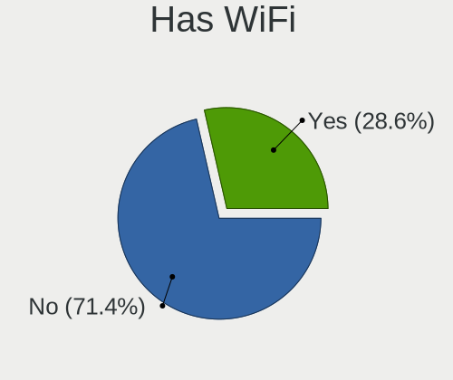
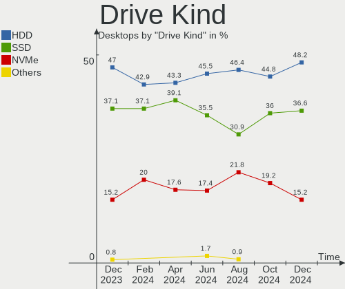

ROSA Hardware Trends (Desktops)
-------------------------------

A project to identify most popular hardware characteristics and track their change
over time based on data collected by ROSA users at https://Linux-Hardware.org.

Anyone can contribute to this report by the [hw-probe](https://github.com/linuxhw/hw-probe) tool:

    sudo -E hw-probe -all -upload

Full-feature report is available here: https://linux-hardware.org/?view=trends&formfactor=desktop

Period: Sep, 2021.

Contents
--------

* [ System ](#system)
  - [ OS                       ](#os)
  - [ OS Family                ](#os-family)
  - [ Kernel                   ](#kernel)
  - [ Kernel Family            ](#kernel-family)
  - [ Kernel Major Ver.        ](#kernel-major-ver)
  - [ Arch                     ](#arch)
  - [ DE                       ](#de)
  - [ Display Server           ](#display-server)
  - [ Display Manager          ](#display-manager)
  - [ OS Lang                  ](#os-lang)
  - [ Boot Mode                ](#boot-mode)
  - [ Filesystem               ](#filesystem)
  - [ Part. scheme             ](#part-scheme)
  - [ Dual Boot with Linux/BSD ](#dual-boot-with-linuxbsd)
  - [ Dual Boot (Win)          ](#dual-boot-win)

* [ Board ](#board)
  - [ Vendor                   ](#vendor)
  - [ Model                    ](#model)
  - [ Model Family             ](#model-family)
  - [ MFG Year                 ](#mfg-year)
  - [ Form Factor              ](#form-factor)
  - [ Secure Boot              ](#secure-boot)
  - [ Coreboot                 ](#coreboot)
  - [ RAM Size                 ](#ram-size)
  - [ RAM Used                 ](#ram-used)
  - [ Total Drives             ](#total-drives)
  - [ Has CD-ROM               ](#has-cd-rom)
  - [ Has Ethernet             ](#has-ethernet)
  - [ Has WiFi                 ](#has-wifi)
  - [ Has Bluetooth            ](#has-bluetooth)

* [ Location ](#location)
  - [ Country                  ](#country)
  - [ City                     ](#city)

* [ Drives ](#drives)
  - [ Drive Vendor             ](#drive-vendor)
  - [ Drive Model              ](#drive-model)
  - [ HDD Vendor               ](#hdd-vendor)
  - [ SSD Vendor               ](#ssd-vendor)
  - [ Drive Kind               ](#drive-kind)
  - [ Drive Connector          ](#drive-connector)
  - [ Drive Size               ](#drive-size)
  - [ Space Total              ](#space-total)
  - [ Space Used               ](#space-used)
  - [ Malfunc. Drives          ](#malfunc-drives)
  - [ Malfunc. Drive Vendor    ](#malfunc-drive-vendor)
  - [ Malfunc. HDD Vendor      ](#malfunc-hdd-vendor)
  - [ Malfunc. Drive Kind      ](#malfunc-drive-kind)
  - [ Failed Drives            ](#failed-drives)
  - [ Failed Drive Vendor      ](#failed-drive-vendor)
  - [ Drive Status             ](#drive-status)

* [ Storage controller ](#storage-controller)
  - [ Storage Vendor           ](#storage-vendor)
  - [ Storage Model            ](#storage-model)
  - [ Storage Kind             ](#storage-kind)

* [ Processor ](#processor)
  - [ CPU Vendor               ](#cpu-vendor)
  - [ CPU Model                ](#cpu-model)
  - [ CPU Model Family         ](#cpu-model-family)
  - [ CPU Cores                ](#cpu-cores)
  - [ CPU Sockets              ](#cpu-sockets)
  - [ CPU Threads              ](#cpu-threads)
  - [ CPU Op-Modes             ](#cpu-op-modes)
  - [ CPU Microcode            ](#cpu-microcode)
  - [ CPU Microarch            ](#cpu-microarch)

* [ Graphics ](#graphics)
  - [ GPU Vendor               ](#gpu-vendor)
  - [ GPU Model                ](#gpu-model)
  - [ GPU Combo                ](#gpu-combo)
  - [ GPU Driver               ](#gpu-driver)
  - [ GPU Memory               ](#gpu-memory)

* [ Monitor ](#monitor)
  - [ Monitor Vendor           ](#monitor-vendor)
  - [ Monitor Model            ](#monitor-model)
  - [ Monitor Resolution       ](#monitor-resolution)
  - [ Monitor Diagonal         ](#monitor-diagonal)
  - [ Monitor Width            ](#monitor-width)
  - [ Aspect Ratio             ](#aspect-ratio)
  - [ Monitor Area             ](#monitor-area)
  - [ Pixel Density            ](#pixel-density)
  - [ Multiple Monitors        ](#multiple-monitors)

* [ Network ](#network)
  - [ Net Controller Vendor    ](#net-controller-vendor)
  - [ Net Controller Model     ](#net-controller-model)
  - [ Wireless Vendor          ](#wireless-vendor)
  - [ Wireless Model           ](#wireless-model)
  - [ Ethernet Vendor          ](#ethernet-vendor)
  - [ Ethernet Model           ](#ethernet-model)
  - [ Net Controller Kind      ](#net-controller-kind)
  - [ Used Controller          ](#used-controller)
  - [ NICs                     ](#nics)
  - [ IPv6                     ](#ipv6)

* [ Bluetooth ](#bluetooth)
  - [ Bluetooth Vendor         ](#bluetooth-vendor)
  - [ Bluetooth Model          ](#bluetooth-model)

* [ Sound ](#sound)
  - [ Sound Vendor             ](#sound-vendor)
  - [ Sound Model              ](#sound-model)

* [ Memory ](#memory)
  - [ Memory Vendor            ](#memory-vendor)
  - [ Memory Model             ](#memory-model)
  - [ Memory Kind              ](#memory-kind)
  - [ Memory Form Factor       ](#memory-form-factor)
  - [ Memory Size              ](#memory-size)
  - [ Memory Speed             ](#memory-speed)

* [ Printers & scanners ](#printers--scanners)
  - [ Printer Vendor           ](#printer-vendor)
  - [ Printer Model            ](#printer-model)
  - [ Scanner Vendor           ](#scanner-vendor)
  - [ Scanner Model            ](#scanner-model)

* [ Camera ](#camera)
  - [ Camera Vendor            ](#camera-vendor)
  - [ Camera Model             ](#camera-model)

* [ Security ](#security)
  - [ Fingerprint Vendor       ](#fingerprint-vendor)
  - [ Fingerprint Model        ](#fingerprint-model)
  - [ Chipcard Vendor          ](#chipcard-vendor)
  - [ Chipcard Model           ](#chipcard-model)

* [ Unsupported ](#unsupported)
  - [ Unsupported Devices      ](#unsupported-devices)
  - [ Unsupported Device Types ](#unsupported-device-types)

System
------

OS
--

Installed operating systems

| Name       | Desktops | Percent |
|------------|----------|---------|
| ROSA R11.1 | 46       | 75.41%  |
| ROSA R12   | 10       | 16.39%  |
| ROSA R11   | 4        | 6.56%   |
| ROSA R8.1  | 1        | 1.64%   |

OS Family
---------

OS without a version

| Name | Desktops | Percent |
|------|----------|---------|
| ROSA | 61       | 100%    |

Kernel
------

Version of the Linux kernel

| Version                                | Desktops | Percent |
|----------------------------------------|----------|---------|
| 5.4.83-generic-2rosa-x86_64            | 12       | 19.67%  |
| 4.15.0-desktop-122.124.1rosa-x86_64    | 12       | 19.67%  |
| 5.4.32-generic-2rosa-x86_64            | 10       | 16.39%  |
| 5.10.56-generic-1rosa2021.1-x86_64     | 7        | 11.48%  |
| 5.4.32-generic-2rosa-i586              | 5        | 8.2%    |
| 4.15.0-desktop-45.1rosa-x86_64         | 3        | 4.92%   |
| 5.10.65-generic-2rosa2021.1-x86_64     | 2        | 3.28%   |
| 4.9.155-nrj-desktop-1rosa-x86_64       | 2        | 3.28%   |
| 4.15.0-desktop-45.1rosa-i586           | 2        | 3.28%   |
| 4.15.0-desktop-122.124.1rosa-i586      | 2        | 3.28%   |
| 5.4.83-generic-2rosa-i586              | 1        | 1.64%   |
| 5.14.0.xm1-10-xanmod-rosa2021.1-x86_64 | 1        | 1.64%   |
| 5.10.50-generic-1rosa-x86_64           | 1        | 1.64%   |
| 4.15.0-desktop-94.1rosa-x86_64         | 1        | 1.64%   |

Kernel Family
-------------

Linux kernel without a distro release

| Version | Desktops | Percent |
|---------|----------|---------|
| 4.15.0  | 20       | 32.79%  |
| 5.4.32  | 15       | 24.59%  |
| 5.4.83  | 13       | 21.31%  |
| 5.10.56 | 7        | 11.48%  |
| 5.10.65 | 2        | 3.28%   |
| 4.9.155 | 2        | 3.28%   |
| 5.14.0  | 1        | 1.64%   |
| 5.10.50 | 1        | 1.64%   |

Kernel Major Ver.
-----------------

Linux kernel major version

| Version | Desktops | Percent |
|---------|----------|---------|
| 5.4     | 28       | 45.9%   |
| 4.15    | 20       | 32.79%  |
| 5.10    | 10       | 16.39%  |
| 4.9     | 2        | 3.28%   |
| 5.14    | 1        | 1.64%   |

Arch
----

OS architecture (x86_64, i586, etc.)

| Name   | Desktops | Percent |
|--------|----------|---------|
| x86_64 | 51       | 83.61%  |
| i686   | 10       | 16.39%  |

DE
--

Desktop Environment

| Name  | Desktops | Percent |
|-------|----------|---------|
| KDE4  | 32       | 52.46%  |
| KDE5  | 19       | 31.15%  |
| LXQt  | 7        | 11.48%  |
| GNOME | 2        | 3.28%   |
| XFCE  | 1        | 1.64%   |

Display Server
--------------

X11 or Wayland

| Name    | Desktops | Percent |
|---------|----------|---------|
| X11     | 54       | 88.52%  |
| Wayland | 7        | 11.48%  |

Display Manager
---------------

SDDM, LightDM, etc.

| Name | Desktops | Percent |
|------|----------|---------|
| KDM  | 33       | 54.1%   |
| SDDM | 20       | 32.79%  |
| GDM  | 8        | 13.11%  |

OS Lang
-------

Language

| Lang    | Desktops | Percent |
|---------|----------|---------|
| ru_RU   | 50       | 81.97%  |
| Unknown | 5        | 8.2%    |
| pl_PL   | 2        | 3.28%   |
| en_US   | 2        | 3.28%   |
| es_ES   | 1        | 1.64%   |
| de_DE   | 1        | 1.64%   |

Boot Mode
---------

EFI or BIOS

| Mode | Desktops | Percent |
|------|----------|---------|
| BIOS | 42       | 68.85%  |
| EFI  | 19       | 31.15%  |

Filesystem
----------

Type of filesystem

| Type  | Desktops | Percent |
|-------|----------|---------|
| Ext4  | 60       | 98.36%  |
| Btrfs | 1        | 1.64%   |

Part. scheme
------------

Scheme of partitioning

| Type | Desktops | Percent |
|------|----------|---------|
| MBR  | 37       | 60.66%  |
| GPT  | 24       | 39.34%  |

Dual Boot with Linux/BSD
------------------------

Hosting more than one Linux/BSD

| Dual boot | Desktops | Percent |
|-----------|----------|---------|
| No        | 42       | 68.85%  |
| Yes       | 19       | 31.15%  |

Dual Boot (Win)
---------------

Hosting Linux and Windows

| Dual boot | Desktops | Percent |
|-----------|----------|---------|
| No        | 35       | 57.38%  |
| Yes       | 26       | 42.62%  |

Board
-----

Vendor
------

Motherboard manufacturer

| Name                | Desktops | Percent |
|---------------------|----------|---------|
| ASUSTek Computer    | 20       | 32.79%  |
| Gigabyte Technology | 16       | 26.23%  |
| MSI                 | 8        | 13.11%  |
| ASRock              | 6        | 9.84%   |
| Huanan              | 2        | 3.28%   |
| Hewlett-Packard     | 2        | 3.28%   |
| Unknown             | 2        | 3.28%   |
| Pegatron            | 1        | 1.64%   |
| Intel               | 1        | 1.64%   |
| ECS                 | 1        | 1.64%   |
| Dell                | 1        | 1.64%   |
| Acer                | 1        | 1.64%   |

Model
-----

Motherboard model

| Name                               | Desktops | Percent |
|------------------------------------|----------|---------|
| ASUS All Series                    | 2        | 3.28%   |
| Unknown                            | 2        | 3.28%   |
| Pegatron Compaq dx2400 Microtower  | 1        | 1.64%   |
| MSI MS-7C52                        | 1        | 1.64%   |
| MSI MS-7B53                        | 1        | 1.64%   |
| MSI MS-7A36                        | 1        | 1.64%   |
| MSI MS-7895                        | 1        | 1.64%   |
| MSI MS-7788                        | 1        | 1.64%   |
| MSI MS-7758                        | 1        | 1.64%   |
| MSI MS-7599                        | 1        | 1.64%   |
| MSI Compaq dx7400 Microtower       | 1        | 1.64%   |
| Intel H61M-S1                      | 1        | 1.64%   |
| Huanan X99-8M-F V1.1               | 1        | 1.64%   |
| Huanan X99 F8D V2.2                | 1        | 1.64%   |
| HP EliteDesk 800 G1 TWR            | 1        | 1.64%   |
| HP Compaq dc7900 Small Form Factor | 1        | 1.64%   |
| Gigabyte Z87P-D3                   | 1        | 1.64%   |
| Gigabyte Z390 AORUS ELITE          | 1        | 1.64%   |
| Gigabyte M61PME-S2P                | 1        | 1.64%   |
| Gigabyte H77-DS3H                  | 1        | 1.64%   |
| Gigabyte H61M-S2PV                 | 1        | 1.64%   |
| Gigabyte H61M-S1                   | 1        | 1.64%   |
| Gigabyte GA-MA790X-UD4             | 1        | 1.64%   |
| Gigabyte G31M-S2C                  | 1        | 1.64%   |
| Gigabyte F2A68HM-DS2               | 1        | 1.64%   |
| Gigabyte EX58-UD5                  | 1        | 1.64%   |
| Gigabyte B450M S2H                 | 1        | 1.64%   |
| Gigabyte B450M DS3H V2             | 1        | 1.64%   |
| Gigabyte B250M-D3H                 | 1        | 1.64%   |
| Gigabyte AB350M-DS3H V2            | 1        | 1.64%   |
| Gigabyte AB350-Gaming              | 1        | 1.64%   |
| Gigabyte 8I915P Pro                | 1        | 1.64%   |
| ECS LIVA ONE A320                  | 1        | 1.64%   |
| Dell OptiPlex 9020M                | 1        | 1.64%   |
| ASUS TERRA_PC                      | 1        | 1.64%   |
| ASUS PRIME H310M-R R2.0            | 1        | 1.64%   |
| ASUS PRIME B450M-A                 | 1        | 1.64%   |
| ASUS P8Z77-V DELUXE                | 1        | 1.64%   |
| ASUS P8Z77-M PRO                   | 1        | 1.64%   |
| ASUS P8H67                         | 1        | 1.64%   |
| ASUS P8H61-M LX3 R2.0              | 1        | 1.64%   |
| ASUS P8H61-M LX3                   | 1        | 1.64%   |
| ASUS P8H61-M LX2 R2.0              | 1        | 1.64%   |
| ASUS P8H61-M LE                    | 1        | 1.64%   |
| ASUS P5QC                          | 1        | 1.64%   |
| ASUS P5LD2-SE                      | 1        | 1.64%   |
| ASUS P5KPL/1600                    | 1        | 1.64%   |
| ASUS P5KPL-AM EPU                  | 1        | 1.64%   |
| ASUS P5KPL-AM                      | 1        | 1.64%   |
| ASUS P5G41T-M LX2/GB               | 1        | 1.64%   |
| ASUS P4P800-VM                     | 1        | 1.64%   |
| ASUS M4A77TD                       | 1        | 1.64%   |
| ASRock P43DE3                      | 1        | 1.64%   |
| ASRock P41C-DE                     | 1        | 1.64%   |
| ASRock N68C-GS UCC                 | 1        | 1.64%   |
| ASRock G31M-VS                     | 1        | 1.64%   |
| ASRock A520M Pro4                  | 1        | 1.64%   |
| ASRock 970 Pro3 R2.0               | 1        | 1.64%   |
| Acer Extensa E210                  | 1        | 1.64%   |

Model Family
------------

Motherboard model prefix

| Name                   | Desktops | Percent |
|------------------------|----------|---------|
| ASUS P8H61-M           | 4        | 6.56%   |
| Gigabyte B450M         | 2        | 3.28%   |
| ASUS PRIME             | 2        | 3.28%   |
| ASUS P5KPL-AM          | 2        | 3.28%   |
| ASUS All               | 2        | 3.28%   |
| Unknown                | 2        | 3.28%   |
| Pegatron Compaq        | 1        | 1.64%   |
| MSI MS-7C52            | 1        | 1.64%   |
| MSI MS-7B53            | 1        | 1.64%   |
| MSI MS-7A36            | 1        | 1.64%   |
| MSI MS-7895            | 1        | 1.64%   |
| MSI MS-7788            | 1        | 1.64%   |
| MSI MS-7758            | 1        | 1.64%   |
| MSI MS-7599            | 1        | 1.64%   |
| MSI Compaq             | 1        | 1.64%   |
| Intel H61M-S1          | 1        | 1.64%   |
| Huanan X99-8M-F        | 1        | 1.64%   |
| Huanan X99             | 1        | 1.64%   |
| HP EliteDesk           | 1        | 1.64%   |
| HP Compaq              | 1        | 1.64%   |
| Gigabyte Z87P-D3       | 1        | 1.64%   |
| Gigabyte Z390          | 1        | 1.64%   |
| Gigabyte M61PME-S2P    | 1        | 1.64%   |
| Gigabyte H77-DS3H      | 1        | 1.64%   |
| Gigabyte H61M-S2PV     | 1        | 1.64%   |
| Gigabyte H61M-S1       | 1        | 1.64%   |
| Gigabyte GA-MA790X-UD4 | 1        | 1.64%   |
| Gigabyte G31M-S2C      | 1        | 1.64%   |
| Gigabyte F2A68HM-DS2   | 1        | 1.64%   |
| Gigabyte EX58-UD5      | 1        | 1.64%   |
| Gigabyte B250M-D3H     | 1        | 1.64%   |
| Gigabyte AB350M-DS3H   | 1        | 1.64%   |
| Gigabyte AB350-Gaming  | 1        | 1.64%   |
| Gigabyte 8I915P        | 1        | 1.64%   |
| ECS LIVA               | 1        | 1.64%   |
| Dell OptiPlex          | 1        | 1.64%   |
| ASUS TERRA             | 1        | 1.64%   |
| ASUS P8Z77-V           | 1        | 1.64%   |
| ASUS P8Z77-M           | 1        | 1.64%   |
| ASUS P8H67             | 1        | 1.64%   |
| ASUS P5QC              | 1        | 1.64%   |
| ASUS P5LD2-SE          | 1        | 1.64%   |
| ASUS P5KPL             | 1        | 1.64%   |
| ASUS P5G41T-M          | 1        | 1.64%   |
| ASUS P4P800-VM         | 1        | 1.64%   |
| ASUS M4A77TD           | 1        | 1.64%   |
| ASRock P43DE3          | 1        | 1.64%   |
| ASRock P41C-DE         | 1        | 1.64%   |
| ASRock N68C-GS         | 1        | 1.64%   |
| ASRock G31M-VS         | 1        | 1.64%   |
| ASRock A520M           | 1        | 1.64%   |
| ASRock 970             | 1        | 1.64%   |
| Acer Extensa           | 1        | 1.64%   |

MFG Year
--------

Motherboard manufacture year

| Year | Desktops | Percent |
|------|----------|---------|
| 2012 | 8        | 13.11%  |
| 2013 | 7        | 11.48%  |
| 2019 | 6        | 9.84%   |
| 2010 | 6        | 9.84%   |
| 2009 | 6        | 9.84%   |
| 2021 | 4        | 6.56%   |
| 2020 | 4        | 6.56%   |
| 2018 | 3        | 4.92%   |
| 2014 | 3        | 4.92%   |
| 2008 | 3        | 4.92%   |
| 2007 | 3        | 4.92%   |
| 2016 | 2        | 3.28%   |
| 2015 | 2        | 3.28%   |
| 2005 | 2        | 3.28%   |
| 2017 | 1        | 1.64%   |
| 2011 | 1        | 1.64%   |

Form Factor
-----------

Physical design of the computer

| Name    | Desktops | Percent |
|---------|----------|---------|
| Desktop | 61       | 100%    |

Secure Boot
-----------

Enabled or disabled

| State    | Desktops | Percent |
|----------|----------|---------|
| Disabled | 61       | 100%    |

Coreboot
--------

Have coreboot on board

| Used | Desktops | Percent |
|------|----------|---------|
| No   | 61       | 100%    |

RAM Size
--------

Total RAM memory

| Size in GB  | Desktops | Percent |
|-------------|----------|---------|
| 3.01-4.0    | 22       | 36.07%  |
| 8.01-16.0   | 13       | 21.31%  |
| 16.01-24.0  | 9        | 14.75%  |
| 4.01-8.0    | 8        | 13.11%  |
| 1.01-2.0    | 4        | 6.56%   |
| 2.01-3.0    | 3        | 4.92%   |
| 32.01-64.0  | 1        | 1.64%   |
| 64.01-256.0 | 1        | 1.64%   |

RAM Used
--------

Used RAM memory

| Used GB  | Desktops | Percent |
|----------|----------|---------|
| 0.51-1.0 | 27       | 44.26%  |
| 1.01-2.0 | 20       | 32.79%  |
| 2.01-3.0 | 9        | 14.75%  |
| 4.01-8.0 | 3        | 4.92%   |
| 3.01-4.0 | 2        | 3.28%   |

Total Drives
------------

Number of drives on board

| Drives | Desktops | Percent |
|--------|----------|---------|
| 1      | 30       | 49.18%  |
| 2      | 20       | 32.79%  |
| 3      | 5        | 8.2%    |
| 4      | 3        | 4.92%   |
| 6      | 1        | 1.64%   |
| 5      | 1        | 1.64%   |
| 0      | 1        | 1.64%   |

Has CD-ROM
----------

Has CD-ROM on board

| Presented | Desktops | Percent |
|-----------|----------|---------|
| Yes       | 32       | 52.46%  |
| No        | 29       | 47.54%  |

Has Ethernet
------------

Has Ethernet on board

| Presented | Desktops | Percent |
|-----------|----------|---------|
| Yes       | 60       | 98.36%  |
| No        | 1        | 1.64%   |

Has WiFi
--------

Has WiFi module

| Presented | Desktops | Percent |
|-----------|----------|---------|
| No        | 37       | 60.66%  |
| Yes       | 24       | 39.34%  |

Has Bluetooth
-------------

Has Bluetooth module

| Presented | Desktops | Percent |
|-----------|----------|---------|
| No        | 51       | 83.61%  |
| Yes       | 10       | 16.39%  |

Location
--------

Country
-------

Geographic location (country)

| Country    | Desktops | Percent |
|------------|----------|---------|
| Russia     | 48       | 78.69%  |
| Ukraine    | 6        | 9.84%   |
| Belarus    | 2        | 3.28%   |
| Uruguay    | 1        | 1.64%   |
| Sweden     | 1        | 1.64%   |
| Poland     | 1        | 1.64%   |
| Kazakhstan | 1        | 1.64%   |
| Germany    | 1        | 1.64%   |

City
----

Geographic location (city)

| City                | Desktops | Percent |
|---------------------|----------|---------|
| Moscow              | 7        | 11.48%  |
| Irkutsk             | 3        | 4.92%   |
| Tyumen              | 2        | 3.28%   |
| Tver                | 2        | 3.28%   |
| Tula                | 2        | 3.28%   |
| St Petersburg       | 2        | 3.28%   |
| Saratov             | 2        | 3.28%   |
| Saransk             | 2        | 3.28%   |
| Zaporizhzhya        | 1        | 1.64%   |
| Voronezh            | 1        | 1.64%   |
| Vologda             | 1        | 1.64%   |
| Vladimir            | 1        | 1.64%   |
| Vitebsk             | 1        | 1.64%   |
| Troitsk             | 1        | 1.64%   |
| Tolyatti            | 1        | 1.64%   |
| Ternovka            | 1        | 1.64%   |
| Sundbyberg          | 1        | 1.64%   |
| Srednyaya Akhtuba   | 1        | 1.64%   |
| Shchelkovo          | 1        | 1.64%   |
| Severodvinsk        | 1        | 1.64%   |
| Rzgow               | 1        | 1.64%   |
| Rybinsk             | 1        | 1.64%   |
| Pyatigorsk          | 1        | 1.64%   |
| Pushchino           | 1        | 1.64%   |
| Pervomaysk          | 1        | 1.64%   |
| Orenburg            | 1        | 1.64%   |
| Omsk                | 1        | 1.64%   |
| Novosibirsk         | 1        | 1.64%   |
| Nogaisk             | 1        | 1.64%   |
| Naberezhnyye Chelny | 1        | 1.64%   |
| Minsk               | 1        | 1.64%   |
| Makiivka            | 1        | 1.64%   |
| Luhansk             | 1        | 1.64%   |
| Lipetsk             | 1        | 1.64%   |
| Kyiv                | 1        | 1.64%   |
| Krasnoyarsk         | 1        | 1.64%   |
| Krasnodar           | 1        | 1.64%   |
| Kharkiv             | 1        | 1.64%   |
| Kemerovo            | 1        | 1.64%   |
| Karaganda           | 1        | 1.64%   |
| Karachev            | 1        | 1.64%   |
| Gatchina            | 1        | 1.64%   |
| Elektrostal         | 1        | 1.64%   |
| Dachau              | 1        | 1.64%   |
| Carrasco            | 1        | 1.64%   |
| Blagoveshchensk     | 1        | 1.64%   |
| Belebey             | 1        | 1.64%   |

Drives
------

Drive Vendor
------------

Hard drive vendors

| Vendor              | Desktops | Drives | Percent |
|---------------------|----------|--------|---------|
| WDC                 | 25       | 26     | 26.04%  |
| Seagate             | 23       | 29     | 23.96%  |
| Toshiba             | 9        | 9      | 9.38%   |
| Samsung Electronics | 7        | 7      | 7.29%   |
| Kingston            | 4        | 4      | 4.17%   |
| KingSpec            | 3        | 3      | 3.13%   |
| Hitachi             | 3        | 3      | 3.13%   |
| GOODRAM             | 3        | 4      | 3.13%   |
| Unknown             | 2        | 3      | 2.08%   |
| Intel               | 2        | 2      | 2.08%   |
| China               | 2        | 2      | 2.08%   |
| A-DATA Technology   | 2        | 2      | 2.08%   |
| SanDisk             | 1        | 1      | 1.04%   |
| Palit               | 1        | 1      | 1.04%   |
| MAXTOR              | 1        | 1      | 1.04%   |
| Kingmax             | 1        | 1      | 1.04%   |
| JMicron             | 1        | 1      | 1.04%   |
| HUAWEI              | 1        | 1      | 1.04%   |
| HGST                | 1        | 1      | 1.04%   |
| Fujitsu             | 1        | 1      | 1.04%   |
| FOXLINE             | 1        | 1      | 1.04%   |
| Crucial             | 1        | 1      | 1.04%   |
| Apacer              | 1        | 2      | 1.04%   |

Drive Model
-----------

Hard drive models

| Model                               | Desktops | Percent |
|-------------------------------------|----------|---------|
| Toshiba HDWD110 1TB                 | 4        | 3.92%   |
| Seagate ST1000DM010-2EP102 1TB      | 4        | 3.92%   |
| Seagate ST3250310AS 250GB           | 3        | 2.94%   |
| Toshiba DT01ACA100 1TB              | 2        | 1.96%   |
| Seagate ST500LT012-1DG142 500GB     | 2        | 1.96%   |
| Seagate ST3160815AS 160GB           | 2        | 1.96%   |
| WDC WDS240G2G0B-00EPW0 240GB SSD    | 1        | 0.98%   |
| WDC WDS240G1G0A-00SS50 240GB SSD    | 1        | 0.98%   |
| WDC WDS120G2G0B-00EPW0 120GB SSD    | 1        | 0.98%   |
| WDC WD800JB-00JJC0 80GB             | 1        | 0.98%   |
| WDC WD7500AALX-009BA0 752GB         | 1        | 0.98%   |
| WDC WD5003AZEX-00K1GA0 500GB        | 1        | 0.98%   |
| WDC WD5003ABYX-18WERA0 500GB        | 1        | 0.98%   |
| WDC WD5000LPVX-22V0TT0 500GB        | 1        | 0.98%   |
| WDC WD5000AZLX-22JKKA0 500GB        | 1        | 0.98%   |
| WDC WD5000AAKX-753CA1 500GB         | 1        | 0.98%   |
| WDC WD5000AADS-00M2B0 500GB         | 1        | 0.98%   |
| WDC WD4003FRYZ-01F0DB0 4TB          | 1        | 0.98%   |
| WDC WD3200JS-55PDB0 320GB           | 1        | 0.98%   |
| WDC WD3200BEKT-60V5T1 320GB         | 1        | 0.98%   |
| WDC WD3200AAKS-00YGA0 320GB         | 1        | 0.98%   |
| WDC WD20EZRZ-22Z5HB0 2TB            | 1        | 0.98%   |
| WDC WD20EARS-00MVWB0 2TB            | 1        | 0.98%   |
| WDC WD1600AAJS-00L7A0 160GB         | 1        | 0.98%   |
| WDC WD1200JD-00HBB0 120GB           | 1        | 0.98%   |
| WDC WD10JPVX-75JC3T0 1TB            | 1        | 0.98%   |
| WDC WD10EZRX-00L4HB0 1TB            | 1        | 0.98%   |
| WDC WD10EZRX-00A8LB0 1TB            | 1        | 0.98%   |
| WDC WD10EZEX-60ZF5A0 1TB            | 1        | 0.98%   |
| WDC WD10EZEX-21WN4A0 1TB            | 1        | 0.98%   |
| WDC WD10EZEX-08WN4A0 1TB            | 1        | 0.98%   |
| WDC WD10EZEX-00BN5A0 1TB            | 1        | 0.98%   |
| Unknown SD/MMC 64GB                 | 1        | 0.98%   |
| Unknown SCY  64GB                   | 1        | 0.98%   |
| Unknown M.S./M.S.Pro/HG 16GB        | 1        | 0.98%   |
| Toshiba TL100 240GB SSD             | 1        | 0.98%   |
| Toshiba HDWD105 500GB               | 1        | 0.98%   |
| Toshiba DT01ACA050 500GB            | 1        | 0.98%   |
| Seagate STM3500418AS 500GB          | 1        | 0.98%   |
| Seagate ST9500420AS 500GB           | 1        | 0.98%   |
| Seagate ST9250315AS 250GB           | 1        | 0.98%   |
| Seagate ST500DM002-1SB10A 500GB     | 1        | 0.98%   |
| Seagate ST500DM002-1BD142 500GB     | 1        | 0.98%   |
| Seagate ST380817AS 80GB             | 1        | 0.98%   |
| Seagate ST380815AS 80GB             | 1        | 0.98%   |
| Seagate ST3808110AS 80GB            | 1        | 0.98%   |
| Seagate ST380011A 80GB              | 1        | 0.98%   |
| Seagate ST3750640NS 752GB           | 1        | 0.98%   |
| Seagate ST3200827AS 200GB           | 1        | 0.98%   |
| Seagate ST2000DM001-1ER164 2TB      | 1        | 0.98%   |
| Seagate ST2000DM001-1CH164 2TB      | 1        | 0.98%   |
| Seagate ST1000VX000-1CU162 1TB      | 1        | 0.98%   |
| Seagate ST1000DM003-1SB10C 1TB      | 1        | 0.98%   |
| Seagate ST1000DM003-1ER162 1TB      | 1        | 0.98%   |
| SanDisk SD8SN8U-128G-1006 128GB SSD | 1        | 0.98%   |
| Samsung SSD 980 250GB               | 1        | 0.98%   |
| Samsung SSD 860 EVO 500GB           | 1        | 0.98%   |
| Samsung SSD 850 EVO 250GB           | 1        | 0.98%   |
| Samsung SSD 750 EVO 250GB           | 1        | 0.98%   |
| Samsung SP1614C 160GB               | 1        | 0.98%   |

HDD Vendor
----------

Hard disk drive vendors

| Vendor              | Desktops | Drives | Percent |
|---------------------|----------|--------|---------|
| Seagate             | 23       | 29     | 37.1%   |
| WDC                 | 22       | 23     | 35.48%  |
| Toshiba             | 8        | 8      | 12.9%   |
| Samsung Electronics | 3        | 3      | 4.84%   |
| Hitachi             | 3        | 3      | 4.84%   |
| MAXTOR              | 1        | 1      | 1.61%   |
| HGST                | 1        | 1      | 1.61%   |
| Fujitsu             | 1        | 1      | 1.61%   |

SSD Vendor
----------

Solid state drive vendors

| Vendor              | Desktops | Drives | Percent |
|---------------------|----------|--------|---------|
| Kingston            | 4        | 4      | 14.81%  |
| WDC                 | 3        | 3      | 11.11%  |
| Samsung Electronics | 3        | 3      | 11.11%  |
| KingSpec            | 3        | 3      | 11.11%  |
| GOODRAM             | 3        | 4      | 11.11%  |
| China               | 2        | 2      | 7.41%   |
| A-DATA Technology   | 2        | 2      | 7.41%   |
| Toshiba             | 1        | 1      | 3.7%    |
| SanDisk             | 1        | 1      | 3.7%    |
| Palit               | 1        | 1      | 3.7%    |
| Kingmax             | 1        | 1      | 3.7%    |
| Intel               | 1        | 1      | 3.7%    |
| FOXLINE             | 1        | 1      | 3.7%    |
| Apacer              | 1        | 2      | 3.7%    |

Drive Kind
----------

HDD or SSD

| Kind    | Desktops | Drives | Percent |
|---------|----------|--------|---------|
| HDD     | 49       | 69     | 61.25%  |
| SSD     | 24       | 29     | 30%     |
| NVMe    | 3        | 3      | 3.75%   |
| Unknown | 3        | 4      | 3.75%   |
| MMC     | 1        | 1      | 1.25%   |

Drive Connector
---------------

SATA, SAS, NVMe, etc.

| Type | Desktops | Drives | Percent |
|------|----------|--------|---------|
| SATA | 59       | 98     | 89.39%  |
| SAS  | 3        | 4      | 4.55%   |
| NVMe | 3        | 3      | 4.55%   |
| MMC  | 1        | 1      | 1.52%   |

Drive Size
----------

Size of hard drive

| Size in TB | Desktops | Drives | Percent |
|------------|----------|--------|---------|
| 0.01-0.5   | 49       | 65     | 65.33%  |
| 0.51-1.0   | 20       | 27     | 26.67%  |
| 1.01-2.0   | 4        | 4      | 5.33%   |
| 3.01-4.0   | 1        | 1      | 1.33%   |
| 4.01-10.0  | 1        | 1      | 1.33%   |

Space Total
-----------

Amount of disk space available on the file system

| Size in GB | Desktops | Percent |
|------------|----------|---------|
| 101-250    | 17       | 27.87%  |
| 501-1000   | 11       | 18.03%  |
| 51-100     | 11       | 18.03%  |
| 251-500    | 8        | 13.11%  |
| 1-20       | 6        | 9.84%   |
| 1001-2000  | 5        | 8.2%    |
| 21-50      | 2        | 3.28%   |
| 2001-3000  | 1        | 1.64%   |

Space Used
----------

Amount of used disk space

| Used GB   | Desktops | Percent |
|-----------|----------|---------|
| 1-20      | 36       | 59.02%  |
| 51-100    | 8        | 13.11%  |
| 101-250   | 6        | 9.84%   |
| 21-50     | 5        | 8.2%    |
| 501-1000  | 3        | 4.92%   |
| 251-500   | 2        | 3.28%   |
| 1001-2000 | 1        | 1.64%   |

Malfunc. Drives
---------------

Drive models with a malfunction

| Model                             | Desktops | Drives | Percent |
|-----------------------------------|----------|--------|---------|
| Seagate ST3250310AS 250GB         | 3        | 3      | 12%     |
| Seagate ST500LT012-1DG142 500GB   | 2        | 2      | 8%      |
| WDC WD800JB-00JJC0 80GB           | 1        | 1      | 4%      |
| WDC WD5000AZLX-22JKKA0 500GB      | 1        | 1      | 4%      |
| WDC WD3200BEKT-60V5T1 320GB       | 1        | 1      | 4%      |
| WDC WD20EARS-00MVWB0 2TB          | 1        | 1      | 4%      |
| WDC WD1600AAJS-00L7A0 160GB       | 1        | 1      | 4%      |
| WDC WD1200JD-00HBB0 120GB         | 1        | 1      | 4%      |
| WDC WD10JPVX-75JC3T0 1TB          | 1        | 1      | 4%      |
| Toshiba DT01ACA050 500GB          | 1        | 1      | 4%      |
| Seagate STM3500418AS 500GB        | 1        | 1      | 4%      |
| Seagate ST9500420AS 500GB         | 1        | 1      | 4%      |
| Seagate ST9250315AS 250GB         | 1        | 1      | 4%      |
| Seagate ST3808110AS 80GB          | 1        | 1      | 4%      |
| Seagate ST3750640NS 752GB         | 1        | 2      | 4%      |
| Samsung Electronics SP1614C 160GB | 1        | 1      | 4%      |
| Samsung Electronics HD080HJ 80GB  | 1        | 1      | 4%      |
| MAXTOR 2B020H1 20GB               | 1        | 1      | 4%      |
| KingSpec P3-256 256GB SSD         | 1        | 1      | 4%      |
| Kingmax SSD 120GB                 | 1        | 1      | 4%      |
| Hitachi HDT721016SLA380 160GB     | 1        | 1      | 4%      |
| Fujitsu MHT2040BH 40GB            | 1        | 1      | 4%      |

Malfunc. Drive Vendor
---------------------

Vendors of faulty drives

| Vendor              | Desktops | Drives | Percent |
|---------------------|----------|--------|---------|
| Seagate             | 9        | 11     | 37.5%   |
| WDC                 | 7        | 7      | 29.17%  |
| Samsung Electronics | 2        | 2      | 8.33%   |
| Toshiba             | 1        | 1      | 4.17%   |
| MAXTOR              | 1        | 1      | 4.17%   |
| KingSpec            | 1        | 1      | 4.17%   |
| Kingmax             | 1        | 1      | 4.17%   |
| Hitachi             | 1        | 1      | 4.17%   |
| Fujitsu             | 1        | 1      | 4.17%   |

Malfunc. HDD Vendor
-------------------

Vendors of faulty HDD drives

| Vendor              | Desktops | Drives | Percent |
|---------------------|----------|--------|---------|
| Seagate             | 9        | 11     | 40.91%  |
| WDC                 | 7        | 7      | 31.82%  |
| Samsung Electronics | 2        | 2      | 9.09%   |
| Toshiba             | 1        | 1      | 4.55%   |
| MAXTOR              | 1        | 1      | 4.55%   |
| Hitachi             | 1        | 1      | 4.55%   |
| Fujitsu             | 1        | 1      | 4.55%   |

Malfunc. Drive Kind
-------------------

Kinds of faulty drives

| Kind | Desktops | Drives | Percent |
|------|----------|--------|---------|
| HDD  | 19       | 24     | 90.48%  |
| SSD  | 2        | 2      | 9.52%   |

Failed Drives
-------------

Failed drive models

Zero info for selected period =(

Failed Drive Vendor
-------------------

Failed drive vendors

Zero info for selected period =(

Drive Status
------------

Number of failed and malfunc. drives

| Status   | Desktops | Drives | Percent |
|----------|----------|--------|---------|
| Works    | 49       | 76     | 68.06%  |
| Malfunc  | 20       | 26     | 27.78%  |
| Detected | 3        | 4      | 4.17%   |

Storage controller
------------------

Storage Vendor
--------------

Storage controller vendors

| Vendor                    | Desktops | Percent |
|---------------------------|----------|---------|
| Intel                     | 44       | 63.77%  |
| AMD                       | 16       | 23.19%  |
| VIA Technologies          | 2        | 2.9%    |
| Nvidia                    | 2        | 2.9%    |
| Samsung Electronics       | 1        | 1.45%   |
| Micron/Crucial Technology | 1        | 1.45%   |
| Marvell Technology Group  | 1        | 1.45%   |
| JMicron Technology        | 1        | 1.45%   |
| ASMedia Technology        | 1        | 1.45%   |

Storage Model
-------------

Storage controller models

| Model                                                                                   | Desktops | Percent |
|-----------------------------------------------------------------------------------------|----------|---------|
| Intel NM10/ICH7 Family SATA Controller [IDE mode]                                       | 9        | 8.65%   |
| Intel 82801G (ICH7 Family) IDE Controller                                               | 8        | 7.69%   |
| AMD FCH SATA Controller [AHCI mode]                                                     | 8        | 7.69%   |
| Intel 8 Series/C220 Series Chipset Family 6-port SATA Controller 1 [AHCI mode]          | 6        | 5.77%   |
| Intel 6 Series/C200 Series Chipset Family Desktop SATA Controller (IDE mode, ports 4-5) | 5        | 4.81%   |
| Intel 6 Series/C200 Series Chipset Family Desktop SATA Controller (IDE mode, ports 0-3) | 5        | 4.81%   |
| Intel 6 Series/C200 Series Chipset Family 6 port Desktop SATA AHCI Controller           | 4        | 3.85%   |
| AMD SB7x0/SB8x0/SB9x0 IDE Controller                                                    | 4        | 3.85%   |
| AMD 400 Series Chipset SATA Controller                                                  | 4        | 3.85%   |
| Intel 7 Series/C210 Series Chipset Family 6-port SATA Controller [AHCI mode]            | 3        | 2.88%   |
| AMD SB7x0/SB8x0/SB9x0 SATA Controller [IDE mode]                                        | 3        | 2.88%   |
| VIA VT6415 PATA IDE Host Controller                                                     | 2        | 1.92%   |
| Nvidia MCP61 SATA Controller                                                            | 2        | 1.92%   |
| Nvidia MCP61 IDE                                                                        | 2        | 1.92%   |
| Intel Cannon Lake PCH SATA AHCI Controller                                              | 2        | 1.92%   |
| Intel 82801JI (ICH10 Family) 4 port SATA IDE Controller #1                              | 2        | 1.92%   |
| Intel 82801JI (ICH10 Family) 2 port SATA IDE Controller #2                              | 2        | 1.92%   |
| Intel 82801I (ICH9 Family) 2 port SATA Controller [IDE mode]                            | 2        | 1.92%   |
| Intel 200 Series PCH SATA controller [AHCI mode]                                        | 2        | 1.92%   |
| AMD FCH SATA Controller [IDE mode]                                                      | 2        | 1.92%   |
| AMD FCH SATA Controller D                                                               | 2        | 1.92%   |
| AMD 300 Series Chipset SATA Controller                                                  | 2        | 1.92%   |
| Samsung NVMe SSD Controller 980                                                         | 1        | 0.96%   |
| Micron/Crucial P2 NVMe PCIe SSD                                                         | 1        | 0.96%   |
| Marvell Group 88SE6111/6121 SATA II / PATA Controller                                   | 1        | 0.96%   |
| JMicron JMB363 SATA/IDE Controller                                                      | 1        | 0.96%   |
| Intel SSD Pro 7600p/760p/E 6100p Series                                                 | 1        | 0.96%   |
| Intel Celeron/Pentium Silver Processor SATA Controller                                  | 1        | 0.96%   |
| Intel C610/X99 series chipset 6-Port SATA Controller [AHCI mode]                        | 1        | 0.96%   |
| Intel 9 Series Chipset Family SATA Controller [AHCI Mode]                               | 1        | 0.96%   |
| Intel 82801JI (ICH10 Family) SATA AHCI Controller                                       | 1        | 0.96%   |
| Intel 82801JD/DO (ICH10 Family) SATA AHCI Controller                                    | 1        | 0.96%   |
| Intel 82801IR/IO/IH (ICH9R/DO/DH) 4 port SATA Controller [IDE mode]                     | 1        | 0.96%   |
| Intel 82801IB (ICH9) 2 port SATA Controller [IDE mode]                                  | 1        | 0.96%   |
| Intel 82801FB/FW (ICH6/ICH6W) SATA Controller                                           | 1        | 0.96%   |
| Intel 82801EB/ER (ICH5/ICH5R) IDE Controller                                            | 1        | 0.96%   |
| Intel 7 Series/C210 Series Chipset Family 4-port SATA Controller [IDE mode]             | 1        | 0.96%   |
| Intel 7 Series/C210 Series Chipset Family 2-port SATA Controller [IDE mode]             | 1        | 0.96%   |
| Intel 4 Series Chipset PT IDER Controller                                               | 1        | 0.96%   |
| ASMedia ASM1062 Serial ATA Controller                                                   | 1        | 0.96%   |
| AMD Starship/Matisse Chipset SATA Controller [AHCI mode]                                | 1        | 0.96%   |
| AMD SB7x0/SB8x0/SB9x0 SATA Controller [AHCI mode]                                       | 1        | 0.96%   |
| AMD SB600 Non-Raid-5 SATA                                                               | 1        | 0.96%   |
| AMD SB600 IDE                                                                           | 1        | 0.96%   |
| AMD FCH IDE Controller                                                                  | 1        | 0.96%   |

Storage Kind
------------

Kind of storage controller (IDE, SATA, NVMe, SAS, ...)

| Kind | Desktops | Percent |
|------|----------|---------|
| SATA | 38       | 52.05%  |
| IDE  | 32       | 43.84%  |
| NVMe | 3        | 4.11%   |

Processor
---------

CPU Vendor
----------

Processor vendors

| Vendor | Desktops | Percent |
|--------|----------|---------|
| Intel  | 43       | 70.49%  |
| AMD    | 18       | 29.51%  |

CPU Model
---------

Processor models

| Model                                           | Desktops | Percent |
|-------------------------------------------------|----------|---------|
| Intel Core 2 Duo CPU E8400 @ 3.00GHz            | 3        | 4.92%   |
| Intel Core i5-4570 CPU @ 3.20GHz                | 2        | 3.28%   |
| Intel Core i5-3330 CPU @ 3.00GHz                | 2        | 3.28%   |
| Intel Core i3-3240 CPU @ 3.40GHz                | 2        | 3.28%   |
| Intel Core i3-2100 CPU @ 3.10GHz                | 2        | 3.28%   |
| Intel Core 2 Duo CPU E6750 @ 2.66GHz            | 2        | 3.28%   |
| AMD Ryzen 5 2600 Six-Core Processor             | 2        | 3.28%   |
| Intel Xeon CPU E5430 @ 2.66GHz                  | 1        | 1.64%   |
| Intel Xeon CPU E5-2678 v3 @ 2.50GHz             | 1        | 1.64%   |
| Intel Xeon CPU E5-2620 v3 @ 2.40GHz             | 1        | 1.64%   |
| Intel Pentium Dual-Core CPU E5700 @ 3.00GHz     | 1        | 1.64%   |
| Intel Pentium Dual-Core CPU E5300 @ 2.60GHz     | 1        | 1.64%   |
| Intel Pentium Dual CPU E2160 @ 1.80GHz          | 1        | 1.64%   |
| Intel Pentium CPU G860 @ 3.00GHz                | 1        | 1.64%   |
| Intel Pentium CPU G850 @ 2.90GHz                | 1        | 1.64%   |
| Intel Pentium CPU G2020 @ 2.90GHz               | 1        | 1.64%   |
| Intel Pentium CPU G2010 @ 2.80GHz               | 1        | 1.64%   |
| Intel Pentium 4 CPU 3.40GHz                     | 1        | 1.64%   |
| Intel Pentium 4 CPU 3.20GHz                     | 1        | 1.64%   |
| Intel Pentium 4 CPU 2.40GHz                     | 1        | 1.64%   |
| Intel Core i7-7700K CPU @ 4.20GHz               | 1        | 1.64%   |
| Intel Core i7-4790K CPU @ 4.00GHz               | 1        | 1.64%   |
| Intel Core i7 CPU 920 @ 2.67GHz                 | 1        | 1.64%   |
| Intel Core i5-9400F CPU @ 2.90GHz               | 1        | 1.64%   |
| Intel Core i5-4590T CPU @ 2.00GHz               | 1        | 1.64%   |
| Intel Core i5-3570K CPU @ 3.40GHz               | 1        | 1.64%   |
| Intel Core i5-3470 CPU @ 3.20GHz                | 1        | 1.64%   |
| Intel Core i3-9100F CPU @ 3.60GHz               | 1        | 1.64%   |
| Intel Core i3-4160 CPU @ 3.60GHz                | 1        | 1.64%   |
| Intel Core i3-4130 CPU @ 3.40GHz                | 1        | 1.64%   |
| Intel Core i3-3210 CPU @ 3.20GHz                | 1        | 1.64%   |
| Intel Core 2 Quad CPU Q9500 @ 2.83GHz           | 1        | 1.64%   |
| Intel Core 2 Duo CPU E8600 @ 3.33GHz            | 1        | 1.64%   |
| Intel Core 2 Duo CPU E7500 @ 2.93GHz            | 1        | 1.64%   |
| Intel Core 2 CPU 6600 @ 2.40GHz                 | 1        | 1.64%   |
| Intel Celeron N4100 CPU @ 1.10GHz               | 1        | 1.64%   |
| Intel Celeron G4920 CPU @ 3.20GHz               | 1        | 1.64%   |
| AMD Ryzen 7 PRO 2700 Eight-Core Processor       | 1        | 1.64%   |
| AMD Ryzen 5 PRO 2400GE w/ Radeon Vega Graphics  | 1        | 1.64%   |
| AMD Ryzen 5 3600 6-Core Processor               | 1        | 1.64%   |
| AMD Ryzen 5 3350G with Radeon Vega Graphics     | 1        | 1.64%   |
| AMD Ryzen 3 1300X Quad-Core Processor           | 1        | 1.64%   |
| AMD Ryzen 3 1200 Quad-Core Processor            | 1        | 1.64%   |
| AMD Phenom II X3 710 Processor                  | 1        | 1.64%   |
| AMD Phenom 8450 Triple-Core Processor           | 1        | 1.64%   |
| AMD FX-8100 Eight-Core Processor                | 1        | 1.64%   |
| AMD Athlon II X4 635 Processor                  | 1        | 1.64%   |
| AMD Athlon II X3 445 Processor                  | 1        | 1.64%   |
| AMD Athlon II X2 265 Processor                  | 1        | 1.64%   |
| AMD Athlon 64 X2 Dual Core Processor 4400+      | 1        | 1.64%   |
| AMD A8-9600 RADEON R7, 10 COMPUTE CORES 4C+6G   | 1        | 1.64%   |
| AMD A8-7680 Radeon R7, 10 Compute Cores 4C+6G   | 1        | 1.64%   |
| AMD A10-7850K Radeon R7, 12 Compute Cores 4C+8G | 1        | 1.64%   |

CPU Model Family
----------------

Processor model prefix

| Model                   | Desktops | Percent |
|-------------------------|----------|---------|
| Intel Core i5           | 8        | 13.11%  |
| Intel Core i3           | 8        | 13.11%  |
| Intel Core 2 Duo        | 7        | 11.48%  |
| Intel Pentium           | 4        | 6.56%   |
| AMD Ryzen 5             | 4        | 6.56%   |
| Intel Xeon              | 3        | 4.92%   |
| Intel Pentium 4         | 3        | 4.92%   |
| Intel Core i7           | 3        | 4.92%   |
| Intel Pentium Dual-Core | 2        | 3.28%   |
| Intel Celeron           | 2        | 3.28%   |
| AMD Ryzen 3             | 2        | 3.28%   |
| AMD A8                  | 2        | 3.28%   |
| Intel Pentium Dual      | 1        | 1.64%   |
| Intel Core 2 Quad       | 1        | 1.64%   |
| Intel Core 2            | 1        | 1.64%   |
| AMD Ryzen 7 PRO         | 1        | 1.64%   |
| AMD Ryzen 5 PRO         | 1        | 1.64%   |
| AMD Phenom II X3        | 1        | 1.64%   |
| AMD Phenom              | 1        | 1.64%   |
| AMD FX                  | 1        | 1.64%   |
| AMD Athlon II X4        | 1        | 1.64%   |
| AMD Athlon II X3        | 1        | 1.64%   |
| AMD Athlon II X2        | 1        | 1.64%   |
| AMD Athlon 64 X2        | 1        | 1.64%   |
| AMD A10                 | 1        | 1.64%   |

CPU Cores
---------

Number of processor cores

| Number | Desktops | Percent |
|--------|----------|---------|
| 2      | 28       | 45.9%   |
| 4      | 20       | 32.79%  |
| 6      | 5        | 8.2%    |
| 3      | 3        | 4.92%   |
| 1      | 3        | 4.92%   |
| 24     | 1        | 1.64%   |
| 8      | 1        | 1.64%   |

CPU Sockets
-----------

Number of sockets

| Number | Desktops | Percent |
|--------|----------|---------|
| 1      | 60       | 98.36%  |
| 2      | 1        | 1.64%   |

CPU Threads
-----------

Threads per core (Hyper-Threading)

| Number | Desktops | Percent |
|--------|----------|---------|
| 1      | 37       | 60.66%  |
| 2      | 24       | 39.34%  |

CPU Op-Modes
------------

CPU Operation Modes (32-bit, 64-bit)

| Op mode        | Desktops | Percent |
|----------------|----------|---------|
| 32-bit, 64-bit | 60       | 98.36%  |
| 32-bit         | 1        | 1.64%   |

CPU Microcode
-------------

Microcode number

| Number     | Desktops | Percent |
|------------|----------|---------|
| 0x306a9    | 9        | 14.75%  |
| 0x1067a    | 9        | 14.75%  |
| 0x306c3    | 6        | 9.84%   |
| 0x206a7    | 4        | 6.56%   |
| 0x0800820d | 3        | 4.92%   |
| 0x010000c8 | 3        | 4.92%   |
| Unknown    | 3        | 4.92%   |
| 0x6fb      | 2        | 3.28%   |
| 0x306f2    | 2        | 3.28%   |
| 0x08001138 | 2        | 3.28%   |
| 0x0600611a | 2        | 3.28%   |
| 0xf4a      | 1        | 1.64%   |
| 0xf49      | 1        | 1.64%   |
| 0x906eb    | 1        | 1.64%   |
| 0x906ea    | 1        | 1.64%   |
| 0x906e9    | 1        | 1.64%   |
| 0x706a1    | 1        | 1.64%   |
| 0x6fd      | 1        | 1.64%   |
| 0x6f6      | 1        | 1.64%   |
| 0x106a4    | 1        | 1.64%   |
| 0x08701021 | 1        | 1.64%   |
| 0x08108109 | 1        | 1.64%   |
| 0x08101013 | 1        | 1.64%   |
| 0x06003106 | 1        | 1.64%   |
| 0x0600063e | 1        | 1.64%   |
| 0x010000db | 1        | 1.64%   |
| 0x01000083 | 1        | 1.64%   |

CPU Microarch
-------------

Microarchitecture

| Name          | Desktops | Percent |
|---------------|----------|---------|
| Penryn        | 9        | 14.75%  |
| IvyBridge     | 9        | 14.75%  |
| Haswell       | 8        | 13.11%  |
| K10           | 5        | 8.2%    |
| Zen+          | 4        | 6.56%   |
| SandyBridge   | 4        | 6.56%   |
| KabyLake      | 4        | 6.56%   |
| Core          | 4        | 6.56%   |
| Zen           | 3        | 4.92%   |
| NetBurst      | 3        | 4.92%   |
| Excavator     | 2        | 3.28%   |
| Zen 2         | 1        | 1.64%   |
| Steamroller   | 1        | 1.64%   |
| Nehalem       | 1        | 1.64%   |
| K8 Hammer     | 1        | 1.64%   |
| Goldmont plus | 1        | 1.64%   |
| Bulldozer     | 1        | 1.64%   |

Graphics
--------

GPU Vendor
----------

Vendors of graphics cards

| Vendor | Desktops | Percent |
|--------|----------|---------|
| Nvidia | 35       | 55.56%  |
| Intel  | 17       | 26.98%  |
| AMD    | 11       | 17.46%  |

GPU Model
---------

Graphics card models

| Model                                                                       | Desktops | Percent |
|-----------------------------------------------------------------------------|----------|---------|
| Intel Xeon E3-1200 v2/3rd Gen Core processor Graphics Controller            | 6        | 9.38%   |
| Nvidia GK107 [GeForce GTX 650]                                              | 5        | 7.81%   |
| Nvidia GK208B [GeForce GT 710]                                              | 3        | 4.69%   |
| Nvidia GT218 [GeForce 210]                                                  | 2        | 3.13%   |
| Nvidia GP108 [GeForce GT 1030]                                              | 2        | 3.13%   |
| Nvidia GP107 [GeForce GTX 1050 Ti]                                          | 2        | 3.13%   |
| Nvidia G94 [GeForce 9600 GT]                                                | 2        | 3.13%   |
| Nvidia G92 [GeForce 9800 GT]                                                | 2        | 3.13%   |
| Nvidia G84 [GeForce 8600 GT]                                                | 2        | 3.13%   |
| Intel Xeon E3-1200 v3/4th Gen Core Processor Integrated Graphics Controller | 2        | 3.13%   |
| Intel 4th Generation Core Processor Family Integrated Graphics Controller   | 2        | 3.13%   |
| Intel 2nd Generation Core Processor Family Integrated Graphics Controller   | 2        | 3.13%   |
| AMD Wani [Radeon R5/R6/R7 Graphics]                                         | 2        | 3.13%   |
| AMD Ellesmere [Radeon RX 470/480/570/570X/580/580X/590]                     | 2        | 3.13%   |
| Nvidia TU116 [GeForce GTX 1660]                                             | 1        | 1.56%   |
| Nvidia GT215 [GeForce GT 240]                                               | 1        | 1.56%   |
| Nvidia GP107 [GeForce GTX 1050]                                             | 1        | 1.56%   |
| Nvidia GP106 [GeForce GTX 1060 3GB]                                         | 1        | 1.56%   |
| Nvidia GM204 [GeForce GTX 980]                                              | 1        | 1.56%   |
| Nvidia GM107 [GeForce GTX 750]                                              | 1        | 1.56%   |
| Nvidia GK208B [GeForce GT 720]                                              | 1        | 1.56%   |
| Nvidia GK104 [GeForce GTX 760]                                              | 1        | 1.56%   |
| Nvidia GF116 [GeForce GTX 550 Ti]                                           | 1        | 1.56%   |
| Nvidia GF108 [GeForce GT 430]                                               | 1        | 1.56%   |
| Nvidia G96C [GeForce 9400 GT]                                               | 1        | 1.56%   |
| Nvidia G92 [GeForce 9800 GTX / 9800 GTX+]                                   | 1        | 1.56%   |
| Nvidia G73 [GeForce 7600 GS]                                                | 1        | 1.56%   |
| Nvidia G73 [GeForce 7300 GT]                                                | 1        | 1.56%   |
| Nvidia C61 [GeForce 6150SE nForce 430]                                      | 1        | 1.56%   |
| Intel GeminiLake [UHD Graphics 600]                                         | 1        | 1.56%   |
| Intel CoffeeLake-S GT1 [UHD Graphics 610]                                   | 1        | 1.56%   |
| Intel 82G33/G31 Express Integrated Graphics Controller                      | 1        | 1.56%   |
| Intel 82865G Integrated Graphics Controller                                 | 1        | 1.56%   |
| Intel 4 Series Chipset Integrated Graphics Controller                       | 1        | 1.56%   |
| AMD RV505 [Radeon X1550 Series] (Secondary)                                 | 1        | 1.56%   |
| AMD RV505 [Radeon X1300/X1550 Series]                                       | 1        | 1.56%   |
| AMD RS690 [Radeon X1200]                                                    | 1        | 1.56%   |
| AMD Raven Ridge [Radeon Vega Series / Radeon Vega Mobile Series]            | 1        | 1.56%   |
| AMD Picasso                                                                 | 1        | 1.56%   |
| AMD Lexa PRO [Radeon 540/540X/550/550X / RX 540X/550/550X]                  | 1        | 1.56%   |
| AMD Kaveri [Radeon R7 Graphics]                                             | 1        | 1.56%   |
| AMD Curacao PRO [Radeon R7 370 / R9 270/370 OEM]                            | 1        | 1.56%   |

GPU Combo
---------

Combinations of graphics cards

| Name         | Desktops | Percent |
|--------------|----------|---------|
| 1 x Nvidia   | 34       | 55.74%  |
| 1 x Intel    | 16       | 26.23%  |
| 1 x AMD      | 9        | 14.75%  |
| 2 x AMD      | 1        | 1.64%   |
| AMD + Nvidia | 1        | 1.64%   |

GPU Driver
----------

Free vs proprietary

| Driver      | Desktops | Percent |
|-------------|----------|---------|
| Free        | 48       | 78.69%  |
| Proprietary | 11       | 18.03%  |
| Unknown     | 2        | 3.28%   |

GPU Memory
----------

Total video memory

| Size in GB | Desktops | Percent |
|------------|----------|---------|
| 1.01-2.0   | 14       | 22.95%  |
| Unknown    | 14       | 22.95%  |
| 0.51-1.0   | 13       | 21.31%  |
| 0.01-0.5   | 13       | 21.31%  |
| 3.01-4.0   | 5        | 8.2%    |
| 7.01-8.0   | 1        | 1.64%   |
| 2.01-3.0   | 1        | 1.64%   |

Monitor
-------

Monitor Vendor
--------------

Monitor vendors

| Vendor              | Desktops | Percent |
|---------------------|----------|---------|
| Samsung Electronics | 19       | 34.55%  |
| Goldstar            | 13       | 23.64%  |
| BenQ                | 5        | 9.09%   |
| AOC                 | 4        | 7.27%   |
| ViewSonic           | 3        | 5.45%   |
| Philips             | 3        | 5.45%   |
| Acer                | 3        | 5.45%   |
| Hewlett-Packard     | 2        | 3.64%   |
| Dell                | 2        | 3.64%   |
| Fujitsu Siemens     | 1        | 1.82%   |

Monitor Model
-------------

Monitor models

| Model                                                                 | Desktops | Percent |
|-----------------------------------------------------------------------|----------|---------|
| Samsung Electronics SyncMaster SAM0580 1280x1024 376x301mm 19.0-inch  | 2        | 3.64%   |
| ViewSonic VA703-3Series VSC631E 1280x1024 338x270mm 17.0-inch         | 1        | 1.82%   |
| ViewSonic VA2419 Series VSC7B32 1920x1080 527x296mm 23.8-inch         | 1        | 1.82%   |
| ViewSonic VA2232 Series VSC8224 1680x1050 474x296mm 22.0-inch         | 1        | 1.82%   |
| Samsung Electronics U32J59x SAM0F52 3840x2160 697x392mm 31.5-inch     | 1        | 1.82%   |
| Samsung Electronics T24D390 SAM0B6E 1920x1080 520x290mm 23.4-inch     | 1        | 1.82%   |
| Samsung Electronics SyncMaster SAM0593 1920x1080 477x268mm 21.5-inch  | 1        | 1.82%   |
| Samsung Electronics SyncMaster SAM037C 1680x1050 474x296mm 22.0-inch  | 1        | 1.82%   |
| Samsung Electronics SyncMaster SAM036F 1440x900 428x255mm 19.6-inch   | 1        | 1.82%   |
| Samsung Electronics SyncMaster SAM018F 1280x1024 338x270mm 17.0-inch  | 1        | 1.82%   |
| Samsung Electronics SMS19A100 SAM0867 1366x768 410x230mm 18.5-inch    | 1        | 1.82%   |
| Samsung Electronics S27E391 SAM0C16 1920x1080 600x340mm 27.2-inch     | 1        | 1.82%   |
| Samsung Electronics S24F350 SAM0D20 1920x1080 521x293mm 23.5-inch     | 1        | 1.82%   |
| Samsung Electronics S24D332 SAM0F5F 1920x1080 531x299mm 24.0-inch     | 1        | 1.82%   |
| Samsung Electronics S23A750D SAM0796 1920x1080 509x286mm 23.0-inch    | 1        | 1.82%   |
| Samsung Electronics S22C200 SAM09B7 1920x1080 477x268mm 21.5-inch     | 1        | 1.82%   |
| Samsung Electronics LCD Monitor SAM07C0 1920x1080 700x390mm 31.5-inch | 1        | 1.82%   |
| Samsung Electronics LCD Monitor SAM0509 1920x1080                     | 1        | 1.82%   |
| Samsung Electronics C27F390 SAM0D32 1920x1080 600x340mm 27.2-inch     | 1        | 1.82%   |
| Samsung Electronics C24F390 SAM0D2D 1920x1080 521x293mm 23.5-inch     | 1        | 1.82%   |
| Samsung Electronics C24F390 SAM0D2C 1920x1080 520x290mm 23.4-inch     | 1        | 1.82%   |
| Philips PHL 322E1 PHLC20F 1920x1080 698x393mm 31.5-inch               | 1        | 1.82%   |
| Philips PHL 223V5 PHLC0CF 1920x1080 480x270mm 21.7-inch               | 1        | 1.82%   |
| Philips 206VL PHLC08C 1600x900 443x249mm 20.0-inch                    | 1        | 1.82%   |
| Hewlett-Packard L1908w HWP26F0 1440x900 410x256mm 19.0-inch           | 1        | 1.82%   |
| Hewlett-Packard 27ea HPN3395 1920x1080 527x296mm 23.8-inch            | 1        | 1.82%   |
| Goldstar W2043 GSM4E9D 1600x900 443x249mm 20.0-inch                   | 1        | 1.82%   |
| Goldstar M2250D GSM57EF 1920x1080 477x268mm 21.5-inch                 | 1        | 1.82%   |
| Goldstar M198WA GSM4B36 1440x900 408x255mm 18.9-inch                  | 1        | 1.82%   |
| Goldstar L1954 GSM4B64 1280x1024 338x270mm 17.0-inch                  | 1        | 1.82%   |
| Goldstar L1942 GSM4B86 1280x1024 376x301mm 19.0-inch                  | 1        | 1.82%   |
| Goldstar L192WS GSM4B32 1440x900 410x256mm 19.0-inch                  | 1        | 1.82%   |
| Goldstar L1918S GSM4B31 1280x1024 376x301mm 19.0-inch                 | 1        | 1.82%   |
| Goldstar L1715S GSM436F 1280x1024 338x270mm 17.0-inch                 | 1        | 1.82%   |
| Goldstar FULL HD GSM5B55 1920x1080 480x270mm 21.7-inch                | 1        | 1.82%   |
| Goldstar FULL HD GSM5B54 1920x1080 480x270mm 21.7-inch                | 1        | 1.82%   |
| Goldstar 23EA63 GSM598E 1920x1080 510x290mm 23.1-inch                 | 1        | 1.82%   |
| Goldstar 22MP65 GSM5A3B 1920x1080 477x268mm 21.5-inch                 | 1        | 1.82%   |
| Goldstar 22MP65 GSM5A3A 1680x1050 480x270mm 21.7-inch                 | 1        | 1.82%   |
| Fujitsu Siemens P22W-3 FUS073C 1920x1080 473x296mm 22.0-inch          | 1        | 1.82%   |
| Dell S2421H DEL41EF 1920x1080 527x296mm 23.8-inch                     | 1        | 1.82%   |
| Dell S2240L DELD054 1920x1080 476x267mm 21.5-inch                     | 1        | 1.82%   |
| BenQ V2320H BNQ7B22 1920x1080 509x286mm 23.0-inch                     | 1        | 1.82%   |
| BenQ GL2460 BNQ78CE 1920x1080 531x299mm 24.0-inch                     | 1        | 1.82%   |
| BenQ G2420HD BNQ783F 1920x1080 530x300mm 24.0-inch                    | 1        | 1.82%   |
| BenQ FP91G BNQ7697 1280x1024 380x300mm 19.1-inch                      | 1        | 1.82%   |
| BenQ FP202W BNQ76C3 1680x1050 376x301mm 19.0-inch                     | 1        | 1.82%   |
| AOC U2777B AOC2777 3840x2160 597x336mm 27.0-inch                      | 1        | 1.82%   |
| AOC 2476WM AOC2476 1920x1080 520x290mm 23.4-inch                      | 1        | 1.82%   |
| AOC 2475W1 AOC2475 1920x1080 527x296mm 23.8-inch                      | 1        | 1.82%   |
| AOC 2080W AOC2080 1440x900 419x262mm 19.5-inch                        | 1        | 1.82%   |
| Acer V223W ACR001B 1680x1050 474x296mm 22.0-inch                      | 1        | 1.82%   |
| Acer S230HL ACR0280 1920x1080 509x286mm 23.0-inch                     | 1        | 1.82%   |
| Acer K222HQL ACR040D 1920x1080 480x270mm 21.7-inch                    | 1        | 1.82%   |

Monitor Resolution
------------------

Monitor screen resolution

| Resolution         | Desktops | Percent |
|--------------------|----------|---------|
| 1920x1080 (FHD)    | 31       | 56.36%  |
| 1280x1024 (SXGA)   | 9        | 16.36%  |
| 1440x900 (WXGA+)   | 5        | 9.09%   |
| 1680x1050 (WSXGA+) | 4        | 7.27%   |
| 3840x2160 (4K)     | 3        | 5.45%   |
| 1600x900 (HD+)     | 2        | 3.64%   |
| 1366x768 (WXGA)    | 1        | 1.82%   |

Monitor Diagonal
----------------

Diagonal size in inches

| Inches  | Desktops | Percent |
|---------|----------|---------|
| 23      | 10       | 18.18%  |
| 21      | 10       | 18.18%  |
| 19      | 10       | 18.18%  |
| 24      | 6        | 10.91%  |
| 22      | 4        | 7.27%   |
| 17      | 4        | 7.27%   |
| 27      | 3        | 5.45%   |
| 20      | 3        | 5.45%   |
| 31      | 2        | 3.64%   |
| 40      | 1        | 1.82%   |
| 18      | 1        | 1.82%   |
| Unknown | 1        | 1.82%   |

Monitor Width
-------------

Physical width

| Width in mm | Desktops | Percent |
|-------------|----------|---------|
| 401-500     | 23       | 41.82%  |
| 501-600     | 19       | 34.55%  |
| 351-400     | 5        | 9.09%   |
| 301-350     | 4        | 7.27%   |
| 601-700     | 2        | 3.64%   |
| 801-900     | 1        | 1.82%   |
| Unknown     | 1        | 1.82%   |

Aspect Ratio
------------

Proportional relationship between the width and the height

| Ratio | Desktops | Percent |
|-------|----------|---------|
| 16/9  | 37       | 67.27%  |
| 5/4   | 9        | 16.36%  |
| 16/10 | 9        | 16.36%  |

Monitor Area
------------

Area in inch

| Area in inch | Desktops | Percent |
|----------------|----------|---------|
| 201-250        | 29       | 52.73%  |
| 151-200        | 14       | 25.45%  |
| 141-150        | 5        | 9.09%   |
| 301-350        | 3        | 5.45%   |
| 351-500        | 2        | 3.64%   |
| 501-1000       | 1        | 1.82%   |
| Unknown        | 1        | 1.82%   |

Pixel Density
-------------

Pixels per inch

| Density | Desktops | Percent |
|---------|----------|---------|
| 51-100  | 42       | 76.36%  |
| 101-120 | 10       | 18.18%  |
| 161-240 | 1        | 1.82%   |
| 121-160 | 1        | 1.82%   |
| Unknown | 1        | 1.82%   |

Multiple Monitors
-----------------

Total monitors connected

| Total | Desktops | Percent |
|-------|----------|---------|
| 1     | 60       | 98.36%  |
| 0     | 1        | 1.64%   |

Network
-------

Net Controller Vendor
---------------------

Controller vendors

| Vendor                          | Desktops | Percent |
|---------------------------------|----------|---------|
| Realtek Semiconductor           | 44       | 49.44%  |
| Intel                           | 12       | 13.48%  |
| Ralink Technology               | 7        | 7.87%   |
| Qualcomm Atheros                | 6        | 6.74%   |
| TP-Link                         | 2        | 2.25%   |
| Ralink                          | 2        | 2.25%   |
| Nvidia                          | 2        | 2.25%   |
| Marvell Technology Group        | 2        | 2.25%   |
| Huawei Technologies             | 2        | 2.25%   |
| ZTE WCDMA Technologies MSM      | 1        | 1.12%   |
| Xilinx                          | 1        | 1.12%   |
| T & A Mobile Phones             | 1        | 1.12%   |
| STMicroelectronics              | 1        | 1.12%   |
| Realtek                         | 1        | 1.12%   |
| Qualcomm Atheros Communications | 1        | 1.12%   |
| OPPO                            | 1        | 1.12%   |
| HMD Global                      | 1        | 1.12%   |
| D-Link System                   | 1        | 1.12%   |
| ASUSTek Computer                | 1        | 1.12%   |

Net Controller Model
--------------------

Controller models

| Model                                                              | Desktops | Percent |
|--------------------------------------------------------------------|----------|---------|
| Realtek RTL8111/8168/8411 PCI Express Gigabit Ethernet Controller  | 38       | 40.86%  |
| Ralink MT7601U Wireless Adapter                                    | 5        | 5.38%   |
| Realtek RTL810xE PCI Express Fast Ethernet controller              | 4        | 4.3%    |
| TP-Link TL-WN823N v2/v3 [Realtek RTL8192EU]                        | 2        | 2.15%   |
| Realtek RTL8188EE Wireless Network Adapter                         | 2        | 2.15%   |
| Qualcomm Atheros AR8121/AR8113/AR8114 Gigabit or Fast Ethernet     | 2        | 2.15%   |
| Nvidia MCP61 Ethernet                                              | 2        | 2.15%   |
| Intel Wireless 3165                                                | 2        | 2.15%   |
| Intel Ethernet Connection I217-LM                                  | 2        | 2.15%   |
| ZTE WCDMA MSM ZTE                                                  | 1        | 1.08%   |
| Xilinx Network controller                                          | 1        | 1.08%   |
| T & A Mobile Phones Alcatel U5 HD                                  | 1        | 1.08%   |
| STMicroelectronics STM32F407                                       | 1        | 1.08%   |
| Realtek RTL8811AU 802.11a/b/g/n/ac WLAN Adapter                    | 1        | 1.08%   |
| Realtek RTL8188EUS 802.11n Wireless Network Adapter                | 1        | 1.08%   |
| Realtek RTL-8110SC/8169SC Gigabit Ethernet                         | 1        | 1.08%   |
| Realtek 802.11n NIC                                                | 1        | 1.08%   |
| Ralink RT5370 Wireless Adapter                                     | 1        | 1.08%   |
| Ralink RT2870/RT3070 Wireless Adapter                              | 1        | 1.08%   |
| Ralink RT5392 PCIe Wireless Network Adapter                        | 1        | 1.08%   |
| Ralink RT2561/RT61 802.11g PCI                                     | 1        | 1.08%   |
| Qualcomm Atheros AR9271 802.11n                                    | 1        | 1.08%   |
| Qualcomm Atheros AR9485 Wireless Network Adapter                   | 1        | 1.08%   |
| Qualcomm Atheros AR93xx Wireless Network Adapter                   | 1        | 1.08%   |
| Qualcomm Atheros AR8161 Gigabit Ethernet                           | 1        | 1.08%   |
| Qualcomm Atheros AR8131 Gigabit Ethernet                           | 1        | 1.08%   |
| OPPO SDM665-IDP _SN:6A6C23F9                                       | 1        | 1.08%   |
| Marvell Group 88E8056 PCI-E Gigabit Ethernet Controller            | 1        | 1.08%   |
| Marvell Group 88E8001 Gigabit Ethernet Controller                  | 1        | 1.08%   |
| Intel Wireless 8265 / 8275                                         | 1        | 1.08%   |
| Intel Wi-Fi 6 AX210/AX211/AX411 160MHz                             | 1        | 1.08%   |
| Intel Wi-Fi 6 AX200                                                | 1        | 1.08%   |
| Intel Ethernet Connection (7) I219-V                               | 1        | 1.08%   |
| Intel Ethernet Connection (2) I219-V                               | 1        | 1.08%   |
| Intel Ethernet Connection (2) I218-V                               | 1        | 1.08%   |
| Intel 82579V Gigabit Network Connection                            | 1        | 1.08%   |
| Intel 82567LM-3 Gigabit Network Connection                         | 1        | 1.08%   |
| Intel 82562EZ 10/100 Ethernet Controller                           | 1        | 1.08%   |
| Huawei Modem/Networkcard                                           | 1        | 1.08%   |
| Huawei E353/E3131                                                  | 1        | 1.08%   |
| HMD Global Nokia 3.1                                               | 1        | 1.08%   |
| D-Link System DGE-528T Gigabit Ethernet Adapter                    | 1        | 1.08%   |
| ASUS USB-N13 802.11n Network Adapter (rev. B1) [Realtek RTL8192CU] | 1        | 1.08%   |

Wireless Vendor
---------------

Wireless vendors

| Vendor                          | Desktops | Percent |
|---------------------------------|----------|---------|
| Ralink Technology               | 7        | 28%     |
| Intel                           | 5        | 20%     |
| Realtek Semiconductor           | 4        | 16%     |
| TP-Link                         | 2        | 8%      |
| Ralink                          | 2        | 8%      |
| Qualcomm Atheros                | 2        | 8%      |
| Realtek                         | 1        | 4%      |
| Qualcomm Atheros Communications | 1        | 4%      |
| ASUSTek Computer                | 1        | 4%      |

Wireless Model
--------------

Wireless models

| Model                                                              | Desktops | Percent |
|--------------------------------------------------------------------|----------|---------|
| Ralink MT7601U Wireless Adapter                                    | 5        | 20%     |
| TP-Link TL-WN823N v2/v3 [Realtek RTL8192EU]                        | 2        | 8%      |
| Realtek RTL8188EE Wireless Network Adapter                         | 2        | 8%      |
| Intel Wireless 3165                                                | 2        | 8%      |
| Realtek RTL8811AU 802.11a/b/g/n/ac WLAN Adapter                    | 1        | 4%      |
| Realtek RTL8188EUS 802.11n Wireless Network Adapter                | 1        | 4%      |
| Realtek 802.11n NIC                                                | 1        | 4%      |
| Ralink RT5370 Wireless Adapter                                     | 1        | 4%      |
| Ralink RT2870/RT3070 Wireless Adapter                              | 1        | 4%      |
| Ralink RT5392 PCIe Wireless Network Adapter                        | 1        | 4%      |
| Ralink RT2561/RT61 802.11g PCI                                     | 1        | 4%      |
| Qualcomm Atheros AR9271 802.11n                                    | 1        | 4%      |
| Qualcomm Atheros AR9485 Wireless Network Adapter                   | 1        | 4%      |
| Qualcomm Atheros AR93xx Wireless Network Adapter                   | 1        | 4%      |
| Intel Wireless 8265 / 8275                                         | 1        | 4%      |
| Intel Wi-Fi 6 AX210/AX211/AX411 160MHz                             | 1        | 4%      |
| Intel Wi-Fi 6 AX200                                                | 1        | 4%      |
| ASUS USB-N13 802.11n Network Adapter (rev. B1) [Realtek RTL8192CU] | 1        | 4%      |

Ethernet Vendor
---------------

Ethernet vendors

| Vendor                     | Desktops | Percent |
|----------------------------|----------|---------|
| Realtek Semiconductor      | 43       | 66.15%  |
| Intel                      | 8        | 12.31%  |
| Qualcomm Atheros           | 4        | 6.15%   |
| Nvidia                     | 2        | 3.08%   |
| Marvell Technology Group   | 2        | 3.08%   |
| ZTE WCDMA Technologies MSM | 1        | 1.54%   |
| T & A Mobile Phones        | 1        | 1.54%   |
| OPPO                       | 1        | 1.54%   |
| Huawei Technologies        | 1        | 1.54%   |
| HMD Global                 | 1        | 1.54%   |
| D-Link System              | 1        | 1.54%   |

Ethernet Model
--------------

Ethernet models

| Model                                                             | Desktops | Percent |
|-------------------------------------------------------------------|----------|---------|
| Realtek RTL8111/8168/8411 PCI Express Gigabit Ethernet Controller | 38       | 58.46%  |
| Realtek RTL810xE PCI Express Fast Ethernet controller             | 4        | 6.15%   |
| Qualcomm Atheros AR8121/AR8113/AR8114 Gigabit or Fast Ethernet    | 2        | 3.08%   |
| Nvidia MCP61 Ethernet                                             | 2        | 3.08%   |
| Intel Ethernet Connection I217-LM                                 | 2        | 3.08%   |
| ZTE WCDMA MSM ZTE                                                 | 1        | 1.54%   |
| T & A Mobile Phones Alcatel U5 HD                                 | 1        | 1.54%   |
| Realtek RTL-8110SC/8169SC Gigabit Ethernet                        | 1        | 1.54%   |
| Qualcomm Atheros AR8161 Gigabit Ethernet                          | 1        | 1.54%   |
| Qualcomm Atheros AR8131 Gigabit Ethernet                          | 1        | 1.54%   |
| OPPO SDM665-IDP _SN:6A6C23F9                                      | 1        | 1.54%   |
| Marvell Group 88E8056 PCI-E Gigabit Ethernet Controller           | 1        | 1.54%   |
| Marvell Group 88E8001 Gigabit Ethernet Controller                 | 1        | 1.54%   |
| Intel Ethernet Connection (7) I219-V                              | 1        | 1.54%   |
| Intel Ethernet Connection (2) I219-V                              | 1        | 1.54%   |
| Intel Ethernet Connection (2) I218-V                              | 1        | 1.54%   |
| Intel 82579V Gigabit Network Connection                           | 1        | 1.54%   |
| Intel 82567LM-3 Gigabit Network Connection                        | 1        | 1.54%   |
| Intel 82562EZ 10/100 Ethernet Controller                          | 1        | 1.54%   |
| Huawei E353/E3131                                                 | 1        | 1.54%   |
| HMD Global Nokia 3.1                                              | 1        | 1.54%   |
| D-Link System DGE-528T Gigabit Ethernet Adapter                   | 1        | 1.54%   |

Net Controller Kind
-------------------

Ethernet, WiFi or modem

| Kind     | Desktops | Percent |
|----------|----------|---------|
| Ethernet | 60       | 68.97%  |
| WiFi     | 24       | 27.59%  |
| Modem    | 2        | 2.3%    |
| Unknown  | 1        | 1.15%   |

Used Controller
---------------

Currently used network controller

| Kind     | Desktops | Percent |
|----------|----------|---------|
| Ethernet | 43       | 70.49%  |
| WiFi     | 18       | 29.51%  |

NICs
----

Total network controllers on board

| Total | Desktops | Percent |
|-------|----------|---------|
| 1     | 46       | 75.41%  |
| 2     | 12       | 19.67%  |
| 3     | 2        | 3.28%   |
| 0     | 1        | 1.64%   |

IPv6
----

IPv6 vs IPv4

| Used | Desktops | Percent |
|------|----------|---------|
| No   | 59       | 96.72%  |
| Yes  | 2        | 3.28%   |

Bluetooth
---------

Bluetooth Vendor
----------------

Controller vendors

| Vendor                  | Desktops | Percent |
|-------------------------|----------|---------|
| Cambridge Silicon Radio | 6        | 60%     |
| Intel                   | 4        | 40%     |

Bluetooth Model
---------------

Controller models

| Model                                               | Desktops | Percent |
|-----------------------------------------------------|----------|---------|
| Cambridge Silicon Radio Bluetooth Dongle (HCI mode) | 6        | 60%     |
| Intel Bluetooth Device                              | 2        | 20%     |
| Intel Bluetooth wireless interface                  | 1        | 10%     |
| Intel AX200 Bluetooth                               | 1        | 10%     |

Sound
-----

Sound Vendor
------------

Sound card vendors

| Vendor              | Desktops | Percent |
|---------------------|----------|---------|
| Intel               | 43       | 46.74%  |
| Nvidia              | 26       | 28.26%  |
| AMD                 | 18       | 19.57%  |
| Unknown             | 1        | 1.09%   |
| Plantronics         | 1        | 1.09%   |
| Logitech            | 1        | 1.09%   |
| ESS Technology      | 1        | 1.09%   |
| C-Media Electronics | 1        | 1.09%   |

Sound Model
-----------

Sound card models

| Model                                                                      | Desktops | Percent |
|----------------------------------------------------------------------------|----------|---------|
| Intel NM10/ICH7 Family High Definition Audio Controller                    | 9        | 8.91%   |
| Intel 6 Series/C200 Series Chipset Family High Definition Audio Controller | 9        | 8.91%   |
| Intel 8 Series/C220 Series Chipset High Definition Audio Controller        | 6        | 5.94%   |
| Nvidia GK107 HDMI Audio Controller                                         | 5        | 4.95%   |
| AMD SBx00 Azalia (Intel HDA)                                               | 5        | 4.95%   |
| AMD Family 17h (Models 00h-0fh) HD Audio Controller                        | 5        | 4.95%   |
| Nvidia GK208 HDMI/DP Audio Controller                                      | 4        | 3.96%   |
| Intel 7 Series/C216 Chipset Family High Definition Audio Controller        | 4        | 3.96%   |
| Nvidia High Definition Audio Controller                                    | 3        | 2.97%   |
| Nvidia GP107GL High Definition Audio Controller                            | 3        | 2.97%   |
| Intel 82801JI (ICH10 Family) HD Audio Controller                           | 3        | 2.97%   |
| Nvidia MCP61 High Definition Audio                                         | 2        | 1.98%   |
| Nvidia GP108 High Definition Audio Controller                              | 2        | 1.98%   |
| Intel Xeon E3-1200 v3/4th Gen Core Processor HD Audio Controller           | 2        | 1.98%   |
| Intel Cannon Lake PCH cAVS                                                 | 2        | 1.98%   |
| Intel 82801I (ICH9 Family) HD Audio Controller                             | 2        | 1.98%   |
| Intel 200 Series PCH HD Audio                                              | 2        | 1.98%   |
| AMD Raven/Raven2/Fenghuang HDMI/DP Audio Controller                        | 2        | 1.98%   |
| AMD Kabini HDMI/DP Audio                                                   | 2        | 1.98%   |
| AMD FCH Azalia Controller                                                  | 2        | 1.98%   |
| AMD Family 17h (Models 10h-1fh) HD Audio Controller                        | 2        | 1.98%   |
| AMD Ellesmere HDMI Audio [Radeon RX 470/480 / 570/580/590]                 | 2        | 1.98%   |
| Unknown USB PnP Audio Device                                               | 1        | 0.99%   |
| Plantronics Wireless Audio                                                 | 1        | 0.99%   |
| Nvidia TU116 High Definition Audio Controller                              | 1        | 0.99%   |
| Nvidia GP106 High Definition Audio Controller                              | 1        | 0.99%   |
| Nvidia GM204 High Definition Audio Controller                              | 1        | 0.99%   |
| Nvidia GM107 High Definition Audio Controller [GeForce 940MX]              | 1        | 0.99%   |
| Nvidia GK104 HDMI Audio Controller                                         | 1        | 0.99%   |
| Nvidia GF116 High Definition Audio Controller                              | 1        | 0.99%   |
| Nvidia GF108 High Definition Audio Controller                              | 1        | 0.99%   |
| Logitech G430 Surround Sound Gaming Headset                                | 1        | 0.99%   |
| Intel Celeron/Pentium Silver Processor High Definition Audio               | 1        | 0.99%   |
| Intel C610/X99 series chipset HD Audio Controller                          | 1        | 0.99%   |
| Intel 9 Series Chipset Family HD Audio Controller                          | 1        | 0.99%   |
| Intel 82801JD/DO (ICH10 Family) HD Audio Controller                        | 1        | 0.99%   |
| Intel 82801FB/FBM/FR/FW/FRW (ICH6 Family) High Definition Audio Controller | 1        | 0.99%   |
| Intel 82801EB/ER (ICH5/ICH5R) AC'97 Audio Controller                       | 1        | 0.99%   |
| ESS Technology ES1938/ES1946/ES1969 Solo-1 Audiodrive                      | 1        | 0.99%   |
| C-Media Electronics CMI8738/CMI8768 PCI Audio                              | 1        | 0.99%   |
| AMD Starship/Matisse HD Audio Controller                                   | 1        | 0.99%   |
| AMD Oland/Hainan/Cape Verde/Pitcairn HDMI Audio [Radeon HD 7000 Series]    | 1        | 0.99%   |
| AMD Kaveri HDMI/DP Audio Controller                                        | 1        | 0.99%   |
| AMD Family 15h (Models 60h-6fh) Audio Controller                           | 1        | 0.99%   |
| AMD Baffin HDMI/DP Audio [Radeon RX 550 640SP / RX 560/560X]               | 1        | 0.99%   |

Memory
------

Memory Vendor
-------------

Memory module vendors

| Vendor              | Desktops | Percent |
|---------------------|----------|---------|
| Unknown             | 23       | 33.82%  |
| Kingston            | 14       | 20.59%  |
| Samsung Electronics | 7        | 10.29%  |
| Crucial             | 5        | 7.35%   |
| SK Hynix            | 4        | 5.88%   |
| A-DATA Technology   | 2        | 2.94%   |
| Unknown (ABCD)      | 1        | 1.47%   |
| Transcend           | 1        | 1.47%   |
| Silicon Power       | 1        | 1.47%   |
| Qumo                | 1        | 1.47%   |
| PNY                 | 1        | 1.47%   |
| Patriot             | 1        | 1.47%   |
| Nanya Technology    | 1        | 1.47%   |
| Micron Technology   | 1        | 1.47%   |
| Foxline             | 1        | 1.47%   |
| Elpida              | 1        | 1.47%   |
| atermiter           | 1        | 1.47%   |
| Apacer              | 1        | 1.47%   |
| AMD                 | 1        | 1.47%   |

Memory Model
------------

Memory module models

| Model                                                        | Desktops | Percent |
|--------------------------------------------------------------|----------|---------|
| Unknown RAM Module 2048MB DIMM SDRAM                         | 3        | 3.7%    |
| Unknown RAM Module 2048MB DIMM 800MT/s                       | 3        | 3.7%    |
| Kingston RAM KHX1600C9D3/4GX 4096MB DIMM DDR3 2400MT/s       | 3        | 3.7%    |
| Unknown RAM Module 512MB DIMM SDRAM                          | 2        | 2.47%   |
| Unknown RAM Module 2048MB DIMM DDR2 800MT/s                  | 2        | 2.47%   |
| Unknown RAM Module 2048MB DIMM DDR2 667MT/s                  | 2        | 2.47%   |
| Unknown RAM Module 2048MB DIMM 400MT/s                       | 2        | 2.47%   |
| Unknown RAM Module 1024MB DIMM DDR2 667MT/s                  | 2        | 2.47%   |
| Samsung RAM M378A1K43CB2-CTD 8192MB DIMM DDR4 3200MT/s       | 2        | 2.47%   |
| Kingston RAM 9905474-012.A00LF 2048MB DIMM DDR3 1333MT/s     | 2        | 2.47%   |
| Unknown RAM Module 8192MB DIMM DDR3 1600MT/s                 | 1        | 1.23%   |
| Unknown RAM Module 512MB DIMM DDR2 667MT/s                   | 1        | 1.23%   |
| Unknown RAM Module 512MB DIMM 400MT/s                        | 1        | 1.23%   |
| Unknown RAM Module 4096MB DIMM SDRAM                         | 1        | 1.23%   |
| Unknown RAM Module 4096MB DIMM DDR3 1333MT/s                 | 1        | 1.23%   |
| Unknown RAM Module 4096MB DIMM 1333MT/s                      | 1        | 1.23%   |
| Unknown RAM Module 2GB DIMM SDRAM                            | 1        | 1.23%   |
| Unknown RAM Module 2GB DIMM DDR2 667MT/s                     | 1        | 1.23%   |
| Unknown RAM Module 2048MB DIMM DDR3 1333MT/s                 | 1        | 1.23%   |
| Unknown RAM Module 2048MB DIMM 1333MT/s                      | 1        | 1.23%   |
| Unknown RAM Module 1024MB DIMM SDRAM                         | 1        | 1.23%   |
| Unknown RAM Module 1024MB DIMM 800MT/s                       | 1        | 1.23%   |
| Unknown RAM Module 1024MB DIMM 400MT/s                       | 1        | 1.23%   |
| Unknown RAM Module 1024MB DIMM                               | 1        | 1.23%   |
| Unknown (ABCD) RAM 123456789012345678 2GB DIMM DDR3 2400MT/s | 1        | 1.23%   |
| Transcend RAM JM1333KLN-4G 4096MB DIMM DDR3 1333MT/s         | 1        | 1.23%   |
| SK Hynix RAM HMT41GS6BFR8A-PB 8GB SODIMM DDR3 1600MT/s       | 1        | 1.23%   |
| SK Hynix RAM HMT41GS6AFR8A-PB 8GB SODIMM DDR3 1600MT/s       | 1        | 1.23%   |
| SK Hynix RAM HMT351U6CFR8C-H9 4096MB DIMM DDR3 1600MT/s      | 1        | 1.23%   |
| SK Hynix RAM HMAA1GU6CJR6N-XN 8GB DIMM DDR4 3200MT/s         | 1        | 1.23%   |
| SK Hynix RAM DMT351E6CFR8C-H9 4096MB DIMM DDR3 1333MT/s      | 1        | 1.23%   |
| Silicon Power RAM DBLT2GN568S 2048MB DIMM DDR3 1333MT/s      | 1        | 1.23%   |
| Samsung RAM M393A2G40DB0-CPB 16GB DIMM DDR4 2133MT/s         | 1        | 1.23%   |
| Samsung RAM M378B5173QH0-CK0 4GB DIMM DDR3 1866MT/s          | 1        | 1.23%   |
| Samsung RAM M378B5173EB0 4096MB DIMM DDR3 1600MT/s           | 1        | 1.23%   |
| Samsung RAM M378B1G73QH0-CK0 8192MB DIMM DDR3 1600MT/s       | 1        | 1.23%   |
| Samsung RAM M3 78T2863QZS-CF7 1024MB DIMM DDR2 800MT/s       | 1        | 1.23%   |
| Samsung RAM M3 78T2863EHS-CF7 1024MB DIMM DDR2 800MT/s       | 1        | 1.23%   |
| Qumo RAM QUM3U-4G1600C11R 4096MB DIMM DDR3 1600MT/s          | 1        | 1.23%   |
| PNY RAM 8GBH2X04F91927-15 8GB DIMM DDR3 1867MT/s             | 1        | 1.23%   |
| Patriot RAM PSD34G13332 4096MB DIMM DDR3 1333MT/s            | 1        | 1.23%   |
| Nanya RAM M2Y2G64CB8HC5N-CG 2048MB DIMM 1333MT/s             | 1        | 1.23%   |
| Nanya RAM M2F2G64CB88B7N-CG 2048MB DIMM 1333MT/s             | 1        | 1.23%   |
| Micron RAM 8HTF12864AY-800G1 1024MB DIMM DDR2 800MT/s        | 1        | 1.23%   |
| Kingston RAM KHX2666C16/8G 8GB DIMM DDR4 3200MT/s            | 1        | 1.23%   |
| Kingston RAM KHX2133C11D3/4GX 4096MB DIMM DDR3 2134MT/s      | 1        | 1.23%   |
| Kingston RAM KF2666C15S4/8G 8GB SODIMM DDR4 2667MT/s         | 1        | 1.23%   |
| Kingston RAM 99U5474-028.A00LF 4096MB DIMM 1600MT/s          | 1        | 1.23%   |
| Kingston RAM 99U5471-040.A00LF 8192MB DIMM DDR3 1333MT/s     | 1        | 1.23%   |
| Kingston RAM 99U5402-027.A01LF 2048MB DIMM DDR3 1333MT/s     | 1        | 1.23%   |
| Kingston RAM 99P5474-034.A00LF 2048MB DIMM DDR3 1600MT/s     | 1        | 1.23%   |
| Kingston RAM 9905678-029.A00G 8GB DIMM DDR4 2133MT/s         | 1        | 1.23%   |
| Kingston RAM 9905584-027.A00LF 4096MB DIMM DDR3 1600MT/s     | 1        | 1.23%   |
| Kingston RAM 9905584-015.A00LF 4096MB DIMM DDR3 1600MT/s     | 1        | 1.23%   |
| Kingston RAM 9905471-021.A00LF 4096MB DIMM DDR3 1333MT/s     | 1        | 1.23%   |
| Foxline RAM FL2400D4U17-8G 8GB DIMM DDR4 2933MT/s            | 1        | 1.23%   |
| Elpida RAM EBE10UE8ACWA-8G-E 1024MB DIMM DDR2 800MT/s        | 1        | 1.23%   |
| Crucial RAM CT8G4DFS8266.M8FE 8192MB DIMM DDR4 2667MT/s      | 1        | 1.23%   |
| Crucial RAM CT8G4DFS8213.C8FBR1 8GB DIMM DDR4 2133MT/s       | 1        | 1.23%   |
| Crucial RAM CT51264BA160BJ.M8F 4096MB DIMM DDR3 1600MT/s     | 1        | 1.23%   |

Memory Kind
-----------

Memory module kinds

| Kind    | Desktops | Percent |
|---------|----------|---------|
| DDR3    | 23       | 37.1%   |
| DDR4    | 15       | 24.19%  |
| DDR2    | 8        | 12.9%   |
| Unknown | 8        | 12.9%   |
| SDRAM   | 7        | 11.29%  |
| LPDDR4  | 1        | 1.61%   |

Memory Form Factor
------------------

Physical design of the memory module

| Name   | Desktops | Percent |
|--------|----------|---------|
| DIMM   | 59       | 96.72%  |
| SODIMM | 2        | 3.28%   |

Memory Size
-----------

Memory module size

| Size  | Desktops | Percent |
|-------|----------|---------|
| 4096  | 19       | 27.94%  |
| 2048  | 18       | 26.47%  |
| 8192  | 16       | 23.53%  |
| 1024  | 8        | 11.76%  |
| 512   | 4        | 5.88%   |
| 16384 | 3        | 4.41%   |

Memory Speed
------------

Memory module speed

| Speed   | Desktops | Percent |
|---------|----------|---------|
| 1333    | 11       | 17.19%  |
| 1600    | 9        | 14.06%  |
| 800     | 7        | 10.94%  |
| Unknown | 7        | 10.94%  |
| 2400    | 6        | 9.38%   |
| 3200    | 4        | 6.25%   |
| 2667    | 4        | 6.25%   |
| 667     | 4        | 6.25%   |
| 2133    | 3        | 4.69%   |
| 400     | 3        | 4.69%   |
| 3000    | 1        | 1.56%   |
| 2933    | 1        | 1.56%   |
| 2666    | 1        | 1.56%   |
| 2134    | 1        | 1.56%   |
| 1867    | 1        | 1.56%   |
| 1866    | 1        | 1.56%   |

Printers & scanners
-------------------

Printer Vendor
--------------

Printer device vendors

| Vendor             | Desktops | Percent |
|--------------------|----------|---------|
| Canon              | 3        | 50%     |
| Xerox              | 1        | 16.67%  |
| Seiko Epson        | 1        | 16.67%  |
| Brother Industries | 1        | 16.67%  |

Printer Model
-------------

Printer device models

| Model                        | Desktops | Percent |
|------------------------------|----------|---------|
| Xerox WorkCentre 3119 Series | 1        | 16.67%  |
| Seiko Epson L120 Series      | 1        | 16.67%  |
| Canon MF4700 Series          | 1        | 16.67%  |
| Canon iP4900 series          | 1        | 16.67%  |
| Canon G1010 series           | 1        | 16.67%  |
| Brother DCP-T420W            | 1        | 16.67%  |

Scanner Vendor
--------------

Scanner device vendors

| Vendor | Desktops | Percent |
|--------|----------|---------|
| Canon  | 2        | 100%    |

Scanner Model
-------------

Scanner device models

| Model                   | Desktops | Percent |
|-------------------------|----------|---------|
| Canon CanoScan LIDE 25  | 1        | 50%     |
| Canon CanoScan LiDE 120 | 1        | 50%     |

Camera
------

Camera Vendor
-------------

Camera device vendors

| Vendor    | Desktops | Percent |
|-----------|----------|---------|
| Logitech  | 6        | 66.67%  |
| Microsoft | 1        | 11.11%  |
| Microdia  | 1        | 11.11%  |
| GEMBIRD   | 1        | 11.11%  |

Camera Model
------------

Camera device models

| Model                     | Desktops | Percent |
|---------------------------|----------|---------|
| Logitech Webcam C270      | 5        | 55.56%  |
| Microsoft LifeCam VX-2000 | 1        | 11.11%  |
| Microdia Camera           | 1        | 11.11%  |
| Logitech Webcam C310      | 1        | 11.11%  |
| GEMBIRD USB2.0 PC CAMERA  | 1        | 11.11%  |

Security
--------

Fingerprint Vendor
------------------

Fingerprint sensor vendors

Zero info for selected period =(

Fingerprint Model
-----------------

Fingerprint sensor models

Zero info for selected period =(

Chipcard Vendor
---------------

Chipcard module vendors

Zero info for selected period =(

Chipcard Model
--------------

Chipcard module models

Zero info for selected period =(

Unsupported
-----------

Unsupported Devices
-------------------

Total unsupported devices on board

| Total | Desktops | Percent |
|-------|----------|---------|
| 0     | 55       | 90.16%  |
| 1     | 4        | 6.56%   |
| 2     | 2        | 3.28%   |

Unsupported Device Types
------------------------

Types of unsupported devices

| Type                  | Desktops | Percent |
|-----------------------|----------|---------|
| Graphics card         | 3        | 42.86%  |
| Unassigned class      | 1        | 14.29%  |
| Network               | 1        | 14.29%  |
| Net/wireless          | 1        | 14.29%  |
| Multimedia controller | 1        | 14.29%  |

