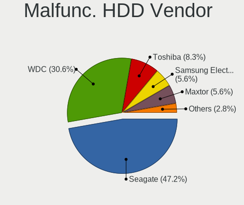
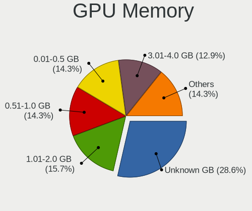

ROSA - Hardware Trends (Desktops)
---------------------------------

A project to identify most popular hardware characteristics and track their change
over time based on data collected by Linux users at https://Linux-Hardware.org.

Anyone can contribute to this report by the [hw-probe](https://github.com/linuxhw/hw-probe) tool:

    sudo -E hw-probe -all -upload

This report is for one last month. Overall report since the beginning of time: [TestCoverage](https://github.com/linuxhw/TestCoverage)

Period: Jul, 2022.

Contents
--------

* [ System ](#system)
  - [ OS                       ](#os)
  - [ OS Family                ](#os-family)
  - [ Kernel                   ](#kernel)
  - [ Kernel Family            ](#kernel-family)
  - [ Kernel Major Ver.        ](#kernel-major-ver)
  - [ Arch                     ](#arch)
  - [ DE                       ](#de)
  - [ Display Server           ](#display-server)
  - [ Display Manager          ](#display-manager)
  - [ OS Lang                  ](#os-lang)
  - [ Boot Mode                ](#boot-mode)
  - [ Filesystem               ](#filesystem)
  - [ Part. scheme             ](#part-scheme)
  - [ Dual Boot with Linux/BSD ](#dual-boot-with-linuxbsd)
  - [ Dual Boot (Win)          ](#dual-boot-win)

* [ Board ](#board)
  - [ Vendor                   ](#vendor)
  - [ Model                    ](#model)
  - [ Model Family             ](#model-family)
  - [ MFG Year                 ](#mfg-year)
  - [ Form Factor              ](#form-factor)
  - [ Secure Boot              ](#secure-boot)
  - [ Coreboot                 ](#coreboot)
  - [ RAM Size                 ](#ram-size)
  - [ RAM Used                 ](#ram-used)
  - [ Total Drives             ](#total-drives)
  - [ Has CD-ROM               ](#has-cd-rom)
  - [ Has Ethernet             ](#has-ethernet)
  - [ Has WiFi                 ](#has-wifi)
  - [ Has Bluetooth            ](#has-bluetooth)

* [ Location ](#location)
  - [ Country                  ](#country)
  - [ City                     ](#city)

* [ Drives ](#drives)
  - [ Drive Vendor             ](#drive-vendor)
  - [ Drive Model              ](#drive-model)
  - [ HDD Vendor               ](#hdd-vendor)
  - [ SSD Vendor               ](#ssd-vendor)
  - [ Drive Kind               ](#drive-kind)
  - [ Drive Connector          ](#drive-connector)
  - [ Drive Size               ](#drive-size)
  - [ Space Total              ](#space-total)
  - [ Space Used               ](#space-used)
  - [ Malfunc. Drives          ](#malfunc-drives)
  - [ Malfunc. Drive Vendor    ](#malfunc-drive-vendor)
  - [ Malfunc. HDD Vendor      ](#malfunc-hdd-vendor)
  - [ Malfunc. Drive Kind      ](#malfunc-drive-kind)
  - [ Failed Drives            ](#failed-drives)
  - [ Failed Drive Vendor      ](#failed-drive-vendor)
  - [ Drive Status             ](#drive-status)

* [ Storage controller ](#storage-controller)
  - [ Storage Vendor           ](#storage-vendor)
  - [ Storage Model            ](#storage-model)
  - [ Storage Kind             ](#storage-kind)

* [ Processor ](#processor)
  - [ CPU Vendor               ](#cpu-vendor)
  - [ CPU Model                ](#cpu-model)
  - [ CPU Model Family         ](#cpu-model-family)
  - [ CPU Cores                ](#cpu-cores)
  - [ CPU Sockets              ](#cpu-sockets)
  - [ CPU Threads              ](#cpu-threads)
  - [ CPU Op-Modes             ](#cpu-op-modes)
  - [ CPU Microcode            ](#cpu-microcode)
  - [ CPU Microarch            ](#cpu-microarch)

* [ Graphics ](#graphics)
  - [ GPU Vendor               ](#gpu-vendor)
  - [ GPU Model                ](#gpu-model)
  - [ GPU Combo                ](#gpu-combo)
  - [ GPU Driver               ](#gpu-driver)
  - [ GPU Memory               ](#gpu-memory)

* [ Monitor ](#monitor)
  - [ Monitor Vendor           ](#monitor-vendor)
  - [ Monitor Model            ](#monitor-model)
  - [ Monitor Resolution       ](#monitor-resolution)
  - [ Monitor Diagonal         ](#monitor-diagonal)
  - [ Monitor Width            ](#monitor-width)
  - [ Aspect Ratio             ](#aspect-ratio)
  - [ Monitor Area             ](#monitor-area)
  - [ Pixel Density            ](#pixel-density)
  - [ Multiple Monitors        ](#multiple-monitors)

* [ Network ](#network)
  - [ Net Controller Vendor    ](#net-controller-vendor)
  - [ Net Controller Model     ](#net-controller-model)
  - [ Wireless Vendor          ](#wireless-vendor)
  - [ Wireless Model           ](#wireless-model)
  - [ Ethernet Vendor          ](#ethernet-vendor)
  - [ Ethernet Model           ](#ethernet-model)
  - [ Net Controller Kind      ](#net-controller-kind)
  - [ Used Controller          ](#used-controller)
  - [ NICs                     ](#nics)
  - [ IPv6                     ](#ipv6)

* [ Bluetooth ](#bluetooth)
  - [ Bluetooth Vendor         ](#bluetooth-vendor)
  - [ Bluetooth Model          ](#bluetooth-model)

* [ Sound ](#sound)
  - [ Sound Vendor             ](#sound-vendor)
  - [ Sound Model              ](#sound-model)

* [ Memory ](#memory)
  - [ Memory Vendor            ](#memory-vendor)
  - [ Memory Model             ](#memory-model)
  - [ Memory Kind              ](#memory-kind)
  - [ Memory Form Factor       ](#memory-form-factor)
  - [ Memory Size              ](#memory-size)
  - [ Memory Speed             ](#memory-speed)

* [ Printers & scanners ](#printers--scanners)
  - [ Printer Vendor           ](#printer-vendor)
  - [ Printer Model            ](#printer-model)
  - [ Scanner Vendor           ](#scanner-vendor)
  - [ Scanner Model            ](#scanner-model)

* [ Camera ](#camera)
  - [ Camera Vendor            ](#camera-vendor)
  - [ Camera Model             ](#camera-model)

* [ Security ](#security)
  - [ Fingerprint Vendor       ](#fingerprint-vendor)
  - [ Fingerprint Model        ](#fingerprint-model)
  - [ Chipcard Vendor          ](#chipcard-vendor)
  - [ Chipcard Model           ](#chipcard-model)

* [ Unsupported ](#unsupported)
  - [ Unsupported Devices      ](#unsupported-devices)
  - [ Unsupported Device Types ](#unsupported-device-types)

System
------

OS
--

Installed operating systems

| Name       | Desktops | Percent |
|------------|----------|---------|
| ROSA 12.2  | 168      | 87.5%   |
| ROSA R11.1 | 18       | 9.38%   |
| ROSA 12.1  | 3        | 1.56%   |
| ROSA R11   | 2        | 1.04%   |
| ROSA R9    | 1        | 0.52%   |

OS Family
---------

OS without a version

| Name | Desktops | Percent |
|------|----------|---------|
| ROSA | 192      | 100%    |

Kernel
------

Version of the Linux kernel

| Version                                        | Desktops | Percent |
|------------------------------------------------|----------|---------|
| 5.10.74-generic-2rosa2021.1-x86_64             | 73       | 38.02%  |
| 5.10.118-generic-2rosa2021.1-x86_64            | 53       | 27.6%   |
| 5.18.8.xm1-1.klp-xanmod-rosa2021.1-x86_64      | 13       | 6.77%   |
| 5.15.43-generic-2rosa2021.1-x86_64             | 12       | 6.25%   |
| 5.17.11-generic-2rosa2021.1-x86_64             | 7        | 3.65%   |
| 5.4.83-generic-2rosa-x86_64                    | 5        | 2.6%    |
| 5.4.32-generic-2rosa-i586                      | 4        | 2.08%   |
| 4.15.0-desktop-122.124.1rosa-x86_64            | 4        | 2.08%   |
| 5.4.83-generic-2rosa-i586                      | 2        | 1.04%   |
| 5.4.32-generic-2rosa-x86_64                    | 2        | 1.04%   |
| 5.18.1.xm1-3.klp-xanmod-rosa2021.1-x86_64      | 2        | 1.04%   |
| 5.10.71-generic-1rosa2021.1-x86_64             | 2        | 1.04%   |
| 5.4.150-generic-1rosa2021.1-x86_64             | 1        | 0.52%   |
| 5.18.9-200.fc36.x86_64                         | 1        | 0.52%   |
| 5.18.2.xm1-3.klp-xanmod-rosa2021.1-x86_64      | 1        | 0.52%   |
| 5.18.15.xm1-1.klp-xanmod-rosa2021.1-x86_64     | 1        | 0.52%   |
| 5.18.14.xm1-1.klp-xanmod-rosa2021.1-x86_64     | 1        | 0.52%   |
| 5.18.10.xm1-1.klp-xanmod-rosa2021.1-x86_64     | 1        | 0.52%   |
| 5.16.19-generic-2rosa2021.1-x86_64             | 1        | 0.52%   |
| 5.15.58.xm1-1.klp-xanmod-lts-rosa2021.1-x86_64 | 1        | 0.52%   |
| 5.15.43-generic-1rosa2021.1-x86_64             | 1        | 0.52%   |
| 5.10.74-generic-2rosa2021.1-i586               | 1        | 0.52%   |
| 4.9.20-nrj-desktop-1rosa-x86_64                | 1        | 0.52%   |
| 4.15.0-desktop-45.1rosa-i586                   | 1        | 0.52%   |
| 4.15.0-desktop-122.124.1rosa-i586              | 1        | 0.52%   |

Kernel Family
-------------

Linux kernel without a distro release

| Version  | Desktops | Percent |
|----------|----------|---------|
| 5.10.74  | 74       | 38.54%  |
| 5.10.118 | 53       | 27.6%   |
| 5.18.8   | 13       | 6.77%   |
| 5.15.43  | 13       | 6.77%   |
| 5.4.83   | 7        | 3.65%   |
| 5.17.11  | 7        | 3.65%   |
| 5.4.32   | 6        | 3.13%   |
| 4.15.0   | 6        | 3.13%   |
| 5.18.1   | 2        | 1.04%   |
| 5.10.71  | 2        | 1.04%   |
| 5.4.150  | 1        | 0.52%   |
| 5.18.9   | 1        | 0.52%   |
| 5.18.2   | 1        | 0.52%   |
| 5.18.15  | 1        | 0.52%   |
| 5.18.14  | 1        | 0.52%   |
| 5.18.10  | 1        | 0.52%   |
| 5.16.19  | 1        | 0.52%   |
| 5.15.58  | 1        | 0.52%   |
| 4.9.20   | 1        | 0.52%   |

Kernel Major Ver.
-----------------

Linux kernel major version

| Version | Desktops | Percent |
|---------|----------|---------|
| 5.10    | 129      | 67.19%  |
| 5.18    | 20       | 10.42%  |
| 5.4     | 14       | 7.29%   |
| 5.15    | 14       | 7.29%   |
| 5.17    | 7        | 3.65%   |
| 4.15    | 6        | 3.13%   |
| 5.16    | 1        | 0.52%   |
| 4.9     | 1        | 0.52%   |

Arch
----

OS architecture (x86_64, i586, etc.)

| Name   | Desktops | Percent |
|--------|----------|---------|
| x86_64 | 183      | 95.31%  |
| i686   | 9        | 4.69%   |

DE
--

Desktop Environment

| Name  | Desktops | Percent |
|-------|----------|---------|
| KDE5  | 81       | 42.19%  |
| GNOME | 79       | 41.15%  |
| LXQt  | 16       | 8.33%   |
| KDE4  | 14       | 7.29%   |
| XFCE  | 1        | 0.52%   |
| MATE  | 1        | 0.52%   |

Display Server
--------------

X11 or Wayland

| Name    | Desktops | Percent |
|---------|----------|---------|
| Wayland | 142      | 73.96%  |
| X11     | 50       | 26.04%  |

Display Manager
---------------

SDDM, LightDM, etc.

| Name    | Desktops | Percent |
|---------|----------|---------|
| GDM     | 96       | 50%     |
| SDDM    | 80       | 41.67%  |
| KDM     | 14       | 7.29%   |
| LightDM | 2        | 1.04%   |

OS Lang
-------

Language

| Lang    | Desktops | Percent |
|---------|----------|---------|
| ru_RU   | 179      | 93.23%  |
| en_US   | 3        | 1.56%   |
| Unknown | 3        | 1.56%   |
| ru_KZ   | 1        | 0.52%   |
| pt_BR   | 1        | 0.52%   |
| pl_PL   | 1        | 0.52%   |
| ja_JP   | 1        | 0.52%   |
| it_IT   | 1        | 0.52%   |
| es_MX   | 1        | 0.52%   |
| en_GB   | 1        | 0.52%   |

Boot Mode
---------

EFI or BIOS

| Mode | Desktops | Percent |
|------|----------|---------|
| EFI  | 103      | 53.65%  |
| BIOS | 89       | 46.35%  |

Filesystem
----------

Type of filesystem

| Type  | Desktops | Percent |
|-------|----------|---------|
| Ext4  | 182      | 94.79%  |
| Btrfs | 9        | 4.69%   |
| F2fs  | 1        | 0.52%   |

Part. scheme
------------

Scheme of partitioning

| Type    | Desktops | Percent |
|---------|----------|---------|
| GPT     | 134      | 69.79%  |
| MBR     | 57       | 29.69%  |
| Unknown | 1        | 0.52%   |

Dual Boot with Linux/BSD
------------------------

Hosting more than one Linux/BSD

| Dual boot | Desktops | Percent |
|-----------|----------|---------|
| No        | 128      | 66.67%  |
| Yes       | 64       | 33.33%  |

Dual Boot (Win)
---------------

Hosting Linux and Windows

| Dual boot | Desktops | Percent |
|-----------|----------|---------|
| Yes       | 107      | 55.73%  |
| No        | 85       | 44.27%  |

Board
-----

Vendor
------

Motherboard manufacturer

| Name                | Desktops | Percent |
|---------------------|----------|---------|
| ASUSTek Computer    | 63       | 32.81%  |
| Gigabyte Technology | 55       | 28.65%  |
| ASRock              | 25       | 13.02%  |
| MSI                 | 15       | 7.81%   |
| Intel               | 9        | 4.69%   |
| Biostar             | 5        | 2.6%    |
| ECS                 | 4        | 2.08%   |
| Huanan              | 3        | 1.56%   |
| Dell                | 3        | 1.56%   |
| Acer                | 2        | 1.04%   |
| Unknown             | 2        | 1.04%   |
| Supermicro          | 1        | 0.52%   |
| Quanta              | 1        | 0.52%   |
| Pegatron            | 1        | 0.52%   |
| MB                  | 1        | 0.52%   |
| MACHINIST           | 1        | 0.52%   |
| American Megatrends | 1        | 0.52%   |

Model
-----

Motherboard model

| Name                                                           | Desktops | Percent |
|----------------------------------------------------------------|----------|---------|
| ASUS All Series                                                | 8        | 4.17%   |
| Intel X99                                                      | 3        | 1.56%   |
| ASUS M5A78L-M LX3                                              | 3        | 1.56%   |
| Gigabyte G31M-ES2L                                             | 2        | 1.04%   |
| Gigabyte AB350M-DS3H V2                                        | 2        | 1.04%   |
| Gigabyte A320M-S2H V2                                          | 2        | 1.04%   |
| ECS GF8100VM-M5                                                | 2        | 1.04%   |
| Dell OptiPlex 755                                              | 2        | 1.04%   |
| ASUS PRIME X470-PRO                                            | 2        | 1.04%   |
| ASUS PRIME B550-PLUS                                           | 2        | 1.04%   |
| ASUS PRIME B450M-K                                             | 2        | 1.04%   |
| ASUS PRIME A320M-K                                             | 2        | 1.04%   |
| ASUS P5KPL-AM                                                  | 2        | 1.04%   |
| ASUS M5A97 R2.0                                                | 2        | 1.04%   |
| ASUS H110M-R                                                   | 2        | 1.04%   |
| ASRock A320M-DVS R4.0                                          | 2        | 1.04%   |
| Unknown                                                        | 2        | 1.04%   |
| Supermicro C7Q67                                               | 1        | 0.52%   |
| Quanta TouchSmart 9300 Elite All-in-One PC                     | 1        | 0.52%   |
| Pegatron IPPPV-D3G                                             | 1        | 0.52%   |
| MSI MS-7D52                                                    | 1        | 0.52%   |
| MSI MS-7C89                                                    | 1        | 0.52%   |
| MSI MS-7C81                                                    | 1        | 0.52%   |
| MSI MS-7C02                                                    | 1        | 0.52%   |
| MSI MS-7B86                                                    | 1        | 0.52%   |
| MSI MS-7B47                                                    | 1        | 0.52%   |
| MSI MS-7A74                                                    | 1        | 0.52%   |
| MSI MS-7A71                                                    | 1        | 0.52%   |
| MSI MS-7996                                                    | 1        | 0.52%   |
| MSI MS-7924                                                    | 1        | 0.52%   |
| MSI MS-7895                                                    | 1        | 0.52%   |
| MSI MS-7808                                                    | 1        | 0.52%   |
| MSI MS-7677                                                    | 1        | 0.52%   |
| MSI MS-7599                                                    | 1        | 0.52%   |
| MSI MPG B460 Trident AS (MS-B926)                              | 1        | 0.52%   |
| MB A320-SF110                                                  | 1        | 0.52%   |
| MACHINIST B75 PRO V1.0                                         | 1        | 0.52%   |
| Intel X79M-S                                                   | 1        | 0.52%   |
| Intel X79 (INTEL Xeon E5/Corei7 DMI2 - C600/C200 Cipset V3.2S1 | 1        | 0.52%   |
| Intel MAHOBAY                                                  | 1        | 0.52%   |
| Intel HM87                                                     | 1        | 0.52%   |
| Intel DG31PR AAD97573-301                                      | 1        | 0.52%   |
| Intel D33217GKE G76540-203                                     | 1        | 0.52%   |
| Huanan X99-F8 GAMING V2.0                                      | 1        | 0.52%   |
| Huanan X99-BD4 V1.1, NALEX                                     | 1        | 0.52%   |
| Huanan X99 F8D V2.2                                            | 1        | 0.52%   |
| Gigabyte Z77-D3H                                               | 1        | 0.52%   |
| Gigabyte Z68AP-D3                                              | 1        | 0.52%   |
| Gigabyte Z390 UD                                               | 1        | 0.52%   |
| Gigabyte Z370M D3H                                             | 1        | 0.52%   |
| Gigabyte Z170X-Gaming 3                                        | 1        | 0.52%   |
| Gigabyte X58-USB3                                              | 1        | 0.52%   |
| Gigabyte X570 GAMING X                                         | 1        | 0.52%   |
| Gigabyte X570 AORUS ELITE                                      | 1        | 0.52%   |
| Gigabyte X470 AORUS ULTRA GAMING                               | 1        | 0.52%   |
| Gigabyte X470 AORUS GAMING 7 WIFI                              | 1        | 0.52%   |
| Gigabyte X38-DS5                                               | 1        | 0.52%   |
| Gigabyte P31-ES3G                                              | 1        | 0.52%   |
| Gigabyte H77M-D3H                                              | 1        | 0.52%   |
| Gigabyte H61MS                                                 | 1        | 0.52%   |

Model Family
------------

Motherboard model prefix

| Name                  | Desktops | Percent |
|-----------------------|----------|---------|
| ASUS PRIME            | 14       | 7.29%   |
| ASUS All              | 8        | 4.17%   |
| Gigabyte B550M        | 4        | 2.08%   |
| ASUS M5A78L-M         | 4        | 2.08%   |
| Intel X99             | 3        | 1.56%   |
| Gigabyte B450M        | 3        | 1.56%   |
| Gigabyte A320M-S2H    | 3        | 1.56%   |
| Dell OptiPlex         | 3        | 1.56%   |
| ASUS P8H61-M          | 3        | 1.56%   |
| Gigabyte X570         | 2        | 1.04%   |
| Gigabyte X470         | 2        | 1.04%   |
| Gigabyte G31M-ES2L    | 2        | 1.04%   |
| Gigabyte AB350M-DS3H  | 2        | 1.04%   |
| ECS GF8100VM-M5       | 2        | 1.04%   |
| ASUS SABERTOOTH       | 2        | 1.04%   |
| ASUS ROG              | 2        | 1.04%   |
| ASUS P5P43TD          | 2        | 1.04%   |
| ASUS P5KPL-AM         | 2        | 1.04%   |
| ASUS P5G41T-M         | 2        | 1.04%   |
| ASUS M5A97            | 2        | 1.04%   |
| ASUS H110M-R          | 2        | 1.04%   |
| ASUS H110M-A          | 2        | 1.04%   |
| ASRock B450M          | 2        | 1.04%   |
| ASRock A320M-DVS      | 2        | 1.04%   |
| Unknown               | 2        | 1.04%   |
| Supermicro C7Q67      | 1        | 0.52%   |
| Quanta TouchSmart     | 1        | 0.52%   |
| Pegatron IPPPV-D3G    | 1        | 0.52%   |
| MSI MS-7D52           | 1        | 0.52%   |
| MSI MS-7C89           | 1        | 0.52%   |
| MSI MS-7C81           | 1        | 0.52%   |
| MSI MS-7C02           | 1        | 0.52%   |
| MSI MS-7B86           | 1        | 0.52%   |
| MSI MS-7B47           | 1        | 0.52%   |
| MSI MS-7A74           | 1        | 0.52%   |
| MSI MS-7A71           | 1        | 0.52%   |
| MSI MS-7996           | 1        | 0.52%   |
| MSI MS-7924           | 1        | 0.52%   |
| MSI MS-7895           | 1        | 0.52%   |
| MSI MS-7808           | 1        | 0.52%   |
| MSI MS-7677           | 1        | 0.52%   |
| MSI MS-7599           | 1        | 0.52%   |
| MSI MPG               | 1        | 0.52%   |
| MB A320-SF110         | 1        | 0.52%   |
| MACHINIST B75         | 1        | 0.52%   |
| Intel X79M-S          | 1        | 0.52%   |
| Intel X79             | 1        | 0.52%   |
| Intel MAHOBAY         | 1        | 0.52%   |
| Intel HM87            | 1        | 0.52%   |
| Intel DG31PR          | 1        | 0.52%   |
| Intel D33217GKE       | 1        | 0.52%   |
| Huanan X99-F8         | 1        | 0.52%   |
| Huanan X99-BD4        | 1        | 0.52%   |
| Huanan X99            | 1        | 0.52%   |
| Gigabyte Z77-D3H      | 1        | 0.52%   |
| Gigabyte Z68AP-D3     | 1        | 0.52%   |
| Gigabyte Z390         | 1        | 0.52%   |
| Gigabyte Z370M        | 1        | 0.52%   |
| Gigabyte Z170X-Gaming | 1        | 0.52%   |
| Gigabyte X58-USB3     | 1        | 0.52%   |

MFG Year
--------

Motherboard manufacture year

| Year | Desktops | Percent |
|------|----------|---------|
| 2018 | 25       | 13.02%  |
| 2012 | 20       | 10.42%  |
| 2019 | 17       | 8.85%   |
| 2009 | 15       | 7.81%   |
| 2008 | 15       | 7.81%   |
| 2016 | 14       | 7.29%   |
| 2017 | 13       | 6.77%   |
| 2021 | 12       | 6.25%   |
| 2020 | 12       | 6.25%   |
| 2013 | 10       | 5.21%   |
| 2010 | 10       | 5.21%   |
| 2014 | 9        | 4.69%   |
| 2011 | 9        | 4.69%   |
| 2015 | 5        | 2.6%    |
| 2007 | 4        | 2.08%   |
| 2022 | 1        | 0.52%   |
| 2006 | 1        | 0.52%   |

Form Factor
-----------

Physical design of the computer

| Name    | Desktops | Percent |
|---------|----------|---------|
| Desktop | 192      | 100%    |

Secure Boot
-----------

Enabled or disabled

| State    | Desktops | Percent |
|----------|----------|---------|
| Disabled | 192      | 100%    |

Coreboot
--------

Have coreboot on board

| Used | Desktops | Percent |
|------|----------|---------|
| No   | 192      | 100%    |

RAM Size
--------

Total RAM memory

| Size in GB  | Desktops | Percent |
|-------------|----------|---------|
| 16.01-24.0  | 55       | 28.65%  |
| 8.01-16.0   | 49       | 25.52%  |
| 3.01-4.0    | 27       | 14.06%  |
| 4.01-8.0    | 25       | 13.02%  |
| 32.01-64.0  | 20       | 10.42%  |
| 1.01-2.0    | 9        | 4.69%   |
| 64.01-256.0 | 5        | 2.6%    |
| 24.01-32.0  | 1        | 0.52%   |
| 2.01-3.0    | 1        | 0.52%   |

RAM Used
--------

Used RAM memory

| Used GB   | Desktops | Percent |
|-----------|----------|---------|
| 1.01-2.0  | 110      | 57.29%  |
| 0.51-1.0  | 45       | 23.44%  |
| 2.01-3.0  | 25       | 13.02%  |
| 3.01-4.0  | 8        | 4.17%   |
| 4.01-8.0  | 2        | 1.04%   |
| 8.01-16.0 | 2        | 1.04%   |

Total Drives
------------

Number of drives on board

| Drives | Desktops | Percent |
|--------|----------|---------|
| 1      | 59       | 30.73%  |
| 2      | 53       | 27.6%   |
| 3      | 41       | 21.35%  |
| 4      | 24       | 12.5%   |
| 5      | 10       | 5.21%   |
| 8      | 2        | 1.04%   |
| 6      | 2        | 1.04%   |
| 7      | 1        | 0.52%   |

Has CD-ROM
----------

Has CD-ROM on board

| Presented | Desktops | Percent |
|-----------|----------|---------|
| No        | 125      | 65.1%   |
| Yes       | 67       | 34.9%   |

Has Ethernet
------------

Has Ethernet on board

| Presented | Desktops | Percent |
|-----------|----------|---------|
| Yes       | 188      | 97.92%  |
| No        | 4        | 2.08%   |

Has WiFi
--------

Has WiFi module

| Presented | Desktops | Percent |
|-----------|----------|---------|
| No        | 139      | 72.4%   |
| Yes       | 53       | 27.6%   |

Has Bluetooth
-------------

Has Bluetooth module

| Presented | Desktops | Percent |
|-----------|----------|---------|
| No        | 141      | 73.44%  |
| Yes       | 51       | 26.56%  |

Location
--------

Country
-------

Geographic location (country)

| Country    | Desktops | Percent |
|------------|----------|---------|
| Russia     | 174      | 90.63%  |
| Belarus    | 3        | 1.56%   |
| Ukraine    | 2        | 1.04%   |
| Poland     | 2        | 1.04%   |
| Italy      | 2        | 1.04%   |
| Pakistan   | 1        | 0.52%   |
| Mexico     | 1        | 0.52%   |
| Kyrgyzstan | 1        | 0.52%   |
| Kazakhstan | 1        | 0.52%   |
| Japan      | 1        | 0.52%   |
| India      | 1        | 0.52%   |
| Germany    | 1        | 0.52%   |
| Canada     | 1        | 0.52%   |
| Brazil     | 1        | 0.52%   |

City
----

Geographic location (city)

| City            | Desktops | Percent |
|-----------------|----------|---------|
| Moscow          | 31       | 16.15%  |
| Novosibirsk     | 12       | 6.25%   |
| St Petersburg   | 9        | 4.69%   |
| Chelyabinsk     | 6        | 3.13%   |
| Rostov-on-Don   | 5        | 2.6%    |
| Perm            | 5        | 2.6%    |
| Krasnodar       | 5        | 2.6%    |
| Yekaterinburg   | 4        | 2.08%   |
| Yaroslavl       | 4        | 2.08%   |
| Irkutsk         | 4        | 2.08%   |
| Cheboksary      | 4        | 2.08%   |
| Khabarovsk      | 3        | 1.56%   |
| Izhevsk         | 3        | 1.56%   |
| Volgograd       | 2        | 1.04%   |
| Vladivostok     | 2        | 1.04%   |
| Ufa             | 2        | 1.04%   |
| Tyumen          | 2        | 1.04%   |
| Tomsk           | 2        | 1.04%   |
| Surgut          | 2        | 1.04%   |
| Stavropol       | 2        | 1.04%   |
| Orenburg        | 2        | 1.04%   |
| Omsk            | 2        | 1.04%   |
| Novokuznetsk    | 2        | 1.04%   |
| Mytishchi       | 2        | 1.04%   |
| Krasnoyarsk     | 2        | 1.04%   |
| Zvenigorod      | 1        | 0.52%   |
| Zheleznogorsk   | 1        | 0.52%   |
| Yoshkar-Ola     | 1        | 0.52%   |
| Yelets          | 1        | 0.52%   |
| Yasinovataya    | 1        | 0.52%   |
| Voronezh        | 1        | 0.52%   |
| Vladimir        | 1        | 0.52%   |
| Vladikavkaz     | 1        | 0.52%   |
| Vidnoye         | 1        | 0.52%   |
| Veliky Novgorod | 1        | 0.52%   |
| Uyskoye         | 1        | 0.52%   |
| Ust-Kamenogorsk | 1        | 0.52%   |
| Ulan-Ude        | 1        | 0.52%   |
| Tver            | 1        | 0.52%   |
| Tula            | 1        | 0.52%   |
| Temryuk         | 1        | 0.52%   |
| Taganrog        | 1        | 0.52%   |
| Syktyvkar       | 1        | 0.52%   |
| Sudzha          | 1        | 0.52%   |
| Sovetsk         | 1        | 0.52%   |
| Smolensk        | 1        | 0.52%   |
| Severodvinsk    | 1        | 0.52%   |
| Saratov         | 1        | 0.52%   |
| Saransk         | 1        | 0.52%   |
| Samara          | 1        | 0.52%   |
| Ryazan          | 1        | 0.52%   |
| Pskov           | 1        | 0.52%   |
| Penza           | 1        | 0.52%   |
| Parral          | 1        | 0.52%   |
| Pali            | 1        | 0.52%   |
| Otradnoye       | 1        | 0.52%   |
| Oktyabrsky      | 1        | 0.52%   |
| Okayama         | 1        | 0.52%   |
| Nowa Sol        | 1        | 0.52%   |
| Novomoskovsk    | 1        | 0.52%   |

Drives
------

Drive Vendor
------------

Hard drive vendors

| Vendor              | Desktops | Drives | Percent |
|---------------------|----------|--------|---------|
| Seagate             | 85       | 100    | 20.63%  |
| WDC                 | 76       | 95     | 18.45%  |
| Samsung Electronics | 39       | 48     | 9.47%   |
| Toshiba             | 22       | 24     | 5.34%   |
| Kingston            | 19       | 21     | 4.61%   |
| A-DATA Technology   | 18       | 22     | 4.37%   |
| Hitachi             | 16       | 19     | 3.88%   |
| China               | 14       | 15     | 3.4%    |
| SPCC                | 11       | 11     | 2.67%   |
| SanDisk             | 7        | 7      | 1.7%    |
| Patriot             | 7        | 7      | 1.7%    |
| HGST                | 7        | 8      | 1.7%    |
| GOODRAM             | 7        | 7      | 1.7%    |
| Apacer              | 7        | 8      | 1.7%    |
| Intel               | 6        | 10     | 1.46%   |
| AMD                 | 6        | 6      | 1.46%   |
| Plextor             | 5        | 5      | 1.21%   |
| Crucial             | 5        | 5      | 1.21%   |
| Netac               | 4        | 4      | 0.97%   |
| Maxtor              | 4        | 4      | 0.97%   |
| Smartbuy            | 3        | 4      | 0.73%   |
| Phison              | 3        | 3      | 0.73%   |
| OCZ                 | 3        | 3      | 0.73%   |
| KingSpec            | 3        | 3      | 0.73%   |
| Gigabyte Technology | 3        | 3      | 0.73%   |
| Silicon Motion      | 2        | 2      | 0.49%   |
| Kllisre             | 2        | 2      | 0.49%   |
| Intenso             | 2        | 2      | 0.49%   |
| Fujitsu             | 2        | 2      | 0.49%   |
| ZTE                 | 1        | 1      | 0.24%   |
| Yeyian              | 1        | 1      | 0.24%   |
| XPG                 | 1        | 1      | 0.24%   |
| walram              | 1        | 1      | 0.24%   |
| Transcend           | 1        | 1      | 0.24%   |
| Team                | 1        | 1      | 0.24%   |
| T-FORCE             | 1        | 1      | 0.24%   |
| SK hynix            | 1        | 1      | 0.24%   |
| SATAFIRM            | 1        | 1      | 0.24%   |
| s60                 | 1        | 1      | 0.24%   |
| Reeinno             | 1        | 1      | 0.24%   |
| Qumo                | 1        | 1      | 0.24%   |
| ORICO               | 1        | 1      | 0.24%   |
| OCZ-VERTEX3         | 1        | 1      | 0.24%   |
| LVCARDS             | 1        | 1      | 0.24%   |
| JMicron Technology  | 1        | 2      | 0.24%   |
| Hewlett-Packard     | 1        | 1      | 0.24%   |
| GAMER               | 1        | 1      | 0.24%   |
| External            | 1        | 1      | 0.24%   |
| Corsair             | 1        | 1      | 0.24%   |
| ASMT                | 1        | 2      | 0.24%   |
| Apple               | 1        | 1      | 0.24%   |
| Acer                | 1        | 1      | 0.24%   |
| Unknown             | 1        | 1      | 0.24%   |

Drive Model
-----------

Hard drive models

| Model                              | Desktops | Percent |
|------------------------------------|----------|---------|
| Seagate ST1000DM010-2EP102 1TB     | 11       | 2.4%    |
| Seagate ST500DM002-1BD142 500GB    | 9        | 1.96%   |
| Seagate ST1000DM003-1CH162 1TB     | 8        | 1.74%   |
| Toshiba DT01ACA100 1TB             | 6        | 1.31%   |
| SPCC Solid State Disk 128GB        | 5        | 1.09%   |
| Hitachi HDS721010CLA332 1TB        | 5        | 1.09%   |
| WDC WDS240G2G0A-00JH30 240GB SSD   | 4        | 0.87%   |
| Toshiba HDWD110 1TB                | 4        | 0.87%   |
| Seagate ST3500418AS 500GB          | 4        | 0.87%   |
| Seagate ST3500413AS 500GB          | 4        | 0.87%   |
| Seagate ST2000DM008-2FR102 2TB     | 4        | 0.87%   |
| Patriot Burst 120GB SSD            | 4        | 0.87%   |
| Kingston SA400S37240G 240GB SSD    | 4        | 0.87%   |
| WDC WD10EZEX-08WN4A0 1TB           | 3        | 0.65%   |
| Seagate ST2000DM001-1ER164 2TB     | 3        | 0.65%   |
| Seagate ST1000LM024 HN-M101MBB 1TB | 3        | 0.65%   |
| Samsung SSD 980 1TB                | 3        | 0.65%   |
| Samsung SSD 970 EVO Plus 250GB     | 3        | 0.65%   |
| Samsung SSD 870 QVO 1TB            | 3        | 0.65%   |
| Kingston SV300S37A120G 120GB SSD   | 3        | 0.65%   |
| Kingston SA400S37480G 480GB SSD    | 3        | 0.65%   |
| Kingston SA400S37120G 120GB SSD    | 3        | 0.65%   |
| China SSD 120GB                    | 3        | 0.65%   |
| China 120GB SSD                    | 3        | 0.65%   |
| WDC WDS120G2G0B-00EPW0 120GB SSD   | 2        | 0.44%   |
| WDC WDS120G2G0A-00JH30 120GB SSD   | 2        | 0.44%   |
| WDC WD5000AAKX-08U6AA0 500GB       | 2        | 0.44%   |
| WDC WD5000AADS-00S9B0 500GB        | 2        | 0.44%   |
| WDC WD30EFRX-68EUZN0 3TB           | 2        | 0.44%   |
| WDC WD15EARS-00MVWB0 1TB           | 2        | 0.44%   |
| WDC WD10SPZX-00Z10T0 1TB           | 2        | 0.44%   |
| WDC WD10EZEX-75WN4A1 1TB           | 2        | 0.44%   |
| WDC WD10EZEX-21M2NA0 1TB           | 2        | 0.44%   |
| WDC WD10EZEX-00MFCA0 1TB           | 2        | 0.44%   |
| Toshiba HDWD220 2TB                | 2        | 0.44%   |
| Toshiba HDWD130 3TB                | 2        | 0.44%   |
| Toshiba HDWD120 2TB                | 2        | 0.44%   |
| Seagate ST380815AS 80GB            | 2        | 0.44%   |
| Seagate ST3160318AS 160GB          | 2        | 0.44%   |
| Seagate ST31500341AS 1TB           | 2        | 0.44%   |
| Seagate ST31000524AS 1TB           | 2        | 0.44%   |
| Seagate ST250DM000-1BD141 250GB    | 2        | 0.44%   |
| Seagate ST2000DM001-1CH164 2TB     | 2        | 0.44%   |
| Samsung SSD 960 EVO 500GB          | 2        | 0.44%   |
| Samsung SSD 870 EVO 1TB            | 2        | 0.44%   |
| Samsung SSD 860 EVO 500GB          | 2        | 0.44%   |
| Samsung SSD 850 PRO 256GB          | 2        | 0.44%   |
| Samsung SSD 850 EVO 250GB          | 2        | 0.44%   |
| Plextor PX-128M5S 128GB SSD        | 2        | 0.44%   |
| Intel SSDSC2KW512G8 512GB          | 2        | 0.44%   |
| HGST HTS545050A7E680 500GB         | 2        | 0.44%   |
| GOODRAM SSDPR-CX400-128-G2 128GB   | 2        | 0.44%   |
| Gigabyte GP-GSTFS31120GNTD 120GB   | 2        | 0.44%   |
| Crucial CT240BX500SSD1 240GB       | 2        | 0.44%   |
| Apacer AS350 512GB SSD             | 2        | 0.44%   |
| Apacer AS350 256GB SSD             | 2        | 0.44%   |
| Apacer AS350 128GB SSD             | 2        | 0.44%   |
| AMD R5SL128G 128GB SSD             | 2        | 0.44%   |
| AMD R5SL120G 120GB SSD             | 2        | 0.44%   |
| A-DATA SX8200PNP 256GB             | 2        | 0.44%   |

HDD Vendor
----------

Hard disk drive vendors

| Vendor              | Desktops | Drives | Percent |
|---------------------|----------|--------|---------|
| Seagate             | 84       | 99     | 39.62%  |
| WDC                 | 65       | 79     | 30.66%  |
| Toshiba             | 22       | 24     | 10.38%  |
| Hitachi             | 16       | 19     | 7.55%   |
| Samsung Electronics | 9        | 9      | 4.25%   |
| HGST                | 7        | 8      | 3.3%    |
| Maxtor              | 4        | 4      | 1.89%   |
| Fujitsu             | 2        | 2      | 0.94%   |
| SATAFIRM            | 1        | 1      | 0.47%   |
| ASMT                | 1        | 2      | 0.47%   |
| Apple               | 1        | 1      | 0.47%   |

SSD Vendor
----------

Solid state drive vendors

| Vendor              | Desktops | Drives | Percent |
|---------------------|----------|--------|---------|
| Samsung Electronics | 20       | 22     | 12.35%  |
| Kingston            | 16       | 17     | 9.88%   |
| China               | 14       | 15     | 8.64%   |
| WDC                 | 13       | 13     | 8.02%   |
| A-DATA Technology   | 13       | 14     | 8.02%   |
| SPCC                | 9        | 9      | 5.56%   |
| SanDisk             | 7        | 7      | 4.32%   |
| Patriot             | 7        | 7      | 4.32%   |
| GOODRAM             | 6        | 6      | 3.7%    |
| Apacer              | 6        | 7      | 3.7%    |
| AMD                 | 6        | 6      | 3.7%    |
| Plextor             | 5        | 5      | 3.09%   |
| Intel               | 5        | 7      | 3.09%   |
| Crucial             | 5        | 5      | 3.09%   |
| Smartbuy            | 3        | 4      | 1.85%   |
| OCZ                 | 3        | 3      | 1.85%   |
| Netac               | 3        | 3      | 1.85%   |
| KingSpec            | 3        | 3      | 1.85%   |
| Intenso             | 2        | 2      | 1.23%   |
| Gigabyte Technology | 2        | 2      | 1.23%   |
| Yeyian              | 1        | 1      | 0.62%   |
| walram              | 1        | 1      | 0.62%   |
| Transcend           | 1        | 1      | 0.62%   |
| Team                | 1        | 1      | 0.62%   |
| T-FORCE             | 1        | 1      | 0.62%   |
| s60                 | 1        | 1      | 0.62%   |
| Qumo                | 1        | 1      | 0.62%   |
| OCZ-VERTEX3         | 1        | 1      | 0.62%   |
| LVCARDS             | 1        | 1      | 0.62%   |
| Hewlett-Packard     | 1        | 1      | 0.62%   |
| GAMER               | 1        | 1      | 0.62%   |
| Corsair             | 1        | 1      | 0.62%   |
| Acer                | 1        | 1      | 0.62%   |
| Unknown             | 1        | 1      | 0.62%   |

Drive Kind
----------

HDD or SSD

| Kind    | Desktops | Drives | Percent |
|---------|----------|--------|---------|
| HDD     | 153      | 248    | 46.93%  |
| SSD     | 129      | 171    | 39.57%  |
| NVMe    | 41       | 54     | 12.58%  |
| Unknown | 3        | 3      | 0.92%   |

Drive Connector
---------------

SATA, SAS, NVMe, etc.

| Type | Desktops | Drives | Percent |
|------|----------|--------|---------|
| SATA | 188      | 417    | 80.69%  |
| NVMe | 39       | 51     | 16.74%  |
| SAS  | 6        | 8      | 2.58%   |

Drive Size
----------

Size of hard drive

| Size in TB | Desktops | Drives | Percent |
|------------|----------|--------|---------|
| 0.01-0.5   | 163      | 256    | 55.44%  |
| 0.51-1.0   | 89       | 115    | 30.27%  |
| 1.01-2.0   | 28       | 33     | 9.52%   |
| 2.01-3.0   | 7        | 7      | 2.38%   |
| 3.01-4.0   | 4        | 5      | 1.36%   |
| 4.01-10.0  | 3        | 3      | 1.02%   |

Space Total
-----------

Amount of disk space available on the file system

| Size in GB     | Desktops | Percent |
|----------------|----------|---------|
| 101-250        | 61       | 31.77%  |
| 251-500        | 28       | 14.58%  |
| 501-1000       | 28       | 14.58%  |
| 1001-2000      | 23       | 11.98%  |
| 1-20           | 23       | 11.98%  |
| 51-100         | 10       | 5.21%   |
| 2001-3000      | 8        | 4.17%   |
| 21-50          | 7        | 3.65%   |
| More than 3000 | 4        | 2.08%   |

Space Used
----------

Amount of used disk space

| Used GB        | Desktops | Percent |
|----------------|----------|---------|
| 1-20           | 121      | 63.02%  |
| 21-50          | 19       | 9.9%    |
| 251-500        | 12       | 6.25%   |
| 101-250        | 11       | 5.73%   |
| 1001-2000      | 10       | 5.21%   |
| 501-1000       | 10       | 5.21%   |
| 51-100         | 7        | 3.65%   |
| More than 3000 | 2        | 1.04%   |

Malfunc. Drives
---------------

Drive models with a malfunction

| Model                                 | Desktops | Drives | Percent |
|---------------------------------------|----------|--------|---------|
| Seagate ST500DM002-1BD142 500GB       | 5        | 5      | 5.1%    |
| Seagate ST3500413AS 500GB             | 4        | 5      | 4.08%   |
| Seagate ST1000DM003-1CH162 1TB        | 4        | 6      | 4.08%   |
| Seagate ST3500418AS 500GB             | 3        | 4      | 3.06%   |
| WDC WD5000AAKX-08U6AA0 500GB          | 2        | 3      | 2.04%   |
| Seagate ST31500341AS 1TB              | 2        | 2      | 2.04%   |
| Seagate ST250DM000-1BD141 250GB       | 2        | 2      | 2.04%   |
| Hitachi HDS721010CLA332 1TB           | 2        | 2      | 2.04%   |
| WDC WDS240G2G0A-00JH30 240GB SSD      | 1        | 1      | 1.02%   |
| WDC WDS120G2G0A-00JH30 120GB SSD      | 1        | 1      | 1.02%   |
| WDC WD8000AARS-00Y5B1 800GB           | 1        | 1      | 1.02%   |
| WDC WD7500AADS-00L5B1 752GB           | 1        | 1      | 1.02%   |
| WDC WD6401AALS-00J7B1 640GB           | 1        | 1      | 1.02%   |
| WDC WD5001AALS-00E3A0 500GB           | 1        | 1      | 1.02%   |
| WDC WD5000BPVT-22HXZT1 500GB          | 1        | 1      | 1.02%   |
| WDC WD5000AAKX-60U6AA0 500GB          | 1        | 1      | 1.02%   |
| WDC WD5000AAKS-22A7B2 500GB           | 1        | 1      | 1.02%   |
| WDC WD5000AAKS-007AA0 500GB           | 1        | 1      | 1.02%   |
| WDC WD5000AADS-00S9B0 500GB           | 1        | 1      | 1.02%   |
| WDC WD3200AAKX-001CA0 320GB           | 1        | 1      | 1.02%   |
| WDC WD3200AAKS-00B3A0 320GB           | 1        | 1      | 1.02%   |
| WDC WD2500AAJS-00L7A0 250GB           | 1        | 1      | 1.02%   |
| WDC WD2500AAJB-00J3A0 250GB           | 1        | 1      | 1.02%   |
| WDC WD20EZRX-00D8PB0 2TB              | 1        | 1      | 1.02%   |
| WDC WD20EARX-00PASB0 2TB              | 1        | 1      | 1.02%   |
| WDC WD20EARS-00S8B1 2TB               | 1        | 1      | 1.02%   |
| WDC WD20EARS-00MVWB0 2TB              | 1        | 1      | 1.02%   |
| WDC WD1600AAJS-00L7A0 160GB           | 1        | 1      | 1.02%   |
| WDC WD15EARS-00MVWB0 1TB              | 1        | 1      | 1.02%   |
| WDC WD10EZEX-60ZF5A0 1TB              | 1        | 1      | 1.02%   |
| WDC WD10EZEX-60M2NA0 1TB              | 1        | 1      | 1.02%   |
| WDC WD10EALS-002BA0 1TB               | 1        | 1      | 1.02%   |
| WDC WD10EADS-00M2B0 1TB               | 1        | 1      | 1.02%   |
| walram SSD 120G                       | 1        | 1      | 1.02%   |
| Toshiba MK6465GSX 640GB               | 1        | 1      | 1.02%   |
| Toshiba MK2546GSX 250GB               | 1        | 1      | 1.02%   |
| Toshiba HDWD105 500GB                 | 1        | 1      | 1.02%   |
| SPCC SSD162 120GB                     | 1        | 1      | 1.02%   |
| SPCC M.2 SSD 128GB                    | 1        | 1      | 1.02%   |
| Seagate ST96812AS 64GB                | 1        | 1      | 1.02%   |
| Seagate ST9320325AS 320GB             | 1        | 1      | 1.02%   |
| Seagate ST9250315AS 250GB             | 1        | 1      | 1.02%   |
| Seagate ST500LT012-1DG142 500GB       | 1        | 1      | 1.02%   |
| Seagate ST3750330NS 752GB             | 1        | 1      | 1.02%   |
| Seagate ST3500620AS 500GB             | 1        | 1      | 1.02%   |
| Seagate ST3500412AS 500GB             | 1        | 1      | 1.02%   |
| Seagate ST3400620AS 400GB             | 1        | 1      | 1.02%   |
| Seagate ST3320613AS 320GB             | 1        | 1      | 1.02%   |
| Seagate ST3250310AS 250GB             | 1        | 1      | 1.02%   |
| Seagate ST320LT022-1AE142 320GB       | 1        | 1      | 1.02%   |
| Seagate ST3160318AS 160GB             | 1        | 1      | 1.02%   |
| Seagate ST31000524AS 1TB              | 1        | 1      | 1.02%   |
| Seagate ST31000340NS 1TB              | 1        | 1      | 1.02%   |
| Seagate ST2000VX000-1CU164 2TB        | 1        | 1      | 1.02%   |
| Seagate ST2000DX001-1CM164 2TB        | 1        | 1      | 1.02%   |
| Seagate ST1000LM024 HN-M101MBB 1TB    | 1        | 1      | 1.02%   |
| Seagate ST1000DM003-9YN162 1TB        | 1        | 1      | 1.02%   |
| SanDisk SSD PLUS 120 GB               | 1        | 1      | 1.02%   |
| Samsung Electronics SSD 850 PRO 256GB | 1        | 1      | 1.02%   |
| Samsung Electronics SP2504C 250GB     | 1        | 1      | 1.02%   |

Malfunc. Drive Vendor
---------------------

Vendors of faulty drives

| Vendor              | Desktops | Drives | Percent |
|---------------------|----------|--------|---------|
| Seagate             | 37       | 42     | 39.36%  |
| WDC                 | 24       | 28     | 25.53%  |
| Hitachi             | 6        | 6      | 6.38%   |
| Samsung Electronics | 4        | 4      | 4.26%   |
| Toshiba             | 3        | 3      | 3.19%   |
| SPCC                | 2        | 2      | 2.13%   |
| Kingston            | 2        | 2      | 2.13%   |
| HGST                | 2        | 2      | 2.13%   |
| Fujitsu             | 2        | 2      | 2.13%   |
| A-DATA Technology   | 2        | 2      | 2.13%   |
| walram              | 1        | 1      | 1.06%   |
| SanDisk             | 1        | 1      | 1.06%   |
| s60                 | 1        | 1      | 1.06%   |
| Qumo                | 1        | 1      | 1.06%   |
| Plextor             | 1        | 1      | 1.06%   |
| OCZ-VERTEX3         | 1        | 1      | 1.06%   |
| OCZ                 | 1        | 1      | 1.06%   |
| Intenso             | 1        | 1      | 1.06%   |
| Intel               | 1        | 1      | 1.06%   |
| China               | 1        | 1      | 1.06%   |

Malfunc. HDD Vendor
-------------------

Vendors of faulty HDD drives

| Vendor              | Desktops | Drives | Percent |
|---------------------|----------|--------|---------|
| Seagate             | 37       | 42     | 48.05%  |
| WDC                 | 24       | 26     | 31.17%  |
| Hitachi             | 6        | 6      | 7.79%   |
| Toshiba             | 3        | 3      | 3.9%    |
| Samsung Electronics | 3        | 3      | 3.9%    |
| HGST                | 2        | 2      | 2.6%    |
| Fujitsu             | 2        | 2      | 2.6%    |

Malfunc. Drive Kind
-------------------

Kinds of faulty drives

| Kind | Desktops | Drives | Percent |
|------|----------|--------|---------|
| HDD  | 67       | 84     | 79.76%  |
| SSD  | 16       | 18     | 19.05%  |
| NVMe | 1        | 1      | 1.19%   |

Failed Drives
-------------

Failed drive models

| Model                             | Desktops | Drives | Percent |
|-----------------------------------|----------|--------|---------|
| WDC WD10EZEX-60WN4A0 1TB          | 1        | 1      | 25%     |
| Toshiba MQ01ABD032 320GB          | 1        | 1      | 25%     |
| Samsung Electronics HM320HJ 320GB | 1        | 1      | 25%     |
| Hitachi HDS721010CLA332 1TB       | 1        | 1      | 25%     |

Failed Drive Vendor
-------------------

Failed drive vendors

| Vendor              | Desktops | Drives | Percent |
|---------------------|----------|--------|---------|
| WDC                 | 1        | 1      | 25%     |
| Toshiba             | 1        | 1      | 25%     |
| Samsung Electronics | 1        | 1      | 25%     |
| Hitachi             | 1        | 1      | 25%     |

Drive Status
------------

Number of failed and malfunc. drives

| Status   | Desktops | Drives | Percent |
|----------|----------|--------|---------|
| Works    | 171      | 361    | 65.77%  |
| Malfunc  | 79       | 103    | 30.38%  |
| Detected | 7        | 8      | 2.69%   |
| Failed   | 3        | 4      | 1.15%   |

Storage controller
------------------

Storage Vendor
--------------

Storage controller vendors

| Vendor                      | Desktops | Percent |
|-----------------------------|----------|---------|
| Intel                       | 117      | 46.43%  |
| AMD                         | 68       | 26.98%  |
| Samsung Electronics         | 14       | 5.56%   |
| Silicon Motion              | 7        | 2.78%   |
| Phison Electronics          | 7        | 2.78%   |
| Nvidia                      | 7        | 2.78%   |
| ASMedia Technology          | 7        | 2.78%   |
| JMicron Technology          | 6        | 2.38%   |
| Realtek Semiconductor       | 5        | 1.98%   |
| SanDisk                     | 3        | 1.19%   |
| Marvell Technology Group    | 3        | 1.19%   |
| Kingston Technology Company | 3        | 1.19%   |
| ADATA Technology            | 3        | 1.19%   |
| VIA Technologies            | 1        | 0.4%    |
| SK hynix                    | 1        | 0.4%    |

Storage Model
-------------

Storage controller models

| Model                                                                                   | Desktops | Percent |
|-----------------------------------------------------------------------------------------|----------|---------|
| AMD FCH SATA Controller [AHCI mode]                                                     | 30       | 9.01%   |
| AMD SB7x0/SB8x0/SB9x0 IDE Controller                                                    | 16       | 4.8%    |
| Intel NM10/ICH7 Family SATA Controller [IDE mode]                                       | 14       | 4.2%    |
| AMD 400 Series Chipset SATA Controller                                                  | 14       | 4.2%    |
| Intel 6 Series/C200 Series Chipset Family 6 port Desktop SATA AHCI Controller           | 13       | 3.9%    |
| AMD SB7x0/SB8x0/SB9x0 SATA Controller [IDE mode]                                        | 12       | 3.6%    |
| Intel 8 Series/C220 Series Chipset Family 6-port SATA Controller 1 [AHCI mode]          | 11       | 3.3%    |
| Intel 200 Series PCH SATA controller [AHCI mode]                                        | 11       | 3.3%    |
| Intel Q170/Q150/B150/H170/H110/Z170/CM236 Chipset SATA Controller [AHCI Mode]           | 10       | 3%      |
| AMD SB7x0/SB8x0/SB9x0 SATA Controller [AHCI mode]                                       | 10       | 3%      |
| AMD FCH SATA Controller D                                                               | 9        | 2.7%    |
| Intel 82801G (ICH7 Family) IDE Controller                                               | 8        | 2.4%    |
| Intel 7 Series/C210 Series Chipset Family 6-port SATA Controller [AHCI mode]            | 8        | 2.4%    |
| AMD 500 Series Chipset SATA Controller                                                  | 8        | 2.4%    |
| Silicon Motion SM2263EN/SM2263XT SSD Controller                                         | 7        | 2.1%    |
| Samsung NVMe SSD Controller SM981/PM981/PM983                                           | 7        | 2.1%    |
| ASMedia ASM1062 Serial ATA Controller                                                   | 7        | 2.1%    |
| Intel 6 Series/C200 Series Chipset Family Desktop SATA Controller (IDE mode, ports 4-5) | 6        | 1.8%    |
| Intel 6 Series/C200 Series Chipset Family Desktop SATA Controller (IDE mode, ports 0-3) | 6        | 1.8%    |
| Realtek Realtek Non-Volatile memory controller                                          | 5        | 1.5%    |
| Intel C610/X99 series chipset 6-Port SATA Controller [AHCI mode]                        | 5        | 1.5%    |
| AMD 300 Series Chipset SATA Controller                                                  | 5        | 1.5%    |
| Samsung NVMe SSD Controller 980                                                         | 4        | 1.2%    |
| Nvidia MCP78S [GeForce 8200] IDE                                                        | 4        | 1.2%    |
| Intel SATA Controller [RAID mode]                                                       | 4        | 1.2%    |
| Intel 9 Series Chipset Family SATA Controller [AHCI Mode]                               | 4        | 1.2%    |
| Intel 82801JI (ICH10 Family) 4 port SATA IDE Controller #1                              | 4        | 1.2%    |
| Intel 82801JI (ICH10 Family) 2 port SATA IDE Controller #2                              | 4        | 1.2%    |
| Intel 500 Series Chipset Family SATA AHCI Controller                                    | 4        | 1.2%    |
| Samsung NVMe SSD Controller PM9A1/PM9A3/980PRO                                          | 3        | 0.9%    |
| Phison PS5013 E13 NVMe Controller                                                       | 3        | 0.9%    |
| Phison E12 NVMe Controller                                                              | 3        | 0.9%    |
| Nvidia MCP78S [GeForce 8200] SATA Controller (non-AHCI mode)                            | 3        | 0.9%    |
| JMicron JMB368 IDE controller                                                           | 3        | 0.9%    |
| JMicron JMB363 SATA/IDE Controller                                                      | 3        | 0.9%    |
| Intel 82801IR/IO/IH (ICH9R/DO/DH) 6 port SATA Controller [AHCI mode]                    | 3        | 0.9%    |
| Intel 400 Series Chipset Family SATA AHCI Controller                                    | 3        | 0.9%    |
| ADATA XPG SX8200 Pro PCIe Gen3x4 M.2 2280 Solid State Drive                             | 3        | 0.9%    |
| SanDisk WD Blue SN550 NVMe SSD                                                          | 2        | 0.6%    |
| Samsung NVMe SSD Controller SM961/PM961/SM963                                           | 2        | 0.6%    |
| Nvidia MCP61 SATA Controller                                                            | 2        | 0.6%    |
| Nvidia MCP61 IDE                                                                        | 2        | 0.6%    |
| Kingston Company SNVS2000G [NV1 NVMe PCIe SSD 2TB]                                      | 2        | 0.6%    |
| Intel NM10/ICH7 Family SATA Controller [AHCI mode]                                      | 2        | 0.6%    |
| Intel Cannon Lake PCH SATA AHCI Controller                                              | 2        | 0.6%    |
| Intel C610/X99 series chipset sSATA Controller [AHCI mode]                              | 2        | 0.6%    |
| Intel Alder Lake-S PCH SATA Controller [AHCI Mode]                                      | 2        | 0.6%    |
| Intel 82Q35 Express PT IDER Controller                                                  | 2        | 0.6%    |
| Intel 82801JI (ICH10 Family) SATA AHCI Controller                                       | 2        | 0.6%    |
| Intel 7 Series/C210 Series Chipset Family 4-port SATA Controller [IDE mode]             | 2        | 0.6%    |
| Intel 7 Series/C210 Series Chipset Family 2-port SATA Controller [IDE mode]             | 2        | 0.6%    |
| Intel 5 Series/3400 Series Chipset 4 port SATA IDE Controller                           | 2        | 0.6%    |
| Intel 5 Series/3400 Series Chipset 2 port SATA IDE Controller                           | 2        | 0.6%    |
| AMD FCH SATA Controller [IDE mode]                                                      | 2        | 0.6%    |
| VIA VT6415 PATA IDE Host Controller                                                     | 1        | 0.3%    |
| SK hynix PC401 NVMe Solid State Drive 256GB                                             | 1        | 0.3%    |
| SanDisk WD Black 2018/SN750 / PC SN720 NVMe SSD                                         | 1        | 0.3%    |
| Phison Electronics Non-Volatile memory controller                                       | 1        | 0.3%    |
| Nvidia MCP78S [GeForce 8200] AHCI Controller                                            | 1        | 0.3%    |
| Nvidia MCP55 SATA Controller                                                            | 1        | 0.3%    |

Storage Kind
------------

Kind of storage controller (IDE, SATA, NVMe, SAS, ...)

| Kind | Desktops | Percent |
|------|----------|---------|
| SATA | 155      | 60.55%  |
| IDE  | 57       | 22.27%  |
| NVMe | 39       | 15.23%  |
| RAID | 5        | 1.95%   |

Processor
---------

CPU Vendor
----------

Processor vendors

| Vendor | Desktops | Percent |
|--------|----------|---------|
| Intel  | 117      | 60.94%  |
| AMD    | 75       | 39.06%  |

CPU Model
---------

Processor models

| Model                                         | Desktops | Percent |
|-----------------------------------------------|----------|---------|
| Intel Core i7-7700K CPU @ 4.20GHz             | 5        | 2.6%    |
| AMD Phenom II X6 1055T Processor              | 4        | 2.08%   |
| Intel Core i7-2600K CPU @ 3.40GHz             | 3        | 1.56%   |
| Intel Core i5-8600K CPU @ 3.60GHz             | 3        | 1.56%   |
| Intel Core i5-10400 CPU @ 2.90GHz             | 3        | 1.56%   |
| AMD Ryzen 7 2700X Eight-Core Processor        | 3        | 1.56%   |
| AMD Ryzen 7 2700 Eight-Core Processor         | 3        | 1.56%   |
| AMD Ryzen 5 3600 6-Core Processor             | 3        | 1.56%   |
| AMD Ryzen 5 1600 Six-Core Processor           | 3        | 1.56%   |
| AMD Ryzen 3 2200G with Radeon Vega Graphics   | 3        | 1.56%   |
| AMD A4-6300 APU with Radeon HD Graphics       | 3        | 1.56%   |
| Intel Xeon CPU E5-2666 v3 @ 2.90GHz           | 2        | 1.04%   |
| Intel Xeon CPU E5-1650 0 @ 3.20GHz            | 2        | 1.04%   |
| Intel Pentium Dual-Core CPU E6300 @ 2.80GHz   | 2        | 1.04%   |
| Intel Pentium Dual CPU E2180 @ 2.00GHz        | 2        | 1.04%   |
| Intel Pentium CPU G4600 @ 3.60GHz             | 2        | 1.04%   |
| Intel Core i7-4790K CPU @ 4.00GHz             | 2        | 1.04%   |
| Intel Core i7-4770 CPU @ 3.40GHz              | 2        | 1.04%   |
| Intel Core i7-3770 CPU @ 3.40GHz              | 2        | 1.04%   |
| Intel Core i5-9400F CPU @ 2.90GHz             | 2        | 1.04%   |
| Intel Core i5-7400 CPU @ 3.00GHz              | 2        | 1.04%   |
| Intel Core i5-6500 CPU @ 3.20GHz              | 2        | 1.04%   |
| Intel Core i5-2310 CPU @ 2.90GHz              | 2        | 1.04%   |
| Intel Core i3-3240 CPU @ 3.40GHz              | 2        | 1.04%   |
| Intel Core i3-3220 CPU @ 3.30GHz              | 2        | 1.04%   |
| Intel Core i3-2120 CPU @ 3.30GHz              | 2        | 1.04%   |
| Intel Core 2 Duo CPU E7500 @ 2.93GHz          | 2        | 1.04%   |
| Intel Core 2 Duo CPU E4500 @ 2.20GHz          | 2        | 1.04%   |
| AMD Ryzen 7 3800X 8-Core Processor            | 2        | 1.04%   |
| AMD Ryzen 7 3700X 8-Core Processor            | 2        | 1.04%   |
| AMD Ryzen 5 PRO 4650G with Radeon Graphics    | 2        | 1.04%   |
| AMD Ryzen 5 2600 Six-Core Processor           | 2        | 1.04%   |
| AMD Ryzen 3 3200G with Radeon Vega Graphics   | 2        | 1.04%   |
| AMD Ryzen 3 1200 Quad-Core Processor          | 2        | 1.04%   |
| AMD Phenom II X4 945 Processor                | 2        | 1.04%   |
| AMD Athlon II X2 250 Processor                | 2        | 1.04%   |
| AMD Athlon II X2 215 Processor                | 2        | 1.04%   |
| AMD A8-9600 RADEON R7, 10 COMPUTE CORES 4C+6G | 2        | 1.04%   |
| Intel Xeon CPU X5450 @ 3.00GHz                | 1        | 0.52%   |
| Intel Xeon CPU X3363 @ 2.83GHz                | 1        | 0.52%   |
| Intel Xeon CPU L5420 @ 2.50GHz                | 1        | 0.52%   |
| Intel Xeon CPU E5-2682 v4 @ 2.50GHz           | 1        | 0.52%   |
| Intel Xeon CPU E5-2678 v3 @ 2.50GHz           | 1        | 0.52%   |
| Intel Xeon CPU E5-2673 v3 @ 2.40GHz           | 1        | 0.52%   |
| Intel Xeon CPU E5-2640 v3 @ 2.60GHz           | 1        | 0.52%   |
| Intel Xeon CPU E5-2640 0 @ 2.50GHz            | 1        | 0.52%   |
| Intel Xeon CPU E5-2620 0 @ 2.00GHz            | 1        | 0.52%   |
| Intel Xeon CPU E5-1650 v3 @ 3.50GHz           | 1        | 0.52%   |
| Intel Xeon CPU E31270 @ 3.40GHz               | 1        | 0.52%   |
| Intel Xeon CPU E3-1220 V2 @ 3.10GHz           | 1        | 0.52%   |
| Intel Pentium Silver J5040 CPU @ 2.00GHz      | 1        | 0.52%   |
| Intel Pentium Dual-Core CPU E5400 @ 2.70GHz   | 1        | 0.52%   |
| Intel Pentium CPU G620 @ 2.60GHz              | 1        | 0.52%   |
| Intel Pentium CPU G4560 @ 3.50GHz             | 1        | 0.52%   |
| Intel Pentium CPU G4500 @ 3.50GHz             | 1        | 0.52%   |
| Intel Pentium CPU G3430 @ 3.30GHz             | 1        | 0.52%   |
| Intel Pentium CPU G3220 @ 3.00GHz             | 1        | 0.52%   |
| Intel Pentium CPU G2130 @ 3.20GHz             | 1        | 0.52%   |
| Intel Pentium CPU G2020 @ 2.90GHz             | 1        | 0.52%   |
| Intel Genuine CPU 0000 @ 2.40GHz              | 1        | 0.52%   |

CPU Model Family
----------------

Processor model prefix

| Model                   | Desktops | Percent |
|-------------------------|----------|---------|
| Intel Core i5           | 32       | 16.67%  |
| Intel Core i7           | 18       | 9.38%   |
| Intel Xeon              | 16       | 8.33%   |
| Intel Core i3           | 13       | 6.77%   |
| AMD Ryzen 5             | 13       | 6.77%   |
| AMD Ryzen 7             | 10       | 5.21%   |
| Intel Pentium           | 9        | 4.69%   |
| Intel Core 2 Duo        | 9        | 4.69%   |
| AMD Ryzen 3             | 7        | 3.65%   |
| AMD Athlon II X2        | 6        | 3.13%   |
| Other                   | 5        | 2.6%    |
| AMD Phenom II X6        | 5        | 2.6%    |
| Intel Core 2 Quad       | 4        | 2.08%   |
| Intel Celeron           | 4        | 2.08%   |
| AMD Ryzen 5 PRO         | 4        | 2.08%   |
| AMD Phenom II X4        | 4        | 2.08%   |
| AMD FX                  | 4        | 2.08%   |
| AMD A4                  | 4        | 2.08%   |
| Intel Pentium Dual-Core | 3        | 1.56%   |
| AMD Athlon II X4        | 3        | 1.56%   |
| Intel Pentium Dual      | 2        | 1.04%   |
| AMD Phenom              | 2        | 1.04%   |
| AMD Athlon 64 X2        | 2        | 1.04%   |
| AMD Athlon              | 2        | 1.04%   |
| AMD A8                  | 2        | 1.04%   |
| Intel Pentium Silver    | 1        | 0.52%   |
| Intel Genuine           | 1        | 0.52%   |
| Intel Core 2            | 1        | 0.52%   |
| Intel Atom              | 1        | 0.52%   |
| AMD Ryzen 9             | 1        | 0.52%   |
| AMD Ryzen 7 PRO         | 1        | 0.52%   |
| AMD Ryzen 3 PRO         | 1        | 0.52%   |
| AMD Phenom II X3        | 1        | 0.52%   |
| AMD A10                 | 1        | 0.52%   |

CPU Cores
---------

Number of processor cores

| Number  | Desktops | Percent |
|---------|----------|---------|
| 4       | 72       | 37.5%   |
| 2       | 53       | 27.6%   |
| 6       | 37       | 19.27%  |
| 8       | 13       | 6.77%   |
| 1       | 5        | 2.6%    |
| 12      | 3        | 1.56%   |
| 10      | 3        | 1.56%   |
| 3       | 3        | 1.56%   |
| 24      | 1        | 0.52%   |
| 16      | 1        | 0.52%   |
| Unknown | 1        | 0.52%   |

CPU Sockets
-----------

Number of sockets

| Number | Desktops | Percent |
|--------|----------|---------|
| 1      | 191      | 99.48%  |
| 2      | 1        | 0.52%   |

CPU Threads
-----------

Threads per core (Hyper-Threading)

| Number  | Desktops | Percent |
|---------|----------|---------|
| 2       | 96       | 50%     |
| 1       | 95       | 49.48%  |
| Unknown | 1        | 0.52%   |

CPU Op-Modes
------------

CPU Operation Modes (32-bit, 64-bit)

| Op mode        | Desktops | Percent |
|----------------|----------|---------|
| 32-bit, 64-bit | 192      | 100%    |

CPU Microcode
-------------

Microcode number

| Number     | Desktops | Percent |
|------------|----------|---------|
| 0x306a9    | 15       | 7.81%   |
| 0x306c3    | 14       | 7.29%   |
| 0x206a7    | 12       | 6.25%   |
| 0x1067a    | 12       | 6.25%   |
| 0x906e9    | 11       | 5.73%   |
| 0x0800820d | 10       | 5.21%   |
| 0x906ea    | 9        | 4.69%   |
| 0x010000c8 | 9        | 4.69%   |
| 0x08701021 | 8        | 4.17%   |
| 0x506e3    | 6        | 3.13%   |
| 0x306f2    | 6        | 3.13%   |
| 0xa0653    | 5        | 2.6%    |
| 0x08101016 | 5        | 2.6%    |
| 0x010000dc | 5        | 2.6%    |
| 0x6fd      | 4        | 2.08%   |
| 0x206d7    | 4        | 2.08%   |
| 0x08600106 | 4        | 2.08%   |
| 0x06001119 | 4        | 2.08%   |
| 0x06000852 | 4        | 2.08%   |
| 0x010000db | 4        | 2.08%   |
| Unknown    | 4        | 2.08%   |
| 0x08108109 | 3        | 1.56%   |
| 0x08001138 | 3        | 1.56%   |
| 0xa0655    | 2        | 1.04%   |
| 0x90672    | 2        | 1.04%   |
| 0x10676    | 2        | 1.04%   |
| 0x0a201016 | 2        | 1.04%   |
| 0x010000c7 | 2        | 1.04%   |
| 0xa0671    | 1        | 0.52%   |
| 0x706a8    | 1        | 0.52%   |
| 0x6fb      | 1        | 0.52%   |
| 0x6f7      | 1        | 0.52%   |
| 0x6f6      | 1        | 0.52%   |
| 0x406f1    | 1        | 0.52%   |
| 0x30678    | 1        | 0.52%   |
| 0x20652    | 1        | 0.52%   |
| 0x106e5    | 1        | 0.52%   |
| 0x106ca    | 1        | 0.52%   |
| 0x106a5    | 1        | 0.52%   |
| 0x10677    | 1        | 0.52%   |
| 0x0a50000c | 1        | 0.52%   |
| 0x08701013 | 1        | 0.52%   |
| 0x0810100b | 1        | 0.52%   |
| 0x08001126 | 1        | 0.52%   |
| 0x0600611a | 1        | 0.52%   |
| 0x06006118 | 1        | 0.52%   |
| 0x06003106 | 1        | 0.52%   |
| 0x01000095 | 1        | 0.52%   |
| 0x01000083 | 1        | 0.52%   |

CPU Microarch
-------------

Microarchitecture

| Name             | Desktops | Percent |
|------------------|----------|---------|
| K10              | 23       | 11.98%  |
| KabyLake         | 20       | 10.42%  |
| Haswell          | 20       | 10.42%  |
| SandyBridge      | 16       | 8.33%   |
| Penryn           | 16       | 8.33%   |
| IvyBridge        | 15       | 7.81%   |
| Zen+             | 13       | 6.77%   |
| Zen 2            | 13       | 6.77%   |
| Zen              | 10       | 5.21%   |
| Piledriver       | 8        | 4.17%   |
| Core             | 7        | 3.65%   |
| CometLake        | 7        | 3.65%   |
| Skylake          | 6        | 3.13%   |
| Zen 3            | 3        | 1.56%   |
| Nehalem          | 2        | 1.04%   |
| K8 Hammer        | 2        | 1.04%   |
| Excavator        | 2        | 1.04%   |
| Unknown          | 2        | 1.04%   |
| Westmere         | 1        | 0.52%   |
| Steamroller      | 1        | 0.52%   |
| Silvermont       | 1        | 0.52%   |
| Goldmont plus    | 1        | 0.52%   |
| Broadwell        | 1        | 0.52%   |
| Bonnell          | 1        | 0.52%   |
| Alderlake Hybrid | 1        | 0.52%   |

Graphics
--------

GPU Vendor
----------

Vendors of graphics cards

| Vendor | Desktops | Percent |
|--------|----------|---------|
| Nvidia | 121      | 60.8%   |
| AMD    | 52       | 26.13%  |
| Intel  | 26       | 13.07%  |

GPU Model
---------

Graphics card models

| Model                                                                       | Desktops | Percent |
|-----------------------------------------------------------------------------|----------|---------|
| Nvidia GP107 [GeForce GTX 1050 Ti]                                          | 14       | 6.9%    |
| AMD Ellesmere [Radeon RX 470/480/570/570X/580/580X/590]                     | 10       | 4.93%   |
| Nvidia GK208B [GeForce GT 710]                                              | 8        | 3.94%   |
| Nvidia GT218 [GeForce 210]                                                  | 6        | 2.96%   |
| Nvidia GF116 [GeForce GTX 550 Ti]                                           | 6        | 2.96%   |
| Nvidia GP106 [GeForce GTX 1060 6GB]                                         | 5        | 2.46%   |
| Nvidia GP104 [GeForce GTX 1070]                                             | 5        | 2.46%   |
| Nvidia GF108 [GeForce GT 630]                                               | 5        | 2.46%   |
| Nvidia GK208B [GeForce GT 730]                                              | 4        | 1.97%   |
| Nvidia GK107 [GeForce GTX 650]                                              | 4        | 1.97%   |
| Intel 2nd Generation Core Processor Family Integrated Graphics Controller   | 4        | 1.97%   |
| AMD Renoir                                                                  | 4        | 1.97%   |
| AMD Raven Ridge [Radeon Vega Series / Radeon Vega Mobile Series]            | 4        | 1.97%   |
| Nvidia TU117 [GeForce GTX 1650]                                             | 3        | 1.48%   |
| Nvidia TU106 [GeForce RTX 2060 Rev. A]                                      | 3        | 1.48%   |
| Nvidia GT215 [GeForce GT 240]                                               | 3        | 1.48%   |
| Nvidia GP106 [GeForce GTX 1060 3GB]                                         | 3        | 1.48%   |
| Nvidia GM206 [GeForce GTX 950]                                              | 3        | 1.48%   |
| Nvidia GM107 [GeForce GTX 750 Ti]                                           | 3        | 1.48%   |
| Nvidia GK104 [GeForce GTX 760]                                              | 3        | 1.48%   |
| Intel Xeon E3-1200 v3/4th Gen Core Processor Integrated Graphics Controller | 3        | 1.48%   |
| Intel Xeon E3-1200 v2/3rd Gen Core processor Graphics Controller            | 3        | 1.48%   |
| AMD Picasso/Raven 2 [Radeon Vega Series / Radeon Vega Mobile Series]        | 3        | 1.48%   |
| AMD Navi 10 [Radeon RX 5600 OEM/5600 XT / 5700/5700 XT]                     | 3        | 1.48%   |
| AMD Lexa PRO [Radeon 540/540X/550/550X / RX 540X/550/550X]                  | 3        | 1.48%   |
| Nvidia TU116 [GeForce GTX 1650]                                             | 2        | 0.99%   |
| Nvidia TU106 [GeForce RTX 2070 Rev. A]                                      | 2        | 0.99%   |
| Nvidia GP107 [GeForce GTX 1050]                                             | 2        | 0.99%   |
| Nvidia GM107 [GeForce GTX 750]                                              | 2        | 0.99%   |
| Nvidia GK107 [GeForce GT 740]                                               | 2        | 0.99%   |
| Nvidia GK106 [GeForce GTX 660]                                              | 2        | 0.99%   |
| Nvidia G94 [GeForce 9600 GT]                                                | 2        | 0.99%   |
| Nvidia G92 [GeForce GTS 250]                                                | 2        | 0.99%   |
| Intel CometLake-S GT2 [UHD Graphics 630]                                    | 2        | 0.99%   |
| Intel CoffeeLake-S GT2 [UHD Graphics 630]                                   | 2        | 0.99%   |
| Intel 82G33/G31 Express Integrated Graphics Controller                      | 2        | 0.99%   |
| Intel 4 Series Chipset Integrated Graphics Controller                       | 2        | 0.99%   |
| AMD Richland [Radeon HD 8370D]                                              | 2        | 0.99%   |
| AMD Baffin [Radeon RX 550 640SP / RX 560/560X]                              | 2        | 0.99%   |
| Nvidia TU116 [GeForce GTX 1660]                                             | 1        | 0.49%   |
| Nvidia TU116 [GeForce GTX 1660 SUPER]                                       | 1        | 0.49%   |
| Nvidia TU116 [GeForce GTX 1650 SUPER]                                       | 1        | 0.49%   |
| Nvidia TU106 [GeForce RTX 2070]                                             | 1        | 0.49%   |
| Nvidia TU104 [GeForce RTX 2070 SUPER]                                       | 1        | 0.49%   |
| Nvidia NV44 [GeForce 6200 TurboCache]                                       | 1        | 0.49%   |
| Nvidia GT218 [ION]                                                          | 1        | 0.49%   |
| Nvidia GT218 [GeForce 8400 GS Rev. 3]                                       | 1        | 0.49%   |
| Nvidia GT216 [GeForce GT 220]                                               | 1        | 0.49%   |
| Nvidia GT216 [GeForce 210]                                                  | 1        | 0.49%   |
| Nvidia GP108 [GeForce GT 1030]                                              | 1        | 0.49%   |
| Nvidia GP104 [GeForce GTX 1080]                                             | 1        | 0.49%   |
| Nvidia GP102 [GeForce GTX 1080 Ti]                                          | 1        | 0.49%   |
| Nvidia GM206 [GeForce GTX 960]                                              | 1        | 0.49%   |
| Nvidia GM204 [GeForce GTX 970]                                              | 1        | 0.49%   |
| Nvidia GK208B [GeForce GT 720]                                              | 1        | 0.49%   |
| Nvidia GK106 [GeForce GTX 650 Ti]                                           | 1        | 0.49%   |
| Nvidia GK104 [GeForce GTX 670]                                              | 1        | 0.49%   |
| Nvidia GF108M [GeForce GT 425M]                                             | 1        | 0.49%   |
| Nvidia GF108 [GeForce GT 730]                                               | 1        | 0.49%   |
| Nvidia GF108 [GeForce GT 430]                                               | 1        | 0.49%   |

GPU Combo
---------

Combinations of graphics cards

| Name           | Desktops | Percent |
|----------------|----------|---------|
| 1 x Nvidia     | 115      | 59.9%   |
| 1 x AMD        | 47       | 24.48%  |
| 1 x Intel      | 21       | 10.94%  |
| 2 x AMD        | 3        | 1.56%   |
| Intel + Nvidia | 3        | 1.56%   |
| AMD + Nvidia   | 2        | 1.04%   |
| 2 x Nvidia     | 1        | 0.52%   |

GPU Driver
----------

Free vs proprietary

| Driver      | Desktops | Percent |
|-------------|----------|---------|
| Free        | 167      | 86.98%  |
| Proprietary | 18       | 9.38%   |
| Unknown     | 7        | 3.65%   |

GPU Memory
----------

Total video memory

| Size in GB | Desktops | Percent |
|------------|----------|---------|
| 1.01-2.0   | 38       | 19.79%  |
| 0.51-1.0   | 38       | 19.79%  |
| Unknown    | 37       | 19.27%  |
| 3.01-4.0   | 27       | 14.06%  |
| 0.01-0.5   | 25       | 13.02%  |
| 7.01-8.0   | 17       | 8.85%   |
| 5.01-6.0   | 6        | 3.13%   |
| 2.01-3.0   | 3        | 1.56%   |
| 8.01-16.0  | 1        | 0.52%   |

Monitor
-------

Monitor Vendor
--------------

Monitor vendors

| Vendor               | Desktops | Percent |
|----------------------|----------|---------|
| Samsung Electronics  | 51       | 26.98%  |
| Goldstar             | 36       | 19.05%  |
| BenQ                 | 18       | 9.52%   |
| AOC                  | 15       | 7.94%   |
| Acer                 | 11       | 5.82%   |
| Philips              | 9        | 4.76%   |
| ViewSonic            | 8        | 4.23%   |
| Dell                 | 8        | 4.23%   |
| Hewlett-Packard      | 6        | 3.17%   |
| Sony                 | 4        | 2.12%   |
| Iiyama               | 4        | 2.12%   |
| ASUSTek Computer     | 3        | 1.59%   |
| NEC Computers        | 2        | 1.06%   |
| Lenovo               | 2        | 1.06%   |
| AGO                  | 2        | 1.06%   |
| Panasonic            | 1        | 0.53%   |
| MiTAC                | 1        | 0.53%   |
| IOD                  | 1        | 0.53%   |
| HUAWEI               | 1        | 0.53%   |
| Haier                | 1        | 0.53%   |
| Envision Peripherals | 1        | 0.53%   |
| Daewoo               | 1        | 0.53%   |
| CS_                  | 1        | 0.53%   |
| AOpen                | 1        | 0.53%   |
| Ancor Communications | 1        | 0.53%   |

Monitor Model
-------------

Monitor models

| Model                                                                   | Desktops | Percent |
|-------------------------------------------------------------------------|----------|---------|
| Samsung Electronics S24D300 SAM0B43 1920x1080 531x299mm 24.0-inch       | 6        | 3.13%   |
| Samsung Electronics S24F350 SAM0D20 1920x1080 521x293mm 23.5-inch       | 4        | 2.08%   |
| Goldstar FULL HD GSM5B55 1920x1080 480x270mm 21.7-inch                  | 3        | 1.56%   |
| AOC 27G2G4 AOC2702 1920x1080 598x336mm 27.0-inch                        | 3        | 1.56%   |
| ViewSonic VX2370 SERIES VSC342C 1920x1080 509x286mm 23.0-inch           | 2        | 1.04%   |
| Samsung Electronics SyncMaster SAM036E 1280x1024 376x301mm 19.0-inch    | 2        | 1.04%   |
| Samsung Electronics SyncMaster SAM01E1 1280x1024 376x301mm 19.0-inch    | 2        | 1.04%   |
| Philips PHL 243V7 PHLC155 1920x1080 527x296mm 23.8-inch                 | 2        | 1.04%   |
| Goldstar W2042 GSM4E7E 1680x1050 434x270mm 20.1-inch                    | 2        | 1.04%   |
| Goldstar W1942 GSM4B6F 1440x900 408x255mm 18.9-inch                     | 2        | 1.04%   |
| Goldstar ULTRAWIDE GSM76F9 2560x1080 531x298mm 24.0-inch                | 2        | 1.04%   |
| Goldstar ULTRAWIDE GSM59F1 2560x1080 673x284mm 28.8-inch                | 2        | 1.04%   |
| Goldstar L1952S GSM4AE0 1280x1024 376x301mm 19.0-inch                   | 2        | 1.04%   |
| Goldstar L1718S GSM443C 1280x1024 338x270mm 17.0-inch                   | 2        | 1.04%   |
| BenQ GW2480 BNQ78E7 1920x1080 527x296mm 23.8-inch                       | 2        | 1.04%   |
| AOC 24G2W1G4 AOC2402 1920x1080 530x300mm 24.0-inch                      | 2        | 1.04%   |
| AOC 24G2W1G4 AOC2402 1920x1080 527x296mm 23.8-inch                      | 2        | 1.04%   |
| AOC 2260W AOC2260 1920x1080 477x268mm 21.5-inch                         | 2        | 1.04%   |
| AGO LCD Monitor AGO0001 1920x1080 256x192mm 12.6-inch                   | 2        | 1.04%   |
| Acer V226HQL ACR0335 1920x1080 477x268mm 21.5-inch                      | 2        | 1.04%   |
| ViewSonic VA926 Series VSC7D20 1280x1024 376x301mm 19.0-inch            | 1        | 0.52%   |
| ViewSonic VA2261 Series VSC0F30 1920x1080 477x268mm 21.5-inch           | 1        | 0.52%   |
| ViewSonic VA2238 SERIES VSC6E26 1920x1080 477x268mm 21.5-inch           | 1        | 0.52%   |
| ViewSonic VA1931 Series VSC5826 1366x768 410x230mm 18.5-inch            | 1        | 0.52%   |
| ViewSonic VA1916w-6 VSCF91F 1440x900 410x256mm 19.0-inch                | 1        | 0.52%   |
| ViewSonic VA1911 SERIES VSCB72B 1366x768 410x230mm 18.5-inch            | 1        | 0.52%   |
| Sony TV SNYEB01 1360x768                                                | 1        | 0.52%   |
| Sony TV SNYE903 1920x1080                                               | 1        | 0.52%   |
| Sony TV SNYC901 1920x1080                                               | 1        | 0.52%   |
| Sony SDM-HS95P SNY2600 1280x1024 376x301mm 19.0-inch                    | 1        | 0.52%   |
| Samsung Electronics U32J59x SAM0F52 3840x2160 697x392mm 31.5-inch       | 1        | 0.52%   |
| Samsung Electronics U32H85x SAM0E3C 3840x2160 697x392mm 31.5-inch       | 1        | 0.52%   |
| Samsung Electronics T24B301 SAM098E 1920x1080 521x293mm 23.5-inch       | 1        | 0.52%   |
| Samsung Electronics SyncMaster SAM0564 1360x768 410x230mm 18.5-inch     | 1        | 0.52%   |
| Samsung Electronics SyncMaster SAM04EA 1680x1050 478x300mm 22.2-inch    | 1        | 0.52%   |
| Samsung Electronics SyncMaster SAM03D0 1440x900 410x257mm 19.1-inch     | 1        | 0.52%   |
| Samsung Electronics SyncMaster SAM0370 1680x1050 459x296mm 21.5-inch    | 1        | 0.52%   |
| Samsung Electronics SyncMaster SAM0292 1280x1024 376x301mm 19.0-inch    | 1        | 0.52%   |
| Samsung Electronics SyncMaster SAM0285 1440x900 410x257mm 19.1-inch     | 1        | 0.52%   |
| Samsung Electronics SyncMaster SAM0255 1680x1050 474x296mm 22.0-inch    | 1        | 0.52%   |
| Samsung Electronics SyncMaster SAM022B 1280x1024 340x270mm 17.1-inch    | 1        | 0.52%   |
| Samsung Electronics SMB1930NW SAM0633 1440x900 408x255mm 18.9-inch      | 1        | 0.52%   |
| Samsung Electronics SA300/SA350 SAM0791 1920x1080 510x287mm 23.0-inch   | 1        | 0.52%   |
| Samsung Electronics S27D390 SAM0B67 1920x1080 598x336mm 27.0-inch       | 1        | 0.52%   |
| Samsung Electronics S24E391 SAM0C12 1920x1080 521x293mm 23.5-inch       | 1        | 0.52%   |
| Samsung Electronics S24E390 SAM0C1A 1920x1080 521x293mm 23.5-inch       | 1        | 0.52%   |
| Samsung Electronics S24B350 SAM08D8 1920x1080 521x293mm 23.5-inch       | 1        | 0.52%   |
| Samsung Electronics S23C650 SAM09DE 1920x1080 510x287mm 23.0-inch       | 1        | 0.52%   |
| Samsung Electronics S23C350 SAM0A33 1920x1080 510x287mm 23.0-inch       | 1        | 0.52%   |
| Samsung Electronics S22E391 SAM0C0E 1920x1080 477x268mm 21.5-inch       | 1        | 0.52%   |
| Samsung Electronics S22C200 SAM09B7 1920x1080 477x268mm 21.5-inch       | 1        | 0.52%   |
| Samsung Electronics S22B300 SAM08AA 1920x1080 477x268mm 21.5-inch       | 1        | 0.52%   |
| Samsung Electronics S19F350 SAM0D46 1366x768 410x230mm 18.5-inch        | 1        | 0.52%   |
| Samsung Electronics S19B300 SAM08A4 1366x768 410x230mm 18.5-inch        | 1        | 0.52%   |
| Samsung Electronics LCD Monitor SAM0FEE 3840x2160 1872x1053mm 84.6-inch | 1        | 0.52%   |
| Samsung Electronics LCD Monitor SAM0E83 3840x2160 1872x1053mm 84.6-inch | 1        | 0.52%   |
| Samsung Electronics LCD Monitor SAM0C3C 1366x768 609x347mm 27.6-inch    | 1        | 0.52%   |
| Samsung Electronics LCD Monitor SAM090B 1920x1080 700x390mm 31.5-inch   | 1        | 0.52%   |
| Samsung Electronics LCD Monitor SAM07C0 1920x1080 890x500mm 40.2-inch   | 1        | 0.52%   |
| Samsung Electronics LCD Monitor SAM0659 1920x1080                       | 1        | 0.52%   |

Monitor Resolution
------------------

Monitor screen resolution

| Resolution         | Desktops | Percent |
|--------------------|----------|---------|
| 1920x1080 (FHD)    | 92       | 50.27%  |
| 1280x1024 (SXGA)   | 24       | 13.11%  |
| 3840x2160 (4K)     | 13       | 7.1%    |
| 2560x1440 (QHD)    | 12       | 6.56%   |
| 1680x1050 (WSXGA+) | 9        | 4.92%   |
| 1366x768 (WXGA)    | 8        | 4.37%   |
| 2560x1080          | 6        | 3.28%   |
| 1440x900 (WXGA+)   | 5        | 2.73%   |
| 1600x900 (HD+)     | 3        | 1.64%   |
| 1360x768           | 3        | 1.64%   |
| 1920x1200 (WUXGA)  | 2        | 1.09%   |
| 1600x1200          | 2        | 1.09%   |
| 2560x1600          | 1        | 0.55%   |
| 1280x720 (HD)      | 1        | 0.55%   |
| 1152x864           | 1        | 0.55%   |
| 1024x768 (XGA)     | 1        | 0.55%   |

Monitor Diagonal
----------------

Diagonal size in inches

| Inches  | Desktops | Percent |
|---------|----------|---------|
| 23      | 29       | 15.18%  |
| 21      | 29       | 15.18%  |
| 24      | 28       | 14.66%  |
| 19      | 20       | 10.47%  |
| 27      | 17       | 8.9%    |
| 17      | 10       | 5.24%   |
| 31      | 9        | 4.71%   |
| 18      | 9        | 4.71%   |
| 22      | 7        | 3.66%   |
| 34      | 6        | 3.14%   |
| 20      | 6        | 3.14%   |
| 72      | 3        | 1.57%   |
| 84      | 2        | 1.05%   |
| 52      | 2        | 1.05%   |
| 15      | 2        | 1.05%   |
| 12      | 2        | 1.05%   |
| Unknown | 2        | 1.05%   |
| 54      | 1        | 0.52%   |
| 46      | 1        | 0.52%   |
| 42      | 1        | 0.52%   |
| 40      | 1        | 0.52%   |
| 33      | 1        | 0.52%   |
| 32      | 1        | 0.52%   |
| 29      | 1        | 0.52%   |
| 26      | 1        | 0.52%   |

Monitor Width
-------------

Physical width

| Width in mm | Desktops | Percent |
|-------------|----------|---------|
| 501-600     | 68       | 36.76%  |
| 401-500     | 58       | 31.35%  |
| 351-400     | 14       | 7.57%   |
| 301-350     | 12       | 6.49%   |
| 601-700     | 10       | 5.41%   |
| 701-800     | 8        | 4.32%   |
| 1501-2000   | 5        | 2.7%    |
| 1001-1500   | 4        | 2.16%   |
| 201-300     | 2        | 1.08%   |
| Unknown     | 2        | 1.08%   |
| 801-900     | 1        | 0.54%   |
| 901-1000    | 1        | 0.54%   |

Aspect Ratio
------------

Proportional relationship between the width and the height

| Ratio | Desktops | Percent |
|-------|----------|---------|
| 16/9  | 123      | 68.33%  |
| 5/4   | 24       | 13.33%  |
| 16/10 | 19       | 10.56%  |
| 4/3   | 6        | 3.33%   |
| 21/9  | 6        | 3.33%   |
| 3/2   | 2        | 1.11%   |

Monitor Area
------------

Area in inch

| Area in inch | Desktops | Percent |
|----------------|----------|---------|
| 201-250        | 76       | 41.08%  |
| 151-200        | 35       | 18.92%  |
| 351-500        | 18       | 9.73%   |
| 301-350        | 18       | 9.73%   |
| 141-150        | 17       | 9.19%   |
| More than 1000 | 8        | 4.32%   |
| 251-300        | 4        | 2.16%   |
| 501-1000       | 3        | 1.62%   |
| 71-80          | 2        | 1.08%   |
| Unknown        | 2        | 1.08%   |
| 111-120        | 1        | 0.54%   |
| 101-110        | 1        | 0.54%   |

Pixel Density
-------------

Pixels per inch

| Density | Desktops | Percent |
|---------|----------|---------|
| 51-100  | 133      | 73.89%  |
| 101-120 | 30       | 16.67%  |
| 1-50    | 9        | 5%      |
| 161-240 | 3        | 1.67%   |
| 121-160 | 3        | 1.67%   |
| Unknown | 2        | 1.11%   |

Multiple Monitors
-----------------

Total monitors connected

| Total | Desktops | Percent |
|-------|----------|---------|
| 1     | 164      | 85.42%  |
| 2     | 20       | 10.42%  |
| 0     | 8        | 4.17%   |

Network
-------

Net Controller Vendor
---------------------

Controller vendors

| Vendor                            | Desktops | Percent |
|-----------------------------------|----------|---------|
| Realtek Semiconductor             | 131      | 54.36%  |
| Intel                             | 42       | 17.43%  |
| Qualcomm Atheros                  | 22       | 9.13%   |
| Ralink Technology                 | 7        | 2.9%    |
| Nvidia                            | 7        | 2.9%    |
| TP-Link                           | 4        | 1.66%   |
| Qualcomm Atheros Communications   | 4        | 1.66%   |
| ZTE WCDMA Technologies MSM        | 3        | 1.24%   |
| Ralink                            | 3        | 1.24%   |
| Broadcom                          | 3        | 1.24%   |
| Xiaomi                            | 2        | 0.83%   |
| Sundance Technology Inc / IC Plus | 2        | 0.83%   |
| D-Link System                     | 2        | 0.83%   |
| D-Link                            | 2        | 0.83%   |
| Vimtron Electronics               | 1        | 0.41%   |
| VIA Technologies                  | 1        | 0.41%   |
| Research In Motion                | 1        | 0.41%   |
| MediaTek                          | 1        | 0.41%   |
| IMC Networks                      | 1        | 0.41%   |
| Broadcom Limited                  | 1        | 0.41%   |
| ASUSTek Computer                  | 1        | 0.41%   |

Net Controller Model
--------------------

Controller models

| Model                                                                                | Desktops | Percent |
|--------------------------------------------------------------------------------------|----------|---------|
| Realtek RTL8111/8168/8411 PCI Express Gigabit Ethernet Controller                    | 116      | 43.77%  |
| Intel Ethernet Connection (2) I219-V                                                 | 8        | 3.02%   |
| Realtek RTL8125 2.5GbE Controller                                                    | 6        | 2.26%   |
| Intel Wi-Fi 6 AX200                                                                  | 6        | 2.26%   |
| Intel I211 Gigabit Network Connection                                                | 6        | 2.26%   |
| Realtek RTL810xE PCI Express Fast Ethernet controller                                | 4        | 1.51%   |
| Qualcomm Atheros AR8131 Gigabit Ethernet                                             | 4        | 1.51%   |
| Nvidia MCP77 Ethernet                                                                | 4        | 1.51%   |
| Intel 82579V Gigabit Network Connection                                              | 4        | 1.51%   |
| Realtek RTL-8100/8101L/8139 PCI Fast Ethernet Adapter                                | 3        | 1.13%   |
| Ralink MT7601U Wireless Adapter                                                      | 3        | 1.13%   |
| Qualcomm Atheros QCA8171 Gigabit Ethernet                                            | 3        | 1.13%   |
| Qualcomm Atheros AR9271 802.11n                                                      | 3        | 1.13%   |
| Qualcomm Atheros AR8151 v2.0 Gigabit Ethernet                                        | 3        | 1.13%   |
| Qualcomm Atheros AR8121/AR8113/AR8114 Gigabit or Fast Ethernet                       | 3        | 1.13%   |
| Intel Wireless-AC 9260                                                               | 3        | 1.13%   |
| Intel 82574L Gigabit Network Connection                                              | 3        | 1.13%   |
| ZTE WCDMA MSM ZTE MSM                                                                | 2        | 0.75%   |
| Xiaomi Mi/Redmi series (RNDIS)                                                       | 2        | 0.75%   |
| TP-Link 802.11n NIC                                                                  | 2        | 0.75%   |
| Sundance Inc / IC Plus IC Plus IP100A Integrated 10/100 Ethernet MAC + PHY           | 2        | 0.75%   |
| Realtek RTL8169 PCI Gigabit Ethernet Controller                                      | 2        | 0.75%   |
| Realtek 802.11ac NIC                                                                 | 2        | 0.75%   |
| Ralink RT5370 Wireless Adapter                                                       | 2        | 0.75%   |
| Ralink RT2870/RT3070 Wireless Adapter                                                | 2        | 0.75%   |
| Qualcomm Atheros AR9485 Wireless Network Adapter                                     | 2        | 0.75%   |
| Nvidia MCP61 Ethernet                                                                | 2        | 0.75%   |
| Intel Wi-Fi 6 AX210/AX211/AX411 160MHz                                               | 2        | 0.75%   |
| Intel Ethernet Controller I225-V                                                     | 2        | 0.75%   |
| Intel Ethernet Connection (7) I219-V                                                 | 2        | 0.75%   |
| Intel Ethernet Connection (2) I218-V                                                 | 2        | 0.75%   |
| Intel 82579LM Gigabit Network Connection (Lewisville)                                | 2        | 0.75%   |
| Intel 82566DM-2 Gigabit Network Connection                                           | 2        | 0.75%   |
| D-Link System DGE-528T Gigabit Ethernet Adapter                                      | 2        | 0.75%   |
| ZTE WCDMA MSM ZTE Blade A71                                                          | 1        | 0.38%   |
| Vimtron Mobile Composite Device Bus                                                  | 1        | 0.38%   |
| VIA VT6105/VT6106S [Rhine-III]                                                       | 1        | 0.38%   |
| TP-Link TL-WN722N v2/v3 [Realtek RTL8188EUS]                                         | 1        | 0.38%   |
| TP-Link AC600 wireless Realtek RTL8811AU [Archer T2U Nano]                           | 1        | 0.38%   |
| Research In Motion BlackBerry                                                        | 1        | 0.38%   |
| Realtek RTL8821CE 802.11ac PCIe Wireless Network Adapter                             | 1        | 0.38%   |
| Realtek RTL8723DE Wireless Network Adapter                                           | 1        | 0.38%   |
| Realtek RTL8192EE PCIe Wireless Network Adapter                                      | 1        | 0.38%   |
| Realtek RTL8192CU 802.11n WLAN Adapter                                               | 1        | 0.38%   |
| Realtek RTL8192CE PCIe Wireless Network Adapter                                      | 1        | 0.38%   |
| Realtek RTL8188EE Wireless Network Adapter                                           | 1        | 0.38%   |
| Realtek RTL-8110SC/8169SC Gigabit Ethernet                                           | 1        | 0.38%   |
| Ralink RT5392 PCIe Wireless Network Adapter                                          | 1        | 0.38%   |
| Ralink RT3062 Wireless 802.11n 2T/2R                                                 | 1        | 0.38%   |
| Ralink RT2561/RT61 rev B 802.11g                                                     | 1        | 0.38%   |
| Qualcomm Atheros Killer E2500 Gigabit Ethernet Controller                            | 1        | 0.38%   |
| Qualcomm Atheros Killer E2400 Gigabit Ethernet Controller                            | 1        | 0.38%   |
| Qualcomm Atheros Killer E220x Gigabit Ethernet Controller                            | 1        | 0.38%   |
| Qualcomm Atheros TP-Link TL-WN821N v3 / TL-WN822N v2 802.11n [Atheros AR7010+AR9287] | 1        | 0.38%   |
| Qualcomm Atheros Attansic L1 Gigabit Ethernet                                        | 1        | 0.38%   |
| Qualcomm Atheros AR9462 Wireless Network Adapter                                     | 1        | 0.38%   |
| Qualcomm Atheros AR9285 Wireless Network Adapter (PCI-Express)                       | 1        | 0.38%   |
| Qualcomm Atheros AR8161 Gigabit Ethernet                                             | 1        | 0.38%   |
| Qualcomm Atheros AR8152 v2.0 Fast Ethernet                                           | 1        | 0.38%   |
| Qualcomm Atheros AR8132 Fast Ethernet                                                | 1        | 0.38%   |

Wireless Vendor
---------------

Wireless vendors

| Vendor                          | Desktops | Percent |
|---------------------------------|----------|---------|
| Intel                           | 15       | 28.3%   |
| Realtek Semiconductor           | 8        | 15.09%  |
| Ralink Technology               | 7        | 13.21%  |
| TP-Link                         | 4        | 7.55%   |
| Qualcomm Atheros Communications | 4        | 7.55%   |
| Qualcomm Atheros                | 4        | 7.55%   |
| Ralink                          | 3        | 5.66%   |
| Broadcom                        | 3        | 5.66%   |
| MediaTek                        | 1        | 1.89%   |
| IMC Networks                    | 1        | 1.89%   |
| D-Link                          | 1        | 1.89%   |
| Broadcom Limited                | 1        | 1.89%   |
| ASUSTek Computer                | 1        | 1.89%   |

Wireless Model
--------------

Wireless models

| Model                                                                                | Desktops | Percent |
|--------------------------------------------------------------------------------------|----------|---------|
| Intel Wi-Fi 6 AX200                                                                  | 6        | 11.32%  |
| Ralink MT7601U Wireless Adapter                                                      | 3        | 5.66%   |
| Qualcomm Atheros AR9271 802.11n                                                      | 3        | 5.66%   |
| Intel Wireless-AC 9260                                                               | 3        | 5.66%   |
| TP-Link 802.11n NIC                                                                  | 2        | 3.77%   |
| Realtek 802.11ac NIC                                                                 | 2        | 3.77%   |
| Ralink RT5370 Wireless Adapter                                                       | 2        | 3.77%   |
| Ralink RT2870/RT3070 Wireless Adapter                                                | 2        | 3.77%   |
| Qualcomm Atheros AR9485 Wireless Network Adapter                                     | 2        | 3.77%   |
| Intel Wi-Fi 6 AX210/AX211/AX411 160MHz                                               | 2        | 3.77%   |
| TP-Link TL-WN722N v2/v3 [Realtek RTL8188EUS]                                         | 1        | 1.89%   |
| TP-Link AC600 wireless Realtek RTL8811AU [Archer T2U Nano]                           | 1        | 1.89%   |
| Realtek RTL8821CE 802.11ac PCIe Wireless Network Adapter                             | 1        | 1.89%   |
| Realtek RTL8723DE Wireless Network Adapter                                           | 1        | 1.89%   |
| Realtek RTL8192EE PCIe Wireless Network Adapter                                      | 1        | 1.89%   |
| Realtek RTL8192CU 802.11n WLAN Adapter                                               | 1        | 1.89%   |
| Realtek RTL8192CE PCIe Wireless Network Adapter                                      | 1        | 1.89%   |
| Realtek RTL8188EE Wireless Network Adapter                                           | 1        | 1.89%   |
| Ralink RT5392 PCIe Wireless Network Adapter                                          | 1        | 1.89%   |
| Ralink RT3062 Wireless 802.11n 2T/2R                                                 | 1        | 1.89%   |
| Ralink RT2561/RT61 rev B 802.11g                                                     | 1        | 1.89%   |
| Qualcomm Atheros TP-Link TL-WN821N v3 / TL-WN822N v2 802.11n [Atheros AR7010+AR9287] | 1        | 1.89%   |
| Qualcomm Atheros AR9462 Wireless Network Adapter                                     | 1        | 1.89%   |
| Qualcomm Atheros AR9285 Wireless Network Adapter (PCI-Express)                       | 1        | 1.89%   |
| MediaTek MT7921 802.11ax PCI Express Wireless Network Adapter                        | 1        | 1.89%   |
| Intel Wireless 3165                                                                  | 1        | 1.89%   |
| Intel Wireless 3160                                                                  | 1        | 1.89%   |
| Intel Cannon Lake PCH CNVi WiFi                                                      | 1        | 1.89%   |
| Intel Alder Lake-S PCH CNVi WiFi                                                     | 1        | 1.89%   |
| IMC Networks RTL8191S WLAN Adapter                                                   | 1        | 1.89%   |
| D-Link DWA-125 11n Adapter                                                           | 1        | 1.89%   |
| Broadcom Limited BCM4331 802.11a/b/g/n                                               | 1        | 1.89%   |
| Broadcom BCM4360 802.11ac Wireless Network Adapter                                   | 1        | 1.89%   |
| Broadcom BCM43225 802.11b/g/n                                                        | 1        | 1.89%   |
| Broadcom BCM4318 [AirForce One 54g] 802.11g Wireless LAN Controller                  | 1        | 1.89%   |
| ASUS USB-AC56 802.11a/b/g/n/ac Wireless Adapter [Realtek RTL8812AU]                  | 1        | 1.89%   |

Ethernet Vendor
---------------

Ethernet vendors

| Vendor                            | Desktops | Percent |
|-----------------------------------|----------|---------|
| Realtek Semiconductor             | 130      | 63.73%  |
| Intel                             | 35       | 17.16%  |
| Qualcomm Atheros                  | 20       | 9.8%    |
| Nvidia                            | 7        | 3.43%   |
| ZTE WCDMA Technologies MSM        | 2        | 0.98%   |
| Xiaomi                            | 2        | 0.98%   |
| Sundance Technology Inc / IC Plus | 2        | 0.98%   |
| D-Link System                     | 2        | 0.98%   |
| Vimtron Electronics               | 1        | 0.49%   |
| VIA Technologies                  | 1        | 0.49%   |
| Research In Motion                | 1        | 0.49%   |
| D-Link                            | 1        | 0.49%   |

Ethernet Model
--------------

Ethernet models

| Model                                                                      | Desktops | Percent |
|----------------------------------------------------------------------------|----------|---------|
| Realtek RTL8111/8168/8411 PCI Express Gigabit Ethernet Controller          | 116      | 54.98%  |
| Intel Ethernet Connection (2) I219-V                                       | 8        | 3.79%   |
| Realtek RTL8125 2.5GbE Controller                                          | 6        | 2.84%   |
| Intel I211 Gigabit Network Connection                                      | 6        | 2.84%   |
| Realtek RTL810xE PCI Express Fast Ethernet controller                      | 4        | 1.9%    |
| Qualcomm Atheros AR8131 Gigabit Ethernet                                   | 4        | 1.9%    |
| Nvidia MCP77 Ethernet                                                      | 4        | 1.9%    |
| Intel 82579V Gigabit Network Connection                                    | 4        | 1.9%    |
| Realtek RTL-8100/8101L/8139 PCI Fast Ethernet Adapter                      | 3        | 1.42%   |
| Qualcomm Atheros QCA8171 Gigabit Ethernet                                  | 3        | 1.42%   |
| Qualcomm Atheros AR8151 v2.0 Gigabit Ethernet                              | 3        | 1.42%   |
| Qualcomm Atheros AR8121/AR8113/AR8114 Gigabit or Fast Ethernet             | 3        | 1.42%   |
| Intel 82574L Gigabit Network Connection                                    | 3        | 1.42%   |
| ZTE WCDMA MSM ZTE MSM                                                      | 2        | 0.95%   |
| Xiaomi Mi/Redmi series (RNDIS)                                             | 2        | 0.95%   |
| Sundance Inc / IC Plus IC Plus IP100A Integrated 10/100 Ethernet MAC + PHY | 2        | 0.95%   |
| Realtek RTL8169 PCI Gigabit Ethernet Controller                            | 2        | 0.95%   |
| Nvidia MCP61 Ethernet                                                      | 2        | 0.95%   |
| Intel Ethernet Controller I225-V                                           | 2        | 0.95%   |
| Intel Ethernet Connection (7) I219-V                                       | 2        | 0.95%   |
| Intel Ethernet Connection (2) I218-V                                       | 2        | 0.95%   |
| Intel 82579LM Gigabit Network Connection (Lewisville)                      | 2        | 0.95%   |
| Intel 82566DM-2 Gigabit Network Connection                                 | 2        | 0.95%   |
| D-Link System DGE-528T Gigabit Ethernet Adapter                            | 2        | 0.95%   |
| Vimtron Mobile Composite Device Bus                                        | 1        | 0.47%   |
| VIA VT6105/VT6106S [Rhine-III]                                             | 1        | 0.47%   |
| Research In Motion BlackBerry                                              | 1        | 0.47%   |
| Realtek RTL-8110SC/8169SC Gigabit Ethernet                                 | 1        | 0.47%   |
| Qualcomm Atheros Killer E2500 Gigabit Ethernet Controller                  | 1        | 0.47%   |
| Qualcomm Atheros Killer E2400 Gigabit Ethernet Controller                  | 1        | 0.47%   |
| Qualcomm Atheros Killer E220x Gigabit Ethernet Controller                  | 1        | 0.47%   |
| Qualcomm Atheros Attansic L1 Gigabit Ethernet                              | 1        | 0.47%   |
| Qualcomm Atheros AR8161 Gigabit Ethernet                                   | 1        | 0.47%   |
| Qualcomm Atheros AR8152 v2.0 Fast Ethernet                                 | 1        | 0.47%   |
| Qualcomm Atheros AR8132 Fast Ethernet                                      | 1        | 0.47%   |
| Nvidia MCP55 Ethernet                                                      | 1        | 0.47%   |
| Intel NM10/ICH7 Family LAN Controller                                      | 1        | 0.47%   |
| Intel I210 Gigabit Network Connection                                      | 1        | 0.47%   |
| Intel Ethernet Connection I217-LM                                          | 1        | 0.47%   |
| Intel Ethernet Connection (2) I218-LM                                      | 1        | 0.47%   |
| Intel Ethernet Connection (14) I219-V                                      | 1        | 0.47%   |
| Intel Ethernet Connection (12) I219-V                                      | 1        | 0.47%   |
| Intel Ethernet Connection (11) I219-V                                      | 1        | 0.47%   |
| Intel 82583V Gigabit Network Connection                                    | 1        | 0.47%   |
| Intel 82576 Gigabit Network Connection                                     | 1        | 0.47%   |
| D-Link DUB-E100 Fast Ethernet Adapter(rev.B1) [ASIX AX88772]               | 1        | 0.47%   |

Net Controller Kind
-------------------

Ethernet, WiFi or modem

| Kind     | Desktops | Percent |
|----------|----------|---------|
| Ethernet | 188      | 77.69%  |
| WiFi     | 53       | 21.9%   |
| Unknown  | 1        | 0.41%   |

Used Controller
---------------

Currently used network controller

| Kind     | Desktops | Percent |
|----------|----------|---------|
| Ethernet | 154      | 80.63%  |
| WiFi     | 37       | 19.37%  |

NICs
----

Total network controllers on board

| Total | Desktops | Percent |
|-------|----------|---------|
| 1     | 139      | 72.4%   |
| 2     | 48       | 25%     |
| 0     | 4        | 2.08%   |
| 4     | 1        | 0.52%   |

IPv6
----

IPv6 vs IPv4

| Used | Desktops | Percent |
|------|----------|---------|
| No   | 182      | 94.79%  |
| Yes  | 10       | 5.21%   |

Bluetooth
---------

Bluetooth Vendor
----------------

Controller vendors

| Vendor                     | Desktops | Percent |
|----------------------------|----------|---------|
| Cambridge Silicon Radio    | 29       | 53.7%   |
| Intel                      | 13       | 24.07%  |
| Realtek Semiconductor      | 4        | 7.41%   |
| Broadcom                   | 3        | 5.56%   |
| IMC Networks               | 2        | 3.7%    |
| TP-Link                    | 1        | 1.85%   |
| Integrated System Solution | 1        | 1.85%   |
| Apple                      | 1        | 1.85%   |

Bluetooth Model
---------------

Controller models

| Model                                                 | Desktops | Percent |
|-------------------------------------------------------|----------|---------|
| Cambridge Silicon Radio Bluetooth Dongle (HCI mode)   | 29       | 53.7%   |
| Intel AX200 Bluetooth                                 | 6        | 11.11%  |
| Realtek Bluetooth Radio                               | 3        | 5.56%   |
| Intel Bluetooth wireless interface                    | 2        | 3.7%    |
| Intel Bluetooth Device                                | 2        | 3.7%    |
| Intel AX210 Bluetooth                                 | 2        | 3.7%    |
| TP-Link TP-hink UB500 Adapter                         | 1        | 1.85%   |
| Realtek  Bluetooth 4.2 Adapter                        | 1        | 1.85%   |
| Intel Bluetooth 9460/9560 Jefferson Peak (JfP)        | 1        | 1.85%   |
| Integrated System Solution KY-BT100 Bluetooth Adapter | 1        | 1.85%   |
| IMC Networks Wireless_Device                          | 1        | 1.85%   |
| IMC Networks Bluetooth Device                         | 1        | 1.85%   |
| Broadcom HP Bluethunder                               | 1        | 1.85%   |
| Broadcom Bluetooth 3.0 USB Dongle                     | 1        | 1.85%   |
| Broadcom BCM20702A0 Bluetooth 4.0                     | 1        | 1.85%   |
| Apple Bluetooth USB Host Controller                   | 1        | 1.85%   |

Sound
-----

Sound Vendor
------------

Sound card vendors

| Vendor                     | Desktops | Percent |
|----------------------------|----------|---------|
| Nvidia                     | 116      | 32.58%  |
| Intel                      | 115      | 32.3%   |
| AMD                        | 84       | 23.6%   |
| C-Media Electronics        | 14       | 3.93%   |
| Razer USA                  | 3        | 0.84%   |
| Texas Instruments          | 2        | 0.56%   |
| SteelSeries ApS            | 2        | 0.56%   |
| JMTek                      | 2        | 0.56%   |
| Creative Technology        | 2        | 0.56%   |
| Creative Labs              | 2        | 0.56%   |
| ASUSTek Computer           | 2        | 0.56%   |
| XMOS                       | 1        | 0.28%   |
| Xiaomi                     | 1        | 0.28%   |
| VIA Technologies           | 1        | 0.28%   |
| Unknown                    | 1        | 0.28%   |
| PreSonus Audio Electronics | 1        | 0.28%   |
| Micro Star International   | 1        | 0.28%   |
| Logitech                   | 1        | 0.28%   |
| Kingston Technology        | 1        | 0.28%   |
| EGO SYStems                | 1        | 0.28%   |
| Dell                       | 1        | 0.28%   |
| Conexant Systems           | 1        | 0.28%   |
| Biforst Technology         | 1        | 0.28%   |

Sound Model
-----------

Sound card models

| Model                                                                       | Desktops | Percent |
|-----------------------------------------------------------------------------|----------|---------|
| AMD SBx00 Azalia (Intel HDA)                                                | 22       | 5.56%   |
| Intel 6 Series/C200 Series Chipset Family High Definition Audio Controller  | 18       | 4.55%   |
| Nvidia GP107GL High Definition Audio Controller                             | 16       | 4.04%   |
| Intel NM10/ICH7 Family High Definition Audio Controller                     | 15       | 3.79%   |
| AMD Family 17h/19h HD Audio Controller                                      | 14       | 3.54%   |
| Nvidia GK208 HDMI/DP Audio Controller                                       | 13       | 3.28%   |
| AMD Family 17h (Models 00h-0fh) HD Audio Controller                         | 13       | 3.28%   |
| Intel 200 Series PCH HD Audio                                               | 12       | 3.03%   |
| Intel 7 Series/C216 Chipset Family High Definition Audio Controller         | 11       | 2.78%   |
| Nvidia High Definition Audio Controller                                     | 10       | 2.53%   |
| Intel 8 Series/C220 Series Chipset High Definition Audio Controller         | 10       | 2.53%   |
| Intel 100 Series/C230 Series Chipset Family HD Audio Controller             | 10       | 2.53%   |
| AMD Starship/Matisse HD Audio Controller                                    | 10       | 2.53%   |
| AMD Ellesmere HDMI Audio [Radeon RX 470/480 / 570/580/590]                  | 10       | 2.53%   |
| Nvidia GP106 High Definition Audio Controller                               | 8        | 2.02%   |
| Nvidia GF108 High Definition Audio Controller                               | 8        | 2.02%   |
| C-Media Electronics USB Audio Device                                        | 7        | 1.77%   |
| Nvidia TU106 High Definition Audio Controller                               | 6        | 1.52%   |
| Nvidia GP104 High Definition Audio Controller                               | 6        | 1.52%   |
| Nvidia GK107 HDMI Audio Controller                                          | 6        | 1.52%   |
| Nvidia GF116 High Definition Audio Controller                               | 6        | 1.52%   |
| Intel C610/X99 series chipset HD Audio Controller                           | 6        | 1.52%   |
| Intel 82801JI (ICH10 Family) HD Audio Controller                            | 6        | 1.52%   |
| AMD Raven/Raven2/Fenghuang HDMI/DP Audio Controller                         | 6        | 1.52%   |
| Nvidia TU116 High Definition Audio Controller                               | 5        | 1.26%   |
| Nvidia GM107 High Definition Audio Controller [GeForce 940MX]               | 5        | 1.26%   |
| AMD Renoir Radeon High Definition Audio Controller                          | 5        | 1.26%   |
| AMD FCH Azalia Controller                                                   | 5        | 1.26%   |
| AMD Baffin HDMI/DP Audio [Radeon RX 550 640SP / RX 560/560X]                | 5        | 1.26%   |
| Nvidia MCP72XE/MCP72P/MCP78U/MCP78S High Definition Audio                   | 4        | 1.01%   |
| Nvidia GM206 High Definition Audio Controller                               | 4        | 1.01%   |
| Nvidia GK104 HDMI Audio Controller                                          | 4        | 1.01%   |
| Intel Xeon E3-1200 v3/4th Gen Core Processor HD Audio Controller            | 4        | 1.01%   |
| Intel Cannon Lake PCH cAVS                                                  | 4        | 1.01%   |
| Intel 9 Series Chipset Family HD Audio Controller                           | 4        | 1.01%   |
| Nvidia TU107 GeForce GTX 1650 High Definition Audio Controller              | 3        | 0.76%   |
| Nvidia GK106 HDMI Audio Controller                                          | 3        | 0.76%   |
| Intel Comet Lake PCH-V cAVS                                                 | 3        | 0.76%   |
| Intel Audio device                                                          | 3        | 0.76%   |
| Intel 82801I (ICH9 Family) HD Audio Controller                              | 3        | 0.76%   |
| AMD Trinity HDMI Audio Controller                                           | 3        | 0.76%   |
| AMD Oland/Hainan/Cape Verde/Pitcairn HDMI Audio [Radeon HD 7000 Series]     | 3        | 0.76%   |
| AMD Navi 10 HDMI Audio                                                      | 3        | 0.76%   |
| Nvidia MCP61 High Definition Audio                                          | 2        | 0.51%   |
| Nvidia GT216 HDMI Audio Controller                                          | 2        | 0.51%   |
| Nvidia GA104 High Definition Audio Controller                               | 2        | 0.51%   |
| JMTek USB PnP Audio Device                                                  | 2        | 0.51%   |
| Intel Alder Lake-S HD Audio Controller                                      | 2        | 0.51%   |
| Intel 5 Series/3400 Series Chipset High Definition Audio                    | 2        | 0.51%   |
| C-Media Electronics CMI8738/CMI8768 PCI Audio                               | 2        | 0.51%   |
| AMD Tobago HDMI Audio [Radeon R7 360 / R9 360 OEM]                          | 2        | 0.51%   |
| AMD Family 15h (Models 60h-6fh) Audio Controller                            | 2        | 0.51%   |
| XMOS AIRPULSE A100                                                          | 1        | 0.25%   |
| Xiaomi Mi Gaming Headset                                                    | 1        | 0.25%   |
| VIA Technologies VT1720/24 [Envy24PT/HT] PCI Multi-Channel Audio Controller | 1        | 0.25%   |
| Unknown USB PnP Audio Device                                                | 1        | 0.25%   |
| Texas Instruments PCM2902 Audio Codec                                       | 1        | 0.25%   |
| Texas Instruments PCM2704 16-bit stereo audio DAC                           | 1        | 0.25%   |
| SteelSeries ApS SteelSeries Arctis 5                                        | 1        | 0.25%   |
| SteelSeries ApS SteelSeries Arctis 1 Wireless                               | 1        | 0.25%   |

Memory
------

Memory Vendor
-------------

Memory module vendors

| Vendor              | Desktops | Percent |
|---------------------|----------|---------|
| Unknown             | 53       | 24.2%   |
| Kingston            | 48       | 21.92%  |
| Corsair             | 18       | 8.22%   |
| Samsung Electronics | 15       | 6.85%   |
| Crucial             | 15       | 6.85%   |
| SK hynix            | 13       | 5.94%   |
| AMD                 | 10       | 4.57%   |
| Patriot             | 8        | 3.65%   |
| A-DATA Technology   | 7        | 3.2%    |
| GOODRAM             | 6        | 2.74%   |
| Silicon Power       | 4        | 1.83%   |
| Unknown             | 4        | 1.83%   |
| Nanya Technology    | 2        | 0.91%   |
| Goldkey             | 2        | 0.91%   |
| Atermiter           | 2        | 0.91%   |
| Apacer              | 2        | 0.91%   |
| Unknown (8AFD)      | 1        | 0.46%   |
| Ramaxel Technology  | 1        | 0.46%   |
| Qumo                | 1        | 0.46%   |
| OCZ                 | 1        | 0.46%   |
| Micron Technology   | 1        | 0.46%   |
| Lexar Co Limited    | 1        | 0.46%   |
| Kllisre             | 1        | 0.46%   |
| KingSpec            | 1        | 0.46%   |
| Foxline             | 1        | 0.46%   |
| Ankowall            | 1        | 0.46%   |

Memory Model
------------

Memory module models

| Model                                                  | Desktops | Percent |
|--------------------------------------------------------|----------|---------|
| Unknown RAM Module 4GB DIMM 1333MT/s                   | 10       | 3.97%   |
| Unknown RAM Module 2GB DIMM 1333MT/s                   | 7        | 2.78%   |
| Unknown RAM Module 2GB DIMM 800MT/s                    | 5        | 1.98%   |
| Unknown RAM Module 2GB DIMM DDR2 800MT/s               | 4        | 1.59%   |
| Unknown                                                | 4        | 1.59%   |
| Unknown RAM Module 2GB DIMM DDR3 1333MT/s              | 3        | 1.19%   |
| Kingston RAM KHX3200C16D4/8GX 8GB DIMM DDR4 3600MT/s   | 3        | 1.19%   |
| Corsair RAM CMK16GX4M2D2666C16 8GB DIMM DDR4 2667MT/s  | 3        | 1.19%   |
| A-DATA RAM DDR4 3200 8GB DIMM DDR4 3400MT/s            | 3        | 1.19%   |
| Unknown RAM Module 8GB DIMM DDR3 1333MT/s              | 2        | 0.79%   |
| Unknown RAM Module 2GB DIMM SDRAM                      | 2        | 0.79%   |
| Unknown RAM Module 2048MB DIMM DDR2 800MT/s            | 2        | 0.79%   |
| Unknown RAM Module 2048MB DIMM DDR 800MT/s             | 2        | 0.79%   |
| Unknown RAM Module 1GB DIMM 667MT/s                    | 2        | 0.79%   |
| Silicon Power RAM DBLT4GN568S 4GB DIMM DDR3 1333MT/s   | 2        | 0.79%   |
| Samsung RAM M393B1K70DH0 8192MB DIMM DDR3 1866MT/s     | 2        | 0.79%   |
| Samsung RAM M378A5244CB0-CTD 4GB DIMM DDR4 3334MT/s    | 2        | 0.79%   |
| Samsung RAM M378A1K43BB2-CRC 8GB DIMM DDR4 3400MT/s    | 2        | 0.79%   |
| Patriot RAM 3200 C16 Series 8GB DIMM DDR4 3200MT/s     | 2        | 0.79%   |
| Kingston RAM KHX2400C15/8G 8GB DIMM DDR4 2933MT/s      | 2        | 0.79%   |
| Kingston RAM KF2666C15S4/8G 8GB SODIMM DDR4 2667MT/s   | 2        | 0.79%   |
| Kingston RAM 99U5474-028.A00LF 4GB DIMM DDR3 1600MT/s  | 2        | 0.79%   |
| Kingston RAM 99P5474-013.A00LF 4GB DIMM DDR3 1600MT/s  | 2        | 0.79%   |
| Kingston RAM 9905702-136.A00G 8GB DIMM DDR4 2667MT/s   | 2        | 0.79%   |
| Kingston RAM 9905702-120.A00G 8GB DIMM DDR4 2667MT/s   | 2        | 0.79%   |
| Kingston RAM 9905471-001.A01LF 2GB DIMM 1600MT/s       | 2        | 0.79%   |
| GOODRAM RAM GR1600D364L11/8G 8GB DIMM DDR3 1600MT/s    | 2        | 0.79%   |
| Crucial RAM CT8G4DFS824A.M8FH 8GB DIMM DDR4 2400MT/s   | 2        | 0.79%   |
| Crucial RAM CT8G4DFS824A.C8FDD1 8GB DIMM DDR4 3200MT/s | 2        | 0.79%   |
| Corsair RAM CMZ8GX3M2A1600C9 4GB DIMM DDR3 1600MT/s    | 2        | 0.79%   |
| AMD RAM R744G2606U1S-U 4GB DIMM DDR4 2666MT/s          | 2        | 0.79%   |
| AMD RAM R744G2606U1S 4GB DIMM DDR4 2866MT/s            | 2        | 0.79%   |
| Unknown RAM Module 8GB DIMM DDR4 2667MT/s              | 1        | 0.4%    |
| Unknown RAM Module 8GB DIMM 1600MT/s                   | 1        | 0.4%    |
| Unknown RAM Module 8GB DIMM 1333MT/s                   | 1        | 0.4%    |
| Unknown RAM Module 512MB DIMM DDR 667MT/s              | 1        | 0.4%    |
| Unknown RAM Module 4GB DIMM DDR3 800MT/s               | 1        | 0.4%    |
| Unknown RAM Module 4GB DIMM DDR3 1333MT/s              | 1        | 0.4%    |
| Unknown RAM Module 4GB DIMM 1066MT/s                   | 1        | 0.4%    |
| Unknown RAM Module 4096MB DIMM DDR2 400MT/s            | 1        | 0.4%    |
| Unknown RAM Module 4096MB DIMM 667MT/s                 | 1        | 0.4%    |
| Unknown RAM Module 2GB DIMM DDR2 667MT/s               | 1        | 0.4%    |
| Unknown RAM Module 2GB DIMM DDR2 400MT/s               | 1        | 0.4%    |
| Unknown RAM Module 2GB DIMM 400MT/s                    | 1        | 0.4%    |
| Unknown RAM Module 2GB DIMM 1066MT/s                   | 1        | 0.4%    |
| Unknown RAM Module 2048MB DIMM SDRAM                   | 1        | 0.4%    |
| Unknown RAM Module 2048MB DIMM DDR2 400MT/s            | 1        | 0.4%    |
| Unknown RAM Module 2048MB DIMM 800MT/s                 | 1        | 0.4%    |
| Unknown RAM Module 2048MB DIMM 1333MT/s                | 1        | 0.4%    |
| Unknown RAM Module 2048MB DIMM 1066MT/s                | 1        | 0.4%    |
| Unknown RAM Module 1GB DIMM 1333MT/s                   | 1        | 0.4%    |
| Unknown RAM Module 1GB DIMM                            | 1        | 0.4%    |
| Unknown RAM Module 1024MB DIMM DDR2 800MT/s            | 1        | 0.4%    |
| Unknown RAM Module 1024MB DIMM DDR 667MT/s             | 1        | 0.4%    |
| Unknown RAM 3733 C17 Series 8192MB DIMM DDR4 2133MT/s  | 1        | 0.4%    |
| Unknown RAM 3400 C16 Series 8GB DIMM DDR4 2133MT/s     | 1        | 0.4%    |
| Unknown (8AFD) RAM SEC1600U1108 8GB DIMM DDR3          | 1        | 0.4%    |
| SK hynix RAM MPPU8GB1333DDP 8GB SODIMM DDR3 1333MT/s   | 1        | 0.4%    |
| SK hynix RAM Module 8GB DIMM DDR4 2133MT/s             | 1        | 0.4%    |
| SK hynix RAM HYMP112U64CP8-S6 1024MB DIMM DDR2 400MT/s | 1        | 0.4%    |

Memory Kind
-----------

Memory module kinds

| Kind    | Desktops | Percent |
|---------|----------|---------|
| DDR4    | 82       | 43.16%  |
| DDR3    | 56       | 29.47%  |
| Unknown | 29       | 15.26%  |
| DDR2    | 15       | 7.89%   |
| SDRAM   | 5        | 2.63%   |
| DDR     | 3        | 1.58%   |

Memory Form Factor
------------------

Physical design of the memory module

| Name   | Desktops | Percent |
|--------|----------|---------|
| DIMM   | 183      | 97.34%  |
| SODIMM | 5        | 2.66%   |

Memory Size
-----------

Memory module size

| Size  | Desktops | Percent |
|-------|----------|---------|
| 8192  | 81       | 38.03%  |
| 4096  | 56       | 26.29%  |
| 2048  | 41       | 19.25%  |
| 16384 | 16       | 7.51%   |
| 1024  | 12       | 5.63%   |
| 32768 | 5        | 2.35%   |
| 512   | 2        | 0.94%   |

Memory Speed
------------

Memory module speed

| Speed   | Desktops | Percent |
|---------|----------|---------|
| 1333    | 34       | 16.04%  |
| 1600    | 32       | 15.09%  |
| 800     | 18       | 8.49%   |
| 2667    | 17       | 8.02%   |
| 2400    | 17       | 8.02%   |
| 3200    | 15       | 7.08%   |
| 3600    | 8        | 3.77%   |
| 2133    | 8        | 3.77%   |
| 667     | 8        | 3.77%   |
| 3400    | 6        | 2.83%   |
| 2933    | 6        | 2.83%   |
| 400     | 6        | 2.83%   |
| Unknown | 5        | 2.36%   |
| 2866    | 4        | 1.89%   |
| 2666    | 4        | 1.89%   |
| 3466    | 3        | 1.42%   |
| 1866    | 3        | 1.42%   |
| 4800    | 2        | 0.94%   |
| 3334    | 2        | 0.94%   |
| 3000    | 2        | 0.94%   |
| 1867    | 2        | 0.94%   |
| 1400    | 2        | 0.94%   |
| 1066    | 2        | 0.94%   |
| 3733    | 1        | 0.47%   |
| 3333    | 1        | 0.47%   |
| 3066    | 1        | 0.47%   |
| 2733    | 1        | 0.47%   |
| 1800    | 1        | 0.47%   |
| 1067    | 1        | 0.47%   |

Printers & scanners
-------------------

Printer Vendor
--------------

Printer device vendors

| Vendor              | Desktops | Percent |
|---------------------|----------|---------|
| Hewlett-Packard     | 5        | 31.25%  |
| Samsung Electronics | 4        | 25%     |
| Canon               | 4        | 25%     |
| Xerox               | 1        | 6.25%   |
| Pantum              | 1        | 6.25%   |
| Brother Industries  | 1        | 6.25%   |

Printer Model
-------------

Printer device models

| Model                                | Desktops | Percent |
|--------------------------------------|----------|---------|
| Xerox Phaser 3140 and 3155           | 1        | 6.25%   |
| Samsung SCX-4500 Laser Printer       | 1        | 6.25%   |
| Samsung SCX-4216F Scanner            | 1        | 6.25%   |
| Samsung ML-216x Series Laser Printer | 1        | 6.25%   |
| Samsung CLX-3180 Series              | 1        | 6.25%   |
| Pantum P2200 series                  | 1        | 6.25%   |
| HP LaserJet P2055 series             | 1        | 6.25%   |
| HP LaserJet P1005                    | 1        | 6.25%   |
| HP LaserJet 1020                     | 1        | 6.25%   |
| HP DeskJet 5810 series               | 1        | 6.25%   |
| HP Deskjet 2050 J510                 | 1        | 6.25%   |
| Canon PIXMA MG2500 Series            | 1        | 6.25%   |
| Canon MG5600 series                  | 1        | 6.25%   |
| Canon LBP3010/LBP3018/LBP3050        | 1        | 6.25%   |
| Canon G2010 series                   | 1        | 6.25%   |
| Brother DCP-7057 scanner/printer     | 1        | 6.25%   |

Scanner Vendor
--------------

Scanner device vendors

| Vendor      | Desktops | Percent |
|-------------|----------|---------|
| Canon       | 2        | 66.67%  |
| Seiko Epson | 1        | 33.33%  |

Scanner Model
-------------

Scanner device models

| Model                                                   | Desktops | Percent |
|---------------------------------------------------------|----------|---------|
| Seiko Epson GT-F720 [GT-S620/Perfection V30/V300 Photo] | 1        | 33.33%  |
| Canon CanoScan N670U/N676U/LiDE 20                      | 1        | 33.33%  |
| Canon CanoScan LiDE 100                                 | 1        | 33.33%  |

Camera
------

Camera Vendor
-------------

Camera device vendors

| Vendor                      | Desktops | Percent |
|-----------------------------|----------|---------|
| Logitech                    | 10       | 27.03%  |
| Z-Star Microelectronics     | 8        | 21.62%  |
| Microsoft                   | 5        | 13.51%  |
| Microdia                    | 2        | 5.41%   |
| Hewlett-Packard             | 2        | 5.41%   |
| Unknown                     | 1        | 2.7%    |
| SunplusIT                   | 1        | 2.7%    |
| KYE Systems (Mouse Systems) | 1        | 2.7%    |
| Jieli Technology            | 1        | 2.7%    |
| Google                      | 1        | 2.7%    |
| Fushicai                    | 1        | 2.7%    |
| Dell                        | 1        | 2.7%    |
| Cubeternet                  | 1        | 2.7%    |
| Chicony Electronics         | 1        | 2.7%    |
| Aveo Technology             | 1        | 2.7%    |

Camera Model
------------

Camera device models

| Model                                               | Desktops | Percent |
|-----------------------------------------------------|----------|---------|
| Z-Star Venus USB2.0 Camera                          | 6        | 16.22%  |
| Logitech Webcam C270                                | 6        | 16.22%  |
| Microsoft LifeCam VX-800                            | 2        | 5.41%   |
| HP Webcam HD 4310                                   | 2        | 5.41%   |
| Z-Star Vimicro USB Camera (Altair)                  | 1        | 2.7%    |
| Z-Star A4 TECH USB2.0 PC Camera J                   | 1        | 2.7%    |
| Unknown HD camera                                   | 1        | 2.7%    |
| SunplusIT MTD camera                                | 1        | 2.7%    |
| Microsoft Microsoft LifeCam HD-6000 for Notebooks | 1        | 2.7%    |
| Microsoft LifeCam VX-2000                           | 1        | 2.7%    |
| Microsoft LifeCam HD-3000                           | 1        | 2.7%    |
| Microdia Camera                                     | 1        | 2.7%    |
| Microdia Amcrest AWC2198 USB Webcam                 | 1        | 2.7%    |
| Logitech Webcam C310                                | 1        | 2.7%    |
| Logitech Logitech Webcam C160                       | 1        | 2.7%    |
| Logitech HD Webcam C615                             | 1        | 2.7%    |
| Logitech C922 Pro Stream Webcam                     | 1        | 2.7%    |
| KYE Systems (Mouse Systems) FaceCam 1000X           | 1        | 2.7%    |
| Jieli USB PHY 2.0                                   | 1        | 2.7%    |
| Google Nexus/Pixel Device (MTP + debug)             | 1        | 2.7%    |
| Fushicai USB 2.0 Camera                             | 1        | 2.7%    |
| Dell Integrated_Webcam_5M_IR                        | 1        | 2.7%    |
| Cubeternet WebCam                                   | 1        | 2.7%    |
| Chicony Integrated Camera                           | 1        | 2.7%    |
| Aveo USB2.0 Camera                                  | 1        | 2.7%    |

Security
--------

Fingerprint Vendor
------------------

Fingerprint sensor vendors

Zero info for selected period =(

Fingerprint Model
-----------------

Fingerprint sensor models

Zero info for selected period =(

Chipcard Vendor
---------------

Chipcard module vendors

Zero info for selected period =(

Chipcard Model
--------------

Chipcard module models

Zero info for selected period =(

Unsupported
-----------

Unsupported Devices
-------------------

Total unsupported devices on board

| Total | Desktops | Percent |
|-------|----------|---------|
| 0     | 171      | 89.06%  |
| 1     | 19       | 9.9%    |
| 2     | 2        | 1.04%   |

Unsupported Device Types
------------------------

Types of unsupported devices

| Type                  | Desktops | Percent |
|-----------------------|----------|---------|
| Graphics card         | 9        | 39.13%  |
| Unassigned class      | 6        | 26.09%  |
| Net/wireless          | 3        | 13.04%  |
| Storage/ide           | 1        | 4.35%   |
| Sound                 | 1        | 4.35%   |
| Multimedia controller | 1        | 4.35%   |
| Camera                | 1        | 4.35%   |
| Bluetooth             | 1        | 4.35%   |

