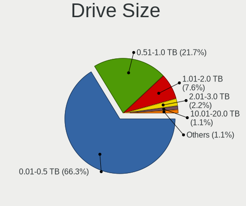
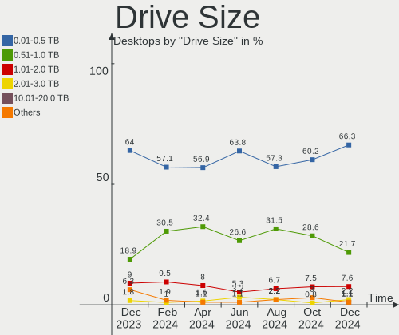
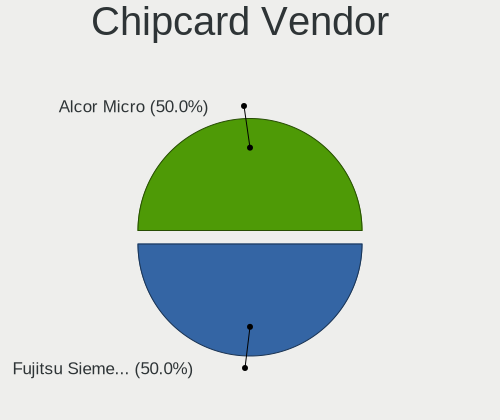
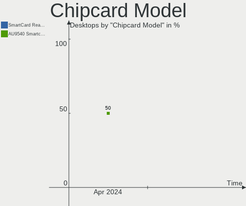
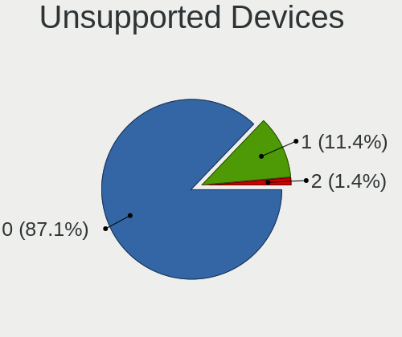

ROSA - Hardware Trends (Desktops)
---------------------------------

A project to identify most popular hardware characteristics and track their change
over time based on data collected by Linux users at https://Linux-Hardware.org.

Anyone can contribute to this report by the [hw-probe](https://github.com/linuxhw/hw-probe) tool:

    sudo -E hw-probe -all -upload

This report is for one last month. Overall report since the beginning of time: [TestDays](https://github.com/linuxhw/TestDays)

Period: Apr, 2024.

Contents
--------

* [ System ](#system)
  - [ OS                       ](#os)
  - [ OS Family                ](#os-family)
  - [ Kernel                   ](#kernel)
  - [ Kernel Family            ](#kernel-family)
  - [ Kernel Major Ver.        ](#kernel-major-ver)
  - [ Arch                     ](#arch)
  - [ DE                       ](#de)
  - [ Display Server           ](#display-server)
  - [ Display Manager          ](#display-manager)
  - [ OS Lang                  ](#os-lang)
  - [ Boot Mode                ](#boot-mode)
  - [ Filesystem               ](#filesystem)
  - [ Part. scheme             ](#part-scheme)
  - [ Dual Boot with Linux/BSD ](#dual-boot-with-linuxbsd)
  - [ Dual Boot (Win)          ](#dual-boot-win)

* [ Board ](#board)
  - [ Vendor                   ](#vendor)
  - [ Model                    ](#model)
  - [ Model Family             ](#model-family)
  - [ MFG Year                 ](#mfg-year)
  - [ Form Factor              ](#form-factor)
  - [ Secure Boot              ](#secure-boot)
  - [ Coreboot                 ](#coreboot)
  - [ RAM Size                 ](#ram-size)
  - [ RAM Used                 ](#ram-used)
  - [ Total Drives             ](#total-drives)
  - [ Has CD-ROM               ](#has-cd-rom)
  - [ Has Ethernet             ](#has-ethernet)
  - [ Has WiFi                 ](#has-wifi)
  - [ Has Bluetooth            ](#has-bluetooth)

* [ Location ](#location)
  - [ Country                  ](#country)
  - [ City                     ](#city)

* [ Drives ](#drives)
  - [ Drive Vendor             ](#drive-vendor)
  - [ Drive Model              ](#drive-model)
  - [ HDD Vendor               ](#hdd-vendor)
  - [ SSD Vendor               ](#ssd-vendor)
  - [ Drive Kind               ](#drive-kind)
  - [ Drive Connector          ](#drive-connector)
  - [ Drive Size               ](#drive-size)
  - [ Space Total              ](#space-total)
  - [ Space Used               ](#space-used)
  - [ Malfunc. Drives          ](#malfunc-drives)
  - [ Malfunc. Drive Vendor    ](#malfunc-drive-vendor)
  - [ Malfunc. HDD Vendor      ](#malfunc-hdd-vendor)
  - [ Malfunc. Drive Kind      ](#malfunc-drive-kind)
  - [ Failed Drives            ](#failed-drives)
  - [ Failed Drive Vendor      ](#failed-drive-vendor)
  - [ Drive Status             ](#drive-status)

* [ Storage controller ](#storage-controller)
  - [ Storage Vendor           ](#storage-vendor)
  - [ Storage Model            ](#storage-model)
  - [ Storage Kind             ](#storage-kind)

* [ Processor ](#processor)
  - [ CPU Vendor               ](#cpu-vendor)
  - [ CPU Model                ](#cpu-model)
  - [ CPU Model Family         ](#cpu-model-family)
  - [ CPU Cores                ](#cpu-cores)
  - [ CPU Sockets              ](#cpu-sockets)
  - [ CPU Threads              ](#cpu-threads)
  - [ CPU Op-Modes             ](#cpu-op-modes)
  - [ CPU Microcode            ](#cpu-microcode)
  - [ CPU Microarch            ](#cpu-microarch)

* [ Graphics ](#graphics)
  - [ GPU Vendor               ](#gpu-vendor)
  - [ GPU Model                ](#gpu-model)
  - [ GPU Combo                ](#gpu-combo)
  - [ GPU Driver               ](#gpu-driver)
  - [ GPU Memory               ](#gpu-memory)

* [ Monitor ](#monitor)
  - [ Monitor Vendor           ](#monitor-vendor)
  - [ Monitor Model            ](#monitor-model)
  - [ Monitor Resolution       ](#monitor-resolution)
  - [ Monitor Diagonal         ](#monitor-diagonal)
  - [ Monitor Width            ](#monitor-width)
  - [ Aspect Ratio             ](#aspect-ratio)
  - [ Monitor Area             ](#monitor-area)
  - [ Pixel Density            ](#pixel-density)
  - [ Multiple Monitors        ](#multiple-monitors)

* [ Network ](#network)
  - [ Net Controller Vendor    ](#net-controller-vendor)
  - [ Net Controller Model     ](#net-controller-model)
  - [ Wireless Vendor          ](#wireless-vendor)
  - [ Wireless Model           ](#wireless-model)
  - [ Ethernet Vendor          ](#ethernet-vendor)
  - [ Ethernet Model           ](#ethernet-model)
  - [ Net Controller Kind      ](#net-controller-kind)
  - [ Used Controller          ](#used-controller)
  - [ NICs                     ](#nics)
  - [ IPv6                     ](#ipv6)

* [ Bluetooth ](#bluetooth)
  - [ Bluetooth Vendor         ](#bluetooth-vendor)
  - [ Bluetooth Model          ](#bluetooth-model)

* [ Sound ](#sound)
  - [ Sound Vendor             ](#sound-vendor)
  - [ Sound Model              ](#sound-model)

* [ Memory ](#memory)
  - [ Memory Vendor            ](#memory-vendor)
  - [ Memory Model             ](#memory-model)
  - [ Memory Kind              ](#memory-kind)
  - [ Memory Form Factor       ](#memory-form-factor)
  - [ Memory Size              ](#memory-size)
  - [ Memory Speed             ](#memory-speed)

* [ Printers & scanners ](#printers--scanners)
  - [ Printer Vendor           ](#printer-vendor)
  - [ Printer Model            ](#printer-model)
  - [ Scanner Vendor           ](#scanner-vendor)
  - [ Scanner Model            ](#scanner-model)

* [ Camera ](#camera)
  - [ Camera Vendor            ](#camera-vendor)
  - [ Camera Model             ](#camera-model)

* [ Security ](#security)
  - [ Fingerprint Vendor       ](#fingerprint-vendor)
  - [ Fingerprint Model        ](#fingerprint-model)
  - [ Chipcard Vendor          ](#chipcard-vendor)
  - [ Chipcard Model           ](#chipcard-model)

* [ Unsupported ](#unsupported)
  - [ Unsupported Devices      ](#unsupported-devices)
  - [ Unsupported Device Types ](#unsupported-device-types)

System
------

OS
--

Installed operating systems

| Name        | Desktops | Percent |
|-------------|----------|---------|
| ROSA 12.5   | 111      | 78.72%  |
| ROSA 13.0   | 7        | 4.96%   |
| ROSA R11.1  | 6        | 4.26%   |
| ROSA 12.4   | 6        | 4.26%   |
| ROSA 12     | 4        | 2.84%   |
| ROSA R11    | 2        | 1.42%   |
| ROSA 2021.1 | 2        | 1.42%   |
| ROSA 12.3   | 2        | 1.42%   |
| ROSA R9     | 1        | 0.71%   |

OS Family
---------

OS without a version

| Name | Desktops | Percent |
|------|----------|---------|
| ROSA | 141      | 100%    |

Kernel
------

Version of the Linux kernel

| Version                                   | Desktops | Percent |
|-------------------------------------------|----------|---------|
| 6.6.21-generic-8rosa2021.1-x86_64         | 69       | 48.94%  |
| 6.1.81-generic-2rosa2021.1-x86_64         | 20       | 14.18%  |
| 6.1.86-generic-1rosa2021.1-x86_64         | 5        | 3.55%   |
| 6.1.58-generic-1rosa2021.1-x86_64         | 5        | 3.55%   |
| 6.1.20-generic-2rosa2021.1-x86_64         | 5        | 3.55%   |
| 5.10.184-generic-1rosa2021.1-x86_64       | 5        | 3.55%   |
| 4.15.0-desktop-122.124.1rosa-x86_64       | 3        | 2.13%   |
| 6.6.27-generic-3rosa2021.1-x86_64         | 2        | 1.42%   |
| 6.6.27-generic-2rosa2021.1-x86_64         | 2        | 1.42%   |
| 6.6.22-generic-2rosa2023.1-x86_64         | 2        | 1.42%   |
| 5.4.32-generic-2rosa-x86_64               | 2        | 1.42%   |
| 5.15.127-generic-1rosa2021.1-x86_64       | 2        | 1.42%   |
| 4.15.0-desktop-45.1rosa-x86_64            | 2        | 1.42%   |
| 6.8.7.xm1-V2.k.1-xanmod-rosa2021.1-x86_64 | 1        | 0.71%   |
| 6.8.5-generic-1rosa2023.1-x86_64          | 1        | 0.71%   |
| 6.8.3.xm1-1.k-xanmod-rosa2021.1-x86_64    | 1        | 0.71%   |
| 6.8.2-generic-2rosa2023.1-x86_64          | 1        | 0.71%   |
| 6.6.25-generic-1rosa2023.1-x86_64         | 1        | 0.71%   |
| 6.6.22.xm1-1.k-xanmod-rosa2021.1-x86_64   | 1        | 0.71%   |
| 6.6.21-generic-6rosa2023.1-x86_64         | 1        | 0.71%   |
| 6.1.80-generic-2rosa2023.1-x86_64         | 1        | 0.71%   |
| 5.4.83-generic-2rosa-i586                 | 1        | 0.71%   |
| 5.15.79-generic-1rosa2021.1-x86_64        | 1        | 0.71%   |
| 5.15.75-generic-1rosa2021.1-x86_64        | 1        | 0.71%   |
| 5.15.127-generic-1rosa2021.1-i686         | 1        | 0.71%   |
| 5.15.103-generic-1rosa2021.1-x86_64       | 1        | 0.71%   |
| 5.10.74-generic-2rosa2021.1-x86_64        | 1        | 0.71%   |
| 5.10.71-generic-1rosa2021.1-x86_64        | 1        | 0.71%   |
| 5.10.184-generic-1rosa2021.1-i586         | 1        | 0.71%   |
| 4.9.20-nrj-desktop-1rosa-x86_64           | 1        | 0.71%   |

Kernel Family
-------------

Linux kernel without a distro release

| Version  | Desktops | Percent |
|----------|----------|---------|
| 6.6.21   | 70       | 49.65%  |
| 6.1.81   | 20       | 14.18%  |
| 5.10.184 | 6        | 4.26%   |
| 6.1.86   | 5        | 3.55%   |
| 6.1.58   | 5        | 3.55%   |
| 6.1.20   | 5        | 3.55%   |
| 4.15.0   | 5        | 3.55%   |
| 6.6.27   | 4        | 2.84%   |
| 6.6.22   | 3        | 2.13%   |
| 5.15.127 | 3        | 2.13%   |
| 5.4.32   | 2        | 1.42%   |
| 6.8.7    | 1        | 0.71%   |
| 6.8.5    | 1        | 0.71%   |
| 6.8.3    | 1        | 0.71%   |
| 6.8.2    | 1        | 0.71%   |
| 6.6.25   | 1        | 0.71%   |
| 6.1.80   | 1        | 0.71%   |
| 5.4.83   | 1        | 0.71%   |
| 5.15.79  | 1        | 0.71%   |
| 5.15.75  | 1        | 0.71%   |
| 5.15.103 | 1        | 0.71%   |
| 5.10.74  | 1        | 0.71%   |
| 5.10.71  | 1        | 0.71%   |
| 4.9.20   | 1        | 0.71%   |

Kernel Major Ver.
-----------------

Linux kernel major version

| Version | Desktops | Percent |
|---------|----------|---------|
| 6.6     | 78       | 55.32%  |
| 6.1     | 36       | 25.53%  |
| 5.10    | 8        | 5.67%   |
| 5.15    | 6        | 4.26%   |
| 4.15    | 5        | 3.55%   |
| 6.8     | 4        | 2.84%   |
| 5.4     | 3        | 2.13%   |
| 4.9     | 1        | 0.71%   |

Arch
----

OS architecture (x86_64, i586, etc.)

| Name   | Desktops | Percent |
|--------|----------|---------|
| x86_64 | 138      | 97.87%  |
| i686   | 3        | 2.13%   |

DE
--

Desktop Environment

| Name    | Desktops | Percent |
|---------|----------|---------|
| KDE5    | 81       | 57.45%  |
| GNOME   | 39       | 27.66%  |
| LXQt    | 11       | 7.8%    |
| KDE4    | 7        | 4.96%   |
| Unknown | 2        | 1.42%   |
| MATE    | 1        | 0.71%   |

Display Server
--------------

X11 or Wayland

| Name    | Desktops | Percent |
|---------|----------|---------|
| Wayland | 104      | 73.76%  |
| X11     | 36       | 25.53%  |
| Tty     | 1        | 0.71%   |

Display Manager
---------------

SDDM, LightDM, etc.

| Name    | Desktops | Percent |
|---------|----------|---------|
| SDDM    | 80       | 56.74%  |
| GDM     | 50       | 35.46%  |
| KDM     | 7        | 4.96%   |
| LightDM | 2        | 1.42%   |
| Unknown | 2        | 1.42%   |

OS Lang
-------

Language

| Lang    | Desktops | Percent |
|---------|----------|---------|
| ru_RU   | 119      | 84.4%   |
| en_US   | 6        | 4.26%   |
| it_IT   | 3        | 2.13%   |
| Unknown | 3        | 2.13%   |
| pl_PL   | 2        | 1.42%   |
| de_DE   | 2        | 1.42%   |
| ru_UA   | 1        | 0.71%   |
| hu_HU   | 1        | 0.71%   |
| hr_HR   | 1        | 0.71%   |
| fi_FI   | 1        | 0.71%   |
| es_ES   | 1        | 0.71%   |
| en_GB   | 1        | 0.71%   |

Boot Mode
---------

EFI or BIOS

| Mode | Desktops | Percent |
|------|----------|---------|
| EFI  | 90       | 63.83%  |
| BIOS | 51       | 36.17%  |

Filesystem
----------

Type of filesystem

| Type  | Desktops | Percent |
|-------|----------|---------|
| Ext4  | 127      | 90.07%  |
| Btrfs | 12       | 8.51%   |
| F2fs  | 2        | 1.42%   |

Part. scheme
------------

Scheme of partitioning

| Type    | Desktops | Percent |
|---------|----------|---------|
| GPT     | 96       | 68.09%  |
| MBR     | 42       | 29.79%  |
| Unknown | 3        | 2.13%   |

Dual Boot with Linux/BSD
------------------------

Hosting more than one Linux/BSD

| Dual boot | Desktops | Percent |
|-----------|----------|---------|
| No        | 92       | 65.25%  |
| Yes       | 49       | 34.75%  |

Dual Boot (Win)
---------------

Hosting Linux and Windows

| Dual boot | Desktops | Percent |
|-----------|----------|---------|
| No        | 73       | 51.77%  |
| Yes       | 68       | 48.23%  |

Board
-----

Vendor
------

Motherboard manufacturer

| Name                | Desktops | Percent |
|---------------------|----------|---------|
| Gigabyte Technology | 40       | 28.37%  |
| ASUSTek Computer    | 31       | 21.99%  |
| MSI                 | 24       | 17.02%  |
| ASRock              | 17       | 12.06%  |
| Intel               | 5        | 3.55%   |
| Hewlett-Packard     | 4        | 2.84%   |
| Dell                | 3        | 2.13%   |
| Packard Bell        | 2        | 1.42%   |
| Huanan              | 2        | 1.42%   |
| Fujitsu             | 2        | 1.42%   |
| ECS                 | 2        | 1.42%   |
| Biostar             | 2        | 1.42%   |
| WeiBu               | 1        | 0.71%   |
| MB                  | 1        | 0.71%   |
| MACHINIST           | 1        | 0.71%   |
| EPoX Computer       | 1        | 0.71%   |
| BESHTAU             | 1        | 0.71%   |
| Acer                | 1        | 0.71%   |
| Unknown             | 1        | 0.71%   |

Model
-----

Motherboard model

| Name                                                             | Desktops | Percent |
|------------------------------------------------------------------|----------|---------|
| ASUS All Series                                                  | 3        | 2.13%   |
| MSI MS-7C96                                                      | 2        | 1.42%   |
| Intel X99                                                        | 2        | 1.42%   |
| Gigabyte B560 HD3                                                | 2        | 1.42%   |
| Gigabyte AB350M-DS3H V2                                          | 2        | 1.42%   |
| ASUS M5A97 R2.0                                                  | 2        | 1.42%   |
| ASRock A520M Pro4                                                | 2        | 1.42%   |
| WeiBu ADL-N                                                      | 1        | 0.71%   |
| Packard Bell IXTREME M5722                                       | 1        | 0.71%   |
| Packard Bell imax mini N3600                                     | 1        | 0.71%   |
| MSI OPTIMUS                                                      | 1        | 0.71%   |
| MSI MS-7E27                                                      | 1        | 0.71%   |
| MSI MS-7D89                                                      | 1        | 0.71%   |
| MSI MS-7D42                                                      | 1        | 0.71%   |
| MSI MS-7D22                                                      | 1        | 0.71%   |
| MSI MS-7D18                                                      | 1        | 0.71%   |
| MSI MS-7C95                                                      | 1        | 0.71%   |
| MSI MS-7C84                                                      | 1        | 0.71%   |
| MSI MS-7C56                                                      | 1        | 0.71%   |
| MSI MS-7C52                                                      | 1        | 0.71%   |
| MSI MS-7C37                                                      | 1        | 0.71%   |
| MSI MS-7A69                                                      | 1        | 0.71%   |
| MSI MS-7A38                                                      | 1        | 0.71%   |
| MSI MS-7A36                                                      | 1        | 0.71%   |
| MSI MS-7A15                                                      | 1        | 0.71%   |
| MSI MS-7996                                                      | 1        | 0.71%   |
| MSI MS-7924                                                      | 1        | 0.71%   |
| MSI MS-7788                                                      | 1        | 0.71%   |
| MSI MS-7641                                                      | 1        | 0.71%   |
| MSI MS-7599                                                      | 1        | 0.71%   |
| MSI Elite 7100 Microtower PC                                     | 1        | 0.71%   |
| MSI B560M PRO-E                                                  | 1        | 0.71%   |
| MB A320-SF110                                                    | 1        | 0.71%   |
| MACHINIST X79 (INTEL Xeon E5/Corei7 DMI2 - C600/C200 Cipset V309 | 1        | 0.71%   |
| Intel SKYBAY                                                     | 1        | 0.71%   |
| Intel H61                                                        | 1        | 0.71%   |
| Intel DH67BL AAG10189-209                                        | 1        | 0.71%   |
| Huanan X99-BD4 V1.33                                             | 1        | 0.71%   |
| Huanan X99 F8D V2.2                                              | 1        | 0.71%   |
| HP ProDesk 400 G7 Small Form Factor PC                           | 1        | 0.71%   |

Model Family
------------

Motherboard model prefix

| Name                 | Desktops | Percent |
|----------------------|----------|---------|
| ASUS PRIME           | 5        | 3.55%   |
| Gigabyte B450M       | 3        | 2.13%   |
| Dell OptiPlex        | 3        | 2.13%   |
| ASUS ROG             | 3        | 2.13%   |
| ASUS M5A97           | 3        | 2.13%   |
| ASUS All             | 3        | 2.13%   |
| MSI MS-7C96          | 2        | 1.42%   |
| Intel X99            | 2        | 1.42%   |
| HP Pavilion          | 2        | 1.42%   |
| Gigabyte H610M       | 2        | 1.42%   |
| Gigabyte B560        | 2        | 1.42%   |
| Gigabyte AB350M-DS3H | 2        | 1.42%   |
| Gigabyte A520M       | 2        | 1.42%   |
| Fujitsu ESPRIMO      | 2        | 1.42%   |
| ASUS TUF             | 2        | 1.42%   |
| ASUS STRIX           | 2        | 1.42%   |
| ASUS P5G41T-M        | 2        | 1.42%   |
| ASRock A520M         | 2        | 1.42%   |
| WeiBu ADL-N          | 1        | 0.71%   |
| Packard Bell IXTREME | 1        | 0.71%   |
| Packard Bell imax    | 1        | 0.71%   |
| MSI OPTIMUS          | 1        | 0.71%   |
| MSI MS-7E27          | 1        | 0.71%   |
| MSI MS-7D89          | 1        | 0.71%   |
| MSI MS-7D42          | 1        | 0.71%   |
| MSI MS-7D22          | 1        | 0.71%   |
| MSI MS-7D18          | 1        | 0.71%   |
| MSI MS-7C95          | 1        | 0.71%   |
| MSI MS-7C84          | 1        | 0.71%   |
| MSI MS-7C56          | 1        | 0.71%   |
| MSI MS-7C52          | 1        | 0.71%   |
| MSI MS-7C37          | 1        | 0.71%   |
| MSI MS-7A69          | 1        | 0.71%   |
| MSI MS-7A38          | 1        | 0.71%   |
| MSI MS-7A36          | 1        | 0.71%   |
| MSI MS-7A15          | 1        | 0.71%   |
| MSI MS-7996          | 1        | 0.71%   |
| MSI MS-7924          | 1        | 0.71%   |
| MSI MS-7788          | 1        | 0.71%   |
| MSI MS-7641          | 1        | 0.71%   |

MFG Year
--------

Motherboard manufacture year

| Year | Desktops | Percent |
|------|----------|---------|
| 2012 | 21       | 14.89%  |
| 2020 | 18       | 12.77%  |
| 2021 | 15       | 10.64%  |
| 2018 | 14       | 9.93%   |
| 2016 | 9        | 6.38%   |
| 2011 | 9        | 6.38%   |
| 2009 | 9        | 6.38%   |
| 2010 | 7        | 4.96%   |
| 2019 | 6        | 4.26%   |
| 2013 | 6        | 4.26%   |
| 2022 | 5        | 3.55%   |
| 2017 | 5        | 3.55%   |
| 2014 | 4        | 2.84%   |
| 2023 | 3        | 2.13%   |
| 2007 | 3        | 2.13%   |
| 2015 | 2        | 1.42%   |
| 2024 | 1        | 0.71%   |
| 2008 | 1        | 0.71%   |
| 2006 | 1        | 0.71%   |
| 2005 | 1        | 0.71%   |
| 2003 | 1        | 0.71%   |

Form Factor
-----------

Physical design of the computer

| Name    | Desktops | Percent |
|---------|----------|---------|
| Desktop | 141      | 100%    |

Secure Boot
-----------

Enabled or disabled

| State    | Desktops | Percent |
|----------|----------|---------|
| Disabled | 141      | 100%    |

Coreboot
--------

Have coreboot on board

| Used | Desktops | Percent |
|------|----------|---------|
| No   | 141      | 100%    |

RAM Size
--------

Total RAM memory

| Size in GB      | Desktops | Percent |
|-----------------|----------|---------|
| 16.01-24.0      | 46       | 32.62%  |
| 8.01-16.0       | 29       | 20.57%  |
| 4.01-8.0        | 21       | 14.89%  |
| 32.01-64.0      | 18       | 12.77%  |
| 3.01-4.0        | 13       | 9.22%   |
| 64.01-256.0     | 6        | 4.26%   |
| 24.01-32.0      | 4        | 2.84%   |
| More than 256.0 | 1        | 0.71%   |
| 2.01-3.0        | 1        | 0.71%   |
| 1.01-2.0        | 1        | 0.71%   |
| 0.51-1.0        | 1        | 0.71%   |

RAM Used
--------

Used RAM memory

| Used GB  | Desktops | Percent |
|----------|----------|---------|
| 1.01-2.0 | 63       | 44.68%  |
| 2.01-3.0 | 32       | 22.7%   |
| 0.51-1.0 | 18       | 12.77%  |
| 4.01-8.0 | 14       | 9.93%   |
| 3.01-4.0 | 13       | 9.22%   |
| 0.01-0.5 | 1        | 0.71%   |

Total Drives
------------

Number of drives on board

| Drives | Desktops | Percent |
|--------|----------|---------|
| 1      | 48       | 34.04%  |
| 2      | 47       | 33.33%  |
| 3      | 23       | 16.31%  |
| 4      | 13       | 9.22%   |
| 5      | 5        | 3.55%   |
| 6      | 4        | 2.84%   |
| 0      | 1        | 0.71%   |

Has CD-ROM
----------

Has CD-ROM on board

| Presented | Desktops | Percent |
|-----------|----------|---------|
| No        | 94       | 66.67%  |
| Yes       | 47       | 33.33%  |

Has Ethernet
------------

Has Ethernet on board

| Presented | Desktops | Percent |
|-----------|----------|---------|
| Yes       | 140      | 99.29%  |
| No        | 1        | 0.71%   |

Has WiFi
--------

Has WiFi module

| Presented | Desktops | Percent |
|-----------|----------|---------|
| No        | 93       | 65.96%  |
| Yes       | 48       | 34.04%  |

Has Bluetooth
-------------

Has Bluetooth module

| Presented | Desktops | Percent |
|-----------|----------|---------|
| No        | 98       | 69.5%   |
| Yes       | 43       | 30.5%   |

Location
--------

Country
-------

Geographic location (country)

| Country                | Desktops | Percent |
|------------------------|----------|---------|
| Russia                 | 116      | 82.27%  |
| Italy                  | 3        | 2.13%   |
| Germany                | 3        | 2.13%   |
| Ukraine                | 2        | 1.42%   |
| Poland                 | 2        | 1.42%   |
| Finland                | 2        | 1.42%   |
| Portugal               | 1        | 0.71%   |
| Malaysia               | 1        | 0.71%   |
| Latvia                 | 1        | 0.71%   |
| Kazakhstan             | 1        | 0.71%   |
| Ireland                | 1        | 0.71%   |
| Hungary                | 1        | 0.71%   |
| Dominican Republic     | 1        | 0.71%   |
| Czechia                | 1        | 0.71%   |
| Bosnia and Herzegovina | 1        | 0.71%   |
| Belarus                | 1        | 0.71%   |
| Austria                | 1        | 0.71%   |
| Australia              | 1        | 0.71%   |
| Argentina              | 1        | 0.71%   |

City
----

Geographic location (city)

| City              | Desktops | Percent |
|-------------------|----------|---------|
| Moscow            | 25       | 17.73%  |
| St Petersburg     | 14       | 9.93%   |
| Chelyabinsk       | 5        | 3.55%   |
| Stavropol         | 3        | 2.13%   |
| Novosibirsk       | 3        | 2.13%   |
| Krasnodar         | 3        | 2.13%   |
| Kaliningrad       | 3        | 2.13%   |
| Yaroslavl         | 2        | 1.42%   |
| Voronezh          | 2        | 1.42%   |
| Vladivostok       | 2        | 1.42%   |
| Tambov            | 2        | 1.42%   |
| Samara            | 2        | 1.42%   |
| Rostov-on-Don     | 2        | 1.42%   |
| Perm              | 2        | 1.42%   |
| Omsk              | 2        | 1.42%   |
| Lipetsk           | 2        | 1.42%   |
| Kazan'            | 2        | 1.42%   |
| Zima              | 1        | 0.71%   |
| Yuzhno-Sakhalinsk | 1        | 0.71%   |
| Yekaterinburg     | 1        | 0.71%   |
| Vladimir          | 1        | 0.71%   |
| Veliky Novgorod   | 1        | 0.71%   |
| Ust-Kamenogorsk   | 1        | 0.71%   |
| Ulyanovsk         | 1        | 0.71%   |
| Ufa               | 1        | 0.71%   |
| Udomlya           | 1        | 0.71%   |
| Tyumen            | 1        | 0.71%   |
| Tyrnyauz          | 1        | 0.71%   |
| Tula              | 1        | 0.71%   |
| Tsarskoye Selo    | 1        | 0.71%   |
| Surgut            | 1        | 0.71%   |
| Sosnowiec         | 1        | 0.71%   |
| Shelekhov         | 1        | 0.71%   |
| Saratov           | 1        | 0.71%   |
| Saransk           | 1        | 0.71%   |
| Rome              | 1        | 0.71%   |
| Riga              | 1        | 0.71%   |
| Prnjavor          | 1        | 0.71%   |
| Prague            | 1        | 0.71%   |
| Ponzari           | 1        | 0.71%   |

Drives
------

Drive Vendor
------------

Hard drive vendors

| Vendor                      | Desktops | Drives | Percent |
|-----------------------------|----------|--------|---------|
| WDC                         | 57       | 68     | 20.5%   |
| Seagate                     | 33       | 35     | 11.87%  |
| Samsung Electronics         | 26       | 31     | 9.35%   |
| Toshiba                     | 22       | 24     | 7.91%   |
| Kingston                    | 18       | 19     | 6.47%   |
| Hitachi                     | 13       | 15     | 4.68%   |
| Crucial                     | 10       | 15     | 3.6%    |
| Apacer                      | 10       | 10     | 3.6%    |
| A-DATA Technology           | 9        | 10     | 3.24%   |
| SanDisk                     | 7        | 9      | 2.52%   |
| China                       | 7        | 7      | 2.52%   |
| Smartbuy                    | 4        | 4      | 1.44%   |
| Plextor                     | 4        | 5      | 1.44%   |
| Gigabyte Technology         | 4        | 4      | 1.44%   |
| AGI                         | 4        | 4      | 1.44%   |
| Intel                       | 3        | 4      | 1.08%   |
| HGST                        | 3        | 3      | 1.08%   |
| DEXP                        | 3        | 3      | 1.08%   |
| AMD                         | 3        | 3      | 1.08%   |
| Unknown                     | 2        | 2      | 0.72%   |
| SPCC                        | 2        | 3      | 0.72%   |
| Qumo                        | 2        | 2      | 0.72%   |
| Netac                       | 2        | 2      | 0.72%   |
| MAXIO Technology (Hangzhou) | 2        | 2      | 0.72%   |
| KingSpec                    | 2        | 3      | 0.72%   |
| Hewlett-Packard             | 2        | 2      | 0.72%   |
| ADATA Technology            | 2        | 2      | 0.72%   |
| walram                      | 1        | 1      | 0.36%   |
| Transcend                   | 1        | 1      | 0.36%   |
| Team                        | 1        | 1      | 0.36%   |
| T-FORCE                     | 1        | 1      | 0.36%   |
| Phison                      | 1        | 1      | 0.36%   |
| Patriot                     | 1        | 1      | 0.36%   |
| OCZ-VERTEX3                 | 1        | 1      | 0.36%   |
| OCZ                         | 1        | 1      | 0.36%   |
| MSI                         | 1        | 1      | 0.36%   |
| Micron Technology           | 1        | 1      | 0.36%   |
| LuminouTek                  | 1        | 1      | 0.36%   |
| Kingston Technology Company | 1        | 1      | 0.36%   |
| JMicron Technology          | 1        | 1      | 0.36%   |

Drive Model
-----------

Hard drive models

| Model                                                           | Desktops | Percent |
|-----------------------------------------------------------------|----------|---------|
| Toshiba HDWD110 1TB                                             | 7        | 2.31%   |
| Seagate ST1000DM010-2EP102 1TB                                  | 7        | 2.31%   |
| Seagate ST500DM002-1BD142 500GB                                 | 5        | 1.65%   |
| Crucial CT240BX500SSD1 240GB                                    | 5        | 1.65%   |
| WDC WD10EZEX-08WN4A0 1TB                                        | 4        | 1.32%   |
| Toshiba DT01ACA100 1TB                                          | 4        | 1.32%   |
| Seagate ST1000DM003-1CH162 1TB                                  | 3        | 0.99%   |
| Kingston SA400S37120G 120GB SSD                                 | 3        | 0.99%   |
| Hitachi HDS721010CLA332 1TB                                     | 3        | 0.99%   |
| Apacer AS2280P4 256GB                                           | 3        | 0.99%   |
| A-DATA SU650 480GB SSD                                          | 3        | 0.99%   |
| A-DATA SU650 120GB SSD                                          | 3        | 0.99%   |
| WDC WDS120G2G0A-00JH30 120GB SSD                                | 2        | 0.66%   |
| WDC WD5003AZEX-00MK2A0 500GB                                    | 2        | 0.66%   |
| WDC WD5000AZRX-00L4HB0 500GB                                    | 2        | 0.66%   |
| WDC WD10EZEX-00BN5A0 1TB                                        | 2        | 0.66%   |
| Toshiba DT01ACA300 3TB                                          | 2        | 0.66%   |
| Toshiba DT01ACA050 500GB                                        | 2        | 0.66%   |
| Smartbuy SSD 120GB                                              | 2        | 0.66%   |
| SanDisk SSD PLUS 120GB                                          | 2        | 0.66%   |
| SanDisk SDSSDA240G 240GB                                        | 2        | 0.66%   |
| Samsung SSD 980 250GB                                           | 2        | 0.66%   |
| Samsung SSD 870 EVO 250GB                                       | 2        | 0.66%   |
| Samsung SSD 750 EVO 250GB                                       | 2        | 0.66%   |
| Samsung HM321HI 320GB                                           | 2        | 0.66%   |
| Kingston SNVS500G 500GB                                         | 2        | 0.66%   |
| Kingston SA400S37240G 240GB SSD                                 | 2        | 0.66%   |
| Hitachi HDS721050CLA360 500GB                                   | 2        | 0.66%   |
| Hitachi HDS721010CLA330 1TB                                     | 2        | 0.66%   |
| Gigabyte GP-GSTFS31120GNTD 120GB SSD                            | 2        | 0.66%   |
| DEXP SSD C100 128Gb                                             | 2        | 0.66%   |
| Crucial CT250MX500SSD1 250GB                                    | 2        | 0.66%   |
| China SSD 256GB                                                 | 2        | 0.66%   |
| China SATA SSD 128GB                                            | 2        | 0.66%   |
| Apacer AS350 512GB SSD                                          | 2        | 0.66%   |
| Apacer AS350 128GB SSD                                          | 2        | 0.66%   |
| AMD R5SL256G 256GB SSD                                          | 2        | 0.66%   |
| ADATA XPG SX8200 Pro PCIe Gen3x4 M.2 2280 Solid State Drive 1TB | 2        | 0.66%   |
| WDC WDS500G2B0A-00SM50 500GB SSD                                | 1        | 0.33%   |
| WDC WDS500G2B0A 500GB SSD                                       | 1        | 0.33%   |

HDD Vendor
----------

Hard disk drive vendors

| Vendor              | Desktops | Drives | Percent |
|---------------------|----------|--------|---------|
| WDC                 | 48       | 57     | 38.4%   |
| Seagate             | 31       | 33     | 24.8%   |
| Toshiba             | 22       | 24     | 17.6%   |
| Hitachi             | 13       | 15     | 10.4%   |
| Samsung Electronics | 4        | 4      | 3.2%    |
| HGST                | 3        | 3      | 2.4%    |
| Unknown             | 1        | 1      | 0.8%    |
| JMicron Technology  | 1        | 1      | 0.8%    |
| Hewlett-Packard     | 1        | 1      | 0.8%    |
| Fujitsu             | 1        | 1      | 0.8%    |

SSD Vendor
----------

Solid state drive vendors

| Vendor              | Desktops | Drives | Percent |
|---------------------|----------|--------|---------|
| Kingston            | 14       | 14     | 12.07%  |
| Samsung Electronics | 12       | 12     | 10.34%  |
| Crucial             | 10       | 13     | 8.62%   |
| WDC                 | 9        | 9      | 7.76%   |
| SanDisk             | 7        | 9      | 6.03%   |
| China               | 7        | 7      | 6.03%   |
| Apacer              | 6        | 6      | 5.17%   |
| A-DATA Technology   | 6        | 7      | 5.17%   |
| Smartbuy            | 4        | 4      | 3.45%   |
| Plextor             | 4        | 4      | 3.45%   |
| AGI                 | 4        | 4      | 3.45%   |
| Gigabyte Technology | 3        | 3      | 2.59%   |
| DEXP                | 3        | 3      | 2.59%   |
| AMD                 | 3        | 3      | 2.59%   |
| SPCC                | 2        | 3      | 1.72%   |
| Seagate             | 2        | 2      | 1.72%   |
| Qumo                | 2        | 2      | 1.72%   |
| KingSpec            | 2        | 3      | 1.72%   |
| walram              | 1        | 1      | 0.86%   |
| Transcend           | 1        | 1      | 0.86%   |
| T-FORCE             | 1        | 1      | 0.86%   |
| Patriot             | 1        | 1      | 0.86%   |
| OCZ-VERTEX3         | 1        | 1      | 0.86%   |
| OCZ                 | 1        | 1      | 0.86%   |
| Netac               | 1        | 1      | 0.86%   |
| LuminouTek          | 1        | 1      | 0.86%   |
| Intel               | 1        | 1      | 0.86%   |
| HS-SSD-E100         | 1        | 1      | 0.86%   |
| Foxline             | 1        | 1      | 0.86%   |
| Dogfish             | 1        | 1      | 0.86%   |
| Digma               | 1        | 1      | 0.86%   |
| BR                  | 1        | 1      | 0.86%   |
| BESHTAU             | 1        | 2      | 0.86%   |
| AOSENKE             | 1        | 1      | 0.86%   |

Drive Kind
----------

HDD or SSD

| Kind | Desktops | Drives | Percent |
|------|----------|--------|---------|
| HDD  | 101      | 140    | 43.35%  |
| SSD  | 91       | 125    | 39.06%  |
| NVMe | 41       | 49     | 17.6%   |

Drive Connector
---------------

SATA, SAS, NVMe, etc.

| Type | Desktops | Drives | Percent |
|------|----------|--------|---------|
| SATA | 130      | 263    | 75.14%  |
| NVMe | 41       | 49     | 23.7%   |
| SAS  | 2        | 2      | 1.16%   |

Drive Size
----------

Size of hard drive

| Size in TB | Desktops | Drives | Percent |
|------------|----------|--------|---------|
| 0.01-0.5   | 107      | 159    | 56.91%  |
| 0.51-1.0   | 61       | 85     | 32.45%  |
| 1.01-2.0   | 15       | 16     | 7.98%   |
| 2.01-3.0   | 3        | 3      | 1.6%    |
| 3.01-4.0   | 1        | 1      | 0.53%   |
| 4.01-10.0  | 1        | 1      | 0.53%   |

Space Total
-----------

Amount of disk space available on the file system

| Size in GB     | Desktops | Percent |
|----------------|----------|---------|
| 101-250        | 36       | 25.53%  |
| 251-500        | 22       | 15.6%   |
| 501-1000       | 21       | 14.89%  |
| 1-20           | 18       | 12.77%  |
| 1001-2000      | 16       | 11.35%  |
| 51-100         | 10       | 7.09%   |
| 2001-3000      | 8        | 5.67%   |
| More than 3000 | 5        | 3.55%   |
| 21-50          | 5        | 3.55%   |

Space Used
----------

Amount of used disk space

| Used GB        | Desktops | Percent |
|----------------|----------|---------|
| 1-20           | 66       | 46.81%  |
| 101-250        | 20       | 14.18%  |
| 21-50          | 15       | 10.64%  |
| 501-1000       | 12       | 8.51%   |
| 51-100         | 11       | 7.8%    |
| 251-500        | 7        | 4.96%   |
| 1001-2000      | 7        | 4.96%   |
| 2001-3000      | 2        | 1.42%   |
| More than 3000 | 1        | 0.71%   |

Malfunc. Drives
---------------

Drive models with a malfunction

| Model                                   | Desktops | Drives | Percent |
|-----------------------------------------|----------|--------|---------|
| WDC WD800JD-00MSA1 80GB                 | 1        | 1      | 2.17%   |
| WDC WD800AAJS-00B4A0 80GB               | 1        | 1      | 2.17%   |
| WDC WD5000AAKX-60U6AA0 500GB            | 1        | 1      | 2.17%   |
| WDC WD400BB-00DEA0 40GB                 | 1        | 1      | 2.17%   |
| WDC WD3200BPVT-24ZEST0 320GB            | 1        | 1      | 2.17%   |
| WDC WD30EFRX-68EUZN0 3TB                | 1        | 1      | 2.17%   |
| WDC WD10PURX-64E5EY0 1TB                | 1        | 1      | 2.17%   |
| WDC WD10EZEX-00BN5A0 1TB                | 1        | 1      | 2.17%   |
| WDC WD10EALX-009BA0 1TB                 | 1        | 1      | 2.17%   |
| WDC WD1003FZEX-00MK2A0 1TB              | 1        | 1      | 2.17%   |
| WDC WD1003FZEX-00K3CA0 1TB              | 1        | 1      | 2.17%   |
| WDC WD1003FBYX-01Y7B1 1TB               | 1        | 1      | 2.17%   |
| WDC WD1002FAEX-00Y9A0 1TB               | 1        | 1      | 2.17%   |
| walram SSD 120G                         | 1        | 1      | 2.17%   |
| Toshiba MQ01ABD100 1TB                  | 1        | 1      | 2.17%   |
| Toshiba MK6459GSXP 640GB                | 1        | 1      | 2.17%   |
| Toshiba MK6034GSX 64GB                  | 1        | 1      | 2.17%   |
| Toshiba MK3265GSX H 320GB               | 1        | 1      | 2.17%   |
| Toshiba MK1059GSMP 1TB                  | 1        | 1      | 2.17%   |
| Toshiba DT01ACA100 1TB                  | 1        | 1      | 2.17%   |
| SPCC Solid State Disk 512GB             | 1        | 2      | 2.17%   |
| Smartbuy SSD 240GB                      | 1        | 1      | 2.17%   |
| Seagate ST500DM002-1BD142 500GB         | 1        | 1      | 2.17%   |
| Seagate ST3250410AS 250GB               | 1        | 1      | 2.17%   |
| Seagate ST3160813AS 160GB               | 1        | 1      | 2.17%   |
| Seagate ST1000NM0033-9ZM173 1TB         | 1        | 1      | 2.17%   |
| Samsung Electronics SSD 980 250GB       | 1        | 1      | 2.17%   |
| Samsung Electronics HD322GJ 320GB       | 1        | 1      | 2.17%   |
| Qumo SSD 240GB                          | 1        | 1      | 2.17%   |
| Plextor PX-128M7VC 128GB SSD            | 1        | 1      | 2.17%   |
| Kingston SUV400S37120G 120GB SSD        | 1        | 1      | 2.17%   |
| Kingston SUV300S37A120G 120GB SSD       | 1        | 1      | 2.17%   |
| Kingston RBU-SNS8350DES3128GP 128GB SSD | 1        | 1      | 2.17%   |
| Hitachi HTS545016B9A300 160GB           | 1        | 1      | 2.17%   |
| Hitachi HTS541612J9SA00 120GB           | 1        | 1      | 2.17%   |
| Hitachi HDS721075KLA330 752GB           | 1        | 1      | 2.17%   |
| Hitachi HDS721050DLE630 500GB           | 1        | 1      | 2.17%   |
| Hitachi HDS721050CLA360 500GB           | 1        | 1      | 2.17%   |
| Hitachi HDS721010CLA332 1TB             | 1        | 1      | 2.17%   |
| Hitachi HDS721010CLA330 1TB             | 1        | 1      | 2.17%   |

Malfunc. Drive Vendor
---------------------

Vendors of faulty drives

| Vendor              | Desktops | Drives | Percent |
|---------------------|----------|--------|---------|
| WDC                 | 13       | 13     | 28.89%  |
| Toshiba             | 6        | 6      | 13.33%  |
| Hitachi             | 6        | 7      | 13.33%  |
| Seagate             | 4        | 4      | 8.89%   |
| Kingston            | 3        | 3      | 6.67%   |
| Samsung Electronics | 2        | 2      | 4.44%   |
| Apacer              | 2        | 2      | 4.44%   |
| walram              | 1        | 1      | 2.22%   |
| SPCC                | 1        | 2      | 2.22%   |
| Smartbuy            | 1        | 1      | 2.22%   |
| Qumo                | 1        | 1      | 2.22%   |
| Plextor             | 1        | 1      | 2.22%   |
| HGST                | 1        | 1      | 2.22%   |
| Fujitsu             | 1        | 1      | 2.22%   |
| China               | 1        | 1      | 2.22%   |
| A-DATA Technology   | 1        | 1      | 2.22%   |

Malfunc. HDD Vendor
-------------------

Vendors of faulty HDD drives

| Vendor              | Desktops | Drives | Percent |
|---------------------|----------|--------|---------|
| WDC                 | 13       | 13     | 40.63%  |
| Toshiba             | 6        | 6      | 18.75%  |
| Hitachi             | 6        | 7      | 18.75%  |
| Seagate             | 4        | 4      | 12.5%   |
| Samsung Electronics | 1        | 1      | 3.13%   |
| HGST                | 1        | 1      | 3.13%   |
| Fujitsu             | 1        | 1      | 3.13%   |

Malfunc. Drive Kind
-------------------

Kinds of faulty drives

| Kind | Desktops | Drives | Percent |
|------|----------|--------|---------|
| HDD  | 29       | 33     | 69.05%  |
| SSD  | 11       | 12     | 26.19%  |
| NVMe | 2        | 2      | 4.76%   |

Failed Drives
-------------

Failed drive models

| Model                       | Desktops | Drives | Percent |
|-----------------------------|----------|--------|---------|
| WDC WD10JPVX-75JC3T0 1TB    | 1        | 1      | 50%     |
| Hitachi HDS721010CLA332 1TB | 1        | 1      | 50%     |

Failed Drive Vendor
-------------------

Failed drive vendors

| Vendor  | Desktops | Drives | Percent |
|---------|----------|--------|---------|
| WDC     | 1        | 1      | 50%     |
| Hitachi | 1        | 1      | 50%     |

Drive Status
------------

Number of failed and malfunc. drives

| Status   | Desktops | Drives | Percent |
|----------|----------|--------|---------|
| Works    | 128      | 257    | 73.14%  |
| Malfunc  | 39       | 47     | 22.29%  |
| Detected | 6        | 8      | 3.43%   |
| Failed   | 2        | 2      | 1.14%   |

Storage controller
------------------

Storage Vendor
--------------

Storage controller vendors

| Vendor                        | Desktops | Percent |
|-------------------------------|----------|---------|
| Intel                         | 90       | 45.45%  |
| AMD                           | 48       | 24.24%  |
| Samsung Electronics           | 12       | 6.06%   |
| Phison Electronics            | 7        | 3.54%   |
| ASMedia Technology            | 7        | 3.54%   |
| Nvidia                        | 5        | 2.53%   |
| Kingston Technology Company   | 5        | 2.53%   |
| JMicron Technology            | 5        | 2.53%   |
| ADATA Technology              | 5        | 2.53%   |
| MAXIO Technology (Hangzhou)   | 3        | 1.52%   |
| SanDisk                       | 2        | 1.01%   |
| Silicon Motion                | 1        | 0.51%   |
| Shenzhen Longsys Electronics  | 1        | 0.51%   |
| Micron/Crucial Technology     | 1        | 0.51%   |
| Micron Technology             | 1        | 0.51%   |
| Marvell Technology Group      | 1        | 0.51%   |
| Lite-On Technology            | 1        | 0.51%   |
| Integrated Technology Express | 1        | 0.51%   |
| Hosin Global Electronics      | 1        | 0.51%   |
| Unknown                       | 1        | 0.51%   |

Storage Model
-------------

Storage controller models

| Model                                                                                   | Desktops | Percent |
|-----------------------------------------------------------------------------------------|----------|---------|
| AMD FCH SATA Controller [AHCI mode]                                                     | 16       | 6.48%   |
| AMD 500 Series Chipset SATA Controller                                                  | 13       | 5.26%   |
| Intel 8 Series/C220 Series Chipset Family 6-port SATA Controller 1 [AHCI mode]          | 10       | 4.05%   |
| AMD SB7x0/SB8x0/SB9x0 IDE Controller                                                    | 8        | 3.24%   |
| AMD 400 Series Chipset SATA Controller                                                  | 8        | 3.24%   |
| Intel 500 Series Chipset Family SATA AHCI Controller                                    | 7        | 2.83%   |
| ASMedia ASM1061/ASM1062 Serial ATA Controller                                           | 7        | 2.83%   |
| AMD SB7x0/SB8x0/SB9x0 SATA Controller [AHCI mode]                                       | 7        | 2.83%   |
| Intel Q170/Q150/B150/H170/H110/Z170/CM236 Chipset SATA Controller [AHCI Mode]           | 6        | 2.43%   |
| Intel 6 Series/C200 Series Chipset Family Desktop SATA Controller (IDE mode, ports 4-5) | 6        | 2.43%   |
| Intel 6 Series/C200 Series Chipset Family Desktop SATA Controller (IDE mode, ports 0-3) | 6        | 2.43%   |
| Intel 200 Series PCH SATA controller [AHCI mode]                                        | 6        | 2.43%   |
| AMD SB7x0/SB8x0/SB9x0 SATA Controller [IDE mode]                                        | 6        | 2.43%   |
| AMD 300 Series Chipset SATA Controller                                                  | 6        | 2.43%   |
| Samsung NVMe SSD Controller PM9A1/PM9A3/980PRO                                          | 5        | 2.02%   |
| Intel Alder Lake-S PCH SATA Controller [AHCI Mode]                                      | 5        | 2.02%   |
| Intel 7 Series/C210 Series Chipset Family 6-port SATA Controller [AHCI mode]            | 5        | 2.02%   |
| Intel 6 Series/C200 Series Chipset Family 6 port Desktop SATA AHCI Controller           | 5        | 2.02%   |
| Samsung NVMe SSD Controller SM981/PM981/PM983                                           | 4        | 1.62%   |
| Intel Cannon Lake PCH SATA AHCI Controller                                              | 4        | 1.62%   |
| Intel 5 Series/3400 Series Chipset 6 port SATA AHCI Controller                          | 4        | 1.62%   |
| Samsung NVMe SSD Controller 980 (DRAM-less)                                             | 3        | 1.21%   |
| Phison PS5013-E13 PCIe3 NVMe Controller (DRAM-less)                                     | 3        | 1.21%   |
| Phison E12 NVMe Controller                                                              | 3        | 1.21%   |
| MAXIO (Hangzhou) NVMe SSD Controller MAP1202 (DRAM-less)                                | 3        | 1.21%   |
| JMicron JMB368 IDE controller                                                           | 3        | 1.21%   |
| Intel NM10/ICH7 Family SATA Controller [IDE mode]                                       | 3        | 1.21%   |
| Intel 82801G (ICH7 Family) IDE Controller                                               | 3        | 1.21%   |
| Intel 7 Series/C210 Series Chipset Family 4-port SATA Controller [IDE mode]             | 3        | 1.21%   |
| Intel 7 Series/C210 Series Chipset Family 2-port SATA Controller [IDE mode]             | 3        | 1.21%   |
| AMD FCH SATA Controller D                                                               | 3        | 1.21%   |
| SanDisk Ultra 3D / WD Blue SN550 NVMe SSD                                               | 2        | 0.81%   |
| Samsung NVMe SSD Controller SM961/PM961/SM963                                           | 2        | 0.81%   |
| Nvidia MCP61 SATA Controller                                                            | 2        | 0.81%   |
| Nvidia MCP61 IDE                                                                        | 2        | 0.81%   |
| JMicron JMB363 SATA/IDE Controller                                                      | 2        | 0.81%   |
| Intel SSD DC P4101/Pro 7600p/760p/E 6100p Series                                        | 2        | 0.81%   |
| Intel Comet Lake SATA AHCI Controller                                                   | 2        | 0.81%   |
| Intel Celeron/Pentium Silver Processor SATA Controller                                  | 2        | 0.81%   |
| Intel 9 Series Chipset Family SATA Controller [AHCI Mode]                               | 2        | 0.81%   |

Storage Kind
------------

Kind of storage controller (IDE, SATA, NVMe, SAS, ...)

| Kind | Desktops | Percent |
|------|----------|---------|
| SATA | 118      | 60.51%  |
| NVMe | 40       | 20.51%  |
| IDE  | 35       | 17.95%  |
| RAID | 2        | 1.03%   |

Processor
---------

CPU Vendor
----------

Processor vendors

| Vendor | Desktops | Percent |
|--------|----------|---------|
| Intel  | 89       | 63.12%  |
| AMD    | 52       | 36.88%  |

CPU Model
---------

Processor models

| Model                                       | Desktops | Percent |
|---------------------------------------------|----------|---------|
| AMD Ryzen 5 5600X 6-Core Processor          | 3        | 2.13%   |
| AMD Ryzen 5 5600G with Radeon Graphics      | 3        | 2.13%   |
| AMD Ryzen 5 5600 6-Core Processor           | 3        | 2.13%   |
| AMD Ryzen 5 3600 6-Core Processor           | 3        | 2.13%   |
| AMD Ryzen 3 2200G with Radeon Vega Graphics | 3        | 2.13%   |
| AMD Ryzen 3 1200 Quad-Core Processor        | 3        | 2.13%   |
| Intel Core i7-7700K CPU @ 4.20GHz           | 2        | 1.42%   |
| Intel Core i7-4770K CPU @ 3.50GHz           | 2        | 1.42%   |
| Intel Core i7-2700K CPU @ 3.50GHz           | 2        | 1.42%   |
| Intel Core i7-2600K CPU @ 3.40GHz           | 2        | 1.42%   |
| Intel Core i5-9400 CPU @ 2.90GHz            | 2        | 1.42%   |
| Intel Core i5-10400 CPU @ 2.90GHz           | 2        | 1.42%   |
| Intel Core i5 CPU 650 @ 3.20GHz             | 2        | 1.42%   |
| Intel Core i3-7100 CPU @ 3.90GHz            | 2        | 1.42%   |
| Intel Core i3-6100 CPU @ 3.70GHz            | 2        | 1.42%   |
| Intel Core i3-2120 CPU @ 3.30GHz            | 2        | 1.42%   |
| Intel Core 2 Duo CPU E8600 @ 3.33GHz        | 2        | 1.42%   |
| Intel Core 2 Duo CPU E8400 @ 3.00GHz        | 2        | 1.42%   |
| Intel 11th Gen Core i5-11400F @ 2.60GHz     | 2        | 1.42%   |
| AMD Ryzen 9 5900X 12-Core Processor         | 2        | 1.42%   |
| AMD FX-8350 Eight-Core Processor            | 2        | 1.42%   |
| AMD FX-6300 Six-Core Processor              | 2        | 1.42%   |
| Intel Xeon CPU E5-2678 v3 @ 2.50GHz         | 1        | 0.71%   |
| Intel Xeon CPU E5-2667 v4 @ 3.20GHz         | 1        | 0.71%   |
| Intel Xeon CPU E5-2666 v3 @ 2.90GHz         | 1        | 0.71%   |
| Intel Xeon CPU E5-2643 v4 @ 3.40GHz         | 1        | 0.71%   |
| Intel Xeon CPU E5-2420 0 @ 1.90GHz          | 1        | 0.71%   |
| Intel Xeon CPU E3-1240 V2 @ 3.40GHz         | 1        | 0.71%   |
| Intel Xeon CPU E3-1220 V2 @ 3.10GHz         | 1        | 0.71%   |
| Intel Pentium Silver J5040 CPU @ 2.00GHz    | 1        | 0.71%   |
| Intel Pentium Gold G6405 CPU @ 4.10GHz      | 1        | 0.71%   |
| Intel Pentium Gold G5420 CPU @ 3.80GHz      | 1        | 0.71%   |
| Intel Pentium Gold G5400 CPU @ 3.70GHz      | 1        | 0.71%   |
| Intel Pentium Dual-Core CPU E6600 @ 3.06GHz | 1        | 0.71%   |
| Intel Pentium Dual-Core CPU E5700 @ 3.00GHz | 1        | 0.71%   |
| Intel Pentium CPU G4400 @ 3.30GHz           | 1        | 0.71%   |
| Intel Pentium 4 CPU 2.40GHz                 | 1        | 0.71%   |
| Intel N100                                  | 1        | 0.71%   |
| Intel Genuine CPU 0000 @ 2.40GHz            | 1        | 0.71%   |
| Intel Core i9-10900F CPU @ 2.80GHz          | 1        | 0.71%   |

CPU Model Family
----------------

Processor model prefix

| Model                   | Desktops | Percent |
|-------------------------|----------|---------|
| Intel Core i5           | 23       | 16.31%  |
| AMD Ryzen 5             | 17       | 12.06%  |
| Intel Core i3           | 13       | 9.22%   |
| Intel Core i7           | 12       | 8.51%   |
| Other                   | 11       | 7.8%    |
| AMD FX                  | 10       | 7.09%   |
| Intel Core 2 Duo        | 8        | 5.67%   |
| Intel Xeon              | 7        | 4.96%   |
| AMD Ryzen 3             | 6        | 4.26%   |
| Intel Celeron           | 4        | 2.84%   |
| AMD Ryzen 7             | 4        | 2.84%   |
| Intel Pentium Gold      | 3        | 2.13%   |
| Intel Pentium Dual-Core | 2        | 1.42%   |
| AMD Ryzen 9             | 2        | 1.42%   |
| AMD Ryzen 5 PRO         | 2        | 1.42%   |
| AMD Phenom II X4        | 2        | 1.42%   |
| AMD Phenom II X2        | 2        | 1.42%   |
| AMD A8                  | 2        | 1.42%   |
| Intel Pentium Silver    | 1        | 0.71%   |
| Intel Pentium 4         | 1        | 0.71%   |
| Intel Pentium           | 1        | 0.71%   |
| Intel Genuine           | 1        | 0.71%   |
| Intel Core i9           | 1        | 0.71%   |
| Intel Atom              | 1        | 0.71%   |
| AMD Sempron             | 1        | 0.71%   |
| AMD Ryzen 3 PRO         | 1        | 0.71%   |
| AMD Athlon II X3        | 1        | 0.71%   |
| AMD Athlon 64 X2        | 1        | 0.71%   |
| AMD A10                 | 1        | 0.71%   |

CPU Cores
---------

Number of processor cores

| Number  | Desktops | Percent |
|---------|----------|---------|
| 4       | 52       | 36.88%  |
| 2       | 37       | 26.24%  |
| 6       | 30       | 21.28%  |
| 8       | 6        | 4.26%   |
| 3       | 4        | 2.84%   |
| 12      | 3        | 2.13%   |
| 1       | 3        | 2.13%   |
| 10      | 2        | 1.42%   |
| 24      | 1        | 0.71%   |
| 16      | 1        | 0.71%   |
| 14      | 1        | 0.71%   |
| Unknown | 1        | 0.71%   |

CPU Sockets
-----------

Number of sockets

| Number | Desktops | Percent |
|--------|----------|---------|
| 1      | 140      | 99.29%  |
| 2      | 1        | 0.71%   |

CPU Threads
-----------

Threads per core (Hyper-Threading)

| Number  | Desktops | Percent |
|---------|----------|---------|
| 2       | 89       | 63.12%  |
| 1       | 51       | 36.17%  |
| Unknown | 1        | 0.71%   |

CPU Op-Modes
------------

CPU Operation Modes (32-bit, 64-bit)

| Op mode        | Desktops | Percent |
|----------------|----------|---------|
| 32-bit, 64-bit | 140      | 99.29%  |
| 32-bit         | 1        | 0.71%   |

CPU Microcode
-------------

Microcode number

| Number     | Desktops | Percent |
|------------|----------|---------|
| Unknown    | 62       | 43.97%  |
| 0x306a9    | 6        | 4.26%   |
| 0x206a7    | 6        | 4.26%   |
| 0x0a20120e | 4        | 2.84%   |
| 0x08701030 | 4        | 2.84%   |
| 0x08101016 | 4        | 2.84%   |
| 0x08001138 | 4        | 2.84%   |
| 0x0a20120a | 3        | 2.13%   |
| 0x06000822 | 3        | 2.13%   |
| 0x00000000 | 3        | 2.13%   |
| 0x6fb      | 2        | 1.42%   |
| 0x506e3    | 2        | 1.42%   |
| 0x306c3    | 2        | 1.42%   |
| 0x08108109 | 2        | 1.42%   |
| 0x0600611a | 2        | 1.42%   |
| 0x0600081c | 2        | 1.42%   |
| 0xf27      | 1        | 0.71%   |
| 0xb0671    | 1        | 0.71%   |
| 0xa0671    | 1        | 0.71%   |
| 0xa0655    | 1        | 0.71%   |
| 0xa0653    | 1        | 0.71%   |
| 0x906ea    | 1        | 0.71%   |
| 0x90675    | 1        | 0.71%   |
| 0x90672    | 1        | 0.71%   |
| 0x706a8    | 1        | 0.71%   |
| 0x206d7    | 1        | 0.71%   |
| 0x20652    | 1        | 0.71%   |
| 0x106e5    | 1        | 0.71%   |
| 0x1067a    | 1        | 0.71%   |
| 0x10676    | 1        | 0.71%   |
| 0x0a601206 | 1        | 0.71%   |
| 0x0a50000f | 1        | 0.71%   |
| 0x0a50000d | 1        | 0.71%   |
| 0x0a50000b | 1        | 0.71%   |
| 0x0a201204 | 1        | 0.71%   |
| 0x0a201025 | 1        | 0.71%   |
| 0x08701021 | 1        | 0.71%   |
| 0x08101007 | 1        | 0.71%   |
| 0x0800820d | 1        | 0.71%   |
| 0x0800820b | 1        | 0.71%   |

CPU Microarch
-------------

Microarchitecture

| Name             | Desktops | Percent |
|------------------|----------|---------|
| Zen 3            | 12       | 8.51%   |
| SandyBridge      | 12       | 8.51%   |
| KabyLake         | 12       | 8.51%   |
| Haswell          | 12       | 8.51%   |
| Zen              | 9        | 6.38%   |
| IvyBridge        | 9        | 6.38%   |
| Piledriver       | 8        | 5.67%   |
| Penryn           | 7        | 4.96%   |
| CometLake        | 7        | 4.96%   |
| Zen 2            | 6        | 4.26%   |
| Alderlake Hybrid | 6        | 4.26%   |
| Skylake          | 5        | 3.55%   |
| K10              | 5        | 3.55%   |
| Zen+             | 4        | 2.84%   |
| Westmere         | 3        | 2.13%   |
| Icelake          | 3        | 2.13%   |
| Core             | 3        | 2.13%   |
| Nehalem          | 2        | 1.42%   |
| K8 Hammer        | 2        | 1.42%   |
| Goldmont plus    | 2        | 1.42%   |
| Excavator        | 2        | 1.42%   |
| Bulldozer        | 2        | 1.42%   |
| Broadwell        | 2        | 1.42%   |
| TigerLake        | 1        | 0.71%   |
| Steamroller      | 1        | 0.71%   |
| NetBurst         | 1        | 0.71%   |
| Gracemont        | 1        | 0.71%   |
| Bonnell          | 1        | 0.71%   |
| Unknown          | 1        | 0.71%   |

Graphics
--------

GPU Vendor
----------

Vendors of graphics cards

| Vendor | Desktops | Percent |
|--------|----------|---------|
| Nvidia | 71       | 47.97%  |
| AMD    | 45       | 30.41%  |
| Intel  | 32       | 21.62%  |

GPU Model
---------

Graphics card models

| Model                                                                       | Desktops | Percent |
|-----------------------------------------------------------------------------|----------|---------|
| Nvidia GP107 [GeForce GTX 1050 Ti]                                          | 6        | 4.03%   |
| AMD Ellesmere [Radeon RX 470/480/570/570X/580/580X/590]                     | 6        | 4.03%   |
| Nvidia GM107 [GeForce GTX 750 Ti]                                           | 5        | 3.36%   |
| Nvidia GK208B [GeForce GT 710]                                              | 5        | 3.36%   |
| Intel Xeon E3-1200 v3/4th Gen Core Processor Integrated Graphics Controller | 5        | 3.36%   |
| Intel 4 Series Chipset Integrated Graphics Controller                       | 4        | 2.68%   |
| AMD Raven Ridge [Radeon Vega Series / Radeon Vega Mobile Series]            | 4        | 2.68%   |
| Nvidia TU117 [GeForce GTX 1650]                                             | 3        | 2.01%   |
| Nvidia GP106 [GeForce GTX 1060 6GB]                                         | 3        | 2.01%   |
| Nvidia GM107 [GeForce GTX 750]                                              | 3        | 2.01%   |
| Nvidia GK107 [GeForce GTX 650]                                              | 3        | 2.01%   |
| Intel 2nd Generation Core Processor Family Integrated Graphics Controller   | 3        | 2.01%   |
| AMD Cezanne [Radeon Vega Series / Radeon Vega Mobile Series]                | 3        | 2.01%   |
| Nvidia TU116 [GeForce GTX 1660 SUPER]                                       | 2        | 1.34%   |
| Nvidia GP108 [GeForce GT 1030]                                              | 2        | 1.34%   |
| Nvidia GP106 [GeForce GTX 1060 3GB]                                         | 2        | 1.34%   |
| Nvidia GP104 [GeForce GTX 1070]                                             | 2        | 1.34%   |
| Nvidia GM204 [GeForce GTX 980]                                              | 2        | 1.34%   |
| Nvidia GK106 [GeForce GTX 660]                                              | 2        | 1.34%   |
| Nvidia GK106 [GeForce GTX 650 Ti]                                           | 2        | 1.34%   |
| Nvidia GF116 [GeForce GTX 550 Ti]                                           | 2        | 1.34%   |
| Nvidia GA104 [GeForce RTX 3070]                                             | 2        | 1.34%   |
| Intel Xeon E3-1200 v2/3rd Gen Core processor Graphics Controller            | 2        | 1.34%   |
| Intel HD Graphics 630                                                       | 2        | 1.34%   |
| Intel HD Graphics 530                                                       | 2        | 1.34%   |
| Intel Core Processor Integrated Graphics Controller                         | 2        | 1.34%   |
| Intel CometLake-S GT2 [UHD Graphics 630]                                    | 2        | 1.34%   |
| Intel CoffeeLake-S GT2 [UHD Graphics 630]                                   | 2        | 1.34%   |
| AMD Wani [Radeon R5/R6/R7 Graphics]                                         | 2        | 1.34%   |
| AMD Navi 22 [Radeon RX 6700/6700 XT/6750 XT / 6800M/6850M XT]               | 2        | 1.34%   |
| AMD Navi 10 [Radeon RX 5600 OEM/5600 XT / 5700/5700 XT]                     | 2        | 1.34%   |
| AMD Lexa PRO [Radeon 540/540X/550/550X / RX 540X/550/550X]                  | 2        | 1.34%   |
| AMD Baffin [Radeon RX 550 640SP / RX 560/560X]                              | 2        | 1.34%   |
| Nvidia TU117 [GeForce GTX 1630]                                             | 1        | 0.67%   |
| Nvidia TU116 [GeForce GTX 1660]                                             | 1        | 0.67%   |
| Nvidia TU106 [GeForce RTX 2060 SUPER]                                       | 1        | 0.67%   |
| Nvidia NV44A [GeForce 6200]                                                 | 1        | 0.67%   |
| Nvidia GP107 [GeForce GTX 1050]                                             | 1        | 0.67%   |
| Nvidia GP104 [GeForce GTX 1080]                                             | 1        | 0.67%   |
| Nvidia GP104 [GeForce GTX 1060 3GB]                                         | 1        | 0.67%   |

GPU Combo
---------

Combinations of graphics cards

| Name           | Desktops | Percent |
|----------------|----------|---------|
| 1 x Nvidia     | 67       | 47.52%  |
| 1 x AMD        | 43       | 30.5%   |
| 1 x Intel      | 27       | 19.15%  |
| Intel + Nvidia | 3        | 2.13%   |
| 2 x AMD        | 1        | 0.71%   |

GPU Driver
----------

Free vs proprietary

| Driver      | Desktops | Percent |
|-------------|----------|---------|
| Free        | 110      | 78.01%  |
| Proprietary | 27       | 19.15%  |
| Unknown     | 4        | 2.84%   |

GPU Memory
----------

Total video memory

| Size in GB | Desktops | Percent |
|------------|----------|---------|
| Unknown    | 45       | 31.91%  |
| 1.01-2.0   | 31       | 21.99%  |
| 7.01-8.0   | 18       | 12.77%  |
| 3.01-4.0   | 15       | 10.64%  |
| 0.51-1.0   | 12       | 8.51%   |
| 0.01-0.5   | 9        | 6.38%   |
| 8.01-16.0  | 5        | 3.55%   |
| 5.01-6.0   | 3        | 2.13%   |
| 2.01-3.0   | 3        | 2.13%   |

Monitor
-------

Monitor Vendor
--------------

Monitor vendors

| Vendor               | Desktops | Percent |
|----------------------|----------|---------|
| Samsung Electronics  | 27       | 19.42%  |
| Goldstar             | 14       | 10.07%  |
| Philips              | 13       | 9.35%   |
| Acer                 | 11       | 7.91%   |
| BenQ                 | 10       | 7.19%   |
| Dell                 | 9        | 6.47%   |
| AOC                  | 7        | 5.04%   |
| ASUSTek Computer     | 5        | 3.6%    |
| ViewSonic            | 4        | 2.88%   |
| Hewlett-Packard      | 4        | 2.88%   |
| Sony                 | 3        | 2.16%   |
| Mi                   | 3        | 2.16%   |
| Ancor Communications | 3        | 2.16%   |
| SAC                  | 2        | 1.44%   |
| NEC Computers        | 2        | 1.44%   |
| Lenovo               | 2        | 1.44%   |
| Denver               | 2        | 1.44%   |
| CHD                  | 2        | 1.44%   |
| XHS                  | 1        | 0.72%   |
| Unknown (XXX)        | 1        | 0.72%   |
| Unknown              | 1        | 0.72%   |
| Syscom               | 1        | 0.72%   |
| SKG                  | 1        | 0.72%   |
| Sharp                | 1        | 0.72%   |
| MSI                  | 1        | 0.72%   |
| MiTAC                | 1        | 0.72%   |
| JRY                  | 1        | 0.72%   |
| IPS                  | 1        | 0.72%   |
| HUAWEI               | 1        | 0.72%   |
| HHT                  | 1        | 0.72%   |
| HannStar             | 1        | 0.72%   |
| Haier                | 1        | 0.72%   |
| DOF                  | 1        | 0.72%   |
| CTV                  | 1        | 0.72%   |

Monitor Model
-------------

Monitor models

| Model                                                                 | Desktops | Percent |
|-----------------------------------------------------------------------|----------|---------|
| Philips PHL 243V7 PHLC155 1920x1080 527x296mm 23.8-inch               | 2        | 1.43%   |
| Goldstar MP59G GSM5B34 1920x1080 480x270mm 21.7-inch                  | 2        | 1.43%   |
| Denver LM27-E230C LHCFFFF 1920x1080 598x336mm 27.0-inch               | 2        | 1.43%   |
| AOC 2260WG5 AOC2260 1920x1080 477x268mm 21.5-inch                     | 2        | 1.43%   |
| Acer VA200HQ ACR0514 1366x768 434x236mm 19.4-inch                     | 2        | 1.43%   |
| Acer S230HL ACR0280 1920x1080 509x286mm 23.0-inch                     | 2        | 1.43%   |
| XHS N2488HZ XHS2380 1920x1080 522x293mm 23.6-inch                     | 1        | 0.71%   |
| ViewSonic VX3276-QHD VSCE635 2560x1440 698x393mm 31.5-inch            | 1        | 0.71%   |
| ViewSonic VE175 VSCEE08 1280x1024 338x270mm 17.0-inch                 | 1        | 0.71%   |
| ViewSonic VA2432-FHD VSCB639 1920x1080 527x296mm 23.8-inch            | 1        | 0.71%   |
| ViewSonic VA2261 VSC0F30 1920x1080 480x270mm 21.7-inch                | 1        | 0.71%   |
| Unknown LCD Monitor FFFF 2288x1287 2550x2550mm 142.0-inch             | 1        | 0.71%   |
| Unknown (XXX) Beyond TV XXX2851 3840x2160 1209x680mm 54.6-inch        | 1        | 0.71%   |
| Syscom MSC-535 MSC0535 1152x870 304x228mm 15.0-inch                   | 1        | 0.71%   |
| Sony TV SNY0801 1360x768                                              | 1        | 0.71%   |
| Sony SDM-M81 SNY0380 1280x1024 359x287mm 18.1-inch                    | 1        | 0.71%   |
| Sony HDMI TV SNY0264 1920x540                                         | 1        | 0.71%   |
| SKG Q2713S SKG2713 2560x1440 597x336mm 27.0-inch                      | 1        | 0.71%   |
| Sharp HDMI SHP1022 1920x1080 700x400mm 31.7-inch                      | 1        | 0.71%   |
| Samsung Electronics U32J59x SAM0F52 3840x2160 697x392mm 31.5-inch     | 1        | 0.71%   |
| Samsung Electronics U28E590 SAM0C4C 3840x2160 608x345mm 27.5-inch     | 1        | 0.71%   |
| Samsung Electronics T22C350 SAM0AB9 1920x1080 477x268mm 21.5-inch     | 1        | 0.71%   |
| Samsung Electronics SyncMaster SAM0524 1920x1080 477x268mm 21.5-inch  | 1        | 0.71%   |
| Samsung Electronics SyncMaster SAM01F9 1280x1024 380x300mm 19.1-inch  | 1        | 0.71%   |
| Samsung Electronics SyncMaster SAM01E1 1280x1024 376x301mm 19.0-inch  | 1        | 0.71%   |
| Samsung Electronics SyncMaster SAM01B7 1280x1024 340x270mm 17.1-inch  | 1        | 0.71%   |
| Samsung Electronics SyncMaster SAM01AD 1600x1200 408x306mm 20.1-inch  | 1        | 0.71%   |
| Samsung Electronics SMT27A950 SAM080F 1920x1080 598x336mm 27.0-inch   | 1        | 0.71%   |
| Samsung Electronics SMEX2220 SAM0686 1920x1080 477x268mm 21.5-inch    | 1        | 0.71%   |
| Samsung Electronics SMBX2431 SAM0770 1920x1080 531x299mm 24.0-inch    | 1        | 0.71%   |
| Samsung Electronics SMB1930NW SAM0633 1440x900 408x255mm 18.9-inch    | 1        | 0.71%   |
| Samsung Electronics SA300/SA350 SAM084A 1920x1080 510x290mm 23.1-inch | 1        | 0.71%   |
| Samsung Electronics S27D391 SAM0B89 1920x1080 598x336mm 27.0-inch     | 1        | 0.71%   |
| Samsung Electronics S27C31x SAM7312 1920x1080 597x336mm 27.0-inch     | 1        | 0.71%   |
| Samsung Electronics S24H65x SAM0E23 1920x1200 518x324mm 24.1-inch     | 1        | 0.71%   |
| Samsung Electronics S24F350 SAM0D20 1920x1080 521x293mm 23.5-inch     | 1        | 0.71%   |
| Samsung Electronics S24D300 SAM0B43 1920x1080 531x299mm 24.0-inch     | 1        | 0.71%   |
| Samsung Electronics S24C36x SAM731E 1920x1080 521x293mm 23.5-inch     | 1        | 0.71%   |
| Samsung Electronics S24B150 SAM0982 1920x1080 521x293mm 23.5-inch     | 1        | 0.71%   |
| Samsung Electronics S22D300 SAM0B3E 1920x1080 477x268mm 21.5-inch     | 1        | 0.71%   |

Monitor Resolution
------------------

Monitor screen resolution

| Resolution         | Desktops | Percent |
|--------------------|----------|---------|
| 1920x1080 (FHD)    | 73       | 53.28%  |
| 3840x2160 (4K)     | 15       | 10.95%  |
| 1280x1024 (SXGA)   | 11       | 8.03%   |
| 2560x1440 (QHD)    | 8        | 5.84%   |
| 1366x768 (WXGA)    | 7        | 5.11%   |
| 1440x900 (WXGA+)   | 5        | 3.65%   |
| 1600x900 (HD+)     | 3        | 2.19%   |
| 1360x768           | 3        | 2.19%   |
| 2560x1080          | 2        | 1.46%   |
| 1920x540           | 2        | 1.46%   |
| 1920x1200 (WUXGA)  | 2        | 1.46%   |
| 1024x768 (XGA)     | 2        | 1.46%   |
| 3440x1440          | 1        | 0.73%   |
| 2288x1287          | 1        | 0.73%   |
| 1680x1050 (WSXGA+) | 1        | 0.73%   |
| 1600x1200          | 1        | 0.73%   |

Monitor Diagonal
----------------

Diagonal size in inches

| Inches  | Desktops | Percent |
|---------|----------|---------|
| 23      | 22       | 15.83%  |
| 24      | 20       | 14.39%  |
| 21      | 19       | 13.67%  |
| 27      | 18       | 12.95%  |
| 19      | 11       | 7.91%   |
| 18      | 7        | 5.04%   |
| 31      | 6        | 4.32%   |
| 20      | 5        | 3.6%    |
| 17      | 4        | 2.88%   |
| Unknown | 4        | 2.88%   |
| 34      | 3        | 2.16%   |
| 22      | 3        | 2.16%   |
| 15      | 3        | 2.16%   |
| 49      | 2        | 1.44%   |
| 40      | 2        | 1.44%   |
| 32      | 2        | 1.44%   |
| 142     | 1        | 0.72%   |
| 72      | 1        | 0.72%   |
| 54      | 1        | 0.72%   |
| 47      | 1        | 0.72%   |
| 37      | 1        | 0.72%   |
| 36      | 1        | 0.72%   |
| 33      | 1        | 0.72%   |
| 26      | 1        | 0.72%   |

Monitor Width
-------------

Physical width

| Width in mm    | Desktops | Percent |
|----------------|----------|---------|
| 501-600        | 56       | 40.58%  |
| 401-500        | 39       | 28.26%  |
| 601-700        | 9        | 6.52%   |
| 701-800        | 7        | 5.07%   |
| 351-400        | 7        | 5.07%   |
| 301-350        | 7        | 5.07%   |
| 1001-1500      | 4        | 2.9%    |
| Unknown        | 4        | 2.9%    |
| 801-900        | 2        | 1.45%   |
| More than 2000 | 1        | 0.72%   |
| 1501-2000      | 1        | 0.72%   |
| 901-1000       | 1        | 0.72%   |

Aspect Ratio
------------

Proportional relationship between the width and the height

| Ratio | Desktops | Percent |
|-------|----------|---------|
| 16/9  | 102      | 76.12%  |
| 5/4   | 11       | 8.21%   |
| 16/10 | 9        | 6.72%   |
| 4/3   | 4        | 2.99%   |
| 21/9  | 4        | 2.99%   |
| 32/9  | 3        | 2.24%   |
| 1.00  | 1        | 0.75%   |

Monitor Area
------------

Area in inch

| Area in inch | Desktops | Percent |
|----------------|----------|---------|
| 201-250        | 57       | 40.71%  |
| 151-200        | 24       | 17.14%  |
| 301-350        | 19       | 13.57%  |
| 351-500        | 12       | 8.57%   |
| 141-150        | 8        | 5.71%   |
| 501-1000       | 7        | 5%      |
| Unknown        | 4        | 2.86%   |
| More than 1000 | 3        | 2.14%   |
| 251-300        | 3        | 2.14%   |
| 101-110        | 3        | 2.14%   |

Pixel Density
-------------

Pixels per inch

| Density | Desktops | Percent |
|---------|----------|---------|
| 51-100  | 95       | 70.37%  |
| 101-120 | 25       | 18.52%  |
| 121-160 | 5        | 3.7%    |
| Unknown | 4        | 2.96%   |
| 1-50    | 3        | 2.22%   |
| 161-240 | 3        | 2.22%   |

Multiple Monitors
-----------------

Total monitors connected

| Total | Desktops | Percent |
|-------|----------|---------|
| 1     | 129      | 91.49%  |
| 2     | 8        | 5.67%   |
| 0     | 4        | 2.84%   |

Network
-------

Net Controller Vendor
---------------------

Controller vendors

| Vendor                     | Desktops | Percent |
|----------------------------|----------|---------|
| Realtek Semiconductor      | 112      | 62.22%  |
| Intel                      | 34       | 18.89%  |
| Qualcomm Atheros           | 10       | 5.56%   |
| TP-Link                    | 8        | 4.44%   |
| Nvidia                     | 5        | 2.78%   |
| Ralink Technology          | 4        | 2.22%   |
| Broadcom                   | 2        | 1.11%   |
| ZTE WCDMA Technologies MSM | 1        | 0.56%   |
| vivo                       | 1        | 0.56%   |
| NetGear                    | 1        | 0.56%   |
| Mercucys                   | 1        | 0.56%   |
| Fujian Newland Computer    | 1        | 0.56%   |

Net Controller Model
--------------------

Controller models

| Model                                                                  | Desktops | Percent |
|------------------------------------------------------------------------|----------|---------|
| Realtek RTL8111/8168/8211/8411 PCI Express Gigabit Ethernet Controller | 93       | 47.94%  |
| Realtek RTL8125 2.5GbE Controller                                      | 9        | 4.64%   |
| Ralink MT7601U Wireless Adapter                                        | 4        | 2.06%   |
| Intel Ethernet Connection (2) I219-V                                   | 4        | 2.06%   |
| TP-Link TL-WN722N v2/v3 [Realtek RTL8188EUS]                           | 3        | 1.55%   |
| Realtek RTL8192CU 802.11n WLAN Adapter                                 | 3        | 1.55%   |
| Intel 82567LM-3 Gigabit Network Connection                             | 3        | 1.55%   |
| TP-Link TL-WN823N v2/v3 [Realtek RTL8192EU]                            | 2        | 1.03%   |
| Realtek RTL8821CE 802.11ac PCIe Wireless Network Adapter               | 2        | 1.03%   |
| Realtek RTL8192EU 802.11b/g/n WLAN Adapter                             | 2        | 1.03%   |
| Realtek RTL8188FTV 802.11b/g/n 1T1R 2.4G WLAN Adapter                  | 2        | 1.03%   |
| Realtek RTL810xE PCI Express Fast Ethernet controller                  | 2        | 1.03%   |
| Realtek 802.11ac NIC                                                   | 2        | 1.03%   |
| Qualcomm Atheros Attansic L1 Gigabit Ethernet                          | 2        | 1.03%   |
| Qualcomm Atheros AR8161 Gigabit Ethernet                               | 2        | 1.03%   |
| Qualcomm Atheros AR8151 v2.0 Gigabit Ethernet                          | 2        | 1.03%   |
| Nvidia MCP61 Ethernet                                                  | 2        | 1.03%   |
| Intel Wireless 7260                                                    | 2        | 1.03%   |
| Intel Wi-Fi 6E(802.11ax) AX210/AX1675* 2x2 [Typhoon Peak]              | 2        | 1.03%   |
| Intel Wi-Fi 6 AX200                                                    | 2        | 1.03%   |
| Intel I211 Gigabit Network Connection                                  | 2        | 1.03%   |
| Intel Ethernet Connection I217-LM                                      | 2        | 1.03%   |
| Intel 82567V-2 Gigabit Network Connection                              | 2        | 1.03%   |
| Broadcom BCM4360 802.11ac Dual Band Wireless Network Adapter           | 2        | 1.03%   |
| ZTE WCDMA MSM DEMO Mobile Boardband                                    | 1        | 0.52%   |
| vivo V2027                                                             | 1        | 0.52%   |
| TP-Link TL-WN822N Version 4 RTL8192EU                                  | 1        | 0.52%   |
| TP-Link TL-WN821N v5/v6 [RTL8192EU]                                    | 1        | 0.52%   |
| TP-Link 802.11ac NIC                                                   | 1        | 0.52%   |
| Realtek RTL8812AE 802.11ac PCIe Wireless Network Adapter               | 1        | 0.52%   |
| Realtek RTL8188EUS 802.11n Wireless Network Adapter                    | 1        | 0.52%   |
| Realtek RTL8188CUS 802.11n WLAN Adapter                                | 1        | 0.52%   |
| Realtek RTL8169 PCI Gigabit Ethernet Controller                        | 1        | 0.52%   |
| Realtek RTL8152 Fast Ethernet Adapter                                  | 1        | 0.52%   |
| Realtek RTL8111/8168/8411 PCI Express Gigabit Ethernet Controller      | 1        | 0.52%   |
| Realtek RTL-8100/8101L/8139 PCI Fast Ethernet Adapter                  | 1        | 0.52%   |
| Realtek 802.11ac WLAN Adapter                                          | 1        | 0.52%   |
| Qualcomm Atheros AR93xx Wireless Network Adapter                       | 1        | 0.52%   |
| Qualcomm Atheros AR9287 Wireless Network Adapter (PCI-Express)         | 1        | 0.52%   |
| Qualcomm Atheros AR9227 Wireless Network Adapter                       | 1        | 0.52%   |

Wireless Vendor
---------------

Wireless vendors

| Vendor                | Desktops | Percent |
|-----------------------|----------|---------|
| Realtek Semiconductor | 15       | 30.61%  |
| Intel                 | 15       | 30.61%  |
| TP-Link               | 8        | 16.33%  |
| Ralink Technology     | 4        | 8.16%   |
| Qualcomm Atheros      | 3        | 6.12%   |
| Broadcom              | 2        | 4.08%   |
| NetGear               | 1        | 2.04%   |
| Mercucys              | 1        | 2.04%   |

Wireless Model
--------------

Wireless models

| Model                                                          | Desktops | Percent |
|----------------------------------------------------------------|----------|---------|
| Ralink MT7601U Wireless Adapter                                | 4        | 8.16%   |
| TP-Link TL-WN722N v2/v3 [Realtek RTL8188EUS]                   | 3        | 6.12%   |
| Realtek RTL8192CU 802.11n WLAN Adapter                         | 3        | 6.12%   |
| TP-Link TL-WN823N v2/v3 [Realtek RTL8192EU]                    | 2        | 4.08%   |
| Realtek RTL8821CE 802.11ac PCIe Wireless Network Adapter       | 2        | 4.08%   |
| Realtek RTL8192EU 802.11b/g/n WLAN Adapter                     | 2        | 4.08%   |
| Realtek RTL8188FTV 802.11b/g/n 1T1R 2.4G WLAN Adapter          | 2        | 4.08%   |
| Realtek 802.11ac NIC                                           | 2        | 4.08%   |
| Intel Wireless 7260                                            | 2        | 4.08%   |
| Intel Wi-Fi 6E(802.11ax) AX210/AX1675* 2x2 [Typhoon Peak]      | 2        | 4.08%   |
| Intel Wi-Fi 6 AX200                                            | 2        | 4.08%   |
| Broadcom BCM4360 802.11ac Dual Band Wireless Network Adapter   | 2        | 4.08%   |
| TP-Link TL-WN822N Version 4 RTL8192EU                          | 1        | 2.04%   |
| TP-Link TL-WN821N v5/v6 [RTL8192EU]                            | 1        | 2.04%   |
| TP-Link 802.11ac NIC                                           | 1        | 2.04%   |
| Realtek RTL8812AE 802.11ac PCIe Wireless Network Adapter       | 1        | 2.04%   |
| Realtek RTL8188EUS 802.11n Wireless Network Adapter            | 1        | 2.04%   |
| Realtek RTL8188CUS 802.11n WLAN Adapter                        | 1        | 2.04%   |
| Realtek 802.11ac WLAN Adapter                                  | 1        | 2.04%   |
| Qualcomm Atheros AR93xx Wireless Network Adapter               | 1        | 2.04%   |
| Qualcomm Atheros AR9287 Wireless Network Adapter (PCI-Express) | 1        | 2.04%   |
| Qualcomm Atheros AR9227 Wireless Network Adapter               | 1        | 2.04%   |
| NetGear WG111v2 54 Mbps Wireless [RealTek RTL8187L]            | 1        | 2.04%   |
| Mercucys 802.11n NIC                                           | 1        | 2.04%   |
| Intel Wireless 8260                                            | 1        | 2.04%   |
| Intel Wireless 3165                                            | 1        | 2.04%   |
| Intel WiFi Link 5100                                           | 1        | 2.04%   |
| Intel Raptor Lake-S PCH CNVi WiFi                              | 1        | 2.04%   |
| Intel Dual Band Wireless-AC 3168NGW [Stone Peak]               | 1        | 2.04%   |
| Intel Dual Band Wireless-AC 3165 Plus Bluetooth                | 1        | 2.04%   |
| Intel Centrino Wireless-N 2230                                 | 1        | 2.04%   |
| Intel Centrino Wireless-N 130                                  | 1        | 2.04%   |
| Intel Alder Lake-S PCH CNVi WiFi                               | 1        | 2.04%   |

Ethernet Vendor
---------------

Ethernet vendors

| Vendor                     | Desktops | Percent |
|----------------------------|----------|---------|
| Realtek Semiconductor      | 107      | 74.83%  |
| Intel                      | 22       | 15.38%  |
| Qualcomm Atheros           | 7        | 4.9%    |
| Nvidia                     | 5        | 3.5%    |
| ZTE WCDMA Technologies MSM | 1        | 0.7%    |
| vivo                       | 1        | 0.7%    |

Ethernet Model
--------------

Ethernet models

| Model                                                                  | Desktops | Percent |
|------------------------------------------------------------------------|----------|---------|
| Realtek RTL8111/8168/8211/8411 PCI Express Gigabit Ethernet Controller | 93       | 64.58%  |
| Realtek RTL8125 2.5GbE Controller                                      | 9        | 6.25%   |
| Intel Ethernet Connection (2) I219-V                                   | 4        | 2.78%   |
| Intel 82567LM-3 Gigabit Network Connection                             | 3        | 2.08%   |
| Realtek RTL810xE PCI Express Fast Ethernet controller                  | 2        | 1.39%   |
| Qualcomm Atheros Attansic L1 Gigabit Ethernet                          | 2        | 1.39%   |
| Qualcomm Atheros AR8161 Gigabit Ethernet                               | 2        | 1.39%   |
| Qualcomm Atheros AR8151 v2.0 Gigabit Ethernet                          | 2        | 1.39%   |
| Nvidia MCP61 Ethernet                                                  | 2        | 1.39%   |
| Intel I211 Gigabit Network Connection                                  | 2        | 1.39%   |
| Intel Ethernet Connection I217-LM                                      | 2        | 1.39%   |
| Intel 82567V-2 Gigabit Network Connection                              | 2        | 1.39%   |
| ZTE WCDMA MSM DEMO Mobile Boardband                                    | 1        | 0.69%   |
| vivo V2027                                                             | 1        | 0.69%   |
| Realtek RTL8169 PCI Gigabit Ethernet Controller                        | 1        | 0.69%   |
| Realtek RTL8152 Fast Ethernet Adapter                                  | 1        | 0.69%   |
| Realtek RTL8111/8168/8411 PCI Express Gigabit Ethernet Controller      | 1        | 0.69%   |
| Realtek RTL-8100/8101L/8139 PCI Fast Ethernet Adapter                  | 1        | 0.69%   |
| Qualcomm Atheros AR8131 Gigabit Ethernet                               | 1        | 0.69%   |
| Nvidia MCP79 Ethernet                                                  | 1        | 0.69%   |
| Nvidia MCP65 Ethernet                                                  | 1        | 0.69%   |
| Nvidia CK8S Ethernet Controller                                        | 1        | 0.69%   |
| Intel Ethernet Controller I226-V                                       | 1        | 0.69%   |
| Intel Ethernet Controller I225-V                                       | 1        | 0.69%   |
| Intel Ethernet Connection (2) I219-LM                                  | 1        | 0.69%   |
| Intel Ethernet Connection (2) I218-V                                   | 1        | 0.69%   |
| Intel Ethernet Connection (17) I219-LM                                 | 1        | 0.69%   |
| Intel Ethernet Connection (13) I219-V                                  | 1        | 0.69%   |
| Intel Ethernet Connection (11) I219-LM                                 | 1        | 0.69%   |
| Intel Ethernet Connection (10) I219-V                                  | 1        | 0.69%   |
| Intel 82579V Gigabit Network Connection                                | 1        | 0.69%   |

Net Controller Kind
-------------------

Ethernet, WiFi or modem

| Kind     | Desktops | Percent |
|----------|----------|---------|
| Ethernet | 140      | 74.07%  |
| WiFi     | 48       | 25.4%   |
| Modem    | 1        | 0.53%   |

Used Controller
---------------

Currently used network controller

| Kind     | Desktops | Percent |
|----------|----------|---------|
| Ethernet | 108      | 77.14%  |
| WiFi     | 32       | 22.86%  |

NICs
----

Total network controllers on board

| Total | Desktops | Percent |
|-------|----------|---------|
| 1     | 114      | 80.85%  |
| 2     | 25       | 17.73%  |
| 3     | 1        | 0.71%   |
| 0     | 1        | 0.71%   |

IPv6
----

IPv6 vs IPv4

| Used | Desktops | Percent |
|------|----------|---------|
| No   | 131      | 92.91%  |
| Yes  | 10       | 7.09%   |

Bluetooth
---------

Bluetooth Vendor
----------------

Controller vendors

| Vendor                  | Desktops | Percent |
|-------------------------|----------|---------|
| Cambridge Silicon Radio | 17       | 38.64%  |
| Intel                   | 11       | 25%     |
| Realtek Semiconductor   | 8        | 18.18%  |
| ASUSTek Computer        | 4        | 9.09%   |
| TP-Link                 | 1        | 2.27%   |
| IMC Networks            | 1        | 2.27%   |
| Broadcom                | 1        | 2.27%   |
| Apple                   | 1        | 2.27%   |

Bluetooth Model
---------------

Controller models

| Model                                               | Desktops | Percent |
|-----------------------------------------------------|----------|---------|
| Cambridge Silicon Radio Bluetooth Dongle (HCI mode) | 17       | 38.64%  |
| Realtek Bluetooth Radio                             | 5        | 11.36%  |
| Intel Bluetooth wireless interface                  | 3        | 6.82%   |
| ASUS ASUS USB-BT500                                 | 3        | 6.82%   |
| Realtek  Bluetooth 4.2 Adapter                      | 2        | 4.55%   |
| Intel AX211 Bluetooth                               | 2        | 4.55%   |
| Intel AX210 Bluetooth                               | 2        | 4.55%   |
| Intel AX200 Bluetooth                               | 2        | 4.55%   |
| TP-Link UB500 Adapter                               | 1        | 2.27%   |
| Realtek Bluetooth 5.3 Radio                         | 1        | 2.27%   |
| Intel Wireless-AC 3168 Bluetooth                    | 1        | 2.27%   |
| Intel Centrino Bluetooth Wireless Transceiver       | 1        | 2.27%   |
| IMC Networks Mobile Composite Device Bus            | 1        | 2.27%   |
| Broadcom BCM20702A0 Bluetooth 4.0                   | 1        | 2.27%   |
| ASUS Qualcomm Bluetooth 4.1                         | 1        | 2.27%   |
| Apple Bluetooth Host Controller                     | 1        | 2.27%   |

Sound
-----

Sound Vendor
------------

Sound card vendors

| Vendor                                       | Desktops | Percent |
|----------------------------------------------|----------|---------|
| Intel                                        | 87       | 36.71%  |
| Nvidia                                       | 70       | 29.54%  |
| AMD                                          | 60       | 25.32%  |
| Creative Labs                                | 8        | 3.38%   |
| Zoran Co. Personal Media Division (Nogatech) | 1        | 0.42%   |
| PreSonus Audio Electronics                   | 1        | 0.42%   |
| Micro Star International                     | 1        | 0.42%   |
| JMTek                                        | 1        | 0.42%   |
| JBL                                          | 1        | 0.42%   |
| Hewlett-Packard                              | 1        | 0.42%   |
| fifine Microphone                            | 1        | 0.42%   |
| Edifier Technology                           | 1        | 0.42%   |
| Creative Technology                          | 1        | 0.42%   |
| C-Media Electronics                          | 1        | 0.42%   |
| BY EDIFIER                                   | 1        | 0.42%   |
| BR25                                         | 1        | 0.42%   |

Sound Model
-----------

Sound card models

| Model                                                                      | Desktops | Percent |
|----------------------------------------------------------------------------|----------|---------|
| AMD SBx00 Azalia (Intel HDA)                                               | 13       | 4.81%   |
| AMD Starship/Matisse HD Audio Controller                                   | 12       | 4.44%   |
| Intel 6 Series/C200 Series Chipset Family High Definition Audio Controller | 11       | 4.07%   |
| AMD Family 17h/19h HD Audio Controller                                     | 11       | 4.07%   |
| Intel 8 Series/C220 Series Chipset High Definition Audio Controller        | 10       | 3.7%    |
| Intel 7 Series/C216 Chipset Family High Definition Audio Controller        | 10       | 3.7%    |
| Nvidia GM107 High Definition Audio Controller [GeForce 940MX]              | 8        | 2.96%   |
| AMD Ellesmere HDMI Audio [Radeon RX 470/480 / 570/580/590]                 | 8        | 2.96%   |
| Nvidia GP107GL High Definition Audio Controller                            | 7        | 2.59%   |
| Intel 200 Series PCH HD Audio                                              | 7        | 2.59%   |
| Nvidia GK208 HDMI/DP Audio Controller                                      | 6        | 2.22%   |
| Intel 100 Series/C230 Series Chipset Family HD Audio Controller            | 6        | 2.22%   |
| Nvidia GP106 High Definition Audio Controller                              | 5        | 1.85%   |
| Nvidia GK107 HDMI Audio Controller                                         | 5        | 1.85%   |
| Intel Xeon E3-1200 v3/4th Gen Core Processor HD Audio Controller           | 5        | 1.85%   |
| Intel Alder Lake-S HD Audio Controller                                     | 5        | 1.85%   |
| AMD Raven/Raven2/Fenghuang HDMI/DP Audio Controller                        | 5        | 1.85%   |
| AMD Navi 21/23 HDMI/DP Audio Controller                                    | 5        | 1.85%   |
| AMD Family 17h (Models 00h-0fh) HD Audio Controller                        | 5        | 1.85%   |
| AMD Baffin HDMI/DP Audio [Radeon RX 550 640SP / RX 560/560X]               | 5        | 1.85%   |
| Nvidia TU107 GeForce GTX 1650 High Definition Audio Controller             | 4        | 1.48%   |
| Nvidia GP104 High Definition Audio Controller                              | 4        | 1.48%   |
| Nvidia GK106 HDMI Audio Controller                                         | 4        | 1.48%   |
| Nvidia GA104 High Definition Audio Controller                              | 4        | 1.48%   |
| Intel Smart Sound Technology (SST) Audio Controller                        | 4        | 1.48%   |
| Intel Cannon Lake PCH cAVS                                                 | 4        | 1.48%   |
| Intel 5 Series/3400 Series Chipset High Definition Audio                   | 4        | 1.48%   |
| Nvidia TU116 High Definition Audio Controller                              | 3        | 1.11%   |
| Intel Tiger Lake-H HD Audio Controller                                     | 3        | 1.11%   |
| Intel NM10/ICH7 Family High Definition Audio Controller                    | 3        | 1.11%   |
| Intel 9 Series Chipset Family HD Audio Controller                          | 3        | 1.11%   |
| Intel 82801JI (ICH10 Family) HD Audio Controller                           | 3        | 1.11%   |
| AMD Renoir Radeon High Definition Audio Controller                         | 3        | 1.11%   |
| AMD Oland/Hainan/Cape Verde/Pitcairn HDMI Audio [Radeon HD 7000 Series]    | 3        | 1.11%   |
| AMD Navi 10 HDMI Audio                                                     | 3        | 1.11%   |
| Nvidia MCP61 High Definition Audio                                         | 2        | 0.74%   |
| Nvidia GP108 High Definition Audio Controller                              | 2        | 0.74%   |
| Nvidia GM204 High Definition Audio Controller                              | 2        | 0.74%   |
| Nvidia GK104 HDMI Audio Controller                                         | 2        | 0.74%   |
| Nvidia GF116 High Definition Audio Controller                              | 2        | 0.74%   |

Memory
------

Memory Vendor
-------------

Memory module vendors

| Vendor                       | Desktops | Percent |
|------------------------------|----------|---------|
| Kingston                     | 34       | 20.86%  |
| Unknown                      | 26       | 15.95%  |
| SK hynix                     | 15       | 9.2%    |
| AMD                          | 15       | 9.2%    |
| Samsung Electronics          | 13       | 7.98%   |
| Crucial                      | 12       | 7.36%   |
| Unknown                      | 8        | 4.91%   |
| Corsair                      | 6        | 3.68%   |
| A-DATA Technology            | 5        | 3.07%   |
| GOODRAM                      | 3        | 1.84%   |
| Apacer                       | 3        | 1.84%   |
| Patriot                      | 2        | 1.23%   |
| Micron Technology            | 2        | 1.23%   |
| Kllisre                      | 2        | 1.23%   |
| Juhor                        | 2        | 1.23%   |
| Goldkey                      | 2        | 1.23%   |
| GeIL                         | 2        | 1.23%   |
| G.Skill                      | 2        | 1.23%   |
| Transcend                    | 1        | 0.61%   |
| TOP MEDIA                    | 1        | 0.61%   |
| Ramaxel Technology           | 1        | 0.61%   |
| Patriot Memory (PDP Systems) | 1        | 0.61%   |
| KingSpec                     | 1        | 0.61%   |
| Heoriady                     | 1        | 0.61%   |
| Good Wealth                  | 1        | 0.61%   |
| GIGA-BYTE                    | 1        | 0.61%   |
| Atermiter                    | 1        | 0.61%   |

Memory Model
------------

Memory module models

| Model                                                  | Desktops | Percent |
|--------------------------------------------------------|----------|---------|
| Unknown                                                | 8        | 4.4%    |
| Unknown RAM Module 4GB DIMM 1333MT/s                   | 4        | 2.2%    |
| Kingston RAM KHX1600C9D3/4GX 4GB DIMM DDR3 1600MT/s    | 3        | 1.65%   |
| Unknown RAM Module 4GB DIMM SDRAM                      | 2        | 1.1%    |
| Unknown RAM Module 4GB DIMM DDR3 1600MT/s              | 2        | 1.1%    |
| Unknown RAM Module 2GB DIMM SDRAM                      | 2        | 1.1%    |
| Unknown RAM Module 2GB DIMM 800MT/s                    | 2        | 1.1%    |
| Unknown RAM Module 2048MB DIMM DDR2 800MT/s            | 2        | 1.1%    |
| Unknown RAM Module 1GB DIMM DDR2 800MT/s               | 2        | 1.1%    |
| Samsung RAM M378A1K43CB2-CTD 8GB DIMM DDR4 3266MT/s    | 2        | 1.1%    |
| Kingston RAM KHX3200C16D4/16GX 16GB DIMM DDR4 3600MT/s | 2        | 1.1%    |
| Kingston RAM KHX2400C15/8G 8GB DIMM DDR4 3400MT/s      | 2        | 1.1%    |
| Kingston RAM KF3200C16D4/8GX 8192MB DIMM DDR4 3600MT/s | 2        | 1.1%    |
| GOODRAM RAM GR2400D464L17S/8G 8GB DIMM DDR4 2400MT/s   | 2        | 1.1%    |
| Crucial RAM CT8G4DFS824A.C8FDD1 8GB DIMM DDR4 3200MT/s | 2        | 1.1%    |
| Corsair RAM CMK16GX4M2B3200C16 8GB DIMM DDR4 3600MT/s  | 2        | 1.1%    |
| AMD RAM R9S48G3206U2S 8GB DIMM DDR4 3333MT/s           | 2        | 1.1%    |
| AMD RAM R538G1601U2S 8GB DIMM DDR3 1600MT/s            | 2        | 1.1%    |
| AMD RAM R534G1601U1S 4GB DIMM DDR3 1600MT/s            | 2        | 1.1%    |
| Unknown RAM Module 8GB DIMM DDR 1333MT/s               | 1        | 0.55%   |
| Unknown RAM Module 8GB DIMM 667MT/s                    | 1        | 0.55%   |
| Unknown RAM Module 8GB DIMM 1600MT/s                   | 1        | 0.55%   |
| Unknown RAM Module 8GB DIMM 1333MT/s                   | 1        | 0.55%   |
| Unknown RAM Module 512MB DIMM 333MT/s                  | 1        | 0.55%   |
| Unknown RAM Module 4GB DIMM DDR 1333MT/s               | 1        | 0.55%   |
| Unknown RAM Module 4GB DIMM 400MT/s                    | 1        | 0.55%   |
| Unknown RAM Module 4GB DIMM 1600MT/s                   | 1        | 0.55%   |
| Unknown RAM Module 4096MB DIMM 1333MT/s                | 1        | 0.55%   |
| Unknown RAM Module 2GB DIMM SDRAM 800MT/s              | 1        | 0.55%   |
| Unknown RAM Module 2GB DIMM SDRAM 667MT/s              | 1        | 0.55%   |
| Unknown RAM Module 2GB DIMM 667MT/s                    | 1        | 0.55%   |
| Unknown RAM Module 2GB DIMM 400MT/s                    | 1        | 0.55%   |
| Unknown RAM Module 2GB DIMM 1333MT/s                   | 1        | 0.55%   |
| Unknown RAM Module 1GB DIMM 800MT/s                    | 1        | 0.55%   |
| Unknown RAM Module 1GB DIMM 667MT/s                    | 1        | 0.55%   |
| Unknown RAM Module 1GB DIMM                            | 1        | 0.55%   |
| Unknown RAM Module 1024MB DIMM DDR2 800MT/s            | 1        | 0.55%   |
| Unknown RAM 3000 C16 Series 8192MB DIMM DDR4 2133MT/s  | 1        | 0.55%   |
| Transcend RAM JM800QLU-2G 2GB DIMM DDR2 2048MT/s       | 1        | 0.55%   |
| TOP MEDIA RAM D4U8G1Rx8 8GB DIMM DDR4 2400MT/s         | 1        | 0.55%   |

Memory Kind
-----------

Memory module kinds

| Kind    | Desktops | Percent |
|---------|----------|---------|
| DDR4    | 71       | 51.45%  |
| DDR3    | 34       | 24.64%  |
| Unknown | 16       | 11.59%  |
| SDRAM   | 6        | 4.35%   |
| DDR2    | 6        | 4.35%   |
| DDR5    | 3        | 2.17%   |
| DRAM    | 1        | 0.72%   |
| DDR     | 1        | 0.72%   |

Memory Form Factor
------------------

Physical design of the memory module

| Name   | Desktops | Percent |
|--------|----------|---------|
| DIMM   | 131      | 95.62%  |
| SODIMM | 6        | 4.38%   |

Memory Size
-----------

Memory module size

| Size  | Desktops | Percent |
|-------|----------|---------|
| 8192  | 67       | 43.51%  |
| 4096  | 34       | 22.08%  |
| 16384 | 19       | 12.34%  |
| 2048  | 18       | 11.69%  |
| 1024  | 8        | 5.19%   |
| 32768 | 6        | 3.9%    |
| 65536 | 1        | 0.65%   |
| 512   | 1        | 0.65%   |

Memory Speed
------------

Memory module speed

| Speed   | Desktops | Percent |
|---------|----------|---------|
| 1600    | 22       | 14.01%  |
| 3200    | 19       | 12.1%   |
| 1333    | 18       | 11.46%  |
| 2667    | 13       | 8.28%   |
| 2400    | 12       | 7.64%   |
| 3600    | 10       | 6.37%   |
| 800     | 9        | 5.73%   |
| 2133    | 7        | 4.46%   |
| 3400    | 5        | 3.18%   |
| 2666    | 5        | 3.18%   |
| 1867    | 4        | 2.55%   |
| 3266    | 3        | 1.91%   |
| 3000    | 3        | 1.91%   |
| 667     | 3        | 1.91%   |
| Unknown | 3        | 1.91%   |
| 3733    | 2        | 1.27%   |
| 3333    | 2        | 1.27%   |
| 1866    | 2        | 1.27%   |
| 6000    | 1        | 0.64%   |
| 5900    | 1        | 0.64%   |
| 5600    | 1        | 0.64%   |
| 3533    | 1        | 0.64%   |
| 3466    | 1        | 0.64%   |
| 3334    | 1        | 0.64%   |
| 3133    | 1        | 0.64%   |
| 2933    | 1        | 0.64%   |
| 2048    | 1        | 0.64%   |
| 2000    | 1        | 0.64%   |
| 1904    | 1        | 0.64%   |
| 1800    | 1        | 0.64%   |
| 400     | 1        | 0.64%   |
| 333     | 1        | 0.64%   |
| 26      | 1        | 0.64%   |

Printers & scanners
-------------------

Printer Vendor
--------------

Printer device vendors

| Vendor                 | Desktops | Percent |
|------------------------|----------|---------|
| Hewlett-Packard        | 5        | 33.33%  |
| Seiko Epson            | 2        | 13.33%  |
| Canon                  | 2        | 13.33%  |
| Brother Industries     | 2        | 13.33%  |
| Xerox                  | 1        | 6.67%   |
| Samsung Electronics    | 1        | 6.67%   |
| Dell                   | 1        | 6.67%   |
| Custom Engineering SPA | 1        | 6.67%   |

Printer Model
-------------

Printer device models

| Model                           | Desktops | Percent |
|---------------------------------|----------|---------|
| Xerox Phaser 3010               | 1        | 6.67%   |
| Seiko Epson XP-15000 Series     | 1        | 6.67%   |
| Seiko Epson L210 Series         | 1        | 6.67%   |
| Samsung SCX-4200 series         | 1        | 6.67%   |
| HP LaserJet 1320                | 1        | 6.67%   |
| HP LaserJet 1010                | 1        | 6.67%   |
| HP DeskJet 3630 series          | 1        | 6.67%   |
| HP Deskjet 3520 series          | 1        | 6.67%   |
| HP DeskJet 2130 series          | 1        | 6.67%   |
| Dell C1760nw Color Printer      | 1        | 6.67%   |
| Custom Engineering SPA TG2480-H | 1        | 6.67%   |
| Canon MF210 Series              | 1        | 6.67%   |
| Canon CAPT USB Device           | 1        | 6.67%   |
| Brother HL-1210W series         | 1        | 6.67%   |
| Brother DCP-7057W               | 1        | 6.67%   |

Scanner Vendor
--------------

Scanner device vendors

| Vendor      | Desktops | Percent |
|-------------|----------|---------|
| Seiko Epson | 1        | 50%     |
| Canon       | 1        | 50%     |

Scanner Model
-------------

Scanner device models

| Model                                  | Desktops | Percent |
|----------------------------------------|----------|---------|
| Seiko Epson GT-7400U [Perfection 1270] | 1        | 50%     |
| Canon CanoScan LiDE 60                 | 1        | 50%     |

Camera
------

Camera Vendor
-------------

Camera device vendors

| Vendor                        | Desktops | Percent |
|-------------------------------|----------|---------|
| Logitech                      | 12       | 44.44%  |
| Microsoft                     | 2        | 7.41%   |
| Microdia                      | 2        | 7.41%   |
| GEMBIRD                       | 2        | 7.41%   |
| Trust                         | 1        | 3.7%    |
| Sunplus Innovation Technology | 1        | 3.7%    |
| Samsung Electronics           | 1        | 3.7%    |
| KYE Systems (Mouse Systems)   | 1        | 3.7%    |
| Hewlett-Packard               | 1        | 3.7%    |
| Generalplus Technology        | 1        | 3.7%    |
| Creative Technology           | 1        | 3.7%    |
| Apple                         | 1        | 3.7%    |
| A4Tech                        | 1        | 3.7%    |

Camera Model
------------

Camera device models

| Model                                          | Desktops | Percent |
|------------------------------------------------|----------|---------|
| Logitech Webcam C270                           | 5        | 18.52%  |
| Logitech Logitech Webcam C160                  | 4        | 14.81%  |
| GEMBIRD USB2.0 PC CAMERA                       | 2        | 7.41%   |
| Trust 17676 Webcam                             | 1        | 3.7%    |
| Sunplus Full HD webcam                         | 1        | 3.7%    |
| Samsung Galaxy series, misc. (MTP mode)        | 1        | 3.7%    |
| Microsoft LifeCam VX-500 [1357]                | 1        | 3.7%    |
| Microsoft LifeCam VX-2000                      | 1        | 3.7%    |
| Microdia USB 2.0 Camera                        | 1        | 3.7%    |
| Microdia Integrated Camera                     | 1        | 3.7%    |
| Logitech Webcam C110                           | 1        | 3.7%    |
| Logitech HD Webcam C910                        | 1        | 3.7%    |
| Logitech HD Webcam C525                        | 1        | 3.7%    |
| KYE Systems (Mouse Systems) Genius FaceCam 312 | 1        | 3.7%    |
| HP Webcam HD 4310                              | 1        | 3.7%    |
| Generalplus GENERAL WEBCAM                     | 1        | 3.7%    |
| Creative Webcam Live! Motion                   | 1        | 3.7%    |
| Apple iPhone 5/5C/5S/6/SE/7/8/X                | 1        | 3.7%    |
| A4Tech FHD 1080P PC Camera                     | 1        | 3.7%    |

Security
--------

Fingerprint Vendor
------------------

Fingerprint sensor vendors

Zero info for selected period =(

Fingerprint Model
-----------------

Fingerprint sensor models

Zero info for selected period =(

Chipcard Vendor
---------------

Chipcard module vendors

| Vendor                    | Desktops | Percent |
|---------------------------|----------|---------|
| Fujitsu Siemens Computers | 1        | 50%     |
| Alcor Micro               | 1        | 50%     |

Chipcard Model
--------------

Chipcard module models

| Model                                         | Desktops | Percent |
|-----------------------------------------------|----------|---------|
| Fujitsu Siemens Computers SmartCard Reader 2A | 1        | 50%     |
| Alcor Micro AU9540 Smartcard Reader           | 1        | 50%     |

Unsupported
-----------

Unsupported Devices
-------------------

Total unsupported devices on board

| Total | Desktops | Percent |
|-------|----------|---------|
| 0     | 133      | 94.33%  |
| 1     | 8        | 5.67%   |

Unsupported Device Types
------------------------

Types of unsupported devices

| Type             | Desktops | Percent |
|------------------|----------|---------|
| Graphics card    | 4        | 50%     |
| Chipcard         | 2        | 25%     |
| Unassigned class | 1        | 12.5%   |
| Net/wireless     | 1        | 12.5%   |

