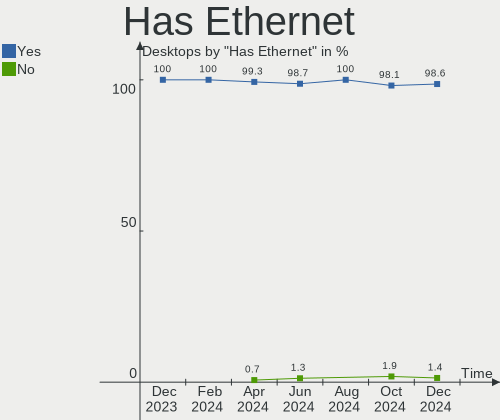
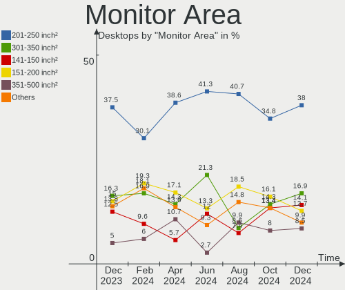
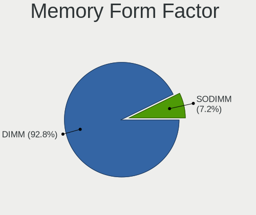

ROSA Hardware Trends (Desktop)
------------------------------

A project to identify most popular hardware characteristics and track their change
over time based on data collected by ROSA users at https://Linux-Hardware.org.

Anyone can contribute to the study by uploading probes of their computers by
the [hw-probe](https://github.com/linuxhw/hw-probe) tool:

    sudo -E hw-probe -all -upload

Full-feature report is available here: https://linux-hardware.org/?view=trends&formfactor=desktop

Period: Dec, 2020.

Contents
--------

- [ OS                       ](#os)
- [ OS Family                ](#os-family)
- [ Kernel                   ](#kernel)
- [ Kernel Family            ](#kernel-family)
- [ Kernel Major Ver.        ](#kernel-major-ver)
- [ Arch                     ](#arch)
- [ DE                       ](#de)
- [ Display Server           ](#display-server)
- [ Display Manager          ](#display-manager)
- [ OS Lang                  ](#os-lang)
- [ Boot Mode                ](#boot-mode)
- [ Filesystem               ](#filesystem)
- [ Part. scheme             ](#part-scheme)
- [ Dual Boot with Linux/BSD ](#dual-boot-with-linux/bsd)
- [ Dual Boot (Win)          ](#dual-boot-win)
- [ Country                  ](#country)
- [ City                     ](#city)
- [ Vendor                   ](#vendor)
- [ Model                    ](#model)
- [ Model Family             ](#model-family)
- [ MFG Year                 ](#mfg-year)
- [ Form Factor              ](#form-factor)
- [ Secure Boot              ](#secure-boot)
- [ Coreboot                 ](#coreboot)
- [ RAM Size                 ](#ram-size)
- [ RAM Used                 ](#ram-used)
- [ Has CD-ROM               ](#has-cd-rom)
- [ Total Drives             ](#total-drives)
- [ Has Ethernet             ](#has-ethernet)
- [ Drive Vendor             ](#drive-vendor)
- [ Drive Model              ](#drive-model)
- [ HDD Vendor               ](#hdd-vendor)
- [ SSD Vendor               ](#ssd-vendor)
- [ Drive Kind               ](#drive-kind)
- [ Drive Connector          ](#drive-connector)
- [ Drive Size               ](#drive-size)
- [ Space Total              ](#space-total)
- [ Space Used               ](#space-used)
- [ Malfunc. Drives          ](#malfunc-drives)
- [ Malfunc. Drive Vendor    ](#malfunc-drive-vendor)
- [ Malfunc. HDD Vendor      ](#malfunc-hdd-vendor)
- [ Malfunc. Drive Kind      ](#malfunc-drive-kind)
- [ Failed Drives            ](#failed-drives)
- [ Failed Drive Vendor      ](#failed-drive-vendor)
- [ Drive Status             ](#drive-status)
- [ Storage Vendor           ](#storage-vendor)
- [ Storage Model            ](#storage-model)
- [ Storage Kind             ](#storage-kind)
- [ CPU Vendor               ](#cpu-vendor)
- [ CPU Model                ](#cpu-model)
- [ CPU Model Family         ](#cpu-model-family)
- [ CPU Cores                ](#cpu-cores)
- [ CPU Sockets              ](#cpu-sockets)
- [ CPU Threads              ](#cpu-threads)
- [ CPU Op-Modes             ](#cpu-op-modes)
- [ CPU Microcode            ](#cpu-microcode)
- [ CPU Microarch            ](#cpu-microarch)
- [ GPU Vendor               ](#gpu-vendor)
- [ GPU Model                ](#gpu-model)
- [ GPU Combo                ](#gpu-combo)
- [ GPU Driver               ](#gpu-driver)
- [ GPU Memory               ](#gpu-memory)
- [ Monitor Vendor           ](#monitor-vendor)
- [ Monitor Model            ](#monitor-model)
- [ Monitor Resolution       ](#monitor-resolution)
- [ Monitor Diagonal         ](#monitor-diagonal)
- [ Monitor Width            ](#monitor-width)
- [ Aspect Ratio             ](#aspect-ratio)
- [ Monitor Area             ](#monitor-area)
- [ Pixel Density            ](#pixel-density)
- [ Multiple Monitors        ](#multiple-monitors)
- [ Net Controller Vendor    ](#net-controller-vendor)
- [ Net Controller Model     ](#net-controller-model)
- [ Wireless Vendor          ](#wireless-vendor)
- [ Wireless Model           ](#wireless-model)
- [ Ethernet Vendor          ](#ethernet-vendor)
- [ Ethernet Model           ](#ethernet-model)
- [ Net Controller Kind      ](#net-controller-kind)
- [ Used Controller          ](#used-controller)
- [ NICs                     ](#nics)
- [ Memory Vendor            ](#memory-vendor)
- [ Memory Model             ](#memory-model)
- [ Memory Kind              ](#memory-kind)
- [ Memory Form Factor       ](#memory-form-factor)
- [ Memory Size              ](#memory-size)
- [ Memory Speed             ](#memory-speed)
- [ Sound Vendor             ](#sound-vendor)
- [ Sound Model              ](#sound-model)
- [ Camera Vendor            ](#camera-vendor)
- [ Camera Model             ](#camera-model)
- [ Fingerprint Vendor       ](#fingerprint-vendor)
- [ Fingerprint Model        ](#fingerprint-model)
- [ Chipcard Vendor          ](#chipcard-vendor)
- [ Chipcard Model           ](#chipcard-model)
- [ Printer Vendor           ](#printer-vendor)
- [ Printer Model            ](#printer-model)
- [ Scanner Vendor           ](#scanner-vendor)
- [ Scanner Model            ](#scanner-model)
- [ Bluetooth Vendor         ](#bluetooth-vendor)
- [ Bluetooth Model          ](#bluetooth-model)
- [ Unsupported Devices      ](#unsupported-devices)
- [ Unsupported Device Types ](#unsupported-device-types)

OS
--

Installed operating systems

| Name       | Desktops | Percent |
|------------|----------|---------|
| ROSA R11.1 | 63       | 56.25%  |
| ROSA R11   | 34       | 30.36%  |
| ROSA R8.1  | 6        | 5.36%   |
| ROSA R12   | 4        | 3.57%   |
| ROSA R10   | 4        | 3.57%   |
| RED X4     | 1        | 0.89%   |

OS Family
---------

OS without a version

| Name | Desktops | Percent |
|------|----------|---------|
| ROSA | 112      | 100%    |

Kernel
------

Version of the Linux kernel

| Version                             | Desktops | Percent |
|-------------------------------------|----------|---------|
| 4.15.0-desktop-122.124.1rosa-x86_64 | 32       | 28.57%  |
| 4.15.0-desktop-45.1rosa-x86_64      | 27       | 24.11%  |
| 4.9.155-nrj-desktop-1rosa-x86_64    | 13       | 11.61%  |
| 4.15.0-desktop-45.1rosa-i586        | 8        | 7.14%   |
| 5.4.72-generic-1rosa-x86_64         | 4        | 3.57%   |
| 5.4.81-generic-1rosa2019.1-x86_64   | 3        | 2.68%   |
| 5.9.14-generic-1rosa-x86_64         | 2        | 1.79%   |
| 5.4.83-generic-2rosa-x86_64         | 2        | 1.79%   |
| 5.4.32-generic-2rosa-x86_64         | 2        | 1.79%   |
| 5.4.32-generic-2rosa-i586           | 2        | 1.79%   |
| 4.9.9-nrj-desktop-1rosa-i586        | 2        | 1.79%   |
| 4.9.60-nrj-desktop-1rosa-i586       | 2        | 1.79%   |
| 4.15.0-desktop-122.124.1rosa-i586   | 2        | 1.79%   |
| 5.9.6-generic-1rosa-x86_64          | 1        | 0.89%   |
| 5.4.83-generic-2rosa-i586           | 1        | 0.89%   |
| 5.4.72-generic-1rosa-i586           | 1        | 0.89%   |
| 5.4.49-nrj-desktop-1rosa-x86_64     | 1        | 0.89%   |
| 5.10.2-generic-2rosa2019.1-x86_64   | 1        | 0.89%   |
| 4.9.60-nrj-desktop-1rosa-x86_64     | 1        | 0.89%   |
| 4.9.155-nrj-desktop-1rosa-i586      | 1        | 0.89%   |
| 4.15.0-desktop-94.1rosa-x86_64      | 1        | 0.89%   |
| 4.15.0-desktop-94.1rosa-i586        | 1        | 0.89%   |
| 4.15.0-desktop-68.5rosa-x86_64      | 1        | 0.89%   |
| 4.15.0-desktop-47.2rosa-x86_64      | 1        | 0.89%   |

Kernel Family
-------------

Linux kernel without a distro release

| Version | Desktops | Percent |
|---------|----------|---------|
| 4.15.0  | 73       | 65.18%  |
| 4.9.155 | 14       | 12.5%   |
| 5.4.72  | 5        | 4.46%   |
| 5.4.32  | 4        | 3.57%   |
| 5.4.83  | 3        | 2.68%   |
| 5.4.81  | 3        | 2.68%   |
| 4.9.60  | 3        | 2.68%   |
| 5.9.14  | 2        | 1.79%   |
| 4.9.9   | 2        | 1.79%   |
| 5.9.6   | 1        | 0.89%   |
| 5.4.49  | 1        | 0.89%   |
| 5.10.2  | 1        | 0.89%   |

Kernel Major Ver.
-----------------

Linux kernel major version

| Version | Desktops | Percent |
|---------|----------|---------|
| 4.15    | 73       | 65.18%  |
| 4.9     | 19       | 16.96%  |
| 5.4     | 16       | 14.29%  |
| 5.9     | 3        | 2.68%   |
| 5.10    | 1        | 0.89%   |

Arch
----

OS architecture (x86_64, i586, etc.)

| Name   | Desktops | Percent |
|--------|----------|---------|
| x86_64 | 92       | 82.14%  |
| i686   | 20       | 17.86%  |

DE
--

Desktop Environment

| Name    | Desktops | Percent |
|---------|----------|---------|
| KDE4    | 68       | 60.71%  |
| KDE5    | 31       | 27.68%  |
| LXQt    | 6        | 5.36%   |
| XFCE    | 4        | 3.57%   |
| LXDE    | 1        | 0.89%   |
| GNOME   | 1        | 0.89%   |
| Unknown | 1        | 0.89%   |

Display Server
--------------

X11 or Wayland

| Name | Desktops | Percent |
|------|----------|---------|
| X11  | 112      | 100%    |

Display Manager
---------------

SDDM, LightDM, etc.

| Name | Desktops | Percent |
|------|----------|---------|
| KDM  | 69       | 61.61%  |
| SDDM | 40       | 35.71%  |
| TDM  | 2        | 1.79%   |
| GDM  | 1        | 0.89%   |

OS Lang
-------

Language

| Lang       | Desktops | Percent |
|------------|----------|---------|
| ru_RU      | 52       | 46.43%  |
| Unknown    | 44       | 39.29%  |
| en_US      | 6        | 5.36%   |
| de_DE      | 4        | 3.57%   |
| es_ES      | 2        | 1.79%   |
| ru_RU.utf8 | 1        | 0.89%   |
| ro_RO      | 1        | 0.89%   |
| pl_PL      | 1        | 0.89%   |
| it_IT      | 1        | 0.89%   |

Boot Mode
---------

EFI or BIOS

| Mode | Desktops | Percent |
|------|----------|---------|
| BIOS | 97       | 86.61%  |
| EFI  | 15       | 13.39%  |

Filesystem
----------

Type of filesystem

| Type  | Desktops | Percent |
|-------|----------|---------|
| Ext4  | 106      | 94.64%  |
| Btrfs | 4        | 3.57%   |
| Xfs   | 1        | 0.89%   |
| Ext3  | 1        | 0.89%   |

Part. scheme
------------

Scheme of partitioning

| Type    | Desktops | Percent |
|---------|----------|---------|
| MBR     | 83       | 74.11%  |
| GPT     | 26       | 23.21%  |
| Unknown | 3        | 2.68%   |

Dual Boot with Linux/BSD
------------------------

Hosting more than one Linux/BSD

| Dual boot | Desktops | Percent |
|-----------|----------|---------|
| No        | 74       | 66.07%  |
| Yes       | 38       | 33.93%  |

Dual Boot (Win)
---------------

Hosting Linux and Windows

| Dual boot | Desktops | Percent |
|-----------|----------|---------|
| No        | 63       | 56.25%  |
| Yes       | 49       | 43.75%  |

Country
-------

Geographic location (country)

| Country        | Desktops | Percent |
|----------------|----------|---------|
| Russia         | 81       | 72.32%  |
| Ukraine        | 8        | 7.14%   |
| Kazakhstan     | 4        | 3.57%   |
| Germany        | 4        | 3.57%   |
| Spain          | 2        | 1.79%   |
| Canada         | 2        | 1.79%   |
| Venezuela      | 1        | 0.89%   |
| USA            | 1        | 0.89%   |
| Saudi Arabia   | 1        | 0.89%   |
| Romania        | 1        | 0.89%   |
| Poland         | 1        | 0.89%   |
| Mexico         | 1        | 0.89%   |
| Italy          | 1        | 0.89%   |
| Greece         | 1        | 0.89%   |
| Czech Republic | 1        | 0.89%   |
| Belarus        | 1        | 0.89%   |
| Australia      | 1        | 0.89%   |

City
----

Geographic location (city)

| City                   | Desktops | Percent |
|------------------------|----------|---------|
| Moscow                 | 11       | 9.82%   |
| St Petersburg          | 6        | 5.36%   |
| Novosibirsk            | 5        | 4.46%   |
| Ekaterinburg           | 5        | 4.46%   |
| Krasnoyarsk            | 4        | 3.57%   |
| Kazan’               | 4        | 3.57%   |
| Rostov-on-Don          | 3        | 2.68%   |
| Barnaul                | 3        | 2.68%   |
| Voronezh               | 2        | 1.79%   |
| Samara                 | 2        | 1.79%   |
| Orenburg               | 2        | 1.79%   |
| Lipetsk                | 2        | 1.79%   |
| Dnipro                 | 2        | 1.79%   |
| Bryansk                | 2        | 1.79%   |
| Zaporizhia             | 1        | 0.89%   |
| Yakutsk                | 1        | 0.89%   |
| Vladivostok            | 1        | 0.89%   |
| Velikiy Ustyug         | 1        | 0.89%   |
| Ust-Kamenogorsk        | 1        | 0.89%   |
| Ust'-Ilimsk            | 1        | 0.89%   |
| Ulyanovsk              | 1        | 0.89%   |
| Tosno                  | 1        | 0.89%   |
| Stavropol              | 1        | 0.89%   |
| Sochi                  | 1        | 0.89%   |
| Snezhinsk              | 1        | 0.89%   |
| Sharypovo              | 1        | 0.89%   |
| Saratov                | 1        | 0.89%   |
| Santa Úrsula          | 1        | 0.89%   |
| Rozmital pod Tremsinem | 1        | 0.89%   |
| Prokhorovka            | 1        | 0.89%   |
| Perth                  | 1        | 0.89%   |
| Perm                   | 1        | 0.89%   |
| Omsk                   | 1        | 0.89%   |
| Novy Urengoy           | 1        | 0.89%   |
| Novoshakhtinsk         | 1        | 0.89%   |
| Novocherkassk          | 1        | 0.89%   |
| Nizhniy Novgorod       | 1        | 0.89%   |
| New Westminster        | 1        | 0.89%   |
| Navapolatsk            | 1        | 0.89%   |
| Miass                  | 1        | 0.89%   |
| Mala Danylivka         | 1        | 0.89%   |
| Lubny                  | 1        | 0.89%   |
| Liverpool              | 1        | 0.89%   |
| Kyiv                   | 1        | 0.89%   |
| Kurgan                 | 1        | 0.89%   |
| Krasnohrad             | 1        | 0.89%   |
| Kirov                  | 1        | 0.89%   |
| Katowice               | 1        | 0.89%   |
| Karaganda              | 1        | 0.89%   |
| Jeddah                 | 1        | 0.89%   |
| Ixtapaluca             | 1        | 0.89%   |
| Iasi                   | 1        | 0.89%   |
| Heraklion              | 1        | 0.89%   |
| Hagen                  | 1        | 0.89%   |
| Gryazi                 | 1        | 0.89%   |
| Georgetown             | 1        | 0.89%   |
| Ellwangen              | 1        | 0.89%   |
| Elista                 | 1        | 0.89%   |
| Dresden                | 1        | 0.89%   |
| Cherepovets            | 1        | 0.89%   |

Vendor
------

Motherboard manufacturer

| Name                | Desktops | Percent |
|---------------------|----------|---------|
| ASUSTek Computer    | 42       | 37.5%   |
| Gigabyte Technology | 27       | 24.11%  |
| MSI                 | 10       | 8.93%   |
| Intel               | 6        | 5.36%   |
| ASRock              | 6        | 5.36%   |
| ECS                 | 5        | 4.46%   |
| Lenovo              | 3        | 2.68%   |
| Dell                | 3        | 2.68%   |
| Pegatron            | 2        | 1.79%   |
| Hewlett-Packard     | 2        | 1.79%   |
| PCChips             | 1        | 0.89%   |
| OEM                 | 1        | 0.89%   |
| Fujitsu             | 1        | 0.89%   |
| eMachines           | 1        | 0.89%   |
| Biostar             | 1        | 0.89%   |
| Unknown             | 1        | 0.89%   |

Model
-----

Motherboard model

| Name                            | Desktops | Percent |
|---------------------------------|----------|---------|
| ASUS M5A78L-M LX3               | 3        | 2.68%   |
| ASUS All Series                 | 3        | 2.68%   |
| MSI MS-7996                     | 2        | 1.79%   |
| Gigabyte H81M-S1                | 2        | 1.79%   |
| Gigabyte G31M-ES2L              | 2        | 1.79%   |
| Gigabyte A320M-H                | 2        | 1.79%   |
| ASUS P5Q SE2                    | 2        | 1.79%   |
| Pegatron IPXCR_VN1              | 1        | 0.89%   |
| Pegatron IPM41-D3               | 1        | 0.89%   |
| PCChips P17G                    | 1        | 0.89%   |
| OEM B250                        | 1        | 0.89%   |
| MSI MS-7C52                     | 1        | 0.89%   |
| MSI MS-7B87                     | 1        | 0.89%   |
| MSI MS-7A33                     | 1        | 0.89%   |
| MSI MS-7865                     | 1        | 0.89%   |
| MSI MS-7817                     | 1        | 0.89%   |
| MSI MS-7808                     | 1        | 0.89%   |
| MSI MS-7376                     | 1        | 0.89%   |
| MSI MS-7346                     | 1        | 0.89%   |
| Lenovo ThinkCentre M90p 5852A34 | 1        | 0.89%   |
| Lenovo ThinkCentre M57 6072HDU  | 1        | 0.89%   |
| Lenovo IdeaCentre B505 10039    | 1        | 0.89%   |
| Intel X79                       | 1        | 0.89%   |
| Intel H55                       | 1        | 0.89%   |
| Intel DH61CR AAG14064-204       | 1        | 0.89%   |
| Intel DH55TC AAE70932-302       | 1        | 0.89%   |
| Intel DH55PJ AAE93812-301       | 1        | 0.89%   |
| Intel D946GZAB AAD66610-300     | 1        | 0.89%   |
| HP ProLiant ML150 G5            | 1        | 0.89%   |
| HP Compaq Elite 8300 MT         | 1        | 0.89%   |
| Gigabyte Z390 UD                | 1        | 0.89%   |
| Gigabyte P41T-D3P               | 1        | 0.89%   |
| Gigabyte P41-ES3G               | 1        | 0.89%   |
| Gigabyte P35-S3G                | 1        | 0.89%   |
| Gigabyte P35-DS3L               | 1        | 0.89%   |
| Gigabyte M52L-S3P               | 1        | 0.89%   |
| Gigabyte M52L-S3                | 1        | 0.89%   |
| Gigabyte H81M-S2H               | 1        | 0.89%   |
| Gigabyte H310M S2P 2.0          | 1        | 0.89%   |
| Gigabyte GEG                    | 1        | 0.89%   |
| Gigabyte GA-MA78GM-UD2H         | 1        | 0.89%   |
| Gigabyte GA-MA785GT-UD3H        | 1        | 0.89%   |
| Gigabyte GA-8SIMLH              | 1        | 0.89%   |
| Gigabyte GA-870A-USB3           | 1        | 0.89%   |
| Gigabyte GA-78LMT-USB3 R2       | 1        | 0.89%   |
| Gigabyte G33-DS3R               | 1        | 0.89%   |
| Gigabyte EP45-UD3LR             | 1        | 0.89%   |
| Gigabyte EP35-DS3               | 1        | 0.89%   |
| Gigabyte A320M-S2H              | 1        | 0.89%   |
| Gigabyte 970A-DS3               | 1        | 0.89%   |
| Gigabyte 965P-S3                | 1        | 0.89%   |
| Fujitsu ESPRIMO P5731           | 1        | 0.89%   |
| eMachines ET1850                | 1        | 0.89%   |
| ECS P965T-A                     | 1        | 0.89%   |
| ECS H61H2-M2                    | 1        | 0.89%   |
| ECS G31T-M                      | 1        | 0.89%   |
| ECS BSWI-D2                     | 1        | 0.89%   |
| ECS BAT-I                       | 1        | 0.89%   |
| Dell XPS 8700                   | 1        | 0.89%   |
| Dell OptiPlex GX620             | 1        | 0.89%   |

Model Family
------------

Motherboard model prefix

| Name                     | Desktops | Percent |
|--------------------------|----------|---------|
| ASUS PRIME               | 4        | 3.57%   |
| ASUS M5A78L-M            | 4        | 3.57%   |
| ASUS P5Q                 | 3        | 2.68%   |
| ASUS All                 | 3        | 2.68%   |
| MSI MS-7996              | 2        | 1.79%   |
| Lenovo ThinkCentre       | 2        | 1.79%   |
| Gigabyte H81M-S1         | 2        | 1.79%   |
| Gigabyte G31M-ES2L       | 2        | 1.79%   |
| Gigabyte A320M-H         | 2        | 1.79%   |
| Dell OptiPlex            | 2        | 1.79%   |
| ASUS P8H61-M             | 2        | 1.79%   |
| ASUS M5A97               | 2        | 1.79%   |
| ASUS M2N-MX              | 2        | 1.79%   |
| Pegatron IPXCR           | 1        | 0.89%   |
| Pegatron IPM41-D3        | 1        | 0.89%   |
| PCChips P17G             | 1        | 0.89%   |
| OEM B250                 | 1        | 0.89%   |
| MSI MS-7C52              | 1        | 0.89%   |
| MSI MS-7B87              | 1        | 0.89%   |
| MSI MS-7A33              | 1        | 0.89%   |
| MSI MS-7865              | 1        | 0.89%   |
| MSI MS-7817              | 1        | 0.89%   |
| MSI MS-7808              | 1        | 0.89%   |
| MSI MS-7376              | 1        | 0.89%   |
| MSI MS-7346              | 1        | 0.89%   |
| Lenovo IdeaCentre        | 1        | 0.89%   |
| Intel X79                | 1        | 0.89%   |
| Intel H55                | 1        | 0.89%   |
| Intel DH61CR             | 1        | 0.89%   |
| Intel DH55TC             | 1        | 0.89%   |
| Intel DH55PJ             | 1        | 0.89%   |
| Intel D946GZAB           | 1        | 0.89%   |
| HP ProLiant              | 1        | 0.89%   |
| HP Compaq                | 1        | 0.89%   |
| Gigabyte Z390            | 1        | 0.89%   |
| Gigabyte P41T-D3P        | 1        | 0.89%   |
| Gigabyte P41-ES3G        | 1        | 0.89%   |
| Gigabyte P35-S3G         | 1        | 0.89%   |
| Gigabyte P35-DS3L        | 1        | 0.89%   |
| Gigabyte M52L-S3P        | 1        | 0.89%   |
| Gigabyte M52L-S3         | 1        | 0.89%   |
| Gigabyte H81M-S2H        | 1        | 0.89%   |
| Gigabyte H310M           | 1        | 0.89%   |
| Gigabyte GEG             | 1        | 0.89%   |
| Gigabyte GA-MA78GM-UD2H  | 1        | 0.89%   |
| Gigabyte GA-MA785GT-UD3H | 1        | 0.89%   |
| Gigabyte GA-8SIMLH       | 1        | 0.89%   |
| Gigabyte GA-870A-USB3    | 1        | 0.89%   |
| Gigabyte GA-78LMT-USB3   | 1        | 0.89%   |
| Gigabyte G33-DS3R        | 1        | 0.89%   |
| Gigabyte EP45-UD3LR      | 1        | 0.89%   |
| Gigabyte EP35-DS3        | 1        | 0.89%   |
| Gigabyte A320M-S2H       | 1        | 0.89%   |
| Gigabyte 970A-DS3        | 1        | 0.89%   |
| Gigabyte 965P-S3         | 1        | 0.89%   |
| Fujitsu ESPRIMO          | 1        | 0.89%   |
| eMachines ET1850         | 1        | 0.89%   |
| ECS P965T-A              | 1        | 0.89%   |
| ECS H61H2-M2             | 1        | 0.89%   |
| ECS G31T-M               | 1        | 0.89%   |

MFG Year
--------

Motherboard manufacture year

| Year    | Desktops | Percent |
|---------|----------|---------|
| 2009    | 15       | 13.39%  |
| 2010    | 13       | 11.61%  |
| 2019    | 10       | 8.93%   |
| 2016    | 10       | 8.93%   |
| 2012    | 9        | 8.04%   |
| 2007    | 9        | 8.04%   |
| 2015    | 8        | 7.14%   |
| 2014    | 6        | 5.36%   |
| 2011    | 6        | 5.36%   |
| 2018    | 5        | 4.46%   |
| 2006    | 5        | 4.46%   |
| 2020    | 4        | 3.57%   |
| 2013    | 4        | 3.57%   |
| 2008    | 3        | 2.68%   |
| 2017    | 2        | 1.79%   |
| 2005    | 1        | 0.89%   |
| 2004    | 1        | 0.89%   |
| Unknown | 1        | 0.89%   |

Form Factor
-----------

Physical design of the computer

| Name    | Desktops | Percent |
|---------|----------|---------|
| Desktop | 112      | 100%    |

Secure Boot
-----------

Enabled or disabled

| State    | Desktops | Percent |
|----------|----------|---------|
| Disabled | 112      | 100%    |

Coreboot
--------

Have coreboot on board

| Used | Desktops | Percent |
|------|----------|---------|
| No   | 112      | 100%    |

RAM Size
--------

Total RAM memory

| Size in GB | Desktops | Percent |
|------------|----------|---------|
| 3.01-4.0   | 38       | 33.93%  |
| 8.01-16.0  | 24       | 21.43%  |
| 4.01-8.0   | 22       | 19.64%  |
| 16.01-24.0 | 16       | 14.29%  |
| 1.01-2.0   | 7        | 6.25%   |
| 2.01-3.0   | 3        | 2.68%   |
| 24.01-32.0 | 1        | 0.89%   |
| 0.51-1.0   | 1        | 0.89%   |

RAM Used
--------

Used RAM memory

| Used GB   | Desktops | Percent |
|-----------|----------|---------|
| 1.01-2.0  | 55       | 49.11%  |
| 0.51-1.0  | 40       | 35.71%  |
| 2.01-3.0  | 8        | 7.14%   |
| 4.01-8.0  | 3        | 2.68%   |
| 3.01-4.0  | 3        | 2.68%   |
| 0.01-0.5  | 2        | 1.79%   |
| 8.01-16.0 | 1        | 0.89%   |

Has CD-ROM
----------

Has CD-ROM on board

| Presented | Desktops | Percent |
|-----------|----------|---------|
| Yes       | 64       | 57.14%  |
| No        | 48       | 42.86%  |

Total Drives
------------

Number of drives on board

| Drives | Desktops | Percent |
|--------|----------|---------|
| 1      | 63       | 56.25%  |
| 2      | 31       | 27.68%  |
| 3      | 10       | 8.93%   |
| 4      | 3        | 2.68%   |
| 5      | 2        | 1.79%   |
| 0      | 2        | 1.79%   |
| 6      | 1        | 0.89%   |

Has Ethernet
------------

Has Ethernet on board

| Presented | Desktops | Percent |
|-----------|----------|---------|
| Yes       | 111      | 99.11%  |
| No        | 1        | 0.89%   |

Drive Vendor
------------

Hard drive vendors

| Vendor              | Desktops | Drives | Percent |
|---------------------|----------|--------|---------|
| Seagate             | 43       | 47     | 25.9%   |
| WDC                 | 39       | 43     | 23.49%  |
| Samsung Electronics | 15       | 15     | 9.04%   |
| Toshiba             | 12       | 14     | 7.23%   |
| Hitachi             | 12       | 12     | 7.23%   |
| Kingston            | 6        | 6      | 3.61%   |
| SanDisk             | 4        | 4      | 2.41%   |
| Apacer              | 4        | 4      | 2.41%   |
| SPCC                | 3        | 3      | 1.81%   |
| MAXTOR              | 3        | 3      | 1.81%   |
| JMicron             | 3        | 3      | 1.81%   |
| Silicon Motion      | 2        | 2      | 1.2%    |
| Intel               | 2        | 2      | 1.2%    |
| GOODRAM             | 2        | 2      | 1.2%    |
| Fujitsu             | 2        | 2      | 1.2%    |
| Crucial             | 2        | 2      | 1.2%    |
| XrayDisk            | 1        | 1      | 0.6%    |
| Unknown             | 1        | 1      | 0.6%    |
| Team                | 1        | 1      | 0.6%    |
| PNY                 | 1        | 1      | 0.6%    |
| PLEXTOR             | 1        | 1      | 0.6%    |
| OCZ                 | 1        | 1      | 0.6%    |
| Neo Forza           | 1        | 1      | 0.6%    |
| IBM/Hitachi         | 1        | 1      | 0.6%    |
| Gigabyte Technology | 1        | 1      | 0.6%    |
| FOXLINE             | 1        | 1      | 0.6%    |
| ExcelStor           | 1        | 1      | 0.6%    |
| A-DATA Technology   | 1        | 1      | 0.6%    |

Drive Model
-----------

Hard drive models

| Model                            | Desktops | Percent |
|----------------------------------|----------|---------|
| WDC WD10EZEX-08WN4A0 1TB         | 4        | 2.27%   |
| Kingston SA400S37120G 120GB SSD  | 4        | 2.27%   |
| Toshiba HDWD110 1TB              | 3        | 1.7%    |
| Toshiba DT01ACA050 500GB         | 3        | 1.7%    |
| Seagate ST380815AS 80GB          | 3        | 1.7%    |
| Seagate ST1000DM010-2EP102 1TB   | 3        | 1.7%    |
| WDC WD20EZRZ-00Z5HB0 2TB         | 2        | 1.14%   |
| Toshiba DT01ACA100 1TB           | 2        | 1.14%   |
| Seagate ST500DM002-1BD142 500GB  | 2        | 1.14%   |
| Seagate ST3500418AS 500GB        | 2        | 1.14%   |
| Seagate ST3320613AS 320GB        | 2        | 1.14%   |
| Seagate ST31500341AS 1TB         | 2        | 1.14%   |
| Seagate ST2000DM008-2FR102 2TB   | 2        | 1.14%   |
| Seagate ST1000DM003-1ER162 1TB   | 2        | 1.14%   |
| Seagate ST1000DM003-1CH162 1TB   | 2        | 1.14%   |
| Samsung SSD 860 EVO 250GB        | 2        | 1.14%   |
| JMicron Generic 120GB            | 2        | 1.14%   |
| Hitachi HTS542516K9SA00 160GB    | 2        | 1.14%   |
| Hitachi HDS721010CLA332 1TB      | 2        | 1.14%   |
| Apacer AS350 128GB SSD           | 2        | 1.14%   |
| XrayDisk SSD 256GB               | 1        | 0.57%   |
| WDC WDS250G2B0B-00YS70 250GB SSD | 1        | 0.57%   |
| WDC WDS240G2G0A-00JH30 240GB SSD | 1        | 0.57%   |
| WDC WD800JD-00MSA1 80GB          | 1        | 0.57%   |
| WDC WD740ADFD-00NLR1 74GB        | 1        | 0.57%   |
| WDC WD6400AAKS-22A7B0 640GB      | 1        | 0.57%   |
| WDC WD6400AACS-00G8B0 640GB      | 1        | 0.57%   |
| WDC WD5000LPVX-00V0TT0 500GB     | 1        | 0.57%   |
| WDC WD5000BPVT-22HXZT1 500GB     | 1        | 0.57%   |
| WDC WD5000AZRX-00A8LB0 500GB     | 1        | 0.57%   |
| WDC WD5000AZLX-22JKKA0 500GB     | 1        | 0.57%   |
| WDC WD5000AZLX-08K2TA0 500GB     | 1        | 0.57%   |
| WDC WD5000AZLX-00JKKA0 500GB     | 1        | 0.57%   |
| WDC WD5000AZDX-00SC2B0 500GB     | 1        | 0.57%   |
| WDC WD5000AAKX-75U6AA0 500GB     | 1        | 0.57%   |
| WDC WD5000AAKX-22ERMA0 500GB     | 1        | 0.57%   |
| WDC WD5000AAKX-08ERMA0 500GB     | 1        | 0.57%   |
| WDC WD5000AAKS-00UU3A0 500GB     | 1        | 0.57%   |
| WDC WD5000AADS-00S9B0 500GB      | 1        | 0.57%   |
| WDC WD3200AAKS-00UU3A0 320GB     | 1        | 0.57%   |
| WDC WD3200AAJS-08L7A0 320GB      | 1        | 0.57%   |
| WDC WD3200AAJS-00L7A0 320GB      | 1        | 0.57%   |
| WDC WD2500BEVT-35ZCT0 250GB      | 1        | 0.57%   |
| WDC WD2500AAKX-001CA0 250GB      | 1        | 0.57%   |
| WDC WD20EARX-00PASB0 2TB         | 1        | 0.57%   |
| WDC WD20EARS-00MVWB0 2TB         | 1        | 0.57%   |
| WDC WD2005FBYZ-01YCBB2 2TB       | 1        | 0.57%   |
| WDC WD2000JS-22NCB1 200GB        | 1        | 0.57%   |
| WDC WD1600BEVT-08A23T1 160GB     | 1        | 0.57%   |
| WDC WD1600AAJS-00L7A0 160GB      | 1        | 0.57%   |
| WDC WD15NPVT-00Z2TT0 1TB         | 1        | 0.57%   |
| WDC WD15EVDS-63V9B1 1TB          | 1        | 0.57%   |
| WDC WD1200PD-00FZB0 120GB        | 1        | 0.57%   |
| WDC WD10EZRX-00A8LB0 1TB         | 1        | 0.57%   |
| WDC WD10EZEX-75WN4A1 1TB         | 1        | 0.57%   |
| WDC WD10EARS-00MVWB0 1TB         | 1        | 0.57%   |
| WDC WD10EADS-65M2B0 1TB          | 1        | 0.57%   |
| WDC WD1002F9YZ-09H1JL1 1TB       | 1        | 0.57%   |
| Unknown SD/MMC 8GB               | 1        | 0.57%   |
| Toshiba TR200 480GB SSD          | 1        | 0.57%   |

HDD Vendor
----------

Hard disk drive vendors

| Vendor              | Desktops | Drives | Percent |
|---------------------|----------|--------|---------|
| Seagate             | 43       | 47     | 36.75%  |
| WDC                 | 37       | 41     | 31.62%  |
| Hitachi             | 12       | 12     | 10.26%  |
| Toshiba             | 11       | 13     | 9.4%    |
| Samsung Electronics | 7        | 7      | 5.98%   |
| MAXTOR              | 3        | 3      | 2.56%   |
| Fujitsu             | 2        | 2      | 1.71%   |
| IBM/Hitachi         | 1        | 1      | 0.85%   |
| ExcelStor           | 1        | 1      | 0.85%   |

SSD Vendor
----------

Solid state drive vendors

| Vendor              | Desktops | Drives | Percent |
|---------------------|----------|--------|---------|
| Samsung Electronics | 6        | 6      | 13.95%  |
| Kingston            | 6        | 6      | 13.95%  |
| SanDisk             | 4        | 4      | 9.3%    |
| Apacer              | 4        | 4      | 9.3%    |
| SPCC                | 3        | 3      | 6.98%   |
| WDC                 | 2        | 2      | 4.65%   |
| JMicron             | 2        | 2      | 4.65%   |
| Intel               | 2        | 2      | 4.65%   |
| GOODRAM             | 2        | 2      | 4.65%   |
| Crucial             | 2        | 2      | 4.65%   |
| XrayDisk            | 1        | 1      | 2.33%   |
| Toshiba             | 1        | 1      | 2.33%   |
| Team                | 1        | 1      | 2.33%   |
| PNY                 | 1        | 1      | 2.33%   |
| PLEXTOR             | 1        | 1      | 2.33%   |
| OCZ                 | 1        | 1      | 2.33%   |
| Neo Forza           | 1        | 1      | 2.33%   |
| Gigabyte Technology | 1        | 1      | 2.33%   |
| FOXLINE             | 1        | 1      | 2.33%   |
| A-DATA Technology   | 1        | 1      | 2.33%   |

Drive Kind
----------

HDD or SSD

| Kind    | Desktops | Drives | Percent |
|---------|----------|--------|---------|
| HDD     | 93       | 127    | 66.91%  |
| SSD     | 40       | 43     | 28.78%  |
| NVMe    | 4        | 4      | 2.88%   |
| Unknown | 2        | 2      | 1.44%   |

Drive Connector
---------------

SATA, SAS, NVMe, etc.

| Type | Desktops | Drives | Percent |
|------|----------|--------|---------|
| SATA | 107      | 167    | 92.24%  |
| SAS  | 5        | 5      | 4.31%   |
| NVMe | 4        | 4      | 3.45%   |

Drive Size
----------

Size of hard drive

| Size in TB | Desktops | Drives | Percent |
|------------|----------|--------|---------|
| 0.01-0.5   | 95       | 125    | 69.85%  |
| 0.51-1.0   | 31       | 34     | 22.79%  |
| 1.01-2.0   | 8        | 9      | 5.88%   |
| 2.01-3.0   | 1        | 1      | 0.74%   |
| 4.01-10.0  | 1        | 1      | 0.74%   |

Space Total
-----------

Amount of disk space available on the file system

| Size in GB     | Desktops | Percent |
|----------------|----------|---------|
| 101-250        | 44       | 39.29%  |
| 501-1000       | 16       | 14.29%  |
| 251-500        | 14       | 12.5%   |
| 1-20           | 14       | 12.5%   |
| 21-50          | 8        | 7.14%   |
| 51-100         | 7        | 6.25%   |
| 1001-2000      | 6        | 5.36%   |
| More than 3000 | 2        | 1.79%   |
| 2001-3000      | 1        | 0.89%   |

Space Used
----------

Amount of used disk space

| Used GB   | Desktops | Percent |
|-----------|----------|---------|
| 1-20      | 71       | 63.39%  |
| 21-50     | 10       | 8.93%   |
| 101-250   | 10       | 8.93%   |
| 51-100    | 9        | 8.04%   |
| 251-500   | 4        | 3.57%   |
| 501-1000  | 4        | 3.57%   |
| 2001-3000 | 3        | 2.68%   |
| 1001-2000 | 1        | 0.89%   |

Malfunc. Drives
---------------

Drive models with a malfunction

| Model                             | Desktops | Drives | Percent |
|-----------------------------------|----------|--------|---------|
| Seagate ST3320613AS 320GB         | 2        | 2      | 3.7%    |
| Seagate ST31500341AS 1TB          | 2        | 2      | 3.7%    |
| Hitachi HDS721010CLA332 1TB       | 2        | 2      | 3.7%    |
| WDC WD800JD-00MSA1 80GB           | 1        | 1      | 1.85%   |
| WDC WD5000LPVX-00V0TT0 500GB      | 1        | 1      | 1.85%   |
| WDC WD5000BPVT-22HXZT1 500GB      | 1        | 1      | 1.85%   |
| WDC WD5000AZLX-08K2TA0 500GB      | 1        | 1      | 1.85%   |
| WDC WD5000AZDX-00SC2B0 500GB      | 1        | 1      | 1.85%   |
| WDC WD5000AAKX-22ERMA0 500GB      | 1        | 1      | 1.85%   |
| WDC WD5000AAKS-00UU3A0 500GB      | 1        | 1      | 1.85%   |
| WDC WD5000AADS-00S9B0 500GB       | 1        | 1      | 1.85%   |
| WDC WD3200AAJS-08L7A0 320GB       | 1        | 1      | 1.85%   |
| WDC WD3200AAJS-00L7A0 320GB       | 1        | 1      | 1.85%   |
| WDC WD20EZRZ-00Z5HB0 2TB          | 1        | 1      | 1.85%   |
| WDC WD20EARS-00MVWB0 2TB          | 1        | 1      | 1.85%   |
| WDC WD1600AAJS-00L7A0 160GB       | 1        | 1      | 1.85%   |
| WDC WD15EVDS-63V9B1 1TB           | 1        | 1      | 1.85%   |
| WDC WD10EZEX-75WN4A1 1TB          | 1        | 1      | 1.85%   |
| WDC WD10EARS-00MVWB0 1TB          | 1        | 1      | 1.85%   |
| WDC WD10EADS-65M2B0 1TB           | 1        | 1      | 1.85%   |
| Toshiba MQ01ABD100 1TB            | 1        | 1      | 1.85%   |
| Toshiba MK1059GSM 1TB             | 1        | 1      | 1.85%   |
| Seagate ST500DM002-1BD142 500GB   | 1        | 1      | 1.85%   |
| Seagate ST3802110A 80GB           | 1        | 1      | 1.85%   |
| Seagate ST380013AS 80GB           | 1        | 1      | 1.85%   |
| Seagate ST3500418AS 500GB         | 1        | 1      | 1.85%   |
| Seagate ST3500312CS 500GB         | 1        | 1      | 1.85%   |
| Seagate ST340016A 40GB            | 1        | 1      | 1.85%   |
| Seagate ST3320413CS 320GB         | 1        | 1      | 1.85%   |
| Seagate ST3250620AS 250GB         | 1        | 1      | 1.85%   |
| Seagate ST3250410AS 250GB         | 1        | 1      | 1.85%   |
| Seagate ST320410A 20GB            | 1        | 1      | 1.85%   |
| Seagate ST3200820AS 200GB         | 1        | 1      | 1.85%   |
| Seagate ST3160815AS 160GB         | 1        | 1      | 1.85%   |
| Seagate ST3120813AS 120GB         | 1        | 1      | 1.85%   |
| Seagate ST3120026AS 120GB         | 1        | 1      | 1.85%   |
| Seagate ST31000333AS 1TB          | 1        | 1      | 1.85%   |
| Seagate ST3000DM001-1CH166 3TB    | 1        | 1      | 1.85%   |
| Seagate ST250DM000-1BD141 250GB   | 1        | 1      | 1.85%   |
| Seagate ST2000DM001-1CH164 2TB    | 1        | 1      | 1.85%   |
| Samsung Electronics HD502HI 500GB | 1        | 1      | 1.85%   |
| Samsung Electronics HD120IJ 120GB | 1        | 1      | 1.85%   |
| OCZ VERTEX3 240GB SSD             | 1        | 1      | 1.85%   |
| MAXTOR STM3250820AS 250GB         | 1        | 1      | 1.85%   |
| MAXTOR STM3250310AS 250GB         | 1        | 1      | 1.85%   |
| MAXTOR STM3160215AS 160GB         | 1        | 1      | 1.85%   |
| Intel SSDSC2CW060A3 64GB          | 1        | 1      | 1.85%   |
| IBM/Hitachi IC35L040AVER07-0 41GB | 1        | 1      | 1.85%   |
| Hitachi HDS721680PLA380 82GB      | 1        | 1      | 1.85%   |
| Fujitsu MHY2200BH 200GB           | 1        | 1      | 1.85%   |
| ExcelStor Technology J880S 82GB   | 1        | 1      | 1.85%   |

Malfunc. Drive Vendor
---------------------

Vendors of faulty drives

| Vendor              | Desktops | Drives | Percent |
|---------------------|----------|--------|---------|
| Seagate             | 21       | 22     | 40.38%  |
| WDC                 | 17       | 17     | 32.69%  |
| MAXTOR              | 3        | 3      | 5.77%   |
| Hitachi             | 3        | 3      | 5.77%   |
| Samsung Electronics | 2        | 2      | 3.85%   |
| Toshiba             | 1        | 2      | 1.92%   |
| OCZ                 | 1        | 1      | 1.92%   |
| Intel               | 1        | 1      | 1.92%   |
| IBM/Hitachi         | 1        | 1      | 1.92%   |
| Fujitsu             | 1        | 1      | 1.92%   |
| ExcelStor           | 1        | 1      | 1.92%   |

Malfunc. HDD Vendor
-------------------

Vendors of faulty HDD drives

| Vendor              | Desktops | Drives | Percent |
|---------------------|----------|--------|---------|
| Seagate             | 21       | 22     | 42%     |
| WDC                 | 17       | 17     | 34%     |
| MAXTOR              | 3        | 3      | 6%      |
| Hitachi             | 3        | 3      | 6%      |
| Samsung Electronics | 2        | 2      | 4%      |
| Toshiba             | 1        | 2      | 2%      |
| IBM/Hitachi         | 1        | 1      | 2%      |
| Fujitsu             | 1        | 1      | 2%      |
| ExcelStor           | 1        | 1      | 2%      |

Malfunc. Drive Kind
-------------------

Kinds of faulty drives

| Kind | Desktops | Drives | Percent |
|------|----------|--------|---------|
| HDD  | 42       | 52     | 95.45%  |
| SSD  | 2        | 2      | 4.55%   |

Failed Drives
-------------

Failed drive models

| Model                       | Desktops | Drives | Percent |
|-----------------------------|----------|--------|---------|
| WDC WD6400AACS-00G8B0 640GB | 1        | 1      | 100%    |

Failed Drive Vendor
-------------------

Failed drive vendors

| Vendor | Desktops | Drives | Percent |
|--------|----------|--------|---------|
| WDC    | 1        | 1      | 100%    |

Drive Status
------------

Number of failed and malfunc. drives

| Status   | Desktops | Drives | Percent |
|----------|----------|--------|---------|
| Works    | 84       | 117    | 63.64%  |
| Malfunc  | 43       | 54     | 32.58%  |
| Detected | 4        | 4      | 3.03%   |
| Failed   | 1        | 1      | 0.76%   |

Storage Vendor
--------------

Storage controller vendors

| Vendor                           | Desktops | Percent |
|----------------------------------|----------|---------|
| Intel                            | 74       | 54.41%  |
| AMD                              | 29       | 21.32%  |
| JMicron Technology               | 12       | 8.82%   |
| Nvidia                           | 6        | 4.41%   |
| Marvell Technology Group         | 4        | 2.94%   |
| VIA Technologies                 | 2        | 1.47%   |
| Silicon Motion                   | 2        | 1.47%   |
| Samsung Electronics              | 2        | 1.47%   |
| ASMedia Technology               | 2        | 1.47%   |
| Silicon Integrated Systems [SiS] | 1        | 0.74%   |
| Hewlett-Packard                  | 1        | 0.74%   |
| ATI Technologies                 | 1        | 0.74%   |

Storage Model
-------------

Storage controller models

| Model                                                                                   | Desktops | Percent |
|-----------------------------------------------------------------------------------------|----------|---------|
| Intel NM10/ICH7 Family SATA Controller [IDE mode]                                       | 14       | 6.86%   |
| AMD SB7x0/SB8x0/SB9x0 IDE Controller                                                    | 13       | 6.37%   |
| AMD FCH SATA Controller [AHCI mode]                                                     | 11       | 5.39%   |
| AMD SB7x0/SB8x0/SB9x0 SATA Controller [AHCI mode]                                       | 9        | 4.41%   |
| Intel 82801G (ICH7 Family) IDE Controller                                               | 8        | 3.92%   |
| AMD SB7x0/SB8x0/SB9x0 SATA Controller [IDE mode]                                        | 8        | 3.92%   |
| Intel 8 Series/C220 Series Chipset Family 6-port SATA Controller 1 [AHCI mode]          | 6        | 2.94%   |
| AMD FCH SATA Controller D                                                               | 6        | 2.94%   |
| Nvidia MCP61 SATA Controller                                                            | 5        | 2.45%   |
| Nvidia MCP61 IDE                                                                        | 5        | 2.45%   |
| JMicron JMB363 SATA/IDE Controller                                                      | 5        | 2.45%   |
| Intel 82801I (ICH9 Family) 2 port SATA Controller [IDE mode]                            | 5        | 2.45%   |
| Intel 7 Series/C210 Series Chipset Family 6-port SATA Controller [AHCI mode]            | 5        | 2.45%   |
| JMicron JMB368 IDE controller                                                           | 4        | 1.96%   |
| Intel Q170/Q150/B150/H170/H110/Z170/CM236 Chipset SATA Controller [AHCI Mode]           | 4        | 1.96%   |
| Intel 82801JI (ICH10 Family) 4 port SATA IDE Controller #1                              | 4        | 1.96%   |
| Intel 82801JI (ICH10 Family) 2 port SATA IDE Controller #2                              | 4        | 1.96%   |
| Intel 82801HR/HO/HH (ICH8R/DO/DH) 2 port SATA Controller [IDE mode]                     | 4        | 1.96%   |
| Intel 82801H (ICH8 Family) 4 port SATA Controller [IDE mode]                            | 4        | 1.96%   |
| Intel 6 Series/C200 Series Chipset Family Desktop SATA Controller (IDE mode, ports 4-5) | 4        | 1.96%   |
| Intel 6 Series/C200 Series Chipset Family Desktop SATA Controller (IDE mode, ports 0-3) | 4        | 1.96%   |
| Marvell Group 88SE6101/6102 single-port PATA133 interface                               | 3        | 1.47%   |
| JMicron JMB361 AHCI/IDE                                                                 | 3        | 1.47%   |
| Intel 82801IR/IO/IH (ICH9R/DO/DH) 4 port SATA Controller [IDE mode]                     | 3        | 1.47%   |
| Intel 5 Series/3400 Series Chipset 6 port SATA AHCI Controller                          | 3        | 1.47%   |
| Intel 5 Series/3400 Series Chipset 4 port SATA IDE Controller                           | 3        | 1.47%   |
| Intel 5 Series/3400 Series Chipset 2 port SATA IDE Controller                           | 3        | 1.47%   |
| Intel 200 Series PCH SATA controller [AHCI mode]                                        | 3        | 1.47%   |
| VIA VT6415 PATA IDE Host Controller                                                     | 2        | 0.98%   |
| Silicon Motion SM2263EN/SM2263XT SSD Controller                                         | 2        | 0.98%   |
| Samsung NVMe SSD Controller SM981/PM981/PM983                                           | 2        | 0.98%   |
| Intel 82801JI (ICH10 Family) SATA AHCI Controller                                       | 2        | 0.98%   |
| Intel 82801IB (ICH9) 4 port SATA Controller [AHCI mode]                                 | 2        | 0.98%   |
| Intel 82801IB (ICH9) 2 port SATA Controller [IDE mode]                                  | 2        | 0.98%   |
| Intel 7 Series/C210 Series Chipset Family 4-port SATA Controller [IDE mode]             | 2        | 0.98%   |
| Intel 7 Series/C210 Series Chipset Family 2-port SATA Controller [IDE mode]             | 2        | 0.98%   |
| Intel 5 Series/3400 Series Chipset PT IDER Controller                                   | 2        | 0.98%   |
| ASMedia ASM1062 Serial ATA Controller                                                   | 2        | 0.98%   |
| AMD 400 Series Chipset SATA Controller                                                  | 2        | 0.98%   |
| Silicon Integrated Systems [SiS] 5513 IDE Controller                                    | 1        | 0.49%   |
| Nvidia MCP51 Serial ATA Controller                                                      | 1        | 0.49%   |
| Nvidia MCP51 IDE                                                                        | 1        | 0.49%   |
| Marvell Group 88SE6111/6121 SATA II / PATA Controller                                   | 1        | 0.49%   |
| Intel SATA Controller [RAID mode]                                                       | 1        | 0.49%   |
| Intel Celeron/Pentium Silver Processor SATA Controller                                  | 1        | 0.49%   |
| Intel Cannon Lake PCH SATA AHCI Controller                                              | 1        | 0.49%   |
| Intel C600/X79 series chipset 6-Port SATA AHCI Controller                               | 1        | 0.49%   |
| Intel Atom/Celeron/Pentium Processor x5-E8000/J3xxx/N3xxx Series SATA Controller        | 1        | 0.49%   |
| Intel Atom Processor E3800 Series SATA AHCI Controller                                  | 1        | 0.49%   |
| Intel 9 Series Chipset Family SATA Controller [IDE Mode]                                | 1        | 0.49%   |
| Intel 9 Series Chipset Family SATA Controller [AHCI Mode]                               | 1        | 0.49%   |
| Intel 82Q35 Express PT IDER Controller                                                  | 1        | 0.49%   |
| Intel 82801JD/DO (ICH10 Family) 4-port SATA IDE Controller                              | 1        | 0.49%   |
| Intel 82801JD/DO (ICH10 Family) 2-port SATA IDE Controller                              | 1        | 0.49%   |
| Intel 82801FB/FW (ICH6/ICH6W) SATA Controller                                           | 1        | 0.49%   |
| Intel 82801FB/FBM/FR/FW/FRW (ICH6 Family) IDE Controller                                | 1        | 0.49%   |
| Intel 82801EB/ER (ICH5/ICH5R) IDE Controller                                            | 1        | 0.49%   |
| Intel 7 Series Chipset Family 6-port SATA Controller [AHCI mode]                        | 1        | 0.49%   |
| Intel 7 Series Chipset Family 4-port SATA Controller [IDE mode]                         | 1        | 0.49%   |
| Intel 7 Series Chipset Family 2-port SATA Controller [IDE mode]                         | 1        | 0.49%   |

Storage Kind
------------

Kind of storage controller (IDE, SATA, NVMe, SAS, ...)

| Kind | Desktops | Percent |
|------|----------|---------|
| IDE  | 67       | 48.91%  |
| SATA | 64       | 46.72%  |
| NVMe | 4        | 2.92%   |
| RAID | 2        | 1.46%   |

CPU Vendor
----------

Processor vendors

| Vendor | Desktops | Percent |
|--------|----------|---------|
| Intel  | 77       | 68.75%  |
| AMD    | 35       | 31.25%  |

CPU Model
---------

Processor models

| Model                                       | Desktops | Percent |
|---------------------------------------------|----------|---------|
| Intel Pentium 4 CPU 3.00GHz                 | 3        | 2.68%   |
| Intel Pentium Dual-Core CPU E6500 @ 2.93GHz | 2        | 1.79%   |
| Intel Core i5-6400 CPU @ 2.70GHz            | 2        | 1.79%   |
| Intel Core i5-2300 CPU @ 2.80GHz            | 2        | 1.79%   |
| Intel Core i3 CPU 540 @ 3.07GHz             | 2        | 1.79%   |
| Intel Core 2 Quad CPU Q6700 @ 2.66GHz       | 2        | 1.79%   |
| Intel Core 2 Duo CPU E7400 @ 2.80GHz        | 2        | 1.79%   |
| Intel Core 2 Duo CPU E6750 @ 2.66GHz        | 2        | 1.79%   |
| Intel Core 2 Duo CPU E4600 @ 2.40GHz        | 2        | 1.79%   |
| Intel Celeron CPU G1820 @ 2.70GHz           | 2        | 1.79%   |
| AMD FX-4300 Quad-Core Processor             | 2        | 1.79%   |
| AMD Athlon II X2 4450e Processor            | 2        | 1.79%   |
| Intel Xeon CPU X5450 @ 3.00GHz              | 1        | 0.89%   |
| Intel Xeon CPU E5450 @ 3.00GHz              | 1        | 0.89%   |
| Intel Xeon CPU E5-2660 0 @ 2.20GHz          | 1        | 0.89%   |
| Intel Pentium Gold G5400 CPU @ 3.70GHz      | 1        | 0.89%   |
| Intel Pentium Dual-Core CPU E6700 @ 3.20GHz | 1        | 0.89%   |
| Intel Pentium Dual-Core CPU E5800 @ 3.20GHz | 1        | 0.89%   |
| Intel Pentium Dual-Core CPU E5500 @ 2.80GHz | 1        | 0.89%   |
| Intel Pentium Dual-Core CPU E5400 @ 2.70GHz | 1        | 0.89%   |
| Intel Pentium Dual-Core CPU E5300 @ 2.60GHz | 1        | 0.89%   |
| Intel Pentium Dual-Core CPU E5200 @ 2.50GHz | 1        | 0.89%   |
| Intel Pentium Dual CPU E2200 @ 2.20GHz      | 1        | 0.89%   |
| Intel Pentium D CPU 2.80GHz                 | 1        | 0.89%   |
| Intel Pentium CPU J3710 @ 1.60GHz           | 1        | 0.89%   |
| Intel Pentium CPU G860 @ 3.00GHz            | 1        | 0.89%   |
| Intel Pentium CPU G630 @ 2.70GHz            | 1        | 0.89%   |
| Intel Pentium CPU G4400 @ 3.30GHz           | 1        | 0.89%   |
| Intel Pentium CPU G3420 @ 3.20GHz           | 1        | 0.89%   |
| Intel Pentium CPU G3260 @ 3.30GHz           | 1        | 0.89%   |
| Intel Pentium CPU G3220 @ 3.00GHz           | 1        | 0.89%   |
| Intel Pentium CPU G2020 @ 2.90GHz           | 1        | 0.89%   |
| Intel Pentium 4 CPU 2.80GHz                 | 1        | 0.89%   |
| Intel Genuine CPU 2140 @ 1.60GHz            | 1        | 0.89%   |
| Intel Core i7-4770 CPU @ 3.40GHz            | 1        | 0.89%   |
| Intel Core i7-3770 CPU @ 3.40GHz            | 1        | 0.89%   |
| Intel Core i7-2600 CPU @ 3.40GHz            | 1        | 0.89%   |
| Intel Core i7 CPU 870 @ 2.93GHz             | 1        | 0.89%   |
| Intel Core i5-9400F CPU @ 2.90GHz           | 1        | 0.89%   |
| Intel Core i5-9400 CPU @ 2.90GHz            | 1        | 0.89%   |
| Intel Core i5-7400T CPU @ 2.40GHz           | 1        | 0.89%   |
| Intel Core i5-6500 CPU @ 3.20GHz            | 1        | 0.89%   |
| Intel Core i5-3470 CPU @ 3.20GHz            | 1        | 0.89%   |
| Intel Core i5 CPU 750 @ 2.67GHz             | 1        | 0.89%   |
| Intel Core i5 CPU 650 @ 3.20GHz             | 1        | 0.89%   |
| Intel Core i3-6100 CPU @ 3.70GHz            | 1        | 0.89%   |
| Intel Core i3-3250 CPU @ 3.50GHz            | 1        | 0.89%   |
| Intel Core i3-3220 CPU @ 3.30GHz            | 1        | 0.89%   |
| Intel Core i3-2120 CPU @ 3.30GHz            | 1        | 0.89%   |
| Intel Core i3-2100 CPU @ 3.10GHz            | 1        | 0.89%   |
| Intel Core i3-10100F CPU @ 3.60GHz          | 1        | 0.89%   |
| Intel Core i3 CPU 550 @ 3.20GHz             | 1        | 0.89%   |
| Intel Core 2 Quad CPU Q9500 @ 2.83GHz       | 1        | 0.89%   |
| Intel Core 2 Quad CPU Q8400 @ 2.66GHz       | 1        | 0.89%   |
| Intel Core 2 Quad CPU Q8200 @ 2.33GHz       | 1        | 0.89%   |
| Intel Core 2 Duo CPU E8400 @ 3.00GHz        | 1        | 0.89%   |
| Intel Core 2 Duo CPU E7300 @ 2.66GHz        | 1        | 0.89%   |
| Intel Core 2 Duo CPU E7200 @ 2.53GHz        | 1        | 0.89%   |
| Intel Core 2 Duo CPU E6550 @ 2.33GHz        | 1        | 0.89%   |
| Intel Core 2 Duo CPU E4400 @ 2.00GHz        | 1        | 0.89%   |

CPU Model Family
----------------

Processor model prefix

| Model                   | Desktops | Percent |
|-------------------------|----------|---------|
| Intel Core i5           | 11       | 9.82%   |
| Intel Core 2 Duo        | 11       | 9.82%   |
| Intel Core i3           | 9        | 8.04%   |
| Intel Pentium Dual-Core | 8        | 7.14%   |
| Intel Pentium           | 8        | 7.14%   |
| Intel Celeron           | 7        | 6.25%   |
| AMD FX                  | 6        | 5.36%   |
| Intel Core 2 Quad       | 5        | 4.46%   |
| Intel Pentium 4         | 4        | 3.57%   |
| Intel Core i7           | 4        | 3.57%   |
| AMD Phenom II X4        | 4        | 3.57%   |
| AMD Athlon II X4        | 4        | 3.57%   |
| AMD Athlon II X2        | 4        | 3.57%   |
| Intel Xeon              | 3        | 2.68%   |
| Intel Core 2            | 3        | 2.68%   |
| AMD Ryzen 5             | 3        | 2.68%   |
| AMD Ryzen 3             | 2        | 1.79%   |
| AMD Athlon 64 X2        | 2        | 1.79%   |
| AMD Athlon              | 2        | 1.79%   |
| Other                   | 1        | 0.89%   |
| Intel Pentium Gold      | 1        | 0.89%   |
| Intel Pentium Dual      | 1        | 0.89%   |
| Intel Pentium D         | 1        | 0.89%   |
| Intel Genuine           | 1        | 0.89%   |
| AMD Sempron             | 1        | 0.89%   |
| AMD Ryzen 3 PRO         | 1        | 0.89%   |
| AMD Phenom II X3        | 1        | 0.89%   |
| AMD Athlon X4           | 1        | 0.89%   |
| AMD Athlon X2           | 1        | 0.89%   |
| AMD Athlon 64           | 1        | 0.89%   |
| AMD A8                  | 1        | 0.89%   |

CPU Cores
---------

Number of processor cores

| Number | Desktops | Percent |
|--------|----------|---------|
| 2      | 61       | 54.46%  |
| 4      | 36       | 32.14%  |
| 1      | 6        | 5.36%   |
| 6      | 4        | 3.57%   |
| 3      | 3        | 2.68%   |
| 8      | 2        | 1.79%   |

CPU Sockets
-----------

Number of sockets

| Number | Desktops | Percent |
|--------|----------|---------|
| 1      | 111      | 99.11%  |
| 2      | 1        | 0.89%   |

CPU Threads
-----------

Threads per core (Hyper-Threading)

| Number | Desktops | Percent |
|--------|----------|---------|
| 1      | 81       | 72.32%  |
| 2      | 31       | 27.68%  |

CPU Op-Modes
------------

CPU Operation Modes (32-bit, 64-bit)

| Op mode        | Desktops | Percent |
|----------------|----------|---------|
| 32-bit, 64-bit | 110      | 98.21%  |
| 32-bit         | 2        | 1.79%   |

CPU Microcode
-------------

Microcode number

| Number     | Desktops | Percent |
|------------|----------|---------|
| 0x1067a    | 13       | 11.61%  |
| 0x010000c8 | 8        | 7.14%   |
| 0x306c3    | 7        | 6.25%   |
| 0x206a7    | 7        | 6.25%   |
| 0x306a9    | 6        | 5.36%   |
| 0x06000852 | 6        | 5.36%   |
| 0x6fb      | 5        | 4.46%   |
| 0x506e3    | 5        | 4.46%   |
| 0x10676    | 5        | 4.46%   |
| 0x010000db | 5        | 4.46%   |
| 0x6fd      | 4        | 3.57%   |
| 0x6f2      | 3        | 2.68%   |
| 0x20655    | 3        | 2.68%   |
| Unknown    | 3        | 2.68%   |
| 0x906ea    | 2        | 1.79%   |
| 0x106e5    | 2        | 1.79%   |
| 0x08108109 | 2        | 1.79%   |
| 0x0800820d | 2        | 1.79%   |
| 0x0700010f | 2        | 1.79%   |
| 0xf4a      | 1        | 0.89%   |
| 0xf47      | 1        | 0.89%   |
| 0xf43      | 1        | 0.89%   |
| 0xf34      | 1        | 0.89%   |
| 0xf29      | 1        | 0.89%   |
| 0xa0653    | 1        | 0.89%   |
| 0x906ed    | 1        | 0.89%   |
| 0x906e9    | 1        | 0.89%   |
| 0x706a1    | 1        | 0.89%   |
| 0x6f6      | 1        | 0.89%   |
| 0x406c4    | 1        | 0.89%   |
| 0x30678    | 1        | 0.89%   |
| 0x206d7    | 1        | 0.89%   |
| 0x20652    | 1        | 0.89%   |
| 0x10677    | 1        | 0.89%   |
| 0x08101016 | 1        | 0.89%   |
| 0x0810100b | 1        | 0.89%   |
| 0x08001138 | 1        | 0.89%   |
| 0x0600611a | 1        | 0.89%   |
| 0x06006118 | 1        | 0.89%   |
| 0x010000c7 | 1        | 0.89%   |
| 0x0100009f | 1        | 0.89%   |

CPU Microarch
-------------

Microarchitecture

| Name          | Desktops | Percent |
|---------------|----------|---------|
| Penryn        | 19       | 16.96%  |
| K10           | 15       | 13.39%  |
| Core          | 13       | 11.61%  |
| SandyBridge   | 8        | 7.14%   |
| Haswell       | 7        | 6.25%   |
| Piledriver    | 6        | 5.36%   |
| IvyBridge     | 6        | 5.36%   |
| Skylake       | 5        | 4.46%   |
| NetBurst      | 5        | 4.46%   |
| Zen+          | 4        | 3.57%   |
| Westmere      | 4        | 3.57%   |
| KabyLake      | 4        | 3.57%   |
| Zen           | 3        | 2.68%   |
| K8 Hammer     | 3        | 2.68%   |
| Silvermont    | 2        | 1.79%   |
| Nehalem       | 2        | 1.79%   |
| Jaguar        | 2        | 1.79%   |
| Excavator     | 2        | 1.79%   |
| Goldmont plus | 1        | 0.89%   |
| CometLake     | 1        | 0.89%   |

GPU Vendor
----------

Vendors of graphics cards

| Vendor                     | Desktops | Percent |
|----------------------------|----------|---------|
| Nvidia                     | 63       | 54.78%  |
| Intel                      | 29       | 25.22%  |
| AMD                        | 22       | 19.13%  |
| Matrox Electronics Systems | 1        | 0.87%   |

GPU Model
---------

Graphics card models

| Model                                                                                    | Desktops | Percent |
|------------------------------------------------------------------------------------------|----------|---------|
| Nvidia GK208B [GeForce GT 730]                                                           | 6        | 5.04%   |
| Intel Xeon E3-1200 v3/4th Gen Core Processor Integrated Graphics Controller              | 6        | 5.04%   |
| Nvidia GT218 [GeForce 210]                                                               | 5        | 4.2%    |
| Nvidia GK208B [GeForce GT 710]                                                           | 5        | 4.2%    |
| Nvidia GP107 [GeForce GTX 1050]                                                          | 4        | 3.36%   |
| Nvidia GP107 [GeForce GTX 1050 Ti]                                                       | 4        | 3.36%   |
| Intel Xeon E3-1200 v2/3rd Gen Core processor Graphics Controller                         | 4        | 3.36%   |
| Nvidia GT216 [GeForce GT 220]                                                            | 3        | 2.52%   |
| Nvidia GM107 [GeForce GTX 750 Ti]                                                        | 3        | 2.52%   |
| Intel 82945G/GZ Integrated Graphics Controller                                           | 3        | 2.52%   |
| Intel 4 Series Chipset Integrated Graphics Controller                                    | 3        | 2.52%   |
| Intel 2nd Generation Core Processor Family Integrated Graphics Controller                | 3        | 2.52%   |
| Nvidia GP108 [GeForce GT 1030]                                                           | 2        | 1.68%   |
| Nvidia GK107 [GeForce GT 740]                                                            | 2        | 1.68%   |
| Nvidia GK107 [GeForce GT 640]                                                            | 2        | 1.68%   |
| Nvidia GF119 [GeForce GT 520]                                                            | 2        | 1.68%   |
| Nvidia GF116 [GeForce GTX 550 Ti]                                                        | 2        | 1.68%   |
| Nvidia GF106 [GeForce GTS 450]                                                           | 2        | 1.68%   |
| Nvidia G98 [GeForce 8400 GS Rev. 2]                                                      | 2        | 1.68%   |
| Nvidia G86 [GeForce 8500 GT]                                                             | 2        | 1.68%   |
| Nvidia G84 [GeForce 8600 GT]                                                             | 2        | 1.68%   |
| Nvidia G73 [GeForce 7600 GS]                                                             | 2        | 1.68%   |
| AMD RV730 XT [Radeon HD 4670]                                                            | 2        | 1.68%   |
| AMD Raven Ridge [Radeon Vega Series / Radeon Vega Mobile Series]                         | 2        | 1.68%   |
| AMD Cape Verde XT [Radeon HD 7770/8760 / R7 250X]                                        | 2        | 1.68%   |
| Nvidia TU106 [GeForce RTX 2070]                                                          | 1        | 0.84%   |
| Nvidia TU106 [GeForce RTX 2060 Rev. A]                                                   | 1        | 0.84%   |
| Nvidia NV34 [GeForce FX 5200]                                                            | 1        | 0.84%   |
| Nvidia GT216M [GeForce GT 240M]                                                          | 1        | 0.84%   |
| Nvidia GT215 [GeForce GT 240]                                                            | 1        | 0.84%   |
| Nvidia GP106 [GeForce GTX 1060 3GB]                                                      | 1        | 0.84%   |
| Nvidia GM107 [GeForce GTX 750]                                                           | 1        | 0.84%   |
| Nvidia GK106 [GeForce GTX 650 Ti Boost]                                                  | 1        | 0.84%   |
| Nvidia GF119 [GeForce GT 610]                                                            | 1        | 0.84%   |
| Nvidia GF116 [GeForce GTS 450 Rev. 2]                                                    | 1        | 0.84%   |
| Nvidia GF114 [GeForce GTX 560]                                                           | 1        | 0.84%   |
| Nvidia GF108 [GeForce GT 440]                                                            | 1        | 0.84%   |
| Nvidia G84 [GeForce 8600 GTS]                                                            | 1        | 0.84%   |
| Matrox Electronics Systems MGA G200e [Pilot] ServerEngines (SEP1)                        | 1        | 0.84%   |
| Intel UHD Graphics 630 (Desktop 9 Series)                                                | 1        | 0.84%   |
| Intel UHD Graphics 605                                                                   | 1        | 0.84%   |
| Intel HD Graphics 630                                                                    | 1        | 0.84%   |
| Intel Core Processor Integrated Graphics Controller                                      | 1        | 0.84%   |
| Intel Atom/Celeron/Pentium Processor x5-E8000/J3xxx/N3xxx Integrated Graphics Controller | 1        | 0.84%   |
| Intel Atom Processor Z36xxx/Z37xxx Series Graphics & Display                             | 1        | 0.84%   |
| Intel 82Q35 Express Integrated Graphics Controller                                       | 1        | 0.84%   |
| Intel 82G33/G31 Express Integrated Graphics Controller                                   | 1        | 0.84%   |
| Intel 82946GZ/GL Integrated Graphics Controller                                          | 1        | 0.84%   |
| Intel 3rd Gen Core processor Graphics Controller                                         | 1        | 0.84%   |
| AMD Wani [Radeon R5/R6/R7 Graphics]                                                      | 1        | 0.84%   |
| AMD Turks XT [Radeon HD 6670/7670]                                                       | 1        | 0.84%   |
| AMD Tahiti XT [Radeon HD 7970/8970 OEM / R9 280X]                                        | 1        | 0.84%   |
| AMD RV730 PRO [Radeon HD 4650]                                                           | 1        | 0.84%   |
| AMD RV570 [Radeon X1950 PRO] (Secondary)                                                 | 1        | 0.84%   |
| AMD RV570 [Radeon X1950 PRO]                                                             | 1        | 0.84%   |
| AMD RV515 PRO [Radeon X1300/X1550 Series] (Secondary)                                    | 1        | 0.84%   |
| AMD RV515 PRO [Radeon X1300/X1550 Series]                                                | 1        | 0.84%   |
| AMD RV350 [Radeon 9550/9600/X1050 Series] (Secondary)                                    | 1        | 0.84%   |
| AMD RV350 [Radeon 9550/9600/X1050 Series]                                                | 1        | 0.84%   |
| AMD RS880 [Radeon HD 4250]                                                               | 1        | 0.84%   |

GPU Combo
---------

Combinations of graphics cards

| Name           | Desktops | Percent |
|----------------|----------|---------|
| 1 x Nvidia     | 61       | 54.46%  |
| 1 x Intel      | 26       | 23.21%  |
| 1 x AMD        | 18       | 16.07%  |
| 2 x AMD        | 4        | 3.57%   |
| Intel + Nvidia | 2        | 1.79%   |
| 1 x Matrox     | 1        | 0.89%   |

GPU Driver
----------

Free vs proprietary

| Driver      | Desktops | Percent |
|-------------|----------|---------|
| Free        | 84       | 75%     |
| Proprietary | 16       | 14.29%  |
| Unknown     | 12       | 10.71%  |

GPU Memory
----------

Total video memory

| Size in GB | Desktops | Percent |
|------------|----------|---------|
| 1.01-2.0   | 37       | 33.04%  |
| 0.01-0.5   | 28       | 25%     |
| 0.51-1.0   | 21       | 18.75%  |
| Unknown    | 19       | 16.96%  |
| 3.01-4.0   | 6        | 5.36%   |
| 2.01-3.0   | 1        | 0.89%   |

Monitor Vendor
--------------

Monitor vendors

| Vendor               | Desktops | Percent |
|----------------------|----------|---------|
| Samsung Electronics  | 31       | 29.52%  |
| Goldstar             | 15       | 14.29%  |
| Acer                 | 12       | 11.43%  |
| BenQ                 | 10       | 9.52%   |
| AOC                  | 6        | 5.71%   |
| Dell                 | 5        | 4.76%   |
| ViewSonic            | 4        | 3.81%   |
| Philips              | 4        | 3.81%   |
| Hewlett-Packard      | 4        | 3.81%   |
| Sony                 | 3        | 2.86%   |
| Ancor Communications | 2        | 1.9%    |
| XYK                  | 1        | 0.95%   |
| SKY                  | 1        | 0.95%   |
| NEC Computers        | 1        | 0.95%   |
| MiTAC                | 1        | 0.95%   |
| Medion               | 1        | 0.95%   |
| ITE                  | 1        | 0.95%   |
| InfoVision           | 1        | 0.95%   |
| IBM                  | 1        | 0.95%   |
| ASUSTek Computer     | 1        | 0.95%   |

Monitor Model
-------------

Monitor models

| Model                                                                  | Desktops | Percent |
|------------------------------------------------------------------------|----------|---------|
| Sony SDM-HS75 SNY2400 1280x1024 338x270mm 17.0-inch                    | 3        | 2.75%   |
| Philips PHL 223V5 PHLC0CF 1920x1080 480x270mm 21.7-inch                | 2        | 1.83%   |
| BenQ G922HDL BNQ784D 1366x768 410x230mm 18.5-inch                      | 2        | 1.83%   |
| AOC 2470W AOC2470 1920x1080 521x293mm 23.5-inch                        | 2        | 1.83%   |
| Acer V226HQL ACR0335 1920x1080 477x268mm 21.5-inch                     | 2        | 1.83%   |
| XYK Monitor XYK2360 1920x1080 477x268mm 21.5-inch                      | 1        | 0.92%   |
| ViewSonic VG1930wm VSC9D1E 1440x900 410x260mm 19.1-inch                | 1        | 0.92%   |
| ViewSonic VA2431 Series VSCD824 1920x1080 521x293mm 23.5-inch          | 1        | 0.92%   |
| ViewSonic VA2016w-2 VSC2820 1680x1050 433x271mm 20.1-inch              | 1        | 0.92%   |
| ViewSonic NX2240w VSC6F20 1680x1050 474x296mm 22.0-inch                | 1        | 0.92%   |
| SKY TV-monitor SKY0401 1920x1080 885x498mm 40.0-inch                   | 1        | 0.92%   |
| Samsung Electronics SyncMaster SAM1156 1280x1024 312x234mm 15.4-inch   | 1        | 0.92%   |
| Samsung Electronics SyncMaster SAM0594 1680x1050 459x296mm 21.5-inch   | 1        | 0.92%   |
| Samsung Electronics SyncMaster SAM0524 1920x1080 477x268mm 21.5-inch   | 1        | 0.92%   |
| Samsung Electronics SyncMaster SAM03C2 1680x1050 459x296mm 21.5-inch   | 1        | 0.92%   |
| Samsung Electronics SyncMaster SAM0372 1680x1050 459x296mm 21.5-inch   | 1        | 0.92%   |
| Samsung Electronics SyncMaster SAM036E 1280x1024 376x301mm 19.0-inch   | 1        | 0.92%   |
| Samsung Electronics SyncMaster SAM02AD 1440x900 410x257mm 19.1-inch    | 1        | 0.92%   |
| Samsung Electronics SyncMaster SAM02A1 1280x1024 376x301mm 19.0-inch   | 1        | 0.92%   |
| Samsung Electronics SyncMaster SAM022B 1280x1024 338x270mm 17.0-inch   | 1        | 0.92%   |
| Samsung Electronics SyncMaster SAM01B7 1280x1024 338x270mm 17.0-inch   | 1        | 0.92%   |
| Samsung Electronics SyncMaster SAM0044 1792x1344 312x234mm 15.4-inch   | 1        | 0.92%   |
| Samsung Electronics SyncMaster SAM0043 1024x768 312x234mm 15.4-inch    | 1        | 0.92%   |
| Samsung Electronics SMS24A450 SAM0839 1920x1200 518x324mm 24.1-inch    | 1        | 0.92%   |
| Samsung Electronics SMEX2220 SAM0686 1920x1080 477x268mm 21.5-inch     | 1        | 0.92%   |
| Samsung Electronics SME2220NW SAM0697 1680x1050 474x296mm 22.0-inch    | 1        | 0.92%   |
| Samsung Electronics SME1920NR SAM06A4 1280x1024 376x301mm 19.0-inch    | 1        | 0.92%   |
| Samsung Electronics SMBX2250 SAM071B 1920x1080 477x268mm 21.5-inch     | 1        | 0.92%   |
| Samsung Electronics S27D391 SAM0B89 1920x1080 598x336mm 27.0-inch      | 1        | 0.92%   |
| Samsung Electronics S24F350 SAM0D21 1680x1050 520x290mm 23.4-inch      | 1        | 0.92%   |
| Samsung Electronics S24F350 SAM0D20 1920x1080 521x293mm 23.5-inch      | 1        | 0.92%   |
| Samsung Electronics S24E310 SAM0C2F 1920x1080 521x293mm 23.5-inch      | 1        | 0.92%   |
| Samsung Electronics S24D300 SAM0B42 1920x1080 531x299mm 24.0-inch      | 1        | 0.92%   |
| Samsung Electronics S24B300 SAM08B4 1920x1080 521x293mm 23.5-inch      | 1        | 0.92%   |
| Samsung Electronics S20B300 SAM08A8 1600x900 443x249mm 20.0-inch       | 1        | 0.92%   |
| Samsung Electronics S19C300 SAM0A11 1366x768 410x230mm 18.5-inch       | 1        | 0.92%   |
| Samsung Electronics S/T 77E/76E STN0005 1280x1024 312x234mm 15.4-inch  | 1        | 0.92%   |
| Samsung Electronics LCD Monitor SAM0C39 1920x1080 1050x590mm 47.4-inch | 1        | 0.92%   |
| Samsung Electronics LCD Monitor SAM0902 1920x1080 1020x570mm 46.0-inch | 1        | 0.92%   |
| Samsung Electronics LCD Monitor SAM0518 1920x1080                      | 1        | 0.92%   |
| Samsung Electronics LCD Monitor SAM04FD 1920x1080                      | 1        | 0.92%   |
| Samsung Electronics LCD Monitor SAM04FC 1360x768 410x256mm 19.0-inch   | 1        | 0.92%   |
| Samsung Electronics LCD Monitor SAM04FB 1920x1080                      | 1        | 0.92%   |
| Samsung Electronics C27F390 SAM0D33 1920x1080 598x336mm 27.0-inch      | 1        | 0.92%   |
| Samsung Electronics C27F390 SAM0D32 1920x1080 600x340mm 27.2-inch      | 1        | 0.92%   |
| Philips PHL 273V7 PHLC156 1920x1080 598x336mm 27.0-inch                | 1        | 0.92%   |
| Philips PHL 237E7 PHLC101 1920x1080 509x286mm 23.0-inch                | 1        | 0.92%   |
| NEC Computers LCD93V NEC66C4 1280x1024 376x301mm 19.0-inch             | 1        | 0.92%   |
| MiTAC LED TV MTC0030 1920x1080 1150x650mm 52.0-inch                    | 1        | 0.92%   |
| Medion MD 20120 MED3608 1920x1080 521x293mm 23.5-inch                  | 1        | 0.92%   |
| ITE DP2VGA V207 ITE6516 1366x768 600x340mm 27.2-inch                   | 1        | 0.92%   |
| InfoVision LCD Monitor IVO0535 1920x1080 294x165mm 13.3-inch           | 1        | 0.92%   |
| IBM L170p IBM415E 1280x1024 338x270mm 17.0-inch                        | 1        | 0.92%   |
| Hewlett-Packard L1925 HWP259A 1280x1024 376x301mm 19.0-inch            | 1        | 0.92%   |
| Hewlett-Packard L1530 HWP260C 1024x768 304x228mm 15.0-inch             | 1        | 0.92%   |
| Hewlett-Packard Compaq W17q HWP26E1 1440x900 408x255mm 18.9-inch       | 1        | 0.92%   |
| Hewlett-Packard 22w HPN3430 1920x1080 480x270mm 21.7-inch              | 1        | 0.92%   |
| Goldstar W2452 GSM5694 1920x1200 518x324mm 24.1-inch                   | 1        | 0.92%   |
| Goldstar W2243 GSM56FE 1920x1080 477x269mm 21.6-inch                   | 1        | 0.92%   |
| Goldstar W2242 GSM5678 1680x1050 474x296mm 22.0-inch                   | 1        | 0.92%   |

Monitor Resolution
------------------

Monitor screen resolution

| Resolution         | Desktops | Percent |
|--------------------|----------|---------|
| 1920x1080 (FHD)    | 43       | 41.75%  |
| 1280x1024 (SXGA)   | 21       | 20.39%  |
| 1366x768 (WXGA)    | 10       | 9.71%   |
| 1680x1050 (WSXGA+) | 9        | 8.74%   |
| 1440x900 (WXGA+)   | 4        | 3.88%   |
| 1920x1200 (WUXGA)  | 3        | 2.91%   |
| 1600x900 (HD+)     | 3        | 2.91%   |
| 1360x768           | 3        | 2.91%   |
| 1024x768 (XGA)     | 3        | 2.91%   |
| 2560x1440 (QHD)    | 1        | 0.97%   |
| 2560x1080          | 1        | 0.97%   |
| 1600x1200          | 1        | 0.97%   |
| 1280x720 (HD)      | 1        | 0.97%   |

Monitor Diagonal
----------------

Diagonal size in inches

| Inches  | Desktops | Percent |
|---------|----------|---------|
| 21      | 19       | 17.92%  |
| 23      | 17       | 16.04%  |
| 19      | 12       | 11.32%  |
| 18      | 12       | 11.32%  |
| 17      | 10       | 9.43%   |
| 24      | 7        | 6.6%    |
| 15      | 7        | 6.6%    |
| 27      | 4        | 3.77%   |
| 20      | 4        | 3.77%   |
| Unknown | 4        | 3.77%   |
| 22      | 2        | 1.89%   |
| 52      | 1        | 0.94%   |
| 47      | 1        | 0.94%   |
| 46      | 1        | 0.94%   |
| 40      | 1        | 0.94%   |
| 34      | 1        | 0.94%   |
| 31      | 1        | 0.94%   |
| 25      | 1        | 0.94%   |
| 13      | 1        | 0.94%   |

Monitor Width
-------------

Physical width

| Width in mm | Desktops | Percent |
|-------------|----------|---------|
| 401-500     | 42       | 39.62%  |
| 501-600     | 28       | 26.42%  |
| 301-350     | 17       | 16.04%  |
| 351-400     | 8        | 7.55%   |
| Unknown     | 4        | 3.77%   |
| 1001-1500   | 3        | 2.83%   |
| 801-900     | 1        | 0.94%   |
| 701-800     | 1        | 0.94%   |
| 601-700     | 1        | 0.94%   |
| 201-300     | 1        | 0.94%   |

Aspect Ratio
------------

Proportional relationship between the width and the height

| Ratio   | Desktops | Percent |
|---------|----------|---------|
| 16/9    | 59       | 57.28%  |
| 5/4     | 18       | 17.48%  |
| 16/10   | 14       | 13.59%  |
| 4/3     | 8        | 7.77%   |
| 3/2     | 2        | 1.94%   |
| 21/9    | 1        | 0.97%   |
| Unknown | 1        | 0.97%   |

Monitor Area
------------

Area in inch²

| Area in inch² | Desktops | Percent |
|----------------|----------|---------|
| 201-250        | 39       | 36.79%  |
| 151-200        | 20       | 18.87%  |
| 141-150        | 20       | 18.87%  |
| 251-300        | 5        | 4.72%   |
| 111-120        | 5        | 4.72%   |
| 301-350        | 4        | 3.77%   |
| Unknown        | 4        | 3.77%   |
| 501-1000       | 3        | 2.83%   |
| 351-500        | 2        | 1.89%   |
| 101-110        | 2        | 1.89%   |
| More than 1000 | 1        | 0.94%   |
| 71-80          | 1        | 0.94%   |

Pixel Density
-------------

Pixels per inch

| Density | Desktops | Percent |
|---------|----------|---------|
| 51-100  | 73       | 71.57%  |
| 101-120 | 18       | 17.65%  |
| 1-50    | 4        | 3.92%   |
| Unknown | 4        | 3.92%   |
| 121-160 | 2        | 1.96%   |
| 161-240 | 1        | 0.98%   |

Multiple Monitors
-----------------

Total monitors connected

| Total | Desktops | Percent |
|-------|----------|---------|
| 1     | 99       | 88.39%  |
| 2     | 9        | 8.04%   |
| 0     | 4        | 3.57%   |

Net Controller Vendor
---------------------

Controller vendors

| Vendor                         | Desktops | Percent |
|--------------------------------|----------|---------|
| Realtek Semiconductor          | 80       | 56.34%  |
| Intel                          | 15       | 10.56%  |
| Qualcomm Atheros               | 14       | 9.86%   |
| Ralink Technology              | 7        | 4.93%   |
| Nvidia                         | 4        | 2.82%   |
| Marvell Technology Group       | 4        | 2.82%   |
| Ralink                         | 3        | 2.11%   |
| Broadcom Limited               | 2        | 1.41%   |
| Broadcom Inc. and subsidiaries | 2        | 1.41%   |
| ASUSTek Computer               | 2        | 1.41%   |
| ZyXEL Communications           | 1        | 0.7%    |
| ZTE WCDMA Technologies MSM     | 1        | 0.7%    |
| TP-Link                        | 1        | 0.7%    |
| Samsung Electronics            | 1        | 0.7%    |
| LSI                            | 1        | 0.7%    |
| ICS Advent                     | 1        | 0.7%    |
| Huawei Technologies            | 1        | 0.7%    |
| D-Link                         | 1        | 0.7%    |
| Android                        | 1        | 0.7%    |

Net Controller Model
--------------------

Controller models

| Model                                                                         | Desktops | Percent |
|-------------------------------------------------------------------------------|----------|---------|
| Realtek RTL8111/8168/8411 PCI Express Gigabit Ethernet Controller             | 64       | 42.67%  |
| Realtek RTL-8100/8101L/8139 PCI Fast Ethernet Adapter                         | 7        | 4.67%   |
| Realtek RTL8188EUS 802.11n Wireless Network Adapter                           | 5        | 3.33%   |
| Realtek RTL810xE PCI Express Fast Ethernet controller                         | 5        | 3.33%   |
| Ralink MT7601U Wireless Adapter                                               | 3        | 2%      |
| Qualcomm Atheros AR8121/AR8113/AR8114 Gigabit or Fast Ethernet                | 3        | 2%      |
| Nvidia MCP61 Ethernet                                                         | 3        | 2%      |
| Realtek RTL8188CE 802.11b/g/n WiFi Adapter                                    | 2        | 1.33%   |
| Realtek RTL-8110SC/8169SC Gigabit Ethernet                                    | 2        | 1.33%   |
| Ralink RT5370 Wireless Adapter                                                | 2        | 1.33%   |
| Ralink RT2870/RT3070 Wireless Adapter                                         | 2        | 1.33%   |
| Qualcomm Atheros QCA8171 Gigabit Ethernet                                     | 2        | 1.33%   |
| Qualcomm Atheros Attansic L1 Gigabit Ethernet                                 | 2        | 1.33%   |
| Qualcomm Atheros AR9485 Wireless Network Adapter                              | 2        | 1.33%   |
| Qualcomm Atheros AR8131 Gigabit Ethernet                                      | 2        | 1.33%   |
| Marvell Group 88E8056 PCI-E Gigabit Ethernet Controller                       | 2        | 1.33%   |
| Intel Wireless 8265 / 8275                                                    | 2        | 1.33%   |
| Intel Ethernet Connection (2) I219-V                                          | 2        | 1.33%   |
| Intel 82579LM Gigabit Network Connection (Lewisville)                         | 2        | 1.33%   |
| Intel 82578DC Gigabit Network Connection                                      | 2        | 1.33%   |
| ZyXEL ZyXEL Dual-Band Wireless AC USB Adapter                                 | 1        | 0.67%   |
| ZTE WCDMA MSM MF192                                                           | 1        | 0.67%   |
| TP-Link TL-WN722N v2/v3 [Realtek RTL8188EUS]                                  | 1        | 0.67%   |
| Samsung GT-I9070 (network tethering, USB debugging enabled)                   | 1        | 0.67%   |
| Realtek RTL88x2bu [AC1200 Techkey]                                            | 1        | 0.67%   |
| Realtek RTL8169 PCI Gigabit Ethernet Controller                               | 1        | 0.67%   |
| Ralink RT3090 Wireless 802.11n 1T/1R PCIe                                     | 1        | 0.67%   |
| Ralink RT3060 Wireless 802.11n 1T/1R                                          | 1        | 0.67%   |
| Ralink RT2561/RT61 rev B 802.11g                                              | 1        | 0.67%   |
| Qualcomm Atheros Attansic L2 Fast Ethernet                                    | 1        | 0.67%   |
| Qualcomm Atheros AR9285 Wireless Network Adapter (PCI-Express)                | 1        | 0.67%   |
| Qualcomm Atheros AR8161 Gigabit Ethernet                                      | 1        | 0.67%   |
| Qualcomm Atheros AR8151 v2.0 Gigabit Ethernet                                 | 1        | 0.67%   |
| Nvidia MCP51 Ethernet Controller                                              | 1        | 0.67%   |
| Marvell Group 88E8053 PCI-E Gigabit Ethernet Controller                       | 1        | 0.67%   |
| Marvell Group 88E8001 Gigabit Ethernet Controller                             | 1        | 0.67%   |
| LSI LT WinModem                                                               | 1        | 0.67%   |
| Intel PRO/100 VM Network Connection                                           | 1        | 0.67%   |
| Intel I211 Gigabit Network Connection                                         | 1        | 0.67%   |
| Intel Ethernet Connection (2) I218-V                                          | 1        | 0.67%   |
| Intel 82579V Gigabit Network Connection                                       | 1        | 0.67%   |
| Intel 82578DM Gigabit Network Connection                                      | 1        | 0.67%   |
| Intel 82567LF-3 Gigabit Network Connection                                    | 1        | 0.67%   |
| Intel 82566DM-2 Gigabit Network Connection                                    | 1        | 0.67%   |
| ICS Advent DM9601 Fast Ethernet Adapter                                       | 1        | 0.67%   |
| Huawei Modem/Networkcard                                                      | 1        | 0.67%   |
| D-Link DWL-G132 [Atheros AR5523]                                              | 1        | 0.67%   |
| Broadcom Limited NetXtreme BCM5722 Gigabit Ethernet PCI Express               | 1        | 0.67%   |
| Broadcom Limited BCM4312 802.11b/g LP-PHY                                     | 1        | 0.67%   |
| Broadcom Inc. and subsidiaries NetXtreme BCM5751 Gigabit Ethernet PCI Express | 1        | 0.67%   |
| Broadcom Inc. and subsidiaries BCM4360 802.11ac Wireless Network Adapter      | 1        | 0.67%   |
| ASUS N10 Nano 802.11n Network Adapter [Realtek RTL8192CU]                     | 1        | 0.67%   |
| ASUS 802.11n NIC                                                              | 1        | 0.67%   |
| Android Android                                                               | 1        | 0.67%   |

Wireless Vendor
---------------

Wireless vendors

| Vendor                         | Desktops | Percent |
|--------------------------------|----------|---------|
| Realtek Semiconductor          | 8        | 26.67%  |
| Ralink Technology              | 7        | 23.33%  |
| Ralink                         | 3        | 10%     |
| Qualcomm Atheros               | 3        | 10%     |
| Intel                          | 2        | 6.67%   |
| ASUSTek Computer               | 2        | 6.67%   |
| ZyXEL Communications           | 1        | 3.33%   |
| TP-Link                        | 1        | 3.33%   |
| D-Link                         | 1        | 3.33%   |
| Broadcom Limited               | 1        | 3.33%   |
| Broadcom Inc. and subsidiaries | 1        | 3.33%   |

Wireless Model
--------------

Wireless models

| Model                                                                    | Desktops | Percent |
|--------------------------------------------------------------------------|----------|---------|
| Realtek RTL8188EUS 802.11n Wireless Network Adapter                      | 5        | 16.67%  |
| Ralink MT7601U Wireless Adapter                                          | 3        | 10%     |
| Realtek RTL8188CE 802.11b/g/n WiFi Adapter                               | 2        | 6.67%   |
| Ralink RT5370 Wireless Adapter                                           | 2        | 6.67%   |
| Ralink RT2870/RT3070 Wireless Adapter                                    | 2        | 6.67%   |
| Qualcomm Atheros AR9485 Wireless Network Adapter                         | 2        | 6.67%   |
| Intel Wireless 8265 / 8275                                               | 2        | 6.67%   |
| ZyXEL ZyXEL Dual-Band Wireless AC USB Adapter                            | 1        | 3.33%   |
| TP-Link TL-WN722N v2/v3 [Realtek RTL8188EUS]                             | 1        | 3.33%   |
| Realtek RTL88x2bu [AC1200 Techkey]                                       | 1        | 3.33%   |
| Ralink RT3090 Wireless 802.11n 1T/1R PCIe                                | 1        | 3.33%   |
| Ralink RT3060 Wireless 802.11n 1T/1R                                     | 1        | 3.33%   |
| Ralink RT2561/RT61 rev B 802.11g                                         | 1        | 3.33%   |
| Qualcomm Atheros AR9285 Wireless Network Adapter (PCI-Express)           | 1        | 3.33%   |
| D-Link DWL-G132 [Atheros AR5523]                                         | 1        | 3.33%   |
| Broadcom Limited BCM4312 802.11b/g LP-PHY                                | 1        | 3.33%   |
| Broadcom Inc. and subsidiaries BCM4360 802.11ac Wireless Network Adapter | 1        | 3.33%   |
| ASUS N10 Nano 802.11n Network Adapter [Realtek RTL8192CU]                | 1        | 3.33%   |
| ASUS 802.11n NIC                                                         | 1        | 3.33%   |

Ethernet Vendor
---------------

Ethernet vendors

| Vendor                         | Desktops | Percent |
|--------------------------------|----------|---------|
| Realtek Semiconductor          | 76       | 66.67%  |
| Intel                          | 13       | 11.4%   |
| Qualcomm Atheros               | 12       | 10.53%  |
| Nvidia                         | 4        | 3.51%   |
| Marvell Technology Group       | 4        | 3.51%   |
| Samsung Electronics            | 1        | 0.88%   |
| ICS Advent                     | 1        | 0.88%   |
| Broadcom Limited               | 1        | 0.88%   |
| Broadcom Inc. and subsidiaries | 1        | 0.88%   |
| Android                        | 1        | 0.88%   |

Ethernet Model
--------------

Ethernet models

| Model                                                                         | Desktops | Percent |
|-------------------------------------------------------------------------------|----------|---------|
| Realtek RTL8111/8168/8411 PCI Express Gigabit Ethernet Controller             | 64       | 54.7%   |
| Realtek RTL-8100/8101L/8139 PCI Fast Ethernet Adapter                         | 7        | 5.98%   |
| Realtek RTL810xE PCI Express Fast Ethernet controller                         | 5        | 4.27%   |
| Qualcomm Atheros AR8121/AR8113/AR8114 Gigabit or Fast Ethernet                | 3        | 2.56%   |
| Nvidia MCP61 Ethernet                                                         | 3        | 2.56%   |
| Realtek RTL-8110SC/8169SC Gigabit Ethernet                                    | 2        | 1.71%   |
| Qualcomm Atheros QCA8171 Gigabit Ethernet                                     | 2        | 1.71%   |
| Qualcomm Atheros Attansic L1 Gigabit Ethernet                                 | 2        | 1.71%   |
| Qualcomm Atheros AR8131 Gigabit Ethernet                                      | 2        | 1.71%   |
| Marvell Group 88E8056 PCI-E Gigabit Ethernet Controller                       | 2        | 1.71%   |
| Intel Ethernet Connection (2) I219-V                                          | 2        | 1.71%   |
| Intel 82579LM Gigabit Network Connection (Lewisville)                         | 2        | 1.71%   |
| Intel 82578DC Gigabit Network Connection                                      | 2        | 1.71%   |
| Samsung GT-I9070 (network tethering, USB debugging enabled)                   | 1        | 0.85%   |
| Realtek RTL8169 PCI Gigabit Ethernet Controller                               | 1        | 0.85%   |
| Qualcomm Atheros Attansic L2 Fast Ethernet                                    | 1        | 0.85%   |
| Qualcomm Atheros AR8161 Gigabit Ethernet                                      | 1        | 0.85%   |
| Qualcomm Atheros AR8151 v2.0 Gigabit Ethernet                                 | 1        | 0.85%   |
| Nvidia MCP51 Ethernet Controller                                              | 1        | 0.85%   |
| Marvell Group 88E8053 PCI-E Gigabit Ethernet Controller                       | 1        | 0.85%   |
| Marvell Group 88E8001 Gigabit Ethernet Controller                             | 1        | 0.85%   |
| Intel PRO/100 VM Network Connection                                           | 1        | 0.85%   |
| Intel I211 Gigabit Network Connection                                         | 1        | 0.85%   |
| Intel Ethernet Connection (2) I218-V                                          | 1        | 0.85%   |
| Intel 82579V Gigabit Network Connection                                       | 1        | 0.85%   |
| Intel 82578DM Gigabit Network Connection                                      | 1        | 0.85%   |
| Intel 82567LF-3 Gigabit Network Connection                                    | 1        | 0.85%   |
| Intel 82566DM-2 Gigabit Network Connection                                    | 1        | 0.85%   |
| ICS Advent DM9601 Fast Ethernet Adapter                                       | 1        | 0.85%   |
| Broadcom Limited NetXtreme BCM5722 Gigabit Ethernet PCI Express               | 1        | 0.85%   |
| Broadcom Inc. and subsidiaries NetXtreme BCM5751 Gigabit Ethernet PCI Express | 1        | 0.85%   |
| Android Android                                                               | 1        | 0.85%   |

Net Controller Kind
-------------------

Ethernet, WiFi or modem

| Kind     | Desktops | Percent |
|----------|----------|---------|
| Ethernet | 111      | 77.08%  |
| WiFi     | 30       | 20.83%  |
| Modem    | 3        | 2.08%   |

Used Controller
---------------

Currently used network controller

| Kind     | Desktops | Percent |
|----------|----------|---------|
| Ethernet | 87       | 79.82%  |
| WiFi     | 22       | 20.18%  |

NICs
----

Total network controllers on board

| Total | Desktops | Percent |
|-------|----------|---------|
| 1     | 95       | 84.82%  |
| 2     | 13       | 11.61%  |
| 3     | 2        | 1.79%   |
| 0     | 2        | 1.79%   |

Memory Vendor
-------------

Memory module vendors

| Vendor                       | Desktops | Percent |
|------------------------------|----------|---------|
| Unknown                      | 59       | 47.97%  |
| Kingston                     | 21       | 17.07%  |
| Samsung Electronics          | 8        | 6.5%    |
| Crucial                      | 5        | 4.07%   |
| Corsair                      | 5        | 4.07%   |
| SK Hynix                     | 3        | 2.44%   |
| Patriot                      | 3        | 2.44%   |
| Transcend                    | 2        | 1.63%   |
| Apacer                       | 2        | 1.63%   |
| AMD                          | 2        | 1.63%   |
| Unknown (0x8001440000000000) | 1        | 0.81%   |
| Toshiba                      | 1        | 0.81%   |
| Reboto                       | 1        | 0.81%   |
| Ramos Technology             | 1        | 0.81%   |
| Ramaxel Technology           | 1        | 0.81%   |
| Nanya Technology             | 1        | 0.81%   |
| Micron Technology            | 1        | 0.81%   |
| GOODRAM                      | 1        | 0.81%   |
| Goldkey                      | 1        | 0.81%   |
| G.Skill                      | 1        | 0.81%   |
| Elpida                       | 1        | 0.81%   |
| Asgard                       | 1        | 0.81%   |
| aD00000000000000             | 1        | 0.81%   |

Memory Model
------------

Memory module models

| Model                                                                     | Desktops | Percent |
|---------------------------------------------------------------------------|----------|---------|
| Unknown RAM Module 2048MB DIMM 800MT/s                                    | 8        | 5.33%   |
| Unknown RAM Module 2048MB DIMM 1333MT/s                                   | 6        | 4%      |
| Unknown RAM Module 2048MB DIMM SDRAM                                      | 5        | 3.33%   |
| Unknown RAM Module 4096MB DIMM 1333MT/s                                   | 4        | 2.67%   |
| Unknown RAM Module 2048MB DIMM DDR2 800MT/s                               | 4        | 2.67%   |
| Unknown RAM Module 2048MB DIMM DDR2 667MT/s                               | 3        | 2%      |
| Unknown RAM Module 1024MB DIMM SDRAM                                      | 3        | 2%      |
| Unknown RAM Module 8192MB DIMM DDR3 1333MT/s                              | 2        | 1.33%   |
| Unknown RAM Module 512MB DIMM 667MT/s                                     | 2        | 1.33%   |
| Unknown RAM Module 2048MB DIMM DDR3 1333MT/s                              | 2        | 1.33%   |
| Unknown RAM Module 2048MB DIMM 667MT/s                                    | 2        | 1.33%   |
| Unknown RAM Module 1024MB DIMM DDR2 800MT/s                               | 2        | 1.33%   |
| Unknown RAM Module 1024MB DIMM DDR2 667MT/s                               | 2        | 1.33%   |
| Unknown RAM Module 1024MB DIMM 800MT/s                                    | 2        | 1.33%   |
| Unknown RAM Module 1024MB DIMM 667MT/s                                    | 2        | 1.33%   |
| Patriot RAM PSD48G266681 8192MB DIMM DDR4 2934MT/s                        | 2        | 1.33%   |
| Kingston RAM KHX2666C16/16G 16GB DIMM DDR4 3200MT/s                       | 2        | 1.33%   |
| Unknown RAM Module 8192MB DIMM SDRAM                                      | 1        | 0.67%   |
| Unknown RAM Module 8192MB DIMM DDR4 2400MT/s                              | 1        | 0.67%   |
| Unknown RAM Module 8192MB DIMM DDR3 800MT/s                               | 1        | 0.67%   |
| Unknown RAM Module 8192MB DIMM 1333MT/s                                   | 1        | 0.67%   |
| Unknown RAM Module 512MB DIMM SDRAM                                       | 1        | 0.67%   |
| Unknown RAM Module 512MB DIMM DDR2 667MT/s                                | 1        | 0.67%   |
| Unknown RAM Module 512MB DIMM DDR                                         | 1        | 0.67%   |
| Unknown RAM Module 512MB DIMM 533MT/s                                     | 1        | 0.67%   |
| Unknown RAM Module 512MB DIMM 333MT/s                                     | 1        | 0.67%   |
| Unknown RAM Module 4096MB DIMM SDRAM                                      | 1        | 0.67%   |
| Unknown RAM Module 4096MB DIMM 667MT/s                                    | 1        | 0.67%   |
| Unknown RAM Module 4096MB DIMM 400MT/s                                    | 1        | 0.67%   |
| Unknown RAM Module 256MB DIMM DDR                                         | 1        | 0.67%   |
| Unknown RAM Module 2048MB DIMM DDR3 667MT/s                               | 1        | 0.67%   |
| Unknown RAM Module 2048MB DIMM DDR3 1600MT/s                              | 1        | 0.67%   |
| Unknown RAM Module 2048MB DIMM DDR2 533MT/s                               | 1        | 0.67%   |
| Unknown RAM Module 2048MB DIMM DDR2 400MT/s                               | 1        | 0.67%   |
| Unknown RAM Module 2048MB DIMM DDR2                                       | 1        | 0.67%   |
| Unknown RAM Module 2048MB DIMM DDR 800MT/s                                | 1        | 0.67%   |
| Unknown RAM Module 2048MB DIMM DDR 533MT/s                                | 1        | 0.67%   |
| Unknown RAM Module 2048MB DIMM DDR 1333MT/s                               | 1        | 0.67%   |
| Unknown RAM Module 2048MB DIMM 1066MT/s                                   | 1        | 0.67%   |
| Unknown RAM Module 1024MB DIMM SDRAM 667MT/s                              | 1        | 0.67%   |
| Unknown RAM Module 1024MB DIMM DDR2 55438MT/s                             | 1        | 0.67%   |
| Unknown RAM Module 1024MB DIMM DDR2 333MT/s                               | 1        | 0.67%   |
| Unknown RAM Module 1024MB DIMM DDR2                                       | 1        | 0.67%   |
| Unknown RAM Module 1024MB DIMM 333MT/s                                    | 1        | 0.67%   |
| Unknown RAM Module 1024MB DIMM 1066MT/s                                   | 1        | 0.67%   |
| Unknown RAM 363454313238303030455533534332202020 1024MB DIMM DDR2 667MT/s | 1        | 0.67%   |
| Unknown (0x8001440000000000) RAM Module 2048MB DIMM DDR2 667MT/s          | 1        | 0.67%   |
| Transcend RAM JM1333KLN-4G 4GB DIMM DDR3 1333MT/s                         | 1        | 0.67%   |
| Transcend RAM JM1333KLH-8G 8192MB DIMM DDR3 1333MT/s                      | 1        | 0.67%   |
| Toshiba RAM 9905711-007.A00G 4096MB SODIMM DDR4 2400MT/s                  | 1        | 0.67%   |
| SK Hynix RAM HMT325U6CFR8C-H9 2048MB DIMM DDR3 1333MT/s                   | 1        | 0.67%   |
| SK Hynix RAM HMT325U6BFR8C-H9 2048MB DIMM DDR3 1333MT/s                   | 1        | 0.67%   |
| SK Hynix RAM HMT325U6BFR8C-H9 2048MB DIMM 1333MT/s                        | 1        | 0.67%   |
| SK Hynix RAM HMT125U6TFR8C-H9 2048MB DIMM DDR3 1333MT/s                   | 1        | 0.67%   |
| SK Hynix RAM HMA81GS6AFR8N-UH 8GB SODIMM DDR4 2667MT/s                    | 1        | 0.67%   |
| Samsung RAM M391B5773DH0-YH9 2048MB DIMM DDR3 1333MT/s                    | 1        | 0.67%   |
| Samsung RAM M378B5773DH0-CH9 2048MB DIMM DDR3 1333MT/s                    | 1        | 0.67%   |
| Samsung RAM M378B5673FH0-CH9 2048MB DIMM DDR3 1600MT/s                    | 1        | 0.67%   |
| Samsung RAM M378B5173EB0-CK0 4096MB DIMM DDR3 1600MT/s                    | 1        | 0.67%   |
| Samsung RAM M378B2873GB0-CH9 1024MB DIMM DDR3 1400MT/s                    | 1        | 0.67%   |

Memory Kind
-----------

Memory module kinds

| Kind    | Desktops | Percent |
|---------|----------|---------|
| DDR3    | 34       | 31.19%  |
| Unknown | 26       | 23.85%  |
| DDR4    | 20       | 18.35%  |
| DDR2    | 16       | 14.68%  |
| SDRAM   | 9        | 8.26%   |
| DDR     | 4        | 3.67%   |

Memory Form Factor
------------------

Physical design of the memory module

| Name   | Desktops | Percent |
|--------|----------|---------|
| DIMM   | 106      | 97.25%  |
| SODIMM | 3        | 2.75%   |

Memory Size
-----------

Memory module size

| Size  | Desktops | Percent |
|-------|----------|---------|
| 2048  | 50       | 35.97%  |
| 4096  | 34       | 24.46%  |
| 8192  | 24       | 17.27%  |
| 1024  | 19       | 13.67%  |
| 512   | 7        | 5.04%   |
| 16384 | 4        | 2.88%   |
| 256   | 1        | 0.72%   |

Memory Speed
------------

Memory module speed

| Speed   | Desktops | Percent |
|---------|----------|---------|
| 1333    | 22       | 18.33%  |
| 800     | 19       | 15.83%  |
| 1600    | 18       | 15%     |
| 667     | 15       | 12.5%   |
| Unknown | 10       | 8.33%   |
| 3200    | 6        | 5%      |
| 2667    | 4        | 3.33%   |
| 2400    | 4        | 3.33%   |
| 2133    | 4        | 3.33%   |
| 533     | 3        | 2.5%    |
| 2934    | 2        | 1.67%   |
| 1866    | 2        | 1.67%   |
| 1066    | 2        | 1.67%   |
| 400     | 2        | 1.67%   |
| 333     | 2        | 1.67%   |
| 55438   | 1        | 0.83%   |
| 3500    | 1        | 0.83%   |
| 2666    | 1        | 0.83%   |
| 1400    | 1        | 0.83%   |
| 1334    | 1        | 0.83%   |

Sound Vendor
------------

Sound card vendors

| Vendor                           | Desktops | Percent |
|----------------------------------|----------|---------|
| Intel                            | 73       | 39.89%  |
| Nvidia                           | 55       | 30.05%  |
| AMD                              | 36       | 19.67%  |
| C-Media Electronics              | 5        | 2.73%   |
| Creative Labs                    | 3        | 1.64%   |
| JMTek                            | 2        | 1.09%   |
| VIA Technologies                 | 1        | 0.55%   |
| Silicon Integrated Systems [SiS] | 1        | 0.55%   |
| Pixart Imaging                   | 1        | 0.55%   |
| GN Netcom                        | 1        | 0.55%   |
| Generalplus Technology           | 1        | 0.55%   |
| Dell                             | 1        | 0.55%   |
| ATI Technologies                 | 1        | 0.55%   |
| ASUSTek Computer                 | 1        | 0.55%   |
| Alesis                           | 1        | 0.55%   |

Sound Model
-----------

Sound card models

| Model                                                                                             | Desktops | Percent |
|---------------------------------------------------------------------------------------------------|----------|---------|
| AMD SBx00 Azalia (Intel HDA)                                                                      | 18       | 8.87%   |
| Intel NM10/ICH7 Family High Definition Audio Controller                                           | 13       | 6.4%    |
| Nvidia GK208 HDMI/DP Audio Controller                                                             | 11       | 5.42%   |
| Nvidia GP107GL High Definition Audio Controller                                                   | 8        | 3.94%   |
| Intel 7 Series/C216 Chipset Family High Definition Audio Controller                               | 8        | 3.94%   |
| Nvidia High Definition Audio Controller                                                           | 6        | 2.96%   |
| Intel 82801JI (ICH10 Family) HD Audio Controller                                                  | 6        | 2.96%   |
| Intel 82801I (ICH9 Family) HD Audio Controller                                                    | 6        | 2.96%   |
| Intel 8 Series/C220 Series Chipset High Definition Audio Controller                               | 6        | 2.96%   |
| Intel 5 Series/3400 Series Chipset High Definition Audio                                          | 6        | 2.96%   |
| Nvidia MCP61 High Definition Audio                                                                | 5        | 2.46%   |
| Intel 6 Series/C200 Series Chipset Family High Definition Audio Controller                        | 5        | 2.46%   |
| Nvidia GT216 HDMI Audio Controller                                                                | 4        | 1.97%   |
| Nvidia GM107 High Definition Audio Controller [GeForce 940MX]                                     | 4        | 1.97%   |
| Nvidia GK107 HDMI Audio Controller                                                                | 4        | 1.97%   |
| Intel Xeon E3-1200 v3/4th Gen Core Processor HD Audio Controller                                  | 4        | 1.97%   |
| Intel 82801H (ICH8 Family) HD Audio Controller                                                    | 4        | 1.97%   |
| Intel 100 Series/C230 Series Chipset Family HD Audio Controller                                   | 4        | 1.97%   |
| AMD Family 17h (Models 10h-1fh) HD Audio Controller                                               | 4        | 1.97%   |
| Nvidia GF119 HDMI Audio Controller                                                                | 3        | 1.48%   |
| Nvidia GF116 High Definition Audio Controller                                                     | 3        | 1.48%   |
| Intel 200 Series PCH HD Audio                                                                     | 3        | 1.48%   |
| C-Media Electronics CMI8738/CMI8768 PCI Audio                                                     | 3        | 1.48%   |
| AMD RV710/730 HDMI Audio [Radeon HD 4000 series]                                                  | 3        | 1.48%   |
| AMD Oland/Hainan/Cape Verde/Pitcairn HDMI Audio [Radeon HD 7000 Series]                           | 3        | 1.48%   |
| AMD Kabini HDMI/DP Audio                                                                          | 3        | 1.48%   |
| AMD Family 17h (Models 00h-0fh) HD Audio Controller                                               | 3        | 1.48%   |
| Nvidia TU106 High Definition Audio Controller                                                     | 2        | 0.99%   |
| Nvidia GP108 High Definition Audio Controller                                                     | 2        | 0.99%   |
| Nvidia GF106 High Definition Audio Controller                                                     | 2        | 0.99%   |
| JMTek USB PnP Audio Device                                                                        | 2        | 0.99%   |
| Intel Cannon Lake PCH cAVS                                                                        | 2        | 0.99%   |
| AMD Raven/Raven2/Fenghuang HDMI/DP Audio Controller                                               | 2        | 0.99%   |
| AMD FCH Azalia Controller                                                                         | 2        | 0.99%   |
| AMD Family 15h (Models 60h-6fh) Audio Controller                                                  | 2        | 0.99%   |
| VIA Technologies VT1720/24 [Envy24PT/HT] PCI Multi-Channel Audio Controller                       | 1        | 0.49%   |
| Silicon Integrated Systems [SiS] SiS7012 AC'97 Sound Controller                                   | 1        | 0.49%   |
| Pixart Imaging Multimedia audio controller                                                        | 1        | 0.49%   |
| Nvidia GP106 High Definition Audio Controller                                                     | 1        | 0.49%   |
| Nvidia GK106 HDMI Audio Controller                                                                | 1        | 0.49%   |
| Nvidia GF114 HDMI Audio Controller                                                                | 1        | 0.49%   |
| Nvidia GF108 High Definition Audio Controller                                                     | 1        | 0.49%   |
| Intel Celeron/Pentium Silver Processor High Definition Audio                                      | 1        | 0.49%   |
| Intel C600/X79 series chipset High Definition Audio Controller                                    | 1        | 0.49%   |
| Intel Audio device                                                                                | 1        | 0.49%   |
| Intel Atom/Celeron/Pentium Processor x5-E8000/J3xxx/N3xxx Series High Definition Audio Controller | 1        | 0.49%   |
| Intel Atom Processor Z36xxx/Z37xxx Series High Definition Audio Controller                        | 1        | 0.49%   |
| Intel 9 Series Chipset Family HD Audio Controller                                                 | 1        | 0.49%   |
| Intel 82801JD/DO (ICH10 Family) HD Audio Controller                                               | 1        | 0.49%   |
| Intel 82801G (ICH7 Family) AC'97 Audio Controller                                                 | 1        | 0.49%   |
| Intel 82801FB/FBM/FR/FW/FRW (ICH6 Family) High Definition Audio Controller                        | 1        | 0.49%   |
| Intel 82801EB/ER (ICH5/ICH5R) AC'97 Audio Controller                                              | 1        | 0.49%   |
| GN Netcom Jabra EVOLVE 20                                                                         | 1        | 0.49%   |
| Generalplus Technology USB Audio Device                                                           | 1        | 0.49%   |
| Dell AC511 Sound Bar                                                                              | 1        | 0.49%   |
| Creative Labs EMU20k2 [Sound Blaster X-Fi Titanium Series]                                        | 1        | 0.49%   |
| Creative Labs EMU10k1 [Sound Blaster Live! Series]                                                | 1        | 0.49%   |
| Creative Labs CA0106/CA0111 [SB Live!/Audigy/X-Fi Series]                                         | 1        | 0.49%   |
| C-Media Electronics USB PnP Sound Device                                                          | 1        | 0.49%   |
| C-Media Electronics CM102-A+/102S+ Audio Controller                                               | 1        | 0.49%   |

Camera Vendor
-------------

Camera device vendors

| Vendor                        | Desktops | Percent |
|-------------------------------|----------|---------|
| Logitech                      | 11       | 32.35%  |
| Microdia                      | 5        | 14.71%  |
| Z-Star Microelectronics       | 4        | 11.76%  |
| Aveo Technology               | 2        | 5.88%   |
| Sweex                         | 1        | 2.94%   |
| Sunplus Innovation Technology | 1        | 2.94%   |
| Pixart Imaging                | 1        | 2.94%   |
| Microsoft                     | 1        | 2.94%   |
| Magic Control Technology      | 1        | 2.94%   |
| lihappe8                      | 1        | 2.94%   |
| Generalplus Technology        | 1        | 2.94%   |
| Cubeternet                    | 1        | 2.94%   |
| Creative Technology           | 1        | 2.94%   |
| AVerMedia Technologies        | 1        | 2.94%   |
| Arkmicro Technologies         | 1        | 2.94%   |
| Apple                         | 1        | 2.94%   |

Camera Model
------------

Camera device models

| Model                                       | Desktops | Percent |
|---------------------------------------------|----------|---------|
| Logitech Webcam C270                        | 4        | 11.76%  |
| Microdia Camera                             | 3        | 8.82%   |
| Z-Star Venus USB2.0 Camera                  | 2        | 5.88%   |
| Logitech HD Webcam C525                     | 2        | 5.88%   |
| Z-Star Vimicro USB Camera (Altair)          | 1        | 2.94%   |
| Z-Star Lenovo USB 2.0 UVC Camera            | 1        | 2.94%   |
| Sweex USB keyboard                          | 1        | 2.94%   |
| Sunplus FHD Camera Microphone               | 1        | 2.94%   |
| Pixart Imaging USB2.0_Camera                | 1        | 2.94%   |
| Microsoft LifeCam HD-3000                   | 1        | 2.94%   |
| Microdia Sonix USB 2.0 Camera               | 1        | 2.94%   |
| Microdia Defender G-Lens 2577 HD720p Camera | 1        | 2.94%   |
| Magic Control j5 WebCam JVCU100             | 1        | 2.94%   |
| Logitech Webcam C210                        | 1        | 2.94%   |
| Logitech Webcam C110                        | 1        | 2.94%   |
| Logitech QuickCam E 3500                    | 1        | 2.94%   |
| Logitech Logitech Webcam C160               | 1        | 2.94%   |
| Logitech Logitech Webcam C100               | 1        | 2.94%   |
| lihappe8 USB 2.0 Camera                     | 1        | 2.94%   |
| Generalplus 808 Camera                      | 1        | 2.94%   |
| Cubeternet GL-UPC822 UVC WebCam             | 1        | 2.94%   |
| Creative Live! Cam Sync HD [VF0770]         | 1        | 2.94%   |
| AVerMedia Live Streamer CAM 313             | 1        | 2.94%   |
| Aveo UVC camera (Bresser microscope)        | 1        | 2.94%   |
| Aveo USB2.0 Camera                          | 1        | 2.94%   |
| Arkmicro USB2.0 PC CAMERA                   | 1        | 2.94%   |
| Apple iPhone 5/5C/5S/6/SE                   | 1        | 2.94%   |

Fingerprint Vendor
------------------

Fingerprint sensor vendors

Zero info for selected period =(

Fingerprint Model
-----------------

Fingerprint sensor models

Zero info for selected period =(

Chipcard Vendor
---------------

Chipcard module vendors

Zero info for selected period =(

Chipcard Model
--------------

Chipcard module models

Zero info for selected period =(

Printer Vendor
--------------

Printer device vendors

| Vendor              | Desktops | Percent |
|---------------------|----------|---------|
| Seiko Epson         | 2        | 22.22%  |
| Samsung Electronics | 2        | 22.22%  |
| Hewlett-Packard     | 2        | 22.22%  |
| Canon               | 2        | 22.22%  |
| Brother Industries  | 1        | 11.11%  |

Printer Model
-------------

Printer device models

| Model                      | Desktops | Percent |
|----------------------------|----------|---------|
| Seiko Epson PX-049A Series | 1        | 11.11%  |
| Seiko Epson L312 Series    | 1        | 11.11%  |
| Samsung SCX-4200 series    | 1        | 11.11%  |
| Samsung ML-1865            | 1        | 11.11%  |
| HP Smart Tank 510 series   | 1        | 11.11%  |
| HP LaserJet P1102          | 1        | 11.11%  |
| Canon PIXMA MP230          | 1        | 11.11%  |
| Canon LiDE 300             | 1        | 11.11%  |
| Brother HL-5440D series    | 1        | 11.11%  |

Scanner Vendor
--------------

Scanner device vendors

| Vendor | Desktops | Percent |
|--------|----------|---------|
| Canon  | 2        | 100%    |

Scanner Model
-------------

Scanner device models

| Model                   | Desktops | Percent |
|-------------------------|----------|---------|
| Canon CanoScan LiDE 120 | 1        | 50%     |
| Canon CanoScan LiDE 110 | 1        | 50%     |

Bluetooth Vendor
----------------

Controller vendors

| Vendor                          | Desktops | Percent |
|---------------------------------|----------|---------|
| Cambridge Silicon Radio         | 6        | 54.55%  |
| Intel                           | 2        | 18.18%  |
| Roper                           | 1        | 9.09%   |
| Qualcomm Atheros Communications | 1        | 9.09%   |
| Integrated System Solution      | 1        | 9.09%   |

Bluetooth Model
---------------

Controller models

| Model                                               | Desktops | Percent |
|-----------------------------------------------------|----------|---------|
| Cambridge Silicon Radio Bluetooth Dongle (HCI mode) | 6        | 54.55%  |
| Intel Bluetooth Device                              | 2        | 18.18%  |
| Roper Class 1 Bluetooth Dongle                      | 1        | 9.09%   |
| Qualcomm Atheros Bluetooth USB Host Controller      | 1        | 9.09%   |
| Integrated System Solution Bluetooth Device         | 1        | 9.09%   |

Unsupported Devices
-------------------

Total unsupported devices on board

| Total | Desktops | Percent |
|-------|----------|---------|
| 0     | 96       | 85.71%  |
| 1     | 15       | 13.39%  |
| 2     | 1        | 0.89%   |

Unsupported Device Types
------------------------

Types of unsupported devices

| Type                     | Desktops | Percent |
|--------------------------|----------|---------|
| Graphics card            | 13       | 76.47%  |
| Multimedia controller    | 1        | 5.88%   |
| Modem                    | 1        | 5.88%   |
| Dvb card                 | 1        | 5.88%   |
| Communication controller | 1        | 5.88%   |

