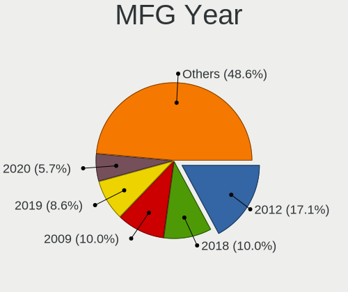
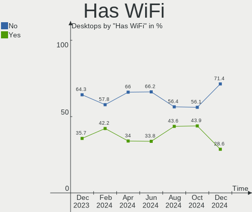
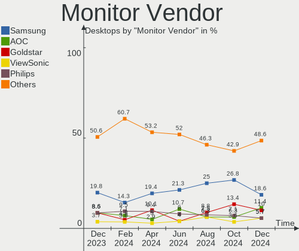
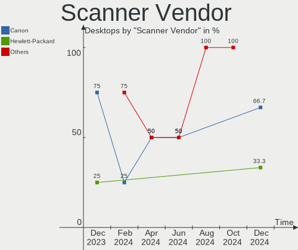
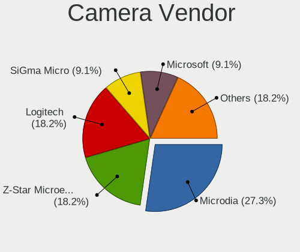

ROSA - Hardware Trends (Desktops)
---------------------------------

A project to identify most popular hardware characteristics and track their change
over time based on data collected by Linux users at https://Linux-Hardware.org.

Anyone can contribute to this report by the [hw-probe](https://github.com/linuxhw/hw-probe) tool:

    sudo -E hw-probe -all -upload

This report is for one last month. Overall report since the beginning of time: [TestDays](https://github.com/linuxhw/TestDays)

Period: Oct, 2023.

Contents
--------

* [ System ](#system)
  - [ OS                       ](#os)
  - [ OS Family                ](#os-family)
  - [ Kernel                   ](#kernel)
  - [ Kernel Family            ](#kernel-family)
  - [ Kernel Major Ver.        ](#kernel-major-ver)
  - [ Arch                     ](#arch)
  - [ DE                       ](#de)
  - [ Display Server           ](#display-server)
  - [ Display Manager          ](#display-manager)
  - [ OS Lang                  ](#os-lang)
  - [ Boot Mode                ](#boot-mode)
  - [ Filesystem               ](#filesystem)
  - [ Part. scheme             ](#part-scheme)
  - [ Dual Boot with Linux/BSD ](#dual-boot-with-linuxbsd)
  - [ Dual Boot (Win)          ](#dual-boot-win)

* [ Board ](#board)
  - [ Vendor                   ](#vendor)
  - [ Model                    ](#model)
  - [ Model Family             ](#model-family)
  - [ MFG Year                 ](#mfg-year)
  - [ Form Factor              ](#form-factor)
  - [ Secure Boot              ](#secure-boot)
  - [ Coreboot                 ](#coreboot)
  - [ RAM Size                 ](#ram-size)
  - [ RAM Used                 ](#ram-used)
  - [ Total Drives             ](#total-drives)
  - [ Has CD-ROM               ](#has-cd-rom)
  - [ Has Ethernet             ](#has-ethernet)
  - [ Has WiFi                 ](#has-wifi)
  - [ Has Bluetooth            ](#has-bluetooth)

* [ Location ](#location)
  - [ Country                  ](#country)
  - [ City                     ](#city)

* [ Drives ](#drives)
  - [ Drive Vendor             ](#drive-vendor)
  - [ Drive Model              ](#drive-model)
  - [ HDD Vendor               ](#hdd-vendor)
  - [ SSD Vendor               ](#ssd-vendor)
  - [ Drive Kind               ](#drive-kind)
  - [ Drive Connector          ](#drive-connector)
  - [ Drive Size               ](#drive-size)
  - [ Space Total              ](#space-total)
  - [ Space Used               ](#space-used)
  - [ Malfunc. Drives          ](#malfunc-drives)
  - [ Malfunc. Drive Vendor    ](#malfunc-drive-vendor)
  - [ Malfunc. HDD Vendor      ](#malfunc-hdd-vendor)
  - [ Malfunc. Drive Kind      ](#malfunc-drive-kind)
  - [ Failed Drives            ](#failed-drives)
  - [ Failed Drive Vendor      ](#failed-drive-vendor)
  - [ Drive Status             ](#drive-status)

* [ Storage controller ](#storage-controller)
  - [ Storage Vendor           ](#storage-vendor)
  - [ Storage Model            ](#storage-model)
  - [ Storage Kind             ](#storage-kind)

* [ Processor ](#processor)
  - [ CPU Vendor               ](#cpu-vendor)
  - [ CPU Model                ](#cpu-model)
  - [ CPU Model Family         ](#cpu-model-family)
  - [ CPU Cores                ](#cpu-cores)
  - [ CPU Sockets              ](#cpu-sockets)
  - [ CPU Threads              ](#cpu-threads)
  - [ CPU Op-Modes             ](#cpu-op-modes)
  - [ CPU Microcode            ](#cpu-microcode)
  - [ CPU Microarch            ](#cpu-microarch)

* [ Graphics ](#graphics)
  - [ GPU Vendor               ](#gpu-vendor)
  - [ GPU Model                ](#gpu-model)
  - [ GPU Combo                ](#gpu-combo)
  - [ GPU Driver               ](#gpu-driver)
  - [ GPU Memory               ](#gpu-memory)

* [ Monitor ](#monitor)
  - [ Monitor Vendor           ](#monitor-vendor)
  - [ Monitor Model            ](#monitor-model)
  - [ Monitor Resolution       ](#monitor-resolution)
  - [ Monitor Diagonal         ](#monitor-diagonal)
  - [ Monitor Width            ](#monitor-width)
  - [ Aspect Ratio             ](#aspect-ratio)
  - [ Monitor Area             ](#monitor-area)
  - [ Pixel Density            ](#pixel-density)
  - [ Multiple Monitors        ](#multiple-monitors)

* [ Network ](#network)
  - [ Net Controller Vendor    ](#net-controller-vendor)
  - [ Net Controller Model     ](#net-controller-model)
  - [ Wireless Vendor          ](#wireless-vendor)
  - [ Wireless Model           ](#wireless-model)
  - [ Ethernet Vendor          ](#ethernet-vendor)
  - [ Ethernet Model           ](#ethernet-model)
  - [ Net Controller Kind      ](#net-controller-kind)
  - [ Used Controller          ](#used-controller)
  - [ NICs                     ](#nics)
  - [ IPv6                     ](#ipv6)

* [ Bluetooth ](#bluetooth)
  - [ Bluetooth Vendor         ](#bluetooth-vendor)
  - [ Bluetooth Model          ](#bluetooth-model)

* [ Sound ](#sound)
  - [ Sound Vendor             ](#sound-vendor)
  - [ Sound Model              ](#sound-model)

* [ Memory ](#memory)
  - [ Memory Vendor            ](#memory-vendor)
  - [ Memory Model             ](#memory-model)
  - [ Memory Kind              ](#memory-kind)
  - [ Memory Form Factor       ](#memory-form-factor)
  - [ Memory Size              ](#memory-size)
  - [ Memory Speed             ](#memory-speed)

* [ Printers & scanners ](#printers--scanners)
  - [ Printer Vendor           ](#printer-vendor)
  - [ Printer Model            ](#printer-model)
  - [ Scanner Vendor           ](#scanner-vendor)
  - [ Scanner Model            ](#scanner-model)

* [ Camera ](#camera)
  - [ Camera Vendor            ](#camera-vendor)
  - [ Camera Model             ](#camera-model)

* [ Security ](#security)
  - [ Fingerprint Vendor       ](#fingerprint-vendor)
  - [ Fingerprint Model        ](#fingerprint-model)
  - [ Chipcard Vendor          ](#chipcard-vendor)
  - [ Chipcard Model           ](#chipcard-model)

* [ Unsupported ](#unsupported)
  - [ Unsupported Devices      ](#unsupported-devices)
  - [ Unsupported Device Types ](#unsupported-device-types)

System
------

OS
--

Installed operating systems

| Name       | Desktops | Percent |
|------------|----------|---------|
| ROSA 12.4  | 85       | 81.73%  |
| ROSA R11.1 | 9        | 8.65%   |
| ROSA 12    | 7        | 6.73%   |
| ROSA 12.1  | 2        | 1.92%   |
| ROSA 13.0  | 1        | 0.96%   |

OS Family
---------

OS without a version

| Name | Desktops | Percent |
|------|----------|---------|
| ROSA | 104      | 100%    |

Kernel
------

Version of the Linux kernel

| Version                             | Desktops | Percent |
|-------------------------------------|----------|---------|
| 6.1.46-generic-2rosa2021.1-x86_64   | 40       | 38.46%  |
| 6.1.20-generic-2rosa2021.1-x86_64   | 26       | 25%     |
| 6.1.58-generic-1rosa2021.1-x86_64   | 11       | 10.58%  |
| 5.4.83-generic-2rosa-x86_64         | 4        | 3.85%   |
| 5.15.127-generic-1rosa2021.1-x86_64 | 3        | 2.88%   |
| 5.15.103-generic-1rosa2021.1-i686   | 3        | 2.88%   |
| 4.15.0-desktop-122.124.1rosa-x86_64 | 3        | 2.88%   |
| 6.1.38-generic-1rosa2021.1-x86_64   | 2        | 1.92%   |
| 5.10.74-generic-2rosa2021.1-x86_64  | 2        | 1.92%   |
| 5.10.184-generic-1rosa2021.1-x86_64 | 2        | 1.92%   |
| 6.3.12-generic-1rosa2021.1-x86_64   | 1        | 0.96%   |
| 6.1.57-generic-1rosa2021.1-x86_64   | 1        | 0.96%   |
| 6.1.49-generic-1rosa2023.1-x86_64   | 1        | 0.96%   |
| 5.4.32-generic-2rosa-i586           | 1        | 0.96%   |
| 5.15.103-generic-1rosa2021.1-x86_64 | 1        | 0.96%   |
| 5.10.74-generic-2rosa2021.1-i586    | 1        | 0.96%   |
| 5.10.176-generic-1rosa2021.1-x86_64 | 1        | 0.96%   |
| 4.15.0-desktop-122.124.1rosa-i586   | 1        | 0.96%   |

Kernel Family
-------------

Linux kernel without a distro release

| Version  | Desktops | Percent |
|----------|----------|---------|
| 6.1.46   | 40       | 38.46%  |
| 6.1.20   | 26       | 25%     |
| 6.1.58   | 11       | 10.58%  |
| 5.4.83   | 4        | 3.85%   |
| 5.15.103 | 4        | 3.85%   |
| 4.15.0   | 4        | 3.85%   |
| 5.15.127 | 3        | 2.88%   |
| 5.10.74  | 3        | 2.88%   |
| 6.1.38   | 2        | 1.92%   |
| 5.10.184 | 2        | 1.92%   |
| 6.3.12   | 1        | 0.96%   |
| 6.1.57   | 1        | 0.96%   |
| 6.1.49   | 1        | 0.96%   |
| 5.4.32   | 1        | 0.96%   |
| 5.10.176 | 1        | 0.96%   |

Kernel Major Ver.
-----------------

Linux kernel major version

| Version | Desktops | Percent |
|---------|----------|---------|
| 6.1     | 81       | 77.88%  |
| 5.15    | 7        | 6.73%   |
| 5.10    | 6        | 5.77%   |
| 5.4     | 5        | 4.81%   |
| 4.15    | 4        | 3.85%   |
| 6.3     | 1        | 0.96%   |

Arch
----

OS architecture (x86_64, i586, etc.)

| Name   | Desktops | Percent |
|--------|----------|---------|
| x86_64 | 98       | 94.23%  |
| i686   | 6        | 5.77%   |

DE
--

Desktop Environment

| Name    | Desktops | Percent |
|---------|----------|---------|
| KDE5    | 62       | 59.62%  |
| GNOME   | 24       | 23.08%  |
| LXQt    | 8        | 7.69%   |
| KDE4    | 6        | 5.77%   |
| Unknown | 2        | 1.92%   |
| MATE    | 1        | 0.96%   |
| i3      | 1        | 0.96%   |

Display Server
--------------

X11 or Wayland

| Name    | Desktops | Percent |
|---------|----------|---------|
| Wayland | 71       | 68.27%  |
| X11     | 31       | 29.81%  |
| Unknown | 2        | 1.92%   |

Display Manager
---------------

SDDM, LightDM, etc.

| Name    | Desktops | Percent |
|---------|----------|---------|
| SDDM    | 61       | 58.65%  |
| GDM     | 29       | 27.88%  |
| LightDM | 6        | 5.77%   |
| KDM     | 6        | 5.77%   |
| Unknown | 2        | 1.92%   |

OS Lang
-------

Language

| Lang  | Desktops | Percent |
|-------|----------|---------|
| ru_RU | 97       | 93.27%  |
| de_DE | 3        | 2.88%   |
| ru_KZ | 1        | 0.96%   |
| pl_PL | 1        | 0.96%   |
| id_ID | 1        | 0.96%   |
| hr_HR | 1        | 0.96%   |

Boot Mode
---------

EFI or BIOS

| Mode | Desktops | Percent |
|------|----------|---------|
| EFI  | 53       | 50.96%  |
| BIOS | 51       | 49.04%  |

Filesystem
----------

Type of filesystem

| Type    | Desktops | Percent |
|---------|----------|---------|
| Ext4    | 88       | 84.62%  |
| Btrfs   | 14       | 13.46%  |
| Overlay | 1        | 0.96%   |
| F2fs    | 1        | 0.96%   |

Part. scheme
------------

Scheme of partitioning

| Type | Desktops | Percent |
|------|----------|---------|
| GPT  | 58       | 55.77%  |
| MBR  | 46       | 44.23%  |

Dual Boot with Linux/BSD
------------------------

Hosting more than one Linux/BSD

| Dual boot | Desktops | Percent |
|-----------|----------|---------|
| No        | 80       | 76.92%  |
| Yes       | 24       | 23.08%  |

Dual Boot (Win)
---------------

Hosting Linux and Windows

| Dual boot | Desktops | Percent |
|-----------|----------|---------|
| Yes       | 53       | 50.96%  |
| No        | 51       | 49.04%  |

Board
-----

Vendor
------

Motherboard manufacturer

| Name                                 | Desktops | Percent |
|--------------------------------------|----------|---------|
| Gigabyte Technology                  | 24       | 23.08%  |
| MSI                                  | 22       | 21.15%  |
| ASUSTek Computer                     | 22       | 21.15%  |
| ASRock                               | 12       | 11.54%  |
| Intel                                | 6        | 5.77%   |
| Unknown                              | 5        | 4.81%   |
| Hewlett-Packard                      | 2        | 1.92%   |
| Yadro                                | 1        | 0.96%   |
| Shenzhen Meigao Electronic Equipment | 1        | 0.96%   |
| QBIC                                 | 1        | 0.96%   |
| Pegatron                             | 1        | 0.96%   |
| OEM                                  | 1        | 0.96%   |
| Medion                               | 1        | 0.96%   |
| MACHINIST                            | 1        | 0.96%   |
| Lenovo                               | 1        | 0.96%   |
| Huanan                               | 1        | 0.96%   |
| Dell                                 | 1        | 0.96%   |
| Biostar                              | 1        | 0.96%   |

Model
-----

Motherboard model

| Name                                            | Desktops | Percent |
|-------------------------------------------------|----------|---------|
| Unknown                                         | 5        | 4.81%   |
| MSI MS-7641                                     | 2        | 1.92%   |
| Intel X99                                       | 2        | 1.92%   |
| Intel SKYBAY                                    | 2        | 1.92%   |
| Gigabyte GA-870A-UD3                            | 2        | 1.92%   |
| Gigabyte A320M-S2H                              | 2        | 1.92%   |
| ASUS PRIME H510M-K                              | 2        | 1.92%   |
| ASUS P5K PRO                                    | 2        | 1.92%   |
| ASUS All Series                                 | 2        | 1.92%   |
| ASRock N68C-GS FX                               | 2        | 1.92%   |
| Yadro TB560-D4                                  | 1        | 0.96%   |
| Shenzhen Meigao Electronic Equipment UM773 Lite | 1        | 0.96%   |
| QBIC BXT-512-7100U                              | 1        | 0.96%   |
| Pegatron Pro 3010 Microtower PC                 | 1        | 0.96%   |
| OEM X79G                                        | 1        | 0.96%   |
| MSI OPTIMUS                                     | 1        | 0.96%   |
| MSI MS-7D54                                     | 1        | 0.96%   |
| MSI MS-7D46                                     | 1        | 0.96%   |
| MSI MS-7C56                                     | 1        | 0.96%   |
| MSI MS-7B98                                     | 1        | 0.96%   |
| MSI MS-7B53                                     | 1        | 0.96%   |
| MSI MS-7A94                                     | 1        | 0.96%   |
| MSI MS-7A39                                     | 1        | 0.96%   |
| MSI MS-7996                                     | 1        | 0.96%   |
| MSI MS-7970                                     | 1        | 0.96%   |
| MSI MS-7851                                     | 1        | 0.96%   |
| MSI MS-7721                                     | 1        | 0.96%   |
| MSI MS-7623                                     | 1        | 0.96%   |
| MSI MS-7599                                     | 1        | 0.96%   |
| MSI MS-7596                                     | 1        | 0.96%   |
| MSI MS-7529                                     | 1        | 0.96%   |
| MSI MS-7519                                     | 1        | 0.96%   |
| MSI MS-7388                                     | 1        | 0.96%   |
| MSI MS-7235                                     | 1        | 0.96%   |
| MSI Aquilon O243                                | 1        | 0.96%   |
| Medion MS-7800                                  | 1        | 0.96%   |
| MACHINIST E5-V2.82H V1.1                        | 1        | 0.96%   |
| Lenovo ThinkCentre M72e 32641S2                 | 1        | 0.96%   |
| Intel H81 V2.3                                  | 1        | 0.96%   |
| Intel H81                                       | 1        | 0.96%   |

Model Family
------------

Motherboard model prefix

| Name                                       | Desktops | Percent |
|--------------------------------------------|----------|---------|
| ASUS PRIME                                 | 7        | 6.73%   |
| Unknown                                    | 5        | 4.81%   |
| Gigabyte B450M                             | 3        | 2.88%   |
| ASUS P5K                                   | 3        | 2.88%   |
| MSI MS-7641                                | 2        | 1.92%   |
| Intel X99                                  | 2        | 1.92%   |
| Intel SKYBAY                               | 2        | 1.92%   |
| Intel H81                                  | 2        | 1.92%   |
| HP Compaq                                  | 2        | 1.92%   |
| Gigabyte GA-870A-UD3                       | 2        | 1.92%   |
| Gigabyte A320M-S2H                         | 2        | 1.92%   |
| ASUS All                                   | 2        | 1.92%   |
| ASRock N68C-GS                             | 2        | 1.92%   |
| Yadro TB560-D4                             | 1        | 0.96%   |
| Shenzhen Meigao Electronic Equipment UM773 | 1        | 0.96%   |
| QBIC BXT-512-7100U                         | 1        | 0.96%   |
| Pegatron Pro                               | 1        | 0.96%   |
| OEM X79G                                   | 1        | 0.96%   |
| MSI OPTIMUS                                | 1        | 0.96%   |
| MSI MS-7D54                                | 1        | 0.96%   |
| MSI MS-7D46                                | 1        | 0.96%   |
| MSI MS-7C56                                | 1        | 0.96%   |
| MSI MS-7B98                                | 1        | 0.96%   |
| MSI MS-7B53                                | 1        | 0.96%   |
| MSI MS-7A94                                | 1        | 0.96%   |
| MSI MS-7A39                                | 1        | 0.96%   |
| MSI MS-7996                                | 1        | 0.96%   |
| MSI MS-7970                                | 1        | 0.96%   |
| MSI MS-7851                                | 1        | 0.96%   |
| MSI MS-7721                                | 1        | 0.96%   |
| MSI MS-7623                                | 1        | 0.96%   |
| MSI MS-7599                                | 1        | 0.96%   |
| MSI MS-7596                                | 1        | 0.96%   |
| MSI MS-7529                                | 1        | 0.96%   |
| MSI MS-7519                                | 1        | 0.96%   |
| MSI MS-7388                                | 1        | 0.96%   |
| MSI MS-7235                                | 1        | 0.96%   |
| MSI Aquilon                                | 1        | 0.96%   |
| Medion MS-7800                             | 1        | 0.96%   |
| MACHINIST E5-V2.82H                        | 1        | 0.96%   |

MFG Year
--------

Motherboard manufacture year

| Year | Desktops | Percent |
|------|----------|---------|
| 2018 | 12       | 11.54%  |
| 2009 | 12       | 11.54%  |
| 2022 | 8        | 7.69%   |
| 2012 | 8        | 7.69%   |
| 2021 | 7        | 6.73%   |
| 2019 | 7        | 6.73%   |
| 2017 | 7        | 6.73%   |
| 2008 | 7        | 6.73%   |
| 2011 | 6        | 5.77%   |
| 2020 | 5        | 4.81%   |
| 2010 | 5        | 4.81%   |
| 2013 | 4        | 3.85%   |
| 2016 | 3        | 2.88%   |
| 2014 | 3        | 2.88%   |
| 2007 | 3        | 2.88%   |
| 2023 | 2        | 1.92%   |
| 2015 | 2        | 1.92%   |
| 2006 | 2        | 1.92%   |
| 2005 | 1        | 0.96%   |

Form Factor
-----------

Physical design of the computer

| Name    | Desktops | Percent |
|---------|----------|---------|
| Desktop | 104      | 100%    |

Secure Boot
-----------

Enabled or disabled

| State    | Desktops | Percent |
|----------|----------|---------|
| Disabled | 104      | 100%    |

Coreboot
--------

Have coreboot on board

| Used | Desktops | Percent |
|------|----------|---------|
| No   | 104      | 100%    |

RAM Size
--------

Total RAM memory

| Size in GB      | Desktops | Percent |
|-----------------|----------|---------|
| 8.01-16.0       | 28       | 26.92%  |
| 16.01-24.0      | 21       | 20.19%  |
| 3.01-4.0        | 16       | 15.38%  |
| 4.01-8.0        | 14       | 13.46%  |
| 32.01-64.0      | 12       | 11.54%  |
| 1.01-2.0        | 6        | 5.77%   |
| 64.01-256.0     | 3        | 2.88%   |
| 24.01-32.0      | 2        | 1.92%   |
| More than 256.0 | 1        | 0.96%   |
| 2.01-3.0        | 1        | 0.96%   |

RAM Used
--------

Used RAM memory

| Used GB    | Desktops | Percent |
|------------|----------|---------|
| 1.01-2.0   | 56       | 53.85%  |
| 2.01-3.0   | 20       | 19.23%  |
| 0.51-1.0   | 15       | 14.42%  |
| 3.01-4.0   | 5        | 4.81%   |
| 4.01-8.0   | 4        | 3.85%   |
| 0.01-0.5   | 3        | 2.88%   |
| 16.01-24.0 | 1        | 0.96%   |

Total Drives
------------

Number of drives on board

| Drives | Desktops | Percent |
|--------|----------|---------|
| 1      | 45       | 43.27%  |
| 2      | 31       | 29.81%  |
| 3      | 14       | 13.46%  |
| 4      | 10       | 9.62%   |
| 8      | 1        | 0.96%   |
| 7      | 1        | 0.96%   |
| 5      | 1        | 0.96%   |
| 0      | 1        | 0.96%   |

Has CD-ROM
----------

Has CD-ROM on board

| Presented | Desktops | Percent |
|-----------|----------|---------|
| No        | 75       | 72.12%  |
| Yes       | 29       | 27.88%  |

Has Ethernet
------------

Has Ethernet on board

| Presented | Desktops | Percent |
|-----------|----------|---------|
| Yes       | 103      | 99.04%  |
| No        | 1        | 0.96%   |

Has WiFi
--------

Has WiFi module

| Presented | Desktops | Percent |
|-----------|----------|---------|
| No        | 69       | 66.35%  |
| Yes       | 35       | 33.65%  |

Has Bluetooth
-------------

Has Bluetooth module

| Presented | Desktops | Percent |
|-----------|----------|---------|
| No        | 80       | 76.92%  |
| Yes       | 24       | 23.08%  |

Location
--------

Country
-------

Geographic location (country)

| Country                | Desktops | Percent |
|------------------------|----------|---------|
| Russia                 | 93       | 89.42%  |
| Germany                | 3        | 2.88%   |
| Ukraine                | 2        | 1.92%   |
| Kazakhstan             | 2        | 1.92%   |
| Poland                 | 1        | 0.96%   |
| Indonesia              | 1        | 0.96%   |
| Bosnia and Herzegovina | 1        | 0.96%   |
| Belarus                | 1        | 0.96%   |

City
----

Geographic location (city)

| City            | Desktops | Percent |
|-----------------|----------|---------|
| Moscow          | 24       | 23.08%  |
| St Petersburg   | 4        | 3.85%   |
| Chelyabinsk     | 4        | 3.85%   |
| Volgograd       | 3        | 2.88%   |
| Stavropol       | 3        | 2.88%   |
| Krasnodar       | 3        | 2.88%   |
| Voronezh        | 2        | 1.92%   |
| Tula            | 2        | 1.92%   |
| Shchelkovo      | 2        | 1.92%   |
| Saratov         | 2        | 1.92%   |
| Otzberg         | 2        | 1.92%   |
| Omsk            | 2        | 1.92%   |
| Novokuznetsk    | 2        | 1.92%   |
| Magnitogorsk    | 2        | 1.92%   |
| Belgorod        | 2        | 1.92%   |
| Zheleznogorsk   | 1        | 0.96%   |
| Yekaterinburg   | 1        | 0.96%   |
| Yakutsk         | 1        | 0.96%   |
| Vladivostok     | 1        | 0.96%   |
| Vladimir        | 1        | 0.96%   |
| Veliky Novgorod | 1        | 0.96%   |
| Tuchkovo        | 1        | 0.96%   |
| Trebinje        | 1        | 0.96%   |
| Tolyatti        | 1        | 0.96%   |
| Syktyvkar       | 1        | 0.96%   |
| Surgut          | 1        | 0.96%   |
| Stary Oskol     | 1        | 0.96%   |
| Skoczow         | 1        | 0.96%   |
| Skhodnya        | 1        | 0.96%   |
| Sevastopol      | 1        | 0.96%   |
| Sergiyev Posad  | 1        | 0.96%   |
| Segezha         | 1        | 0.96%   |
| Saransk         | 1        | 0.96%   |
| Samara          | 1        | 0.96%   |
| Ryazan          | 1        | 0.96%   |
| Ramenskoye      | 1        | 0.96%   |
| Pyatigorsk      | 1        | 0.96%   |
| Prokop'yevsk    | 1        | 0.96%   |
| Oryol           | 1        | 0.96%   |
| Ordynskoye      | 1        | 0.96%   |

Drives
------

Drive Vendor
------------

Hard drive vendors

| Vendor                      | Desktops | Drives | Percent |
|-----------------------------|----------|--------|---------|
| WDC                         | 37       | 46     | 19.37%  |
| Seagate                     | 26       | 31     | 13.61%  |
| Kingston                    | 14       | 15     | 7.33%   |
| Samsung Electronics         | 11       | 11     | 5.76%   |
| Toshiba                     | 7        | 9      | 3.66%   |
| Hitachi                     | 7        | 7      | 3.66%   |
| Crucial                     | 7        | 7      | 3.66%   |
| A-DATA Technology           | 7        | 7      | 3.66%   |
| China                       | 6        | 6      | 3.14%   |
| Maxtor                      | 5        | 5      | 2.62%   |
| Smartbuy                    | 4        | 4      | 2.09%   |
| Unknown                     | 3        | 3      | 1.57%   |
| Patriot                     | 3        | 3      | 1.57%   |
| HGST                        | 3        | 3      | 1.57%   |
| Apacer                      | 3        | 3      | 1.57%   |
| Team                        | 2        | 2      | 1.05%   |
| SPCC                        | 2        | 2      | 1.05%   |
| SanDisk                     | 2        | 2      | 1.05%   |
| Neo                         | 2        | 2      | 1.05%   |
| Micron Technology           | 2        | 2      | 1.05%   |
| MAXIO Technology (Hangzhou) | 2        | 2      | 1.05%   |
| KingSpec                    | 2        | 3      | 1.05%   |
| Azerty                      | 2        | 2      | 1.05%   |
| ASMT                        | 2        | 2      | 1.05%   |
| AGI                         | 2        | 2      | 1.05%   |
| ZHITAI                      | 1        | 1      | 0.52%   |
| XrayDisk                    | 1        | 1      | 0.52%   |
| XPG                         | 1        | 1      | 0.52%   |
| Transcend                   | 1        | 1      | 0.52%   |
| Silicon Motion              | 1        | 1      | 0.52%   |
| ShanDianZhe                 | 1        | 1      | 0.52%   |
| Reletech                    | 1        | 1      | 0.52%   |
| Realtek                     | 1        | 1      | 0.52%   |
| Plextor                     | 1        | 1      | 0.52%   |
| OCZ                         | 1        | 1      | 0.52%   |
| Netac                       | 1        | 1      | 0.52%   |
| Londisk                     | 1        | 1      | 0.52%   |
| KIOXIA-EXCERIA              | 1        | 1      | 0.52%   |
| Kingston Technology Company | 1        | 1      | 0.52%   |
| KingFast                    | 1        | 1      | 0.52%   |

Drive Model
-----------

Hard drive models

| Model                                   | Desktops | Percent |
|-----------------------------------------|----------|---------|
| WDC WD10EZEX-08WN4A0 1TB                | 4        | 1.94%   |
| Kingston SNVS500G 500GB                 | 4        | 1.94%   |
| Kingston SA400S37120G 120GB SSD         | 4        | 1.94%   |
| Smartbuy SSD 120GB                      | 3        | 1.46%   |
| Seagate ST1000DM010-2EP102 1TB          | 3        | 1.46%   |
| WDC WD5000AAKX-00ERMA0 500GB            | 2        | 0.97%   |
| Toshiba DT01ACA050 500GB                | 2        | 0.97%   |
| Seagate ST500DM002-1BD142 500GB         | 2        | 0.97%   |
| Seagate ST32000641AS 2TB                | 2        | 0.97%   |
| Seagate ST1000DM003-1ER162 1TB          | 2        | 0.97%   |
| Samsung SSD 870 EVO 500GB               | 2        | 0.97%   |
| Patriot P210 128GB SSD                  | 2        | 0.97%   |
| Neo Forza NFS121SA312-6007000 120GB SSD | 2        | 0.97%   |
| Kingston SA400S37240G 240GB SSD         | 2        | 0.97%   |
| KingSpec P3-128 128GB SSD               | 2        | 0.97%   |
| Crucial CT240BX500SSD1 240GB            | 2        | 0.97%   |
| Apacer AS2280P4 256GB                   | 2        | 0.97%   |
| ZHITAI SC001 Active 256GB SSD           | 1        | 0.49%   |
| XrayDisk 120GB SSD                      | 1        | 0.49%   |
| XPG GAMMIX S50 Lite 512GB               | 1        | 0.49%   |
| WDC WDS500G2B0A-00SM50 500GB SSD        | 1        | 0.49%   |
| WDC WDS100T2B0C-00PXH0 1TB              | 1        | 0.49%   |
| WDC WD80EFBX-68AZZN0 8TB                | 1        | 0.49%   |
| WDC WD6400BPVT-22HXZT3 640GB            | 1        | 0.49%   |
| WDC WD5000LPVX-80V0TT0 500GB            | 1        | 0.49%   |
| WDC WD5000LPVX-22V0TT0 500GB            | 1        | 0.49%   |
| WDC WD5000LPSX-00A6WT0 500GB            | 1        | 0.49%   |
| WDC WD5000LPCX-21VHAT0 500GB            | 1        | 0.49%   |
| WDC WD5000BPVT-80HXZT1 500GB            | 1        | 0.49%   |
| WDC WD5000AZRX-00A8LB0 500GB            | 1        | 0.49%   |
| WDC WD5000AZLX-00K2TA0 500GB            | 1        | 0.49%   |
| WDC WD5000AAKX-22ERMA0 500GB            | 1        | 0.49%   |
| WDC WD5000AAKX-08U6AA0 500GB            | 1        | 0.49%   |
| WDC WD5000AAKX-08ERMA0 500GB            | 1        | 0.49%   |
| WDC WD5000AAKS-75A7B2 500GB             | 1        | 0.49%   |
| WDC WD5000AAKS-00YGA0 500GB             | 1        | 0.49%   |
| WDC WD5000AADS-00S9B0 500GB             | 1        | 0.49%   |
| WDC WD5000AADS-00M2B0 500GB             | 1        | 0.49%   |
| WDC WD5000AACS-00ZUB0 500GB             | 1        | 0.49%   |
| WDC WD40EZAZ-00SF3B0 4TB                | 1        | 0.49%   |

HDD Vendor
----------

Hard disk drive vendors

| Vendor              | Desktops | Drives | Percent |
|---------------------|----------|--------|---------|
| WDC                 | 35       | 44     | 40.23%  |
| Seagate             | 26       | 31     | 29.89%  |
| Toshiba             | 7        | 8      | 8.05%   |
| Hitachi             | 7        | 7      | 8.05%   |
| Maxtor              | 4        | 4      | 4.6%    |
| HGST                | 3        | 3      | 3.45%   |
| Samsung Electronics | 2        | 2      | 2.3%    |
| Unknown             | 1        | 1      | 1.15%   |
| Fujitsu             | 1        | 1      | 1.15%   |
| ASMT                | 1        | 1      | 1.15%   |

SSD Vendor
----------

Solid state drive vendors

| Vendor              | Desktops | Drives | Percent |
|---------------------|----------|--------|---------|
| Kingston            | 9        | 9      | 11.54%  |
| Samsung Electronics | 6        | 6      | 7.69%   |
| China               | 6        | 6      | 7.69%   |
| A-DATA Technology   | 6        | 6      | 7.69%   |
| Crucial             | 5        | 5      | 6.41%   |
| Smartbuy            | 4        | 4      | 5.13%   |
| Patriot             | 3        | 3      | 3.85%   |
| Neo                 | 2        | 2      | 2.56%   |
| Micron Technology   | 2        | 2      | 2.56%   |
| KingSpec            | 2        | 3      | 2.56%   |
| Azerty              | 2        | 2      | 2.56%   |
| AGI                 | 2        | 2      | 2.56%   |
| ZHITAI              | 1        | 1      | 1.28%   |
| XrayDisk            | 1        | 1      | 1.28%   |
| WDC                 | 1        | 1      | 1.28%   |
| Toshiba             | 1        | 1      | 1.28%   |
| Team                | 1        | 1      | 1.28%   |
| SPCC                | 1        | 1      | 1.28%   |
| ShanDianZhe         | 1        | 1      | 1.28%   |
| SanDisk             | 1        | 1      | 1.28%   |
| Realtek             | 1        | 1      | 1.28%   |
| Plextor             | 1        | 1      | 1.28%   |
| OCZ                 | 1        | 1      | 1.28%   |
| Netac               | 1        | 1      | 1.28%   |
| Maxtor              | 1        | 1      | 1.28%   |
| Londisk             | 1        | 1      | 1.28%   |
| KIOXIA-EXCERIA      | 1        | 1      | 1.28%   |
| KingFast            | 1        | 1      | 1.28%   |
| Kimtigo             | 1        | 1      | 1.28%   |
| HS-SSD-C100         | 1        | 1      | 1.28%   |
| Hewlett-Packard     | 1        | 1      | 1.28%   |
| GSemi               | 1        | 1      | 1.28%   |
| Foxline             | 1        | 1      | 1.28%   |
| DEXP                | 1        | 1      | 1.28%   |
| Corsair             | 1        | 1      | 1.28%   |
| BR                  | 1        | 1      | 1.28%   |
| AXIOMTEK            | 1        | 1      | 1.28%   |
| ASMT                | 1        | 1      | 1.28%   |
| ASMedia             | 1        | 1      | 1.28%   |
| Apacer              | 1        | 1      | 1.28%   |

Drive Kind
----------

HDD or SSD

| Kind | Desktops | Drives | Percent |
|------|----------|--------|---------|
| HDD  | 70       | 102    | 45.45%  |
| SSD  | 59       | 79     | 38.31%  |
| NVMe | 25       | 28     | 16.23%  |

Drive Connector
---------------

SATA, SAS, NVMe, etc.

| Type | Desktops | Drives | Percent |
|------|----------|--------|---------|
| SATA | 93       | 177    | 76.23%  |
| NVMe | 25       | 28     | 20.49%  |
| SAS  | 4        | 4      | 3.28%   |

Drive Size
----------

Size of hard drive

| Size in TB | Desktops | Drives | Percent |
|------------|----------|--------|---------|
| 0.01-0.5   | 85       | 129    | 68%     |
| 0.51-1.0   | 25       | 32     | 20%     |
| 1.01-2.0   | 7        | 12     | 5.6%    |
| 3.01-4.0   | 4        | 4      | 3.2%    |
| 2.01-3.0   | 2        | 2      | 1.6%    |
| 4.01-10.0  | 2        | 2      | 1.6%    |

Space Total
-----------

Amount of disk space available on the file system

| Size in GB     | Desktops | Percent |
|----------------|----------|---------|
| 101-250        | 34       | 32.69%  |
| 251-500        | 22       | 21.15%  |
| 501-1000       | 15       | 14.42%  |
| 1-20           | 10       | 9.62%   |
| 51-100         | 10       | 9.62%   |
| 1001-2000      | 7        | 6.73%   |
| 21-50          | 3        | 2.88%   |
| More than 3000 | 2        | 1.92%   |
| 2001-3000      | 1        | 0.96%   |

Space Used
----------

Amount of used disk space

| Used GB        | Desktops | Percent |
|----------------|----------|---------|
| 1-20           | 66       | 63.46%  |
| 21-50          | 15       | 14.42%  |
| 101-250        | 7        | 6.73%   |
| 251-500        | 6        | 5.77%   |
| 51-100         | 5        | 4.81%   |
| 501-1000       | 3        | 2.88%   |
| More than 3000 | 1        | 0.96%   |
| 1001-2000      | 1        | 0.96%   |

Malfunc. Drives
---------------

Drive models with a malfunction

| Model                                   | Desktops | Drives | Percent |
|-----------------------------------------|----------|--------|---------|
| Neo Forza NFS121SA312-6007000 120GB SSD | 2        | 2      | 5.26%   |
| WDC WD5000LPVX-80V0TT0 500GB            | 1        | 1      | 2.63%   |
| WDC WD5000AAKX-08ERMA0 500GB            | 1        | 1      | 2.63%   |
| WDC WD5000AAKX-00ERMA0 500GB            | 1        | 1      | 2.63%   |
| WDC WD5000AAKS-75A7B2 500GB             | 1        | 1      | 2.63%   |
| WDC WD5000AADS-00M2B0 500GB             | 1        | 1      | 2.63%   |
| WDC WD3200AAJS-00YZCA0 320GB            | 1        | 1      | 2.63%   |
| WDC WD2500AAKX-001CA0 250GB             | 1        | 1      | 2.63%   |
| WDC WD10PURZ-85U8XY0 1TB                | 1        | 1      | 2.63%   |
| WDC WD10EZEX-08WN4A0 1TB                | 1        | 1      | 2.63%   |
| WDC WD10EALX-009BA0 1TB                 | 1        | 1      | 2.63%   |
| Toshiba DT01ACA050 500GB                | 1        | 1      | 2.63%   |
| Seagate ST9500423AS 500GB               | 1        | 1      | 2.63%   |
| Seagate ST9320325AS 320GB               | 1        | 1      | 2.63%   |
| Seagate ST500LT012-9WS142 500GB         | 1        | 1      | 2.63%   |
| Seagate ST4000DM000-1F2168 4TB          | 1        | 1      | 2.63%   |
| Seagate ST360021A 64GB                  | 1        | 1      | 2.63%   |
| Seagate ST3500413AS 500GB               | 1        | 1      | 2.63%   |
| Seagate ST3500320AS 500GB               | 1        | 1      | 2.63%   |
| Seagate ST3250410AS 250GB               | 1        | 1      | 2.63%   |
| Seagate ST320LT020-9YG142 320GB         | 1        | 1      | 2.63%   |
| Seagate ST320LT012-9WS14C 320GB         | 1        | 1      | 2.63%   |
| Seagate ST31000524AS 1TB                | 1        | 1      | 2.63%   |
| Seagate ST1000DM010-2EP102 1TB          | 1        | 1      | 2.63%   |
| Samsung Electronics HD501LJ 500GB       | 1        | 1      | 2.63%   |
| Maxtor 6Y080L0 82GB                     | 1        | 1      | 2.63%   |
| Kingston SHFS37A120G 120GB SSD          | 1        | 1      | 2.63%   |
| Kingston SA400S37480G 480GB SSD         | 1        | 1      | 2.63%   |
| Kingston SA400S37240G 240GB SSD         | 1        | 1      | 2.63%   |
| Hitachi HTS727575A9E364 752GB           | 1        | 1      | 2.63%   |
| Hitachi HTS723225A7A364 250GB           | 1        | 1      | 2.63%   |
| Hitachi HDP725032GLA360 320GB           | 1        | 1      | 2.63%   |
| HGST HTS725050A7E630 500GB              | 1        | 1      | 2.63%   |
| Fujitsu MHV2100BH 100GB                 | 1        | 1      | 2.63%   |
| Corsair Force LS SSD 120GB              | 1        | 1      | 2.63%   |
| ASMedia ASM105x 120GB SSD               | 1        | 1      | 2.63%   |
| A-DATA Technology SSD S510 120GB        | 1        | 1      | 2.63%   |

Malfunc. Drive Vendor
---------------------

Vendors of faulty drives

| Vendor              | Desktops | Drives | Percent |
|---------------------|----------|--------|---------|
| Seagate             | 10       | 12     | 28.57%  |
| WDC                 | 9        | 10     | 25.71%  |
| Kingston            | 3        | 3      | 8.57%   |
| Hitachi             | 3        | 3      | 8.57%   |
| Neo                 | 2        | 2      | 5.71%   |
| Toshiba             | 1        | 1      | 2.86%   |
| Samsung Electronics | 1        | 1      | 2.86%   |
| Maxtor              | 1        | 1      | 2.86%   |
| HGST                | 1        | 1      | 2.86%   |
| Fujitsu             | 1        | 1      | 2.86%   |
| Corsair             | 1        | 1      | 2.86%   |
| ASMedia             | 1        | 1      | 2.86%   |
| A-DATA Technology   | 1        | 1      | 2.86%   |

Malfunc. HDD Vendor
-------------------

Vendors of faulty HDD drives

| Vendor              | Desktops | Drives | Percent |
|---------------------|----------|--------|---------|
| Seagate             | 10       | 12     | 37.04%  |
| WDC                 | 9        | 10     | 33.33%  |
| Hitachi             | 3        | 3      | 11.11%  |
| Toshiba             | 1        | 1      | 3.7%    |
| Samsung Electronics | 1        | 1      | 3.7%    |
| Maxtor              | 1        | 1      | 3.7%    |
| HGST                | 1        | 1      | 3.7%    |
| Fujitsu             | 1        | 1      | 3.7%    |

Malfunc. Drive Kind
-------------------

Kinds of faulty drives

| Kind | Desktops | Drives | Percent |
|------|----------|--------|---------|
| HDD  | 25       | 30     | 75.76%  |
| SSD  | 8        | 8      | 24.24%  |

Failed Drives
-------------

Failed drive models

| Model                    | Desktops | Drives | Percent |
|--------------------------|----------|--------|---------|
| HGST HTS541010A9E680 1TB | 1        | 1      | 100%    |

Failed Drive Vendor
-------------------

Failed drive vendors

| Vendor | Desktops | Drives | Percent |
|--------|----------|--------|---------|
| HGST   | 1        | 1      | 100%    |

Drive Status
------------

Number of failed and malfunc. drives

| Status   | Desktops | Drives | Percent |
|----------|----------|--------|---------|
| Works    | 85       | 163    | 69.11%  |
| Malfunc  | 30       | 38     | 24.39%  |
| Detected | 7        | 7      | 5.69%   |
| Failed   | 1        | 1      | 0.81%   |

Storage controller
------------------

Storage Vendor
--------------

Storage controller vendors

| Vendor                           | Desktops | Percent |
|----------------------------------|----------|---------|
| Intel                            | 66       | 45.21%  |
| AMD                              | 33       | 22.6%   |
| JMicron Technology               | 9        | 6.16%   |
| Kingston Technology Company      | 7        | 4.79%   |
| Phison Electronics               | 4        | 2.74%   |
| Marvell Technology Group         | 4        | 2.74%   |
| Samsung Electronics              | 3        | 2.05%   |
| SanDisk                          | 2        | 1.37%   |
| Realtek Semiconductor            | 2        | 1.37%   |
| Nvidia                           | 2        | 1.37%   |
| Micron/Crucial Technology        | 2        | 1.37%   |
| MAXIO Technology (Hangzhou)      | 2        | 1.37%   |
| ADATA Technology                 | 2        | 1.37%   |
| VIA Technologies                 | 1        | 0.68%   |
| Transcend                        | 1        | 0.68%   |
| Silicon Motion                   | 1        | 0.68%   |
| Silicon Integrated Systems [SiS] | 1        | 0.68%   |
| INNOGRIT                         | 1        | 0.68%   |
| Hosin Global Electronics         | 1        | 0.68%   |
| Biwin Storage Technology         | 1        | 0.68%   |
| ASMedia Technology               | 1        | 0.68%   |

Storage Model
-------------

Storage controller models

| Model                                                                                   | Desktops | Percent |
|-----------------------------------------------------------------------------------------|----------|---------|
| AMD FCH SATA Controller [AHCI mode]                                                     | 13       | 6.88%   |
| AMD SB7x0/SB8x0/SB9x0 IDE Controller                                                    | 11       | 5.82%   |
| Intel 8 Series/C220 Series Chipset Family 6-port SATA Controller 1 [AHCI mode]          | 7        | 3.7%    |
| AMD SB7x0/SB8x0/SB9x0 SATA Controller [IDE mode]                                        | 7        | 3.7%    |
| AMD 400 Series Chipset SATA Controller                                                  | 7        | 3.7%    |
| Intel 500 Series Chipset Family SATA AHCI Controller                                    | 6        | 3.17%   |
| AMD SB7x0/SB8x0/SB9x0 SATA Controller [AHCI mode]                                       | 6        | 3.17%   |
| JMicron JMB363 SATA/IDE Controller                                                      | 5        | 2.65%   |
| Intel Q170/Q150/B150/H170/H110/Z170/CM236 Chipset SATA Controller [AHCI Mode]           | 5        | 2.65%   |
| Intel Cannon Lake PCH SATA AHCI Controller                                              | 5        | 2.65%   |
| AMD FCH SATA Controller D                                                               | 5        | 2.65%   |
| Kingston Company NV1 NVMe SSD SM2263XT                                                  | 4        | 2.12%   |
| Intel NM10/ICH7 Family SATA Controller [IDE mode]                                       | 4        | 2.12%   |
| Intel 82801JI (ICH10 Family) 4 port SATA IDE Controller #1                              | 4        | 2.12%   |
| Intel 82801JI (ICH10 Family) 2 port SATA IDE Controller #2                              | 4        | 2.12%   |
| JMicron JMB368 IDE controller                                                           | 3        | 1.59%   |
| Intel C610/X99 series chipset 6-Port SATA Controller [AHCI mode]                        | 3        | 1.59%   |
| Intel 82801JI (ICH10 Family) SATA AHCI Controller                                       | 3        | 1.59%   |
| Intel 82801I (ICH9 Family) 2 port SATA Controller [IDE mode]                            | 3        | 1.59%   |
| Intel 82801G (ICH7 Family) IDE Controller                                               | 3        | 1.59%   |
| Intel 6 Series/C200 Series Chipset Family 6 port Desktop SATA AHCI Controller           | 3        | 1.59%   |
| Intel 200 Series PCH SATA controller [AHCI mode]                                        | 3        | 1.59%   |
| AMD 500 Series Chipset SATA Controller                                                  | 3        | 1.59%   |
| Phison PS5013-E13 PCIe3 NVMe Controller (DRAM-less)                                     | 2        | 1.06%   |
| Nvidia MCP61 SATA Controller                                                            | 2        | 1.06%   |
| Nvidia MCP61 IDE                                                                        | 2        | 1.06%   |
| MAXIO (Hangzhou) NVMe SSD Controller MAP1202                                            | 2        | 1.06%   |
| Marvell Group 88SE6101/6102 single-port PATA133 interface                               | 2        | 1.06%   |
| Kingston Company NV2 NVMe SSD SM2267XT                                                  | 2        | 1.06%   |
| Intel C600/X79 series chipset 6-Port SATA AHCI Controller                               | 2        | 1.06%   |
| Intel 82801IB (ICH9) 2 port SATA Controller [IDE mode]                                  | 2        | 1.06%   |
| Intel 6 Series/C200 Series Chipset Family Desktop SATA Controller (IDE mode, ports 4-5) | 2        | 1.06%   |
| Intel 6 Series/C200 Series Chipset Family Desktop SATA Controller (IDE mode, ports 0-3) | 2        | 1.06%   |
| Intel 5 Series/3400 Series Chipset 4 port SATA IDE Controller                           | 2        | 1.06%   |
| Intel 5 Series/3400 Series Chipset 2 port SATA IDE Controller                           | 2        | 1.06%   |
| VIA VT6415 PATA IDE Host Controller                                                     | 1        | 0.53%   |
| Transcend NVMe PCIe SSD 110S/112S/120S/MTE300S/MTE400S/MTE652T2 (DRAM-less)             | 1        | 0.53%   |
| Silicon Motion SM2263EN/SM2263XT (DRAM-less) NVMe SSD Controllers                       | 1        | 0.53%   |
| Silicon Integrated Systems [SiS] RAID bus controller 180 SATA/PATA  [SiS]               | 1        | 0.53%   |
| Silicon Integrated Systems [SiS] 5513 IDE Controller                                    | 1        | 0.53%   |

Storage Kind
------------

Kind of storage controller (IDE, SATA, NVMe, SAS, ...)

| Kind | Desktops | Percent |
|------|----------|---------|
| SATA | 80       | 55.94%  |
| IDE  | 36       | 25.17%  |
| NVMe | 25       | 17.48%  |
| RAID | 2        | 1.4%    |

Processor
---------

CPU Vendor
----------

Processor vendors

| Vendor | Desktops | Percent |
|--------|----------|---------|
| Intel  | 67       | 64.42%  |
| AMD    | 37       | 35.58%  |

CPU Model
---------

Processor models

| Model                                       | Desktops | Percent |
|---------------------------------------------|----------|---------|
| AMD Athlon II X2 250 Processor              | 4        | 3.85%   |
| AMD Ryzen 5 3600 6-Core Processor           | 3        | 2.88%   |
| Intel Xeon CPU E5-2670 v2 @ 2.50GHz         | 2        | 1.92%   |
| Intel Core i7 CPU 950 @ 3.07GHz             | 2        | 1.92%   |
| Intel Core i5-8400 CPU @ 2.80GHz            | 2        | 1.92%   |
| Intel Core i3-6100TE CPU @ 2.70GHz          | 2        | 1.92%   |
| Intel Core i3-10100F CPU @ 3.60GHz          | 2        | 1.92%   |
| Intel Core 2 Quad CPU Q9400 @ 2.66GHz       | 2        | 1.92%   |
| AMD Ryzen 5 5600G with Radeon Graphics      | 2        | 1.92%   |
| AMD Ryzen 3 PRO 4350G with Radeon Graphics  | 2        | 1.92%   |
| Intel Xeon CPU E5310 @ 1.60GHz              | 1        | 0.96%   |
| Intel Xeon CPU E5-2678 v3 @ 2.50GHz         | 1        | 0.96%   |
| Intel Xeon CPU E5-2660 v2 @ 2.20GHz         | 1        | 0.96%   |
| Intel Xeon CPU E5-2650 v3 @ 2.30GHz         | 1        | 0.96%   |
| Intel Xeon CPU E5-2640 v3 @ 2.60GHz         | 1        | 0.96%   |
| Intel Xeon CPU E3-1230 v3 @ 3.30GHz         | 1        | 0.96%   |
| Intel Pentium Gold G5420 CPU @ 3.80GHz      | 1        | 0.96%   |
| Intel Pentium Dual-Core CPU E5400 @ 2.70GHz | 1        | 0.96%   |
| Intel Pentium Dual-Core CPU E5300 @ 2.60GHz | 1        | 0.96%   |
| Intel Pentium Dual-Core CPU E5200 @ 2.50GHz | 1        | 0.96%   |
| Intel Pentium 4 CPU 3.20GHz                 | 1        | 0.96%   |
| Intel Pentium 4 CPU 2.80GHz                 | 1        | 0.96%   |
| Intel Genuine CPU 0000 @ 2.40GHz            | 1        | 0.96%   |
| Intel Core i7-9700K CPU @ 3.60GHz           | 1        | 0.96%   |
| Intel Core i7-7800X CPU @ 3.50GHz           | 1        | 0.96%   |
| Intel Core i7-6700 CPU @ 3.40GHz            | 1        | 0.96%   |
| Intel Core i7-4790K CPU @ 4.00GHz           | 1        | 0.96%   |
| Intel Core i7-4790 CPU @ 3.60GHz            | 1        | 0.96%   |
| Intel Core i7-4770K CPU @ 3.50GHz           | 1        | 0.96%   |
| Intel Core i7-3770K CPU @ 3.50GHz           | 1        | 0.96%   |
| Intel Core i7-10700 CPU @ 2.90GHz           | 1        | 0.96%   |
| Intel Core i5-9400 CPU @ 2.90GHz            | 1        | 0.96%   |
| Intel Core i5-7600 CPU @ 3.50GHz            | 1        | 0.96%   |
| Intel Core i5-4670K CPU @ 3.40GHz           | 1        | 0.96%   |
| Intel Core i5-4590T CPU @ 2.00GHz           | 1        | 0.96%   |
| Intel Core i5-4570 CPU @ 3.20GHz            | 1        | 0.96%   |
| Intel Core i5-2500K CPU @ 3.30GHz           | 1        | 0.96%   |
| Intel Core i5-2500 CPU @ 3.30GHz            | 1        | 0.96%   |
| Intel Core i5-2400 CPU @ 3.10GHz            | 1        | 0.96%   |
| Intel Core i5-10505 CPU @ 3.20GHz           | 1        | 0.96%   |

CPU Model Family
----------------

Processor model prefix

| Model                   | Desktops | Percent |
|-------------------------|----------|---------|
| Intel Core i5           | 14       | 13.46%  |
| Intel Core i7           | 10       | 9.62%   |
| Intel Core i3           | 10       | 9.62%   |
| Intel Xeon              | 8        | 7.69%   |
| AMD Ryzen 5             | 7        | 6.73%   |
| Intel Core 2 Duo        | 6        | 5.77%   |
| Intel Core 2 Quad       | 4        | 3.85%   |
| Intel Celeron           | 4        | 3.85%   |
| AMD Ryzen 7             | 4        | 3.85%   |
| AMD FX                  | 4        | 3.85%   |
| AMD Athlon II X2        | 4        | 3.85%   |
| Intel Pentium Dual-Core | 3        | 2.88%   |
| AMD Phenom II X4        | 3        | 2.88%   |
| Other                   | 2        | 1.92%   |
| Intel Pentium 4         | 2        | 1.92%   |
| Intel Core 2            | 2        | 1.92%   |
| AMD Ryzen 9             | 2        | 1.92%   |
| AMD Ryzen 3 PRO         | 2        | 1.92%   |
| AMD Ryzen 3             | 2        | 1.92%   |
| AMD A8                  | 2        | 1.92%   |
| Intel Pentium Gold      | 1        | 0.96%   |
| Intel Genuine           | 1        | 0.96%   |
| AMD Phenom II X6        | 1        | 0.96%   |
| AMD Phenom II X3        | 1        | 0.96%   |
| AMD Athlon II X4        | 1        | 0.96%   |
| AMD Athlon Dual Core    | 1        | 0.96%   |
| AMD Athlon 64 X2        | 1        | 0.96%   |
| AMD Athlon              | 1        | 0.96%   |
| AMD A4                  | 1        | 0.96%   |

CPU Cores
---------

Number of processor cores

| Number | Desktops | Percent |
|--------|----------|---------|
| 4      | 38       | 36.54%  |
| 2      | 31       | 29.81%  |
| 6      | 15       | 14.42%  |
| 8      | 7        | 6.73%   |
| 10     | 5        | 4.81%   |
| 1      | 3        | 2.88%   |
| 3      | 2        | 1.92%   |
| 24     | 1        | 0.96%   |
| 16     | 1        | 0.96%   |
| 12     | 1        | 0.96%   |

CPU Sockets
-----------

Number of sockets

| Number | Desktops | Percent |
|--------|----------|---------|
| 1      | 103      | 99.04%  |
| 2      | 1        | 0.96%   |

CPU Threads
-----------

Threads per core (Hyper-Threading)

| Number | Desktops | Percent |
|--------|----------|---------|
| 2      | 55       | 52.88%  |
| 1      | 49       | 47.12%  |

CPU Op-Modes
------------

CPU Operation Modes (32-bit, 64-bit)

| Op mode        | Desktops | Percent |
|----------------|----------|---------|
| 32-bit, 64-bit | 102      | 98.08%  |
| 32-bit         | 2        | 1.92%   |

CPU Microcode
-------------

Microcode number

| Number     | Desktops | Percent |
|------------|----------|---------|
| 0x1067a    | 11       | 10.58%  |
| 0x306c3    | 8        | 7.69%   |
| Unknown    | 7        | 6.73%   |
| 0x906ea    | 4        | 3.85%   |
| 0x506e3    | 4        | 3.85%   |
| 0x010000c8 | 4        | 3.85%   |
| 0xa0653    | 3        | 2.88%   |
| 0x306f2    | 3        | 2.88%   |
| 0x306e4    | 3        | 2.88%   |
| 0x206a7    | 3        | 2.88%   |
| 0x08701030 | 3        | 2.88%   |
| 0x906eb    | 2        | 1.92%   |
| 0x306a9    | 2        | 1.92%   |
| 0x106a5    | 2        | 1.92%   |
| 0x0a50000d | 2        | 1.92%   |
| 0x0a20120a | 2        | 1.92%   |
| 0x08108109 | 2        | 1.92%   |
| 0x010000c6 | 2        | 1.92%   |
| 0xf41      | 1        | 0.96%   |
| 0xf33      | 1        | 0.96%   |
| 0xb06f2    | 1        | 0.96%   |
| 0xa0655    | 1        | 0.96%   |
| 0x906ed    | 1        | 0.96%   |
| 0x906e9    | 1        | 0.96%   |
| 0x90675    | 1        | 0.96%   |
| 0x806e9    | 1        | 0.96%   |
| 0x706a8    | 1        | 0.96%   |
| 0x6fd      | 1        | 0.96%   |
| 0x6f7      | 1        | 0.96%   |
| 0x6f6      | 1        | 0.96%   |
| 0x506e8    | 1        | 0.96%   |
| 0x506c9    | 1        | 0.96%   |
| 0x50654    | 1        | 0.96%   |
| 0x30678    | 1        | 0.96%   |
| 0x20655    | 1        | 0.96%   |
| 0x106e5    | 1        | 0.96%   |
| 0x10676    | 1        | 0.96%   |
| 0x0a50000c | 1        | 0.96%   |
| 0x0a404102 | 1        | 0.96%   |
| 0x0a201204 | 1        | 0.96%   |

CPU Microarch
-------------

Microarchitecture

| Name             | Desktops | Percent |
|------------------|----------|---------|
| Penryn           | 12       | 11.54%  |
| Haswell          | 11       | 10.58%  |
| K10              | 10       | 9.62%   |
| KabyLake         | 9        | 8.65%   |
| Zen 3            | 7        | 6.73%   |
| Skylake          | 6        | 5.77%   |
| CometLake        | 6        | 5.77%   |
| Zen 2            | 5        | 4.81%   |
| Piledriver       | 5        | 4.81%   |
| IvyBridge        | 5        | 4.81%   |
| Core             | 4        | 3.85%   |
| Zen+             | 3        | 2.88%   |
| SandyBridge      | 3        | 2.88%   |
| Nehalem          | 3        | 2.88%   |
| Zen              | 2        | 1.92%   |
| NetBurst         | 2        | 1.92%   |
| K8 Hammer        | 2        | 1.92%   |
| Alderlake Hybrid | 2        | 1.92%   |
| Westmere         | 1        | 0.96%   |
| Silvermont       | 1        | 0.96%   |
| Goldmont plus    | 1        | 0.96%   |
| Goldmont         | 1        | 0.96%   |
| Excavator        | 1        | 0.96%   |
| Bulldozer        | 1        | 0.96%   |
| Unknown          | 1        | 0.96%   |

Graphics
--------

GPU Vendor
----------

Vendors of graphics cards

| Vendor | Desktops | Percent |
|--------|----------|---------|
| Nvidia | 44       | 41.51%  |
| AMD    | 39       | 36.79%  |
| Intel  | 23       | 21.7%   |

GPU Model
---------

Graphics card models

| Model                                                                       | Desktops | Percent |
|-----------------------------------------------------------------------------|----------|---------|
| Intel Xeon E3-1200 v3/4th Gen Core Processor Integrated Graphics Controller | 4        | 3.77%   |
| AMD Navi 23 [Radeon RX 6600/6600 XT/6600M]                                  | 4        | 3.77%   |
| Nvidia TU116 [GeForce GTX 1660 SUPER]                                       | 3        | 2.83%   |
| Nvidia GP108 [GeForce GT 1030]                                              | 3        | 2.83%   |
| Nvidia GM107 [GeForce GTX 750 Ti]                                           | 3        | 2.83%   |
| Nvidia GK208B [GeForce GT 710]                                              | 3        | 2.83%   |
| Intel CometLake-S GT2 [UHD Graphics 630]                                    | 3        | 2.83%   |
| AMD Polaris 20 XL [Radeon RX 580 2048SP]                                    | 3        | 2.83%   |
| AMD Ellesmere [Radeon RX 470/480/570/570X/580/580X/590]                     | 3        | 2.83%   |
| Nvidia GT218 [GeForce 210]                                                  | 2        | 1.89%   |
| Nvidia GF114 [GeForce GTX 560 Ti]                                           | 2        | 1.89%   |
| Nvidia GA106 [GeForce RTX 3060 Lite Hash Rate]                              | 2        | 1.89%   |
| Intel HD Graphics 530                                                       | 2        | 1.89%   |
| Intel CoffeeLake-S GT2 [UHD Graphics 630]                                   | 2        | 1.89%   |
| Intel 82G33/G31 Express Integrated Graphics Controller                      | 2        | 1.89%   |
| Intel 4 Series Chipset Integrated Graphics Controller                       | 2        | 1.89%   |
| AMD Renoir [Radeon RX Vega 6 (Ryzen 4000/5000 Mobile Series)]               | 2        | 1.89%   |
| AMD Picasso/Raven 2 [Radeon Vega Series / Radeon Vega Mobile Series]        | 2        | 1.89%   |
| AMD Navi 10 [Radeon RX 5600 OEM/5600 XT / 5700/5700 XT]                     | 2        | 1.89%   |
| AMD Lexa PRO [Radeon 540/540X/550/550X / RX 540X/550/550X]                  | 2        | 1.89%   |
| Nvidia TU106 [GeForce RTX 2070 Rev. A]                                      | 1        | 0.94%   |
| Nvidia TU104 [GeForce RTX 2070 SUPER]                                       | 1        | 0.94%   |
| Nvidia GT216 [GeForce GT 220]                                               | 1        | 0.94%   |
| Nvidia GT200 [GeForce GTX 260]                                              | 1        | 0.94%   |
| Nvidia GP107M [GeForce GTX 1050 Mobile]                                     | 1        | 0.94%   |
| Nvidia GP107 [GeForce GTX 1050 Ti]                                          | 1        | 0.94%   |
| Nvidia GP106 [GeForce GTX 1060 6GB]                                         | 1        | 0.94%   |
| Nvidia GP106 [GeForce GTX 1060 3GB]                                         | 1        | 0.94%   |
| Nvidia GP104 [GeForce GTX 1060 6GB]                                         | 1        | 0.94%   |
| Nvidia GM206 [GeForce GTX 960]                                              | 1        | 0.94%   |
| Nvidia GM206 [GeForce GTX 950]                                              | 1        | 0.94%   |
| Nvidia GM204 [GeForce GTX 970]                                              | 1        | 0.94%   |
| Nvidia GK107 [GeForce GT 740]                                               | 1        | 0.94%   |
| Nvidia GK106 [GeForce GTX 650 Ti Boost]                                     | 1        | 0.94%   |
| Nvidia GF119 [GeForce GT 610]                                               | 1        | 0.94%   |
| Nvidia GF108 [GeForce GT 430]                                               | 1        | 0.94%   |
| Nvidia GA106 [Geforce RTX 3050]                                             | 1        | 0.94%   |
| Nvidia GA104 [GeForce RTX 3070 Ti]                                          | 1        | 0.94%   |
| Nvidia GA104 [Geforce RTX 3070 Ti Laptop GPU]                               | 1        | 0.94%   |
| Nvidia GA104 [GeForce RTX 3060 Ti Lite Hash Rate]                           | 1        | 0.94%   |

GPU Combo
---------

Combinations of graphics cards

| Name           | Desktops | Percent |
|----------------|----------|---------|
| 1 x Nvidia     | 41       | 39.42%  |
| 1 x AMD        | 38       | 36.54%  |
| 1 x Intel      | 21       | 20.19%  |
| Intel + Nvidia | 2        | 1.92%   |
| Other          | 1        | 0.96%   |
| AMD + Nvidia   | 1        | 0.96%   |

GPU Driver
----------

Free vs proprietary

| Driver      | Desktops | Percent |
|-------------|----------|---------|
| Free        | 86       | 82.69%  |
| Proprietary | 13       | 12.5%   |
| Unknown     | 5        | 4.81%   |

GPU Memory
----------

Total video memory

| Size in GB | Desktops | Percent |
|------------|----------|---------|
| Unknown    | 31       | 29.81%  |
| 1.01-2.0   | 17       | 16.35%  |
| 0.01-0.5   | 17       | 16.35%  |
| 7.01-8.0   | 15       | 14.42%  |
| 0.51-1.0   | 9        | 8.65%   |
| 5.01-6.0   | 6        | 5.77%   |
| 3.01-4.0   | 5        | 4.81%   |
| 8.01-16.0  | 3        | 2.88%   |
| 2.01-3.0   | 1        | 0.96%   |

Monitor
-------

Monitor Vendor
--------------

Monitor vendors

| Vendor               | Desktops | Percent |
|----------------------|----------|---------|
| Samsung Electronics  | 19       | 20.65%  |
| Goldstar             | 13       | 14.13%  |
| Acer                 | 11       | 11.96%  |
| BenQ                 | 10       | 10.87%  |
| Philips              | 8        | 8.7%    |
| AOC                  | 8        | 8.7%    |
| Dell                 | 4        | 4.35%   |
| ViewSonic            | 2        | 2.17%   |
| Iiyama               | 2        | 2.17%   |
| HHT                  | 2        | 2.17%   |
| Ancor Communications | 2        | 2.17%   |
| ___                  | 1        | 1.09%   |
| XYK                  | 1        | 1.09%   |
| Unknown              | 1        | 1.09%   |
| RGT                  | 1        | 1.09%   |
| Panasonic            | 1        | 1.09%   |
| OUT                  | 1        | 1.09%   |
| NEC Computers        | 1        | 1.09%   |
| MSI                  | 1        | 1.09%   |
| MKD                  | 1        | 1.09%   |
| Hewlett-Packard      | 1        | 1.09%   |
| ASUSTek Computer     | 1        | 1.09%   |

Monitor Model
-------------

Monitor models

| Model                                                                 | Desktops | Percent |
|-----------------------------------------------------------------------|----------|---------|
| Samsung Electronics SyncMaster SAM01E1 1280x1024 376x301mm 19.0-inch  | 2        | 2.15%   |
| Samsung Electronics SyncMaster SAM011E 1280x1024 338x270mm 17.0-inch  | 2        | 2.15%   |
| Samsung Electronics C24F390 SAM0D2C 1920x1080 521x293mm 23.5-inch     | 2        | 2.15%   |
| HHT ActivPanel V6 HHT0030 3840x2160 944x398mm 40.3-inch               | 2        | 2.15%   |
| Goldstar MP59G GSM5B34 1920x1080 480x270mm 21.7-inch                  | 2        | 2.15%   |
| Goldstar L1730S GSM438D 1280x1024 338x270mm 17.0-inch                 | 2        | 2.15%   |
| AOC Q27P2W AOC2702 2560x1440 597x336mm 27.0-inch                      | 2        | 2.15%   |
| Acer V226HQL ACR0335 1920x1080 477x268mm 21.5-inch                    | 2        | 2.15%   |
| Acer AL1917 ACRAD73 1280x1024 376x301mm 19.0-inch                     | 2        | 2.15%   |
| ___ LCD TV ___9000 1360x768                                           | 1        | 1.08%   |
| XYK 21.5 XYK2150 1920x1080 477x268mm 21.5-inch                        | 1        | 1.08%   |
| ViewSonic VA2246 SERIES VSC6F2E 1920x1080 480x270mm 21.7-inch         | 1        | 1.08%   |
| ViewSonic VA1912w-4 VSC711C 1440x900 410x260mm 19.1-inch              | 1        | 1.08%   |
| Unknown LCDTV16 9000 1360x768 1600x900mm 72.3-inch                    | 1        | 1.08%   |
| Samsung Electronics U32J59x SAM0F52 3840x2160 697x392mm 31.5-inch     | 1        | 1.08%   |
| Samsung Electronics U28E590 SAM0C4E 3840x2160 608x345mm 27.5-inch     | 1        | 1.08%   |
| Samsung Electronics SyncMaster SAM03E3 1680x1050 433x271mm 20.1-inch  | 1        | 1.08%   |
| Samsung Electronics SyncMaster SAM018F 1280x1024 338x270mm 17.0-inch  | 1        | 1.08%   |
| Samsung Electronics SyncMaster SAM0115 1280x1024 380x300mm 19.1-inch  | 1        | 1.08%   |
| Samsung Electronics SMS19A100 SAM0867 1366x768 410x230mm 18.5-inch    | 1        | 1.08%   |
| Samsung Electronics SMB2230W SAM0640 1680x1050 474x296mm 22.0-inch    | 1        | 1.08%   |
| Samsung Electronics S24D590 SAM0B47 1920x1080 521x293mm 23.5-inch     | 1        | 1.08%   |
| Samsung Electronics S22B300 SAM08AC 1920x1080 477x268mm 21.5-inch     | 1        | 1.08%   |
| Samsung Electronics LCD Monitor SAM07C0 1920x1080 890x500mm 40.2-inch | 1        | 1.08%   |
| Samsung Electronics LC32G5xT SAM7089 2560x1440 698x393mm 31.5-inch    | 1        | 1.08%   |
| Samsung Electronics C32JG5x SAM0FDE 2560x1440 697x392mm 31.5-inch     | 1        | 1.08%   |
| Samsung Electronics C32JG5x SAM0F53 2560x1440 697x392mm 31.5-inch     | 1        | 1.08%   |
| RGT LCD Monitor RGT1352 1920x1080 480x270mm 21.7-inch                 | 1        | 1.08%   |
| Philips PHL32M1N5500V PHLC274 2560x1440 697x392mm 31.5-inch           | 1        | 1.08%   |
| Philips PHL 325E1 PHLC20E 2560x1440 697x392mm 31.5-inch               | 1        | 1.08%   |
| Philips PHL 273V7 PHLC156 1920x1080 598x336mm 27.0-inch               | 1        | 1.08%   |
| Philips PHL 243V7 PHLC155 1920x1080 530x300mm 24.0-inch               | 1        | 1.08%   |
| Philips 227ELH PHLC07B 1920x1080 480x268mm 21.6-inch                  | 1        | 1.08%   |
| Philips 227E4QH PHLC0AA 1920x1080 477x268mm 21.5-inch                 | 1        | 1.08%   |
| Philips 190S1 PHL087A 1440x900 408x255mm 18.9-inch                    | 1        | 1.08%   |
| Philips 170S PHL0839 1280x1024 338x270mm 17.0-inch                    | 1        | 1.08%   |
| Philips 170B PHL082C 1280x1024 338x270mm 17.0-inch                    | 1        | 1.08%   |
| Panasonic TV MEIA296 1920x1080 698x392mm 31.5-inch                    | 1        | 1.08%   |
| OUT Digital OUT0200 1600x900 368x207mm 16.6-inch                      | 1        | 1.08%   |
| NEC Computers E224Wi NEC6950 1920x1080 476x267mm 21.5-inch            | 1        | 1.08%   |

Monitor Resolution
------------------

Monitor screen resolution

| Resolution         | Desktops | Percent |
|--------------------|----------|---------|
| 1920x1080 (FHD)    | 45       | 48.39%  |
| 1280x1024 (SXGA)   | 13       | 13.98%  |
| 3840x2160 (4K)     | 9        | 9.68%   |
| 2560x1440 (QHD)    | 7        | 7.53%   |
| 1366x768 (WXGA)    | 4        | 4.3%    |
| 1680x1050 (WSXGA+) | 3        | 3.23%   |
| 1440x900 (WXGA+)   | 3        | 3.23%   |
| 2560x1080          | 2        | 2.15%   |
| 1920x1200 (WUXGA)  | 2        | 2.15%   |
| 1360x768           | 2        | 2.15%   |
| 3440x1440          | 1        | 1.08%   |
| 1600x900 (HD+)     | 1        | 1.08%   |
| 1280x720 (HD)      | 1        | 1.08%   |

Monitor Diagonal
----------------

Diagonal size in inches

| Inches  | Desktops | Percent |
|---------|----------|---------|
| 21      | 20       | 21.51%  |
| 24      | 13       | 13.98%  |
| 23      | 10       | 10.75%  |
| 19      | 9        | 9.68%   |
| 27      | 7        | 7.53%   |
| 17      | 7        | 7.53%   |
| 31      | 6        | 6.45%   |
| 18      | 4        | 4.3%    |
| 34      | 3        | 3.23%   |
| 22      | 3        | 3.23%   |
| 40      | 2        | 2.15%   |
| 20      | 2        | 2.15%   |
| 84      | 1        | 1.08%   |
| 72      | 1        | 1.08%   |
| 46      | 1        | 1.08%   |
| 33      | 1        | 1.08%   |
| 16      | 1        | 1.08%   |
| 15      | 1        | 1.08%   |
| Unknown | 1        | 1.08%   |

Monitor Width
-------------

Physical width

| Width in mm | Desktops | Percent |
|-------------|----------|---------|
| 401-500     | 31       | 33.7%   |
| 501-600     | 28       | 30.43%  |
| 351-400     | 8        | 8.7%    |
| 301-350     | 8        | 8.7%    |
| 601-700     | 7        | 7.61%   |
| 701-800     | 4        | 4.35%   |
| 1501-2000   | 2        | 2.17%   |
| 901-1000    | 2        | 2.17%   |
| 1001-1500   | 1        | 1.09%   |
| Unknown     | 1        | 1.09%   |

Aspect Ratio
------------

Proportional relationship between the width and the height

| Ratio | Desktops | Percent |
|-------|----------|---------|
| 16/9  | 60       | 67.42%  |
| 5/4   | 14       | 15.73%  |
| 16/10 | 10       | 11.24%  |
| 21/9  | 5        | 5.62%   |

Monitor Area
------------

Area in inch

| Area in inch | Desktops | Percent |
|----------------|----------|---------|
| 201-250        | 38       | 40.86%  |
| 151-200        | 17       | 18.28%  |
| 351-500        | 10       | 10.75%  |
| 141-150        | 10       | 10.75%  |
| 301-350        | 7        | 7.53%   |
| 251-300        | 3        | 3.23%   |
| 501-1000       | 3        | 3.23%   |
| More than 1000 | 2        | 2.15%   |
| 111-120        | 1        | 1.08%   |
| 101-110        | 1        | 1.08%   |
| Unknown        | 1        | 1.08%   |

Pixel Density
-------------

Pixels per inch

| Density | Desktops | Percent |
|---------|----------|---------|
| 51-100  | 59       | 64.84%  |
| 101-120 | 26       | 28.57%  |
| 1-50    | 2        | 2.2%    |
| 121-160 | 2        | 2.2%    |
| 161-240 | 1        | 1.1%    |
| Unknown | 1        | 1.1%    |

Multiple Monitors
-----------------

Total monitors connected

| Total | Desktops | Percent |
|-------|----------|---------|
| 1     | 87       | 83.65%  |
| 2     | 9        | 8.65%   |
| 0     | 8        | 7.69%   |

Network
-------

Net Controller Vendor
---------------------

Controller vendors

| Vendor                   | Desktops | Percent |
|--------------------------|----------|---------|
| Realtek Semiconductor    | 79       | 59.85%  |
| Intel                    | 29       | 21.97%  |
| Ralink Technology        | 6        | 4.55%   |
| Qualcomm Atheros         | 4        | 3.03%   |
| TP-Link                  | 2        | 1.52%   |
| Ralink                   | 2        | 1.52%   |
| Nvidia                   | 2        | 1.52%   |
| Marvell Technology Group | 2        | 1.52%   |
| Vimtron Electronics      | 1        | 0.76%   |
| VIA Technologies         | 1        | 0.76%   |
| OPPO Electronics         | 1        | 0.76%   |
| MediaTek                 | 1        | 0.76%   |
| Huawei Technologies      | 1        | 0.76%   |
| ASUSTek Computer         | 1        | 0.76%   |

Net Controller Model
--------------------

Controller models

| Model                                                                         | Desktops | Percent |
|-------------------------------------------------------------------------------|----------|---------|
| Realtek RTL8111/8168/8411 PCI Express Gigabit Ethernet Controller             | 65       | 43.62%  |
| Ralink MT7601U Wireless Adapter                                               | 6        | 4.03%   |
| Realtek RTL8125 2.5GbE Controller                                             | 4        | 2.68%   |
| Intel Wi-Fi 6 AX200                                                           | 4        | 2.68%   |
| Intel Ethernet Connection (14) I219-V                                         | 4        | 2.68%   |
| Intel I211 Gigabit Network Connection                                         | 3        | 2.01%   |
| Intel Ethernet Connection (2) I219-V                                          | 3        | 2.01%   |
| TP-Link AC600 wireless Realtek RTL8811AU [Archer T2U Nano]                    | 2        | 1.34%   |
| Realtek RTL8152 Fast Ethernet Adapter                                         | 2        | 1.34%   |
| Realtek RTL810xE PCI Express Fast Ethernet controller                         | 2        | 1.34%   |
| Realtek RTL-8100/8101L/8139 PCI Fast Ethernet Adapter                         | 2        | 1.34%   |
| Realtek RTL-8029(AS)                                                          | 2        | 1.34%   |
| Realtek 802.11ac NIC                                                          | 2        | 1.34%   |
| Ralink RT3060 Wireless 802.11n 1T/1R                                          | 2        | 1.34%   |
| Nvidia MCP61 Ethernet                                                         | 2        | 1.34%   |
| Marvell Group 88E8056 PCI-E Gigabit Ethernet Controller                       | 2        | 1.34%   |
| Intel Wireless 7265                                                           | 2        | 1.34%   |
| Intel Ethernet Connection (7) I219-V                                          | 2        | 1.34%   |
| Vimtron Mobile Composite Device Bus                                           | 1        | 0.67%   |
| VIA VT6105/VT6106S [Rhine-III]                                                | 1        | 0.67%   |
| Realtek RTL8852BE PCIe 802.11ax Wireless Network Controller                   | 1        | 0.67%   |
| Realtek RTL8822CE 802.11ac PCIe Wireless Network Adapter                      | 1        | 0.67%   |
| Realtek RTL8821CE 802.11ac PCIe Wireless Network Adapter                      | 1        | 0.67%   |
| Realtek RTL8192EU 802.11b/g/n WLAN Adapter                                    | 1        | 0.67%   |
| Realtek RTL8188FTV 802.11b/g/n 1T1R 2.4G WLAN Adapter                         | 1        | 0.67%   |
| Realtek RTL8188EUS 802.11n Wireless Network Adapter                           | 1        | 0.67%   |
| Realtek RTL8188ETV Wireless LAN 802.11n Network Adapter                       | 1        | 0.67%   |
| Realtek RTL8188EE Wireless Network Adapter                                    | 1        | 0.67%   |
| Realtek RTL8188CUS 802.11n WLAN Adapter                                       | 1        | 0.67%   |
| Realtek RTL8188CE 802.11b/g/n WiFi Adapter                                    | 1        | 0.67%   |
| Realtek RTL8169 PCI Gigabit Ethernet Controller                               | 1        | 0.67%   |
| Realtek RTL-8110SC/8169SC Gigabit Ethernet                                    | 1        | 0.67%   |
| Qualcomm Atheros Attansic L1 Gigabit Ethernet                                 | 1        | 0.67%   |
| Qualcomm Atheros AR8151 v2.0 Gigabit Ethernet                                 | 1        | 0.67%   |
| Qualcomm Atheros AR8131 Gigabit Ethernet                                      | 1        | 0.67%   |
| Qualcomm Atheros AR2413/AR2414 Wireless Network Adapter [AR5005G(S) 802.11bg] | 1        | 0.67%   |
| OPPO RMX2027                                                                  | 1        | 0.67%   |
| MediaTek MT7921K (RZ608) Wi-Fi 6E 80MHz                                       | 1        | 0.67%   |
| Intel Wireless 8260                                                           | 1        | 0.67%   |
| Intel Wireless 7260                                                           | 1        | 0.67%   |

Wireless Vendor
---------------

Wireless vendors

| Vendor                | Desktops | Percent |
|-----------------------|----------|---------|
| Intel                 | 12       | 33.33%  |
| Realtek Semiconductor | 11       | 30.56%  |
| Ralink Technology     | 6        | 16.67%  |
| TP-Link               | 2        | 5.56%   |
| Ralink                | 2        | 5.56%   |
| Qualcomm Atheros      | 1        | 2.78%   |
| MediaTek              | 1        | 2.78%   |
| ASUSTek Computer      | 1        | 2.78%   |

Wireless Model
--------------

Wireless models

| Model                                                                         | Desktops | Percent |
|-------------------------------------------------------------------------------|----------|---------|
| Ralink MT7601U Wireless Adapter                                               | 6        | 16.22%  |
| Intel Wi-Fi 6 AX200                                                           | 4        | 10.81%  |
| TP-Link AC600 wireless Realtek RTL8811AU [Archer T2U Nano]                    | 2        | 5.41%   |
| Realtek 802.11ac NIC                                                          | 2        | 5.41%   |
| Ralink RT3060 Wireless 802.11n 1T/1R                                          | 2        | 5.41%   |
| Intel Wireless 7265                                                           | 2        | 5.41%   |
| Realtek RTL8852BE PCIe 802.11ax Wireless Network Controller                   | 1        | 2.7%    |
| Realtek RTL8822CE 802.11ac PCIe Wireless Network Adapter                      | 1        | 2.7%    |
| Realtek RTL8821CE 802.11ac PCIe Wireless Network Adapter                      | 1        | 2.7%    |
| Realtek RTL8192EU 802.11b/g/n WLAN Adapter                                    | 1        | 2.7%    |
| Realtek RTL8188FTV 802.11b/g/n 1T1R 2.4G WLAN Adapter                         | 1        | 2.7%    |
| Realtek RTL8188EUS 802.11n Wireless Network Adapter                           | 1        | 2.7%    |
| Realtek RTL8188ETV Wireless LAN 802.11n Network Adapter                       | 1        | 2.7%    |
| Realtek RTL8188EE Wireless Network Adapter                                    | 1        | 2.7%    |
| Realtek RTL8188CUS 802.11n WLAN Adapter                                       | 1        | 2.7%    |
| Realtek RTL8188CE 802.11b/g/n WiFi Adapter                                    | 1        | 2.7%    |
| Qualcomm Atheros AR2413/AR2414 Wireless Network Adapter [AR5005G(S) 802.11bg] | 1        | 2.7%    |
| MediaTek MT7921K (RZ608) Wi-Fi 6E 80MHz                                       | 1        | 2.7%    |
| Intel Wireless 8260                                                           | 1        | 2.7%    |
| Intel Wireless 7260                                                           | 1        | 2.7%    |
| Intel Wi-Fi 6 AX210/AX211/AX411 160MHz                                        | 1        | 2.7%    |
| Intel Dual Band Wireless-AC 3165 Plus Bluetooth                               | 1        | 2.7%    |
| Intel Centrino Wireless-N 2230                                                | 1        | 2.7%    |
| Intel 700 Series Chipset Family Wi-Fi                                         | 1        | 2.7%    |
| ASUS USB-AC56 802.11a/b/g/n/ac Wireless Adapter [Realtek RTL8812AU]           | 1        | 2.7%    |

Ethernet Vendor
---------------

Ethernet vendors

| Vendor                   | Desktops | Percent |
|--------------------------|----------|---------|
| Realtek Semiconductor    | 76       | 70.37%  |
| Intel                    | 21       | 19.44%  |
| Qualcomm Atheros         | 3        | 2.78%   |
| Nvidia                   | 2        | 1.85%   |
| Marvell Technology Group | 2        | 1.85%   |
| Vimtron Electronics      | 1        | 0.93%   |
| VIA Technologies         | 1        | 0.93%   |
| OPPO Electronics         | 1        | 0.93%   |
| Huawei Technologies      | 1        | 0.93%   |

Ethernet Model
--------------

Ethernet models

| Model                                                             | Desktops | Percent |
|-------------------------------------------------------------------|----------|---------|
| Realtek RTL8111/8168/8411 PCI Express Gigabit Ethernet Controller | 65       | 58.04%  |
| Realtek RTL8125 2.5GbE Controller                                 | 4        | 3.57%   |
| Intel Ethernet Connection (14) I219-V                             | 4        | 3.57%   |
| Intel I211 Gigabit Network Connection                             | 3        | 2.68%   |
| Intel Ethernet Connection (2) I219-V                              | 3        | 2.68%   |
| Realtek RTL8152 Fast Ethernet Adapter                             | 2        | 1.79%   |
| Realtek RTL810xE PCI Express Fast Ethernet controller             | 2        | 1.79%   |
| Realtek RTL-8100/8101L/8139 PCI Fast Ethernet Adapter             | 2        | 1.79%   |
| Realtek RTL-8029(AS)                                              | 2        | 1.79%   |
| Nvidia MCP61 Ethernet                                             | 2        | 1.79%   |
| Marvell Group 88E8056 PCI-E Gigabit Ethernet Controller           | 2        | 1.79%   |
| Intel Ethernet Connection (7) I219-V                              | 2        | 1.79%   |
| Vimtron Mobile Composite Device Bus                               | 1        | 0.89%   |
| VIA VT6105/VT6106S [Rhine-III]                                    | 1        | 0.89%   |
| Realtek RTL8169 PCI Gigabit Ethernet Controller                   | 1        | 0.89%   |
| Realtek RTL-8110SC/8169SC Gigabit Ethernet                        | 1        | 0.89%   |
| Qualcomm Atheros Attansic L1 Gigabit Ethernet                     | 1        | 0.89%   |
| Qualcomm Atheros AR8151 v2.0 Gigabit Ethernet                     | 1        | 0.89%   |
| Qualcomm Atheros AR8131 Gigabit Ethernet                          | 1        | 0.89%   |
| OPPO RMX2027                                                      | 1        | 0.89%   |
| Intel NM10/ICH7 Family LAN Controller                             | 1        | 0.89%   |
| Intel Ethernet Controller I225-V                                  | 1        | 0.89%   |
| Intel Ethernet Connection I219-V                                  | 1        | 0.89%   |
| Intel Ethernet Connection I219-LM                                 | 1        | 0.89%   |
| Intel Ethernet Connection I217-V                                  | 1        | 0.89%   |
| Intel Ethernet Connection I217-LM                                 | 1        | 0.89%   |
| Intel Ethernet Connection (2) I219-LM                             | 1        | 0.89%   |
| Intel Ethernet Connection (17) I219-V                             | 1        | 0.89%   |
| Intel 82567LM-3 Gigabit Network Connection                        | 1        | 0.89%   |
| Intel 82566DM-2 Gigabit Network Connection                        | 1        | 0.89%   |
| Huawei E353/E3131                                                 | 1        | 0.89%   |

Net Controller Kind
-------------------

Ethernet, WiFi or modem

| Kind     | Desktops | Percent |
|----------|----------|---------|
| Ethernet | 103      | 74.64%  |
| WiFi     | 35       | 25.36%  |

Used Controller
---------------

Currently used network controller

| Kind     | Desktops | Percent |
|----------|----------|---------|
| Ethernet | 78       | 75.73%  |
| WiFi     | 25       | 24.27%  |

NICs
----

Total network controllers on board

| Total | Desktops | Percent |
|-------|----------|---------|
| 1     | 79       | 75.96%  |
| 2     | 23       | 22.12%  |
| 3     | 2        | 1.92%   |

IPv6
----

IPv6 vs IPv4

| Used | Desktops | Percent |
|------|----------|---------|
| No   | 96       | 92.31%  |
| Yes  | 8        | 7.69%   |

Bluetooth
---------

Bluetooth Vendor
----------------

Controller vendors

| Vendor                  | Desktops | Percent |
|-------------------------|----------|---------|
| Intel                   | 10       | 40%     |
| Realtek Semiconductor   | 5        | 20%     |
| Cambridge Silicon Radio | 5        | 20%     |
| Broadcom                | 3        | 12%     |
| TP-Link                 | 1        | 4%      |
| MediaTek                | 1        | 4%      |

Bluetooth Model
---------------

Controller models

| Model                                               | Desktops | Percent |
|-----------------------------------------------------|----------|---------|
| Realtek Bluetooth Radio                             | 5        | 20%     |
| Cambridge Silicon Radio Bluetooth Dongle (HCI mode) | 5        | 20%     |
| Intel AX200 Bluetooth                               | 4        | 16%     |
| Intel Bluetooth wireless interface                  | 3        | 12%     |
| TP-Link UB500 Adapter                               | 1        | 4%      |
| MediaTek Wireless_Device                            | 1        | 4%      |
| Intel Centrino Bluetooth Wireless Transceiver       | 1        | 4%      |
| Intel Bluetooth Device                              | 1        | 4%      |
| Intel AX210 Bluetooth                               | 1        | 4%      |
| Broadcom BCM920702 Bluetooth 4.0 Zero Touch Dongle  | 1        | 4%      |
| Broadcom BCM20702A0 Bluetooth 4.0                   | 1        | 4%      |
| Broadcom BCM2045 Bluetooth                          | 1        | 4%      |

Sound
-----

Sound Vendor
------------

Sound card vendors

| Vendor                                       | Desktops | Percent |
|----------------------------------------------|----------|---------|
| Intel                                        | 63       | 39.13%  |
| AMD                                          | 47       | 29.19%  |
| Nvidia                                       | 40       | 24.84%  |
| Creative Labs                                | 3        | 1.86%   |
| C-Media Electronics                          | 3        | 1.86%   |
| Zoran Co. Personal Media Division (Nogatech) | 1        | 0.62%   |
| Yealink Network Technology                   | 1        | 0.62%   |
| Silicon Integrated Systems [SiS]             | 1        | 0.62%   |
| Micro Star International                     | 1        | 0.62%   |
| Logitech                                     | 1        | 0.62%   |

Sound Model
-----------

Sound card models

| Model                                                                      | Desktops | Percent |
|----------------------------------------------------------------------------|----------|---------|
| AMD SBx00 Azalia (Intel HDA)                                               | 13       | 6.91%   |
| AMD Family 17h/19h HD Audio Controller                                     | 9        | 4.79%   |
| Intel 82801JI (ICH10 Family) HD Audio Controller                           | 7        | 3.72%   |
| Intel 8 Series/C220 Series Chipset High Definition Audio Controller        | 7        | 3.72%   |
| AMD Starship/Matisse HD Audio Controller                                   | 7        | 3.72%   |
| Intel Smart Sound Technology (SST) Audio Controller                        | 6        | 3.19%   |
| AMD Navi 21/23 HDMI/DP Audio Controller                                    | 6        | 3.19%   |
| AMD Ellesmere HDMI Audio [Radeon RX 470/480 / 570/580/590]                 | 6        | 3.19%   |
| Intel Xeon E3-1200 v3/4th Gen Core Processor HD Audio Controller           | 5        | 2.66%   |
| Intel NM10/ICH7 Family High Definition Audio Controller                    | 5        | 2.66%   |
| Intel 6 Series/C200 Series Chipset Family High Definition Audio Controller | 5        | 2.66%   |
| AMD Renoir Radeon High Definition Audio Controller                         | 5        | 2.66%   |
| Intel Cannon Lake PCH cAVS                                                 | 4        | 2.13%   |
| Intel 82801I (ICH9 Family) HD Audio Controller                             | 4        | 2.13%   |
| Intel 200 Series PCH HD Audio                                              | 4        | 2.13%   |
| Intel 100 Series/C230 Series Chipset Family HD Audio Controller            | 4        | 2.13%   |
| Nvidia TU116 High Definition Audio Controller                              | 3        | 1.6%    |
| Nvidia GP108 High Definition Audio Controller                              | 3        | 1.6%    |
| Nvidia GM107 High Definition Audio Controller [GeForce 940MX]              | 3        | 1.6%    |
| Nvidia GK208 HDMI/DP Audio Controller                                      | 3        | 1.6%    |
| Nvidia GA106 High Definition Audio Controller                              | 3        | 1.6%    |
| Nvidia GA104 High Definition Audio Controller                              | 3        | 1.6%    |
| AMD Raven/Raven2/Fenghuang HDMI/DP Audio Controller                        | 3        | 1.6%    |
| Nvidia MCP61 High Definition Audio                                         | 2        | 1.06%   |
| Nvidia High Definition Audio Controller                                    | 2        | 1.06%   |
| Nvidia GP107GL High Definition Audio Controller                            | 2        | 1.06%   |
| Nvidia GP106 High Definition Audio Controller                              | 2        | 1.06%   |
| Nvidia GM206 High Definition Audio Controller                              | 2        | 1.06%   |
| Nvidia GF114 HDMI Audio Controller                                         | 2        | 1.06%   |
| Intel C610/X99 series chipset HD Audio Controller                          | 2        | 1.06%   |
| Intel C600/X79 series chipset High Definition Audio Controller             | 2        | 1.06%   |
| Intel 5 Series/3400 Series Chipset High Definition Audio                   | 2        | 1.06%   |
| C-Media Electronics USB Audio Device                                       | 2        | 1.06%   |
| AMD Trinity HDMI Audio Controller                                          | 2        | 1.06%   |
| AMD Oland/Hainan/Cape Verde/Pitcairn HDMI Audio [Radeon HD 7000 Series]    | 2        | 1.06%   |
| AMD Navi 10 HDMI Audio                                                     | 2        | 1.06%   |
| AMD FCH Azalia Controller                                                  | 2        | 1.06%   |
| AMD Family 17h (Models 00h-0fh) HD Audio Controller                        | 2        | 1.06%   |
| AMD Baffin HDMI/DP Audio [Radeon RX 550 640SP / RX 560/560X]               | 2        | 1.06%   |
| Zoran Co. Personal Media Division (Nogatech) USB Audio and HID             | 1        | 0.53%   |

Memory
------

Memory Vendor
-------------

Memory module vendors

| Vendor                             | Desktops | Percent |
|------------------------------------|----------|---------|
| Unknown                            | 28       | 25%     |
| Kingston                           | 22       | 19.64%  |
| Samsung Electronics                | 10       | 8.93%   |
| AMD                                | 10       | 8.93%   |
| Crucial                            | 8        | 7.14%   |
| Corsair                            | 5        | 4.46%   |
| SK hynix                           | 3        | 2.68%   |
| Patriot                            | 3        | 2.68%   |
| Apacer                             | 3        | 2.68%   |
| A-DATA Technology                  | 3        | 2.68%   |
| Transcend                          | 2        | 1.79%   |
| Unknown                            | 2        | 1.79%   |
| Unknown (ABCD)                     | 1        | 0.89%   |
| Qimonda                            | 1        | 0.89%   |
| Patriot Memory                     | 1        | 0.89%   |
| Nanya Technology                   | 1        | 0.89%   |
| Micron Technology                  | 1        | 0.89%   |
| KingSpec                           | 1        | 0.89%   |
| Kingmax                            | 1        | 0.89%   |
| Kimtigo Semiconductor (HK) Limited | 1        | 0.89%   |
| GeIL                               | 1        | 0.89%   |
| G.Skill                            | 1        | 0.89%   |
| Foxline                            | 1        | 0.89%   |
| Elpida                             | 1        | 0.89%   |
| Atermiter                          | 1        | 0.89%   |

Memory Model
------------

Memory module models

| Model                                                          | Desktops | Percent |
|----------------------------------------------------------------|----------|---------|
| Unknown RAM Module 2GB DIMM SDRAM                              | 4        | 3.33%   |
| Unknown RAM Module 4GB DIMM 1333MT/s                           | 3        | 2.5%    |
| Unknown RAM Module 2GB DIMM DDR2 800MT/s                       | 3        | 2.5%    |
| Kingston RAM KHX3466C16D4/8GX 8GB DIMM DDR4 3466MT/s           | 2        | 1.67%   |
| Kingston RAM KF3200C16D4/8GX 8GB DIMM DDR4 3600MT/s            | 2        | 1.67%   |
| AMD RAM R7S48G2606U2S 8GB DIMM DDR4 3133MT/s                   | 2        | 1.67%   |
| Unknown                                                        | 2        | 1.67%   |
| Unknown RAM Module 8GB SODIMM DDR4 2133MT/s                    | 1        | 0.83%   |
| Unknown RAM Module 8192MB DIMM 667MT/s                         | 1        | 0.83%   |
| Unknown RAM Module 512MB DIMM 400MT/s                          | 1        | 0.83%   |
| Unknown RAM Module 4GB DIMM SDRAM 533MT/s                      | 1        | 0.83%   |
| Unknown RAM Module 4GB DIMM SDRAM                              | 1        | 0.83%   |
| Unknown RAM Module 4GB DIMM 800MT/s                            | 1        | 0.83%   |
| Unknown RAM Module 4GB DIMM 1600MT/s                           | 1        | 0.83%   |
| Unknown RAM Module 2GB DIMM SDRAM 667MT/s                      | 1        | 0.83%   |
| Unknown RAM Module 2GB DIMM SDRAM 533MT/s                      | 1        | 0.83%   |
| Unknown RAM Module 2GB DIMM DDR2 667MT/s                       | 1        | 0.83%   |
| Unknown RAM Module 2GB DIMM 800MT/s                            | 1        | 0.83%   |
| Unknown RAM Module 2GB DIMM 400MT/s                            | 1        | 0.83%   |
| Unknown RAM Module 2GB DIMM 1333MT/s                           | 1        | 0.83%   |
| Unknown RAM Module 2GB DIMM 1066MT/s                           | 1        | 0.83%   |
| Unknown RAM Module 2048MB DIMM SDRAM                           | 1        | 0.83%   |
| Unknown RAM Module 2048MB DIMM DDR2 667MT/s                    | 1        | 0.83%   |
| Unknown RAM Module 1GB DIMM DDR2 667MT/s                       | 1        | 0.83%   |
| Unknown RAM Module 1GB DIMM DDR                                | 1        | 0.83%   |
| Unknown RAM Module 1GB DIMM 667MT/s                            | 1        | 0.83%   |
| Unknown RAM Module 16GB DIMM DDR4 2400MT/s                     | 1        | 0.83%   |
| Unknown RAM Module 1024MB DIMM SDRAM                           | 1        | 0.83%   |
| Unknown RAM Module 1024MB DIMM DDR2 800MT/s                    | 1        | 0.83%   |
| Unknown RAM Module 1024MB DIMM DDR2 667MT/s                    | 1        | 0.83%   |
| Unknown (ABCD) RAM 123456789012345678 2GB DIMM LPDDR4 2400MT/s | 1        | 0.83%   |
| Transcend RAM TS1GSH64V2B 8GB SODIMM DDR4 3200MT/s             | 1        | 0.83%   |
| Transcend RAM JM800QLU-1G 1024MB DIMM DDR2 800MT/s             | 1        | 0.83%   |
| SK hynix RAM HMT41GS6BFR8A-PB 8192MB SODIMM DDR3 1600MT/s      | 1        | 0.83%   |
| SK hynix RAM HMT41GS6AFR8A-PB 8GB SODIMM DDR3 1600MT/s         | 1        | 0.83%   |
| SK hynix RAM HMT351U6CFR8C-H9 4GB DIMM DDR3 1600MT/s           | 1        | 0.83%   |
| SK hynix RAM HMA451U6MFR8N-TF 4GB DIMM DDR4 2133MT/s           | 1        | 0.83%   |
| Samsung RAM M471B5773CHS-CK0 2GB SODIMM DDR3 1600MT/s          | 1        | 0.83%   |
| Samsung RAM M471A1K43CB1-CWE 8GB SODIMM DDR4 3200MT/s          | 1        | 0.83%   |
| Samsung RAM M393B2G70DB0 16GB DIMM DDR3 1866MT/s               | 1        | 0.83%   |

Memory Kind
-----------

Memory module kinds

| Kind    | Desktops | Percent |
|---------|----------|---------|
| DDR4    | 42       | 42%     |
| DDR3    | 21       | 21%     |
| Unknown | 14       | 14%     |
| DDR2    | 11       | 11%     |
| SDRAM   | 8        | 8%      |
| DDR5    | 2        | 2%      |
| LPDDR4  | 1        | 1%      |
| DDR     | 1        | 1%      |

Memory Form Factor
------------------

Physical design of the memory module

| Name   | Desktops | Percent |
|--------|----------|---------|
| DIMM   | 89       | 90.82%  |
| SODIMM | 9        | 9.18%   |

Memory Size
-----------

Memory module size

| Size  | Desktops | Percent |
|-------|----------|---------|
| 8192  | 40       | 35.4%   |
| 2048  | 24       | 21.24%  |
| 4096  | 21       | 18.58%  |
| 16384 | 13       | 11.5%   |
| 1024  | 9        | 7.96%   |
| 32768 | 3        | 2.65%   |
| 512   | 2        | 1.77%   |
| 65536 | 1        | 0.88%   |

Memory Speed
------------

Memory module speed

| Speed   | Desktops | Percent |
|---------|----------|---------|
| 3200    | 15       | 14.15%  |
| 1600    | 14       | 13.21%  |
| 1333    | 9        | 8.49%   |
| 800     | 8        | 7.55%   |
| 3600    | 7        | 6.6%    |
| 2667    | 7        | 6.6%    |
| 2400    | 7        | 6.6%    |
| 667     | 7        | 6.6%    |
| Unknown | 6        | 5.66%   |
| 400     | 4        | 3.77%   |
| 2133    | 3        | 2.83%   |
| 3466    | 2        | 1.89%   |
| 3133    | 2        | 1.89%   |
| 1867    | 2        | 1.89%   |
| 1866    | 2        | 1.89%   |
| 1066    | 2        | 1.89%   |
| 7600    | 1        | 0.94%   |
| 4800    | 1        | 0.94%   |
| 3400    | 1        | 0.94%   |
| 3020    | 1        | 0.94%   |
| 3000    | 1        | 0.94%   |
| 2934    | 1        | 0.94%   |
| 2933    | 1        | 0.94%   |
| 2666    | 1        | 0.94%   |
| 533     | 1        | 0.94%   |

Printers & scanners
-------------------

Printer Vendor
--------------

Printer device vendors

| Vendor             | Desktops | Percent |
|--------------------|----------|---------|
| Hewlett-Packard    | 2        | 50%     |
| Canon              | 1        | 25%     |
| Brother Industries | 1        | 25%     |

Printer Model
-------------

Printer device models

| Model               | Desktops | Percent |
|---------------------|----------|---------|
| HP LaserJet P1005   | 1        | 25%     |
| HP LaserJet 1018    | 1        | 25%     |
| Canon MF4700 Series | 1        | 25%     |
| Brother DCP-1510    | 1        | 25%     |

Scanner Vendor
--------------

Scanner device vendors

| Vendor  | Desktops | Percent |
|---------|----------|---------|
| Plustek | 1        | 100%    |

Scanner Model
-------------

Scanner device models

| Model               | Desktops | Percent |
|---------------------|----------|---------|
| Plustek USB Scanner | 1        | 100%    |

Camera
------

Camera Vendor
-------------

Camera device vendors

| Vendor                      | Desktops | Percent |
|-----------------------------|----------|---------|
| Logitech                    | 5        | 35.71%  |
| Z-Star Microelectronics     | 2        | 14.29%  |
| KYE Systems (Mouse Systems) | 2        | 14.29%  |
| Microsoft                   | 1        | 7.14%   |
| lihappe8                    | 1        | 7.14%   |
| Jieli Technology            | 1        | 7.14%   |
| Cubeternet                  | 1        | 7.14%   |
| Arkmicro Technologies       | 1        | 7.14%   |

Camera Model
------------

Camera device models

| Model                                   | Desktops | Percent |
|-----------------------------------------|----------|---------|
| Z-Star Venus USB2.0 Camera              | 1        | 7.14%   |
| Z-Star A4 TECH USB2.0 PC Camera E       | 1        | 7.14%   |
| Microsoft LifeCam VX-2000               | 1        | 7.14%   |
| Logitech Webcam C930e                   | 1        | 7.14%   |
| Logitech Webcam C270                    | 1        | 7.14%   |
| Logitech Logitech Webcam C160           | 1        | 7.14%   |
| Logitech HD Webcam C510                 | 1        | 7.14%   |
| Logitech C920 PRO HD Webcam             | 1        | 7.14%   |
| lihappe8 USB 2.0 Camera                 | 1        | 7.14%   |
| KYE Systems (Mouse Systems) Slim 1322AF | 1        | 7.14%   |
| KYE Systems (Mouse Systems) iSlim 320   | 1        | 7.14%   |
| Jieli USB PHY 2.0                       | 1        | 7.14%   |
| Cubeternet GL-UPC822 UVC WebCam         | 1        | 7.14%   |
| Arkmicro USB2.0 PC CAMERA               | 1        | 7.14%   |

Security
--------

Fingerprint Vendor
------------------

Fingerprint sensor vendors

Zero info for selected period =(

Fingerprint Model
-----------------

Fingerprint sensor models

Zero info for selected period =(

Chipcard Vendor
---------------

Chipcard module vendors

Zero info for selected period =(

Chipcard Model
--------------

Chipcard module models

Zero info for selected period =(

Unsupported
-----------

Unsupported Devices
-------------------

Total unsupported devices on board

| Total | Desktops | Percent |
|-------|----------|---------|
| 0     | 96       | 92.31%  |
| 1     | 7        | 6.73%   |
| 2     | 1        | 0.96%   |

Unsupported Device Types
------------------------

Types of unsupported devices

| Type             | Desktops | Percent |
|------------------|----------|---------|
| Graphics card    | 5        | 55.56%  |
| Unassigned class | 3        | 33.33%  |
| Net/ethernet     | 1        | 11.11%  |

