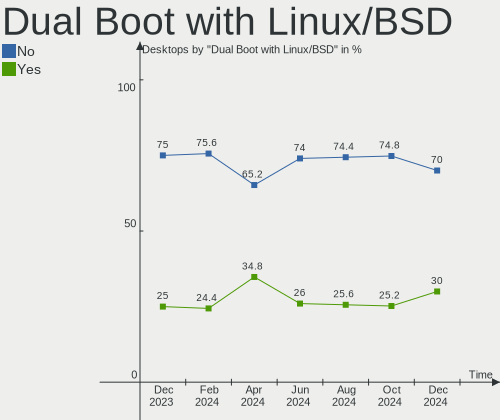
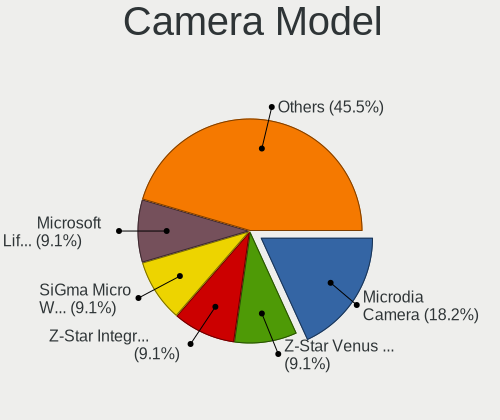

ROSA - Hardware Trends (Desktops)
---------------------------------

A project to identify most popular hardware characteristics and track their change
over time based on data collected by Linux users at https://Linux-Hardware.org.

Anyone can contribute to this report by the [hw-probe](https://github.com/linuxhw/hw-probe) tool:

    sudo -E hw-probe -all -upload

This report is for one last month. Overall report since the beginning of time: [TestCoverage](https://github.com/linuxhw/TestCoverage)

Period: Aug, 2022.

Contents
--------

* [ System ](#system)
  - [ OS                       ](#os)
  - [ OS Family                ](#os-family)
  - [ Kernel                   ](#kernel)
  - [ Kernel Family            ](#kernel-family)
  - [ Kernel Major Ver.        ](#kernel-major-ver)
  - [ Arch                     ](#arch)
  - [ DE                       ](#de)
  - [ Display Server           ](#display-server)
  - [ Display Manager          ](#display-manager)
  - [ OS Lang                  ](#os-lang)
  - [ Boot Mode                ](#boot-mode)
  - [ Filesystem               ](#filesystem)
  - [ Part. scheme             ](#part-scheme)
  - [ Dual Boot with Linux/BSD ](#dual-boot-with-linuxbsd)
  - [ Dual Boot (Win)          ](#dual-boot-win)

* [ Board ](#board)
  - [ Vendor                   ](#vendor)
  - [ Model                    ](#model)
  - [ Model Family             ](#model-family)
  - [ MFG Year                 ](#mfg-year)
  - [ Form Factor              ](#form-factor)
  - [ Secure Boot              ](#secure-boot)
  - [ Coreboot                 ](#coreboot)
  - [ RAM Size                 ](#ram-size)
  - [ RAM Used                 ](#ram-used)
  - [ Total Drives             ](#total-drives)
  - [ Has CD-ROM               ](#has-cd-rom)
  - [ Has Ethernet             ](#has-ethernet)
  - [ Has WiFi                 ](#has-wifi)
  - [ Has Bluetooth            ](#has-bluetooth)

* [ Location ](#location)
  - [ Country                  ](#country)
  - [ City                     ](#city)

* [ Drives ](#drives)
  - [ Drive Vendor             ](#drive-vendor)
  - [ Drive Model              ](#drive-model)
  - [ HDD Vendor               ](#hdd-vendor)
  - [ SSD Vendor               ](#ssd-vendor)
  - [ Drive Kind               ](#drive-kind)
  - [ Drive Connector          ](#drive-connector)
  - [ Drive Size               ](#drive-size)
  - [ Space Total              ](#space-total)
  - [ Space Used               ](#space-used)
  - [ Malfunc. Drives          ](#malfunc-drives)
  - [ Malfunc. Drive Vendor    ](#malfunc-drive-vendor)
  - [ Malfunc. HDD Vendor      ](#malfunc-hdd-vendor)
  - [ Malfunc. Drive Kind      ](#malfunc-drive-kind)
  - [ Failed Drives            ](#failed-drives)
  - [ Failed Drive Vendor      ](#failed-drive-vendor)
  - [ Drive Status             ](#drive-status)

* [ Storage controller ](#storage-controller)
  - [ Storage Vendor           ](#storage-vendor)
  - [ Storage Model            ](#storage-model)
  - [ Storage Kind             ](#storage-kind)

* [ Processor ](#processor)
  - [ CPU Vendor               ](#cpu-vendor)
  - [ CPU Model                ](#cpu-model)
  - [ CPU Model Family         ](#cpu-model-family)
  - [ CPU Cores                ](#cpu-cores)
  - [ CPU Sockets              ](#cpu-sockets)
  - [ CPU Threads              ](#cpu-threads)
  - [ CPU Op-Modes             ](#cpu-op-modes)
  - [ CPU Microcode            ](#cpu-microcode)
  - [ CPU Microarch            ](#cpu-microarch)

* [ Graphics ](#graphics)
  - [ GPU Vendor               ](#gpu-vendor)
  - [ GPU Model                ](#gpu-model)
  - [ GPU Combo                ](#gpu-combo)
  - [ GPU Driver               ](#gpu-driver)
  - [ GPU Memory               ](#gpu-memory)

* [ Monitor ](#monitor)
  - [ Monitor Vendor           ](#monitor-vendor)
  - [ Monitor Model            ](#monitor-model)
  - [ Monitor Resolution       ](#monitor-resolution)
  - [ Monitor Diagonal         ](#monitor-diagonal)
  - [ Monitor Width            ](#monitor-width)
  - [ Aspect Ratio             ](#aspect-ratio)
  - [ Monitor Area             ](#monitor-area)
  - [ Pixel Density            ](#pixel-density)
  - [ Multiple Monitors        ](#multiple-monitors)

* [ Network ](#network)
  - [ Net Controller Vendor    ](#net-controller-vendor)
  - [ Net Controller Model     ](#net-controller-model)
  - [ Wireless Vendor          ](#wireless-vendor)
  - [ Wireless Model           ](#wireless-model)
  - [ Ethernet Vendor          ](#ethernet-vendor)
  - [ Ethernet Model           ](#ethernet-model)
  - [ Net Controller Kind      ](#net-controller-kind)
  - [ Used Controller          ](#used-controller)
  - [ NICs                     ](#nics)
  - [ IPv6                     ](#ipv6)

* [ Bluetooth ](#bluetooth)
  - [ Bluetooth Vendor         ](#bluetooth-vendor)
  - [ Bluetooth Model          ](#bluetooth-model)

* [ Sound ](#sound)
  - [ Sound Vendor             ](#sound-vendor)
  - [ Sound Model              ](#sound-model)

* [ Memory ](#memory)
  - [ Memory Vendor            ](#memory-vendor)
  - [ Memory Model             ](#memory-model)
  - [ Memory Kind              ](#memory-kind)
  - [ Memory Form Factor       ](#memory-form-factor)
  - [ Memory Size              ](#memory-size)
  - [ Memory Speed             ](#memory-speed)

* [ Printers & scanners ](#printers--scanners)
  - [ Printer Vendor           ](#printer-vendor)
  - [ Printer Model            ](#printer-model)
  - [ Scanner Vendor           ](#scanner-vendor)
  - [ Scanner Model            ](#scanner-model)

* [ Camera ](#camera)
  - [ Camera Vendor            ](#camera-vendor)
  - [ Camera Model             ](#camera-model)

* [ Security ](#security)
  - [ Fingerprint Vendor       ](#fingerprint-vendor)
  - [ Fingerprint Model        ](#fingerprint-model)
  - [ Chipcard Vendor          ](#chipcard-vendor)
  - [ Chipcard Model           ](#chipcard-model)

* [ Unsupported ](#unsupported)
  - [ Unsupported Devices      ](#unsupported-devices)
  - [ Unsupported Device Types ](#unsupported-device-types)

System
------

OS
--

Installed operating systems

| Name       | Desktops | Percent |
|------------|----------|---------|
| ROSA 12.2  | 98       | 84.48%  |
| ROSA R11.1 | 12       | 10.34%  |
| ROSA 12.1  | 3        | 2.59%   |
| ROSA R12   | 1        | 0.86%   |
| ROSA R11   | 1        | 0.86%   |
| ROSA 12    | 1        | 0.86%   |

OS Family
---------

OS without a version

| Name | Desktops | Percent |
|------|----------|---------|
| ROSA | 116      | 100%    |

Kernel
------

Version of the Linux kernel

| Version                                        | Desktops | Percent |
|------------------------------------------------|----------|---------|
| 5.10.74-generic-2rosa2021.1-x86_64             | 42       | 36.21%  |
| 5.10.118-generic-2rosa2021.1-x86_64            | 39       | 33.62%  |
| 5.15.43-generic-2rosa2021.1-x86_64             | 7        | 6.03%   |
| 4.15.0-desktop-122.124.1rosa-x86_64            | 6        | 5.17%   |
| 5.17.11-generic-2rosa2021.1-x86_64             | 3        | 2.59%   |
| 5.15.53.xm1-1.klp-xanmod-lts-rosa2021.1-x86_64 | 3        | 2.59%   |
| 5.10.74-generic-2rosa2021.1-i586               | 3        | 2.59%   |
| 5.4.32-generic-2rosa-i586                      | 2        | 1.72%   |
| 5.4.83-generic-2rosa-x86_64                    | 1        | 0.86%   |
| 5.4.83-generic-2rosa-i586                      | 1        | 0.86%   |
| 5.4.32-generic-2rosa-x86_64                    | 1        | 0.86%   |
| 5.4.182-generic-1rosa2021.1-e2kv4              | 1        | 0.86%   |
| 5.18.18.xm1-1-xanmod-rosa2021.1-x86_64         | 1        | 0.86%   |
| 5.18.15.xm1-1.klp-xanmod-rosa2021.1-x86_64     | 1        | 0.86%   |
| 5.10.71-generic-1rosa2021.1-x86_64             | 1        | 0.86%   |
| 5.10.56-generic-1rosa2021.1-x86_64             | 1        | 0.86%   |
| 5.10.118-generic-2rosa2021.1-i586              | 1        | 0.86%   |
| 4.9.155-nrj-desktop-1rosa-x86_64               | 1        | 0.86%   |
| 4.15.0-desktop-45.1rosa-x86_64                 | 1        | 0.86%   |

Kernel Family
-------------

Linux kernel without a distro release

| Version  | Desktops | Percent |
|----------|----------|---------|
| 5.10.74  | 45       | 38.79%  |
| 5.10.118 | 40       | 34.48%  |
| 5.15.43  | 7        | 6.03%   |
| 4.15.0   | 7        | 6.03%   |
| 5.4.32   | 3        | 2.59%   |
| 5.17.11  | 3        | 2.59%   |
| 5.15.53  | 3        | 2.59%   |
| 5.4.83   | 2        | 1.72%   |
| 5.4.182  | 1        | 0.86%   |
| 5.18.18  | 1        | 0.86%   |
| 5.18.15  | 1        | 0.86%   |
| 5.10.71  | 1        | 0.86%   |
| 5.10.56  | 1        | 0.86%   |
| 4.9.155  | 1        | 0.86%   |

Kernel Major Ver.
-----------------

Linux kernel major version

| Version | Desktops | Percent |
|---------|----------|---------|
| 5.10    | 87       | 75%     |
| 5.15    | 10       | 8.62%   |
| 4.15    | 7        | 6.03%   |
| 5.4     | 6        | 5.17%   |
| 5.17    | 3        | 2.59%   |
| 5.18    | 2        | 1.72%   |
| 4.9     | 1        | 0.86%   |

Arch
----

OS architecture (x86_64, i586, etc.)

| Name   | Desktops | Percent |
|--------|----------|---------|
| x86_64 | 108      | 93.1%   |
| i686   | 7        | 6.03%   |
| e2k    | 1        | 0.86%   |

DE
--

Desktop Environment

| Name     | Desktops | Percent |
|----------|----------|---------|
| GNOME    | 55       | 47.41%  |
| KDE5     | 40       | 34.48%  |
| LXQt     | 11       | 9.48%   |
| KDE4     | 9        | 7.76%   |
| Cinnamon | 1        | 0.86%   |

Display Server
--------------

X11 or Wayland

| Name    | Desktops | Percent |
|---------|----------|---------|
| Wayland | 86       | 74.14%  |
| X11     | 30       | 25.86%  |

Display Manager
---------------

SDDM, LightDM, etc.

| Name    | Desktops | Percent |
|---------|----------|---------|
| GDM     | 63       | 54.31%  |
| SDDM    | 39       | 33.62%  |
| KDM     | 9        | 7.76%   |
| LightDM | 5        | 4.31%   |

OS Lang
-------

Language

| Lang    | Desktops | Percent |
|---------|----------|---------|
| ru_RU   | 109      | 93.97%  |
| pt_BR   | 2        | 1.72%   |
| sk_SK   | 1        | 0.86%   |
| pl_PL   | 1        | 0.86%   |
| en_US   | 1        | 0.86%   |
| Default | 1        | 0.86%   |
| Unknown | 1        | 0.86%   |

Boot Mode
---------

EFI or BIOS

| Mode | Desktops | Percent |
|------|----------|---------|
| BIOS | 66       | 56.9%   |
| EFI  | 50       | 43.1%   |

Filesystem
----------

Type of filesystem

| Type  | Desktops | Percent |
|-------|----------|---------|
| Ext4  | 110      | 94.83%  |
| Btrfs | 6        | 5.17%   |

Part. scheme
------------

Scheme of partitioning

| Type | Desktops | Percent |
|------|----------|---------|
| GPT  | 74       | 63.79%  |
| MBR  | 42       | 36.21%  |

Dual Boot with Linux/BSD
------------------------

Hosting more than one Linux/BSD

| Dual boot | Desktops | Percent |
|-----------|----------|---------|
| No        | 83       | 71.55%  |
| Yes       | 33       | 28.45%  |

Dual Boot (Win)
---------------

Hosting Linux and Windows

| Dual boot | Desktops | Percent |
|-----------|----------|---------|
| Yes       | 66       | 56.9%   |
| No        | 50       | 43.1%   |

Board
-----

Vendor
------

Motherboard manufacturer

| Name                | Desktops | Percent |
|---------------------|----------|---------|
| ASUSTek Computer    | 43       | 37.07%  |
| Gigabyte Technology | 28       | 24.14%  |
| ASRock              | 13       | 11.21%  |
| MSI                 | 10       | 8.62%   |
| Dell                | 4        | 3.45%   |
| Intel               | 3        | 2.59%   |
| Huanan              | 2        | 1.72%   |
| Foxconn             | 2        | 1.72%   |
| win element         | 1        | 0.86%   |
| Soyo                | 1        | 0.86%   |
| Pegatron            | 1        | 0.86%   |
| PCWare              | 1        | 0.86%   |
| KupiDeshego Edition | 1        | 0.86%   |
| Koloe               | 1        | 0.86%   |
| Hewlett-Packard     | 1        | 0.86%   |
| ECS                 | 1        | 0.86%   |
| Biostar             | 1        | 0.86%   |
| Acer                | 1        | 0.86%   |
| Unknown             | 1        | 0.86%   |

Model
-----

Motherboard model

| Name                                   | Desktops | Percent |
|----------------------------------------|----------|---------|
| ASUS All Series                        | 4        | 3.45%   |
| Intel X99                              | 2        | 1.72%   |
| Gigabyte H110M-S2V                     | 2        | 1.72%   |
| ASUS SABERTOOTH 990FX R2.0             | 2        | 1.72%   |
| ASRock 970 Pro3 R2.0                   | 2        | 1.72%   |
| win element M1K                        | 1        | 0.86%   |
| Soyo SY-Classic B660M                  | 1        | 0.86%   |
| Pegatron IPX41-D3                      | 1        | 0.86%   |
| PCWare IPX3060E                        | 1        | 0.86%   |
| MSI MS-7D20                            | 1        | 0.86%   |
| MSI MS-7C94                            | 1        | 0.86%   |
| MSI MS-7C02                            | 1        | 0.86%   |
| MSI MS-7B98                            | 1        | 0.86%   |
| MSI MS-7B93                            | 1        | 0.86%   |
| MSI MS-7B87                            | 1        | 0.86%   |
| MSI MS-7A74                            | 1        | 0.86%   |
| MSI MS-7971                            | 1        | 0.86%   |
| MSI MS-7816                            | 1        | 0.86%   |
| MSI MS-7599                            | 1        | 0.86%   |
| KupiDeshego Edition Intel X79 lga 2011 | 1        | 0.86%   |
| Koloe Thurley                          | 1        | 0.86%   |
| Intel D525MWV AAE93081-401             | 1        | 0.86%   |
| Huanan X99 F8D V2.2                    | 1        | 0.86%   |
| Huanan X79 PLUS V6.11                  | 1        | 0.86%   |
| HP Compaq 8100 Elite CMT PC            | 1        | 0.86%   |
| Gigabyte Z590 UD AC                    | 1        | 0.86%   |
| Gigabyte Z170X-Gaming 3                | 1        | 0.86%   |
| Gigabyte Z170-HD3P-CF                  | 1        | 0.86%   |
| Gigabyte Z170-D3H                      | 1        | 0.86%   |
| Gigabyte X470 AORUS ULTRA GAMING       | 1        | 0.86%   |
| Gigabyte Q87M-D2H                      | 1        | 0.86%   |
| Gigabyte H87-D3H                       | 1        | 0.86%   |
| Gigabyte H77N-WIFI                     | 1        | 0.86%   |
| Gigabyte H61M-S1                       | 1        | 0.86%   |
| Gigabyte H55M-USB3                     | 1        | 0.86%   |
| Gigabyte H55M-UD2H                     | 1        | 0.86%   |
| Gigabyte H310M H 2.0                   | 1        | 0.86%   |
| Gigabyte H110M-M.2                     | 1        | 0.86%   |
| Gigabyte GA-E6010N                     | 1        | 0.86%   |
| Gigabyte G41MT-S2P                     | 1        | 0.86%   |
| Gigabyte F2A88XM-DS2                   | 1        | 0.86%   |
| Gigabyte F2A88XM-D3H                   | 1        | 0.86%   |
| Gigabyte B75M-D3H                      | 1        | 0.86%   |
| Gigabyte B550M S2H                     | 1        | 0.86%   |
| Gigabyte B450 GAMING X                 | 1        | 0.86%   |
| Gigabyte B450 AORUS ELITE              | 1        | 0.86%   |
| Gigabyte A320M-H                       | 1        | 0.86%   |
| Gigabyte 990XA-UD3                     | 1        | 0.86%   |
| Gigabyte 970A-DS3P                     | 1        | 0.86%   |
| Gigabyte 970A-DS3                      | 1        | 0.86%   |
| Gigabyte 965P-S3                       | 1        | 0.86%   |
| Foxconn nT-330i                        | 1        | 0.86%   |
| Foxconn G31MX Series                   | 1        | 0.86%   |
| ECS B75H2-M3                           | 1        | 0.86%   |
| Dell Vostro 3900                       | 1        | 0.86%   |
| Dell OptiPlex 9020M                    | 1        | 0.86%   |
| Dell OptiPlex 3010                     | 1        | 0.86%   |
| Dell Inspiron 530                      | 1        | 0.86%   |
| Biostar TB85                           | 1        | 0.86%   |
| ASUS Z170-P                            | 1        | 0.86%   |

Model Family
------------

Motherboard model prefix

| Name                      | Desktops | Percent |
|---------------------------|----------|---------|
| ASUS PRIME                | 7        | 6.03%   |
| ASUS All                  | 4        | 3.45%   |
| ASUS TUF                  | 3        | 2.59%   |
| Intel X99                 | 2        | 1.72%   |
| Gigabyte H110M-S2V        | 2        | 1.72%   |
| Gigabyte B450             | 2        | 1.72%   |
| Dell OptiPlex             | 2        | 1.72%   |
| ASUS SABERTOOTH           | 2        | 1.72%   |
| ASUS P8Z77-V              | 2        | 1.72%   |
| ASUS P8H61-MX             | 2        | 1.72%   |
| ASUS M5A97                | 2        | 1.72%   |
| ASRock 970                | 2        | 1.72%   |
| win element M1K           | 1        | 0.86%   |
| Soyo SY-Classic           | 1        | 0.86%   |
| Pegatron IPX41-D3         | 1        | 0.86%   |
| PCWare IPX3060E           | 1        | 0.86%   |
| MSI MS-7D20               | 1        | 0.86%   |
| MSI MS-7C94               | 1        | 0.86%   |
| MSI MS-7C02               | 1        | 0.86%   |
| MSI MS-7B98               | 1        | 0.86%   |
| MSI MS-7B93               | 1        | 0.86%   |
| MSI MS-7B87               | 1        | 0.86%   |
| MSI MS-7A74               | 1        | 0.86%   |
| MSI MS-7971               | 1        | 0.86%   |
| MSI MS-7816               | 1        | 0.86%   |
| MSI MS-7599               | 1        | 0.86%   |
| KupiDeshego Edition Intel | 1        | 0.86%   |
| Koloe Thurley             | 1        | 0.86%   |
| Intel D525MWV             | 1        | 0.86%   |
| Huanan X99                | 1        | 0.86%   |
| Huanan X79                | 1        | 0.86%   |
| HP Compaq                 | 1        | 0.86%   |
| Gigabyte Z590             | 1        | 0.86%   |
| Gigabyte Z170X-Gaming     | 1        | 0.86%   |
| Gigabyte Z170-HD3P-CF     | 1        | 0.86%   |
| Gigabyte Z170-D3H         | 1        | 0.86%   |
| Gigabyte X470             | 1        | 0.86%   |
| Gigabyte Q87M-D2H         | 1        | 0.86%   |
| Gigabyte H87-D3H          | 1        | 0.86%   |
| Gigabyte H77N-WIFI        | 1        | 0.86%   |
| Gigabyte H61M-S1          | 1        | 0.86%   |
| Gigabyte H55M-USB3        | 1        | 0.86%   |
| Gigabyte H55M-UD2H        | 1        | 0.86%   |
| Gigabyte H310M            | 1        | 0.86%   |
| Gigabyte H110M-M.2        | 1        | 0.86%   |
| Gigabyte GA-E6010N        | 1        | 0.86%   |
| Gigabyte G41MT-S2P        | 1        | 0.86%   |
| Gigabyte F2A88XM-DS2      | 1        | 0.86%   |
| Gigabyte F2A88XM-D3H      | 1        | 0.86%   |
| Gigabyte B75M-D3H         | 1        | 0.86%   |
| Gigabyte B550M            | 1        | 0.86%   |
| Gigabyte A320M-H          | 1        | 0.86%   |
| Gigabyte 990XA-UD3        | 1        | 0.86%   |
| Gigabyte 970A-DS3P        | 1        | 0.86%   |
| Gigabyte 970A-DS3         | 1        | 0.86%   |
| Gigabyte 965P-S3          | 1        | 0.86%   |
| Foxconn nT-330i           | 1        | 0.86%   |
| Foxconn G31MX             | 1        | 0.86%   |
| ECS B75H2-M3              | 1        | 0.86%   |
| Dell Vostro               | 1        | 0.86%   |

MFG Year
--------

Motherboard manufacture year

| Year    | Desktops | Percent |
|---------|----------|---------|
| 2013    | 17       | 14.66%  |
| 2012    | 17       | 14.66%  |
| 2018    | 12       | 10.34%  |
| 2016    | 9        | 7.76%   |
| 2009    | 9        | 7.76%   |
| 2019    | 8        | 6.9%    |
| 2020    | 7        | 6.03%   |
| 2021    | 6        | 5.17%   |
| 2011    | 6        | 5.17%   |
| 2010    | 6        | 5.17%   |
| 2007    | 6        | 5.17%   |
| 2017    | 5        | 4.31%   |
| 2015    | 5        | 4.31%   |
| 2014    | 2        | 1.72%   |
| Unknown | 1        | 0.86%   |

Form Factor
-----------

Physical design of the computer

| Name    | Desktops | Percent |
|---------|----------|---------|
| Desktop | 116      | 100%    |

Secure Boot
-----------

Enabled or disabled

| State    | Desktops | Percent |
|----------|----------|---------|
| Disabled | 116      | 100%    |

Coreboot
--------

Have coreboot on board

| Used | Desktops | Percent |
|------|----------|---------|
| No   | 116      | 100%    |

RAM Size
--------

Total RAM memory

| Size in GB  | Desktops | Percent |
|-------------|----------|---------|
| 8.01-16.0   | 34       | 29.31%  |
| 16.01-24.0  | 29       | 25%     |
| 3.01-4.0    | 21       | 18.1%   |
| 32.01-64.0  | 14       | 12.07%  |
| 4.01-8.0    | 9        | 7.76%   |
| 1.01-2.0    | 4        | 3.45%   |
| 24.01-32.0  | 3        | 2.59%   |
| 64.01-256.0 | 2        | 1.72%   |

RAM Used
--------

Used RAM memory

| Used GB  | Desktops | Percent |
|----------|----------|---------|
| 1.01-2.0 | 71       | 61.21%  |
| 0.51-1.0 | 24       | 20.69%  |
| 2.01-3.0 | 13       | 11.21%  |
| 3.01-4.0 | 4        | 3.45%   |
| 4.01-8.0 | 3        | 2.59%   |
| 0.01-0.5 | 1        | 0.86%   |

Total Drives
------------

Number of drives on board

| Drives | Desktops | Percent |
|--------|----------|---------|
| 1      | 44       | 37.93%  |
| 2      | 30       | 25.86%  |
| 3      | 22       | 18.97%  |
| 4      | 12       | 10.34%  |
| 5      | 5        | 4.31%   |
| 6      | 2        | 1.72%   |
| 7      | 1        | 0.86%   |

Has CD-ROM
----------

Has CD-ROM on board

| Presented | Desktops | Percent |
|-----------|----------|---------|
| No        | 80       | 68.97%  |
| Yes       | 36       | 31.03%  |

Has Ethernet
------------

Has Ethernet on board

| Presented | Desktops | Percent |
|-----------|----------|---------|
| Yes       | 115      | 99.14%  |
| No        | 1        | 0.86%   |

Has WiFi
--------

Has WiFi module

| Presented | Desktops | Percent |
|-----------|----------|---------|
| No        | 89       | 76.72%  |
| Yes       | 27       | 23.28%  |

Has Bluetooth
-------------

Has Bluetooth module

| Presented | Desktops | Percent |
|-----------|----------|---------|
| No        | 87       | 75%     |
| Yes       | 29       | 25%     |

Location
--------

Country
-------

Geographic location (country)

| Country   | Desktops | Percent |
|-----------|----------|---------|
| Russia    | 103      | 88.79%  |
| Ukraine   | 3        | 2.59%   |
| Brazil    | 2        | 1.72%   |
| Sweden    | 1        | 0.86%   |
| Slovakia  | 1        | 0.86%   |
| Serbia    | 1        | 0.86%   |
| Portugal  | 1        | 0.86%   |
| Poland    | 1        | 0.86%   |
| Moldova   | 1        | 0.86%   |
| Indonesia | 1        | 0.86%   |
| Estonia   | 1        | 0.86%   |

City
----

Geographic location (city)

| City                   | Desktops | Percent |
|------------------------|----------|---------|
| Moscow                 | 19       | 16.38%  |
| Rostov-on-Don          | 5        | 4.31%   |
| St Petersburg          | 4        | 3.45%   |
| Stavropol              | 3        | 2.59%   |
| Samara                 | 3        | 2.59%   |
| Perm                   | 3        | 2.59%   |
| Omsk                   | 3        | 2.59%   |
| Novosibirsk            | 3        | 2.59%   |
| Nizhniy Novgorod       | 3        | 2.59%   |
| Krasnodar              | 3        | 2.59%   |
| Yoshkar-Ola            | 2        | 1.72%   |
| Yekaterinburg          | 2        | 1.72%   |
| Volgograd              | 2        | 1.72%   |
| Vladimir               | 2        | 1.72%   |
| Ufa                    | 2        | 1.72%   |
| Saratov                | 2        | 1.72%   |
| Noril'sk               | 2        | 1.72%   |
| Kamenetskiy            | 2        | 1.72%   |
| Chelyabinsk            | 2        | 1.72%   |
| Astrakhan              | 2        | 1.72%   |
| Zlatoust               | 1        | 0.86%   |
| Zhirnovsk              | 1        | 0.86%   |
| Zheleznogorsk          | 1        | 0.86%   |
| Yelets                 | 1        | 0.86%   |
| Yaroslavl              | 1        | 0.86%   |
| Vorkuta                | 1        | 0.86%   |
| Vologda                | 1        | 0.86%   |
| Vidnoye                | 1        | 0.86%   |
| Tomsk                  | 1        | 0.86%   |
| Tiraspol               | 1        | 0.86%   |
| Surgut                 | 1        | 0.86%   |
| Simferopol             | 1        | 0.86%   |
| Siemianowice Śląskie | 1        | 0.86%   |
| Shchelkovo             | 1        | 0.86%   |
| Severomorsk            | 1        | 0.86%   |
| Serpukhov              | 1        | 0.86%   |
| Saransk                | 1        | 0.86%   |
| Salekhard              | 1        | 0.86%   |
| Ryazan                 | 1        | 0.86%   |
| Rossosh'               | 1        | 0.86%   |
| Roslavl'               | 1        | 0.86%   |
| Odintsovo              | 1        | 0.86%   |
| Novopskov              | 1        | 0.86%   |
| Novokuznetsk           | 1        | 0.86%   |
| Novocherkassk          | 1        | 0.86%   |
| Murmansk               | 1        | 0.86%   |
| Medan                  | 1        | 0.86%   |
| Lipetsk                | 1        | 0.86%   |
| Kuybyshev              | 1        | 0.86%   |
| Kurgan                 | 1        | 0.86%   |
| Kolpino                | 1        | 0.86%   |
| Kiviõli               | 1        | 0.86%   |
| Khabarovsk             | 1        | 0.86%   |
| Kemerovo               | 1        | 0.86%   |
| Irkutsk                | 1        | 0.86%   |
| Hagfors                | 1        | 0.86%   |
| Glazov                 | 1        | 0.86%   |
| Franca                 | 1        | 0.86%   |
| Feodosiya              | 1        | 0.86%   |
| Bryansk                | 1        | 0.86%   |

Drives
------

Drive Vendor
------------

Hard drive vendors

| Vendor              | Desktops | Drives | Percent |
|---------------------|----------|--------|---------|
| WDC                 | 49       | 64     | 22.27%  |
| Seagate             | 41       | 51     | 18.64%  |
| Samsung Electronics | 20       | 25     | 9.09%   |
| Toshiba             | 13       | 15     | 5.91%   |
| Kingston            | 13       | 15     | 5.91%   |
| Apacer              | 9        | 9      | 4.09%   |
| Hitachi             | 8        | 8      | 3.64%   |
| China               | 7        | 8      | 3.18%   |
| SPCC                | 6        | 6      | 2.73%   |
| A-DATA Technology   | 6        | 9      | 2.73%   |
| Crucial             | 5        | 7      | 2.27%   |
| Gigabyte Technology | 4        | 4      | 1.82%   |
| AMD                 | 4        | 4      | 1.82%   |
| Unknown             | 4        | 4      | 1.82%   |
| Plextor             | 3        | 3      | 1.36%   |
| Intel               | 3        | 3      | 1.36%   |
| GOODRAM             | 3        | 3      | 1.36%   |
| Unknown             | 2        | 3      | 0.91%   |
| Smartbuy            | 2        | 2      | 0.91%   |
| HGST                | 2        | 2      | 0.91%   |
| Hewlett-Packard     | 2        | 2      | 0.91%   |
| WALRAM              | 1        | 1      | 0.45%   |
| Transcend           | 1        | 1      | 0.45%   |
| Teclast             | 1        | 1      | 0.45%   |
| Team                | 1        | 1      | 0.45%   |
| Silicon Motion      | 1        | 1      | 0.45%   |
| SanDisk             | 1        | 1      | 0.45%   |
| Patriot             | 1        | 1      | 0.45%   |
| Netac               | 1        | 1      | 0.45%   |
| Kllisre             | 1        | 1      | 0.45%   |
| KIOXIA-EXCERIA      | 1        | 1      | 0.45%   |
| KingSpec            | 1        | 1      | 0.45%   |
| HS-SSD-C100         | 1        | 1      | 0.45%   |
| External            | 1        | 1      | 0.45%   |
| Colorful            | 1        | 1      | 0.45%   |

Drive Model
-----------

Hard drive models

| Model                                | Desktops | Percent |
|--------------------------------------|----------|---------|
| Apacer AS350 128GB SSD               | 6        | 2.36%   |
| WDC WDS240G2G0A-00JH30 240GB SSD     | 5        | 1.97%   |
| SPCC Solid State Disk 128GB          | 5        | 1.97%   |
| Seagate ST500DM002-1BD142 500GB      | 5        | 1.97%   |
| WDC WD10EZEX-08WN4A0 1TB             | 4        | 1.57%   |
| Toshiba DT01ACA100 1TB               | 4        | 1.57%   |
| Seagate ST3160815AS 160GB            | 4        | 1.57%   |
| Seagate ST250DM000-1BD141 250GB      | 4        | 1.57%   |
| Kingston SA400S37120G 120GB SSD      | 4        | 1.57%   |
| Unknown                              | 4        | 1.57%   |
| Toshiba HDWD105 500GB                | 3        | 1.18%   |
| Seagate ST1000DM003-1CH162 1TB       | 3        | 1.18%   |
| Kingston SA400S37240G 240GB SSD      | 3        | 1.18%   |
| WDC WDS500G2B0A-00SM50 500GB SSD     | 2        | 0.79%   |
| WDC WDS120G2G0A-00JH30 120GB SSD     | 2        | 0.79%   |
| WDC WD5000AADS-00S9B0 500GB          | 2        | 0.79%   |
| WDC WD20EFRX-68EUZN0 2TB             | 2        | 0.79%   |
| WDC WD20EARS-00MVWB0 2TB             | 2        | 0.79%   |
| WDC WD10EZRZ-00HTKB0 1TB             | 2        | 0.79%   |
| WDC WD10EZEX-75M2NA0 1TB             | 2        | 0.79%   |
| WDC WD10EZEX-21M2NA0 1TB             | 2        | 0.79%   |
| Toshiba HDWD110 1TB                  | 2        | 0.79%   |
| Toshiba DT01ACA050 500GB             | 2        | 0.79%   |
| Seagate ST3500418AS 500GB            | 2        | 0.79%   |
| Seagate ST1000DM010-2EP102 1TB       | 2        | 0.79%   |
| Samsung SSD 860 EVO 500GB            | 2        | 0.79%   |
| Samsung SSD 860 EVO 250GB            | 2        | 0.79%   |
| Samsung SSD 850 PRO 256GB            | 2        | 0.79%   |
| Samsung SSD 850 PRO 128GB            | 2        | 0.79%   |
| Kingston SV300S37A120G 120GB SSD     | 2        | 0.79%   |
| Gigabyte GP-GSTFS31120GNTD 120GB SSD | 2        | 0.79%   |
| China SSD 120GB                      | 2        | 0.79%   |
| WDC WDS250G2B0C-00PXH0 250GB         | 1        | 0.39%   |
| WDC WDS120G2G0B-00EPW0 120GB SSD     | 1        | 0.39%   |
| WDC WDS100T2B0B-00YS70 1TB SSD       | 1        | 0.39%   |
| WDC WD82PURZ-85TEUY0 8TB             | 1        | 0.39%   |
| WDC WD800JD-60LSA5 80GB              | 1        | 0.39%   |
| WDC WD8000AARS-00Y5B1 800GB          | 1        | 0.39%   |
| WDC WD6401AALS-00L3B2 640GB          | 1        | 0.39%   |
| WDC WD5002ABYS-02B1B0 500GB          | 1        | 0.39%   |
| WDC WD5000LPVX-80V0TT0 500GB         | 1        | 0.39%   |
| WDC WD5000LPLX-00ZNTT0 500GB         | 1        | 0.39%   |
| WDC WD5000AZRX-00L4HB0 500GB         | 1        | 0.39%   |
| WDC WD5000AAKX-00ERMA0 500GB         | 1        | 0.39%   |
| WDC WD5000AAKS-60WWPA0 500GB         | 1        | 0.39%   |
| WDC WD5000AAKS-00UU3A0 500GB         | 1        | 0.39%   |
| WDC WD4500HLHX-01JJPV0 450GB         | 1        | 0.39%   |
| WDC WD40EFZX-68AWUN0 4TB             | 1        | 0.39%   |
| WDC WD40EFAX-68JH4N0 4TB             | 1        | 0.39%   |
| WDC WD400BD-55MTA1 40GB              | 1        | 0.39%   |
| WDC WD4003FRYZ-01F0DB0 4TB           | 1        | 0.39%   |
| WDC WD3200AAKS-00L9A0 320GB          | 1        | 0.39%   |
| WDC WD30EZRZ-00GXCB0 3TB             | 1        | 0.39%   |
| WDC WD30EZRX-00DC0B0 3TB             | 1        | 0.39%   |
| WDC WD30EFRX-68EUZN0 3TB             | 1        | 0.39%   |
| WDC WD20EZRX-00D8PB0 2TB             | 1        | 0.39%   |
| WDC WD20EZAZ-00GGJB0 2TB             | 1        | 0.39%   |
| WDC WD1600JD-00HBB0 160GB            | 1        | 0.39%   |
| WDC WD1600BEVS-60RST0 160GB          | 1        | 0.39%   |
| WDC WD10SPZX-00Z10T0 1TB             | 1        | 0.39%   |

HDD Vendor
----------

Hard disk drive vendors

| Vendor              | Desktops | Drives | Percent |
|---------------------|----------|--------|---------|
| WDC                 | 45       | 51     | 39.13%  |
| Seagate             | 41       | 51     | 35.65%  |
| Toshiba             | 13       | 14     | 11.3%   |
| Hitachi             | 8        | 8      | 6.96%   |
| Samsung Electronics | 4        | 4      | 3.48%   |
| HGST                | 2        | 2      | 1.74%   |
| Unknown             | 1        | 1      | 0.87%   |
| Unknown             | 1        | 1      | 0.87%   |

SSD Vendor
----------

Solid state drive vendors

| Vendor              | Desktops | Drives | Percent |
|---------------------|----------|--------|---------|
| Samsung Electronics | 13       | 15     | 13.27%  |
| Kingston            | 13       | 14     | 13.27%  |
| WDC                 | 10       | 12     | 10.2%   |
| Apacer              | 8        | 8      | 8.16%   |
| China               | 7        | 8      | 7.14%   |
| SPCC                | 6        | 6      | 6.12%   |
| A-DATA Technology   | 6        | 7      | 6.12%   |
| Crucial             | 5        | 7      | 5.1%    |
| Gigabyte Technology | 4        | 4      | 4.08%   |
| Intel               | 3        | 3      | 3.06%   |
| GOODRAM             | 3        | 3      | 3.06%   |
| AMD                 | 3        | 3      | 3.06%   |
| Smartbuy            | 2        | 2      | 2.04%   |
| Plextor             | 2        | 2      | 2.04%   |
| Unknown             | 2        | 2      | 2.04%   |
| WALRAM              | 1        | 1      | 1.02%   |
| Transcend           | 1        | 1      | 1.02%   |
| Toshiba             | 1        | 1      | 1.02%   |
| SanDisk             | 1        | 1      | 1.02%   |
| Patriot             | 1        | 1      | 1.02%   |
| Netac               | 1        | 1      | 1.02%   |
| KIOXIA-EXCERIA      | 1        | 1      | 1.02%   |
| KingSpec            | 1        | 1      | 1.02%   |
| HS-SSD-C100         | 1        | 1      | 1.02%   |
| Hewlett-Packard     | 1        | 1      | 1.02%   |
| Colorful            | 1        | 1      | 1.02%   |

Drive Kind
----------

HDD or SSD

| Kind    | Desktops | Drives | Percent |
|---------|----------|--------|---------|
| HDD     | 94       | 132    | 50%     |
| SSD     | 75       | 107    | 39.89%  |
| NVMe    | 17       | 19     | 9.04%   |
| MMC     | 1        | 1      | 0.53%   |
| Unknown | 1        | 2      | 0.53%   |

Drive Connector
---------------

SATA, SAS, NVMe, etc.

| Type | Desktops | Drives | Percent |
|------|----------|--------|---------|
| SATA | 115      | 236    | 83.94%  |
| NVMe | 16       | 18     | 11.68%  |
| SAS  | 5        | 6      | 3.65%   |
| MMC  | 1        | 1      | 0.73%   |

Drive Size
----------

Size of hard drive

| Size in TB      | Desktops | Drives | Percent |
|-----------------|----------|--------|---------|
| 0.01-0.5        | 100      | 162    | 60.98%  |
| 0.51-1.0        | 45       | 55     | 27.44%  |
| 1.01-2.0        | 9        | 11     | 5.49%   |
| 2.01-3.0        | 4        | 4      | 2.44%   |
| 3.01-4.0        | 3        | 4      | 1.83%   |
| 4.01-10.0       | 2        | 2      | 1.22%   |
| More than 100.0 | 1        | 1      | 0.61%   |

Space Total
-----------

Amount of disk space available on the file system

| Size in GB | Desktops | Percent |
|------------|----------|---------|
| 101-250    | 40       | 34.48%  |
| 251-500    | 23       | 19.83%  |
| 501-1000   | 18       | 15.52%  |
| 1-20       | 12       | 10.34%  |
| 51-100     | 9        | 7.76%   |
| 1001-2000  | 7        | 6.03%   |
| 2001-3000  | 5        | 4.31%   |
| 21-50      | 2        | 1.72%   |

Space Used
----------

Amount of used disk space

| Used GB   | Desktops | Percent |
|-----------|----------|---------|
| 1-20      | 72       | 62.07%  |
| 21-50     | 16       | 13.79%  |
| 251-500   | 8        | 6.9%    |
| 501-1000  | 8        | 6.9%    |
| 101-250   | 7        | 6.03%   |
| 51-100    | 4        | 3.45%   |
| 1001-2000 | 1        | 0.86%   |

Malfunc. Drives
---------------

Drive models with a malfunction

| Model                                 | Desktops | Drives | Percent |
|---------------------------------------|----------|--------|---------|
| WDC WDS240G2G0A-00JH30 240GB SSD      | 2        | 3      | 3.57%   |
| WDC WD5000AADS-00S9B0 500GB           | 2        | 2      | 3.57%   |
| WDC WD20EARS-00MVWB0 2TB              | 2        | 2      | 3.57%   |
| Seagate ST500DM002-1BD142 500GB       | 2        | 2      | 3.57%   |
| WDC WDS120G2G0A-00JH30 120GB SSD      | 1        | 1      | 1.79%   |
| WDC WD800JD-60LSA5 80GB               | 1        | 1      | 1.79%   |
| WDC WD8000AARS-00Y5B1 800GB           | 1        | 1      | 1.79%   |
| WDC WD5000LPLX-00ZNTT0 500GB          | 1        | 1      | 1.79%   |
| WDC WD5000AAKS-00UU3A0 500GB          | 1        | 1      | 1.79%   |
| WDC WD4500HLHX-01JJPV0 450GB          | 1        | 1      | 1.79%   |
| WDC WD30EFRX-68EUZN0 3TB              | 1        | 1      | 1.79%   |
| WDC WD1600BEVS-60RST0 160GB           | 1        | 1      | 1.79%   |
| WDC WD10EZEX-75M2NA0 1TB              | 1        | 1      | 1.79%   |
| WDC WD10EZEX-08M2NA0 1TB              | 1        | 1      | 1.79%   |
| WDC WD10EARS-00Z5B1 1TB               | 1        | 1      | 1.79%   |
| WDC WD10EARS-00MVWB0 1TB              | 1        | 1      | 1.79%   |
| WDC WD10EADS-65L5B1 1TB               | 1        | 1      | 1.79%   |
| Toshiba HDWD110 1TB                   | 1        | 1      | 1.79%   |
| Toshiba HDWD105 500GB                 | 1        | 1      | 1.79%   |
| Toshiba DT01ACA100 1TB                | 1        | 1      | 1.79%   |
| Toshiba DT01ACA050 500GB              | 1        | 2      | 1.79%   |
| Seagate ST9500325AS 500GB             | 1        | 1      | 1.79%   |
| Seagate ST9250410AS 250GB             | 1        | 1      | 1.79%   |
| Seagate ST3500413AS 500GB             | 1        | 1      | 1.79%   |
| Seagate ST3400620A 400GB              | 1        | 1      | 1.79%   |
| Seagate ST3320820AS 320GB             | 1        | 1      | 1.79%   |
| Seagate ST3300831AS 304GB             | 1        | 1      | 1.79%   |
| Seagate ST3250820AS 250GB             | 1        | 1      | 1.79%   |
| Seagate ST3250310AS 250GB             | 1        | 1      | 1.79%   |
| Seagate ST320LT022-1AE142 320GB       | 1        | 1      | 1.79%   |
| Seagate ST3170315A! ! ! 563TB         | 1        | 1      | 1.79%   |
| Seagate ST3160815AS 160GB             | 1        | 1      | 1.79%   |
| Seagate ST3160215AS 160GB             | 1        | 1      | 1.79%   |
| Seagate ST3120813AS 120GB             | 1        | 1      | 1.79%   |
| Seagate ST31000528AS 1TB              | 1        | 1      | 1.79%   |
| Seagate ST31000333AS 1TB              | 1        | 1      | 1.79%   |
| Seagate ST250DM000-1BD141 250GB       | 1        | 1      | 1.79%   |
| Seagate ST2000VM003-1CT164 2TB        | 1        | 1      | 1.79%   |
| Seagate ST1000LM014-1EJ164 1TB        | 1        | 1      | 1.79%   |
| Seagate ST1000DM003-9YN162 1TB        | 1        | 1      | 1.79%   |
| Seagate ST1000DM003-1CH162 1TB        | 1        | 3      | 1.79%   |
| Samsung Electronics SSD 970 EVO 500GB | 1        | 1      | 1.79%   |
| Samsung Electronics SSD 870 EVO 1TB   | 1        | 1      | 1.79%   |
| Samsung Electronics SSD 860 EVO 500GB | 1        | 1      | 1.79%   |
| Samsung Electronics SP2504C 250GB     | 1        | 1      | 1.79%   |
| Samsung Electronics HD080HJ 80GB      | 1        | 1      | 1.79%   |
| Netac SSD 240GB                       | 1        | 1      | 1.79%   |
| KingSpec P3-128 128GB                 | 1        | 1      | 1.79%   |
| Hitachi HTS543232L9A300 320GB         | 1        | 1      | 1.79%   |
| Hitachi HTS541680J9SA00 80GB          | 1        | 1      | 1.79%   |
| Hitachi HDT725032VLA360 320GB         | 1        | 1      | 1.79%   |
| Hitachi HDS721616PLA380 160GB         | 1        | 1      | 1.79%   |

Malfunc. Drive Vendor
---------------------

Vendors of faulty drives

| Vendor              | Desktops | Drives | Percent |
|---------------------|----------|--------|---------|
| Seagate             | 19       | 24     | 37.25%  |
| WDC                 | 17       | 20     | 33.33%  |
| Samsung Electronics | 5        | 5      | 9.8%    |
| Toshiba             | 4        | 5      | 7.84%   |
| Hitachi             | 4        | 4      | 7.84%   |
| Netac               | 1        | 1      | 1.96%   |
| KingSpec            | 1        | 1      | 1.96%   |

Malfunc. HDD Vendor
-------------------

Vendors of faulty HDD drives

| Vendor              | Desktops | Drives | Percent |
|---------------------|----------|--------|---------|
| Seagate             | 19       | 24     | 43.18%  |
| WDC                 | 15       | 16     | 34.09%  |
| Toshiba             | 4        | 5      | 9.09%   |
| Hitachi             | 4        | 4      | 9.09%   |
| Samsung Electronics | 2        | 2      | 4.55%   |

Malfunc. Drive Kind
-------------------

Kinds of faulty drives

| Kind | Desktops | Drives | Percent |
|------|----------|--------|---------|
| HDD  | 40       | 51     | 83.33%  |
| SSD  | 7        | 8      | 14.58%  |
| NVMe | 1        | 1      | 2.08%   |

Failed Drives
-------------

Failed drive models

| Model                           | Desktops | Drives | Percent |
|---------------------------------|----------|--------|---------|
| Seagate ST500DM002-1BD142 500GB | 1        | 1      | 100%    |

Failed Drive Vendor
-------------------

Failed drive vendors

| Vendor  | Desktops | Drives | Percent |
|---------|----------|--------|---------|
| Seagate | 1        | 1      | 100%    |

Drive Status
------------

Number of failed and malfunc. drives

| Status   | Desktops | Drives | Percent |
|----------|----------|--------|---------|
| Works    | 96       | 193    | 64.43%  |
| Malfunc  | 46       | 60     | 30.87%  |
| Detected | 6        | 7      | 4.03%   |
| Failed   | 1        | 1      | 0.67%   |

Storage controller
------------------

Storage Vendor
--------------

Storage controller vendors

| Vendor                       | Desktops | Percent |
|------------------------------|----------|---------|
| Intel                        | 73       | 51.05%  |
| AMD                          | 39       | 27.27%  |
| Samsung Electronics          | 6        | 4.2%    |
| ASMedia Technology           | 6        | 4.2%    |
| Silicon Motion               | 5        | 3.5%    |
| JMicron Technology           | 4        | 2.8%    |
| Nvidia                       | 3        | 2.1%    |
| Shenzhen Longsys Electronics | 1        | 0.7%    |
| SanDisk                      | 1        | 0.7%    |
| Phison Electronics           | 1        | 0.7%    |
| MCST                         | 1        | 0.7%    |
| Lite-On Technology           | 1        | 0.7%    |
| Kingston Technology Company  | 1        | 0.7%    |
| ADATA Technology             | 1        | 0.7%    |

Storage Model
-------------

Storage controller models

| Model                                                                                   | Desktops | Percent |
|-----------------------------------------------------------------------------------------|----------|---------|
| AMD FCH SATA Controller [AHCI mode]                                                     | 15       | 8.38%   |
| AMD SB7x0/SB8x0/SB9x0 SATA Controller [AHCI mode]                                       | 13       | 7.26%   |
| AMD SB7x0/SB8x0/SB9x0 IDE Controller                                                    | 11       | 6.15%   |
| Intel Q170/Q150/B150/H170/H110/Z170/CM236 Chipset SATA Controller [AHCI Mode]           | 10       | 5.59%   |
| Intel 8 Series/C220 Series Chipset Family 6-port SATA Controller 1 [AHCI mode]          | 10       | 5.59%   |
| Intel NM10/ICH7 Family SATA Controller [IDE mode]                                       | 9        | 5.03%   |
| AMD 400 Series Chipset SATA Controller                                                  | 7        | 3.91%   |
| Intel 82801G (ICH7 Family) IDE Controller                                               | 6        | 3.35%   |
| Intel 200 Series PCH SATA controller [AHCI mode]                                        | 6        | 3.35%   |
| ASMedia ASM1062 Serial ATA Controller                                                   | 6        | 3.35%   |
| Silicon Motion SM2263EN/SM2263XT SSD Controller                                         | 5        | 2.79%   |
| Intel 7 Series/C210 Series Chipset Family 6-port SATA Controller [AHCI mode]            | 5        | 2.79%   |
| Intel C610/X99 series chipset 6-Port SATA Controller [AHCI mode]                        | 4        | 2.23%   |
| AMD SB7x0/SB8x0/SB9x0 SATA Controller [IDE mode]                                        | 4        | 2.23%   |
| Samsung NVMe SSD Controller SM981/PM981/PM983                                           | 3        | 1.68%   |
| JMicron JMB363 SATA/IDE Controller                                                      | 3        | 1.68%   |
| Intel SATA Controller [RAID mode]                                                       | 3        | 1.68%   |
| Intel C600/X79 series chipset 6-Port SATA AHCI Controller                               | 3        | 1.68%   |
| Intel 6 Series/C200 Series Chipset Family Desktop SATA Controller (IDE mode, ports 4-5) | 3        | 1.68%   |
| Intel 6 Series/C200 Series Chipset Family Desktop SATA Controller (IDE mode, ports 0-3) | 3        | 1.68%   |
| Intel 6 Series/C200 Series Chipset Family 6 port Desktop SATA AHCI Controller           | 3        | 1.68%   |
| Intel 500 Series Chipset Family SATA AHCI Controller                                    | 3        | 1.68%   |
| AMD 500 Series Chipset SATA Controller                                                  | 3        | 1.68%   |
| Samsung NVMe SSD Controller 980                                                         | 2        | 1.12%   |
| Nvidia MCP61 SATA Controller                                                            | 2        | 1.12%   |
| Nvidia MCP61 IDE                                                                        | 2        | 1.12%   |
| Intel Celeron/Pentium Silver Processor SATA Controller                                  | 2        | 1.12%   |
| Intel 5 Series/3400 Series Chipset 6 port SATA AHCI Controller                          | 2        | 1.12%   |
| Intel 5 Series/3400 Series Chipset 4 port SATA IDE Controller                           | 2        | 1.12%   |
| Intel 5 Series/3400 Series Chipset 2 port SATA IDE Controller                           | 2        | 1.12%   |
| AMD FCH SATA Controller D                                                               | 2        | 1.12%   |
| Shenzhen Longsys Electronics Non-Volatile memory controller                             | 1        | 0.56%   |
| SanDisk WD Blue SN550 NVMe SSD                                                          | 1        | 0.56%   |
| Samsung NVMe SSD Controller SM961/PM961/SM963                                           | 1        | 0.56%   |
| Phison PS5013 E13 NVMe Controller                                                       | 1        | 0.56%   |
| Nvidia MCP79 SATA Controller                                                            | 1        | 0.56%   |
| MCST SATA                                                                               | 1        | 0.56%   |
| MCST IDE controller                                                                     | 1        | 0.56%   |
| Lite-On Non-Volatile memory controller                                                  | 1        | 0.56%   |
| Kingston Company KC2000 NVMe SSD                                                        | 1        | 0.56%   |
| JMicron JMB368 IDE controller                                                           | 1        | 0.56%   |
| Intel Sunrise Point-LP SATA Controller [AHCI mode]                                      | 1        | 0.56%   |
| Intel Cannon Lake PCH SATA AHCI Controller                                              | 1        | 0.56%   |
| Intel C610/X99 series chipset sSATA Controller [AHCI mode]                              | 1        | 0.56%   |
| Intel Atom/Celeron/Pentium Processor x5-E8000/J3xxx/N3xxx Series SATA Controller        | 1        | 0.56%   |
| Intel Alder Lake-S PCH SATA Controller [AHCI Mode]                                      | 1        | 0.56%   |
| Intel 82801IR/IO/IH (ICH9R/DO/DH) 6 port SATA Controller [AHCI mode]                    | 1        | 0.56%   |
| Intel 82801HR/HO/HH (ICH8R/DO/DH) 2 port SATA Controller [IDE mode]                     | 1        | 0.56%   |
| Intel 82801H (ICH8 Family) 4 port SATA Controller [IDE mode]                            | 1        | 0.56%   |
| Intel 7 Series/C210 Series Chipset Family 4-port SATA Controller [IDE mode]             | 1        | 0.56%   |
| Intel 7 Series/C210 Series Chipset Family 2-port SATA Controller [IDE mode]             | 1        | 0.56%   |
| Intel 300 Series Chipset Family SATA RAID Controller                                    | 1        | 0.56%   |
| AMD SB600 Non-Raid-5 SATA                                                               | 1        | 0.56%   |
| AMD SB600 IDE                                                                           | 1        | 0.56%   |
| AMD FCH IDE Controller                                                                  | 1        | 0.56%   |
| ADATA XPG SX8200 Pro PCIe Gen3x4 M.2 2280 Solid State Drive                             | 1        | 0.56%   |

Storage Kind
------------

Kind of storage controller (IDE, SATA, NVMe, SAS, ...)

| Kind | Desktops | Percent |
|------|----------|---------|
| SATA | 93       | 63.27%  |
| IDE  | 34       | 23.13%  |
| NVMe | 16       | 10.88%  |
| RAID | 4        | 2.72%   |

Processor
---------

CPU Vendor
----------

Processor vendors

| Vendor   | Desktops | Percent |
|----------|----------|---------|
| Intel    | 74       | 63.79%  |
| AMD      | 41       | 35.34%  |
| MBE8C-PC | 1        | 0.86%   |

CPU Model
---------

Processor models

| Model                                       | Desktops | Percent |
|---------------------------------------------|----------|---------|
| AMD FX-8350 Eight-Core Processor            | 4        | 3.45%   |
| AMD FX-8320 Eight-Core Processor            | 3        | 2.59%   |
| AMD FX-6300 Six-Core Processor              | 3        | 2.59%   |
| Intel Pentium Gold G5400 CPU @ 3.70GHz      | 2        | 1.72%   |
| Intel Pentium Dual-Core CPU E5700 @ 3.00GHz | 2        | 1.72%   |
| Intel Pentium CPU G850 @ 2.90GHz            | 2        | 1.72%   |
| Intel Pentium CPU G4600 @ 3.60GHz           | 2        | 1.72%   |
| Intel Genuine CPU 0000 @ 2.40GHz            | 2        | 1.72%   |
| Intel Core i5-4460 CPU @ 3.20GHz            | 2        | 1.72%   |
| Intel Core i5-3470 CPU @ 3.20GHz            | 2        | 1.72%   |
| Intel Core i5 CPU 760 @ 2.80GHz             | 2        | 1.72%   |
| AMD Ryzen 5 PRO 4650G with Radeon Graphics  | 2        | 1.72%   |
| MBE8C-PC E8C                                | 1        | 0.86%   |
| Intel Xeon CPU X5450 @ 3.00GHz              | 1        | 0.86%   |
| Intel Xeon CPU E5620 @ 2.40GHz              | 1        | 0.86%   |
| Intel Xeon CPU E5-2689 0 @ 2.60GHz          | 1        | 0.86%   |
| Intel Xeon CPU E5-2678 v3 @ 2.50GHz         | 1        | 0.86%   |
| Intel Xeon CPU E5-2666 v3 @ 2.90GHz         | 1        | 0.86%   |
| Intel Xeon CPU E5-2640 v3 @ 2.60GHz         | 1        | 0.86%   |
| Intel Xeon CPU E5-1650 v2 @ 3.50GHz         | 1        | 0.86%   |
| Intel Xeon CPU E3-1240 V2 @ 3.40GHz         | 1        | 0.86%   |
| Intel Xeon CPU E3-1230 v3 @ 3.30GHz         | 1        | 0.86%   |
| Intel Pentium Silver J5040 CPU @ 2.00GHz    | 1        | 0.86%   |
| Intel Pentium Gold G5420 CPU @ 3.80GHz      | 1        | 0.86%   |
| Intel Pentium Dual-Core CPU E5200 @ 2.50GHz | 1        | 0.86%   |
| Intel Pentium D CPU 2.80GHz                 | 1        | 0.86%   |
| Intel Pentium CPU G620 @ 2.60GHz            | 1        | 0.86%   |
| Intel Pentium CPU G4400 @ 3.30GHz           | 1        | 0.86%   |
| Intel Pentium CPU G3240 @ 3.10GHz           | 1        | 0.86%   |
| Intel Pentium CPU G3220 @ 3.00GHz           | 1        | 0.86%   |
| Intel Pentium CPU G2030 @ 3.00GHz           | 1        | 0.86%   |
| Intel Core i7-9700K CPU @ 3.60GHz           | 1        | 0.86%   |
| Intel Core i7-7700K CPU @ 4.20GHz           | 1        | 0.86%   |
| Intel Core i7-7700 CPU @ 3.60GHz            | 1        | 0.86%   |
| Intel Core i7-6850K CPU @ 3.60GHz           | 1        | 0.86%   |
| Intel Core i7-6700K CPU @ 4.00GHz           | 1        | 0.86%   |
| Intel Core i7-6700 CPU @ 3.40GHz            | 1        | 0.86%   |
| Intel Core i7-4770 CPU @ 3.40GHz            | 1        | 0.86%   |
| Intel Core i7-3820 CPU @ 3.60GHz            | 1        | 0.86%   |
| Intel Core i7-3770K CPU @ 3.50GHz           | 1        | 0.86%   |
| Intel Core i7-3770 CPU @ 3.40GHz            | 1        | 0.86%   |
| Intel Core i7 CPU 860 @ 2.80GHz             | 1        | 0.86%   |
| Intel Core i5-8600 CPU @ 3.10GHz            | 1        | 0.86%   |
| Intel Core i5-6600 CPU @ 3.30GHz            | 1        | 0.86%   |
| Intel Core i5-6500 CPU @ 3.20GHz            | 1        | 0.86%   |
| Intel Core i5-4590T CPU @ 2.00GHz           | 1        | 0.86%   |
| Intel Core i5-4590 CPU @ 3.30GHz            | 1        | 0.86%   |
| Intel Core i5-4440 CPU @ 3.10GHz            | 1        | 0.86%   |
| Intel Core i5-10400F CPU @ 2.90GHz          | 1        | 0.86%   |
| Intel Core i3-7100 CPU @ 3.90GHz            | 1        | 0.86%   |
| Intel Core i3-6100 CPU @ 3.70GHz            | 1        | 0.86%   |
| Intel Core i3-4330 CPU @ 3.50GHz            | 1        | 0.86%   |
| Intel Core i3-3220 CPU @ 3.30GHz            | 1        | 0.86%   |
| Intel Core i3-3210 CPU @ 3.20GHz            | 1        | 0.86%   |
| Intel Core i3-2120 CPU @ 3.30GHz            | 1        | 0.86%   |
| Intel Core i3-10100F CPU @ 3.60GHz          | 1        | 0.86%   |
| Intel Core i3-10100 CPU @ 3.60GHz           | 1        | 0.86%   |
| Intel Core i3 CPU 530 @ 2.93GHz             | 1        | 0.86%   |
| Intel Core 2 Quad CPU Q8200 @ 2.33GHz       | 1        | 0.86%   |
| Intel Core 2 Duo CPU E8600 @ 3.33GHz        | 1        | 0.86%   |

CPU Model Family
----------------

Processor model prefix

| Model                   | Desktops | Percent |
|-------------------------|----------|---------|
| AMD FX                  | 14       | 12.07%  |
| Intel Core i5           | 13       | 11.21%  |
| Intel Core i7           | 11       | 9.48%   |
| Intel Xeon              | 9        | 7.76%   |
| Intel Pentium           | 9        | 7.76%   |
| Intel Core i3           | 9        | 7.76%   |
| AMD Ryzen 7             | 5        | 4.31%   |
| AMD Ryzen 5             | 5        | 4.31%   |
| Intel Celeron           | 4        | 3.45%   |
| Other                   | 3        | 2.59%   |
| Intel Pentium Gold      | 3        | 2.59%   |
| Intel Pentium Dual-Core | 3        | 2.59%   |
| Intel Core 2 Duo        | 3        | 2.59%   |
| AMD Ryzen 5 PRO         | 3        | 2.59%   |
| Intel Genuine           | 2        | 1.72%   |
| Intel Atom              | 2        | 1.72%   |
| AMD Phenom II X4        | 2        | 1.72%   |
| AMD Athlon X4           | 2        | 1.72%   |
| AMD Athlon II X2        | 2        | 1.72%   |
| Intel Pentium Silver    | 1        | 0.86%   |
| Intel Pentium D         | 1        | 0.86%   |
| Intel Core 2 Quad       | 1        | 0.86%   |
| Intel Core 2            | 1        | 0.86%   |
| AMD Ryzen 7 PRO         | 1        | 0.86%   |
| AMD Ryzen 3             | 1        | 0.86%   |
| AMD E1                  | 1        | 0.86%   |
| AMD Athlon II X3        | 1        | 0.86%   |
| AMD Athlon 64 X2        | 1        | 0.86%   |
| AMD A6                  | 1        | 0.86%   |
| AMD A4                  | 1        | 0.86%   |
| AMD A10                 | 1        | 0.86%   |

CPU Cores
---------

Number of processor cores

| Number | Desktops | Percent |
|--------|----------|---------|
| 4      | 44       | 37.93%  |
| 2      | 41       | 35.34%  |
| 6      | 14       | 12.07%  |
| 8      | 10       | 8.62%   |
| 3      | 4        | 3.45%   |
| 24     | 1        | 0.86%   |
| 10     | 1        | 0.86%   |
| 1      | 1        | 0.86%   |

CPU Sockets
-----------

Number of sockets

| Number | Desktops | Percent |
|--------|----------|---------|
| 1      | 115      | 99.14%  |
| 2      | 1        | 0.86%   |

CPU Threads
-----------

Threads per core (Hyper-Threading)

| Number | Desktops | Percent |
|--------|----------|---------|
| 2      | 70       | 60.34%  |
| 1      | 46       | 39.66%  |

CPU Op-Modes
------------

CPU Operation Modes (32-bit, 64-bit)

| Op mode        | Desktops | Percent |
|----------------|----------|---------|
| 32-bit, 64-bit | 115      | 99.14%  |
| Unknown        | 1        | 0.86%   |

CPU Microcode
-------------

Microcode number

| Number     | Desktops | Percent |
|------------|----------|---------|
| 0x06000852 | 11       | 9.48%   |
| 0x306c3    | 10       | 8.62%   |
| 0x306a9    | 8        | 6.9%    |
| 0x1067a    | 7        | 6.03%   |
| 0x506e3    | 6        | 5.17%   |
| 0x906ea    | 5        | 4.31%   |
| 0x906e9    | 5        | 4.31%   |
| 0x206a7    | 4        | 3.45%   |
| 0x08701021 | 4        | 3.45%   |
| 0xa0653    | 3        | 2.59%   |
| 0x306f2    | 3        | 2.59%   |
| 0x106e5    | 3        | 2.59%   |
| 0x010000c8 | 3        | 2.59%   |
| 0x706a8    | 2        | 1.72%   |
| 0x206d7    | 2        | 1.72%   |
| 0x10676    | 2        | 1.72%   |
| 0x08600106 | 2        | 1.72%   |
| 0x0800820d | 2        | 1.72%   |
| 0x08001138 | 2        | 1.72%   |
| 0x06003106 | 2        | 1.72%   |
| 0x06001119 | 2        | 1.72%   |
| Unknown    | 2        | 1.72%   |
| 0xf65      | 1        | 0.86%   |
| 0xa0671    | 1        | 0.86%   |
| 0x906ed    | 1        | 0.86%   |
| 0x90672    | 1        | 0.86%   |
| 0x806e9    | 1        | 0.86%   |
| 0x6f6      | 1        | 0.86%   |
| 0x506e8    | 1        | 0.86%   |
| 0x406f1    | 1        | 0.86%   |
| 0x406c4    | 1        | 0.86%   |
| 0x306e4    | 1        | 0.86%   |
| 0x206c2    | 1        | 0.86%   |
| 0x20652    | 1        | 0.86%   |
| 0x106ca    | 1        | 0.86%   |
| 0x106c2    | 1        | 0.86%   |
| 0x0a50000c | 1        | 0.86%   |
| 0x0a201009 | 1        | 0.86%   |
| 0x08701013 | 1        | 0.86%   |
| 0x08108109 | 1        | 0.86%   |
| 0x08101016 | 1        | 0.86%   |
| 0x07030106 | 1        | 0.86%   |
| 0x06000822 | 1        | 0.86%   |
| 0x06000817 | 1        | 0.86%   |
| 0x0600063e | 1        | 0.86%   |
| 0x03000027 | 1        | 0.86%   |
| 0x010000db | 1        | 0.86%   |
| 0x010000c7 | 1        | 0.86%   |

CPU Microarch
-------------

Microarchitecture

| Name          | Desktops | Percent |
|---------------|----------|---------|
| Piledriver    | 15       | 12.93%  |
| Haswell       | 13       | 11.21%  |
| KabyLake      | 12       | 10.34%  |
| Penryn        | 9        | 7.76%   |
| IvyBridge     | 9        | 7.76%   |
| Zen 2         | 7        | 6.03%   |
| Skylake       | 7        | 6.03%   |
| SandyBridge   | 6        | 5.17%   |
| K10           | 5        | 4.31%   |
| Zen+          | 3        | 2.59%   |
| Zen           | 3        | 2.59%   |
| Nehalem       | 3        | 2.59%   |
| CometLake     | 3        | 2.59%   |
| Unknown       | 3        | 2.59%   |
| Zen 3         | 2        | 1.72%   |
| Westmere      | 2        | 1.72%   |
| Steamroller   | 2        | 1.72%   |
| Goldmont plus | 2        | 1.72%   |
| Bonnell       | 2        | 1.72%   |
| Silvermont    | 1        | 0.86%   |
| Puma          | 1        | 0.86%   |
| NetBurst      | 1        | 0.86%   |
| K8 Hammer     | 1        | 0.86%   |
| K10 Llano     | 1        | 0.86%   |
| Core          | 1        | 0.86%   |
| Bulldozer     | 1        | 0.86%   |
| Broadwell     | 1        | 0.86%   |

Graphics
--------

GPU Vendor
----------

Vendors of graphics cards

| Vendor | Desktops | Percent |
|--------|----------|---------|
| Nvidia | 66       | 55%     |
| AMD    | 35       | 29.17%  |
| Intel  | 19       | 15.83%  |

GPU Model
---------

Graphics card models

| Model                                                                                    | Desktops | Percent |
|------------------------------------------------------------------------------------------|----------|---------|
| Nvidia GP107 [GeForce GTX 1050 Ti]                                                       | 6        | 4.92%   |
| AMD Ellesmere [Radeon RX 470/480/570/570X/580/580X/590]                                  | 6        | 4.92%   |
| Nvidia GP106 [GeForce GTX 1060 3GB]                                                      | 5        | 4.1%    |
| Nvidia GP107 [GeForce GTX 1050]                                                          | 4        | 3.28%   |
| Nvidia GP106 [GeForce GTX 1060 6GB]                                                      | 4        | 3.28%   |
| Nvidia GK208B [GeForce GT 710]                                                           | 4        | 3.28%   |
| Nvidia GM204 [GeForce GTX 970]                                                           | 3        | 2.46%   |
| Nvidia GK107 [GeForce GTX 650]                                                           | 3        | 2.46%   |
| Nvidia GF119 [GeForce GT 610]                                                            | 3        | 2.46%   |
| Intel Xeon E3-1200 v2/3rd Gen Core processor Graphics Controller                         | 3        | 2.46%   |
| Intel 4 Series Chipset Integrated Graphics Controller                                    | 3        | 2.46%   |
| Nvidia GP108 [GeForce GT 1030]                                                           | 2        | 1.64%   |
| Nvidia GM107 [GeForce GTX 750]                                                           | 2        | 1.64%   |
| Nvidia GK208B [GeForce GT 730]                                                           | 2        | 1.64%   |
| Nvidia GK106 [GeForce GTX 660]                                                           | 2        | 1.64%   |
| Nvidia GF116 [GeForce GTX 550 Ti]                                                        | 2        | 1.64%   |
| Nvidia GF108 [GeForce GT 430]                                                            | 2        | 1.64%   |
| Nvidia G92 [GeForce GTS 250]                                                             | 2        | 1.64%   |
| Nvidia G84 [GeForce 8600 GT]                                                             | 2        | 1.64%   |
| Intel Xeon E3-1200 v3/4th Gen Core Processor Integrated Graphics Controller              | 2        | 1.64%   |
| Intel HD Graphics 630                                                                    | 2        | 1.64%   |
| Intel 2nd Generation Core Processor Family Integrated Graphics Controller                | 2        | 1.64%   |
| AMD Navi 23 [Radeon RX 6600/6600 XT/6600M]                                               | 2        | 1.64%   |
| AMD Navi 10 [Radeon RX 5600 OEM/5600 XT / 5700/5700 XT]                                  | 2        | 1.64%   |
| AMD Baffin [Radeon RX 550 640SP / RX 560/560X]                                           | 2        | 1.64%   |
| AMD Baffin [Radeon RX 460/560D / Pro 450/455/460/555/555X/560/560X]                      | 2        | 1.64%   |
| Nvidia TU117 [GeForce GTX 1650]                                                          | 1        | 0.82%   |
| Nvidia TU116 [GeForce GTX 1650 SUPER]                                                    | 1        | 0.82%   |
| Nvidia TU106 [GeForce RTX 2060 SUPER]                                                    | 1        | 0.82%   |
| Nvidia TU106 [GeForce RTX 2060 Rev. A]                                                   | 1        | 0.82%   |
| Nvidia TU104 [GeForce RTX 2070 SUPER]                                                    | 1        | 0.82%   |
| Nvidia GT218 [GeForce 210]                                                               | 1        | 0.82%   |
| Nvidia GT216 [GeForce GT 220]                                                            | 1        | 0.82%   |
| Nvidia GT215 [GeForce GT 240]                                                            | 1        | 0.82%   |
| Nvidia GP102 [GeForce GTX 1080 Ti]                                                       | 1        | 0.82%   |
| Nvidia GM206 [GeForce GTX 950]                                                           | 1        | 0.82%   |
| Nvidia GM107 [GeForce GTX 750 Ti]                                                        | 1        | 0.82%   |
| Nvidia GF119 [GeForce GT 705]                                                            | 1        | 0.82%   |
| Nvidia GF119 [GeForce GT 520]                                                            | 1        | 0.82%   |
| Nvidia GF108 [GeForce GT 630]                                                            | 1        | 0.82%   |
| Nvidia GF106GL [Quadro 2000]                                                             | 1        | 0.82%   |
| Nvidia GA106 [Geforce RTX 3050]                                                          | 1        | 0.82%   |
| Nvidia GA104 [GeForce RTX 3060 Ti Lite Hash Rate]                                        | 1        | 0.82%   |
| Nvidia G84 [GeForce 8600 GS]                                                             | 1        | 0.82%   |
| Nvidia C79 [ION]                                                                         | 1        | 0.82%   |
| Intel Kaby Lake-U GT1 Integrated Graphics Controller                                     | 1        | 0.82%   |
| Intel GeminiLake [UHD Graphics 605]                                                      | 1        | 0.82%   |
| Intel GeminiLake [UHD Graphics 600]                                                      | 1        | 0.82%   |
| Intel Core Processor Integrated Graphics Controller                                      | 1        | 0.82%   |
| Intel CoffeeLake-S GT1 [UHD Graphics 610]                                                | 1        | 0.82%   |
| Intel Atom/Celeron/Pentium Processor x5-E8000/J3xxx/N3xxx Integrated Graphics Controller | 1        | 0.82%   |
| Intel Atom Processor D4xx/D5xx/N4xx/N5xx Integrated Graphics Controller                  | 1        | 0.82%   |
| AMD Turks XT [Radeon HD 6670/7670]                                                       | 1        | 0.82%   |
| AMD Trinity [Radeon HD 7660D]                                                            | 1        | 0.82%   |
| AMD Trinity 2 [Radeon HD 7480D]                                                          | 1        | 0.82%   |
| AMD Tahiti XT [Radeon HD 7970/8970 OEM / R9 280X]                                        | 1        | 0.82%   |
| AMD RV730 PRO [Radeon HD 4650]                                                           | 1        | 0.82%   |
| AMD RV370 [Radeon X300]                                                                  | 1        | 0.82%   |
| AMD RV370 [Radeon X300 SE]                                                               | 1        | 0.82%   |
| AMD RS780L [Radeon 3000]                                                                 | 1        | 0.82%   |

GPU Combo
---------

Combinations of graphics cards

| Name         | Desktops | Percent |
|--------------|----------|---------|
| 1 x Nvidia   | 65       | 56.03%  |
| 1 x AMD      | 31       | 26.72%  |
| 1 x Intel    | 18       | 15.52%  |
| 2 x AMD      | 1        | 0.86%   |
| AMD + Nvidia | 1        | 0.86%   |

GPU Driver
----------

Free vs proprietary

| Driver      | Desktops | Percent |
|-------------|----------|---------|
| Free        | 94       | 81.03%  |
| Proprietary | 18       | 15.52%  |
| Unknown     | 4        | 3.45%   |

GPU Memory
----------

Total video memory

| Size in GB | Desktops | Percent |
|------------|----------|---------|
| Unknown    | 28       | 24.14%  |
| 1.01-2.0   | 22       | 18.97%  |
| 0.51-1.0   | 21       | 18.1%   |
| 3.01-4.0   | 16       | 13.79%  |
| 0.01-0.5   | 12       | 10.34%  |
| 7.01-8.0   | 8        | 6.9%    |
| 5.01-6.0   | 5        | 4.31%   |
| 2.01-3.0   | 3        | 2.59%   |
| 8.01-16.0  | 1        | 0.86%   |

Monitor
-------

Monitor Vendor
--------------

Monitor vendors

| Vendor               | Desktops | Percent |
|----------------------|----------|---------|
| Samsung Electronics  | 27       | 22.88%  |
| Goldstar             | 22       | 18.64%  |
| Acer                 | 12       | 10.17%  |
| BenQ                 | 9        | 7.63%   |
| Philips              | 8        | 6.78%   |
| AOC                  | 7        | 5.93%   |
| Dell                 | 5        | 4.24%   |
| Iiyama               | 3        | 2.54%   |
| Hewlett-Packard      | 3        | 2.54%   |
| ViewSonic            | 2        | 1.69%   |
| NCS                  | 2        | 1.69%   |
| KTC                  | 2        | 1.69%   |
| Ancor Communications | 2        | 1.69%   |
| ZFO                  | 1        | 0.85%   |
| Xiaomi               | 1        | 0.85%   |
| VIE                  | 1        | 0.85%   |
| Sony                 | 1        | 0.85%   |
| Positivo             | 1        | 0.85%   |
| Panasonic            | 1        | 0.85%   |
| NEC Computers        | 1        | 0.85%   |
| Mi                   | 1        | 0.85%   |
| Lenovo               | 1        | 0.85%   |
| HUAWEI               | 1        | 0.85%   |
| Hitachi              | 1        | 0.85%   |
| Haier                | 1        | 0.85%   |
| Belinea              | 1        | 0.85%   |
| BBK                  | 1        | 0.85%   |

Monitor Model
-------------

Monitor models

| Model                                                                   | Desktops | Percent |
|-------------------------------------------------------------------------|----------|---------|
| Samsung Electronics SME1920NR SAM06A4 1280x1024 376x301mm 19.0-inch     | 2        | 1.69%   |
| NCS LCD Monitor NCS2275 1920x1080 256x192mm 12.6-inch                   | 2        | 1.69%   |
| Iiyama PL2492H IVM612F 1920x1080 527x296mm 23.8-inch                    | 2        | 1.69%   |
| Goldstar MP59G GSM5B34 1920x1080 480x270mm 21.7-inch                    | 2        | 1.69%   |
| Goldstar FULL HD GSM5B55 1920x1080 480x270mm 21.7-inch                  | 2        | 1.69%   |
| BenQ GW2270 BNQ78DB 1920x1080 476x268mm 21.5-inch                       | 2        | 1.69%   |
| Acer AL1916 ACRAD49 1280x1024 376x301mm 19.0-inch                       | 2        | 1.69%   |
| ZFO ZIFRO ZFO2380 1920x1080 527x296mm 23.8-inch                         | 1        | 0.85%   |
| Xiaomi Mi TV XMD00E2 1920x1080 708x398mm 32.0-inch                      | 1        | 0.85%   |
| ViewSonic VA2216w-2 VSC2920 1680x1050 495x291mm 22.6-inch               | 1        | 0.85%   |
| ViewSonic VA1916w-6 VSCF91F 1440x900 410x256mm 19.0-inch                | 1        | 0.85%   |
| VIE LED MONITOR VIE2302 1920x1080 473x296mm 22.0-inch                   | 1        | 0.85%   |
| Sony SDM-HS95P SNY2600 1280x1024 376x301mm 19.0-inch                    | 1        | 0.85%   |
| Samsung Electronics U32J59x SAM0F52 3840x2160 697x392mm 31.5-inch       | 1        | 0.85%   |
| Samsung Electronics SyncMaster SAM0593 1920x1080 477x268mm 21.5-inch    | 1        | 0.85%   |
| Samsung Electronics SyncMaster SAM0576 1280x1024 338x270mm 17.0-inch    | 1        | 0.85%   |
| Samsung Electronics SyncMaster SAM02A1 1280x1024 376x301mm 19.0-inch    | 1        | 0.85%   |
| Samsung Electronics SyncMaster SAM01E1 1280x1024 376x301mm 19.0-inch    | 1        | 0.85%   |
| Samsung Electronics SyncMaster SAM01B7 1280x1024 338x270mm 17.0-inch    | 1        | 0.85%   |
| Samsung Electronics SyncMaster SAM011E 1280x1024 338x270mm 17.0-inch    | 1        | 0.85%   |
| Samsung Electronics SyncMaster SAM0029 2048x1536 312x234mm 15.4-inch    | 1        | 0.85%   |
| Samsung Electronics SyncMaster SAM001D 1280x1024 340x270mm 17.1-inch    | 1        | 0.85%   |
| Samsung Electronics SME1920N SAM06A3 1366x768 410x230mm 18.5-inch       | 1        | 0.85%   |
| Samsung Electronics SMBX2450 SAM0722 1920x1080 531x299mm 24.0-inch      | 1        | 0.85%   |
| Samsung Electronics S27D590 SAM0B49 1920x1080 598x336mm 27.0-inch       | 1        | 0.85%   |
| Samsung Electronics S24D390 SAM0B65 1920x1080 520x290mm 23.4-inch       | 1        | 0.85%   |
| Samsung Electronics S24D300 SAM0B43 1920x1080 531x299mm 24.0-inch       | 1        | 0.85%   |
| Samsung Electronics S24D300 SAM0B42 1920x1080 531x299mm 24.0-inch       | 1        | 0.85%   |
| Samsung Electronics S24C450 SAM09CB 1920x1080 531x299mm 24.0-inch       | 1        | 0.85%   |
| Samsung Electronics S22D390 SAM0B63 1920x1080 477x268mm 21.5-inch       | 1        | 0.85%   |
| Samsung Electronics S22B350 SAM08D4 1920x1080 480x270mm 21.7-inch       | 1        | 0.85%   |
| Samsung Electronics S22B300 SAM08AA 1920x1080 477x268mm 21.5-inch       | 1        | 0.85%   |
| Samsung Electronics LCD Monitor SAM0FEE 3840x2160 1872x1053mm 84.6-inch | 1        | 0.85%   |
| Samsung Electronics LCD Monitor SAM0E83 3840x2160 1872x1053mm 84.6-inch | 1        | 0.85%   |
| Samsung Electronics LCD Monitor SAM0900 1366x768 410x230mm 18.5-inch    | 1        | 0.85%   |
| Samsung Electronics LC32G5xT SAM7089 2560x1440 700x400mm 31.7-inch      | 1        | 0.85%   |
| Samsung Electronics C32JG5x SAM0F54 2560x1440 697x392mm 31.5-inch       | 1        | 0.85%   |
| Samsung Electronics C32F391 SAM0D34 1920x1080 698x393mm 31.5-inch       | 1        | 0.85%   |
| Positivo FIT85X NON1801 1360x768 344x194mm 15.5-inch                    | 1        | 0.85%   |
| Philips PHL 273V5 PHLC0D2 1920x1080 598x336mm 27.0-inch                 | 1        | 0.85%   |
| Philips PHL 223V5 PHLC0CF 1920x1080 477x268mm 21.5-inch                 | 1        | 0.85%   |
| Philips PHI32PFL3605 PHLD06B 1680x1050 699x393mm 31.6-inch              | 1        | 0.85%   |
| Philips 227EQ PHLC08D 1920x1080 480x268mm 21.6-inch                     | 1        | 0.85%   |
| Philips 227EL PHLC079 1920x1080 480x268mm 21.6-inch                     | 1        | 0.85%   |
| Philips 197EL PHLC08B 1366x768 410x230mm 18.5-inch                      | 1        | 0.85%   |
| Philips 192E PHLC04D 1366x768 410x230mm 18.5-inch                       | 1        | 0.85%   |
| Philips 190V PHL0081 1440x900 408x255mm 18.9-inch                       | 1        | 0.85%   |
| Panasonic TV MEIA07D 1920x1080 698x392mm 31.5-inch                      | 1        | 0.85%   |
| NEC Computers PX-42VM NECA482 1600x1200 915x518mm 41.4-inch             | 1        | 0.85%   |
| Mi Monitor XMI3444 3440x1440 797x334mm 34.0-inch                        | 1        | 0.85%   |
| Lenovo L197 Wide LEN1152 1440x900 410x257mm 19.1-inch                   | 1        | 0.85%   |
| KTC Q2702S KTC2700 2560x1440 597x336mm 27.0-inch                        | 1        | 0.85%   |
| KTC 32'TV KTC3200 1600x900 698x392mm 31.5-inch                          | 1        | 0.85%   |
| Iiyama PL3461WQ IVM7615 3440x1440 800x335mm 34.1-inch                   | 1        | 0.85%   |
| HUAWEI XWU-CBA HWV62F5 2560x1440 597x336mm 27.0-inch                    | 1        | 0.85%   |
| Hitachi X73S D-sub HIT7008 1280x1024 376x301mm 19.0-inch                | 1        | 0.85%   |
| Hewlett-Packard vs19b HWP264C 1280x1024 376x301mm 19.0-inch             | 1        | 0.85%   |
| Hewlett-Packard LE1851w HWP2840 1366x768 413x234mm 18.7-inch            | 1        | 0.85%   |
| Hewlett-Packard 22es HWP331B 1920x1080 476x268mm 21.5-inch              | 1        | 0.85%   |
| Haier LED39C800F HAI17FC 1920x1080 1150x650mm 52.0-inch                 | 1        | 0.85%   |

Monitor Resolution
------------------

Monitor screen resolution

| Resolution         | Desktops | Percent |
|--------------------|----------|---------|
| 1920x1080 (FHD)    | 52       | 44.83%  |
| 1280x1024 (SXGA)   | 21       | 18.1%   |
| 3840x2160 (4K)     | 9        | 7.76%   |
| 2560x1440 (QHD)    | 8        | 6.9%    |
| 1366x768 (WXGA)    | 8        | 6.9%    |
| 1680x1050 (WSXGA+) | 5        | 4.31%   |
| 1440x900 (WXGA+)   | 3        | 2.59%   |
| 3440x1440          | 2        | 1.72%   |
| 1920x1200 (WUXGA)  | 2        | 1.72%   |
| 1360x768           | 2        | 1.72%   |
| 1920x540           | 1        | 0.86%   |
| 1600x900 (HD+)     | 1        | 0.86%   |
| 1600x1200          | 1        | 0.86%   |
| 1024x768 (XGA)     | 1        | 0.86%   |

Monitor Diagonal
----------------

Diagonal size in inches

| Inches | Desktops | Percent |
|--------|----------|---------|
| 21     | 22       | 18.64%  |
| 19     | 17       | 14.41%  |
| 23     | 16       | 13.56%  |
| 24     | 11       | 9.32%   |
| 27     | 10       | 8.47%   |
| 31     | 8        | 6.78%   |
| 18     | 8        | 6.78%   |
| 17     | 5        | 4.24%   |
| 22     | 4        | 3.39%   |
| 15     | 4        | 3.39%   |
| 84     | 2        | 1.69%   |
| 34     | 2        | 1.69%   |
| 32     | 2        | 1.69%   |
| 20     | 2        | 1.69%   |
| 12     | 2        | 1.69%   |
| 52     | 1        | 0.85%   |
| 41     | 1        | 0.85%   |
| 36     | 1        | 0.85%   |

Monitor Width
-------------

Physical width

| Width in mm | Desktops | Percent |
|-------------|----------|---------|
| 401-500     | 39       | 33.05%  |
| 501-600     | 36       | 30.51%  |
| 351-400     | 15       | 12.71%  |
| 301-350     | 9        | 7.63%   |
| 601-700     | 8        | 6.78%   |
| 701-800     | 5        | 4.24%   |
| 201-300     | 2        | 1.69%   |
| 1501-2000   | 2        | 1.69%   |
| 1001-1500   | 1        | 0.85%   |
| 901-1000    | 1        | 0.85%   |

Aspect Ratio
------------

Proportional relationship between the width and the height

| Ratio | Desktops | Percent |
|-------|----------|---------|
| 16/9  | 78       | 68.42%  |
| 5/4   | 20       | 17.54%  |
| 16/10 | 10       | 8.77%   |
| 4/3   | 4        | 3.51%   |
| 21/9  | 2        | 1.75%   |

Monitor Area
------------

Area in inch²

| Area in inch² | Desktops | Percent |
|----------------|----------|---------|
| 201-250        | 49       | 41.88%  |
| 151-200        | 21       | 17.95%  |
| 351-500        | 12       | 10.26%  |
| 141-150        | 12       | 10.26%  |
| 301-350        | 10       | 8.55%   |
| More than 1000 | 3        | 2.56%   |
| 101-110        | 3        | 2.56%   |
| 71-80          | 2        | 1.71%   |
| 251-300        | 2        | 1.71%   |
| 501-1000       | 2        | 1.71%   |
| 111-120        | 1        | 0.85%   |

Pixel Density
-------------

Pixels per inch

| Density | Desktops | Percent |
|---------|----------|---------|
| 51-100  | 77       | 66.38%  |
| 101-120 | 31       | 26.72%  |
| 1-50    | 3        | 2.59%   |
| 161-240 | 3        | 2.59%   |
| 121-160 | 2        | 1.72%   |

Multiple Monitors
-----------------

Total monitors connected

| Total | Desktops | Percent |
|-------|----------|---------|
| 1     | 106      | 91.38%  |
| 2     | 8        | 6.9%    |
| 0     | 2        | 1.72%   |

Network
-------

Net Controller Vendor
---------------------

Controller vendors

| Vendor                            | Desktops | Percent |
|-----------------------------------|----------|---------|
| Realtek Semiconductor             | 87       | 59.59%  |
| Intel                             | 25       | 17.12%  |
| Qualcomm Atheros                  | 13       | 8.9%    |
| Sundance Technology Inc / IC Plus | 2        | 1.37%   |
| D-Link System                     | 2        | 1.37%   |
| Broadcom                          | 2        | 1.37%   |
| VIA Technologies                  | 1        | 0.68%   |
| TP-Link                           | 1        | 0.68%   |
| T & A Mobile Phones               | 1        | 0.68%   |
| Spreadtrum Communications         | 1        | 0.68%   |
| Realtek                           | 1        | 0.68%   |
| Ralink Technology                 | 1        | 0.68%   |
| Nvidia                            | 1        | 0.68%   |
| NetGear                           | 1        | 0.68%   |
| Microsoft                         | 1        | 0.68%   |
| MediaTek                          | 1        | 0.68%   |
| MCST                              | 1        | 0.68%   |
| Marvell Technology Group          | 1        | 0.68%   |
| Huawei Technologies               | 1        | 0.68%   |
| Broadcom Limited                  | 1        | 0.68%   |
| ASUSTek Computer                  | 1        | 0.68%   |

Net Controller Model
--------------------

Controller models

| Model                                                                          | Desktops | Percent |
|--------------------------------------------------------------------------------|----------|---------|
| Realtek RTL8111/8168/8411 PCI Express Gigabit Ethernet Controller              | 77       | 49.68%  |
| Realtek RTL810xE PCI Express Fast Ethernet controller                          | 5        | 3.23%   |
| Realtek RTL8125 2.5GbE Controller                                              | 3        | 1.94%   |
| Intel I211 Gigabit Network Connection                                          | 3        | 1.94%   |
| Intel Ethernet Connection (2) I219-V                                           | 3        | 1.94%   |
| Sundance Inc / IC Plus IC Plus IP100A Integrated 10/100 Ethernet MAC + PHY     | 2        | 1.29%   |
| Realtek RTL8812AE 802.11ac PCIe Wireless Network Adapter                       | 2        | 1.29%   |
| Qualcomm Atheros AR8131 Gigabit Ethernet                                       | 2        | 1.29%   |
| Intel Wireless 7265                                                            | 2        | 1.29%   |
| Intel Wi-Fi 6 AX200                                                            | 2        | 1.29%   |
| Intel Ethernet Connection I217-LM                                              | 2        | 1.29%   |
| Intel 82574L Gigabit Network Connection                                        | 2        | 1.29%   |
| VIA VT6105/VT6106S [Rhine-III]                                                 | 1        | 0.65%   |
| TP-Link 802.11n NIC                                                            | 1        | 0.65%   |
| T & A Mobile Phones ALCATEL ONETOUCH PIXI 3 (4)                                | 1        | 0.65%   |
| Spreadtrum Note 6                                                              | 1        | 0.65%   |
| Realtek RTL8723BE PCIe Wireless Network Adapter                                | 1        | 0.65%   |
| Realtek RTL8188EUS 802.11n Wireless Network Adapter                            | 1        | 0.65%   |
| Realtek RTL8188ETV Wireless LAN 802.11n Network Adapter                        | 1        | 0.65%   |
| Realtek RTL8153 Gigabit Ethernet Adapter                                       | 1        | 0.65%   |
| Realtek RTL-8100/8101L/8139 PCI Fast Ethernet Adapter                          | 1        | 0.65%   |
| Realtek 802.11ac NIC                                                           | 1        | 0.65%   |
| Realtek 802.11ac NIC                                                           | 1        | 0.65%   |
| Ralink MT7601U Wireless Adapter                                                | 1        | 0.65%   |
| Qualcomm Atheros QCA8171 Gigabit Ethernet                                      | 1        | 0.65%   |
| Qualcomm Atheros Killer E2400 Gigabit Ethernet Controller                      | 1        | 0.65%   |
| Qualcomm Atheros Attansic L2 Fast Ethernet                                     | 1        | 0.65%   |
| Qualcomm Atheros AR9485 Wireless Network Adapter                               | 1        | 0.65%   |
| Qualcomm Atheros AR93xx Wireless Network Adapter                               | 1        | 0.65%   |
| Qualcomm Atheros AR9285 Wireless Network Adapter (PCI-Express)                 | 1        | 0.65%   |
| Qualcomm Atheros AR922x Wireless Network Adapter                               | 1        | 0.65%   |
| Qualcomm Atheros AR8152 v2.0 Fast Ethernet                                     | 1        | 0.65%   |
| Qualcomm Atheros AR8151 v2.0 Gigabit Ethernet                                  | 1        | 0.65%   |
| Qualcomm Atheros AR8151 v1.0 Gigabit Ethernet                                  | 1        | 0.65%   |
| Qualcomm Atheros AR8121/AR8113/AR8114 Gigabit or Fast Ethernet                 | 1        | 0.65%   |
| Qualcomm Atheros AR5413/AR5414 Wireless Network Adapter [AR5006X(S) 802.11abg] | 1        | 0.65%   |
| Qualcomm Atheros AR2413/AR2414 Wireless Network Adapter [AR5005G(S) 802.11bg]  | 1        | 0.65%   |
| Nvidia MCP61 Ethernet                                                          | 1        | 0.65%   |
| NetGear WNA1100 Wireless-N 150 [Atheros AR9271]                                | 1        | 0.65%   |
| Microsoft Xbox 360 Wireless Adapter                                            | 1        | 0.65%   |
| MediaTek moto e6s                                                              | 1        | 0.65%   |
| MCST Gigabit Ethernet Controller                                               | 1        | 0.65%   |
| Marvell Group 88E8056 PCI-E Gigabit Ethernet Controller                        | 1        | 0.65%   |
| Intel Wi-Fi 6 AX210/AX211/AX411 160MHz                                         | 1        | 0.65%   |
| Intel Tiger Lake PCH CNVi WiFi                                                 | 1        | 0.65%   |
| Intel Ethernet Connection I217-V                                               | 1        | 0.65%   |
| Intel Ethernet Connection (7) I219-V                                           | 1        | 0.65%   |
| Intel Ethernet Connection (2) I218-V                                           | 1        | 0.65%   |
| Intel Ethernet Connection (14) I219-V                                          | 1        | 0.65%   |
| Intel Centrino Wireless-N 2230                                                 | 1        | 0.65%   |
| Intel 82579V Gigabit Network Connection                                        | 1        | 0.65%   |
| Intel 82578DM Gigabit Network Connection                                       | 1        | 0.65%   |
| Intel 82562V-2 10/100 Network Connection                                       | 1        | 0.65%   |
| Intel 82562V 10/100 Network Connection                                         | 1        | 0.65%   |
| Intel 82557/8/9/0/1 Ethernet Pro 100                                           | 1        | 0.65%   |
| Huawei JNY-LX1                                                                 | 1        | 0.65%   |
| D-Link System DWA-125 Wireless N 150 Adapter(rev.A1) [Ralink RT3070]           | 1        | 0.65%   |
| D-Link System DGE-528T Gigabit Ethernet Adapter                                | 1        | 0.65%   |
| Broadcom NetLink BCM57781 Gigabit Ethernet PCIe                                | 1        | 0.65%   |
| Broadcom Limited BCM4331 802.11a/b/g/n                                         | 1        | 0.65%   |

Wireless Vendor
---------------

Wireless vendors

| Vendor                | Desktops | Percent |
|-----------------------|----------|---------|
| Intel                 | 7        | 25%     |
| Realtek Semiconductor | 6        | 21.43%  |
| Qualcomm Atheros      | 6        | 21.43%  |
| TP-Link               | 1        | 3.57%   |
| Realtek               | 1        | 3.57%   |
| Ralink Technology     | 1        | 3.57%   |
| NetGear               | 1        | 3.57%   |
| Microsoft             | 1        | 3.57%   |
| D-Link System         | 1        | 3.57%   |
| Broadcom Limited      | 1        | 3.57%   |
| Broadcom              | 1        | 3.57%   |
| ASUSTek Computer      | 1        | 3.57%   |

Wireless Model
--------------

Wireless models

| Model                                                                          | Desktops | Percent |
|--------------------------------------------------------------------------------|----------|---------|
| Realtek RTL8812AE 802.11ac PCIe Wireless Network Adapter                       | 2        | 7.14%   |
| Intel Wireless 7265                                                            | 2        | 7.14%   |
| Intel Wi-Fi 6 AX200                                                            | 2        | 7.14%   |
| TP-Link 802.11n NIC                                                            | 1        | 3.57%   |
| Realtek RTL8723BE PCIe Wireless Network Adapter                                | 1        | 3.57%   |
| Realtek RTL8188EUS 802.11n Wireless Network Adapter                            | 1        | 3.57%   |
| Realtek RTL8188ETV Wireless LAN 802.11n Network Adapter                        | 1        | 3.57%   |
| Realtek 802.11ac NIC                                                           | 1        | 3.57%   |
| Realtek 802.11ac NIC                                                           | 1        | 3.57%   |
| Ralink MT7601U Wireless Adapter                                                | 1        | 3.57%   |
| Qualcomm Atheros AR9485 Wireless Network Adapter                               | 1        | 3.57%   |
| Qualcomm Atheros AR93xx Wireless Network Adapter                               | 1        | 3.57%   |
| Qualcomm Atheros AR9285 Wireless Network Adapter (PCI-Express)                 | 1        | 3.57%   |
| Qualcomm Atheros AR922x Wireless Network Adapter                               | 1        | 3.57%   |
| Qualcomm Atheros AR5413/AR5414 Wireless Network Adapter [AR5006X(S) 802.11abg] | 1        | 3.57%   |
| Qualcomm Atheros AR2413/AR2414 Wireless Network Adapter [AR5005G(S) 802.11bg]  | 1        | 3.57%   |
| NetGear WNA1100 Wireless-N 150 [Atheros AR9271]                                | 1        | 3.57%   |
| Microsoft Xbox 360 Wireless Adapter                                            | 1        | 3.57%   |
| Intel Wi-Fi 6 AX210/AX211/AX411 160MHz                                         | 1        | 3.57%   |
| Intel Tiger Lake PCH CNVi WiFi                                                 | 1        | 3.57%   |
| Intel Centrino Wireless-N 2230                                                 | 1        | 3.57%   |
| D-Link System DWA-125 Wireless N 150 Adapter(rev.A1) [Ralink RT3070]           | 1        | 3.57%   |
| Broadcom Limited BCM4331 802.11a/b/g/n                                         | 1        | 3.57%   |
| Broadcom BCM4331 802.11a/b/g/n                                                 | 1        | 3.57%   |
| ASUS USB-N10 802.11n Network Adapter [Realtek RTL8188SU]                       | 1        | 3.57%   |

Ethernet Vendor
---------------

Ethernet vendors

| Vendor                            | Desktops | Percent |
|-----------------------------------|----------|---------|
| Realtek Semiconductor             | 85       | 68%     |
| Intel                             | 19       | 15.2%   |
| Qualcomm Atheros                  | 9        | 7.2%    |
| Sundance Technology Inc / IC Plus | 2        | 1.6%    |
| VIA Technologies                  | 1        | 0.8%    |
| T & A Mobile Phones               | 1        | 0.8%    |
| Spreadtrum Communications         | 1        | 0.8%    |
| Nvidia                            | 1        | 0.8%    |
| MediaTek                          | 1        | 0.8%    |
| MCST                              | 1        | 0.8%    |
| Marvell Technology Group          | 1        | 0.8%    |
| Huawei Technologies               | 1        | 0.8%    |
| D-Link System                     | 1        | 0.8%    |
| Broadcom                          | 1        | 0.8%    |

Ethernet Model
--------------

Ethernet models

| Model                                                                      | Desktops | Percent |
|----------------------------------------------------------------------------|----------|---------|
| Realtek RTL8111/8168/8411 PCI Express Gigabit Ethernet Controller          | 77       | 60.63%  |
| Realtek RTL810xE PCI Express Fast Ethernet controller                      | 5        | 3.94%   |
| Realtek RTL8125 2.5GbE Controller                                          | 3        | 2.36%   |
| Intel I211 Gigabit Network Connection                                      | 3        | 2.36%   |
| Intel Ethernet Connection (2) I219-V                                       | 3        | 2.36%   |
| Sundance Inc / IC Plus IC Plus IP100A Integrated 10/100 Ethernet MAC + PHY | 2        | 1.57%   |
| Qualcomm Atheros AR8131 Gigabit Ethernet                                   | 2        | 1.57%   |
| Intel Ethernet Connection I217-LM                                          | 2        | 1.57%   |
| Intel 82574L Gigabit Network Connection                                    | 2        | 1.57%   |
| VIA VT6105/VT6106S [Rhine-III]                                             | 1        | 0.79%   |
| T & A Mobile Phones ALCATEL ONETOUCH PIXI 3 (4)                            | 1        | 0.79%   |
| Spreadtrum Note 6                                                          | 1        | 0.79%   |
| Realtek RTL8153 Gigabit Ethernet Adapter                                   | 1        | 0.79%   |
| Realtek RTL-8100/8101L/8139 PCI Fast Ethernet Adapter                      | 1        | 0.79%   |
| Qualcomm Atheros QCA8171 Gigabit Ethernet                                  | 1        | 0.79%   |
| Qualcomm Atheros Killer E2400 Gigabit Ethernet Controller                  | 1        | 0.79%   |
| Qualcomm Atheros Attansic L2 Fast Ethernet                                 | 1        | 0.79%   |
| Qualcomm Atheros AR8152 v2.0 Fast Ethernet                                 | 1        | 0.79%   |
| Qualcomm Atheros AR8151 v2.0 Gigabit Ethernet                              | 1        | 0.79%   |
| Qualcomm Atheros AR8151 v1.0 Gigabit Ethernet                              | 1        | 0.79%   |
| Qualcomm Atheros AR8121/AR8113/AR8114 Gigabit or Fast Ethernet             | 1        | 0.79%   |
| Nvidia MCP61 Ethernet                                                      | 1        | 0.79%   |
| MediaTek moto e6s                                                          | 1        | 0.79%   |
| MCST Gigabit Ethernet Controller                                           | 1        | 0.79%   |
| Marvell Group 88E8056 PCI-E Gigabit Ethernet Controller                    | 1        | 0.79%   |
| Intel Ethernet Connection I217-V                                           | 1        | 0.79%   |
| Intel Ethernet Connection (7) I219-V                                       | 1        | 0.79%   |
| Intel Ethernet Connection (2) I218-V                                       | 1        | 0.79%   |
| Intel Ethernet Connection (14) I219-V                                      | 1        | 0.79%   |
| Intel 82579V Gigabit Network Connection                                    | 1        | 0.79%   |
| Intel 82578DM Gigabit Network Connection                                   | 1        | 0.79%   |
| Intel 82562V-2 10/100 Network Connection                                   | 1        | 0.79%   |
| Intel 82562V 10/100 Network Connection                                     | 1        | 0.79%   |
| Intel 82557/8/9/0/1 Ethernet Pro 100                                       | 1        | 0.79%   |
| Huawei JNY-LX1                                                             | 1        | 0.79%   |
| D-Link System DGE-528T Gigabit Ethernet Adapter                            | 1        | 0.79%   |
| Broadcom NetLink BCM57781 Gigabit Ethernet PCIe                            | 1        | 0.79%   |

Net Controller Kind
-------------------

Ethernet, WiFi or modem

| Kind     | Desktops | Percent |
|----------|----------|---------|
| Ethernet | 115      | 80.99%  |
| WiFi     | 27       | 19.01%  |

Used Controller
---------------

Currently used network controller

| Kind     | Desktops | Percent |
|----------|----------|---------|
| Ethernet | 97       | 85.09%  |
| WiFi     | 17       | 14.91%  |

NICs
----

Total network controllers on board

| Total | Desktops | Percent |
|-------|----------|---------|
| 1     | 91       | 78.45%  |
| 2     | 23       | 19.83%  |
| 3     | 2        | 1.72%   |

IPv6
----

IPv6 vs IPv4

| Used | Desktops | Percent |
|------|----------|---------|
| No   | 111      | 95.69%  |
| Yes  | 5        | 4.31%   |

Bluetooth
---------

Bluetooth Vendor
----------------

Controller vendors

| Vendor                  | Desktops | Percent |
|-------------------------|----------|---------|
| Cambridge Silicon Radio | 12       | 41.38%  |
| Intel                   | 8        | 27.59%  |
| ASUSTek Computer        | 4        | 13.79%  |
| Realtek Semiconductor   | 3        | 10.34%  |
| Broadcom                | 2        | 6.9%    |

Bluetooth Model
---------------

Controller models

| Model                                               | Desktops | Percent |
|-----------------------------------------------------|----------|---------|
| Cambridge Silicon Radio Bluetooth Dongle (HCI mode) | 12       | 41.38%  |
| Realtek Bluetooth Radio                             | 3        | 10.34%  |
| Intel AX200 Bluetooth                               | 3        | 10.34%  |
| ASUS Broadcom BCM20702A0 Bluetooth                  | 3        | 10.34%  |
| Intel Bluetooth wireless interface                  | 2        | 6.9%    |
| Intel Centrino Bluetooth Wireless Transceiver       | 1        | 3.45%   |
| Intel Bluetooth 9460/9560 Jefferson Peak (JfP)      | 1        | 3.45%   |
| Intel AX210 Bluetooth                               | 1        | 3.45%   |
| Broadcom Bluetooth 3.0 Dongle                       | 1        | 3.45%   |
| Broadcom BCM2045 Bluetooth                          | 1        | 3.45%   |
| ASUS ASUS USB-BT500                                 | 1        | 3.45%   |

Sound
-----

Sound Vendor
------------

Sound card vendors

| Vendor                 | Desktops | Percent |
|------------------------|----------|---------|
| Intel                  | 73       | 35.78%  |
| Nvidia                 | 63       | 30.88%  |
| AMD                    | 51       | 25%     |
| Creative Labs          | 5        | 2.45%   |
| Logitech               | 3        | 1.47%   |
| C-Media Electronics    | 3        | 1.47%   |
| XMOS                   | 1        | 0.49%   |
| Texas Instruments      | 1        | 0.49%   |
| MCST                   | 1        | 0.49%   |
| JMTek                  | 1        | 0.49%   |
| EGO SYStems            | 1        | 0.49%   |
| AlfaPlus Semiconductor | 1        | 0.49%   |

Sound Model
-----------

Sound card models

| Model                                                                      | Desktops | Percent |
|----------------------------------------------------------------------------|----------|---------|
| AMD SBx00 Azalia (Intel HDA)                                               | 16       | 7.11%   |
| Intel 100 Series/C230 Series Chipset Family HD Audio Controller            | 11       | 4.89%   |
| Intel 8 Series/C220 Series Chipset High Definition Audio Controller        | 10       | 4.44%   |
| Nvidia GP107GL High Definition Audio Controller                            | 9        | 4%      |
| Nvidia GP106 High Definition Audio Controller                              | 9        | 4%      |
| Intel NM10/ICH7 Family High Definition Audio Controller                    | 9        | 4%      |
| Nvidia GK208 HDMI/DP Audio Controller                                      | 6        | 2.67%   |
| Intel 7 Series/C216 Chipset Family High Definition Audio Controller        | 6        | 2.67%   |
| Intel 6 Series/C200 Series Chipset Family High Definition Audio Controller | 6        | 2.67%   |
| Intel 200 Series PCH HD Audio                                              | 6        | 2.67%   |
| AMD Starship/Matisse HD Audio Controller                                   | 6        | 2.67%   |
| AMD FCH Azalia Controller                                                  | 6        | 2.67%   |
| AMD Ellesmere HDMI Audio [Radeon RX 470/480 / 570/580/590]                 | 6        | 2.67%   |
| Nvidia GF119 HDMI Audio Controller                                         | 5        | 2.22%   |
| AMD Oland/Hainan/Cape Verde/Pitcairn HDMI Audio [Radeon HD 7000 Series]    | 5        | 2.22%   |
| AMD Family 17h/19h HD Audio Controller                                     | 5        | 2.22%   |
| Intel C610/X99 series chipset HD Audio Controller                          | 4        | 1.78%   |
| Intel 5 Series/3400 Series Chipset High Definition Audio                   | 4        | 1.78%   |
| AMD Family 17h (Models 00h-0fh) HD Audio Controller                        | 4        | 1.78%   |
| AMD Baffin HDMI/DP Audio [Radeon RX 550 640SP / RX 560/560X]               | 4        | 1.78%   |
| Nvidia GM204 High Definition Audio Controller                              | 3        | 1.33%   |
| Nvidia GM107 High Definition Audio Controller [GeForce 940MX]              | 3        | 1.33%   |
| Nvidia GK107 HDMI Audio Controller                                         | 3        | 1.33%   |
| Nvidia GF116 High Definition Audio Controller                              | 3        | 1.33%   |
| Nvidia GF108 High Definition Audio Controller                              | 3        | 1.33%   |
| Intel C600/X79 series chipset High Definition Audio Controller             | 3        | 1.33%   |
| AMD Renoir Radeon High Definition Audio Controller                         | 3        | 1.33%   |
| AMD Navi 10 HDMI Audio                                                     | 3        | 1.33%   |
| Nvidia TU106 High Definition Audio Controller                              | 2        | 0.89%   |
| Nvidia MCP61 High Definition Audio                                         | 2        | 0.89%   |
| Nvidia High Definition Audio Controller                                    | 2        | 0.89%   |
| Nvidia GP108 High Definition Audio Controller                              | 2        | 0.89%   |
| Nvidia GK106 HDMI Audio Controller                                         | 2        | 0.89%   |
| Logitech G430 Surround Sound Gaming Headset                                | 2        | 0.89%   |
| Intel Xeon E3-1200 v3/4th Gen Core Processor HD Audio Controller           | 2        | 0.89%   |
| Intel Celeron/Pentium Silver Processor High Definition Audio               | 2        | 0.89%   |
| Intel Audio device                                                         | 2        | 0.89%   |
| Intel 82801I (ICH9 Family) HD Audio Controller                             | 2        | 0.89%   |
| Intel 82801H (ICH8 Family) HD Audio Controller                             | 2        | 0.89%   |
| AMD Trinity HDMI Audio Controller                                          | 2        | 0.89%   |
| AMD Navi 21/23 HDMI/DP Audio Controller                                    | 2        | 0.89%   |
| XMOS AIRPULSE A100                                                         | 1        | 0.44%   |
| Texas Instruments PCM2902 Audio Codec                                      | 1        | 0.44%   |
| Nvidia TU116 High Definition Audio Controller                              | 1        | 0.44%   |
| Nvidia TU107 GeForce GTX 1650 High Definition Audio Controller             | 1        | 0.44%   |
| Nvidia TU104 HD Audio Controller                                           | 1        | 0.44%   |
| Nvidia MCP79 High Definition Audio                                         | 1        | 0.44%   |
| Nvidia GT216 HDMI Audio Controller                                         | 1        | 0.44%   |
| Nvidia GP102 HDMI Audio Controller                                         | 1        | 0.44%   |
| Nvidia GM206 High Definition Audio Controller                              | 1        | 0.44%   |
| Nvidia GF106 High Definition Audio Controller                              | 1        | 0.44%   |
| Nvidia GA106 High Definition Audio Controller                              | 1        | 0.44%   |
| Nvidia GA104 High Definition Audio Controller                              | 1        | 0.44%   |
| MCST HD Audio                                                              | 1        | 0.44%   |
| Logitech PRO X                                                             | 1        | 0.44%   |
| JMTek USB PnP Audio Device                                                 | 1        | 0.44%   |
| Intel USB PnP Sound Device                                                 | 1        | 0.44%   |
| Intel Tiger Lake-H HD Audio Controller                                     | 1        | 0.44%   |
| Intel Sunrise Point-LP HD Audio                                            | 1        | 0.44%   |
| Intel Comet Lake PCH-V cAVS                                                | 1        | 0.44%   |

Memory
------

Memory Vendor
-------------

Memory module vendors

| Vendor              | Desktops | Percent |
|---------------------|----------|---------|
| Kingston            | 39       | 28.06%  |
| Unknown             | 26       | 18.71%  |
| Crucial             | 14       | 10.07%  |
| Corsair             | 9        | 6.47%   |
| Patriot             | 7        | 5.04%   |
| Samsung Electronics | 6        | 4.32%   |
| AMD                 | 6        | 4.32%   |
| Micron Technology   | 4        | 2.88%   |
| SK hynix            | 3        | 2.16%   |
| A-DATA Technology   | 3        | 2.16%   |
| Team                | 2        | 1.44%   |
| TakeMS              | 2        | 1.44%   |
| Atermiter           | 2        | 1.44%   |
| Unknown (ABCD)      | 1        | 0.72%   |
| Smart               | 1        | 0.72%   |
| Silicon Power       | 1        | 0.72%   |
| SGS/Thomson         | 1        | 0.72%   |
| Qumo                | 1        | 0.72%   |
| Nanya Technology    | 1        | 0.72%   |
| Multilaser          | 1        | 0.72%   |
| MLLSE               | 1        | 0.72%   |
| Kllisre             | 1        | 0.72%   |
| Kingmax             | 1        | 0.72%   |
| KETECH              | 1        | 0.72%   |
| GOODRAM             | 1        | 0.72%   |
| GeIL                | 1        | 0.72%   |
| G.Skill             | 1        | 0.72%   |
| Elpida              | 1        | 0.72%   |
| Unknown             | 1        | 0.72%   |

Memory Model
------------

Memory module models

| Model                                                        | Desktops | Percent |
|--------------------------------------------------------------|----------|---------|
| Unknown RAM Module 2GB DIMM DDR2 800MT/s                     | 3        | 1.89%   |
| Kingston RAM KHX2666C16/8G 8GB DIMM DDR4 3466MT/s            | 3        | 1.89%   |
| Unknown RAM Module 4GB DIMM 400MT/s                          | 2        | 1.26%   |
| Unknown RAM Module 2GB DIMM DDR3 800MT/s                     | 2        | 1.26%   |
| Unknown RAM Module 2GB DIMM 1333MT/s                         | 2        | 1.26%   |
| Patriot RAM 3200 C16 Series 8GB DIMM DDR4 3200MT/s           | 2        | 1.26%   |
| Kingston RAM KHX3200C16D4/16GX 16GB DIMM DDR4 3600MT/s       | 2        | 1.26%   |
| Kingston RAM KHX1600C9D3/4GX 4GB DIMM DDR3 2400MT/s          | 2        | 1.26%   |
| Kingston RAM KHX1600C9D3/2GX 2GB DIMM DDR3 1600MT/s          | 2        | 1.26%   |
| Crucial RAM CT51264BA160BJ.C8 4GB DIMM DDR3 1600MT/s         | 2        | 1.26%   |
| Corsair RAM CMZ8GX3M2A1600C9 4096MB DIMM DDR3 1600MT/s       | 2        | 1.26%   |
| Corsair RAM CMK8GX4M1D3000C16 8GB DIMM DDR4 3200MT/s         | 2        | 1.26%   |
| AMD RAM R5S38G1601U2S 8GB DIMM DDR3 1600MT/s                 | 2        | 1.26%   |
| Unknown RAM Module 8GB DIMM DDR4 2667MT/s                    | 1        | 0.63%   |
| Unknown RAM Module 8GB DIMM DDR3 1866MT/s                    | 1        | 0.63%   |
| Unknown RAM Module 4GB DIMM DDR3 1333MT/s                    | 1        | 0.63%   |
| Unknown RAM Module 4GB DIMM DDR 1333MT/s                     | 1        | 0.63%   |
| Unknown RAM Module 4GB DIMM 1333MT/s                         | 1        | 0.63%   |
| Unknown RAM Module 4096MB DIMM 1333MT/s                      | 1        | 0.63%   |
| Unknown RAM Module 2GB DIMM SDRAM                            | 1        | 0.63%   |
| Unknown RAM Module 2GB DIMM DDR3 1333MT/s                    | 1        | 0.63%   |
| Unknown RAM Module 2GB DIMM DDR2 667MT/s                     | 1        | 0.63%   |
| Unknown RAM Module 2GB DIMM DDR2 333MT/s                     | 1        | 0.63%   |
| Unknown RAM Module 2048MB DIMM DDR3 800MT/s                  | 1        | 0.63%   |
| Unknown RAM Module 2048MB DIMM DDR2 800MT/s                  | 1        | 0.63%   |
| Unknown RAM Module 2048MB DIMM 50410MT/s                     | 1        | 0.63%   |
| Unknown RAM Module 2048MB DIMM 1333MT/s                      | 1        | 0.63%   |
| Unknown RAM Module 1GB DIMM DDR2 333MT/s                     | 1        | 0.63%   |
| Unknown RAM Module 1GB DIMM 800MT/s                          | 1        | 0.63%   |
| Unknown RAM Module 1024MB DIMM DDR2 800MT/s                  | 1        | 0.63%   |
| Unknown RAM Module 1024MB DIMM 800MT/s                       | 1        | 0.63%   |
| Unknown RAM 4400 C19 Series 8GB DIMM DDR4 2133MT/s           | 1        | 0.63%   |
| Unknown RAM 1600 CL10 Series 8192MB DIMM DDR3 1600MT/s       | 1        | 0.63%   |
| Unknown (ABCD) RAM 123456789012345678 1GB DIMM DDR3 2400MT/s | 1        | 0.63%   |
| Team RAM TEAMGROUP-UD4-3200 16GB DIMM DDR4 3733MT/s          | 1        | 0.63%   |
| Team RAM Dark-1600 2GB DIMM DDR3 1600MT/s                    | 1        | 0.63%   |
| TakeMS RAM TMS2GB364D081139AV 2GB DIMM DDR3 1333MT/s         | 1        | 0.63%   |
| TakeMS RAM TMS2GB364D081138YE 2GB DIMM DDR3 1333MT/s         | 1        | 0.63%   |
| Smart RAM SH564128FH8N0TNSDG 4GB DIMM DDR3 1600MT/s          | 1        | 0.63%   |
| SK hynix RAM HMT41GS6BFR8A-PB 8GB SODIMM DDR3 1600MT/s       | 1        | 0.63%   |
| SK hynix RAM HMT41GS6AFR8A-PB 8GB SODIMM DDR3 1600MT/s       | 1        | 0.63%   |
| SK hynix RAM HMT351U6BFR8C 4GB DIMM DDR3 1333MT/s            | 1        | 0.63%   |
| SK hynix RAM HMA851S6AFR6N-UH 4GB SODIMM DDR4 2667MT/s       | 1        | 0.63%   |
| Silicon Power RAM DBLT4GN568S 4GB DIMM DDR3 1333MT/s         | 1        | 0.63%   |
| SGS/Thomson RAM GR800S264L5/2G 2048MB DIMM SDRAM 2048MT/s    | 1        | 0.63%   |
| Samsung RAM M393B5170GB0 4GB DIMM DDR3 1866MT/s              | 1        | 0.63%   |
| Samsung RAM M393A2G40DB0-CPB 16GB DIMM DDR4 2133MT/s         | 1        | 0.63%   |
| Samsung RAM M378B5773CH0-CH9 2GB DIMM DDR3 1867MT/s          | 1        | 0.63%   |
| Samsung RAM M378B5273EB0-CK0 4GB DIMM DDR3 1800MT/s          | 1        | 0.63%   |
| Samsung RAM M378B5173DB0-CK0 4GB DIMM DDR3 1600MT/s          | 1        | 0.63%   |
| Samsung RAM M378A1K43CB2-CTD 8GB DIMM DDR4 3200MT/s          | 1        | 0.63%   |
| Qumo RAM QUM3U-8G1600C11000 8GB DIMM 1066MT/s                | 1        | 0.63%   |
| Patriot RAM PSD44G240081 4GB DIMM DDR4 2400MT/s              | 1        | 0.63%   |
| Patriot RAM PSD416G24002 16GB DIMM DDR4 2400MT/s             | 1        | 0.63%   |
| Patriot RAM PSD38G13332 8GB DIMM DDR3 1333MT/s               | 1        | 0.63%   |
| Patriot RAM PSD34G160020000000 4GB DIMM 1600MT/s             | 1        | 0.63%   |
| Patriot RAM 2133 CL11 Series 4GB DIMM DDR3 2400MT/s          | 1        | 0.63%   |
| Nanya RAM NT4GC64B8HG0NF-DI 4GB DIMM DDR3 1600MT/s           | 1        | 0.63%   |
| Multilaser RAM MS3512NSZ-CA3G1 4GB DIMM DDR3 1600MT/s        | 1        | 0.63%   |
| MLLSE RAM 800 2GB 2048MB DIMM DDR2 800MT/s                   | 1        | 0.63%   |

Memory Kind
-----------

Memory module kinds

| Kind    | Desktops | Percent |
|---------|----------|---------|
| DDR3    | 46       | 40.71%  |
| DDR4    | 41       | 36.28%  |
| Unknown | 12       | 10.62%  |
| DDR2    | 8        | 7.08%   |
| SDRAM   | 3        | 2.65%   |
| LPDDR4  | 2        | 1.77%   |
| DDR     | 1        | 0.88%   |

Memory Form Factor
------------------

Physical design of the memory module

| Name   | Desktops | Percent |
|--------|----------|---------|
| DIMM   | 109      | 97.32%  |
| SODIMM | 3        | 2.68%   |

Memory Size
-----------

Memory module size

| Size  | Desktops | Percent |
|-------|----------|---------|
| 8192  | 44       | 34.38%  |
| 4096  | 42       | 32.81%  |
| 2048  | 24       | 18.75%  |
| 16384 | 10       | 7.81%   |
| 32768 | 4        | 3.13%   |
| 1024  | 4        | 3.13%   |

Memory Speed
------------

Memory module speed

| Speed   | Desktops | Percent |
|---------|----------|---------|
| 1600    | 33       | 24.81%  |
| 1333    | 17       | 12.78%  |
| 800     | 12       | 9.02%   |
| 2400    | 11       | 8.27%   |
| 3200    | 8        | 6.02%   |
| 3600    | 7        | 5.26%   |
| 2667    | 7        | 5.26%   |
| 2133    | 4        | 3.01%   |
| 3466    | 3        | 2.26%   |
| 1867    | 3        | 2.26%   |
| 1866    | 3        | 2.26%   |
| 3000    | 2        | 1.5%    |
| 1800    | 2        | 1.5%    |
| 1066    | 2        | 1.5%    |
| 400     | 2        | 1.5%    |
| Unknown | 2        | 1.5%    |
| 50410   | 1        | 0.75%   |
| 4133    | 1        | 0.75%   |
| 3733    | 1        | 0.75%   |
| 3400    | 1        | 0.75%   |
| 3100    | 1        | 0.75%   |
| 2933    | 1        | 0.75%   |
| 2866    | 1        | 0.75%   |
| 2747    | 1        | 0.75%   |
| 2733    | 1        | 0.75%   |
| 2187    | 1        | 0.75%   |
| 2048    | 1        | 0.75%   |
| 1067    | 1        | 0.75%   |
| 667     | 1        | 0.75%   |
| 533     | 1        | 0.75%   |
| 333     | 1        | 0.75%   |

Printers & scanners
-------------------

Printer Vendor
--------------

Printer device vendors

| Vendor              | Desktops | Percent |
|---------------------|----------|---------|
| Canon               | 4        | 57.14%  |
| Samsung Electronics | 1        | 14.29%  |
| Hewlett-Packard     | 1        | 14.29%  |
| Brother Industries  | 1        | 14.29%  |

Printer Model
-------------

Printer device models

| Model                                 | Desktops | Percent |
|---------------------------------------|----------|---------|
| Samsung ML-191x/ML-252x Laser Printer | 1        | 14.29%  |
| HP LaserJet P1102                     | 1        | 14.29%  |
| Canon PIXMA MG3600 Series             | 1        | 14.29%  |
| Canon MF4410                          | 1        | 14.29%  |
| Canon LBP2900                         | 1        | 14.29%  |
| Canon CanoScan LiDE 300               | 1        | 14.29%  |
| Brother DCP-7057 scanner/printer      | 1        | 14.29%  |

Scanner Vendor
--------------

Scanner device vendors

| Vendor      | Desktops | Percent |
|-------------|----------|---------|
| Seiko Epson | 1        | 100%    |

Scanner Model
-------------

Scanner device models

| Model                      | Desktops | Percent |
|----------------------------|----------|---------|
| Seiko Epson Perfection 660 | 1        | 100%    |

Camera
------

Camera Vendor
-------------

Camera device vendors

| Vendor                        | Desktops | Percent |
|-------------------------------|----------|---------|
| Logitech                      | 4        | 28.57%  |
| Sunplus Innovation Technology | 2        | 14.29%  |
| Microsoft                     | 2        | 14.29%  |
| Z-Star Microelectronics       | 1        | 7.14%   |
| Unknown                       | 1        | 7.14%   |
| Microdia                      | 1        | 7.14%   |
| Hewlett-Packard               | 1        | 7.14%   |
| GEMBIRD                       | 1        | 7.14%   |
| A4Tech                        | 1        | 7.14%   |

Camera Model
------------

Camera device models

| Model                                       | Desktops | Percent |
|---------------------------------------------|----------|---------|
| Z-Star A4 TECH USB2.0 PC Camera E           | 1        | 7.14%   |
| Unknown HD camera                           | 1        | 7.14%   |
| Sunplus Full HD webcam                      | 1        | 7.14%   |
| Sunplus Canyon CNS-CWC5 Webcam              | 1        | 7.14%   |
| Microsoft LifeCam VX-800                    | 1        | 7.14%   |
| Microsoft LifeCam VX-2000                   | 1        | 7.14%   |
| Microdia Defender G-Lens 2577 HD720p Camera | 1        | 7.14%   |
| Logitech Webcam C310                        | 1        | 7.14%   |
| Logitech Webcam C210                        | 1        | 7.14%   |
| Logitech Webcam C170                        | 1        | 7.14%   |
| Logitech C922 Pro Stream Webcam             | 1        | 7.14%   |
| HP Webcam HD 4310                           | 1        | 7.14%   |
| GEMBIRD USB2.0 PC CAMERA                    | 1        | 7.14%   |
| A4Tech Full HD 720P PC Camera               | 1        | 7.14%   |

Security
--------

Fingerprint Vendor
------------------

Fingerprint sensor vendors

Zero info for selected period =(

Fingerprint Model
-----------------

Fingerprint sensor models

Zero info for selected period =(

Chipcard Vendor
---------------

Chipcard module vendors

Zero info for selected period =(

Chipcard Model
--------------

Chipcard module models

Zero info for selected period =(

Unsupported
-----------

Unsupported Devices
-------------------

Total unsupported devices on board

| Total | Desktops | Percent |
|-------|----------|---------|
| 0     | 107      | 92.24%  |
| 1     | 7        | 6.03%   |
| 2     | 2        | 1.72%   |

Unsupported Device Types
------------------------

Types of unsupported devices

| Type                     | Desktops | Percent |
|--------------------------|----------|---------|
| Unassigned class         | 4        | 40%     |
| Graphics card            | 4        | 40%     |
| Communication controller | 2        | 20%     |

