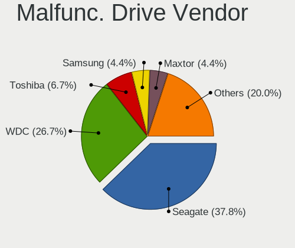

ROSA Hardware Trends (Desktop)
------------------------------

A project to identify most popular hardware characteristics and track their change
over time based on data collected by ROSA users at https://Linux-Hardware.org.

Anyone can contribute to the study by uploading probes of their computers by
the [hw-probe](https://github.com/linuxhw/hw-probe) tool:

    sudo hw-probe -all -upload

Full-feature report is available here: https://linux-hardware.org/?view=trends&formfactor=desktop

Period: Dec, 2019.

Contents
--------

- [ OS                       ](#os)
- [ OS Family                ](#os-family)
- [ Kernel                   ](#kernel)
- [ Kernel Family            ](#kernel-family)
- [ Kernel Major Ver.        ](#kernel-major-ver)
- [ Arch                     ](#arch)
- [ DE                       ](#de)
- [ Display Server           ](#display-server)
- [ OS Lang                  ](#os-lang)
- [ Boot Mode                ](#boot-mode)
- [ Filesystem               ](#filesystem)
- [ Dual Boot with Linux     ](#dual-boot-with-linux)
- [ Dual Boot (Win)          ](#dual-boot-win)
- [ Country                  ](#country)
- [ City                     ](#city)
- [ Vendor                   ](#vendor)
- [ Model                    ](#model)
- [ Model Family             ](#model-family)
- [ MFG Year                 ](#mfg-year)
- [ Form Factor              ](#form-factor)
- [ Secure Boot              ](#secure-boot)
- [ Coreboot                 ](#coreboot)
- [ RAM Size                 ](#ram-size)
- [ RAM Used                 ](#ram-used)
- [ Drive Vendor             ](#drive-vendor)
- [ Drive Model              ](#drive-model)
- [ Drive Kind               ](#drive-kind)
- [ Drive Connector          ](#drive-connector)
- [ Drive Size               ](#drive-size)
- [ Space Total              ](#space-total)
- [ Space Used               ](#space-used)
- [ Malfunc. Drives          ](#malfunc-drives)
- [ Malfunc. Drive Vendor    ](#malfunc-drive-vendor)
- [ Malfunc. Drive Kind      ](#malfunc-drive-kind)
- [ Failed Drives            ](#failed-drives)
- [ Failed Drive Vendor      ](#failed-drive-vendor)
- [ Drive Status             ](#drive-status)
- [ CPU Vendor               ](#cpu-vendor)
- [ CPU Model                ](#cpu-model)
- [ CPU Model Family         ](#cpu-model-family)
- [ CPU Cores                ](#cpu-cores)
- [ CPU Sockets              ](#cpu-sockets)
- [ CPU Threads              ](#cpu-threads)
- [ CPU Op-Modes             ](#cpu-op-modes)
- [ CPU Microarch            ](#cpu-microarch)
- [ CPU Microcode            ](#cpu-microcode)
- [ GPU Vendor               ](#gpu-vendor)
- [ GPU Model                ](#gpu-model)
- [ GPU Combo                ](#gpu-combo)
- [ GPU Driver               ](#gpu-driver)
- [ GPU Memory               ](#gpu-memory)
- [ Monitor Vendor           ](#monitor-vendor)
- [ Monitor Model            ](#monitor-model)
- [ Monitor Resolution       ](#monitor-resolution)
- [ Monitor Diagonal         ](#monitor-diagonal)
- [ Monitor Width            ](#monitor-width)
- [ Aspect Ratio             ](#aspect-ratio)
- [ Monitor Area             ](#monitor-area)
- [ Pixel Density            ](#pixel-density)
- [ Multiple Monitors        ](#multiple-monitors)
- [ Net Controller Vendor    ](#net-controller-vendor)
- [ Net Controller Model     ](#net-controller-model)
- [ Net Controller Kind      ](#net-controller-kind)
- [ Used Controller          ](#used-controller)
- [ NICs                     ](#nics)
- [ Unsupported Devices      ](#unsupported-devices)
- [ Unsupported Device Types ](#unsupported-device-types)

OS
--

Installed operating systems

| Name               | Computers | Percent |
|--------------------|-----------|---------|
| ROSA R11           | 145       | 82.39%  |
| ROSA R8.1          | 16        | 9.09%   |
| ROSA R10           | 10        | 5.68%   |
| ROSA R9            | 2         | 1.14%   |
| ROSA R12           | 1         | 0.57%   |
| ROSA Nickel 2019.0 | 1         | 0.57%   |
| RED X3             | 1         | 0.57%   |

OS Family
---------

OS without a version

| Name | Computers | Percent |
|------|-----------|---------|
| ROSA | 176       | 100%    |

Kernel
------

Version of the Linux kernel

| Version                          | Computers | Percent |
|----------------------------------|-----------|---------|
| 4.15.0-desktop-68.5rosa-x86_64   | 52        | 29.55%  |
| 4.15.0-desktop-45.1rosa-x86_64   | 41        | 23.3%   |
| 4.9.155-nrj-desktop-1rosa-x86_64 | 18        | 10.23%  |
| 4.15.0-desktop-45.1rosa-i586     | 11        | 6.25%   |
| 4.9.60-nrj-desktop-1rosa-x86_64  | 8         | 4.55%   |
| 4.15.0-desktop-60.7rosa-x86_64   | 7         | 3.98%   |
| 4.9.155-nrj-desktop-1rosa-i586   | 6         | 3.41%   |
| 4.15.0-desktop-68.5rosa-i586     | 5         | 2.84%   |
| 4.1.38-nrj-desktop-2rosa-i586    | 4         | 2.27%   |
| 4.1.38-nrj-desktop-2rosa-x86_64  | 3         | 1.7%    |
| 5.4.0-desktop-8.1rosa-x86_64     | 2         | 1.14%   |
| 4.9.60-nrj-desktop-1rosa-i586    | 2         | 1.14%   |
| 4.9.124-nrj-desktop-1rosa-x86_64 | 2         | 1.14%   |
| 4.15.0-desktop-60.7rosa-i586     | 2         | 1.14%   |
| 5.4.0-desktop-9.1rosa-x86_64     | 1         | 0.57%   |
| 5.3.11-nrj-desktop-2rosa-x86_64  | 1         | 0.57%   |
| 5.3.11-nickel-6rosa-x86_64       | 1         | 0.57%   |
| 5.3.0-desktop-24.1rosa-x86_64    | 1         | 0.57%   |
| 4.9.9-nrj-desktop-1rosa-x86_64   | 1         | 0.57%   |
| 4.9.20-nrj-desktop-1rosa-x86_64  | 1         | 0.57%   |
| 4.9.20-nrj-desktop-1rosa-i586    | 1         | 0.57%   |
| 4.9.124-nrj-desktop-1rosa-i586   | 1         | 0.57%   |
| 4.19.0-desktop-13.1rosa-x86_64   | 1         | 0.57%   |
| 4.18.0-desktop-26.2rosa-x86_64   | 1         | 0.57%   |
| 4.15.0-desktop-54.1rosa-i586     | 1         | 0.57%   |
| 4.15.0-desktop-42.2rosa-x86_64   | 1         | 0.57%   |
| 4.1.25-nrj-desktop-1rosa-x86_64  | 1         | 0.57%   |

Kernel Family
-------------

Linux kernel without a distro release

| Version | Computers | Percent |
|---------|-----------|---------|
| 4.15.0  | 120       | 68.18%  |
| 4.9.155 | 24        | 13.64%  |
| 4.9.60  | 10        | 5.68%   |
| 4.1.38  | 7         | 3.98%   |
| 5.4.0   | 3         | 1.7%    |
| 4.9.124 | 3         | 1.7%    |
| 5.3.11  | 2         | 1.14%   |
| 4.9.20  | 2         | 1.14%   |
| 5.3.0   | 1         | 0.57%   |
| 4.9.9   | 1         | 0.57%   |
| 4.19.0  | 1         | 0.57%   |
| 4.18.0  | 1         | 0.57%   |
| 4.1.25  | 1         | 0.57%   |

Kernel Major Ver.
-----------------

Linux kernel major version

| Version | Computers | Percent |
|---------|-----------|---------|
| 4.15    | 120       | 68.18%  |
| 4.9     | 40        | 22.73%  |
| 4.1     | 8         | 4.55%   |
| 5.4     | 3         | 1.7%    |
| 5.3     | 3         | 1.7%    |
| 4.19    | 1         | 0.57%   |
| 4.18    | 1         | 0.57%   |

Arch
----

OS architecture (x86_64, i586, etc.)

| Name   | Computers | Percent |
|--------|-----------|---------|
| x86_64 | 143       | 81.25%  |
| i686   | 33        | 18.75%  |

DE
--

Desktop Environment

| Name | Computers | Percent |
|------|-----------|---------|
| KDE5 | 164       | 93.18%  |
| XFCE | 8         | 4.55%   |
| LXQt | 3         | 1.7%    |
| MATE | 1         | 0.57%   |

Display Server
--------------

X11 or Wayland

| Name    | Computers | Percent |
|---------|-----------|---------|
| Unknown | 176       | 100%    |

OS Lang
-------

Language

| Lang    | Computers | Percent |
|---------|-----------|---------|
| Unknown | 176       | 100%    |

Boot Mode
---------

EFI or BIOS

| Mode | Computers | Percent |
|------|-----------|---------|
| BIOS | 146       | 82.95%  |
| EFI  | 30        | 17.05%  |

Filesystem
----------

Type of filesystem

| Type  | Computers | Percent |
|-------|-----------|---------|
| Ext4  | 169       | 96.02%  |
| Btrfs | 4         | 2.27%   |
| Ext3  | 3         | 1.7%    |

Dual Boot with Linux
--------------------

Hosting more than one Linux

| Dual boot | Computers | Percent |
|-----------|-----------|---------|
| No        | 134       | 76.14%  |
| Yes       | 42        | 23.86%  |

Dual Boot (Win)
---------------

Hosting Linux and Windows

| Dual boot | Computers | Percent |
|-----------|-----------|---------|
| No        | 92        | 52.27%  |
| Yes       | 84        | 47.73%  |

Country
-------

Geographic location (country)

| Country              | Computers | Percent |
|----------------------|-----------|---------|
| Russia               | 129       | 73.3%   |
| Ukraine              | 11        | 6.25%   |
| Poland               | 5         | 2.84%   |
| Germany              | 4         | 2.27%   |
| France               | 4         | 2.27%   |
| Canada               | 3         | 1.7%    |
| UK                   | 2         | 1.14%   |
| Kazakhstan           | 2         | 1.14%   |
| Belarus              | 2         | 1.14%   |
| Spain                | 1         | 0.57%   |
| Serbia               | 1         | 0.57%   |
| Romania              | 1         | 0.57%   |
| Moldova, Republic of | 1         | 0.57%   |
| Lithuania            | 1         | 0.57%   |
| Latvia               | 1         | 0.57%   |
| Italy                | 1         | 0.57%   |
| Israel               | 1         | 0.57%   |
| Ireland              | 1         | 0.57%   |
| Indonesia            | 1         | 0.57%   |
| Finland              | 1         | 0.57%   |
| Estonia              | 1         | 0.57%   |
| Czech Republic       | 1         | 0.57%   |
| Brazil               | 1         | 0.57%   |

City
----

Geographic location (city)

| City                  | Computers | Percent |
|-----------------------|-----------|---------|
| Moscow                | 11        | 6.25%   |
| St Petersburg         | 9         | 5.11%   |
| Yekaterinburg         | 8         | 4.55%   |
| Novosibirsk           | 7         | 3.98%   |
| Vogue                 | 4         | 2.27%   |
| Samara                | 4         | 2.27%   |
| Omsk                  | 3         | 1.7%    |
| Chelyabinsk           | 3         | 1.7%    |
| Zheleznodorozhnyy     | 2         | 1.14%   |
| Yoshkar-Ola           | 2         | 1.14%   |
| Vitebsk               | 2         | 1.14%   |
| Tyumen                | 2         | 1.14%   |
| Stavropol             | 2         | 1.14%   |
| Stary Oskol           | 2         | 1.14%   |
| Saratov               | 2         | 1.14%   |
| Rostov-on-Don         | 2         | 1.14%   |
| Poltava               | 2         | 1.14%   |
| Perm                  | 2         | 1.14%   |
| Orenburg              | 2         | 1.14%   |
| Novoye Devyatkino     | 2         | 1.14%   |
| Nizhny Tagil          | 2         | 1.14%   |
| Kyiv                  | 2         | 1.14%   |
| Krasnoyarsk           | 2         | 1.14%   |
| Irkutsk               | 2         | 1.14%   |
| Łapy                 | 1         | 0.57%   |
| Zlatoust              | 1         | 0.57%   |
| Zelenograd            | 1         | 0.57%   |
| Yaroslavl             | 1         | 0.57%   |
| Volgograd             | 1         | 0.57%   |
| Vladivostok           | 1         | 0.57%   |
| Vladimir              | 1         | 0.57%   |
| Vladikavkaz           | 1         | 0.57%   |
| Verkhniye Sergi       | 1         | 0.57%   |
| Ventspils             | 1         | 0.57%   |
| Ust'-Kut              | 1         | 0.57%   |
| Ulyanovsk             | 1         | 0.57%   |
| Udomlya               | 1         | 0.57%   |
| Trubchëvsk           | 1         | 0.57%   |
| Troitsk               | 1         | 0.57%   |
| Toronto               | 1         | 0.57%   |
| Tomsk                 | 1         | 0.57%   |
| Tolyatti              | 1         | 0.57%   |
| Tighina               | 1         | 0.57%   |
| Tel Aviv              | 1         | 0.57%   |
| Taganrog              | 1         | 0.57%   |
| Syktyvkar             | 1         | 0.57%   |
| Sukoharjo             | 1         | 0.57%   |
| Smolensk              | 1         | 0.57%   |
| Shakhtërsk           | 1         | 0.57%   |
| Severoural'sk         | 1         | 0.57%   |
| Severomorsk           | 1         | 0.57%   |
| Saransk               | 1         | 0.57%   |
| Saint-Basile-le-Grand | 1         | 0.57%   |
| Ryazan                | 1         | 0.57%   |
| Poznan                | 1         | 0.57%   |
| Petrozavodsk          | 1         | 0.57%   |
| Pavlohrad             | 1         | 0.57%   |
| Ozyorny               | 1         | 0.57%   |
| Odintsovo             | 1         | 0.57%   |
| Nur-Sultan            | 1         | 0.57%   |

Vendor
------

Motherboard manufacturer

| Name                | Computers | Percent |
|---------------------|-----------|---------|
| ASUSTek Computer    | 51        | 28.98%  |
| Gigabyte Technology | 37        | 21.02%  |
| ASRock              | 25        | 14.2%   |
| MSI                 | 16        | 9.09%   |
| Intel               | 7         | 3.98%   |
| Hewlett-Packard     | 6         | 3.41%   |
| Dell                | 6         | 3.41%   |
| Unknown             | 5         | 2.84%   |
| Acer                | 4         | 2.27%   |
| ECS                 | 3         | 1.7%    |
| Fujitsu             | 2         | 1.14%   |
| Biostar             | 2         | 1.14%   |
| ZOTAC               | 1         | 0.57%   |
| WinFast             | 1         | 0.57%   |
| SiS Technology      | 1         | 0.57%   |
| Pegatron            | 1         | 0.57%   |
| Notebook            | 1         | 0.57%   |
| MEGA                | 1         | 0.57%   |
| Lenovo              | 1         | 0.57%   |
| Fujitsu Siemens     | 1         | 0.57%   |
| EPoX Computer       | 1         | 0.57%   |
| ELSA                | 1         | 0.57%   |
| Compaq              | 1         | 0.57%   |
| ABIT                | 1         | 0.57%   |

Model
-----

Motherboard model

| Name                        | Computers | Percent |
|-----------------------------|-----------|---------|
| Unknown                     | 5         | 2.84%   |
| A68HM-K                     | 3         | 1.7%    |
| OptiPlex 760                | 2         | 1.14%   |
| MS-7996                     | 2         | 1.14%   |
| MS-7592                     | 2         | 1.14%   |
| M5A99X EVO R2.0             | 2         | 1.14%   |
| M5A97 R2.0                  | 2         | 1.14%   |
| M5A78L-M/USB3               | 2         | 1.14%   |
| M5A78L-M LX3                | 2         | 1.14%   |
| M3N78D FX                   | 2         | 1.14%   |
| H77-DS3H                    | 2         | 1.14%   |
| G31M-ES2L                   | 2         | 1.14%   |
| B75-D3V                     | 2         | 1.14%   |
| 970A-DS3P                   | 2         | 1.14%   |
| Z97 Anniversary             | 1         | 0.57%   |
| Z77 Extreme4                | 1         | 0.57%   |
| Z77 Extreme3                | 1         | 0.57%   |
| Z68P-DS3                    | 1         | 0.57%   |
| Z370 AORUS Gaming 5         | 1         | 0.57%   |
| Z200 Workstation            | 1         | 0.57%   |
| Z170 Extreme4               | 1         | 0.57%   |
| ThinkCentre M57 6072HDU     | 1         | 0.57%   |
| TB250-BTC                   | 1         | 0.57%   |
| STRIX Z270G GAMING          | 1         | 0.57%   |
| SiS-650GX                   | 1         | 0.57%   |
| SHARKBAY                    | 1         | 0.57%   |
| SABERTOOTH 990FX R2.0       | 1         | 0.57%   |
| RIM2510                     | 1         | 0.57%   |
| Rampage IV EXTREME          | 1         | 0.57%   |
| ProDesk 600 G1 TWR          | 1         | 0.57%   |
| PRIME Z270-P                | 1         | 0.57%   |
| PRIME H310M-R R2.0          | 1         | 0.57%   |
| PRIME B250-PLUS             | 1         | 0.57%   |
| Precision WorkStation T3500 | 1         | 0.57%   |
| PC-B2105/0145198            | 1         | 0.57%   |
| P8Q77-M                     | 1         | 0.57%   |
| P8P67 PRO                   | 1         | 0.57%   |
| P8H77-M PRO                 | 1         | 0.57%   |
| P7P55D-E                    | 1         | 0.57%   |
| P61-USB3-B3                 | 1         | 0.57%   |
| P5RD2-VM                    | 1         | 0.57%   |
| P5Q DELUXE                  | 1         | 0.57%   |
| P5LD2-SE                    | 1         | 0.57%   |
| P5LD2                       | 1         | 0.57%   |
| P5KPL-AM                    | 1         | 0.57%   |
| P5GD1 PRO                   | 1         | 0.57%   |
| P5E                         | 1         | 0.57%   |
| P5B-MX                      | 1         | 0.57%   |
| P4P800-VM                   | 1         | 0.57%   |
| P45IA-R2 1048               | 1         | 0.57%   |
| P31-S3G                     | 1         | 0.57%   |
| OptiPlex GX520              | 1         | 0.57%   |
| OptiPlex 790                | 1         | 0.57%   |
| OptiPlex 3020               | 1         | 0.57%   |
| NM10                        | 1         | 0.57%   |
| N68C-GS UCC                 | 1         | 0.57%   |
| N68-VS3 UCC                 | 1         | 0.57%   |
| MS-7B93                     | 1         | 0.57%   |
| MS-7A74                     | 1         | 0.57%   |
| MS-7995                     | 1         | 0.57%   |

Model Family
------------

Motherboard model prefix

| Name                     | Computers | Percent |
|--------------------------|-----------|---------|
| Dell OptiPlex            | 5         | 2.84%   |
| ASUS M5A78L-M            | 5         | 2.84%   |
| Unknown                  | 5         | 2.84%   |
| Acer Aspire              | 4         | 2.27%   |
| ASUS PRIME               | 3         | 1.7%    |
| ASUS M5A97               | 3         | 1.7%    |
| ASUS A68HM-K             | 3         | 1.7%    |
| MSI MS-7996              | 2         | 1.14%   |
| MSI MS-7592              | 2         | 1.14%   |
| HP Compaq                | 2         | 1.14%   |
| Gigabyte H77-DS3H        | 2         | 1.14%   |
| Gigabyte G31M-ES2L       | 2         | 1.14%   |
| Gigabyte B75-D3V         | 2         | 1.14%   |
| Gigabyte 970A-DS3P       | 2         | 1.14%   |
| Fujitsu ESPRIMO          | 2         | 1.14%   |
| ASUS M5A99X              | 2         | 1.14%   |
| ASRock Z77               | 2         | 1.14%   |
| ASRock M3N78D            | 2         | 1.14%   |
| ASRock B450M-HDV         | 2         | 1.14%   |
| ZOTAC NM10               | 1         | 0.57%   |
| WinFast 6100M2MA         | 1         | 0.57%   |
| SiS Technology SiS-650GX | 1         | 0.57%   |
| Pegatron PC-B2105        | 1         | 0.57%   |
| Notebook RIM2510         | 1         | 0.57%   |
| MSI MS-7B93              | 1         | 0.57%   |
| MSI MS-7A74              | 1         | 0.57%   |
| MSI MS-7995              | 1         | 0.57%   |
| MSI MS-7817              | 1         | 0.57%   |
| MSI MS-7788              | 1         | 0.57%   |
| MSI MS-7758              | 1         | 0.57%   |
| MSI MS-7693              | 1         | 0.57%   |
| MSI MS-7529              | 1         | 0.57%   |
| MSI MS-7383              | 1         | 0.57%   |
| MSI MS-7376              | 1         | 0.57%   |
| MSI MS-7250              | 1         | 0.57%   |
| MSI MS-7207G             | 1         | 0.57%   |
| MEGA G41T-M7             | 1         | 0.57%   |
| Lenovo ThinkCentre       | 1         | 0.57%   |
| Intel SHARKBAY           | 1         | 0.57%   |
| Intel DH55TC             | 1         | 0.57%   |
| Intel DG965SS            | 1         | 0.57%   |
| Intel DG43GT             | 1         | 0.57%   |
| Intel DG31PR             | 1         | 0.57%   |
| Intel D945PSN            | 1         | 0.57%   |
| Intel D34010WYK          | 1         | 0.57%   |
| HP Z200                  | 1         | 0.57%   |
| HP ProDesk               | 1         | 0.57%   |
| HP CQ2950EG              | 1         | 0.57%   |
| HP 260-a113nl            | 1         | 0.57%   |
| Gigabyte Z68P-DS3        | 1         | 0.57%   |
| Gigabyte Z370            | 1         | 0.57%   |
| Gigabyte P61-USB3-B3     | 1         | 0.57%   |
| Gigabyte P31-S3G         | 1         | 0.57%   |
| Gigabyte M52L-S3P        | 1         | 0.57%   |
| Gigabyte J1800N-D2P      | 1         | 0.57%   |
| Gigabyte H87-HD3         | 1         | 0.57%   |
| Gigabyte H81M-S1         | 1         | 0.57%   |
| Gigabyte H77N-WIFI       | 1         | 0.57%   |
| Gigabyte H61M-S1         | 1         | 0.57%   |
| Gigabyte H61M-D2-B3      | 1         | 0.57%   |

MFG Year
--------

Motherboard manufacture year

| Year | Computers | Percent |
|------|-----------|---------|
| 2010 | 18        | 10.23%  |
| 2012 | 17        | 9.66%   |
| 2009 | 17        | 9.66%   |
| 2014 | 15        | 8.52%   |
| 2011 | 14        | 7.95%   |
| 2013 | 13        | 7.39%   |
| 2008 | 13        | 7.39%   |
| 2018 | 11        | 6.25%   |
| 2016 | 11        | 6.25%   |
| 2007 | 10        | 5.68%   |
| 2019 | 9         | 5.11%   |
| 2015 | 8         | 4.55%   |
| 2006 | 6         | 3.41%   |
| 2005 | 5         | 2.84%   |
| 2017 | 4         | 2.27%   |
| 2003 | 3         | 1.7%    |
| 2004 | 1         | 0.57%   |
| 2002 | 1         | 0.57%   |

Form Factor
-----------

Physical design of the computer

| Name    | Computers | Percent |
|---------|-----------|---------|
| Desktop | 176       | 100%    |

Secure Boot
-----------

Enabled or disabled

| State    | Computers | Percent |
|----------|-----------|---------|
| Disabled | 154       | 87.5%   |
| Unknown  | 22        | 12.5%   |

Coreboot
--------

Have coreboot on board

| Used | Computers | Percent |
|------|-----------|---------|
| No   | 176       | 100%    |

RAM Size
--------

Total RAM memory

| Size in GB | Computers | Percent |
|------------|-----------|---------|
| 3.01-4.0   | 61        | 34.66%  |
| 8.01-16.0  | 38        | 21.59%  |
| 4.01-8.0   | 26        | 14.77%  |
| 1.01-2.0   | 19        | 10.8%   |
| 16.01-24.0 | 18        | 10.23%  |
| 2.01-3.0   | 6         | 3.41%   |
| 32.01-64.0 | 5         | 2.84%   |
| 0.01-1.0   | 2         | 1.14%   |
| 24.01-32.0 | 1         | 0.57%   |

RAM Used
--------

Used RAM memory

| Used GB  | Computers | Percent |
|----------|-----------|---------|
| 0.01-1.0 | 89        | 50.57%  |
| 1.01-2.0 | 69        | 39.2%   |
| 2.01-3.0 | 15        | 8.52%   |
| 3.01-4.0 | 3         | 1.7%    |

Drive Vendor
------------

Hard drive vendors

| Vendor              | Computers | Drives | Percent |
|---------------------|-----------|--------|---------|
| Seagate             | 79        | 99     | 31.73%  |
| WDC                 | 61        | 79     | 24.5%   |
| Hitachi             | 17        | 21     | 6.83%   |
| Samsung Electronics | 16        | 17     | 6.43%   |
| Toshiba             | 12        | 12     | 4.82%   |
| Kingston            | 10        | 11     | 4.02%   |
| China               | 6         | 6      | 2.41%   |
| SPCC                | 5         | 5      | 2.01%   |
| Crucial             | 4         | 4      | 1.61%   |
| PLEXTOR             | 3         | 3      | 1.2%    |
| Intel               | 3         | 4      | 1.2%    |
| HGST                | 3         | 3      | 1.2%    |
| Transcend           | 2         | 2      | 0.8%    |
| Patriot             | 2         | 2      | 0.8%    |
| Maxtor              | 2         | 2      | 0.8%    |
| KingSpec            | 2         | 2      | 0.8%    |
| KINGMAX             | 2         | 2      | 0.8%    |
| KingDian            | 2         | 2      | 0.8%    |
| IBM/Hitachi         | 2         | 2      | 0.8%    |
| GOODRAM             | 2         | 3      | 0.8%    |
| Gigabyte Technology | 2         | 2      | 0.8%    |
| Fujitsu             | 2         | 2      | 0.8%    |
| Corsair             | 2         | 2      | 0.8%    |
| Unknown             | 1         | 1      | 0.4%    |
| Team                | 1         | 1      | 0.4%    |
| Silicon Motion      | 1         | 1      | 0.4%    |
| SanDisk             | 1         | 1      | 0.4%    |
| OCZ                 | 1         | 1      | 0.4%    |
| Micron Technology   | 1         | 1      | 0.4%    |
| LONDISK             | 1         | 1      | 0.4%    |
| A-DATA Technology   | 1         | 1      | 0.4%    |

Drive Model
-----------

Hard drive models

| Model                        | Computers | Percent |
|------------------------------|-----------|---------|
| ST500DM002-1BD142 500GB      | 6         | 2.03%   |
| ST3500418AS 500GB            | 6         | 2.03%   |
| ST380011A 80GB               | 5         | 1.69%   |
| WD5000AAKX-001CA0 500GB      | 4         | 1.36%   |
| ST3250410AS 250GB            | 4         | 1.36%   |
| ST3250310AS 250GB            | 4         | 1.36%   |
| ST3160815AS 160GB            | 4         | 1.36%   |
| WD10EZEX-08WN4A0 1TB         | 3         | 1.02%   |
| ST1000DM003-1CH162 1TB       | 3         | 1.02%   |
| ST1000DM003-1CH1 1TB         | 3         | 1.02%   |
| HDS72105 500GB               | 3         | 1.02%   |
| DT01ACA050 500GB             | 3         | 1.02%   |
| WDS480G2G0A-00JH30 480GB SSD | 2         | 0.68%   |
| WD5000AAKX-0 500GB           | 2         | 0.68%   |
| WD5000AADS-00S9B0 500GB      | 2         | 0.68%   |
| WD3200AAJS-00L7A0 320GB      | 2         | 0.68%   |
| WD10EZEX-60WN4A0 1TB         | 2         | 0.68%   |
| WD10EZEX-22MFCA0 1TB         | 2         | 0.68%   |
| WD10EZEX-00BN5A0 1TB         | 2         | 0.68%   |
| WD10EARX-00N0YB0 1TB         | 2         | 0.68%   |
| ST380815AS 80GB              | 2         | 0.68%   |
| ST380811AS 80GB              | 2         | 0.68%   |
| ST380215AS 80GB              | 2         | 0.68%   |
| ST3250620AS 250GB            | 2         | 0.68%   |
| ST3250620A 250GB             | 2         | 0.68%   |
| ST3160318AS 160GB            | 2         | 0.68%   |
| ST3120827AS 120GB            | 2         | 0.68%   |
| ST2000DM008-2FR102 2TB       | 2         | 0.68%   |
| SSD 750 EVO 250GB            | 2         | 0.68%   |
| SSD 60GB                     | 2         | 0.68%   |
| Solid State Disk 256GB       | 2         | 0.68%   |
| Solid State Disk 128GB       | 2         | 0.68%   |
| SMS200S360G 64GB SSD         | 2         | 0.68%   |
| SHFS37A120G 120GB SSD        | 2         | 0.68%   |
| SATA SSD 120GB               | 2         | 0.68%   |
| SA400S3 240GB SSD            | 2         | 0.68%   |
| HDT722525DLA380 250GB        | 2         | 0.68%   |
| HDS721680PLA380 80GB         | 2         | 0.68%   |
| HDS721050CLA360 500GB        | 2         | 0.68%   |
| HD080HJ 80GB                 | 2         | 0.68%   |
| DT01ACA100 1TB               | 2         | 0.68%   |
| CT120BX500SSD1 120GB         | 2         | 0.68%   |
| WDS500G2B0A 500GB SSD        | 1         | 0.34%   |
| WDS250G2B0A 250GB SSD        | 1         | 0.34%   |
| WDS240G2G0B-00EPW0 240GB SSD | 1         | 0.34%   |
| WDS240G2G0A-00JH30 240GB SSD | 1         | 0.34%   |
| WD800JD-75MSA3 80GB          | 1         | 0.34%   |
| WD800JD-00MSA1 80GB          | 1         | 0.34%   |
| WD800BB-56JKC0 80GB          | 1         | 0.34%   |
| WD6400AAKS-22A7B0 640GB      | 1         | 0.34%   |
| WD5002AALX-00J37A0 500GB     | 1         | 0.34%   |
| WD5000LPCX-00VHAT0 500GB     | 1         | 0.34%   |
| WD5000AZRX-00L4HB0 500GB     | 1         | 0.34%   |
| WD5000AAKX-75U6AA0 500GB     | 1         | 0.34%   |
| WD5000AAKS-75A7B0 500GB      | 1         | 0.34%   |
| WD5000AAKS-00WWPA0 500GB     | 1         | 0.34%   |
| WD5000AAKS-00V1A0 500GB      | 1         | 0.34%   |
| WD5000AAKS-00A7B0 500GB      | 1         | 0.34%   |
| WD5000AAKS-0 500GB           | 1         | 0.34%   |
| WD3200BPVT-22ZEST0 320GB     | 1         | 0.34%   |

Drive Kind
----------

HDD or SSD

| Kind | Computers | Drives | Percent |
|------|-----------|--------|---------|
| HDD  | 152       | 227    | 71.7%   |
| SSD  | 57        | 65     | 26.89%  |
| NVMe | 3         | 3      | 1.42%   |

Drive Connector
---------------

SATA, SAS, NVMe, etc.

| Type | Computers | Drives | Percent |
|------|-----------|--------|---------|
| SATA | 172       | 292    | 98.29%  |
| NVMe | 3         | 3      | 1.71%   |

Drive Size
----------

Size of hard drive

| Size in TB | Computers | Drives | Percent |
|------------|-----------|--------|---------|
| 0.01-0.5   | 153       | 227    | 73.56%  |
| 0.51-1.0   | 46        | 59     | 22.12%  |
| 1.01-2.0   | 6         | 6      | 2.88%   |
| 2.01-3.0   | 3         | 3      | 1.44%   |

Space Total
-----------

Amount of disk space available on the file system

| Size in GB     | Computers | Percent |
|----------------|-----------|---------|
| 101-250        | 51        | 28.98%  |
| 251-500        | 35        | 19.89%  |
| 51-100         | 28        | 15.91%  |
| 1-20           | 25        | 14.2%   |
| 501-1000       | 16        | 9.09%   |
| 21-50          | 10        | 5.68%   |
| 1001-2000      | 8         | 4.55%   |
| 2001-3000      | 2         | 1.14%   |
| More than 3000 | 1         | 0.57%   |

Space Used
----------

Amount of used disk space

| Used GB   | Computers | Percent |
|-----------|-----------|---------|
| 1-20      | 119       | 67.61%  |
| 101-250   | 15        | 8.52%   |
| 21-50     | 14        | 7.95%   |
| 51-100    | 11        | 6.25%   |
| 251-500   | 8         | 4.55%   |
| 501-1000  | 6         | 3.41%   |
| 1001-2000 | 3         | 1.7%    |

Malfunc. Drives
---------------

Drive models with a malfunction

| Model                    | Computers | Drives | Percent |
|--------------------------|-----------|--------|---------|
| ST500DM002-1BD142 500GB  | 3         | 3      | 3.16%   |
| ST3500418AS 500GB        | 3         | 3      | 3.16%   |
| ST3250410AS 250GB        | 3         | 3      | 3.16%   |
| WD5000AAKX-001CA0 500GB  | 2         | 2      | 2.11%   |
| WD3200AAJS-00L7A0 320GB  | 2         | 2      | 2.11%   |
| ST380011A 80GB           | 2         | 2      | 2.11%   |
| ST3250310AS 250GB        | 2         | 2      | 2.11%   |
| ST3160815AS 160GB        | 2         | 2      | 2.11%   |
| SSD 60GB                 | 2         | 2      | 2.11%   |
| HDT722525DLA380 250GB    | 2         | 2      | 2.11%   |
| HD080HJ 80GB             | 2         | 2      | 2.11%   |
| WD800JD-00MSA1 80GB      | 1         | 1      | 1.05%   |
| WD800BB-56JKC0 80GB      | 1         | 1      | 1.05%   |
| WD5000AAKX-0 500GB       | 1         | 1      | 1.05%   |
| WD5000AAKS-00A7B0 500GB  | 1         | 1      | 1.05%   |
| WD5000AADS-00S9B0 500GB  | 1         | 1      | 1.05%   |
| WD3200AAKS-00SBA0 320GB  | 1         | 1      | 1.05%   |
| WD3200AAJS-56M0A0 320GB  | 1         | 1      | 1.05%   |
| WD3200AAJS-00B4A0 320GB  | 1         | 1      | 1.05%   |
| WD2500AAJS-00L7A0 250GB  | 1         | 1      | 1.05%   |
| WD2500AAJS-00B4A0 250GB  | 1         | 1      | 1.05%   |
| WD20EURS-63S48Y0 2TB     | 1         | 1      | 1.05%   |
| WD1600JS-60NCB1 160GB    | 1         | 1      | 1.05%   |
| WD1600JS-00NCB1 160GB    | 1         | 1      | 1.05%   |
| WD1600AAJS-00PSA0 160GB  | 1         | 1      | 1.05%   |
| WD1200BB-00GUC0 120GB    | 1         | 1      | 1.05%   |
| WD10EZRX-00L 1TB         | 1         | 1      | 1.05%   |
| WD10EZEX-75WN4A0 1TB     | 1         | 1      | 1.05%   |
| WD10EZEX-60ZF5A0 1TB     | 1         | 1      | 1.05%   |
| WD10EZEX-08WN4A0 1TB     | 1         | 1      | 1.05%   |
| WD10EZEX-07ZF5A0 1TB     | 1         | 1      | 1.05%   |
| WD10EARX-00N0YB0 1TB     | 1         | 1      | 1.05%   |
| WD10EARS-00Y5B1 1TB      | 1         | 1      | 1.05%   |
| WD10EARS-00MVWB0 1TB     | 1         | 1      | 1.05%   |
| WD10EALX-009BA0 1TB      | 1         | 1      | 1.05%   |
| SX900 64GB SSD           | 1         | 1      | 1.05%   |
| SV300S37A120G 120GB SSD  | 1         | 1      | 1.05%   |
| SV0411N 40GB             | 1         | 1      | 1.05%   |
| ST91000640NS 1TB         | 1         | 1      | 1.05%   |
| ST500DM005 HD502HJ 500GB | 1         | 1      | 1.05%   |
| ST500DM002-1BD14 500GB   | 1         | 1      | 1.05%   |
| ST380811AS 80GB          | 1         | 1      | 1.05%   |
| ST3750525AS 752GB        | 1         | 1      | 1.05%   |
| ST360014A 64GB           | 1         | 1      | 1.05%   |
| ST340810A 40GB           | 1         | 1      | 1.05%   |
| ST3320613AS 320GB        | 1         | 1      | 1.05%   |
| ST3250824AS 250GB        | 1         | 1      | 1.05%   |
| ST3250620A 250GB         | 1         | 1      | 1.05%   |
| ST320DM000-1BD14C 320GB  | 1         | 1      | 1.05%   |
| ST3160215AS 160GB        | 1         | 1      | 1.05%   |
| ST3160215A 160GB         | 1         | 1      | 1.05%   |
| ST3120827AS 120GB        | 1         | 1      | 1.05%   |
| ST31000523AS 1TB         | 1         | 1      | 1.05%   |
| ST3000VX010-2E3166 3TB   | 1         | 1      | 1.05%   |
| ST2000DM001-9YN164 2TB   | 1         | 1      | 1.05%   |
| ST2000DL003-9VT166 2TB   | 1         | 1      | 1.05%   |
| ST1500DM003-9YN16G 1TB   | 1         | 1      | 1.05%   |
| ST1000DX002-2DV162 1TB   | 1         | 1      | 1.05%   |
| ST1000DM003-1CH162 1TB   | 1         | 1      | 1.05%   |
| ST1000DM003-1CH1 1TB     | 1         | 1      | 1.05%   |

Malfunc. Drive Vendor
---------------------

Vendors of faulty drives

| Vendor              | Computers | Drives | Percent |
|---------------------|-----------|--------|---------|
| Seagate             | 34        | 38     | 40.48%  |
| WDC                 | 21        | 28     | 25%     |
| Samsung Electronics | 8         | 8      | 9.52%   |
| Hitachi             | 7         | 7      | 8.33%   |
| Toshiba             | 2         | 2      | 2.38%   |
| Kingston            | 2         | 2      | 2.38%   |
| KINGMAX             | 2         | 2      | 2.38%   |
| IBM/Hitachi         | 2         | 2      | 2.38%   |
| Corsair             | 2         | 2      | 2.38%   |
| Silicon Motion      | 1         | 1      | 1.19%   |
| Maxtor              | 1         | 1      | 1.19%   |
| KingSpec            | 1         | 1      | 1.19%   |
| A-DATA Technology   | 1         | 1      | 1.19%   |

Malfunc. Drive Kind
-------------------

Kinds of faulty drives

| Kind | Computers | Drives | Percent |
|------|-----------|--------|---------|
| HDD  | 69        | 86     | 88.46%  |
| SSD  | 8         | 8      | 10.26%  |
| NVMe | 1         | 1      | 1.28%   |

Failed Drives
-------------

Failed drive models

| Model                   | Computers | Drives | Percent |
|-------------------------|-----------|--------|---------|
| WD5000AAKS-00V1A0 500GB | 1         | 1      | 33.33%  |
| ST380815AS 80GB         | 1         | 1      | 33.33%  |
| HD642JJ 640GB           | 1         | 1      | 33.33%  |

Failed Drive Vendor
-------------------

Failed drive vendors

| Vendor              | Computers | Drives | Percent |
|---------------------|-----------|--------|---------|
| WDC                 | 1         | 1      | 33.33%  |
| Seagate             | 1         | 1      | 33.33%  |
| Samsung Electronics | 1         | 1      | 33.33%  |

Drive Status
------------

Number of failed and malfunc. drives

| Status   | Computers | Drives | Percent |
|----------|-----------|--------|---------|
| Works    | 139       | 194    | 62.9%   |
| Malfunc  | 77        | 95     | 34.84%  |
| Failed   | 3         | 3      | 1.36%   |
| Detected | 2         | 3      | 0.9%    |

CPU Vendor
----------

Processor vendors

| Vendor | Computers | Percent |
|--------|-----------|---------|
| Intel  | 112       | 63.64%  |
| AMD    | 64        | 36.36%  |

CPU Model
---------

Processor models

| Model                                       | Computers | Percent |
|---------------------------------------------|-----------|---------|
| AMD FX-8300 Eight-Core Processor            | 4         | 2.27%   |
| AMD Athlon II X2 250 Processor              | 4         | 2.27%   |
| Intel Pentium Dual CPU E2200 @ 2.20GHz      | 3         | 1.7%    |
| Intel Pentium 4 CPU 3.00GHz                 | 3         | 1.7%    |
| Intel Core i7-3770 CPU @ 3.40GHz            | 3         | 1.7%    |
| Intel Core i3 CPU 550 @ 3.20GHz             | 3         | 1.7%    |
| Intel Core 2 Duo CPU E7500 @ 2.93GHz        | 3         | 1.7%    |
| Intel Core 2 Duo CPU E6750 @ 2.66GHz        | 3         | 1.7%    |
| AMD Athlon II X2 240 Processor              | 3         | 1.7%    |
| AMD Athlon 64 X2 Dual Core Processor 6000+  | 3         | 1.7%    |
| AMD Athlon 64 X2 Dual Core Processor 5200+  | 3         | 1.7%    |
| Intel Pentium Gold G5400 CPU @ 3.70GHz      | 2         | 1.14%   |
| Intel Pentium Dual-Core CPU E6300 @ 2.80GHz | 2         | 1.14%   |
| Intel Pentium D CPU 2.80GHz                 | 2         | 1.14%   |
| Intel Core i7-2600 CPU @ 3.40GHz            | 2         | 1.14%   |
| Intel Core i5-3450 CPU @ 3.10GHz            | 2         | 1.14%   |
| Intel Core i5 CPU 750 @ 2.67GHz             | 2         | 1.14%   |
| Intel Core i3-3240 CPU @ 3.40GHz            | 2         | 1.14%   |
| Intel Core i3 CPU 540 @ 3.07GHz             | 2         | 1.14%   |
| Intel Core 2 Duo CPU E8500 @ 3.16GHz        | 2         | 1.14%   |
| Intel Core 2 Duo CPU E8400 @ 3.00GHz        | 2         | 1.14%   |
| Intel Core 2 CPU 6300 @ 1.86GHz             | 2         | 1.14%   |
| Intel Celeron CPU G530 @ 2.40GHz            | 2         | 1.14%   |
| Intel Celeron CPU 1.70GHz                   | 2         | 1.14%   |
| Intel Atom CPU D525 @ 1.80GHz               | 2         | 1.14%   |
| AMD FX-8350 Eight-Core Processor            | 2         | 1.14%   |
| AMD FX-6300 Six-Core Processor              | 2         | 1.14%   |
| AMD Athlon II X4 640 Processor              | 2         | 1.14%   |
| AMD Athlon II X2 245 Processor              | 2         | 1.14%   |
| AMD Athlon 64 X2 Dual Core Processor 5600+  | 2         | 1.14%   |
| AMD Athlon 64 X2 Dual Core Processor 4800+  | 2         | 1.14%   |
| AMD Athlon 64 X2 Dual Core Processor 4200+  | 2         | 1.14%   |
| AMD A4-6300 APU with Radeon HD Graphics     | 2         | 1.14%   |
| Intel Xeon CPU X5660 @ 2.80GHz              | 1         | 0.57%   |
| Intel Xeon CPU E5-1620 0 @ 3.60GHz          | 1         | 0.57%   |
| Intel Pentium Dual-Core CPU E6800 @ 3.33GHz | 1         | 0.57%   |
| Intel Pentium Dual-Core CPU E6700 @ 3.20GHz | 1         | 0.57%   |
| Intel Pentium Dual-Core CPU E5400 @ 2.70GHz | 1         | 0.57%   |
| Intel Pentium Dual-Core CPU E5200 @ 2.50GHz | 1         | 0.57%   |
| Intel Pentium Dual CPU E2180 @ 2.00GHz      | 1         | 0.57%   |
| Intel Pentium Dual CPU E2160 @ 1.80GHz      | 1         | 0.57%   |
| Intel Pentium CPU G850 @ 2.90GHz            | 1         | 0.57%   |
| Intel Pentium CPU G840 @ 2.80GHz            | 1         | 0.57%   |
| Intel Pentium CPU G645T @ 2.50GHz           | 1         | 0.57%   |
| Intel Pentium CPU G4600 @ 3.60GHz           | 1         | 0.57%   |
| Intel Pentium CPU G4560 @ 3.50GHz           | 1         | 0.57%   |
| Intel Pentium CPU G4500 @ 3.50GHz           | 1         | 0.57%   |
| Intel Pentium CPU G4400 @ 3.30GHz           | 1         | 0.57%   |
| Intel Pentium CPU G3430 @ 3.30GHz           | 1         | 0.57%   |
| Intel Pentium 4 CPU 3.20GHz                 | 1         | 0.57%   |
| Intel Pentium 4 CPU 2.00GHz                 | 1         | 0.57%   |
| Intel Genuine CPU 0000 @ 3.40GHz            | 1         | 0.57%   |
| Intel Core i7-4790K CPU @ 4.00GHz           | 1         | 0.57%   |
| Intel Core i7-3970X CPU @ 3.50GHz           | 1         | 0.57%   |
| Intel Core i7-2600K CPU @ 3.40GHz           | 1         | 0.57%   |
| Intel Core i5-8400 CPU @ 2.80GHz            | 1         | 0.57%   |
| Intel Core i5-6600K CPU @ 3.50GHz           | 1         | 0.57%   |
| Intel Core i5-6500 CPU @ 3.20GHz            | 1         | 0.57%   |
| Intel Core i5-4590 CPU @ 3.30GHz            | 1         | 0.57%   |
| Intel Core i5-4570 CPU @ 3.20GHz            | 1         | 0.57%   |

CPU Model Family
----------------

Processor model prefix

| Model                   | Computers | Percent |
|-------------------------|-----------|---------|
| Intel Core i3           | 18        | 10.23%  |
| Intel Core i5           | 16        | 9.09%   |
| Intel Celeron           | 14        | 7.95%   |
| AMD Athlon 64 X2        | 14        | 7.95%   |
| Intel Core 2 Duo        | 13        | 7.39%   |
| AMD Athlon II X2        | 12        | 6.82%   |
| AMD FX                  | 10        | 5.68%   |
| Intel Pentium           | 8         | 4.55%   |
| Intel Core i7           | 8         | 4.55%   |
| Intel Pentium Dual-Core | 6         | 3.41%   |
| Intel Core 2            | 6         | 3.41%   |
| Intel Pentium Dual      | 5         | 2.84%   |
| Intel Pentium 4         | 5         | 2.84%   |
| AMD A4                  | 4         | 2.27%   |
| Intel Core 2 Quad       | 3         | 1.7%    |
| Intel Atom              | 3         | 1.7%    |
| AMD Phenom II X4        | 3         | 1.7%    |
| AMD Athlon II X4        | 3         | 1.7%    |
| AMD A8                  | 3         | 1.7%    |
| Intel Xeon              | 2         | 1.14%   |
| Intel Pentium Gold      | 2         | 1.14%   |
| Intel Pentium D         | 2         | 1.14%   |
| AMD Ryzen 5             | 2         | 1.14%   |
| AMD Ryzen 3             | 2         | 1.14%   |
| AMD Athlon 64           | 2         | 1.14%   |
| Intel Genuine           | 1         | 0.57%   |
| AMD Ryzen 9             | 1         | 0.57%   |
| AMD Phenom II X6        | 1         | 0.57%   |
| AMD Phenom II X3        | 1         | 0.57%   |
| AMD Phenom              | 1         | 0.57%   |
| AMD Athlon X4           | 1         | 0.57%   |
| AMD Athlon X2           | 1         | 0.57%   |
| AMD Athlon II X3        | 1         | 0.57%   |
| AMD Athlon              | 1         | 0.57%   |
| AMD A10                 | 1         | 0.57%   |

CPU Cores
---------

Number of processor cores

| Number | Computers | Percent |
|--------|-----------|---------|
| 2      | 101       | 57.39%  |
| 4      | 45        | 25.57%  |
| 1      | 19        | 10.8%   |
| 6      | 5         | 2.84%   |
| 3      | 5         | 2.84%   |
| 12     | 1         | 0.57%   |

CPU Sockets
-----------

Number of sockets

| Number | Computers | Percent |
|--------|-----------|---------|
| 1      | 176       | 100%    |

CPU Threads
-----------

Threads per core (Hyper-Threading)

| Number | Computers | Percent |
|--------|-----------|---------|
| 1      | 114       | 64.77%  |
| 2      | 62        | 35.23%  |

CPU Op-Modes
------------

CPU Operation Modes (32-bit, 64-bit)

| Op mode        | Computers | Percent |
|----------------|-----------|---------|
| 32-bit, 64-bit | 170       | 96.59%  |
| 32-bit         | 5         | 2.84%   |
| Unknown        | 1         | 0.57%   |

CPU Microarch
-------------

Microarchitecture

| Name        | Computers | Percent |
|-------------|-----------|---------|
| Core        | 34        | 19.32%  |
| K10         | 21        | 11.93%  |
| SandyBridge | 15        | 8.52%   |
| Piledriver  | 15        | 8.52%   |
| K8 Hammer   | 15        | 8.52%   |
| IvyBridge   | 15        | 8.52%   |
| Skylake     | 14        | 7.95%   |
| NetBurst    | 11        | 6.25%   |
| Haswell     | 9         | 5.11%   |
| Westmere    | 6         | 3.41%   |
| Unknown     | 4         | 2.27%   |
| Zen+        | 2         | 1.14%   |
| Zen         | 2         | 1.14%   |
| Nehalem     | 2         | 1.14%   |
| Excavator   | 2         | 1.14%   |
| Bonnell     | 2         | 1.14%   |
| Zen 2       | 1         | 0.57%   |
| Steamroller | 1         | 0.57%   |
| Silvermont  | 1         | 0.57%   |
| Puma        | 1         | 0.57%   |
| KabyLake    | 1         | 0.57%   |
| K6          | 1         | 0.57%   |
| Bulldozer   | 1         | 0.57%   |

CPU Microcode
-------------

Microcode number

| Number     | Computers | Percent |
|------------|-----------|---------|
| Unknown    | 22        | 12.5%   |
| 0x306a9    | 14        | 7.95%   |
| 0x010000c8 | 14        | 7.95%   |
| 0x206a7    | 13        | 7.39%   |
| 0x1067a    | 13        | 7.39%   |
| 0x06000852 | 8         | 4.55%   |
| 0x506e3    | 7         | 3.98%   |
| 0x306c3    | 7         | 3.98%   |
| 0x6fd      | 6         | 3.41%   |
| 0x06001119 | 6         | 3.41%   |
| 0x6f6      | 5         | 2.84%   |
| 0x20655    | 5         | 2.84%   |
| 0x6fb      | 4         | 2.27%   |
| 0xf43      | 3         | 1.7%    |
| 0x906ea    | 3         | 1.7%    |
| 0x906e9    | 3         | 1.7%    |
| 0x10676    | 3         | 1.7%    |
| 0xf47      | 2         | 1.14%   |
| 0xf13      | 2         | 1.14%   |
| 0x40651    | 2         | 1.14%   |
| 0x206d7    | 2         | 1.14%   |
| 0x106e5    | 2         | 1.14%   |
| 0x106ca    | 2         | 1.14%   |
| 0x010000c7 | 2         | 1.14%   |
| 0x01000095 | 2         | 1.14%   |
| 0xf65      | 1         | 0.57%   |
| 0xf41      | 1         | 0.57%   |
| 0xf34      | 1         | 0.57%   |
| 0xf29      | 1         | 0.57%   |
| 0xf24      | 1         | 0.57%   |
| 0x906eb    | 1         | 0.57%   |
| 0x6f2      | 1         | 0.57%   |
| 0x30678    | 1         | 0.57%   |
| 0x206c2    | 1         | 0.57%   |
| 0x106c2    | 1         | 0.57%   |
| 0x10677    | 1         | 0.57%   |
| 0x08701013 | 1         | 0.57%   |
| 0x08108109 | 1         | 0.57%   |
| 0x08108102 | 1         | 0.57%   |
| 0x08101016 | 1         | 0.57%   |
| 0x0810100b | 1         | 0.57%   |
| 0x07030105 | 1         | 0.57%   |
| 0x0600611a | 1         | 0.57%   |
| 0x06006113 | 1         | 0.57%   |
| 0x06003106 | 1         | 0.57%   |
| 0x0600084f | 1         | 0.57%   |
| 0x0600063e | 1         | 0.57%   |
| 0x010000dc | 1         | 0.57%   |
| 0x010000db | 1         | 0.57%   |

GPU Vendor
----------

Vendors of graphics cards

| Vendor | Computers | Percent |
|--------|-----------|---------|
| Nvidia | 91        | 49.19%  |
| AMD    | 49        | 26.49%  |
| Intel  | 45        | 24.32%  |

GPU Model
---------

Graphics card models

| Model                                                                 | Computers | Percent |
|-----------------------------------------------------------------------|-----------|---------|
| 2nd Generation Core Processor Family Integrated Graphics Controller   | 8         | 4.19%   |
| 4 Series Chipset Integrated Graphics Controller                       | 7         | 3.66%   |
| GT218 [GeForce 210]                                                   | 6         | 3.14%   |
| GK208B [GeForce GT 710]                                               | 6         | 3.14%   |
| Xeon E3-1200 v2/3rd Gen Core processor Graphics Controller            | 5         | 2.62%   |
| RS780L [Radeon 3000]                                                  | 5         | 2.62%   |
| GP107 [GeForce GTX 1050 Ti]                                           | 5         | 2.62%   |
| GF108 [GeForce GT 430]                                                | 5         | 2.62%   |
| G94 [GeForce 9600 GT]                                                 | 5         | 2.62%   |
| GT215 [GeForce GT 240]                                                | 4         | 2.09%   |
| GM107 [GeForce GTX 750 Ti]                                            | 4         | 2.09%   |
| Park [Mobility Radeon HD 5430]                                        | 3         | 1.57%   |
| GP106 [GeForce GTX 1060 3GB]                                          | 3         | 1.57%   |
| GK208B [GeForce GT 730]                                               | 3         | 1.57%   |
| GK107 [GeForce GTX 650]                                               | 3         | 1.57%   |
| Ellesmere [Radeon RX 470/480/570/570X/580/580X/590]                   | 3         | 1.57%   |
| 82G33/G31 Express Integrated Graphics Controller                      | 3         | 1.57%   |
| Xeon E3-1200 v3/4th Gen Core Processor Integrated Graphics Controller | 2         | 1.05%   |
| Turks XT [Radeon HD 6670/7670]                                        | 2         | 1.05%   |
| RS740 [Radeon 2100]                                                   | 2         | 1.05%   |
| Richland [Radeon HD 8370D]                                            | 2         | 1.05%   |
| Raven Ridge [Radeon Vega Series / Radeon Vega Mobile Series]          | 2         | 1.05%   |
| Picasso                                                               | 2         | 1.05%   |
| NV43 [GeForce 6600]                                                   | 2         | 1.05%   |
| NV36 [GeForce FX 5700]                                                | 2         | 1.05%   |
| Lexa PRO [Radeon 540/540X/550/550X / RX 540X/550/550X]                | 2         | 1.05%   |
| HD Graphics 530                                                       | 2         | 1.05%   |
| GT216 [GeForce GT 220]                                                | 2         | 1.05%   |
| GK106 [GeForce GTX 660]                                               | 2         | 1.05%   |
| GF119 [GeForce GT 610]                                                | 2         | 1.05%   |
| GF108 [GeForce GT 630]                                                | 2         | 1.05%   |
| GF108 [GeForce GT 440]                                                | 2         | 1.05%   |
| G92 [GeForce GTS 250]                                                 | 2         | 1.05%   |
| G92 [GeForce 8800 GT]                                                 | 2         | 1.05%   |
| Cedar [Radeon HD 5000/6000/7350/8350 Series]                          | 2         | 1.05%   |
| C61 [GeForce 6100 nForce 405]                                         | 2         | 1.05%   |
| 82Q33 Express Integrated Graphics Controller                          | 2         | 1.05%   |
| 4th Generation Core Processor Family Integrated Graphics Controller   | 2         | 1.05%   |
| Wani [Radeon R5/R6/R7 Graphics]                                       | 1         | 0.52%   |
| Turks PRO [Radeon HD 6570/7570/8550]                                  | 1         | 0.52%   |
| TU116 [GeForce GTX 1660]                                              | 1         | 0.52%   |
| RV770 [Radeon HD 4870]                                                | 1         | 0.52%   |
| RV770 [Radeon HD 4850]                                                | 1         | 0.52%   |
| RV730 [Radeon HD 4600 AGP Series]                                     | 1         | 0.52%   |
| RV635 [Radeon HD 3650/3750/4570/4580]                                 | 1         | 0.52%   |
| RV630 PRO [Radeon HD 2600 PRO]                                        | 1         | 0.52%   |
| RV530 [Radeon X1600] (Secondary)                                      | 1         | 0.52%   |
| RV530 [Radeon X1600 PRO]                                              | 1         | 0.52%   |
| RV515 [Radeon X1300/X1550]                                            | 1         | 0.52%   |
| RV515 [Radeon X1300/X1550 Series] (Secondary)                         | 1         | 0.52%   |
| RV515 PRO [Radeon X1300/X1550 Series] (Secondary)                     | 1         | 0.52%   |
| RV515 PRO [Radeon X1300/X1550 Series]                                 | 1         | 0.52%   |
| RV360 [Radeon 9600/X1050 Series]                                      | 1         | 0.52%   |
| RV350 [Radeon 9600/X1050 Series] (Secondary)                          | 1         | 0.52%   |
| RS880 [Radeon HD 4250]                                                | 1         | 0.52%   |
| Redwood XT [Radeon HD 5670/5690/5730]                                 | 1         | 0.52%   |
| Pitcairn XT [Radeon HD 7870 GHz Edition]                              | 1         | 0.52%   |
| Pitcairn PRO [Radeon HD 7850 / R7 265 / R9 270 1024SP]                | 1         | 0.52%   |
| Oland PRO [Radeon R7 240/340]                                         | 1         | 0.52%   |
| NV44A [GeForce 6200]                                                  | 1         | 0.52%   |

GPU Combo
---------

Combinations of graphics cards

| Name           | Computers | Percent |
|----------------|-----------|---------|
| 1 x Nvidia     | 88        | 50%     |
| 1 x AMD        | 41        | 23.3%   |
| 1 x Intel      | 37        | 21.02%  |
| 2 x AMD        | 5         | 2.84%   |
| Intel + AMD    | 2         | 1.14%   |
| 2 x Nvidia     | 1         | 0.57%   |
| Intel + Nvidia | 1         | 0.57%   |
| AMD + Nvidia   | 1         | 0.57%   |

GPU Driver
----------

Free vs proprietary

| Driver      | Computers | Percent |
|-------------|-----------|---------|
| Free        | 144       | 81.82%  |
| Proprietary | 26        | 14.77%  |
| Unknown     | 6         | 3.41%   |

GPU Memory
----------

Total video memory

| Size in GB | Computers | Percent |
|------------|-----------|---------|
| 1.01-2.0   | 54        | 30.68%  |
| 0.01-0.5   | 54        | 30.68%  |
| 0.51-1.0   | 33        | 18.75%  |
| Unknown    | 15        | 8.52%   |
| 3.01-4.0   | 13        | 7.39%   |
| 7.01-8.0   | 3         | 1.7%    |
| 2.01-3.0   | 3         | 1.7%    |
| 5.01-6.0   | 1         | 0.57%   |

Monitor Vendor
--------------

Monitor vendors

| Vendor               | Computers | Percent |
|----------------------|-----------|---------|
| Samsung Electronics  | 39        | 24.53%  |
| Goldstar             | 33        | 20.75%  |
| BenQ                 | 15        | 9.43%   |
| Dell                 | 12        | 7.55%   |
| Acer                 | 12        | 7.55%   |
| Ancor Communications | 8         | 5.03%   |
| Philips              | 7         | 4.4%    |
| Hewlett-Packard      | 7         | 4.4%    |
| ViewSonic            | 5         | 3.14%   |
| NEC Computers        | 5         | 3.14%   |
| AOC                  | 4         | 2.52%   |
| Toshiba              | 1         | 0.63%   |
| Sony                 | 1         | 0.63%   |
| Rolsen               | 1         | 0.63%   |
| PVS                  | 1         | 0.63%   |
| OUT                  | 1         | 0.63%   |
| Lenovo               | 1         | 0.63%   |
| InfoVision           | 1         | 0.63%   |
| HannStar             | 1         | 0.63%   |
| Haier                | 1         | 0.63%   |
| Fujitsu Siemens      | 1         | 0.63%   |
| Eizo                 | 1         | 0.63%   |
| BBK                  | 1         | 0.63%   |

Monitor Model
-------------

Monitor models

| Model                                               | Computers | Percent |
|-----------------------------------------------------|-----------|---------|
| W1943 GSM4BAD 1024x768 410x230mm 18.5-inch          | 4         | 2.52%   |
| W1934 GSM4B7A 1440x900 410x260mm 19.1-inch          | 2         | 1.26%   |
| U2415 DELA0BA 1920x1080 518x324mm 24.1-inch         | 2         | 1.26%   |
| P170S DEL4058 1280x1024 338x270mm 17.0-inch         | 2         | 1.26%   |
| MP59G GSM5B34 1920x1080 480x270mm 21.7-inch         | 2         | 1.26%   |
| LCD73V NEC66C2 1280x1024 338x270mm 17.0-inch        | 2         | 1.26%   |
| L1753S GSM446F 1280x1024 340x270mm 17.1-inch        | 2         | 1.26%   |
| GW2255 BNQ78CD 1920x1080 480x270mm 21.7-inch        | 2         | 1.26%   |
| AL1716 ACR06B4 1280x1024 338x271mm 17.1-inch        | 2         | 1.26%   |
| 22EN33 GSM597C 1920x1080 480x270mm 21.7-inch        | 2         | 1.26%   |
| ZOWIE XL LCD BNQ7F3F 1920x1080 530x300mm 24.0-inch  | 1         | 0.63%   |
| w1907 HWP26A2 1440x900 408x255mm 18.9-inch          | 1         | 0.63%   |
| VX2263 Series VSC692F 1920x1080 476x268mm 21.5-inch | 1         | 0.63%   |
| VW2430 BNQ7B2E 1920x1080 530x300mm 24.0-inch        | 1         | 0.63%   |
| VG2436 SERIES VSCF126 1920x1080 525x297mm 23.7-inch | 1         | 0.63%   |
| VA926g SERIES VSC5F27 1280x1024 376x301mm 19.0-inch | 1         | 0.63%   |
| VA2445 SERIES VSC712E 1920x1080 521x293mm 23.5-inch | 1         | 0.63%   |
| VA1938 Series VSC0626 1366x768 410x230mm 18.5-inch  | 1         | 0.63%   |
| V223W ACR0027 1680x1050 473x296mm 22.0-inch         | 1         | 0.63%   |
| V223W ACR001B 1680x1050 474x296mm 22.0-inch         | 1         | 0.63%   |
| V2220H BNQ7B0E 1920x1080 477x268mm 21.5-inch        | 1         | 0.63%   |
| V193HQ ACR00F9 1366x768 410x230mm 18.5-inch         | 1         | 0.63%   |
| V173 ACR0023 1280x1024 340x270mm 17.1-inch          | 1         | 0.63%   |
| ULTRAWIDE GSM76F9 2560x1080 531x298mm 24.0-inch     | 1         | 0.63%   |
| U3277 AOC3277 3840x2160 710x400mm 32.1-inch         | 1         | 0.63%   |
| U2312HM DEL4072 1920x1080 510x290mm 23.1-inch       | 1         | 0.63%   |
| TV TSB010E 1920x1080 1020x570mm 46.0-inch           | 1         | 0.63%   |
| TV SNYEB01 1360x768 1600x900mm 72.3-inch            | 1         | 0.63%   |
| TV      BBK0B01 1920x1080 700x390mm 31.5-inch       | 1         | 0.63%   |
| T19B300 SAM0926 1366x768 410x230mm 18.5-inch        | 1         | 0.63%   |
| SyncMaster SAM0570 1920x1080 510x287mm 23.0-inch    | 1         | 0.63%   |
| SyncMaster SAM0482 1680x1050 433x271mm 20.1-inch    | 1         | 0.63%   |
| SyncMaster SAM03E3 1680x1050 433x271mm 20.1-inch    | 1         | 0.63%   |
| SyncMaster SAM03D0 1440x900 410x257mm 19.1-inch     | 1         | 0.63%   |
| SyncMaster SAM0372 1680x1050 459x296mm 21.5-inch    | 1         | 0.63%   |
| SyncMaster SAM036E 1280x1024 376x301mm 19.0-inch    | 1         | 0.63%   |
| SyncMaster SAM0365 1280x1024 338x270mm 17.0-inch    | 1         | 0.63%   |
| SyncMaster SAM0254 1680x1050 474x296mm 22.0-inch    | 1         | 0.63%   |
| SyncMaster SAM021D 1680x1050 433x271mm 20.1-inch    | 1         | 0.63%   |
| SyncMaster SAM01DD 1280x1024 338x270mm 17.0-inch    | 1         | 0.63%   |
| SyncMaster SAM01B7 1280x1024 338x270mm 17.0-inch    | 1         | 0.63%   |
| SyncMaster SAM0167 1280x1024 338x270mm 17.0-inch    | 1         | 0.63%   |
| SyncMaster SAM014C 1280x1024 338x270mm 17.0-inch    | 1         | 0.63%   |
| SyncMaster SAM011E 1280x1024 338x270mm 17.0-inch    | 1         | 0.63%   |
| SyncMaster SAM010B 1280x1024 338x270mm 17.0-inch    | 1         | 0.63%   |
| SyncMaster SAM0108 1280x1024 312x234mm 15.4-inch    | 1         | 0.63%   |
| SyncMaster SAM00E5 1280x1024 340x270mm 17.1-inch    | 1         | 0.63%   |
| SyncMaster SAM0057 1024x768 304x228mm 15.0-inch     | 1         | 0.63%   |
| SyncMaster SAM001A 1024x768 304x228mm 15.0-inch     | 1         | 0.63%   |
| SMS19A100 SAM0867 1366x768 410x230mm 18.5-inch      | 1         | 0.63%   |
| SME2220NW SAM0697 1680x1050 474x296mm 22.0-inch     | 1         | 0.63%   |
| SA300/350/360 SAM07D5 1920x1080 531x299mm 24.0-inch | 1         | 0.63%   |
| S24B350 SAM08D8 1920x1080 521x293mm 23.5-inch       | 1         | 0.63%   |
| S23C350 SAM0A34 1920x1080 510x287mm 23.0-inch       | 1         | 0.63%   |
| S22D300 SAM0B3B 1920x1080 477x268mm 21.5-inch       | 1         | 0.63%   |
| S22C200 SAM09B7 1920x1080 477x268mm 21.5-inch       | 1         | 0.63%   |
| S22B300 SAM08AA 1920x1080 477x268mm 21.5-inch       | 1         | 0.63%   |
| S2031 HWP2904 1600x900 443x249mm 20.0-inch          | 1         | 0.63%   |
| S19D300 SAM0B34 1280x720 410x230mm 18.5-inch        | 1         | 0.63%   |
| S1961 ENC1841 1280x1024 376x301mm 19.0-inch         | 1         | 0.63%   |

Monitor Resolution
------------------

Monitor screen resolution

| Resolution         | Computers | Percent |
|--------------------|-----------|---------|
| 1920x1080 (FHD)    | 63        | 40.65%  |
| 1280x1024 (SXGA)   | 38        | 24.52%  |
| 1680x1050 (WSXGA+) | 11        | 7.1%    |
| 1366x768 (WXGA)    | 11        | 7.1%    |
| 1440x900 (WXGA+)   | 6         | 3.87%   |
| 1360x768           | 6         | 3.87%   |
| 1024x768 (XGA)     | 6         | 3.87%   |
| 1600x900 (HD+)     | 5         | 3.23%   |
| 3840x2160 (4K)     | 2         | 1.29%   |
| 1280x720 (HD)      | 2         | 1.29%   |
| 2560x1440 (QHD)    | 1         | 0.65%   |
| 2560x1080          | 1         | 0.65%   |
| 1920x540           | 1         | 0.65%   |
| 1920x1440          | 1         | 0.65%   |
| 1600x1200          | 1         | 0.65%   |

Monitor Diagonal
----------------

Diagonal size in inches

| Inches  | Computers | Percent |
|---------|-----------|---------|
| 21      | 33        | 20.89%  |
| 17      | 28        | 17.72%  |
| 23      | 17        | 10.76%  |
| 18      | 17        | 10.76%  |
| 19      | 14        | 8.86%   |
| 24      | 9         | 5.7%    |
| 22      | 7         | 4.43%   |
| 31      | 6         | 3.8%    |
| 20      | 6         | 3.8%    |
| 15      | 6         | 3.8%    |
| 27      | 4         | 2.53%   |
| 16      | 2         | 1.27%   |
| Unknown | 2         | 1.27%   |
| 72      | 1         | 0.63%   |
| 54      | 1         | 0.63%   |
| 52      | 1         | 0.63%   |
| 43      | 1         | 0.63%   |
| 40      | 1         | 0.63%   |
| 14      | 1         | 0.63%   |
| 13      | 1         | 0.63%   |

Monitor Width
-------------

Physical width

| Width in mm | Computers | Percent |
|-------------|-----------|---------|
| 401-500     | 67        | 42.68%  |
| 301-350     | 35        | 22.29%  |
| 501-600     | 30        | 19.11%  |
| 351-400     | 10        | 6.37%   |
| 601-700     | 5         | 3.18%   |
| 201-300     | 2         | 1.27%   |
| 1001-1500   | 2         | 1.27%   |
| Unknown     | 2         | 1.27%   |
| 801-900     | 1         | 0.64%   |
| 701-800     | 1         | 0.64%   |
| 1501-2000   | 1         | 0.64%   |
| 901-1000    | 1         | 0.64%   |

Aspect Ratio
------------

Proportional relationship between the width and the height

| Ratio | Computers | Percent |
|-------|-----------|---------|
| 16/9  | 88        | 57.52%  |
| 5/4   | 37        | 24.18%  |
| 16/10 | 19        | 12.42%  |
| 4/3   | 9         | 5.88%   |

Monitor Area
------------

Area in inch²

| Area in inch² | Computers | Percent |
|----------------|-----------|---------|
| 151-200        | 44        | 27.85%  |
| 201-250        | 43        | 27.22%  |
| 141-150        | 42        | 26.58%  |
| 351-500        | 6         | 3.8%    |
| 101-110        | 6         | 3.8%    |
| 301-350        | 4         | 2.53%   |
| More than 1000 | 3         | 1.9%    |
| 251-300        | 2         | 1.27%   |
| 111-120        | 2         | 1.27%   |
| 501-1000       | 2         | 1.27%   |
| Unknown        | 2         | 1.27%   |
| 71-80          | 1         | 0.63%   |
| 121-130        | 1         | 0.63%   |

Pixel Density
-------------

Pixels per inch

| Density | Computers | Percent |
|---------|-----------|---------|
| 51-100  | 111       | 70.7%   |
| 101-120 | 34        | 21.66%  |
| 1-50    | 5         | 3.18%   |
| 121-160 | 3         | 1.91%   |
| 161-240 | 2         | 1.27%   |
| Unknown | 2         | 1.27%   |

Multiple Monitors
-----------------

Total monitors connected

| Total | Computers | Percent |
|-------|-----------|---------|
| 1     | 166       | 94.32%  |
| 2     | 6         | 3.41%   |
| 0     | 4         | 2.27%   |

Net Controller Vendor
---------------------

Controller vendors

| Vendor                                 | Computers | Percent |
|----------------------------------------|-----------|---------|
| Intel                                  | 18        | 41.86%  |
| Nvidia                                 | 13        | 30.23%  |
| Huawei Technologies                    | 4         | 9.3%    |
| LSI                                    | 2         | 4.65%   |
| T & A Mobile Phones                    | 1         | 2.33%   |
| Sony Ericsson Mobile Communications AB | 1         | 2.33%   |
| Realtek Semiconductor                  | 1         | 2.33%   |
| MediaTek                               | 1         | 2.33%   |
| D-Link                                 | 1         | 2.33%   |
| ASIX Electronics                       | 1         | 2.33%   |

Net Controller Model
--------------------

Controller models

| Model                                                  | Computers | Percent |
|--------------------------------------------------------|-----------|---------|
| MCP61 Ethernet                                         | 6         | 13.64%  |
| MCP51 Ethernet Controller                              | 3         | 6.82%   |
| E353/E3131 34GB                                        | 3         | 6.82%   |
| 82579LM Gigabit Network Connection (Lewisville)        | 3         | 6.82%   |
| 82567LM-3 Gigabit Network Connection                   | 3         | 6.82%   |
| 82566DM-2 Gigabit Network Connection                   | 3         | 6.82%   |
| MCP55 Ethernet                                         | 2         | 4.55%   |
| LT WinModem                                            | 2         | 4.55%   |
| CK804 Ethernet Controller                              | 2         | 4.55%   |
| 82579V Gigabit Network Connection                      | 2         | 4.55%   |
| 82567V-2 Gigabit Network Connection                    | 2         | 4.55%   |
| Wi-Fi 6 AX200                                          | 1         | 2.27%   |
| RTL8187 Wireless LAN Adapter                           | 1         | 2.27%   |
| Power Ice Evo                                          | 1         | 2.27%   |
| I211 Gigabit Network Connection                        | 1         | 2.27%   |
| H4113                                                  | 1         | 2.27%   |
| E398 LTE/UMTS/GSM Modem/Networkcard                    | 1         | 2.27%   |
| DWA-140 RangeBooster N Adapter(rev.B3) [Ralink RT5372] | 1         | 2.27%   |
| AX88772B                                               | 1         | 2.27%   |
| ALCATEL ONETOUCH PIXI 3 (3.5)                          | 1         | 2.27%   |
| 82578DM Gigabit Network Connection                     | 1         | 2.27%   |
| 82578DC Gigabit Network Connection                     | 1         | 2.27%   |
| 82574L Gigabit Network Connection                      | 1         | 2.27%   |
| 82566DC Gigabit Network Connection                     | 1         | 2.27%   |

Net Controller Kind
-------------------

Ethernet, WiFi or modem

| Kind     | Computers | Percent |
|----------|-----------|---------|
| Ethernet | 36        | 85.71%  |
| Modem    | 3         | 7.14%   |
| WiFi     | 3         | 7.14%   |

Used Controller
---------------

Currently used network controller

| Kind     | Computers | Percent |
|----------|-----------|---------|
| Ethernet | 27        | 96.43%  |
| WiFi     | 1         | 3.57%   |

NICs
----

Total network controllers on board

| Total | Computers | Percent |
|-------|-----------|---------|
| 1     | 142       | 80.68%  |
| 2     | 31        | 17.61%  |
| 3     | 2         | 1.14%   |
| 0     | 1         | 0.57%   |

Unsupported Devices
-------------------

Total unsupported devices on board

| Total | Computers | Percent |
|-------|-----------|---------|
| 0     | 159       | 90.34%  |
| 1     | 17        | 9.66%   |

Unsupported Device Types
------------------------

Types of unsupported devices

| Type                  | Computers | Percent |
|-----------------------|-----------|---------|
| Graphics card         | 11        | 64.71%  |
| Net/wireless          | 2         | 11.76%  |
| Modem                 | 2         | 11.76%  |
| Network               | 1         | 5.88%   |
| Multimedia controller | 1         | 5.88%   |

