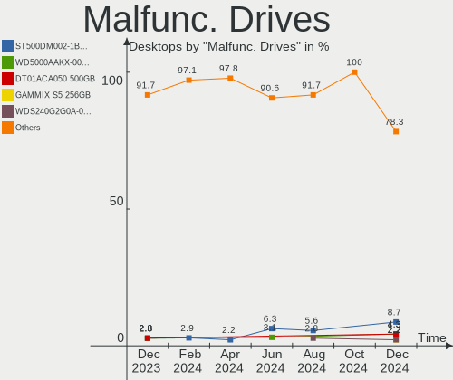
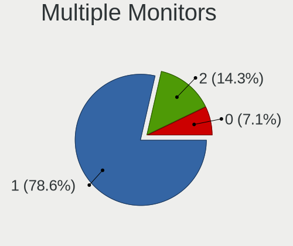
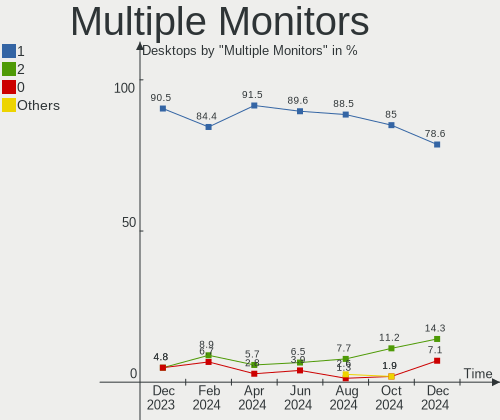
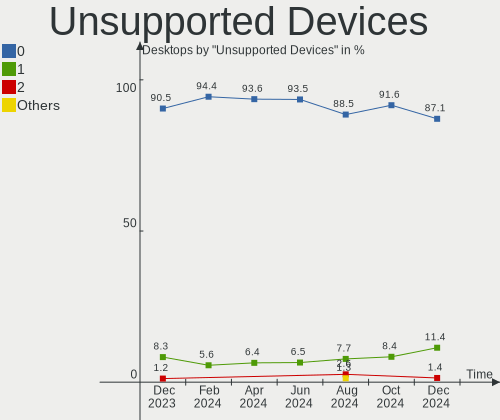

ROSA Hardware Trends (Desktop)
------------------------------

A project to identify most popular hardware characteristics and track their change
over time based on data collected by ROSA users at https://Linux-Hardware.org.

Anyone can contribute to the study by uploading probes of their computers by
the [hw-probe](https://github.com/linuxhw/hw-probe) tool:

    sudo hw-probe -all -upload

Full-feature report is available here: https://linux-hardware.org/?view=trends&formfactor=desktop

Period: Nov, 2019.

Contents
--------

- [ OS                       ](#os)
- [ OS Family                ](#os-family)
- [ Kernel                   ](#kernel)
- [ Kernel Family            ](#kernel-family)
- [ Kernel Major Ver.        ](#kernel-major-ver)
- [ Arch                     ](#arch)
- [ DE                       ](#de)
- [ Display Server           ](#display-server)
- [ OS Lang                  ](#os-lang)
- [ Boot Mode                ](#boot-mode)
- [ Filesystem               ](#filesystem)
- [ Dual Boot with Linux     ](#dual-boot-with-linux)
- [ Dual Boot (Win)          ](#dual-boot-win)
- [ Country                  ](#country)
- [ City                     ](#city)
- [ Vendor                   ](#vendor)
- [ Model                    ](#model)
- [ Model Family             ](#model-family)
- [ MFG Year                 ](#mfg-year)
- [ Form Factor              ](#form-factor)
- [ Secure Boot              ](#secure-boot)
- [ Coreboot                 ](#coreboot)
- [ RAM Size                 ](#ram-size)
- [ RAM Used                 ](#ram-used)
- [ Drive Vendor             ](#drive-vendor)
- [ Drive Model              ](#drive-model)
- [ Drive Kind               ](#drive-kind)
- [ Drive Connector          ](#drive-connector)
- [ Drive Size               ](#drive-size)
- [ Space Total              ](#space-total)
- [ Space Used               ](#space-used)
- [ Malfunc. Drives          ](#malfunc-drives)
- [ Malfunc. Drive Vendor    ](#malfunc-drive-vendor)
- [ Malfunc. Drive Kind      ](#malfunc-drive-kind)
- [ Failed Drives            ](#failed-drives)
- [ Failed Drive Vendor      ](#failed-drive-vendor)
- [ Drive Status             ](#drive-status)
- [ CPU Vendor               ](#cpu-vendor)
- [ CPU Model                ](#cpu-model)
- [ CPU Model Family         ](#cpu-model-family)
- [ CPU Cores                ](#cpu-cores)
- [ CPU Sockets              ](#cpu-sockets)
- [ CPU Threads              ](#cpu-threads)
- [ CPU Op-Modes             ](#cpu-op-modes)
- [ CPU Microarch            ](#cpu-microarch)
- [ CPU Microcode            ](#cpu-microcode)
- [ GPU Vendor               ](#gpu-vendor)
- [ GPU Model                ](#gpu-model)
- [ GPU Combo                ](#gpu-combo)
- [ GPU Driver               ](#gpu-driver)
- [ GPU Memory               ](#gpu-memory)
- [ Monitor Vendor           ](#monitor-vendor)
- [ Monitor Model            ](#monitor-model)
- [ Monitor Resolution       ](#monitor-resolution)
- [ Monitor Diagonal         ](#monitor-diagonal)
- [ Monitor Width            ](#monitor-width)
- [ Aspect Ratio             ](#aspect-ratio)
- [ Monitor Area             ](#monitor-area)
- [ Pixel Density            ](#pixel-density)
- [ Multiple Monitors        ](#multiple-monitors)
- [ Net Controller Vendor    ](#net-controller-vendor)
- [ Net Controller Model     ](#net-controller-model)
- [ Net Controller Kind      ](#net-controller-kind)
- [ Used Controller          ](#used-controller)
- [ NICs                     ](#nics)
- [ Unsupported Devices      ](#unsupported-devices)
- [ Unsupported Device Types ](#unsupported-device-types)

OS
--

Installed operating systems

| Name               | Computers | Percent |
|--------------------|-----------|---------|
| ROSA R11           | 130       | 82.8%   |
| ROSA R8.1          | 13        | 8.28%   |
| ROSA R10           | 5         | 3.18%   |
| ROSA R9            | 4         | 2.55%   |
| ROSA Nickel 2019.0 | 3         | 1.91%   |
| ROSA R12           | 2         | 1.27%   |

OS Family
---------

OS without a version

| Name | Computers | Percent |
|------|-----------|---------|
| ROSA | 157       | 100%    |

Kernel
------

Version of the Linux kernel

| Version                          | Computers | Percent |
|----------------------------------|-----------|---------|
| 4.15.0-desktop-60.7rosa-x86_64   | 49        | 31.21%  |
| 4.15.0-desktop-45.1rosa-x86_64   | 42        | 26.75%  |
| 4.9.155-nrj-desktop-1rosa-x86_64 | 19        | 12.1%   |
| 4.15.0-desktop-45.1rosa-i586     | 11        | 7.01%   |
| 4.15.0-desktop-60.7rosa-i586     | 6         | 3.82%   |
| 5.0.0-desktop-33.1rosa-x86_64    | 4         | 2.55%   |
| 4.9.60-nrj-desktop-1rosa-x86_64  | 4         | 2.55%   |
| 4.9.20-nrj-desktop-1rosa-x86_64  | 4         | 2.55%   |
| 4.9.9-nrj-desktop-1rosa-x86_64   | 2         | 1.27%   |
| 4.15.0-desktop-65.4rosa-x86_64   | 2         | 1.27%   |
| 4.1.38-nrj-desktop-2rosa-x86_64  | 2         | 1.27%   |
| 5.3.8-3-MANJARO                  | 1         | 0.64%   |
| 5.3.10-nickel-2rosa-x86_64       | 1         | 0.64%   |
| 5.3.0-desktop-24.1rosa-x86_64    | 1         | 0.64%   |
| 5.3.0-desktop-20.1rosa-x86_64    | 1         | 0.64%   |
| 5.0.0-desktop-27.1rosa-x86_64    | 1         | 0.64%   |
| 4.9.9-nrj-desktop-1rosa-i586     | 1         | 0.64%   |
| 4.9.124-nrj-desktop-1rosa-i586   | 1         | 0.64%   |
| 4.4.74-nrj-desktop-1rosa-x86_64  | 1         | 0.64%   |
| 4.19.0-desktop-13.1rosa-x86_64   | 1         | 0.64%   |
| 4.15.0-desktop-68.5rosa-x86_64   | 1         | 0.64%   |
| 4.15.0-desktop-54.3rosa-x86_64   | 1         | 0.64%   |
| 4.1.38-nrj-desktop-2rosa-i586    | 1         | 0.64%   |

Kernel Family
-------------

Linux kernel without a distro release

| Version | Computers | Percent |
|---------|-----------|---------|
| 4.15.0  | 112       | 71.34%  |
| 4.9.155 | 19        | 12.1%   |
| 5.0.0   | 5         | 3.18%   |
| 4.9.60  | 4         | 2.55%   |
| 4.9.20  | 4         | 2.55%   |
| 4.9.9   | 3         | 1.91%   |
| 4.1.38  | 3         | 1.91%   |
| 5.3.0   | 2         | 1.27%   |
| 5.3.8   | 1         | 0.64%   |
| 5.3.10  | 1         | 0.64%   |
| 4.9.124 | 1         | 0.64%   |
| 4.4.74  | 1         | 0.64%   |
| 4.19.0  | 1         | 0.64%   |

Kernel Major Ver.
-----------------

Linux kernel major version

| Version | Computers | Percent |
|---------|-----------|---------|
| 4.15    | 112       | 71.34%  |
| 4.9     | 31        | 19.75%  |
| 5.0     | 5         | 3.18%   |
| 5.3     | 4         | 2.55%   |
| 4.1     | 3         | 1.91%   |
| 4.4     | 1         | 0.64%   |
| 4.19    | 1         | 0.64%   |

Arch
----

OS architecture (x86_64, i586, etc.)

| Name   | Computers | Percent |
|--------|-----------|---------|
| x86_64 | 137       | 87.26%  |
| i686   | 20        | 12.74%  |

DE
--

Desktop Environment

| Name    | Computers | Percent |
|---------|-----------|---------|
| KDE5    | 151       | 96.18%  |
| MATE    | 2         | 1.27%   |
| Unknown | 2         | 1.27%   |
| XFCE    | 1         | 0.64%   |
| GNOME   | 1         | 0.64%   |

Display Server
--------------

X11 or Wayland

| Name    | Computers | Percent |
|---------|-----------|---------|
| Unknown | 157       | 100%    |

OS Lang
-------

Language

| Lang    | Computers | Percent |
|---------|-----------|---------|
| Unknown | 157       | 100%    |

Boot Mode
---------

EFI or BIOS

| Mode | Computers | Percent |
|------|-----------|---------|
| BIOS | 129       | 82.17%  |
| EFI  | 28        | 17.83%  |

Filesystem
----------

Type of filesystem

| Type  | Computers | Percent |
|-------|-----------|---------|
| Ext4  | 156       | 99.36%  |
| Btrfs | 1         | 0.64%   |

Dual Boot with Linux
--------------------

Hosting more than one Linux

| Dual boot | Computers | Percent |
|-----------|-----------|---------|
| No        | 124       | 78.98%  |
| Yes       | 33        | 21.02%  |

Dual Boot (Win)
---------------

Hosting Linux and Windows

| Dual boot | Computers | Percent |
|-----------|-----------|---------|
| No        | 80        | 50.96%  |
| Yes       | 77        | 49.04%  |

Country
-------

Geographic location (country)

| Country   | Computers | Percent |
|-----------|-----------|---------|
| Russia    | 125       | 79.62%  |
| Belarus   | 9         | 5.73%   |
| Ukraine   | 4         | 2.55%   |
| Germany   | 3         | 1.91%   |
| Poland    | 2         | 1.27%   |
| Italy     | 2         | 1.27%   |
| France    | 2         | 1.27%   |
| Canada    | 2         | 1.27%   |
| Venezuela | 1         | 0.64%   |
| Serbia    | 1         | 0.64%   |
| Lithuania | 1         | 0.64%   |
| Israel    | 1         | 0.64%   |
| Estonia   | 1         | 0.64%   |
| Bulgaria  | 1         | 0.64%   |
| Austria   | 1         | 0.64%   |
| Australia | 1         | 0.64%   |

City
----

Geographic location (city)

| City                     | Computers | Percent |
|--------------------------|-----------|---------|
| Moscow                   | 17        | 10.83%  |
| St Petersburg            | 6         | 3.82%   |
| Yekaterinburg            | 5         | 3.18%   |
| Novosibirsk              | 5         | 3.18%   |
| Vitebsk                  | 4         | 2.55%   |
| Samara                   | 4         | 2.55%   |
| Rostov-on-Don            | 4         | 2.55%   |
| Voronezh                 | 3         | 1.91%   |
| Severodvinsk             | 3         | 1.91%   |
| Krasnodar                | 3         | 1.91%   |
| Chelyabinsk              | 3         | 1.91%   |
| Abakan                   | 3         | 1.91%   |
| Volgograd                | 2         | 1.27%   |
| Stavropol                | 2         | 1.27%   |
| Ryazan                   | 2         | 1.27%   |
| Pokrovka                 | 2         | 1.27%   |
| Perm                     | 2         | 1.27%   |
| Nizhniy Novgorod         | 2         | 1.27%   |
| Nevinnomyssk             | 2         | 1.27%   |
| Minsk                    | 2         | 1.27%   |
| Krasnoyarsk              | 2         | 1.27%   |
| Irkutsk                  | 2         | 1.27%   |
| Hlybokaye                | 2         | 1.27%   |
| Bryansk                  | 2         | 1.27%   |
| Zhlobin                  | 1         | 0.64%   |
| Zelenoborskiy            | 1         | 0.64%   |
| Zaporizhia               | 1         | 0.64%   |
| Yuzhno-Sakhalinsk        | 1         | 0.64%   |
| Yaya                     | 1         | 0.64%   |
| Vladivostok              | 1         | 0.64%   |
| Vienna                   | 1         | 0.64%   |
| Verkhov'ye               | 1         | 0.64%   |
| Veliky Novgorod          | 1         | 0.64%   |
| Uzhhorod                 | 1         | 0.64%   |
| Tula                     | 1         | 0.64%   |
| Targovishte              | 1         | 0.64%   |
| Tallinn                  | 1         | 0.64%   |
| Taganrog                 | 1         | 0.64%   |
| Surgut                   | 1         | 0.64%   |
| Smolensk                 | 1         | 0.64%   |
| Shadrinsk                | 1         | 0.64%   |
| Seryshevo                | 1         | 0.64%   |
| Saratov                  | 1         | 0.64%   |
| Saransk                  | 1         | 0.64%   |
| Reutov                   | 1         | 0.64%   |
| Ramat Gan                | 1         | 0.64%   |
| Rainau                   | 1         | 0.64%   |
| Prokop'yevsk             | 1         | 0.64%   |
| Petropavlovsk-Kamchatsky | 1         | 0.64%   |
| Pervomayskoye            | 1         | 0.64%   |
| Panevezys                | 1         | 0.64%   |
| Orsk                     | 1         | 0.64%   |
| Olkusz                   | 1         | 0.64%   |
| Nuremberg                | 1         | 0.64%   |
| Noyabrsk                 | 1         | 0.64%   |
| Novoye Devyatkino        | 1         | 0.64%   |
| Nizhnij Novgorod         | 1         | 0.64%   |
| Nazarovo                 | 1         | 0.64%   |
| Mykolayiv                | 1         | 0.64%   |
| Murmansk                 | 1         | 0.64%   |

Vendor
------

Motherboard manufacturer

| Name                | Computers | Percent |
|---------------------|-----------|---------|
| ASUSTek Computer    | 53        | 33.76%  |
| Gigabyte Technology | 33        | 21.02%  |
| ASRock              | 22        | 14.01%  |
| MSI                 | 20        | 12.74%  |
| Intel               | 4         | 2.55%   |
| Hewlett-Packard     | 4         | 2.55%   |
| ECS                 | 4         | 2.55%   |
| Acer                | 3         | 1.91%   |
| Unknown             | 3         | 1.91%   |
| Pegatron            | 2         | 1.27%   |
| Dell                | 2         | 1.27%   |
| WinFast             | 1         | 0.64%   |
| SiS Technology      | 1         | 0.64%   |
| K-Systems           | 1         | 0.64%   |
| Fujitsu             | 1         | 0.64%   |
| Foxconn             | 1         | 0.64%   |
| eMachines           | 1         | 0.64%   |
| Biostar             | 1         | 0.64%   |

Model
-----

Motherboard model

| Name                 | Computers | Percent |
|----------------------|-----------|---------|
| Unknown              | 4         | 2.55%   |
| M5A78L-M LX3         | 3         | 1.91%   |
| H81M-S2H             | 3         | 1.91%   |
| PRIME A320M-K        | 2         | 1.27%   |
| P8H61-M LX3 R2.0     | 2         | 1.27%   |
| P8H61-M LX2          | 2         | 1.27%   |
| P5G41T-M LX2/GB      | 2         | 1.27%   |
| P35-DS3L             | 2         | 1.27%   |
| MS-7996              | 2         | 1.27%   |
| MS-7680              | 2         | 1.27%   |
| MS-7529              | 2         | 1.27%   |
| M3A UCC              | 2         | 1.27%   |
| M2N-X                | 2         | 1.27%   |
| M2N-MX SE Plus       | 2         | 1.27%   |
| H110M-R              | 2         | 1.27%   |
| All Series           | 2         | 1.27%   |
| 970 Pro3 R2.0        | 2         | 1.27%   |
| Z87X-OC              | 1         | 0.64%   |
| Z77-D3H              | 1         | 0.64%   |
| Z77 Extreme4         | 1         | 0.64%   |
| Z77 Extreme3         | 1         | 0.64%   |
| Z68P-DS3             | 1         | 0.64%   |
| Z620 Workstation     | 1         | 0.64%   |
| X370 Taichi          | 1         | 0.64%   |
| VM60                 | 1         | 0.64%   |
| V200IB               | 1         | 0.64%   |
| SiS-650GX            | 1         | 0.64%   |
| ProDesk 600 G1 TWR   | 1         | 0.64%   |
| Pro, Std, Elt Series | 1         | 0.64%   |
| PRIME Z390-P         | 1         | 0.64%   |
| PRIME Z270-P         | 1         | 0.64%   |
| P8Z77-V              | 1         | 0.64%   |
| P8H77-V LE           | 1         | 0.64%   |
| P8H77-M PRO          | 1         | 0.64%   |
| P8H67-M LX           | 1         | 0.64%   |
| P8H67                | 1         | 0.64%   |
| P8H61-M LE R2.0      | 1         | 0.64%   |
| P7P55D EVO           | 1         | 0.64%   |
| P5KPL-AM SE          | 1         | 0.64%   |
| P5K                  | 1         | 0.64%   |
| P5G41T-M LX3         | 1         | 0.64%   |
| P5G41-M LX           | 1         | 0.64%   |
| P5B SE               | 1         | 0.64%   |
| P55-US3L             | 1         | 0.64%   |
| P4P800               | 1         | 0.64%   |
| P41-ES3G             | 1         | 0.64%   |
| P31-ES3G             | 1         | 0.64%   |
| P31-DS3L             | 1         | 0.64%   |
| OptiPlex 755         | 1         | 0.64%   |
| OptiPlex 330         | 1         | 0.64%   |
| OPTIMUS              | 1         | 0.64%   |
| N68-GE               | 1         | 0.64%   |
| MS-7B79              | 1         | 0.64%   |
| MS-7A33              | 1         | 0.64%   |
| MS-7924              | 1         | 0.64%   |
| MS-7850              | 1         | 0.64%   |
| MS-7788              | 1         | 0.64%   |
| MS-7758              | 1         | 0.64%   |
| MS-7693              | 1         | 0.64%   |
| MS-7636              | 1         | 0.64%   |

Model Family
------------

Motherboard model prefix

| Name                     | Computers | Percent |
|--------------------------|-----------|---------|
| ASUS P8H61-M             | 5         | 3.18%   |
| ASUS PRIME               | 4         | 2.55%   |
| ASUS M5A78L-M            | 4         | 2.55%   |
| Unknown                  | 4         | 2.55%   |
| Gigabyte H81M-S2H        | 3         | 1.91%   |
| ASUS P5G41T-M            | 3         | 1.91%   |
| ASUS M2N-MX              | 3         | 1.91%   |
| MSI MS-7996              | 2         | 1.27%   |
| MSI MS-7680              | 2         | 1.27%   |
| MSI MS-7529              | 2         | 1.27%   |
| Gigabyte P35-DS3L        | 2         | 1.27%   |
| Dell OptiPlex            | 2         | 1.27%   |
| ASUS M5A97               | 2         | 1.27%   |
| ASUS M2N-X               | 2         | 1.27%   |
| ASUS H110M-R             | 2         | 1.27%   |
| ASUS All                 | 2         | 1.27%   |
| ASRock Z77               | 2         | 1.27%   |
| ASRock M3A               | 2         | 1.27%   |
| ASRock 970               | 2         | 1.27%   |
| Acer Aspire              | 2         | 1.27%   |
| WinFast 6100M2MA         | 1         | 0.64%   |
| SiS Technology SiS-650GX | 1         | 0.64%   |
| Pegatron IPMSB-H61       | 1         | 0.64%   |
| Pegatron Compaq          | 1         | 0.64%   |
| MSI OPTIMUS              | 1         | 0.64%   |
| MSI MS-7B79              | 1         | 0.64%   |
| MSI MS-7A33              | 1         | 0.64%   |
| MSI MS-7924              | 1         | 0.64%   |
| MSI MS-7850              | 1         | 0.64%   |
| MSI MS-7788              | 1         | 0.64%   |
| MSI MS-7758              | 1         | 0.64%   |
| MSI MS-7693              | 1         | 0.64%   |
| MSI MS-7636              | 1         | 0.64%   |
| MSI MS-7597              | 1         | 0.64%   |
| MSI MS-7528              | 1         | 0.64%   |
| MSI MS-7519              | 1         | 0.64%   |
| MSI MS-7238              | 1         | 0.64%   |
| MSI MS-7093              | 1         | 0.64%   |
| Intel DP67BG             | 1         | 0.64%   |
| Intel DP67BA             | 1         | 0.64%   |
| Intel DG965WH            | 1         | 0.64%   |
| Intel D33217GKE          | 1         | 0.64%   |
| HP Z620                  | 1         | 0.64%   |
| HP ProDesk               | 1         | 0.64%   |
| HP EliteDesk             | 1         | 0.64%   |
| HP Compaq                | 1         | 0.64%   |
| Gigabyte Z87X-OC         | 1         | 0.64%   |
| Gigabyte Z77-D3H         | 1         | 0.64%   |
| Gigabyte Z68P-DS3        | 1         | 0.64%   |
| Gigabyte P55-US3L        | 1         | 0.64%   |
| Gigabyte P41-ES3G        | 1         | 0.64%   |
| Gigabyte P31-ES3G        | 1         | 0.64%   |
| Gigabyte P31-DS3L        | 1         | 0.64%   |
| Gigabyte H81M-D2V        | 1         | 0.64%   |
| Gigabyte H77N-WIFI       | 1         | 0.64%   |
| Gigabyte H67A-UD3H-B3    | 1         | 0.64%   |
| Gigabyte GA-MA78LM-S2    | 1         | 0.64%   |
| Gigabyte GA-MA78GM-UD2H  | 1         | 0.64%   |
| Gigabyte GA-K8NF-9       | 1         | 0.64%   |
| Gigabyte GA-73PVM-S2H    | 1         | 0.64%   |

MFG Year
--------

Motherboard manufacture year

| Year | Computers | Percent |
|------|-----------|---------|
| 2010 | 18        | 11.46%  |
| 2012 | 17        | 10.83%  |
| 2013 | 15        | 9.55%   |
| 2014 | 14        | 8.92%   |
| 2009 | 14        | 8.92%   |
| 2018 | 12        | 7.64%   |
| 2015 | 12        | 7.64%   |
| 2007 | 11        | 7.01%   |
| 2011 | 10        | 6.37%   |
| 2016 | 9         | 5.73%   |
| 2017 | 7         | 4.46%   |
| 2008 | 7         | 4.46%   |
| 2019 | 5         | 3.18%   |
| 2006 | 3         | 1.91%   |
| 2003 | 2         | 1.27%   |
| 2005 | 1         | 0.64%   |

Form Factor
-----------

Physical design of the computer

| Name    | Computers | Percent |
|---------|-----------|---------|
| Desktop | 157       | 100%    |

Secure Boot
-----------

Enabled or disabled

| State    | Computers | Percent |
|----------|-----------|---------|
| Disabled | 157       | 100%    |

Coreboot
--------

Have coreboot on board

| Used | Computers | Percent |
|------|-----------|---------|
| No   | 157       | 100%    |

RAM Size
--------

Total RAM memory

| Size in GB | Computers | Percent |
|------------|-----------|---------|
| 3.01-4.0   | 53        | 33.76%  |
| 8.01-16.0  | 53        | 33.76%  |
| 1.01-2.0   | 17        | 10.83%  |
| 4.01-8.0   | 14        | 8.92%   |
| 16.01-24.0 | 10        | 6.37%   |
| 2.01-3.0   | 6         | 3.82%   |
| 32.01-64.0 | 2         | 1.27%   |
| 0.01-1.0   | 2         | 1.27%   |

RAM Used
--------

Used RAM memory

| Used GB  | Computers | Percent |
|----------|-----------|---------|
| 0.01-1.0 | 82        | 52.23%  |
| 1.01-2.0 | 61        | 38.85%  |
| 2.01-3.0 | 12        | 7.64%   |
| 4.01-8.0 | 1         | 0.64%   |
| 3.01-4.0 | 1         | 0.64%   |

Drive Vendor
------------

Hard drive vendors

| Vendor              | Computers | Drives | Percent |
|---------------------|-----------|--------|---------|
| WDC                 | 57        | 69     | 24.57%  |
| Seagate             | 55        | 63     | 23.71%  |
| Toshiba             | 26        | 29     | 11.21%  |
| Hitachi             | 21        | 23     | 9.05%   |
| Samsung Electronics | 20        | 21     | 8.62%   |
| Kingston            | 10        | 10     | 4.31%   |
| China               | 6         | 6      | 2.59%   |
| PLEXTOR             | 5         | 6      | 2.16%   |
| SPCC                | 4         | 4      | 1.72%   |
| MAXTOR              | 4         | 4      | 1.72%   |
| Crucial             | 4         | 4      | 1.72%   |
| Transcend           | 3         | 3      | 1.29%   |
| SanDisk             | 3         | 3      | 1.29%   |
| Intel               | 3         | 3      | 1.29%   |
| A-DATA Technology   | 3         | 3      | 1.29%   |
| OCZ                 | 2         | 2      | 0.86%   |
| GOODRAM             | 2         | 2      | 0.86%   |
| IBM/Hitachi         | 1         | 1      | 0.43%   |
| HyperX              | 1         | 1      | 0.43%   |
| HUAWEI              | 1         | 1      | 0.43%   |
| Apacer              | 1         | 1      | 0.43%   |

Drive Model
-----------

Hard drive models

| Model                        | Computers | Percent |
|------------------------------|-----------|---------|
| DT01ACA050 500GB             | 12        | 4.63%   |
| ST1000DM010-2EP102 1TB       | 7         | 2.7%    |
| HDWD110 1TB                  | 6         | 2.32%   |
| SATA SSD 64GB                | 4         | 1.54%   |
| DT01ACA100 1TB               | 4         | 1.54%   |
| WD5000AAKS-00A7B2 500GB      | 3         | 1.16%   |
| WD10EZEX-08WN4A0 1TB         | 3         | 1.16%   |
| ST500DM002-1BD142 500GB      | 3         | 1.16%   |
| ST380815AS 80GB              | 3         | 1.16%   |
| ST3500418AS 500GB            | 3         | 1.16%   |
| ST3250318AS 250GB            | 3         | 1.16%   |
| ST3160813AS 160GB            | 3         | 1.16%   |
| ST2000DM008-2FR102 2TB       | 3         | 1.16%   |
| SA400S37120G 120GB SSD       | 3         | 1.16%   |
| HDS721010DLE630 1TB          | 3         | 1.16%   |
| DT01ACA200 2TB               | 3         | 1.16%   |
| WDS120G2G0A-00JH30 120GB SSD | 2         | 0.77%   |
| WD800AAJS-00PSA0 80GB        | 2         | 0.77%   |
| WD5000AZRX-00A8LB0 500GB     | 2         | 0.77%   |
| WD5000AZLX-75K2TA0 500GB     | 2         | 0.77%   |
| WD3200BPVT-22ZEST0 320GB     | 2         | 0.77%   |
| WD1600JS-08NCB1 160GB        | 2         | 0.77%   |
| WD10EZRZ-00HTKB0 1TB         | 2         | 0.77%   |
| WD10EZEX-22MFCA0 1TB         | 2         | 0.77%   |
| TS64GSSD360S 64GB            | 2         | 0.77%   |
| SV300S37A120G 120GB SSD      | 2         | 0.77%   |
| ST380215A 80GB               | 2         | 0.77%   |
| ST3320418AS 320GB            | 2         | 0.77%   |
| ST3250410AS 250GB            | 2         | 0.77%   |
| ST320LT020-9YG142 320GB      | 2         | 0.77%   |
| ST3160815AS 160GB            | 2         | 0.77%   |
| ST250DM000-1BD141 250GB      | 2         | 0.77%   |
| ST1000DM003-1CH162 1TB       | 2         | 0.77%   |
| SP2504C 250GB                | 2         | 0.77%   |
| Solid State Disk 120GB       | 2         | 0.77%   |
| HDS721050DLE630 500GB        | 2         | 0.77%   |
| HDS721050CLA362 500GB        | 2         | 0.77%   |
| HDS721010CLA332 1TB          | 2         | 0.77%   |
| WDS500G1B0A-00H9H0 500GB SSD | 1         | 0.39%   |
| WDS240G2G0A-00JH30 240GB SSD | 1         | 0.39%   |
| WD800BB-55JKC0 80GB          | 1         | 0.39%   |
| WD6402AAEX-00Y9A0 640GB      | 1         | 0.39%   |
| WD6400AARS-00Y5B1 640GB      | 1         | 0.39%   |
| WD6400AAKS-22A7B0 640GB      | 1         | 0.39%   |
| WD6000HLHX-01JJPV0 600GB     | 1         | 0.39%   |
| WD5000LPLX-22ZNTT0 500GB     | 1         | 0.39%   |
| WD5000AVCS-732DY1 500GB      | 1         | 0.39%   |
| WD5000AAKX-00ERMA0 500GB     | 1         | 0.39%   |
| WD5000AAKX-0 500GB           | 1         | 0.39%   |
| WD5000AAKS-08V0A0 500GB      | 1         | 0.39%   |
| WD5000AAKS-00UU3A0 500GB     | 1         | 0.39%   |
| WD5000AAJS-00YFA0 500GB      | 1         | 0.39%   |
| WD5000AADS-00S9B0 500GB      | 1         | 0.39%   |
| WD3200BPVT-00HXZT3 320GB     | 1         | 0.39%   |
| WD3200AAJB-00J3A0 320GB      | 1         | 0.39%   |
| WD2503ABYX-01WERA1 256GB     | 1         | 0.39%   |
| WD2500AAKX-001CA0 250GB      | 1         | 0.39%   |
| WD2500AAKS-00VSA0 250GB      | 1         | 0.39%   |
| WD2500AAJS-00L7A0 250GB      | 1         | 0.39%   |
| WD20EFRX-68EUZN0 2TB         | 1         | 0.39%   |

Drive Kind
----------

HDD or SSD

| Kind    | Computers | Drives | Percent |
|---------|-----------|--------|---------|
| HDD     | 134       | 199    | 72.04%  |
| SSD     | 48        | 56     | 25.81%  |
| NVMe    | 3         | 3      | 1.61%   |
| Unknown | 1         | 1      | 0.54%   |

Drive Connector
---------------

SATA, SAS, NVMe, etc.

| Type | Computers | Drives | Percent |
|------|-----------|--------|---------|
| SATA | 152       | 254    | 96.82%  |
| NVMe | 3         | 3      | 1.91%   |
| SAS  | 2         | 2      | 1.27%   |

Drive Size
----------

Size of hard drive

| Size in TB | Computers | Drives | Percent |
|------------|-----------|--------|---------|
| 0.01-0.5   | 129       | 180    | 67.89%  |
| 0.51-1.0   | 48        | 65     | 25.26%  |
| 1.01-2.0   | 13        | 14     | 6.84%   |

Space Total
-----------

Amount of disk space available on the file system

| Size in GB     | Computers | Percent |
|----------------|-----------|---------|
| 101-250        | 42        | 26.75%  |
| 251-500        | 31        | 19.75%  |
| 501-1000       | 19        | 12.1%   |
| 1001-2000      | 17        | 10.83%  |
| 51-100         | 15        | 9.55%   |
| 21-50          | 14        | 8.92%   |
| 1-20           | 14        | 8.92%   |
| 2001-3000      | 4         | 2.55%   |
| More than 3000 | 1         | 0.64%   |

Space Used
----------

Amount of used disk space

| Used GB   | Computers | Percent |
|-----------|-----------|---------|
| 1-20      | 91        | 57.96%  |
| 101-250   | 15        | 9.55%   |
| 51-100    | 13        | 8.28%   |
| 251-500   | 12        | 7.64%   |
| 501-1000  | 10        | 6.37%   |
| 21-50     | 9         | 5.73%   |
| 1001-2000 | 6         | 3.82%   |
| 2001-3000 | 1         | 0.64%   |

Malfunc. Drives
---------------

Drive models with a malfunction

| Model                    | Computers | Drives | Percent |
|--------------------------|-----------|--------|---------|
| ST500DM002-1BD142 500GB  | 2         | 2      | 2.6%    |
| ST3500418AS 500GB        | 2         | 2      | 2.6%    |
| ST320LT020-9YG142 320GB  | 2         | 2      | 2.6%    |
| SP2504C 250GB            | 2         | 2      | 2.6%    |
| HDS721010CLA332 1TB      | 2         | 2      | 2.6%    |
| WD800BB-55JKC0 80GB      | 1         | 1      | 1.3%    |
| WD6402AAEX-00Y9A0 640GB  | 1         | 1      | 1.3%    |
| WD6400AAKS-22A7B0 640GB  | 1         | 1      | 1.3%    |
| WD6000HLHX-01JJPV0 600GB | 1         | 1      | 1.3%    |
| WD5000AVCS-732DY1 500GB  | 1         | 1      | 1.3%    |
| WD5000AAKS-08V0A0 500GB  | 1         | 1      | 1.3%    |
| WD5000AAKS-00UU3A0 500GB | 1         | 1      | 1.3%    |
| WD5000AAKS-00A7B2 500GB  | 1         | 1      | 1.3%    |
| WD3200BPVT-22ZEST0 320GB | 1         | 1      | 1.3%    |
| WD2503ABYX-01WERA1 256GB | 1         | 1      | 1.3%    |
| WD2500AAKX-001CA0 250GB  | 1         | 1      | 1.3%    |
| WD2500AAJS-00L7A0 250GB  | 1         | 1      | 1.3%    |
| WD20EARX-00PASB0 2TB     | 1         | 1      | 1.3%    |
| WD20EARS-00S 2TB         | 1         | 1      | 1.3%    |
| WD20EARS-00MVWB0 2TB     | 1         | 1      | 1.3%    |
| WD2003FYYS-01T8B0 2TB    | 1         | 1      | 1.3%    |
| WD2000JD-22HBC0 200GB    | 1         | 1      | 1.3%    |
| WD1600AAJS-07M0A0 160GB  | 1         | 1      | 1.3%    |
| WD1600AAJS-00B4A0 160GB  | 1         | 1      | 1.3%    |
| WD10EZEX-60Z 1TB         | 1         | 1      | 1.3%    |
| WD10EARS-00Y5B1 1TB      | 1         | 1      | 1.3%    |
| WD10EACS-00D 1TB         | 1         | 1      | 1.3%    |
| WD1002FBYS-02A6B0 1TB    | 1         | 1      | 1.3%    |
| WD1002FAEX-00Z3A0 1TB    | 1         | 1      | 1.3%    |
| WD1002FAEX-00Y9A0 1TB    | 1         | 1      | 1.3%    |
| WD1002FAEX-0 1TB         | 1         | 1      | 1.3%    |
| VERTEX3 120GB SSD        | 1         | 1      | 1.3%    |
| STM3320820AS 320GB       | 1         | 1      | 1.3%    |
| STM3250310AS 250GB       | 1         | 1      | 1.3%    |
| ST380815AS 80GB          | 1         | 1      | 1.3%    |
| ST3802110ACE 80GB        | 1         | 1      | 1.3%    |
| ST380021A 80GB           | 1         | 1      | 1.3%    |
| ST3500413AS 500GB        | 1         | 1      | 1.3%    |
| ST3400620AS 400GB        | 1         | 1      | 1.3%    |
| ST340014A 40GB           | 1         | 1      | 1.3%    |
| ST3320418AS 320GB        | 1         | 1      | 1.3%    |
| ST3250410AS 250GB        | 1         | 1      | 1.3%    |
| ST3250318AS 250GB        | 1         | 1      | 1.3%    |
| ST3160813AS 160GB        | 1         | 1      | 1.3%    |
| ST3120026AS 120GB        | 1         | 1      | 1.3%    |
| ST31000528AS 1TB         | 1         | 1      | 1.3%    |
| ST31000523AS 1TB         | 1         | 1      | 1.3%    |
| ST250DM000-1BD141 250GB  | 1         | 1      | 1.3%    |
| SP2514N 250GB            | 1         | 1      | 1.3%    |
| SP1613N 160GB            | 1         | 1      | 1.3%    |
| SA400S37480G 480GB SSD   | 1         | 1      | 1.3%    |
| IC35L060AVV207-0 40GB    | 1         | 1      | 1.3%    |
| HTS545016B9A300 160GB    | 1         | 1      | 1.3%    |
| HTS542512K9SA00 120GB    | 1         | 1      | 1.3%    |
| HTS541212H9SA00 120GB    | 1         | 1      | 1.3%    |
| HTS541010A9E680 1TB      | 1         | 1      | 1.3%    |
| HDT725032VLA360 320GB    | 1         | 1      | 1.3%    |
| HDS728080PLAT20 82GB     | 1         | 1      | 1.3%    |
| HDS722516VLSA80 165GB    | 1         | 1      | 1.3%    |
| HDS721050DLE630 500GB    | 1         | 1      | 1.3%    |

Malfunc. Drive Vendor
---------------------

Vendors of faulty drives

| Vendor              | Computers | Drives | Percent |
|---------------------|-----------|--------|---------|
| WDC                 | 24        | 26     | 33.33%  |
| Seagate             | 18        | 20     | 25%     |
| Hitachi             | 12        | 13     | 16.67%  |
| Samsung Electronics | 10        | 10     | 13.89%  |
| Toshiba             | 2         | 2      | 2.78%   |
| MAXTOR              | 2         | 2      | 2.78%   |
| OCZ                 | 1         | 1      | 1.39%   |
| Kingston            | 1         | 1      | 1.39%   |
| IBM/Hitachi         | 1         | 1      | 1.39%   |
| Crucial             | 1         | 1      | 1.39%   |

Malfunc. Drive Kind
-------------------

Kinds of faulty drives

| Kind | Computers | Drives | Percent |
|------|-----------|--------|---------|
| HDD  | 62        | 74     | 95.38%  |
| SSD  | 3         | 3      | 4.62%   |

Failed Drives
-------------

Failed drive models

| Model                 | Computers | Drives | Percent |
|-----------------------|-----------|--------|---------|
| WD1600JS-00MHB0 160GB | 1         | 1      | 33.33%  |
| ST3160318AS 160GB     | 1         | 1      | 33.33%  |
| HDS721010DLE630 1TB   | 1         | 1      | 33.33%  |

Failed Drive Vendor
-------------------

Failed drive vendors

| Vendor  | Computers | Drives | Percent |
|---------|-----------|--------|---------|
| WDC     | 1         | 1      | 33.33%  |
| Seagate | 1         | 1      | 33.33%  |
| Hitachi | 1         | 1      | 33.33%  |

Drive Status
------------

Number of failed and malfunc. drives

| Status   | Computers | Drives | Percent |
|----------|-----------|--------|---------|
| Works    | 117       | 176    | 62.57%  |
| Malfunc  | 64        | 77     | 34.22%  |
| Detected | 3         | 3      | 1.6%    |
| Failed   | 3         | 3      | 1.6%    |

CPU Vendor
----------

Processor vendors

| Vendor | Computers | Percent |
|--------|-----------|---------|
| Intel  | 106       | 67.52%  |
| AMD    | 51        | 32.48%  |

CPU Model
---------

Processor models

| Model                                       | Computers | Percent |
|---------------------------------------------|-----------|---------|
| Intel Celeron CPU G1840 @ 2.80GHz           | 5         | 3.18%   |
| Intel Core 2 Duo CPU E8500 @ 3.16GHz        | 4         | 2.55%   |
| Intel Pentium CPU G620 @ 2.60GHz            | 3         | 1.91%   |
| Intel Core i3-3220 CPU @ 3.30GHz            | 3         | 1.91%   |
| Intel Core i3-2100 CPU @ 3.10GHz            | 3         | 1.91%   |
| Intel Core 2 Quad CPU Q6600 @ 2.40GHz       | 3         | 1.91%   |
| Intel Celeron CPU G1610 @ 2.60GHz           | 3         | 1.91%   |
| AMD FX-6300 Six-Core Processor              | 3         | 1.91%   |
| Intel Pentium Dual-Core CPU E6300 @ 2.80GHz | 2         | 1.27%   |
| Intel Pentium Dual-Core CPU E5800 @ 3.20GHz | 2         | 1.27%   |
| Intel Pentium Dual-Core CPU E5400 @ 2.70GHz | 2         | 1.27%   |
| Intel Pentium CPU G3260 @ 3.30GHz           | 2         | 1.27%   |
| Intel Core i7-2600 CPU @ 3.40GHz            | 2         | 1.27%   |
| Intel Core i5-4460 CPU @ 3.20GHz            | 2         | 1.27%   |
| Intel Core i5-3450 CPU @ 3.10GHz            | 2         | 1.27%   |
| Intel Core i5-3330 CPU @ 3.00GHz            | 2         | 1.27%   |
| Intel Core i5 CPU 750 @ 2.67GHz             | 2         | 1.27%   |
| Intel Core i3-8100 CPU @ 3.60GHz            | 2         | 1.27%   |
| Intel Core i3-6100 CPU @ 3.70GHz            | 2         | 1.27%   |
| Intel Core i3-4170 CPU @ 3.70GHz            | 2         | 1.27%   |
| Intel Core i3-3217U CPU @ 1.80GHz           | 2         | 1.27%   |
| Intel Core 2 Duo CPU E8400 @ 3.00GHz        | 2         | 1.27%   |
| Intel Celeron CPU G1620 @ 2.70GHz           | 2         | 1.27%   |
| AMD Ryzen 5 2600 Six-Core Processor         | 2         | 1.27%   |
| AMD Ryzen 5 2400G with Radeon Vega Graphics | 2         | 1.27%   |
| AMD FX-8300 Eight-Core Processor            | 2         | 1.27%   |
| AMD FX-4130 Quad-Core Processor             | 2         | 1.27%   |
| AMD Athlon II X2 245 Processor              | 2         | 1.27%   |
| AMD Athlon 64 X2 Dual Core Processor 4200+  | 2         | 1.27%   |
| AMD Athlon 64 X2 Dual Core Processor 4000+  | 2         | 1.27%   |
| AMD Athlon 64 Processor 3000+               | 2         | 1.27%   |
| Intel Xeon CPU X3470 @ 2.93GHz              | 1         | 0.64%   |
| Intel Xeon CPU L5420 @ 2.50GHz              | 1         | 0.64%   |
| Intel Xeon CPU L5408 @ 2.13GHz              | 1         | 0.64%   |
| Intel Xeon CPU E5-2643 0 @ 3.30GHz          | 1         | 0.64%   |
| Intel Xeon CPU E5-2640 0 @ 2.50GHz          | 1         | 0.64%   |
| Intel Xeon CPU E3-1240 v3 @ 3.40GHz         | 1         | 0.64%   |
| Intel Pentium Dual-Core CPU E5500 @ 2.80GHz | 1         | 0.64%   |
| Intel Pentium Dual-Core CPU E5300 @ 2.60GHz | 1         | 0.64%   |
| Intel Pentium Dual-Core CPU E5200 @ 2.50GHz | 1         | 0.64%   |
| Intel Pentium Dual CPU E2180 @ 2.00GHz      | 1         | 0.64%   |
| Intel Pentium Dual CPU E2160 @ 1.80GHz      | 1         | 0.64%   |
| Intel Pentium CPU N3700 @ 1.60GHz           | 1         | 0.64%   |
| Intel Pentium CPU G4600 @ 3.60GHz           | 1         | 0.64%   |
| Intel Pentium CPU G4560 @ 3.50GHz           | 1         | 0.64%   |
| Intel Pentium CPU G3220 @ 3.00GHz           | 1         | 0.64%   |
| Intel Pentium CPU G2030 @ 3.00GHz           | 1         | 0.64%   |
| Intel Pentium CPU G2020 @ 2.90GHz           | 1         | 0.64%   |
| Intel Pentium 4 CPU 2.80GHz                 | 1         | 0.64%   |
| Intel Pentium 4 CPU 2.60GHz                 | 1         | 0.64%   |
| Intel Core i7-7700K CPU @ 4.20GHz           | 1         | 0.64%   |
| Intel Core i7-6700 CPU @ 3.40GHz            | 1         | 0.64%   |
| Intel Core i7-3770 CPU @ 3.40GHz            | 1         | 0.64%   |
| Intel Core i7-2600K CPU @ 3.40GHz           | 1         | 0.64%   |
| Intel Core i5-9600KF CPU @ 3.70GHz          | 1         | 0.64%   |
| Intel Core i5-8400 CPU @ 2.80GHz            | 1         | 0.64%   |
| Intel Core i5-7400 CPU @ 3.00GHz            | 1         | 0.64%   |
| Intel Core i5-4590 CPU @ 3.30GHz            | 1         | 0.64%   |
| Intel Core i5-4570S CPU @ 2.90GHz           | 1         | 0.64%   |
| Intel Core i5-3470 CPU @ 3.20GHz            | 1         | 0.64%   |

CPU Model Family
----------------

Processor model prefix

| Model                   | Computers | Percent |
|-------------------------|-----------|---------|
| Intel Core i5           | 19        | 12.1%   |
| Intel Core i3           | 18        | 11.46%  |
| Intel Celeron           | 14        | 8.92%   |
| AMD FX                  | 12        | 7.64%   |
| Intel Pentium           | 11        | 7.01%   |
| Intel Core 2 Duo        | 10        | 6.37%   |
| Intel Pentium Dual-Core | 9         | 5.73%   |
| AMD Athlon 64 X2        | 8         | 5.1%    |
| AMD Athlon II X2        | 7         | 4.46%   |
| Intel Xeon              | 6         | 3.82%   |
| Intel Core i7           | 6         | 3.82%   |
| Intel Core 2 Quad       | 6         | 3.82%   |
| AMD Ryzen 5             | 6         | 3.82%   |
| Intel Core 2            | 3         | 1.91%   |
| AMD Phenom II X4        | 3         | 1.91%   |
| AMD Athlon 64           | 3         | 1.91%   |
| Intel Pentium Dual      | 2         | 1.27%   |
| Intel Pentium 4         | 2         | 1.27%   |
| AMD Athlon X4           | 2         | 1.27%   |
| AMD Athlon II X3        | 2         | 1.27%   |
| AMD A4                  | 2         | 1.27%   |
| AMD Ryzen 7             | 1         | 0.64%   |
| AMD Phenom II X3        | 1         | 0.64%   |
| AMD Athlon II X4        | 1         | 0.64%   |
| AMD A8                  | 1         | 0.64%   |
| AMD A6                  | 1         | 0.64%   |
| AMD A10                 | 1         | 0.64%   |

CPU Cores
---------

Number of processor cores

| Number | Computers | Percent |
|--------|-----------|---------|
| 2      | 86        | 54.78%  |
| 4      | 48        | 30.57%  |
| 1      | 9         | 5.73%   |
| 6      | 6         | 3.82%   |
| 3      | 6         | 3.82%   |
| 8      | 2         | 1.27%   |

CPU Sockets
-----------

Number of sockets

| Number | Computers | Percent |
|--------|-----------|---------|
| 1      | 156       | 99.36%  |
| 2      | 1         | 0.64%   |

CPU Threads
-----------

Threads per core (Hyper-Threading)

| Number | Computers | Percent |
|--------|-----------|---------|
| 1      | 102       | 64.97%  |
| 2      | 55        | 35.03%  |

CPU Op-Modes
------------

CPU Operation Modes (32-bit, 64-bit)

| Op mode        | Computers | Percent |
|----------------|-----------|---------|
| 32-bit, 64-bit | 154       | 98.09%  |
| 32-bit         | 2         | 1.27%   |
| Unknown        | 1         | 0.64%   |

CPU Microarch
-------------

Microarchitecture

| Name        | Computers | Percent |
|-------------|-----------|---------|
| Core        | 31        | 19.75%  |
| IvyBridge   | 19        | 12.1%   |
| SandyBridge | 17        | 10.83%  |
| Haswell     | 17        | 10.83%  |
| K10         | 13        | 8.28%   |
| Skylake     | 12        | 7.64%   |
| Piledriver  | 12        | 7.64%   |
| K8 Hammer   | 11        | 7.01%   |
| Zen         | 5         | 3.18%   |
| Nehalem     | 4         | 2.55%   |
| NetBurst    | 3         | 1.91%   |
| Bulldozer   | 3         | 1.91%   |
| Zen+        | 2         | 1.27%   |
| Excavator   | 2         | 1.27%   |
| Unknown     | 2         | 1.27%   |
| Westmere    | 1         | 0.64%   |
| Steamroller | 1         | 0.64%   |
| Silvermont  | 1         | 0.64%   |
| Penryn      | 1         | 0.64%   |

CPU Microcode
-------------

Microcode number

| Number     | Computers | Percent |
|------------|-----------|---------|
| 0x306a9    | 19        | 12.1%   |
| 0x1067a    | 19        | 12.1%   |
| 0x306c3    | 17        | 10.83%  |
| 0x206a7    | 15        | 9.55%   |
| Unknown    | 15        | 9.55%   |
| 0x06000852 | 9         | 5.73%   |
| 0x010000c8 | 8         | 5.1%    |
| 0x906e9    | 4         | 2.55%   |
| 0x106e5    | 4         | 2.55%   |
| 0x06001119 | 4         | 2.55%   |
| 0x6fb      | 3         | 1.91%   |
| 0x6f6      | 3         | 1.91%   |
| 0x506e3    | 3         | 1.91%   |
| 0x0600063e | 3         | 1.91%   |
| 0x010000db | 3         | 1.91%   |
| 0x906eb    | 2         | 1.27%   |
| 0x6fd      | 2         | 1.27%   |
| 0x206d7    | 2         | 1.27%   |
| 0x10676    | 2         | 1.27%   |
| 0x0800820b | 2         | 1.27%   |
| 0x010000c7 | 2         | 1.27%   |
| 0xf49      | 1         | 0.64%   |
| 0xf29      | 1         | 0.64%   |
| 0xf13      | 1         | 0.64%   |
| 0x906ec    | 1         | 0.64%   |
| 0x906ea    | 1         | 0.64%   |
| 0x406c3    | 1         | 0.64%   |
| 0x20655    | 1         | 0.64%   |
| 0x10677    | 1         | 0.64%   |
| 0x08101013 | 1         | 0.64%   |
| 0x0810100b | 1         | 0.64%   |
| 0x08001138 | 1         | 0.64%   |
| 0x08001136 | 1         | 0.64%   |
| 0x0800111c | 1         | 0.64%   |
| 0x0600611a | 1         | 0.64%   |
| 0x06006113 | 1         | 0.64%   |
| 0x06003106 | 1         | 0.64%   |

GPU Vendor
----------

Vendors of graphics cards

| Vendor            | Computers | Percent |
|-------------------|-----------|---------|
| Nvidia            | 80        | 49.69%  |
| AMD               | 44        | 27.33%  |
| Intel             | 35        | 21.74%  |
| ATI Technologies  | 1         | 0.62%   |
| ASPEED Technology | 1         | 0.62%   |

GPU Model
---------

Graphics card models

| Model                                                                 | Computers | Percent |
|-----------------------------------------------------------------------|-----------|---------|
| Xeon E3-1200 v3/4th Gen Core Processor Integrated Graphics Controller | 9         | 5.45%   |
| Xeon E3-1200 v2/3rd Gen Core processor Graphics Controller            | 5         | 3.03%   |
| GP107 [GeForce GTX 1050 Ti]                                           | 5         | 3.03%   |
| GK208B [GeForce GT 710]                                               | 5         | 3.03%   |
| GF119 [GeForce GT 610]                                                | 5         | 3.03%   |
| 2nd Generation Core Processor Family Integrated Graphics Controller   | 5         | 3.03%   |
| Turks PRO [Radeon HD 6570/7570/8550]                                  | 4         | 2.42%   |
| GK208B [GeForce GT 730]                                               | 4         | 2.42%   |
| GK107 [GeForce GTX 650]                                               | 4         | 2.42%   |
| GF108 [GeForce GT 630]                                                | 4         | 2.42%   |
| RS780L [Radeon 3000]                                                  | 3         | 1.82%   |
| HD Graphics 630                                                       | 3         | 1.82%   |
| GT215 [GeForce GT 240]                                                | 3         | 1.82%   |
| GM107 [GeForce GTX 750 Ti]                                            | 3         | 1.82%   |
| GF119 [GeForce GT 520]                                                | 3         | 1.82%   |
| Caicos [Radeon HD 6450/7450/8450 / R5 230 OEM]                        | 3         | 1.82%   |
| 82G33/G31 Express Integrated Graphics Controller                      | 3         | 1.82%   |
| Turks XT [Radeon HD 6670/7670]                                        | 2         | 1.21%   |
| Pitcairn PRO [Radeon HD 7850 / R7 265 / R9 270 1024SP]                | 2         | 1.21%   |
| Lexa PRO [Radeon 540/540X/550/550X / RX 540X/550/550X]                | 2         | 1.21%   |
| GP106 [GeForce GTX 1060 6GB]                                          | 2         | 1.21%   |
| GP106 [GeForce GTX 1060 3GB]                                          | 2         | 1.21%   |
| GM206 [GeForce GTX 950]                                               | 2         | 1.21%   |
| GK208 [GeForce GT 630 Rev. 2]                                         | 2         | 1.21%   |
| GF116 [GeForce GTX 550 Ti]                                            | 2         | 1.21%   |
| GF108 [GeForce GT 730]                                                | 2         | 1.21%   |
| GF108 [GeForce GT 440]                                                | 2         | 1.21%   |
| GF108 [GeForce GT 430]                                                | 2         | 1.21%   |
| G96C [GeForce 9500 GT]                                                | 2         | 1.21%   |
| G92 [GeForce GTS 250]                                                 | 2         | 1.21%   |
| G92 [GeForce 9800 GT]                                                 | 2         | 1.21%   |
| Cape Verde XT [Radeon HD 7770/8760 / R7 250X]                         | 2         | 1.21%   |
| C61 [GeForce 6150SE nForce 430]                                       | 2         | 1.21%   |
| 8th Gen Core Processor Gaussian Mixture Model                         | 2         | 1.21%   |
| 4th Generation Core Processor Family Integrated Graphics Controller   | 2         | 1.21%   |
| 3rd Gen Core processor Graphics Controller                            | 2         | 1.21%   |
| Wani [Radeon R5/R6/R7 Graphics]                                       | 1         | 0.61%   |
| Trinity 2 [Radeon HD 7540D]                                           | 1         | 0.61%   |
| Trinity 2 [Radeon HD 7480D]                                           | 1         | 0.61%   |
| Tonga PRO [Radeon R9 285/380]                                         | 1         | 0.61%   |
| Tahiti XT [Radeon HD 7970/8970 OEM / R9 280X]                         | 1         | 0.61%   |
| RV730 PRO [Radeon HD 4650]                                            | 1         | 0.61%   |
| RV630 XT [Radeon HD 2600 XT]                                          | 1         | 0.61%   |
| RV610 [Radeon HD 2400 PRO]                                            | 1         | 0.61%   |
| RV570 [Radeon X1950 GT] (Secondary)                                   | 1         | 0.61%   |
| RV570 [Radeon X1950 GT]                                               | 1         | 0.61%   |
| RV410 [Radeon X700 PRO] (Secondary)                                   | 1         | 0.61%   |
| RV410 [Radeon X700 PRO]                                               | 1         | 0.61%   |
| RV360 [Radeon 9600/X1050 Series]                                      | 1         | 0.61%   |
| RV350 [Radeon 9600/X1050 Series] (Secondary)                          | 1         | 0.61%   |
| RS690 [Radeon X1200]                                                  | 1         | 0.61%   |
| RS480 [Radeon Xpress 200 Series]                                      | 1         | 0.61%   |
| Redwood XT [Radeon HD 5670/5690/5730]                                 | 1         | 0.61%   |
| Redwood LE [Radeon HD 5550/5570/5630/6390/6490/7570]                  | 1         | 0.61%   |
| Raven Ridge [Radeon Vega Series / Radeon Vega Mobile Series]          | 1         | 0.61%   |
| Radeon X1950 Series Secondary                                         | 1         | 0.61%   |
| R580+ [Radeon X1950 XTX]                                              | 1         | 0.61%   |
| Oland PRO [Radeon R7 240/340]                                         | 1         | 0.61%   |
| NV43 [GeForce 6600]                                                   | 1         | 0.61%   |
| NV34 [GeForce FX 5200]                                                | 1         | 0.61%   |

GPU Combo
---------

Combinations of graphics cards

| Name           | Computers | Percent |
|----------------|-----------|---------|
| 1 x Nvidia     | 80        | 50.96%  |
| 1 x AMD        | 41        | 26.11%  |
| 1 x Intel      | 30        | 19.11%  |
| 2 x AMD        | 4         | 2.55%   |
| Intel + Nvidia | 1         | 0.64%   |
| 1 x ASPEED     | 1         | 0.64%   |

GPU Driver
----------

Free vs proprietary

| Driver      | Computers | Percent |
|-------------|-----------|---------|
| Free        | 125       | 79.62%  |
| Proprietary | 25        | 15.92%  |
| Unknown     | 7         | 4.46%   |

GPU Memory
----------

Total video memory

| Size in GB | Computers | Percent |
|------------|-----------|---------|
| 1.01-2.0   | 52        | 33.12%  |
| 0.51-1.0   | 46        | 29.3%   |
| 0.01-0.5   | 28        | 17.83%  |
| Unknown    | 13        | 8.28%   |
| 3.01-4.0   | 12        | 7.64%   |
| 2.01-3.0   | 3         | 1.91%   |
| 7.01-8.0   | 1         | 0.64%   |
| 5.01-6.0   | 1         | 0.64%   |
| 8.01-16.0  | 1         | 0.64%   |

Monitor Vendor
--------------

Monitor vendors

| Vendor               | Computers | Percent |
|----------------------|-----------|---------|
| Samsung Electronics  | 25        | 18.12%  |
| Goldstar             | 20        | 14.49%  |
| BenQ                 | 19        | 13.77%  |
| Philips              | 13        | 9.42%   |
| Acer                 | 10        | 7.25%   |
| ViewSonic            | 8         | 5.8%    |
| NEC Computers        | 8         | 5.8%    |
| Dell                 | 7         | 5.07%   |
| Ancor Communications | 6         | 4.35%   |
| Hewlett-Packard      | 4         | 2.9%    |
| AOC                  | 4         | 2.9%    |
| XYK                  | 3         | 2.17%   |
| HannStar             | 2         | 1.45%   |
| Envision Peripherals | 2         | 1.45%   |
| Toshiba              | 1         | 0.72%   |
| Sony                 | 1         | 0.72%   |
| OTM                  | 1         | 0.72%   |
| Medion               | 1         | 0.72%   |
| KTC                  | 1         | 0.72%   |
| Iiyama               | 1         | 0.72%   |
| Haier                | 1         | 0.72%   |

Monitor Model
-------------

Monitor models

| Model                                               | Computers | Percent |
|-----------------------------------------------------|-----------|---------|
| Monitor XYK2360 1920x1080 477x268mm 21.5-inch       | 3         | 2.13%   |
| GW2270 BNQ78DB 1920x1080 476x268mm 21.5-inch        | 3         | 2.13%   |
| W2253 GSM56DB 1920x1080 477x268mm 21.5-inch         | 2         | 1.42%   |
| W1942 GSM4B6F 1440x900 408x255mm 18.9-inch          | 2         | 1.42%   |
| LCD2261 ENV2261 1920x1080 477x268mm 21.5-inch       | 2         | 1.42%   |
| IPS FULLHD GSM5AB7 1920x1080 480x270mm 21.7-inch    | 2         | 1.42%   |
| GL2450 BNQ78A5 1920x1080 531x298mm 24.0-inch        | 2         | 1.42%   |
| FP93G BNQ76C7 1280x1024 376x301mm 19.0-inch         | 2         | 1.42%   |
| ASUS VS229 ACI22C2 1920x1080 477x268mm 21.5-inch    | 2         | 1.42%   |
| ZOWIE XL LCD BNQ7F3F 1920x1080 530x300mm 24.0-inch  | 1         | 0.71%   |
| W2242 GSM5678 1680x1050 474x296mm 22.0-inch         | 1         | 0.71%   |
| W2234 GSM56B8 1680x1050 474x296mm 22.0-inch         | 1         | 0.71%   |
| W2042 GSM4E7E 1680x1050 434x270mm 20.1-inch         | 1         | 0.71%   |
| W1941 GSM4B91 1360x768 406x229mm 18.4-inch          | 1         | 0.71%   |
| VX2370 SERIES VSC342C 1920x1080 509x286mm 23.0-inch | 1         | 0.71%   |
| VX229 ACI22E5 1920x1080 476x268mm 21.5-inch         | 1         | 0.71%   |
| VX2235wm-EU VSC591E 1680x1050 470x300mm 22.0-inch   | 1         | 0.71%   |
| VW2220 BNQ7B28 1920x1080 480x270mm 21.7-inch        | 1         | 0.71%   |
| VG810s VSCBF18 1280x1024 359x287mm 18.1-inch        | 1         | 0.71%   |
| VG800b-2 VSCF411 1280x1024 357x286mm 18.0-inch      | 1         | 0.71%   |
| VA916 Series VSC7C20 1280x1024 376x301mm 19.0-inch  | 1         | 0.71%   |
| VA702b VSC231C 1280x1024 338x270mm 17.0-inch        | 1         | 0.71%   |
| VA2238 SERIES VSC6E26 1920x1080 477x268mm 21.5-inch | 1         | 0.71%   |
| VA1938 Series VSC0626 1366x768 410x230mm 18.5-inch  | 1         | 0.71%   |
| V243HQ ACR00B0 1920x1080 521x293mm 23.5-inch        | 1         | 0.71%   |
| V243H ACR00DC 1920x1080 531x299mm 24.0-inch         | 1         | 0.71%   |
| V226HQL ACR032D 1920x1080 477x268mm 21.5-inch       | 1         | 0.71%   |
| V203H ACR0102 1600x900 443x249mm 20.0-inch          | 1         | 0.71%   |
| V193 ACR004C 1280x1024 376x301mm 19.0-inch          | 1         | 0.71%   |
| U2415 DELA0BA 1920x1080 518x324mm 24.1-inch         | 1         | 0.71%   |
| U2410 DELF015 1920x1200 520x320mm 24.0-inch         | 1         | 0.71%   |
| U2312HM DEL4072 1920x1080 510x290mm 23.1-inch       | 1         | 0.71%   |
| U2211H DEL405E 1920x1080 475x267mm 21.5-inch        | 1         | 0.71%   |
| TV TSB010B 1920x1080 1600x900mm 72.3-inch           | 1         | 0.71%   |
| TV SNYC901 1920x1080 1600x900mm 72.3-inch           | 1         | 0.71%   |
| T24B300 SAM0930 1920x1080 521x293mm 23.5-inch       | 1         | 0.71%   |
| SyncMaster SAM05C4 1920x1080 510x287mm 23.0-inch    | 1         | 0.71%   |
| SyncMaster SAM0580 1280x1024 376x301mm 19.0-inch    | 1         | 0.71%   |
| SyncMaster SAM0570 1920x1080 510x287mm 23.0-inch    | 1         | 0.71%   |
| SyncMaster SAM0499 1600x900 443x249mm 20.0-inch     | 1         | 0.71%   |
| SyncMaster SAM0482 1680x1050 433x271mm 20.1-inch    | 1         | 0.71%   |
| SyncMaster SAM036E 1280x1024 376x301mm 19.0-inch    | 1         | 0.71%   |
| SyncMaster SAM02AD 1440x900 410x257mm 19.1-inch     | 1         | 0.71%   |
| SyncMaster SAM027F 1680x1050 474x296mm 22.0-inch    | 1         | 0.71%   |
| SyncMaster SAM0259 1280x1024 376x301mm 19.0-inch    | 1         | 0.71%   |
| SyncMaster SAM01B7 1280x1024 338x270mm 17.0-inch    | 1         | 0.71%   |
| SyncMaster SAM0194 1280x1024 376x301mm 19.0-inch    | 1         | 0.71%   |
| SyncMaster SAM011E 1280x1024 338x270mm 17.0-inch    | 1         | 0.71%   |
| SyncMaster SAM0043 1024x768 312x234mm 15.4-inch     | 1         | 0.71%   |
| SME2320 SAM06B1 1920x1080 510x287mm 23.0-inch       | 1         | 0.71%   |
| SME1920NR SAM06A4 1280x1024 376x301mm 19.0-inch     | 1         | 0.71%   |
| S24D300 SAM0B43 1920x1080 531x299mm 24.0-inch       | 1         | 0.71%   |
| S24D300 SAM0B42 1920x1080 531x299mm 24.0-inch       | 1         | 0.71%   |
| S242HL ACR0216 1920x1080 531x299mm 24.0-inch        | 1         | 0.71%   |
| S2319HN DELD0CC 1920x1080 509x286mm 23.0-inch       | 1         | 0.71%   |
| S22C200 SAM09B7 1920x1080 477x268mm 21.5-inch       | 1         | 0.71%   |
| S22B350 SAM08D4 1920x1080 480x270mm 21.7-inch       | 1         | 0.71%   |
| S22B300 SAM08AC 1680x1050 480x270mm 21.7-inch       | 1         | 0.71%   |
| ROG PG348Q ACI3433 3440x1440 797x333mm 34.0-inch    | 1         | 0.71%   |
| R241Y ACR0521 1920x1080 527x296mm 23.8-inch         | 1         | 0.71%   |

Monitor Resolution
------------------

Monitor screen resolution

| Resolution         | Computers | Percent |
|--------------------|-----------|---------|
| 1920x1080 (FHD)    | 72        | 52.94%  |
| 1280x1024 (SXGA)   | 31        | 22.79%  |
| 1680x1050 (WSXGA+) | 7         | 5.15%   |
| 1440x900 (WXGA+)   | 7         | 5.15%   |
| 1600x900 (HD+)     | 6         | 4.41%   |
| 1024x768 (XGA)     | 3         | 2.21%   |
| 2560x1440 (QHD)    | 2         | 1.47%   |
| 1366x768 (WXGA)    | 2         | 1.47%   |
| 3840x2160 (4K)     | 1         | 0.74%   |
| 3440x1440          | 1         | 0.74%   |
| 1920x1200 (WUXGA)  | 1         | 0.74%   |
| 1600x1200          | 1         | 0.74%   |
| 1360x768           | 1         | 0.74%   |
| 1152x864           | 1         | 0.74%   |

Monitor Diagonal
----------------

Diagonal size in inches

| Inches  | Computers | Percent |
|---------|-----------|---------|
| 21      | 34        | 24.82%  |
| 19      | 20        | 14.6%   |
| 23      | 18        | 13.14%  |
| 24      | 13        | 9.49%   |
| 17      | 12        | 8.76%   |
| 18      | 10        | 7.3%    |
| 20      | 8         | 5.84%   |
| 27      | 5         | 3.65%   |
| 22      | 4         | 2.92%   |
| 15      | 3         | 2.19%   |
| 40      | 2         | 1.46%   |
| 72      | 1         | 0.73%   |
| 52      | 1         | 0.73%   |
| 43      | 1         | 0.73%   |
| 34      | 1         | 0.73%   |
| 32      | 1         | 0.73%   |
| 31      | 1         | 0.73%   |
| 13      | 1         | 0.73%   |
| Unknown | 1         | 0.73%   |

Monitor Width
-------------

Physical width

| Width in mm | Computers | Percent |
|-------------|-----------|---------|
| 401-500     | 57        | 41.61%  |
| 501-600     | 35        | 25.55%  |
| 351-400     | 19        | 13.87%  |
| 301-350     | 15        | 10.95%  |
| 801-900     | 2         | 1.46%   |
| 701-800     | 2         | 1.46%   |
| 601-700     | 2         | 1.46%   |
| 201-300     | 1         | 0.73%   |
| 1501-2000   | 1         | 0.73%   |
| 1001-1500   | 1         | 0.73%   |
| 901-1000    | 1         | 0.73%   |
| Unknown     | 1         | 0.73%   |

Aspect Ratio
------------

Proportional relationship between the width and the height

| Ratio | Computers | Percent |
|-------|-----------|---------|
| 16/9  | 83        | 61.03%  |
| 5/4   | 31        | 22.79%  |
| 16/10 | 15        | 11.03%  |
| 4/3   | 5         | 3.68%   |
| 3/2   | 1         | 0.74%   |
| 21/9  | 1         | 0.74%   |

Monitor Area
------------

Area in inch

| Area in inch | Computers | Percent |
|----------------|-----------|---------|
| 151-200        | 65        | 47.1%   |
| 201-250        | 37        | 26.81%  |
| 141-150        | 15        | 10.87%  |
| 301-350        | 5         | 3.62%   |
| 351-500        | 3         | 2.17%   |
| 251-300        | 3         | 2.17%   |
| 501-1000       | 3         | 2.17%   |
| More than 1000 | 2         | 1.45%   |
| 111-120        | 2         | 1.45%   |
| 81-90          | 1         | 0.72%   |
| 101-110        | 1         | 0.72%   |
| Unknown        | 1         | 0.72%   |

Pixel Density
-------------

Pixels per inch

| Density | Computers | Percent |
|---------|-----------|---------|
| 51-100  | 95        | 70.9%   |
| 101-120 | 35        | 26.12%  |
| 1-50    | 2         | 1.49%   |
| 121-160 | 1         | 0.75%   |
| Unknown | 1         | 0.75%   |

Multiple Monitors
-----------------

Total monitors connected

| Total | Computers | Percent |
|-------|-----------|---------|
| 1     | 145       | 92.36%  |
| 2     | 6         | 3.82%   |
| 0     | 5         | 3.18%   |
| 3     | 1         | 0.64%   |

Net Controller Vendor
---------------------

Controller vendors

| Vendor                     | Computers | Percent |
|----------------------------|-----------|---------|
| Intel                      | 14        | 48.28%  |
| Nvidia                     | 7         | 24.14%  |
| Huawei Technologies        | 3         | 10.34%  |
| ZTE WCDMA Technologies MSM | 2         | 6.9%    |
| Vimtron Electronics        | 1         | 3.45%   |
| MediaTek                   | 1         | 3.45%   |
| 3Com                       | 1         | 3.45%   |

Net Controller Model
--------------------

Controller models

| Model                                | Computers | Percent |
|--------------------------------------|-----------|---------|
| MCP61 Ethernet                       | 5         | 17.24%  |
| 82579V Gigabit Network Connection    | 4         | 13.79%  |
| I211 Gigabit Network Connection      | 3         | 10.34%  |
| E398 LTE/UMTS/GSM Modem/Networkcard  | 2         | 6.9%    |
| 82574L Gigabit Network Connection    | 2         | 6.9%    |
| ZTE Mobile Broadband Station         | 1         | 3.45%   |
| Power Ice Evo                        | 1         | 3.45%   |
| MT65xx Android Phone                 | 1         | 3.45%   |
| Mobile Composite Device Bus          | 1         | 3.45%   |
| MCP51 Ethernet Controller            | 1         | 3.45%   |
| I210 Gigabit Network Connection      | 1         | 3.45%   |
| E173 3G Modem (modem-mode)           | 1         | 3.45%   |
| CK804 Ethernet Controller            | 1         | 3.45%   |
| 82567LM-3 Gigabit Network Connection | 1         | 3.45%   |
| 82566DM-2 Gigabit Network Connection | 1         | 3.45%   |
| 82566DM Gigabit Network Connection   | 1         | 3.45%   |
| 82566DC Gigabit Network Connection   | 1         | 3.45%   |
| 3c940 10/100/1000Base-T [Marvell]    | 1         | 3.45%   |

Net Controller Kind
-------------------

Ethernet, WiFi or modem

| Kind     | Computers | Percent |
|----------|-----------|---------|
| Ethernet | 25        | 89.29%  |
| Modem    | 3         | 10.71%  |

Used Controller
---------------

Currently used network controller

| Kind     | Computers | Percent |
|----------|-----------|---------|
| Ethernet | 17        | 100%    |

NICs
----

Total network controllers on board

| Total | Computers | Percent |
|-------|-----------|---------|
| 1     | 131       | 83.44%  |
| 2     | 22        | 14.01%  |
| 3     | 4         | 2.55%   |

Unsupported Devices
-------------------

Total unsupported devices on board

| Total | Computers | Percent |
|-------|-----------|---------|
| 0     | 138       | 87.9%   |
| 1     | 17        | 10.83%  |
| 4     | 1         | 0.64%   |
| 2     | 1         | 0.64%   |

Unsupported Device Types
------------------------

Types of unsupported devices

| Type                     | Computers | Percent |
|--------------------------|-----------|---------|
| Graphics card            | 10        | 47.62%  |
| Net/wireless             | 5         | 23.81%  |
| Sound                    | 2         | 9.52%   |
| Communication controller | 2         | 9.52%   |
| Camera                   | 2         | 9.52%   |

