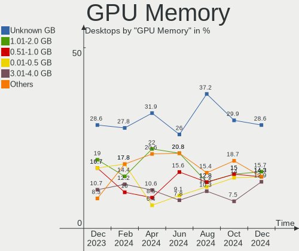
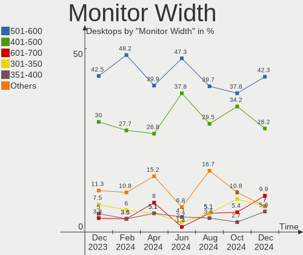
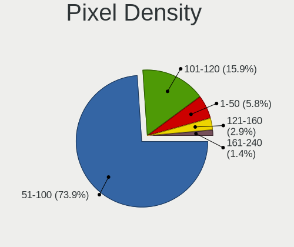
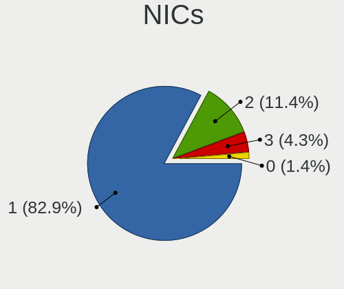

ROSA Hardware Trends (Desktop)
------------------------------

A project to identify most popular hardware characteristics and track their change
over time based on data collected by ROSA users at https://Linux-Hardware.org.

Anyone can contribute to the study by uploading probes of their computers by
the [hw-probe](https://github.com/linuxhw/hw-probe) tool:

    sudo hw-probe -all -upload

Full-feature report is available here: https://linux-hardware.org/?view=trends&formfactor=desktop

Period: Feb, 2020.

Contents
--------

- [ OS                       ](#os)
- [ OS Family                ](#os-family)
- [ Kernel                   ](#kernel)
- [ Kernel Family            ](#kernel-family)
- [ Kernel Major Ver.        ](#kernel-major-ver)
- [ Arch                     ](#arch)
- [ DE                       ](#de)
- [ Display Server           ](#display-server)
- [ OS Lang                  ](#os-lang)
- [ Boot Mode                ](#boot-mode)
- [ Filesystem               ](#filesystem)
- [ Dual Boot with Linux     ](#dual-boot-with-linux)
- [ Dual Boot (Win)          ](#dual-boot-win)
- [ Country                  ](#country)
- [ City                     ](#city)
- [ Vendor                   ](#vendor)
- [ Model                    ](#model)
- [ Model Family             ](#model-family)
- [ MFG Year                 ](#mfg-year)
- [ Form Factor              ](#form-factor)
- [ Secure Boot              ](#secure-boot)
- [ Coreboot                 ](#coreboot)
- [ RAM Size                 ](#ram-size)
- [ RAM Used                 ](#ram-used)
- [ Drive Vendor             ](#drive-vendor)
- [ Drive Model              ](#drive-model)
- [ Drive Kind               ](#drive-kind)
- [ Drive Connector          ](#drive-connector)
- [ Drive Size               ](#drive-size)
- [ Space Total              ](#space-total)
- [ Space Used               ](#space-used)
- [ Malfunc. Drives          ](#malfunc-drives)
- [ Malfunc. Drive Vendor    ](#malfunc-drive-vendor)
- [ Malfunc. Drive Kind      ](#malfunc-drive-kind)
- [ Failed Drives            ](#failed-drives)
- [ Failed Drive Vendor      ](#failed-drive-vendor)
- [ Drive Status             ](#drive-status)
- [ Storage Vendor           ](#storage-vendor)
- [ Storage Model            ](#storage-model)
- [ Storage Kind             ](#storage-kind)
- [ CPU Vendor               ](#cpu-vendor)
- [ CPU Model                ](#cpu-model)
- [ CPU Model Family         ](#cpu-model-family)
- [ CPU Cores                ](#cpu-cores)
- [ CPU Sockets              ](#cpu-sockets)
- [ CPU Threads              ](#cpu-threads)
- [ CPU Op-Modes             ](#cpu-op-modes)
- [ CPU Microarch            ](#cpu-microarch)
- [ CPU Microcode            ](#cpu-microcode)
- [ GPU Vendor               ](#gpu-vendor)
- [ GPU Model                ](#gpu-model)
- [ GPU Combo                ](#gpu-combo)
- [ GPU Driver               ](#gpu-driver)
- [ GPU Memory               ](#gpu-memory)
- [ Monitor Vendor           ](#monitor-vendor)
- [ Monitor Model            ](#monitor-model)
- [ Monitor Resolution       ](#monitor-resolution)
- [ Monitor Diagonal         ](#monitor-diagonal)
- [ Monitor Width            ](#monitor-width)
- [ Aspect Ratio             ](#aspect-ratio)
- [ Monitor Area             ](#monitor-area)
- [ Pixel Density            ](#pixel-density)
- [ Multiple Monitors        ](#multiple-monitors)
- [ Net Controller Vendor    ](#net-controller-vendor)
- [ Net Controller Model     ](#net-controller-model)
- [ Net Controller Kind      ](#net-controller-kind)
- [ Used Controller          ](#used-controller)
- [ NICs                     ](#nics)
- [ Unsupported Devices      ](#unsupported-devices)
- [ Unsupported Device Types ](#unsupported-device-types)

OS
--

Installed operating systems

| Name      | Computers | Percent |
|-----------|-----------|---------|
| ROSA R11  | 147       | 90.18%  |
| ROSA R8.1 | 8         | 4.91%   |
| ROSA R10  | 8         | 4.91%   |

OS Family
---------

OS without a version

| Name | Computers | Percent |
|------|-----------|---------|
| ROSA | 163       | 100%    |

Kernel
------

Version of the Linux kernel

| Version                               | Computers | Percent |
|---------------------------------------|-----------|---------|
| 4.15.0-desktop-68.5rosa-x86_64        | 52        | 31.9%   |
| 4.15.0-desktop-45.1rosa-x86_64        | 48        | 29.45%  |
| 4.9.155-nrj-desktop-1rosa-x86_64      | 14        | 8.59%   |
| 4.15.0-desktop-68.5rosa-i586          | 13        | 7.98%   |
| 4.15.0-desktop-45.1rosa-i586          | 9         | 5.52%   |
| 4.9.60-nrj-desktop-1rosa-x86_64       | 5         | 3.07%   |
| 4.9.9-nrj-desktop-1rosa-i586          | 2         | 1.23%   |
| 4.9.60-nrj-desktop-1rosa-i586         | 2         | 1.23%   |
| 4.9.155-nrj-desktop-1rosa-i586        | 2         | 1.23%   |
| 4.1.38-nrj-desktop-2rosa-i586         | 2         | 1.23%   |
| 5.6.0-linux-rc-rc2.build1-rosa-x86_64 | 1         | 0.61%   |
| 5.5.0-050500rc7-generic               | 1         | 0.61%   |
| 5.4.15-nrj-desktop-1rosa-x86_64       | 1         | 0.61%   |
| 5.4.0-desktop-14.1rosa-x86_64         | 1         | 0.61%   |
| 5.4.0-desktop-11.1rosa-x86_64         | 1         | 0.61%   |
| 5.3.0-desktop-17.1rosa-x86_64         | 1         | 0.61%   |
| 5.0.0-desktop-38.1rosa-x86_64         | 1         | 0.61%   |
| 4.9.9-nrj-desktop-1rosa-x86_64        | 1         | 0.61%   |
| 4.4.74-nrj-desktop-1rosa-x86_64       | 1         | 0.61%   |
| 4.18.0-desktop-26.2rosa-x86_64        | 1         | 0.61%   |
| 4.16.18-nrj-desktop-1rosa-i586        | 1         | 0.61%   |
| 4.15.0-desktop-47.2rosa-x86_64        | 1         | 0.61%   |
| 4.15.0-desktop-47.2rosa-i586          | 1         | 0.61%   |
| 4.1.38-nrj-desktop-2rosa-x86_64       | 1         | 0.61%   |

Kernel Family
-------------

Linux kernel without a distro release

| Version | Computers | Percent |
|---------|-----------|---------|
| 4.15.0  | 124       | 76.07%  |
| 4.9.155 | 16        | 9.82%   |
| 4.9.60  | 7         | 4.29%   |
| 4.9.9   | 3         | 1.84%   |
| 4.1.38  | 3         | 1.84%   |
| 5.4.0   | 2         | 1.23%   |
| 5.6.0   | 1         | 0.61%   |
| 5.5.0   | 1         | 0.61%   |
| 5.4.15  | 1         | 0.61%   |
| 5.3.0   | 1         | 0.61%   |
| 5.0.0   | 1         | 0.61%   |
| 4.4.74  | 1         | 0.61%   |
| 4.18.0  | 1         | 0.61%   |
| 4.16.18 | 1         | 0.61%   |

Kernel Major Ver.
-----------------

Linux kernel major version

| Version | Computers | Percent |
|---------|-----------|---------|
| 4.15    | 124       | 76.07%  |
| 4.9     | 26        | 15.95%  |
| 5.4     | 3         | 1.84%   |
| 4.1     | 3         | 1.84%   |
| 5.6     | 1         | 0.61%   |
| 5.5     | 1         | 0.61%   |
| 5.3     | 1         | 0.61%   |
| 5.0     | 1         | 0.61%   |
| 4.4     | 1         | 0.61%   |
| 4.18    | 1         | 0.61%   |
| 4.16    | 1         | 0.61%   |

Arch
----

OS architecture (x86_64, i586, etc.)

| Name   | Computers | Percent |
|--------|-----------|---------|
| x86_64 | 131       | 80.37%  |
| i686   | 32        | 19.63%  |

DE
--

Desktop Environment

| Name    | Computers | Percent |
|---------|-----------|---------|
| KDE4    | 111       | 68.1%   |
| KDE5    | 42        | 25.77%  |
| XFCE    | 6         | 3.68%   |
| LXQt    | 3         | 1.84%   |
| Unknown | 1         | 0.61%   |

Display Server
--------------

X11 or Wayland

| Name    | Computers | Percent |
|---------|-----------|---------|
| X11     | 162       | 99.39%  |
| Wayland | 1         | 0.61%   |

OS Lang
-------

Language

| Lang    | Computers | Percent |
|---------|-----------|---------|
| Unknown | 154       | 94.48%  |
| ru_RU   | 9         | 5.52%   |

Boot Mode
---------

EFI or BIOS

| Mode | Computers | Percent |
|------|-----------|---------|
| BIOS | 131       | 80.37%  |
| EFI  | 32        | 19.63%  |

Filesystem
----------

Type of filesystem

| Type     | Computers | Percent |
|----------|-----------|---------|
| Ext4     | 149       | 91.41%  |
| Ext3     | 7         | 4.29%   |
| Btrfs    | 5         | 3.07%   |
| Reiserfs | 1         | 0.61%   |
| Ext2     | 1         | 0.61%   |

Dual Boot with Linux
--------------------

Hosting more than one Linux

| Dual boot | Computers | Percent |
|-----------|-----------|---------|
| No        | 123       | 75.46%  |
| Yes       | 40        | 24.54%  |

Dual Boot (Win)
---------------

Hosting Linux and Windows

| Dual boot | Computers | Percent |
|-----------|-----------|---------|
| No        | 87        | 53.37%  |
| Yes       | 76        | 46.63%  |

Country
-------

Geographic location (country)

| Country    | Computers | Percent |
|------------|-----------|---------|
| Russia     | 131       | 80.37%  |
| Ukraine    | 11        | 6.75%   |
| Kazakhstan | 4         | 2.45%   |
| Poland     | 3         | 1.84%   |
| France     | 2         | 1.23%   |
| Colombia   | 2         | 1.23%   |
| Belarus    | 2         | 1.23%   |
| Venezuela  | 1         | 0.61%   |
| USA        | 1         | 0.61%   |
| Slovakia   | 1         | 0.61%   |
| Latvia     | 1         | 0.61%   |
| Ireland    | 1         | 0.61%   |
| Egypt      | 1         | 0.61%   |
| Brazil     | 1         | 0.61%   |
| Austria    | 1         | 0.61%   |

City
----

Geographic location (city)

| City                   | Computers | Percent |
|------------------------|-----------|---------|
| Moscow                 | 17        | 10.43%  |
| St Petersburg          | 10        | 6.13%   |
| Novosibirsk            | 9         | 5.52%   |
| Yekaterinburg          | 7         | 4.29%   |
| Omsk                   | 5         | 3.07%   |
| Voronezh               | 4         | 2.45%   |
| Krasnodar              | 4         | 2.45%   |
| Kazan’               | 4         | 2.45%   |
| Samara                 | 3         | 1.84%   |
| Kharkiv                | 3         | 1.84%   |
| Surgut                 | 2         | 1.23%   |
| Semey                  | 2         | 1.23%   |
| Rostov-on-Don          | 2         | 1.23%   |
| Montpellier            | 2         | 1.23%   |
| Khabarovsk             | 2         | 1.23%   |
| Istra                  | 2         | 1.23%   |
| Blagoveshchensk        | 2         | 1.23%   |
| Biysk                  | 2         | 1.23%   |
| Barnaul                | 2         | 1.23%   |
| Zaporizhia             | 1         | 0.61%   |
| Zapolyarnyy            | 1         | 0.61%   |
| Wrocław               | 1         | 0.61%   |
| Volgograd              | 1         | 0.61%   |
| Vol'sk                 | 1         | 0.61%   |
| Vladimir               | 1         | 0.61%   |
| Vladikavkaz            | 1         | 0.61%   |
| Vienna                 | 1         | 0.61%   |
| Veliky Novgorod        | 1         | 0.61%   |
| Velikiye Luki          | 1         | 0.61%   |
| Ulyanovsk              | 1         | 0.61%   |
| Tyumen                 | 1         | 0.61%   |
| Tula                   | 1         | 0.61%   |
| Tosno                  | 1         | 0.61%   |
| Tarnów                | 1         | 0.61%   |
| Taganrog               | 1         | 0.61%   |
| São Bernardo do Campo | 1         | 0.61%   |
| Syktyvkar              | 1         | 0.61%   |
| Staraya Russa          | 1         | 0.61%   |
| Simferopol             | 1         | 0.61%   |
| Shchelkovo             | 1         | 0.61%   |
| Severodvinsk           | 1         | 0.61%   |
| Saratov                | 1         | 0.61%   |
| Saransk                | 1         | 0.61%   |
| Rybnik                 | 1         | 0.61%   |
| Rozhdestveno           | 1         | 0.61%   |
| Rovenki                | 1         | 0.61%   |
| Riga                   | 1         | 0.61%   |
| Pskov                  | 1         | 0.61%   |
| Pokrovka               | 1         | 0.61%   |
| Pavlodar               | 1         | 0.61%   |
| Otradnyy               | 1         | 0.61%   |
| Obninsk                | 1         | 0.61%   |
| Nyagan                 | 1         | 0.61%   |
| Nur-Sultan             | 1         | 0.61%   |
| Novy Urengoy           | 1         | 0.61%   |
| Novopetrovskiy         | 1         | 0.61%   |
| Novokuznetsk           | 1         | 0.61%   |
| Nova Kakhovka          | 1         | 0.61%   |
| North Las Vegas        | 1         | 0.61%   |
| Noril'sk               | 1         | 0.61%   |

Vendor
------

Motherboard manufacturer

| Name                | Computers | Percent |
|---------------------|-----------|---------|
| ASUSTek Computer    | 56        | 34.36%  |
| Gigabyte Technology | 39        | 23.93%  |
| MSI                 | 23        | 14.11%  |
| ASRock              | 19        | 11.66%  |
| Lenovo              | 4         | 2.45%   |
| Biostar             | 4         | 2.45%   |
| ECS                 | 3         | 1.84%   |
| Dell                | 3         | 1.84%   |
| Intel               | 2         | 1.23%   |
| Acer                | 2         | 1.23%   |
| Unknown             | 2         | 1.23%   |
| Supermicro          | 1         | 0.61%   |
| Pegatron            | 1         | 0.61%   |
| Nvidia              | 1         | 0.61%   |
| KupiDeshego Edition | 1         | 0.61%   |
| Foxconn             | 1         | 0.61%   |
| eMachines           | 1         | 0.61%   |

Model
-----

Motherboard model

| Name                                    | Computers | Percent |
|-----------------------------------------|-----------|---------|
| ASUS All Series                         | 8         | 4.91%   |
| MSI MS-7895                             | 2         | 1.23%   |
| MSI MS-7529                             | 2         | 1.23%   |
| Gigabyte GEG                            | 2         | 1.23%   |
| Gigabyte GA-MA770T-UD3                  | 2         | 1.23%   |
| Gigabyte GA-870A-UD3                    | 2         | 1.23%   |
| Gigabyte 8I915GMF                       | 2         | 1.23%   |
| Biostar B75MU3B                         | 2         | 1.23%   |
| ASUS PRIME H310M-R R2.0                 | 2         | 1.23%   |
| ASUS P5QPL-AM                           | 2         | 1.23%   |
| Unknown                                 | 2         | 1.23%   |
| Supermicro C2SBA                        | 1         | 0.61%   |
| Pegatron 520-1209er                     | 1         | 0.61%   |
| Nvidia MCP79                            | 1         | 0.61%   |
| MSI MS-7A36                             | 1         | 0.61%   |
| MSI MS-7A15                             | 1         | 0.61%   |
| MSI MS-7996                             | 1         | 0.61%   |
| MSI MS-7846                             | 1         | 0.61%   |
| MSI MS-7758                             | 1         | 0.61%   |
| MSI MS-7721                             | 1         | 0.61%   |
| MSI MS-7693                             | 1         | 0.61%   |
| MSI MS-7680                             | 1         | 0.61%   |
| MSI MS-7641                             | 1         | 0.61%   |
| MSI MS-7597                             | 1         | 0.61%   |
| MSI MS-7519                             | 1         | 0.61%   |
| MSI MS-7388                             | 1         | 0.61%   |
| MSI MS-7376                             | 1         | 0.61%   |
| MSI MS-7360                             | 1         | 0.61%   |
| MSI MS-7345                             | 1         | 0.61%   |
| MSI MS-7309                             | 1         | 0.61%   |
| MSI MS-7093                             | 1         | 0.61%   |
| MSI KM400-8235                          | 1         | 0.61%   |
| MSI GEG                                 | 1         | 0.61%   |
| Lenovo ThinkCentre XXXX 8705A84         | 1         | 0.61%   |
| Lenovo ThinkCentre M58p 7484WHT         | 1         | 0.61%   |
| Lenovo IdeaCentre 510S-07ICB 90K800F0RS | 1         | 0.61%   |
| Lenovo IdeaCentre 310S-08IGM 90HX003JRS | 1         | 0.61%   |
| KupiDeshego Edition Intel X79 lga 2011  | 1         | 0.61%   |
| Intel DH61WW AAG23116-302               | 1         | 0.61%   |
| Intel DG41CN AAE82429-102               | 1         | 0.61%   |
| Gigabyte Z77M-D3H                       | 1         | 0.61%   |
| Gigabyte P67A-D3-B3                     | 1         | 0.61%   |
| Gigabyte P43-ES3G                       | 1         | 0.61%   |
| Gigabyte P41-ES3G                       | 1         | 0.61%   |
| Gigabyte H97-D3H                        | 1         | 0.61%   |
| Gigabyte H87-D3H                        | 1         | 0.61%   |
| Gigabyte H81M-S1                        | 1         | 0.61%   |
| Gigabyte H67A-UD3H-B3                   | 1         | 0.61%   |
| Gigabyte H110M-S2V                      | 1         | 0.61%   |
| Gigabyte H110M-S2                       | 1         | 0.61%   |
| Gigabyte H110M-DS2-CF                   | 1         | 0.61%   |
| Gigabyte GA-MA785GMT-UD2H               | 1         | 0.61%   |
| Gigabyte GA-MA770T-UD3P                 | 1         | 0.61%   |
| Gigabyte GA-970A-UD3                    | 1         | 0.61%   |
| Gigabyte GA-880GA-UD3H                  | 1         | 0.61%   |
| Gigabyte GA-78LMT-S2 R2                 | 1         | 0.61%   |
| Gigabyte GA-780T-D3L                    | 1         | 0.61%   |
| Gigabyte G41MT-S2PT                     | 1         | 0.61%   |
| Gigabyte G31M-ES2L                      | 1         | 0.61%   |
| Gigabyte F2A88XM-D3H                    | 1         | 0.61%   |

Model Family
------------

Motherboard model prefix

| Name                      | Computers | Percent |
|---------------------------|-----------|---------|
| ASUS All                  | 8         | 4.91%   |
| ASUS PRIME                | 5         | 3.07%   |
| Dell OptiPlex             | 3         | 1.84%   |
| MSI MS-7895               | 2         | 1.23%   |
| MSI MS-7529               | 2         | 1.23%   |
| Lenovo ThinkCentre        | 2         | 1.23%   |
| Lenovo IdeaCentre         | 2         | 1.23%   |
| Gigabyte GEG              | 2         | 1.23%   |
| Gigabyte GA-MA770T-UD3    | 2         | 1.23%   |
| Gigabyte GA-870A-UD3      | 2         | 1.23%   |
| Gigabyte 8I915GMF         | 2         | 1.23%   |
| Biostar B75MU3B           | 2         | 1.23%   |
| ASUS P8Z77-V              | 2         | 1.23%   |
| ASUS P8Z68                | 2         | 1.23%   |
| ASUS P5QPL-AM             | 2         | 1.23%   |
| ASUS P5K                  | 2         | 1.23%   |
| ASUS M5A97                | 2         | 1.23%   |
| ASRock N68C-GS            | 2         | 1.23%   |
| Unknown                   | 2         | 1.23%   |
| Supermicro C2SBA          | 1         | 0.61%   |
| Pegatron 520-1209er       | 1         | 0.61%   |
| Nvidia MCP79              | 1         | 0.61%   |
| MSI MS-7A36               | 1         | 0.61%   |
| MSI MS-7A15               | 1         | 0.61%   |
| MSI MS-7996               | 1         | 0.61%   |
| MSI MS-7846               | 1         | 0.61%   |
| MSI MS-7758               | 1         | 0.61%   |
| MSI MS-7721               | 1         | 0.61%   |
| MSI MS-7693               | 1         | 0.61%   |
| MSI MS-7680               | 1         | 0.61%   |
| MSI MS-7641               | 1         | 0.61%   |
| MSI MS-7597               | 1         | 0.61%   |
| MSI MS-7519               | 1         | 0.61%   |
| MSI MS-7388               | 1         | 0.61%   |
| MSI MS-7376               | 1         | 0.61%   |
| MSI MS-7360               | 1         | 0.61%   |
| MSI MS-7345               | 1         | 0.61%   |
| MSI MS-7309               | 1         | 0.61%   |
| MSI MS-7093               | 1         | 0.61%   |
| MSI KM400-8235            | 1         | 0.61%   |
| MSI GEG                   | 1         | 0.61%   |
| KupiDeshego Edition Intel | 1         | 0.61%   |
| Intel DH61WW              | 1         | 0.61%   |
| Intel DG41CN              | 1         | 0.61%   |
| Gigabyte Z77M-D3H         | 1         | 0.61%   |
| Gigabyte P67A-D3-B3       | 1         | 0.61%   |
| Gigabyte P43-ES3G         | 1         | 0.61%   |
| Gigabyte P41-ES3G         | 1         | 0.61%   |
| Gigabyte H97-D3H          | 1         | 0.61%   |
| Gigabyte H87-D3H          | 1         | 0.61%   |
| Gigabyte H81M-S1          | 1         | 0.61%   |
| Gigabyte H67A-UD3H-B3     | 1         | 0.61%   |
| Gigabyte H110M-S2V        | 1         | 0.61%   |
| Gigabyte H110M-S2         | 1         | 0.61%   |
| Gigabyte H110M-DS2-CF     | 1         | 0.61%   |
| Gigabyte GA-MA785GMT-UD2H | 1         | 0.61%   |
| Gigabyte GA-MA770T-UD3P   | 1         | 0.61%   |
| Gigabyte GA-970A-UD3      | 1         | 0.61%   |
| Gigabyte GA-880GA-UD3H    | 1         | 0.61%   |
| Gigabyte GA-78LMT-S2      | 1         | 0.61%   |

MFG Year
--------

Motherboard manufacture year

| Year    | Computers | Percent |
|---------|-----------|---------|
| 2010    | 20        | 12.27%  |
| 2012    | 17        | 10.43%  |
| 2009    | 17        | 10.43%  |
| 2014    | 13        | 7.98%   |
| 2018    | 11        | 6.75%   |
| 2016    | 11        | 6.75%   |
| 2019    | 10        | 6.13%   |
| 2015    | 10        | 6.13%   |
| 2011    | 10        | 6.13%   |
| 2008    | 10        | 6.13%   |
| 2013    | 9         | 5.52%   |
| 2006    | 8         | 4.91%   |
| 2017    | 7         | 4.29%   |
| 2007    | 6         | 3.68%   |
| 2004    | 2         | 1.23%   |
| 2005    | 1         | 0.61%   |
| Unknown | 1         | 0.61%   |

Form Factor
-----------

Physical design of the computer

| Name    | Computers | Percent |
|---------|-----------|---------|
| Desktop | 163       | 100%    |

Secure Boot
-----------

Enabled or disabled

| State    | Computers | Percent |
|----------|-----------|---------|
| Disabled | 163       | 100%    |

Coreboot
--------

Have coreboot on board

| Used | Computers | Percent |
|------|-----------|---------|
| No   | 163       | 100%    |

RAM Size
--------

Total RAM memory

| Size in GB | Computers | Percent |
|------------|-----------|---------|
| 3.01-4.0   | 54        | 33.13%  |
| 8.01-16.0  | 38        | 23.31%  |
| 4.01-8.0   | 22        | 13.5%   |
| 1.01-2.0   | 19        | 11.66%  |
| 16.01-24.0 | 16        | 9.82%   |
| 2.01-3.0   | 7         | 4.29%   |
| 32.01-64.0 | 6         | 3.68%   |
| 0.01-1.0   | 1         | 0.61%   |

RAM Used
--------

Used RAM memory

| Used GB  | Computers | Percent |
|----------|-----------|---------|
| 0.01-1.0 | 76        | 46.63%  |
| 1.01-2.0 | 63        | 38.65%  |
| 2.01-3.0 | 17        | 10.43%  |
| 3.01-4.0 | 4         | 2.45%   |
| 4.01-8.0 | 3         | 1.84%   |

Drive Vendor
------------

Hard drive vendors

| Vendor                | Computers | Drives | Percent |
|-----------------------|-----------|--------|---------|
| Seagate               | 70        | 81     | 28.93%  |
| WDC                   | 67        | 84     | 27.69%  |
| Samsung Electronics   | 17        | 20     | 7.02%   |
| Toshiba               | 16        | 17     | 6.61%   |
| Hitachi               | 12        | 13     | 4.96%   |
| Kingston              | 10        | 10     | 4.13%   |
| China                 | 6         | 6      | 2.48%   |
| Smartbuy              | 4         | 4      | 1.65%   |
| SanDisk               | 4         | 4      | 1.65%   |
| Maxtor                | 4         | 4      | 1.65%   |
| SPCC                  | 3         | 3      | 1.24%   |
| HGST                  | 3         | 4      | 1.24%   |
| Crucial               | 3         | 3      | 1.24%   |
| Patriot               | 2         | 2      | 0.83%   |
| OCZ                   | 2         | 2      | 0.83%   |
| KingDian              | 2         | 2      | 0.83%   |
| Intel                 | 2         | 2      | 0.83%   |
| Fujitsu               | 2         | 2      | 0.83%   |
| Corsair               | 2         | 2      | 0.83%   |
| Apacer                | 2         | 2      | 0.83%   |
| Unknown               | 1         | 1      | 0.41%   |
| Team                  | 1         | 1      | 0.41%   |
| StoreJet              | 1         | 1      | 0.41%   |
| Realtek Semiconductor | 1         | 1      | 0.41%   |
| PNY                   | 1         | 1      | 0.41%   |
| KINGRICH              | 1         | 1      | 0.41%   |
| KINGMAX               | 1         | 1      | 0.41%   |
| HUAWEI                | 1         | 1      | 0.41%   |
| A-DATA Technology     | 1         | 1      | 0.41%   |

Drive Model
-----------

Hard drive models

| Model                        | Computers | Percent |
|------------------------------|-----------|---------|
| ST500DM002-1BD142 500GB      | 11        | 4.01%   |
| DT01ACA050 500GB             | 6         | 2.19%   |
| ST3500418AS 500GB            | 5         | 1.82%   |
| SA400S37120G 120GB SSD       | 5         | 1.82%   |
| WD10EZEX-08WN4A0 1TB         | 4         | 1.46%   |
| ST3250410AS 250GB            | 4         | 1.46%   |
| ST1000DM010-2EP102 1TB       | 4         | 1.46%   |
| 120GB SSD                    | 4         | 1.46%   |
| ST380011A 80GB               | 3         | 1.09%   |
| ST340014A 40GB               | 3         | 1.09%   |
| ST2000DM001-1CH164 2TB       | 3         | 1.09%   |
| SSD 860 EVO 250GB            | 3         | 1.09%   |
| SSD 120GB                    | 3         | 1.09%   |
| HDS721616PLA380 160GB        | 3         | 1.09%   |
| DT01ACA100 1TB               | 3         | 1.09%   |
| WDS240G2G0A-00JH30 240GB SSD | 2         | 0.73%   |
| WDS120G2G0A-00JH30 120GB SSD | 2         | 0.73%   |
| WDS120G1G0A-00SS50 120GB SSD | 2         | 0.73%   |
| WD5000AAKS-00UU3A0 500GB     | 2         | 0.73%   |
| WD5000AADS-00S9B0 500GB      | 2         | 0.73%   |
| WD2500KS-00MJB0 250GB        | 2         | 0.73%   |
| WD20EZRZ-22Z5HB0 2TB         | 2         | 0.73%   |
| WD20EARX-00PASB0 2TB         | 2         | 0.73%   |
| WD1600JS-08NCB1 160GB        | 2         | 0.73%   |
| ST500DM009-2F110A 500GB      | 2         | 0.73%   |
| ST500DM002-1BC142 500GB      | 2         | 0.73%   |
| ST380815AS 80GB              | 2         | 0.73%   |
| ST3320418AS 320GB            | 2         | 0.73%   |
| ST3120813AS 120GB            | 2         | 0.73%   |
| ST2000DM001-9YN164 2TB       | 2         | 0.73%   |
| ST1000DM003-9YN162 1TB       | 2         | 0.73%   |
| ST1000DM003-1ER162 1TB       | 2         | 0.73%   |
| SSD PLUS 240GB               | 2         | 0.73%   |
| SP0842N 80GB                 | 2         | 0.73%   |
| Solid State Disk 120GB       | 2         | 0.73%   |
| MQ01ABF050 500GB             | 2         | 0.73%   |
| Expansion 1TB                | 2         | 0.73%   |
| WDS120G2G0B-00EPW0 120GB SSD | 1         | 0.36%   |
| WDS120G1G0B-00RC30 120GB SSD | 1         | 0.36%   |
| WD800JD-75MSA3 80GB          | 1         | 0.36%   |
| WD800JD-55MUA1 80GB          | 1         | 0.36%   |
| WD800AAJS-00PSA0 80GB        | 1         | 0.36%   |
| WD7500AARS-00Y5B1 752GB      | 1         | 0.36%   |
| WD6400AAKS-07A7B0 640GB      | 1         | 0.36%   |
| WD6400AACS-00G8B0 640GB      | 1         | 0.36%   |
| WD5003AZEX-00MK2A0 500GB     | 1         | 0.36%   |
| WD5000LPVX-55V0TT0 500GB     | 1         | 0.36%   |
| WD5000LPLX-00ZNTT0 500GB     | 1         | 0.36%   |
| WD5000AZLX-08K2TA0 500GB     | 1         | 0.36%   |
| WD5000AZLX-00K2TA0 500GB     | 1         | 0.36%   |
| WD5000AZLX-00JKKA0 500GB     | 1         | 0.36%   |
| WD5000AAKX-22ERMA0 500GB     | 1         | 0.36%   |
| WD5000AAKX-08U6AA0 500GB     | 1         | 0.36%   |
| WD5000AAKX-07U6AA0 500GB     | 1         | 0.36%   |
| WD5000AAKS-60WWPA0 500GB     | 1         | 0.36%   |
| WD5000AAKS-00YGA0 500GB      | 1         | 0.36%   |
| WD5000AAKS-00V1A0 500GB      | 1         | 0.36%   |
| WD5000AAKS-00D2B0 500GB      | 1         | 0.36%   |
| WD5000AAKB-00H8A0 500GB      | 1         | 0.36%   |
| WD40EFRX-68WT0N0 4TB         | 1         | 0.36%   |

Drive Kind
----------

HDD or SSD

| Kind    | Computers | Drives | Percent |
|---------|-----------|--------|---------|
| HDD     | 143       | 207    | 71.86%  |
| SSD     | 50        | 63     | 25.13%  |
| NVMe    | 3         | 3      | 1.51%   |
| Unknown | 2         | 2      | 1.01%   |
| MMC     | 1         | 1      | 0.5%    |

Drive Connector
---------------

SATA, SAS, NVMe, etc.

| Type | Computers | Drives | Percent |
|------|-----------|--------|---------|
| SATA | 159       | 267    | 94.64%  |
| SAS  | 5         | 5      | 2.98%   |
| NVMe | 3         | 3      | 1.79%   |
| MMC  | 1         | 1      | 0.6%    |

Drive Size
----------

Size of hard drive

| Size in TB | Computers | Drives | Percent |
|------------|-----------|--------|---------|
| 0.01-0.5   | 140       | 204    | 68.29%  |
| 0.51-1.0   | 43        | 48     | 20.98%  |
| 1.01-2.0   | 19        | 20     | 9.27%   |
| 3.01-4.0   | 1         | 1      | 0.49%   |
| 2.01-3.0   | 1         | 2      | 0.49%   |
| 4.01-10.0  | 1         | 1      | 0.49%   |

Space Total
-----------

Amount of disk space available on the file system

| Size in GB     | Computers | Percent |
|----------------|-----------|---------|
| 101-250        | 41        | 25.15%  |
| 251-500        | 35        | 21.47%  |
| 51-100         | 25        | 15.34%  |
| 501-1000       | 20        | 12.27%  |
| 1-20           | 15        | 9.2%    |
| 21-50          | 11        | 6.75%   |
| 1001-2000      | 10        | 6.13%   |
| More than 3000 | 3         | 1.84%   |
| 2001-3000      | 3         | 1.84%   |

Space Used
----------

Amount of used disk space

| Used GB        | Computers | Percent |
|----------------|-----------|---------|
| 1-20           | 106       | 65.03%  |
| 251-500        | 13        | 7.98%   |
| 21-50          | 11        | 6.75%   |
| 101-250        | 10        | 6.13%   |
| 501-1000       | 10        | 6.13%   |
| 51-100         | 9         | 5.52%   |
| More than 3000 | 2         | 1.23%   |
| 1001-2000      | 2         | 1.23%   |

Malfunc. Drives
---------------

Drive models with a malfunction

| Model                        | Computers | Drives | Percent |
|------------------------------|-----------|--------|---------|
| ST500DM002-1BD142 500GB      | 7         | 7      | 8.86%   |
| HDS721616PLA380 160GB        | 3         | 3      | 3.8%    |
| WD5000AAKS-00UU3A0 500GB     | 2         | 2      | 2.53%   |
| WD5000AADS-00S9B0 500GB      | 2         | 2      | 2.53%   |
| ST3500418AS 500GB            | 2         | 2      | 2.53%   |
| ST3250410AS 250GB            | 2         | 2      | 2.53%   |
| ST2000DM001-9YN164 2TB       | 2         | 2      | 2.53%   |
| ST1000DM003-9YN162 1TB       | 2         | 2      | 2.53%   |
| WDS240G2G0A-00JH30 240GB SSD | 1         | 1      | 1.27%   |
| WD5003AZEX-00MK2A0 500GB     | 1         | 1      | 1.27%   |
| WD5000AAKX-22ERMA0 500GB     | 1         | 1      | 1.27%   |
| WD5000AAKX-08U6AA0 500GB     | 1         | 1      | 1.27%   |
| WD5000AAKX-07U6AA0 500GB     | 1         | 1      | 1.27%   |
| WD5000AAKS-60WWPA0 500GB     | 1         | 1      | 1.27%   |
| WD3200AAKX-00ERMA0 320GB     | 1         | 1      | 1.27%   |
| WD2500KS-00MJB0 250GB        | 1         | 1      | 1.27%   |
| WD2500JB-00REA0 250GB        | 1         | 1      | 1.27%   |
| WD2500BEVT-24A23T0 250GB     | 1         | 1      | 1.27%   |
| WD20EARS-00S8B1 2TB          | 1         | 1      | 1.27%   |
| WD1600AAJS-00WAA0 160GB      | 1         | 1      | 1.27%   |
| WD1600AAJS-00B4A0 160GB      | 1         | 1      | 1.27%   |
| WD15EVDS-63V9B1 1TB          | 1         | 1      | 1.27%   |
| WD10JPVX-75JC3T0 1TB         | 1         | 1      | 1.27%   |
| WD10EZEX-60ZF5A0 1TB         | 1         | 1      | 1.27%   |
| WD10EZEX-08WN4A0 1TB         | 1         | 1      | 1.27%   |
| WD10EARS-00Y5B1 1TB          | 1         | 1      | 1.27%   |
| WD10EALX-009BA0 1TB          | 1         | 1      | 1.27%   |
| WD10EADS-22M2B0 1TB          | 1         | 1      | 1.27%   |
| WD1002FAEX-00Z3A0 1TB        | 1         | 1      | 1.27%   |
| STM3160815AS 160GB           | 1         | 1      | 1.27%   |
| ST500NM0011 500GB            | 1         | 1      | 1.27%   |
| ST380815AS 80GB              | 1         | 1      | 1.27%   |
| ST380215AS 80GB              | 1         | 1      | 1.27%   |
| ST380011A 80GB               | 1         | 1      | 1.27%   |
| ST3400620A 400GB             | 1         | 1      | 1.27%   |
| ST340014A 40GB               | 1         | 1      | 1.27%   |
| ST3320418AS 320GB            | 1         | 1      | 1.27%   |
| ST3250624AS 250GB            | 1         | 1      | 1.27%   |
| ST3250620AS 250GB            | 1         | 1      | 1.27%   |
| ST320LT012-9WS14C 320GB      | 1         | 1      | 1.27%   |
| ST3200820AS 200GB            | 1         | 1      | 1.27%   |
| ST3120813AS 120GB            | 1         | 1      | 1.27%   |
| ST31000528AS 1TB             | 1         | 1      | 1.27%   |
| ST250DM000-1BD141 250GB      | 1         | 1      | 1.27%   |
| ST2000DM001-1CH164 2TB       | 1         | 1      | 1.27%   |
| ST2000DL003-9VT166 2TB       | 1         | 1      | 1.27%   |
| ST1000DL002-9TT153 1TB       | 1         | 1      | 1.27%   |
| SSD 60GB                     | 1         | 1      | 1.27%   |
| SSD 120GB                    | 1         | 1      | 1.27%   |
| SP2504C 250GB                | 1         | 1      | 1.27%   |
| Solid State Disk 120GB       | 1         | 1      | 1.27%   |
| SHPM2280P2H 240G SSD         | 1         | 1      | 1.27%   |
| SHFS37A240G 240GB SSD        | 1         | 1      | 1.27%   |
| MQ01ABF050 500GB             | 1         | 1      | 1.27%   |
| MK1637GSX 160GB              | 1         | 1      | 1.27%   |
| HTS545050A7E680 500GB        | 1         | 1      | 1.27%   |
| HTS542525K9A300 250GB        | 1         | 1      | 1.27%   |
| HDS721680PLA380 82GB         | 1         | 1      | 1.27%   |
| HDS721010DLE630 1TB          | 1         | 1      | 1.27%   |
| HD502HJ 500GB                | 1         | 1      | 1.27%   |

Malfunc. Drive Vendor
---------------------

Vendors of faulty drives

| Vendor                | Computers | Drives | Percent |
|-----------------------|-----------|--------|---------|
| Seagate               | 30        | 32     | 38.96%  |
| WDC                   | 25        | 25     | 32.47%  |
| Hitachi               | 6         | 6      | 7.79%   |
| Toshiba               | 2         | 2      | 2.6%    |
| Samsung Electronics   | 2         | 2      | 2.6%    |
| Maxtor                | 2         | 2      | 2.6%    |
| Kingston              | 2         | 2      | 2.6%    |
| Corsair               | 2         | 2      | 2.6%    |
| SPCC                  | 1         | 1      | 1.3%    |
| Realtek Semiconductor | 1         | 1      | 1.3%    |
| KINGMAX               | 1         | 1      | 1.3%    |
| HGST                  | 1         | 1      | 1.3%    |
| Crucial               | 1         | 1      | 1.3%    |
| China                 | 1         | 1      | 1.3%    |

Malfunc. Drive Kind
-------------------

Kinds of faulty drives

| Kind | Computers | Drives | Percent |
|------|-----------|--------|---------|
| HDD  | 60        | 69     | 85.71%  |
| SSD  | 9         | 9      | 12.86%  |
| NVMe | 1         | 1      | 1.43%   |

Failed Drives
-------------

Failed drive models

| Model                | Computers | Drives | Percent |
|----------------------|-----------|--------|---------|
| WD15EARS-00MVWB0 1TB | 1         | 1      | 33.33%  |
| ST9250315AS 250GB    | 1         | 1      | 33.33%  |
| DT01ACA050 500GB     | 1         | 1      | 33.33%  |

Failed Drive Vendor
-------------------

Failed drive vendors

| Vendor  | Computers | Drives | Percent |
|---------|-----------|--------|---------|
| WDC     | 1         | 1      | 33.33%  |
| Toshiba | 1         | 1      | 33.33%  |
| Seagate | 1         | 1      | 33.33%  |

Drive Status
------------

Number of failed and malfunc. drives

| Status   | Computers | Drives | Percent |
|----------|-----------|--------|---------|
| Works    | 125       | 185    | 61.58%  |
| Malfunc  | 67        | 79     | 33%     |
| Detected | 8         | 9      | 3.94%   |
| Failed   | 3         | 3      | 1.48%   |

Storage Vendor
--------------

Storage controller vendors

| Vendor                        | Computers | Percent |
|-------------------------------|-----------|---------|
| Intel                         | 110       | 57.89%  |
| AMD                           | 43        | 22.63%  |
| JMicron Technology            | 9         | 4.74%   |
| Nvidia                        | 8         | 4.21%   |
| Marvell Technology Group      | 6         | 3.16%   |
| VIA Technologies              | 4         | 2.11%   |
| ASMedia Technology            | 4         | 2.11%   |
| Kingston Technology Company   | 2         | 1.05%   |
| Silicon Image                 | 1         | 0.53%   |
| Samsung Electronics           | 1         | 0.53%   |
| Realtek Semiconductor         | 1         | 0.53%   |
| Integrated Technology Express | 1         | 0.53%   |

Storage Model
-------------

Storage controller models

| Model                                                                             | Computers | Percent |
|-----------------------------------------------------------------------------------|-----------|---------|
| NM10/ICH7 Family SATA Controller [IDE mode]                                       | 30        | 11.07%  |
| 82801G (ICH7 Family) IDE Controller                                               | 21        | 7.75%   |
| SB7x0/SB8x0/SB9x0 SATA Controller [IDE mode]                                      | 17        | 6.27%   |
| SB7x0/SB8x0/SB9x0 IDE Controller                                                  | 17        | 6.27%   |
| FCH SATA Controller [AHCI mode]                                                   | 15        | 5.54%   |
| Q170/Q150/B150/H170/H110/Z170/CM236 Chipset SATA Controller [AHCI Mode]           | 11        | 4.06%   |
| 8 Series/C220 Series Chipset Family 6-port SATA Controller 1 [AHCI mode]          | 8         | 2.95%   |
| 6 Series/C200 Series Chipset Family Desktop SATA Controller (IDE mode, ports 4-5) | 8         | 2.95%   |
| 6 Series/C200 Series Chipset Family Desktop SATA Controller (IDE mode, ports 0-3) | 8         | 2.95%   |
| 7 Series/C210 Series Chipset Family 6-port SATA Controller [AHCI mode]            | 7         | 2.58%   |
| 6 Series/C200 Series Chipset Family 6 port Desktop SATA AHCI Controller           | 7         | 2.58%   |
| JMB363 SATA/IDE Controller                                                        | 6         | 2.21%   |
| 7 Series/C210 Series Chipset Family 4-port SATA Controller [IDE mode]             | 6         | 2.21%   |
| 7 Series/C210 Series Chipset Family 2-port SATA Controller [IDE mode]             | 6         | 2.21%   |
| SB7x0/SB8x0/SB9x0 SATA Controller [AHCI mode]                                     | 5         | 1.85%   |
| MCP61 SATA Controller                                                             | 5         | 1.85%   |
| MCP61 IDE                                                                         | 5         | 1.85%   |
| 82801I (ICH9 Family) 2 port SATA Controller [IDE mode]                            | 5         | 1.85%   |
| 200 Series PCH SATA controller [AHCI mode]                                        | 5         | 1.85%   |
| ASM1062 Serial ATA Controller                                                     | 4         | 1.48%   |
| 88SE6111/6121 SATA II / PATA Controller                                           | 4         | 1.48%   |
| 82801JI (ICH10 Family) 4 port SATA IDE Controller #1                              | 4         | 1.48%   |
| 82801JI (ICH10 Family) 2 port SATA IDE Controller #2                              | 4         | 1.48%   |
| 82801IB (ICH9) 2 port SATA Controller [IDE mode]                                  | 4         | 1.48%   |
| JMB368 IDE controller                                                             | 3         | 1.11%   |
| 9 Series Chipset Family SATA Controller [AHCI Mode]                               | 3         | 1.11%   |
| 82801JI (ICH10 Family) SATA AHCI Controller                                       | 3         | 1.11%   |
| VT82C586A/B/VT82C686/A/B/VT823x/A/C PIPC Bus Master IDE                           | 2         | 0.74%   |
| SB600 Non-Raid-5 SATA                                                             | 2         | 0.74%   |
| SB600 IDE                                                                         | 2         | 0.74%   |
| Cannon Lake PCH SATA AHCI Controller                                              | 2         | 0.74%   |
| C600/X79 series chipset 6-Port SATA AHCI Controller                               | 2         | 0.74%   |
| 82801FB/FW (ICH6/ICH6W) SATA Controller                                           | 2         | 0.74%   |
| 400 Series Chipset SATA Controller                                                | 2         | 0.74%   |
| 300 Series Chipset SATA Controller                                                | 2         | 0.74%   |
| VT6421 IDE/SATA Controller                                                        | 1         | 0.37%   |
| VT6415 PATA IDE Host Controller                                                   | 1         | 0.37%   |
| VIA VT6420 SATA RAID Controller                                                   | 1         | 0.37%   |
| SiI 3132 Serial ATA Raid II Controller                                            | 1         | 0.37%   |
| SB7x0/SB8x0/SB9x0 SATA Controller [RAID5 mode]                                    | 1         | 0.37%   |
| SATA Controller [RAID mode]                                                       | 1         | 0.37%   |
| SATA controller                                                                   | 1         | 0.37%   |
| Realtek Non-Volatile memory controller                                            | 1         | 0.37%   |
| NVMe SSD Controller SM981/PM981/PM983                                             | 1         | 0.37%   |
| Non-Volatile memory controller                                                    | 1         | 0.37%   |
| MCP79 AHCI Controller                                                             | 1         | 0.37%   |
| MCP65 SATA Controller                                                             | 1         | 0.37%   |
| MCP65 IDE                                                                         | 1         | 0.37%   |
| IXP SB4x0 Serial ATA Controller                                                   | 1         | 0.37%   |
| IXP SB4x0 IDE Controller                                                          | 1         | 0.37%   |
| IXP SB400 Serial ATA Controller                                                   | 1         | 0.37%   |
| IT8212 Dual channel ATA RAID controller                                           | 1         | 0.37%   |
| FCH SATA Controller [IDE mode]                                                    | 1         | 0.37%   |
| FCH SATA Controller D                                                             | 1         | 0.37%   |
| FCH IDE Controller                                                                | 1         | 0.37%   |
| Digital HyperX Predator                                                           | 1         | 0.37%   |
| CK804 Serial ATA Controller                                                       | 1         | 0.37%   |
| CK804 IDE                                                                         | 1         | 0.37%   |
| Atom/Celeron/Pentium Processor x5-E8000/J3xxx/N3xxx Series SATA Controller        | 1         | 0.37%   |
| 88SE9172 SATA III 6Gb/s RAID Controller                                           | 1         | 0.37%   |

Storage Kind
------------

Kind of storage controller (IDE, SATA, NVMe, SAS, ...)

| Kind | Computers | Percent |
|------|-----------|---------|
| SATA | 97        | 49.24%  |
| IDE  | 91        | 46.19%  |
| RAID | 6         | 3.05%   |
| NVMe | 3         | 1.52%   |

CPU Vendor
----------

Processor vendors

| Vendor | Computers | Percent |
|--------|-----------|---------|
| Intel  | 111       | 68.1%   |
| AMD    | 52        | 31.9%   |

CPU Model
---------

Processor models

| Model                                       | Computers | Percent |
|---------------------------------------------|-----------|---------|
| Intel Core i3-2120 CPU @ 3.30GHz            | 5         | 3.07%   |
| AMD Athlon II X2 250 Processor              | 5         | 3.07%   |
| Intel Pentium CPU G4400 @ 3.30GHz           | 3         | 1.84%   |
| Intel Pentium 4 CPU 3.00GHz                 | 3         | 1.84%   |
| Intel Core 2 Duo CPU E8400 @ 3.00GHz        | 3         | 1.84%   |
| Intel Celeron CPU 2.66GHz                   | 3         | 1.84%   |
| Intel Pentium Dual-Core CPU E5700 @ 3.00GHz | 2         | 1.23%   |
| Intel Pentium CPU G4560 @ 3.50GHz           | 2         | 1.23%   |
| Intel Core i7-2600K CPU @ 3.40GHz           | 2         | 1.23%   |
| Intel Core i5-8400 CPU @ 2.80GHz            | 2         | 1.23%   |
| Intel Core i5-3570K CPU @ 3.40GHz           | 2         | 1.23%   |
| Intel Core i5-2400 CPU @ 3.10GHz            | 2         | 1.23%   |
| Intel Core i3-3240 CPU @ 3.40GHz            | 2         | 1.23%   |
| Intel Core i3-3220 CPU @ 3.30GHz            | 2         | 1.23%   |
| Intel Core 2 Quad CPU Q6600 @ 2.40GHz       | 2         | 1.23%   |
| Intel Core 2 Duo CPU E7600 @ 3.06GHz        | 2         | 1.23%   |
| Intel Core 2 Duo CPU E7500 @ 2.93GHz        | 2         | 1.23%   |
| Intel Core 2 Duo CPU E7200 @ 2.53GHz        | 2         | 1.23%   |
| Intel Celeron CPU E3300 @ 2.50GHz           | 2         | 1.23%   |
| Intel Atom CPU 230 @ 1.60GHz                | 2         | 1.23%   |
| AMD Phenom II X4 965 Processor              | 2         | 1.23%   |
| AMD FX-8350 Eight-Core Processor            | 2         | 1.23%   |
| AMD FX-6300 Six-Core Processor              | 2         | 1.23%   |
| AMD Athlon X4 840 Quad Core Processor       | 2         | 1.23%   |
| AMD Athlon II X2 240 Processor              | 2         | 1.23%   |
| AMD Athlon 5350 APU with Radeon R3          | 2         | 1.23%   |
| AMD A10-5800K APU with Radeon HD Graphics   | 2         | 1.23%   |
| Intel Xeon CPU X5450 @ 3.00GHz              | 1         | 0.61%   |
| Intel Xeon CPU E5-2689 0 @ 2.60GHz          | 1         | 0.61%   |
| Intel Xeon CPU E5-2620 v2 @ 2.10GHz         | 1         | 0.61%   |
| Intel Pentium Gold G5400 CPU @ 3.70GHz      | 1         | 0.61%   |
| Intel Pentium Dual-Core CPU E6500 @ 2.93GHz | 1         | 0.61%   |
| Intel Pentium Dual-Core CPU E6300 @ 2.80GHz | 1         | 0.61%   |
| Intel Pentium Dual-Core CPU E5800 @ 3.20GHz | 1         | 0.61%   |
| Intel Pentium Dual-Core CPU E5300 @ 2.60GHz | 1         | 0.61%   |
| Intel Pentium Dual CPU E2180 @ 2.00GHz      | 1         | 0.61%   |
| Intel Pentium Dual CPU E2160 @ 1.80GHz      | 1         | 0.61%   |
| Intel Pentium Dual CPU E2140 @ 1.60GHz      | 1         | 0.61%   |
| Intel Pentium D CPU 3.40GHz                 | 1         | 0.61%   |
| Intel Pentium D CPU 2.80GHz                 | 1         | 0.61%   |
| Intel Pentium CPU G4620 @ 3.70GHz           | 1         | 0.61%   |
| Intel Pentium CPU G4600 @ 3.60GHz           | 1         | 0.61%   |
| Intel Pentium CPU G4500 @ 3.50GHz           | 1         | 0.61%   |
| Intel Pentium CPU G3460 @ 3.50GHz           | 1         | 0.61%   |
| Intel Pentium CPU G3420 @ 3.20GHz           | 1         | 0.61%   |
| Intel Pentium CPU G3250 @ 3.20GHz           | 1         | 0.61%   |
| Intel Pentium CPU G3220 @ 3.00GHz           | 1         | 0.61%   |
| Intel Pentium CPU G2010 @ 2.80GHz           | 1         | 0.61%   |
| Intel Genuine CPU @ 3.40GHz                 | 1         | 0.61%   |
| Intel Genuine CPU 0000 @ 3.40GHz            | 1         | 0.61%   |
| Intel Core i7-4790 CPU @ 3.60GHz            | 1         | 0.61%   |
| Intel Core i7-3770 CPU @ 3.40GHz            | 1         | 0.61%   |
| Intel Core i5-9400F CPU @ 2.90GHz           | 1         | 0.61%   |
| Intel Core i5-9400 CPU @ 2.90GHz            | 1         | 0.61%   |
| Intel Core i5-7400 CPU @ 3.00GHz            | 1         | 0.61%   |
| Intel Core i5-6400T CPU @ 2.20GHz           | 1         | 0.61%   |
| Intel Core i5-4690 CPU @ 3.50GHz            | 1         | 0.61%   |
| Intel Core i5-4570TE CPU @ 2.70GHz          | 1         | 0.61%   |
| Intel Core i5-4460 CPU @ 3.20GHz            | 1         | 0.61%   |
| Intel Core i5-4440 CPU @ 3.10GHz            | 1         | 0.61%   |

CPU Model Family
----------------

Processor model prefix

| Model                   | Computers | Percent |
|-------------------------|-----------|---------|
| Intel Core i5           | 21        | 12.88%  |
| Intel Core i3           | 16        | 9.82%   |
| Intel Pentium           | 13        | 7.98%   |
| Intel Core 2 Duo        | 13        | 7.98%   |
| Intel Celeron           | 13        | 7.98%   |
| AMD Athlon II X2        | 11        | 6.75%   |
| Intel Core 2 Quad       | 8         | 4.91%   |
| AMD FX                  | 8         | 4.91%   |
| Intel Pentium Dual-Core | 6         | 3.68%   |
| AMD Athlon              | 5         | 3.07%   |
| Intel Core i7           | 4         | 2.45%   |
| AMD Athlon X4           | 4         | 2.45%   |
| Intel Xeon              | 3         | 1.84%   |
| Intel Pentium Dual      | 3         | 1.84%   |
| Intel Pentium 4         | 3         | 1.84%   |
| AMD Phenom II X4        | 3         | 1.84%   |
| AMD Athlon 64 X2        | 3         | 1.84%   |
| AMD A10                 | 3         | 1.84%   |
| Intel Pentium D         | 2         | 1.23%   |
| Intel Genuine           | 2         | 1.23%   |
| Intel Atom              | 2         | 1.23%   |
| AMD Ryzen 5             | 2         | 1.23%   |
| AMD Athlon II X4        | 2         | 1.23%   |
| AMD Athlon 64           | 2         | 1.23%   |
| Intel Pentium Gold      | 1         | 0.61%   |
| Intel Core 2            | 1         | 0.61%   |
| AMD Ryzen 3             | 1         | 0.61%   |
| AMD Phenom II X6        | 1         | 0.61%   |
| AMD Phenom II X3        | 1         | 0.61%   |
| AMD Phenom II X2        | 1         | 0.61%   |
| AMD E2                  | 1         | 0.61%   |
| AMD Athlon II X3        | 1         | 0.61%   |
| AMD A6                  | 1         | 0.61%   |
| AMD A4                  | 1         | 0.61%   |
| AMD A12                 | 1         | 0.61%   |

CPU Cores
---------

Number of processor cores

| Number | Computers | Percent |
|--------|-----------|---------|
| 2      | 91        | 55.83%  |
| 4      | 42        | 25.77%  |
| 1      | 16        | 9.82%   |
| 6      | 9         | 5.52%   |
| 3      | 4         | 2.45%   |
| 8      | 1         | 0.61%   |

CPU Sockets
-----------

Number of sockets

| Number | Computers | Percent |
|--------|-----------|---------|
| 1      | 163       | 100%    |

CPU Threads
-----------

Threads per core (Hyper-Threading)

| Number | Computers | Percent |
|--------|-----------|---------|
| 1      | 108       | 66.26%  |
| 2      | 55        | 33.74%  |

CPU Op-Modes
------------

CPU Operation Modes (32-bit, 64-bit)

| Op mode        | Computers | Percent |
|----------------|-----------|---------|
| 32-bit, 64-bit | 159       | 97.55%  |
| 32-bit         | 4         | 2.45%   |

CPU Microarch
-------------

Microarchitecture

| Name          | Computers | Percent |
|---------------|-----------|---------|
| Core          | 35        | 21.47%  |
| Skylake       | 17        | 10.43%  |
| K10           | 17        | 10.43%  |
| IvyBridge     | 16        | 9.82%   |
| SandyBridge   | 15        | 9.2%    |
| Haswell       | 11        | 6.75%   |
| Piledriver    | 10        | 6.13%   |
| NetBurst      | 9         | 5.52%   |
| Unknown       | 6         | 3.68%   |
| K8 Hammer     | 5         | 3.07%   |
| Zen           | 3         | 1.84%   |
| Steamroller   | 3         | 1.84%   |
| Jaguar        | 3         | 1.84%   |
| KabyLake      | 2         | 1.23%   |
| K6            | 2         | 1.23%   |
| Bulldozer     | 2         | 1.23%   |
| Bonnell       | 2         | 1.23%   |
| Zen+          | 1         | 0.61%   |
| Westmere      | 1         | 0.61%   |
| Silvermont    | 1         | 0.61%   |
| Goldmont plus | 1         | 0.61%   |
| Excavator     | 1         | 0.61%   |

CPU Microcode
-------------

Microcode number

| Number     | Computers | Percent |
|------------|-----------|---------|
| 0x1067a    | 21        | 12.88%  |
| Unknown    | 15        | 9.2%    |
| 0x206a7    | 14        | 8.59%   |
| 0x306a9    | 13        | 7.98%   |
| 0x306c3    | 11        | 6.75%   |
| 0x010000c8 | 10        | 6.13%   |
| 0x906e9    | 6         | 3.68%   |
| 0x506e3    | 6         | 3.68%   |
| 0x06000852 | 6         | 3.68%   |
| 0x06003106 | 5         | 3.07%   |
| 0x906ea    | 4         | 2.45%   |
| 0x6fb      | 4         | 2.45%   |
| 0x10676    | 4         | 2.45%   |
| 0x06001119 | 4         | 2.45%   |
| 0xf49      | 3         | 1.84%   |
| 0x6fd      | 3         | 1.84%   |
| 0xf65      | 2         | 1.23%   |
| 0xf41      | 2         | 1.23%   |
| 0x106c2    | 2         | 1.23%   |
| 0x10677    | 2         | 1.23%   |
| 0x0600063e | 2         | 1.23%   |
| 0x010000db | 2         | 1.23%   |
| 0x010000c7 | 2         | 1.23%   |
| 0xf64      | 1         | 0.61%   |
| 0xf43      | 1         | 0.61%   |
| 0xf27      | 1         | 0.61%   |
| 0x906ed    | 1         | 0.61%   |
| 0x706a1    | 1         | 0.61%   |
| 0x6f6      | 1         | 0.61%   |
| 0x406c3    | 1         | 0.61%   |
| 0x306e4    | 1         | 0.61%   |
| 0x306e2    | 1         | 0.61%   |
| 0x206d6    | 1         | 0.61%   |
| 0x20652    | 1         | 0.61%   |
| 0x08101013 | 1         | 0.61%   |
| 0x0810100b | 1         | 0.61%   |
| 0x08101007 | 1         | 0.61%   |
| 0x0800820b | 1         | 0.61%   |
| 0x0700010f | 1         | 0.61%   |
| 0x0700010b | 1         | 0.61%   |
| 0x06006118 | 1         | 0.61%   |
| 0x010000dc | 1         | 0.61%   |
| 0x010000af | 1         | 0.61%   |

GPU Vendor
----------

Vendors of graphics cards

| Vendor           | Computers | Percent |
|------------------|-----------|---------|
| Nvidia           | 77        | 45.83%  |
| AMD              | 46        | 27.38%  |
| Intel            | 44        | 26.19%  |
| ATI Technologies | 1         | 0.6%    |

GPU Model
---------

Graphics card models

| Model                                                                 | Computers | Percent |
|-----------------------------------------------------------------------|-----------|---------|
| Xeon E3-1200 v2/3rd Gen Core processor Graphics Controller            | 7         | 4.02%   |
| GT218 [GeForce 210]                                                   | 5         | 2.87%   |
| Cedar [Radeon HD 5000/6000/7350/8350 Series]                          | 5         | 2.87%   |
| Xeon E3-1200 v3/4th Gen Core Processor Integrated Graphics Controller | 4         | 2.3%    |
| GK208B [GeForce GT 710]                                               | 4         | 2.3%    |
| Ellesmere [Radeon RX 470/480/570/570X/580/580X/590]                   | 4         | 2.3%    |
| 82G33/G31 Express Integrated Graphics Controller                      | 4         | 2.3%    |
| 82945G/GZ Integrated Graphics Controller                              | 4         | 2.3%    |
| Raven Ridge [Radeon Vega Series / Radeon Vega Mobile Series]          | 3         | 1.72%   |
| HD Graphics 630                                                       | 3         | 1.72%   |
| HD Graphics 530                                                       | 3         | 1.72%   |
| GT215 [GeForce GT 240]                                                | 3         | 1.72%   |
| GP107 [GeForce GTX 1050 Ti]                                           | 3         | 1.72%   |
| GP104 [GeForce GTX 1070]                                              | 3         | 1.72%   |
| GF108 [GeForce GT 440]                                                | 3         | 1.72%   |
| G94 [GeForce 9600 GT]                                                 | 3         | 1.72%   |
| G92 [GeForce GTS 250]                                                 | 3         | 1.72%   |
| 4 Series Chipset Integrated Graphics Controller                       | 3         | 1.72%   |
| RV530 [Radeon X1600] (Secondary)                                      | 2         | 1.15%   |
| RV530 [Radeon X1600 PRO]                                              | 2         | 1.15%   |
| NV43 [GeForce 6600]                                                   | 2         | 1.15%   |
| HD Graphics 510                                                       | 2         | 1.15%   |
| GT216 [GeForce GT 220]                                                | 2         | 1.15%   |
| GP108 [GeForce GT 1030]                                               | 2         | 1.15%   |
| GP106 [GeForce GTX 1060 6GB]                                          | 2         | 1.15%   |
| GK208B [GeForce GT 730]                                               | 2         | 1.15%   |
| GK107 [GeForce GTX 650]                                               | 2         | 1.15%   |
| GK107 [GeForce GT 640]                                                | 2         | 1.15%   |
| GF119 [GeForce GT 520]                                                | 2         | 1.15%   |
| GF108 [GeForce GT 630]                                                | 2         | 1.15%   |
| GF108 [GeForce GT 430]                                                | 2         | 1.15%   |
| G96C [GeForce 9400 GT]                                                | 2         | 1.15%   |
| G92 [GeForce 9800 GT]                                                 | 2         | 1.15%   |
| 4th Generation Core Processor Family Integrated Graphics Controller   | 2         | 1.15%   |
| 2nd Generation Core Processor Family Integrated Graphics Controller   | 2         | 1.15%   |
| Wani [Radeon R5/R6/R7 Graphics]                                       | 1         | 0.57%   |
| UHD Graphics 630 (Desktop)                                            | 1         | 0.57%   |
| UHD Graphics 630 (Desktop 9 Series)                                   | 1         | 0.57%   |
| UHD Graphics 605                                                      | 1         | 0.57%   |
| Turks [Radeon HD 7650A/7670A]                                         | 1         | 0.57%   |
| Turks PRO [Radeon HD 6570/7570/8550]                                  | 1         | 0.57%   |
| TU117 [GeForce GTX 1650]                                              | 1         | 0.57%   |
| Trinity 2 [Radeon HD 7480D]                                           | 1         | 0.57%   |
| Tobago PRO [Radeon R7 360 / R9 360 OEM]                               | 1         | 0.57%   |
| RV770 [Radeon HD 4850]                                                | 1         | 0.57%   |
| RV635 [Radeon HD 3650/3750/4570/4580]                                 | 1         | 0.57%   |
| RV630 PRO [Radeon HD 2600 PRO]                                        | 1         | 0.57%   |
| RV620 LE [Radeon HD 3450]                                             | 1         | 0.57%   |
| RV535 [Radeon X1650 PRO] (Secondary)                                  | 1         | 0.57%   |
| RV535 [Radeon X1650 PRO]                                              | 1         | 0.57%   |
| RV515 PRO [Radeon X1300/X1550 Series] (Secondary)                     | 1         | 0.57%   |
| RV515 PRO [Radeon X1300/X1550 Series]                                 | 1         | 0.57%   |
| RV350 [Radeon 9550] (Secondary)                                       | 1         | 0.57%   |
| RV350 [Radeon 9550]                                                   | 1         | 0.57%   |
| RV280 [Radeon 9200 SE] (Secondary)                                    | 1         | 0.57%   |
| RV280 [Radeon 9200 SE]                                                | 1         | 0.57%   |
| RS780L [Radeon 3000]                                                  | 1         | 0.57%   |
| RS480 [Radeon Xpress 200 Series]                                      | 1         | 0.57%   |
| Redwood XT [Radeon HD 5670/5690/5730]                                 | 1         | 0.57%   |
| Redwood PRO [Radeon HD 5550/5570/5630/6510/6610/7570]                 | 1         | 0.57%   |

GPU Combo
---------

Combinations of graphics cards

| Name           | Computers | Percent |
|----------------|-----------|---------|
| 1 x Nvidia     | 75        | 46.01%  |
| 1 x Intel      | 40        | 24.54%  |
| 1 x AMD        | 40        | 24.54%  |
| 2 x AMD        | 6         | 3.68%   |
| Intel + Nvidia | 1         | 0.61%   |
| Intel + AMD    | 1         | 0.61%   |

GPU Driver
----------

Free vs proprietary

| Driver      | Computers | Percent |
|-------------|-----------|---------|
| Free        | 119       | 73.01%  |
| Proprietary | 33        | 20.25%  |
| Unknown     | 11        | 6.75%   |

GPU Memory
----------

Total video memory

| Size in GB | Computers | Percent |
|------------|-----------|---------|
| 0.01-0.5   | 46        | 28.22%  |
| 1.01-2.0   | 38        | 23.31%  |
| 0.51-1.0   | 36        | 22.09%  |
| Unknown    | 19        | 11.66%  |
| 3.01-4.0   | 17        | 10.43%  |
| 7.01-8.0   | 5         | 3.07%   |
| 5.01-6.0   | 1         | 0.61%   |
| 2.01-3.0   | 1         | 0.61%   |

Monitor Vendor
--------------

Monitor vendors

| Vendor               | Computers | Percent |
|----------------------|-----------|---------|
| Samsung Electronics  | 41        | 25.95%  |
| Goldstar             | 27        | 17.09%  |
| Acer                 | 21        | 13.29%  |
| BenQ                 | 16        | 10.13%  |
| ViewSonic            | 8         | 5.06%   |
| Hewlett-Packard      | 8         | 5.06%   |
| AOC                  | 7         | 4.43%   |
| Philips              | 6         | 3.8%    |
| Dell                 | 5         | 3.16%   |
| NEC Computers        | 4         | 2.53%   |
| Packard Bell         | 2         | 1.27%   |
| Mitac                | 2         | 1.27%   |
| ___                  | 1         | 0.63%   |
| Sony                 | 1         | 0.63%   |
| Sanyo                | 1         | 0.63%   |
| Plain Tree Systems   | 1         | 0.63%   |
| OUT                  | 1         | 0.63%   |
| Iiyama               | 1         | 0.63%   |
| HKC                  | 1         | 0.63%   |
| Envision Peripherals | 1         | 0.63%   |
| Envision             | 1         | 0.63%   |
| ASUSTek Computer     | 1         | 0.63%   |
| Ancor Communications | 1         | 0.63%   |

Monitor Model
-------------

Monitor models

| Model                                               | Computers | Percent |
|-----------------------------------------------------|-----------|---------|
| W2243 GSM56FE 1920x1080 477x269mm 21.6-inch         | 2         | 1.26%   |
| W1942 GSM4B6F 1440x900 408x255mm 18.9-inch          | 2         | 1.26%   |
| VA2248 SERIES VSC0E28 1920x1080 477x268mm 21.5-inch | 2         | 1.26%   |
| VA2016w-2 VSC2820 1680x1050 433x271mm 20.1-inch     | 2         | 1.26%   |
| V223W ACR001B 1680x1050 474x296mm 22.0-inch         | 2         | 1.26%   |
| V203H ACR0095 1600x900 443x249mm 20.0-inch          | 2         | 1.26%   |
| SyncMaster SAM0524 1920x1080 477x268mm 21.5-inch    | 2         | 1.26%   |
| SyncMaster SAM036E 1280x1024 376x301mm 19.0-inch    | 2         | 1.26%   |
| SyncMaster SAM01E1 1280x1024 376x301mm 19.0-inch    | 2         | 1.26%   |
| SyncMaster SAM011E 1280x1024 338x270mm 17.0-inch    | 2         | 1.26%   |
| SMB2430L SAM0644 1920x1080 521x293mm 23.5-inch      | 2         | 1.26%   |
| LCD Monitor SAM02A4 1360x768                        | 2         | 1.26%   |
| LCD Monitor PHLC081 1920x1080 480x270mm 21.7-inch   | 2         | 1.26%   |
| L1740 HWP2648 1280x1024 337x270mm 17.0-inch         | 2         | 1.26%   |
| IPS FULLHD GSM5AB7 1920x1080 480x270mm 21.7-inch    | 2         | 1.26%   |
| G925HDA BNQ7843 1152x720 410x230mm 18.5-inch        | 2         | 1.26%   |
| Compaq Q2022 HWP291A 1600x900 443x249mm 20.0-inch   | 2         | 1.26%   |
| B193 ACR001D 1280x1024 376x301mm 19.0-inch          | 2         | 1.26%   |
| ZOWIE XL LCD BNQ7F3F 1920x1080 530x300mm 24.0-inch  | 1         | 0.63%   |
| W2242 GSM5677 1680x1050 474x296mm 22.0-inch         | 1         | 0.63%   |
| W1943 GSM4BAD 1024x768 410x230mm 18.5-inch          | 1         | 0.63%   |
| VP247 AUS24CA 1920x1080 521x293mm 23.5-inch         | 1         | 0.63%   |
| Viseo223DX PKB0385 1920x1080 477x268mm 21.5-inch    | 1         | 0.63%   |
| VG2236 SERIES VSCE726 1920x1080 477x268mm 21.5-inch | 1         | 0.63%   |
| VE510s-4 VSC481C 1024x768 300x230mm 14.9-inch       | 1         | 0.63%   |
| VA2465 SERIES VSCB730 1920x1080 521x293mm 23.5-inch | 1         | 0.63%   |
| VA1932 Series VSC8724 1440x900 408x255mm 18.9-inch  | 1         | 0.63%   |
| V226HQL ACR03F3 1920x1080 480x270mm 21.7-inch       | 1         | 0.63%   |
| V226HQL ACR0335 1920x1080 477x268mm 21.5-inch       | 1         | 0.63%   |
| V223HQ ACR0104 1920x1080 510x287mm 23.0-inch        | 1         | 0.63%   |
| V203H ACR00C7 1600x900 443x249mm 20.0-inch          | 1         | 0.63%   |
| V193 ACR004C 1280x1024 376x301mm 19.0-inch          | 1         | 0.63%   |
| V193 ACR0031 1280x1024 375x301mm 18.9-inch          | 1         | 0.63%   |
| V173 ACR0053 1280x1024 338x270mm 17.0-inch          | 1         | 0.63%   |
| U32R59x SAM0F94 3840x2160 697x392mm 31.5-inch       | 1         | 0.63%   |
| U2715H DELD066 1920x1080 600x340mm 27.2-inch        | 1         | 0.63%   |
| U2713H DELA092 2560x1440 597x336mm 27.0-inch        | 1         | 0.63%   |
| U2312HM DEL4072 1920x1080 510x290mm 23.1-inch       | 1         | 0.63%   |
| TV SNY0001 1920x540 735x420mm 33.3-inch             | 1         | 0.63%   |
| T710BH GSM4366 1152x864 310x230mm 15.2-inch         | 1         | 0.63%   |
| SyncMaster SAM05F8 1920x1080 510x287mm 23.0-inch    | 1         | 0.63%   |
| SyncMaster SAM05B0 1920x1080                        | 1         | 0.63%   |
| SyncMaster SAM0580 1280x1024 376x301mm 19.0-inch    | 1         | 0.63%   |
| SyncMaster SAM0573 1280x1024 376x301mm 19.0-inch    | 1         | 0.63%   |
| SyncMaster SAM0522 1600x900 443x249mm 20.0-inch     | 1         | 0.63%   |
| SyncMaster SAM0482 1680x1050 433x271mm 20.1-inch    | 1         | 0.63%   |
| SyncMaster SAM03E5 1680x1050 470x300mm 22.0-inch    | 1         | 0.63%   |
| SyncMaster SAM0350 1440x900 428x255mm 19.6-inch     | 1         | 0.63%   |
| SyncMaster SAM02AD 1440x900 410x257mm 19.1-inch     | 1         | 0.63%   |
| SyncMaster SAM027F 1680x1050 474x296mm 22.0-inch    | 1         | 0.63%   |
| SyncMaster SAM026F 1280x1024 376x301mm 19.0-inch    | 1         | 0.63%   |
| SyncMaster SAM0254 1680x1050 474x296mm 22.0-inch    | 1         | 0.63%   |
| SyncMaster SAM01F9 1280x1024 376x301mm 19.0-inch    | 1         | 0.63%   |
| SyncMaster SAM01CE 1024x768 304x228mm 15.0-inch     | 1         | 0.63%   |
| SyncMaster SAM0192 1280x1024 338x270mm 17.0-inch    | 1         | 0.63%   |
| SyncMaster SAM0175 1600x1200 310x230mm 15.2-inch    | 1         | 0.63%   |
| SyncMaster SAM002B 1792x1344 352x264mm 17.3-inch    | 1         | 0.63%   |
| SyncMaster SAM0022 1280x1024 312x234mm 15.4-inch    | 1         | 0.63%   |
| SyncMaster SAM0017 1024x768 304x228mm 15.0-inch     | 1         | 0.63%   |
| SMT22A350 SAM07A7 1920x1080 480x270mm 21.7-inch     | 1         | 0.63%   |

Monitor Resolution
------------------

Monitor screen resolution

| Resolution         | Computers | Percent |
|--------------------|-----------|---------|
| 1920x1080 (FHD)    | 59        | 37.82%  |
| 1280x1024 (SXGA)   | 41        | 26.28%  |
| 1600x900 (HD+)     | 14        | 8.97%   |
| 1680x1050 (WSXGA+) | 10        | 6.41%   |
| 1440x900 (WXGA+)   | 7         | 4.49%   |
| 1024x768 (XGA)     | 6         | 3.85%   |
| 1366x768 (WXGA)    | 5         | 3.21%   |
| 1360x768           | 5         | 3.21%   |
| 3840x2160 (4K)     | 3         | 1.92%   |
| 2560x1440 (QHD)    | 2         | 1.28%   |
| 1920x1200 (WUXGA)  | 2         | 1.28%   |
| 2560x1080          | 1         | 0.64%   |
| 1920x540           | 1         | 0.64%   |

Monitor Diagonal
----------------

Diagonal size in inches

| Inches  | Computers | Percent |
|---------|-----------|---------|
| 21      | 29        | 18.59%  |
| 19      | 29        | 18.59%  |
| 17      | 20        | 12.82%  |
| 23      | 19        | 12.18%  |
| 20      | 14        | 8.97%   |
| 18      | 8         | 5.13%   |
| 22      | 7         | 4.49%   |
| 15      | 7         | 4.49%   |
| 27      | 6         | 3.85%   |
| 24      | 5         | 3.21%   |
| Unknown | 4         | 2.56%   |
| 31      | 3         | 1.92%   |
| 33      | 1         | 0.64%   |
| 29      | 1         | 0.64%   |
| 28      | 1         | 0.64%   |
| 26      | 1         | 0.64%   |
| 14      | 1         | 0.64%   |

Monitor Width
-------------

Physical width

| Width in mm | Computers | Percent |
|-------------|-----------|---------|
| 401-500     | 67        | 42.95%  |
| 501-600     | 30        | 19.23%  |
| 301-350     | 26        | 16.67%  |
| 351-400     | 21        | 13.46%  |
| 601-700     | 6         | 3.85%   |
| Unknown     | 4         | 2.56%   |
| 701-800     | 1         | 0.64%   |
| 201-300     | 1         | 0.64%   |

Aspect Ratio
------------

Proportional relationship between the width and the height

| Ratio | Computers | Percent |
|-------|-----------|---------|
| 16/9  | 87        | 55.77%  |
| 5/4   | 38        | 24.36%  |
| 16/10 | 19        | 12.18%  |
| 4/3   | 10        | 6.41%   |
| 3/2   | 1         | 0.64%   |
| 21/9  | 1         | 0.64%   |

Monitor Area
------------

Area in inch²

| Area in inch² | Computers | Percent |
|----------------|-----------|---------|
| 151-200        | 67        | 42.68%  |
| 201-250        | 39        | 24.84%  |
| 141-150        | 25        | 15.92%  |
| 301-350        | 8         | 5.1%    |
| 351-500        | 5         | 3.18%   |
| 101-110        | 5         | 3.18%   |
| Unknown        | 4         | 2.55%   |
| 111-120        | 3         | 1.91%   |
| 251-300        | 1         | 0.64%   |

Pixel Density
-------------

Pixels per inch

| Density | Computers | Percent |
|---------|-----------|---------|
| 51-100  | 112       | 72.73%  |
| 101-120 | 34        | 22.08%  |
| Unknown | 4         | 2.6%    |
| 121-160 | 3         | 1.95%   |
| 161-240 | 1         | 0.65%   |

Multiple Monitors
-----------------

Total monitors connected

| Total | Computers | Percent |
|-------|-----------|---------|
| 1     | 153       | 93.87%  |
| 2     | 8         | 4.91%   |
| 0     | 2         | 1.23%   |

Net Controller Vendor
---------------------

Controller vendors

| Vendor                | Computers | Percent |
|-----------------------|-----------|---------|
| Intel                 | 11        | 37.93%  |
| Nvidia                | 5         | 17.24%  |
| Huawei Technologies   | 4         | 13.79%  |
| VIA Technologies      | 2         | 6.9%    |
| MediaTek              | 2         | 6.9%    |
| Vimtron Electronics   | 1         | 3.45%   |
| Samsung Electronics   | 1         | 3.45%   |
| Realtek Semiconductor | 1         | 3.45%   |
| Clay Logic            | 1         | 3.45%   |
| Android               | 1         | 3.45%   |

Net Controller Model
--------------------

Controller models

| Model                                                              | Computers | Percent |
|--------------------------------------------------------------------|-----------|---------|
| 82579V Gigabit Network Connection                                  | 6         | 20%     |
| MCP61 Ethernet                                                     | 4         | 13.33%  |
| E398 LTE/UMTS/GSM Modem/Networkcard                                | 3         | 10%     |
| Power Ice Evo                                                      | 2         | 6.67%   |
| Wi-Fi 6 AX200                                                      | 1         | 3.33%   |
| WDT-TD                                                             | 1         | 3.33%   |
| VT8662 Host Bridge                                                 | 1         | 3.33%   |
| VT6102/VT6103 [Rhine-II]                                           | 1         | 3.33%   |
| SDM636-MTP _SN:5F93851E                                            | 1         | 3.33%   |
| RTL8153 Gigabit Ethernet Adapter                                   | 1         | 3.33%   |
| Mobile Composite Device Bus                                        | 1         | 3.33%   |
| GT-I9500 [Galaxy S4] / GT-I9250 [Galaxy Nexus] (network tethering) | 1         | 3.33%   |
| E161/E169/E620/E800 HSDPA Modem 125.960192MB                       | 1         | 3.33%   |
| DLI-TL20                                                           | 1         | 3.33%   |
| CK804 Ethernet Controller                                          | 1         | 3.33%   |
| 82579LM Gigabit Network Connection (Lewisville)                    | 1         | 3.33%   |
| 82574L Gigabit Network Connection                                  | 1         | 3.33%   |
| 82567LM-3 Gigabit Network Connection                               | 1         | 3.33%   |
| 82566DM-2 Gigabit Network Connection                               | 1         | 3.33%   |

Net Controller Kind
-------------------

Ethernet, WiFi or modem

| Kind     | Computers | Percent |
|----------|-----------|---------|
| Ethernet | 23        | 76.67%  |
| Modem    | 5         | 16.67%  |
| WiFi     | 1         | 3.33%   |
| Unknown  | 1         | 3.33%   |

Used Controller
---------------

Currently used network controller

| Kind     | Computers | Percent |
|----------|-----------|---------|
| Ethernet | 15        | 100%    |

NICs
----

Total network controllers on board

| Total | Computers | Percent |
|-------|-----------|---------|
| 1     | 144       | 88.34%  |
| 2     | 18        | 11.04%  |
| 0     | 1         | 0.61%   |

Unsupported Devices
-------------------

Total unsupported devices on board

| Total | Computers | Percent |
|-------|-----------|---------|
| 0     | 144       | 88.34%  |
| 1     | 18        | 11.04%  |
| 2     | 1         | 0.61%   |

Unsupported Device Types
------------------------

Types of unsupported devices

| Type                     | Computers | Percent |
|--------------------------|-----------|---------|
| Graphics card            | 13        | 68.42%  |
| Net/wireless             | 3         | 15.79%  |
| Network                  | 2         | 10.53%  |
| Communication controller | 1         | 5.26%   |

