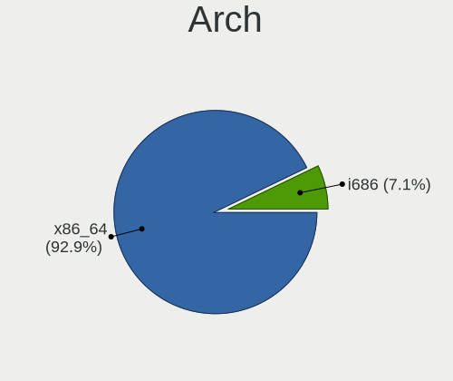
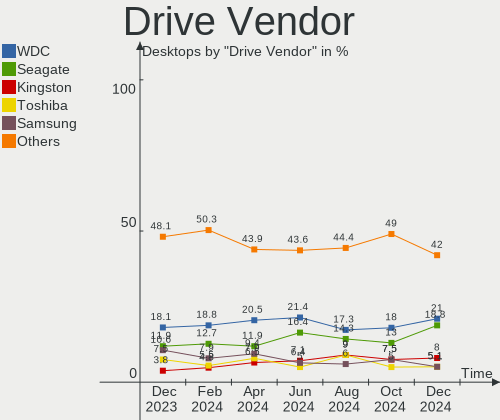
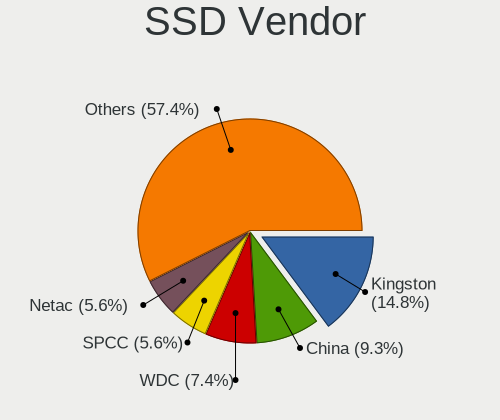
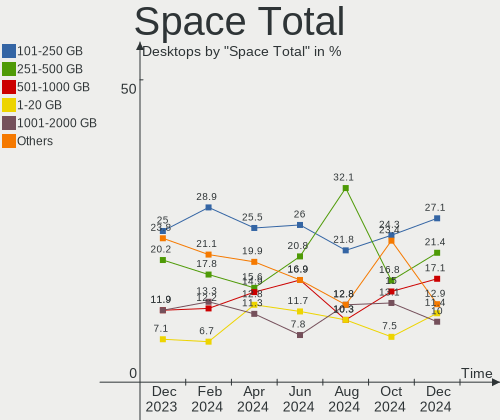

ROSA Hardware Trends (Desktop)
------------------------------

A project to identify most popular hardware characteristics and track their change
over time based on data collected by ROSA users at https://Linux-Hardware.org.

Anyone can contribute to the study by uploading probes of their computers by
the [hw-probe](https://github.com/linuxhw/hw-probe) tool:

    sudo -E hw-probe -all -upload

Full-feature report is available here: https://linux-hardware.org/?view=trends&formfactor=desktop

Period: May, 2021.

Contents
--------

- [ OS                       ](#os)
- [ OS Family                ](#os-family)
- [ Kernel                   ](#kernel)
- [ Kernel Family            ](#kernel-family)
- [ Kernel Major Ver.        ](#kernel-major-ver)
- [ Arch                     ](#arch)
- [ DE                       ](#de)
- [ Display Server           ](#display-server)
- [ Display Manager          ](#display-manager)
- [ OS Lang                  ](#os-lang)
- [ Boot Mode                ](#boot-mode)
- [ Filesystem               ](#filesystem)
- [ Part. scheme             ](#part-scheme)
- [ Dual Boot with Linux/BSD ](#dual-boot-with-linux/bsd)
- [ Dual Boot (Win)          ](#dual-boot-win)
- [ Country                  ](#country)
- [ City                     ](#city)
- [ Vendor                   ](#vendor)
- [ Model                    ](#model)
- [ Model Family             ](#model-family)
- [ MFG Year                 ](#mfg-year)
- [ Form Factor              ](#form-factor)
- [ Secure Boot              ](#secure-boot)
- [ Coreboot                 ](#coreboot)
- [ RAM Size                 ](#ram-size)
- [ RAM Used                 ](#ram-used)
- [ Has CD-ROM               ](#has-cd-rom)
- [ Total Drives             ](#total-drives)
- [ Has Ethernet             ](#has-ethernet)
- [ Has WiFi                 ](#has-wifi)
- [ Has Bluetooth            ](#has-bluetooth)
- [ Drive Vendor             ](#drive-vendor)
- [ Drive Model              ](#drive-model)
- [ HDD Vendor               ](#hdd-vendor)
- [ SSD Vendor               ](#ssd-vendor)
- [ Drive Kind               ](#drive-kind)
- [ Drive Connector          ](#drive-connector)
- [ Drive Size               ](#drive-size)
- [ Space Total              ](#space-total)
- [ Space Used               ](#space-used)
- [ Malfunc. Drives          ](#malfunc-drives)
- [ Malfunc. Drive Vendor    ](#malfunc-drive-vendor)
- [ Malfunc. HDD Vendor      ](#malfunc-hdd-vendor)
- [ Malfunc. Drive Kind      ](#malfunc-drive-kind)
- [ Failed Drives            ](#failed-drives)
- [ Failed Drive Vendor      ](#failed-drive-vendor)
- [ Drive Status             ](#drive-status)
- [ Storage Vendor           ](#storage-vendor)
- [ Storage Model            ](#storage-model)
- [ Storage Kind             ](#storage-kind)
- [ CPU Vendor               ](#cpu-vendor)
- [ CPU Model                ](#cpu-model)
- [ CPU Model Family         ](#cpu-model-family)
- [ CPU Cores                ](#cpu-cores)
- [ CPU Sockets              ](#cpu-sockets)
- [ CPU Threads              ](#cpu-threads)
- [ CPU Op-Modes             ](#cpu-op-modes)
- [ CPU Microcode            ](#cpu-microcode)
- [ CPU Microarch            ](#cpu-microarch)
- [ GPU Vendor               ](#gpu-vendor)
- [ GPU Model                ](#gpu-model)
- [ GPU Combo                ](#gpu-combo)
- [ GPU Driver               ](#gpu-driver)
- [ GPU Memory               ](#gpu-memory)
- [ Monitor Vendor           ](#monitor-vendor)
- [ Monitor Model            ](#monitor-model)
- [ Monitor Resolution       ](#monitor-resolution)
- [ Monitor Diagonal         ](#monitor-diagonal)
- [ Monitor Width            ](#monitor-width)
- [ Aspect Ratio             ](#aspect-ratio)
- [ Monitor Area             ](#monitor-area)
- [ Pixel Density            ](#pixel-density)
- [ Multiple Monitors        ](#multiple-monitors)
- [ Net Controller Vendor    ](#net-controller-vendor)
- [ Net Controller Model     ](#net-controller-model)
- [ Wireless Vendor          ](#wireless-vendor)
- [ Wireless Model           ](#wireless-model)
- [ Ethernet Vendor          ](#ethernet-vendor)
- [ Ethernet Model           ](#ethernet-model)
- [ Net Controller Kind      ](#net-controller-kind)
- [ Used Controller          ](#used-controller)
- [ NICs                     ](#nics)
- [ IPv6                     ](#ipv6)
- [ Memory Vendor            ](#memory-vendor)
- [ Memory Model             ](#memory-model)
- [ Memory Kind              ](#memory-kind)
- [ Memory Form Factor       ](#memory-form-factor)
- [ Memory Size              ](#memory-size)
- [ Memory Speed             ](#memory-speed)
- [ Sound Vendor             ](#sound-vendor)
- [ Sound Model              ](#sound-model)
- [ Camera Vendor            ](#camera-vendor)
- [ Camera Model             ](#camera-model)
- [ Fingerprint Vendor       ](#fingerprint-vendor)
- [ Fingerprint Model        ](#fingerprint-model)
- [ Chipcard Vendor          ](#chipcard-vendor)
- [ Chipcard Model           ](#chipcard-model)
- [ Printer Vendor           ](#printer-vendor)
- [ Printer Model            ](#printer-model)
- [ Scanner Vendor           ](#scanner-vendor)
- [ Scanner Model            ](#scanner-model)
- [ Bluetooth Vendor         ](#bluetooth-vendor)
- [ Bluetooth Model          ](#bluetooth-model)
- [ Unsupported Devices      ](#unsupported-devices)
- [ Unsupported Device Types ](#unsupported-device-types)

OS
--

Installed operating systems

| Name       | Desktops | Percent |
|------------|----------|---------|
| ROSA R11.1 | 62       | 76.54%  |
| ROSA R11   | 9        | 11.11%  |
| ROSA R12   | 8        | 9.88%   |
| ROSA R9    | 1        | 1.23%   |
| ROSA R8.1  | 1        | 1.23%   |

OS Family
---------

OS without a version

| Name | Desktops | Percent |
|------|----------|---------|
| ROSA | 81       | 100%    |

Kernel
------

Version of the Linux kernel

| Version                             | Desktops | Percent |
|-------------------------------------|----------|---------|
| 5.4.32-generic-2rosa-x86_64         | 22       | 27.16%  |
| 5.4.83-generic-2rosa-x86_64         | 16       | 19.75%  |
| 4.15.0-desktop-122.124.1rosa-x86_64 | 10       | 12.35%  |
| 4.15.0-desktop-45.1rosa-x86_64      | 7        | 8.64%   |
| 5.4.32-generic-2rosa-i586           | 6        | 7.41%   |
| 5.4.83-generic-2rosa-i586           | 4        | 4.94%   |
| 5.10.35-generic-2rosa2019.1-x86_64  | 3        | 3.7%    |
| 5.10.34-generic-1rosa2019.1-x86_64  | 2        | 2.47%   |
| 5.10.33-generic-3rosa2019.1-x86_64  | 2        | 2.47%   |
| 4.15.0-desktop-122.124.1rosa-i586   | 2        | 2.47%   |
| 5.5.19-generic-1rosa-i586           | 1        | 1.23%   |
| 5.4.112-nrj-desktop-1rosa-i586      | 1        | 1.23%   |
| 5.10.40-generic-1rosa2019.1-x86_64  | 1        | 1.23%   |
| 4.9.20-nrj-desktop-1rosa-i586       | 1        | 1.23%   |
| 4.9.155-nrj-desktop-1rosa-x86_64    | 1        | 1.23%   |
| 4.15.0-desktop-60.7rosa-i586        | 1        | 1.23%   |
| 4.1.38-nrj-desktop-2rosa-i586       | 1        | 1.23%   |

Kernel Family
-------------

Linux kernel without a distro release

| Version | Desktops | Percent |
|---------|----------|---------|
| 5.4.32  | 28       | 34.57%  |
| 5.4.83  | 20       | 24.69%  |
| 4.15.0  | 20       | 24.69%  |
| 5.10.35 | 3        | 3.7%    |
| 5.10.34 | 2        | 2.47%   |
| 5.10.33 | 2        | 2.47%   |
| 5.5.19  | 1        | 1.23%   |
| 5.4.112 | 1        | 1.23%   |
| 5.10.40 | 1        | 1.23%   |
| 4.9.20  | 1        | 1.23%   |
| 4.9.155 | 1        | 1.23%   |
| 4.1.38  | 1        | 1.23%   |

Kernel Major Ver.
-----------------

Linux kernel major version

| Version | Desktops | Percent |
|---------|----------|---------|
| 5.4     | 49       | 60.49%  |
| 4.15    | 20       | 24.69%  |
| 5.10    | 8        | 9.88%   |
| 4.9     | 2        | 2.47%   |
| 5.5     | 1        | 1.23%   |
| 4.1     | 1        | 1.23%   |

Arch
----

OS architecture (x86_64, i586, etc.)

| Name   | Desktops | Percent |
|--------|----------|---------|
| x86_64 | 64       | 79.01%  |
| i686   | 17       | 20.99%  |

DE
--

Desktop Environment

| Name  | Desktops | Percent |
|-------|----------|---------|
| KDE4  | 46       | 56.79%  |
| KDE5  | 16       | 19.75%  |
| LXQt  | 10       | 12.35%  |
| XFCE  | 5        | 6.17%   |
| GNOME | 4        | 4.94%   |

Display Server
--------------

X11 or Wayland

| Name    | Desktops | Percent |
|---------|----------|---------|
| X11     | 76       | 93.83%  |
| Wayland | 4        | 4.94%   |
| Tty     | 1        | 1.23%   |

Display Manager
---------------

SDDM, LightDM, etc.

| Name    | Desktops | Percent |
|---------|----------|---------|
| KDM     | 46       | 56.79%  |
| SDDM    | 29       | 35.8%   |
| GDM     | 4        | 4.94%   |
| TDM     | 1        | 1.23%   |
| LightDM | 1        | 1.23%   |

OS Lang
-------

Language

| Lang    | Desktops | Percent |
|---------|----------|---------|
| ru_RU   | 63       | 77.78%  |
| Unknown | 11       | 13.58%  |
| ro_RO   | 1        | 1.23%   |
| pt_BR   | 1        | 1.23%   |
| pl_PL   | 1        | 1.23%   |
| fr_FR   | 1        | 1.23%   |
| es_PE   | 1        | 1.23%   |
| en_US   | 1        | 1.23%   |
| de_DE   | 1        | 1.23%   |

Boot Mode
---------

EFI or BIOS

| Mode | Desktops | Percent |
|------|----------|---------|
| BIOS | 56       | 69.14%  |
| EFI  | 25       | 30.86%  |

Filesystem
----------

Type of filesystem

| Type  | Desktops | Percent |
|-------|----------|---------|
| Ext4  | 78       | 96.3%   |
| Btrfs | 3        | 3.7%    |

Part. scheme
------------

Scheme of partitioning

| Type    | Desktops | Percent |
|---------|----------|---------|
| MBR     | 48       | 59.26%  |
| GPT     | 32       | 39.51%  |
| Unknown | 1        | 1.23%   |

Dual Boot with Linux/BSD
------------------------

Hosting more than one Linux/BSD

| Dual boot | Desktops | Percent |
|-----------|----------|---------|
| No        | 55       | 67.9%   |
| Yes       | 26       | 32.1%   |

Dual Boot (Win)
---------------

Hosting Linux and Windows

| Dual boot | Desktops | Percent |
|-----------|----------|---------|
| Yes       | 45       | 55.56%  |
| No        | 36       | 44.44%  |

Country
-------

Geographic location (country)

| Country    | Desktops | Percent |
|------------|----------|---------|
| Russia     | 63       | 77.78%  |
| Ukraine    | 8        | 9.88%   |
| Spain      | 1        | 1.23%   |
| Poland     | 1        | 1.23%   |
| Peru       | 1        | 1.23%   |
| Moldova    | 1        | 1.23%   |
| Kazakhstan | 1        | 1.23%   |
| Ireland    | 1        | 1.23%   |
| Germany    | 1        | 1.23%   |
| France     | 1        | 1.23%   |
| Brazil     | 1        | 1.23%   |
| Belarus    | 1        | 1.23%   |

City
----

Geographic location (city)

| City              | Desktops | Percent |
|-------------------|----------|---------|
| Moscow            | 11       | 13.58%  |
| St Petersburg     | 3        | 3.7%    |
| Saratov           | 3        | 3.7%    |
| Novosibirsk       | 3        | 3.7%    |
| Yaroslavl         | 2        | 2.47%   |
| Tyumen            | 2        | 2.47%   |
| Nizhniy Novgorod  | 2        | 2.47%   |
| Luhansk           | 2        | 2.47%   |
| Zelenodolsk       | 1        | 1.23%   |
| Zarinsk           | 1        | 1.23%   |
| Yuzhno-Sakhalinsk | 1        | 1.23%   |
| Yoshkar-Ola       | 1        | 1.23%   |
| Yekaterinburg     | 1        | 1.23%   |
| Voronezh          | 1        | 1.23%   |
| Volzhskiy         | 1        | 1.23%   |
| Volgograd         | 1        | 1.23%   |
| Vladikavkaz       | 1        | 1.23%   |
| Vitebsk           | 1        | 1.23%   |
| Versailles        | 1        | 1.23%   |
| Tomsk             | 1        | 1.23%   |
| Tiraspol          | 1        | 1.23%   |
| Sumy              | 1        | 1.23%   |
| Stavropol         | 1        | 1.23%   |
| Srednyaya Akhtuba | 1        | 1.23%   |
| Skoropuskovskiy   | 1        | 1.23%   |
| Shelekhov         | 1        | 1.23%   |
| Saransk           | 1        | 1.23%   |
| Samara            | 1        | 1.23%   |
| Saarbrücken      | 1        | 1.23%   |
| Ryazan            | 1        | 1.23%   |
| Rostov-on-Don     | 1        | 1.23%   |
| Ribeirão Preto   | 1        | 1.23%   |
| Ramenskoye        | 1        | 1.23%   |
| Poznan            | 1        | 1.23%   |
| Petropavl         | 1        | 1.23%   |
| Oryol             | 1        | 1.23%   |
| Odessa            | 1        | 1.23%   |
| Novokuznetsk      | 1        | 1.23%   |
| Novokuybyshevsk   | 1        | 1.23%   |
| Naas              | 1        | 1.23%   |
| Madrid            | 1        | 1.23%   |
| Lipetsk           | 1        | 1.23%   |
| Lima              | 1        | 1.23%   |
| Kyiv              | 1        | 1.23%   |
| Kursk             | 1        | 1.23%   |
| Kurgan            | 1        | 1.23%   |
| Kryvyi Rih        | 1        | 1.23%   |
| Krasnoyarsk       | 1        | 1.23%   |
| Kostroma          | 1        | 1.23%   |
| Kirzhach          | 1        | 1.23%   |
| Kingisepp         | 1        | 1.23%   |
| Karachayevsk      | 1        | 1.23%   |
| Kaluga            | 1        | 1.23%   |
| Elektrogorsk      | 1        | 1.23%   |
| Donetsk           | 1        | 1.23%   |
| Chernivtsi        | 1        | 1.23%   |
| Chelyabinsk       | 1        | 1.23%   |
| Boyazitova        | 1        | 1.23%   |
| Biysk             | 1        | 1.23%   |
| Alagir            | 1        | 1.23%   |

Vendor
------

Motherboard manufacturer

| Name                | Desktops | Percent |
|---------------------|----------|---------|
| ASUSTek Computer    | 33       | 40.74%  |
| Gigabyte Technology | 12       | 14.81%  |
| MSI                 | 10       | 12.35%  |
| Intel               | 5        | 6.17%   |
| ASRock              | 5        | 6.17%   |
| Hewlett-Packard     | 3        | 3.7%    |
| Biostar             | 3        | 3.7%    |
| Lenovo              | 2        | 2.47%   |
| ECS                 | 2        | 2.47%   |
| Dell                | 2        | 2.47%   |
| ZOTAC               | 1        | 1.23%   |
| Shuttle             | 1        | 1.23%   |
| Foxconn             | 1        | 1.23%   |
| Acer                | 1        | 1.23%   |

Model
-----

Motherboard model

| Name                                   | Desktops | Percent |
|----------------------------------------|----------|---------|
| ASUS All Series                        | 3        | 3.7%    |
| MSI MS-7817                            | 2        | 2.47%   |
| ASUS M5A99X EVO R2.0                   | 2        | 2.47%   |
| ZOTAC NM10                             | 1        | 1.23%   |
| Shuttle SH61R4                         | 1        | 1.23%   |
| MSI PrimePC Solo30                     | 1        | 1.23%   |
| MSI MS-7C13                            | 1        | 1.23%   |
| MSI MS-7C02                            | 1        | 1.23%   |
| MSI MS-7900                            | 1        | 1.23%   |
| MSI MS-7529                            | 1        | 1.23%   |
| MSI MS-7519                            | 1        | 1.23%   |
| MSI MS-7376                            | 1        | 1.23%   |
| MSI MS-7270                            | 1        | 1.23%   |
| Lenovo ThinkCentre M78 Y               | 1        | 1.23%   |
| Lenovo IdeaCentre 300-20IBR 90DN0032RS | 1        | 1.23%   |
| Intel X99 V1.0                         | 1        | 1.23%   |
| Intel X79                              | 1        | 1.23%   |
| Intel H61M-S1                          | 1        | 1.23%   |
| Intel D945GCLF2 AAE46416-101           | 1        | 1.23%   |
| Intel D525MW AAE93082-301              | 1        | 1.23%   |
| HP ProDesk 400 G2 MINI                 | 1        | 1.23%   |
| HP Compaq dc5800 Small Form Factor     | 1        | 1.23%   |
| HP Compaq 6000 Pro MT PC               | 1        | 1.23%   |
| Gigabyte P35C-DS3R                     | 1        | 1.23%   |
| Gigabyte J1800N-D2H                    | 1        | 1.23%   |
| Gigabyte H61M-S2PV                     | 1        | 1.23%   |
| Gigabyte H61M-S1                       | 1        | 1.23%   |
| Gigabyte H110M-S2V                     | 1        | 1.23%   |
| Gigabyte GA-78LMT-USB3 R2              | 1        | 1.23%   |
| Gigabyte GA-770T-D3L                   | 1        | 1.23%   |
| Gigabyte EP41-UD3L                     | 1        | 1.23%   |
| Gigabyte B450M H                       | 1        | 1.23%   |
| Gigabyte AB350M-DS3H V2                | 1        | 1.23%   |
| Gigabyte A320M-S2H V2                  | 1        | 1.23%   |
| Gigabyte A320M-S2H                     | 1        | 1.23%   |
| Foxconn Pro 3300 Series MT             | 1        | 1.23%   |
| ECS GeForce6100PM-M2                   | 1        | 1.23%   |
| ECS G31T-M7                            | 1        | 1.23%   |
| Dell OptiPlex 7010                     | 1        | 1.23%   |
| Dell OptiPlex 390                      | 1        | 1.23%   |
| Biostar P31-A7                         | 1        | 1.23%   |
| Biostar NF560-A2G                      | 1        | 1.23%   |
| Biostar Hi-Fi A70U3P                   | 1        | 1.23%   |
| ASUS VM40B                             | 1        | 1.23%   |
| ASUS Pro, Std, Elt Series              | 1        | 1.23%   |
| ASUS PRIME X570-PRO                    | 1        | 1.23%   |
| ASUS PRIME B450M-K II                  | 1        | 1.23%   |
| ASUS PRIME B360M-A                     | 1        | 1.23%   |
| ASUS P8H67                             | 1        | 1.23%   |
| ASUS P8H61-M LX3 R2.0                  | 1        | 1.23%   |
| ASUS P7P55D PRO                        | 1        | 1.23%   |
| ASUS P5PL2                             | 1        | 1.23%   |
| ASUS P5L-MX                            | 1        | 1.23%   |
| ASUS P5KPL-AM SE                       | 1        | 1.23%   |
| ASUS P5KPL-AM IN/ROEM/SI               | 1        | 1.23%   |
| ASUS P5G-MX                            | 1        | 1.23%   |
| ASUS P5E-VM DO                         | 1        | 1.23%   |
| ASUS P5B                               | 1        | 1.23%   |
| ASUS P4SGX-MX                          | 1        | 1.23%   |
| ASUS P4C800                            | 1        | 1.23%   |

Model Family
------------

Motherboard model prefix

| Name                   | Desktops | Percent |
|------------------------|----------|---------|
| ASUS PRIME             | 3        | 3.7%    |
| ASUS All               | 3        | 3.7%    |
| MSI MS-7817            | 2        | 2.47%   |
| HP Compaq              | 2        | 2.47%   |
| Gigabyte A320M-S2H     | 2        | 2.47%   |
| Dell OptiPlex          | 2        | 2.47%   |
| ASUS P5KPL-AM          | 2        | 2.47%   |
| ASUS M5A99X            | 2        | 2.47%   |
| ZOTAC NM10             | 1        | 1.23%   |
| Shuttle SH61R4         | 1        | 1.23%   |
| MSI PrimePC            | 1        | 1.23%   |
| MSI MS-7C13            | 1        | 1.23%   |
| MSI MS-7C02            | 1        | 1.23%   |
| MSI MS-7900            | 1        | 1.23%   |
| MSI MS-7529            | 1        | 1.23%   |
| MSI MS-7519            | 1        | 1.23%   |
| MSI MS-7376            | 1        | 1.23%   |
| MSI MS-7270            | 1        | 1.23%   |
| Lenovo ThinkCentre     | 1        | 1.23%   |
| Lenovo IdeaCentre      | 1        | 1.23%   |
| Intel X99              | 1        | 1.23%   |
| Intel X79              | 1        | 1.23%   |
| Intel H61M-S1          | 1        | 1.23%   |
| Intel D945GCLF2        | 1        | 1.23%   |
| Intel D525MW           | 1        | 1.23%   |
| HP ProDesk             | 1        | 1.23%   |
| Gigabyte P35C-DS3R     | 1        | 1.23%   |
| Gigabyte J1800N-D2H    | 1        | 1.23%   |
| Gigabyte H61M-S2PV     | 1        | 1.23%   |
| Gigabyte H61M-S1       | 1        | 1.23%   |
| Gigabyte H110M-S2V     | 1        | 1.23%   |
| Gigabyte GA-78LMT-USB3 | 1        | 1.23%   |
| Gigabyte GA-770T-D3L   | 1        | 1.23%   |
| Gigabyte EP41-UD3L     | 1        | 1.23%   |
| Gigabyte B450M         | 1        | 1.23%   |
| Gigabyte AB350M-DS3H   | 1        | 1.23%   |
| Foxconn Pro            | 1        | 1.23%   |
| ECS GeForce6100PM-M2   | 1        | 1.23%   |
| ECS G31T-M7            | 1        | 1.23%   |
| Biostar P31-A7         | 1        | 1.23%   |
| Biostar NF560-A2G      | 1        | 1.23%   |
| Biostar Hi-Fi          | 1        | 1.23%   |
| ASUS VM40B             | 1        | 1.23%   |
| ASUS Pro               | 1        | 1.23%   |
| ASUS P8H67             | 1        | 1.23%   |
| ASUS P8H61-M           | 1        | 1.23%   |
| ASUS P7P55D            | 1        | 1.23%   |
| ASUS P5PL2             | 1        | 1.23%   |
| ASUS P5L-MX            | 1        | 1.23%   |
| ASUS P5G-MX            | 1        | 1.23%   |
| ASUS P5E-VM            | 1        | 1.23%   |
| ASUS P5B               | 1        | 1.23%   |
| ASUS P4SGX-MX          | 1        | 1.23%   |
| ASUS P4C800            | 1        | 1.23%   |
| ASUS M5A97             | 1        | 1.23%   |
| ASUS M5A78L-M          | 1        | 1.23%   |
| ASUS M5A78L            | 1        | 1.23%   |
| ASUS M4A78LT-M-LE      | 1        | 1.23%   |
| ASUS M2N-SLI           | 1        | 1.23%   |
| ASUS M2N-MX            | 1        | 1.23%   |

MFG Year
--------

Motherboard manufacture year

| Year | Desktops | Percent |
|------|----------|---------|
| 2009 | 10       | 12.35%  |
| 2014 | 9        | 11.11%  |
| 2018 | 8        | 9.88%   |
| 2010 | 7        | 8.64%   |
| 2013 | 6        | 7.41%   |
| 2012 | 6        | 7.41%   |
| 2008 | 6        | 7.41%   |
| 2020 | 5        | 6.17%   |
| 2019 | 5        | 6.17%   |
| 2016 | 4        | 4.94%   |
| 2015 | 3        | 3.7%    |
| 2011 | 3        | 3.7%    |
| 2007 | 3        | 3.7%    |
| 2017 | 2        | 2.47%   |
| 2006 | 2        | 2.47%   |
| 2003 | 2        | 2.47%   |

Form Factor
-----------

Physical design of the computer

| Name    | Desktops | Percent |
|---------|----------|---------|
| Desktop | 81       | 100%    |

Secure Boot
-----------

Enabled or disabled

| State    | Desktops | Percent |
|----------|----------|---------|
| Disabled | 81       | 100%    |

Coreboot
--------

Have coreboot on board

| Used | Desktops | Percent |
|------|----------|---------|
| No   | 81       | 100%    |

RAM Size
--------

Total RAM memory

| Size in GB | Desktops | Percent |
|------------|----------|---------|
| 3.01-4.0   | 24       | 29.63%  |
| 8.01-16.0  | 20       | 24.69%  |
| 4.01-8.0   | 15       | 18.52%  |
| 16.01-24.0 | 7        | 8.64%   |
| 2.01-3.0   | 6        | 7.41%   |
| 1.01-2.0   | 6        | 7.41%   |
| 32.01-64.0 | 1        | 1.23%   |
| 24.01-32.0 | 1        | 1.23%   |
| 0.51-1.0   | 1        | 1.23%   |

RAM Used
--------

Used RAM memory

| Used GB  | Desktops | Percent |
|----------|----------|---------|
| 0.51-1.0 | 32       | 39.51%  |
| 1.01-2.0 | 30       | 37.04%  |
| 2.01-3.0 | 12       | 14.81%  |
| 3.01-4.0 | 3        | 3.7%    |
| 0.01-0.5 | 3        | 3.7%    |
| 4.01-8.0 | 1        | 1.23%   |

Has CD-ROM
----------

Has CD-ROM on board

| Presented | Desktops | Percent |
|-----------|----------|---------|
| No        | 42       | 51.85%  |
| Yes       | 39       | 48.15%  |

Total Drives
------------

Number of drives on board

| Drives | Desktops | Percent |
|--------|----------|---------|
| 1      | 42       | 51.85%  |
| 2      | 23       | 28.4%   |
| 3      | 9        | 11.11%  |
| 4      | 5        | 6.17%   |
| 5      | 2        | 2.47%   |

Has Ethernet
------------

Has Ethernet on board

| Presented | Desktops | Percent |
|-----------|----------|---------|
| Yes       | 80       | 98.77%  |
| No        | 1        | 1.23%   |

Has WiFi
--------

Has WiFi module

| Presented | Desktops | Percent |
|-----------|----------|---------|
| No        | 65       | 80.25%  |
| Yes       | 16       | 19.75%  |

Has Bluetooth
-------------

Has Bluetooth module

| Presented | Desktops | Percent |
|-----------|----------|---------|
| No        | 73       | 90.12%  |
| Yes       | 8        | 9.88%   |

Drive Vendor
------------

Hard drive vendors

| Vendor              | Desktops | Drives | Percent |
|---------------------|----------|--------|---------|
| WDC                 | 38       | 47     | 28.57%  |
| Seagate             | 33       | 35     | 24.81%  |
| Samsung Electronics | 12       | 12     | 9.02%   |
| Hitachi             | 8        | 9      | 6.02%   |
| Toshiba             | 6        | 6      | 4.51%   |
| China               | 5        | 5      | 3.76%   |
| Kingston            | 4        | 4      | 3.01%   |
| Crucial             | 4        | 4      | 3.01%   |
| SanDisk             | 3        | 3      | 2.26%   |
| Unknown             | 2        | 2      | 1.5%    |
| Silicon Motion      | 2        | 2      | 1.5%    |
| OCZ                 | 2        | 2      | 1.5%    |
| HGST                | 2        | 2      | 1.5%    |
| Apacer              | 2        | 2      | 1.5%    |
| XPG                 | 1        | 1      | 0.75%   |
| T-FORCE             | 1        | 1      | 0.75%   |
| Smartbuy            | 1        | 1      | 0.75%   |
| OCZ-VERTEX3         | 1        | 1      | 0.75%   |
| LITEON              | 1        | 1      | 0.75%   |
| JMicron             | 1        | 1      | 0.75%   |
| HUAWEI              | 1        | 1      | 0.75%   |
| Gigabyte Technology | 1        | 1      | 0.75%   |
| Fujitsu             | 1        | 1      | 0.75%   |
| A-DATA Technology   | 1        | 1      | 0.75%   |

Drive Model
-----------

Hard drive models

| Model                                | Desktops | Percent |
|--------------------------------------|----------|---------|
| WDC WDS240G2G0A-00JH30 240GB SSD     | 3        | 2.08%   |
| Toshiba DT01ACA100 1TB               | 3        | 2.08%   |
| Kingston SA400S37120G 120GB SSD      | 3        | 2.08%   |
| WDC WD5000AZRX-00A8LB0 500GB         | 2        | 1.39%   |
| WDC WD20EZRZ-00Z5HB0 2TB             | 2        | 1.39%   |
| WDC WD10EARS-00Y5B1 1TB              | 2        | 1.39%   |
| Toshiba HDWD110 1TB                  | 2        | 1.39%   |
| Seagate ST500LM000-1EJ162 500GB      | 2        | 1.39%   |
| Seagate ST500DM002-1BD142 500GB      | 2        | 1.39%   |
| Seagate ST3500413AS 500GB            | 2        | 1.39%   |
| Seagate ST3500312CS 500GB            | 2        | 1.39%   |
| Hitachi HDS721050CLA362 500GB        | 2        | 1.39%   |
| Crucial CT120BX500SSD1 120GB         | 2        | 1.39%   |
| XPG SPECTRIX S40G 256GB              | 1        | 0.69%   |
| WDC WDS250G2B0A-00SM50 250GB SSD     | 1        | 0.69%   |
| WDC WD800JD-60MSA1 80GB              | 1        | 0.69%   |
| WDC WD800JD-00LSA0 80GB              | 1        | 0.69%   |
| WDC WD7501AALS-00J7B0 752GB          | 1        | 0.69%   |
| WDC WD5000LPVT-22G33T0 500GB         | 1        | 0.69%   |
| WDC WD5000AZLX-22JKKA0 500GB         | 1        | 0.69%   |
| WDC WD5000AAVS-00ZTB0 500GB          | 1        | 0.69%   |
| WDC WD5000AAKX-75U6AA0 500GB         | 1        | 0.69%   |
| WDC WD5000AAKX-22ERMA0 500GB         | 1        | 0.69%   |
| WDC WD5000AAKX-001CA0 500GB          | 1        | 0.69%   |
| WDC WD5000AADS-00S9B0 500GB          | 1        | 0.69%   |
| WDC WD40EZRZ-00GXCB0 4TB             | 1        | 0.69%   |
| WDC WD400ZB-00JYA0 40GB              | 1        | 0.69%   |
| WDC WD4003FRYZ-01F0DB0 4TB           | 1        | 0.69%   |
| WDC WD3200BPVT-24JJ5T0 320GB         | 1        | 0.69%   |
| WDC WD3200BEVT-22ZCT0 320GB          | 1        | 0.69%   |
| WDC WD3200AAKX-001CA0 320GB          | 1        | 0.69%   |
| WDC WD3200AAKS-00L9A0 320GB          | 1        | 0.69%   |
| WDC WD3200AAJB-56R1A0 320GB          | 1        | 0.69%   |
| WDC WD2500AAJS-00VTA0 250GB          | 1        | 0.69%   |
| WDC WD2500AAJS-00B4A0 250GB          | 1        | 0.69%   |
| WDC WD2500AAJB-00J3A0 250GB          | 1        | 0.69%   |
| WDC WD20EARX-00PASB0 2TB             | 1        | 0.69%   |
| WDC WD20EARS-00J2GB0 2TB             | 1        | 0.69%   |
| WDC WD2000FYYZ-01UL1B0 2TB           | 1        | 0.69%   |
| WDC WD1600JD-55HBB0 160GB            | 1        | 0.69%   |
| WDC WD1600AAJS-22PSA0 160GB          | 1        | 0.69%   |
| WDC WD15EARS-00MVWB0 1TB             | 1        | 0.69%   |
| WDC WD10EZEX-75WN4A1 1TB             | 1        | 0.69%   |
| WDC WD10EZEX-22MFCA0 1TB             | 1        | 0.69%   |
| WDC WD10EZEX-21M2NA0 1TB             | 1        | 0.69%   |
| WDC WD10EZEX-08WN4A0 1TB             | 1        | 0.69%   |
| WDC WD10EZEX-00WN4A0 1TB             | 1        | 0.69%   |
| WDC WD10EURX-63UY4Y0 1TB             | 1        | 0.69%   |
| WDC WD10EARX-00N0YB0 1TB             | 1        | 0.69%   |
| WDC WD10EALS-00Z8A0 1TB              | 1        | 0.69%   |
| WDC WD10EADS-00M2B0 1TB              | 1        | 0.69%   |
| WDC WD1002FAEX-00Z3A0 1TB            | 1        | 0.69%   |
| Unknown SD/MMC/MS PRO 8GB            | 1        | 0.69%   |
| Unknown 69D03094-T 40GB SSD          | 1        | 0.69%   |
| Toshiba TR200 480GB SSD              | 1        | 0.69%   |
| T-FORCE SSD 250GB                    | 1        | 0.69%   |
| Smartbuy SSD 256GB                   | 1        | 0.69%   |
| Silicon Motion NE-256 256GB          | 1        | 0.69%   |
| Silicon Motion Maxsun 256GB NM6-2280 | 1        | 0.69%   |
| Seagate STM31000528AS 1TB            | 1        | 0.69%   |

HDD Vendor
----------

Hard disk drive vendors

| Vendor              | Desktops | Drives | Percent |
|---------------------|----------|--------|---------|
| WDC                 | 35       | 43     | 38.46%  |
| Seagate             | 33       | 35     | 36.26%  |
| Hitachi             | 8        | 9      | 8.79%   |
| Samsung Electronics | 7        | 7      | 7.69%   |
| Toshiba             | 5        | 5      | 5.49%   |
| HGST                | 2        | 2      | 2.2%    |
| Fujitsu             | 1        | 1      | 1.1%    |

SSD Vendor
----------

Solid state drive vendors

| Vendor              | Desktops | Drives | Percent |
|---------------------|----------|--------|---------|
| China               | 5        | 5      | 14.71%  |
| WDC                 | 4        | 4      | 11.76%  |
| Kingston            | 4        | 4      | 11.76%  |
| Crucial             | 4        | 4      | 11.76%  |
| SanDisk             | 3        | 3      | 8.82%   |
| Samsung Electronics | 3        | 3      | 8.82%   |
| OCZ                 | 2        | 2      | 5.88%   |
| Apacer              | 2        | 2      | 5.88%   |
| Unknown             | 1        | 1      | 2.94%   |
| Toshiba             | 1        | 1      | 2.94%   |
| T-FORCE             | 1        | 1      | 2.94%   |
| Smartbuy            | 1        | 1      | 2.94%   |
| OCZ-VERTEX3         | 1        | 1      | 2.94%   |
| LITEON              | 1        | 1      | 2.94%   |
| Gigabyte Technology | 1        | 1      | 2.94%   |

Drive Kind
----------

HDD or SSD

| Kind    | Desktops | Drives | Percent |
|---------|----------|--------|---------|
| HDD     | 71       | 102    | 64.55%  |
| SSD     | 30       | 34     | 27.27%  |
| NVMe    | 6        | 6      | 5.45%   |
| Unknown | 3        | 3      | 2.73%   |

Drive Connector
---------------

SATA, SAS, NVMe, etc.

| Type | Desktops | Drives | Percent |
|------|----------|--------|---------|
| SATA | 80       | 133    | 86.96%  |
| SAS  | 6        | 6      | 6.52%   |
| NVMe | 6        | 6      | 6.52%   |

Drive Size
----------

Size of hard drive

| Size in TB | Desktops | Drives | Percent |
|------------|----------|--------|---------|
| 0.01-0.5   | 68       | 98     | 66.67%  |
| 0.51-1.0   | 21       | 23     | 20.59%  |
| 1.01-2.0   | 10       | 12     | 9.8%    |
| 3.01-4.0   | 2        | 2      | 1.96%   |
| 4.01-10.0  | 1        | 1      | 0.98%   |

Space Total
-----------

Amount of disk space available on the file system

| Size in GB     | Desktops | Percent |
|----------------|----------|---------|
| 101-250        | 18       | 22.22%  |
| 251-500        | 16       | 19.75%  |
| 1-20           | 12       | 14.81%  |
| 21-50          | 11       | 13.58%  |
| 501-1000       | 10       | 12.35%  |
| 51-100         | 5        | 6.17%   |
| More than 3000 | 4        | 4.94%   |
| 1001-2000      | 3        | 3.7%    |
| 2001-3000      | 1        | 1.23%   |
| Unknown        | 1        | 1.23%   |

Space Used
----------

Amount of used disk space

| Used GB        | Desktops | Percent |
|----------------|----------|---------|
| 1-20           | 53       | 65.43%  |
| 51-100         | 7        | 8.64%   |
| 21-50          | 6        | 7.41%   |
| 101-250        | 6        | 7.41%   |
| 2001-3000      | 3        | 3.7%    |
| 251-500        | 2        | 2.47%   |
| 501-1000       | 2        | 2.47%   |
| More than 3000 | 1        | 1.23%   |
| Unknown        | 1        | 1.23%   |

Malfunc. Drives
---------------

Drive models with a malfunction

| Model                             | Desktops | Drives | Percent |
|-----------------------------------|----------|--------|---------|
| WDC WD10EARS-00Y5B1 1TB           | 2        | 2      | 5%      |
| WDC WDS240G2G0A-00JH30 240GB SSD  | 1        | 1      | 2.5%    |
| WDC WD5000AAKX-75U6AA0 500GB      | 1        | 1      | 2.5%    |
| WDC WD5000AAKX-22ERMA0 500GB      | 1        | 1      | 2.5%    |
| WDC WD5000AAKX-001CA0 500GB       | 1        | 1      | 2.5%    |
| WDC WD400ZB-00JYA0 40GB           | 1        | 1      | 2.5%    |
| WDC WD3200BPVT-24JJ5T0 320GB      | 1        | 1      | 2.5%    |
| WDC WD3200AAKX-001CA0 320GB       | 1        | 1      | 2.5%    |
| WDC WD3200AAKS-00L9A0 320GB       | 1        | 1      | 2.5%    |
| WDC WD2500AAJS-00VTA0 250GB       | 1        | 1      | 2.5%    |
| WDC WD2500AAJS-00B4A0 250GB       | 1        | 1      | 2.5%    |
| WDC WD20EARS-00J2GB0 2TB          | 1        | 1      | 2.5%    |
| WDC WD1600JD-55HBB0 160GB         | 1        | 1      | 2.5%    |
| WDC WD10EZEX-75WN4A1 1TB          | 1        | 1      | 2.5%    |
| WDC WD10EARX-00N0YB0 1TB          | 1        | 1      | 2.5%    |
| WDC WD10EALS-00Z8A0 1TB           | 1        | 1      | 2.5%    |
| Unknown 69D03094-T 40GB SSD       | 1        | 1      | 2.5%    |
| Seagate STM31000528AS 1TB         | 1        | 1      | 2.5%    |
| Seagate ST9320325AS 320GB         | 1        | 1      | 2.5%    |
| Seagate ST9250410AS 250GB         | 1        | 1      | 2.5%    |
| Seagate ST500DM002-1BD142 500GB   | 1        | 1      | 2.5%    |
| Seagate ST3320418AS 320GB         | 1        | 1      | 2.5%    |
| Seagate ST3250310AS 250GB         | 1        | 1      | 2.5%    |
| Seagate ST3160023AS 160GB         | 1        | 1      | 2.5%    |
| Seagate ST3160023A 160GB          | 1        | 1      | 2.5%    |
| Seagate ST3120814A 120GB          | 1        | 1      | 2.5%    |
| Seagate ST31000524AS 1TB          | 1        | 1      | 2.5%    |
| Samsung Electronics HD502HJ 500GB | 1        | 1      | 2.5%    |
| Samsung Electronics HD300LJ 304GB | 1        | 1      | 2.5%    |
| Samsung Electronics HD250HJ 250GB | 1        | 1      | 2.5%    |
| OCZ-VERTEX3 MI 120GB SSD          | 1        | 1      | 2.5%    |
| OCZ SOLID3 64GB SSD               | 1        | 1      | 2.5%    |
| Kingston SUV400S37120G 120GB SSD  | 1        | 1      | 2.5%    |
| Hitachi HTS545025B9A300 250GB     | 1        | 1      | 2.5%    |
| Hitachi HDT721016SLA380 160GB     | 1        | 1      | 2.5%    |
| Hitachi HDS721050CLA362 500GB     | 1        | 1      | 2.5%    |
| Hitachi HDP725050GLA360 500GB     | 1        | 1      | 2.5%    |
| Hitachi HDP725040GLA360 400GB     | 1        | 2      | 2.5%    |
| HGST HTS545050A7E680 500GB        | 1        | 1      | 2.5%    |

Malfunc. Drive Vendor
---------------------

Vendors of faulty drives

| Vendor              | Desktops | Drives | Percent |
|---------------------|----------|--------|---------|
| WDC                 | 17       | 17     | 43.59%  |
| Seagate             | 9        | 10     | 23.08%  |
| Hitachi             | 5        | 6      | 12.82%  |
| Samsung Electronics | 3        | 3      | 7.69%   |
| Unknown             | 1        | 1      | 2.56%   |
| OCZ-VERTEX3         | 1        | 1      | 2.56%   |
| OCZ                 | 1        | 1      | 2.56%   |
| Kingston            | 1        | 1      | 2.56%   |
| HGST                | 1        | 1      | 2.56%   |

Malfunc. HDD Vendor
-------------------

Vendors of faulty HDD drives

| Vendor              | Desktops | Drives | Percent |
|---------------------|----------|--------|---------|
| WDC                 | 16       | 16     | 47.06%  |
| Seagate             | 9        | 10     | 26.47%  |
| Hitachi             | 5        | 6      | 14.71%  |
| Samsung Electronics | 3        | 3      | 8.82%   |
| HGST                | 1        | 1      | 2.94%   |

Malfunc. Drive Kind
-------------------

Kinds of faulty drives

| Kind | Desktops | Drives | Percent |
|------|----------|--------|---------|
| HDD  | 31       | 36     | 86.11%  |
| SSD  | 5        | 5      | 13.89%  |

Failed Drives
-------------

Failed drive models

| Model                             | Desktops | Drives | Percent |
|-----------------------------------|----------|--------|---------|
| Samsung Electronics HD322GJ 320GB | 1        | 1      | 50%     |
| Samsung Electronics HD204UI 2TB   | 1        | 1      | 50%     |

Failed Drive Vendor
-------------------

Failed drive vendors

| Vendor              | Desktops | Drives | Percent |
|---------------------|----------|--------|---------|
| Samsung Electronics | 2        | 2      | 100%    |

Drive Status
------------

Number of failed and malfunc. drives

| Status   | Desktops | Drives | Percent |
|----------|----------|--------|---------|
| Works    | 61       | 95     | 58.65%  |
| Malfunc  | 34       | 41     | 32.69%  |
| Detected | 7        | 7      | 6.73%   |
| Failed   | 2        | 2      | 1.92%   |

Storage Vendor
--------------

Storage controller vendors

| Vendor                           | Desktops | Percent |
|----------------------------------|----------|---------|
| Intel                            | 52       | 54.17%  |
| AMD                              | 22       | 22.92%  |
| Nvidia                           | 5        | 5.21%   |
| JMicron Technology               | 5        | 5.21%   |
| Silicon Motion                   | 2        | 2.08%   |
| Samsung Electronics              | 2        | 2.08%   |
| ASMedia Technology               | 2        | 2.08%   |
| VIA Technologies                 | 1        | 1.04%   |
| ULi Electronics                  | 1        | 1.04%   |
| Silicon Integrated Systems [SiS] | 1        | 1.04%   |
| Realtek Semiconductor            | 1        | 1.04%   |
| Marvell Technology Group         | 1        | 1.04%   |
| ADATA Technology                 | 1        | 1.04%   |

Storage Model
-------------

Storage controller models

| Model                                                                                   | Desktops | Percent |
|-----------------------------------------------------------------------------------------|----------|---------|
| Intel NM10/ICH7 Family SATA Controller [IDE mode]                                       | 14       | 10.07%  |
| Intel 82801G (ICH7 Family) IDE Controller                                               | 13       | 9.35%   |
| AMD FCH SATA Controller [AHCI mode]                                                     | 13       | 9.35%   |
| Intel 8 Series/C220 Series Chipset Family 6-port SATA Controller 1 [AHCI mode]          | 6        | 4.32%   |
| Intel 6 Series/C200 Series Chipset Family 6 port Desktop SATA AHCI Controller           | 6        | 4.32%   |
| AMD SB7x0/SB8x0/SB9x0 IDE Controller                                                    | 5        | 3.6%    |
| JMicron JMB363 SATA/IDE Controller                                                      | 4        | 2.88%   |
| Intel 6 Series/C200 Series Chipset Family Desktop SATA Controller (IDE mode, ports 4-5) | 4        | 2.88%   |
| Intel 6 Series/C200 Series Chipset Family Desktop SATA Controller (IDE mode, ports 0-3) | 4        | 2.88%   |
| AMD SB7x0/SB8x0/SB9x0 SATA Controller [IDE mode]                                        | 4        | 2.88%   |
| AMD SB7x0/SB8x0/SB9x0 SATA Controller [AHCI mode]                                       | 4        | 2.88%   |
| Intel Q170/Q150/B150/H170/H110/Z170/CM236 Chipset SATA Controller [AHCI Mode]           | 3        | 2.16%   |
| AMD 400 Series Chipset SATA Controller                                                  | 3        | 2.16%   |
| Silicon Motion SM2263EN/SM2263XT SSD Controller                                         | 2        | 1.44%   |
| Samsung NVMe SSD Controller SM981/PM981/PM983                                           | 2        | 1.44%   |
| Nvidia MCP61 SATA Controller                                                            | 2        | 1.44%   |
| Nvidia MCP61 IDE                                                                        | 2        | 1.44%   |
| Intel 82801JI (ICH10 Family) 4 port SATA IDE Controller #1                              | 2        | 1.44%   |
| Intel 82801JI (ICH10 Family) 2 port SATA IDE Controller #2                              | 2        | 1.44%   |
| Intel 82801I (ICH9 Family) 2 port SATA Controller [IDE mode]                            | 2        | 1.44%   |
| Intel 7 Series/C210 Series Chipset Family 6-port SATA Controller [AHCI mode]            | 2        | 1.44%   |
| Intel 200 Series PCH SATA controller [AHCI mode]                                        | 2        | 1.44%   |
| ASMedia ASM1062 Serial ATA Controller                                                   | 2        | 1.44%   |
| AMD 300 Series Chipset SATA Controller                                                  | 2        | 1.44%   |
| VIA VT6415 PATA IDE Host Controller                                                     | 1        | 0.72%   |
| ULi ULi M5288 SATA                                                                      | 1        | 0.72%   |
| ULi M5229 IDE                                                                           | 1        | 0.72%   |
| Silicon Integrated Systems [SiS] 5513 IDE Controller                                    | 1        | 0.72%   |
| Realtek RTS5763DL NVMe SSD Controller                                                   | 1        | 0.72%   |
| Nvidia MCP65 SATA Controller                                                            | 1        | 0.72%   |
| Nvidia MCP65 IDE                                                                        | 1        | 0.72%   |
| Nvidia MCP55 SATA Controller                                                            | 1        | 0.72%   |
| Nvidia MCP55 IDE                                                                        | 1        | 0.72%   |
| Nvidia CK804 Serial ATA Controller                                                      | 1        | 0.72%   |
| Nvidia CK804 IDE                                                                        | 1        | 0.72%   |
| Marvell Group 88SE9125 PCIe SATA 6.0 Gb/s controller                                    | 1        | 0.72%   |
| JMicron JMB368 IDE controller                                                           | 1        | 0.72%   |
| Intel SATA Controller [RAID mode]                                                       | 1        | 0.72%   |
| Intel NM10/ICH7 Family SATA Controller [AHCI mode]                                      | 1        | 0.72%   |
| Intel Atom/Celeron/Pentium Processor x5-E8000/J3xxx/N3xxx Series SATA Controller        | 1        | 0.72%   |
| Intel Atom Processor E3800 Series SATA AHCI Controller                                  | 1        | 0.72%   |
| Intel 82Q35 Express PT IDER Controller                                                  | 1        | 0.72%   |
| Intel 82801JD/DO (ICH10 Family) 4-port SATA IDE Controller                              | 1        | 0.72%   |
| Intel 82801JD/DO (ICH10 Family) 2-port SATA IDE Controller                              | 1        | 0.72%   |
| Intel 82801IR/IO/IH (ICH9R/DO/DH) 6 port SATA Controller [AHCI mode]                    | 1        | 0.72%   |
| Intel 82801IR/IO/IH (ICH9R/DO/DH) 4 port SATA Controller [IDE mode]                     | 1        | 0.72%   |
| Intel 82801IB (ICH9) 2 port SATA Controller [IDE mode]                                  | 1        | 0.72%   |
| Intel 82801HB (ICH8) 4 port SATA Controller [AHCI mode]                                 | 1        | 0.72%   |
| Intel 82801GR/GDH (ICH7R/ICH7DH) SATA Controller [RAID mode]                            | 1        | 0.72%   |
| Intel 82801EB/ER (ICH5/ICH5R) IDE Controller                                            | 1        | 0.72%   |
| Intel 7 Series Chipset Family 6-port SATA Controller [AHCI mode]                        | 1        | 0.72%   |
| Intel 5 Series/3400 Series Chipset 6 port SATA AHCI Controller                          | 1        | 0.72%   |
| Intel 4 Series Chipset PT IDER Controller                                               | 1        | 0.72%   |
| AMD SB600 Non-Raid-5 SATA                                                               | 1        | 0.72%   |
| AMD SB600 IDE                                                                           | 1        | 0.72%   |
| AMD FCH SATA Controller D                                                               | 1        | 0.72%   |
| AMD FCH IDE Controller                                                                  | 1        | 0.72%   |
| ADATA Non-Volatile memory controller                                                    | 1        | 0.72%   |

Storage Kind
------------

Kind of storage controller (IDE, SATA, NVMe, SAS, ...)

| Kind | Desktops | Percent |
|------|----------|---------|
| SATA | 48       | 48.48%  |
| IDE  | 43       | 43.43%  |
| NVMe | 6        | 6.06%   |
| RAID | 2        | 2.02%   |

CPU Vendor
----------

Processor vendors

| Vendor | Desktops | Percent |
|--------|----------|---------|
| Intel  | 53       | 65.43%  |
| AMD    | 28       | 34.57%  |

CPU Model
---------

Processor models

| Model                                       | Desktops | Percent |
|---------------------------------------------|----------|---------|
| Intel Core 2 Quad CPU Q8200 @ 2.33GHz       | 3        | 3.7%    |
| Intel Pentium 4 CPU 2.40GHz                 | 2        | 2.47%   |
| Intel Core i5-2500 CPU @ 3.30GHz            | 2        | 2.47%   |
| Intel Core i3-2120 CPU @ 3.30GHz            | 2        | 2.47%   |
| Intel Core i3-2100 CPU @ 3.10GHz            | 2        | 2.47%   |
| Intel Core 2 Duo CPU E8400 @ 3.00GHz        | 2        | 2.47%   |
| Intel Atom CPU D525 @ 1.80GHz               | 2        | 2.47%   |
| AMD FX-6300 Six-Core Processor              | 2        | 2.47%   |
| Intel Xeon CPU X5450 @ 3.00GHz              | 1        | 1.23%   |
| Intel Xeon CPU E5-2620 v3 @ 2.40GHz         | 1        | 1.23%   |
| Intel Xeon CPU E5-2420 0 @ 1.90GHz          | 1        | 1.23%   |
| Intel Pentium Gold G5400 CPU @ 3.70GHz      | 1        | 1.23%   |
| Intel Pentium Dual-Core CPU E6300 @ 2.80GHz | 1        | 1.23%   |
| Intel Pentium Dual-Core CPU E5700 @ 3.00GHz | 1        | 1.23%   |
| Intel Pentium Dual-Core CPU E5300 @ 2.60GHz | 1        | 1.23%   |
| Intel Pentium Dual-Core CPU E5200 @ 2.50GHz | 1        | 1.23%   |
| Intel Pentium Dual CPU E2200 @ 2.20GHz      | 1        | 1.23%   |
| Intel Pentium D CPU 3.20GHz                 | 1        | 1.23%   |
| Intel Pentium CPU G4400 @ 3.30GHz           | 1        | 1.23%   |
| Intel Pentium CPU G3420 @ 3.20GHz           | 1        | 1.23%   |
| Intel Pentium CPU G3240 @ 3.10GHz           | 1        | 1.23%   |
| Intel Pentium CPU G3220 @ 3.00GHz           | 1        | 1.23%   |
| Intel Genuine CPU 0000 @ 2.40GHz            | 1        | 1.23%   |
| Intel Core i7-3770S CPU @ 3.10GHz           | 1        | 1.23%   |
| Intel Core i5-9400F CPU @ 2.90GHz           | 1        | 1.23%   |
| Intel Core i5-4460 CPU @ 3.20GHz            | 1        | 1.23%   |
| Intel Core i5-4430 CPU @ 3.00GHz            | 1        | 1.23%   |
| Intel Core i5-2400 CPU @ 3.10GHz            | 1        | 1.23%   |
| Intel Core i5 CPU 750 @ 2.67GHz             | 1        | 1.23%   |
| Intel Core i3-9100F CPU @ 3.60GHz           | 1        | 1.23%   |
| Intel Core i3-6100T CPU @ 3.20GHz           | 1        | 1.23%   |
| Intel Core i3-3250 CPU @ 3.50GHz            | 1        | 1.23%   |
| Intel Core i3-3240 CPU @ 3.40GHz            | 1        | 1.23%   |
| Intel Core i3-3220 CPU @ 3.30GHz            | 1        | 1.23%   |
| Intel Core 2 Quad CPU Q9550 @ 2.83GHz       | 1        | 1.23%   |
| Intel Core 2 Quad CPU Q9400 @ 2.66GHz       | 1        | 1.23%   |
| Intel Core 2 Duo CPU E8500 @ 3.16GHz        | 1        | 1.23%   |
| Intel Core 2 Duo CPU E7300 @ 2.66GHz        | 1        | 1.23%   |
| Intel Core 2 Duo CPU E4500 @ 2.20GHz        | 1        | 1.23%   |
| Intel Celeron CPU J3060 @ 1.60GHz           | 1        | 1.23%   |
| Intel Celeron CPU J1800 @ 2.41GHz           | 1        | 1.23%   |
| Intel Celeron CPU E3400 @ 2.60GHz           | 1        | 1.23%   |
| Intel Celeron CPU 430 @ 1.80GHz             | 1        | 1.23%   |
| Intel Celeron CPU 2.66GHz                   | 1        | 1.23%   |
| Intel Celeron CPU 1017U @ 1.60GHz           | 1        | 1.23%   |
| Intel Atom CPU 330 @ 1.60GHz                | 1        | 1.23%   |
| AMD Ryzen 9 3900X 12-Core Processor         | 1        | 1.23%   |
| AMD Ryzen 7 2700 Eight-Core Processor       | 1        | 1.23%   |
| AMD Ryzen 5 3400G with Radeon Vega Graphics | 1        | 1.23%   |
| AMD Ryzen 5 2600 Six-Core Processor         | 1        | 1.23%   |
| AMD Ryzen 3 PRO 1300 Quad-Core Processor    | 1        | 1.23%   |
| AMD Ryzen 3 1200 Quad-Core Processor        | 1        | 1.23%   |
| AMD FX-8320E Eight-Core Processor           | 1        | 1.23%   |
| AMD FX-8150 Eight-Core Processor            | 1        | 1.23%   |
| AMD FX-8120 Eight-Core Processor            | 1        | 1.23%   |
| AMD FX-4300 Quad-Core Processor             | 1        | 1.23%   |
| AMD FX-4100 Quad-Core Processor             | 1        | 1.23%   |
| AMD Athlon X4 880K Quad Core Processor      | 1        | 1.23%   |
| AMD Athlon X4 730 Quad Core Processor       | 1        | 1.23%   |
| AMD Athlon II X2 245 Processor              | 1        | 1.23%   |

CPU Model Family
----------------

Processor model prefix

| Model                   | Desktops | Percent |
|-------------------------|----------|---------|
| Intel Core i3           | 9        | 11.11%  |
| Intel Core i5           | 7        | 8.64%   |
| AMD FX                  | 7        | 8.64%   |
| Intel Celeron           | 6        | 7.41%   |
| AMD Athlon 64 X2        | 6        | 7.41%   |
| Intel Core 2 Quad       | 5        | 6.17%   |
| Intel Core 2 Duo        | 5        | 6.17%   |
| Intel Pentium Dual-Core | 4        | 4.94%   |
| Intel Pentium           | 4        | 4.94%   |
| Intel Xeon              | 3        | 3.7%    |
| Intel Atom              | 3        | 3.7%    |
| Intel Pentium 4         | 2        | 2.47%   |
| AMD Ryzen 5             | 2        | 2.47%   |
| AMD Athlon X4           | 2        | 2.47%   |
| AMD Athlon              | 2        | 2.47%   |
| Intel Pentium Gold      | 1        | 1.23%   |
| Intel Pentium Dual      | 1        | 1.23%   |
| Intel Pentium D         | 1        | 1.23%   |
| Intel Genuine           | 1        | 1.23%   |
| Intel Core i7           | 1        | 1.23%   |
| AMD Ryzen 9             | 1        | 1.23%   |
| AMD Ryzen 7             | 1        | 1.23%   |
| AMD Ryzen 3 PRO         | 1        | 1.23%   |
| AMD Ryzen 3             | 1        | 1.23%   |
| AMD Athlon II X2        | 1        | 1.23%   |
| AMD Athlon 64           | 1        | 1.23%   |
| AMD A8                  | 1        | 1.23%   |
| AMD A4                  | 1        | 1.23%   |
| AMD A10                 | 1        | 1.23%   |

CPU Cores
---------

Number of processor cores

| Number  | Desktops | Percent |
|---------|----------|---------|
| 2       | 42       | 51.85%  |
| 4       | 22       | 27.16%  |
| 1       | 7        | 8.64%   |
| 6       | 5        | 6.17%   |
| 3       | 2        | 2.47%   |
| 12      | 1        | 1.23%   |
| 8       | 1        | 1.23%   |
| Unknown | 1        | 1.23%   |

CPU Sockets
-----------

Number of sockets

| Number | Desktops | Percent |
|--------|----------|---------|
| 1      | 81       | 100%    |

CPU Threads
-----------

Threads per core (Hyper-Threading)

| Number  | Desktops | Percent |
|---------|----------|---------|
| 1       | 49       | 60.49%  |
| 2       | 31       | 38.27%  |
| Unknown | 1        | 1.23%   |

CPU Op-Modes
------------

CPU Operation Modes (32-bit, 64-bit)

| Op mode        | Desktops | Percent |
|----------------|----------|---------|
| 32-bit, 64-bit | 79       | 97.53%  |
| 32-bit         | 2        | 2.47%   |

CPU Microcode
-------------

Microcode number

| Number     | Desktops | Percent |
|------------|----------|---------|
| 0x1067a    | 11       | 13.58%  |
| 0x206a7    | 7        | 8.64%   |
| Unknown    | 7        | 8.64%   |
| 0x306c3    | 5        | 6.17%   |
| 0x306a9    | 5        | 6.17%   |
| 0x906ea    | 3        | 3.7%    |
| 0x10676    | 3        | 3.7%    |
| 0x06001119 | 3        | 3.7%    |
| 0x06000852 | 3        | 3.7%    |
| 0x0600063e | 3        | 3.7%    |
| 0x6fd      | 2        | 2.47%   |
| 0x506e3    | 2        | 2.47%   |
| 0x106ca    | 2        | 2.47%   |
| 0x0800820d | 2        | 2.47%   |
| 0xf62      | 1        | 1.23%   |
| 0xf49      | 1        | 1.23%   |
| 0xf27      | 1        | 1.23%   |
| 0xf24      | 1        | 1.23%   |
| 0x906eb    | 1        | 1.23%   |
| 0x406c4    | 1        | 1.23%   |
| 0x306f2    | 1        | 1.23%   |
| 0x30679    | 1        | 1.23%   |
| 0x206d7    | 1        | 1.23%   |
| 0x106e5    | 1        | 1.23%   |
| 0x106c2    | 1        | 1.23%   |
| 0x10677    | 1        | 1.23%   |
| 0x10661    | 1        | 1.23%   |
| 0x08701021 | 1        | 1.23%   |
| 0x08108109 | 1        | 1.23%   |
| 0x08101016 | 1        | 1.23%   |
| 0x08001138 | 1        | 1.23%   |
| 0x08001137 | 1        | 1.23%   |
| 0x0700010f | 1        | 1.23%   |
| 0x06003106 | 1        | 1.23%   |
| 0x0600084f | 1        | 1.23%   |
| 0x03000027 | 1        | 1.23%   |
| 0x010000c8 | 1        | 1.23%   |

CPU Microarch
-------------

Microarchitecture

| Name        | Desktops | Percent |
|-------------|----------|---------|
| Penryn      | 15       | 18.52%  |
| SandyBridge | 8        | 9.88%   |
| Piledriver  | 7        | 8.64%   |
| K8 Hammer   | 7        | 8.64%   |
| Haswell     | 6        | 7.41%   |
| IvyBridge   | 5        | 6.17%   |
| NetBurst    | 4        | 4.94%   |
| KabyLake    | 4        | 4.94%   |
| Zen+        | 3        | 3.7%    |
| Zen         | 3        | 3.7%    |
| Core        | 3        | 3.7%    |
| Bulldozer   | 3        | 3.7%    |
| Bonnell     | 3        | 3.7%    |
| Skylake     | 2        | 2.47%   |
| Silvermont  | 2        | 2.47%   |
| Zen 2       | 1        | 1.23%   |
| Steamroller | 1        | 1.23%   |
| Nehalem     | 1        | 1.23%   |
| K10 Llano   | 1        | 1.23%   |
| K10         | 1        | 1.23%   |
| Jaguar      | 1        | 1.23%   |

GPU Vendor
----------

Vendors of graphics cards

| Vendor | Desktops | Percent |
|--------|----------|---------|
| Nvidia | 36       | 44.44%  |
| AMD    | 24       | 29.63%  |
| Intel  | 21       | 25.93%  |

GPU Model
---------

Graphics card models

| Model                                                                                    | Desktops | Percent |
|------------------------------------------------------------------------------------------|----------|---------|
| Nvidia GT218 [GeForce 210]                                                               | 6        | 7.32%   |
| Nvidia GK208B [GeForce GT 710]                                                           | 4        | 4.88%   |
| Nvidia GK208B [GeForce GT 730]                                                           | 3        | 3.66%   |
| AMD Lexa PRO [Radeon 540/540X/550/550X / RX 540X/550/550X]                               | 3        | 3.66%   |
| Nvidia GP108 [GeForce GT 1030]                                                           | 2        | 2.44%   |
| Nvidia GP107 [GeForce GTX 1050 Ti]                                                       | 2        | 2.44%   |
| Nvidia GF119 [GeForce GT 610]                                                            | 2        | 2.44%   |
| Intel Xeon E3-1200 v2/3rd Gen Core processor Graphics Controller                         | 2        | 2.44%   |
| Intel Atom Processor D4xx/D5xx/N4xx/N5xx Integrated Graphics Controller                  | 2        | 2.44%   |
| Intel 82G33/G31 Express Integrated Graphics Controller                                   | 2        | 2.44%   |
| Intel 82945G/GZ Integrated Graphics Controller                                           | 2        | 2.44%   |
| Intel 4 Series Chipset Integrated Graphics Controller                                    | 2        | 2.44%   |
| Intel 2nd Generation Core Processor Family Integrated Graphics Controller                | 2        | 2.44%   |
| AMD Juniper XT [Radeon HD 5770]                                                          | 2        | 2.44%   |
| AMD Caicos [Radeon HD 6450/7450/8450 / R5 230 OEM]                                       | 2        | 2.44%   |
| AMD Baffin [Radeon RX 550 640SP / RX 560/560X]                                           | 2        | 2.44%   |
| Nvidia TU117 [GeForce GTX 1650]                                                          | 1        | 1.22%   |
| Nvidia NV31 [GeForce FX 5600XT]                                                          | 1        | 1.22%   |
| Nvidia NV18 [GeForce4 MX 440 AGP 8x]                                                     | 1        | 1.22%   |
| Nvidia GP107 [GeForce GTX 1050]                                                          | 1        | 1.22%   |
| Nvidia GP106 [GeForce GTX 1060 6GB]                                                      | 1        | 1.22%   |
| Nvidia GM206 [GeForce GTX 960]                                                           | 1        | 1.22%   |
| Nvidia GM206 [GeForce GTX 950]                                                           | 1        | 1.22%   |
| Nvidia GK107 [GeForce GTX 650]                                                           | 1        | 1.22%   |
| Nvidia GK107 [GeForce GT 740]                                                            | 1        | 1.22%   |
| Nvidia GK106 [GeForce GTX 650 Ti]                                                        | 1        | 1.22%   |
| Nvidia GF119 [GeForce GT 705]                                                            | 1        | 1.22%   |
| Nvidia GF116 [GeForce GTX 550 Ti]                                                        | 1        | 1.22%   |
| Nvidia GF108 [GeForce GT 730]                                                            | 1        | 1.22%   |
| Nvidia GF108 [GeForce GT 630]                                                            | 1        | 1.22%   |
| Nvidia GF108 [GeForce GT 440]                                                            | 1        | 1.22%   |
| Nvidia G96C [GeForce 9500 GT]                                                            | 1        | 1.22%   |
| Nvidia G84 [GeForce 8600 GT]                                                             | 1        | 1.22%   |
| Intel HD Graphics 530                                                                    | 1        | 1.22%   |
| Intel HD Graphics 510                                                                    | 1        | 1.22%   |
| Intel CoffeeLake-S GT1 [UHD Graphics 610]                                                | 1        | 1.22%   |
| Intel CoffeeLake-H GT2 [UHD Graphics 630]                                                | 1        | 1.22%   |
| Intel Atom/Celeron/Pentium Processor x5-E8000/J3xxx/N3xxx Integrated Graphics Controller | 1        | 1.22%   |
| Intel Atom Processor Z36xxx/Z37xxx Series Graphics & Display                             | 1        | 1.22%   |
| Intel 82Q35 Express Integrated Graphics Controller                                       | 1        | 1.22%   |
| Intel 82Q33 Express Integrated Graphics Controller                                       | 1        | 1.22%   |
| Intel 3rd Gen Core processor Graphics Controller                                         | 1        | 1.22%   |
| AMD Trinity 2 [Radeon HD 7480D]                                                          | 1        | 1.22%   |
| AMD Tahiti XT [Radeon HD 7970/8970 OEM / R9 280X]                                        | 1        | 1.22%   |
| AMD RV770 [Radeon HD 4870]                                                               | 1        | 1.22%   |
| AMD RV730 XT [Radeon HD 4670]                                                            | 1        | 1.22%   |
| AMD RV610 [Radeon HD 2400 PRO]                                                           | 1        | 1.22%   |
| AMD RV610 [Radeon HD 2400 PRO/XT]                                                        | 1        | 1.22%   |
| AMD RV370 [Radeon X300/X550/X1050 Series] (Secondary)                                    | 1        | 1.22%   |
| AMD RV370 [Radeon X300/X550/X1050 Series]                                                | 1        | 1.22%   |
| AMD RS780L [Radeon 3000]                                                                 | 1        | 1.22%   |
| AMD Redwood XT [Radeon HD 5670/5690/5730]                                                | 1        | 1.22%   |
| AMD Redwood PRO [Radeon HD 5550/5570/5630/6510/6610/7570]                                | 1        | 1.22%   |
| AMD Raven Ridge [Radeon Vega Series / Radeon Vega Mobile Series]                         | 1        | 1.22%   |
| AMD Kabini [Radeon HD 8400 / R3 Series]                                                  | 1        | 1.22%   |
| AMD Ellesmere [Radeon RX 470/480/570/570X/580/580X/590]                                  | 1        | 1.22%   |
| AMD Cayman PRO [Radeon HD 6950]                                                          | 1        | 1.22%   |
| AMD Barts PRO [Radeon HD 6850]                                                           | 1        | 1.22%   |

GPU Combo
---------

Combinations of graphics cards

| Name       | Desktops | Percent |
|------------|----------|---------|
| 1 x Nvidia | 36       | 44.44%  |
| 1 x AMD    | 23       | 28.4%   |
| 1 x Intel  | 21       | 25.93%  |
| 2 x AMD    | 1        | 1.23%   |

GPU Driver
----------

Free vs proprietary

| Driver      | Desktops | Percent |
|-------------|----------|---------|
| Free        | 64       | 79.01%  |
| Proprietary | 12       | 14.81%  |
| Unknown     | 5        | 6.17%   |

GPU Memory
----------

Total video memory

| Size in GB | Desktops | Percent |
|------------|----------|---------|
| 0.51-1.0   | 19       | 23.46%  |
| 0.01-0.5   | 18       | 22.22%  |
| Unknown    | 17       | 20.99%  |
| 1.01-2.0   | 16       | 19.75%  |
| 3.01-4.0   | 10       | 12.35%  |
| 2.01-3.0   | 1        | 1.23%   |

Monitor Vendor
--------------

Monitor vendors

| Vendor               | Desktops | Percent |
|----------------------|----------|---------|
| Samsung Electronics  | 23       | 30.67%  |
| Goldstar             | 15       | 20%     |
| BenQ                 | 6        | 8%      |
| AOC                  | 5        | 6.67%   |
| Acer                 | 5        | 6.67%   |
| ViewSonic            | 4        | 5.33%   |
| Dell                 | 3        | 4%      |
| Philips              | 2        | 2.67%   |
| BBK                  | 2        | 2.67%   |
| Ancor Communications | 2        | 2.67%   |
| Sony                 | 1        | 1.33%   |
| Sangyo               | 1        | 1.33%   |
| OEM                  | 1        | 1.33%   |
| Hewlett-Packard      | 1        | 1.33%   |
| FOS                  | 1        | 1.33%   |
| CND                  | 1        | 1.33%   |
| BOE                  | 1        | 1.33%   |
| ASUSTek Computer     | 1        | 1.33%   |

Monitor Model
-------------

Monitor models

| Model                                                                  | Desktops | Percent |
|------------------------------------------------------------------------|----------|---------|
| Dell 1909W DELA03D 1440x900 408x255mm 18.9-inch                        | 2        | 2.67%   |
| BBK TV BBK0B01 1920x540 708x398mm 32.0-inch                            | 2        | 2.67%   |
| AOC 1970W AOC1970 1366x768 410x230mm 18.5-inch                         | 2        | 2.67%   |
| ViewSonic VA2719-2K VSC6B34 2560x1440 597x336mm 27.0-inch              | 1        | 1.33%   |
| ViewSonic VA2013wmSERIE VSCDB22 1600x900 443x249mm 20.0-inch           | 1        | 1.33%   |
| ViewSonic VA1913 series VSC1A22 1366x768 410x230mm 18.5-inch           | 1        | 1.33%   |
| ViewSonic VA1616wSERIES VSC0021 1366x768 348x197mm 15.7-inch           | 1        | 1.33%   |
| Sony TV SNYC901 1920x1080 1600x900mm 72.3-inch                         | 1        | 1.33%   |
| Sangyo LCD Monitor FF201H 1920x1080                                    | 1        | 1.33%   |
| Samsung Electronics U32J59x SAM0F52 3840x2160 697x392mm 31.5-inch      | 1        | 1.33%   |
| Samsung Electronics SyncMaster SAM0483 1440x900 408x255mm 18.9-inch    | 1        | 1.33%   |
| Samsung Electronics SyncMaster SAM03C2 1680x1050 459x296mm 21.5-inch   | 1        | 1.33%   |
| Samsung Electronics SyncMaster SAM0373 1680x1050 459x296mm 21.5-inch   | 1        | 1.33%   |
| Samsung Electronics SyncMaster SAM036E 1280x1024 376x301mm 19.0-inch   | 1        | 1.33%   |
| Samsung Electronics SyncMaster SAM0365 1280x1024 338x270mm 17.0-inch   | 1        | 1.33%   |
| Samsung Electronics SyncMaster SAM01D7 1280x1024 338x270mm 17.0-inch   | 1        | 1.33%   |
| Samsung Electronics SyncMaster SAM01B7 1280x1024 338x270mm 17.0-inch   | 1        | 1.33%   |
| Samsung Electronics SyncMaster SAM0168 1280x1024 338x270mm 17.0-inch   | 1        | 1.33%   |
| Samsung Electronics SyncMaster SAM0167 1280x1024 338x270mm 17.0-inch   | 1        | 1.33%   |
| Samsung Electronics SyncMaster SAM010B 1280x1024 338x270mm 17.0-inch   | 1        | 1.33%   |
| Samsung Electronics SyncMaster SAM00A3 1280x1024 338x270mm 17.0-inch   | 1        | 1.33%   |
| Samsung Electronics SyncMaster SAM001A 1024x768 304x228mm 15.0-inch    | 1        | 1.33%   |
| Samsung Electronics SMS23A350H SAM07D4 1920x1080 510x290mm 23.1-inch   | 1        | 1.33%   |
| Samsung Electronics SMS22A350H SAM07D2 1920x1080 480x270mm 21.7-inch   | 1        | 1.33%   |
| Samsung Electronics SMBX2235 SAM06FF 1920x1080 477x268mm 21.5-inch     | 1        | 1.33%   |
| Samsung Electronics S24C350 SAM0A37 1920x1080 521x293mm 23.5-inch      | 1        | 1.33%   |
| Samsung Electronics S22D300 SAM0B3B 1920x1080 477x268mm 21.5-inch      | 1        | 1.33%   |
| Samsung Electronics S20B300 SAM08A7 1600x900 443x249mm 20.0-inch       | 1        | 1.33%   |
| Samsung Electronics LCD Monitor SAM0C45 3840x2160 1050x590mm 47.4-inch | 1        | 1.33%   |
| Samsung Electronics LCD Monitor SAM0902 1920x1080 1020x570mm 46.0-inch | 1        | 1.33%   |
| Samsung Electronics LCD Monitor SAM04FB 1920x1080                      | 1        | 1.33%   |
| Samsung Electronics C27F390 SAM0D32 1920x1080 600x340mm 27.2-inch      | 1        | 1.33%   |
| Philips PHL 237E7 PHLC101 1920x1080 509x286mm 23.0-inch                | 1        | 1.33%   |
| Philips 170S4 PHL0818 1280x1024 338x270mm 17.0-inch                    | 1        | 1.33%   |
| OEM 19_LCD_TV OEM3700 1920x540                                         | 1        | 1.33%   |
| Hewlett-Packard P202 HWP3229 1600x900 443x249mm 20.0-inch              | 1        | 1.33%   |
| Goldstar W2261 GSM56CF 1920x1080 477x268mm 21.5-inch                   | 1        | 1.33%   |
| Goldstar W2043 GSM4E9D 1600x900 443x249mm 20.0-inch                    | 1        | 1.33%   |
| Goldstar T710BH GSM4366 1152x864 310x230mm 15.2-inch                   | 1        | 1.33%   |
| Goldstar LG FULL HD GSM5AB9 1680x1050 480x270mm 21.7-inch              | 1        | 1.33%   |
| Goldstar L1952S GSM4AE0 1280x1024 376x301mm 19.0-inch                  | 1        | 1.33%   |
| Goldstar L1942 GSM4B85 1280x1024 376x301mm 19.0-inch                   | 1        | 1.33%   |
| Goldstar L192WS GSM4B32 1440x900 410x256mm 19.0-inch                   | 1        | 1.33%   |
| Goldstar L1740PQ GSM43E7 1280x1024 338x270mm 17.0-inch                 | 1        | 1.33%   |
| Goldstar L1730S GSM438D 1280x1024 338x270mm 17.0-inch                  | 1        | 1.33%   |
| Goldstar L1730B GSM438E 1280x1024 338x270mm 17.0-inch                  | 1        | 1.33%   |
| Goldstar IPS237 GSM5900 1920x1080 510x290mm 23.1-inch                  | 1        | 1.33%   |
| Goldstar IPS236 GSM580B 1920x1080 510x290mm 23.1-inch                  | 1        | 1.33%   |
| Goldstar FULL HD GSM5B55 1920x1080 480x270mm 21.7-inch                 | 1        | 1.33%   |
| Goldstar 24GM79G GSM5B39 1920x1080 531x298mm 24.0-inch                 | 1        | 1.33%   |
| Goldstar 19M35 GSM4C24 1366x768 410x230mm 18.5-inch                    | 1        | 1.33%   |
| FOS LCDTV*** FOS0B01 1920x540 708x398mm 32.0-inch                      | 1        | 1.33%   |
| Dell 1909W DELA03C 1440x900 408x255mm 18.9-inch                        | 1        | 1.33%   |
| CND CNDLCD CND1210 1280x1024 300x230mm 14.9-inch                       | 1        | 1.33%   |
| BOE F32C7000B BOE3215 1920x1080 575x323mm 26.0-inch                    | 1        | 1.33%   |
| BenQ X900 BNQ7A02 1280x1024 376x301mm 19.0-inch                        | 1        | 1.33%   |
| BenQ V2320H BNQ7B22 1920x1080 509x286mm 23.0-inch                      | 1        | 1.33%   |
| BenQ GL941 BNQ7880 1440x900 408x255mm 18.9-inch                        | 1        | 1.33%   |
| BenQ GL2250 BNQ789A 1920x1080 477x268mm 21.5-inch                      | 1        | 1.33%   |
| BenQ FP767-12 BNQ766E 1280x1024 338x270mm 17.0-inch                    | 1        | 1.33%   |

Monitor Resolution
------------------

Monitor screen resolution

| Resolution         | Desktops | Percent |
|--------------------|----------|---------|
| 1920x1080 (FHD)    | 26       | 35.14%  |
| 1280x1024 (SXGA)   | 19       | 25.68%  |
| 1440x900 (WXGA+)   | 7        | 9.46%   |
| 1366x768 (WXGA)    | 5        | 6.76%   |
| 3840x2160 (4K)     | 4        | 5.41%   |
| 1600x900 (HD+)     | 4        | 5.41%   |
| 1920x540           | 3        | 4.05%   |
| 1680x1050 (WSXGA+) | 3        | 4.05%   |
| 2560x1440 (QHD)    | 1        | 1.35%   |
| 1152x864           | 1        | 1.35%   |
| 1024x768 (XGA)     | 1        | 1.35%   |

Monitor Diagonal
----------------

Diagonal size in inches

| Inches  | Desktops | Percent |
|---------|----------|---------|
| 17      | 14       | 18.67%  |
| 21      | 10       | 13.33%  |
| 23      | 9        | 12%     |
| 19      | 9        | 12%     |
| 18      | 6        | 8%      |
| 20      | 4        | 5.33%   |
| 32      | 3        | 4%      |
| 27      | 3        | 4%      |
| 15      | 3        | 4%      |
| Unknown | 3        | 4%      |
| 24      | 2        | 2.67%   |
| 22      | 2        | 2.67%   |
| 72      | 1        | 1.33%   |
| 47      | 1        | 1.33%   |
| 46      | 1        | 1.33%   |
| 31      | 1        | 1.33%   |
| 26      | 1        | 1.33%   |
| 25      | 1        | 1.33%   |
| 14      | 1        | 1.33%   |

Monitor Width
-------------

Physical width

| Width in mm | Desktops | Percent |
|-------------|----------|---------|
| 401-500     | 27       | 36%     |
| 301-350     | 17       | 22.67%  |
| 501-600     | 15       | 20%     |
| 351-400     | 4        | 5.33%   |
| 701-800     | 3        | 4%      |
| Unknown     | 3        | 4%      |
| 601-700     | 2        | 2.67%   |
| 1001-1500   | 2        | 2.67%   |
| 201-300     | 1        | 1.33%   |
| 1501-2000   | 1        | 1.33%   |

Aspect Ratio
------------

Proportional relationship between the width and the height

| Ratio   | Desktops | Percent |
|---------|----------|---------|
| 16/9    | 41       | 55.41%  |
| 5/4     | 18       | 24.32%  |
| 16/10   | 11       | 14.86%  |
| 4/3     | 3        | 4.05%   |
| Unknown | 1        | 1.35%   |

Monitor Area
------------

Area in inch²

| Area in inch² | Desktops | Percent |
|----------------|----------|---------|
| 201-250        | 21       | 28%     |
| 141-150        | 18       | 24%     |
| 151-200        | 17       | 22.67%  |
| 351-500        | 4        | 5.33%   |
| 301-350        | 3        | 4%      |
| 101-110        | 3        | 4%      |
| Unknown        | 3        | 4%      |
| 251-300        | 2        | 2.67%   |
| 501-1000       | 2        | 2.67%   |
| More than 1000 | 1        | 1.33%   |
| 111-120        | 1        | 1.33%   |

Pixel Density
-------------

Pixels per inch

| Density | Desktops | Percent |
|---------|----------|---------|
| 51-100  | 59       | 78.67%  |
| 101-120 | 9        | 12%     |
| Unknown | 3        | 4%      |
| 1-50    | 2        | 2.67%   |
| 121-160 | 2        | 2.67%   |

Multiple Monitors
-----------------

Total monitors connected

| Total | Desktops | Percent |
|-------|----------|---------|
| 1     | 77       | 95.06%  |
| 2     | 3        | 3.7%    |
| 0     | 1        | 1.23%   |

Net Controller Vendor
---------------------

Controller vendors

| Vendor                           | Desktops | Percent |
|----------------------------------|----------|---------|
| Realtek Semiconductor            | 59       | 60.2%   |
| Qualcomm Atheros                 | 10       | 10.2%   |
| Intel                            | 7        | 7.14%   |
| Ralink Technology                | 5        | 5.1%    |
| Nvidia                           | 4        | 4.08%   |
| Ralink                           | 3        | 3.06%   |
| ULi Electronics                  | 1        | 1.02%   |
| TP-Link                          | 1        | 1.02%   |
| Spreadtrum Communications        | 1        | 1.02%   |
| Silicon Integrated Systems [SiS] | 1        | 1.02%   |
| Samsung Electronics              | 1        | 1.02%   |
| Marvell Technology Group         | 1        | 1.02%   |
| Huawei Technologies              | 1        | 1.02%   |
| D-Link                           | 1        | 1.02%   |
| ASUSTek Computer                 | 1        | 1.02%   |
| 3Com                             | 1        | 1.02%   |

Net Controller Model
--------------------

Controller models

| Model                                                              | Desktops | Percent |
|--------------------------------------------------------------------|----------|---------|
| Realtek RTL8111/8168/8411 PCI Express Gigabit Ethernet Controller  | 55       | 53.92%  |
| Realtek RTL810xE PCI Express Fast Ethernet controller              | 3        | 2.94%   |
| Ralink MT7601U Wireless Adapter                                    | 3        | 2.94%   |
| Realtek RTL8188EUS 802.11n Wireless Network Adapter                | 2        | 1.96%   |
| Qualcomm Atheros Attansic L2 Fast Ethernet                         | 2        | 1.96%   |
| Qualcomm Atheros AR9227 Wireless Network Adapter                   | 2        | 1.96%   |
| Nvidia MCP61 Ethernet                                              | 2        | 1.96%   |
| Intel 82566DM-2 Gigabit Network Connection                         | 2        | 1.96%   |
| ULi ULi 1689,1573 integrated ethernet.                             | 1        | 0.98%   |
| TP-Link 802.11ac WLAN Adapter                                      | 1        | 0.98%   |
| Spreadtrum Android                                                 | 1        | 0.98%   |
| Silicon Integrated Systems [SiS] SiS900 PCI Fast Ethernet          | 1        | 0.98%   |
| Samsung Galaxy series, misc. (tethering mode)                      | 1        | 0.98%   |
| Realtek RTL8821AE 802.11ac PCIe Wireless Network Adapter           | 1        | 0.98%   |
| Realtek RTL8192CE PCIe Wireless Network Adapter                    | 1        | 0.98%   |
| Ralink RT5370 Wireless Adapter                                     | 1        | 0.98%   |
| Ralink RT2870/RT3070 Wireless Adapter                              | 1        | 0.98%   |
| Ralink RT5392 PCIe Wireless Network Adapter                        | 1        | 0.98%   |
| Ralink RT3060 Wireless 802.11n 1T/1R                               | 1        | 0.98%   |
| Ralink RT2561/RT61 802.11g PCI                                     | 1        | 0.98%   |
| Qualcomm Atheros Killer E220x Gigabit Ethernet Controller          | 1        | 0.98%   |
| Qualcomm Atheros Attansic L1 Gigabit Ethernet                      | 1        | 0.98%   |
| Qualcomm Atheros AR9287 Wireless Network Adapter (PCI-Express)     | 1        | 0.98%   |
| Qualcomm Atheros AR8151 v2.0 Gigabit Ethernet                      | 1        | 0.98%   |
| Qualcomm Atheros AR8132 Fast Ethernet                              | 1        | 0.98%   |
| Qualcomm Atheros AR8131 Gigabit Ethernet                           | 1        | 0.98%   |
| Qualcomm Atheros AR8121/AR8113/AR8114 Gigabit or Fast Ethernet     | 1        | 0.98%   |
| Nvidia MCP55 Ethernet                                              | 1        | 0.98%   |
| Nvidia CK804 Ethernet Controller                                   | 1        | 0.98%   |
| Marvell Group 88E8056 PCI-E Gigabit Ethernet Controller            | 1        | 0.98%   |
| Intel Wireless 7260                                                | 1        | 0.98%   |
| Intel NM10/ICH7 Family LAN Controller                              | 1        | 0.98%   |
| Intel I211 Gigabit Network Connection                              | 1        | 0.98%   |
| Intel 82579LM Gigabit Network Connection (Lewisville)              | 1        | 0.98%   |
| Intel 82567LM-3 Gigabit Network Connection                         | 1        | 0.98%   |
| Huawei Modem/Networkcard                                           | 1        | 0.98%   |
| D-Link DWA-125 11n Adapter                                         | 1        | 0.98%   |
| ASUS USB-N13 802.11n Network Adapter (rev. B1) [Realtek RTL8192CU] | 1        | 0.98%   |
| 3Com 3c940 10/100/1000Base-T [Marvell]                             | 1        | 0.98%   |

Wireless Vendor
---------------

Wireless vendors

| Vendor                | Desktops | Percent |
|-----------------------|----------|---------|
| Ralink Technology     | 5        | 26.32%  |
| Realtek Semiconductor | 4        | 21.05%  |
| Ralink                | 3        | 15.79%  |
| Qualcomm Atheros      | 3        | 15.79%  |
| TP-Link               | 1        | 5.26%   |
| Intel                 | 1        | 5.26%   |
| D-Link                | 1        | 5.26%   |
| ASUSTek Computer      | 1        | 5.26%   |

Wireless Model
--------------

Wireless models

| Model                                                              | Desktops | Percent |
|--------------------------------------------------------------------|----------|---------|
| Ralink MT7601U Wireless Adapter                                    | 3        | 15.79%  |
| Realtek RTL8188EUS 802.11n Wireless Network Adapter                | 2        | 10.53%  |
| Qualcomm Atheros AR9227 Wireless Network Adapter                   | 2        | 10.53%  |
| TP-Link 802.11ac WLAN Adapter                                      | 1        | 5.26%   |
| Realtek RTL8821AE 802.11ac PCIe Wireless Network Adapter           | 1        | 5.26%   |
| Realtek RTL8192CE PCIe Wireless Network Adapter                    | 1        | 5.26%   |
| Ralink RT5370 Wireless Adapter                                     | 1        | 5.26%   |
| Ralink RT2870/RT3070 Wireless Adapter                              | 1        | 5.26%   |
| Ralink RT5392 PCIe Wireless Network Adapter                        | 1        | 5.26%   |
| Ralink RT3060 Wireless 802.11n 1T/1R                               | 1        | 5.26%   |
| Ralink RT2561/RT61 802.11g PCI                                     | 1        | 5.26%   |
| Qualcomm Atheros AR9287 Wireless Network Adapter (PCI-Express)     | 1        | 5.26%   |
| Intel Wireless 7260                                                | 1        | 5.26%   |
| D-Link DWA-125 11n Adapter                                         | 1        | 5.26%   |
| ASUS USB-N13 802.11n Network Adapter (rev. B1) [Realtek RTL8192CU] | 1        | 5.26%   |

Ethernet Vendor
---------------

Ethernet vendors

| Vendor                           | Desktops | Percent |
|----------------------------------|----------|---------|
| Realtek Semiconductor            | 58       | 70.73%  |
| Qualcomm Atheros                 | 8        | 9.76%   |
| Intel                            | 6        | 7.32%   |
| Nvidia                           | 4        | 4.88%   |
| ULi Electronics                  | 1        | 1.22%   |
| Spreadtrum Communications        | 1        | 1.22%   |
| Silicon Integrated Systems [SiS] | 1        | 1.22%   |
| Samsung Electronics              | 1        | 1.22%   |
| Marvell Technology Group         | 1        | 1.22%   |
| 3Com                             | 1        | 1.22%   |

Ethernet Model
--------------

Ethernet models

| Model                                                             | Desktops | Percent |
|-------------------------------------------------------------------|----------|---------|
| Realtek RTL8111/8168/8411 PCI Express Gigabit Ethernet Controller | 55       | 67.07%  |
| Realtek RTL810xE PCI Express Fast Ethernet controller             | 3        | 3.66%   |
| Qualcomm Atheros Attansic L2 Fast Ethernet                        | 2        | 2.44%   |
| Nvidia MCP61 Ethernet                                             | 2        | 2.44%   |
| Intel 82566DM-2 Gigabit Network Connection                        | 2        | 2.44%   |
| ULi ULi 1689,1573 integrated ethernet.                            | 1        | 1.22%   |
| Spreadtrum Android                                                | 1        | 1.22%   |
| Silicon Integrated Systems [SiS] SiS900 PCI Fast Ethernet         | 1        | 1.22%   |
| Samsung Galaxy series, misc. (tethering mode)                     | 1        | 1.22%   |
| Qualcomm Atheros Killer E220x Gigabit Ethernet Controller         | 1        | 1.22%   |
| Qualcomm Atheros Attansic L1 Gigabit Ethernet                     | 1        | 1.22%   |
| Qualcomm Atheros AR8151 v2.0 Gigabit Ethernet                     | 1        | 1.22%   |
| Qualcomm Atheros AR8132 Fast Ethernet                             | 1        | 1.22%   |
| Qualcomm Atheros AR8131 Gigabit Ethernet                          | 1        | 1.22%   |
| Qualcomm Atheros AR8121/AR8113/AR8114 Gigabit or Fast Ethernet    | 1        | 1.22%   |
| Nvidia MCP55 Ethernet                                             | 1        | 1.22%   |
| Nvidia CK804 Ethernet Controller                                  | 1        | 1.22%   |
| Marvell Group 88E8056 PCI-E Gigabit Ethernet Controller           | 1        | 1.22%   |
| Intel NM10/ICH7 Family LAN Controller                             | 1        | 1.22%   |
| Intel I211 Gigabit Network Connection                             | 1        | 1.22%   |
| Intel 82579LM Gigabit Network Connection (Lewisville)             | 1        | 1.22%   |
| Intel 82567LM-3 Gigabit Network Connection                        | 1        | 1.22%   |
| 3Com 3c940 10/100/1000Base-T [Marvell]                            | 1        | 1.22%   |

Net Controller Kind
-------------------

Ethernet, WiFi or modem

| Kind     | Desktops | Percent |
|----------|----------|---------|
| Ethernet | 80       | 82.47%  |
| WiFi     | 16       | 16.49%  |
| Modem    | 1        | 1.03%   |

Used Controller
---------------

Currently used network controller

| Kind     | Desktops | Percent |
|----------|----------|---------|
| Ethernet | 70       | 86.42%  |
| WiFi     | 11       | 13.58%  |

NICs
----

Total network controllers on board

| Total | Desktops | Percent |
|-------|----------|---------|
| 1     | 71       | 87.65%  |
| 2     | 9        | 11.11%  |
| 0     | 1        | 1.23%   |

IPv6
----

IPv6 vs IPv4

| Used | Desktops | Percent |
|------|----------|---------|
| No   | 78       | 96.3%   |
| Yes  | 3        | 3.7%    |

Memory Vendor
-------------

Memory module vendors

| Vendor              | Desktops | Percent |
|---------------------|----------|---------|
| Unknown             | 38       | 39.58%  |
| Kingston            | 15       | 15.63%  |
| Samsung Electronics | 9        | 9.38%   |
| SK Hynix            | 6        | 6.25%   |
| Patriot             | 6        | 6.25%   |
| Micron Technology   | 4        | 4.17%   |
| Crucial             | 3        | 3.13%   |
| G.Skill             | 2        | 2.08%   |
| AMD                 | 2        | 2.08%   |
| A-DATA Technology   | 2        | 2.08%   |
| Team                | 1        | 1.04%   |
| Silicon Power       | 1        | 1.04%   |
| Reboto              | 1        | 1.04%   |
| Ramaxel Technology  | 1        | 1.04%   |
| Nanya Technology    | 1        | 1.04%   |
| Kingmax             | 1        | 1.04%   |
| KETECH              | 1        | 1.04%   |
| Corsair             | 1        | 1.04%   |
| Apacer              | 1        | 1.04%   |

Memory Model
------------

Memory module models

| Model                                                    | Desktops | Percent |
|----------------------------------------------------------|----------|---------|
| Unknown RAM Module 2048MB DIMM SDRAM                     | 5        | 4.5%    |
| Unknown RAM Module 4096MB DIMM 1600MT/s                  | 3        | 2.7%    |
| Unknown RAM Module 2048MB DIMM DDR2 800MT/s              | 3        | 2.7%    |
| Unknown RAM Module 2048MB DIMM 800MT/s                   | 3        | 2.7%    |
| Unknown RAM Module 1024MB DIMM SDRAM                     | 3        | 2.7%    |
| Unknown RAM Module 2048MB DIMM DDR3 1333MT/s             | 2        | 1.8%    |
| Unknown RAM Module 1024MB DIMM DDR2 800MT/s              | 2        | 1.8%    |
| Samsung RAM M378B5273DH0-CH9 4096MB DIMM DDR3 2133MT/s   | 2        | 1.8%    |
| Unknown RAM Module 8192MB DIMM DDR3 1333MT/s             | 1        | 0.9%    |
| Unknown RAM Module 8192MB DIMM 1600MT/s                  | 1        | 0.9%    |
| Unknown RAM Module 512MB DIMM SDRAM                      | 1        | 0.9%    |
| Unknown RAM Module 512MB DIMM DRAM                       | 1        | 0.9%    |
| Unknown RAM Module 512MB DIMM DDR 667MT/s                | 1        | 0.9%    |
| Unknown RAM Module 512MB DIMM DDR                        | 1        | 0.9%    |
| Unknown RAM Module 4096MB SODIMM DDR2 800MT/s            | 1        | 0.9%    |
| Unknown RAM Module 4096MB DIMM DDR3 1333MT/s             | 1        | 0.9%    |
| Unknown RAM Module 4096MB DIMM DDR 1333MT/s              | 1        | 0.9%    |
| Unknown RAM Module 4096MB DIMM 1333MT/s                  | 1        | 0.9%    |
| Unknown RAM Module 256MB DIMM DDR                        | 1        | 0.9%    |
| Unknown RAM Module 256MB DIMM 266MT/s                    | 1        | 0.9%    |
| Unknown RAM Module 2048MB DIMM SDRAM 533MT/s             | 1        | 0.9%    |
| Unknown RAM Module 2048MB DIMM DDR3 800MT/s              | 1        | 0.9%    |
| Unknown RAM Module 2048MB DIMM DDR3 667MT/s              | 1        | 0.9%    |
| Unknown RAM Module 2048MB DIMM DDR2 667MT/s              | 1        | 0.9%    |
| Unknown RAM Module 2048MB DIMM DDR2 400MT/s              | 1        | 0.9%    |
| Unknown RAM Module 2048MB DIMM DDR 667MT/s               | 1        | 0.9%    |
| Unknown RAM Module 2048MB DIMM DDR 1333MT/s              | 1        | 0.9%    |
| Unknown RAM Module 2048MB DIMM 1333MT/s                  | 1        | 0.9%    |
| Unknown RAM Module 2048MB DIMM                           | 1        | 0.9%    |
| Unknown RAM Module 128MB DIMM SDRAM                      | 1        | 0.9%    |
| Unknown RAM Module 1024MB DIMM DRAM                      | 1        | 0.9%    |
| Unknown RAM Module 1024MB DIMM DDR2 333MT/s              | 1        | 0.9%    |
| Unknown RAM Module 1024MB DIMM DDR 667MT/s               | 1        | 0.9%    |
| Unknown RAM Module 1024MB DIMM DDR                       | 1        | 0.9%    |
| Unknown RAM Module 1024MB DIMM 266MT/s                   | 1        | 0.9%    |
| Unknown RAM Module 1024MB DIMM                           | 1        | 0.9%    |
| Team RAM TEAMGROUP-SD3-1600 4096MB SODIMM DDR3 1600MT/s  | 1        | 0.9%    |
| SK Hynix RAM HMT451U6AFR8C-PB 4GB DIMM DDR3 1600MT/s     | 1        | 0.9%    |
| SK Hynix RAM HMT451S6BFR8A-PB 4096MB DIMM DDR3 1600MT/s  | 1        | 0.9%    |
| SK Hynix RAM HMT351U6CFR8C-H9 4096MB DIMM DDR3 1600MT/s  | 1        | 0.9%    |
| SK Hynix RAM HMT351U6BFR8C-H9 4096MB DIMM DDR3 1333MT/s  | 1        | 0.9%    |
| SK Hynix RAM HMA41GR7AFR4N-UH 8192MB DIMM DDR4 2400MT/s  | 1        | 0.9%    |
| SK Hynix RAM DMT451E6AFR8C-PB 4096MB DIMM DDR3 1600MT/s  | 1        | 0.9%    |
| Silicon Power RAM DBLT4GN568O 4096MB DIMM DDR3 1333MT/s  | 1        | 0.9%    |
| Samsung RAM Module 4096MB SODIMM DDR4 2133MT/s           | 1        | 0.9%    |
| Samsung RAM M392B1K70CM0 8192MB DIMM DDR3 1333MT/s       | 1        | 0.9%    |
| Samsung RAM M378B5173CB0-CK0 4GB DIMM DDR3 2000MT/s      | 1        | 0.9%    |
| Samsung RAM M378A5244CB0-CTD 4096MB DIMM DDR4 3334MT/s   | 1        | 0.9%    |
| Samsung RAM M378A1K43BB2-CRC 8192MB DIMM DDR4 3400MT/s   | 1        | 0.9%    |
| Samsung RAM M3 78T5663EH3-CF7 2048MB DIMM DDR2 2048MT/s  | 1        | 0.9%    |
| Samsung RAM M3 78T2953CZ3-CE6 1024MB DIMM DDR2 667MT/s   | 1        | 0.9%    |
| Samsung RAM M3 78T2863QZS-CF7 1GB DIMM DDR2 800MT/s      | 1        | 0.9%    |
| Reboto RAM 4gb 1600 4096MB DIMM DDR3 800MT/s             | 1        | 0.9%    |
| Ramaxel RAM RMR1870EC58E9F1333 4096MB DIMM DDR3 1333MT/s | 1        | 0.9%    |
| Patriot RAM PSD44G266681 4096MB DIMM DDR4 2400MT/s       | 1        | 0.9%    |
| Patriot RAM PSD44G240081 4096MB DIMM DDR4 2400MT/s       | 1        | 0.9%    |
| Patriot RAM PSD44G213382 4096MB DIMM DDR4 2133MT/s       | 1        | 0.9%    |
| Patriot RAM PSD38G13332 8192MB DIMM DDR3 1333MT/s        | 1        | 0.9%    |
| Patriot RAM PSD34G16002 4096MB DIMM DDR3 1600MT/s        | 1        | 0.9%    |
| Patriot RAM PSD34G13332 ...... 4096MB DIMM DDR3 1333MT/s | 1        | 0.9%    |

Memory Kind
-----------

Memory module kinds

| Kind    | Desktops | Percent |
|---------|----------|---------|
| DDR3    | 30       | 37.04%  |
| DDR4    | 14       | 17.28%  |
| SDRAM   | 11       | 13.58%  |
| Unknown | 11       | 13.58%  |
| DDR2    | 10       | 12.35%  |
| DDR     | 4        | 4.94%   |
| DRAM    | 1        | 1.23%   |

Memory Form Factor
------------------

Physical design of the memory module

| Name   | Desktops | Percent |
|--------|----------|---------|
| DIMM   | 76       | 95%     |
| SODIMM | 4        | 5%      |

Memory Size
-----------

Memory module size

| Size  | Desktops | Percent |
|-------|----------|---------|
| 4096  | 35       | 35.35%  |
| 2048  | 29       | 29.29%  |
| 8192  | 14       | 14.14%  |
| 1024  | 13       | 13.13%  |
| 512   | 4        | 4.04%   |
| 256   | 2        | 2.02%   |
| 16384 | 1        | 1.01%   |
| 128   | 1        | 1.01%   |

Memory Speed
------------

Memory module speed

| Speed   | Desktops | Percent |
|---------|----------|---------|
| 1333    | 16       | 18.82%  |
| 1600    | 15       | 17.65%  |
| Unknown | 13       | 15.29%  |
| 800     | 10       | 11.76%  |
| 2400    | 5        | 5.88%   |
| 2133    | 5        | 5.88%   |
| 667     | 5        | 5.88%   |
| 3000    | 2        | 2.35%   |
| 533     | 2        | 2.35%   |
| 3400    | 1        | 1.18%   |
| 3334    | 1        | 1.18%   |
| 3200    | 1        | 1.18%   |
| 2800    | 1        | 1.18%   |
| 2667    | 1        | 1.18%   |
| 2134    | 1        | 1.18%   |
| 2048    | 1        | 1.18%   |
| 2000    | 1        | 1.18%   |
| 1867    | 1        | 1.18%   |
| 400     | 1        | 1.18%   |
| 333     | 1        | 1.18%   |
| 266     | 1        | 1.18%   |

Sound Vendor
------------

Sound card vendors

| Vendor                           | Desktops | Percent |
|----------------------------------|----------|---------|
| Intel                            | 51       | 40.8%   |
| Nvidia                           | 35       | 28%     |
| AMD                              | 31       | 24.8%   |
| Creative Labs                    | 2        | 1.6%    |
| ULi Electronics                  | 1        | 0.8%    |
| Silicon Integrated Systems [SiS] | 1        | 0.8%    |
| SAVITECH                         | 1        | 0.8%    |
| JMTek                            | 1        | 0.8%    |
| C-Media Electronics              | 1        | 0.8%    |
| ASUSTek Computer                 | 1        | 0.8%    |

Sound Model
-----------

Sound card models

| Model                                                                                             | Desktops | Percent |
|---------------------------------------------------------------------------------------------------|----------|---------|
| Intel NM10/ICH7 Family High Definition Audio Controller                                           | 15       | 10.71%  |
| Intel 6 Series/C200 Series Chipset Family High Definition Audio Controller                        | 10       | 7.14%   |
| AMD SBx00 Azalia (Intel HDA)                                                                      | 9        | 6.43%   |
| Nvidia GK208 HDMI/DP Audio Controller                                                             | 7        | 5%      |
| Intel 8 Series/C220 Series Chipset High Definition Audio Controller                               | 6        | 4.29%   |
| AMD FCH Azalia Controller                                                                         | 6        | 4.29%   |
| Nvidia High Definition Audio Controller                                                           | 5        | 3.57%   |
| AMD Baffin HDMI/DP Audio [Radeon RX 550 640SP / RX 560/560X]                                      | 5        | 3.57%   |
| AMD Family 17h (Models 00h-0fh) HD Audio Controller                                               | 4        | 2.86%   |
| Nvidia GP107GL High Definition Audio Controller                                                   | 3        | 2.14%   |
| Nvidia GF119 HDMI Audio Controller                                                                | 3        | 2.14%   |
| Nvidia GF108 High Definition Audio Controller                                                     | 3        | 2.14%   |
| Intel 82801I (ICH9 Family) HD Audio Controller                                                    | 3        | 2.14%   |
| Intel 7 Series/C216 Chipset Family High Definition Audio Controller                               | 3        | 2.14%   |
| Intel 100 Series/C230 Series Chipset Family HD Audio Controller                                   | 3        | 2.14%   |
| Nvidia MCP61 High Definition Audio                                                                | 2        | 1.43%   |
| Nvidia GP108 High Definition Audio Controller                                                     | 2        | 1.43%   |
| Nvidia GK107 HDMI Audio Controller                                                                | 2        | 1.43%   |
| Nvidia GF116 High Definition Audio Controller                                                     | 2        | 1.43%   |
| Intel 82801JI (ICH10 Family) HD Audio Controller                                                  | 2        | 1.43%   |
| Intel 200 Series PCH HD Audio                                                                     | 2        | 1.43%   |
| AMD RV610 HDMI Audio [Radeon HD 2350 PRO / 2400 PRO/XT / HD 3410]                                 | 2        | 1.43%   |
| AMD Redwood HDMI Audio [Radeon HD 5000 Series]                                                    | 2        | 1.43%   |
| AMD Juniper HDMI Audio [Radeon HD 5700 Series]                                                    | 2        | 1.43%   |
| AMD Family 17h (Models 10h-1fh) HD Audio Controller                                               | 2        | 1.43%   |
| AMD Caicos HDMI Audio [Radeon HD 6450 / 7450/8450/8490 OEM / R5 230/235/235X OEM]                 | 2        | 1.43%   |
| ULi Electronics HD Audio Controller                                                               | 1        | 0.71%   |
| Silicon Integrated Systems [SiS] SiS7012 AC'97 Sound Controller                                   | 1        | 0.71%   |
| SAVITECH SA9023 audio controller                                                                  | 1        | 0.71%   |
| Nvidia TU107 GeForce GTX 1650 High Definition Audio Controller                                    | 1        | 0.71%   |
| Nvidia MCP65 High Definition Audio                                                                | 1        | 0.71%   |
| Nvidia MCP55 High Definition Audio                                                                | 1        | 0.71%   |
| Nvidia GP106 High Definition Audio Controller                                                     | 1        | 0.71%   |
| Nvidia GM206 High Definition Audio Controller                                                     | 1        | 0.71%   |
| Nvidia GK106 HDMI Audio Controller                                                                | 1        | 0.71%   |
| Nvidia CK804 AC'97 Audio Controller                                                               | 1        | 0.71%   |
| JMTek USB Speaker                                                                                 | 1        | 0.71%   |
| Intel Cannon Lake PCH cAVS                                                                        | 1        | 0.71%   |
| Intel Atom/Celeron/Pentium Processor x5-E8000/J3xxx/N3xxx Series High Definition Audio Controller | 1        | 0.71%   |
| Intel Atom Processor Z36xxx/Z37xxx Series High Definition Audio Controller                        | 1        | 0.71%   |
| Intel 82801JD/DO (ICH10 Family) HD Audio Controller                                               | 1        | 0.71%   |
| Intel 82801H (ICH8 Family) HD Audio Controller                                                    | 1        | 0.71%   |
| Intel 82801EB/ER (ICH5/ICH5R) AC'97 Audio Controller                                              | 1        | 0.71%   |
| Intel 5 Series/3400 Series Chipset High Definition Audio                                          | 1        | 0.71%   |
| Creative Labs Sound Core3D [Sound Blaster Recon3D / Z-Series]                                     | 1        | 0.71%   |
| Creative Labs EMU20k2 [Sound Blaster X-Fi Titanium Series]                                        | 1        | 0.71%   |
| C-Media Electronics CMI8738/CMI8768 PCI Audio                                                     | 1        | 0.71%   |
| ASUSTek Computer Xonar SoundCard                                                                  | 1        | 0.71%   |
| AMD Trinity HDMI Audio Controller                                                                 | 1        | 0.71%   |
| AMD Tahiti HDMI Audio [Radeon HD 7870 XT / 7950/7970]                                             | 1        | 0.71%   |
| AMD Starship/Matisse HD Audio Controller                                                          | 1        | 0.71%   |
| AMD RV770 HDMI Audio [Radeon HD 4850/4870]                                                        | 1        | 0.71%   |
| AMD RV710/730 HDMI Audio [Radeon HD 4000 series]                                                  | 1        | 0.71%   |
| AMD RS780 HDMI Audio [Radeon 3000/3100 / HD 3200/3300]                                            | 1        | 0.71%   |
| AMD Raven/Raven2/Fenghuang HDMI/DP Audio Controller                                               | 1        | 0.71%   |
| AMD Kabini HDMI/DP Audio                                                                          | 1        | 0.71%   |
| AMD Ellesmere HDMI Audio [Radeon RX 470/480 / 570/580/590]                                        | 1        | 0.71%   |
| AMD Cayman/Antilles HDMI Audio [Radeon HD 6930/6950/6970/6990]                                    | 1        | 0.71%   |
| AMD Barts HDMI Audio [Radeon HD 6790/6850/6870 / 7720 OEM]                                        | 1        | 0.71%   |

Camera Vendor
-------------

Camera device vendors

| Vendor                 | Desktops | Percent |
|------------------------|----------|---------|
| Logitech               | 5        | 33.33%  |
| Microsoft              | 4        | 26.67%  |
| Microdia               | 2        | 13.33%  |
| Pixart Imaging         | 1        | 6.67%   |
| Generalplus Technology | 1        | 6.67%   |
| GEMBIRD                | 1        | 6.67%   |
| Apple                  | 1        | 6.67%   |

Camera Model
------------

Camera device models

| Model                                    | Desktops | Percent |
|------------------------------------------|----------|---------|
| Logitech Webcam C310                     | 2        | 13.33%  |
| Logitech Webcam C270                     | 2        | 13.33%  |
| Pixart Imaging GE 1.3 MP MiniCam Pro     | 1        | 6.67%   |
| Microsoft LifeCam VX-800                 | 1        | 6.67%   |
| Microsoft LifeCam VX-700                 | 1        | 6.67%   |
| Microsoft LifeCam VX-2000                | 1        | 6.67%   |
| Microsoft LifeCam HD-3000                | 1        | 6.67%   |
| Microdia PC Microscope camera            | 1        | 6.67%   |
| Microdia Camera                          | 1        | 6.67%   |
| Logitech QuickCam Pro 9000               | 1        | 6.67%   |
| Generalplus 808 Camera #9 (web-cam mode) | 1        | 6.67%   |
| GEMBIRD USB2.0 PC CAMERA                 | 1        | 6.67%   |
| Apple iPhone 5/5C/5S/6/SE                | 1        | 6.67%   |

Fingerprint Vendor
------------------

Fingerprint sensor vendors

Zero info for selected period =(

Fingerprint Model
-----------------

Fingerprint sensor models

Zero info for selected period =(

Chipcard Vendor
---------------

Chipcard module vendors

| Vendor | Desktops | Percent |
|--------|----------|---------|
| Cherry | 1        | 50%     |
| Aktiv  | 1        | 50%     |

Chipcard Model
--------------

Chipcard module models

| Model                                       | Desktops | Percent |
|---------------------------------------------|----------|---------|
| Cherry SmartCard Reader Keyboard KC 1000 SC | 1        | 50%     |
| Aktiv Rutoken lite                          | 1        | 50%     |

Printer Vendor
--------------

Printer device vendors

| Vendor             | Desktops | Percent |
|--------------------|----------|---------|
| Hewlett-Packard    | 3        | 42.86%  |
| Brother Industries | 2        | 28.57%  |
| Xerox              | 1        | 14.29%  |
| Seiko Epson        | 1        | 14.29%  |

Printer Model
-------------

Printer device models

| Model                         | Desktops | Percent |
|-------------------------------|----------|---------|
| HP LaserJet 1020              | 2        | 28.57%  |
| Xerox Phaser 3140 and 3155    | 1        | 14.29%  |
| Seiko Epson Printer           | 1        | 14.29%  |
| HP LaserJet P1005             | 1        | 14.29%  |
| Brother HL-5440D series       | 1        | 14.29%  |
| Brother HL-2030 Laser Printer | 1        | 14.29%  |

Scanner Vendor
--------------

Scanner device vendors

| Vendor         | Desktops | Percent |
|----------------|----------|---------|
| Canon          | 5        | 83.33%  |
| Mustek Systems | 1        | 16.67%  |

Scanner Model
-------------

Scanner device models

| Model                               | Desktops | Percent |
|-------------------------------------|----------|---------|
| Canon CanoScan LiDE 110             | 2        | 33.33%  |
| Mustek Systems BearPaw 2400 CU Plus | 1        | 16.67%  |
| Canon CanoScan LIDE 25              | 1        | 16.67%  |
| Canon CanoScan LiDE 120             | 1        | 16.67%  |
| Canon CanoScan 5600F                | 1        | 16.67%  |

Bluetooth Vendor
----------------

Controller vendors

| Vendor                  | Desktops | Percent |
|-------------------------|----------|---------|
| Cambridge Silicon Radio | 4        | 50%     |
| ASUSTek Computer        | 2        | 25%     |
| Intel                   | 1        | 12.5%   |
| Broadcom                | 1        | 12.5%   |

Bluetooth Model
---------------

Controller models

| Model                                               | Desktops | Percent |
|-----------------------------------------------------|----------|---------|
| Cambridge Silicon Radio Bluetooth Dongle (HCI mode) | 4        | 50%     |
| Intel Bluetooth wireless interface                  | 1        | 12.5%   |
| Broadcom BCM92045B3 ROM                             | 1        | 12.5%   |
| ASUS Broadcom BCM20702A0 Bluetooth                  | 1        | 12.5%   |
| ASUS Bluetooth Radio                                | 1        | 12.5%   |

Unsupported Devices
-------------------

Total unsupported devices on board

| Total | Desktops | Percent |
|-------|----------|---------|
| 0     | 70       | 86.42%  |
| 1     | 10       | 12.35%  |
| 2     | 1        | 1.23%   |

Unsupported Device Types
------------------------

Types of unsupported devices

| Type                     | Desktops | Percent |
|--------------------------|----------|---------|
| Graphics card            | 7        | 63.64%  |
| Net/wireless             | 1        | 9.09%   |
| Multimedia controller    | 1        | 9.09%   |
| Communication controller | 1        | 9.09%   |
| Chipcard                 | 1        | 9.09%   |

