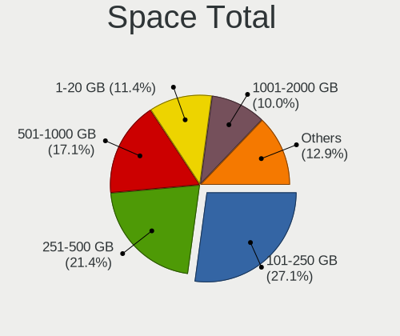
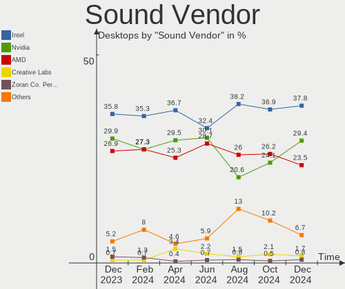
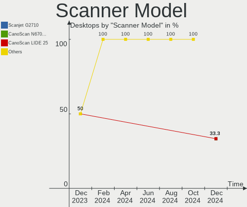

ROSA - Hardware Trends (Desktops)
---------------------------------

A project to identify most popular hardware characteristics and track their change
over time based on data collected by Linux users at https://Linux-Hardware.org.

Anyone can contribute to this report by the [hw-probe](https://github.com/linuxhw/hw-probe) tool:

    sudo -E hw-probe -all -upload

This report is for one last month. Overall report since the beginning of time: [TestDays](https://github.com/linuxhw/TestDays)

Period: Dec, 2023.

Contents
--------

* [ System ](#system)
  - [ OS                       ](#os)
  - [ OS Family                ](#os-family)
  - [ Kernel                   ](#kernel)
  - [ Kernel Family            ](#kernel-family)
  - [ Kernel Major Ver.        ](#kernel-major-ver)
  - [ Arch                     ](#arch)
  - [ DE                       ](#de)
  - [ Display Server           ](#display-server)
  - [ Display Manager          ](#display-manager)
  - [ OS Lang                  ](#os-lang)
  - [ Boot Mode                ](#boot-mode)
  - [ Filesystem               ](#filesystem)
  - [ Part. scheme             ](#part-scheme)
  - [ Dual Boot with Linux/BSD ](#dual-boot-with-linuxbsd)
  - [ Dual Boot (Win)          ](#dual-boot-win)

* [ Board ](#board)
  - [ Vendor                   ](#vendor)
  - [ Model                    ](#model)
  - [ Model Family             ](#model-family)
  - [ MFG Year                 ](#mfg-year)
  - [ Form Factor              ](#form-factor)
  - [ Secure Boot              ](#secure-boot)
  - [ Coreboot                 ](#coreboot)
  - [ RAM Size                 ](#ram-size)
  - [ RAM Used                 ](#ram-used)
  - [ Total Drives             ](#total-drives)
  - [ Has CD-ROM               ](#has-cd-rom)
  - [ Has Ethernet             ](#has-ethernet)
  - [ Has WiFi                 ](#has-wifi)
  - [ Has Bluetooth            ](#has-bluetooth)

* [ Location ](#location)
  - [ Country                  ](#country)
  - [ City                     ](#city)

* [ Drives ](#drives)
  - [ Drive Vendor             ](#drive-vendor)
  - [ Drive Model              ](#drive-model)
  - [ HDD Vendor               ](#hdd-vendor)
  - [ SSD Vendor               ](#ssd-vendor)
  - [ Drive Kind               ](#drive-kind)
  - [ Drive Connector          ](#drive-connector)
  - [ Drive Size               ](#drive-size)
  - [ Space Total              ](#space-total)
  - [ Space Used               ](#space-used)
  - [ Malfunc. Drives          ](#malfunc-drives)
  - [ Malfunc. Drive Vendor    ](#malfunc-drive-vendor)
  - [ Malfunc. HDD Vendor      ](#malfunc-hdd-vendor)
  - [ Malfunc. Drive Kind      ](#malfunc-drive-kind)
  - [ Failed Drives            ](#failed-drives)
  - [ Failed Drive Vendor      ](#failed-drive-vendor)
  - [ Drive Status             ](#drive-status)

* [ Storage controller ](#storage-controller)
  - [ Storage Vendor           ](#storage-vendor)
  - [ Storage Model            ](#storage-model)
  - [ Storage Kind             ](#storage-kind)

* [ Processor ](#processor)
  - [ CPU Vendor               ](#cpu-vendor)
  - [ CPU Model                ](#cpu-model)
  - [ CPU Model Family         ](#cpu-model-family)
  - [ CPU Cores                ](#cpu-cores)
  - [ CPU Sockets              ](#cpu-sockets)
  - [ CPU Threads              ](#cpu-threads)
  - [ CPU Op-Modes             ](#cpu-op-modes)
  - [ CPU Microcode            ](#cpu-microcode)
  - [ CPU Microarch            ](#cpu-microarch)

* [ Graphics ](#graphics)
  - [ GPU Vendor               ](#gpu-vendor)
  - [ GPU Model                ](#gpu-model)
  - [ GPU Combo                ](#gpu-combo)
  - [ GPU Driver               ](#gpu-driver)
  - [ GPU Memory               ](#gpu-memory)

* [ Monitor ](#monitor)
  - [ Monitor Vendor           ](#monitor-vendor)
  - [ Monitor Model            ](#monitor-model)
  - [ Monitor Resolution       ](#monitor-resolution)
  - [ Monitor Diagonal         ](#monitor-diagonal)
  - [ Monitor Width            ](#monitor-width)
  - [ Aspect Ratio             ](#aspect-ratio)
  - [ Monitor Area             ](#monitor-area)
  - [ Pixel Density            ](#pixel-density)
  - [ Multiple Monitors        ](#multiple-monitors)

* [ Network ](#network)
  - [ Net Controller Vendor    ](#net-controller-vendor)
  - [ Net Controller Model     ](#net-controller-model)
  - [ Wireless Vendor          ](#wireless-vendor)
  - [ Wireless Model           ](#wireless-model)
  - [ Ethernet Vendor          ](#ethernet-vendor)
  - [ Ethernet Model           ](#ethernet-model)
  - [ Net Controller Kind      ](#net-controller-kind)
  - [ Used Controller          ](#used-controller)
  - [ NICs                     ](#nics)
  - [ IPv6                     ](#ipv6)

* [ Bluetooth ](#bluetooth)
  - [ Bluetooth Vendor         ](#bluetooth-vendor)
  - [ Bluetooth Model          ](#bluetooth-model)

* [ Sound ](#sound)
  - [ Sound Vendor             ](#sound-vendor)
  - [ Sound Model              ](#sound-model)

* [ Memory ](#memory)
  - [ Memory Vendor            ](#memory-vendor)
  - [ Memory Model             ](#memory-model)
  - [ Memory Kind              ](#memory-kind)
  - [ Memory Form Factor       ](#memory-form-factor)
  - [ Memory Size              ](#memory-size)
  - [ Memory Speed             ](#memory-speed)

* [ Printers & scanners ](#printers--scanners)
  - [ Printer Vendor           ](#printer-vendor)
  - [ Printer Model            ](#printer-model)
  - [ Scanner Vendor           ](#scanner-vendor)
  - [ Scanner Model            ](#scanner-model)

* [ Camera ](#camera)
  - [ Camera Vendor            ](#camera-vendor)
  - [ Camera Model             ](#camera-model)

* [ Security ](#security)
  - [ Fingerprint Vendor       ](#fingerprint-vendor)
  - [ Fingerprint Model        ](#fingerprint-model)
  - [ Chipcard Vendor          ](#chipcard-vendor)
  - [ Chipcard Model           ](#chipcard-model)

* [ Unsupported ](#unsupported)
  - [ Unsupported Devices      ](#unsupported-devices)
  - [ Unsupported Device Types ](#unsupported-device-types)

System
------

OS
--

Installed operating systems

| Name        | Desktops | Percent |
|-------------|----------|---------|
| ROSA 12.4   | 76       | 90.48%  |
| ROSA R11.1  | 4        | 4.76%   |
| ROSA 12     | 2        | 2.38%   |
| ROSA 2021.1 | 1        | 1.19%   |
| ROSA 13.0   | 1        | 1.19%   |

OS Family
---------

OS without a version

| Name | Desktops | Percent |
|------|----------|---------|
| ROSA | 84       | 100%    |

Kernel
------

Version of the Linux kernel

| Version                             | Desktops | Percent |
|-------------------------------------|----------|---------|
| 6.1.58-generic-1rosa2021.1-x86_64   | 39       | 46.43%  |
| 6.1.20-generic-2rosa2021.1-x86_64   | 23       | 27.38%  |
| 5.10.184-generic-1rosa2021.1-x86_64 | 7        | 8.33%   |
| 5.15.127-generic-1rosa2021.1-x86_64 | 4        | 4.76%   |
| 5.15.127-generic-1rosa2021.1-i686   | 2        | 2.38%   |
| 4.15.0-desktop-122.124.1rosa-i586   | 2        | 2.38%   |
| 6.1.58-generic-3rosa2023.1-x86_64   | 1        | 1.19%   |
| 6.1.46-generic-2rosa2021.1-x86_64   | 1        | 1.19%   |
| 5.17.11-generic-2rosa2021.1-x86_64  | 1        | 1.19%   |
| 5.10.74-generic-2rosa2021.1-x86_64  | 1        | 1.19%   |
| 5.10.74-generic-2rosa2021.1-i586    | 1        | 1.19%   |
| 4.9.155-nrj-desktop-1rosa-x86_64    | 1        | 1.19%   |
| 4.15.0-desktop-122.124.1rosa-x86_64 | 1        | 1.19%   |

Kernel Family
-------------

Linux kernel without a distro release

| Version  | Desktops | Percent |
|----------|----------|---------|
| 6.1.58   | 40       | 47.62%  |
| 6.1.20   | 23       | 27.38%  |
| 5.10.184 | 7        | 8.33%   |
| 5.15.127 | 6        | 7.14%   |
| 4.15.0   | 3        | 3.57%   |
| 5.10.74  | 2        | 2.38%   |
| 6.1.46   | 1        | 1.19%   |
| 5.17.11  | 1        | 1.19%   |
| 4.9.155  | 1        | 1.19%   |

Kernel Major Ver.
-----------------

Linux kernel major version

| Version | Desktops | Percent |
|---------|----------|---------|
| 6.1     | 64       | 76.19%  |
| 5.10    | 9        | 10.71%  |
| 5.15    | 6        | 7.14%   |
| 4.15    | 3        | 3.57%   |
| 5.17    | 1        | 1.19%   |
| 4.9     | 1        | 1.19%   |

Arch
----

OS architecture (x86_64, i586, etc.)

| Name   | Desktops | Percent |
|--------|----------|---------|
| x86_64 | 79       | 94.05%  |
| i686   | 5        | 5.95%   |

DE
--

Desktop Environment

| Name    | Desktops | Percent |
|---------|----------|---------|
| KDE5    | 50       | 59.52%  |
| GNOME   | 20       | 23.81%  |
| LXQt    | 7        | 8.33%   |
| KDE4    | 4        | 4.76%   |
| XFCE    | 1        | 1.19%   |
| MATE    | 1        | 1.19%   |
| Unknown | 1        | 1.19%   |

Display Server
--------------

X11 or Wayland

| Name    | Desktops | Percent |
|---------|----------|---------|
| Wayland | 60       | 71.43%  |
| X11     | 23       | 27.38%  |
| Unknown | 1        | 1.19%   |

Display Manager
---------------

SDDM, LightDM, etc.

| Name    | Desktops | Percent |
|---------|----------|---------|
| SDDM    | 49       | 58.33%  |
| GDM     | 25       | 29.76%  |
| LightDM | 4        | 4.76%   |
| KDM     | 4        | 4.76%   |
| Unknown | 2        | 2.38%   |

OS Lang
-------

Language

| Lang  | Desktops | Percent |
|-------|----------|---------|
| ru_RU | 76       | 90.48%  |
| de_DE | 4        | 4.76%   |
| pl_PL | 1        | 1.19%   |
| fr_FR | 1        | 1.19%   |
| en_US | 1        | 1.19%   |
| en_GB | 1        | 1.19%   |

Boot Mode
---------

EFI or BIOS

| Mode | Desktops | Percent |
|------|----------|---------|
| BIOS | 44       | 52.38%  |
| EFI  | 40       | 47.62%  |

Filesystem
----------

Type of filesystem

| Type  | Desktops | Percent |
|-------|----------|---------|
| Ext4  | 75       | 89.29%  |
| Btrfs | 8        | 9.52%   |
| F2fs  | 1        | 1.19%   |

Part. scheme
------------

Scheme of partitioning

| Type    | Desktops | Percent |
|---------|----------|---------|
| GPT     | 47       | 55.95%  |
| MBR     | 36       | 42.86%  |
| Unknown | 1        | 1.19%   |

Dual Boot with Linux/BSD
------------------------

Hosting more than one Linux/BSD

| Dual boot | Desktops | Percent |
|-----------|----------|---------|
| No        | 63       | 75%     |
| Yes       | 21       | 25%     |

Dual Boot (Win)
---------------

Hosting Linux and Windows

| Dual boot | Desktops | Percent |
|-----------|----------|---------|
| No        | 44       | 52.38%  |
| Yes       | 40       | 47.62%  |

Board
-----

Vendor
------

Motherboard manufacturer

| Name                | Desktops | Percent |
|---------------------|----------|---------|
| ASUSTek Computer    | 23       | 27.38%  |
| Gigabyte Technology | 20       | 23.81%  |
| MSI                 | 13       | 15.48%  |
| ASRock              | 8        | 9.52%   |
| Intel               | 4        | 4.76%   |
| Hewlett-Packard     | 3        | 3.57%   |
| AZW                 | 3        | 3.57%   |
| Lenovo              | 2        | 2.38%   |
| OEM                 | 1        | 1.19%   |
| INTECH PRO          | 1        | 1.19%   |
| HJS                 | 1        | 1.19%   |
| Dell                | 1        | 1.19%   |
| Biostar             | 1        | 1.19%   |
| BESSTAR Tech        | 1        | 1.19%   |
| Acer                | 1        | 1.19%   |
| Unknown             | 1        | 1.19%   |

Model
-----

Motherboard model

| Name                             | Desktops | Percent |
|----------------------------------|----------|---------|
| Gigabyte B450M DS3H              | 2        | 2.38%   |
| Gigabyte A320M-H                 | 2        | 2.38%   |
| AZW MINI S                       | 2        | 2.38%   |
| ASUS P8H61-M LX                  | 2        | 2.38%   |
| ASUS All Series                  | 2        | 2.38%   |
| OEM X79G                         | 1        | 1.19%   |
| MSI MS-7D22                      | 1        | 1.19%   |
| MSI MS-7C95                      | 1        | 1.19%   |
| MSI MS-7C83                      | 1        | 1.19%   |
| MSI MS-7C52                      | 1        | 1.19%   |
| MSI MS-7B22                      | 1        | 1.19%   |
| MSI MS-7996                      | 1        | 1.19%   |
| MSI MS-7895                      | 1        | 1.19%   |
| MSI MS-7641                      | 1        | 1.19%   |
| MSI MS-7640                      | 1        | 1.19%   |
| MSI MS-7599                      | 1        | 1.19%   |
| MSI MS-7592                      | 1        | 1.19%   |
| MSI MPG B560 Trident A (MS-B926) | 1        | 1.19%   |
| MSI Cubi N 8GL (MS-B171)         | 1        | 1.19%   |
| Lenovo ThinkCentre M78 10BS      | 1        | 1.19%   |
| Lenovo S510 10KW003FRU           | 1        | 1.19%   |
| Intel SKYBAY                     | 1        | 1.19%   |
| Intel H81 V2.3                   | 1        | 1.19%   |
| Intel DZ68DB AAG27985-105        | 1        | 1.19%   |
| Intel D410PT AAE76528-404        | 1        | 1.19%   |
| INTECH PRO H510-M2               | 1        | 1.19%   |
| HJS HJS-OPS-ADLP-A07             | 1        | 1.19%   |
| HP Pavilion Desktop PC 570-p0xx  | 1        | 1.19%   |
| HP Compaq 8200 Elite SFF PC      | 1        | 1.19%   |
| HP Compaq 8200 Elite CMT PC      | 1        | 1.19%   |
| Gigabyte Z97-HD3                 | 1        | 1.19%   |
| Gigabyte X38-DS5                 | 1        | 1.19%   |
| Gigabyte Pro, Std, Elt Series    | 1        | 1.19%   |
| Gigabyte H110M-S2H               | 1        | 1.19%   |
| Gigabyte GB-BXBT-2807            | 1        | 1.19%   |
| Gigabyte GA-MA69G-S3H            | 1        | 1.19%   |
| Gigabyte GA-A55M-DS2             | 1        | 1.19%   |
| Gigabyte GA-870A-UD3             | 1        | 1.19%   |
| Gigabyte F2A68HM-DS2             | 1        | 1.19%   |
| Gigabyte EP45-DS3L               | 1        | 1.19%   |

Model Family
------------

Motherboard model prefix

| Name                  | Desktops | Percent |
|-----------------------|----------|---------|
| ASUS P8H61-M          | 4        | 4.76%   |
| HP Compaq             | 2        | 2.38%   |
| Gigabyte B450M        | 2        | 2.38%   |
| Gigabyte A320M-H      | 2        | 2.38%   |
| AZW MINI              | 2        | 2.38%   |
| ASUS PRIME            | 2        | 2.38%   |
| ASUS All              | 2        | 2.38%   |
| OEM X79G              | 1        | 1.19%   |
| MSI MS-7D22           | 1        | 1.19%   |
| MSI MS-7C95           | 1        | 1.19%   |
| MSI MS-7C83           | 1        | 1.19%   |
| MSI MS-7C52           | 1        | 1.19%   |
| MSI MS-7B22           | 1        | 1.19%   |
| MSI MS-7996           | 1        | 1.19%   |
| MSI MS-7895           | 1        | 1.19%   |
| MSI MS-7641           | 1        | 1.19%   |
| MSI MS-7640           | 1        | 1.19%   |
| MSI MS-7599           | 1        | 1.19%   |
| MSI MS-7592           | 1        | 1.19%   |
| MSI MPG               | 1        | 1.19%   |
| MSI Cubi              | 1        | 1.19%   |
| Lenovo ThinkCentre    | 1        | 1.19%   |
| Lenovo S510           | 1        | 1.19%   |
| Intel SKYBAY          | 1        | 1.19%   |
| Intel H81             | 1        | 1.19%   |
| Intel DZ68DB          | 1        | 1.19%   |
| Intel D410PT          | 1        | 1.19%   |
| INTECH PRO H510-M2    | 1        | 1.19%   |
| HJS HJS-OPS-ADLP-A07  | 1        | 1.19%   |
| HP Pavilion           | 1        | 1.19%   |
| Gigabyte Z97-HD3      | 1        | 1.19%   |
| Gigabyte X38-DS5      | 1        | 1.19%   |
| Gigabyte Pro          | 1        | 1.19%   |
| Gigabyte H110M-S2H    | 1        | 1.19%   |
| Gigabyte GB-BXBT-2807 | 1        | 1.19%   |
| Gigabyte GA-MA69G-S3H | 1        | 1.19%   |
| Gigabyte GA-A55M-DS2  | 1        | 1.19%   |
| Gigabyte GA-870A-UD3  | 1        | 1.19%   |
| Gigabyte F2A68HM-DS2  | 1        | 1.19%   |
| Gigabyte EP45-DS3L    | 1        | 1.19%   |

MFG Year
--------

Motherboard manufacture year

| Year | Desktops | Percent |
|------|----------|---------|
| 2018 | 9        | 10.71%  |
| 2011 | 9        | 10.71%  |
| 2023 | 6        | 7.14%   |
| 2020 | 6        | 7.14%   |
| 2015 | 6        | 7.14%   |
| 2013 | 6        | 7.14%   |
| 2009 | 6        | 7.14%   |
| 2021 | 5        | 5.95%   |
| 2014 | 5        | 5.95%   |
| 2012 | 5        | 5.95%   |
| 2016 | 4        | 4.76%   |
| 2010 | 4        | 4.76%   |
| 2017 | 3        | 3.57%   |
| 2007 | 3        | 3.57%   |
| 2022 | 2        | 2.38%   |
| 2008 | 2        | 2.38%   |
| 2005 | 2        | 2.38%   |
| 2006 | 1        | 1.19%   |

Form Factor
-----------

Physical design of the computer

| Name    | Desktops | Percent |
|---------|----------|---------|
| Desktop | 84       | 100%    |

Secure Boot
-----------

Enabled or disabled

| State    | Desktops | Percent |
|----------|----------|---------|
| Disabled | 84       | 100%    |

Coreboot
--------

Have coreboot on board

| Used | Desktops | Percent |
|------|----------|---------|
| No   | 84       | 100%    |

RAM Size
--------

Total RAM memory

| Size in GB  | Desktops | Percent |
|-------------|----------|---------|
| 8.01-16.0   | 29       | 34.52%  |
| 4.01-8.0    | 17       | 20.24%  |
| 3.01-4.0    | 13       | 15.48%  |
| 16.01-24.0  | 12       | 14.29%  |
| 32.01-64.0  | 3        | 3.57%   |
| 64.01-256.0 | 3        | 3.57%   |
| 24.01-32.0  | 2        | 2.38%   |
| 2.01-3.0    | 2        | 2.38%   |
| 1.01-2.0    | 2        | 2.38%   |
| 0.51-1.0    | 1        | 1.19%   |

RAM Used
--------

Used RAM memory

| Used GB  | Desktops | Percent |
|----------|----------|---------|
| 1.01-2.0 | 39       | 46.43%  |
| 2.01-3.0 | 18       | 21.43%  |
| 0.51-1.0 | 14       | 16.67%  |
| 3.01-4.0 | 6        | 7.14%   |
| 4.01-8.0 | 5        | 5.95%   |
| 0.01-0.5 | 2        | 2.38%   |

Total Drives
------------

Number of drives on board

| Drives | Desktops | Percent |
|--------|----------|---------|
| 1      | 38       | 45.24%  |
| 2      | 16       | 19.05%  |
| 3      | 15       | 17.86%  |
| 4      | 9        | 10.71%  |
| 5      | 4        | 4.76%   |
| 7      | 1        | 1.19%   |
| 6      | 1        | 1.19%   |

Has CD-ROM
----------

Has CD-ROM on board

| Presented | Desktops | Percent |
|-----------|----------|---------|
| No        | 49       | 58.33%  |
| Yes       | 35       | 41.67%  |

Has Ethernet
------------

Has Ethernet on board

| Presented | Desktops | Percent |
|-----------|----------|---------|
| Yes       | 84       | 100%    |

Has WiFi
--------

Has WiFi module

| Presented | Desktops | Percent |
|-----------|----------|---------|
| No        | 52       | 61.9%   |
| Yes       | 32       | 38.1%   |

Has Bluetooth
-------------

Has Bluetooth module

| Presented | Desktops | Percent |
|-----------|----------|---------|
| No        | 58       | 69.05%  |
| Yes       | 26       | 30.95%  |

Location
--------

Country
-------

Geographic location (country)

| Country    | Desktops | Percent |
|------------|----------|---------|
| Russia     | 73       | 86.9%   |
| Germany    | 4        | 4.76%   |
| Kazakhstan | 2        | 2.38%   |
| Ukraine    | 1        | 1.19%   |
| Poland     | 1        | 1.19%   |
| France     | 1        | 1.19%   |
| Belarus    | 1        | 1.19%   |
| Barbados   | 1        | 1.19%   |

City
----

Geographic location (city)

| City                | Desktops | Percent |
|---------------------|----------|---------|
| Moscow              | 13       | 15.48%  |
| St Petersburg       | 5        | 5.95%   |
| Novosibirsk         | 4        | 4.76%   |
| Tyumen              | 3        | 3.57%   |
| Krasnodar           | 3        | 3.57%   |
| Yekaterinburg       | 2        | 2.38%   |
| Voronezh            | 2        | 2.38%   |
| Stavropol           | 2        | 2.38%   |
| Smolensk            | 2        | 2.38%   |
| Shchelkovo          | 2        | 2.38%   |
| Samara              | 2        | 2.38%   |
| Dubna               | 2        | 2.38%   |
| Bryansk             | 2        | 2.38%   |
| Zlatoust            | 1        | 1.19%   |
| Wroclaw             | 1        | 1.19%   |
| Vyksa               | 1        | 1.19%   |
| Tver                | 1        | 1.19%   |
| Tambov              | 1        | 1.19%   |
| Severin             | 1        | 1.19%   |
| Rostov-on-Don       | 1        | 1.19%   |
| Ramenskoye          | 1        | 1.19%   |
| Ozersk              | 1        | 1.19%   |
| Orenburg            | 1        | 1.19%   |
| Omsk                | 1        | 1.19%   |
| Nuremberg           | 1        | 1.19%   |
| Nizhnekamsk         | 1        | 1.19%   |
| Neusass             | 1        | 1.19%   |
| Nerekhta            | 1        | 1.19%   |
| Naberezhnyye Chelny | 1        | 1.19%   |
| Murmansk            | 1        | 1.19%   |
| Loskutova           | 1        | 1.19%   |
| Kursk               | 1        | 1.19%   |
| Kumertau            | 1        | 1.19%   |
| Kostroma            | 1        | 1.19%   |
| Kemerovo            | 1        | 1.19%   |
| Irkutsk             | 1        | 1.19%   |
| Hohen Wangelin      | 1        | 1.19%   |
| Gukovo              | 1        | 1.19%   |
| Gomel               | 1        | 1.19%   |
| Engel's             | 1        | 1.19%   |

Drives
------

Drive Vendor
------------

Hard drive vendors

| Vendor                      | Desktops | Drives | Percent |
|-----------------------------|----------|--------|---------|
| WDC                         | 29       | 46     | 18.13%  |
| Seagate                     | 19       | 21     | 11.88%  |
| Samsung Electronics         | 17       | 19     | 10.63%  |
| Toshiba                     | 12       | 13     | 7.5%    |
| Hitachi                     | 9        | 10     | 5.63%   |
| Crucial                     | 7        | 8      | 4.38%   |
| Kingston                    | 6        | 7      | 3.75%   |
| AMD                         | 4        | 4      | 2.5%    |
| A-DATA Technology           | 4        | 4      | 2.5%    |
| Unknown                     | 3        | 3      | 1.88%   |
| SanDisk                     | 3        | 3      | 1.88%   |
| Fujitsu                     | 3        | 3      | 1.88%   |
| China                       | 3        | 3      | 1.88%   |
| Apacer                      | 3        | 3      | 1.88%   |
| SPCC                        | 2        | 2      | 1.25%   |
| Phison Electronics          | 2        | 2      | 1.25%   |
| Phison                      | 2        | 2      | 1.25%   |
| Patriot                     | 2        | 2      | 1.25%   |
| OCZ                         | 2        | 2      | 1.25%   |
| Maxtor                      | 2        | 2      | 1.25%   |
| HGST                        | 2        | 2      | 1.25%   |
| GOODRAM                     | 2        | 3      | 1.25%   |
| XrayDisk                    | 1        | 1      | 0.63%   |
| XPG                         | 1        | 1      | 0.63%   |
| WALRAM                      | 1        | 1      | 0.63%   |
| Smartbuy                    | 1        | 1      | 0.63%   |
| Plextor                     | 1        | 1      | 0.63%   |
| NT-2TB                      | 1        | 1      | 0.63%   |
| Netac                       | 1        | 1      | 0.63%   |
| MAXIO Technology (Hangzhou) | 1        | 1      | 0.63%   |
| LITEON                      | 1        | 1      | 0.63%   |
| Kingston Technology Company | 1        | 1      | 0.63%   |
| KingSpec                    | 1        | 1      | 0.63%   |
| Intel                       | 1        | 1      | 0.63%   |
| Integral                    | 1        | 1      | 0.63%   |
| Gigabyte Technology         | 1        | 1      | 0.63%   |
| Emtec                       | 1        | 1      | 0.63%   |
| Digma                       | 1        | 1      | 0.63%   |
| DEXP                        | 1        | 1      | 0.63%   |
| CT240BX3                    | 1        | 1      | 0.63%   |

Drive Model
-----------

Hard drive models

| Model                            | Desktops | Percent |
|----------------------------------|----------|---------|
| Toshiba HDWD105 500GB            | 4        | 2.2%    |
| Kingston SA400S37240G 240GB SSD  | 3        | 1.65%   |
| Crucial CT480BX500SSD1 480GB     | 3        | 1.65%   |
| WDC WD5000AAKX-001CA0 500GB      | 2        | 1.1%    |
| WDC WD40EZAZ-00SF3B0 4TB         | 2        | 1.1%    |
| WDC WD10EZEX-08WN4A0 1TB         | 2        | 1.1%    |
| Unknown SD/MMC/MS PRO 512GB      | 2        | 1.1%    |
| Toshiba HDWD110 1TB              | 2        | 1.1%    |
| Toshiba DT01ACA050 500GB         | 2        | 1.1%    |
| Seagate ST380815AS 80GB          | 2        | 1.1%    |
| Samsung SSD 870 EVO 500GB        | 2        | 1.1%    |
| Samsung SSD 870 EVO 250GB        | 2        | 1.1%    |
| Samsung SSD 860 EVO 250GB        | 2        | 1.1%    |
| Samsung HD154UI 1TB              | 2        | 1.1%    |
| Kingston SA400S37480G 480GB SSD  | 2        | 1.1%    |
| HGST HTS545032A7E680 320GB       | 2        | 1.1%    |
| Crucial CT120BX500SSD1 120GB     | 2        | 1.1%    |
| AMD R5SL120G 120GB SSD           | 2        | 1.1%    |
| AMD R5MP120G8 120GB              | 2        | 1.1%    |
| XrayDisk SSD 128GB               | 1        | 0.55%   |
| XPG GAMMIX S11 Pro 256GB         | 1        | 0.55%   |
| WDC WDS500G3X0C-00SJG0 500GB     | 1        | 0.55%   |
| WDC WDS500G2B0A-00SM50 500GB SSD | 1        | 0.55%   |
| WDC WDS480G2G0A-00JH30 480GB SSD | 1        | 0.55%   |
| WDC WDS240G1G0A-00SS50 240GB SSD | 1        | 0.55%   |
| WDC WDS120G2G0A-00JH30 120GB SSD | 1        | 0.55%   |
| WDC WD82PURZ-85TEUY0 8TB         | 1        | 0.55%   |
| WDC WD800BB-00JHC0 80GB          | 1        | 0.55%   |
| WDC WD63PURZ-85B4VY0 6TB         | 1        | 0.55%   |
| WDC WD6003FZBX-00K5WB0 6TB       | 1        | 0.55%   |
| WDC WD5000LPVX-22V0TT0 500GB     | 1        | 0.55%   |
| WDC WD5000LPCX-24VHAT0 500GB     | 1        | 0.55%   |
| WDC WD5000LPCX-21VHAT0 500GB     | 1        | 0.55%   |
| WDC WD5000BPKX-00HPJT0 500GB     | 1        | 0.55%   |
| WDC WD5000AAVS-00ZTB0 500GB      | 1        | 0.55%   |
| WDC WD5000AAKX-08ERMA0 500GB     | 1        | 0.55%   |
| WDC WD5000AAKX-00ERMA0 500GB     | 1        | 0.55%   |
| WDC WD5000AAKS-00V1A0 500GB      | 1        | 0.55%   |
| WDC WD5000A 500GB                | 1        | 0.55%   |
| WDC WD40EZRZ-75GXCB0 4TB         | 1        | 0.55%   |

HDD Vendor
----------

Hard disk drive vendors

| Vendor              | Desktops | Drives | Percent |
|---------------------|----------|--------|---------|
| WDC                 | 25       | 39     | 31.65%  |
| Seagate             | 19       | 21     | 24.05%  |
| Toshiba             | 11       | 12     | 13.92%  |
| Hitachi             | 9        | 10     | 11.39%  |
| Samsung Electronics | 6        | 6      | 7.59%   |
| Fujitsu             | 3        | 3      | 3.8%    |
| Unknown             | 2        | 2      | 2.53%   |
| Maxtor              | 2        | 2      | 2.53%   |
| HGST                | 2        | 2      | 2.53%   |

SSD Vendor
----------

Solid state drive vendors

| Vendor              | Desktops | Drives | Percent |
|---------------------|----------|--------|---------|
| Samsung Electronics | 7        | 9      | 11.48%  |
| Crucial             | 7        | 7      | 11.48%  |
| Kingston            | 5        | 6      | 8.2%    |
| WDC                 | 4        | 5      | 6.56%   |
| A-DATA Technology   | 4        | 4      | 6.56%   |
| SanDisk             | 3        | 3      | 4.92%   |
| China               | 3        | 3      | 4.92%   |
| Patriot             | 2        | 2      | 3.28%   |
| OCZ                 | 2        | 2      | 3.28%   |
| GOODRAM             | 2        | 3      | 3.28%   |
| Apacer              | 2        | 2      | 3.28%   |
| AMD                 | 2        | 2      | 3.28%   |
| XrayDisk            | 1        | 1      | 1.64%   |
| WALRAM              | 1        | 1      | 1.64%   |
| Toshiba             | 1        | 1      | 1.64%   |
| SPCC                | 1        | 1      | 1.64%   |
| Plextor             | 1        | 1      | 1.64%   |
| NT-2TB              | 1        | 1      | 1.64%   |
| LITEON              | 1        | 1      | 1.64%   |
| KingSpec            | 1        | 1      | 1.64%   |
| Intel               | 1        | 1      | 1.64%   |
| Integral            | 1        | 1      | 1.64%   |
| Gigabyte Technology | 1        | 1      | 1.64%   |
| Emtec               | 1        | 1      | 1.64%   |
| Digma               | 1        | 1      | 1.64%   |
| DEXP                | 1        | 1      | 1.64%   |
| CT240BX3            | 1        | 1      | 1.64%   |
| CHN25SATAS1         | 1        | 1      | 1.64%   |
| BR                  | 1        | 1      | 1.64%   |
| AXIOMTEK            | 1        | 1      | 1.64%   |

Drive Kind
----------

HDD or SSD

| Kind | Desktops | Drives | Percent |
|------|----------|--------|---------|
| HDD  | 62       | 97     | 46.97%  |
| SSD  | 49       | 66     | 37.12%  |
| NVMe | 20       | 22     | 15.15%  |
| MMC  | 1        | 1      | 0.76%   |

Drive Connector
---------------

SATA, SAS, NVMe, etc.

| Type | Desktops | Drives | Percent |
|------|----------|--------|---------|
| SATA | 79       | 160    | 76.7%   |
| NVMe | 20       | 22     | 19.42%  |
| SAS  | 3        | 3      | 2.91%   |
| MMC  | 1        | 1      | 0.97%   |

Drive Size
----------

Size of hard drive

| Size in TB | Desktops | Drives | Percent |
|------------|----------|--------|---------|
| 0.01-0.5   | 71       | 114    | 63.96%  |
| 0.51-1.0   | 21       | 29     | 18.92%  |
| 1.01-2.0   | 10       | 10     | 9.01%   |
| 3.01-4.0   | 4        | 5      | 3.6%    |
| 4.01-10.0  | 3        | 3      | 2.7%    |
| 2.01-3.0   | 2        | 2      | 1.8%    |

Space Total
-----------

Amount of disk space available on the file system

| Size in GB     | Desktops | Percent |
|----------------|----------|---------|
| 101-250        | 20       | 23.81%  |
| 251-500        | 17       | 20.24%  |
| 1001-2000      | 10       | 11.9%   |
| 501-1000       | 10       | 11.9%   |
| 1-20           | 7        | 8.33%   |
| More than 3000 | 5        | 5.95%   |
| 21-50          | 5        | 5.95%   |
| 2001-3000      | 5        | 5.95%   |
| 51-100         | 5        | 5.95%   |

Space Used
----------

Amount of used disk space

| Used GB        | Desktops | Percent |
|----------------|----------|---------|
| 1-20           | 39       | 46.43%  |
| 21-50          | 14       | 16.67%  |
| 251-500        | 8        | 9.52%   |
| 1001-2000      | 6        | 7.14%   |
| 101-250        | 5        | 5.95%   |
| 501-1000       | 5        | 5.95%   |
| 51-100         | 5        | 5.95%   |
| More than 3000 | 2        | 2.38%   |

Malfunc. Drives
---------------

Drive models with a malfunction

| Model                           | Desktops | Drives | Percent |
|---------------------------------|----------|--------|---------|
| Seagate ST380815AS 80GB         | 2        | 2      | 5.56%   |
| WDC WD800BB-00JHC0 80GB         | 1        | 1      | 2.78%   |
| WDC WD5000AAKX-00ERMA0 500GB    | 1        | 1      | 2.78%   |
| WDC WD5000AAKX-001CA0 500GB     | 1        | 1      | 2.78%   |
| WDC WD5000AAKS-00V1A0 500GB     | 1        | 1      | 2.78%   |
| WDC WD3200BEVT-80A0RT0 320GB    | 1        | 1      | 2.78%   |
| WDC WD10EFRX-68JCSN0 1TB        | 1        | 1      | 2.78%   |
| WDC WD10EARS-00Y5B1 1TB         | 1        | 2      | 2.78%   |
| WDC WD10EALS-00Z8A0 1TB         | 1        | 1      | 2.78%   |
| WDC WD Green 2.5 240GB SSD      | 1        | 1      | 2.78%   |
| Toshiba HDWD110 1TB             | 1        | 1      | 2.78%   |
| Toshiba DT01ACA050 500GB        | 1        | 1      | 2.78%   |
| Seagate ST9320325AS 320GB       | 1        | 1      | 2.78%   |
| Seagate ST500DM002-1BD142 500GB | 1        | 1      | 2.78%   |
| Seagate ST380011A 80GB          | 1        | 1      | 2.78%   |
| Seagate ST3250310AS 250GB       | 1        | 1      | 2.78%   |
| Seagate ST3000VX010-2E3166 3TB  | 1        | 1      | 2.78%   |
| Seagate ST2000DM006-2DM164 2TB  | 1        | 1      | 2.78%   |
| Seagate ST2000DL003-9VT166 2TB  | 1        | 1      | 2.78%   |
| Plextor PX-128M5Pro 128GB SSD   | 1        | 1      | 2.78%   |
| OCZ VERTEX460A 120GB SSD        | 1        | 1      | 2.78%   |
| OCZ VERTEX4 256GB SSD           | 1        | 1      | 2.78%   |
| Maxtor STM3250310AS 250GB       | 1        | 1      | 2.78%   |
| Maxtor 6B250R0 256GB            | 1        | 1      | 2.78%   |
| Intel SSDSC2BW240A4 240GB       | 1        | 1      | 2.78%   |
| Hitachi HTS547550A9E384 500GB   | 1        | 1      | 2.78%   |
| Hitachi HTS542516K9SA00 160GB   | 1        | 1      | 2.78%   |
| Hitachi HDS722512VLAT20 128GB   | 1        | 1      | 2.78%   |
| Hitachi HDS721010CLA330 1TB     | 1        | 1      | 2.78%   |
| Hitachi HDP725025GLA380 250GB   | 1        | 1      | 2.78%   |
| Fujitsu MHZ2160BH G1 160GB      | 1        | 1      | 2.78%   |
| Fujitsu MHV2100BH 100GB         | 1        | 1      | 2.78%   |
| CHN25SATAS1 SSD 128 128GB       | 1        | 1      | 2.78%   |
| China 1TB SSD                   | 1        | 1      | 2.78%   |
| A-DATA Technology XM13 32GB SSD | 1        | 1      | 2.78%   |

Malfunc. Drive Vendor
---------------------

Vendors of faulty drives

| Vendor            | Desktops | Drives | Percent |
|-------------------|----------|--------|---------|
| Seagate           | 9        | 9      | 25.71%  |
| WDC               | 8        | 10     | 22.86%  |
| Hitachi           | 5        | 5      | 14.29%  |
| Toshiba           | 2        | 2      | 5.71%   |
| OCZ               | 2        | 2      | 5.71%   |
| Maxtor            | 2        | 2      | 5.71%   |
| Fujitsu           | 2        | 2      | 5.71%   |
| Plextor           | 1        | 1      | 2.86%   |
| Intel             | 1        | 1      | 2.86%   |
| CHN25SATAS1       | 1        | 1      | 2.86%   |
| China             | 1        | 1      | 2.86%   |
| A-DATA Technology | 1        | 1      | 2.86%   |

Malfunc. HDD Vendor
-------------------

Vendors of faulty HDD drives

| Vendor  | Desktops | Drives | Percent |
|---------|----------|--------|---------|
| Seagate | 9        | 9      | 33.33%  |
| WDC     | 7        | 9      | 25.93%  |
| Hitachi | 5        | 5      | 18.52%  |
| Toshiba | 2        | 2      | 7.41%   |
| Maxtor  | 2        | 2      | 7.41%   |
| Fujitsu | 2        | 2      | 7.41%   |

Malfunc. Drive Kind
-------------------

Kinds of faulty drives

| Kind | Desktops | Drives | Percent |
|------|----------|--------|---------|
| HDD  | 23       | 29     | 74.19%  |
| SSD  | 8        | 8      | 25.81%  |

Failed Drives
-------------

Failed drive models

| Model                            | Desktops | Drives | Percent |
|----------------------------------|----------|--------|---------|
| Samsung Electronics HD080HJ 80GB | 1        | 1      | 100%    |

Failed Drive Vendor
-------------------

Failed drive vendors

| Vendor              | Desktops | Drives | Percent |
|---------------------|----------|--------|---------|
| Samsung Electronics | 1        | 1      | 100%    |

Drive Status
------------

Number of failed and malfunc. drives

| Status   | Desktops | Drives | Percent |
|----------|----------|--------|---------|
| Works    | 71       | 138    | 65.74%  |
| Malfunc  | 28       | 37     | 25.93%  |
| Detected | 8        | 10     | 7.41%   |
| Failed   | 1        | 1      | 0.93%   |

Storage controller
------------------

Storage Vendor
--------------

Storage controller vendors

| Vendor                      | Desktops | Percent |
|-----------------------------|----------|---------|
| Intel                       | 48       | 42.11%  |
| AMD                         | 29       | 25.44%  |
| Phison Electronics          | 7        | 6.14%   |
| JMicron Technology          | 7        | 6.14%   |
| Nvidia                      | 6        | 5.26%   |
| Samsung Electronics         | 4        | 3.51%   |
| Silicon Motion              | 2        | 1.75%   |
| SanDisk                     | 2        | 1.75%   |
| Kingston Technology Company | 2        | 1.75%   |
| VIA Technologies            | 1        | 0.88%   |
| Silicon Image               | 1        | 0.88%   |
| Micron/Crucial Technology   | 1        | 0.88%   |
| MAXIO Technology (Hangzhou) | 1        | 0.88%   |
| Marvell Technology Group    | 1        | 0.88%   |
| INNOGRIT                    | 1        | 0.88%   |
| ADATA Technology            | 1        | 0.88%   |

Storage Model
-------------

Storage controller models

| Model                                                                                   | Desktops | Percent |
|-----------------------------------------------------------------------------------------|----------|---------|
| AMD FCH SATA Controller [AHCI mode]                                                     | 12       | 8.51%   |
| AMD SB7x0/SB8x0/SB9x0 SATA Controller [AHCI mode]                                       | 8        | 5.67%   |
| Intel Q170/Q150/B150/H170/H110/Z170/CM236 Chipset SATA Controller [AHCI Mode]           | 5        | 3.55%   |
| Intel 6 Series/C200 Series Chipset Family 6 port Desktop SATA AHCI Controller           | 5        | 3.55%   |
| Phison PS5013-E13 PCIe3 NVMe Controller (DRAM-less)                                     | 4        | 2.84%   |
| JMicron JMB363 SATA/IDE Controller                                                      | 4        | 2.84%   |
| Intel NM10/ICH7 Family SATA Controller [IDE mode]                                       | 4        | 2.84%   |
| Intel 8 Series/C220 Series Chipset Family 6-port SATA Controller 1 [AHCI mode]          | 4        | 2.84%   |
| Intel 6 Series/C200 Series Chipset Family Desktop SATA Controller (IDE mode, ports 4-5) | 4        | 2.84%   |
| Intel 6 Series/C200 Series Chipset Family Desktop SATA Controller (IDE mode, ports 0-3) | 4        | 2.84%   |
| AMD SB7x0/SB8x0/SB9x0 IDE Controller                                                    | 4        | 2.84%   |
| AMD 500 Series Chipset SATA Controller                                                  | 4        | 2.84%   |
| AMD FCH SATA Controller D                                                               | 3        | 2.13%   |
| AMD 400 Series Chipset SATA Controller                                                  | 3        | 2.13%   |
| Silicon Motion SM2263EN/SM2263XT (DRAM-less) NVMe SSD Controllers                       | 2        | 1.42%   |
| Samsung NVMe SSD Controller SM961/PM961/SM963                                           | 2        | 1.42%   |
| Phison E12 NVMe Controller                                                              | 2        | 1.42%   |
| Nvidia MCP61 SATA Controller                                                            | 2        | 1.42%   |
| Nvidia MCP61 IDE                                                                        | 2        | 1.42%   |
| JMicron JMB368 IDE controller                                                           | 2        | 1.42%   |
| Intel SATA controller                                                                   | 2        | 1.42%   |
| Intel Celeron/Pentium Silver Processor SATA Controller                                  | 2        | 1.42%   |
| Intel Cannon Lake PCH SATA AHCI Controller                                              | 2        | 1.42%   |
| Intel 9 Series Chipset Family SATA Controller [AHCI Mode]                               | 2        | 1.42%   |
| Intel 82801G (ICH7 Family) IDE Controller                                               | 2        | 1.42%   |
| Intel 500 Series Chipset Family SATA AHCI Controller                                    | 2        | 1.42%   |
| Intel 5 Series/3400 Series Chipset 6 port SATA AHCI Controller                          | 2        | 1.42%   |
| AMD 300 Series Chipset SATA Controller                                                  | 2        | 1.42%   |
| VIA VT6415 PATA IDE Host Controller                                                     | 1        | 0.71%   |
| Silicon Image SiI 3114 [SATALink/SATARaid] Serial ATA Controller                        | 1        | 0.71%   |
| SanDisk Ultra 3D / WD Blue SN550 NVMe SSD                                               | 1        | 0.71%   |
| SanDisk Extreme Pro / WD Black SN750 / PC SN730 / Red SN700 NVMe SSD                    | 1        | 0.71%   |
| Samsung NVMe SSD Controller SM981/PM981/PM983                                           | 1        | 0.71%   |
| Samsung NVMe SSD Controller PM9A1/PM9A3/980PRO                                          | 1        | 0.71%   |
| Phison PS5015-E15 PCIe3 NVMe Controller (DRAM-less)                                     | 1        | 0.71%   |
| Nvidia MCP78S [GeForce 8200] IDE                                                        | 1        | 0.71%   |
| Nvidia MCP78S [GeForce 8200] AHCI Controller                                            | 1        | 0.71%   |
| Nvidia MCP67 IDE Controller                                                             | 1        | 0.71%   |
| Nvidia MCP67 AHCI Controller                                                            | 1        | 0.71%   |
| Nvidia MCP51 Serial ATA Controller                                                      | 1        | 0.71%   |

Storage Kind
------------

Kind of storage controller (IDE, SATA, NVMe, SAS, ...)

| Kind | Desktops | Percent |
|------|----------|---------|
| SATA | 67       | 57.76%  |
| IDE  | 28       | 24.14%  |
| NVMe | 20       | 17.24%  |
| RAID | 1        | 0.86%   |

Processor
---------

CPU Vendor
----------

Processor vendors

| Vendor | Desktops | Percent |
|--------|----------|---------|
| Intel  | 48       | 57.14%  |
| AMD    | 36       | 42.86%  |

CPU Model
---------

Processor models

| Model                                       | Desktops | Percent |
|---------------------------------------------|----------|---------|
| Intel Core i5-2400 CPU @ 3.10GHz            | 3        | 3.57%   |
| Intel Core 2 Quad CPU Q9550 @ 2.83GHz       | 3        | 3.57%   |
| AMD Ryzen 3 3200G with Radeon Vega Graphics | 2        | 2.38%   |
| AMD FX-8320E Eight-Core Processor           | 2        | 2.38%   |
| AMD Athlon 64 X2 Dual Core Processor 4400+  | 2        | 2.38%   |
| Intel Xeon CPU E5-2670 v2 @ 2.50GHz         | 1        | 1.19%   |
| Intel Xeon CPU E3-1270 v3 @ 3.50GHz         | 1        | 1.19%   |
| Intel Pentium Gold G6405 CPU @ 4.10GHz      | 1        | 1.19%   |
| Intel Pentium Dual CPU E2200 @ 2.20GHz      | 1        | 1.19%   |
| Intel Pentium CPU G860 @ 3.00GHz            | 1        | 1.19%   |
| Intel Pentium CPU G620 @ 2.60GHz            | 1        | 1.19%   |
| Intel Pentium CPU G4600 @ 3.60GHz           | 1        | 1.19%   |
| Intel Pentium CPU G2120 @ 3.10GHz           | 1        | 1.19%   |
| Intel Pentium CPU G2020 @ 2.90GHz           | 1        | 1.19%   |
| Intel N95                                   | 1        | 1.19%   |
| Intel N100                                  | 1        | 1.19%   |
| Intel Core i7-9700F CPU @ 3.00GHz           | 1        | 1.19%   |
| Intel Core i7-5820K CPU @ 3.30GHz           | 1        | 1.19%   |
| Intel Core i7-4790K CPU @ 4.00GHz           | 1        | 1.19%   |
| Intel Core i7-3770K CPU @ 3.50GHz           | 1        | 1.19%   |
| Intel Core i5-8400 CPU @ 2.80GHz            | 1        | 1.19%   |
| Intel Core i5-4590T CPU @ 2.00GHz           | 1        | 1.19%   |
| Intel Core i5-4570 CPU @ 3.20GHz            | 1        | 1.19%   |
| Intel Core i5-4430 CPU @ 3.00GHz            | 1        | 1.19%   |
| Intel Core i5-3570 CPU @ 3.40GHz            | 1        | 1.19%   |
| Intel Core i5-2500 CPU @ 3.30GHz            | 1        | 1.19%   |
| Intel Core i5 CPU 750 @ 2.67GHz             | 1        | 1.19%   |
| Intel Core i5 CPU 650 @ 3.20GHz             | 1        | 1.19%   |
| Intel Core i3-7100 CPU @ 3.90GHz            | 1        | 1.19%   |
| Intel Core i3-6100TE CPU @ 2.70GHz          | 1        | 1.19%   |
| Intel Core i3-6100 CPU @ 3.70GHz            | 1        | 1.19%   |
| Intel Core i3-4370 CPU @ 3.80GHz            | 1        | 1.19%   |
| Intel Core i3-10100F CPU @ 3.60GHz          | 1        | 1.19%   |
| Intel Core i3-10100 CPU @ 3.60GHz           | 1        | 1.19%   |
| Intel Core i3 CPU 550 @ 3.20GHz             | 1        | 1.19%   |
| Intel Core 2 Quad CPU Q6600 @ 2.40GHz       | 1        | 1.19%   |
| Intel Celeron N4000 CPU @ 1.10GHz           | 1        | 1.19%   |
| Intel Celeron J4125 CPU @ 2.00GHz           | 1        | 1.19%   |
| Intel Celeron D CPU 3.33GHz                 | 1        | 1.19%   |
| Intel Celeron CPU N3350 @ 1.10GHz           | 1        | 1.19%   |

CPU Model Family
----------------

Processor model prefix

| Model              | Desktops | Percent |
|--------------------|----------|---------|
| Intel Core i5      | 11       | 13.1%   |
| Intel Core i3      | 7        | 8.33%   |
| Other              | 5        | 5.95%   |
| Intel Pentium      | 5        | 5.95%   |
| Intel Celeron      | 5        | 5.95%   |
| AMD FX             | 5        | 5.95%   |
| Intel Core i7      | 4        | 4.76%   |
| Intel Core 2 Quad  | 4        | 4.76%   |
| AMD Ryzen 5        | 4        | 4.76%   |
| AMD Ryzen 3        | 4        | 4.76%   |
| AMD Athlon 64 X2   | 4        | 4.76%   |
| AMD Athlon X4      | 3        | 3.57%   |
| Intel Xeon         | 2        | 2.38%   |
| Intel Atom         | 2        | 2.38%   |
| AMD Ryzen 7        | 2        | 2.38%   |
| AMD Phenom II X4   | 2        | 2.38%   |
| Intel Pentium Gold | 1        | 1.19%   |
| Intel Pentium Dual | 1        | 1.19%   |
| Intel Celeron D    | 1        | 1.19%   |
| AMD Ryzen 9        | 1        | 1.19%   |
| AMD Ryzen 5 PRO    | 1        | 1.19%   |
| AMD Phenom II X6   | 1        | 1.19%   |
| AMD Phenom         | 1        | 1.19%   |
| AMD E              | 1        | 1.19%   |
| AMD Athlon II X3   | 1        | 1.19%   |
| AMD Athlon II X2   | 1        | 1.19%   |
| AMD Athlon         | 1        | 1.19%   |
| AMD A8             | 1        | 1.19%   |
| AMD A6             | 1        | 1.19%   |
| AMD A4             | 1        | 1.19%   |
| AMD A10            | 1        | 1.19%   |

CPU Cores
---------

Number of processor cores

| Number | Desktops | Percent |
|--------|----------|---------|
| 2      | 32       | 38.1%   |
| 4      | 30       | 35.71%  |
| 6      | 8        | 9.52%   |
| 8      | 5        | 5.95%   |
| 3      | 3        | 3.57%   |
| 1      | 3        | 3.57%   |
| 16     | 1        | 1.19%   |
| 12     | 1        | 1.19%   |
| 10     | 1        | 1.19%   |

CPU Sockets
-----------

Number of sockets

| Number | Desktops | Percent |
|--------|----------|---------|
| 1      | 84       | 100%    |

CPU Threads
-----------

Threads per core (Hyper-Threading)

| Number | Desktops | Percent |
|--------|----------|---------|
| 1      | 45       | 53.57%  |
| 2      | 39       | 46.43%  |

CPU Op-Modes
------------

CPU Operation Modes (32-bit, 64-bit)

| Op mode        | Desktops | Percent |
|----------------|----------|---------|
| 32-bit, 64-bit | 84       | 100%    |

CPU Microcode
-------------

Microcode number

| Number     | Desktops | Percent |
|------------|----------|---------|
| 0x306c3    | 6        | 7.14%   |
| 0x206a7    | 6        | 7.14%   |
| Unknown    | 5        | 5.95%   |
| 0x306a9    | 4        | 4.76%   |
| 0xa0653    | 3        | 3.57%   |
| 0x506e3    | 3        | 3.57%   |
| 0x1067a    | 3        | 3.57%   |
| 0x06003106 | 3        | 3.57%   |
| 0xb06e0    | 2        | 2.38%   |
| 0x906e9    | 2        | 2.38%   |
| 0x20655    | 2        | 2.38%   |
| 0x08600109 | 2        | 2.38%   |
| 0x08108109 | 2        | 2.38%   |
| 0x08101016 | 2        | 2.38%   |
| 0x08001138 | 2        | 2.38%   |
| 0x06001119 | 2        | 2.38%   |
| 0x06000822 | 2        | 2.38%   |
| 0x010000c8 | 2        | 2.38%   |
| 0xf64      | 1        | 1.19%   |
| 0xa0671    | 1        | 1.19%   |
| 0x906ed    | 1        | 1.19%   |
| 0x906ea    | 1        | 1.19%   |
| 0x906a3    | 1        | 1.19%   |
| 0x90672    | 1        | 1.19%   |
| 0x706a8    | 1        | 1.19%   |
| 0x706a1    | 1        | 1.19%   |
| 0x6fd      | 1        | 1.19%   |
| 0x6fb      | 1        | 1.19%   |
| 0x506c9    | 1        | 1.19%   |
| 0x306f2    | 1        | 1.19%   |
| 0x306e4    | 1        | 1.19%   |
| 0x30678    | 1        | 1.19%   |
| 0x30661    | 1        | 1.19%   |
| 0x106e5    | 1        | 1.19%   |
| 0x106ca    | 1        | 1.19%   |
| 0x0a50000d | 1        | 1.19%   |
| 0x0a20102b | 1        | 1.19%   |
| 0x0a201025 | 1        | 1.19%   |
| 0x08600106 | 1        | 1.19%   |
| 0x0800820d | 1        | 1.19%   |

CPU Microarch
-------------

Microarchitecture

| Name             | Desktops | Percent |
|------------------|----------|---------|
| Haswell          | 7        | 8.33%   |
| SandyBridge      | 6        | 7.14%   |
| Piledriver       | 6        | 7.14%   |
| K10              | 6        | 7.14%   |
| IvyBridge        | 5        | 5.95%   |
| Zen              | 4        | 4.76%   |
| KabyLake         | 4        | 4.76%   |
| K8 Hammer        | 4        | 4.76%   |
| Zen+             | 3        | 3.57%   |
| Zen 3            | 3        | 3.57%   |
| Zen 2            | 3        | 3.57%   |
| Steamroller      | 3        | 3.57%   |
| Skylake          | 3        | 3.57%   |
| Penryn           | 3        | 3.57%   |
| CometLake        | 3        | 3.57%   |
| Westmere         | 2        | 2.38%   |
| Gracemont        | 2        | 2.38%   |
| Goldmont plus    | 2        | 2.38%   |
| Core             | 2        | 2.38%   |
| Bonnell          | 2        | 2.38%   |
| Alderlake Hybrid | 2        | 2.38%   |
| Silvermont       | 1        | 1.19%   |
| NetBurst         | 1        | 1.19%   |
| Nehalem          | 1        | 1.19%   |
| K10 Llano        | 1        | 1.19%   |
| Icelake          | 1        | 1.19%   |
| Goldmont         | 1        | 1.19%   |
| Excavator        | 1        | 1.19%   |
| Bulldozer        | 1        | 1.19%   |
| Bobcat           | 1        | 1.19%   |

Graphics
--------

GPU Vendor
----------

Vendors of graphics cards

| Vendor | Desktops | Percent |
|--------|----------|---------|
| Nvidia | 40       | 44.94%  |
| AMD    | 27       | 30.34%  |
| Intel  | 22       | 24.72%  |

GPU Model
---------

Graphics card models

| Model                                                                       | Desktops | Percent |
|-----------------------------------------------------------------------------|----------|---------|
| Nvidia GK208B [GeForce GT 710]                                              | 6        | 6.59%   |
| Nvidia GP107 [GeForce GTX 1050 Ti]                                          | 4        | 4.4%    |
| Intel Xeon E3-1200 v3/4th Gen Core Processor Integrated Graphics Controller | 4        | 4.4%    |
| Nvidia GP107 [GeForce GTX 1050]                                             | 3        | 3.3%    |
| Intel 2nd Generation Core Processor Family Integrated Graphics Controller   | 3        | 3.3%    |
| AMD Renoir [Radeon RX Vega 6 (Ryzen 4000/5000 Mobile Series)]               | 3        | 3.3%    |
| Nvidia GT218 [GeForce 210]                                                  | 2        | 2.2%    |
| Nvidia GF116 [GeForce GTX 550 Ti]                                           | 2        | 2.2%    |
| Nvidia GF116 [GeForce GTS 450 Rev. 2]                                       | 2        | 2.2%    |
| Nvidia GF108 [GeForce GT 430]                                               | 2        | 2.2%    |
| Intel GeminiLake [UHD Graphics 600]                                         | 2        | 2.2%    |
| Intel Alder Lake-N [UHD Graphics]                                           | 2        | 2.2%    |
| AMD Raven Ridge [Radeon Vega Series / Radeon Vega Mobile Series]            | 2        | 2.2%    |
| AMD Lexa PRO [Radeon 540/540X/550/550X / RX 540X/550/550X]                  | 2        | 2.2%    |
| AMD Ellesmere [Radeon RX 470/480/570/570X/580/580X/590]                     | 2        | 2.2%    |
| Nvidia TU117 [GeForce GTX 1650]                                             | 1        | 1.1%    |
| Nvidia TU116 [GeForce GTX 1660]                                             | 1        | 1.1%    |
| Nvidia TU116 [GeForce GTX 1650]                                             | 1        | 1.1%    |
| Nvidia NV43 [GeForce 6600]                                                  | 1        | 1.1%    |
| Nvidia GT218 [GeForce G210]                                                 | 1        | 1.1%    |
| Nvidia GT215 [GeForce GT 340]                                               | 1        | 1.1%    |
| Nvidia GP107GL [Quadro P400]                                                | 1        | 1.1%    |
| Nvidia GP106 [GeForce GTX 1060 6GB]                                         | 1        | 1.1%    |
| Nvidia GM107 [GeForce GTX 750 Ti]                                           | 1        | 1.1%    |
| Nvidia GK106GL [Quadro K4000]                                               | 1        | 1.1%    |
| Nvidia GK104 [GeForce GTX 770]                                              | 1        | 1.1%    |
| Nvidia GK104 [GeForce GTX 670]                                              | 1        | 1.1%    |
| Nvidia GF119 [GeForce GT 610]                                               | 1        | 1.1%    |
| Nvidia GF108 [GeForce GT 730]                                               | 1        | 1.1%    |
| Nvidia GF106 [GeForce GTS 450]                                              | 1        | 1.1%    |
| Nvidia GA104 [GeForce RTX 3070]                                             | 1        | 1.1%    |
| Nvidia G96C [GeForce 9500 GT]                                               | 1        | 1.1%    |
| Nvidia C68 [GeForce 7050 PV / nForce 630a]                                  | 1        | 1.1%    |
| Nvidia C51PV [GeForce 6150]                                                 | 1        | 1.1%    |
| Intel Xeon E3-1200 v2/3rd Gen Core processor Graphics Controller            | 1        | 1.1%    |
| Intel HD Graphics 530                                                       | 1        | 1.1%    |
| Intel HD Graphics 500                                                       | 1        | 1.1%    |
| Intel CometLake-S GT1 [UHD Graphics 610]                                    | 1        | 1.1%    |
| Intel CoffeeLake-S GT2 [UHD Graphics 630]                                   | 1        | 1.1%    |
| Intel Atom Processor Z36xxx/Z37xxx Series Graphics & Display                | 1        | 1.1%    |

GPU Combo
---------

Combinations of graphics cards

| Name           | Desktops | Percent |
|----------------|----------|---------|
| 1 x Nvidia     | 38       | 45.24%  |
| 1 x AMD        | 24       | 28.57%  |
| 1 x Intel      | 18       | 21.43%  |
| Intel + Nvidia | 2        | 2.38%   |
| 2 x AMD        | 1        | 1.19%   |
| Intel + AMD    | 1        | 1.19%   |

GPU Driver
----------

Free vs proprietary

| Driver      | Desktops | Percent |
|-------------|----------|---------|
| Free        | 65       | 77.38%  |
| Proprietary | 15       | 17.86%  |
| Unknown     | 4        | 4.76%   |

GPU Memory
----------

Total video memory

| Size in GB | Desktops | Percent |
|------------|----------|---------|
| Unknown    | 24       | 28.57%  |
| 1.01-2.0   | 16       | 19.05%  |
| 0.51-1.0   | 14       | 16.67%  |
| 0.01-0.5   | 14       | 16.67%  |
| 3.01-4.0   | 9        | 10.71%  |
| 7.01-8.0   | 3        | 3.57%   |
| 5.01-6.0   | 2        | 2.38%   |
| 2.01-3.0   | 1        | 1.19%   |
| 8.01-16.0  | 1        | 1.19%   |

Monitor
-------

Monitor Vendor
--------------

Monitor vendors

| Vendor               | Desktops | Percent |
|----------------------|----------|---------|
| Samsung Electronics  | 16       | 19.75%  |
| Dell                 | 9        | 11.11%  |
| Philips              | 7        | 8.64%   |
| Goldstar             | 7        | 8.64%   |
| AOC                  | 7        | 8.64%   |
| BenQ                 | 4        | 4.94%   |
| Acer                 | 4        | 4.94%   |
| ViewSonic            | 3        | 3.7%    |
| Iiyama               | 3        | 3.7%    |
| Hewlett-Packard      | 3        | 3.7%    |
| Mi                   | 2        | 2.47%   |
| Yeyian               | 1        | 1.23%   |
| XYM                  | 1        | 1.23%   |
| Thomson              | 1        | 1.23%   |
| STD                  | 1        | 1.23%   |
| SAC                  | 1        | 1.23%   |
| PPP                  | 1        | 1.23%   |
| Panasonic            | 1        | 1.23%   |
| NEC Computers        | 1        | 1.23%   |
| MiTAC                | 1        | 1.23%   |
| IPS                  | 1        | 1.23%   |
| Hitachi              | 1        | 1.23%   |
| HHT                  | 1        | 1.23%   |
| Gigabyte Technology  | 1        | 1.23%   |
| Belinea              | 1        | 1.23%   |
| ASUSTek Computer     | 1        | 1.23%   |
| Ancor Communications | 1        | 1.23%   |

Monitor Model
-------------

Monitor models

| Model                                                                 | Desktops | Percent |
|-----------------------------------------------------------------------|----------|---------|
| Samsung Electronics SA300/SA350 SAM0788 1366x768 410x230mm 18.5-inch  | 2        | 2.47%   |
| Samsung Electronics S22C200 SAM09AF 1920x1080 477x268mm 21.5-inch     | 2        | 2.47%   |
| Mi Redmi Monitor XMI23C3 1920x1080 527x293mm 23.7-inch                | 2        | 2.47%   |
| Dell SE2216H DELF071 1920x1080 476x268mm 21.5-inch                    | 2        | 2.47%   |
| Yeyian YMG-4K27-01 YEY2700 3840x2160 600x330mm 27.0-inch              | 1        | 1.23%   |
| XYM MF2401 XYM2403 1920x1080 530x290mm 23.8-inch                      | 1        | 1.23%   |
| ViewSonic VX2370 SERIES VSC342C 1920x1080 509x286mm 23.0-inch         | 1        | 1.23%   |
| ViewSonic VA916 Series VSC7C20 1280x1024 376x301mm 19.0-inch          | 1        | 1.23%   |
| ViewSonic VA2046 SERIES VSC6D2E 1600x900 430x240mm 19.4-inch          | 1        | 1.23%   |
| Thomson TCL SMART TV TMN5655 1920x1080 1209x680mm 54.6-inch           | 1        | 1.23%   |
| STD F2722DF STD27EA 2560x1440 597x336mm 27.0-inch                     | 1        | 1.23%   |
| Samsung Electronics SyncMaster SAM0594 1680x1050 459x296mm 21.5-inch  | 1        | 1.23%   |
| Samsung Electronics SyncMaster SAM01B7 1280x1024 340x270mm 17.1-inch  | 1        | 1.23%   |
| Samsung Electronics SyncMaster SAM017F 1280x1024 338x270mm 17.0-inch  | 1        | 1.23%   |
| Samsung Electronics SyncMaster SAM0115 1280x1024 380x300mm 19.1-inch  | 1        | 1.23%   |
| Samsung Electronics SMB1930N SAM0632 1366x768 410x230mm 18.5-inch     | 1        | 1.23%   |
| Samsung Electronics S24F350 SAM0D21 1920x1080 521x293mm 23.5-inch     | 1        | 1.23%   |
| Samsung Electronics S24F350 SAM0D20 1920x1080 521x293mm 23.5-inch     | 1        | 1.23%   |
| Samsung Electronics S24C31x SAM7311 1920x1080 521x293mm 23.5-inch     | 1        | 1.23%   |
| Samsung Electronics S22C450 SAM09C4 1920x1080 477x268mm 21.5-inch     | 1        | 1.23%   |
| Samsung Electronics LCD Monitor SAM0F13 3840x2160 950x540mm 43.0-inch | 1        | 1.23%   |
| Samsung Electronics LCD Monitor SAM04FB 1920x1080                     | 1        | 1.23%   |
| Samsung Electronics C24F390 SAM0D2C 1920x1080 521x293mm 23.5-inch     | 1        | 1.23%   |
| SAC LED MONITOR SAC2753 1920x1080 600x330mm 27.0-inch                 | 1        | 1.23%   |
| PPP HDMI PPPF017 1920x1080 480x260mm 21.5-inch                        | 1        | 1.23%   |
| Philips PHL 274E5 PHLC0C8 1920x1080 598x336mm 27.0-inch               | 1        | 1.23%   |
| Philips PHL 243V7 PHLC155 1920x1080 527x296mm 23.8-inch               | 1        | 1.23%   |
| Philips PHL 223V5 PHLC0CF 1920x1080 480x270mm 21.7-inch               | 1        | 1.23%   |
| Philips 278G4 PHLC0B9 1920x1080 598x336mm 27.0-inch                   | 1        | 1.23%   |
| Philips 241E PHLC035 1920x1080 520x290mm 23.4-inch                    | 1        | 1.23%   |
| Philips 190S1 PHL087A 1440x900 408x255mm 18.9-inch                    | 1        | 1.23%   |
| Philips 170S PHL082B 1280x1024 338x270mm 17.0-inch                    | 1        | 1.23%   |
| Panasonic TV MEIA296 1920x1080 698x392mm 31.5-inch                    | 1        | 1.23%   |
| NEC Computers LCD2490WUXi2 NEC678C 1920x1200 518x324mm 24.1-inch      | 1        | 1.23%   |
| MiTAC Mystery TV MTC0B01 1280x720 708x398mm 32.0-inch                 | 1        | 1.23%   |
| IPS HDMI IPS2700 1920x1080 597x336mm 27.0-inch                        | 1        | 1.23%   |
| Iiyama PL2888H IVM7106 1920x1080 620x340mm 27.8-inch                  | 1        | 1.23%   |
| Iiyama PL2792UH IVM664E 3840x2160 596x335mm 26.9-inch                 | 1        | 1.23%   |
| Iiyama PL2730Q IVM6643 2560x1440 597x336mm 27.0-inch                  | 1        | 1.23%   |
| Hitachi HISENSE HEC002F 3840x2160 1872x1053mm 84.6-inch               | 1        | 1.23%   |

Monitor Resolution
------------------

Monitor screen resolution

| Resolution         | Desktops | Percent |
|--------------------|----------|---------|
| 1920x1080 (FHD)    | 44       | 55%     |
| 1280x1024 (SXGA)   | 9        | 11.25%  |
| 3840x2160 (4K)     | 8        | 10%     |
| 1366x768 (WXGA)    | 5        | 6.25%   |
| 2560x1440 (QHD)    | 3        | 3.75%   |
| 1920x1200 (WUXGA)  | 3        | 3.75%   |
| 1680x1050 (WSXGA+) | 2        | 2.5%    |
| 3440x1440          | 1        | 1.25%   |
| 2560x1600          | 1        | 1.25%   |
| 1920x540           | 1        | 1.25%   |
| 1600x900 (HD+)     | 1        | 1.25%   |
| 1440x900 (WXGA+)   | 1        | 1.25%   |
| 1024x768 (XGA)     | 1        | 1.25%   |

Monitor Diagonal
----------------

Diagonal size in inches

| Inches  | Desktops | Percent |
|---------|----------|---------|
| 23      | 14       | 17.5%   |
| 21      | 14       | 17.5%   |
| 27      | 13       | 16.25%  |
| 24      | 9        | 11.25%  |
| 18      | 6        | 7.5%    |
| 19      | 5        | 6.25%   |
| 17      | 5        | 6.25%   |
| 84      | 3        | 3.75%   |
| 40      | 2        | 2.5%    |
| 22      | 2        | 2.5%    |
| 54      | 1        | 1.25%   |
| 34      | 1        | 1.25%   |
| 32      | 1        | 1.25%   |
| 31      | 1        | 1.25%   |
| 29      | 1        | 1.25%   |
| 15      | 1        | 1.25%   |
| Unknown | 1        | 1.25%   |

Monitor Width
-------------

Physical width

| Width in mm | Desktops | Percent |
|-------------|----------|---------|
| 501-600     | 34       | 42.5%   |
| 401-500     | 24       | 30%     |
| 301-350     | 6        | 7.5%    |
| 351-400     | 4        | 5%      |
| 601-700     | 3        | 3.75%   |
| 1501-2000   | 3        | 3.75%   |
| 701-800     | 2        | 2.5%    |
| 801-900     | 1        | 1.25%   |
| 1001-1500   | 1        | 1.25%   |
| 901-1000    | 1        | 1.25%   |
| Unknown     | 1        | 1.25%   |

Aspect Ratio
------------

Proportional relationship between the width and the height

| Ratio | Desktops | Percent |
|-------|----------|---------|
| 16/9  | 58       | 74.36%  |
| 5/4   | 9        | 11.54%  |
| 16/10 | 8        | 10.26%  |
| 21/9  | 2        | 2.56%   |
| 4/3   | 1        | 1.28%   |

Monitor Area
------------

Area in inch

| Area in inch | Desktops | Percent |
|----------------|----------|---------|
| 201-250        | 30       | 37.5%   |
| 301-350        | 13       | 16.25%  |
| 151-200        | 12       | 15%     |
| 141-150        | 10       | 12.5%   |
| More than 1000 | 4        | 5%      |
| 351-500        | 4        | 5%      |
| 251-300        | 3        | 3.75%   |
| 501-1000       | 2        | 2.5%    |
| 101-110        | 1        | 1.25%   |
| Unknown        | 1        | 1.25%   |

Pixel Density
-------------

Pixels per inch

| Density | Desktops | Percent |
|---------|----------|---------|
| 51-100  | 58       | 72.5%   |
| 101-120 | 19       | 23.75%  |
| 1-50    | 1        | 1.25%   |
| 161-240 | 1        | 1.25%   |
| Unknown | 1        | 1.25%   |

Multiple Monitors
-----------------

Total monitors connected

| Total | Desktops | Percent |
|-------|----------|---------|
| 1     | 76       | 90.48%  |
| 2     | 4        | 4.76%   |
| 0     | 4        | 4.76%   |

Network
-------

Net Controller Vendor
---------------------

Controller vendors

| Vendor                   | Desktops | Percent |
|--------------------------|----------|---------|
| Realtek Semiconductor    | 67       | 58.26%  |
| Intel                    | 20       | 17.39%  |
| Nvidia                   | 6        | 5.22%   |
| Qualcomm Atheros         | 5        | 4.35%   |
| Ralink Technology        | 4        | 3.48%   |
| TP-Link                  | 3        | 2.61%   |
| MediaTek                 | 2        | 1.74%   |
| Marvell Technology Group | 2        | 1.74%   |
| VIA Technologies         | 1        | 0.87%   |
| T & A Mobile Phones      | 1        | 0.87%   |
| Qualcomm                 | 1        | 0.87%   |
| Hisense                  | 1        | 0.87%   |
| D-Link System            | 1        | 0.87%   |
| ASUSTek Computer         | 1        | 0.87%   |

Net Controller Model
--------------------

Controller models

| Model                                                             | Desktops | Percent |
|-------------------------------------------------------------------|----------|---------|
| Realtek RTL8111/8168/8411 PCI Express Gigabit Ethernet Controller | 55       | 44%     |
| Realtek RTL8125 2.5GbE Controller                                 | 5        | 4%      |
| Intel Wireless 7265                                               | 4        | 3.2%    |
| Realtek RTL810xE PCI Express Fast Ethernet controller             | 3        | 2.4%    |
| Realtek RTL8153 Gigabit Ethernet Adapter                          | 2        | 1.6%    |
| Realtek RTL-8100/8101L/8139 PCI Fast Ethernet Adapter             | 2        | 1.6%    |
| Ralink RT5370 Wireless Adapter                                    | 2        | 1.6%    |
| Ralink MT7601U Wireless Adapter                                   | 2        | 1.6%    |
| Nvidia MCP61 Ethernet                                             | 2        | 1.6%    |
| MediaTek MT7921K (RZ608) Wi-Fi 6E 80MHz                           | 2        | 1.6%    |
| Intel Wi-Fi 6 AX200                                               | 2        | 1.6%    |
| Intel Ethernet Connection (2) I218-V                              | 2        | 1.6%    |
| Intel Dual Band Wireless-AC 3168NGW [Stone Peak]                  | 2        | 1.6%    |
| Intel 82579LM Gigabit Network Connection (Lewisville)             | 2        | 1.6%    |
| VIA VT6105/VT6106S [Rhine-III]                                    | 1        | 0.8%    |
| TP-Link TL-WN821N Version 5 RTL8192EU                             | 1        | 0.8%    |
| TP-Link TL-WN722N v2/v3 [Realtek RTL8188EUS]                      | 1        | 0.8%    |
| TP-Link Archer T3U [Realtek RTL8812BU]                            | 1        | 0.8%    |
| T & A Mobile Phones Mobilebroadband                               | 1        | 0.8%    |
| Realtek RTL8852BE PCIe 802.11ax Wireless Network Controller       | 1        | 0.8%    |
| Realtek RTL8822CE 802.11ac PCIe Wireless Network Adapter          | 1        | 0.8%    |
| Realtek RTL8821CE 802.11ac PCIe Wireless Network Adapter          | 1        | 0.8%    |
| Realtek RTL8723BE PCIe Wireless Network Adapter                   | 1        | 0.8%    |
| Realtek RTL8188FTV 802.11b/g/n 1T1R 2.4G WLAN Adapter             | 1        | 0.8%    |
| Realtek RTL8152 Fast Ethernet Adapter                             | 1        | 0.8%    |
| Realtek RTL-8110SC/8169SC Gigabit Ethernet                        | 1        | 0.8%    |
| Realtek 802.11ac NIC                                              | 1        | 0.8%    |
| Qualcomm FP3                                                      | 1        | 0.8%    |
| Qualcomm Atheros QCA6174 802.11ac Wireless Network Adapter        | 1        | 0.8%    |
| Qualcomm Atheros Attansic L1 Gigabit Ethernet                     | 1        | 0.8%    |
| Qualcomm Atheros AR9485 Wireless Network Adapter                  | 1        | 0.8%    |
| Qualcomm Atheros AR8151 v2.0 Gigabit Ethernet                     | 1        | 0.8%    |
| Qualcomm Atheros AR8132 Fast Ethernet                             | 1        | 0.8%    |
| Nvidia MCP77 Ethernet                                             | 1        | 0.8%    |
| Nvidia MCP67 Ethernet                                             | 1        | 0.8%    |
| Nvidia MCP51 Ethernet Controller                                  | 1        | 0.8%    |
| Nvidia CK804 Ethernet Controller                                  | 1        | 0.8%    |
| Marvell Group 88E8053 PCI-E Gigabit Ethernet Controller           | 1        | 0.8%    |
| Marvell Group 88E8001 Gigabit Ethernet Controller                 | 1        | 0.8%    |
| Intel Wireless-AC 9260                                            | 1        | 0.8%    |

Wireless Vendor
---------------

Wireless vendors

| Vendor                | Desktops | Percent |
|-----------------------|----------|---------|
| Intel                 | 12       | 38.71%  |
| Realtek Semiconductor | 6        | 19.35%  |
| Ralink Technology     | 4        | 12.9%   |
| TP-Link               | 3        | 9.68%   |
| Qualcomm Atheros      | 2        | 6.45%   |
| MediaTek              | 2        | 6.45%   |
| D-Link System         | 1        | 3.23%   |
| ASUSTek Computer      | 1        | 3.23%   |

Wireless Model
--------------

Wireless models

| Model                                                           | Desktops | Percent |
|-----------------------------------------------------------------|----------|---------|
| Intel Wireless 7265                                             | 4        | 12.9%   |
| Ralink RT5370 Wireless Adapter                                  | 2        | 6.45%   |
| Ralink MT7601U Wireless Adapter                                 | 2        | 6.45%   |
| MediaTek MT7921K (RZ608) Wi-Fi 6E 80MHz                         | 2        | 6.45%   |
| Intel Wi-Fi 6 AX200                                             | 2        | 6.45%   |
| Intel Dual Band Wireless-AC 3168NGW [Stone Peak]                | 2        | 6.45%   |
| TP-Link TL-WN821N Version 5 RTL8192EU                           | 1        | 3.23%   |
| TP-Link TL-WN722N v2/v3 [Realtek RTL8188EUS]                    | 1        | 3.23%   |
| TP-Link Archer T3U [Realtek RTL8812BU]                          | 1        | 3.23%   |
| Realtek RTL8852BE PCIe 802.11ax Wireless Network Controller     | 1        | 3.23%   |
| Realtek RTL8822CE 802.11ac PCIe Wireless Network Adapter        | 1        | 3.23%   |
| Realtek RTL8821CE 802.11ac PCIe Wireless Network Adapter        | 1        | 3.23%   |
| Realtek RTL8723BE PCIe Wireless Network Adapter                 | 1        | 3.23%   |
| Realtek RTL8188FTV 802.11b/g/n 1T1R 2.4G WLAN Adapter           | 1        | 3.23%   |
| Realtek 802.11ac NIC                                            | 1        | 3.23%   |
| Qualcomm Atheros QCA6174 802.11ac Wireless Network Adapter      | 1        | 3.23%   |
| Qualcomm Atheros AR9485 Wireless Network Adapter                | 1        | 3.23%   |
| Intel Wireless-AC 9260                                          | 1        | 3.23%   |
| Intel Wireless 8260                                             | 1        | 3.23%   |
| Intel Wi-Fi 6 AX210/AX211/AX411 160MHz                          | 1        | 3.23%   |
| Intel CNVi: Wi-Fi                                               | 1        | 3.23%   |
| D-Link System DWA-126 802.11n Wireless Adapter [Atheros AR9271] | 1        | 3.23%   |
| ASUS N10 Nano 802.11n Network Adapter [Realtek RTL8192CU]       | 1        | 3.23%   |

Ethernet Vendor
---------------

Ethernet vendors

| Vendor                   | Desktops | Percent |
|--------------------------|----------|---------|
| Realtek Semiconductor    | 66       | 73.33%  |
| Intel                    | 10       | 11.11%  |
| Nvidia                   | 6        | 6.67%   |
| Qualcomm Atheros         | 3        | 3.33%   |
| Marvell Technology Group | 2        | 2.22%   |
| VIA Technologies         | 1        | 1.11%   |
| Qualcomm                 | 1        | 1.11%   |
| Hisense                  | 1        | 1.11%   |

Ethernet Model
--------------

Ethernet models

| Model                                                             | Desktops | Percent |
|-------------------------------------------------------------------|----------|---------|
| Realtek RTL8111/8168/8411 PCI Express Gigabit Ethernet Controller | 55       | 59.14%  |
| Realtek RTL8125 2.5GbE Controller                                 | 5        | 5.38%   |
| Realtek RTL810xE PCI Express Fast Ethernet controller             | 3        | 3.23%   |
| Realtek RTL8153 Gigabit Ethernet Adapter                          | 2        | 2.15%   |
| Realtek RTL-8100/8101L/8139 PCI Fast Ethernet Adapter             | 2        | 2.15%   |
| Nvidia MCP61 Ethernet                                             | 2        | 2.15%   |
| Intel Ethernet Connection (2) I218-V                              | 2        | 2.15%   |
| Intel 82579LM Gigabit Network Connection (Lewisville)             | 2        | 2.15%   |
| VIA VT6105/VT6106S [Rhine-III]                                    | 1        | 1.08%   |
| Realtek RTL8152 Fast Ethernet Adapter                             | 1        | 1.08%   |
| Realtek RTL-8110SC/8169SC Gigabit Ethernet                        | 1        | 1.08%   |
| Qualcomm FP3                                                      | 1        | 1.08%   |
| Qualcomm Atheros Attansic L1 Gigabit Ethernet                     | 1        | 1.08%   |
| Qualcomm Atheros AR8151 v2.0 Gigabit Ethernet                     | 1        | 1.08%   |
| Qualcomm Atheros AR8132 Fast Ethernet                             | 1        | 1.08%   |
| Nvidia MCP77 Ethernet                                             | 1        | 1.08%   |
| Nvidia MCP67 Ethernet                                             | 1        | 1.08%   |
| Nvidia MCP51 Ethernet Controller                                  | 1        | 1.08%   |
| Nvidia CK804 Ethernet Controller                                  | 1        | 1.08%   |
| Marvell Group 88E8053 PCI-E Gigabit Ethernet Controller           | 1        | 1.08%   |
| Marvell Group 88E8001 Gigabit Ethernet Controller                 | 1        | 1.08%   |
| Intel I211 Gigabit Network Connection                             | 1        | 1.08%   |
| Intel Ethernet Controller I225-V                                  | 1        | 1.08%   |
| Intel Ethernet Connection I219-LM                                 | 1        | 1.08%   |
| Intel Ethernet Connection I217-LM                                 | 1        | 1.08%   |
| Intel Ethernet Connection (7) I219-V                              | 1        | 1.08%   |
| Intel Ethernet Connection (10) I219-V                             | 1        | 1.08%   |
| Hisense Phone                                                     | 1        | 1.08%   |

Net Controller Kind
-------------------

Ethernet, WiFi or modem

| Kind     | Desktops | Percent |
|----------|----------|---------|
| Ethernet | 84       | 72.41%  |
| WiFi     | 31       | 26.72%  |
| Modem    | 1        | 0.86%   |

Used Controller
---------------

Currently used network controller

| Kind     | Desktops | Percent |
|----------|----------|---------|
| Ethernet | 65       | 78.31%  |
| WiFi     | 18       | 21.69%  |

NICs
----

Total network controllers on board

| Total | Desktops | Percent |
|-------|----------|---------|
| 1     | 58       | 69.05%  |
| 2     | 25       | 29.76%  |
| 3     | 1        | 1.19%   |

IPv6
----

IPv6 vs IPv4

| Used | Desktops | Percent |
|------|----------|---------|
| No   | 76       | 90.48%  |
| Yes  | 8        | 9.52%   |

Bluetooth
---------

Bluetooth Vendor
----------------

Controller vendors

| Vendor                  | Desktops | Percent |
|-------------------------|----------|---------|
| Intel                   | 10       | 38.46%  |
| Realtek Semiconductor   | 6        | 23.08%  |
| Cambridge Silicon Radio | 6        | 23.08%  |
| MediaTek                | 2        | 7.69%   |
| IMC Networks            | 1        | 3.85%   |
| ASUSTek Computer        | 1        | 3.85%   |

Bluetooth Model
---------------

Controller models

| Model                                               | Desktops | Percent |
|-----------------------------------------------------|----------|---------|
| Realtek Bluetooth Radio                             | 6        | 23.08%  |
| Cambridge Silicon Radio Bluetooth Dongle (HCI mode) | 6        | 23.08%  |
| Intel Bluetooth wireless interface                  | 4        | 15.38%  |
| MediaTek Wireless_Device                            | 2        | 7.69%   |
| Intel Wireless-AC 3168 Bluetooth                    | 2        | 7.69%   |
| Intel AX200 Bluetooth                               | 2        | 7.69%   |
| Intel Bluetooth Device                              | 1        | 3.85%   |
| Intel AX210 Bluetooth                               | 1        | 3.85%   |
| IMC Networks Bluetooth Radio                        | 1        | 3.85%   |
| ASUS Qualcomm Bluetooth 4.1                         | 1        | 3.85%   |

Sound
-----

Sound Vendor
------------

Sound card vendors

| Vendor                                       | Desktops | Percent |
|----------------------------------------------|----------|---------|
| Intel                                        | 48       | 35.82%  |
| Nvidia                                       | 40       | 29.85%  |
| AMD                                          | 36       | 26.87%  |
| Zoran Co. Personal Media Division (Nogatech) | 2        | 1.49%   |
| Pixart Imaging                               | 1        | 0.75%   |
| Logitech                                     | 1        | 0.75%   |
| KTMicro                                      | 1        | 0.75%   |
| Ensoniq                                      | 1        | 0.75%   |
| DCMT Technology                              | 1        | 0.75%   |
| Creative Labs                                | 1        | 0.75%   |
| C-Media Electronics                          | 1        | 0.75%   |
| ASUSTek Computer                             | 1        | 0.75%   |

Sound Model
-----------

Sound card models

| Model                                                                      | Desktops | Percent |
|----------------------------------------------------------------------------|----------|---------|
| AMD SBx00 Azalia (Intel HDA)                                               | 10       | 6.49%   |
| Intel 6 Series/C200 Series Chipset Family High Definition Audio Controller | 9        | 5.84%   |
| Nvidia GP107GL High Definition Audio Controller                            | 8        | 5.19%   |
| AMD Family 17h/19h HD Audio Controller                                     | 8        | 5.19%   |
| Nvidia GK208 HDMI/DP Audio Controller                                      | 6        | 3.9%    |
| AMD FCH Azalia Controller                                                  | 6        | 3.9%    |
| Intel 100 Series/C230 Series Chipset Family HD Audio Controller            | 5        | 3.25%   |
| Nvidia High Definition Audio Controller                                    | 4        | 2.6%    |
| Nvidia GF116 High Definition Audio Controller                              | 4        | 2.6%    |
| Intel NM10/ICH7 Family High Definition Audio Controller                    | 4        | 2.6%    |
| Intel 8 Series/C220 Series Chipset High Definition Audio Controller        | 4        | 2.6%    |
| AMD Renoir Radeon High Definition Audio Controller                         | 4        | 2.6%    |
| Nvidia GF108 High Definition Audio Controller                              | 3        | 1.95%   |
| Intel 5 Series/3400 Series Chipset High Definition Audio                   | 3        | 1.95%   |
| AMD Raven/Raven2/Fenghuang HDMI/DP Audio Controller                        | 3        | 1.95%   |
| AMD Family 17h (Models 00h-0fh) HD Audio Controller                        | 3        | 1.95%   |
| AMD Ellesmere HDMI Audio [Radeon RX 470/480 / 570/580/590]                 | 3        | 1.95%   |
| Zoran Co. Personal Media Division (Nogatech) USB Audio and HID             | 2        | 1.3%    |
| Nvidia TU116 High Definition Audio Controller                              | 2        | 1.3%    |
| Nvidia GK104 HDMI Audio Controller                                         | 2        | 1.3%    |
| Intel Xeon E3-1200 v3/4th Gen Core Processor HD Audio Controller           | 2        | 1.3%    |
| Intel Celeron/Pentium Silver Processor High Definition Audio               | 2        | 1.3%    |
| Intel Cannon Lake PCH cAVS                                                 | 2        | 1.3%    |
| Intel Alder Lake-N HD Graphics SGPC                                        | 2        | 1.3%    |
| Intel 9 Series Chipset Family HD Audio Controller                          | 2        | 1.3%    |
| Intel 82801JI (ICH10 Family) HD Audio Controller                           | 2        | 1.3%    |
| AMD Starship/Matisse HD Audio Controller                                   | 2        | 1.3%    |
| AMD Navi 21/23 HDMI/DP Audio Controller                                    | 2        | 1.3%    |
| AMD Baffin HDMI/DP Audio [Radeon RX 550 640SP / RX 560/560X]               | 2        | 1.3%    |
| Pixart Imaging Multimedia audio controller                                 | 1        | 0.65%   |
| Nvidia TU107 GeForce GTX 1650 High Definition Audio Controller             | 1        | 0.65%   |
| Nvidia MCP72XE/MCP72P/MCP78U/MCP78S High Definition Audio                  | 1        | 0.65%   |
| Nvidia MCP67 High Definition Audio                                         | 1        | 0.65%   |
| Nvidia MCP61 High Definition Audio                                         | 1        | 0.65%   |
| Nvidia MCP51 High Definition Audio                                         | 1        | 0.65%   |
| Nvidia GP106 High Definition Audio Controller                              | 1        | 0.65%   |
| Nvidia GM107 High Definition Audio Controller [GeForce 940MX]              | 1        | 0.65%   |
| Nvidia GK106 HDMI Audio Controller                                         | 1        | 0.65%   |
| Nvidia GF119 HDMI Audio Controller                                         | 1        | 0.65%   |
| Nvidia GF106 High Definition Audio Controller                              | 1        | 0.65%   |

Memory
------

Memory Vendor
-------------

Memory module vendors

| Vendor                             | Desktops | Percent |
|------------------------------------|----------|---------|
| Unknown                            | 24       | 23.3%   |
| Kingston                           | 20       | 19.42%  |
| Unknown                            | 9        | 8.74%   |
| SK hynix                           | 7        | 6.8%    |
| Patriot                            | 7        | 6.8%    |
| Samsung Electronics                | 4        | 3.88%   |
| Crucial                            | 4        | 3.88%   |
| AMD                                | 4        | 3.88%   |
| GOODRAM                            | 3        | 2.91%   |
| Patriot Memory                     | 2        | 1.94%   |
| Nanya Technology                   | 2        | 1.94%   |
| Micron Technology                  | 2        | 1.94%   |
| A-DATA Technology                  | 2        | 1.94%   |
| Unknown (ABCD)                     | 1        | 0.97%   |
| Unknown (89F7)                     | 1        | 0.97%   |
| Unknown (0B7A)                     | 1        | 0.97%   |
| Unifosa                            | 1        | 0.97%   |
| Transcend                          | 1        | 0.97%   |
| Team                               | 1        | 0.97%   |
| Kllisre                            | 1        | 0.97%   |
| Kingmax                            | 1        | 0.97%   |
| King Tiger                         | 1        | 0.97%   |
| Kimtigo Semiconductor (HK) Limited | 1        | 0.97%   |
| Goldkey                            | 1        | 0.97%   |
| GeIL                               | 1        | 0.97%   |
| G.Skill                            | 1        | 0.97%   |

Memory Model
------------

Memory module models

| Model                                                          | Desktops | Percent |
|----------------------------------------------------------------|----------|---------|
| Unknown                                                        | 9        | 8.04%   |
| Unknown RAM Module 2GB DIMM DDR 1333MT/s                       | 3        | 2.68%   |
| Unknown RAM Module 8GB DIMM DDR3 1600MT/s                      | 2        | 1.79%   |
| Unknown RAM Module 4GB DIMM DDR3 1600MT/s                      | 2        | 1.79%   |
| Unknown RAM Module 4GB DIMM DDR3 1333MT/s                      | 2        | 1.79%   |
| Unknown RAM Module 4GB DIMM DDR 1333MT/s                       | 2        | 1.79%   |
| Unknown RAM Module 2GB DIMM DDR2 800MT/s                       | 2        | 1.79%   |
| Unknown RAM Module 2GB DIMM 800MT/s                            | 2        | 1.79%   |
| Patriot RAM PSD48G266681 8GB DIMM DDR4 2934MT/s                | 2        | 1.79%   |
| Patriot RAM 3200 C16 Series 8GB DIMM DDR4 3600MT/s             | 2        | 1.79%   |
| Kingston RAM KHX3000C15D4/8GX 8GB DIMM DDR4 3400MT/s           | 2        | 1.79%   |
| Unknown RAM Module 8GB DIMM 1333MT/s                           | 1        | 0.89%   |
| Unknown RAM Module 512MB DIMM SDRAM                            | 1        | 0.89%   |
| Unknown RAM Module 512MB DIMM DDR2 667MT/s                     | 1        | 0.89%   |
| Unknown RAM Module 4GB DIMM 1333MT/s                           | 1        | 0.89%   |
| Unknown RAM Module 2GB SODIMM DDR3 1066MT/s                    | 1        | 0.89%   |
| Unknown RAM Module 2GB DIMM SDRAM 667MT/s                      | 1        | 0.89%   |
| Unknown RAM Module 2GB DIMM DDR2 667MT/s                       | 1        | 0.89%   |
| Unknown RAM Module 2GB DIMM 1333MT/s                           | 1        | 0.89%   |
| Unknown RAM Module 2048MB DIMM DDR2 400MT/s                    | 1        | 0.89%   |
| Unknown RAM Module 1GB DIMM DDR2 800MT/s                       | 1        | 0.89%   |
| Unknown RAM Module 1GB DIMM DDR2 667MT/s                       | 1        | 0.89%   |
| Unknown RAM Module 1GB DIMM 667MT/s                            | 1        | 0.89%   |
| Unknown RAM Module 1GB DIMM 1333MT/s                           | 1        | 0.89%   |
| Unknown RAM 3600 C20 Series 32GB DIMM DDR4 3666MT/s            | 1        | 0.89%   |
| Unknown (ABCD) RAM 123456789012345678 2GB DIMM LPDDR4 2400MT/s | 1        | 0.89%   |
| Unknown (89F7) RAM Module 8GB DIMM DDR4 2667MT/s               | 1        | 0.89%   |
| Unknown (0B7A) RAM UDIMM PC4-2666 8G 1R 8GB DIMM DDR4 2667MT/s | 1        | 0.89%   |
| Unifosa RAM GU512303EP0202 2048MB DIMM DDR3 1333MT/s           | 1        | 0.89%   |
| Transcend RAM Module 4096MB DIMM DDR3 1333MT/s                 | 1        | 0.89%   |
| Team RAM Elite-1333 4GB DIMM DDR3 1333MT/s                     | 1        | 0.89%   |
| SK hynix RAM Module 4GB DIMM DDR3 1333MT/s                     | 1        | 0.89%   |
| SK hynix RAM HMT451U6BFR8A-PB 4GB DIMM DDR3 1600MT/s           | 1        | 0.89%   |
| SK hynix RAM HMT41GS6BFR8A-PB 8GB SODIMM DDR3 1600MT/s         | 1        | 0.89%   |
| SK hynix RAM HMT41GS6AFR8A-PB 8GB SODIMM DDR3 1600MT/s         | 1        | 0.89%   |
| SK hynix RAM HMT351U6EFR8C-PB 4GB DIMM DDR3 1800MT/s           | 1        | 0.89%   |
| SK hynix RAM HMT351U6CFR8C-H9 4GB DIMM DDR3 1600MT/s           | 1        | 0.89%   |
| SK hynix RAM HMT125U6TFR8C-H9 2GB DIMM DDR3 1333MT/s           | 1        | 0.89%   |
| SK hynix RAM HMA81GU6CJR8N-XN 8GB DIMM DDR4 3200MT/s           | 1        | 0.89%   |
| Samsung RAM M471A5244CB0-CTD 4GB SODIMM DDR4 3266MT/s          | 1        | 0.89%   |

Memory Kind
-----------

Memory module kinds

| Kind    | Desktops | Percent |
|---------|----------|---------|
| DDR4    | 31       | 36.47%  |
| DDR3    | 29       | 34.12%  |
| Unknown | 11       | 12.94%  |
| DDR2    | 6        | 7.06%   |
| SDRAM   | 4        | 4.71%   |
| DDR     | 3        | 3.53%   |
| LPDDR4  | 1        | 1.18%   |

Memory Form Factor
------------------

Physical design of the memory module

| Name   | Desktops | Percent |
|--------|----------|---------|
| DIMM   | 74       | 90.24%  |
| SODIMM | 8        | 9.76%   |

Memory Size
-----------

Memory module size

| Size  | Desktops | Percent |
|-------|----------|---------|
| 4096  | 31       | 31.31%  |
| 8192  | 28       | 28.28%  |
| 2048  | 21       | 21.21%  |
| 1024  | 7        | 7.07%   |
| 32768 | 6        | 6.06%   |
| 16384 | 4        | 4.04%   |
| 512   | 2        | 2.02%   |

Memory Speed
------------

Memory module speed

| Speed   | Desktops | Percent |
|---------|----------|---------|
| 1600    | 19       | 20.65%  |
| 1333    | 18       | 19.57%  |
| 3200    | 8        | 8.7%    |
| 2400    | 7        | 7.61%   |
| 800     | 5        | 5.43%   |
| 667     | 4        | 4.35%   |
| 3600    | 3        | 3.26%   |
| 2667    | 3        | 3.26%   |
| 3400    | 2        | 2.17%   |
| 2934    | 2        | 2.17%   |
| 2133    | 2        | 2.17%   |
| 1867    | 2        | 2.17%   |
| 1066    | 2        | 2.17%   |
| 3933    | 1        | 1.09%   |
| 3666    | 1        | 1.09%   |
| 3533    | 1        | 1.09%   |
| 3266    | 1        | 1.09%   |
| 3151    | 1        | 1.09%   |
| 3066    | 1        | 1.09%   |
| 2933    | 1        | 1.09%   |
| 2866    | 1        | 1.09%   |
| 2048    | 1        | 1.09%   |
| 1800    | 1        | 1.09%   |
| 1648    | 1        | 1.09%   |
| 400     | 1        | 1.09%   |
| 333     | 1        | 1.09%   |
| 32      | 1        | 1.09%   |
| Unknown | 1        | 1.09%   |

Printers & scanners
-------------------

Printer Vendor
--------------

Printer device vendors

| Vendor              | Desktops | Percent |
|---------------------|----------|---------|
| Canon               | 3        | 42.86%  |
| Samsung Electronics | 2        | 28.57%  |
| Seiko Epson         | 1        | 14.29%  |
| Hewlett-Packard     | 1        | 14.29%  |

Printer Model
-------------

Printer device models

| Model                               | Desktops | Percent |
|-------------------------------------|----------|---------|
| Seiko Epson L3100 Series            | 1        | 14.29%  |
| Samsung ML-2010P Mono Laser Printer | 1        | 14.29%  |
| Samsung M2020 Series                | 1        | 14.29%  |
| HP DeskJet 2700 series              | 1        | 14.29%  |
| Canon MF4010 series                 | 1        | 14.29%  |
| Canon MF3200 series                 | 1        | 14.29%  |
| Canon LBP3010/LBP3018/LBP3050       | 1        | 14.29%  |

Scanner Vendor
--------------

Scanner device vendors

| Vendor          | Desktops | Percent |
|-----------------|----------|---------|
| Canon           | 3        | 75%     |
| Hewlett-Packard | 1        | 25%     |

Scanner Model
-------------

Scanner device models

| Model                   | Desktops | Percent |
|-------------------------|----------|---------|
| Canon CanoScan LIDE 25  | 2        | 50%     |
| HP Scanjet 300          | 1        | 25%     |
| Canon CanoScan LiDE 210 | 1        | 25%     |

Camera
------

Camera Vendor
-------------

Camera device vendors

| Vendor                        | Desktops | Percent |
|-------------------------------|----------|---------|
| Logitech                      | 7        | 38.89%  |
| Z-Star Microelectronics       | 3        | 16.67%  |
| Sunplus Innovation Technology | 2        | 11.11%  |
| SunplusIT                     | 1        | 5.56%   |
| Pixart Imaging                | 1        | 5.56%   |
| Microsoft                     | 1        | 5.56%   |
| Microdia                      | 1        | 5.56%   |
| Generalplus Technology        | 1        | 5.56%   |
| BT-TECH                       | 1        | 5.56%   |

Camera Model
------------

Camera device models

| Model                                       | Desktops | Percent |
|---------------------------------------------|----------|---------|
| Z-Star Venus USB2.0 Camera                  | 2        | 11.11%  |
| Logitech Webcam C310                        | 2        | 11.11%  |
| Logitech Webcam C270                        | 2        | 11.11%  |
| Z-Star A4 TECH USB2.0 PC Camera J           | 1        | 5.56%   |
| SunplusIT USB 2.0 Camera                    | 1        | 5.56%   |
| Sunplus HD 720P webcam                      | 1        | 5.56%   |
| Sunplus 2-USB 2.0 Camera                    | 1        | 5.56%   |
| Pixart Imaging GE 1.3 MP MiniCam Pro        | 1        | 5.56%   |
| Microsoft LifeCam Cinema                    | 1        | 5.56%   |
| Microdia Defender G-Lens 2577 HD720p Camera | 1        | 5.56%   |
| Logitech Logitech Webcam C160               | 1        | 5.56%   |
| Logitech Logitech Webcam C100               | 1        | 5.56%   |
| Logitech C505e HD Webcam                    | 1        | 5.56%   |
| Generalplus GENERAL WEBCAM                  | 1        | 5.56%   |
| BT-TECH UVC-CAMERA                          | 1        | 5.56%   |

Security
--------

Fingerprint Vendor
------------------

Fingerprint sensor vendors

Zero info for selected period =(

Fingerprint Model
-----------------

Fingerprint sensor models

Zero info for selected period =(

Chipcard Vendor
---------------

Chipcard module vendors

Zero info for selected period =(

Chipcard Model
--------------

Chipcard module models

Zero info for selected period =(

Unsupported
-----------

Unsupported Devices
-------------------

Total unsupported devices on board

| Total | Desktops | Percent |
|-------|----------|---------|
| 0     | 76       | 90.48%  |
| 1     | 7        | 8.33%   |
| 2     | 1        | 1.19%   |

Unsupported Device Types
------------------------

Types of unsupported devices

| Type                     | Desktops | Percent |
|--------------------------|----------|---------|
| Graphics card            | 4        | 44.44%  |
| Unassigned class         | 1        | 11.11%  |
| Net/wireless             | 1        | 11.11%  |
| Multimedia controller    | 1        | 11.11%  |
| Dvb card                 | 1        | 11.11%  |
| Communication controller | 1        | 11.11%  |

