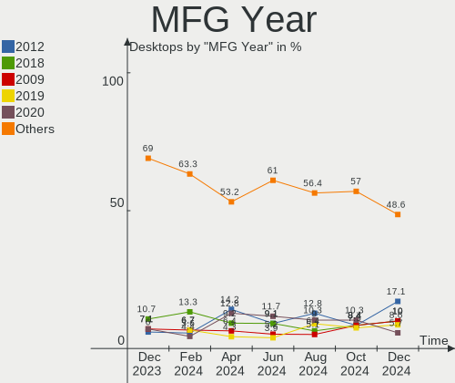
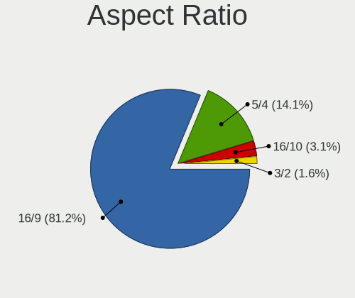
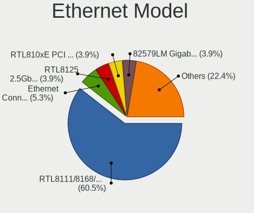
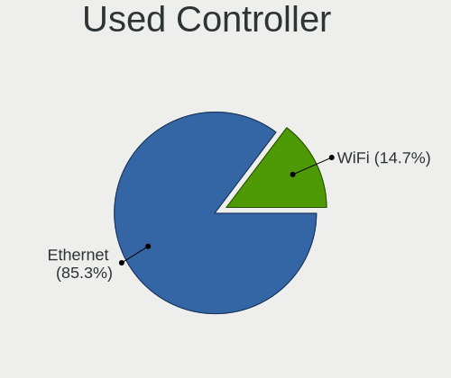
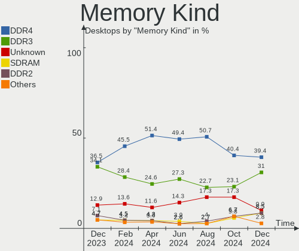
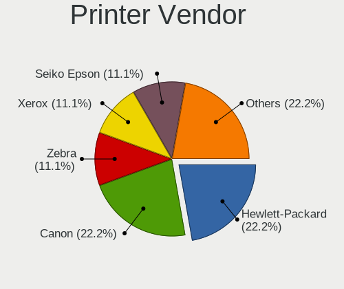
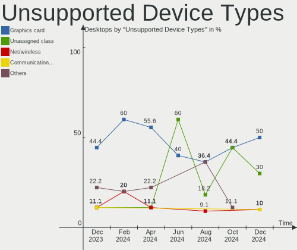

ROSA Hardware Trends (Desktops)
-------------------------------

A project to identify most popular hardware characteristics and track their change
over time based on data collected by ROSA users at https://Linux-Hardware.org.

Anyone can contribute to this report by the [hw-probe](https://github.com/linuxhw/hw-probe) tool:

    sudo -E hw-probe -all -upload

This report is for one last month. Overall report since the beginning of time: [TestCoverage](https://github.com/linuxhw/TestCoverage)

Period: Apr, 2022.

Contents
--------

* [ System ](#system)
  - [ OS                       ](#os)
  - [ OS Family                ](#os-family)
  - [ Kernel                   ](#kernel)
  - [ Kernel Family            ](#kernel-family)
  - [ Kernel Major Ver.        ](#kernel-major-ver)
  - [ Arch                     ](#arch)
  - [ DE                       ](#de)
  - [ Display Server           ](#display-server)
  - [ Display Manager          ](#display-manager)
  - [ OS Lang                  ](#os-lang)
  - [ Boot Mode                ](#boot-mode)
  - [ Filesystem               ](#filesystem)
  - [ Part. scheme             ](#part-scheme)
  - [ Dual Boot with Linux/BSD ](#dual-boot-with-linuxbsd)
  - [ Dual Boot (Win)          ](#dual-boot-win)

* [ Board ](#board)
  - [ Vendor                   ](#vendor)
  - [ Model                    ](#model)
  - [ Model Family             ](#model-family)
  - [ MFG Year                 ](#mfg-year)
  - [ Form Factor              ](#form-factor)
  - [ Secure Boot              ](#secure-boot)
  - [ Coreboot                 ](#coreboot)
  - [ RAM Size                 ](#ram-size)
  - [ RAM Used                 ](#ram-used)
  - [ Total Drives             ](#total-drives)
  - [ Has CD-ROM               ](#has-cd-rom)
  - [ Has Ethernet             ](#has-ethernet)
  - [ Has WiFi                 ](#has-wifi)
  - [ Has Bluetooth            ](#has-bluetooth)

* [ Location ](#location)
  - [ Country                  ](#country)
  - [ City                     ](#city)

* [ Drives ](#drives)
  - [ Drive Vendor             ](#drive-vendor)
  - [ Drive Model              ](#drive-model)
  - [ HDD Vendor               ](#hdd-vendor)
  - [ SSD Vendor               ](#ssd-vendor)
  - [ Drive Kind               ](#drive-kind)
  - [ Drive Connector          ](#drive-connector)
  - [ Drive Size               ](#drive-size)
  - [ Space Total              ](#space-total)
  - [ Space Used               ](#space-used)
  - [ Malfunc. Drives          ](#malfunc-drives)
  - [ Malfunc. Drive Vendor    ](#malfunc-drive-vendor)
  - [ Malfunc. HDD Vendor      ](#malfunc-hdd-vendor)
  - [ Malfunc. Drive Kind      ](#malfunc-drive-kind)
  - [ Failed Drives            ](#failed-drives)
  - [ Failed Drive Vendor      ](#failed-drive-vendor)
  - [ Drive Status             ](#drive-status)

* [ Storage controller ](#storage-controller)
  - [ Storage Vendor           ](#storage-vendor)
  - [ Storage Model            ](#storage-model)
  - [ Storage Kind             ](#storage-kind)

* [ Processor ](#processor)
  - [ CPU Vendor               ](#cpu-vendor)
  - [ CPU Model                ](#cpu-model)
  - [ CPU Model Family         ](#cpu-model-family)
  - [ CPU Cores                ](#cpu-cores)
  - [ CPU Sockets              ](#cpu-sockets)
  - [ CPU Threads              ](#cpu-threads)
  - [ CPU Op-Modes             ](#cpu-op-modes)
  - [ CPU Microcode            ](#cpu-microcode)
  - [ CPU Microarch            ](#cpu-microarch)

* [ Graphics ](#graphics)
  - [ GPU Vendor               ](#gpu-vendor)
  - [ GPU Model                ](#gpu-model)
  - [ GPU Combo                ](#gpu-combo)
  - [ GPU Driver               ](#gpu-driver)
  - [ GPU Memory               ](#gpu-memory)

* [ Monitor ](#monitor)
  - [ Monitor Vendor           ](#monitor-vendor)
  - [ Monitor Model            ](#monitor-model)
  - [ Monitor Resolution       ](#monitor-resolution)
  - [ Monitor Diagonal         ](#monitor-diagonal)
  - [ Monitor Width            ](#monitor-width)
  - [ Aspect Ratio             ](#aspect-ratio)
  - [ Monitor Area             ](#monitor-area)
  - [ Pixel Density            ](#pixel-density)
  - [ Multiple Monitors        ](#multiple-monitors)

* [ Network ](#network)
  - [ Net Controller Vendor    ](#net-controller-vendor)
  - [ Net Controller Model     ](#net-controller-model)
  - [ Wireless Vendor          ](#wireless-vendor)
  - [ Wireless Model           ](#wireless-model)
  - [ Ethernet Vendor          ](#ethernet-vendor)
  - [ Ethernet Model           ](#ethernet-model)
  - [ Net Controller Kind      ](#net-controller-kind)
  - [ Used Controller          ](#used-controller)
  - [ NICs                     ](#nics)
  - [ IPv6                     ](#ipv6)

* [ Bluetooth ](#bluetooth)
  - [ Bluetooth Vendor         ](#bluetooth-vendor)
  - [ Bluetooth Model          ](#bluetooth-model)

* [ Sound ](#sound)
  - [ Sound Vendor             ](#sound-vendor)
  - [ Sound Model              ](#sound-model)

* [ Memory ](#memory)
  - [ Memory Vendor            ](#memory-vendor)
  - [ Memory Model             ](#memory-model)
  - [ Memory Kind              ](#memory-kind)
  - [ Memory Form Factor       ](#memory-form-factor)
  - [ Memory Size              ](#memory-size)
  - [ Memory Speed             ](#memory-speed)

* [ Printers & scanners ](#printers--scanners)
  - [ Printer Vendor           ](#printer-vendor)
  - [ Printer Model            ](#printer-model)
  - [ Scanner Vendor           ](#scanner-vendor)
  - [ Scanner Model            ](#scanner-model)

* [ Camera ](#camera)
  - [ Camera Vendor            ](#camera-vendor)
  - [ Camera Model             ](#camera-model)

* [ Security ](#security)
  - [ Fingerprint Vendor       ](#fingerprint-vendor)
  - [ Fingerprint Model        ](#fingerprint-model)
  - [ Chipcard Vendor          ](#chipcard-vendor)
  - [ Chipcard Model           ](#chipcard-model)

* [ Unsupported ](#unsupported)
  - [ Unsupported Devices      ](#unsupported-devices)
  - [ Unsupported Device Types ](#unsupported-device-types)

System
------

OS
--

Installed operating systems

| Name       | Desktops | Percent |
|------------|----------|---------|
| ROSA 12.2  | 199      | 84.68%  |
| ROSA R11.1 | 24       | 10.21%  |
| ROSA 12.1  | 5        | 2.13%   |
| ROSA R11   | 4        | 1.7%    |
| ROSA 12    | 3        | 1.28%   |

OS Family
---------

OS without a version

| Name | Desktops | Percent |
|------|----------|---------|
| ROSA | 235      | 100%    |

Kernel
------

Version of the Linux kernel

| Version                                    | Desktops | Percent |
|--------------------------------------------|----------|---------|
| 5.10.74-generic-2rosa2021.1-x86_64         | 180      | 76.6%   |
| 5.15.32-generic-5rosa2021.1-x86_64         | 12       | 5.11%   |
| 4.15.0-desktop-122.124.1rosa-x86_64        | 8        | 3.4%    |
| 5.4.83-generic-2rosa-x86_64                | 7        | 2.98%   |
| 5.15.32-generic-6rosa2021.1-x86_64         | 4        | 1.7%    |
| 5.4.83-generic-2rosa-i586                  | 3        | 1.28%   |
| 5.4.32-generic-2rosa-x86_64                | 3        | 1.28%   |
| 5.4.32-generic-2rosa-i586                  | 2        | 0.85%   |
| 5.16.20-generic-1rosa2021.1-x86_64         | 2        | 0.85%   |
| 5.16.18-generic-1rosa2021.1-x86_64         | 2        | 0.85%   |
| 5.16.16.xm1-1.klp-xanmod-rosa2021.1-x86_64 | 2        | 0.85%   |
| 5.10.74-generic-2rosa2021.1-i586           | 2        | 0.85%   |
| 5.10.71-generic-1rosa2021.1-x86_64         | 2        | 0.85%   |
| 4.15.0-desktop-45.1rosa-x86_64             | 2        | 0.85%   |
| 4.15.0-desktop-45.1rosa-i586               | 2        | 0.85%   |
| 5.4.91-generic-1rosa2021.1-e2kv4           | 1        | 0.43%   |
| 4.19.72-nrj-desktop-1rosa-x86_64           | 1        | 0.43%   |

Kernel Family
-------------

Linux kernel without a distro release

| Version | Desktops | Percent |
|---------|----------|---------|
| 5.10.74 | 182      | 77.45%  |
| 5.15.32 | 16       | 6.81%   |
| 4.15.0  | 12       | 5.11%   |
| 5.4.83  | 10       | 4.26%   |
| 5.4.32  | 5        | 2.13%   |
| 5.16.20 | 2        | 0.85%   |
| 5.16.18 | 2        | 0.85%   |
| 5.16.16 | 2        | 0.85%   |
| 5.10.71 | 2        | 0.85%   |
| 5.4.91  | 1        | 0.43%   |
| 4.19.72 | 1        | 0.43%   |

Kernel Major Ver.
-----------------

Linux kernel major version

| Version | Desktops | Percent |
|---------|----------|---------|
| 5.10    | 184      | 78.3%   |
| 5.4     | 16       | 6.81%   |
| 5.15    | 16       | 6.81%   |
| 4.15    | 12       | 5.11%   |
| 5.16    | 6        | 2.55%   |
| 4.19    | 1        | 0.43%   |

Arch
----

OS architecture (x86_64, i586, etc.)

| Name   | Desktops | Percent |
|--------|----------|---------|
| x86_64 | 225      | 95.74%  |
| i686   | 9        | 3.83%   |
| e2k    | 1        | 0.43%   |

DE
--

Desktop Environment

| Name       | Desktops | Percent |
|------------|----------|---------|
| KDE5       | 100      | 42.55%  |
| GNOME      | 86       | 36.6%   |
| LXQt       | 30       | 12.77%  |
| KDE4       | 18       | 7.66%   |
| X-Cinnamon | 1        | 0.43%   |

Display Server
--------------

X11 or Wayland

| Name    | Desktops | Percent |
|---------|----------|---------|
| Wayland | 163      | 69.36%  |
| X11     | 72       | 30.64%  |

Display Manager
---------------

SDDM, LightDM, etc.

| Name    | Desktops | Percent |
|---------|----------|---------|
| GDM     | 113      | 48.09%  |
| SDDM    | 100      | 42.55%  |
| KDM     | 18       | 7.66%   |
| LightDM | 4        | 1.7%    |

OS Lang
-------

Language

| Lang    | Desktops | Percent |
|---------|----------|---------|
| ru_RU   | 220      | 93.62%  |
| Unknown | 5        | 2.13%   |
| pl_PL   | 2        | 0.85%   |
| en_US   | 2        | 0.85%   |
| pt_BR   | 1        | 0.43%   |
| fr_FR   | 1        | 0.43%   |
| es_MX   | 1        | 0.43%   |
| es_CO   | 1        | 0.43%   |
| es_AR   | 1        | 0.43%   |
| de_DE   | 1        | 0.43%   |

Boot Mode
---------

EFI or BIOS

| Mode | Desktops | Percent |
|------|----------|---------|
| BIOS | 125      | 53.19%  |
| EFI  | 110      | 46.81%  |

Filesystem
----------

Type of filesystem

| Type    | Desktops | Percent |
|---------|----------|---------|
| Ext4    | 225      | 95.74%  |
| Btrfs   | 9        | 3.83%   |
| Overlay | 1        | 0.43%   |

Part. scheme
------------

Scheme of partitioning

| Type    | Desktops | Percent |
|---------|----------|---------|
| GPT     | 152      | 64.68%  |
| MBR     | 82       | 34.89%  |
| Unknown | 1        | 0.43%   |

Dual Boot with Linux/BSD
------------------------

Hosting more than one Linux/BSD

| Dual boot | Desktops | Percent |
|-----------|----------|---------|
| No        | 160      | 68.09%  |
| Yes       | 75       | 31.91%  |

Dual Boot (Win)
---------------

Hosting Linux and Windows

| Dual boot | Desktops | Percent |
|-----------|----------|---------|
| Yes       | 133      | 56.6%   |
| No        | 102      | 43.4%   |

Board
-----

Vendor
------

Motherboard manufacturer

| Name                | Desktops | Percent |
|---------------------|----------|---------|
| ASUSTek Computer    | 81       | 34.47%  |
| Gigabyte Technology | 66       | 28.09%  |
| MSI                 | 28       | 11.91%  |
| ASRock              | 21       | 8.94%   |
| Intel               | 6        | 2.55%   |
| Dell                | 6        | 2.55%   |
| Unknown             | 5        | 2.13%   |
| Acer                | 4        | 1.7%    |
| ECS                 | 3        | 1.28%   |
| Biostar             | 3        | 1.28%   |
| KLLISRE             | 2        | 0.85%   |
| Hewlett-Packard     | 2        | 0.85%   |
| SYWZ                | 1        | 0.43%   |
| Pegatron            | 1        | 0.43%   |
| MACHINIST           | 1        | 0.43%   |
| Lite-On             | 1        | 0.43%   |
| Lenovo              | 1        | 0.43%   |
| Huanan              | 1        | 0.43%   |
| Fujitsu             | 1        | 0.43%   |
| Colorful Technology | 1        | 0.43%   |

Model
-----

Motherboard model

| Name                                                          | Desktops | Percent |
|---------------------------------------------------------------|----------|---------|
| ASUS All Series                                               | 10       | 4.26%   |
| Unknown                                                       | 5        | 2.13%   |
| Gigabyte B450 AORUS ELITE                                     | 3        | 1.28%   |
| ASUS P8H61-M LE                                               | 3        | 1.28%   |
| ASUS M5A78L-M LX3                                             | 3        | 1.28%   |
| MSI MS-7592                                                   | 2        | 0.85%   |
| MSI GEG                                                       | 2        | 0.85%   |
| KLLISRE X99-B5 V1.1                                           | 2        | 0.85%   |
| Gigabyte X570 AORUS ULTRA                                     | 2        | 0.85%   |
| Gigabyte H61M-S1                                              | 2        | 0.85%   |
| Gigabyte 970A-DS3P                                            | 2        | 0.85%   |
| Gigabyte 945GCM-S2L                                           | 2        | 0.85%   |
| ASUS TUF B450-PRO GAMING                                      | 2        | 0.85%   |
| ASUS PRIME B450M-K                                            | 2        | 0.85%   |
| ASUS PRIME B450M-A                                            | 2        | 0.85%   |
| ASUS P8B75-M                                                  | 2        | 0.85%   |
| ASUS P5KPL-AM                                                 | 2        | 0.85%   |
| ASUS H61M-K                                                   | 2        | 0.85%   |
| ASUS H110M-K                                                  | 2        | 0.85%   |
| ASRock H61M-VS                                                | 2        | 0.85%   |
| ASRock B450M Pro4-F                                           | 2        | 0.85%   |
| ASRock A320M-DVS R4.0                                         | 2        | 0.85%   |
| SYWZ S200 Series                                              | 1        | 0.43%   |
| Pegatron Compaq dx2400 Microtower PC                          | 1        | 0.43%   |
| MSI MS-7D54                                                   | 1        | 0.43%   |
| MSI MS-7D22                                                   | 1        | 0.43%   |
| MSI MS-7C02                                                   | 1        | 0.43%   |
| MSI MS-7B98                                                   | 1        | 0.43%   |
| MSI MS-7B79                                                   | 1        | 0.43%   |
| MSI MS-7B48                                                   | 1        | 0.43%   |
| MSI MS-7B24                                                   | 1        | 0.43%   |
| MSI MS-7B22                                                   | 1        | 0.43%   |
| MSI MS-7B17                                                   | 1        | 0.43%   |
| MSI MS-7A71                                                   | 1        | 0.43%   |
| MSI MS-7A70                                                   | 1        | 0.43%   |
| MSI MS-7A68                                                   | 1        | 0.43%   |
| MSI MS-7A38                                                   | 1        | 0.43%   |
| MSI MS-7A33                                                   | 1        | 0.43%   |
| MSI MS-7887                                                   | 1        | 0.43%   |
| MSI MS-7885                                                   | 1        | 0.43%   |
| MSI MS-7850                                                   | 1        | 0.43%   |
| MSI MS-7836                                                   | 1        | 0.43%   |
| MSI MS-7817                                                   | 1        | 0.43%   |
| MSI MS-7816                                                   | 1        | 0.43%   |
| MSI MS-7588                                                   | 1        | 0.43%   |
| MSI MS-7388                                                   | 1        | 0.43%   |
| MSI MS-7267                                                   | 1        | 0.43%   |
| MSI Compaq dx2200 MT                                          | 1        | 0.43%   |
| MACHINIST B75 PRO V1.0                                        | 1        | 0.43%   |
| Lite-On dx2000 MT(EC781ES)                                    | 1        | 0.43%   |
| Lenovo ThinkCentre M920s 10SKS44L00                           | 1        | 0.43%   |
| Intel X99                                                     | 1        | 0.43%   |
| Intel X79 (INTEL Xeon E5/Corei7 DMI2 - C600/C200 Cipset V3.3C | 1        | 0.43%   |
| Intel X79                                                     | 1        | 0.43%   |
| Intel Tiger Hill                                              | 1        | 0.43%   |
| Intel DP35DP AAD81073-206                                     | 1        | 0.43%   |
| Intel D2500CC AAG81477-401                                    | 1        | 0.43%   |
| Huanan X79 V2.47                                              | 1        | 0.43%   |
| HP OMEN by Desktop PC 880-p1xx                                | 1        | 0.43%   |
| HP Compaq 6000 Pro MT PC                                      | 1        | 0.43%   |

Model Family
------------

Motherboard model prefix

| Name                | Desktops | Percent |
|---------------------|----------|---------|
| ASUS PRIME          | 14       | 5.96%   |
| ASUS All            | 10       | 4.26%   |
| ASUS M5A78L-M       | 7        | 2.98%   |
| Dell OptiPlex       | 5        | 2.13%   |
| ASUS TUF            | 5        | 2.13%   |
| Unknown             | 5        | 2.13%   |
| Gigabyte B450       | 4        | 1.7%    |
| ASUS P8H61-M        | 4        | 1.7%    |
| Gigabyte H310M      | 3        | 1.28%   |
| Gigabyte B550M      | 3        | 1.28%   |
| Gigabyte B450M      | 3        | 1.28%   |
| ASUS P8B75-M        | 3        | 1.28%   |
| ASRock B450M        | 3        | 1.28%   |
| Acer Aspire         | 3        | 1.28%   |
| MSI MS-7592         | 2        | 0.85%   |
| MSI GEG             | 2        | 0.85%   |
| KLLISRE X99-B5      | 2        | 0.85%   |
| Intel X79           | 2        | 0.85%   |
| Gigabyte X570       | 2        | 0.85%   |
| Gigabyte H61M-S1    | 2        | 0.85%   |
| Gigabyte A320M-S2H  | 2        | 0.85%   |
| Gigabyte 970A-DS3P  | 2        | 0.85%   |
| Gigabyte 945GCM-S2L | 2        | 0.85%   |
| ASUS P8Z77-V        | 2        | 0.85%   |
| ASUS P5Q            | 2        | 0.85%   |
| ASUS P5KPL-AM       | 2        | 0.85%   |
| ASUS P5K            | 2        | 0.85%   |
| ASUS M5A99X         | 2        | 0.85%   |
| ASUS H61M-K         | 2        | 0.85%   |
| ASUS H110M-K        | 2        | 0.85%   |
| ASRock H61M-VS      | 2        | 0.85%   |
| ASRock B560         | 2        | 0.85%   |
| ASRock A320M-DVS    | 2        | 0.85%   |
| SYWZ S200           | 1        | 0.43%   |
| Pegatron Compaq     | 1        | 0.43%   |
| MSI MS-7D54         | 1        | 0.43%   |
| MSI MS-7D22         | 1        | 0.43%   |
| MSI MS-7C02         | 1        | 0.43%   |
| MSI MS-7B98         | 1        | 0.43%   |
| MSI MS-7B79         | 1        | 0.43%   |
| MSI MS-7B48         | 1        | 0.43%   |
| MSI MS-7B24         | 1        | 0.43%   |
| MSI MS-7B22         | 1        | 0.43%   |
| MSI MS-7B17         | 1        | 0.43%   |
| MSI MS-7A71         | 1        | 0.43%   |
| MSI MS-7A70         | 1        | 0.43%   |
| MSI MS-7A68         | 1        | 0.43%   |
| MSI MS-7A38         | 1        | 0.43%   |
| MSI MS-7A33         | 1        | 0.43%   |
| MSI MS-7887         | 1        | 0.43%   |
| MSI MS-7885         | 1        | 0.43%   |
| MSI MS-7850         | 1        | 0.43%   |
| MSI MS-7836         | 1        | 0.43%   |
| MSI MS-7817         | 1        | 0.43%   |
| MSI MS-7816         | 1        | 0.43%   |
| MSI MS-7588         | 1        | 0.43%   |
| MSI MS-7388         | 1        | 0.43%   |
| MSI MS-7267         | 1        | 0.43%   |
| MSI Compaq          | 1        | 0.43%   |
| MACHINIST B75       | 1        | 0.43%   |

MFG Year
--------

Motherboard manufacture year

| Year    | Desktops | Percent |
|---------|----------|---------|
| 2018    | 35       | 14.89%  |
| 2012    | 28       | 11.91%  |
| 2011    | 22       | 9.36%   |
| 2013    | 19       | 8.09%   |
| 2021    | 16       | 6.81%   |
| 2008    | 14       | 5.96%   |
| 2020    | 13       | 5.53%   |
| 2019    | 13       | 5.53%   |
| 2017    | 13       | 5.53%   |
| 2009    | 12       | 5.11%   |
| 2010    | 11       | 4.68%   |
| 2015    | 10       | 4.26%   |
| 2016    | 8        | 3.4%    |
| 2007    | 7        | 2.98%   |
| 2014    | 6        | 2.55%   |
| 2006    | 5        | 2.13%   |
| 2022    | 1        | 0.43%   |
| 2005    | 1        | 0.43%   |
| Unknown | 1        | 0.43%   |

Form Factor
-----------

Physical design of the computer

| Name    | Desktops | Percent |
|---------|----------|---------|
| Desktop | 235      | 100%    |

Secure Boot
-----------

Enabled or disabled

| State    | Desktops | Percent |
|----------|----------|---------|
| Disabled | 235      | 100%    |

Coreboot
--------

Have coreboot on board

| Used | Desktops | Percent |
|------|----------|---------|
| No   | 235      | 100%    |

RAM Size
--------

Total RAM memory

| Size in GB  | Desktops | Percent |
|-------------|----------|---------|
| 16.01-24.0  | 70       | 29.79%  |
| 8.01-16.0   | 55       | 23.4%   |
| 3.01-4.0    | 36       | 15.32%  |
| 4.01-8.0    | 34       | 14.47%  |
| 32.01-64.0  | 20       | 8.51%   |
| 1.01-2.0    | 9        | 3.83%   |
| 24.01-32.0  | 5        | 2.13%   |
| 2.01-3.0    | 3        | 1.28%   |
| 64.01-256.0 | 2        | 0.85%   |
| 0.51-1.0    | 1        | 0.43%   |

RAM Used
--------

Used RAM memory

| Used GB  | Desktops | Percent |
|----------|----------|---------|
| 1.01-2.0 | 122      | 51.91%  |
| 0.51-1.0 | 54       | 22.98%  |
| 2.01-3.0 | 35       | 14.89%  |
| 4.01-8.0 | 11       | 4.68%   |
| 3.01-4.0 | 11       | 4.68%   |
| 0.01-0.5 | 2        | 0.85%   |

Total Drives
------------

Number of drives on board

| Drives | Desktops | Percent |
|--------|----------|---------|
| 1      | 83       | 35.32%  |
| 2      | 82       | 34.89%  |
| 3      | 39       | 16.6%   |
| 4      | 17       | 7.23%   |
| 5      | 10       | 4.26%   |
| 6      | 4        | 1.7%    |

Has CD-ROM
----------

Has CD-ROM on board

| Presented | Desktops | Percent |
|-----------|----------|---------|
| No        | 153      | 65.11%  |
| Yes       | 82       | 34.89%  |

Has Ethernet
------------

Has Ethernet on board

| Presented | Desktops | Percent |
|-----------|----------|---------|
| Yes       | 234      | 99.57%  |
| No        | 1        | 0.43%   |

Has WiFi
--------

Has WiFi module

| Presented | Desktops | Percent |
|-----------|----------|---------|
| No        | 171      | 72.77%  |
| Yes       | 64       | 27.23%  |

Has Bluetooth
-------------

Has Bluetooth module

| Presented | Desktops | Percent |
|-----------|----------|---------|
| No        | 178      | 75.74%  |
| Yes       | 57       | 24.26%  |

Location
--------

Country
-------

Geographic location (country)

| Country    | Desktops | Percent |
|------------|----------|---------|
| Russia     | 210      | 89.36%  |
| Belarus    | 6        | 2.55%   |
| Ukraine    | 3        | 1.28%   |
| Kazakhstan | 3        | 1.28%   |
| Poland     | 2        | 0.85%   |
| Mexico     | 2        | 0.85%   |
| Spain      | 1        | 0.43%   |
| Moldova    | 1        | 0.43%   |
| Lithuania  | 1        | 0.43%   |
| Germany    | 1        | 0.43%   |
| France     | 1        | 0.43%   |
| Finland    | 1        | 0.43%   |
| Colombia   | 1        | 0.43%   |
| Brazil     | 1        | 0.43%   |
| Argentina  | 1        | 0.43%   |

City
----

Geographic location (city)

| City             | Desktops | Percent |
|------------------|----------|---------|
| Moscow           | 25       | 10.64%  |
| St Petersburg    | 17       | 7.23%   |
| Rostov-on-Don    | 9        | 3.83%   |
| Samara           | 8        | 3.4%    |
| Volgograd        | 7        | 2.98%   |
| Chelyabinsk      | 6        | 2.55%   |
| Vladivostok      | 5        | 2.13%   |
| Perm             | 5        | 2.13%   |
| Novosibirsk      | 5        | 2.13%   |
| Krasnoyarsk      | 5        | 2.13%   |
| Lipetsk          | 4        | 1.7%    |
| Krasnodar        | 4        | 1.7%    |
| Yekaterinburg    | 3        | 1.28%   |
| Voronezh         | 3        | 1.28%   |
| Tyumen           | 3        | 1.28%   |
| Saratov          | 3        | 1.28%   |
| Pskov            | 3        | 1.28%   |
| Nizhniy Novgorod | 3        | 1.28%   |
| Murmansk         | 3        | 1.28%   |
| Barnaul          | 3        | 1.28%   |
| Ufa              | 2        | 0.85%   |
| Tver             | 2        | 0.85%   |
| Tula             | 2        | 0.85%   |
| Tomsk            | 2        | 0.85%   |
| Tambov           | 2        | 0.85%   |
| Syktyvkar        | 2        | 0.85%   |
| Petrozavodsk     | 2        | 0.85%   |
| Orenburg         | 2        | 0.85%   |
| Omsk             | 2        | 0.85%   |
| Novocherkassk    | 2        | 0.85%   |
| Noril'sk         | 2        | 0.85%   |
| Mirny            | 2        | 0.85%   |
| Minsk            | 2        | 0.85%   |
| Kemerovo         | 2        | 0.85%   |
| Kazan’         | 2        | 0.85%   |
| Izhevsk          | 2        | 0.85%   |
| Irkutsk          | 2        | 0.85%   |
| Gatchina         | 2        | 0.85%   |
| Cheboksary       | 2        | 0.85%   |
| Bryansk          | 2        | 0.85%   |
| Zelenodolsk      | 1        | 0.43%   |
| Zaporizhzhia     | 1        | 0.43%   |
| Yoshkar-Ola      | 1        | 0.43%   |
| Yeysk            | 1        | 0.43%   |
| Yantikovo        | 1        | 0.43%   |
| Vladikavkaz      | 1        | 0.43%   |
| Vitebsk          | 1        | 0.43%   |
| Velizh           | 1        | 0.43%   |
| Velikiye Luki    | 1        | 0.43%   |
| Vawkavysk        | 1        | 0.43%   |
| Ussuriysk        | 1        | 0.43%   |
| Ulyanovsk        | 1        | 0.43%   |
| Uglich           | 1        | 0.43%   |
| Turku            | 1        | 0.43%   |
| Tolyatti         | 1        | 0.43%   |
| Tobol            | 1        | 0.43%   |
| Temryuk          | 1        | 0.43%   |
| Tashtagol        | 1        | 0.43%   |
| Sybaykasy        | 1        | 0.43%   |
| Surgut           | 1        | 0.43%   |

Drives
------

Drive Vendor
------------

Hard drive vendors

| Vendor              | Desktops | Drives | Percent |
|---------------------|----------|--------|---------|
| WDC                 | 98       | 138    | 22.63%  |
| Seagate             | 90       | 107    | 20.79%  |
| Samsung Electronics | 43       | 53     | 9.93%   |
| Toshiba             | 29       | 30     | 6.7%    |
| Kingston            | 23       | 26     | 5.31%   |
| Hitachi             | 15       | 15     | 3.46%   |
| China               | 15       | 15     | 3.46%   |
| Crucial             | 12       | 13     | 2.77%   |
| A-DATA Technology   | 11       | 12     | 2.54%   |
| SPCC                | 10       | 12     | 2.31%   |
| XPG                 | 5        | 5      | 1.15%   |
| Patriot             | 5        | 5      | 1.15%   |
| Intel               | 5        | 5      | 1.15%   |
| HGST                | 5        | 6      | 1.15%   |
| GOODRAM             | 5        | 6      | 1.15%   |
| Apacer              | 5        | 6      | 1.15%   |
| PLEXTOR             | 4        | 5      | 0.92%   |
| Gigabyte Technology | 4        | 4      | 0.92%   |
| Smartbuy            | 3        | 3      | 0.69%   |
| SanDisk             | 3        | 3      | 0.69%   |
| OCZ                 | 3        | 3      | 0.69%   |
| MAXTOR              | 3        | 3      | 0.69%   |
| AMD                 | 3        | 3      | 0.69%   |
| Unknown             | 2        | 2      | 0.46%   |
| SK Hynix            | 2        | 2      | 0.46%   |
| Silicon Motion      | 2        | 2      | 0.46%   |
| QUMO                | 2        | 2      | 0.46%   |
| PNY                 | 2        | 2      | 0.46%   |
| Fujitsu             | 2        | 2      | 0.46%   |
| Corsair             | 2        | 2      | 0.46%   |
| ZTE                 | 1        | 1      | 0.23%   |
| XrayDisk            | 1        | 1      | 0.23%   |
| USB3.0              | 1        | 1      | 0.23%   |
| USB                 | 1        | 1      | 0.23%   |
| TXRUI               | 1        | 1      | 0.23%   |
| sage                | 1        | 1      | 0.23%   |
| Phison Electronics  | 1        | 1      | 0.23%   |
| PALIT               | 1        | 1      | 0.23%   |
| Netac               | 1        | 1      | 0.23%   |
| Micron Technology   | 1        | 1      | 0.23%   |
| LONDISK             | 1        | 1      | 0.23%   |
| Leven               | 1        | 1      | 0.23%   |
| KIOXIA-EXCERIA      | 1        | 1      | 0.23%   |
| KingSpec            | 1        | 1      | 0.23%   |
| Kingmax             | 1        | 1      | 0.23%   |
| JMicron             | 1        | 1      | 0.23%   |
| HS-SSD-C100         | 1        | 1      | 0.23%   |
| Hikvision           | 1        | 1      | 0.23%   |
| Hewlett-Packard     | 1        | 1      | 0.23%   |
| AFOX                | 1        | 1      | 0.23%   |

Drive Model
-----------

Hard drive models

| Model                              | Desktops | Percent |
|------------------------------------|----------|---------|
| Seagate ST1000DM010-2EP102 1TB     | 12       | 2.4%    |
| Kingston SA400S37240G 240GB SSD    | 11       | 2.2%    |
| WDC WD10EZEX-08WN4A0 1TB           | 9        | 1.8%    |
| WDC WDS240G2G0A-00JH30 240GB SSD   | 8        | 1.6%    |
| Seagate ST500DM002-1BD142 500GB    | 7        | 1.4%    |
| Toshiba HDWD110 1TB                | 6        | 1.2%    |
| Seagate ST3500418AS 500GB          | 6        | 1.2%    |
| WDC WDS500G2B0A-00SM50 500GB SSD   | 5        | 1%      |
| WDC WDS120G2G0A-00JH30 120GB SSD   | 5        | 1%      |
| WDC WD5000AAKX-001CA0 500GB        | 5        | 1%      |
| Toshiba DT01ACA050 500GB           | 5        | 1%      |
| Seagate ST1000DM003-1CH162 1TB     | 4        | 0.8%    |
| Samsung SSD 860 EVO 250GB          | 4        | 0.8%    |
| Kingston SNVS500G 500GB            | 4        | 0.8%    |
| WDC WD10EZEX-00BN5A0 1TB           | 3        | 0.6%    |
| WDC WD10EZEX-00BBHA0 1TB           | 3        | 0.6%    |
| Toshiba DT01ACA100 1TB             | 3        | 0.6%    |
| SPCC Solid State Disk 128GB        | 3        | 0.6%    |
| SPCC Solid State Disk 120GB        | 3        | 0.6%    |
| Seagate ST3320418AS 320GB          | 3        | 0.6%    |
| Seagate ST3160812AS 160GB          | 3        | 0.6%    |
| Seagate ST2000DM008-2FR102 2TB     | 3        | 0.6%    |
| Seagate ST2000DM001-1CH164 2TB     | 3        | 0.6%    |
| Seagate ST1000LM024 HN-M101MBB 1TB | 3        | 0.6%    |
| Samsung SSD 980 1TB                | 3        | 0.6%    |
| Samsung SSD 970 EVO Plus 500GB     | 3        | 0.6%    |
| Samsung SSD 970 EVO Plus 250GB     | 3        | 0.6%    |
| Samsung SSD 860 EVO 500GB          | 3        | 0.6%    |
| Samsung SSD 850 EVO 250GB          | 3        | 0.6%    |
| Samsung HD103SJ 1TB                | 3        | 0.6%    |
| China SSD 128GB                    | 3        | 0.6%    |
| Apacer AS350 512GB SSD             | 3        | 0.6%    |
| A-DATA SX6000PNP 512GB             | 3        | 0.6%    |
| XPG GAMMIX S11 Pro 512GB           | 2        | 0.4%    |
| WDC WDS240G2G0B-00EPW0 240GB SSD   | 2        | 0.4%    |
| WDC WDS120G2G0B-00EPW0 120GB SSD   | 2        | 0.4%    |
| WDC WD5000LPCX-21VHAT0 500GB       | 2        | 0.4%    |
| WDC WD5000AAKS-00UU3A0 500GB       | 2        | 0.4%    |
| WDC WD5000AADS-00S9B0 500GB        | 2        | 0.4%    |
| WDC WD3200BEVT-22ZCT0 320GB        | 2        | 0.4%    |
| WDC WD20EARX-00PASB0 2TB           | 2        | 0.4%    |
| WDC WD20EARS-00S8B1 2TB            | 2        | 0.4%    |
| WDC WD10EZRZ-00HTKB0 1TB           | 2        | 0.4%    |
| WDC WD10EZEX-75M2NA0 1TB           | 2        | 0.4%    |
| WDC WD10EZEX-60WN4A0 1TB           | 2        | 0.4%    |
| WDC WD10EZEX-22MFCA0 1TB           | 2        | 0.4%    |
| WDC WD10EZEX-00KUWA0 1TB           | 2        | 0.4%    |
| WDC WD10EARX-00N0YB0 1TB           | 2        | 0.4%    |
| Unknown SD/MMC/MS PRO 16GB         | 2        | 0.4%    |
| Toshiba HDWD120 2TB                | 2        | 0.4%    |
| SPCC Solid State Disk 64GB         | 2        | 0.4%    |
| Smartbuy SSD 120GB                 | 2        | 0.4%    |
| Seagate ST500DM005 HD502HJ 500GB   | 2        | 0.4%    |
| Seagate ST500DM002-1SB10A 500GB    | 2        | 0.4%    |
| Seagate ST3250410AS 250GB          | 2        | 0.4%    |
| Seagate ST3250310AS 250GB          | 2        | 0.4%    |
| Seagate ST3160815AS 160GB          | 2        | 0.4%    |
| Seagate ST31000528AS 1TB           | 2        | 0.4%    |
| Seagate ST1000DM003-1SB102 1TB     | 2        | 0.4%    |
| Seagate ST1000DL002-9TT153 1TB     | 2        | 0.4%    |

HDD Vendor
----------

Hard disk drive vendors

| Vendor              | Desktops | Drives | Percent |
|---------------------|----------|--------|---------|
| Seagate             | 90       | 107    | 36.14%  |
| WDC                 | 89       | 108    | 35.74%  |
| Toshiba             | 28       | 28     | 11.24%  |
| Hitachi             | 15       | 15     | 6.02%   |
| Samsung Electronics | 13       | 17     | 5.22%   |
| HGST                | 5        | 6      | 2.01%   |
| MAXTOR              | 3        | 3      | 1.2%    |
| Unknown             | 2        | 2      | 0.8%    |
| Fujitsu             | 2        | 2      | 0.8%    |
| USB                 | 1        | 1      | 0.4%    |
| sage                | 1        | 1      | 0.4%    |

SSD Vendor
----------

Solid state drive vendors

| Vendor              | Desktops | Drives | Percent |
|---------------------|----------|--------|---------|
| WDC                 | 26       | 29     | 16.56%  |
| Samsung Electronics | 17       | 19     | 10.83%  |
| Kingston            | 17       | 19     | 10.83%  |
| China               | 15       | 15     | 9.55%   |
| Crucial             | 11       | 11     | 7.01%   |
| SPCC                | 10       | 11     | 6.37%   |
| GOODRAM             | 5        | 6      | 3.18%   |
| Apacer              | 5        | 6      | 3.18%   |
| PLEXTOR             | 4        | 4      | 2.55%   |
| Patriot             | 4        | 4      | 2.55%   |
| Intel               | 4        | 4      | 2.55%   |
| A-DATA Technology   | 4        | 4      | 2.55%   |
| Smartbuy            | 3        | 3      | 1.91%   |
| SanDisk             | 3        | 3      | 1.91%   |
| OCZ                 | 3        | 3      | 1.91%   |
| Toshiba             | 2        | 2      | 1.27%   |
| QUMO                | 2        | 2      | 1.27%   |
| PNY                 | 2        | 2      | 1.27%   |
| Gigabyte Technology | 2        | 2      | 1.27%   |
| Corsair             | 2        | 2      | 1.27%   |
| XrayDisk            | 1        | 1      | 0.64%   |
| USB3.0              | 1        | 1      | 0.64%   |
| TXRUI               | 1        | 1      | 0.64%   |
| PALIT               | 1        | 1      | 0.64%   |
| Netac               | 1        | 1      | 0.64%   |
| Micron Technology   | 1        | 1      | 0.64%   |
| LONDISK             | 1        | 1      | 0.64%   |
| Leven               | 1        | 1      | 0.64%   |
| KingSpec            | 1        | 1      | 0.64%   |
| Kingmax             | 1        | 1      | 0.64%   |
| JMicron             | 1        | 1      | 0.64%   |
| HS-SSD-C100         | 1        | 1      | 0.64%   |
| Hikvision           | 1        | 1      | 0.64%   |
| Hewlett-Packard     | 1        | 1      | 0.64%   |
| AMD                 | 1        | 1      | 0.64%   |
| AFOX                | 1        | 1      | 0.64%   |

Drive Kind
----------

HDD or SSD

| Kind    | Desktops | Drives | Percent |
|---------|----------|--------|---------|
| HDD     | 191      | 290    | 51.48%  |
| SSD     | 132      | 167    | 35.58%  |
| NVMe    | 46       | 53     | 12.4%   |
| MMC     | 1        | 1      | 0.27%   |
| Unknown | 1        | 1      | 0.27%   |

Drive Connector
---------------

SATA, SAS, NVMe, etc.

| Type | Desktops | Drives | Percent |
|------|----------|--------|---------|
| SATA | 232      | 448    | 80.28%  |
| NVMe | 46       | 53     | 15.92%  |
| SAS  | 10       | 10     | 3.46%   |
| MMC  | 1        | 1      | 0.35%   |

Drive Size
----------

Size of hard drive

| Size in TB | Desktops | Drives | Percent |
|------------|----------|--------|---------|
| 0.01-0.5   | 196      | 299    | 61.06%  |
| 0.51-1.0   | 88       | 117    | 27.41%  |
| 1.01-2.0   | 22       | 24     | 6.85%   |
| 2.01-3.0   | 7        | 7      | 2.18%   |
| 3.01-4.0   | 6        | 8      | 1.87%   |
| 10.01-20.0 | 1        | 1      | 0.31%   |
| 4.01-10.0  | 1        | 1      | 0.31%   |

Space Total
-----------

Amount of disk space available on the file system

| Size in GB     | Desktops | Percent |
|----------------|----------|---------|
| 101-250        | 69       | 29.36%  |
| 251-500        | 45       | 19.15%  |
| 501-1000       | 33       | 14.04%  |
| 1-20           | 28       | 11.91%  |
| 51-100         | 19       | 8.09%   |
| 1001-2000      | 18       | 7.66%   |
| 21-50          | 11       | 4.68%   |
| 2001-3000      | 7        | 2.98%   |
| More than 3000 | 5        | 2.13%   |

Space Used
----------

Amount of used disk space

| Used GB        | Desktops | Percent |
|----------------|----------|---------|
| 1-20           | 146      | 62.13%  |
| 21-50          | 30       | 12.77%  |
| 101-250        | 16       | 6.81%   |
| 251-500        | 15       | 6.38%   |
| 501-1000       | 10       | 4.26%   |
| 51-100         | 9        | 3.83%   |
| 1001-2000      | 6        | 2.55%   |
| More than 3000 | 3        | 1.28%   |

Malfunc. Drives
---------------

Drive models with a malfunction

| Model                              | Desktops | Drives | Percent |
|------------------------------------|----------|--------|---------|
| Seagate ST3500418AS 500GB          | 3        | 4      | 2.97%   |
| WDC WDS240G2G0A-00JH30 240GB SSD   | 2        | 3      | 1.98%   |
| WDC WD20EARX-00PASB0 2TB           | 2        | 2      | 1.98%   |
| WDC WD20EARS-00S8B1 2TB            | 2        | 2      | 1.98%   |
| Toshiba DT01ACA100 1TB             | 2        | 2      | 1.98%   |
| Seagate ST3320418AS 320GB          | 2        | 2      | 1.98%   |
| Seagate ST3160812AS 160GB          | 2        | 2      | 1.98%   |
| Seagate ST2000DM001-1CH164 2TB     | 2        | 3      | 1.98%   |
| Seagate ST1000LM024 HN-M101MBB 1TB | 2        | 2      | 1.98%   |
| Samsung Electronics HD160JJ 160GB  | 2        | 2      | 1.98%   |
| Hitachi HTS547575A9E384 752GB      | 2        | 2      | 1.98%   |
| WDC WDS480G2G0A-00JH30 480GB SSD   | 1        | 1      | 0.99%   |
| WDC WD6402AAEX-00Y9A0 640GB        | 1        | 1      | 0.99%   |
| WDC WD5003ABYX-18WERA0 500GB       | 1        | 1      | 0.99%   |
| WDC WD5000AAKX-22ERMA0 500GB       | 1        | 1      | 0.99%   |
| WDC WD5000AAKX-001CA0 500GB        | 1        | 1      | 0.99%   |
| WDC WD5000AAKS-75V0A0 500GB        | 1        | 1      | 0.99%   |
| WDC WD5000AAKS-00UU3A0 500GB       | 1        | 1      | 0.99%   |
| WDC WD5000AAKS-00A7B2 500GB        | 1        | 1      | 0.99%   |
| WDC WD3200BPVT-22ZEST0 320GB       | 1        | 1      | 0.99%   |
| WDC WD2500KS-00MJB0 250GB          | 1        | 1      | 0.99%   |
| WDC WD2500AAKX-753CA1 250GB        | 1        | 1      | 0.99%   |
| WDC WD20EARS-00MVWB0 2TB           | 1        | 1      | 0.99%   |
| WDC WD1600AAJS-22L7A0 160GB        | 1        | 1      | 0.99%   |
| WDC WD1600AAJS-00L7A0 160GB        | 1        | 1      | 0.99%   |
| WDC WD10EZEX-60WN4A0 1TB           | 1        | 1      | 0.99%   |
| WDC WD10EZEX-22MFCA0 1TB           | 1        | 1      | 0.99%   |
| WDC WD10EARS-00Z5B1 1TB            | 1        | 1      | 0.99%   |
| WDC WD10EADS-65M2B0 1TB            | 1        | 1      | 0.99%   |
| WDC WD1002FAEX-00Z3A0 1TB          | 1        | 1      | 0.99%   |
| Toshiba MQ01ABD100 1TB             | 1        | 1      | 0.99%   |
| Toshiba MQ01ABC150 1TB             | 1        | 1      | 0.99%   |
| Toshiba MK3259GSXP 320GB           | 1        | 1      | 0.99%   |
| Toshiba MK2565GSX 250GB            | 1        | 1      | 0.99%   |
| Toshiba DT01ACA050 500GB           | 1        | 1      | 0.99%   |
| SPCC SSD162 120GB                  | 1        | 1      | 0.99%   |
| Silicon Motion NE-128 128GB        | 1        | 1      | 0.99%   |
| Seagate ST9320328CS 320GB          | 1        | 1      | 0.99%   |
| Seagate ST500NM0011 500GB          | 1        | 1      | 0.99%   |
| Seagate ST500LT012-9WS142 500GB    | 1        | 1      | 0.99%   |
| Seagate ST500LT012-1DG142 500GB    | 1        | 1      | 0.99%   |
| Seagate ST500LT012-1DG14 500GB     | 1        | 1      | 0.99%   |
| Seagate ST500DM002-1BD142 500GB    | 1        | 1      | 0.99%   |
| Seagate ST3500413AS 500GB          | 1        | 1      | 0.99%   |
| Seagate ST3500312CS 500GB          | 1        | 1      | 0.99%   |
| Seagate ST340016A 40GB             | 1        | 1      | 0.99%   |
| Seagate ST3320620A 320GB           | 1        | 1      | 0.99%   |
| Seagate ST3320613AS 320GB          | 1        | 1      | 0.99%   |
| Seagate ST3250820AS 250GB          | 1        | 1      | 0.99%   |
| Seagate ST3250410AS 250GB          | 1        | 1      | 0.99%   |
| Seagate ST3250318AS 250GB          | 1        | 1      | 0.99%   |
| Seagate ST3250312AS 250GB          | 1        | 1      | 0.99%   |
| Seagate ST3250310AS 250GB          | 1        | 1      | 0.99%   |
| Seagate ST3160815AS 160GB          | 1        | 1      | 0.99%   |
| Seagate ST31500341AS 1TB           | 1        | 1      | 0.99%   |
| Seagate ST3120022A 120GB           | 1        | 2      | 0.99%   |
| Seagate ST31000528AS 1TB           | 1        | 1      | 0.99%   |
| Seagate ST3000DM008-2DM166 3TB     | 1        | 1      | 0.99%   |
| Seagate ST3000DM001-1CH166 3TB     | 1        | 1      | 0.99%   |
| Seagate ST2000LM003 HN-M201RAD 2TB | 1        | 1      | 0.99%   |

Malfunc. Drive Vendor
---------------------

Vendors of faulty drives

| Vendor              | Desktops | Drives | Percent |
|---------------------|----------|--------|---------|
| Seagate             | 36       | 42     | 38.71%  |
| WDC                 | 23       | 26     | 24.73%  |
| Hitachi             | 8        | 8      | 8.6%    |
| Toshiba             | 7        | 7      | 7.53%   |
| Samsung Electronics | 6        | 9      | 6.45%   |
| SPCC                | 1        | 1      | 1.08%   |
| Silicon Motion      | 1        | 1      | 1.08%   |
| SanDisk             | 1        | 1      | 1.08%   |
| QUMO                | 1        | 1      | 1.08%   |
| PLEXTOR             | 1        | 1      | 1.08%   |
| OCZ                 | 1        | 1      | 1.08%   |
| Leven               | 1        | 1      | 1.08%   |
| Kingmax             | 1        | 1      | 1.08%   |
| Intel               | 1        | 1      | 1.08%   |
| HGST                | 1        | 1      | 1.08%   |
| Fujitsu             | 1        | 1      | 1.08%   |
| Corsair             | 1        | 1      | 1.08%   |
| China               | 1        | 1      | 1.08%   |

Malfunc. HDD Vendor
-------------------

Vendors of faulty HDD drives

| Vendor              | Desktops | Drives | Percent |
|---------------------|----------|--------|---------|
| Seagate             | 36       | 42     | 45.57%  |
| WDC                 | 21       | 22     | 26.58%  |
| Hitachi             | 8        | 8      | 10.13%  |
| Toshiba             | 7        | 7      | 8.86%   |
| Samsung Electronics | 5        | 8      | 6.33%   |
| HGST                | 1        | 1      | 1.27%   |
| Fujitsu             | 1        | 1      | 1.27%   |

Malfunc. Drive Kind
-------------------

Kinds of faulty drives

| Kind | Desktops | Drives | Percent |
|------|----------|--------|---------|
| HDD  | 71       | 89     | 82.56%  |
| SSD  | 14       | 15     | 16.28%  |
| NVMe | 1        | 1      | 1.16%   |

Failed Drives
-------------

Failed drive models

| Model                    | Desktops | Drives | Percent |
|--------------------------|----------|--------|---------|
| Seagate ST31000524AS 1TB | 1        | 1      | 100%    |

Failed Drive Vendor
-------------------

Failed drive vendors

| Vendor  | Desktops | Drives | Percent |
|---------|----------|--------|---------|
| Seagate | 1        | 1      | 100%    |

Drive Status
------------

Number of failed and malfunc. drives

| Status   | Desktops | Drives | Percent |
|----------|----------|--------|---------|
| Works    | 209      | 395    | 68.98%  |
| Malfunc  | 82       | 105    | 27.06%  |
| Detected | 11       | 11     | 3.63%   |
| Failed   | 1        | 1      | 0.33%   |

Storage controller
------------------

Storage Vendor
--------------

Storage controller vendors

| Vendor                      | Desktops | Percent |
|-----------------------------|----------|---------|
| Intel                       | 144      | 47.37%  |
| AMD                         | 81       | 26.64%  |
| Samsung Electronics         | 17       | 5.59%   |
| JMicron Technology          | 10       | 3.29%   |
| Nvidia                      | 8        | 2.63%   |
| Realtek Semiconductor       | 7        | 2.3%    |
| Kingston Technology Company | 7        | 2.3%    |
| Silicon Motion              | 6        | 1.97%   |
| ADATA Technology            | 5        | 1.64%   |
| Marvell Technology Group    | 4        | 1.32%   |
| Phison Electronics          | 3        | 0.99%   |
| ASMedia Technology          | 3        | 0.99%   |
| VIA Technologies            | 2        | 0.66%   |
| Micron/Crucial Technology   | 2        | 0.66%   |
| SK Hynix                    | 1        | 0.33%   |
| Sandisk                     | 1        | 0.33%   |
| MCST                        | 1        | 0.33%   |
| Lite-On Technology          | 1        | 0.33%   |
| KIOXIA                      | 1        | 0.33%   |

Storage Model
-------------

Storage controller models

| Model                                                                                   | Desktops | Percent |
|-----------------------------------------------------------------------------------------|----------|---------|
| AMD FCH SATA Controller [AHCI mode]                                                     | 38       | 9.27%   |
| AMD 400 Series Chipset SATA Controller                                                  | 23       | 5.61%   |
| Intel NM10/ICH7 Family SATA Controller [IDE mode]                                       | 20       | 4.88%   |
| AMD SB7x0/SB8x0/SB9x0 IDE Controller                                                    | 20       | 4.88%   |
| Intel 8 Series/C220 Series Chipset Family 6-port SATA Controller 1 [AHCI mode]          | 18       | 4.39%   |
| Intel 82801G (ICH7 Family) IDE Controller                                               | 15       | 3.66%   |
| AMD SB7x0/SB8x0/SB9x0 SATA Controller [IDE mode]                                        | 15       | 3.66%   |
| Intel 6 Series/C200 Series Chipset Family 6 port Desktop SATA AHCI Controller           | 13       | 3.17%   |
| Intel 200 Series PCH SATA controller [AHCI mode]                                        | 12       | 2.93%   |
| Samsung NVMe SSD Controller SM981/PM981/PM983                                           | 11       | 2.68%   |
| Intel 7 Series/C210 Series Chipset Family 6-port SATA Controller [AHCI mode]            | 10       | 2.44%   |
| AMD SB7x0/SB8x0/SB9x0 SATA Controller [AHCI mode]                                       | 10       | 2.44%   |
| Intel Cannon Lake PCH SATA AHCI Controller                                              | 9        | 2.2%    |
| Intel 6 Series/C200 Series Chipset Family Desktop SATA Controller (IDE mode, ports 4-5) | 9        | 2.2%    |
| Intel 6 Series/C200 Series Chipset Family Desktop SATA Controller (IDE mode, ports 0-3) | 9        | 2.2%    |
| Intel 500 Series Chipset Family SATA AHCI Controller                                    | 9        | 2.2%    |
| Intel Q170/Q150/B150/H170/H110/Z170/CM236 Chipset SATA Controller [AHCI Mode]           | 8        | 1.95%   |
| JMicron JMB363 SATA/IDE Controller                                                      | 7        | 1.71%   |
| AMD 500 Series Chipset SATA Controller                                                  | 7        | 1.71%   |
| Silicon Motion SM2263EN/SM2263XT SSD Controller                                         | 6        | 1.46%   |
| Samsung NVMe SSD Controller 980                                                         | 5        | 1.22%   |
| Nvidia MCP61 SATA Controller                                                            | 5        | 1.22%   |
| Nvidia MCP61 IDE                                                                        | 5        | 1.22%   |
| Kingston Company Company Non-Volatile memory controller                                 | 5        | 1.22%   |
| AMD X370 Series Chipset SATA Controller                                                 | 5        | 1.22%   |
| AMD FCH SATA Controller D                                                               | 5        | 1.22%   |
| Realtek Realtek Non-Volatile memory controller                                          | 4        | 0.98%   |
| Intel 82801JI (ICH10 Family) 4 port SATA IDE Controller #1                              | 4        | 0.98%   |
| Intel 82801JI (ICH10 Family) 2 port SATA IDE Controller #2                              | 4        | 0.98%   |
| Intel 82801I (ICH9 Family) 2 port SATA Controller [IDE mode]                            | 4        | 0.98%   |
| Realtek RTS5763DL NVMe SSD Controller                                                   | 3        | 0.73%   |
| Intel SATA Controller [RAID mode]                                                       | 3        | 0.73%   |
| Intel NM10/ICH7 Family SATA Controller [AHCI mode]                                      | 3        | 0.73%   |
| Intel 9 Series Chipset Family SATA Controller [AHCI Mode]                               | 3        | 0.73%   |
| Intel 82801IR/IO/IH (ICH9R/DO/DH) 4 port SATA Controller [IDE mode]                     | 3        | 0.73%   |
| Intel 7 Series/C210 Series Chipset Family 4-port SATA Controller [IDE mode]             | 3        | 0.73%   |
| Intel 7 Series/C210 Series Chipset Family 2-port SATA Controller [IDE mode]             | 3        | 0.73%   |
| AMD SB600 Non-Raid-5 SATA                                                               | 3        | 0.73%   |
| AMD SB600 IDE                                                                           | 3        | 0.73%   |
| VIA VT6415 PATA IDE Host Controller                                                     | 2        | 0.49%   |
| Nvidia MCP51 Serial ATA Controller                                                      | 2        | 0.49%   |
| Kingston Company A2000 NVMe SSD                                                         | 2        | 0.49%   |
| JMicron JMB362 SATA Controller                                                          | 2        | 0.49%   |
| Intel C610/X99 series chipset 6-Port SATA Controller [AHCI mode]                        | 2        | 0.49%   |
| Intel C600/X79 series chipset 6-Port SATA AHCI Controller                               | 2        | 0.49%   |
| Intel 5 Series/3400 Series Chipset 6 port SATA AHCI Controller                          | 2        | 0.49%   |
| Intel 5 Series/3400 Series Chipset 4 port SATA IDE Controller                           | 2        | 0.49%   |
| Intel 5 Series/3400 Series Chipset 2 port SATA IDE Controller                           | 2        | 0.49%   |
| Intel 400 Series Chipset Family SATA AHCI Controller                                    | 2        | 0.49%   |
| Intel 4 Series Chipset PT IDER Controller                                               | 2        | 0.49%   |
| ASMedia ASM1062 Serial ATA Controller                                                   | 2        | 0.49%   |
| AMD FCH SATA Controller [IDE mode]                                                      | 2        | 0.49%   |
| ADATA XPG SX8200 Pro PCIe Gen3x4 M.2 2280 Solid State Drive                             | 2        | 0.49%   |
| ADATA A Non-Volatile memory controller                                                  | 2        | 0.49%   |
| SK Hynix Non-Volatile memory controller                                                 | 1        | 0.24%   |
| Sandisk WD Black SN750 / PC SN730 NVMe SSD                                              | 1        | 0.24%   |
| Samsung NVMe SSD Controller SM961/PM961/SM963                                           | 1        | 0.24%   |
| Phison PS5013 E13 NVMe Controller                                                       | 1        | 0.24%   |
| Phison E16 PCIe4 NVMe Controller                                                        | 1        | 0.24%   |
| Phison E12 NVMe Controller                                                              | 1        | 0.24%   |

Storage Kind
------------

Kind of storage controller (IDE, SATA, NVMe, SAS, ...)

| Kind | Desktops | Percent |
|------|----------|---------|
| SATA | 179      | 57.56%  |
| IDE  | 82       | 26.37%  |
| NVMe | 46       | 14.79%  |
| RAID | 4        | 1.29%   |

Processor
---------

CPU Vendor
----------

Processor vendors

| Vendor   | Desktops | Percent |
|----------|----------|---------|
| Intel    | 146      | 62.13%  |
| AMD      | 88       | 37.45%  |
| MBE8C-PC | 1        | 0.43%   |

CPU Model
---------

Processor models

| Model                                       | Desktops | Percent |
|---------------------------------------------|----------|---------|
| Intel Core i5-3470 CPU @ 3.20GHz            | 4        | 1.7%    |
| AMD Ryzen 5 3600 6-Core Processor           | 4        | 1.7%    |
| AMD Ryzen 5 1600 Six-Core Processor         | 4        | 1.7%    |
| AMD Ryzen 3 3200G with Radeon Vega Graphics | 4        | 1.7%    |
| AMD FX-8320E Eight-Core Processor           | 4        | 1.7%    |
| Intel Pentium Dual-Core CPU E5400 @ 2.70GHz | 3        | 1.28%   |
| Intel Pentium CPU G620 @ 2.60GHz            | 3        | 1.28%   |
| Intel Core i5-2500K CPU @ 3.30GHz           | 3        | 1.28%   |
| Intel Core i3-3220 CPU @ 3.30GHz            | 3        | 1.28%   |
| Intel Core 2 Duo CPU E8400 @ 3.00GHz        | 3        | 1.28%   |
| AMD Ryzen 7 2700X Eight-Core Processor      | 3        | 1.28%   |
| AMD Ryzen 5 5600X 6-Core Processor          | 3        | 1.28%   |
| AMD Phenom II X6 1055T Processor            | 3        | 1.28%   |
| Intel Xeon CPU E5-2660 v3 @ 2.60GHz         | 2        | 0.85%   |
| Intel Pentium CPU G630 @ 2.70GHz            | 2        | 0.85%   |
| Intel Pentium CPU G3220 @ 3.00GHz           | 2        | 0.85%   |
| Intel Core i7-4790 CPU @ 3.60GHz            | 2        | 0.85%   |
| Intel Core i5-9600KF CPU @ 3.70GHz          | 2        | 0.85%   |
| Intel Core i5-9400F CPU @ 2.90GHz           | 2        | 0.85%   |
| Intel Core i5-8400 CPU @ 2.80GHz            | 2        | 0.85%   |
| Intel Core i5-6500 CPU @ 3.20GHz            | 2        | 0.85%   |
| Intel Core i5-4690 CPU @ 3.50GHz            | 2        | 0.85%   |
| Intel Core i5-2400 CPU @ 3.10GHz            | 2        | 0.85%   |
| Intel Core i3-7100 CPU @ 3.90GHz            | 2        | 0.85%   |
| Intel Core i3-3240 CPU @ 3.40GHz            | 2        | 0.85%   |
| Intel Core i3-2120 CPU @ 3.30GHz            | 2        | 0.85%   |
| Intel Core 2 Duo CPU E7500 @ 2.93GHz        | 2        | 0.85%   |
| Intel 11th Gen Core i5-11400F @ 2.60GHz     | 2        | 0.85%   |
| AMD Ryzen 9 3900X 12-Core Processor         | 2        | 0.85%   |
| AMD Ryzen 5 3500 6-Core Processor           | 2        | 0.85%   |
| AMD Ryzen 5 2600X Six-Core Processor        | 2        | 0.85%   |
| AMD Ryzen 5 2600 Six-Core Processor         | 2        | 0.85%   |
| AMD Ryzen 5 2400G with Radeon Vega Graphics | 2        | 0.85%   |
| AMD FX-8350 Eight-Core Processor            | 2        | 0.85%   |
| AMD FX-8320 Eight-Core Processor            | 2        | 0.85%   |
| AMD FX-6300 Six-Core Processor              | 2        | 0.85%   |
| AMD FX-4100 Quad-Core Processor             | 2        | 0.85%   |
| AMD Athlon 200GE with Radeon Vega Graphics  | 2        | 0.85%   |
| MBE8C-PC E8C                                | 1        | 0.43%   |
| Intel Xeon CPU L5430 @ 2.66GHz              | 1        | 0.43%   |
| Intel Xeon CPU L5410 @ 2.33GHz              | 1        | 0.43%   |
| Intel Xeon CPU E5450 @ 3.00GHz              | 1        | 0.43%   |
| Intel Xeon CPU E5440 @ 2.83GHz              | 1        | 0.43%   |
| Intel Xeon CPU E5-2690 0 @ 2.90GHz          | 1        | 0.43%   |
| Intel Xeon CPU E5-2643 0 @ 3.30GHz          | 1        | 0.43%   |
| Intel Xeon CPU E5-2640 v3 @ 2.60GHz         | 1        | 0.43%   |
| Intel Xeon CPU E5-2620 v2 @ 2.10GHz         | 1        | 0.43%   |
| Intel Xeon CPU E3-1281 v3 @ 3.70GHz         | 1        | 0.43%   |
| Intel Xeon CPU E3-1220 V2 @ 3.10GHz         | 1        | 0.43%   |
| Intel Pentium Gold G5420 CPU @ 3.80GHz      | 1        | 0.43%   |
| Intel Pentium Gold G5400 CPU @ 3.70GHz      | 1        | 0.43%   |
| Intel Pentium Dual-Core CPU E6500 @ 2.93GHz | 1        | 0.43%   |
| Intel Pentium Dual-Core CPU E5800 @ 3.20GHz | 1        | 0.43%   |
| Intel Pentium Dual-Core CPU E5700 @ 3.00GHz | 1        | 0.43%   |
| Intel Pentium Dual-Core CPU E5300 @ 2.60GHz | 1        | 0.43%   |
| Intel Pentium Dual CPU E2220 @ 2.40GHz      | 1        | 0.43%   |
| Intel Pentium Dual CPU E2200 @ 2.20GHz      | 1        | 0.43%   |
| Intel Pentium Dual CPU E2180 @ 2.00GHz      | 1        | 0.43%   |
| Intel Pentium D CPU 3.00GHz                 | 1        | 0.43%   |
| Intel Pentium CPU G850 @ 2.90GHz            | 1        | 0.43%   |

CPU Model Family
----------------

Processor model prefix

| Model                   | Desktops | Percent |
|-------------------------|----------|---------|
| Intel Core i5           | 41       | 17.45%  |
| AMD Ryzen 5             | 21       | 8.94%   |
| Intel Core i3           | 20       | 8.51%   |
| Intel Core i7           | 17       | 7.23%   |
| AMD FX                  | 15       | 6.38%   |
| Intel Pentium           | 13       | 5.53%   |
| Intel Xeon              | 12       | 5.11%   |
| Intel Core 2 Duo        | 10       | 4.26%   |
| Other                   | 8        | 3.4%    |
| Intel Pentium Dual-Core | 7        | 2.98%   |
| Intel Core 2 Quad       | 6        | 2.55%   |
| AMD Ryzen 7             | 6        | 2.55%   |
| AMD Ryzen 3             | 6        | 2.55%   |
| Intel Celeron           | 5        | 2.13%   |
| AMD Ryzen 9             | 4        | 1.7%    |
| AMD Athlon 64 X2        | 4        | 1.7%    |
| AMD Athlon              | 4        | 1.7%    |
| Intel Pentium Dual      | 3        | 1.28%   |
| AMD Phenom II X6        | 3        | 1.28%   |
| AMD Phenom              | 3        | 1.28%   |
| AMD Athlon II X4        | 3        | 1.28%   |
| Intel Pentium Gold      | 2        | 0.85%   |
| Intel Atom              | 2        | 0.85%   |
| AMD Ryzen 3 PRO         | 2        | 0.85%   |
| AMD Phenom II X4        | 2        | 0.85%   |
| AMD Athlon II X3        | 2        | 0.85%   |
| AMD Athlon II X2        | 2        | 0.85%   |
| AMD A4                  | 2        | 0.85%   |
| Intel Pentium D         | 1        | 0.43%   |
| Intel Core 2            | 1        | 0.43%   |
| AMD Sempron             | 1        | 0.43%   |
| AMD Ryzen 7 PRO         | 1        | 0.43%   |
| AMD Ryzen 5 PRO         | 1        | 0.43%   |
| AMD E1                  | 1        | 0.43%   |
| AMD Athlon X4           | 1        | 0.43%   |
| AMD Athlon Dual Core    | 1        | 0.43%   |
| AMD A8                  | 1        | 0.43%   |
| AMD A10                 | 1        | 0.43%   |

CPU Cores
---------

Number of processor cores

| Number | Desktops | Percent |
|--------|----------|---------|
| 4      | 88       | 37.45%  |
| 2      | 77       | 32.77%  |
| 6      | 42       | 17.87%  |
| 8      | 14       | 5.96%   |
| 3      | 5        | 2.13%   |
| 12     | 3        | 1.28%   |
| 1      | 3        | 1.28%   |
| 10     | 2        | 0.85%   |
| 16     | 1        | 0.43%   |

CPU Sockets
-----------

Number of sockets

| Number | Desktops | Percent |
|--------|----------|---------|
| 1      | 235      | 100%    |

CPU Threads
-----------

Threads per core (Hyper-Threading)

| Number | Desktops | Percent |
|--------|----------|---------|
| 1      | 129      | 54.89%  |
| 2      | 106      | 45.11%  |

CPU Op-Modes
------------

CPU Operation Modes (32-bit, 64-bit)

| Op mode        | Desktops | Percent |
|----------------|----------|---------|
| 32-bit, 64-bit | 233      | 99.15%  |
| 32-bit         | 1        | 0.43%   |
| Unknown        | 1        | 0.43%   |

CPU Microcode
-------------

Microcode number

| Number     | Desktops | Percent |
|------------|----------|---------|
| 0x1067a    | 21       | 8.94%   |
| 0x206a7    | 19       | 8.09%   |
| 0x306c3    | 18       | 7.66%   |
| 0x306a9    | 15       | 6.38%   |
| 0x906ea    | 13       | 5.53%   |
| 0x06000852 | 12       | 5.11%   |
| Unknown    | 11       | 4.68%   |
| 0x0800820d | 10       | 4.26%   |
| 0x906e9    | 8        | 3.4%    |
| 0xa0653    | 7        | 2.98%   |
| 0x08701021 | 7        | 2.98%   |
| 0x506e3    | 6        | 2.55%   |
| 0x08108109 | 6        | 2.55%   |
| 0x08001138 | 6        | 2.55%   |
| 0x010000c8 | 6        | 2.55%   |
| 0xa0671    | 5        | 2.13%   |
| 0x08101016 | 5        | 2.13%   |
| 0x906ed    | 4        | 1.7%    |
| 0x306f2    | 4        | 1.7%    |
| 0x10676    | 4        | 1.7%    |
| 0x0a201016 | 4        | 1.7%    |
| 0x6fd      | 3        | 1.28%   |
| 0x106e5    | 3        | 1.28%   |
| 0x0700010f | 3        | 1.28%   |
| 0x0600063e | 3        | 1.28%   |
| 0x010000dc | 3        | 1.28%   |
| 0x01000083 | 3        | 1.28%   |
| 0x30661    | 2        | 0.85%   |
| 0x206d7    | 2        | 0.85%   |
| 0x08701013 | 2        | 0.85%   |
| 0x06003106 | 2        | 0.85%   |
| 0x010000db | 2        | 0.85%   |
| 0xf64      | 1        | 0.43%   |
| 0x90675    | 1        | 0.43%   |
| 0x6f7      | 1        | 0.43%   |
| 0x6f6      | 1        | 0.43%   |
| 0x406c4    | 1        | 0.43%   |
| 0x306e4    | 1        | 0.43%   |
| 0x20652    | 1        | 0.43%   |
| 0x10677    | 1        | 0.43%   |
| 0x0a50000c | 1        | 0.43%   |
| 0x08600106 | 1        | 0.43%   |
| 0x0810100b | 1        | 0.43%   |
| 0x08001137 | 1        | 0.43%   |
| 0x0600611a | 1        | 0.43%   |
| 0x06001119 | 1        | 0.43%   |
| 0x03000027 | 1        | 0.43%   |
| 0x010000c7 | 1        | 0.43%   |

CPU Microarch
-------------

Microarchitecture

| Name        | Desktops | Percent |
|-------------|----------|---------|
| Penryn      | 27       | 11.49%  |
| KabyLake    | 25       | 10.64%  |
| Haswell     | 23       | 9.79%   |
| SandyBridge | 21       | 8.94%   |
| IvyBridge   | 17       | 7.23%   |
| Zen+        | 16       | 6.81%   |
| K10         | 15       | 6.38%   |
| Zen         | 13       | 5.53%   |
| Piledriver  | 13       | 5.53%   |
| Zen 2       | 10       | 4.26%   |
| CometLake   | 7        | 2.98%   |
| Skylake     | 6        | 2.55%   |
| K8 Hammer   | 6        | 2.55%   |
| Unknown     | 6        | 2.55%   |
| Zen 3       | 5        | 2.13%   |
| Core        | 5        | 2.13%   |
| Nehalem     | 3        | 1.28%   |
| Jaguar      | 3        | 1.28%   |
| Bulldozer   | 3        | 1.28%   |
| Steamroller | 2        | 0.85%   |
| NetBurst    | 2        | 0.85%   |
| Bonnell     | 2        | 0.85%   |
| Westmere    | 1        | 0.43%   |
| Silvermont  | 1        | 0.43%   |
| K10 Llano   | 1        | 0.43%   |
| Icelake     | 1        | 0.43%   |
| Excavator   | 1        | 0.43%   |

Graphics
--------

GPU Vendor
----------

Vendors of graphics cards

| Vendor | Desktops | Percent |
|--------|----------|---------|
| Nvidia | 138      | 56.33%  |
| AMD    | 64       | 26.12%  |
| Intel  | 43       | 17.55%  |

GPU Model
---------

Graphics card models

| Model                                                                       | Desktops | Percent |
|-----------------------------------------------------------------------------|----------|---------|
| Nvidia GP107 [GeForce GTX 1050 Ti]                                          | 15       | 6.07%   |
| Intel 2nd Generation Core Processor Family Integrated Graphics Controller   | 10       | 4.05%   |
| Nvidia GP106 [GeForce GTX 1060 3GB]                                         | 8        | 3.24%   |
| Nvidia GK208B [GeForce GT 710]                                              | 8        | 3.24%   |
| Intel Xeon E3-1200 v3/4th Gen Core Processor Integrated Graphics Controller | 8        | 3.24%   |
| AMD Ellesmere [Radeon RX 470/480/570/570X/580/580X/590]                     | 8        | 3.24%   |
| Nvidia GP108 [GeForce GT 1030]                                              | 7        | 2.83%   |
| Nvidia G94 [GeForce 9600 GT]                                                | 6        | 2.43%   |
| Nvidia TU117 [GeForce GTX 1650]                                             | 5        | 2.02%   |
| Nvidia GK107 [GeForce GTX 650]                                              | 5        | 2.02%   |
| AMD Picasso/Raven 2 [Radeon Vega Series / Radeon Vega Mobile Series]        | 5        | 2.02%   |
| Nvidia GP107 [GeForce GTX 1050]                                             | 4        | 1.62%   |
| Nvidia GF116 [GeForce GTX 550 Ti]                                           | 4        | 1.62%   |
| Nvidia GF106 [GeForce GTS 450]                                              | 4        | 1.62%   |
| Intel HD Graphics 630                                                       | 4        | 1.62%   |
| Intel 4 Series Chipset Integrated Graphics Controller                       | 4        | 1.62%   |
| AMD Raven Ridge [Radeon Vega Series / Radeon Vega Mobile Series]            | 4        | 1.62%   |
| AMD Lexa PRO [Radeon 540/540X/550/550X / RX 540X/550/550X]                  | 4        | 1.62%   |
| Nvidia TU116 [GeForce GTX 1660 SUPER]                                       | 3        | 1.21%   |
| Nvidia GT218 [GeForce 210]                                                  | 3        | 1.21%   |
| Nvidia GT215 [GeForce GT 240]                                               | 3        | 1.21%   |
| Nvidia GF108 [GeForce GT 440]                                               | 3        | 1.21%   |
| Nvidia GF108 [GeForce GT 430]                                               | 3        | 1.21%   |
| Nvidia GA106 [Geforce RTX 3050]                                             | 3        | 1.21%   |
| Nvidia G92 [GeForce GTS 250]                                                | 3        | 1.21%   |
| Intel Xeon E3-1200 v2/3rd Gen Core processor Graphics Controller            | 3        | 1.21%   |
| AMD Baffin [Radeon RX 550 640SP / RX 560/560X]                              | 3        | 1.21%   |
| Nvidia TU116 [GeForce GTX 1660]                                             | 2        | 0.81%   |
| Nvidia TU116 [GeForce GTX 1660 Ti]                                          | 2        | 0.81%   |
| Nvidia GP106 [GeForce GTX 1060 6GB]                                         | 2        | 0.81%   |
| Nvidia GP104 [GeForce GTX 1070]                                             | 2        | 0.81%   |
| Nvidia GM204 [GeForce GTX 980]                                              | 2        | 0.81%   |
| Nvidia GM204 [GeForce GTX 970]                                              | 2        | 0.81%   |
| Nvidia GK208B [GeForce GT 730]                                              | 2        | 0.81%   |
| Nvidia GK106 [GeForce GTX 650 Ti]                                           | 2        | 0.81%   |
| Nvidia G84 [GeForce 8600 GTS]                                               | 2        | 0.81%   |
| Nvidia C61 [GeForce 6150SE nForce 430]                                      | 2        | 0.81%   |
| Intel CoffeeLake-S GT2 [UHD Graphics 630]                                   | 2        | 0.81%   |
| Intel Atom Processor D2xxx/N2xxx Integrated Graphics Controller             | 2        | 0.81%   |
| AMD Tahiti XT [Radeon HD 7970/8970 OEM / R9 280X]                           | 2        | 0.81%   |
| AMD RS780L [Radeon 3000]                                                    | 2        | 0.81%   |
| AMD Oland PRO [Radeon R7 240/340 / Radeon 520]                              | 2        | 0.81%   |
| AMD Navi 23 [Radeon RX 6600/6600 XT/6600M]                                  | 2        | 0.81%   |
| AMD Navi 14 [Radeon RX 5500/5500M / Pro 5500M]                              | 2        | 0.81%   |
| AMD Juniper PRO [Radeon HD 5750]                                            | 2        | 0.81%   |
| AMD Hawaii PRO [Radeon R9 290/390]                                          | 2        | 0.81%   |
| Nvidia TU116 [GeForce GTX 1650]                                             | 1        | 0.4%    |
| Nvidia TU106 [GeForce RTX 2070]                                             | 1        | 0.4%    |
| Nvidia TU106 [GeForce RTX 2060 SUPER]                                       | 1        | 0.4%    |
| Nvidia TU106 [GeForce GTX 1650]                                             | 1        | 0.4%    |
| Nvidia TU104 [GeForce RTX 2070 SUPER]                                       | 1        | 0.4%    |
| Nvidia GT218 [GeForce 310]                                                  | 1        | 0.4%    |
| Nvidia GP107GL [Quadro P1000]                                               | 1        | 0.4%    |
| Nvidia GP104 [GeForce GTX 1080]                                             | 1        | 0.4%    |
| Nvidia GP104 [GeForce GTX 1070 Ti]                                          | 1        | 0.4%    |
| Nvidia GM206 [GeForce GTX 960]                                              | 1        | 0.4%    |
| Nvidia GM206 [GeForce GTX 950]                                              | 1        | 0.4%    |
| Nvidia GM107GL [Quadro K620]                                                | 1        | 0.4%    |
| Nvidia GM107 [GeForce GTX 750]                                              | 1        | 0.4%    |
| Nvidia GM107 [GeForce GTX 750 Ti]                                           | 1        | 0.4%    |

GPU Combo
---------

Combinations of graphics cards

| Name           | Desktops | Percent |
|----------------|----------|---------|
| 1 x Nvidia     | 136      | 57.87%  |
| 1 x AMD        | 61       | 25.96%  |
| 1 x Intel      | 34       | 14.47%  |
| 2 x AMD        | 2        | 0.85%   |
| Intel + Nvidia | 1        | 0.43%   |
| Intel + AMD    | 1        | 0.43%   |

GPU Driver
----------

Free vs proprietary

| Driver      | Desktops | Percent |
|-------------|----------|---------|
| Free        | 185      | 78.72%  |
| Proprietary | 40       | 17.02%  |
| Unknown     | 10       | 4.26%   |

GPU Memory
----------

Total video memory

| Size in GB | Desktops | Percent |
|------------|----------|---------|
| 0.51-1.0   | 46       | 19.57%  |
| Unknown    | 44       | 18.72%  |
| 3.01-4.0   | 40       | 17.02%  |
| 1.01-2.0   | 40       | 17.02%  |
| 0.01-0.5   | 31       | 13.19%  |
| 7.01-8.0   | 15       | 6.38%   |
| 5.01-6.0   | 9        | 3.83%   |
| 2.01-3.0   | 9        | 3.83%   |
| 8.01-16.0  | 1        | 0.43%   |

Monitor
-------

Monitor Vendor
--------------

Monitor vendors

| Vendor               | Desktops | Percent |
|----------------------|----------|---------|
| Samsung Electronics  | 47       | 19.42%  |
| Goldstar             | 45       | 18.6%   |
| BenQ                 | 26       | 10.74%  |
| Acer                 | 21       | 8.68%   |
| Philips              | 18       | 7.44%   |
| Dell                 | 15       | 6.2%    |
| AOC                  | 14       | 5.79%   |
| Hewlett-Packard      | 8        | 3.31%   |
| ViewSonic            | 7        | 2.89%   |
| NEC Computers        | 6        | 2.48%   |
| Ancor Communications | 6        | 2.48%   |
| ASUSTek Computer     | 4        | 1.65%   |
| Plain Tree Systems   | 3        | 1.24%   |
| Mi                   | 2        | 0.83%   |
| Iiyama               | 2        | 0.83%   |
| HJW                  | 2        | 0.83%   |
| Fujitsu Siemens      | 2        | 0.83%   |
| Envision Peripherals | 2        | 0.83%   |
| Xiaomi               | 1        | 0.41%   |
| Unknown (DEF)        | 1        | 0.41%   |
| TR_                  | 1        | 0.41%   |
| Toshiba              | 1        | 0.41%   |
| Sony                 | 1        | 0.41%   |
| SAC                  | 1        | 0.41%   |
| S2-Tek               | 1        | 0.41%   |
| KTC                  | 1        | 0.41%   |
| HUAWEI               | 1        | 0.41%   |
| HKC                  | 1        | 0.41%   |
| CHD                  | 1        | 0.41%   |
| @TV                  | 1        | 0.41%   |

Monitor Model
-------------

Monitor models

| Model                                                                 | Desktops | Percent |
|-----------------------------------------------------------------------|----------|---------|
| Philips PHL 273V7 PHLC156 1920x1080 598x336mm 27.0-inch               | 4        | 1.59%   |
| Goldstar LCD Monitor GSM5AB8 1920x1080 480x270mm 21.7-inch            | 4        | 1.59%   |
| BenQ GW2270 BNQ78DB 1920x1080 476x268mm 21.5-inch                     | 4        | 1.59%   |
| Samsung Electronics S24F350 SAM0D20 1920x1080 520x290mm 23.4-inch     | 3        | 1.2%    |
| Philips PHL 243V7 PHLC155 1920x1080 527x296mm 23.8-inch               | 3        | 1.2%    |
| Samsung Electronics SyncMaster SAM01E1 1280x1024 376x301mm 19.0-inch  | 2        | 0.8%    |
| Samsung Electronics S24D332 SAM0F5E 1920x1080 530x300mm 24.0-inch     | 2        | 0.8%    |
| Samsung Electronics S24D300 SAM0B42 1920x1080 531x299mm 24.0-inch     | 2        | 0.8%    |
| Plain Tree Systems Monitor PTS06A5 1280x1024 337x270mm 17.0-inch      | 2        | 0.8%    |
| Goldstar W2242 GSM4B6F 1680x1050 474x296mm 22.0-inch                  | 2        | 0.8%    |
| Goldstar W2042 GSM4E7E 1680x1050 434x270mm 20.1-inch                  | 2        | 0.8%    |
| Goldstar ULTRAWIDE GSM76FA 2560x1080 798x334mm 34.1-inch              | 2        | 0.8%    |
| Goldstar MP59G GSM5B34 1920x1080 480x270mm 21.7-inch                  | 2        | 0.8%    |
| Goldstar LG HDR 4K GSM7707 3840x2160 600x340mm 27.2-inch              | 2        | 0.8%    |
| Goldstar L192WS GSM4B32 1440x900 410x256mm 19.0-inch                  | 2        | 0.8%    |
| Goldstar FULL HD GSM5B55 1920x1080 480x270mm 21.7-inch                | 2        | 0.8%    |
| Dell S2421HN DEL41F1 1920x1080 527x296mm 23.8-inch                    | 2        | 0.8%    |
| BenQ VW2420H BNQ7B26 1920x1080 531x298mm 24.0-inch                    | 2        | 0.8%    |
| AOC 27G2G3 AOC2702 1920x1080 598x336mm 27.0-inch                      | 2        | 0.8%    |
| Xiaomi Mi TV XMD004A 1920x1080 1110x620mm 50.1-inch                   | 1        | 0.4%    |
| ViewSonic VX2363 Series VSC6B2F 1920x1080 509x286mm 23.0-inch         | 1        | 0.4%    |
| ViewSonic VX2263 Series VSC692F 1920x1080 476x268mm 21.5-inch         | 1        | 0.4%    |
| ViewSonic VX2255wm-2 VSC9B1F 1680x1050 474x296mm 22.0-inch            | 1        | 0.4%    |
| ViewSonic VE710s VSCF518 1280x1024 338x270mm 17.0-inch                | 1        | 0.4%    |
| ViewSonic VA705 Series VSC2825 1280x1024 338x270mm 17.0-inch          | 1        | 0.4%    |
| ViewSonic VA2261 Series VSC0F30 1920x1080 477x268mm 21.5-inch         | 1        | 0.4%    |
| ViewSonic PJD5555LW VSC3A30 1920x1080                                 | 1        | 0.4%    |
| Unknown (DEF) VGA DEF531A 1366x768 697x392mm 31.5-inch                | 1        | 0.4%    |
| TR_ LCD Monitor TR_5511 1920x1080                                     | 1        | 0.4%    |
| Toshiba TV TSB0105 1920x1080 708x398mm 32.0-inch                      | 1        | 0.4%    |
| Sony TV SNYE903 1920x1080                                             | 1        | 0.4%    |
| Samsung Electronics SyncMaster SAM0580 1280x1024 376x301mm 19.0-inch  | 1        | 0.4%    |
| Samsung Electronics SyncMaster SAM0564 1360x768 410x230mm 18.5-inch   | 1        | 0.4%    |
| Samsung Electronics SyncMaster SAM0560 1440x900 408x255mm 18.9-inch   | 1        | 0.4%    |
| Samsung Electronics SyncMaster SAM0526 1920x1080 510x287mm 23.0-inch  | 1        | 0.4%    |
| Samsung Electronics SyncMaster SAM037E 1680x1050 430x270mm 20.0-inch  | 1        | 0.4%    |
| Samsung Electronics SyncMaster SAM0304 1680x1050 490x320mm 23.0-inch  | 1        | 0.4%    |
| Samsung Electronics SyncMaster SAM02AD 1440x900 410x257mm 19.1-inch   | 1        | 0.4%    |
| Samsung Electronics SyncMaster SAM0285 1440x900 410x257mm 19.1-inch   | 1        | 0.4%    |
| Samsung Electronics SyncMaster SAM021C 1400x1050 408x300mm 19.9-inch  | 1        | 0.4%    |
| Samsung Electronics SyncMaster SAM01E2 1280x1024 338x270mm 17.0-inch  | 1        | 0.4%    |
| Samsung Electronics SyncMaster SAM01D0 1600x1200 432x324mm 21.3-inch  | 1        | 0.4%    |
| Samsung Electronics SyncMaster SAM01B7 1280x1024 338x270mm 17.0-inch  | 1        | 0.4%    |
| Samsung Electronics SyncMaster SAM011E 1280x1024 338x270mm 17.0-inch  | 1        | 0.4%    |
| Samsung Electronics SyncMaster SAM011D 1024x768 304x228mm 15.0-inch   | 1        | 0.4%    |
| Samsung Electronics SyncMaster SAM010B 1280x1024 338x270mm 17.0-inch  | 1        | 0.4%    |
| Samsung Electronics SyncMaster SAM00A1 1280x1024 338x270mm 17.0-inch  | 1        | 0.4%    |
| Samsung Electronics SME1920NR SAM06A4 1280x1024 376x301mm 19.0-inch   | 1        | 0.4%    |
| Samsung Electronics SME1720NR SAM0696 1280x1024 338x270mm 17.0-inch   | 1        | 0.4%    |
| Samsung Electronics SA300/SA350 SAM0788 1366x768 410x230mm 18.5-inch  | 1        | 0.4%    |
| Samsung Electronics S27D590 SAM0B49 1920x1080 598x336mm 27.0-inch     | 1        | 0.4%    |
| Samsung Electronics S24R35x SAM100E 1920x1080 530x300mm 24.0-inch     | 1        | 0.4%    |
| Samsung Electronics S24D300 SAM0B43 1920x1080 531x299mm 24.0-inch     | 1        | 0.4%    |
| Samsung Electronics S24B300 SAM08CB 1920x1080 521x293mm 23.5-inch     | 1        | 0.4%    |
| Samsung Electronics S23C200 SAM09BB 1920x1080 510x290mm 23.1-inch     | 1        | 0.4%    |
| Samsung Electronics S22C150 SAM0AE5 1920x1080 477x268mm 21.5-inch     | 1        | 0.4%    |
| Samsung Electronics S19B370 SAM08B9 1366x768 410x230mm 18.5-inch      | 1        | 0.4%    |
| Samsung Electronics S/M 755DF SAM1156 1600x1200 320x240mm 15.7-inch   | 1        | 0.4%    |
| Samsung Electronics LCD Monitor SDC4161 1920x1080 344x194mm 15.5-inch | 1        | 0.4%    |
| Samsung Electronics LCD Monitor SAM7103 3840x2160 700x390mm 31.5-inch | 1        | 0.4%    |

Monitor Resolution
------------------

Monitor screen resolution

| Resolution         | Desktops | Percent |
|--------------------|----------|---------|
| 1920x1080 (FHD)    | 110      | 47.01%  |
| 1280x1024 (SXGA)   | 35       | 14.96%  |
| 3840x2160 (4K)     | 14       | 5.98%   |
| 2560x1440 (QHD)    | 12       | 5.13%   |
| 1680x1050 (WSXGA+) | 11       | 4.7%    |
| 1366x768 (WXGA)    | 11       | 4.7%    |
| 1440x900 (WXGA+)   | 9        | 3.85%   |
| 1600x900 (HD+)     | 8        | 3.42%   |
| 1600x1200          | 6        | 2.56%   |
| 2560x1080          | 5        | 2.14%   |
| 3440x1440          | 3        | 1.28%   |
| 1360x768           | 3        | 1.28%   |
| 1400x1050          | 2        | 0.85%   |
| 1280x720 (HD)      | 2        | 0.85%   |
| 3840x2560          | 1        | 0.43%   |
| 1920x1200 (WUXGA)  | 1        | 0.43%   |
| 1024x768 (XGA)     | 1        | 0.43%   |

Monitor Diagonal
----------------

Diagonal size in inches

| Inches  | Desktops | Percent |
|---------|----------|---------|
| 21      | 43       | 17.77%  |
| 24      | 32       | 13.22%  |
| 23      | 27       | 11.16%  |
| 27      | 26       | 10.74%  |
| 19      | 25       | 10.33%  |
| 17      | 22       | 9.09%   |
| 20      | 12       | 4.96%   |
| 18      | 11       | 4.55%   |
| 34      | 7        | 2.89%   |
| 31      | 6        | 2.48%   |
| 22      | 6        | 2.48%   |
| 32      | 4        | 1.65%   |
| 15      | 4        | 1.65%   |
| Unknown | 4        | 1.65%   |
| 65      | 2        | 0.83%   |
| 54      | 2        | 0.83%   |
| 43      | 2        | 0.83%   |
| 40      | 2        | 0.83%   |
| 72      | 1        | 0.41%   |
| 42      | 1        | 0.41%   |
| 41      | 1        | 0.41%   |
| 29      | 1        | 0.41%   |
| 28      | 1        | 0.41%   |

Monitor Width
-------------

Physical width

| Width in mm | Desktops | Percent |
|-------------|----------|---------|
| 401-500     | 85       | 35.71%  |
| 501-600     | 80       | 33.61%  |
| 301-350     | 24       | 10.08%  |
| 351-400     | 16       | 6.72%   |
| 701-800     | 11       | 4.62%   |
| 601-700     | 7        | 2.94%   |
| 1001-1500   | 4        | 1.68%   |
| 901-1000    | 4        | 1.68%   |
| Unknown     | 4        | 1.68%   |
| 801-900     | 2        | 0.84%   |
| 1501-2000   | 1        | 0.42%   |

Aspect Ratio
------------

Proportional relationship between the width and the height

| Ratio | Desktops | Percent |
|-------|----------|---------|
| 16/9  | 153      | 66.81%  |
| 5/4   | 35       | 15.28%  |
| 16/10 | 21       | 9.17%   |
| 4/3   | 8        | 3.49%   |
| 21/9  | 8        | 3.49%   |
| 3/2   | 4        | 1.75%   |

Monitor Area
------------

Area in inch²

| Area in inch² | Desktops | Percent |
|----------------|----------|---------|
| 201-250        | 94       | 39.66%  |
| 151-200        | 45       | 18.99%  |
| 141-150        | 31       | 13.08%  |
| 301-350        | 27       | 11.39%  |
| 351-500        | 18       | 7.59%   |
| 501-1000       | 6        | 2.53%   |
| More than 1000 | 5        | 2.11%   |
| Unknown        | 4        | 1.69%   |
| 251-300        | 3        | 1.27%   |
| 101-110        | 3        | 1.27%   |
| 111-120        | 1        | 0.42%   |

Pixel Density
-------------

Pixels per inch

| Density | Desktops | Percent |
|---------|----------|---------|
| 51-100  | 159      | 68.24%  |
| 101-120 | 51       | 21.89%  |
| 1-50    | 9        | 3.86%   |
| 161-240 | 6        | 2.58%   |
| 121-160 | 4        | 1.72%   |
| Unknown | 4        | 1.72%   |

Multiple Monitors
-----------------

Total monitors connected

| Total | Desktops | Percent |
|-------|----------|---------|
| 1     | 203      | 86.38%  |
| 2     | 22       | 9.36%   |
| 0     | 9        | 3.83%   |
| 3     | 1        | 0.43%   |

Network
-------

Net Controller Vendor
---------------------

Controller vendors

| Vendor                          | Desktops | Percent |
|---------------------------------|----------|---------|
| Realtek Semiconductor           | 174      | 58.59%  |
| Intel                           | 46       | 15.49%  |
| Qualcomm Atheros                | 27       | 9.09%   |
| Ralink Technology               | 8        | 2.69%   |
| TP-Link                         | 7        | 2.36%   |
| Nvidia                          | 7        | 2.36%   |
| Huawei Technologies             | 5        | 1.68%   |
| Xiaomi                          | 3        | 1.01%   |
| Ralink                          | 3        | 1.01%   |
| Marvell Technology Group        | 3        | 1.01%   |
| ZTE WCDMA Technologies MSM      | 1        | 0.34%   |
| Samsung Electronics             | 1        | 0.34%   |
| Realtek                         | 1        | 0.34%   |
| Qualcomm Atheros Communications | 1        | 0.34%   |
| OPPO Electronics                | 1        | 0.34%   |
| Motorola                        | 1        | 0.34%   |
| Mercucys                        | 1        | 0.34%   |
| MediaTek                        | 1        | 0.34%   |
| MCST                            | 1        | 0.34%   |
| HTC (High Tech Computer)        | 1        | 0.34%   |
| D-Link System                   | 1        | 0.34%   |
| Broadcom                        | 1        | 0.34%   |
| ASUSTek Computer                | 1        | 0.34%   |
| ASIX Electronics                | 1        | 0.34%   |

Net Controller Model
--------------------

Controller models

| Model                                                                                         | Desktops | Percent |
|-----------------------------------------------------------------------------------------------|----------|---------|
| Realtek RTL8111/8168/8411 PCI Express Gigabit Ethernet Controller                             | 148      | 45.82%  |
| Realtek RTL810xE PCI Express Fast Ethernet controller                                         | 11       | 3.41%   |
| Intel I211 Gigabit Network Connection                                                         | 6        | 1.86%   |
| Intel Ethernet Connection (2) I219-V                                                          | 6        | 1.86%   |
| Realtek RTL8125 2.5GbE Controller                                                             | 5        | 1.55%   |
| Nvidia MCP61 Ethernet                                                                         | 5        | 1.55%   |
| Intel Wi-Fi 6 AX200                                                                           | 5        | 1.55%   |
| Intel Ethernet Connection (14) I219-V                                                         | 5        | 1.55%   |
| Realtek RTL8812AE 802.11ac PCIe Wireless Network Adapter                                      | 4        | 1.24%   |
| Realtek RTL8188EUS 802.11n Wireless Network Adapter                                           | 4        | 1.24%   |
| Realtek RTL-8100/8101L/8139 PCI Fast Ethernet Adapter                                         | 4        | 1.24%   |
| Huawei JNY-LX1                                                                                | 4        | 1.24%   |
| Xiaomi Mi/Redmi series (RNDIS)                                                                | 3        | 0.93%   |
| TP-Link Archer T2U PLUS [RTL8821AU]                                                           | 3        | 0.93%   |
| Ralink RT5370 Wireless Adapter                                                                | 3        | 0.93%   |
| Ralink MT7601U Wireless Adapter                                                               | 3        | 0.93%   |
| Qualcomm Atheros QCA8171 Gigabit Ethernet                                                     | 3        | 0.93%   |
| Qualcomm Atheros AR8161 Gigabit Ethernet                                                      | 3        | 0.93%   |
| Qualcomm Atheros AR8131 Gigabit Ethernet                                                      | 3        | 0.93%   |
| Marvell Group 88E8056 PCI-E Gigabit Ethernet Controller                                       | 3        | 0.93%   |
| Intel Wi-Fi 6 AX210/AX211/AX411 160MHz                                                        | 3        | 0.93%   |
| Intel Ethernet Connection (7) I219-V                                                          | 3        | 0.93%   |
| TP-Link TL-WN722N v2/v3 [Realtek RTL8188EUS]                                                  | 2        | 0.62%   |
| Realtek RTL8821CE 802.11ac PCIe Wireless Network Adapter                                      | 2        | 0.62%   |
| Realtek RTL8811AU 802.11a/b/g/n/ac WLAN Adapter                                               | 2        | 0.62%   |
| Realtek RTL-8110SC/8169SC Gigabit Ethernet                                                    | 2        | 0.62%   |
| Qualcomm Atheros Killer E220x Gigabit Ethernet Controller                                     | 2        | 0.62%   |
| Qualcomm Atheros AR8152 v2.0 Fast Ethernet                                                    | 2        | 0.62%   |
| Qualcomm Atheros AR8121/AR8113/AR8114 Gigabit or Fast Ethernet                                | 2        | 0.62%   |
| Intel Wireless-AC 9260                                                                        | 2        | 0.62%   |
| Intel Wireless 3165                                                                           | 2        | 0.62%   |
| Intel Ethernet Controller I225-V                                                              | 2        | 0.62%   |
| Intel Ethernet Connection I217-LM                                                             | 2        | 0.62%   |
| Intel Ethernet Connection (2) I218-V                                                          | 2        | 0.62%   |
| Intel 82574L Gigabit Network Connection                                                       | 2        | 0.62%   |
| Intel 82567LM-3 Gigabit Network Connection                                                    | 2        | 0.62%   |
| ZTE WCDMA MSM ZTE MSM                                                                         | 1        | 0.31%   |
| TP-Link AC600 wireless Realtek RTL8811AU [Archer T2U Nano]                                    | 1        | 0.31%   |
| TP-Link 802.11ac NIC                                                                          | 1        | 0.31%   |
| Samsung Galaxy series, misc. (tethering mode)                                                 | 1        | 0.31%   |
| Realtek RTL8192EU 802.11b/g/n WLAN Adapter                                                    | 1        | 0.31%   |
| Realtek RTL8192EE PCIe Wireless Network Adapter                                               | 1        | 0.31%   |
| Realtek RTL8188CE 802.11b/g/n WiFi Adapter                                                    | 1        | 0.31%   |
| Realtek RTL8187 Wireless Adapter                                                              | 1        | 0.31%   |
| Realtek RTL8169 PCI Gigabit Ethernet Controller                                               | 1        | 0.31%   |
| Realtek Realtek 8812AU/8821AU 802.11ac WLAN Adapter [USB Wireless Dual-Band Adapter 2.4/5Ghz] | 1        | 0.31%   |
| Realtek 802.11n NIC                                                                           | 1        | 0.31%   |
| Ralink RT2870/RT3070 Wireless Adapter                                                         | 1        | 0.31%   |
| Ralink MT7610U ("Archer T2U" 2.4G+5G WLAN Adapter                                             | 1        | 0.31%   |
| Ralink RT5392 PCIe Wireless Network Adapter                                                   | 1        | 0.31%   |
| Ralink RT5360 Wireless 802.11n 1T/1R                                                          | 1        | 0.31%   |
| Ralink RT3290 Wireless 802.11n 1T/1R PCIe                                                     | 1        | 0.31%   |
| Qualcomm Atheros QCA9565 / AR9565 Wireless Network Adapter                                    | 1        | 0.31%   |
| Qualcomm Atheros QCA9377 802.11ac Wireless Network Adapter                                    | 1        | 0.31%   |
| Qualcomm Atheros Killer E2500 Gigabit Ethernet Controller                                     | 1        | 0.31%   |
| Qualcomm Atheros TP-Link TL-WN322G v3 / TL-WN422G v2 802.11g [Atheros AR9271]                 | 1        | 0.31%   |
| Qualcomm Atheros Attansic L2 Fast Ethernet                                                    | 1        | 0.31%   |
| Qualcomm Atheros Attansic L1 Gigabit Ethernet                                                 | 1        | 0.31%   |
| Qualcomm Atheros AR9485 Wireless Network Adapter                                              | 1        | 0.31%   |
| Qualcomm Atheros AR93xx Wireless Network Adapter                                              | 1        | 0.31%   |

Wireless Vendor
---------------

Wireless vendors

| Vendor                          | Desktops | Percent |
|---------------------------------|----------|---------|
| Intel                           | 17       | 26.15%  |
| Realtek Semiconductor           | 16       | 24.62%  |
| Qualcomm Atheros                | 9        | 13.85%  |
| Ralink Technology               | 8        | 12.31%  |
| TP-Link                         | 7        | 10.77%  |
| Ralink                          | 3        | 4.62%   |
| Realtek                         | 1        | 1.54%   |
| Qualcomm Atheros Communications | 1        | 1.54%   |
| Mercucys                        | 1        | 1.54%   |
| D-Link System                   | 1        | 1.54%   |
| ASUSTek Computer                | 1        | 1.54%   |

Wireless Model
--------------

Wireless models

| Model                                                                                         | Desktops | Percent |
|-----------------------------------------------------------------------------------------------|----------|---------|
| Intel Wi-Fi 6 AX200                                                                           | 5        | 7.58%   |
| Realtek RTL8812AE 802.11ac PCIe Wireless Network Adapter                                      | 4        | 6.06%   |
| Realtek RTL8188EUS 802.11n Wireless Network Adapter                                           | 4        | 6.06%   |
| TP-Link Archer T2U PLUS [RTL8821AU]                                                           | 3        | 4.55%   |
| Ralink RT5370 Wireless Adapter                                                                | 3        | 4.55%   |
| Ralink MT7601U Wireless Adapter                                                               | 3        | 4.55%   |
| Intel Wi-Fi 6 AX210/AX211/AX411 160MHz                                                        | 3        | 4.55%   |
| TP-Link TL-WN722N v2/v3 [Realtek RTL8188EUS]                                                  | 2        | 3.03%   |
| Realtek RTL8821CE 802.11ac PCIe Wireless Network Adapter                                      | 2        | 3.03%   |
| Realtek RTL8811AU 802.11a/b/g/n/ac WLAN Adapter                                               | 2        | 3.03%   |
| Intel Wireless-AC 9260                                                                        | 2        | 3.03%   |
| Intel Wireless 3165                                                                           | 2        | 3.03%   |
| TP-Link AC600 wireless Realtek RTL8811AU [Archer T2U Nano]                                    | 1        | 1.52%   |
| TP-Link 802.11ac NIC                                                                          | 1        | 1.52%   |
| Realtek RTL8192EU 802.11b/g/n WLAN Adapter                                                    | 1        | 1.52%   |
| Realtek RTL8192EE PCIe Wireless Network Adapter                                               | 1        | 1.52%   |
| Realtek RTL8188CE 802.11b/g/n WiFi Adapter                                                    | 1        | 1.52%   |
| Realtek RTL8187 Wireless Adapter                                                              | 1        | 1.52%   |
| Realtek Realtek 8812AU/8821AU 802.11ac WLAN Adapter [USB Wireless Dual-Band Adapter 2.4/5Ghz] | 1        | 1.52%   |
| Realtek 802.11n NIC                                                                           | 1        | 1.52%   |
| Ralink RT2870/RT3070 Wireless Adapter                                                         | 1        | 1.52%   |
| Ralink MT7610U ("Archer T2U" 2.4G+5G WLAN Adapter                                             | 1        | 1.52%   |
| Ralink RT5392 PCIe Wireless Network Adapter                                                   | 1        | 1.52%   |
| Ralink RT5360 Wireless 802.11n 1T/1R                                                          | 1        | 1.52%   |
| Ralink RT3290 Wireless 802.11n 1T/1R PCIe                                                     | 1        | 1.52%   |
| Qualcomm Atheros QCA9565 / AR9565 Wireless Network Adapter                                    | 1        | 1.52%   |
| Qualcomm Atheros QCA9377 802.11ac Wireless Network Adapter                                    | 1        | 1.52%   |
| Qualcomm Atheros TP-Link TL-WN322G v3 / TL-WN422G v2 802.11g [Atheros AR9271]                 | 1        | 1.52%   |
| Qualcomm Atheros AR9485 Wireless Network Adapter                                              | 1        | 1.52%   |
| Qualcomm Atheros AR93xx Wireless Network Adapter                                              | 1        | 1.52%   |
| Qualcomm Atheros AR9287 Wireless Network Adapter (PCI-Express)                                | 1        | 1.52%   |
| Qualcomm Atheros AR9285 Wireless Network Adapter (PCI-Express)                                | 1        | 1.52%   |
| Qualcomm Atheros AR9227 Wireless Network Adapter                                              | 1        | 1.52%   |
| Qualcomm Atheros AR5416 Wireless Network Adapter [AR5008 802.11(a)bgn]                        | 1        | 1.52%   |
| Qualcomm Atheros AR5212/5213/2414 Wireless Network Adapter                                    | 1        | 1.52%   |
| Mercucys 802.11n NIC                                                                          | 1        | 1.52%   |
| Intel Wireless 7265                                                                           | 1        | 1.52%   |
| Intel Wireless 7260                                                                           | 1        | 1.52%   |
| Intel Centrino Wireless-N 2230                                                                | 1        | 1.52%   |
| Intel Centrino Wireless-N 130                                                                 | 1        | 1.52%   |
| Intel Cannon Lake PCH CNVi WiFi                                                               | 1        | 1.52%   |
| D-Link System DWA-126 802.11n Wireless Adapter [Atheros AR9271]                               | 1        | 1.52%   |
| ASUS 802.11n Network Adapter                                                                  | 1        | 1.52%   |

Ethernet Vendor
---------------

Ethernet vendors

| Vendor                     | Desktops | Percent |
|----------------------------|----------|---------|
| Realtek Semiconductor      | 170      | 66.93%  |
| Intel                      | 38       | 14.96%  |
| Qualcomm Atheros           | 20       | 7.87%   |
| Nvidia                     | 7        | 2.76%   |
| Huawei Technologies        | 5        | 1.97%   |
| Xiaomi                     | 3        | 1.18%   |
| Marvell Technology Group   | 3        | 1.18%   |
| ZTE WCDMA Technologies MSM | 1        | 0.39%   |
| Samsung Electronics        | 1        | 0.39%   |
| OPPO Electronics           | 1        | 0.39%   |
| MediaTek                   | 1        | 0.39%   |
| MCST                       | 1        | 0.39%   |
| HTC (High Tech Computer)   | 1        | 0.39%   |
| Broadcom                   | 1        | 0.39%   |
| ASIX Electronics           | 1        | 0.39%   |

Ethernet Model
--------------

Ethernet models

| Model                                                             | Desktops | Percent |
|-------------------------------------------------------------------|----------|---------|
| Realtek RTL8111/8168/8411 PCI Express Gigabit Ethernet Controller | 148      | 57.81%  |
| Realtek RTL810xE PCI Express Fast Ethernet controller             | 11       | 4.3%    |
| Intel I211 Gigabit Network Connection                             | 6        | 2.34%   |
| Intel Ethernet Connection (2) I219-V                              | 6        | 2.34%   |
| Realtek RTL8125 2.5GbE Controller                                 | 5        | 1.95%   |
| Nvidia MCP61 Ethernet                                             | 5        | 1.95%   |
| Intel Ethernet Connection (14) I219-V                             | 5        | 1.95%   |
| Realtek RTL-8100/8101L/8139 PCI Fast Ethernet Adapter             | 4        | 1.56%   |
| Huawei JNY-LX1                                                    | 4        | 1.56%   |
| Xiaomi Mi/Redmi series (RNDIS)                                    | 3        | 1.17%   |
| Qualcomm Atheros QCA8171 Gigabit Ethernet                         | 3        | 1.17%   |
| Qualcomm Atheros AR8161 Gigabit Ethernet                          | 3        | 1.17%   |
| Qualcomm Atheros AR8131 Gigabit Ethernet                          | 3        | 1.17%   |
| Marvell Group 88E8056 PCI-E Gigabit Ethernet Controller           | 3        | 1.17%   |
| Intel Ethernet Connection (7) I219-V                              | 3        | 1.17%   |
| Realtek RTL-8110SC/8169SC Gigabit Ethernet                        | 2        | 0.78%   |
| Qualcomm Atheros Killer E220x Gigabit Ethernet Controller         | 2        | 0.78%   |
| Qualcomm Atheros AR8152 v2.0 Fast Ethernet                        | 2        | 0.78%   |
| Qualcomm Atheros AR8121/AR8113/AR8114 Gigabit or Fast Ethernet    | 2        | 0.78%   |
| Intel Ethernet Controller I225-V                                  | 2        | 0.78%   |
| Intel Ethernet Connection I217-LM                                 | 2        | 0.78%   |
| Intel Ethernet Connection (2) I218-V                              | 2        | 0.78%   |
| Intel 82574L Gigabit Network Connection                           | 2        | 0.78%   |
| Intel 82567LM-3 Gigabit Network Connection                        | 2        | 0.78%   |
| ZTE WCDMA MSM ZTE MSM                                             | 1        | 0.39%   |
| Samsung Galaxy series, misc. (tethering mode)                     | 1        | 0.39%   |
| Realtek RTL8169 PCI Gigabit Ethernet Controller                   | 1        | 0.39%   |
| Qualcomm Atheros Killer E2500 Gigabit Ethernet Controller         | 1        | 0.39%   |
| Qualcomm Atheros Attansic L2 Fast Ethernet                        | 1        | 0.39%   |
| Qualcomm Atheros Attansic L1 Gigabit Ethernet                     | 1        | 0.39%   |
| Qualcomm Atheros AR8151 v2.0 Gigabit Ethernet                     | 1        | 0.39%   |
| Qualcomm Atheros AR8151 v1.0 Gigabit Ethernet                     | 1        | 0.39%   |
| OPPO SDM665-IDP _SN:18689828                                      | 1        | 0.39%   |
| Nvidia MCP55 Ethernet                                             | 1        | 0.39%   |
| Nvidia MCP51 Ethernet Controller                                  | 1        | 0.39%   |
| MediaTek NOA N2                                                   | 1        | 0.39%   |
| MCST Gigabit Ethernet Controller                                  | 1        | 0.39%   |
| Marvell Group 88E8001 Gigabit Ethernet Controller                 | 1        | 0.39%   |
| Intel Ethernet Connection (7) I219-LM                             | 1        | 0.39%   |
| Intel Ethernet Connection (17) I219-V                             | 1        | 0.39%   |
| Intel Ethernet Connection (10) I219-V                             | 1        | 0.39%   |
| Intel 82579LM Gigabit Network Connection (Lewisville)             | 1        | 0.39%   |
| Intel 82566DC-2 Gigabit Network Connection                        | 1        | 0.39%   |
| Intel 82562EZ 10/100 Ethernet Controller                          | 1        | 0.39%   |
| Intel 82557/8/9/0/1 Ethernet Pro 100                              | 1        | 0.39%   |
| Intel 82541PI Gigabit Ethernet Controller                         | 1        | 0.39%   |
| Huawei E353/E3131                                                 | 1        | 0.39%   |
| HTC (High Tech Computer) MT65xx Android Phone                     | 1        | 0.39%   |
| Broadcom NetXtreme BCM5754 Gigabit Ethernet PCI Express           | 1        | 0.39%   |
| ASIX AX88772B                                                     | 1        | 0.39%   |

Net Controller Kind
-------------------

Ethernet, WiFi or modem

| Kind     | Desktops | Percent |
|----------|----------|---------|
| Ethernet | 234      | 78.26%  |
| WiFi     | 64       | 21.4%   |
| Modem    | 1        | 0.33%   |

Used Controller
---------------

Currently used network controller

| Kind     | Desktops | Percent |
|----------|----------|---------|
| Ethernet | 194      | 85.46%  |
| WiFi     | 33       | 14.54%  |

NICs
----

Total network controllers on board

| Total | Desktops | Percent |
|-------|----------|---------|
| 1     | 185      | 78.72%  |
| 2     | 45       | 19.15%  |
| 3     | 3        | 1.28%   |
| 0     | 2        | 0.85%   |

IPv6
----

IPv6 vs IPv4

| Used | Desktops | Percent |
|------|----------|---------|
| No   | 229      | 97.45%  |
| Yes  | 6        | 2.55%   |

Bluetooth
---------

Bluetooth Vendor
----------------

Controller vendors

| Vendor                          | Desktops | Percent |
|---------------------------------|----------|---------|
| Cambridge Silicon Radio         | 28       | 49.12%  |
| Intel                           | 15       | 26.32%  |
| Realtek Semiconductor           | 5        | 8.77%   |
| ASUSTek Computer                | 3        | 5.26%   |
| Qualcomm Atheros Communications | 2        | 3.51%   |
| Ralink                          | 1        | 1.75%   |
| Lite-On Technology              | 1        | 1.75%   |
| Integrated System Solution      | 1        | 1.75%   |
| Broadcom                        | 1        | 1.75%   |

Bluetooth Model
---------------

Controller models

| Model                                               | Desktops | Percent |
|-----------------------------------------------------|----------|---------|
| Cambridge Silicon Radio Bluetooth Dongle (HCI mode) | 28       | 49.12%  |
| Intel AX200 Bluetooth                               | 5        | 8.77%   |
| Realtek Bluetooth Radio                             | 4        | 7.02%   |
| Intel Bluetooth wireless interface                  | 3        | 5.26%   |
| Intel AX210 Bluetooth                               | 3        | 5.26%   |
| Intel Wireless-AC 9260 Bluetooth Adapter            | 2        | 3.51%   |
| ASUS Broadcom BCM20702A0 Bluetooth                  | 2        | 3.51%   |
| Realtek  Bluetooth 4.2 Adapter                      | 1        | 1.75%   |
| Ralink RT3290 Bluetooth                             | 1        | 1.75%   |
| Qualcomm Atheros  Bluetooth Device                  | 1        | 1.75%   |
| Qualcomm Atheros AR3011 Bluetooth                   | 1        | 1.75%   |
| Lite-On Bluetooth Device                            | 1        | 1.75%   |
| Intel Centrino Bluetooth Wireless Transceiver       | 1        | 1.75%   |
| Intel Bluetooth 9460/9560 Jefferson Peak (JfP)      | 1        | 1.75%   |
| Integrated System Solution Bluetooth Device         | 1        | 1.75%   |
| Broadcom BCM20702A0 Bluetooth 4.0                   | 1        | 1.75%   |
| ASUS Bluetooth Adapter                              | 1        | 1.75%   |

Sound
-----

Sound Vendor
------------

Sound card vendors

| Vendor                   | Desktops | Percent |
|--------------------------|----------|---------|
| Intel                    | 139      | 34.58%  |
| Nvidia                   | 123      | 30.6%   |
| AMD                      | 104      | 25.87%  |
| Creative Labs            | 8        | 1.99%   |
| C-Media Electronics      | 7        | 1.74%   |
| VIA Technologies         | 2        | 0.5%    |
| Plantronics              | 2        | 0.5%    |
| Logitech                 | 2        | 0.5%    |
| JMTek                    | 2        | 0.5%    |
| Focusrite-Novation       | 2        | 0.5%    |
| Yamaha                   | 1        | 0.25%   |
| Texas Instruments        | 1        | 0.25%   |
| Sony                     | 1        | 0.25%   |
| Samson Technologies      | 1        | 0.25%   |
| Micro Star International | 1        | 0.25%   |
| MCST                     | 1        | 0.25%   |
| Kingston Technology      | 1        | 0.25%   |
| Goldvish                 | 1        | 0.25%   |
| DEXP BK-20               | 1        | 0.25%   |
| Creative Technology      | 1        | 0.25%   |
| ASUSTek Computer         | 1        | 0.25%   |

Sound Model
-----------

Sound card models

| Model                                                                      | Desktops | Percent |
|----------------------------------------------------------------------------|----------|---------|
| AMD SBx00 Azalia (Intel HDA)                                               | 28       | 6.26%   |
| Intel 6 Series/C200 Series Chipset Family High Definition Audio Controller | 22       | 4.92%   |
| Nvidia GP107GL High Definition Audio Controller                            | 20       | 4.47%   |
| Intel NM10/ICH7 Family High Definition Audio Controller                    | 20       | 4.47%   |
| Intel 8 Series/C220 Series Chipset High Definition Audio Controller        | 18       | 4.03%   |
| AMD Family 17h (Models 00h-0fh) HD Audio Controller                        | 17       | 3.8%    |
| Intel 200 Series PCH HD Audio                                              | 14       | 3.13%   |
| AMD Family 17h/19h HD Audio Controller                                     | 14       | 3.13%   |
| Intel 7 Series/C216 Chipset Family High Definition Audio Controller        | 13       | 2.91%   |
| AMD Starship/Matisse HD Audio Controller                                   | 11       | 2.46%   |
| Nvidia GP106 High Definition Audio Controller                              | 10       | 2.24%   |
| Nvidia GK208 HDMI/DP Audio Controller                                      | 10       | 2.24%   |
| Intel Xeon E3-1200 v3/4th Gen Core Processor HD Audio Controller           | 9        | 2.01%   |
| AMD Ellesmere HDMI Audio [Radeon RX 470/480 / 570/580/590]                 | 9        | 2.01%   |
| Nvidia TU116 High Definition Audio Controller                              | 8        | 1.79%   |
| Intel Cannon Lake PCH cAVS                                                 | 8        | 1.79%   |
| Intel 100 Series/C230 Series Chipset Family HD Audio Controller            | 8        | 1.79%   |
| AMD Raven/Raven2/Fenghuang HDMI/DP Audio Controller                        | 8        | 1.79%   |
| AMD Baffin HDMI/DP Audio [Radeon RX 550 640SP / RX 560/560X]               | 8        | 1.79%   |
| Nvidia High Definition Audio Controller                                    | 7        | 1.57%   |
| Nvidia GP108 High Definition Audio Controller                              | 7        | 1.57%   |
| Nvidia GF108 High Definition Audio Controller                              | 7        | 1.57%   |
| AMD FCH Azalia Controller                                                  | 7        | 1.57%   |
| Nvidia GK107 HDMI Audio Controller                                         | 6        | 1.34%   |
| Nvidia TU107 GeForce GTX 1650 High Definition Audio Controller             | 5        | 1.12%   |
| Nvidia MCP61 High Definition Audio                                         | 5        | 1.12%   |
| Intel Tiger Lake-H HD Audio Controller                                     | 5        | 1.12%   |
| Nvidia GP104 High Definition Audio Controller                              | 4        | 0.89%   |
| Nvidia GM204 High Definition Audio Controller                              | 4        | 0.89%   |
| Nvidia GF116 High Definition Audio Controller                              | 4        | 0.89%   |
| Nvidia GF106 High Definition Audio Controller                              | 4        | 0.89%   |
| Nvidia Audio device                                                        | 4        | 0.89%   |
| Intel Audio device                                                         | 4        | 0.89%   |
| Intel 82801JI (ICH10 Family) HD Audio Controller                           | 4        | 0.89%   |
| Intel 5 Series/3400 Series Chipset High Definition Audio                   | 4        | 0.89%   |
| AMD Oland/Hainan/Cape Verde/Pitcairn HDMI Audio [Radeon HD 7000 Series]    | 4        | 0.89%   |
| AMD Kabini HDMI/DP Audio                                                   | 4        | 0.89%   |
| Nvidia TU106 High Definition Audio Controller                              | 3        | 0.67%   |
| Nvidia GM107 High Definition Audio Controller [GeForce 940MX]              | 3        | 0.67%   |
| Nvidia GK106 HDMI Audio Controller                                         | 3        | 0.67%   |
| Nvidia GK104 HDMI Audio Controller                                         | 3        | 0.67%   |
| Intel 9 Series Chipset Family HD Audio Controller                          | 3        | 0.67%   |
| Intel 82801I (ICH9 Family) HD Audio Controller                             | 3        | 0.67%   |
| Creative Labs CA0106/CA0111 [SB Live!/Audigy/X-Fi Series]                  | 3        | 0.67%   |
| AMD Navi 10 HDMI Audio                                                     | 3        | 0.67%   |
| AMD Juniper HDMI Audio [Radeon HD 5700 Series]                             | 3        | 0.67%   |
| Plantronics HD1                                                            | 2        | 0.45%   |
| Nvidia MCP51 High Definition Audio                                         | 2        | 0.45%   |
| Nvidia GM206 High Definition Audio Controller                              | 2        | 0.45%   |
| Nvidia GF119 HDMI Audio Controller                                         | 2        | 0.45%   |
| Intel Comet Lake PCH-V cAVS                                                | 2        | 0.45%   |
| Intel C610/X99 series chipset HD Audio Controller                          | 2        | 0.45%   |
| Intel C600/X79 series chipset High Definition Audio Controller             | 2        | 0.45%   |
| Intel 82801JD/DO (ICH10 Family) HD Audio Controller                        | 2        | 0.45%   |
| Focusrite-Novation Scarlett Solo USB                                       | 2        | 0.45%   |
| C-Media Electronics USB Audio Device                                       | 2        | 0.45%   |
| C-Media Electronics CMI8788 [Oxygen HD Audio]                              | 2        | 0.45%   |
| AMD Tahiti HDMI Audio [Radeon HD 7870 XT / 7950/7970]                      | 2        | 0.45%   |
| AMD Renoir Radeon High Definition Audio Controller                         | 2        | 0.45%   |
| AMD Navi 21/23 HDMI/DP Audio Controller                                    | 2        | 0.45%   |

Memory
------

Memory Vendor
-------------

Memory module vendors

| Vendor              | Desktops | Percent |
|---------------------|----------|---------|
| Unknown             | 71       | 27%     |
| Kingston            | 66       | 25.1%   |
| Crucial             | 16       | 6.08%   |
| Samsung Electronics | 13       | 4.94%   |
| AMD                 | 13       | 4.94%   |
| Patriot             | 12       | 4.56%   |
| SK Hynix            | 9        | 3.42%   |
| Corsair             | 8        | 3.04%   |
| Micron Technology   | 6        | 2.28%   |
| GOODRAM             | 5        | 1.9%    |
| A-DATA Technology   | 5        | 1.9%    |
| Unknown             | 5        | 1.9%    |
| Kingmax             | 4        | 1.52%   |
| G.Skill             | 3        | 1.14%   |
| Transcend           | 2        | 0.76%   |
| Qumo                | 2        | 0.76%   |
| Nanya Technology    | 2        | 0.76%   |
| Kllisre             | 2        | 0.76%   |
| Goldkey             | 2        | 0.76%   |
| Foxline             | 2        | 0.76%   |
| Apacer              | 2        | 0.76%   |
| Unknown (8AFD)      | 1        | 0.38%   |
| Unknown (89F8)      | 1        | 0.38%   |
| Txrui               | 1        | 0.38%   |
| Team                | 1        | 0.38%   |
| Ramaxel Technology  | 1        | 0.38%   |
| Patriot Memory      | 1        | 0.38%   |
| Hikvision           | 1        | 0.38%   |
| HEXON               | 1        | 0.38%   |
| Golden Empire       | 1        | 0.38%   |
| Gloway              | 1        | 0.38%   |
| GeIL                | 1        | 0.38%   |
| Avant               | 1        | 0.38%   |
| atermiter           | 1        | 0.38%   |

Memory Model
------------

Memory module models

| Model                                                    | Desktops | Percent |
|----------------------------------------------------------|----------|---------|
| Kingston RAM KHX2666C16/8G 8GB DIMM DDR4 3466MT/s        | 5        | 1.71%   |
| Kingston RAM KHX1600C9D3/4GX 4GB DIMM DDR3 2400MT/s      | 5        | 1.71%   |
| Unknown                                                  | 5        | 1.71%   |
| Unknown RAM Module 2GB DIMM DDR2 800MT/s                 | 4        | 1.37%   |
| Unknown RAM Module 2048MB DIMM 800MT/s                   | 4        | 1.37%   |
| Unknown RAM Module 4GB DIMM DDR3 1333MT/s                | 3        | 1.03%   |
| Unknown RAM Module 4GB DIMM 1600MT/s                     | 3        | 1.03%   |
| Unknown RAM Module 4GB DIMM 1333MT/s                     | 3        | 1.03%   |
| Unknown RAM Module 2GB DIMM SDRAM                        | 3        | 1.03%   |
| Unknown RAM Module 2GB DIMM 800MT/s                      | 3        | 1.03%   |
| Unknown RAM Module 2GB DIMM 667MT/s                      | 3        | 1.03%   |
| Unknown RAM Module 2048MB DIMM DDR2 800MT/s              | 3        | 1.03%   |
| Patriot RAM 3200 C16 Series 8GB DIMM DDR4 3200MT/s       | 3        | 1.03%   |
| Kingston RAM KHX3000C15D4/8GX 8GB DIMM DDR4 3400MT/s     | 3        | 1.03%   |
| Kingston RAM KHX1600C10D3/8G 8GB DIMM DDR3 1600MT/s      | 3        | 1.03%   |
| A-DATA RAM DDR4 3000 8GB DIMM DDR4 3600MT/s              | 3        | 1.03%   |
| Unknown RAM Module 8GB DIMM DDR4 2667MT/s                | 2        | 0.68%   |
| Unknown RAM Module 8GB DIMM DDR3 1600MT/s                | 2        | 0.68%   |
| Unknown RAM Module 4GB DIMM SDRAM                        | 2        | 0.68%   |
| Unknown RAM Module 4GB DIMM 667MT/s                      | 2        | 0.68%   |
| Unknown RAM Module 2GB DIMM SDRAM 1066MT/s               | 2        | 0.68%   |
| Unknown RAM Module 2GB DIMM 1333MT/s                     | 2        | 0.68%   |
| Unknown RAM Module 1GB DIMM DDR2 800MT/s                 | 2        | 0.68%   |
| Unknown RAM Module 1024MB DIMM 800MT/s                   | 2        | 0.68%   |
| Samsung RAM M393B5170FH0 4GB DIMM DDR3 1333MT/s          | 2        | 0.68%   |
| Samsung RAM M378A1K43CB2-CRC 8192MB DIMM DDR4 3500MT/s   | 2        | 0.68%   |
| Patriot RAM PSD48G213381 8GB DIMM DDR4 2133MT/s          | 2        | 0.68%   |
| Kingston RAM KHX3200C16D4/8GX 8GB DIMM DDR4 3533MT/s     | 2        | 0.68%   |
| Kingston RAM KHX2400C15/8G 8GB DIMM DDR4 2933MT/s        | 2        | 0.68%   |
| Kingston RAM KHX1866C10D3/4G 4GB DIMM DDR3 1867MT/s      | 2        | 0.68%   |
| Kingston RAM 9905471-011.A00LF 4096MB DIMM DDR3 1600MT/s | 2        | 0.68%   |
| Kingmax RAM FLFE85F-C8KL9 2GB DIMM DDR3 1333MT/s         | 2        | 0.68%   |
| GOODRAM RAM GR2400D464L17S/8G 8GB DIMM DDR4 2400MT/s     | 2        | 0.68%   |
| Crucial RAM CT51264BA160BJ.C8 4GB DIMM DDR3 1600MT/s     | 2        | 0.68%   |
| AMD RAM R748G2606U2S-UO 8GB DIMM DDR4 2666MT/s           | 2        | 0.68%   |
| AMD RAM R748G2606U2S 8GB DIMM DDR4 3200MT/s              | 2        | 0.68%   |
| AMD RAM R744G2606U1S 4GB DIMM DDR4 2866MT/s              | 2        | 0.68%   |
| AMD RAM R744G2133U1S 4096MB DIMM DDR4 2133MT/s           | 2        | 0.68%   |
| Unknown RAM Module 8GB DIMM DDR3 1333MT/s                | 1        | 0.34%   |
| Unknown RAM Module 8GB DIMM 667MT/s                      | 1        | 0.34%   |
| Unknown RAM Module 8GB DIMM 1333MT/s                     | 1        | 0.34%   |
| Unknown RAM Module 8192MB DIMM 667MT/s                   | 1        | 0.34%   |
| Unknown RAM Module 8192MB DIMM 1333MT/s                  | 1        | 0.34%   |
| Unknown RAM Module 512MB DIMM DDR2 333MT/s               | 1        | 0.34%   |
| Unknown RAM Module 512MB DIMM DDR 400MT/s                | 1        | 0.34%   |
| Unknown RAM Module 4GB DIMM DDR3 1067MT/s                | 1        | 0.34%   |
| Unknown RAM Module 4GB DIMM DDR 1333MT/s                 | 1        | 0.34%   |
| Unknown RAM Module 4GB DIMM 400MT/s                      | 1        | 0.34%   |
| Unknown RAM Module 4GB DIMM                              | 1        | 0.34%   |
| Unknown RAM Module 4096MB DIMM SDRAM 1066MT/s            | 1        | 0.34%   |
| Unknown RAM Module 4096MB DIMM 1333MT/s                  | 1        | 0.34%   |
| Unknown RAM Module 2GB DIMM SDRAM 667MT/s                | 1        | 0.34%   |
| Unknown RAM Module 2GB DIMM DDR3 1600MT/s                | 1        | 0.34%   |
| Unknown RAM Module 2GB DIMM DDR3 1333MT/s                | 1        | 0.34%   |
| Unknown RAM Module 2GB DIMM DDR3 1066MT/s                | 1        | 0.34%   |
| Unknown RAM Module 2GB DIMM DDR2 667MT/s                 | 1        | 0.34%   |
| Unknown RAM Module 2GB DIMM DDR2 333MT/s                 | 1        | 0.34%   |
| Unknown RAM Module 2GB DIMM DDR2 266MT/s                 | 1        | 0.34%   |
| Unknown RAM Module 2GB DIMM DDR2                         | 1        | 0.34%   |
| Unknown RAM Module 2GB DIMM DDR 800MT/s                  | 1        | 0.34%   |

Memory Kind
-----------

Memory module kinds

| Kind    | Desktops | Percent |
|---------|----------|---------|
| DDR4    | 92       | 38.98%  |
| DDR3    | 77       | 32.63%  |
| Unknown | 33       | 13.98%  |
| DDR2    | 17       | 7.2%    |
| SDRAM   | 13       | 5.51%   |
| DDR     | 4        | 1.69%   |

Memory Form Factor
------------------

Physical design of the memory module

| Name   | Desktops | Percent |
|--------|----------|---------|
| DIMM   | 228      | 97.85%  |
| SODIMM | 5        | 2.15%   |

Memory Size
-----------

Memory module size

| Size  | Desktops | Percent |
|-------|----------|---------|
| 8192  | 90       | 35.02%  |
| 4096  | 71       | 27.63%  |
| 2048  | 48       | 18.68%  |
| 16384 | 19       | 7.39%   |
| 1024  | 18       | 7%      |
| 32768 | 8        | 3.11%   |
| 512   | 3        | 1.17%   |

Memory Speed
------------

Memory module speed

| Speed   | Desktops | Percent |
|---------|----------|---------|
| 1333    | 38       | 14.84%  |
| 1600    | 37       | 14.45%  |
| 2400    | 22       | 8.59%   |
| 3200    | 21       | 8.2%    |
| 800     | 19       | 7.42%   |
| 667     | 15       | 5.86%   |
| 3600    | 12       | 4.69%   |
| Unknown | 11       | 4.3%    |
| 2667    | 10       | 3.91%   |
| 2133    | 10       | 3.91%   |
| 3466    | 8        | 3.13%   |
| 2933    | 7        | 2.73%   |
| 2666    | 5        | 1.95%   |
| 1867    | 5        | 1.95%   |
| 1066    | 4        | 1.56%   |
| 3400    | 3        | 1.17%   |
| 2866    | 3        | 1.17%   |
| 400     | 3        | 1.17%   |
| 3533    | 2        | 0.78%   |
| 3500    | 2        | 0.78%   |
| 3000    | 2        | 0.78%   |
| 1866    | 2        | 0.78%   |
| 333     | 2        | 0.78%   |
| 4400    | 1        | 0.39%   |
| 3800    | 1        | 0.39%   |
| 3334    | 1        | 0.39%   |
| 2934    | 1        | 0.39%   |
| 2800    | 1        | 0.39%   |
| 2448    | 1        | 0.39%   |
| 2134    | 1        | 0.39%   |
| 1904    | 1        | 0.39%   |
| 1800    | 1        | 0.39%   |
| 1648    | 1        | 0.39%   |
| 1067    | 1        | 0.39%   |
| 533     | 1        | 0.39%   |
| 266     | 1        | 0.39%   |

Printers & scanners
-------------------

Printer Vendor
--------------

Printer device vendors

| Vendor              | Desktops | Percent |
|---------------------|----------|---------|
| Seiko Epson         | 3        | 23.08%  |
| Hewlett-Packard     | 3        | 23.08%  |
| Samsung Electronics | 2        | 15.38%  |
| Canon               | 2        | 15.38%  |
| Brother Industries  | 2        | 15.38%  |
| Pantum              | 1        | 7.69%   |

Printer Model
-------------

Printer device models

| Model                    | Desktops | Percent |
|--------------------------|----------|---------|
| Seiko Epson L4150 Series | 1        | 7.69%   |
| Seiko Epson L210 Series  | 1        | 7.69%   |
| Seiko Epson L110 Series  | 1        | 7.69%   |
| Samsung Laser Printer    | 1        | 7.69%   |
| Samsung CLX-3180 Series  | 1        | 7.69%   |
| Pantum P2500 series      | 1        | 7.69%   |
| HP LaserJet P2055 series | 1        | 7.69%   |
| HP LaserJet M14-M17      | 1        | 7.69%   |
| HP DeskJet 2130 series   | 1        | 7.69%   |
| Canon G2010 series       | 1        | 7.69%   |
| Canon CanoScan LiDE 300  | 1        | 7.69%   |
| Brother HL-1110 series   | 1        | 7.69%   |
| Brother DCP-L2540DN      | 1        | 7.69%   |

Scanner Vendor
--------------

Scanner device vendors

| Vendor                      | Desktops | Percent |
|-----------------------------|----------|---------|
| Hewlett-Packard             | 2        | 40%     |
| Canon                       | 2        | 40%     |
| KYE Systems (Mouse Systems) | 1        | 20%     |

Scanner Model
-------------

Scanner device models

| Model                                                | Desktops | Percent |
|------------------------------------------------------|----------|---------|
| KYE Systems (Mouse Systems) ColorPage-HR6 V2 Scanner | 1        | 20%     |
| HP ScanJet 3970c                                     | 1        | 20%     |
| HP ScanJet 2400c                                     | 1        | 20%     |
| Canon CanoScan LiDE 120                              | 1        | 20%     |
| Canon CanoScan LiDE 110                              | 1        | 20%     |

Camera
------

Camera Vendor
-------------

Camera device vendors

| Vendor                        | Desktops | Percent |
|-------------------------------|----------|---------|
| Logitech                      | 18       | 39.13%  |
| Z-Star Microelectronics       | 8        | 17.39%  |
| Microdia                      | 6        | 13.04%  |
| SiGma Micro                   | 2        | 4.35%   |
| Aveo Technology               | 2        | 4.35%   |
| Sunplus Innovation Technology | 1        | 2.17%   |
| Samsung Electronics           | 1        | 2.17%   |
| Pixart Imaging                | 1        | 2.17%   |
| Microsoft                     | 1        | 2.17%   |
| Hewlett-Packard               | 1        | 2.17%   |
| Guillemot                     | 1        | 2.17%   |
| Generalplus Technology        | 1        | 2.17%   |
| Creative Technology           | 1        | 2.17%   |
| Arkmicro Technologies         | 1        | 2.17%   |
| Alcor Micro                   | 1        | 2.17%   |

Camera Model
------------

Camera device models

| Model                                       | Desktops | Percent |
|---------------------------------------------|----------|---------|
| Logitech Webcam C270                        | 8        | 17.39%  |
| Z-Star Venus USB2.0 Camera                  | 7        | 15.22%  |
| Microdia Camera                             | 3        | 6.52%   |
| Logitech Webcam C310                        | 3        | 6.52%   |
| Logitech Webcam C170                        | 3        | 6.52%   |
| SiGma Micro WebCam SiGma Micro              | 2        | 4.35%   |
| Logitech HD Webcam C525                     | 2        | 4.35%   |
| Z-Star A4 TECH USB2.0 PC Camera J           | 1        | 2.17%   |
| Sunplus Canyon CNS CWC5 Webcam              | 1        | 2.17%   |
| Samsung Galaxy A5 (MTP)                     | 1        | 2.17%   |
| Pixart Imaging USB2.0_Camera                | 1        | 2.17%   |
| Microsoft LifeCam HD-3000                   | 1        | 2.17%   |
| Microdia Sonix USB 2.0 Camera               | 1        | 2.17%   |
| Microdia Laptop_Integrated_Webcam_FHD       | 1        | 2.17%   |
| Microdia Defender G-Lens 2577 HD720p Camera | 1        | 2.17%   |
| Logitech Logitech Webcam C100               | 1        | 2.17%   |
| Logitech HD Pro Webcam C920                 | 1        | 2.17%   |
| HP Webcam HD 4310                           | 1        | 2.17%   |
| Guillemot Deluxe Optical Glass              | 1        | 2.17%   |
| Generalplus GENERAL WEBCAM                  | 1        | 2.17%   |
| Creative VF0690 Live! Cam Socialize HD AF   | 1        | 2.17%   |
| Aveo USB2.0 Camera                          | 1        | 2.17%   |
| Aveo Camera                                 | 1        | 2.17%   |
| Arkmicro USB2.0 PC CAMERA                   | 1        | 2.17%   |
| Alcor Micro USB 2.0 PC Camera               | 1        | 2.17%   |

Security
--------

Fingerprint Vendor
------------------

Fingerprint sensor vendors

Zero info for selected period =(

Fingerprint Model
-----------------

Fingerprint sensor models

Zero info for selected period =(

Chipcard Vendor
---------------

Chipcard module vendors

Zero info for selected period =(

Chipcard Model
--------------

Chipcard module models

Zero info for selected period =(

Unsupported
-----------

Unsupported Devices
-------------------

Total unsupported devices on board

| Total | Desktops | Percent |
|-------|----------|---------|
| 0     | 216      | 91.91%  |
| 1     | 18       | 7.66%   |
| 2     | 1        | 0.43%   |

Unsupported Device Types
------------------------

Types of unsupported devices

| Type                     | Desktops | Percent |
|--------------------------|----------|---------|
| Graphics card            | 13       | 61.9%   |
| Net/wireless             | 3        | 14.29%  |
| Unassigned class         | 2        | 9.52%   |
| Modem                    | 1        | 4.76%   |
| Communication controller | 1        | 4.76%   |
| Bluetooth                | 1        | 4.76%   |

