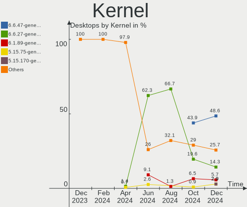
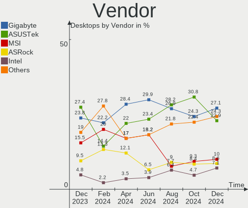
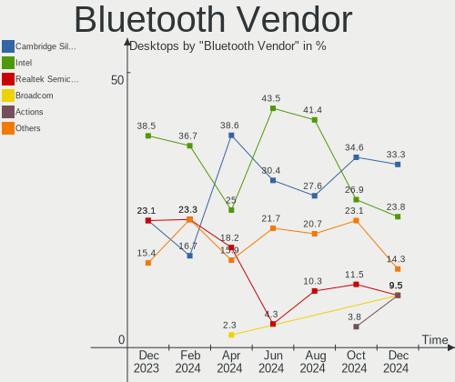

ROSA - Hardware Trends (Desktops)
---------------------------------

A project to identify most popular hardware characteristics and track their change
over time based on data collected by Linux users at https://Linux-Hardware.org.

Anyone can contribute to this report by the [hw-probe](https://github.com/linuxhw/hw-probe) tool:

    sudo -E hw-probe -all -upload

This report is for one last month. Overall report since the beginning of time: [TestCoverage](https://github.com/linuxhw/TestCoverage)

Period: Sep, 2022.

Contents
--------

* [ System ](#system)
  - [ OS                       ](#os)
  - [ OS Family                ](#os-family)
  - [ Kernel                   ](#kernel)
  - [ Kernel Family            ](#kernel-family)
  - [ Kernel Major Ver.        ](#kernel-major-ver)
  - [ Arch                     ](#arch)
  - [ DE                       ](#de)
  - [ Display Server           ](#display-server)
  - [ Display Manager          ](#display-manager)
  - [ OS Lang                  ](#os-lang)
  - [ Boot Mode                ](#boot-mode)
  - [ Filesystem               ](#filesystem)
  - [ Part. scheme             ](#part-scheme)
  - [ Dual Boot with Linux/BSD ](#dual-boot-with-linuxbsd)
  - [ Dual Boot (Win)          ](#dual-boot-win)

* [ Board ](#board)
  - [ Vendor                   ](#vendor)
  - [ Model                    ](#model)
  - [ Model Family             ](#model-family)
  - [ MFG Year                 ](#mfg-year)
  - [ Form Factor              ](#form-factor)
  - [ Secure Boot              ](#secure-boot)
  - [ Coreboot                 ](#coreboot)
  - [ RAM Size                 ](#ram-size)
  - [ RAM Used                 ](#ram-used)
  - [ Total Drives             ](#total-drives)
  - [ Has CD-ROM               ](#has-cd-rom)
  - [ Has Ethernet             ](#has-ethernet)
  - [ Has WiFi                 ](#has-wifi)
  - [ Has Bluetooth            ](#has-bluetooth)

* [ Location ](#location)
  - [ Country                  ](#country)
  - [ City                     ](#city)

* [ Drives ](#drives)
  - [ Drive Vendor             ](#drive-vendor)
  - [ Drive Model              ](#drive-model)
  - [ HDD Vendor               ](#hdd-vendor)
  - [ SSD Vendor               ](#ssd-vendor)
  - [ Drive Kind               ](#drive-kind)
  - [ Drive Connector          ](#drive-connector)
  - [ Drive Size               ](#drive-size)
  - [ Space Total              ](#space-total)
  - [ Space Used               ](#space-used)
  - [ Malfunc. Drives          ](#malfunc-drives)
  - [ Malfunc. Drive Vendor    ](#malfunc-drive-vendor)
  - [ Malfunc. HDD Vendor      ](#malfunc-hdd-vendor)
  - [ Malfunc. Drive Kind      ](#malfunc-drive-kind)
  - [ Failed Drives            ](#failed-drives)
  - [ Failed Drive Vendor      ](#failed-drive-vendor)
  - [ Drive Status             ](#drive-status)

* [ Storage controller ](#storage-controller)
  - [ Storage Vendor           ](#storage-vendor)
  - [ Storage Model            ](#storage-model)
  - [ Storage Kind             ](#storage-kind)

* [ Processor ](#processor)
  - [ CPU Vendor               ](#cpu-vendor)
  - [ CPU Model                ](#cpu-model)
  - [ CPU Model Family         ](#cpu-model-family)
  - [ CPU Cores                ](#cpu-cores)
  - [ CPU Sockets              ](#cpu-sockets)
  - [ CPU Threads              ](#cpu-threads)
  - [ CPU Op-Modes             ](#cpu-op-modes)
  - [ CPU Microcode            ](#cpu-microcode)
  - [ CPU Microarch            ](#cpu-microarch)

* [ Graphics ](#graphics)
  - [ GPU Vendor               ](#gpu-vendor)
  - [ GPU Model                ](#gpu-model)
  - [ GPU Combo                ](#gpu-combo)
  - [ GPU Driver               ](#gpu-driver)
  - [ GPU Memory               ](#gpu-memory)

* [ Monitor ](#monitor)
  - [ Monitor Vendor           ](#monitor-vendor)
  - [ Monitor Model            ](#monitor-model)
  - [ Monitor Resolution       ](#monitor-resolution)
  - [ Monitor Diagonal         ](#monitor-diagonal)
  - [ Monitor Width            ](#monitor-width)
  - [ Aspect Ratio             ](#aspect-ratio)
  - [ Monitor Area             ](#monitor-area)
  - [ Pixel Density            ](#pixel-density)
  - [ Multiple Monitors        ](#multiple-monitors)

* [ Network ](#network)
  - [ Net Controller Vendor    ](#net-controller-vendor)
  - [ Net Controller Model     ](#net-controller-model)
  - [ Wireless Vendor          ](#wireless-vendor)
  - [ Wireless Model           ](#wireless-model)
  - [ Ethernet Vendor          ](#ethernet-vendor)
  - [ Ethernet Model           ](#ethernet-model)
  - [ Net Controller Kind      ](#net-controller-kind)
  - [ Used Controller          ](#used-controller)
  - [ NICs                     ](#nics)
  - [ IPv6                     ](#ipv6)

* [ Bluetooth ](#bluetooth)
  - [ Bluetooth Vendor         ](#bluetooth-vendor)
  - [ Bluetooth Model          ](#bluetooth-model)

* [ Sound ](#sound)
  - [ Sound Vendor             ](#sound-vendor)
  - [ Sound Model              ](#sound-model)

* [ Memory ](#memory)
  - [ Memory Vendor            ](#memory-vendor)
  - [ Memory Model             ](#memory-model)
  - [ Memory Kind              ](#memory-kind)
  - [ Memory Form Factor       ](#memory-form-factor)
  - [ Memory Size              ](#memory-size)
  - [ Memory Speed             ](#memory-speed)

* [ Printers & scanners ](#printers--scanners)
  - [ Printer Vendor           ](#printer-vendor)
  - [ Printer Model            ](#printer-model)
  - [ Scanner Vendor           ](#scanner-vendor)
  - [ Scanner Model            ](#scanner-model)

* [ Camera ](#camera)
  - [ Camera Vendor            ](#camera-vendor)
  - [ Camera Model             ](#camera-model)

* [ Security ](#security)
  - [ Fingerprint Vendor       ](#fingerprint-vendor)
  - [ Fingerprint Model        ](#fingerprint-model)
  - [ Chipcard Vendor          ](#chipcard-vendor)
  - [ Chipcard Model           ](#chipcard-model)

* [ Unsupported ](#unsupported)
  - [ Unsupported Devices      ](#unsupported-devices)
  - [ Unsupported Device Types ](#unsupported-device-types)

System
------

OS
--

Installed operating systems

| Name       | Desktops | Percent |
|------------|----------|---------|
| ROSA 12.2  | 106      | 84.8%   |
| ROSA R11.1 | 13       | 10.4%   |
| ROSA 12.1  | 3        | 2.4%    |
| ROSA 12    | 2        | 1.6%    |
| ROSA R11   | 1        | 0.8%    |

OS Family
---------

OS without a version

| Name | Desktops | Percent |
|------|----------|---------|
| ROSA | 125      | 100%    |

Kernel
------

Version of the Linux kernel

| Version                                    | Desktops | Percent |
|--------------------------------------------|----------|---------|
| 5.10.74-generic-2rosa2021.1-x86_64         | 46       | 36.8%   |
| 5.10.118-generic-2rosa2021.1-x86_64        | 41       | 32.8%   |
| 5.15.43-generic-2rosa2021.1-x86_64         | 8        | 6.4%    |
| 5.18.18.xm1-1-xanmod-rosa2021.1-x86_64     | 5        | 4%      |
| 5.4.83-generic-2rosa-x86_64                | 4        | 3.2%    |
| 5.17.11-generic-2rosa2021.1-x86_64         | 4        | 3.2%    |
| 5.4.83-generic-2rosa-i586                  | 2        | 1.6%    |
| 5.4.32-generic-2rosa-x86_64                | 2        | 1.6%    |
| 5.10.71-generic-1rosa2021.1-x86_64         | 2        | 1.6%    |
| 4.9.155-nrj-desktop-1rosa-x86_64           | 2        | 1.6%    |
| 5.5.19-generic-1rosa-x86_64                | 1        | 0.8%    |
| 5.4.32-generic-2rosa-i586                  | 1        | 0.8%    |
| 5.18.18-generic-2rosa2021.1-x86_64         | 1        | 0.8%    |
| 5.18.14.xm1-1.klp-xanmod-rosa2021.1-x86_64 | 1        | 0.8%    |
| 5.15.65-generic-1rosa2021.1-x86_64         | 1        | 0.8%    |
| 5.10.74-generic-2rosa2021.1-i586           | 1        | 0.8%    |
| 5.10.118-generic-2rosa2021.1-i586          | 1        | 0.8%    |
| 4.15.0-desktop-45.1rosa-x86_64             | 1        | 0.8%    |
| 4.15.0-desktop-122.124.1rosa-x86_64        | 1        | 0.8%    |

Kernel Family
-------------

Linux kernel without a distro release

| Version  | Desktops | Percent |
|----------|----------|---------|
| 5.10.74  | 47       | 37.6%   |
| 5.10.118 | 42       | 33.6%   |
| 5.15.43  | 8        | 6.4%    |
| 5.4.83   | 6        | 4.8%    |
| 5.18.18  | 6        | 4.8%    |
| 5.17.11  | 4        | 3.2%    |
| 5.4.32   | 3        | 2.4%    |
| 5.10.71  | 2        | 1.6%    |
| 4.9.155  | 2        | 1.6%    |
| 4.15.0   | 2        | 1.6%    |
| 5.5.19   | 1        | 0.8%    |
| 5.18.14  | 1        | 0.8%    |
| 5.15.65  | 1        | 0.8%    |

Kernel Major Ver.
-----------------

Linux kernel major version

| Version | Desktops | Percent |
|---------|----------|---------|
| 5.10    | 91       | 72.8%   |
| 5.4     | 9        | 7.2%    |
| 5.15    | 9        | 7.2%    |
| 5.18    | 7        | 5.6%    |
| 5.17    | 4        | 3.2%    |
| 4.9     | 2        | 1.6%    |
| 4.15    | 2        | 1.6%    |
| 5.5     | 1        | 0.8%    |

Arch
----

OS architecture (x86_64, i586, etc.)

| Name   | Desktops | Percent |
|--------|----------|---------|
| x86_64 | 120      | 96%     |
| i686   | 5        | 4%      |

DE
--

Desktop Environment

| Name  | Desktops | Percent |
|-------|----------|---------|
| KDE5  | 56       | 44.8%   |
| GNOME | 47       | 37.6%   |
| LXQt  | 12       | 9.6%    |
| KDE4  | 7        | 5.6%    |
| MATE  | 2        | 1.6%    |
| XFCE  | 1        | 0.8%    |

Display Server
--------------

X11 or Wayland

| Name    | Desktops | Percent |
|---------|----------|---------|
| Wayland | 93       | 74.4%   |
| X11     | 31       | 24.8%   |
| Tty     | 1        | 0.8%    |

Display Manager
---------------

SDDM, LightDM, etc.

| Name    | Desktops | Percent |
|---------|----------|---------|
| GDM     | 62       | 49.6%   |
| SDDM    | 52       | 41.6%   |
| KDM     | 8        | 6.4%    |
| LightDM | 3        | 2.4%    |

OS Lang
-------

Language

| Lang    | Desktops | Percent |
|---------|----------|---------|
| ru_RU   | 118      | 94.4%   |
| es_ES   | 2        | 1.6%    |
| pl_PL   | 1        | 0.8%    |
| en_IN   | 1        | 0.8%    |
| en_GB   | 1        | 0.8%    |
| de_CH   | 1        | 0.8%    |
| Unknown | 1        | 0.8%    |

Boot Mode
---------

EFI or BIOS

| Mode | Desktops | Percent |
|------|----------|---------|
| BIOS | 65       | 52%     |
| EFI  | 60       | 48%     |

Filesystem
----------

Type of filesystem

| Type  | Desktops | Percent |
|-------|----------|---------|
| Ext4  | 115      | 92%     |
| Btrfs | 10       | 8%      |

Part. scheme
------------

Scheme of partitioning

| Type | Desktops | Percent |
|------|----------|---------|
| GPT  | 84       | 67.2%   |
| MBR  | 41       | 32.8%   |

Dual Boot with Linux/BSD
------------------------

Hosting more than one Linux/BSD

| Dual boot | Desktops | Percent |
|-----------|----------|---------|
| No        | 89       | 71.2%   |
| Yes       | 36       | 28.8%   |

Dual Boot (Win)
---------------

Hosting Linux and Windows

| Dual boot | Desktops | Percent |
|-----------|----------|---------|
| Yes       | 65       | 52%     |
| No        | 60       | 48%     |

Board
-----

Vendor
------

Motherboard manufacturer

| Name                | Desktops | Percent |
|---------------------|----------|---------|
| Gigabyte Technology | 37       | 29.6%   |
| ASUSTek Computer    | 37       | 29.6%   |
| ASRock              | 17       | 13.6%   |
| MSI                 | 8        | 6.4%    |
| Lenovo              | 4        | 3.2%    |
| Huanan              | 4        | 3.2%    |
| Intel               | 3        | 2.4%    |
| MACHINIST           | 2        | 1.6%    |
| Hewlett-Packard     | 2        | 1.6%    |
| Dell                | 2        | 1.6%    |
| Biostar             | 2        | 1.6%    |
| Unknown             | 2        | 1.6%    |
| Pegatron            | 1        | 0.8%    |
| JGINYUE             | 1        | 0.8%    |
| Foxconn             | 1        | 0.8%    |
| ECS                 | 1        | 0.8%    |
| Colorful Technology | 1        | 0.8%    |

Model
-----

Motherboard model

| Name                                    | Desktops | Percent |
|-----------------------------------------|----------|---------|
| ASUS All Series                         | 6        | 4.8%    |
| MSI MS-7A38                             | 2        | 1.6%    |
| MSI MS-7680                             | 2        | 1.6%    |
| MSI MS-7599                             | 2        | 1.6%    |
| MACHINIST B75 PRO V1.0                  | 2        | 1.6%    |
| Gigabyte A320M-H                        | 2        | 1.6%    |
| ASUS TUF Gaming Z590-PLUS WIFI          | 2        | 1.6%    |
| ASUS P8H61-M LE                         | 2        | 1.6%    |
| ASRock G41M-VS3                         | 2        | 1.6%    |
| Unknown                                 | 2        | 1.6%    |
| Pegatron Compaq dx2400 Microtower       | 1        | 0.8%    |
| MSI MS-7592                             | 1        | 0.8%    |
| MSI MS-7253                             | 1        | 0.8%    |
| Lenovo ThinkCentre M58 8910A8U          | 1        | 0.8%    |
| Lenovo IdeaCentre 510S-07ICK 90LX003VRS | 1        | 0.8%    |
| Lenovo IdeaCentre 510S-07ICB Type 90K8  | 1        | 0.8%    |
| Lenovo H420                             | 1        | 0.8%    |
| JGINYUE X99 TITANIUM D4                 | 1        | 0.8%    |
| Intel X99                               | 1        | 0.8%    |
| Intel D33217GKE G76540-204              | 1        | 0.8%    |
| Intel D2500HN AAG81480-500              | 1        | 0.8%    |
| Huanan X99-F8D V2.4                     | 1        | 0.8%    |
| Huanan X99-F8                           | 1        | 0.8%    |
| Huanan X99 F8D V2.2                     | 1        | 0.8%    |
| Huanan H97-ZD3 V2.0                     | 1        | 0.8%    |
| HP Compaq 8200 Elite CMT PC             | 1        | 0.8%    |
| HP Compaq 6200 Pro SFF PC               | 1        | 0.8%    |
| Gigabyte Z77M-D3H                       | 1        | 0.8%    |
| Gigabyte Z590 GAMING X                  | 1        | 0.8%    |
| Gigabyte Z490 UD                        | 1        | 0.8%    |
| Gigabyte Z390 AORUS ULTRA               | 1        | 0.8%    |
| Gigabyte Z370P D3                       | 1        | 0.8%    |
| Gigabyte X79-UD3                        | 1        | 0.8%    |
| Gigabyte P85-D3                         | 1        | 0.8%    |
| Gigabyte P55-US3L                       | 1        | 0.8%    |
| Gigabyte P43T-ES3G                      | 1        | 0.8%    |
| Gigabyte MSQ87TN-00                     | 1        | 0.8%    |
| Gigabyte M61PME-S2P                     | 1        | 0.8%    |
| Gigabyte H81M-S1                        | 1        | 0.8%    |
| Gigabyte H81M-DS2                       | 1        | 0.8%    |

Model Family
------------

Motherboard model prefix

| Name                | Desktops | Percent |
|---------------------|----------|---------|
| ASUS PRIME          | 6        | 4.8%    |
| ASUS All            | 6        | 4.8%    |
| ASUS P8H61-M        | 5        | 4%      |
| ASUS TUF            | 4        | 3.2%    |
| MSI MS-7A38         | 2        | 1.6%    |
| MSI MS-7680         | 2        | 1.6%    |
| MSI MS-7599         | 2        | 1.6%    |
| MACHINIST B75       | 2        | 1.6%    |
| Lenovo IdeaCentre   | 2        | 1.6%    |
| HP Compaq           | 2        | 1.6%    |
| Gigabyte B450M      | 2        | 1.6%    |
| Gigabyte A320M-H    | 2        | 1.6%    |
| ASUS Maximus        | 2        | 1.6%    |
| ASRock G41M-VS3     | 2        | 1.6%    |
| Unknown             | 2        | 1.6%    |
| Pegatron Compaq     | 1        | 0.8%    |
| MSI MS-7592         | 1        | 0.8%    |
| MSI MS-7253         | 1        | 0.8%    |
| Lenovo ThinkCentre  | 1        | 0.8%    |
| Lenovo H420         | 1        | 0.8%    |
| JGINYUE X99         | 1        | 0.8%    |
| Intel X99           | 1        | 0.8%    |
| Intel D33217GKE     | 1        | 0.8%    |
| Intel D2500HN       | 1        | 0.8%    |
| Huanan X99-F8D      | 1        | 0.8%    |
| Huanan X99-F8       | 1        | 0.8%    |
| Huanan X99          | 1        | 0.8%    |
| Huanan H97-ZD3      | 1        | 0.8%    |
| Gigabyte Z77M-D3H   | 1        | 0.8%    |
| Gigabyte Z590       | 1        | 0.8%    |
| Gigabyte Z490       | 1        | 0.8%    |
| Gigabyte Z390       | 1        | 0.8%    |
| Gigabyte Z370P      | 1        | 0.8%    |
| Gigabyte X79-UD3    | 1        | 0.8%    |
| Gigabyte P85-D3     | 1        | 0.8%    |
| Gigabyte P55-US3L   | 1        | 0.8%    |
| Gigabyte P43T-ES3G  | 1        | 0.8%    |
| Gigabyte MSQ87TN-00 | 1        | 0.8%    |
| Gigabyte M61PME-S2P | 1        | 0.8%    |
| Gigabyte H81M-S1    | 1        | 0.8%    |

MFG Year
--------

Motherboard manufacture year

| Year | Desktops | Percent |
|------|----------|---------|
| 2013 | 18       | 14.4%   |
| 2012 | 17       | 13.6%   |
| 2010 | 13       | 10.4%   |
| 2021 | 10       | 8%      |
| 2011 | 10       | 8%      |
| 2020 | 9        | 7.2%    |
| 2018 | 9        | 7.2%    |
| 2016 | 7        | 5.6%    |
| 2017 | 6        | 4.8%    |
| 2008 | 6        | 4.8%    |
| 2019 | 5        | 4%      |
| 2022 | 4        | 3.2%    |
| 2009 | 4        | 3.2%    |
| 2007 | 3        | 2.4%    |
| 2015 | 2        | 1.6%    |
| 2014 | 2        | 1.6%    |

Form Factor
-----------

Physical design of the computer

| Name    | Desktops | Percent |
|---------|----------|---------|
| Desktop | 125      | 100%    |

Secure Boot
-----------

Enabled or disabled

| State    | Desktops | Percent |
|----------|----------|---------|
| Disabled | 125      | 100%    |

Coreboot
--------

Have coreboot on board

| Used | Desktops | Percent |
|------|----------|---------|
| No   | 125      | 100%    |

RAM Size
--------

Total RAM memory

| Size in GB  | Desktops | Percent |
|-------------|----------|---------|
| 16.01-24.0  | 34       | 27.2%   |
| 4.01-8.0    | 25       | 20%     |
| 8.01-16.0   | 25       | 20%     |
| 3.01-4.0    | 24       | 19.2%   |
| 32.01-64.0  | 8        | 6.4%    |
| 24.01-32.0  | 3        | 2.4%    |
| 64.01-256.0 | 3        | 2.4%    |
| 1.01-2.0    | 2        | 1.6%    |
| 2.01-3.0    | 1        | 0.8%    |

RAM Used
--------

Used RAM memory

| Used GB  | Desktops | Percent |
|----------|----------|---------|
| 1.01-2.0 | 72       | 57.6%   |
| 0.51-1.0 | 35       | 28%     |
| 2.01-3.0 | 10       | 8%      |
| 4.01-8.0 | 4        | 3.2%    |
| 3.01-4.0 | 4        | 3.2%    |

Total Drives
------------

Number of drives on board

| Drives | Desktops | Percent |
|--------|----------|---------|
| 1      | 57       | 45.6%   |
| 2      | 29       | 23.2%   |
| 3      | 22       | 17.6%   |
| 4      | 9        | 7.2%    |
| 6      | 4        | 3.2%    |
| 5      | 2        | 1.6%    |
| 0      | 2        | 1.6%    |

Has CD-ROM
----------

Has CD-ROM on board

| Presented | Desktops | Percent |
|-----------|----------|---------|
| No        | 75       | 60%     |
| Yes       | 50       | 40%     |

Has Ethernet
------------

Has Ethernet on board

| Presented | Desktops | Percent |
|-----------|----------|---------|
| Yes       | 124      | 99.2%   |
| No        | 1        | 0.8%    |

Has WiFi
--------

Has WiFi module

| Presented | Desktops | Percent |
|-----------|----------|---------|
| No        | 83       | 66.4%   |
| Yes       | 42       | 33.6%   |

Has Bluetooth
-------------

Has Bluetooth module

| Presented | Desktops | Percent |
|-----------|----------|---------|
| No        | 95       | 76%     |
| Yes       | 30       | 24%     |

Location
--------

Country
-------

Geographic location (country)

| Country     | Desktops | Percent |
|-------------|----------|---------|
| Russia      | 114      | 91.2%   |
| Ukraine     | 3        | 2.4%    |
| Venezuela   | 1        | 0.8%    |
| UK          | 1        | 0.8%    |
| Switzerland | 1        | 0.8%    |
| Spain       | 1        | 0.8%    |
| Poland      | 1        | 0.8%    |
| Moldova     | 1        | 0.8%    |
| Kyrgyzstan  | 1        | 0.8%    |
| India       | 1        | 0.8%    |

City
----

Geographic location (city)

| City              | Desktops | Percent |
|-------------------|----------|---------|
| Moscow            | 17       | 13.6%   |
| St Petersburg     | 8        | 6.4%    |
| Nizhniy Novgorod  | 5        | 4%      |
| Yekaterinburg     | 4        | 3.2%    |
| Vladivostok       | 4        | 3.2%    |
| Novosibirsk       | 4        | 3.2%    |
| Krasnodar         | 4        | 3.2%    |
| Tyumen            | 3        | 2.4%    |
| Saratov           | 3        | 2.4%    |
| Chelyabinsk       | 3        | 2.4%    |
| Yaroslavl         | 2        | 1.6%    |
| Tula              | 2        | 1.6%    |
| Sochi             | 2        | 1.6%    |
| Samara            | 2        | 1.6%    |
| Rostov-on-Don     | 2        | 1.6%    |
| Petrozavodsk      | 2        | 1.6%    |
| Noril'sk          | 2        | 1.6%    |
| Kirov             | 2        | 1.6%    |
| Irkutsk           | 2        | 1.6%    |
| Blagoveshchensk   | 2        | 1.6%    |
| Yuzhno-Sakhalinsk | 1        | 0.8%    |
| Yoshkar-Ola       | 1        | 0.8%    |
| Yasinovataya      | 1        | 0.8%    |
| Vologda           | 1        | 0.8%    |
| Volgograd         | 1        | 0.8%    |
| Veliky Novgorod   | 1        | 0.8%    |
| Ukhta             | 1        | 0.8%    |
| Ufa               | 1        | 0.8%    |
| Tver              | 1        | 0.8%    |
| Tiraspol          | 1        | 0.8%    |
| Sudzha            | 1        | 0.8%    |
| Stavropol         | 1        | 0.8%    |
| Smolensk          | 1        | 0.8%    |
| Shilka            | 1        | 0.8%    |
| Shchelkovo        | 1        | 0.8%    |
| Severomorsk       | 1        | 0.8%    |
| Sevastopol        | 1        | 0.8%    |
| Saransk           | 1        | 0.8%    |
| Rovenki           | 1        | 0.8%    |
| Rossosh'          | 1        | 0.8%    |

Drives
------

Drive Vendor
------------

Hard drive vendors

| Vendor              | Desktops | Drives | Percent |
|---------------------|----------|--------|---------|
| WDC                 | 49       | 62     | 21.88%  |
| Seagate             | 41       | 53     | 18.3%   |
| Samsung Electronics | 22       | 23     | 9.82%   |
| Toshiba             | 19       | 19     | 8.48%   |
| Hitachi             | 12       | 13     | 5.36%   |
| Kingston            | 6        | 6      | 2.68%   |
| A-DATA Technology   | 6        | 7      | 2.68%   |
| SanDisk             | 5        | 5      | 2.23%   |
| Netac               | 5        | 5      | 2.23%   |
| HGST                | 5        | 6      | 2.23%   |
| Apacer              | 5        | 6      | 2.23%   |
| AMD                 | 4        | 4      | 1.79%   |
| Transcend           | 3        | 3      | 1.34%   |
| SPCC                | 3        | 3      | 1.34%   |
| Intel               | 3        | 3      | 1.34%   |
| China               | 3        | 3      | 1.34%   |
| WALRAM              | 2        | 2      | 0.89%   |
| Smartbuy            | 2        | 3      | 0.89%   |
| Patriot             | 2        | 3      | 0.89%   |
| OCZ                 | 2        | 2      | 0.89%   |
| KingSpec            | 2        | 2      | 0.89%   |
| Corsair             | 2        | 2      | 0.89%   |
| XrayDisk            | 1        | 1      | 0.45%   |
| XPG                 | 1        | 1      | 0.45%   |
| UMIS                | 1        | 1      | 0.45%   |
| Silicon Motion      | 1        | 1      | 0.45%   |
| Reeioon             | 1        | 1      | 0.45%   |
| Plextor             | 1        | 1      | 0.45%   |
| Palit               | 1        | 1      | 0.45%   |
| ORICO               | 1        | 1      | 0.45%   |
| OCZ-VERTEX3         | 1        | 1      | 0.45%   |
| NGFF                | 1        | 1      | 0.45%   |
| Maxtor              | 1        | 1      | 0.45%   |
| KingFast            | 1        | 1      | 0.45%   |
| KingDian            | 1        | 1      | 0.45%   |
| JMicron Technology  | 1        | 1      | 0.45%   |
| HUAWEI              | 1        | 1      | 0.45%   |
| HS-SSD-E100         | 1        | 1      | 0.45%   |
| Hikvision           | 1        | 1      | 0.45%   |
| HGST HTS            | 1        | 1      | 0.45%   |

Drive Model
-----------

Hard drive models

| Model                            | Desktops | Percent |
|----------------------------------|----------|---------|
| Seagate ST500DM002-1BD142 500GB  | 6        | 2.4%    |
| WDC WDS500G2B0A-00SM50 500GB SSD | 5        | 2%      |
| Seagate ST3500418AS 500GB        | 5        | 2%      |
| Seagate ST1000DM010-2EP102 1TB   | 5        | 2%      |
| WDC WDS240G2G0A-00JH30 240GB SSD | 4        | 1.6%    |
| Toshiba HDWD110 1TB              | 4        | 1.6%    |
| Toshiba DT01ACA050 500GB         | 3        | 1.2%    |
| Seagate ST3250310AS 250GB        | 3        | 1.2%    |
| Apacer AS350 128GB SSD           | 3        | 1.2%    |
| WDC WDS240G2G0B-00EPW0 240GB SSD | 2        | 0.8%    |
| WDC WD5000AAKX-60U6AA0 500GB     | 2        | 0.8%    |
| WDC WD5000AAKX-083CA1 500GB      | 2        | 0.8%    |
| WDC WD10EZEX-00BN5A0 1TB         | 2        | 0.8%    |
| Toshiba HDWD105 500GB            | 2        | 0.8%    |
| SPCC Solid State Disk 128GB      | 2        | 0.8%    |
| Seagate ST3320613AS 320GB        | 2        | 0.8%    |
| Seagate ST3250410AS 250GB        | 2        | 0.8%    |
| Seagate ST3160815AS 160GB        | 2        | 0.8%    |
| Seagate ST250DM000-1BD141 250GB  | 2        | 0.8%    |
| Seagate ST2000DM001-1CH164 2TB   | 2        | 0.8%    |
| Seagate ST1000DX002-2DV162 1TB   | 2        | 0.8%    |
| Seagate ST1000DM003-1CH162 1TB   | 2        | 0.8%    |
| SanDisk SDSSDA120G 120GB         | 2        | 0.8%    |
| Samsung SSD 970 EVO Plus 250GB   | 2        | 0.8%    |
| Samsung SSD 870 EVO 500GB        | 2        | 0.8%    |
| Samsung SSD 860 EVO 500GB        | 2        | 0.8%    |
| Samsung SSD 860 EVO 250GB        | 2        | 0.8%    |
| Kingston SA400S37240G 240GB SSD  | 2        | 0.8%    |
| Hitachi HTS545050A7E380 500GB    | 2        | 0.8%    |
| Hitachi HDS721010CLA332 1TB      | 2        | 0.8%    |
| Corsair Force LS SSD 64GB        | 2        | 0.8%    |
| AMD R5SL120G 120GB SSD           | 2        | 0.8%    |
| XrayDisk SSD 240GB               | 1        | 0.4%    |
| XPG GAMMIX S11 Pro 512GB         | 1        | 0.4%    |
| WDC WDS120G2G0B-00EPW0 120GB SSD | 1        | 0.4%    |
| WDC WDS120G1G0B-00RC30 120GB SSD | 1        | 0.4%    |
| WDC WDS100T2B0A-00SM50 1TB SSD   | 1        | 0.4%    |
| WDC WD800JD-60LSA0 80GB          | 1        | 0.4%    |
| WDC WD800JD-22LSA0 80GB          | 1        | 0.4%    |
| WDC WD800BB-56JKC0 80GB          | 1        | 0.4%    |

HDD Vendor
----------

Hard disk drive vendors

| Vendor              | Desktops | Drives | Percent |
|---------------------|----------|--------|---------|
| WDC                 | 41       | 47     | 32.8%   |
| Seagate             | 41       | 53     | 32.8%   |
| Toshiba             | 19       | 19     | 15.2%   |
| Hitachi             | 12       | 13     | 9.6%    |
| Samsung Electronics | 5        | 5      | 4%      |
| HGST                | 5        | 6      | 4%      |
| Maxtor              | 1        | 1      | 0.8%    |
| HGST HTS            | 1        | 1      | 0.8%    |

SSD Vendor
----------

Solid state drive vendors

| Vendor              | Desktops | Drives | Percent |
|---------------------|----------|--------|---------|
| WDC                 | 13       | 15     | 16.67%  |
| Samsung Electronics | 9        | 9      | 11.54%  |
| Apacer              | 5        | 6      | 6.41%   |
| SanDisk             | 4        | 4      | 5.13%   |
| AMD                 | 4        | 4      | 5.13%   |
| A-DATA Technology   | 4        | 5      | 5.13%   |
| Transcend           | 3        | 3      | 3.85%   |
| SPCC                | 3        | 3      | 3.85%   |
| Netac               | 3        | 3      | 3.85%   |
| Kingston            | 3        | 3      | 3.85%   |
| China               | 3        | 3      | 3.85%   |
| WALRAM              | 2        | 2      | 2.56%   |
| Smartbuy            | 2        | 3      | 2.56%   |
| Patriot             | 2        | 3      | 2.56%   |
| OCZ                 | 2        | 2      | 2.56%   |
| KingSpec            | 2        | 2      | 2.56%   |
| Corsair             | 2        | 2      | 2.56%   |
| XrayDisk            | 1        | 1      | 1.28%   |
| Reeioon             | 1        | 1      | 1.28%   |
| Plextor             | 1        | 1      | 1.28%   |
| Palit               | 1        | 1      | 1.28%   |
| OCZ-VERTEX3         | 1        | 1      | 1.28%   |
| NGFF                | 1        | 1      | 1.28%   |
| KingFast            | 1        | 1      | 1.28%   |
| KingDian            | 1        | 1      | 1.28%   |
| Intel               | 1        | 1      | 1.28%   |
| HS-SSD-E100         | 1        | 1      | 1.28%   |
| Gigabyte Technology | 1        | 1      | 1.28%   |
| Unknown             | 1        | 1      | 1.28%   |

Drive Kind
----------

HDD or SSD

| Kind    | Desktops | Drives | Percent |
|---------|----------|--------|---------|
| HDD     | 94       | 145    | 51.37%  |
| SSD     | 66       | 84     | 36.07%  |
| NVMe    | 22       | 26     | 12.02%  |
| Unknown | 1        | 1      | 0.55%   |

Drive Connector
---------------

SATA, SAS, NVMe, etc.

| Type | Desktops | Drives | Percent |
|------|----------|--------|---------|
| SATA | 118      | 228    | 83.1%   |
| NVMe | 20       | 24     | 14.08%  |
| SAS  | 4        | 4      | 2.82%   |

Drive Size
----------

Size of hard drive

| Size in TB | Desktops | Drives | Percent |
|------------|----------|--------|---------|
| 0.01-0.5   | 102      | 152    | 62.58%  |
| 0.51-1.0   | 41       | 53     | 25.15%  |
| 1.01-2.0   | 13       | 17     | 7.98%   |
| 3.01-4.0   | 4        | 4      | 2.45%   |
| 10.01-20.0 | 2        | 2      | 1.23%   |
| 4.01-10.0  | 1        | 1      | 0.61%   |

Space Total
-----------

Amount of disk space available on the file system

| Size in GB     | Desktops | Percent |
|----------------|----------|---------|
| 101-250        | 36       | 28.8%   |
| 251-500        | 23       | 18.4%   |
| 501-1000       | 20       | 16%     |
| 1-20           | 16       | 12.8%   |
| 51-100         | 11       | 8.8%    |
| 1001-2000      | 7        | 5.6%    |
| 21-50          | 5        | 4%      |
| 2001-3000      | 5        | 4%      |
| More than 3000 | 2        | 1.6%    |

Space Used
----------

Amount of used disk space

| Used GB   | Desktops | Percent |
|-----------|----------|---------|
| 1-20      | 79       | 63.2%   |
| 21-50     | 12       | 9.6%    |
| 101-250   | 10       | 8%      |
| 51-100    | 9        | 7.2%    |
| 501-1000  | 7        | 5.6%    |
| 251-500   | 4        | 3.2%    |
| 2001-3000 | 2        | 1.6%    |
| 1001-2000 | 2        | 1.6%    |

Malfunc. Drives
---------------

Drive models with a malfunction

| Model                               | Desktops | Drives | Percent |
|-------------------------------------|----------|--------|---------|
| Seagate ST500DM002-1BD142 500GB     | 5        | 5      | 7.25%   |
| Seagate ST3500418AS 500GB           | 4        | 5      | 5.8%    |
| Seagate ST3250310AS 250GB           | 3        | 3      | 4.35%   |
| Seagate ST3320613AS 320GB           | 2        | 2      | 2.9%    |
| Seagate ST3250410AS 250GB           | 2        | 2      | 2.9%    |
| WDC WDS240G2G0A-00JH30 240GB SSD    | 1        | 2      | 1.45%   |
| WDC WDS120G2G0B-00EPW0 120GB SSD    | 1        | 1      | 1.45%   |
| WDC WD800JD-22LSA0 80GB             | 1        | 1      | 1.45%   |
| WDC WD800BB-56JKC0 80GB             | 1        | 1      | 1.45%   |
| WDC WD6400AARS-00Y5B1 640GB         | 1        | 1      | 1.45%   |
| WDC WD5000AAKX-08ERMA0 500GB        | 1        | 1      | 1.45%   |
| WDC WD5000AAKX-083CA1 500GB         | 1        | 1      | 1.45%   |
| WDC WD5000AADS-00S9B0 500GB         | 1        | 1      | 1.45%   |
| WDC WD3200AAJS-00L7A0 320GB         | 1        | 1      | 1.45%   |
| WDC WD3200AAJB-00J3A0 320GB         | 1        | 1      | 1.45%   |
| WDC WD20EARS-00S8B1 2TB             | 1        | 1      | 1.45%   |
| WDC WD20EADS-00R6B0 2TB             | 1        | 1      | 1.45%   |
| WDC WD15EARS-00MVWB0 1TB            | 1        | 1      | 1.45%   |
| WDC WD1200BEVS-07LAT0 120GB         | 1        | 1      | 1.45%   |
| WDC WD10EZEX-00RKKA0 1TB            | 1        | 1      | 1.45%   |
| WDC WD10EZEX-00BN5A0 1TB            | 1        | 1      | 1.45%   |
| WDC WD10EARS-00MVWB0 1TB            | 1        | 1      | 1.45%   |
| WDC WD1003FBYX-01Y7B1 1TB           | 1        | 1      | 1.45%   |
| Transcend TS120GSSD220S 120GB       | 1        | 1      | 1.45%   |
| Toshiba MK1637GSX 160GB             | 1        | 1      | 1.45%   |
| Toshiba HDWD110 1TB                 | 1        | 1      | 1.45%   |
| Toshiba HDWD105 500GB               | 1        | 1      | 1.45%   |
| Toshiba DT01ACA100 1TB              | 1        | 1      | 1.45%   |
| Toshiba DT01ACA050 500GB            | 1        | 1      | 1.45%   |
| Seagate ST9320328CS 320GB           | 1        | 1      | 1.45%   |
| Seagate ST9160821AS 160GB           | 1        | 1      | 1.45%   |
| Seagate ST9160310AS 160GB           | 1        | 1      | 1.45%   |
| Seagate ST750LM022 HN-M750MBB 752GB | 1        | 1      | 1.45%   |
| Seagate ST3808110AS 80GB            | 1        | 1      | 1.45%   |
| Seagate ST340810A 40GB              | 1        | 1      | 1.45%   |
| Seagate ST3320620AS 320GB           | 1        | 1      | 1.45%   |
| Seagate ST3320418AS 320GB           | 1        | 1      | 1.45%   |
| Seagate ST3160023A 160GB            | 1        | 1      | 1.45%   |
| Seagate ST250DM000-1BD141 250GB     | 1        | 1      | 1.45%   |
| Seagate ST1000DM003-1CH162 1TB      | 1        | 1      | 1.45%   |

Malfunc. Drive Vendor
---------------------

Vendors of faulty drives

| Vendor              | Desktops | Drives | Percent |
|---------------------|----------|--------|---------|
| Seagate             | 22       | 29     | 35.48%  |
| WDC                 | 17       | 19     | 27.42%  |
| Hitachi             | 7        | 7      | 11.29%  |
| Samsung Electronics | 6        | 6      | 9.68%   |
| Toshiba             | 5        | 5      | 8.06%   |
| Transcend           | 1        | 1      | 1.61%   |
| Reeioon             | 1        | 1      | 1.61%   |
| OCZ-VERTEX3         | 1        | 1      | 1.61%   |
| Apacer              | 1        | 1      | 1.61%   |
| AMD                 | 1        | 1      | 1.61%   |

Malfunc. HDD Vendor
-------------------

Vendors of faulty HDD drives

| Vendor              | Desktops | Drives | Percent |
|---------------------|----------|--------|---------|
| Seagate             | 22       | 29     | 41.51%  |
| WDC                 | 15       | 16     | 28.3%   |
| Hitachi             | 7        | 7      | 13.21%  |
| Toshiba             | 5        | 5      | 9.43%   |
| Samsung Electronics | 4        | 4      | 7.55%   |

Malfunc. Drive Kind
-------------------

Kinds of faulty drives

| Kind | Desktops | Drives | Percent |
|------|----------|--------|---------|
| HDD  | 48       | 61     | 84.21%  |
| SSD  | 8        | 9      | 14.04%  |
| NVMe | 1        | 1      | 1.75%   |

Failed Drives
-------------

Failed drive models

| Model                   | Desktops | Drives | Percent |
|-------------------------|----------|--------|---------|
| WDC WD800BB-22JHA0 80GB | 1        | 1      | 100%    |

Failed Drive Vendor
-------------------

Failed drive vendors

| Vendor | Desktops | Drives | Percent |
|--------|----------|--------|---------|
| WDC    | 1        | 1      | 100%    |

Drive Status
------------

Number of failed and malfunc. drives

| Status   | Desktops | Drives | Percent |
|----------|----------|--------|---------|
| Works    | 100      | 181    | 63.29%  |
| Malfunc  | 54       | 71     | 34.18%  |
| Detected | 3        | 3      | 1.9%    |
| Failed   | 1        | 1      | 0.63%   |

Storage controller
------------------

Storage Vendor
--------------

Storage controller vendors

| Vendor                      | Desktops | Percent |
|-----------------------------|----------|---------|
| Intel                       | 89       | 55.97%  |
| AMD                         | 32       | 20.13%  |
| Samsung Electronics         | 8        | 5.03%   |
| JMicron Technology          | 5        | 3.14%   |
| Marvell Technology Group    | 4        | 2.52%   |
| Silicon Motion              | 3        | 1.89%   |
| Nvidia                      | 3        | 1.89%   |
| Kingston Technology Company | 3        | 1.89%   |
| ASMedia Technology          | 3        | 1.89%   |
| VIA Technologies            | 2        | 1.26%   |
| Realtek Semiconductor       | 2        | 1.26%   |
| Netac Technology            | 2        | 1.26%   |
| Union Memory (Shenzhen)     | 1        | 0.63%   |
| SanDisk                     | 1        | 0.63%   |
| ADATA Technology            | 1        | 0.63%   |

Storage Model
-------------

Storage controller models

| Model                                                                                   | Desktops | Percent |
|-----------------------------------------------------------------------------------------|----------|---------|
| AMD FCH SATA Controller [AHCI mode]                                                     | 19       | 8.96%   |
| Intel 8 Series/C220 Series Chipset Family 6-port SATA Controller 1 [AHCI mode]          | 14       | 6.6%    |
| Intel 7 Series/C210 Series Chipset Family 6-port SATA Controller [AHCI mode]            | 9        | 4.25%   |
| Intel NM10/ICH7 Family SATA Controller [IDE mode]                                       | 8        | 3.77%   |
| Intel 6 Series/C200 Series Chipset Family Desktop SATA Controller (IDE mode, ports 4-5) | 8        | 3.77%   |
| Intel 6 Series/C200 Series Chipset Family Desktop SATA Controller (IDE mode, ports 0-3) | 8        | 3.77%   |
| AMD SB7x0/SB8x0/SB9x0 IDE Controller                                                    | 8        | 3.77%   |
| Intel 6 Series/C200 Series Chipset Family 6 port Desktop SATA AHCI Controller           | 7        | 3.3%    |
| Intel 82801G (ICH7 Family) IDE Controller                                               | 6        | 2.83%   |
| Intel 500 Series Chipset Family SATA AHCI Controller                                    | 6        | 2.83%   |
| Samsung NVMe SSD Controller SM981/PM981/PM983                                           | 5        | 2.36%   |
| Intel Q170/Q150/B150/H170/H110/Z170/CM236 Chipset SATA Controller [AHCI Mode]           | 5        | 2.36%   |
| Intel 200 Series PCH SATA controller [AHCI mode]                                        | 5        | 2.36%   |
| AMD SB7x0/SB8x0/SB9x0 SATA Controller [AHCI mode]                                       | 5        | 2.36%   |
| AMD 400 Series Chipset SATA Controller                                                  | 5        | 2.36%   |
| Intel C610/X99 series chipset 6-Port SATA Controller [AHCI mode]                        | 4        | 1.89%   |
| AMD SB7x0/SB8x0/SB9x0 SATA Controller [IDE mode]                                        | 4        | 1.89%   |
| AMD FCH SATA Controller D                                                               | 4        | 1.89%   |
| Silicon Motion SM2263EN/SM2263XT SSD Controller                                         | 3        | 1.42%   |
| Samsung NVMe SSD Controller 980                                                         | 3        | 1.42%   |
| Nvidia MCP61 SATA Controller                                                            | 3        | 1.42%   |
| Nvidia MCP61 IDE                                                                        | 3        | 1.42%   |
| Intel Cannon Lake PCH SATA AHCI Controller                                              | 3        | 1.42%   |
| ASMedia ASM1062 Serial ATA Controller                                                   | 3        | 1.42%   |
| AMD FCH IDE Controller                                                                  | 3        | 1.42%   |
| AMD 500 Series Chipset SATA Controller                                                  | 3        | 1.42%   |
| Realtek Realtek Non-Volatile memory controller                                          | 2        | 0.94%   |
| Netac Non-Volatile memory controller                                                    | 2        | 0.94%   |
| Kingston Company KC2000 NVMe SSD                                                        | 2        | 0.94%   |
| JMicron JMB368 IDE controller                                                           | 2        | 0.94%   |
| JMicron JMB362 SATA Controller                                                          | 2        | 0.94%   |
| Intel Comet Lake SATA AHCI Controller                                                   | 2        | 0.94%   |
| Intel 82801JI (ICH10 Family) SATA AHCI Controller                                       | 2        | 0.94%   |
| Intel 82801JI (ICH10 Family) 4 port SATA IDE Controller #1                              | 2        | 0.94%   |
| Intel 82801JI (ICH10 Family) 2 port SATA IDE Controller #2                              | 2        | 0.94%   |
| Intel 82801IR/IO/IH (ICH9R/DO/DH) 4 port SATA Controller [IDE mode]                     | 2        | 0.94%   |
| Intel 82801I (ICH9 Family) 2 port SATA Controller [IDE mode]                            | 2        | 0.94%   |
| Intel 5 Series/3400 Series Chipset 4 port SATA IDE Controller                           | 2        | 0.94%   |
| Intel 5 Series/3400 Series Chipset 2 port SATA IDE Controller                           | 2        | 0.94%   |
| AMD FCH SATA Controller [IDE mode]                                                      | 2        | 0.94%   |

Storage Kind
------------

Kind of storage controller (IDE, SATA, NVMe, SAS, ...)

| Kind | Desktops | Percent |
|------|----------|---------|
| SATA | 98       | 61.25%  |
| IDE  | 40       | 25%     |
| NVMe | 20       | 12.5%   |
| RAID | 2        | 1.25%   |

Processor
---------

CPU Vendor
----------

Processor vendors

| Vendor | Desktops | Percent |
|--------|----------|---------|
| Intel  | 89       | 71.2%   |
| AMD    | 36       | 28.8%   |

CPU Model
---------

Processor models

| Model                                       | Desktops | Percent |
|---------------------------------------------|----------|---------|
| Intel Core 2 Duo CPU E8400 @ 3.00GHz        | 4        | 3.2%    |
| Intel Xeon CPU E5-2678 v3 @ 2.50GHz         | 2        | 1.6%    |
| Intel Pentium Gold G5420 CPU @ 3.80GHz      | 2        | 1.6%    |
| Intel Pentium Dual-Core CPU E5200 @ 2.50GHz | 2        | 1.6%    |
| Intel Pentium CPU G840 @ 2.80GHz            | 2        | 1.6%    |
| Intel Pentium CPU G630 @ 2.70GHz            | 2        | 1.6%    |
| Intel Pentium CPU G4400 @ 3.30GHz           | 2        | 1.6%    |
| Intel Pentium CPU G3420 @ 3.20GHz           | 2        | 1.6%    |
| Intel Core i7-4770 CPU @ 3.40GHz            | 2        | 1.6%    |
| Intel Core i7-3770K CPU @ 3.50GHz           | 2        | 1.6%    |
| Intel Core i3-7100 CPU @ 3.90GHz            | 2        | 1.6%    |
| Intel Core i3-2100 CPU @ 3.10GHz            | 2        | 1.6%    |
| Intel 11th Gen Core i7-11700K @ 3.60GHz     | 2        | 1.6%    |
| AMD Ryzen 7 2700 Eight-Core Processor       | 2        | 1.6%    |
| AMD Ryzen 5 2600 Six-Core Processor         | 2        | 1.6%    |
| AMD Ryzen 5 1600 Six-Core Processor         | 2        | 1.6%    |
| AMD Phenom II X4 955 Processor              | 2        | 1.6%    |
| AMD FX-8350 Eight-Core Processor            | 2        | 1.6%    |
| Intel Xeon CPU E5-2690 v3 @ 2.60GHz         | 1        | 0.8%    |
| Intel Xeon CPU E5-2673 v3 @ 2.40GHz         | 1        | 0.8%    |
| Intel Xeon CPU E5-2666 v3 @ 2.90GHz         | 1        | 0.8%    |
| Intel Xeon CPU E31270 @ 3.40GHz             | 1        | 0.8%    |
| Intel Xeon CPU E3-1270 v3 @ 3.50GHz         | 1        | 0.8%    |
| Intel Xeon CPU E3-1270 V2 @ 3.50GHz         | 1        | 0.8%    |
| Intel Xeon CPU E3-1245 v3 @ 3.40GHz         | 1        | 0.8%    |
| Intel Xeon CPU E3-1240 V2 @ 3.40GHz         | 1        | 0.8%    |
| Intel Xeon CPU E3-1220 V2 @ 3.10GHz         | 1        | 0.8%    |
| Intel Pentium Gold G6405 CPU @ 4.10GHz      | 1        | 0.8%    |
| Intel Pentium Dual-Core CPU E6600 @ 3.06GHz | 1        | 0.8%    |
| Intel Pentium Dual-Core CPU E5700 @ 3.00GHz | 1        | 0.8%    |
| Intel Pentium CPU G850 @ 2.90GHz            | 1        | 0.8%    |
| Intel Pentium CPU G3440 @ 3.30GHz           | 1        | 0.8%    |
| Intel Pentium CPU G3220 @ 3.00GHz           | 1        | 0.8%    |
| Intel Genuine CPU 0000 @ 2.40GHz            | 1        | 0.8%    |
| Intel Core i9-9900K CPU @ 3.60GHz           | 1        | 0.8%    |
| Intel Core i7-8700 CPU @ 3.20GHz            | 1        | 0.8%    |
| Intel Core i7-4790K CPU @ 4.00GHz           | 1        | 0.8%    |
| Intel Core i7-3820 CPU @ 3.60GHz            | 1        | 0.8%    |
| Intel Core i7-2700K CPU @ 3.50GHz           | 1        | 0.8%    |
| Intel Core i7-2600K CPU @ 3.40GHz           | 1        | 0.8%    |

CPU Model Family
----------------

Processor model prefix

| Model                   | Desktops | Percent |
|-------------------------|----------|---------|
| Intel Core i5           | 15       | 12%     |
| Intel Core i3           | 15       | 12%     |
| Intel Xeon              | 11       | 8.8%    |
| Intel Pentium           | 11       | 8.8%    |
| Intel Core i7           | 10       | 8%      |
| Intel Core 2 Duo        | 7        | 5.6%    |
| AMD Ryzen 5             | 6        | 4.8%    |
| AMD FX                  | 5        | 4%      |
| Other                   | 4        | 3.2%    |
| Intel Pentium Dual-Core | 4        | 3.2%    |
| AMD Ryzen 3             | 4        | 3.2%    |
| Intel Pentium Gold      | 3        | 2.4%    |
| AMD Ryzen 7             | 3        | 2.4%    |
| Intel Core 2 Quad       | 2        | 1.6%    |
| Intel Core 2            | 2        | 1.6%    |
| Intel Celeron           | 2        | 1.6%    |
| AMD Ryzen 3 PRO         | 2        | 1.6%    |
| AMD Phenom II X4        | 2        | 1.6%    |
| AMD Athlon X4           | 2        | 1.6%    |
| AMD Athlon II X4        | 2        | 1.6%    |
| AMD Athlon 64 X2        | 2        | 1.6%    |
| AMD A4                  | 2        | 1.6%    |
| Intel Genuine           | 1        | 0.8%    |
| Intel Core i9           | 1        | 0.8%    |
| Intel Atom              | 1        | 0.8%    |
| AMD PRO A8              | 1        | 0.8%    |
| AMD Phenom              | 1        | 0.8%    |
| AMD E1                  | 1        | 0.8%    |
| AMD Athlon II X2        | 1        | 0.8%    |
| AMD A6                  | 1        | 0.8%    |
| AMD A10                 | 1        | 0.8%    |

CPU Cores
---------

Number of processor cores

| Number | Desktops | Percent |
|--------|----------|---------|
| 2      | 50       | 40%     |
| 4      | 47       | 37.6%   |
| 6      | 11       | 8.8%    |
| 8      | 6        | 4.8%    |
| 12     | 3        | 2.4%    |
| 1      | 3        | 2.4%    |
| 3      | 2        | 1.6%    |
| 24     | 1        | 0.8%    |
| 20     | 1        | 0.8%    |
| 10     | 1        | 0.8%    |

CPU Sockets
-----------

Number of sockets

| Number | Desktops | Percent |
|--------|----------|---------|
| 1      | 123      | 98.4%   |
| 2      | 2        | 1.6%    |

CPU Threads
-----------

Threads per core (Hyper-Threading)

| Number | Desktops | Percent |
|--------|----------|---------|
| 2      | 66       | 52.8%   |
| 1      | 59       | 47.2%   |

CPU Op-Modes
------------

CPU Operation Modes (32-bit, 64-bit)

| Op mode        | Desktops | Percent |
|----------------|----------|---------|
| 32-bit, 64-bit | 125      | 100%    |

CPU Microcode
-------------

Microcode number

| Number     | Desktops | Percent |
|------------|----------|---------|
| 0x306c3    | 14       | 11.2%   |
| 0x206a7    | 13       | 10.4%   |
| 0x306a9    | 12       | 9.6%    |
| 0x1067a    | 11       | 8.8%    |
| 0x906ea    | 5        | 4%      |
| 0x306f2    | 5        | 4%      |
| 0x0800820d | 5        | 4%      |
| 0x06000852 | 5        | 4%      |
| 0x08001138 | 4        | 3.2%    |
| 0x06001119 | 4        | 3.2%    |
| 0x010000c8 | 4        | 3.2%    |
| 0xa0671    | 3        | 2.4%    |
| 0xa0653    | 3        | 2.4%    |
| 0x906e9    | 3        | 2.4%    |
| 0xa0655    | 2        | 1.6%    |
| 0x6f6      | 2        | 1.6%    |
| 0x506e3    | 2        | 1.6%    |
| 0x20655    | 2        | 1.6%    |
| 0x06003106 | 2        | 1.6%    |
| Unknown    | 2        | 1.6%    |
| 0x906ed    | 1        | 0.8%    |
| 0x906eb    | 1        | 0.8%    |
| 0x90672    | 1        | 0.8%    |
| 0x706a8    | 1        | 0.8%    |
| 0x6fb      | 1        | 0.8%    |
| 0x506e8    | 1        | 0.8%    |
| 0x406c4    | 1        | 0.8%    |
| 0x30661    | 1        | 0.8%    |
| 0x206d7    | 1        | 0.8%    |
| 0x206c2    | 1        | 0.8%    |
| 0x106e5    | 1        | 0.8%    |
| 0x10676    | 1        | 0.8%    |
| 0x0a201016 | 1        | 0.8%    |
| 0x08701021 | 1        | 0.8%    |
| 0x08600106 | 1        | 0.8%    |
| 0x08108109 | 1        | 0.8%    |
| 0x0810100b | 1        | 0.8%    |
| 0x08001129 | 1        | 0.8%    |
| 0x07030106 | 1        | 0.8%    |
| 0x03000027 | 1        | 0.8%    |

CPU Microarch
-------------

Microarchitecture

| Name          | Desktops | Percent |
|---------------|----------|---------|
| Haswell       | 19       | 15.2%   |
| SandyBridge   | 14       | 11.2%   |
| Penryn        | 12       | 9.6%    |
| IvyBridge     | 12       | 9.6%    |
| KabyLake      | 10       | 8%      |
| Piledriver    | 9        | 7.2%    |
| Zen+          | 6        | 4.8%    |
| Zen           | 6        | 4.8%    |
| K10           | 6        | 4.8%    |
| CometLake     | 5        | 4%      |
| Unknown       | 4        | 3.2%    |
| Westmere      | 3        | 2.4%    |
| Skylake       | 3        | 2.4%    |
| Core          | 3        | 2.4%    |
| Zen 2         | 2        | 1.6%    |
| Steamroller   | 2        | 1.6%    |
| K8 Hammer     | 2        | 1.6%    |
| Zen 3         | 1        | 0.8%    |
| Silvermont    | 1        | 0.8%    |
| Puma          | 1        | 0.8%    |
| Nehalem       | 1        | 0.8%    |
| K10 Llano     | 1        | 0.8%    |
| Goldmont plus | 1        | 0.8%    |
| Bonnell       | 1        | 0.8%    |

Graphics
--------

GPU Vendor
----------

Vendors of graphics cards

| Vendor                     | Desktops | Percent |
|----------------------------|----------|---------|
| Nvidia                     | 69       | 50.74%  |
| AMD                        | 35       | 25.74%  |
| Intel                      | 31       | 22.79%  |
| Matrox Electronics Systems | 1        | 0.74%   |

GPU Model
---------

Graphics card models

| Model                                                                       | Desktops | Percent |
|-----------------------------------------------------------------------------|----------|---------|
| Nvidia GK208B [GeForce GT 710]                                              | 6        | 4.38%   |
| Intel Xeon E3-1200 v3/4th Gen Core Processor Integrated Graphics Controller | 6        | 4.38%   |
| Intel 2nd Generation Core Processor Family Integrated Graphics Controller   | 6        | 4.38%   |
| AMD Ellesmere [Radeon RX 470/480/570/570X/580/580X/590]                     | 6        | 4.38%   |
| Nvidia GK208B [GeForce GT 730]                                              | 5        | 3.65%   |
| Nvidia GP106 [GeForce GTX 1060 3GB]                                         | 4        | 2.92%   |
| Intel 4 Series Chipset Integrated Graphics Controller                       | 4        | 2.92%   |
| Nvidia GP107 [GeForce GTX 1050 Ti]                                          | 3        | 2.19%   |
| Nvidia GF108 [GeForce GT 730]                                               | 3        | 2.19%   |
| Nvidia TU106 [GeForce RTX 2060 SUPER]                                       | 2        | 1.46%   |
| Nvidia TU106 [GeForce RTX 2060 Rev. A]                                      | 2        | 1.46%   |
| Nvidia GT218 [GeForce 210]                                                  | 2        | 1.46%   |
| Nvidia GP106 [GeForce GTX 1060 6GB]                                         | 2        | 1.46%   |
| Nvidia GK107 [GeForce GT 740]                                               | 2        | 1.46%   |
| Nvidia GK106 [GeForce GTX 660]                                              | 2        | 1.46%   |
| Nvidia GF116 [GeForce GTX 550 Ti]                                           | 2        | 1.46%   |
| Nvidia GF108 [GeForce GT 440]                                               | 2        | 1.46%   |
| Nvidia GF106 [GeForce GTS 450]                                              | 2        | 1.46%   |
| Nvidia G84 [GeForce 8600 GT]                                                | 2        | 1.46%   |
| Intel HD Graphics 630                                                       | 2        | 1.46%   |
| Intel HD Graphics 510                                                       | 2        | 1.46%   |
| Intel CometLake-S GT2 [UHD Graphics 630]                                    | 2        | 1.46%   |
| Intel CoffeeLake-S GT2 [UHD Graphics 630]                                   | 2        | 1.46%   |
| Intel 4th Generation Core Processor Family Integrated Graphics Controller   | 2        | 1.46%   |
| AMD Navi 23 [Radeon RX 6600/6600 XT/6600M]                                  | 2        | 1.46%   |
| AMD Navi 14 [Radeon RX 5500/5500M / Pro 5500M]                              | 2        | 1.46%   |
| AMD Baffin [Radeon RX 550 640SP / RX 560/560X]                              | 2        | 1.46%   |
| Nvidia TU117 [GeForce GTX 1650]                                             | 1        | 0.73%   |
| Nvidia TU116 [GeForce GTX 1660]                                             | 1        | 0.73%   |
| Nvidia TU116 [GeForce GTX 1660 Ti]                                          | 1        | 0.73%   |
| Nvidia TU106 [GeForce RTX 2070 Rev. A]                                      | 1        | 0.73%   |
| Nvidia GT216 [GeForce GT 220]                                               | 1        | 0.73%   |
| Nvidia GT200b [GeForce GTX 285]                                             | 1        | 0.73%   |
| Nvidia GT200 [GeForce GTX 260]                                              | 1        | 0.73%   |
| Nvidia GP108 [GeForce GT 1030]                                              | 1        | 0.73%   |
| Nvidia GP104 [GeForce GTX 1070 Ti]                                          | 1        | 0.73%   |
| Nvidia GM206 [GeForce GTX 950]                                              | 1        | 0.73%   |
| Nvidia GM204 [GeForce GTX 970]                                              | 1        | 0.73%   |
| Nvidia GM107 [GeForce GTX 750]                                              | 1        | 0.73%   |
| Nvidia GK208 [GeForce GT 630 Rev. 2]                                        | 1        | 0.73%   |

GPU Combo
---------

Combinations of graphics cards

| Name            | Desktops | Percent |
|-----------------|----------|---------|
| 1 x Nvidia      | 63       | 50.4%   |
| 1 x AMD         | 32       | 25.6%   |
| 1 x Intel       | 22       | 17.6%   |
| Intel + Nvidia  | 5        | 4%      |
| 2 x AMD         | 1        | 0.8%    |
| Nvidia + Matrox | 1        | 0.8%    |
| Intel + AMD     | 1        | 0.8%    |

GPU Driver
----------

Free vs proprietary

| Driver      | Desktops | Percent |
|-------------|----------|---------|
| Free        | 111      | 88.8%   |
| Proprietary | 8        | 6.4%    |
| Unknown     | 6        | 4.8%    |

GPU Memory
----------

Total video memory

| Size in GB | Desktops | Percent |
|------------|----------|---------|
| 0.51-1.0   | 34       | 27.2%   |
| Unknown    | 29       | 23.2%   |
| 1.01-2.0   | 19       | 15.2%   |
| 3.01-4.0   | 15       | 12%     |
| 7.01-8.0   | 8        | 6.4%    |
| 0.01-0.5   | 8        | 6.4%    |
| 2.01-3.0   | 6        | 4.8%    |
| 5.01-6.0   | 5        | 4%      |
| 8.01-16.0  | 1        | 0.8%    |

Monitor
-------

Monitor Vendor
--------------

Monitor vendors

| Vendor               | Desktops | Percent |
|----------------------|----------|---------|
| Samsung Electronics  | 27       | 22.31%  |
| Goldstar             | 17       | 14.05%  |
| Philips              | 12       | 9.92%   |
| BenQ                 | 12       | 9.92%   |
| Acer                 | 12       | 9.92%   |
| AOC                  | 11       | 9.09%   |
| ViewSonic            | 4        | 3.31%   |
| ASUSTek Computer     | 3        | 2.48%   |
| Lenovo               | 2        | 1.65%   |
| Hewlett-Packard      | 2        | 1.65%   |
| Envision Peripherals | 2        | 1.65%   |
| ___                  | 1        | 0.83%   |
| Unknown (XXX)        | 1        | 0.83%   |
| Unknown              | 1        | 0.83%   |
| Sony                 | 1        | 0.83%   |
| SKY                  | 1        | 0.83%   |
| RoverScan            | 1        | 0.83%   |
| Panasonic            | 1        | 0.83%   |
| Packard Bell         | 1        | 0.83%   |
| MSI                  | 1        | 0.83%   |
| KTC                  | 1        | 0.83%   |
| Iiyama               | 1        | 0.83%   |
| HKC                  | 1        | 0.83%   |
| Fujitsu Siemens      | 1        | 0.83%   |
| Dell                 | 1        | 0.83%   |
| CHR                  | 1        | 0.83%   |
| Ancor Communications | 1        | 0.83%   |
| AGO                  | 1        | 0.83%   |

Monitor Model
-------------

Monitor models

| Model                                                                  | Desktops | Percent |
|------------------------------------------------------------------------|----------|---------|
| Samsung Electronics SyncMaster SAM036E 1280x1024 380x300mm 19.1-inch   | 2        | 1.64%   |
| Samsung Electronics SyncMaster SAM01E1 1280x1024 376x301mm 19.0-inch   | 2        | 1.64%   |
| Samsung Electronics SMB2230N SAM0635 1920x1080 477x268mm 21.5-inch     | 2        | 1.64%   |
| Samsung Electronics S24F350 SAM0D20 1920x1080 521x293mm 23.5-inch      | 2        | 1.64%   |
| Samsung Electronics S22C200 SAM09B7 1920x1080 477x268mm 21.5-inch      | 2        | 1.64%   |
| Goldstar QHD GSM7729 2560x1440 697x392mm 31.5-inch                     | 2        | 1.64%   |
| Goldstar FULL HD GSM5B55 1920x1080 480x270mm 21.7-inch                 | 2        | 1.64%   |
| AOC Q3279WG5B AOC3279 2560x1440 725x428mm 33.1-inch                    | 2        | 1.64%   |
| AOC 24B2W1G5 AOC2402 1920x1080 527x296mm 23.8-inch                     | 2        | 1.64%   |
| Acer VA200HQ ACR0514 1366x768 434x236mm 19.4-inch                      | 2        | 1.64%   |
| ___ LCDTV16 ___0101 1920x1080                                          | 1        | 0.82%   |
| ViewSonic VX2451 SERIES VSC2528 1920x1080 521x293mm 23.5-inch          | 1        | 0.82%   |
| ViewSonic VP191s VSCB916 1280x1024 376x301mm 19.0-inch                 | 1        | 0.82%   |
| ViewSonic VA916 Series VSC7C20 1280x1024 376x301mm 19.0-inch           | 1        | 0.82%   |
| ViewSonic VA703-3Series VSC631E 1280x1024 338x270mm 17.0-inch          | 1        | 0.82%   |
| Unknown LCDTV16 0101 1920x1080 1600x900mm 72.3-inch                    | 1        | 0.82%   |
| Unknown (XXX) Union TV XXX2841 1920x1080 1209x680mm 54.6-inch          | 1        | 0.82%   |
| Sony TV SNY4803 1920x1080 1330x750mm 60.1-inch                         | 1        | 0.82%   |
| SKY Skyworth SKY0030 1920x540 708x398mm 32.0-inch                      | 1        | 0.82%   |
| Samsung Electronics U32J59x SAM0F52 3840x2160 697x392mm 31.5-inch      | 1        | 0.82%   |
| Samsung Electronics SyncMaster SAM0580 1280x1024 376x301mm 19.0-inch   | 1        | 0.82%   |
| Samsung Electronics SyncMaster SAM0571 1920x1080 510x287mm 23.0-inch   | 1        | 0.82%   |
| Samsung Electronics SyncMaster SAM044C 1680x1050 474x296mm 22.0-inch   | 1        | 0.82%   |
| Samsung Electronics SyncMaster SAM02F6 1280x1024 338x270mm 17.0-inch   | 1        | 0.82%   |
| Samsung Electronics SyncMaster SAM027F 1680x1050 474x296mm 22.0-inch   | 1        | 0.82%   |
| Samsung Electronics SyncMaster SAM01BB 1280x1024 376x301mm 19.0-inch   | 1        | 0.82%   |
| Samsung Electronics SyncMaster SAM009D 1024x768 304x228mm 15.0-inch    | 1        | 0.82%   |
| Samsung Electronics SyncMaster SAM0029 2048x1536 312x234mm 15.4-inch   | 1        | 0.82%   |
| Samsung Electronics S27D590 SAM0B49 1920x1080 598x336mm 27.0-inch      | 1        | 0.82%   |
| Samsung Electronics S24D330 SAM0D92 1920x1080 531x299mm 24.0-inch      | 1        | 0.82%   |
| Samsung Electronics S22D300 SAM0B3B 1920x1080 477x268mm 21.5-inch      | 1        | 0.82%   |
| Samsung Electronics S22B300 SAM08A9 1600x900 443x249mm 20.0-inch       | 1        | 0.82%   |
| Samsung Electronics S22B150 SAM08A3 1920x1080 480x270mm 21.7-inch      | 1        | 0.82%   |
| Samsung Electronics LCD Monitor SAM0D4F 1920x1080 1210x680mm 54.6-inch | 1        | 0.82%   |
| Samsung Electronics LCD Monitor SAM0A7D 1920x1080 1060x626mm 48.5-inch | 1        | 0.82%   |
| Samsung Electronics C27R50x SAM0F9E 1920x1080 598x336mm 27.0-inch      | 1        | 0.82%   |
| RoverScan Optima 151 DVM5555 1024x768 304x228mm 15.0-inch              | 1        | 0.82%   |
| Philips PHL 278E1 PHLC217 3840x2160 597x336mm 27.0-inch                | 1        | 0.82%   |
| Philips PHL 273V7 PHLC156 1920x1080 598x336mm 27.0-inch                | 1        | 0.82%   |
| Philips PHL 273V5 PHLC0D2 1920x1080 598x336mm 27.0-inch                | 1        | 0.82%   |

Monitor Resolution
------------------

Monitor screen resolution

| Resolution         | Desktops | Percent |
|--------------------|----------|---------|
| 1920x1080 (FHD)    | 58       | 50.43%  |
| 1280x1024 (SXGA)   | 14       | 12.17%  |
| 2560x1440 (QHD)    | 9        | 7.83%   |
| 1680x1050 (WSXGA+) | 7        | 6.09%   |
| 3840x2160 (4K)     | 5        | 4.35%   |
| 1366x768 (WXGA)    | 5        | 4.35%   |
| 1600x900 (HD+)     | 4        | 3.48%   |
| 1440x900 (WXGA+)   | 4        | 3.48%   |
| 1024x768 (XGA)     | 3        | 2.61%   |
| 1920x1200 (WUXGA)  | 2        | 1.74%   |
| 3440x1440          | 1        | 0.87%   |
| 2560x1080          | 1        | 0.87%   |
| 1920x540           | 1        | 0.87%   |
| 1152x864           | 1        | 0.87%   |

Monitor Diagonal
----------------

Diagonal size in inches

| Inches | Desktops | Percent |
|--------|----------|---------|
| 21     | 27       | 22.31%  |
| 23     | 16       | 13.22%  |
| 19     | 16       | 13.22%  |
| 24     | 12       | 9.92%   |
| 27     | 9        | 7.44%   |
| 20     | 6        | 4.96%   |
| 31     | 5        | 4.13%   |
| 22     | 5        | 4.13%   |
| 15     | 5        | 4.13%   |
| 17     | 4        | 3.31%   |
| 18     | 3        | 2.48%   |
| 54     | 2        | 1.65%   |
| 33     | 2        | 1.65%   |
| 32     | 2        | 1.65%   |
| 72     | 1        | 0.83%   |
| 60     | 1        | 0.83%   |
| 48     | 1        | 0.83%   |
| 34     | 1        | 0.83%   |
| 29     | 1        | 0.83%   |
| 25     | 1        | 0.83%   |
| 12     | 1        | 0.83%   |

Monitor Width
-------------

Physical width

| Width in mm | Desktops | Percent |
|-------------|----------|---------|
| 401-500     | 46       | 38.02%  |
| 501-600     | 37       | 30.58%  |
| 351-400     | 11       | 9.09%   |
| 301-350     | 9        | 7.44%   |
| 601-700     | 7        | 5.79%   |
| 701-800     | 5        | 4.13%   |
| 1001-1500   | 4        | 3.31%   |
| 201-300     | 1        | 0.83%   |
| 1501-2000   | 1        | 0.83%   |

Aspect Ratio
------------

Proportional relationship between the width and the height

| Ratio | Desktops | Percent |
|-------|----------|---------|
| 16/9  | 77       | 67.54%  |
| 16/10 | 15       | 13.16%  |
| 5/4   | 14       | 12.28%  |
| 4/3   | 5        | 4.39%   |
| 21/9  | 2        | 1.75%   |
| 6/5   | 1        | 0.88%   |

Monitor Area
------------

Area in inch

| Area in inch | Desktops | Percent |
|----------------|----------|---------|
| 201-250        | 50       | 41.67%  |
| 151-200        | 26       | 21.67%  |
| 351-500        | 10       | 8.33%   |
| 301-350        | 10       | 8.33%   |
| 141-150        | 7        | 5.83%   |
| 251-300        | 6        | 5%      |
| More than 1000 | 5        | 4.17%   |
| 101-110        | 3        | 2.5%    |
| 111-120        | 2        | 1.67%   |
| 71-80          | 1        | 0.83%   |

Pixel Density
-------------

Pixels per inch

| Density | Desktops | Percent |
|---------|----------|---------|
| 51-100  | 76       | 65.52%  |
| 101-120 | 30       | 25.86%  |
| 1-50    | 5        | 4.31%   |
| 121-160 | 3        | 2.59%   |
| 161-240 | 2        | 1.72%   |

Multiple Monitors
-----------------

Total monitors connected

| Total | Desktops | Percent |
|-------|----------|---------|
| 1     | 106      | 84.8%   |
| 0     | 9        | 7.2%    |
| 2     | 8        | 6.4%    |
| 3     | 2        | 1.6%    |

Network
-------

Net Controller Vendor
---------------------

Controller vendors

| Vendor                          | Desktops | Percent |
|---------------------------------|----------|---------|
| Realtek Semiconductor           | 94       | 58.02%  |
| Intel                           | 26       | 16.05%  |
| Qualcomm Atheros                | 14       | 8.64%   |
| Ralink Technology               | 6        | 3.7%    |
| TP-Link                         | 5        | 3.09%   |
| Huawei Technologies             | 3        | 1.85%   |
| VIA Technologies                | 2        | 1.23%   |
| Nvidia                          | 2        | 1.23%   |
| Broadcom                        | 2        | 1.23%   |
| ZyXEL Communications            | 1        | 0.62%   |
| Samsung Electronics             | 1        | 0.62%   |
| Qualcomm Atheros Communications | 1        | 0.62%   |
| Microsoft                       | 1        | 0.62%   |
| D-Link System                   | 1        | 0.62%   |
| Broadcom Limited                | 1        | 0.62%   |
| Aquantia                        | 1        | 0.62%   |
| Unknown                         | 1        | 0.62%   |

Net Controller Model
--------------------

Controller models

| Model                                                             | Desktops | Percent |
|-------------------------------------------------------------------|----------|---------|
| Realtek RTL8111/8168/8411 PCI Express Gigabit Ethernet Controller | 80       | 44.69%  |
| Ralink MT7601U Wireless Adapter                                   | 6        | 3.35%   |
| Realtek 802.11ac NIC                                              | 5        | 2.79%   |
| Intel 82579V Gigabit Network Connection                           | 5        | 2.79%   |
| Qualcomm Atheros AR8152 v2.0 Fast Ethernet                        | 4        | 2.23%   |
| Qualcomm Atheros AR8151 v2.0 Gigabit Ethernet                     | 4        | 2.23%   |
| Intel Ethernet Controller I225-V                                  | 4        | 2.23%   |
| Realtek RTL8192CU 802.11n WLAN Adapter                            | 3        | 1.68%   |
| Realtek RTL8125 2.5GbE Controller                                 | 3        | 1.68%   |
| TP-Link TL-WN722N v2/v3 [Realtek RTL8188EUS]                      | 2        | 1.12%   |
| Realtek RTL8192EE PCIe Wireless Network Adapter                   | 2        | 1.12%   |
| Realtek RTL8188EUS 802.11n Wireless Network Adapter               | 2        | 1.12%   |
| Realtek RTL810xE PCI Express Fast Ethernet controller             | 2        | 1.12%   |
| Realtek RTL-8110SC/8169SC Gigabit Ethernet                        | 2        | 1.12%   |
| Qualcomm Atheros QCA8171 Gigabit Ethernet                         | 2        | 1.12%   |
| Nvidia MCP61 Ethernet                                             | 2        | 1.12%   |
| Intel Wi-Fi 6 AX200                                               | 2        | 1.12%   |
| Intel Tiger Lake PCH CNVi WiFi                                    | 2        | 1.12%   |
| Intel Ethernet Connection I217-LM                                 | 2        | 1.12%   |
| Intel 82579LM Gigabit Network Connection (Lewisville)             | 2        | 1.12%   |
| ZyXEL NWD2105 802.11bgn Wireless Adapter [Ralink RT3070]          | 1        | 0.56%   |
| VIA VT6105/VT6106S [Rhine-III]                                    | 1        | 0.56%   |
| VIA VT6102/VT6103 [Rhine-II]                                      | 1        | 0.56%   |
| TP-Link TL-WN823N v2/v3 [Realtek RTL8192EU]                       | 1        | 0.56%   |
| TP-Link TL-WN822N Version 4 RTL8192EU                             | 1        | 0.56%   |
| TP-Link 802.11n NIC                                               | 1        | 0.56%   |
| Samsung Galaxy series, misc. (tethering mode)                     | 1        | 0.56%   |
| Realtek RTL8821CE 802.11ac PCIe Wireless Network Adapter          | 1        | 0.56%   |
| Realtek RTL8821AE 802.11ac PCIe Wireless Network Adapter          | 1        | 0.56%   |
| Realtek RTL8188CE 802.11b/g/n WiFi Adapter                        | 1        | 0.56%   |
| Realtek RTL-8100/8101L/8139 PCI Fast Ethernet Adapter             | 1        | 0.56%   |
| Qualcomm Atheros AR9271 802.11n                                   | 1        | 0.56%   |
| Qualcomm Atheros AR9485 Wireless Network Adapter                  | 1        | 0.56%   |
| Qualcomm Atheros AR922X Wireless Network Adapter                  | 1        | 0.56%   |
| Qualcomm Atheros AR9227 Wireless Network Adapter                  | 1        | 0.56%   |
| Qualcomm Atheros AR8132 Fast Ethernet                             | 1        | 0.56%   |
| Qualcomm Atheros AR8131 Gigabit Ethernet                          | 1        | 0.56%   |
| Microsoft XBOX ACC                                                | 1        | 0.56%   |
| Intel Wireless-AC 9260                                            | 1        | 0.56%   |
| Intel Wireless 7265                                               | 1        | 0.56%   |

Wireless Vendor
---------------

Wireless vendors

| Vendor                          | Desktops | Percent |
|---------------------------------|----------|---------|
| Realtek Semiconductor           | 14       | 31.82%  |
| Intel                           | 10       | 22.73%  |
| Ralink Technology               | 6        | 13.64%  |
| TP-Link                         | 5        | 11.36%  |
| Qualcomm Atheros                | 3        | 6.82%   |
| ZyXEL Communications            | 1        | 2.27%   |
| Qualcomm Atheros Communications | 1        | 2.27%   |
| Microsoft                       | 1        | 2.27%   |
| D-Link System                   | 1        | 2.27%   |
| Broadcom Limited                | 1        | 2.27%   |
| Broadcom                        | 1        | 2.27%   |

Wireless Model
--------------

Wireless models

| Model                                                                       | Desktops | Percent |
|-----------------------------------------------------------------------------|----------|---------|
| Ralink MT7601U Wireless Adapter                                             | 6        | 13.33%  |
| Realtek 802.11ac NIC                                                        | 5        | 11.11%  |
| Realtek RTL8192CU 802.11n WLAN Adapter                                      | 3        | 6.67%   |
| TP-Link TL-WN722N v2/v3 [Realtek RTL8188EUS]                                | 2        | 4.44%   |
| Realtek RTL8192EE PCIe Wireless Network Adapter                             | 2        | 4.44%   |
| Realtek RTL8188EUS 802.11n Wireless Network Adapter                         | 2        | 4.44%   |
| Intel Wi-Fi 6 AX200                                                         | 2        | 4.44%   |
| Intel Tiger Lake PCH CNVi WiFi                                              | 2        | 4.44%   |
| ZyXEL NWD2105 802.11bgn Wireless Adapter [Ralink RT3070]                    | 1        | 2.22%   |
| TP-Link TL-WN823N v2/v3 [Realtek RTL8192EU]                                 | 1        | 2.22%   |
| TP-Link TL-WN822N Version 4 RTL8192EU                                       | 1        | 2.22%   |
| TP-Link 802.11n NIC                                                         | 1        | 2.22%   |
| Realtek RTL8821CE 802.11ac PCIe Wireless Network Adapter                    | 1        | 2.22%   |
| Realtek RTL8821AE 802.11ac PCIe Wireless Network Adapter                    | 1        | 2.22%   |
| Realtek RTL8188CE 802.11b/g/n WiFi Adapter                                  | 1        | 2.22%   |
| Qualcomm Atheros AR9271 802.11n                                             | 1        | 2.22%   |
| Qualcomm Atheros AR9485 Wireless Network Adapter                            | 1        | 2.22%   |
| Qualcomm Atheros AR922X Wireless Network Adapter                            | 1        | 2.22%   |
| Qualcomm Atheros AR9227 Wireless Network Adapter                            | 1        | 2.22%   |
| Microsoft XBOX ACC                                                          | 1        | 2.22%   |
| Intel Wireless-AC 9260                                                      | 1        | 2.22%   |
| Intel Wireless 7265                                                         | 1        | 2.22%   |
| Intel Wireless 7260                                                         | 1        | 2.22%   |
| Intel Wireless 3160                                                         | 1        | 2.22%   |
| Intel Dual Band Wireless-AC 3168NGW [Stone Peak]                            | 1        | 2.22%   |
| Intel Centrino Wireless-N 2230                                              | 1        | 2.22%   |
| D-Link System DWA-110 Wireless G Adapter(rev.A1) [Ralink RT2571W]           | 1        | 2.22%   |
| Broadcom Limited BCM4318 [AirForce One 54g] 802.11g Wireless LAN Controller | 1        | 2.22%   |
| Broadcom BCM4360 802.11ac Wireless Network Adapter                          | 1        | 2.22%   |

Ethernet Vendor
---------------

Ethernet vendors

| Vendor                | Desktops | Percent |
|-----------------------|----------|---------|
| Realtek Semiconductor | 87       | 67.44%  |
| Intel                 | 21       | 16.28%  |
| Qualcomm Atheros      | 12       | 9.3%    |
| VIA Technologies      | 2        | 1.55%   |
| Nvidia                | 2        | 1.55%   |
| Huawei Technologies   | 2        | 1.55%   |
| Samsung Electronics   | 1        | 0.78%   |
| Broadcom              | 1        | 0.78%   |
| Aquantia              | 1        | 0.78%   |

Ethernet Model
--------------

Ethernet models

| Model                                                             | Desktops | Percent |
|-------------------------------------------------------------------|----------|---------|
| Realtek RTL8111/8168/8411 PCI Express Gigabit Ethernet Controller | 80       | 60.61%  |
| Intel 82579V Gigabit Network Connection                           | 5        | 3.79%   |
| Qualcomm Atheros AR8152 v2.0 Fast Ethernet                        | 4        | 3.03%   |
| Qualcomm Atheros AR8151 v2.0 Gigabit Ethernet                     | 4        | 3.03%   |
| Intel Ethernet Controller I225-V                                  | 4        | 3.03%   |
| Realtek RTL8125 2.5GbE Controller                                 | 3        | 2.27%   |
| Realtek RTL810xE PCI Express Fast Ethernet controller             | 2        | 1.52%   |
| Realtek RTL-8110SC/8169SC Gigabit Ethernet                        | 2        | 1.52%   |
| Qualcomm Atheros QCA8171 Gigabit Ethernet                         | 2        | 1.52%   |
| Nvidia MCP61 Ethernet                                             | 2        | 1.52%   |
| Intel Ethernet Connection I217-LM                                 | 2        | 1.52%   |
| Intel 82579LM Gigabit Network Connection (Lewisville)             | 2        | 1.52%   |
| VIA VT6105/VT6106S [Rhine-III]                                    | 1        | 0.76%   |
| VIA VT6102/VT6103 [Rhine-II]                                      | 1        | 0.76%   |
| Samsung Galaxy series, misc. (tethering mode)                     | 1        | 0.76%   |
| Realtek RTL-8100/8101L/8139 PCI Fast Ethernet Adapter             | 1        | 0.76%   |
| Qualcomm Atheros AR8132 Fast Ethernet                             | 1        | 0.76%   |
| Qualcomm Atheros AR8131 Gigabit Ethernet                          | 1        | 0.76%   |
| Intel I211 Gigabit Network Connection                             | 1        | 0.76%   |
| Intel Ethernet Connection (7) I219-V                              | 1        | 0.76%   |
| Intel Ethernet Connection (14) I219-V                             | 1        | 0.76%   |
| Intel 82583V Gigabit Network Connection                           | 1        | 0.76%   |
| Intel 82574L Gigabit Network Connection                           | 1        | 0.76%   |
| Intel 82567LM-3 Gigabit Network Connection                        | 1        | 0.76%   |
| Intel 82566DM-2 Gigabit Network Connection                        | 1        | 0.76%   |
| Intel 82562V-2 10/100 Network Connection                          | 1        | 0.76%   |
| Intel 82557/8/9/0/1 Ethernet Pro 100                              | 1        | 0.76%   |
| Intel 82541GI Gigabit Ethernet Controller                         | 1        | 0.76%   |
| Huawei YAL-L21                                                    | 1        | 0.76%   |
| Huawei E353/E3131                                                 | 1        | 0.76%   |
| Broadcom NetLink BCM57781 Gigabit Ethernet PCIe                   | 1        | 0.76%   |
| Aquantia AQC108 NBase-T/IEEE 802.3bz Ethernet Controller [AQtion] | 1        | 0.76%   |

Net Controller Kind
-------------------

Ethernet, WiFi or modem

| Kind     | Desktops | Percent |
|----------|----------|---------|
| Ethernet | 124      | 73.81%  |
| WiFi     | 42       | 25%     |
| Modem    | 1        | 0.6%    |
| Unknown  | 1        | 0.6%    |

Used Controller
---------------

Currently used network controller

| Kind     | Desktops | Percent |
|----------|----------|---------|
| Ethernet | 93       | 75.61%  |
| WiFi     | 30       | 24.39%  |

NICs
----

Total network controllers on board

| Total | Desktops | Percent |
|-------|----------|---------|
| 1     | 98       | 78.4%   |
| 2     | 23       | 18.4%   |
| 3     | 3        | 2.4%    |
| 0     | 1        | 0.8%    |

IPv6
----

IPv6 vs IPv4

| Used | Desktops | Percent |
|------|----------|---------|
| No   | 117      | 93.6%   |
| Yes  | 8        | 6.4%    |

Bluetooth
---------

Bluetooth Vendor
----------------

Controller vendors

| Vendor                  | Desktops | Percent |
|-------------------------|----------|---------|
| Cambridge Silicon Radio | 15       | 50%     |
| Intel                   | 8        | 26.67%  |
| Realtek Semiconductor   | 3        | 10%     |
| ASUSTek Computer        | 2        | 6.67%   |
| IMC Networks            | 1        | 3.33%   |
| Broadcom                | 1        | 3.33%   |

Bluetooth Model
---------------

Controller models

| Model                                               | Desktops | Percent |
|-----------------------------------------------------|----------|---------|
| Cambridge Silicon Radio Bluetooth Dongle (HCI mode) | 15       | 50%     |
| Realtek Bluetooth Radio                             | 3        | 10%     |
| Intel Bluetooth wireless interface                  | 2        | 6.67%   |
| Intel AX201 Bluetooth                               | 2        | 6.67%   |
| Intel AX200 Bluetooth                               | 2        | 6.67%   |
| Intel Wireless-AC 3168 Bluetooth                    | 1        | 3.33%   |
| Intel Centrino Bluetooth Wireless Transceiver       | 1        | 3.33%   |
| IMC Networks Bluetooth Radio                        | 1        | 3.33%   |
| Broadcom BCM20702A0 Bluetooth 4.0                   | 1        | 3.33%   |
| ASUS Broadcom BCM20702A0 Bluetooth                  | 1        | 3.33%   |
| ASUS ASUS USB-BT500                                 | 1        | 3.33%   |

Sound
-----

Sound Vendor
------------

Sound card vendors

| Vendor                 | Desktops | Percent |
|------------------------|----------|---------|
| Intel                  | 87       | 39.73%  |
| Nvidia                 | 62       | 28.31%  |
| AMD                    | 51       | 23.29%  |
| C-Media Electronics    | 5        | 2.28%   |
| Creative Labs          | 3        | 1.37%   |
| Logitech               | 2        | 0.91%   |
| JMTek                  | 2        | 0.91%   |
| XMOS                   | 1        | 0.46%   |
| VIA Technologies       | 1        | 0.46%   |
| Turtle Beach           | 1        | 0.46%   |
| Texas Instruments      | 1        | 0.46%   |
| Pixart Imaging         | 1        | 0.46%   |
| Generalplus Technology | 1        | 0.46%   |
| (LCS) USB Audio Device | 1        | 0.46%   |

Sound Model
-----------

Sound card models

| Model                                                                             | Desktops | Percent |
|-----------------------------------------------------------------------------------|----------|---------|
| Intel 6 Series/C200 Series Chipset Family High Definition Audio Controller        | 15       | 6.33%   |
| Intel 8 Series/C220 Series Chipset High Definition Audio Controller               | 14       | 5.91%   |
| Nvidia GK208 HDMI/DP Audio Controller                                             | 12       | 5.06%   |
| Intel 7 Series/C216 Chipset Family High Definition Audio Controller               | 10       | 4.22%   |
| Intel NM10/ICH7 Family High Definition Audio Controller                           | 9        | 3.8%    |
| AMD SBx00 Azalia (Intel HDA)                                                      | 9        | 3.8%    |
| AMD Family 17h (Models 00h-0fh) HD Audio Controller                               | 9        | 3.8%    |
| AMD FCH Azalia Controller                                                         | 8        | 3.38%   |
| Nvidia GP106 High Definition Audio Controller                                     | 6        | 2.53%   |
| Nvidia GF108 High Definition Audio Controller                                     | 6        | 2.53%   |
| Intel Xeon E3-1200 v3/4th Gen Core Processor HD Audio Controller                  | 6        | 2.53%   |
| AMD Ellesmere HDMI Audio [Radeon RX 470/480 / 570/580/590]                        | 6        | 2.53%   |
| Nvidia TU106 High Definition Audio Controller                                     | 5        | 2.11%   |
| Intel 200 Series PCH HD Audio                                                     | 5        | 2.11%   |
| Intel 100 Series/C230 Series Chipset Family HD Audio Controller                   | 5        | 2.11%   |
| AMD Oland/Hainan/Cape Verde/Pitcairn HDMI Audio [Radeon HD 7000 Series]           | 5        | 2.11%   |
| AMD Navi 21/23 HDMI/DP Audio Controller                                           | 5        | 2.11%   |
| Nvidia GK107 HDMI Audio Controller                                                | 4        | 1.69%   |
| Intel C610/X99 series chipset HD Audio Controller                                 | 4        | 1.69%   |
| Intel 82801JI (ICH10 Family) HD Audio Controller                                  | 4        | 1.69%   |
| Nvidia GP107GL High Definition Audio Controller                                   | 3        | 1.27%   |
| Nvidia GK106 HDMI Audio Controller                                                | 3        | 1.27%   |
| Nvidia GF116 High Definition Audio Controller                                     | 3        | 1.27%   |
| Intel Cannon Lake PCH cAVS                                                        | 3        | 1.27%   |
| Intel Audio device                                                                | 3        | 1.27%   |
| Intel 5 Series/3400 Series Chipset High Definition Audio                          | 3        | 1.27%   |
| AMD Family 17h/19h HD Audio Controller                                            | 3        | 1.27%   |
| AMD Baffin HDMI/DP Audio [Radeon RX 550 640SP / RX 560/560X]                      | 3        | 1.27%   |
| Nvidia TU116 High Definition Audio Controller                                     | 2        | 0.84%   |
| Nvidia MCP61 High Definition Audio                                                | 2        | 0.84%   |
| Nvidia High Definition Audio Controller                                           | 2        | 0.84%   |
| Nvidia GF106 High Definition Audio Controller                                     | 2        | 0.84%   |
| Intel Tiger Lake-H HD Audio Controller                                            | 2        | 0.84%   |
| Intel Comet Lake PCH cAVS                                                         | 2        | 0.84%   |
| Intel 82801I (ICH9 Family) HD Audio Controller                                    | 2        | 0.84%   |
| C-Media Electronics CMI8788 [Oxygen HD Audio]                                     | 2        | 0.84%   |
| AMD Starship/Matisse HD Audio Controller                                          | 2        | 0.84%   |
| AMD Navi 10 HDMI Audio                                                            | 2        | 0.84%   |
| AMD Caicos HDMI Audio [Radeon HD 6450 / 7450/8450/8490 OEM / R5 230/235/235X OEM] | 2        | 0.84%   |
| XMOS USB Audio 2.0                                                                | 1        | 0.42%   |

Memory
------

Memory Vendor
-------------

Memory module vendors

| Vendor                       | Desktops | Percent |
|------------------------------|----------|---------|
| Unknown                      | 34       | 22.97%  |
| Kingston                     | 31       | 20.95%  |
| AMD                          | 12       | 8.11%   |
| SK hynix                     | 10       | 6.76%   |
| Crucial                      | 10       | 6.76%   |
| Samsung Electronics          | 9        | 6.08%   |
| Patriot                      | 7        | 4.73%   |
| Corsair                      | 7        | 4.73%   |
| GOODRAM                      | 4        | 2.7%    |
| Micron Technology            | 3        | 2.03%   |
| Ramaxel Technology           | 2        | 1.35%   |
| Nanya Technology             | 2        | 1.35%   |
| Elpida                       | 2        | 1.35%   |
| A-DATA Technology            | 2        | 1.35%   |
| Wilk Elektronik              | 1        | 0.68%   |
| Wilk                         | 1        | 0.68%   |
| Unknown (ABCD)               | 1        | 0.68%   |
| Unknown (8AFD)               | 1        | 0.68%   |
| Silicon Power                | 1        | 0.68%   |
| Ramos Technology             | 1        | 0.68%   |
| Qumo                         | 1        | 0.68%   |
| Patriot Memory (PDP Systems) | 1        | 0.68%   |
| MLLSE                        | 1        | 0.68%   |
| Kingmax                      | 1        | 0.68%   |
| Atermiter                    | 1        | 0.68%   |
| Apotop                       | 1        | 0.68%   |
| Unknown                      | 1        | 0.68%   |

Memory Model
------------

Memory module models

| Model                                                           | Desktops | Percent |
|-----------------------------------------------------------------|----------|---------|
| Unknown RAM Module 4GB DIMM SDRAM                               | 4        | 2.42%   |
| Unknown RAM Module 4GB DIMM DDR3 1333MT/s                       | 4        | 2.42%   |
| Unknown RAM Module 4GB DIMM 1333MT/s                            | 4        | 2.42%   |
| Unknown RAM Module 2GB DIMM SDRAM                               | 4        | 2.42%   |
| Unknown RAM Module 4096MB DIMM DDR3 1333MT/s                    | 3        | 1.82%   |
| Patriot RAM PSD34G160081 4GB DIMM DDR3 1600MT/s                 | 3        | 1.82%   |
| AMD RAM R534G1601U1S 4GB DIMM DDR3 1600MT/s                     | 3        | 1.82%   |
| Unknown RAM Module 4GB DIMM 667MT/s                             | 2        | 1.21%   |
| Unknown RAM Module 2GB DIMM 667MT/s                             | 2        | 1.21%   |
| Unknown RAM Module 2GB DIMM 400MT/s                             | 2        | 1.21%   |
| Samsung RAM M378A1K43CB2-CRC 8GB DIMM DDR4 3500MT/s             | 2        | 1.21%   |
| Ramaxel RAM RMUA5110ME78HAF-2666 8GB DIMM DDR4 2667MT/s         | 2        | 1.21%   |
| Kingston RAM KF3200C16D4/16GX 16GB DIMM DDR4 3200MT/s           | 2        | 1.21%   |
| Kingston RAM 99U5584-005.A00LF 4096MB DIMM DDR3 1600MT/s        | 2        | 1.21%   |
| Kingston RAM 99U5474-026.A00LF 4GB DIMM DDR3 1333MT/s           | 2        | 1.21%   |
| Kingston RAM 9905713-017.A00G 4GB DIMM DDR4 2866MT/s            | 2        | 1.21%   |
| Wilk RAM GR2666D464L19S/8G 8GB DIMM DDR4 2667MT/s               | 1        | 0.61%   |
| Wilk Elektronik RAM IRP3600D4V64L17/16G 16GB DIMM DDR4 3600MT/s | 1        | 0.61%   |
| Unknown RAM Module 8GB DIMM DDR4 2667MT/s                       | 1        | 0.61%   |
| Unknown RAM Module 8GB DIMM DDR3 1600MT/s                       | 1        | 0.61%   |
| Unknown RAM Module 4096MB DIMM DDR3 1066MT/s                    | 1        | 0.61%   |
| Unknown RAM Module 2GB DIMM DDR3 1333MT/s                       | 1        | 0.61%   |
| Unknown RAM Module 2GB DIMM DDR2 800MT/s                        | 1        | 0.61%   |
| Unknown RAM Module 2GB DIMM DDR2 1067MT/s                       | 1        | 0.61%   |
| Unknown RAM Module 2GB DIMM 800MT/s                             | 1        | 0.61%   |
| Unknown RAM Module 2048MB DIMM SDRAM 800MT/s                    | 1        | 0.61%   |
| Unknown RAM Module 2048MB DIMM 667MT/s                          | 1        | 0.61%   |
| Unknown RAM Module 1GB DIMM                                     | 1        | 0.61%   |
| Unknown RAM Module 1024MB DIMM 800MT/s                          | 1        | 0.61%   |
| Unknown RAM Module 1024MB DIMM 667MT/s                          | 1        | 0.61%   |
| Unknown RAM 3400 C16 Series 8GB DIMM DDR4 2133MT/s              | 1        | 0.61%   |
| Unknown (ABCD) RAM 123456789012345678 2048MB DIMM DDR3 2133MT/s | 1        | 0.61%   |
| Unknown (8AFD) RAM SEC1600U1108 8GB DIMM DDR3                   | 1        | 0.61%   |
| SK hynix RAM Module 2GB DIMM DDR3 1333MT/s                      | 1        | 0.61%   |
| SK hynix RAM Module 2GB DIMM DDR2 800MT/s                       | 1        | 0.61%   |
| SK hynix RAM HMT451U6BFR8C-PB 4GB DIMM DDR3 1333MT/s            | 1        | 0.61%   |
| SK hynix RAM HMT451U6BFR8A 4GB DIMM DDR3 800MT/s                | 1        | 0.61%   |
| SK hynix RAM HMT41GS6BFR8A-PB 8GB SODIMM DDR3 1600MT/s          | 1        | 0.61%   |
| SK hynix RAM HMT41GS6AFR8A-PB 8GB SODIMM DDR3 1600MT/s          | 1        | 0.61%   |
| SK hynix RAM HMT351U6CFR8C-PB 4GB DIMM DDR3 1800MT/s            | 1        | 0.61%   |

Memory Kind
-----------

Memory module kinds

| Kind    | Desktops | Percent |
|---------|----------|---------|
| DDR3    | 55       | 43.31%  |
| DDR4    | 40       | 31.5%   |
| Unknown | 17       | 13.39%  |
| SDRAM   | 9        | 7.09%   |
| DDR2    | 5        | 3.94%   |
| LPDDR4  | 1        | 0.79%   |

Memory Form Factor
------------------

Physical design of the memory module

| Name   | Desktops | Percent |
|--------|----------|---------|
| DIMM   | 120      | 96%     |
| SODIMM | 5        | 4%      |

Memory Size
-----------

Memory module size

| Size  | Desktops | Percent |
|-------|----------|---------|
| 4096  | 57       | 41.3%   |
| 8192  | 42       | 30.43%  |
| 2048  | 22       | 15.94%  |
| 16384 | 11       | 7.97%   |
| 1024  | 5        | 3.62%   |
| 32768 | 1        | 0.72%   |

Memory Speed
------------

Memory module speed

| Speed   | Desktops | Percent |
|---------|----------|---------|
| 1600    | 35       | 24.48%  |
| 1333    | 25       | 17.48%  |
| 2667    | 10       | 6.99%   |
| Unknown | 9        | 6.29%   |
| 800     | 8        | 5.59%   |
| 2133    | 7        | 4.9%    |
| 667     | 6        | 4.2%    |
| 2400    | 5        | 3.5%    |
| 3200    | 4        | 2.8%    |
| 1867    | 4        | 2.8%    |
| 3400    | 3        | 2.1%    |
| 3000    | 3        | 2.1%    |
| 2933    | 3        | 2.1%    |
| 1067    | 3        | 2.1%    |
| 3600    | 2        | 1.4%    |
| 3500    | 2        | 1.4%    |
| 2866    | 2        | 1.4%    |
| 1066    | 2        | 1.4%    |
| 400     | 2        | 1.4%    |
| 5600    | 1        | 0.7%    |
| 3334    | 1        | 0.7%    |
| 3333    | 1        | 0.7%    |
| 3100    | 1        | 0.7%    |
| 2666    | 1        | 0.7%    |
| 2134    | 1        | 0.7%    |
| 1800    | 1        | 0.7%    |
| 1648    | 1        | 0.7%    |

Printers & scanners
-------------------

Printer Vendor
--------------

Printer device vendors

| Vendor              | Desktops | Percent |
|---------------------|----------|---------|
| Samsung Electronics | 2        | 33.33%  |
| Hewlett-Packard     | 2        | 33.33%  |
| Xerox               | 1        | 16.67%  |
| Canon               | 1        | 16.67%  |

Printer Model
-------------

Printer device models

| Model                          | Desktops | Percent |
|--------------------------------|----------|---------|
| Xerox WorkCentre 3119 Series   | 1        | 16.67%  |
| Samsung SCX-4200 series        | 1        | 16.67%  |
| Samsung M332x 382x 402x Series | 1        | 16.67%  |
| HP LaserJet P1102              | 1        | 16.67%  |
| HP DeskJet 5810 series         | 1        | 16.67%  |
| Canon LBP2900                  | 1        | 16.67%  |

Scanner Vendor
--------------

Scanner device vendors

| Vendor          | Desktops | Percent |
|-----------------|----------|---------|
| Hewlett-Packard | 1        | 100%    |

Scanner Model
-------------

Scanner device models

| Model            | Desktops | Percent |
|------------------|----------|---------|
| HP ScanJet 2200c | 1        | 100%    |

Camera
------

Camera Vendor
-------------

Camera device vendors

| Vendor                 | Desktops | Percent |
|------------------------|----------|---------|
| Microdia               | 4        | 17.39%  |
| Logitech               | 4        | 17.39%  |
| Microsoft              | 3        | 13.04%  |
| WCM_USB                | 1        | 4.35%   |
| Unknown                | 1        | 4.35%   |
| Razer USA              | 1        | 4.35%   |
| IMC Networks           | 1        | 4.35%   |
| Hewlett-Packard        | 1        | 4.35%   |
| GEMBIRD                | 1        | 4.35%   |
| Creative Technology    | 1        | 4.35%   |
| Chicony Electronics    | 1        | 4.35%   |
| AVerMedia Technologies | 1        | 4.35%   |
| Aveo Technology        | 1        | 4.35%   |
| Arkmicro Technologies  | 1        | 4.35%   |
| A4Tech                 | 1        | 4.35%   |

Camera Model
------------

Camera device models

| Model                               | Desktops | Percent |
|-------------------------------------|----------|---------|
| Microsoft LifeCam VX-2000           | 2        | 8.7%    |
| Microdia USB 2.0 Camera             | 2        | 8.7%    |
| WCM_USB WEB CAM                     | 1        | 4.35%   |
| Unknown HD camera                   | 1        | 4.35%   |
| Razer USA Gaming Webcam [Kiyo]      | 1        | 4.35%   |
| Microsoft LifeCam HD-5000           | 1        | 4.35%   |
| Microdia MSI Starcam Racer          | 1        | 4.35%   |
| Microdia Camera                     | 1        | 4.35%   |
| Logitech Webcam C270                | 1        | 4.35%   |
| Logitech Logitech Webcam C100       | 1        | 4.35%   |
| Logitech C922 Pro Stream Webcam     | 1        | 4.35%   |
| Logitech B525 HD Webcam             | 1        | 4.35%   |
| IMC Networks XHC Camera             | 1        | 4.35%   |
| HP Webcam HD 4310                   | 1        | 4.35%   |
| GEMBIRD USB2.0 PC CAMERA            | 1        | 4.35%   |
| Creative VF0380 Live! Cam Optia Pro | 1        | 4.35%   |
| Chicony USB2.0 HD UVC WebCam        | 1        | 4.35%   |
| AVerMedia Live Streamer CAM 313     | 1        | 4.35%   |
| Aveo USB2.0 Camera                  | 1        | 4.35%   |
| Arkmicro USB2.0 PC CAMERA           | 1        | 4.35%   |
| A4Tech FHD 1080P PC Camera          | 1        | 4.35%   |

Security
--------

Fingerprint Vendor
------------------

Fingerprint sensor vendors

Zero info for selected period =(

Fingerprint Model
-----------------

Fingerprint sensor models

Zero info for selected period =(

Chipcard Vendor
---------------

Chipcard module vendors

Zero info for selected period =(

Chipcard Model
--------------

Chipcard module models

Zero info for selected period =(

Unsupported
-----------

Unsupported Devices
-------------------

Total unsupported devices on board

| Total | Desktops | Percent |
|-------|----------|---------|
| 0     | 112      | 89.6%   |
| 1     | 12       | 9.6%    |
| 2     | 1        | 0.8%    |

Unsupported Device Types
------------------------

Types of unsupported devices

| Type                     | Desktops | Percent |
|--------------------------|----------|---------|
| Graphics card            | 8        | 57.14%  |
| Unassigned class         | 4        | 28.57%  |
| Multimedia controller    | 1        | 7.14%   |
| Communication controller | 1        | 7.14%   |

