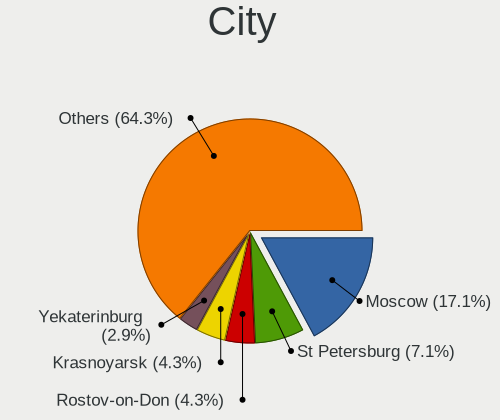
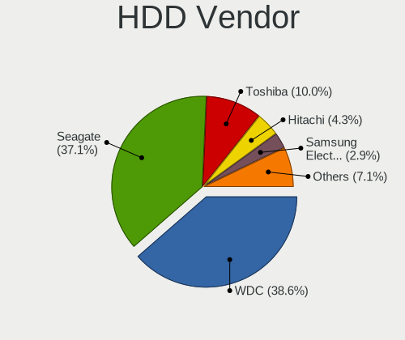
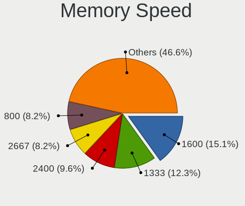

ROSA - Hardware Trends (Desktops)
---------------------------------

A project to identify most popular hardware characteristics and track their change
over time based on data collected by Linux users at https://Linux-Hardware.org.

Anyone can contribute to this report by the [hw-probe](https://github.com/linuxhw/hw-probe) tool:

    sudo -E hw-probe -all -upload

This report is for one last month. Overall report since the beginning of time: [TestDays](https://github.com/linuxhw/TestDays)

Period: Sep, 2023.

Contents
--------

* [ System ](#system)
  - [ OS                       ](#os)
  - [ OS Family                ](#os-family)
  - [ Kernel                   ](#kernel)
  - [ Kernel Family            ](#kernel-family)
  - [ Kernel Major Ver.        ](#kernel-major-ver)
  - [ Arch                     ](#arch)
  - [ DE                       ](#de)
  - [ Display Server           ](#display-server)
  - [ Display Manager          ](#display-manager)
  - [ OS Lang                  ](#os-lang)
  - [ Boot Mode                ](#boot-mode)
  - [ Filesystem               ](#filesystem)
  - [ Part. scheme             ](#part-scheme)
  - [ Dual Boot with Linux/BSD ](#dual-boot-with-linuxbsd)
  - [ Dual Boot (Win)          ](#dual-boot-win)

* [ Board ](#board)
  - [ Vendor                   ](#vendor)
  - [ Model                    ](#model)
  - [ Model Family             ](#model-family)
  - [ MFG Year                 ](#mfg-year)
  - [ Form Factor              ](#form-factor)
  - [ Secure Boot              ](#secure-boot)
  - [ Coreboot                 ](#coreboot)
  - [ RAM Size                 ](#ram-size)
  - [ RAM Used                 ](#ram-used)
  - [ Total Drives             ](#total-drives)
  - [ Has CD-ROM               ](#has-cd-rom)
  - [ Has Ethernet             ](#has-ethernet)
  - [ Has WiFi                 ](#has-wifi)
  - [ Has Bluetooth            ](#has-bluetooth)

* [ Location ](#location)
  - [ Country                  ](#country)
  - [ City                     ](#city)

* [ Drives ](#drives)
  - [ Drive Vendor             ](#drive-vendor)
  - [ Drive Model              ](#drive-model)
  - [ HDD Vendor               ](#hdd-vendor)
  - [ SSD Vendor               ](#ssd-vendor)
  - [ Drive Kind               ](#drive-kind)
  - [ Drive Connector          ](#drive-connector)
  - [ Drive Size               ](#drive-size)
  - [ Space Total              ](#space-total)
  - [ Space Used               ](#space-used)
  - [ Malfunc. Drives          ](#malfunc-drives)
  - [ Malfunc. Drive Vendor    ](#malfunc-drive-vendor)
  - [ Malfunc. HDD Vendor      ](#malfunc-hdd-vendor)
  - [ Malfunc. Drive Kind      ](#malfunc-drive-kind)
  - [ Failed Drives            ](#failed-drives)
  - [ Failed Drive Vendor      ](#failed-drive-vendor)
  - [ Drive Status             ](#drive-status)

* [ Storage controller ](#storage-controller)
  - [ Storage Vendor           ](#storage-vendor)
  - [ Storage Model            ](#storage-model)
  - [ Storage Kind             ](#storage-kind)

* [ Processor ](#processor)
  - [ CPU Vendor               ](#cpu-vendor)
  - [ CPU Model                ](#cpu-model)
  - [ CPU Model Family         ](#cpu-model-family)
  - [ CPU Cores                ](#cpu-cores)
  - [ CPU Sockets              ](#cpu-sockets)
  - [ CPU Threads              ](#cpu-threads)
  - [ CPU Op-Modes             ](#cpu-op-modes)
  - [ CPU Microcode            ](#cpu-microcode)
  - [ CPU Microarch            ](#cpu-microarch)

* [ Graphics ](#graphics)
  - [ GPU Vendor               ](#gpu-vendor)
  - [ GPU Model                ](#gpu-model)
  - [ GPU Combo                ](#gpu-combo)
  - [ GPU Driver               ](#gpu-driver)
  - [ GPU Memory               ](#gpu-memory)

* [ Monitor ](#monitor)
  - [ Monitor Vendor           ](#monitor-vendor)
  - [ Monitor Model            ](#monitor-model)
  - [ Monitor Resolution       ](#monitor-resolution)
  - [ Monitor Diagonal         ](#monitor-diagonal)
  - [ Monitor Width            ](#monitor-width)
  - [ Aspect Ratio             ](#aspect-ratio)
  - [ Monitor Area             ](#monitor-area)
  - [ Pixel Density            ](#pixel-density)
  - [ Multiple Monitors        ](#multiple-monitors)

* [ Network ](#network)
  - [ Net Controller Vendor    ](#net-controller-vendor)
  - [ Net Controller Model     ](#net-controller-model)
  - [ Wireless Vendor          ](#wireless-vendor)
  - [ Wireless Model           ](#wireless-model)
  - [ Ethernet Vendor          ](#ethernet-vendor)
  - [ Ethernet Model           ](#ethernet-model)
  - [ Net Controller Kind      ](#net-controller-kind)
  - [ Used Controller          ](#used-controller)
  - [ NICs                     ](#nics)
  - [ IPv6                     ](#ipv6)

* [ Bluetooth ](#bluetooth)
  - [ Bluetooth Vendor         ](#bluetooth-vendor)
  - [ Bluetooth Model          ](#bluetooth-model)

* [ Sound ](#sound)
  - [ Sound Vendor             ](#sound-vendor)
  - [ Sound Model              ](#sound-model)

* [ Memory ](#memory)
  - [ Memory Vendor            ](#memory-vendor)
  - [ Memory Model             ](#memory-model)
  - [ Memory Kind              ](#memory-kind)
  - [ Memory Form Factor       ](#memory-form-factor)
  - [ Memory Size              ](#memory-size)
  - [ Memory Speed             ](#memory-speed)

* [ Printers & scanners ](#printers--scanners)
  - [ Printer Vendor           ](#printer-vendor)
  - [ Printer Model            ](#printer-model)
  - [ Scanner Vendor           ](#scanner-vendor)
  - [ Scanner Model            ](#scanner-model)

* [ Camera ](#camera)
  - [ Camera Vendor            ](#camera-vendor)
  - [ Camera Model             ](#camera-model)

* [ Security ](#security)
  - [ Fingerprint Vendor       ](#fingerprint-vendor)
  - [ Fingerprint Model        ](#fingerprint-model)
  - [ Chipcard Vendor          ](#chipcard-vendor)
  - [ Chipcard Model           ](#chipcard-model)

* [ Unsupported ](#unsupported)
  - [ Unsupported Devices      ](#unsupported-devices)
  - [ Unsupported Device Types ](#unsupported-device-types)

System
------

OS
--

Installed operating systems

| Name       | Desktops | Percent |
|------------|----------|---------|
| ROSA 12.4  | 89       | 88.12%  |
| ROSA R11.1 | 4        | 3.96%   |
| ROSA 12    | 4        | 3.96%   |
| ROSA 12.1  | 2        | 1.98%   |
| ROSA 13.0  | 1        | 0.99%   |
| ROSA 12.2  | 1        | 0.99%   |

OS Family
---------

OS without a version

| Name | Desktops | Percent |
|------|----------|---------|
| ROSA | 101      | 100%    |

Kernel
------

Version of the Linux kernel

| Version                                   | Desktops | Percent |
|-------------------------------------------|----------|---------|
| 6.1.46-generic-2rosa2021.1-x86_64         | 40       | 39.6%   |
| 6.1.20-generic-2rosa2021.1-x86_64         | 24       | 23.76%  |
| 6.1.38-generic-1rosa2021.1-x86_64         | 13       | 12.87%  |
| 5.15.127-generic-1rosa2021.1-x86_64       | 3        | 2.97%   |
| 5.10.74-generic-2rosa2021.1-x86_64        | 3        | 2.97%   |
| 5.10.184-generic-1rosa2021.1-x86_64       | 3        | 2.97%   |
| 5.15.117-generic-1rosa2021.1-x86_64       | 2        | 1.98%   |
| 4.15.0-desktop-122.124.1rosa-i586         | 2        | 1.98%   |
| 6.5.0.xm1-1.klp-xanmod-rosa2021.1-x86_64  | 1        | 0.99%   |
| 6.4.15.xm1-1.klp-xanmod-rosa2021.1-x86_64 | 1        | 0.99%   |
| 6.1.49-generic-1rosa2023.1-x86_64         | 1        | 0.99%   |
| 6.1.38-desktop-1rosa2021-x86_64           | 1        | 0.99%   |
| 5.4.83-generic-2rosa-i586                 | 1        | 0.99%   |
| 5.17.11-generic-2rosa2021.1-x86_64        | 1        | 0.99%   |
| 5.15.103-generic-1rosa2021.1-i686         | 1        | 0.99%   |
| 5.10.74-generic-2rosa2021.1-i586          | 1        | 0.99%   |
| 5.10.176-generic-1rosa2021.1-i586         | 1        | 0.99%   |
| 5.10.118-generic-2rosa2021.1-x86_64       | 1        | 0.99%   |
| 4.15.0-desktop-122.124.1rosa-x86_64       | 1        | 0.99%   |

Kernel Family
-------------

Linux kernel without a distro release

| Version  | Desktops | Percent |
|----------|----------|---------|
| 6.1.46   | 40       | 39.6%   |
| 6.1.20   | 24       | 23.76%  |
| 6.1.38   | 14       | 13.86%  |
| 5.10.74  | 4        | 3.96%   |
| 5.15.127 | 3        | 2.97%   |
| 5.10.184 | 3        | 2.97%   |
| 4.15.0   | 3        | 2.97%   |
| 5.15.117 | 2        | 1.98%   |
| 6.5.0    | 1        | 0.99%   |
| 6.4.15   | 1        | 0.99%   |
| 6.1.49   | 1        | 0.99%   |
| 5.4.83   | 1        | 0.99%   |
| 5.17.11  | 1        | 0.99%   |
| 5.15.103 | 1        | 0.99%   |
| 5.10.176 | 1        | 0.99%   |
| 5.10.118 | 1        | 0.99%   |

Kernel Major Ver.
-----------------

Linux kernel major version

| Version | Desktops | Percent |
|---------|----------|---------|
| 6.1     | 79       | 78.22%  |
| 5.10    | 9        | 8.91%   |
| 5.15    | 6        | 5.94%   |
| 4.15    | 3        | 2.97%   |
| 6.5     | 1        | 0.99%   |
| 6.4     | 1        | 0.99%   |
| 5.4     | 1        | 0.99%   |
| 5.17    | 1        | 0.99%   |

Arch
----

OS architecture (x86_64, i586, etc.)

| Name   | Desktops | Percent |
|--------|----------|---------|
| x86_64 | 95       | 94.06%  |
| i686   | 6        | 5.94%   |

DE
--

Desktop Environment

| Name    | Desktops | Percent |
|---------|----------|---------|
| KDE5    | 61       | 60.4%   |
| GNOME   | 26       | 25.74%  |
| LXQt    | 10       | 9.9%    |
| KDE4    | 3        | 2.97%   |
| Unknown | 1        | 0.99%   |

Display Server
--------------

X11 or Wayland

| Name    | Desktops | Percent |
|---------|----------|---------|
| Wayland | 74       | 73.27%  |
| X11     | 26       | 25.74%  |
| Unknown | 1        | 0.99%   |

Display Manager
---------------

SDDM, LightDM, etc.

| Name    | Desktops | Percent |
|---------|----------|---------|
| SDDM    | 60       | 59.41%  |
| GDM     | 32       | 31.68%  |
| LightDM | 5        | 4.95%   |
| KDM     | 3        | 2.97%   |
| Unknown | 1        | 0.99%   |

OS Lang
-------

Language

| Lang  | Desktops | Percent |
|-------|----------|---------|
| ru_RU | 94       | 93.07%  |
| tr_TR | 1        | 0.99%   |
| it_IT | 1        | 0.99%   |
| es_PE | 1        | 0.99%   |
| en_US | 1        | 0.99%   |
| de_DE | 1        | 0.99%   |
| be_BY | 1        | 0.99%   |
| ar_SA | 1        | 0.99%   |

Boot Mode
---------

EFI or BIOS

| Mode | Desktops | Percent |
|------|----------|---------|
| EFI  | 55       | 54.46%  |
| BIOS | 46       | 45.54%  |

Filesystem
----------

Type of filesystem

| Type  | Desktops | Percent |
|-------|----------|---------|
| Ext4  | 94       | 93.07%  |
| Btrfs | 6        | 5.94%   |
| Aufs  | 1        | 0.99%   |

Part. scheme
------------

Scheme of partitioning

| Type | Desktops | Percent |
|------|----------|---------|
| GPT  | 70       | 69.31%  |
| MBR  | 31       | 30.69%  |

Dual Boot with Linux/BSD
------------------------

Hosting more than one Linux/BSD

| Dual boot | Desktops | Percent |
|-----------|----------|---------|
| No        | 78       | 77.23%  |
| Yes       | 23       | 22.77%  |

Dual Boot (Win)
---------------

Hosting Linux and Windows

| Dual boot | Desktops | Percent |
|-----------|----------|---------|
| No        | 51       | 50.5%   |
| Yes       | 50       | 49.5%   |

Board
-----

Vendor
------

Motherboard manufacturer

| Name                                 | Desktops | Percent |
|--------------------------------------|----------|---------|
| ASUSTek Computer                     | 27       | 26.73%  |
| Gigabyte Technology                  | 24       | 23.76%  |
| ASRock                               | 15       | 14.85%  |
| MSI                                  | 12       | 11.88%  |
| Hewlett-Packard                      | 3        | 2.97%   |
| Biostar                              | 3        | 2.97%   |
| Acer                                 | 3        | 2.97%   |
| Unknown                              | 3        | 2.97%   |
| Lenovo                               | 2        | 1.98%   |
| Intel                                | 2        | 1.98%   |
| Foxconn                              | 2        | 1.98%   |
| ECS                                  | 2        | 1.98%   |
| Shenzhen Meigao Electronic Equipment | 1        | 0.99%   |
| Huanan                               | 1        | 0.99%   |
| Dell                                 | 1        | 0.99%   |

Model
-----

Motherboard model

| Name                                            | Desktops | Percent |
|-------------------------------------------------|----------|---------|
| ASUS All Series                                 | 3        | 2.97%   |
| Unknown                                         | 3        | 2.97%   |
| Shenzhen Meigao Electronic Equipment UM773 Lite | 1        | 0.99%   |
| MSI MS-7D54                                     | 1        | 0.99%   |
| MSI MS-7D46                                     | 1        | 0.99%   |
| MSI MS-7C96                                     | 1        | 0.99%   |
| MSI MS-7C91                                     | 1        | 0.99%   |
| MSI MS-7B93                                     | 1        | 0.99%   |
| MSI MS-7A15                                     | 1        | 0.99%   |
| MSI MS-7996                                     | 1        | 0.99%   |
| MSI MS-7721                                     | 1        | 0.99%   |
| MSI MS-7640                                     | 1        | 0.99%   |
| MSI MS-7599                                     | 1        | 0.99%   |
| MSI MS-7551                                     | 1        | 0.99%   |
| MSI MS-7529                                     | 1        | 0.99%   |
| Lenovo ThinkCentre M600 10GB000URU              | 1        | 0.99%   |
| Lenovo H420                                     | 1        | 0.99%   |
| Intel SKYBAY                                    | 1        | 0.99%   |
| Intel H81                                       | 1        | 0.99%   |
| Huanan X99-BD4 V1.34, NALEX                     | 1        | 0.99%   |
| HP Compaq Elite 8300 SFF                        | 1        | 0.99%   |
| HP Compaq dc5800 Microtower                     | 1        | 0.99%   |
| HP Compaq 6000 Pro MT PC                        | 1        | 0.99%   |
| Gigabyte X670E AORUS MASTER                     | 1        | 0.99%   |
| Gigabyte X570 AORUS MASTER                      | 1        | 0.99%   |
| Gigabyte X570 AORUS ELITE                       | 1        | 0.99%   |
| Gigabyte PH67A-D3-B3                            | 1        | 0.99%   |
| Gigabyte P55M-UD4                               | 1        | 0.99%   |
| Gigabyte P43-ES3G                               | 1        | 0.99%   |
| Gigabyte H97-D3H                                | 1        | 0.99%   |
| Gigabyte H87M-HD3                               | 1        | 0.99%   |
| Gigabyte H77N-WIFI                              | 1        | 0.99%   |
| Gigabyte H61M-S2-B3                             | 1        | 0.99%   |
| Gigabyte H61M-D2-B3                             | 1        | 0.99%   |
| Gigabyte H55M-USB3                              | 1        | 0.99%   |
| Gigabyte H410M H V3                             | 1        | 0.99%   |
| Gigabyte H110-D3                                | 1        | 0.99%   |
| Gigabyte GA-E350N-USB3                          | 1        | 0.99%   |
| Gigabyte GA-880GA-UD3H                          | 1        | 0.99%   |
| Gigabyte GA-780T-D3L                            | 1        | 0.99%   |

Model Family
------------

Motherboard model prefix

| Name                                       | Desktops | Percent |
|--------------------------------------------|----------|---------|
| ASUS PRIME                                 | 4        | 3.96%   |
| HP Compaq                                  | 3        | 2.97%   |
| ASUS TUF                                   | 3        | 2.97%   |
| ASUS All                                   | 3        | 2.97%   |
| Unknown                                    | 3        | 2.97%   |
| Gigabyte X570                              | 2        | 1.98%   |
| ASUS P8H61-MX                              | 2        | 1.98%   |
| ASUS P8H61-M                               | 2        | 1.98%   |
| ASRock B450                                | 2        | 1.98%   |
| Acer Veriton                               | 2        | 1.98%   |
| Shenzhen Meigao Electronic Equipment UM773 | 1        | 0.99%   |
| MSI MS-7D54                                | 1        | 0.99%   |
| MSI MS-7D46                                | 1        | 0.99%   |
| MSI MS-7C96                                | 1        | 0.99%   |
| MSI MS-7C91                                | 1        | 0.99%   |
| MSI MS-7B93                                | 1        | 0.99%   |
| MSI MS-7A15                                | 1        | 0.99%   |
| MSI MS-7996                                | 1        | 0.99%   |
| MSI MS-7721                                | 1        | 0.99%   |
| MSI MS-7640                                | 1        | 0.99%   |
| MSI MS-7599                                | 1        | 0.99%   |
| MSI MS-7551                                | 1        | 0.99%   |
| MSI MS-7529                                | 1        | 0.99%   |
| Lenovo ThinkCentre                         | 1        | 0.99%   |
| Lenovo H420                                | 1        | 0.99%   |
| Intel SKYBAY                               | 1        | 0.99%   |
| Intel H81                                  | 1        | 0.99%   |
| Huanan X99-BD4                             | 1        | 0.99%   |
| Gigabyte X670E                             | 1        | 0.99%   |
| Gigabyte PH67A-D3-B3                       | 1        | 0.99%   |
| Gigabyte P55M-UD4                          | 1        | 0.99%   |
| Gigabyte P43-ES3G                          | 1        | 0.99%   |
| Gigabyte H97-D3H                           | 1        | 0.99%   |
| Gigabyte H87M-HD3                          | 1        | 0.99%   |
| Gigabyte H77N-WIFI                         | 1        | 0.99%   |
| Gigabyte H61M-S2-B3                        | 1        | 0.99%   |
| Gigabyte H61M-D2-B3                        | 1        | 0.99%   |
| Gigabyte H55M-USB3                         | 1        | 0.99%   |
| Gigabyte H410M                             | 1        | 0.99%   |
| Gigabyte H110-D3                           | 1        | 0.99%   |

MFG Year
--------

Motherboard manufacture year

| Year | Desktops | Percent |
|------|----------|---------|
| 2020 | 12       | 11.88%  |
| 2011 | 11       | 10.89%  |
| 2022 | 8        | 7.92%   |
| 2018 | 8        | 7.92%   |
| 2012 | 8        | 7.92%   |
| 2009 | 8        | 7.92%   |
| 2019 | 7        | 6.93%   |
| 2021 | 6        | 5.94%   |
| 2013 | 6        | 5.94%   |
| 2010 | 6        | 5.94%   |
| 2016 | 5        | 4.95%   |
| 2008 | 5        | 4.95%   |
| 2014 | 3        | 2.97%   |
| 2023 | 2        | 1.98%   |
| 2015 | 2        | 1.98%   |
| 2007 | 2        | 1.98%   |
| 2017 | 1        | 0.99%   |
| 2006 | 1        | 0.99%   |

Form Factor
-----------

Physical design of the computer

| Name    | Desktops | Percent |
|---------|----------|---------|
| Desktop | 101      | 100%    |

Secure Boot
-----------

Enabled or disabled

| State    | Desktops | Percent |
|----------|----------|---------|
| Disabled | 101      | 100%    |

Coreboot
--------

Have coreboot on board

| Used | Desktops | Percent |
|------|----------|---------|
| No   | 101      | 100%    |

RAM Size
--------

Total RAM memory

| Size in GB  | Desktops | Percent |
|-------------|----------|---------|
| 16.01-24.0  | 24       | 23.76%  |
| 8.01-16.0   | 23       | 22.77%  |
| 3.01-4.0    | 17       | 16.83%  |
| 32.01-64.0  | 14       | 13.86%  |
| 4.01-8.0    | 13       | 12.87%  |
| 64.01-256.0 | 4        | 3.96%   |
| 24.01-32.0  | 2        | 1.98%   |
| 2.01-3.0    | 2        | 1.98%   |
| 1.01-2.0    | 2        | 1.98%   |

RAM Used
--------

Used RAM memory

| Used GB   | Desktops | Percent |
|-----------|----------|---------|
| 1.01-2.0  | 57       | 56.44%  |
| 2.01-3.0  | 22       | 21.78%  |
| 0.51-1.0  | 10       | 9.9%    |
| 3.01-4.0  | 6        | 5.94%   |
| 4.01-8.0  | 4        | 3.96%   |
| 8.01-16.0 | 1        | 0.99%   |
| 0.01-0.5  | 1        | 0.99%   |

Total Drives
------------

Number of drives on board

| Drives | Desktops | Percent |
|--------|----------|---------|
| 1      | 39       | 38.61%  |
| 2      | 28       | 27.72%  |
| 3      | 15       | 14.85%  |
| 4      | 11       | 10.89%  |
| 5      | 5        | 4.95%   |
| 8      | 1        | 0.99%   |
| 7      | 1        | 0.99%   |
| 6      | 1        | 0.99%   |

Has CD-ROM
----------

Has CD-ROM on board

| Presented | Desktops | Percent |
|-----------|----------|---------|
| No        | 74       | 73.27%  |
| Yes       | 27       | 26.73%  |

Has Ethernet
------------

Has Ethernet on board

| Presented | Desktops | Percent |
|-----------|----------|---------|
| Yes       | 100      | 99.01%  |
| No        | 1        | 0.99%   |

Has WiFi
--------

Has WiFi module

| Presented | Desktops | Percent |
|-----------|----------|---------|
| No        | 69       | 68.32%  |
| Yes       | 32       | 31.68%  |

Has Bluetooth
-------------

Has Bluetooth module

| Presented | Desktops | Percent |
|-----------|----------|---------|
| No        | 73       | 72.28%  |
| Yes       | 28       | 27.72%  |

Location
--------

Country
-------

Geographic location (country)

| Country      | Desktops | Percent |
|--------------|----------|---------|
| Russia       | 87       | 86.14%  |
| Belarus      | 4        | 3.96%   |
| Ukraine      | 3        | 2.97%   |
| Kazakhstan   | 2        | 1.98%   |
| Turkey       | 1        | 0.99%   |
| Saudi Arabia | 1        | 0.99%   |
| Peru         | 1        | 0.99%   |
| Italy        | 1        | 0.99%   |
| Germany      | 1        | 0.99%   |

City
----

Geographic location (city)

| City            | Desktops | Percent |
|-----------------|----------|---------|
| Moscow          | 18       | 17.82%  |
| St Petersburg   | 5        | 4.95%   |
| Yekaterinburg   | 4        | 3.96%   |
| Novosibirsk     | 4        | 3.96%   |
| Krasnodar       | 3        | 2.97%   |
| Chelyabinsk     | 3        | 2.97%   |
| Zalari          | 2        | 1.98%   |
| Vladivostok     | 2        | 1.98%   |
| Ufa             | 2        | 1.98%   |
| Tolyatti        | 2        | 1.98%   |
| Smolensk        | 2        | 1.98%   |
| Sevastopol      | 2        | 1.98%   |
| Orenburg        | 2        | 1.98%   |
| Mogilev         | 2        | 1.98%   |
| Magadan         | 2        | 1.98%   |
| Krasnoyarsk     | 2        | 1.98%   |
| Wuppertal       | 1        | 0.99%   |
| Vologda         | 1        | 0.99%   |
| Volgograd       | 1        | 0.99%   |
| Volgodonsk      | 1        | 0.99%   |
| Veliky Novgorod | 1        | 0.99%   |
| Ulyanovsk       | 1        | 0.99%   |
| Tuapse          | 1        | 0.99%   |
| Tomsk           | 1        | 0.99%   |
| Tkhamakha       | 1        | 0.99%   |
| Tikhvin         | 1        | 0.99%   |
| Surgut          | 1        | 0.99%   |
| Severomorsk     | 1        | 0.99%   |
| Sergiyev Posad  | 1        | 0.99%   |
| Samara          | 1        | 0.99%   |
| Rybinsk         | 1        | 0.99%   |
| Rostov-on-Don   | 1        | 0.99%   |
| Petropavl       | 1        | 0.99%   |
| Pervouralsk     | 1        | 0.99%   |
| Perm            | 1        | 0.99%   |
| Omsk            | 1        | 0.99%   |
| Obninsk         | 1        | 0.99%   |
| Novokuznetsk    | 1        | 0.99%   |
| Nizhnevartovsk  | 1        | 0.99%   |
| Minsk           | 1        | 0.99%   |

Drives
------

Drive Vendor
------------

Hard drive vendors

| Vendor                      | Desktops | Drives | Percent |
|-----------------------------|----------|--------|---------|
| WDC                         | 42       | 59     | 21%     |
| Seagate                     | 35       | 40     | 17.5%   |
| Kingston                    | 18       | 19     | 9%      |
| Samsung Electronics         | 14       | 17     | 7%      |
| Toshiba                     | 6        | 7      | 3%      |
| Hitachi                     | 6        | 6      | 3%      |
| Apacer                      | 6        | 6      | 3%      |
| AMD                         | 6        | 6      | 3%      |
| A-DATA Technology           | 5        | 6      | 2.5%    |
| Plextor                     | 4        | 4      | 2%      |
| Patriot                     | 4        | 4      | 2%      |
| Netac                       | 4        | 4      | 2%      |
| China                       | 4        | 4      | 2%      |
| Maxtor                      | 3        | 3      | 1.5%    |
| SPCC                        | 2        | 3      | 1%      |
| Smartbuy                    | 2        | 2      | 1%      |
| OCZ                         | 2        | 2      | 1%      |
| MAXIO Technology (Hangzhou) | 2        | 2      | 1%      |
| Kingston Technology Company | 2        | 2      | 1%      |
| GOODRAM                     | 2        | 2      | 1%      |
| Gigabyte Technology         | 2        | 2      | 1%      |
| Fujitsu                     | 2        | 2      | 1%      |
| Crucial                     | 2        | 2      | 1%      |
| Unknown                     | 2        | 2      | 1%      |
| XPG                         | 1        | 2      | 0.5%    |
| Unknown                     | 1        | 1      | 0.5%    |
| Silicon Motion              | 1        | 1      | 0.5%    |
| SanDisk                     | 1        | 1      | 0.5%    |
| Reeinno                     | 1        | 1      | 0.5%    |
| Qumo                        | 1        | 1      | 0.5%    |
| Phison                      | 1        | 1      | 0.5%    |
| OCZ-VERTEX3                 | 1        | 1      | 0.5%    |
| KingSpec                    | 1        | 1      | 0.5%    |
| KINGBANK                    | 1        | 1      | 0.5%    |
| Intenso                     | 1        | 1      | 0.5%    |
| Intel                       | 1        | 1      | 0.5%    |
| Hikvision                   | 1        | 1      | 0.5%    |
| HGST                        | 1        | 1      | 0.5%    |
| Foxline                     | 1        | 1      | 0.5%    |
| ESA3SMN2                    | 1        | 1      | 0.5%    |

Drive Model
-----------

Hard drive models

| Model                                | Desktops | Percent |
|--------------------------------------|----------|---------|
| WDC WD10EZEX-08WN4A0 1TB             | 7        | 3.08%   |
| Kingston SA400S37120G 120GB SSD      | 5        | 2.2%    |
| Seagate ST1000DM010-2EP102 1TB       | 4        | 1.76%   |
| WDC WD20EZBX-00AYRA0 2TB             | 3        | 1.32%   |
| Toshiba DT01ACA050 500GB             | 3        | 1.32%   |
| Seagate ST1000DM003-1CH162 1TB       | 3        | 1.32%   |
| Kingston SA400S37240G 240GB SSD      | 3        | 1.32%   |
| Apacer AS2280P4 256GB                | 3        | 1.32%   |
| WDC WD10EFRX-68JCSN0 1TB             | 2        | 0.88%   |
| Seagate ST380811AS 80GB              | 2        | 0.88%   |
| Seagate ST3500418AS 500GB            | 2        | 0.88%   |
| Seagate ST3320613AS 320GB            | 2        | 0.88%   |
| Seagate ST3160815AS 160GB            | 2        | 0.88%   |
| Seagate ST2000DM008-2UB102 2TB       | 2        | 0.88%   |
| Seagate ST1000DM003-1ER162 1TB       | 2        | 0.88%   |
| Samsung SSD 980 250GB                | 2        | 0.88%   |
| Samsung SSD 970 EVO Plus 250GB       | 2        | 0.88%   |
| Samsung SSD 960 PRO 512GB            | 2        | 0.88%   |
| Patriot Burst Elite 960GB SSD        | 2        | 0.88%   |
| Kingston SHFS37A120G 120GB SSD       | 2        | 0.88%   |
| Kingston SA400S37480G 480GB SSD      | 2        | 0.88%   |
| Hitachi HDS721050CLA362 500GB        | 2        | 0.88%   |
| Gigabyte GP-GSTFS31120GNTD 120GB SSD | 2        | 0.88%   |
| AMD R5SL240G 240GB SSD               | 2        | 0.88%   |
| AMD R5SL120G 120GB SSD               | 2        | 0.88%   |
| Unknown                              | 2        | 0.88%   |
| XPG SPECTRIX S20G 1TB                | 1        | 0.44%   |
| XPG GAMMIX S11 Pro 1TB               | 1        | 0.44%   |
| WDC WDS500G2B0A-00SM50 500GB SSD     | 1        | 0.44%   |
| WDC WDS500G1XHE-00AFY0 500GB         | 1        | 0.44%   |
| WDC WDS250G2B0B-00YS70 250GB SSD     | 1        | 0.44%   |
| WDC WDS120G1G0A-00SS50 120GB SSD     | 1        | 0.44%   |
| WDC WDS100T3X0C-00SJG0 1TB           | 1        | 0.44%   |
| WDC WDS100T2B0C-00PXH0 1TB           | 1        | 0.44%   |
| WDC WD82PURZ-85TEUY0 8TB             | 1        | 0.44%   |
| WDC WD6400AAKS-65A7B2 640GB          | 1        | 0.44%   |
| WDC WD6000HLHX-01JJPV0 600GB         | 1        | 0.44%   |
| WDC WD5000LPLX-08ZNTT0 500GB         | 1        | 0.44%   |
| WDC WD5000LPCX-24VHAT0 500GB         | 1        | 0.44%   |
| WDC WD5000LPCX-21VHAT0 500GB         | 1        | 0.44%   |

HDD Vendor
----------

Hard disk drive vendors

| Vendor              | Desktops | Drives | Percent |
|---------------------|----------|--------|---------|
| WDC                 | 37       | 52     | 40.22%  |
| Seagate             | 35       | 40     | 38.04%  |
| Toshiba             | 6        | 7      | 6.52%   |
| Hitachi             | 6        | 6      | 6.52%   |
| Maxtor              | 3        | 3      | 3.26%   |
| Samsung Electronics | 2        | 2      | 2.17%   |
| Fujitsu             | 2        | 2      | 2.17%   |
| HGST                | 1        | 1      | 1.09%   |

SSD Vendor
----------

Solid state drive vendors

| Vendor              | Desktops | Drives | Percent |
|---------------------|----------|--------|---------|
| Kingston            | 14       | 14     | 18.92%  |
| AMD                 | 6        | 6      | 8.11%   |
| Samsung Electronics | 5        | 6      | 6.76%   |
| WDC                 | 4        | 4      | 5.41%   |
| Plextor             | 4        | 4      | 5.41%   |
| Netac               | 4        | 4      | 5.41%   |
| China               | 4        | 4      | 5.41%   |
| A-DATA Technology   | 4        | 5      | 5.41%   |
| Patriot             | 3        | 3      | 4.05%   |
| Smartbuy            | 2        | 2      | 2.7%    |
| OCZ                 | 2        | 2      | 2.7%    |
| Gigabyte Technology | 2        | 2      | 2.7%    |
| Crucial             | 2        | 2      | 2.7%    |
| Apacer              | 2        | 2      | 2.7%    |
| Unknown             | 2        | 2      | 2.7%    |
| SPCC                | 1        | 1      | 1.35%   |
| SanDisk             | 1        | 1      | 1.35%   |
| Reeinno             | 1        | 1      | 1.35%   |
| Qumo                | 1        | 1      | 1.35%   |
| OCZ-VERTEX3         | 1        | 1      | 1.35%   |
| KingSpec            | 1        | 1      | 1.35%   |
| Intenso             | 1        | 1      | 1.35%   |
| GOODRAM             | 1        | 1      | 1.35%   |
| Foxline             | 1        | 1      | 1.35%   |
| e2e4                | 1        | 1      | 1.35%   |
| DEXP                | 1        | 1      | 1.35%   |
| Colorful            | 1        | 1      | 1.35%   |
| BR                  | 1        | 1      | 1.35%   |
| ASMT                | 1        | 1      | 1.35%   |

Drive Kind
----------

HDD or SSD

| Kind    | Desktops | Drives | Percent |
|---------|----------|--------|---------|
| HDD     | 74       | 113    | 43.79%  |
| SSD     | 62       | 76     | 36.69%  |
| NVMe    | 31       | 39     | 18.34%  |
| Unknown | 2        | 2      | 1.18%   |

Drive Connector
---------------

SATA, SAS, NVMe, etc.

| Type | Desktops | Drives | Percent |
|------|----------|--------|---------|
| SATA | 96       | 187    | 73.28%  |
| NVMe | 31       | 39     | 23.66%  |
| SAS  | 4        | 4      | 3.05%   |

Drive Size
----------

Size of hard drive

| Size in TB | Desktops | Drives | Percent |
|------------|----------|--------|---------|
| 0.01-0.5   | 84       | 114    | 57.14%  |
| 0.51-1.0   | 38       | 50     | 25.85%  |
| 1.01-2.0   | 15       | 15     | 10.2%   |
| 2.01-3.0   | 5        | 5      | 3.4%    |
| 3.01-4.0   | 3        | 3      | 2.04%   |
| 10.01-20.0 | 1        | 1      | 0.68%   |
| 4.01-10.0  | 1        | 1      | 0.68%   |

Space Total
-----------

Amount of disk space available on the file system

| Size in GB     | Desktops | Percent |
|----------------|----------|---------|
| 101-250        | 30       | 29.7%   |
| 251-500        | 22       | 21.78%  |
| 501-1000       | 14       | 13.86%  |
| 51-100         | 9        | 8.91%   |
| 2001-3000      | 7        | 6.93%   |
| 1001-2000      | 7        | 6.93%   |
| 1-20           | 5        | 4.95%   |
| More than 3000 | 3        | 2.97%   |
| 21-50          | 3        | 2.97%   |
| Unknown        | 1        | 0.99%   |

Space Used
----------

Amount of used disk space

| Used GB        | Desktops | Percent |
|----------------|----------|---------|
| 1-20           | 53       | 52.48%  |
| 21-50          | 14       | 13.86%  |
| 101-250        | 8        | 7.92%   |
| 501-1000       | 8        | 7.92%   |
| 1001-2000      | 6        | 5.94%   |
| 51-100         | 6        | 5.94%   |
| 251-500        | 3        | 2.97%   |
| More than 3000 | 2        | 1.98%   |
| Unknown        | 1        | 0.99%   |

Malfunc. Drives
---------------

Drive models with a malfunction

| Model                                 | Desktops | Drives | Percent |
|---------------------------------------|----------|--------|---------|
| Kingston SHFS37A120G 120GB SSD        | 2        | 2      | 3.92%   |
| WDC WD6400AAKS-65A7B2 640GB           | 1        | 1      | 1.96%   |
| WDC WD6000HLHX-01JJPV0 600GB          | 1        | 1      | 1.96%   |
| WDC WD5000AAKX-001CA0 500GB           | 1        | 1      | 1.96%   |
| WDC WD40EFRX-68N32N0 4TB              | 1        | 1      | 1.96%   |
| WDC WD3200AAJS-22L7A0 320GB           | 1        | 1      | 1.96%   |
| WDC WD2500YD-01NVB1 256GB             | 1        | 1      | 1.96%   |
| WDC WD20EARS-00MVWB0 2TB              | 1        | 1      | 1.96%   |
| WDC WD1600BEVT-60ZCT1 160GB           | 1        | 1      | 1.96%   |
| WDC WD1600AAJS-60B4A0 160GB           | 1        | 1      | 1.96%   |
| WDC WD10PURZ-85U8XY0 1TB              | 1        | 1      | 1.96%   |
| WDC WD10EFRX-68JCSN0 1TB              | 1        | 1      | 1.96%   |
| WDC WD1003FBYX-01Y7B1 1TB             | 1        | 1      | 1.96%   |
| WDC WD1002FAEX-00Y9A0 1TB             | 1        | 1      | 1.96%   |
| WDC WD Green 2.5 480GB SSD            | 1        | 1      | 1.96%   |
| Toshiba MQ01ABD100 1TB                | 1        | 1      | 1.96%   |
| Toshiba MQ01ABD050 500GB              | 1        | 1      | 1.96%   |
| Seagate ST9750420AS 752GB             | 1        | 1      | 1.96%   |
| Seagate ST9500325AS 500GB             | 1        | 1      | 1.96%   |
| Seagate ST500DM002-1BD142 500GB       | 1        | 1      | 1.96%   |
| Seagate ST4000DM000-1F2168 4TB        | 1        | 1      | 1.96%   |
| Seagate ST380811AS 80GB               | 1        | 1      | 1.96%   |
| Seagate ST3500418AS 500GB             | 1        | 1      | 1.96%   |
| Seagate ST3320613AS 320GB             | 1        | 1      | 1.96%   |
| Seagate ST3250410AS 250GB             | 1        | 1      | 1.96%   |
| Seagate ST3250310AS 250GB             | 1        | 1      | 1.96%   |
| Seagate ST320LT012-9WS14C 320GB       | 1        | 1      | 1.96%   |
| Seagate ST3160815AS 160GB             | 1        | 1      | 1.96%   |
| Seagate ST31000524AS 1TB              | 1        | 1      | 1.96%   |
| Seagate ST3000VX000-1CU166 3TB        | 1        | 1      | 1.96%   |
| Seagate ST1000LM035-1RK172 1TB        | 1        | 1      | 1.96%   |
| Seagate ST1000DM010-2EP102 1TB        | 1        | 1      | 1.96%   |
| Samsung Electronics SSD 960 PRO 512GB | 1        | 1      | 1.96%   |
| Samsung Electronics HD502HJ 500GB     | 1        | 1      | 1.96%   |
| Samsung Electronics HD322GJ 320GB     | 1        | 1      | 1.96%   |
| Qumo SSD 240GB                        | 1        | 1      | 1.96%   |
| Plextor PX-128M5S 128GB SSD           | 1        | 1      | 1.96%   |
| Plextor PX-128M5Pro 128GB SSD         | 1        | 1      | 1.96%   |
| OCZ-VERTEX3 LP 64GB SSD               | 1        | 1      | 1.96%   |
| OCZ VERTEX3 120GB SSD                 | 1        | 1      | 1.96%   |

Malfunc. Drive Vendor
---------------------

Vendors of faulty drives

| Vendor              | Desktops | Drives | Percent |
|---------------------|----------|--------|---------|
| Seagate             | 15       | 15     | 30%     |
| WDC                 | 13       | 14     | 26%     |
| Samsung Electronics | 3        | 3      | 6%      |
| Kingston            | 3        | 3      | 6%      |
| Hitachi             | 3        | 3      | 6%      |
| Toshiba             | 2        | 2      | 4%      |
| Plextor             | 2        | 2      | 4%      |
| Maxtor              | 2        | 2      | 4%      |
| Qumo                | 1        | 1      | 2%      |
| OCZ-VERTEX3         | 1        | 1      | 2%      |
| OCZ                 | 1        | 1      | 2%      |
| HGST                | 1        | 1      | 2%      |
| Fujitsu             | 1        | 1      | 2%      |
| China               | 1        | 1      | 2%      |
| AMD                 | 1        | 1      | 2%      |

Malfunc. HDD Vendor
-------------------

Vendors of faulty HDD drives

| Vendor              | Desktops | Drives | Percent |
|---------------------|----------|--------|---------|
| Seagate             | 15       | 15     | 39.47%  |
| WDC                 | 12       | 13     | 31.58%  |
| Hitachi             | 3        | 3      | 7.89%   |
| Toshiba             | 2        | 2      | 5.26%   |
| Samsung Electronics | 2        | 2      | 5.26%   |
| Maxtor              | 2        | 2      | 5.26%   |
| HGST                | 1        | 1      | 2.63%   |
| Fujitsu             | 1        | 1      | 2.63%   |

Malfunc. Drive Kind
-------------------

Kinds of faulty drives

| Kind | Desktops | Drives | Percent |
|------|----------|--------|---------|
| HDD  | 34       | 39     | 73.91%  |
| SSD  | 11       | 11     | 23.91%  |
| NVMe | 1        | 1      | 2.17%   |

Failed Drives
-------------

Failed drive models

| Model                     | Desktops | Drives | Percent |
|---------------------------|----------|--------|---------|
| Seagate ST3320613AS 320GB | 1        | 1      | 100%    |

Failed Drive Vendor
-------------------

Failed drive vendors

| Vendor  | Desktops | Drives | Percent |
|---------|----------|--------|---------|
| Seagate | 1        | 1      | 100%    |

Drive Status
------------

Number of failed and malfunc. drives

| Status   | Desktops | Drives | Percent |
|----------|----------|--------|---------|
| Works    | 82       | 172    | 61.19%  |
| Malfunc  | 45       | 51     | 33.58%  |
| Detected | 6        | 6      | 4.48%   |
| Failed   | 1        | 1      | 0.75%   |

Storage controller
------------------

Storage Vendor
--------------

Storage controller vendors

| Vendor                       | Desktops | Percent |
|------------------------------|----------|---------|
| Intel                        | 62       | 41.89%  |
| AMD                          | 38       | 25.68%  |
| Samsung Electronics          | 7        | 4.73%   |
| Kingston Technology Company  | 6        | 4.05%   |
| Phison Electronics           | 5        | 3.38%   |
| MAXIO Technology (Hangzhou)  | 5        | 3.38%   |
| JMicron Technology           | 5        | 3.38%   |
| Silicon Motion               | 4        | 2.7%    |
| SanDisk                      | 3        | 2.03%   |
| ASMedia Technology           | 3        | 2.03%   |
| Nvidia                       | 2        | 1.35%   |
| Marvell Technology Group     | 2        | 1.35%   |
| ADATA Technology             | 2        | 1.35%   |
| VIA Technologies             | 1        | 0.68%   |
| Shenzhen Longsys Electronics | 1        | 0.68%   |
| Netac Technology             | 1        | 0.68%   |
| Adaptec                      | 1        | 0.68%   |

Storage Model
-------------

Storage controller models

| Model                                                                                   | Desktops | Percent |
|-----------------------------------------------------------------------------------------|----------|---------|
| AMD FCH SATA Controller [AHCI mode]                                                     | 13       | 7.03%   |
| AMD 500 Series Chipset SATA Controller                                                  | 11       | 5.95%   |
| Intel Q170/Q150/B150/H170/H110/Z170/CM236 Chipset SATA Controller [AHCI Mode]           | 8        | 4.32%   |
| Intel NM10/ICH7 Family SATA Controller [IDE mode]                                       | 8        | 4.32%   |
| AMD SB7x0/SB8x0/SB9x0 SATA Controller [AHCI mode]                                       | 7        | 3.78%   |
| AMD SB7x0/SB8x0/SB9x0 IDE Controller                                                    | 7        | 3.78%   |
| Intel 82801G (ICH7 Family) IDE Controller                                               | 6        | 3.24%   |
| AMD 400 Series Chipset SATA Controller                                                  | 6        | 3.24%   |
| Intel 8 Series/C220 Series Chipset Family 6-port SATA Controller 1 [AHCI mode]          | 5        | 2.7%    |
| Intel 6 Series/C200 Series Chipset Family 6 port Desktop SATA AHCI Controller           | 5        | 2.7%    |
| Silicon Motion SM2263EN/SM2263XT (DRAM-less) NVMe SSD Controllers                       | 4        | 2.16%   |
| MAXIO (Hangzhou) NVMe SSD Controller MAP1202                                            | 4        | 2.16%   |
| JMicron JMB363 SATA/IDE Controller                                                      | 4        | 2.16%   |
| Intel 6 Series/C200 Series Chipset Family Desktop SATA Controller (IDE mode, ports 4-5) | 4        | 2.16%   |
| Intel 6 Series/C200 Series Chipset Family Desktop SATA Controller (IDE mode, ports 0-3) | 4        | 2.16%   |
| Samsung NVMe SSD Controller SM981/PM981/PM983                                           | 3        | 1.62%   |
| Samsung NVMe SSD Controller SM961/PM961/SM963                                           | 3        | 1.62%   |
| Phison PS5013 E13 NVMe Controller                                                       | 3        | 1.62%   |
| Intel Alder Lake-S PCH SATA Controller [AHCI Mode]                                      | 3        | 1.62%   |
| Intel 500 Series Chipset Family SATA AHCI Controller                                    | 3        | 1.62%   |
| ASMedia ASM1062 Serial ATA Controller                                                   | 3        | 1.62%   |
| Samsung NVMe SSD Controller 980                                                         | 2        | 1.08%   |
| Nvidia MCP61 SATA Controller                                                            | 2        | 1.08%   |
| Nvidia MCP61 IDE                                                                        | 2        | 1.08%   |
| Kingston Company U-SNS8154P3 NVMe SSD                                                   | 2        | 1.08%   |
| Kingston Company Company Non-Volatile memory controller                                 | 2        | 1.08%   |
| Kingston Company KC3000/Renegade NVMe SSD                                               | 2        | 1.08%   |
| Intel Volume Management Device NVMe RAID Controller                                     | 2        | 1.08%   |
| Intel Cannon Lake PCH SATA AHCI Controller                                              | 2        | 1.08%   |
| Intel 9 Series Chipset Family SATA Controller [AHCI Mode]                               | 2        | 1.08%   |
| Intel 82801JI (ICH10 Family) SATA AHCI Controller                                       | 2        | 1.08%   |
| Intel 7 Series/C210 Series Chipset Family 6-port SATA Controller [AHCI mode]            | 2        | 1.08%   |
| Intel 5 Series/3400 Series Chipset 4 port SATA IDE Controller                           | 2        | 1.08%   |
| Intel 5 Series/3400 Series Chipset 2 port SATA IDE Controller                           | 2        | 1.08%   |
| Intel 200 Series PCH SATA controller [AHCI mode]                                        | 2        | 1.08%   |
| AMD SB7x0/SB8x0/SB9x0 SATA Controller [IDE mode]                                        | 2        | 1.08%   |
| AMD FCH SATA Controller D                                                               | 2        | 1.08%   |
| ADATA XPG SX8200 Pro PCIe Gen3x4 M.2 2280 Solid State Drive                             | 2        | 1.08%   |
| VIA VT6415 PATA IDE Host Controller                                                     | 1        | 0.54%   |
| Shenzhen Longsys SM2263EN/SM2263XT-based OEM SSD                                        | 1        | 0.54%   |

Storage Kind
------------

Kind of storage controller (IDE, SATA, NVMe, SAS, ...)

| Kind | Desktops | Percent |
|------|----------|---------|
| SATA | 80       | 54.05%  |
| IDE  | 32       | 21.62%  |
| NVMe | 31       | 20.95%  |
| RAID | 4        | 2.7%    |
| SCSI | 1        | 0.68%   |

Processor
---------

CPU Vendor
----------

Processor vendors

| Vendor | Desktops | Percent |
|--------|----------|---------|
| Intel  | 61       | 60.4%   |
| AMD    | 40       | 39.6%   |

CPU Model
---------

Processor models

| Model                                       | Desktops | Percent |
|---------------------------------------------|----------|---------|
| AMD Ryzen 5 3600 6-Core Processor           | 9        | 8.91%   |
| Intel Core i5-6500 CPU @ 3.20GHz            | 2        | 1.98%   |
| Intel Core i5-10400F CPU @ 2.90GHz          | 2        | 1.98%   |
| Intel Core i3-2120 CPU @ 3.30GHz            | 2        | 1.98%   |
| Intel Core 2 Duo CPU E4500 @ 2.20GHz        | 2        | 1.98%   |
| AMD Ryzen 9 5900X 12-Core Processor         | 2        | 1.98%   |
| AMD Phenom II X4 955 Processor              | 2        | 1.98%   |
| AMD E-350 Processor                         | 2        | 1.98%   |
| Intel Xeon CPU W3680 @ 3.33GHz              | 1        | 0.99%   |
| Intel Xeon CPU L5420 @ 2.50GHz              | 1        | 0.99%   |
| Intel Xeon CPU E5472 @ 3.00GHz              | 1        | 0.99%   |
| Intel Xeon CPU E5-2696 v3 @ 2.30GHz         | 1        | 0.99%   |
| Intel Xeon CPU E5-2440 0 @ 2.40GHz          | 1        | 0.99%   |
| Intel Xeon CPU E3-1271 v3 @ 3.60GHz         | 1        | 0.99%   |
| Intel Xeon CPU E3-1270 V2 @ 3.50GHz         | 1        | 0.99%   |
| Intel Xeon CPU E3-1240 V2 @ 3.40GHz         | 1        | 0.99%   |
| Intel Pentium Gold G5400 CPU @ 3.70GHz      | 1        | 0.99%   |
| Intel Pentium Dual-Core CPU E5800 @ 3.20GHz | 1        | 0.99%   |
| Intel Pentium Dual-Core CPU E5300 @ 2.60GHz | 1        | 0.99%   |
| Intel Pentium Dual-Core CPU E5200 @ 2.50GHz | 1        | 0.99%   |
| Intel Pentium CPU G850 @ 2.90GHz            | 1        | 0.99%   |
| Intel Pentium CPU G620 @ 2.60GHz            | 1        | 0.99%   |
| Intel Pentium CPU G3420 @ 3.20GHz           | 1        | 0.99%   |
| Intel Pentium CPU G3220 @ 3.00GHz           | 1        | 0.99%   |
| Intel Pentium 4 CPU 2.80GHz                 | 1        | 0.99%   |
| Intel Core i7-7700K CPU @ 4.20GHz           | 1        | 0.99%   |
| Intel Core i7-6700 CPU @ 3.40GHz            | 1        | 0.99%   |
| Intel Core i7-4790 CPU @ 3.60GHz            | 1        | 0.99%   |
| Intel Core i7-4770 CPU @ 3.40GHz            | 1        | 0.99%   |
| Intel Core i5-7500 CPU @ 3.40GHz            | 1        | 0.99%   |
| Intel Core i5-7400T CPU @ 2.40GHz           | 1        | 0.99%   |
| Intel Core i5-7400 CPU @ 3.00GHz            | 1        | 0.99%   |
| Intel Core i5-4570 CPU @ 3.20GHz            | 1        | 0.99%   |
| Intel Core i5-3570 CPU @ 3.40GHz            | 1        | 0.99%   |
| Intel Core i5-3550 CPU @ 3.30GHz            | 1        | 0.99%   |
| Intel Core i5-3450 CPU @ 3.10GHz            | 1        | 0.99%   |
| Intel Core i5-2400 CPU @ 3.10GHz            | 1        | 0.99%   |
| Intel Core i5-2320 CPU @ 3.00GHz            | 1        | 0.99%   |
| Intel Core i5-10500H CPU @ 2.50GHz          | 1        | 0.99%   |
| Intel Core i5-10400 CPU @ 2.90GHz           | 1        | 0.99%   |

CPU Model Family
----------------

Processor model prefix

| Model                   | Desktops | Percent |
|-------------------------|----------|---------|
| Intel Core i5           | 17       | 16.83%  |
| AMD Ryzen 5             | 10       | 9.9%    |
| Intel Core i3           | 9        | 8.91%   |
| Intel Xeon              | 8        | 7.92%   |
| Intel Core 2 Duo        | 5        | 4.95%   |
| AMD Ryzen 9             | 5        | 4.95%   |
| AMD FX                  | 5        | 4.95%   |
| Intel Pentium           | 4        | 3.96%   |
| Intel Core i7           | 4        | 3.96%   |
| Intel Celeron           | 4        | 3.96%   |
| AMD Ryzen 7             | 4        | 3.96%   |
| AMD Ryzen 3             | 4        | 3.96%   |
| Other                   | 3        | 2.97%   |
| Intel Pentium Dual-Core | 3        | 2.97%   |
| AMD Phenom II X4        | 3        | 2.97%   |
| AMD E                   | 2        | 1.98%   |
| AMD A10                 | 2        | 1.98%   |
| Intel Pentium Gold      | 1        | 0.99%   |
| Intel Pentium 4         | 1        | 0.99%   |
| Intel Core 2 Quad       | 1        | 0.99%   |
| Intel Atom              | 1        | 0.99%   |
| AMD Ryzen 7 PRO         | 1        | 0.99%   |
| AMD Phenom              | 1        | 0.99%   |
| AMD Athlon X4           | 1        | 0.99%   |
| AMD A8                  | 1        | 0.99%   |
| AMD A4                  | 1        | 0.99%   |

CPU Cores
---------

Number of processor cores

| Number | Desktops | Percent |
|--------|----------|---------|
| 4      | 36       | 35.64%  |
| 2      | 30       | 29.7%   |
| 6      | 16       | 15.84%  |
| 12     | 5        | 4.95%   |
| 8      | 5        | 4.95%   |
| 1      | 5        | 4.95%   |
| 3      | 2        | 1.98%   |
| 18     | 1        | 0.99%   |
| 16     | 1        | 0.99%   |

CPU Sockets
-----------

Number of sockets

| Number | Desktops | Percent |
|--------|----------|---------|
| 1      | 101      | 100%    |

CPU Threads
-----------

Threads per core (Hyper-Threading)

| Number | Desktops | Percent |
|--------|----------|---------|
| 2      | 58       | 57.43%  |
| 1      | 43       | 42.57%  |

CPU Op-Modes
------------

CPU Operation Modes (32-bit, 64-bit)

| Op mode        | Desktops | Percent |
|----------------|----------|---------|
| 32-bit, 64-bit | 100      | 99.01%  |
| 32-bit         | 1        | 0.99%   |

CPU Microcode
-------------

Microcode number

| Number     | Desktops | Percent |
|------------|----------|---------|
| 0x08701030 | 9        | 8.91%   |
| 0x206a7    | 7        | 6.93%   |
| 0x306c3    | 6        | 5.94%   |
| 0x306a9    | 6        | 5.94%   |
| 0x1067a    | 6        | 5.94%   |
| 0x906e9    | 5        | 4.95%   |
| 0xa0653    | 4        | 3.96%   |
| 0x08701021 | 4        | 3.96%   |
| 0x506e3    | 3        | 2.97%   |
| 0x10676    | 3        | 2.97%   |
| Unknown    | 3        | 2.97%   |
| 0x90672    | 2        | 1.98%   |
| 0x6fd      | 2        | 1.98%   |
| 0x106e5    | 2        | 1.98%   |
| 0x0a20120a | 2        | 1.98%   |
| 0x06003106 | 2        | 1.98%   |
| 0x06001119 | 2        | 1.98%   |
| 0x05000028 | 2        | 1.98%   |
| 0xf33      | 1        | 0.99%   |
| 0xa0652    | 1        | 0.99%   |
| 0x906eb    | 1        | 0.99%   |
| 0x906ea    | 1        | 0.99%   |
| 0x90675    | 1        | 0.99%   |
| 0x706a1    | 1        | 0.99%   |
| 0x406c4    | 1        | 0.99%   |
| 0x306f2    | 1        | 0.99%   |
| 0x206d7    | 1        | 0.99%   |
| 0x206c2    | 1        | 0.99%   |
| 0x20655    | 1        | 0.99%   |
| 0x106c2    | 1        | 0.99%   |
| 0x10661    | 1        | 0.99%   |
| 0x0a601203 | 1        | 0.99%   |
| 0x0a50000d | 1        | 0.99%   |
| 0x0a404102 | 1        | 0.99%   |
| 0x0a201016 | 1        | 0.99%   |
| 0x0a201009 | 1        | 0.99%   |
| 0x08701013 | 1        | 0.99%   |
| 0x08108109 | 1        | 0.99%   |
| 0x08101016 | 1        | 0.99%   |
| 0x0800820d | 1        | 0.99%   |

CPU Microarch
-------------

Microarchitecture

| Name             | Desktops | Percent |
|------------------|----------|---------|
| Zen 2            | 14       | 13.86%  |
| Penryn           | 9        | 8.91%   |
| SandyBridge      | 8        | 7.92%   |
| KabyLake         | 7        | 6.93%   |
| Haswell          | 7        | 6.93%   |
| Piledriver       | 6        | 5.94%   |
| IvyBridge        | 6        | 5.94%   |
| CometLake        | 6        | 5.94%   |
| Zen 3            | 5        | 4.95%   |
| Skylake          | 4        | 3.96%   |
| K10              | 4        | 3.96%   |
| Core             | 3        | 2.97%   |
| Alderlake Hybrid | 3        | 2.97%   |
| Zen+             | 2        | 1.98%   |
| Westmere         | 2        | 1.98%   |
| Steamroller      | 2        | 1.98%   |
| Nehalem          | 2        | 1.98%   |
| Bobcat           | 2        | 1.98%   |
| Unknown          | 2        | 1.98%   |
| Zen              | 1        | 0.99%   |
| Silvermont       | 1        | 0.99%   |
| NetBurst         | 1        | 0.99%   |
| Goldmont plus    | 1        | 0.99%   |
| Excavator        | 1        | 0.99%   |
| Bulldozer        | 1        | 0.99%   |
| Bonnell          | 1        | 0.99%   |

Graphics
--------

GPU Vendor
----------

Vendors of graphics cards

| Vendor | Desktops | Percent |
|--------|----------|---------|
| Nvidia | 53       | 50%     |
| AMD    | 30       | 28.3%   |
| Intel  | 23       | 21.7%   |

GPU Model
---------

Graphics card models

| Model                                                                       | Desktops | Percent |
|-----------------------------------------------------------------------------|----------|---------|
| AMD Ellesmere [Radeon RX 470/480/570/570X/580/580X/590]                     | 6        | 5.56%   |
| Nvidia TU117 [GeForce GTX 1650]                                             | 4        | 3.7%    |
| Intel 4 Series Chipset Integrated Graphics Controller                       | 4        | 3.7%    |
| Nvidia GP108 [GeForce GT 1030]                                              | 3        | 2.78%   |
| Nvidia GP107 [GeForce GTX 1050 Ti]                                          | 3        | 2.78%   |
| Nvidia GM107 [GeForce GTX 750 Ti]                                           | 3        | 2.78%   |
| Nvidia G96C [GeForce 9500 GT]                                               | 3        | 2.78%   |
| Nvidia TU116 [GeForce GTX 1660 SUPER]                                       | 2        | 1.85%   |
| Nvidia TU106 [GeForce RTX 2070 Rev. A]                                      | 2        | 1.85%   |
| Nvidia GT215 [GeForce GT 240]                                               | 2        | 1.85%   |
| Nvidia GP107 [GeForce GTX 1050]                                             | 2        | 1.85%   |
| Nvidia GP104 [GeForce GTX 1070]                                             | 2        | 1.85%   |
| Nvidia GK107 [GeForce GTX 650]                                              | 2        | 1.85%   |
| Nvidia GF108 [GeForce GT 730]                                               | 2        | 1.85%   |
| Nvidia GA104 [GeForce RTX 3060]                                             | 2        | 1.85%   |
| Intel Xeon E3-1200 v3/4th Gen Core Processor Integrated Graphics Controller | 2        | 1.85%   |
| Intel Xeon E3-1200 v2/3rd Gen Core processor Graphics Controller            | 2        | 1.85%   |
| Intel HD Graphics 630                                                       | 2        | 1.85%   |
| Intel HD Graphics 530                                                       | 2        | 1.85%   |
| Intel 82945G/GZ Integrated Graphics Controller                              | 2        | 1.85%   |
| AMD Wrestler [Radeon HD 6310]                                               | 2        | 1.85%   |
| AMD Navi 23 [Radeon RX 6600/6600 XT/6600M]                                  | 2        | 1.85%   |
| AMD Caicos [Radeon HD 6450/7450/8450 / R5 230 OEM]                          | 2        | 1.85%   |
| Nvidia TU104 [GeForce RTX 2070 SUPER]                                       | 1        | 0.93%   |
| Nvidia GP106 [GeForce GTX 1060 6GB]                                         | 1        | 0.93%   |
| Nvidia GP104 [GeForce GTX 1070 Ti]                                          | 1        | 0.93%   |
| Nvidia GP102 [GeForce GTX 1080 Ti]                                          | 1        | 0.93%   |
| Nvidia GM204 [GeForce GTX 980]                                              | 1        | 0.93%   |
| Nvidia GM204 [GeForce GTX 970]                                              | 1        | 0.93%   |
| Nvidia GM107GL [Quadro K620]                                                | 1        | 0.93%   |
| Nvidia GK208B [GeForce GT 730]                                              | 1        | 0.93%   |
| Nvidia GK106 [GeForce GTX 650 Ti]                                           | 1        | 0.93%   |
| Nvidia GF119 [GeForce GT 610]                                               | 1        | 0.93%   |
| Nvidia GF119 [GeForce GT 520]                                               | 1        | 0.93%   |
| Nvidia GF104 [GeForce GTX 460 SE]                                           | 1        | 0.93%   |
| Nvidia GA106 [GeForce RTX 3060 Lite Hash Rate]                              | 1        | 0.93%   |
| Nvidia GA102 [GeForce RTX 3080 Lite Hash Rate]                              | 1        | 0.93%   |
| Nvidia G96C [GeForce 9400 GT]                                               | 1        | 0.93%   |
| Nvidia G94 [GeForce 9600 GT]                                                | 1        | 0.93%   |
| Nvidia G84 [GeForce 8600 GT]                                                | 1        | 0.93%   |

GPU Combo
---------

Combinations of graphics cards

| Name           | Desktops | Percent |
|----------------|----------|---------|
| 1 x Nvidia     | 50       | 49.5%   |
| 1 x AMD        | 26       | 25.74%  |
| 1 x Intel      | 20       | 19.8%   |
| 2 x AMD        | 2        | 1.98%   |
| AMD + Nvidia   | 2        | 1.98%   |
| Intel + Nvidia | 1        | 0.99%   |

GPU Driver
----------

Free vs proprietary

| Driver      | Desktops | Percent |
|-------------|----------|---------|
| Free        | 73       | 72.28%  |
| Proprietary | 25       | 24.75%  |
| Unknown     | 3        | 2.97%   |

GPU Memory
----------

Total video memory

| Size in GB | Desktops | Percent |
|------------|----------|---------|
| Unknown    | 39       | 38.61%  |
| 0.01-0.5   | 14       | 13.86%  |
| 3.01-4.0   | 13       | 12.87%  |
| 0.51-1.0   | 12       | 11.88%  |
| 1.01-2.0   | 10       | 9.9%    |
| 7.01-8.0   | 9        | 8.91%   |
| 8.01-16.0  | 3        | 2.97%   |
| 5.01-6.0   | 1        | 0.99%   |

Monitor
-------

Monitor Vendor
--------------

Monitor vendors

| Vendor               | Desktops | Percent |
|----------------------|----------|---------|
| Samsung Electronics  | 23       | 24.73%  |
| Goldstar             | 11       | 11.83%  |
| Acer                 | 10       | 10.75%  |
| Philips              | 8        | 8.6%    |
| BenQ                 | 8        | 8.6%    |
| Dell                 | 6        | 6.45%   |
| ViewSonic            | 4        | 4.3%    |
| Hewlett-Packard      | 3        | 3.23%   |
| AOC                  | 3        | 3.23%   |
| ___                  | 2        | 2.15%   |
| Unknown              | 2        | 2.15%   |
| MStar                | 2        | 2.15%   |
| MSI                  | 2        | 2.15%   |
| ASUSTek Computer     | 2        | 2.15%   |
| SAC                  | 1        | 1.08%   |
| MiTAC                | 1        | 1.08%   |
| Mi                   | 1        | 1.08%   |
| Iiyama               | 1        | 1.08%   |
| HHT                  | 1        | 1.08%   |
| DOF                  | 1        | 1.08%   |
| Ancor Communications | 1        | 1.08%   |

Monitor Model
-------------

Monitor models

| Model                                                                 | Desktops | Percent |
|-----------------------------------------------------------------------|----------|---------|
| ___ LCDTV16 ___9000 1360x768                                          | 2        | 2.11%   |
| Unknown LCDTV16 9000 1360x768 1600x900mm 72.3-inch                    | 2        | 2.11%   |
| Samsung Electronics C32JG5x SAM0F54 2560x1440 697x392mm 31.5-inch     | 2        | 2.11%   |
| MStar Demo MST0030 1360x765 1150x650mm 52.0-inch                      | 2        | 2.11%   |
| BenQ T90X BNQ76AF 1280x1024 376x301mm 19.0-inch                       | 2        | 2.11%   |
| ViewSonic VA2419 Series VSC7B32 1920x1080 527x296mm 23.8-inch         | 1        | 1.05%   |
| ViewSonic VA2223-FHD VSC9239 1920x1080 477x268mm 21.5-inch            | 1        | 1.05%   |
| ViewSonic VA2216w-2 VSC2920 1680x1050 495x291mm 22.6-inch             | 1        | 1.05%   |
| ViewSonic VA2046 SERIES VSC6D2E 1600x900 430x240mm 19.4-inch          | 1        | 1.05%   |
| Samsung Electronics SyncMaster SAM06A3 1360x768 410x230mm 18.5-inch   | 1        | 1.05%   |
| Samsung Electronics SyncMaster SAM05F8 1920x1080 510x287mm 23.0-inch  | 1        | 1.05%   |
| Samsung Electronics SyncMaster SAM0593 1920x1080 477x268mm 21.5-inch  | 1        | 1.05%   |
| Samsung Electronics SyncMaster SAM0564 1360x768 410x230mm 18.5-inch   | 1        | 1.05%   |
| Samsung Electronics SyncMaster SAM0248 1280x1024 376x301mm 19.0-inch  | 1        | 1.05%   |
| Samsung Electronics SyncMaster SAM018F 1280x1024 338x270mm 17.0-inch  | 1        | 1.05%   |
| Samsung Electronics SyncMaster SAM011E 1280x1024 338x270mm 17.0-inch  | 1        | 1.05%   |
| Samsung Electronics SyncMaster SAM0057 1024x768 304x228mm 15.0-inch   | 1        | 1.05%   |
| Samsung Electronics SMB1930NW SAM0633 1440x900 408x255mm 18.9-inch    | 1        | 1.05%   |
| Samsung Electronics SA300/SA350 SAM084A 1920x1080 510x287mm 23.0-inch | 1        | 1.05%   |
| Samsung Electronics S24R35x SAM100E 1920x1080 527x296mm 23.8-inch     | 1        | 1.05%   |
| Samsung Electronics S24C650 SAM0B15 1920x1200 518x324mm 24.1-inch     | 1        | 1.05%   |
| Samsung Electronics S24B370 SAM08DE 1920x1080 531x299mm 24.0-inch     | 1        | 1.05%   |
| Samsung Electronics S24B150 SAM0983 1920x1080 521x293mm 23.5-inch     | 1        | 1.05%   |
| Samsung Electronics S22D391 SAM0B85 1920x1080 477x268mm 21.5-inch     | 1        | 1.05%   |
| Samsung Electronics LCD Monitor SAM0D42 3840x2160 890x500mm 40.2-inch | 1        | 1.05%   |
| Samsung Electronics LCD Monitor SAM0659 1920x1080                     | 1        | 1.05%   |
| Samsung Electronics LCD Monitor SAM0297 1360x768 885x498mm 40.0-inch  | 1        | 1.05%   |
| Samsung Electronics LC24RG50 SAM0F90 1920x1080 532x304mm 24.1-inch    | 1        | 1.05%   |
| Samsung Electronics C32JG5x SAM0F53 2560x1440 697x392mm 31.5-inch     | 1        | 1.05%   |
| Samsung Electronics C32F391 SAM0D34 1920x1080 698x393mm 31.5-inch     | 1        | 1.05%   |
| Samsung Electronics C27F390 SAM0D32 1920x1080 598x336mm 27.0-inch     | 1        | 1.05%   |
| SAC DP SAC2400 1920x1080 530x290mm 23.8-inch                          | 1        | 1.05%   |
| Philips PHL 275E1 PHLC20C 2560x1440 597x336mm 27.0-inch               | 1        | 1.05%   |
| Philips PHL 273V7 PHLC156 1920x1080 600x340mm 27.2-inch               | 1        | 1.05%   |
| Philips PHL 272B7QPJ PHL0900 2560x1440 597x336mm 27.0-inch            | 1        | 1.05%   |
| Philips PHL 247E6 PHLC0E7 1920x1080 521x293mm 23.5-inch               | 1        | 1.05%   |
| Philips PHL 220V8 PHLC218 1920x1080 477x268mm 21.5-inch               | 1        | 1.05%   |
| Philips 228CLH PHLC08A 1920x1080 477x268mm 21.5-inch                  | 1        | 1.05%   |
| Philips 190S1 PHL087A 1440x900 408x255mm 18.9-inch                    | 1        | 1.05%   |
| Philips 190P PHL081B 1280x1024 376x301mm 19.0-inch                    | 1        | 1.05%   |

Monitor Resolution
------------------

Monitor screen resolution

| Resolution         | Desktops | Percent |
|--------------------|----------|---------|
| 1920x1080 (FHD)    | 42       | 46.15%  |
| 2560x1440 (QHD)    | 11       | 12.09%  |
| 1280x1024 (SXGA)   | 9        | 9.89%   |
| 1440x900 (WXGA+)   | 7        | 7.69%   |
| 3840x2160 (4K)     | 4        | 4.4%    |
| 1360x768           | 4        | 4.4%    |
| 1680x1050 (WSXGA+) | 3        | 3.3%    |
| 1920x1200 (WUXGA)  | 2        | 2.2%    |
| 1600x900 (HD+)     | 2        | 2.2%    |
| 1366x768 (WXGA)    | 2        | 2.2%    |
| 1024x768 (XGA)     | 2        | 2.2%    |
| 3440x1440          | 1        | 1.1%    |
| 2560x1600          | 1        | 1.1%    |
| 1920x540           | 1        | 1.1%    |

Monitor Diagonal
----------------

Diagonal size in inches

| Inches  | Desktops | Percent |
|---------|----------|---------|
| 21      | 16       | 17.58%  |
| 24      | 13       | 14.29%  |
| 23      | 10       | 10.99%  |
| 19      | 10       | 10.99%  |
| 27      | 9        | 9.89%   |
| 18      | 7        | 7.69%   |
| 31      | 4        | 4.4%    |
| 40      | 3        | 3.3%    |
| 17      | 3        | 3.3%    |
| Unknown | 3        | 3.3%    |
| 72      | 2        | 2.2%    |
| 52      | 2        | 2.2%    |
| 22      | 2        | 2.2%    |
| 15      | 2        | 2.2%    |
| 84      | 1        | 1.1%    |
| 34      | 1        | 1.1%    |
| 32      | 1        | 1.1%    |
| 29      | 1        | 1.1%    |
| 20      | 1        | 1.1%    |

Monitor Width
-------------

Physical width

| Width in mm | Desktops | Percent |
|-------------|----------|---------|
| 501-600     | 32       | 35.16%  |
| 401-500     | 30       | 32.97%  |
| 351-400     | 6        | 6.59%   |
| 601-700     | 5        | 5.49%   |
| 301-350     | 5        | 5.49%   |
| 1501-2000   | 3        | 3.3%    |
| Unknown     | 3        | 3.3%    |
| 801-900     | 2        | 2.2%    |
| 701-800     | 2        | 2.2%    |
| 1001-1500   | 2        | 2.2%    |
| 901-1000    | 1        | 1.1%    |

Aspect Ratio
------------

Proportional relationship between the width and the height

| Ratio | Desktops | Percent |
|-------|----------|---------|
| 16/9  | 66       | 74.16%  |
| 16/10 | 10       | 11.24%  |
| 5/4   | 9        | 10.11%  |
| 4/3   | 2        | 2.25%   |
| 21/9  | 2        | 2.25%   |

Monitor Area
------------

Area in inch

| Area in inch | Desktops | Percent |
|----------------|----------|---------|
| 201-250        | 33       | 35.87%  |
| 151-200        | 20       | 21.74%  |
| 301-350        | 9        | 9.78%   |
| 351-500        | 7        | 7.61%   |
| 141-150        | 7        | 7.61%   |
| More than 1000 | 5        | 5.43%   |
| 251-300        | 3        | 3.26%   |
| 501-1000       | 3        | 3.26%   |
| Unknown        | 3        | 3.26%   |
| 101-110        | 2        | 2.17%   |

Pixel Density
-------------

Pixels per inch

| Density | Desktops | Percent |
|---------|----------|---------|
| 51-100  | 56       | 61.54%  |
| 101-120 | 27       | 29.67%  |
| 1-50    | 5        | 5.49%   |
| Unknown | 3        | 3.3%    |

Multiple Monitors
-----------------

Total monitors connected

| Total | Desktops | Percent |
|-------|----------|---------|
| 1     | 90       | 89.11%  |
| 2     | 6        | 5.94%   |
| 0     | 5        | 4.95%   |

Network
-------

Net Controller Vendor
---------------------

Controller vendors

| Vendor                          | Desktops | Percent |
|---------------------------------|----------|---------|
| Realtek Semiconductor           | 76       | 58.91%  |
| Intel                           | 31       | 24.03%  |
| Qualcomm Atheros                | 7        | 5.43%   |
| MediaTek                        | 3        | 2.33%   |
| Huawei Technologies             | 2        | 1.55%   |
| Xilinx                          | 1        | 0.78%   |
| TP-Link                         | 1        | 0.78%   |
| T & A Mobile Phones             | 1        | 0.78%   |
| Ralink Technology               | 1        | 0.78%   |
| Qualcomm Atheros Communications | 1        | 0.78%   |
| Nvidia                          | 1        | 0.78%   |
| D-Link                          | 1        | 0.78%   |
| Broadcom                        | 1        | 0.78%   |
| ASUSTek Computer                | 1        | 0.78%   |
| Aquantia                        | 1        | 0.78%   |

Net Controller Model
--------------------

Controller models

| Model                                                             | Desktops | Percent |
|-------------------------------------------------------------------|----------|---------|
| Realtek RTL8111/8168/8411 PCI Express Gigabit Ethernet Controller | 62       | 43.97%  |
| Realtek RTL8125 2.5GbE Controller                                 | 6        | 4.26%   |
| Intel Wi-Fi 6 AX200                                               | 5        | 3.55%   |
| Intel I211 Gigabit Network Connection                             | 4        | 2.84%   |
| Intel Ethernet Controller I225-V                                  | 4        | 2.84%   |
| Realtek RTL-8100/8101L/8139 PCI Fast Ethernet Adapter             | 3        | 2.13%   |
| Intel Wi-Fi 6 AX210/AX211/AX411 160MHz                            | 3        | 2.13%   |
| Realtek RTL810xE PCI Express Fast Ethernet controller             | 2        | 1.42%   |
| Realtek 802.11ac NIC                                              | 2        | 1.42%   |
| Qualcomm Atheros QCA8171 Gigabit Ethernet                         | 2        | 1.42%   |
| Qualcomm Atheros Attansic L2 Fast Ethernet                        | 2        | 1.42%   |
| MediaTek MT7921K (RZ608) Wi-Fi 6E 80MHz                           | 2        | 1.42%   |
| Intel Ethernet Connection (2) I219-V                              | 2        | 1.42%   |
| Intel Ethernet Connection (14) I219-V                             | 2        | 1.42%   |
| Intel Dual Band Wireless-AC 3168NGW [Stone Peak]                  | 2        | 1.42%   |
| Intel Centrino Wireless-N 2230                                    | 2        | 1.42%   |
| Xilinx Network controller                                         | 1        | 0.71%   |
| TP-Link 802.11n NIC                                               | 1        | 0.71%   |
| T & A Mobile Phones Alcatel 1                                     | 1        | 0.71%   |
| Realtek RTL8812AU 802.11a/b/g/n/ac 2T2R DB WLAN Adapter           | 1        | 0.71%   |
| Realtek RTL8192CU 802.11n WLAN Adapter                            | 1        | 0.71%   |
| Realtek RTL8192CE PCIe Wireless Network Adapter                   | 1        | 0.71%   |
| Realtek RTL8188FTV 802.11b/g/n 1T1R 2.4G WLAN Adapter             | 1        | 0.71%   |
| Realtek RTL8188EUS 802.11n Wireless Network Adapter               | 1        | 0.71%   |
| Realtek RTL8188EE Wireless Network Adapter                        | 1        | 0.71%   |
| Realtek RTL8152 Fast Ethernet Adapter                             | 1        | 0.71%   |
| Ralink MT7601U Wireless Adapter                                   | 1        | 0.71%   |
| Qualcomm Atheros AR9271 802.11n                                   | 1        | 0.71%   |
| Qualcomm Atheros AR8151 v2.0 Gigabit Ethernet                     | 1        | 0.71%   |
| Qualcomm Atheros AR8131 Gigabit Ethernet                          | 1        | 0.71%   |
| Qualcomm Atheros AR8121/AR8113/AR8114 Gigabit or Fast Ethernet    | 1        | 0.71%   |
| Nvidia MCP61 Ethernet                                             | 1        | 0.71%   |
| MediaTek Infinix SMART 6 HD                                       | 1        | 0.71%   |
| Intel Wireless 8265 / 8275                                        | 1        | 0.71%   |
| Intel Wireless 8260                                               | 1        | 0.71%   |
| Intel Wireless 7260                                               | 1        | 0.71%   |
| Intel NM10/ICH7 Family LAN Controller                             | 1        | 0.71%   |
| Intel Ethernet Connection I217-V                                  | 1        | 0.71%   |
| Intel Ethernet Connection (2) I219-LM                             | 1        | 0.71%   |
| Intel Ethernet Connection (17) I219-V                             | 1        | 0.71%   |

Wireless Vendor
---------------

Wireless vendors

| Vendor                          | Desktops | Percent |
|---------------------------------|----------|---------|
| Intel                           | 17       | 53.13%  |
| Realtek Semiconductor           | 8        | 25%     |
| MediaTek                        | 2        | 6.25%   |
| TP-Link                         | 1        | 3.13%   |
| Ralink Technology               | 1        | 3.13%   |
| Qualcomm Atheros Communications | 1        | 3.13%   |
| D-Link                          | 1        | 3.13%   |
| ASUSTek Computer                | 1        | 3.13%   |

Wireless Model
--------------

Wireless models

| Model                                                         | Desktops | Percent |
|---------------------------------------------------------------|----------|---------|
| Intel Wi-Fi 6 AX200                                           | 5        | 15.63%  |
| Intel Wi-Fi 6 AX210/AX211/AX411 160MHz                        | 3        | 9.38%   |
| Realtek 802.11ac NIC                                          | 2        | 6.25%   |
| MediaTek MT7921K (RZ608) Wi-Fi 6E 80MHz                       | 2        | 6.25%   |
| Intel Dual Band Wireless-AC 3168NGW [Stone Peak]              | 2        | 6.25%   |
| Intel Centrino Wireless-N 2230                                | 2        | 6.25%   |
| TP-Link 802.11n NIC                                           | 1        | 3.13%   |
| Realtek RTL8812AU 802.11a/b/g/n/ac 2T2R DB WLAN Adapter       | 1        | 3.13%   |
| Realtek RTL8192CU 802.11n WLAN Adapter                        | 1        | 3.13%   |
| Realtek RTL8192CE PCIe Wireless Network Adapter               | 1        | 3.13%   |
| Realtek RTL8188FTV 802.11b/g/n 1T1R 2.4G WLAN Adapter         | 1        | 3.13%   |
| Realtek RTL8188EUS 802.11n Wireless Network Adapter           | 1        | 3.13%   |
| Realtek RTL8188EE Wireless Network Adapter                    | 1        | 3.13%   |
| Ralink MT7601U Wireless Adapter                               | 1        | 3.13%   |
| Qualcomm Atheros AR9271 802.11n                               | 1        | 3.13%   |
| Intel Wireless 8265 / 8275                                    | 1        | 3.13%   |
| Intel Wireless 8260                                           | 1        | 3.13%   |
| Intel Wireless 7260                                           | 1        | 3.13%   |
| Intel Dual Band Wireless-AC 3165 Plus Bluetooth               | 1        | 3.13%   |
| Intel Comet Lake PCH CNVi WiFi                                | 1        | 3.13%   |
| D-Link DWA-125 Wireless N 150 Adapter(rev.A3) [Ralink RT5370] | 1        | 3.13%   |
| ASUS N10 Nano 802.11n Network Adapter [Realtek RTL8192CU]     | 1        | 3.13%   |

Ethernet Vendor
---------------

Ethernet vendors

| Vendor                | Desktops | Percent |
|-----------------------|----------|---------|
| Realtek Semiconductor | 73       | 68.87%  |
| Intel                 | 20       | 18.87%  |
| Qualcomm Atheros      | 7        | 6.6%    |
| T & A Mobile Phones   | 1        | 0.94%   |
| Nvidia                | 1        | 0.94%   |
| MediaTek              | 1        | 0.94%   |
| Huawei Technologies   | 1        | 0.94%   |
| Broadcom              | 1        | 0.94%   |
| Aquantia              | 1        | 0.94%   |

Ethernet Model
--------------

Ethernet models

| Model                                                               | Desktops | Percent |
|---------------------------------------------------------------------|----------|---------|
| Realtek RTL8111/8168/8411 PCI Express Gigabit Ethernet Controller   | 62       | 57.94%  |
| Realtek RTL8125 2.5GbE Controller                                   | 6        | 5.61%   |
| Intel I211 Gigabit Network Connection                               | 4        | 3.74%   |
| Intel Ethernet Controller I225-V                                    | 4        | 3.74%   |
| Realtek RTL-8100/8101L/8139 PCI Fast Ethernet Adapter               | 3        | 2.8%    |
| Realtek RTL810xE PCI Express Fast Ethernet controller               | 2        | 1.87%   |
| Qualcomm Atheros QCA8171 Gigabit Ethernet                           | 2        | 1.87%   |
| Qualcomm Atheros Attansic L2 Fast Ethernet                          | 2        | 1.87%   |
| Intel Ethernet Connection (2) I219-V                                | 2        | 1.87%   |
| Intel Ethernet Connection (14) I219-V                               | 2        | 1.87%   |
| T & A Mobile Phones Alcatel 1                                       | 1        | 0.93%   |
| Realtek RTL8152 Fast Ethernet Adapter                               | 1        | 0.93%   |
| Qualcomm Atheros AR8151 v2.0 Gigabit Ethernet                       | 1        | 0.93%   |
| Qualcomm Atheros AR8131 Gigabit Ethernet                            | 1        | 0.93%   |
| Qualcomm Atheros AR8121/AR8113/AR8114 Gigabit or Fast Ethernet      | 1        | 0.93%   |
| Nvidia MCP61 Ethernet                                               | 1        | 0.93%   |
| MediaTek Infinix SMART 6 HD                                         | 1        | 0.93%   |
| Intel NM10/ICH7 Family LAN Controller                               | 1        | 0.93%   |
| Intel Ethernet Connection I217-V                                    | 1        | 0.93%   |
| Intel Ethernet Connection (2) I219-LM                               | 1        | 0.93%   |
| Intel Ethernet Connection (17) I219-V                               | 1        | 0.93%   |
| Intel 82579V Gigabit Network Connection                             | 1        | 0.93%   |
| Intel 82579LM Gigabit Network Connection (Lewisville)               | 1        | 0.93%   |
| Intel 82567LM-3 Gigabit Network Connection                          | 1        | 0.93%   |
| Intel 82566DM-2 Gigabit Network Connection                          | 1        | 0.93%   |
| Huawei JKM-LX1                                                      | 1        | 0.93%   |
| Broadcom NetXtreme BCM57760 Gigabit Ethernet PCIe                   | 1        | 0.93%   |
| Aquantia AQC113CS NBase-T/IEEE 802.3bz Ethernet Controller [AQtion] | 1        | 0.93%   |

Net Controller Kind
-------------------

Ethernet, WiFi or modem

| Kind     | Desktops | Percent |
|----------|----------|---------|
| Ethernet | 100      | 74.63%  |
| WiFi     | 32       | 23.88%  |
| Modem    | 1        | 0.75%   |
| Unknown  | 1        | 0.75%   |

Used Controller
---------------

Currently used network controller

| Kind     | Desktops | Percent |
|----------|----------|---------|
| Ethernet | 77       | 80.21%  |
| WiFi     | 19       | 19.79%  |

NICs
----

Total network controllers on board

| Total | Desktops | Percent |
|-------|----------|---------|
| 1     | 75       | 74.26%  |
| 2     | 21       | 20.79%  |
| 3     | 4        | 3.96%   |
| 0     | 1        | 0.99%   |

IPv6
----

IPv6 vs IPv4

| Used | Desktops | Percent |
|------|----------|---------|
| No   | 95       | 94.06%  |
| Yes  | 6        | 5.94%   |

Bluetooth
---------

Bluetooth Vendor
----------------

Controller vendors

| Vendor                  | Desktops | Percent |
|-------------------------|----------|---------|
| Intel                   | 16       | 57.14%  |
| Cambridge Silicon Radio | 9        | 32.14%  |
| MediaTek                | 2        | 7.14%   |
| ASUSTek Computer        | 1        | 3.57%   |

Bluetooth Model
---------------

Controller models

| Model                                               | Desktops | Percent |
|-----------------------------------------------------|----------|---------|
| Cambridge Silicon Radio Bluetooth Dongle (HCI mode) | 9        | 32.14%  |
| Intel AX200 Bluetooth                               | 5        | 17.86%  |
| Intel Bluetooth wireless interface                  | 3        | 10.71%  |
| Intel AX210 Bluetooth                               | 3        | 10.71%  |
| MediaTek Wireless_Device                            | 2        | 7.14%   |
| Intel Wireless-AC 3168 Bluetooth                    | 2        | 7.14%   |
| Intel Centrino Bluetooth Wireless Transceiver       | 2        | 7.14%   |
| Intel AX201 Bluetooth                               | 1        | 3.57%   |
| ASUS Broadcom BCM20702A0 Bluetooth                  | 1        | 3.57%   |

Sound
-----

Sound Vendor
------------

Sound card vendors

| Vendor                   | Desktops | Percent |
|--------------------------|----------|---------|
| Intel                    | 60       | 34.48%  |
| Nvidia                   | 49       | 28.16%  |
| AMD                      | 47       | 27.01%  |
| Creative Labs            | 6        | 3.45%   |
| C-Media Electronics      | 4        | 2.3%    |
| Texas Instruments        | 1        | 0.57%   |
| Plantronics              | 1        | 0.57%   |
| Micro Star International | 1        | 0.57%   |
| Logitech                 | 1        | 0.57%   |
| JMTek                    | 1        | 0.57%   |
| flydaymicrophone.com     | 1        | 0.57%   |
| BR23                     | 1        | 0.57%   |
| BEHRINGER International  | 1        | 0.57%   |

Sound Model
-----------

Sound card models

| Model                                                                                           | Desktops | Percent |
|-------------------------------------------------------------------------------------------------|----------|---------|
| AMD Starship/Matisse HD Audio Controller                                                        | 16       | 8.33%   |
| Intel 6 Series/C200 Series Chipset Family High Definition Audio Controller                      | 10       | 5.21%   |
| Intel NM10/ICH7 Family High Definition Audio Controller                                         | 9        | 4.69%   |
| AMD SBx00 Azalia (Intel HDA)                                                                    | 9        | 4.69%   |
| Intel 100 Series/C230 Series Chipset Family HD Audio Controller                                 | 8        | 4.17%   |
| AMD Ellesmere HDMI Audio [Radeon RX 470/480 / 570/580/590]                                      | 6        | 3.13%   |
| Nvidia GP107GL High Definition Audio Controller                                                 | 5        | 2.6%    |
| Intel 8 Series/C220 Series Chipset High Definition Audio Controller                             | 5        | 2.6%    |
| AMD Navi 21/23 HDMI/DP Audio Controller                                                         | 5        | 2.6%    |
| AMD Family 17h/19h HD Audio Controller                                                          | 5        | 2.6%    |
| Nvidia TU107 GeForce GTX 1650 High Definition Audio Controller                                  | 4        | 2.08%   |
| Nvidia GM107 High Definition Audio Controller [GeForce 940MX]                                   | 4        | 2.08%   |
| Nvidia Audio device                                                                             | 4        | 2.08%   |
| Intel 7 Series/C216 Chipset Family High Definition Audio Controller                             | 4        | 2.08%   |
| C-Media Electronics USB Audio Device                                                            | 4        | 2.08%   |
| Nvidia GP108 High Definition Audio Controller                                                   | 3        | 1.56%   |
| Nvidia GP104 High Definition Audio Controller                                                   | 3        | 1.56%   |
| Intel Smart Sound Technology (SST) Audio Controller                                             | 3        | 1.56%   |
| Intel Alder Lake-S HD Audio Controller                                                          | 3        | 1.56%   |
| Intel 5 Series/3400 Series Chipset High Definition Audio                                        | 3        | 1.56%   |
| AMD FCH Azalia Controller                                                                       | 3        | 1.56%   |
| Nvidia TU116 High Definition Audio Controller                                                   | 2        | 1.04%   |
| Nvidia TU106 High Definition Audio Controller                                                   | 2        | 1.04%   |
| Nvidia MCP61 High Definition Audio                                                              | 2        | 1.04%   |
| Nvidia High Definition Audio Controller                                                         | 2        | 1.04%   |
| Nvidia GM204 High Definition Audio Controller                                                   | 2        | 1.04%   |
| Nvidia GK107 HDMI Audio Controller                                                              | 2        | 1.04%   |
| Nvidia GF119 HDMI Audio Controller                                                              | 2        | 1.04%   |
| Nvidia GF108 High Definition Audio Controller                                                   | 2        | 1.04%   |
| Nvidia GA104 High Definition Audio Controller                                                   | 2        | 1.04%   |
| Intel Xeon E3-1200 v3/4th Gen Core Processor HD Audio Controller                                | 2        | 1.04%   |
| Intel Cannon Lake PCH cAVS                                                                      | 2        | 1.04%   |
| Intel 9 Series Chipset Family HD Audio Controller                                               | 2        | 1.04%   |
| Intel 82801JI (ICH10 Family) HD Audio Controller                                                | 2        | 1.04%   |
| Intel 200 Series PCH HD Audio                                                                   | 2        | 1.04%   |
| Creative Labs EMU20k2 [Sound Blaster X-Fi Titanium Series]                                      | 2        | 1.04%   |
| Creative Labs CA0132 Sound Core3D [Sound Blaster Recon3D / Z-Series / Sound BlasterX AE-5 Plus] | 2        | 1.04%   |
| Creative Labs CA0108/CA10300 [Sound Blaster Audigy Series]                                      | 2        | 1.04%   |
| AMD Wrestler HDMI Audio                                                                         | 2        | 1.04%   |
| AMD Rembrandt Radeon High Definition Audio Controller                                           | 2        | 1.04%   |

Memory
------

Memory Vendor
-------------

Memory module vendors

| Vendor                       | Desktops | Percent |
|------------------------------|----------|---------|
| Unknown                      | 24       | 20.34%  |
| Kingston                     | 21       | 17.8%   |
| Samsung Electronics          | 10       | 8.47%   |
| SK hynix                     | 9        | 7.63%   |
| AMD                          | 7        | 5.93%   |
| Crucial                      | 6        | 5.08%   |
| G.Skill                      | 5        | 4.24%   |
| Unknown                      | 5        | 4.24%   |
| A-DATA Technology            | 4        | 3.39%   |
| Patriot                      | 3        | 2.54%   |
| Micron Technology            | 3        | 2.54%   |
| Corsair                      | 3        | 2.54%   |
| Nanya Technology             | 2        | 1.69%   |
| Foxline                      | 2        | 1.69%   |
| Apacer                       | 2        | 1.69%   |
| Wilk Elektronik              | 1        | 0.85%   |
| TakeMS                       | 1        | 0.85%   |
| Qumo                         | 1        | 0.85%   |
| Qimonda                      | 1        | 0.85%   |
| Patriot Memory (PDP Systems) | 1        | 0.85%   |
| Patriot Memory               | 1        | 0.85%   |
| Kllisre                      | 1        | 0.85%   |
| Juhor                        | 1        | 0.85%   |
| Hikvision                    | 1        | 0.85%   |
| GOODRAM                      | 1        | 0.85%   |
| Goldkey                      | 1        | 0.85%   |
| GeIL                         | 1        | 0.85%   |

Memory Model
------------

Memory module models

| Model                                                           | Desktops | Percent |
|-----------------------------------------------------------------|----------|---------|
| Unknown                                                         | 5        | 3.82%   |
| Kingston RAM KHX3200C16D4/16GX 16GB DIMM DDR4 3600MT/s          | 4        | 3.05%   |
| Unknown RAM Module 8GB DIMM DDR3 1600MT/s                       | 3        | 2.29%   |
| Unknown RAM Module 2GB DIMM SDRAM                               | 3        | 2.29%   |
| Unknown RAM Module 2GB DIMM 800MT/s                             | 3        | 2.29%   |
| Unknown RAM Module 8GB DIMM 1333MT/s                            | 2        | 1.53%   |
| Unknown RAM Module 4GB DIMM 1333MT/s                            | 2        | 1.53%   |
| Samsung RAM M378B5673GB0-CH9 2048MB DIMM DDR3 1333MT/s          | 2        | 1.53%   |
| G.Skill RAM F4-3200C16-16GTZR 16GB DIMM DDR4 3600MT/s           | 2        | 1.53%   |
| AMD RAM R9S48G3206U2S 8GB DIMM DDR4 3333MT/s                    | 2        | 1.53%   |
| Wilk Elektronik RAM IRP3600D4V64L17/16G 16GB DIMM DDR4 3600MT/s | 1        | 0.76%   |
| Unknown RAM Module 8GB DIMM 1066MT/s                            | 1        | 0.76%   |
| Unknown RAM Module 4GB DIMM 1600MT/s                            | 1        | 0.76%   |
| Unknown RAM Module 2GB DIMM SDRAM 667MT/s                       | 1        | 0.76%   |
| Unknown RAM Module 2GB DIMM DDR2 800MT/s                        | 1        | 0.76%   |
| Unknown RAM Module 2GB DIMM DDR2 400MT/s                        | 1        | 0.76%   |
| Unknown RAM Module 2GB DIMM DDR 1333MT/s                        | 1        | 0.76%   |
| Unknown RAM Module 2GB DIMM 400MT/s                             | 1        | 0.76%   |
| Unknown RAM Module 2GB DIMM 1600MT/s                            | 1        | 0.76%   |
| Unknown RAM Module 2GB DIMM 1333MT/s                            | 1        | 0.76%   |
| Unknown RAM Module 2048MB DIMM SDRAM                            | 1        | 0.76%   |
| Unknown RAM Module 2048MB DIMM DDR3 1333MT/s                    | 1        | 0.76%   |
| Unknown RAM Module 1GB DIMM 800MT/s                             | 1        | 0.76%   |
| Unknown RAM Module 16GB DIMM DDR4 2667MT/s                      | 1        | 0.76%   |
| TakeMS RAM TMS2GB364E081139EM 2GB DIMM DDR3 1333MT/s            | 1        | 0.76%   |
| SK hynix RAM MPPU4GBPC1600 0 4GB DIMM DDR3 1600MT/s             | 1        | 0.76%   |
| SK hynix RAM HYMP125U64CP8-S6 2GB DIMM DDR2 49926MT/s           | 1        | 0.76%   |
| SK hynix RAM HYMP112U64CP8-S6 1GB DIMM DDR2 800MT/s             | 1        | 0.76%   |
| SK hynix RAM HMT451U6BFR8A-PB 4GB DIMM DDR3 1600MT/s            | 1        | 0.76%   |
| SK hynix RAM HMT451U6AFR8C-PB 4GB DIMM DDR3 1600MT/s            | 1        | 0.76%   |
| SK hynix RAM HMT351U6EFR8C-PB 4GB DIMM DDR3 1800MT/s            | 1        | 0.76%   |
| SK hynix RAM HMT325U6CFR8C-H9 2GB DIMM DDR3 1600MT/s            | 1        | 0.76%   |
| SK hynix RAM HMCG66MEBSA092N 8GB SODIMM DDR5 4800MT/s           | 1        | 0.76%   |
| SK hynix RAM HMA81GU6AFR8N-UH 8GB DIMM DDR4 2400MT/s            | 1        | 0.76%   |
| SK hynix RAM HMA81GS6AFR8N-UH 8GB SODIMM DDR4 2667MT/s          | 1        | 0.76%   |
| SK hynix RAM HMA41GU6AFR8N-TF 8GB DIMM DDR4 2465MT/s            | 1        | 0.76%   |
| Samsung RAM Module 8GB DIMM DDR4 2133MT/s                       | 1        | 0.76%   |
| Samsung RAM M471B5173EB0-YK0 4GB DIMM DDR3 1600MT/s             | 1        | 0.76%   |
| Samsung RAM M393B1K70DH0 8GB DIMM DDR3 1600MT/s                 | 1        | 0.76%   |
| Samsung RAM M378B5773CH0-CH9 2GB DIMM DDR3 1867MT/s             | 1        | 0.76%   |

Memory Kind
-----------

Memory module kinds

| Kind    | Desktops | Percent |
|---------|----------|---------|
| DDR4    | 43       | 43%     |
| DDR3    | 26       | 26%     |
| Unknown | 15       | 15%     |
| SDRAM   | 6        | 6%      |
| DDR2    | 6        | 6%      |
| DDR5    | 3        | 3%      |
| DDR     | 1        | 1%      |

Memory Form Factor
------------------

Physical design of the memory module

| Name   | Desktops | Percent |
|--------|----------|---------|
| DIMM   | 94       | 94.95%  |
| SODIMM | 5        | 5.05%   |

Memory Size
-----------

Memory module size

| Size  | Desktops | Percent |
|-------|----------|---------|
| 8192  | 42       | 38.53%  |
| 2048  | 26       | 23.85%  |
| 4096  | 17       | 15.6%   |
| 16384 | 15       | 13.76%  |
| 1024  | 5        | 4.59%   |
| 32768 | 4        | 3.67%   |

Memory Speed
------------

Memory module speed

| Speed   | Desktops | Percent |
|---------|----------|---------|
| 1600    | 20       | 17.24%  |
| 1333    | 16       | 13.79%  |
| 3600    | 10       | 8.62%   |
| 800     | 8        | 6.9%    |
| 2667    | 7        | 6.03%   |
| 3200    | 6        | 5.17%   |
| 2400    | 6        | 5.17%   |
| Unknown | 4        | 3.45%   |
| 3400    | 3        | 2.59%   |
| 3333    | 3        | 2.59%   |
| 2133    | 3        | 2.59%   |
| 667     | 3        | 2.59%   |
| 3533    | 2        | 1.72%   |
| 2933    | 2        | 1.72%   |
| 1867    | 2        | 1.72%   |
| 1866    | 2        | 1.72%   |
| 1066    | 2        | 1.72%   |
| 400     | 2        | 1.72%   |
| 49926   | 1        | 0.86%   |
| 6800    | 1        | 0.86%   |
| 6000    | 1        | 0.86%   |
| 4800    | 1        | 0.86%   |
| 3800    | 1        | 0.86%   |
| 3733    | 1        | 0.86%   |
| 3466    | 1        | 0.86%   |
| 3266    | 1        | 0.86%   |
| 3000    | 1        | 0.86%   |
| 2934    | 1        | 0.86%   |
| 2465    | 1        | 0.86%   |
| 2000    | 1        | 0.86%   |
| 1800    | 1        | 0.86%   |
| 1648    | 1        | 0.86%   |
| 533     | 1        | 0.86%   |

Printers & scanners
-------------------

Printer Vendor
--------------

Printer device vendors

| Vendor          | Desktops | Percent |
|-----------------|----------|---------|
| Hewlett-Packard | 4        | 44.44%  |
| Seiko Epson     | 2        | 22.22%  |
| Xerox           | 1        | 11.11%  |
| Pantum          | 1        | 11.11%  |
| HIPER           | 1        | 11.11%  |

Printer Model
-------------

Printer device models

| Model                      | Desktops | Percent |
|----------------------------|----------|---------|
| Xerox Phaser 3020          | 1        | 11.11%  |
| Seiko Epson L210 Series    | 1        | 11.11%  |
| Seiko Epson ET-2710 Series | 1        | 11.11%  |
| Pantum M6500 series        | 1        | 11.11%  |
| HIPER P-1120               | 1        | 11.11%  |
| HP LaserJet P2055 series   | 1        | 11.11%  |
| HP LaserJet M14-M17        | 1        | 11.11%  |
| HP LaserJet 1320           | 1        | 11.11%  |
| HP DeskJet 2130 series     | 1        | 11.11%  |

Scanner Vendor
--------------

Scanner device vendors

| Vendor          | Desktops | Percent |
|-----------------|----------|---------|
| Hewlett-Packard | 1        | 100%    |

Scanner Model
-------------

Scanner device models

| Model              | Desktops | Percent |
|--------------------|----------|---------|
| HP ScanJet 3400cse | 1        | 100%    |

Camera
------

Camera Vendor
-------------

Camera device vendors

| Vendor                        | Desktops | Percent |
|-------------------------------|----------|---------|
| Logitech                      | 6        | 30%     |
| Z-Star Microelectronics       | 3        | 15%     |
| Microdia                      | 2        | 10%     |
| GEMBIRD                       | 2        | 10%     |
| Sunplus Innovation Technology | 1        | 5%      |
| Microsoft                     | 1        | 5%      |
| Hewlett-Packard               | 1        | 5%      |
| Generalplus Technology        | 1        | 5%      |
| Cubeternet                    | 1        | 5%      |
| Creative Technology           | 1        | 5%      |
| Chicony Electronics           | 1        | 5%      |

Camera Model
------------

Camera device models

| Model                               | Desktops | Percent |
|-------------------------------------|----------|---------|
| Logitech Webcam C270                | 3        | 15%     |
| Z-Star A4 tech USB2.0 Camera        | 2        | 10%     |
| Microdia Camera                     | 2        | 10%     |
| GEMBIRD USB2.0 PC CAMERA            | 2        | 10%     |
| Z-Star A4 TECH USB2.0 PC Camera J   | 1        | 5%      |
| Sunplus HD720P Webcam               | 1        | 5%      |
| Microsoft LifeCam HD-3000           | 1        | 5%      |
| Logitech Quickcam 3000 For Business | 1        | 5%      |
| Logitech HD Webcam C525             | 1        | 5%      |
| Logitech C922 Pro Stream Webcam     | 1        | 5%      |
| HP Webcam HD 4310                   | 1        | 5%      |
| Generalplus 2E WQHD Webcam          | 1        | 5%      |
| Cubeternet GL-UPC822 UVC WebCam     | 1        | 5%      |
| Creative Live! Cam Sync 1080p       | 1        | 5%      |
| Chicony Integrated_Webcam_1.3M      | 1        | 5%      |

Security
--------

Fingerprint Vendor
------------------

Fingerprint sensor vendors

Zero info for selected period =(

Fingerprint Model
-----------------

Fingerprint sensor models

Zero info for selected period =(

Chipcard Vendor
---------------

Chipcard module vendors

Zero info for selected period =(

Chipcard Model
--------------

Chipcard module models

Zero info for selected period =(

Unsupported
-----------

Unsupported Devices
-------------------

Total unsupported devices on board

| Total | Desktops | Percent |
|-------|----------|---------|
| 0     | 96       | 95.05%  |
| 1     | 4        | 3.96%   |
| 2     | 1        | 0.99%   |

Unsupported Device Types
------------------------

Types of unsupported devices

| Type          | Desktops | Percent |
|---------------|----------|---------|
| Graphics card | 4        | 80%     |
| Storage       | 1        | 20%     |

