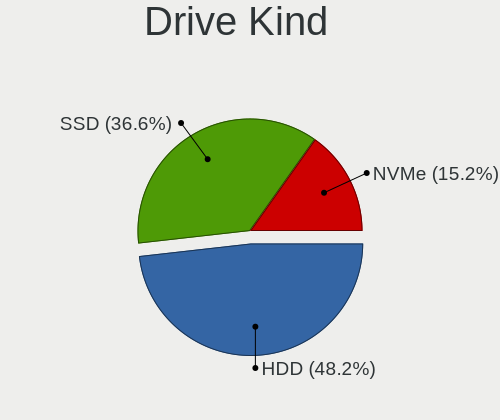
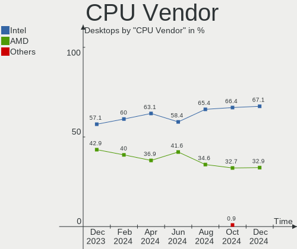
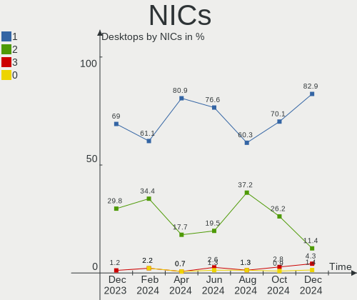
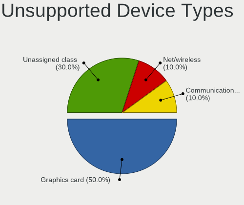

ROSA - Hardware Trends (Desktops)
---------------------------------

A project to identify most popular hardware characteristics and track their change
over time based on data collected by Linux users at https://Linux-Hardware.org.

Anyone can contribute to this report by the [hw-probe](https://github.com/linuxhw/hw-probe) tool:

    sudo -E hw-probe -all -upload

This report is for one last month. Overall report since the beginning of time: [TestCoverage](https://github.com/linuxhw/TestCoverage)

Period: Jan, 2023.

Contents
--------

* [ System ](#system)
  - [ OS                       ](#os)
  - [ OS Family                ](#os-family)
  - [ Kernel                   ](#kernel)
  - [ Kernel Family            ](#kernel-family)
  - [ Kernel Major Ver.        ](#kernel-major-ver)
  - [ Arch                     ](#arch)
  - [ DE                       ](#de)
  - [ Display Server           ](#display-server)
  - [ Display Manager          ](#display-manager)
  - [ OS Lang                  ](#os-lang)
  - [ Boot Mode                ](#boot-mode)
  - [ Filesystem               ](#filesystem)
  - [ Part. scheme             ](#part-scheme)
  - [ Dual Boot with Linux/BSD ](#dual-boot-with-linuxbsd)
  - [ Dual Boot (Win)          ](#dual-boot-win)

* [ Board ](#board)
  - [ Vendor                   ](#vendor)
  - [ Model                    ](#model)
  - [ Model Family             ](#model-family)
  - [ MFG Year                 ](#mfg-year)
  - [ Form Factor              ](#form-factor)
  - [ Secure Boot              ](#secure-boot)
  - [ Coreboot                 ](#coreboot)
  - [ RAM Size                 ](#ram-size)
  - [ RAM Used                 ](#ram-used)
  - [ Total Drives             ](#total-drives)
  - [ Has CD-ROM               ](#has-cd-rom)
  - [ Has Ethernet             ](#has-ethernet)
  - [ Has WiFi                 ](#has-wifi)
  - [ Has Bluetooth            ](#has-bluetooth)

* [ Location ](#location)
  - [ Country                  ](#country)
  - [ City                     ](#city)

* [ Drives ](#drives)
  - [ Drive Vendor             ](#drive-vendor)
  - [ Drive Model              ](#drive-model)
  - [ HDD Vendor               ](#hdd-vendor)
  - [ SSD Vendor               ](#ssd-vendor)
  - [ Drive Kind               ](#drive-kind)
  - [ Drive Connector          ](#drive-connector)
  - [ Drive Size               ](#drive-size)
  - [ Space Total              ](#space-total)
  - [ Space Used               ](#space-used)
  - [ Malfunc. Drives          ](#malfunc-drives)
  - [ Malfunc. Drive Vendor    ](#malfunc-drive-vendor)
  - [ Malfunc. HDD Vendor      ](#malfunc-hdd-vendor)
  - [ Malfunc. Drive Kind      ](#malfunc-drive-kind)
  - [ Failed Drives            ](#failed-drives)
  - [ Failed Drive Vendor      ](#failed-drive-vendor)
  - [ Drive Status             ](#drive-status)

* [ Storage controller ](#storage-controller)
  - [ Storage Vendor           ](#storage-vendor)
  - [ Storage Model            ](#storage-model)
  - [ Storage Kind             ](#storage-kind)

* [ Processor ](#processor)
  - [ CPU Vendor               ](#cpu-vendor)
  - [ CPU Model                ](#cpu-model)
  - [ CPU Model Family         ](#cpu-model-family)
  - [ CPU Cores                ](#cpu-cores)
  - [ CPU Sockets              ](#cpu-sockets)
  - [ CPU Threads              ](#cpu-threads)
  - [ CPU Op-Modes             ](#cpu-op-modes)
  - [ CPU Microcode            ](#cpu-microcode)
  - [ CPU Microarch            ](#cpu-microarch)

* [ Graphics ](#graphics)
  - [ GPU Vendor               ](#gpu-vendor)
  - [ GPU Model                ](#gpu-model)
  - [ GPU Combo                ](#gpu-combo)
  - [ GPU Driver               ](#gpu-driver)
  - [ GPU Memory               ](#gpu-memory)

* [ Monitor ](#monitor)
  - [ Monitor Vendor           ](#monitor-vendor)
  - [ Monitor Model            ](#monitor-model)
  - [ Monitor Resolution       ](#monitor-resolution)
  - [ Monitor Diagonal         ](#monitor-diagonal)
  - [ Monitor Width            ](#monitor-width)
  - [ Aspect Ratio             ](#aspect-ratio)
  - [ Monitor Area             ](#monitor-area)
  - [ Pixel Density            ](#pixel-density)
  - [ Multiple Monitors        ](#multiple-monitors)

* [ Network ](#network)
  - [ Net Controller Vendor    ](#net-controller-vendor)
  - [ Net Controller Model     ](#net-controller-model)
  - [ Wireless Vendor          ](#wireless-vendor)
  - [ Wireless Model           ](#wireless-model)
  - [ Ethernet Vendor          ](#ethernet-vendor)
  - [ Ethernet Model           ](#ethernet-model)
  - [ Net Controller Kind      ](#net-controller-kind)
  - [ Used Controller          ](#used-controller)
  - [ NICs                     ](#nics)
  - [ IPv6                     ](#ipv6)

* [ Bluetooth ](#bluetooth)
  - [ Bluetooth Vendor         ](#bluetooth-vendor)
  - [ Bluetooth Model          ](#bluetooth-model)

* [ Sound ](#sound)
  - [ Sound Vendor             ](#sound-vendor)
  - [ Sound Model              ](#sound-model)

* [ Memory ](#memory)
  - [ Memory Vendor            ](#memory-vendor)
  - [ Memory Model             ](#memory-model)
  - [ Memory Kind              ](#memory-kind)
  - [ Memory Form Factor       ](#memory-form-factor)
  - [ Memory Size              ](#memory-size)
  - [ Memory Speed             ](#memory-speed)

* [ Printers & scanners ](#printers--scanners)
  - [ Printer Vendor           ](#printer-vendor)
  - [ Printer Model            ](#printer-model)
  - [ Scanner Vendor           ](#scanner-vendor)
  - [ Scanner Model            ](#scanner-model)

* [ Camera ](#camera)
  - [ Camera Vendor            ](#camera-vendor)
  - [ Camera Model             ](#camera-model)

* [ Security ](#security)
  - [ Fingerprint Vendor       ](#fingerprint-vendor)
  - [ Fingerprint Model        ](#fingerprint-model)
  - [ Chipcard Vendor          ](#chipcard-vendor)
  - [ Chipcard Model           ](#chipcard-model)

* [ Unsupported ](#unsupported)
  - [ Unsupported Devices      ](#unsupported-devices)
  - [ Unsupported Device Types ](#unsupported-device-types)

System
------

OS
--

Installed operating systems

| Name       | Desktops | Percent |
|------------|----------|---------|
| ROSA 12.3  | 105      | 92.11%  |
| ROSA R11.1 | 4        | 3.51%   |
| ROSA 12.2  | 2        | 1.75%   |
| ROSA 12    | 2        | 1.75%   |
| ROSA 12.1  | 1        | 0.88%   |

OS Family
---------

OS without a version

| Name | Desktops | Percent |
|------|----------|---------|
| ROSA | 114      | 100%    |

Kernel
------

Version of the Linux kernel

| Version                                   | Desktops | Percent |
|-------------------------------------------|----------|---------|
| 5.15.79-generic-1rosa2021.1-x86_64        | 42       | 36.84%  |
| 5.15.75-generic-1rosa2021.1-x86_64        | 29       | 25.44%  |
| 5.10.155-generic-1rosa2021.1-x86_64       | 8        | 7.02%   |
| 5.17.11-generic-2rosa2021.1-x86_64        | 5        | 4.39%   |
| 5.15.75-generic-1rosa2021.1-i686          | 5        | 4.39%   |
| 6.0.12.xm1-1.klp-xanmod-rosa2021.1-x86_64 | 3        | 2.63%   |
| 5.10.74-generic-2rosa2021.1-x86_64        | 3        | 2.63%   |
| 5.10.118-generic-2rosa2021.1-x86_64       | 3        | 2.63%   |
| 6.1.3.xm1-1.klp-xanmod-rosa2021.1-x86_64  | 2        | 1.75%   |
| 5.4.83-generic-2rosa-x86_64               | 2        | 1.75%   |
| 5.10.71-generic-1rosa2021.1-x86_64        | 2        | 1.75%   |
| 6.1.7.xm1-1.klp-xanmod-rosa2021.1-x86_64  | 1        | 0.88%   |
| 6.1.0-generic-3rosa2021.1-x86_64          | 1        | 0.88%   |
| 5.18.19-generic-3rosa2021.1-x86_64        | 1        | 0.88%   |
| 5.16.20-generic-2rosa2021.1-x86_64        | 1        | 0.88%   |
| 5.15.79-generic-1rosa2021.1-i686          | 1        | 0.88%   |
| 5.15.77-generic-1rosa2021.1-x86_64        | 1        | 0.88%   |
| 5.10.74-generic-2rosa2021.1-i586          | 1        | 0.88%   |
| 5.10.150-generic-1rosa2021.1-x86_64       | 1        | 0.88%   |
| 4.9.155-nrj-desktop-1rosa-x86_64          | 1        | 0.88%   |
| 4.15.0-desktop-122.124.1rosa-x86_64       | 1        | 0.88%   |

Kernel Family
-------------

Linux kernel without a distro release

| Version  | Desktops | Percent |
|----------|----------|---------|
| 5.15.79  | 43       | 37.72%  |
| 5.15.75  | 34       | 29.82%  |
| 5.10.155 | 8        | 7.02%   |
| 5.17.11  | 5        | 4.39%   |
| 5.10.74  | 4        | 3.51%   |
| 6.0.12   | 3        | 2.63%   |
| 5.10.118 | 3        | 2.63%   |
| 6.1.3    | 2        | 1.75%   |
| 5.4.83   | 2        | 1.75%   |
| 5.10.71  | 2        | 1.75%   |
| 6.1.7    | 1        | 0.88%   |
| 6.1.0    | 1        | 0.88%   |
| 5.18.19  | 1        | 0.88%   |
| 5.16.20  | 1        | 0.88%   |
| 5.15.77  | 1        | 0.88%   |
| 5.10.150 | 1        | 0.88%   |
| 4.9.155  | 1        | 0.88%   |
| 4.15.0   | 1        | 0.88%   |

Kernel Major Ver.
-----------------

Linux kernel major version

| Version | Desktops | Percent |
|---------|----------|---------|
| 5.15    | 78       | 68.42%  |
| 5.10    | 18       | 15.79%  |
| 5.17    | 5        | 4.39%   |
| 6.1     | 4        | 3.51%   |
| 6.0     | 3        | 2.63%   |
| 5.4     | 2        | 1.75%   |
| 5.18    | 1        | 0.88%   |
| 5.16    | 1        | 0.88%   |
| 4.9     | 1        | 0.88%   |
| 4.15    | 1        | 0.88%   |

Arch
----

OS architecture (x86_64, i586, etc.)

| Name   | Desktops | Percent |
|--------|----------|---------|
| x86_64 | 107      | 93.86%  |
| i686   | 7        | 6.14%   |

DE
--

Desktop Environment

| Name    | Desktops | Percent |
|---------|----------|---------|
| KDE5    | 54       | 47.37%  |
| GNOME   | 45       | 39.47%  |
| LXQt    | 10       | 8.77%   |
| MATE    | 2        | 1.75%   |
| KDE4    | 2        | 1.75%   |
| Unknown | 1        | 0.88%   |

Display Server
--------------

X11 or Wayland

| Name    | Desktops | Percent |
|---------|----------|---------|
| Wayland | 79       | 69.3%   |
| X11     | 33       | 28.95%  |
| Tty     | 1        | 0.88%   |
| Unknown | 1        | 0.88%   |

Display Manager
---------------

SDDM, LightDM, etc.

| Name    | Desktops | Percent |
|---------|----------|---------|
| GDM     | 53       | 46.49%  |
| SDDM    | 51       | 44.74%  |
| LightDM | 7        | 6.14%   |
| KDM     | 2        | 1.75%   |
| Unknown | 1        | 0.88%   |

OS Lang
-------

Language

| Lang  | Desktops | Percent |
|-------|----------|---------|
| ru_RU | 108      | 94.74%  |
| ru_UA | 2        | 1.75%   |
| it_IT | 1        | 0.88%   |
| en_US | 1        | 0.88%   |
| de_DE | 1        | 0.88%   |
| ar_EG | 1        | 0.88%   |

Boot Mode
---------

EFI or BIOS

| Mode | Desktops | Percent |
|------|----------|---------|
| EFI  | 60       | 52.63%  |
| BIOS | 54       | 47.37%  |

Filesystem
----------

Type of filesystem

| Type  | Desktops | Percent |
|-------|----------|---------|
| Ext4  | 106      | 92.98%  |
| Btrfs | 7        | 6.14%   |
| F2fs  | 1        | 0.88%   |

Part. scheme
------------

Scheme of partitioning

| Type | Desktops | Percent |
|------|----------|---------|
| GPT  | 70       | 61.4%   |
| MBR  | 44       | 38.6%   |

Dual Boot with Linux/BSD
------------------------

Hosting more than one Linux/BSD

| Dual boot | Desktops | Percent |
|-----------|----------|---------|
| No        | 72       | 63.16%  |
| Yes       | 42       | 36.84%  |

Dual Boot (Win)
---------------

Hosting Linux and Windows

| Dual boot | Desktops | Percent |
|-----------|----------|---------|
| Yes       | 63       | 55.26%  |
| No        | 51       | 44.74%  |

Board
-----

Vendor
------

Motherboard manufacturer

| Name                | Desktops | Percent |
|---------------------|----------|---------|
| Gigabyte Technology | 29       | 25.44%  |
| ASUSTek Computer    | 29       | 25.44%  |
| ASRock              | 19       | 16.67%  |
| MSI                 | 11       | 9.65%   |
| Huanan              | 5        | 4.39%   |
| Lenovo              | 3        | 2.63%   |
| Intel               | 3        | 2.63%   |
| Biostar             | 3        | 2.63%   |
| Unknown             | 3        | 2.63%   |
| ECS                 | 2        | 1.75%   |
| Acer                | 2        | 1.75%   |
| Pegatron            | 1        | 0.88%   |
| MB                  | 1        | 0.88%   |
| Maibenben           | 1        | 0.88%   |
| iRU                 | 1        | 0.88%   |
| AZW                 | 1        | 0.88%   |

Model
-----

Motherboard model

| Name                                | Desktops | Percent |
|-------------------------------------|----------|---------|
| Unknown                             | 3        | 2.63%   |
| MSI MS-7B89                         | 2        | 1.75%   |
| Gigabyte H61M-S1                    | 2        | 1.75%   |
| Gigabyte AB350M-DS3H V2             | 2        | 1.75%   |
| ASUS P7H55-M                        | 2        | 1.75%   |
| ASUS P5KPL-AM SE                    | 2        | 1.75%   |
| ASUS All Series                     | 2        | 1.75%   |
| Pegatron IPPPV-D3G                  | 1        | 0.88%   |
| MSI PRO H510 DP21 (MS-B0A4)         | 1        | 0.88%   |
| MSI MS-7C75                         | 1        | 0.88%   |
| MSI MS-7C52                         | 1        | 0.88%   |
| MSI MS-7A39                         | 1        | 0.88%   |
| MSI MS-7918                         | 1        | 0.88%   |
| MSI MS-7808                         | 1        | 0.88%   |
| MSI MS-7788                         | 1        | 0.88%   |
| MSI MS-7693                         | 1        | 0.88%   |
| MSI MS-7599                         | 1        | 0.88%   |
| MB A320-SF110                       | 1        | 0.88%   |
| Maibenben PC34                      | 1        | 0.88%   |
| Lenovo ThinkCentre M710q 10MRS04700 | 1        | 0.88%   |
| Lenovo ThinkCentre M57e 6305B2U     | 1        | 0.88%   |
| Lenovo H420                         | 1        | 0.88%   |
| iRU 311                             | 1        | 0.88%   |
| Intel X99                           | 1        | 0.88%   |
| Intel DP43BF AAE78171-302           | 1        | 0.88%   |
| Intel DG41MJ AAE54659-206           | 1        | 0.88%   |
| Huanan X99-F8D V2.4                 | 1        | 0.88%   |
| Huanan X99-F8 NALEX, NALEX          | 1        | 0.88%   |
| Huanan X99-F8 GAMING V5.0           | 1        | 0.88%   |
| Huanan X99 F8D V2.2                 | 1        | 0.88%   |
| Huanan H97-ZD3 V2.0                 | 1        | 0.88%   |
| Gigabyte P35-DS3L                   | 1        | 0.88%   |
| Gigabyte H510M H                    | 1        | 0.88%   |
| Gigabyte H470M DS3H                 | 1        | 0.88%   |
| Gigabyte H310M H 2.0                | 1        | 0.88%   |
| Gigabyte GB-BACE-3160               | 1        | 0.88%   |
| Gigabyte GA-MA770T-UD3P             | 1        | 0.88%   |
| Gigabyte GA-MA770-UD3               | 1        | 0.88%   |
| Gigabyte GA-A75M-DS2                | 1        | 0.88%   |
| Gigabyte GA-78LMT-USB3 6.0          | 1        | 0.88%   |

Model Family
------------

Motherboard model prefix

| Name                    | Desktops | Percent |
|-------------------------|----------|---------|
| ASUS PRIME              | 3        | 2.63%   |
| Unknown                 | 3        | 2.63%   |
| MSI MS-7B89             | 2        | 1.75%   |
| Lenovo ThinkCentre      | 2        | 1.75%   |
| Huanan X99-F8           | 2        | 1.75%   |
| Gigabyte H61M-S1        | 2        | 1.75%   |
| Gigabyte B450M          | 2        | 1.75%   |
| Gigabyte AB350M-DS3H    | 2        | 1.75%   |
| Gigabyte A320M-S2H      | 2        | 1.75%   |
| ASUS ROG                | 2        | 1.75%   |
| ASUS P7H55-M            | 2        | 1.75%   |
| ASUS P5KPL-AM           | 2        | 1.75%   |
| ASUS All                | 2        | 1.75%   |
| Acer Aspire             | 2        | 1.75%   |
| Pegatron IPPPV-D3G      | 1        | 0.88%   |
| MSI PRO                 | 1        | 0.88%   |
| MSI MS-7C75             | 1        | 0.88%   |
| MSI MS-7C52             | 1        | 0.88%   |
| MSI MS-7A39             | 1        | 0.88%   |
| MSI MS-7918             | 1        | 0.88%   |
| MSI MS-7808             | 1        | 0.88%   |
| MSI MS-7788             | 1        | 0.88%   |
| MSI MS-7693             | 1        | 0.88%   |
| MSI MS-7599             | 1        | 0.88%   |
| MB A320-SF110           | 1        | 0.88%   |
| Maibenben PC34          | 1        | 0.88%   |
| Lenovo H420             | 1        | 0.88%   |
| iRU 311                 | 1        | 0.88%   |
| Intel X99               | 1        | 0.88%   |
| Intel DP43BF            | 1        | 0.88%   |
| Intel DG41MJ            | 1        | 0.88%   |
| Huanan X99-F8D          | 1        | 0.88%   |
| Huanan X99              | 1        | 0.88%   |
| Huanan H97-ZD3          | 1        | 0.88%   |
| Gigabyte P35-DS3L       | 1        | 0.88%   |
| Gigabyte H510M          | 1        | 0.88%   |
| Gigabyte H470M          | 1        | 0.88%   |
| Gigabyte H310M          | 1        | 0.88%   |
| Gigabyte GB-BACE-3160   | 1        | 0.88%   |
| Gigabyte GA-MA770T-UD3P | 1        | 0.88%   |

MFG Year
--------

Motherboard manufacture year

| Year | Desktops | Percent |
|------|----------|---------|
| 2012 | 16       | 14.04%  |
| 2020 | 11       | 9.65%   |
| 2018 | 11       | 9.65%   |
| 2010 | 11       | 9.65%   |
| 2021 | 10       | 8.77%   |
| 2019 | 10       | 8.77%   |
| 2014 | 7        | 6.14%   |
| 2009 | 6        | 5.26%   |
| 2008 | 6        | 5.26%   |
| 2022 | 5        | 4.39%   |
| 2011 | 5        | 4.39%   |
| 2013 | 4        | 3.51%   |
| 2017 | 3        | 2.63%   |
| 2016 | 3        | 2.63%   |
| 2007 | 2        | 1.75%   |
| 2015 | 1        | 0.88%   |
| 2006 | 1        | 0.88%   |
| 2005 | 1        | 0.88%   |
| 2003 | 1        | 0.88%   |

Form Factor
-----------

Physical design of the computer

| Name    | Desktops | Percent |
|---------|----------|---------|
| Desktop | 114      | 100%    |

Secure Boot
-----------

Enabled or disabled

| State    | Desktops | Percent |
|----------|----------|---------|
| Disabled | 114      | 100%    |

Coreboot
--------

Have coreboot on board

| Used | Desktops | Percent |
|------|----------|---------|
| No   | 114      | 100%    |

RAM Size
--------

Total RAM memory

| Size in GB  | Desktops | Percent |
|-------------|----------|---------|
| 16.01-24.0  | 28       | 24.56%  |
| 8.01-16.0   | 22       | 19.3%   |
| 4.01-8.0    | 21       | 18.42%  |
| 3.01-4.0    | 17       | 14.91%  |
| 32.01-64.0  | 12       | 10.53%  |
| 1.01-2.0    | 7        | 6.14%   |
| 24.01-32.0  | 5        | 4.39%   |
| 2.01-3.0    | 1        | 0.88%   |
| 64.01-256.0 | 1        | 0.88%   |

RAM Used
--------

Used RAM memory

| Used GB   | Desktops | Percent |
|-----------|----------|---------|
| 1.01-2.0  | 52       | 45.61%  |
| 0.51-1.0  | 27       | 23.68%  |
| 2.01-3.0  | 17       | 14.91%  |
| 4.01-8.0  | 10       | 8.77%   |
| 3.01-4.0  | 5        | 4.39%   |
| 0.01-0.5  | 2        | 1.75%   |
| 8.01-16.0 | 1        | 0.88%   |

Total Drives
------------

Number of drives on board

| Drives | Desktops | Percent |
|--------|----------|---------|
| 2      | 41       | 35.96%  |
| 1      | 36       | 31.58%  |
| 3      | 23       | 20.18%  |
| 4      | 10       | 8.77%   |
| 6      | 2        | 1.75%   |
| 7      | 1        | 0.88%   |
| 5      | 1        | 0.88%   |

Has CD-ROM
----------

Has CD-ROM on board

| Presented | Desktops | Percent |
|-----------|----------|---------|
| No        | 78       | 68.42%  |
| Yes       | 36       | 31.58%  |

Has Ethernet
------------

Has Ethernet on board

| Presented | Desktops | Percent |
|-----------|----------|---------|
| Yes       | 112      | 98.25%  |
| No        | 2        | 1.75%   |

Has WiFi
--------

Has WiFi module

| Presented | Desktops | Percent |
|-----------|----------|---------|
| No        | 79       | 69.3%   |
| Yes       | 35       | 30.7%   |

Has Bluetooth
-------------

Has Bluetooth module

| Presented | Desktops | Percent |
|-----------|----------|---------|
| No        | 87       | 76.32%  |
| Yes       | 27       | 23.68%  |

Location
--------

Country
-------

Geographic location (country)

| Country      | Desktops | Percent |
|--------------|----------|---------|
| Russia       | 103      | 90.35%  |
| USA          | 2        | 1.75%   |
| Ukraine      | 2        | 1.75%   |
| Saudi Arabia | 1        | 0.88%   |
| Poland       | 1        | 0.88%   |
| Moldova      | 1        | 0.88%   |
| Kazakhstan   | 1        | 0.88%   |
| Italy        | 1        | 0.88%   |
| Germany      | 1        | 0.88%   |
| Czechia      | 1        | 0.88%   |

City
----

Geographic location (city)

| City              | Desktops | Percent |
|-------------------|----------|---------|
| Moscow            | 13       | 11.4%   |
| St Petersburg     | 7        | 6.14%   |
| Oryol             | 7        | 6.14%   |
| Voronezh          | 5        | 4.39%   |
| Samara            | 5        | 4.39%   |
| Novosibirsk       | 4        | 3.51%   |
| Volgograd         | 3        | 2.63%   |
| Tyumen            | 3        | 2.63%   |
| Krasnodar         | 3        | 2.63%   |
| Ufa               | 2        | 1.75%   |
| Stavropol         | 2        | 1.75%   |
| Murmansk          | 2        | 1.75%   |
| Krasnoyarsk       | 2        | 1.75%   |
| Khabarovsk        | 2        | 1.75%   |
| Zhigulevsk        | 1        | 0.88%   |
| Zelenodolsk       | 1        | 0.88%   |
| Yuzhno-Sakhalinsk | 1        | 0.88%   |
| Yekaterinburg     | 1        | 0.88%   |
| Yakutsk           | 1        | 0.88%   |
| Warsaw            | 1        | 0.88%   |
| Vladivostok       | 1        | 0.88%   |
| Tomsk             | 1        | 0.88%   |
| Tolyatti          | 1        | 0.88%   |
| Syzran'           | 1        | 0.88%   |
| Stuttgart         | 1        | 0.88%   |
| Spasskoye         | 1        | 0.88%   |
| Slantsy           | 1        | 0.88%   |
| Shumerlya         | 1        | 0.88%   |
| Shakhty           | 1        | 0.88%   |
| Shakhtarsk        | 1        | 0.88%   |
| Sevastopol        | 1        | 0.88%   |
| Saratov           | 1        | 0.88%   |
| Saransk           | 1        | 0.88%   |
| Ramenskoye        | 1        | 0.88%   |
| Queens            | 1        | 0.88%   |
| Pushchino         | 1        | 0.88%   |
| Pskov             | 1        | 0.88%   |
| Prague            | 1        | 0.88%   |
| Pil'na            | 1        | 0.88%   |
| Perm              | 1        | 0.88%   |

Drives
------

Drive Vendor
------------

Hard drive vendors

| Vendor                      | Desktops | Drives | Percent |
|-----------------------------|----------|--------|---------|
| WDC                         | 49       | 59     | 21.78%  |
| Seagate                     | 46       | 55     | 20.44%  |
| Kingston                    | 16       | 17     | 7.11%   |
| Samsung Electronics         | 13       | 15     | 5.78%   |
| Toshiba                     | 12       | 12     | 5.33%   |
| Hitachi                     | 10       | 11     | 4.44%   |
| China                       | 10       | 10     | 4.44%   |
| A-DATA Technology           | 7        | 9      | 3.11%   |
| SanDisk                     | 6        | 6      | 2.67%   |
| Crucial                     | 6        | 6      | 2.67%   |
| SPCC                        | 5        | 5      | 2.22%   |
| Intel                       | 4        | 5      | 1.78%   |
| Apacer                      | 4        | 4      | 1.78%   |
| Unknown                     | 3        | 3      | 1.33%   |
| Netac                       | 3        | 7      | 1.33%   |
| HGST                        | 3        | 3      | 1.33%   |
| AMD                         | 3        | 3      | 1.33%   |
| XrayDisk                    | 2        | 2      | 0.89%   |
| XPG                         | 2        | 2      | 0.89%   |
| Phison                      | 2        | 2      | 0.89%   |
| Patriot                     | 2        | 2      | 0.89%   |
| Gigabyte Technology         | 2        | 2      | 0.89%   |
| Unknown                     | 2        | 2      | 0.89%   |
| Smartbuy                    | 1        | 1      | 0.44%   |
| Silicon Motion              | 1        | 1      | 0.44%   |
| Qumo                        | 1        | 1      | 0.44%   |
| Palit                       | 1        | 1      | 0.44%   |
| OCZ                         | 1        | 1      | 0.44%   |
| NGFF                        | 1        | 1      | 0.44%   |
| MAXIO Technology (Hangzhou) | 1        | 1      | 0.44%   |
| KODAK                       | 1        | 1      | 0.44%   |
| Kllisre                     | 1        | 2      | 0.44%   |
| KingDian                    | 1        | 1      | 0.44%   |
| GOODRAM                     | 1        | 1      | 0.44%   |
| ExeGate                     | 1        | 1      | 0.44%   |
| addlink                     | 1        | 1      | 0.44%   |

Drive Model
-----------

Hard drive models

| Model                              | Desktops | Percent |
|------------------------------------|----------|---------|
| WDC WD10EZEX-00BBHA0 1TB           | 7        | 2.82%   |
| Kingston SA400S37240G 240GB SSD    | 6        | 2.42%   |
| Seagate ST1000DM010-2EP102 1TB     | 5        | 2.02%   |
| Samsung SSD 860 EVO 250GB          | 4        | 1.61%   |
| Kingston SA400S37120G 120GB SSD    | 4        | 1.61%   |
| A-DATA SU650 240GB SSD             | 4        | 1.61%   |
| WDC WD2500AAJB-00J3A0 250GB        | 3        | 1.21%   |
| WDC WD10EZEX-08WN4A0 1TB           | 3        | 1.21%   |
| China SSD 120GB                    | 3        | 1.21%   |
| WDC WD5000AAKX-08U6AA0 500GB       | 2        | 0.81%   |
| WDC WD5000AAKX-001CA0 500GB        | 2        | 0.81%   |
| Toshiba HDWD120 2TB                | 2        | 0.81%   |
| Toshiba HDWD110 1TB                | 2        | 0.81%   |
| SPCC Solid State Disk 512GB        | 2        | 0.81%   |
| SPCC Solid State Disk 128GB        | 2        | 0.81%   |
| Seagate ST500DM002-1BD142 500GB    | 2        | 0.81%   |
| Seagate ST3320620AS 320GB          | 2        | 0.81%   |
| Seagate ST3320613AS 320GB          | 2        | 0.81%   |
| Seagate ST3320418AS 320GB          | 2        | 0.81%   |
| Seagate ST3160215A 160GB           | 2        | 0.81%   |
| Seagate ST3120022A 120GB           | 2        | 0.81%   |
| Seagate ST2000DM008-2FR102 2TB     | 2        | 0.81%   |
| SanDisk SDSSDA120G 120GB           | 2        | 0.81%   |
| SanDisk SD8SBAT-032G-1006 32GB SSD | 2        | 0.81%   |
| Samsung SSD 970 EVO 500GB          | 2        | 0.81%   |
| Samsung SSD 870 EVO 500GB          | 2        | 0.81%   |
| Samsung SSD 750 EVO 250GB          | 2        | 0.81%   |
| Netac SSD 1TB                      | 2        | 0.81%   |
| Kingston SNVS500G 500GB            | 2        | 0.81%   |
| Kingston SA400S37480G 480GB SSD    | 2        | 0.81%   |
| Hitachi HDS721050CLA362 500GB      | 2        | 0.81%   |
| Crucial CT240BX500SSD1 240GB       | 2        | 0.81%   |
| China SSD 128GB                    | 2        | 0.81%   |
| China SATA SSD 120GB               | 2        | 0.81%   |
| Unknown                            | 2        | 0.81%   |
| XrayDisk SSD 120GB                 | 1        | 0.4%    |
| XrayDisk 512GB SSD                 | 1        | 0.4%    |
| XPG SPECTRIX S40G 1TB              | 1        | 0.4%    |
| XPG GAMMIX S5 256GB                | 1        | 0.4%    |
| WDC WDS500G2B0A-00SM50 500GB SSD   | 1        | 0.4%    |

HDD Vendor
----------

Hard disk drive vendors

| Vendor  | Desktops | Drives | Percent |
|---------|----------|--------|---------|
| WDC     | 46       | 55     | 39.66%  |
| Seagate | 45       | 53     | 38.79%  |
| Toshiba | 11       | 11     | 9.48%   |
| Hitachi | 10       | 11     | 8.62%   |
| HGST    | 3        | 3      | 2.59%   |
| Unknown | 1        | 1      | 0.86%   |

SSD Vendor
----------

Solid state drive vendors

| Vendor              | Desktops | Drives | Percent |
|---------------------|----------|--------|---------|
| Kingston            | 13       | 14     | 14.61%  |
| Samsung Electronics | 11       | 12     | 12.36%  |
| China               | 10       | 10     | 11.24%  |
| A-DATA Technology   | 7        | 8      | 7.87%   |
| SanDisk             | 6        | 6      | 6.74%   |
| Crucial             | 6        | 6      | 6.74%   |
| SPCC                | 5        | 5      | 5.62%   |
| WDC                 | 4        | 4      | 4.49%   |
| Intel               | 3        | 4      | 3.37%   |
| Apacer              | 3        | 3      | 3.37%   |
| XrayDisk            | 2        | 2      | 2.25%   |
| Patriot             | 2        | 2      | 2.25%   |
| Netac               | 2        | 5      | 2.25%   |
| AMD                 | 2        | 2      | 2.25%   |
| Unknown             | 1        | 1      | 1.12%   |
| Toshiba             | 1        | 1      | 1.12%   |
| Smartbuy            | 1        | 1      | 1.12%   |
| Qumo                | 1        | 1      | 1.12%   |
| Palit               | 1        | 1      | 1.12%   |
| OCZ                 | 1        | 1      | 1.12%   |
| NGFF                | 1        | 1      | 1.12%   |
| KODAK               | 1        | 1      | 1.12%   |
| Kllisre             | 1        | 1      | 1.12%   |
| KingDian            | 1        | 1      | 1.12%   |
| GOODRAM             | 1        | 1      | 1.12%   |
| Gigabyte Technology | 1        | 1      | 1.12%   |
| Unknown             | 1        | 1      | 1.12%   |

Drive Kind
----------

HDD or SSD

| Kind    | Desktops | Drives | Percent |
|---------|----------|--------|---------|
| HDD     | 95       | 134    | 49.74%  |
| SSD     | 71       | 96     | 37.17%  |
| NVMe    | 22       | 23     | 11.52%  |
| MMC     | 2        | 2      | 1.05%   |
| Unknown | 1        | 1      | 0.52%   |

Drive Connector
---------------

SATA, SAS, NVMe, etc.

| Type | Desktops | Drives | Percent |
|------|----------|--------|---------|
| SATA | 111      | 228    | 81.02%  |
| NVMe | 22       | 23     | 16.06%  |
| SAS  | 2        | 3      | 1.46%   |
| MMC  | 2        | 2      | 1.46%   |

Drive Size
----------

Size of hard drive

| Size in TB | Desktops | Drives | Percent |
|------------|----------|--------|---------|
| 0.01-0.5   | 100      | 158    | 62.5%   |
| 0.51-1.0   | 42       | 53     | 26.25%  |
| 1.01-2.0   | 10       | 11     | 6.25%   |
| 3.01-4.0   | 4        | 4      | 2.5%    |
| 2.01-3.0   | 2        | 2      | 1.25%   |
| 4.01-10.0  | 2        | 2      | 1.25%   |

Space Total
-----------

Amount of disk space available on the file system

| Size in GB     | Desktops | Percent |
|----------------|----------|---------|
| 101-250        | 38       | 33.33%  |
| 251-500        | 26       | 22.81%  |
| 501-1000       | 12       | 10.53%  |
| 1001-2000      | 9        | 7.89%   |
| 51-100         | 8        | 7.02%   |
| 2001-3000      | 7        | 6.14%   |
| 1-20           | 6        | 5.26%   |
| More than 3000 | 4        | 3.51%   |
| 21-50          | 4        | 3.51%   |

Space Used
----------

Amount of used disk space

| Used GB        | Desktops | Percent |
|----------------|----------|---------|
| 1-20           | 58       | 50.88%  |
| 101-250        | 14       | 12.28%  |
| 21-50          | 13       | 11.4%   |
| 251-500        | 8        | 7.02%   |
| 501-1000       | 7        | 6.14%   |
| 51-100         | 6        | 5.26%   |
| 1001-2000      | 5        | 4.39%   |
| 2001-3000      | 2        | 1.75%   |
| More than 3000 | 1        | 0.88%   |

Malfunc. Drives
---------------

Drive models with a malfunction

| Model                                 | Desktops | Drives | Percent |
|---------------------------------------|----------|--------|---------|
| WDC WD5000AAKX-001CA0 500GB           | 2        | 2      | 3.85%   |
| Seagate ST3320620AS 320GB             | 2        | 2      | 3.85%   |
| Seagate ST3320613AS 320GB             | 2        | 2      | 3.85%   |
| Seagate ST3120022A 120GB              | 2        | 2      | 3.85%   |
| XPG GAMMIX S5 256GB                   | 1        | 1      | 1.92%   |
| WDC WD7500BPVT-24HXZT3 752GB          | 1        | 1      | 1.92%   |
| WDC WD5000AZRX-00A8LB0 500GB          | 1        | 1      | 1.92%   |
| WDC WD5000AAKX-22ERMA0 500GB          | 1        | 1      | 1.92%   |
| WDC WD5000AAKX-08U6AA0 500GB          | 1        | 1      | 1.92%   |
| WDC WD5000AAKX-08ERMA0 500GB          | 1        | 1      | 1.92%   |
| WDC WD5000AAKS-22V1A0 500GB           | 1        | 1      | 1.92%   |
| WDC WD3200AAJS-60Z0A0 320GB           | 1        | 1      | 1.92%   |
| WDC WD2500BEVT-60ZCT1 250GB           | 1        | 1      | 1.92%   |
| WDC WD2500AAJB-00J3A0 250GB           | 1        | 1      | 1.92%   |
| WDC WD20EZRX-00DC0B0 2TB              | 1        | 1      | 1.92%   |
| WDC WD10EZEX-08WN4A0 1TB              | 1        | 1      | 1.92%   |
| WDC WD10EALX-559BA0 1TB               | 1        | 1      | 1.92%   |
| Toshiba MQ01ABD100 1TB                | 1        | 1      | 1.92%   |
| Toshiba MK3276GSX -63 320GB           | 1        | 1      | 1.92%   |
| Toshiba MK1637GSX 160GB               | 1        | 1      | 1.92%   |
| Seagate ST9500325AS 500GB             | 1        | 1      | 1.92%   |
| Seagate ST9320423AS 320GB             | 1        | 1      | 1.92%   |
| Seagate ST6000VX0003-1ZH110 6TB       | 1        | 1      | 1.92%   |
| Seagate ST3808110AS 80GB              | 1        | 1      | 1.92%   |
| Seagate ST3500418AS 500GB             | 1        | 1      | 1.92%   |
| Seagate ST3500413AS 500GB             | 1        | 1      | 1.92%   |
| Seagate ST3320620A 320GB              | 1        | 1      | 1.92%   |
| Seagate ST3250410AS 250GB             | 1        | 1      | 1.92%   |
| Seagate ST3250318AS 249GB             | 1        | 1      | 1.92%   |
| Seagate ST3250310AS 250GB             | 1        | 1      | 1.92%   |
| Seagate ST3160215A 160GB              | 1        | 1      | 1.92%   |
| Seagate ST31000524AS 1TB              | 1        | 1      | 1.92%   |
| Seagate ST31000333AS 1TB              | 1        | 1      | 1.92%   |
| Seagate ST1500LM006 HN-M 1TB          | 1        | 1      | 1.92%   |
| Seagate ST1500DL003-9VT16L 1TB        | 1        | 1      | 1.92%   |
| Seagate ST1000LM024 HN-M101MBB 1TB    | 1        | 1      | 1.92%   |
| Samsung Electronics SSD 860 EVO 250GB | 1        | 1      | 1.92%   |
| Kingston SA400S37480G 480GB SSD       | 1        | 1      | 1.92%   |
| Hitachi HTS542512K9A300 120GB         | 1        | 1      | 1.92%   |
| Hitachi HTS541680J9SA00 80GB          | 1        | 1      | 1.92%   |

Malfunc. Drive Vendor
---------------------

Vendors of faulty drives

| Vendor              | Desktops | Drives | Percent |
|---------------------|----------|--------|---------|
| Seagate             | 20       | 22     | 40.82%  |
| WDC                 | 14       | 14     | 28.57%  |
| Hitachi             | 6        | 7      | 12.24%  |
| Toshiba             | 3        | 3      | 6.12%   |
| XPG                 | 1        | 1      | 2.04%   |
| Samsung Electronics | 1        | 1      | 2.04%   |
| Kingston            | 1        | 1      | 2.04%   |
| HGST                | 1        | 1      | 2.04%   |
| A-DATA Technology   | 1        | 1      | 2.04%   |
| Unknown             | 1        | 1      | 2.04%   |

Malfunc. HDD Vendor
-------------------

Vendors of faulty HDD drives

| Vendor  | Desktops | Drives | Percent |
|---------|----------|--------|---------|
| Seagate | 20       | 22     | 45.45%  |
| WDC     | 14       | 14     | 31.82%  |
| Hitachi | 6        | 7      | 13.64%  |
| Toshiba | 3        | 3      | 6.82%   |
| HGST    | 1        | 1      | 2.27%   |

Malfunc. Drive Kind
-------------------

Kinds of faulty drives

| Kind | Desktops | Drives | Percent |
|------|----------|--------|---------|
| HDD  | 39       | 47     | 88.64%  |
| SSD  | 4        | 4      | 9.09%   |
| NVMe | 1        | 1      | 2.27%   |

Failed Drives
-------------

Failed drive models

| Model                       | Desktops | Drives | Percent |
|-----------------------------|----------|--------|---------|
| WDC WD7501AALS-00J7B0 752GB | 1        | 1      | 100%    |

Failed Drive Vendor
-------------------

Failed drive vendors

| Vendor | Desktops | Drives | Percent |
|--------|----------|--------|---------|
| WDC    | 1        | 1      | 100%    |

Drive Status
------------

Number of failed and malfunc. drives

| Status   | Desktops | Drives | Percent |
|----------|----------|--------|---------|
| Works    | 100      | 196    | 66.67%  |
| Malfunc  | 43       | 52     | 28.67%  |
| Detected | 6        | 7      | 4%      |
| Failed   | 1        | 1      | 0.67%   |

Storage controller
------------------

Storage Vendor
--------------

Storage controller vendors

| Vendor                      | Desktops | Percent |
|-----------------------------|----------|---------|
| Intel                       | 71       | 46.1%   |
| AMD                         | 40       | 25.97%  |
| Silicon Motion              | 5        | 3.25%   |
| JMicron Technology          | 5        | 3.25%   |
| VIA Technologies            | 4        | 2.6%    |
| Phison Electronics          | 4        | 2.6%    |
| Nvidia                      | 4        | 2.6%    |
| ASMedia Technology          | 4        | 2.6%    |
| Samsung Electronics         | 3        | 1.95%   |
| Marvell Technology Group    | 3        | 1.95%   |
| Kingston Technology Company | 3        | 1.95%   |
| ADATA Technology            | 3        | 1.95%   |
| MAXIO Technology (Hangzhou) | 2        | 1.3%    |
| Silicon Image               | 1        | 0.65%   |
| Seagate Technology          | 1        | 0.65%   |
| Netac Technology            | 1        | 0.65%   |

Storage Model
-------------

Storage controller models

| Model                                                                                   | Desktops | Percent |
|-----------------------------------------------------------------------------------------|----------|---------|
| AMD FCH SATA Controller [AHCI mode]                                                     | 15       | 7.43%   |
| AMD 400 Series Chipset SATA Controller                                                  | 9        | 4.46%   |
| Intel NM10/ICH7 Family SATA Controller [IDE mode]                                       | 8        | 3.96%   |
| AMD SB7x0/SB8x0/SB9x0 SATA Controller [AHCI mode]                                       | 8        | 3.96%   |
| AMD SB7x0/SB8x0/SB9x0 IDE Controller                                                    | 8        | 3.96%   |
| Intel 82801G (ICH7 Family) IDE Controller                                               | 7        | 3.47%   |
| AMD FCH SATA Controller D                                                               | 6        | 2.97%   |
| Silicon Motion SM2263EN/SM2263XT SSD Controller                                         | 5        | 2.48%   |
| Intel C610/X99 series chipset 6-Port SATA Controller [AHCI mode]                        | 5        | 2.48%   |
| Intel 6 Series/C200 Series Chipset Family Desktop SATA Controller (IDE mode, ports 4-5) | 5        | 2.48%   |
| Intel 6 Series/C200 Series Chipset Family Desktop SATA Controller (IDE mode, ports 0-3) | 5        | 2.48%   |
| Intel 500 Series Chipset Family SATA AHCI Controller                                    | 5        | 2.48%   |
| Intel 200 Series PCH SATA controller [AHCI mode]                                        | 5        | 2.48%   |
| Intel 9 Series Chipset Family SATA Controller [AHCI Mode]                               | 4        | 1.98%   |
| Intel 7 Series/C210 Series Chipset Family 6-port SATA Controller [AHCI mode]            | 4        | 1.98%   |
| ASMedia ASM1062 Serial ATA Controller                                                   | 4        | 1.98%   |
| AMD SB7x0/SB8x0/SB9x0 SATA Controller [IDE mode]                                        | 4        | 1.98%   |
| VIA VT6415 PATA IDE Host Controller                                                     | 3        | 1.49%   |
| Samsung NVMe SSD Controller SM981/PM981/PM983                                           | 3        | 1.49%   |
| Phison E12 NVMe Controller                                                              | 3        | 1.49%   |
| Nvidia MCP61 SATA Controller                                                            | 3        | 1.49%   |
| Intel Celeron/Pentium Silver Processor SATA Controller                                  | 3        | 1.49%   |
| Intel 82801IB (ICH9) 2 port SATA Controller [IDE mode]                                  | 3        | 1.49%   |
| Intel 82801I (ICH9 Family) 2 port SATA Controller [IDE mode]                            | 3        | 1.49%   |
| Intel 8 Series/C220 Series Chipset Family 6-port SATA Controller 1 [AHCI mode]          | 3        | 1.49%   |
| Intel 6 Series/C200 Series Chipset Family 6 port Desktop SATA AHCI Controller           | 3        | 1.49%   |
| Intel 5 Series/3400 Series Chipset 4 port SATA IDE Controller                           | 3        | 1.49%   |
| Intel 5 Series/3400 Series Chipset 2 port SATA IDE Controller                           | 3        | 1.49%   |
| AMD 500 Series Chipset SATA Controller                                                  | 3        | 1.49%   |
| AMD 300 Series Chipset SATA Controller                                                  | 3        | 1.49%   |
| Nvidia MCP61 IDE                                                                        | 2        | 0.99%   |
| MAXIO (Hangzhou) NVMe SSD Controller MAP1202                                            | 2        | 0.99%   |
| Marvell Group 88SE6101/6102 single-port PATA133 interface                               | 2        | 0.99%   |
| Kingston Company Company Non-Volatile memory controller                                 | 2        | 0.99%   |
| JMicron JMB368 IDE controller                                                           | 2        | 0.99%   |
| JMicron JMB361 AHCI/IDE                                                                 | 2        | 0.99%   |
| Intel Comet Lake SATA AHCI Controller                                                   | 2        | 0.99%   |
| Intel C610/X99 series chipset sSATA Controller [AHCI mode]                              | 2        | 0.99%   |
| Intel 82801JI (ICH10 Family) SATA AHCI Controller                                       | 2        | 0.99%   |
| Intel 82801JI (ICH10 Family) 4 port SATA IDE Controller #1                              | 2        | 0.99%   |

Storage Kind
------------

Kind of storage controller (IDE, SATA, NVMe, SAS, ...)

| Kind | Desktops | Percent |
|------|----------|---------|
| SATA | 85       | 56.67%  |
| IDE  | 39       | 26%     |
| NVMe | 22       | 14.67%  |
| RAID | 4        | 2.67%   |

Processor
---------

CPU Vendor
----------

Processor vendors

| Vendor | Desktops | Percent |
|--------|----------|---------|
| Intel  | 70       | 61.4%   |
| AMD    | 44       | 38.6%   |

CPU Model
---------

Processor models

| Model                                         | Desktops | Percent |
|-----------------------------------------------|----------|---------|
| AMD Phenom II X4 965 Processor                | 3        | 2.63%   |
| Intel Pentium Dual CPU E2200 @ 2.20GHz        | 2        | 1.75%   |
| Intel Core i5-8400 CPU @ 2.80GHz              | 2        | 1.75%   |
| Intel Core i5-2320 CPU @ 3.00GHz              | 2        | 1.75%   |
| Intel Core i5 CPU 750 @ 2.67GHz               | 2        | 1.75%   |
| Intel Core i3-2100 CPU @ 3.10GHz              | 2        | 1.75%   |
| Intel Core 2 Quad CPU Q8400 @ 2.66GHz         | 2        | 1.75%   |
| Intel Celeron J4125 CPU @ 2.00GHz             | 2        | 1.75%   |
| Intel 11th Gen Core i5-11400F @ 2.60GHz       | 2        | 1.75%   |
| AMD Ryzen 5 7600X 6-Core Processor            | 2        | 1.75%   |
| AMD Ryzen 5 3600 6-Core Processor             | 2        | 1.75%   |
| AMD Athlon 64 X2 Dual Core Processor 3800+    | 2        | 1.75%   |
| AMD A8-9600 RADEON R7, 10 COMPUTE CORES 4C+6G | 2        | 1.75%   |
| Intel Xeon CPU E5450 @ 3.00GHz                | 1        | 0.88%   |
| Intel Xeon CPU E5420 @ 2.50GHz                | 1        | 0.88%   |
| Intel Xeon CPU E5-2690 v3 @ 2.60GHz           | 1        | 0.88%   |
| Intel Xeon CPU E5-2680 v4 @ 2.40GHz           | 1        | 0.88%   |
| Intel Xeon CPU E5-2678 v3 @ 2.50GHz           | 1        | 0.88%   |
| Intel Xeon CPU E5-2666 v3 @ 2.90GHz           | 1        | 0.88%   |
| Intel Xeon CPU E5-2650 v4 @ 2.20GHz           | 1        | 0.88%   |
| Intel Xeon CPU E5-2640 0 @ 2.50GHz            | 1        | 0.88%   |
| Intel Xeon CPU E31220 @ 3.10GHz               | 1        | 0.88%   |
| Intel Xeon CPU E3-1271 v3 @ 3.60GHz           | 1        | 0.88%   |
| Intel Xeon CPU E3-1270 v3 @ 3.50GHz           | 1        | 0.88%   |
| Intel Pentium Gold G6405 CPU @ 4.10GHz        | 1        | 0.88%   |
| Intel Pentium Dual-Core CPU E6600 @ 3.06GHz   | 1        | 0.88%   |
| Intel Pentium Dual-Core CPU E5300 @ 2.60GHz   | 1        | 0.88%   |
| Intel Pentium CPU G3240 @ 3.10GHz             | 1        | 0.88%   |
| Intel Pentium 4 CPU 3.00GHz                   | 1        | 0.88%   |
| Intel Core i9-10900 CPU @ 2.80GHz             | 1        | 0.88%   |
| Intel Core i7-4790K CPU @ 4.00GHz             | 1        | 0.88%   |
| Intel Core i7-2600K CPU @ 3.40GHz             | 1        | 0.88%   |
| Intel Core i7-2600 CPU @ 3.40GHz              | 1        | 0.88%   |
| Intel Core i7-10700KF CPU @ 3.80GHz           | 1        | 0.88%   |
| Intel Core i7 CPU 920 @ 2.67GHz               | 1        | 0.88%   |
| Intel Core i5-7600 CPU @ 3.50GHz              | 1        | 0.88%   |
| Intel Core i5-4460 CPU @ 3.20GHz              | 1        | 0.88%   |
| Intel Core i5-3550 CPU @ 3.30GHz              | 1        | 0.88%   |
| Intel Core i5-3470 CPU @ 3.20GHz              | 1        | 0.88%   |
| Intel Core i5-2400 CPU @ 3.10GHz              | 1        | 0.88%   |

CPU Model Family
----------------

Processor model prefix

| Model                   | Desktops | Percent |
|-------------------------|----------|---------|
| Intel Core i3           | 14       | 12.28%  |
| Intel Core i5           | 13       | 11.4%   |
| Intel Xeon              | 11       | 9.65%   |
| AMD Ryzen 5             | 10       | 8.77%   |
| Intel Celeron           | 8        | 7.02%   |
| Intel Core i7           | 5        | 4.39%   |
| AMD Ryzen 3             | 4        | 3.51%   |
| AMD FX                  | 4        | 3.51%   |
| Other                   | 3        | 2.63%   |
| Intel Core 2 Quad       | 3        | 2.63%   |
| Intel Core 2 Duo        | 3        | 2.63%   |
| AMD Phenom II X4        | 3        | 2.63%   |
| AMD Athlon II X2        | 3        | 2.63%   |
| AMD Athlon 64 X2        | 3        | 2.63%   |
| AMD A8                  | 3        | 2.63%   |
| Intel Pentium Dual-Core | 2        | 1.75%   |
| Intel Pentium Dual      | 2        | 1.75%   |
| AMD Ryzen 7 PRO         | 2        | 1.75%   |
| AMD Ryzen 3 PRO         | 2        | 1.75%   |
| AMD Phenom II X6        | 2        | 1.75%   |
| Intel Pentium Gold      | 1        | 0.88%   |
| Intel Pentium 4         | 1        | 0.88%   |
| Intel Pentium           | 1        | 0.88%   |
| Intel Core i9           | 1        | 0.88%   |
| Intel Core 2            | 1        | 0.88%   |
| Intel Atom              | 1        | 0.88%   |
| AMD Ryzen 9             | 1        | 0.88%   |
| AMD Ryzen 7             | 1        | 0.88%   |
| AMD Ryzen 5 PRO         | 1        | 0.88%   |
| AMD Athlon X4           | 1        | 0.88%   |
| AMD Athlon X2           | 1        | 0.88%   |
| AMD Athlon 64           | 1        | 0.88%   |
| AMD Athlon              | 1        | 0.88%   |
| AMD A4                  | 1        | 0.88%   |

CPU Cores
---------

Number of processor cores

| Number | Desktops | Percent |
|--------|----------|---------|
| 4      | 42       | 36.84%  |
| 2      | 37       | 32.46%  |
| 6      | 18       | 15.79%  |
| 1      | 6        | 5.26%   |
| 8      | 3        | 2.63%   |
| 24     | 2        | 1.75%   |
| 12     | 2        | 1.75%   |
| 10     | 2        | 1.75%   |
| 14     | 1        | 0.88%   |
| 3      | 1        | 0.88%   |

CPU Sockets
-----------

Number of sockets

| Number | Desktops | Percent |
|--------|----------|---------|
| 1      | 112      | 98.25%  |
| 2      | 2        | 1.75%   |

CPU Threads
-----------

Threads per core (Hyper-Threading)

| Number | Desktops | Percent |
|--------|----------|---------|
| 2      | 60       | 52.63%  |
| 1      | 54       | 47.37%  |

CPU Op-Modes
------------

CPU Operation Modes (32-bit, 64-bit)

| Op mode        | Desktops | Percent |
|----------------|----------|---------|
| 32-bit, 64-bit | 113      | 99.12%  |
| 32-bit         | 1        | 0.88%   |

CPU Microcode
-------------

Microcode number

| Number     | Desktops | Percent |
|------------|----------|---------|
| 0x206a7    | 9        | 7.89%   |
| 0x306c3    | 7        | 6.14%   |
| 0x1067a    | 6        | 5.26%   |
| Unknown    | 6        | 5.26%   |
| 0xa0653    | 5        | 4.39%   |
| 0x306a9    | 4        | 3.51%   |
| 0x08101016 | 4        | 3.51%   |
| 0x906e9    | 3        | 2.63%   |
| 0x306f2    | 3        | 2.63%   |
| 0x10676    | 3        | 2.63%   |
| 0x0800820d | 3        | 2.63%   |
| 0x06001119 | 3        | 2.63%   |
| 0x010000c8 | 3        | 2.63%   |
| 0xa0671    | 2        | 1.75%   |
| 0xa0655    | 2        | 1.75%   |
| 0x906eb    | 2        | 1.75%   |
| 0x906ea    | 2        | 1.75%   |
| 0x706a8    | 2        | 1.75%   |
| 0x6fd      | 2        | 1.75%   |
| 0x406f1    | 2        | 1.75%   |
| 0x106e5    | 2        | 1.75%   |
| 0x0a601201 | 2        | 1.75%   |
| 0x0a50000d | 2        | 1.75%   |
| 0x0a20120a | 2        | 1.75%   |
| 0x08701021 | 2        | 1.75%   |
| 0x08108109 | 2        | 1.75%   |
| 0x08108102 | 2        | 1.75%   |
| 0x06000822 | 2        | 1.75%   |
| 0xf29      | 1        | 0.88%   |
| 0x906c0    | 1        | 0.88%   |
| 0x90672    | 1        | 0.88%   |
| 0x706a1    | 1        | 0.88%   |
| 0x6fb      | 1        | 0.88%   |
| 0x6f2      | 1        | 0.88%   |
| 0x406c4    | 1        | 0.88%   |
| 0x30678    | 1        | 0.88%   |
| 0x206d7    | 1        | 0.88%   |
| 0x20655    | 1        | 0.88%   |
| 0x20652    | 1        | 0.88%   |
| 0x106ca    | 1        | 0.88%   |

CPU Microarch
-------------

Microarchitecture

| Name          | Desktops | Percent |
|---------------|----------|---------|
| SandyBridge   | 10       | 8.77%   |
| Haswell       | 10       | 8.77%   |
| Penryn        | 9        | 7.89%   |
| Zen+          | 8        | 7.02%   |
| K10           | 8        | 7.02%   |
| KabyLake      | 7        | 6.14%   |
| CometLake     | 7        | 6.14%   |
| Piledriver    | 6        | 5.26%   |
| Zen           | 5        | 4.39%   |
| Core          | 5        | 4.39%   |
| Zen 3         | 4        | 3.51%   |
| K8 Hammer     | 4        | 3.51%   |
| IvyBridge     | 4        | 3.51%   |
| Zen 2         | 3        | 2.63%   |
| Nehalem       | 3        | 2.63%   |
| Goldmont plus | 3        | 2.63%   |
| Unknown       | 3        | 2.63%   |
| Westmere      | 2        | 1.75%   |
| Silvermont    | 2        | 1.75%   |
| Icelake       | 2        | 1.75%   |
| Excavator     | 2        | 1.75%   |
| Broadwell     | 2        | 1.75%   |
| Tremont       | 1        | 0.88%   |
| NetBurst      | 1        | 0.88%   |
| K10 Llano     | 1        | 0.88%   |
| Bulldozer     | 1        | 0.88%   |
| Bonnell       | 1        | 0.88%   |

Graphics
--------

GPU Vendor
----------

Vendors of graphics cards

| Vendor | Desktops | Percent |
|--------|----------|---------|
| Nvidia | 56       | 45.9%   |
| AMD    | 41       | 33.61%  |
| Intel  | 25       | 20.49%  |

GPU Model
---------

Graphics card models

| Model                                                                     | Desktops | Percent |
|---------------------------------------------------------------------------|----------|---------|
| Nvidia GP107 [GeForce GTX 1050 Ti]                                        | 6        | 4.88%   |
| Intel 2nd Generation Core Processor Family Integrated Graphics Controller | 4        | 3.25%   |
| AMD Ellesmere [Radeon RX 470/480/570/570X/580/580X/590]                   | 4        | 3.25%   |
| Nvidia GK208B [GeForce GT 710]                                            | 3        | 2.44%   |
| Nvidia GF108 [GeForce GT 630]                                             | 3        | 2.44%   |
| Intel Xeon E3-1200 v2/3rd Gen Core processor Graphics Controller          | 3        | 2.44%   |
| Intel GeminiLake [UHD Graphics 600]                                       | 3        | 2.44%   |
| Intel 4 Series Chipset Integrated Graphics Controller                     | 3        | 2.44%   |
| AMD Raven Ridge [Radeon Vega Series / Radeon Vega Mobile Series]          | 3        | 2.44%   |
| AMD Picasso/Raven 2 [Radeon Vega Series / Radeon Vega Mobile Series]      | 3        | 2.44%   |
| Nvidia TU117 [GeForce GTX 1650]                                           | 2        | 1.63%   |
| Nvidia NV43 [GeForce 6600 GT]                                             | 2        | 1.63%   |
| Nvidia GT218 [GeForce 210]                                                | 2        | 1.63%   |
| Nvidia GP108 [GeForce GT 1030]                                            | 2        | 1.63%   |
| Nvidia GP106 [GeForce GTX 1060 3GB]                                       | 2        | 1.63%   |
| Nvidia GM107 [GeForce GTX 750 Ti]                                         | 2        | 1.63%   |
| Nvidia GK107 [GeForce GTX 650]                                            | 2        | 1.63%   |
| Nvidia GF119 [GeForce GT 610]                                             | 2        | 1.63%   |
| Nvidia GF116 [GeForce GTX 550 Ti]                                         | 2        | 1.63%   |
| Nvidia GF108 [GeForce GT 430]                                             | 2        | 1.63%   |
| Nvidia GA106 [Geforce RTX 3050]                                           | 2        | 1.63%   |
| Intel CoffeeLake-S GT2 [UHD Graphics 630]                                 | 2        | 1.63%   |
| AMD Turks XT [Radeon HD 6670/7670]                                        | 2        | 1.63%   |
| AMD RV730 PRO [Radeon HD 4650]                                            | 2        | 1.63%   |
| AMD Raphael                                                               | 2        | 1.63%   |
| AMD Polaris 20 XL [Radeon RX 580 2048SP]                                  | 2        | 1.63%   |
| AMD Navi 24 [Radeon RX 6400/6500 XT/6500M]                                | 2        | 1.63%   |
| AMD Navi 22 [Radeon RX 6700/6700 XT/6750 XT / 6800M]                      | 2        | 1.63%   |
| AMD Lexa PRO [Radeon 540/540X/550/550X / RX 540X/550/550X]                | 2        | 1.63%   |
| AMD Cezanne [Radeon Vega Series / Radeon Vega Mobile Series]              | 2        | 1.63%   |
| Nvidia TU116 [GeForce GTX 1660]                                           | 1        | 0.81%   |
| Nvidia TU116 [GeForce GTX 1660 SUPER]                                     | 1        | 0.81%   |
| Nvidia TU116 [GeForce GTX 1650]                                           | 1        | 0.81%   |
| Nvidia TU106 [GeForce RTX 2060 SUPER]                                     | 1        | 0.81%   |
| Nvidia GP107 [GeForce GTX 1050]                                           | 1        | 0.81%   |
| Nvidia GP106 [GeForce GTX 1060 6GB]                                       | 1        | 0.81%   |
| Nvidia GP104 [GeForce GTX 1070]                                           | 1        | 0.81%   |
| Nvidia GK208B [GeForce GT 730]                                            | 1        | 0.81%   |
| Nvidia GF119 [GeForce GT 705]                                             | 1        | 0.81%   |
| Nvidia GF116 [GeForce GT 545]                                             | 1        | 0.81%   |

GPU Combo
---------

Combinations of graphics cards

| Name           | Desktops | Percent |
|----------------|----------|---------|
| 1 x Nvidia     | 53       | 46.49%  |
| 1 x AMD        | 39       | 34.21%  |
| 1 x Intel      | 19       | 16.67%  |
| Intel + Nvidia | 2        | 1.75%   |
| AMD + Nvidia   | 1        | 0.88%   |

GPU Driver
----------

Free vs proprietary

| Driver      | Desktops | Percent |
|-------------|----------|---------|
| Free        | 91       | 79.82%  |
| Proprietary | 18       | 15.79%  |
| Unknown     | 5        | 4.39%   |

GPU Memory
----------

Total video memory

| Size in GB | Desktops | Percent |
|------------|----------|---------|
| Unknown    | 34       | 29.82%  |
| 1.01-2.0   | 18       | 15.79%  |
| 0.51-1.0   | 18       | 15.79%  |
| 0.01-0.5   | 17       | 14.91%  |
| 3.01-4.0   | 14       | 12.28%  |
| 7.01-8.0   | 5        | 4.39%   |
| 2.01-3.0   | 3        | 2.63%   |
| 8.01-16.0  | 3        | 2.63%   |
| 5.01-6.0   | 2        | 1.75%   |

Monitor
-------

Monitor Vendor
--------------

Monitor vendors

| Vendor               | Desktops | Percent |
|----------------------|----------|---------|
| Samsung Electronics  | 19       | 17.59%  |
| Philips              | 15       | 13.89%  |
| Goldstar             | 15       | 13.89%  |
| Acer                 | 12       | 11.11%  |
| BenQ                 | 9        | 8.33%   |
| Dell                 | 6        | 5.56%   |
| Hewlett-Packard      | 5        | 4.63%   |
| ASUSTek Computer     | 5        | 4.63%   |
| AOC                  | 3        | 2.78%   |
| ViewSonic            | 2        | 1.85%   |
| Sony                 | 2        | 1.85%   |
| NEC Computers        | 2        | 1.85%   |
| MSI                  | 2        | 1.85%   |
| XYA                  | 1        | 0.93%   |
| Unknown              | 1        | 0.93%   |
| SAC                  | 1        | 0.93%   |
| MStar                | 1        | 0.93%   |
| MIL                  | 1        | 0.93%   |
| Lenovo               | 1        | 0.93%   |
| Iiyama               | 1        | 0.93%   |
| HUAWEI               | 1        | 0.93%   |
| HKC                  | 1        | 0.93%   |
| Gigabyte Technology  | 1        | 0.93%   |
| Ancor Communications | 1        | 0.93%   |

Monitor Model
-------------

Monitor models

| Model                                                                  | Desktops | Percent |
|------------------------------------------------------------------------|----------|---------|
| Samsung Electronics SyncMaster SAM0248 1280x1024 380x300mm 19.1-inch   | 2        | 1.85%   |
| Philips PHL 273V7 PHLC156 1920x1080 598x336mm 27.0-inch                | 2        | 1.85%   |
| Philips PHL 243V7 PHLC155 1920x1080 527x296mm 23.8-inch                | 2        | 1.85%   |
| ASUSTek Computer VP249 AUS24AA 1920x1080 527x296mm 23.8-inch           | 2        | 1.85%   |
| XYA CF27AGB XYA2700 1920x1080 598x336mm 27.0-inch                      | 1        | 0.93%   |
| ViewSonic VA2419 Series VSC7B32 1920x1080 527x296mm 23.8-inch          | 1        | 0.93%   |
| ViewSonic VA2232 Series VSC8224 1680x1050 474x296mm 22.0-inch          | 1        | 0.93%   |
| Unknown LCD Monitor FFFF 2288x1287 2550x2550mm 142.0-inch              | 1        | 0.93%   |
| Sony TV SNYAB03 1920x1080                                              | 1        | 0.93%   |
| Sony HDMI TV SNY0264 1920x540                                          | 1        | 0.93%   |
| Samsung Electronics U32J59x SAM0F52 3840x2160 697x392mm 31.5-inch      | 1        | 0.93%   |
| Samsung Electronics SyncMaster SAM0572 1280x1024 376x301mm 19.0-inch   | 1        | 0.93%   |
| Samsung Electronics SyncMaster SAM03C2 1680x1050 459x296mm 21.5-inch   | 1        | 0.93%   |
| Samsung Electronics SyncMaster SAM036E 1280x1024 376x301mm 19.0-inch   | 1        | 0.93%   |
| Samsung Electronics SyncMaster SAM01B7 1280x1024 338x270mm 17.0-inch   | 1        | 0.93%   |
| Samsung Electronics SyncMaster SAM0192 1280x1024 338x270mm 17.0-inch   | 1        | 0.93%   |
| Samsung Electronics SME1920N SAM06A3 1366x768 410x230mm 18.5-inch      | 1        | 0.93%   |
| Samsung Electronics SMBX2250 SAM071B 1920x1080 477x268mm 21.5-inch     | 1        | 0.93%   |
| Samsung Electronics S27E390 SAM0C1C 1920x1080 598x336mm 27.0-inch      | 1        | 0.93%   |
| Samsung Electronics S23B370 SAM089B 1920x1080 510x287mm 23.0-inch      | 1        | 0.93%   |
| Samsung Electronics S22C300 SAM0A20 1920x1080 477x268mm 21.5-inch      | 1        | 0.93%   |
| Samsung Electronics S22C200 SAM09B7 1920x1080 477x268mm 21.5-inch      | 1        | 0.93%   |
| Samsung Electronics LCD Monitor SAM0B30 1920x1080 480x270mm 21.7-inch  | 1        | 0.93%   |
| Samsung Electronics LCD Monitor SAM07C5 1920x1080 1020x570mm 46.0-inch | 1        | 0.93%   |
| Samsung Electronics LCD Monitor SAM07C0 1920x1080 890x500mm 40.2-inch  | 1        | 0.93%   |
| Samsung Electronics C27F390 SAM0D32 1920x1080 598x336mm 27.0-inch      | 1        | 0.93%   |
| Samsung Electronics C24F390 SAM0D2C 1920x1080 521x293mm 23.5-inch      | 1        | 0.93%   |
| SAC DM-MONB2205 SAC952D 1920x1080 450x270mm 20.7-inch                  | 1        | 0.93%   |
| Philips PHL 325E1 PHLC20E 2560x1440 697x392mm 31.5-inch                | 1        | 0.93%   |
| Philips PHL 273V5 PHLC0D2 1920x1080 598x336mm 27.0-inch                | 1        | 0.93%   |
| Philips PHL 243V5 PHLC0D1 1920x1080 521x293mm 23.5-inch                | 1        | 0.93%   |
| Philips PHL 242V8 PHLC219 1920x1080 527x296mm 23.8-inch                | 1        | 0.93%   |
| Philips PHL 241V8 PHLC212 1920x1080 527x296mm 23.8-inch                | 1        | 0.93%   |
| Philips PHL 241E1 PHLC207 1920x1080 527x296mm 23.8-inch                | 1        | 0.93%   |
| Philips PHL 223V5 PHLC0CF 1920x1080 477x268mm 21.5-inch                | 1        | 0.93%   |
| Philips FTV PHL04C4 1920x1080 1440x810mm 65.0-inch                     | 1        | 0.93%   |
| Philips 226VL PHLC081 1920x1080 480x268mm 21.6-inch                    | 1        | 0.93%   |
| Philips 192E PHLC04D 1366x768 410x230mm 18.5-inch                      | 1        | 0.93%   |
| Philips 190S1 PHL087A 1440x900 408x255mm 18.9-inch                     | 1        | 0.93%   |
| NEC Computers LCD1970NXp NEC668E 1280x1024 376x301mm 19.0-inch         | 1        | 0.93%   |

Monitor Resolution
------------------

Monitor screen resolution

| Resolution         | Desktops | Percent |
|--------------------|----------|---------|
| 1920x1080 (FHD)    | 54       | 51.43%  |
| 1280x1024 (SXGA)   | 20       | 19.05%  |
| 3840x2160 (4K)     | 5        | 4.76%   |
| 1680x1050 (WSXGA+) | 5        | 4.76%   |
| 1366x768 (WXGA)    | 5        | 4.76%   |
| 2560x1440 (QHD)    | 4        | 3.81%   |
| 1440x900 (WXGA+)   | 4        | 3.81%   |
| 1600x900 (HD+)     | 3        | 2.86%   |
| 1920x1200 (WUXGA)  | 2        | 1.9%    |
| 3440x1440          | 1        | 0.95%   |
| 2288x1287          | 1        | 0.95%   |
| 1920x540           | 1        | 0.95%   |

Monitor Diagonal
----------------

Diagonal size in inches

| Inches  | Desktops | Percent |
|---------|----------|---------|
| 24      | 17       | 15.89%  |
| 21      | 16       | 14.95%  |
| 19      | 14       | 13.08%  |
| 27      | 13       | 12.15%  |
| 23      | 9        | 8.41%   |
| 17      | 8        | 7.48%   |
| 18      | 7        | 6.54%   |
| 22      | 6        | 5.61%   |
| 31      | 4        | 3.74%   |
| 20      | 3        | 2.8%    |
| 54      | 2        | 1.87%   |
| 142     | 1        | 0.93%   |
| 72      | 1        | 0.93%   |
| 65      | 1        | 0.93%   |
| 52      | 1        | 0.93%   |
| 46      | 1        | 0.93%   |
| 40      | 1        | 0.93%   |
| 34      | 1        | 0.93%   |
| Unknown | 1        | 0.93%   |

Monitor Width
-------------

Physical width

| Width in mm    | Desktops | Percent |
|----------------|----------|---------|
| 501-600        | 38       | 35.85%  |
| 401-500        | 33       | 31.13%  |
| 351-400        | 12       | 11.32%  |
| 301-350        | 8        | 7.55%   |
| 601-700        | 5        | 4.72%   |
| 1001-1500      | 5        | 4.72%   |
| More than 2000 | 1        | 0.94%   |
| 801-900        | 1        | 0.94%   |
| 701-800        | 1        | 0.94%   |
| 1501-2000      | 1        | 0.94%   |
| Unknown        | 1        | 0.94%   |

Aspect Ratio
------------

Proportional relationship between the width and the height

| Ratio | Desktops | Percent |
|-------|----------|---------|
| 16/9  | 66       | 64.08%  |
| 5/4   | 19       | 18.45%  |
| 16/10 | 14       | 13.59%  |
| 4/3   | 1        | 0.97%   |
| 32/9  | 1        | 0.97%   |
| 21/9  | 1        | 0.97%   |
| 1.00  | 1        | 0.97%   |

Monitor Area
------------

Area in inch

| Area in inch | Desktops | Percent |
|----------------|----------|---------|
| 201-250        | 41       | 39.05%  |
| 151-200        | 21       | 20%     |
| 301-350        | 13       | 12.38%  |
| 141-150        | 13       | 12.38%  |
| More than 1000 | 6        | 5.71%   |
| 351-500        | 5        | 4.76%   |
| 251-300        | 3        | 2.86%   |
| 501-1000       | 2        | 1.9%    |
| Unknown        | 1        | 0.95%   |

Pixel Density
-------------

Pixels per inch

| Density | Desktops | Percent |
|---------|----------|---------|
| 51-100  | 77       | 73.33%  |
| 101-120 | 18       | 17.14%  |
| 1-50    | 7        | 6.67%   |
| 121-160 | 2        | 1.9%    |
| Unknown | 1        | 0.95%   |

Multiple Monitors
-----------------

Total monitors connected

| Total | Desktops | Percent |
|-------|----------|---------|
| 1     | 100      | 87.72%  |
| 0     | 8        | 7.02%   |
| 2     | 5        | 4.39%   |
| 3     | 1        | 0.88%   |

Network
-------

Net Controller Vendor
---------------------

Controller vendors

| Vendor                          | Desktops | Percent |
|---------------------------------|----------|---------|
| Realtek Semiconductor           | 92       | 61.33%  |
| Intel                           | 19       | 12.67%  |
| Qualcomm Atheros                | 9        | 6%      |
| Ralink Technology               | 6        | 4%      |
| Nvidia                          | 3        | 2%      |
| D-Link System                   | 3        | 2%      |
| Xiaomi                          | 2        | 1.33%   |
| Samsung Electronics             | 2        | 1.33%   |
| Mercucys                        | 2        | 1.33%   |
| Marvell Technology Group        | 2        | 1.33%   |
| VIA Technologies                | 1        | 0.67%   |
| TP-Link                         | 1        | 0.67%   |
| Qualcomm Atheros Communications | 1        | 0.67%   |
| Qualcomm                        | 1        | 0.67%   |
| MediaTek                        | 1        | 0.67%   |
| IMC Networks                    | 1        | 0.67%   |
| Huawei Technologies             | 1        | 0.67%   |
| Broadcom Limited                | 1        | 0.67%   |
| ASUSTek Computer                | 1        | 0.67%   |
| 3Com                            | 1        | 0.67%   |

Net Controller Model
--------------------

Controller models

| Model                                                                | Desktops | Percent |
|----------------------------------------------------------------------|----------|---------|
| Realtek RTL8111/8168/8411 PCI Express Gigabit Ethernet Controller    | 77       | 48.43%  |
| Realtek RTL810xE PCI Express Fast Ethernet controller                | 7        | 4.4%    |
| Realtek RTL8125 2.5GbE Controller                                    | 4        | 2.52%   |
| Ralink MT7601U Wireless Adapter                                      | 4        | 2.52%   |
| Intel Wireless 3165                                                  | 3        | 1.89%   |
| Intel Wi-Fi 6 AX200                                                  | 3        | 1.89%   |
| Xiaomi Mi/Redmi series (RNDIS)                                       | 2        | 1.26%   |
| Samsung Galaxy series, misc. (tethering mode)                        | 2        | 1.26%   |
| Realtek RTL8821CE 802.11ac PCIe Wireless Network Adapter             | 2        | 1.26%   |
| Realtek RTL-8100/8101L/8139 PCI Fast Ethernet Adapter                | 2        | 1.26%   |
| Realtek 802.11ac NIC                                                 | 2        | 1.26%   |
| Qualcomm Atheros Attansic L1 Gigabit Ethernet                        | 2        | 1.26%   |
| Qualcomm Atheros AR8151 v2.0 Gigabit Ethernet                        | 2        | 1.26%   |
| Nvidia MCP61 Ethernet                                                | 2        | 1.26%   |
| Mercucys 802.11n NIC                                                 | 2        | 1.26%   |
| Intel Ethernet Controller I225-V                                     | 2        | 1.26%   |
| D-Link System DWA-125 Wireless N 150 Adapter(rev.A2) [Ralink RT3070] | 2        | 1.26%   |
| VIA VT6105/VT6106S [Rhine-III]                                       | 1        | 0.63%   |
| TP-Link TL-WN722N v2/v3 [Realtek RTL8188EUS]                         | 1        | 0.63%   |
| Realtek RTL88x2bu [AC1200 Techkey]                                   | 1        | 0.63%   |
| Realtek RTL8723BU 802.11b/g/n WLAN Adapter                           | 1        | 0.63%   |
| Realtek RTL8192EE PCIe Wireless Network Adapter                      | 1        | 0.63%   |
| Ralink RT2870/RT3070 Wireless Adapter                                | 1        | 0.63%   |
| Ralink MT7610U ("Archer T2U" 2.4G+5G WLAN Adapter                    | 1        | 0.63%   |
| Qualcomm FP3                                                         | 1        | 0.63%   |
| Qualcomm Atheros QCA8171 Gigabit Ethernet                            | 1        | 0.63%   |
| Qualcomm Atheros Killer E220x Gigabit Ethernet Controller            | 1        | 0.63%   |
| Qualcomm Atheros AR9271 802.11n                                      | 1        | 0.63%   |
| Qualcomm Atheros AR9485 Wireless Network Adapter                     | 1        | 0.63%   |
| Qualcomm Atheros AR9227 Wireless Network Adapter                     | 1        | 0.63%   |
| Qualcomm Atheros AR8121/AR8113/AR8114 Gigabit or Fast Ethernet       | 1        | 0.63%   |
| Nvidia CK804 Ethernet Controller                                     | 1        | 0.63%   |
| MediaTek MT7922 802.11ax PCI Express Wireless Network Adapter        | 1        | 0.63%   |
| Marvell Group 88E8056 PCI-E Gigabit Ethernet Controller              | 1        | 0.63%   |
| Marvell Group 88E8053 PCI-E Gigabit Ethernet Controller              | 1        | 0.63%   |
| Intel Wireless-AC 9260                                               | 1        | 0.63%   |
| Intel Wireless 3160                                                  | 1        | 0.63%   |
| Intel Tiger Lake PCH CNVi WiFi                                       | 1        | 0.63%   |
| Intel Ethernet Controller I225-LM                                    | 1        | 0.63%   |
| Intel Ethernet Connection (7) I219-V                                 | 1        | 0.63%   |

Wireless Vendor
---------------

Wireless vendors

| Vendor                          | Desktops | Percent |
|---------------------------------|----------|---------|
| Intel                           | 12       | 34.29%  |
| Realtek Semiconductor           | 6        | 17.14%  |
| Ralink Technology               | 6        | 17.14%  |
| Qualcomm Atheros                | 2        | 5.71%   |
| Mercucys                        | 2        | 5.71%   |
| D-Link System                   | 2        | 5.71%   |
| TP-Link                         | 1        | 2.86%   |
| Qualcomm Atheros Communications | 1        | 2.86%   |
| MediaTek                        | 1        | 2.86%   |
| IMC Networks                    | 1        | 2.86%   |
| ASUSTek Computer                | 1        | 2.86%   |

Wireless Model
--------------

Wireless models

| Model                                                                | Desktops | Percent |
|----------------------------------------------------------------------|----------|---------|
| Ralink MT7601U Wireless Adapter                                      | 4        | 11.11%  |
| Intel Wireless 3165                                                  | 3        | 8.33%   |
| Intel Wi-Fi 6 AX200                                                  | 3        | 8.33%   |
| Realtek RTL8821CE 802.11ac PCIe Wireless Network Adapter             | 2        | 5.56%   |
| Realtek 802.11ac NIC                                                 | 2        | 5.56%   |
| Mercucys 802.11n NIC                                                 | 2        | 5.56%   |
| D-Link System DWA-125 Wireless N 150 Adapter(rev.A2) [Ralink RT3070] | 2        | 5.56%   |
| TP-Link TL-WN722N v2/v3 [Realtek RTL8188EUS]                         | 1        | 2.78%   |
| Realtek RTL88x2bu [AC1200 Techkey]                                   | 1        | 2.78%   |
| Realtek RTL8723BU 802.11b/g/n WLAN Adapter                           | 1        | 2.78%   |
| Realtek RTL8192EE PCIe Wireless Network Adapter                      | 1        | 2.78%   |
| Ralink RT2870/RT3070 Wireless Adapter                                | 1        | 2.78%   |
| Ralink MT7610U ("Archer T2U" 2.4G+5G WLAN Adapter                    | 1        | 2.78%   |
| Qualcomm Atheros AR9271 802.11n                                      | 1        | 2.78%   |
| Qualcomm Atheros AR9485 Wireless Network Adapter                     | 1        | 2.78%   |
| Qualcomm Atheros AR9227 Wireless Network Adapter                     | 1        | 2.78%   |
| MediaTek MT7922 802.11ax PCI Express Wireless Network Adapter        | 1        | 2.78%   |
| Intel Wireless-AC 9260                                               | 1        | 2.78%   |
| Intel Wireless 3160                                                  | 1        | 2.78%   |
| Intel Tiger Lake PCH CNVi WiFi                                       | 1        | 2.78%   |
| Intel Dual Band Wireless-AC 3168NGW [Stone Peak]                     | 1        | 2.78%   |
| Intel Dual Band Wireless-AC 3165 Plus Bluetooth                      | 1        | 2.78%   |
| Intel Centrino Wireless-N 130                                        | 1        | 2.78%   |
| IMC Networks RTL8191S WLAN Adapter                                   | 1        | 2.78%   |
| ASUS WL-167G v3 802.11n Adapter [Realtek RTL8188SU]                  | 1        | 2.78%   |

Ethernet Vendor
---------------

Ethernet vendors

| Vendor                   | Desktops | Percent |
|--------------------------|----------|---------|
| Realtek Semiconductor    | 89       | 72.95%  |
| Intel                    | 11       | 9.02%   |
| Qualcomm Atheros         | 7        | 5.74%   |
| Nvidia                   | 3        | 2.46%   |
| Xiaomi                   | 2        | 1.64%   |
| Samsung Electronics      | 2        | 1.64%   |
| Marvell Technology Group | 2        | 1.64%   |
| VIA Technologies         | 1        | 0.82%   |
| Qualcomm                 | 1        | 0.82%   |
| Huawei Technologies      | 1        | 0.82%   |
| D-Link System            | 1        | 0.82%   |
| Broadcom Limited         | 1        | 0.82%   |
| 3Com                     | 1        | 0.82%   |

Ethernet Model
--------------

Ethernet models

| Model                                                             | Desktops | Percent |
|-------------------------------------------------------------------|----------|---------|
| Realtek RTL8111/8168/8411 PCI Express Gigabit Ethernet Controller | 77       | 62.6%   |
| Realtek RTL810xE PCI Express Fast Ethernet controller             | 7        | 5.69%   |
| Realtek RTL8125 2.5GbE Controller                                 | 4        | 3.25%   |
| Xiaomi Mi/Redmi series (RNDIS)                                    | 2        | 1.63%   |
| Samsung Galaxy series, misc. (tethering mode)                     | 2        | 1.63%   |
| Realtek RTL-8100/8101L/8139 PCI Fast Ethernet Adapter             | 2        | 1.63%   |
| Qualcomm Atheros Attansic L1 Gigabit Ethernet                     | 2        | 1.63%   |
| Qualcomm Atheros AR8151 v2.0 Gigabit Ethernet                     | 2        | 1.63%   |
| Nvidia MCP61 Ethernet                                             | 2        | 1.63%   |
| Intel Ethernet Controller I225-V                                  | 2        | 1.63%   |
| VIA VT6105/VT6106S [Rhine-III]                                    | 1        | 0.81%   |
| Qualcomm FP3                                                      | 1        | 0.81%   |
| Qualcomm Atheros QCA8171 Gigabit Ethernet                         | 1        | 0.81%   |
| Qualcomm Atheros Killer E220x Gigabit Ethernet Controller         | 1        | 0.81%   |
| Qualcomm Atheros AR8121/AR8113/AR8114 Gigabit or Fast Ethernet    | 1        | 0.81%   |
| Nvidia CK804 Ethernet Controller                                  | 1        | 0.81%   |
| Marvell Group 88E8056 PCI-E Gigabit Ethernet Controller           | 1        | 0.81%   |
| Marvell Group 88E8053 PCI-E Gigabit Ethernet Controller           | 1        | 0.81%   |
| Intel Ethernet Controller I225-LM                                 | 1        | 0.81%   |
| Intel Ethernet Connection (7) I219-V                              | 1        | 0.81%   |
| Intel Ethernet Connection (2) I219-V                              | 1        | 0.81%   |
| Intel Ethernet Connection (2) I218-V                              | 1        | 0.81%   |
| Intel Ethernet Connection (14) I219-V                             | 1        | 0.81%   |
| Intel Ethernet Connection (12) I219-V                             | 1        | 0.81%   |
| Intel Ethernet Connection (11) I219-V                             | 1        | 0.81%   |
| Intel 82579V Gigabit Network Connection                           | 1        | 0.81%   |
| Intel 82540EM Gigabit Ethernet Controller                         | 1        | 0.81%   |
| Huawei E353/E3131                                                 | 1        | 0.81%   |
| D-Link System DGE-528T Gigabit Ethernet Adapter                   | 1        | 0.81%   |
| Broadcom Limited NetLink BCM57788 Gigabit Ethernet PCIe           | 1        | 0.81%   |
| 3Com 3c940 10/100/1000Base-T [Marvell]                            | 1        | 0.81%   |

Net Controller Kind
-------------------

Ethernet, WiFi or modem

| Kind     | Desktops | Percent |
|----------|----------|---------|
| Ethernet | 112      | 76.19%  |
| WiFi     | 35       | 23.81%  |

Used Controller
---------------

Currently used network controller

| Kind     | Desktops | Percent |
|----------|----------|---------|
| Ethernet | 91       | 79.82%  |
| WiFi     | 23       | 20.18%  |

NICs
----

Total network controllers on board

| Total | Desktops | Percent |
|-------|----------|---------|
| 1     | 87       | 76.32%  |
| 2     | 25       | 21.93%  |
| 0     | 2        | 1.75%   |

IPv6
----

IPv6 vs IPv4

| Used | Desktops | Percent |
|------|----------|---------|
| No   | 109      | 95.61%  |
| Yes  | 5        | 4.39%   |

Bluetooth
---------

Bluetooth Vendor
----------------

Controller vendors

| Vendor                  | Desktops | Percent |
|-------------------------|----------|---------|
| Intel                   | 11       | 40.74%  |
| Cambridge Silicon Radio | 6        | 22.22%  |
| Realtek Semiconductor   | 4        | 14.81%  |
| TP-Link                 | 2        | 7.41%   |
| ASUSTek Computer        | 2        | 7.41%   |
| MediaTek                | 1        | 3.7%    |
| Broadcom                | 1        | 3.7%    |

Bluetooth Model
---------------

Controller models

| Model                                               | Desktops | Percent |
|-----------------------------------------------------|----------|---------|
| Cambridge Silicon Radio Bluetooth Dongle (HCI mode) | 6        | 22.22%  |
| Intel Bluetooth wireless interface                  | 5        | 18.52%  |
| Realtek Bluetooth Radio                             | 4        | 14.81%  |
| Intel AX200 Bluetooth                               | 3        | 11.11%  |
| TP-Link TPuLink UB500 Adapter                       | 2        | 7.41%   |
| MediaTek Wireless_Device                            | 1        | 3.7%    |
| Intel Wireless-AC 9260 Bluetooth Adapter            | 1        | 3.7%    |
| Intel Wireless-AC 3168 Bluetooth                    | 1        | 3.7%    |
| Intel Bluetooth Device                              | 1        | 3.7%    |
| Broadcom BCM2045 Bluetooth                          | 1        | 3.7%    |
| ASUS Broadcom BCM20702A0 Bluetooth                  | 1        | 3.7%    |
| ASUS ASUS USB-BT500                                 | 1        | 3.7%    |

Sound
-----

Sound Vendor
------------

Sound card vendors

| Vendor                 | Desktops | Percent |
|------------------------|----------|---------|
| Intel                  | 66       | 33.67%  |
| AMD                    | 58       | 29.59%  |
| Nvidia                 | 49       | 25%     |
| Creative Labs          | 5        | 2.55%   |
| Generalplus Technology | 3        | 1.53%   |
| C-Media Electronics    | 3        | 1.53%   |
| JMTek                  | 2        | 1.02%   |
| Texas Instruments      | 1        | 0.51%   |
| Sony                   | 1        | 0.51%   |
| Razer USA              | 1        | 0.51%   |
| Plantronics            | 1        | 0.51%   |
| Pixart Imaging         | 1        | 0.51%   |
| GN Netcom              | 1        | 0.51%   |
| Emotiva                | 1        | 0.51%   |
| Edifier Technology     | 1        | 0.51%   |
| Creative Technology    | 1        | 0.51%   |
| A4Tech                 | 1        | 0.51%   |

Sound Model
-----------

Sound card models

| Model                                                                                           | Desktops | Percent |
|-------------------------------------------------------------------------------------------------|----------|---------|
| AMD Family 17h/19h HD Audio Controller                                                          | 13       | 5.94%   |
| AMD SBx00 Azalia (Intel HDA)                                                                    | 12       | 5.48%   |
| Intel NM10/ICH7 Family High Definition Audio Controller                                         | 9        | 4.11%   |
| Intel 6 Series/C200 Series Chipset Family High Definition Audio Controller                      | 8        | 3.65%   |
| Nvidia GP107GL High Definition Audio Controller                                                 | 7        | 3.2%    |
| Nvidia GF108 High Definition Audio Controller                                                   | 6        | 2.74%   |
| Intel 7 Series/C216 Chipset Family High Definition Audio Controller                             | 6        | 2.74%   |
| AMD Raven/Raven2/Fenghuang HDMI/DP Audio Controller                                             | 6        | 2.74%   |
| AMD Ellesmere HDMI Audio [Radeon RX 470/480 / 570/580/590]                                      | 6        | 2.74%   |
| AMD Navi 21/23 HDMI/DP Audio Controller                                                         | 5        | 2.28%   |
| AMD Family 17h (Models 00h-0fh) HD Audio Controller                                             | 5        | 2.28%   |
| Nvidia GK208 HDMI/DP Audio Controller                                                           | 4        | 1.83%   |
| Intel C610/X99 series chipset HD Audio Controller                                               | 4        | 1.83%   |
| Intel 82801JI (ICH10 Family) HD Audio Controller                                                | 4        | 1.83%   |
| Intel 200 Series PCH HD Audio                                                                   | 4        | 1.83%   |
| AMD Starship/Matisse HD Audio Controller                                                        | 4        | 1.83%   |
| AMD RV710/730 HDMI Audio [Radeon HD 4000 series]                                                | 4        | 1.83%   |
| Nvidia TU116 High Definition Audio Controller                                                   | 3        | 1.37%   |
| Nvidia MCP61 High Definition Audio                                                              | 3        | 1.37%   |
| Nvidia GP106 High Definition Audio Controller                                                   | 3        | 1.37%   |
| Nvidia GF119 HDMI Audio Controller                                                              | 3        | 1.37%   |
| Nvidia GF116 High Definition Audio Controller                                                   | 3        | 1.37%   |
| Nvidia GA106 High Definition Audio Controller                                                   | 3        | 1.37%   |
| Intel Celeron/Pentium Silver Processor High Definition Audio                                    | 3        | 1.37%   |
| Intel Audio device                                                                              | 3        | 1.37%   |
| Intel 82801I (ICH9 Family) HD Audio Controller                                                  | 3        | 1.37%   |
| Intel 8 Series/C220 Series Chipset High Definition Audio Controller                             | 3        | 1.37%   |
| Intel 5 Series/3400 Series Chipset High Definition Audio                                        | 3        | 1.37%   |
| Generalplus Technology USB Audio Device                                                         | 3        | 1.37%   |
| Creative Labs CA0132 Sound Core3D [Sound Blaster Recon3D / Z-Series / Sound BlasterX AE-5 Plus] | 3        | 1.37%   |
| AMD Renoir Radeon High Definition Audio Controller                                              | 3        | 1.37%   |
| AMD FCH Azalia Controller                                                                       | 3        | 1.37%   |
| Nvidia TU107 GeForce GTX 1650 High Definition Audio Controller                                  | 2        | 0.91%   |
| Nvidia High Definition Audio Controller                                                         | 2        | 0.91%   |
| Nvidia GP108 High Definition Audio Controller                                                   | 2        | 0.91%   |
| Nvidia GM107 High Definition Audio Controller [GeForce 940MX]                                   | 2        | 0.91%   |
| Nvidia GK107 HDMI Audio Controller                                                              | 2        | 0.91%   |
| Intel Tiger Lake-H HD Audio Controller                                                          | 2        | 0.91%   |
| Intel Comet Lake PCH-V cAVS                                                                     | 2        | 0.91%   |
| Intel Comet Lake PCH cAVS                                                                       | 2        | 0.91%   |

Memory
------

Memory Vendor
-------------

Memory module vendors

| Vendor                       | Desktops | Percent |
|------------------------------|----------|---------|
| Unknown                      | 34       | 25.56%  |
| Kingston                     | 21       | 15.79%  |
| Samsung Electronics          | 9        | 6.77%   |
| Patriot                      | 9        | 6.77%   |
| AMD                          | 9        | 6.77%   |
| SK hynix                     | 8        | 6.02%   |
| Crucial                      | 6        | 4.51%   |
| Corsair                      | 6        | 4.51%   |
| GOODRAM                      | 5        | 3.76%   |
| Unknown (ABCD)               | 3        | 2.26%   |
| Qumo                         | 3        | 2.26%   |
| G.Skill                      | 3        | 2.26%   |
| Patriot Memory               | 2        | 1.5%    |
| Unknown (8AF1)               | 1        | 0.75%   |
| Unknown (0x5846)             | 1        | 0.75%   |
| Ramos Technology             | 1        | 0.75%   |
| Patriot Memory (PDP Systems) | 1        | 0.75%   |
| Neo Forza                    | 1        | 0.75%   |
| Nanya Technology             | 1        | 0.75%   |
| MLLSE                        | 1        | 0.75%   |
| KingSpec                     | 1        | 0.75%   |
| Kingmax Semiconductor        | 1        | 0.75%   |
| Kingmax                      | 1        | 0.75%   |
| Juhor                        | 1        | 0.75%   |
| Goldkey                      | 1        | 0.75%   |
| Atermiter                    | 1        | 0.75%   |
| A-DATA Technology            | 1        | 0.75%   |
| Unknown                      | 1        | 0.75%   |

Memory Model
------------

Memory module models

| Model                                                         | Desktops | Percent |
|---------------------------------------------------------------|----------|---------|
| Unknown RAM Module 2GB DIMM DDR2 800MT/s                      | 4        | 2.72%   |
| Unknown RAM Module 1GB DIMM DDR2 800MT/s                      | 3        | 2.04%   |
| Unknown (ABCD) RAM 123456789012345678 4GB DIMM DDR4 2400MT/s  | 3        | 2.04%   |
| Unknown RAM Module 4GB DIMM DDR 1333MT/s                      | 2        | 1.36%   |
| Unknown RAM Module 4GB DIMM 1333MT/s                          | 2        | 1.36%   |
| Unknown RAM Module 2GB DIMM SDRAM                             | 2        | 1.36%   |
| Unknown RAM Module 2GB DIMM DDR3 1333MT/s                     | 2        | 1.36%   |
| Unknown RAM Module 2GB DIMM 1333MT/s                          | 2        | 1.36%   |
| SK hynix RAM HMA41GR7MFR4N-TF 8GB DIMM DDR4 2667MT/s          | 2        | 1.36%   |
| Samsung RAM M378A1K43CB2-CTD 8GB DIMM DDR4 3200MT/s           | 2        | 1.36%   |
| Patriot RAM PSD34G160081 4GB DIMM DDR3 1600MT/s               | 2        | 1.36%   |
| Patriot Memory RAM 3200 C16 Series 8192MB DIMM DDR4 3200MT/s  | 2        | 1.36%   |
| Kingston RAM KF2666C15S4/8G 8GB SODIMM DDR4 2667MT/s          | 2        | 1.36%   |
| Kingston RAM 99U5584-005.A00LF 4GB DIMM DDR3 1600MT/s         | 2        | 1.36%   |
| Unknown RAM Module 8GB DIMM DDR 1333MT/s                      | 1        | 0.68%   |
| Unknown RAM Module 512MB DIMM SDRAM                           | 1        | 0.68%   |
| Unknown RAM Module 512MB DIMM DDR 400MT/s                     | 1        | 0.68%   |
| Unknown RAM Module 4GB DIMM DDR4 2400MT/s                     | 1        | 0.68%   |
| Unknown RAM Module 4GB DIMM DDR3 1333MT/s                     | 1        | 0.68%   |
| Unknown RAM Module 4096MB DIMM SDRAM                          | 1        | 0.68%   |
| Unknown RAM Module 2GB DIMM SDRAM 667MT/s                     | 1        | 0.68%   |
| Unknown RAM Module 2GB DIMM DDR3 800MT/s                      | 1        | 0.68%   |
| Unknown RAM Module 2GB DIMM DDR2 667MT/s                      | 1        | 0.68%   |
| Unknown RAM Module 2GB DIMM DDR2 400MT/s                      | 1        | 0.68%   |
| Unknown RAM Module 2GB DIMM DDR 800MT/s                       | 1        | 0.68%   |
| Unknown RAM Module 2GB DIMM DDR 1333MT/s                      | 1        | 0.68%   |
| Unknown RAM Module 2GB DIMM 1600MT/s                          | 1        | 0.68%   |
| Unknown RAM Module 2GB DIMM                                   | 1        | 0.68%   |
| Unknown RAM Module 2048MB DIMM DDR2 800MT/s                   | 1        | 0.68%   |
| Unknown RAM Module 2048MB DIMM DDR2 266MT/s                   | 1        | 0.68%   |
| Unknown RAM Module 1GB DIMM DDR3 1333MT/s                     | 1        | 0.68%   |
| Unknown RAM Module 1GB DIMM DDR2 667MT/s                      | 1        | 0.68%   |
| Unknown RAM Module 1GB DIMM DDR 400MT/s                       | 1        | 0.68%   |
| Unknown RAM Module 1GB DIMM 800MT/s                           | 1        | 0.68%   |
| Unknown RAM Module 1GB DIMM 667MT/s                           | 1        | 0.68%   |
| Unknown RAM Module 1024MB DIMM DDR2 800MT/s                   | 1        | 0.68%   |
| Unknown (8AF1) RAM Module 4GB DIMM DDR3 1333MT/s              | 1        | 0.68%   |
| Unknown (0x5846) RAM DDR4 NB 8G 2400 8GB SODIMM DDR4 2133MT/s | 1        | 0.68%   |
| SK hynix RAM Module 8GB DIMM DDR3 1600MT/s                    | 1        | 0.68%   |
| SK hynix RAM HMT451U6BFR8A-PB 4GB DIMM DDR3 1648MT/s          | 1        | 0.68%   |

Memory Kind
-----------

Memory module kinds

| Kind    | Desktops | Percent |
|---------|----------|---------|
| DDR4    | 45       | 39.13%  |
| DDR3    | 34       | 29.57%  |
| DDR2    | 10       | 8.7%    |
| Unknown | 9        | 7.83%   |
| SDRAM   | 6        | 5.22%   |
| DDR     | 6        | 5.22%   |
| LPDDR4  | 3        | 2.61%   |
| DDR5    | 2        | 1.74%   |

Memory Form Factor
------------------

Physical design of the memory module

| Name   | Desktops | Percent |
|--------|----------|---------|
| DIMM   | 108      | 94.74%  |
| SODIMM | 6        | 5.26%   |

Memory Size
-----------

Memory module size

| Size  | Desktops | Percent |
|-------|----------|---------|
| 8192  | 40       | 30.53%  |
| 4096  | 37       | 28.24%  |
| 2048  | 24       | 18.32%  |
| 16384 | 14       | 10.69%  |
| 1024  | 9        | 6.87%   |
| 32768 | 5        | 3.82%   |
| 512   | 2        | 1.53%   |

Memory Speed
------------

Memory module speed

| Speed   | Desktops | Percent |
|---------|----------|---------|
| 1600    | 21       | 16.15%  |
| 1333    | 20       | 15.38%  |
| 2667    | 11       | 8.46%   |
| 800     | 10       | 7.69%   |
| 3200    | 9        | 6.92%   |
| 2400    | 9        | 6.92%   |
| 2133    | 8        | 6.15%   |
| Unknown | 5        | 3.85%   |
| 1867    | 4        | 3.08%   |
| 667     | 4        | 3.08%   |
| 3400    | 3        | 2.31%   |
| 2666    | 3        | 2.31%   |
| 3600    | 2        | 1.54%   |
| 2933    | 2        | 1.54%   |
| 2866    | 2        | 1.54%   |
| 1866    | 2        | 1.54%   |
| 1648    | 2        | 1.54%   |
| 400     | 2        | 1.54%   |
| 6400    | 1        | 0.77%   |
| 5200    | 1        | 0.77%   |
| 3866    | 1        | 0.77%   |
| 3733    | 1        | 0.77%   |
| 3533    | 1        | 0.77%   |
| 3466    | 1        | 0.77%   |
| 3266    | 1        | 0.77%   |
| 2934    | 1        | 0.77%   |
| 1066    | 1        | 0.77%   |
| 533     | 1        | 0.77%   |
| 266     | 1        | 0.77%   |

Printers & scanners
-------------------

Printer Vendor
--------------

Printer device vendors

| Vendor              | Desktops | Percent |
|---------------------|----------|---------|
| Hewlett-Packard     | 3        | 25%     |
| Canon               | 3        | 25%     |
| Brother Industries  | 2        | 16.67%  |
| STMicroelectronics  | 1        | 8.33%   |
| Seiko Epson         | 1        | 8.33%   |
| Samsung Electronics | 1        | 8.33%   |
| Kyocera             | 1        | 8.33%   |

Printer Model
-------------

Printer device models

| Model                                                     | Desktops | Percent |
|-----------------------------------------------------------|----------|---------|
| STMicroelectronics LED badge -- mini LED display -- 11x44 | 1        | 8.33%   |
| Seiko Epson XP-100 Series                                 | 1        | 8.33%   |
| Samsung M2070 Series                                      | 1        | 8.33%   |
| Kyocera FS-1120MFP                                        | 1        | 8.33%   |
| HP LaserJet P1005                                         | 1        | 8.33%   |
| HP DeskJet F2492 All-in-One                               | 1        | 8.33%   |
| HP DeskJet 4100 series                                    | 1        | 8.33%   |
| Canon PIXMA MG2500 Series                                 | 1        | 8.33%   |
| Canon MP160                                               | 1        | 8.33%   |
| Canon LBP6030w/6018w                                      | 1        | 8.33%   |
| Brother HL-2130 series                                    | 1        | 8.33%   |
| Brother DCP-1510                                          | 1        | 8.33%   |

Scanner Vendor
--------------

Scanner device vendors

| Vendor                      | Desktops | Percent |
|-----------------------------|----------|---------|
| Canon                       | 2        | 50%     |
| Seiko Epson                 | 1        | 25%     |
| Acer Peripherals (now BenQ) | 1        | 25%     |

Scanner Model
-------------

Scanner device models

| Model                                                    | Desktops | Percent |
|----------------------------------------------------------|----------|---------|
| Seiko Epson GT-F500/GT-F550 [Perfection 2480/2580 PHOTO] | 1        | 25%     |
| Canon CanoScan N670U/N676U/LiDE 20                       | 1        | 25%     |
| Canon CanoScan LiDE 110                                  | 1        | 25%     |
| Acer Peripherals (now BenQ) Benq 5560                    | 1        | 25%     |

Camera
------

Camera Vendor
-------------

Camera device vendors

| Vendor                        | Desktops | Percent |
|-------------------------------|----------|---------|
| Logitech                      | 5        | 27.78%  |
| Microsoft                     | 4        | 22.22%  |
| Microdia                      | 3        | 16.67%  |
| Aveo Technology               | 2        | 11.11%  |
| Z-Star Microelectronics       | 1        | 5.56%   |
| Sunplus Innovation Technology | 1        | 5.56%   |
| Cubeternet                    | 1        | 5.56%   |
| Apple                         | 1        | 5.56%   |

Camera Model
------------

Camera device models

| Model                                       | Desktops | Percent |
|---------------------------------------------|----------|---------|
| Microsoft LifeCam VX-2000                   | 2        | 11.11%  |
| Microdia Camera                             | 2        | 11.11%  |
| Logitech Webcam C270                        | 2        | 11.11%  |
| Aveo Camera                                 | 2        | 11.11%  |
| Z-Star A4 TECH USB2.0 PC Camera J           | 1        | 5.56%   |
| Sunplus ZET USB WEBCAM                      | 1        | 5.56%   |
| Microsoft Microsoft LifeCam Cinema        | 1        | 5.56%   |
| Microsoft LifeCam VX-700                    | 1        | 5.56%   |
| Microdia Defender G-Lens 2577 HD720p Camera | 1        | 5.56%   |
| Logitech Webcam C310                        | 1        | 5.56%   |
| Logitech Webcam C170                        | 1        | 5.56%   |
| Logitech HD Webcam C910                     | 1        | 5.56%   |
| Cubeternet GL-UPC822 UVC WebCam             | 1        | 5.56%   |
| Apple iPhone 5/5C/5S/6/SE                   | 1        | 5.56%   |

Security
--------

Fingerprint Vendor
------------------

Fingerprint sensor vendors

Zero info for selected period =(

Fingerprint Model
-----------------

Fingerprint sensor models

Zero info for selected period =(

Chipcard Vendor
---------------

Chipcard module vendors

Zero info for selected period =(

Chipcard Model
--------------

Chipcard module models

Zero info for selected period =(

Unsupported
-----------

Unsupported Devices
-------------------

Total unsupported devices on board

| Total | Desktops | Percent |
|-------|----------|---------|
| 0     | 97       | 85.09%  |
| 1     | 16       | 14.04%  |
| 2     | 1        | 0.88%   |

Unsupported Device Types
------------------------

Types of unsupported devices

| Type                     | Desktops | Percent |
|--------------------------|----------|---------|
| Graphics card            | 7        | 38.89%  |
| Unassigned class         | 5        | 27.78%  |
| Communication controller | 3        | 16.67%  |
| Net/wireless             | 2        | 11.11%  |
| Dvb card                 | 1        | 5.56%   |

