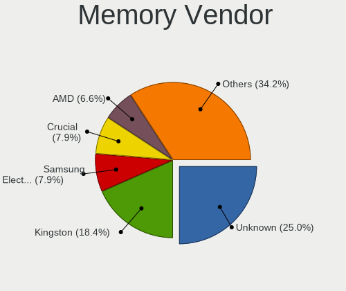

ROSA Hardware Trends (Desktops)
-------------------------------

A project to identify most popular hardware characteristics and track their change
over time based on data collected by ROSA users at https://Linux-Hardware.org.

Anyone can contribute to this report by the [hw-probe](https://github.com/linuxhw/hw-probe) tool:

    sudo -E hw-probe -all -upload

Full-feature report is available here: https://linux-hardware.org/?view=trends

Period: Nov, 2021.

Contents
--------

* [ System ](#system)
  - [ OS                       ](#os)
  - [ OS Family                ](#os-family)
  - [ Kernel                   ](#kernel)
  - [ Kernel Family            ](#kernel-family)
  - [ Kernel Major Ver.        ](#kernel-major-ver)
  - [ Arch                     ](#arch)
  - [ DE                       ](#de)
  - [ Display Server           ](#display-server)
  - [ Display Manager          ](#display-manager)
  - [ OS Lang                  ](#os-lang)
  - [ Boot Mode                ](#boot-mode)
  - [ Filesystem               ](#filesystem)
  - [ Part. scheme             ](#part-scheme)
  - [ Dual Boot with Linux/BSD ](#dual-boot-with-linuxbsd)
  - [ Dual Boot (Win)          ](#dual-boot-win)

* [ Board ](#board)
  - [ Vendor                   ](#vendor)
  - [ Model                    ](#model)
  - [ Model Family             ](#model-family)
  - [ MFG Year                 ](#mfg-year)
  - [ Form Factor              ](#form-factor)
  - [ Secure Boot              ](#secure-boot)
  - [ Coreboot                 ](#coreboot)
  - [ RAM Size                 ](#ram-size)
  - [ RAM Used                 ](#ram-used)
  - [ Total Drives             ](#total-drives)
  - [ Has CD-ROM               ](#has-cd-rom)
  - [ Has Ethernet             ](#has-ethernet)
  - [ Has WiFi                 ](#has-wifi)
  - [ Has Bluetooth            ](#has-bluetooth)

* [ Location ](#location)
  - [ Country                  ](#country)
  - [ City                     ](#city)

* [ Drives ](#drives)
  - [ Drive Vendor             ](#drive-vendor)
  - [ Drive Model              ](#drive-model)
  - [ HDD Vendor               ](#hdd-vendor)
  - [ SSD Vendor               ](#ssd-vendor)
  - [ Drive Kind               ](#drive-kind)
  - [ Drive Connector          ](#drive-connector)
  - [ Drive Size               ](#drive-size)
  - [ Space Total              ](#space-total)
  - [ Space Used               ](#space-used)
  - [ Malfunc. Drives          ](#malfunc-drives)
  - [ Malfunc. Drive Vendor    ](#malfunc-drive-vendor)
  - [ Malfunc. HDD Vendor      ](#malfunc-hdd-vendor)
  - [ Malfunc. Drive Kind      ](#malfunc-drive-kind)
  - [ Failed Drives            ](#failed-drives)
  - [ Failed Drive Vendor      ](#failed-drive-vendor)
  - [ Drive Status             ](#drive-status)

* [ Storage controller ](#storage-controller)
  - [ Storage Vendor           ](#storage-vendor)
  - [ Storage Model            ](#storage-model)
  - [ Storage Kind             ](#storage-kind)

* [ Processor ](#processor)
  - [ CPU Vendor               ](#cpu-vendor)
  - [ CPU Model                ](#cpu-model)
  - [ CPU Model Family         ](#cpu-model-family)
  - [ CPU Cores                ](#cpu-cores)
  - [ CPU Sockets              ](#cpu-sockets)
  - [ CPU Threads              ](#cpu-threads)
  - [ CPU Op-Modes             ](#cpu-op-modes)
  - [ CPU Microcode            ](#cpu-microcode)
  - [ CPU Microarch            ](#cpu-microarch)

* [ Graphics ](#graphics)
  - [ GPU Vendor               ](#gpu-vendor)
  - [ GPU Model                ](#gpu-model)
  - [ GPU Combo                ](#gpu-combo)
  - [ GPU Driver               ](#gpu-driver)
  - [ GPU Memory               ](#gpu-memory)

* [ Monitor ](#monitor)
  - [ Monitor Vendor           ](#monitor-vendor)
  - [ Monitor Model            ](#monitor-model)
  - [ Monitor Resolution       ](#monitor-resolution)
  - [ Monitor Diagonal         ](#monitor-diagonal)
  - [ Monitor Width            ](#monitor-width)
  - [ Aspect Ratio             ](#aspect-ratio)
  - [ Monitor Area             ](#monitor-area)
  - [ Pixel Density            ](#pixel-density)
  - [ Multiple Monitors        ](#multiple-monitors)

* [ Network ](#network)
  - [ Net Controller Vendor    ](#net-controller-vendor)
  - [ Net Controller Model     ](#net-controller-model)
  - [ Wireless Vendor          ](#wireless-vendor)
  - [ Wireless Model           ](#wireless-model)
  - [ Ethernet Vendor          ](#ethernet-vendor)
  - [ Ethernet Model           ](#ethernet-model)
  - [ Net Controller Kind      ](#net-controller-kind)
  - [ Used Controller          ](#used-controller)
  - [ NICs                     ](#nics)
  - [ IPv6                     ](#ipv6)

* [ Bluetooth ](#bluetooth)
  - [ Bluetooth Vendor         ](#bluetooth-vendor)
  - [ Bluetooth Model          ](#bluetooth-model)

* [ Sound ](#sound)
  - [ Sound Vendor             ](#sound-vendor)
  - [ Sound Model              ](#sound-model)

* [ Memory ](#memory)
  - [ Memory Vendor            ](#memory-vendor)
  - [ Memory Model             ](#memory-model)
  - [ Memory Kind              ](#memory-kind)
  - [ Memory Form Factor       ](#memory-form-factor)
  - [ Memory Size              ](#memory-size)
  - [ Memory Speed             ](#memory-speed)

* [ Printers & scanners ](#printers--scanners)
  - [ Printer Vendor           ](#printer-vendor)
  - [ Printer Model            ](#printer-model)
  - [ Scanner Vendor           ](#scanner-vendor)
  - [ Scanner Model            ](#scanner-model)

* [ Camera ](#camera)
  - [ Camera Vendor            ](#camera-vendor)
  - [ Camera Model             ](#camera-model)

* [ Security ](#security)
  - [ Fingerprint Vendor       ](#fingerprint-vendor)
  - [ Fingerprint Model        ](#fingerprint-model)
  - [ Chipcard Vendor          ](#chipcard-vendor)
  - [ Chipcard Model           ](#chipcard-model)

* [ Unsupported ](#unsupported)
  - [ Unsupported Devices      ](#unsupported-devices)
  - [ Unsupported Device Types ](#unsupported-device-types)

System
------

OS
--

Installed operating systems

| Name       | Desktops | Percent |
|------------|----------|---------|
| ROSA R11.1 | 37       | 38.54%  |
| ROSA 12    | 31       | 32.29%  |
| ROSA 12.1  | 27       | 28.13%  |
| ROSA R11   | 1        | 1.04%   |

OS Family
---------

OS without a version

| Name | Desktops | Percent |
|------|----------|---------|
| ROSA | 96       | 100%    |

Kernel
------

Version of the Linux kernel

| Version                             | Desktops | Percent |
|-------------------------------------|----------|---------|
| 5.10.74-generic-2rosa2021.1-x86_64  | 30       | 31.25%  |
| 5.10.71-generic-1rosa2021.1-x86_64  | 28       | 29.17%  |
| 5.4.83-generic-2rosa-x86_64         | 12       | 12.5%   |
| 4.15.0-desktop-122.124.1rosa-x86_64 | 7        | 7.29%   |
| 5.4.32-generic-2rosa-i586           | 5        | 5.21%   |
| 5.4.83-generic-2rosa-i586           | 3        | 3.13%   |
| 5.5.19-generic-1rosa-x86_64         | 2        | 2.08%   |
| 4.9.155-nrj-desktop-1rosa-i586      | 2        | 2.08%   |
| 4.15.0-desktop-122.124.1rosa-i586   | 2        | 2.08%   |
| 5.4.32-generic-2rosa-x86_64         | 1        | 1.04%   |
| 5.4.112-nrj-desktop-1rosa-x86_64    | 1        | 1.04%   |
| 5.10.50-generic-1rosa-x86_64        | 1        | 1.04%   |
| 4.9.155-nrj-desktop-1rosa-x86_64    | 1        | 1.04%   |
| 4.15.0-desktop-45.1rosa-x86_64      | 1        | 1.04%   |

Kernel Family
-------------

Linux kernel without a distro release

| Version | Desktops | Percent |
|---------|----------|---------|
| 5.10.74 | 30       | 31.25%  |
| 5.10.71 | 28       | 29.17%  |
| 5.4.83  | 15       | 15.63%  |
| 4.15.0  | 10       | 10.42%  |
| 5.4.32  | 6        | 6.25%   |
| 4.9.155 | 3        | 3.13%   |
| 5.5.19  | 2        | 2.08%   |
| 5.4.112 | 1        | 1.04%   |
| 5.10.50 | 1        | 1.04%   |

Kernel Major Ver.
-----------------

Linux kernel major version

| Version | Desktops | Percent |
|---------|----------|---------|
| 5.10    | 59       | 61.46%  |
| 5.4     | 22       | 22.92%  |
| 4.15    | 10       | 10.42%  |
| 4.9     | 3        | 3.13%   |
| 5.5     | 2        | 2.08%   |

Arch
----

OS architecture (x86_64, i586, etc.)

| Name   | Desktops | Percent |
|--------|----------|---------|
| x86_64 | 84       | 87.5%   |
| i686   | 12       | 12.5%   |

DE
--

Desktop Environment

| Name  | Desktops | Percent |
|-------|----------|---------|
| KDE5  | 58       | 60.42%  |
| KDE4  | 27       | 28.13%  |
| LXQt  | 5        | 5.21%   |
| GNOME | 4        | 4.17%   |
| XFCE  | 2        | 2.08%   |

Display Server
--------------

X11 or Wayland

| Name    | Desktops | Percent |
|---------|----------|---------|
| Wayland | 55       | 57.29%  |
| X11     | 41       | 42.71%  |

Display Manager
---------------

SDDM, LightDM, etc.

| Name | Desktops | Percent |
|------|----------|---------|
| GDM  | 56       | 58.33%  |
| KDM  | 27       | 28.13%  |
| SDDM | 13       | 13.54%  |

OS Lang
-------

Language

| Lang    | Desktops | Percent |
|---------|----------|---------|
| ru_RU   | 81       | 84.38%  |
| en_US   | 4        | 4.17%   |
| pt_BR   | 2        | 2.08%   |
| fr_FR   | 2        | 2.08%   |
| en_GB   | 2        | 2.08%   |
| ru_UA   | 1        | 1.04%   |
| es_ES   | 1        | 1.04%   |
| de_DE   | 1        | 1.04%   |
| C       | 1        | 1.04%   |
| Unknown | 1        | 1.04%   |

Boot Mode
---------

EFI or BIOS

| Mode | Desktops | Percent |
|------|----------|---------|
| BIOS | 69       | 71.88%  |
| EFI  | 27       | 28.13%  |

Filesystem
----------

Type of filesystem

| Type  | Desktops | Percent |
|-------|----------|---------|
| Ext4  | 90       | 93.75%  |
| Ext2  | 2        | 2.08%   |
| Btrfs | 2        | 2.08%   |
| F2fs  | 1        | 1.04%   |
| Ext3  | 1        | 1.04%   |

Part. scheme
------------

Scheme of partitioning

| Type | Desktops | Percent |
|------|----------|---------|
| MBR  | 56       | 58.33%  |
| GPT  | 40       | 41.67%  |

Dual Boot with Linux/BSD
------------------------

Hosting more than one Linux/BSD

| Dual boot | Desktops | Percent |
|-----------|----------|---------|
| No        | 69       | 71.88%  |
| Yes       | 27       | 28.13%  |

Dual Boot (Win)
---------------

Hosting Linux and Windows

| Dual boot | Desktops | Percent |
|-----------|----------|---------|
| No        | 57       | 59.38%  |
| Yes       | 39       | 40.63%  |

Board
-----

Vendor
------

Motherboard manufacturer

| Name                | Desktops | Percent |
|---------------------|----------|---------|
| ASUSTek Computer    | 41       | 42.71%  |
| Gigabyte Technology | 20       | 20.83%  |
| MSI                 | 11       | 11.46%  |
| ASRock              | 10       | 10.42%  |
| Hewlett-Packard     | 3        | 3.13%   |
| Supermicro          | 1        | 1.04%   |
| OEM                 | 1        | 1.04%   |
| Lenovo              | 1        | 1.04%   |
| IBM                 | 1        | 1.04%   |
| Huanan              | 1        | 1.04%   |
| Google              | 1        | 1.04%   |
| Fujitsu Siemens     | 1        | 1.04%   |
| Foxconn             | 1        | 1.04%   |
| ECS                 | 1        | 1.04%   |
| Acer                | 1        | 1.04%   |
| Unknown             | 1        | 1.04%   |

Model
-----

Motherboard model

| Name                                 | Desktops | Percent |
|--------------------------------------|----------|---------|
| Gigabyte H81M-S1                     | 2        | 2.08%   |
| Gigabyte 970A-DS3P                   | 2        | 2.08%   |
| ASUS M5A78L-M LX3                    | 2        | 2.08%   |
| ASUS M2N                             | 2        | 2.08%   |
| ASUS All Series                      | 2        | 2.08%   |
| ASRock G31M-S                        | 2        | 2.08%   |
| Supermicro X9SCL/X9SCM               | 1        | 1.04%   |
| OEM Intel H81                        | 1        | 1.04%   |
| MSI MS-7B36                          | 1        | 1.04%   |
| MSI MS-7A36                          | 1        | 1.04%   |
| MSI MS-7885                          | 1        | 1.04%   |
| MSI MS-7816                          | 1        | 1.04%   |
| MSI MS-7758                          | 1        | 1.04%   |
| MSI MS-7597                          | 1        | 1.04%   |
| MSI MS-7596                          | 1        | 1.04%   |
| MSI MS-7592                          | 1        | 1.04%   |
| MSI MS-7529                          | 1        | 1.04%   |
| MSI MS-7367                          | 1        | 1.04%   |
| MSI MS-7238                          | 1        | 1.04%   |
| Lenovo ThinkCentre M93z 10AES02G00   | 1        | 1.04%   |
| IBM 9210D7G                          | 1        | 1.04%   |
| Huanan X99 F8D V2.2                  | 1        | 1.04%   |
| HP Pavilion Desktop PC 570-p0xx      | 1        | 1.04%   |
| HP Compaq 4000 Pro SFF PC            | 1        | 1.04%   |
| HP 290 G1 MT                         | 1        | 1.04%   |
| Google Panther                       | 1        | 1.04%   |
| Gigabyte Z170-HD3P-CF                | 1        | 1.04%   |
| Gigabyte J1800N-D2H                  | 1        | 1.04%   |
| Gigabyte H81-D3                      | 1        | 1.04%   |
| Gigabyte H77N-WIFI                   | 1        | 1.04%   |
| Gigabyte H77-DS3H                    | 1        | 1.04%   |
| Gigabyte H61M-S1                     | 1        | 1.04%   |
| Gigabyte H410M H V3                  | 1        | 1.04%   |
| Gigabyte GA-MA78GM-UD2H              | 1        | 1.04%   |
| Gigabyte F2A88X-D3HP                 | 1        | 1.04%   |
| Gigabyte F2A55-DS3                   | 1        | 1.04%   |
| Gigabyte EP45-DS3L                   | 1        | 1.04%   |
| Gigabyte B75M-D2V                    | 1        | 1.04%   |
| Gigabyte B560 HD3                    | 1        | 1.04%   |
| Gigabyte B450M DS3H                  | 1        | 1.04%   |
| Gigabyte B365M DS3H                  | 1        | 1.04%   |
| Gigabyte A320M-H                     | 1        | 1.04%   |
| Fujitsu Siemens SCENIC P / SCENICO P | 1        | 1.04%   |
| Foxconn GEG                          | 1        | 1.04%   |
| ECS G31T-M7                          | 1        | 1.04%   |
| ASUS Z170 PRO GAMING                 | 1        | 1.04%   |
| ASUS TUF GAMING B550-PLUS            | 1        | 1.04%   |
| ASUS PRIME H310M-R R2.0              | 1        | 1.04%   |
| ASUS PRIME B250-PLUS                 | 1        | 1.04%   |
| ASUS P8Z77-V PRO                     | 1        | 1.04%   |
| ASUS P8H67                           | 1        | 1.04%   |
| ASUS P8H61-M LX2                     | 1        | 1.04%   |
| ASUS P5WD2                           | 1        | 1.04%   |
| ASUS P5Q PRO TURBO                   | 1        | 1.04%   |
| ASUS P5LD2-X                         | 1        | 1.04%   |
| ASUS P5L1394                         | 1        | 1.04%   |
| ASUS P5L-VM 1394                     | 1        | 1.04%   |
| ASUS P5L-MX                          | 1        | 1.04%   |
| ASUS P5KPL/1600                      | 1        | 1.04%   |
| ASUS P5KPL-AM-CKD-VISUM-SI           | 1        | 1.04%   |

Model Family
------------

Motherboard model prefix

| Name                    | Desktops | Percent |
|-------------------------|----------|---------|
| ASUS M5A97              | 3        | 3.13%   |
| ASUS M5A78L-M           | 3        | 3.13%   |
| Gigabyte H81M-S1        | 2        | 2.08%   |
| Gigabyte 970A-DS3P      | 2        | 2.08%   |
| ASUS PRIME              | 2        | 2.08%   |
| ASUS P5KPL              | 2        | 2.08%   |
| ASUS P5G41T-M           | 2        | 2.08%   |
| ASUS M2N                | 2        | 2.08%   |
| ASUS All                | 2        | 2.08%   |
| ASRock G31M-S           | 2        | 2.08%   |
| Supermicro X9SCL        | 1        | 1.04%   |
| OEM Intel               | 1        | 1.04%   |
| MSI MS-7B36             | 1        | 1.04%   |
| MSI MS-7A36             | 1        | 1.04%   |
| MSI MS-7885             | 1        | 1.04%   |
| MSI MS-7816             | 1        | 1.04%   |
| MSI MS-7758             | 1        | 1.04%   |
| MSI MS-7597             | 1        | 1.04%   |
| MSI MS-7596             | 1        | 1.04%   |
| MSI MS-7592             | 1        | 1.04%   |
| MSI MS-7529             | 1        | 1.04%   |
| MSI MS-7367             | 1        | 1.04%   |
| MSI MS-7238             | 1        | 1.04%   |
| Lenovo ThinkCentre      | 1        | 1.04%   |
| IBM 9210D7G             | 1        | 1.04%   |
| Huanan X99              | 1        | 1.04%   |
| HP Pavilion             | 1        | 1.04%   |
| HP Compaq               | 1        | 1.04%   |
| HP 290                  | 1        | 1.04%   |
| Google Panther          | 1        | 1.04%   |
| Gigabyte Z170-HD3P-CF   | 1        | 1.04%   |
| Gigabyte J1800N-D2H     | 1        | 1.04%   |
| Gigabyte H81-D3         | 1        | 1.04%   |
| Gigabyte H77N-WIFI      | 1        | 1.04%   |
| Gigabyte H77-DS3H       | 1        | 1.04%   |
| Gigabyte H61M-S1        | 1        | 1.04%   |
| Gigabyte H410M          | 1        | 1.04%   |
| Gigabyte GA-MA78GM-UD2H | 1        | 1.04%   |
| Gigabyte F2A88X-D3HP    | 1        | 1.04%   |
| Gigabyte F2A55-DS3      | 1        | 1.04%   |
| Gigabyte EP45-DS3L      | 1        | 1.04%   |
| Gigabyte B75M-D2V       | 1        | 1.04%   |
| Gigabyte B560           | 1        | 1.04%   |
| Gigabyte B450M          | 1        | 1.04%   |
| Gigabyte B365M          | 1        | 1.04%   |
| Gigabyte A320M-H        | 1        | 1.04%   |
| Fujitsu Siemens SCENIC  | 1        | 1.04%   |
| Foxconn GEG             | 1        | 1.04%   |
| ECS G31T-M7             | 1        | 1.04%   |
| ASUS Z170               | 1        | 1.04%   |
| ASUS TUF                | 1        | 1.04%   |
| ASUS P8Z77-V            | 1        | 1.04%   |
| ASUS P8H67              | 1        | 1.04%   |
| ASUS P8H61-M            | 1        | 1.04%   |
| ASUS P5WD2              | 1        | 1.04%   |
| ASUS P5Q                | 1        | 1.04%   |
| ASUS P5LD2-X            | 1        | 1.04%   |
| ASUS P5L1394            | 1        | 1.04%   |
| ASUS P5L-VM             | 1        | 1.04%   |
| ASUS P5L-MX             | 1        | 1.04%   |

MFG Year
--------

Motherboard manufacture year

| Year | Desktops | Percent |
|------|----------|---------|
| 2013 | 10       | 10.42%  |
| 2010 | 10       | 10.42%  |
| 2009 | 8        | 8.33%   |
| 2021 | 7        | 7.29%   |
| 2016 | 7        | 7.29%   |
| 2015 | 7        | 7.29%   |
| 2007 | 7        | 7.29%   |
| 2012 | 6        | 6.25%   |
| 2019 | 5        | 5.21%   |
| 2017 | 5        | 5.21%   |
| 2014 | 5        | 5.21%   |
| 2011 | 4        | 4.17%   |
| 2008 | 4        | 4.17%   |
| 2020 | 3        | 3.13%   |
| 2018 | 3        | 3.13%   |
| 2006 | 3        | 3.13%   |
| 2005 | 1        | 1.04%   |
| 2004 | 1        | 1.04%   |

Form Factor
-----------

Physical design of the computer

| Name    | Desktops | Percent |
|---------|----------|---------|
| Desktop | 96       | 100%    |

Secure Boot
-----------

Enabled or disabled

| State    | Desktops | Percent |
|----------|----------|---------|
| Disabled | 96       | 100%    |

Coreboot
--------

Have coreboot on board

| Used | Desktops | Percent |
|------|----------|---------|
| No   | 95       | 98.96%  |
| Yes  | 1        | 1.04%   |

RAM Size
--------

Total RAM memory

| Size in GB  | Desktops | Percent |
|-------------|----------|---------|
| 3.01-4.0    | 27       | 28.13%  |
| 8.01-16.0   | 20       | 20.83%  |
| 4.01-8.0    | 19       | 19.79%  |
| 16.01-24.0  | 15       | 15.63%  |
| 1.01-2.0    | 6        | 6.25%   |
| 32.01-64.0  | 4        | 4.17%   |
| 2.01-3.0    | 4        | 4.17%   |
| 64.01-256.0 | 1        | 1.04%   |

RAM Used
--------

Used RAM memory

| Used GB  | Desktops | Percent |
|----------|----------|---------|
| 1.01-2.0 | 42       | 43.75%  |
| 0.51-1.0 | 42       | 43.75%  |
| 4.01-8.0 | 6        | 6.25%   |
| 3.01-4.0 | 4        | 4.17%   |
| 2.01-3.0 | 2        | 2.08%   |

Total Drives
------------

Number of drives on board

| Drives | Desktops | Percent |
|--------|----------|---------|
| 1      | 49       | 51.04%  |
| 2      | 25       | 26.04%  |
| 3      | 12       | 12.5%   |
| 4      | 9        | 9.38%   |
| 5      | 1        | 1.04%   |

Has CD-ROM
----------

Has CD-ROM on board

| Presented | Desktops | Percent |
|-----------|----------|---------|
| Yes       | 58       | 60.42%  |
| No        | 38       | 39.58%  |

Has Ethernet
------------

Has Ethernet on board

| Presented | Desktops | Percent |
|-----------|----------|---------|
| Yes       | 94       | 97.92%  |
| No        | 2        | 2.08%   |

Has WiFi
--------

Has WiFi module

| Presented | Desktops | Percent |
|-----------|----------|---------|
| No        | 61       | 63.54%  |
| Yes       | 35       | 36.46%  |

Has Bluetooth
-------------

Has Bluetooth module

| Presented | Desktops | Percent |
|-----------|----------|---------|
| No        | 82       | 85.42%  |
| Yes       | 14       | 14.58%  |

Location
--------

Country
-------

Geographic location (country)

| Country   | Desktops | Percent |
|-----------|----------|---------|
| Russia    | 74       | 77.08%  |
| Ukraine   | 7        | 7.29%   |
| USA       | 3        | 3.13%   |
| France    | 2        | 2.08%   |
| Brazil    | 2        | 2.08%   |
| UK        | 1        | 1.04%   |
| Hungary   | 1        | 1.04%   |
| Germany   | 1        | 1.04%   |
| China     | 1        | 1.04%   |
| Canada    | 1        | 1.04%   |
| Belarus   | 1        | 1.04%   |
| Austria   | 1        | 1.04%   |
| Argentina | 1        | 1.04%   |

City
----

Geographic location (city)

| City                        | Desktops | Percent |
|-----------------------------|----------|---------|
| Moscow                      | 16       | 16.67%  |
| St Petersburg               | 8        | 8.33%   |
| Samara                      | 5        | 5.21%   |
| Novosibirsk                 | 3        | 3.13%   |
| Kazan?ˆ™                    | 3        | 3.13%   |
| Yekaterinburg               | 2        | 2.08%   |
| Tomsk                       | 2        | 2.08%   |
| Severodvinsk                | 2        | 2.08%   |
| Les Vans                    | 2        | 2.08%   |
| Khabarovsk                  | 2        | 2.08%   |
| Cherepovets                 | 2        | 2.08%   |
| Chelyabinsk                 | 2        | 2.08%   |
| Zaporizhzhia                | 1        | 1.04%   |
| Yaroslavl                   | 1        | 1.04%   |
| Xi'an                       | 1        | 1.04%   |
| Volgodonsk                  | 1        | 1.04%   |
| Ukhta                       | 1        | 1.04%   |
| Ufa                         | 1        | 1.04%   |
| Tolyatti                    | 1        | 1.04%   |
| Syktyvkar                   | 1        | 1.04%   |
| Streatham                   | 1        | 1.04%   |
| Stavropol                   | 1        | 1.04%   |
| Sovetsk                     | 1        | 1.04%   |
| Sloviansk                   | 1        | 1.04%   |
| Shilovo                     | 1        | 1.04%   |
| Shchyolkino                 | 1        | 1.04%   |
| Saratov                     | 1        | 1.04%   |
| Sarapul                     | 1        | 1.04%   |
| Saransk                     | 1        | 1.04%   |
| Rostov-on-Don               | 1        | 1.04%   |
| Posto Fiscal Rolim de Moura | 1        | 1.04%   |
| Pisochyn                    | 1        | 1.04%   |
| Perm                        | 1        | 1.04%   |
| Oryol                       | 1        | 1.04%   |
| Orenburg                    | 1        | 1.04%   |
| Nizhny Tagil                | 1        | 1.04%   |
| Newark                      | 1        | 1.04%   |
| Murmansk                    | 1        | 1.04%   |
| Mazyr                       | 1        | 1.04%   |
| Loewenstein                 | 1        | 1.04%   |
| Kurgan                      | 1        | 1.04%   |
| Kostroma                    | 1        | 1.04%   |
| Kopeysk                     | 1        | 1.04%   |
| Irkutsk                     | 1        | 1.04%   |
| Innsbruck                   | 1        | 1.04%   |
| Gatchina                    | 1        | 1.04%   |
| Enterprise                  | 1        | 1.04%   |
| Dzerzhinskiy                | 1        | 1.04%   |
| Donetsk                     | 1        | 1.04%   |
| Dmytrivka                   | 1        | 1.04%   |
| Delegyhaza                  | 1        | 1.04%   |
| Chesapeake                  | 1        | 1.04%   |
| Bugul'ma                    | 1        | 1.04%   |
| Buenos Aires                | 1        | 1.04%   |
| Bryanka                     | 1        | 1.04%   |
| Bras?­lia                   | 1        | 1.04%   |
| Belgorod                    | 1        | 1.04%   |
| Asino                       | 1        | 1.04%   |
| Airdrie                     | 1        | 1.04%   |

Drives
------

Drive Vendor
------------

Hard drive vendors

| Vendor              | Desktops | Drives | Percent |
|---------------------|----------|--------|---------|
| WDC                 | 37       | 41     | 23.13%  |
| Seagate             | 37       | 43     | 23.13%  |
| Samsung Electronics | 18       | 22     | 11.25%  |
| Kingston            | 14       | 15     | 8.75%   |
| Toshiba             | 11       | 12     | 6.88%   |
| Hitachi             | 4        | 4      | 2.5%    |
| Intel               | 3        | 3      | 1.88%   |
| HGST                | 3        | 3      | 1.88%   |
| China               | 3        | 3      | 1.88%   |
| Apacer              | 3        | 3      | 1.88%   |
| SanDisk             | 2        | 2      | 1.25%   |
| PLEXTOR             | 2        | 2      | 1.25%   |
| MAXTOR              | 2        | 2      | 1.25%   |
| GOODRAM             | 2        | 2      | 1.25%   |
| Crucial             | 2        | 2      | 1.25%   |
| XPG                 | 1        | 1      | 0.63%   |
| Unknown             | 1        | 1      | 0.63%   |
| Transcend           | 1        | 1      | 0.63%   |
| SPCC                | 1        | 1      | 0.63%   |
| Smartbuy            | 1        | 1      | 0.63%   |
| Silicon Motion      | 1        | 1      | 0.63%   |
| Patriot             | 1        | 1      | 0.63%   |
| Palit               | 1        | 1      | 0.63%   |
| OCZ                 | 1        | 1      | 0.63%   |
| NGFF                | 1        | 1      | 0.63%   |
| Netac               | 1        | 1      | 0.63%   |
| NE-1TB              | 1        | 1      | 0.63%   |
| LONDISK             | 1        | 1      | 0.63%   |
| Kingmax             | 1        | 1      | 0.63%   |
| e2e4                | 1        | 1      | 0.63%   |
| CHN25SATAS1         | 1        | 2      | 0.63%   |
| AMD                 | 1        | 1      | 0.63%   |

Drive Model
-----------

Hard drive models

| Model                            | Desktops | Percent |
|----------------------------------|----------|---------|
| Toshiba DT01ACA050 500GB         | 4        | 2.34%   |
| Kingston SV300S37A120G 120GB SSD | 4        | 2.34%   |
| Kingston SA400S37120G 120GB SSD  | 4        | 2.34%   |
| WDC WD5000AAKX-001CA0 500GB      | 3        | 1.75%   |
| Seagate ST4000DM004-2CV104 4TB   | 3        | 1.75%   |
| Seagate ST380815AS 80GB          | 3        | 1.75%   |
| Seagate ST3250310AS 250GB        | 3        | 1.75%   |
| WDC WDS250G2B0A-00SM50 250GB SSD | 2        | 1.17%   |
| WDC WD5001AALS-00L3B2 500GB      | 2        | 1.17%   |
| WDC WD5000AAKX-08U6AA0 500GB     | 2        | 1.17%   |
| WDC WD20EZRX-00DC0B0 2TB         | 2        | 1.17%   |
| WDC WD10EZEX-00BBHA0 1TB         | 2        | 1.17%   |
| WDC WD10EALX-009BA0 1TB          | 2        | 1.17%   |
| Toshiba HDWD110 1TB              | 2        | 1.17%   |
| Toshiba DT01ACA100 1TB           | 2        | 1.17%   |
| Seagate ST500DM002-1BD142 500GB  | 2        | 1.17%   |
| Seagate ST3320620AS 320GB        | 2        | 1.17%   |
| Seagate ST2000DM001-1ER164 2TB   | 2        | 1.17%   |
| Seagate ST1000DM003-9YN162 1TB   | 2        | 1.17%   |
| Samsung SSD 970 EVO Plus 250GB   | 2        | 1.17%   |
| Samsung SSD 860 EVO 250GB        | 2        | 1.17%   |
| Samsung SSD 850 EVO 120GB        | 2        | 1.17%   |
| Kingston SA400S37240G 240GB SSD  | 2        | 1.17%   |
| Crucial CT240BX500SSD1 240GB     | 2        | 1.17%   |
| Apacer AS350 128GB SSD           | 2        | 1.17%   |
| XPG GAMMIX S11 Pro 1TB           | 1        | 0.58%   |
| WDC WDS500G2B0A-00SM50 500GB SSD | 1        | 0.58%   |
| WDC WDS240G2G0B-00EPW0 240GB SSD | 1        | 0.58%   |
| WDC WDS240G2G0A-00JH30 240GB SSD | 1        | 0.58%   |
| WDC WDS120G2G0A-00JH30 120GB SSD | 1        | 0.58%   |
| WDC WD800JD-08MSA1 80GB          | 1        | 0.58%   |
| WDC WD800BB-60JKA0 80GB          | 1        | 0.58%   |
| WDC WD6400AADS-00M2B0 640GB      | 1        | 0.58%   |
| WDC WD5002ABYS-01B1B0 500GB      | 1        | 0.58%   |
| WDC WD5000AAKX-083CA1 500GB      | 1        | 0.58%   |
| WDC WD5000AAKS-08V0A0 500GB      | 1        | 0.58%   |
| WDC WD40PURZ-85TTDY0 4TB         | 1        | 0.58%   |
| WDC WD40EFRX-68WT0N0 4TB         | 1        | 0.58%   |
| WDC WD4003FRYZ-01F0DB0 4TB       | 1        | 0.58%   |
| WDC WD30EZRX-00DC0B0 3TB         | 1        | 0.58%   |
| WDC WD2500AAKX-603CA0 250GB      | 1        | 0.58%   |
| WDC WD2500AAKX-00ERMA0 250GB     | 1        | 0.58%   |
| WDC WD20EFRX-68EUZN0 2TB         | 1        | 0.58%   |
| WDC WD1600AAJS-22PSA0 160GB      | 1        | 0.58%   |
| WDC WD1600AAJB-00PVA0 160GB      | 1        | 0.58%   |
| WDC WD1200JB-00REA0 120GB        | 1        | 0.58%   |
| WDC WD10JPVX-60JC3T1 1TB         | 1        | 0.58%   |
| WDC WD10EZEX-60WN4A0 1TB         | 1        | 0.58%   |
| WDC WD10EZEX-21M2NA0 1TB         | 1        | 0.58%   |
| WDC WD10EZEX-00BN5A0 1TB         | 1        | 0.58%   |
| WDC WD1003FBYX-01Y7B1 1TB        | 1        | 0.58%   |
| Unknown SD/MMC/MS PRO 394GB      | 1        | 0.58%   |
| Transcend TS128GSSD370S 128GB    | 1        | 0.58%   |
| Toshiba TR200 480GB SSD          | 1        | 0.58%   |
| Toshiba HDWD220 2TB              | 1        | 0.58%   |
| Toshiba DT01ACA200 2TB           | 1        | 0.58%   |
| SPCC Solid State Disk 128GB      | 1        | 0.58%   |
| Smartbuy SSD 120GB               | 1        | 0.58%   |
| Silicon Motion R5MP120G8 120GB   | 1        | 0.58%   |
| Seagate ST500DM009-2F110A 500GB  | 1        | 0.58%   |

HDD Vendor
----------

Hard disk drive vendors

| Vendor              | Desktops | Drives | Percent |
|---------------------|----------|--------|---------|
| Seagate             | 37       | 43     | 38.54%  |
| WDC                 | 32       | 34     | 33.33%  |
| Toshiba             | 10       | 11     | 10.42%  |
| Samsung Electronics | 7        | 8      | 7.29%   |
| Hitachi             | 4        | 4      | 4.17%   |
| HGST                | 3        | 3      | 3.13%   |
| MAXTOR              | 2        | 2      | 2.08%   |
| Unknown             | 1        | 1      | 1.04%   |

SSD Vendor
----------

Solid state drive vendors

| Vendor              | Desktops | Drives | Percent |
|---------------------|----------|--------|---------|
| Kingston            | 13       | 14     | 23.21%  |
| Samsung Electronics | 7        | 10     | 12.5%   |
| WDC                 | 6        | 7      | 10.71%  |
| China               | 3        | 3      | 5.36%   |
| Apacer              | 3        | 3      | 5.36%   |
| SanDisk             | 2        | 2      | 3.57%   |
| PLEXTOR             | 2        | 2      | 3.57%   |
| Intel               | 2        | 2      | 3.57%   |
| GOODRAM             | 2        | 2      | 3.57%   |
| Crucial             | 2        | 2      | 3.57%   |
| Transcend           | 1        | 1      | 1.79%   |
| Toshiba             | 1        | 1      | 1.79%   |
| SPCC                | 1        | 1      | 1.79%   |
| Smartbuy            | 1        | 1      | 1.79%   |
| Patriot             | 1        | 1      | 1.79%   |
| Palit               | 1        | 1      | 1.79%   |
| OCZ                 | 1        | 1      | 1.79%   |
| NGFF                | 1        | 1      | 1.79%   |
| Netac               | 1        | 1      | 1.79%   |
| LONDISK             | 1        | 1      | 1.79%   |
| Kingmax             | 1        | 1      | 1.79%   |
| e2e4                | 1        | 1      | 1.79%   |
| CHN25SATAS1         | 1        | 2      | 1.79%   |
| AMD                 | 1        | 1      | 1.79%   |

Drive Kind
----------

HDD or SSD

| Kind    | Desktops | Drives | Percent |
|---------|----------|--------|---------|
| HDD     | 80       | 106    | 59.26%  |
| SSD     | 46       | 62     | 34.07%  |
| NVMe    | 8        | 8      | 5.93%   |
| Unknown | 1        | 1      | 0.74%   |

Drive Connector
---------------

SATA, SAS, NVMe, etc.

| Type | Desktops | Drives | Percent |
|------|----------|--------|---------|
| SATA | 96       | 165    | 88.89%  |
| NVMe | 8        | 8      | 7.41%   |
| SAS  | 4        | 4      | 3.7%    |

Drive Size
----------

Size of hard drive

| Size in TB | Desktops | Drives | Percent |
|------------|----------|--------|---------|
| 0.01-0.5   | 84       | 119    | 66.67%  |
| 0.51-1.0   | 24       | 29     | 19.05%  |
| 1.01-2.0   | 8        | 9      | 6.35%   |
| 3.01-4.0   | 6        | 7      | 4.76%   |
| 2.01-3.0   | 3        | 3      | 2.38%   |
| 4.01-10.0  | 1        | 1      | 0.79%   |

Space Total
-----------

Amount of disk space available on the file system

| Size in GB     | Desktops | Percent |
|----------------|----------|---------|
| 101-250        | 23       | 23.96%  |
| 251-500        | 20       | 20.83%  |
| 501-1000       | 16       | 16.67%  |
| 51-100         | 11       | 11.46%  |
| 21-50          | 9        | 9.38%   |
| 1-20           | 7        | 7.29%   |
| More than 3000 | 3        | 3.13%   |
| 2001-3000      | 3        | 3.13%   |
| 1001-2000      | 3        | 3.13%   |
| Unknown        | 1        | 1.04%   |

Space Used
----------

Amount of used disk space

| Used GB        | Desktops | Percent |
|----------------|----------|---------|
| 1-20           | 59       | 61.46%  |
| 101-250        | 10       | 10.42%  |
| 251-500        | 8        | 8.33%   |
| 21-50          | 7        | 7.29%   |
| 51-100         | 6        | 6.25%   |
| 1001-2000      | 3        | 3.13%   |
| More than 3000 | 1        | 1.04%   |
| 501-1000       | 1        | 1.04%   |
| Unknown        | 1        | 1.04%   |

Malfunc. Drives
---------------

Drive models with a malfunction

| Model                                 | Desktops | Drives | Percent |
|---------------------------------------|----------|--------|---------|
| Seagate ST3250310AS 250GB             | 3        | 3      | 9.09%   |
| WDC WD6400AADS-00M2B0 640GB           | 1        | 1      | 3.03%   |
| WDC WD5001AALS-00L3B2 500GB           | 1        | 1      | 3.03%   |
| WDC WD5000AAKX-08U6AA0 500GB          | 1        | 1      | 3.03%   |
| WDC WD5000AAKX-001CA0 500GB           | 1        | 1      | 3.03%   |
| WDC WD5000AAKS-08V0A0 500GB           | 1        | 1      | 3.03%   |
| WDC WD40EFRX-68WT0N0 4TB              | 1        | 1      | 3.03%   |
| WDC WD1600AAJB-00PVA0 160GB           | 1        | 1      | 3.03%   |
| WDC WD1200JB-00REA0 120GB             | 1        | 1      | 3.03%   |
| WDC WD10EALX-009BA0 1TB               | 1        | 1      | 3.03%   |
| WDC WD1003FBYX-01Y7B1 1TB             | 1        | 1      | 3.03%   |
| Seagate ST500DM002-1BD142 500GB       | 1        | 1      | 3.03%   |
| Seagate ST380215AS 80GB               | 1        | 1      | 3.03%   |
| Seagate ST3500412AS 500GB             | 1        | 1      | 3.03%   |
| Seagate ST340014A 40GB                | 1        | 1      | 3.03%   |
| Seagate ST3320620AS 320GB             | 1        | 1      | 3.03%   |
| Seagate ST3250318AS 250GB             | 1        | 1      | 3.03%   |
| Seagate ST3000VX010-2E3166 3TB        | 1        | 1      | 3.03%   |
| Seagate ST1000DM003-9YN162 1TB        | 1        | 1      | 3.03%   |
| Seagate ST1000DM003-1CH162 1TB        | 1        | 1      | 3.03%   |
| Samsung Electronics SSD 850 PRO 256GB | 1        | 1      | 3.03%   |
| Samsung Electronics SP2504C 250GB     | 1        | 1      | 3.03%   |
| Samsung Electronics HD080HJ 80GB      | 1        | 1      | 3.03%   |
| OCZ VERTEX3 120GB SSD                 | 1        | 1      | 3.03%   |
| MAXTOR STM3250310AS 250GB             | 1        | 1      | 3.03%   |
| MAXTOR 6E040L0 41GB                   | 1        | 1      | 3.03%   |
| Kingston SV300S37A60G 64GB SSD        | 1        | 1      | 3.03%   |
| Kingmax SSD 240GB                     | 1        | 1      | 3.03%   |
| Hitachi HDS721616PLA380 160GB         | 1        | 1      | 3.03%   |
| Hitachi HDP725025GLA380 250GB         | 1        | 1      | 3.03%   |
| HGST TOURO S 1TB                      | 1        | 1      | 3.03%   |

Malfunc. Drive Vendor
---------------------

Vendors of faulty drives

| Vendor              | Desktops | Drives | Percent |
|---------------------|----------|--------|---------|
| Seagate             | 12       | 12     | 36.36%  |
| WDC                 | 10       | 10     | 30.3%   |
| Samsung Electronics | 3        | 3      | 9.09%   |
| MAXTOR              | 2        | 2      | 6.06%   |
| Hitachi             | 2        | 2      | 6.06%   |
| OCZ                 | 1        | 1      | 3.03%   |
| Kingston            | 1        | 1      | 3.03%   |
| Kingmax             | 1        | 1      | 3.03%   |
| HGST                | 1        | 1      | 3.03%   |

Malfunc. HDD Vendor
-------------------

Vendors of faulty HDD drives

| Vendor              | Desktops | Drives | Percent |
|---------------------|----------|--------|---------|
| Seagate             | 12       | 12     | 41.38%  |
| WDC                 | 10       | 10     | 34.48%  |
| Samsung Electronics | 2        | 2      | 6.9%    |
| MAXTOR              | 2        | 2      | 6.9%    |
| Hitachi             | 2        | 2      | 6.9%    |
| HGST                | 1        | 1      | 3.45%   |

Malfunc. Drive Kind
-------------------

Kinds of faulty drives

| Kind | Desktops | Drives | Percent |
|------|----------|--------|---------|
| HDD  | 26       | 29     | 86.67%  |
| SSD  | 4        | 4      | 13.33%  |

Failed Drives
-------------

Failed drive models

| Model                             | Desktops | Drives | Percent |
|-----------------------------------|----------|--------|---------|
| Seagate ST31000524AS 1TB          | 1        | 1      | 50%     |
| Samsung Electronics HD252HJ 250GB | 1        | 1      | 50%     |

Failed Drive Vendor
-------------------

Failed drive vendors

| Vendor              | Desktops | Drives | Percent |
|---------------------|----------|--------|---------|
| Seagate             | 1        | 1      | 50%     |
| Samsung Electronics | 1        | 1      | 50%     |

Drive Status
------------

Number of failed and malfunc. drives

| Status   | Desktops | Drives | Percent |
|----------|----------|--------|---------|
| Works    | 82       | 139    | 70.69%  |
| Malfunc  | 29       | 33     | 25%     |
| Detected | 3        | 3      | 2.59%   |
| Failed   | 2        | 2      | 1.72%   |

Storage controller
------------------

Storage Vendor
--------------

Storage controller vendors

| Vendor                      | Desktops | Percent |
|-----------------------------|----------|---------|
| Intel                       | 61       | 52.14%  |
| AMD                         | 30       | 25.64%  |
| JMicron Technology          | 7        | 5.98%   |
| Nvidia                      | 5        | 4.27%   |
| ASMedia Technology          | 5        | 4.27%   |
| Samsung Electronics         | 4        | 3.42%   |
| VIA Technologies            | 1        | 0.85%   |
| Silicon Motion              | 1        | 0.85%   |
| LSI Logic / Symbios Logic   | 1        | 0.85%   |
| Kingston Technology Company | 1        | 0.85%   |
| ADATA Technology            | 1        | 0.85%   |

Storage Model
-------------

Storage controller models

| Model                                                                                   | Desktops | Percent |
|-----------------------------------------------------------------------------------------|----------|---------|
| Intel NM10/ICH7 Family SATA Controller [IDE mode]                                       | 17       | 9.83%   |
| Intel 82801G (ICH7 Family) IDE Controller                                               | 16       | 9.25%   |
| AMD SB7x0/SB8x0/SB9x0 IDE Controller                                                    | 14       | 8.09%   |
| AMD SB7x0/SB8x0/SB9x0 SATA Controller [AHCI mode]                                       | 13       | 7.51%   |
| AMD FCH SATA Controller [AHCI mode]                                                     | 8        | 4.62%   |
| Intel 8 Series/C220 Series Chipset Family 6-port SATA Controller 1 [AHCI mode]          | 7        | 4.05%   |
| Intel Q170/Q150/B150/H170/H110/Z170/CM236 Chipset SATA Controller [AHCI Mode]           | 5        | 2.89%   |
| Intel 7 Series/C210 Series Chipset Family 6-port SATA Controller [AHCI mode]            | 5        | 2.89%   |
| ASMedia ASM1062 Serial ATA Controller                                                   | 5        | 2.89%   |
| AMD SB7x0/SB8x0/SB9x0 SATA Controller [IDE mode]                                        | 5        | 2.89%   |
| Nvidia MCP61 SATA Controller                                                            | 4        | 2.31%   |
| Nvidia MCP61 IDE                                                                        | 4        | 2.31%   |
| Intel 6 Series/C200 Series Chipset Family Desktop SATA Controller (IDE mode, ports 4-5) | 4        | 2.31%   |
| Intel 6 Series/C200 Series Chipset Family Desktop SATA Controller (IDE mode, ports 0-3) | 4        | 2.31%   |
| Intel 200 Series PCH SATA controller [AHCI mode]                                        | 4        | 2.31%   |
| Samsung NVMe SSD Controller SM981/PM981/PM983                                           | 3        | 1.73%   |
| AMD FCH SATA Controller D                                                               | 3        | 1.73%   |
| JMicron JMB368 IDE controller                                                           | 2        | 1.16%   |
| JMicron JMB361 AHCI/IDE                                                                 | 2        | 1.16%   |
| Intel C610/X99 series chipset 6-Port SATA Controller [AHCI mode]                        | 2        | 1.16%   |
| Intel 82801JI (ICH10 Family) 4 port SATA IDE Controller #1                              | 2        | 1.16%   |
| Intel 82801JI (ICH10 Family) 2 port SATA IDE Controller #2                              | 2        | 1.16%   |
| Intel 82801I (ICH9 Family) 2 port SATA Controller [IDE mode]                            | 2        | 1.16%   |
| Intel 6 Series/C200 Series Chipset Family 6 port Desktop SATA AHCI Controller           | 2        | 1.16%   |
| Intel 500 Series Chipset Family SATA AHCI Controller                                    | 2        | 1.16%   |
| AMD Starship/Matisse Chipset SATA Controller [AHCI mode]                                | 2        | 1.16%   |
| VIA VT6415 PATA IDE Host Controller                                                     | 1        | 0.58%   |
| Silicon Motion SM2263EN/SM2263XT SSD Controller                                         | 1        | 0.58%   |
| Samsung NVMe SSD Controller 980                                                         | 1        | 0.58%   |
| Nvidia CK804 Serial ATA Controller                                                      | 1        | 0.58%   |
| Nvidia CK804 IDE                                                                        | 1        | 0.58%   |
| LSI Logic / Symbios Logic SAS3008 PCI-Express Fusion-MPT SAS-3                          | 1        | 0.58%   |
| Kingston Company U-SNS8154P3 NVMe SSD                                                   | 1        | 0.58%   |
| JMicron JMB363 SATA/IDE Controller                                                      | 1        | 0.58%   |
| JMicron JMB362 SATA Controller                                                          | 1        | 0.58%   |
| JMicron JMB360 AHCI Controller                                                          | 1        | 0.58%   |
| Intel SSD Pro 7600p/760p/E 6100p Series                                                 | 1        | 0.58%   |
| Intel Celeron N3350/Pentium N4200/Atom E3900 Series SATA AHCI Controller                | 1        | 0.58%   |
| Intel C610/X99 series chipset sSATA Controller [AHCI mode]                              | 1        | 0.58%   |
| Intel Atom Processor E3800 Series SATA AHCI Controller                                  | 1        | 0.58%   |
| Intel 82801JD/DO (ICH10 Family) SATA AHCI Controller                                    | 1        | 0.58%   |
| Intel 82801IR/IO/IH (ICH9R/DO/DH) 4 port SATA Controller [IDE mode]                     | 1        | 0.58%   |
| Intel 82801IB (ICH9) 2 port SATA Controller [IDE mode]                                  | 1        | 0.58%   |
| Intel 82801HR/HO/HH (ICH8R/DO/DH) 6 port SATA Controller [AHCI mode]                    | 1        | 0.58%   |
| Intel 82801HR/HO/HH (ICH8R/DO/DH) 2 port SATA Controller [IDE mode]                     | 1        | 0.58%   |
| Intel 82801H (ICH8 Family) 4 port SATA Controller [IDE mode]                            | 1        | 0.58%   |
| Intel 82801EB/ER (ICH5/ICH5R) IDE Controller                                            | 1        | 0.58%   |
| Intel 82801EB (ICH5) SATA Controller                                                    | 1        | 0.58%   |
| Intel 8 Series SATA Controller 1 [AHCI mode]                                            | 1        | 0.58%   |
| Intel 7 Series/C210 Series Chipset Family 4-port SATA Controller [IDE mode]             | 1        | 0.58%   |
| Intel 7 Series/C210 Series Chipset Family 2-port SATA Controller [IDE mode]             | 1        | 0.58%   |
| Intel 5 Series/3400 Series Chipset 4 port SATA IDE Controller                           | 1        | 0.58%   |
| Intel 5 Series/3400 Series Chipset 2 port SATA IDE Controller                           | 1        | 0.58%   |
| AMD SB600 Non-Raid-5 SATA                                                               | 1        | 0.58%   |
| AMD SB600 IDE                                                                           | 1        | 0.58%   |
| AMD FCH SATA Controller [IDE mode]                                                      | 1        | 0.58%   |
| AMD FCH IDE Controller                                                                  | 1        | 0.58%   |
| AMD 400 Series Chipset SATA Controller                                                  | 1        | 0.58%   |
| AMD 300 Series Chipset SATA Controller                                                  | 1        | 0.58%   |
| ADATA XPG SX8200 Pro PCIe Gen3x4 M.2 2280 Solid State Drive                             | 1        | 0.58%   |

Storage Kind
------------

Kind of storage controller (IDE, SATA, NVMe, SAS, ...)

| Kind | Desktops | Percent |
|------|----------|---------|
| SATA | 63       | 51.22%  |
| IDE  | 51       | 41.46%  |
| NVMe | 8        | 6.5%    |
| SAS  | 1        | 0.81%   |

Processor
---------

CPU Vendor
----------

Processor vendors

| Vendor | Desktops | Percent |
|--------|----------|---------|
| Intel  | 61       | 63.54%  |
| AMD    | 35       | 36.46%  |

CPU Model
---------

Processor models

| Model                                       | Desktops | Percent |
|---------------------------------------------|----------|---------|
| AMD FX-6300 Six-Core Processor              | 4        | 4.17%   |
| Intel Pentium 4 CPU 3.00GHz                 | 3        | 3.13%   |
| Intel Core i3-7100 CPU @ 3.90GHz            | 3        | 3.13%   |
| Intel Pentium CPU G3420 @ 3.20GHz           | 2        | 2.08%   |
| Intel Core i5-2500K CPU @ 3.30GHz           | 2        | 2.08%   |
| Intel Core 2 Quad CPU Q9400 @ 2.66GHz       | 2        | 2.08%   |
| Intel Core 2 Duo CPU E8400 @ 3.00GHz        | 2        | 2.08%   |
| AMD Ryzen 5 3600 6-Core Processor           | 2        | 2.08%   |
| AMD Athlon II X3 460 Processor              | 2        | 2.08%   |
| AMD Athlon 64 X2 Dual Core Processor 6000+  | 2        | 2.08%   |
| AMD Athlon 64 X2 Dual Core Processor 4400+  | 2        | 2.08%   |
| Intel Xeon CPU E5450 @ 3.00GHz              | 1        | 1.04%   |
| Intel Xeon CPU E5-2678 v3 @ 2.50GHz         | 1        | 1.04%   |
| Intel Xeon CPU E3-1270 V2 @ 3.50GHz         | 1        | 1.04%   |
| Intel Pentium Gold G5420 CPU @ 3.80GHz      | 1        | 1.04%   |
| Intel Pentium Dual-Core CPU E6700 @ 3.20GHz | 1        | 1.04%   |
| Intel Pentium Dual-Core CPU E5300 @ 2.60GHz | 1        | 1.04%   |
| Intel Pentium Dual CPU E2180 @ 2.00GHz      | 1        | 1.04%   |
| Intel Pentium Dual CPU E2160 @ 1.80GHz      | 1        | 1.04%   |
| Intel Pentium D CPU 3.00GHz                 | 1        | 1.04%   |
| Intel Pentium CPU G630 @ 2.70GHz            | 1        | 1.04%   |
| Intel Pentium CPU G4560 @ 3.50GHz           | 1        | 1.04%   |
| Intel Pentium CPU G3220 @ 3.00GHz           | 1        | 1.04%   |
| Intel Pentium CPU G2130 @ 3.20GHz           | 1        | 1.04%   |
| Intel Pentium 4 CPU 3.40GHz                 | 1        | 1.04%   |
| Intel Core i7-5930K CPU @ 3.50GHz           | 1        | 1.04%   |
| Intel Core i7-4770K CPU @ 3.50GHz           | 1        | 1.04%   |
| Intel Core i7-4600U CPU @ 2.10GHz           | 1        | 1.04%   |
| Intel Core i5-9400F CPU @ 2.90GHz           | 1        | 1.04%   |
| Intel Core i5-7400 CPU @ 3.00GHz            | 1        | 1.04%   |
| Intel Core i5-6500 CPU @ 3.20GHz            | 1        | 1.04%   |
| Intel Core i5-6400 CPU @ 2.70GHz            | 1        | 1.04%   |
| Intel Core i5-4460 CPU @ 3.20GHz            | 1        | 1.04%   |
| Intel Core i5-3550 CPU @ 3.30GHz            | 1        | 1.04%   |
| Intel Core i5-3470 CPU @ 3.20GHz            | 1        | 1.04%   |
| Intel Core i5-3330 CPU @ 3.00GHz            | 1        | 1.04%   |
| Intel Core i5-2310 CPU @ 2.90GHz            | 1        | 1.04%   |
| Intel Core i5-10400F CPU @ 2.90GHz          | 1        | 1.04%   |
| Intel Core i3-4360 CPU @ 3.70GHz            | 1        | 1.04%   |
| Intel Core i3-3225 CPU @ 3.30GHz            | 1        | 1.04%   |
| Intel Core i3-3220 CPU @ 3.30GHz            | 1        | 1.04%   |
| Intel Core i3-10100 CPU @ 3.60GHz           | 1        | 1.04%   |
| Intel Core i3 CPU 540 @ 3.07GHz             | 1        | 1.04%   |
| Intel Core 2 Quad CPU Q9550 @ 2.83GHz       | 1        | 1.04%   |
| Intel Core 2 Quad CPU Q8300 @ 2.50GHz       | 1        | 1.04%   |
| Intel Core 2 Quad CPU Q8200 @ 2.33GHz       | 1        | 1.04%   |
| Intel Core 2 Duo CPU E8500 @ 3.16GHz        | 1        | 1.04%   |
| Intel Core 2 Duo CPU E6850 @ 3.00GHz        | 1        | 1.04%   |
| Intel Core 2 Duo CPU E6550 @ 2.33GHz        | 1        | 1.04%   |
| Intel Core 2 Duo CPU E4600 @ 2.40GHz        | 1        | 1.04%   |
| Intel Core 2 Duo CPU E4500 @ 2.20GHz        | 1        | 1.04%   |
| Intel Core 2 CPU 6300 @ 1.86GHz             | 1        | 1.04%   |
| Intel Celeron CPU J3455 @ 1.50GHz           | 1        | 1.04%   |
| Intel Celeron CPU J1800 @ 2.41GHz           | 1        | 1.04%   |
| Intel Celeron CPU G530 @ 2.40GHz            | 1        | 1.04%   |
| Intel Celeron CPU G1840 @ 2.80GHz           | 1        | 1.04%   |
| Intel Celeron CPU E3400 @ 2.60GHz           | 1        | 1.04%   |
| Intel Celeron CPU E1400 @ 2.00GHz           | 1        | 1.04%   |
| AMD Ryzen 5 2600 Six-Core Processor         | 1        | 1.04%   |
| AMD Ryzen 5 2400G with Radeon Vega Graphics | 1        | 1.04%   |

CPU Model Family
----------------

Processor model prefix

| Model                   | Desktops | Percent |
|-------------------------|----------|---------|
| Intel Core i5           | 12       | 12.5%   |
| Intel Core i3           | 8        | 8.33%   |
| Intel Core 2 Duo        | 7        | 7.29%   |
| AMD FX                  | 7        | 7.29%   |
| Intel Pentium           | 6        | 6.25%   |
| Intel Celeron           | 6        | 6.25%   |
| Intel Core 2 Quad       | 5        | 5.21%   |
| AMD Athlon 64 X2        | 5        | 5.21%   |
| Intel Pentium 4         | 4        | 4.17%   |
| AMD Ryzen 5             | 4        | 4.17%   |
| Intel Xeon              | 3        | 3.13%   |
| Intel Core i7           | 3        | 3.13%   |
| Intel Pentium Dual-Core | 2        | 2.08%   |
| Intel Pentium Dual      | 2        | 2.08%   |
| AMD Ryzen 3             | 2        | 2.08%   |
| AMD Phenom II X4        | 2        | 2.08%   |
| AMD Phenom              | 2        | 2.08%   |
| AMD Athlon X4           | 2        | 2.08%   |
| AMD Athlon II X4        | 2        | 2.08%   |
| AMD Athlon II X3        | 2        | 2.08%   |
| AMD Athlon II X2        | 2        | 2.08%   |
| Intel Pentium Gold      | 1        | 1.04%   |
| Intel Pentium D         | 1        | 1.04%   |
| Intel Core 2            | 1        | 1.04%   |
| AMD Phenom II X3        | 1        | 1.04%   |
| AMD Athlon 64           | 1        | 1.04%   |
| AMD Athlon              | 1        | 1.04%   |
| AMD A8                  | 1        | 1.04%   |
| AMD A4                  | 1        | 1.04%   |

CPU Cores
---------

Number of processor cores

| Number | Desktops | Percent |
|--------|----------|---------|
| 2      | 44       | 45.83%  |
| 4      | 32       | 33.33%  |
| 3      | 7        | 7.29%   |
| 6      | 6        | 6.25%   |
| 1      | 6        | 6.25%   |
| 24     | 1        | 1.04%   |

CPU Sockets
-----------

Number of sockets

| Number | Desktops | Percent |
|--------|----------|---------|
| 1      | 95       | 98.96%  |
| 2      | 1        | 1.04%   |

CPU Threads
-----------

Threads per core (Hyper-Threading)

| Number | Desktops | Percent |
|--------|----------|---------|
| 1      | 61       | 63.54%  |
| 2      | 35       | 36.46%  |

CPU Op-Modes
------------

CPU Operation Modes (32-bit, 64-bit)

| Op mode        | Desktops | Percent |
|----------------|----------|---------|
| 32-bit, 64-bit | 95       | 98.96%  |
| 32-bit         | 1        | 1.04%   |

CPU Microcode
-------------

Microcode number

| Number     | Desktops | Percent |
|------------|----------|---------|
| 0x1067a    | 10       | 10.42%  |
| 0x306c3    | 7        | 7.29%   |
| 0x306a9    | 7        | 7.29%   |
| Unknown    | 7        | 7.29%   |
| 0x06000852 | 6        | 6.25%   |
| 0x010000c8 | 6        | 6.25%   |
| 0x906e9    | 5        | 5.21%   |
| 0x6fd      | 5        | 5.21%   |
| 0x206a7    | 4        | 4.17%   |
| 0xf43      | 2        | 2.08%   |
| 0xa0653    | 2        | 2.08%   |
| 0x906ea    | 2        | 2.08%   |
| 0x6fb      | 2        | 2.08%   |
| 0x506e3    | 2        | 2.08%   |
| 0x306f2    | 2        | 2.08%   |
| 0x08701021 | 2        | 2.08%   |
| 0x06001119 | 2        | 2.08%   |
| 0x010000db | 2        | 2.08%   |
| 0xf62      | 1        | 1.04%   |
| 0xf49      | 1        | 1.04%   |
| 0xf29      | 1        | 1.04%   |
| 0x6f6      | 1        | 1.04%   |
| 0x506c9    | 1        | 1.04%   |
| 0x40651    | 1        | 1.04%   |
| 0x30678    | 1        | 1.04%   |
| 0x20652    | 1        | 1.04%   |
| 0x10677    | 1        | 1.04%   |
| 0x10676    | 1        | 1.04%   |
| 0x08108109 | 1        | 1.04%   |
| 0x08101016 | 1        | 1.04%   |
| 0x0810100b | 1        | 1.04%   |
| 0x0800820d | 1        | 1.04%   |
| 0x0700010f | 1        | 1.04%   |
| 0x0600611a | 1        | 1.04%   |
| 0x06003106 | 1        | 1.04%   |
| 0x0600063e | 1        | 1.04%   |
| 0x010000dc | 1        | 1.04%   |
| 0x01000095 | 1        | 1.04%   |
| 0x01000083 | 1        | 1.04%   |

CPU Microarch
-------------

Microarchitecture

| Name        | Desktops | Percent |
|-------------|----------|---------|
| Penryn      | 12       | 12.5%   |
| K10         | 11       | 11.46%  |
| Haswell     | 10       | 10.42%  |
| Piledriver  | 8        | 8.33%   |
| Core        | 8        | 8.33%   |
| KabyLake    | 7        | 7.29%   |
| IvyBridge   | 7        | 7.29%   |
| K8 Hammer   | 6        | 6.25%   |
| SandyBridge | 5        | 5.21%   |
| NetBurst    | 5        | 5.21%   |
| Zen+        | 2        | 2.08%   |
| Zen 2       | 2        | 2.08%   |
| Zen         | 2        | 2.08%   |
| Skylake     | 2        | 2.08%   |
| CometLake   | 2        | 2.08%   |
| Westmere    | 1        | 1.04%   |
| Steamroller | 1        | 1.04%   |
| Silvermont  | 1        | 1.04%   |
| Jaguar      | 1        | 1.04%   |
| Goldmont    | 1        | 1.04%   |
| Excavator   | 1        | 1.04%   |
| Bulldozer   | 1        | 1.04%   |

Graphics
--------

GPU Vendor
----------

Vendors of graphics cards

| Vendor                     | Desktops | Percent |
|----------------------------|----------|---------|
| Nvidia                     | 50       | 49.02%  |
| AMD                        | 32       | 31.37%  |
| Intel                      | 19       | 18.63%  |
| Matrox Electronics Systems | 1        | 0.98%   |

GPU Model
---------

Graphics card models

| Model                                                                       | Desktops | Percent |
|-----------------------------------------------------------------------------|----------|---------|
| Nvidia GK208B [GeForce GT 710]                                              | 5        | 4.76%   |
| Intel Xeon E3-1200 v3/4th Gen Core Processor Integrated Graphics Controller | 4        | 3.81%   |
| Nvidia GK208B [GeForce GT 730]                                              | 3        | 2.86%   |
| Nvidia GK107 [GeForce GTX 650]                                              | 3        | 2.86%   |
| Nvidia G92 [GeForce 9800 GT]                                                | 3        | 2.86%   |
| AMD Cedar [Radeon HD 5000/6000/7350/8350 Series]                            | 3        | 2.86%   |
| Nvidia GT218 [GeForce 210]                                                  | 2        | 1.9%    |
| Nvidia GP108 [GeForce GT 1030]                                              | 2        | 1.9%    |
| Nvidia GF119 [GeForce GT 610]                                               | 2        | 1.9%    |
| Nvidia GF116 [GeForce GTX 550 Ti]                                           | 2        | 1.9%    |
| Nvidia GF108 [GeForce GT 730]                                               | 2        | 1.9%    |
| Nvidia GF108 [GeForce GT 630]                                               | 2        | 1.9%    |
| Nvidia G96C [GeForce 9500 GT]                                               | 2        | 1.9%    |
| Nvidia G92 [GeForce GTS 250]                                                | 2        | 1.9%    |
| Nvidia G84 [GeForce 8600 GT]                                                | 2        | 1.9%    |
| Intel Xeon E3-1200 v2/3rd Gen Core processor Graphics Controller            | 2        | 1.9%    |
| Intel HD Graphics 630                                                       | 2        | 1.9%    |
| Intel 82G33/G31 Express Integrated Graphics Controller                      | 2        | 1.9%    |
| AMD Turks XT [Radeon HD 6670/7670]                                          | 2        | 1.9%    |
| AMD Turks PRO [Radeon HD 6570/7570/8550 / R5 230]                           | 2        | 1.9%    |
| AMD Raven Ridge [Radeon Vega Series / Radeon Vega Mobile Series]            | 2        | 1.9%    |
| AMD Oland XT [Radeon HD 8670 / R5 340X OEM / R7 250/350/350X OEM]           | 2        | 1.9%    |
| AMD Lexa PRO [Radeon 540/540X/550/550X / RX 540X/550/550X]                  | 2        | 1.9%    |
| AMD Ellesmere [Radeon RX 470/480/570/570X/580/580X/590]                     | 2        | 1.9%    |
| Nvidia TU104 [GeForce RTX 2070 SUPER]                                       | 1        | 0.95%   |
| Nvidia GP107 [GeForce GTX 1050]                                             | 1        | 0.95%   |
| Nvidia GP107 [GeForce GTX 1050 Ti]                                          | 1        | 0.95%   |
| Nvidia GP106 [GeForce GTX 1060 6GB]                                         | 1        | 0.95%   |
| Nvidia GP104 [GeForce GTX 1070]                                             | 1        | 0.95%   |
| Nvidia GM107 [GeForce GTX 750 Ti]                                           | 1        | 0.95%   |
| Nvidia GM107 [GeForce GTX 745]                                              | 1        | 0.95%   |
| Nvidia GK208 [GeForce GT 630 Rev. 2]                                        | 1        | 0.95%   |
| Nvidia GK104 [GeForce GTX 760]                                              | 1        | 0.95%   |
| Nvidia GK104 [GeForce GTX 660 Ti]                                           | 1        | 0.95%   |
| Nvidia GF116 [GeForce GT 640 OEM]                                           | 1        | 0.95%   |
| Nvidia GF108 [GeForce GT 440]                                               | 1        | 0.95%   |
| Nvidia G86 [GeForce 8500 GT]                                                | 1        | 0.95%   |
| Nvidia G80 [GeForce 8800 GTS]                                               | 1        | 0.95%   |
| Nvidia G73 [GeForce 7600 GS]                                                | 1        | 0.95%   |
| Nvidia G73 [GeForce 7300 GT]                                                | 1        | 0.95%   |
| Nvidia G72 [GeForce 7300 GS]                                                | 1        | 0.95%   |
| Nvidia C61 [GeForce 7025 / nForce 630a]                                     | 1        | 0.95%   |
| Matrox Electronics Systems MGA G200eW WPCM450                               | 1        | 0.95%   |
| Intel HD Graphics 610                                                       | 1        | 0.95%   |
| Intel HD Graphics 530                                                       | 1        | 0.95%   |
| Intel HD Graphics 500                                                       | 1        | 0.95%   |
| Intel Haswell-ULT Integrated Graphics Controller                            | 1        | 0.95%   |
| Intel CoffeeLake-S GT1 [UHD Graphics 610]                                   | 1        | 0.95%   |
| Intel Atom Processor Z36xxx/Z37xxx Series Graphics & Display                | 1        | 0.95%   |
| Intel 82945G/GZ Integrated Graphics Controller                              | 1        | 0.95%   |
| Intel 82865G Integrated Graphics Controller                                 | 1        | 0.95%   |
| Intel 4 Series Chipset Integrated Graphics Controller                       | 1        | 0.95%   |
| AMD Wani [Radeon R5/R6/R7 Graphics]                                         | 1        | 0.95%   |
| AMD Tahiti XT [Radeon HD 7970/8970 OEM / R9 280X]                           | 1        | 0.95%   |
| AMD RV770 [Radeon HD 4850]                                                  | 1        | 0.95%   |
| AMD RV730 PRO [Radeon HD 4650]                                              | 1        | 0.95%   |
| AMD RV710 [Radeon HD 4350/4550]                                             | 1        | 0.95%   |
| AMD RV630 XT [Radeon HD 2600 XT]                                            | 1        | 0.95%   |
| AMD RV535 [Radeon X1650 PRO] (Secondary)                                    | 1        | 0.95%   |
| AMD RV535 [Radeon X1650 PRO]                                                | 1        | 0.95%   |

GPU Combo
---------

Combinations of graphics cards

| Name           | Desktops | Percent |
|----------------|----------|---------|
| 1 x Nvidia     | 45       | 46.88%  |
| 1 x AMD        | 28       | 29.17%  |
| 1 x Intel      | 14       | 14.58%  |
| Intel + Nvidia | 4        | 4.17%   |
| 2 x AMD        | 3        | 3.13%   |
| 1 x Matrox     | 1        | 1.04%   |
| Intel + AMD    | 1        | 1.04%   |

GPU Driver
----------

Free vs proprietary

| Driver      | Desktops | Percent |
|-------------|----------|---------|
| Free        | 86       | 89.58%  |
| Proprietary | 9        | 9.38%   |
| Unknown     | 1        | 1.04%   |

GPU Memory
----------

Total video memory

| Size in GB | Desktops | Percent |
|------------|----------|---------|
| 0.01-0.5   | 28       | 29.17%  |
| 0.51-1.0   | 22       | 22.92%  |
| 1.01-2.0   | 19       | 19.79%  |
| Unknown    | 13       | 13.54%  |
| 3.01-4.0   | 9        | 9.38%   |
| 7.01-8.0   | 2        | 2.08%   |
| 2.01-3.0   | 2        | 2.08%   |
| 5.01-6.0   | 1        | 1.04%   |

Monitor
-------

Monitor Vendor
--------------

Monitor vendors

| Vendor               | Desktops | Percent |
|----------------------|----------|---------|
| Samsung Electronics  | 26       | 28.57%  |
| Goldstar             | 15       | 16.48%  |
| BenQ                 | 9        | 9.89%   |
| Acer                 | 9        | 9.89%   |
| Hewlett-Packard      | 6        | 6.59%   |
| ViewSonic            | 5        | 5.49%   |
| Philips              | 5        | 5.49%   |
| Dell                 | 3        | 3.3%    |
| AOC                  | 3        | 3.3%    |
| Iiyama               | 2        | 2.2%    |
| Plain Tree Systems   | 1        | 1.1%    |
| NTS                  | 1        | 1.1%    |
| NEC Computers        | 1        | 1.1%    |
| Lenovo               | 1        | 1.1%    |
| Lacie                | 1        | 1.1%    |
| Haier                | 1        | 1.1%    |
| Fujitsu Siemens      | 1        | 1.1%    |
| Ancor Communications | 1        | 1.1%    |

Monitor Model
-------------

Monitor models

| Model                                                                   | Desktops | Percent |
|-------------------------------------------------------------------------|----------|---------|
| Samsung Electronics SyncMaster SAM036E 1280x1024 376x301mm 19.0-inch    | 2        | 2.15%   |
| Samsung Electronics SyncMaster SAM0285 1440x900 410x257mm 19.1-inch     | 2        | 2.15%   |
| Hewlett-Packard 27w HPN3494 1920x1080 598x336mm 27.0-inch               | 2        | 2.15%   |
| Goldstar HDR 4K GSM7707 3840x2160 600x340mm 27.2-inch                   | 2        | 2.15%   |
| BenQ GW2270 BNQ78DB 1920x1080 476x268mm 21.5-inch                       | 2        | 2.15%   |
| Acer AL1717 A ACRAD46 1280x1024 338x270mm 17.0-inch                     | 2        | 2.15%   |
| ViewSonic VX3276-FHD VSCE735 1920x1080 698x393mm 31.5-inch              | 1        | 1.08%   |
| ViewSonic VA2445 SERIES VSC712E 1920x1080 521x293mm 23.5-inch           | 1        | 1.08%   |
| ViewSonic VA2046 SERIES VSC6D2E 1600x900 432x240mm 19.5-inch            | 1        | 1.08%   |
| ViewSonic VA1716wSERIES VSCF81F 1440x900 367x230mm 17.1-inch            | 1        | 1.08%   |
| ViewSonic N1930w VSC6721 1024x768 410x256mm 19.0-inch                   | 1        | 1.08%   |
| Samsung Electronics U32J59x SAM0F52 3840x2160 697x392mm 31.5-inch       | 1        | 1.08%   |
| Samsung Electronics SyncMaster SAM0580 1280x1024 376x301mm 19.0-inch    | 1        | 1.08%   |
| Samsung Electronics SyncMaster SAM02AD 1440x900 410x257mm 19.1-inch     | 1        | 1.08%   |
| Samsung Electronics SyncMaster SAM0292 1280x1024 376x301mm 19.0-inch    | 1        | 1.08%   |
| Samsung Electronics SyncMaster SAM027F 1680x1050 474x296mm 22.0-inch    | 1        | 1.08%   |
| Samsung Electronics SyncMaster SAM0247 1280x1024 376x301mm 19.0-inch    | 1        | 1.08%   |
| Samsung Electronics SyncMaster SAM01E1 1280x1024 376x301mm 19.0-inch    | 1        | 1.08%   |
| Samsung Electronics SyncMaster SAM01B7 1280x1024 338x270mm 17.0-inch    | 1        | 1.08%   |
| Samsung Electronics SyncMaster SAM011F 1280x1024 376x301mm 19.0-inch    | 1        | 1.08%   |
| Samsung Electronics SyncMaster SAM009D 1024x768 304x228mm 15.0-inch     | 1        | 1.08%   |
| Samsung Electronics SME2320 SAM06B2 1920x1080 510x287mm 23.0-inch       | 1        | 1.08%   |
| Samsung Electronics SMB2030N SAM0634 1440x900 440x250mm 19.9-inch       | 1        | 1.08%   |
| Samsung Electronics S24D300 SAM0B43 1920x1080 531x299mm 24.0-inch       | 1        | 1.08%   |
| Samsung Electronics S23B350 SAM08D5 1920x1080 510x287mm 23.0-inch       | 1        | 1.08%   |
| Samsung Electronics S23B300 SAM08AD 1920x1080 510x287mm 23.0-inch       | 1        | 1.08%   |
| Samsung Electronics S22B300 SAM08AC 1680x1050 480x270mm 21.7-inch       | 1        | 1.08%   |
| Samsung Electronics S19C300 SAM0A12 1366x768 410x230mm 18.5-inch        | 1        | 1.08%   |
| Samsung Electronics LCD Monitor SAM0F09 3840x2160 1872x1053mm 84.6-inch | 1        | 1.08%   |
| Samsung Electronics LCD Monitor SAM0B32 1920x1080 890x500mm 40.2-inch   | 1        | 1.08%   |
| Samsung Electronics LCD Monitor SAM0902 1920x1080 1020x570mm 46.0-inch  | 1        | 1.08%   |
| Samsung Electronics LCD Monitor SAM07D0 1920x1080 700x390mm 31.5-inch   | 1        | 1.08%   |
| Samsung Electronics LCD Monitor SAM0659 1920x1080                       | 1        | 1.08%   |
| Plain Tree Systems Monitor PTS06A5 1280x1024 337x270mm 17.0-inch        | 1        | 1.08%   |
| Philips PHL 237E7 PHLC101 1920x1080 509x286mm 23.0-inch                 | 1        | 1.08%   |
| Philips PHL 193V5 PHLC0CD 1366x768 410x230mm 18.5-inch                  | 1        | 1.08%   |
| Philips 234EL PHLC069 1920x1080 509x286mm 23.0-inch                     | 1        | 1.08%   |
| Philips 232E PHLC05D 1920x1080 510x287mm 23.0-inch                      | 1        | 1.08%   |
| Philips 192EL PHLC04E 1366x768 410x230mm 18.5-inch                      | 1        | 1.08%   |
| NTS MAW-SERIAL NTS0007 1680x1050 433x271mm 20.1-inch                    | 1        | 1.08%   |
| NEC Computers LCD93V NEC66C4 1280x1024 376x301mm 19.0-inch              | 1        | 1.08%   |
| Lenovo LEN-E92I-C LEN0093 1920x1080 509x286mm 23.0-inch                 | 1        | 1.08%   |
| Lacie 321 LCA21C1 1600x1200 432x324mm 21.3-inch                         | 1        | 1.08%   |
| Iiyama PLE430 IVM46B4 1280x1024 340x270mm 17.1-inch                     | 1        | 1.08%   |
| Iiyama PL2792H IVM664F 1920x1080 598x336mm 27.0-inch                    | 1        | 1.08%   |
| Hewlett-Packard VH240a HPN349A 1920x1080 527x296mm 23.8-inch            | 1        | 1.08%   |
| Hewlett-Packard 27es HWP3325 1920x1080 600x340mm 27.2-inch              | 1        | 1.08%   |
| Hewlett-Packard 24m HPN3577 1920x1080 527x297mm 23.8-inch               | 1        | 1.08%   |
| Hewlett-Packard 2311gt HWP2981 1920x1080 510x287mm 23.0-inch            | 1        | 1.08%   |
| Haier LED39C800F HAI17FC 1920x1080 1150x650mm 52.0-inch                 | 1        | 1.08%   |
| Goldstar W2261 GSM56CF 1920x1080 477x268mm 21.5-inch                    | 1        | 1.08%   |
| Goldstar W2042 GSM4E7E 1680x1050 434x270mm 20.1-inch                    | 1        | 1.08%   |
| Goldstar W1934 GSM4B7A 1440x900 410x260mm 19.1-inch                     | 1        | 1.08%   |
| Goldstar M2250D GSM57EF 1920x1080 477x268mm 21.5-inch                   | 1        | 1.08%   |
| Goldstar LCD Monitor GSM5807 1920x1080 480x270mm 21.7-inch              | 1        | 1.08%   |
| Goldstar L1953S GSM4B3E 1280x1024 338x270mm 17.0-inch                   | 1        | 1.08%   |
| Goldstar L192WS GSM4B32 1440x900 410x256mm 19.0-inch                    | 1        | 1.08%   |
| Goldstar IPS FULLHD GSM5AB6 1920x1080 480x270mm 21.7-inch               | 1        | 1.08%   |
| Goldstar HD GSM5ACB 1366x768 410x230mm 18.5-inch                        | 1        | 1.08%   |
| Goldstar FULL HD GSM5B55 1920x1080 480x270mm 21.7-inch                  | 1        | 1.08%   |

Monitor Resolution
------------------

Monitor screen resolution

| Resolution         | Desktops | Percent |
|--------------------|----------|---------|
| 1920x1080 (FHD)    | 40       | 43.48%  |
| 1280x1024 (SXGA)   | 18       | 19.57%  |
| 1440x900 (WXGA+)   | 8        | 8.7%    |
| 1680x1050 (WSXGA+) | 7        | 7.61%   |
| 3840x2160 (4K)     | 5        | 5.43%   |
| 1366x768 (WXGA)    | 5        | 5.43%   |
| 1600x900 (HD+)     | 4        | 4.35%   |
| 2560x1440 (QHD)    | 1        | 1.09%   |
| 1600x1200          | 1        | 1.09%   |
| 1360x768           | 1        | 1.09%   |
| 1280x720 (HD)      | 1        | 1.09%   |
| 1024x768 (XGA)     | 1        | 1.09%   |

Monitor Diagonal
----------------

Diagonal size in inches

| Inches  | Desktops | Percent |
|---------|----------|---------|
| 19      | 20       | 21.74%  |
| 21      | 15       | 16.3%   |
| 23      | 13       | 14.13%  |
| 27      | 7        | 7.61%   |
| 17      | 7        | 7.61%   |
| 24      | 6        | 6.52%   |
| 20      | 5        | 5.43%   |
| 18      | 5        | 5.43%   |
| 22      | 4        | 4.35%   |
| 31      | 3        | 3.26%   |
| 84      | 1        | 1.09%   |
| 52      | 1        | 1.09%   |
| 46      | 1        | 1.09%   |
| 40      | 1        | 1.09%   |
| 16      | 1        | 1.09%   |
| 15      | 1        | 1.09%   |
| Unknown | 1        | 1.09%   |

Monitor Width
-------------

Physical width

| Width in mm | Desktops | Percent |
|-------------|----------|---------|
| 401-500     | 36       | 39.56%  |
| 501-600     | 26       | 28.57%  |
| 351-400     | 13       | 14.29%  |
| 301-350     | 8        | 8.79%   |
| 601-700     | 3        | 3.3%    |
| 1001-1500   | 2        | 2.2%    |
| 801-900     | 1        | 1.1%    |
| 1501-2000   | 1        | 1.1%    |
| Unknown     | 1        | 1.1%    |

Aspect Ratio
------------

Proportional relationship between the width and the height

| Ratio | Desktops | Percent |
|-------|----------|---------|
| 16/9  | 55       | 61.11%  |
| 5/4   | 18       | 20%     |
| 16/10 | 13       | 14.44%  |
| 4/3   | 2        | 2.22%   |
| 6/5   | 1        | 1.11%   |
| 3/2   | 1        | 1.11%   |

Monitor Area
------------

Area in inch²

| Area in inch² | Desktops | Percent |
|----------------|----------|---------|
| 201-250        | 35       | 38.46%  |
| 151-200        | 28       | 30.77%  |
| 141-150        | 10       | 10.99%  |
| 301-350        | 7        | 7.69%   |
| 351-500        | 3        | 3.3%    |
| More than 1000 | 2        | 2.2%    |
| 131-140        | 2        | 2.2%    |
| 501-1000       | 2        | 2.2%    |
| 101-110        | 1        | 1.1%    |
| Unknown        | 1        | 1.1%    |

Pixel Density
-------------

Pixels per inch

| Density | Desktops | Percent |
|---------|----------|---------|
| 51-100  | 68       | 74.73%  |
| 101-120 | 14       | 15.38%  |
| 1-50    | 4        | 4.4%    |
| 161-240 | 2        | 2.2%    |
| 121-160 | 2        | 2.2%    |
| Unknown | 1        | 1.1%    |

Multiple Monitors
-----------------

Total monitors connected

| Total | Desktops | Percent |
|-------|----------|---------|
| 1     | 91       | 94.79%  |
| 2     | 3        | 3.13%   |
| 0     | 2        | 2.08%   |

Network
-------

Net Controller Vendor
---------------------

Controller vendors

| Vendor                          | Desktops | Percent |
|---------------------------------|----------|---------|
| Realtek Semiconductor           | 73       | 52.9%   |
| Intel                           | 15       | 10.87%  |
| Qualcomm Atheros                | 14       | 10.14%  |
| Ralink Technology               | 8        | 5.8%    |
| Ralink                          | 4        | 2.9%    |
| Nvidia                          | 4        | 2.9%    |
| Broadcom                        | 4        | 2.9%    |
| Qualcomm Atheros Communications | 3        | 2.17%   |
| Marvell Technology Group        | 3        | 2.17%   |
| Microsoft                       | 2        | 1.45%   |
| Xiaomi                          | 1        | 0.72%   |
| VIA Technologies                | 1        | 0.72%   |
| TP-Link                         | 1        | 0.72%   |
| Samsung Electronics             | 1        | 0.72%   |
| Qualcomm                        | 1        | 0.72%   |
| Edimax Technology               | 1        | 0.72%   |
| D-Link System                   | 1        | 0.72%   |
| D-Link                          | 1        | 0.72%   |

Net Controller Model
--------------------

Controller models

| Model                                                                         | Desktops | Percent |
|-------------------------------------------------------------------------------|----------|---------|
| Realtek RTL8111/8168/8411 PCI Express Gigabit Ethernet Controller             | 61       | 40.94%  |
| Realtek RTL-8100/8101L/8139 PCI Fast Ethernet Adapter                         | 8        | 5.37%   |
| Realtek RTL810xE PCI Express Fast Ethernet controller                         | 5        | 3.36%   |
| Ralink MT7601U Wireless Adapter                                               | 4        | 2.68%   |
| Qualcomm Atheros Attansic L1 Gigabit Ethernet                                 | 4        | 2.68%   |
| Ralink RT5370 Wireless Adapter                                                | 3        | 2.01%   |
| Nvidia MCP61 Ethernet                                                         | 3        | 2.01%   |
| Realtek 802.11ac NIC                                                          | 2        | 1.34%   |
| Qualcomm Atheros QCA8171 Gigabit Ethernet                                     | 2        | 1.34%   |
| Qualcomm Atheros AR9271 802.11n                                               | 2        | 1.34%   |
| Qualcomm Atheros Attansic L2 Fast Ethernet                                    | 2        | 1.34%   |
| Qualcomm Atheros AR9227 Wireless Network Adapter                              | 2        | 1.34%   |
| Marvell Group 88E8056 PCI-E Gigabit Ethernet Controller                       | 2        | 1.34%   |
| Marvell Group 88E8001 Gigabit Ethernet Controller                             | 2        | 1.34%   |
| Intel Ethernet Connection (2) I219-V                                          | 2        | 1.34%   |
| Intel Dual Band Wireless-AC 3168NGW [Stone Peak]                              | 2        | 1.34%   |
| Broadcom BCM4352 802.11ac Wireless Network Adapter                            | 2        | 1.34%   |
| Xiaomi Mi/Redmi series (RNDIS)                                                | 1        | 0.67%   |
| VIA VT6105/VT6106S [Rhine-III]                                                | 1        | 0.67%   |
| TP-Link TL-WN722N v2/v3 [Realtek RTL8188EUS]                                  | 1        | 0.67%   |
| Samsung Galaxy series, misc. (tethering mode)                                 | 1        | 0.67%   |
| Realtek RTL8188SU 802.11n WLAN Adapter                                        | 1        | 0.67%   |
| Realtek RTL8188CE 802.11b/g/n WiFi Adapter                                    | 1        | 0.67%   |
| Realtek RTL8152 Fast Ethernet Adapter                                         | 1        | 0.67%   |
| Realtek RTL8125 2.5GbE Controller                                             | 1        | 0.67%   |
| Realtek RTL-8110SC/8169SC Gigabit Ethernet                                    | 1        | 0.67%   |
| Realtek 802.11ac WLAN Adapter                                                 | 1        | 0.67%   |
| Ralink RT5372 Wireless Adapter                                                | 1        | 0.67%   |
| Ralink RT5592 PCIe Wireless Network Adapter                                   | 1        | 0.67%   |
| Ralink RT3060 Wireless 802.11n 1T/1R                                          | 1        | 0.67%   |
| Ralink RT2800 802.11n PCI                                                     | 1        | 0.67%   |
| Ralink RT2561/RT61 rev B 802.11g                                              | 1        | 0.67%   |
| Qualcomm BOLT!-JUNO                                                           | 1        | 0.67%   |
| Qualcomm Atheros TP-Link TL-WN322G v3 / TL-WN422G v2 802.11g [Atheros AR9271] | 1        | 0.67%   |
| Qualcomm Atheros AR9485 Wireless Network Adapter                              | 1        | 0.67%   |
| Qualcomm Atheros AR8152 v2.0 Fast Ethernet                                    | 1        | 0.67%   |
| Qualcomm Atheros AR8151 v2.0 Gigabit Ethernet                                 | 1        | 0.67%   |
| Qualcomm Atheros AR8121/AR8113/AR8114 Gigabit or Fast Ethernet                | 1        | 0.67%   |
| Nvidia CK804 Ethernet Controller                                              | 1        | 0.67%   |
| Microsoft XBOX ACC                                                            | 1        | 0.67%   |
| Microsoft RTL8153 GigE [Surface Ethernet Adapter]                             | 1        | 0.67%   |
| Intel Wireless 7265                                                           | 1        | 0.67%   |
| Intel Wi-Fi 6 AX210/AX211/AX411 160MHz                                        | 1        | 0.67%   |
| Intel Ethernet Connection I217-V                                              | 1        | 0.67%   |
| Intel Ethernet Connection I217-LM                                             | 1        | 0.67%   |
| Intel Ethernet Connection (2) I218-V                                          | 1        | 0.67%   |
| Intel Centrino Wireless-N 2230                                                | 1        | 0.67%   |
| Intel 82579V Gigabit Network Connection                                       | 1        | 0.67%   |
| Intel 82579LM Gigabit Network Connection (Lewisville)                         | 1        | 0.67%   |
| Intel 82574L Gigabit Network Connection                                       | 1        | 0.67%   |
| Intel 82573E Gigabit Ethernet Controller (Copper)                             | 1        | 0.67%   |
| Intel 82547EI Gigabit Ethernet Controller                                     | 1        | 0.67%   |
| Intel 82541PI Gigabit Ethernet Controller                                     | 1        | 0.67%   |
| Edimax EW-7711UTn nLite Wireless Adapter [Ralink RT2870]                      | 1        | 0.67%   |
| D-Link System DWA-125 Wireless N 150 Adapter(rev.A2) [Ralink RT3070]          | 1        | 0.67%   |
| D-Link DWA-125 Wireless N 150 Adapter(rev.A3) [Ralink RT5370]                 | 1        | 0.67%   |
| Broadcom BCM4360 802.11ac Wireless Network Adapter                            | 1        | 0.67%   |
| Broadcom BCM43228 802.11a/b/g/n                                               | 1        | 0.67%   |

Wireless Vendor
---------------

Wireless vendors

| Vendor                          | Desktops | Percent |
|---------------------------------|----------|---------|
| Ralink Technology               | 8        | 21.62%  |
| Realtek Semiconductor           | 5        | 13.51%  |
| Intel                           | 5        | 13.51%  |
| Ralink                          | 4        | 10.81%  |
| Broadcom                        | 4        | 10.81%  |
| Qualcomm Atheros Communications | 3        | 8.11%   |
| Qualcomm Atheros                | 3        | 8.11%   |
| TP-Link                         | 1        | 2.7%    |
| Microsoft                       | 1        | 2.7%    |
| Edimax Technology               | 1        | 2.7%    |
| D-Link System                   | 1        | 2.7%    |
| D-Link                          | 1        | 2.7%    |

Wireless Model
--------------

Wireless models

| Model                                                                         | Desktops | Percent |
|-------------------------------------------------------------------------------|----------|---------|
| Ralink MT7601U Wireless Adapter                                               | 4        | 10.81%  |
| Ralink RT5370 Wireless Adapter                                                | 3        | 8.11%   |
| Realtek 802.11ac NIC                                                          | 2        | 5.41%   |
| Qualcomm Atheros AR9271 802.11n                                               | 2        | 5.41%   |
| Qualcomm Atheros AR9227 Wireless Network Adapter                              | 2        | 5.41%   |
| Intel Dual Band Wireless-AC 3168NGW [Stone Peak]                              | 2        | 5.41%   |
| Broadcom BCM4352 802.11ac Wireless Network Adapter                            | 2        | 5.41%   |
| TP-Link TL-WN722N v2/v3 [Realtek RTL8188EUS]                                  | 1        | 2.7%    |
| Realtek RTL8188SU 802.11n WLAN Adapter                                        | 1        | 2.7%    |
| Realtek RTL8188CE 802.11b/g/n WiFi Adapter                                    | 1        | 2.7%    |
| Realtek 802.11ac WLAN Adapter                                                 | 1        | 2.7%    |
| Ralink RT5372 Wireless Adapter                                                | 1        | 2.7%    |
| Ralink RT5592 PCIe Wireless Network Adapter                                   | 1        | 2.7%    |
| Ralink RT3060 Wireless 802.11n 1T/1R                                          | 1        | 2.7%    |
| Ralink RT2800 802.11n PCI                                                     | 1        | 2.7%    |
| Ralink RT2561/RT61 rev B 802.11g                                              | 1        | 2.7%    |
| Qualcomm Atheros TP-Link TL-WN322G v3 / TL-WN422G v2 802.11g [Atheros AR9271] | 1        | 2.7%    |
| Qualcomm Atheros AR9485 Wireless Network Adapter                              | 1        | 2.7%    |
| Microsoft XBOX ACC                                                            | 1        | 2.7%    |
| Intel Wireless 7265                                                           | 1        | 2.7%    |
| Intel Wi-Fi 6 AX210/AX211/AX411 160MHz                                        | 1        | 2.7%    |
| Intel Centrino Wireless-N 2230                                                | 1        | 2.7%    |
| Edimax EW-7711UTn nLite Wireless Adapter [Ralink RT2870]                      | 1        | 2.7%    |
| D-Link System DWA-125 Wireless N 150 Adapter(rev.A2) [Ralink RT3070]          | 1        | 2.7%    |
| D-Link DWA-125 Wireless N 150 Adapter(rev.A3) [Ralink RT5370]                 | 1        | 2.7%    |
| Broadcom BCM4360 802.11ac Wireless Network Adapter                            | 1        | 2.7%    |
| Broadcom BCM43228 802.11a/b/g/n                                               | 1        | 2.7%    |

Ethernet Vendor
---------------

Ethernet vendors

| Vendor                   | Desktops | Percent |
|--------------------------|----------|---------|
| Realtek Semiconductor    | 71       | 68.27%  |
| Qualcomm Atheros         | 11       | 10.58%  |
| Intel                    | 10       | 9.62%   |
| Nvidia                   | 4        | 3.85%   |
| Marvell Technology Group | 3        | 2.88%   |
| Xiaomi                   | 1        | 0.96%   |
| VIA Technologies         | 1        | 0.96%   |
| Samsung Electronics      | 1        | 0.96%   |
| Qualcomm                 | 1        | 0.96%   |
| Microsoft                | 1        | 0.96%   |

Ethernet Model
--------------

Ethernet models

| Model                                                             | Desktops | Percent |
|-------------------------------------------------------------------|----------|---------|
| Realtek RTL8111/8168/8411 PCI Express Gigabit Ethernet Controller | 61       | 54.46%  |
| Realtek RTL-8100/8101L/8139 PCI Fast Ethernet Adapter             | 8        | 7.14%   |
| Realtek RTL810xE PCI Express Fast Ethernet controller             | 5        | 4.46%   |
| Qualcomm Atheros Attansic L1 Gigabit Ethernet                     | 4        | 3.57%   |
| Nvidia MCP61 Ethernet                                             | 3        | 2.68%   |
| Qualcomm Atheros QCA8171 Gigabit Ethernet                         | 2        | 1.79%   |
| Qualcomm Atheros Attansic L2 Fast Ethernet                        | 2        | 1.79%   |
| Marvell Group 88E8056 PCI-E Gigabit Ethernet Controller           | 2        | 1.79%   |
| Marvell Group 88E8001 Gigabit Ethernet Controller                 | 2        | 1.79%   |
| Intel Ethernet Connection (2) I219-V                              | 2        | 1.79%   |
| Xiaomi Mi/Redmi series (RNDIS)                                    | 1        | 0.89%   |
| VIA VT6105/VT6106S [Rhine-III]                                    | 1        | 0.89%   |
| Samsung Galaxy series, misc. (tethering mode)                     | 1        | 0.89%   |
| Realtek RTL8152 Fast Ethernet Adapter                             | 1        | 0.89%   |
| Realtek RTL8125 2.5GbE Controller                                 | 1        | 0.89%   |
| Realtek RTL-8110SC/8169SC Gigabit Ethernet                        | 1        | 0.89%   |
| Qualcomm BOLT!-JUNO                                               | 1        | 0.89%   |
| Qualcomm Atheros AR8152 v2.0 Fast Ethernet                        | 1        | 0.89%   |
| Qualcomm Atheros AR8151 v2.0 Gigabit Ethernet                     | 1        | 0.89%   |
| Qualcomm Atheros AR8121/AR8113/AR8114 Gigabit or Fast Ethernet    | 1        | 0.89%   |
| Nvidia CK804 Ethernet Controller                                  | 1        | 0.89%   |
| Microsoft RTL8153 GigE [Surface Ethernet Adapter]                 | 1        | 0.89%   |
| Intel Ethernet Connection I217-V                                  | 1        | 0.89%   |
| Intel Ethernet Connection I217-LM                                 | 1        | 0.89%   |
| Intel Ethernet Connection (2) I218-V                              | 1        | 0.89%   |
| Intel 82579V Gigabit Network Connection                           | 1        | 0.89%   |
| Intel 82579LM Gigabit Network Connection (Lewisville)             | 1        | 0.89%   |
| Intel 82574L Gigabit Network Connection                           | 1        | 0.89%   |
| Intel 82573E Gigabit Ethernet Controller (Copper)                 | 1        | 0.89%   |
| Intel 82547EI Gigabit Ethernet Controller                         | 1        | 0.89%   |
| Intel 82541PI Gigabit Ethernet Controller                         | 1        | 0.89%   |

Net Controller Kind
-------------------

Ethernet, WiFi or modem

| Kind     | Desktops | Percent |
|----------|----------|---------|
| Ethernet | 94       | 72.87%  |
| WiFi     | 35       | 27.13%  |

Used Controller
---------------

Currently used network controller

| Kind     | Desktops | Percent |
|----------|----------|---------|
| Ethernet | 72       | 75.79%  |
| WiFi     | 23       | 24.21%  |

NICs
----

Total network controllers on board

| Total | Desktops | Percent |
|-------|----------|---------|
| 1     | 66       | 68.75%  |
| 2     | 26       | 27.08%  |
| 3     | 3        | 3.13%   |
| 0     | 1        | 1.04%   |

IPv6
----

IPv6 vs IPv4

| Used | Desktops | Percent |
|------|----------|---------|
| No   | 84       | 87.5%   |
| Yes  | 12       | 12.5%   |

Bluetooth
---------

Bluetooth Vendor
----------------

Controller vendors

| Vendor                  | Desktops | Percent |
|-------------------------|----------|---------|
| Cambridge Silicon Radio | 6        | 42.86%  |
| Intel                   | 5        | 35.71%  |
| ASUSTek Computer        | 2        | 14.29%  |
| Broadcom                | 1        | 7.14%   |

Bluetooth Model
---------------

Controller models

| Model                                                 | Desktops | Percent |
|-------------------------------------------------------|----------|---------|
| Cambridge Silicon Radio Bluetooth Dongle (HCI mode)   | 6        | 42.86%  |
| Intel Wireless-AC 3168 Bluetooth                      | 2        | 14.29%  |
| Intel Bluetooth wireless interface                    | 1        | 7.14%   |
| Intel Bluetooth Device                                | 1        | 7.14%   |
| Intel AX210 Bluetooth                                 | 1        | 7.14%   |
| Broadcom Bluetooth 3.0 Dongle                         | 1        | 7.14%   |
| ASUS Broadcom BCM20702 Single-Chip Bluetooth 4.0 + LE | 1        | 7.14%   |
| ASUS BCM20702A0                                       | 1        | 7.14%   |

Sound
-----

Sound Vendor
------------

Sound card vendors

| Vendor                 | Desktops | Percent |
|------------------------|----------|---------|
| Intel                  | 59       | 40.69%  |
| AMD                    | 43       | 29.66%  |
| Nvidia                 | 38       | 26.21%  |
| Creative Labs          | 2        | 1.38%   |
| Tenx Technology        | 1        | 0.69%   |
| Generalplus Technology | 1        | 0.69%   |
| C-Media Electronics    | 1        | 0.69%   |

Sound Model
-----------

Sound card models

| Model                                                                             | Desktops | Percent |
|-----------------------------------------------------------------------------------|----------|---------|
| AMD SBx00 Azalia (Intel HDA)                                                      | 19       | 11.52%  |
| Intel NM10/ICH7 Family High Definition Audio Controller                           | 17       | 10.3%   |
| Nvidia GK208 HDMI/DP Audio Controller                                             | 9        | 5.45%   |
| Intel 8 Series/C220 Series Chipset High Definition Audio Controller               | 7        | 4.24%   |
| Intel 7 Series/C216 Chipset Family High Definition Audio Controller               | 6        | 3.64%   |
| Nvidia GF108 High Definition Audio Controller                                     | 5        | 3.03%   |
| Intel 6 Series/C200 Series Chipset Family High Definition Audio Controller        | 5        | 3.03%   |
| Intel 100 Series/C230 Series Chipset Family HD Audio Controller                   | 5        | 3.03%   |
| AMD Baffin HDMI/DP Audio [Radeon RX 550 640SP / RX 560/560X]                      | 5        | 3.03%   |
| Nvidia MCP61 High Definition Audio                                                | 4        | 2.42%   |
| Intel Xeon E3-1200 v3/4th Gen Core Processor HD Audio Controller                  | 4        | 2.42%   |
| Intel 200 Series PCH HD Audio                                                     | 4        | 2.42%   |
| AMD Turks HDMI Audio [Radeon HD 6500/6600 / 6700M Series]                         | 4        | 2.42%   |
| AMD Cedar HDMI Audio [Radeon HD 5400/6300/7300 Series]                            | 4        | 2.42%   |
| Nvidia GK107 HDMI Audio Controller                                                | 3        | 1.82%   |
| Nvidia GF116 High Definition Audio Controller                                     | 3        | 1.82%   |
| AMD FCH Azalia Controller                                                         | 3        | 1.82%   |
| AMD Family 17h (Models 10h-1fh) HD Audio Controller                               | 3        | 1.82%   |
| Nvidia High Definition Audio Controller                                           | 2        | 1.21%   |
| Nvidia GP108 High Definition Audio Controller                                     | 2        | 1.21%   |
| Nvidia GP107GL High Definition Audio Controller                                   | 2        | 1.21%   |
| Nvidia GM107 High Definition Audio Controller [GeForce 940MX]                     | 2        | 1.21%   |
| Nvidia GK104 HDMI Audio Controller                                                | 2        | 1.21%   |
| Nvidia GF119 HDMI Audio Controller                                                | 2        | 1.21%   |
| Intel C610/X99 series chipset HD Audio Controller                                 | 2        | 1.21%   |
| Intel Audio device                                                                | 2        | 1.21%   |
| Intel 82801JI (ICH10 Family) HD Audio Controller                                  | 2        | 1.21%   |
| Intel 82801I (ICH9 Family) HD Audio Controller                                    | 2        | 1.21%   |
| Intel 82801H (ICH8 Family) HD Audio Controller                                    | 2        | 1.21%   |
| AMD Starship/Matisse HD Audio Controller                                          | 2        | 1.21%   |
| AMD RV710/730 HDMI Audio [Radeon HD 4000 series]                                  | 2        | 1.21%   |
| AMD Raven/Raven2/Fenghuang HDMI/DP Audio Controller                               | 2        | 1.21%   |
| AMD Oland/Hainan/Cape Verde/Pitcairn HDMI Audio [Radeon HD 7000 Series]           | 2        | 1.21%   |
| AMD Kabini HDMI/DP Audio                                                          | 2        | 1.21%   |
| AMD Ellesmere HDMI Audio [Radeon RX 470/480 / 570/580/590]                        | 2        | 1.21%   |
| Tenx Technology USB AUDIO                                                         | 1        | 0.61%   |
| Nvidia TU104 HD Audio Controller                                                  | 1        | 0.61%   |
| Nvidia GP106 High Definition Audio Controller                                     | 1        | 0.61%   |
| Nvidia GP104 High Definition Audio Controller                                     | 1        | 0.61%   |
| Nvidia CK804 AC'97 Audio Controller                                               | 1        | 0.61%   |
| Intel Haswell-ULT HD Audio Controller                                             | 1        | 0.61%   |
| Intel Celeron N3350/Pentium N4200/Atom E3900 Series Audio Cluster                 | 1        | 0.61%   |
| Intel Atom Processor Z36xxx/Z37xxx Series High Definition Audio Controller        | 1        | 0.61%   |
| Intel 82801EB/ER (ICH5/ICH5R) AC'97 Audio Controller                              | 1        | 0.61%   |
| Intel 8 Series HD Audio Controller                                                | 1        | 0.61%   |
| Intel 5 Series/3400 Series Chipset High Definition Audio                          | 1        | 0.61%   |
| Generalplus Technology USB Audio Device                                           | 1        | 0.61%   |
| Creative Labs Sound Core3D [Sound Blaster Recon3D / Z-Series]                     | 1        | 0.61%   |
| Creative Labs EMU20k1 [Sound Blaster X-Fi Series]                                 | 1        | 0.61%   |
| C-Media Electronics CMI8788 [Oxygen HD Audio]                                     | 1        | 0.61%   |
| AMD Tahiti HDMI Audio [Radeon HD 7870 XT / 7950/7970]                             | 1        | 0.61%   |
| AMD RV770 HDMI Audio [Radeon HD 4850/4870]                                        | 1        | 0.61%   |
| AMD RV630 HDMI Audio [Radeon HD 2600 PRO/XT / HD 3610]                            | 1        | 0.61%   |
| AMD Family 17h (Models 00h-0fh) HD Audio Controller                               | 1        | 0.61%   |
| AMD Family 15h (Models 60h-6fh) Audio Controller                                  | 1        | 0.61%   |
| AMD Caicos HDMI Audio [Radeon HD 6450 / 7450/8450/8490 OEM / R5 230/235/235X OEM] | 1        | 0.61%   |

Memory
------

Memory Vendor
-------------

Memory module vendors

| Vendor              | Desktops | Percent |
|---------------------|----------|---------|
| Unknown             | 46       | 45.1%   |
| Kingston            | 17       | 16.67%  |
| Samsung Electronics | 7        | 6.86%   |
| AMD                 | 6        | 5.88%   |
| SK Hynix            | 4        | 3.92%   |
| Corsair             | 4        | 3.92%   |
| A-DATA Technology   | 3        | 2.94%   |
| Ramaxel Technology  | 2        | 1.96%   |
| Micron Technology   | 2        | 1.96%   |
| G.Skill             | 2        | 1.96%   |
| Veineda             | 1        | 0.98%   |
| Smart               | 1        | 0.98%   |
| Reboto              | 1        | 0.98%   |
| Qumo                | 1        | 0.98%   |
| Goldkey             | 1        | 0.98%   |
| Elpida              | 1        | 0.98%   |
| Crucial             | 1        | 0.98%   |
| Atermiter           | 1        | 0.98%   |
| Unknown             | 1        | 0.98%   |

Memory Model
------------

Memory module models

| Model                                                      | Desktops | Percent |
|------------------------------------------------------------|----------|---------|
| Unknown RAM Module 2GB DIMM SDRAM                          | 5        | 4.31%   |
| Unknown RAM Module 2048MB DIMM DDR2 800MT/s                | 5        | 4.31%   |
| Unknown RAM Module 2GB DIMM DDR2 800MT/s                   | 3        | 2.59%   |
| Unknown RAM Module 2048MB DIMM SDRAM                       | 3        | 2.59%   |
| Unknown RAM Module 512MB DIMM DDR 400MT/s                  | 2        | 1.72%   |
| Unknown RAM Module 2GB DIMM 1600MT/s                       | 2        | 1.72%   |
| Unknown RAM Module 1GB DIMM SDRAM                          | 2        | 1.72%   |
| Unknown RAM Module 1GB DIMM DDR2 667MT/s                   | 2        | 1.72%   |
| Unknown RAM Module 1024MB DIMM DDR2 800MT/s                | 2        | 1.72%   |
| Unknown RAM Module 1024MB DIMM                             | 2        | 1.72%   |
| Kingston RAM KHX1600C9D3/4GX 4096MB DIMM DDR3 2400MT/s     | 2        | 1.72%   |
| AMD RAM R748G2606U2S 8GB DIMM DDR4 3200MT/s                | 2        | 1.72%   |
| Veineda RAM Module 4096MB DIMM DDR3 1867MT/s               | 1        | 0.86%   |
| Unknown RAM Module 8GB SODIMM DDR3 1600MT/s                | 1        | 0.86%   |
| Unknown RAM Module 512MB DIMM SDRAM                        | 1        | 0.86%   |
| Unknown RAM Module 4GB DIMM DDR3 1600MT/s                  | 1        | 0.86%   |
| Unknown RAM Module 4GB DIMM DDR3 1333MT/s                  | 1        | 0.86%   |
| Unknown RAM Module 4GB DIMM 1600MT/s                       | 1        | 0.86%   |
| Unknown RAM Module 4GB DIMM 1333MT/s                       | 1        | 0.86%   |
| Unknown RAM Module 4GB DIMM                                | 1        | 0.86%   |
| Unknown RAM Module 4096MB DIMM SDRAM 1333MT/s              | 1        | 0.86%   |
| Unknown RAM Module 4096MB DIMM DDR2 667MT/s                | 1        | 0.86%   |
| Unknown RAM Module 2GB DIMM SDRAM 800MT/s                  | 1        | 0.86%   |
| Unknown RAM Module 2GB DIMM DDR3 667MT/s                   | 1        | 0.86%   |
| Unknown RAM Module 2GB DIMM DDR2 533MT/s                   | 1        | 0.86%   |
| Unknown RAM Module 2GB DIMM DDR2                           | 1        | 0.86%   |
| Unknown RAM Module 2GB DIMM 800MT/s                        | 1        | 0.86%   |
| Unknown RAM Module 2GB DIMM 1333MT/s                       | 1        | 0.86%   |
| Unknown RAM Module 2048MB DIMM SDRAM 667MT/s               | 1        | 0.86%   |
| Unknown RAM Module 2048MB DIMM DDR2 667MT/s                | 1        | 0.86%   |
| Unknown RAM Module 2048MB DIMM DDR2 333MT/s                | 1        | 0.86%   |
| Unknown RAM Module 2048MB DIMM 800MT/s                     | 1        | 0.86%   |
| Unknown RAM Module 2048MB DIMM 1333MT/s                    | 1        | 0.86%   |
| Unknown RAM Module 2048MB DIMM                             | 1        | 0.86%   |
| Unknown RAM Module 1GB DIMM DDR2 800MT/s                   | 1        | 0.86%   |
| Unknown RAM Module 1024MB DIMM SDRAM 667MT/s               | 1        | 0.86%   |
| Unknown RAM Module 1024MB DIMM SDRAM                       | 1        | 0.86%   |
| Unknown RAM Module 1024MB DIMM DDR2 400MT/s                | 1        | 0.86%   |
| Unknown RAM Module 1024MB DIMM DDR 400MT/s                 | 1        | 0.86%   |
| Unknown RAM 3000 C16 Series 8192MB DIMM DDR4 2133MT/s      | 1        | 0.86%   |
| Smart RAM SH564128FH8N6TNSQG 4GB DIMM DDR3 1600MT/s        | 1        | 0.86%   |
| SK Hynix RAM HMT351U6CFR8C-H9 4GB DIMM DDR3 1600MT/s       | 1        | 0.86%   |
| SK Hynix RAM HMT351U6CFR8C 4GB DIMM DDR3 1333MT/s          | 1        | 0.86%   |
| SK Hynix RAM HMAA1GU6CJR6N-XN 8GB DIMM DDR4 3200MT/s       | 1        | 0.86%   |
| SK Hynix RAM HMA851U6AFR6N-UH 4GB DIMM DDR4 2400MT/s       | 1        | 0.86%   |
| Samsung RAM M393A2G40DB0-CPB 16GB DIMM DDR4 2133MT/s       | 1        | 0.86%   |
| Samsung RAM M378B5773DH0-CH9 2048MB DIMM DDR3 1333MT/s     | 1        | 0.86%   |
| Samsung RAM M378B5273DH0-CH9 4GB DIMM DDR3 2133MT/s        | 1        | 0.86%   |
| Samsung RAM M378B5173DB0-CK0 4GB DIMM DDR3 1600MT/s        | 1        | 0.86%   |
| Samsung RAM M378B5173BH0-CH9 4GB DIMM DDR3 1867MT/s        | 1        | 0.86%   |
| Samsung RAM M378A1K43CB2-CRC 8192MB DIMM DDR4 3500MT/s     | 1        | 0.86%   |
| Samsung RAM M378A1G43TB1-CTD 8192MB DIMM DDR4 2667MT/s     | 1        | 0.86%   |
| Reboto RAM 4gb 1600 4GB DIMM DDR3 800MT/s                  | 1        | 0.86%   |
| Ramaxel RAM RMT3170EB68F9W1600 4096MB SODIMM DDR3 1600MT/s | 1        | 0.86%   |
| Ramaxel RAM RMR1810EC58E8F133 2048MB DIMM DDR3 1333MT/s    | 1        | 0.86%   |
| Qumo RAM QUM3U-8G1600C11 8GB DIMM DDR3 1600MT/s            | 1        | 0.86%   |
| Micron RAM ITC 4GB DIMM DDR3 1648MT/s                      | 1        | 0.86%   |
| Micron RAM 8ATF1G64AZ-2G6E1 8GB DIMM DDR4 2667MT/s         | 1        | 0.86%   |
| Kingston RAM KHX3200C16D4/8GX 8GB DIMM DDR4 3533MT/s       | 1        | 0.86%   |
| Kingston RAM KHX3200C16D4/16GX 16GB DIMM DDR4 3600MT/s     | 1        | 0.86%   |

Memory Kind
-----------

Memory module kinds

| Kind    | Desktops | Percent |
|---------|----------|---------|
| DDR3    | 32       | 34.04%  |
| DDR4    | 19       | 20.21%  |
| DDR2    | 17       | 18.09%  |
| SDRAM   | 14       | 14.89%  |
| Unknown | 10       | 10.64%  |
| DDR     | 2        | 2.13%   |

Memory Form Factor
------------------

Physical design of the memory module

| Name   | Desktops | Percent |
|--------|----------|---------|
| DIMM   | 91       | 96.81%  |
| SODIMM | 3        | 3.19%   |

Memory Size
-----------

Memory module size

| Size  | Desktops | Percent |
|-------|----------|---------|
| 2048  | 35       | 31.53%  |
| 4096  | 34       | 30.63%  |
| 8192  | 21       | 18.92%  |
| 1024  | 13       | 11.71%  |
| 16384 | 4        | 3.6%    |
| 512   | 3        | 2.7%    |
| 32768 | 1        | 0.9%    |

Memory Speed
------------

Memory module speed

| Speed   | Desktops | Percent |
|---------|----------|---------|
| 1600    | 17       | 16.5%   |
| 800     | 14       | 13.59%  |
| Unknown | 13       | 12.62%  |
| 1333    | 12       | 11.65%  |
| 3200    | 7        | 6.8%    |
| 2400    | 7        | 6.8%    |
| 667     | 7        | 6.8%    |
| 2133    | 5        | 4.85%   |
| 1867    | 3        | 2.91%   |
| 400     | 3        | 2.91%   |
| 3600    | 2        | 1.94%   |
| 2667    | 2        | 1.94%   |
| 3533    | 1        | 0.97%   |
| 3500    | 1        | 0.97%   |
| 3334    | 1        | 0.97%   |
| 3000    | 1        | 0.97%   |
| 2800    | 1        | 0.97%   |
| 2666    | 1        | 0.97%   |
| 1866    | 1        | 0.97%   |
| 1648    | 1        | 0.97%   |
| 1067    | 1        | 0.97%   |
| 533     | 1        | 0.97%   |
| 333     | 1        | 0.97%   |

Printers & scanners
-------------------

Printer Vendor
--------------

Printer device vendors

| Vendor             | Desktops | Percent |
|--------------------|----------|---------|
| Brother Industries | 2        | 66.67%  |
| Canon              | 1        | 33.33%  |

Printer Model
-------------

Printer device models

| Model                     | Desktops | Percent |
|---------------------------|----------|---------|
| Canon LBP6030/6030B/6018L | 1        | 33.33%  |
| Brother DCP-7057W         | 1        | 33.33%  |
| Brother DCP-1510          | 1        | 33.33%  |

Scanner Vendor
--------------

Scanner device vendors

| Vendor          | Desktops | Percent |
|-----------------|----------|---------|
| Canon           | 2        | 50%     |
| Hewlett-Packard | 1        | 25%     |
| Fujitsu         | 1        | 25%     |

Scanner Model
-------------

Scanner device models

| Model                   | Desktops | Percent |
|-------------------------|----------|---------|
| HP Scanjet N6010        | 1        | 25%     |
| Fujitsu ScanSnap SV600  | 1        | 25%     |
| Canon CanoScan LiDE 110 | 1        | 25%     |
| Canon CanoScan          | 1        | 25%     |

Camera
------

Camera Vendor
-------------

Camera device vendors

| Vendor                  | Desktops | Percent |
|-------------------------|----------|---------|
| Logitech                | 12       | 41.38%  |
| Cubeternet              | 3        | 10.34%  |
| Microsoft               | 2        | 6.9%    |
| Microdia                | 2        | 6.9%    |
| Aveo Technology         | 2        | 6.9%    |
| Z-Star Microelectronics | 1        | 3.45%   |
| iPassion Technology     | 1        | 3.45%   |
| Hewlett-Packard         | 1        | 3.45%   |
| Google                  | 1        | 3.45%   |
| Fujitsu                 | 1        | 3.45%   |
| Creative Technology     | 1        | 3.45%   |
| Arkmicro Technologies   | 1        | 3.45%   |
| ALi                     | 1        | 3.45%   |

Camera Model
------------

Camera device models

| Model                                       | Desktops | Percent |
|---------------------------------------------|----------|---------|
| Logitech Webcam C270                        | 8        | 27.59%  |
| Cubeternet GL-UPC822 UVC WebCam             | 3        | 10.34%  |
| Logitech Webcam C210                        | 2        | 6.9%    |
| Z-Star A4 TECH USB2.0 PC Camera E           | 1        | 3.45%   |
| Microsoft LifeCam VX-700                    | 1        | 3.45%   |
| Microsoft LifeCam VX-2000                   | 1        | 3.45%   |
| Microdia Defender G-Lens 2577 HD720p Camera | 1        | 3.45%   |
| Microdia Camera                             | 1        | 3.45%   |
| Logitech Webcam C310                        | 1        | 3.45%   |
| Logitech HD Pro Webcam C920                 | 1        | 3.45%   |
| iPassion PC Camera/Webcam controller        | 1        | 3.45%   |
| HP Webcam HD 4310                           | 1        | 3.45%   |
| Google Nexus/Pixel Device (MTP + debug)     | 1        | 3.45%   |
| Fujitsu USB Camera                          | 1        | 3.45%   |
| Creative Live! Cam Chat HD [VF0700]         | 1        | 3.45%   |
| Aveo USB2.0 Camera                          | 1        | 3.45%   |
| Aveo Camera                                 | 1        | 3.45%   |
| Arkmicro USB2.0 PC CAMERA                   | 1        | 3.45%   |
| ALi Newmine Camera                          | 1        | 3.45%   |

Security
--------

Fingerprint Vendor
------------------

Fingerprint sensor vendors

Zero info for selected period =(

Fingerprint Model
-----------------

Fingerprint sensor models

Zero info for selected period =(

Chipcard Vendor
---------------

Chipcard module vendors

Zero info for selected period =(

Chipcard Model
--------------

Chipcard module models

Zero info for selected period =(

Unsupported
-----------

Unsupported Devices
-------------------

Total unsupported devices on board

| Total | Desktops | Percent |
|-------|----------|---------|
| 0     | 88       | 91.67%  |
| 1     | 8        | 8.33%   |

Unsupported Device Types
------------------------

Types of unsupported devices

| Type                     | Desktops | Percent |
|--------------------------|----------|---------|
| Net/wireless             | 3        | 37.5%   |
| Unassigned class         | 2        | 25%     |
| Graphics card            | 1        | 12.5%   |
| Communication controller | 1        | 12.5%   |
| Camera                   | 1        | 12.5%   |

