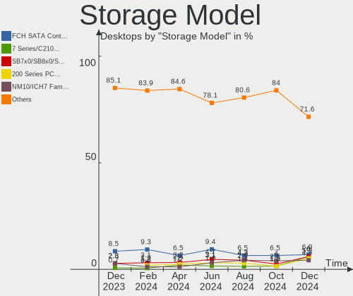
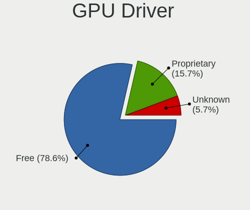

ROSA Hardware Trends (Desktops)
-------------------------------

A project to identify most popular hardware characteristics and track their change
over time based on data collected by ROSA users at https://Linux-Hardware.org.

Anyone can contribute to this report by the [hw-probe](https://github.com/linuxhw/hw-probe) tool:

    sudo -E hw-probe -all -upload

Full-feature report is available here: https://linux-hardware.org/?view=trends&formfactor=desktop

Period: Aug, 2021.

Contents
--------

* [ System ](#system)
  - [ OS                       ](#os)
  - [ OS Family                ](#os-family)
  - [ Kernel                   ](#kernel)
  - [ Kernel Family            ](#kernel-family)
  - [ Kernel Major Ver.        ](#kernel-major-ver)
  - [ Arch                     ](#arch)
  - [ DE                       ](#de)
  - [ Display Server           ](#display-server)
  - [ Display Manager          ](#display-manager)
  - [ OS Lang                  ](#os-lang)
  - [ Boot Mode                ](#boot-mode)
  - [ Filesystem               ](#filesystem)
  - [ Part. scheme             ](#part-scheme)
  - [ Dual Boot with Linux/BSD ](#dual-boot-with-linuxbsd)
  - [ Dual Boot (Win)          ](#dual-boot-win)

* [ Board ](#board)
  - [ Vendor                   ](#vendor)
  - [ Model                    ](#model)
  - [ Model Family             ](#model-family)
  - [ MFG Year                 ](#mfg-year)
  - [ Form Factor              ](#form-factor)
  - [ Secure Boot              ](#secure-boot)
  - [ Coreboot                 ](#coreboot)
  - [ RAM Size                 ](#ram-size)
  - [ RAM Used                 ](#ram-used)
  - [ Total Drives             ](#total-drives)
  - [ Has CD-ROM               ](#has-cd-rom)
  - [ Has Ethernet             ](#has-ethernet)
  - [ Has WiFi                 ](#has-wifi)
  - [ Has Bluetooth            ](#has-bluetooth)

* [ Location ](#location)
  - [ Country                  ](#country)
  - [ City                     ](#city)

* [ Drives ](#drives)
  - [ Drive Vendor             ](#drive-vendor)
  - [ Drive Model              ](#drive-model)
  - [ HDD Vendor               ](#hdd-vendor)
  - [ SSD Vendor               ](#ssd-vendor)
  - [ Drive Kind               ](#drive-kind)
  - [ Drive Connector          ](#drive-connector)
  - [ Drive Size               ](#drive-size)
  - [ Space Total              ](#space-total)
  - [ Space Used               ](#space-used)
  - [ Malfunc. Drives          ](#malfunc-drives)
  - [ Malfunc. Drive Vendor    ](#malfunc-drive-vendor)
  - [ Malfunc. HDD Vendor      ](#malfunc-hdd-vendor)
  - [ Malfunc. Drive Kind      ](#malfunc-drive-kind)
  - [ Failed Drives            ](#failed-drives)
  - [ Failed Drive Vendor      ](#failed-drive-vendor)
  - [ Drive Status             ](#drive-status)

* [ Storage controller ](#storage-controller)
  - [ Storage Vendor           ](#storage-vendor)
  - [ Storage Model            ](#storage-model)
  - [ Storage Kind             ](#storage-kind)

* [ Processor ](#processor)
  - [ CPU Vendor               ](#cpu-vendor)
  - [ CPU Model                ](#cpu-model)
  - [ CPU Model Family         ](#cpu-model-family)
  - [ CPU Cores                ](#cpu-cores)
  - [ CPU Sockets              ](#cpu-sockets)
  - [ CPU Threads              ](#cpu-threads)
  - [ CPU Op-Modes             ](#cpu-op-modes)
  - [ CPU Microcode            ](#cpu-microcode)
  - [ CPU Microarch            ](#cpu-microarch)

* [ Graphics ](#graphics)
  - [ GPU Vendor               ](#gpu-vendor)
  - [ GPU Model                ](#gpu-model)
  - [ GPU Combo                ](#gpu-combo)
  - [ GPU Driver               ](#gpu-driver)
  - [ GPU Memory               ](#gpu-memory)

* [ Monitor ](#monitor)
  - [ Monitor Vendor           ](#monitor-vendor)
  - [ Monitor Model            ](#monitor-model)
  - [ Monitor Resolution       ](#monitor-resolution)
  - [ Monitor Diagonal         ](#monitor-diagonal)
  - [ Monitor Width            ](#monitor-width)
  - [ Aspect Ratio             ](#aspect-ratio)
  - [ Monitor Area             ](#monitor-area)
  - [ Pixel Density            ](#pixel-density)
  - [ Multiple Monitors        ](#multiple-monitors)

* [ Network ](#network)
  - [ Net Controller Vendor    ](#net-controller-vendor)
  - [ Net Controller Model     ](#net-controller-model)
  - [ Wireless Vendor          ](#wireless-vendor)
  - [ Wireless Model           ](#wireless-model)
  - [ Ethernet Vendor          ](#ethernet-vendor)
  - [ Ethernet Model           ](#ethernet-model)
  - [ Net Controller Kind      ](#net-controller-kind)
  - [ Used Controller          ](#used-controller)
  - [ NICs                     ](#nics)
  - [ IPv6                     ](#ipv6)

* [ Bluetooth ](#bluetooth)
  - [ Bluetooth Vendor         ](#bluetooth-vendor)
  - [ Bluetooth Model          ](#bluetooth-model)

* [ Sound ](#sound)
  - [ Sound Vendor             ](#sound-vendor)
  - [ Sound Model              ](#sound-model)

* [ Memory ](#memory)
  - [ Memory Vendor            ](#memory-vendor)
  - [ Memory Model             ](#memory-model)
  - [ Memory Kind              ](#memory-kind)
  - [ Memory Form Factor       ](#memory-form-factor)
  - [ Memory Size              ](#memory-size)
  - [ Memory Speed             ](#memory-speed)

* [ Printers & scanners ](#printers--scanners)
  - [ Printer Vendor           ](#printer-vendor)
  - [ Printer Model            ](#printer-model)
  - [ Scanner Vendor           ](#scanner-vendor)
  - [ Scanner Model            ](#scanner-model)

* [ Camera ](#camera)
  - [ Camera Vendor            ](#camera-vendor)
  - [ Camera Model             ](#camera-model)

* [ Security ](#security)
  - [ Fingerprint Vendor       ](#fingerprint-vendor)
  - [ Fingerprint Model        ](#fingerprint-model)
  - [ Chipcard Vendor          ](#chipcard-vendor)
  - [ Chipcard Model           ](#chipcard-model)

* [ Unsupported ](#unsupported)
  - [ Unsupported Devices      ](#unsupported-devices)
  - [ Unsupported Device Types ](#unsupported-device-types)

System
------

OS
--

Installed operating systems

| Name         | Desktops | Percent |
|--------------|----------|---------|
| ROSA R11.1   | 49       | 72.06%  |
| ROSA R12     | 9        | 13.24%  |
| ROSA R11     | 7        | 10.29%  |
| ROSA R8.1    | 1        | 1.47%   |
| ROSA R10     | 1        | 1.47%   |
| ROSA 2019.05 | 1        | 1.47%   |

OS Family
---------

OS without a version

| Name | Desktops | Percent |
|------|----------|---------|
| ROSA | 68       | 100%    |

Kernel
------

Version of the Linux kernel

| Version                             | Desktops | Percent |
|-------------------------------------|----------|---------|
| 5.4.83-generic-2rosa-x86_64         | 21       | 30.88%  |
| 5.4.32-generic-2rosa-x86_64         | 11       | 16.18%  |
| 4.15.0-desktop-122.124.1rosa-x86_64 | 10       | 14.71%  |
| 5.10.56-generic-1rosa2021.1-x86_64  | 8        | 11.76%  |
| 4.15.0-desktop-45.1rosa-x86_64      | 5        | 7.35%   |
| 5.4.32-generic-2rosa-i586           | 4        | 5.88%   |
| 5.4.83-generic-2rosa-i586           | 2        | 2.94%   |
| 4.9.155-nrj-desktop-1rosa-x86_64    | 2        | 2.94%   |
| 5.4.136-nickel-1rosa2019.05-x86_64  | 1        | 1.47%   |
| 5.11.0-desktop-18.19.1rosa-x86_64   | 1        | 1.47%   |
| 5.10.52-generic-1rosa2021.1-x86_64  | 1        | 1.47%   |
| 4.9.60-nrj-desktop-1rosa-x86_64     | 1        | 1.47%   |
| 4.15.0-desktop-45.1rosa-i586        | 1        | 1.47%   |

Kernel Family
-------------

Linux kernel without a distro release

| Version | Desktops | Percent |
|---------|----------|---------|
| 5.4.83  | 23       | 33.82%  |
| 4.15.0  | 16       | 23.53%  |
| 5.4.32  | 15       | 22.06%  |
| 5.10.56 | 8        | 11.76%  |
| 4.9.155 | 2        | 2.94%   |
| 5.4.136 | 1        | 1.47%   |
| 5.11.0  | 1        | 1.47%   |
| 5.10.52 | 1        | 1.47%   |
| 4.9.60  | 1        | 1.47%   |

Kernel Major Ver.
-----------------

Linux kernel major version

| Version | Desktops | Percent |
|---------|----------|---------|
| 5.4     | 39       | 57.35%  |
| 4.15    | 16       | 23.53%  |
| 5.10    | 9        | 13.24%  |
| 4.9     | 3        | 4.41%   |
| 5.11    | 1        | 1.47%   |

Arch
----

OS architecture (x86_64, i586, etc.)

| Name   | Desktops | Percent |
|--------|----------|---------|
| x86_64 | 61       | 89.71%  |
| i686   | 7        | 10.29%  |

DE
--

Desktop Environment

| Name  | Desktops | Percent |
|-------|----------|---------|
| KDE4  | 30       | 44.12%  |
| KDE5  | 27       | 39.71%  |
| LXQt  | 6        | 8.82%   |
| XFCE  | 3        | 4.41%   |
| GNOME | 2        | 2.94%   |

Display Server
--------------

X11 or Wayland

| Name    | Desktops | Percent |
|---------|----------|---------|
| X11     | 62       | 91.18%  |
| Wayland | 5        | 7.35%   |
| Tty     | 1        | 1.47%   |

Display Manager
---------------

SDDM, LightDM, etc.

| Name    | Desktops | Percent |
|---------|----------|---------|
| SDDM    | 32       | 47.06%  |
| KDM     | 30       | 44.12%  |
| GDM     | 5        | 7.35%   |
| LightDM | 1        | 1.47%   |

OS Lang
-------

Language

| Lang    | Desktops | Percent |
|---------|----------|---------|
| ru_RU   | 52       | 76.47%  |
| Unknown | 9        | 13.24%  |
| pl_PL   | 2        | 2.94%   |
| de_DE   | 2        | 2.94%   |
| ru_BY   | 1        | 1.47%   |
| en_US   | 1        | 1.47%   |
| en_GB   | 1        | 1.47%   |

Boot Mode
---------

EFI or BIOS

| Mode | Desktops | Percent |
|------|----------|---------|
| BIOS | 52       | 76.47%  |
| EFI  | 16       | 23.53%  |

Filesystem
----------

Type of filesystem

| Type  | Desktops | Percent |
|-------|----------|---------|
| Ext4  | 62       | 91.18%  |
| Btrfs | 4        | 5.88%   |
| Ext3  | 2        | 2.94%   |

Part. scheme
------------

Scheme of partitioning

| Type    | Desktops | Percent |
|---------|----------|---------|
| MBR     | 40       | 58.82%  |
| GPT     | 27       | 39.71%  |
| Unknown | 1        | 1.47%   |

Dual Boot with Linux/BSD
------------------------

Hosting more than one Linux/BSD

| Dual boot | Desktops | Percent |
|-----------|----------|---------|
| No        | 47       | 69.12%  |
| Yes       | 21       | 30.88%  |

Dual Boot (Win)
---------------

Hosting Linux and Windows

| Dual boot | Desktops | Percent |
|-----------|----------|---------|
| No        | 37       | 54.41%  |
| Yes       | 31       | 45.59%  |

Board
-----

Vendor
------

Motherboard manufacturer

| Name                | Desktops | Percent |
|---------------------|----------|---------|
| ASUSTek Computer    | 25       | 36.76%  |
| Gigabyte Technology | 14       | 20.59%  |
| MSI                 | 7        | 10.29%  |
| ASRock              | 5        | 7.35%   |
| Intel               | 3        | 4.41%   |
| Biostar             | 3        | 4.41%   |
| Unknown             | 3        | 4.41%   |
| Lenovo              | 2        | 2.94%   |
| Dell                | 2        | 2.94%   |
| Huanan              | 1        | 1.47%   |
| Hewlett-Packard     | 1        | 1.47%   |
| Fujitsu             | 1        | 1.47%   |
| ECS                 | 1        | 1.47%   |

Model
-----

Motherboard model

| Name                         | Desktops | Percent |
|------------------------------|----------|---------|
| Unknown                      | 3        | 4.41%   |
| ASUS PRIME A320M-K           | 2        | 2.94%   |
| ASUS M2N                     | 2        | 2.94%   |
| ASUS H110M-R                 | 2        | 2.94%   |
| ASUS All Series              | 2        | 2.94%   |
| MSI OPTIMUS                  | 1        | 1.47%   |
| MSI MS-7C51                  | 1        | 1.47%   |
| MSI MS-7B86                  | 1        | 1.47%   |
| MSI MS-7895                  | 1        | 1.47%   |
| MSI MS-7599                  | 1        | 1.47%   |
| MSI MS-7592                  | 1        | 1.47%   |
| MSI Compaq dx2200 MT         | 1        | 1.47%   |
| Lenovo V520-15IKL 10NKS05400 | 1        | 1.47%   |
| Lenovo H420                  | 1        | 1.47%   |
| Intel H61M-S1                | 1        | 1.47%   |
| Intel DP67BG AAG10491-306    | 1        | 1.47%   |
| Intel DG31PR AAD97573-206    | 1        | 1.47%   |
| Huanan X99 F8D V2.2          | 1        | 1.47%   |
| HP Compaq Elite 8300 CMT     | 1        | 1.47%   |
| Gigabyte Z170-HD3P-CF        | 1        | 1.47%   |
| Gigabyte X570 AORUS ELITE    | 1        | 1.47%   |
| Gigabyte P31-DS3L            | 1        | 1.47%   |
| Gigabyte H270-HD3            | 1        | 1.47%   |
| Gigabyte GA-MA790FXT-UD5P    | 1        | 1.47%   |
| Gigabyte GA-990XA-UD3        | 1        | 1.47%   |
| Gigabyte GA-78LMT-S2         | 1        | 1.47%   |
| Gigabyte GA-780T-D3L         | 1        | 1.47%   |
| Gigabyte B450M DS3H V2       | 1        | 1.47%   |
| Gigabyte B250M-D3H           | 1        | 1.47%   |
| Gigabyte A320M-S2H V2        | 1        | 1.47%   |
| Gigabyte A320M-H             | 1        | 1.47%   |
| Gigabyte 945GCM-S2C          | 1        | 1.47%   |
| Gigabyte 8IPE1000-G          | 1        | 1.47%   |
| Fujitsu CELSIUS M470-2       | 1        | 1.47%   |
| ECS H61H2-M12                | 1        | 1.47%   |
| Dell OptiPlex 9020M          | 1        | 1.47%   |
| Dell OptiPlex 3010           | 1        | 1.47%   |
| Biostar N68S3+               | 1        | 1.47%   |
| Biostar Hi-Fi A75S3          | 1        | 1.47%   |
| Biostar A960D+V3             | 1        | 1.47%   |
| ASUS PRIME H310M-R R2.0      | 1        | 1.47%   |
| ASUS PRIME B365M-A           | 1        | 1.47%   |
| ASUS P8H77-V LE              | 1        | 1.47%   |
| ASUS P8H61-M LX3             | 1        | 1.47%   |
| ASUS P8H61-I                 | 1        | 1.47%   |
| ASUS P5Q SE PLUS             | 1        | 1.47%   |
| ASUS P5KPL-AM                | 1        | 1.47%   |
| ASUS P5K SE                  | 1        | 1.47%   |
| ASUS P5K                     | 1        | 1.47%   |
| ASUS P5GC-MX/1333            | 1        | 1.47%   |
| ASUS P5E                     | 1        | 1.47%   |
| ASUS P5B-MX/WiFi-AP          | 1        | 1.47%   |
| ASUS M5A78L-M LE/USB3        | 1        | 1.47%   |
| ASUS M4A88T-M                | 1        | 1.47%   |
| ASUS M4A78LT-M-LE            | 1        | 1.47%   |
| ASUS M4A77T                  | 1        | 1.47%   |
| ASUS M2N68 Plus              | 1        | 1.47%   |
| ASRock H410M-HVS             | 1        | 1.47%   |
| ASRock G41M-VS3              | 1        | 1.47%   |
| ASRock G31M-VS               | 1        | 1.47%   |

Model Family
------------

Motherboard model prefix

| Name                      | Desktops | Percent |
|---------------------------|----------|---------|
| ASUS PRIME                | 4        | 5.88%   |
| Unknown                   | 3        | 4.41%   |
| Dell OptiPlex             | 2        | 2.94%   |
| ASUS P5K                  | 2        | 2.94%   |
| ASUS M2N                  | 2        | 2.94%   |
| ASUS H110M-R              | 2        | 2.94%   |
| ASUS All                  | 2        | 2.94%   |
| MSI OPTIMUS               | 1        | 1.47%   |
| MSI MS-7C51               | 1        | 1.47%   |
| MSI MS-7B86               | 1        | 1.47%   |
| MSI MS-7895               | 1        | 1.47%   |
| MSI MS-7599               | 1        | 1.47%   |
| MSI MS-7592               | 1        | 1.47%   |
| MSI Compaq                | 1        | 1.47%   |
| Lenovo V520-15IKL         | 1        | 1.47%   |
| Lenovo H420               | 1        | 1.47%   |
| Intel H61M-S1             | 1        | 1.47%   |
| Intel DP67BG              | 1        | 1.47%   |
| Intel DG31PR              | 1        | 1.47%   |
| Huanan X99                | 1        | 1.47%   |
| HP Compaq                 | 1        | 1.47%   |
| Gigabyte Z170-HD3P-CF     | 1        | 1.47%   |
| Gigabyte X570             | 1        | 1.47%   |
| Gigabyte P31-DS3L         | 1        | 1.47%   |
| Gigabyte H270-HD3         | 1        | 1.47%   |
| Gigabyte GA-MA790FXT-UD5P | 1        | 1.47%   |
| Gigabyte GA-990XA-UD3     | 1        | 1.47%   |
| Gigabyte GA-78LMT-S2      | 1        | 1.47%   |
| Gigabyte GA-780T-D3L      | 1        | 1.47%   |
| Gigabyte B450M            | 1        | 1.47%   |
| Gigabyte B250M-D3H        | 1        | 1.47%   |
| Gigabyte A320M-S2H        | 1        | 1.47%   |
| Gigabyte A320M-H          | 1        | 1.47%   |
| Gigabyte 945GCM-S2C       | 1        | 1.47%   |
| Gigabyte 8IPE1000-G       | 1        | 1.47%   |
| Fujitsu CELSIUS           | 1        | 1.47%   |
| ECS H61H2-M12             | 1        | 1.47%   |
| Biostar N68S3+            | 1        | 1.47%   |
| Biostar Hi-Fi             | 1        | 1.47%   |
| Biostar A960D+V3          | 1        | 1.47%   |
| ASUS P8H77-V              | 1        | 1.47%   |
| ASUS P8H61-M              | 1        | 1.47%   |
| ASUS P8H61-I              | 1        | 1.47%   |
| ASUS P5Q                  | 1        | 1.47%   |
| ASUS P5KPL-AM             | 1        | 1.47%   |
| ASUS P5GC-MX              | 1        | 1.47%   |
| ASUS P5E                  | 1        | 1.47%   |
| ASUS P5B-MX               | 1        | 1.47%   |
| ASUS M5A78L-M             | 1        | 1.47%   |
| ASUS M4A88T-M             | 1        | 1.47%   |
| ASUS M4A78LT-M-LE         | 1        | 1.47%   |
| ASUS M4A77T               | 1        | 1.47%   |
| ASUS M2N68                | 1        | 1.47%   |
| ASRock H410M-HVS          | 1        | 1.47%   |
| ASRock G41M-VS3           | 1        | 1.47%   |
| ASRock G31M-VS            | 1        | 1.47%   |
| ASRock B75M-DGS           | 1        | 1.47%   |
| ASRock AD510PV            | 1        | 1.47%   |

MFG Year
--------

Motherboard manufacture year

| Year | Desktops | Percent |
|------|----------|---------|
| 2018 | 7        | 10.29%  |
| 2019 | 6        | 8.82%   |
| 2013 | 6        | 8.82%   |
| 2012 | 6        | 8.82%   |
| 2007 | 6        | 8.82%   |
| 2020 | 5        | 7.35%   |
| 2011 | 5        | 7.35%   |
| 2010 | 5        | 7.35%   |
| 2009 | 5        | 7.35%   |
| 2008 | 4        | 5.88%   |
| 2021 | 3        | 4.41%   |
| 2016 | 3        | 4.41%   |
| 2017 | 2        | 2.94%   |
| 2014 | 2        | 2.94%   |
| 2015 | 1        | 1.47%   |
| 2005 | 1        | 1.47%   |
| 2004 | 1        | 1.47%   |

Form Factor
-----------

Physical design of the computer

| Name    | Desktops | Percent |
|---------|----------|---------|
| Desktop | 68       | 100%    |

Secure Boot
-----------

Enabled or disabled

| State    | Desktops | Percent |
|----------|----------|---------|
| Disabled | 68       | 100%    |

Coreboot
--------

Have coreboot on board

| Used | Desktops | Percent |
|------|----------|---------|
| No   | 68       | 100%    |

RAM Size
--------

Total RAM memory

| Size in GB  | Desktops | Percent |
|-------------|----------|---------|
| 8.01-16.0   | 22       | 32.35%  |
| 3.01-4.0    | 17       | 25%     |
| 16.01-24.0  | 11       | 16.18%  |
| 4.01-8.0    | 4        | 5.88%   |
| 32.01-64.0  | 4        | 5.88%   |
| 2.01-3.0    | 3        | 4.41%   |
| 1.01-2.0    | 3        | 4.41%   |
| 0.51-1.0    | 2        | 2.94%   |
| 24.01-32.0  | 1        | 1.47%   |
| 64.01-256.0 | 1        | 1.47%   |

RAM Used
--------

Used RAM memory

| Used GB  | Desktops | Percent |
|----------|----------|---------|
| 1.01-2.0 | 31       | 45.59%  |
| 0.51-1.0 | 20       | 29.41%  |
| 2.01-3.0 | 10       | 14.71%  |
| 4.01-8.0 | 3        | 4.41%   |
| 3.01-4.0 | 2        | 2.94%   |
| 0.01-0.5 | 2        | 2.94%   |

Total Drives
------------

Number of drives on board

| Drives | Desktops | Percent |
|--------|----------|---------|
| 1      | 32       | 47.06%  |
| 2      | 21       | 30.88%  |
| 4      | 7        | 10.29%  |
| 3      | 7        | 10.29%  |
| 5      | 1        | 1.47%   |

Has CD-ROM
----------

Has CD-ROM on board

| Presented | Desktops | Percent |
|-----------|----------|---------|
| Yes       | 35       | 51.47%  |
| No        | 33       | 48.53%  |

Has Ethernet
------------

Has Ethernet on board

| Presented | Desktops | Percent |
|-----------|----------|---------|
| Yes       | 68       | 100%    |

Has WiFi
--------

Has WiFi module

| Presented | Desktops | Percent |
|-----------|----------|---------|
| No        | 56       | 82.35%  |
| Yes       | 12       | 17.65%  |

Has Bluetooth
-------------

Has Bluetooth module

| Presented | Desktops | Percent |
|-----------|----------|---------|
| No        | 58       | 85.29%  |
| Yes       | 10       | 14.71%  |

Location
--------

Country
-------

Geographic location (country)

| Country    | Desktops | Percent |
|------------|----------|---------|
| Russia     | 54       | 79.41%  |
| Belarus    | 3        | 4.41%   |
| Ukraine    | 2        | 2.94%   |
| Poland     | 2        | 2.94%   |
| Germany    | 2        | 2.94%   |
| UK         | 1        | 1.47%   |
| Moldova    | 1        | 1.47%   |
| Kazakhstan | 1        | 1.47%   |
| Italy      | 1        | 1.47%   |
| Israel     | 1        | 1.47%   |

City
----

Geographic location (city)

| City             | Desktops | Percent |
|------------------|----------|---------|
| Moscow           | 14       | 20.59%  |
| Krasnodar        | 5        | 7.35%   |
| St Petersburg    | 3        | 4.41%   |
| Tomsk            | 2        | 2.94%   |
| Murmansk         | 2        | 2.94%   |
| Elektrostal      | 2        | 2.94%   |
| Yekaterinburg    | 1        | 1.47%   |
| Warsaw           | 1        | 1.47%   |
| Usinsk           | 1        | 1.47%   |
| Ufa              | 1        | 1.47%   |
| Tula             | 1        | 1.47%   |
| Tel Aviv         | 1        | 1.47%   |
| Tambov           | 1        | 1.47%   |
| Surgut           | 1        | 1.47%   |
| Stralsund        | 1        | 1.47%   |
| Stavropol        | 1        | 1.47%   |
| Sosnowiec        | 1        | 1.47%   |
| Severodvinsk     | 1        | 1.47%   |
| Saratov          | 1        | 1.47%   |
| Saransk          | 1        | 1.47%   |
| Ryazan           | 1        | 1.47%   |
| Rostov-on-Don    | 1        | 1.47%   |
| Pruzhany         | 1        | 1.47%   |
| Novosibirsk      | 1        | 1.47%   |
| Nizhniy Novgorod | 1        | 1.47%   |
| Navapolatsk      | 1        | 1.47%   |
| Minsk            | 1        | 1.47%   |
| Mariupol         | 1        | 1.47%   |
| Leninogorsk      | 1        | 1.47%   |
| Krasnoyarsk      | 1        | 1.47%   |
| Kostroma         | 1        | 1.47%   |
| Kopeysk          | 1        | 1.47%   |
| Khabarovsk       | 1        | 1.47%   |
| Kazan?ˆ™         | 1        | 1.47%   |
| Karaganda        | 1        | 1.47%   |
| Izhevsk          | 1        | 1.47%   |
| Irkutsk          | 1        | 1.47%   |
| Eppelborn        | 1        | 1.47%   |
| Dyat'kovo        | 1        | 1.47%   |
| Croydon          | 1        | 1.47%   |
| Chisinau         | 1        | 1.47%   |
| Cheboksary       | 1        | 1.47%   |
| Bryansk          | 1        | 1.47%   |
| Bologna          | 1        | 1.47%   |
| Belorechensk     | 1        | 1.47%   |
| Barvinkove       | 1        | 1.47%   |

Drives
------

Drive Vendor
------------

Hard drive vendors

| Vendor              | Desktops | Drives | Percent |
|---------------------|----------|--------|---------|
| WDC                 | 32       | 39     | 28.83%  |
| Seagate             | 22       | 28     | 19.82%  |
| Samsung Electronics | 15       | 18     | 13.51%  |
| Toshiba             | 8        | 9      | 7.21%   |
| SPCC                | 4        | 4      | 3.6%    |
| Kingston            | 4        | 4      | 3.6%    |
| Hitachi             | 4        | 5      | 3.6%    |
| GOODRAM             | 3        | 3      | 2.7%    |
| A-DATA Technology   | 3        | 3      | 2.7%    |
| Crucial             | 2        | 3      | 1.8%    |
| Apacer              | 2        | 2      | 1.8%    |
| Smartbuy            | 1        | 1      | 0.9%    |
| SanDisk             | 1        | 1      | 0.9%    |
| Palit               | 1        | 1      | 0.9%    |
| OCZ                 | 1        | 1      | 0.9%    |
| MAXTOR              | 1        | 1      | 0.9%    |
| Intenso             | 1        | 1      | 0.9%    |
| HUAWEI              | 1        | 1      | 0.9%    |
| HGST                | 1        | 1      | 0.9%    |
| Fujitsu             | 1        | 1      | 0.9%    |
| FOXLINE             | 1        | 1      | 0.9%    |
| Corsair             | 1        | 1      | 0.9%    |
| China               | 1        | 1      | 0.9%    |

Drive Model
-----------

Hard drive models

| Model                            | Desktops | Percent |
|----------------------------------|----------|---------|
| Seagate ST1000DM010-2EP102 1TB   | 5        | 3.88%   |
| WDC WD10EZEX-08WN4A0 1TB         | 3        | 2.33%   |
| WDC WD20EZAZ-00GGJB0 2TB         | 2        | 1.55%   |
| WDC WD10EZEX-00WN4A0 1TB         | 2        | 1.55%   |
| Toshiba MQ01ABD032 320GB         | 2        | 1.55%   |
| Toshiba DT01ACA050 500GB         | 2        | 1.55%   |
| Seagate ST3250410AS 250GB        | 2        | 1.55%   |
| Seagate ST3160815AS 160GB        | 2        | 1.55%   |
| Samsung SSD 860 EVO 250GB        | 2        | 1.55%   |
| Samsung SSD 850 EVO 120GB        | 2        | 1.55%   |
| Samsung SSD 750 EVO 250GB        | 2        | 1.55%   |
| Kingston SA400S37120G 120GB SSD  | 2        | 1.55%   |
| WDC WDS250G2B0A-00SM50 250GB SSD | 1        | 0.78%   |
| WDC WDS240G2G0A-00JH30 240GB SSD | 1        | 0.78%   |
| WDC WDS120G2G0B-00EPW0 120GB SSD | 1        | 0.78%   |
| WDC WD800JD-60LSA0 80GB          | 1        | 0.78%   |
| WDC WD6400AAKS-65Z7B0 640GB      | 1        | 0.78%   |
| WDC WD600VE-00HDT0 64GB          | 1        | 0.78%   |
| WDC WD5000LPVX-22V0TT0 500GB     | 1        | 0.78%   |
| WDC WD5000LPVX-00V0TT0 500GB     | 1        | 0.78%   |
| WDC WD5000AZRZ-00HTKB0 500GB     | 1        | 0.78%   |
| WDC WD5000AZRX-00A8LB0 500GB     | 1        | 0.78%   |
| WDC WD5000AAKX-753CA1 500GB      | 1        | 0.78%   |
| WDC WD5000AAKX-083CA1 500GB      | 1        | 0.78%   |
| WDC WD5000AAKB-00H8A0 500GB      | 1        | 0.78%   |
| WDC WD5000AADS-56S9B0 500GB      | 1        | 0.78%   |
| WDC WD40EZRZ-22GXCB0 4TB         | 1        | 0.78%   |
| WDC WD4003FRYZ-01F0DB0 4TB       | 1        | 0.78%   |
| WDC WD30EZRX-00DC0B0 3TB         | 1        | 0.78%   |
| WDC WD2500JS-00NCB1 250GB        | 1        | 0.78%   |
| WDC WD2500AAKX-75U6AA0 250GB     | 1        | 0.78%   |
| WDC WD20EZRX-00DC0B0 2TB         | 1        | 0.78%   |
| WDC WD20EFRX-68EUZN0 2TB         | 1        | 0.78%   |
| WDC WD20EARX-00PASB0 2TB         | 1        | 0.78%   |
| WDC WD2000JS-60NCB1 200GB        | 1        | 0.78%   |
| WDC WD2000JS-22MHB0 200GB        | 1        | 0.78%   |
| WDC WD1600JB-00REA0 160GB        | 1        | 0.78%   |
| WDC WD1600AAJS-00L7A0 160GB      | 1        | 0.78%   |
| WDC WD10EZRZ-22HTKB0 1TB         | 1        | 0.78%   |
| WDC WD10EZRX-00L4HB0 1TB         | 1        | 0.78%   |
| WDC WD10EZEX-60ZF5A0 1TB         | 1        | 0.78%   |
| WDC WD10EZEX-00BN5A0 1TB         | 1        | 0.78%   |
| WDC WD10EADS-65M2B0 1TB          | 1        | 0.78%   |
| WDC WD1002FAEX-00Y9A0 1TB        | 1        | 0.78%   |
| Toshiba TR200 480GB SSD          | 1        | 0.78%   |
| Toshiba MK3252GSX 320GB          | 1        | 0.78%   |
| Toshiba HDWD110 1TB              | 1        | 0.78%   |
| Toshiba DT01ACA200 2TB           | 1        | 0.78%   |
| Toshiba DT01ACA100 1TB           | 1        | 0.78%   |
| SPCC Solid State Disk 64GB       | 1        | 0.78%   |
| SPCC Solid State Disk 56GB       | 1        | 0.78%   |
| SPCC Solid State Disk 512GB      | 1        | 0.78%   |
| SPCC Solid State Disk 120GB      | 1        | 0.78%   |
| Smartbuy SSD 120GB               | 1        | 0.78%   |
| Seagate STM3250318AS 250GB       | 1        | 0.78%   |
| Seagate ST9500420AS 500GB        | 1        | 0.78%   |
| Seagate ST9500325AS 500GB        | 1        | 0.78%   |
| Seagate ST9160314AS 160GB        | 1        | 0.78%   |
| Seagate ST500DM009-2F110A 500GB  | 1        | 0.78%   |
| Seagate ST500DM002-1BD142 500GB  | 1        | 0.78%   |

HDD Vendor
----------

Hard disk drive vendors

| Vendor              | Desktops | Drives | Percent |
|---------------------|----------|--------|---------|
| WDC                 | 31       | 36     | 42.47%  |
| Seagate             | 21       | 27     | 28.77%  |
| Toshiba             | 7        | 8      | 9.59%   |
| Samsung Electronics | 7        | 7      | 9.59%   |
| Hitachi             | 4        | 5      | 5.48%   |
| MAXTOR              | 1        | 1      | 1.37%   |
| HGST                | 1        | 1      | 1.37%   |
| Fujitsu             | 1        | 1      | 1.37%   |

SSD Vendor
----------

Solid state drive vendors

| Vendor              | Desktops | Drives | Percent |
|---------------------|----------|--------|---------|
| Samsung Electronics | 7        | 10     | 19.44%  |
| SPCC                | 4        | 4      | 11.11%  |
| Kingston            | 4        | 4      | 11.11%  |
| WDC                 | 3        | 3      | 8.33%   |
| GOODRAM             | 3        | 3      | 8.33%   |
| Crucial             | 2        | 2      | 5.56%   |
| Apacer              | 2        | 2      | 5.56%   |
| A-DATA Technology   | 2        | 2      | 5.56%   |
| Toshiba             | 1        | 1      | 2.78%   |
| Smartbuy            | 1        | 1      | 2.78%   |
| SanDisk             | 1        | 1      | 2.78%   |
| Palit               | 1        | 1      | 2.78%   |
| OCZ                 | 1        | 1      | 2.78%   |
| Intenso             | 1        | 1      | 2.78%   |
| FOXLINE             | 1        | 1      | 2.78%   |
| Corsair             | 1        | 1      | 2.78%   |
| China               | 1        | 1      | 2.78%   |

Drive Kind
----------

HDD or SSD

| Kind    | Desktops | Drives | Percent |
|---------|----------|--------|---------|
| HDD     | 59       | 86     | 61.46%  |
| SSD     | 32       | 39     | 33.33%  |
| NVMe    | 3        | 3      | 3.13%   |
| Unknown | 2        | 2      | 2.08%   |

Drive Connector
---------------

SATA, SAS, NVMe, etc.

| Type | Desktops | Drives | Percent |
|------|----------|--------|---------|
| SATA | 68       | 125    | 93.15%  |
| NVMe | 3        | 3      | 4.11%   |
| SAS  | 2        | 2      | 2.74%   |

Drive Size
----------

Size of hard drive

| Size in TB | Desktops | Drives | Percent |
|------------|----------|--------|---------|
| 0.01-0.5   | 59       | 87     | 64.13%  |
| 0.51-1.0   | 23       | 27     | 25%     |
| 1.01-2.0   | 6        | 7      | 6.52%   |
| 3.01-4.0   | 2        | 2      | 2.17%   |
| 2.01-3.0   | 1        | 1      | 1.09%   |
| 4.01-10.0  | 1        | 1      | 1.09%   |

Space Total
-----------

Amount of disk space available on the file system

| Size in GB     | Desktops | Percent |
|----------------|----------|---------|
| 101-250        | 22       | 32.35%  |
| 251-500        | 10       | 14.71%  |
| 21-50          | 9        | 13.24%  |
| 51-100         | 8        | 11.76%  |
| 501-1000       | 7        | 10.29%  |
| 1001-2000      | 6        | 8.82%   |
| 1-20           | 3        | 4.41%   |
| More than 3000 | 2        | 2.94%   |
| Unknown        | 1        | 1.47%   |

Space Used
----------

Amount of used disk space

| Used GB   | Desktops | Percent |
|-----------|----------|---------|
| 1-20      | 40       | 58.82%  |
| 21-50     | 7        | 10.29%  |
| 101-250   | 6        | 8.82%   |
| 51-100    | 5        | 7.35%   |
| 251-500   | 4        | 5.88%   |
| 501-1000  | 4        | 5.88%   |
| 1001-2000 | 1        | 1.47%   |
| Unknown   | 1        | 1.47%   |

Malfunc. Drives
---------------

Drive models with a malfunction

| Model                             | Desktops | Drives | Percent |
|-----------------------------------|----------|--------|---------|
| Seagate ST3250410AS 250GB         | 2        | 2      | 5.88%   |
| WDC WDS240G2G0A-00JH30 240GB SSD  | 1        | 1      | 2.94%   |
| WDC WDS120G2G0B-00EPW0 120GB SSD  | 1        | 1      | 2.94%   |
| WDC WD800JD-60LSA0 80GB           | 1        | 1      | 2.94%   |
| WDC WD5000AAKX-083CA1 500GB       | 1        | 1      | 2.94%   |
| WDC WD5000AAKB-00H8A0 500GB       | 1        | 1      | 2.94%   |
| WDC WD5000AADS-56S9B0 500GB       | 1        | 1      | 2.94%   |
| WDC WD2500JS-00NCB1 250GB         | 1        | 1      | 2.94%   |
| WDC WD2000JS-22MHB0 200GB         | 1        | 1      | 2.94%   |
| WDC WD1600AAJS-00L7A0 160GB       | 1        | 1      | 2.94%   |
| WDC WD10EADS-65M2B0 1TB           | 1        | 1      | 2.94%   |
| WDC WD1002FAEX-00Y9A0 1TB         | 1        | 1      | 2.94%   |
| Toshiba MK3252GSX 320GB           | 1        | 1      | 2.94%   |
| Toshiba DT01ACA050 500GB          | 1        | 1      | 2.94%   |
| SPCC Solid State Disk 56GB        | 1        | 1      | 2.94%   |
| Seagate ST9500420AS 500GB         | 1        | 1      | 2.94%   |
| Seagate ST9500325AS 500GB         | 1        | 1      | 2.94%   |
| Seagate ST9160314AS 160GB         | 1        | 1      | 2.94%   |
| Seagate ST500DM002-1BD142 500GB   | 1        | 1      | 2.94%   |
| Seagate ST380815AS 80GB           | 1        | 1      | 2.94%   |
| Seagate ST380215A 80GB            | 1        | 1      | 2.94%   |
| Seagate ST3320613AS 320GB         | 1        | 1      | 2.94%   |
| Seagate ST3160815AS 160GB         | 1        | 1      | 2.94%   |
| Seagate ST3160811AS 160GB         | 1        | 1      | 2.94%   |
| Seagate ST3160215A 160GB          | 1        | 1      | 2.94%   |
| Samsung Electronics SP2504C 250GB | 1        | 1      | 2.94%   |
| Samsung Electronics HD321KJ 320GB | 1        | 1      | 2.94%   |
| Samsung Electronics HD160HJ 160GB | 1        | 1      | 2.94%   |
| OCZ TRION100 120GB SSD            | 1        | 1      | 2.94%   |
| Hitachi HDS721050CLA660 500GB     | 1        | 1      | 2.94%   |
| Hitachi HDS721010CLA330 1TB       | 1        | 1      | 2.94%   |
| Hitachi HDP725050GLA360 500GB     | 1        | 1      | 2.94%   |
| A-DATA Technology SX8200PNP 256GB | 1        | 1      | 2.94%   |

Malfunc. Drive Vendor
---------------------

Vendors of faulty drives

| Vendor              | Desktops | Drives | Percent |
|---------------------|----------|--------|---------|
| Seagate             | 11       | 12     | 35.48%  |
| WDC                 | 9        | 11     | 29.03%  |
| Samsung Electronics | 3        | 3      | 9.68%   |
| Hitachi             | 3        | 3      | 9.68%   |
| Toshiba             | 2        | 2      | 6.45%   |
| SPCC                | 1        | 1      | 3.23%   |
| OCZ                 | 1        | 1      | 3.23%   |
| A-DATA Technology   | 1        | 1      | 3.23%   |

Malfunc. HDD Vendor
-------------------

Vendors of faulty HDD drives

| Vendor              | Desktops | Drives | Percent |
|---------------------|----------|--------|---------|
| Seagate             | 11       | 12     | 42.31%  |
| WDC                 | 7        | 9      | 26.92%  |
| Samsung Electronics | 3        | 3      | 11.54%  |
| Hitachi             | 3        | 3      | 11.54%  |
| Toshiba             | 2        | 2      | 7.69%   |

Malfunc. Drive Kind
-------------------

Kinds of faulty drives

| Kind | Desktops | Drives | Percent |
|------|----------|--------|---------|
| HDD  | 24       | 29     | 82.76%  |
| SSD  | 4        | 4      | 13.79%  |
| NVMe | 1        | 1      | 3.45%   |

Failed Drives
-------------

Failed drive models

| Model                             | Desktops | Drives | Percent |
|-----------------------------------|----------|--------|---------|
| WDC WD1600JB-00REA0 160GB         | 1        | 1      | 33.33%  |
| Samsung Electronics HD252HJ 250GB | 1        | 1      | 33.33%  |
| Hitachi HDS721010DLE630 1TB       | 1        | 1      | 33.33%  |

Failed Drive Vendor
-------------------

Failed drive vendors

| Vendor              | Desktops | Drives | Percent |
|---------------------|----------|--------|---------|
| WDC                 | 1        | 1      | 33.33%  |
| Samsung Electronics | 1        | 1      | 33.33%  |
| Hitachi             | 1        | 1      | 33.33%  |

Drive Status
------------

Number of failed and malfunc. drives

| Status   | Desktops | Drives | Percent |
|----------|----------|--------|---------|
| Works    | 53       | 90     | 61.63%  |
| Malfunc  | 27       | 34     | 31.4%   |
| Detected | 3        | 3      | 3.49%   |
| Failed   | 3        | 3      | 3.49%   |

Storage controller
------------------

Storage Vendor
--------------

Storage controller vendors

| Vendor                    | Desktops | Percent |
|---------------------------|----------|---------|
| Intel                     | 41       | 52.56%  |
| AMD                       | 22       | 28.21%  |
| Nvidia                    | 5        | 6.41%   |
| JMicron Technology        | 4        | 5.13%   |
| Marvell Technology Group  | 2        | 2.56%   |
| Samsung Electronics       | 1        | 1.28%   |
| Micron/Crucial Technology | 1        | 1.28%   |
| ASMedia Technology        | 1        | 1.28%   |
| ADATA Technology          | 1        | 1.28%   |

Storage Model
-------------

Storage controller models

| Model                                                                                   | Desktops | Percent |
|-----------------------------------------------------------------------------------------|----------|---------|
| AMD FCH SATA Controller [AHCI mode]                                                     | 11       | 9.65%   |
| Intel NM10/ICH7 Family SATA Controller [IDE mode]                                       | 10       | 8.77%   |
| AMD SB7x0/SB8x0/SB9x0 IDE Controller                                                    | 10       | 8.77%   |
| Intel 82801G (ICH7 Family) IDE Controller                                               | 7        | 6.14%   |
| AMD SB7x0/SB8x0/SB9x0 SATA Controller [IDE mode]                                        | 7        | 6.14%   |
| Intel 6 Series/C200 Series Chipset Family 6 port Desktop SATA AHCI Controller           | 6        | 5.26%   |
| Intel 200 Series PCH SATA controller [AHCI mode]                                        | 5        | 4.39%   |
| Nvidia MCP61 SATA Controller                                                            | 4        | 3.51%   |
| Nvidia MCP61 IDE                                                                        | 4        | 3.51%   |
| AMD FCH SATA Controller D                                                               | 4        | 3.51%   |
| Intel Q170/Q150/B150/H170/H110/Z170/CM236 Chipset SATA Controller [AHCI Mode]           | 3        | 2.63%   |
| AMD SB7x0/SB8x0/SB9x0 SATA Controller [AHCI mode]                                       | 3        | 2.63%   |
| Marvell Group 88SE6111/6121 SATA II / PATA Controller                                   | 2        | 1.75%   |
| JMicron JMB368 IDE controller                                                           | 2        | 1.75%   |
| JMicron JMB363 SATA/IDE Controller                                                      | 2        | 1.75%   |
| Intel Cannon Lake PCH SATA AHCI Controller                                              | 2        | 1.75%   |
| Intel 82801IB (ICH9) 2 port SATA Controller [IDE mode]                                  | 2        | 1.75%   |
| Intel 82801I (ICH9 Family) 2 port SATA Controller [IDE mode]                            | 2        | 1.75%   |
| Intel 8 Series/C220 Series Chipset Family 6-port SATA Controller 1 [AHCI mode]          | 2        | 1.75%   |
| Intel 7 Series/C210 Series Chipset Family 6-port SATA Controller [AHCI mode]            | 2        | 1.75%   |
| AMD 400 Series Chipset SATA Controller                                                  | 2        | 1.75%   |
| Samsung NVMe SSD Controller SM981/PM981/PM983                                           | 1        | 0.88%   |
| Nvidia CK804 Serial ATA Controller                                                      | 1        | 0.88%   |
| Nvidia CK804 IDE                                                                        | 1        | 0.88%   |
| Micron/Crucial P1 NVMe PCIe SSD                                                         | 1        | 0.88%   |
| Intel C610/X99 series chipset 6-Port SATA Controller [AHCI mode]                        | 1        | 0.88%   |
| Intel C600/X79 series chipset 6-Port SATA AHCI Controller                               | 1        | 0.88%   |
| Intel 82801JI (ICH10 Family) SATA AHCI Controller                                       | 1        | 0.88%   |
| Intel 82801JI (ICH10 Family) 4 port SATA IDE Controller #1                              | 1        | 0.88%   |
| Intel 82801JI (ICH10 Family) 2 port SATA IDE Controller #2                              | 1        | 0.88%   |
| Intel 82801IR/IO/IH (ICH9R/DO/DH) 6 port SATA Controller [AHCI mode]                    | 1        | 0.88%   |
| Intel 82801EB/ER (ICH5/ICH5R) IDE Controller                                            | 1        | 0.88%   |
| Intel 7 Series/C210 Series Chipset Family 4-port SATA Controller [IDE mode]             | 1        | 0.88%   |
| Intel 7 Series/C210 Series Chipset Family 2-port SATA Controller [IDE mode]             | 1        | 0.88%   |
| Intel 6 Series/C200 Series Chipset Family Desktop SATA Controller (IDE mode, ports 4-5) | 1        | 0.88%   |
| Intel 6 Series/C200 Series Chipset Family Desktop SATA Controller (IDE mode, ports 0-3) | 1        | 0.88%   |
| Intel 400 Series Chipset Family SATA AHCI Controller                                    | 1        | 0.88%   |
| ASMedia ASM1062 Serial ATA Controller                                                   | 1        | 0.88%   |
| AMD IXP SB4x0 Serial ATA Controller                                                     | 1        | 0.88%   |
| AMD IXP SB4x0 IDE Controller                                                            | 1        | 0.88%   |
| AMD FCH IDE Controller                                                                  | 1        | 0.88%   |
| AMD 300 Series Chipset SATA Controller                                                  | 1        | 0.88%   |
| ADATA XPG SX8200 Pro PCIe Gen3x4 M.2 2280 Solid State Drive                             | 1        | 0.88%   |

Storage Kind
------------

Kind of storage controller (IDE, SATA, NVMe, SAS, ...)

| Kind | Desktops | Percent |
|------|----------|---------|
| SATA | 46       | 54.76%  |
| IDE  | 35       | 41.67%  |
| NVMe | 3        | 3.57%   |

Processor
---------

CPU Vendor
----------

Processor vendors

| Vendor | Desktops | Percent |
|--------|----------|---------|
| Intel  | 42       | 61.76%  |
| AMD    | 26       | 38.24%  |

CPU Model
---------

Processor models

| Model                                        | Desktops | Percent |
|----------------------------------------------|----------|---------|
| Intel Core i5-3470 CPU @ 3.20GHz             | 2        | 2.94%   |
| Intel Core i3-3220 CPU @ 3.30GHz             | 2        | 2.94%   |
| Intel Core 2 Quad CPU Q9650 @ 3.00GHz        | 2        | 2.94%   |
| Intel Core 2 Duo CPU E6750 @ 2.66GHz         | 2        | 2.94%   |
| AMD Ryzen 5 2600X Six-Core Processor         | 2        | 2.94%   |
| AMD FX-4300 Quad-Core Processor              | 2        | 2.94%   |
| Intel Xeon CPU X5650 @ 2.67GHz               | 1        | 1.47%   |
| Intel Xeon CPU E5-2678 v3 @ 2.50GHz          | 1        | 1.47%   |
| Intel Xeon CPU E5-2640 0 @ 2.50GHz           | 1        | 1.47%   |
| Intel Pentium Gold G5420 CPU @ 3.80GHz       | 1        | 1.47%   |
| Intel Pentium Dual-Core CPU E6700 @ 3.20GHz  | 1        | 1.47%   |
| Intel Pentium Dual-Core CPU E5700 @ 3.00GHz  | 1        | 1.47%   |
| Intel Pentium Dual CPU E2200 @ 2.20GHz       | 1        | 1.47%   |
| Intel Pentium Dual CPU E2160 @ 1.80GHz       | 1        | 1.47%   |
| Intel Pentium Dual CPU E2140 @ 1.60GHz       | 1        | 1.47%   |
| Intel Pentium D CPU 3.40GHz                  | 1        | 1.47%   |
| Intel Pentium CPU G620 @ 2.60GHz             | 1        | 1.47%   |
| Intel Pentium CPU G4560 @ 3.50GHz            | 1        | 1.47%   |
| Intel Pentium CPU G4500 @ 3.50GHz            | 1        | 1.47%   |
| Intel Pentium CPU G2130 @ 3.20GHz            | 1        | 1.47%   |
| Intel Pentium 4 CPU 3.00GHz                  | 1        | 1.47%   |
| Intel Core i7-7700K CPU @ 4.20GHz            | 1        | 1.47%   |
| Intel Core i7-4770K CPU @ 3.50GHz            | 1        | 1.47%   |
| Intel Core i7-2600K CPU @ 3.40GHz            | 1        | 1.47%   |
| Intel Core i5-9400 CPU @ 2.90GHz             | 1        | 1.47%   |
| Intel Core i5-8400 CPU @ 2.80GHz             | 1        | 1.47%   |
| Intel Core i5-7400 CPU @ 3.00GHz             | 1        | 1.47%   |
| Intel Core i5-6500 CPU @ 3.20GHz             | 1        | 1.47%   |
| Intel Core i5-4590T CPU @ 2.00GHz            | 1        | 1.47%   |
| Intel Core i5-3450 CPU @ 3.10GHz             | 1        | 1.47%   |
| Intel Core i5-2320 CPU @ 3.00GHz             | 1        | 1.47%   |
| Intel Core i3-6100 CPU @ 3.70GHz             | 1        | 1.47%   |
| Intel Core i3-2100 CPU @ 3.10GHz             | 1        | 1.47%   |
| Intel Core i3-10100 CPU @ 3.60GHz            | 1        | 1.47%   |
| Intel Core 2 Quad CPU Q8400 @ 2.66GHz        | 1        | 1.47%   |
| Intel Core 2 Quad CPU Q8300 @ 2.50GHz        | 1        | 1.47%   |
| Intel Core 2 Duo CPU E4400 @ 2.00GHz         | 1        | 1.47%   |
| Intel Celeron G4920 CPU @ 3.20GHz            | 1        | 1.47%   |
| Intel Celeron CPU 2.00GHz                    | 1        | 1.47%   |
| Intel Atom CPU D510 @ 1.66GHz                | 1        | 1.47%   |
| AMD Ryzen 7 2700X Eight-Core Processor       | 1        | 1.47%   |
| AMD Ryzen 7 2700 Eight-Core Processor        | 1        | 1.47%   |
| AMD Ryzen 5 3400G with Radeon Vega Graphics  | 1        | 1.47%   |
| AMD Ryzen 3 2200G with Radeon Vega Graphics  | 1        | 1.47%   |
| AMD Ryzen 3 1200 Quad-Core Processor         | 1        | 1.47%   |
| AMD PRO A10-8750B R7, 12 Compute Cores 4C+8G | 1        | 1.47%   |
| AMD Phenom II X4 980 Processor               | 1        | 1.47%   |
| AMD Phenom II X4 955 Processor               | 1        | 1.47%   |
| AMD Phenom II X4 920 Processor               | 1        | 1.47%   |
| AMD FX-6300 Six-Core Processor               | 1        | 1.47%   |
| AMD FX-4330 Quad-Core Processor              | 1        | 1.47%   |
| AMD Athlon II X3 450 Processor               | 1        | 1.47%   |
| AMD Athlon II X3 445 Processor               | 1        | 1.47%   |
| AMD Athlon II X2 245 Processor               | 1        | 1.47%   |
| AMD Athlon II X2 240 Processor               | 1        | 1.47%   |
| AMD Athlon II X2 220 Processor               | 1        | 1.47%   |
| AMD Athlon 64 X2 Dual Core Processor 6000+   | 1        | 1.47%   |
| AMD Athlon 64 X2 Dual Core Processor 4200+   | 1        | 1.47%   |
| AMD Athlon 64 Processor 3200+                | 1        | 1.47%   |
| AMD Athlon 5350 APU with Radeon R3           | 1        | 1.47%   |

CPU Model Family
----------------

Processor model prefix

| Model                   | Desktops | Percent |
|-------------------------|----------|---------|
| Intel Core i5           | 9        | 13.24%  |
| Intel Core i3           | 5        | 7.35%   |
| Intel Pentium           | 4        | 5.88%   |
| Intel Core 2 Quad       | 4        | 5.88%   |
| AMD FX                  | 4        | 5.88%   |
| Intel Xeon              | 3        | 4.41%   |
| Intel Pentium Dual      | 3        | 4.41%   |
| Intel Core i7           | 3        | 4.41%   |
| Intel Core 2 Duo        | 3        | 4.41%   |
| AMD Ryzen 5             | 3        | 4.41%   |
| AMD Phenom II X4        | 3        | 4.41%   |
| AMD Athlon II X2        | 3        | 4.41%   |
| Intel Pentium Dual-Core | 2        | 2.94%   |
| Intel Celeron           | 2        | 2.94%   |
| AMD Ryzen 7             | 2        | 2.94%   |
| AMD Ryzen 3             | 2        | 2.94%   |
| AMD Athlon II X3        | 2        | 2.94%   |
| AMD Athlon 64 X2        | 2        | 2.94%   |
| Intel Pentium Gold      | 1        | 1.47%   |
| Intel Pentium D         | 1        | 1.47%   |
| Intel Pentium 4         | 1        | 1.47%   |
| Intel Atom              | 1        | 1.47%   |
| AMD PRO A10             | 1        | 1.47%   |
| AMD Athlon 64           | 1        | 1.47%   |
| AMD Athlon              | 1        | 1.47%   |
| AMD A8                  | 1        | 1.47%   |
| AMD A10                 | 1        | 1.47%   |

CPU Cores
---------

Number of processor cores

| Number  | Desktops | Percent |
|---------|----------|---------|
| 2       | 31       | 45.59%  |
| 4       | 21       | 30.88%  |
| 6       | 6        | 8.82%   |
| 3       | 3        | 4.41%   |
| 1       | 3        | 4.41%   |
| 8       | 2        | 2.94%   |
| 24      | 1        | 1.47%   |
| Unknown | 1        | 1.47%   |

CPU Sockets
-----------

Number of sockets

| Number | Desktops | Percent |
|--------|----------|---------|
| 1      | 67       | 98.53%  |
| 2      | 1        | 1.47%   |

CPU Threads
-----------

Threads per core (Hyper-Threading)

| Number  | Desktops | Percent |
|---------|----------|---------|
| 1       | 40       | 58.82%  |
| 2       | 27       | 39.71%  |
| Unknown | 1        | 1.47%   |

CPU Op-Modes
------------

CPU Operation Modes (32-bit, 64-bit)

| Op mode        | Desktops | Percent |
|----------------|----------|---------|
| 32-bit, 64-bit | 67       | 98.53%  |
| 32-bit         | 1        | 1.47%   |

CPU Microcode
-------------

Microcode number

| Number     | Desktops | Percent |
|------------|----------|---------|
| 0x306a9    | 6        | 8.82%   |
| 0x010000c8 | 6        | 8.82%   |
| Unknown    | 6        | 8.82%   |
| 0x1067a    | 5        | 7.35%   |
| 0x6fd      | 4        | 5.88%   |
| 0x206a7    | 4        | 5.88%   |
| 0x06000852 | 4        | 5.88%   |
| 0x906e9    | 3        | 4.41%   |
| 0x506e3    | 3        | 4.41%   |
| 0x0800820d | 3        | 4.41%   |
| 0x906ea    | 2        | 2.94%   |
| 0x6fb      | 2        | 2.94%   |
| 0x306c3    | 2        | 2.94%   |
| 0x010000db | 2        | 2.94%   |
| 0xf65      | 1        | 1.47%   |
| 0xf43      | 1        | 1.47%   |
| 0xa0653    | 1        | 1.47%   |
| 0x906ec    | 1        | 1.47%   |
| 0x906eb    | 1        | 1.47%   |
| 0x306f2    | 1        | 1.47%   |
| 0x206d7    | 1        | 1.47%   |
| 0x206c2    | 1        | 1.47%   |
| 0x106ca    | 1        | 1.47%   |
| 0x08108109 | 1        | 1.47%   |
| 0x08101016 | 1        | 1.47%   |
| 0x08001137 | 1        | 1.47%   |
| 0x0700010f | 1        | 1.47%   |
| 0x0600611a | 1        | 1.47%   |
| 0x06003106 | 1        | 1.47%   |
| 0x06001119 | 1        | 1.47%   |

CPU Microarch
-------------

Microarchitecture

| Name        | Desktops | Percent |
|-------------|----------|---------|
| K10         | 8        | 11.76%  |
| KabyLake    | 7        | 10.29%  |
| Penryn      | 6        | 8.82%   |
| IvyBridge   | 6        | 8.82%   |
| Core        | 6        | 8.82%   |
| Zen+        | 5        | 7.35%   |
| SandyBridge | 5        | 7.35%   |
| Piledriver  | 5        | 7.35%   |
| Skylake     | 3        | 4.41%   |
| NetBurst    | 3        | 4.41%   |
| K8 Hammer   | 3        | 4.41%   |
| Haswell     | 3        | 4.41%   |
| Zen         | 2        | 2.94%   |
| Westmere    | 1        | 1.47%   |
| Steamroller | 1        | 1.47%   |
| Jaguar      | 1        | 1.47%   |
| Excavator   | 1        | 1.47%   |
| CometLake   | 1        | 1.47%   |
| Bonnell     | 1        | 1.47%   |

Graphics
--------

GPU Vendor
----------

Vendors of graphics cards

| Vendor | Desktops | Percent |
|--------|----------|---------|
| Nvidia | 38       | 54.29%  |
| Intel  | 16       | 22.86%  |
| AMD    | 16       | 22.86%  |

GPU Model
---------

Graphics card models

| Model                                                                       | Desktops | Percent |
|-----------------------------------------------------------------------------|----------|---------|
| Nvidia GP107 [GeForce GTX 1050 Ti]                                          | 5        | 7.04%   |
| Nvidia GK208B [GeForce GT 710]                                              | 4        | 5.63%   |
| Intel Xeon E3-1200 v2/3rd Gen Core processor Graphics Controller            | 3        | 4.23%   |
| Nvidia GP108 [GeForce GT 1030]                                              | 2        | 2.82%   |
| Nvidia GP106 [GeForce GTX 1060 3GB]                                         | 2        | 2.82%   |
| Nvidia GM107 [GeForce GTX 750 Ti]                                           | 2        | 2.82%   |
| Intel CoffeeLake-S GT1 [UHD Graphics 610]                                   | 2        | 2.82%   |
| Intel 82G33/G31 Express Integrated Graphics Controller                      | 2        | 2.82%   |
| Intel 82945G/GZ Integrated Graphics Controller                              | 2        | 2.82%   |
| Intel 2nd Generation Core Processor Family Integrated Graphics Controller   | 2        | 2.82%   |
| AMD Bonaire XTX [Radeon R7 260X/360]                                        | 2        | 2.82%   |
| Nvidia TU116 [GeForce GTX 1660 Ti]                                          | 1        | 1.41%   |
| Nvidia TU116 [GeForce GTX 1660 SUPER]                                       | 1        | 1.41%   |
| Nvidia NV43 [GeForce 6600]                                                  | 1        | 1.41%   |
| Nvidia NV18 [GeForce4 MX 440SE AGP 8x]                                      | 1        | 1.41%   |
| Nvidia GP106 [GeForce GTX 1060 6GB]                                         | 1        | 1.41%   |
| Nvidia GM206 [GeForce GTX 750 v2]                                           | 1        | 1.41%   |
| Nvidia GM107 [GeForce GTX 745]                                              | 1        | 1.41%   |
| Nvidia GK208 [GeForce GT 630 Rev. 2]                                        | 1        | 1.41%   |
| Nvidia GK107 [GeForce GTX 650]                                              | 1        | 1.41%   |
| Nvidia GK106 [GeForce GTX 660]                                              | 1        | 1.41%   |
| Nvidia GK104 [GeForce GTX 760]                                              | 1        | 1.41%   |
| Nvidia GF110 [GeForce GTX 570 Rev. 2]                                       | 1        | 1.41%   |
| Nvidia GF108 [GeForce GT 730]                                               | 1        | 1.41%   |
| Nvidia GF108 [GeForce GT 630]                                               | 1        | 1.41%   |
| Nvidia GF108 [GeForce GT 430]                                               | 1        | 1.41%   |
| Nvidia GF104 [GeForce GTX 460]                                              | 1        | 1.41%   |
| Nvidia G94 [GeForce 9600 GT]                                                | 1        | 1.41%   |
| Nvidia G94 [GeForce 9600 GS]                                                | 1        | 1.41%   |
| Nvidia G92 [GeForce GTS 250]                                                | 1        | 1.41%   |
| Nvidia G84 [GeForce 8600 GT]                                                | 1        | 1.41%   |
| Nvidia G73 [GeForce 7600 GS]                                                | 1        | 1.41%   |
| Nvidia G73 [GeForce 7300 GT]                                                | 1        | 1.41%   |
| Nvidia C61 [GeForce 7025 / nForce 630a]                                     | 1        | 1.41%   |
| Intel Xeon E3-1200 v3/4th Gen Core Processor Integrated Graphics Controller | 1        | 1.41%   |
| Intel HD Graphics 610                                                       | 1        | 1.41%   |
| Intel CometLake-S GT2 [UHD Graphics 630]                                    | 1        | 1.41%   |
| Intel Atom Processor D4xx/D5xx/N4xx/N5xx Integrated Graphics Controller     | 1        | 1.41%   |
| Intel 82946GZ/GL Integrated Graphics Controller                             | 1        | 1.41%   |
| AMD Turks XT [Radeon HD 6670/7670]                                          | 1        | 1.41%   |
| AMD Trinity [Radeon HD 7660D]                                               | 1        | 1.41%   |
| AMD Tahiti XT [Radeon HD 7970/8970 OEM / R9 280X]                           | 1        | 1.41%   |
| AMD RV730 XT [Radeon HD 4670]                                               | 1        | 1.41%   |
| AMD RV630 PRO [Radeon HD 2600 PRO]                                          | 1        | 1.41%   |
| AMD RV620 LE [Radeon HD 3450]                                               | 1        | 1.41%   |
| AMD RV380 [Radeon X550/X600] (Secondary)                                    | 1        | 1.41%   |
| AMD RV380 [Radeon X550/X600]                                                | 1        | 1.41%   |
| AMD Picasso                                                                 | 1        | 1.41%   |
| AMD Oland PRO [Radeon R7 240/340]                                           | 1        | 1.41%   |
| AMD Navi 10 [Radeon RX 5600 OEM/5600 XT / 5700/5700 XT]                     | 1        | 1.41%   |
| AMD Kaveri [Radeon R7 Graphics]                                             | 1        | 1.41%   |
| AMD Kabini [Radeon HD 8400 / R3 Series]                                     | 1        | 1.41%   |
| AMD Ellesmere [Radeon RX 470/480/570/570X/580/580X/590]                     | 1        | 1.41%   |
| AMD Curacao XT / Trinidad XT [Radeon R7 370 / R9 270X/370X]                 | 1        | 1.41%   |

GPU Combo
---------

Combinations of graphics cards

| Name       | Desktops | Percent |
|------------|----------|---------|
| 1 x Nvidia | 38       | 55.88%  |
| 1 x AMD    | 15       | 22.06%  |
| 1 x Intel  | 14       | 20.59%  |
| 2 x AMD    | 1        | 1.47%   |

GPU Driver
----------

Free vs proprietary

| Driver      | Desktops | Percent |
|-------------|----------|---------|
| Free        | 50       | 73.53%  |
| Proprietary | 16       | 23.53%  |
| Unknown     | 2        | 2.94%   |

GPU Memory
----------

Total video memory

| Size in GB | Desktops | Percent |
|------------|----------|---------|
| 1.01-2.0   | 15       | 22.06%  |
| 0.01-0.5   | 15       | 22.06%  |
| Unknown    | 15       | 22.06%  |
| 0.51-1.0   | 10       | 14.71%  |
| 3.01-4.0   | 7        | 10.29%  |
| 5.01-6.0   | 3        | 4.41%   |
| 2.01-3.0   | 3        | 4.41%   |

Monitor
-------

Monitor Vendor
--------------

Monitor vendors

| Vendor               | Desktops | Percent |
|----------------------|----------|---------|
| Samsung Electronics  | 16       | 25.81%  |
| Goldstar             | 12       | 19.35%  |
| AOC                  | 6        | 9.68%   |
| BenQ                 | 5        | 8.06%   |
| Acer                 | 5        | 8.06%   |
| Philips              | 4        | 6.45%   |
| ViewSonic            | 3        | 4.84%   |
| NEC Computers        | 2        | 3.23%   |
| ___                  | 1        | 1.61%   |
| Unknown              | 1        | 1.61%   |
| Sony                 | 1        | 1.61%   |
| Iiyama               | 1        | 1.61%   |
| Hewlett-Packard      | 1        | 1.61%   |
| Haier                | 1        | 1.61%   |
| Fujitsu Siemens      | 1        | 1.61%   |
| Daewoo               | 1        | 1.61%   |
| Ancor Communications | 1        | 1.61%   |

Monitor Model
-------------

Monitor models

| Model                                                                  | Desktops | Percent |
|------------------------------------------------------------------------|----------|---------|
| ViewSonic VX2253 Series VSC0A28 1920x1080 476x268mm 21.5-inch          | 2        | 3.23%   |
| ___ LCDTV16 ___0101 1600x1200 1600x900mm 72.3-inch                     | 1        | 1.61%   |
| ViewSonic VA2419 Series VSC7B32 1920x1080 527x296mm 23.8-inch          | 1        | 1.61%   |
| Unknown LCD TV 0101 1920x1080 1600x900mm 72.3-inch                     | 1        | 1.61%   |
| Sony TV SNYC901 1920x1080 1600x900mm 72.3-inch                         | 1        | 1.61%   |
| Samsung Electronics U32J59x SAM0F52 3840x2160 697x392mm 31.5-inch      | 1        | 1.61%   |
| Samsung Electronics T24B300 SAM0930 1920x1080 521x293mm 23.5-inch      | 1        | 1.61%   |
| Samsung Electronics SyncMaster SAM0522 1600x900 443x249mm 20.0-inch    | 1        | 1.61%   |
| Samsung Electronics SyncMaster SAM036E 1280x1024 376x301mm 19.0-inch   | 1        | 1.61%   |
| Samsung Electronics SyncMaster SAM0285 1440x900 410x257mm 19.1-inch    | 1        | 1.61%   |
| Samsung Electronics SyncMaster SAM021B 1400x1050 408x300mm 19.9-inch   | 1        | 1.61%   |
| Samsung Electronics SyncMaster SAM0214 1680x1050 408x306mm 20.1-inch   | 1        | 1.61%   |
| Samsung Electronics SyncMaster SAM01F9 1280x1024 376x301mm 19.0-inch   | 1        | 1.61%   |
| Samsung Electronics SyncMaster SAM01E9 1280x1024 376x301mm 19.0-inch   | 1        | 1.61%   |
| Samsung Electronics SyncMaster SAM018F 1280x1024 338x270mm 17.0-inch   | 1        | 1.61%   |
| Samsung Electronics SM2333T SAM0737 1920x1080 510x290mm 23.1-inch      | 1        | 1.61%   |
| Samsung Electronics S27E391 SAM0C16 1920x1080 600x340mm 27.2-inch      | 1        | 1.61%   |
| Samsung Electronics S24F350 SAM0D20 1920x1080 521x293mm 23.5-inch      | 1        | 1.61%   |
| Samsung Electronics S24D332 SAM0F5E 1920x1080 531x299mm 24.0-inch      | 1        | 1.61%   |
| Samsung Electronics LCD Monitor SAM0E33 1920x1080 1210x680mm 54.6-inch | 1        | 1.61%   |
| Samsung Electronics C27F390 SAM0D32 1920x1080 600x340mm 27.2-inch      | 1        | 1.61%   |
| Philips PHL 328E1 PHLC204 3840x2160 697x392mm 31.5-inch                | 1        | 1.61%   |
| Philips PHL 237E7 PHLC101 1920x1080 509x286mm 23.0-inch                | 1        | 1.61%   |
| Philips 190S1 PHL087A 1440x900 408x255mm 18.9-inch                     | 1        | 1.61%   |
| Philips 190B PHL081A 1280x1024 376x301mm 19.0-inch                     | 1        | 1.61%   |
| NEC Computers LCD93V NEC66C4 1280x1024 376x301mm 19.0-inch             | 1        | 1.61%   |
| NEC Computers E224Wi NEC694F 1920x1080 476x267mm 21.5-inch             | 1        | 1.61%   |
| Iiyama PL2530H IVM6132 1920x1080 544x303mm 24.5-inch                   | 1        | 1.61%   |
| Hewlett-Packard 27ea HPN3395 1920x1080 527x296mm 23.8-inch             | 1        | 1.61%   |
| Haier LED39C800F HAI17FC 1920x1080 1150x650mm 52.0-inch                | 1        | 1.61%   |
| Goldstar W1943 GSM4BAD 1024x768 410x230mm 18.5-inch                    | 1        | 1.61%   |
| Goldstar LG FULL HD GSM5AB9 1680x1050 480x270mm 21.7-inch              | 1        | 1.61%   |
| Goldstar L1970HR GSM4AE9 1280x1024 376x301mm 19.0-inch                 | 1        | 1.61%   |
| Goldstar L1750SQ GSM43E8 1280x1024 338x270mm 17.0-inch                 | 1        | 1.61%   |
| Goldstar HDR WFHD GSM7714 2560x1080 798x334mm 34.1-inch                | 1        | 1.61%   |
| Goldstar FLATRON 795FT Plus GSM42DD 1280x1024 310x230mm 15.2-inch      | 1        | 1.61%   |
| Goldstar E2242 GSM58BE 1680x1050 480x270mm 21.7-inch                   | 1        | 1.61%   |
| Goldstar E2040 GSM4EB3 1600x900 443x249mm 20.0-inch                    | 1        | 1.61%   |
| Goldstar 24MP55 GSM5A1E 1680x1050 510x290mm 23.1-inch                  | 1        | 1.61%   |
| Goldstar 22MP65 GSM5A3B 1920x1080 477x268mm 21.5-inch                  | 1        | 1.61%   |
| Goldstar 22MP55 GSM5A25 1680x1050 480x270mm 21.7-inch                  | 1        | 1.61%   |
| Goldstar 22EA53 GSM59A5 1680x1050 480x270mm 21.7-inch                  | 1        | 1.61%   |
| Fujitsu Siemens T17-1 FUS0542 1280x1024 334x270mm 16.9-inch            | 1        | 1.61%   |
| Daewoo HDMI DWE2100 1280x1024 476x268mm 21.5-inch                      | 1        | 1.61%   |
| BenQ GL2450 BNQ78A5 1920x1080 531x298mm 24.0-inch                      | 1        | 1.61%   |
| BenQ G2320HDBL BNQ78B2 1920x1080 510x287mm 23.0-inch                   | 1        | 1.61%   |
| BenQ G2020HDA BNQ781E 1600x900 443x249mm 20.0-inch                     | 1        | 1.61%   |
| BenQ FP937s BNQ7684 1280x1024 376x301mm 19.0-inch                      | 1        | 1.61%   |
| BenQ E2000W BNQ7907 1680x1050 433x271mm 20.1-inch                      | 1        | 1.61%   |
| AOC 966W AOC1966 1366x768 410x230mm 18.5-inch                          | 1        | 1.61%   |
| AOC 2770G4 AOC2770 1920x1080 600x340mm 27.2-inch                       | 1        | 1.61%   |
| AOC 2757M AOC2757 1920x1080 600x340mm 27.2-inch                        | 1        | 1.61%   |
| AOC 2270W AOC2270 1920x1080 477x268mm 21.5-inch                        | 1        | 1.61%   |
| AOC 2250W AOC2250 1920x1080 477x268mm 21.5-inch                        | 1        | 1.61%   |
| AOC 2080W AOC2080 1440x900 419x262mm 19.5-inch                         | 1        | 1.61%   |
| Ancor Communications ASUS VW191S ACI19A4 1440x900 410x260mm 19.1-inch  | 1        | 1.61%   |
| Acer V243W ACR0028 1920x1200 582x375mm 27.3-inch                       | 1        | 1.61%   |
| Acer V226HQL ACR0335 1920x1080 477x268mm 21.5-inch                     | 1        | 1.61%   |
| Acer G246HL ACR02FF 1920x1080 531x299mm 24.0-inch                      | 1        | 1.61%   |
| Acer AL1916W ACRAD80 1440x900 410x257mm 19.1-inch                      | 1        | 1.61%   |

Monitor Resolution
------------------

Monitor screen resolution

| Resolution         | Desktops | Percent |
|--------------------|----------|---------|
| 1920x1080 (FHD)    | 31       | 52.54%  |
| 1280x1024 (SXGA)   | 12       | 20.34%  |
| 1440x900 (WXGA+)   | 4        | 6.78%   |
| 1600x900 (HD+)     | 3        | 5.08%   |
| 3840x2160 (4K)     | 2        | 3.39%   |
| 1680x1050 (WSXGA+) | 2        | 3.39%   |
| 2560x1080          | 1        | 1.69%   |
| 1920x1200 (WUXGA)  | 1        | 1.69%   |
| 1400x1050          | 1        | 1.69%   |
| 1366x768 (WXGA)    | 1        | 1.69%   |
| 1360x768           | 1        | 1.69%   |

Monitor Diagonal
----------------

Diagonal size in inches

| Inches | Desktops | Percent |
|--------|----------|---------|
| 21     | 13       | 21.31%  |
| 19     | 10       | 16.39%  |
| 24     | 6        | 9.84%   |
| 23     | 6        | 9.84%   |
| 20     | 6        | 9.84%   |
| 27     | 5        | 8.2%    |
| 18     | 3        | 4.92%   |
| 17     | 3        | 4.92%   |
| 72     | 2        | 3.28%   |
| 31     | 2        | 3.28%   |
| 54     | 1        | 1.64%   |
| 52     | 1        | 1.64%   |
| 34     | 1        | 1.64%   |
| 16     | 1        | 1.64%   |
| 15     | 1        | 1.64%   |

Monitor Width
-------------

Physical width

| Width in mm | Desktops | Percent |
|-------------|----------|---------|
| 401-500     | 25       | 40.98%  |
| 501-600     | 17       | 27.87%  |
| 351-400     | 7        | 11.48%  |
| 301-350     | 5        | 8.2%    |
| 601-700     | 2        | 3.28%   |
| 1501-2000   | 2        | 3.28%   |
| 1001-1500   | 2        | 3.28%   |
| 701-800     | 1        | 1.64%   |

Aspect Ratio
------------

Proportional relationship between the width and the height

| Ratio | Desktops | Percent |
|-------|----------|---------|
| 16/9  | 38       | 64.41%  |
| 5/4   | 10       | 16.95%  |
| 16/10 | 6        | 10.17%  |
| 4/3   | 3        | 5.08%   |
| 6/5   | 1        | 1.69%   |
| 21/9  | 1        | 1.69%   |

Monitor Area
------------

Area in inch²

| Area in inch² | Desktops | Percent |
|----------------|----------|---------|
| 151-200        | 21       | 34.43%  |
| 201-250        | 20       | 32.79%  |
| 301-350        | 5        | 8.2%    |
| 141-150        | 5        | 8.2%    |
| More than 1000 | 4        | 6.56%   |
| 351-500        | 3        | 4.92%   |
| 251-300        | 1        | 1.64%   |
| 131-140        | 1        | 1.64%   |
| 111-120        | 1        | 1.64%   |

Pixel Density
-------------

Pixels per inch

| Density | Desktops | Percent |
|---------|----------|---------|
| 51-100  | 42       | 68.85%  |
| 101-120 | 13       | 21.31%  |
| 1-50    | 4        | 6.56%   |
| 121-160 | 2        | 3.28%   |

Multiple Monitors
-----------------

Total monitors connected

| Total | Desktops | Percent |
|-------|----------|---------|
| 1     | 63       | 92.65%  |
| 2     | 5        | 7.35%   |

Network
-------

Net Controller Vendor
---------------------

Controller vendors

| Vendor                   | Desktops | Percent |
|--------------------------|----------|---------|
| Realtek Semiconductor    | 51       | 59.3%   |
| Intel                    | 9        | 10.47%  |
| Qualcomm Atheros         | 7        | 8.14%   |
| Nvidia                   | 5        | 5.81%   |
| Ralink Technology        | 3        | 3.49%   |
| Marvell Technology Group | 2        | 2.33%   |
| Huawei Technologies      | 2        | 2.33%   |
| ZyXEL Communications     | 1        | 1.16%   |
| TP-Link                  | 1        | 1.16%   |
| Ralink                   | 1        | 1.16%   |
| Microsoft                | 1        | 1.16%   |
| BUFFALO                  | 1        | 1.16%   |
| Broadcom                 | 1        | 1.16%   |
| ASUSTek Computer         | 1        | 1.16%   |

Net Controller Model
--------------------

Controller models

| Model                                                                      | Desktops | Percent |
|----------------------------------------------------------------------------|----------|---------|
| Realtek RTL8111/8168/8411 PCI Express Gigabit Ethernet Controller          | 42       | 46.67%  |
| Realtek RTL810xE PCI Express Fast Ethernet controller                      | 4        | 4.44%   |
| Realtek RTL-8100/8101L/8139 PCI Fast Ethernet Adapter                      | 4        | 4.44%   |
| Nvidia MCP61 Ethernet                                                      | 4        | 4.44%   |
| Qualcomm Atheros Attansic L1 Gigabit Ethernet                              | 3        | 3.33%   |
| Ralink MT7601U Wireless Adapter                                            | 2        | 2.22%   |
| Qualcomm Atheros AR8152 v2.0 Fast Ethernet                                 | 2        | 2.22%   |
| Intel Ethernet Connection (2) I219-V                                       | 2        | 2.22%   |
| Intel 82579V Gigabit Network Connection                                    | 2        | 2.22%   |
| ZyXEL ADSL Modem Prestige 600 series                                       | 1        | 1.11%   |
| TP-Link TL-WN722N v2/v3 [Realtek RTL8188EUS]                               | 1        | 1.11%   |
| Realtek RTL8192EE PCIe Wireless Network Adapter                            | 1        | 1.11%   |
| Realtek RTL8188EUS 802.11n Wireless Network Adapter                        | 1        | 1.11%   |
| Realtek RTL8169 PCI Gigabit Ethernet Controller                            | 1        | 1.11%   |
| Ralink RT5370 Wireless Adapter                                             | 1        | 1.11%   |
| Ralink RT2561/RT61 802.11g PCI                                             | 1        | 1.11%   |
| Qualcomm Atheros Attansic L2 Fast Ethernet                                 | 1        | 1.11%   |
| Qualcomm Atheros AR8131 Gigabit Ethernet                                   | 1        | 1.11%   |
| Qualcomm Atheros AR242x / AR542x Wireless Network Adapter (PCI-Express)    | 1        | 1.11%   |
| Nvidia CK804 Ethernet Controller                                           | 1        | 1.11%   |
| Microsoft XBOX ACC                                                         | 1        | 1.11%   |
| Marvell Group 88E8056 PCI-E Gigabit Ethernet Controller                    | 1        | 1.11%   |
| Marvell Group 88E8001 Gigabit Ethernet Controller                          | 1        | 1.11%   |
| Intel WiMAX/WiFi Link 5150                                                 | 1        | 1.11%   |
| Intel Wi-Fi 6 AX200                                                        | 1        | 1.11%   |
| Intel I211 Gigabit Network Connection                                      | 1        | 1.11%   |
| Intel Ethernet Connection I217-V                                           | 1        | 1.11%   |
| Intel Ethernet Connection I217-LM                                          | 1        | 1.11%   |
| Intel 82579LM Gigabit Network Connection (Lewisville)                      | 1        | 1.11%   |
| Huawei MYA-U29                                                             | 1        | 1.11%   |
| Huawei Modem/Networkcard                                                   | 1        | 1.11%   |
| BUFFALO Sony UWA-BR100 802.11abgn Wireless Adapter [Atheros AR7010+AR9280] | 1        | 1.11%   |
| Broadcom BCM4352 802.11ac Wireless Network Adapter                         | 1        | 1.11%   |
| ASUS USB-N13 802.11n Network Adapter (rev. B1) [Realtek RTL8192CU]         | 1        | 1.11%   |

Wireless Vendor
---------------

Wireless vendors

| Vendor                | Desktops | Percent |
|-----------------------|----------|---------|
| Ralink Technology     | 3        | 21.43%  |
| Realtek Semiconductor | 2        | 14.29%  |
| Intel                 | 2        | 14.29%  |
| TP-Link               | 1        | 7.14%   |
| Ralink                | 1        | 7.14%   |
| Qualcomm Atheros      | 1        | 7.14%   |
| Microsoft             | 1        | 7.14%   |
| BUFFALO               | 1        | 7.14%   |
| Broadcom              | 1        | 7.14%   |
| ASUSTek Computer      | 1        | 7.14%   |

Wireless Model
--------------

Wireless models

| Model                                                                      | Desktops | Percent |
|----------------------------------------------------------------------------|----------|---------|
| Ralink MT7601U Wireless Adapter                                            | 2        | 14.29%  |
| TP-Link TL-WN722N v2/v3 [Realtek RTL8188EUS]                               | 1        | 7.14%   |
| Realtek RTL8192EE PCIe Wireless Network Adapter                            | 1        | 7.14%   |
| Realtek RTL8188EUS 802.11n Wireless Network Adapter                        | 1        | 7.14%   |
| Ralink RT5370 Wireless Adapter                                             | 1        | 7.14%   |
| Ralink RT2561/RT61 802.11g PCI                                             | 1        | 7.14%   |
| Qualcomm Atheros AR242x / AR542x Wireless Network Adapter (PCI-Express)    | 1        | 7.14%   |
| Microsoft XBOX ACC                                                         | 1        | 7.14%   |
| Intel WiMAX/WiFi Link 5150                                                 | 1        | 7.14%   |
| Intel Wi-Fi 6 AX200                                                        | 1        | 7.14%   |
| BUFFALO Sony UWA-BR100 802.11abgn Wireless Adapter [Atheros AR7010+AR9280] | 1        | 7.14%   |
| Broadcom BCM4352 802.11ac Wireless Network Adapter                         | 1        | 7.14%   |
| ASUS USB-N13 802.11n Network Adapter (rev. B1) [Realtek RTL8192CU]         | 1        | 7.14%   |

Ethernet Vendor
---------------

Ethernet vendors

| Vendor                   | Desktops | Percent |
|--------------------------|----------|---------|
| Realtek Semiconductor    | 50       | 67.57%  |
| Intel                    | 8        | 10.81%  |
| Qualcomm Atheros         | 7        | 9.46%   |
| Nvidia                   | 5        | 6.76%   |
| Marvell Technology Group | 2        | 2.7%    |
| ZyXEL Communications     | 1        | 1.35%   |
| Huawei Technologies      | 1        | 1.35%   |

Ethernet Model
--------------

Ethernet models

| Model                                                             | Desktops | Percent |
|-------------------------------------------------------------------|----------|---------|
| Realtek RTL8111/8168/8411 PCI Express Gigabit Ethernet Controller | 42       | 56%     |
| Realtek RTL810xE PCI Express Fast Ethernet controller             | 4        | 5.33%   |
| Realtek RTL-8100/8101L/8139 PCI Fast Ethernet Adapter             | 4        | 5.33%   |
| Nvidia MCP61 Ethernet                                             | 4        | 5.33%   |
| Qualcomm Atheros Attansic L1 Gigabit Ethernet                     | 3        | 4%      |
| Qualcomm Atheros AR8152 v2.0 Fast Ethernet                        | 2        | 2.67%   |
| Intel Ethernet Connection (2) I219-V                              | 2        | 2.67%   |
| Intel 82579V Gigabit Network Connection                           | 2        | 2.67%   |
| ZyXEL ADSL Modem Prestige 600 series                              | 1        | 1.33%   |
| Realtek RTL8169 PCI Gigabit Ethernet Controller                   | 1        | 1.33%   |
| Qualcomm Atheros Attansic L2 Fast Ethernet                        | 1        | 1.33%   |
| Qualcomm Atheros AR8131 Gigabit Ethernet                          | 1        | 1.33%   |
| Nvidia CK804 Ethernet Controller                                  | 1        | 1.33%   |
| Marvell Group 88E8056 PCI-E Gigabit Ethernet Controller           | 1        | 1.33%   |
| Marvell Group 88E8001 Gigabit Ethernet Controller                 | 1        | 1.33%   |
| Intel I211 Gigabit Network Connection                             | 1        | 1.33%   |
| Intel Ethernet Connection I217-V                                  | 1        | 1.33%   |
| Intel Ethernet Connection I217-LM                                 | 1        | 1.33%   |
| Intel 82579LM Gigabit Network Connection (Lewisville)             | 1        | 1.33%   |
| Huawei MYA-U29                                                    | 1        | 1.33%   |

Net Controller Kind
-------------------

Ethernet, WiFi or modem

| Kind     | Desktops | Percent |
|----------|----------|---------|
| Ethernet | 68       | 83.95%  |
| WiFi     | 12       | 14.81%  |
| Modem    | 1        | 1.23%   |

Used Controller
---------------

Currently used network controller

| Kind     | Desktops | Percent |
|----------|----------|---------|
| Ethernet | 55       | 83.33%  |
| WiFi     | 11       | 16.67%  |

NICs
----

Total network controllers on board

| Total | Desktops | Percent |
|-------|----------|---------|
| 1     | 56       | 82.35%  |
| 2     | 10       | 14.71%  |
| 3     | 2        | 2.94%   |

IPv6
----

IPv6 vs IPv4

| Used | Desktops | Percent |
|------|----------|---------|
| No   | 65       | 95.59%  |
| Yes  | 3        | 4.41%   |

Bluetooth
---------

Bluetooth Vendor
----------------

Controller vendors

| Vendor                     | Desktops | Percent |
|----------------------------|----------|---------|
| Cambridge Silicon Radio    | 7        | 70%     |
| Intel                      | 1        | 10%     |
| Integrated System Solution | 1        | 10%     |
| ASUSTek Computer           | 1        | 10%     |

Bluetooth Model
---------------

Controller models

| Model                                               | Desktops | Percent |
|-----------------------------------------------------|----------|---------|
| Cambridge Silicon Radio Bluetooth Dongle (HCI mode) | 7        | 70%     |
| Intel AX200 Bluetooth                               | 1        | 10%     |
| Integrated System Solution Bluetooth Device         | 1        | 10%     |
| ASUS BCM20702A0                                     | 1        | 10%     |

Sound
-----

Sound Vendor
------------

Sound card vendors

| Vendor              | Desktops | Percent |
|---------------------|----------|---------|
| Intel               | 40       | 37.38%  |
| Nvidia              | 33       | 30.84%  |
| AMD                 | 29       | 27.1%   |
| Creative Labs       | 2        | 1.87%   |
| C-Media Electronics | 2        | 1.87%   |
| VIA Technologies    | 1        | 0.93%   |

Sound Model
-----------

Sound card models

| Model                                                                      | Desktops | Percent |
|----------------------------------------------------------------------------|----------|---------|
| AMD SBx00 Azalia (Intel HDA)                                               | 10       | 8.55%   |
| Intel NM10/ICH7 Family High Definition Audio Controller                    | 9        | 7.69%   |
| Intel 6 Series/C200 Series Chipset Family High Definition Audio Controller | 7        | 5.98%   |
| Nvidia GP107GL High Definition Audio Controller                            | 5        | 4.27%   |
| Nvidia GK208 HDMI/DP Audio Controller                                      | 5        | 4.27%   |
| Intel 200 Series PCH HD Audio                                              | 5        | 4.27%   |
| AMD Family 17h (Models 00h-0fh) HD Audio Controller                        | 5        | 4.27%   |
| Nvidia MCP61 High Definition Audio                                         | 4        | 3.42%   |
| Nvidia GP106 High Definition Audio Controller                              | 3        | 2.56%   |
| Nvidia GM107 High Definition Audio Controller [GeForce 940MX]              | 3        | 2.56%   |
| Nvidia GF108 High Definition Audio Controller                              | 3        | 2.56%   |
| Intel 82801I (ICH9 Family) HD Audio Controller                             | 3        | 2.56%   |
| Intel 7 Series/C216 Chipset Family High Definition Audio Controller        | 3        | 2.56%   |
| Intel 100 Series/C230 Series Chipset Family HD Audio Controller            | 3        | 2.56%   |
| AMD FCH Azalia Controller                                                  | 3        | 2.56%   |
| Nvidia TU116 High Definition Audio Controller                              | 2        | 1.71%   |
| Nvidia GP108 High Definition Audio Controller                              | 2        | 1.71%   |
| Intel Cannon Lake PCH cAVS                                                 | 2        | 1.71%   |
| Intel 82801JI (ICH10 Family) HD Audio Controller                           | 2        | 1.71%   |
| Intel 8 Series/C220 Series Chipset High Definition Audio Controller        | 2        | 1.71%   |
| Creative Labs Sound Core3D [Sound Blaster Recon3D / Z-Series]              | 2        | 1.71%   |
| AMD Tobago HDMI Audio [Radeon R7 360 / R9 360 OEM]                         | 2        | 1.71%   |
| AMD Oland/Hainan/Cape Verde/Pitcairn HDMI Audio [Radeon HD 7000 Series]    | 2        | 1.71%   |
| AMD Family 17h (Models 10h-1fh) HD Audio Controller                        | 2        | 1.71%   |
| VIA Technologies ICE1712 [Envy24] PCI Multi-Channel I/O Controller         | 1        | 0.85%   |
| Nvidia GM206 High Definition Audio Controller                              | 1        | 0.85%   |
| Nvidia GK107 HDMI Audio Controller                                         | 1        | 0.85%   |
| Nvidia GK106 HDMI Audio Controller                                         | 1        | 0.85%   |
| Nvidia GK104 HDMI Audio Controller                                         | 1        | 0.85%   |
| Nvidia GF110 High Definition Audio Controller                              | 1        | 0.85%   |
| Nvidia GF104 High Definition Audio Controller                              | 1        | 0.85%   |
| Nvidia CK804 AC'97 Audio Controller                                        | 1        | 0.85%   |
| Intel Xeon E3-1200 v3/4th Gen Core Processor HD Audio Controller           | 1        | 0.85%   |
| Intel Comet Lake PCH-V Smart Sound Technology Audio Controller             | 1        | 0.85%   |
| Intel C610/X99 series chipset HD Audio Controller                          | 1        | 0.85%   |
| Intel C600/X79 series chipset High Definition Audio Controller             | 1        | 0.85%   |
| Intel 82801EB/ER (ICH5/ICH5R) AC'97 Audio Controller                       | 1        | 0.85%   |
| C-Media Electronics Maono Fairy                                            | 1        | 0.85%   |
| C-Media Electronics CMI8738/CMI8768 PCI Audio                              | 1        | 0.85%   |
| AMD Turks HDMI Audio [Radeon HD 6500/6600 / 6700M Series]                  | 1        | 0.85%   |
| AMD Trinity HDMI Audio Controller                                          | 1        | 0.85%   |
| AMD Tahiti HDMI Audio [Radeon HD 7870 XT / 7950/7970]                      | 1        | 0.85%   |
| AMD RV710/730 HDMI Audio [Radeon HD 4000 series]                           | 1        | 0.85%   |
| AMD RV630 HDMI Audio [Radeon HD 2600 PRO/XT / HD 3610]                     | 1        | 0.85%   |
| AMD RV620 HDMI Audio [Radeon HD 3450/3470/3550/3570]                       | 1        | 0.85%   |
| AMD Raven/Raven2/Fenghuang HDMI/DP Audio Controller                        | 1        | 0.85%   |
| AMD Navi 10 HDMI Audio                                                     | 1        | 0.85%   |
| AMD Kaveri HDMI/DP Audio Controller                                        | 1        | 0.85%   |
| AMD Kabini HDMI/DP Audio                                                   | 1        | 0.85%   |
| AMD IXP SB4x0 High Definition Audio Controller                             | 1        | 0.85%   |
| AMD Family 15h (Models 60h-6fh) Audio Controller                           | 1        | 0.85%   |
| AMD Ellesmere HDMI Audio [Radeon RX 470/480 / 570/580/590]                 | 1        | 0.85%   |

Memory
------

Memory Vendor
-------------

Memory module vendors

| Vendor              | Desktops | Percent |
|---------------------|----------|---------|
| Unknown             | 32       | 42.11%  |
| Kingston            | 11       | 14.47%  |
| Crucial             | 8        | 10.53%  |
| SK Hynix            | 4        | 5.26%   |
| Samsung Electronics | 4        | 5.26%   |
| AMD                 | 3        | 3.95%   |
| Patriot             | 2        | 2.63%   |
| Micron Technology   | 2        | 2.63%   |
| Silicon Power       | 1        | 1.32%   |
| Reboto              | 1        | 1.32%   |
| Ramos Technology    | 1        | 1.32%   |
| Ramaxel Technology  | 1        | 1.32%   |
| Nanya Technology    | 1        | 1.32%   |
| GOODRAM             | 1        | 1.32%   |
| G.Skill             | 1        | 1.32%   |
| Foxline             | 1        | 1.32%   |
| Corsair             | 1        | 1.32%   |
| Apacer              | 1        | 1.32%   |

Memory Model
------------

Memory module models

| Model                                                      | Desktops | Percent |
|------------------------------------------------------------|----------|---------|
| Unknown RAM Module 2048MB DIMM DDR2 800MT/s                | 4        | 4.55%   |
| Unknown RAM Module 2048MB DIMM 1333MT/s                    | 4        | 4.55%   |
| Unknown RAM Module 1024MB DIMM DDR2 800MT/s                | 4        | 4.55%   |
| Unknown RAM Module 8192MB DIMM DDR3 1600MT/s               | 2        | 2.27%   |
| Unknown RAM Module 512MB DIMM DDR2 800MT/s                 | 2        | 2.27%   |
| Unknown RAM Module 1024MB DIMM DDR2 667MT/s                | 2        | 2.27%   |
| Kingston RAM 9905702-120.A00G 8192MB DIMM DDR4 2667MT/s    | 2        | 2.27%   |
| Crucial RAM CT51264BA160BJ.M8F 4096MB DIMM DDR3 1600MT/s   | 2        | 2.27%   |
| Unknown RAM Module 8192MB DIMM DDR3 1333MT/s               | 1        | 1.14%   |
| Unknown RAM Module 8192MB DIMM                             | 1        | 1.14%   |
| Unknown RAM Module 512MB DIMM DDR2                         | 1        | 1.14%   |
| Unknown RAM Module 512MB DIMM                              | 1        | 1.14%   |
| Unknown RAM Module 4GB DIMM 1333MT/s                       | 1        | 1.14%   |
| Unknown RAM Module 4096MB DIMM SDRAM                       | 1        | 1.14%   |
| Unknown RAM Module 4096MB DIMM 800MT/s                     | 1        | 1.14%   |
| Unknown RAM Module 4096MB DIMM 1600MT/s                    | 1        | 1.14%   |
| Unknown RAM Module 4096MB DIMM 1333MT/s                    | 1        | 1.14%   |
| Unknown RAM Module 2GB DIMM DDR3 667MT/s                   | 1        | 1.14%   |
| Unknown RAM Module 2GB DIMM DDR 800MT/s                    | 1        | 1.14%   |
| Unknown RAM Module 256MB DIMM 266MT/s                      | 1        | 1.14%   |
| Unknown RAM Module 2048MB SODIMM DDR2 800MT/s              | 1        | 1.14%   |
| Unknown RAM Module 2048MB DIMM SDRAM 800MT/s               | 1        | 1.14%   |
| Unknown RAM Module 2048MB DIMM SDRAM                       | 1        | 1.14%   |
| Unknown RAM Module 2048MB DIMM DDR3 1067MT/s               | 1        | 1.14%   |
| Unknown RAM Module 2048MB DIMM DDR2 667MT/s                | 1        | 1.14%   |
| Unknown RAM Module 2048MB DIMM DDR2 333MT/s                | 1        | 1.14%   |
| Unknown RAM Module 1024MB DIMM DDR2 333MT/s                | 1        | 1.14%   |
| Unknown RAM Module 1024MB DIMM 667MT/s                     | 1        | 1.14%   |
| Unknown RAM Module 1024MB DIMM                             | 1        | 1.14%   |
| SK Hynix RAM HMT451R7BFR8A-PB 4096MB DIMM DDR2 1333MT/s    | 1        | 1.14%   |
| SK Hynix RAM HMT41GS6BFR8A-PB 8GB SODIMM DDR3 1600MT/s     | 1        | 1.14%   |
| SK Hynix RAM HMT41GS6AFR8A-PB 8GB SODIMM DDR3 1600MT/s     | 1        | 1.14%   |
| SK Hynix RAM HMT351U6CFR8C-PB 4096MB DIMM DDR3 1800MT/s    | 1        | 1.14%   |
| SK Hynix RAM HMT351U6CFR8C-H9 4GB DIMM DDR3 1600MT/s       | 1        | 1.14%   |
| Silicon Power RAM DBLT4GN568S 4096MB DIMM DDR3 1333MT/s    | 1        | 1.14%   |
| Samsung RAM M393B5170GB0 4096MB DIMM DDR3 1866MT/s         | 1        | 1.14%   |
| Samsung RAM M393A2G40DB0-CPB 16GB DIMM DDR4 2133MT/s       | 1        | 1.14%   |
| Samsung RAM M378B5773DH0-CH9 2048MB DIMM DDR3 1333MT/s     | 1        | 1.14%   |
| Samsung RAM M378B5773CH0-CH9 2048MB DIMM DDR3 1867MT/s     | 1        | 1.14%   |
| Samsung RAM M378B5173CB0-CK0 4096MB DIMM DDR3 2000MT/s     | 1        | 1.14%   |
| Reboto RAM 4gb 1600 4GB DIMM DDR3 800MT/s                  | 1        | 1.14%   |
| Ramos RAM EMB2GB481CL4-13HA 2048MB DIMM DDR3 1067MT/s      | 1        | 1.14%   |
| Ramaxel RAM RMUA5120ME86H9F-2666 4096MB DIMM DDR4 2667MT/s | 1        | 1.14%   |
| Patriot RAM 2400 C15 Series 4096MB DIMM DDR4 2400MT/s      | 1        | 1.14%   |
| Patriot RAM 2133 C14 Series 8192MB DIMM DDR4 2133MT/s      | 1        | 1.14%   |
| Nanya RAM M2Y2G64CB8HC5N-CG 2048MB DIMM 1333MT/s           | 1        | 1.14%   |
| Nanya RAM M2F2G64CB88B7N-CG 2048MB DIMM 1333MT/s           | 1        | 1.14%   |
| Micron RAM 8JTF51264AZ-1G6E1 4096MB DIMM DDR3 1600MT/s     | 1        | 1.14%   |
| Micron RAM 16KTF51264AZ-1G6M1 4096MB DIMM DDR3 1600MT/s    | 1        | 1.14%   |
| Kingston RAM Module 4096MB DIMM DDR3 1600MT/s              | 1        | 1.14%   |
| Kingston RAM KHX3200C16D4/16GX 16GB DIMM DDR4 3600MT/s     | 1        | 1.14%   |
| Kingston RAM KHX3000C15/16GX 16384MB DIMM DDR4 3200MT/s    | 1        | 1.14%   |
| Kingston RAM KHX2666C16/8G 8GB DIMM DDR4 3200MT/s          | 1        | 1.14%   |
| Kingston RAM KHX1866C10D3/8G 8192MB DIMM DDR3 2133MT/s     | 1        | 1.14%   |
| Kingston RAM KHX1600C9D3/4GX 4096MB DIMM DDR3 2400MT/s     | 1        | 1.14%   |
| Kingston RAM CL16-18-18 D4-3000 16384MB DIMM DDR4 3000MT/s | 1        | 1.14%   |
| Kingston RAM 99U5584-005.A00LF 4096MB DIMM DDR3 1600MT/s   | 1        | 1.14%   |
| Kingston RAM 9905678-029.A00G 8GB DIMM DDR4 2133MT/s       | 1        | 1.14%   |
| Kingston RAM 9905402-532.A00LF 4096MB DIMM DDR3 1600MT/s   | 1        | 1.14%   |
| GOODRAM RAM GR2666D464L19S/8G 8192MB DIMM DDR4 2667MT/s    | 1        | 1.14%   |

Memory Kind
-----------

Memory module kinds

| Kind    | Desktops | Percent |
|---------|----------|---------|
| DDR4    | 20       | 28.99%  |
| DDR3    | 20       | 28.99%  |
| DDR2    | 13       | 18.84%  |
| Unknown | 11       | 15.94%  |
| SDRAM   | 4        | 5.8%    |
| DDR     | 1        | 1.45%   |

Memory Form Factor
------------------

Physical design of the memory module

| Name   | Desktops | Percent |
|--------|----------|---------|
| DIMM   | 65       | 95.59%  |
| SODIMM | 3        | 4.41%   |

Memory Size
-----------

Memory module size

| Size  | Desktops | Percent |
|-------|----------|---------|
| 4096  | 21       | 27.27%  |
| 2048  | 19       | 24.68%  |
| 8192  | 17       | 22.08%  |
| 1024  | 9        | 11.69%  |
| 16384 | 6        | 7.79%   |
| 512   | 4        | 5.19%   |
| 256   | 1        | 1.3%    |

Memory Speed
------------

Memory module speed

| Speed   | Desktops | Percent |
|---------|----------|---------|
| 1600    | 12       | 16.44%  |
| 800     | 12       | 16.44%  |
| 1333    | 9        | 12.33%  |
| 2400    | 6        | 8.22%   |
| 667     | 5        | 6.85%   |
| Unknown | 5        | 6.85%   |
| 2667    | 4        | 5.48%   |
| 2133    | 4        | 5.48%   |
| 3200    | 3        | 4.11%   |
| 3000    | 2        | 2.74%   |
| 3600    | 1        | 1.37%   |
| 3066    | 1        | 1.37%   |
| 2933    | 1        | 1.37%   |
| 2800    | 1        | 1.37%   |
| 2000    | 1        | 1.37%   |
| 1867    | 1        | 1.37%   |
| 1866    | 1        | 1.37%   |
| 1800    | 1        | 1.37%   |
| 1067    | 1        | 1.37%   |
| 333     | 1        | 1.37%   |
| 266     | 1        | 1.37%   |

Printers & scanners
-------------------

Printer Vendor
--------------

Printer device vendors

| Vendor | Desktops | Percent |
|--------|----------|---------|
| Canon  | 1        | 100%    |

Printer Model
-------------

Printer device models

| Model          | Desktops | Percent |
|----------------|----------|---------|
| Canon LiDE 400 | 1        | 100%    |

Scanner Vendor
--------------

Scanner device vendors

| Vendor | Desktops | Percent |
|--------|----------|---------|
| Canon  | 2        | 100%    |

Scanner Model
-------------

Scanner device models

| Model                         | Desktops | Percent |
|-------------------------------|----------|---------|
| Canon CanoScan N1240U/LiDE 30 | 1        | 50%     |
| Canon CanoScan LiDE 120       | 1        | 50%     |

Camera
------

Camera Vendor
-------------

Camera device vendors

| Vendor                      | Desktops | Percent |
|-----------------------------|----------|---------|
| Logitech                    | 4        | 28.57%  |
| Z-Star Microelectronics     | 2        | 14.29%  |
| Microdia                    | 2        | 14.29%  |
| Samsung Electronics         | 1        | 7.14%   |
| Realtek Semiconductor       | 1        | 7.14%   |
| Novatek Microelectronics    | 1        | 7.14%   |
| Microsoft                   | 1        | 7.14%   |
| KYE Systems (Mouse Systems) | 1        | 7.14%   |
| Aveo Technology             | 1        | 7.14%   |

Camera Model
------------

Camera device models

| Model                                     | Desktops | Percent |
|-------------------------------------------|----------|---------|
| Logitech Webcam C270                      | 3        | 21.43%  |
| Z-Star Vimicro USB Camera (Altair)        | 1        | 7.14%   |
| Z-Star Venus USB2.0 Camera                | 1        | 7.14%   |
| Samsung Galaxy series, misc. (MTP mode)   | 1        | 7.14%   |
| Realtek USB Camera                        | 1        | 7.14%   |
| Novatek AF HD 720P Webcam                 | 1        | 7.14%   |
| Microsoft LifeCam VX-2000                 | 1        | 7.14%   |
| Microdia USB 2.0 Camera                   | 1        | 7.14%   |
| Microdia Camera                           | 1        | 7.14%   |
| Logitech HD Pro Webcam C920               | 1        | 7.14%   |
| KYE Systems (Mouse Systems) Genius Webcam | 1        | 7.14%   |
| Aveo Camera                               | 1        | 7.14%   |

Security
--------

Fingerprint Vendor
------------------

Fingerprint sensor vendors

Zero info for selected period =(

Fingerprint Model
-----------------

Fingerprint sensor models

Zero info for selected period =(

Chipcard Vendor
---------------

Chipcard module vendors

| Vendor                | Desktops | Percent |
|-----------------------|----------|---------|
| Advanced Card Systems | 1        | 100%    |

Chipcard Model
--------------

Chipcard module models

| Model                                        | Desktops | Percent |
|----------------------------------------------|----------|---------|
| Advanced Card Systems ACR38 SmartCard Reader | 1        | 100%    |

Unsupported
-----------

Unsupported Devices
-------------------

Total unsupported devices on board

| Total | Desktops | Percent |
|-------|----------|---------|
| 0     | 61       | 89.71%  |
| 1     | 6        | 8.82%   |
| 2     | 1        | 1.47%   |

Unsupported Device Types
------------------------

Types of unsupported devices

| Type                  | Desktops | Percent |
|-----------------------|----------|---------|
| Graphics card         | 3        | 37.5%   |
| Unassigned class      | 1        | 12.5%   |
| Net/wireless          | 1        | 12.5%   |
| Multimedia controller | 1        | 12.5%   |
| Chipcard              | 1        | 12.5%   |
| Camera                | 1        | 12.5%   |

