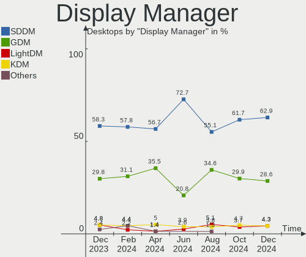
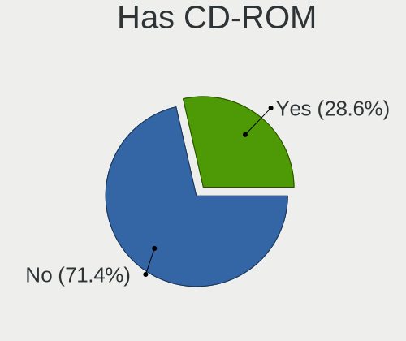
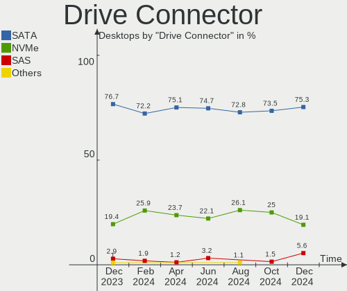
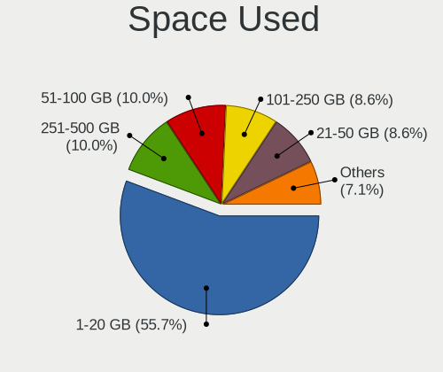
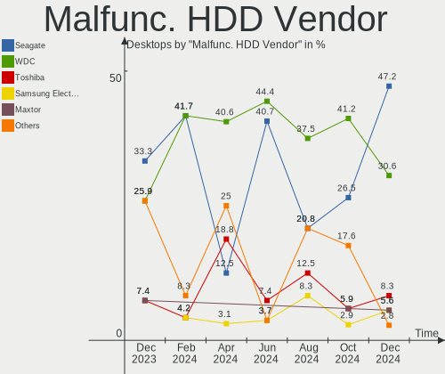
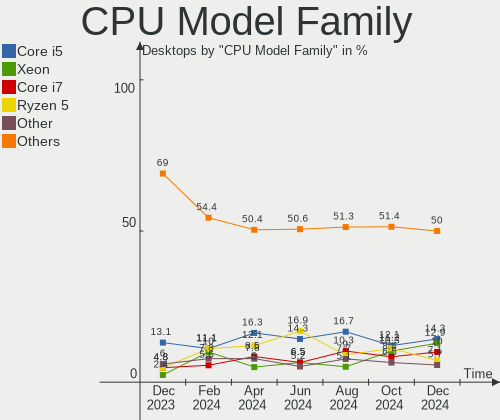
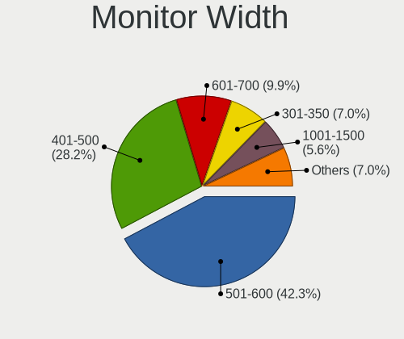
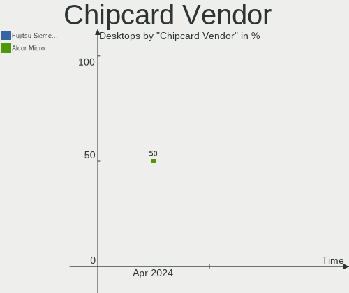
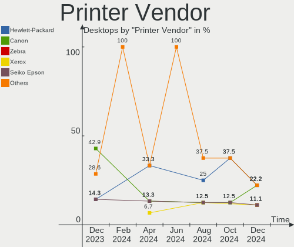

ROSA Hardware Trends (Desktop)
------------------------------

A project to identify most popular hardware characteristics and track their change
over time based on data collected by ROSA users at https://Linux-Hardware.org.

Anyone can contribute to the study by uploading probes of their computers by
the [hw-probe](https://github.com/linuxhw/hw-probe) tool:

    sudo -E hw-probe -all -upload

Full-feature report is available here: https://linux-hardware.org/?view=trends&formfactor=desktop

Period: Feb, 2021.

Contents
--------

- [ OS                       ](#os)
- [ OS Family                ](#os-family)
- [ Kernel                   ](#kernel)
- [ Kernel Family            ](#kernel-family)
- [ Kernel Major Ver.        ](#kernel-major-ver)
- [ Arch                     ](#arch)
- [ DE                       ](#de)
- [ Display Server           ](#display-server)
- [ Display Manager          ](#display-manager)
- [ OS Lang                  ](#os-lang)
- [ Boot Mode                ](#boot-mode)
- [ Filesystem               ](#filesystem)
- [ Part. scheme             ](#part-scheme)
- [ Dual Boot with Linux/BSD ](#dual-boot-with-linux/bsd)
- [ Dual Boot (Win)          ](#dual-boot-win)
- [ Country                  ](#country)
- [ City                     ](#city)
- [ Vendor                   ](#vendor)
- [ Model                    ](#model)
- [ Model Family             ](#model-family)
- [ MFG Year                 ](#mfg-year)
- [ Form Factor              ](#form-factor)
- [ Secure Boot              ](#secure-boot)
- [ Coreboot                 ](#coreboot)
- [ RAM Size                 ](#ram-size)
- [ RAM Used                 ](#ram-used)
- [ Has CD-ROM               ](#has-cd-rom)
- [ Total Drives             ](#total-drives)
- [ Has Ethernet             ](#has-ethernet)
- [ Drive Vendor             ](#drive-vendor)
- [ Drive Model              ](#drive-model)
- [ HDD Vendor               ](#hdd-vendor)
- [ SSD Vendor               ](#ssd-vendor)
- [ Drive Kind               ](#drive-kind)
- [ Drive Connector          ](#drive-connector)
- [ Drive Size               ](#drive-size)
- [ Space Total              ](#space-total)
- [ Space Used               ](#space-used)
- [ Malfunc. Drives          ](#malfunc-drives)
- [ Malfunc. Drive Vendor    ](#malfunc-drive-vendor)
- [ Malfunc. HDD Vendor      ](#malfunc-hdd-vendor)
- [ Malfunc. Drive Kind      ](#malfunc-drive-kind)
- [ Failed Drives            ](#failed-drives)
- [ Failed Drive Vendor      ](#failed-drive-vendor)
- [ Drive Status             ](#drive-status)
- [ Storage Vendor           ](#storage-vendor)
- [ Storage Model            ](#storage-model)
- [ Storage Kind             ](#storage-kind)
- [ CPU Vendor               ](#cpu-vendor)
- [ CPU Model                ](#cpu-model)
- [ CPU Model Family         ](#cpu-model-family)
- [ CPU Cores                ](#cpu-cores)
- [ CPU Sockets              ](#cpu-sockets)
- [ CPU Threads              ](#cpu-threads)
- [ CPU Op-Modes             ](#cpu-op-modes)
- [ CPU Microcode            ](#cpu-microcode)
- [ CPU Microarch            ](#cpu-microarch)
- [ GPU Vendor               ](#gpu-vendor)
- [ GPU Model                ](#gpu-model)
- [ GPU Combo                ](#gpu-combo)
- [ GPU Driver               ](#gpu-driver)
- [ GPU Memory               ](#gpu-memory)
- [ Monitor Vendor           ](#monitor-vendor)
- [ Monitor Model            ](#monitor-model)
- [ Monitor Resolution       ](#monitor-resolution)
- [ Monitor Diagonal         ](#monitor-diagonal)
- [ Monitor Width            ](#monitor-width)
- [ Aspect Ratio             ](#aspect-ratio)
- [ Monitor Area             ](#monitor-area)
- [ Pixel Density            ](#pixel-density)
- [ Multiple Monitors        ](#multiple-monitors)
- [ Net Controller Vendor    ](#net-controller-vendor)
- [ Net Controller Model     ](#net-controller-model)
- [ Wireless Vendor          ](#wireless-vendor)
- [ Wireless Model           ](#wireless-model)
- [ Ethernet Vendor          ](#ethernet-vendor)
- [ Ethernet Model           ](#ethernet-model)
- [ Net Controller Kind      ](#net-controller-kind)
- [ Used Controller          ](#used-controller)
- [ NICs                     ](#nics)
- [ Memory Vendor            ](#memory-vendor)
- [ Memory Model             ](#memory-model)
- [ Memory Kind              ](#memory-kind)
- [ Memory Form Factor       ](#memory-form-factor)
- [ Memory Size              ](#memory-size)
- [ Memory Speed             ](#memory-speed)
- [ Sound Vendor             ](#sound-vendor)
- [ Sound Model              ](#sound-model)
- [ Camera Vendor            ](#camera-vendor)
- [ Camera Model             ](#camera-model)
- [ Fingerprint Vendor       ](#fingerprint-vendor)
- [ Fingerprint Model        ](#fingerprint-model)
- [ Chipcard Vendor          ](#chipcard-vendor)
- [ Chipcard Model           ](#chipcard-model)
- [ Printer Vendor           ](#printer-vendor)
- [ Printer Model            ](#printer-model)
- [ Scanner Vendor           ](#scanner-vendor)
- [ Scanner Model            ](#scanner-model)
- [ Bluetooth Vendor         ](#bluetooth-vendor)
- [ Bluetooth Model          ](#bluetooth-model)
- [ Unsupported Devices      ](#unsupported-devices)
- [ Unsupported Device Types ](#unsupported-device-types)

OS
--

Installed operating systems

| Name       | Desktops | Percent |
|------------|----------|---------|
| ROSA R11.1 | 72       | 64.86%  |
| ROSA R11   | 25       | 22.52%  |
| ROSA R10   | 7        | 6.31%   |
| ROSA R12   | 4        | 3.6%    |
| ROSA R8.1  | 2        | 1.8%    |
| ROSA 7.3   | 1        | 0.9%    |

OS Family
---------

OS without a version

| Name | Desktops | Percent |
|------|----------|---------|
| ROSA | 111      | 100%    |

Kernel
------

Version of the Linux kernel

| Version                             | Desktops | Percent |
|-------------------------------------|----------|---------|
| 4.15.0-desktop-122.124.1rosa-x86_64 | 36       | 32.43%  |
| 4.15.0-desktop-45.1rosa-x86_64      | 22       | 19.82%  |
| 5.4.32-generic-2rosa-x86_64         | 7        | 6.31%   |
| 4.15.0-desktop-45.1rosa-i586        | 7        | 6.31%   |
| 4.9.155-nrj-desktop-1rosa-x86_64    | 6        | 5.41%   |
| 4.15.0-desktop-122.124.1rosa-i586   | 6        | 5.41%   |
| 5.4.83-generic-2rosa-x86_64         | 5        | 4.5%    |
| 4.9.60-nrj-desktop-1rosa-i586       | 4        | 3.6%    |
| 4.9.60-nrj-desktop-1rosa-x86_64     | 3        | 2.7%    |
| 5.5.19-generic-1rosa-x86_64         | 2        | 1.8%    |
| 5.4.83-generic-2rosa2019.1-x86_64   | 2        | 1.8%    |
| 5.4.40-generic-1rosa-x86_64         | 2        | 1.8%    |
| 5.4.32-generic-2rosa-i586           | 2        | 1.8%    |
| 5.4.0-desktop-11.1rosa-x86_64       | 1        | 0.9%    |
| 5.10.4-generic-3rosa2019.1-x86_64   | 1        | 0.9%    |
| 5.10.4-generic-3rosa-x86_64         | 1        | 0.9%    |
| 5.10.11-generic-1rosa2019.1-x86_64  | 1        | 0.9%    |
| 4.9.9-nrj-desktop-1rosa-x86_64      | 1        | 0.9%    |
| 4.9.155-nrj-desktop-1rosa-i586      | 1        | 0.9%    |
| 3.10.0-514.51.1.el7.x86_64          | 1        | 0.9%    |

Kernel Family
-------------

Linux kernel without a distro release

| Version | Desktops | Percent |
|---------|----------|---------|
| 4.15.0  | 71       | 63.96%  |
| 5.4.32  | 9        | 8.11%   |
| 5.4.83  | 7        | 6.31%   |
| 4.9.60  | 7        | 6.31%   |
| 4.9.155 | 7        | 6.31%   |
| 5.5.19  | 2        | 1.8%    |
| 5.4.40  | 2        | 1.8%    |
| 5.10.4  | 2        | 1.8%    |
| 5.4.0   | 1        | 0.9%    |
| 5.10.11 | 1        | 0.9%    |
| 4.9.9   | 1        | 0.9%    |
| 3.10.0  | 1        | 0.9%    |

Kernel Major Ver.
-----------------

Linux kernel major version

| Version | Desktops | Percent |
|---------|----------|---------|
| 4.15    | 71       | 63.96%  |
| 5.4     | 19       | 17.12%  |
| 4.9     | 15       | 13.51%  |
| 5.10    | 3        | 2.7%    |
| 5.5     | 2        | 1.8%    |
| 3.10    | 1        | 0.9%    |

Arch
----

OS architecture (x86_64, i586, etc.)

| Name   | Desktops | Percent |
|--------|----------|---------|
| x86_64 | 91       | 81.98%  |
| i686   | 20       | 18.02%  |

DE
--

Desktop Environment

| Name  | Desktops | Percent |
|-------|----------|---------|
| KDE4  | 64       | 57.66%  |
| KDE5  | 38       | 34.23%  |
| LXQt  | 7        | 6.31%   |
| MATE  | 1        | 0.9%    |
| GNOME | 1        | 0.9%    |

Display Server
--------------

X11 or Wayland

| Name    | Desktops | Percent |
|---------|----------|---------|
| X11     | 110      | 99.1%   |
| Wayland | 1        | 0.9%    |

Display Manager
---------------

SDDM, LightDM, etc.

| Name | Desktops | Percent |
|------|----------|---------|
| KDM  | 64       | 57.66%  |
| SDDM | 45       | 40.54%  |
| GDM  | 2        | 1.8%    |

OS Lang
-------

Language

| Lang    | Desktops | Percent |
|---------|----------|---------|
| ru_RU   | 63       | 56.76%  |
| Unknown | 34       | 30.63%  |
| pl_PL   | 3        | 2.7%    |
| pt_BR   | 2        | 1.8%    |
| it_IT   | 2        | 1.8%    |
| es_ES   | 2        | 1.8%    |
| en_US   | 2        | 1.8%    |
| de_DE   | 2        | 1.8%    |
| en_GB   | 1        | 0.9%    |

Boot Mode
---------

EFI or BIOS

| Mode | Desktops | Percent |
|------|----------|---------|
| BIOS | 94       | 84.68%  |
| EFI  | 17       | 15.32%  |

Filesystem
----------

Type of filesystem

| Type  | Desktops | Percent |
|-------|----------|---------|
| Ext4  | 107      | 96.4%   |
| Btrfs | 3        | 2.7%    |
| Ext3  | 1        | 0.9%    |

Part. scheme
------------

Scheme of partitioning

| Type    | Desktops | Percent |
|---------|----------|---------|
| MBR     | 76       | 68.47%  |
| GPT     | 27       | 24.32%  |
| Unknown | 8        | 7.21%   |

Dual Boot with Linux/BSD
------------------------

Hosting more than one Linux/BSD

| Dual boot | Desktops | Percent |
|-----------|----------|---------|
| No        | 79       | 71.17%  |
| Yes       | 32       | 28.83%  |

Dual Boot (Win)
---------------

Hosting Linux and Windows

| Dual boot | Desktops | Percent |
|-----------|----------|---------|
| Yes       | 57       | 51.35%  |
| No        | 54       | 48.65%  |

Country
-------

Geographic location (country)

| Country              | Desktops | Percent |
|----------------------|----------|---------|
| Russia               | 80       | 72.07%  |
| Ukraine              | 12       | 10.81%  |
| Poland               | 4        | 3.6%    |
| Germany              | 4        | 3.6%    |
| Italy                | 2        | 1.8%    |
| Brazil               | 2        | 1.8%    |
| USA                  | 1        | 0.9%    |
| Uruguay              | 1        | 0.9%    |
| UK                   | 1        | 0.9%    |
| South Africa         | 1        | 0.9%    |
| Moldova, Republic of | 1        | 0.9%    |
| Mexico               | 1        | 0.9%    |
| Bulgaria             | 1        | 0.9%    |

City
----

Geographic location (city)

| City             | Desktops | Percent |
|------------------|----------|---------|
| Moscow           | 8        | 7.21%   |
| Barnaul          | 5        | 4.5%    |
| St Petersburg    | 4        | 3.6%    |
| Samara           | 4        | 3.6%    |
| Ekaterinburg     | 4        | 3.6%    |
| Krasnoyarsk      | 3        | 2.7%    |
| Ulyanovsk        | 2        | 1.8%    |
| Tambov           | 2        | 1.8%    |
| Omsk             | 2        | 1.8%    |
| Novosibirsk      | 2        | 1.8%    |
| Krasnodar        | 2        | 1.8%    |
| Kazan’         | 2        | 1.8%    |
| Zhytomyr         | 1        | 0.9%    |
| Zaporizhia       | 1        | 0.9%    |
| Zamość         | 1        | 0.9%    |
| Yasinovataya     | 1        | 0.9%    |
| Yaroslavl        | 1        | 0.9%    |
| Volgograd        | 1        | 0.9%    |
| Vicenza          | 1        | 0.9%    |
| Veliky Novgorod  | 1        | 0.9%    |
| Valley Stream    | 1        | 0.9%    |
| Ulan-Ude         | 1        | 0.9%    |
| Tyumen           | 1        | 0.9%    |
| Tiraspol         | 1        | 0.9%    |
| Stavishche       | 1        | 0.9%    |
| Sochi            | 1        | 0.9%    |
| Smolensk         | 1        | 0.9%    |
| Simferopol       | 1        | 0.9%    |
| Sibay            | 1        | 0.9%    |
| Sevastopol       | 1        | 0.9%    |
| Serra            | 1        | 0.9%    |
| Saratov          | 1        | 0.9%    |
| Saransk          | 1        | 0.9%    |
| Saki             | 1        | 0.9%    |
| Rostov-on-Don    | 1        | 0.9%    |
| Rosenfeld        | 1        | 0.9%    |
| Ramenskoye       | 1        | 0.9%    |
| Pyatigorsk       | 1        | 0.9%    |
| Pustoshka        | 1        | 0.9%    |
| Prokop'yevsk     | 1        | 0.9%    |
| Poznan           | 1        | 0.9%    |
| Poltava          | 1        | 0.9%    |
| Plovdiv          | 1        | 0.9%    |
| Perm             | 1        | 0.9%    |
| Pavlovskiy Posad | 1        | 0.9%    |
| Osinniki         | 1        | 0.9%    |
| Oryol            | 1        | 0.9%    |
| Olenegorsk       | 1        | 0.9%    |
| Nizhniy Novgorod | 1        | 0.9%    |
| Nakhodka         | 1        | 0.9%    |
| Mykolayiv        | 1        | 0.9%    |
| Montevideo       | 1        | 0.9%    |
| Mezhdurechensk   | 1        | 0.9%    |
| Lozina           | 1        | 0.9%    |
| Kyiv             | 1        | 0.9%    |
| Kramatorsk       | 1        | 0.9%    |
| Krakow           | 1        | 0.9%    |
| Kopeysk          | 1        | 0.9%    |
| Kamen'-na-Obi    | 1        | 0.9%    |
| Kaluga           | 1        | 0.9%    |

Vendor
------

Motherboard manufacturer

| Name                | Desktops | Percent |
|---------------------|----------|---------|
| Gigabyte Technology | 31       | 27.93%  |
| ASUSTek Computer    | 30       | 27.03%  |
| ASRock              | 13       | 11.71%  |
| MSI                 | 10       | 9.01%   |
| ECS                 | 6        | 5.41%   |
| Lenovo              | 4        | 3.6%    |
| Biostar             | 3        | 2.7%    |
| Foxconn             | 2        | 1.8%    |
| Dell                | 2        | 1.8%    |
| Acer                | 2        | 1.8%    |
| VIA Technologies    | 1        | 0.9%    |
| TONK                | 1        | 0.9%    |
| Pegatron            | 1        | 0.9%    |
| Lite-On             | 1        | 0.9%    |
| Intel               | 1        | 0.9%    |
| Huanan              | 1        | 0.9%    |
| Hewlett-Packard     | 1        | 0.9%    |
| Fujitsu             | 1        | 0.9%    |

Model
-----

Motherboard model

| Name                              | Desktops | Percent |
|-----------------------------------|----------|---------|
| MSI MS-7267                       | 2        | 1.8%    |
| Gigabyte G41M-Combo               | 2        | 1.8%    |
| Gigabyte G31M-ES2L                | 2        | 1.8%    |
| VIA P4M266A-8237                  | 1        | 0.9%    |
| TONK SB200                        | 1        | 0.9%    |
| Pegatron Compaq dx2400 Microtower | 1        | 0.9%    |
| MSI MS-7C13                       | 1        | 0.9%    |
| MSI MS-7B98                       | 1        | 0.9%    |
| MSI MS-7A38                       | 1        | 0.9%    |
| MSI MS-7A33                       | 1        | 0.9%    |
| MSI MS-7996                       | 1        | 0.9%    |
| MSI MS-7529                       | 1        | 0.9%    |
| MSI MS-7250                       | 1        | 0.9%    |
| MSI Compaq dx7400 Microtower      | 1        | 0.9%    |
| Lite-On dx2000 MT(PL091EA)        | 1        | 0.9%    |
| Lenovo ThinkCentre M92p 3238BK7   | 1        | 0.9%    |
| Lenovo ThinkCentre M90p 5852A34   | 1        | 0.9%    |
| Lenovo ThinkCentre M72e 3598B44   | 1        | 0.9%    |
| Lenovo H420                       | 1        | 0.9%    |
| Intel H55 INTEL                   | 1        | 0.9%    |
| Huanan X99-TF                     | 1        | 0.9%    |
| HP Compaq 8200 Elite CMT PC       | 1        | 0.9%    |
| Gigabyte X58A-UD7                 | 1        | 0.9%    |
| Gigabyte P67A-D3-B3               | 1        | 0.9%    |
| Gigabyte P35-S3G                  | 1        | 0.9%    |
| Gigabyte P35-DS4                  | 1        | 0.9%    |
| Gigabyte M61SME-S2                | 1        | 0.9%    |
| Gigabyte H61M-S1                  | 1        | 0.9%    |
| Gigabyte H55M-S2H                 | 1        | 0.9%    |
| Gigabyte H55M-D2H                 | 1        | 0.9%    |
| Gigabyte H310M S2V 2.0            | 1        | 0.9%    |
| Gigabyte H310M S2H 2.0            | 1        | 0.9%    |
| Gigabyte H310M H 2.0              | 1        | 0.9%    |
| Gigabyte GA-MA78GM-UD2H           | 1        | 0.9%    |
| Gigabyte GA-MA770-DS3             | 1        | 0.9%    |
| Gigabyte GA-870A-USB3             | 1        | 0.9%    |
| Gigabyte G41MT-S2                 | 1        | 0.9%    |
| Gigabyte G33-DS3R                 | 1        | 0.9%    |
| Gigabyte EP45-DS3L                | 1        | 0.9%    |
| Gigabyte C1007UN                  | 1        | 0.9%    |
| Gigabyte B550M AORUS PRO          | 1        | 0.9%    |
| Gigabyte B450M S2H                | 1        | 0.9%    |
| Gigabyte B365MHD3                 | 1        | 0.9%    |
| Gigabyte B365M H                  | 1        | 0.9%    |
| Gigabyte AB350-Gaming             | 1        | 0.9%    |
| Gigabyte A320M-S2H                | 1        | 0.9%    |
| Gigabyte 970A-UD3P                | 1        | 0.9%    |
| Gigabyte 945GCM-S2L               | 1        | 0.9%    |
| Gigabyte 8IPE1000-G               | 1        | 0.9%    |
| Fujitsu ESPRIMO P5731             | 1        | 0.9%    |
| Foxconn H61MXP                    | 1        | 0.9%    |
| Foxconn ETON                      | 1        | 0.9%    |
| ECS P965T-A                       | 1        | 0.9%    |
| ECS P43T-A2                       | 1        | 0.9%    |
| ECS nForce                        | 1        | 0.9%    |
| ECS H61H2-M12                     | 1        | 0.9%    |
| ECS G41T-M5                       | 1        | 0.9%    |
| ECS G31T-M7                       | 1        | 0.9%    |
| Dell Precision T1500              | 1        | 0.9%    |
| Dell OptiPlex 7010                | 1        | 0.9%    |

Model Family
------------

Motherboard model prefix

| Name                    | Desktops | Percent |
|-------------------------|----------|---------|
| Lenovo ThinkCentre      | 3        | 2.7%    |
| Gigabyte H310M          | 3        | 2.7%    |
| MSI MS-7267             | 2        | 1.8%    |
| Gigabyte G41M-Combo     | 2        | 1.8%    |
| Gigabyte G31M-ES2L      | 2        | 1.8%    |
| ASUS PRIME              | 2        | 1.8%    |
| ASUS P8Z77-V            | 2        | 1.8%    |
| ASUS P5K                | 2        | 1.8%    |
| ASUS P5G41T-M           | 2        | 1.8%    |
| Acer Aspire             | 2        | 1.8%    |
| VIA P4M266A-8237        | 1        | 0.9%    |
| TONK SB200              | 1        | 0.9%    |
| Pegatron Compaq         | 1        | 0.9%    |
| MSI MS-7C13             | 1        | 0.9%    |
| MSI MS-7B98             | 1        | 0.9%    |
| MSI MS-7A38             | 1        | 0.9%    |
| MSI MS-7A33             | 1        | 0.9%    |
| MSI MS-7996             | 1        | 0.9%    |
| MSI MS-7529             | 1        | 0.9%    |
| MSI MS-7250             | 1        | 0.9%    |
| MSI Compaq              | 1        | 0.9%    |
| Lite-On dx2000          | 1        | 0.9%    |
| Lenovo H420             | 1        | 0.9%    |
| Intel H55               | 1        | 0.9%    |
| Huanan X99-TF           | 1        | 0.9%    |
| HP Compaq               | 1        | 0.9%    |
| Gigabyte X58A-UD7       | 1        | 0.9%    |
| Gigabyte P67A-D3-B3     | 1        | 0.9%    |
| Gigabyte P35-S3G        | 1        | 0.9%    |
| Gigabyte P35-DS4        | 1        | 0.9%    |
| Gigabyte M61SME-S2      | 1        | 0.9%    |
| Gigabyte H61M-S1        | 1        | 0.9%    |
| Gigabyte H55M-S2H       | 1        | 0.9%    |
| Gigabyte H55M-D2H       | 1        | 0.9%    |
| Gigabyte GA-MA78GM-UD2H | 1        | 0.9%    |
| Gigabyte GA-MA770-DS3   | 1        | 0.9%    |
| Gigabyte GA-870A-USB3   | 1        | 0.9%    |
| Gigabyte G41MT-S2       | 1        | 0.9%    |
| Gigabyte G33-DS3R       | 1        | 0.9%    |
| Gigabyte EP45-DS3L      | 1        | 0.9%    |
| Gigabyte C1007UN        | 1        | 0.9%    |
| Gigabyte B550M          | 1        | 0.9%    |
| Gigabyte B450M          | 1        | 0.9%    |
| Gigabyte B365MHD3       | 1        | 0.9%    |
| Gigabyte B365M          | 1        | 0.9%    |
| Gigabyte AB350-Gaming   | 1        | 0.9%    |
| Gigabyte A320M-S2H      | 1        | 0.9%    |
| Gigabyte 970A-UD3P      | 1        | 0.9%    |
| Gigabyte 945GCM-S2L     | 1        | 0.9%    |
| Gigabyte 8IPE1000-G     | 1        | 0.9%    |
| Fujitsu ESPRIMO         | 1        | 0.9%    |
| Foxconn H61MXP          | 1        | 0.9%    |
| Foxconn ETON            | 1        | 0.9%    |
| ECS P965T-A             | 1        | 0.9%    |
| ECS P43T-A2             | 1        | 0.9%    |
| ECS nForce              | 1        | 0.9%    |
| ECS H61H2-M12           | 1        | 0.9%    |
| ECS G41T-M5             | 1        | 0.9%    |
| ECS G31T-M7             | 1        | 0.9%    |
| Dell Precision          | 1        | 0.9%    |

MFG Year
--------

Motherboard manufacture year

| Year | Desktops | Percent |
|------|----------|---------|
| 2010 | 16       | 14.41%  |
| 2019 | 12       | 10.81%  |
| 2009 | 12       | 10.81%  |
| 2012 | 10       | 9.01%   |
| 2011 | 9        | 8.11%   |
| 2013 | 7        | 6.31%   |
| 2007 | 7        | 6.31%   |
| 2020 | 6        | 5.41%   |
| 2018 | 6        | 5.41%   |
| 2016 | 5        | 4.5%    |
| 2008 | 5        | 4.5%    |
| 2005 | 4        | 3.6%    |
| 2017 | 3        | 2.7%    |
| 2006 | 3        | 2.7%    |
| 2021 | 2        | 1.8%    |
| 2014 | 2        | 1.8%    |
| 2015 | 1        | 0.9%    |
| 2004 | 1        | 0.9%    |

Form Factor
-----------

Physical design of the computer

| Name    | Desktops | Percent |
|---------|----------|---------|
| Desktop | 111      | 100%    |

Secure Boot
-----------

Enabled or disabled

| State    | Desktops | Percent |
|----------|----------|---------|
| Disabled | 111      | 100%    |

Coreboot
--------

Have coreboot on board

| Used | Desktops | Percent |
|------|----------|---------|
| No   | 111      | 100%    |

RAM Size
--------

Total RAM memory

| Size in GB | Desktops | Percent |
|------------|----------|---------|
| 3.01-4.0   | 35       | 31.53%  |
| 8.01-16.0  | 22       | 19.82%  |
| 4.01-8.0   | 18       | 16.22%  |
| 16.01-24.0 | 11       | 9.91%   |
| 1.01-2.0   | 9        | 8.11%   |
| 2.01-3.0   | 8        | 7.21%   |
| 32.01-64.0 | 5        | 4.5%    |
| 24.01-32.0 | 2        | 1.8%    |
| 0.51-1.0   | 1        | 0.9%    |

RAM Used
--------

Used RAM memory

| Used GB  | Desktops | Percent |
|----------|----------|---------|
| 1.01-2.0 | 46       | 41.44%  |
| 0.51-1.0 | 43       | 38.74%  |
| 2.01-3.0 | 12       | 10.81%  |
| 3.01-4.0 | 5        | 4.5%    |
| 0.01-0.5 | 3        | 2.7%    |
| 4.01-8.0 | 2        | 1.8%    |

Has CD-ROM
----------

Has CD-ROM on board

| Presented | Desktops | Percent |
|-----------|----------|---------|
| No        | 58       | 52.25%  |
| Yes       | 53       | 47.75%  |

Total Drives
------------

Number of drives on board

| Drives | Desktops | Percent |
|--------|----------|---------|
| 1      | 58       | 52.25%  |
| 2      | 30       | 27.03%  |
| 3      | 16       | 14.41%  |
| 4      | 4        | 3.6%    |
| 5      | 2        | 1.8%    |
| 6      | 1        | 0.9%    |

Has Ethernet
------------

Has Ethernet on board

| Presented | Desktops | Percent |
|-----------|----------|---------|
| Yes       | 111      | 100%    |

Drive Vendor
------------

Hard drive vendors

| Vendor              | Desktops | Drives | Percent |
|---------------------|----------|--------|---------|
| Seagate             | 51       | 60     | 29.14%  |
| WDC                 | 36       | 49     | 20.57%  |
| Samsung Electronics | 17       | 18     | 9.71%   |
| Toshiba             | 11       | 11     | 6.29%   |
| Kingston            | 9        | 9      | 5.14%   |
| Maxtor              | 7        | 7      | 4%      |
| Hitachi             | 5        | 5      | 2.86%   |
| GOODRAM             | 5        | 5      | 2.86%   |
| China               | 5        | 5      | 2.86%   |
| Smartbuy            | 3        | 3      | 1.71%   |
| HGST                | 3        | 3      | 1.71%   |
| Crucial             | 3        | 3      | 1.71%   |
| SPCC                | 2        | 2      | 1.14%   |
| Apacer              | 2        | 2      | 1.14%   |
| XrayDisk            | 1        | 1      | 0.57%   |
| Transcend           | 1        | 1      | 0.57%   |
| QUMO                | 1        | 1      | 0.57%   |
| PLEXTOR             | 1        | 1      | 0.57%   |
| OCZ-VERTEX2         | 1        | 1      | 0.57%   |
| OCZ                 | 1        | 1      | 0.57%   |
| Micron Technology   | 1        | 1      | 0.57%   |
| LITEON              | 1        | 1      | 0.57%   |
| KingSpec            | 1        | 1      | 0.57%   |
| KingDian            | 1        | 1      | 0.57%   |
| Intenso             | 1        | 1      | 0.57%   |
| Intel               | 1        | 1      | 0.57%   |
| Gigabyte Technology | 1        | 1      | 0.57%   |
| FC-1307             | 1        | 1      | 0.57%   |
| e2e4                | 1        | 1      | 0.57%   |
| A-DATA Technology   | 1        | 1      | 0.57%   |

Drive Model
-----------

Hard drive models

| Model                            | Desktops | Percent |
|----------------------------------|----------|---------|
| Seagate ST3500418AS 500GB        | 5        | 2.55%   |
| Seagate ST3320620AS 320GB        | 4        | 2.04%   |
| Seagate ST1000DM010-2EP102 1TB   | 4        | 2.04%   |
| Kingston SA400S37240G 240GB SSD  | 4        | 2.04%   |
| Seagate ST500DM002-1BD142 500GB  | 3        | 1.53%   |
| Seagate ST3250410AS 250GB        | 3        | 1.53%   |
| WDC WDS240G2G0B-00EPW0 240GB SSD | 2        | 1.02%   |
| WDC WD10EADS-00M2B0 1TB          | 2        | 1.02%   |
| WDC WD1002FAEX-00Z3A0 1TB        | 2        | 1.02%   |
| Toshiba DT01ACA100 1TB           | 2        | 1.02%   |
| Toshiba DT01ACA050 500GB         | 2        | 1.02%   |
| Seagate ST3808110AS 80GB         | 2        | 1.02%   |
| Seagate ST340014A 40GB           | 2        | 1.02%   |
| Seagate ST3250312AS 250GB        | 2        | 1.02%   |
| Seagate ST250DM000-1BD141 250GB  | 2        | 1.02%   |
| Seagate ST1000DM003-1ER162 1TB   | 2        | 1.02%   |
| Samsung SSD 860 EVO 250GB        | 2        | 1.02%   |
| Samsung SSD 750 EVO 250GB        | 2        | 1.02%   |
| Samsung SP0411N 40GB             | 2        | 1.02%   |
| Kingston SUV500120G 120GB SSD    | 2        | 1.02%   |
| XrayDisk SSD 256GB               | 1        | 0.51%   |
| WDC WDS500G2B0C-00PXH0 500GB     | 1        | 0.51%   |
| WDC WDS250G2B0A 250GB SSD        | 1        | 0.51%   |
| WDC WDS250G1B0C-00S6U0 250GB     | 1        | 0.51%   |
| WDC WDS120G2G0A-00JH30 120GB SSD | 1        | 0.51%   |
| WDC WDS100T2B0B 1TB SSD          | 1        | 0.51%   |
| WDC WD800JD-22MSA1 80GB          | 1        | 0.51%   |
| WDC WD800BB-00FRA0 80GB          | 1        | 0.51%   |
| WDC WD800AAJS-00PSA0 80GB        | 1        | 0.51%   |
| WDC WD7501AALS-00J7B0 752GB      | 1        | 0.51%   |
| WDC WD5001AALS-00L3B2 500GB      | 1        | 0.51%   |
| WDC WD5000LPVX-28V0TT1 500GB     | 1        | 0.51%   |
| WDC WD5000LPCX-24VHAT0 500GB     | 1        | 0.51%   |
| WDC WD5000AAKX-00ERMA0 500GB     | 1        | 0.51%   |
| WDC WD5000AAKX-001CA0 500GB      | 1        | 0.51%   |
| WDC WD5000AAKS-00A7B2 500GB      | 1        | 0.51%   |
| WDC WD40EFRX-68WT0N0 4TB         | 1        | 0.51%   |
| WDC WD400BB-60JKA0 40GB          | 1        | 0.51%   |
| WDC WD400BB-60DGA0 40GB          | 1        | 0.51%   |
| WDC WD400BB-00JHC0 40GB          | 1        | 0.51%   |
| WDC WD4003FRYZ-01F0DB0 4TB       | 1        | 0.51%   |
| WDC WD3200AAKS-00B3A0 320GB      | 1        | 0.51%   |
| WDC WD3200AAJS-61B4A0 320GB      | 1        | 0.51%   |
| WDC WD3200AAJS-00B4A0 320GB      | 1        | 0.51%   |
| WDC WD30EZRX-00DC0B0 3TB         | 1        | 0.51%   |
| WDC WD2500JS-22NCB1 250GB        | 1        | 0.51%   |
| WDC WD2500JS-00MHB0 250GB        | 1        | 0.51%   |
| WDC WD2500AAKX-60U6AA0 250GB     | 1        | 0.51%   |
| WDC WD2500AAKX-00ERMA0 250GB     | 1        | 0.51%   |
| WDC WD20EZRX-00DC0B0 2TB         | 1        | 0.51%   |
| WDC WD20EADS-00S2B0 2TB          | 1        | 0.51%   |
| WDC WD2000JS-22NCB1 200GB        | 1        | 0.51%   |
| WDC WD10EZEX-75WN4A0 1TB         | 1        | 0.51%   |
| WDC WD10EZEX-60ZF5A0 1TB         | 1        | 0.51%   |
| WDC WD10EZEX-08Y20A0 1TB         | 1        | 0.51%   |
| WDC WD10EZEX-08WN4A0 1TB         | 1        | 0.51%   |
| WDC WD10EZEX-08M2NA0 1TB         | 1        | 0.51%   |
| WDC WD10EZEX-00ZF5A0 1TB         | 1        | 0.51%   |
| WDC WD10EZEX-00MFCA0 1TB         | 1        | 0.51%   |
| WDC WD10EARS-22Y5B1 1TB          | 1        | 0.51%   |

HDD Vendor
----------

Hard disk drive vendors

| Vendor              | Desktops | Drives | Percent |
|---------------------|----------|--------|---------|
| Seagate             | 51       | 60     | 43.59%  |
| WDC                 | 32       | 42     | 27.35%  |
| Toshiba             | 9        | 9      | 7.69%   |
| Samsung Electronics | 9        | 9      | 7.69%   |
| Maxtor              | 7        | 7      | 5.98%   |
| Hitachi             | 5        | 5      | 4.27%   |
| HGST                | 3        | 3      | 2.56%   |
| FC-1307             | 1        | 1      | 0.85%   |

SSD Vendor
----------

Solid state drive vendors

| Vendor              | Desktops | Drives | Percent |
|---------------------|----------|--------|---------|
| Kingston            | 8        | 8      | 15.38%  |
| Samsung Electronics | 6        | 7      | 11.54%  |
| WDC                 | 5        | 5      | 9.62%   |
| GOODRAM             | 5        | 5      | 9.62%   |
| China               | 5        | 5      | 9.62%   |
| Crucial             | 3        | 3      | 5.77%   |
| SPCC                | 2        | 2      | 3.85%   |
| Smartbuy            | 2        | 2      | 3.85%   |
| XrayDisk            | 1        | 1      | 1.92%   |
| Toshiba             | 1        | 1      | 1.92%   |
| QUMO                | 1        | 1      | 1.92%   |
| PLEXTOR             | 1        | 1      | 1.92%   |
| OCZ-VERTEX2         | 1        | 1      | 1.92%   |
| OCZ                 | 1        | 1      | 1.92%   |
| Micron Technology   | 1        | 1      | 1.92%   |
| LITEON              | 1        | 1      | 1.92%   |
| KingSpec            | 1        | 1      | 1.92%   |
| KingDian            | 1        | 1      | 1.92%   |
| Intenso             | 1        | 1      | 1.92%   |
| Intel               | 1        | 1      | 1.92%   |
| Gigabyte Technology | 1        | 1      | 1.92%   |
| e2e4                | 1        | 1      | 1.92%   |
| Apacer              | 1        | 1      | 1.92%   |
| A-DATA Technology   | 1        | 1      | 1.92%   |

Drive Kind
----------

HDD or SSD

| Kind | Desktops | Drives | Percent |
|------|----------|--------|---------|
| HDD  | 92       | 136    | 61.74%  |
| SSD  | 48       | 53     | 32.21%  |
| NVMe | 9        | 9      | 6.04%   |

Drive Connector
---------------

SATA, SAS, NVMe, etc.

| Type | Desktops | Drives | Percent |
|------|----------|--------|---------|
| SATA | 107      | 188    | 91.45%  |
| NVMe | 9        | 9      | 7.69%   |
| SAS  | 1        | 1      | 0.85%   |

Drive Size
----------

Size of hard drive

| Size in TB | Desktops | Drives | Percent |
|------------|----------|--------|---------|
| 0.01-0.5   | 96       | 140    | 70.59%  |
| 0.51-1.0   | 30       | 39     | 22.06%  |
| 1.01-2.0   | 6        | 6      | 4.41%   |
| 3.01-4.0   | 2        | 2      | 1.47%   |
| 2.01-3.0   | 1        | 1      | 0.74%   |
| 4.01-10.0  | 1        | 1      | 0.74%   |

Space Total
-----------

Amount of disk space available on the file system

| Size in GB     | Desktops | Percent |
|----------------|----------|---------|
| 101-250        | 31       | 27.93%  |
| 251-500        | 21       | 18.92%  |
| 1-20           | 16       | 14.41%  |
| 501-1000       | 14       | 12.61%  |
| 51-100         | 13       | 11.71%  |
| 21-50          | 9        | 8.11%   |
| 1001-2000      | 4        | 3.6%    |
| 2001-3000      | 2        | 1.8%    |
| More than 3000 | 1        | 0.9%    |

Space Used
----------

Amount of used disk space

| Used GB   | Desktops | Percent |
|-----------|----------|---------|
| 1-20      | 69       | 62.16%  |
| 21-50     | 14       | 12.61%  |
| 101-250   | 11       | 9.91%   |
| 251-500   | 8        | 7.21%   |
| 501-1000  | 4        | 3.6%    |
| 51-100    | 3        | 2.7%    |
| 1001-2000 | 2        | 1.8%    |

Malfunc. Drives
---------------

Drive models with a malfunction

| Model                             | Desktops | Drives | Percent |
|-----------------------------------|----------|--------|---------|
| Seagate ST3500418AS 500GB         | 3        | 3      | 4.35%   |
| Seagate ST3320620AS 320GB         | 3        | 3      | 4.35%   |
| WDC WD1002FAEX-00Z3A0 1TB         | 2        | 2      | 2.9%    |
| Seagate ST500DM002-1BD142 500GB   | 2        | 2      | 2.9%    |
| Seagate ST3250410AS 250GB         | 2        | 2      | 2.9%    |
| WDC WDS240G2G0B-00EPW0 240GB SSD  | 1        | 1      | 1.45%   |
| WDC WD800JD-22MSA1 80GB           | 1        | 1      | 1.45%   |
| WDC WD800BB-00FRA0 80GB           | 1        | 1      | 1.45%   |
| WDC WD5001AALS-00L3B2 500GB       | 1        | 1      | 1.45%   |
| WDC WD5000LPVX-28V0TT1 500GB      | 1        | 1      | 1.45%   |
| WDC WD5000AAKX-00ERMA0 500GB      | 1        | 1      | 1.45%   |
| WDC WD5000AAKS-00A7B2 500GB       | 1        | 1      | 1.45%   |
| WDC WD40EFRX-68WT0N0 4TB          | 1        | 1      | 1.45%   |
| WDC WD400BB-60JKA0 40GB           | 1        | 2      | 1.45%   |
| WDC WD400BB-00JHC0 40GB           | 1        | 1      | 1.45%   |
| WDC WD3200AAJS-61B4A0 320GB       | 1        | 1      | 1.45%   |
| WDC WD3200AAJS-00B4A0 320GB       | 1        | 1      | 1.45%   |
| WDC WD2500JS-00MHB0 250GB         | 1        | 1      | 1.45%   |
| WDC WD10EZEX-08Y20A0 1TB          | 1        | 1      | 1.45%   |
| WDC WD10EARS-00Y5B1 1TB           | 1        | 1      | 1.45%   |
| WDC WD10EADS-00M2B0 1TB           | 1        | 1      | 1.45%   |
| Toshiba MK1059GSMP 1TB            | 1        | 1      | 1.45%   |
| Toshiba DT01ACA050 500GB          | 1        | 1      | 1.45%   |
| SPCC SSD162 120GB                 | 1        | 1      | 1.45%   |
| Seagate ST9640320AS 640GB         | 1        | 1      | 1.45%   |
| Seagate ST9320328CS 320GB         | 1        | 1      | 1.45%   |
| Seagate ST9320325AS 320GB         | 1        | 1      | 1.45%   |
| Seagate ST3808110AS 80GB          | 1        | 1      | 1.45%   |
| Seagate ST380011A 80GB            | 1        | 1      | 1.45%   |
| Seagate ST3500820AS 500GB         | 1        | 1      | 1.45%   |
| Seagate ST340014A 40GB            | 1        | 1      | 1.45%   |
| Seagate ST3250824AS 250GB         | 1        | 1      | 1.45%   |
| Seagate ST3250312AS 250GB         | 1        | 1      | 1.45%   |
| Seagate ST3250310AS 250GB         | 1        | 1      | 1.45%   |
| Seagate ST3200827AS 200GB         | 1        | 1      | 1.45%   |
| Seagate ST320011A 20GB            | 1        | 1      | 1.45%   |
| Seagate ST3160812AS 160GB         | 1        | 1      | 1.45%   |
| Seagate ST3120814A 120GB          | 1        | 1      | 1.45%   |
| Seagate ST3120026A 120GB          | 1        | 1      | 1.45%   |
| Seagate ST31000528AS 1TB          | 1        | 1      | 1.45%   |
| Seagate ST31000524AS 1TB          | 1        | 1      | 1.45%   |
| Seagate ST31000333AS 1TB          | 1        | 1      | 1.45%   |
| Seagate ST250DM000-1BD141 250GB   | 1        | 1      | 1.45%   |
| Seagate ST2000LM007-1R8174 2TB    | 1        | 1      | 1.45%   |
| Seagate ST2000DX001-1CM164 2TB    | 1        | 1      | 1.45%   |
| Seagate ST1000DM003-9YN162 1TB    | 1        | 1      | 1.45%   |
| Seagate ST1000DM003-1CH162 1TB    | 1        | 1      | 1.45%   |
| Seagate ST1000DL002-9TT153 1TB    | 1        | 1      | 1.45%   |
| Samsung Electronics SP2504C 250GB | 1        | 1      | 1.45%   |
| Samsung Electronics HD160JJ 160GB | 1        | 1      | 1.45%   |
| Samsung Electronics HD105SI 1TB   | 1        | 1      | 1.45%   |
| OCZ AGILITY4 256GB SSD            | 1        | 1      | 1.45%   |
| MAXTOR STM332082 320GB            | 1        | 1      | 1.45%   |
| Maxtor 7V300F0 304GB              | 1        | 1      | 1.45%   |
| Maxtor 7B300S0 304GB              | 1        | 1      | 1.45%   |
| Maxtor 6L080M0 82GB               | 1        | 1      | 1.45%   |
| Maxtor 2F030J0 32GB               | 1        | 1      | 1.45%   |
| Maxtor 2F020J0 21GB               | 1        | 1      | 1.45%   |
| Hitachi HDT722525DLA380 250GB     | 1        | 1      | 1.45%   |
| Hitachi HDS721032CLA362 320GB     | 1        | 1      | 1.45%   |

Malfunc. Drive Vendor
---------------------

Vendors of faulty drives

| Vendor              | Desktops | Drives | Percent |
|---------------------|----------|--------|---------|
| Seagate             | 29       | 34     | 45.31%  |
| WDC                 | 18       | 19     | 28.13%  |
| Maxtor              | 6        | 6      | 9.38%   |
| Samsung Electronics | 3        | 3      | 4.69%   |
| Hitachi             | 3        | 3      | 4.69%   |
| Toshiba             | 2        | 2      | 3.13%   |
| SPCC                | 1        | 1      | 1.56%   |
| OCZ                 | 1        | 1      | 1.56%   |
| HGST                | 1        | 1      | 1.56%   |

Malfunc. HDD Vendor
-------------------

Vendors of faulty HDD drives

| Vendor              | Desktops | Drives | Percent |
|---------------------|----------|--------|---------|
| Seagate             | 29       | 34     | 47.54%  |
| WDC                 | 17       | 18     | 27.87%  |
| MAXTOR              | 6        | 6      | 9.84%   |
| Samsung Electronics | 3        | 3      | 4.92%   |
| Hitachi             | 3        | 3      | 4.92%   |
| Toshiba             | 2        | 2      | 3.28%   |
| HGST                | 1        | 1      | 1.64%   |

Malfunc. Drive Kind
-------------------

Kinds of faulty drives

| Kind | Desktops | Drives | Percent |
|------|----------|--------|---------|
| HDD  | 54       | 67     | 94.74%  |
| SSD  | 3        | 3      | 5.26%   |

Failed Drives
-------------

Failed drive models

| Model                            | Desktops | Drives | Percent |
|----------------------------------|----------|--------|---------|
| WDC WD2500JS-22NCB1 250GB        | 1        | 1      | 50%     |
| Samsung Electronics SV2001H 20GB | 1        | 1      | 50%     |

Failed Drive Vendor
-------------------

Failed drive vendors

| Vendor              | Desktops | Drives | Percent |
|---------------------|----------|--------|---------|
| WDC                 | 1        | 1      | 50%     |
| Samsung Electronics | 1        | 1      | 50%     |

Drive Status
------------

Number of failed and malfunc. drives

| Status   | Desktops | Drives | Percent |
|----------|----------|--------|---------|
| Works    | 80       | 123    | 56.74%  |
| Malfunc  | 56       | 70     | 39.72%  |
| Detected | 3        | 3      | 2.13%   |
| Failed   | 2        | 2      | 1.42%   |

Storage Vendor
--------------

Storage controller vendors

| Vendor                           | Desktops | Percent |
|----------------------------------|----------|---------|
| Intel                            | 77       | 53.1%   |
| AMD                              | 25       | 17.24%  |
| JMicron Technology               | 14       | 9.66%   |
| Nvidia                           | 7        | 4.83%   |
| ASMedia Technology               | 7        | 4.83%   |
| Marvell Technology Group         | 4        | 2.76%   |
| Silicon Motion                   | 2        | 1.38%   |
| Sandisk                          | 2        | 1.38%   |
| Samsung Electronics              | 2        | 1.38%   |
| VIA Technologies                 | 1        | 0.69%   |
| Silicon Integrated Systems [SiS] | 1        | 0.69%   |
| Phison Electronics               | 1        | 0.69%   |
| OCZ Technology Group             | 1        | 0.69%   |
| Kingston Technology Company      | 1        | 0.69%   |

Storage Model
-------------

Storage controller models

| Model                                                                                   | Desktops | Percent |
|-----------------------------------------------------------------------------------------|----------|---------|
| Intel NM10/ICH7 Family SATA Controller [IDE mode]                                       | 18       | 8.61%   |
| AMD FCH SATA Controller [AHCI mode]                                                     | 14       | 6.7%    |
| Intel 82801G (ICH7 Family) IDE Controller                                               | 13       | 6.22%   |
| JMicron JMB368 IDE controller                                                           | 7        | 3.35%   |
| Intel 200 Series PCH SATA controller [AHCI mode]                                        | 7        | 3.35%   |
| AMD SB7x0/SB8x0/SB9x0 IDE Controller                                                    | 7        | 3.35%   |
| Intel 82801JI (ICH10 Family) 4 port SATA IDE Controller #1                              | 6        | 2.87%   |
| Intel 82801JI (ICH10 Family) 2 port SATA IDE Controller #2                              | 6        | 2.87%   |
| Intel 82801I (ICH9 Family) 2 port SATA Controller [IDE mode]                            | 6        | 2.87%   |
| ASMedia ASM1062 Serial ATA Controller                                                   | 6        | 2.87%   |
| Nvidia MCP61 SATA Controller                                                            | 5        | 2.39%   |
| Nvidia MCP61 IDE                                                                        | 5        | 2.39%   |
| JMicron JMB363 SATA/IDE Controller                                                      | 5        | 2.39%   |
| Intel 6 Series/C200 Series Chipset Family 6 port Desktop SATA AHCI Controller           | 5        | 2.39%   |
| AMD SB7x0/SB8x0/SB9x0 SATA Controller [AHCI mode]                                       | 5        | 2.39%   |
| Intel 7 Series/C210 Series Chipset Family 6-port SATA Controller [AHCI mode]            | 4        | 1.91%   |
| Intel 6 Series/C200 Series Chipset Family Desktop SATA Controller (IDE mode, ports 4-5) | 4        | 1.91%   |
| Intel 6 Series/C200 Series Chipset Family Desktop SATA Controller (IDE mode, ports 0-3) | 4        | 1.91%   |
| AMD SB7x0/SB8x0/SB9x0 SATA Controller [IDE mode]                                        | 4        | 1.91%   |
| AMD 400 Series Chipset SATA Controller                                                  | 4        | 1.91%   |
| Intel Q170/Q150/B150/H170/H110/Z170/CM236 Chipset SATA Controller [AHCI Mode]           | 3        | 1.44%   |
| Intel 82801IR/IO/IH (ICH9R/DO/DH) 4 port SATA Controller [IDE mode]                     | 3        | 1.44%   |
| Intel 82801IB (ICH9) 2 port SATA Controller [IDE mode]                                  | 3        | 1.44%   |
| Intel 5 Series/3400 Series Chipset 6 port SATA AHCI Controller                          | 3        | 1.44%   |
| Silicon Motion SM2263EN/SM2263XT SSD Controller                                         | 2        | 0.96%   |
| Samsung NVMe SSD Controller SM981/PM981/PM983                                           | 2        | 0.96%   |
| Marvell Group 88SE6101/6102 single-port PATA133 interface                               | 2        | 0.96%   |
| JMicron JMB361 AHCI/IDE                                                                 | 2        | 0.96%   |
| Intel SATA Controller [RAID mode]                                                       | 2        | 0.96%   |
| Intel 82801JI (ICH10 Family) SATA AHCI Controller                                       | 2        | 0.96%   |
| Intel 82801HR/HO/HH (ICH8R/DO/DH) 2 port SATA Controller [IDE mode]                     | 2        | 0.96%   |
| Intel 82801H (ICH8 Family) 4 port SATA Controller [IDE mode]                            | 2        | 0.96%   |
| Intel 82801EB/ER (ICH5/ICH5R) IDE Controller                                            | 2        | 0.96%   |
| Intel 5 Series/3400 Series Chipset 4 port SATA IDE Controller                           | 2        | 0.96%   |
| Intel 5 Series/3400 Series Chipset 2 port SATA IDE Controller                           | 2        | 0.96%   |
| AMD X370 Series Chipset SATA Controller                                                 | 2        | 0.96%   |
| AMD FCH SATA Controller D                                                               | 2        | 0.96%   |
| AMD FCH IDE Controller                                                                  | 2        | 0.96%   |
| VIA VT82C586A/B/VT82C686/A/B/VT823x/A/C PIPC Bus Master IDE                             | 1        | 0.48%   |
| Silicon Integrated Systems [SiS] RAID bus controller 180 SATA/PATA  [SiS]               | 1        | 0.48%   |
| Silicon Integrated Systems [SiS] 5513 IDE Controller                                    | 1        | 0.48%   |
| Sandisk WD Blue SN550 NVMe SSD                                                          | 1        | 0.48%   |
| Sandisk WD Blue SN500 / PC SN520 NVMe SSD                                               | 1        | 0.48%   |
| Phison PS5013 E13 NVMe Controller                                                       | 1        | 0.48%   |
| OCZ Group RD400/400A SSD                                                                | 1        | 0.48%   |
| Nvidia nForce3 Serial ATA Controller                                                    | 1        | 0.48%   |
| Nvidia MCP55 SATA Controller                                                            | 1        | 0.48%   |
| Nvidia MCP55 IDE                                                                        | 1        | 0.48%   |
| Nvidia CK8S Parallel ATA Controller (v2.5)                                              | 1        | 0.48%   |
| Marvell Group 88SE91A3 SATA-600 Controller                                              | 1        | 0.48%   |
| Marvell Group 88SE6111/6121 SATA II / PATA Controller                                   | 1        | 0.48%   |
| Kingston Company A2000 NVMe SSD                                                         | 1        | 0.48%   |
| Intel NM10/ICH7 Family SATA Controller [AHCI mode]                                      | 1        | 0.48%   |
| Intel Celeron N3350/Pentium N4200/Atom E3900 Series SATA AHCI Controller                | 1        | 0.48%   |
| Intel Cannon Lake PCH SATA AHCI Controller                                              | 1        | 0.48%   |
| Intel C610/X99 series chipset sSATA Controller [AHCI mode]                              | 1        | 0.48%   |
| Intel C610/X99 series chipset 6-Port SATA Controller [AHCI mode]                        | 1        | 0.48%   |
| Intel Atom Processor E3800 Series SATA AHCI Controller                                  | 1        | 0.48%   |
| Intel 82801JD/DO (ICH10 Family) 4-port SATA IDE Controller                              | 1        | 0.48%   |
| Intel 82801JD/DO (ICH10 Family) 2-port SATA IDE Controller                              | 1        | 0.48%   |

Storage Kind
------------

Kind of storage controller (IDE, SATA, NVMe, SAS, ...)

| Kind | Desktops | Percent |
|------|----------|---------|
| IDE  | 65       | 47.45%  |
| SATA | 59       | 43.07%  |
| NVMe | 9        | 6.57%   |
| RAID | 4        | 2.92%   |

CPU Vendor
----------

Processor vendors

| Vendor | Desktops | Percent |
|--------|----------|---------|
| Intel  | 79       | 71.17%  |
| AMD    | 32       | 28.83%  |

CPU Model
---------

Processor models

| Model                                       | Desktops | Percent |
|---------------------------------------------|----------|---------|
| Intel Pentium Dual-Core CPU E5700 @ 3.00GHz | 3        | 2.7%    |
| Intel Core 2 Quad CPU Q8200 @ 2.33GHz       | 3        | 2.7%    |
| Intel Core 2 Duo CPU E8400 @ 3.00GHz        | 3        | 2.7%    |
| Intel Xeon CPU L5420 @ 2.50GHz              | 2        | 1.8%    |
| Intel Pentium Dual-Core CPU E5300 @ 2.60GHz | 2        | 1.8%    |
| Intel Pentium Dual CPU E2160 @ 1.80GHz      | 2        | 1.8%    |
| Intel Pentium CPU G620 @ 2.60GHz            | 2        | 1.8%    |
| Intel Core i5-6500 CPU @ 3.20GHz            | 2        | 1.8%    |
| Intel Core i3-8100 CPU @ 3.60GHz            | 2        | 1.8%    |
| Intel Core 2 Quad CPU Q9550 @ 2.83GHz       | 2        | 1.8%    |
| Intel Core 2 Duo CPU E7400 @ 2.80GHz        | 2        | 1.8%    |
| AMD Ryzen 3 1200 Quad-Core Processor        | 2        | 1.8%    |
| AMD Athlon II X2 240 Processor              | 2        | 1.8%    |
| Intel Xeon CPU E5450 @ 3.00GHz              | 1        | 0.9%    |
| Intel Xeon CPU E5-2678 v3 @ 2.50GHz         | 1        | 0.9%    |
| Intel Pentium Gold G5420 CPU @ 3.80GHz      | 1        | 0.9%    |
| Intel Pentium Gold G5400 CPU @ 3.70GHz      | 1        | 0.9%    |
| Intel Pentium Dual-Core CPU E5500 @ 2.80GHz | 1        | 0.9%    |
| Intel Pentium Dual-Core CPU E5400 @ 2.70GHz | 1        | 0.9%    |
| Intel Pentium D CPU 3.40GHz                 | 1        | 0.9%    |
| Intel Pentium 4 CPU 3.20GHz                 | 1        | 0.9%    |
| Intel Genuine CPU 2160 @ 1.80GHz            | 1        | 0.9%    |
| Intel Core i9-9900K CPU @ 3.60GHz           | 1        | 0.9%    |
| Intel Core i7-4770K CPU @ 3.50GHz           | 1        | 0.9%    |
| Intel Core i7-3770S CPU @ 3.10GHz           | 1        | 0.9%    |
| Intel Core i7-3770K CPU @ 3.50GHz           | 1        | 0.9%    |
| Intel Core i7-3770 CPU @ 3.40GHz            | 1        | 0.9%    |
| Intel Core i7 CPU 930 @ 2.80GHz             | 1        | 0.9%    |
| Intel Core i7 CPU 920 @ 2.67GHz             | 1        | 0.9%    |
| Intel Core i5-8400 CPU @ 2.80GHz            | 1        | 0.9%    |
| Intel Core i5-3550 CPU @ 3.30GHz            | 1        | 0.9%    |
| Intel Core i5-3470T CPU @ 2.90GHz           | 1        | 0.9%    |
| Intel Core i5-3330 CPU @ 3.00GHz            | 1        | 0.9%    |
| Intel Core i5-2500K CPU @ 3.30GHz           | 1        | 0.9%    |
| Intel Core i5-2400 CPU @ 3.10GHz            | 1        | 0.9%    |
| Intel Core i5-2320 CPU @ 3.00GHz            | 1        | 0.9%    |
| Intel Core i5 CPU 660 @ 3.33GHz             | 1        | 0.9%    |
| Intel Core i5 CPU 650 @ 3.20GHz             | 1        | 0.9%    |
| Intel Core i3-9100F CPU @ 3.60GHz           | 1        | 0.9%    |
| Intel Core i3-9100 CPU @ 3.60GHz            | 1        | 0.9%    |
| Intel Core i3-7100 CPU @ 3.90GHz            | 1        | 0.9%    |
| Intel Core i3-2130 CPU @ 3.40GHz            | 1        | 0.9%    |
| Intel Core i3-10100F CPU @ 3.60GHz          | 1        | 0.9%    |
| Intel Core i3 CPU M 330 @ 2.13GHz           | 1        | 0.9%    |
| Intel Core i3 CPU 550 @ 3.20GHz             | 1        | 0.9%    |
| Intel Core i3 CPU 540 @ 3.07GHz             | 1        | 0.9%    |
| Intel Core 2 Quad CPU Q6600 @ 2.40GHz       | 1        | 0.9%    |
| Intel Core 2 Duo CPU E8500 @ 3.16GHz        | 1        | 0.9%    |
| Intel Core 2 Duo CPU E8200 @ 2.66GHz        | 1        | 0.9%    |
| Intel Core 2 Duo CPU E7300 @ 2.66GHz        | 1        | 0.9%    |
| Intel Core 2 Duo CPU E7200 @ 2.53GHz        | 1        | 0.9%    |
| Intel Core 2 Duo CPU E6750 @ 2.66GHz        | 1        | 0.9%    |
| Intel Core 2 Duo CPU E6550 @ 2.33GHz        | 1        | 0.9%    |
| Intel Core 2 Duo CPU E4600 @ 2.40GHz        | 1        | 0.9%    |
| Intel Core 2 Duo CPU E4400 @ 2.00GHz        | 1        | 0.9%    |
| Intel Core 2 CPU 6400 @ 2.13GHz             | 1        | 0.9%    |
| Intel Core 2 CPU 6300 @ 1.86GHz             | 1        | 0.9%    |
| Intel Celeron G4900 CPU @ 3.10GHz           | 1        | 0.9%    |
| Intel Celeron CPU J3455 @ 1.50GHz           | 1        | 0.9%    |
| Intel Celeron CPU J1800 @ 2.41GHz           | 1        | 0.9%    |

CPU Model Family
----------------

Processor model prefix

| Model                   | Desktops | Percent |
|-------------------------|----------|---------|
| Intel Core 2 Duo        | 13       | 11.71%  |
| Intel Core i5           | 11       | 9.91%   |
| Intel Core i3           | 10       | 9.01%   |
| Intel Celeron           | 9        | 8.11%   |
| Intel Pentium Dual-Core | 7        | 6.31%   |
| Intel Core i7           | 6        | 5.41%   |
| Intel Core 2 Quad       | 6        | 5.41%   |
| AMD Ryzen 5             | 5        | 4.5%    |
| AMD Athlon II X2        | 5        | 4.5%    |
| Intel Xeon              | 4        | 3.6%    |
| AMD Ryzen 3             | 3        | 2.7%    |
| AMD FX                  | 3        | 2.7%    |
| AMD Athlon II X3        | 3        | 2.7%    |
| Intel Pentium Gold      | 2        | 1.8%    |
| Intel Pentium Dual      | 2        | 1.8%    |
| Intel Pentium           | 2        | 1.8%    |
| Intel Core 2            | 2        | 1.8%    |
| AMD Athlon X4           | 2        | 1.8%    |
| AMD Athlon 64 X2        | 2        | 1.8%    |
| Intel Pentium D         | 1        | 0.9%    |
| Intel Pentium 4         | 1        | 0.9%    |
| Intel Genuine           | 1        | 0.9%    |
| Intel Core i9           | 1        | 0.9%    |
| Intel Atom              | 1        | 0.9%    |
| AMD Ryzen 7 PRO         | 1        | 0.9%    |
| AMD Ryzen 7             | 1        | 0.9%    |
| AMD Phenom II X3        | 1        | 0.9%    |
| AMD Phenom              | 1        | 0.9%    |
| AMD Athlon II X4        | 1        | 0.9%    |
| AMD Athlon 64           | 1        | 0.9%    |
| AMD Athlon              | 1        | 0.9%    |
| AMD A4                  | 1        | 0.9%    |
| AMD A10                 | 1        | 0.9%    |

CPU Cores
---------

Number of processor cores

| Number | Desktops | Percent |
|--------|----------|---------|
| 2      | 55       | 49.55%  |
| 4      | 35       | 31.53%  |
| 1      | 7        | 6.31%   |
| 6      | 6        | 5.41%   |
| 3      | 4        | 3.6%    |
| 8      | 3        | 2.7%    |
| 12     | 1        | 0.9%    |

CPU Sockets
-----------

Number of sockets

| Number | Desktops | Percent |
|--------|----------|---------|
| 1      | 111      | 100%    |

CPU Threads
-----------

Threads per core (Hyper-Threading)

| Number | Desktops | Percent |
|--------|----------|---------|
| 1      | 76       | 68.47%  |
| 2      | 35       | 31.53%  |

CPU Op-Modes
------------

CPU Operation Modes (32-bit, 64-bit)

| Op mode        | Desktops | Percent |
|----------------|----------|---------|
| 32-bit, 64-bit | 107      | 96.4%   |
| 32-bit         | 4        | 3.6%    |

CPU Microcode
-------------

Microcode number

| Number     | Desktops | Percent |
|------------|----------|---------|
| 0x1067a    | 15       | 13.51%  |
| 0x306a9    | 7        | 6.31%   |
| 0x206a7    | 7        | 6.31%   |
| 0x010000c8 | 7        | 6.31%   |
| 0x10676    | 5        | 4.5%    |
| 0x906eb    | 4        | 3.6%    |
| 0x906ea    | 4        | 3.6%    |
| 0x6fd      | 4        | 3.6%    |
| 0x08001138 | 4        | 3.6%    |
| Unknown    | 4        | 3.6%    |
| 0x6fb      | 3        | 2.7%    |
| 0x20655    | 3        | 2.7%    |
| 0x10677    | 3        | 2.7%    |
| 0xf41      | 2        | 1.8%    |
| 0xf34      | 2        | 1.8%    |
| 0x6f2      | 2        | 1.8%    |
| 0x506e3    | 2        | 1.8%    |
| 0x20652    | 2        | 1.8%    |
| 0x106a5    | 2        | 1.8%    |
| 0x08701013 | 2        | 1.8%    |
| 0x0800820d | 2        | 1.8%    |
| 0x06001119 | 2        | 1.8%    |
| 0x06000852 | 2        | 1.8%    |
| 0x010000db | 2        | 1.8%    |
| 0xf64      | 1        | 0.9%    |
| 0xa0653    | 1        | 0.9%    |
| 0x906ec    | 1        | 0.9%    |
| 0x906e9    | 1        | 0.9%    |
| 0x6f6      | 1        | 0.9%    |
| 0x506c9    | 1        | 0.9%    |
| 0x306f2    | 1        | 0.9%    |
| 0x306c3    | 1        | 0.9%    |
| 0x30673    | 1        | 0.9%    |
| 0x106ca    | 1        | 0.9%    |
| 0x10661    | 1        | 0.9%    |
| 0x0a201009 | 1        | 0.9%    |
| 0x08701021 | 1        | 0.9%    |
| 0x08101016 | 1        | 0.9%    |
| 0x0600611a | 1        | 0.9%    |
| 0x06003106 | 1        | 0.9%    |
| 0x0600063e | 1        | 0.9%    |
| 0x010000c9 | 1        | 0.9%    |
| 0x010000c7 | 1        | 0.9%    |

CPU Microarch
-------------

Microarchitecture

| Name        | Desktops | Percent |
|-------------|----------|---------|
| Penryn      | 24       | 21.62%  |
| K10         | 11       | 9.91%   |
| Core        | 11       | 9.91%   |
| KabyLake    | 10       | 9.01%   |
| SandyBridge | 7        | 6.31%   |
| IvyBridge   | 7        | 6.31%   |
| Zen         | 5        | 4.5%    |
| Westmere    | 5        | 4.5%    |
| NetBurst    | 5        | 4.5%    |
| Piledriver  | 4        | 3.6%    |
| Zen 2       | 3        | 2.7%    |
| K8 Hammer   | 3        | 2.7%    |
| Zen+        | 2        | 1.8%    |
| Skylake     | 2        | 1.8%    |
| Nehalem     | 2        | 1.8%    |
| Haswell     | 2        | 1.8%    |
| Steamroller | 1        | 0.9%    |
| Silvermont  | 1        | 0.9%    |
| Goldmont    | 1        | 0.9%    |
| Excavator   | 1        | 0.9%    |
| CometLake   | 1        | 0.9%    |
| Bulldozer   | 1        | 0.9%    |
| Bonnell     | 1        | 0.9%    |
| Unknown     | 1        | 0.9%    |

GPU Vendor
----------

Vendors of graphics cards

| Vendor | Desktops | Percent |
|--------|----------|---------|
| Nvidia | 53       | 47.32%  |
| Intel  | 34       | 30.36%  |
| AMD    | 25       | 22.32%  |

GPU Model
---------

Graphics card models

| Model                                                                     | Desktops | Percent |
|---------------------------------------------------------------------------|----------|---------|
| Intel 82G33/G31 Express Integrated Graphics Controller                    | 5        | 4.35%   |
| Intel 4 Series Chipset Integrated Graphics Controller                     | 5        | 4.35%   |
| AMD Ellesmere [Radeon RX 470/480/570/570X/580/580X/590]                   | 5        | 4.35%   |
| Intel Xeon E3-1200 v2/3rd Gen Core processor Graphics Controller          | 4        | 3.48%   |
| Intel Core Processor Integrated Graphics Controller                       | 4        | 3.48%   |
| Nvidia GM107 [GeForce GTX 750 Ti]                                         | 3        | 2.61%   |
| Nvidia GF116 [GeForce GTX 550 Ti]                                         | 3        | 2.61%   |
| Intel CoffeeLake-S GT2 [UHD Graphics 630]                                 | 3        | 2.61%   |
| Intel CoffeeLake-S GT1 [UHD Graphics 610]                                 | 3        | 2.61%   |
| Intel 82945G/GZ Integrated Graphics Controller                            | 3        | 2.61%   |
| Nvidia GT216 [GeForce GT 220]                                             | 2        | 1.74%   |
| Nvidia GP107 [GeForce GTX 1050]                                           | 2        | 1.74%   |
| Nvidia GP106 [GeForce GTX 1060 6GB]                                       | 2        | 1.74%   |
| Nvidia GP106 [GeForce GTX 1060 3GB]                                       | 2        | 1.74%   |
| Nvidia GK208B [GeForce GT 710]                                            | 2        | 1.74%   |
| Nvidia GF108 [GeForce GT 630]                                             | 2        | 1.74%   |
| Nvidia GF108 [GeForce GT 430]                                             | 2        | 1.74%   |
| Nvidia G94 [GeForce 9600 GT]                                              | 2        | 1.74%   |
| Nvidia G84 [GeForce 8600 GT]                                              | 2        | 1.74%   |
| Intel HD Graphics 530                                                     | 2        | 1.74%   |
| Intel 2nd Generation Core Processor Family Integrated Graphics Controller | 2        | 1.74%   |
| AMD Turks XT [Radeon HD 6670/7670]                                        | 2        | 1.74%   |
| AMD Navi 14 [Radeon RX 5500/5500M / Pro 5500M]                            | 2        | 1.74%   |
| AMD Caicos [Radeon HD 6450/7450/8450 / R5 230 OEM]                        | 2        | 1.74%   |
| Nvidia TU116 [GeForce GTX 1660]                                           | 1        | 0.87%   |
| Nvidia TU116 [GeForce GTX 1660 Ti]                                        | 1        | 0.87%   |
| Nvidia TU116 [GeForce GTX 1650]                                           | 1        | 0.87%   |
| Nvidia TU104 [GeForce RTX 2080 SUPER]                                     | 1        | 0.87%   |
| Nvidia NV44 [GeForce 7100 GS]                                             | 1        | 0.87%   |
| Nvidia NV18 [GeForce4 MX 440 AGP 8x]                                      | 1        | 0.87%   |
| Nvidia NV11 [GeForce2 MX/MX 400]                                          | 1        | 0.87%   |
| Nvidia GT218 [ION]                                                        | 1        | 0.87%   |
| Nvidia GT218 [GeForce 8400 GS Rev. 3]                                     | 1        | 0.87%   |
| Nvidia GT218 [GeForce 210]                                                | 1        | 0.87%   |
| Nvidia GP107 [GeForce GTX 1050 Ti]                                        | 1        | 0.87%   |
| Nvidia GP104 [GeForce GTX 1070]                                           | 1        | 0.87%   |
| Nvidia GM206 [GeForce GTX 960]                                            | 1        | 0.87%   |
| Nvidia GK208B [GeForce GT 730]                                            | 1        | 0.87%   |
| Nvidia GK107 [GeForce GTX 650]                                            | 1        | 0.87%   |
| Nvidia GK107 [GeForce GT 640]                                             | 1        | 0.87%   |
| Nvidia GK104 [GeForce GTX 760]                                            | 1        | 0.87%   |
| Nvidia GF119 [GeForce GT 520]                                             | 1        | 0.87%   |
| Nvidia GF108 [GeForce GT 730]                                             | 1        | 0.87%   |
| Nvidia GF108 [GeForce GT 440]                                             | 1        | 0.87%   |
| Nvidia GF108 [GeForce GT 420]                                             | 1        | 0.87%   |
| Nvidia G98 [GeForce 8400 GS Rev. 2]                                       | 1        | 0.87%   |
| Nvidia G96C [GeForce 9500 GT]                                             | 1        | 0.87%   |
| Nvidia G96C [GeForce 9400 GT]                                             | 1        | 0.87%   |
| Nvidia G92 [GeForce 9800 GT]                                              | 1        | 0.87%   |
| Nvidia G86 [GeForce 8400 GS]                                              | 1        | 0.87%   |
| Nvidia G73 [GeForce 7600 GS]                                              | 1        | 0.87%   |
| Nvidia C61 [GeForce 7025 / nForce 630a]                                   | 1        | 0.87%   |
| Nvidia C61 [GeForce 6150SE nForce 430]                                    | 1        | 0.87%   |
| Intel HD Graphics 500                                                     | 1        | 0.87%   |
| Intel 82865G Integrated Graphics Controller                               | 1        | 0.87%   |
| Intel 3rd Gen Core processor Graphics Controller                          | 1        | 0.87%   |
| AMD Turks PRO [Radeon HD 6570/7570/8550]                                  | 1        | 0.87%   |
| AMD RV770 [Radeon HD 4870]                                                | 1        | 0.87%   |
| AMD RV770 [Radeon HD 4850]                                                | 1        | 0.87%   |
| AMD RV730 XT [Radeon HD 4670]                                             | 1        | 0.87%   |

GPU Combo
---------

Combinations of graphics cards

| Name       | Desktops | Percent |
|------------|----------|---------|
| 1 x Nvidia | 53       | 47.75%  |
| 1 x Intel  | 33       | 29.73%  |
| 1 x AMD    | 22       | 19.82%  |
| 2 x AMD    | 3        | 2.7%    |

GPU Driver
----------

Free vs proprietary

| Driver      | Desktops | Percent |
|-------------|----------|---------|
| Free        | 90       | 81.08%  |
| Proprietary | 15       | 13.51%  |
| Unknown     | 6        | 5.41%   |

GPU Memory
----------

Total video memory

| Size in GB | Desktops | Percent |
|------------|----------|---------|
| 0.01-0.5   | 33       | 29.73%  |
| 1.01-2.0   | 25       | 22.52%  |
| 3.01-4.0   | 16       | 14.41%  |
| 0.51-1.0   | 14       | 12.61%  |
| Unknown    | 14       | 12.61%  |
| 5.01-6.0   | 4        | 3.6%    |
| 7.01-8.0   | 3        | 2.7%    |
| 2.01-3.0   | 2        | 1.8%    |

Monitor Vendor
--------------

Monitor vendors

| Vendor               | Desktops | Percent |
|----------------------|----------|---------|
| Samsung Electronics  | 28       | 28.28%  |
| Goldstar             | 12       | 12.12%  |
| Acer                 | 9        | 9.09%   |
| ViewSonic            | 5        | 5.05%   |
| Philips              | 5        | 5.05%   |
| Dell                 | 4        | 4.04%   |
| BenQ                 | 4        | 4.04%   |
| Ancor Communications | 4        | 4.04%   |
| Iiyama               | 3        | 3.03%   |
| Hewlett-Packard      | 3        | 3.03%   |
| AOC                  | 3        | 3.03%   |
| ___                  | 1        | 1.01%   |
| Unknown              | 1        | 1.01%   |
| Toshiba              | 1        | 1.01%   |
| Sony                 | 1        | 1.01%   |
| Sampo                | 1        | 1.01%   |
| Plain Tree Systems   | 1        | 1.01%   |
| NEC Computers        | 1        | 1.01%   |
| MStar                | 1        | 1.01%   |
| Medion               | 1        | 1.01%   |
| KTC                  | 1        | 1.01%   |
| IMR                  | 1        | 1.01%   |
| IBM                  | 1        | 1.01%   |
| HKC                  | 1        | 1.01%   |
| HannStar             | 1        | 1.01%   |
| Haier                | 1        | 1.01%   |
| Fujitsu Siemens      | 1        | 1.01%   |
| CTX                  | 1        | 1.01%   |
| CTV                  | 1        | 1.01%   |
| AQU                  | 1        | 1.01%   |

Monitor Model
-------------

Monitor models

| Model                                                                  | Desktops | Percent |
|------------------------------------------------------------------------|----------|---------|
| Samsung Electronics SyncMaster SAM0523 1920x1080 477x268mm 21.5-inch   | 2        | 2.02%   |
| Samsung Electronics SyncMaster SAM011E 1280x1024 338x270mm 17.0-inch   | 2        | 2.02%   |
| Samsung Electronics C32F391 SAM0D34 1920x1080 698x393mm 31.5-inch      | 2        | 2.02%   |
| Samsung Electronics C24F390 SAM0D2C 1920x1080 520x290mm 23.4-inch      | 2        | 2.02%   |
| Ancor Communications ASUS VP228 ACI22C3 1920x1080 480x270mm 21.7-inch  | 2        | 2.02%   |
| ___ LCDTV16 ___0101 1600x1200 1600x900mm 72.3-inch                     | 1        | 1.01%   |
| ViewSonic VX2476 Series VSCD332 1920x1080 527x296mm 23.8-inch          | 1        | 1.01%   |
| ViewSonic VX2433wm VSC3822 1920x1080 520x290mm 23.4-inch               | 1        | 1.01%   |
| ViewSonic VG800b-2 VSCF411 1280x1024 357x286mm 18.0-inch               | 1        | 1.01%   |
| ViewSonic VA703-3Series VSC631E 1280x1024 338x270mm 17.0-inch          | 1        | 1.01%   |
| ViewSonic VA1903a VSC8A31 1280x720 410x230mm 18.5-inch                 | 1        | 1.01%   |
| Unknown LCD TV 0101 1920x1080 1600x900mm 72.3-inch                     | 1        | 1.01%   |
| Toshiba Monitor LCD1366 1366x768 760x450mm 34.8-inch                   | 1        | 1.01%   |
| Sony TV SNY2C02 1920x1080 708x398mm 32.0-inch                          | 1        | 1.01%   |
| Samsung Electronics U32J59x SAM0F52 3840x2160 697x392mm 31.5-inch      | 1        | 1.01%   |
| Samsung Electronics SyncMaster SAM0564 1024x768 410x230mm 18.5-inch    | 1        | 1.01%   |
| Samsung Electronics SyncMaster SAM0521 1600x900 443x249mm 20.0-inch    | 1        | 1.01%   |
| Samsung Electronics SyncMaster SAM0304 1680x1050 494x320mm 23.2-inch   | 1        | 1.01%   |
| Samsung Electronics SyncMaster SAM0218 1280x1024 376x301mm 19.0-inch   | 1        | 1.01%   |
| Samsung Electronics SyncMaster SAM0217 1280x1024 376x301mm 19.0-inch   | 1        | 1.01%   |
| Samsung Electronics SyncMaster SAM01DF 1280x1024 376x301mm 19.0-inch   | 1        | 1.01%   |
| Samsung Electronics SyncMaster SAM01D0 1600x1200 432x324mm 21.3-inch   | 1        | 1.01%   |
| Samsung Electronics SyncMaster SAM018F 1280x1024 338x270mm 17.0-inch   | 1        | 1.01%   |
| Samsung Electronics SyncMaster SAM011D 1024x768 304x228mm 15.0-inch    | 1        | 1.01%   |
| Samsung Electronics SMS22A100 SAM0868 1920x1080 477x268mm 21.5-inch    | 1        | 1.01%   |
| Samsung Electronics SMBX2250 SAM071B 1920x1080 477x268mm 21.5-inch     | 1        | 1.01%   |
| Samsung Electronics S24F350 SAM0D21 1680x1050 520x290mm 23.4-inch      | 1        | 1.01%   |
| Samsung Electronics S24D300 SAM0B43 1920x1080 531x299mm 24.0-inch      | 1        | 1.01%   |
| Samsung Electronics S22B350 SAM08D4 1920x1080 480x270mm 21.7-inch      | 1        | 1.01%   |
| Samsung Electronics S19B150 SAM08A2 1366x768 410x230mm 18.5-inch       | 1        | 1.01%   |
| Samsung Electronics Monitor SAM1035 1024x768 267x200mm 13.1-inch       | 1        | 1.01%   |
| Samsung Electronics LCD Monitor SAM0B30 1920x1080 890x500mm 40.2-inch  | 1        | 1.01%   |
| Samsung Electronics LCD Monitor SAM090B 1920x1080 1020x570mm 46.0-inch | 1        | 1.01%   |
| Samsung Electronics LC32G5xT SAM7080 2560x1440 698x393mm 31.5-inch     | 1        | 1.01%   |
| Sampo Monitor STC1712 1280x1024                                        | 1        | 1.01%   |
| Plain Tree Systems Monitor PTS06A5 1280x1024 337x270mm 17.0-inch       | 1        | 1.01%   |
| Philips PHL 246V5 PHLC0C5 1920x1080 530x300mm 24.0-inch                | 1        | 1.01%   |
| Philips PHL 243V7 PHLC155 1920x1080 530x300mm 24.0-inch                | 1        | 1.01%   |
| Philips PHL 243V5 PHLC0D1 1920x1080 521x293mm 23.5-inch                | 1        | 1.01%   |
| Philips PHL 221V8 PHLC211 1920x1080 477x268mm 21.5-inch                | 1        | 1.01%   |
| Philips 237E4 PHLC0AD 1920x1080 509x286mm 23.0-inch                    | 1        | 1.01%   |
| NEC Computers LCD1970NX NEC6662 1280x1024 376x301mm 19.0-inch          | 1        | 1.01%   |
| MStar TV_MONITOR MST0030 1440x900 1150x650mm 52.0-inch                 | 1        | 1.01%   |
| Medion MD 20120 MED3608 1920x1080 521x293mm 23.5-inch                  | 1        | 1.01%   |
| KTC 40'TV KTC4000 1920x1080 885x498mm 40.0-inch                        | 1        | 1.01%   |
| IMR IMR1501 IMR1501 1024x768 304x228mm 15.0-inch                       | 1        | 1.01%   |
| Iiyama X2483_2481 IVM6128 1920x1080 527x296mm 23.8-inch                | 1        | 1.01%   |
| Iiyama PLX2783H IVM6611 1920x1080 598x336mm 27.0-inch                  | 1        | 1.01%   |
| Iiyama PLE2483H IVM6113 1920x1080 531x299mm 24.0-inch                  | 1        | 1.01%   |
| IBM L171 IBM24C9 1280x1024 340x270mm 17.1-inch                         | 1        | 1.01%   |
| HKC TV HKC0101 1360x768 1600x900mm 72.3-inch                           | 1        | 1.01%   |
| Hewlett-Packard L1925 HWP259A 1280x1024 376x301mm 19.0-inch            | 1        | 1.01%   |
| Hewlett-Packard L1740 HWP2648 1280x1024 337x270mm 17.0-inch            | 1        | 1.01%   |
| Hewlett-Packard 27f 4k HPN363B 3840x2160 597x336mm 27.0-inch           | 1        | 1.01%   |
| HannStar HSG1141 HSP001C 1920x1080 590x370mm 27.4-inch                 | 1        | 1.01%   |
| Haier LED39C800F HAI17FC 1920x1080 1150x650mm 52.0-inch                | 1        | 1.01%   |
| Goldstar W1934 GSM4B7A 1440x900 410x260mm 19.1-inch                    | 1        | 1.01%   |
| Goldstar StudioWorks 7 73N GSM42ED 1280x1024 310x230mm 15.2-inch       | 1        | 1.01%   |
| Goldstar MP59G GSM5B34 1920x1080 480x270mm 21.7-inch                   | 1        | 1.01%   |
| Goldstar LG FULL HD GSM5AB9 1680x1050 480x270mm 21.7-inch              | 1        | 1.01%   |

Monitor Resolution
------------------

Monitor screen resolution

| Resolution         | Desktops | Percent |
|--------------------|----------|---------|
| 1920x1080 (FHD)    | 43       | 44.79%  |
| 1280x1024 (SXGA)   | 24       | 25%     |
| 1366x768 (WXGA)    | 6        | 6.25%   |
| 3840x2160 (4K)     | 4        | 4.17%   |
| 1680x1050 (WSXGA+) | 4        | 4.17%   |
| 1440x900 (WXGA+)   | 4        | 4.17%   |
| 1024x768 (XGA)     | 4        | 4.17%   |
| 2560x1440 (QHD)    | 3        | 3.13%   |
| 1360x768           | 2        | 2.08%   |
| 1600x900 (HD+)     | 1        | 1.04%   |
| 1600x1200          | 1        | 1.04%   |

Monitor Diagonal
----------------

Diagonal size in inches

| Inches  | Desktops | Percent |
|---------|----------|---------|
| 21      | 16       | 16.16%  |
| 19      | 15       | 15.15%  |
| 23      | 14       | 14.14%  |
| 17      | 12       | 12.12%  |
| 18      | 7        | 7.07%   |
| 24      | 6        | 6.06%   |
| 27      | 5        | 5.05%   |
| 31      | 4        | 4.04%   |
| 15      | 3        | 3.03%   |
| 72      | 2        | 2.02%   |
| 52      | 2        | 2.02%   |
| 40      | 2        | 2.02%   |
| 22      | 2        | 2.02%   |
| Unknown | 2        | 2.02%   |
| 55      | 1        | 1.01%   |
| 54      | 1        | 1.01%   |
| 34      | 1        | 1.01%   |
| 32      | 1        | 1.01%   |
| 25      | 1        | 1.01%   |
| 20      | 1        | 1.01%   |
| 13      | 1        | 1.01%   |

Monitor Width
-------------

Physical width

| Width in mm | Desktops | Percent |
|-------------|----------|---------|
| 401-500     | 30       | 30.3%   |
| 501-600     | 24       | 24.24%  |
| 301-350     | 15       | 15.15%  |
| 351-400     | 13       | 13.13%  |
| 601-700     | 4        | 4.04%   |
| 1001-1500   | 4        | 4.04%   |
| 801-900     | 2        | 2.02%   |
| 701-800     | 2        | 2.02%   |
| 1501-2000   | 2        | 2.02%   |
| Unknown     | 2        | 2.02%   |
| 201-300     | 1        | 1.01%   |

Aspect Ratio
------------

Proportional relationship between the width and the height

| Ratio   | Desktops | Percent |
|---------|----------|---------|
| 16/9    | 57       | 59.38%  |
| 5/4     | 25       | 26.04%  |
| 16/10   | 6        | 6.25%   |
| 4/3     | 5        | 5.21%   |
| 3/2     | 2        | 2.08%   |
| Unknown | 1        | 1.04%   |

Monitor Area
------------

Area in inch²

| Area in inch² | Desktops | Percent |
|----------------|----------|---------|
| 201-250        | 35       | 35.35%  |
| 151-200        | 20       | 20.2%   |
| 141-150        | 18       | 18.18%  |
| More than 1000 | 6        | 6.06%   |
| 351-500        | 5        | 5.05%   |
| 301-350        | 5        | 5.05%   |
| 501-1000       | 3        | 3.03%   |
| 101-110        | 2        | 2.02%   |
| Unknown        | 2        | 2.02%   |
| 81-90          | 1        | 1.01%   |
| 251-300        | 1        | 1.01%   |
| 111-120        | 1        | 1.01%   |

Pixel Density
-------------

Pixels per inch

| Density | Desktops | Percent |
|---------|----------|---------|
| 51-100  | 67       | 71.28%  |
| 101-120 | 16       | 17.02%  |
| 1-50    | 7        | 7.45%   |
| Unknown | 2        | 2.13%   |
| 161-240 | 1        | 1.06%   |
| 121-160 | 1        | 1.06%   |

Multiple Monitors
-----------------

Total monitors connected

| Total | Desktops | Percent |
|-------|----------|---------|
| 1     | 102      | 91.89%  |
| 2     | 6        | 5.41%   |
| 0     | 3        | 2.7%    |

Net Controller Vendor
---------------------

Controller vendors

| Vendor                           | Desktops | Percent |
|----------------------------------|----------|---------|
| Realtek Semiconductor            | 73       | 51.41%  |
| Qualcomm Atheros                 | 20       | 14.08%  |
| Intel                            | 14       | 9.86%   |
| Nvidia                           | 7        | 4.93%   |
| Ralink Technology                | 6        | 4.23%   |
| Marvell Technology Group         | 3        | 2.11%   |
| VIA Technologies                 | 2        | 1.41%   |
| Realtek                          | 2        | 1.41%   |
| Ralink                           | 2        | 1.41%   |
| Qualcomm Atheros Communications  | 2        | 1.41%   |
| Broadcom Inc. and subsidiaries   | 2        | 1.41%   |
| ZyXEL Communications             | 1        | 0.7%    |
| TP-Link                          | 1        | 0.7%    |
| Silicon Integrated Systems [SiS] | 1        | 0.7%    |
| Samsung Electronics              | 1        | 0.7%    |
| Microsoft                        | 1        | 0.7%    |
| Huawei Technologies              | 1        | 0.7%    |
| Gemtek                           | 1        | 0.7%    |
| ASUSTek Computer                 | 1        | 0.7%    |
| 3Com                             | 1        | 0.7%    |

Net Controller Model
--------------------

Controller models

| Model                                                                    | Desktops | Percent |
|--------------------------------------------------------------------------|----------|---------|
| Realtek RTL8111/8168/8411 PCI Express Gigabit Ethernet Controller        | 60       | 41.1%   |
| Realtek RTL810xE PCI Express Fast Ethernet controller                    | 5        | 3.42%   |
| Realtek RTL-8100/8101L/8139 PCI Fast Ethernet Adapter                    | 5        | 3.42%   |
| Ralink MT7601U Wireless Adapter                                          | 5        | 3.42%   |
| Nvidia MCP61 Ethernet                                                    | 5        | 3.42%   |
| Qualcomm Atheros AR8121/AR8113/AR8114 Gigabit or Fast Ethernet           | 4        | 2.74%   |
| Qualcomm Atheros AR8151 v2.0 Gigabit Ethernet                            | 3        | 2.05%   |
| Qualcomm Atheros AR8131 Gigabit Ethernet                                 | 3        | 2.05%   |
| Marvell Group 88E8056 PCI-E Gigabit Ethernet Controller                  | 3        | 2.05%   |
| Intel 82579LM Gigabit Network Connection (Lewisville)                    | 3        | 2.05%   |
| Realtek RTL-8110SC/8169SC Gigabit Ethernet                               | 2        | 1.37%   |
| Realtek 802.11n NIC                                                      | 2        | 1.37%   |
| Qualcomm Atheros AR9271 802.11n                                          | 2        | 1.37%   |
| Qualcomm Atheros Attansic L2 Fast Ethernet                               | 2        | 1.37%   |
| Intel I211 Gigabit Network Connection                                    | 2        | 1.37%   |
| Intel 82579V Gigabit Network Connection                                  | 2        | 1.37%   |
| ZyXEL ZyXEL Dual-Band Wireless AC USB Adapter                            | 1        | 0.68%   |
| VIA VT6105/VT6106S [Rhine-III]                                           | 1        | 0.68%   |
| VIA VT6102/VT6103 [Rhine-II]                                             | 1        | 0.68%   |
| TP-Link TL-WN722N v2/v3 [Realtek RTL8188EUS]                             | 1        | 0.68%   |
| Silicon Integrated Systems [SiS] SiS900 PCI Fast Ethernet                | 1        | 0.68%   |
| Samsung GT-I9070 (network tethering, USB debugging enabled)              | 1        | 0.68%   |
| Realtek RTL8192CU 802.11n WLAN Adapter                                   | 1        | 0.68%   |
| Realtek RTL8191SU 802.11n WLAN Adapter                                   | 1        | 0.68%   |
| Realtek RTL8188EUS 802.11n Wireless Network Adapter                      | 1        | 0.68%   |
| Realtek RTL8187 Wireless Adapter                                         | 1        | 0.68%   |
| Ralink RT2501/RT2573 Wireless Adapter                                    | 1        | 0.68%   |
| Ralink RT5360 Wireless 802.11n 1T/1R                                     | 1        | 0.68%   |
| Ralink RT2561/RT61 rev B 802.11g                                         | 1        | 0.68%   |
| Qualcomm Atheros QCA8171 Gigabit Ethernet                                | 1        | 0.68%   |
| Qualcomm Atheros AR9485 Wireless Network Adapter                         | 1        | 0.68%   |
| Qualcomm Atheros AR9287 Wireless Network Adapter (PCI-Express)           | 1        | 0.68%   |
| Qualcomm Atheros AR9285 Wireless Network Adapter (PCI-Express)           | 1        | 0.68%   |
| Qualcomm Atheros AR922X Wireless Network Adapter                         | 1        | 0.68%   |
| Qualcomm Atheros AR9227 Wireless Network Adapter                         | 1        | 0.68%   |
| Qualcomm Atheros AR8152 v2.0 Fast Ethernet                               | 1        | 0.68%   |
| Qualcomm Atheros AR8151 v1.0 Gigabit Ethernet                            | 1        | 0.68%   |
| Nvidia MCP55 Ethernet                                                    | 1        | 0.68%   |
| Nvidia CK8S Ethernet Controller                                          | 1        | 0.68%   |
| Microsoft XBOX ACC                                                       | 1        | 0.68%   |
| Intel Wireless 7265                                                      | 1        | 0.68%   |
| Intel Ethernet Connection I217-V                                         | 1        | 0.68%   |
| Intel Ethernet Connection (7) I219-V                                     | 1        | 0.68%   |
| Intel Ethernet Connection (12) I219-V                                    | 1        | 0.68%   |
| Intel 82578DM Gigabit Network Connection                                 | 1        | 0.68%   |
| Intel 82567LF-3 Gigabit Network Connection                               | 1        | 0.68%   |
| Intel 82566DC-2 Gigabit Network Connection                               | 1        | 0.68%   |
| Intel 82562EZ 10/100 Ethernet Controller                                 | 1        | 0.68%   |
| Huawei E353/E3131                                                        | 1        | 0.68%   |
| Gemtek WLTUBA-107 [Yota 4G LTE]                                          | 1        | 0.68%   |
| Broadcom Inc. and subsidiaries NetLink BCM57780 Gigabit Ethernet PCIe    | 1        | 0.68%   |
| Broadcom Inc. and subsidiaries BCM4352 802.11ac Wireless Network Adapter | 1        | 0.68%   |
| ASUS N10 Nano 802.11n Network Adapter [Realtek RTL8192CU]                | 1        | 0.68%   |
| 3Com 3c905B 100BaseTX [Cyclone]                                          | 1        | 0.68%   |

Wireless Vendor
---------------

Wireless vendors

| Vendor                          | Desktops | Percent |
|---------------------------------|----------|---------|
| Ralink Technology               | 6        | 22.22%  |
| Qualcomm Atheros                | 5        | 18.52%  |
| Realtek Semiconductor           | 4        | 14.81%  |
| Realtek                         | 2        | 7.41%   |
| Ralink                          | 2        | 7.41%   |
| Qualcomm Atheros Communications | 2        | 7.41%   |
| ZyXEL Communications            | 1        | 3.7%    |
| TP-Link                         | 1        | 3.7%    |
| Microsoft                       | 1        | 3.7%    |
| Intel                           | 1        | 3.7%    |
| Broadcom Inc. and subsidiaries  | 1        | 3.7%    |
| ASUSTek Computer                | 1        | 3.7%    |

Wireless Model
--------------

Wireless models

| Model                                                                    | Desktops | Percent |
|--------------------------------------------------------------------------|----------|---------|
| Ralink MT7601U Wireless Adapter                                          | 5        | 18.52%  |
| Realtek 802.11n NIC                                                      | 2        | 7.41%   |
| Qualcomm Atheros AR9271 802.11n                                          | 2        | 7.41%   |
| ZyXEL ZyXEL Dual-Band Wireless AC USB Adapter                            | 1        | 3.7%    |
| TP-Link TL-WN722N v2/v3 [Realtek RTL8188EUS]                             | 1        | 3.7%    |
| Realtek RTL8192CU 802.11n WLAN Adapter                                   | 1        | 3.7%    |
| Realtek RTL8191SU 802.11n WLAN Adapter                                   | 1        | 3.7%    |
| Realtek RTL8188EUS 802.11n Wireless Network Adapter                      | 1        | 3.7%    |
| Realtek RTL8187 Wireless Adapter                                         | 1        | 3.7%    |
| Ralink RT2501/RT2573 Wireless Adapter                                    | 1        | 3.7%    |
| Ralink RT5360 Wireless 802.11n 1T/1R                                     | 1        | 3.7%    |
| Ralink RT2561/RT61 rev B 802.11g                                         | 1        | 3.7%    |
| Qualcomm Atheros AR9485 Wireless Network Adapter                         | 1        | 3.7%    |
| Qualcomm Atheros AR9287 Wireless Network Adapter (PCI-Express)           | 1        | 3.7%    |
| Qualcomm Atheros AR9285 Wireless Network Adapter (PCI-Express)           | 1        | 3.7%    |
| Qualcomm Atheros AR922X Wireless Network Adapter                         | 1        | 3.7%    |
| Qualcomm Atheros AR9227 Wireless Network Adapter                         | 1        | 3.7%    |
| Microsoft XBOX ACC                                                       | 1        | 3.7%    |
| Intel Wireless 7265                                                      | 1        | 3.7%    |
| Broadcom Inc. and subsidiaries BCM4352 802.11ac Wireless Network Adapter | 1        | 3.7%    |
| ASUS N10 Nano 802.11n Network Adapter [Realtek RTL8192CU]                | 1        | 3.7%    |

Ethernet Vendor
---------------

Ethernet vendors

| Vendor                           | Desktops | Percent |
|----------------------------------|----------|---------|
| Realtek Semiconductor            | 72       | 60.5%   |
| Qualcomm Atheros                 | 15       | 12.61%  |
| Intel                            | 14       | 11.76%  |
| Nvidia                           | 7        | 5.88%   |
| Marvell Technology Group         | 3        | 2.52%   |
| VIA Technologies                 | 2        | 1.68%   |
| Silicon Integrated Systems [SiS] | 1        | 0.84%   |
| Samsung Electronics              | 1        | 0.84%   |
| Huawei Technologies              | 1        | 0.84%   |
| Gemtek                           | 1        | 0.84%   |
| Broadcom Inc. and subsidiaries   | 1        | 0.84%   |
| 3Com                             | 1        | 0.84%   |

Ethernet Model
--------------

Ethernet models

| Model                                                                 | Desktops | Percent |
|-----------------------------------------------------------------------|----------|---------|
| Realtek RTL8111/8168/8411 PCI Express Gigabit Ethernet Controller     | 60       | 50.42%  |
| Realtek RTL810xE PCI Express Fast Ethernet controller                 | 5        | 4.2%    |
| Realtek RTL-8100/8101L/8139 PCI Fast Ethernet Adapter                 | 5        | 4.2%    |
| Nvidia MCP61 Ethernet                                                 | 5        | 4.2%    |
| Qualcomm Atheros AR8121/AR8113/AR8114 Gigabit or Fast Ethernet        | 4        | 3.36%   |
| Qualcomm Atheros AR8151 v2.0 Gigabit Ethernet                         | 3        | 2.52%   |
| Qualcomm Atheros AR8131 Gigabit Ethernet                              | 3        | 2.52%   |
| Marvell Group 88E8056 PCI-E Gigabit Ethernet Controller               | 3        | 2.52%   |
| Intel 82579LM Gigabit Network Connection (Lewisville)                 | 3        | 2.52%   |
| Realtek RTL-8110SC/8169SC Gigabit Ethernet                            | 2        | 1.68%   |
| Qualcomm Atheros Attansic L2 Fast Ethernet                            | 2        | 1.68%   |
| Intel I211 Gigabit Network Connection                                 | 2        | 1.68%   |
| Intel 82579V Gigabit Network Connection                               | 2        | 1.68%   |
| VIA VT6105/VT6106S [Rhine-III]                                        | 1        | 0.84%   |
| VIA VT6102/VT6103 [Rhine-II]                                          | 1        | 0.84%   |
| Silicon Integrated Systems [SiS] SiS900 PCI Fast Ethernet             | 1        | 0.84%   |
| Samsung GT-I9070 (network tethering, USB debugging enabled)           | 1        | 0.84%   |
| Qualcomm Atheros QCA8171 Gigabit Ethernet                             | 1        | 0.84%   |
| Qualcomm Atheros AR8152 v2.0 Fast Ethernet                            | 1        | 0.84%   |
| Qualcomm Atheros AR8151 v1.0 Gigabit Ethernet                         | 1        | 0.84%   |
| Nvidia MCP55 Ethernet                                                 | 1        | 0.84%   |
| Nvidia CK8S Ethernet Controller                                       | 1        | 0.84%   |
| Intel Ethernet Connection I217-V                                      | 1        | 0.84%   |
| Intel Ethernet Connection (7) I219-V                                  | 1        | 0.84%   |
| Intel Ethernet Connection (12) I219-V                                 | 1        | 0.84%   |
| Intel 82578DM Gigabit Network Connection                              | 1        | 0.84%   |
| Intel 82567LF-3 Gigabit Network Connection                            | 1        | 0.84%   |
| Intel 82566DC-2 Gigabit Network Connection                            | 1        | 0.84%   |
| Intel 82562EZ 10/100 Ethernet Controller                              | 1        | 0.84%   |
| Huawei E353/E3131                                                     | 1        | 0.84%   |
| Gemtek WLTUBA-107 [Yota 4G LTE]                                       | 1        | 0.84%   |
| Broadcom Inc. and subsidiaries NetLink BCM57780 Gigabit Ethernet PCIe | 1        | 0.84%   |
| 3Com 3c905B 100BaseTX [Cyclone]                                       | 1        | 0.84%   |

Net Controller Kind
-------------------

Ethernet, WiFi or modem

| Kind     | Desktops | Percent |
|----------|----------|---------|
| Ethernet | 111      | 81.02%  |
| WiFi     | 26       | 18.98%  |

Used Controller
---------------

Currently used network controller

| Kind     | Desktops | Percent |
|----------|----------|---------|
| Ethernet | 92       | 82.14%  |
| WiFi     | 20       | 17.86%  |

NICs
----

Total network controllers on board

| Total | Desktops | Percent |
|-------|----------|---------|
| 1     | 91       | 81.98%  |
| 2     | 17       | 15.32%  |
| 3     | 2        | 1.8%    |
| 0     | 1        | 0.9%    |

Memory Vendor
-------------

Memory module vendors

| Vendor              | Desktops | Percent |
|---------------------|----------|---------|
| Unknown             | 61       | 50.83%  |
| Kingston            | 14       | 11.67%  |
| Crucial             | 8        | 6.67%   |
| Samsung Electronics | 5        | 4.17%   |
| Micron Technology   | 4        | 3.33%   |
| Corsair             | 4        | 3.33%   |
| SK Hynix            | 3        | 2.5%    |
| Qumo                | 3        | 2.5%    |
| AMD                 | 3        | 2.5%    |
| A-DATA Technology   | 3        | 2.5%    |
| Patriot             | 2        | 1.67%   |
| Elpida              | 2        | 1.67%   |
| Apacer              | 2        | 1.67%   |
| Neo Forza           | 1        | 0.83%   |
| MLLSE               | 1        | 0.83%   |
| Kllisre             | 1        | 0.83%   |
| Hyundai lnc         | 1        | 0.83%   |
| GOODRAM             | 1        | 0.83%   |
| Exceleram           | 1        | 0.83%   |

Memory Model
------------

Memory module models

| Model                                                     | Desktops | Percent |
|-----------------------------------------------------------|----------|---------|
| Unknown RAM Module 2048MB DIMM SDRAM                      | 6        | 4.26%   |
| Unknown RAM Module 2048MB DIMM 800MT/s                    | 6        | 4.26%   |
| Unknown RAM Module 2048MB DIMM DDR2 800MT/s               | 5        | 3.55%   |
| Unknown RAM Module 2048MB DIMM 1333MT/s                   | 5        | 3.55%   |
| Unknown RAM Module 1024MB DIMM SDRAM                      | 5        | 3.55%   |
| Unknown RAM Module 4096MB DIMM 1333MT/s                   | 4        | 2.84%   |
| Unknown RAM Module 2048MB DIMM 400MT/s                    | 3        | 2.13%   |
| Unknown RAM Module 512MB DIMM SDRAM                       | 2        | 1.42%   |
| Unknown RAM Module 4096MB DIMM 400MT/s                    | 2        | 1.42%   |
| Unknown RAM Module 256MB DIMM                             | 2        | 1.42%   |
| Unknown RAM Module 2048MB DIMM DDR2 667MT/s               | 2        | 1.42%   |
| Unknown RAM Module 2048MB DIMM 1066MT/s                   | 2        | 1.42%   |
| Unknown RAM Module 1024MB DIMM DDR2 800MT/s               | 2        | 1.42%   |
| Unknown RAM Module 1024MB DIMM 667MT/s                    | 2        | 1.42%   |
| Unknown RAM Module 1024MB DIMM 400MT/s                    | 2        | 1.42%   |
| Kingston RAM KHX1866C10D3/8G 8GB DIMM DDR3 1600MT/s       | 2        | 1.42%   |
| Corsair RAM CMW16GX4M2C3000C15 8GB DIMM DDR4 3200MT/s     | 2        | 1.42%   |
| A-DATA RAM Module 8192MB DIMM DDR4 2666MT/s               | 2        | 1.42%   |
| Unknown RAM Module 8192MB DIMM DDR3 800MT/s               | 1        | 0.71%   |
| Unknown RAM Module 8192MB DIMM DDR3 1333MT/s              | 1        | 0.71%   |
| Unknown RAM Module 512MB DIMM DDR2 55438MT/s              | 1        | 0.71%   |
| Unknown RAM Module 512MB DIMM DDR 400MT/s                 | 1        | 0.71%   |
| Unknown RAM Module 512MB DIMM 667MT/s                     | 1        | 0.71%   |
| Unknown RAM Module 512MB DIMM                             | 1        | 0.71%   |
| Unknown RAM Module 4096MB SODIMM DDR2 800MT/s             | 1        | 0.71%   |
| Unknown RAM Module 4096MB DIMM SDRAM                      | 1        | 0.71%   |
| Unknown RAM Module 4096MB DIMM DDR3 1333MT/s              | 1        | 0.71%   |
| Unknown RAM Module 4096MB DIMM DDR3 1067MT/s              | 1        | 0.71%   |
| Unknown RAM Module 4096MB DIMM DDR2                       | 1        | 0.71%   |
| Unknown RAM Module 4096MB DIMM 667MT/s                    | 1        | 0.71%   |
| Unknown RAM Module 256MB DIMM DDR 400MT/s                 | 1        | 0.71%   |
| Unknown RAM Module 2048MB DIMM DDR3 1333MT/s              | 1        | 0.71%   |
| Unknown RAM Module 2048MB DIMM DDR 800MT/s                | 1        | 0.71%   |
| Unknown RAM Module 2048MB DIMM DDR 667MT/s                | 1        | 0.71%   |
| Unknown RAM Module 2048MB DIMM 667MT/s                    | 1        | 0.71%   |
| Unknown RAM Module 2048MB DIMM                            | 1        | 0.71%   |
| Unknown RAM Module 1024MB DIMM SDRAM 667MT/s              | 1        | 0.71%   |
| Unknown RAM Module 1024MB DIMM DDR2 55438MT/s             | 1        | 0.71%   |
| Unknown RAM Module 1024MB DIMM DDR2 266MT/s               | 1        | 0.71%   |
| Unknown RAM Module 1024MB DIMM DDR 800MT/s                | 1        | 0.71%   |
| Unknown RAM Module 1024MB DIMM DDR 400MT/s                | 1        | 0.71%   |
| Unknown RAM Module 1024MB DIMM 800MT/s                    | 1        | 0.71%   |
| Unknown RAM Module 1024MB DIMM                            | 1        | 0.71%   |
| SK Hynix RAM HMT451U6AFR8C-PB 4096MB DIMM DDR3 1600MT/s   | 1        | 0.71%   |
| SK Hynix RAM HMT351S6EFR8A-PB 4096MB SODIMM DDR3 1600MT/s | 1        | 0.71%   |
| SK Hynix RAM HMT325U6CFR8C-H9 2048MB DIMM DDR3 1333MT/s   | 1        | 0.71%   |
| SK Hynix RAM HMT325U6BFR8C-H9 2048MB DIMM DDR3 1333MT/s   | 1        | 0.71%   |
| Samsung RAM M471B5173EB0-YK0 4096MB SODIMM DDR3 1600MT/s  | 1        | 0.71%   |
| Samsung RAM M393B1G70BH0-CK0 8192MB DIMM DDR3 1600MT/s    | 1        | 0.71%   |
| Samsung RAM M391B5773DH0-YH9 2048MB DIMM DDR3 1333MT/s    | 1        | 0.71%   |
| Samsung RAM M378B5773CH0-CH9 2GB DIMM DDR3 1867MT/s       | 1        | 0.71%   |
| Samsung RAM M378B5673FH0-CH9 2048MB DIMM DDR3 1600MT/s    | 1        | 0.71%   |
| Qumo RAM QUM4U-8G2400P16 8192MB DIMM DDR4 2400MT/s        | 1        | 0.71%   |
| Qumo RAM QUM3U-4G1600C11 4096MB DIMM DDR3 1600MT/s        | 1        | 0.71%   |
| Qumo RAM QUM3U-2G1333T9 2048MB DIMM DDR3 1333MT/s         | 1        | 0.71%   |
| Patriot RAM PSD34G16002 4096MB DIMM DDR3 1600MT/s         | 1        | 0.71%   |
| Patriot RAM PSD32G16002 2048MB DIMM DDR3 1600MT/s         | 1        | 0.71%   |
| Patriot RAM 1600LL Series 2048MB DIMM DDR3 1333MT/s       | 1        | 0.71%   |
| Neo Forza RAM NMUD340C81-1333CA0 4096MB DIMM 1333MT/s     | 1        | 0.71%   |
| MLLSE RAM 1600 4GB 4096MB DIMM DDR3 1600MT/s              | 1        | 0.71%   |

Memory Kind
-----------

Memory module kinds

| Kind    | Desktops | Percent |
|---------|----------|---------|
| Unknown | 33       | 29.73%  |
| DDR3    | 28       | 25.23%  |
| DDR4    | 23       | 20.72%  |
| DDR2    | 13       | 11.71%  |
| SDRAM   | 11       | 9.91%   |
| DDR     | 3        | 2.7%    |

Memory Form Factor
------------------

Physical design of the memory module

| Name   | Desktops | Percent |
|--------|----------|---------|
| DIMM   | 106      | 96.36%  |
| SODIMM | 4        | 3.64%   |

Memory Size
-----------

Memory module size

| Size  | Desktops | Percent |
|-------|----------|---------|
| 2048  | 44       | 34.11%  |
| 4096  | 30       | 23.26%  |
| 8192  | 23       | 17.83%  |
| 1024  | 20       | 15.5%   |
| 512   | 6        | 4.65%   |
| 16384 | 3        | 2.33%   |
| 256   | 3        | 2.33%   |

Memory Speed
------------

Memory module speed

| Speed   | Desktops | Percent |
|---------|----------|---------|
| 1333    | 21       | 18.58%  |
| 800     | 18       | 15.93%  |
| Unknown | 14       | 12.39%  |
| 1600    | 12       | 10.62%  |
| 667     | 8        | 7.08%   |
| 400     | 8        | 7.08%   |
| 2400    | 7        | 6.19%   |
| 2666    | 4        | 3.54%   |
| 3200    | 3        | 2.65%   |
| 2667    | 3        | 2.65%   |
| 2133    | 3        | 2.65%   |
| 1066    | 2        | 1.77%   |
| 55438   | 1        | 0.88%   |
| 3600    | 1        | 0.88%   |
| 3533    | 1        | 0.88%   |
| 3467    | 1        | 0.88%   |
| 3000    | 1        | 0.88%   |
| 2800    | 1        | 0.88%   |
| 1867    | 1        | 0.88%   |
| 1866    | 1        | 0.88%   |
| 1067    | 1        | 0.88%   |
| 266     | 1        | 0.88%   |

Sound Vendor
------------

Sound card vendors

| Vendor                           | Desktops | Percent |
|----------------------------------|----------|---------|
| Intel                            | 76       | 44.19%  |
| Nvidia                           | 42       | 24.42%  |
| AMD                              | 39       | 22.67%  |
| C-Media Electronics              | 6        | 3.49%   |
| Creative Labs                    | 4        | 2.33%   |
| Z-Star Microelectronics          | 1        | 0.58%   |
| VIA Technologies                 | 1        | 0.58%   |
| Silicon Integrated Systems [SiS] | 1        | 0.58%   |
| Creative Technology              | 1        | 0.58%   |
| Corsair                          | 1        | 0.58%   |

Sound Model
-----------

Sound card models

| Model                                                                             | Desktops | Percent |
|-----------------------------------------------------------------------------------|----------|---------|
| Intel NM10/ICH7 Family High Definition Audio Controller                           | 17       | 9.34%   |
| AMD SBx00 Azalia (Intel HDA)                                                      | 10       | 5.49%   |
| Intel 82801I (ICH9 Family) HD Audio Controller                                    | 9        | 4.95%   |
| Intel 6 Series/C200 Series Chipset Family High Definition Audio Controller        | 9        | 4.95%   |
| Intel 82801JI (ICH10 Family) HD Audio Controller                                  | 8        | 4.4%    |
| Nvidia GF108 High Definition Audio Controller                                     | 7        | 3.85%   |
| Intel 200 Series PCH HD Audio                                                     | 7        | 3.85%   |
| Nvidia MCP61 High Definition Audio                                                | 5        | 2.75%   |
| Intel 7 Series/C216 Chipset Family High Definition Audio Controller               | 5        | 2.75%   |
| Intel 5 Series/3400 Series Chipset High Definition Audio                          | 5        | 2.75%   |
| AMD Family 17h (Models 00h-0fh) HD Audio Controller                               | 5        | 2.75%   |
| AMD Ellesmere HDMI Audio [Radeon RX 470/480 / 570/580/590]                        | 5        | 2.75%   |
| Nvidia GP106 High Definition Audio Controller                                     | 4        | 2.2%    |
| AMD Starship/Matisse HD Audio Controller                                          | 4        | 2.2%    |
| AMD FCH Azalia Controller                                                         | 4        | 2.2%    |
| Nvidia TU116 High Definition Audio Controller                                     | 3        | 1.65%   |
| Nvidia High Definition Audio Controller                                           | 3        | 1.65%   |
| Nvidia GP107GL High Definition Audio Controller                                   | 3        | 1.65%   |
| Nvidia GM107 High Definition Audio Controller [GeForce 940MX]                     | 3        | 1.65%   |
| Nvidia GK208 HDMI/DP Audio Controller                                             | 3        | 1.65%   |
| Nvidia GF116 High Definition Audio Controller                                     | 3        | 1.65%   |
| Intel 100 Series/C230 Series Chipset Family HD Audio Controller                   | 3        | 1.65%   |
| C-Media Electronics CMI8788 [Oxygen HD Audio]                                     | 3        | 1.65%   |
| AMD Turks HDMI Audio [Radeon HD 6500/6600 / 6700M Series]                         | 3        | 1.65%   |
| Nvidia GT216 HDMI Audio Controller                                                | 2        | 1.1%    |
| Nvidia GK107 HDMI Audio Controller                                                | 2        | 1.1%    |
| Intel Cannon Lake PCH cAVS                                                        | 2        | 1.1%    |
| Intel 82801H (ICH8 Family) HD Audio Controller                                    | 2        | 1.1%    |
| Intel 82801EB/ER (ICH5/ICH5R) AC'97 Audio Controller                              | 2        | 1.1%    |
| C-Media Electronics CMI8738/CMI8768 PCI Audio                                     | 2        | 1.1%    |
| AMD RV770 HDMI Audio [Radeon HD 4850/4870]                                        | 2        | 1.1%    |
| AMD Navi 10 HDMI Audio                                                            | 2        | 1.1%    |
| AMD Caicos HDMI Audio [Radeon HD 6450 / 7450/8450/8490 OEM / R5 230/235/235X OEM] | 2        | 1.1%    |
| AMD Baffin HDMI/DP Audio [Radeon RX 550 640SP / RX 560/560X]                      | 2        | 1.1%    |
| Z-Star Microelectronics PC Camera                                                 | 1        | 0.55%   |
| VIA Technologies VT8233/A/8235/8237 AC97 Audio Controller                         | 1        | 0.55%   |
| Silicon Integrated Systems [SiS] SiS7012 AC'97 Sound Controller                   | 1        | 0.55%   |
| Nvidia TU104 HD Audio Controller                                                  | 1        | 0.55%   |
| Nvidia nForce3 250Gb AC'97 Audio Controller                                       | 1        | 0.55%   |
| Nvidia MCP55 High Definition Audio                                                | 1        | 0.55%   |
| Nvidia GP104 High Definition Audio Controller                                     | 1        | 0.55%   |
| Nvidia GM206 High Definition Audio Controller                                     | 1        | 0.55%   |
| Nvidia GK104 HDMI Audio Controller                                                | 1        | 0.55%   |
| Nvidia GF119 HDMI Audio Controller                                                | 1        | 0.55%   |
| Intel Celeron N3350/Pentium N4200/Atom E3900 Series Audio Cluster                 | 1        | 0.55%   |
| Intel C610/X99 series chipset HD Audio Controller                                 | 1        | 0.55%   |
| Intel Audio device                                                                | 1        | 0.55%   |
| Intel Atom Processor Z36xxx/Z37xxx Series High Definition Audio Controller        | 1        | 0.55%   |
| Intel 82801JD/DO (ICH10 Family) HD Audio Controller                               | 1        | 0.55%   |
| Intel 82801G (ICH7 Family) AC'97 Audio Controller                                 | 1        | 0.55%   |
| Intel 8 Series/C220 Series Chipset High Definition Audio Controller               | 1        | 0.55%   |
| Creative Technology SoundBlaster Live! 24-bit External SB0490                     | 1        | 0.55%   |
| Creative Labs Sound Core3D [Sound Blaster Recon3D / Z-Series]                     | 1        | 0.55%   |
| Creative Labs EMU20k2 [Sound Blaster X-Fi Titanium Series]                        | 1        | 0.55%   |
| Creative Labs EMU10k1 [Sound Blaster Live! Series]                                | 1        | 0.55%   |
| Creative Labs CA0106/CA0111 [SB Live!/Audigy/X-Fi Series]                         | 1        | 0.55%   |
| Corsair ST100 Headset Output                                                     | 1        | 0.55%   |
| C-Media Electronics USB Audio Device                                              | 1        | 0.55%   |
| AMD RV710/730 HDMI Audio [Radeon HD 4000 series]                                  | 1        | 0.55%   |
| AMD RV635 HDMI Audio [Radeon HD 3650/3730/3750]                                   | 1        | 0.55%   |

Camera Vendor
-------------

Camera device vendors

| Vendor                        | Desktops | Percent |
|-------------------------------|----------|---------|
| Logitech                      | 10       | 43.48%  |
| Microdia                      | 4        | 17.39%  |
| Z-Star Microelectronics       | 2        | 8.7%    |
| Cubeternet                    | 2        | 8.7%    |
| Aveo Technology               | 2        | 8.7%    |
| Sunplus Innovation Technology | 1        | 4.35%   |
| Pixart Imaging                | 1        | 4.35%   |
| Microsoft                     | 1        | 4.35%   |

Camera Model
------------

Camera device models

| Model                                | Desktops | Percent |
|--------------------------------------|----------|---------|
| Logitech Webcam C270                 | 4        | 17.39%  |
| Logitech Webcam C310                 | 2        | 8.7%    |
| Logitech Webcam C110                 | 2        | 8.7%    |
| Cubeternet GL-UPC822 UVC WebCam      | 2        | 8.7%    |
| Z-Star Venus USB2.0 Camera           | 1        | 4.35%   |
| Z-Star A4 TECH USB2.0 PC Camera J    | 1        | 4.35%   |
| Sunplus FHD Camera Microphone        | 1        | 4.35%   |
| Pixart Imaging USB2.0_Camera         | 1        | 4.35%   |
| Microsoft LifeCam VX-2000            | 1        | 4.35%   |
| Microdia USB Camera                  | 1        | 4.35%   |
| Microdia USB 2.0 Camera              | 1        | 4.35%   |
| Microdia Sonix USB 2.0 Camera        | 1        | 4.35%   |
| Microdia Camera                      | 1        | 4.35%   |
| Logitech HD Webcam C525              | 1        | 4.35%   |
| Logitech HD Pro Webcam C920          | 1        | 4.35%   |
| Aveo UVC camera (Bresser microscope) | 1        | 4.35%   |
| Aveo Camera                          | 1        | 4.35%   |

Fingerprint Vendor
------------------

Fingerprint sensor vendors

Zero info for selected period =(

Fingerprint Model
-----------------

Fingerprint sensor models

Zero info for selected period =(

Chipcard Vendor
---------------

Chipcard module vendors

| Vendor                     | Desktops | Percent |
|----------------------------|----------|---------|
| Avtor                      | 1        | 50%     |
| Athena Smartcard Solutions | 1        | 50%     |

Chipcard Model
--------------

Chipcard module models

| Model                                   | Desktops | Percent |
|-----------------------------------------|----------|---------|
| Avtor SecureToken                       | 1        | 50%     |
| Athena Smartcard Solutions ASEDrive V2C | 1        | 50%     |

Printer Vendor
--------------

Printer device vendors

| Vendor              | Desktops | Percent |
|---------------------|----------|---------|
| Samsung Electronics | 3        | 30%     |
| Seiko Epson         | 2        | 20%     |
| Hewlett-Packard     | 2        | 20%     |
| Canon               | 2        | 20%     |
| Brother Industries  | 1        | 10%     |

Printer Model
-------------

Printer device models

| Model                                 | Desktops | Percent |
|---------------------------------------|----------|---------|
| Seiko Epson USB2.0 Printer (Hi-speed) | 1        | 10%     |
| Seiko Epson M3170 Series              | 1        | 10%     |
| Samsung SCX-4600 Series               | 1        | 10%     |
| Samsung ML-1610 Mono Laser Printer    | 1        | 10%     |
| Samsung ML-1210 Printer               | 1        | 10%     |
| HP LaserJet 1020                      | 1        | 10%     |
| HP DeskJet 2130 series                | 1        | 10%     |
| Canon iP7200 series                   | 1        | 10%     |
| Canon iP4900 series                   | 1        | 10%     |
| Brother DCP-7057W                     | 1        | 10%     |

Scanner Vendor
--------------

Scanner device vendors

| Vendor          | Desktops | Percent |
|-----------------|----------|---------|
| Canon           | 2        | 66.67%  |
| Hewlett-Packard | 1        | 33.33%  |

Scanner Model
-------------

Scanner device models

| Model                   | Desktops | Percent |
|-------------------------|----------|---------|
| HP ScanJet 4300c        | 1        | 33.33%  |
| Canon CanoScan LiDE 220 | 1        | 33.33%  |
| Canon CanoScan LiDE 120 | 1        | 33.33%  |

Bluetooth Vendor
----------------

Controller vendors

| Vendor                     | Desktops | Percent |
|----------------------------|----------|---------|
| Cambridge Silicon Radio    | 3        | 50%     |
| Intel                      | 1        | 16.67%  |
| Integrated System Solution | 1        | 16.67%  |
| ASUSTek Computer           | 1        | 16.67%  |

Bluetooth Model
---------------

Controller models

| Model                                               | Desktops | Percent |
|-----------------------------------------------------|----------|---------|
| Cambridge Silicon Radio Bluetooth Dongle (HCI mode) | 3        | 50%     |
| Intel Bluetooth wireless interface                  | 1        | 16.67%  |
| Integrated System Solution Bluetooth Device         | 1        | 16.67%  |
| ASUS BCM20702A0                                     | 1        | 16.67%  |

Unsupported Devices
-------------------

Total unsupported devices on board

| Total | Desktops | Percent |
|-------|----------|---------|
| 0     | 98       | 88.29%  |
| 1     | 12       | 10.81%  |
| 2     | 1        | 0.9%    |

Unsupported Device Types
------------------------

Types of unsupported devices

| Type                     | Desktops | Percent |
|--------------------------|----------|---------|
| Graphics card            | 6        | 42.86%  |
| Net/wireless             | 2        | 14.29%  |
| Chipcard                 | 2        | 14.29%  |
| Unassigned class         | 1        | 7.14%   |
| Storage/raid             | 1        | 7.14%   |
| Sound                    | 1        | 7.14%   |
| Communication controller | 1        | 7.14%   |

