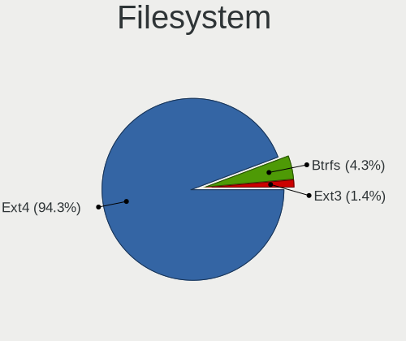
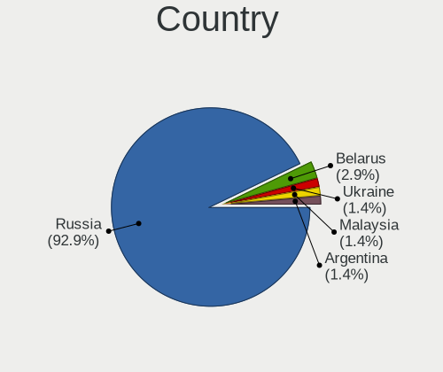

ROSA - Hardware Trends (Desktops)
---------------------------------

A project to identify most popular hardware characteristics and track their change
over time based on data collected by Linux users at https://Linux-Hardware.org.

Anyone can contribute to this report by the [hw-probe](https://github.com/linuxhw/hw-probe) tool:

    sudo -E hw-probe -all -upload

This report is for one last month. Overall report since the beginning of time: [TestDays](https://github.com/linuxhw/TestDays)

Period: Feb, 2023.

Contents
--------

* [ System ](#system)
  - [ OS                       ](#os)
  - [ OS Family                ](#os-family)
  - [ Kernel                   ](#kernel)
  - [ Kernel Family            ](#kernel-family)
  - [ Kernel Major Ver.        ](#kernel-major-ver)
  - [ Arch                     ](#arch)
  - [ DE                       ](#de)
  - [ Display Server           ](#display-server)
  - [ Display Manager          ](#display-manager)
  - [ OS Lang                  ](#os-lang)
  - [ Boot Mode                ](#boot-mode)
  - [ Filesystem               ](#filesystem)
  - [ Part. scheme             ](#part-scheme)
  - [ Dual Boot with Linux/BSD ](#dual-boot-with-linuxbsd)
  - [ Dual Boot (Win)          ](#dual-boot-win)

* [ Board ](#board)
  - [ Vendor                   ](#vendor)
  - [ Model                    ](#model)
  - [ Model Family             ](#model-family)
  - [ MFG Year                 ](#mfg-year)
  - [ Form Factor              ](#form-factor)
  - [ Secure Boot              ](#secure-boot)
  - [ Coreboot                 ](#coreboot)
  - [ RAM Size                 ](#ram-size)
  - [ RAM Used                 ](#ram-used)
  - [ Total Drives             ](#total-drives)
  - [ Has CD-ROM               ](#has-cd-rom)
  - [ Has Ethernet             ](#has-ethernet)
  - [ Has WiFi                 ](#has-wifi)
  - [ Has Bluetooth            ](#has-bluetooth)

* [ Location ](#location)
  - [ Country                  ](#country)
  - [ City                     ](#city)

* [ Drives ](#drives)
  - [ Drive Vendor             ](#drive-vendor)
  - [ Drive Model              ](#drive-model)
  - [ HDD Vendor               ](#hdd-vendor)
  - [ SSD Vendor               ](#ssd-vendor)
  - [ Drive Kind               ](#drive-kind)
  - [ Drive Connector          ](#drive-connector)
  - [ Drive Size               ](#drive-size)
  - [ Space Total              ](#space-total)
  - [ Space Used               ](#space-used)
  - [ Malfunc. Drives          ](#malfunc-drives)
  - [ Malfunc. Drive Vendor    ](#malfunc-drive-vendor)
  - [ Malfunc. HDD Vendor      ](#malfunc-hdd-vendor)
  - [ Malfunc. Drive Kind      ](#malfunc-drive-kind)
  - [ Failed Drives            ](#failed-drives)
  - [ Failed Drive Vendor      ](#failed-drive-vendor)
  - [ Drive Status             ](#drive-status)

* [ Storage controller ](#storage-controller)
  - [ Storage Vendor           ](#storage-vendor)
  - [ Storage Model            ](#storage-model)
  - [ Storage Kind             ](#storage-kind)

* [ Processor ](#processor)
  - [ CPU Vendor               ](#cpu-vendor)
  - [ CPU Model                ](#cpu-model)
  - [ CPU Model Family         ](#cpu-model-family)
  - [ CPU Cores                ](#cpu-cores)
  - [ CPU Sockets              ](#cpu-sockets)
  - [ CPU Threads              ](#cpu-threads)
  - [ CPU Op-Modes             ](#cpu-op-modes)
  - [ CPU Microcode            ](#cpu-microcode)
  - [ CPU Microarch            ](#cpu-microarch)

* [ Graphics ](#graphics)
  - [ GPU Vendor               ](#gpu-vendor)
  - [ GPU Model                ](#gpu-model)
  - [ GPU Combo                ](#gpu-combo)
  - [ GPU Driver               ](#gpu-driver)
  - [ GPU Memory               ](#gpu-memory)

* [ Monitor ](#monitor)
  - [ Monitor Vendor           ](#monitor-vendor)
  - [ Monitor Model            ](#monitor-model)
  - [ Monitor Resolution       ](#monitor-resolution)
  - [ Monitor Diagonal         ](#monitor-diagonal)
  - [ Monitor Width            ](#monitor-width)
  - [ Aspect Ratio             ](#aspect-ratio)
  - [ Monitor Area             ](#monitor-area)
  - [ Pixel Density            ](#pixel-density)
  - [ Multiple Monitors        ](#multiple-monitors)

* [ Network ](#network)
  - [ Net Controller Vendor    ](#net-controller-vendor)
  - [ Net Controller Model     ](#net-controller-model)
  - [ Wireless Vendor          ](#wireless-vendor)
  - [ Wireless Model           ](#wireless-model)
  - [ Ethernet Vendor          ](#ethernet-vendor)
  - [ Ethernet Model           ](#ethernet-model)
  - [ Net Controller Kind      ](#net-controller-kind)
  - [ Used Controller          ](#used-controller)
  - [ NICs                     ](#nics)
  - [ IPv6                     ](#ipv6)

* [ Bluetooth ](#bluetooth)
  - [ Bluetooth Vendor         ](#bluetooth-vendor)
  - [ Bluetooth Model          ](#bluetooth-model)

* [ Sound ](#sound)
  - [ Sound Vendor             ](#sound-vendor)
  - [ Sound Model              ](#sound-model)

* [ Memory ](#memory)
  - [ Memory Vendor            ](#memory-vendor)
  - [ Memory Model             ](#memory-model)
  - [ Memory Kind              ](#memory-kind)
  - [ Memory Form Factor       ](#memory-form-factor)
  - [ Memory Size              ](#memory-size)
  - [ Memory Speed             ](#memory-speed)

* [ Printers & scanners ](#printers--scanners)
  - [ Printer Vendor           ](#printer-vendor)
  - [ Printer Model            ](#printer-model)
  - [ Scanner Vendor           ](#scanner-vendor)
  - [ Scanner Model            ](#scanner-model)

* [ Camera ](#camera)
  - [ Camera Vendor            ](#camera-vendor)
  - [ Camera Model             ](#camera-model)

* [ Security ](#security)
  - [ Fingerprint Vendor       ](#fingerprint-vendor)
  - [ Fingerprint Model        ](#fingerprint-model)
  - [ Chipcard Vendor          ](#chipcard-vendor)
  - [ Chipcard Model           ](#chipcard-model)

* [ Unsupported ](#unsupported)
  - [ Unsupported Devices      ](#unsupported-devices)
  - [ Unsupported Device Types ](#unsupported-device-types)

System
------

OS
--

Installed operating systems

| Name       | Desktops | Percent |
|------------|----------|---------|
| ROSA 12.3  | 83       | 80.58%  |
| ROSA R11.1 | 8        | 7.77%   |
| ROSA 12.2  | 5        | 4.85%   |
| ROSA 12.1  | 3        | 2.91%   |
| ROSA 12    | 2        | 1.94%   |
| ROSA R11   | 1        | 0.97%   |
| ROSA 1.0   | 1        | 0.97%   |

OS Family
---------

OS without a version

| Name | Desktops | Percent |
|------|----------|---------|
| ROSA | 103      | 100%    |

Kernel
------

Version of the Linux kernel

| Version                                   | Desktops | Percent |
|-------------------------------------------|----------|---------|
| 5.15.79-generic-1rosa2021.1-x86_64        | 29       | 28.16%  |
| 5.15.75-generic-1rosa2021.1-x86_64        | 23       | 22.33%  |
| 5.10.155-generic-1rosa2021.1-x86_64       | 12       | 11.65%  |
| 5.10.74-generic-2rosa2021.1-x86_64        | 7        | 6.8%    |
| 5.17.11-generic-2rosa2021.1-x86_64        | 6        | 5.83%   |
| 6.0.7.xm1-1.klp-xanmod-rosa2021.1-x86_64  | 3        | 2.91%   |
| 6.0.12.xm1-1.klp-xanmod-rosa2021.1-x86_64 | 3        | 2.91%   |
| 6.1.4-generic-1rosa2021.1-x86_64          | 2        | 1.94%   |
| 6.1.10-generic-1rosa2021.1-x86_64         | 2        | 1.94%   |
| 5.4.32-generic-2rosa-x86_64               | 2        | 1.94%   |
| 5.15.75-generic-1rosa2021.1-i686          | 2        | 1.94%   |
| 4.9.155-nrj-desktop-1rosa-x86_64          | 2        | 1.94%   |
| 6.1.9.xm1-1.klp-xanmod-rosa2021.1-x86_64  | 1        | 0.97%   |
| 6.1.10.xm1-1.klp-xanmod-rosa2021.1-x86_64 | 1        | 0.97%   |
| 5.5.19-generic-1rosa-x86_64               | 1        | 0.97%   |
| 5.4.83-generic-2rosa-x86_64               | 1        | 0.97%   |
| 5.4.83-generic-2rosa-i586                 | 1        | 0.97%   |
| 5.18.19-generic-3rosa2021.1-x86_64        | 1        | 0.97%   |
| 5.10.74-generic-2rosa2021.1-i586          | 1        | 0.97%   |
| 5.10.71-generic-1rosa2021.1-x86_64        | 1        | 0.97%   |
| 4.15.0-desktop-45.1rosa-i586              | 1        | 0.97%   |
| 4.15.0-desktop-122.124.1rosa-x86_64       | 1        | 0.97%   |

Kernel Family
-------------

Linux kernel without a distro release

| Version  | Desktops | Percent |
|----------|----------|---------|
| 5.15.79  | 29       | 28.16%  |
| 5.15.75  | 25       | 24.27%  |
| 5.10.155 | 12       | 11.65%  |
| 5.10.74  | 8        | 7.77%   |
| 5.17.11  | 6        | 5.83%   |
| 6.1.10   | 3        | 2.91%   |
| 6.0.7    | 3        | 2.91%   |
| 6.0.12   | 3        | 2.91%   |
| 6.1.4    | 2        | 1.94%   |
| 5.4.83   | 2        | 1.94%   |
| 5.4.32   | 2        | 1.94%   |
| 4.9.155  | 2        | 1.94%   |
| 4.15.0   | 2        | 1.94%   |
| 6.1.9    | 1        | 0.97%   |
| 5.5.19   | 1        | 0.97%   |
| 5.18.19  | 1        | 0.97%   |
| 5.10.71  | 1        | 0.97%   |

Kernel Major Ver.
-----------------

Linux kernel major version

| Version | Desktops | Percent |
|---------|----------|---------|
| 5.15    | 54       | 52.43%  |
| 5.10    | 21       | 20.39%  |
| 6.1     | 6        | 5.83%   |
| 6.0     | 6        | 5.83%   |
| 5.17    | 6        | 5.83%   |
| 5.4     | 4        | 3.88%   |
| 4.9     | 2        | 1.94%   |
| 4.15    | 2        | 1.94%   |
| 5.5     | 1        | 0.97%   |
| 5.18    | 1        | 0.97%   |

Arch
----

OS architecture (x86_64, i586, etc.)

| Name   | Desktops | Percent |
|--------|----------|---------|
| x86_64 | 98       | 95.15%  |
| i686   | 5        | 4.85%   |

DE
--

Desktop Environment

| Name    | Desktops | Percent |
|---------|----------|---------|
| KDE5    | 59       | 57.28%  |
| GNOME   | 27       | 26.21%  |
| LXQt    | 8        | 7.77%   |
| KDE4    | 7        | 6.8%    |
| Unknown | 2        | 1.94%   |

Display Server
--------------

X11 or Wayland

| Name    | Desktops | Percent |
|---------|----------|---------|
| Wayland | 71       | 68.93%  |
| X11     | 30       | 29.13%  |
| Tty     | 1        | 0.97%   |
| Unknown | 1        | 0.97%   |

Display Manager
---------------

SDDM, LightDM, etc.

| Name    | Desktops | Percent |
|---------|----------|---------|
| SDDM    | 55       | 53.4%   |
| GDM     | 36       | 34.95%  |
| KDM     | 7        | 6.8%    |
| LightDM | 3        | 2.91%   |
| Unknown | 2        | 1.94%   |

OS Lang
-------

Language

| Lang    | Desktops | Percent |
|---------|----------|---------|
| ru_RU   | 90       | 87.38%  |
| fr_FR   | 2        | 1.94%   |
| es_ES   | 2        | 1.94%   |
| en_US   | 2        | 1.94%   |
| Unknown | 2        | 1.94%   |
| ja_JP   | 1        | 0.97%   |
| it_IT   | 1        | 0.97%   |
| hu_HU   | 1        | 0.97%   |
| en_GB   | 1        | 0.97%   |
| de_DE   | 1        | 0.97%   |

Boot Mode
---------

EFI or BIOS

| Mode | Desktops | Percent |
|------|----------|---------|
| BIOS | 55       | 53.4%   |
| EFI  | 48       | 46.6%   |

Filesystem
----------

Type of filesystem

| Type  | Desktops | Percent |
|-------|----------|---------|
| Ext4  | 92       | 89.32%  |
| Btrfs | 10       | 9.71%   |
| F2fs  | 1        | 0.97%   |

Part. scheme
------------

Scheme of partitioning

| Type    | Desktops | Percent |
|---------|----------|---------|
| GPT     | 70       | 67.96%  |
| MBR     | 32       | 31.07%  |
| Unknown | 1        | 0.97%   |

Dual Boot with Linux/BSD
------------------------

Hosting more than one Linux/BSD

| Dual boot | Desktops | Percent |
|-----------|----------|---------|
| No        | 68       | 66.02%  |
| Yes       | 35       | 33.98%  |

Dual Boot (Win)
---------------

Hosting Linux and Windows

| Dual boot | Desktops | Percent |
|-----------|----------|---------|
| Yes       | 57       | 55.34%  |
| No        | 46       | 44.66%  |

Board
-----

Vendor
------

Motherboard manufacturer

| Name                | Desktops | Percent |
|---------------------|----------|---------|
| Gigabyte Technology | 26       | 25.24%  |
| ASUSTek Computer    | 21       | 20.39%  |
| MSI                 | 12       | 11.65%  |
| ASRock              | 12       | 11.65%  |
| Hewlett-Packard     | 6        | 5.83%   |
| Unknown             | 5        | 4.85%   |
| Biostar             | 4        | 3.88%   |
| Intel               | 3        | 2.91%   |
| Huanan              | 3        | 2.91%   |
| Acer                | 3        | 2.91%   |
| OEM                 | 2        | 1.94%   |
| Dell                | 2        | 1.94%   |
| Pegatron            | 1        | 0.97%   |
| Medion              | 1        | 0.97%   |
| JGINYUE             | 1        | 0.97%   |
| EPoX Computer       | 1        | 0.97%   |

Model
-----

Motherboard model

| Name                               | Desktops | Percent |
|------------------------------------|----------|---------|
| Unknown                            | 5        | 4.85%   |
| OEM Intel H81                      | 2        | 1.94%   |
| Biostar A320MH                     | 2        | 1.94%   |
| ASUS PRIME H510M-K                 | 2        | 1.94%   |
| Pegatron Compaq dx2400 Microtower  | 1        | 0.97%   |
| MSI MS-7D54                        | 1        | 0.97%   |
| MSI MS-7C83                        | 1        | 0.97%   |
| MSI MS-7C37                        | 1        | 0.97%   |
| MSI MS-7B87                        | 1        | 0.97%   |
| MSI MS-7845                        | 1        | 0.97%   |
| MSI MS-7758                        | 1        | 0.97%   |
| MSI MS-7599                        | 1        | 0.97%   |
| MSI MS-7592                        | 1        | 0.97%   |
| MSI MS-7529                        | 1        | 0.97%   |
| MSI MS-7369                        | 1        | 0.97%   |
| MSI MPG B560 Trident A (MS-B926)   | 1        | 0.97%   |
| MSI GEG                            | 1        | 0.97%   |
| Medion S23003                      | 1        | 0.97%   |
| JGINYUE H97I GAMING V1.0           | 1        | 0.97%   |
| Intel X79M-S                       | 1        | 0.97%   |
| Intel DP67BA AAG10219-300          | 1        | 0.97%   |
| Intel DG31PR AAD97573-301          | 1        | 0.97%   |
| Huanan X99 F8D V2.2                | 1        | 0.97%   |
| Huanan X79 VAA1                    | 1        | 0.97%   |
| Huanan B75 V10.1 376               | 1        | 0.97%   |
| HP xw4600 Workstation              | 1        | 0.97%   |
| HP ProLiant ML350 Gen9             | 1        | 0.97%   |
| HP ProLiant ML350 G5               | 1        | 0.97%   |
| HP Compaq dc7900 Small Form Factor | 1        | 0.97%   |
| HP Compaq 6200 Pro SFF PC          | 1        | 0.97%   |
| HP Compaq 6200 Pro MT PC           | 1        | 0.97%   |
| Gigabyte Z87-HD3                   | 1        | 0.97%   |
| Gigabyte X58A-UD3R                 | 1        | 0.97%   |
| Gigabyte P85-D3                    | 1        | 0.97%   |
| Gigabyte M56S-S3                   | 1        | 0.97%   |
| Gigabyte H61M-S2PV                 | 1        | 0.97%   |
| Gigabyte H61M-S1                   | 1        | 0.97%   |
| Gigabyte H510M S2H V2              | 1        | 0.97%   |
| Gigabyte H410M S2H                 | 1        | 0.97%   |
| Gigabyte GA-990XA-UD3              | 1        | 0.97%   |

Model Family
------------

Motherboard model prefix

| Name               | Desktops | Percent |
|--------------------|----------|---------|
| Unknown            | 5        | 4.85%   |
| Gigabyte B450M     | 4        | 3.88%   |
| HP Compaq          | 3        | 2.91%   |
| ASUS PRIME         | 3        | 2.91%   |
| Acer Aspire        | 3        | 2.91%   |
| OEM Intel          | 2        | 1.94%   |
| HP ProLiant        | 2        | 1.94%   |
| Gigabyte B550M     | 2        | 1.94%   |
| Gigabyte B550      | 2        | 1.94%   |
| Dell OptiPlex      | 2        | 1.94%   |
| Biostar A320MH     | 2        | 1.94%   |
| ASUS ROG           | 2        | 1.94%   |
| ASRock B450M       | 2        | 1.94%   |
| Pegatron Compaq    | 1        | 0.97%   |
| MSI MS-7D54        | 1        | 0.97%   |
| MSI MS-7C83        | 1        | 0.97%   |
| MSI MS-7C37        | 1        | 0.97%   |
| MSI MS-7B87        | 1        | 0.97%   |
| MSI MS-7845        | 1        | 0.97%   |
| MSI MS-7758        | 1        | 0.97%   |
| MSI MS-7599        | 1        | 0.97%   |
| MSI MS-7592        | 1        | 0.97%   |
| MSI MS-7529        | 1        | 0.97%   |
| MSI MS-7369        | 1        | 0.97%   |
| MSI MPG            | 1        | 0.97%   |
| MSI GEG            | 1        | 0.97%   |
| Medion S23003      | 1        | 0.97%   |
| JGINYUE H97I       | 1        | 0.97%   |
| Intel X79M-S       | 1        | 0.97%   |
| Intel DP67BA       | 1        | 0.97%   |
| Intel DG31PR       | 1        | 0.97%   |
| Huanan X99         | 1        | 0.97%   |
| Huanan X79         | 1        | 0.97%   |
| Huanan B75         | 1        | 0.97%   |
| HP xw4600          | 1        | 0.97%   |
| Gigabyte Z87-HD3   | 1        | 0.97%   |
| Gigabyte X58A-UD3R | 1        | 0.97%   |
| Gigabyte P85-D3    | 1        | 0.97%   |
| Gigabyte M56S-S3   | 1        | 0.97%   |
| Gigabyte H61M-S2PV | 1        | 0.97%   |

MFG Year
--------

Motherboard manufacture year

| Year | Desktops | Percent |
|------|----------|---------|
| 2021 | 13       | 12.62%  |
| 2020 | 11       | 10.68%  |
| 2012 | 10       | 9.71%   |
| 2009 | 10       | 9.71%   |
| 2018 | 9        | 8.74%   |
| 2011 | 8        | 7.77%   |
| 2010 | 6        | 5.83%   |
| 2019 | 5        | 4.85%   |
| 2008 | 5        | 4.85%   |
| 2016 | 4        | 3.88%   |
| 2013 | 4        | 3.88%   |
| 2007 | 4        | 3.88%   |
| 2006 | 4        | 3.88%   |
| 2022 | 3        | 2.91%   |
| 2017 | 2        | 1.94%   |
| 2014 | 2        | 1.94%   |
| 2005 | 2        | 1.94%   |
| 2015 | 1        | 0.97%   |

Form Factor
-----------

Physical design of the computer

| Name    | Desktops | Percent |
|---------|----------|---------|
| Desktop | 103      | 100%    |

Secure Boot
-----------

Enabled or disabled

| State    | Desktops | Percent |
|----------|----------|---------|
| Disabled | 103      | 100%    |

Coreboot
--------

Have coreboot on board

| Used | Desktops | Percent |
|------|----------|---------|
| No   | 103      | 100%    |

RAM Size
--------

Total RAM memory

| Size in GB  | Desktops | Percent |
|-------------|----------|---------|
| 16.01-24.0  | 29       | 28.16%  |
| 8.01-16.0   | 29       | 28.16%  |
| 3.01-4.0    | 20       | 19.42%  |
| 4.01-8.0    | 10       | 9.71%   |
| 32.01-64.0  | 6        | 5.83%   |
| 64.01-256.0 | 4        | 3.88%   |
| 24.01-32.0  | 2        | 1.94%   |
| 2.01-3.0    | 2        | 1.94%   |
| 1.01-2.0    | 1        | 0.97%   |

RAM Used
--------

Used RAM memory

| Used GB    | Desktops | Percent |
|------------|----------|---------|
| 1.01-2.0   | 49       | 47.57%  |
| 0.51-1.0   | 22       | 21.36%  |
| 2.01-3.0   | 18       | 17.48%  |
| 3.01-4.0   | 8        | 7.77%   |
| 4.01-8.0   | 5        | 4.85%   |
| 16.01-24.0 | 1        | 0.97%   |

Total Drives
------------

Number of drives on board

| Drives | Desktops | Percent |
|--------|----------|---------|
| 1      | 39       | 37.86%  |
| 2      | 27       | 26.21%  |
| 3      | 17       | 16.5%   |
| 4      | 13       | 12.62%  |
| 6      | 5        | 4.85%   |
| 10     | 1        | 0.97%   |
| 5      | 1        | 0.97%   |

Has CD-ROM
----------

Has CD-ROM on board

| Presented | Desktops | Percent |
|-----------|----------|---------|
| No        | 67       | 65.05%  |
| Yes       | 36       | 34.95%  |

Has Ethernet
------------

Has Ethernet on board

| Presented | Desktops | Percent |
|-----------|----------|---------|
| Yes       | 103      | 100%    |

Has WiFi
--------

Has WiFi module

| Presented | Desktops | Percent |
|-----------|----------|---------|
| No        | 68       | 66.02%  |
| Yes       | 35       | 33.98%  |

Has Bluetooth
-------------

Has Bluetooth module

| Presented | Desktops | Percent |
|-----------|----------|---------|
| No        | 79       | 76.7%   |
| Yes       | 24       | 23.3%   |

Location
--------

Country
-------

Geographic location (country)

| Country    | Desktops | Percent |
|------------|----------|---------|
| Russia     | 85       | 82.52%  |
| Hungary    | 3        | 2.91%   |
| Ukraine    | 2        | 1.94%   |
| France     | 2        | 1.94%   |
| Czechia    | 2        | 1.94%   |
| Venezuela  | 1        | 0.97%   |
| Spain      | 1        | 0.97%   |
| Serbia     | 1        | 0.97%   |
| Poland     | 1        | 0.97%   |
| Kazakhstan | 1        | 0.97%   |
| Japan      | 1        | 0.97%   |
| Italy      | 1        | 0.97%   |
| Germany    | 1        | 0.97%   |
| Australia  | 1        | 0.97%   |

City
----

Geographic location (city)

| City                | Desktops | Percent |
|---------------------|----------|---------|
| Moscow              | 14       | 13.59%  |
| St Petersburg       | 8        | 7.77%   |
| Yekaterinburg       | 4        | 3.88%   |
| Samara              | 3        | 2.91%   |
| Barnaul             | 3        | 2.91%   |
| Omsk                | 2        | 1.94%   |
| Naberezhnyye Chelny | 2        | 1.94%   |
| Lipetsk             | 2        | 1.94%   |
| Krasnoyarsk         | 2        | 1.94%   |
| Kemerovo            | 2        | 1.94%   |
| Kazan’            | 2        | 1.94%   |
| Kaluga              | 2        | 1.94%   |
| Chelyabinsk         | 2        | 1.94%   |
| Yaya                | 1        | 0.97%   |
| Yaroslavl           | 1        | 0.97%   |
| Yalutorovsk         | 1        | 0.97%   |
| Vyazma              | 1        | 0.97%   |
| Votkinsk            | 1        | 0.97%   |
| Volgograd           | 1        | 0.97%   |
| Vladimir            | 1        | 0.97%   |
| Ukhta               | 1        | 0.97%   |
| Ufa                 | 1        | 0.97%   |
| Tolyatti            | 1        | 0.97%   |
| Szigetszentmiklos   | 1        | 0.97%   |
| Surgut              | 1        | 0.97%   |
| Stuttgart           | 1        | 0.97%   |
| Sokol               | 1        | 0.97%   |
| Sochi               | 1        | 0.97%   |
| Simferopol          | 1        | 0.97%   |
| Shar'ya             | 1        | 0.97%   |
| Sarapul             | 1        | 0.97%   |
| Saransk             | 1        | 0.97%   |
| Rome                | 1        | 0.97%   |
| Pskov               | 1        | 0.97%   |
| Prague              | 1        | 0.97%   |
| Poznan              | 1        | 0.97%   |
| Perth               | 1        | 0.97%   |
| Pavlovo             | 1        | 0.97%   |
| Orenburg            | 1        | 0.97%   |
| Okayama             | 1        | 0.97%   |

Drives
------

Drive Vendor
------------

Hard drive vendors

| Vendor                      | Desktops | Drives | Percent |
|-----------------------------|----------|--------|---------|
| WDC                         | 44       | 57     | 22.11%  |
| Seagate                     | 38       | 57     | 19.1%   |
| Samsung Electronics         | 17       | 21     | 8.54%   |
| Hitachi                     | 15       | 16     | 7.54%   |
| Kingston                    | 14       | 14     | 7.04%   |
| Toshiba                     | 9        | 10     | 4.52%   |
| A-DATA Technology           | 5        | 5      | 2.51%   |
| SPCC                        | 4        | 4      | 2.01%   |
| Maxtor                      | 4        | 4      | 2.01%   |
| Intel                       | 4        | 4      | 2.01%   |
| Smartbuy                    | 3        | 3      | 1.51%   |
| KingSpec                    | 3        | 3      | 1.51%   |
| China                       | 3        | 3      | 1.51%   |
| AMD                         | 3        | 3      | 1.51%   |
| Unknown                     | 2        | 2      | 1.01%   |
| Silicon Motion              | 2        | 2      | 1.01%   |
| Plextor                     | 2        | 2      | 1.01%   |
| Phison                      | 2        | 2      | 1.01%   |
| Netac                       | 2        | 2      | 1.01%   |
| HGST                        | 2        | 2      | 1.01%   |
| Apacer                      | 2        | 2      | 1.01%   |
| XrayDisk                    | 1        | 1      | 0.5%    |
| Transcend                   | 1        | 1      | 0.5%    |
| SanDisk                     | 1        | 1      | 0.5%    |
| R5SL240G                    | 1        | 1      | 0.5%    |
| Qumo                        | 1        | 1      | 0.5%    |
| Patriot                     | 1        | 1      | 0.5%    |
| OCZ                         | 1        | 1      | 0.5%    |
| Min Yi U                    | 1        | 1      | 0.5%    |
| Micron Technology           | 1        | 1      | 0.5%    |
| Lite-On                     | 1        | 1      | 0.5%    |
| Kingston Technology Company | 1        | 1      | 0.5%    |
| Kingmax                     | 1        | 1      | 0.5%    |
| Intenso                     | 1        | 2      | 0.5%    |
| HS-SSD-C100                 | 1        | 1      | 0.5%    |
| Hewlett-Packard             | 1        | 8      | 0.5%    |
| Gigabyte Technology         | 1        | 1      | 0.5%    |
| Fujitsu                     | 1        | 1      | 0.5%    |
| BUFFALO                     | 1        | 1      | 0.5%    |
| AFOX                        | 1        | 1      | 0.5%    |

Drive Model
-----------

Hard drive models

| Model                            | Desktops | Percent |
|----------------------------------|----------|---------|
| Kingston SA400S37240G 240GB SSD  | 5        | 2.18%   |
| WDC WDS240G2G0A-00JH30 240GB SSD | 4        | 1.75%   |
| Seagate ST500DM002-1BD142 500GB  | 4        | 1.75%   |
| WDC WD10EZRZ-00HTKB0 1TB         | 3        | 1.31%   |
| WDC WD10EZEX-08WN4A0 1TB         | 3        | 1.31%   |
| Toshiba HDWD110 1TB              | 3        | 1.31%   |
| Seagate ST3250310AS 250GB        | 3        | 1.31%   |
| Kingston SNVS500G 500GB          | 3        | 1.31%   |
| Hitachi HDS721050CLA360 500GB    | 3        | 1.31%   |
| WDC WD1600AAJS-00PSA0 160GB      | 2        | 0.87%   |
| WDC WD10EZEX-08M2NA0 1TB         | 2        | 0.87%   |
| Toshiba DT01ACA100 1TB           | 2        | 0.87%   |
| SPCC Solid State Disk 128GB      | 2        | 0.87%   |
| Seagate ST380815AS 80GB          | 2        | 0.87%   |
| Seagate ST3500418AS 500GB        | 2        | 0.87%   |
| Seagate ST3160318AS 160GB        | 2        | 0.87%   |
| Seagate ST1000LM049-2GH172 1TB   | 2        | 0.87%   |
| Seagate ST1000DM003-1CH162 1TB   | 2        | 0.87%   |
| Samsung SSD 860 EVO 250GB        | 2        | 0.87%   |
| Hitachi HDS721050CLA362 500GB    | 2        | 0.87%   |
| XrayDisk SSD 256GB               | 1        | 0.44%   |
| WDC WDS500G2B0A-00SM50 500GB SSD | 1        | 0.44%   |
| WDC WDS250G2B0A-00SM50 250GB SSD | 1        | 0.44%   |
| WDC WDS250G2B0A 250GB SSD        | 1        | 0.44%   |
| WDC WDS250G1B0C-00S6U0 250GB     | 1        | 0.44%   |
| WDC WDS240G2G0B-00EPW0 240GB SSD | 1        | 0.44%   |
| WDC WDS120G2G0B-00EPW0 120GB SSD | 1        | 0.44%   |
| WDC WDS120G2G0A-00JH30 120GB SSD | 1        | 0.44%   |
| WDC WDS100T2B0C-00PXH0 1TB       | 1        | 0.44%   |
| WDC WD800JD-60LSA0 80GB          | 1        | 0.44%   |
| WDC WD800JB-00JJC0 80GB          | 1        | 0.44%   |
| WDC WD7500BPVT-35HXZT3 752GB     | 1        | 0.44%   |
| WDC WD7500BPVT-24HXZT1 752GB     | 1        | 0.44%   |
| WDC WD5001AALS-00L3B2 500GB      | 1        | 0.44%   |
| WDC WD5000AZLX-75K2TA0 500GB     | 1        | 0.44%   |
| WDC WD5000AAKX-08ERMA0 500GB     | 1        | 0.44%   |
| WDC WD5000AAKX-00ERMA0 500GB     | 1        | 0.44%   |
| WDC WD5000AAKS-22YGA0 500GB      | 1        | 0.44%   |
| WDC WD5000AAKS-00A7B0 500GB      | 1        | 0.44%   |
| WDC WD4003FRYZ-01F0DB0 4TB       | 1        | 0.44%   |

HDD Vendor
----------

Hard disk drive vendors

| Vendor              | Desktops | Drives | Percent |
|---------------------|----------|--------|---------|
| WDC                 | 37       | 44     | 33.04%  |
| Seagate             | 37       | 56     | 33.04%  |
| Hitachi             | 15       | 16     | 13.39%  |
| Toshiba             | 9        | 10     | 8.04%   |
| Samsung Electronics | 4        | 4      | 3.57%   |
| Maxtor              | 4        | 4      | 3.57%   |
| HGST                | 2        | 2      | 1.79%   |
| Unknown             | 1        | 1      | 0.89%   |
| Intenso             | 1        | 1      | 0.89%   |
| Hewlett-Packard     | 1        | 8      | 0.89%   |
| Fujitsu             | 1        | 1      | 0.89%   |

SSD Vendor
----------

Solid state drive vendors

| Vendor              | Desktops | Drives | Percent |
|---------------------|----------|--------|---------|
| Kingston            | 11       | 11     | 16.42%  |
| WDC                 | 9        | 10     | 13.43%  |
| Samsung Electronics | 9        | 13     | 13.43%  |
| A-DATA Technology   | 4        | 4      | 5.97%   |
| SPCC                | 3        | 3      | 4.48%   |
| Smartbuy            | 3        | 3      | 4.48%   |
| KingSpec            | 3        | 3      | 4.48%   |
| China               | 3        | 3      | 4.48%   |
| Plextor             | 2        | 2      | 2.99%   |
| Netac               | 2        | 2      | 2.99%   |
| Intel               | 2        | 2      | 2.99%   |
| AMD                 | 2        | 2      | 2.99%   |
| XrayDisk            | 1        | 1      | 1.49%   |
| Unknown             | 1        | 1      | 1.49%   |
| SanDisk             | 1        | 1      | 1.49%   |
| Qumo                | 1        | 1      | 1.49%   |
| Phison              | 1        | 1      | 1.49%   |
| OCZ                 | 1        | 1      | 1.49%   |
| Micron Technology   | 1        | 1      | 1.49%   |
| Lite-On             | 1        | 1      | 1.49%   |
| Kingmax             | 1        | 1      | 1.49%   |
| Intenso             | 1        | 1      | 1.49%   |
| HS-SSD-C100         | 1        | 1      | 1.49%   |
| BUFFALO             | 1        | 1      | 1.49%   |
| Apacer              | 1        | 1      | 1.49%   |
| AFOX                | 1        | 1      | 1.49%   |

Drive Kind
----------

HDD or SSD

| Kind    | Desktops | Drives | Percent |
|---------|----------|--------|---------|
| HDD     | 81       | 147    | 51.92%  |
| SSD     | 52       | 72     | 33.33%  |
| NVMe    | 22       | 24     | 14.1%   |
| Unknown | 1        | 2      | 0.64%   |

Drive Connector
---------------

SATA, SAS, NVMe, etc.

| Type | Desktops | Drives | Percent |
|------|----------|--------|---------|
| SATA | 98       | 212    | 77.17%  |
| NVMe | 22       | 24     | 17.32%  |
| SAS  | 7        | 9      | 5.51%   |

Drive Size
----------

Size of hard drive

| Size in TB | Desktops | Drives | Percent |
|------------|----------|--------|---------|
| 0.01-0.5   | 83       | 140    | 58.04%  |
| 0.51-1.0   | 39       | 50     | 27.27%  |
| 1.01-2.0   | 11       | 19     | 7.69%   |
| 4.01-10.0  | 5        | 5      | 3.5%    |
| 2.01-3.0   | 3        | 3      | 2.1%    |
| 3.01-4.0   | 2        | 2      | 1.4%    |

Space Total
-----------

Amount of disk space available on the file system

| Size in GB     | Desktops | Percent |
|----------------|----------|---------|
| 101-250        | 28       | 27.18%  |
| 501-1000       | 15       | 14.56%  |
| 51-100         | 14       | 13.59%  |
| 251-500        | 13       | 12.62%  |
| 1001-2000      | 11       | 10.68%  |
| More than 3000 | 7        | 6.8%    |
| 1-20           | 6        | 5.83%   |
| 21-50          | 5        | 4.85%   |
| 2001-3000      | 4        | 3.88%   |

Space Used
----------

Amount of used disk space

| Used GB        | Desktops | Percent |
|----------------|----------|---------|
| 1-20           | 51       | 49.51%  |
| 51-100         | 13       | 12.62%  |
| 21-50          | 9        | 8.74%   |
| 1001-2000      | 8        | 7.77%   |
| 501-1000       | 8        | 7.77%   |
| 101-250        | 6        | 5.83%   |
| 251-500        | 5        | 4.85%   |
| 2001-3000      | 2        | 1.94%   |
| More than 3000 | 1        | 0.97%   |

Malfunc. Drives
---------------

Drive models with a malfunction

| Model                                 | Desktops | Drives | Percent |
|---------------------------------------|----------|--------|---------|
| Seagate ST3250310AS 250GB             | 3        | 3      | 5.45%   |
| Toshiba DT01ACA100 1TB                | 2        | 3      | 3.64%   |
| Seagate ST500DM002-1BD142 500GB       | 2        | 2      | 3.64%   |
| Seagate ST1000DM003-1CH162 1TB        | 2        | 2      | 3.64%   |
| Hitachi HDS721050CLA360 500GB         | 2        | 2      | 3.64%   |
| WDC WDS240G2G0A-00JH30 240GB SSD      | 1        | 1      | 1.82%   |
| WDC WDS120G2G0B-00EPW0 120GB SSD      | 1        | 1      | 1.82%   |
| WDC WD7500BPVT-24HXZT1 752GB          | 1        | 1      | 1.82%   |
| WDC WD5000AAKX-08ERMA0 500GB          | 1        | 1      | 1.82%   |
| WDC WD5000AAKS-00A7B0 500GB           | 1        | 1      | 1.82%   |
| WDC WD3200BPVT-00JJ5T0 320GB          | 1        | 1      | 1.82%   |
| WDC WD3200BEKT-08PVMT1 320GB          | 1        | 1      | 1.82%   |
| WDC WD1600AAJS-00PSA0 160GB           | 1        | 1      | 1.82%   |
| WDC WD15EARX-00PASB0 1TB              | 1        | 1      | 1.82%   |
| WDC WD10EADS-00M2B0 1TB               | 1        | 1      | 1.82%   |
| WDC WD10EADS-00L5B1 1TB               | 1        | 1      | 1.82%   |
| Toshiba MK3265GSXN 320GB              | 1        | 1      | 1.82%   |
| Toshiba HDWF180 8TB                   | 1        | 1      | 1.82%   |
| Toshiba DT01ACA050 500GB              | 1        | 1      | 1.82%   |
| Seagate ST9160310AS 160GB             | 1        | 1      | 1.82%   |
| Seagate ST500LT012-9WS142 500GB       | 1        | 1      | 1.82%   |
| Seagate ST3808110AS 80GB              | 1        | 1      | 1.82%   |
| Seagate ST3750640AS 752GB             | 1        | 1      | 1.82%   |
| Seagate ST3500418AS 500GB             | 1        | 1      | 1.82%   |
| Seagate ST3320613AS 320GB             | 1        | 1      | 1.82%   |
| Seagate ST320LT020-9YG142 320GB       | 1        | 1      | 1.82%   |
| Seagate ST31000528AS 1TB              | 1        | 1      | 1.82%   |
| Seagate ST3000VX010-2E3166 3TB        | 1        | 1      | 1.82%   |
| Seagate ST2000DL003-9VT166 2TB        | 1        | 1      | 1.82%   |
| Samsung Electronics SSD 970 EVO 500GB | 1        | 1      | 1.82%   |
| Samsung Electronics SP0411N 40GB      | 1        | 1      | 1.82%   |
| Samsung Electronics HD321KJ 320GB     | 1        | 1      | 1.82%   |
| Samsung Electronics HD082GJ 80GB      | 1        | 1      | 1.82%   |
| Qumo SSD 240GB                        | 1        | 1      | 1.82%   |
| OCZ AGILITY3 64GB SSD                 | 1        | 1      | 1.82%   |
| Maxtor STM380815AS 80GB               | 1        | 1      | 1.82%   |
| Maxtor 6V160E0 160GB                  | 1        | 1      | 1.82%   |
| KingSpec P3-64 64GB SSD               | 1        | 1      | 1.82%   |
| Kingmax SSD 60GB                      | 1        | 1      | 1.82%   |
| Intel MEMPEK1J016GA 16GB              | 1        | 1      | 1.82%   |

Malfunc. Drive Vendor
---------------------

Vendors of faulty drives

| Vendor              | Desktops | Drives | Percent |
|---------------------|----------|--------|---------|
| Seagate             | 15       | 17     | 28.85%  |
| WDC                 | 10       | 11     | 19.23%  |
| Hitachi             | 9        | 9      | 17.31%  |
| Toshiba             | 5        | 6      | 9.62%   |
| Samsung Electronics | 4        | 4      | 7.69%   |
| Maxtor              | 2        | 2      | 3.85%   |
| Qumo                | 1        | 1      | 1.92%   |
| OCZ                 | 1        | 1      | 1.92%   |
| KingSpec            | 1        | 1      | 1.92%   |
| Kingmax             | 1        | 1      | 1.92%   |
| Intel               | 1        | 1      | 1.92%   |
| HGST                | 1        | 1      | 1.92%   |
| AMD                 | 1        | 1      | 1.92%   |

Malfunc. HDD Vendor
-------------------

Vendors of faulty HDD drives

| Vendor              | Desktops | Drives | Percent |
|---------------------|----------|--------|---------|
| Seagate             | 15       | 17     | 34.88%  |
| Hitachi             | 9        | 9      | 20.93%  |
| WDC                 | 8        | 9      | 18.6%   |
| Toshiba             | 5        | 6      | 11.63%  |
| Samsung Electronics | 3        | 3      | 6.98%   |
| Maxtor              | 2        | 2      | 4.65%   |
| HGST                | 1        | 1      | 2.33%   |

Malfunc. Drive Kind
-------------------

Kinds of faulty drives

| Kind | Desktops | Drives | Percent |
|------|----------|--------|---------|
| HDD  | 35       | 47     | 79.55%  |
| SSD  | 7        | 7      | 15.91%  |
| NVMe | 2        | 2      | 4.55%   |

Failed Drives
-------------

Failed drive models

| Model                   | Desktops | Drives | Percent |
|-------------------------|----------|--------|---------|
| WDC WD800JB-00JJC0 80GB | 1        | 1      | 100%    |

Failed Drive Vendor
-------------------

Failed drive vendors

| Vendor | Desktops | Drives | Percent |
|--------|----------|--------|---------|
| WDC    | 1        | 1      | 100%    |

Drive Status
------------

Number of failed and malfunc. drives

| Status   | Desktops | Drives | Percent |
|----------|----------|--------|---------|
| Works    | 89       | 180    | 64.96%  |
| Malfunc  | 41       | 56     | 29.93%  |
| Detected | 6        | 8      | 4.38%   |
| Failed   | 1        | 1      | 0.73%   |

Storage controller
------------------

Storage Vendor
--------------

Storage controller vendors

| Vendor                       | Desktops | Percent |
|------------------------------|----------|---------|
| Intel                        | 62       | 44.6%   |
| AMD                          | 34       | 24.46%  |
| Nvidia                       | 8        | 5.76%   |
| ASMedia Technology           | 5        | 3.6%    |
| Silicon Motion               | 4        | 2.88%   |
| Samsung Electronics          | 4        | 2.88%   |
| Kingston Technology Company  | 4        | 2.88%   |
| SanDisk                      | 3        | 2.16%   |
| Phison Electronics           | 3        | 2.16%   |
| Marvell Technology Group     | 3        | 2.16%   |
| JMicron Technology           | 2        | 1.44%   |
| Hewlett-Packard              | 2        | 1.44%   |
| VIA Technologies             | 1        | 0.72%   |
| Shenzhen Longsys Electronics | 1        | 0.72%   |
| Seagate Technology           | 1        | 0.72%   |
| MAXIO Technology (Hangzhou)  | 1        | 0.72%   |
| ADATA Technology             | 1        | 0.72%   |

Storage Model
-------------

Storage controller models

| Model                                                                                   | Desktops | Percent |
|-----------------------------------------------------------------------------------------|----------|---------|
| AMD FCH SATA Controller [AHCI mode]                                                     | 14       | 7.49%   |
| AMD SB7x0/SB8x0/SB9x0 IDE Controller                                                    | 9        | 4.81%   |
| AMD 400 Series Chipset SATA Controller                                                  | 8        | 4.28%   |
| Intel NM10/ICH7 Family SATA Controller [IDE mode]                                       | 7        | 3.74%   |
| Intel 8 Series/C220 Series Chipset Family 6-port SATA Controller 1 [AHCI mode]          | 7        | 3.74%   |
| Intel 82801G (ICH7 Family) IDE Controller                                               | 6        | 3.21%   |
| AMD SB7x0/SB8x0/SB9x0 SATA Controller [AHCI mode]                                       | 6        | 3.21%   |
| AMD 500 Series Chipset SATA Controller                                                  | 6        | 3.21%   |
| Intel 6 Series/C200 Series Chipset Family 6 port Desktop SATA AHCI Controller           | 5        | 2.67%   |
| Intel 500 Series Chipset Family SATA AHCI Controller                                    | 5        | 2.67%   |
| ASMedia ASM1062 Serial ATA Controller                                                   | 5        | 2.67%   |
| AMD SB7x0/SB8x0/SB9x0 SATA Controller [IDE mode]                                        | 5        | 2.67%   |
| Kingston Company Company Non-Volatile memory controller                                 | 4        | 2.14%   |
| Intel 82801JI (ICH10 Family) 4 port SATA IDE Controller #1                              | 4        | 2.14%   |
| Intel 82801JI (ICH10 Family) 2 port SATA IDE Controller #2                              | 4        | 2.14%   |
| Intel 400 Series Chipset Family SATA AHCI Controller                                    | 4        | 2.14%   |
| AMD FCH SATA Controller D                                                               | 4        | 2.14%   |
| Silicon Motion SM2263EN/SM2263XT SSD Controller                                         | 3        | 1.6%    |
| Samsung NVMe SSD Controller SM981/PM981/PM983                                           | 3        | 1.6%    |
| Nvidia CK804 Serial ATA Controller                                                      | 3        | 1.6%    |
| Nvidia CK804 IDE                                                                        | 3        | 1.6%    |
| Intel 7 Series/C210 Series Chipset Family 6-port SATA Controller [AHCI mode]            | 3        | 1.6%    |
| Intel 6 Series/C200 Series Chipset Family Desktop SATA Controller (IDE mode, ports 4-5) | 3        | 1.6%    |
| Intel 6 Series/C200 Series Chipset Family Desktop SATA Controller (IDE mode, ports 0-3) | 3        | 1.6%    |
| Phison PS5013 E13 NVMe Controller                                                       | 2        | 1.07%   |
| Nvidia MCP65 IDE                                                                        | 2        | 1.07%   |
| Nvidia MCP61 SATA Controller                                                            | 2        | 1.07%   |
| Nvidia MCP61 IDE                                                                        | 2        | 1.07%   |
| Intel C610/X99 series chipset 6-Port SATA Controller [AHCI mode]                        | 2        | 1.07%   |
| Intel C600/X79 series chipset 6-Port SATA AHCI Controller                               | 2        | 1.07%   |
| Intel 9 Series Chipset Family SATA Controller [AHCI Mode]                               | 2        | 1.07%   |
| Intel 7 Series/C210 Series Chipset Family 4-port SATA Controller [IDE mode]             | 2        | 1.07%   |
| Intel 7 Series/C210 Series Chipset Family 2-port SATA Controller [IDE mode]             | 2        | 1.07%   |
| Intel 5 Series/3400 Series Chipset 4 port SATA IDE Controller                           | 2        | 1.07%   |
| Intel 5 Series/3400 Series Chipset 2 port SATA IDE Controller                           | 2        | 1.07%   |
| Intel 200 Series PCH SATA controller [AHCI mode]                                        | 2        | 1.07%   |
| VIA VT6415 PATA IDE Host Controller                                                     | 1        | 0.53%   |
| Silicon Motion SM2262/SM2262EN SSD Controller                                           | 1        | 0.53%   |
| Shenzhen Longsys SM2263EN/SM2263XT-based OEM SSD                                        | 1        | 0.53%   |
| Seagate FireCuda 520 SSD                                                                | 1        | 0.53%   |

Storage Kind
------------

Kind of storage controller (IDE, SATA, NVMe, SAS, ...)

| Kind | Desktops | Percent |
|------|----------|---------|
| SATA | 75       | 53.96%  |
| IDE  | 39       | 28.06%  |
| NVMe | 22       | 15.83%  |
| RAID | 3        | 2.16%   |

Processor
---------

CPU Vendor
----------

Processor vendors

| Vendor | Desktops | Percent |
|--------|----------|---------|
| Intel  | 63       | 61.17%  |
| AMD    | 40       | 38.83%  |

CPU Model
---------

Processor models

| Model                                       | Desktops | Percent |
|---------------------------------------------|----------|---------|
| AMD Ryzen 5 5600X 6-Core Processor          | 3        | 2.91%   |
| Intel Xeon CPU E5-2670 v2 @ 2.50GHz         | 2        | 1.94%   |
| Intel Core i5-4570 CPU @ 3.20GHz            | 2        | 1.94%   |
| Intel Core i5-2400 CPU @ 3.10GHz            | 2        | 1.94%   |
| Intel Core i5-10400 CPU @ 2.90GHz           | 2        | 1.94%   |
| Intel Core i3-10100F CPU @ 3.60GHz          | 2        | 1.94%   |
| Intel Core 2 Quad CPU Q9550 @ 2.83GHz       | 2        | 1.94%   |
| Intel Core 2 Quad CPU Q6600 @ 2.40GHz       | 2        | 1.94%   |
| Intel Core 2 Duo CPU E8400 @ 3.00GHz        | 2        | 1.94%   |
| Intel Celeron CPU G530 @ 2.40GHz            | 2        | 1.94%   |
| AMD Ryzen 5 3600X 6-Core Processor          | 2        | 1.94%   |
| AMD Phenom II X4 965 Processor              | 2        | 1.94%   |
| AMD Athlon 64 X2 Dual Core Processor 6000+  | 2        | 1.94%   |
| AMD Athlon 64 Processor 3200+               | 2        | 1.94%   |
| AMD Athlon 3000G with Radeon Vega Graphics  | 2        | 1.94%   |
| Intel Xeon CPU E5440 @ 2.83GHz              | 1        | 0.97%   |
| Intel Xeon CPU E5-2678 v3 @ 2.50GHz         | 1        | 0.97%   |
| Intel Xeon CPU E5-2667 0 @ 2.90GHz          | 1        | 0.97%   |
| Intel Xeon CPU E5-2640 v3 @ 2.60GHz         | 1        | 0.97%   |
| Intel Xeon CPU E5-2620 v3 @ 2.40GHz         | 1        | 0.97%   |
| Intel Xeon CPU E5-2420 0 @ 1.90GHz          | 1        | 0.97%   |
| Intel Xeon CPU E3-1270 v3 @ 3.50GHz         | 1        | 0.97%   |
| Intel Xeon CPU E3-1240 V2 @ 3.40GHz         | 1        | 0.97%   |
| Intel Pentium Dual-Core CPU E6600 @ 3.06GHz | 1        | 0.97%   |
| Intel Pentium Dual-Core CPU E5700 @ 3.00GHz | 1        | 0.97%   |
| Intel Pentium Dual CPU E2220 @ 2.40GHz      | 1        | 0.97%   |
| Intel Pentium CPU G4400 @ 3.30GHz           | 1        | 0.97%   |
| Intel Pentium CPU G2030 @ 3.00GHz           | 1        | 0.97%   |
| Intel Core i7-4610M CPU @ 3.00GHz           | 1        | 0.97%   |
| Intel Core i7-3770 CPU @ 3.40GHz            | 1        | 0.97%   |
| Intel Core i7 CPU 950 @ 3.07GHz             | 1        | 0.97%   |
| Intel Core i5-9400 CPU @ 2.90GHz            | 1        | 0.97%   |
| Intel Core i5-7500 CPU @ 3.40GHz            | 1        | 0.97%   |
| Intel Core i5-4670S CPU @ 3.10GHz           | 1        | 0.97%   |
| Intel Core i5-4670K CPU @ 3.40GHz           | 1        | 0.97%   |
| Intel Core i5-4590T CPU @ 2.00GHz           | 1        | 0.97%   |
| Intel Core i5-4440 CPU @ 3.10GHz            | 1        | 0.97%   |
| Intel Core i5-3570 CPU @ 3.40GHz            | 1        | 0.97%   |
| Intel Core i5-2500 CPU @ 3.30GHz            | 1        | 0.97%   |
| Intel Core i5-10500T CPU @ 2.30GHz          | 1        | 0.97%   |

CPU Model Family
----------------

Processor model prefix

| Model                   | Desktops | Percent |
|-------------------------|----------|---------|
| Intel Core i5           | 16       | 15.53%  |
| AMD Ryzen 5             | 12       | 11.65%  |
| Intel Xeon              | 10       | 9.71%   |
| Intel Core i3           | 8        | 7.77%   |
| Intel Core 2 Quad       | 6        | 5.83%   |
| Intel Celeron           | 5        | 4.85%   |
| AMD FX                  | 5        | 4.85%   |
| Other                   | 4        | 3.88%   |
| AMD Ryzen 7             | 4        | 3.88%   |
| AMD Athlon 64 X2        | 4        | 3.88%   |
| Intel Core i7           | 3        | 2.91%   |
| Intel Core 2 Duo        | 3        | 2.91%   |
| AMD Phenom II X4        | 3        | 2.91%   |
| Intel Pentium Dual-Core | 2        | 1.94%   |
| Intel Pentium           | 2        | 1.94%   |
| Intel Core 2            | 2        | 1.94%   |
| AMD Athlon 64           | 2        | 1.94%   |
| AMD Athlon              | 2        | 1.94%   |
| Intel Pentium Dual      | 1        | 0.97%   |
| Intel Atom              | 1        | 0.97%   |
| AMD Ryzen 9             | 1        | 0.97%   |
| AMD Ryzen 3             | 1        | 0.97%   |
| AMD Phenom II X3        | 1        | 0.97%   |
| AMD Athlon II X4        | 1        | 0.97%   |
| AMD Athlon II X3        | 1        | 0.97%   |
| AMD Athlon II X2        | 1        | 0.97%   |
| AMD A8                  | 1        | 0.97%   |
| AMD A6                  | 1        | 0.97%   |

CPU Cores
---------

Number of processor cores

| Number  | Desktops | Percent |
|---------|----------|---------|
| 4       | 36       | 34.95%  |
| 2       | 28       | 27.18%  |
| 6       | 20       | 19.42%  |
| 8       | 6        | 5.83%   |
| 3       | 3        | 2.91%   |
| 1       | 3        | 2.91%   |
| 20      | 2        | 1.94%   |
| 12      | 2        | 1.94%   |
| 24      | 1        | 0.97%   |
| 16      | 1        | 0.97%   |
| Unknown | 1        | 0.97%   |

CPU Sockets
-----------

Number of sockets

| Number | Desktops | Percent |
|--------|----------|---------|
| 1      | 98       | 95.15%  |
| 2      | 5        | 4.85%   |

CPU Threads
-----------

Threads per core (Hyper-Threading)

| Number  | Desktops | Percent |
|---------|----------|---------|
| 2       | 53       | 51.46%  |
| 1       | 49       | 47.57%  |
| Unknown | 1        | 0.97%   |

CPU Op-Modes
------------

CPU Operation Modes (32-bit, 64-bit)

| Op mode        | Desktops | Percent |
|----------------|----------|---------|
| 32-bit, 64-bit | 103      | 100%    |

CPU Microcode
-------------

Microcode number

| Number     | Desktops | Percent |
|------------|----------|---------|
| 0x306c3    | 8        | 7.77%   |
| 0x1067a    | 8        | 7.77%   |
| Unknown    | 8        | 7.77%   |
| 0xa0653    | 7        | 6.8%    |
| 0x206a7    | 7        | 6.8%    |
| 0x306a9    | 5        | 4.85%   |
| 0x0800820d | 4        | 3.88%   |
| 0x08701021 | 3        | 2.91%   |
| 0x08101016 | 3        | 2.91%   |
| 0x010000c8 | 3        | 2.91%   |
| 0xa0671    | 2        | 1.94%   |
| 0x6fb      | 2        | 1.94%   |
| 0x306f2    | 2        | 1.94%   |
| 0x306e4    | 2        | 1.94%   |
| 0x206d7    | 2        | 1.94%   |
| 0x20655    | 2        | 1.94%   |
| 0x0a50000d | 2        | 1.94%   |
| 0x0a20120a | 2        | 1.94%   |
| 0x08701013 | 2        | 1.94%   |
| 0xf49      | 1        | 0.97%   |
| 0x906eb    | 1        | 0.97%   |
| 0x906ea    | 1        | 0.97%   |
| 0x906e9    | 1        | 0.97%   |
| 0x906a2    | 1        | 0.97%   |
| 0x90672    | 1        | 0.97%   |
| 0x706a1    | 1        | 0.97%   |
| 0x6fd      | 1        | 0.97%   |
| 0x6f6      | 1        | 0.97%   |
| 0x6f2      | 1        | 0.97%   |
| 0x506e3    | 1        | 0.97%   |
| 0x106c2    | 1        | 0.97%   |
| 0x106a5    | 1        | 0.97%   |
| 0x10677    | 1        | 0.97%   |
| 0x10676    | 1        | 0.97%   |
| 0x0a201205 | 1        | 0.97%   |
| 0x0a201016 | 1        | 0.97%   |
| 0x08108109 | 1        | 0.97%   |
| 0x08001138 | 1        | 0.97%   |
| 0x0600611a | 1        | 0.97%   |
| 0x06000852 | 1        | 0.97%   |

CPU Microarch
-------------

Microarchitecture

| Name             | Desktops | Percent |
|------------------|----------|---------|
| Haswell          | 11       | 10.68%  |
| Penryn           | 10       | 9.71%   |
| SandyBridge      | 9        | 8.74%   |
| K10              | 7        | 6.8%    |
| IvyBridge        | 7        | 6.8%    |
| CometLake        | 7        | 6.8%    |
| Zen 3            | 6        | 5.83%   |
| K8 Hammer        | 6        | 5.83%   |
| Zen+             | 5        | 4.85%   |
| Zen 2            | 5        | 4.85%   |
| Core             | 5        | 4.85%   |
| Zen              | 4        | 3.88%   |
| Piledriver       | 3        | 2.91%   |
| KabyLake         | 3        | 2.91%   |
| Westmere         | 2        | 1.94%   |
| Icelake          | 2        | 1.94%   |
| Bulldozer        | 2        | 1.94%   |
| Alderlake Hybrid | 2        | 1.94%   |
| Skylake          | 1        | 0.97%   |
| NetBurst         | 1        | 0.97%   |
| Nehalem          | 1        | 0.97%   |
| K10 Llano        | 1        | 0.97%   |
| Goldmont plus    | 1        | 0.97%   |
| Excavator        | 1        | 0.97%   |
| Bonnell          | 1        | 0.97%   |

Graphics
--------

GPU Vendor
----------

Vendors of graphics cards

| Vendor                     | Desktops | Percent |
|----------------------------|----------|---------|
| Nvidia                     | 51       | 45.95%  |
| AMD                        | 40       | 36.04%  |
| Intel                      | 19       | 17.12%  |
| Matrox Electronics Systems | 1        | 0.9%    |

GPU Model
---------

Graphics card models

| Model                                                                       | Desktops | Percent |
|-----------------------------------------------------------------------------|----------|---------|
| Nvidia GP107 [GeForce GTX 1050 Ti]                                          | 11       | 9.65%   |
| AMD Ellesmere [Radeon RX 470/480/570/570X/580/580X/590]                     | 5        | 4.39%   |
| Nvidia GP108 [GeForce GT 1030]                                              | 4        | 3.51%   |
| Nvidia G96C [GeForce 9500 GT]                                               | 4        | 3.51%   |
| Intel 2nd Generation Core Processor Family Integrated Graphics Controller   | 4        | 3.51%   |
| Nvidia GK208B [GeForce GT 730]                                              | 3        | 2.63%   |
| Nvidia GK208B [GeForce GT 710]                                              | 3        | 2.63%   |
| Nvidia GF108 [GeForce GT 430]                                               | 3        | 2.63%   |
| Intel Xeon E3-1200 v3/4th Gen Core Processor Integrated Graphics Controller | 3        | 2.63%   |
| AMD Raven Ridge [Radeon Vega Series / Radeon Vega Mobile Series]            | 3        | 2.63%   |
| Nvidia TU116 [GeForce GTX 1650 SUPER]                                       | 2        | 1.75%   |
| Nvidia GM206 [GeForce GTX 960]                                              | 2        | 1.75%   |
| Nvidia GK208 [GeForce GT 630 Rev. 2]                                        | 2        | 1.75%   |
| Intel CometLake-S GT2 [UHD Graphics 630]                                    | 2        | 1.75%   |
| Intel 4 Series Chipset Integrated Graphics Controller                       | 2        | 1.75%   |
| AMD RV730 PRO [Radeon HD 4650]                                              | 2        | 1.75%   |
| AMD Navi 21 [Radeon RX 6800/6800 XT / 6900 XT]                              | 2        | 1.75%   |
| AMD Lexa PRO [Radeon 540/540X/550/550X / RX 540X/550/550X]                  | 2        | 1.75%   |
| Nvidia TU117 [GeForce GTX 1650]                                             | 1        | 0.88%   |
| Nvidia GT216 [GeForce 315]                                                  | 1        | 0.88%   |
| Nvidia GT215 [GeForce GT 240]                                               | 1        | 0.88%   |
| Nvidia GP107GL [Quadro P400]                                                | 1        | 0.88%   |
| Nvidia GP107 [GeForce GTX 1050]                                             | 1        | 0.88%   |
| Nvidia GP106 [GeForce GTX 1060 6GB]                                         | 1        | 0.88%   |
| Nvidia GP106 [GeForce GTX 1060 3GB]                                         | 1        | 0.88%   |
| Nvidia GK106 [GeForce GTX 650 Ti]                                           | 1        | 0.88%   |
| Nvidia GK104 [GeForce GTX 770]                                              | 1        | 0.88%   |
| Nvidia GF108 [GeForce GT 730]                                               | 1        | 0.88%   |
| Nvidia GF108 [GeForce GT 630]                                               | 1        | 0.88%   |
| Nvidia GF108 [GeForce GT 440]                                               | 1        | 0.88%   |
| Nvidia GA106 [Geforce RTX 3050]                                             | 1        | 0.88%   |
| Nvidia G86 [GeForce 8500 GT]                                                | 1        | 0.88%   |
| Nvidia G84 [GeForce 8600 GT]                                                | 1        | 0.88%   |
| Nvidia G73 [GeForce 7600 GS]                                                | 1        | 0.88%   |
| Nvidia C79 [ION]                                                            | 1        | 0.88%   |
| Matrox Electronics Systems MGA G200EH                                       | 1        | 0.88%   |
| Intel Xeon E3-1200 v2/3rd Gen Core processor Graphics Controller            | 1        | 0.88%   |
| Intel HD Graphics 630                                                       | 1        | 0.88%   |
| Intel GeminiLake [UHD Graphics 600]                                         | 1        | 0.88%   |
| Intel CoffeeLake-S GT2 [UHD Graphics 630]                                   | 1        | 0.88%   |

GPU Combo
---------

Combinations of graphics cards

| Name           | Desktops | Percent |
|----------------|----------|---------|
| 1 x Nvidia     | 48       | 46.6%   |
| 1 x AMD        | 34       | 33.01%  |
| 1 x Intel      | 13       | 12.62%  |
| 2 x AMD        | 3        | 2.91%   |
| Intel + Nvidia | 2        | 1.94%   |
| 1 x Matrox     | 1        | 0.97%   |
| Intel + AMD    | 1        | 0.97%   |
| AMD + Nvidia   | 1        | 0.97%   |

GPU Driver
----------

Free vs proprietary

| Driver      | Desktops | Percent |
|-------------|----------|---------|
| Free        | 90       | 87.38%  |
| Proprietary | 11       | 10.68%  |
| Unknown     | 2        | 1.94%   |

GPU Memory
----------

Total video memory

| Size in GB | Desktops | Percent |
|------------|----------|---------|
| 1.01-2.0   | 26       | 25.24%  |
| 0.01-0.5   | 20       | 19.42%  |
| Unknown    | 19       | 18.45%  |
| 3.01-4.0   | 16       | 15.53%  |
| 0.51-1.0   | 11       | 10.68%  |
| 7.01-8.0   | 7        | 6.8%    |
| 8.01-16.0  | 2        | 1.94%   |
| 5.01-6.0   | 1        | 0.97%   |
| 2.01-3.0   | 1        | 0.97%   |

Monitor
-------

Monitor Vendor
--------------

Monitor vendors

| Vendor               | Desktops | Percent |
|----------------------|----------|---------|
| Samsung Electronics  | 19       | 20.43%  |
| Goldstar             | 10       | 10.75%  |
| Philips              | 9        | 9.68%   |
| Acer                 | 8        | 8.6%    |
| Dell                 | 6        | 6.45%   |
| BenQ                 | 6        | 6.45%   |
| Hewlett-Packard      | 4        | 4.3%    |
| AOC                  | 4        | 4.3%    |
| Iiyama               | 3        | 3.23%   |
| ViewSonic            | 2        | 2.15%   |
| Unknown              | 2        | 2.15%   |
| Fujitsu Siemens      | 2        | 2.15%   |
| Ancor Communications | 2        | 2.15%   |
| VIE                  | 1        | 1.08%   |
| Sony                 | 1        | 1.08%   |
| Sharp                | 1        | 1.08%   |
| Panasonic            | 1        | 1.08%   |
| MStar                | 1        | 1.08%   |
| MiTAC                | 1        | 1.08%   |
| Mi                   | 1        | 1.08%   |
| LG Electronics       | 1        | 1.08%   |
| LaCie                | 1        | 1.08%   |
| IOD                  | 1        | 1.08%   |
| Idek Iiyama          | 1        | 1.08%   |
| Eizo                 | 1        | 1.08%   |
| CHR                  | 1        | 1.08%   |
| Belinea              | 1        | 1.08%   |
| AVT                  | 1        | 1.08%   |
| ASUSTek Computer     | 1        | 1.08%   |

Monitor Model
-------------

Monitor models

| Model                                                                   | Desktops | Percent |
|-------------------------------------------------------------------------|----------|---------|
| Unknown LCD TV 0101 1920x1080 1600x900mm 72.3-inch                      | 2        | 2.13%   |
| Samsung Electronics SyncMaster SAM01E1 1280x1024 376x301mm 19.0-inch    | 2        | 2.13%   |
| Philips PHL 243V7 PHLC155 1920x1080 527x296mm 23.8-inch                 | 2        | 2.13%   |
| Acer AL1716 ACRAD46 1280x1024 338x270mm 17.0-inch                       | 2        | 2.13%   |
| ViewSonic VX2239 SERIES VSC5225 1920x1080 480x270mm 21.7-inch           | 1        | 1.06%   |
| ViewSonic VA703-3Series VSC631E 1280x1024 338x270mm 17.0-inch           | 1        | 1.06%   |
| VIE G270 VIE2708 2560x1440 597x336mm 27.0-inch                          | 1        | 1.06%   |
| Sony HDMI TV SNY0264 1920x540                                           | 1        | 1.06%   |
| Sharp HDMI SHP111D 1920x1080 631x354mm 28.5-inch                        | 1        | 1.06%   |
| Samsung Electronics U32J59x SAM0F52 3840x2160 697x392mm 31.5-inch       | 1        | 1.06%   |
| Samsung Electronics SyncMaster SAM05F7 1920x1080 510x287mm 23.0-inch    | 1        | 1.06%   |
| Samsung Electronics SyncMaster SAM0169 1280x1024 376x301mm 19.0-inch    | 1        | 1.06%   |
| Samsung Electronics SyncMaster SAM0107 1280x1024 312x234mm 15.4-inch    | 1        | 1.06%   |
| Samsung Electronics SMEX2220 SAM0686 1920x1080 477x268mm 21.5-inch      | 1        | 1.06%   |
| Samsung Electronics SMB2230N SAM0635 1920x1080 477x268mm 21.5-inch      | 1        | 1.06%   |
| Samsung Electronics S27E390 SAM0C1C 1920x1080 598x336mm 27.0-inch       | 1        | 1.06%   |
| Samsung Electronics S24R35xFZ SAM71A8 1920x1080 527x296mm 23.8-inch     | 1        | 1.06%   |
| Samsung Electronics S24D300 SAM0B43 1920x1080 531x299mm 24.0-inch       | 1        | 1.06%   |
| Samsung Electronics S24D300 SAM0B42 1920x1080 531x299mm 24.0-inch       | 1        | 1.06%   |
| Samsung Electronics S20C300 SAM0A19 1600x900 432x240mm 19.5-inch        | 1        | 1.06%   |
| Samsung Electronics LCD Monitor SAM71B5 3840x2160 1872x1053mm 84.6-inch | 1        | 1.06%   |
| Samsung Electronics LCD Monitor SAM0B30 1920x1080 885x498mm 40.0-inch   | 1        | 1.06%   |
| Samsung Electronics LCD Monitor SAM0678 1360x768                        | 1        | 1.06%   |
| Samsung Electronics LCD Monitor S22D300 1920x1080                       | 1        | 1.06%   |
| Samsung Electronics C27JG5x SAM0F58 2560x1440 597x336mm 27.0-inch       | 1        | 1.06%   |
| Samsung Electronics C24F390 SAM0D2C 1920x1080 521x293mm 23.5-inch       | 1        | 1.06%   |
| Philips PHL 328E8Q PHLC164 1920x1080 698x393mm 31.5-inch                | 1        | 1.06%   |
| Philips PHL 272V8 PHLC21A 1920x1080 598x336mm 27.0-inch                 | 1        | 1.06%   |
| Philips PHL 244E5 PHLC0C0 1920x1080 527x296mm 23.8-inch                 | 1        | 1.06%   |
| Philips PHL 226V6 PHLC11D 1920x1080 477x268mm 21.5-inch                 | 1        | 1.06%   |
| Philips 190X PHL084C 1280x1024 376x301mm 19.0-inch                      | 1        | 1.06%   |
| Philips 190S1 PHL087A 1440x900 408x255mm 18.9-inch                      | 1        | 1.06%   |
| Philips 190EL PHLC083 1440x900 408x255mm 18.9-inch                      | 1        | 1.06%   |
| Panasonic TV MEIA07D 1920x1080 698x392mm 31.5-inch                      | 1        | 1.06%   |
| MStar Demo MST0030 1920x540 708x398mm 32.0-inch                         | 1        | 1.06%   |
| MiTAC Mystery TV MTC9527 1366x768 1150x650mm 52.0-inch                  | 1        | 1.06%   |
| Mi Monitor XMI3446 3440x1440 797x334mm 34.0-inch                        | 1        | 1.06%   |
| LG Electronics LCD Monitor L1952TQ 1280x1024                            | 1        | 1.06%   |
| LaCie 321 LCA21C1 1600x1200 432x324mm 21.3-inch                         | 1        | 1.06%   |
| IOD LCD-RDT242XP IOD1891 1920x1080 527x296mm 23.8-inch                  | 1        | 1.06%   |

Monitor Resolution
------------------

Monitor screen resolution

| Resolution         | Desktops | Percent |
|--------------------|----------|---------|
| 1920x1080 (FHD)    | 44       | 47.83%  |
| 1280x1024 (SXGA)   | 20       | 21.74%  |
| 3840x2160 (4K)     | 8        | 8.7%    |
| 2560x1440 (QHD)    | 5        | 5.43%   |
| 1440x900 (WXGA+)   | 4        | 4.35%   |
| 1920x1200 (WUXGA)  | 3        | 3.26%   |
| 1600x900 (HD+)     | 3        | 3.26%   |
| 3440x1440          | 1        | 1.09%   |
| 1920x540           | 1        | 1.09%   |
| 1680x1050 (WSXGA+) | 1        | 1.09%   |
| 1600x1200          | 1        | 1.09%   |
| 1360x768           | 1        | 1.09%   |

Monitor Diagonal
----------------

Diagonal size in inches

| Inches  | Desktops | Percent |
|---------|----------|---------|
| 27      | 14       | 15.05%  |
| 19      | 14       | 15.05%  |
| 21      | 13       | 13.98%  |
| 24      | 11       | 11.83%  |
| 23      | 8        | 8.6%    |
| 17      | 6        | 6.45%   |
| Unknown | 5        | 5.38%   |
| 72      | 3        | 3.23%   |
| 31      | 3        | 3.23%   |
| 52      | 2        | 2.15%   |
| 20      | 2        | 2.15%   |
| 18      | 2        | 2.15%   |
| 16      | 2        | 2.15%   |
| 84      | 1        | 1.08%   |
| 54      | 1        | 1.08%   |
| 34      | 1        | 1.08%   |
| 32      | 1        | 1.08%   |
| 28      | 1        | 1.08%   |
| 25      | 1        | 1.08%   |
| 15      | 1        | 1.08%   |
| 14      | 1        | 1.08%   |

Monitor Width
-------------

Physical width

| Width in mm | Desktops | Percent |
|-------------|----------|---------|
| 501-600     | 33       | 35.48%  |
| 401-500     | 21       | 22.58%  |
| 351-400     | 10       | 10.75%  |
| 301-350     | 9        | 9.68%   |
| 601-700     | 5        | 5.38%   |
| Unknown     | 5        | 5.38%   |
| 1501-2000   | 4        | 4.3%    |
| 1001-1500   | 3        | 3.23%   |
| 701-800     | 2        | 2.15%   |
| 201-300     | 1        | 1.08%   |

Aspect Ratio
------------

Proportional relationship between the width and the height

| Ratio   | Desktops | Percent |
|---------|----------|---------|
| 16/9    | 56       | 60.87%  |
| 5/4     | 16       | 17.39%  |
| 16/10   | 10       | 10.87%  |
| 4/3     | 4        | 4.35%   |
| Unknown | 3        | 3.26%   |
| 6/5     | 1        | 1.09%   |
| 32/9    | 1        | 1.09%   |
| 21/9    | 1        | 1.09%   |

Monitor Area
------------

Area in inch²

| Area in inch² | Desktops | Percent |
|----------------|----------|---------|
| 201-250        | 25       | 26.88%  |
| 151-200        | 21       | 22.58%  |
| 301-350        | 15       | 16.13%  |
| More than 1000 | 7        | 7.53%   |
| 141-150        | 6        | 6.45%   |
| 351-500        | 5        | 5.38%   |
| 251-300        | 5        | 5.38%   |
| Unknown        | 5        | 5.38%   |
| 131-140        | 1        | 1.08%   |
| 121-130        | 1        | 1.08%   |
| 111-120        | 1        | 1.08%   |
| 101-110        | 1        | 1.08%   |

Pixel Density
-------------

Pixels per inch

| Density | Desktops | Percent |
|---------|----------|---------|
| 51-100  | 61       | 66.3%   |
| 101-120 | 18       | 19.57%  |
| 1-50    | 5        | 5.43%   |
| Unknown | 5        | 5.43%   |
| 121-160 | 2        | 2.17%   |
| 161-240 | 1        | 1.09%   |

Multiple Monitors
-----------------

Total monitors connected

| Total | Desktops | Percent |
|-------|----------|---------|
| 1     | 90       | 87.38%  |
| 0     | 8        | 7.77%   |
| 2     | 5        | 4.85%   |

Network
-------

Net Controller Vendor
---------------------

Controller vendors

| Vendor                   | Desktops | Percent |
|--------------------------|----------|---------|
| Realtek Semiconductor    | 77       | 57.89%  |
| Intel                    | 20       | 15.04%  |
| Qualcomm Atheros         | 8        | 6.02%   |
| Nvidia                   | 7        | 5.26%   |
| TP-Link                  | 5        | 3.76%   |
| Ralink Technology        | 5        | 3.76%   |
| Broadcom Limited         | 3        | 2.26%   |
| D-Link System            | 2        | 1.5%    |
| Vimtron Electronics      | 1        | 0.75%   |
| VIA Technologies         | 1        | 0.75%   |
| Research In Motion       | 1        | 0.75%   |
| Ralink                   | 1        | 0.75%   |
| Marvell Technology Group | 1        | 0.75%   |
| Broadcom                 | 1        | 0.75%   |

Net Controller Model
--------------------

Controller models

| Model                                                                  | Desktops | Percent |
|------------------------------------------------------------------------|----------|---------|
| Realtek RTL8111/8168/8411 PCI Express Gigabit Ethernet Controller      | 64       | 42.95%  |
| Realtek RTL8125 2.5GbE Controller                                      | 5        | 3.36%   |
| Realtek RTL810xE PCI Express Fast Ethernet controller                  | 5        | 3.36%   |
| Intel Wi-Fi 6 AX200                                                    | 5        | 3.36%   |
| Ralink MT7601U Wireless Adapter                                        | 4        | 2.68%   |
| Nvidia CK804 Ethernet Controller                                       | 3        | 2.01%   |
| Intel Ethernet Controller I225-V                                       | 3        | 2.01%   |
| TP-Link Archer T2U PLUS [RTL8821AU]                                    | 2        | 1.34%   |
| Realtek RTL8192CU 802.11n WLAN Adapter                                 | 2        | 1.34%   |
| Realtek RTL8169 PCI Gigabit Ethernet Controller                        | 2        | 1.34%   |
| Qualcomm Atheros AR8152 v2.0 Fast Ethernet                             | 2        | 1.34%   |
| Nvidia MCP61 Ethernet                                                  | 2        | 1.34%   |
| Intel Wi-Fi 6 AX210/AX211/AX411 160MHz                                 | 2        | 1.34%   |
| Intel Ethernet Connection (14) I219-V                                  | 2        | 1.34%   |
| Intel Dual Band Wireless-AC 3168NGW [Stone Peak]                       | 2        | 1.34%   |
| Intel 82579V Gigabit Network Connection                                | 2        | 1.34%   |
| Intel 82579LM Gigabit Network Connection (Lewisville)                  | 2        | 1.34%   |
| Vimtron Mobile Composite Device Bus                                    | 1        | 0.67%   |
| VIA VT6105/VT6106S [Rhine-III]                                         | 1        | 0.67%   |
| TP-Link TL-WN823N v2/v3 [Realtek RTL8192EU]                            | 1        | 0.67%   |
| TP-Link TL-WN722N v2/v3 [Realtek RTL8188EUS]                           | 1        | 0.67%   |
| TP-Link 802.11n NIC                                                    | 1        | 0.67%   |
| Research In Motion BlackBerry                                          | 1        | 0.67%   |
| Realtek RTL8811AU 802.11a/b/g/n/ac WLAN Adapter                        | 1        | 0.67%   |
| Realtek RTL8192EU 802.11b/g/n WLAN Adapter                             | 1        | 0.67%   |
| Realtek RTL8188GU 802.11n WLAN Adapter (After Modeswitch)              | 1        | 0.67%   |
| Realtek RTL8188EUS 802.11n Wireless Network Adapter                    | 1        | 0.67%   |
| Realtek RTL8188CE 802.11b/g/n WiFi Adapter                             | 1        | 0.67%   |
| Realtek RTL8152 Fast Ethernet Adapter                                  | 1        | 0.67%   |
| Realtek RTL-8100/8101L/8139 PCI Fast Ethernet Adapter                  | 1        | 0.67%   |
| Realtek 802.11ac NIC                                                   | 1        | 0.67%   |
| Ralink RT5370 Wireless Adapter                                         | 1        | 0.67%   |
| Ralink RT3090 Wireless 802.11n 1T/1R PCIe                              | 1        | 0.67%   |
| Qualcomm Atheros Killer E220x Gigabit Ethernet Controller              | 1        | 0.67%   |
| Qualcomm Atheros AR9485 Wireless Network Adapter                       | 1        | 0.67%   |
| Qualcomm Atheros AR922X Wireless Network Adapter                       | 1        | 0.67%   |
| Qualcomm Atheros AR9227 Wireless Network Adapter                       | 1        | 0.67%   |
| Qualcomm Atheros AR8151 v2.0 Gigabit Ethernet                          | 1        | 0.67%   |
| Qualcomm Atheros AR8131 Gigabit Ethernet                               | 1        | 0.67%   |
| Qualcomm Atheros AR5416 Wireless Network Adapter [AR5008 802.11(a)bgn] | 1        | 0.67%   |

Wireless Vendor
---------------

Wireless vendors

| Vendor                | Desktops | Percent |
|-----------------------|----------|---------|
| Intel                 | 12       | 33.33%  |
| Realtek Semiconductor | 8        | 22.22%  |
| TP-Link               | 5        | 13.89%  |
| Ralink Technology     | 5        | 13.89%  |
| Qualcomm Atheros      | 4        | 11.11%  |
| Ralink                | 1        | 2.78%   |
| D-Link System         | 1        | 2.78%   |

Wireless Model
--------------

Wireless models

| Model                                                                  | Desktops | Percent |
|------------------------------------------------------------------------|----------|---------|
| Intel Wi-Fi 6 AX200                                                    | 5        | 13.89%  |
| Ralink MT7601U Wireless Adapter                                        | 4        | 11.11%  |
| TP-Link Archer T2U PLUS [RTL8821AU]                                    | 2        | 5.56%   |
| Realtek RTL8192CU 802.11n WLAN Adapter                                 | 2        | 5.56%   |
| Intel Wi-Fi 6 AX210/AX211/AX411 160MHz                                 | 2        | 5.56%   |
| Intel Dual Band Wireless-AC 3168NGW [Stone Peak]                       | 2        | 5.56%   |
| TP-Link TL-WN823N v2/v3 [Realtek RTL8192EU]                            | 1        | 2.78%   |
| TP-Link TL-WN722N v2/v3 [Realtek RTL8188EUS]                           | 1        | 2.78%   |
| TP-Link 802.11n NIC                                                    | 1        | 2.78%   |
| Realtek RTL8811AU 802.11a/b/g/n/ac WLAN Adapter                        | 1        | 2.78%   |
| Realtek RTL8192EU 802.11b/g/n WLAN Adapter                             | 1        | 2.78%   |
| Realtek RTL8188GU 802.11n WLAN Adapter (After Modeswitch)              | 1        | 2.78%   |
| Realtek RTL8188EUS 802.11n Wireless Network Adapter                    | 1        | 2.78%   |
| Realtek RTL8188CE 802.11b/g/n WiFi Adapter                             | 1        | 2.78%   |
| Realtek 802.11ac NIC                                                   | 1        | 2.78%   |
| Ralink RT5370 Wireless Adapter                                         | 1        | 2.78%   |
| Ralink RT3090 Wireless 802.11n 1T/1R PCIe                              | 1        | 2.78%   |
| Qualcomm Atheros AR9485 Wireless Network Adapter                       | 1        | 2.78%   |
| Qualcomm Atheros AR922X Wireless Network Adapter                       | 1        | 2.78%   |
| Qualcomm Atheros AR9227 Wireless Network Adapter                       | 1        | 2.78%   |
| Qualcomm Atheros AR5416 Wireless Network Adapter [AR5008 802.11(a)bgn] | 1        | 2.78%   |
| Intel Wireless-AC 9260                                                 | 1        | 2.78%   |
| Intel Wireless 3165                                                    | 1        | 2.78%   |
| Intel Alder Lake-P PCH CNVi WiFi                                       | 1        | 2.78%   |
| D-Link System DWA-125 Wireless N 150 Adapter(rev.A2) [Ralink RT3070]   | 1        | 2.78%   |

Ethernet Vendor
---------------

Ethernet vendors

| Vendor                   | Desktops | Percent |
|--------------------------|----------|---------|
| Realtek Semiconductor    | 76       | 69.72%  |
| Intel                    | 12       | 11.01%  |
| Nvidia                   | 7        | 6.42%   |
| Qualcomm Atheros         | 5        | 4.59%   |
| Broadcom Limited         | 3        | 2.75%   |
| Vimtron Electronics      | 1        | 0.92%   |
| VIA Technologies         | 1        | 0.92%   |
| Research In Motion       | 1        | 0.92%   |
| Marvell Technology Group | 1        | 0.92%   |
| D-Link System            | 1        | 0.92%   |
| Broadcom                 | 1        | 0.92%   |

Ethernet Model
--------------

Ethernet models

| Model                                                             | Desktops | Percent |
|-------------------------------------------------------------------|----------|---------|
| Realtek RTL8111/8168/8411 PCI Express Gigabit Ethernet Controller | 64       | 56.64%  |
| Realtek RTL8125 2.5GbE Controller                                 | 5        | 4.42%   |
| Realtek RTL810xE PCI Express Fast Ethernet controller             | 5        | 4.42%   |
| Nvidia CK804 Ethernet Controller                                  | 3        | 2.65%   |
| Intel Ethernet Controller I225-V                                  | 3        | 2.65%   |
| Realtek RTL8169 PCI Gigabit Ethernet Controller                   | 2        | 1.77%   |
| Qualcomm Atheros AR8152 v2.0 Fast Ethernet                        | 2        | 1.77%   |
| Nvidia MCP61 Ethernet                                             | 2        | 1.77%   |
| Intel Ethernet Connection (14) I219-V                             | 2        | 1.77%   |
| Intel 82579V Gigabit Network Connection                           | 2        | 1.77%   |
| Intel 82579LM Gigabit Network Connection (Lewisville)             | 2        | 1.77%   |
| Vimtron Mobile Composite Device Bus                               | 1        | 0.88%   |
| VIA VT6105/VT6106S [Rhine-III]                                    | 1        | 0.88%   |
| Research In Motion BlackBerry                                     | 1        | 0.88%   |
| Realtek RTL8152 Fast Ethernet Adapter                             | 1        | 0.88%   |
| Realtek RTL-8100/8101L/8139 PCI Fast Ethernet Adapter             | 1        | 0.88%   |
| Qualcomm Atheros Killer E220x Gigabit Ethernet Controller         | 1        | 0.88%   |
| Qualcomm Atheros AR8151 v2.0 Gigabit Ethernet                     | 1        | 0.88%   |
| Qualcomm Atheros AR8131 Gigabit Ethernet                          | 1        | 0.88%   |
| Nvidia MCP79 Ethernet                                             | 1        | 0.88%   |
| Nvidia MCP65 Ethernet                                             | 1        | 0.88%   |
| Marvell Group 88E8056 PCI-E Gigabit Ethernet Controller           | 1        | 0.88%   |
| Marvell Group 88E8001 Gigabit Ethernet Controller                 | 1        | 0.88%   |
| Intel Ethernet Connection I217-LM                                 | 1        | 0.88%   |
| Intel 82574L Gigabit Network Connection                           | 1        | 0.88%   |
| Intel 82567V-2 Gigabit Network Connection                         | 1        | 0.88%   |
| Intel 82567LM-3 Gigabit Network Connection                        | 1        | 0.88%   |
| D-Link System DFE-520TX Fast Ethernet PCI Adapter                 | 1        | 0.88%   |
| Broadcom NetXtreme BCM5719 Gigabit Ethernet PCIe                  | 1        | 0.88%   |
| Broadcom Limited NetXtreme II BCM5708 Gigabit Ethernet            | 1        | 0.88%   |
| Broadcom Limited NetXtreme BCM5755 Gigabit Ethernet PCI Express   | 1        | 0.88%   |
| Broadcom Limited BCM4401-B0 100Base-TX                            | 1        | 0.88%   |

Net Controller Kind
-------------------

Ethernet, WiFi or modem

| Kind     | Desktops | Percent |
|----------|----------|---------|
| Ethernet | 103      | 74.64%  |
| WiFi     | 35       | 25.36%  |

Used Controller
---------------

Currently used network controller

| Kind     | Desktops | Percent |
|----------|----------|---------|
| Ethernet | 78       | 76.47%  |
| WiFi     | 24       | 23.53%  |

NICs
----

Total network controllers on board

| Total | Desktops | Percent |
|-------|----------|---------|
| 1     | 76       | 73.79%  |
| 2     | 25       | 24.27%  |
| 4     | 1        | 0.97%   |
| 3     | 1        | 0.97%   |

IPv6
----

IPv6 vs IPv4

| Used | Desktops | Percent |
|------|----------|---------|
| No   | 99       | 96.12%  |
| Yes  | 4        | 3.88%   |

Bluetooth
---------

Bluetooth Vendor
----------------

Controller vendors

| Vendor                  | Desktops | Percent |
|-------------------------|----------|---------|
| Intel                   | 11       | 45.83%  |
| Cambridge Silicon Radio | 5        | 20.83%  |
| ASUSTek Computer        | 3        | 12.5%   |
| TP-Link                 | 2        | 8.33%   |
| Realtek Semiconductor   | 2        | 8.33%   |
| Broadcom                | 1        | 4.17%   |

Bluetooth Model
---------------

Controller models

| Model                                               | Desktops | Percent |
|-----------------------------------------------------|----------|---------|
| Cambridge Silicon Radio Bluetooth Dongle (HCI mode) | 5        | 20.83%  |
| Intel AX200 Bluetooth                               | 4        | 16.67%  |
| ASUS Broadcom BCM20702A0 Bluetooth                  | 3        | 12.5%   |
| TP-Link TPuLink UB500 Adapter                       | 2        | 8.33%   |
| Realtek Bluetooth Radio                             | 2        | 8.33%   |
| Intel Wireless-AC 3168 Bluetooth                    | 2        | 8.33%   |
| Intel AX210 Bluetooth                               | 2        | 8.33%   |
| Intel Wireless-AC 9260 Bluetooth Adapter            | 1        | 4.17%   |
| Intel Bluetooth wireless interface                  | 1        | 4.17%   |
| Intel Bluetooth Device                              | 1        | 4.17%   |
| Broadcom BCM2035 Bluetooth dongle                   | 1        | 4.17%   |

Sound
-----

Sound Vendor
------------

Sound card vendors

| Vendor                   | Desktops | Percent |
|--------------------------|----------|---------|
| Intel                    | 58       | 33.14%  |
| Nvidia                   | 49       | 28%     |
| AMD                      | 45       | 25.71%  |
| C-Media Electronics      | 6        | 3.43%   |
| Creative Labs            | 3        | 1.71%   |
| Kingston Technology      | 2        | 1.14%   |
| JMTek                    | 2        | 1.14%   |
| Generalplus Technology   | 2        | 1.14%   |
| XMOS                     | 1        | 0.57%   |
| Plantronics              | 1        | 0.57%   |
| Micro Star International | 1        | 0.57%   |
| Logitech                 | 1        | 0.57%   |
| Focusrite-Novation       | 1        | 0.57%   |
| Ensoniq                  | 1        | 0.57%   |
| ASUSTek Computer         | 1        | 0.57%   |
| Unknown                  | 1        | 0.57%   |

Sound Model
-----------

Sound card models

| Model                                                                      | Desktops | Percent |
|----------------------------------------------------------------------------|----------|---------|
| Nvidia GP107GL High Definition Audio Controller                            | 13       | 6.47%   |
| AMD SBx00 Azalia (Intel HDA)                                               | 12       | 5.97%   |
| Intel 6 Series/C200 Series Chipset Family High Definition Audio Controller | 9        | 4.48%   |
| AMD Starship/Matisse HD Audio Controller                                   | 9        | 4.48%   |
| Nvidia GK208 HDMI/DP Audio Controller                                      | 8        | 3.98%   |
| Intel 8 Series/C220 Series Chipset High Definition Audio Controller        | 7        | 3.48%   |
| Nvidia GF108 High Definition Audio Controller                              | 6        | 2.99%   |
| Intel NM10/ICH7 Family High Definition Audio Controller                    | 6        | 2.99%   |
| AMD Family 17h/19h HD Audio Controller                                     | 6        | 2.99%   |
| AMD Ellesmere HDMI Audio [Radeon RX 470/480 / 570/580/590]                 | 6        | 2.99%   |
| Intel 82801JI (ICH10 Family) HD Audio Controller                           | 5        | 2.49%   |
| Intel 7 Series/C216 Chipset Family High Definition Audio Controller        | 5        | 2.49%   |
| Nvidia GP108 High Definition Audio Controller                              | 4        | 1.99%   |
| Intel Comet Lake PCH-V cAVS                                                | 4        | 1.99%   |
| AMD RV710/730 HDMI Audio [Radeon HD 4000 series]                           | 4        | 1.99%   |
| AMD Raven/Raven2/Fenghuang HDMI/DP Audio Controller                        | 4        | 1.99%   |
| AMD Navi 21/23 HDMI/DP Audio Controller                                    | 4        | 1.99%   |
| AMD Family 17h (Models 00h-0fh) HD Audio Controller                        | 4        | 1.99%   |
| Intel Xeon E3-1200 v3/4th Gen Core Processor HD Audio Controller           | 3        | 1.49%   |
| Intel Audio device                                                         | 3        | 1.49%   |
| C-Media Electronics USB Audio Device                                       | 3        | 1.49%   |
| AMD Oland/Hainan/Cape Verde/Pitcairn HDMI Audio [Radeon HD 7000 Series]    | 3        | 1.49%   |
| AMD Baffin HDMI/DP Audio [Radeon RX 550 640SP / RX 560/560X]               | 3        | 1.49%   |
| Nvidia TU116 High Definition Audio Controller                              | 2        | 1%      |
| Nvidia MCP65 High Definition Audio                                         | 2        | 1%      |
| Nvidia MCP61 High Definition Audio                                         | 2        | 1%      |
| Nvidia GP106 High Definition Audio Controller                              | 2        | 1%      |
| Nvidia GM206 High Definition Audio Controller                              | 2        | 1%      |
| Nvidia CK804 AC'97 Audio Controller                                        | 2        | 1%      |
| JMTek USB PnP Audio Device                                                 | 2        | 1%      |
| Intel Tiger Lake-H HD Audio Controller                                     | 2        | 1%      |
| Intel C600/X79 series chipset High Definition Audio Controller             | 2        | 1%      |
| Intel 9 Series Chipset Family HD Audio Controller                          | 2        | 1%      |
| Intel 82801I (ICH9 Family) HD Audio Controller                             | 2        | 1%      |
| Intel 5 Series/3400 Series Chipset High Definition Audio                   | 2        | 1%      |
| Intel 200 Series PCH HD Audio                                              | 2        | 1%      |
| Generalplus Technology USB Audio Device                                    | 2        | 1%      |
| AMD Renoir Radeon High Definition Audio Controller                         | 2        | 1%      |
| AMD Navi 10 HDMI Audio                                                     | 2        | 1%      |
| XMOS YULONG Audio 384k DSD DAC                                             | 1        | 0.5%    |

Memory
------

Memory Vendor
-------------

Memory module vendors

| Vendor              | Desktops | Percent |
|---------------------|----------|---------|
| Unknown             | 35       | 29.91%  |
| Kingston            | 19       | 16.24%  |
| Samsung Electronics | 10       | 8.55%   |
| AMD                 | 9        | 7.69%   |
| Crucial             | 8        | 6.84%   |
| SK hynix            | 5        | 4.27%   |
| Patriot             | 4        | 3.42%   |
| Corsair             | 4        | 3.42%   |
| Kingmax             | 3        | 2.56%   |
| Micron Technology   | 2        | 1.71%   |
| Atermiter           | 2        | 1.71%   |
| A-DATA Technology   | 2        | 1.71%   |
| Unknown             | 2        | 1.71%   |
| Unknown (ABCD)      | 1        | 0.85%   |
| Unknown (89F7)      | 1        | 0.85%   |
| Unifosa             | 1        | 0.85%   |
| Ramos Technology    | 1        | 0.85%   |
| Qumo                | 1        | 0.85%   |
| Qimonda             | 1        | 0.85%   |
| Nanya Technology    | 1        | 0.85%   |
| Melco               | 1        | 0.85%   |
| Juhor               | 1        | 0.85%   |
| GOODRAM             | 1        | 0.85%   |
| Goldkey             | 1        | 0.85%   |
| Elpida              | 1        | 0.85%   |

Memory Model
------------

Memory module models

| Model                                                          | Desktops | Percent |
|----------------------------------------------------------------|----------|---------|
| Unknown RAM Module 8GB DIMM 1600MT/s                           | 2        | 1.5%    |
| Unknown RAM Module 4GB DIMM DDR3 1333MT/s                      | 2        | 1.5%    |
| Unknown RAM Module 4GB DIMM 667MT/s                            | 2        | 1.5%    |
| Unknown RAM Module 4GB DIMM 1333MT/s                           | 2        | 1.5%    |
| Unknown RAM Module 2GB DIMM SDRAM                              | 2        | 1.5%    |
| Unknown RAM Module 2GB DIMM DDR2 800MT/s                       | 2        | 1.5%    |
| Unknown RAM Module 1GB DIMM                                    | 2        | 1.5%    |
| Kingston RAM 99U5584-005.A00LF 4096MB DIMM DDR3 1600MT/s       | 2        | 1.5%    |
| AMD RAM R9S48G3206U2S 8GB DIMM DDR4 3333MT/s                   | 2        | 1.5%    |
| AMD RAM R748G2400U2S 8GB DIMM DDR4 2400MT/s                    | 2        | 1.5%    |
| Unknown                                                        | 2        | 1.5%    |
| Unknown RAM Module 8GB DIMM DDR3 1333MT/s                      | 1        | 0.75%   |
| Unknown RAM Module 8GB DIMM 1333MT/s                           | 1        | 0.75%   |
| Unknown RAM Module 512MB DIMM SDRAM                            | 1        | 0.75%   |
| Unknown RAM Module 512MB DIMM                                  | 1        | 0.75%   |
| Unknown RAM Module 4GB FB-DIMM DDR2 667MT/s                    | 1        | 0.75%   |
| Unknown RAM Module 4GB DIMM DDR 1333MT/s                       | 1        | 0.75%   |
| Unknown RAM Module 4GB DIMM 800MT/s                            | 1        | 0.75%   |
| Unknown RAM Module 4096MB DIMM 667MT/s                         | 1        | 0.75%   |
| Unknown RAM Module 4096MB DIMM 1600MT/s                        | 1        | 0.75%   |
| Unknown RAM Module 2GB DIMM SDRAM 800MT/s                      | 1        | 0.75%   |
| Unknown RAM Module 2GB DIMM SDRAM 667MT/s                      | 1        | 0.75%   |
| Unknown RAM Module 2GB DIMM SDRAM 1066MT/s                     | 1        | 0.75%   |
| Unknown RAM Module 2GB DIMM DDR2 667MT/s                       | 1        | 0.75%   |
| Unknown RAM Module 2GB DIMM DDR 800MT/s                        | 1        | 0.75%   |
| Unknown RAM Module 2GB DIMM DDR 1333MT/s                       | 1        | 0.75%   |
| Unknown RAM Module 2048MB DIMM DDR 800MT/s                     | 1        | 0.75%   |
| Unknown RAM Module 2048MB DIMM 800MT/s                         | 1        | 0.75%   |
| Unknown RAM Module 1GB DIMM DDR2 800MT/s                       | 1        | 0.75%   |
| Unknown RAM Module 1GB DIMM DDR2 667MT/s                       | 1        | 0.75%   |
| Unknown RAM Module 1GB DIMM DDR2 333MT/s                       | 1        | 0.75%   |
| Unknown RAM Module 1GB DIMM 667MT/s                            | 1        | 0.75%   |
| Unknown RAM Module 16GB DIMM DDR4 2133MT/s                     | 1        | 0.75%   |
| Unknown RAM Module 1024MB DIMM SDRAM                           | 1        | 0.75%   |
| Unknown RAM 3000 C16 Series 8192MB DIMM DDR4 2133MT/s          | 1        | 0.75%   |
| Unknown RAM 1600 CL9 Seri 4GB DIMM DDR3 800MT/s                | 1        | 0.75%   |
| Unknown RAM 1333 CL9 2048MB DIMM DDR3 1333MT/s                 | 1        | 0.75%   |
| Unknown (ABCD) RAM 123456789012345678 2GB DIMM LPDDR4 2400MT/s | 1        | 0.75%   |
| Unknown (89F7) RAM Module 8GB DIMM DDR4 2667MT/s               | 1        | 0.75%   |
| Unifosa RAM HU564404EP0200 4GB DIMM DDR3 1600MT/s              | 1        | 0.75%   |

Memory Kind
-----------

Memory module kinds

| Kind    | Desktops | Percent |
|---------|----------|---------|
| DDR4    | 39       | 37.5%   |
| DDR3    | 29       | 27.88%  |
| Unknown | 13       | 12.5%   |
| DDR2    | 11       | 10.58%  |
| SDRAM   | 6        | 5.77%   |
| DDR     | 5        | 4.81%   |
| LPDDR4  | 1        | 0.96%   |

Memory Form Factor
------------------

Physical design of the memory module

| Name    | Desktops | Percent |
|---------|----------|---------|
| DIMM    | 98       | 95.15%  |
| SODIMM  | 4        | 3.88%   |
| FB-DIMM | 1        | 0.97%   |

Memory Size
-----------

Memory module size

| Size  | Desktops | Percent |
|-------|----------|---------|
| 8192  | 42       | 36.52%  |
| 4096  | 27       | 23.48%  |
| 2048  | 19       | 16.52%  |
| 1024  | 12       | 10.43%  |
| 16384 | 9        | 7.83%   |
| 32768 | 4        | 3.48%   |
| 512   | 2        | 1.74%   |

Memory Speed
------------

Memory module speed

| Speed   | Desktops | Percent |
|---------|----------|---------|
| 1333    | 18       | 15.79%  |
| 1600    | 17       | 14.91%  |
| 800     | 10       | 8.77%   |
| 667     | 10       | 8.77%   |
| 3200    | 8        | 7.02%   |
| 2667    | 7        | 6.14%   |
| 2400    | 7        | 6.14%   |
| 3600    | 6        | 5.26%   |
| Unknown | 5        | 4.39%   |
| 2133    | 4        | 3.51%   |
| 1866    | 3        | 2.63%   |
| 3333    | 2        | 1.75%   |
| 3266    | 2        | 1.75%   |
| 2666    | 2        | 1.75%   |
| 1066    | 2        | 1.75%   |
| 4000    | 1        | 0.88%   |
| 3533    | 1        | 0.88%   |
| 3466    | 1        | 0.88%   |
| 3334    | 1        | 0.88%   |
| 3066    | 1        | 0.88%   |
| 3000    | 1        | 0.88%   |
| 2933    | 1        | 0.88%   |
| 2866    | 1        | 0.88%   |
| 2800    | 1        | 0.88%   |
| 2200    | 1        | 0.88%   |
| 333     | 1        | 0.88%   |

Printers & scanners
-------------------

Printer Vendor
--------------

Printer device vendors

| Vendor              | Desktops | Percent |
|---------------------|----------|---------|
| Samsung Electronics | 1        | 25%     |
| Kyocera             | 1        | 25%     |
| Hewlett-Packard     | 1        | 25%     |
| Canon               | 1        | 25%     |

Printer Model
-------------

Printer device models

| Model                | Desktops | Percent |
|----------------------|----------|---------|
| Samsung M2070 Series | 1        | 25%     |
| Kyocera Mita FS-1010 | 1        | 25%     |
| HP LaserJet 1018     | 1        | 25%     |
| Canon LBP6000        | 1        | 25%     |

Scanner Vendor
--------------

Scanner device vendors

Zero info for selected period =(

Scanner Model
-------------

Scanner device models

Zero info for selected period =(

Camera
------

Camera Vendor
-------------

Camera device vendors

| Vendor                        | Desktops | Percent |
|-------------------------------|----------|---------|
| Logitech                      | 5        | 27.78%  |
| Microdia                      | 3        | 16.67%  |
| GEMBIRD                       | 2        | 11.11%  |
| Cubeternet                    | 2        | 11.11%  |
| Z-Star Microelectronics       | 1        | 5.56%   |
| Sunplus Innovation Technology | 1        | 5.56%   |
| Samsung Electronics           | 1        | 5.56%   |
| Microsoft                     | 1        | 5.56%   |
| Arkmicro Technologies         | 1        | 5.56%   |
| Anker PowerConf C200          | 1        | 5.56%   |

Camera Model
------------

Camera device models

| Model                                             | Desktops | Percent |
|---------------------------------------------------|----------|---------|
| Microdia Camera                                   | 2        | 11.11%  |
| Logitech Webcam C270                              | 2        | 11.11%  |
| Z-Star A4 TECH HD PC Camera                       | 1        | 5.56%   |
| Sunplus ZET USB WEBCAM                            | 1        | 5.56%   |
| Samsung Galaxy A5 (MTP)                           | 1        | 5.56%   |
| Microsoft LifeCam VX-2000                         | 1        | 5.56%   |
| Microdia Sonix USB 2.0 Camera                     | 1        | 5.56%   |
| Logitech Webcam C930e                             | 1        | 5.56%   |
| Logitech HD Webcam C525                           | 1        | 5.56%   |
| Logitech HD Pro Webcam C920                       | 1        | 5.56%   |
| GEMBIRD USB2.0 PC CAMERA                          | 1        | 5.56%   |
| GEMBIRD Generic UVC 1.00 camera [AppoTech AX2311] | 1        | 5.56%   |
| Cubeternet WebCam                                 | 1        | 5.56%   |
| Cubeternet GL-UPC822 UVC WebCam                   | 1        | 5.56%   |
| Arkmicro USB2.0 PC CAMERA                         | 1        | 5.56%   |
| Anker PowerConf C200 Anker PowerConf C200         | 1        | 5.56%   |

Security
--------

Fingerprint Vendor
------------------

Fingerprint sensor vendors

Zero info for selected period =(

Fingerprint Model
-----------------

Fingerprint sensor models

Zero info for selected period =(

Chipcard Vendor
---------------

Chipcard module vendors

Zero info for selected period =(

Chipcard Model
--------------

Chipcard module models

Zero info for selected period =(

Unsupported
-----------

Unsupported Devices
-------------------

Total unsupported devices on board

| Total | Desktops | Percent |
|-------|----------|---------|
| 0     | 90       | 87.38%  |
| 1     | 12       | 11.65%  |
| 2     | 1        | 0.97%   |

Unsupported Device Types
------------------------

Types of unsupported devices

| Type             | Desktops | Percent |
|------------------|----------|---------|
| Graphics card    | 5        | 38.46%  |
| Unassigned class | 3        | 23.08%  |
| Net/wireless     | 3        | 23.08%  |
| Net/ethernet     | 1        | 7.69%   |
| Dvb card         | 1        | 7.69%   |

