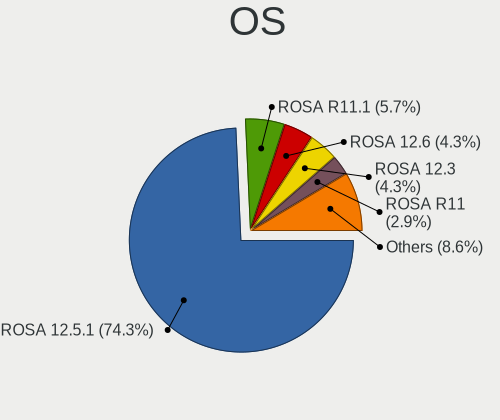
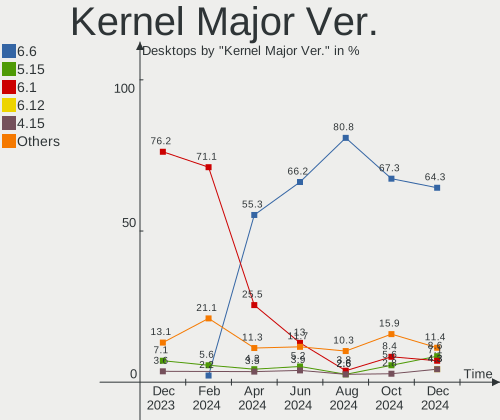
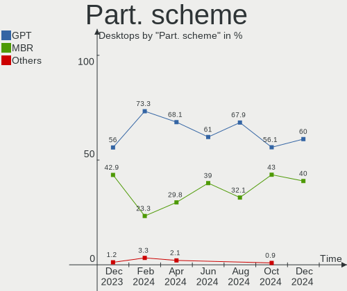
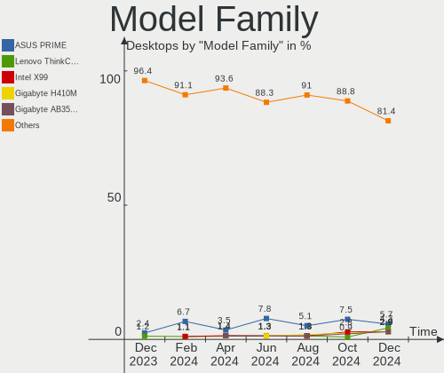

ROSA Hardware Trends (Desktop)
------------------------------

A project to identify most popular hardware characteristics and track their change
over time based on data collected by ROSA users at https://Linux-Hardware.org.

Anyone can contribute to the study by uploading probes of their computers by
the [hw-probe](https://github.com/linuxhw/hw-probe) tool:

    sudo -E hw-probe -all -upload

Full-feature report is available here: https://linux-hardware.org/?view=trends&formfactor=desktop

Period: Mar, 2021.

Contents
--------

- [ OS                       ](#os)
- [ OS Family                ](#os-family)
- [ Kernel                   ](#kernel)
- [ Kernel Family            ](#kernel-family)
- [ Kernel Major Ver.        ](#kernel-major-ver)
- [ Arch                     ](#arch)
- [ DE                       ](#de)
- [ Display Server           ](#display-server)
- [ Display Manager          ](#display-manager)
- [ OS Lang                  ](#os-lang)
- [ Boot Mode                ](#boot-mode)
- [ Filesystem               ](#filesystem)
- [ Part. scheme             ](#part-scheme)
- [ Dual Boot with Linux/BSD ](#dual-boot-with-linux/bsd)
- [ Dual Boot (Win)          ](#dual-boot-win)
- [ Country                  ](#country)
- [ City                     ](#city)
- [ Vendor                   ](#vendor)
- [ Model                    ](#model)
- [ Model Family             ](#model-family)
- [ MFG Year                 ](#mfg-year)
- [ Form Factor              ](#form-factor)
- [ Secure Boot              ](#secure-boot)
- [ Coreboot                 ](#coreboot)
- [ RAM Size                 ](#ram-size)
- [ RAM Used                 ](#ram-used)
- [ Has CD-ROM               ](#has-cd-rom)
- [ Total Drives             ](#total-drives)
- [ Has Ethernet             ](#has-ethernet)
- [ Has WiFi                 ](#has-wifi)
- [ Has Bluetooth            ](#has-bluetooth)
- [ Drive Vendor             ](#drive-vendor)
- [ Drive Model              ](#drive-model)
- [ HDD Vendor               ](#hdd-vendor)
- [ SSD Vendor               ](#ssd-vendor)
- [ Drive Kind               ](#drive-kind)
- [ Drive Connector          ](#drive-connector)
- [ Drive Size               ](#drive-size)
- [ Space Total              ](#space-total)
- [ Space Used               ](#space-used)
- [ Malfunc. Drives          ](#malfunc-drives)
- [ Malfunc. Drive Vendor    ](#malfunc-drive-vendor)
- [ Malfunc. HDD Vendor      ](#malfunc-hdd-vendor)
- [ Malfunc. Drive Kind      ](#malfunc-drive-kind)
- [ Failed Drives            ](#failed-drives)
- [ Failed Drive Vendor      ](#failed-drive-vendor)
- [ Drive Status             ](#drive-status)
- [ Storage Vendor           ](#storage-vendor)
- [ Storage Model            ](#storage-model)
- [ Storage Kind             ](#storage-kind)
- [ CPU Vendor               ](#cpu-vendor)
- [ CPU Model                ](#cpu-model)
- [ CPU Model Family         ](#cpu-model-family)
- [ CPU Cores                ](#cpu-cores)
- [ CPU Sockets              ](#cpu-sockets)
- [ CPU Threads              ](#cpu-threads)
- [ CPU Op-Modes             ](#cpu-op-modes)
- [ CPU Microcode            ](#cpu-microcode)
- [ CPU Microarch            ](#cpu-microarch)
- [ GPU Vendor               ](#gpu-vendor)
- [ GPU Model                ](#gpu-model)
- [ GPU Combo                ](#gpu-combo)
- [ GPU Driver               ](#gpu-driver)
- [ GPU Memory               ](#gpu-memory)
- [ Monitor Vendor           ](#monitor-vendor)
- [ Monitor Model            ](#monitor-model)
- [ Monitor Resolution       ](#monitor-resolution)
- [ Monitor Diagonal         ](#monitor-diagonal)
- [ Monitor Width            ](#monitor-width)
- [ Aspect Ratio             ](#aspect-ratio)
- [ Monitor Area             ](#monitor-area)
- [ Pixel Density            ](#pixel-density)
- [ Multiple Monitors        ](#multiple-monitors)
- [ Net Controller Vendor    ](#net-controller-vendor)
- [ Net Controller Model     ](#net-controller-model)
- [ Wireless Vendor          ](#wireless-vendor)
- [ Wireless Model           ](#wireless-model)
- [ Ethernet Vendor          ](#ethernet-vendor)
- [ Ethernet Model           ](#ethernet-model)
- [ Net Controller Kind      ](#net-controller-kind)
- [ Used Controller          ](#used-controller)
- [ NICs                     ](#nics)
- [ IPv6                     ](#ipv6)
- [ Memory Vendor            ](#memory-vendor)
- [ Memory Model             ](#memory-model)
- [ Memory Kind              ](#memory-kind)
- [ Memory Form Factor       ](#memory-form-factor)
- [ Memory Size              ](#memory-size)
- [ Memory Speed             ](#memory-speed)
- [ Sound Vendor             ](#sound-vendor)
- [ Sound Model              ](#sound-model)
- [ Camera Vendor            ](#camera-vendor)
- [ Camera Model             ](#camera-model)
- [ Fingerprint Vendor       ](#fingerprint-vendor)
- [ Fingerprint Model        ](#fingerprint-model)
- [ Chipcard Vendor          ](#chipcard-vendor)
- [ Chipcard Model           ](#chipcard-model)
- [ Printer Vendor           ](#printer-vendor)
- [ Printer Model            ](#printer-model)
- [ Scanner Vendor           ](#scanner-vendor)
- [ Scanner Model            ](#scanner-model)
- [ Bluetooth Vendor         ](#bluetooth-vendor)
- [ Bluetooth Model          ](#bluetooth-model)
- [ Unsupported Devices      ](#unsupported-devices)
- [ Unsupported Device Types ](#unsupported-device-types)

OS
--

Installed operating systems

| Name       | Desktops | Percent |
|------------|----------|---------|
| ROSA R11.1 | 69       | 60.53%  |
| ROSA R11   | 33       | 28.95%  |
| ROSA R8.1  | 5        | 4.39%   |
| ROSA R12   | 3        | 2.63%   |
| ROSA R10   | 3        | 2.63%   |
| ROSA R9    | 1        | 0.88%   |

OS Family
---------

OS without a version

| Name | Desktops | Percent |
|------|----------|---------|
| ROSA | 114      | 100%    |

Kernel
------

Version of the Linux kernel

| Version                             | Desktops | Percent |
|-------------------------------------|----------|---------|
| 4.15.0-desktop-45.1rosa-x86_64      | 27       | 23.68%  |
| 4.15.0-desktop-122.124.1rosa-x86_64 | 21       | 18.42%  |
| 5.4.83-generic-2rosa-x86_64         | 19       | 16.67%  |
| 5.4.32-generic-2rosa-x86_64         | 9        | 7.89%   |
| 4.15.0-desktop-45.1rosa-i586        | 7        | 6.14%   |
| 5.4.32-generic-2rosa-i586           | 5        | 4.39%   |
| 4.15.0-desktop-122.124.1rosa-i586   | 5        | 4.39%   |
| 5.10.18-generic-1rosa2019.1-x86_64  | 3        | 2.63%   |
| 4.9.60-nrj-desktop-1rosa-x86_64     | 3        | 2.63%   |
| 4.9.155-nrj-desktop-1rosa-x86_64    | 3        | 2.63%   |
| 4.9.155-nrj-desktop-1rosa-i586      | 3        | 2.63%   |
| 4.15.0-desktop-94.1rosa-x86_64      | 2        | 1.75%   |
| 4.1.38-nrj-desktop-2rosa-i586       | 2        | 1.75%   |
| 5.4.83-generic-2rosa-i586           | 1        | 0.88%   |
| 5.11.0-desktop-11.12.1rosa-x86_64   | 1        | 0.88%   |
| 4.9.20-nrj-desktop-1rosa-x86_64     | 1        | 0.88%   |
| 4.15.0-desktop-60.7rosa-x86_64      | 1        | 0.88%   |
| 4.1.38-nrj-desktop-2rosa-x86_64     | 1        | 0.88%   |

Kernel Family
-------------

Linux kernel without a distro release

| Version | Desktops | Percent |
|---------|----------|---------|
| 4.15.0  | 63       | 55.26%  |
| 5.4.83  | 20       | 17.54%  |
| 5.4.32  | 14       | 12.28%  |
| 4.9.155 | 6        | 5.26%   |
| 5.10.18 | 3        | 2.63%   |
| 4.9.60  | 3        | 2.63%   |
| 4.1.38  | 3        | 2.63%   |
| 5.11.0  | 1        | 0.88%   |
| 4.9.20  | 1        | 0.88%   |

Kernel Major Ver.
-----------------

Linux kernel major version

| Version | Desktops | Percent |
|---------|----------|---------|
| 4.15    | 63       | 55.26%  |
| 5.4     | 34       | 29.82%  |
| 4.9     | 10       | 8.77%   |
| 5.10    | 3        | 2.63%   |
| 4.1     | 3        | 2.63%   |
| 5.11    | 1        | 0.88%   |

Arch
----

OS architecture (x86_64, i586, etc.)

| Name   | Desktops | Percent |
|--------|----------|---------|
| x86_64 | 91       | 79.82%  |
| i686   | 23       | 20.18%  |

DE
--

Desktop Environment

| Name  | Desktops | Percent |
|-------|----------|---------|
| KDE4  | 72       | 63.16%  |
| KDE5  | 30       | 26.32%  |
| XFCE  | 7        | 6.14%   |
| LXQt  | 4        | 3.51%   |
| GNOME | 1        | 0.88%   |

Display Server
--------------

X11 or Wayland

| Name | Desktops | Percent |
|------|----------|---------|
| X11  | 114      | 100%    |

Display Manager
---------------

SDDM, LightDM, etc.

| Name | Desktops | Percent |
|------|----------|---------|
| KDM  | 72       | 63.16%  |
| SDDM | 39       | 34.21%  |
| TDM  | 2        | 1.75%   |
| GDM  | 1        | 0.88%   |

OS Lang
-------

Language

| Lang    | Desktops | Percent |
|---------|----------|---------|
| ru_RU   | 63       | 55.26%  |
| Unknown | 40       | 35.09%  |
| pl_PL   | 5        | 4.39%   |
| en_US   | 3        | 2.63%   |
| ro_RO   | 1        | 0.88%   |
| el_GR   | 1        | 0.88%   |
| de_DE   | 1        | 0.88%   |

Boot Mode
---------

EFI or BIOS

| Mode | Desktops | Percent |
|------|----------|---------|
| BIOS | 84       | 73.68%  |
| EFI  | 30       | 26.32%  |

Filesystem
----------

Type of filesystem

| Type  | Desktops | Percent |
|-------|----------|---------|
| Ext4  | 110      | 96.49%  |
| Btrfs | 3        | 2.63%   |
| Xfs   | 1        | 0.88%   |

Part. scheme
------------

Scheme of partitioning

| Type    | Desktops | Percent |
|---------|----------|---------|
| MBR     | 70       | 61.4%   |
| GPT     | 40       | 35.09%  |
| Unknown | 4        | 3.51%   |

Dual Boot with Linux/BSD
------------------------

Hosting more than one Linux/BSD

| Dual boot | Desktops | Percent |
|-----------|----------|---------|
| No        | 90       | 78.95%  |
| Yes       | 24       | 21.05%  |

Dual Boot (Win)
---------------

Hosting Linux and Windows

| Dual boot | Desktops | Percent |
|-----------|----------|---------|
| Yes       | 59       | 51.75%  |
| No        | 55       | 48.25%  |

Country
-------

Geographic location (country)

| Country    | Desktops | Percent |
|------------|----------|---------|
| Russia     | 85       | 74.56%  |
| Poland     | 7        | 6.14%   |
| Ukraine    | 6        | 5.26%   |
| Israel     | 3        | 2.63%   |
| Belarus    | 3        | 2.63%   |
| Romania    | 2        | 1.75%   |
| Germany    | 2        | 1.75%   |
| USA        | 1        | 0.88%   |
| Spain      | 1        | 0.88%   |
| Latvia     | 1        | 0.88%   |
| Kazakhstan | 1        | 0.88%   |
| Greece     | 1        | 0.88%   |
| Estonia    | 1        | 0.88%   |

City
----

Geographic location (city)

| City               | Desktops | Percent |
|--------------------|----------|---------|
| Moscow             | 13       | 11.4%   |
| Saratov            | 3        | 2.63%   |
| Kursk              | 3        | 2.63%   |
| Beersheba          | 3        | 2.63%   |
| Yekaterinburg      | 2        | 1.75%   |
| Yaroslavl          | 2        | 1.75%   |
| Volgograd          | 2        | 1.75%   |
| Ulyanovsk          | 2        | 1.75%   |
| St Petersburg      | 2        | 1.75%   |
| Rostov-on-Don      | 2        | 1.75%   |
| Perm               | 2        | 1.75%   |
| Nizhny Tagil       | 2        | 1.75%   |
| Kyiv               | 2        | 1.75%   |
| Krasnoyarsk        | 2        | 1.75%   |
| Chelyabinsk        | 2        | 1.75%   |
| Bratsk             | 2        | 1.75%   |
| Zelenodolsk        | 1        | 0.88%   |
| Zamość           | 1        | 0.88%   |
| Warsaw             | 1        | 0.88%   |
| Volzhskiy          | 1        | 0.88%   |
| Valencia           | 1        | 0.88%   |
| Uyar               | 1        | 0.88%   |
| Ufa                | 1        | 0.88%   |
| Tver               | 1        | 0.88%   |
| Tulun              | 1        | 0.88%   |
| Tula               | 1        | 0.88%   |
| Tomilino           | 1        | 0.88%   |
| Timișoara         | 1        | 0.88%   |
| Thessaloniki       | 1        | 0.88%   |
| Temirtau           | 1        | 0.88%   |
| Tambov             | 1        | 0.88%   |
| Tallinn            | 1        | 0.88%   |
| Szadek             | 1        | 0.88%   |
| Stavropol          | 1        | 0.88%   |
| Srednyaya Akhtuba  | 1        | 0.88%   |
| Sloviansk          | 1        | 0.88%   |
| Shadrinsk          | 1        | 0.88%   |
| Sevastopol'        | 1        | 0.88%   |
| Sevastopol         | 1        | 0.88%   |
| Roza               | 1        | 0.88%   |
| Roshchino          | 1        | 0.88%   |
| Pskov              | 1        | 0.88%   |
| Primorsko-Akhtarsk | 1        | 0.88%   |
| Plewiska           | 1        | 0.88%   |
| Parabel'           | 1        | 0.88%   |
| Orenburg           | 1        | 0.88%   |
| Oradea             | 1        | 0.88%   |
| Omsk               | 1        | 0.88%   |
| Oktyabr'skiy       | 1        | 0.88%   |
| Obninsk            | 1        | 0.88%   |
| Novosibirsk        | 1        | 0.88%   |
| Novorossiysk       | 1        | 0.88%   |
| Novokuznetsk       | 1        | 0.88%   |
| Novokuybyshevsk    | 1        | 0.88%   |
| Novocheboksarsk    | 1        | 0.88%   |
| Nizhniy Novgorod   | 1        | 0.88%   |
| Nizhnevartovsk     | 1        | 0.88%   |
| Nevinnomyssk       | 1        | 0.88%   |
| Mytishchi          | 1        | 0.88%   |
| Mozdok             | 1        | 0.88%   |

Vendor
------

Motherboard manufacturer

| Name                | Desktops | Percent |
|---------------------|----------|---------|
| ASUSTek Computer    | 36       | 31.58%  |
| Gigabyte Technology | 26       | 22.81%  |
| MSI                 | 14       | 12.28%  |
| ASRock              | 10       | 8.77%   |
| Acer                | 5        | 4.39%   |
| Hewlett-Packard     | 4        | 3.51%   |
| ECS                 | 4        | 3.51%   |
| Lenovo              | 2        | 1.75%   |
| Intel               | 2        | 1.75%   |
| Huanan              | 2        | 1.75%   |
| Dell                | 2        | 1.75%   |
| WinFast             | 1        | 0.88%   |
| Shuttle             | 1        | 0.88%   |
| KLLISRE             | 1        | 0.88%   |
| JW Technology       | 1        | 0.88%   |
| Fujitsu             | 1        | 0.88%   |
| Foxconn             | 1        | 0.88%   |
| Unknown             | 1        | 0.88%   |

Model
-----

Motherboard model

| Name                                    | Desktops | Percent |
|-----------------------------------------|----------|---------|
| ASUS P5LD2                              | 3        | 2.63%   |
| ASUS All Series                         | 3        | 2.63%   |
| MSI MS-7B79                             | 2        | 1.75%   |
| MSI MS-7A38                             | 2        | 1.75%   |
| Gigabyte A320M-S2H V2                   | 2        | 1.75%   |
| ASUS P5G41T-M LX                        | 2        | 1.75%   |
| ASRock A320M-HDV R4.0                   | 2        | 1.75%   |
| WinFast 6100M2MA                        | 1        | 0.88%   |
| Shuttle XS35                            | 1        | 0.88%   |
| MSI OPTIMUS                             | 1        | 0.88%   |
| MSI MS-7A72                             | 1        | 0.88%   |
| MSI MS-7A15                             | 1        | 0.88%   |
| MSI MS-7846                             | 1        | 0.88%   |
| MSI MS-7786                             | 1        | 0.88%   |
| MSI MS-7592                             | 1        | 0.88%   |
| MSI MS-7529                             | 1        | 0.88%   |
| MSI MS-7392                             | 1        | 0.88%   |
| MSI Compaq dx7400 Microtower            | 1        | 0.88%   |
| MSI Compaq dx2200 MT                    | 1        | 0.88%   |
| Lenovo IdeaCentre Q180 10087&3110       | 1        | 0.88%   |
| Lenovo IdeaCentre 510S-07ICB 90K800F0RS | 1        | 0.88%   |
| KLLISRE X79 V2.72S                      | 1        | 0.88%   |
| JW PH67A V1.0                           | 1        | 0.88%   |
| Intel DG43RK AAE78175-403               | 1        | 0.88%   |
| Intel DG31PR AAD97573-301               | 1        | 0.88%   |
| Huanan X99-F8                           | 1        | 0.88%   |
| Huanan X79 V2.47                        | 1        | 0.88%   |
| HP Compaq dx6100 MT(PD743A)             | 1        | 0.88%   |
| HP Compaq dc5850 Small Form Factor      | 1        | 0.88%   |
| HP Compaq 8200 Elite CMT PC             | 1        | 0.88%   |
| HP Compaq 6005 Pro SFF PC               | 1        | 0.88%   |
| Gigabyte Z77-D3H                        | 1        | 0.88%   |
| Gigabyte Z68M-D2H                       | 1        | 0.88%   |
| Gigabyte Z270P-D3                       | 1        | 0.88%   |
| Gigabyte P35-DS3L                       | 1        | 0.88%   |
| Gigabyte J1800N-D2H                     | 1        | 0.88%   |
| Gigabyte GA-880GM-D2H                   | 1        | 0.88%   |
| Gigabyte GA-770T-D3L                    | 1        | 0.88%   |
| Gigabyte G41M-Combo                     | 1        | 0.88%   |
| Gigabyte G33-DS3R                       | 1        | 0.88%   |
| Gigabyte G31M-S2C                       | 1        | 0.88%   |
| Gigabyte F2A88XM-HD3                    | 1        | 0.88%   |
| Gigabyte F2A88X-D3H                     | 1        | 0.88%   |
| Gigabyte F2A68HM-S1                     | 1        | 0.88%   |
| Gigabyte EP43C-DS3                      | 1        | 0.88%   |
| Gigabyte EP43-DS3L                      | 1        | 0.88%   |
| Gigabyte EP35-DS3                       | 1        | 0.88%   |
| Gigabyte B550 GAMING X V2               | 1        | 0.88%   |
| Gigabyte B450M S2H                      | 1        | 0.88%   |
| Gigabyte B450M DS3H                     | 1        | 0.88%   |
| Gigabyte AB350M-D3V                     | 1        | 0.88%   |
| Gigabyte AB350-Gaming                   | 1        | 0.88%   |
| Gigabyte 965P-S3                        | 1        | 0.88%   |
| Gigabyte 945GCM-S2L                     | 1        | 0.88%   |
| Gigabyte 8I915ME                        | 1        | 0.88%   |
| Fujitsu ESPRIMO P5731                   | 1        | 0.88%   |
| Foxconn Pro 3300 Series MT              | 1        | 0.88%   |
| ECS P965T-A                             | 1        | 0.88%   |
| ECS K8M800-M2                           | 1        | 0.88%   |
| ECS A740GM-M                            | 1        | 0.88%   |

Model Family
------------

Motherboard model prefix

| Name                  | Desktops | Percent |
|-----------------------|----------|---------|
| Acer Aspire           | 5        | 4.39%   |
| HP Compaq             | 4        | 3.51%   |
| ASUS PRIME            | 4        | 3.51%   |
| ASUS P5LD2            | 3        | 2.63%   |
| ASUS All              | 3        | 2.63%   |
| MSI MS-7B79           | 2        | 1.75%   |
| MSI MS-7A38           | 2        | 1.75%   |
| MSI Compaq            | 2        | 1.75%   |
| Lenovo IdeaCentre     | 2        | 1.75%   |
| Gigabyte B450M        | 2        | 1.75%   |
| Gigabyte A320M-S2H    | 2        | 1.75%   |
| Dell OptiPlex         | 2        | 1.75%   |
| ASUS P5GC-MX          | 2        | 1.75%   |
| ASUS P5G41T-M         | 2        | 1.75%   |
| ASUS M5A97            | 2        | 1.75%   |
| ASUS M5A78L-M         | 2        | 1.75%   |
| ASRock A320M-HDV      | 2        | 1.75%   |
| WinFast 6100M2MA      | 1        | 0.88%   |
| Shuttle XS35          | 1        | 0.88%   |
| MSI OPTIMUS           | 1        | 0.88%   |
| MSI MS-7A72           | 1        | 0.88%   |
| MSI MS-7A15           | 1        | 0.88%   |
| MSI MS-7846           | 1        | 0.88%   |
| MSI MS-7786           | 1        | 0.88%   |
| MSI MS-7592           | 1        | 0.88%   |
| MSI MS-7529           | 1        | 0.88%   |
| MSI MS-7392           | 1        | 0.88%   |
| KLLISRE X79           | 1        | 0.88%   |
| JW PH67A              | 1        | 0.88%   |
| Intel DG43RK          | 1        | 0.88%   |
| Intel DG31PR          | 1        | 0.88%   |
| Huanan X99-F8         | 1        | 0.88%   |
| Huanan X79            | 1        | 0.88%   |
| Gigabyte Z77-D3H      | 1        | 0.88%   |
| Gigabyte Z68M-D2H     | 1        | 0.88%   |
| Gigabyte Z270P-D3     | 1        | 0.88%   |
| Gigabyte P35-DS3L     | 1        | 0.88%   |
| Gigabyte J1800N-D2H   | 1        | 0.88%   |
| Gigabyte GA-880GM-D2H | 1        | 0.88%   |
| Gigabyte GA-770T-D3L  | 1        | 0.88%   |
| Gigabyte G41M-Combo   | 1        | 0.88%   |
| Gigabyte G33-DS3R     | 1        | 0.88%   |
| Gigabyte G31M-S2C     | 1        | 0.88%   |
| Gigabyte F2A88XM-HD3  | 1        | 0.88%   |
| Gigabyte F2A88X-D3H   | 1        | 0.88%   |
| Gigabyte F2A68HM-S1   | 1        | 0.88%   |
| Gigabyte EP43C-DS3    | 1        | 0.88%   |
| Gigabyte EP43-DS3L    | 1        | 0.88%   |
| Gigabyte EP35-DS3     | 1        | 0.88%   |
| Gigabyte B550         | 1        | 0.88%   |
| Gigabyte AB350M-D3V   | 1        | 0.88%   |
| Gigabyte AB350-Gaming | 1        | 0.88%   |
| Gigabyte 965P-S3      | 1        | 0.88%   |
| Gigabyte 945GCM-S2L   | 1        | 0.88%   |
| Gigabyte 8I915ME      | 1        | 0.88%   |
| Fujitsu ESPRIMO       | 1        | 0.88%   |
| Foxconn Pro           | 1        | 0.88%   |
| ECS P965T-A           | 1        | 0.88%   |
| ECS K8M800-M2         | 1        | 0.88%   |
| ECS A740GM-M          | 1        | 0.88%   |

MFG Year
--------

Motherboard manufacture year

| Year | Desktops | Percent |
|------|----------|---------|
| 2010 | 15       | 13.16%  |
| 2018 | 13       | 11.4%   |
| 2011 | 12       | 10.53%  |
| 2007 | 11       | 9.65%   |
| 2008 | 9        | 7.89%   |
| 2020 | 8        | 7.02%   |
| 2019 | 7        | 6.14%   |
| 2014 | 7        | 6.14%   |
| 2009 | 7        | 6.14%   |
| 2015 | 5        | 4.39%   |
| 2016 | 4        | 3.51%   |
| 2013 | 4        | 3.51%   |
| 2012 | 4        | 3.51%   |
| 2017 | 3        | 2.63%   |
| 2021 | 2        | 1.75%   |
| 2005 | 2        | 1.75%   |
| 2006 | 1        | 0.88%   |

Form Factor
-----------

Physical design of the computer

| Name    | Desktops | Percent |
|---------|----------|---------|
| Desktop | 114      | 100%    |

Secure Boot
-----------

Enabled or disabled

| State    | Desktops | Percent |
|----------|----------|---------|
| Disabled | 114      | 100%    |

Coreboot
--------

Have coreboot on board

| Used | Desktops | Percent |
|------|----------|---------|
| No   | 114      | 100%    |

RAM Size
--------

Total RAM memory

| Size in GB | Desktops | Percent |
|------------|----------|---------|
| 3.01-4.0   | 27       | 23.68%  |
| 8.01-16.0  | 26       | 22.81%  |
| 4.01-8.0   | 18       | 15.79%  |
| 16.01-24.0 | 15       | 13.16%  |
| 1.01-2.0   | 12       | 10.53%  |
| 32.01-64.0 | 5        | 4.39%   |
| 2.01-3.0   | 5        | 4.39%   |
| 24.01-32.0 | 4        | 3.51%   |
| 0.51-1.0   | 2        | 1.75%   |

RAM Used
--------

Used RAM memory

| Used GB  | Desktops | Percent |
|----------|----------|---------|
| 1.01-2.0 | 51       | 44.74%  |
| 0.51-1.0 | 44       | 38.6%   |
| 2.01-3.0 | 16       | 14.04%  |
| 3.01-4.0 | 2        | 1.75%   |
| 0.01-0.5 | 1        | 0.88%   |

Has CD-ROM
----------

Has CD-ROM on board

| Presented | Desktops | Percent |
|-----------|----------|---------|
| Yes       | 60       | 52.63%  |
| No        | 54       | 47.37%  |

Total Drives
------------

Number of drives on board

| Drives | Desktops | Percent |
|--------|----------|---------|
| 1      | 60       | 52.63%  |
| 2      | 31       | 27.19%  |
| 3      | 15       | 13.16%  |
| 4      | 4        | 3.51%   |
| 5      | 2        | 1.75%   |
| 7      | 1        | 0.88%   |
| 6      | 1        | 0.88%   |

Has Ethernet
------------

Has Ethernet on board

| Presented | Desktops | Percent |
|-----------|----------|---------|
| Yes       | 114      | 100%    |

Has WiFi
--------

Has WiFi module

| Presented | Desktops | Percent |
|-----------|----------|---------|
| No        | 90       | 78.95%  |
| Yes       | 24       | 21.05%  |

Has Bluetooth
-------------

Has Bluetooth module

| Presented | Desktops | Percent |
|-----------|----------|---------|
| No        | 105      | 92.11%  |
| Yes       | 9        | 7.89%   |

Drive Vendor
------------

Hard drive vendors

| Vendor              | Desktops | Drives  | Percent |
|---------------------|----------|---------|---------|
| WDC                 | 45       | 53      | 24.19%  |
| Seagate             | 39       | 49      | 20.97%  |
| Samsung Electronics | 20       | 22      | 10.75%  |
| Toshiba             | 17       | 18      | 9.14%   |
| Hitachi             | 10       | 10      | 5.38%   |
| Kingston            | 7        | 7       | 3.76%   |
| A-DATA Technology   | 6        | 6       | 3.23%   |
| SanDisk             | 3        | 3       | 1.61%   |
| Maxtor              | 3        | 3       | 1.61%   |
| HGST                | 3        | 3       | 1.61%   |
| GOODRAM             | 3        | 3       | 1.61%   |
| Crucial             | 3        | 3       | 1.61%   |
| Apacer              | 3        | 3       | 1.61%   |
| Unknown             | 2        | 2       | 1.08%   |
| TO Exter            | 2        | 2       | 1.08%   |
| SPCC                | 2        | 2       | 1.08%   |
| OCZ                 | 2        | 2       | 1.08%   |
| China               | 2        | 2       | 1.08%   |
| Zheino              | 1        | 1       | 0.54%   |
| XPG                 | 1        | 1       | 0.54%   |
| Verbatim            | 1        | 1       | 0.54%   |
| Transcend           | 1        | 1       | 0.54%   |
| Smartbuy            | 1        | 2       | 0.54%   |
| Reeinno             | 1        | 1       | 0.54%   |
| PLEXTOR             | 1        | 1       | 0.54%   |
| Patriot             | 1        | 1       | 0.54%   |
| Palit               | 1        | 1       | 0.54%   |
| Mass                | 1        | Unknown | 0.54%   |
| LITEON              | 1        | 1       | 0.54%   |
| KingDian            | 1        | 1       | 0.54%   |
| Intel               | 1        | 1       | 0.54%   |
| Corsair             | 1        | 1       | 0.54%   |

Drive Model
-----------

Hard drive models

| Model                             | Desktops | Percent |
|-----------------------------------|----------|---------|
| Toshiba DT01ACA100 1TB            | 5        | 2.4%    |
| Samsung SSD 860 EVO 250GB         | 5        | 2.4%    |
| Seagate ST1000DM010-2EP102 1TB    | 4        | 1.92%   |
| WDC WD10EZEX-08WN4A0 1TB          | 3        | 1.44%   |
| WDC WD10EZEX-00WN4A0 1TB          | 3        | 1.44%   |
| Seagate ST3500418AS 500GB         | 3        | 1.44%   |
| Seagate ST340014A 40GB            | 3        | 1.44%   |
| Seagate ST31000524AS 1TB          | 3        | 1.44%   |
| Kingston SA400S37120G 120GB SSD   | 3        | 1.44%   |
| HGST HTS545050A7E680 500GB        | 3        | 1.44%   |
| WDC WDS120G2G0A-00JH30 120GB SSD  | 2        | 0.96%   |
| WDC WD5000AZRX-00A8LB0 500GB      | 2        | 0.96%   |
| WDC WD5000AZLX-22JKKA0 500GB      | 2        | 0.96%   |
| WDC WD5000AAKX-001CA0 500GB       | 2        | 0.96%   |
| WDC WD10EZEX-00BN5A0 1TB          | 2        | 0.96%   |
| WDC WD10EARS-00Y5B1 1TB           | 2        | 0.96%   |
| Unknown SD/MMC/MS PRO 128GB       | 2        | 0.96%   |
| Toshiba HDWD110 1TB               | 2        | 0.96%   |
| Toshiba HDWD105 500GB             | 2        | 0.96%   |
| Toshiba DT01ACA050 500GB          | 2        | 0.96%   |
| TO Exter nal USB 3.0 2TB          | 2        | 0.96%   |
| Seagate ST500DM002-1BD142 500GB   | 2        | 0.96%   |
| Seagate ST380815AS 80GB           | 2        | 0.96%   |
| Seagate ST380811AS 80GB           | 2        | 0.96%   |
| Seagate ST380011A 80GB            | 2        | 0.96%   |
| Seagate ST3160815AS 160GB         | 2        | 0.96%   |
| Seagate ST3160812A 160GB          | 2        | 0.96%   |
| Seagate ST31000528AS 1TB          | 2        | 0.96%   |
| Samsung SSD 750 EVO 120GB         | 2        | 0.96%   |
| Samsung HD252KJ 250GB             | 2        | 0.96%   |
| Samsung HD161HJ 160GB             | 2        | 0.96%   |
| Samsung HD160JJ/ 160GB            | 2        | 0.96%   |
| Hitachi HDS721025CLA382 250GB     | 2        | 0.96%   |
| Zheino CHN-25SATAS3-256 256GB SSD | 1        | 0.48%   |
| XPG GAMMIX S11 Pro 256GB          | 1        | 0.48%   |
| WDC WDS500G2X0C-00L350 500GB      | 1        | 0.48%   |
| WDC WDS500G1B0A-00H9H0 500GB SSD  | 1        | 0.48%   |
| WDC WDS480G2G0A-00JH30 480GB SSD  | 1        | 0.48%   |
| WDC WDS240G2G0B-00EPW0 240GB SSD  | 1        | 0.48%   |
| WDC WD800JD-60LUA0 80GB           | 1        | 0.48%   |
| WDC WD800JD-60LSA0 80GB           | 1        | 0.48%   |
| WDC WD800JD-00LSA0 80GB           | 1        | 0.48%   |
| WDC WD800BB-00FJA0 80GB           | 1        | 0.48%   |
| WDC WD800BB-00DKA0 80GB           | 1        | 0.48%   |
| WDC WD800AAJS-75M0A0 80GB         | 1        | 0.48%   |
| WDC WD800AAJS-00PSA0 80GB         | 1        | 0.48%   |
| WDC WD7500AZEX-00ZF5A0 752GB      | 1        | 0.48%   |
| WDC WD7500AAKS-00RBA0 752GB       | 1        | 0.48%   |
| WDC WD7500AACS-00D6B1 752GB       | 1        | 0.48%   |
| WDC WD5000AZLX-75K2TA0 500GB      | 1        | 0.48%   |
| WDC WD5000AAKX-08U6AA0 500GB      | 1        | 0.48%   |
| WDC WD5000AAKX-003CA0 500GB       | 1        | 0.48%   |
| WDC WD3200BPVT-24JJ5T0 320GB      | 1        | 0.48%   |
| WDC WD3200AAKS-00UU3A0 320GB      | 1        | 0.48%   |
| WDC WD3200AAJS-00B4A0 320GB       | 1        | 0.48%   |
| WDC WD3200AAJB-00J3A0 320GB       | 1        | 0.48%   |
| WDC WD30EZRX-00MMMB0 3TB          | 1        | 0.48%   |
| WDC WD2500AAKX-00ERMA0 250GB      | 1        | 0.48%   |
| WDC WD2500AAKS-60L9A0 250GB       | 1        | 0.48%   |
| WDC WD1600JS-55NCB1 160GB         | 1        | 0.48%   |

HDD Vendor
----------

Hard disk drive vendors

| Vendor              | Desktops | Drives | Percent |
|---------------------|----------|--------|---------|
| WDC                 | 42       | 47     | 33.87%  |
| Seagate             | 39       | 49     | 31.45%  |
| Toshiba             | 15       | 16     | 12.1%   |
| Samsung Electronics | 10       | 11     | 8.06%   |
| Hitachi             | 10       | 10     | 8.06%   |
| Maxtor              | 3        | 3      | 2.42%   |
| HGST                | 3        | 3      | 2.42%   |
| TO Exter            | 2        | 2      | 1.61%   |

SSD Vendor
----------

Solid state drive vendors

| Vendor              | Desktops | Drives | Percent |
|---------------------|----------|--------|---------|
| Samsung Electronics | 8        | 9      | 14.04%  |
| Kingston            | 7        | 7      | 12.28%  |
| A-DATA Technology   | 6        | 6      | 10.53%  |
| WDC                 | 5        | 5      | 8.77%   |
| SanDisk             | 3        | 3      | 5.26%   |
| GOODRAM             | 3        | 3      | 5.26%   |
| Crucial             | 3        | 3      | 5.26%   |
| Apacer              | 3        | 3      | 5.26%   |
| Toshiba             | 2        | 2      | 3.51%   |
| SPCC                | 2        | 2      | 3.51%   |
| OCZ                 | 2        | 2      | 3.51%   |
| China               | 2        | 2      | 3.51%   |
| Zheino              | 1        | 1      | 1.75%   |
| Verbatim            | 1        | 1      | 1.75%   |
| Transcend           | 1        | 1      | 1.75%   |
| Smartbuy            | 1        | 2      | 1.75%   |
| Reeinno             | 1        | 1      | 1.75%   |
| Patriot             | 1        | 1      | 1.75%   |
| Palit               | 1        | 1      | 1.75%   |
| LITEON              | 1        | 1      | 1.75%   |
| KingDian            | 1        | 1      | 1.75%   |
| Intel               | 1        | 1      | 1.75%   |
| Corsair             | 1        | 1      | 1.75%   |

Drive Kind
----------

HDD or SSD

| Kind    | Desktops | Drives | Percent |
|---------|----------|--------|---------|
| HDD     | 95       | 141    | 63.76%  |
| SSD     | 46       | 59     | 30.87%  |
| NVMe    | 5        | 5      | 3.36%   |
| Unknown | 3        | 2      | 2.01%   |

Drive Connector
---------------

SATA, SAS, NVMe, etc.

| Type | Desktops | Drives | Percent |
|------|----------|--------|---------|
| SATA | 112      | 197    | 91.06%  |
| SAS  | 6        | 5      | 4.88%   |
| NVMe | 5        | 5      | 4.07%   |

Drive Size
----------

Size of hard drive

| Size in TB | Desktops | Drives | Percent |
|------------|----------|--------|---------|
| 0.01-0.5   | 100      | 147    | 69.93%  |
| 0.51-1.0   | 36       | 46     | 25.17%  |
| 1.01-2.0   | 5        | 5      | 3.5%    |
| 2.01-3.0   | 2        | 2      | 1.4%    |

Space Total
-----------

Amount of disk space available on the file system

| Size in GB | Desktops | Percent |
|------------|----------|---------|
| 101-250    | 35       | 30.7%   |
| 251-500    | 21       | 18.42%  |
| 51-100     | 17       | 14.91%  |
| 1-20       | 13       | 11.4%   |
| 501-1000   | 12       | 10.53%  |
| 21-50      | 8        | 7.02%   |
| 1001-2000  | 6        | 5.26%   |
| 2001-3000  | 1        | 0.88%   |
| Unknown    | 1        | 0.88%   |

Space Used
----------

Amount of used disk space

| Used GB   | Desktops | Percent |
|-----------|----------|---------|
| 1-20      | 84       | 73.68%  |
| 21-50     | 9        | 7.89%   |
| 51-100    | 6        | 5.26%   |
| 251-500   | 5        | 4.39%   |
| 101-250   | 5        | 4.39%   |
| 1001-2000 | 2        | 1.75%   |
| 501-1000  | 2        | 1.75%   |
| Unknown   | 1        | 0.88%   |

Malfunc. Drives
---------------

Drive models with a malfunction

| Model                              | Desktops | Drives | Percent |
|------------------------------------|----------|--------|---------|
| HGST HTS545050A7E680 500GB         | 3        | 3      | 4.69%   |
| WDC WD5000AAKX-001CA0 500GB        | 2        | 2      | 3.13%   |
| Seagate ST500DM002-1BD142 500GB    | 2        | 2      | 3.13%   |
| Seagate ST380011A 80GB             | 2        | 2      | 3.13%   |
| Seagate ST3500418AS 500GB          | 2        | 2      | 3.13%   |
| Seagate ST31000528AS 1TB           | 2        | 2      | 3.13%   |
| Samsung Electronics HD252KJ 250GB  | 2        | 2      | 3.13%   |
| Samsung Electronics HD161HJ 160GB  | 2        | 2      | 3.13%   |
| Samsung Electronics HD160JJ/ 160GB | 2        | 2      | 3.13%   |
| WDC WDS480G2G0A-00JH30 480GB SSD   | 1        | 1      | 1.56%   |
| WDC WD800JD-60LSA0 80GB            | 1        | 1      | 1.56%   |
| WDC WD800BB-00FJA0 80GB            | 1        | 1      | 1.56%   |
| WDC WD800BB-00DKA0 80GB            | 1        | 1      | 1.56%   |
| WDC WD7500AAKS-00RBA0 752GB        | 1        | 1      | 1.56%   |
| WDC WD7500AACS-00D6B1 752GB        | 1        | 1      | 1.56%   |
| WDC WD5000AAKX-003CA0 500GB        | 1        | 1      | 1.56%   |
| WDC WD3200AAKS-00UU3A0 320GB       | 1        | 1      | 1.56%   |
| WDC WD3200AAJS-00B4A0 320GB        | 1        | 1      | 1.56%   |
| WDC WD2500AAKS-60L9A0 250GB        | 1        | 1      | 1.56%   |
| WDC WD1600AAJS-00L7A0 160GB        | 1        | 1      | 1.56%   |
| WDC WD15EARS-00MVWB0 1TB           | 1        | 1      | 1.56%   |
| WDC WD10EZEX-60WN4A0 1TB           | 1        | 1      | 1.56%   |
| WDC WD10EZEX-00BN5A0 1TB           | 1        | 1      | 1.56%   |
| WDC WD10EARS-00Y5B1 1TB            | 1        | 1      | 1.56%   |
| WDC WD10EALS-002BA0 1TB            | 1        | 1      | 1.56%   |
| WDC WD10EADS-22M2B0 1TB            | 1        | 1      | 1.56%   |
| Toshiba DT01ACA100 1TB             | 1        | 1      | 1.56%   |
| Toshiba DT01ACA050 500GB           | 1        | 1      | 1.56%   |
| Seagate ST9160821AS 160GB          | 1        | 1      | 1.56%   |
| Seagate ST9120822AS 120GB          | 1        | 1      | 1.56%   |
| Seagate ST500DM005 HD502HJ 500GB   | 1        | 1      | 1.56%   |
| Seagate ST380817AS 80GB            | 1        | 1      | 1.56%   |
| Seagate ST380815AS 80GB            | 1        | 1      | 1.56%   |
| Seagate ST380811AS 80GB            | 1        | 1      | 1.56%   |
| Seagate ST3500413AS 500GB          | 1        | 1      | 1.56%   |
| Seagate ST340016A 40GB             | 1        | 1      | 1.56%   |
| Seagate ST340014A 40GB             | 1        | 1      | 1.56%   |
| Seagate ST3250312CS 250GB          | 1        | 1      | 1.56%   |
| Seagate ST3250312AS 250GB          | 1        | 1      | 1.56%   |
| Seagate ST3250310AS 250GB          | 1        | 1      | 1.56%   |
| Seagate ST3160815AS 160GB          | 1        | 1      | 1.56%   |
| Seagate ST3160811AS 160GB          | 1        | 1      | 1.56%   |
| Seagate ST31000524AS 1TB           | 1        | 1      | 1.56%   |
| Seagate ST31000520AS 1TB           | 1        | 1      | 1.56%   |
| SanDisk SDSSDA120G 120GB           | 1        | 1      | 1.56%   |
| Samsung Electronics SP2504C 250GB  | 1        | 1      | 1.56%   |
| Samsung Electronics HD103SI 1TB    | 1        | 1      | 1.56%   |
| Samsung Electronics HD080HJ/ 80GB  | 1        | 1      | 1.56%   |
| MAXTOR STM3320820AS 320GB          | 1        | 1      | 1.56%   |
| Kingston SHFS37A120G 120GB SSD     | 1        | 1      | 1.56%   |
| Intel SSDSC2BW240H6 240GB          | 1        | 1      | 1.56%   |
| Hitachi HTS543232L9A300 320GB      | 1        | 1      | 1.56%   |
| Hitachi HTS541616J9SA00 160GB      | 1        | 1      | 1.56%   |
| Hitachi HDP725050GLAT80 500GB      | 1        | 1      | 1.56%   |

Malfunc. Drive Vendor
---------------------

Vendors of faulty drives

| Vendor              | Desktops | Drives | Percent |
|---------------------|----------|--------|---------|
| Seagate             | 21       | 24     | 36.21%  |
| WDC                 | 17       | 19     | 29.31%  |
| Samsung Electronics | 8        | 9      | 13.79%  |
| Hitachi             | 3        | 3      | 5.17%   |
| HGST                | 3        | 3      | 5.17%   |
| Toshiba             | 2        | 2      | 3.45%   |
| SanDisk             | 1        | 1      | 1.72%   |
| MAXTOR              | 1        | 1      | 1.72%   |
| Kingston            | 1        | 1      | 1.72%   |
| Intel               | 1        | 1      | 1.72%   |

Malfunc. HDD Vendor
-------------------

Vendors of faulty HDD drives

| Vendor              | Desktops | Drives | Percent |
|---------------------|----------|--------|---------|
| Seagate             | 21       | 24     | 38.89%  |
| WDC                 | 16       | 18     | 29.63%  |
| Samsung Electronics | 8        | 9      | 14.81%  |
| Hitachi             | 3        | 3      | 5.56%   |
| HGST                | 3        | 3      | 5.56%   |
| Toshiba             | 2        | 2      | 3.7%    |
| MAXTOR              | 1        | 1      | 1.85%   |

Malfunc. Drive Kind
-------------------

Kinds of faulty drives

| Kind | Desktops | Drives | Percent |
|------|----------|--------|---------|
| HDD  | 50       | 60     | 92.59%  |
| SSD  | 4        | 4      | 7.41%   |

Failed Drives
-------------

Failed drive models

| Model                             | Desktops | Drives | Percent |
|-----------------------------------|----------|--------|---------|
| Samsung Electronics HD252HJ 250GB | 1        | 1      | 50%     |
| Hitachi HDS721025CLA382 250GB     | 1        | 1      | 50%     |

Failed Drive Vendor
-------------------

Failed drive vendors

| Vendor              | Desktops | Drives | Percent |
|---------------------|----------|--------|---------|
| Samsung Electronics | 1        | 1      | 50%     |
| Hitachi             | 1        | 1      | 50%     |

Drive Status
------------

Number of failed and malfunc. drives

| Status   | Desktops | Drives | Percent |
|----------|----------|--------|---------|
| Works    | 81       | 138    | 57.86%  |
| Malfunc  | 53       | 64     | 37.86%  |
| Detected | 4        | 3      | 2.86%   |
| Failed   | 2        | 2      | 1.43%   |

Storage Vendor
--------------

Storage controller vendors

| Vendor                           | Desktops | Percent |
|----------------------------------|----------|---------|
| Intel                            | 66       | 49.25%  |
| AMD                              | 41       | 30.6%   |
| JMicron Technology               | 11       | 8.21%   |
| Nvidia                           | 5        | 3.73%   |
| Marvell Technology Group         | 3        | 2.24%   |
| Samsung Electronics              | 2        | 1.49%   |
| VIA Technologies                 | 1        | 0.75%   |
| Silicon Integrated Systems [SiS] | 1        | 0.75%   |
| Sandisk                          | 1        | 0.75%   |
| Lite-On Technology               | 1        | 0.75%   |
| ASMedia Technology               | 1        | 0.75%   |
| ADATA Technology                 | 1        | 0.75%   |

Storage Model
-------------

Storage controller models

| Model                                                                                   | Desktops | Percent |
|-----------------------------------------------------------------------------------------|----------|---------|
| Intel NM10/ICH7 Family SATA Controller [IDE mode]                                       | 17       | 8.63%   |
| AMD FCH SATA Controller [AHCI mode]                                                     | 17       | 8.63%   |
| Intel 82801G (ICH7 Family) IDE Controller                                               | 15       | 7.61%   |
| AMD SB7x0/SB8x0/SB9x0 IDE Controller                                                    | 14       | 7.11%   |
| AMD SB7x0/SB8x0/SB9x0 SATA Controller [IDE mode]                                        | 12       | 6.09%   |
| JMicron JMB363 SATA/IDE Controller                                                      | 7        | 3.55%   |
| AMD SB7x0/SB8x0/SB9x0 SATA Controller [AHCI mode]                                       | 7        | 3.55%   |
| AMD 400 Series Chipset SATA Controller                                                  | 6        | 3.05%   |
| Intel Q170/Q150/B150/H170/H110/Z170/CM236 Chipset SATA Controller [AHCI Mode]           | 5        | 2.54%   |
| Intel Cannon Lake PCH SATA AHCI Controller                                              | 4        | 2.03%   |
| Intel 8 Series/C220 Series Chipset Family 6-port SATA Controller 1 [AHCI mode]          | 4        | 2.03%   |
| Intel 6 Series/C200 Series Chipset Family 6 port Desktop SATA AHCI Controller           | 4        | 2.03%   |
| Intel 200 Series PCH SATA controller [AHCI mode]                                        | 4        | 2.03%   |
| AMD 300 Series Chipset SATA Controller                                                  | 4        | 2.03%   |
| JMicron JMB368 IDE controller                                                           | 3        | 1.52%   |
| Intel 82801JI (ICH10 Family) SATA AHCI Controller                                       | 3        | 1.52%   |
| Intel 82801I (ICH9 Family) 2 port SATA Controller [IDE mode]                            | 3        | 1.52%   |
| Intel 82801HR/HO/HH (ICH8R/DO/DH) 2 port SATA Controller [IDE mode]                     | 3        | 1.52%   |
| Intel 82801H (ICH8 Family) 4 port SATA Controller [IDE mode]                            | 3        | 1.52%   |
| Intel 7 Series/C210 Series Chipset Family 6-port SATA Controller [AHCI mode]            | 3        | 1.52%   |
| AMD FCH SATA Controller D                                                               | 3        | 1.52%   |
| Samsung NVMe SSD Controller SM981/PM981/PM983                                           | 2        | 1.02%   |
| Nvidia MCP61 SATA Controller                                                            | 2        | 1.02%   |
| Nvidia MCP61 IDE                                                                        | 2        | 1.02%   |
| Nvidia MCP51 Serial ATA Controller                                                      | 2        | 1.02%   |
| Intel NM10/ICH7 Family SATA Controller [AHCI mode]                                      | 2        | 1.02%   |
| Intel C600/X79 series chipset 6-Port SATA AHCI Controller                               | 2        | 1.02%   |
| Intel 82801JI (ICH10 Family) 4 port SATA IDE Controller #1                              | 2        | 1.02%   |
| Intel 82801JI (ICH10 Family) 2 port SATA IDE Controller #2                              | 2        | 1.02%   |
| Intel 82801IB (ICH9) 2 port SATA Controller [IDE mode]                                  | 2        | 1.02%   |
| Intel 82801FB/FW (ICH6/ICH6W) SATA Controller                                           | 2        | 1.02%   |
| AMD FCH SATA Controller [IDE mode]                                                      | 2        | 1.02%   |
| VIA VT82C586A/B/VT82C686/A/B/VT823x/A/C PIPC Bus Master IDE                             | 1        | 0.51%   |
| VIA VIA VT6420 SATA RAID Controller                                                     | 1        | 0.51%   |
| Silicon Integrated Systems [SiS] SATA Controller / IDE mode                             | 1        | 0.51%   |
| Silicon Integrated Systems [SiS] 5513 IDE Controller                                    | 1        | 0.51%   |
| Sandisk WD Black 2018/SN750 / PC SN720 NVMe SSD                                         | 1        | 0.51%   |
| Nvidia MCP67 IDE Controller                                                             | 1        | 0.51%   |
| Nvidia MCP67 AHCI Controller                                                            | 1        | 0.51%   |
| Nvidia MCP51 IDE                                                                        | 1        | 0.51%   |
| Marvell Group 88SE912x SATA 6Gb/s Controller [IDE mode]                                 | 1        | 0.51%   |
| Marvell Group 88SE912x IDE Controller                                                   | 1        | 0.51%   |
| Marvell Group 88SE6440 SAS/SATA PCIe controller                                         | 1        | 0.51%   |
| Marvell Group 88SE6101/6102 single-port PATA133 interface                               | 1        | 0.51%   |
| Lite-On Non-Volatile memory controller                                                  | 1        | 0.51%   |
| JMicron JMB361 AHCI/IDE                                                                 | 1        | 0.51%   |
| Intel SATA Controller [RAID mode]                                                       | 1        | 0.51%   |
| Intel C610/X99 series chipset 6-Port SATA Controller [AHCI mode]                        | 1        | 0.51%   |
| Intel Atom Processor E3800 Series SATA AHCI Controller                                  | 1        | 0.51%   |
| Intel 9 Series Chipset Family SATA Controller [AHCI Mode]                               | 1        | 0.51%   |
| Intel 82801JD/DO (ICH10 Family) 4-port SATA IDE Controller                              | 1        | 0.51%   |
| Intel 82801JD/DO (ICH10 Family) 2-port SATA IDE Controller                              | 1        | 0.51%   |
| Intel 82801IR/IO/IH (ICH9R/DO/DH) 4 port SATA Controller [IDE mode]                     | 1        | 0.51%   |
| Intel 82801IB (ICH9) 4 port SATA Controller [AHCI mode]                                 | 1        | 0.51%   |
| Intel 82801HB (ICH8) 4 port SATA Controller [AHCI mode]                                 | 1        | 0.51%   |
| Intel 82801FB/FBM/FR/FW/FRW (ICH6 Family) IDE Controller                                | 1        | 0.51%   |
| Intel 6 Series/C200 Series Chipset Family Desktop SATA Controller (IDE mode, ports 4-5) | 1        | 0.51%   |
| Intel 6 Series/C200 Series Chipset Family Desktop SATA Controller (IDE mode, ports 0-3) | 1        | 0.51%   |
| Intel 5 Series/3400 Series Chipset 6 port SATA AHCI Controller                          | 1        | 0.51%   |
| Intel 4 Series Chipset PT IDER Controller                                               | 1        | 0.51%   |

Storage Kind
------------

Kind of storage controller (IDE, SATA, NVMe, SAS, ...)

| Kind | Desktops | Percent |
|------|----------|---------|
| SATA | 77       | 53.85%  |
| IDE  | 59       | 41.26%  |
| NVMe | 5        | 3.5%    |
| RAID | 2        | 1.4%    |

CPU Vendor
----------

Processor vendors

| Vendor | Desktops | Percent |
|--------|----------|---------|
| Intel  | 68       | 59.65%  |
| AMD    | 46       | 40.35%  |

CPU Model
---------

Processor models

| Model                                       | Desktops | Percent |
|---------------------------------------------|----------|---------|
| Intel Core 2 Duo CPU E8400 @ 3.00GHz        | 4        | 3.51%   |
| AMD Ryzen 3 1200 Quad-Core Processor        | 4        | 3.51%   |
| Intel Pentium 4 CPU 3.00GHz                 | 3        | 2.63%   |
| Intel Core i5-2400 CPU @ 3.10GHz            | 3        | 2.63%   |
| Intel Core 2 Duo CPU E4600 @ 2.40GHz        | 3        | 2.63%   |
| Intel Xeon CPU E5450 @ 3.00GHz              | 2        | 1.75%   |
| Intel Pentium Dual-Core CPU E6300 @ 2.80GHz | 2        | 1.75%   |
| Intel Core i5-8400 CPU @ 2.80GHz            | 2        | 1.75%   |
| Intel Core 2 Duo CPU E8200 @ 2.66GHz        | 2        | 1.75%   |
| AMD Ryzen 5 2600 Six-Core Processor         | 2        | 1.75%   |
| AMD FX-8300 Eight-Core Processor            | 2        | 1.75%   |
| AMD FX-4300 Quad-Core Processor             | 2        | 1.75%   |
| AMD Athlon 64 X2 Dual Core Processor 4200+  | 2        | 1.75%   |
| Intel Xeon CPU E5430 @ 2.66GHz              | 1        | 0.88%   |
| Intel Xeon CPU E5-2678 v3 @ 2.50GHz         | 1        | 0.88%   |
| Intel Xeon CPU E5-2650 0 @ 2.00GHz          | 1        | 0.88%   |
| Intel Xeon CPU E5-2620 v2 @ 2.10GHz         | 1        | 0.88%   |
| Intel Pentium Dual-Core CPU E6600 @ 3.06GHz | 1        | 0.88%   |
| Intel Pentium Dual-Core CPU E5700 @ 3.00GHz | 1        | 0.88%   |
| Intel Pentium Dual-Core CPU E5500 @ 2.80GHz | 1        | 0.88%   |
| Intel Pentium Dual-Core CPU E5300 @ 2.60GHz | 1        | 0.88%   |
| Intel Pentium Dual CPU E2220 @ 2.40GHz      | 1        | 0.88%   |
| Intel Pentium Dual CPU E2200 @ 2.20GHz      | 1        | 0.88%   |
| Intel Pentium Dual CPU E2160 @ 1.80GHz      | 1        | 0.88%   |
| Intel Pentium D CPU 3.40GHz                 | 1        | 0.88%   |
| Intel Pentium D CPU 2.80GHz                 | 1        | 0.88%   |
| Intel Pentium CPU G3240 @ 3.10GHz           | 1        | 0.88%   |
| Intel Core i7-6700 CPU @ 3.40GHz            | 1        | 0.88%   |
| Intel Core i7-4770K CPU @ 3.50GHz           | 1        | 0.88%   |
| Intel Core i7-3770S CPU @ 3.10GHz           | 1        | 0.88%   |
| Intel Core i7-3770 CPU @ 3.40GHz            | 1        | 0.88%   |
| Intel Core i7 CPU 950 @ 3.07GHz             | 1        | 0.88%   |
| Intel Core i5-9500 CPU @ 3.00GHz            | 1        | 0.88%   |
| Intel Core i5-9400 CPU @ 2.90GHz            | 1        | 0.88%   |
| Intel Core i5-7500 CPU @ 3.40GHz            | 1        | 0.88%   |
| Intel Core i5-7400 CPU @ 3.00GHz            | 1        | 0.88%   |
| Intel Core i5-6500 CPU @ 3.20GHz            | 1        | 0.88%   |
| Intel Core i5-6400 CPU @ 2.70GHz            | 1        | 0.88%   |
| Intel Core i5-4670 CPU @ 3.40GHz            | 1        | 0.88%   |
| Intel Core i5-4570TE CPU @ 2.70GHz          | 1        | 0.88%   |
| Intel Core i5-3570K CPU @ 3.40GHz           | 1        | 0.88%   |
| Intel Core i5-3470 CPU @ 3.20GHz            | 1        | 0.88%   |
| Intel Core i3-9100F CPU @ 3.60GHz           | 1        | 0.88%   |
| Intel Core i3-8100 CPU @ 3.60GHz            | 1        | 0.88%   |
| Intel Core i3-7350K CPU @ 4.20GHz           | 1        | 0.88%   |
| Intel Core i3-6100 CPU @ 3.70GHz            | 1        | 0.88%   |
| Intel Core i3-4150 CPU @ 3.50GHz            | 1        | 0.88%   |
| Intel Core i3-2100 CPU @ 3.10GHz            | 1        | 0.88%   |
| Intel Core i3 CPU 530 @ 2.93GHz             | 1        | 0.88%   |
| Intel Core 2 Duo CPU E7600 @ 3.06GHz        | 1        | 0.88%   |
| Intel Core 2 Duo CPU E7400 @ 2.80GHz        | 1        | 0.88%   |
| Intel Core 2 Duo CPU E7300 @ 2.66GHz        | 1        | 0.88%   |
| Intel Core 2 Duo CPU E6550 @ 2.33GHz        | 1        | 0.88%   |
| Intel Core 2 Duo CPU E4400 @ 2.00GHz        | 1        | 0.88%   |
| Intel Core 2 CPU 6400 @ 2.13GHz             | 1        | 0.88%   |
| Intel Celeron CPU J1800 @ 2.41GHz           | 1        | 0.88%   |
| Intel Celeron CPU G3900 @ 2.80GHz           | 1        | 0.88%   |
| Intel Celeron CPU 2.53GHz                   | 1        | 0.88%   |
| Intel Atom CPU D525 @ 1.80GHz               | 1        | 0.88%   |
| Intel Atom CPU D2700 @ 2.13GHz              | 1        | 0.88%   |

CPU Model Family
----------------

Processor model prefix

| Model                   | Desktops | Percent |
|-------------------------|----------|---------|
| Intel Core i5           | 15       | 13.16%  |
| Intel Core 2 Duo        | 14       | 12.28%  |
| Intel Core i3           | 7        | 6.14%   |
| Intel Xeon              | 6        | 5.26%   |
| Intel Pentium Dual-Core | 6        | 5.26%   |
| AMD Ryzen 3             | 6        | 5.26%   |
| AMD FX                  | 6        | 5.26%   |
| AMD Athlon 64 X2        | 6        | 5.26%   |
| Intel Core i7           | 5        | 4.39%   |
| AMD Ryzen 5             | 5        | 4.39%   |
| AMD Athlon II X2        | 4        | 3.51%   |
| AMD A10                 | 4        | 3.51%   |
| Intel Pentium Dual      | 3        | 2.63%   |
| Intel Pentium 4         | 3        | 2.63%   |
| Intel Celeron           | 3        | 2.63%   |
| AMD Athlon              | 3        | 2.63%   |
| Intel Pentium D         | 2        | 1.75%   |
| Intel Atom              | 2        | 1.75%   |
| AMD Phenom              | 2        | 1.75%   |
| AMD A4                  | 2        | 1.75%   |
| Intel Pentium           | 1        | 0.88%   |
| Intel Core 2            | 1        | 0.88%   |
| AMD Sempron             | 1        | 0.88%   |
| AMD Ryzen 7 PRO         | 1        | 0.88%   |
| AMD Ryzen 7             | 1        | 0.88%   |
| AMD Phenom II X6        | 1        | 0.88%   |
| AMD Phenom II X4        | 1        | 0.88%   |
| AMD Phenom II X2        | 1        | 0.88%   |
| AMD Athlon II X4        | 1        | 0.88%   |
| AMD Athlon II X3        | 1        | 0.88%   |

CPU Cores
---------

Number of processor cores

| Number  | Desktops | Percent |
|---------|----------|---------|
| 2       | 56       | 49.12%  |
| 4       | 33       | 28.95%  |
| 6       | 11       | 9.65%   |
| 1       | 5        | 4.39%   |
| 8       | 3        | 2.63%   |
| 3       | 3        | 2.63%   |
| Unknown | 2        | 1.75%   |
| 12      | 1        | 0.88%   |

CPU Sockets
-----------

Number of sockets

| Number | Desktops | Percent |
|--------|----------|---------|
| 1      | 114      | 100%    |

CPU Threads
-----------

Threads per core (Hyper-Threading)

| Number  | Desktops | Percent |
|---------|----------|---------|
| 1       | 76       | 66.67%  |
| 2       | 36       | 31.58%  |
| Unknown | 2        | 1.75%   |

CPU Op-Modes
------------

CPU Operation Modes (32-bit, 64-bit)

| Op mode        | Desktops | Percent |
|----------------|----------|---------|
| 32-bit, 64-bit | 113      | 99.12%  |
| 32-bit         | 1        | 0.88%   |

CPU Microcode
-------------

Microcode number

| Number     | Desktops | Percent |
|------------|----------|---------|
| 0x1067a    | 9        | 7.89%   |
| 0x10676    | 9        | 7.89%   |
| Unknown    | 8        | 7.02%   |
| 0x6fd      | 7        | 6.14%   |
| 0x06000852 | 6        | 5.26%   |
| 0x506e3    | 5        | 4.39%   |
| 0x306c3    | 5        | 4.39%   |
| 0x906ea    | 4        | 3.51%   |
| 0x306a9    | 4        | 3.51%   |
| 0x206a7    | 4        | 3.51%   |
| 0x0800820d | 4        | 3.51%   |
| 0x08001138 | 4        | 3.51%   |
| 0x010000c8 | 4        | 3.51%   |
| 0x906e9    | 3        | 2.63%   |
| 0x08701021 | 3        | 2.63%   |
| 0x010000c7 | 3        | 2.63%   |
| 0xf64      | 2        | 1.75%   |
| 0x06003106 | 2        | 1.75%   |
| 0x06001119 | 2        | 1.75%   |
| 0x03000027 | 2        | 1.75%   |
| 0xf49      | 1        | 0.88%   |
| 0xf43      | 1        | 0.88%   |
| 0xf41      | 1        | 0.88%   |
| 0xf34      | 1        | 0.88%   |
| 0x906ed    | 1        | 0.88%   |
| 0x906eb    | 1        | 0.88%   |
| 0x6fb      | 1        | 0.88%   |
| 0x6f2      | 1        | 0.88%   |
| 0x306f2    | 1        | 0.88%   |
| 0x306e4    | 1        | 0.88%   |
| 0x30678    | 1        | 0.88%   |
| 0x30661    | 1        | 0.88%   |
| 0x206d7    | 1        | 0.88%   |
| 0x20652    | 1        | 0.88%   |
| 0x106ca    | 1        | 0.88%   |
| 0x106a5    | 1        | 0.88%   |
| 0x08101016 | 1        | 0.88%   |
| 0x0810100b | 1        | 0.88%   |
| 0x08001137 | 1        | 0.88%   |
| 0x0700010f | 1        | 0.88%   |
| 0x010000dc | 1        | 0.88%   |
| 0x010000db | 1        | 0.88%   |
| 0x01000095 | 1        | 0.88%   |
| 0x01000083 | 1        | 0.88%   |

CPU Microarch
-------------

Microarchitecture

| Name        | Desktops | Percent |
|-------------|----------|---------|
| Penryn      | 18       | 15.79%  |
| K10         | 11       | 9.65%   |
| KabyLake    | 9        | 7.89%   |
| Core        | 9        | 7.89%   |
| Piledriver  | 8        | 7.02%   |
| K8 Hammer   | 8        | 7.02%   |
| Zen         | 7        | 6.14%   |
| NetBurst    | 6        | 5.26%   |
| Haswell     | 6        | 5.26%   |
| Skylake     | 5        | 4.39%   |
| SandyBridge | 5        | 4.39%   |
| IvyBridge   | 5        | 4.39%   |
| Zen+        | 4        | 3.51%   |
| Zen 2       | 3        | 2.63%   |
| Steamroller | 2        | 1.75%   |
| K10 Llano   | 2        | 1.75%   |
| Westmere    | 1        | 0.88%   |
| Silvermont  | 1        | 0.88%   |
| Nehalem     | 1        | 0.88%   |
| Jaguar      | 1        | 0.88%   |
| Bonnell     | 1        | 0.88%   |
| Unknown     | 1        | 0.88%   |

GPU Vendor
----------

Vendors of graphics cards

| Vendor | Desktops | Percent |
|--------|----------|---------|
| Nvidia | 62       | 51.24%  |
| AMD    | 39       | 32.23%  |
| Intel  | 20       | 16.53%  |

GPU Model
---------

Graphics card models

| Model                                                                       | Desktops | Percent |
|-----------------------------------------------------------------------------|----------|---------|
| Nvidia GT218 [GeForce 210]                                                  | 6        | 4.76%   |
| Nvidia GF108 [GeForce GT 630]                                               | 6        | 4.76%   |
| Nvidia GP106 [GeForce GTX 1060 3GB]                                         | 3        | 2.38%   |
| Nvidia G84 [GeForce 8600 GT]                                                | 3        | 2.38%   |
| Intel Xeon E3-1200 v2/3rd Gen Core processor Graphics Controller            | 3        | 2.38%   |
| Intel 4 Series Chipset Integrated Graphics Controller                       | 3        | 2.38%   |
| Nvidia GP107 [GeForce GTX 1050 Ti]                                          | 2        | 1.59%   |
| Nvidia GK208B [GeForce GT 710]                                              | 2        | 1.59%   |
| Nvidia GK104 [GeForce GTX 760]                                              | 2        | 1.59%   |
| Nvidia GF108 [GeForce GT 440]                                               | 2        | 1.59%   |
| Nvidia G94 [GeForce 9600 GT]                                                | 2        | 1.59%   |
| Nvidia G92 [GeForce GTS 250]                                                | 2        | 1.59%   |
| Nvidia G73 [GeForce 7300 GT]                                                | 2        | 1.59%   |
| Intel HD Graphics 630                                                       | 2        | 1.59%   |
| Intel CometLake-S GT2 [UHD Graphics 630]                                    | 2        | 1.59%   |
| Intel CoffeeLake-S GT2 [UHD Graphics 630]                                   | 2        | 1.59%   |
| AMD SuperSumo [Radeon HD 6410D]                                             | 2        | 1.59%   |
| AMD Navi 10 [Radeon RX 5600 OEM/5600 XT / 5700/5700 XT]                     | 2        | 1.59%   |
| AMD Lexa PRO [Radeon 540/540X/550/550X / RX 540X/550/550X]                  | 2        | 1.59%   |
| AMD Kaveri [Radeon R7 Graphics]                                             | 2        | 1.59%   |
| AMD Ellesmere [Radeon RX 470/480/570/570X/580/580X/590]                     | 2        | 1.59%   |
| AMD Baffin [Radeon RX 460/560D / Pro 450/455/460/555/555X/560/560X]         | 2        | 1.59%   |
| Nvidia TU117 [GeForce GTX 1650]                                             | 1        | 0.79%   |
| Nvidia TU116 [GeForce GTX 1660]                                             | 1        | 0.79%   |
| Nvidia TU116 [GeForce GTX 1650 SUPER]                                       | 1        | 0.79%   |
| Nvidia NV43 [GeForce 6600]                                                  | 1        | 0.79%   |
| Nvidia NV43 [GeForce 6600 GT]                                               | 1        | 0.79%   |
| Nvidia NV17 [GeForce4 MX 440]                                               | 1        | 0.79%   |
| Nvidia GT215 [GeForce GT 240]                                               | 1        | 0.79%   |
| Nvidia GT200 [GeForce GTX 260]                                              | 1        | 0.79%   |
| Nvidia GP108 [GeForce GT 1030]                                              | 1        | 0.79%   |
| Nvidia GP107 [GeForce GTX 1050]                                             | 1        | 0.79%   |
| Nvidia GP106 [GeForce GTX 1060 6GB]                                         | 1        | 0.79%   |
| Nvidia GM206 [GeForce GTX 950]                                              | 1        | 0.79%   |
| Nvidia GM204 [GeForce GTX 970]                                              | 1        | 0.79%   |
| Nvidia GM107 [GeForce GTX 750 Ti]                                           | 1        | 0.79%   |
| Nvidia GK208B [GeForce GT 730]                                              | 1        | 0.79%   |
| Nvidia GK107 [GeForce GTX 650]                                              | 1        | 0.79%   |
| Nvidia GK106 [GeForce GTX 660]                                              | 1        | 0.79%   |
| Nvidia GK106 [GeForce GTX 650 Ti]                                           | 1        | 0.79%   |
| Nvidia GF119 [GeForce GT 705]                                               | 1        | 0.79%   |
| Nvidia GF119 [GeForce GT 610]                                               | 1        | 0.79%   |
| Nvidia GF114 [GeForce GTX 560 Ti]                                           | 1        | 0.79%   |
| Nvidia GA104 [GeForce RTX 3070]                                             | 1        | 0.79%   |
| Nvidia G98 [GeForce 8400 GS Rev. 2]                                         | 1        | 0.79%   |
| Nvidia G92 [GeForce 9800 GT]                                                | 1        | 0.79%   |
| Nvidia G86 [GeForce 8500 GT]                                                | 1        | 0.79%   |
| Nvidia G84 [GeForce 8600 GTS]                                               | 1        | 0.79%   |
| Nvidia G84 [GeForce 8400 GS]                                                | 1        | 0.79%   |
| Nvidia G73 [GeForce 7600 GS]                                                | 1        | 0.79%   |
| Nvidia G71 [GeForce 7900 GS]                                                | 1        | 0.79%   |
| Nvidia C51G [GeForce 6100]                                                  | 1        | 0.79%   |
| Nvidia C51 [GeForce 6150 LE]                                                | 1        | 0.79%   |
| Intel Xeon E3-1200 v3/4th Gen Core Processor Integrated Graphics Controller | 1        | 0.79%   |
| Intel HD Graphics 530                                                       | 1        | 0.79%   |
| Intel HD Graphics 510                                                       | 1        | 0.79%   |
| Intel Atom Processor Z36xxx/Z37xxx Series Graphics & Display                | 1        | 0.79%   |
| Intel Atom Processor D4xx/D5xx/N4xx/N5xx Integrated Graphics Controller     | 1        | 0.79%   |
| Intel 82945G/GZ Integrated Graphics Controller                              | 1        | 0.79%   |
| Intel 82915G/GV/910GL Integrated Graphics Controller                        | 1        | 0.79%   |

GPU Combo
---------

Combinations of graphics cards

| Name           | Desktops | Percent |
|----------------|----------|---------|
| 1 x Nvidia     | 58       | 50.88%  |
| 1 x AMD        | 32       | 28.07%  |
| 1 x Intel      | 16       | 14.04%  |
| 2 x AMD        | 4        | 3.51%   |
| AMD + Nvidia   | 2        | 1.75%   |
| 3 x Nvidia     | 1        | 0.88%   |
| Intel + Nvidia | 1        | 0.88%   |

GPU Driver
----------

Free vs proprietary

| Driver      | Desktops | Percent |
|-------------|----------|---------|
| Free        | 85       | 74.56%  |
| Proprietary | 20       | 17.54%  |
| Unknown     | 9        | 7.89%   |

GPU Memory
----------

Total video memory

| Size in GB | Desktops | Percent |
|------------|----------|---------|
| 0.01-0.5   | 38       | 33.33%  |
| 1.01-2.0   | 25       | 21.93%  |
| 0.51-1.0   | 18       | 15.79%  |
| Unknown    | 18       | 15.79%  |
| 3.01-4.0   | 8        | 7.02%   |
| 2.01-3.0   | 4        | 3.51%   |
| 5.01-6.0   | 2        | 1.75%   |
| 7.01-8.0   | 1        | 0.88%   |

Monitor Vendor
--------------

Monitor vendors

| Vendor               | Desktops | Percent |
|----------------------|----------|---------|
| Samsung Electronics  | 27       | 26.47%  |
| Goldstar             | 19       | 18.63%  |
| Acer                 | 11       | 10.78%  |
| Philips              | 9        | 8.82%   |
| Dell                 | 6        | 5.88%   |
| BenQ                 | 6        | 5.88%   |
| Hewlett-Packard      | 5        | 4.9%    |
| AOC                  | 5        | 4.9%    |
| Ancor Communications | 4        | 3.92%   |
| ViewSonic            | 3        | 2.94%   |
| NEC Computers        | 3        | 2.94%   |
| Sony                 | 1        | 0.98%   |
| IBM                  | 1        | 0.98%   |
| Haier                | 1        | 0.98%   |
| Envision Peripherals | 1        | 0.98%   |

Monitor Model
-------------

Monitor models

| Model                                                                  | Desktops | Percent |
|------------------------------------------------------------------------|----------|---------|
| Dell P2219H DELA115 1920x1080 476x267mm 21.5-inch                      | 3        | 2.94%   |
| Samsung Electronics SyncMaster SAM0285 1440x900 410x257mm 19.1-inch    | 2        | 1.96%   |
| Samsung Electronics SyncMaster SAM011E 1280x1024 338x270mm 17.0-inch   | 2        | 1.96%   |
| Philips PHL 246V5 PHLC0C5 1920x1080 530x300mm 24.0-inch                | 2        | 1.96%   |
| Hewlett-Packard 22w HPN342E 1920x1080 480x270mm 21.7-inch              | 2        | 1.96%   |
| Goldstar L1718S GSM443C 1280x1024 338x270mm 17.0-inch                  | 2        | 1.96%   |
| Ancor Communications ASUS VS229 ACI22C2 1920x1080 477x268mm 21.5-inch  | 2        | 1.96%   |
| Acer V196L ACR0363 1280x1024 376x301mm 19.0-inch                       | 2        | 1.96%   |
| ViewSonic VX2451 SERIES VSC2528 1920x1080 521x293mm 23.5-inch          | 1        | 0.98%   |
| ViewSonic VA2231 Series VSCBB25 1920x1080 477x268mm 21.5-inch          | 1        | 0.98%   |
| ViewSonic VA1903wSERIES VSC701F 1440x900 408x255mm 18.9-inch           | 1        | 0.98%   |
| Sony SDM-HS73 SNY2270 1280x1024 338x270mm 17.0-inch                    | 1        | 0.98%   |
| Samsung Electronics SyncMaster SAM0592 1920x1080 510x290mm 23.1-inch   | 1        | 0.98%   |
| Samsung Electronics SyncMaster SAM0523 1920x1080 477x268mm 21.5-inch   | 1        | 0.98%   |
| Samsung Electronics SyncMaster SAM03D2 1680x1050 474x296mm 22.0-inch   | 1        | 0.98%   |
| Samsung Electronics SyncMaster SAM036F 1440x900 428x255mm 19.6-inch    | 1        | 0.98%   |
| Samsung Electronics SyncMaster SAM02A0 1280x1024 376x301mm 19.0-inch   | 1        | 0.98%   |
| Samsung Electronics SyncMaster SAM0274 1440x900 410x257mm 19.1-inch    | 1        | 0.98%   |
| Samsung Electronics SyncMaster SAM026E 1280x1024 376x301mm 19.0-inch   | 1        | 0.98%   |
| Samsung Electronics SyncMaster SAM0248 1280x1024 376x301mm 19.0-inch   | 1        | 0.98%   |
| Samsung Electronics SyncMaster SAM021D 1680x1050 433x271mm 20.1-inch   | 1        | 0.98%   |
| Samsung Electronics SyncMaster SAM021B 1400x1050 408x300mm 19.9-inch   | 1        | 0.98%   |
| Samsung Electronics SyncMaster SAM01E3 1280x1024 338x270mm 17.0-inch   | 1        | 0.98%   |
| Samsung Electronics SyncMaster SAM01E1 1280x1024 376x301mm 19.0-inch   | 1        | 0.98%   |
| Samsung Electronics SyncMaster SAM0193 1280x1024 376x301mm 19.0-inch   | 1        | 0.98%   |
| Samsung Electronics SyncMaster SAM018F 1280x1024 338x270mm 17.0-inch   | 1        | 0.98%   |
| Samsung Electronics SyncMaster SAM0064 1280x1024 338x270mm 17.0-inch   | 1        | 0.98%   |
| Samsung Electronics SME2220NW SAM0697 1680x1050 474x296mm 22.0-inch    | 1        | 0.98%   |
| Samsung Electronics SA300/SA350 SAM084A 1920x1080 510x287mm 23.0-inch  | 1        | 0.98%   |
| Samsung Electronics S24R35x SAM100E 1920x1080 530x300mm 24.0-inch      | 1        | 0.98%   |
| Samsung Electronics S24E391 SAM0C11 1920x1080 521x293mm 23.5-inch      | 1        | 0.98%   |
| Samsung Electronics LCD Monitor SAM0B60 1920x1080 1060x590mm 47.8-inch | 1        | 0.98%   |
| Samsung Electronics LCD Monitor SAM0530 1360x768                       | 1        | 0.98%   |
| Samsung Electronics C27JG5x SAM0F58 2560x1440 597x336mm 27.0-inch      | 1        | 0.98%   |
| Samsung Electronics C24F390 SAM0D2C 1920x1080 520x290mm 23.4-inch      | 1        | 0.98%   |
| Philips PHL BDM3270 PHL08E7 2560x1440 708x398mm 32.0-inch              | 1        | 0.98%   |
| Philips PHL 273V7 PHLC156 1920x1080 598x336mm 27.0-inch                | 1        | 0.98%   |
| Philips PHL 243V7 PHLC155 1920x1080 530x300mm 24.0-inch                | 1        | 0.98%   |
| Philips PHL 237E7 PHLC101 1920x1080 509x286mm 23.0-inch                | 1        | 0.98%   |
| Philips PHL 223V5 PHLC0CF 1920x1080 480x270mm 21.7-inch                | 1        | 0.98%   |
| Philips 170S PHL086A 1280x1024 337x270mm 17.0-inch                     | 1        | 0.98%   |
| Philips 170S PHL082B 1280x1024 338x270mm 17.0-inch                     | 1        | 0.98%   |
| NEC Computers LCD1770NX NEC6665 1280x1024 338x270mm 17.0-inch          | 1        | 0.98%   |
| NEC Computers EA243WM NEC6864 1920x1200 519x324mm 24.1-inch            | 1        | 0.98%   |
| NEC Computers E224Wi NEC694F 1920x1080 476x267mm 21.5-inch             | 1        | 0.98%   |
| IBM C170 CRT IBM1A51 1280x1024 310x230mm 15.2-inch                     | 1        | 0.98%   |
| Hewlett-Packard ZR2240w HWP2950 1920x1080 475x267mm 21.5-inch          | 1        | 0.98%   |
| Hewlett-Packard LA1905 HWP2844 1440x900 408x255mm 18.9-inch            | 1        | 0.98%   |
| Hewlett-Packard 24y HPN3504 1920x1080 528x297mm 23.9-inch              | 1        | 0.98%   |
| Haier LED39C800F HAI17FC 1920x1080 1150x650mm 52.0-inch                | 1        | 0.98%   |
| Goldstar W2343 GSM5701 1920x1080 510x290mm 23.1-inch                   | 1        | 0.98%   |
| Goldstar W2261 GSM56CF 1920x1080 477x268mm 21.5-inch                   | 1        | 0.98%   |
| Goldstar W2043 GSM4E9D 1600x900 443x249mm 20.0-inch                    | 1        | 0.98%   |
| Goldstar W1934 GSM4B7A 1440x900 410x260mm 19.1-inch                    | 1        | 0.98%   |
| Goldstar ULTRAGEAR GSM5BB2 1920x1080 527x296mm 23.8-inch               | 1        | 0.98%   |
| Goldstar ULTRAGEAR GSM5BB1 1920x1080 527x296mm 23.8-inch               | 1        | 0.98%   |
| Goldstar L1942 GSM4B86 1280x1024 376x301mm 19.0-inch                   | 1        | 0.98%   |
| Goldstar L1942 GSM4B85 1280x1024 376x301mm 19.0-inch                   | 1        | 0.98%   |
| Goldstar L1719S GSM4441 1280x1024 338x270mm 17.0-inch                  | 1        | 0.98%   |
| Goldstar IPS FULLHD GSM5AB7 1920x1080 480x270mm 21.7-inch              | 1        | 0.98%   |

Monitor Resolution
------------------

Monitor screen resolution

| Resolution         | Desktops | Percent |
|--------------------|----------|---------|
| 1920x1080 (FHD)    | 49       | 49%     |
| 1280x1024 (SXGA)   | 25       | 25%     |
| 1440x900 (WXGA+)   | 9        | 9%      |
| 1680x1050 (WSXGA+) | 5        | 5%      |
| 1366x768 (WXGA)    | 4        | 4%      |
| 2560x1440 (QHD)    | 2        | 2%      |
| 1600x900 (HD+)     | 2        | 2%      |
| 3840x2160 (4K)     | 1        | 1%      |
| 1920x1200 (WUXGA)  | 1        | 1%      |
| 1400x1050          | 1        | 1%      |
| 1360x768           | 1        | 1%      |

Monitor Diagonal
----------------

Diagonal size in inches

| Inches  | Desktops | Percent |
|---------|----------|---------|
| 21      | 23       | 22.77%  |
| 23      | 18       | 17.82%  |
| 19      | 17       | 16.83%  |
| 17      | 14       | 13.86%  |
| 24      | 7        | 6.93%   |
| 18      | 6        | 5.94%   |
| 20      | 5        | 4.95%   |
| 27      | 3        | 2.97%   |
| 22      | 3        | 2.97%   |
| 54      | 1        | 0.99%   |
| 52      | 1        | 0.99%   |
| 32      | 1        | 0.99%   |
| 15      | 1        | 0.99%   |
| Unknown | 1        | 0.99%   |

Monitor Width
-------------

Physical width

| Width in mm | Desktops | Percent |
|-------------|----------|---------|
| 401-500     | 44       | 43.56%  |
| 501-600     | 28       | 27.72%  |
| 301-350     | 15       | 14.85%  |
| 351-400     | 10       | 9.9%    |
| 1001-1500   | 2        | 1.98%   |
| 701-800     | 1        | 0.99%   |
| Unknown     | 1        | 0.99%   |

Aspect Ratio
------------

Proportional relationship between the width and the height

| Ratio | Desktops | Percent |
|-------|----------|---------|
| 16/9  | 60       | 60%     |
| 5/4   | 24       | 24%     |
| 16/10 | 14       | 14%     |
| 4/3   | 2        | 2%      |

Monitor Area
------------

Area in inch²

| Area in inch² | Desktops | Percent |
|----------------|----------|---------|
| 201-250        | 47       | 46.53%  |
| 151-200        | 27       | 26.73%  |
| 141-150        | 18       | 17.82%  |
| 301-350        | 3        | 2.97%   |
| More than 1000 | 2        | 1.98%   |
| 351-500        | 1        | 0.99%   |
| 251-300        | 1        | 0.99%   |
| 111-120        | 1        | 0.99%   |
| Unknown        | 1        | 0.99%   |

Pixel Density
-------------

Pixels per inch

| Density | Desktops | Percent |
|---------|----------|---------|
| 51-100  | 73       | 73%     |
| 101-120 | 24       | 24%     |
| 1-50    | 2        | 2%      |
| Unknown | 1        | 1%      |

Multiple Monitors
-----------------

Total monitors connected

| Total | Desktops | Percent |
|-------|----------|---------|
| 1     | 107      | 93.86%  |
| 2     | 4        | 3.51%   |
| 0     | 3        | 2.63%   |

Net Controller Vendor
---------------------

Controller vendors

| Vendor                            | Desktops | Percent |
|-----------------------------------|----------|---------|
| Realtek Semiconductor             | 83       | 58.04%  |
| Qualcomm Atheros                  | 13       | 9.09%   |
| Intel                             | 8        | 5.59%   |
| Ralink Technology                 | 6        | 4.2%    |
| Nvidia                            | 4        | 2.8%    |
| Marvell Technology Group          | 4        | 2.8%    |
| TP-Link                           | 3        | 2.1%    |
| Huawei Technologies               | 3        | 2.1%    |
| Broadcom Limited                  | 3        | 2.1%    |
| Broadcom Inc. and subsidiaries    | 2        | 1.4%    |
| ZyXEL Communications              | 1        | 0.7%    |
| Xiaomi                            | 1        | 0.7%    |
| VIA Technologies                  | 1        | 0.7%    |
| Sundance Technology Inc / IC Plus | 1        | 0.7%    |
| Silicon Integrated Systems [SiS]  | 1        | 0.7%    |
| Samsung Electronics               | 1        | 0.7%    |
| Qualcomm Atheros Communications   | 1        | 0.7%    |
| NetGear                           | 1        | 0.7%    |
| Microsoft                         | 1        | 0.7%    |
| MediaTek                          | 1        | 0.7%    |
| JMicron Technology                | 1        | 0.7%    |
| D-Link                            | 1        | 0.7%    |
| Belkin Components                 | 1        | 0.7%    |
| 3Com                              | 1        | 0.7%    |

Net Controller Model
--------------------

Controller models

| Model                                                                                     | Desktops | Percent |
|-------------------------------------------------------------------------------------------|----------|---------|
| Realtek RTL8111/8168/8411 PCI Express Gigabit Ethernet Controller                         | 72       | 47.68%  |
| Realtek RTL810xE PCI Express Fast Ethernet controller                                     | 5        | 3.31%   |
| Realtek RTL-8100/8101L/8139 PCI Fast Ethernet Adapter                                     | 4        | 2.65%   |
| Realtek RTL8188CE 802.11b/g/n WiFi Adapter                                                | 3        | 1.99%   |
| Ralink MT7601U Wireless Adapter                                                           | 3        | 1.99%   |
| Qualcomm Atheros Attansic L2 Fast Ethernet                                                | 3        | 1.99%   |
| Intel Ethernet Connection (2) I219-V                                                      | 3        | 1.99%   |
| Realtek RTL8192EU 802.11b/g/n WLAN Adapter                                                | 2        | 1.32%   |
| Realtek RTL8169 PCI Gigabit Ethernet Controller                                           | 2        | 1.32%   |
| Ralink RT5370 Wireless Adapter                                                            | 2        | 1.32%   |
| Qualcomm Atheros AR9227 Wireless Network Adapter                                          | 2        | 1.32%   |
| Qualcomm Atheros AR8121/AR8113/AR8114 Gigabit or Fast Ethernet                            | 2        | 1.32%   |
| Nvidia MCP61 Ethernet                                                                     | 2        | 1.32%   |
| Marvell Group 88E8053 PCI-E Gigabit Ethernet Controller                                   | 2        | 1.32%   |
| Intel 82579LM Gigabit Network Connection (Lewisville)                                     | 2        | 1.32%   |
| Huawei Modem/Networkcard                                                                  | 2        | 1.32%   |
| ZyXEL ADSL Modem Prestige 600 series                                                      | 1        | 0.66%   |
| Xiaomi Mi/Redmi series (RNDIS)                                                            | 1        | 0.66%   |
| VIA VT6102/VT6103 [Rhine-II]                                                              | 1        | 0.66%   |
| TP-Link TL-WN822N Version 4 RTL8192EU                                                     | 1        | 0.66%   |
| TP-Link TL-WN722N v2/v3 [Realtek RTL8188EUS]                                              | 1        | 0.66%   |
| TP-Link AC600 wireless Realtek RTL8811AU [Archer T2U Nano]                                | 1        | 0.66%   |
| Sundance Inc / IC Plus IC Plus IP100A Integrated 10/100 Ethernet MAC + PHY                | 1        | 0.66%   |
| Silicon Integrated Systems [SiS] 191 Gigabit Ethernet Adapter                             | 1        | 0.66%   |
| Samsung Galaxy series, misc. (tethering mode)                                             | 1        | 0.66%   |
| Realtek RTL8188EUS 802.11n Wireless Network Adapter                                       | 1        | 0.66%   |
| Realtek RTL8152 Fast Ethernet Adapter                                                     | 1        | 0.66%   |
| Realtek RTL-8110SC/8169SC Gigabit Ethernet                                                | 1        | 0.66%   |
| Ralink RT2501/RT2573 Wireless Adapter                                                     | 1        | 0.66%   |
| Qualcomm Atheros Killer E220x Gigabit Ethernet Controller                                 | 1        | 0.66%   |
| Qualcomm Atheros AR9271 802.11n                                                           | 1        | 0.66%   |
| Qualcomm Atheros AR9285 Wireless Network Adapter (PCI-Express)                            | 1        | 0.66%   |
| Qualcomm Atheros AR8161 Gigabit Ethernet                                                  | 1        | 0.66%   |
| Qualcomm Atheros AR8151 v2.0 Gigabit Ethernet                                             | 1        | 0.66%   |
| Qualcomm Atheros AR8151 v1.0 Gigabit Ethernet                                             | 1        | 0.66%   |
| Qualcomm Atheros AR8131 Gigabit Ethernet                                                  | 1        | 0.66%   |
| Nvidia MCP67 Ethernet                                                                     | 1        | 0.66%   |
| Nvidia MCP51 Ethernet Controller                                                          | 1        | 0.66%   |
| NetGear WNA1100 Wireless-N 150 [Atheros AR9271]                                           | 1        | 0.66%   |
| Microsoft Xbox 360 Wireless Adapter                                                       | 1        | 0.66%   |
| MediaTek Neffos C5a                                                                       | 1        | 0.66%   |
| Marvell Group 88E8071 PCI-E Gigabit Ethernet Controller                                   | 1        | 0.66%   |
| Marvell Group 88E8056 PCI-E Gigabit Ethernet Controller                                   | 1        | 0.66%   |
| JMicron JMC250 PCI Express Gigabit Ethernet Controller                                    | 1        | 0.66%   |
| Intel Wireless 7265                                                                       | 1        | 0.66%   |
| Intel Dual Band Wireless-AC 3168NGW [Stone Peak]                                          | 1        | 0.66%   |
| Intel 82567LF-3 Gigabit Network Connection                                                | 1        | 0.66%   |
| Huawei E353/E3131                                                                         | 1        | 0.66%   |
| D-Link 802.11 n WLAN                                                                      | 1        | 0.66%   |
| Broadcom Limited NetXtreme BCM5754 Gigabit Ethernet PCI Express                           | 1        | 0.66%   |
| Broadcom Limited NetXtreme BCM5751 Gigabit Ethernet PCI Express                           | 1        | 0.66%   |
| Broadcom Limited NetLink BCM57788 Gigabit Ethernet PCIe                                   | 1        | 0.66%   |
| Broadcom Inc. and subsidiaries NetXtreme BCM5761 Gigabit Ethernet PCIe                    | 1        | 0.66%   |
| Broadcom Inc. and subsidiaries NetXtreme BCM5754 Gigabit Ethernet PCI Express             | 1        | 0.66%   |
| Belkin Components F7D2101 802.11n Surf & Share Wireless Adapter v1000 [Realtek RTL8192SU] | 1        | 0.66%   |
| 3Com 3c905 100BaseTX [Boomerang]                                                          | 1        | 0.66%   |

Wireless Vendor
---------------

Wireless vendors

| Vendor                          | Desktops | Percent |
|---------------------------------|----------|---------|
| Realtek Semiconductor           | 6        | 24%     |
| Ralink Technology               | 6        | 24%     |
| TP-Link                         | 3        | 12%     |
| Qualcomm Atheros                | 3        | 12%     |
| Intel                           | 2        | 8%      |
| Qualcomm Atheros Communications | 1        | 4%      |
| NetGear                         | 1        | 4%      |
| Microsoft                       | 1        | 4%      |
| D-Link                          | 1        | 4%      |
| Belkin Components               | 1        | 4%      |

Wireless Model
--------------

Wireless models

| Model                                                                                     | Desktops | Percent |
|-------------------------------------------------------------------------------------------|----------|---------|
| Realtek RTL8188CE 802.11b/g/n WiFi Adapter                                                | 3        | 12%     |
| Ralink MT7601U Wireless Adapter                                                           | 3        | 12%     |
| Realtek RTL8192EU 802.11b/g/n WLAN Adapter                                                | 2        | 8%      |
| Ralink RT5370 Wireless Adapter                                                            | 2        | 8%      |
| Qualcomm Atheros AR9227 Wireless Network Adapter                                          | 2        | 8%      |
| TP-Link TL-WN822N Version 4 RTL8192EU                                                     | 1        | 4%      |
| TP-Link TL-WN722N v2/v3 [Realtek RTL8188EUS]                                              | 1        | 4%      |
| TP-Link AC600 wireless Realtek RTL8811AU [Archer T2U Nano]                                | 1        | 4%      |
| Realtek RTL8188EUS 802.11n Wireless Network Adapter                                       | 1        | 4%      |
| Ralink RT2501/RT2573 Wireless Adapter                                                     | 1        | 4%      |
| Qualcomm Atheros AR9271 802.11n                                                           | 1        | 4%      |
| Qualcomm Atheros AR9285 Wireless Network Adapter (PCI-Express)                            | 1        | 4%      |
| NetGear WNA1100 Wireless-N 150 [Atheros AR9271]                                           | 1        | 4%      |
| Microsoft Xbox 360 Wireless Adapter                                                       | 1        | 4%      |
| Intel Wireless 7265                                                                       | 1        | 4%      |
| Intel Dual Band Wireless-AC 3168NGW [Stone Peak]                                          | 1        | 4%      |
| D-Link 802.11 n WLAN                                                                      | 1        | 4%      |
| Belkin Components F7D2101 802.11n Surf & Share Wireless Adapter v1000 [Realtek RTL8192SU] | 1        | 4%      |

Ethernet Vendor
---------------

Ethernet vendors

| Vendor                            | Desktops | Percent |
|-----------------------------------|----------|---------|
| Realtek Semiconductor             | 83       | 68.03%  |
| Qualcomm Atheros                  | 10       | 8.2%    |
| Intel                             | 6        | 4.92%   |
| Nvidia                            | 4        | 3.28%   |
| Marvell Technology Group          | 4        | 3.28%   |
| Broadcom Limited                  | 3        | 2.46%   |
| Broadcom Inc. and subsidiaries    | 2        | 1.64%   |
| ZyXEL Communications              | 1        | 0.82%   |
| Xiaomi                            | 1        | 0.82%   |
| VIA Technologies                  | 1        | 0.82%   |
| Sundance Technology Inc / IC Plus | 1        | 0.82%   |
| Silicon Integrated Systems [SiS]  | 1        | 0.82%   |
| Samsung Electronics               | 1        | 0.82%   |
| MediaTek                          | 1        | 0.82%   |
| JMicron Technology                | 1        | 0.82%   |
| Huawei Technologies               | 1        | 0.82%   |
| 3Com                              | 1        | 0.82%   |

Ethernet Model
--------------

Ethernet models

| Model                                                                         | Desktops | Percent |
|-------------------------------------------------------------------------------|----------|---------|
| Realtek RTL8111/8168/8411 PCI Express Gigabit Ethernet Controller             | 72       | 58.06%  |
| Realtek RTL810xE PCI Express Fast Ethernet controller                         | 5        | 4.03%   |
| Realtek RTL-8100/8101L/8139 PCI Fast Ethernet Adapter                         | 4        | 3.23%   |
| Qualcomm Atheros Attansic L2 Fast Ethernet                                    | 3        | 2.42%   |
| Intel Ethernet Connection (2) I219-V                                          | 3        | 2.42%   |
| Realtek RTL8169 PCI Gigabit Ethernet Controller                               | 2        | 1.61%   |
| Qualcomm Atheros AR8121/AR8113/AR8114 Gigabit or Fast Ethernet                | 2        | 1.61%   |
| Nvidia MCP61 Ethernet                                                         | 2        | 1.61%   |
| Marvell Group 88E8053 PCI-E Gigabit Ethernet Controller                       | 2        | 1.61%   |
| Intel 82579LM Gigabit Network Connection (Lewisville)                         | 2        | 1.61%   |
| ZyXEL ADSL Modem Prestige 600 series                                          | 1        | 0.81%   |
| Xiaomi Mi/Redmi series (RNDIS)                                                | 1        | 0.81%   |
| VIA VT6102/VT6103 [Rhine-II]                                                  | 1        | 0.81%   |
| Sundance Inc / IC Plus IC Plus IP100A Integrated 10/100 Ethernet MAC + PHY    | 1        | 0.81%   |
| Silicon Integrated Systems [SiS] 191 Gigabit Ethernet Adapter                 | 1        | 0.81%   |
| Samsung Galaxy series, misc. (tethering mode)                                 | 1        | 0.81%   |
| Realtek RTL8152 Fast Ethernet Adapter                                         | 1        | 0.81%   |
| Realtek RTL-8110SC/8169SC Gigabit Ethernet                                    | 1        | 0.81%   |
| Qualcomm Atheros Killer E220x Gigabit Ethernet Controller                     | 1        | 0.81%   |
| Qualcomm Atheros AR8161 Gigabit Ethernet                                      | 1        | 0.81%   |
| Qualcomm Atheros AR8151 v2.0 Gigabit Ethernet                                 | 1        | 0.81%   |
| Qualcomm Atheros AR8151 v1.0 Gigabit Ethernet                                 | 1        | 0.81%   |
| Qualcomm Atheros AR8131 Gigabit Ethernet                                      | 1        | 0.81%   |
| Nvidia MCP67 Ethernet                                                         | 1        | 0.81%   |
| Nvidia MCP51 Ethernet Controller                                              | 1        | 0.81%   |
| MediaTek Neffos C5a                                                           | 1        | 0.81%   |
| Marvell Group 88E8071 PCI-E Gigabit Ethernet Controller                       | 1        | 0.81%   |
| Marvell Group 88E8056 PCI-E Gigabit Ethernet Controller                       | 1        | 0.81%   |
| JMicron JMC250 PCI Express Gigabit Ethernet Controller                        | 1        | 0.81%   |
| Intel 82567LF-3 Gigabit Network Connection                                    | 1        | 0.81%   |
| Huawei E353/E3131                                                             | 1        | 0.81%   |
| Broadcom Limited NetXtreme BCM5754 Gigabit Ethernet PCI Express               | 1        | 0.81%   |
| Broadcom Limited NetXtreme BCM5751 Gigabit Ethernet PCI Express               | 1        | 0.81%   |
| Broadcom Limited NetLink BCM57788 Gigabit Ethernet PCIe                       | 1        | 0.81%   |
| Broadcom Inc. and subsidiaries NetXtreme BCM5761 Gigabit Ethernet PCIe        | 1        | 0.81%   |
| Broadcom Inc. and subsidiaries NetXtreme BCM5754 Gigabit Ethernet PCI Express | 1        | 0.81%   |
| 3Com 3c905 100BaseTX [Boomerang]                                              | 1        | 0.81%   |

Net Controller Kind
-------------------

Ethernet, WiFi or modem

| Kind     | Desktops | Percent |
|----------|----------|---------|
| Ethernet | 114      | 81.43%  |
| WiFi     | 24       | 17.14%  |
| Modem    | 2        | 1.43%   |

Used Controller
---------------

Currently used network controller

| Kind     | Desktops | Percent |
|----------|----------|---------|
| Ethernet | 92       | 81.42%  |
| WiFi     | 21       | 18.58%  |

NICs
----

Total network controllers on board

| Total | Desktops | Percent |
|-------|----------|---------|
| 1     | 98       | 85.96%  |
| 2     | 14       | 12.28%  |
| 3     | 1        | 0.88%   |
| 0     | 1        | 0.88%   |

IPv6
----

IPv6 vs IPv4

| Used | Desktops | Percent |
|------|----------|---------|
| No   | 109      | 95.61%  |
| Yes  | 5        | 4.39%   |

Memory Vendor
-------------

Memory module vendors

| Vendor              | Desktops | Percent |
|---------------------|----------|---------|
| Unknown             | 55       | 44%     |
| Kingston            | 20       | 16%     |
| Samsung Electronics | 8        | 6.4%    |
| Crucial             | 8        | 6.4%    |
| SK Hynix            | 6        | 4.8%    |
| AMD                 | 6        | 4.8%    |
| Corsair             | 4        | 3.2%    |
| Nanya Technology    | 2        | 1.6%    |
| Micron Technology   | 2        | 1.6%    |
| Kllisre             | 2        | 1.6%    |
| Unifosa             | 1        | 0.8%    |
| Transcend           | 1        | 0.8%    |
| Team                | 1        | 0.8%    |
| Reboto              | 1        | 0.8%    |
| Ramaxel Technology  | 1        | 0.8%    |
| Qimonda             | 1        | 0.8%    |
| Patriot             | 1        | 0.8%    |
| Neo Forza           | 1        | 0.8%    |
| Kingmax             | 1        | 0.8%    |
| Foxline             | 1        | 0.8%    |
| Apacer              | 1        | 0.8%    |
| A-DATA Technology   | 1        | 0.8%    |

Memory Model
------------

Memory module models

| Model                                                    | Desktops | Percent |
|----------------------------------------------------------|----------|---------|
| Unknown RAM Module 1024MB DIMM SDRAM                     | 5        | 3.47%   |
| Unknown RAM Module 2048MB DIMM 800MT/s                   | 4        | 2.78%   |
| Unknown RAM Module 2048MB DIMM                           | 4        | 2.78%   |
| Unknown RAM Module 2048MB DIMM SDRAM                     | 3        | 2.08%   |
| Unknown RAM Module 2048MB DIMM DDR2 800MT/s              | 3        | 2.08%   |
| Unknown RAM Module 2048MB DIMM 1333MT/s                  | 3        | 2.08%   |
| Unknown RAM Module 1024MB DIMM 800MT/s                   | 3        | 2.08%   |
| Unknown RAM Module 4096MB DIMM 1066MT/s                  | 2        | 1.39%   |
| Unknown RAM Module 2048MB DIMM DDR3 1333MT/s             | 2        | 1.39%   |
| Unknown RAM Module 2048MB DIMM DDR2 400MT/s              | 2        | 1.39%   |
| Unknown RAM Module 2048MB DIMM DDR 1333MT/s              | 2        | 1.39%   |
| Unknown RAM Module 1024MB DIMM DDR2 400MT/s              | 2        | 1.39%   |
| Unknown RAM Module 1024MB DIMM 667MT/s                   | 2        | 1.39%   |
| Samsung RAM M378B5273DH0-CH9 4096MB DIMM 2133MT/s        | 2        | 1.39%   |
| Samsung RAM M378B1G73DB0-CK0 8192MB DIMM DDR3 2133MT/s   | 2        | 1.39%   |
| Kingston RAM KHX2666C16/8G 8192MB DIMM DDR4 3200MT/s     | 2        | 1.39%   |
| Kingston RAM 9905678-024.A00G 4096MB DIMM DDR4 2133MT/s  | 2        | 1.39%   |
| AMD RAM R744G2400U1S 4096MB DIMM DDR4 2400MT/s           | 2        | 1.39%   |
| Unknown RAM Module 8192MB DIMM DDR4 2667MT/s             | 1        | 0.69%   |
| Unknown RAM Module 8192MB DIMM DDR3 800MT/s              | 1        | 0.69%   |
| Unknown RAM Module 8192MB DIMM DDR3 1866MT/s             | 1        | 0.69%   |
| Unknown RAM Module 8192MB DIMM DDR3 1333MT/s             | 1        | 0.69%   |
| Unknown RAM Module 8192MB DIMM                           | 1        | 0.69%   |
| Unknown RAM Module 512MB DIMM SDRAM                      | 1        | 0.69%   |
| Unknown RAM Module 512MB DIMM DDR2 55438MT/s             | 1        | 0.69%   |
| Unknown RAM Module 512MB DIMM DDR2                       | 1        | 0.69%   |
| Unknown RAM Module 4096MB DIMM SDRAM 1066MT/s            | 1        | 0.69%   |
| Unknown RAM Module 4096MB DIMM DDR3 1333MT/s             | 1        | 0.69%   |
| Unknown RAM Module 4096MB DIMM DDR2 1066MT/s             | 1        | 0.69%   |
| Unknown RAM Module 4096MB DIMM 800MT/s                   | 1        | 0.69%   |
| Unknown RAM Module 4096MB DIMM 1333MT/s                  | 1        | 0.69%   |
| Unknown RAM Module 256MB DIMM SDRAM                      | 1        | 0.69%   |
| Unknown RAM Module 2048MB SODIMM DDR2 800MT/s            | 1        | 0.69%   |
| Unknown RAM Module 2048MB DIMM SDRAM 533MT/s             | 1        | 0.69%   |
| Unknown RAM Module 2048MB DIMM DDR3 667MT/s              | 1        | 0.69%   |
| Unknown RAM Module 2048MB DIMM DDR2 667MT/s              | 1        | 0.69%   |
| Unknown RAM Module 2048MB DIMM DDR2 333MT/s              | 1        | 0.69%   |
| Unknown RAM Module 2048MB DIMM DDR2                      | 1        | 0.69%   |
| Unknown RAM Module 2048MB DIMM DDR 667MT/s               | 1        | 0.69%   |
| Unknown RAM Module 2048MB DIMM 667MT/s                   | 1        | 0.69%   |
| Unknown RAM Module 2048MB DIMM 400MT/s                   | 1        | 0.69%   |
| Unknown RAM Module 1024MB DIMM SDRAM 533MT/s             | 1        | 0.69%   |
| Unknown RAM Module 1024MB DIMM DDR2 667MT/s              | 1        | 0.69%   |
| Unknown RAM Module 1024MB DIMM DDR2 55438MT/s            | 1        | 0.69%   |
| Unknown RAM Module 1024MB DIMM DDR2                      | 1        | 0.69%   |
| Unknown RAM Module 1024MB DIMM DDR 667MT/s               | 1        | 0.69%   |
| Unknown RAM Module 1024MB DIMM DDR 333MT/s               | 1        | 0.69%   |
| Unknown RAM Module 1024MB DIMM 400MT/s                   | 1        | 0.69%   |
| Unifosa RAM HU564403EP02000000 4096MB DIMM 1333MT/s      | 1        | 0.69%   |
| Transcend RAM JM2666HLB-8G 8192MB DIMM DDR4 2667MT/s     | 1        | 0.69%   |
| Team RAM TEAMGROUP-UD4-2666 8192MB DIMM DDR4 2667MT/s    | 1        | 0.69%   |
| SK Hynix RAM HYMP564U64CP8-C4 512MB DIMM DDR2 533MT/s    | 1        | 0.69%   |
| SK Hynix RAM HMT451U6AFR8C-PB 4096MB DIMM DDR3 1600MT/s  | 1        | 0.69%   |
| SK Hynix RAM HMT351U7CFR8A 4096MB DIMM DDR3 1333MT/s     | 1        | 0.69%   |
| SK Hynix RAM HMT351U6CFR8C-H9 4GB DIMM DDR3 1600MT/s     | 1        | 0.69%   |
| SK Hynix RAM HMT351U6BFR8C-H9 4096MB DIMM DDR3 1333MT/s  | 1        | 0.69%   |
| SK Hynix RAM HMA451U6AFR8N-TF 4096MB DIMM DDR4 2133MT/s  | 1        | 0.69%   |
| Samsung RAM M471B5773DH0-CH9 2048MB SODIMM DDR3 1600MT/s | 1        | 0.69%   |
| Samsung RAM M393B5170FH0 4096MB DIMM DDR3 1333MT/s       | 1        | 0.69%   |
| Samsung RAM M393B1K70CH0 8192MB DIMM DDR3 1866MT/s       | 1        | 0.69%   |

Memory Kind
-----------

Memory module kinds

| Kind    | Desktops | Percent |
|---------|----------|---------|
| DDR3    | 31       | 27.19%  |
| DDR4    | 28       | 24.56%  |
| Unknown | 21       | 18.42%  |
| DDR2    | 16       | 14.04%  |
| SDRAM   | 13       | 11.4%   |
| DDR     | 5        | 4.39%   |

Memory Form Factor
------------------

Physical design of the memory module

| Name   | Desktops | Percent |
|--------|----------|---------|
| DIMM   | 110      | 98.21%  |
| SODIMM | 2        | 1.79%   |

Memory Size
-----------

Memory module size

| Size  | Desktops | Percent |
|-------|----------|---------|
| 2048  | 40       | 30.3%   |
| 4096  | 33       | 25%     |
| 8192  | 31       | 23.48%  |
| 1024  | 20       | 15.15%  |
| 512   | 4        | 3.03%   |
| 16384 | 3        | 2.27%   |
| 256   | 1        | 0.76%   |

Memory Speed
------------

Memory module speed

| Speed   | Desktops | Percent |
|---------|----------|---------|
| 1333    | 18       | 14.75%  |
| Unknown | 16       | 13.11%  |
| 800     | 13       | 10.66%  |
| 1600    | 12       | 9.84%   |
| 2133    | 9        | 7.38%   |
| 667     | 7        | 5.74%   |
| 400     | 7        | 5.74%   |
| 2667    | 5        | 4.1%    |
| 2400    | 5        | 4.1%    |
| 1066    | 4        | 3.28%   |
| 3200    | 3        | 2.46%   |
| 2666    | 3        | 2.46%   |
| 1866    | 3        | 2.46%   |
| 3600    | 2        | 1.64%   |
| 2933    | 2        | 1.64%   |
| 2134    | 2        | 1.64%   |
| 533     | 2        | 1.64%   |
| 333     | 2        | 1.64%   |
| 55438   | 1        | 0.82%   |
| 4333    | 1        | 0.82%   |
| 3800    | 1        | 0.82%   |
| 3066    | 1        | 0.82%   |
| 3000    | 1        | 0.82%   |
| 2800    | 1        | 0.82%   |
| 1867    | 1        | 0.82%   |

Sound Vendor
------------

Sound card vendors

| Vendor                           | Desktops | Percent |
|----------------------------------|----------|---------|
| Intel                            | 64       | 35.96%  |
| AMD                              | 52       | 29.21%  |
| Nvidia                           | 44       | 24.72%  |
| Creative Labs                    | 8        | 4.49%   |
| Creative Technology              | 2        | 1.12%   |
| VIA Technologies                 | 1        | 0.56%   |
| Texas Instruments                | 1        | 0.56%   |
| Syntek                           | 1        | 0.56%   |
| Silicon Integrated Systems [SiS] | 1        | 0.56%   |
| Samson Technologies              | 1        | 0.56%   |
| Megawin Technology               | 1        | 0.56%   |
| Corsair                          | 1        | 0.56%   |
| C-Media Electronics              | 1        | 0.56%   |

Sound Model
-----------

Sound card models

| Model                                                                      | Desktops | Percent |
|----------------------------------------------------------------------------|----------|---------|
| Intel NM10/ICH7 Family High Definition Audio Controller                    | 19       | 9.6%    |
| AMD SBx00 Azalia (Intel HDA)                                               | 18       | 9.09%   |
| Nvidia GF108 High Definition Audio Controller                              | 8        | 4.04%   |
| AMD Family 17h (Models 00h-0fh) HD Audio Controller                        | 8        | 4.04%   |
| AMD FCH Azalia Controller                                                  | 7        | 3.54%   |
| Nvidia High Definition Audio Controller                                    | 6        | 3.03%   |
| Intel 82801JI (ICH10 Family) HD Audio Controller                           | 5        | 2.53%   |
| Intel 6 Series/C200 Series Chipset Family High Definition Audio Controller | 5        | 2.53%   |
| Intel 100 Series/C230 Series Chipset Family HD Audio Controller            | 5        | 2.53%   |
| AMD Baffin HDMI/DP Audio [Radeon RX 550 640SP / RX 560/560X]               | 5        | 2.53%   |
| Nvidia GP106 High Definition Audio Controller                              | 4        | 2.02%   |
| Intel Cannon Lake PCH cAVS                                                 | 4        | 2.02%   |
| Intel 82801I (ICH9 Family) HD Audio Controller                             | 4        | 2.02%   |
| Intel 8 Series/C220 Series Chipset High Definition Audio Controller        | 4        | 2.02%   |
| Intel 200 Series PCH HD Audio                                              | 4        | 2.02%   |
| Nvidia GP107GL High Definition Audio Controller                            | 3        | 1.52%   |
| Nvidia GK208 HDMI/DP Audio Controller                                      | 3        | 1.52%   |
| Intel 82801H (ICH8 Family) HD Audio Controller                             | 3        | 1.52%   |
| AMD Juniper HDMI Audio [Radeon HD 5700 Series]                             | 3        | 1.52%   |
| Nvidia TU116 High Definition Audio Controller                              | 2        | 1.01%   |
| Nvidia MCP61 High Definition Audio                                         | 2        | 1.01%   |
| Nvidia GK106 HDMI Audio Controller                                         | 2        | 1.01%   |
| Nvidia GK104 HDMI Audio Controller                                         | 2        | 1.01%   |
| Nvidia GF119 HDMI Audio Controller                                         | 2        | 1.01%   |
| Intel Xeon E3-1200 v3/4th Gen Core Processor HD Audio Controller           | 2        | 1.01%   |
| Intel C600/X79 series chipset High Definition Audio Controller             | 2        | 1.01%   |
| Intel 82801FB/FBM/FR/FW/FRW (ICH6 Family) AC'97 Audio Controller           | 2        | 1.01%   |
| Intel 7 Series/C216 Chipset Family High Definition Audio Controller        | 2        | 1.01%   |
| Creative Labs CA0108/CA10300 [Sound Blaster Audigy Series]                 | 2        | 1.01%   |
| Creative Labs CA0106/CA0111 [SB Live!/Audigy/X-Fi Series]                  | 2        | 1.01%   |
| AMD Turks HDMI Audio [Radeon HD 6500/6600 / 6700M Series]                  | 2        | 1.01%   |
| AMD Starship/Matisse HD Audio Controller                                   | 2        | 1.01%   |
| AMD Oland/Hainan/Cape Verde/Pitcairn HDMI Audio [Radeon HD 7000 Series]    | 2        | 1.01%   |
| AMD Navi 10 HDMI Audio                                                     | 2        | 1.01%   |
| AMD Family 17h (Models 10h-1fh) HD Audio Controller                        | 2        | 1.01%   |
| AMD Ellesmere HDMI Audio [Radeon RX 470/480 / 570/580/590]                 | 2        | 1.01%   |
| AMD BeaverCreek HDMI Audio [Radeon HD 6500D and 6400G-6600G series]        | 2        | 1.01%   |
| VIA Technologies VT8233/A/8235/8237 AC97 Audio Controller                  | 1        | 0.51%   |
| Texas Instruments Nuforce µDAC                                          | 1        | 0.51%   |
| Syntek STK1160 Video Capture Device                                        | 1        | 0.51%   |
| Silicon Integrated Systems [SiS] Azalia Audio Controller                   | 1        | 0.51%   |
| Samson Technologies GoMic compact condenser mic                            | 1        | 0.51%   |
| Nvidia TU107 GeForce GTX 1650 High Definition Audio Controller             | 1        | 0.51%   |
| Nvidia MCP67 High Definition Audio                                         | 1        | 0.51%   |
| Nvidia MCP51 High Definition Audio                                         | 1        | 0.51%   |
| Nvidia MCP51 AC97 Audio Controller                                         | 1        | 0.51%   |
| Nvidia GP108 High Definition Audio Controller                              | 1        | 0.51%   |
| Nvidia GM206 High Definition Audio Controller                              | 1        | 0.51%   |
| Nvidia GM204 High Definition Audio Controller                              | 1        | 0.51%   |
| Nvidia GM107 High Definition Audio Controller [GeForce 940MX]              | 1        | 0.51%   |
| Nvidia GK107 HDMI Audio Controller                                         | 1        | 0.51%   |
| Nvidia GF114 HDMI Audio Controller                                         | 1        | 0.51%   |
| Nvidia GA104 High Definition Audio Controller                              | 1        | 0.51%   |
| Megawin Technology USB Audio Device                                        | 1        | 0.51%   |
| Intel C610/X99 series chipset HD Audio Controller                          | 1        | 0.51%   |
| Intel Atom Processor Z36xxx/Z37xxx Series High Definition Audio Controller | 1        | 0.51%   |
| Intel 9 Series Chipset Family HD Audio Controller                          | 1        | 0.51%   |
| Intel 82801JD/DO (ICH10 Family) HD Audio Controller                        | 1        | 0.51%   |
| Intel 5 Series/3400 Series Chipset High Definition Audio                   | 1        | 0.51%   |
| Creative Technology Sound Blaster Play! 3                                  | 1        | 0.51%   |

Camera Vendor
-------------

Camera device vendors

| Vendor                      | Desktops | Percent |
|-----------------------------|----------|---------|
| Logitech                    | 9        | 36%     |
| Z-Star Microelectronics     | 3        | 12%     |
| Microsoft                   | 2        | 8%      |
| KYE Systems (Mouse Systems) | 2        | 8%      |
| Silicon Motion              | 1        | 4%      |
| Pixart Imaging              | 1        | 4%      |
| Microdia                    | 1        | 4%      |
| Google                      | 1        | 4%      |
| Generalplus Technology      | 1        | 4%      |
| GEMBIRD                     | 1        | 4%      |
| Cubeternet                  | 1        | 4%      |
| Aveo Technology             | 1        | 4%      |
| Arkmicro Technologies       | 1        | 4%      |

Camera Model
------------

Camera device models

| Model                                             | Desktops | Percent |
|---------------------------------------------------|----------|---------|
| Logitech Webcam C270                              | 5        | 20%     |
| Logitech Webcam C170                              | 2        | 8%      |
| Z-Star Venus USB2.0 Camera                        | 1        | 4%      |
| Z-Star A4 TECH USB2.0 PC Camera J                 | 1        | 4%      |
| Z-Star A4 TECH USB2.0 PC Camera E                 | 1        | 4%      |
| Silicon Motion SM731 Camera                       | 1        | 4%      |
| Pixart Imaging USB2.0_Camera                      | 1        | 4%      |
| Microsoft LifeCam VX-700                          | 1        | 4%      |
| Microsoft LifeCam HD-3000                         | 1        | 4%      |
| Microdia Camera                                   | 1        | 4%      |
| Logitech HD Webcam C525                           | 1        | 4%      |
| Logitech HD Pro Webcam C920                       | 1        | 4%      |
| KYE Systems (Mouse Systems) iSlim 1300            | 1        | 4%      |
| KYE Systems (Mouse Systems) FaceCam 311           | 1        | 4%      |
| Google Nexus Device (debug)                       | 1        | 4%      |
| Generalplus 808 Camera #9 (web-cam mode)          | 1        | 4%      |
| GEMBIRD Generic UVC 1.00 camera [AppoTech AX2311] | 1        | 4%      |
| Cubeternet GL-UPC822 UVC WebCam                   | 1        | 4%      |
| Aveo Camera                                       | 1        | 4%      |
| Arkmicro Acme CA04                                | 1        | 4%      |

Fingerprint Vendor
------------------

Fingerprint sensor vendors

Zero info for selected period =(

Fingerprint Model
-----------------

Fingerprint sensor models

Zero info for selected period =(

Chipcard Vendor
---------------

Chipcard module vendors

| Vendor | Desktops | Percent |
|--------|----------|---------|
| Avtor  | 1        | 100%    |

Chipcard Model
--------------

Chipcard module models

| Model             | Desktops | Percent |
|-------------------|----------|---------|
| Avtor SecureToken | 1        | 100%    |

Printer Vendor
--------------

Printer device vendors

| Vendor          | Desktops | Percent |
|-----------------|----------|---------|
| Hewlett-Packard | 3        | 37.5%   |
| Canon           | 3        | 37.5%   |
| Xerox           | 1        | 12.5%   |
| Seiko Epson     | 1        | 12.5%   |

Printer Model
-------------

Printer device models

| Model                   | Desktops | Percent |
|-------------------------|----------|---------|
| Xerox Phaser 3020       | 1        | 12.5%   |
| Seiko Epson L300 Series | 1        | 12.5%   |
| HP LaserJet 1018        | 1        | 12.5%   |
| HP LaserJet 1000        | 1        | 12.5%   |
| HP Deskjet 1050 J410    | 1        | 12.5%   |
| Canon PIXMA MP210       | 1        | 12.5%   |
| Canon iP3500 series     | 1        | 12.5%   |
| Canon G1010 series      | 1        | 12.5%   |

Scanner Vendor
--------------

Scanner device vendors

| Vendor         | Desktops | Percent |
|----------------|----------|---------|
| Canon          | 5        | 62.5%   |
| Seiko Epson    | 2        | 25%     |
| Mustek Systems | 1        | 12.5%   |

Scanner Model
-------------

Scanner device models

| Model                                  | Desktops | Percent |
|----------------------------------------|----------|---------|
| Canon CanoScan LiDE 120                | 3        | 37.5%   |
| Seiko Epson Perfection 660             | 1        | 12.5%   |
| Seiko Epson GT-7400U [Perfection 1270] | 1        | 12.5%   |
| Mustek Systems BearPaw 1200 CU Plus    | 1        | 12.5%   |
| Canon CanoScan LIDE 25                 | 1        | 12.5%   |
| Canon CanoScan LiDE 110                | 1        | 12.5%   |

Bluetooth Vendor
----------------

Controller vendors

| Vendor                  | Desktops | Percent |
|-------------------------|----------|---------|
| Cambridge Silicon Radio | 6        | 66.67%  |
| Intel                   | 2        | 22.22%  |
| Broadcom                | 1        | 11.11%  |

Bluetooth Model
---------------

Controller models

| Model                                               | Desktops | Percent |
|-----------------------------------------------------|----------|---------|
| Cambridge Silicon Radio Bluetooth Dongle (HCI mode) | 6        | 66.67%  |
| Intel Bluetooth wireless interface                  | 1        | 11.11%  |
| Intel Bluetooth Device                              | 1        | 11.11%  |
| Broadcom BCM20702A0                                 | 1        | 11.11%  |

Unsupported Devices
-------------------

Total unsupported devices on board

| Total | Desktops | Percent |
|-------|----------|---------|
| 0     | 100      | 87.72%  |
| 1     | 12       | 10.53%  |
| 2     | 2        | 1.75%   |

Unsupported Device Types
------------------------

Types of unsupported devices

| Type             | Desktops | Percent |
|------------------|----------|---------|
| Graphics card    | 12       | 75%     |
| Unassigned class | 1        | 6.25%   |
| Net/wireless     | 1        | 6.25%   |
| Chipcard         | 1        | 6.25%   |
| Camera           | 1        | 6.25%   |

