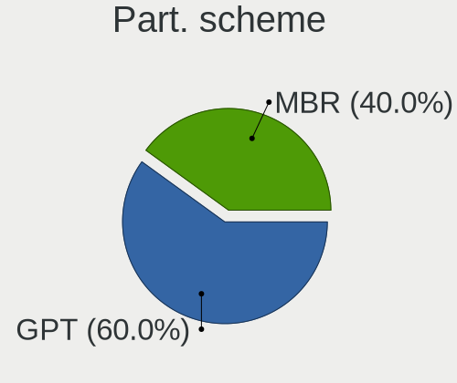
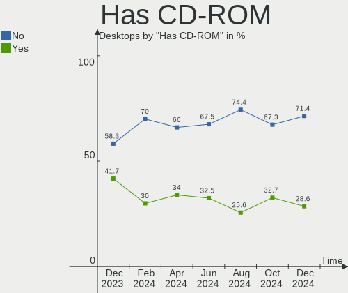
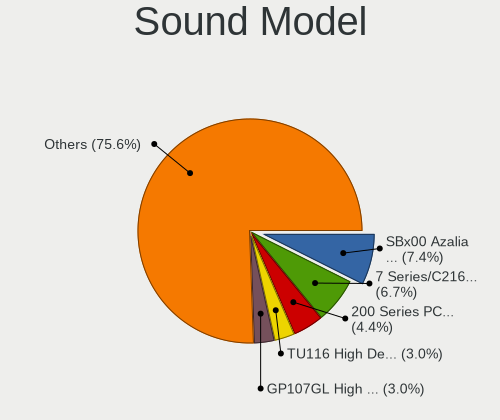

ROSA - Hardware Trends (Desktops)
---------------------------------

A project to identify most popular hardware characteristics and track their change
over time based on data collected by Linux users at https://Linux-Hardware.org.

Anyone can contribute to this report by the [hw-probe](https://github.com/linuxhw/hw-probe) tool:

    sudo -E hw-probe -all -upload

This report is for one last month. Overall report since the beginning of time: [TestDays](https://github.com/linuxhw/TestDays)

Period: Jun, 2023.

Contents
--------

* [ System ](#system)
  - [ OS                       ](#os)
  - [ OS Family                ](#os-family)
  - [ Kernel                   ](#kernel)
  - [ Kernel Family            ](#kernel-family)
  - [ Kernel Major Ver.        ](#kernel-major-ver)
  - [ Arch                     ](#arch)
  - [ DE                       ](#de)
  - [ Display Server           ](#display-server)
  - [ Display Manager          ](#display-manager)
  - [ OS Lang                  ](#os-lang)
  - [ Boot Mode                ](#boot-mode)
  - [ Filesystem               ](#filesystem)
  - [ Part. scheme             ](#part-scheme)
  - [ Dual Boot with Linux/BSD ](#dual-boot-with-linuxbsd)
  - [ Dual Boot (Win)          ](#dual-boot-win)

* [ Board ](#board)
  - [ Vendor                   ](#vendor)
  - [ Model                    ](#model)
  - [ Model Family             ](#model-family)
  - [ MFG Year                 ](#mfg-year)
  - [ Form Factor              ](#form-factor)
  - [ Secure Boot              ](#secure-boot)
  - [ Coreboot                 ](#coreboot)
  - [ RAM Size                 ](#ram-size)
  - [ RAM Used                 ](#ram-used)
  - [ Total Drives             ](#total-drives)
  - [ Has CD-ROM               ](#has-cd-rom)
  - [ Has Ethernet             ](#has-ethernet)
  - [ Has WiFi                 ](#has-wifi)
  - [ Has Bluetooth            ](#has-bluetooth)

* [ Location ](#location)
  - [ Country                  ](#country)
  - [ City                     ](#city)

* [ Drives ](#drives)
  - [ Drive Vendor             ](#drive-vendor)
  - [ Drive Model              ](#drive-model)
  - [ HDD Vendor               ](#hdd-vendor)
  - [ SSD Vendor               ](#ssd-vendor)
  - [ Drive Kind               ](#drive-kind)
  - [ Drive Connector          ](#drive-connector)
  - [ Drive Size               ](#drive-size)
  - [ Space Total              ](#space-total)
  - [ Space Used               ](#space-used)
  - [ Malfunc. Drives          ](#malfunc-drives)
  - [ Malfunc. Drive Vendor    ](#malfunc-drive-vendor)
  - [ Malfunc. HDD Vendor      ](#malfunc-hdd-vendor)
  - [ Malfunc. Drive Kind      ](#malfunc-drive-kind)
  - [ Failed Drives            ](#failed-drives)
  - [ Failed Drive Vendor      ](#failed-drive-vendor)
  - [ Drive Status             ](#drive-status)

* [ Storage controller ](#storage-controller)
  - [ Storage Vendor           ](#storage-vendor)
  - [ Storage Model            ](#storage-model)
  - [ Storage Kind             ](#storage-kind)

* [ Processor ](#processor)
  - [ CPU Vendor               ](#cpu-vendor)
  - [ CPU Model                ](#cpu-model)
  - [ CPU Model Family         ](#cpu-model-family)
  - [ CPU Cores                ](#cpu-cores)
  - [ CPU Sockets              ](#cpu-sockets)
  - [ CPU Threads              ](#cpu-threads)
  - [ CPU Op-Modes             ](#cpu-op-modes)
  - [ CPU Microcode            ](#cpu-microcode)
  - [ CPU Microarch            ](#cpu-microarch)

* [ Graphics ](#graphics)
  - [ GPU Vendor               ](#gpu-vendor)
  - [ GPU Model                ](#gpu-model)
  - [ GPU Combo                ](#gpu-combo)
  - [ GPU Driver               ](#gpu-driver)
  - [ GPU Memory               ](#gpu-memory)

* [ Monitor ](#monitor)
  - [ Monitor Vendor           ](#monitor-vendor)
  - [ Monitor Model            ](#monitor-model)
  - [ Monitor Resolution       ](#monitor-resolution)
  - [ Monitor Diagonal         ](#monitor-diagonal)
  - [ Monitor Width            ](#monitor-width)
  - [ Aspect Ratio             ](#aspect-ratio)
  - [ Monitor Area             ](#monitor-area)
  - [ Pixel Density            ](#pixel-density)
  - [ Multiple Monitors        ](#multiple-monitors)

* [ Network ](#network)
  - [ Net Controller Vendor    ](#net-controller-vendor)
  - [ Net Controller Model     ](#net-controller-model)
  - [ Wireless Vendor          ](#wireless-vendor)
  - [ Wireless Model           ](#wireless-model)
  - [ Ethernet Vendor          ](#ethernet-vendor)
  - [ Ethernet Model           ](#ethernet-model)
  - [ Net Controller Kind      ](#net-controller-kind)
  - [ Used Controller          ](#used-controller)
  - [ NICs                     ](#nics)
  - [ IPv6                     ](#ipv6)

* [ Bluetooth ](#bluetooth)
  - [ Bluetooth Vendor         ](#bluetooth-vendor)
  - [ Bluetooth Model          ](#bluetooth-model)

* [ Sound ](#sound)
  - [ Sound Vendor             ](#sound-vendor)
  - [ Sound Model              ](#sound-model)

* [ Memory ](#memory)
  - [ Memory Vendor            ](#memory-vendor)
  - [ Memory Model             ](#memory-model)
  - [ Memory Kind              ](#memory-kind)
  - [ Memory Form Factor       ](#memory-form-factor)
  - [ Memory Size              ](#memory-size)
  - [ Memory Speed             ](#memory-speed)

* [ Printers & scanners ](#printers--scanners)
  - [ Printer Vendor           ](#printer-vendor)
  - [ Printer Model            ](#printer-model)
  - [ Scanner Vendor           ](#scanner-vendor)
  - [ Scanner Model            ](#scanner-model)

* [ Camera ](#camera)
  - [ Camera Vendor            ](#camera-vendor)
  - [ Camera Model             ](#camera-model)

* [ Security ](#security)
  - [ Fingerprint Vendor       ](#fingerprint-vendor)
  - [ Fingerprint Model        ](#fingerprint-model)
  - [ Chipcard Vendor          ](#chipcard-vendor)
  - [ Chipcard Model           ](#chipcard-model)

* [ Unsupported ](#unsupported)
  - [ Unsupported Devices      ](#unsupported-devices)
  - [ Unsupported Device Types ](#unsupported-device-types)

System
------

OS
--

Installed operating systems

| Name         | Desktops | Percent |
|--------------|----------|---------|
| ROSA 12.4    | 62       | 86.11%  |
| ROSA R11.1   | 2        | 2.78%   |
| ROSA 12      | 2        | 2.78%   |
| ROSA R11     | 1        | 1.39%   |
| ROSA 2019.05 | 1        | 1.39%   |
| ROSA 13.0    | 1        | 1.39%   |
| ROSA 12.3    | 1        | 1.39%   |
| ROSA 12.2    | 1        | 1.39%   |
| ROSA 12.1    | 1        | 1.39%   |

OS Family
---------

OS without a version

| Name | Desktops | Percent |
|------|----------|---------|
| ROSA | 72       | 100%    |

Kernel
------

Version of the Linux kernel

| Version                                   | Desktops | Percent |
|-------------------------------------------|----------|---------|
| 6.1.20-generic-2rosa2021.1-x86_64         | 47       | 65.28%  |
| 5.10.176-generic-1rosa2021.1-x86_64       | 4        | 5.56%   |
| 5.15.103-generic-1rosa2021.1-x86_64       | 3        | 4.17%   |
| 6.1.34-generic-1rosa2021.1-x86_64         | 2        | 2.78%   |
| 6.1.30.xm1-1.klp-xanmod-rosa2021.1-x86_64 | 2        | 2.78%   |
| 5.10.74-generic-2rosa2021.1-x86_64        | 2        | 2.78%   |
| 6.3.7-generic-1rosa2021.1-x86_64          | 1        | 1.39%   |
| 6.2.12.xm1-1.klp-xanmod-rosa2021.1-x86_64 | 1        | 1.39%   |
| 6.1.34-generic-1rosa2023.1-x86_64         | 1        | 1.39%   |
| 6.1.27-generic-1rosa2023.1-x86_64         | 1        | 1.39%   |
| 6.0.12.xm1-1.klp-xanmod-rosa2021.1-x86_64 | 1        | 1.39%   |
| 5.4.83-generic-2rosa-i586                 | 1        | 1.39%   |
| 5.4.32-generic-2rosa-i586                 | 1        | 1.39%   |
| 5.4.139-nickel-4rosa2019.05-x86_64        | 1        | 1.39%   |
| 5.15.75-generic-1rosa2021.1-x86_64        | 1        | 1.39%   |
| 5.15.103-generic-1rosa2021.1-i686         | 1        | 1.39%   |
| 5.10.74-generic-2rosa2021.1-i586          | 1        | 1.39%   |
| 4.15.0-desktop-45.1rosa-x86_64            | 1        | 1.39%   |

Kernel Family
-------------

Linux kernel without a distro release

| Version  | Desktops | Percent |
|----------|----------|---------|
| 6.1.20   | 47       | 65.28%  |
| 5.15.103 | 4        | 5.56%   |
| 5.10.176 | 4        | 5.56%   |
| 6.1.34   | 3        | 4.17%   |
| 5.10.74  | 3        | 4.17%   |
| 6.1.30   | 2        | 2.78%   |
| 6.3.7    | 1        | 1.39%   |
| 6.2.12   | 1        | 1.39%   |
| 6.1.27   | 1        | 1.39%   |
| 6.0.12   | 1        | 1.39%   |
| 5.4.83   | 1        | 1.39%   |
| 5.4.32   | 1        | 1.39%   |
| 5.4.139  | 1        | 1.39%   |
| 5.15.75  | 1        | 1.39%   |
| 4.15.0   | 1        | 1.39%   |

Kernel Major Ver.
-----------------

Linux kernel major version

| Version | Desktops | Percent |
|---------|----------|---------|
| 6.1     | 53       | 73.61%  |
| 5.10    | 7        | 9.72%   |
| 5.15    | 5        | 6.94%   |
| 5.4     | 3        | 4.17%   |
| 6.3     | 1        | 1.39%   |
| 6.2     | 1        | 1.39%   |
| 6.0     | 1        | 1.39%   |
| 4.15    | 1        | 1.39%   |

Arch
----

OS architecture (x86_64, i586, etc.)

| Name   | Desktops | Percent |
|--------|----------|---------|
| x86_64 | 68       | 94.44%  |
| i686   | 4        | 5.56%   |

DE
--

Desktop Environment

| Name    | Desktops | Percent |
|---------|----------|---------|
| KDE5    | 46       | 63.89%  |
| GNOME   | 17       | 23.61%  |
| LXQt    | 4        | 5.56%   |
| KDE4    | 4        | 5.56%   |
| Unknown | 1        | 1.39%   |

Display Server
--------------

X11 or Wayland

| Name    | Desktops | Percent |
|---------|----------|---------|
| Wayland | 55       | 76.39%  |
| X11     | 16       | 22.22%  |
| Tty     | 1        | 1.39%   |

Display Manager
---------------

SDDM, LightDM, etc.

| Name    | Desktops | Percent |
|---------|----------|---------|
| SDDM    | 45       | 62.5%   |
| GDM     | 20       | 27.78%  |
| KDM     | 4        | 5.56%   |
| LightDM | 2        | 2.78%   |
| Unknown | 1        | 1.39%   |

OS Lang
-------

Language

| Lang    | Desktops | Percent |
|---------|----------|---------|
| ru_RU   | 63       | 87.5%   |
| de_DE   | 3        | 4.17%   |
| es_ES   | 2        | 2.78%   |
| en_US   | 2        | 2.78%   |
| pl_PL   | 1        | 1.39%   |
| Unknown | 1        | 1.39%   |

Boot Mode
---------

EFI or BIOS

| Mode | Desktops | Percent |
|------|----------|---------|
| EFI  | 38       | 52.78%  |
| BIOS | 34       | 47.22%  |

Filesystem
----------

Type of filesystem

| Type  | Desktops | Percent |
|-------|----------|---------|
| Ext4  | 68       | 94.44%  |
| Btrfs | 4        | 5.56%   |

Part. scheme
------------

Scheme of partitioning

| Type | Desktops | Percent |
|------|----------|---------|
| GPT  | 43       | 59.72%  |
| MBR  | 29       | 40.28%  |

Dual Boot with Linux/BSD
------------------------

Hosting more than one Linux/BSD

| Dual boot | Desktops | Percent |
|-----------|----------|---------|
| No        | 54       | 75%     |
| Yes       | 18       | 25%     |

Dual Boot (Win)
---------------

Hosting Linux and Windows

| Dual boot | Desktops | Percent |
|-----------|----------|---------|
| Yes       | 39       | 54.17%  |
| No        | 33       | 45.83%  |

Board
-----

Vendor
------

Motherboard manufacturer

| Name                | Desktops | Percent |
|---------------------|----------|---------|
| ASUSTek Computer    | 22       | 30.56%  |
| Gigabyte Technology | 21       | 29.17%  |
| MSI                 | 10       | 13.89%  |
| ASRock              | 6        | 8.33%   |
| Huanan              | 3        | 4.17%   |
| Unknown             | 3        | 4.17%   |
| Hewlett-Packard     | 2        | 2.78%   |
| NCR                 | 1        | 1.39%   |
| MAINBRD             | 1        | 1.39%   |
| Lenovo              | 1        | 1.39%   |
| Dell                | 1        | 1.39%   |
| Acer                | 1        | 1.39%   |

Model
-----

Motherboard model

| Name                             | Desktops | Percent |
|----------------------------------|----------|---------|
| ASUS All Series                  | 3        | 4.17%   |
| Unknown                          | 3        | 4.17%   |
| ASUS PRIME H510M-K               | 2        | 2.78%   |
| NCR Estoril                      | 1        | 1.39%   |
| MSI OPTIMUS                      | 1        | 1.39%   |
| MSI MS-7D22                      | 1        | 1.39%   |
| MSI MS-7B79                      | 1        | 1.39%   |
| MSI MS-7A74                      | 1        | 1.39%   |
| MSI MS-7895                      | 1        | 1.39%   |
| MSI MS-7817                      | 1        | 1.39%   |
| MSI MS-7758                      | 1        | 1.39%   |
| MSI MS-7641                      | 1        | 1.39%   |
| MSI MS-7267                      | 1        | 1.39%   |
| MSI MPG B560 Trident A (MS-B926) | 1        | 1.39%   |
| MAINBRD OPS62A-SHA               | 1        | 1.39%   |
| Lenovo H420                      | 1        | 1.39%   |
| Huanan X99-F8 GAMING V5.0        | 1        | 1.39%   |
| Huanan X99 F8D V2.2              | 1        | 1.39%   |
| Huanan B660-D4 V1.0              | 1        | 1.39%   |
| HP ProLiant ML150 G5             | 1        | 1.39%   |
| HP Compaq 6000 Pro MT PC         | 1        | 1.39%   |
| Gigabyte RAGE H290               | 1        | 1.39%   |
| Gigabyte H77N-WIFI               | 1        | 1.39%   |
| Gigabyte H67MA-USB3-B3           | 1        | 1.39%   |
| Gigabyte H410M S2 V2             | 1        | 1.39%   |
| Gigabyte H410M H                 | 1        | 1.39%   |
| Gigabyte GA-MA770-US3            | 1        | 1.39%   |
| Gigabyte GA-880GMA-USB3          | 1        | 1.39%   |
| Gigabyte G41MT-S2P               | 1        | 1.39%   |
| Gigabyte G41M-ES2L               | 1        | 1.39%   |
| Gigabyte G33M-S2L                | 1        | 1.39%   |
| Gigabyte G31M-ES2L               | 1        | 1.39%   |
| Gigabyte F2A75M-D3H              | 1        | 1.39%   |
| Gigabyte B760M GAMING X AX DDR4  | 1        | 1.39%   |
| Gigabyte B550 GAMING X V2        | 1        | 1.39%   |
| Gigabyte B550 AORUS ELITE V2     | 1        | 1.39%   |
| Gigabyte B450M S2H               | 1        | 1.39%   |
| Gigabyte B450M DS3H              | 1        | 1.39%   |
| Gigabyte B365M DS3H              | 1        | 1.39%   |
| Gigabyte B360M-DS3H              | 1        | 1.39%   |

Model Family
------------

Motherboard model prefix

| Name                    | Desktops | Percent |
|-------------------------|----------|---------|
| ASUS PRIME              | 7        | 9.72%   |
| ASUS All                | 3        | 4.17%   |
| Unknown                 | 3        | 4.17%   |
| Gigabyte H410M          | 2        | 2.78%   |
| Gigabyte B550           | 2        | 2.78%   |
| Gigabyte B450M          | 2        | 2.78%   |
| ASUS TUF                | 2        | 2.78%   |
| ASUS M5A78L-M           | 2        | 2.78%   |
| NCR Estoril             | 1        | 1.39%   |
| MSI OPTIMUS             | 1        | 1.39%   |
| MSI MS-7D22             | 1        | 1.39%   |
| MSI MS-7B79             | 1        | 1.39%   |
| MSI MS-7A74             | 1        | 1.39%   |
| MSI MS-7895             | 1        | 1.39%   |
| MSI MS-7817             | 1        | 1.39%   |
| MSI MS-7758             | 1        | 1.39%   |
| MSI MS-7641             | 1        | 1.39%   |
| MSI MS-7267             | 1        | 1.39%   |
| MSI MPG                 | 1        | 1.39%   |
| MAINBRD OPS62A-SHA      | 1        | 1.39%   |
| Lenovo H420             | 1        | 1.39%   |
| Huanan X99-F8           | 1        | 1.39%   |
| Huanan X99              | 1        | 1.39%   |
| Huanan B660-D4          | 1        | 1.39%   |
| HP ProLiant             | 1        | 1.39%   |
| HP Compaq               | 1        | 1.39%   |
| Gigabyte RAGE           | 1        | 1.39%   |
| Gigabyte H77N-WIFI      | 1        | 1.39%   |
| Gigabyte H67MA-USB3-B3  | 1        | 1.39%   |
| Gigabyte GA-MA770-US3   | 1        | 1.39%   |
| Gigabyte GA-880GMA-USB3 | 1        | 1.39%   |
| Gigabyte G41MT-S2P      | 1        | 1.39%   |
| Gigabyte G41M-ES2L      | 1        | 1.39%   |
| Gigabyte G33M-S2L       | 1        | 1.39%   |
| Gigabyte G31M-ES2L      | 1        | 1.39%   |
| Gigabyte F2A75M-D3H     | 1        | 1.39%   |
| Gigabyte B760M          | 1        | 1.39%   |
| Gigabyte B365M          | 1        | 1.39%   |
| Gigabyte B360M-DS3H     | 1        | 1.39%   |
| Gigabyte A320M-S2H      | 1        | 1.39%   |

MFG Year
--------

Motherboard manufacture year

| Year | Desktops | Percent |
|------|----------|---------|
| 2021 | 10       | 13.89%  |
| 2018 | 8        | 11.11%  |
| 2013 | 7        | 9.72%   |
| 2020 | 6        | 8.33%   |
| 2019 | 5        | 6.94%   |
| 2012 | 5        | 6.94%   |
| 2011 | 5        | 6.94%   |
| 2022 | 4        | 5.56%   |
| 2009 | 4        | 5.56%   |
| 2008 | 4        | 5.56%   |
| 2006 | 3        | 4.17%   |
| 2023 | 2        | 2.78%   |
| 2017 | 2        | 2.78%   |
| 2015 | 2        | 2.78%   |
| 2010 | 2        | 2.78%   |
| 2007 | 2        | 2.78%   |
| 2014 | 1        | 1.39%   |

Form Factor
-----------

Physical design of the computer

| Name    | Desktops | Percent |
|---------|----------|---------|
| Desktop | 72       | 100%    |

Secure Boot
-----------

Enabled or disabled

| State    | Desktops | Percent |
|----------|----------|---------|
| Disabled | 72       | 100%    |

Coreboot
--------

Have coreboot on board

| Used | Desktops | Percent |
|------|----------|---------|
| No   | 72       | 100%    |

RAM Size
--------

Total RAM memory

| Size in GB  | Desktops | Percent |
|-------------|----------|---------|
| 16.01-24.0  | 17       | 23.61%  |
| 4.01-8.0    | 16       | 22.22%  |
| 3.01-4.0    | 10       | 13.89%  |
| 8.01-16.0   | 10       | 13.89%  |
| 32.01-64.0  | 8        | 11.11%  |
| 2.01-3.0    | 3        | 4.17%   |
| 1.01-2.0    | 3        | 4.17%   |
| 24.01-32.0  | 2        | 2.78%   |
| 64.01-256.0 | 2        | 2.78%   |
| 0.51-1.0    | 1        | 1.39%   |

RAM Used
--------

Used RAM memory

| Used GB   | Desktops | Percent |
|-----------|----------|---------|
| 1.01-2.0  | 37       | 51.39%  |
| 0.51-1.0  | 14       | 19.44%  |
| 2.01-3.0  | 9        | 12.5%   |
| 3.01-4.0  | 6        | 8.33%   |
| 4.01-8.0  | 4        | 5.56%   |
| 8.01-16.0 | 1        | 1.39%   |
| 0.01-0.5  | 1        | 1.39%   |

Total Drives
------------

Number of drives on board

| Drives | Desktops | Percent |
|--------|----------|---------|
| 1      | 31       | 43.06%  |
| 3      | 15       | 20.83%  |
| 2      | 15       | 20.83%  |
| 4      | 6        | 8.33%   |
| 5      | 4        | 5.56%   |
| 0      | 1        | 1.39%   |

Has CD-ROM
----------

Has CD-ROM on board

| Presented | Desktops | Percent |
|-----------|----------|---------|
| No        | 47       | 65.28%  |
| Yes       | 25       | 34.72%  |

Has Ethernet
------------

Has Ethernet on board

| Presented | Desktops | Percent |
|-----------|----------|---------|
| Yes       | 71       | 98.61%  |
| No        | 1        | 1.39%   |

Has WiFi
--------

Has WiFi module

| Presented | Desktops | Percent |
|-----------|----------|---------|
| No        | 51       | 70.83%  |
| Yes       | 21       | 29.17%  |

Has Bluetooth
-------------

Has Bluetooth module

| Presented | Desktops | Percent |
|-----------|----------|---------|
| No        | 54       | 75%     |
| Yes       | 18       | 25%     |

Location
--------

Country
-------

Geographic location (country)

| Country | Desktops | Percent |
|---------|----------|---------|
| Russia  | 64       | 88.89%  |
| Germany | 4        | 5.56%   |
| Uruguay | 1        | 1.39%   |
| Spain   | 1        | 1.39%   |
| Poland  | 1        | 1.39%   |
| Belarus | 1        | 1.39%   |

City
----

Geographic location (city)

| City             | Desktops | Percent |
|------------------|----------|---------|
| Moscow           | 14       | 19.44%  |
| Novosibirsk      | 5        | 6.94%   |
| Rostov-on-Don    | 3        | 4.17%   |
| Perm             | 3        | 4.17%   |
| Yekaterinburg    | 2        | 2.78%   |
| Yakutsk          | 2        | 2.78%   |
| Stavropol        | 2        | 2.78%   |
| St Petersburg    | 2        | 2.78%   |
| Samara           | 2        | 2.78%   |
| Irkutsk          | 2        | 2.78%   |
| Hanover          | 2        | 2.78%   |
| Zlatoust         | 1        | 1.39%   |
| Yaroslavl        | 1        | 1.39%   |
| Voskresensk      | 1        | 1.39%   |
| Vologda          | 1        | 1.39%   |
| Volgograd        | 1        | 1.39%   |
| Tolyatti         | 1        | 1.39%   |
| Syzran'          | 1        | 1.39%   |
| Surgut           | 1        | 1.39%   |
| Stary Oskol      | 1        | 1.39%   |
| Saransk          | 1        | 1.39%   |
| Pskov            | 1        | 1.39%   |
| Penza            | 1        | 1.39%   |
| Otzberg          | 1        | 1.39%   |
| Orenburg         | 1        | 1.39%   |
| Nizhniy Novgorod | 1        | 1.39%   |
| Nizhnekamsk      | 1        | 1.39%   |
| Minsk            | 1        | 1.39%   |
| Minas            | 1        | 1.39%   |
| Lomonosov        | 1        | 1.39%   |
| Kursk            | 1        | 1.39%   |
| Kumertau         | 1        | 1.39%   |
| Krasnogorsk      | 1        | 1.39%   |
| Krasnodar        | 1        | 1.39%   |
| Kizel            | 1        | 1.39%   |
| Kedzierzyn-Kozle | 1        | 1.39%   |
| Kazan’         | 1        | 1.39%   |
| Kashira          | 1        | 1.39%   |
| Iskitim          | 1        | 1.39%   |
| Guadassuar       | 1        | 1.39%   |

Drives
------

Drive Vendor
------------

Hard drive vendors

| Vendor              | Desktops | Drives | Percent |
|---------------------|----------|--------|---------|
| WDC                 | 29       | 37     | 21.97%  |
| Seagate             | 23       | 24     | 17.42%  |
| Samsung Electronics | 12       | 14     | 9.09%   |
| A-DATA Technology   | 7        | 8      | 5.3%    |
| Toshiba             | 6        | 7      | 4.55%   |
| Kingston            | 6        | 6      | 4.55%   |
| Crucial             | 6        | 6      | 4.55%   |
| Netac               | 4        | 5      | 3.03%   |
| Hitachi             | 4        | 4      | 3.03%   |
| OCZ                 | 3        | 3      | 2.27%   |
| KingSpec            | 3        | 3      | 2.27%   |
| SanDisk             | 2        | 3      | 1.52%   |
| Patriot             | 2        | 2      | 1.52%   |
| Maxtor              | 2        | 2      | 1.52%   |
| Intenso             | 2        | 3      | 1.52%   |
| China               | 2        | 2      | 1.52%   |
| Apacer              | 2        | 2      | 1.52%   |
| ZM                  | 1        | 1      | 0.76%   |
| Zheino              | 1        | 1      | 0.76%   |
| XrayDisk            | 1        | 1      | 0.76%   |
| XPG                 | 1        | 1      | 0.76%   |
| Unknown             | 1        | 1      | 0.76%   |
| Q600S               | 1        | 1      | 0.76%   |
| Phison Electronics  | 1        | 1      | 0.76%   |
| MARSHAL             | 1        | 1      | 0.76%   |
| Intel               | 1        | 1      | 0.76%   |
| HS-SSD-C100         | 1        | 1      | 0.76%   |
| HGST                | 1        | 1      | 0.76%   |
| Gigabyte Technology | 1        | 1      | 0.76%   |
| Fanxiang            | 1        | 2      | 0.76%   |
| External            | 1        | 1      | 0.76%   |
| Digma               | 1        | 1      | 0.76%   |
| DEXP                | 1        | 1      | 0.76%   |
| AMD                 | 1        | 1      | 0.76%   |

Drive Model
-----------

Hard drive models

| Model                             | Desktops | Percent |
|-----------------------------------|----------|---------|
| Seagate ST1000DM010-2EP102 1TB    | 4        | 2.74%   |
| Crucial CT240BX500SSD1 240GB      | 3        | 2.05%   |
| WDC WD10EZEX-00BBHA0 1TB          | 2        | 1.37%   |
| Toshiba MQ01ABF050 500GB          | 2        | 1.37%   |
| Toshiba DT01ACA100 1TB            | 2        | 1.37%   |
| Seagate ST2000DM008-2UB102 2TB    | 2        | 1.37%   |
| Seagate ST1000DM003-1ER162 1TB    | 2        | 1.37%   |
| Samsung SSD 970 EVO Plus 500GB    | 2        | 1.37%   |
| Kingston SV300S37A120G 120GB SSD  | 2        | 1.37%   |
| Kingston SKC2500M8250G 250GB      | 2        | 1.37%   |
| ZM SSD 256GB                      | 1        | 0.68%   |
| Zheino CHN-25SATAA3-480 480GB SSD | 1        | 0.68%   |
| XrayDisk 512GB SSD                | 1        | 0.68%   |
| XPG GAMMIX S5 512GB               | 1        | 0.68%   |
| WDC WDS500G2X0C-00L350 500GB      | 1        | 0.68%   |
| WDC WDS500G2B0A-00SM50 500GB SSD  | 1        | 0.68%   |
| WDC WDS480G2G0A-00JH30 480GB SSD  | 1        | 0.68%   |
| WDC WDS240G2G0A-00JH30 240GB SSD  | 1        | 0.68%   |
| WDC WD800JD-22MSA1 80GB           | 1        | 0.68%   |
| WDC WD5001AALS-00L3B2 500GB       | 1        | 0.68%   |
| WDC WD5000HHTZ-04N21V0 500GB      | 1        | 0.68%   |
| WDC WD5000AZRX-00A8LB0 500GB      | 1        | 0.68%   |
| WDC WD5000AZLX-00K2TA0 500GB      | 1        | 0.68%   |
| WDC WD5000AAKX-221CA1 500GB       | 1        | 0.68%   |
| WDC WD5000AAKX-00ERMA0 500GB      | 1        | 0.68%   |
| WDC WD5000AAKS-00YGA0 500GB       | 1        | 0.68%   |
| WDC WD5000AAKS-00UU3A0 500GB      | 1        | 0.68%   |
| WDC WD5000AADS-00S9B0 500GB       | 1        | 0.68%   |
| WDC WD4003FRYZ-01F0DB0 4TB        | 1        | 0.68%   |
| WDC WD3200BPVT-22ZEST0 320GB      | 1        | 0.68%   |
| WDC WD3000HLHX-01JJPV0 304GB      | 1        | 0.68%   |
| WDC WD2500LPLX-00ZNTT0 250GB      | 1        | 0.68%   |
| WDC WD2500BB-22RDA0 250GB         | 1        | 0.68%   |
| WDC WD2500AAJS-22VTA0 250GB       | 1        | 0.68%   |
| WDC WD20SPZX-22UA7T0 2TB          | 1        | 0.68%   |
| WDC WD20SPZX-00UA7T0 2TB          | 1        | 0.68%   |
| WDC WD20EZAZ-00L9GB0 2TB          | 1        | 0.68%   |
| WDC WD20EFRX-68EUZN0 2TB          | 1        | 0.68%   |
| WDC WD2005FBYZ-01YCBB3 2TB        | 1        | 0.68%   |
| WDC WD2002FAEX-007BA0 2TB         | 1        | 0.68%   |

HDD Vendor
----------

Hard disk drive vendors

| Vendor              | Desktops | Drives | Percent |
|---------------------|----------|--------|---------|
| WDC                 | 26       | 32     | 41.27%  |
| Seagate             | 22       | 23     | 34.92%  |
| Toshiba             | 6        | 7      | 9.52%   |
| Hitachi             | 4        | 4      | 6.35%   |
| Samsung Electronics | 2        | 2      | 3.17%   |
| Maxtor              | 1        | 1      | 1.59%   |
| MARSHAL             | 1        | 1      | 1.59%   |
| HGST                | 1        | 1      | 1.59%   |

SSD Vendor
----------

Solid state drive vendors

| Vendor              | Desktops | Drives | Percent |
|---------------------|----------|--------|---------|
| Samsung Electronics | 5        | 5      | 10%     |
| Crucial             | 5        | 5      | 10%     |
| Kingston            | 4        | 4      | 8%      |
| A-DATA Technology   | 4        | 4      | 8%      |
| WDC                 | 3        | 3      | 6%      |
| OCZ                 | 3        | 3      | 6%      |
| Netac               | 3        | 3      | 6%      |
| KingSpec            | 3        | 3      | 6%      |
| Patriot             | 2        | 2      | 4%      |
| Intenso             | 2        | 3      | 4%      |
| China               | 2        | 2      | 4%      |
| ZM                  | 1        | 1      | 2%      |
| Zheino              | 1        | 1      | 2%      |
| XrayDisk            | 1        | 1      | 2%      |
| Seagate             | 1        | 1      | 2%      |
| SanDisk             | 1        | 1      | 2%      |
| Q600S               | 1        | 1      | 2%      |
| Maxtor              | 1        | 1      | 2%      |
| Intel               | 1        | 1      | 2%      |
| HS-SSD-C100         | 1        | 1      | 2%      |
| External            | 1        | 1      | 2%      |
| Digma               | 1        | 1      | 2%      |
| DEXP                | 1        | 1      | 2%      |
| Apacer              | 1        | 1      | 2%      |
| AMD                 | 1        | 1      | 2%      |

Drive Kind
----------

HDD or SSD

| Kind | Desktops | Drives | Percent |
|------|----------|--------|---------|
| HDD  | 52       | 71     | 47.71%  |
| SSD  | 36       | 51     | 33.03%  |
| NVMe | 21       | 27     | 19.27%  |

Drive Connector
---------------

SATA, SAS, NVMe, etc.

| Type | Desktops | Drives | Percent |
|------|----------|--------|---------|
| SATA | 66       | 121    | 75%     |
| NVMe | 21       | 27     | 23.86%  |
| SAS  | 1        | 1      | 1.14%   |

Drive Size
----------

Size of hard drive

| Size in TB | Desktops | Drives | Percent |
|------------|----------|--------|---------|
| 0.01-0.5   | 56       | 76     | 59.57%  |
| 0.51-1.0   | 26       | 31     | 27.66%  |
| 1.01-2.0   | 9        | 12     | 9.57%   |
| 3.01-4.0   | 1        | 1      | 1.06%   |
| 2.01-3.0   | 1        | 1      | 1.06%   |
| 4.01-10.0  | 1        | 1      | 1.06%   |

Space Total
-----------

Amount of disk space available on the file system

| Size in GB     | Desktops | Percent |
|----------------|----------|---------|
| 101-250        | 27       | 37.5%   |
| 251-500        | 15       | 20.83%  |
| 501-1000       | 9        | 12.5%   |
| 2001-3000      | 5        | 6.94%   |
| 1001-2000      | 5        | 6.94%   |
| 1-20           | 5        | 6.94%   |
| 51-100         | 3        | 4.17%   |
| More than 3000 | 2        | 2.78%   |
| 21-50          | 1        | 1.39%   |

Space Used
----------

Amount of used disk space

| Used GB   | Desktops | Percent |
|-----------|----------|---------|
| 1-20      | 42       | 58.33%  |
| 21-50     | 9        | 12.5%   |
| 1001-2000 | 7        | 9.72%   |
| 251-500   | 5        | 6.94%   |
| 101-250   | 5        | 6.94%   |
| 51-100    | 3        | 4.17%   |
| 501-1000  | 1        | 1.39%   |

Malfunc. Drives
---------------

Drive models with a malfunction

| Model                             | Desktops | Drives | Percent |
|-----------------------------------|----------|--------|---------|
| XrayDisk 512GB SSD                | 1        | 1      | 3.85%   |
| WDC WD800JD-22MSA1 80GB           | 1        | 1      | 3.85%   |
| WDC WD5000AAKX-221CA1 500GB       | 1        | 1      | 3.85%   |
| WDC WD5000AAKX-00ERMA0 500GB      | 1        | 1      | 3.85%   |
| WDC WD5000AADS-00S9B0 500GB       | 1        | 1      | 3.85%   |
| WDC WD2005FBYZ-01YCBB3 2TB        | 1        | 1      | 3.85%   |
| WDC WD2002FAEX-007BA0 2TB         | 1        | 1      | 3.85%   |
| WDC WD10PURZ-85U8XY0 1TB          | 1        | 1      | 3.85%   |
| Toshiba MQ01ABF050 500GB          | 1        | 1      | 3.85%   |
| Seagate ST3500418AS 500GB         | 1        | 1      | 3.85%   |
| Seagate ST3320418AS 320GB         | 1        | 1      | 3.85%   |
| Seagate ST3250318AS 250GB         | 1        | 1      | 3.85%   |
| Seagate ST3250310AS 250GB         | 1        | 1      | 3.85%   |
| Seagate ST3000DM003-1F216N 3TB    | 1        | 1      | 3.85%   |
| Seagate ST1000DM003-9YN162 1TB    | 1        | 1      | 3.85%   |
| Seagate ST1000DM003-1CH162 1TB    | 1        | 1      | 3.85%   |
| Seagate OOS500G128M 500GB         | 1        | 1      | 3.85%   |
| Samsung Electronics HM250HJ 250GB | 1        | 1      | 3.85%   |
| OCZ ONYX 32GB SSD                 | 1        | 1      | 3.85%   |
| OCZ AGILITY3 120GB SSD            | 1        | 1      | 3.85%   |
| Maxtor STM3250310AS 250GB         | 1        | 1      | 3.85%   |
| MARSHAL MAL2250SA-T54 250GB       | 1        | 1      | 3.85%   |
| HS-SSD-C100 SSD 480G              | 1        | 1      | 3.85%   |
| Hitachi HTS541680J9SA00 80GB      | 1        | 1      | 3.85%   |
| Hitachi HDS721025CLA382 250GB     | 1        | 1      | 3.85%   |
| A-DATA Technology SP550 240GB SSD | 1        | 1      | 3.85%   |

Malfunc. Drive Vendor
---------------------

Vendors of faulty drives

| Vendor              | Desktops | Drives | Percent |
|---------------------|----------|--------|---------|
| Seagate             | 8        | 8      | 30.77%  |
| WDC                 | 7        | 7      | 26.92%  |
| OCZ                 | 2        | 2      | 7.69%   |
| Hitachi             | 2        | 2      | 7.69%   |
| XrayDisk            | 1        | 1      | 3.85%   |
| Toshiba             | 1        | 1      | 3.85%   |
| Samsung Electronics | 1        | 1      | 3.85%   |
| Maxtor              | 1        | 1      | 3.85%   |
| MARSHAL             | 1        | 1      | 3.85%   |
| HS-SSD-C100         | 1        | 1      | 3.85%   |
| A-DATA Technology   | 1        | 1      | 3.85%   |

Malfunc. HDD Vendor
-------------------

Vendors of faulty HDD drives

| Vendor              | Desktops | Drives | Percent |
|---------------------|----------|--------|---------|
| Seagate             | 8        | 8      | 38.1%   |
| WDC                 | 7        | 7      | 33.33%  |
| Hitachi             | 2        | 2      | 9.52%   |
| Toshiba             | 1        | 1      | 4.76%   |
| Samsung Electronics | 1        | 1      | 4.76%   |
| Maxtor              | 1        | 1      | 4.76%   |
| MARSHAL             | 1        | 1      | 4.76%   |

Malfunc. Drive Kind
-------------------

Kinds of faulty drives

| Kind | Desktops | Drives | Percent |
|------|----------|--------|---------|
| HDD  | 20       | 21     | 80%     |
| SSD  | 5        | 5      | 20%     |

Failed Drives
-------------

Failed drive models

| Model                  | Desktops | Drives | Percent |
|------------------------|----------|--------|---------|
| Toshiba DT01ACA100 1TB | 1        | 1      | 100%    |

Failed Drive Vendor
-------------------

Failed drive vendors

| Vendor  | Desktops | Drives | Percent |
|---------|----------|--------|---------|
| Toshiba | 1        | 1      | 100%    |

Drive Status
------------

Number of failed and malfunc. drives

| Status   | Desktops | Drives | Percent |
|----------|----------|--------|---------|
| Works    | 63       | 119    | 70.79%  |
| Malfunc  | 23       | 26     | 25.84%  |
| Detected | 2        | 3      | 2.25%   |
| Failed   | 1        | 1      | 1.12%   |

Storage controller
------------------

Storage Vendor
--------------

Storage controller vendors

| Vendor                      | Desktops | Percent |
|-----------------------------|----------|---------|
| Intel                       | 48       | 47.52%  |
| AMD                         | 21       | 20.79%  |
| Samsung Electronics         | 7        | 6.93%   |
| JMicron Technology          | 4        | 3.96%   |
| ADATA Technology            | 4        | 3.96%   |
| SanDisk                     | 3        | 2.97%   |
| Phison Electronics          | 3        | 2.97%   |
| VIA Technologies            | 2        | 1.98%   |
| Kingston Technology Company | 2        | 1.98%   |
| TenaFe                      | 1        | 0.99%   |
| Silicon Motion              | 1        | 0.99%   |
| Realtek Semiconductor       | 1        | 0.99%   |
| Nvidia                      | 1        | 0.99%   |
| Netac Technology            | 1        | 0.99%   |
| Micron/Crucial Technology   | 1        | 0.99%   |
| LSI Logic / Symbios Logic   | 1        | 0.99%   |

Storage Model
-------------

Storage controller models

| Model                                                                          | Desktops | Percent |
|--------------------------------------------------------------------------------|----------|---------|
| Intel NM10/ICH7 Family SATA Controller [IDE mode]                              | 6        | 4.72%   |
| AMD SB7x0/SB8x0/SB9x0 IDE Controller                                           | 6        | 4.72%   |
| AMD FCH SATA Controller [AHCI mode]                                            | 6        | 4.72%   |
| Intel 8 Series/C220 Series Chipset Family 6-port SATA Controller 1 [AHCI mode] | 5        | 3.94%   |
| Intel 500 Series Chipset Family SATA AHCI Controller                           | 5        | 3.94%   |
| AMD SB7x0/SB8x0/SB9x0 SATA Controller [IDE mode]                               | 5        | 3.94%   |
| AMD 400 Series Chipset SATA Controller                                         | 5        | 3.94%   |
| Intel Alder Lake-S PCH SATA Controller [AHCI Mode]                             | 4        | 3.15%   |
| AMD 500 Series Chipset SATA Controller                                         | 4        | 3.15%   |
| Samsung NVMe SSD Controller SM981/PM981/PM983                                  | 3        | 2.36%   |
| Intel Cannon Lake PCH SATA AHCI Controller                                     | 3        | 2.36%   |
| Intel 82801G (ICH7 Family) IDE Controller                                      | 3        | 2.36%   |
| Intel 7 Series/C210 Series Chipset Family 6-port SATA Controller [AHCI mode]   | 3        | 2.36%   |
| Intel 200 Series PCH SATA controller [AHCI mode]                               | 3        | 2.36%   |
| Samsung NVMe SSD Controller PM9A1/PM9A3/980PRO                                 | 2        | 1.57%   |
| Phison E16 PCIe4 NVMe Controller                                               | 2        | 1.57%   |
| Kingston Company KC2000 NVMe SSD                                               | 2        | 1.57%   |
| JMicron JMB368 IDE controller                                                  | 2        | 1.57%   |
| JMicron JMB363 SATA/IDE Controller                                             | 2        | 1.57%   |
| Intel 82801I (ICH9 Family) 2 port SATA Controller [IDE mode]                   | 2        | 1.57%   |
| Intel 6 Series/C200 Series Chipset Family 6 port Desktop SATA AHCI Controller  | 2        | 1.57%   |
| ADATA XPG SX8200 Pro PCIe Gen3x4 M.2 2280 Solid State Drive                    | 2        | 1.57%   |
| VIA VT82C586A/B/VT82C686/A/B/VT823x/A/C PIPC Bus Master IDE                    | 1        | 0.79%   |
| VIA VT8237A SATA 2-Port Controller                                             | 1        | 0.79%   |
| VIA VT6415 PATA IDE Host Controller                                            | 1        | 0.79%   |
| TenaFe Non-Volatile memory controller                                          | 1        | 0.79%   |
| Silicon Motion SM2263EN/SM2263XT SSD Controller                                | 1        | 0.79%   |
| SanDisk WD Blue SN570 NVMe SSD 1TB                                             | 1        | 0.79%   |
| SanDisk WD Blue SN550 NVMe SSD                                                 | 1        | 0.79%   |
| SanDisk WD Black 2018/SN750 / PC SN720 NVMe SSD                                | 1        | 0.79%   |
| Samsung NVMe SSD Controller SM961/PM961/SM963                                  | 1        | 0.79%   |
| Samsung NVMe SSD Controller 980                                                | 1        | 0.79%   |
| Realtek RTS5763DL NVMe SSD Controller                                          | 1        | 0.79%   |
| Phison PS5013 E13 NVMe Controller                                              | 1        | 0.79%   |
| Nvidia MCP61 SATA Controller                                                   | 1        | 0.79%   |
| Nvidia MCP61 IDE                                                               | 1        | 0.79%   |
| Netac Non-Volatile memory controller                                           | 1        | 0.79%   |
| Micron/Crucial NVMe Storage Controller                                         | 1        | 0.79%   |
| LSI Logic / Symbios Logic SAS1064ET PCI-Express Fusion-MPT SAS                 | 1        | 0.79%   |
| Intel Volume Management Device NVMe RAID Controller                            | 1        | 0.79%   |

Storage Kind
------------

Kind of storage controller (IDE, SATA, NVMe, SAS, ...)

| Kind | Desktops | Percent |
|------|----------|---------|
| SATA | 54       | 52.94%  |
| IDE  | 24       | 23.53%  |
| NVMe | 21       | 20.59%  |
| RAID | 2        | 1.96%   |
| SCSI | 1        | 0.98%   |

Processor
---------

CPU Vendor
----------

Processor vendors

| Vendor | Desktops | Percent |
|--------|----------|---------|
| Intel  | 50       | 69.44%  |
| AMD    | 22       | 30.56%  |

CPU Model
---------

Processor models

| Model                                       | Desktops | Percent |
|---------------------------------------------|----------|---------|
| Intel Core i3-10100F CPU @ 3.60GHz          | 3        | 4.17%   |
| Intel Xeon CPU E5450 @ 3.00GHz              | 2        | 2.78%   |
| Intel Pentium Dual-Core CPU E6300 @ 2.80GHz | 2        | 2.78%   |
| Intel Pentium D CPU 2.80GHz                 | 2        | 2.78%   |
| Intel Core i5-9400 CPU @ 2.90GHz            | 2        | 2.78%   |
| Intel 12th Gen Core i5-12400F               | 2        | 2.78%   |
| Intel Xeon CPU X3470 @ 2.93GHz              | 1        | 1.39%   |
| Intel Xeon CPU E5405 @ 2.00GHz              | 1        | 1.39%   |
| Intel Xeon CPU E5-2680 v3 @ 2.50GHz         | 1        | 1.39%   |
| Intel Xeon CPU E5-2678 v3 @ 2.50GHz         | 1        | 1.39%   |
| Intel Xeon CPU E5-2640 0 @ 2.50GHz          | 1        | 1.39%   |
| Intel Xeon CPU E31270 @ 3.40GHz             | 1        | 1.39%   |
| Intel Xeon CPU E3-1246 v3 @ 3.50GHz         | 1        | 1.39%   |
| Intel Xeon CPU E3-1240 V2 @ 3.40GHz         | 1        | 1.39%   |
| Intel Pentium D CPU 3.40GHz                 | 1        | 1.39%   |
| Intel Pentium CPU G3240 @ 3.10GHz           | 1        | 1.39%   |
| Intel Core i7-8700K CPU @ 3.70GHz           | 1        | 1.39%   |
| Intel Core i7-4770 CPU @ 3.40GHz            | 1        | 1.39%   |
| Intel Core i5-9600K CPU @ 3.70GHz           | 1        | 1.39%   |
| Intel Core i5-8400 CPU @ 2.80GHz            | 1        | 1.39%   |
| Intel Core i5-7400 CPU @ 3.00GHz            | 1        | 1.39%   |
| Intel Core i5-3570S CPU @ 3.10GHz           | 1        | 1.39%   |
| Intel Core i5-3550 CPU @ 3.30GHz            | 1        | 1.39%   |
| Intel Core i5-2320 CPU @ 3.00GHz            | 1        | 1.39%   |
| Intel Core i5-10400 CPU @ 2.90GHz           | 1        | 1.39%   |
| Intel Core i3-4350T CPU @ 3.10GHz           | 1        | 1.39%   |
| Intel Core i3-4170 CPU @ 3.70GHz            | 1        | 1.39%   |
| Intel Core i3-4160 CPU @ 3.60GHz            | 1        | 1.39%   |
| Intel Core i3-3220 CPU @ 3.30GHz            | 1        | 1.39%   |
| Intel Core i3-10105 CPU @ 3.70GHz           | 1        | 1.39%   |
| Intel Core 2 Quad CPU Q9400 @ 2.66GHz       | 1        | 1.39%   |
| Intel Core 2 Quad CPU Q8400 @ 2.66GHz       | 1        | 1.39%   |
| Intel Core 2 Duo CPU E8500 @ 3.16GHz        | 1        | 1.39%   |
| Intel Celeron J4125 CPU @ 2.00GHz           | 1        | 1.39%   |
| Intel Celeron CPU J3455 @ 1.50GHz           | 1        | 1.39%   |
| Intel Celeron CPU G1840 @ 2.80GHz           | 1        | 1.39%   |
| Intel Celeron CPU E1400 @ 2.00GHz           | 1        | 1.39%   |
| Intel 13th Gen Core i5-13400                | 1        | 1.39%   |
| Intel 12th Gen Core i5-12400                | 1        | 1.39%   |
| Intel 12th Gen Core i3-12100                | 1        | 1.39%   |

CPU Model Family
----------------

Processor model prefix

| Model                   | Desktops | Percent |
|-------------------------|----------|---------|
| Intel Xeon              | 10       | 13.89%  |
| Intel Core i5           | 9        | 12.5%   |
| Other                   | 8        | 11.11%  |
| Intel Core i3           | 8        | 11.11%  |
| AMD Ryzen 7             | 5        | 6.94%   |
| AMD Ryzen 5             | 5        | 6.94%   |
| Intel Celeron           | 4        | 5.56%   |
| AMD FX                  | 4        | 5.56%   |
| Intel Pentium D         | 3        | 4.17%   |
| Intel Pentium Dual-Core | 2        | 2.78%   |
| Intel Core i7           | 2        | 2.78%   |
| Intel Core 2 Quad       | 2        | 2.78%   |
| AMD A10                 | 2        | 2.78%   |
| Intel Pentium           | 1        | 1.39%   |
| Intel Core 2 Duo        | 1        | 1.39%   |
| AMD Sempron             | 1        | 1.39%   |
| AMD Phenom II X4        | 1        | 1.39%   |
| AMD Athlon II X4        | 1        | 1.39%   |
| AMD Athlon II X2        | 1        | 1.39%   |
| AMD Athlon              | 1        | 1.39%   |
| AMD A4                  | 1        | 1.39%   |

CPU Cores
---------

Number of processor cores

| Number | Desktops | Percent |
|--------|----------|---------|
| 4      | 27       | 37.5%   |
| 2      | 19       | 26.39%  |
| 6      | 14       | 19.44%  |
| 8      | 7        | 9.72%   |
| 1      | 2        | 2.78%   |
| 24     | 1        | 1.39%   |
| 12     | 1        | 1.39%   |
| 10     | 1        | 1.39%   |

CPU Sockets
-----------

Number of sockets

| Number | Desktops | Percent |
|--------|----------|---------|
| 1      | 71       | 98.61%  |
| 2      | 1        | 1.39%   |

CPU Threads
-----------

Threads per core (Hyper-Threading)

| Number | Desktops | Percent |
|--------|----------|---------|
| 2      | 43       | 59.72%  |
| 1      | 29       | 40.28%  |

CPU Op-Modes
------------

CPU Operation Modes (32-bit, 64-bit)

| Op mode        | Desktops | Percent |
|----------------|----------|---------|
| 32-bit, 64-bit | 72       | 100%    |

CPU Microcode
-------------

Microcode number

| Number     | Desktops | Percent |
|------------|----------|---------|
| 0x306c3    | 7        | 9.72%   |
| 0x1067a    | 6        | 8.33%   |
| 0xa0653    | 4        | 5.56%   |
| 0x306a9    | 4        | 5.56%   |
| 0x906ea    | 3        | 4.17%   |
| 0xf64      | 2        | 2.78%   |
| 0xa0671    | 2        | 2.78%   |
| 0x90675    | 2        | 2.78%   |
| 0x306f2    | 2        | 2.78%   |
| 0x206a7    | 2        | 2.78%   |
| 0x10676    | 2        | 2.78%   |
| 0x0a50000d | 2        | 2.78%   |
| 0x08101016 | 2        | 2.78%   |
| 0x0800820d | 2        | 2.78%   |
| 0x0600081c | 2        | 2.78%   |
| 0x010000c8 | 2        | 2.78%   |
| Unknown    | 2        | 2.78%   |
| 0xf47      | 1        | 1.39%   |
| 0xb06f2    | 1        | 1.39%   |
| 0xa0655    | 1        | 1.39%   |
| 0x906ed    | 1        | 1.39%   |
| 0x906ec    | 1        | 1.39%   |
| 0x906e9    | 1        | 1.39%   |
| 0x90672    | 1        | 1.39%   |
| 0x806c1    | 1        | 1.39%   |
| 0x706a8    | 1        | 1.39%   |
| 0x6fd      | 1        | 1.39%   |
| 0x506c9    | 1        | 1.39%   |
| 0x206d7    | 1        | 1.39%   |
| 0x106e5    | 1        | 1.39%   |
| 0x0a201009 | 1        | 1.39%   |
| 0x08701030 | 1        | 1.39%   |
| 0x08701021 | 1        | 1.39%   |
| 0x08600106 | 1        | 1.39%   |
| 0x08001137 | 1        | 1.39%   |
| 0x07030106 | 1        | 1.39%   |
| 0x06003106 | 1        | 1.39%   |
| 0x06001119 | 1        | 1.39%   |
| 0x06000817 | 1        | 1.39%   |
| 0x06000626 | 1        | 1.39%   |

CPU Microarch
-------------

Microarchitecture

| Name             | Desktops | Percent |
|------------------|----------|---------|
| Haswell          | 9        | 12.5%   |
| Penryn           | 8        | 11.11%  |
| KabyLake         | 6        | 8.33%   |
| CometLake        | 5        | 6.94%   |
| Alderlake Hybrid | 5        | 6.94%   |
| Piledriver       | 4        | 5.56%   |
| IvyBridge        | 4        | 5.56%   |
| Zen 3            | 3        | 4.17%   |
| Zen 2            | 3        | 4.17%   |
| Zen              | 3        | 4.17%   |
| SandyBridge      | 3        | 4.17%   |
| NetBurst         | 3        | 4.17%   |
| K10              | 3        | 4.17%   |
| Zen+             | 2        | 2.78%   |
| Icelake          | 2        | 2.78%   |
| TigerLake        | 1        | 1.39%   |
| Steamroller      | 1        | 1.39%   |
| Puma             | 1        | 1.39%   |
| Nehalem          | 1        | 1.39%   |
| K8 Hammer        | 1        | 1.39%   |
| Goldmont plus    | 1        | 1.39%   |
| Goldmont         | 1        | 1.39%   |
| Core             | 1        | 1.39%   |
| Bulldozer        | 1        | 1.39%   |

Graphics
--------

GPU Vendor
----------

Vendors of graphics cards

| Vendor                     | Desktops | Percent |
|----------------------------|----------|---------|
| Nvidia                     | 31       | 39.74%  |
| AMD                        | 26       | 33.33%  |
| Intel                      | 19       | 24.36%  |
| VIA Technologies           | 1        | 1.28%   |
| Matrox Electronics Systems | 1        | 1.28%   |

GPU Model
---------

Graphics card models

| Model                                                                       | Desktops | Percent |
|-----------------------------------------------------------------------------|----------|---------|
| Nvidia GK208B [GeForce GT 710]                                              | 3        | 3.75%   |
| Nvidia TU116 [GeForce GTX 1660]                                             | 2        | 2.5%    |
| Nvidia GM206 [GeForce GTX 960]                                              | 2        | 2.5%    |
| Nvidia GK208B [GeForce GT 730]                                              | 2        | 2.5%    |
| Nvidia GF108 [GeForce GT 630]                                               | 2        | 2.5%    |
| Nvidia GA102 [GeForce RTX 3080 Lite Hash Rate]                              | 2        | 2.5%    |
| Intel CoffeeLake-S GT2 [UHD Graphics 630]                                   | 2        | 2.5%    |
| Intel 82G33/G31 Express Integrated Graphics Controller                      | 2        | 2.5%    |
| Intel 4 Series Chipset Integrated Graphics Controller                       | 2        | 2.5%    |
| AMD Raven Ridge [Radeon Vega Series / Radeon Vega Mobile Series]            | 2        | 2.5%    |
| AMD Navi 23 [Radeon RX 6650 XT / 6700S / 6800S]                             | 2        | 2.5%    |
| AMD Juniper PRO [Radeon HD 5750]                                            | 2        | 2.5%    |
| AMD Ellesmere [Radeon RX 470/480/570/570X/580/580X/590]                     | 2        | 2.5%    |
| AMD Cezanne [Radeon Vega Series / Radeon Vega Mobile Series]                | 2        | 2.5%    |
| VIA Technologies CN896/VN896/P4M900 [Chrome 9 HC]                           | 1        | 1.25%   |
| Nvidia TU117 [GeForce GTX 1650]                                             | 1        | 1.25%   |
| Nvidia TU117 [GeForce GTX 1630]                                             | 1        | 1.25%   |
| Nvidia TU116 [GeForce GTX 1650]                                             | 1        | 1.25%   |
| Nvidia GP108 [GeForce GT 1030]                                              | 1        | 1.25%   |
| Nvidia GP107GL [Quadro P400]                                                | 1        | 1.25%   |
| Nvidia GP106 [GeForce GTX 1060 6GB Rev. 2]                                  | 1        | 1.25%   |
| Nvidia GP106 [GeForce GTX 1060 3GB]                                         | 1        | 1.25%   |
| Nvidia GM107 [GeForce GTX 750]                                              | 1        | 1.25%   |
| Nvidia GK107 [GeForce GTX 650]                                              | 1        | 1.25%   |
| Nvidia GF116 [GeForce GTX 550 Ti]                                           | 1        | 1.25%   |
| Nvidia GF116 [GeForce GTS 450 Rev. 2]                                       | 1        | 1.25%   |
| Nvidia GF108 [GeForce GT 730]                                               | 1        | 1.25%   |
| Nvidia GA106 [GeForce RTX 3060 Lite Hash Rate]                              | 1        | 1.25%   |
| Nvidia GA104 [GeForce RTX 3060]                                             | 1        | 1.25%   |
| Nvidia GA102 [GeForce RTX 3080 Ti]                                          | 1        | 1.25%   |
| Nvidia G84 [GeForce 8600 GT]                                                | 1        | 1.25%   |
| Nvidia G73 [GeForce 7600 GS]                                                | 1        | 1.25%   |
| Nvidia G73 [GeForce 7300 GT]                                                | 1        | 1.25%   |
| Matrox Electronics Systems MGA G200e [Pilot] ServerEngines (SEP1)           | 1        | 1.25%   |
| Intel Xeon E3-1200 v3/4th Gen Core Processor Integrated Graphics Controller | 1        | 1.25%   |
| Intel Xeon E3-1200 v3 Processor Integrated Graphics Controller              | 1        | 1.25%   |
| Intel Xeon E3-1200 v2/3rd Gen Core processor Graphics Controller            | 1        | 1.25%   |
| Intel TigerLake-LP GT2 [Iris Xe Graphics]                                   | 1        | 1.25%   |
| Intel HD Graphics 630                                                       | 1        | 1.25%   |
| Intel HD Graphics 500                                                       | 1        | 1.25%   |

GPU Combo
---------

Combinations of graphics cards

| Name            | Desktops | Percent |
|-----------------|----------|---------|
| 1 x Nvidia      | 27       | 37.5%   |
| 1 x AMD         | 22       | 30.56%  |
| 1 x Intel       | 17       | 23.61%  |
| 2 x AMD         | 2        | 2.78%   |
| AMD + Nvidia    | 2        | 2.78%   |
| 1 x VIA         | 1        | 1.39%   |
| Nvidia + Matrox | 1        | 1.39%   |

GPU Driver
----------

Free vs proprietary

| Driver      | Desktops | Percent |
|-------------|----------|---------|
| Free        | 58       | 80.56%  |
| Proprietary | 13       | 18.06%  |
| Unknown     | 1        | 1.39%   |

GPU Memory
----------

Total video memory

| Size in GB | Desktops | Percent |
|------------|----------|---------|
| Unknown    | 28       | 38.89%  |
| 1.01-2.0   | 11       | 15.28%  |
| 0.51-1.0   | 10       | 13.89%  |
| 0.01-0.5   | 6        | 8.33%   |
| 3.01-4.0   | 5        | 6.94%   |
| 8.01-16.0  | 5        | 6.94%   |
| 7.01-8.0   | 4        | 5.56%   |
| 5.01-6.0   | 2        | 2.78%   |
| 2.01-3.0   | 1        | 1.39%   |

Monitor
-------

Monitor Vendor
--------------

Monitor vendors

| Vendor               | Desktops | Percent |
|----------------------|----------|---------|
| Samsung Electronics  | 12       | 18.46%  |
| Acer                 | 8        | 12.31%  |
| BenQ                 | 7        | 10.77%  |
| Philips              | 6        | 9.23%   |
| Hewlett-Packard      | 5        | 7.69%   |
| Goldstar             | 5        | 7.69%   |
| ViewSonic            | 3        | 4.62%   |
| Dell                 | 3        | 4.62%   |
| ASUSTek Computer     | 2        | 3.08%   |
| AOC                  | 2        | 3.08%   |
| XYK                  | 1        | 1.54%   |
| Unknown (XXX)        | 1        | 1.54%   |
| Unknown              | 1        | 1.54%   |
| Sony                 | 1        | 1.54%   |
| Packard Bell         | 1        | 1.54%   |
| NEC Computers        | 1        | 1.54%   |
| MSI                  | 1        | 1.54%   |
| Mi                   | 1        | 1.54%   |
| KTC                  | 1        | 1.54%   |
| JRY                  | 1        | 1.54%   |
| Iiyama               | 1        | 1.54%   |
| Ancor Communications | 1        | 1.54%   |

Monitor Model
-------------

Monitor models

| Model                                                                | Desktops | Percent |
|----------------------------------------------------------------------|----------|---------|
| Samsung Electronics SyncMaster SAM036F 1440x900 428x255mm 19.6-inch  | 2        | 3.08%   |
| Philips PHL 243V7 PHLC155 1920x1080 527x296mm 23.8-inch              | 2        | 3.08%   |
| Acer AL1511 ACRAD14 1024x768 304x228mm 15.0-inch                     | 2        | 3.08%   |
| XYK 21.5 XYK2150 1920x1080 477x268mm 21.5-inch                       | 1        | 1.54%   |
| ViewSonic VX2457 VSCB931 1920x1080 521x293mm 23.5-inch               | 1        | 1.54%   |
| ViewSonic VX2363 Series VSC6B2F 1920x1080 509x286mm 23.0-inch        | 1        | 1.54%   |
| ViewSonic VX1940w VSC6A20 1680x1050 408x255mm 18.9-inch              | 1        | 1.54%   |
| Unknown MS306 0030 1920x1080 708x398mm 32.0-inch                     | 1        | 1.54%   |
| Unknown (XXX) Beyond TV XXX2851 3840x2160 1209x680mm 54.6-inch       | 1        | 1.54%   |
| Sony TV SNYC901 1920x1080                                            | 1        | 1.54%   |
| Samsung Electronics U32J59x SAM0F52 3840x2160 697x392mm 31.5-inch    | 1        | 1.54%   |
| Samsung Electronics SyncMaster SAM05CD 1920x1080                     | 1        | 1.54%   |
| Samsung Electronics SyncMaster SAM0594 1680x1050 459x296mm 21.5-inch | 1        | 1.54%   |
| Samsung Electronics SyncMaster SAM02AD 1440x900 410x257mm 19.1-inch  | 1        | 1.54%   |
| Samsung Electronics SyncMaster SAM021B 1400x1050 408x300mm 19.9-inch | 1        | 1.54%   |
| Samsung Electronics SyncMaster SAM01B7 1280x1024 338x270mm 17.0-inch | 1        | 1.54%   |
| Samsung Electronics SyncMaster SAM011F 1280x1024 376x301mm 19.0-inch | 1        | 1.54%   |
| Samsung Electronics SyncMaster SAM0022 1280x1024 312x234mm 15.4-inch | 1        | 1.54%   |
| Samsung Electronics S24E391 SAM0C12 1920x1080 521x293mm 23.5-inch    | 1        | 1.54%   |
| Samsung Electronics C24F390 SAM0D2C 1920x1080 521x293mm 23.5-inch    | 1        | 1.54%   |
| Philips PHL 241E2F PHLC25D 1920x1080 527x296mm 23.8-inch             | 1        | 1.54%   |
| Philips PHL 240V5A PHLC10C 1920x1080 527x296mm 23.8-inch             | 1        | 1.54%   |
| Philips PHL 193V5 PHLC0CD 1366x768 410x230mm 18.5-inch               | 1        | 1.54%   |
| Philips 248XLFH PHLC095 1920x1080 521x293mm 23.5-inch                | 1        | 1.54%   |
| Packard Bell Viseo 190W PKB00DF 1366x768 409x230mm 18.5-inch         | 1        | 1.54%   |
| NEC Computers E224Wi NEC6950 1920x1080 476x267mm 21.5-inch           | 1        | 1.54%   |
| MSI MP241X MSI3BA9 1920x1080 527x296mm 23.8-inch                     | 1        | 1.54%   |
| Mi 30 HFCW XMIA010 2560x1080 690x291mm 29.5-inch                     | 1        | 1.54%   |
| KTC W2402S KTC2400 1920x1080 527x296mm 23.8-inch                     | 1        | 1.54%   |
| JRY HDMI JRY2700 1920x1080 368x207mm 16.6-inch                       | 1        | 1.54%   |
| Iiyama PL2792UH IVM664E 3840x2160 596x335mm 26.9-inch                | 1        | 1.54%   |
| Hewlett-Packard ZR22w HWP2868 1920x1080 475x267mm 21.5-inch          | 1        | 1.54%   |
| Hewlett-Packard X27i HPN3679 2560x1440 597x336mm 27.0-inch           | 1        | 1.54%   |
| Hewlett-Packard E271i HWP3107 1920x1080 600x340mm 27.2-inch          | 1        | 1.54%   |
| Hewlett-Packard 24y HPN3504 1920x1080 528x297mm 23.9-inch            | 1        | 1.54%   |
| Hewlett-Packard 22m HPN3576 1920x1080 476x268mm 21.5-inch            | 1        | 1.54%   |
| Goldstar ULTRAWIDE GSM59F1 2560x1080 673x284mm 28.8-inch             | 1        | 1.54%   |
| Goldstar L1952S GSM4AE0 1280x1024 376x301mm 19.0-inch                | 1        | 1.54%   |
| Goldstar L194W GSM4B6A 1440x900 408x255mm 18.9-inch                  | 1        | 1.54%   |
| Goldstar IPS QHD GSM5BC4 2560x1440 527x296mm 23.8-inch               | 1        | 1.54%   |

Monitor Resolution
------------------

Monitor screen resolution

| Resolution         | Desktops | Percent |
|--------------------|----------|---------|
| 1920x1080 (FHD)    | 31       | 49.21%  |
| 1280x1024 (SXGA)   | 7        | 11.11%  |
| 1440x900 (WXGA+)   | 6        | 9.52%   |
| 2560x1440 (QHD)    | 5        | 7.94%   |
| 3840x2160 (4K)     | 3        | 4.76%   |
| 1366x768 (WXGA)    | 3        | 4.76%   |
| 2560x1080          | 2        | 3.17%   |
| 1680x1050 (WSXGA+) | 2        | 3.17%   |
| 1024x768 (XGA)     | 2        | 3.17%   |
| 1600x900 (HD+)     | 1        | 1.59%   |
| 1400x1050          | 1        | 1.59%   |

Monitor Diagonal
----------------

Diagonal size in inches

| Inches  | Desktops | Percent |
|---------|----------|---------|
| 19      | 13       | 20%     |
| 23      | 11       | 16.92%  |
| 21      | 10       | 15.38%  |
| 24      | 9        | 13.85%  |
| 27      | 5        | 7.69%   |
| 18      | 3        | 4.62%   |
| 15      | 3        | 4.62%   |
| 32      | 2        | 3.08%   |
| 72      | 1        | 1.54%   |
| 54      | 1        | 1.54%   |
| 34      | 1        | 1.54%   |
| 33      | 1        | 1.54%   |
| 31      | 1        | 1.54%   |
| 29      | 1        | 1.54%   |
| 20      | 1        | 1.54%   |
| 17      | 1        | 1.54%   |
| Unknown | 1        | 1.54%   |

Monitor Width
-------------

Physical width

| Width in mm | Desktops | Percent |
|-------------|----------|---------|
| 501-600     | 24       | 37.5%   |
| 401-500     | 22       | 34.38%  |
| 351-400     | 5        | 7.81%   |
| 701-800     | 4        | 6.25%   |
| 301-350     | 4        | 6.25%   |
| 601-700     | 2        | 3.13%   |
| 1501-2000   | 1        | 1.56%   |
| 1001-1500   | 1        | 1.56%   |
| Unknown     | 1        | 1.56%   |

Aspect Ratio
------------

Proportional relationship between the width and the height

| Ratio | Desktops | Percent |
|-------|----------|---------|
| 16/9  | 44       | 70.97%  |
| 5/4   | 6        | 9.68%   |
| 16/10 | 5        | 8.06%   |
| 4/3   | 4        | 6.45%   |
| 21/9  | 2        | 3.23%   |
| 3/2   | 1        | 1.61%   |

Monitor Area
------------

Area in inch²

| Area in inch² | Desktops | Percent |
|----------------|----------|---------|
| 201-250        | 24       | 38.1%   |
| 151-200        | 18       | 28.57%  |
| 301-350        | 6        | 9.52%   |
| 351-500        | 5        | 7.94%   |
| 141-150        | 4        | 6.35%   |
| More than 1000 | 2        | 3.17%   |
| 101-110        | 2        | 3.17%   |
| 111-120        | 1        | 1.59%   |
| Unknown        | 1        | 1.59%   |

Pixel Density
-------------

Pixels per inch

| Density | Desktops | Percent |
|---------|----------|---------|
| 51-100  | 44       | 68.75%  |
| 101-120 | 13       | 20.31%  |
| 121-160 | 3        | 4.69%   |
| 1-50    | 2        | 3.13%   |
| 161-240 | 1        | 1.56%   |
| Unknown | 1        | 1.56%   |

Multiple Monitors
-----------------

Total monitors connected

| Total | Desktops | Percent |
|-------|----------|---------|
| 1     | 68       | 94.44%  |
| 2     | 3        | 4.17%   |
| 0     | 1        | 1.39%   |

Network
-------

Net Controller Vendor
---------------------

Controller vendors

| Vendor                     | Desktops | Percent |
|----------------------------|----------|---------|
| Realtek Semiconductor      | 52       | 54.74%  |
| Intel                      | 23       | 24.21%  |
| TP-Link                    | 5        | 5.26%   |
| Qualcomm Atheros           | 5        | 5.26%   |
| Ralink Technology          | 4        | 4.21%   |
| Broadcom Limited           | 2        | 2.11%   |
| ZTE WCDMA Technologies MSM | 1        | 1.05%   |
| Huawei Technologies        | 1        | 1.05%   |
| Glory                      | 1        | 1.05%   |
| ASIX Electronics           | 1        | 1.05%   |

Net Controller Model
--------------------

Controller models

| Model                                                             | Desktops | Percent |
|-------------------------------------------------------------------|----------|---------|
| Realtek RTL8111/8168/8411 PCI Express Gigabit Ethernet Controller | 41       | 42.27%  |
| Realtek RTL8125 2.5GbE Controller                                 | 5        | 5.15%   |
| Ralink MT7601U Wireless Adapter                                   | 4        | 4.12%   |
| TP-Link Archer T4U ver.3                                          | 2        | 2.06%   |
| Intel Wi-Fi 6 AX210/AX211/AX411 160MHz                            | 2        | 2.06%   |
| Intel Wi-Fi 6 AX200                                               | 2        | 2.06%   |
| Intel Ethernet Controller I225-V                                  | 2        | 2.06%   |
| Intel Ethernet Connection (17) I219-V                             | 2        | 2.06%   |
| Intel Ethernet Connection (14) I219-V                             | 2        | 2.06%   |
| ZTE WCDMA MSM Android                                             | 1        | 1.03%   |
| TP-Link TL-WN822N Version 4 RTL8192EU                             | 1        | 1.03%   |
| TP-Link TL-WN821N v5/v6 [RTL8192EU]                               | 1        | 1.03%   |
| TP-Link AC600 wireless Realtek RTL8811AU [Archer T2U Nano]        | 1        | 1.03%   |
| Realtek RTL8821CE 802.11ac PCIe Wireless Network Adapter          | 1        | 1.03%   |
| Realtek RTL8192CU 802.11n WLAN Adapter                            | 1        | 1.03%   |
| Realtek RTL8188EE Wireless Network Adapter                        | 1        | 1.03%   |
| Realtek RTL810xE PCI Express Fast Ethernet controller             | 1        | 1.03%   |
| Realtek RTL-8110SC/8169SC Gigabit Ethernet                        | 1        | 1.03%   |
| Realtek RTL-8100/8101L/8139 PCI Fast Ethernet Adapter             | 1        | 1.03%   |
| Qualcomm Atheros QCA8171 Gigabit Ethernet                         | 1        | 1.03%   |
| Qualcomm Atheros AR8161 Gigabit Ethernet                          | 1        | 1.03%   |
| Qualcomm Atheros AR8151 v1.0 Gigabit Ethernet                     | 1        | 1.03%   |
| Qualcomm Atheros AR8131 Gigabit Ethernet                          | 1        | 1.03%   |
| Qualcomm Atheros AR8121/AR8113/AR8114 Gigabit or Fast Ethernet    | 1        | 1.03%   |
| Intel Wireless 7265                                               | 1        | 1.03%   |
| Intel Tiger Lake PCH CNVi WiFi                                    | 1        | 1.03%   |
| Intel Ethernet Connection I217-LM                                 | 1        | 1.03%   |
| Intel Ethernet Connection (7) I219-V                              | 1        | 1.03%   |
| Intel Ethernet Connection (2) I219-V                              | 1        | 1.03%   |
| Intel Ethernet Connection (13) I219-V                             | 1        | 1.03%   |
| Intel Ethernet Connection (11) I219-V                             | 1        | 1.03%   |
| Intel Ethernet Connection (10) I219-V                             | 1        | 1.03%   |
| Intel Dual Band Wireless-AC 3168NGW [Stone Peak]                  | 1        | 1.03%   |
| Intel Centrino Wireless-N 2230                                    | 1        | 1.03%   |
| Intel 82801EB/ER (ICH5/ICH5R) integrated LAN Controller           | 1        | 1.03%   |
| Intel 82579V Gigabit Network Connection                           | 1        | 1.03%   |
| Intel 82579LM Gigabit Network Connection (Lewisville)             | 1        | 1.03%   |
| Intel 82567LM-3 Gigabit Network Connection                        | 1        | 1.03%   |
| Intel 82557/8/9/0/1 Ethernet Pro 100                              | 1        | 1.03%   |
| Huawei LLD-L21                                                    | 1        | 1.03%   |

Wireless Vendor
---------------

Wireless vendors

| Vendor                | Desktops | Percent |
|-----------------------|----------|---------|
| Intel                 | 8        | 38.1%   |
| TP-Link               | 5        | 23.81%  |
| Ralink Technology     | 4        | 19.05%  |
| Realtek Semiconductor | 3        | 14.29%  |
| Broadcom Limited      | 1        | 4.76%   |

Wireless Model
--------------

Wireless models

| Model                                                      | Desktops | Percent |
|------------------------------------------------------------|----------|---------|
| Ralink MT7601U Wireless Adapter                            | 4        | 19.05%  |
| TP-Link Archer T4U ver.3                                   | 2        | 9.52%   |
| Intel Wi-Fi 6 AX210/AX211/AX411 160MHz                     | 2        | 9.52%   |
| Intel Wi-Fi 6 AX200                                        | 2        | 9.52%   |
| TP-Link TL-WN822N Version 4 RTL8192EU                      | 1        | 4.76%   |
| TP-Link TL-WN821N v5/v6 [RTL8192EU]                        | 1        | 4.76%   |
| TP-Link AC600 wireless Realtek RTL8811AU [Archer T2U Nano] | 1        | 4.76%   |
| Realtek RTL8821CE 802.11ac PCIe Wireless Network Adapter   | 1        | 4.76%   |
| Realtek RTL8192CU 802.11n WLAN Adapter                     | 1        | 4.76%   |
| Realtek RTL8188EE Wireless Network Adapter                 | 1        | 4.76%   |
| Intel Wireless 7265                                        | 1        | 4.76%   |
| Intel Tiger Lake PCH CNVi WiFi                             | 1        | 4.76%   |
| Intel Dual Band Wireless-AC 3168NGW [Stone Peak]           | 1        | 4.76%   |
| Intel Centrino Wireless-N 2230                             | 1        | 4.76%   |
| Broadcom Limited BCM4360 802.11ac Wireless Network Adapter | 1        | 4.76%   |

Ethernet Vendor
---------------

Ethernet vendors

| Vendor                     | Desktops | Percent |
|----------------------------|----------|---------|
| Realtek Semiconductor      | 49       | 65.33%  |
| Intel                      | 17       | 22.67%  |
| Qualcomm Atheros           | 5        | 6.67%   |
| ZTE WCDMA Technologies MSM | 1        | 1.33%   |
| Huawei Technologies        | 1        | 1.33%   |
| Broadcom Limited           | 1        | 1.33%   |
| ASIX Electronics           | 1        | 1.33%   |

Ethernet Model
--------------

Ethernet models

| Model                                                             | Desktops | Percent |
|-------------------------------------------------------------------|----------|---------|
| Realtek RTL8111/8168/8411 PCI Express Gigabit Ethernet Controller | 41       | 54.67%  |
| Realtek RTL8125 2.5GbE Controller                                 | 5        | 6.67%   |
| Intel Ethernet Controller I225-V                                  | 2        | 2.67%   |
| Intel Ethernet Connection (17) I219-V                             | 2        | 2.67%   |
| Intel Ethernet Connection (14) I219-V                             | 2        | 2.67%   |
| ZTE WCDMA MSM Android                                             | 1        | 1.33%   |
| Realtek RTL810xE PCI Express Fast Ethernet controller             | 1        | 1.33%   |
| Realtek RTL-8110SC/8169SC Gigabit Ethernet                        | 1        | 1.33%   |
| Realtek RTL-8100/8101L/8139 PCI Fast Ethernet Adapter             | 1        | 1.33%   |
| Qualcomm Atheros QCA8171 Gigabit Ethernet                         | 1        | 1.33%   |
| Qualcomm Atheros AR8161 Gigabit Ethernet                          | 1        | 1.33%   |
| Qualcomm Atheros AR8151 v1.0 Gigabit Ethernet                     | 1        | 1.33%   |
| Qualcomm Atheros AR8131 Gigabit Ethernet                          | 1        | 1.33%   |
| Qualcomm Atheros AR8121/AR8113/AR8114 Gigabit or Fast Ethernet    | 1        | 1.33%   |
| Intel Ethernet Connection I217-LM                                 | 1        | 1.33%   |
| Intel Ethernet Connection (7) I219-V                              | 1        | 1.33%   |
| Intel Ethernet Connection (2) I219-V                              | 1        | 1.33%   |
| Intel Ethernet Connection (13) I219-V                             | 1        | 1.33%   |
| Intel Ethernet Connection (11) I219-V                             | 1        | 1.33%   |
| Intel Ethernet Connection (10) I219-V                             | 1        | 1.33%   |
| Intel 82801EB/ER (ICH5/ICH5R) integrated LAN Controller           | 1        | 1.33%   |
| Intel 82579V Gigabit Network Connection                           | 1        | 1.33%   |
| Intel 82579LM Gigabit Network Connection (Lewisville)             | 1        | 1.33%   |
| Intel 82567LM-3 Gigabit Network Connection                        | 1        | 1.33%   |
| Intel 82557/8/9/0/1 Ethernet Pro 100                              | 1        | 1.33%   |
| Huawei LLD-L21                                                    | 1        | 1.33%   |
| Broadcom Limited NetXtreme BCM5722 Gigabit Ethernet PCI Express   | 1        | 1.33%   |
| ASIX AX88179 Gigabit Ethernet                                     | 1        | 1.33%   |

Net Controller Kind
-------------------

Ethernet, WiFi or modem

| Kind     | Desktops | Percent |
|----------|----------|---------|
| Ethernet | 71       | 76.34%  |
| WiFi     | 21       | 22.58%  |
| Modem    | 1        | 1.08%   |

Used Controller
---------------

Currently used network controller

| Kind     | Desktops | Percent |
|----------|----------|---------|
| Ethernet | 60       | 84.51%  |
| WiFi     | 11       | 15.49%  |

NICs
----

Total network controllers on board

| Total | Desktops | Percent |
|-------|----------|---------|
| 1     | 57       | 79.17%  |
| 2     | 13       | 18.06%  |
| 3     | 1        | 1.39%   |
| 0     | 1        | 1.39%   |

IPv6
----

IPv6 vs IPv4

| Used | Desktops | Percent |
|------|----------|---------|
| No   | 66       | 91.67%  |
| Yes  | 6        | 8.33%   |

Bluetooth
---------

Bluetooth Vendor
----------------

Controller vendors

| Vendor                  | Desktops | Percent |
|-------------------------|----------|---------|
| Intel                   | 7        | 38.89%  |
| Cambridge Silicon Radio | 7        | 38.89%  |
| Realtek Semiconductor   | 3        | 16.67%  |
| Apple                   | 1        | 5.56%   |

Bluetooth Model
---------------

Controller models

| Model                                               | Desktops | Percent |
|-----------------------------------------------------|----------|---------|
| Cambridge Silicon Radio Bluetooth Dongle (HCI mode) | 7        | 38.89%  |
| Realtek Bluetooth Radio                             | 3        | 16.67%  |
| Intel AX210 Bluetooth                               | 2        | 11.11%  |
| Intel AX200 Bluetooth                               | 2        | 11.11%  |
| Intel Wireless-AC 3168 Bluetooth                    | 1        | 5.56%   |
| Intel Centrino Bluetooth Wireless Transceiver       | 1        | 5.56%   |
| Intel AX201 Bluetooth                               | 1        | 5.56%   |
| Apple Bluetooth USB Host Controller                 | 1        | 5.56%   |

Sound
-----

Sound Vendor
------------

Sound card vendors

| Vendor                 | Desktops | Percent |
|------------------------|----------|---------|
| Intel                  | 46       | 38.98%  |
| AMD                    | 31       | 26.27%  |
| Nvidia                 | 29       | 24.58%  |
| C-Media Electronics    | 4        | 3.39%   |
| XMOS                   | 1        | 0.85%   |
| VIA Technologies       | 1        | 0.85%   |
| Razer USA              | 1        | 0.85%   |
| JMTek                  | 1        | 0.85%   |
| Generalplus Technology | 1        | 0.85%   |
| FIFINE Microphones     | 1        | 0.85%   |
| Creative Labs          | 1        | 0.85%   |
| Audient                | 1        | 0.85%   |

Sound Model
-----------

Sound card models

| Model                                                                      | Desktops | Percent |
|----------------------------------------------------------------------------|----------|---------|
| AMD SBx00 Azalia (Intel HDA)                                               | 7        | 5.11%   |
| Intel 8 Series/C220 Series Chipset High Definition Audio Controller        | 6        | 4.38%   |
| Nvidia GK208 HDMI/DP Audio Controller                                      | 5        | 3.65%   |
| Intel NM10/ICH7 Family High Definition Audio Controller                    | 5        | 3.65%   |
| AMD Navi 21/23 HDMI/DP Audio Controller                                    | 5        | 3.65%   |
| AMD Family 17h/19h HD Audio Controller                                     | 5        | 3.65%   |
| Intel Alder Lake-S HD Audio Controller                                     | 4        | 2.92%   |
| Intel 7 Series/C216 Chipset Family High Definition Audio Controller        | 4        | 2.92%   |
| Nvidia TU116 High Definition Audio Controller                              | 3        | 2.19%   |
| Nvidia GF108 High Definition Audio Controller                              | 3        | 2.19%   |
| Nvidia GA102 High Definition Audio Controller                              | 3        | 2.19%   |
| Intel Smart Sound Technology (SST) Audio Controller                        | 3        | 2.19%   |
| Intel Cannon Lake PCH cAVS                                                 | 3        | 2.19%   |
| Intel 6 Series/C200 Series Chipset Family High Definition Audio Controller | 3        | 2.19%   |
| Intel 200 Series PCH HD Audio                                              | 3        | 2.19%   |
| AMD Starship/Matisse HD Audio Controller                                   | 3        | 2.19%   |
| AMD Renoir Radeon High Definition Audio Controller                         | 3        | 2.19%   |
| AMD Juniper HDMI Audio [Radeon HD 5700 Series]                             | 3        | 2.19%   |
| AMD FCH Azalia Controller                                                  | 3        | 2.19%   |
| AMD Family 17h (Models 00h-0fh) HD Audio Controller                        | 3        | 2.19%   |
| Nvidia TU107 GeForce GTX 1650 High Definition Audio Controller             | 2        | 1.46%   |
| Nvidia GP106 High Definition Audio Controller                              | 2        | 1.46%   |
| Nvidia GM206 High Definition Audio Controller                              | 2        | 1.46%   |
| Nvidia GF116 High Definition Audio Controller                              | 2        | 1.46%   |
| Intel Xeon E3-1200 v3/4th Gen Core Processor HD Audio Controller           | 2        | 1.46%   |
| Intel Tiger Lake-H HD Audio Controller                                     | 2        | 1.46%   |
| C-Media Electronics Audio Adapter (Unitek Y-247A)                          | 2        | 1.46%   |
| AMD Raven/Raven2/Fenghuang HDMI/DP Audio Controller                        | 2        | 1.46%   |
| AMD Oland/Hainan/Cape Verde/Pitcairn HDMI Audio [Radeon HD 7000 Series]    | 2        | 1.46%   |
| AMD Ellesmere HDMI Audio [Radeon RX 470/480 / 570/580/590]                 | 2        | 1.46%   |
| AMD Baffin HDMI/DP Audio [Radeon RX 550 640SP / RX 560/560X]               | 2        | 1.46%   |
| XMOS xCORE USB Audio 2.0                                                   | 1        | 0.73%   |
| VIA Technologies VX900/VT8xxx High Definition Audio Controller             | 1        | 0.73%   |
| Razer USA Razer USB Sound Card                                             | 1        | 0.73%   |
| Nvidia MCP61 High Definition Audio                                         | 1        | 0.73%   |
| Nvidia GP108 High Definition Audio Controller                              | 1        | 0.73%   |
| Nvidia GP107GL High Definition Audio Controller                            | 1        | 0.73%   |
| Nvidia GM107 High Definition Audio Controller [GeForce 940MX]              | 1        | 0.73%   |
| Nvidia GK107 HDMI Audio Controller                                         | 1        | 0.73%   |
| Nvidia GA106 High Definition Audio Controller                              | 1        | 0.73%   |

Memory
------

Memory Vendor
-------------

Memory module vendors

| Vendor              | Desktops | Percent |
|---------------------|----------|---------|
| Unknown             | 17       | 22.37%  |
| Kingston            | 14       | 18.42%  |
| Crucial             | 7        | 9.21%   |
| A-DATA Technology   | 5        | 6.58%   |
| Samsung Electronics | 4        | 5.26%   |
| SK hynix            | 3        | 3.95%   |
| G.Skill             | 3        | 3.95%   |
| Patriot             | 2        | 2.63%   |
| Nanya Technology    | 2        | 2.63%   |
| Corsair             | 2        | 2.63%   |
| Apacer              | 2        | 2.63%   |
| AMD                 | 2        | 2.63%   |
| Unknown (ABCD)      | 1        | 1.32%   |
| Team                | 1        | 1.32%   |
| Silicon Power       | 1        | 1.32%   |
| Shenzhen Longsys    | 1        | 1.32%   |
| Ramos Technology    | 1        | 1.32%   |
| Qumo                | 1        | 1.32%   |
| Patriot Memory      | 1        | 1.32%   |
| Micron Technology   | 1        | 1.32%   |
| Goldkey             | 1        | 1.32%   |
| Avant               | 1        | 1.32%   |
| Atermiter           | 1        | 1.32%   |
| Apac                | 1        | 1.32%   |
| Unknown             | 1        | 1.32%   |

Memory Model
------------

Memory module models

| Model                                                          | Desktops | Percent |
|----------------------------------------------------------------|----------|---------|
| Unknown RAM Module 2GB DIMM 800MT/s                            | 2        | 2.35%   |
| Unknown RAM Module 1GB DIMM 800MT/s                            | 2        | 2.35%   |
| SK hynix RAM HMA81GU6CJR8N-XN 8GB DIMM DDR4 3200MT/s           | 2        | 2.35%   |
| Kingston RAM KF3200C16D4/8GX 8GB DIMM DDR4 3600MT/s            | 2        | 2.35%   |
| Crucial RAM CT8G4DFS8266.M8FE 8192MB DIMM DDR4 2667MT/s        | 2        | 2.35%   |
| A-DATA RAM DDR4 3200 8GB DIMM DDR4 3600MT/s                    | 2        | 2.35%   |
| Unknown RAM Module 8GB DIMM 1600MT/s                           | 1        | 1.18%   |
| Unknown RAM Module 8GB DIMM 1333MT/s                           | 1        | 1.18%   |
| Unknown RAM Module 512MB DIMM DDR2 800MT/s                     | 1        | 1.18%   |
| Unknown RAM Module 512MB DIMM DDR2 533MT/s                     | 1        | 1.18%   |
| Unknown RAM Module 512MB DIMM 800MT/s                          | 1        | 1.18%   |
| Unknown RAM Module 512MB DIMM 667MT/s                          | 1        | 1.18%   |
| Unknown RAM Module 4GB DIMM DDR 1333MT/s                       | 1        | 1.18%   |
| Unknown RAM Module 4GB DIMM 1600MT/s                           | 1        | 1.18%   |
| Unknown RAM Module 2GB DIMM SDRAM                              | 1        | 1.18%   |
| Unknown RAM Module 2GB DIMM DDR2 800MT/s                       | 1        | 1.18%   |
| Unknown RAM Module 2GB DIMM DDR2 667MT/s                       | 1        | 1.18%   |
| Unknown RAM Module 2GB DIMM 400MT/s                            | 1        | 1.18%   |
| Unknown RAM Module 2GB DIMM 1333MT/s                           | 1        | 1.18%   |
| Unknown RAM Module 2048MB DIMM DDR2 800MT/s                    | 1        | 1.18%   |
| Unknown RAM Module 1GB DIMM SDRAM                              | 1        | 1.18%   |
| Unknown RAM Module 1GB DIMM DDR2 533MT/s                       | 1        | 1.18%   |
| Unknown RAM Module 1GB DIMM 400MT/s                            | 1        | 1.18%   |
| Unknown RAM Module 1GB DIMM 1600MT/s                           | 1        | 1.18%   |
| Unknown RAM Module 1024MB DIMM SDRAM                           | 1        | 1.18%   |
| Unknown (ABCD) RAM 123456789012345678 2GB DIMM LPDDR4 2400MT/s | 1        | 1.18%   |
| Team RAM Elite-1333 4GB DIMM 1333MT/s                          | 1        | 1.18%   |
| SK hynix RAM HMA82GU6CJR8N-XN 16GB DIMM DDR4 3333MT/s          | 1        | 1.18%   |
| Silicon Power RAM DBLT2GN568S 2GB DIMM DDR3 1333MT/s           | 1        | 1.18%   |
| Shenzhen Longsys RAM FD4AS3200C4GZH 4GB SODIMM DDR4 3200MT/s   | 1        | 1.18%   |
| Samsung RAM M393B5170GB0 4GB DIMM DDR3 1866MT/s                | 1        | 1.18%   |
| Samsung RAM M393B1K70DH0 8GB DIMM DDR3 1333MT/s                | 1        | 1.18%   |
| Samsung RAM M393A2G40DB0-CPB 16GB DIMM DDR4 2133MT/s           | 1        | 1.18%   |
| Samsung RAM M378B5773CH0-CH9 2GB DIMM DDR3 1867MT/s            | 1        | 1.18%   |
| Samsung RAM M378B5673FH0-CH9 2GB DIMM DDR3 1600MT/s            | 1        | 1.18%   |
| Samsung RAM M378A1K43DB2-CTD 8GB DIMM DDR4 4333MT/s            | 1        | 1.18%   |
| Ramos RAM EWB4GB681PAE-16IC 4GB DIMM DDR3 1600MT/s             | 1        | 1.18%   |
| Qumo RAM QUM3U-8G1600C11000 8GB DIMM 1066MT/s                  | 1        | 1.18%   |
| Patriot RAM PSD34G160081 4GB DIMM DDR3 1600MT/s                | 1        | 1.18%   |
| Patriot RAM 3200 C16 Series 8GB DIMM DDR4 3266MT/s             | 1        | 1.18%   |

Memory Kind
-----------

Memory module kinds

| Kind    | Desktops | Percent |
|---------|----------|---------|
| DDR4    | 32       | 44.44%  |
| DDR3    | 19       | 26.39%  |
| Unknown | 11       | 15.28%  |
| DDR2    | 5        | 6.94%   |
| SDRAM   | 3        | 4.17%   |
| LPDDR4  | 1        | 1.39%   |
| DDR     | 1        | 1.39%   |

Memory Form Factor
------------------

Physical design of the memory module

| Name   | Desktops | Percent |
|--------|----------|---------|
| DIMM   | 69       | 95.83%  |
| SODIMM | 3        | 4.17%   |

Memory Size
-----------

Memory module size

| Size  | Desktops | Percent |
|-------|----------|---------|
| 8192  | 29       | 37.18%  |
| 4096  | 16       | 20.51%  |
| 16384 | 9        | 11.54%  |
| 2048  | 9        | 11.54%  |
| 1024  | 7        | 8.97%   |
| 32768 | 5        | 6.41%   |
| 512   | 3        | 3.85%   |

Memory Speed
------------

Memory module speed

| Speed   | Desktops | Percent |
|---------|----------|---------|
| 1600    | 13       | 16.67%  |
| 3600    | 11       | 14.1%   |
| 1333    | 9        | 11.54%  |
| 3200    | 8        | 10.26%  |
| 2667    | 7        | 8.97%   |
| 800     | 6        | 7.69%   |
| 667     | 3        | 3.85%   |
| 1867    | 2        | 2.56%   |
| 1866    | 2        | 2.56%   |
| 400     | 2        | 2.56%   |
| Unknown | 2        | 2.56%   |
| 4333    | 1        | 1.28%   |
| 3866    | 1        | 1.28%   |
| 3733    | 1        | 1.28%   |
| 3333    | 1        | 1.28%   |
| 3266    | 1        | 1.28%   |
| 3000    | 1        | 1.28%   |
| 2800    | 1        | 1.28%   |
| 2666    | 1        | 1.28%   |
| 2400    | 1        | 1.28%   |
| 2134    | 1        | 1.28%   |
| 2133    | 1        | 1.28%   |
| 1066    | 1        | 1.28%   |
| 533     | 1        | 1.28%   |

Printers & scanners
-------------------

Printer Vendor
--------------

Printer device vendors

| Vendor          | Desktops | Percent |
|-----------------|----------|---------|
| Pantum          | 1        | 25%     |
| NCR             | 1        | 25%     |
| Hewlett-Packard | 1        | 25%     |
| Canon           | 1        | 25%     |

Printer Model
-------------

Printer device models

| Model                | Desktops | Percent |
|----------------------|----------|---------|
| Pantum M6500 series  | 1        | 25%     |
| NCR Receipt Printer  | 1        | 25%     |
| HP Deskjet 1050 J410 | 1        | 25%     |
| Canon MF4010 series  | 1        | 25%     |

Scanner Vendor
--------------

Scanner device vendors

| Vendor          | Desktops | Percent |
|-----------------|----------|---------|
| Hewlett-Packard | 1        | 100%    |

Scanner Model
-------------

Scanner device models

| Model              | Desktops | Percent |
|--------------------|----------|---------|
| HP ScanJet 3400cse | 1        | 100%    |

Camera
------

Camera Vendor
-------------

Camera device vendors

| Vendor                 | Desktops | Percent |
|------------------------|----------|---------|
| Logitech               | 2        | 18.18%  |
| Realtek Semiconductor  | 1        | 9.09%   |
| Microsoft              | 1        | 9.09%   |
| lihappe8               | 1        | 9.09%   |
| Hewlett-Packard        | 1        | 9.09%   |
| Genesys Logic          | 1        | 9.09%   |
| Generalplus Technology | 1        | 9.09%   |
| GEMBIRD                | 1        | 9.09%   |
| Cubeternet             | 1        | 9.09%   |
| A4Tech                 | 1        | 9.09%   |

Camera Model
------------

Camera device models

| Model                           | Desktops | Percent |
|---------------------------------|----------|---------|
| Realtek FULL HD 1080P Webcam    | 1        | 9.09%   |
| Microsoft LifeCam VX-2000       | 1        | 9.09%   |
| Logitech Webcam C300            | 1        | 9.09%   |
| Logitech Webcam C170            | 1        | 9.09%   |
| lihappe8 USB 2.0 Camera         | 1        | 9.09%   |
| HP Webcam HD 4310               | 1        | 9.09%   |
| Genesys Logic Camera            | 1        | 9.09%   |
| Generalplus GENERAL - UVC       | 1        | 9.09%   |
| GEMBIRD USB2.0 PC CAMERA        | 1        | 9.09%   |
| Cubeternet GL-UPC822 UVC WebCam | 1        | 9.09%   |
| A4Tech FHD 1080P PC Camera      | 1        | 9.09%   |

Security
--------

Fingerprint Vendor
------------------

Fingerprint sensor vendors

Zero info for selected period =(

Fingerprint Model
-----------------

Fingerprint sensor models

Zero info for selected period =(

Chipcard Vendor
---------------

Chipcard module vendors

Zero info for selected period =(

Chipcard Model
--------------

Chipcard module models

Zero info for selected period =(

Unsupported
-----------

Unsupported Devices
-------------------

Total unsupported devices on board

| Total | Desktops | Percent |
|-------|----------|---------|
| 0     | 67       | 93.06%  |
| 1     | 5        | 6.94%   |

Unsupported Device Types
------------------------

Types of unsupported devices

| Type             | Desktops | Percent |
|------------------|----------|---------|
| Graphics card    | 3        | 60%     |
| Unassigned class | 2        | 40%     |

