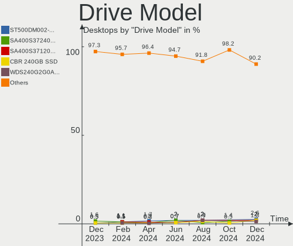
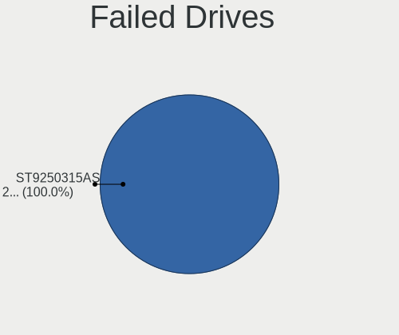
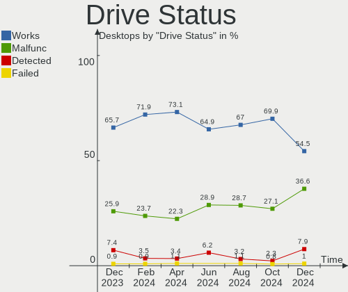
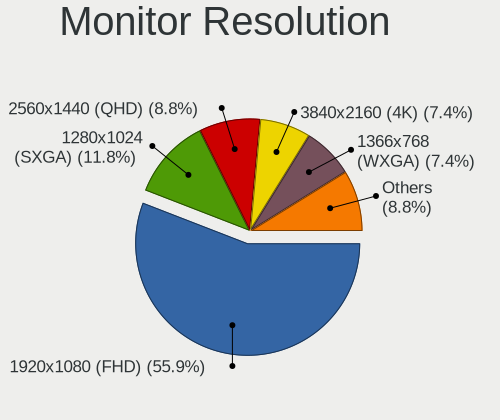

ROSA Hardware Trends (Desktop)
------------------------------

A project to identify most popular hardware characteristics and track their change
over time based on data collected by ROSA users at https://Linux-Hardware.org.

Anyone can contribute to the study by uploading probes of their computers by
the [hw-probe](https://github.com/linuxhw/hw-probe) tool:

    sudo hw-probe -all -upload

Full-feature report is available here: https://linux-hardware.org/?view=trends&formfactor=desktop

Period: Apr, 2020.

Contents
--------

- [ OS                       ](#os)
- [ OS Family                ](#os-family)
- [ Kernel                   ](#kernel)
- [ Kernel Family            ](#kernel-family)
- [ Kernel Major Ver.        ](#kernel-major-ver)
- [ Arch                     ](#arch)
- [ DE                       ](#de)
- [ Display Server           ](#display-server)
- [ Display Manager          ](#display-manager)
- [ OS Lang                  ](#os-lang)
- [ Boot Mode                ](#boot-mode)
- [ Filesystem               ](#filesystem)
- [ Dual Boot with Linux/BSD ](#dual-boot-with-linux/bsd)
- [ Dual Boot (Win)          ](#dual-boot-win)
- [ Country                  ](#country)
- [ City                     ](#city)
- [ Vendor                   ](#vendor)
- [ Model                    ](#model)
- [ Model Family             ](#model-family)
- [ MFG Year                 ](#mfg-year)
- [ Form Factor              ](#form-factor)
- [ Secure Boot              ](#secure-boot)
- [ Coreboot                 ](#coreboot)
- [ RAM Size                 ](#ram-size)
- [ RAM Used                 ](#ram-used)
- [ Drive Vendor             ](#drive-vendor)
- [ Drive Model              ](#drive-model)
- [ Drive Kind               ](#drive-kind)
- [ Drive Connector          ](#drive-connector)
- [ Drive Size               ](#drive-size)
- [ Space Total              ](#space-total)
- [ Space Used               ](#space-used)
- [ Malfunc. Drives          ](#malfunc-drives)
- [ Malfunc. Drive Vendor    ](#malfunc-drive-vendor)
- [ Malfunc. Drive Kind      ](#malfunc-drive-kind)
- [ Failed Drives            ](#failed-drives)
- [ Failed Drive Vendor      ](#failed-drive-vendor)
- [ Drive Status             ](#drive-status)
- [ Storage Vendor           ](#storage-vendor)
- [ Storage Model            ](#storage-model)
- [ Storage Kind             ](#storage-kind)
- [ CPU Vendor               ](#cpu-vendor)
- [ CPU Model                ](#cpu-model)
- [ CPU Model Family         ](#cpu-model-family)
- [ CPU Cores                ](#cpu-cores)
- [ CPU Sockets              ](#cpu-sockets)
- [ CPU Threads              ](#cpu-threads)
- [ CPU Op-Modes             ](#cpu-op-modes)
- [ CPU Microarch            ](#cpu-microarch)
- [ CPU Microcode            ](#cpu-microcode)
- [ GPU Vendor               ](#gpu-vendor)
- [ GPU Model                ](#gpu-model)
- [ GPU Combo                ](#gpu-combo)
- [ GPU Driver               ](#gpu-driver)
- [ GPU Memory               ](#gpu-memory)
- [ Monitor Vendor           ](#monitor-vendor)
- [ Monitor Model            ](#monitor-model)
- [ Monitor Resolution       ](#monitor-resolution)
- [ Monitor Diagonal         ](#monitor-diagonal)
- [ Monitor Width            ](#monitor-width)
- [ Aspect Ratio             ](#aspect-ratio)
- [ Monitor Area             ](#monitor-area)
- [ Pixel Density            ](#pixel-density)
- [ Multiple Monitors        ](#multiple-monitors)
- [ Net Controller Vendor    ](#net-controller-vendor)
- [ Net Controller Model     ](#net-controller-model)
- [ Net Controller Kind      ](#net-controller-kind)
- [ Used Controller          ](#used-controller)
- [ NICs                     ](#nics)
- [ Unsupported Devices      ](#unsupported-devices)
- [ Unsupported Device Types ](#unsupported-device-types)

OS
--

Installed operating systems

| Name       | Computers | Percent |
|------------|-----------|---------|
| ROSA R11   | 137       | 75.27%  |
| ROSA R11.1 | 31        | 17.03%  |
| ROSA R8.1  | 10        | 5.49%   |
| ROSA R10   | 4         | 2.2%    |

OS Family
---------

OS without a version

| Name | Computers | Percent |
|------|-----------|---------|
| ROSA | 182       | 100%    |

Kernel
------

Version of the Linux kernel

| Version                          | Computers | Percent |
|----------------------------------|-----------|---------|
| 4.15.0-desktop-45.1rosa-x86_64   | 52        | 28.57%  |
| 4.15.0-desktop-68.5rosa-x86_64   | 36        | 19.78%  |
| 4.15.0-desktop-94.1rosa-x86_64   | 17        | 9.34%   |
| 4.9.155-nrj-desktop-1rosa-x86_64 | 14        | 7.69%   |
| 4.15.0-desktop-45.1rosa-i586     | 10        | 5.49%   |
| 5.4.32-generic-2rosa-x86_64      | 8         | 4.4%    |
| 4.15.0-desktop-68.5rosa-i586     | 6         | 3.3%    |
| 4.9.60-nrj-desktop-1rosa-x86_64  | 4         | 2.2%    |
| 4.15.0-desktop-94.1rosa-i586     | 4         | 2.2%    |
| 5.4.28-generic-1rosa-x86_64      | 3         | 1.65%   |
| 4.9.155-nrj-desktop-1rosa-i586   | 3         | 1.65%   |
| 4.1.38-nrj-desktop-2rosa-x86_64  | 3         | 1.65%   |
| 5.4.31-generic-1rosa-x86_64      | 2         | 1.1%    |
| 5.4.30-nrj-desktop-1rosa-x86_64  | 2         | 1.1%    |
| 5.4.26-generic-3rosa-x86_64      | 2         | 1.1%    |
| 5.0.0-desktop-38.1rosa-x86_64    | 2         | 1.1%    |
| 5.6.2-1-linux-rosa-x86_64        | 1         | 0.55%   |
| 5.5.12-generic-1rosa-x86_64      | 1         | 0.55%   |
| 5.4.35-nrj-desktop-1rosa-x86_64  | 1         | 0.55%   |
| 5.4.28-generic-1rosa-i586        | 1         | 0.55%   |
| 5.4.24-nrj-desktop-2rosa-x86_64  | 1         | 0.55%   |
| 5.4.0-desktop-21.1rosa-x86_64    | 1         | 0.55%   |
| 4.9.9-nrj-desktop-1rosa-i586     | 1         | 0.55%   |
| 4.9.60-nrj-desktop-1rosa-i586    | 1         | 0.55%   |
| 4.4.16-nrj-desktop-1rosa-x86_64  | 1         | 0.55%   |
| 4.19.0-desktop-13.1rosa-x86_64   | 1         | 0.55%   |
| 4.16.18-nrj-desktop-1rosa-i586   | 1         | 0.55%   |
| 4.15.0-desktop-91.3rosa-x86_64   | 1         | 0.55%   |
| 4.15.0-desktop-91.1rosa-x86_64   | 1         | 0.55%   |
| 4.1.38-nrj-desktop-2rosa-i586    | 1         | 0.55%   |

Kernel Family
-------------

Linux kernel without a distro release

| Version | Computers | Percent |
|---------|-----------|---------|
| 4.15.0  | 127       | 69.78%  |
| 4.9.155 | 17        | 9.34%   |
| 5.4.32  | 8         | 4.4%    |
| 4.9.60  | 5         | 2.75%   |
| 5.4.28  | 4         | 2.2%    |
| 4.1.38  | 4         | 2.2%    |
| 5.4.31  | 2         | 1.1%    |
| 5.4.30  | 2         | 1.1%    |
| 5.4.26  | 2         | 1.1%    |
| 5.0.0   | 2         | 1.1%    |
| 5.6.2   | 1         | 0.55%   |
| 5.5.12  | 1         | 0.55%   |
| 5.4.35  | 1         | 0.55%   |
| 5.4.24  | 1         | 0.55%   |
| 5.4.0   | 1         | 0.55%   |
| 4.9.9   | 1         | 0.55%   |
| 4.4.16  | 1         | 0.55%   |
| 4.19.0  | 1         | 0.55%   |
| 4.16.18 | 1         | 0.55%   |

Kernel Major Ver.
-----------------

Linux kernel major version

| Version | Computers | Percent |
|---------|-----------|---------|
| 4.15    | 127       | 69.78%  |
| 4.9     | 23        | 12.64%  |
| 5.4     | 21        | 11.54%  |
| 4.1     | 4         | 2.2%    |
| 5.0     | 2         | 1.1%    |
| 5.6     | 1         | 0.55%   |
| 5.5     | 1         | 0.55%   |
| 4.4     | 1         | 0.55%   |
| 4.19    | 1         | 0.55%   |
| 4.16    | 1         | 0.55%   |

Arch
----

OS architecture (x86_64, i586, etc.)

| Name   | Computers | Percent |
|--------|-----------|---------|
| x86_64 | 154       | 84.62%  |
| i686   | 28        | 15.38%  |

DE
--

Desktop Environment

| Name    | Computers | Percent |
|---------|-----------|---------|
| KDE4    | 99        | 54.4%   |
| KDE5    | 65        | 35.71%  |
| LXQt    | 8         | 4.4%    |
| MATE    | 5         | 2.75%   |
| XFCE    | 3         | 1.65%   |
| GNOME   | 1         | 0.55%   |
| Unknown | 1         | 0.55%   |

Display Server
--------------

X11 or Wayland

| Name | Computers | Percent |
|------|-----------|---------|
| X11  | 182       | 100%    |

Display Manager
---------------

SDDM, LightDM, etc.

| Name | Computers | Percent |
|------|-----------|---------|
| KDM  | 102       | 56.04%  |
| SDDM | 79        | 43.41%  |
| GDM  | 1         | 0.55%   |

OS Lang
-------

Language

| Lang    | Computers | Percent |
|---------|-----------|---------|
| ru_RU   | 95        | 52.2%   |
| Unknown | 76        | 41.76%  |
| pl_PL   | 3         | 1.65%   |
| it_IT   | 3         | 1.65%   |
| ru_UA   | 1         | 0.55%   |
| ro_RO   | 1         | 0.55%   |
| fr_FR   | 1         | 0.55%   |
| es_ES   | 1         | 0.55%   |
| de_DE   | 1         | 0.55%   |

Boot Mode
---------

EFI or BIOS

| Mode | Computers | Percent |
|------|-----------|---------|
| BIOS | 149       | 81.87%  |
| EFI  | 33        | 18.13%  |

Filesystem
----------

Type of filesystem

| Type  | Computers | Percent |
|-------|-----------|---------|
| Ext4  | 176       | 96.7%   |
| Btrfs | 5         | 2.75%   |
| Ext3  | 1         | 0.55%   |

Dual Boot with Linux/BSD
------------------------

Hosting more than one Linux/BSD

| Dual boot | Computers | Percent |
|-----------|-----------|---------|
| No        | 123       | 67.58%  |
| Yes       | 59        | 32.42%  |

Dual Boot (Win)
---------------

Hosting Linux and Windows

| Dual boot | Computers | Percent |
|-----------|-----------|---------|
| Yes       | 92        | 50.55%  |
| No        | 90        | 49.45%  |

Country
-------

Geographic location (country)

| Country              | Computers | Percent |
|----------------------|-----------|---------|
| Russia               | 134       | 73.63%  |
| Ukraine              | 16        | 8.79%   |
| Germany              | 7         | 3.85%   |
| Poland               | 6         | 3.3%    |
| France               | 4         | 2.2%    |
| Spain                | 3         | 1.65%   |
| Italy                | 3         | 1.65%   |
| Belarus              | 2         | 1.1%    |
| Venezuela            | 1         | 0.55%   |
| USA                  | 1         | 0.55%   |
| UK                   | 1         | 0.55%   |
| Slovakia             | 1         | 0.55%   |
| Moldova, Republic of | 1         | 0.55%   |
| Latvia               | 1         | 0.55%   |
| Kazakhstan           | 1         | 0.55%   |

City
----

Geographic location (city)

| City             | Computers | Percent |
|------------------|-----------|---------|
| Moscow           | 17        | 9.34%   |
| Ekaterinburg     | 8         | 4.4%    |
| Rostov-on-Don    | 7         | 3.85%   |
| Novosibirsk      | 6         | 3.3%    |
| St Petersburg    | 5         | 2.75%   |
| Volgograd        | 4         | 2.2%    |
| Perm             | 3         | 1.65%   |
| Nizhniy Novgorod | 3         | 1.65%   |
| Krasnoyarsk      | 3         | 1.65%   |
| Krasnodar        | 3         | 1.65%   |
| Kharkiv          | 3         | 1.65%   |
| Chelyabinsk      | 3         | 1.65%   |
| Belgorod         | 3         | 1.65%   |
| Yaroslavl        | 2         | 1.1%    |
| Ufa              | 2         | 1.1%    |
| Tyumen           | 2         | 1.1%    |
| Stavropol        | 2         | 1.1%    |
| Smolensk         | 2         | 1.1%    |
| Prokop'yevsk     | 2         | 1.1%    |
| Omsk             | 2         | 1.1%    |
| Lądek Zdrój    | 2         | 1.1%    |
| Kursk            | 2         | 1.1%    |
| Kazan’         | 2         | 1.1%    |
| Izhevsk          | 2         | 1.1%    |
| Ivanovo          | 2         | 1.1%    |
| Bryansk          | 2         | 1.1%    |
| Bryanka          | 2         | 1.1%    |
| Belovo           | 2         | 1.1%    |
| Zheleznogorsk    | 1         | 0.55%   |
| Zelenogorsk      | 1         | 0.55%   |
| Yoshkar-Ola      | 1         | 0.55%   |
| Yessentuki       | 1         | 0.55%   |
| Wiesbaden        | 1         | 0.55%   |
| Volokolamsk      | 1         | 0.55%   |
| Volgodonsk       | 1         | 0.55%   |
| Vogue            | 1         | 0.55%   |
| Vladimir         | 1         | 0.55%   |
| Villeurbanne     | 1         | 0.55%   |
| Velikiye Luki    | 1         | 0.55%   |
| Uzyn             | 1         | 0.55%   |
| Ust-Kamenogorsk  | 1         | 0.55%   |
| Ulyanovsk        | 1         | 0.55%   |
| Toulouse         | 1         | 0.55%   |
| Tomsk            | 1         | 0.55%   |
| Tarnów          | 1         | 0.55%   |
| Tambov           | 1         | 0.55%   |
| Syzran'          | 1         | 0.55%   |
| Sternberg        | 1         | 0.55%   |
| Stary Oskol      | 1         | 0.55%   |
| Solnechnogorsk   | 1         | 0.55%   |
| Soledar          | 1         | 0.55%   |
| Simferopol       | 1         | 0.55%   |
| Shelekhov        | 1         | 0.55%   |
| Sevastopol       | 1         | 0.55%   |
| Saratov          | 1         | 0.55%   |
| Saransk          | 1         | 0.55%   |
| Samara           | 1         | 0.55%   |
| Rome             | 1         | 0.55%   |
| Pskov            | 1         | 0.55%   |
| Petrozavodsk     | 1         | 0.55%   |

Vendor
------

Motherboard manufacturer

| Name                | Computers | Percent |
|---------------------|-----------|---------|
| ASUSTek Computer    | 70        | 38.46%  |
| Gigabyte Technology | 43        | 23.63%  |
| ASRock              | 24        | 13.19%  |
| MSI                 | 17        | 9.34%   |
| Hewlett-Packard     | 4         | 2.2%    |
| Dell                | 4         | 2.2%    |
| Intel               | 3         | 1.65%   |
| ECS                 | 3         | 1.65%   |
| Pegatron            | 2         | 1.1%    |
| Lenovo              | 2         | 1.1%    |
| Fujitsu             | 2         | 1.1%    |
| Foxconn             | 2         | 1.1%    |
| Biostar             | 2         | 1.1%    |
| Packard Bell        | 1         | 0.55%   |
| Fujitsu Siemens     | 1         | 0.55%   |
| Acer                | 1         | 0.55%   |
| Unknown             | 1         | 0.55%   |

Model
-----

Motherboard model

| Name                               | Computers | Percent |
|------------------------------------|-----------|---------|
| ASUS All Series                    | 6         | 3.3%    |
| ASUS M5A97 R2.0                    | 3         | 1.65%   |
| Gigabyte GA-78LMT-S2               | 2         | 1.1%    |
| Gigabyte G31M-ES2L                 | 2         | 1.1%    |
| Gigabyte D525TUD                   | 2         | 1.1%    |
| Gigabyte B450 AORUS ELITE          | 2         | 1.1%    |
| ASUS PRIME B350-PLUS               | 2         | 1.1%    |
| ASUS P5QD TURBO                    | 2         | 1.1%    |
| ASUS P5L-MX                        | 2         | 1.1%    |
| ASUS P5G41T-M LX2/GB               | 2         | 1.1%    |
| ASUS M3A78                         | 2         | 1.1%    |
| ASRock N68C-S UCC                  | 2         | 1.1%    |
| Pegatron Compaq dx2400 Microtower  | 1         | 0.55%   |
| Pegatron 23-d008er                 | 1         | 0.55%   |
| Packard Bell ixtreme M5741         | 1         | 0.55%   |
| MSI MS-7B89                        | 1         | 0.55%   |
| MSI MS-7B86                        | 1         | 0.55%   |
| MSI MS-7B33                        | 1         | 0.55%   |
| MSI MS-7996                        | 1         | 0.55%   |
| MSI MS-7895                        | 1         | 0.55%   |
| MSI MS-7817                        | 1         | 0.55%   |
| MSI MS-7808                        | 1         | 0.55%   |
| MSI MS-7788                        | 1         | 0.55%   |
| MSI MS-7721                        | 1         | 0.55%   |
| MSI MS-7693                        | 1         | 0.55%   |
| MSI MS-7680                        | 1         | 0.55%   |
| MSI MS-7589                        | 1         | 0.55%   |
| MSI MS-7507                        | 1         | 0.55%   |
| MSI MS-7392                        | 1         | 0.55%   |
| MSI MS-7369                        | 1         | 0.55%   |
| MSI MS-7253                        | 1         | 0.55%   |
| MSI Compaq dx7400 Microtower       | 1         | 0.55%   |
| Lenovo ThinkCentre M58p 7483W4N    | 1         | 0.55%   |
| Lenovo 3000 96902JG                | 1         | 0.55%   |
| Intel H61M-DS2                     | 1         | 0.55%   |
| Intel DG33BU AAD79951-407          | 1         | 0.55%   |
| Intel Board                        | 1         | 0.55%   |
| HP Compaq Pro 6300 MT              | 1         | 0.55%   |
| HP Compaq dc7600 Small Form Factor | 1         | 0.55%   |
| HP Compaq 8000 Elite SFF PC        | 1         | 0.55%   |
| HP Compaq 6000 Pro MT PC           | 1         | 0.55%   |
| Gigabyte Z77-D3H                   | 1         | 0.55%   |
| Gigabyte Z68X-UD3-B3               | 1         | 0.55%   |
| Gigabyte Z68AP-D3                  | 1         | 0.55%   |
| Gigabyte P55-US3L                  | 1         | 0.55%   |
| Gigabyte MZGLKAP-00                | 1         | 0.55%   |
| Gigabyte M61PME-S2P                | 1         | 0.55%   |
| Gigabyte M61PME-S2                 | 1         | 0.55%   |
| Gigabyte M57SLI-S4                 | 1         | 0.55%   |
| Gigabyte H87N-WIFI                 | 1         | 0.55%   |
| Gigabyte H77N-WIFI                 | 1         | 0.55%   |
| Gigabyte H77M-D3H                  | 1         | 0.55%   |
| Gigabyte H61N-USB3                 | 1         | 0.55%   |
| Gigabyte H61M-S2-B3                | 1         | 0.55%   |
| Gigabyte H61M-S1                   | 1         | 0.55%   |
| Gigabyte H55M-D2H                  | 1         | 0.55%   |
| Gigabyte H110M-S2PV-CF             | 1         | 0.55%   |
| Gigabyte H110M-S2-CF               | 1         | 0.55%   |
| Gigabyte H110M-S2                  | 1         | 0.55%   |
| Gigabyte GA-MA785GMT-UD2H          | 1         | 0.55%   |

Model Family
------------

Motherboard model prefix

| Name                 | Computers | Percent |
|----------------------|-----------|---------|
| ASUS PRIME           | 7         | 3.85%   |
| ASUS All             | 6         | 3.3%    |
| HP Compaq            | 4         | 2.2%    |
| Gigabyte GA-78LMT-S2 | 3         | 1.65%   |
| ASUS M5A97           | 3         | 1.65%   |
| Gigabyte G31M-ES2L   | 2         | 1.1%    |
| Gigabyte D525TUD     | 2         | 1.1%    |
| Gigabyte B450        | 2         | 1.1%    |
| Gigabyte AB350M-DS3H | 2         | 1.1%    |
| Dell Vostro          | 2         | 1.1%    |
| Dell OptiPlex        | 2         | 1.1%    |
| ASUS P7P55D-E        | 2         | 1.1%    |
| ASUS P5QD            | 2         | 1.1%    |
| ASUS P5Q             | 2         | 1.1%    |
| ASUS P5L-MX          | 2         | 1.1%    |
| ASUS P5KPL-AM        | 2         | 1.1%    |
| ASUS P5GC-MX         | 2         | 1.1%    |
| ASUS P5G41T-M        | 2         | 1.1%    |
| ASUS M5A78L-M        | 2         | 1.1%    |
| ASUS M3A78           | 2         | 1.1%    |
| ASRock N68C-S        | 2         | 1.1%    |
| Pegatron Compaq      | 1         | 0.55%   |
| Pegatron 23-d008er   | 1         | 0.55%   |
| Packard Bell ixtreme | 1         | 0.55%   |
| MSI MS-7B89          | 1         | 0.55%   |
| MSI MS-7B86          | 1         | 0.55%   |
| MSI MS-7B33          | 1         | 0.55%   |
| MSI MS-7996          | 1         | 0.55%   |
| MSI MS-7895          | 1         | 0.55%   |
| MSI MS-7817          | 1         | 0.55%   |
| MSI MS-7808          | 1         | 0.55%   |
| MSI MS-7788          | 1         | 0.55%   |
| MSI MS-7721          | 1         | 0.55%   |
| MSI MS-7693          | 1         | 0.55%   |
| MSI MS-7680          | 1         | 0.55%   |
| MSI MS-7589          | 1         | 0.55%   |
| MSI MS-7507          | 1         | 0.55%   |
| MSI MS-7392          | 1         | 0.55%   |
| MSI MS-7369          | 1         | 0.55%   |
| MSI MS-7253          | 1         | 0.55%   |
| MSI Compaq           | 1         | 0.55%   |
| Lenovo ThinkCentre   | 1         | 0.55%   |
| Lenovo 3000          | 1         | 0.55%   |
| Intel H61M-DS2       | 1         | 0.55%   |
| Intel DG33BU         | 1         | 0.55%   |
| Intel Board          | 1         | 0.55%   |
| Gigabyte Z77-D3H     | 1         | 0.55%   |
| Gigabyte Z68X-UD3-B3 | 1         | 0.55%   |
| Gigabyte Z68AP-D3    | 1         | 0.55%   |
| Gigabyte P55-US3L    | 1         | 0.55%   |
| Gigabyte MZGLKAP-00  | 1         | 0.55%   |
| Gigabyte M61PME-S2P  | 1         | 0.55%   |
| Gigabyte M61PME-S2   | 1         | 0.55%   |
| Gigabyte M57SLI-S4   | 1         | 0.55%   |
| Gigabyte H87N-WIFI   | 1         | 0.55%   |
| Gigabyte H77N-WIFI   | 1         | 0.55%   |
| Gigabyte H77M-D3H    | 1         | 0.55%   |
| Gigabyte H61N-USB3   | 1         | 0.55%   |
| Gigabyte H61M-S2-B3  | 1         | 0.55%   |
| Gigabyte H61M-S1     | 1         | 0.55%   |

MFG Year
--------

Motherboard manufacture year

| Year | Computers | Percent |
|------|-----------|---------|
| 2010 | 25        | 13.74%  |
| 2009 | 18        | 9.89%   |
| 2018 | 17        | 9.34%   |
| 2011 | 16        | 8.79%   |
| 2012 | 15        | 8.24%   |
| 2014 | 14        | 7.69%   |
| 2015 | 13        | 7.14%   |
| 2013 | 12        | 6.59%   |
| 2007 | 11        | 6.04%   |
| 2019 | 9         | 4.95%   |
| 2016 | 9         | 4.95%   |
| 2008 | 9         | 4.95%   |
| 2017 | 8         | 4.4%    |
| 2006 | 2         | 1.1%    |
| 2004 | 2         | 1.1%    |
| 2020 | 1         | 0.55%   |
| 2005 | 1         | 0.55%   |

Form Factor
-----------

Physical design of the computer

| Name    | Computers | Percent |
|---------|-----------|---------|
| Desktop | 182       | 100%    |

Secure Boot
-----------

Enabled or disabled

| State    | Computers | Percent |
|----------|-----------|---------|
| Disabled | 182       | 100%    |

Coreboot
--------

Have coreboot on board

| Used | Computers | Percent |
|------|-----------|---------|
| No   | 182       | 100%    |

RAM Size
--------

Total RAM memory

| Size in GB  | Computers | Percent |
|-------------|-----------|---------|
| 3.01-4.0    | 63        | 34.62%  |
| 8.01-16.0   | 48        | 26.37%  |
| 4.01-8.0    | 25        | 13.74%  |
| 16.01-24.0  | 23        | 12.64%  |
| 1.01-2.0    | 11        | 6.04%   |
| 2.01-3.0    | 8         | 4.4%    |
| 32.01-64.0  | 2         | 1.1%    |
| 24.01-32.0  | 1         | 0.55%   |
| 64.01-256.0 | 1         | 0.55%   |

RAM Used
--------

Used RAM memory

| Used GB   | Computers | Percent |
|-----------|-----------|---------|
| 0.01-1.0  | 90        | 49.45%  |
| 1.01-2.0  | 65        | 35.71%  |
| 2.01-3.0  | 18        | 9.89%   |
| 4.01-8.0  | 5         | 2.75%   |
| 3.01-4.0  | 3         | 1.65%   |
| 8.01-16.0 | 1         | 0.55%   |

Drive Vendor
------------

Hard drive vendors

| Vendor              | Computers | Drives  | Percent |
|---------------------|-----------|---------|---------|
| Seagate             | 80        | 102     | 28.67%  |
| WDC                 | 71        | 88      | 25.45%  |
| Toshiba             | 18        | 19      | 6.45%   |
| Samsung Electronics | 16        | 19      | 5.73%   |
| Hitachi             | 12        | 12      | 4.3%    |
| Kingston            | 11        | 12      | 3.94%   |
| China               | 10        | 10      | 3.58%   |
| A-DATA Technology   | 8         | 8       | 2.87%   |
| SPCC                | 5         | 5       | 1.79%   |
| SanDisk             | 5         | 5       | 1.79%   |
| Crucial             | 5         | 5       | 1.79%   |
| Transcend           | 4         | 4       | 1.43%   |
| PLEXTOR             | 3         | 4       | 1.08%   |
| Patriot             | 3         | 3       | 1.08%   |
| MAXTOR              | 3         | 3       | 1.08%   |
| Intel               | 3         | 3       | 1.08%   |
| HGST                | 3         | 3       | 1.08%   |
| GOODRAM             | 3         | 3       | 1.08%   |
| Corsair             | 3         | 3       | 1.08%   |
| Smartbuy            | 2         | 2       | 0.72%   |
| HUAWEI              | 2         | 2       | 0.72%   |
| Palit               | 1         | 1       | 0.36%   |
| OCZ                 | 1         | 1       | 0.36%   |
| LITEON              | 1         | 1       | 0.36%   |
| KingDian            | 1         | 1       | 0.36%   |
| Hewlett-Packard     | 1         | Unknown | 0.36%   |
| Gigabyte Technology | 1         | 1       | 0.36%   |
| Fujitsu             | 1         | 1       | 0.36%   |
| Apacer              | 1         | 1       | 0.36%   |
| AMD                 | 1         | 1       | 0.36%   |

Drive Model
-----------

Hard drive models

| Model                        | Computers | Percent |
|------------------------------|-----------|---------|
| SA400S37120G 120GB SSD       | 7         | 2.18%   |
| ST500DM002-1BD142 500GB      | 6         | 1.87%   |
| DT01ACA050 500GB             | 5         | 1.56%   |
| ST1000DM010-2EP102 1TB       | 4         | 1.25%   |
| ST1000DM003-9YN162 1TB       | 4         | 1.25%   |
| DT01ACA100 1TB               | 4         | 1.25%   |
| WDS120G2G0A-00JH30 120GB SSD | 3         | 0.93%   |
| WD10EZEX-08WN4A0 1TB         | 3         | 0.93%   |
| WD10EZEX-00BN5A0 1TB         | 3         | 0.93%   |
| ST380811AS 80GB              | 3         | 0.93%   |
| ST3160811AS 160GB            | 3         | 0.93%   |
| ST2000DM008-2FR102 2TB       | 3         | 0.93%   |
| ST1000DM003-1CH162 1TB       | 3         | 0.93%   |
| HD103SJ 1TB                  | 3         | 0.93%   |
| CT120BX500SSD1 120GB         | 3         | 0.93%   |
| WDS240G2G0A-00JH30 240GB SSD | 2         | 0.62%   |
| WD5000AZRX-00A8LB0 500GB     | 2         | 0.62%   |
| WD5000AADS-00S9B0 500GB      | 2         | 0.62%   |
| WD20EZRZ-00Z5HB0 2TB         | 2         | 0.62%   |
| WD20EARX-00PASB0 2TB         | 2         | 0.62%   |
| WD1600AAJS-00PSA0 160GB      | 2         | 0.62%   |
| WD1600AAJB-00J3A0 160GB      | 2         | 0.62%   |
| WD10EZEX-60ZF5A0 1TB         | 2         | 0.62%   |
| WD10EZEX-22MFCA0 1TB         | 2         | 0.62%   |
| WD10EZEX-00RKKA0 1TB         | 2         | 0.62%   |
| SV300S37A120G 120GB SSD      | 2         | 0.62%   |
| SU650 480GB SSD              | 2         | 0.62%   |
| ST500DM002-1BC142 500GB      | 2         | 0.62%   |
| ST380011A 80GB               | 2         | 0.62%   |
| ST3750525AS 752GB            | 2         | 0.62%   |
| ST3500418AS 500GB            | 2         | 0.62%   |
| ST3500413AS 500GB            | 2         | 0.62%   |
| ST340014A 40GB               | 2         | 0.62%   |
| ST3320418AS 320GB            | 2         | 0.62%   |
| ST3250410AS 250GB            | 2         | 0.62%   |
| ST3250318AS 250GB            | 2         | 0.62%   |
| ST3250310AS 250GB            | 2         | 0.62%   |
| ST3160815AS 160GB            | 2         | 0.62%   |
| ST3160815A 160GB             | 2         | 0.62%   |
| ST3120022A 120GB             | 2         | 0.62%   |
| ST31000528AS 1TB             | 2         | 0.62%   |
| ST2000DM006-2DM164 2TB       | 2         | 0.62%   |
| ST1000LM035-1RK172 1TB       | 2         | 0.62%   |
| ST1000DM003-1SB102 1TB       | 2         | 0.62%   |
| ST1000DM003-1ER162 1TB       | 2         | 0.62%   |
| SSD PLUS 240GB               | 2         | 0.62%   |
| SSD 750 EVO 250GB            | 2         | 0.62%   |
| Solid State Disk 120GB       | 2         | 0.62%   |
| SATA SSD 64GB                | 2         | 0.62%   |
| SATA SSD 120GB               | 2         | 0.62%   |
| Neutron GTX SSD 120GB        | 2         | 0.62%   |
| HDWD120 2TB                  | 2         | 0.62%   |
| HDWD110 1TB                  | 2         | 0.62%   |
| HDT725025VLA380 250GB        | 2         | 0.62%   |
| HD403LJ 400GB                | 2         | 0.62%   |
| Expansion 1TB                | 2         | 0.62%   |
| Burst 480GB SSD              | 2         | 0.62%   |
| 120GB SSD                    | 2         | 0.62%   |
| WDS500G1B0A-00H9H0 500GB SSD | 1         | 0.31%   |
| WDS480G2G0A-00JH30 480GB SSD | 1         | 0.31%   |

Drive Kind
----------

HDD or SSD

| Kind    | Computers | Drives | Percent |
|---------|-----------|--------|---------|
| HDD     | 160       | 231    | 67.51%  |
| SSD     | 64        | 80     | 27%     |
| NVMe    | 10        | 10     | 4.22%   |
| Unknown | 3         | 2      | 1.27%   |

Drive Connector
---------------

SATA, SAS, NVMe, etc.

| Type | Computers | Drives | Percent |
|------|-----------|--------|---------|
| SATA | 179       | 307    | 91.33%  |
| NVMe | 10        | 10     | 5.1%    |
| SAS  | 7         | 6      | 3.57%   |

Drive Size
----------

Size of hard drive

| Size in TB | Computers | Drives | Percent |
|------------|-----------|--------|---------|
| 0.01-0.5   | 151       | 213    | 61.38%  |
| 0.51-1.0   | 71        | 86     | 28.86%  |
| 1.01-2.0   | 16        | 16     | 6.5%    |
| 2.01-3.0   | 4         | 4      | 1.63%   |
| 3.01-4.0   | 2         | 2      | 0.81%   |
| 4.01-10.0  | 2         | 2      | 0.81%   |

Space Total
-----------

Amount of disk space available on the file system

| Size in GB     | Computers | Percent |
|----------------|-----------|---------|
| 101-250        | 49        | 26.92%  |
| 251-500        | 26        | 14.29%  |
| 1-20           | 26        | 14.29%  |
| 51-100         | 26        | 14.29%  |
| 501-1000       | 25        | 13.74%  |
| 1001-2000      | 13        | 7.14%   |
| 21-50          | 11        | 6.04%   |
| 2001-3000      | 4         | 2.2%    |
| More than 3000 | 2         | 1.1%    |

Space Used
----------

Amount of used disk space

| Used GB        | Computers | Percent |
|----------------|-----------|---------|
| 1-20           | 119       | 65.38%  |
| 21-50          | 14        | 7.69%   |
| 101-250        | 13        | 7.14%   |
| 501-1000       | 10        | 5.49%   |
| 251-500        | 9         | 4.95%   |
| 51-100         | 9         | 4.95%   |
| 1001-2000      | 6         | 3.3%    |
| More than 3000 | 2         | 1.1%    |

Malfunc. Drives
---------------

Drive models with a malfunction

| Model                        | Computers | Drives | Percent |
|------------------------------|-----------|--------|---------|
| ST500DM002-1BD142 500GB      | 4         | 4      | 4.12%   |
| ST1000DM003-9YN162 1TB       | 3         | 3      | 3.09%   |
| WD5000AADS-00S9B0 500GB      | 2         | 2      | 2.06%   |
| WD10EZEX-00RKKA0 1TB         | 2         | 2      | 2.06%   |
| ST3500418AS 500GB            | 2         | 2      | 2.06%   |
| ST3320418AS 320GB            | 2         | 2      | 2.06%   |
| ST3250318AS 250GB            | 2         | 2      | 2.06%   |
| ST3250310AS 250GB            | 2         | 2      | 2.06%   |
| ST3160811AS 160GB            | 2         | 2      | 2.06%   |
| ST1000DM003-1CH162 1TB       | 2         | 2      | 2.06%   |
| Neutron GTX SSD 120GB        | 2         | 2      | 2.06%   |
| HD103SJ 1TB                  | 2         | 2      | 2.06%   |
| WDS240G2G0B-00EPW0 240GB SSD | 1         | 1      | 1.03%   |
| WD800JB-00JJC0 80GB          | 1         | 1      | 1.03%   |
| WD800BB-56JKC0 80GB          | 1         | 1      | 1.03%   |
| WD800AAJS-00PSA0 80GB        | 1         | 1      | 1.03%   |
| WD5000LPVX-60V0TT0 500GB     | 1         | 1      | 1.03%   |
| WD5000AARS-003BB1 500GB      | 1         | 1      | 1.03%   |
| WD5000AAKX-603CA0 500GB      | 1         | 1      | 1.03%   |
| WD5000AAKX-001CA0 500GB      | 1         | 1      | 1.03%   |
| WD3200AAKS-00L9A0 320GB      | 1         | 1      | 1.03%   |
| WD3200AAJS-00B4A0 320GB      | 1         | 1      | 1.03%   |
| WD30EZRX-00AZ6B0 3TB         | 1         | 1      | 1.03%   |
| WD2500AAJS-07B4A0 250GB      | 1         | 1      | 1.03%   |
| WD20EARX-00PASB0 2TB         | 1         | 1      | 1.03%   |
| WD1600JD-00HBB0 160GB        | 1         | 1      | 1.03%   |
| WD1600AAJB-00J3A0 160GB      | 1         | 1      | 1.03%   |
| WD1200JD-00HBB0 120GB        | 1         | 1      | 1.03%   |
| WD10EZEX-60ZF5A0 1TB         | 1         | 1      | 1.03%   |
| WD10EZEX-35WN4A0 1TB         | 1         | 1      | 1.03%   |
| WD10EZEX-22BN5A0 1TB         | 1         | 1      | 1.03%   |
| WD10EZEX-08WN4A0 1TB         | 1         | 1      | 1.03%   |
| WD10EFRX-68JCSN0 1TB         | 1         | 1      | 1.03%   |
| WD10EARS-00Y5B1 1TB          | 1         | 1      | 1.03%   |
| WD1003FZEX-00MK2A0 1TB       | 1         | 1      | 1.03%   |
| SU700 120GB SSD              | 1         | 1      | 1.03%   |
| STM3250820AS 250GB           | 1         | 1      | 1.03%   |
| STM3160215AS 160GB           | 1         | 1      | 1.03%   |
| ST9320328CS 320GB            | 1         | 1      | 1.03%   |
| ST500LM012 HN-M500MBB 500GB  | 1         | 1      | 1.03%   |
| ST500DM009-2F110A 500GB      | 1         | 1      | 1.03%   |
| ST500DM002-1BC142 500GB      | 1         | 1      | 1.03%   |
| ST380815AS 80GB              | 1         | 1      | 1.03%   |
| ST380013AS 80GB              | 1         | 1      | 1.03%   |
| ST3750528AS 752GB            | 1         | 1      | 1.03%   |
| ST3750525AS 752GB            | 1         | 1      | 1.03%   |
| ST3400832A 400GB             | 1         | 1      | 1.03%   |
| ST340014A 40GB               | 1         | 1      | 1.03%   |
| ST3320613AS 320GB            | 1         | 1      | 1.03%   |
| ST3320413CS 320GB            | 1         | 1      | 1.03%   |
| ST3250620AS 250GB            | 1         | 1      | 1.03%   |
| ST3250410AS 250GB            | 1         | 1      | 1.03%   |
| ST3160813AS 160GB            | 1         | 1      | 1.03%   |
| ST3120814A 120GB             | 1         | 1      | 1.03%   |
| ST3120022A 120GB             | 1         | 1      | 1.03%   |
| ST31000333AS 1TB             | 1         | 1      | 1.03%   |
| ST250DM000-1BD141 250GB      | 1         | 1      | 1.03%   |
| ST2000DM001-1CH164 2TB       | 1         | 1      | 1.03%   |
| ST1000VX001-1Z4102 1TB       | 1         | 1      | 1.03%   |
| ST1000DM003-1SB102 1TB       | 1         | 1      | 1.03%   |

Malfunc. Drive Vendor
---------------------

Vendors of faulty drives

| Vendor              | Computers | Drives | Percent |
|---------------------|-----------|--------|---------|
| Seagate             | 38        | 43     | 43.18%  |
| WDC                 | 24        | 27     | 27.27%  |
| Hitachi             | 9         | 9      | 10.23%  |
| Samsung Electronics | 6         | 7      | 6.82%   |
| Toshiba             | 4         | 4      | 4.55%   |
| Corsair             | 3         | 3      | 3.41%   |
| MAXTOR              | 2         | 2      | 2.27%   |
| Kingston            | 1         | 1      | 1.14%   |
| A-DATA Technology   | 1         | 1      | 1.14%   |

Malfunc. Drive Kind
-------------------

Kinds of faulty drives

| Kind | Computers | Drives | Percent |
|------|-----------|--------|---------|
| HDD  | 79        | 91     | 92.94%  |
| SSD  | 6         | 6      | 7.06%   |

Failed Drives
-------------

Failed drive models

| Model                 | Computers | Drives | Percent |
|-----------------------|-----------|--------|---------|
| ST3750525AS 752GB     | 1         | 1      | 33.33%  |
| HTS547575A9E384 752GB | 1         | 1      | 33.33%  |
| HD204UI 2TB           | 1         | 1      | 33.33%  |

Failed Drive Vendor
-------------------

Failed drive vendors

| Vendor              | Computers | Drives | Percent |
|---------------------|-----------|--------|---------|
| Seagate             | 1         | 1      | 33.33%  |
| Samsung Electronics | 1         | 1      | 33.33%  |
| Hitachi             | 1         | 1      | 33.33%  |

Drive Status
------------

Number of failed and malfunc. drives

| Status   | Computers | Drives | Percent |
|----------|-----------|--------|---------|
| Works    | 139       | 216    | 59.66%  |
| Malfunc  | 83        | 97     | 35.62%  |
| Detected | 8         | 7      | 3.43%   |
| Failed   | 3         | 3      | 1.29%   |

Storage Vendor
--------------

Storage controller vendors

| Vendor                           | Computers | Percent |
|----------------------------------|-----------|---------|
| Intel                            | 121       | 53.3%   |
| AMD                              | 48        | 21.15%  |
| JMicron Technology               | 18        | 7.93%   |
| Nvidia                           | 11        | 4.85%   |
| Marvell Technology Group         | 9         | 3.96%   |
| ASMedia Technology               | 5         | 2.2%    |
| VIA Technologies                 | 3         | 1.32%   |
| Silicon Motion                   | 3         | 1.32%   |
| Lite-On Technology               | 3         | 1.32%   |
| Phison Electronics               | 2         | 0.88%   |
| Silicon Integrated Systems [SiS] | 1         | 0.44%   |
| Micron/Crucial Technology        | 1         | 0.44%   |
| Kingston Technology Company      | 1         | 0.44%   |
| ADATA Technology                 | 1         | 0.44%   |

Storage Model
-------------

Storage controller models

| Model                                                                             | Computers | Percent |
|-----------------------------------------------------------------------------------|-----------|---------|
| NM10/ICH7 Family SATA Controller [IDE mode]                                       | 25        | 7.46%   |
| SB7x0/SB8x0/SB9x0 IDE Controller                                                  | 22        | 6.57%   |
| 82801G (ICH7 Family) IDE Controller                                               | 19        | 5.67%   |
| SB7x0/SB8x0/SB9x0 SATA Controller [IDE mode]                                      | 18        | 5.37%   |
| FCH SATA Controller [AHCI mode]                                                   | 14        | 4.18%   |
| Q170/Q150/B150/H170/H110/Z170/CM236 Chipset SATA Controller [AHCI Mode]           | 11        | 3.28%   |
| JMB363 SATA/IDE Controller                                                        | 11        | 3.28%   |
| 6 Series/C200 Series Chipset Family Desktop SATA Controller (IDE mode, ports 4-5) | 11        | 3.28%   |
| 6 Series/C200 Series Chipset Family Desktop SATA Controller (IDE mode, ports 0-3) | 11        | 3.28%   |
| SB7x0/SB8x0/SB9x0 SATA Controller [AHCI mode]                                     | 10        | 2.99%   |
| 8 Series/C220 Series Chipset Family 6-port SATA Controller 1 [AHCI mode]          | 8         | 2.39%   |
| JMB368 IDE controller                                                             | 7         | 2.09%   |
| 7 Series/C210 Series Chipset Family 4-port SATA Controller [IDE mode]             | 7         | 2.09%   |
| 7 Series/C210 Series Chipset Family 2-port SATA Controller [IDE mode]             | 7         | 2.09%   |
| MCP61 SATA Controller                                                             | 6         | 1.79%   |
| MCP61 IDE                                                                         | 6         | 1.79%   |
| 200 Series PCH SATA controller [AHCI mode]                                        | 6         | 1.79%   |
| Non-Volatile memory controller                                                    | 5         | 1.49%   |
| ASM1062 Serial ATA Controller                                                     | 5         | 1.49%   |
| 7 Series/C210 Series Chipset Family 6-port SATA Controller [AHCI mode]            | 5         | 1.49%   |
| 6 Series/C200 Series Chipset Family 6 port Desktop SATA AHCI Controller           | 5         | 1.49%   |
| 5 Series/3400 Series Chipset 4 port SATA IDE Controller                           | 5         | 1.49%   |
| 5 Series/3400 Series Chipset 2 port SATA IDE Controller                           | 5         | 1.49%   |
| 4 Series Chipset PT IDER Controller                                               | 5         | 1.49%   |
| FCH SATA Controller [IDE mode]                                                    | 4         | 1.19%   |
| FCH IDE Controller                                                                | 4         | 1.19%   |
| Cannon Lake PCH SATA AHCI Controller                                              | 4         | 1.19%   |
| 82801JI (ICH10 Family) 4 port SATA IDE Controller #1                              | 4         | 1.19%   |
| 82801JI (ICH10 Family) 2 port SATA IDE Controller #2                              | 4         | 1.19%   |
| 400 Series Chipset SATA Controller                                                | 4         | 1.19%   |
| SATA Controller [RAID mode]                                                       | 3         | 0.9%    |
| 82801JD/DO (ICH10 Family) SATA AHCI Controller                                    | 3         | 0.9%    |
| 82801IR/IO/IH (ICH9R/DO/DH) 6 port SATA Controller [AHCI mode]                    | 3         | 0.9%    |
| 82801I (ICH9 Family) 2 port SATA Controller [IDE mode]                            | 3         | 0.9%    |
| 300 Series Chipset SATA Controller                                                | 3         | 0.9%    |
| VT6415 PATA IDE Host Controller                                                   | 2         | 0.6%    |
| SATA controller                                                                   | 2         | 0.6%    |
| JMB361 AHCI/IDE                                                                   | 2         | 0.6%    |
| FCH SATA Controller D                                                             | 2         | 0.6%    |
| 9 Series Chipset Family SATA Controller [AHCI Mode]                               | 2         | 0.6%    |
| 88SE9172 SATA III 6Gb/s RAID Controller                                           | 2         | 0.6%    |
| 88SE6101/6102 single-port PATA133 interface                                       | 2         | 0.6%    |
| 82801JI (ICH10 Family) SATA AHCI Controller                                       | 2         | 0.6%    |
| 82801JD/DO (ICH10 Family) 4-port SATA IDE Controller                              | 2         | 0.6%    |
| 82801JD/DO (ICH10 Family) 2-port SATA IDE Controller                              | 2         | 0.6%    |
| 82801IR/IO/IH (ICH9R/DO/DH) 4 port SATA Controller [IDE mode]                     | 2         | 0.6%    |
| 82801EB/ER (ICH5/ICH5R) IDE Controller                                            | 2         | 0.6%    |
| 82801EB (ICH5) SATA Controller                                                    | 2         | 0.6%    |
| 5 Series/3400 Series Chipset 6 port SATA AHCI Controller                          | 2         | 0.6%    |
| XPG SX8200 Pro PCIe Gen3x4 M.2 2280 Solid State Drive                             | 1         | 0.3%    |
| X370 Series Chipset SATA Controller                                               | 1         | 0.3%    |
| VT82C586A/B/VT82C686/A/B/VT823x/A/C PIPC Bus Master IDE                           | 1         | 0.3%    |
| VT8237A SATA 2-Port Controller                                                    | 1         | 0.3%    |
| Technology Company Non-Volatile memory controller                                 | 1         | 0.3%    |
| SB600 Non-Raid-5 SATA                                                             | 1         | 0.3%    |
| SB600 IDE                                                                         | 1         | 0.3%    |
| P1 NVMe PCIe SSD                                                                  | 1         | 0.3%    |
| NVMe Storage Controller                                                           | 1         | 0.3%    |
| NVMe Controller                                                                   | 1         | 0.3%    |
| NM10/ICH7 Family SATA Controller [AHCI mode]                                      | 1         | 0.3%    |

Storage Kind
------------

Kind of storage controller (IDE, SATA, NVMe, SAS, ...)

| Kind | Computers | Percent |
|------|-----------|---------|
| IDE  | 114       | 48.51%  |
| SATA | 107       | 45.53%  |
| NVMe | 11        | 4.68%   |
| RAID | 3         | 1.28%   |

CPU Vendor
----------

Processor vendors

| Vendor | Computers | Percent |
|--------|-----------|---------|
| Intel  | 123       | 67.58%  |
| AMD    | 59        | 32.42%  |

CPU Model
---------

Processor models

| Model                                       | Computers | Percent |
|---------------------------------------------|-----------|---------|
| Intel Core i3-2100 CPU @ 3.10GHz            | 5         | 2.75%   |
| Intel Core i5-3470 CPU @ 3.20GHz            | 4         | 2.2%    |
| AMD FX-6300 Six-Core Processor              | 4         | 2.2%    |
| AMD Athlon II X4 640 Processor              | 4         | 2.2%    |
| Intel Core i3-3220 CPU @ 3.30GHz            | 3         | 1.65%   |
| Intel Core 2 Duo CPU E4500 @ 2.20GHz        | 3         | 1.65%   |
| AMD Phenom II X4 945 Processor              | 3         | 1.65%   |
| AMD Athlon 64 X2 Dual Core Processor 5600+  | 3         | 1.65%   |
| Intel Xeon CPU E5450 @ 3.00GHz              | 2         | 1.1%    |
| Intel Pentium Gold G5400 CPU @ 3.70GHz      | 2         | 1.1%    |
| Intel Pentium Dual-Core CPU E5400 @ 2.70GHz | 2         | 1.1%    |
| Intel Pentium Dual-Core CPU E5300 @ 2.60GHz | 2         | 1.1%    |
| Intel Pentium Dual-Core CPU E5200 @ 2.50GHz | 2         | 1.1%    |
| Intel Pentium D CPU 2.80GHz                 | 2         | 1.1%    |
| Intel Pentium CPU G860 @ 3.00GHz            | 2         | 1.1%    |
| Intel Pentium 4 CPU 2.80GHz                 | 2         | 1.1%    |
| Intel Core i5-9400F CPU @ 2.90GHz           | 2         | 1.1%    |
| Intel Core i5-7400 CPU @ 3.00GHz            | 2         | 1.1%    |
| Intel Core i5-6500 CPU @ 3.20GHz            | 2         | 1.1%    |
| Intel Core i5-3570K CPU @ 3.40GHz           | 2         | 1.1%    |
| Intel Core i3 CPU 550 @ 3.20GHz             | 2         | 1.1%    |
| Intel Core i3 CPU 530 @ 2.93GHz             | 2         | 1.1%    |
| Intel Core 2 Quad CPU Q9550 @ 2.83GHz       | 2         | 1.1%    |
| Intel Core 2 Quad CPU Q8400 @ 2.66GHz       | 2         | 1.1%    |
| Intel Core 2 Quad CPU Q6600 @ 2.40GHz       | 2         | 1.1%    |
| Intel Core 2 Duo CPU E8500 @ 3.16GHz        | 2         | 1.1%    |
| Intel Core 2 Duo CPU E8400 @ 3.00GHz        | 2         | 1.1%    |
| Intel Core 2 Duo CPU E6550 @ 2.33GHz        | 2         | 1.1%    |
| Intel Core 2 Duo CPU E4600 @ 2.40GHz        | 2         | 1.1%    |
| Intel Celeron CPU E3400 @ 2.60GHz           | 2         | 1.1%    |
| Intel Atom CPU D525 @ 1.80GHz               | 2         | 1.1%    |
| AMD Ryzen 5 3600 6-Core Processor           | 2         | 1.1%    |
| AMD FX-8300 Eight-Core Processor            | 2         | 1.1%    |
| AMD FX-4300 Quad-Core Processor             | 2         | 1.1%    |
| AMD Athlon II X3 440 Processor              | 2         | 1.1%    |
| AMD Athlon II X2 240 Processor              | 2         | 1.1%    |
| Intel Xeon CPU X5450 @ 3.00GHz              | 1         | 0.55%   |
| Intel Xeon CPU X3450 @ 2.67GHz              | 1         | 0.55%   |
| Intel Xeon CPU E5420 @ 2.50GHz              | 1         | 0.55%   |
| Intel Xeon CPU E3-1270 V2 @ 3.50GHz         | 1         | 0.55%   |
| Intel Xeon CPU E3-1240 v3 @ 3.40GHz         | 1         | 0.55%   |
| Intel Pentium Dual-Core CPU E5800 @ 3.20GHz | 1         | 0.55%   |
| Intel Pentium Dual CPU E2200 @ 2.20GHz      | 1         | 0.55%   |
| Intel Pentium Dual CPU E2160 @ 1.80GHz      | 1         | 0.55%   |
| Intel Pentium Dual CPU E2140 @ 1.60GHz      | 1         | 0.55%   |
| Intel Pentium CPU J4205 @ 1.50GHz           | 1         | 0.55%   |
| Intel Pentium CPU G630 @ 2.70GHz            | 1         | 0.55%   |
| Intel Pentium CPU G4600 @ 3.60GHz           | 1         | 0.55%   |
| Intel Pentium CPU G4560 @ 3.50GHz           | 1         | 0.55%   |
| Intel Pentium CPU G4500 @ 3.50GHz           | 1         | 0.55%   |
| Intel Pentium CPU G4400 @ 3.30GHz           | 1         | 0.55%   |
| Intel Pentium CPU G3250 @ 3.20GHz           | 1         | 0.55%   |
| Intel Pentium CPU G3220 @ 3.00GHz           | 1         | 0.55%   |
| Intel Pentium CPU G2030 @ 3.00GHz           | 1         | 0.55%   |
| Intel Pentium 4 CPU 3.20GHz                 | 1         | 0.55%   |
| Intel Pentium 4 CPU 3.00GHz                 | 1         | 0.55%   |
| Intel Genuine CPU 2160 @ 1.80GHz            | 1         | 0.55%   |
| Intel Genuine CPU 0000 @ 3.40GHz            | 1         | 0.55%   |
| Intel Core i7-8700 CPU @ 3.20GHz            | 1         | 0.55%   |
| Intel Core i7-7700K CPU @ 4.20GHz           | 1         | 0.55%   |

CPU Model Family
----------------

Processor model prefix

| Model                   | Computers | Percent |
|-------------------------|-----------|---------|
| Intel Core i5           | 29        | 15.93%  |
| Intel Core i3           | 17        | 9.34%   |
| Intel Core 2 Duo        | 14        | 7.69%   |
| AMD FX                  | 14        | 7.69%   |
| Intel Pentium           | 11        | 6.04%   |
| Intel Celeron           | 10        | 5.49%   |
| Intel Core 2 Quad       | 8         | 4.4%    |
| Intel Xeon              | 7         | 3.85%   |
| Intel Pentium Dual-Core | 7         | 3.85%   |
| AMD Ryzen 5             | 7         | 3.85%   |
| AMD Athlon 64 X2        | 7         | 3.85%   |
| AMD Athlon II X4        | 6         | 3.3%    |
| AMD Phenom II X4        | 5         | 2.75%   |
| Intel Pentium 4         | 4         | 2.2%    |
| Intel Core i7           | 4         | 2.2%    |
| AMD A8                  | 4         | 2.2%    |
| Intel Pentium Dual      | 3         | 1.65%   |
| AMD Athlon X4           | 3         | 1.65%   |
| AMD Athlon II X3        | 3         | 1.65%   |
| AMD Athlon II X2        | 3         | 1.65%   |
| Intel Pentium Gold      | 2         | 1.1%    |
| Intel Pentium D         | 2         | 1.1%    |
| Intel Genuine           | 2         | 1.1%    |
| Intel Atom              | 2         | 1.1%    |
| AMD Ryzen 3             | 2         | 1.1%    |
| AMD Phenom II X6        | 2         | 1.1%    |
| Intel Core 2            | 1         | 0.55%   |
| AMD Sempron             | 1         | 0.55%   |
| AMD A6                  | 1         | 0.55%   |
| AMD A10                 | 1         | 0.55%   |

CPU Cores
---------

Number of processor cores

| Number | Computers | Percent |
|--------|-----------|---------|
| 2      | 85        | 46.7%   |
| 4      | 65        | 35.71%  |
| 6      | 14        | 7.69%   |
| 3      | 9         | 4.95%   |
| 1      | 9         | 4.95%   |

CPU Sockets
-----------

Number of sockets

| Number | Computers | Percent |
|--------|-----------|---------|
| 1      | 182       | 100%    |

CPU Threads
-----------

Threads per core (Hyper-Threading)

| Number | Computers | Percent |
|--------|-----------|---------|
| 1      | 121       | 66.48%  |
| 2      | 61        | 33.52%  |

CPU Op-Modes
------------

CPU Operation Modes (32-bit, 64-bit)

| Op mode        | Computers | Percent |
|----------------|-----------|---------|
| 32-bit, 64-bit | 178       | 97.8%   |
| 32-bit         | 4         | 2.2%    |

CPU Microarch
-------------

Microarchitecture

| Name          | Computers | Percent |
|---------------|-----------|---------|
| Core          | 41        | 22.53%  |
| Skylake       | 22        | 12.09%  |
| K10           | 19        | 10.44%  |
| Piledriver    | 16        | 8.79%   |
| IvyBridge     | 16        | 8.79%   |
| SandyBridge   | 12        | 6.59%   |
| Haswell       | 10        | 5.49%   |
| NetBurst      | 7         | 3.85%   |
| K8 Hammer     | 7         | 3.85%   |
| Zen           | 5         | 2.75%   |
| Westmere      | 5         | 2.75%   |
| Nehalem       | 3         | 1.65%   |
| Bulldozer     | 3         | 1.65%   |
| Zen+          | 2         | 1.1%    |
| K10 Llano     | 2         | 1.1%    |
| Goldmont plus | 2         | 1.1%    |
| Excavator     | 2         | 1.1%    |
| Bonnell       | 2         | 1.1%    |
| Zen 2         | 1         | 0.55%   |
| Steamroller   | 1         | 0.55%   |
| Silvermont    | 1         | 0.55%   |
| KabyLake      | 1         | 0.55%   |
| Goldmont      | 1         | 0.55%   |
| Unknown       | 1         | 0.55%   |

CPU Microcode
-------------

Microcode number

| Number     | Computers | Percent |
|------------|-----------|---------|
| 0x1067a    | 18        | 9.89%   |
| 0x306a9    | 16        | 8.79%   |
| 0x206a7    | 12        | 6.59%   |
| 0x010000c8 | 12        | 6.59%   |
| Unknown    | 11        | 6.04%   |
| 0x306c3    | 10        | 5.49%   |
| 0x06000852 | 10        | 5.49%   |
| 0x906ea    | 9         | 4.95%   |
| 0x6fd      | 8         | 4.4%    |
| 0x506e3    | 7         | 3.85%   |
| 0x906e9    | 6         | 3.3%    |
| 0x10676    | 5         | 2.75%   |
| 0x06001119 | 5         | 2.75%   |
| 0x6fb      | 4         | 2.2%    |
| 0x010000db | 4         | 2.2%    |
| 0x20652    | 3         | 1.65%   |
| 0x106e5    | 3         | 1.65%   |
| 0x0600063e | 3         | 1.65%   |
| 0xf34      | 2         | 1.1%    |
| 0x706a1    | 2         | 1.1%    |
| 0x20655    | 2         | 1.1%    |
| 0x106ca    | 2         | 1.1%    |
| 0x08701013 | 2         | 1.1%    |
| 0x0810100b | 2         | 1.1%    |
| 0x03000027 | 2         | 1.1%    |
| 0x010000dc | 2         | 1.1%    |
| 0xf64      | 1         | 0.55%   |
| 0xf49      | 1         | 0.55%   |
| 0xf47      | 1         | 0.55%   |
| 0xf41      | 1         | 0.55%   |
| 0xf29      | 1         | 0.55%   |
| 0x6f7      | 1         | 0.55%   |
| 0x6f6      | 1         | 0.55%   |
| 0x6f2      | 1         | 0.55%   |
| 0x506c9    | 1         | 0.55%   |
| 0x30678    | 1         | 0.55%   |
| 0x10677    | 1         | 0.55%   |
| 0x10661    | 1         | 0.55%   |
| 0x08108109 | 1         | 0.55%   |
| 0x0800820d | 1         | 0.55%   |
| 0x08001138 | 1         | 0.55%   |
| 0x08001137 | 1         | 0.55%   |
| 0x08001129 | 1         | 0.55%   |
| 0x0600611a | 1         | 0.55%   |
| 0x06006113 | 1         | 0.55%   |
| 0x06003106 | 1         | 0.55%   |

GPU Vendor
----------

Vendors of graphics cards

| Vendor      | Computers | Percent |
|-------------|-----------|---------|
| Nvidia      | 94        | 49.47%  |
| AMD         | 50        | 26.32%  |
| Intel       | 45        | 23.68%  |
| S3 Graphics | 1         | 0.53%   |

GPU Model
---------

Graphics card models

| Model                                                                 | Computers | Percent |
|-----------------------------------------------------------------------|-----------|---------|
| GT218 [GeForce 210]                                                   | 7         | 3.59%   |
| Ellesmere [Radeon RX 470/480/570/570X/580/580X/590]                   | 7         | 3.59%   |
| 4 Series Chipset Integrated Graphics Controller                       | 7         | 3.59%   |
| 2nd Generation Core Processor Family Integrated Graphics Controller   | 6         | 3.08%   |
| GM107 [GeForce GTX 750 Ti]                                            | 5         | 2.56%   |
| Xeon E3-1200 v2/3rd Gen Core processor Graphics Controller            | 4         | 2.05%   |
| RS780L [Radeon 3000]                                                  | 4         | 2.05%   |
| GP106 [GeForce GTX 1060 6GB]                                          | 4         | 2.05%   |
| GF119 [GeForce GT 610]                                                | 4         | 2.05%   |
| GF116 [GeForce GTX 550 Ti]                                            | 4         | 2.05%   |
| G92 [GeForce GTS 250]                                                 | 4         | 2.05%   |
| C61 [GeForce 7025 / nForce 630a]                                      | 4         | 2.05%   |
| 82945G/GZ Integrated Graphics Controller                              | 4         | 2.05%   |
| GT216 [GeForce GT 220]                                                | 3         | 1.54%   |
| GP108 [GeForce GT 1030]                                               | 3         | 1.54%   |
| GP107 [GeForce GTX 1050]                                              | 3         | 1.54%   |
| GM206 [GeForce GTX 960]                                               | 3         | 1.54%   |
| GK208B [GeForce GT 710]                                               | 3         | 1.54%   |
| GK107 [GeForce GTX 650]                                               | 3         | 1.54%   |
| UHD Graphics 630 (Desktop)                                            | 2         | 1.03%   |
| UHD Graphics 605                                                      | 2         | 1.03%   |
| Turks PRO [Radeon HD 6570/7570/8550]                                  | 2         | 1.03%   |
| Trinity [Radeon HD 7560D]                                             | 2         | 1.03%   |
| Tobago PRO [Radeon R7 360 / R9 360 OEM]                               | 2         | 1.03%   |
| RV770 [Radeon HD 4850]                                                | 2         | 1.03%   |
| RV620 LE [Radeon HD 3450]                                             | 2         | 1.03%   |
| Raven Ridge [Radeon Vega Series / Radeon Vega Mobile Series]          | 2         | 1.03%   |
| Navi 10 [Radeon RX 5600 OEM/5600 XT / 5700/5700 XT]                   | 2         | 1.03%   |
| Lexa PRO [Radeon 540/540X/550/550X / RX 540X/550/550X]                | 2         | 1.03%   |
| HD Graphics 630                                                       | 2         | 1.03%   |
| HD Graphics 530                                                       | 2         | 1.03%   |
| GP104 [GeForce GTX 1070]                                              | 2         | 1.03%   |
| GM107 [GeForce GTX 750]                                               | 2         | 1.03%   |
| GK106 [GeForce GTX 650 Ti]                                            | 2         | 1.03%   |
| GK104 [GeForce GTX 760]                                               | 2         | 1.03%   |
| GF116 [GeForce GTS 450 Rev. 2]                                        | 2         | 1.03%   |
| GF108 [GeForce GT 630]                                                | 2         | 1.03%   |
| GF108 [GeForce GT 430]                                                | 2         | 1.03%   |
| GF106 [GeForce GTS 450]                                               | 2         | 1.03%   |
| Curacao PRO [Radeon R7 370 / R9 270/370 OEM]                          | 2         | 1.03%   |
| Coffee Lake UHD Graphics 610                                          | 2         | 1.03%   |
| Atom Processor D4xx/D5xx/N4xx/N5xx Integrated Graphics Controller     | 2         | 1.03%   |
| 82G33/G31 Express Integrated Graphics Controller                      | 2         | 1.03%   |
| Xeon E3-1200 v3/4th Gen Core Processor Integrated Graphics Controller | 1         | 0.51%   |
| Wani [Radeon R5/R6/R7 Graphics]                                       | 1         | 0.51%   |
| Turks XT [Radeon HD 6670/7670]                                        | 1         | 0.51%   |
| TU116 [GeForce GTX 1660]                                              | 1         | 0.51%   |
| TU116 [GeForce GTX 1660 Ti]                                           | 1         | 0.51%   |
| TU106 [GeForce RTX 2060 Rev. A]                                       | 1         | 0.51%   |
| Tahiti XT [Radeon HD 7970/8970 OEM / R9 280X]                         | 1         | 0.51%   |
| Sumo [Radeon HD 6550D]                                                | 1         | 0.51%   |
| RV730 PRO [Radeon HD 4650]                                            | 1         | 0.51%   |
| RV670 [Radeon HD 3870]                                                | 1         | 0.51%   |
| RV610 LE [Radeon HD 2400 PRO AGP]                                     | 1         | 0.51%   |
| RV570 [Radeon X1950 GT] (Secondary)                                   | 1         | 0.51%   |
| RV570 [Radeon X1950 GT]                                               | 1         | 0.51%   |
| RV535 PRO [Radeon X1300 Series] (Secondary)                           | 1         | 0.51%   |
| RV535 PRO [Radeon X1300 Series]                                       | 1         | 0.51%   |
| RV515 PRO [Radeon X1300/X1550 Series] (Secondary)                     | 1         | 0.51%   |
| RV515 PRO [Radeon X1300/X1550 Series]                                 | 1         | 0.51%   |

GPU Combo
---------

Combinations of graphics cards

| Name            | Computers | Percent |
|-----------------|-----------|---------|
| 1 x Nvidia      | 92        | 50.55%  |
| 1 x AMD         | 43        | 23.63%  |
| 1 x Intel       | 38        | 20.88%  |
| 2 x AMD         | 5         | 2.75%   |
| 1 x S3 Graphics | 1         | 0.55%   |
| Intel + Nvidia  | 1         | 0.55%   |
| Intel + AMD     | 1         | 0.55%   |
| AMD + Nvidia    | 1         | 0.55%   |

GPU Driver
----------

Free vs proprietary

| Driver      | Computers | Percent |
|-------------|-----------|---------|
| Free        | 134       | 73.63%  |
| Proprietary | 36        | 19.78%  |
| Unknown     | 12        | 6.59%   |

GPU Memory
----------

Total video memory

| Size in GB | Computers | Percent |
|------------|-----------|---------|
| 1.01-2.0   | 51        | 28.02%  |
| 0.01-0.5   | 43        | 23.63%  |
| 0.51-1.0   | 42        | 23.08%  |
| Unknown    | 22        | 12.09%  |
| 3.01-4.0   | 13        | 7.14%   |
| 7.01-8.0   | 7         | 3.85%   |
| 5.01-6.0   | 3         | 1.65%   |
| 2.01-3.0   | 1         | 0.55%   |

Monitor Vendor
--------------

Monitor vendors

| Vendor               | Computers | Percent |
|----------------------|-----------|---------|
| Samsung Electronics  | 37        | 21.89%  |
| Goldstar             | 27        | 15.98%  |
| Acer                 | 22        | 13.02%  |
| BenQ                 | 19        | 11.24%  |
| Philips              | 11        | 6.51%   |
| ViewSonic            | 8         | 4.73%   |
| Dell                 | 6         | 3.55%   |
| AOC                  | 6         | 3.55%   |
| Hewlett-Packard      | 5         | 2.96%   |
| NEC Computers        | 4         | 2.37%   |
| Iiyama               | 4         | 2.37%   |
| Ancor Communications | 4         | 2.37%   |
| Fujitsu Siemens      | 3         | 1.78%   |
| Plain Tree Systems   | 2         | 1.18%   |
| ASUSTek Computer     | 2         | 1.18%   |
| VIE                  | 1         | 0.59%   |
| Toshiba              | 1         | 0.59%   |
| Sony                 | 1         | 0.59%   |
| Packard Bell         | 1         | 0.59%   |
| JRY                  | 1         | 0.59%   |
| HKC                  | 1         | 0.59%   |
| Hitachi              | 1         | 0.59%   |
| CTX                  | 1         | 0.59%   |
| CTV                  | 1         | 0.59%   |

Monitor Model
-------------

Monitor models

| Model                                               | Computers | Percent |
|-----------------------------------------------------|-----------|---------|
| W2042 GSM4E7F 1680x1050 434x270mm 20.1-inch         | 2         | 1.18%   |
| SyncMaster SAM036E 1280x1024 376x301mm 19.0-inch    | 2         | 1.18%   |
| SyncMaster SAM010B 1280x1024 338x270mm 17.0-inch    | 2         | 1.18%   |
| PHL 223V7 PHLC154 1920x1080 476x268mm 21.5-inch     | 2         | 1.18%   |
| L1942 GSM4B85 1280x1024 376x301mm 19.0-inch         | 2         | 1.18%   |
| GL955 BNQ78C7 1280x720 410x230mm 18.5-inch          | 2         | 1.18%   |
| GD245HQ ACR0125 1920x1080 520x290mm 23.4-inch       | 2         | 1.18%   |
| G2420HD BNQ7840 1920x1080 530x300mm 24.0-inch       | 2         | 1.18%   |
| FP91G+ BNQ76A5 1280x1024 376x301mm 19.0-inch        | 2         | 1.18%   |
| 2270W AOC2270 1920x1080 477x268mm 21.5-inch         | 2         | 1.18%   |
| ZOWIE XL LCD BNQ7F3F 1920x1080 530x300mm 24.0-inch  | 1         | 0.59%   |
| xl2420t BNQ7F22 1920x1080 530x300mm 24.0-inch       | 1         | 0.59%   |
| X762A CTX205A 1280x1024 338x270mm 17.0-inch         | 1         | 0.59%   |
| W1943 GSM4BAD 1024x768 410x230mm 18.5-inch          | 1         | 0.59%   |
| W1942 GSM4B6F 1440x900 408x255mm 18.9-inch          | 1         | 0.59%   |
| VX2451 SERIES VSC2528 1920x1080 521x293mm 23.5-inch | 1         | 0.59%   |
| VX2370 SERIES VSC342C 1920x1080 509x286mm 23.0-inch | 1         | 0.59%   |
| VX2258WM VSC8E23 1920x1080 477x268mm 21.5-inch      | 1         | 0.59%   |
| VP248QG AUS24A9 1920x1080 530x300mm 24.0-inch       | 1         | 0.59%   |
| VP2468 Series VSCB032 1920x1080 527x296mm 23.8-inch | 1         | 0.59%   |
| VP181s VSCB816 1280x1024 359x287mm 18.1-inch        | 1         | 0.59%   |
| VA27EHE AUS27D2 1920x1080 598x336mm 27.0-inch       | 1         | 0.59%   |
| VA2212 Series VSCBD2B 1920x1080 477x268mm 21.5-inch | 1         | 0.59%   |
| VA2038 SERIES VSC6C26 1600x900 443x249mm 20.0-inch  | 1         | 0.59%   |
| V233H ACR00C8 1920x1080 510x287mm 23.0-inch         | 1         | 0.59%   |
| V223HQ ACR0104 1920x1080 510x287mm 23.0-inch        | 1         | 0.59%   |
| V2200Eco BNQ7D04 1920x1080 477x268mm 21.5-inch      | 1         | 0.59%   |
| V206HQL ACR0334 1280x1024 430x240mm 19.4-inch       | 1         | 0.59%   |
| V203H ACR00C7 1600x900 443x249mm 20.0-inch          | 1         | 0.59%   |
| V203H ACR0095 1600x900 443x249mm 20.0-inch          | 1         | 0.59%   |
| V193W ACR0025 1440x900 408x255mm 18.9-inch          | 1         | 0.59%   |
| V193HQL ACR0127 1366x768 410x230mm 18.5-inch        | 1         | 0.59%   |
| V193 ACR004C 1280x1024 376x301mm 19.0-inch          | 1         | 0.59%   |
| V173 ACR002F 1280x1024 338x270mm 17.0-inch          | 1         | 0.59%   |
| U2312HM DEL4072 1920x1080 510x290mm 23.1-inch       | 1         | 0.59%   |
| TV SNYE903 1920x1080 1600x900mm 72.3-inch           | 1         | 0.59%   |
| SyncMaster SAM1156 1280x1024 312x234mm 15.4-inch    | 1         | 0.59%   |
| SyncMaster SAM0656 1920x1080 510x287mm 23.0-inch    | 1         | 0.59%   |
| SyncMaster SAM05B1 1600x900 443x249mm 20.0-inch     | 1         | 0.59%   |
| SyncMaster SAM0596 1920x1200 518x324mm 24.1-inch    | 1         | 0.59%   |
| SyncMaster SAM0593 1920x1080 477x268mm 21.5-inch    | 1         | 0.59%   |
| SyncMaster SAM058D 1600x900 443x249mm 20.0-inch     | 1         | 0.59%   |
| SyncMaster SAM0570 1920x1080 510x287mm 23.0-inch    | 1         | 0.59%   |
| SyncMaster SAM03E5 1680x1050 470x300mm 22.0-inch    | 1         | 0.59%   |
| SyncMaster SAM03E3 1680x1050 433x271mm 20.1-inch    | 1         | 0.59%   |
| SyncMaster SAM03D2 1680x1050 474x296mm 22.0-inch    | 1         | 0.59%   |
| SyncMaster SAM03D1 1680x1050 433x271mm 20.1-inch    | 1         | 0.59%   |
| SyncMaster SAM027F 1680x1050 474x296mm 22.0-inch    | 1         | 0.59%   |
| SyncMaster SAM026E 1280x1024 376x301mm 19.0-inch    | 1         | 0.59%   |
| SyncMaster SAM01DE 1280x1024 376x301mm 19.0-inch    | 1         | 0.59%   |
| SyncMaster SAM01D0 1600x1200 432x324mm 21.3-inch    | 1         | 0.59%   |
| SyncMaster SAM01BA 1280x1024 376x301mm 19.0-inch    | 1         | 0.59%   |
| SyncMaster SAM018F 1280x1024 338x270mm 17.0-inch    | 1         | 0.59%   |
| SyncMaster SAM011F 1280x1024 376x301mm 19.0-inch    | 1         | 0.59%   |
| SyncMaster SAM011E 1280x1024 338x270mm 17.0-inch    | 1         | 0.59%   |
| SyncMaster SAM0045 1024x768 312x234mm 15.4-inch     | 1         | 0.59%   |
| SMEX2220 SAM0686 1920x1080 477x268mm 21.5-inch      | 1         | 0.59%   |
| SME1920 SAM06B8 1366x768 410x230mm 18.5-inch        | 1         | 0.59%   |
| SMB2030 SAM063D 1600x900 443x249mm 20.0-inch        | 1         | 0.59%   |
| SE2216H DELF071 1920x1080 476x268mm 21.5-inch       | 1         | 0.59%   |

Monitor Resolution
------------------

Monitor screen resolution

| Resolution         | Computers | Percent |
|--------------------|-----------|---------|
| 1920x1080 (FHD)    | 75        | 44.91%  |
| 1280x1024 (SXGA)   | 41        | 24.55%  |
| 1680x1050 (WSXGA+) | 16        | 9.58%   |
| 1600x900 (HD+)     | 10        | 5.99%   |
| 1366x768 (WXGA)    | 10        | 5.99%   |
| 1440x900 (WXGA+)   | 5         | 2.99%   |
| 1920x1200 (WUXGA)  | 4         | 2.4%    |
| 1360x768           | 2         | 1.2%    |
| 3840x2160 (4K)     | 1         | 0.6%    |
| 2560x1440 (QHD)    | 1         | 0.6%    |
| 1600x1200          | 1         | 0.6%    |
| 1024x768 (XGA)     | 1         | 0.6%    |

Monitor Diagonal
----------------

Diagonal size in inches

| Inches | Computers | Percent |
|--------|-----------|---------|
| 21     | 32        | 18.93%  |
| 23     | 24        | 14.2%   |
| 19     | 24        | 14.2%   |
| 17     | 21        | 12.43%  |
| 18     | 15        | 8.88%   |
| 24     | 13        | 7.69%   |
| 20     | 13        | 7.69%   |
| 22     | 10        | 5.92%   |
| 27     | 7         | 4.14%   |
| 15     | 4         | 2.37%   |
| 84     | 1         | 0.59%   |
| 72     | 1         | 0.59%   |
| 61     | 1         | 0.59%   |
| 54     | 1         | 0.59%   |
| 32     | 1         | 0.59%   |
| 25     | 1         | 0.59%   |

Monitor Width
-------------

Physical width

| Width in mm | Computers | Percent |
|-------------|-----------|---------|
| 401-500     | 75        | 44.91%  |
| 501-600     | 44        | 26.35%  |
| 301-350     | 24        | 14.37%  |
| 351-400     | 19        | 11.38%  |
| 1501-2000   | 2         | 1.2%    |
| 1001-1500   | 2         | 1.2%    |
| 701-800     | 1         | 0.6%    |

Aspect Ratio
------------

Proportional relationship between the width and the height

| Ratio | Computers | Percent |
|-------|-----------|---------|
| 16/9  | 96        | 57.83%  |
| 5/4   | 38        | 22.89%  |
| 16/10 | 26        | 15.66%  |
| 4/3   | 6         | 3.61%   |

Monitor Area
------------

Area in inch²

| Area in inch² | Computers | Percent |
|----------------|-----------|---------|
| 151-200        | 64        | 38.32%  |
| 201-250        | 53        | 31.74%  |
| 141-150        | 30        | 17.96%  |
| 301-350        | 7         | 4.19%   |
| More than 1000 | 4         | 2.4%    |
| 251-300        | 4         | 2.4%    |
| 111-120        | 3         | 1.8%    |
| 351-500        | 1         | 0.6%    |
| 101-110        | 1         | 0.6%    |

Pixel Density
-------------

Pixels per inch

| Density | Computers | Percent |
|---------|-----------|---------|
| 51-100  | 125       | 76.22%  |
| 101-120 | 35        | 21.34%  |
| 1-50    | 3         | 1.83%   |
| 121-160 | 1         | 0.61%   |

Multiple Monitors
-----------------

Total monitors connected

| Total | Computers | Percent |
|-------|-----------|---------|
| 1     | 166       | 91.21%  |
| 2     | 8         | 4.4%    |
| 0     | 8         | 4.4%    |

Net Controller Vendor
---------------------

Controller vendors

| Vendor                | Computers | Percent |
|-----------------------|-----------|---------|
| Intel                 | 11        | 37.93%  |
| Nvidia                | 7         | 24.14%  |
| Huawei Technologies   | 3         | 10.34%  |
| Realtek Semiconductor | 2         | 6.9%    |
| VIA Technologies      | 1         | 3.45%   |
| Samsung Electronics   | 1         | 3.45%   |
| Gemtek                | 1         | 3.45%   |
| D-Link System         | 1         | 3.45%   |
| D-Link                | 1         | 3.45%   |
| 3Com                  | 1         | 3.45%   |

Net Controller Model
--------------------

Controller models

| Model                                                              | Computers | Percent |
|--------------------------------------------------------------------|-----------|---------|
| MCP61 Ethernet                                                     | 5         | 17.24%  |
| 82567LM-3 Gigabit Network Connection                               | 5         | 17.24%  |
| RTL8152 Fast Ethernet Adapter                                      | 2         | 6.9%    |
| WLTUBA-107 [Yota 4G LTE]                                           | 1         | 3.45%   |
| VT6102/VT6103 [Rhine-II]                                           | 1         | 3.45%   |
| NM10/ICH7 Family LAN Controller                                    | 1         | 3.45%   |
| MCP55 Ethernet                                                     | 1         | 3.45%   |
| I211 Gigabit Network Connection                                    | 1         | 3.45%   |
| GT-I9500 [Galaxy S4] / GT-I9250 [Galaxy Nexus] (network tethering) | 1         | 3.45%   |
| E398 LTE/UMTS/GSM Modem/Networkcard                                | 1         | 3.45%   |
| E353/E3131                                                         | 1         | 3.45%   |
| E173 3G Modem (modem-mode)                                         | 1         | 3.45%   |
| DWA-140 RangeBooster N Adapter(rev.B3) [Ralink RT5372]             | 1         | 3.45%   |
| DWA-140 RangeBooster N Adapter(rev.B2) [Ralink RT3072]             | 1         | 3.45%   |
| CK804 Ethernet Controller                                          | 1         | 3.45%   |
| 82579V Gigabit Network Connection                                  | 1         | 3.45%   |
| 82579LM Gigabit Network Connection (Lewisville)                    | 1         | 3.45%   |
| 82578DC Gigabit Network Connection                                 | 1         | 3.45%   |
| 82566DC-2 Gigabit Network Connection                               | 1         | 3.45%   |
| 3c905 100BaseTX [Boomerang]                                        | 1         | 3.45%   |

Net Controller Kind
-------------------

Ethernet, WiFi or modem

| Kind     | Computers | Percent |
|----------|-----------|---------|
| Ethernet | 22        | 84.62%  |
| Modem    | 2         | 7.69%   |
| WiFi     | 2         | 7.69%   |

Used Controller
---------------

Currently used network controller

| Kind     | Computers | Percent |
|----------|-----------|---------|
| Ethernet | 16        | 88.89%  |
| WiFi     | 2         | 11.11%  |

NICs
----

Total network controllers on board

| Total | Computers | Percent |
|-------|-----------|---------|
| 1     | 149       | 81.87%  |
| 2     | 27        | 14.84%  |
| 3     | 3         | 1.65%   |
| 0     | 3         | 1.65%   |

Unsupported Devices
-------------------

Total unsupported devices on board

| Total | Computers | Percent |
|-------|-----------|---------|
| 0     | 161       | 88.46%  |
| 1     | 19        | 10.44%  |
| 3     | 2         | 1.1%    |

Unsupported Device Types
------------------------

Types of unsupported devices

| Type                     | Computers | Percent |
|--------------------------|-----------|---------|
| Graphics card            | 15        | 65.22%  |
| Net/wireless             | 5         | 21.74%  |
| Storage                  | 1         | 4.35%   |
| Multimedia controller    | 1         | 4.35%   |
| Communication controller | 1         | 4.35%   |

