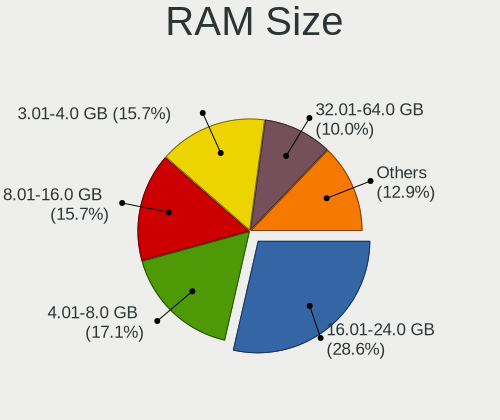
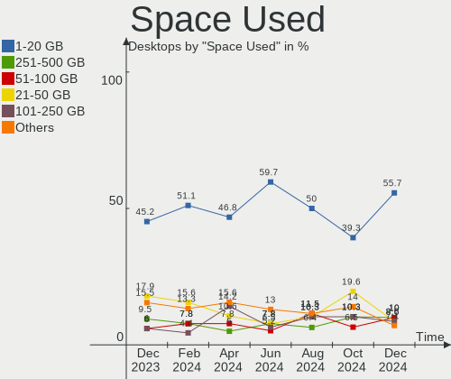
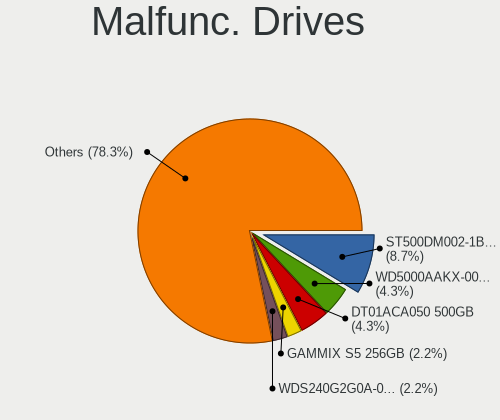
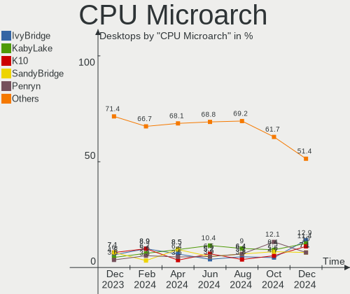
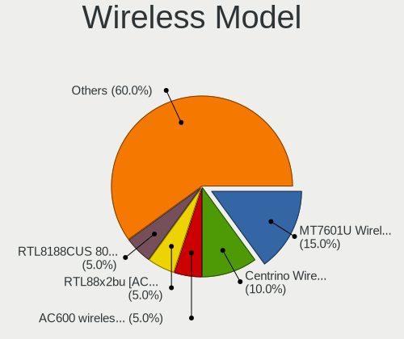
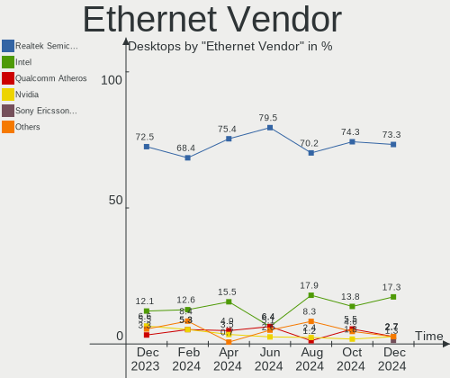
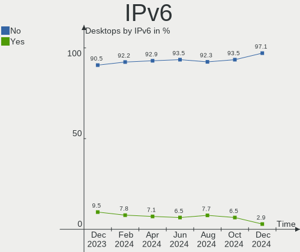

ROSA - Hardware Trends (Desktops)
---------------------------------

A project to identify most popular hardware characteristics and track their change
over time based on data collected by Linux users at https://Linux-Hardware.org.

Anyone can contribute to this report by the [hw-probe](https://github.com/linuxhw/hw-probe) tool:

    sudo -E hw-probe -all -upload

This report is for one last month. Overall report since the beginning of time: [TestDays](https://github.com/linuxhw/TestDays)

Period: Jan, 2024.

Contents
--------

* [ System ](#system)
  - [ OS                       ](#os)
  - [ OS Family                ](#os-family)
  - [ Kernel                   ](#kernel)
  - [ Kernel Family            ](#kernel-family)
  - [ Kernel Major Ver.        ](#kernel-major-ver)
  - [ Arch                     ](#arch)
  - [ DE                       ](#de)
  - [ Display Server           ](#display-server)
  - [ Display Manager          ](#display-manager)
  - [ OS Lang                  ](#os-lang)
  - [ Boot Mode                ](#boot-mode)
  - [ Filesystem               ](#filesystem)
  - [ Part. scheme             ](#part-scheme)
  - [ Dual Boot with Linux/BSD ](#dual-boot-with-linuxbsd)
  - [ Dual Boot (Win)          ](#dual-boot-win)

* [ Board ](#board)
  - [ Vendor                   ](#vendor)
  - [ Model                    ](#model)
  - [ Model Family             ](#model-family)
  - [ MFG Year                 ](#mfg-year)
  - [ Form Factor              ](#form-factor)
  - [ Secure Boot              ](#secure-boot)
  - [ Coreboot                 ](#coreboot)
  - [ RAM Size                 ](#ram-size)
  - [ RAM Used                 ](#ram-used)
  - [ Total Drives             ](#total-drives)
  - [ Has CD-ROM               ](#has-cd-rom)
  - [ Has Ethernet             ](#has-ethernet)
  - [ Has WiFi                 ](#has-wifi)
  - [ Has Bluetooth            ](#has-bluetooth)

* [ Location ](#location)
  - [ Country                  ](#country)
  - [ City                     ](#city)

* [ Drives ](#drives)
  - [ Drive Vendor             ](#drive-vendor)
  - [ Drive Model              ](#drive-model)
  - [ HDD Vendor               ](#hdd-vendor)
  - [ SSD Vendor               ](#ssd-vendor)
  - [ Drive Kind               ](#drive-kind)
  - [ Drive Connector          ](#drive-connector)
  - [ Drive Size               ](#drive-size)
  - [ Space Total              ](#space-total)
  - [ Space Used               ](#space-used)
  - [ Malfunc. Drives          ](#malfunc-drives)
  - [ Malfunc. Drive Vendor    ](#malfunc-drive-vendor)
  - [ Malfunc. HDD Vendor      ](#malfunc-hdd-vendor)
  - [ Malfunc. Drive Kind      ](#malfunc-drive-kind)
  - [ Failed Drives            ](#failed-drives)
  - [ Failed Drive Vendor      ](#failed-drive-vendor)
  - [ Drive Status             ](#drive-status)

* [ Storage controller ](#storage-controller)
  - [ Storage Vendor           ](#storage-vendor)
  - [ Storage Model            ](#storage-model)
  - [ Storage Kind             ](#storage-kind)

* [ Processor ](#processor)
  - [ CPU Vendor               ](#cpu-vendor)
  - [ CPU Model                ](#cpu-model)
  - [ CPU Model Family         ](#cpu-model-family)
  - [ CPU Cores                ](#cpu-cores)
  - [ CPU Sockets              ](#cpu-sockets)
  - [ CPU Threads              ](#cpu-threads)
  - [ CPU Op-Modes             ](#cpu-op-modes)
  - [ CPU Microcode            ](#cpu-microcode)
  - [ CPU Microarch            ](#cpu-microarch)

* [ Graphics ](#graphics)
  - [ GPU Vendor               ](#gpu-vendor)
  - [ GPU Model                ](#gpu-model)
  - [ GPU Combo                ](#gpu-combo)
  - [ GPU Driver               ](#gpu-driver)
  - [ GPU Memory               ](#gpu-memory)

* [ Monitor ](#monitor)
  - [ Monitor Vendor           ](#monitor-vendor)
  - [ Monitor Model            ](#monitor-model)
  - [ Monitor Resolution       ](#monitor-resolution)
  - [ Monitor Diagonal         ](#monitor-diagonal)
  - [ Monitor Width            ](#monitor-width)
  - [ Aspect Ratio             ](#aspect-ratio)
  - [ Monitor Area             ](#monitor-area)
  - [ Pixel Density            ](#pixel-density)
  - [ Multiple Monitors        ](#multiple-monitors)

* [ Network ](#network)
  - [ Net Controller Vendor    ](#net-controller-vendor)
  - [ Net Controller Model     ](#net-controller-model)
  - [ Wireless Vendor          ](#wireless-vendor)
  - [ Wireless Model           ](#wireless-model)
  - [ Ethernet Vendor          ](#ethernet-vendor)
  - [ Ethernet Model           ](#ethernet-model)
  - [ Net Controller Kind      ](#net-controller-kind)
  - [ Used Controller          ](#used-controller)
  - [ NICs                     ](#nics)
  - [ IPv6                     ](#ipv6)

* [ Bluetooth ](#bluetooth)
  - [ Bluetooth Vendor         ](#bluetooth-vendor)
  - [ Bluetooth Model          ](#bluetooth-model)

* [ Sound ](#sound)
  - [ Sound Vendor             ](#sound-vendor)
  - [ Sound Model              ](#sound-model)

* [ Memory ](#memory)
  - [ Memory Vendor            ](#memory-vendor)
  - [ Memory Model             ](#memory-model)
  - [ Memory Kind              ](#memory-kind)
  - [ Memory Form Factor       ](#memory-form-factor)
  - [ Memory Size              ](#memory-size)
  - [ Memory Speed             ](#memory-speed)

* [ Printers & scanners ](#printers--scanners)
  - [ Printer Vendor           ](#printer-vendor)
  - [ Printer Model            ](#printer-model)
  - [ Scanner Vendor           ](#scanner-vendor)
  - [ Scanner Model            ](#scanner-model)

* [ Camera ](#camera)
  - [ Camera Vendor            ](#camera-vendor)
  - [ Camera Model             ](#camera-model)

* [ Security ](#security)
  - [ Fingerprint Vendor       ](#fingerprint-vendor)
  - [ Fingerprint Model        ](#fingerprint-model)
  - [ Chipcard Vendor          ](#chipcard-vendor)
  - [ Chipcard Model           ](#chipcard-model)

* [ Unsupported ](#unsupported)
  - [ Unsupported Devices      ](#unsupported-devices)
  - [ Unsupported Device Types ](#unsupported-device-types)

System
------

OS
--

Installed operating systems

| Name        | Desktops | Percent |
|-------------|----------|---------|
| ROSA 12.4   | 73       | 77.66%  |
| ROSA 12     | 7        | 7.45%   |
| ROSA R11.1  | 4        | 4.26%   |
| ROSA 13.0   | 3        | 3.19%   |
| ROSA 2021.1 | 2        | 2.13%   |
| ROSA 12.3   | 2        | 2.13%   |
| ROSA 12.2   | 2        | 2.13%   |
| ROSA 12.1   | 1        | 1.06%   |

OS Family
---------

OS without a version

| Name | Desktops | Percent |
|------|----------|---------|
| ROSA | 94       | 100%    |

Kernel
------

Version of the Linux kernel

| Version                                 | Desktops | Percent |
|-----------------------------------------|----------|---------|
| 6.1.58-generic-1rosa2021.1-x86_64       | 49       | 52.13%  |
| 6.1.20-generic-2rosa2021.1-x86_64       | 17       | 18.09%  |
| 5.15.75-generic-1rosa2021.1-x86_64      | 3        | 3.19%   |
| 5.10.184-generic-1rosa2021.1-x86_64     | 3        | 3.19%   |
| 6.6.8.xm1-1.k-xanmod-rosa2021.1-x86_64  | 2        | 2.13%   |
| 6.1.58-generic-4rosa2023.1-x86_64       | 2        | 2.13%   |
| 6.1.46-generic-2rosa2021.1-x86_64       | 2        | 2.13%   |
| 5.4.83-generic-2rosa-x86_64             | 2        | 2.13%   |
| 5.15.127-generic-1rosa2021.1-x86_64     | 2        | 2.13%   |
| 5.15.103-generic-1rosa2021.1-i686       | 2        | 2.13%   |
| 5.10.74-generic-2rosa2021.1-x86_64      | 2        | 2.13%   |
| 6.7.0.xm1-2.k-xanmod-rosa2023.1-x86_64  | 1        | 1.06%   |
| 6.7.0.xm1-1.k-xanmod-rosa2021.1-x86_64  | 1        | 1.06%   |
| 6.5.10.xm1-1.k-xanmod-rosa2021.1-x86_64 | 1        | 1.06%   |
| 5.15.103-generic-1rosa2021.1-x86_64     | 1        | 1.06%   |
| 5.10.74-generic-2rosa2021.1-i586        | 1        | 1.06%   |
| 5.10.118-generic-2rosa2021.1-x86_64     | 1        | 1.06%   |
| 4.15.0-desktop-122.124.1rosa-x86_64     | 1        | 1.06%   |
| 4.15.0-desktop-122.124.1rosa-i586       | 1        | 1.06%   |

Kernel Family
-------------

Linux kernel without a distro release

| Version  | Desktops | Percent |
|----------|----------|---------|
| 6.1.58   | 51       | 54.26%  |
| 6.1.20   | 17       | 18.09%  |
| 5.15.75  | 3        | 3.19%   |
| 5.15.103 | 3        | 3.19%   |
| 5.10.74  | 3        | 3.19%   |
| 5.10.184 | 3        | 3.19%   |
| 6.7.0    | 2        | 2.13%   |
| 6.6.8    | 2        | 2.13%   |
| 6.1.46   | 2        | 2.13%   |
| 5.4.83   | 2        | 2.13%   |
| 5.15.127 | 2        | 2.13%   |
| 4.15.0   | 2        | 2.13%   |
| 6.5.10   | 1        | 1.06%   |
| 5.10.118 | 1        | 1.06%   |

Kernel Major Ver.
-----------------

Linux kernel major version

| Version | Desktops | Percent |
|---------|----------|---------|
| 6.1     | 70       | 74.47%  |
| 5.15    | 8        | 8.51%   |
| 5.10    | 7        | 7.45%   |
| 6.7     | 2        | 2.13%   |
| 6.6     | 2        | 2.13%   |
| 5.4     | 2        | 2.13%   |
| 4.15    | 2        | 2.13%   |
| 6.5     | 1        | 1.06%   |

Arch
----

OS architecture (x86_64, i586, etc.)

| Name   | Desktops | Percent |
|--------|----------|---------|
| x86_64 | 90       | 95.74%  |
| i686   | 4        | 4.26%   |

DE
--

Desktop Environment

| Name     | Desktops | Percent |
|----------|----------|---------|
| KDE5     | 56       | 59.57%  |
| GNOME    | 25       | 26.6%   |
| LXQt     | 6        | 6.38%   |
| KDE4     | 4        | 4.26%   |
| MATE     | 1        | 1.06%   |
| i3       | 1        | 1.06%   |
| Cinnamon | 1        | 1.06%   |

Display Server
--------------

X11 or Wayland

| Name    | Desktops | Percent |
|---------|----------|---------|
| Wayland | 65       | 69.15%  |
| X11     | 29       | 30.85%  |

Display Manager
---------------

SDDM, LightDM, etc.

| Name    | Desktops | Percent |
|---------|----------|---------|
| SDDM    | 53       | 56.38%  |
| GDM     | 29       | 30.85%  |
| LightDM | 6        | 6.38%   |
| KDM     | 4        | 4.26%   |
| Unknown | 2        | 2.13%   |

OS Lang
-------

Language

| Lang    | Desktops | Percent |
|---------|----------|---------|
| ru_RU   | 88       | 93.62%  |
| ru_UA   | 2        | 2.13%   |
| pl_PL   | 2        | 2.13%   |
| pt_BR   | 1        | 1.06%   |
| Unknown | 1        | 1.06%   |

Boot Mode
---------

EFI or BIOS

| Mode | Desktops | Percent |
|------|----------|---------|
| EFI  | 50       | 53.19%  |
| BIOS | 44       | 46.81%  |

Filesystem
----------

Type of filesystem

| Type    | Desktops | Percent |
|---------|----------|---------|
| Ext4    | 82       | 87.23%  |
| Btrfs   | 11       | 11.7%   |
| Overlay | 1        | 1.06%   |

Part. scheme
------------

Scheme of partitioning

| Type    | Desktops | Percent |
|---------|----------|---------|
| GPT     | 55       | 58.51%  |
| MBR     | 37       | 39.36%  |
| Unknown | 2        | 2.13%   |

Dual Boot with Linux/BSD
------------------------

Hosting more than one Linux/BSD

| Dual boot | Desktops | Percent |
|-----------|----------|---------|
| No        | 74       | 78.72%  |
| Yes       | 20       | 21.28%  |

Dual Boot (Win)
---------------

Hosting Linux and Windows

| Dual boot | Desktops | Percent |
|-----------|----------|---------|
| No        | 51       | 54.26%  |
| Yes       | 43       | 45.74%  |

Board
-----

Vendor
------

Motherboard manufacturer

| Name                                 | Desktops | Percent |
|--------------------------------------|----------|---------|
| ASUSTek Computer                     | 29       | 30.85%  |
| Gigabyte Technology                  | 16       | 17.02%  |
| Intel                                | 10       | 10.64%  |
| ASRock                               | 9        | 9.57%   |
| MSI                                  | 8        | 8.51%   |
| Huanan                               | 4        | 4.26%   |
| ECS                                  | 3        | 3.19%   |
| Dell                                 | 2        | 2.13%   |
| Unknown                              | 2        | 2.13%   |
| TopStar                              | 1        | 1.06%   |
| Shuttle                              | 1        | 1.06%   |
| Shenzhen Meigao Electronic Equipment | 1        | 1.06%   |
| Pegatron                             | 1        | 1.06%   |
| MAINBRD                              | 1        | 1.06%   |
| MACHINIST                            | 1        | 1.06%   |
| HJS                                  | 1        | 1.06%   |
| Hewlett-Packard                      | 1        | 1.06%   |
| Biostar                              | 1        | 1.06%   |
| AZW                                  | 1        | 1.06%   |
| Acer                                 | 1        | 1.06%   |

Model
-----

Motherboard model

| Name                                            | Desktops | Percent |
|-------------------------------------------------|----------|---------|
| Intel SKYBAY                                    | 4        | 4.26%   |
| Unknown                                         | 3        | 3.19%   |
| Gigabyte B450 GAMING X                          | 2        | 2.13%   |
| ASUS TUF B450M-PLUS GAMING                      | 2        | 2.13%   |
| ASUS P5GC-MX/1333                               | 2        | 2.13%   |
| TopStar V211                                    | 1        | 1.06%   |
| Shuttle XS35V3                                  | 1        | 1.06%   |
| Shenzhen Meigao Electronic Equipment UM773 Lite | 1        | 1.06%   |
| Pegatron Pro 3010 Microtower PC                 | 1        | 1.06%   |
| MSI PRO RPL-P DP10 (MS-B0A6)                    | 1        | 1.06%   |
| MSI MS-7D99                                     | 1        | 1.06%   |
| MSI MS-7C96                                     | 1        | 1.06%   |
| MSI MS-7C95                                     | 1        | 1.06%   |
| MSI MS-7996                                     | 1        | 1.06%   |
| MSI MS-7680                                     | 1        | 1.06%   |
| MSI MS-7576                                     | 1        | 1.06%   |
| MSI Cubi N 8GL (MS-B171)                        | 1        | 1.06%   |
| MAINBRD OPS62A-SHA                              | 1        | 1.06%   |
| MACHINIST E5-MR9S V1.0                          | 1        | 1.06%   |
| Intel X99 V1.0                                  | 1        | 1.06%   |
| Intel X99                                       | 1        | 1.06%   |
| Intel H81                                       | 1        | 1.06%   |
| Intel DH67CL AAG10212-208                       | 1        | 1.06%   |
| Intel D525MW AAE93082-401                       | 1        | 1.06%   |
| Huanan X99-TF GAMING V3.0                       | 1        | 1.06%   |
| Huanan X99-BD4 V1.34                            | 1        | 1.06%   |
| Huanan X99 F8D V2.2                             | 1        | 1.06%   |
| Huanan X79M-PRO V1.2                            | 1        | 1.06%   |
| HJS HJS-OPSH110D4                               | 1        | 1.06%   |
| HP EliteDesk 800 G1 DM                          | 1        | 1.06%   |
| Gigabyte Z170X-Gaming 3                         | 1        | 1.06%   |
| Gigabyte M720-US3                               | 1        | 1.06%   |
| Gigabyte H81M-S1                                | 1        | 1.06%   |
| Gigabyte H61M-DS2                               | 1        | 1.06%   |
| Gigabyte H410M H V3                             | 1        | 1.06%   |
| Gigabyte H310M S2V 2.0                          | 1        | 1.06%   |
| Gigabyte GA-A55M-S2HP                           | 1        | 1.06%   |
| Gigabyte GA-870A-UD3                            | 1        | 1.06%   |
| Gigabyte B560M DS3H                             | 1        | 1.06%   |
| Gigabyte B550 AORUS ELITE AX V2                 | 1        | 1.06%   |

Model Family
------------

Motherboard model prefix

| Name                                       | Desktops | Percent |
|--------------------------------------------|----------|---------|
| ASUS PRIME                                 | 5        | 5.32%   |
| Intel SKYBAY                               | 4        | 4.26%   |
| Unknown                                    | 3        | 3.19%   |
| Intel X99                                  | 2        | 2.13%   |
| Gigabyte B450M                             | 2        | 2.13%   |
| Gigabyte B450                              | 2        | 2.13%   |
| ASUS TUF                                   | 2        | 2.13%   |
| ASUS P7H55-M                               | 2        | 2.13%   |
| ASUS P5GC-MX                               | 2        | 2.13%   |
| TopStar V211                               | 1        | 1.06%   |
| Shuttle XS35V3                             | 1        | 1.06%   |
| Shenzhen Meigao Electronic Equipment UM773 | 1        | 1.06%   |
| Pegatron Pro                               | 1        | 1.06%   |
| MSI PRO                                    | 1        | 1.06%   |
| MSI MS-7D99                                | 1        | 1.06%   |
| MSI MS-7C96                                | 1        | 1.06%   |
| MSI MS-7C95                                | 1        | 1.06%   |
| MSI MS-7996                                | 1        | 1.06%   |
| MSI MS-7680                                | 1        | 1.06%   |
| MSI MS-7576                                | 1        | 1.06%   |
| MSI Cubi                                   | 1        | 1.06%   |
| MAINBRD OPS62A-SHA                         | 1        | 1.06%   |
| MACHINIST E5-MR9S                          | 1        | 1.06%   |
| Intel H81                                  | 1        | 1.06%   |
| Intel DH67CL                               | 1        | 1.06%   |
| Intel D525MW                               | 1        | 1.06%   |
| Huanan X99-TF                              | 1        | 1.06%   |
| Huanan X99-BD4                             | 1        | 1.06%   |
| Huanan X99                                 | 1        | 1.06%   |
| Huanan X79M-PRO                            | 1        | 1.06%   |
| HJS HJS-OPSH110D4                          | 1        | 1.06%   |
| HP EliteDesk                               | 1        | 1.06%   |
| Gigabyte Z170X-Gaming                      | 1        | 1.06%   |
| Gigabyte M720-US3                          | 1        | 1.06%   |
| Gigabyte H81M-S1                           | 1        | 1.06%   |
| Gigabyte H61M-DS2                          | 1        | 1.06%   |
| Gigabyte H410M                             | 1        | 1.06%   |
| Gigabyte H310M                             | 1        | 1.06%   |
| Gigabyte GA-A55M-S2HP                      | 1        | 1.06%   |
| Gigabyte GA-870A-UD3                       | 1        | 1.06%   |

MFG Year
--------

Motherboard manufacture year

| Year | Desktops | Percent |
|------|----------|---------|
| 2018 | 13       | 13.83%  |
| 2022 | 8        | 8.51%   |
| 2021 | 7        | 7.45%   |
| 2020 | 7        | 7.45%   |
| 2012 | 7        | 7.45%   |
| 2010 | 7        | 7.45%   |
| 2015 | 6        | 6.38%   |
| 2023 | 5        | 5.32%   |
| 2019 | 5        | 5.32%   |
| 2011 | 5        | 5.32%   |
| 2016 | 4        | 4.26%   |
| 2013 | 4        | 4.26%   |
| 2009 | 4        | 4.26%   |
| 2007 | 4        | 4.26%   |
| 2014 | 3        | 3.19%   |
| 2008 | 3        | 3.19%   |
| 2005 | 1        | 1.06%   |
| 2003 | 1        | 1.06%   |

Form Factor
-----------

Physical design of the computer

| Name    | Desktops | Percent |
|---------|----------|---------|
| Desktop | 94       | 100%    |

Secure Boot
-----------

Enabled or disabled

| State    | Desktops | Percent |
|----------|----------|---------|
| Disabled | 94       | 100%    |

Coreboot
--------

Have coreboot on board

| Used | Desktops | Percent |
|------|----------|---------|
| No   | 94       | 100%    |

RAM Size
--------

Total RAM memory

| Size in GB      | Desktops | Percent |
|-----------------|----------|---------|
| 8.01-16.0       | 22       | 23.4%   |
| 4.01-8.0        | 19       | 20.21%  |
| 16.01-24.0      | 19       | 20.21%  |
| 3.01-4.0        | 14       | 14.89%  |
| 32.01-64.0      | 10       | 10.64%  |
| 64.01-256.0     | 3        | 3.19%   |
| 1.01-2.0        | 3        | 3.19%   |
| More than 256.0 | 2        | 2.13%   |
| 0.51-1.0        | 2        | 2.13%   |

RAM Used
--------

Used RAM memory

| Used GB   | Desktops | Percent |
|-----------|----------|---------|
| 1.01-2.0  | 44       | 46.81%  |
| 0.51-1.0  | 17       | 18.09%  |
| 2.01-3.0  | 15       | 15.96%  |
| 3.01-4.0  | 9        | 9.57%   |
| 4.01-8.0  | 8        | 8.51%   |
| 8.01-16.0 | 1        | 1.06%   |

Total Drives
------------

Number of drives on board

| Drives | Desktops | Percent |
|--------|----------|---------|
| 1      | 48       | 51.06%  |
| 2      | 19       | 20.21%  |
| 3      | 14       | 14.89%  |
| 4      | 5        | 5.32%   |
| 6      | 3        | 3.19%   |
| 7      | 2        | 2.13%   |
| 5      | 2        | 2.13%   |
| 0      | 1        | 1.06%   |

Has CD-ROM
----------

Has CD-ROM on board

| Presented | Desktops | Percent |
|-----------|----------|---------|
| No        | 61       | 64.89%  |
| Yes       | 33       | 35.11%  |

Has Ethernet
------------

Has Ethernet on board

| Presented | Desktops | Percent |
|-----------|----------|---------|
| Yes       | 94       | 100%    |

Has WiFi
--------

Has WiFi module

| Presented | Desktops | Percent |
|-----------|----------|---------|
| No        | 60       | 63.83%  |
| Yes       | 34       | 36.17%  |

Has Bluetooth
-------------

Has Bluetooth module

| Presented | Desktops | Percent |
|-----------|----------|---------|
| No        | 68       | 72.34%  |
| Yes       | 26       | 27.66%  |

Location
--------

Country
-------

Geographic location (country)

| Country    | Desktops | Percent |
|------------|----------|---------|
| Russia     | 87       | 92.55%  |
| Poland     | 3        | 3.19%   |
| Kazakhstan | 1        | 1.06%   |
| Czechia    | 1        | 1.06%   |
| Brazil     | 1        | 1.06%   |
| Belarus    | 1        | 1.06%   |

City
----

Geographic location (city)

| City              | Desktops | Percent |
|-------------------|----------|---------|
| Moscow            | 14       | 14.89%  |
| Yekaterinburg     | 7        | 7.45%   |
| Krasnodar         | 5        | 5.32%   |
| Chelyabinsk       | 4        | 4.26%   |
| Volgograd         | 3        | 3.19%   |
| St Petersburg     | 3        | 3.19%   |
| Rostov-on-Don     | 3        | 3.19%   |
| Krasnoyarsk       | 3        | 3.19%   |
| Ufa               | 2        | 2.13%   |
| Samara            | 2        | 2.13%   |
| Perm              | 2        | 2.13%   |
| Penza             | 2        | 2.13%   |
| Khabarovsk        | 2        | 2.13%   |
| Kazan’          | 2        | 2.13%   |
| Yakutsk           | 1        | 1.06%   |
| Wroclaw           | 1        | 1.06%   |
| Warsaw            | 1        | 1.06%   |
| Vyksa             | 1        | 1.06%   |
| Voronezh          | 1        | 1.06%   |
| Vladivostok       | 1        | 1.06%   |
| Vidnoye           | 1        | 1.06%   |
| Tyumen            | 1        | 1.06%   |
| Troitsk           | 1        | 1.06%   |
| Tolyatti          | 1        | 1.06%   |
| Tambov            | 1        | 1.06%   |
| Stavropol         | 1        | 1.06%   |
| Stary Oskol       | 1        | 1.06%   |
| Saransk           | 1        | 1.06%   |
| Ryazan            | 1        | 1.06%   |
| Rio de Janeiro    | 1        | 1.06%   |
| Prague            | 1        | 1.06%   |
| Petropavl         | 1        | 1.06%   |
| Omsk              | 1        | 1.06%   |
| Novotroitsk       | 1        | 1.06%   |
| Novosibirsk       | 1        | 1.06%   |
| Novorossiysk      | 1        | 1.06%   |
| Novocheboksarsk   | 1        | 1.06%   |
| Novoaleksandrovsk | 1        | 1.06%   |
| Noril'sk          | 1        | 1.06%   |
| Nizhniy Novgorod  | 1        | 1.06%   |

Drives
------

Drive Vendor
------------

Hard drive vendors

| Vendor                      | Desktops | Drives | Percent |
|-----------------------------|----------|--------|---------|
| WDC                         | 41       | 53     | 24.26%  |
| Samsung Electronics         | 17       | 19     | 10.06%  |
| Seagate                     | 15       | 17     | 8.88%   |
| Kingston                    | 12       | 13     | 7.1%    |
| Hitachi                     | 9        | 10     | 5.33%   |
| Toshiba                     | 7        | 8      | 4.14%   |
| Apacer                      | 6        | 6      | 3.55%   |
| A-DATA Technology           | 5        | 6      | 2.96%   |
| XrayDisk                    | 4        | 4      | 2.37%   |
| SanDisk                     | 4        | 4      | 2.37%   |
| JMicron Technology          | 3        | 3      | 1.78%   |
| Crucial                     | 3        | 6      | 1.78%   |
| China                       | 3        | 3      | 1.78%   |
| Unknown                     | 2        | 2      | 1.18%   |
| SK hynix                    | 2        | 2      | 1.18%   |
| Patriot                     | 2        | 2      | 1.18%   |
| Netac                       | 2        | 2      | 1.18%   |
| MAXIO Technology (Hangzhou) | 2        | 2      | 1.18%   |
| Lenovo                      | 2        | 2      | 1.18%   |
| KingSpec                    | 2        | 2      | 1.18%   |
| HGST                        | 2        | 2      | 1.18%   |
| Hewlett-Packard             | 2        | 2      | 1.18%   |
| AMD                         | 2        | 2      | 1.18%   |
| XPG                         | 1        | 1      | 0.59%   |
| Transcend                   | 1        | 1      | 0.59%   |
| T-FORCE                     | 1        | 1      | 0.59%   |
| SPCC                        | 1        | 1      | 0.59%   |
| Silicon Motion              | 1        | 1      | 0.59%   |
| SCCTS-602-128G              | 1        | 1      | 0.59%   |
| PNY                         | 1        | 1      | 0.59%   |
| Plextor                     | 1        | 1      | 0.59%   |
| Phison                      | 1        | 1      | 0.59%   |
| NT-2TB                      | 1        | 1      | 0.59%   |
| LITEON                      | 1        | 1      | 0.59%   |
| Kingmax                     | 1        | 1      | 0.59%   |
| Kingchuxing                 | 1        | 1      | 0.59%   |
| GOODRAM                     | 1        | 2      | 0.59%   |
| Fujitsu                     | 1        | 1      | 0.59%   |
| FC-1307                     | 1        | 1      | 0.59%   |
| DEXP                        | 1        | 1      | 0.59%   |

Drive Model
-----------

Hard drive models

| Model                            | Desktops | Percent |
|----------------------------------|----------|---------|
| Samsung MZVLW128HEGR-00000 128GB | 4        | 2.11%   |
| WDC WD10EZEX-21WN4A0 1TB         | 3        | 1.58%   |
| WDC WD10EZEX-00BBHA0 1TB         | 3        | 1.58%   |
| Samsung SSD 860 EVO 250GB        | 3        | 1.58%   |
| JMicron Generic 8GB              | 3        | 1.58%   |
| XrayDisk 1TB SSD                 | 2        | 1.05%   |
| WDC WDS500G2B0A-00SM50 500GB SSD | 2        | 1.05%   |
| WDC WDS250G2B0A-00SM50 250GB SSD | 2        | 1.05%   |
| WDC WD5000AAKX-001CA0 500GB      | 2        | 1.05%   |
| WDC WD20EFRX-68EUZN0 2TB         | 2        | 1.05%   |
| Unknown SD/MMC/MS PRO 256GB      | 2        | 1.05%   |
| Toshiba DT01ACA050 500GB         | 2        | 1.05%   |
| Seagate ST1000DM010-2EP102 1TB   | 2        | 1.05%   |
| Seagate ST1000DM003-1CH162 1TB   | 2        | 1.05%   |
| Samsung SSD 980 500GB            | 2        | 1.05%   |
| Samsung SSD 750 EVO 250GB        | 2        | 1.05%   |
| Lenovo E660 SSD-2.5-512G         | 2        | 1.05%   |
| Kingston SNVS500G 500GB          | 2        | 1.05%   |
| Kingston SKC3000S1024G 1024GB    | 2        | 1.05%   |
| Kingston SA400S37480G 480GB SSD  | 2        | 1.05%   |
| Kingston SA400S37240G 240GB SSD  | 2        | 1.05%   |
| Kingston SA400M8240G 240GB SSD   | 2        | 1.05%   |
| Apacer AS350 512GB SSD           | 2        | 1.05%   |
| Apacer AS350 128GB SSD           | 2        | 1.05%   |
| XrayDisk 512GB SSD               | 1        | 0.53%   |
| XrayDisk 128GB SSD               | 1        | 0.53%   |
| XPG GAMMIX S70 2TB               | 1        | 0.53%   |
| WDC WDS500G1XHE-00AFY0 500GB     | 1        | 0.53%   |
| WDC WDS250G2B0B-00YS70 250GB SSD | 1        | 0.53%   |
| WDC WDS240G1G0B-00RC30 240GB SSD | 1        | 0.53%   |
| WDC WDS120G2G0B-00EPW0 120GB SSD | 1        | 0.53%   |
| WDC WDS120G2G0A-00JH30 120GB SSD | 1        | 0.53%   |
| WDC WDS120G1G0A-00SS50 120GB SSD | 1        | 0.53%   |
| WDC WD5000BUCT-63LS5Y1 500GB     | 1        | 0.53%   |
| WDC WD5000BPVT-00HXZT1 500GB     | 1        | 0.53%   |
| WDC WD5000AAKX-75U6AA0 500GB     | 1        | 0.53%   |
| WDC WD5000AAKX-60U6AA0 500GB     | 1        | 0.53%   |
| WDC WD5000AAKS-75A7B2 500GB      | 1        | 0.53%   |
| WDC WD5000AADS-00S9B0 500GB      | 1        | 0.53%   |
| WDC WD5000AACS-00ZUB0 500GB      | 1        | 0.53%   |

HDD Vendor
----------

Hard disk drive vendors

| Vendor              | Desktops | Drives | Percent |
|---------------------|----------|--------|---------|
| WDC                 | 34       | 43     | 45.33%  |
| Seagate             | 14       | 16     | 18.67%  |
| Hitachi             | 9        | 10     | 12%     |
| Toshiba             | 7        | 8      | 9.33%   |
| JMicron Technology  | 3        | 3      | 4%      |
| Unknown             | 2        | 2      | 2.67%   |
| Samsung Electronics | 2        | 2      | 2.67%   |
| HGST                | 2        | 2      | 2.67%   |
| Fujitsu             | 1        | 1      | 1.33%   |
| FC-1307             | 1        | 1      | 1.33%   |

SSD Vendor
----------

Solid state drive vendors

| Vendor              | Desktops | Drives | Percent |
|---------------------|----------|--------|---------|
| WDC                 | 9        | 9      | 13.24%  |
| Kingston            | 8        | 8      | 11.76%  |
| Samsung Electronics | 7        | 7      | 10.29%  |
| Apacer              | 5        | 5      | 7.35%   |
| A-DATA Technology   | 5        | 5      | 7.35%   |
| XrayDisk            | 3        | 3      | 4.41%   |
| SanDisk             | 3        | 3      | 4.41%   |
| China               | 3        | 3      | 4.41%   |
| Lenovo              | 2        | 2      | 2.94%   |
| KingSpec            | 2        | 2      | 2.94%   |
| Hewlett-Packard     | 2        | 2      | 2.94%   |
| Crucial             | 2        | 5      | 2.94%   |
| AMD                 | 2        | 2      | 2.94%   |
| T-FORCE             | 1        | 1      | 1.47%   |
| SK hynix            | 1        | 1      | 1.47%   |
| SCCTS-602-128G      | 1        | 1      | 1.47%   |
| PNY                 | 1        | 1      | 1.47%   |
| Plextor             | 1        | 1      | 1.47%   |
| Patriot             | 1        | 1      | 1.47%   |
| NT-2TB              | 1        | 1      | 1.47%   |
| Netac               | 1        | 1      | 1.47%   |
| LITEON              | 1        | 1      | 1.47%   |
| Kingmax             | 1        | 1      | 1.47%   |
| GOODRAM             | 1        | 2      | 1.47%   |
| DEXP                | 1        | 1      | 1.47%   |
| CHUZUN              | 1        | 1      | 1.47%   |
| AFOX                | 1        | 1      | 1.47%   |
| Unknown             | 1        | 1      | 1.47%   |

Drive Kind
----------

HDD or SSD

| Kind | Desktops | Drives | Percent |
|------|----------|--------|---------|
| HDD  | 61       | 88     | 42.07%  |
| SSD  | 57       | 72     | 39.31%  |
| NVMe | 27       | 33     | 18.62%  |

Drive Connector
---------------

SATA, SAS, NVMe, etc.

| Type | Desktops | Drives | Percent |
|------|----------|--------|---------|
| SATA | 85       | 155    | 72.65%  |
| NVMe | 27       | 33     | 23.08%  |
| SAS  | 5        | 5      | 4.27%   |

Drive Size
----------

Size of hard drive

| Size in TB | Desktops | Drives | Percent |
|------------|----------|--------|---------|
| 0.01-0.5   | 74       | 99     | 62.18%  |
| 0.51-1.0   | 32       | 48     | 26.89%  |
| 1.01-2.0   | 6        | 6      | 5.04%   |
| 3.01-4.0   | 3        | 3      | 2.52%   |
| 2.01-3.0   | 3        | 3      | 2.52%   |
| 4.01-10.0  | 1        | 1      | 0.84%   |

Space Total
-----------

Amount of disk space available on the file system

| Size in GB     | Desktops | Percent |
|----------------|----------|---------|
| 101-250        | 31       | 32.98%  |
| 251-500        | 23       | 24.47%  |
| 1-20           | 10       | 10.64%  |
| 1001-2000      | 9        | 9.57%   |
| 501-1000       | 9        | 9.57%   |
| More than 3000 | 4        | 4.26%   |
| 51-100         | 4        | 4.26%   |
| 21-50          | 2        | 2.13%   |
| 2001-3000      | 2        | 2.13%   |

Space Used
----------

Amount of used disk space

| Used GB        | Desktops | Percent |
|----------------|----------|---------|
| 1-20           | 53       | 56.38%  |
| 51-100         | 10       | 10.64%  |
| 21-50          | 8        | 8.51%   |
| 101-250        | 8        | 8.51%   |
| 251-500        | 6        | 6.38%   |
| 501-1000       | 6        | 6.38%   |
| 1001-2000      | 2        | 2.13%   |
| More than 3000 | 1        | 1.06%   |

Malfunc. Drives
---------------

Drive models with a malfunction

| Model                             | Desktops | Drives | Percent |
|-----------------------------------|----------|--------|---------|
| WDC WDS240G1G0B-00RC30 240GB SSD  | 1        | 1      | 3.13%   |
| WDC WD5000BPVT-00HXZT1 500GB      | 1        | 1      | 3.13%   |
| WDC WD5000AAKX-60U6AA0 500GB      | 1        | 1      | 3.13%   |
| WDC WD5000AAKX-001CA0 500GB       | 1        | 1      | 3.13%   |
| WDC WD5000AAKS-75A7B2 500GB       | 1        | 1      | 3.13%   |
| WDC WD5000AADS-00S9B0 500GB       | 1        | 1      | 3.13%   |
| WDC WD3200AAKS-75L9A0 320GB       | 1        | 1      | 3.13%   |
| WDC WD1600AAJS-60PSA0 160GB       | 1        | 1      | 3.13%   |
| WDC WD10PURX-64E5EY0 1TB          | 1        | 1      | 3.13%   |
| WDC WD10EZEX-21WN4A0 1TB          | 1        | 1      | 3.13%   |
| WDC WD10EFRX-68FYTN0 1TB          | 1        | 1      | 3.13%   |
| WDC WD10EARS-00MVWB0 1TB          | 1        | 1      | 3.13%   |
| WDC WD10EALX-009BA0 1TB           | 1        | 1      | 3.13%   |
| WDC WD1003FBYX-01Y7B0 1TB         | 1        | 1      | 3.13%   |
| Toshiba MG04ACA100N 1TB           | 1        | 1      | 3.13%   |
| Seagate ST500DM002-1BD142 500GB   | 1        | 1      | 3.13%   |
| Seagate ST320LT020-9YG142 320GB   | 1        | 1      | 3.13%   |
| Seagate ST3200822AS 200GB         | 1        | 1      | 3.13%   |
| Seagate ST3160318AS 160GB         | 1        | 1      | 3.13%   |
| Seagate ST1000LM035-1RK172 1TB    | 1        | 1      | 3.13%   |
| Seagate ST1000DM010-2EP102 1TB    | 1        | 1      | 3.13%   |
| Patriot M.2 P300 1024GB           | 1        | 1      | 3.13%   |
| Hitachi HUA723030ALA641 3TB       | 1        | 1      | 3.13%   |
| Hitachi HTS547550A9E384 500GB     | 1        | 1      | 3.13%   |
| Hitachi HTS542516K9SA00 160GB     | 1        | 1      | 3.13%   |
| Hitachi HDS721616PLA380 160GB     | 1        | 1      | 3.13%   |
| Hitachi HDS721050CLA362 500GB     | 1        | 1      | 3.13%   |
| Hitachi HDS721010DLE630 1TB       | 1        | 1      | 3.13%   |
| Fujitsu MHV2100BH 100GB           | 1        | 1      | 3.13%   |
| China 1TB SSD                     | 1        | 1      | 3.13%   |
| A-DATA Technology SU750 512GB SSD | 1        | 1      | 3.13%   |
| A-DATA Technology SP580 120GB SSD | 1        | 1      | 3.13%   |

Malfunc. Drive Vendor
---------------------

Vendors of faulty drives

| Vendor            | Desktops | Drives | Percent |
|-------------------|----------|--------|---------|
| WDC               | 12       | 14     | 40%     |
| Seagate           | 6        | 6      | 20%     |
| Hitachi           | 6        | 6      | 20%     |
| A-DATA Technology | 2        | 2      | 6.67%   |
| Toshiba           | 1        | 1      | 3.33%   |
| Patriot           | 1        | 1      | 3.33%   |
| Fujitsu           | 1        | 1      | 3.33%   |
| China             | 1        | 1      | 3.33%   |

Malfunc. HDD Vendor
-------------------

Vendors of faulty HDD drives

| Vendor  | Desktops | Drives | Percent |
|---------|----------|--------|---------|
| WDC     | 11       | 13     | 44%     |
| Seagate | 6        | 6      | 24%     |
| Hitachi | 6        | 6      | 24%     |
| Toshiba | 1        | 1      | 4%      |
| Fujitsu | 1        | 1      | 4%      |

Malfunc. Drive Kind
-------------------

Kinds of faulty drives

| Kind | Desktops | Drives | Percent |
|------|----------|--------|---------|
| HDD  | 23       | 27     | 82.14%  |
| SSD  | 4        | 4      | 14.29%  |
| NVMe | 1        | 1      | 3.57%   |

Failed Drives
-------------

Failed drive models

| Model                     | Desktops | Drives | Percent |
|---------------------------|----------|--------|---------|
| Seagate ST3250310AS 250GB | 1        | 1      | 100%    |

Failed Drive Vendor
-------------------

Failed drive vendors

| Vendor  | Desktops | Drives | Percent |
|---------|----------|--------|---------|
| Seagate | 1        | 1      | 100%    |

Drive Status
------------

Number of failed and malfunc. drives

| Status   | Desktops | Drives | Percent |
|----------|----------|--------|---------|
| Works    | 82       | 147    | 69.49%  |
| Malfunc  | 27       | 32     | 22.88%  |
| Detected | 8        | 13     | 6.78%   |
| Failed   | 1        | 1      | 0.85%   |

Storage controller
------------------

Storage Vendor
--------------

Storage controller vendors

| Vendor                      | Desktops | Percent |
|-----------------------------|----------|---------|
| Intel                       | 64       | 47.41%  |
| AMD                         | 25       | 18.52%  |
| Samsung Electronics         | 10       | 7.41%   |
| Silicon Motion              | 5        | 3.7%    |
| MAXIO Technology (Hangzhou) | 5        | 3.7%    |
| Nvidia                      | 4        | 2.96%   |
| Kingston Technology Company | 4        | 2.96%   |
| ASMedia Technology          | 4        | 2.96%   |
| VIA Technologies            | 3        | 2.22%   |
| JMicron Technology          | 3        | 2.22%   |
| ADATA Technology            | 2        | 1.48%   |
| SK hynix                    | 1        | 0.74%   |
| SanDisk                     | 1        | 0.74%   |
| Phison Electronics          | 1        | 0.74%   |
| Netac Technology            | 1        | 0.74%   |
| Micron/Crucial Technology   | 1        | 0.74%   |
| Marvell Technology Group    | 1        | 0.74%   |

Storage Model
-------------

Storage controller models

| Model                                                                                   | Desktops | Percent |
|-----------------------------------------------------------------------------------------|----------|---------|
| AMD FCH SATA Controller [AHCI mode]                                                     | 13       | 7.69%   |
| Intel Q170/Q150/B150/H170/H110/Z170/CM236 Chipset SATA Controller [AHCI Mode]           | 10       | 5.92%   |
| Intel 8 Series/C220 Series Chipset Family 6-port SATA Controller 1 [AHCI mode]          | 8        | 4.73%   |
| AMD 400 Series Chipset SATA Controller                                                  | 7        | 4.14%   |
| AMD SB7x0/SB8x0/SB9x0 IDE Controller                                                    | 5        | 2.96%   |
| Silicon Motion SM2263EN/SM2263XT (DRAM-less) NVMe SSD Controllers                       | 4        | 2.37%   |
| Samsung NVMe SSD Controller SM961/PM961/SM963                                           | 4        | 2.37%   |
| MAXIO (Hangzhou) NVMe SSD Controller MAP1202 (DRAM-less)                                | 4        | 2.37%   |
| Intel NM10/ICH7 Family SATA Controller [IDE mode]                                       | 4        | 2.37%   |
| Intel 82801G (ICH7 Family) IDE Controller                                               | 4        | 2.37%   |
| Intel 6 Series/C200 Series Chipset Family Desktop SATA Controller (IDE mode, ports 4-5) | 4        | 2.37%   |
| Intel 6 Series/C200 Series Chipset Family Desktop SATA Controller (IDE mode, ports 0-3) | 4        | 2.37%   |
| Intel 5 Series/3400 Series Chipset 6 port SATA AHCI Controller                          | 4        | 2.37%   |
| AMD 500 Series Chipset SATA Controller                                                  | 4        | 2.37%   |
| Samsung NVMe SSD Controller SM981/PM981/PM983                                           | 3        | 1.78%   |
| Kingston Company KC3000/FURY Renegade NVMe SSD E18                                      | 3        | 1.78%   |
| Intel C610/X99 series chipset 6-Port SATA Controller [AHCI mode]                        | 3        | 1.78%   |
| Intel 7 Series/C210 Series Chipset Family 6-port SATA Controller [AHCI mode]            | 3        | 1.78%   |
| Intel 500 Series Chipset Family SATA AHCI Controller                                    | 3        | 1.78%   |
| Intel 5 Series/3400 Series Chipset 4 port SATA IDE Controller                           | 3        | 1.78%   |
| Intel 5 Series/3400 Series Chipset 2 port SATA IDE Controller                           | 3        | 1.78%   |
| Intel 200 Series PCH SATA controller [AHCI mode]                                        | 3        | 1.78%   |
| ASMedia ASM1061/ASM1062 Serial ATA Controller                                           | 3        | 1.78%   |
| AMD SB7x0/SB8x0/SB9x0 SATA Controller [IDE mode]                                        | 3        | 1.78%   |
| VIA VT6415 PATA IDE Host Controller                                                     | 2        | 1.18%   |
| Samsung NVMe SSD Controller 980 (DRAM-less)                                             | 2        | 1.18%   |
| JMicron JMB363 SATA/IDE Controller                                                      | 2        | 1.18%   |
| Intel Raptor Lake SATA AHCI Controller                                                  | 2        | 1.18%   |
| Intel NM10/ICH7 Family SATA Controller [AHCI mode]                                      | 2        | 1.18%   |
| Intel Celeron/Pentium Silver Processor SATA Controller                                  | 2        | 1.18%   |
| Intel Alder Lake-S PCH SATA Controller [AHCI Mode]                                      | 2        | 1.18%   |
| Intel 82801JI (ICH10 Family) SATA AHCI Controller                                       | 2        | 1.18%   |
| Intel 6 Series/C200 Series Chipset Family 6 port Desktop SATA AHCI Controller           | 2        | 1.18%   |
| AMD SB7x0/SB8x0/SB9x0 SATA Controller [AHCI mode]                                       | 2        | 1.18%   |
| AMD 300 Series Chipset SATA Controller                                                  | 2        | 1.18%   |
| VIA VT6421 IDE/SATA Controller                                                          | 1        | 0.59%   |
| SK hynix BC511 NVMe SSD                                                                 | 1        | 0.59%   |
| Silicon Motion SM2262/SM2262EN SSD Controller                                           | 1        | 0.59%   |
| SanDisk WD PC SN810 / Black SN850 NVMe SSD                                              | 1        | 0.59%   |
| SanDisk WD Black SN770 / PC SN740 256GB / PC SN560 (DRAM-less) NVMe SSD                 | 1        | 0.59%   |

Storage Kind
------------

Kind of storage controller (IDE, SATA, NVMe, SAS, ...)

| Kind | Desktops | Percent |
|------|----------|---------|
| SATA | 77       | 58.33%  |
| NVMe | 27       | 20.45%  |
| IDE  | 26       | 19.7%   |
| RAID | 2        | 1.52%   |

Processor
---------

CPU Vendor
----------

Processor vendors

| Vendor | Desktops | Percent |
|--------|----------|---------|
| Intel  | 64       | 68.09%  |
| AMD    | 30       | 31.91%  |

CPU Model
---------

Processor models

| Model                                       | Desktops | Percent |
|---------------------------------------------|----------|---------|
| Intel Core i3-6100TE CPU @ 2.70GHz          | 4        | 4.26%   |
| Intel Core i5-7400 CPU @ 3.00GHz            | 2        | 2.13%   |
| Intel Core i5-4590T CPU @ 2.00GHz           | 2        | 2.13%   |
| Intel Core i3 CPU 550 @ 3.20GHz             | 2        | 2.13%   |
| Intel Core 2 Duo CPU E7500 @ 2.93GHz        | 2        | 2.13%   |
| AMD FX-4350 Quad-Core Processor             | 2        | 2.13%   |
| Intel Xeon CPU X3330 @ 2.66GHz              | 1        | 1.06%   |
| Intel Xeon CPU E5-2696 v3 @ 2.30GHz         | 1        | 1.06%   |
| Intel Xeon CPU E5-2680 v4 @ 2.40GHz         | 1        | 1.06%   |
| Intel Xeon CPU E5-2678 v3 @ 2.50GHz         | 1        | 1.06%   |
| Intel Xeon CPU E5-2670 v3 @ 2.30GHz         | 1        | 1.06%   |
| Intel Xeon CPU E5-2666 v3 @ 2.90GHz         | 1        | 1.06%   |
| Intel Xeon CPU E5-2650 v2 @ 2.60GHz         | 1        | 1.06%   |
| Intel Xeon CPU E5-2620 v3 @ 2.40GHz         | 1        | 1.06%   |
| Intel Xeon CPU E3-1230 V2 @ 3.30GHz         | 1        | 1.06%   |
| Intel Pentium Gold G5420 CPU @ 3.80GHz      | 1        | 1.06%   |
| Intel Pentium Dual-Core CPU E5400 @ 2.70GHz | 1        | 1.06%   |
| Intel Pentium CPU G3240 @ 3.10GHz           | 1        | 1.06%   |
| Intel Pentium 4 CPU 2.40GHz                 | 1        | 1.06%   |
| Intel N95                                   | 1        | 1.06%   |
| Intel Core i9-10900KF CPU @ 3.70GHz         | 1        | 1.06%   |
| Intel Core i7-3770 CPU @ 3.40GHz            | 1        | 1.06%   |
| Intel Core i7 CPU 870 @ 2.93GHz             | 1        | 1.06%   |
| Intel Core i5-9500T CPU @ 2.20GHz           | 1        | 1.06%   |
| Intel Core i5-8265UC CPU @ 1.60GHz          | 1        | 1.06%   |
| Intel Core i5-7500 CPU @ 3.40GHz            | 1        | 1.06%   |
| Intel Core i5-7400T CPU @ 2.40GHz           | 1        | 1.06%   |
| Intel Core i5-4670K CPU @ 3.40GHz           | 1        | 1.06%   |
| Intel Core i5-2500K CPU @ 3.30GHz           | 1        | 1.06%   |
| Intel Core i5-2300 CPU @ 2.80GHz            | 1        | 1.06%   |
| Intel Core i5 CPU 750 @ 2.67GHz             | 1        | 1.06%   |
| Intel Core i5 CPU 650 @ 3.20GHz             | 1        | 1.06%   |
| Intel Core i3-8100 CPU @ 3.60GHz            | 1        | 1.06%   |
| Intel Core i3-7100 CPU @ 3.90GHz            | 1        | 1.06%   |
| Intel Core i3-6100 CPU @ 3.70GHz            | 1        | 1.06%   |
| Intel Core i3-4330 CPU @ 3.50GHz            | 1        | 1.06%   |
| Intel Core i3-4170 CPU @ 3.70GHz            | 1        | 1.06%   |
| Intel Core i3-3240 CPU @ 3.40GHz            | 1        | 1.06%   |
| Intel Core i3-2125 CPU @ 3.30GHz            | 1        | 1.06%   |
| Intel Core i3-2120 CPU @ 3.30GHz            | 1        | 1.06%   |

CPU Model Family
----------------

Processor model prefix

| Model                   | Desktops | Percent |
|-------------------------|----------|---------|
| Intel Core i3           | 19       | 20.21%  |
| Intel Core i5           | 13       | 13.83%  |
| Intel Xeon              | 9        | 9.57%   |
| Other                   | 7        | 7.45%   |
| AMD Ryzen 5             | 5        | 5.32%   |
| Intel Core 2 Duo        | 4        | 4.26%   |
| AMD Ryzen 7             | 4        | 4.26%   |
| AMD A8                  | 4        | 4.26%   |
| Intel Core i7           | 2        | 2.13%   |
| Intel Celeron           | 2        | 2.13%   |
| Intel Atom              | 2        | 2.13%   |
| AMD Ryzen 3             | 2        | 2.13%   |
| AMD Phenom II X4        | 2        | 2.13%   |
| AMD FX                  | 2        | 2.13%   |
| AMD Athlon              | 2        | 2.13%   |
| Intel Pentium Gold      | 1        | 1.06%   |
| Intel Pentium Dual-Core | 1        | 1.06%   |
| Intel Pentium 4         | 1        | 1.06%   |
| Intel Pentium           | 1        | 1.06%   |
| Intel Core i9           | 1        | 1.06%   |
| Intel Celeron D         | 1        | 1.06%   |
| AMD Ryzen 7 PRO         | 1        | 1.06%   |
| AMD Ryzen 5 PRO         | 1        | 1.06%   |
| AMD PRO A10             | 1        | 1.06%   |
| AMD Phenom II X6        | 1        | 1.06%   |
| AMD Phenom              | 1        | 1.06%   |
| AMD Athlon II X2        | 1        | 1.06%   |
| AMD Athlon 64 X2        | 1        | 1.06%   |
| AMD A6                  | 1        | 1.06%   |
| AMD A10                 | 1        | 1.06%   |

CPU Cores
---------

Number of processor cores

| Number | Desktops | Percent |
|--------|----------|---------|
| 2      | 39       | 41.49%  |
| 4      | 26       | 27.66%  |
| 6      | 10       | 10.64%  |
| 8      | 6        | 6.38%   |
| 1      | 3        | 3.19%   |
| 14     | 2        | 2.13%   |
| 12     | 2        | 2.13%   |
| 10     | 2        | 2.13%   |
| 28     | 1        | 1.06%   |
| 24     | 1        | 1.06%   |
| 18     | 1        | 1.06%   |
| 3      | 1        | 1.06%   |

CPU Sockets
-----------

Number of sockets

| Number | Desktops | Percent |
|--------|----------|---------|
| 1      | 92       | 97.87%  |
| 2      | 2        | 2.13%   |

CPU Threads
-----------

Threads per core (Hyper-Threading)

| Number | Desktops | Percent |
|--------|----------|---------|
| 2      | 58       | 61.7%   |
| 1      | 36       | 38.3%   |

CPU Op-Modes
------------

CPU Operation Modes (32-bit, 64-bit)

| Op mode        | Desktops | Percent |
|----------------|----------|---------|
| 32-bit, 64-bit | 93       | 98.94%  |
| 32-bit         | 1        | 1.06%   |

CPU Microcode
-------------

Microcode number

| Number     | Desktops | Percent |
|------------|----------|---------|
| 0x306c3    | 6        | 6.38%   |
| Unknown    | 6        | 6.38%   |
| 0x506e3    | 5        | 5.32%   |
| 0x306f2    | 5        | 5.32%   |
| 0x906e9    | 4        | 4.26%   |
| 0x206a7    | 4        | 4.26%   |
| 0x1067a    | 4        | 4.26%   |
| 0x306a9    | 3        | 3.19%   |
| 0x20655    | 3        | 3.19%   |
| 0x0600611a | 3        | 3.19%   |
| 0xb0671    | 2        | 2.13%   |
| 0xa0653    | 2        | 2.13%   |
| 0x906ea    | 2        | 2.13%   |
| 0x20652    | 2        | 2.13%   |
| 0x106e5    | 2        | 2.13%   |
| 0x0a201205 | 2        | 2.13%   |
| 0x0800820d | 2        | 2.13%   |
| 0x06001119 | 2        | 2.13%   |
| 0x010000db | 2        | 2.13%   |
| 0x010000c8 | 2        | 2.13%   |
| 0x00000000 | 2        | 2.13%   |
| 0xf64      | 1        | 1.06%   |
| 0xf27      | 1        | 1.06%   |
| 0xb06e0    | 1        | 1.06%   |
| 0xb06a2    | 1        | 1.06%   |
| 0x906eb    | 1        | 1.06%   |
| 0x90675    | 1        | 1.06%   |
| 0x806ec    | 1        | 1.06%   |
| 0x806c1    | 1        | 1.06%   |
| 0x706a8    | 1        | 1.06%   |
| 0x706a1    | 1        | 1.06%   |
| 0x6fd      | 1        | 1.06%   |
| 0x6fb      | 1        | 1.06%   |
| 0x406f1    | 1        | 1.06%   |
| 0x306e4    | 1        | 1.06%   |
| 0x30661    | 1        | 1.06%   |
| 0x106ca    | 1        | 1.06%   |
| 0x0a50000d | 1        | 1.06%   |
| 0x0a404102 | 1        | 1.06%   |
| 0x08701021 | 1        | 1.06%   |

CPU Microarch
-------------

Microarchitecture

| Name             | Desktops | Percent |
|------------------|----------|---------|
| Haswell          | 11       | 11.7%   |
| KabyLake         | 9        | 9.57%   |
| K10              | 6        | 6.38%   |
| Westmere         | 5        | 5.32%   |
| Skylake          | 5        | 5.32%   |
| SandyBridge      | 5        | 5.32%   |
| Zen 3            | 4        | 4.26%   |
| Piledriver       | 4        | 4.26%   |
| Penryn           | 4        | 4.26%   |
| IvyBridge        | 4        | 4.26%   |
| Alderlake Hybrid | 4        | 4.26%   |
| Zen 2            | 3        | 3.19%   |
| Zen              | 3        | 3.19%   |
| Excavator        | 3        | 3.19%   |
| CometLake        | 3        | 3.19%   |
| Unknown          | 3        | 3.19%   |
| Zen+             | 2        | 2.13%   |
| NetBurst         | 2        | 2.13%   |
| Nehalem          | 2        | 2.13%   |
| Goldmont plus    | 2        | 2.13%   |
| Core             | 2        | 2.13%   |
| Bonnell          | 2        | 2.13%   |
| TigerLake        | 1        | 1.06%   |
| Steamroller      | 1        | 1.06%   |
| K8 Hammer        | 1        | 1.06%   |
| K10 Llano        | 1        | 1.06%   |
| Gracemont        | 1        | 1.06%   |
| Broadwell        | 1        | 1.06%   |

Graphics
--------

GPU Vendor
----------

Vendors of graphics cards

| Vendor | Desktops | Percent |
|--------|----------|---------|
| AMD    | 35       | 36.08%  |
| Nvidia | 32       | 32.99%  |
| Intel  | 30       | 30.93%  |

GPU Model
---------

Graphics card models

| Model                                                                       | Desktops | Percent |
|-----------------------------------------------------------------------------|----------|---------|
| Nvidia GK208B [GeForce GT 710]                                              | 4        | 4.04%   |
| Intel HD Graphics 630                                                       | 4        | 4.04%   |
| Intel HD Graphics 530                                                       | 4        | 4.04%   |
| Nvidia TU117 [GeForce GTX 1650]                                             | 3        | 3.03%   |
| Intel Xeon E3-1200 v3/4th Gen Core Processor Integrated Graphics Controller | 3        | 3.03%   |
| AMD Navi 22 [Radeon RX 6700/6700 XT/6750 XT / 6800M/6850M XT]               | 3        | 3.03%   |
| AMD Navi 21 [Radeon RX 6800/6800 XT / 6900 XT]                              | 3        | 3.03%   |
| Nvidia GT200b [GeForce GTX 275]                                             | 2        | 2.02%   |
| Nvidia GP107 [GeForce GTX 1050 Ti]                                          | 2        | 2.02%   |
| Nvidia GP104 [GeForce GTX 1070]                                             | 2        | 2.02%   |
| Nvidia GM107 [GeForce GTX 750 Ti]                                           | 2        | 2.02%   |
| Nvidia GF116 [GeForce GTS 450 Rev. 2]                                       | 2        | 2.02%   |
| Intel GeminiLake [UHD Graphics 600]                                         | 2        | 2.02%   |
| Intel CoffeeLake-S GT2 [UHD Graphics 630]                                   | 2        | 2.02%   |
| Intel 2nd Generation Core Processor Family Integrated Graphics Controller   | 2        | 2.02%   |
| AMD Wani [Radeon R5/R6/R7 Graphics]                                         | 2        | 2.02%   |
| AMD Raven Ridge [Radeon Vega Series / Radeon Vega Mobile Series]            | 2        | 2.02%   |
| AMD Polaris 20 XL [Radeon RX 580 2048SP]                                    | 2        | 2.02%   |
| AMD Navi 33 [Radeon RX 7700S/7600/7600S/7600M XT/PRO W7600]                 | 2        | 2.02%   |
| AMD Navi 10 [Radeon RX 5600 OEM/5600 XT / 5700/5700 XT]                     | 2        | 2.02%   |
| AMD Ellesmere [Radeon RX 470/480/570/570X/580/580X/590]                     | 2        | 2.02%   |
| AMD Cedar [Radeon HD 5000/6000/7350/8350 Series]                            | 2        | 2.02%   |
| AMD Baffin [Radeon RX 550 640SP / RX 560/560X]                              | 2        | 2.02%   |
| Nvidia TU116 [GeForce GTX 1660]                                             | 1        | 1.01%   |
| Nvidia TU116 [GeForce GTX 1650]                                             | 1        | 1.01%   |
| Nvidia TU106 [GeForce RTX 2060 SUPER]                                       | 1        | 1.01%   |
| Nvidia TU106 [GeForce RTX 2060 Rev. A]                                      | 1        | 1.01%   |
| Nvidia NV43 [GeForce 6600]                                                  | 1        | 1.01%   |
| Nvidia NV43 [GeForce 6600 GT]                                               | 1        | 1.01%   |
| Nvidia GT216M [GeForce GT 330M]                                             | 1        | 1.01%   |
| Nvidia GT215 [GeForce GT 240]                                               | 1        | 1.01%   |
| Nvidia GP108 [GeForce GT 1030]                                              | 1        | 1.01%   |
| Nvidia GM204 [GeForce GTX 970]                                              | 1        | 1.01%   |
| Nvidia GK106 [GeForce GTX 660]                                              | 1        | 1.01%   |
| Nvidia GK106 [GeForce GTX 650 Ti]                                           | 1        | 1.01%   |
| Nvidia GF119 [GeForce GT 705]                                               | 1        | 1.01%   |
| Nvidia GF108 [GeForce GT 730]                                               | 1        | 1.01%   |
| Nvidia G96C [GeForce 9500 GT]                                               | 1        | 1.01%   |
| Nvidia G73 [GeForce 7600 GS]                                                | 1        | 1.01%   |
| Intel Xeon E3-1200 v2/3rd Gen Core processor Graphics Controller            | 1        | 1.01%   |

GPU Combo
---------

Combinations of graphics cards

| Name           | Desktops | Percent |
|----------------|----------|---------|
| 1 x AMD        | 34       | 36.17%  |
| 1 x Nvidia     | 31       | 32.98%  |
| 1 x Intel      | 27       | 28.72%  |
| Intel + Nvidia | 1        | 1.06%   |
| Intel + AMD    | 1        | 1.06%   |

GPU Driver
----------

Free vs proprietary

| Driver      | Desktops | Percent |
|-------------|----------|---------|
| Free        | 79       | 84.04%  |
| Proprietary | 12       | 12.77%  |
| Unknown     | 3        | 3.19%   |

GPU Memory
----------

Total video memory

| Size in GB | Desktops | Percent |
|------------|----------|---------|
| Unknown    | 34       | 36.17%  |
| 1.01-2.0   | 16       | 17.02%  |
| 0.01-0.5   | 12       | 12.77%  |
| 7.01-8.0   | 10       | 10.64%  |
| 0.51-1.0   | 9        | 9.57%   |
| 3.01-4.0   | 6        | 6.38%   |
| 8.01-16.0  | 6        | 6.38%   |
| 5.01-6.0   | 1        | 1.06%   |

Monitor
-------

Monitor Vendor
--------------

Monitor vendors

| Vendor               | Desktops | Percent |
|----------------------|----------|---------|
| Samsung Electronics  | 15       | 16.48%  |
| ViewSonic            | 8        | 8.79%   |
| Goldstar             | 8        | 8.79%   |
| Acer                 | 8        | 8.79%   |
| Philips              | 6        | 6.59%   |
| AOC                  | 6        | 6.59%   |
| BenQ                 | 5        | 5.49%   |
| Mi                   | 4        | 4.4%    |
| HHT                  | 4        | 4.4%    |
| Dell                 | 4        | 4.4%    |
| ASUSTek Computer     | 3        | 3.3%    |
| Iiyama               | 2        | 2.2%    |
| Hewlett-Packard      | 2        | 2.2%    |
| ___                  | 1        | 1.1%    |
| Unknown              | 1        | 1.1%    |
| SGT                  | 1        | 1.1%    |
| SBI                  | 1        | 1.1%    |
| Packard Bell         | 1        | 1.1%    |
| MStar                | 1        | 1.1%    |
| MSI                  | 1        | 1.1%    |
| MKD                  | 1        | 1.1%    |
| MiTAC                | 1        | 1.1%    |
| JXC                  | 1        | 1.1%    |
| IFS                  | 1        | 1.1%    |
| HUAWEI               | 1        | 1.1%    |
| DENON                | 1        | 1.1%    |
| CS_                  | 1        | 1.1%    |
| BBK                  | 1        | 1.1%    |
| Ancor Communications | 1        | 1.1%    |

Monitor Model
-------------

Monitor models

| Model                                                                 | Desktops | Percent |
|-----------------------------------------------------------------------|----------|---------|
| HHT ActivPanel V6 HHT0030 3840x2160 944x398mm 40.3-inch               | 4        | 4.4%    |
| ViewSonic VA2231 Series VSCBB25 1920x1080 477x268mm 21.5-inch         | 2        | 2.2%    |
| Samsung Electronics SyncMaster SAM01F9 1280x1024 376x301mm 19.0-inch  | 2        | 2.2%    |
| AOC 2260WG5 AOC2260 1920x1080 477x268mm 21.5-inch                     | 2        | 2.2%    |
| ___ LCD TV ___0101 1920x1080                                          | 1        | 1.1%    |
| ViewSonic VX3276-FHD VSCE735 1920x1080 698x393mm 31.5-inch            | 1        | 1.1%    |
| ViewSonic VX2451 SERIES VSC2528 1920x1080 521x293mm 23.5-inch         | 1        | 1.1%    |
| ViewSonic VX2255wmSERIE VSC991F 1680x1050 474x296mm 22.0-inch         | 1        | 1.1%    |
| ViewSonic VE175 VSCEE08 1280x1024 338x270mm 17.0-inch                 | 1        | 1.1%    |
| ViewSonic VA902 VSC1B1C 1280x1024 376x301mm 19.0-inch                 | 1        | 1.1%    |
| ViewSonic VA1616wSERIES VSC0021 1366x768 348x197mm 15.7-inch          | 1        | 1.1%    |
| Unknown LCD TV 0101 1920x1080 1600x900mm 72.3-inch                    | 1        | 1.1%    |
| SGT XY238 SGT2386 1920x1080 530x290mm 23.8-inch                       | 1        | 1.1%    |
| SBI SBID-MX075-V2 SBI009B 3840x2160 1660x934mm 75.0-inch              | 1        | 1.1%    |
| Samsung Electronics U32J59x SAM0F52 3840x2160 697x392mm 31.5-inch     | 1        | 1.1%    |
| Samsung Electronics SyncMaster SAM0593 1920x1080 477x268mm 21.5-inch  | 1        | 1.1%    |
| Samsung Electronics SyncMaster SAM036F 1440x900 428x255mm 19.6-inch   | 1        | 1.1%    |
| Samsung Electronics SyncMaster SAM036E 1280x1024 376x301mm 19.0-inch  | 1        | 1.1%    |
| Samsung Electronics SyncMaster SAM021D 1680x1050 433x271mm 20.1-inch  | 1        | 1.1%    |
| Samsung Electronics SyncMaster SAM01B7 1280x1024 338x270mm 17.0-inch  | 1        | 1.1%    |
| Samsung Electronics SyncMaster SAM011E 1280x1024 338x270mm 17.0-inch  | 1        | 1.1%    |
| Samsung Electronics SME1920NR SAM06A4 1280x1024 376x301mm 19.0-inch   | 1        | 1.1%    |
| Samsung Electronics SMB1930NW SAM0633 1440x900 408x255mm 18.9-inch    | 1        | 1.1%    |
| Samsung Electronics SMB1920NW SAM06A5 1440x900 408x255mm 18.9-inch    | 1        | 1.1%    |
| Samsung Electronics S22B300 SAM08AC 1920x1080 477x268mm 21.5-inch     | 1        | 1.1%    |
| Samsung Electronics LCD Monitor SyncMaster 1280x1024                  | 1        | 1.1%    |
| Samsung Electronics LCD Monitor SAM07C0 1920x1080 700x390mm 31.5-inch | 1        | 1.1%    |
| Philips PHL 273V7 PHLC156 1920x1080 598x336mm 27.0-inch               | 1        | 1.1%    |
| Philips PHL 223V5 PHLC0CF 1920x1080 477x268mm 21.5-inch               | 1        | 1.1%    |
| Philips PHI32PFL5604 PHLD076 1680x1050 699x393mm 31.6-inch            | 1        | 1.1%    |
| Philips 278G4 PHLC0B9 1920x1080 598x336mm 27.0-inch                   | 1        | 1.1%    |
| Philips 227E4QH PHLC0AA 1920x1080 477x268mm 21.5-inch                 | 1        | 1.1%    |
| Philips 170B PHL082C 1280x1024 338x270mm 17.0-inch                    | 1        | 1.1%    |
| Packard Bell Viseo193DX PKB0375 1366x768 410x230mm 18.5-inch          | 1        | 1.1%    |
| MStar TV MST0030 1920x1080 708x398mm 32.0-inch                        | 1        | 1.1%    |
| MSI MAG342CQPV MSI4DB6 3440x1440 797x333mm 34.0-inch                  | 1        | 1.1%    |
| MKD MT24EAM MKD0024 1920x1080 520x310mm 23.8-inch                     | 1        | 1.1%    |
| MiTAC Mystery TV MTC0B01 1280x720 708x398mm 32.0-inch                 | 1        | 1.1%    |
| Mi P27FBA-RX XMIB010 1920x1080 597x336mm 27.0-inch                    | 1        | 1.1%    |
| Mi Monitor XMI23C3 1920x1080 527x293mm 23.7-inch                      | 1        | 1.1%    |

Monitor Resolution
------------------

Monitor screen resolution

| Resolution         | Desktops | Percent |
|--------------------|----------|---------|
| 1920x1080 (FHD)    | 41       | 47.13%  |
| 1280x1024 (SXGA)   | 17       | 19.54%  |
| 3840x2160 (4K)     | 11       | 12.64%  |
| 1680x1050 (WSXGA+) | 5        | 5.75%   |
| 1366x768 (WXGA)    | 4        | 4.6%    |
| 1440x900 (WXGA+)   | 3        | 3.45%   |
| 3440x1440          | 2        | 2.3%    |
| 2560x1440 (QHD)    | 2        | 2.3%    |
| 1920x540           | 2        | 2.3%    |

Monitor Diagonal
----------------

Diagonal size in inches

| Inches  | Desktops | Percent |
|---------|----------|---------|
| 21      | 17       | 18.89%  |
| 19      | 13       | 14.44%  |
| 27      | 11       | 12.22%  |
| 23      | 11       | 12.22%  |
| 17      | 6        | 6.67%   |
| 40      | 4        | 4.44%   |
| 22      | 4        | 4.44%   |
| 31      | 3        | 3.33%   |
| Unknown | 3        | 3.33%   |
| 34      | 2        | 2.22%   |
| 32      | 2        | 2.22%   |
| 24      | 2        | 2.22%   |
| 20      | 2        | 2.22%   |
| 18      | 2        | 2.22%   |
| 15      | 2        | 2.22%   |
| 75      | 1        | 1.11%   |
| 72      | 1        | 1.11%   |
| 52      | 1        | 1.11%   |
| 46      | 1        | 1.11%   |
| 39      | 1        | 1.11%   |
| 25      | 1        | 1.11%   |

Monitor Width
-------------

Physical width

| Width in mm | Desktops | Percent |
|-------------|----------|---------|
| 401-500     | 29       | 32.22%  |
| 501-600     | 24       | 26.67%  |
| 351-400     | 9        | 10%     |
| 301-350     | 8        | 8.89%   |
| 701-800     | 4        | 4.44%   |
| 601-700     | 4        | 4.44%   |
| 901-1000    | 4        | 4.44%   |
| Unknown     | 3        | 3.33%   |
| 1501-2000   | 2        | 2.22%   |
| 1001-1500   | 2        | 2.22%   |
| 801-900     | 1        | 1.11%   |

Aspect Ratio
------------

Proportional relationship between the width and the height

| Ratio   | Desktops | Percent |
|---------|----------|---------|
| 16/9    | 55       | 62.5%   |
| 5/4     | 16       | 18.18%  |
| 16/10   | 9        | 10.23%  |
| 21/9    | 6        | 6.82%   |
| 4/3     | 1        | 1.14%   |
| Unknown | 1        | 1.14%   |

Monitor Area
------------

Area in inch²

| Area in inch² | Desktops | Percent |
|----------------|----------|---------|
| 201-250        | 29       | 32.22%  |
| 151-200        | 19       | 21.11%  |
| 301-350        | 11       | 12.22%  |
| 141-150        | 8        | 8.89%   |
| 351-500        | 7        | 7.78%   |
| 501-1000       | 6        | 6.67%   |
| More than 1000 | 3        | 3.33%   |
| Unknown        | 3        | 3.33%   |
| 251-300        | 2        | 2.22%   |
| 101-110        | 2        | 2.22%   |

Pixel Density
-------------

Pixels per inch

| Density | Desktops | Percent |
|---------|----------|---------|
| 51-100  | 53       | 60.92%  |
| 101-120 | 24       | 27.59%  |
| 1-50    | 3        | 3.45%   |
| 121-160 | 3        | 3.45%   |
| Unknown | 3        | 3.45%   |
| 161-240 | 1        | 1.15%   |

Multiple Monitors
-----------------

Total monitors connected

| Total | Desktops | Percent |
|-------|----------|---------|
| 1     | 85       | 90.43%  |
| 2     | 6        | 6.38%   |
| 0     | 3        | 3.19%   |

Network
-------

Net Controller Vendor
---------------------

Controller vendors

| Vendor                            | Desktops | Percent |
|-----------------------------------|----------|---------|
| Realtek Semiconductor             | 74       | 57.81%  |
| Intel                             | 24       | 18.75%  |
| Qualcomm Atheros                  | 7        | 5.47%   |
| Ralink Technology                 | 4        | 3.13%   |
| MediaTek                          | 4        | 3.13%   |
| Nvidia                            | 3        | 2.34%   |
| Qualcomm                          | 2        | 1.56%   |
| Huawei Technologies               | 2        | 1.56%   |
| VIA Technologies                  | 1        | 0.78%   |
| TP-Link                           | 1        | 0.78%   |
| T & A Mobile Phones               | 1        | 0.78%   |
| Sundance Technology Inc / IC Plus | 1        | 0.78%   |
| Ralink                            | 1        | 0.78%   |
| Marvell Technology Group          | 1        | 0.78%   |
| JMicron Technology                | 1        | 0.78%   |
| Broadcom                          | 1        | 0.78%   |

Net Controller Model
--------------------

Controller models

| Model                                                                  | Desktops | Percent |
|------------------------------------------------------------------------|----------|---------|
| Realtek RTL8111/8168/8211/8411 PCI Express Gigabit Ethernet Controller | 60       | 42.55%  |
| Realtek RTL8125 2.5GbE Controller                                      | 5        | 3.55%   |
| Realtek RTL8152 Fast Ethernet Adapter                                  | 4        | 2.84%   |
| Realtek 802.11ac NIC                                                   | 4        | 2.84%   |
| Ralink MT7601U Wireless Adapter                                        | 4        | 2.84%   |
| Intel Ethernet Connection (2) I219-LM                                  | 4        | 2.84%   |
| Realtek RTL810xE PCI Express Fast Ethernet controller                  | 3        | 2.13%   |
| MediaTek MT7921K (RZ608) Wi-Fi 6E 80MHz                                | 3        | 2.13%   |
| Intel Wireless 7265                                                    | 3        | 2.13%   |
| Qualcomm Atheros Attansic L2 Fast Ethernet                             | 2        | 1.42%   |
| Qualcomm Atheros AR8152 v2.0 Fast Ethernet                             | 2        | 1.42%   |
| Qualcomm Android                                                       | 2        | 1.42%   |
| Intel Wireless 8265 / 8275                                             | 2        | 1.42%   |
| Intel Ethernet Controller I225-V                                       | 2        | 1.42%   |
| Intel Ethernet Connection I217-LM                                      | 2        | 1.42%   |
| Huawei STG-LX1                                                         | 2        | 1.42%   |
| VIA VT6105/VT6106S [Rhine-III]                                         | 1        | 0.71%   |
| TP-Link TL-WN722N v2/v3 [Realtek RTL8188EUS]                           | 1        | 0.71%   |
| T & A Mobile Phones Mobilebroadband                                    | 1        | 0.71%   |
| Sundance Inc / IC Plus IP1000 Family Gigabit Ethernet                  | 1        | 0.71%   |
| Realtek RTL8852BE PCIe 802.11ax Wireless Network Controller            | 1        | 0.71%   |
| Realtek RTL8822CE 802.11ac PCIe Wireless Network Adapter               | 1        | 0.71%   |
| Realtek RTL8812AE 802.11ac PCIe Wireless Network Adapter               | 1        | 0.71%   |
| Realtek RTL8811AU 802.11a/b/g/n/ac WLAN Adapter                        | 1        | 0.71%   |
| Realtek RTL8192CU 802.11n WLAN Adapter                                 | 1        | 0.71%   |
| Realtek RTL8188CE 802.11b/g/n WiFi Adapter                             | 1        | 0.71%   |
| Realtek RTL8169 PCI Gigabit Ethernet Controller                        | 1        | 0.71%   |
| Realtek RTL-8100/8101L/8139 PCI Fast Ethernet Adapter                  | 1        | 0.71%   |
| Ralink RT3060 Wireless 802.11n 1T/1R                                   | 1        | 0.71%   |
| Qualcomm Atheros Killer E220x Gigabit Ethernet Controller              | 1        | 0.71%   |
| Qualcomm Atheros Attansic L1 Gigabit Ethernet                          | 1        | 0.71%   |
| Qualcomm Atheros AR9285 Wireless Network Adapter (PCI-Express)         | 1        | 0.71%   |
| Nvidia MCP67 Ethernet                                                  | 1        | 0.71%   |
| Nvidia MCP61 Ethernet                                                  | 1        | 0.71%   |
| Nvidia MCP51 Ethernet Controller                                       | 1        | 0.71%   |
| MediaTek MT7922 802.11ax PCI Express Wireless Network Adapter          | 1        | 0.71%   |
| Marvell Group 88E8053 PCI-E Gigabit Ethernet Controller                | 1        | 0.71%   |
| JMicron JMC250 PCI Express Gigabit Ethernet Controller                 | 1        | 0.71%   |
| Intel Wireless 8260                                                    | 1        | 0.71%   |
| Intel Wireless 7260                                                    | 1        | 0.71%   |

Wireless Vendor
---------------

Wireless vendors

| Vendor                | Desktops | Percent |
|-----------------------|----------|---------|
| Intel                 | 14       | 40%     |
| Realtek Semiconductor | 10       | 28.57%  |
| Ralink Technology     | 4        | 11.43%  |
| MediaTek              | 4        | 11.43%  |
| TP-Link               | 1        | 2.86%   |
| Ralink                | 1        | 2.86%   |
| Qualcomm Atheros      | 1        | 2.86%   |

Wireless Model
--------------

Wireless models

| Model                                                          | Desktops | Percent |
|----------------------------------------------------------------|----------|---------|
| Realtek 802.11ac NIC                                           | 4        | 11.43%  |
| Ralink MT7601U Wireless Adapter                                | 4        | 11.43%  |
| MediaTek MT7921K (RZ608) Wi-Fi 6E 80MHz                        | 3        | 8.57%   |
| Intel Wireless 7265                                            | 3        | 8.57%   |
| Intel Wireless 8265 / 8275                                     | 2        | 5.71%   |
| TP-Link TL-WN722N v2/v3 [Realtek RTL8188EUS]                   | 1        | 2.86%   |
| Realtek RTL8852BE PCIe 802.11ax Wireless Network Controller    | 1        | 2.86%   |
| Realtek RTL8822CE 802.11ac PCIe Wireless Network Adapter       | 1        | 2.86%   |
| Realtek RTL8812AE 802.11ac PCIe Wireless Network Adapter       | 1        | 2.86%   |
| Realtek RTL8811AU 802.11a/b/g/n/ac WLAN Adapter                | 1        | 2.86%   |
| Realtek RTL8192CU 802.11n WLAN Adapter                         | 1        | 2.86%   |
| Realtek RTL8188CE 802.11b/g/n WiFi Adapter                     | 1        | 2.86%   |
| Ralink RT3060 Wireless 802.11n 1T/1R                           | 1        | 2.86%   |
| Qualcomm Atheros AR9285 Wireless Network Adapter (PCI-Express) | 1        | 2.86%   |
| MediaTek MT7922 802.11ax PCI Express Wireless Network Adapter  | 1        | 2.86%   |
| Intel Wireless 8260                                            | 1        | 2.86%   |
| Intel Wireless 7260                                            | 1        | 2.86%   |
| Intel Wireless 3165                                            | 1        | 2.86%   |
| Intel Wi-Fi 6E(802.11ax) AX210/AX1675* 2x2 [Typhoon Peak]      | 1        | 2.86%   |
| Intel Wi-Fi 6 AX200                                            | 1        | 2.86%   |
| Intel Raptor Lake-S PCH CNVi WiFi                              | 1        | 2.86%   |
| Intel Raptor Lake PCH CNVi WiFi                                | 1        | 2.86%   |
| Intel Dual Band Wireless-AC 3168NGW [Stone Peak]               | 1        | 2.86%   |
| Intel Alder Lake-S PCH CNVi WiFi                               | 1        | 2.86%   |

Ethernet Vendor
---------------

Ethernet vendors

| Vendor                            | Desktops | Percent |
|-----------------------------------|----------|---------|
| Realtek Semiconductor             | 73       | 70.19%  |
| Intel                             | 13       | 12.5%   |
| Qualcomm Atheros                  | 6        | 5.77%   |
| Nvidia                            | 3        | 2.88%   |
| Qualcomm                          | 2        | 1.92%   |
| Huawei Technologies               | 2        | 1.92%   |
| VIA Technologies                  | 1        | 0.96%   |
| Sundance Technology Inc / IC Plus | 1        | 0.96%   |
| Marvell Technology Group          | 1        | 0.96%   |
| JMicron Technology                | 1        | 0.96%   |
| Broadcom                          | 1        | 0.96%   |

Ethernet Model
--------------

Ethernet models

| Model                                                                  | Desktops | Percent |
|------------------------------------------------------------------------|----------|---------|
| Realtek RTL8111/8168/8211/8411 PCI Express Gigabit Ethernet Controller | 60       | 57.14%  |
| Realtek RTL8125 2.5GbE Controller                                      | 5        | 4.76%   |
| Realtek RTL8152 Fast Ethernet Adapter                                  | 4        | 3.81%   |
| Intel Ethernet Connection (2) I219-LM                                  | 4        | 3.81%   |
| Realtek RTL810xE PCI Express Fast Ethernet controller                  | 3        | 2.86%   |
| Qualcomm Atheros Attansic L2 Fast Ethernet                             | 2        | 1.9%    |
| Qualcomm Atheros AR8152 v2.0 Fast Ethernet                             | 2        | 1.9%    |
| Qualcomm Android                                                       | 2        | 1.9%    |
| Intel Ethernet Controller I225-V                                       | 2        | 1.9%    |
| Intel Ethernet Connection I217-LM                                      | 2        | 1.9%    |
| Huawei STG-LX1                                                         | 2        | 1.9%    |
| VIA VT6105/VT6106S [Rhine-III]                                         | 1        | 0.95%   |
| Sundance Inc / IC Plus IP1000 Family Gigabit Ethernet                  | 1        | 0.95%   |
| Realtek RTL8169 PCI Gigabit Ethernet Controller                        | 1        | 0.95%   |
| Realtek RTL-8100/8101L/8139 PCI Fast Ethernet Adapter                  | 1        | 0.95%   |
| Qualcomm Atheros Killer E220x Gigabit Ethernet Controller              | 1        | 0.95%   |
| Qualcomm Atheros Attansic L1 Gigabit Ethernet                          | 1        | 0.95%   |
| Nvidia MCP67 Ethernet                                                  | 1        | 0.95%   |
| Nvidia MCP61 Ethernet                                                  | 1        | 0.95%   |
| Nvidia MCP51 Ethernet Controller                                       | 1        | 0.95%   |
| Marvell Group 88E8053 PCI-E Gigabit Ethernet Controller                | 1        | 0.95%   |
| JMicron JMC250 PCI Express Gigabit Ethernet Controller                 | 1        | 0.95%   |
| Intel Ethernet Connection (2) I218-V                                   | 1        | 0.95%   |
| Intel Ethernet Connection (14) I219-V                                  | 1        | 0.95%   |
| Intel Ethernet Connection (13) I219-V                                  | 1        | 0.95%   |
| Intel Ethernet Connection (10) I219-LM                                 | 1        | 0.95%   |
| Intel 82579V Gigabit Network Connection                                | 1        | 0.95%   |
| Broadcom NetLink BCM57788 Gigabit Ethernet PCIe                        | 1        | 0.95%   |

Net Controller Kind
-------------------

Ethernet, WiFi or modem

| Kind     | Desktops | Percent |
|----------|----------|---------|
| Ethernet | 94       | 72.87%  |
| WiFi     | 34       | 26.36%  |
| Modem    | 1        | 0.78%   |

Used Controller
---------------

Currently used network controller

| Kind     | Desktops | Percent |
|----------|----------|---------|
| Ethernet | 73       | 77.66%  |
| WiFi     | 21       | 22.34%  |

NICs
----

Total network controllers on board

| Total | Desktops | Percent |
|-------|----------|---------|
| 1     | 67       | 71.28%  |
| 2     | 27       | 28.72%  |

IPv6
----

IPv6 vs IPv4

| Used | Desktops | Percent |
|------|----------|---------|
| No   | 91       | 96.81%  |
| Yes  | 3        | 3.19%   |

Bluetooth
---------

Bluetooth Vendor
----------------

Controller vendors

| Vendor                  | Desktops | Percent |
|-------------------------|----------|---------|
| Intel                   | 12       | 44.44%  |
| Cambridge Silicon Radio | 7        | 25.93%  |
| MediaTek                | 3        | 11.11%  |
| TP-Link                 | 2        | 7.41%   |
| IMC Networks            | 1        | 3.7%    |
| Foxconn / Hon Hai       | 1        | 3.7%    |
| ASUSTek Computer        | 1        | 3.7%    |

Bluetooth Model
---------------

Controller models

| Model                                               | Desktops | Percent |
|-----------------------------------------------------|----------|---------|
| Cambridge Silicon Radio Bluetooth Dongle (HCI mode) | 7        | 25.93%  |
| Intel Bluetooth wireless interface                  | 6        | 22.22%  |
| MediaTek Wireless_Device                            | 3        | 11.11%  |
| Intel Bluetooth Device                              | 3        | 11.11%  |
| TP-Link UB500 Adapter                               | 2        | 7.41%   |
| Intel Wireless-AC 3168 Bluetooth                    | 1        | 3.7%    |
| Intel AX210 Bluetooth                               | 1        | 3.7%    |
| Intel AX200 Bluetooth                               | 1        | 3.7%    |
| IMC Networks Bluetooth Radio                        | 1        | 3.7%    |
| Foxconn / Hon Hai Wireless_Device                   | 1        | 3.7%    |
| ASUS ASUS USB-BT500                                 | 1        | 3.7%    |

Sound
-----

Sound Vendor
------------

Sound card vendors

| Vendor                 | Desktops | Percent |
|------------------------|----------|---------|
| Intel                  | 63       | 42.57%  |
| AMD                    | 39       | 26.35%  |
| Nvidia                 | 30       | 20.27%  |
| Generalplus Technology | 3        | 2.03%   |
| C-Media Electronics    | 3        | 2.03%   |
| Creative Labs          | 2        | 1.35%   |
| ASUSTek Computer       | 2        | 1.35%   |
| Yamaha                 | 1        | 0.68%   |
| Razer USA              | 1        | 0.68%   |
| Plantronics            | 1        | 0.68%   |
| JMTek                  | 1        | 0.68%   |
| DEXP U700 microphone   | 1        | 0.68%   |
| Creative Technology    | 1        | 0.68%   |

Sound Model
-----------

Sound card models

| Model                                                                      | Desktops | Percent |
|----------------------------------------------------------------------------|----------|---------|
| Intel 100 Series/C230 Series Chipset Family HD Audio Controller            | 10       | 5.85%   |
| Intel 8 Series/C220 Series Chipset High Definition Audio Controller        | 8        | 4.68%   |
| Intel 5 Series/3400 Series Chipset High Definition Audio                   | 7        | 4.09%   |
| AMD Navi 21/23 HDMI/DP Audio Controller                                    | 7        | 4.09%   |
| Intel NM10/ICH7 Family High Definition Audio Controller                    | 6        | 3.51%   |
| Intel 6 Series/C200 Series Chipset Family High Definition Audio Controller | 6        | 3.51%   |
| AMD Starship/Matisse HD Audio Controller                                   | 5        | 2.92%   |
| AMD SBx00 Azalia (Intel HDA)                                               | 5        | 2.92%   |
| AMD FCH Azalia Controller                                                  | 5        | 2.92%   |
| AMD Family 17h/19h HD Audio Controller                                     | 5        | 2.92%   |
| Nvidia GK208 HDMI/DP Audio Controller                                      | 4        | 2.34%   |
| Intel Xeon E3-1200 v3/4th Gen Core Processor HD Audio Controller           | 4        | 2.34%   |
| AMD Ellesmere HDMI Audio [Radeon RX 470/480 / 570/580/590]                 | 4        | 2.34%   |
| Nvidia TU107 GeForce GTX 1650 High Definition Audio Controller             | 3        | 1.75%   |
| Intel Smart Sound Technology (SST) Audio Controller                        | 3        | 1.75%   |
| Intel 7 Series/C216 Chipset Family High Definition Audio Controller        | 3        | 1.75%   |
| Intel 200 Series PCH HD Audio                                              | 3        | 1.75%   |
| Generalplus Technology USB Audio Device                                    | 3        | 1.75%   |
| AMD Family 17h (Models 00h-0fh) HD Audio Controller                        | 3        | 1.75%   |
| Nvidia TU116 High Definition Audio Controller                              | 2        | 1.17%   |
| Nvidia TU106 High Definition Audio Controller                              | 2        | 1.17%   |
| Nvidia GP107GL High Definition Audio Controller                            | 2        | 1.17%   |
| Nvidia GP104 High Definition Audio Controller                              | 2        | 1.17%   |
| Nvidia GM107 High Definition Audio Controller [GeForce 940MX]              | 2        | 1.17%   |
| Nvidia GK106 HDMI Audio Controller                                         | 2        | 1.17%   |
| Nvidia GF116 High Definition Audio Controller                              | 2        | 1.17%   |
| Intel Raptor Lake High Definition Audio Controller                         | 2        | 1.17%   |
| Intel Celeron/Pentium Silver Processor High Definition Audio               | 2        | 1.17%   |
| Intel C610/X99 series chipset HD Audio Controller                          | 2        | 1.17%   |
| Intel Alder Lake-S HD Audio Controller                                     | 2        | 1.17%   |
| Intel 82801JI (ICH10 Family) HD Audio Controller                           | 2        | 1.17%   |
| Creative Labs CA0106/CA0111 [SB Live!/Audigy/X-Fi Series]                  | 2        | 1.17%   |
| C-Media Electronics CMI8788 [Oxygen HD Audio]                              | 2        | 1.17%   |
| AMD Trinity HDMI Audio Controller                                          | 2        | 1.17%   |
| AMD Renoir Radeon High Definition Audio Controller                         | 2        | 1.17%   |
| AMD Raven/Raven2/Fenghuang HDMI/DP Audio Controller                        | 2        | 1.17%   |
| AMD Navi 31 HDMI/DP Audio                                                  | 2        | 1.17%   |
| AMD Navi 10 HDMI Audio                                                     | 2        | 1.17%   |
| AMD Kabini HDMI/DP Audio                                                   | 2        | 1.17%   |
| AMD Family 15h (Models 60h-6fh) Audio Controller                           | 2        | 1.17%   |

Memory
------

Memory Vendor
-------------

Memory module vendors

| Vendor                             | Desktops | Percent |
|------------------------------------|----------|---------|
| Unknown                            | 25       | 26.88%  |
| Kingston                           | 23       | 24.73%  |
| Samsung Electronics                | 7        | 7.53%   |
| SK hynix                           | 6        | 6.45%   |
| Crucial                            | 4        | 4.3%    |
| Unknown                            | 4        | 4.3%    |
| Patriot                            | 3        | 3.23%   |
| G.Skill                            | 3        | 3.23%   |
| Micron Technology                  | 2        | 2.15%   |
| Atermiter                          | 2        | 2.15%   |
| Apacer                             | 2        | 2.15%   |
| AMD                                | 2        | 2.15%   |
| Smart                              | 1        | 1.08%   |
| Shenzhen Longsys                   | 1        | 1.08%   |
| Patriot Memory (PDP Systems)       | 1        | 1.08%   |
| KingSpec                           | 1        | 1.08%   |
| Kingmax                            | 1        | 1.08%   |
| KINGBANK                           | 1        | 1.08%   |
| Kimtigo Semiconductor (HK) Limited | 1        | 1.08%   |
| GOODRAM                            | 1        | 1.08%   |
| Elpida                             | 1        | 1.08%   |
| A-DATA Technology                  | 1        | 1.08%   |

Memory Model
------------

Memory module models

| Model                                                        | Desktops | Percent |
|--------------------------------------------------------------|----------|---------|
| Unknown                                                      | 4        | 3.74%   |
| Unknown RAM Module 4GB DIMM DDR3 800MT/s                     | 2        | 1.87%   |
| Unknown RAM Module 4GB DIMM DDR3 1600MT/s                    | 2        | 1.87%   |
| Unknown RAM Module 4GB DIMM 1333MT/s                         | 2        | 1.87%   |
| Unknown RAM Module 2GB DIMM DDR2 667MT/s                     | 2        | 1.87%   |
| Unknown RAM Module 2GB DIMM DDR2 333MT/s                     | 2        | 1.87%   |
| Unknown RAM Module 2GB DIMM DDR 1333MT/s                     | 2        | 1.87%   |
| SK hynix RAM HMT41GS6BFR8A-PB 8GB SODIMM DDR3 1600MT/s       | 2        | 1.87%   |
| Kingston RAM KHX3000C15D4/8GX 8GB DIMM DDR4 3400MT/s         | 2        | 1.87%   |
| Kingston RAM KF3200C16D4/8GX 8GB DIMM DDR4 3600MT/s          | 2        | 1.87%   |
| Unknown RAM Module 8GB DIMM DDR3 1866MT/s                    | 1        | 0.93%   |
| Unknown RAM Module 8GB DIMM DDR3 1600MT/s                    | 1        | 0.93%   |
| Unknown RAM Module 8GB DIMM DDR 1333MT/s                     | 1        | 0.93%   |
| Unknown RAM Module 8GB DIMM 1333MT/s                         | 1        | 0.93%   |
| Unknown RAM Module 512MB DIMM SDRAM                          | 1        | 0.93%   |
| Unknown RAM Module 512MB DIMM 333MT/s                        | 1        | 0.93%   |
| Unknown RAM Module 4GB SODIMM DDR4 2667MT/s                  | 1        | 0.93%   |
| Unknown RAM Module 4GB DIMM SDRAM                            | 1        | 0.93%   |
| Unknown RAM Module 4GB DIMM DDR3 1333MT/s                    | 1        | 0.93%   |
| Unknown RAM Module 4096MB DIMM SDRAM                         | 1        | 0.93%   |
| Unknown RAM Module 2GB DIMM SDRAM                            | 1        | 0.93%   |
| Unknown RAM Module 2GB DIMM DDR3 800MT/s                     | 1        | 0.93%   |
| Unknown RAM Module 2GB DIMM DDR2 800MT/s                     | 1        | 0.93%   |
| Unknown RAM Module 2GB DIMM                                  | 1        | 0.93%   |
| Unknown RAM Module 2048MB DIMM SDRAM                         | 1        | 0.93%   |
| Unknown RAM Module 2048MB DIMM 800MT/s                       | 1        | 0.93%   |
| Unknown RAM Module 2048MB DIMM                               | 1        | 0.93%   |
| Unknown RAM Module 1GB DIMM DDR2 800MT/s                     | 1        | 0.93%   |
| Smart RAM SH564568FH8N6PHSFG 2GB DIMM 1333MT/s               | 1        | 0.93%   |
| SK hynix RAM HMT451S6BFR8A-PB 4GB SODIMM DDR3 1600MT/s       | 1        | 0.93%   |
| SK hynix RAM HMT41GS6AFR8A-PB 8GB SODIMM DDR3 1600MT/s       | 1        | 0.93%   |
| SK hynix RAM HMT151R7TFR4A-H9 4GB DIMM DDR3 1333MT/s         | 1        | 0.93%   |
| SK hynix RAM HMT151R7BFR4C-H9 4GB DIMM DDR3 1333MT/s         | 1        | 0.93%   |
| SK hynix RAM HMA84GL7MMR4N-TF 32GB DIMM DDR4 2133MT/s        | 1        | 0.93%   |
| SK hynix RAM HMA84GL7AMR4N-TF 32GB DIMM DDR4 2133MT/s        | 1        | 0.93%   |
| SK hynix RAM HMA81GS6AFR8N-UH 8GB SODIMM DDR4 2667MT/s       | 1        | 0.93%   |
| Shenzhen Longsys RAM FD4AS3200C4GZH 4GB SODIMM DDR4 3200MT/s | 1        | 0.93%   |
| Samsung RAM M471A5244CB0-CTD 4096MB SODIMM DDR4 3266MT/s     | 1        | 0.93%   |
| Samsung RAM M393B1G70BH0 8GB DIMM DDR3 1600MT/s              | 1        | 0.93%   |
| Samsung RAM M393A2G40DB0-CPB 16GB DIMM DDR4 2133MT/s         | 1        | 0.93%   |

Memory Kind
-----------

Memory module kinds

| Kind    | Desktops | Percent |
|---------|----------|---------|
| DDR4    | 39       | 44.83%  |
| DDR3    | 24       | 27.59%  |
| SDRAM   | 6        | 6.9%    |
| DDR2    | 6        | 6.9%    |
| Unknown | 6        | 6.9%    |
| DDR     | 3        | 3.45%   |
| DDR5    | 2        | 2.3%    |
| DRAM    | 1        | 1.15%   |

Memory Form Factor
------------------

Physical design of the memory module

| Name   | Desktops | Percent |
|--------|----------|---------|
| DIMM   | 75       | 86.21%  |
| SODIMM | 12       | 13.79%  |

Memory Size
-----------

Memory module size

| Size  | Desktops | Percent |
|-------|----------|---------|
| 8192  | 36       | 38.71%  |
| 4096  | 23       | 24.73%  |
| 2048  | 16       | 17.2%   |
| 16384 | 10       | 10.75%  |
| 32768 | 4        | 4.3%    |
| 512   | 2        | 2.15%   |
| 65536 | 1        | 1.08%   |
| 1024  | 1        | 1.08%   |

Memory Speed
------------

Memory module speed

| Speed   | Desktops | Percent |
|---------|----------|---------|
| 1333    | 16       | 17.02%  |
| 1600    | 13       | 13.83%  |
| 3200    | 10       | 10.64%  |
| 2667    | 7        | 7.45%   |
| 2400    | 7        | 7.45%   |
| 3600    | 5        | 5.32%   |
| Unknown | 5        | 5.32%   |
| 800     | 4        | 4.26%   |
| 3400    | 3        | 3.19%   |
| 2133    | 3        | 3.19%   |
| 333     | 3        | 3.19%   |
| 4800    | 2        | 2.13%   |
| 1867    | 2        | 2.13%   |
| 667     | 2        | 2.13%   |
| 4000    | 1        | 1.06%   |
| 3866    | 1        | 1.06%   |
| 3800    | 1        | 1.06%   |
| 3733    | 1        | 1.06%   |
| 3466    | 1        | 1.06%   |
| 3266    | 1        | 1.06%   |
| 3151    | 1        | 1.06%   |
| 2733    | 1        | 1.06%   |
| 2666    | 1        | 1.06%   |
| 1866    | 1        | 1.06%   |
| 1400    | 1        | 1.06%   |
| 400     | 1        | 1.06%   |

Printers & scanners
-------------------

Printer Vendor
--------------

Printer device vendors

| Vendor             | Desktops | Percent |
|--------------------|----------|---------|
| Canon              | 2        | 66.67%  |
| Brother Industries | 1        | 33.33%  |

Printer Model
-------------

Printer device models

| Model                      | Desktops | Percent |
|----------------------------|----------|---------|
| Canon PIXMA MG2500 Series  | 1        | 33.33%  |
| Canon PIXMA iP3600 Printer | 1        | 33.33%  |
| Brother DCP-7030           | 1        | 33.33%  |

Scanner Vendor
--------------

Scanner device vendors

| Vendor         | Desktops | Percent |
|----------------|----------|---------|
| Mustek Systems | 1        | 100%    |

Scanner Model
-------------

Scanner device models

| Model                       | Desktops | Percent |
|-----------------------------|----------|---------|
| Mustek Systems SNAPSCAN e22 | 1        | 100%    |

Camera
------

Camera Vendor
-------------

Camera device vendors

| Vendor                        | Desktops | Percent |
|-------------------------------|----------|---------|
| Logitech                      | 6        | 28.57%  |
| KYE Systems (Mouse Systems)   | 2        | 9.52%   |
| Arkmicro Technologies         | 2        | 9.52%   |
| Z-Star Microelectronics       | 1        | 4.76%   |
| SunplusIT                     | 1        | 4.76%   |
| Sunplus Innovation Technology | 1        | 4.76%   |
| SJ-180517-N                   | 1        | 4.76%   |
| Samsung Electronics           | 1        | 4.76%   |
| Pixart Imaging                | 1        | 4.76%   |
| Microsoft                     | 1        | 4.76%   |
| Microdia                      | 1        | 4.76%   |
| GEMBIRD                       | 1        | 4.76%   |
| Creative Technology           | 1        | 4.76%   |
| Apple                         | 1        | 4.76%   |

Camera Model
------------

Camera device models

| Model                                   | Desktops | Percent |
|-----------------------------------------|----------|---------|
| Logitech Webcam C270                    | 2        | 9.52%   |
| Arkmicro USB2.0 PC CAMERA               | 2        | 9.52%   |
| Z-Star Venus USB2.0 Camera              | 1        | 4.76%   |
| SunplusIT USB Camera                    | 1        | 4.76%   |
| Sunplus 4K AutoFocus Webcam             | 1        | 4.76%   |
| SJ-180517-N 1080P Webcam                | 1        | 4.76%   |
| Samsung Galaxy series, misc. (MTP mode) | 1        | 4.76%   |
| Pixart Imaging GE 1.3 MP MiniCam Pro    | 1        | 4.76%   |
| Microsoft LifeCam VX-2000               | 1        | 4.76%   |
| Microdia Sonix USB 2.0 Camera           | 1        | 4.76%   |
| Logitech Webcam C930e                   | 1        | 4.76%   |
| Logitech Webcam C110                    | 1        | 4.76%   |
| Logitech Logitech Webcam C160           | 1        | 4.76%   |
| Logitech C922 Pro Stream Webcam         | 1        | 4.76%   |
| KYE Systems (Mouse Systems) Slim 1322AF | 1        | 4.76%   |
| KYE Systems (Mouse Systems) iSlim 321R  | 1        | 4.76%   |
| GEMBIRD USB2.0 PC CAMERA                | 1        | 4.76%   |
| Creative Live! Cam Sync 1080p           | 1        | 4.76%   |
| Apple iPhone 4S                         | 1        | 4.76%   |

Security
--------

Fingerprint Vendor
------------------

Fingerprint sensor vendors

Zero info for selected period =(

Fingerprint Model
-----------------

Fingerprint sensor models

Zero info for selected period =(

Chipcard Vendor
---------------

Chipcard module vendors

Zero info for selected period =(

Chipcard Model
--------------

Chipcard module models

Zero info for selected period =(

Unsupported
-----------

Unsupported Devices
-------------------

Total unsupported devices on board

| Total | Desktops | Percent |
|-------|----------|---------|
| 0     | 85       | 90.43%  |
| 1     | 8        | 8.51%   |
| 2     | 1        | 1.06%   |

Unsupported Device Types
------------------------

Types of unsupported devices

| Type                     | Desktops | Percent |
|--------------------------|----------|---------|
| Unassigned class         | 3        | 30%     |
| Graphics card            | 3        | 30%     |
| Net/wireless             | 2        | 20%     |
| Dvb card                 | 1        | 10%     |
| Communication controller | 1        | 10%     |

