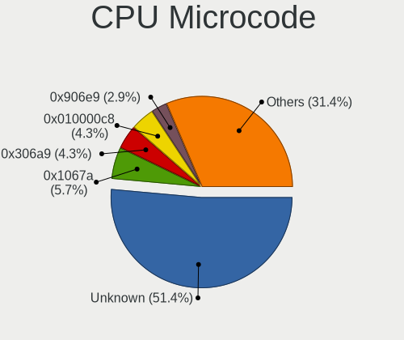

ROSA Hardware Trends (Desktop)
------------------------------

A project to identify most popular hardware characteristics and track their change
over time based on data collected by ROSA users at https://Linux-Hardware.org.

Anyone can contribute to the study by uploading probes of their computers by
the [hw-probe](https://github.com/linuxhw/hw-probe) tool:

    sudo hw-probe -all -upload

Full-feature report is available here: https://linux-hardware.org/?view=trends&formfactor=desktop

Period: Jan, 2020.

Contents
--------

- [ OS                       ](#os)
- [ OS Family                ](#os-family)
- [ Kernel                   ](#kernel)
- [ Kernel Family            ](#kernel-family)
- [ Kernel Major Ver.        ](#kernel-major-ver)
- [ Arch                     ](#arch)
- [ DE                       ](#de)
- [ Display Server           ](#display-server)
- [ OS Lang                  ](#os-lang)
- [ Boot Mode                ](#boot-mode)
- [ Filesystem               ](#filesystem)
- [ Dual Boot with Linux     ](#dual-boot-with-linux)
- [ Dual Boot (Win)          ](#dual-boot-win)
- [ Country                  ](#country)
- [ City                     ](#city)
- [ Vendor                   ](#vendor)
- [ Model                    ](#model)
- [ Model Family             ](#model-family)
- [ MFG Year                 ](#mfg-year)
- [ Form Factor              ](#form-factor)
- [ Secure Boot              ](#secure-boot)
- [ Coreboot                 ](#coreboot)
- [ RAM Size                 ](#ram-size)
- [ RAM Used                 ](#ram-used)
- [ Drive Vendor             ](#drive-vendor)
- [ Drive Model              ](#drive-model)
- [ Drive Kind               ](#drive-kind)
- [ Drive Connector          ](#drive-connector)
- [ Drive Size               ](#drive-size)
- [ Space Total              ](#space-total)
- [ Space Used               ](#space-used)
- [ Malfunc. Drives          ](#malfunc-drives)
- [ Malfunc. Drive Vendor    ](#malfunc-drive-vendor)
- [ Malfunc. Drive Kind      ](#malfunc-drive-kind)
- [ Failed Drives            ](#failed-drives)
- [ Failed Drive Vendor      ](#failed-drive-vendor)
- [ Drive Status             ](#drive-status)
- [ CPU Vendor               ](#cpu-vendor)
- [ CPU Model                ](#cpu-model)
- [ CPU Model Family         ](#cpu-model-family)
- [ CPU Cores                ](#cpu-cores)
- [ CPU Sockets              ](#cpu-sockets)
- [ CPU Threads              ](#cpu-threads)
- [ CPU Op-Modes             ](#cpu-op-modes)
- [ CPU Microarch            ](#cpu-microarch)
- [ CPU Microcode            ](#cpu-microcode)
- [ GPU Vendor               ](#gpu-vendor)
- [ GPU Model                ](#gpu-model)
- [ GPU Combo                ](#gpu-combo)
- [ GPU Driver               ](#gpu-driver)
- [ GPU Memory               ](#gpu-memory)
- [ Monitor Vendor           ](#monitor-vendor)
- [ Monitor Model            ](#monitor-model)
- [ Monitor Resolution       ](#monitor-resolution)
- [ Monitor Diagonal         ](#monitor-diagonal)
- [ Monitor Width            ](#monitor-width)
- [ Aspect Ratio             ](#aspect-ratio)
- [ Monitor Area             ](#monitor-area)
- [ Pixel Density            ](#pixel-density)
- [ Multiple Monitors        ](#multiple-monitors)
- [ Net Controller Vendor    ](#net-controller-vendor)
- [ Net Controller Model     ](#net-controller-model)
- [ Net Controller Kind      ](#net-controller-kind)
- [ Used Controller          ](#used-controller)
- [ NICs                     ](#nics)
- [ Unsupported Devices      ](#unsupported-devices)
- [ Unsupported Device Types ](#unsupported-device-types)

OS
--

Installed operating systems

| Name      | Computers | Percent |
|-----------|-----------|---------|
| ROSA R11  | 170       | 88.08%  |
| ROSA R10  | 10        | 5.18%   |
| ROSA R8.1 | 8         | 4.15%   |
| RED X4    | 4         | 2.07%   |
| ROSA R9   | 1         | 0.52%   |

OS Family
---------

OS without a version

| Name | Computers | Percent |
|------|-----------|---------|
| ROSA | 193       | 100%    |

Kernel
------

Version of the Linux kernel

| Version                          | Computers | Percent |
|----------------------------------|-----------|---------|
| 4.15.0-desktop-68.5rosa-x86_64   | 59        | 30.57%  |
| 4.15.0-desktop-45.1rosa-x86_64   | 54        | 27.98%  |
| 4.15.0-desktop-45.1rosa-i586     | 14        | 7.25%   |
| 4.9.155-nrj-desktop-1rosa-x86_64 | 10        | 5.18%   |
| 4.15.0-desktop-68.5rosa-i586     | 10        | 5.18%   |
| 4.9.60-nrj-desktop-1rosa-x86_64  | 8         | 4.15%   |
| 4.9.155-nrj-desktop-1rosa-i586   | 6         | 3.11%   |
| 4.9.60-nrj-desktop-1rosa-i586    | 4         | 2.07%   |
| 5.4.0-desktop-9.1rosa-x86_64     | 3         | 1.55%   |
| 5.3.18-nrj-desktop-1rosa-x86_64  | 3         | 1.55%   |
| 4.15.0-desktop-60.7rosa-x86_64   | 3         | 1.55%   |
| 4.15.0-desktop-47.2rosa-x86_64   | 3         | 1.55%   |
| 4.9.9-nrj-desktop-1rosa-x86_64   | 2         | 1.04%   |
| 4.18.0-desktop-26.2rosa-x86_64   | 2         | 1.04%   |
| 4.1.38-nrj-desktop-2rosa-x86_64  | 2         | 1.04%   |
| 4.1.38-nrj-desktop-2rosa-i586    | 2         | 1.04%   |
| 5.4.6-nrj-desktop-1rosa-x86_64   | 1         | 0.52%   |
| 5.4.12-nrj-desktop-1rosa-x86_64  | 1         | 0.52%   |
| 5.4.0-desktop-11.1rosa-x86_64    | 1         | 0.52%   |
| 5.3.0-desktop-17.1rosa-x86_64    | 1         | 0.52%   |
| 5.2.0-desktop-10.1rosa-x86_64    | 1         | 0.52%   |
| 4.9.20-nrj-desktop-1rosa-x86_64  | 1         | 0.52%   |
| 4.15.0-desktop-60.7rosa-i586     | 1         | 0.52%   |
| 4.15.0-desktop-54.1rosa-x86_64   | 1         | 0.52%   |

Kernel Family
-------------

Linux kernel without a distro release

| Version | Computers | Percent |
|---------|-----------|---------|
| 4.15.0  | 145       | 75.13%  |
| 4.9.155 | 16        | 8.29%   |
| 4.9.60  | 12        | 6.22%   |
| 5.4.0   | 4         | 2.07%   |
| 4.1.38  | 4         | 2.07%   |
| 5.3.18  | 3         | 1.55%   |
| 4.9.9   | 2         | 1.04%   |
| 4.18.0  | 2         | 1.04%   |
| 5.4.6   | 1         | 0.52%   |
| 5.4.12  | 1         | 0.52%   |
| 5.3.0   | 1         | 0.52%   |
| 5.2.0   | 1         | 0.52%   |
| 4.9.20  | 1         | 0.52%   |

Kernel Major Ver.
-----------------

Linux kernel major version

| Version | Computers | Percent |
|---------|-----------|---------|
| 4.15    | 145       | 75.13%  |
| 4.9     | 31        | 16.06%  |
| 5.4     | 6         | 3.11%   |
| 5.3     | 4         | 2.07%   |
| 4.1     | 4         | 2.07%   |
| 4.18    | 2         | 1.04%   |
| 5.2     | 1         | 0.52%   |

Arch
----

OS architecture (x86_64, i586, etc.)

| Name   | Computers | Percent |
|--------|-----------|---------|
| x86_64 | 156       | 80.83%  |
| i686   | 37        | 19.17%  |

DE
--

Desktop Environment

| Name    | Computers | Percent |
|---------|-----------|---------|
| KDE5    | 179       | 92.75%  |
| XFCE    | 7         | 3.63%   |
| Unknown | 3         | 1.55%   |
| LXQt    | 2         | 1.04%   |
| MATE    | 1         | 0.52%   |
| GNOME   | 1         | 0.52%   |

Display Server
--------------

X11 or Wayland

| Name    | Computers | Percent |
|---------|-----------|---------|
| Unknown | 193       | 100%    |

OS Lang
-------

Language

| Lang    | Computers | Percent |
|---------|-----------|---------|
| Unknown | 193       | 100%    |

Boot Mode
---------

EFI or BIOS

| Mode | Computers | Percent |
|------|-----------|---------|
| BIOS | 156       | 80.83%  |
| EFI  | 37        | 19.17%  |

Filesystem
----------

Type of filesystem

| Type  | Computers | Percent |
|-------|-----------|---------|
| Ext4  | 182       | 94.3%   |
| Ext3  | 6         | 3.11%   |
| Btrfs | 5         | 2.59%   |

Dual Boot with Linux
--------------------

Hosting more than one Linux

| Dual boot | Computers | Percent |
|-----------|-----------|---------|
| No        | 153       | 79.27%  |
| Yes       | 40        | 20.73%  |

Dual Boot (Win)
---------------

Hosting Linux and Windows

| Dual boot | Computers | Percent |
|-----------|-----------|---------|
| Yes       | 109       | 56.48%  |
| No        | 84        | 43.52%  |

Country
-------

Geographic location (country)

| Country     | Computers | Percent |
|-------------|-----------|---------|
| Russia      | 161       | 83.42%  |
| Ukraine     | 12        | 6.22%   |
| Belarus     | 4         | 2.07%   |
| Poland      | 3         | 1.55%   |
| New Zealand | 2         | 1.04%   |
| Kazakhstan  | 2         | 1.04%   |
| Italy       | 2         | 1.04%   |
| Germany     | 2         | 1.04%   |
| UK          | 1         | 0.52%   |
| Taiwan      | 1         | 0.52%   |
| Romania     | 1         | 0.52%   |
| France      | 1         | 0.52%   |
| Brazil      | 1         | 0.52%   |

City
----

Geographic location (city)

| City               | Computers | Percent |
|--------------------|-----------|---------|
| Moscow             | 17        | 8.81%   |
| St Petersburg      | 12        | 6.22%   |
| Yekaterinburg      | 7         | 3.63%   |
| Rostov-on-Don      | 7         | 3.63%   |
| Novosibirsk        | 5         | 2.59%   |
| Irkutsk            | 4         | 2.07%   |
| Tyumen             | 3         | 1.55%   |
| Tula               | 3         | 1.55%   |
| Samara             | 3         | 1.55%   |
| Kyiv               | 3         | 1.55%   |
| Krasnoyarsk        | 3         | 1.55%   |
| Krasnodar          | 3         | 1.55%   |
| Kazan’           | 3         | 1.55%   |
| Kaluga             | 3         | 1.55%   |
| Izhevsk            | 3         | 1.55%   |
| Ivanovo            | 3         | 1.55%   |
| Barnaul            | 3         | 1.55%   |
| Perm               | 2         | 1.04%   |
| Parnell            | 2         | 1.04%   |
| Murmansk           | 2         | 1.04%   |
| Minsk              | 2         | 1.04%   |
| Kostroma           | 2         | 1.04%   |
| Khabarovsk         | 2         | 1.04%   |
| Donetsk            | 2         | 1.04%   |
| Biysk              | 2         | 1.04%   |
| Łapy              | 1         | 0.52%   |
| Zhilina            | 1         | 0.52%   |
| Zelenogradskiy     | 1         | 0.52%   |
| West End of London | 1         | 0.52%   |
| Warsaw             | 1         | 0.52%   |
| Voronezh           | 1         | 0.52%   |
| Vorkuta            | 1         | 0.52%   |
| Volzhskiy          | 1         | 0.52%   |
| Volgograd          | 1         | 0.52%   |
| Vol'sk             | 1         | 0.52%   |
| Vladikavkaz        | 1         | 0.52%   |
| Vitebsk            | 1         | 0.52%   |
| Verkhnyaya Pyshma  | 1         | 0.52%   |
| Veliky Novgorod    | 1         | 0.52%   |
| Ulyanovsk          | 1         | 0.52%   |
| Tomsk              | 1         | 0.52%   |
| Tikhoretsk         | 1         | 0.52%   |
| Tarusa             | 1         | 0.52%   |
| Suzëmka           | 1         | 0.52%   |
| Surgut             | 1         | 0.52%   |
| Stary Oskol        | 1         | 0.52%   |
| Sokol              | 1         | 0.52%   |
| Sloviansk          | 1         | 0.52%   |
| Severomorsk        | 1         | 0.52%   |
| Severodvinsk       | 1         | 0.52%   |
| Sevastopol         | 1         | 0.52%   |
| Sernovodsk         | 1         | 0.52%   |
| Sengiley           | 1         | 0.52%   |
| Saratov            | 1         | 0.52%   |
| Sapronovo          | 1         | 0.52%   |
| Salvador           | 1         | 0.52%   |
| Salekhard          | 1         | 0.52%   |
| Saalburg           | 1         | 0.52%   |
| Rybnik             | 1         | 0.52%   |
| Ryazan             | 1         | 0.52%   |

Vendor
------

Motherboard manufacturer

| Name                | Computers | Percent |
|---------------------|-----------|---------|
| ASUSTek Computer    | 64        | 33.16%  |
| Gigabyte Technology | 43        | 22.28%  |
| MSI                 | 25        | 12.95%  |
| ASRock              | 20        | 10.36%  |
| ECS                 | 7         | 3.63%   |
| Intel               | 6         | 3.11%   |
| Lenovo              | 3         | 1.55%   |
| Hewlett-Packard     | 3         | 1.55%   |
| Dell                | 3         | 1.55%   |
| Acer                | 3         | 1.55%   |
| Unknown             | 3         | 1.55%   |
| Foxconn             | 2         | 1.04%   |
| Biostar             | 2         | 1.04%   |
| WinFast             | 1         | 0.52%   |
| Supermicro          | 1         | 0.52%   |
| SiS Technology      | 1         | 0.52%   |
| Pegatron            | 1         | 0.52%   |
| OEM                 | 1         | 0.52%   |
| JW Technology       | 1         | 0.52%   |
| Fujitsu Siemens     | 1         | 0.52%   |
| EPoX Computer       | 1         | 0.52%   |
| AMI                 | 1         | 0.52%   |

Model
-----

Motherboard model

| Name                  | Computers | Percent |
|-----------------------|-----------|---------|
| All Series            | 5         | 2.59%   |
| Unknown               | 4         | 2.07%   |
| Pro, Std, Elt Series  | 2         | 1.04%   |
| P8H61-M LX3 R2.0      | 2         | 1.04%   |
| P5P41D                | 2         | 1.04%   |
| P35-DS3L              | 2         | 1.04%   |
| N68-VS3 FX            | 2         | 1.04%   |
| MS-7895               | 2         | 1.04%   |
| MS-7519               | 2         | 1.04%   |
| M5A78L-M/USB3         | 2         | 1.04%   |
| A320M-S2H V2          | 2         | 1.04%   |
| 970A-DS3P             | 2         | 1.04%   |
| Z77 Extreme4-M        | 1         | 0.52%   |
| Z68P-DS3              | 1         | 0.52%   |
| Z600 Workstation      | 1         | 0.52%   |
| Z270-HD3P             | 1         | 0.52%   |
| XPS 8700              | 1         | 0.52%   |
| Veriton N280G         | 1         | 0.52%   |
| VC65R                 | 1         | 0.52%   |
| TB250-BTC             | 1         | 0.52%   |
| SiS-651               | 1         | 0.52%   |
| SABERTOOTH 990FX R2.0 | 1         | 0.52%   |
| ROG Maximus X HERO    | 1         | 0.52%   |
| PRIME H310M-R R2.0    | 1         | 0.52%   |
| PRIME H310M-K         | 1         | 0.52%   |
| PRIME B450M-K         | 1         | 0.52%   |
| PH67A V1.1            | 1         | 0.52%   |
| P9X79 DELUXE          | 1         | 0.52%   |
| P8Z77-V LE PLUS       | 1         | 0.52%   |
| P8H61-M LX3           | 1         | 0.52%   |
| P8H61-M LX R2.0       | 1         | 0.52%   |
| P8H61-M LX PLUS       | 1         | 0.52%   |
| P8H61-M LE R2.0       | 1         | 0.52%   |
| P8H61                 | 1         | 0.52%   |
| P7H55-M SI            | 1         | 0.52%   |
| P7H55-M PRO           | 1         | 0.52%   |
| p6-2200er             | 1         | 0.52%   |
| P5WD2-Premium         | 1         | 0.52%   |
| P5Q-VM                | 1         | 0.52%   |
| P5Q SE2               | 1         | 0.52%   |
| P5Q                   | 1         | 0.52%   |
| P5PL2                 | 1         | 0.52%   |
| P5PE-VM               | 1         | 0.52%   |
| P5KPL-SE              | 1         | 0.52%   |
| P5KPL-AM SE           | 1         | 0.52%   |
| P5KPL-AM IN/ROEM/SI   | 1         | 0.52%   |
| P5KPL-AM IN/GB        | 1         | 0.52%   |
| P5KPL-AM              | 1         | 0.52%   |
| P5K PRO               | 1         | 0.52%   |
| P5GPL-X SE            | 1         | 0.52%   |
| P5GD2-X               | 1         | 0.52%   |
| P5GC-MX               | 1         | 0.52%   |
| P5G41T-M LX3          | 1         | 0.52%   |
| P55 Extreme           | 1         | 0.52%   |
| P4P800-VM             | 1         | 0.52%   |
| P4M890-8237           | 1         | 0.52%   |
| P43-ES3G              | 1         | 0.52%   |
| P35-DS3               | 1         | 0.52%   |
| OptiPlex 760          | 1         | 0.52%   |
| OptiPlex 580          | 1         | 0.52%   |

Model Family
------------

Motherboard model prefix

| Name                   | Computers | Percent |
|------------------------|-----------|---------|
| ASUS P8H61-M           | 6         | 3.11%   |
| ASUS M5A78L-M          | 5         | 2.59%   |
| ASUS All               | 5         | 2.59%   |
| ASUS P5KPL-AM          | 4         | 2.07%   |
| ASUS M5A97             | 4         | 2.07%   |
| Unknown                | 4         | 2.07%   |
| Gigabyte A320M-S2H     | 3         | 1.55%   |
| ASUS PRIME             | 3         | 1.55%   |
| MSI MS-7895            | 2         | 1.04%   |
| MSI MS-7519            | 2         | 1.04%   |
| Gigabyte P35-DS3L      | 2         | 1.04%   |
| Gigabyte 970A-DS3P     | 2         | 1.04%   |
| Dell OptiPlex          | 2         | 1.04%   |
| ASUS P7H55-M           | 2         | 1.04%   |
| ASUS P5Q               | 2         | 1.04%   |
| ASUS P5P41D            | 2         | 1.04%   |
| ASRock N68-VS3         | 2         | 1.04%   |
| Acer Aspire            | 2         | 1.04%   |
| WinFast C51GM03        | 1         | 0.52%   |
| Supermicro C2SBA       | 1         | 0.52%   |
| SiS Technology SiS-651 | 1         | 0.52%   |
| Pegatron p6-2200er     | 1         | 0.52%   |
| MSI Pro                | 1         | 0.52%   |
| MSI MS-7B84            | 1         | 0.52%   |
| MSI MS-7A74            | 1         | 0.52%   |
| MSI MS-7A38            | 1         | 0.52%   |
| MSI MS-7A37            | 1         | 0.52%   |
| MSI MS-7A33            | 1         | 0.52%   |
| MSI MS-7A01            | 1         | 0.52%   |
| MSI MS-7924            | 1         | 0.52%   |
| MSI MS-7917            | 1         | 0.52%   |
| MSI MS-7850            | 1         | 0.52%   |
| MSI MS-7817            | 1         | 0.52%   |
| MSI MS-7816            | 1         | 0.52%   |
| MSI MS-7808            | 1         | 0.52%   |
| MSI MS-7788            | 1         | 0.52%   |
| MSI MS-7721            | 1         | 0.52%   |
| MSI MS-7715            | 1         | 0.52%   |
| MSI MS-7693            | 1         | 0.52%   |
| MSI MS-7641            | 1         | 0.52%   |
| MSI MS-7549            | 1         | 0.52%   |
| MSI GEG                | 1         | 0.52%   |
| MSI G5320fr            | 1         | 0.52%   |
| Lenovo IdeaCentre      | 1         | 0.52%   |
| Lenovo H420            | 1         | 0.52%   |
| Lenovo 0837A85         | 1         | 0.52%   |
| JW Technology PH67A    | 1         | 0.52%   |
| Intel DP35DP           | 1         | 0.52%   |
| Intel DG45FC           | 1         | 0.52%   |
| Intel DG41CN           | 1         | 0.52%   |
| Intel DG31PR           | 1         | 0.52%   |
| Intel D945GNT          | 1         | 0.52%   |
| Intel D865GVHZ         | 1         | 0.52%   |
| HP Z600                | 1         | 0.52%   |
| HP Compaq              | 1         | 0.52%   |
| HP 310-1020            | 1         | 0.52%   |
| Gigabyte Z68P-DS3      | 1         | 0.52%   |
| Gigabyte Z270-HD3P     | 1         | 0.52%   |
| Gigabyte P43-ES3G      | 1         | 0.52%   |
| Gigabyte P35-DS3       | 1         | 0.52%   |

MFG Year
--------

Motherboard manufacture year

| Year | Computers | Percent |
|------|-----------|---------|
| 2010 | 20        | 10.36%  |
| 2009 | 20        | 10.36%  |
| 2012 | 18        | 9.33%   |
| 2018 | 17        | 8.81%   |
| 2014 | 16        | 8.29%   |
| 2015 | 15        | 7.77%   |
| 2008 | 15        | 7.77%   |
| 2011 | 14        | 7.25%   |
| 2016 | 11        | 5.7%    |
| 2007 | 11        | 5.7%    |
| 2019 | 10        | 5.18%   |
| 2013 | 10        | 5.18%   |
| 2006 | 6         | 3.11%   |
| 2005 | 5         | 2.59%   |
| 2017 | 3         | 1.55%   |
| 2004 | 1         | 0.52%   |
| 2003 | 1         | 0.52%   |

Form Factor
-----------

Physical design of the computer

| Name    | Computers | Percent |
|---------|-----------|---------|
| Desktop | 193       | 100%    |

Secure Boot
-----------

Enabled or disabled

| State    | Computers | Percent |
|----------|-----------|---------|
| Disabled | 139       | 72.02%  |
| Unknown  | 54        | 27.98%  |

Coreboot
--------

Have coreboot on board

| Used | Computers | Percent |
|------|-----------|---------|
| No   | 193       | 100%    |

RAM Size
--------

Total RAM memory

| Size in GB | Computers | Percent |
|------------|-----------|---------|
| 3.01-4.0   | 60        | 31.09%  |
| 8.01-16.0  | 46        | 23.83%  |
| 4.01-8.0   | 27        | 13.99%  |
| 1.01-2.0   | 24        | 12.44%  |
| 16.01-24.0 | 19        | 9.84%   |
| 2.01-3.0   | 9         | 4.66%   |
| 0.01-1.0   | 4         | 2.07%   |
| 32.01-64.0 | 2         | 1.04%   |
| 24.01-32.0 | 2         | 1.04%   |

RAM Used
--------

Used RAM memory

| Used GB  | Computers | Percent |
|----------|-----------|---------|
| 0.01-1.0 | 101       | 52.33%  |
| 1.01-2.0 | 75        | 38.86%  |
| 2.01-3.0 | 11        | 5.7%    |
| 3.01-4.0 | 5         | 2.59%   |
| 4.01-8.0 | 1         | 0.52%   |

Drive Vendor
------------

Hard drive vendors

| Vendor              | Computers | Drives | Percent |
|---------------------|-----------|--------|---------|
| Seagate             | 78        | 98     | 26.53%  |
| WDC                 | 72        | 106    | 24.49%  |
| Hitachi             | 27        | 28     | 9.18%   |
| Samsung Electronics | 21        | 26     | 7.14%   |
| Toshiba             | 19        | 20     | 6.46%   |
| Kingston            | 17        | 17     | 5.78%   |
| MAXTOR              | 7         | 7      | 2.38%   |
| SanDisk             | 5         | 5      | 1.7%    |
| PLEXTOR             | 5         | 7      | 1.7%    |
| Intel               | 5         | 5      | 1.7%    |
| A-DATA Technology   | 5         | 6      | 1.7%    |
| Crucial             | 4         | 4      | 1.36%   |
| SPCC                | 3         | 3      | 1.02%   |
| Smartbuy            | 3         | 3      | 1.02%   |
| OCZ                 | 3         | 3      | 1.02%   |
| KingDian            | 3         | 3      | 1.02%   |
| Corsair             | 3         | 3      | 1.02%   |
| China               | 3         | 3      | 1.02%   |
| GOODRAM             | 2         | 2      | 0.68%   |
| Transcend           | 1         | 1      | 0.34%   |
| Team                | 1         | 1      | 0.34%   |
| TAISU               | 1         | 1      | 0.34%   |
| Silicon Motion      | 1         | 1      | 0.34%   |
| Patriot             | 1         | 1      | 0.34%   |
| KINGMAX             | 1         | 1      | 0.34%   |
| EK60HYXTFY176       | 1         | 1      | 0.34%   |
| AS25                | 1         | 1      | 0.34%   |
| Apacer              | 1         | 1      | 0.34%   |

Drive Model
-----------

Hard drive models

| Model                        | Computers | Percent |
|------------------------------|-----------|---------|
| ST500DM002-1BD142 500GB      | 6         | 1.68%   |
| ST380815AS 80GB              | 5         | 1.4%    |
| ST380011A 80GB               | 5         | 1.4%    |
| SSD 860 EVO 250GB            | 5         | 1.4%    |
| WDS240G2G0A-00JH30 240GB SSD | 4         | 1.12%   |
| WD5000AZRX-00A8LB0 500GB     | 4         | 1.12%   |
| WD10EZEX-22MFCA0 1TB         | 4         | 1.12%   |
| ST3500418AS 500GB            | 4         | 1.12%   |
| ST3250310AS 250GB            | 4         | 1.12%   |
| ST1000DM010-2EP102 1TB       | 4         | 1.12%   |
| SSD 120GB                    | 4         | 1.12%   |
| SA400S37120G 120GB SSD       | 4         | 1.12%   |
| DT01ACA100 1TB               | 4         | 1.12%   |
| DT01ACA050 500GB             | 4         | 1.12%   |
| WD5000AAKX-00ERMA0 500GB     | 3         | 0.84%   |
| WD3200AAKS-00UU3A0 320GB     | 3         | 0.84%   |
| WD10EZEX-08M2NA0 1TB         | 3         | 0.84%   |
| ST380811AS 80GB              | 3         | 0.84%   |
| ST3250410AS 250GB            | 3         | 0.84%   |
| ST2000DM001-1CH164 2TB       | 3         | 0.84%   |
| ST1000DM003-1CH162 1TB       | 3         | 0.84%   |
| HDWD110 1TB                  | 3         | 0.84%   |
| WDS120G2G0A-00JH30 120GB SSD | 2         | 0.56%   |
| WD800JD-75MSA3 80GB          | 2         | 0.56%   |
| WD6400AAKS-22A7B0 640GB      | 2         | 0.56%   |
| WD5000AAKX-001CA0 500GB      | 2         | 0.56%   |
| WD20EZRX-00DC0B0 2TB         | 2         | 0.56%   |
| WD10EZEX-08WN4A0 1TB         | 2         | 0.56%   |
| WD10EZEX-08M                 | 2         | 0.56%   |
| WD10EZEX-00RKKA0 1TB         | 2         | 0.56%   |
| SV300S37A240G 240GB SSD      | 2         | 0.56%   |
| SV300S37A120G 120GB SSD      | 2         | 0.56%   |
| STM3160815AS 160GB           | 2         | 0.56%   |
| ST500DM009-2F110A 500GB      | 2         | 0.56%   |
| ST31000524AS 1TB             | 2         | 0.56%   |
| ST250DM000-1BD141 250GB      | 2         | 0.56%   |
| ST250DM000-1BC141 250GB      | 2         | 0.56%   |
| ST2000DM008-2FR102 2TB       | 2         | 0.56%   |
| ST1000DM003-9YN162 1TB       | 2         | 0.56%   |
| ST1000DM003-1CH1 1TB         | 2         | 0.56%   |
| SSD PLUS 120 GB              | 2         | 0.56%   |
| SP0822N 80GB                 | 2         | 0.56%   |
| SA400S37240G 240GB SSD       | 2         | 0.56%   |
| HTS542512K9SA00 120GB        | 2         | 0.56%   |
| HDWD105 500GB                | 2         | 0.56%   |
| HDT722516DLA380 165GB        | 2         | 0.56%   |
| HDS728080PLAT20 82GB         | 2         | 0.56%   |
| HDS721616PLA380 160GB        | 2         | 0.56%   |
| HDS721025CLA382 250GB        | 2         | 0.56%   |
| HDS721010CLA332 1TB          | 2         | 0.56%   |
| HDP725025GLA380 250GB        | 2         | 0.56%   |
| HD322HJ 320GB                | 2         | 0.56%   |
| HD252HJ 250GB                | 2         | 0.56%   |
| HD105SI 1TB                  | 2         | 0.56%   |
| Expansion 1TB                | 2         | 0.56%   |
| WDS240G2G0B-00EPW0 240GB SSD | 1         | 0.28%   |
| WDS240G2G0B 240GB SSD        | 1         | 0.28%   |
| WDS120G2G0B-00EPW0 120GB SSD | 1         | 0.28%   |
| WD800JD-00MSA1 80GB          | 1         | 0.28%   |
| WD800JD-00LSA0 80GB          | 1         | 0.28%   |

Drive Kind
----------

HDD or SSD

| Kind | Computers | Drives | Percent |
|------|-----------|--------|---------|
| HDD  | 166       | 268    | 68.88%  |
| SSD  | 70        | 85     | 29.05%  |
| NVMe | 5         | 5      | 2.07%   |

Drive Connector
---------------

SATA, SAS, NVMe, etc.

| Type | Computers | Drives | Percent |
|------|-----------|--------|---------|
| SATA | 191       | 351    | 96.46%  |
| NVMe | 5         | 5      | 2.53%   |
| SAS  | 2         | 2      | 1.01%   |

Drive Size
----------

Size of hard drive

| Size in TB | Computers | Drives | Percent |
|------------|-----------|--------|---------|
| 0.01-0.5   | 174       | 264    | 70.16%  |
| 0.51-1.0   | 55        | 72     | 22.18%  |
| 1.01-2.0   | 15        | 17     | 6.05%   |
| 2.01-3.0   | 4         | 5      | 1.61%   |

Space Total
-----------

Amount of disk space available on the file system

| Size in GB     | Computers | Percent |
|----------------|-----------|---------|
| 101-250        | 59        | 30.57%  |
| 251-500        | 37        | 19.17%  |
| 51-100         | 26        | 13.47%  |
| 501-1000       | 20        | 10.36%  |
| 21-50          | 19        | 9.84%   |
| 1-20           | 17        | 8.81%   |
| 1001-2000      | 7         | 3.63%   |
| More than 3000 | 4         | 2.07%   |
| 2001-3000      | 4         | 2.07%   |

Space Used
----------

Amount of used disk space

| Used GB        | Computers | Percent |
|----------------|-----------|---------|
| 1-20           | 122       | 63.21%  |
| 21-50          | 17        | 8.81%   |
| 51-100         | 17        | 8.81%   |
| 101-250        | 16        | 8.29%   |
| 501-1000       | 8         | 4.15%   |
| 251-500        | 6         | 3.11%   |
| 1001-2000      | 4         | 2.07%   |
| 2001-3000      | 2         | 1.04%   |
| More than 3000 | 1         | 0.52%   |

Malfunc. Drives
---------------

Drive models with a malfunction

| Model                         | Computers | Drives | Percent |
|-------------------------------|-----------|--------|---------|
| ST500DM002-1BD142 500GB       | 3         | 3      | 3.3%    |
| WD6400AAKS-22A7B0 640GB       | 2         | 2      | 2.2%    |
| WD10EZEX-00RKKA0 1TB          | 2         | 2      | 2.2%    |
| ST1000DM003-9YN162 1TB        | 2         | 2      | 2.2%    |
| HTS542512K9SA00 120GB         | 2         | 2      | 2.2%    |
| HDP725025GLA380 250GB         | 2         | 2      | 2.2%    |
| WD800JD-75MSA3 80GB           | 1         | 1      | 1.1%    |
| WD800JB-00JJA0 80GB           | 1         | 1      | 1.1%    |
| WD6400AAKS-2 640GB            | 1         | 1      | 1.1%    |
| WD5001AALS-00L3B2 500GB       | 1         | 1      | 1.1%    |
| WD5000AZDX-00SC2B0 500GB      | 1         | 1      | 1.1%    |
| WD5000AAKS-60WWPA0 500GB      | 1         | 1      | 1.1%    |
| WD5000AAKS-00A7B2 500GB       | 1         | 1      | 1.1%    |
| WD5000AADS-00S9B0 500GB       | 1         | 1      | 1.1%    |
| WD5000AADS-00M2B0 500GB       | 1         | 1      | 1.1%    |
| WD3200AVVS-56L2B0 320GB       | 1         | 1      | 1.1%    |
| WD3200AAKS-22L6A0 320GB       | 1         | 1      | 1.1%    |
| WD3200AAJS-56M0A0 320GB       | 1         | 1      | 1.1%    |
| WD3200AAJS-5 320GB            | 1         | 1      | 1.1%    |
| WD3200AAJS-00L7A0 320GB       | 1         | 1      | 1.1%    |
| WD3200AADS-00S9B0 320GB       | 1         | 1      | 1.1%    |
| WD30EZRX-00MMMB0 3TB          | 1         | 1      | 1.1%    |
| WD2500JB-00REA0 250GB         | 1         | 1      | 1.1%    |
| WD2500BEVT-24A23T0 250GB      | 1         | 1      | 1.1%    |
| WD2500AAJS-22VTA0 250GB       | 1         | 1      | 1.1%    |
| WD1600JD-00HBB0 160GB         | 1         | 1      | 1.1%    |
| WD1600AAJS-22WAA0 160GB       | 1         | 1      | 1.1%    |
| WD1600AAJB-00PVA0 160GB       | 1         | 1      | 1.1%    |
| WD1200JS-00NCB1 120GB         | 1         | 1      | 1.1%    |
| WD10EZEX-07WN4A0 1TB          | 1         | 1      | 1.1%    |
| WD1002FBYS-02A6B0 1TB         | 1         | 1      | 1.1%    |
| VERTEX3 120GB SSD             | 1         | 1      | 1.1%    |
| V100 64GB SSD                 | 1         | 1      | 1.1%    |
| SUV300S37A120G 120GB SSD      | 1         | 1      | 1.1%    |
| STM3500418AS 500GB            | 1         | 1      | 1.1%    |
| STM3500320AS 500GB            | 1         | 1      | 1.1%    |
| STM3250310AS 250GB            | 1         | 1      | 1.1%    |
| STM3160815AS 160GB            | 1         | 1      | 1.1%    |
| ST9320423AS 320GB             | 1         | 1      | 1.1%    |
| ST9320328CS 320GB             | 1         | 1      | 1.1%    |
| ST380817AS 80GB               | 1         | 1      | 1.1%    |
| ST3808110AS 80GB              | 1         | 1      | 1.1%    |
| ST380011A 80GB                | 1         | 1      | 1.1%    |
| ST3500418AS 500GB             | 1         | 1      | 1.1%    |
| ST3500413AS 500GB             | 1         | 1      | 1.1%    |
| ST3320620A 320GB              | 1         | 1      | 1.1%    |
| ST3250824A 250GB              | 1         | 1      | 1.1%    |
| ST3250410AS 250GB             | 1         | 1      | 1.1%    |
| ST3250310AS 250GB             | 1         | 1      | 1.1%    |
| ST320LT012-9WS14C 320GB       | 1         | 1      | 1.1%    |
| ST3160812AS 41N3268 LEN 160GB | 1         | 1      | 1.1%    |
| ST3160215A 160GB              | 1         | 1      | 1.1%    |
| ST3160212A 160GB              | 1         | 1      | 1.1%    |
| ST3160021A 160GB              | 1         | 1      | 1.1%    |
| ST3120811AS 120GB             | 1         | 1      | 1.1%    |
| ST31000528AS 1TB              | 1         | 1      | 1.1%    |
| ST2000DM001-1CH164 2TB        | 1         | 1      | 1.1%    |
| ST2000DM001-1CH1 2TB          | 1         | 1      | 1.1%    |
| ST1000DM003-1SB10C 1TB        | 1         | 1      | 1.1%    |
| ST1000DL002-9TT1 1TB          | 1         | 1      | 1.1%    |

Malfunc. Drive Vendor
---------------------

Vendors of faulty drives

| Vendor              | Computers | Drives | Percent |
|---------------------|-----------|--------|---------|
| WDC                 | 26        | 29     | 30.95%  |
| Seagate             | 25        | 28     | 29.76%  |
| Hitachi             | 15        | 16     | 17.86%  |
| Samsung Electronics | 5         | 5      | 5.95%   |
| MAXTOR              | 4         | 4      | 4.76%   |
| Toshiba             | 2         | 2      | 2.38%   |
| Corsair             | 2         | 2      | 2.38%   |
| OCZ                 | 1         | 1      | 1.19%   |
| Kingston            | 1         | 1      | 1.19%   |
| KINGMAX             | 1         | 1      | 1.19%   |
| EK60HYXTFY176       | 1         | 1      | 1.19%   |
| Crucial             | 1         | 1      | 1.19%   |

Malfunc. Drive Kind
-------------------

Kinds of faulty drives

| Kind | Computers | Drives | Percent |
|------|-----------|--------|---------|
| HDD  | 71        | 84     | 91.03%  |
| SSD  | 7         | 7      | 8.97%   |

Failed Drives
-------------

Failed drive models

| Model                    | Computers | Drives | Percent |
|--------------------------|-----------|--------|---------|
| WD3200BEVT-80A0RT0 320GB | 1         | 1      | 16.67%  |
| WD15EARS-00MVWB0 1TB     | 1         | 1      | 16.67%  |
| ST3320418AS 320GB        | 1         | 1      | 16.67%  |
| ST31000524AS 1TB         | 1         | 1      | 16.67%  |
| MQ01ABD050 500GB         | 1         | 1      | 16.67%  |
| HD252HJ 250GB            | 1         | 1      | 16.67%  |

Failed Drive Vendor
-------------------

Failed drive vendors

| Vendor              | Computers | Drives | Percent |
|---------------------|-----------|--------|---------|
| WDC                 | 2         | 2      | 33.33%  |
| Seagate             | 2         | 2      | 33.33%  |
| Toshiba             | 1         | 1      | 16.67%  |
| Samsung Electronics | 1         | 1      | 16.67%  |

Drive Status
------------

Number of failed and malfunc. drives

| Status   | Computers | Drives | Percent |
|----------|-----------|--------|---------|
| Works    | 160       | 259    | 65.31%  |
| Malfunc  | 77        | 91     | 31.43%  |
| Failed   | 6         | 6      | 2.45%   |
| Detected | 2         | 2      | 0.82%   |

CPU Vendor
----------

Processor vendors

| Vendor | Computers | Percent |
|--------|-----------|---------|
| Intel  | 125       | 64.77%  |
| AMD    | 68        | 35.23%  |

CPU Model
---------

Processor models

| Model                                         | Computers | Percent |
|-----------------------------------------------|-----------|---------|
| Intel Core 2 Duo CPU E8400 @ 3.00GHz          | 8         | 4.15%   |
| Intel Pentium Gold G5400 CPU @ 3.70GHz        | 5         | 2.59%   |
| Intel Core i3-3220 CPU @ 3.30GHz              | 5         | 2.59%   |
| Intel Core 2 Quad CPU Q8200 @ 2.33GHz         | 4         | 2.07%   |
| AMD Athlon II X2 250 Processor                | 4         | 2.07%   |
| Intel Core i5-4460 CPU @ 3.20GHz              | 3         | 1.55%   |
| Intel Core 2 Duo CPU E8500 @ 3.16GHz          | 3         | 1.55%   |
| AMD Ryzen 5 1600 Six-Core Processor           | 3         | 1.55%   |
| AMD FX-8350 Eight-Core Processor              | 3         | 1.55%   |
| AMD FX-8300 Eight-Core Processor              | 3         | 1.55%   |
| AMD FX-6300 Six-Core Processor                | 3         | 1.55%   |
| AMD Athlon 64 X2 Dual Core Processor 4200+    | 3         | 1.55%   |
| AMD A8-9600 RADEON R7, 10 COMPUTE CORES 4C+6G | 3         | 1.55%   |
| Intel Pentium Dual CPU E2200 @ 2.20GHz        | 2         | 1.04%   |
| Intel Pentium CPU G4400 @ 3.30GHz             | 2         | 1.04%   |
| Intel Pentium 4 CPU 3.06GHz                   | 2         | 1.04%   |
| Intel Core i5-4670K CPU @ 3.40GHz             | 2         | 1.04%   |
| Intel Core i5-3570 CPU @ 3.40GHz              | 2         | 1.04%   |
| Intel Core i5-3470 CPU @ 3.20GHz              | 2         | 1.04%   |
| Intel Core i3-4170 CPU @ 3.70GHz              | 2         | 1.04%   |
| Intel Core i3 CPU 550 @ 3.20GHz               | 2         | 1.04%   |
| Intel Core 2 Quad CPU Q9550 @ 2.83GHz         | 2         | 1.04%   |
| Intel Core 2 Duo CPU E7500 @ 2.93GHz          | 2         | 1.04%   |
| Intel Core 2 Duo CPU E6850 @ 3.00GHz          | 2         | 1.04%   |
| Intel Core 2 Duo CPU E4500 @ 2.20GHz          | 2         | 1.04%   |
| Intel Celeron CPU G540 @ 2.50GHz              | 2         | 1.04%   |
| AMD Athlon 64 Processor 3200+                 | 2         | 1.04%   |
| Intel Xeon CPU X5675 @ 3.07GHz                | 1         | 0.52%   |
| Intel Xeon CPU X5450 @ 3.00GHz                | 1         | 0.52%   |
| Intel Xeon CPU X5260 @ 3.33GHz                | 1         | 0.52%   |
| Intel Xeon CPU X3440 @ 2.53GHz                | 1         | 0.52%   |
| Intel Xeon CPU E5450 @ 3.00GHz                | 1         | 0.52%   |
| Intel Xeon CPU E5-2440 0 @ 2.40GHz            | 1         | 0.52%   |
| Intel Xeon CPU E31220 @ 3.10GHz               | 1         | 0.52%   |
| Intel Pentium Dual-Core CPU E6600 @ 3.06GHz   | 1         | 0.52%   |
| Intel Pentium Dual-Core CPU E6500 @ 2.93GHz   | 1         | 0.52%   |
| Intel Pentium Dual-Core CPU E5800 @ 3.20GHz   | 1         | 0.52%   |
| Intel Pentium Dual-Core CPU E5700 @ 3.00GHz   | 1         | 0.52%   |
| Intel Pentium Dual-Core CPU E5500 @ 2.80GHz   | 1         | 0.52%   |
| Intel Pentium Dual-Core CPU E5400 @ 2.70GHz   | 1         | 0.52%   |
| Intel Pentium Dual-Core CPU E5300 @ 2.60GHz   | 1         | 0.52%   |
| Intel Pentium Dual-Core CPU E5200 @ 2.50GHz   | 1         | 0.52%   |
| Intel Pentium Dual CPU E2160 @ 1.80GHz        | 1         | 0.52%   |
| Intel Pentium D CPU 3.40GHz                   | 1         | 0.52%   |
| Intel Pentium D CPU 2.80GHz                   | 1         | 0.52%   |
| Intel Pentium D CPU 2.66GHz                   | 1         | 0.52%   |
| Intel Pentium CPU N3520 @ 2.16GHz             | 1         | 0.52%   |
| Intel Pentium CPU G645 @ 2.90GHz              | 1         | 0.52%   |
| Intel Pentium CPU G4500 @ 3.50GHz             | 1         | 0.52%   |
| Intel Pentium CPU G3240 @ 3.10GHz             | 1         | 0.52%   |
| Intel Pentium CPU G2130 @ 3.20GHz             | 1         | 0.52%   |
| Intel Pentium 4 CPU 3.00GHz                   | 1         | 0.52%   |
| Intel Pentium 4 CPU 2.80GHz                   | 1         | 0.52%   |
| Intel Pentium 4 CPU 2.66GHz                   | 1         | 0.52%   |
| Intel Genuine CPU 2160 @ 1.80GHz              | 1         | 0.52%   |
| Intel Genuine CPU 0000 @ 3.40GHz              | 1         | 0.52%   |
| Intel Core i7-8700K CPU @ 3.70GHz             | 1         | 0.52%   |
| Intel Core i7-4770K CPU @ 3.50GHz             | 1         | 0.52%   |
| Intel Core i7-4770 CPU @ 3.40GHz              | 1         | 0.52%   |
| Intel Core i7-3970X CPU @ 3.50GHz             | 1         | 0.52%   |

CPU Model Family
----------------

Processor model prefix

| Model                   | Computers | Percent |
|-------------------------|-----------|---------|
| Intel Core 2 Duo        | 24        | 12.44%  |
| Intel Core i5           | 21        | 10.88%  |
| Intel Core i3           | 14        | 7.25%   |
| AMD FX                  | 14        | 7.25%   |
| Intel Celeron           | 13        | 6.74%   |
| Intel Pentium Dual-Core | 8         | 4.15%   |
| AMD Athlon II X2        | 8         | 4.15%   |
| Intel Xeon              | 7         | 3.63%   |
| Intel Pentium           | 7         | 3.63%   |
| Intel Core 2 Quad       | 7         | 3.63%   |
| AMD Athlon 64 X2        | 7         | 3.63%   |
| Intel Pentium Gold      | 5         | 2.59%   |
| Intel Pentium 4         | 5         | 2.59%   |
| Intel Core i7           | 5         | 2.59%   |
| AMD Ryzen 5             | 5         | 2.59%   |
| AMD A8                  | 4         | 2.07%   |
| Intel Pentium Dual      | 3         | 1.55%   |
| Intel Pentium D         | 3         | 1.55%   |
| AMD Athlon X4           | 3         | 1.55%   |
| AMD Athlon II X4        | 3         | 1.55%   |
| AMD Athlon 64           | 3         | 1.55%   |
| Intel Genuine           | 2         | 1.04%   |
| AMD Ryzen 3             | 2         | 1.04%   |
| AMD Phenom II X4        | 2         | 1.04%   |
| AMD Phenom II X2        | 2         | 1.04%   |
| AMD Phenom              | 2         | 1.04%   |
| AMD Athlon              | 2         | 1.04%   |
| AMD A4                  | 2         | 1.04%   |
| AMD A10                 | 2         | 1.04%   |
| Intel Atom              | 1         | 0.52%   |
| AMD Ryzen 7             | 1         | 0.52%   |
| AMD Phenom II X3        | 1         | 0.52%   |
| AMD E2                  | 1         | 0.52%   |
| AMD E                   | 1         | 0.52%   |
| AMD Athlon X2           | 1         | 0.52%   |
| AMD Athlon II X3        | 1         | 0.52%   |
| AMD A6                  | 1         | 0.52%   |

CPU Cores
---------

Number of processor cores

| Number | Computers | Percent |
|--------|-----------|---------|
| 2      | 104       | 53.89%  |
| 4      | 53        | 27.46%  |
| 1      | 17        | 8.81%   |
| 6      | 8         | 4.15%   |
| 3      | 8         | 4.15%   |
| 12     | 2         | 1.04%   |
| 8      | 1         | 0.52%   |

CPU Sockets
-----------

Number of sockets

| Number | Computers | Percent |
|--------|-----------|---------|
| 1      | 192       | 99.48%  |
| 2      | 1         | 0.52%   |

CPU Threads
-----------

Threads per core (Hyper-Threading)

| Number | Computers | Percent |
|--------|-----------|---------|
| 1      | 131       | 67.88%  |
| 2      | 62        | 32.12%  |

CPU Op-Modes
------------

CPU Operation Modes (32-bit, 64-bit)

| Op mode        | Computers | Percent |
|----------------|-----------|---------|
| 32-bit, 64-bit | 188       | 97.41%  |
| 32-bit         | 5         | 2.59%   |

CPU Microarch
-------------

Microarchitecture

| Name          | Computers | Percent |
|---------------|-----------|---------|
| Core          | 49        | 25.39%  |
| K10           | 19        | 9.84%   |
| Skylake       | 16        | 8.29%   |
| Piledriver    | 15        | 7.77%   |
| IvyBridge     | 14        | 7.25%   |
| Haswell       | 14        | 7.25%   |
| SandyBridge   | 11        | 5.7%    |
| K8 Hammer     | 9         | 4.66%   |
| NetBurst      | 8         | 4.15%   |
| Unknown       | 7         | 3.63%   |
| Zen           | 5         | 2.59%   |
| Westmere      | 4         | 2.07%   |
| Excavator     | 4         | 2.07%   |
| Zen+          | 3         | 1.55%   |
| Bulldozer     | 3         | 1.55%   |
| Nehalem       | 2         | 1.04%   |
| K10 Llano     | 2         | 1.04%   |
| Jaguar        | 2         | 1.04%   |
| Steamroller   | 1         | 0.52%   |
| Silvermont    | 1         | 0.52%   |
| Penryn        | 1         | 0.52%   |
| Goldmont plus | 1         | 0.52%   |
| Bonnell       | 1         | 0.52%   |
| Bobcat        | 1         | 0.52%   |

CPU Microcode
-------------

Microcode number

| Number     | Computers | Percent |
|------------|-----------|---------|
| 0x1067a    | 27        | 13.99%  |
| 0x306c3    | 14        | 7.25%   |
| 0x306a9    | 14        | 7.25%   |
| 0x010000c8 | 12        | 6.22%   |
| Unknown    | 11        | 5.7%    |
| 0x206a7    | 9         | 4.66%   |
| 0x06000852 | 9         | 4.66%   |
| 0x906ea    | 8         | 4.15%   |
| 0x6fd      | 6         | 3.11%   |
| 0x10676    | 6         | 3.11%   |
| 0x506e3    | 5         | 2.59%   |
| 0x10677    | 5         | 2.59%   |
| 0x06001119 | 5         | 2.59%   |
| 0x6fb      | 4         | 2.07%   |
| 0xf49      | 3         | 1.55%   |
| 0x906e9    | 3         | 1.55%   |
| 0x0600611a | 3         | 1.55%   |
| 0x0600063e | 3         | 1.55%   |
| 0x010000c7 | 3         | 1.55%   |
| 0xf47      | 2         | 1.04%   |
| 0xf33      | 2         | 1.04%   |
| 0x206d7    | 2         | 1.04%   |
| 0x20655    | 2         | 1.04%   |
| 0x106e5    | 2         | 1.04%   |
| 0x0800820b | 2         | 1.04%   |
| 0x08001138 | 2         | 1.04%   |
| 0x08001137 | 2         | 1.04%   |
| 0x0700010f | 2         | 1.04%   |
| 0x06003106 | 2         | 1.04%   |
| 0x0600084f | 2         | 1.04%   |
| 0x03000027 | 2         | 1.04%   |
| 0xf64      | 1         | 0.52%   |
| 0xf41      | 1         | 0.52%   |
| 0xf34      | 1         | 0.52%   |
| 0xf29      | 1         | 0.52%   |
| 0x706a1    | 1         | 0.52%   |
| 0x6f2      | 1         | 0.52%   |
| 0x30673    | 1         | 0.52%   |
| 0x206c2    | 1         | 0.52%   |
| 0x20652    | 1         | 0.52%   |
| 0x106ca    | 1         | 0.52%   |
| 0x10661    | 1         | 0.52%   |
| 0x08108109 | 1         | 0.52%   |
| 0x08101013 | 1         | 0.52%   |
| 0x0810100b | 1         | 0.52%   |
| 0x06006113 | 1         | 0.52%   |
| 0x05000029 | 1         | 0.52%   |
| 0x010000db | 1         | 0.52%   |
| 0x01000095 | 1         | 0.52%   |
| 0x01000083 | 1         | 0.52%   |

GPU Vendor
----------

Vendors of graphics cards

| Vendor | Computers | Percent |
|--------|-----------|---------|
| Nvidia | 105       | 52.76%  |
| AMD    | 59        | 29.65%  |
| Intel  | 35        | 17.59%  |

GPU Model
---------

Graphics card models

| Model                                                                 | Computers | Percent |
|-----------------------------------------------------------------------|-----------|---------|
| GT218 [GeForce 210]                                                   | 10        | 5%      |
| GP108 [GeForce GT 1030]                                               | 6         | 3%      |
| GP107 [GeForce GTX 1050 Ti]                                           | 6         | 3%      |
| GF108 [GeForce GT 430]                                                | 5         | 2.5%    |
| G94 [GeForce 9600 GT]                                                 | 5         | 2.5%    |
| Ellesmere [Radeon RX 470/480/570/570X/580/580X/590]                   | 5         | 2.5%    |
| 2nd Generation Core Processor Family Integrated Graphics Controller   | 5         | 2.5%    |
| Xeon E3-1200 v3/4th Gen Core Processor Integrated Graphics Controller | 4         | 2%      |
| Lexa PRO [Radeon 540/540X/550/550X / RX 540X/550/550X]                | 4         | 2%      |
| GP106 [GeForce GTX 1060 6GB]                                          | 4         | 2%      |
| GP104 [GeForce GTX 1070]                                              | 4         | 2%      |
| GK208B [GeForce GT 710]                                               | 4         | 2%      |
| GF108 [GeForce GT 730]                                                | 4         | 2%      |
| GF108 [GeForce GT 630]                                                | 4         | 2%      |
| GF108 [GeForce GT 440]                                                | 4         | 2%      |
| 82G33/G31 Express Integrated Graphics Controller                      | 4         | 2%      |
| Xeon E3-1200 v2/3rd Gen Core processor Graphics Controller            | 3         | 1.5%    |
| Turks XT [Radeon HD 6670/7670]                                        | 3         | 1.5%    |
| Oland PRO [Radeon R7 240/340]                                         | 3         | 1.5%    |
| GM107 [GeForce GTX 750 Ti]                                            | 3         | 1.5%    |
| GK107 [GeForce GTX 650]                                               | 3         | 1.5%    |
| GK107 [GeForce GT 640]                                                | 3         | 1.5%    |
| G92 [GeForce 9800 GT]                                                 | 3         | 1.5%    |
| Caicos [Radeon HD 6450/7450/8450 / R5 230 OEM]                        | 3         | 1.5%    |
| 82865G Integrated Graphics Controller                                 | 3         | 1.5%    |
| 4 Series Chipset Integrated Graphics Controller                       | 3         | 1.5%    |
| Wani [Radeon R5/R6/R7 Graphics]                                       | 2         | 1%      |
| RS780L [Radeon 3000]                                                  | 2         | 1%      |
| Redwood PRO [Radeon HD 5550/5570/5630/6510/6610/7570]                 | 2         | 1%      |
| Raven Ridge [Radeon Vega Series / Radeon Vega Mobile Series]          | 2         | 1%      |
| Pitcairn XT [Radeon HD 7870 GHz Edition]                              | 2         | 1%      |
| Oland XT [Radeon HD 8670 / R7 250/350]                                | 2         | 1%      |
| NV43 [GeForce 6600 GT]                                                | 2         | 1%      |
| HD Graphics 530                                                       | 2         | 1%      |
| GP107 [GeForce GTX 1050]                                              | 2         | 1%      |
| GF116 [GeForce GTX 550 Ti]                                            | 2         | 1%      |
| Cape Verde XT [Radeon HD 7770/8760 / R7 250X]                         | 2         | 1%      |
| 82945G/GZ Integrated Graphics Controller                              | 2         | 1%      |
| Wrestler [Radeon HD 6310]                                             | 1         | 0.5%    |
| UHD Graphics 605                                                      | 1         | 0.5%    |
| Turks PRO [Radeon HD 6570/7570/8550]                                  | 1         | 0.5%    |
| TU117 [GeForce GTX 1650]                                              | 1         | 0.5%    |
| Trinity [Radeon HD 7660D]                                             | 1         | 0.5%    |
| Trinity [Radeon HD 7560D]                                             | 1         | 0.5%    |
| RV730 [Radeon HD 4600 AGP Series]                                     | 1         | 0.5%    |
| RV730 PRO [Radeon HD 4650]                                            | 1         | 0.5%    |
| RV670 [Radeon HD 3870]                                                | 1         | 0.5%    |
| RV635 [Radeon HD 3650/3750/4570/4580]                                 | 1         | 0.5%    |
| RV630 XT [Radeon HD 2600 XT]                                          | 1         | 0.5%    |
| RV630 PRO [Radeon HD 2600 PRO]                                        | 1         | 0.5%    |
| RV620 LE [Radeon HD 3450]                                             | 1         | 0.5%    |
| RS880M [Mobility Radeon HD 4225/4250]                                 | 1         | 0.5%    |
| RS880 [Radeon HD 4250]                                                | 1         | 0.5%    |
| RS880 [Radeon HD 4200]                                                | 1         | 0.5%    |
| Richland [Radeon HD 8370D]                                            | 1         | 0.5%    |
| Redwood LE [Radeon HD 5550/5570/5630/6390/6490/7570]                  | 1         | 0.5%    |
| Radeon X1800 GTO - Secondary                                          | 1         | 0.5%    |
| R520 [Radeon X1800 GTO]                                               | 1         | 0.5%    |
| Picasso                                                               | 1         | 0.5%    |
| NV44A [GeForce 6200]                                                  | 1         | 0.5%    |

GPU Combo
---------

Combinations of graphics cards

| Name           | Computers | Percent |
|----------------|-----------|---------|
| 1 x Nvidia     | 104       | 53.89%  |
| 1 x AMD        | 56        | 29.02%  |
| 1 x Intel      | 29        | 15.03%  |
| Intel + AMD    | 2         | 1.04%   |
| 2 x AMD        | 1         | 0.52%   |
| Intel + Nvidia | 1         | 0.52%   |

GPU Driver
----------

Free vs proprietary

| Driver      | Computers | Percent |
|-------------|-----------|---------|
| Free        | 145       | 75.13%  |
| Proprietary | 31        | 16.06%  |
| Unknown     | 17        | 8.81%   |

GPU Memory
----------

Total video memory

| Size in GB | Computers | Percent |
|------------|-----------|---------|
| 0.51-1.0   | 51        | 26.42%  |
| 0.01-0.5   | 51        | 26.42%  |
| 1.01-2.0   | 44        | 22.8%   |
| Unknown    | 22        | 11.4%   |
| 3.01-4.0   | 17        | 8.81%   |
| 7.01-8.0   | 4         | 2.07%   |
| 5.01-6.0   | 4         | 2.07%   |

Monitor Vendor
--------------

Monitor vendors

| Vendor               | Computers | Percent |
|----------------------|-----------|---------|
| Samsung Electronics  | 43        | 23.5%   |
| Acer                 | 26        | 14.21%  |
| Goldstar             | 21        | 11.48%  |
| BenQ                 | 18        | 9.84%   |
| Philips              | 15        | 8.2%    |
| ViewSonic            | 10        | 5.46%   |
| Dell                 | 10        | 5.46%   |
| AOC                  | 7         | 3.83%   |
| Ancor Communications | 7         | 3.83%   |
| NEC Computers        | 4         | 2.19%   |
| Hewlett-Packard      | 4         | 2.19%   |
| Sony                 | 3         | 1.64%   |
| Packard Bell         | 2         | 1.09%   |
| Iiyama               | 2         | 1.09%   |
| OUT                  | 1         | 0.55%   |
| MStar                | 1         | 0.55%   |
| JVC                  | 1         | 0.55%   |
| InfoVision           | 1         | 0.55%   |
| IBM                  | 1         | 0.55%   |
| Hitachi              | 1         | 0.55%   |
| HannStar             | 1         | 0.55%   |
| Haier                | 1         | 0.55%   |
| GDH                  | 1         | 0.55%   |
| Envision Peripherals | 1         | 0.55%   |
| CVT                  | 1         | 0.55%   |

Monitor Model
-------------

Monitor models

| Model                                               | Computers | Percent |
|-----------------------------------------------------|-----------|---------|
| G2420HD BNQ7840 1920x1080 530x300mm 24.0-inch       | 3         | 1.64%   |
| W2243 GSM56FE 1920x1080 477x269mm 21.6-inch         | 2         | 1.09%   |
| V193W ACR001A 1440x900 410x256mm 19.0-inch          | 2         | 1.09%   |
| SyncMaster SAM03E5 1680x1050 470x300mm 22.0-inch    | 2         | 1.09%   |
| SyncMaster SAM0285 1440x900 410x257mm 19.1-inch     | 2         | 1.09%   |
| SyncMaster SAM01E1 1280x1024 376x301mm 19.0-inch    | 2         | 1.09%   |
| SME1920NR SAM06A4 1280x1024 376x301mm 19.0-inch     | 2         | 1.09%   |
| S24D330 SAM0D92 1920x1080 531x299mm 24.0-inch       | 2         | 1.09%   |
| PHL 243V7 PHLC155 1920x1080 530x300mm 24.0-inch     | 2         | 1.09%   |
| LCD Monitor PHLE013 1280x960 310x230mm 15.2-inch    | 2         | 1.09%   |
| L1750SQ GSM43E8 1280x1024 338x270mm 17.0-inch       | 2         | 1.09%   |
| K202HQL ACR040C 1600x900 432x240mm 19.5-inch        | 2         | 1.09%   |
| G2410 DEL404B 1920x1080 531x298mm 24.0-inch         | 2         | 1.09%   |
| AL1916 ACRAD49 1280x1024 380x300mm 19.1-inch        | 2         | 1.09%   |
| ZOWIE XL LCD BNQ7F3F 1920x1080 530x300mm 24.0-inch  | 1         | 0.55%   |
| xl2420t BNQ7F22 1920x1080 530x300mm 24.0-inch       | 1         | 0.55%   |
| X900 BNQ7A02 1280x1024 376x301mm 19.0-inch          | 1         | 0.55%   |
| X2485 IVM6122 1920x1080 520x320mm 24.0-inch         | 1         | 0.55%   |
| X223W ACR0009 1680x1050 473x296mm 22.0-inch         | 1         | 0.55%   |
| W2343 GSM5700 1920x1080 474x296mm 22.0-inch         | 1         | 0.55%   |
| w2207 HWP26A8 1680x1050 473x296mm 22.0-inch         | 1         | 0.55%   |
| W1941 GSM4B91 1360x768 406x229mm 18.4-inch          | 1         | 0.55%   |
| W1934 GSM4B7A 1440x900 410x260mm 19.1-inch          | 1         | 0.55%   |
| VZ2470H BNQ7B3B 1920x1080 527x296mm 23.8-inch       | 1         | 0.55%   |
| VX2370 SERIES VSC342C 1920x1080 509x286mm 23.0-inch | 1         | 0.55%   |
| VX2268wm VSC0E23 1680x1050 474x296mm 22.0-inch      | 1         | 0.55%   |
| VX2253 Series VSC0A28 1920x1080 476x268mm 21.5-inch | 1         | 0.55%   |
| VW202 ACI20A2 1680x1050 433x271mm 20.1-inch         | 1         | 0.55%   |
| Viseo223DX PKB0385 1920x1080 477x268mm 21.5-inch    | 1         | 0.55%   |
| VE228 ACI22FA 1920x1080 477x268mm 21.5-inch         | 1         | 0.55%   |
| VA926 Series VSC7D20 1280x1024 376x301mm 19.0-inch  | 1         | 0.55%   |
| VA702 VSC1C1C 1280x1024 338x270mm 17.0-inch         | 1         | 0.55%   |
| VA2445 SERIES VSC712E 1920x1080 521x293mm 23.5-inch | 1         | 0.55%   |
| VA2431 Series VSCD824 1920x1080 521x293mm 23.5-inch | 1         | 0.55%   |
| VA2419 Series VSC7B32 1920x1080 527x296mm 23.8-inch | 1         | 0.55%   |
| VA1926wSERIES VSC5920 1440x900 410x256mm 19.0-inch  | 1         | 0.55%   |
| V32F390 SAM0D5D 1920x1080 698x393mm 31.5-inch       | 1         | 0.55%   |
| V226HQL ACR0335 1920x1080 477x268mm 21.5-inch       | 1         | 0.55%   |
| V206HQLB ACR051A 1366x768 434x236mm 19.4-inch       | 1         | 0.55%   |
| V203W ACR0054 1680x1050 474x296mm 22.0-inch         | 1         | 0.55%   |
| V193W ACR0025 1440x900 408x255mm 18.9-inch          | 1         | 0.55%   |
| V193 ACR00F7 1280x1024 376x301mm 19.0-inch          | 1         | 0.55%   |
| ULTRAWIDE GSM76F9 2560x1080 531x298mm 24.0-inch     | 1         | 0.55%   |
| U32R59x SAM0F94 3840x2160 697x392mm 31.5-inch       | 1         | 0.55%   |
| U2413 DELF047 1920x1200 518x324mm 24.1-inch         | 1         | 0.55%   |
| U2211H DEL405E 1920x1080 475x267mm 21.5-inch        | 1         | 0.55%   |
| TV_MONITOR MST0030 1440x900 1150x650mm 52.0-inch    | 1         | 0.55%   |
| TV SNYC901 1920x1080 1600x900mm 72.3-inch           | 1         | 0.55%   |
| TV SNY0902 1920x1080 1600x900mm 72.3-inch           | 1         | 0.55%   |
| TV *00 SNY4904 3840x2160 1600x900mm 72.3-inch       | 1         | 0.55%   |
| TouchSmart HWP410B 1600x900 440x250mm 19.9-inch     | 1         | 0.55%   |
| T23C370 SAM0AD6 1920x1080 510x287mm 23.0-inch       | 1         | 0.55%   |
| SyncMaster SAM0599 1600x900 443x249mm 20.0-inch     | 1         | 0.55%   |
| SyncMaster SAM0526 1920x1080 510x287mm 23.0-inch    | 1         | 0.55%   |
| SyncMaster SAM036E 1280x1024 376x301mm 19.0-inch    | 1         | 0.55%   |
| SyncMaster SAM02FE 1680x1050 433x271mm 20.1-inch    | 1         | 0.55%   |
| SyncMaster SAM02FD 1680x1050 433x271mm 20.1-inch    | 1         | 0.55%   |
| SyncMaster SAM02B6 1920x1200 518x324mm 24.1-inch    | 1         | 0.55%   |
| SyncMaster SAM02AD 1440x900 410x257mm 19.1-inch     | 1         | 0.55%   |
| SyncMaster SAM027C 1680x1050 433x271mm 20.1-inch    | 1         | 0.55%   |

Monitor Resolution
------------------

Monitor screen resolution

| Resolution         | Computers | Percent |
|--------------------|-----------|---------|
| 1920x1080 (FHD)    | 81        | 44.75%  |
| 1280x1024 (SXGA)   | 43        | 23.76%  |
| 1440x900 (WXGA+)   | 14        | 7.73%   |
| 1680x1050 (WSXGA+) | 11        | 6.08%   |
| 1600x900 (HD+)     | 7         | 3.87%   |
| 1366x768 (WXGA)    | 7         | 3.87%   |
| 1920x1200 (WUXGA)  | 5         | 2.76%   |
| 1024x768 (XGA)     | 5         | 2.76%   |
| 3840x2160 (4K)     | 3         | 1.66%   |
| 1360x768           | 2         | 1.1%    |
| 2560x1080          | 1         | 0.55%   |
| 1920x540           | 1         | 0.55%   |
| 1600x1200          | 1         | 0.55%   |

Monitor Diagonal
----------------

Diagonal size in inches

| Inches  | Computers | Percent |
|---------|-----------|---------|
| 19      | 34        | 18.68%  |
| 21      | 33        | 18.13%  |
| 23      | 27        | 14.84%  |
| 24      | 18        | 9.89%   |
| 17      | 18        | 9.89%   |
| 18      | 14        | 7.69%   |
| 15      | 8         | 4.4%    |
| 20      | 7         | 3.85%   |
| 22      | 6         | 3.3%    |
| 27      | 4         | 2.2%    |
| 72      | 3         | 1.65%   |
| 31      | 3         | 1.65%   |
| 40      | 2         | 1.1%    |
| 32      | 2         | 1.1%    |
| 39      | 1         | 0.55%   |
| 13      | 1         | 0.55%   |
| Unknown | 1         | 0.55%   |

Monitor Width
-------------

Physical width

| Width in mm | Computers | Percent |
|-------------|-----------|---------|
| 401-500     | 70        | 38.89%  |
| 501-600     | 49        | 27.22%  |
| 301-350     | 26        | 14.44%  |
| 351-400     | 22        | 12.22%  |
| 801-900     | 3         | 1.67%   |
| 601-700     | 3         | 1.67%   |
| 1501-2000   | 3         | 1.67%   |
| 701-800     | 2         | 1.11%   |
| 201-300     | 1         | 0.56%   |
| Unknown     | 1         | 0.56%   |

Aspect Ratio
------------

Proportional relationship between the width and the height

| Ratio | Computers | Percent |
|-------|-----------|---------|
| 16/9  | 103       | 56.91%  |
| 5/4   | 38        | 20.99%  |
| 16/10 | 28        | 15.47%  |
| 4/3   | 10        | 5.52%   |
| 6/5   | 1         | 0.55%   |
| 32/9  | 1         | 0.55%   |

Monitor Area
------------

Area in inch²

| Area in inch² | Computers | Percent |
|----------------|-----------|---------|
| 151-200        | 73        | 40.33%  |
| 201-250        | 53        | 29.28%  |
| 141-150        | 26        | 14.36%  |
| 101-110        | 6         | 3.31%   |
| 351-500        | 5         | 2.76%   |
| 301-350        | 4         | 2.21%   |
| 251-300        | 4         | 2.21%   |
| More than 1000 | 3         | 1.66%   |
| 501-1000       | 3         | 1.66%   |
| 111-120        | 2         | 1.1%    |
| 71-80          | 1         | 0.55%   |
| Unknown        | 1         | 0.55%   |

Pixel Density
-------------

Pixels per inch

| Density | Computers | Percent |
|---------|-----------|---------|
| 51-100  | 136       | 74.73%  |
| 101-120 | 40        | 21.98%  |
| 1-50    | 2         | 1.1%    |
| 161-240 | 2         | 1.1%    |
| 121-160 | 1         | 0.55%   |
| Unknown | 1         | 0.55%   |

Multiple Monitors
-----------------

Total monitors connected

| Total | Computers | Percent |
|-------|-----------|---------|
| 1     | 181       | 93.78%  |
| 2     | 7         | 3.63%   |
| 0     | 5         | 2.59%   |

Net Controller Vendor
---------------------

Controller vendors

| Vendor                     | Computers | Percent |
|----------------------------|-----------|---------|
| Nvidia                     | 14        | 38.89%  |
| Intel                      | 9         | 25%     |
| Huawei Technologies        | 4         | 11.11%  |
| Samsung Electronics        | 3         | 8.33%   |
| MediaTek                   | 2         | 5.56%   |
| ZTE WCDMA Technologies MSM | 1         | 2.78%   |
| Spreadtrum Communications  | 1         | 2.78%   |
| Realtek Semiconductor      | 1         | 2.78%   |
| Android                    | 1         | 2.78%   |

Net Controller Model
--------------------

Controller models

| Model                                                              | Computers | Percent |
|--------------------------------------------------------------------|-----------|---------|
| MCP61 Ethernet                                                     | 10        | 27.78%  |
| 82566DM-2 Gigabit Network Connection                               | 3         | 8.33%   |
| Power Ice Evo                                                      | 2         | 5.56%   |
| GT-I9070 (network tethering, USB debugging enabled)                | 2         | 5.56%   |
| E398 LTE/UMTS/GSM Modem/Networkcard                                | 2         | 5.56%   |
| 82579V Gigabit Network Connection                                  | 2         | 5.56%   |
| ZTE Mobile Broadband Station                                       | 1         | 2.78%   |
| RTL8187 Wireless LAN Adapter                                       | 1         | 2.78%   |
| NM10/ICH7 Family LAN Controller                                    | 1         | 2.78%   |
| MCP55 Ethernet                                                     | 1         | 2.78%   |
| MCP51 Ethernet Controller                                          | 1         | 2.78%   |
| GT-I9500 [Galaxy S4] / GT-I9250 [Galaxy Nexus] (network tethering) | 1         | 2.78%   |
| Fly Era Nano 3                                                     | 1         | 2.78%   |
| E353/E3131 34GB                                                    | 1         | 2.78%   |
| DLI-TL20                                                           | 1         | 2.78%   |
| CK8S Ethernet Controller                                           | 1         | 2.78%   |
| CK804 Ethernet Controller                                          | 1         | 2.78%   |
| Android                                                            | 1         | 2.78%   |
| 82567LM-3 Gigabit Network Connection                               | 1         | 2.78%   |
| 82567LF-2 Gigabit Network Connection                               | 1         | 2.78%   |
| 82566DC-2 Gigabit Network Connection                               | 1         | 2.78%   |

Net Controller Kind
-------------------

Ethernet, WiFi or modem

| Kind     | Computers | Percent |
|----------|-----------|---------|
| Ethernet | 32        | 91.43%  |
| WiFi     | 3         | 8.57%   |

Used Controller
---------------

Currently used network controller

| Kind     | Computers | Percent |
|----------|-----------|---------|
| Ethernet | 20        | 100%    |

NICs
----

Total network controllers on board

| Total | Computers | Percent |
|-------|-----------|---------|
| 1     | 156       | 80.83%  |
| 2     | 31        | 16.06%  |
| 3     | 5         | 2.59%   |
| 0     | 1         | 0.52%   |

Unsupported Devices
-------------------

Total unsupported devices on board

| Total | Computers | Percent |
|-------|-----------|---------|
| 0     | 169       | 87.56%  |
| 1     | 23        | 11.92%  |
| 2     | 1         | 0.52%   |

Unsupported Device Types
------------------------

Types of unsupported devices

| Type                     | Computers | Percent |
|--------------------------|-----------|---------|
| Graphics card            | 19        | 79.17%  |
| Net/wireless             | 2         | 8.33%   |
| Sound                    | 1         | 4.17%   |
| Communication controller | 1         | 4.17%   |
| Chipcard                 | 1         | 4.17%   |

