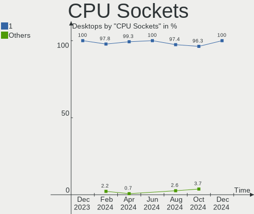
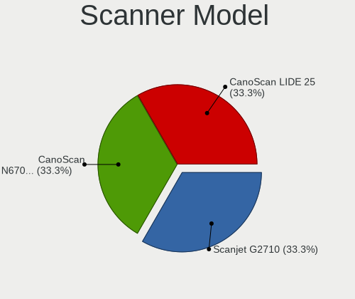

ROSA Hardware Trends (Desktop)
------------------------------

A project to identify most popular hardware characteristics and track their change
over time based on data collected by ROSA users at https://Linux-Hardware.org.

Anyone can contribute to the study by uploading probes of their computers by
the [hw-probe](https://github.com/linuxhw/hw-probe) tool:

    sudo -E hw-probe -all -upload

Full-feature report is available here: https://linux-hardware.org/?view=trends&formfactor=desktop

Period: Sep, 2020.

Contents
--------

- [ OS                       ](#os)
- [ OS Family                ](#os-family)
- [ Kernel                   ](#kernel)
- [ Kernel Family            ](#kernel-family)
- [ Kernel Major Ver.        ](#kernel-major-ver)
- [ Arch                     ](#arch)
- [ DE                       ](#de)
- [ Display Server           ](#display-server)
- [ Display Manager          ](#display-manager)
- [ OS Lang                  ](#os-lang)
- [ Boot Mode                ](#boot-mode)
- [ Filesystem               ](#filesystem)
- [ Part. scheme             ](#part-scheme)
- [ Dual Boot with Linux/BSD ](#dual-boot-with-linux/bsd)
- [ Dual Boot (Win)          ](#dual-boot-win)
- [ Country                  ](#country)
- [ City                     ](#city)
- [ Vendor                   ](#vendor)
- [ Model                    ](#model)
- [ Model Family             ](#model-family)
- [ MFG Year                 ](#mfg-year)
- [ Form Factor              ](#form-factor)
- [ Secure Boot              ](#secure-boot)
- [ Coreboot                 ](#coreboot)
- [ RAM Size                 ](#ram-size)
- [ RAM Used                 ](#ram-used)
- [ Has CD-ROM               ](#has-cd-rom)
- [ Total Drives             ](#total-drives)
- [ Has Ethernet             ](#has-ethernet)
- [ Drive Vendor             ](#drive-vendor)
- [ HDD Vendor               ](#hdd-vendor)
- [ SSD Vendor               ](#ssd-vendor)
- [ Drive Model              ](#drive-model)
- [ Drive Kind               ](#drive-kind)
- [ Drive Connector          ](#drive-connector)
- [ Drive Size               ](#drive-size)
- [ Space Total              ](#space-total)
- [ Space Used               ](#space-used)
- [ Malfunc. Drives          ](#malfunc-drives)
- [ Malfunc. Drive Vendor    ](#malfunc-drive-vendor)
- [ Malfunc. HDD Vendor      ](#malfunc-hdd-vendor)
- [ Malfunc. Drive Kind      ](#malfunc-drive-kind)
- [ Failed Drives            ](#failed-drives)
- [ Failed Drive Vendor      ](#failed-drive-vendor)
- [ Drive Status             ](#drive-status)
- [ Storage Vendor           ](#storage-vendor)
- [ Storage Model            ](#storage-model)
- [ Storage Kind             ](#storage-kind)
- [ CPU Vendor               ](#cpu-vendor)
- [ CPU Model                ](#cpu-model)
- [ CPU Model Family         ](#cpu-model-family)
- [ CPU Cores                ](#cpu-cores)
- [ CPU Sockets              ](#cpu-sockets)
- [ CPU Threads              ](#cpu-threads)
- [ CPU Op-Modes             ](#cpu-op-modes)
- [ CPU Microcode            ](#cpu-microcode)
- [ CPU Microarch            ](#cpu-microarch)
- [ GPU Vendor               ](#gpu-vendor)
- [ GPU Model                ](#gpu-model)
- [ GPU Combo                ](#gpu-combo)
- [ GPU Driver               ](#gpu-driver)
- [ GPU Memory               ](#gpu-memory)
- [ Monitor Vendor           ](#monitor-vendor)
- [ Monitor Model            ](#monitor-model)
- [ Monitor Resolution       ](#monitor-resolution)
- [ Monitor Diagonal         ](#monitor-diagonal)
- [ Monitor Width            ](#monitor-width)
- [ Aspect Ratio             ](#aspect-ratio)
- [ Monitor Area             ](#monitor-area)
- [ Pixel Density            ](#pixel-density)
- [ Multiple Monitors        ](#multiple-monitors)
- [ Net Controller Vendor    ](#net-controller-vendor)
- [ Net Controller Model     ](#net-controller-model)
- [ Wireless Vendor          ](#wireless-vendor)
- [ Wireless Model           ](#wireless-model)
- [ Ethernet Vendor          ](#ethernet-vendor)
- [ Ethernet Model           ](#ethernet-model)
- [ Net Controller Kind      ](#net-controller-kind)
- [ Used Controller          ](#used-controller)
- [ NICs                     ](#nics)
- [ Memory Vendor            ](#memory-vendor)
- [ Memory Model             ](#memory-model)
- [ Memory Kind              ](#memory-kind)
- [ Memory Form Factor       ](#memory-form-factor)
- [ Memory Size              ](#memory-size)
- [ Memory Speed             ](#memory-speed)
- [ Sound Vendor             ](#sound-vendor)
- [ Sound Model              ](#sound-model)
- [ Camera Vendor            ](#camera-vendor)
- [ Camera Model             ](#camera-model)
- [ Fingerprint Vendor       ](#fingerprint-vendor)
- [ Fingerprint Model        ](#fingerprint-model)
- [ Chipcard Vendor          ](#chipcard-vendor)
- [ Chipcard Model           ](#chipcard-model)
- [ Printer Vendor           ](#printer-vendor)
- [ Printer Model            ](#printer-model)
- [ Scanner Vendor           ](#scanner-vendor)
- [ Scanner Model            ](#scanner-model)
- [ Bluetooth Vendor         ](#bluetooth-vendor)
- [ Bluetooth Model          ](#bluetooth-model)
- [ Unsupported Devices      ](#unsupported-devices)
- [ Unsupported Device Types ](#unsupported-device-types)

OS
--

Installed operating systems

| Name         | Desktops | Percent |
|--------------|----------|---------|
| ROSA R11.1   | 71       | 60.17%  |
| ROSA R11     | 27       | 22.88%  |
| ROSA R8.1    | 7        | 5.93%   |
| ROSA R10     | 7        | 5.93%   |
| ROSA 2019.05 | 6        | 5.08%   |

OS Family
---------

OS without a version

| Name | Desktops | Percent |
|------|----------|---------|
| ROSA | 118      | 100%    |

Kernel
------

Version of the Linux kernel

| Version                           | Desktops | Percent |
|-----------------------------------|----------|---------|
| 4.15.0-desktop-94.1rosa-x86_64    | 33       | 27.97%  |
| 4.15.0-desktop-45.1rosa-x86_64    | 25       | 21.19%  |
| 5.4.40-generic-1rosa-x86_64       | 10       | 8.47%   |
| 4.9.155-nrj-desktop-1rosa-x86_64  | 9        | 7.63%   |
| 5.4.60-nickel-2rosa2019.05-x86_64 | 6        | 5.08%   |
| 5.4.32-generic-2rosa-x86_64       | 6        | 5.08%   |
| 4.9.60-nrj-desktop-1rosa-x86_64   | 5        | 4.24%   |
| 4.15.0-desktop-94.1rosa-i586      | 5        | 4.24%   |
| 4.15.0-desktop-45.1rosa-i586      | 3        | 2.54%   |
| 5.4.32-generic-2rosa-i586         | 2        | 1.69%   |
| 4.9.155-nrj-desktop-1rosa-i586    | 2        | 1.69%   |
| 4.1.38-nrj-desktop-2rosa-x86_64   | 2        | 1.69%   |
| 4.1.38-nrj-desktop-2rosa-i586     | 2        | 1.69%   |
| 5.8.9-generic-1rosa-x86_64        | 1        | 0.85%   |
| 5.8.1-generic-1rosa-x86_64        | 1        | 0.85%   |
| 5.4.60-nrj-desktop-1rosa-x86_64   | 1        | 0.85%   |
| 5.4.40-generic-1rosa-i586         | 1        | 0.85%   |
| 5.3.18-nrj-desktop-1rosa-x86_64   | 1        | 0.85%   |
| 4.9.60-nrj-desktop-1rosa-i586     | 1        | 0.85%   |
| 4.9.124-nrj-desktop-1rosa-x86_64  | 1        | 0.85%   |
| 4.15.0-desktop-60.7rosa-x86_64    | 1        | 0.85%   |

Kernel Family
-------------

Linux kernel without a distro release

| Version | Desktops | Percent |
|---------|----------|---------|
| 4.15.0  | 67       | 56.78%  |
| 5.4.40  | 11       | 9.32%   |
| 4.9.155 | 11       | 9.32%   |
| 5.4.32  | 8        | 6.78%   |
| 5.4.60  | 7        | 5.93%   |
| 4.9.60  | 6        | 5.08%   |
| 4.1.38  | 4        | 3.39%   |
| 5.8.9   | 1        | 0.85%   |
| 5.8.1   | 1        | 0.85%   |
| 5.3.18  | 1        | 0.85%   |
| 4.9.124 | 1        | 0.85%   |

Kernel Major Ver.
-----------------

Linux kernel major version

| Version | Desktops | Percent |
|---------|----------|---------|
| 4.15    | 67       | 56.78%  |
| 5.4     | 26       | 22.03%  |
| 4.9     | 18       | 15.25%  |
| 4.1     | 4        | 3.39%   |
| 5.8     | 2        | 1.69%   |
| 5.3     | 1        | 0.85%   |

Arch
----

OS architecture (x86_64, i586, etc.)

| Name   | Desktops | Percent |
|--------|----------|---------|
| x86_64 | 102      | 86.44%  |
| i686   | 16       | 13.56%  |

DE
--

Desktop Environment

| Name  | Desktops | Percent |
|-------|----------|---------|
| KDE4  | 87       | 73.73%  |
| KDE5  | 22       | 18.64%  |
| XFCE  | 4        | 3.39%   |
| LXQt  | 3        | 2.54%   |
| MATE  | 1        | 0.85%   |
| GNOME | 1        | 0.85%   |

Display Server
--------------

X11 or Wayland

| Name | Desktops | Percent |
|------|----------|---------|
| X11  | 118      | 100%    |

Display Manager
---------------

SDDM, LightDM, etc.

| Name | Desktops | Percent |
|------|----------|---------|
| KDM  | 88       | 74.58%  |
| SDDM | 29       | 24.58%  |
| GDM  | 1        | 0.85%   |

OS Lang
-------

Language

| Lang    | Desktops | Percent |
|---------|----------|---------|
| ru_RU   | 65       | 55.08%  |
| Unknown | 41       | 34.75%  |
| en_US   | 4        | 3.39%   |
| pl_PL   | 2        | 1.69%   |
| fr_FR   | 2        | 1.69%   |
| de_DE   | 2        | 1.69%   |
| pt_BR   | 1        | 0.85%   |
| en_GB   | 1        | 0.85%   |

Boot Mode
---------

EFI or BIOS

| Mode | Desktops | Percent |
|------|----------|---------|
| BIOS | 95       | 80.51%  |
| EFI  | 23       | 19.49%  |

Filesystem
----------

Type of filesystem

| Type  | Desktops | Percent |
|-------|----------|---------|
| Ext4  | 114      | 96.61%  |
| Btrfs | 2        | 1.69%   |
| Xfs   | 1        | 0.85%   |
| Aufs  | 1        | 0.85%   |

Part. scheme
------------

Scheme of partitioning

| Type    | Desktops | Percent |
|---------|----------|---------|
| MBR     | 81       | 68.64%  |
| GPT     | 31       | 26.27%  |
| Unknown | 6        | 5.08%   |

Dual Boot with Linux/BSD
------------------------

Hosting more than one Linux/BSD

| Dual boot | Desktops | Percent |
|-----------|----------|---------|
| No        | 89       | 75.42%  |
| Yes       | 29       | 24.58%  |

Dual Boot (Win)
---------------

Hosting Linux and Windows

| Dual boot | Desktops | Percent |
|-----------|----------|---------|
| Yes       | 59       | 50%     |
| No        | 59       | 50%     |

Country
-------

Geographic location (country)

| Country      | Desktops | Percent |
|--------------|----------|---------|
| Russia       | 85       | 72.03%  |
| Ukraine      | 7        | 5.93%   |
| France       | 6        | 5.08%   |
| Poland       | 3        | 2.54%   |
| Germany      | 3        | 2.54%   |
| Belarus      | 3        | 2.54%   |
| Canada       | 2        | 1.69%   |
| USA          | 1        | 0.85%   |
| South Africa | 1        | 0.85%   |
| Portugal     | 1        | 0.85%   |
| Moldova      | 1        | 0.85%   |
| Italy        | 1        | 0.85%   |
| Denmark      | 1        | 0.85%   |
| China        | 1        | 0.85%   |
| Bulgaria     | 1        | 0.85%   |
| Brazil       | 1        | 0.85%   |

City
----

Geographic location (city)

| City             | Desktops | Percent |
|------------------|----------|---------|
| Moscow           | 16       | 13.56%  |
| Irkutsk          | 5        | 4.24%   |
| Samara           | 4        | 3.39%   |
| Rebais           | 4        | 3.39%   |
| Novosibirsk      | 4        | 3.39%   |
| Perm             | 3        | 2.54%   |
| Omsk             | 3        | 2.54%   |
| Kazan’         | 3        | 2.54%   |
| Ekaterinburg     | 3        | 2.54%   |
| St Petersburg    | 2        | 1.69%   |
| Rostov-on-Don    | 2        | 1.69%   |
| Orenburg         | 2        | 1.69%   |
| Nizhniy Novgorod | 2        | 1.69%   |
| Krasnoyarsk      | 2        | 1.69%   |
| Astrakhan        | 2        | 1.69%   |
| Zernograd        | 1        | 0.85%   |
| Yaransk          | 1        | 0.85%   |
| Yakutsk          | 1        | 0.85%   |
| Volgograd        | 1        | 0.85%   |
| Vladivostok      | 1        | 0.85%   |
| Vitebsk          | 1        | 0.85%   |
| Versailles       | 1        | 0.85%   |
| Velikiye Luki    | 1        | 0.85%   |
| Ufa              | 1        | 0.85%   |
| Tver             | 1        | 0.85%   |
| Tuapse           | 1        | 0.85%   |
| Taganrog         | 1        | 0.85%   |
| Stamboliyski     | 1        | 0.85%   |
| Simferopol       | 1        | 0.85%   |
| Shuya            | 1        | 0.85%   |
| Shenyang         | 1        | 0.85%   |
| Seversk          | 1        | 0.85%   |
| Saransk          | 1        | 0.85%   |
| Rubtsovsk        | 1        | 0.85%   |
| Polonne          | 1        | 0.85%   |
| Podporozh'ye     | 1        | 0.85%   |
| Olsted           | 1        | 0.85%   |
| Odesa            | 1        | 0.85%   |
| Novorossiysk     | 1        | 0.85%   |
| Novocherkassk    | 1        | 0.85%   |
| Nevinnomyssk     | 1        | 0.85%   |
| Neftekumsk       | 1        | 0.85%   |
| Neftekamsk       | 1        | 0.85%   |
| Morshansk        | 1        | 0.85%   |
| Montreal         | 1        | 0.85%   |
| Montpellier      | 1        | 0.85%   |
| Mikołów        | 1        | 0.85%   |
| Lubliniec        | 1        | 0.85%   |
| Leipzig          | 1        | 0.85%   |
| Kyiv             | 1        | 0.85%   |
| Kurgan           | 1        | 0.85%   |
| Krymsk           | 1        | 0.85%   |
| Kremenchuk       | 1        | 0.85%   |
| Krasnodar        | 1        | 0.85%   |
| Kostroma         | 1        | 0.85%   |
| Kingisepp        | 1        | 0.85%   |
| Kharkiv          | 1        | 0.85%   |
| Kemerovo         | 1        | 0.85%   |
| Kashary          | 1        | 0.85%   |
| Izhevsk          | 1        | 0.85%   |

Vendor
------

Motherboard manufacturer

| Name                | Desktops | Percent |
|---------------------|----------|---------|
| ASUSTek Computer    | 41       | 34.75%  |
| Gigabyte Technology | 32       | 27.12%  |
| MSI                 | 16       | 13.56%  |
| ASRock              | 7        | 5.93%   |
| Acer                | 5        | 4.24%   |
| Lenovo              | 3        | 2.54%   |
| Hewlett-Packard     | 2        | 1.69%   |
| Biostar             | 2        | 1.69%   |
| WinFast             | 1        | 0.85%   |
| SiS Technology      | 1        | 0.85%   |
| Shuttle             | 1        | 0.85%   |
| Pegatron            | 1        | 0.85%   |
| Packard Bell        | 1        | 0.85%   |
| Intel               | 1        | 0.85%   |
| Huanan              | 1        | 0.85%   |
| Foxconn             | 1        | 0.85%   |
| ECS                 | 1        | 0.85%   |
| Unknown             | 1        | 0.85%   |

Model
-----

Motherboard model

| Name                                | Desktops | Percent |
|-------------------------------------|----------|---------|
| ASUS PRIME H310M-R R2.0             | 3        | 2.54%   |
| MSI MS-7817                         | 2        | 1.69%   |
| MSI MS-7808                         | 2        | 1.69%   |
| MSI MS-7592                         | 2        | 1.69%   |
| Gigabyte H77-DS3H                   | 2        | 1.69%   |
| Gigabyte GA-78LMT-USB3 R2           | 2        | 1.69%   |
| ASUS M5A78L-M LX3                   | 2        | 1.69%   |
| ASUS M5A78L-M LE                    | 2        | 1.69%   |
| ASUS All Series                     | 2        | 1.69%   |
| ASUS A68HM-K                        | 2        | 1.69%   |
| WinFast NF4K8MC                     | 1        | 0.85%   |
| SiS Technology SiS-648FX            | 1        | 0.85%   |
| Shuttle XS35                        | 1        | 0.85%   |
| Pegatron BQ470AA-ABL CQ5521F        | 1        | 0.85%   |
| Packard Bell IMEDIA D9378 AIO       | 1        | 0.85%   |
| MSI Pentino G-Series MT             | 1        | 0.85%   |
| MSI MS-7B38                         | 1        | 0.85%   |
| MSI MS-7A38                         | 1        | 0.85%   |
| MSI MS-7996                         | 1        | 0.85%   |
| MSI MS-7895                         | 1        | 0.85%   |
| MSI MS-7885                         | 1        | 0.85%   |
| MSI MS-7758                         | 1        | 0.85%   |
| MSI MS-7641                         | 1        | 0.85%   |
| MSI MS-7309                         | 1        | 0.85%   |
| MSI Compaq dx7400 Microtower        | 1        | 0.85%   |
| Lenovo ThinkStation P330 30C5S17L00 | 1        | 0.85%   |
| Lenovo ThinkStation C20 4263BA7     | 1        | 0.85%   |
| Lenovo ThinkCentre M81 5032W3M      | 1        | 0.85%   |
| Intel D525MW AAE93082-401           | 1        | 0.85%   |
| Huanan X79 249PC V2.1               | 1        | 0.85%   |
| HP ProDesk 405 G2 MT                | 1        | 0.85%   |
| HP Compaq 6200 Pro SFF PC           | 1        | 0.85%   |
| Gigabyte Z77P-D3                    | 1        | 0.85%   |
| Gigabyte Z68XP-UD3                  | 1        | 0.85%   |
| Gigabyte P55-UD3L                   | 1        | 0.85%   |
| Gigabyte P41T-D3P                   | 1        | 0.85%   |
| Gigabyte M720-US3                   | 1        | 0.85%   |
| Gigabyte M56S-S3                    | 1        | 0.85%   |
| Gigabyte H77N-WIFI                  | 1        | 0.85%   |
| Gigabyte H61M-S2PV                  | 1        | 0.85%   |
| Gigabyte H61M-DS2                   | 1        | 0.85%   |
| Gigabyte H310M S2V 2.0              | 1        | 0.85%   |
| Gigabyte GA-MA78LMT-S2              | 1        | 0.85%   |
| Gigabyte GA-MA78GM-S2H              | 1        | 0.85%   |
| Gigabyte GA-K8NMF-9                 | 1        | 0.85%   |
| Gigabyte GA-880GM-UD2H              | 1        | 0.85%   |
| Gigabyte GA-880GM-D2H               | 1        | 0.85%   |
| Gigabyte GA-78LMT-S2PV              | 1        | 0.85%   |
| Gigabyte GA-78LMT-S2PT              | 1        | 0.85%   |
| Gigabyte GA-78LMT-S2                | 1        | 0.85%   |
| Gigabyte G41M-ES2L                  | 1        | 0.85%   |
| Gigabyte G41M-Combo                 | 1        | 0.85%   |
| Gigabyte F2A68HM-S1                 | 1        | 0.85%   |
| Gigabyte EP41-UD3L                  | 1        | 0.85%   |
| Gigabyte B450M S2H                  | 1        | 0.85%   |
| Gigabyte B450 GAMING X              | 1        | 0.85%   |
| Gigabyte B450 AORUS ELITE           | 1        | 0.85%   |
| Gigabyte B150M-D3V-CF               | 1        | 0.85%   |
| Gigabyte 970A-DS3P                  | 1        | 0.85%   |
| Gigabyte 965P-S3                    | 1        | 0.85%   |

Model Family
------------

Motherboard model prefix

| Name                     | Desktops | Percent |
|--------------------------|----------|---------|
| ASUS M5A78L-M            | 5        | 4.24%   |
| ASUS PRIME               | 4        | 3.39%   |
| Acer Aspire              | 3        | 2.54%   |
| MSI MS-7817              | 2        | 1.69%   |
| MSI MS-7808              | 2        | 1.69%   |
| MSI MS-7592              | 2        | 1.69%   |
| Lenovo ThinkStation      | 2        | 1.69%   |
| Gigabyte H77-DS3H        | 2        | 1.69%   |
| Gigabyte GA-78LMT-USB3   | 2        | 1.69%   |
| Gigabyte B450            | 2        | 1.69%   |
| ASUS P5G41T-M            | 2        | 1.69%   |
| ASUS All                 | 2        | 1.69%   |
| ASUS A68HM-K             | 2        | 1.69%   |
| WinFast NF4K8MC          | 1        | 0.85%   |
| SiS Technology SiS-648FX | 1        | 0.85%   |
| Shuttle XS35             | 1        | 0.85%   |
| Pegatron BQ470AA-ABL     | 1        | 0.85%   |
| Packard Bell IMEDIA      | 1        | 0.85%   |
| MSI Pentino              | 1        | 0.85%   |
| MSI MS-7B38              | 1        | 0.85%   |
| MSI MS-7A38              | 1        | 0.85%   |
| MSI MS-7996              | 1        | 0.85%   |
| MSI MS-7895              | 1        | 0.85%   |
| MSI MS-7885              | 1        | 0.85%   |
| MSI MS-7758              | 1        | 0.85%   |
| MSI MS-7641              | 1        | 0.85%   |
| MSI MS-7309              | 1        | 0.85%   |
| MSI Compaq               | 1        | 0.85%   |
| Lenovo ThinkCentre       | 1        | 0.85%   |
| Intel D525MW             | 1        | 0.85%   |
| Huanan X79               | 1        | 0.85%   |
| HP ProDesk               | 1        | 0.85%   |
| HP Compaq                | 1        | 0.85%   |
| Gigabyte Z77P-D3         | 1        | 0.85%   |
| Gigabyte Z68XP-UD3       | 1        | 0.85%   |
| Gigabyte P55-UD3L        | 1        | 0.85%   |
| Gigabyte P41T-D3P        | 1        | 0.85%   |
| Gigabyte M720-US3        | 1        | 0.85%   |
| Gigabyte M56S-S3         | 1        | 0.85%   |
| Gigabyte H77N-WIFI       | 1        | 0.85%   |
| Gigabyte H61M-S2PV       | 1        | 0.85%   |
| Gigabyte H61M-DS2        | 1        | 0.85%   |
| Gigabyte H310M           | 1        | 0.85%   |
| Gigabyte GA-MA78LMT-S2   | 1        | 0.85%   |
| Gigabyte GA-MA78GM-S2H   | 1        | 0.85%   |
| Gigabyte GA-K8NMF-9      | 1        | 0.85%   |
| Gigabyte GA-880GM-UD2H   | 1        | 0.85%   |
| Gigabyte GA-880GM-D2H    | 1        | 0.85%   |
| Gigabyte GA-78LMT-S2PV   | 1        | 0.85%   |
| Gigabyte GA-78LMT-S2PT   | 1        | 0.85%   |
| Gigabyte GA-78LMT-S2     | 1        | 0.85%   |
| Gigabyte G41M-ES2L       | 1        | 0.85%   |
| Gigabyte G41M-Combo      | 1        | 0.85%   |
| Gigabyte F2A68HM-S1      | 1        | 0.85%   |
| Gigabyte EP41-UD3L       | 1        | 0.85%   |
| Gigabyte B450M           | 1        | 0.85%   |
| Gigabyte B150M-D3V-CF    | 1        | 0.85%   |
| Gigabyte 970A-DS3P       | 1        | 0.85%   |
| Gigabyte 965P-S3         | 1        | 0.85%   |
| Foxconn Pro              | 1        | 0.85%   |

MFG Year
--------

Motherboard manufacture year

| Year | Desktops | Percent |
|------|----------|---------|
| 2013 | 17       | 14.41%  |
| 2012 | 14       | 11.86%  |
| 2010 | 12       | 10.17%  |
| 2019 | 11       | 9.32%   |
| 2016 | 9        | 7.63%   |
| 2009 | 8        | 6.78%   |
| 2015 | 7        | 5.93%   |
| 2020 | 6        | 5.08%   |
| 2011 | 6        | 5.08%   |
| 2008 | 6        | 5.08%   |
| 2007 | 6        | 5.08%   |
| 2014 | 5        | 4.24%   |
| 2018 | 3        | 2.54%   |
| 2005 | 3        | 2.54%   |
| 2017 | 2        | 1.69%   |
| 2006 | 1        | 0.85%   |
| 2004 | 1        | 0.85%   |
| 2003 | 1        | 0.85%   |

Form Factor
-----------

Physical design of the computer

| Name    | Desktops | Percent |
|---------|----------|---------|
| Desktop | 118      | 100%    |

Secure Boot
-----------

Enabled or disabled

| State    | Desktops | Percent |
|----------|----------|---------|
| Disabled | 118      | 100%    |

Coreboot
--------

Have coreboot on board

| Used | Desktops | Percent |
|------|----------|---------|
| No   | 118      | 100%    |

RAM Size
--------

Total RAM memory

| Size in GB | Desktops | Percent |
|------------|----------|---------|
| 8.01-16.0  | 36       | 30.51%  |
| 3.01-4.0   | 28       | 23.73%  |
| 16.01-24.0 | 20       | 16.95%  |
| 1.01-2.0   | 12       | 10.17%  |
| 4.01-8.0   | 11       | 9.32%   |
| 2.01-3.0   | 5        | 4.24%   |
| 0.01-1.0   | 3        | 2.54%   |
| 24.01-32.0 | 2        | 1.69%   |
| 32.01-64.0 | 1        | 0.85%   |

RAM Used
--------

Used RAM memory

| Used GB  | Desktops | Percent |
|----------|----------|---------|
| 1.01-2.0 | 54       | 45.76%  |
| 0.01-1.0 | 51       | 43.22%  |
| 2.01-3.0 | 7        | 5.93%   |
| 4.01-8.0 | 3        | 2.54%   |
| 3.01-4.0 | 3        | 2.54%   |

Has CD-ROM
----------

Has CD-ROM on board

| Presented | Desktops | Percent |
|-----------|----------|---------|
| Yes       | 69       | 58.47%  |
| No        | 49       | 41.53%  |

Total Drives
------------

Number of drives on board

| Drives | Desktops | Percent |
|--------|----------|---------|
| 1      | 67       | 56.78%  |
| 2      | 27       | 22.88%  |
| 3      | 13       | 11.02%  |
| 0      | 5        | 4.24%   |
| 4      | 4        | 3.39%   |
| 6      | 1        | 0.85%   |
| 5      | 1        | 0.85%   |

Has Ethernet
------------

Has Ethernet on board

| Presented | Desktops | Percent |
|-----------|----------|---------|
| Yes       | 117      | 99.15%  |
| No        | 1        | 0.85%   |

Drive Vendor
------------

Hard drive vendors

| Vendor              | Desktops | Drives  | Percent |
|---------------------|----------|---------|---------|
| WDC                 | 45       | 57      | 26.63%  |
| Seagate             | 39       | 43      | 23.08%  |
| Hitachi             | 13       | 13      | 7.69%   |
| Samsung Electronics | 12       | 13      | 7.1%    |
| Kingston            | 12       | 14      | 7.1%    |
| Toshiba             | 10       | 10      | 5.92%   |
| China               | 6        | 7       | 3.55%   |
| Intel               | 4        | 4       | 2.37%   |
| MAXTOR              | 3        | 3       | 1.78%   |
| HGST                | 3        | 3       | 1.78%   |
| Crucial             | 3        | 3       | 1.78%   |
| SPCC                | 2        | 2       | 1.18%   |
| Patriot             | 2        | 2       | 1.18%   |
| e2e4                | 2        | 2       | 1.18%   |
| A-DATA Technology   | 2        | 2       | 1.18%   |
| XPG                 | 1        | 1       | 0.59%   |
| SanDisk             | 1        | 1       | 0.59%   |
| PLEXTOR             | 1        | 1       | 0.59%   |
| Netac               | 1        | 1       | 0.59%   |
| HUAWEI              | 1        | Unknown | 0.59%   |
| Hikvision           | 1        | 1       | 0.59%   |
| GOODRAM             | 1        | 1       | 0.59%   |
| Gigabyte Technology | 1        | 1       | 0.59%   |
| FOXLINE             | 1        | 1       | 0.59%   |
| Corsair             | 1        | 1       | 0.59%   |
| Apacer              | 1        | 1       | 0.59%   |

HDD Vendor
----------

Hard disk drive vendors

| Vendor              | Desktops | Drives | Percent |
|---------------------|----------|--------|---------|
| WDC                 | 43       | 53     | 37.39%  |
| Seagate             | 39       | 43     | 33.91%  |
| Hitachi             | 13       | 13     | 11.3%   |
| Toshiba             | 10       | 10     | 8.7%    |
| Samsung Electronics | 4        | 4      | 3.48%   |
| Maxtor              | 3        | 3      | 2.61%   |
| HGST                | 3        | 3      | 2.61%   |

SSD Vendor
----------

Solid state drive vendors

| Vendor              | Desktops | Drives | Percent |
|---------------------|----------|--------|---------|
| Kingston            | 12       | 14     | 24%     |
| Samsung Electronics | 6        | 7      | 12%     |
| China               | 6        | 7      | 12%     |
| WDC                 | 4        | 4      | 8%      |
| Intel               | 4        | 4      | 8%      |
| Crucial             | 3        | 3      | 6%      |
| SPCC                | 2        | 2      | 4%      |
| Patriot             | 2        | 2      | 4%      |
| e2e4                | 2        | 2      | 4%      |
| SanDisk             | 1        | 1      | 2%      |
| PLEXTOR             | 1        | 1      | 2%      |
| Netac               | 1        | 1      | 2%      |
| GOODRAM             | 1        | 1      | 2%      |
| Gigabyte Technology | 1        | 1      | 2%      |
| FOXLINE             | 1        | 1      | 2%      |
| Corsair             | 1        | 1      | 2%      |
| Apacer              | 1        | 1      | 2%      |
| A-DATA Technology   | 1        | 1      | 2%      |

Drive Model
-----------

Hard drive models

| Model                        | Desktops | Percent |
|------------------------------|----------|---------|
| HDWD110 1TB                  | 6        | 3.21%   |
| SA400S37120G 120GB SSD       | 5        | 2.67%   |
| WDS120G2G0A-00JH30 120GB SSD | 3        | 1.6%    |
| WD10EZEX-22MFCA0 1TB         | 3        | 1.6%    |
| WD10EZEX-08WN4A0 1TB         | 3        | 1.6%    |
| ST500DM002-1BD142 500GB      | 3        | 1.6%    |
| HDS721050CLA362 500GB        | 3        | 1.6%    |
| WD5000AAKX-001CA0 500GB      | 2        | 1.07%   |
| WD3200AAJS-00L7A0 320GB      | 2        | 1.07%   |
| WD20EARS-00MVWB0 2TB         | 2        | 1.07%   |
| WD10EARX-00N0YB0 1TB         | 2        | 1.07%   |
| WD10EARS-00Y5B1 1TB          | 2        | 1.07%   |
| ST380011A 80GB               | 2        | 1.07%   |
| ST3500418AS 500GB            | 2        | 1.07%   |
| ST3500413AS 500GB            | 2        | 1.07%   |
| ST3250410AS 250GB            | 2        | 1.07%   |
| ST3250310AS 250GB            | 2        | 1.07%   |
| ST3160815AS 160GB            | 2        | 1.07%   |
| ST2000DM001-1ER164 2TB       | 2        | 1.07%   |
| SSD 860 EVO 500GB            | 2        | 1.07%   |
| SSD 256GB                    | 2        | 1.07%   |
| SSD 120GB                    | 2        | 1.07%   |
| SHFS37A120G 120GB SSD        | 2        | 1.07%   |
| SA400S37240G 240GB SSD       | 2        | 1.07%   |
| MQ01ABD075 752GB             | 2        | 1.07%   |
| HTS725050A7E630 500GB        | 2        | 1.07%   |
| HDS721010CLA330 1TB          | 2        | 1.07%   |
| HD501LJ 500GB                | 2        | 1.07%   |
| DT01ACA100 1TB               | 2        | 1.07%   |
| CT120BX500SSD1 120GB         | 2        | 1.07%   |
| WDS240G2G0A-00JH30 240GB SSD | 1        | 0.53%   |
| WD800BB-55JKC0 80GB          | 1        | 0.53%   |
| WD7501AALS-00J7B1 752GB      | 1        | 0.53%   |
| WD6402AAEX-00Y9A0 640GB      | 1        | 0.53%   |
| WD6400AAKS-65Z7B0 640GB      | 1        | 0.53%   |
| WD6400AADS-00M2B0 640GB      | 1        | 0.53%   |
| WD5000LPVX-00V0TT0 500GB     | 1        | 0.53%   |
| WD5000LPCX-21VHAT0 500GB     | 1        | 0.53%   |
| WD5000AZRX-00A8LB0 500GB     | 1        | 0.53%   |
| WD5000AAKX-60U6AA0 500GB     | 1        | 0.53%   |
| WD5000AAKX-00U6AA0 500GB     | 1        | 0.53%   |
| WD5000AAKX-00ERMA0 500GB     | 1        | 0.53%   |
| WD5000AADS-00S9B0 500GB      | 1        | 0.53%   |
| WD5000AACS-00ZUB0 500GB      | 1        | 0.53%   |
| WD3200BPVT-22ZEST0 320GB     | 1        | 0.53%   |
| WD3200AAKX-001CA0 320GB      | 1        | 0.53%   |
| WD3200AAKS-00L9A0 320GB      | 1        | 0.53%   |
| WD3200AAKS-00B3A0 320GB      | 1        | 0.53%   |
| WD2500JS-57MHB1 250GB        | 1        | 0.53%   |
| WD2500AAKX-08U6AA0 250GB     | 1        | 0.53%   |
| WD2500AAKX-00ERMA0 250GB     | 1        | 0.53%   |
| WD2500AAKS-00VSA0 250GB      | 1        | 0.53%   |
| WD2500AAJS-22VTA0 250GB      | 1        | 0.53%   |
| WD20EFRX-68EUZN0 2TB         | 1        | 0.53%   |
| WD200EB-00CPF0 20GB          | 1        | 0.53%   |
| WD2000JS-00MHB0 200GB        | 1        | 0.53%   |
| WD2000JD-00HBB0 200GB        | 1        | 0.53%   |
| WD2000JB-00REA0 200GB        | 1        | 0.53%   |
| WD1600JS-08NCB1 160GB        | 1        | 0.53%   |
| WD1600BB-00GUC0 160GB        | 1        | 0.53%   |

Drive Kind
----------

HDD or SSD

| Kind    | Desktops | Drives  | Percent |
|---------|----------|---------|---------|
| HDD     | 95       | 129     | 65.97%  |
| SSD     | 43       | 54      | 29.86%  |
| NVMe    | 5        | 5       | 3.47%   |
| Unknown | 1        | Unknown | 0.69%   |

Drive Connector
---------------

SATA, SAS, NVMe, etc.

| Type | Desktops | Drives  | Percent |
|------|----------|---------|---------|
| SATA | 113      | 183     | 94.96%  |
| NVMe | 5        | 5       | 4.2%    |
| SAS  | 1        | Unknown | 0.84%   |

Drive Size
----------

Size of hard drive

| Size in TB | Desktops | Drives | Percent |
|------------|----------|--------|---------|
| 0.01-0.5   | 95       | 136    | 66.9%   |
| 0.51-1.0   | 39       | 42     | 27.46%  |
| 1.01-2.0   | 7        | 9      | 4.93%   |
| 2.01-3.0   | 1        | 1      | 0.7%    |

Space Total
-----------

Amount of disk space available on the file system

| Size in GB     | Desktops | Percent |
|----------------|----------|---------|
| 101-250        | 38       | 32.2%   |
| 1-20           | 22       | 18.64%  |
| 251-500        | 17       | 14.41%  |
| 501-1000       | 15       | 12.71%  |
| 1001-2000      | 9        | 7.63%   |
| 51-100         | 9        | 7.63%   |
| 21-50          | 6        | 5.08%   |
| More than 3000 | 1        | 0.85%   |
| 2001-3000      | 1        | 0.85%   |

Space Used
----------

Amount of used disk space

| Used GB        | Desktops | Percent |
|----------------|----------|---------|
| 1-20           | 84       | 71.19%  |
| 21-50          | 15       | 12.71%  |
| 501-1000       | 6        | 5.08%   |
| 101-250        | 5        | 4.24%   |
| 251-500        | 3        | 2.54%   |
| 51-100         | 3        | 2.54%   |
| More than 3000 | 1        | 0.85%   |
| 1001-2000      | 1        | 0.85%   |

Malfunc. Drives
---------------

Drive models with a malfunction

| Model                      | Desktops | Drives | Percent |
|----------------------------|----------|--------|---------|
| WD3200AAJS-00L7A0 320GB    | 2        | 2      | 4.08%   |
| ST500DM002-1BD142 500GB    | 2        | 2      | 4.08%   |
| ST3250410AS 250GB          | 2        | 2      | 4.08%   |
| ST3250310AS 250GB          | 2        | 2      | 4.08%   |
| HD501LJ 500GB              | 2        | 2      | 4.08%   |
| WD6400AAKS-65Z7B0 640GB    | 1        | 1      | 2.04%   |
| WD6400AADS-00M2B0 640GB    | 1        | 1      | 2.04%   |
| WD5000AAKX-001CA0 500GB    | 1        | 1      | 2.04%   |
| WD5000AADS-00S9B0 500GB    | 1        | 1      | 2.04%   |
| WD3200BPVT-22ZEST0 320GB   | 1        | 1      | 2.04%   |
| WD3200AAKS-00B3A0 320GB    | 1        | 1      | 2.04%   |
| WD2500AAKX-08U6AA0 250GB   | 1        | 1      | 2.04%   |
| WD20EARS-00MVWB0 2TB       | 1        | 1      | 2.04%   |
| WD2000JD-00HBB0 200GB      | 1        | 1      | 2.04%   |
| WD1600JS-08NCB1 160GB      | 1        | 1      | 2.04%   |
| WD15EADS-22P8B0 1TB        | 1        | 1      | 2.04%   |
| WD10EZEX-21WN4A0 1TB       | 1        | 1      | 2.04%   |
| WD10EARS-00Y5B1 1TB        | 1        | 1      | 2.04%   |
| STM3500418AS 500GB         | 1        | 1      | 2.04%   |
| STM3160813AS 160GB         | 1        | 1      | 2.04%   |
| ST9250315AS 250GB          | 1        | 1      | 2.04%   |
| ST500LT012-9WS142 500GB    | 1        | 1      | 2.04%   |
| ST3750525AS 752GB          | 1        | 1      | 2.04%   |
| ST3500830AS 500GB          | 1        | 1      | 2.04%   |
| ST3500418AS 500GB          | 1        | 1      | 2.04%   |
| ST3500320NS 500GB          | 1        | 1      | 2.04%   |
| ST3320418AS 320GB          | 1        | 1      | 2.04%   |
| ST3160815AS 160GB          | 1        | 1      | 2.04%   |
| ST3160023AS 160GB          | 1        | 1      | 2.04%   |
| ST3120026A 120GB           | 1        | 1      | 2.04%   |
| ST250DM000-1BD141 250GB    | 1        | 1      | 2.04%   |
| ST1500DL003-9VT16L 1TB     | 1        | 1      | 2.04%   |
| ST1000LM024 HN-M101MBB 1TB | 1        | 1      | 2.04%   |
| SSD110 120GB               | 1        | 1      | 2.04%   |
| Solid State Disk 120GB     | 1        | 1      | 2.04%   |
| SHFS37A120G 120GB SSD      | 1        | 1      | 2.04%   |
| MQ01ABD075 752GB           | 1        | 1      | 2.04%   |
| HDS721616PLA380 160GB      | 1        | 1      | 2.04%   |
| HDP725025GLA380 250GB      | 1        | 1      | 2.04%   |
| HD160JJ 160GB              | 1        | 1      | 2.04%   |
| HD154UI 1TB                | 1        | 1      | 2.04%   |
| Force LS SSD 240GB         | 1        | 1      | 2.04%   |
| AS350 120GB SSD            | 1        | 1      | 2.04%   |
| 7L300S0 304GB              | 1        | 1      | 2.04%   |

Malfunc. Drive Vendor
---------------------

Vendors of faulty drives

| Vendor              | Desktops | Drives | Percent |
|---------------------|----------|--------|---------|
| Seagate             | 19       | 20     | 41.3%   |
| WDC                 | 13       | 15     | 28.26%  |
| Samsung Electronics | 4        | 4      | 8.7%    |
| SPCC                | 2        | 2      | 4.35%   |
| Maxtor              | 2        | 2      | 4.35%   |
| Hitachi             | 2        | 2      | 4.35%   |
| Toshiba             | 1        | 1      | 2.17%   |
| Kingston            | 1        | 1      | 2.17%   |
| Corsair             | 1        | 1      | 2.17%   |
| Apacer              | 1        | 1      | 2.17%   |

Malfunc. HDD Vendor
-------------------

Vendors of faulty HDD drives

| Vendor              | Desktops | Drives | Percent |
|---------------------|----------|--------|---------|
| Seagate             | 19       | 20     | 46.34%  |
| WDC                 | 13       | 15     | 31.71%  |
| Samsung Electronics | 4        | 4      | 9.76%   |
| MAXTOR              | 2        | 2      | 4.88%   |
| Hitachi             | 2        | 2      | 4.88%   |
| Toshiba             | 1        | 1      | 2.44%   |

Malfunc. Drive Kind
-------------------

Kinds of faulty drives

| Kind | Desktops | Drives | Percent |
|------|----------|--------|---------|
| HDD  | 39       | 44     | 88.64%  |
| SSD  | 5        | 5      | 11.36%  |

Failed Drives
-------------

Failed drive models

| Model                   | Desktops | Drives | Percent |
|-------------------------|----------|--------|---------|
| WD800BB-55JKC0 80GB     | 1        | 1      | 50%     |
| WD1600AAJS-75M0A0 160GB | 1        | 1      | 50%     |

Failed Drive Vendor
-------------------

Failed drive vendors

| Vendor | Desktops | Drives | Percent |
|--------|----------|--------|---------|
| WDC    | 2        | 2      | 100%    |

Drive Status
------------

Number of failed and malfunc. drives

| Status   | Desktops | Drives | Percent |
|----------|----------|--------|---------|
| Works    | 85       | 135    | 63.43%  |
| Malfunc  | 44       | 49     | 32.84%  |
| Detected | 3        | 2      | 2.24%   |
| Failed   | 2        | 2      | 1.49%   |

Storage Vendor
--------------

Storage controller vendors

| Vendor                           | Desktops | Percent |
|----------------------------------|----------|---------|
| Intel                            | 72       | 53.33%  |
| AMD                              | 36       | 26.67%  |
| JMicron Technology               | 9        | 6.67%   |
| Nvidia                           | 8        | 5.93%   |
| Silicon Integrated Systems [SiS] | 2        | 1.48%   |
| Samsung Electronics              | 2        | 1.48%   |
| Realtek Semiconductor            | 2        | 1.48%   |
| Marvell Technology Group         | 2        | 1.48%   |
| Silicon Image                    | 1        | 0.74%   |
| Phison Electronics               | 1        | 0.74%   |

Storage Model
-------------

Storage controller models

| Model                                                                             | Desktops | Percent |
|-----------------------------------------------------------------------------------|----------|---------|
| SB7x0/SB8x0/SB9x0 IDE Controller                                                  | 19       | 9.41%   |
| NM10/ICH7 Family SATA Controller [IDE mode]                                       | 16       | 7.92%   |
| SB7x0/SB8x0/SB9x0 SATA Controller [IDE mode]                                      | 14       | 6.93%   |
| FCH SATA Controller [AHCI mode]                                                   | 14       | 6.93%   |
| 82801G (ICH7 Family) IDE Controller                                               | 11       | 5.45%   |
| 7 Series/C210 Series Chipset Family 6-port SATA Controller [AHCI mode]            | 7        | 3.47%   |
| SB7x0/SB8x0/SB9x0 SATA Controller [AHCI mode]                                     | 6        | 2.97%   |
| 8 Series/C220 Series Chipset Family 6-port SATA Controller 1 [AHCI mode]          | 6        | 2.97%   |
| JMB363 SATA/IDE Controller                                                        | 5        | 2.48%   |
| 200 Series PCH SATA controller [AHCI mode]                                        | 5        | 2.48%   |
| 82801I (ICH9 Family) 2 port SATA Controller [IDE mode]                            | 4        | 1.98%   |
| 7 Series/C210 Series Chipset Family 4-port SATA Controller [IDE mode]             | 4        | 1.98%   |
| 7 Series/C210 Series Chipset Family 2-port SATA Controller [IDE mode]             | 4        | 1.98%   |
| 6 Series/C200 Series Chipset Family Desktop SATA Controller (IDE mode, ports 4-5) | 4        | 1.98%   |
| 6 Series/C200 Series Chipset Family Desktop SATA Controller (IDE mode, ports 0-3) | 4        | 1.98%   |
| 6 Series/C200 Series Chipset Family 6 port Desktop SATA AHCI Controller           | 4        | 1.98%   |
| 400 Series Chipset SATA Controller                                                | 4        | 1.98%   |
| Q170/Q150/B150/H170/H110/Z170/CM236 Chipset SATA Controller [AHCI Mode]           | 3        | 1.49%   |
| MCP61 SATA Controller                                                             | 3        | 1.49%   |
| FCH IDE Controller                                                                | 3        | 1.49%   |
| 82801IB (ICH9) 2 port SATA Controller [IDE mode]                                  | 3        | 1.49%   |
| 5 Series/3400 Series Chipset 6 port SATA AHCI Controller                          | 3        | 1.49%   |
| Realtek Non-Volatile memory controller                                            | 2        | 0.99%   |
| RAID bus controller 180 SATA/PATA  [SiS]                                          | 2        | 0.99%   |
| NVMe SSD Controller SM981/PM981/PM983                                             | 2        | 0.99%   |
| MCP61 IDE                                                                         | 2        | 0.99%   |
| JMB368 IDE controller                                                             | 2        | 0.99%   |
| CK804 Serial ATA Controller                                                       | 2        | 0.99%   |
| CK804 IDE                                                                         | 2        | 0.99%   |
| 82801JI (ICH10 Family) 4 port SATA IDE Controller #1                              | 2        | 0.99%   |
| 82801JI (ICH10 Family) 2 port SATA IDE Controller #2                              | 2        | 0.99%   |
| 82801HR/HO/HH (ICH8R/DO/DH) 2 port SATA Controller [IDE mode]                     | 2        | 0.99%   |
| 82801H (ICH8 Family) 4 port SATA Controller [IDE mode]                            | 2        | 0.99%   |
| 5513 IDE Controller                                                               | 2        | 0.99%   |
| 5 Series/3400 Series Chipset 4 port SATA IDE Controller                           | 2        | 0.99%   |
| 5 Series/3400 Series Chipset 2 port SATA IDE Controller                           | 2        | 0.99%   |
| SiI 3132 Serial ATA Raid II Controller                                            | 1        | 0.5%    |
| SB7x0/SB8x0/SB9x0 SATA Controller [Non-RAID5 mode]                                | 1        | 0.5%    |
| SATA Controller [RAID mode]                                                       | 1        | 0.5%    |
| SATA controller                                                                   | 1        | 0.5%    |
| NM10/ICH7 Family SATA Controller [AHCI mode]                                      | 1        | 0.5%    |
| MCP78S [GeForce 8200] SATA Controller (non-AHCI mode)                             | 1        | 0.5%    |
| MCP78S [GeForce 8200] IDE                                                         | 1        | 0.5%    |
| MCP73 IDE Controller                                                              | 1        | 0.5%    |
| MCP65 SATA Controller                                                             | 1        | 0.5%    |
| MCP65 IDE                                                                         | 1        | 0.5%    |
| JMB362 SATA Controller                                                            | 1        | 0.5%    |
| JMB361 AHCI/IDE                                                                   | 1        | 0.5%    |
| GeForce 7100/nForce 630i SATA                                                     | 1        | 0.5%    |
| FCH SATA Controller [IDE mode]                                                    | 1        | 0.5%    |
| FCH SATA Controller D                                                             | 1        | 0.5%    |
| E12 NVMe Controller                                                               | 1        | 0.5%    |
| Cannon Lake PCH SATA AHCI Controller                                              | 1        | 0.5%    |
| C610/X99 series chipset sSATA Controller [AHCI mode]                              | 1        | 0.5%    |
| C600/X79 series chipset 6-Port SATA AHCI Controller                               | 1        | 0.5%    |
| 88SE9172 SATA III 6Gb/s RAID Controller                                           | 1        | 0.5%    |
| 88SE912x SATA 6Gb/s Controller [IDE mode]                                         | 1        | 0.5%    |
| 82801JI (ICH10 Family) SATA AHCI Controller                                       | 1        | 0.5%    |
| 82801IR/IO/IH (ICH9R/DO/DH) 4 port SATA Controller [IDE mode]                     | 1        | 0.5%    |
| 82801EB/ER (ICH5/ICH5R) IDE Controller                                            | 1        | 0.5%    |

Storage Kind
------------

Kind of storage controller (IDE, SATA, NVMe, SAS, ...)

| Kind | Desktops | Percent |
|------|----------|---------|
| SATA | 71       | 47.97%  |
| IDE  | 69       | 46.62%  |
| NVMe | 5        | 3.38%   |
| RAID | 3        | 2.03%   |

CPU Vendor
----------

Processor vendors

| Vendor | Desktops | Percent |
|--------|----------|---------|
| Intel  | 74       | 62.71%  |
| AMD    | 44       | 37.29%  |

CPU Model
---------

Processor models

| Model                                       | Desktops | Percent |
|---------------------------------------------|----------|---------|
| Intel Core 2 Duo CPU E8400 @ 3.00GHz        | 4        | 3.39%   |
| Intel Pentium 4 CPU 3.00GHz                 | 3        | 2.54%   |
| AMD Ryzen 5 2600 Six-Core Processor         | 3        | 2.54%   |
| AMD Phenom II X4 955 Processor              | 3        | 2.54%   |
| AMD FX-6300 Six-Core Processor              | 3        | 2.54%   |
| Intel Xeon CPU E5450 @ 3.00GHz              | 2        | 1.69%   |
| Intel Xeon CPU E3-1220 V2 @ 3.10GHz         | 2        | 1.69%   |
| Intel Pentium CPU G630 @ 2.70GHz            | 2        | 1.69%   |
| Intel Pentium CPU G3260 @ 3.30GHz           | 2        | 1.69%   |
| Intel Core i5-8400 CPU @ 2.80GHz            | 2        | 1.69%   |
| Intel Core i5 CPU 760 @ 2.80GHz             | 2        | 1.69%   |
| Intel Core i3-4130 CPU @ 3.40GHz            | 2        | 1.69%   |
| Intel Core i3-3220 CPU @ 3.30GHz            | 2        | 1.69%   |
| Intel Core i3-2120 CPU @ 3.30GHz            | 2        | 1.69%   |
| Intel Core i3 CPU 530 @ 2.93GHz             | 2        | 1.69%   |
| Intel Core 2 Quad CPU Q9400 @ 2.66GHz       | 2        | 1.69%   |
| Intel Core 2 Duo CPU E7600 @ 3.06GHz        | 2        | 1.69%   |
| Intel Celeron G4920 CPU @ 3.20GHz           | 2        | 1.69%   |
| Intel Atom CPU D525 @ 1.80GHz               | 2        | 1.69%   |
| AMD Athlon II X2 270 Processor              | 2        | 1.69%   |
| AMD Athlon II X2 250 Processor              | 2        | 1.69%   |
| AMD A10-5800K APU with Radeon HD Graphics   | 2        | 1.69%   |
| Intel Xeon CPU E5620 @ 2.40GHz              | 1        | 0.85%   |
| Intel Xeon CPU E5-2689 0 @ 2.60GHz          | 1        | 0.85%   |
| Intel Xeon CPU E5-2620 v2 @ 2.10GHz         | 1        | 0.85%   |
| Intel Pentium Silver J5005 CPU @ 1.50GHz    | 1        | 0.85%   |
| Intel Pentium Dual-Core CPU E6800 @ 3.33GHz | 1        | 0.85%   |
| Intel Pentium Dual-Core CPU E5700 @ 3.00GHz | 1        | 0.85%   |
| Intel Pentium Dual-Core CPU E5200 @ 2.50GHz | 1        | 0.85%   |
| Intel Pentium Dual CPU E2180 @ 2.00GHz      | 1        | 0.85%   |
| Intel Pentium Dual CPU E2160 @ 1.80GHz      | 1        | 0.85%   |
| Intel Pentium CPU G4400 @ 3.30GHz           | 1        | 0.85%   |
| Intel Pentium CPU G3420 @ 3.20GHz           | 1        | 0.85%   |
| Intel Pentium 4 CPU 2.93GHz                 | 1        | 0.85%   |
| Intel Pentium 4 CPU 2.60GHz                 | 1        | 0.85%   |
| Intel Genuine CPU 2160 @ 1.80GHz            | 1        | 0.85%   |
| Intel Genuine CPU 0000 @ 3.40GHz            | 1        | 0.85%   |
| Intel Core i7-5930K CPU @ 3.50GHz           | 1        | 0.85%   |
| Intel Core i7-3770K CPU @ 3.50GHz           | 1        | 0.85%   |
| Intel Core i7-2600K CPU @ 3.40GHz           | 1        | 0.85%   |
| Intel Core i7-2600 CPU @ 3.40GHz            | 1        | 0.85%   |
| Intel Core i5-7500 CPU @ 3.40GHz            | 1        | 0.85%   |
| Intel Core i5-3570K CPU @ 3.40GHz           | 1        | 0.85%   |
| Intel Core i5-3470 CPU @ 3.20GHz            | 1        | 0.85%   |
| Intel Core i5-3330 CPU @ 3.00GHz            | 1        | 0.85%   |
| Intel Core i5-2500 CPU @ 3.30GHz            | 1        | 0.85%   |
| Intel Core i5-2450P CPU @ 3.20GHz           | 1        | 0.85%   |
| Intel Core i3-9100F CPU @ 3.60GHz           | 1        | 0.85%   |
| Intel Core i3-9100 CPU @ 3.60GHz            | 1        | 0.85%   |
| Intel Core i3-6100 CPU @ 3.70GHz            | 1        | 0.85%   |
| Intel Core i3-3227U CPU @ 1.90GHz           | 1        | 0.85%   |
| Intel Core i3-10100 CPU @ 3.60GHz           | 1        | 0.85%   |
| Intel Core i3 CPU 550 @ 3.20GHz             | 1        | 0.85%   |
| Intel Core 2 Quad CPU Q8400 @ 2.66GHz       | 1        | 0.85%   |
| Intel Core 2 Quad CPU Q6600 @ 2.40GHz       | 1        | 0.85%   |
| Intel Core 2 Duo CPU E7500 @ 2.93GHz        | 1        | 0.85%   |
| Intel Core 2 Duo CPU E4700 @ 2.60GHz        | 1        | 0.85%   |
| Intel Core 2 Duo CPU E4400 @ 2.00GHz        | 1        | 0.85%   |
| Intel Celeron CPU G1840 @ 2.80GHz           | 1        | 0.85%   |
| Intel Celeron CPU G1620 @ 2.70GHz           | 1        | 0.85%   |

CPU Model Family
----------------

Processor model prefix

| Model                   | Desktops | Percent |
|-------------------------|----------|---------|
| Intel Core i3           | 14       | 11.86%  |
| Intel Core i5           | 10       | 8.47%   |
| Intel Core 2 Duo        | 9        | 7.63%   |
| Intel Xeon              | 7        | 5.93%   |
| AMD FX                  | 7        | 5.93%   |
| Intel Pentium           | 6        | 5.08%   |
| AMD Athlon II X2        | 6        | 5.08%   |
| Intel Pentium 4         | 5        | 4.24%   |
| Intel Celeron           | 5        | 4.24%   |
| Intel Core i7           | 4        | 3.39%   |
| Intel Core 2 Quad       | 4        | 3.39%   |
| AMD Phenom II X4        | 4        | 3.39%   |
| AMD Athlon 64 X2        | 4        | 3.39%   |
| Intel Pentium Dual-Core | 3        | 2.54%   |
| AMD Ryzen 5             | 3        | 2.54%   |
| AMD Athlon 64           | 3        | 2.54%   |
| AMD A8                  | 3        | 2.54%   |
| Intel Pentium Dual      | 2        | 1.69%   |
| Intel Genuine           | 2        | 1.69%   |
| Intel Atom              | 2        | 1.69%   |
| AMD Ryzen 3             | 2        | 1.69%   |
| AMD Phenom II X6        | 2        | 1.69%   |
| AMD Athlon II X3        | 2        | 1.69%   |
| AMD A6                  | 2        | 1.69%   |
| AMD A10                 | 2        | 1.69%   |
| Intel Pentium Silver    | 1        | 0.85%   |
| AMD Ryzen 9             | 1        | 0.85%   |
| AMD Athlon X4           | 1        | 0.85%   |
| AMD Athlon II X4        | 1        | 0.85%   |
| AMD A4                  | 1        | 0.85%   |

CPU Cores
---------

Number of processor cores

| Number | Desktops | Percent |
|--------|----------|---------|
| 2      | 56       | 47.46%  |
| 4      | 33       | 27.97%  |
| 1      | 11       | 9.32%   |
| 6      | 10       | 8.47%   |
| 3      | 5        | 4.24%   |
| 8      | 2        | 1.69%   |
| 12     | 1        | 0.85%   |

CPU Sockets
-----------

Number of sockets

| Number | Desktops | Percent |
|--------|----------|---------|
| 1      | 117      | 99.15%  |
| 2      | 1        | 0.85%   |

CPU Threads
-----------

Threads per core (Hyper-Threading)

| Number | Desktops | Percent |
|--------|----------|---------|
| 1      | 74       | 62.71%  |
| 2      | 44       | 37.29%  |

CPU Op-Modes
------------

CPU Operation Modes (32-bit, 64-bit)

| Op mode        | Desktops | Percent |
|----------------|----------|---------|
| 32-bit, 64-bit | 117      | 99.15%  |
| 32-bit         | 1        | 0.85%   |

CPU Microcode
-------------

Microcode number

| Number     | Desktops | Percent |
|------------|----------|---------|
| 0x306a9    | 11       | 9.32%   |
| 0x1067a    | 11       | 9.32%   |
| 0x010000c8 | 9        | 7.63%   |
| Unknown    | 9        | 7.63%   |
| 0x206a7    | 8        | 6.78%   |
| 0x306c3    | 6        | 5.08%   |
| 0x06000852 | 6        | 5.08%   |
| 0x906eb    | 4        | 3.39%   |
| 0x10676    | 4        | 3.39%   |
| 0x06001119 | 4        | 3.39%   |
| 0x906ea    | 3        | 2.54%   |
| 0x6fd      | 3        | 2.54%   |
| 0x0800820d | 3        | 2.54%   |
| 0xf43      | 2        | 1.69%   |
| 0x6fb      | 2        | 1.69%   |
| 0x506e3    | 2        | 1.69%   |
| 0x106e5    | 2        | 1.69%   |
| 0x106ca    | 2        | 1.69%   |
| 0x06003106 | 2        | 1.69%   |
| 0x010000dc | 2        | 1.69%   |
| 0x010000db | 2        | 1.69%   |
| 0xf49      | 1        | 0.85%   |
| 0xf41      | 1        | 0.85%   |
| 0xf29      | 1        | 0.85%   |
| 0xa0653    | 1        | 0.85%   |
| 0x906e9    | 1        | 0.85%   |
| 0x706a1    | 1        | 0.85%   |
| 0x6f2      | 1        | 0.85%   |
| 0x306f2    | 1        | 0.85%   |
| 0x306e4    | 1        | 0.85%   |
| 0x206d7    | 1        | 0.85%   |
| 0x206c2    | 1        | 0.85%   |
| 0x20655    | 1        | 0.85%   |
| 0x20652    | 1        | 0.85%   |
| 0x08701013 | 1        | 0.85%   |
| 0x08101016 | 1        | 0.85%   |
| 0x08001138 | 1        | 0.85%   |
| 0x07030106 | 1        | 0.85%   |
| 0x0600611a | 1        | 0.85%   |
| 0x06006113 | 1        | 0.85%   |
| 0x0600063e | 1        | 0.85%   |
| 0x010000c7 | 1        | 0.85%   |

CPU Microarch
-------------

Microarchitecture

| Name          | Desktops | Percent |
|---------------|----------|---------|
| Core          | 21       | 17.8%   |
| K10           | 15       | 12.71%  |
| IvyBridge     | 12       | 10.17%  |
| Skylake       | 11       | 9.32%   |
| Piledriver    | 10       | 8.47%   |
| SandyBridge   | 9        | 7.63%   |
| K8 Hammer     | 7        | 5.93%   |
| Haswell       | 7        | 5.93%   |
| NetBurst      | 5        | 4.24%   |
| Westmere      | 4        | 3.39%   |
| Zen+          | 3        | 2.54%   |
| Zen           | 2        | 1.69%   |
| Steamroller   | 2        | 1.69%   |
| Nehalem       | 2        | 1.69%   |
| Excavator     | 2        | 1.69%   |
| Bonnell       | 2        | 1.69%   |
| Zen 2         | 1        | 0.85%   |
| Puma          | 1        | 0.85%   |
| Goldmont plus | 1        | 0.85%   |
| Bulldozer     | 1        | 0.85%   |

GPU Vendor
----------

Vendors of graphics cards

| Vendor | Desktops | Percent |
|--------|----------|---------|
| Nvidia | 62       | 51.67%  |
| AMD    | 36       | 30%     |
| Intel  | 22       | 18.33%  |

GPU Model
---------

Graphics card models

| Model                                                                 | Desktops | Percent |
|-----------------------------------------------------------------------|----------|---------|
| GK208B [GeForce GT 710]                                               | 6        | 4.8%    |
| GP108 [GeForce GT 1030]                                               | 4        | 3.2%    |
| GP107 [GeForce GTX 1050 Ti]                                           | 4        | 3.2%    |
| Ellesmere [Radeon RX 470/480/570/570X/580/580X/590]                   | 4        | 3.2%    |
| Xeon E3-1200 v2/3rd Gen Core processor Graphics Controller            | 3        | 2.4%    |
| RS780L [Radeon 3000]                                                  | 3        | 2.4%    |
| NV44 [GeForce 6200 TurboCache]                                        | 3        | 2.4%    |
| GP107 [GeForce GTX 1050]                                              | 3        | 2.4%    |
| GK107 [GeForce GTX 650]                                               | 3        | 2.4%    |
| 2nd Generation Core Processor Family Integrated Graphics Controller   | 3        | 2.4%    |
| Xeon E3-1200 v3/4th Gen Core Processor Integrated Graphics Controller | 2        | 1.6%    |
| UHD Graphics 630 (Desktop)                                            | 2        | 1.6%    |
| UHD Graphics 610                                                      | 2        | 1.6%    |
| Turks PRO [Radeon HD 6570/7570/8550]                                  | 2        | 1.6%    |
| Lexa PRO [Radeon 540/540X/550/550X / RX 540X/550/550X]                | 2        | 1.6%    |
| GT218 [GeForce 210]                                                   | 2        | 1.6%    |
| GM107 [GeForce GTX 750 Ti]                                            | 2        | 1.6%    |
| GK208B [GeForce GT 730]                                               | 2        | 1.6%    |
| GF108 [GeForce GT 630]                                                | 2        | 1.6%    |
| GF106 [GeForce GTS 450]                                               | 2        | 1.6%    |
| GF104 [GeForce GTX 460]                                               | 2        | 1.6%    |
| Cape Verde XT [Radeon HD 7770/8760 / R7 250X]                         | 2        | 1.6%    |
| Atom Processor D4xx/D5xx/N4xx/N5xx Integrated Graphics Controller     | 2        | 1.6%    |
| 4 Series Chipset Integrated Graphics Controller                       | 2        | 1.6%    |
| Wani [Radeon R5/R6/R7 Graphics]                                       | 1        | 0.8%    |
| UHD Graphics 630                                                      | 1        | 0.8%    |
| UHD Graphics 605                                                      | 1        | 0.8%    |
| TU116 [GeForce GTX 1660]                                              | 1        | 0.8%    |
| Trinity [Radeon HD 7660D]                                             | 1        | 0.8%    |
| Trinity 2 [Radeon HD 7480D]                                           | 1        | 0.8%    |
| RV730 XT [Radeon HD 4670]                                             | 1        | 0.8%    |
| RV710 [Radeon HD 4550]                                                | 1        | 0.8%    |
| RV610 [Radeon HD 2400 PRO]                                            | 1        | 0.8%    |
| RV370 [Radeon X300/X550/X1050 Series] (Secondary)                     | 1        | 0.8%    |
| RV370 [Radeon X300/X550/X1050 Series]                                 | 1        | 0.8%    |
| RV280 [Radeon 9200 PRO] (Secondary)                                   | 1        | 0.8%    |
| RV280 [Radeon 9200 PRO / 9250]                                        | 1        | 0.8%    |
| RS780 [Radeon HD 3200]                                                | 1        | 0.8%    |
| Richland [Radeon HD 8470D]                                            | 1        | 0.8%    |
| Raven Ridge [Radeon Vega Series / Radeon Vega Mobile Series]          | 1        | 0.8%    |
| R580 [Radeon X1900 GT] (Secondary)                                    | 1        | 0.8%    |
| R580 [Radeon X1900 GT]                                                | 1        | 0.8%    |
| Pitcairn XT [Radeon HD 7870 GHz Edition]                              | 1        | 0.8%    |
| Oland XT [Radeon HD 8670 / R7 250/350]                                | 1        | 0.8%    |
| Oland PRO [Radeon R7 240/340]                                         | 1        | 0.8%    |
| NV43 [GeForce 6600]                                                   | 1        | 0.8%    |
| NV43 [GeForce 6600 GT]                                                | 1        | 0.8%    |
| NV34 [GeForce FX 5500]                                                | 1        | 0.8%    |
| NV11 [GeForce2 MX/MX 400]                                             | 1        | 0.8%    |
| Mullins [Radeon R4/R5 Graphics]                                       | 1        | 0.8%    |
| Kaveri [Radeon R7 Graphics]                                           | 1        | 0.8%    |
| Kaveri [Radeon R5 Graphics]                                           | 1        | 0.8%    |
| Juniper PRO [Radeon HD 5750]                                          | 1        | 0.8%    |
| HD Graphics P630                                                      | 1        | 0.8%    |
| GT216 [GeForce GT 220]                                                | 1        | 0.8%    |
| GT215 [GeForce GT 320]                                                | 1        | 0.8%    |
| GT215 [GeForce GT 240]                                                | 1        | 0.8%    |
| GP106 [GeForce GTX 1060 3GB]                                          | 1        | 0.8%    |
| GM206 [GeForce GTX 950]                                               | 1        | 0.8%    |
| GM204 [GeForce GTX 980]                                               | 1        | 0.8%    |

GPU Combo
---------

Combinations of graphics cards

| Name        | Desktops | Percent |
|-------------|----------|---------|
| 1 x Nvidia  | 62       | 52.54%  |
| 1 x AMD     | 30       | 25.42%  |
| 1 x Intel   | 20       | 16.95%  |
| 2 x AMD     | 5        | 4.24%   |
| Intel + AMD | 1        | 0.85%   |

GPU Driver
----------

Free vs proprietary

| Driver      | Desktops | Percent |
|-------------|----------|---------|
| Free        | 99       | 83.9%   |
| Proprietary | 17       | 14.41%  |
| Unknown     | 2        | 1.69%   |

GPU Memory
----------

Total video memory

| Size in GB | Desktops | Percent |
|------------|----------|---------|
| 1.01-2.0   | 30       | 25.42%  |
| 0.51-1.0   | 29       | 24.58%  |
| 0.01-0.5   | 29       | 24.58%  |
| Unknown    | 15       | 12.71%  |
| 3.01-4.0   | 10       | 8.47%   |
| 7.01-8.0   | 2        | 1.69%   |
| 2.01-3.0   | 2        | 1.69%   |
| 5.01-6.0   | 1        | 0.85%   |

Monitor Vendor
--------------

Monitor vendors

| Vendor               | Desktops | Percent |
|----------------------|----------|---------|
| Samsung Electronics  | 32       | 28.07%  |
| Acer                 | 17       | 14.91%  |
| Goldstar             | 13       | 11.4%   |
| Philips              | 8        | 7.02%   |
| BenQ                 | 8        | 7.02%   |
| Hewlett-Packard      | 7        | 6.14%   |
| Dell                 | 7        | 6.14%   |
| ViewSonic            | 6        | 5.26%   |
| AOC                  | 6        | 5.26%   |
| Ancor Communications | 2        | 1.75%   |
| SEL                  | 1        | 0.88%   |
| NEC Computers        | 1        | 0.88%   |
| Medion               | 1        | 0.88%   |
| IBM                  | 1        | 0.88%   |
| HKC                  | 1        | 0.88%   |
| Fujitsu Siemens      | 1        | 0.88%   |
| Belinea              | 1        | 0.88%   |
| ASUSTek Computer     | 1        | 0.88%   |

Monitor Model
-------------

Monitor models

| Model                                               | Desktops | Percent |
|-----------------------------------------------------|----------|---------|
| SyncMaster SAM034D 1280x1024 376x301mm 19.0-inch    | 4        | 3.51%   |
| VA2419 Series VSC7B32 1920x1080 527x296mm 23.8-inch | 3        | 2.63%   |
| SyncMaster SAM01E1 1280x1024 376x301mm 19.0-inch    | 3        | 2.63%   |
| W1943 GSM4BAD 1024x768 410x230mm 18.5-inch          | 2        | 1.75%   |
| V203H ACR0081 1600x900 443x249mm 20.0-inch          | 2        | 1.75%   |
| SyncMaster SAM010B 1280x1024 338x270mm 17.0-inch    | 2        | 1.75%   |
| SME1720NR SAM0696 1280x1024 338x270mm 17.0-inch     | 2        | 1.75%   |
| 2269WM AOC2269 1920x1080 477x268mm 21.5-inch        | 2        | 1.75%   |
| XL2410T BNQ7F02 1920x1080 521x293mm 23.5-inch       | 1        | 0.88%   |
| w2228h HWP2811 1680x1050 473x296mm 22.0-inch        | 1        | 0.88%   |
| VZ239 AUS23CC 1920x1080 509x286mm 23.0-inch         | 1        | 0.88%   |
| VX2458 Series VSC36AF 1920x1080 521x293mm 23.5-inch | 1        | 0.88%   |
| VX2258WM VSC8E23 1920x1080 477x268mm 21.5-inch      | 1        | 0.88%   |
| VA903 SERIES VSC111E 1280x1024 376x301mm 19.0-inch  | 1        | 0.88%   |
| V223W ACR001B 1680x1050 474x296mm 22.0-inch         | 1        | 0.88%   |
| V223HQ ACR0070 1920x1080 477x268mm 21.5-inch        | 1        | 0.88%   |
| V196L ACR0363 1280x1024 376x301mm 19.0-inch         | 1        | 0.88%   |
| V193HQL ACR0127 1366x768 410x230mm 18.5-inch        | 1        | 0.88%   |
| V193 ACR004C 1280x1024 376x301mm 19.0-inch          | 1        | 0.88%   |
| V173 ACR0023 1280x1024 340x270mm 17.1-inch          | 1        | 0.88%   |
| U2412M DELA07A 1920x1200 518x324mm 24.1-inch        | 1        | 0.88%   |
| U2312HM DEL4071 1920x1080 510x287mm 23.0-inch       | 1        | 0.88%   |
| T23B550 SAM0959 1920x1080 510x287mm 23.0-inch       | 1        | 0.88%   |
| T17-1 FUS0542 1280x1024 334x270mm 16.9-inch         | 1        | 0.88%   |
| SyncMaster SAM0543 1600x900 440x250mm 19.9-inch     | 1        | 0.88%   |
| SyncMaster SAM03E4 1680x1050 474x296mm 22.0-inch    | 1        | 0.88%   |
| SyncMaster SAM03C2 1680x1050 459x296mm 21.5-inch    | 1        | 0.88%   |
| SyncMaster SAM0373 1680x1050 459x296mm 21.5-inch    | 1        | 0.88%   |
| SyncMaster SAM036F 1440x900 428x255mm 19.6-inch     | 1        | 0.88%   |
| SyncMaster SAM036E 1280x1024 376x301mm 19.0-inch    | 1        | 0.88%   |
| SyncMaster SAM0303 1680x1050 494x320mm 23.2-inch    | 1        | 0.88%   |
| SyncMaster SAM0248 1280x1024 376x301mm 19.0-inch    | 1        | 0.88%   |
| SyncMaster SAM01E3 1280x1024 338x270mm 17.0-inch    | 1        | 0.88%   |
| SyncMaster SAM01B7 1280x1024 338x270mm 17.0-inch    | 1        | 0.88%   |
| SyncMaster SAM011E 1280x1024 338x270mm 17.0-inch    | 1        | 0.88%   |
| SyncMaster SAM00A1 1280x1024 340x270mm 17.1-inch    | 1        | 0.88%   |
| SMT22A350 SAM07A7 1920x1080 480x270mm 21.7-inch     | 1        | 0.88%   |
| SE2416H DELD081 1920x1080 527x296mm 23.8-inch       | 1        | 0.88%   |
| SA300/SA350 SAM0849 1920x1080 477x268mm 21.5-inch   | 1        | 0.88%   |
| S24D330 SAM0D92 1920x1080 531x299mm 24.0-inch       | 1        | 0.88%   |
| S24B300 SAM08B3 1920x1080 521x293mm 23.5-inch       | 1        | 0.88%   |
| S19C200 SAM09AC 1366x768 410x230mm 18.5-inch        | 1        | 0.88%   |
| Q3279WG5B AOC3279 2560x1440 725x428mm 33.1-inch     | 1        | 0.88%   |
| PHL 243V7 PHLC155 1920x1080 530x300mm 24.0-inch     | 1        | 0.88%   |
| PHL 234E5 PHLC0C7 1920x1080 509x286mm 23.0-inch     | 1        | 0.88%   |
| PHL 223V5 PHLC0CF 1920x1080 480x270mm 21.7-inch     | 1        | 0.88%   |
| P191W ACR0005 1440x900 408x255mm 18.9-inch          | 1        | 0.88%   |
| MD 20120 MED3608 1920x1080 521x293mm 23.5-inch      | 1        | 0.88%   |
| LG ULTRAWIDE GSM59F1 1920x1080 580x240mm 24.7-inch  | 1        | 0.88%   |
| LCD1770NX NEC6665 1280x1024 338x270mm 17.0-inch     | 1        | 0.88%   |
| LCD Monitor SAM0F09 3840x2160 1872x1053mm 84.6-inch | 1        | 0.88%   |
| LCD Monitor SAM07BF 1920x1080 886x498mm 40.0-inch   | 1        | 0.88%   |
| L1942 GSM4B86 1280x1024 376x301mm 19.0-inch         | 1        | 0.88%   |
| L1925 HWP259A 1280x1024 376x301mm 19.0-inch         | 1        | 0.88%   |
| L1918S GSM4B31 1280x1024 376x301mm 19.0-inch        | 1        | 0.88%   |
| L1740 HWP2648 1280x1024 337x270mm 17.0-inch         | 1        | 0.88%   |
| L171 IBM24C9 1280x1024 340x270mm 17.1-inch          | 1        | 0.88%   |
| K202HQL ACR040C 1600x900 432x240mm 19.5-inch        | 1        | 0.88%   |
| K192HQL ACR048C 1366x768 410x230mm 18.5-inch        | 1        | 0.88%   |
| IPS FULLHD GSM5AB6 1920x1080 480x270mm 21.7-inch    | 1        | 0.88%   |

Monitor Resolution
------------------

Monitor screen resolution

| Resolution         | Desktops | Percent |
|--------------------|----------|---------|
| 1920x1080 (FHD)    | 49       | 43.36%  |
| 1280x1024 (SXGA)   | 37       | 32.74%  |
| 1680x1050 (WSXGA+) | 6        | 5.31%   |
| 1600x900 (HD+)     | 6        | 5.31%   |
| 1440x900 (WXGA+)   | 4        | 3.54%   |
| 1366x768 (WXGA)    | 3        | 2.65%   |
| 1360x768           | 2        | 1.77%   |
| 1024x768 (XGA)     | 2        | 1.77%   |
| 3840x2160 (4K)     | 1        | 0.88%   |
| 2560x1440 (QHD)    | 1        | 0.88%   |
| 2560x1080          | 1        | 0.88%   |
| 1920x1200 (WUXGA)  | 1        | 0.88%   |

Monitor Diagonal
----------------

Diagonal size in inches

| Inches | Desktops | Percent |
|--------|----------|---------|
| 19     | 26       | 23.01%  |
| 21     | 23       | 20.35%  |
| 23     | 22       | 19.47%  |
| 17     | 13       | 11.5%   |
| 24     | 7        | 6.19%   |
| 18     | 7        | 6.19%   |
| 20     | 5        | 4.42%   |
| 22     | 3        | 2.65%   |
| 84     | 1        | 0.88%   |
| 33     | 1        | 0.88%   |
| 29     | 1        | 0.88%   |
| 27     | 1        | 0.88%   |
| 16     | 1        | 0.88%   |
| 15     | 1        | 0.88%   |
| 13     | 1        | 0.88%   |

Monitor Width
-------------

Physical width

| Width in mm | Desktops | Percent |
|-------------|----------|---------|
| 401-500     | 42       | 37.17%  |
| 501-600     | 29       | 25.66%  |
| 351-400     | 23       | 20.35%  |
| 301-350     | 15       | 13.27%  |
| 701-800     | 1        | 0.88%   |
| 601-700     | 1        | 0.88%   |
| 201-300     | 1        | 0.88%   |
| 1501-2000   | 1        | 0.88%   |

Aspect Ratio
------------

Proportional relationship between the width and the height

| Ratio | Desktops | Percent |
|-------|----------|---------|
| 16/9  | 63       | 55.75%  |
| 5/4   | 35       | 30.97%  |
| 16/10 | 9        | 7.96%   |
| 4/3   | 3        | 2.65%   |
| 6/5   | 1        | 0.88%   |
| 3/2   | 1        | 0.88%   |
| 21/9  | 1        | 0.88%   |

Monitor Area
------------

Area in inch²

| Area in inch² | Desktops | Percent |
|----------------|----------|---------|
| 151-200        | 48       | 42.86%  |
| 201-250        | 38       | 33.93%  |
| 141-150        | 18       | 16.07%  |
| 301-350        | 2        | 1.79%   |
| More than 1000 | 1        | 0.89%   |
| 351-500        | 1        | 0.89%   |
| 251-300        | 1        | 0.89%   |
| 131-140        | 1        | 0.89%   |
| 101-110        | 1        | 0.89%   |
| 91-100         | 1        | 0.89%   |

Pixel Density
-------------

Pixels per inch

| Density | Desktops | Percent |
|---------|----------|---------|
| 51-100  | 89       | 80.91%  |
| 101-120 | 21       | 19.09%  |

Multiple Monitors
-----------------

Total monitors connected

| Total | Desktops | Percent |
|-------|----------|---------|
| 1     | 109      | 92.37%  |
| 2     | 6        | 5.08%   |
| 0     | 3        | 2.54%   |

Net Controller Vendor
---------------------

Controller vendors

| Vendor                           | Desktops | Percent |
|----------------------------------|----------|---------|
| Realtek Semiconductor            | 82       | 52.23%  |
| Qualcomm Atheros                 | 12       | 7.64%   |
| Intel                            | 12       | 7.64%   |
| Ralink Technology                | 9        | 5.73%   |
| Nvidia                           | 6        | 3.82%   |
| Huawei Technologies              | 5        | 3.18%   |
| Marvell Technology Group         | 3        | 1.91%   |
| D-Link System                    | 3        | 1.91%   |
| Xilinx                           | 2        | 1.27%   |
| Xiaomi                           | 2        | 1.27%   |
| Silicon Integrated Systems [SiS] | 2        | 1.27%   |
| Qualcomm Atheros Communications  | 2        | 1.27%   |
| NetGear                          | 2        | 1.27%   |
| D-Link                           | 2        | 1.27%   |
| ZyXEL Communications             | 1        | 0.64%   |
| ZTE WCDMA Technologies MSM       | 1        | 0.64%   |
| VIA Technologies                 | 1        | 0.64%   |
| TP-Link                          | 1        | 0.64%   |
| STMicroelectronics               | 1        | 0.64%   |
| Ralink                           | 1        | 0.64%   |
| Qualcomm                         | 1        | 0.64%   |
| MediaTek                         | 1        | 0.64%   |
| JMicron Technology               | 1        | 0.64%   |
| Gemtek                           | 1        | 0.64%   |
| Broadcom Limited                 | 1        | 0.64%   |
| ASUSTek Computer                 | 1        | 0.64%   |
| 3Com                             | 1        | 0.64%   |

Net Controller Model
--------------------

Controller models

| Model                                                         | Desktops | Percent |
|---------------------------------------------------------------|----------|---------|
| RTL8111/8168/8411 PCI Express Gigabit Ethernet Controller     | 75       | 46.3%   |
| RT5370 Wireless Adapter                                       | 4        | 2.47%   |
| MT7601U Wireless Adapter                                      | 4        | 2.47%   |
| RTL8188EUS 802.11n Wireless Network Adapter                   | 3        | 1.85%   |
| RTL810xE PCI Express Fast Ethernet controller                 | 3        | 1.85%   |
| MCP61 Ethernet                                                | 3        | 1.85%   |
| AR8151 v2.0 Gigabit Ethernet                                  | 3        | 1.85%   |
| SiS900 PCI Fast Ethernet                                      | 2        | 1.23%   |
| RTL8188CE 802.11b/g/n WiFi Adapter                            | 2        | 1.23%   |
| RTL8169 PCI Gigabit Ethernet Controller                       | 2        | 1.23%   |
| RTL-8100/8101L/8139 PCI Fast Ethernet Adapter                 | 2        | 1.23%   |
| QCA8171 Gigabit Ethernet                                      | 2        | 1.23%   |
| Network controller                                            | 2        | 1.23%   |
| CK804 Ethernet Controller                                     | 2        | 1.23%   |
| Attansic L1 Gigabit Ethernet                                  | 2        | 1.23%   |
| AR9271 802.11n                                                | 2        | 1.23%   |
| AR8161 Gigabit Ethernet                                       | 2        | 1.23%   |
| 88E8053 PCI-E Gigabit Ethernet Controller                     | 2        | 1.23%   |
| 82579V Gigabit Network Connection                             | 2        | 1.23%   |
| 82579LM Gigabit Network Connection (Lewisville)               | 2        | 1.23%   |
| ZyXEL Dual-Band Wireless AC USB Adapter                       | 1        | 0.62%   |
| ZTE USB Device                                                | 1        | 0.62%   |
| WUBR-177G [Ralink RT2571W]                                    | 1        | 0.62%   |
| Wireless N Nano USB Adapter                                   | 1        | 0.62%   |
| Wireless 7260                                                 | 1        | 0.62%   |
| WG111v3 54 Mbps Wireless [realtek RTL8187B]                   | 1        | 0.62%   |
| VT6105/VT6106S [Rhine-III]                                    | 1        | 0.62%   |
| USB-N13 802.11n Network Adapter (rev. B1) [Realtek RTL8192CU] | 1        | 0.62%   |
| TL-WN821N Version 5 RTL8192EU                                 | 1        | 0.62%   |
| STM32F407                                                     | 1        | 0.62%   |
| RT3060 Wireless 802.11n 1T/1R                                 | 1        | 0.62%   |
| RT2501/RT2573 Wireless Adapter                                | 1        | 0.62%   |
| NetXtreme BCM5755 Gigabit Ethernet PCI Express                | 1        | 0.62%   |
| Modem/Networkcard                                             | 1        | 0.62%   |
| Mi/Redmi series (RNDIS)                                       | 1        | 0.62%   |
| Mi/Redmi series (RNDIS + ADB)                                 | 1        | 0.62%   |
| MCP65 Ethernet                                                | 1        | 0.62%   |
| Lenovo Z5 Pro GT                                              | 1        | 0.62%   |
| JMC250 PCI Express Gigabit Ethernet Controller                | 1        | 0.62%   |
| Infinix X624                                                  | 1        | 0.62%   |
| I211 Gigabit Network Connection                               | 1        | 0.62%   |
| FIG-LX1                                                       | 1        | 0.62%   |
| Ethernet Connection (7) I219-LM                               | 1        | 0.62%   |
| Ethernet Connection (2) I219-V                                | 1        | 0.62%   |
| Ethernet Connection (2) I218-V                                | 1        | 0.62%   |
| E353/E3131                                                    | 1        | 0.62%   |
| E161/E169/E620/E800 HSDPA Modem                               | 1        | 0.62%   |
| DWA-140 RangeBooster N Adapter(rev.B3) [Ralink RT5372]        | 1        | 0.62%   |
| DWA-140 RangeBooster N Adapter(rev.B2) [Ralink RT3072]        | 1        | 0.62%   |
| DWA-125 Wireless N 150 Adapter(rev.A2) [Ralink RT3070]        | 1        | 0.62%   |
| DGE-530T Gigabit Ethernet Adapter (rev 11)                    | 1        | 0.62%   |
| Centrino Wireless-N 2230                                      | 1        | 0.62%   |
| Broadband stick                                               | 1        | 0.62%   |
| Attansic L2 Fast Ethernet                                     | 1        | 0.62%   |
| AR9287 Wireless Network Adapter (PCI-Express)                 | 1        | 0.62%   |
| AR8121/AR8113/AR8114 Gigabit or Fast Ethernet                 | 1        | 0.62%   |
| A6100 AC600 DB Wireless Adapter [Realtek RTL8811AU]           | 1        | 0.62%   |
| 88E8056 PCI-E Gigabit Ethernet Controller                     | 1        | 0.62%   |
| 82578DC Gigabit Network Connection                            | 1        | 0.62%   |
| 82566DC-2 Gigabit Network Connection                          | 1        | 0.62%   |

Wireless Vendor
---------------

Wireless vendors

| Vendor                          | Desktops | Percent |
|---------------------------------|----------|---------|
| Ralink Technology               | 9        | 30%     |
| Realtek Semiconductor           | 5        | 16.67%  |
| Qualcomm Atheros Communications | 2        | 6.67%   |
| NetGear                         | 2        | 6.67%   |
| Intel                           | 2        | 6.67%   |
| D-Link System                   | 2        | 6.67%   |
| D-Link                          | 2        | 6.67%   |
| ZyXEL Communications            | 1        | 3.33%   |
| TP-Link                         | 1        | 3.33%   |
| Ralink                          | 1        | 3.33%   |
| Qualcomm Atheros                | 1        | 3.33%   |
| Gemtek                          | 1        | 3.33%   |
| ASUSTek Computer                | 1        | 3.33%   |

Wireless Model
--------------

Wireless models

| Model                                                         | Desktops | Percent |
|---------------------------------------------------------------|----------|---------|
| RT5370 Wireless Adapter                                       | 4        | 13.33%  |
| MT7601U Wireless Adapter                                      | 4        | 13.33%  |
| RTL8188EUS 802.11n Wireless Network Adapter                   | 3        | 10%     |
| RTL8188CE 802.11b/g/n WiFi Adapter                            | 2        | 6.67%   |
| AR9271 802.11n                                                | 2        | 6.67%   |
| ZyXEL Dual-Band Wireless AC USB Adapter                       | 1        | 3.33%   |
| WUBR-177G [Ralink RT2571W]                                    | 1        | 3.33%   |
| Wireless N Nano USB Adapter                                   | 1        | 3.33%   |
| Wireless 7260                                                 | 1        | 3.33%   |
| WG111v3 54 Mbps Wireless [realtek RTL8187B]                   | 1        | 3.33%   |
| USB-N13 802.11n Network Adapter (rev. B1) [Realtek RTL8192CU] | 1        | 3.33%   |
| TL-WN821N Version 5 RTL8192EU                                 | 1        | 3.33%   |
| RT3060 Wireless 802.11n 1T/1R                                 | 1        | 3.33%   |
| RT2501/RT2573 Wireless Adapter                                | 1        | 3.33%   |
| DWA-140 RangeBooster N Adapter(rev.B3) [Ralink RT5372]        | 1        | 3.33%   |
| DWA-140 RangeBooster N Adapter(rev.B2) [Ralink RT3072]        | 1        | 3.33%   |
| DWA-125 Wireless N 150 Adapter(rev.A2) [Ralink RT3070]        | 1        | 3.33%   |
| Centrino Wireless-N 2230                                      | 1        | 3.33%   |
| AR9287 Wireless Network Adapter (PCI-Express)                 | 1        | 3.33%   |
| A6100 AC600 DB Wireless Adapter [Realtek RTL8811AU]           | 1        | 3.33%   |

Ethernet Vendor
---------------

Ethernet vendors

| Vendor                           | Desktops | Percent |
|----------------------------------|----------|---------|
| Realtek Semiconductor            | 81       | 65.32%  |
| Qualcomm Atheros                 | 11       | 8.87%   |
| Intel                            | 10       | 8.06%   |
| Nvidia                           | 6        | 4.84%   |
| Marvell Technology Group         | 3        | 2.42%   |
| Xiaomi                           | 2        | 1.61%   |
| Silicon Integrated Systems [SiS] | 2        | 1.61%   |
| Huawei Technologies              | 2        | 1.61%   |
| ZTE WCDMA Technologies MSM       | 1        | 0.81%   |
| VIA Technologies                 | 1        | 0.81%   |
| MediaTek                         | 1        | 0.81%   |
| JMicron Technology               | 1        | 0.81%   |
| D-Link System                    | 1        | 0.81%   |
| Broadcom Limited                 | 1        | 0.81%   |
| 3Com                             | 1        | 0.81%   |

Ethernet Model
--------------

Ethernet models

| Model                                                     | Desktops | Percent |
|-----------------------------------------------------------|----------|---------|
| RTL8111/8168/8411 PCI Express Gigabit Ethernet Controller | 75       | 60%     |
| RTL810xE PCI Express Fast Ethernet controller             | 3        | 2.4%    |
| MCP61 Ethernet                                            | 3        | 2.4%    |
| AR8151 v2.0 Gigabit Ethernet                              | 3        | 2.4%    |
| SiS900 PCI Fast Ethernet                                  | 2        | 1.6%    |
| RTL8169 PCI Gigabit Ethernet Controller                   | 2        | 1.6%    |
| RTL-8100/8101L/8139 PCI Fast Ethernet Adapter             | 2        | 1.6%    |
| QCA8171 Gigabit Ethernet                                  | 2        | 1.6%    |
| CK804 Ethernet Controller                                 | 2        | 1.6%    |
| Attansic L1 Gigabit Ethernet                              | 2        | 1.6%    |
| AR8161 Gigabit Ethernet                                   | 2        | 1.6%    |
| 88E8053 PCI-E Gigabit Ethernet Controller                 | 2        | 1.6%    |
| 82579V Gigabit Network Connection                         | 2        | 1.6%    |
| 82579LM Gigabit Network Connection (Lewisville)           | 2        | 1.6%    |
| ZTE USB Device                                            | 1        | 0.8%    |
| VT6105/VT6106S [Rhine-III]                                | 1        | 0.8%    |
| NetXtreme BCM5755 Gigabit Ethernet PCI Express            | 1        | 0.8%    |
| Mi/Redmi series (RNDIS)                                   | 1        | 0.8%    |
| Mi/Redmi series (RNDIS + ADB)                             | 1        | 0.8%    |
| MCP65 Ethernet                                            | 1        | 0.8%    |
| JMC250 PCI Express Gigabit Ethernet Controller            | 1        | 0.8%    |
| Infinix X624                                              | 1        | 0.8%    |
| I211 Gigabit Network Connection                           | 1        | 0.8%    |
| FIG-LX1                                                   | 1        | 0.8%    |
| Ethernet Connection (7) I219-LM                           | 1        | 0.8%    |
| Ethernet Connection (2) I219-V                            | 1        | 0.8%    |
| Ethernet Connection (2) I218-V                            | 1        | 0.8%    |
| E353/E3131                                                | 1        | 0.8%    |
| DGE-530T Gigabit Ethernet Adapter (rev 11)                | 1        | 0.8%    |
| Attansic L2 Fast Ethernet                                 | 1        | 0.8%    |
| AR8121/AR8113/AR8114 Gigabit or Fast Ethernet             | 1        | 0.8%    |
| 88E8056 PCI-E Gigabit Ethernet Controller                 | 1        | 0.8%    |
| 82578DC Gigabit Network Connection                        | 1        | 0.8%    |
| 82566DC-2 Gigabit Network Connection                      | 1        | 0.8%    |
| 3c940 10/100/1000Base-T [Marvell]                         | 1        | 0.8%    |

Net Controller Kind
-------------------

Ethernet, WiFi or modem

| Kind     | Desktops | Percent |
|----------|----------|---------|
| Ethernet | 117      | 76.97%  |
| WiFi     | 28       | 18.42%  |
| Modem    | 4        | 2.63%   |
| Unknown  | 3        | 1.97%   |

Used Controller
---------------

Currently used network controller

| Kind     | Desktops | Percent |
|----------|----------|---------|
| Ethernet | 94       | 83.93%  |
| WiFi     | 18       | 16.07%  |

NICs
----

Total network controllers on board

| Total | Desktops | Percent |
|-------|----------|---------|
| 1     | 104      | 88.14%  |
| 2     | 9        | 7.63%   |
| 3     | 3        | 2.54%   |
| 0     | 2        | 1.69%   |

Memory Vendor
-------------

Memory module vendors

| Vendor              | Desktops | Percent |
|---------------------|----------|---------|
| Unknown             | 61       | 50%     |
| Kingston            | 13       | 10.66%  |
| Samsung Electronics | 12       | 9.84%   |
| Micron Technology   | 5        | 4.1%    |
| Corsair             | 5        | 4.1%    |
| SK Hynix            | 4        | 3.28%   |
| Patriot             | 3        | 2.46%   |
| G.Skill             | 3        | 2.46%   |
| Crucial             | 3        | 2.46%   |
| Unknown (8ABA)      | 2        | 1.64%   |
| Nanya Technology    | 2        | 1.64%   |
| GOODRAM             | 2        | 1.64%   |
| Elpida              | 2        | 1.64%   |
| AMD                 | 2        | 1.64%   |
| Ramos Technology    | 1        | 0.82%   |
| Qumo                | 1        | 0.82%   |
| Micron_Technolog    | 1        | 0.82%   |

Memory Model
------------

Memory module models

| Model                                           | Desktops | Percent |
|-------------------------------------------------|----------|---------|
| RAM Module 2048MB DIMM DDR2 800MT/s             | 6        | 4.38%   |
| RAM Module 2048MB DIMM 1333MHz                  | 6        | 4.38%   |
| RAM Module 8192MB DIMM 1333MT/s                 | 5        | 3.65%   |
| RAM Module 4096MB DIMM 1333MT/s                 | 5        | 3.65%   |
| RAM Module 2048MB SODIMM 800MT/s                | 4        | 2.92%   |
| RAM Module 4096MB DIMM 400MT/s                  | 3        | 2.19%   |
| RAM Module 1024MB DIMM SDRAM                    | 3        | 2.19%   |
| RAM Module 8192MB DIMM DDR3 800MT/s             | 2        | 1.46%   |
| RAM Module 4096MB DIMM DDR3 1600MT/s            | 2        | 1.46%   |
| RAM Module 4096MB DIMM DDR3 1333MT/s            | 2        | 1.46%   |
| RAM Module 4096MB DIMM                          | 2        | 1.46%   |
| RAM Module 2048MB DIMM DDR 1333MT/s             | 2        | 1.46%   |
| RAM Module 1024MB DIMM DDR2 800MT/s             | 2        | 1.46%   |
| RAM Module 1024MB DIMM                          | 2        | 1.46%   |
| RAM M378B5673EH1-CH9 2048MB DIMM DDR3 1333MT/s  | 2        | 1.46%   |
| RAM M378B5173QH0-CK0 4096MB DIMM DDR3 1866MT/s  | 2        | 1.46%   |
| RAM FL2400D4U17-8G 8192MB DIMM DDR4 2400MT/s    | 2        | 1.46%   |
| RAM 99U5584-005.A00LF 4096MB DIMM DDR3 1600MT/s | 2        | 1.46%   |
| RAM R748G2400U2S 8192MB DIMM DDR4 2400MT/s      | 1        | 0.73%   |
| RAM R7416G2606U2S 16384MB DIMM DDR4 2666MT/s    | 1        | 0.73%   |
| RAM QUM3U-4G1600K11 4096MB DIMM DDR3 2133MT/s   | 1        | 0.73%   |
| RAM PSD38G16002 8192MB DIMM DDR3 1600MT/s       | 1        | 0.73%   |
| RAM PSD38G13332 8192MB DIMM DDR3 1333MT/s       | 1        | 0.73%   |
| RAM NT2GC64B88B0NF-CG 2048MB DIMM DDR3 1333MT/s | 1        | 0.73%   |
| RAM Module 8192MB DIMM DDR3 1600MT/s            | 1        | 0.73%   |
| RAM Module 8192MB DIMM 3200MT/s                 | 1        | 0.73%   |
| RAM Module 8192MB DIMM 1066MT/s                 | 1        | 0.73%   |
| RAM Module 512MB DIMM SDRAM                     | 1        | 0.73%   |
| RAM Module 512MB DIMM 667MT/s                   | 1        | 0.73%   |
| RAM Module 4096MB DIMM SDRAM 1066MT/s           | 1        | 0.73%   |
| RAM Module 4096MB DIMM DDR3 800MT/s             | 1        | 0.73%   |
| RAM Module 4096MB DIMM DDR2 1333MT/s            | 1        | 0.73%   |
| RAM Module 4096MB DIMM DDR 1333MT/s             | 1        | 0.73%   |
| RAM Module 4096MB DIMM 667MT/s                  | 1        | 0.73%   |
| RAM Module 4096MB DIMM 1066MT/s                 | 1        | 0.73%   |
| RAM Module 256MB DIMM SDRAM                     | 1        | 0.73%   |
| RAM Module 2048MB DIMM SDRAM 1066MT/s           | 1        | 0.73%   |
| RAM Module 2048MB DIMM SDRAM                    | 1        | 0.73%   |
| RAM Module 2048MB DIMM DDR3 800MT/s             | 1        | 0.73%   |
| RAM Module 2048MB DIMM DDR3 667MT/s             | 1        | 0.73%   |
| RAM Module 2048MB DIMM DDR3 1067MT/s            | 1        | 0.73%   |
| RAM Module 2048MB DIMM DDR2 667MT/s             | 1        | 0.73%   |
| RAM Module 2048MB DIMM DDR2                     | 1        | 0.73%   |
| RAM Module 2048MB DIMM 667MT/s                  | 1        | 0.73%   |
| RAM Module 2048MB DIMM 1066MT/s                 | 1        | 0.73%   |
| RAM Module 16384MB DIMM DDR4 2666MT/s           | 1        | 0.73%   |
| RAM Module 1024MB DIMM SDRAM 667MT/s            | 1        | 0.73%   |
| RAM Module 1024MB DIMM DDR2 266MT/s             | 1        | 0.73%   |
| RAM Module 1024MB DIMM DDR                      | 1        | 0.73%   |
| RAM Module 1024MB DIMM 800MT/s                  | 1        | 0.73%   |
| RAM Module 1024MB DIMM 667MT/s                  | 1        | 0.73%   |
| RAM Module 1024MB DIMM 1333MHz                  | 1        | 0.73%   |
| RAM M393B5170GB0 4096MB DIMM DDR3 1866MHz       | 1        | 0.73%   |
| RAM M378B5773CH0-CK0 2048MB DIMM DDR3 1600MT/s  | 1        | 0.73%   |
| RAM M378B5273CH0-CH9 4096MB DIMM DDR3 1867MT/s  | 1        | 0.73%   |
| RAM M378B5173QH0 4096MB DIMM DDR3 1600MHz       | 1        | 0.73%   |
| RAM M378B5173DB0-CK0 4096MB DIMM DDR3 1600MT/s  | 1        | 0.73%   |
| RAM M378B2873EH1-CH9 1024MB DIMM DDR3 1334MT/s  | 1        | 0.73%   |
| RAM M378B1G73QH0-CMA 8192MB DIMM DDR3 1867MT/s  | 1        | 0.73%   |
| RAM M378A1K43CB2-CTD 8192MB DIMM DDR4 3200MT/s  | 1        | 0.73%   |

Memory Kind
-----------

Memory module kinds

| Kind    | Desktops | Percent |
|---------|----------|---------|
| DDR3    | 39       | 35.14%  |
| Unknown | 29       | 26.13%  |
| DDR4    | 18       | 16.22%  |
| DDR2    | 13       | 11.71%  |
| SDRAM   | 9        | 8.11%   |
| DDR     | 3        | 2.7%    |

Memory Form Factor
------------------

Physical design of the memory module

| Name   | Desktops | Percent |
|--------|----------|---------|
| DIMM   | 107      | 95.54%  |
| SODIMM | 5        | 4.46%   |

Memory Size
-----------

Memory module size

| Size  | Desktops | Percent |
|-------|----------|---------|
| 4096  | 39       | 30.95%  |
| 2048  | 37       | 29.37%  |
| 8192  | 28       | 22.22%  |
| 1024  | 15       | 11.9%   |
| 16384 | 3        | 2.38%   |
| 512   | 2        | 1.59%   |
| 8000  | 1        | 0.79%   |
| 256   | 1        | 0.79%   |

Memory Speed
------------

Memory module speed

| Speed   | Desktops | Percent |
|---------|----------|---------|
| 1333    | 32       | 28.07%  |
| 800     | 18       | 15.79%  |
| 1600    | 13       | 11.4%   |
| Unknown | 12       | 10.53%  |
| 1066    | 6        | 5.26%   |
| 667     | 6        | 5.26%   |
| 2667    | 4        | 3.51%   |
| 2666    | 4        | 3.51%   |
| 2400    | 4        | 3.51%   |
| 2133    | 4        | 3.51%   |
| 400     | 3        | 2.63%   |
| 3200    | 2        | 1.75%   |
| 1067    | 2        | 1.75%   |
| 3000    | 1        | 0.88%   |
| 1867    | 1        | 0.88%   |
| 1800    | 1        | 0.88%   |
| 266     | 1        | 0.88%   |

Sound Vendor
------------

Sound card vendors

| Vendor                           | Desktops | Percent |
|----------------------------------|----------|---------|
| Intel                            | 71       | 39.23%  |
| Nvidia                           | 51       | 28.18%  |
| AMD                              | 47       | 25.97%  |
| C-Media Electronics              | 5        | 2.76%   |
| Silicon Integrated Systems [SiS] | 2        | 1.1%    |
| Creative Labs                    | 2        | 1.1%    |
| Texas Instruments                | 1        | 0.55%   |
| M-Audio                          | 1        | 0.55%   |
| JMTek                            | 1        | 0.55%   |

Sound Model
-----------

Sound card models

| Model                                                                         | Desktops | Percent |
|-------------------------------------------------------------------------------|----------|---------|
| SBx00 Azalia (Intel HDA)                                                      | 21       | 10.4%   |
| NM10/ICH7 Family High Definition Audio Controller                             | 16       | 7.92%   |
| 7 Series/C216 Chipset Family High Definition Audio Controller                 | 11       | 5.45%   |
| GK208 HDMI/DP Audio Controller                                                | 9        | 4.46%   |
| FCH Azalia Controller                                                         | 8        | 3.96%   |
| 6 Series/C200 Series Chipset Family High Definition Audio Controller          | 8        | 3.96%   |
| Oland/Hainan/Cape Verde/Pitcairn HDMI Audio [Radeon HD 7000 Series]           | 7        | 3.47%   |
| GP107GL High Definition Audio Controller                                      | 7        | 3.47%   |
| 8 Series/C220 Series Chipset High Definition Audio Controller                 | 6        | 2.97%   |
| 5 Series/3400 Series Chipset High Definition Audio                            | 5        | 2.48%   |
| 200 Series PCH HD Audio                                                       | 5        | 2.48%   |
| High Definition Audio Controller                                              | 4        | 1.98%   |
| GP108 High Definition Audio Controller                                        | 4        | 1.98%   |
| Family 17h (Models 00h-0fh) HD Audio Controller                               | 4        | 1.98%   |
| Ellesmere HDMI Audio [Radeon RX 470/480 / 570/580/590]                        | 4        | 1.98%   |
| 82801I (ICH9 Family) HD Audio Controller                                      | 4        | 1.98%   |
| Trinity HDMI Audio Controller                                                 | 3        | 1.49%   |
| RS780 HDMI Audio [Radeon 3000/3100 / HD 3200/3300]                            | 3        | 1.49%   |
| MCP61 High Definition Audio                                                   | 3        | 1.49%   |
| GM107 High Definition Audio Controller [GeForce 940MX]                        | 3        | 1.49%   |
| GK107 HDMI Audio Controller                                                   | 3        | 1.49%   |
| GF108 High Definition Audio Controller                                        | 3        | 1.49%   |
| 82801JI (ICH10 Family) HD Audio Controller                                    | 3        | 1.49%   |
| 100 Series/C230 Series Chipset Family HD Audio Controller                     | 3        | 1.49%   |
| Turks HDMI Audio [Radeon HD 6500/6600 / 6700M Series]                         | 2        | 0.99%   |
| SiS7012 AC'97 Sound Controller                                                | 2        | 0.99%   |
| RV710/730 HDMI Audio [Radeon HD 4000 series]                                  | 2        | 0.99%   |
| Kabini HDMI/DP Audio                                                          | 2        | 0.99%   |
| GF106 High Definition Audio Controller                                        | 2        | 0.99%   |
| GF104 High Definition Audio Controller                                        | 2        | 0.99%   |
| CMI8788 [Oxygen HD Audio]                                                     | 2        | 0.99%   |
| CMI8738/CMI8768 PCI Audio                                                     | 2        | 0.99%   |
| CK804 AC'97 Audio Controller                                                  | 2        | 0.99%   |
| Cannon Lake PCH cAVS                                                          | 2        | 0.99%   |
| Caicos HDMI Audio [Radeon HD 6450 / 7450/8450/8490 OEM / R5 230/235/235X OEM] | 2        | 0.99%   |
| Baffin HDMI/DP Audio [Radeon RX 550 640SP / RX 560/560X]                      | 2        | 0.99%   |
| 82801H (ICH8 Family) HD Audio Controller                                      | 2        | 0.99%   |
| USB Speaker                                                                   | 1        | 0.5%    |
| USB Audio Device                                                              | 1        | 0.5%    |
| TU116 High Definition Audio Controller                                        | 1        | 0.5%    |
| Sound Core3D [Sound Blaster Recon3D / Z-Series]                               | 1        | 0.5%    |
| SMSL IDOL Pocket DAC                                                          | 1        | 0.5%    |
| Raven/Raven2/Fenghuang HDMI/DP Audio Controller                               | 1        | 0.5%    |
| Oxygen 61                                                                     | 1        | 0.5%    |
| MCP73 High Definition Audio                                                   | 1        | 0.5%    |
| MCP72XE/MCP72P/MCP78U/MCP78S High Definition Audio                            | 1        | 0.5%    |
| MCP65 High Definition Audio                                                   | 1        | 0.5%    |
| Juniper HDMI Audio [Radeon HD 5700 Series]                                    | 1        | 0.5%    |
| GT216 HDMI Audio Controller                                                   | 1        | 0.5%    |
| GP106 High Definition Audio Controller                                        | 1        | 0.5%    |
| GM206 High Definition Audio Controller                                        | 1        | 0.5%    |
| GM204 High Definition Audio Controller                                        | 1        | 0.5%    |
| GK106 HDMI Audio Controller                                                   | 1        | 0.5%    |
| GF116 High Definition Audio Controller                                        | 1        | 0.5%    |
| GF114 HDMI Audio Controller                                                   | 1        | 0.5%    |
| Family 17h (Models 10h-1fh) HD Audio Controller                               | 1        | 0.5%    |
| Family 15h (Models 60h-6fh) Audio Controller                                  | 1        | 0.5%    |
| Celeron/Pentium Silver Processor High Definition Audio                        | 1        | 0.5%    |
| Cedar HDMI Audio [Radeon HD 5400/6300/7300 Series]                            | 1        | 0.5%    |
| CA0106/CA0111 [SB Live!/Audigy/X-Fi Series]                                   | 1        | 0.5%    |

Camera Vendor
-------------

Camera device vendors

| Vendor                  | Desktops | Percent |
|-------------------------|----------|---------|
| Logitech                | 6        | 27.27%  |
| Z-Star Microelectronics | 4        | 18.18%  |
| Microsoft               | 3        | 13.64%  |
| Microdia                | 2        | 9.09%   |
| GEMBIRD                 | 2        | 9.09%   |
| Hewlett-Packard         | 1        | 4.55%   |
| Guillemot               | 1        | 4.55%   |
| Creative Technology     | 1        | 4.55%   |
| Aveo Technology         | 1        | 4.55%   |
| Arkmicro Technologies   | 1        | 4.55%   |

Camera Model
------------

Camera device models

| Model                         | Desktops | Percent |
|-------------------------------|----------|---------|
| Webcam C310                   | 3        | 13.64%  |
| USB2.0 PC CAMERA              | 3        | 13.64%  |
| Venus USB2.0 Camera           | 2        | 9.09%   |
| LifeCam HD-3000               | 2        | 9.09%   |
| A4 TECH USB2.0 PC Camera J    | 2        | 9.09%   |
| Webcam HD 4310                | 1        | 4.55%   |
| Webcam C270                   | 1        | 4.55%   |
| VF0610 Live! Cam Socialize HD | 1        | 4.55%   |
| USB2.0 Camera                 | 1        | 4.55%   |
| USB 2.0 Camera                | 1        | 4.55%   |
| LifeCam VX-700                | 1        | 4.55%   |
| HD Webcam C510                | 1        | 4.55%   |
| HD Pro Webcam C920            | 1        | 4.55%   |
| Deluxe Optical Glass          | 1        | 4.55%   |
| Camera                        | 1        | 4.55%   |

Fingerprint Vendor
------------------

Fingerprint sensor vendors

Zero info for selected period =(

Fingerprint Model
-----------------

Fingerprint sensor models

Zero info for selected period =(

Chipcard Vendor
---------------

Chipcard module vendors

Zero info for selected period =(

Chipcard Model
--------------

Chipcard module models

Zero info for selected period =(

Printer Vendor
--------------

Printer device vendors

| Vendor              | Desktops | Percent |
|---------------------|----------|---------|
| Hewlett-Packard     | 3        | 27.27%  |
| Canon               | 3        | 27.27%  |
| Seiko Epson         | 2        | 18.18%  |
| Samsung Electronics | 2        | 18.18%  |
| Brother Industries  | 1        | 9.09%   |

Printer Model
-------------

Printer device models

| Model                       | Desktops | Percent |
|-----------------------------|----------|---------|
| TS3100 series               | 1        | 9.09%   |
| ML-2010P Mono Laser Printer | 1        | 9.09%   |
| MFC-J470DW                  | 1        | 9.09%   |
| MF4010 series               | 1        | 9.09%   |
| LBP2900                     | 1        | 9.09%   |
| LaserJet 1200               | 1        | 9.09%   |
| L805 Series                 | 1        | 9.09%   |
| L3100 Series                | 1        | 9.09%   |
| DeskJet 2130 series         | 1        | 9.09%   |
| DeskJet 1110 series         | 1        | 9.09%   |
| CLP-360 Series              | 1        | 9.09%   |

Scanner Vendor
--------------

Scanner device vendors

| Vendor      | Desktops | Percent |
|-------------|----------|---------|
| Seiko Epson | 1        | 100%    |

Scanner Model
-------------

Scanner device models

| Model                                 | Desktops | Percent |
|---------------------------------------|----------|---------|
| GT-F650 [GT-S600/Perfection V10/V100] | 1        | 100%    |

Bluetooth Vendor
----------------

Controller vendors

| Vendor                  | Desktops | Percent |
|-------------------------|----------|---------|
| Cambridge Silicon Radio | 4        | 44.44%  |
| Broadcom                | 2        | 22.22%  |
| ASUSTek Computer        | 2        | 22.22%  |
| Intel                   | 1        | 11.11%  |

Bluetooth Model
---------------

Controller models

| Model                                     | Desktops | Percent |
|-------------------------------------------|----------|---------|
| Bluetooth Dongle (HCI mode)               | 4        | 44.44%  |
| Bluetooth Device                          | 2        | 22.22%  |
| BCM920702 Bluetooth 4.0 Zero Touch Dongle | 2        | 22.22%  |
| Broadcom BCM20702A0 Bluetooth             | 1        | 11.11%  |

Unsupported Devices
-------------------

Total unsupported devices on board

| Total | Desktops | Percent |
|-------|----------|---------|
| 0     | 110      | 93.22%  |
| 1     | 8        | 6.78%   |

Unsupported Device Types
------------------------

Types of unsupported devices

| Type                     | Desktops | Percent |
|--------------------------|----------|---------|
| Network                  | 2        | 25%     |
| Graphics card            | 2        | 25%     |
| Communication controller | 2        | 25%     |
| Unassigned class         | 1        | 12.5%   |
| Net/wireless             | 1        | 12.5%   |

