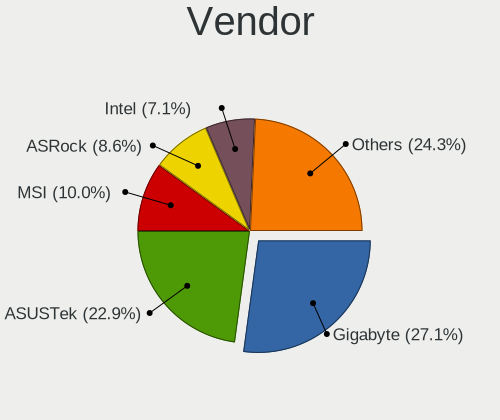
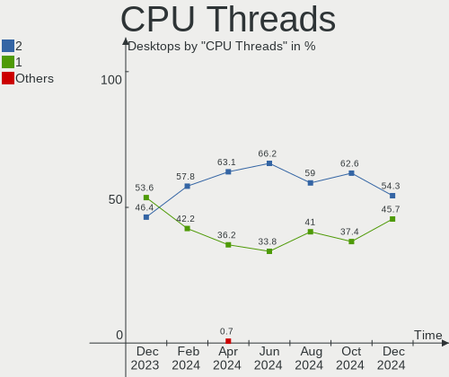
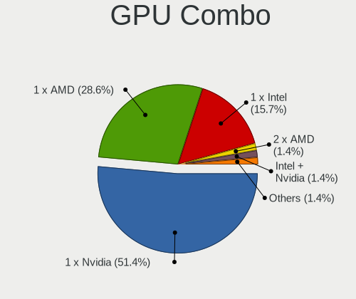
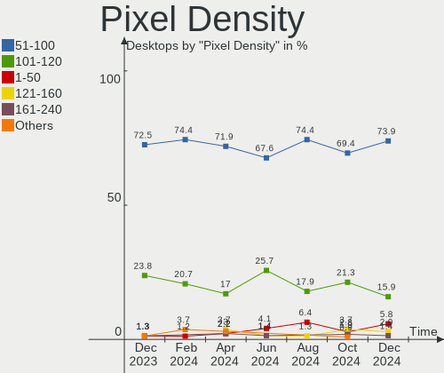

ROSA - Hardware Trends (Desktops)
---------------------------------

A project to identify most popular hardware characteristics and track their change
over time based on data collected by Linux users at https://Linux-Hardware.org.

Anyone can contribute to this report by the [hw-probe](https://github.com/linuxhw/hw-probe) tool:

    sudo -E hw-probe -all -upload

This report is for one last month. Overall report since the beginning of time: [TestDays](https://github.com/linuxhw/TestDays)

Period: Aug, 2023.

Contents
--------

* [ System ](#system)
  - [ OS                       ](#os)
  - [ OS Family                ](#os-family)
  - [ Kernel                   ](#kernel)
  - [ Kernel Family            ](#kernel-family)
  - [ Kernel Major Ver.        ](#kernel-major-ver)
  - [ Arch                     ](#arch)
  - [ DE                       ](#de)
  - [ Display Server           ](#display-server)
  - [ Display Manager          ](#display-manager)
  - [ OS Lang                  ](#os-lang)
  - [ Boot Mode                ](#boot-mode)
  - [ Filesystem               ](#filesystem)
  - [ Part. scheme             ](#part-scheme)
  - [ Dual Boot with Linux/BSD ](#dual-boot-with-linuxbsd)
  - [ Dual Boot (Win)          ](#dual-boot-win)

* [ Board ](#board)
  - [ Vendor                   ](#vendor)
  - [ Model                    ](#model)
  - [ Model Family             ](#model-family)
  - [ MFG Year                 ](#mfg-year)
  - [ Form Factor              ](#form-factor)
  - [ Secure Boot              ](#secure-boot)
  - [ Coreboot                 ](#coreboot)
  - [ RAM Size                 ](#ram-size)
  - [ RAM Used                 ](#ram-used)
  - [ Total Drives             ](#total-drives)
  - [ Has CD-ROM               ](#has-cd-rom)
  - [ Has Ethernet             ](#has-ethernet)
  - [ Has WiFi                 ](#has-wifi)
  - [ Has Bluetooth            ](#has-bluetooth)

* [ Location ](#location)
  - [ Country                  ](#country)
  - [ City                     ](#city)

* [ Drives ](#drives)
  - [ Drive Vendor             ](#drive-vendor)
  - [ Drive Model              ](#drive-model)
  - [ HDD Vendor               ](#hdd-vendor)
  - [ SSD Vendor               ](#ssd-vendor)
  - [ Drive Kind               ](#drive-kind)
  - [ Drive Connector          ](#drive-connector)
  - [ Drive Size               ](#drive-size)
  - [ Space Total              ](#space-total)
  - [ Space Used               ](#space-used)
  - [ Malfunc. Drives          ](#malfunc-drives)
  - [ Malfunc. Drive Vendor    ](#malfunc-drive-vendor)
  - [ Malfunc. HDD Vendor      ](#malfunc-hdd-vendor)
  - [ Malfunc. Drive Kind      ](#malfunc-drive-kind)
  - [ Failed Drives            ](#failed-drives)
  - [ Failed Drive Vendor      ](#failed-drive-vendor)
  - [ Drive Status             ](#drive-status)

* [ Storage controller ](#storage-controller)
  - [ Storage Vendor           ](#storage-vendor)
  - [ Storage Model            ](#storage-model)
  - [ Storage Kind             ](#storage-kind)

* [ Processor ](#processor)
  - [ CPU Vendor               ](#cpu-vendor)
  - [ CPU Model                ](#cpu-model)
  - [ CPU Model Family         ](#cpu-model-family)
  - [ CPU Cores                ](#cpu-cores)
  - [ CPU Sockets              ](#cpu-sockets)
  - [ CPU Threads              ](#cpu-threads)
  - [ CPU Op-Modes             ](#cpu-op-modes)
  - [ CPU Microcode            ](#cpu-microcode)
  - [ CPU Microarch            ](#cpu-microarch)

* [ Graphics ](#graphics)
  - [ GPU Vendor               ](#gpu-vendor)
  - [ GPU Model                ](#gpu-model)
  - [ GPU Combo                ](#gpu-combo)
  - [ GPU Driver               ](#gpu-driver)
  - [ GPU Memory               ](#gpu-memory)

* [ Monitor ](#monitor)
  - [ Monitor Vendor           ](#monitor-vendor)
  - [ Monitor Model            ](#monitor-model)
  - [ Monitor Resolution       ](#monitor-resolution)
  - [ Monitor Diagonal         ](#monitor-diagonal)
  - [ Monitor Width            ](#monitor-width)
  - [ Aspect Ratio             ](#aspect-ratio)
  - [ Monitor Area             ](#monitor-area)
  - [ Pixel Density            ](#pixel-density)
  - [ Multiple Monitors        ](#multiple-monitors)

* [ Network ](#network)
  - [ Net Controller Vendor    ](#net-controller-vendor)
  - [ Net Controller Model     ](#net-controller-model)
  - [ Wireless Vendor          ](#wireless-vendor)
  - [ Wireless Model           ](#wireless-model)
  - [ Ethernet Vendor          ](#ethernet-vendor)
  - [ Ethernet Model           ](#ethernet-model)
  - [ Net Controller Kind      ](#net-controller-kind)
  - [ Used Controller          ](#used-controller)
  - [ NICs                     ](#nics)
  - [ IPv6                     ](#ipv6)

* [ Bluetooth ](#bluetooth)
  - [ Bluetooth Vendor         ](#bluetooth-vendor)
  - [ Bluetooth Model          ](#bluetooth-model)

* [ Sound ](#sound)
  - [ Sound Vendor             ](#sound-vendor)
  - [ Sound Model              ](#sound-model)

* [ Memory ](#memory)
  - [ Memory Vendor            ](#memory-vendor)
  - [ Memory Model             ](#memory-model)
  - [ Memory Kind              ](#memory-kind)
  - [ Memory Form Factor       ](#memory-form-factor)
  - [ Memory Size              ](#memory-size)
  - [ Memory Speed             ](#memory-speed)

* [ Printers & scanners ](#printers--scanners)
  - [ Printer Vendor           ](#printer-vendor)
  - [ Printer Model            ](#printer-model)
  - [ Scanner Vendor           ](#scanner-vendor)
  - [ Scanner Model            ](#scanner-model)

* [ Camera ](#camera)
  - [ Camera Vendor            ](#camera-vendor)
  - [ Camera Model             ](#camera-model)

* [ Security ](#security)
  - [ Fingerprint Vendor       ](#fingerprint-vendor)
  - [ Fingerprint Model        ](#fingerprint-model)
  - [ Chipcard Vendor          ](#chipcard-vendor)
  - [ Chipcard Model           ](#chipcard-model)

* [ Unsupported ](#unsupported)
  - [ Unsupported Devices      ](#unsupported-devices)
  - [ Unsupported Device Types ](#unsupported-device-types)

System
------

OS
--

Installed operating systems

| Name       | Desktops | Percent |
|------------|----------|---------|
| ROSA 12.4  | 66       | 76.74%  |
| ROSA R11.1 | 7        | 8.14%   |
| ROSA 12    | 4        | 4.65%   |
| ROSA 12.1  | 3        | 3.49%   |
| ROSA 13.0  | 2        | 2.33%   |
| ROSA 12.3  | 2        | 2.33%   |
| ROSA R10   | 1        | 1.16%   |
| ROSA 12.2  | 1        | 1.16%   |

OS Family
---------

OS without a version

| Name | Desktops | Percent |
|------|----------|---------|
| ROSA | 86       | 100%    |

Kernel
------

Version of the Linux kernel

| Version                                   | Desktops | Percent |
|-------------------------------------------|----------|---------|
| 6.1.38-generic-1rosa2021.1-x86_64         | 38       | 44.19%  |
| 6.1.20-generic-2rosa2021.1-x86_64         | 19       | 22.09%  |
| 5.10.74-generic-2rosa2021.1-x86_64        | 4        | 4.65%   |
| 5.15.117-generic-1rosa2021.1-x86_64       | 3        | 3.49%   |
| 4.15.0-desktop-122.124.1rosa-x86_64       | 3        | 3.49%   |
| 6.4.5.xm1-1.klp-xanmod-rosa2021.1-x86_64  | 2        | 2.33%   |
| 5.15.103-generic-1rosa2021.1-i686         | 2        | 2.33%   |
| 5.10.184-generic-1rosa2021.1-x86_64       | 2        | 2.33%   |
| 4.9.155-nrj-desktop-1rosa-x86_64          | 2        | 2.33%   |
| 6.2.12.xm1-1.klp-xanmod-rosa2021.1-x86_64 | 1        | 1.16%   |
| 6.1.46-generic-1rosa2021.1-x86_64         | 1        | 1.16%   |
| 6.1.45.xm1-1.klp-xanmod-rosa2021.1-x86_64 | 1        | 1.16%   |
| 6.1.42-generic-1rosa2023.1-x86_64         | 1        | 1.16%   |
| 5.4.193-generic-4rosa2021.1-e2kv4         | 1        | 1.16%   |
| 5.17.11-generic-2rosa2021.1-x86_64        | 1        | 1.16%   |
| 5.15.79-generic-1rosa2021.1-x86_64        | 1        | 1.16%   |
| 5.15.75-generic-1rosa2021.1-x86_64        | 1        | 1.16%   |
| 4.9.60-nrj-desktop-1rosa-x86_64           | 1        | 1.16%   |
| 4.9.155-nrj-desktop-1rosa-i586            | 1        | 1.16%   |
| 4.15.0-desktop-122.124.1rosa-i586         | 1        | 1.16%   |

Kernel Family
-------------

Linux kernel without a distro release

| Version  | Desktops | Percent |
|----------|----------|---------|
| 6.1.38   | 38       | 44.19%  |
| 6.1.20   | 19       | 22.09%  |
| 5.10.74  | 4        | 4.65%   |
| 4.15.0   | 4        | 4.65%   |
| 5.15.117 | 3        | 3.49%   |
| 4.9.155  | 3        | 3.49%   |
| 6.4.5    | 2        | 2.33%   |
| 5.15.103 | 2        | 2.33%   |
| 5.10.184 | 2        | 2.33%   |
| 6.2.12   | 1        | 1.16%   |
| 6.1.46   | 1        | 1.16%   |
| 6.1.45   | 1        | 1.16%   |
| 6.1.42   | 1        | 1.16%   |
| 5.4.193  | 1        | 1.16%   |
| 5.17.11  | 1        | 1.16%   |
| 5.15.79  | 1        | 1.16%   |
| 5.15.75  | 1        | 1.16%   |
| 4.9.60   | 1        | 1.16%   |

Kernel Major Ver.
-----------------

Linux kernel major version

| Version | Desktops | Percent |
|---------|----------|---------|
| 6.1     | 60       | 69.77%  |
| 5.15    | 7        | 8.14%   |
| 5.10    | 6        | 6.98%   |
| 4.9     | 4        | 4.65%   |
| 4.15    | 4        | 4.65%   |
| 6.4     | 2        | 2.33%   |
| 6.2     | 1        | 1.16%   |
| 5.4     | 1        | 1.16%   |
| 5.17    | 1        | 1.16%   |

Arch
----

OS architecture (x86_64, i586, etc.)

| Name   | Desktops | Percent |
|--------|----------|---------|
| x86_64 | 81       | 94.19%  |
| i686   | 4        | 4.65%   |
| e2k    | 1        | 1.16%   |

DE
--

Desktop Environment

| Name  | Desktops | Percent |
|-------|----------|---------|
| KDE5  | 55       | 63.95%  |
| GNOME | 16       | 18.6%   |
| KDE4  | 7        | 8.14%   |
| LXQt  | 5        | 5.81%   |
| XFCE  | 3        | 3.49%   |

Display Server
--------------

X11 or Wayland

| Name    | Desktops | Percent |
|---------|----------|---------|
| Wayland | 64       | 74.42%  |
| X11     | 22       | 25.58%  |

Display Manager
---------------

SDDM, LightDM, etc.

| Name    | Desktops | Percent |
|---------|----------|---------|
| SDDM    | 53       | 61.63%  |
| GDM     | 23       | 26.74%  |
| KDM     | 7        | 8.14%   |
| LightDM | 3        | 3.49%   |

OS Lang
-------

Language

| Lang    | Desktops | Percent |
|---------|----------|---------|
| ru_RU   | 79       | 91.86%  |
| en_US   | 2        | 2.33%   |
| pt_BR   | 1        | 1.16%   |
| et_EE   | 1        | 1.16%   |
| en_GB   | 1        | 1.16%   |
| de_DE   | 1        | 1.16%   |
| Unknown | 1        | 1.16%   |

Boot Mode
---------

EFI or BIOS

| Mode | Desktops | Percent |
|------|----------|---------|
| BIOS | 46       | 53.49%  |
| EFI  | 40       | 46.51%  |

Filesystem
----------

Type of filesystem

| Type  | Desktops | Percent |
|-------|----------|---------|
| Ext4  | 79       | 91.86%  |
| Btrfs | 7        | 8.14%   |

Part. scheme
------------

Scheme of partitioning

| Type    | Desktops | Percent |
|---------|----------|---------|
| GPT     | 51       | 59.3%   |
| MBR     | 34       | 39.53%  |
| Unknown | 1        | 1.16%   |

Dual Boot with Linux/BSD
------------------------

Hosting more than one Linux/BSD

| Dual boot | Desktops | Percent |
|-----------|----------|---------|
| No        | 64       | 74.42%  |
| Yes       | 22       | 25.58%  |

Dual Boot (Win)
---------------

Hosting Linux and Windows

| Dual boot | Desktops | Percent |
|-----------|----------|---------|
| Yes       | 44       | 51.16%  |
| No        | 42       | 48.84%  |

Board
-----

Vendor
------

Motherboard manufacturer

| Name                | Desktops | Percent |
|---------------------|----------|---------|
| ASUSTek Computer    | 28       | 32.56%  |
| Gigabyte Technology | 25       | 29.07%  |
| MSI                 | 9        | 10.47%  |
| ASRock              | 8        | 9.3%    |
| Intel               | 2        | 2.33%   |
| Huanan              | 2        | 2.33%   |
| Foxconn             | 2        | 2.33%   |
| Unknown             | 2        | 2.33%   |
| WeiBu               | 1        | 1.16%   |
| Soyo                | 1        | 1.16%   |
| Lenovo              | 1        | 1.16%   |
| K-Systems           | 1        | 1.16%   |
| Hewlett-Packard     | 1        | 1.16%   |
| Gateway             | 1        | 1.16%   |
| ECS                 | 1        | 1.16%   |
| Biostar             | 1        | 1.16%   |

Model
-----

Motherboard model

| Name                              | Desktops | Percent |
|-----------------------------------|----------|---------|
| Unknown                           | 3        | 3.49%   |
| ASUS PRIME B450M-K II             | 2        | 2.33%   |
| ASUS All Series                   | 2        | 2.33%   |
| WeiBu H310CX1B V1.0               | 1        | 1.16%   |
| Soyo SY-Classic B450M             | 1        | 1.16%   |
| MSI MS-7C94                       | 1        | 1.16%   |
| MSI MS-7C51                       | 1        | 1.16%   |
| MSI MS-7924                       | 1        | 1.16%   |
| MSI MS-7918                       | 1        | 1.16%   |
| MSI MS-7895                       | 1        | 1.16%   |
| MSI MS-7788                       | 1        | 1.16%   |
| MSI MS-7599                       | 1        | 1.16%   |
| MSI MS-7592                       | 1        | 1.16%   |
| MSI Mars E192                     | 1        | 1.16%   |
| Lenovo H420                       | 1        | 1.16%   |
| Intel H55                         | 1        | 1.16%   |
| Intel D2700DC AAG32420-602        | 1        | 1.16%   |
| Huanan X99-QD4 V1.0               | 1        | 1.16%   |
| Huanan X99-F8                     | 1        | 1.16%   |
| HP Compaq 8200 Elite MT PC        | 1        | 1.16%   |
| Gigabyte Z87-HD3                  | 1        | 1.16%   |
| Gigabyte Z790 AORUS ELITE AX-W    | 1        | 1.16%   |
| Gigabyte Z77X-D3H                 | 1        | 1.16%   |
| Gigabyte X570 I AORUS PRO WIFI    | 1        | 1.16%   |
| Gigabyte X470 AORUS GAMING 5 WIFI | 1        | 1.16%   |
| Gigabyte H87-HD3                  | 1        | 1.16%   |
| Gigabyte H67A-USB3-B3             | 1        | 1.16%   |
| Gigabyte H61M-S2PV                | 1        | 1.16%   |
| Gigabyte H61M-S2-B3               | 1        | 1.16%   |
| Gigabyte H61M-S1                  | 1        | 1.16%   |
| Gigabyte H110-D3                  | 1        | 1.16%   |
| Gigabyte GA-A55M-S2V              | 1        | 1.16%   |
| Gigabyte GA-970A-D3               | 1        | 1.16%   |
| Gigabyte GA-880GA-UD3H            | 1        | 1.16%   |
| Gigabyte G41M-Combo               | 1        | 1.16%   |
| Gigabyte F2A55M-DS2               | 1        | 1.16%   |
| Gigabyte B75M-D3H                 | 1        | 1.16%   |
| Gigabyte B660 DS3H DDR4           | 1        | 1.16%   |
| Gigabyte B560M DS3H V2            | 1        | 1.16%   |
| Gigabyte B550 AORUS PRO           | 1        | 1.16%   |

Model Family
------------

Motherboard model prefix

| Name                   | Desktops | Percent |
|------------------------|----------|---------|
| ASUS PRIME             | 8        | 9.3%    |
| Unknown                | 3        | 3.49%   |
| ASUS P8H61-M           | 2        | 2.33%   |
| ASUS M5A97             | 2        | 2.33%   |
| ASUS All               | 2        | 2.33%   |
| WeiBu H310CX1B         | 1        | 1.16%   |
| Soyo SY-Classic        | 1        | 1.16%   |
| MSI MS-7C94            | 1        | 1.16%   |
| MSI MS-7C51            | 1        | 1.16%   |
| MSI MS-7924            | 1        | 1.16%   |
| MSI MS-7918            | 1        | 1.16%   |
| MSI MS-7895            | 1        | 1.16%   |
| MSI MS-7788            | 1        | 1.16%   |
| MSI MS-7599            | 1        | 1.16%   |
| MSI MS-7592            | 1        | 1.16%   |
| MSI Mars               | 1        | 1.16%   |
| Lenovo H420            | 1        | 1.16%   |
| Intel H55              | 1        | 1.16%   |
| Intel D2700DC          | 1        | 1.16%   |
| Huanan X99-QD4         | 1        | 1.16%   |
| Huanan X99-F8          | 1        | 1.16%   |
| HP Compaq              | 1        | 1.16%   |
| Gigabyte Z87-HD3       | 1        | 1.16%   |
| Gigabyte Z790          | 1        | 1.16%   |
| Gigabyte Z77X-D3H      | 1        | 1.16%   |
| Gigabyte X570          | 1        | 1.16%   |
| Gigabyte X470          | 1        | 1.16%   |
| Gigabyte H87-HD3       | 1        | 1.16%   |
| Gigabyte H67A-USB3-B3  | 1        | 1.16%   |
| Gigabyte H61M-S2PV     | 1        | 1.16%   |
| Gigabyte H61M-S2-B3    | 1        | 1.16%   |
| Gigabyte H61M-S1       | 1        | 1.16%   |
| Gigabyte H110-D3       | 1        | 1.16%   |
| Gigabyte GA-A55M-S2V   | 1        | 1.16%   |
| Gigabyte GA-970A-D3    | 1        | 1.16%   |
| Gigabyte GA-880GA-UD3H | 1        | 1.16%   |
| Gigabyte G41M-Combo    | 1        | 1.16%   |
| Gigabyte F2A55M-DS2    | 1        | 1.16%   |
| Gigabyte B75M-D3H      | 1        | 1.16%   |
| Gigabyte B660          | 1        | 1.16%   |

MFG Year
--------

Motherboard manufacture year

| Year    | Desktops | Percent |
|---------|----------|---------|
| 2012    | 12       | 13.95%  |
| 2011    | 11       | 12.79%  |
| 2009    | 8        | 9.3%    |
| 2020    | 7        | 8.14%   |
| 2018    | 7        | 8.14%   |
| 2019    | 5        | 5.81%   |
| 2014    | 5        | 5.81%   |
| 2013    | 5        | 5.81%   |
| 2022    | 4        | 4.65%   |
| 2010    | 4        | 4.65%   |
| 2023    | 3        | 3.49%   |
| 2021    | 3        | 3.49%   |
| 2015    | 3        | 3.49%   |
| 2008    | 3        | 3.49%   |
| 2016    | 2        | 2.33%   |
| 2017    | 1        | 1.16%   |
| 2007    | 1        | 1.16%   |
| 2003    | 1        | 1.16%   |
| Unknown | 1        | 1.16%   |

Form Factor
-----------

Physical design of the computer

| Name    | Desktops | Percent |
|---------|----------|---------|
| Desktop | 86       | 100%    |

Secure Boot
-----------

Enabled or disabled

| State    | Desktops | Percent |
|----------|----------|---------|
| Disabled | 86       | 100%    |

Coreboot
--------

Have coreboot on board

| Used | Desktops | Percent |
|------|----------|---------|
| No   | 86       | 100%    |

RAM Size
--------

Total RAM memory

| Size in GB | Desktops | Percent |
|------------|----------|---------|
| 8.01-16.0  | 30       | 34.88%  |
| 16.01-24.0 | 17       | 19.77%  |
| 4.01-8.0   | 11       | 12.79%  |
| 32.01-64.0 | 11       | 12.79%  |
| 3.01-4.0   | 11       | 12.79%  |
| 24.01-32.0 | 2        | 2.33%   |
| 2.01-3.0   | 2        | 2.33%   |
| 1.01-2.0   | 2        | 2.33%   |

RAM Used
--------

Used RAM memory

| Used GB   | Desktops | Percent |
|-----------|----------|---------|
| 1.01-2.0  | 47       | 54.65%  |
| 2.01-3.0  | 15       | 17.44%  |
| 0.51-1.0  | 15       | 17.44%  |
| 3.01-4.0  | 6        | 6.98%   |
| 4.01-8.0  | 2        | 2.33%   |
| 8.01-16.0 | 1        | 1.16%   |

Total Drives
------------

Number of drives on board

| Drives | Desktops | Percent |
|--------|----------|---------|
| 2      | 36       | 41.86%  |
| 1      | 29       | 33.72%  |
| 3      | 10       | 11.63%  |
| 4      | 7        | 8.14%   |
| 5      | 3        | 3.49%   |
| 6      | 1        | 1.16%   |

Has CD-ROM
----------

Has CD-ROM on board

| Presented | Desktops | Percent |
|-----------|----------|---------|
| No        | 50       | 58.14%  |
| Yes       | 36       | 41.86%  |

Has Ethernet
------------

Has Ethernet on board

| Presented | Desktops | Percent |
|-----------|----------|---------|
| Yes       | 86       | 100%    |

Has WiFi
--------

Has WiFi module

| Presented | Desktops | Percent |
|-----------|----------|---------|
| No        | 59       | 68.6%   |
| Yes       | 27       | 31.4%   |

Has Bluetooth
-------------

Has Bluetooth module

| Presented | Desktops | Percent |
|-----------|----------|---------|
| No        | 70       | 81.4%   |
| Yes       | 16       | 18.6%   |

Location
--------

Country
-------

Geographic location (country)

| Country    | Desktops | Percent |
|------------|----------|---------|
| Russia     | 75       | 87.21%  |
| Belarus    | 2        | 2.33%   |
| USA        | 1        | 1.16%   |
| Ukraine    | 1        | 1.16%   |
| Peru       | 1        | 1.16%   |
| Kazakhstan | 1        | 1.16%   |
| Ireland    | 1        | 1.16%   |
| Germany    | 1        | 1.16%   |
| Estonia    | 1        | 1.16%   |
| Czechia    | 1        | 1.16%   |
| Brazil     | 1        | 1.16%   |

City
----

Geographic location (city)

| City             | Desktops | Percent |
|------------------|----------|---------|
| Moscow           | 12       | 13.95%  |
| Orenburg         | 5        | 5.81%   |
| Voronezh         | 4        | 4.65%   |
| Yekaterinburg    | 3        | 3.49%   |
| Chelyabinsk      | 3        | 3.49%   |
| Volgograd        | 2        | 2.33%   |
| Rostov-on-Don    | 2        | 2.33%   |
| Omsk             | 2        | 2.33%   |
| Novosibirsk      | 2        | 2.33%   |
| Krasnodar        | 2        | 2.33%   |
| Kostroma         | 2        | 2.33%   |
| Khabarovsk       | 2        | 2.33%   |
| Cheboksary       | 2        | 2.33%   |
| Zalari           | 1        | 1.16%   |
| Vidnoye          | 1        | 1.16%   |
| Ulyanovsk        | 1        | 1.16%   |
| Ufa              | 1        | 1.16%   |
| Tolyatti         | 1        | 1.16%   |
| Tallinn          | 1        | 1.16%   |
| St Petersburg    | 1        | 1.16%   |
| Sochi            | 1        | 1.16%   |
| Smolensk         | 1        | 1.16%   |
| Simferopol       | 1        | 1.16%   |
| Saratov          | 1        | 1.16%   |
| Rezh             | 1        | 1.16%   |
| Revda            | 1        | 1.16%   |
| Pyatigorsk       | 1        | 1.16%   |
| Pikalyovo        | 1        | 1.16%   |
| Petrozavodsk     | 1        | 1.16%   |
| Petropavl        | 1        | 1.16%   |
| Perm             | 1        | 1.16%   |
| Penza            | 1        | 1.16%   |
| Pavlovskiy Posad | 1        | 1.16%   |
| Otzberg          | 1        | 1.16%   |
| Oryol            | 1        | 1.16%   |
| Olenegorsk       | 1        | 1.16%   |
| Novocheboksarsk  | 1        | 1.16%   |
| Nizhniy Novgorod | 1        | 1.16%   |
| Nizhnevartovsk   | 1        | 1.16%   |
| Mytishchi        | 1        | 1.16%   |

Drives
------

Drive Vendor
------------

Hard drive vendors

| Vendor                      | Desktops | Drives | Percent |
|-----------------------------|----------|--------|---------|
| WDC                         | 32       | 40     | 19.39%  |
| Seagate                     | 21       | 22     | 12.73%  |
| Samsung Electronics         | 14       | 20     | 8.48%   |
| Kingston                    | 12       | 13     | 7.27%   |
| Toshiba                     | 9        | 9      | 5.45%   |
| China                       | 8        | 8      | 4.85%   |
| A-DATA Technology           | 8        | 8      | 4.85%   |
| SanDisk                     | 5        | 5      | 3.03%   |
| Apacer                      | 5        | 6      | 3.03%   |
| Transcend                   | 3        | 3      | 1.82%   |
| OCZ                         | 3        | 3      | 1.82%   |
| Netac                       | 3        | 3      | 1.82%   |
| Hitachi                     | 3        | 3      | 1.82%   |
| GOODRAM                     | 3        | 3      | 1.82%   |
| Crucial                     | 3        | 4      | 1.82%   |
| Unknown                     | 2        | 2      | 1.21%   |
| Team                        | 2        | 2      | 1.21%   |
| Silicon Motion              | 2        | 2      | 1.21%   |
| AMD                         | 2        | 2      | 1.21%   |
| XrayDisk                    | 1        | 1      | 0.61%   |
| TO Exter                    | 1        | 1      | 0.61%   |
| Smartbuy                    | 1        | 1      | 0.61%   |
| ShanDianZhe                 | 1        | 1      | 0.61%   |
| Qumo                        | 1        | 1      | 0.61%   |
| PNY                         | 1        | 1      | 0.61%   |
| Phison                      | 1        | 1      | 0.61%   |
| Patriot                     | 1        | 1      | 0.61%   |
| Micron Technology           | 1        | 1      | 0.61%   |
| Maxtor                      | 1        | 1      | 0.61%   |
| MAXIO Technology (Hangzhou) | 1        | 1      | 0.61%   |
| Kingmax                     | 1        | 1      | 0.61%   |
| HYDRA                       | 1        | 1      | 0.61%   |
| HUAWEI                      | 1        | 1      | 0.61%   |
| HGST                        | 1        | 1      | 0.61%   |
| Hewlett-Packard             | 1        | 1      | 0.61%   |
| Gigabyte Technology         | 1        | 1      | 0.61%   |
| Foxline                     | 1        | 1      | 0.61%   |
| Digma                       | 1        | 1      | 0.61%   |
| Corsair                     | 1        | 1      | 0.61%   |
| BR                          | 1        | 1      | 0.61%   |

Drive Model
-----------

Hard drive models

| Model                            | Desktops | Percent |
|----------------------------------|----------|---------|
| Toshiba DT01ACA050 500GB         | 4        | 2.2%    |
| WDC WD10EZEX-00BBHA0 1TB         | 3        | 1.65%   |
| Seagate ST1000DM010-2EP102 1TB   | 3        | 1.65%   |
| Seagate ST1000DM003-1CH162 1TB   | 3        | 1.65%   |
| Kingston SA400S37240G 240GB SSD  | 3        | 1.65%   |
| Kingston SA400S37120G 120GB SSD  | 3        | 1.65%   |
| A-DATA SU650 240GB SSD           | 3        | 1.65%   |
| WDC WD5000AZLX-00K2TA0 500GB     | 2        | 1.1%    |
| WDC WD2500AAKX-00ERMA0 250GB     | 2        | 1.1%    |
| WDC WD10EZEX-22MFCA0 1TB         | 2        | 1.1%    |
| WDC WD10EZEX-00RKKA0 1TB         | 2        | 1.1%    |
| Unknown NVMe SSD Drive 512GB     | 2        | 1.1%    |
| Toshiba HDWD110 1TB              | 2        | 1.1%    |
| Toshiba DT01ACA100 1TB           | 2        | 1.1%    |
| Seagate ST2000DL003-9VT166 2TB   | 2        | 1.1%    |
| Samsung SSD 860 EVO 500GB        | 2        | 1.1%    |
| China SSD 256GB                  | 2        | 1.1%    |
| China SATA SSD 120GB             | 2        | 1.1%    |
| Apacer AS350 512GB SSD           | 2        | 1.1%    |
| Apacer AS350 128GB SSD           | 2        | 1.1%    |
| XrayDisk 512GB SSD               | 1        | 0.55%   |
| WDC WDS480G2G0A-00JH30 480GB SSD | 1        | 0.55%   |
| WDC WDS240G2G0B-00EPW0 240GB SSD | 1        | 0.55%   |
| WDC WDS240G2G0A-00JH30 240GB SSD | 1        | 0.55%   |
| WDC WDS120G2G0B-00EPW0 120GB SSD | 1        | 0.55%   |
| WDC WDS120G2G0A-00JH30 120GB SSD | 1        | 0.55%   |
| WDC WD800BB-63JKC0 80GB          | 1        | 0.55%   |
| WDC WD800BB-00JKC0 80GB          | 1        | 0.55%   |
| WDC WD5000AAKX-60U6AA0 500GB     | 1        | 0.55%   |
| WDC WD5000AAKX-08U6AA0 500GB     | 1        | 0.55%   |
| WDC WD5000AAKX-001CA0 500GB      | 1        | 0.55%   |
| WDC WD5000AAKS-00E4A0 500GB      | 1        | 0.55%   |
| WDC WD4000AAKS-00TMA0 400GB      | 1        | 0.55%   |
| WDC WD3200BEKT-60F3T1 320GB      | 1        | 0.55%   |
| WDC WD2500AAJS-22VTA0 250GB      | 1        | 0.55%   |
| WDC WD20PURZ-85GU6Y0 2TB         | 1        | 0.55%   |
| WDC WD20PURX-69PFUY0 2TB         | 1        | 0.55%   |
| WDC WD1600AAJS-60B4A0 160GB      | 1        | 0.55%   |
| WDC WD1600AAJS-08PSA0 160GB      | 1        | 0.55%   |
| WDC WD1200BB-22GUC0 120GB        | 1        | 0.55%   |

HDD Vendor
----------

Hard disk drive vendors

| Vendor  | Desktops | Drives | Percent |
|---------|----------|--------|---------|
| WDC     | 29       | 35     | 45.31%  |
| Seagate | 21       | 22     | 32.81%  |
| Toshiba | 9        | 9      | 14.06%  |
| Hitachi | 3        | 3      | 4.69%   |
| Maxtor  | 1        | 1      | 1.56%   |
| HGST    | 1        | 1      | 1.56%   |

SSD Vendor
----------

Solid state drive vendors

| Vendor              | Desktops | Drives | Percent |
|---------------------|----------|--------|---------|
| Kingston            | 11       | 12     | 13.92%  |
| Samsung Electronics | 9        | 11     | 11.39%  |
| China               | 8        | 8      | 10.13%  |
| A-DATA Technology   | 7        | 7      | 8.86%   |
| WDC                 | 4        | 5      | 5.06%   |
| Apacer              | 4        | 5      | 5.06%   |
| SanDisk             | 3        | 3      | 3.8%    |
| OCZ                 | 3        | 3      | 3.8%    |
| GOODRAM             | 3        | 3      | 3.8%    |
| Transcend           | 2        | 2      | 2.53%   |
| Team                | 2        | 2      | 2.53%   |
| Netac               | 2        | 2      | 2.53%   |
| Crucial             | 2        | 3      | 2.53%   |
| AMD                 | 2        | 2      | 2.53%   |
| TO Exter            | 1        | 1      | 1.27%   |
| Smartbuy            | 1        | 1      | 1.27%   |
| ShanDianZhe         | 1        | 1      | 1.27%   |
| Qumo                | 1        | 1      | 1.27%   |
| PNY                 | 1        | 1      | 1.27%   |
| Patriot             | 1        | 1      | 1.27%   |
| Micron Technology   | 1        | 1      | 1.27%   |
| Kingmax             | 1        | 1      | 1.27%   |
| HYDRA               | 1        | 1      | 1.27%   |
| Gigabyte Technology | 1        | 1      | 1.27%   |
| Foxline             | 1        | 1      | 1.27%   |
| Digma               | 1        | 1      | 1.27%   |
| Corsair             | 1        | 1      | 1.27%   |
| BR                  | 1        | 1      | 1.27%   |
| Apple               | 1        | 1      | 1.27%   |
| AGI                 | 1        | 1      | 1.27%   |
| Unknown             | 1        | 1      | 1.27%   |

Drive Kind
----------

HDD or SSD

| Kind    | Desktops | Drives | Percent |
|---------|----------|--------|---------|
| SSD     | 61       | 85     | 45.19%  |
| HDD     | 54       | 71     | 40%     |
| NVMe    | 19       | 26     | 14.07%  |
| Unknown | 1        | 1      | 0.74%   |

Drive Connector
---------------

SATA, SAS, NVMe, etc.

| Type | Desktops | Drives | Percent |
|------|----------|--------|---------|
| SATA | 83       | 155    | 79.81%  |
| NVMe | 19       | 26     | 18.27%  |
| SAS  | 2        | 2      | 1.92%   |

Drive Size
----------

Size of hard drive

| Size in TB | Desktops | Drives | Percent |
|------------|----------|--------|---------|
| 0.01-0.5   | 68       | 104    | 62.39%  |
| 0.51-1.0   | 31       | 42     | 28.44%  |
| 1.01-2.0   | 9        | 9      | 8.26%   |
| 3.01-4.0   | 1        | 1      | 0.92%   |

Space Total
-----------

Amount of disk space available on the file system

| Size in GB     | Desktops | Percent |
|----------------|----------|---------|
| 101-250        | 29       | 33.72%  |
| 251-500        | 16       | 18.6%   |
| 1001-2000      | 13       | 15.12%  |
| 501-1000       | 13       | 15.12%  |
| 51-100         | 5        | 5.81%   |
| 1-20           | 4        | 4.65%   |
| 21-50          | 3        | 3.49%   |
| More than 3000 | 2        | 2.33%   |
| 2001-3000      | 1        | 1.16%   |

Space Used
----------

Amount of used disk space

| Used GB        | Desktops | Percent |
|----------------|----------|---------|
| 1-20           | 49       | 56.98%  |
| 101-250        | 11       | 12.79%  |
| 21-50          | 9        | 10.47%  |
| 51-100         | 7        | 8.14%   |
| 501-1000       | 5        | 5.81%   |
| 251-500        | 2        | 2.33%   |
| More than 3000 | 1        | 1.16%   |
| 2001-3000      | 1        | 1.16%   |
| 1001-2000      | 1        | 1.16%   |

Malfunc. Drives
---------------

Drive models with a malfunction

| Model                                 | Desktops | Drives | Percent |
|---------------------------------------|----------|--------|---------|
| Seagate ST2000DL003-9VT166 2TB        | 2        | 2      | 6.9%    |
| Seagate ST1000DM003-1CH162 1TB        | 2        | 2      | 6.9%    |
| XrayDisk 512GB SSD                    | 1        | 1      | 3.45%   |
| WDC WD5000AAKX-60U6AA0 500GB          | 1        | 1      | 3.45%   |
| WDC WD5000AAKS-00E4A0 500GB           | 1        | 1      | 3.45%   |
| WDC WD4000AAKS-00TMA0 400GB           | 1        | 1      | 3.45%   |
| WDC WD3200BEKT-60F3T1 320GB           | 1        | 1      | 3.45%   |
| WDC WD10PURZ-85U8XY0 1TB              | 1        | 1      | 3.45%   |
| WDC WD10EALX-009BA0 1TB               | 1        | 1      | 3.45%   |
| WDC WD1003FZEX-00MK2A0 1TB            | 1        | 1      | 3.45%   |
| Toshiba MK6475GSX 640GB               | 1        | 1      | 3.45%   |
| Toshiba HDWD110 1TB                   | 1        | 1      | 3.45%   |
| Toshiba DT01ACA100 1TB                | 1        | 1      | 3.45%   |
| Seagate ST500LT012-1DG142 500GB       | 1        | 1      | 3.45%   |
| Seagate ST3250410AS 250GB             | 1        | 1      | 3.45%   |
| Seagate ST3250318AS 250GB             | 1        | 1      | 3.45%   |
| Seagate ST1000LM035-1RK172 1TB        | 1        | 1      | 3.45%   |
| Samsung Electronics SSD 960 EVO 250GB | 1        | 1      | 3.45%   |
| OCZ VERTEX3 120GB SSD                 | 1        | 1      | 3.45%   |
| OCZ VECTOR150 240GB SSD               | 1        | 1      | 3.45%   |
| Netac SSD 128GB                       | 1        | 1      | 3.45%   |
| Maxtor STM3320820AS 320GB             | 1        | 1      | 3.45%   |
| Kingston SH100S3240G 240GB SSD        | 1        | 1      | 3.45%   |
| Kingmax SSD 60GB                      | 1        | 1      | 3.45%   |
| Hitachi HDS721025CLA382 250GB         | 1        | 1      | 3.45%   |
| Hitachi HDS721010CLA330 1TB           | 1        | 1      | 3.45%   |
| HGST HTS541010A7E630 1TB              | 1        | 1      | 3.45%   |

Malfunc. Drive Vendor
---------------------

Vendors of faulty drives

| Vendor              | Desktops | Drives | Percent |
|---------------------|----------|--------|---------|
| Seagate             | 8        | 8      | 27.59%  |
| WDC                 | 7        | 7      | 24.14%  |
| Toshiba             | 3        | 3      | 10.34%  |
| OCZ                 | 2        | 2      | 6.9%    |
| Hitachi             | 2        | 2      | 6.9%    |
| XrayDisk            | 1        | 1      | 3.45%   |
| Samsung Electronics | 1        | 1      | 3.45%   |
| Netac               | 1        | 1      | 3.45%   |
| Maxtor              | 1        | 1      | 3.45%   |
| Kingston            | 1        | 1      | 3.45%   |
| Kingmax             | 1        | 1      | 3.45%   |
| HGST                | 1        | 1      | 3.45%   |

Malfunc. HDD Vendor
-------------------

Vendors of faulty HDD drives

| Vendor  | Desktops | Drives | Percent |
|---------|----------|--------|---------|
| Seagate | 8        | 8      | 36.36%  |
| WDC     | 7        | 7      | 31.82%  |
| Toshiba | 3        | 3      | 13.64%  |
| Hitachi | 2        | 2      | 9.09%   |
| Maxtor  | 1        | 1      | 4.55%   |
| HGST    | 1        | 1      | 4.55%   |

Malfunc. Drive Kind
-------------------

Kinds of faulty drives

| Kind | Desktops | Drives | Percent |
|------|----------|--------|---------|
| HDD  | 18       | 22     | 72%     |
| SSD  | 5        | 5      | 20%     |
| NVMe | 2        | 2      | 8%      |

Failed Drives
-------------

Failed drive models

Zero info for selected period =(

Failed Drive Vendor
-------------------

Failed drive vendors

Zero info for selected period =(

Drive Status
------------

Number of failed and malfunc. drives

| Status   | Desktops | Drives | Percent |
|----------|----------|--------|---------|
| Works    | 78       | 148    | 72.9%   |
| Malfunc  | 24       | 29     | 22.43%  |
| Detected | 5        | 6      | 4.67%   |

Storage controller
------------------

Storage Vendor
--------------

Storage controller vendors

| Vendor                      | Desktops | Percent |
|-----------------------------|----------|---------|
| Intel                       | 57       | 48.31%  |
| AMD                         | 23       | 19.49%  |
| Samsung Electronics         | 8        | 6.78%   |
| Nvidia                      | 4        | 3.39%   |
| Marvell Technology Group    | 3        | 2.54%   |
| INNOGRIT                    | 3        | 2.54%   |
| ASMedia Technology          | 3        | 2.54%   |
| VIA Technologies            | 2        | 1.69%   |
| Silicon Motion              | 2        | 1.69%   |
| Sandisk                     | 2        | 1.69%   |
| Phison Electronics          | 2        | 1.69%   |
| JMicron Technology          | 2        | 1.69%   |
| ADATA Technology            | 2        | 1.69%   |
| Netac Technology            | 1        | 0.85%   |
| Micron/Crucial Technology   | 1        | 0.85%   |
| MCST                        | 1        | 0.85%   |
| MAXIO Technology (Hangzhou) | 1        | 0.85%   |
| Kingston Technology Company | 1        | 0.85%   |

Storage Model
-------------

Storage controller models

| Model                                                                                   | Desktops | Percent |
|-----------------------------------------------------------------------------------------|----------|---------|
| AMD FCH SATA Controller [AHCI mode]                                                     | 10       | 6.67%   |
| Intel NM10/ICH7 Family SATA Controller [IDE mode]                                       | 7        | 4.67%   |
| Intel 82801G (ICH7 Family) IDE Controller                                               | 7        | 4.67%   |
| Intel 6 Series/C200 Series Chipset Family 6 port Desktop SATA AHCI Controller           | 7        | 4.67%   |
| AMD 400 Series Chipset SATA Controller                                                  | 7        | 4.67%   |
| Intel 6 Series/C200 Series Chipset Family Desktop SATA Controller (IDE mode, ports 4-5) | 6        | 4%      |
| Intel 6 Series/C200 Series Chipset Family Desktop SATA Controller (IDE mode, ports 0-3) | 6        | 4%      |
| AMD SB7x0/SB8x0/SB9x0 SATA Controller [AHCI mode]                                       | 6        | 4%      |
| Intel 200 Series PCH SATA controller [AHCI mode]                                        | 5        | 3.33%   |
| Intel 9 Series Chipset Family SATA Controller [AHCI Mode]                               | 4        | 2.67%   |
| Intel 8 Series/C220 Series Chipset Family 6-port SATA Controller 1 [AHCI mode]          | 4        | 2.67%   |
| Intel 500 Series Chipset Family SATA AHCI Controller                                    | 4        | 2.67%   |
| Samsung NVMe SSD Controller SM961/PM961/SM963                                           | 3        | 2%      |
| Intel Q170/Q150/B150/H170/H110/Z170/CM236 Chipset SATA Controller [AHCI Mode]           | 3        | 2%      |
| ASMedia ASM1062 Serial ATA Controller                                                   | 3        | 2%      |
| AMD SB7x0/SB8x0/SB9x0 IDE Controller                                                    | 3        | 2%      |
| VIA VT6415 PATA IDE Host Controller                                                     | 2        | 1.33%   |
| Silicon Motion SM2263EN/SM2263XT (DRAM-less) NVMe SSD Controllers                       | 2        | 1.33%   |
| Samsung NVMe SSD Controller SM981/PM981/PM983                                           | 2        | 1.33%   |
| Samsung NVMe SSD Controller PM9A1/PM9A3/980PRO                                          | 2        | 1.33%   |
| Nvidia MCP78S [GeForce 8200] IDE                                                        | 2        | 1.33%   |
| Nvidia MCP78S [GeForce 8200] AHCI Controller                                            | 2        | 1.33%   |
| Marvell Group 88SE6101/6102 single-port PATA133 interface                               | 2        | 1.33%   |
| Intel Cannon Lake PCH SATA AHCI Controller                                              | 2        | 1.33%   |
| Intel 7 Series/C210 Series Chipset Family 6-port SATA Controller [AHCI mode]            | 2        | 1.33%   |
| INNOGRIT NVMe SSD Controller IG5236                                                     | 2        | 1.33%   |
| AMD 500 Series Chipset SATA Controller                                                  | 2        | 1.33%   |
| Sandisk PC SN740 NVMe SSD (DRAM-less)                                                   | 1        | 0.67%   |
| SanDisk PC SN735 NVMe SSD (DRAM-less)                                                   | 1        | 0.67%   |
| Samsung S4LN058A01[SSUBX] AHCI SSD Controller (Apple slot)                              | 1        | 0.67%   |
| Samsung NVMe SSD Controller 980                                                         | 1        | 0.67%   |
| Phison PS5013 E13 NVMe Controller                                                       | 1        | 0.67%   |
| Phison E12 NVMe Controller                                                              | 1        | 0.67%   |
| Nvidia MCP67 IDE Controller                                                             | 1        | 0.67%   |
| Nvidia MCP67 AHCI Controller                                                            | 1        | 0.67%   |
| Nvidia MCP61 SATA Controller                                                            | 1        | 0.67%   |
| Nvidia MCP61 IDE                                                                        | 1        | 0.67%   |
| Netac NVMe SSD (DRAM-less)                                                              | 1        | 0.67%   |
| Micron/Crucial P2 [Nick P2] / P3 / P3 Plus NVMe PCIe SSD (DRAM-less)                    | 1        | 0.67%   |
| MCST SATA                                                                               | 1        | 0.67%   |

Storage Kind
------------

Kind of storage controller (IDE, SATA, NVMe, SAS, ...)

| Kind | Desktops | Percent |
|------|----------|---------|
| SATA | 67       | 59.29%  |
| IDE  | 27       | 23.89%  |
| NVMe | 18       | 15.93%  |
| RAID | 1        | 0.88%   |

Processor
---------

CPU Vendor
----------

Processor vendors

| Vendor   | Desktops | Percent |
|----------|----------|---------|
| Intel    | 57       | 66.28%  |
| AMD      | 28       | 32.56%  |
| E8C-mITX | 1        | 1.16%   |

CPU Model
---------

Processor models

| Model                                  | Desktops | Percent |
|----------------------------------------|----------|---------|
| Intel Pentium CPU G620 @ 2.60GHz       | 2        | 2.33%   |
| Intel Core i7-2600K CPU @ 3.40GHz      | 2        | 2.33%   |
| Intel Core i5-4670K CPU @ 3.40GHz      | 2        | 2.33%   |
| Intel Core i5-2320 CPU @ 3.00GHz       | 2        | 2.33%   |
| Intel Core i3-2120 CPU @ 3.30GHz       | 2        | 2.33%   |
| Intel Core 2 Quad CPU Q6600 @ 2.40GHz  | 2        | 2.33%   |
| AMD Ryzen 7 5700X 8-Core Processor     | 2        | 2.33%   |
| AMD Ryzen 5 3600X 6-Core Processor     | 2        | 2.33%   |
| AMD FX-8350 Eight-Core Processor       | 2        | 2.33%   |
| Intel Xeon CPU X5470 @ 3.33GHz         | 1        | 1.16%   |
| Intel Xeon CPU E5420 @ 2.50GHz         | 1        | 1.16%   |
| Intel Xeon CPU E5-2697 v3 @ 2.60GHz    | 1        | 1.16%   |
| Intel Xeon CPU E5-2697 v2 @ 2.70GHz    | 1        | 1.16%   |
| Intel Xeon CPU E5-2666 v3 @ 2.90GHz    | 1        | 1.16%   |
| Intel Pentium Gold G5400 CPU @ 3.70GHz | 1        | 1.16%   |
| Intel Pentium CPU G640 @ 2.80GHz       | 1        | 1.16%   |
| Intel Pentium CPU G4620 @ 3.70GHz      | 1        | 1.16%   |
| Intel Pentium CPU G2030 @ 3.00GHz      | 1        | 1.16%   |
| Intel Pentium 4 CPU 2.80GHz            | 1        | 1.16%   |
| Intel Pentium 4 CPU 2.66GHz            | 1        | 1.16%   |
| Intel Genuine CPU 0000 @ 2.10GHz       | 1        | 1.16%   |
| Intel Core i9-10900KF CPU @ 3.70GHz    | 1        | 1.16%   |
| Intel Core i7-4770 CPU @ 3.40GHz       | 1        | 1.16%   |
| Intel Core i5-9500F CPU @ 3.00GHz      | 1        | 1.16%   |
| Intel Core i5-9400 CPU @ 2.90GHz       | 1        | 1.16%   |
| Intel Core i5-8400 CPU @ 2.80GHz       | 1        | 1.16%   |
| Intel Core i5-7400 CPU @ 3.00GHz       | 1        | 1.16%   |
| Intel Core i5-6500 CPU @ 3.20GHz       | 1        | 1.16%   |
| Intel Core i5-4670S CPU @ 3.10GHz      | 1        | 1.16%   |
| Intel Core i5-4670 CPU @ 3.40GHz       | 1        | 1.16%   |
| Intel Core i5-4460 CPU @ 3.20GHz       | 1        | 1.16%   |
| Intel Core i5-3340 CPU @ 3.10GHz       | 1        | 1.16%   |
| Intel Core i5-3330 CPU @ 3.00GHz       | 1        | 1.16%   |
| Intel Core i5-2500K CPU @ 3.30GHz      | 1        | 1.16%   |
| Intel Core i5-2500 CPU @ 3.30GHz       | 1        | 1.16%   |
| Intel Core i5-10400 CPU @ 2.90GHz      | 1        | 1.16%   |
| Intel Core i5 CPU 650 @ 3.20GHz        | 1        | 1.16%   |
| Intel Core i3-6100 CPU @ 3.70GHz       | 1        | 1.16%   |
| Intel Core i3-4330 CPU @ 3.50GHz       | 1        | 1.16%   |
| Intel Core i3-3220 CPU @ 3.30GHz       | 1        | 1.16%   |

CPU Model Family
----------------

Processor model prefix

| Model              | Desktops | Percent |
|--------------------|----------|---------|
| Intel Core i5      | 18       | 20.93%  |
| Intel Core i3      | 8        | 9.3%    |
| Other              | 5        | 5.81%   |
| Intel Xeon         | 5        | 5.81%   |
| Intel Pentium      | 5        | 5.81%   |
| AMD Ryzen 5        | 5        | 5.81%   |
| Intel Core 2 Duo   | 4        | 4.65%   |
| AMD FX             | 4        | 4.65%   |
| Intel Core i7      | 3        | 3.49%   |
| Intel Core 2 Quad  | 3        | 3.49%   |
| AMD Ryzen 7        | 3        | 3.49%   |
| Intel Pentium 4    | 2        | 2.33%   |
| AMD Phenom II X4   | 2        | 2.33%   |
| AMD Athlon II X4   | 2        | 2.33%   |
| AMD Athlon 64 X2   | 2        | 2.33%   |
| Intel Pentium Gold | 1        | 1.16%   |
| Intel Genuine      | 1        | 1.16%   |
| Intel Core i9      | 1        | 1.16%   |
| Intel Celeron      | 1        | 1.16%   |
| Intel Atom         | 1        | 1.16%   |
| AMD Ryzen 9        | 1        | 1.16%   |
| AMD Ryzen 5 PRO    | 1        | 1.16%   |
| AMD Ryzen 3 PRO    | 1        | 1.16%   |
| AMD Ryzen 3        | 1        | 1.16%   |
| AMD PRO A10        | 1        | 1.16%   |
| AMD Phenom II X6   | 1        | 1.16%   |
| AMD Phenom II X3   | 1        | 1.16%   |
| AMD Athlon X4      | 1        | 1.16%   |
| AMD Athlon X2      | 1        | 1.16%   |
| AMD A8             | 1        | 1.16%   |

CPU Cores
---------

Number of processor cores

| Number  | Desktops | Percent |
|---------|----------|---------|
| 4       | 33       | 38.37%  |
| 2       | 24       | 27.91%  |
| 6       | 12       | 13.95%  |
| 8       | 6        | 6.98%   |
| 1       | 3        | 3.49%   |
| 12      | 2        | 2.33%   |
| 10      | 2        | 2.33%   |
| 3       | 2        | 2.33%   |
| 14      | 1        | 1.16%   |
| Unknown | 1        | 1.16%   |

CPU Sockets
-----------

Number of sockets

| Number | Desktops | Percent |
|--------|----------|---------|
| 1      | 86       | 100%    |

CPU Threads
-----------

Threads per core (Hyper-Threading)

| Number  | Desktops | Percent |
|---------|----------|---------|
| 2       | 43       | 50%     |
| 1       | 42       | 48.84%  |
| Unknown | 1        | 1.16%   |

CPU Op-Modes
------------

CPU Operation Modes (32-bit, 64-bit)

| Op mode        | Desktops | Percent |
|----------------|----------|---------|
| 32-bit, 64-bit | 83       | 96.51%  |
| 32-bit         | 2        | 2.33%   |
| Unknown        | 1        | 1.16%   |

CPU Microcode
-------------

Microcode number

| Number     | Desktops | Percent |
|------------|----------|---------|
| 0x206a7    | 12       | 13.95%  |
| 0x306c3    | 7        | 8.14%   |
| Unknown    | 7        | 8.14%   |
| 0x1067a    | 6        | 6.98%   |
| 0x306a9    | 4        | 4.65%   |
| 0x06000822 | 4        | 4.65%   |
| 0x906ea    | 3        | 3.49%   |
| 0xf29      | 2        | 2.33%   |
| 0xa0671    | 2        | 2.33%   |
| 0xa0653    | 2        | 2.33%   |
| 0x906e9    | 2        | 2.33%   |
| 0x6fb      | 2        | 2.33%   |
| 0x506e3    | 2        | 2.33%   |
| 0x306f2    | 2        | 2.33%   |
| 0x20655    | 2        | 2.33%   |
| 0x0a20120a | 2        | 2.33%   |
| 0x08701021 | 2        | 2.33%   |
| 0x08001138 | 2        | 2.33%   |
| 0x06001119 | 2        | 2.33%   |
| 0xa0655    | 1        | 1.16%   |
| 0x906ec    | 1        | 1.16%   |
| 0x906eb    | 1        | 1.16%   |
| 0x90675    | 1        | 1.16%   |
| 0x306e4    | 1        | 1.16%   |
| 0x30661    | 1        | 1.16%   |
| 0x10676    | 1        | 1.16%   |
| 0x0a50000c | 1        | 1.16%   |
| 0x0a201204 | 1        | 1.16%   |
| 0x08600106 | 1        | 1.16%   |
| 0x08108109 | 1        | 1.16%   |
| 0x0810100b | 1        | 1.16%   |
| 0x0800820d | 1        | 1.16%   |
| 0x0600611a | 1        | 1.16%   |
| 0x06003106 | 1        | 1.16%   |
| 0x010000c8 | 1        | 1.16%   |
| 0x010000bf | 1        | 1.16%   |
| 0x010000b6 | 1        | 1.16%   |
| 0x01000086 | 1        | 1.16%   |

CPU Microarch
-------------

Microarchitecture

| Name             | Desktops | Percent |
|------------------|----------|---------|
| SandyBridge      | 12       | 13.95%  |
| Haswell          | 9        | 10.47%  |
| KabyLake         | 8        | 9.3%    |
| Penryn           | 7        | 8.14%   |
| Piledriver       | 6        | 6.98%   |
| K10              | 5        | 5.81%   |
| IvyBridge        | 5        | 5.81%   |
| Zen 3            | 4        | 4.65%   |
| Zen 2            | 3        | 3.49%   |
| Zen              | 3        | 3.49%   |
| CometLake        | 3        | 3.49%   |
| Zen+             | 2        | 2.33%   |
| Westmere         | 2        | 2.33%   |
| Skylake          | 2        | 2.33%   |
| NetBurst         | 2        | 2.33%   |
| K8 Hammer        | 2        | 2.33%   |
| Icelake          | 2        | 2.33%   |
| Core             | 2        | 2.33%   |
| Alderlake Hybrid | 2        | 2.33%   |
| Steamroller      | 1        | 1.16%   |
| K10 Llano        | 1        | 1.16%   |
| Excavator        | 1        | 1.16%   |
| Bonnell          | 1        | 1.16%   |
| Unknown          | 1        | 1.16%   |

Graphics
--------

GPU Vendor
----------

Vendors of graphics cards

| Vendor | Desktops | Percent |
|--------|----------|---------|
| Nvidia | 47       | 52.22%  |
| AMD    | 26       | 28.89%  |
| Intel  | 17       | 18.89%  |

GPU Model
---------

Graphics card models

| Model                                                                       | Desktops | Percent |
|-----------------------------------------------------------------------------|----------|---------|
| AMD Ellesmere [Radeon RX 470/480/570/570X/580/580X/590]                     | 5        | 5.43%   |
| Intel 2nd Generation Core Processor Family Integrated Graphics Controller   | 4        | 4.35%   |
| Nvidia GP108 [GeForce GT 1030]                                              | 3        | 3.26%   |
| Nvidia GP107 [GeForce GTX 1050 Ti]                                          | 3        | 3.26%   |
| Nvidia GK107 [GeForce GTX 650]                                              | 3        | 3.26%   |
| Nvidia GF119 [GeForce GT 520]                                               | 3        | 3.26%   |
| Intel Xeon E3-1200 v3/4th Gen Core Processor Integrated Graphics Controller | 3        | 3.26%   |
| Nvidia GP107 [GeForce GTX 1050]                                             | 2        | 2.17%   |
| Nvidia GP106 [GeForce GTX 1060 6GB]                                         | 2        | 2.17%   |
| Nvidia GK208B [GeForce GT 710]                                              | 2        | 2.17%   |
| Nvidia GF114 [GeForce GTX 560]                                              | 2        | 2.17%   |
| Nvidia GA106 [GeForce RTX 3060 Lite Hash Rate]                              | 2        | 2.17%   |
| Nvidia GA104 [GeForce RTX 3070 Ti]                                          | 2        | 2.17%   |
| Intel CoffeeLake-S GT2 [UHD Graphics 630]                                   | 2        | 2.17%   |
| AMD Cape Verde XT [Radeon HD 7770/8760 / R7 250X]                           | 2        | 2.17%   |
| AMD Caicos [Radeon HD 6450/7450/8450 / R5 230 OEM]                          | 2        | 2.17%   |
| Nvidia TU116 [GeForce GTX 1660 SUPER]                                       | 1        | 1.09%   |
| Nvidia TU116 [GeForce GTX 1650]                                             | 1        | 1.09%   |
| Nvidia TU116 [GeForce GTX 1650 SUPER]                                       | 1        | 1.09%   |
| Nvidia TU106 [GeForce RTX 2060 Rev. A]                                      | 1        | 1.09%   |
| Nvidia NV34 [GeForce FX 5500]                                               | 1        | 1.09%   |
| Nvidia GT218 [GeForce 210]                                                  | 1        | 1.09%   |
| Nvidia GT216 [GeForce GT 220]                                               | 1        | 1.09%   |
| Nvidia GT215 [GeForce GT 340]                                               | 1        | 1.09%   |
| Nvidia GP107GL [Quadro P1000]                                               | 1        | 1.09%   |
| Nvidia GP104 [GeForce GTX 1070 Ti]                                          | 1        | 1.09%   |
| Nvidia GP102 [GeForce GTX 1080 Ti]                                          | 1        | 1.09%   |
| Nvidia GM206 [GeForce GTX 950]                                              | 1        | 1.09%   |
| Nvidia GM107 [GeForce GTX 750]                                              | 1        | 1.09%   |
| Nvidia GM107 [GeForce GTX 750 Ti]                                           | 1        | 1.09%   |
| Nvidia GK107 [GeForce GT 640]                                               | 1        | 1.09%   |
| Nvidia GK106 [GeForce GTX 650 Ti]                                           | 1        | 1.09%   |
| Nvidia GK104 [GeForce GTX 760]                                              | 1        | 1.09%   |
| Nvidia GF119 [GeForce GT 610]                                               | 1        | 1.09%   |
| Nvidia GF110 [GeForce GTX 580]                                              | 1        | 1.09%   |
| Nvidia GF108 [GeForce GT 730]                                               | 1        | 1.09%   |
| Nvidia G94 [GeForce 9600 GT]                                                | 1        | 1.09%   |
| Nvidia G86 [GeForce 8400 GS]                                                | 1        | 1.09%   |
| Nvidia G84 [GeForce 8600 GTS]                                               | 1        | 1.09%   |
| Intel Xeon E3-1200 v2/3rd Gen Core processor Graphics Controller            | 1        | 1.09%   |

GPU Combo
---------

Combinations of graphics cards

| Name           | Desktops | Percent |
|----------------|----------|---------|
| 1 x Nvidia     | 44       | 51.16%  |
| 1 x AMD        | 24       | 27.91%  |
| 1 x Intel      | 14       | 16.28%  |
| 2 x AMD        | 2        | 2.33%   |
| Intel + Nvidia | 2        | 2.33%   |

GPU Driver
----------

Free vs proprietary

| Driver      | Desktops | Percent |
|-------------|----------|---------|
| Free        | 73       | 84.88%  |
| Proprietary | 13       | 15.12%  |

GPU Memory
----------

Total video memory

| Size in GB | Desktops | Percent |
|------------|----------|---------|
| Unknown    | 21       | 24.42%  |
| 1.01-2.0   | 18       | 20.93%  |
| 0.51-1.0   | 17       | 19.77%  |
| 0.01-0.5   | 10       | 11.63%  |
| 7.01-8.0   | 8        | 9.3%    |
| 3.01-4.0   | 6        | 6.98%   |
| 8.01-16.0  | 4        | 4.65%   |
| 5.01-6.0   | 2        | 2.33%   |

Monitor
-------

Monitor Vendor
--------------

Monitor vendors

| Vendor               | Desktops | Percent |
|----------------------|----------|---------|
| Samsung Electronics  | 20       | 22.99%  |
| Acer                 | 13       | 14.94%  |
| Goldstar             | 10       | 11.49%  |
| BenQ                 | 7        | 8.05%   |
| Philips              | 6        | 6.9%    |
| Dell                 | 5        | 5.75%   |
| ViewSonic            | 4        | 4.6%    |
| Hewlett-Packard      | 3        | 3.45%   |
| ASUSTek Computer     | 3        | 3.45%   |
| Ancor Communications | 3        | 3.45%   |
| AOC                  | 2        | 2.3%    |
| XUE                  | 1        | 1.15%   |
| Toshiba              | 1        | 1.15%   |
| SKG                  | 1        | 1.15%   |
| Plain Tree Systems   | 1        | 1.15%   |
| OOO                  | 1        | 1.15%   |
| NEC Computers        | 1        | 1.15%   |
| NCS                  | 1        | 1.15%   |
| MStar                | 1        | 1.15%   |
| Mi                   | 1        | 1.15%   |
| Lenovo               | 1        | 1.15%   |
| KTC                  | 1        | 1.15%   |

Monitor Model
-------------

Monitor models

| Model                                                                  | Desktops | Percent |
|------------------------------------------------------------------------|----------|---------|
| Samsung Electronics C24F390 SAM0D2C 1920x1080 521x293mm 23.5-inch      | 2        | 2.3%    |
| Goldstar FULL HD GSM5B55 1920x1080 480x270mm 21.7-inch                 | 2        | 2.3%    |
| ASUSTek Computer VA24E AUS24D1 1920x1080 527x296mm 23.8-inch           | 2        | 2.3%    |
| Acer K202HQL ACR040C 1600x900 432x240mm 19.5-inch                      | 2        | 2.3%    |
| XUE HDMI XUE1600 1920x1200 360x190mm 16.0-inch                         | 1        | 1.15%   |
| ViewSonic VX2235wm-EU VSC591E 1680x1050 474x296mm 22.0-inch            | 1        | 1.15%   |
| ViewSonic VG700b-2 VSCB50B 1280x1024 338x270mm 17.0-inch               | 1        | 1.15%   |
| ViewSonic VA2419 Series VSC7B32 1920x1080 527x296mm 23.8-inch          | 1        | 1.15%   |
| ViewSonic VA2046 SERIES VSC6D2E 1600x900 432x240mm 19.5-inch           | 1        | 1.15%   |
| Toshiba TV TSB0108 1360x768 698x393mm 31.5-inch                        | 1        | 1.15%   |
| SKG 86 Monitor SKG8600 3840x2160 1895x1066mm 85.6-inch                 | 1        | 1.15%   |
| Samsung Electronics U32H85x SAM0E3C 3840x2160 697x392mm 31.5-inch      | 1        | 1.15%   |
| Samsung Electronics SyncMaster SAM0482 1680x1050 433x271mm 20.1-inch   | 1        | 1.15%   |
| Samsung Electronics SyncMaster SAM03E5 1680x1050 474x296mm 22.0-inch   | 1        | 1.15%   |
| Samsung Electronics SyncMaster SAM036F 1440x900 428x255mm 19.6-inch    | 1        | 1.15%   |
| Samsung Electronics SyncMaster SAM0365 1280x1024 338x270mm 17.0-inch   | 1        | 1.15%   |
| Samsung Electronics SyncMaster SAM0248 1280x1024 376x301mm 19.0-inch   | 1        | 1.15%   |
| Samsung Electronics SyncMaster SAM01E3 1280x1024 338x270mm 17.0-inch   | 1        | 1.15%   |
| Samsung Electronics SyncMaster SAM010B 1280x1024 340x270mm 17.1-inch   | 1        | 1.15%   |
| Samsung Electronics SyncMaster SAM0088 1024x768 304x228mm 15.0-inch    | 1        | 1.15%   |
| Samsung Electronics SME2220NW SAM0697 1680x1050 474x296mm 22.0-inch    | 1        | 1.15%   |
| Samsung Electronics SMB2230 SAM063F 1920x1080 477x268mm 21.5-inch      | 1        | 1.15%   |
| Samsung Electronics S24F350 SAM0D20 1920x1080 521x293mm 23.5-inch      | 1        | 1.15%   |
| Samsung Electronics S24D332 SAM0F5E 1920x1080 531x299mm 24.0-inch      | 1        | 1.15%   |
| Samsung Electronics LU28R55 SAM1017 3840x2160 632x360mm 28.6-inch      | 1        | 1.15%   |
| Samsung Electronics LCD Monitor SAM0B30 1920x1080 480x270mm 21.7-inch  | 1        | 1.15%   |
| Samsung Electronics LCD Monitor SAM0A7D 1920x1080 1060x626mm 48.5-inch | 1        | 1.15%   |
| Samsung Electronics LC27G5xT SAM707A 2560x1440 597x336mm 27.0-inch     | 1        | 1.15%   |
| Samsung Electronics C24F390 SAM0D2D 1920x1080 521x293mm 23.5-inch      | 1        | 1.15%   |
| Plain Tree Systems LCD Monitor PTS076F 1440x900 410x256mm 19.0-inch    | 1        | 1.15%   |
| Philips PHL 329P9 PHL092B 3840x2160 697x392mm 31.5-inch                | 1        | 1.15%   |
| Philips PHL 328E9F PHLC181 2560x1440 697x392mm 31.5-inch               | 1        | 1.15%   |
| Philips PHL 243V7 PHLC155 1920x1080 527x296mm 23.8-inch                | 1        | 1.15%   |
| Philips PHL 243V5 PHLC0D1 1920x1080 520x290mm 23.4-inch                | 1        | 1.15%   |
| Philips PHL 241B7Q PHL0909 1920x1080 527x296mm 23.8-inch               | 1        | 1.15%   |
| Philips 190S1 PHL087A 1440x900 408x255mm 18.9-inch                     | 1        | 1.15%   |
| OOO HDMI OOO2700 1920x1080 698x392mm 31.5-inch                         | 1        | 1.15%   |
| NEC Computers LCD2190UXi NEC66B2 1600x1200 432x324mm 21.3-inch         | 1        | 1.15%   |
| NCS LCD Monitor NCS2275 1920x1080 256x192mm 12.6-inch                  | 1        | 1.15%   |
| MStar Demo MST0030 2288x1430 708x398mm 32.0-inch                       | 1        | 1.15%   |

Monitor Resolution
------------------

Monitor screen resolution

| Resolution         | Desktops | Percent |
|--------------------|----------|---------|
| 1920x1080 (FHD)    | 38       | 44.71%  |
| 3840x2160 (4K)     | 9        | 10.59%  |
| 1280x1024 (SXGA)   | 8        | 9.41%   |
| 1600x900 (HD+)     | 6        | 7.06%   |
| 1440x900 (WXGA+)   | 6        | 7.06%   |
| 2560x1440 (QHD)    | 5        | 5.88%   |
| 1680x1050 (WSXGA+) | 4        | 4.71%   |
| 1366x768 (WXGA)    | 3        | 3.53%   |
| 3440x1440          | 1        | 1.18%   |
| 2560x1600          | 1        | 1.18%   |
| 1920x540           | 1        | 1.18%   |
| 1920x1200 (WUXGA)  | 1        | 1.18%   |
| 1600x1200          | 1        | 1.18%   |
| 1024x768 (XGA)     | 1        | 1.18%   |

Monitor Diagonal
----------------

Diagonal size in inches

| Inches | Desktops | Percent |
|--------|----------|---------|
| 23     | 15       | 17.44%  |
| 24     | 14       | 16.28%  |
| 19     | 10       | 11.63%  |
| 21     | 9        | 10.47%  |
| 31     | 6        | 6.98%   |
| 17     | 6        | 6.98%   |
| 18     | 5        | 5.81%   |
| 20     | 4        | 4.65%   |
| 27     | 3        | 3.49%   |
| 22     | 3        | 3.49%   |
| 85     | 1        | 1.16%   |
| 72     | 1        | 1.16%   |
| 54     | 1        | 1.16%   |
| 52     | 1        | 1.16%   |
| 48     | 1        | 1.16%   |
| 34     | 1        | 1.16%   |
| 32     | 1        | 1.16%   |
| 28     | 1        | 1.16%   |
| 16     | 1        | 1.16%   |
| 15     | 1        | 1.16%   |
| 12     | 1        | 1.16%   |

Monitor Width
-------------

Physical width

| Width in mm | Desktops | Percent |
|-------------|----------|---------|
| 501-600     | 31       | 36.05%  |
| 401-500     | 28       | 32.56%  |
| 601-700     | 8        | 9.3%    |
| 301-350     | 7        | 8.14%   |
| 351-400     | 4        | 4.65%   |
| 1001-1500   | 3        | 3.49%   |
| 701-800     | 2        | 2.33%   |
| 1501-2000   | 2        | 2.33%   |
| 201-300     | 1        | 1.16%   |

Aspect Ratio
------------

Proportional relationship between the width and the height

| Ratio | Desktops | Percent |
|-------|----------|---------|
| 16/9  | 61       | 73.49%  |
| 16/10 | 10       | 12.05%  |
| 5/4   | 8        | 9.64%   |
| 4/3   | 3        | 3.61%   |
| 21/9  | 1        | 1.2%    |

Monitor Area
------------

Area in inch

| Area in inch | Desktops | Percent |
|----------------|----------|---------|
| 201-250        | 39       | 45.35%  |
| 151-200        | 17       | 19.77%  |
| 351-500        | 9        | 10.47%  |
| 141-150        | 9        | 10.47%  |
| More than 1000 | 5        | 5.81%   |
| 301-350        | 3        | 3.49%   |
| 101-110        | 2        | 2.33%   |
| 71-80          | 1        | 1.16%   |
| 251-300        | 1        | 1.16%   |

Pixel Density
-------------

Pixels per inch

| Density | Desktops | Percent |
|---------|----------|---------|
| 51-100  | 62       | 74.7%   |
| 101-120 | 10       | 12.05%  |
| 1-50    | 4        | 4.82%   |
| 121-160 | 4        | 4.82%   |
| 161-240 | 3        | 3.61%   |

Multiple Monitors
-----------------

Total monitors connected

| Total | Desktops | Percent |
|-------|----------|---------|
| 1     | 79       | 91.86%  |
| 2     | 5        | 5.81%   |
| 0     | 2        | 2.33%   |

Network
-------

Net Controller Vendor
---------------------

Controller vendors

| Vendor                          | Desktops | Percent |
|---------------------------------|----------|---------|
| Realtek Semiconductor           | 66       | 60%     |
| Intel                           | 12       | 10.91%  |
| Qualcomm Atheros                | 6        | 5.45%   |
| Nvidia                          | 4        | 3.64%   |
| TP-Link                         | 3        | 2.73%   |
| Ralink Technology               | 2        | 1.82%   |
| Huawei Technologies             | 2        | 1.82%   |
| ASIX Electronics                | 2        | 1.82%   |
| ZTE WCDMA Technologies MSM      | 1        | 0.91%   |
| Xilinx                          | 1        | 0.91%   |
| Xiaomi                          | 1        | 0.91%   |
| Ralink                          | 1        | 0.91%   |
| Qualcomm Atheros Communications | 1        | 0.91%   |
| Qualcomm                        | 1        | 0.91%   |
| Microsoft                       | 1        | 0.91%   |
| MediaTek                        | 1        | 0.91%   |
| MCST                            | 1        | 0.91%   |
| Marvell Technology Group        | 1        | 0.91%   |
| Edimax Technology               | 1        | 0.91%   |
| D-Link                          | 1        | 0.91%   |
| Broadcom Limited                | 1        | 0.91%   |

Net Controller Model
--------------------

Controller models

| Model                                                                                | Desktops | Percent |
|--------------------------------------------------------------------------------------|----------|---------|
| Realtek RTL8111/8168/8411 PCI Express Gigabit Ethernet Controller                    | 55       | 44.35%  |
| Realtek 802.11ac NIC                                                                 | 4        | 3.23%   |
| Realtek RTL8188EUS 802.11n Wireless Network Adapter                                  | 3        | 2.42%   |
| Realtek RTL8125 2.5GbE Controller                                                    | 3        | 2.42%   |
| Realtek RTL810xE PCI Express Fast Ethernet controller                                | 3        | 2.42%   |
| Qualcomm Atheros AR8151 v2.0 Gigabit Ethernet                                        | 3        | 2.42%   |
| Intel 82579V Gigabit Network Connection                                              | 3        | 2.42%   |
| TP-Link AC600 wireless Realtek RTL8811AU [Archer T2U Nano]                           | 2        | 1.61%   |
| Realtek RTL8188FTV 802.11b/g/n 1T1R 2.4G WLAN Adapter                                | 2        | 1.61%   |
| Realtek RTL8188EE Wireless Network Adapter                                           | 2        | 1.61%   |
| Ralink MT7601U Wireless Adapter                                                      | 2        | 1.61%   |
| Nvidia MCP77 Ethernet                                                                | 2        | 1.61%   |
| Intel Wi-Fi 6 AX200                                                                  | 2        | 1.61%   |
| Intel I211 Gigabit Network Connection                                                | 2        | 1.61%   |
| Intel Ethernet Connection (14) I219-V                                                | 2        | 1.61%   |
| Huawei E353/E3131                                                                    | 2        | 1.61%   |
| ASIX AX88772B                                                                        | 2        | 1.61%   |
| ZTE WCDMA MSM Unisoc Phone                                                           | 1        | 0.81%   |
| Xilinx Network controller                                                            | 1        | 0.81%   |
| Xiaomi Mi/Redmi series (RNDIS)                                                       | 1        | 0.81%   |
| TP-Link USB 10/100 LAN                                                               | 1        | 0.81%   |
| Realtek RTL8852BE PCIe 802.11ax Wireless Network Controller                          | 1        | 0.81%   |
| Realtek RTL8811AU 802.11a/b/g/n/ac WLAN Adapter                                      | 1        | 0.81%   |
| Realtek RTL8192CU 802.11n WLAN Adapter                                               | 1        | 0.81%   |
| Realtek RTL8152 Fast Ethernet Adapter                                                | 1        | 0.81%   |
| Realtek RTL-8100/8101L/8139 PCI Fast Ethernet Adapter                                | 1        | 0.81%   |
| Realtek Realtek WLAN controller                                                      | 1        | 0.81%   |
| Ralink RT5360 Wireless 802.11n 1T/1R                                                 | 1        | 0.81%   |
| Qualcomm Redmi Note 8                                                                | 1        | 0.81%   |
| Qualcomm Atheros Killer E220x Gigabit Ethernet Controller                            | 1        | 0.81%   |
| Qualcomm Atheros TP-Link TL-WN821N v3 / TL-WN822N v2 802.11n [Atheros AR7010+AR9287] | 1        | 0.81%   |
| Qualcomm Atheros AR9227 Wireless Network Adapter                                     | 1        | 0.81%   |
| Qualcomm Atheros AR8121/AR8113/AR8114 Gigabit or Fast Ethernet                       | 1        | 0.81%   |
| Nvidia MCP67 Ethernet                                                                | 1        | 0.81%   |
| Nvidia MCP61 Ethernet                                                                | 1        | 0.81%   |
| Microsoft Xbox Wireless Adapter for Windows                                          | 1        | 0.81%   |
| MediaTek moto g22                                                                    | 1        | 0.81%   |
| MCST Gigabit Ethernet Controller                                                     | 1        | 0.81%   |
| Marvell Group 88E8056 PCI-E Gigabit Ethernet Controller                              | 1        | 0.81%   |
| Intel Wireless-AC 9260                                                               | 1        | 0.81%   |

Wireless Vendor
---------------

Wireless vendors

| Vendor                          | Desktops | Percent |
|---------------------------------|----------|---------|
| Realtek Semiconductor           | 15       | 51.72%  |
| Intel                           | 3        | 10.34%  |
| TP-Link                         | 2        | 6.9%    |
| Ralink Technology               | 2        | 6.9%    |
| Ralink                          | 1        | 3.45%   |
| Qualcomm Atheros Communications | 1        | 3.45%   |
| Qualcomm Atheros                | 1        | 3.45%   |
| Microsoft                       | 1        | 3.45%   |
| Edimax Technology               | 1        | 3.45%   |
| D-Link                          | 1        | 3.45%   |
| Broadcom Limited                | 1        | 3.45%   |

Wireless Model
--------------

Wireless models

| Model                                                                                | Desktops | Percent |
|--------------------------------------------------------------------------------------|----------|---------|
| Realtek 802.11ac NIC                                                                 | 4        | 13.79%  |
| Realtek RTL8188EUS 802.11n Wireless Network Adapter                                  | 3        | 10.34%  |
| TP-Link AC600 wireless Realtek RTL8811AU [Archer T2U Nano]                           | 2        | 6.9%    |
| Realtek RTL8188FTV 802.11b/g/n 1T1R 2.4G WLAN Adapter                                | 2        | 6.9%    |
| Realtek RTL8188EE Wireless Network Adapter                                           | 2        | 6.9%    |
| Ralink MT7601U Wireless Adapter                                                      | 2        | 6.9%    |
| Intel Wi-Fi 6 AX200                                                                  | 2        | 6.9%    |
| Realtek RTL8852BE PCIe 802.11ax Wireless Network Controller                          | 1        | 3.45%   |
| Realtek RTL8811AU 802.11a/b/g/n/ac WLAN Adapter                                      | 1        | 3.45%   |
| Realtek RTL8192CU 802.11n WLAN Adapter                                               | 1        | 3.45%   |
| Realtek Realtek WLAN controller                                                      | 1        | 3.45%   |
| Ralink RT5360 Wireless 802.11n 1T/1R                                                 | 1        | 3.45%   |
| Qualcomm Atheros TP-Link TL-WN821N v3 / TL-WN822N v2 802.11n [Atheros AR7010+AR9287] | 1        | 3.45%   |
| Qualcomm Atheros AR9227 Wireless Network Adapter                                     | 1        | 3.45%   |
| Microsoft Xbox Wireless Adapter for Windows                                          | 1        | 3.45%   |
| Intel Wireless-AC 9260                                                               | 1        | 3.45%   |
| Edimax EW-7822ULC 802.11ac Wireless Adapter [Realtek RTL8812AU]                      | 1        | 3.45%   |
| D-Link 802.11 n WLAN                                                                 | 1        | 3.45%   |
| Broadcom Limited BCM4360 802.11ac Wireless Network Adapter                           | 1        | 3.45%   |

Ethernet Vendor
---------------

Ethernet vendors

| Vendor                     | Desktops | Percent |
|----------------------------|----------|---------|
| Realtek Semiconductor      | 61       | 66.3%   |
| Intel                      | 11       | 11.96%  |
| Qualcomm Atheros           | 5        | 5.43%   |
| Nvidia                     | 4        | 4.35%   |
| Huawei Technologies        | 2        | 2.17%   |
| ASIX Electronics           | 2        | 2.17%   |
| ZTE WCDMA Technologies MSM | 1        | 1.09%   |
| Xiaomi                     | 1        | 1.09%   |
| TP-Link                    | 1        | 1.09%   |
| Qualcomm                   | 1        | 1.09%   |
| MediaTek                   | 1        | 1.09%   |
| MCST                       | 1        | 1.09%   |
| Marvell Technology Group   | 1        | 1.09%   |

Ethernet Model
--------------

Ethernet models

| Model                                                             | Desktops | Percent |
|-------------------------------------------------------------------|----------|---------|
| Realtek RTL8111/8168/8411 PCI Express Gigabit Ethernet Controller | 55       | 58.51%  |
| Realtek RTL8125 2.5GbE Controller                                 | 3        | 3.19%   |
| Realtek RTL810xE PCI Express Fast Ethernet controller             | 3        | 3.19%   |
| Qualcomm Atheros AR8151 v2.0 Gigabit Ethernet                     | 3        | 3.19%   |
| Intel 82579V Gigabit Network Connection                           | 3        | 3.19%   |
| Nvidia MCP77 Ethernet                                             | 2        | 2.13%   |
| Intel I211 Gigabit Network Connection                             | 2        | 2.13%   |
| Intel Ethernet Connection (14) I219-V                             | 2        | 2.13%   |
| Huawei E353/E3131                                                 | 2        | 2.13%   |
| ASIX AX88772B                                                     | 2        | 2.13%   |
| ZTE WCDMA MSM Unisoc Phone                                        | 1        | 1.06%   |
| Xiaomi Mi/Redmi series (RNDIS)                                    | 1        | 1.06%   |
| TP-Link USB 10/100 LAN                                            | 1        | 1.06%   |
| Realtek RTL8152 Fast Ethernet Adapter                             | 1        | 1.06%   |
| Realtek RTL-8100/8101L/8139 PCI Fast Ethernet Adapter             | 1        | 1.06%   |
| Qualcomm Redmi Note 8                                             | 1        | 1.06%   |
| Qualcomm Atheros Killer E220x Gigabit Ethernet Controller         | 1        | 1.06%   |
| Qualcomm Atheros AR8121/AR8113/AR8114 Gigabit or Fast Ethernet    | 1        | 1.06%   |
| Nvidia MCP67 Ethernet                                             | 1        | 1.06%   |
| Nvidia MCP61 Ethernet                                             | 1        | 1.06%   |
| MediaTek moto g22                                                 | 1        | 1.06%   |
| MCST Gigabit Ethernet Controller                                  | 1        | 1.06%   |
| Marvell Group 88E8056 PCI-E Gigabit Ethernet Controller           | 1        | 1.06%   |
| Intel Ethernet Connection (2) I219-V                              | 1        | 1.06%   |
| Intel Ethernet Connection (2) I218-V                              | 1        | 1.06%   |
| Intel 82579LM Gigabit Network Connection (Lewisville)             | 1        | 1.06%   |
| Intel 82574L Gigabit Network Connection                           | 1        | 1.06%   |

Net Controller Kind
-------------------

Ethernet, WiFi or modem

| Kind     | Desktops | Percent |
|----------|----------|---------|
| Ethernet | 86       | 74.78%  |
| WiFi     | 28       | 24.35%  |
| Unknown  | 1        | 0.87%   |

Used Controller
---------------

Currently used network controller

| Kind     | Desktops | Percent |
|----------|----------|---------|
| Ethernet | 69       | 80.23%  |
| WiFi     | 17       | 19.77%  |

NICs
----

Total network controllers on board

| Total | Desktops | Percent |
|-------|----------|---------|
| 1     | 71       | 82.56%  |
| 2     | 9        | 10.47%  |
| 3     | 3        | 3.49%   |
| 0     | 3        | 3.49%   |

IPv6
----

IPv6 vs IPv4

| Used | Desktops | Percent |
|------|----------|---------|
| No   | 77       | 89.53%  |
| Yes  | 9        | 10.47%  |

Bluetooth
---------

Bluetooth Vendor
----------------

Controller vendors

| Vendor                  | Desktops | Percent |
|-------------------------|----------|---------|
| Cambridge Silicon Radio | 8        | 47.06%  |
| Intel                   | 3        | 17.65%  |
| Realtek Semiconductor   | 2        | 11.76%  |
| TP-Link                 | 1        | 5.88%   |
| Conwise Technology      | 1        | 5.88%   |
| ASUSTek Computer        | 1        | 5.88%   |
| Apple                   | 1        | 5.88%   |

Bluetooth Model
---------------

Controller models

| Model                                               | Desktops | Percent |
|-----------------------------------------------------|----------|---------|
| Cambridge Silicon Radio Bluetooth Dongle (HCI mode) | 8        | 47.06%  |
| Realtek Bluetooth Radio                             | 2        | 11.76%  |
| Intel AX200 Bluetooth                               | 2        | 11.76%  |
| TP-Link UB5A Adapter                                | 1        | 5.88%   |
| Intel Wireless-AC 9260 Bluetooth Adapter            | 1        | 5.88%   |
| Conwise CW6622                                      | 1        | 5.88%   |
| ASUS ASUS USB-BT500                                 | 1        | 5.88%   |
| Apple Bluetooth USB Host Controller                 | 1        | 5.88%   |

Sound
-----

Sound Vendor
------------

Sound card vendors

| Vendor                                       | Desktops | Percent |
|----------------------------------------------|----------|---------|
| Intel                                        | 57       | 38.51%  |
| Nvidia                                       | 45       | 30.41%  |
| AMD                                          | 35       | 23.65%  |
| Generalplus Technology                       | 3        | 2.03%   |
| C-Media Electronics                          | 2        | 1.35%   |
| Zoran Co. Personal Media Division (Nogatech) | 1        | 0.68%   |
| Razer USA                                    | 1        | 0.68%   |
| MCST                                         | 1        | 0.68%   |
| M-Audio                                      | 1        | 0.68%   |
| Creative Technology                          | 1        | 0.68%   |
| Creative Labs                                | 1        | 0.68%   |

Sound Model
-----------

Sound card models

| Model                                                                             | Desktops | Percent |
|-----------------------------------------------------------------------------------|----------|---------|
| Intel 6 Series/C200 Series Chipset Family High Definition Audio Controller        | 13       | 7.74%   |
| Intel NM10/ICH7 Family High Definition Audio Controller                           | 8        | 4.76%   |
| AMD SBx00 Azalia (Intel HDA)                                                      | 7        | 4.17%   |
| Nvidia GP107GL High Definition Audio Controller                                   | 6        | 3.57%   |
| AMD Ellesmere HDMI Audio [Radeon RX 470/480 / 570/580/590]                        | 6        | 3.57%   |
| Intel 200 Series PCH HD Audio                                                     | 5        | 2.98%   |
| AMD Starship/Matisse HD Audio Controller                                          | 5        | 2.98%   |
| Nvidia GK107 HDMI Audio Controller                                                | 4        | 2.38%   |
| Nvidia GF119 HDMI Audio Controller                                                | 4        | 2.38%   |
| Intel 9 Series Chipset Family HD Audio Controller                                 | 4        | 2.38%   |
| Intel 8 Series/C220 Series Chipset High Definition Audio Controller               | 4        | 2.38%   |
| AMD Oland/Hainan/Cape Verde/Pitcairn HDMI Audio [Radeon HD 7000 Series]           | 4        | 2.38%   |
| AMD FCH Azalia Controller                                                         | 4        | 2.38%   |
| AMD Family 17h/19h HD Audio Controller                                            | 4        | 2.38%   |
| Nvidia TU116 High Definition Audio Controller                                     | 3        | 1.79%   |
| Nvidia GP108 High Definition Audio Controller                                     | 3        | 1.79%   |
| Intel Xeon E3-1200 v3/4th Gen Core Processor HD Audio Controller                  | 3        | 1.79%   |
| Intel 7 Series/C216 Chipset Family High Definition Audio Controller               | 3        | 1.79%   |
| Intel 100 Series/C230 Series Chipset Family HD Audio Controller                   | 3        | 1.79%   |
| Generalplus Technology USB Audio Device                                           | 3        | 1.79%   |
| AMD Family 17h (Models 00h-0fh) HD Audio Controller                               | 3        | 1.79%   |
| Nvidia MCP72XE/MCP72P/MCP78U/MCP78S High Definition Audio                         | 2        | 1.19%   |
| Nvidia High Definition Audio Controller                                           | 2        | 1.19%   |
| Nvidia GP106 High Definition Audio Controller                                     | 2        | 1.19%   |
| Nvidia GM107 High Definition Audio Controller [GeForce 940MX]                     | 2        | 1.19%   |
| Nvidia GK208 HDMI/DP Audio Controller                                             | 2        | 1.19%   |
| Nvidia GF114 HDMI Audio Controller                                                | 2        | 1.19%   |
| Nvidia GA106 High Definition Audio Controller                                     | 2        | 1.19%   |
| Nvidia GA104 High Definition Audio Controller                                     | 2        | 1.19%   |
| Intel Tiger Lake-H HD Audio Controller                                            | 2        | 1.19%   |
| Intel Smart Sound Technology (SST) Audio Controller                               | 2        | 1.19%   |
| Intel Cannon Lake PCH cAVS                                                        | 2        | 1.19%   |
| Intel 82801JI (ICH10 Family) HD Audio Controller                                  | 2        | 1.19%   |
| Intel 5 Series/3400 Series Chipset High Definition Audio                          | 2        | 1.19%   |
| C-Media Electronics KLIM Mantis Audio 7.1                                         | 2        | 1.19%   |
| AMD Renoir Radeon High Definition Audio Controller                                | 2        | 1.19%   |
| AMD Raven/Raven2/Fenghuang HDMI/DP Audio Controller                               | 2        | 1.19%   |
| AMD Navi 21/23 HDMI/DP Audio Controller                                           | 2        | 1.19%   |
| AMD Caicos HDMI Audio [Radeon HD 6450 / 7450/8450/8490 OEM / R5 230/235/235X OEM] | 2        | 1.19%   |
| Zoran Co. Personal Media Division (Nogatech) USB Audio and HID                    | 1        | 0.6%    |

Memory
------

Memory Vendor
-------------

Memory module vendors

| Vendor                       | Desktops | Percent |
|------------------------------|----------|---------|
| Unknown                      | 27       | 28.13%  |
| Kingston                     | 22       | 22.92%  |
| Samsung Electronics          | 6        | 6.25%   |
| SK hynix                     | 5        | 5.21%   |
| AMD                          | 5        | 5.21%   |
| G.Skill                      | 4        | 4.17%   |
| Patriot                      | 3        | 3.13%   |
| Crucial                      | 3        | 3.13%   |
| A-DATA Technology            | 3        | 3.13%   |
| Unknown                      | 3        | 3.13%   |
| Unifosa                      | 2        | 2.08%   |
| Patriot Memory               | 2        | 2.08%   |
| Micron Technology            | 2        | 2.08%   |
| Corsair                      | 2        | 2.08%   |
| Unknown (0x05FF)             | 1        | 1.04%   |
| Ramos Technology             | 1        | 1.04%   |
| Patriot Memory (PDP Systems) | 1        | 1.04%   |
| Neo Forza                    | 1        | 1.04%   |
| Hikvision                    | 1        | 1.04%   |
| Foxline                      | 1        | 1.04%   |
| Apacer                       | 1        | 1.04%   |

Memory Model
------------

Memory module models

| Model                                                 | Desktops | Percent |
|-------------------------------------------------------|----------|---------|
| Unknown RAM Module 2GB DIMM DDR2 800MT/s              | 6        | 5.41%   |
| Kingston RAM KHX1600C9D3/4GX 4GB DIMM DDR3 1600MT/s   | 4        | 3.6%    |
| Unknown                                               | 3        | 2.7%    |
| Unknown RAM Module 4GB DIMM SDRAM                     | 2        | 1.8%    |
| Unknown RAM Module 4GB DIMM 1333MT/s                  | 2        | 1.8%    |
| Kingston RAM KHX1866C10D3/4G 4GB DIMM DDR3 1923MT/s   | 2        | 1.8%    |
| Kingston RAM KF3200C16D4/16GX 16GB DIMM DDR4 3200MT/s | 2        | 1.8%    |
| Kingston RAM 99U5584-005.A00LF 4GB DIMM DDR3 1600MT/s | 2        | 1.8%    |
| Kingston RAM 99U5471-054.A00LF 8GB DIMM DDR3 1600MT/s | 2        | 1.8%    |
| Unknown RAM Module 8GB DIMM DDR4 3200MT/s             | 1        | 0.9%    |
| Unknown RAM Module 8GB DIMM DDR3 1600MT/s             | 1        | 0.9%    |
| Unknown RAM Module 8GB DIMM DDR3 1333MT/s             | 1        | 0.9%    |
| Unknown RAM Module 512MB DIMM                         | 1        | 0.9%    |
| Unknown RAM Module 4GB DIMM SDRAM 1066MT/s            | 1        | 0.9%    |
| Unknown RAM Module 4GB DIMM 667MT/s                   | 1        | 0.9%    |
| Unknown RAM Module 4GB DIMM 400MT/s                   | 1        | 0.9%    |
| Unknown RAM Module 4GB DIMM 1600MT/s                  | 1        | 0.9%    |
| Unknown RAM Module 4096MB DIMM 1066MT/s               | 1        | 0.9%    |
| Unknown RAM Module 4096MB DIMM                        | 1        | 0.9%    |
| Unknown RAM Module 2GB DIMM SDRAM 667MT/s             | 1        | 0.9%    |
| Unknown RAM Module 2GB DIMM DDR3 1066MT/s             | 1        | 0.9%    |
| Unknown RAM Module 2GB DIMM DDR2 667MT/s              | 1        | 0.9%    |
| Unknown RAM Module 2GB DIMM DDR 1333MT/s              | 1        | 0.9%    |
| Unknown RAM Module 2GB DIMM 667MT/s                   | 1        | 0.9%    |
| Unknown RAM Module 2GB DIMM 1600MT/s                  | 1        | 0.9%    |
| Unknown RAM Module 2048MB DIMM 1333MT/s               | 1        | 0.9%    |
| Unknown RAM Module 1GB DIMM SDRAM                     | 1        | 0.9%    |
| Unknown RAM Module 1GB DIMM DDR2 800MT/s              | 1        | 0.9%    |
| Unknown RAM Module 1024MB DIMM DDR2 800MT/s           | 1        | 0.9%    |
| Unknown RAM DDR4 NB 8G 2666 8GB SODIMM DDR4 2667MT/s  | 1        | 0.9%    |
| Unknown (0x05FF) RAM .......80041 8GB DIMM 4800MT/s   | 1        | 0.9%    |
| Unifosa RAM Module 4096MB DIMM DDR3 1333MT/s          | 1        | 0.9%    |
| Unifosa RAM GU512303EP0202 2048MB DIMM DDR3 1333MT/s  | 1        | 0.9%    |
| SK hynix RAM R538G1601U2S-UGO 8GB DIMM DDR3 1600MT/s  | 1        | 0.9%    |
| SK hynix RAM HMT3d-8G1333C9 8GB DIMM DDR3 1333MT/s    | 1        | 0.9%    |
| SK hynix RAM HMT325U6CFR8C-H9 2GB DIMM DDR3 1600MT/s  | 1        | 0.9%    |
| SK hynix RAM HMT125U6TFR8C-G7 2GB DIMM DDR3 1067MT/s  | 1        | 0.9%    |
| SK hynix RAM HMA451U6AFR8N-TF 4GB DIMM DDR4 2133MT/s  | 1        | 0.9%    |
| Samsung RAM M393A2G40DB0-CPB 16GB DIMM DDR4 2133MT/s  | 1        | 0.9%    |
| Samsung RAM M378B5773CH0-CH9 2GB DIMM DDR3 1867MT/s   | 1        | 0.9%    |

Memory Kind
-----------

Memory module kinds

| Kind    | Desktops | Percent |
|---------|----------|---------|
| DDR4    | 30       | 34.88%  |
| DDR3    | 30       | 34.88%  |
| Unknown | 10       | 11.63%  |
| DDR2    | 8        | 9.3%    |
| SDRAM   | 6        | 6.98%   |
| DRAM    | 1        | 1.16%   |
| DDR     | 1        | 1.16%   |

Memory Form Factor
------------------

Physical design of the memory module

| Name   | Desktops | Percent |
|--------|----------|---------|
| DIMM   | 83       | 97.65%  |
| SODIMM | 2        | 2.35%   |

Memory Size
-----------

Memory module size

| Size  | Desktops | Percent |
|-------|----------|---------|
| 8192  | 32       | 33.33%  |
| 4096  | 29       | 30.21%  |
| 2048  | 18       | 18.75%  |
| 16384 | 10       | 10.42%  |
| 1024  | 4        | 4.17%   |
| 32768 | 2        | 2.08%   |
| 512   | 1        | 1.04%   |

Memory Speed
------------

Memory module speed

| Speed   | Desktops | Percent |
|---------|----------|---------|
| 1600    | 21       | 21.21%  |
| 1333    | 12       | 12.12%  |
| 3200    | 11       | 11.11%  |
| 2400    | 10       | 10.1%   |
| 800     | 7        | 7.07%   |
| 2133    | 6        | 6.06%   |
| 3600    | 4        | 4.04%   |
| Unknown | 4        | 4.04%   |
| 2667    | 3        | 3.03%   |
| 1867    | 3        | 3.03%   |
| 1066    | 3        | 3.03%   |
| 667     | 3        | 3.03%   |
| 3400    | 2        | 2.02%   |
| 2933    | 2        | 2.02%   |
| 4800    | 1        | 1.01%   |
| 3800    | 1        | 1.01%   |
| 3333    | 1        | 1.01%   |
| 2666    | 1        | 1.01%   |
| 1866    | 1        | 1.01%   |
| 1067    | 1        | 1.01%   |
| 400     | 1        | 1.01%   |
| 333     | 1        | 1.01%   |

Printers & scanners
-------------------

Printer Vendor
--------------

Printer device vendors

| Vendor              | Desktops | Percent |
|---------------------|----------|---------|
| Hewlett-Packard     | 4        | 57.14%  |
| Samsung Electronics | 1        | 14.29%  |
| Canon               | 1        | 14.29%  |
| Brother Industries  | 1        | 14.29%  |

Printer Model
-------------

Printer device models

| Model                     | Desktops | Percent |
|---------------------------|----------|---------|
| HP LaserJet P1102         | 2        | 28.57%  |
| Samsung SCX-3200 Series   | 1        | 14.29%  |
| HP LaserJet 1200          | 1        | 14.29%  |
| HP LaserJet 1010          | 1        | 14.29%  |
| Canon LBP810              | 1        | 14.29%  |
| Brother DCP-L2510D series | 1        | 14.29%  |

Scanner Vendor
--------------

Scanner device vendors

| Vendor      | Desktops | Percent |
|-------------|----------|---------|
| Seiko Epson | 1        | 50%     |
| Canon       | 1        | 50%     |

Scanner Model
-------------

Scanner device models

| Model                                             | Desktops | Percent |
|---------------------------------------------------|----------|---------|
| Seiko Epson GT-F650 [GT-S600/Perfection V10/V100] | 1        | 50%     |
| Canon CanoScan LiDE 200                           | 1        | 50%     |

Camera
------

Camera Vendor
-------------

Camera device vendors

| Vendor                      | Desktops | Percent |
|-----------------------------|----------|---------|
| Logitech                    | 4        | 40%     |
| Z-Star Microelectronics     | 2        | 20%     |
| Microsoft                   | 2        | 20%     |
| KYE Systems (Mouse Systems) | 1        | 10%     |
| Generalplus Technology      | 1        | 10%     |

Camera Model
------------

Camera device models

| Model                                   | Desktops | Percent |
|-----------------------------------------|----------|---------|
| Z-Star Venus USB2.0 Camera              | 2        | 20%     |
| Microsoft LifeCam VX-5000               | 1        | 10%     |
| Microsoft LifeCam HD-3000               | 1        | 10%     |
| Logitech Webcam C270                    | 1        | 10%     |
| Logitech HD Webcam C615                 | 1        | 10%     |
| Logitech HD Webcam C525                 | 1        | 10%     |
| Logitech HD Webcam C510                 | 1        | 10%     |
| KYE Systems (Mouse Systems) Slim 1322AF | 1        | 10%     |
| Generalplus 2E WQHD Webcam              | 1        | 10%     |

Security
--------

Fingerprint Vendor
------------------

Fingerprint sensor vendors

Zero info for selected period =(

Fingerprint Model
-----------------

Fingerprint sensor models

Zero info for selected period =(

Chipcard Vendor
---------------

Chipcard module vendors

Zero info for selected period =(

Chipcard Model
--------------

Chipcard module models

Zero info for selected period =(

Unsupported
-----------

Unsupported Devices
-------------------

Total unsupported devices on board

| Total | Desktops | Percent |
|-------|----------|---------|
| 0     | 82       | 95.35%  |
| 1     | 4        | 4.65%   |

Unsupported Device Types
------------------------

Types of unsupported devices

| Type             | Desktops | Percent |
|------------------|----------|---------|
| Net/wireless     | 3        | 75%     |
| Unassigned class | 1        | 25%     |

