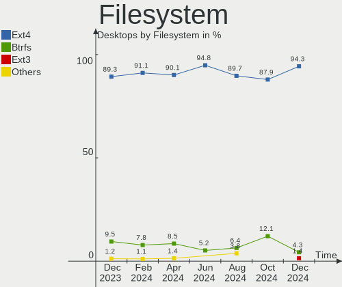
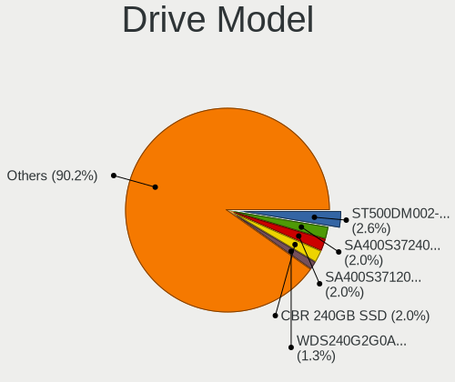
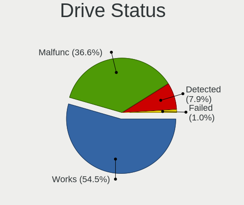
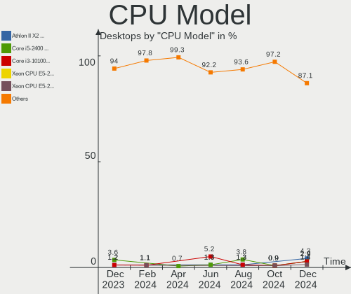
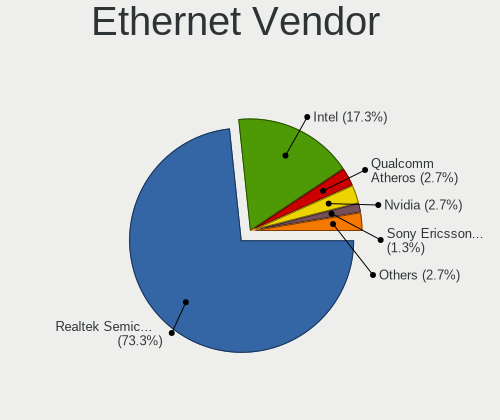

ROSA - Hardware Trends (Desktops)
---------------------------------

A project to identify most popular hardware characteristics and track their change
over time based on data collected by Linux users at https://Linux-Hardware.org.

Anyone can contribute to this report by the [hw-probe](https://github.com/linuxhw/hw-probe) tool:

    sudo -E hw-probe -all -upload

This report is for one last month. Overall report since the beginning of time: [TestDays](https://github.com/linuxhw/TestDays)

Period: Mar, 2023.

Contents
--------

* [ System ](#system)
  - [ OS                       ](#os)
  - [ OS Family                ](#os-family)
  - [ Kernel                   ](#kernel)
  - [ Kernel Family            ](#kernel-family)
  - [ Kernel Major Ver.        ](#kernel-major-ver)
  - [ Arch                     ](#arch)
  - [ DE                       ](#de)
  - [ Display Server           ](#display-server)
  - [ Display Manager          ](#display-manager)
  - [ OS Lang                  ](#os-lang)
  - [ Boot Mode                ](#boot-mode)
  - [ Filesystem               ](#filesystem)
  - [ Part. scheme             ](#part-scheme)
  - [ Dual Boot with Linux/BSD ](#dual-boot-with-linuxbsd)
  - [ Dual Boot (Win)          ](#dual-boot-win)

* [ Board ](#board)
  - [ Vendor                   ](#vendor)
  - [ Model                    ](#model)
  - [ Model Family             ](#model-family)
  - [ MFG Year                 ](#mfg-year)
  - [ Form Factor              ](#form-factor)
  - [ Secure Boot              ](#secure-boot)
  - [ Coreboot                 ](#coreboot)
  - [ RAM Size                 ](#ram-size)
  - [ RAM Used                 ](#ram-used)
  - [ Total Drives             ](#total-drives)
  - [ Has CD-ROM               ](#has-cd-rom)
  - [ Has Ethernet             ](#has-ethernet)
  - [ Has WiFi                 ](#has-wifi)
  - [ Has Bluetooth            ](#has-bluetooth)

* [ Location ](#location)
  - [ Country                  ](#country)
  - [ City                     ](#city)

* [ Drives ](#drives)
  - [ Drive Vendor             ](#drive-vendor)
  - [ Drive Model              ](#drive-model)
  - [ HDD Vendor               ](#hdd-vendor)
  - [ SSD Vendor               ](#ssd-vendor)
  - [ Drive Kind               ](#drive-kind)
  - [ Drive Connector          ](#drive-connector)
  - [ Drive Size               ](#drive-size)
  - [ Space Total              ](#space-total)
  - [ Space Used               ](#space-used)
  - [ Malfunc. Drives          ](#malfunc-drives)
  - [ Malfunc. Drive Vendor    ](#malfunc-drive-vendor)
  - [ Malfunc. HDD Vendor      ](#malfunc-hdd-vendor)
  - [ Malfunc. Drive Kind      ](#malfunc-drive-kind)
  - [ Failed Drives            ](#failed-drives)
  - [ Failed Drive Vendor      ](#failed-drive-vendor)
  - [ Drive Status             ](#drive-status)

* [ Storage controller ](#storage-controller)
  - [ Storage Vendor           ](#storage-vendor)
  - [ Storage Model            ](#storage-model)
  - [ Storage Kind             ](#storage-kind)

* [ Processor ](#processor)
  - [ CPU Vendor               ](#cpu-vendor)
  - [ CPU Model                ](#cpu-model)
  - [ CPU Model Family         ](#cpu-model-family)
  - [ CPU Cores                ](#cpu-cores)
  - [ CPU Sockets              ](#cpu-sockets)
  - [ CPU Threads              ](#cpu-threads)
  - [ CPU Op-Modes             ](#cpu-op-modes)
  - [ CPU Microcode            ](#cpu-microcode)
  - [ CPU Microarch            ](#cpu-microarch)

* [ Graphics ](#graphics)
  - [ GPU Vendor               ](#gpu-vendor)
  - [ GPU Model                ](#gpu-model)
  - [ GPU Combo                ](#gpu-combo)
  - [ GPU Driver               ](#gpu-driver)
  - [ GPU Memory               ](#gpu-memory)

* [ Monitor ](#monitor)
  - [ Monitor Vendor           ](#monitor-vendor)
  - [ Monitor Model            ](#monitor-model)
  - [ Monitor Resolution       ](#monitor-resolution)
  - [ Monitor Diagonal         ](#monitor-diagonal)
  - [ Monitor Width            ](#monitor-width)
  - [ Aspect Ratio             ](#aspect-ratio)
  - [ Monitor Area             ](#monitor-area)
  - [ Pixel Density            ](#pixel-density)
  - [ Multiple Monitors        ](#multiple-monitors)

* [ Network ](#network)
  - [ Net Controller Vendor    ](#net-controller-vendor)
  - [ Net Controller Model     ](#net-controller-model)
  - [ Wireless Vendor          ](#wireless-vendor)
  - [ Wireless Model           ](#wireless-model)
  - [ Ethernet Vendor          ](#ethernet-vendor)
  - [ Ethernet Model           ](#ethernet-model)
  - [ Net Controller Kind      ](#net-controller-kind)
  - [ Used Controller          ](#used-controller)
  - [ NICs                     ](#nics)
  - [ IPv6                     ](#ipv6)

* [ Bluetooth ](#bluetooth)
  - [ Bluetooth Vendor         ](#bluetooth-vendor)
  - [ Bluetooth Model          ](#bluetooth-model)

* [ Sound ](#sound)
  - [ Sound Vendor             ](#sound-vendor)
  - [ Sound Model              ](#sound-model)

* [ Memory ](#memory)
  - [ Memory Vendor            ](#memory-vendor)
  - [ Memory Model             ](#memory-model)
  - [ Memory Kind              ](#memory-kind)
  - [ Memory Form Factor       ](#memory-form-factor)
  - [ Memory Size              ](#memory-size)
  - [ Memory Speed             ](#memory-speed)

* [ Printers & scanners ](#printers--scanners)
  - [ Printer Vendor           ](#printer-vendor)
  - [ Printer Model            ](#printer-model)
  - [ Scanner Vendor           ](#scanner-vendor)
  - [ Scanner Model            ](#scanner-model)

* [ Camera ](#camera)
  - [ Camera Vendor            ](#camera-vendor)
  - [ Camera Model             ](#camera-model)

* [ Security ](#security)
  - [ Fingerprint Vendor       ](#fingerprint-vendor)
  - [ Fingerprint Model        ](#fingerprint-model)
  - [ Chipcard Vendor          ](#chipcard-vendor)
  - [ Chipcard Model           ](#chipcard-model)

* [ Unsupported ](#unsupported)
  - [ Unsupported Devices      ](#unsupported-devices)
  - [ Unsupported Device Types ](#unsupported-device-types)

System
------

OS
--

Installed operating systems

| Name       | Desktops | Percent |
|------------|----------|---------|
| ROSA 12.3  | 105      | 75.54%  |
| ROSA 12.4  | 19       | 13.67%  |
| ROSA R11.1 | 7        | 5.04%   |
| ROSA 12.2  | 3        | 2.16%   |
| ROSA 12.1  | 3        | 2.16%   |
| ROSA 12    | 2        | 1.44%   |

OS Family
---------

OS without a version

| Name | Desktops | Percent |
|------|----------|---------|
| ROSA | 139      | 100%    |

Kernel
------

Version of the Linux kernel

| Version                                   | Desktops | Percent |
|-------------------------------------------|----------|---------|
| 5.15.79-generic-1rosa2021.1-x86_64        | 39       | 28.06%  |
| 5.15.75-generic-1rosa2021.1-x86_64        | 36       | 25.9%   |
| 6.1.20-generic-2rosa2021.1-x86_64         | 11       | 7.91%   |
| 5.10.155-generic-1rosa2021.1-x86_64       | 11       | 7.91%   |
| 6.0.12.xm1-1.klp-xanmod-rosa2021.1-x86_64 | 6        | 4.32%   |
| 6.1.20-generic-1rosa2021.1-x86_64         | 4        | 2.88%   |
| 5.10.74-generic-2rosa2021.1-x86_64        | 4        | 2.88%   |
| 4.15.0-desktop-122.124.1rosa-x86_64       | 4        | 2.88%   |
| 5.15.103-generic-1rosa2021.1-x86_64       | 3        | 2.16%   |
| 6.1.14-generic-1rosa2021.1-x86_64         | 2        | 1.44%   |
| 5.17.11-generic-2rosa2021.1-x86_64        | 2        | 1.44%   |
| 5.15.77-generic-1rosa2021.1-x86_64        | 2        | 1.44%   |
| 5.15.75-generic-1rosa2021.1-i686          | 2        | 1.44%   |
| 5.10.74-generic-2rosa2021.1-i586          | 2        | 1.44%   |
| 5.10.150-generic-1rosa2021.1-x86_64       | 2        | 1.44%   |
| 6.2.7.xm1-1.klp-xanmod-rosa2021.1-x86_64  | 1        | 0.72%   |
| 6.2.6-generic-2rosa2021.1-x86_64          | 1        | 0.72%   |
| 6.2.1.xm1-1.klp-xanmod-rosa2021.1-x86_64  | 1        | 0.72%   |
| 5.4.83-generic-2rosa-i586                 | 1        | 0.72%   |
| 5.4.32-generic-2rosa-x86_64               | 1        | 0.72%   |
| 5.18.19-generic-3rosa2021.1-x86_64        | 1        | 0.72%   |
| 5.15.43-generic-2rosa2021.1-x86_64        | 1        | 0.72%   |
| 5.10.176-generic-1rosa2021.1-x86_64       | 1        | 0.72%   |
| 4.9.60-nrj-desktop-1rosa-i586             | 1        | 0.72%   |

Kernel Family
-------------

Linux kernel without a distro release

| Version  | Desktops | Percent |
|----------|----------|---------|
| 5.15.79  | 39       | 28.06%  |
| 5.15.75  | 38       | 27.34%  |
| 6.1.20   | 15       | 10.79%  |
| 5.10.155 | 11       | 7.91%   |
| 6.0.12   | 6        | 4.32%   |
| 5.10.74  | 6        | 4.32%   |
| 4.15.0   | 4        | 2.88%   |
| 5.15.103 | 3        | 2.16%   |
| 6.1.14   | 2        | 1.44%   |
| 5.17.11  | 2        | 1.44%   |
| 5.15.77  | 2        | 1.44%   |
| 5.10.150 | 2        | 1.44%   |
| 6.2.7    | 1        | 0.72%   |
| 6.2.6    | 1        | 0.72%   |
| 6.2.1    | 1        | 0.72%   |
| 5.4.83   | 1        | 0.72%   |
| 5.4.32   | 1        | 0.72%   |
| 5.18.19  | 1        | 0.72%   |
| 5.15.43  | 1        | 0.72%   |
| 5.10.176 | 1        | 0.72%   |
| 4.9.60   | 1        | 0.72%   |

Kernel Major Ver.
-----------------

Linux kernel major version

| Version | Desktops | Percent |
|---------|----------|---------|
| 5.15    | 83       | 59.71%  |
| 5.10    | 20       | 14.39%  |
| 6.1     | 17       | 12.23%  |
| 6.0     | 6        | 4.32%   |
| 4.15    | 4        | 2.88%   |
| 6.2     | 3        | 2.16%   |
| 5.4     | 2        | 1.44%   |
| 5.17    | 2        | 1.44%   |
| 5.18    | 1        | 0.72%   |
| 4.9     | 1        | 0.72%   |

Arch
----

OS architecture (x86_64, i586, etc.)

| Name   | Desktops | Percent |
|--------|----------|---------|
| x86_64 | 133      | 95.68%  |
| i686   | 6        | 4.32%   |

DE
--

Desktop Environment

| Name  | Desktops | Percent |
|-------|----------|---------|
| KDE5  | 75       | 53.96%  |
| GNOME | 47       | 33.81%  |
| LXQt  | 12       | 8.63%   |
| KDE4  | 5        | 3.6%    |

Display Server
--------------

X11 or Wayland

| Name    | Desktops | Percent |
|---------|----------|---------|
| Wayland | 111      | 79.86%  |
| X11     | 28       | 20.14%  |

Display Manager
---------------

SDDM, LightDM, etc.

| Name    | Desktops | Percent |
|---------|----------|---------|
| SDDM    | 75       | 53.96%  |
| GDM     | 53       | 38.13%  |
| KDM     | 5        | 3.6%    |
| LightDM | 4        | 2.88%   |
| Unknown | 2        | 1.44%   |

OS Lang
-------

Language

| Lang  | Desktops | Percent |
|-------|----------|---------|
| ru_RU | 126      | 90.65%  |
| en_US | 3        | 2.16%   |
| ru_UA | 1        | 0.72%   |
| pt_BR | 1        | 0.72%   |
| pl_PL | 1        | 0.72%   |
| ja_JP | 1        | 0.72%   |
| it_IT | 1        | 0.72%   |
| fr_FR | 1        | 0.72%   |
| es_ES | 1        | 0.72%   |
| en_GB | 1        | 0.72%   |
| el_GR | 1        | 0.72%   |
| de_DE | 1        | 0.72%   |

Boot Mode
---------

EFI or BIOS

| Mode | Desktops | Percent |
|------|----------|---------|
| EFI  | 76       | 54.68%  |
| BIOS | 63       | 45.32%  |

Filesystem
----------

Type of filesystem

| Type  | Desktops | Percent |
|-------|----------|---------|
| Ext4  | 129      | 92.81%  |
| Btrfs | 8        | 5.76%   |
| F2fs  | 1        | 0.72%   |
| Ext3  | 1        | 0.72%   |

Part. scheme
------------

Scheme of partitioning

| Type    | Desktops | Percent |
|---------|----------|---------|
| GPT     | 89       | 64.03%  |
| MBR     | 48       | 34.53%  |
| Unknown | 2        | 1.44%   |

Dual Boot with Linux/BSD
------------------------

Hosting more than one Linux/BSD

| Dual boot | Desktops | Percent |
|-----------|----------|---------|
| No        | 100      | 71.94%  |
| Yes       | 39       | 28.06%  |

Dual Boot (Win)
---------------

Hosting Linux and Windows

| Dual boot | Desktops | Percent |
|-----------|----------|---------|
| Yes       | 83       | 59.71%  |
| No        | 56       | 40.29%  |

Board
-----

Vendor
------

Motherboard manufacturer

| Name                | Desktops | Percent |
|---------------------|----------|---------|
| Gigabyte Technology | 41       | 29.5%   |
| ASUSTek Computer    | 31       | 22.3%   |
| ASRock              | 16       | 11.51%  |
| MSI                 | 13       | 9.35%   |
| Dell                | 8        | 5.76%   |
| MACHINIST           | 3        | 2.16%   |
| Intel               | 3        | 2.16%   |
| Huanan              | 3        | 2.16%   |
| Hewlett-Packard     | 3        | 2.16%   |
| Foxconn             | 3        | 2.16%   |
| EPoX Computer       | 3        | 2.16%   |
| Biostar             | 3        | 2.16%   |
| Unknown             | 3        | 2.16%   |
| Soyo                | 1        | 0.72%   |
| Shuttle             | 1        | 0.72%   |
| MB                  | 1        | 0.72%   |
| Fujitsu             | 1        | 0.72%   |
| ECS                 | 1        | 0.72%   |
| Acer                | 1        | 0.72%   |

Model
-----

Motherboard model

| Name                                 | Desktops | Percent |
|--------------------------------------|----------|---------|
| Gigabyte H410M H V3                  | 3        | 2.16%   |
| ASUS All Series                      | 3        | 2.16%   |
| Unknown                              | 3        | 2.16%   |
| Huanan X99-QD4 V1.0                  | 2        | 1.44%   |
| Gigabyte GA-A55M-S2V                 | 2        | 1.44%   |
| Gigabyte B450M S2H                   | 2        | 1.44%   |
| Gigabyte A320M-S2H V2                | 2        | 1.44%   |
| Dell OptiPlex 3020                   | 2        | 1.44%   |
| Biostar A320MH                       | 2        | 1.44%   |
| ASUS PRIME H270-PLUS                 | 2        | 1.44%   |
| Soyo SY-Classic B660M                | 1        | 0.72%   |
| Shuttle XS35V3                       | 1        | 0.72%   |
| MSI OPTIMUS                          | 1        | 0.72%   |
| MSI MS-7D48                          | 1        | 0.72%   |
| MSI MS-7D22                          | 1        | 0.72%   |
| MSI MS-7C95                          | 1        | 0.72%   |
| MSI MS-7C56                          | 1        | 0.72%   |
| MSI MS-7C51                          | 1        | 0.72%   |
| MSI MS-7C37                          | 1        | 0.72%   |
| MSI MS-7B86                          | 1        | 0.72%   |
| MSI MS-7A33                          | 1        | 0.72%   |
| MSI MS-7788                          | 1        | 0.72%   |
| MSI MS-7693                          | 1        | 0.72%   |
| MSI MS-7641                          | 1        | 0.72%   |
| MSI MS-7599                          | 1        | 0.72%   |
| MB A320-SF110                        | 1        | 0.72%   |
| MACHINIST X99-RS9 V3.1               | 1        | 0.72%   |
| MACHINIST X99-k9 V2.0                | 1        | 0.72%   |
| MACHINIST E5-MR9A PRO V1.1           | 1        | 0.72%   |
| Intel X79v2.72 KD V2.0               | 1        | 0.72%   |
| Intel X79                            | 1        | 0.72%   |
| Intel H61                            | 1        | 0.72%   |
| Huanan X99-F8 NALEX, NALEX           | 1        | 0.72%   |
| HP Pavilion Gaming Desktop TG01-2xxx | 1        | 0.72%   |
| HP Compaq dc7700 Small Form Factor   | 1        | 0.72%   |
| HP Compaq 6000 Pro MT PC             | 1        | 0.72%   |
| Gigabyte Z77X-UD5H                   | 1        | 0.72%   |
| Gigabyte Z590 D                      | 1        | 0.72%   |
| Gigabyte Z390 AORUS PRO              | 1        | 0.72%   |
| Gigabyte X570 GAMING X               | 1        | 0.72%   |

Model Family
------------

Motherboard model prefix

| Name                 | Desktops | Percent |
|----------------------|----------|---------|
| ASUS PRIME           | 10       | 7.19%   |
| Dell OptiPlex        | 7        | 5.04%   |
| Gigabyte H410M       | 3        | 2.16%   |
| Gigabyte B550        | 3        | 2.16%   |
| ASUS All             | 3        | 2.16%   |
| Unknown              | 3        | 2.16%   |
| Huanan X99-QD4       | 2        | 1.44%   |
| HP Compaq            | 2        | 1.44%   |
| Gigabyte GA-A55M-S2V | 2        | 1.44%   |
| Gigabyte B450M       | 2        | 1.44%   |
| Gigabyte A320M-S2H   | 2        | 1.44%   |
| Biostar A320MH       | 2        | 1.44%   |
| ASUS TUF             | 2        | 1.44%   |
| ASUS SABERTOOTH      | 2        | 1.44%   |
| Soyo SY-Classic      | 1        | 0.72%   |
| Shuttle XS35V3       | 1        | 0.72%   |
| MSI OPTIMUS          | 1        | 0.72%   |
| MSI MS-7D48          | 1        | 0.72%   |
| MSI MS-7D22          | 1        | 0.72%   |
| MSI MS-7C95          | 1        | 0.72%   |
| MSI MS-7C56          | 1        | 0.72%   |
| MSI MS-7C51          | 1        | 0.72%   |
| MSI MS-7C37          | 1        | 0.72%   |
| MSI MS-7B86          | 1        | 0.72%   |
| MSI MS-7A33          | 1        | 0.72%   |
| MSI MS-7788          | 1        | 0.72%   |
| MSI MS-7693          | 1        | 0.72%   |
| MSI MS-7641          | 1        | 0.72%   |
| MSI MS-7599          | 1        | 0.72%   |
| MB A320-SF110        | 1        | 0.72%   |
| MACHINIST X99-RS9    | 1        | 0.72%   |
| MACHINIST X99-k9     | 1        | 0.72%   |
| MACHINIST E5-MR9A    | 1        | 0.72%   |
| Intel X79v2.72       | 1        | 0.72%   |
| Intel X79            | 1        | 0.72%   |
| Intel H61            | 1        | 0.72%   |
| Huanan X99-F8        | 1        | 0.72%   |
| HP Pavilion          | 1        | 0.72%   |
| Gigabyte Z77X-UD5H   | 1        | 0.72%   |
| Gigabyte Z590        | 1        | 0.72%   |

MFG Year
--------

Motherboard manufacture year

| Year | Desktops | Percent |
|------|----------|---------|
| 2018 | 16       | 11.51%  |
| 2021 | 14       | 10.07%  |
| 2012 | 13       | 9.35%   |
| 2020 | 11       | 7.91%   |
| 2009 | 11       | 7.91%   |
| 2019 | 9        | 6.47%   |
| 2016 | 8        | 5.76%   |
| 2013 | 8        | 5.76%   |
| 2010 | 8        | 5.76%   |
| 2022 | 7        | 5.04%   |
| 2014 | 7        | 5.04%   |
| 2011 | 6        | 4.32%   |
| 2006 | 5        | 3.6%    |
| 2017 | 4        | 2.88%   |
| 2015 | 4        | 2.88%   |
| 2007 | 4        | 2.88%   |
| 2008 | 2        | 1.44%   |
| 2005 | 1        | 0.72%   |
| 2004 | 1        | 0.72%   |

Form Factor
-----------

Physical design of the computer

| Name    | Desktops | Percent |
|---------|----------|---------|
| Desktop | 139      | 100%    |

Secure Boot
-----------

Enabled or disabled

| State    | Desktops | Percent |
|----------|----------|---------|
| Disabled | 139      | 100%    |

Coreboot
--------

Have coreboot on board

| Used | Desktops | Percent |
|------|----------|---------|
| No   | 139      | 100%    |

RAM Size
--------

Total RAM memory

| Size in GB | Desktops | Percent |
|------------|----------|---------|
| 16.01-24.0 | 41       | 29.5%   |
| 8.01-16.0  | 26       | 18.71%  |
| 3.01-4.0   | 21       | 15.11%  |
| 4.01-8.0   | 20       | 14.39%  |
| 32.01-64.0 | 20       | 14.39%  |
| 1.01-2.0   | 5        | 3.6%    |
| 24.01-32.0 | 3        | 2.16%   |
| 2.01-3.0   | 3        | 2.16%   |

RAM Used
--------

Used RAM memory

| Used GB    | Desktops | Percent |
|------------|----------|---------|
| 1.01-2.0   | 80       | 57.55%  |
| 0.51-1.0   | 26       | 18.71%  |
| 2.01-3.0   | 21       | 15.11%  |
| 3.01-4.0   | 6        | 4.32%   |
| 4.01-8.0   | 4        | 2.88%   |
| 16.01-24.0 | 1        | 0.72%   |
| 8.01-16.0  | 1        | 0.72%   |

Total Drives
------------

Number of drives on board

| Drives | Desktops | Percent |
|--------|----------|---------|
| 1      | 56       | 40.29%  |
| 2      | 43       | 30.94%  |
| 3      | 21       | 15.11%  |
| 4      | 12       | 8.63%   |
| 5      | 4        | 2.88%   |
| 6      | 2        | 1.44%   |
| 7      | 1        | 0.72%   |

Has CD-ROM
----------

Has CD-ROM on board

| Presented | Desktops | Percent |
|-----------|----------|---------|
| No        | 89       | 64.03%  |
| Yes       | 50       | 35.97%  |

Has Ethernet
------------

Has Ethernet on board

| Presented | Desktops | Percent |
|-----------|----------|---------|
| Yes       | 139      | 100%    |

Has WiFi
--------

Has WiFi module

| Presented | Desktops | Percent |
|-----------|----------|---------|
| No        | 87       | 62.59%  |
| Yes       | 52       | 37.41%  |

Has Bluetooth
-------------

Has Bluetooth module

| Presented | Desktops | Percent |
|-----------|----------|---------|
| No        | 103      | 74.1%   |
| Yes       | 36       | 25.9%   |

Location
--------

Country
-------

Geographic location (country)

| Country    | Desktops | Percent |
|------------|----------|---------|
| Russia     | 117      | 84.17%  |
| Ukraine    | 3        | 2.16%   |
| UK         | 3        | 2.16%   |
| Poland     | 3        | 2.16%   |
| Belarus    | 2        | 1.44%   |
| USA        | 1        | 0.72%   |
| Moldova    | 1        | 0.72%   |
| Mexico     | 1        | 0.72%   |
| Kazakhstan | 1        | 0.72%   |
| Japan      | 1        | 0.72%   |
| Italy      | 1        | 0.72%   |
| Greece     | 1        | 0.72%   |
| Germany    | 1        | 0.72%   |
| France     | 1        | 0.72%   |
| Czechia    | 1        | 0.72%   |
| Brazil     | 1        | 0.72%   |

City
----

Geographic location (city)

| City              | Desktops | Percent |
|-------------------|----------|---------|
| Moscow            | 23       | 16.55%  |
| St Petersburg     | 9        | 6.47%   |
| Samara            | 8        | 5.76%   |
| Chelyabinsk       | 6        | 4.32%   |
| Nizhniy Novgorod  | 4        | 2.88%   |
| Krasnodar         | 4        | 2.88%   |
| Voronezh          | 3        | 2.16%   |
| Ufa               | 3        | 2.16%   |
| Orenburg          | 3        | 2.16%   |
| Novosibirsk       | 3        | 2.16%   |
| Cheremkhovo       | 3        | 2.16%   |
| Tomsk             | 2        | 1.44%   |
| Surgut            | 2        | 1.44%   |
| Simferopol        | 2        | 1.44%   |
| Saratov           | 2        | 1.44%   |
| Rostov-on-Don     | 2        | 1.44%   |
| Rochdale          | 2        | 1.44%   |
| Prokop'yevsk      | 2        | 1.44%   |
| Perm              | 2        | 1.44%   |
| Kumertau          | 2        | 1.44%   |
| Yuzhno-Sakhalinsk | 1        | 0.72%   |
| Yekaterinburg     | 1        | 0.72%   |
| Yakutsk           | 1        | 0.72%   |
| Wroclaw           | 1        | 0.72%   |
| Vorkuta           | 1        | 0.72%   |
| Vologda           | 1        | 0.72%   |
| Volgograd         | 1        | 0.72%   |
| Vladivostok       | 1        | 0.72%   |
| Veliky Novgorod   | 1        | 0.72%   |
| Uvel'skiy         | 1        | 0.72%   |
| Ulyanovsk         | 1        | 0.72%   |
| Trzebinia         | 1        | 0.72%   |
| Syzran'           | 1        | 0.72%   |
| Sumaré           | 1        | 0.72%   |
| Sterlitamak       | 1        | 0.72%   |
| Stavropol         | 1        | 0.72%   |
| Shymkent          | 1        | 0.72%   |
| Pushkino          | 1        | 0.72%   |
| Prague            | 1        | 0.72%   |
| Plesetsk          | 1        | 0.72%   |

Drives
------

Drive Vendor
------------

Hard drive vendors

| Vendor                      | Desktops | Drives | Percent |
|-----------------------------|----------|--------|---------|
| WDC                         | 48       | 61     | 18.39%  |
| Seagate                     | 45       | 55     | 17.24%  |
| Samsung Electronics         | 16       | 19     | 6.13%   |
| Kingston                    | 16       | 17     | 6.13%   |
| Toshiba                     | 13       | 13     | 4.98%   |
| Hitachi                     | 13       | 13     | 4.98%   |
| China                       | 10       | 11     | 3.83%   |
| Apacer                      | 8        | 8      | 3.07%   |
| A-DATA Technology           | 7        | 7      | 2.68%   |
| Crucial                     | 6        | 7      | 2.3%    |
| SPCC                        | 5        | 5      | 1.92%   |
| SanDisk                     | 5        | 5      | 1.92%   |
| Patriot                     | 4        | 4      | 1.53%   |
| Netac                       | 4        | 4      | 1.53%   |
| KingSpec                    | 4        | 4      | 1.53%   |
| Intel                       | 4        | 4      | 1.53%   |
| XrayDisk                    | 3        | 3      | 1.15%   |
| Unknown                     | 3        | 4      | 1.15%   |
| OCZ                         | 3        | 3      | 1.15%   |
| Gigabyte Technology         | 3        | 3      | 1.15%   |
| XPG                         | 2        | 2      | 0.77%   |
| Smartbuy                    | 2        | 2      | 0.77%   |
| Silicon Motion              | 2        | 2      | 0.77%   |
| Qumo                        | 2        | 2      | 0.77%   |
| Plextor                     | 2        | 2      | 0.77%   |
| Foxline                     | 2        | 2      | 0.77%   |
| External                    | 2        | 2      | 0.77%   |
| AMD                         | 2        | 2      | 0.77%   |
| Zheino                      | 1        | 1      | 0.38%   |
| Transcend                   | 1        | 1      | 0.38%   |
| Teclast                     | 1        | 1      | 0.38%   |
| Team                        | 1        | 1      | 0.38%   |
| TAMMUZ                      | 1        | 2      | 0.38%   |
| QUANTUM                     | 1        | 1      | 0.38%   |
| NT-256                      | 1        | 1      | 0.38%   |
| MSI                         | 1        | 1      | 0.38%   |
| MAXIO Technology (Hangzhou) | 1        | 1      | 0.38%   |
| Londisk                     | 1        | 1      | 0.38%   |
| LaCie                       | 1        | 1      | 0.38%   |
| KingFast                    | 1        | 1      | 0.38%   |

Drive Model
-----------

Hard drive models

| Model                             | Desktops | Percent |
|-----------------------------------|----------|---------|
| WDC WD10EZEX-00BBHA0 1TB          | 5        | 1.74%   |
| Seagate ST500DM002-1BD142 500GB   | 5        | 1.74%   |
| WDC WD10EZEX-22MFCA0 1TB          | 4        | 1.39%   |
| Seagate ST1000DM010-2EP102 1TB    | 4        | 1.39%   |
| Seagate ST1000DM003-1CH162 1TB    | 4        | 1.39%   |
| WDC WDS240G2G0A-00JH30 240GB SSD  | 3        | 1.05%   |
| WDC WD10EZEX-08WN4A0 1TB          | 3        | 1.05%   |
| Toshiba HDWD110 1TB               | 3        | 1.05%   |
| Samsung SSD 860 EVO 250GB         | 3        | 1.05%   |
| Kingston SA400S37240G 240GB SSD   | 3        | 1.05%   |
| Hitachi HDS721050CLA360 500GB     | 3        | 1.05%   |
| Crucial CT240BX500SSD1 240GB      | 3        | 1.05%   |
| XPG GAMMIX S11 Pro 256GB          | 2        | 0.7%    |
| WDC WDS250G2B0A-00SM50 250GB SSD  | 2        | 0.7%    |
| WDC WD30EFRX-68EUZN0 3TB          | 2        | 0.7%    |
| WDC WD20EZRZ-00Z5HB0 2TB          | 2        | 0.7%    |
| Toshiba DT01ACA050 500GB          | 2        | 0.7%    |
| Seagate ST9320325AS 320GB         | 2        | 0.7%    |
| Seagate ST1000VX005-2EZ102 1TB    | 2        | 0.7%    |
| Samsung SSD 970 EVO Plus 1TB      | 2        | 0.7%    |
| Patriot Burst 120GB SSD           | 2        | 0.7%    |
| Netac SSD 240GB                   | 2        | 0.7%    |
| Kingston SNVS500G 500GB           | 2        | 0.7%    |
| Kingston SNVS1000G 1TB            | 2        | 0.7%    |
| Kingston SKC2500M8250G 250GB      | 2        | 0.7%    |
| Kingston SA400S37480G 480GB SSD   | 2        | 0.7%    |
| Kingston SA400S37120G 120GB SSD   | 2        | 0.7%    |
| Hitachi HDS721050CLA362 500GB     | 2        | 0.7%    |
| External USB3.0 512GB             | 2        | 0.7%    |
| Crucial CT500MX500SSD1 500GB      | 2        | 0.7%    |
| China SSD 240GB                   | 2        | 0.7%    |
| Apacer AS350 128GB SSD            | 2        | 0.7%    |
| AMD R5SL120G 120GB SSD            | 2        | 0.7%    |
| Zheino CHN-25SATAA3-480 480GB SSD | 1        | 0.35%   |
| XrayDisk SSD 256GB                | 1        | 0.35%   |
| XrayDisk 512GB                    | 1        | 0.35%   |
| XrayDisk 120GB SSD                | 1        | 0.35%   |
| WDC WDS500G2B0B-00YS70 500GB SSD  | 1        | 0.35%   |
| WDC WDS120G2G0A-00JH30 120GB SSD  | 1        | 0.35%   |
| WDC WDS100T2B0B-00YS70 1TB SSD    | 1        | 0.35%   |

HDD Vendor
----------

Hard disk drive vendors

| Vendor              | Desktops | Drives | Percent |
|---------------------|----------|--------|---------|
| Seagate             | 44       | 54     | 37.61%  |
| WDC                 | 41       | 52     | 35.04%  |
| Hitachi             | 13       | 13     | 11.11%  |
| Toshiba             | 12       | 12     | 10.26%  |
| Samsung Electronics | 3        | 3      | 2.56%   |
| Unknown             | 1        | 1      | 0.85%   |
| QUANTUM             | 1        | 1      | 0.85%   |
| LaCie               | 1        | 1      | 0.85%   |
| Fujitsu             | 1        | 1      | 0.85%   |

SSD Vendor
----------

Solid state drive vendors

| Vendor              | Desktops | Drives | Percent |
|---------------------|----------|--------|---------|
| Kingston            | 10       | 10     | 9.52%   |
| China               | 10       | 11     | 9.52%   |
| WDC                 | 7        | 8      | 6.67%   |
| Samsung Electronics | 7        | 9      | 6.67%   |
| Apacer              | 7        | 7      | 6.67%   |
| SPCC                | 5        | 5      | 4.76%   |
| Crucial             | 5        | 6      | 4.76%   |
| KingSpec            | 4        | 4      | 3.81%   |
| A-DATA Technology   | 4        | 4      | 3.81%   |
| SanDisk             | 3        | 3      | 2.86%   |
| Patriot             | 3        | 3      | 2.86%   |
| OCZ                 | 3        | 3      | 2.86%   |
| Netac               | 3        | 3      | 2.86%   |
| Intel               | 3        | 3      | 2.86%   |
| XrayDisk            | 2        | 2      | 1.9%    |
| Smartbuy            | 2        | 2      | 1.9%    |
| Qumo                | 2        | 2      | 1.9%    |
| Plextor             | 2        | 2      | 1.9%    |
| Foxline             | 2        | 2      | 1.9%    |
| AMD                 | 2        | 2      | 1.9%    |
| Zheino              | 1        | 1      | 0.95%   |
| Unknown             | 1        | 1      | 0.95%   |
| Toshiba             | 1        | 1      | 0.95%   |
| Team                | 1        | 1      | 0.95%   |
| TAMMUZ              | 1        | 2      | 0.95%   |
| NT-256              | 1        | 1      | 0.95%   |
| Londisk             | 1        | 1      | 0.95%   |
| KingFast            | 1        | 1      | 0.95%   |
| Kimtigo             | 1        | 1      | 0.95%   |
| Intenso             | 1        | 1      | 0.95%   |
| HUAXUAN             | 1        | 1      | 0.95%   |
| HS-SSD-E100         | 1        | 1      | 0.95%   |
| HS-SSD-C100         | 1        | 1      | 0.95%   |
| GSemi               | 1        | 1      | 0.95%   |
| Gigabyte Technology | 1        | 1      | 0.95%   |
| Digma               | 1        | 1      | 0.95%   |
| BUFFALO             | 1        | 1      | 0.95%   |
| AFOX                | 1        | 1      | 0.95%   |
| Unknown             | 1        | 1      | 0.95%   |

Drive Kind
----------

HDD or SSD

| Kind    | Desktops | Drives | Percent |
|---------|----------|--------|---------|
| HDD     | 102      | 138    | 46.15%  |
| SSD     | 84       | 111    | 38.01%  |
| NVMe    | 34       | 41     | 15.38%  |
| Unknown | 1        | 2      | 0.45%   |

Drive Connector
---------------

SATA, SAS, NVMe, etc.

| Type | Desktops | Drives | Percent |
|------|----------|--------|---------|
| SATA | 130      | 246    | 76.92%  |
| NVMe | 33       | 39     | 19.53%  |
| SAS  | 6        | 7      | 3.55%   |

Drive Size
----------

Size of hard drive

| Size in TB | Desktops | Drives | Percent |
|------------|----------|--------|---------|
| 0.01-0.5   | 112      | 169    | 62.22%  |
| 0.51-1.0   | 48       | 57     | 26.67%  |
| 1.01-2.0   | 13       | 15     | 7.22%   |
| 3.01-4.0   | 4        | 5      | 2.22%   |
| 2.01-3.0   | 3        | 3      | 1.67%   |

Space Total
-----------

Amount of disk space available on the file system

| Size in GB     | Desktops | Percent |
|----------------|----------|---------|
| 101-250        | 38       | 27.34%  |
| 251-500        | 23       | 16.55%  |
| 501-1000       | 20       | 14.39%  |
| 51-100         | 15       | 10.79%  |
| 1-20           | 13       | 9.35%   |
| 2001-3000      | 9        | 6.47%   |
| 1001-2000      | 9        | 6.47%   |
| 21-50          | 8        | 5.76%   |
| More than 3000 | 4        | 2.88%   |

Space Used
----------

Amount of used disk space

| Used GB        | Desktops | Percent |
|----------------|----------|---------|
| 1-20           | 76       | 54.68%  |
| 101-250        | 17       | 12.23%  |
| 21-50          | 10       | 7.19%   |
| 251-500        | 9        | 6.47%   |
| 1001-2000      | 8        | 5.76%   |
| 501-1000       | 8        | 5.76%   |
| 51-100         | 8        | 5.76%   |
| 2001-3000      | 2        | 1.44%   |
| More than 3000 | 1        | 0.72%   |

Malfunc. Drives
---------------

Drive models with a malfunction

| Model                            | Desktops | Drives | Percent |
|----------------------------------|----------|--------|---------|
| Seagate ST500DM002-1BD142 500GB  | 5        | 5      | 7.69%   |
| Seagate ST1000DM003-1CH162 1TB   | 3        | 3      | 4.62%   |
| WDC WD10EZEX-22MFCA0 1TB         | 2        | 2      | 3.08%   |
| Netac SSD 240GB                  | 2        | 2      | 3.08%   |
| WDC WDS240G2G0A-00JH30 240GB SSD | 1        | 1      | 1.54%   |
| WDC WD5000AZLX-22JKKA0 464GB     | 1        | 1      | 1.54%   |
| WDC WD5000AAKX-75U6AA0 500GB     | 1        | 1      | 1.54%   |
| WDC WD5000AAKS-75V0A0 500GB      | 1        | 1      | 1.54%   |
| WDC WD3200AAJS-08L7A0 320GB      | 1        | 1      | 1.54%   |
| WDC WD30EFRX-68EUZN0 3TB         | 1        | 1      | 1.54%   |
| WDC WD20EARS-00S8B1 2TB          | 1        | 1      | 1.54%   |
| WDC WD1600AAJS-00L7A0 160GB      | 1        | 1      | 1.54%   |
| WDC WD10PURZ-85U8XY0 1TB         | 1        | 1      | 1.54%   |
| WDC WD10JPVX-60JC3T1 1TB         | 1        | 1      | 1.54%   |
| WDC WD10EARS-00Y5B1 1TB          | 1        | 1      | 1.54%   |
| Toshiba MK5055GSX 500GB          | 1        | 1      | 1.54%   |
| Toshiba HDWD110 1TB              | 1        | 1      | 1.54%   |
| Toshiba DT01ACA100 1TB           | 1        | 1      | 1.54%   |
| Teclast 256GB NP900-2280         | 1        | 1      | 1.54%   |
| Seagate ST9320325AS 320GB        | 1        | 1      | 1.54%   |
| Seagate ST500LT012-9WS142 500GB  | 1        | 1      | 1.54%   |
| Seagate ST500DM002-1BC142 500GB  | 1        | 1      | 1.54%   |
| Seagate ST380817AS 80GB          | 1        | 2      | 1.54%   |
| Seagate ST3750640AS 752GB        | 1        | 1      | 1.54%   |
| Seagate ST3500820AS 500GB        | 1        | 1      | 1.54%   |
| Seagate ST3500418AS 500GB        | 1        | 1      | 1.54%   |
| Seagate ST3500413AS 500GB        | 1        | 1      | 1.54%   |
| Seagate ST340016A 40GB           | 1        | 1      | 1.54%   |
| Seagate ST340014A 40GB           | 1        | 1      | 1.54%   |
| Seagate ST3320613AS 320GB        | 1        | 1      | 1.54%   |
| Seagate ST3320418AS 320GB        | 1        | 1      | 1.54%   |
| Seagate ST3250410AS 250GB        | 1        | 1      | 1.54%   |
| Seagate ST3250318AS 250GB        | 1        | 1      | 1.54%   |
| Seagate ST3120827AS 120GB        | 1        | 1      | 1.54%   |
| Seagate ST3120814A 120GB         | 1        | 1      | 1.54%   |
| Seagate ST3120026AS 120GB        | 1        | 1      | 1.54%   |
| Seagate ST3120022A 120GB         | 1        | 1      | 1.54%   |
| Seagate ST31000524AS 1TB         | 1        | 1      | 1.54%   |
| Seagate ST31000333AS 1TB         | 1        | 1      | 1.54%   |
| Seagate ST250DM000-1BD141 250GB  | 1        | 1      | 1.54%   |

Malfunc. Drive Vendor
---------------------

Vendors of faulty drives

| Vendor              | Desktops | Drives | Percent |
|---------------------|----------|--------|---------|
| Seagate             | 25       | 32     | 42.37%  |
| WDC                 | 13       | 13     | 22.03%  |
| Hitachi             | 5        | 5      | 8.47%   |
| Toshiba             | 3        | 3      | 5.08%   |
| OCZ                 | 2        | 2      | 3.39%   |
| Netac               | 2        | 2      | 3.39%   |
| Teclast             | 1        | 1      | 1.69%   |
| Samsung Electronics | 1        | 1      | 1.69%   |
| Qumo                | 1        | 1      | 1.69%   |
| LaCie               | 1        | 1      | 1.69%   |
| Kingston            | 1        | 1      | 1.69%   |
| KingSpec            | 1        | 1      | 1.69%   |
| GSemi               | 1        | 1      | 1.69%   |
| AFOX                | 1        | 1      | 1.69%   |
| A-DATA Technology   | 1        | 1      | 1.69%   |

Malfunc. HDD Vendor
-------------------

Vendors of faulty HDD drives

| Vendor              | Desktops | Drives | Percent |
|---------------------|----------|--------|---------|
| Seagate             | 25       | 32     | 53.19%  |
| WDC                 | 12       | 12     | 25.53%  |
| Hitachi             | 5        | 5      | 10.64%  |
| Toshiba             | 3        | 3      | 6.38%   |
| Samsung Electronics | 1        | 1      | 2.13%   |
| LaCie               | 1        | 1      | 2.13%   |

Malfunc. Drive Kind
-------------------

Kinds of faulty drives

| Kind | Desktops | Drives | Percent |
|------|----------|--------|---------|
| HDD  | 43       | 54     | 78.18%  |
| SSD  | 11       | 11     | 20%     |
| NVMe | 1        | 1      | 1.82%   |

Failed Drives
-------------

Failed drive models

Zero info for selected period =(

Failed Drive Vendor
-------------------

Failed drive vendors

Zero info for selected period =(

Drive Status
------------

Number of failed and malfunc. drives

| Status   | Desktops | Drives | Percent |
|----------|----------|--------|---------|
| Works    | 117      | 219    | 67.63%  |
| Malfunc  | 50       | 66     | 28.9%   |
| Detected | 6        | 7      | 3.47%   |

Storage controller
------------------

Storage Vendor
--------------

Storage controller vendors

| Vendor                        | Desktops | Percent |
|-------------------------------|----------|---------|
| Intel                         | 87       | 45.31%  |
| AMD                           | 44       | 22.92%  |
| Nvidia                        | 8        | 4.17%   |
| JMicron Technology            | 8        | 4.17%   |
| Silicon Motion                | 7        | 3.65%   |
| Samsung Electronics           | 6        | 3.13%   |
| Kingston Technology Company   | 6        | 3.13%   |
| Phison Electronics            | 4        | 2.08%   |
| ASMedia Technology            | 4        | 2.08%   |
| SanDisk                       | 3        | 1.56%   |
| Marvell Technology Group      | 3        | 1.56%   |
| ADATA Technology              | 3        | 1.56%   |
| Realtek Semiconductor         | 2        | 1.04%   |
| MAXIO Technology (Hangzhou)   | 2        | 1.04%   |
| VIA Technologies              | 1        | 0.52%   |
| Seagate Technology            | 1        | 0.52%   |
| Netac Technology              | 1        | 0.52%   |
| Micron/Crucial Technology     | 1        | 0.52%   |
| Integrated Technology Express | 1        | 0.52%   |

Storage Model
-------------

Storage controller models

| Model                                                                                   | Desktops | Percent |
|-----------------------------------------------------------------------------------------|----------|---------|
| AMD FCH SATA Controller [AHCI mode]                                                     | 17       | 7.05%   |
| Intel 8 Series/C220 Series Chipset Family 6-port SATA Controller 1 [AHCI mode]          | 11       | 4.56%   |
| AMD 500 Series Chipset SATA Controller                                                  | 9        | 3.73%   |
| Intel 200 Series PCH SATA controller [AHCI mode]                                        | 8        | 3.32%   |
| AMD 400 Series Chipset SATA Controller                                                  | 8        | 3.32%   |
| Intel NM10/ICH7 Family SATA Controller [IDE mode]                                       | 7        | 2.9%    |
| Intel 7 Series/C210 Series Chipset Family 6-port SATA Controller [AHCI mode]            | 7        | 2.9%    |
| AMD SB7x0/SB8x0/SB9x0 IDE Controller                                                    | 7        | 2.9%    |
| Silicon Motion SM2263EN/SM2263XT SSD Controller                                         | 6        | 2.49%   |
| Intel 500 Series Chipset Family SATA AHCI Controller                                    | 6        | 2.49%   |
| AMD SB7x0/SB8x0/SB9x0 SATA Controller [IDE mode]                                        | 6        | 2.49%   |
| AMD SB7x0/SB8x0/SB9x0 SATA Controller [AHCI mode]                                       | 6        | 2.49%   |
| Intel Q170/Q150/B150/H170/H110/Z170/CM236 Chipset SATA Controller [AHCI Mode]           | 5        | 2.07%   |
| Samsung NVMe SSD Controller SM981/PM981/PM983                                           | 4        | 1.66%   |
| Nvidia MCP61 SATA Controller                                                            | 4        | 1.66%   |
| Nvidia MCP61 IDE                                                                        | 4        | 1.66%   |
| JMicron JMB363 SATA/IDE Controller                                                      | 4        | 1.66%   |
| Intel Cannon Lake PCH SATA AHCI Controller                                              | 4        | 1.66%   |
| Intel Alder Lake-S PCH SATA Controller [AHCI Mode]                                      | 4        | 1.66%   |
| Intel 82801G (ICH7 Family) IDE Controller                                               | 4        | 1.66%   |
| ASMedia ASM1062 Serial ATA Controller                                                   | 4        | 1.66%   |
| AMD FCH SATA Controller D                                                               | 4        | 1.66%   |
| Intel 6 Series/C200 Series Chipset Family Desktop SATA Controller (IDE mode, ports 4-5) | 3        | 1.24%   |
| Intel 6 Series/C200 Series Chipset Family Desktop SATA Controller (IDE mode, ports 0-3) | 3        | 1.24%   |
| Intel 5 Series/3400 Series Chipset 4 port SATA IDE Controller                           | 3        | 1.24%   |
| Intel 5 Series/3400 Series Chipset 2 port SATA IDE Controller                           | 3        | 1.24%   |
| Realtek NVMe Controller                                                                 | 2        | 0.83%   |
| Phison PS5013 E13 NVMe Controller                                                       | 2        | 0.83%   |
| MAXIO (Hangzhou) NVMe SSD Controller MAP1202                                            | 2        | 0.83%   |
| Kingston Company SNVS2000G [NV1 NVMe PCIe SSD 2TB]                                      | 2        | 0.83%   |
| Kingston Company NVMe Controller                                                        | 2        | 0.83%   |
| Kingston Company KC2000 NVMe SSD                                                        | 2        | 0.83%   |
| JMicron JMB368 IDE controller                                                           | 2        | 0.83%   |
| Intel Volume Management Device NVMe RAID Controller                                     | 2        | 0.83%   |
| Intel SATA Controller [RAID mode]                                                       | 2        | 0.83%   |
| Intel Celeron/Pentium Silver Processor SATA Controller                                  | 2        | 0.83%   |
| Intel C610/X99 series chipset 6-Port SATA Controller [AHCI mode]                        | 2        | 0.83%   |
| Intel 9 Series Chipset Family SATA Controller [AHCI Mode]                               | 2        | 0.83%   |
| Intel 82801JI (ICH10 Family) SATA AHCI Controller                                       | 2        | 0.83%   |
| Intel 82801JI (ICH10 Family) 4 port SATA IDE Controller #1                              | 2        | 0.83%   |

Storage Kind
------------

Kind of storage controller (IDE, SATA, NVMe, SAS, ...)

| Kind | Desktops | Percent |
|------|----------|---------|
| SATA | 107      | 57.22%  |
| IDE  | 43       | 22.99%  |
| NVMe | 33       | 17.65%  |
| RAID | 4        | 2.14%   |

Processor
---------

CPU Vendor
----------

Processor vendors

| Vendor | Desktops | Percent |
|--------|----------|---------|
| Intel  | 87       | 62.59%  |
| AMD    | 52       | 37.41%  |

CPU Model
---------

Processor models

| Model                                         | Desktops | Percent |
|-----------------------------------------------|----------|---------|
| Intel Core 2 Quad CPU Q6600 @ 2.40GHz         | 4        | 2.88%   |
| AMD Ryzen 5 5600X 6-Core Processor            | 4        | 2.88%   |
| Intel Core i3-10100F CPU @ 3.60GHz            | 3        | 2.16%   |
| Intel Xeon CPU E5-2640 0 @ 2.50GHz            | 2        | 1.44%   |
| Intel Pentium Dual-Core CPU E6500 @ 2.93GHz   | 2        | 1.44%   |
| Intel Genuine CPU 0000 @ 2.40GHz              | 2        | 1.44%   |
| Intel Core i7-3770 CPU @ 3.40GHz              | 2        | 1.44%   |
| Intel Core i5-8400 CPU @ 2.80GHz              | 2        | 1.44%   |
| Intel Core i5-4570 CPU @ 3.20GHz              | 2        | 1.44%   |
| Intel Core i3-7100 CPU @ 3.90GHz              | 2        | 1.44%   |
| Intel Core 2 Quad CPU Q9550 @ 2.83GHz         | 2        | 1.44%   |
| Intel Core 2 Duo CPU E8400 @ 3.00GHz          | 2        | 1.44%   |
| Intel Celeron J4125 CPU @ 2.00GHz             | 2        | 1.44%   |
| Intel Celeron CPU G1620 @ 2.70GHz             | 2        | 1.44%   |
| AMD Ryzen 7 5700X 8-Core Processor            | 2        | 1.44%   |
| AMD Ryzen 5 3600 6-Core Processor             | 2        | 1.44%   |
| AMD Ryzen 5 2600 Six-Core Processor           | 2        | 1.44%   |
| AMD Ryzen 5 2400G with Radeon Vega Graphics   | 2        | 1.44%   |
| AMD Phenom II X6 1055T Processor              | 2        | 1.44%   |
| AMD FX-4300 Quad-Core Processor               | 2        | 1.44%   |
| AMD Athlon 64 X2 Dual Core Processor 5200+    | 2        | 1.44%   |
| AMD A8-9600 RADEON R7, 10 COMPUTE CORES 4C+6G | 2        | 1.44%   |
| Intel Xeon CPU X3470 @ 2.93GHz                | 1        | 0.72%   |
| Intel Xeon CPU E5520 @ 2.27GHz                | 1        | 0.72%   |
| Intel Xeon CPU E5-2690 v3 @ 2.60GHz           | 1        | 0.72%   |
| Intel Xeon CPU E5-2670 v3 @ 2.30GHz           | 1        | 0.72%   |
| Intel Xeon CPU E5-2666 v3 @ 2.90GHz           | 1        | 0.72%   |
| Intel Xeon CPU E5-2650 v3 @ 2.30GHz           | 1        | 0.72%   |
| Intel Xeon CPU E5-2640 v3 @ 2.60GHz           | 1        | 0.72%   |
| Intel Xeon CPU E5-2630 v3 @ 2.40GHz           | 1        | 0.72%   |
| Intel Xeon CPU E5-2420 0 @ 1.90GHz            | 1        | 0.72%   |
| Intel Xeon CPU E31270 @ 3.40GHz               | 1        | 0.72%   |
| Intel Xeon CPU E3-1240 V2 @ 3.40GHz           | 1        | 0.72%   |
| Intel Pentium Dual-Core CPU E5800 @ 3.20GHz   | 1        | 0.72%   |
| Intel Pentium Dual-Core CPU E5500 @ 2.80GHz   | 1        | 0.72%   |
| Intel Pentium CPU G4620 @ 3.70GHz             | 1        | 0.72%   |
| Intel Pentium CPU G3250T @ 2.80GHz            | 1        | 0.72%   |
| Intel Pentium CPU G3240 @ 3.10GHz             | 1        | 0.72%   |
| Intel Pentium 4 CPU 3.20GHz                   | 1        | 0.72%   |
| Intel Core i7-6700K CPU @ 4.00GHz             | 1        | 0.72%   |

CPU Model Family
----------------

Processor model prefix

| Model                   | Desktops | Percent |
|-------------------------|----------|---------|
| Intel Core i5           | 19       | 13.67%  |
| AMD Ryzen 5             | 14       | 10.07%  |
| Intel Xeon              | 13       | 9.35%   |
| Intel Core i3           | 11       | 7.91%   |
| Intel Core i7           | 7        | 5.04%   |
| Intel Celeron           | 7        | 5.04%   |
| Other                   | 6        | 4.32%   |
| Intel Core 2 Quad       | 6        | 4.32%   |
| AMD Ryzen 7             | 6        | 4.32%   |
| AMD FX                  | 6        | 4.32%   |
| AMD Athlon 64 X2        | 5        | 3.6%    |
| Intel Pentium Dual-Core | 4        | 2.88%   |
| Intel Pentium           | 3        | 2.16%   |
| Intel Core 2 Duo        | 3        | 2.16%   |
| Intel Core 2            | 3        | 2.16%   |
| AMD Ryzen 9             | 3        | 2.16%   |
| AMD Phenom II X6        | 3        | 2.16%   |
| Intel Genuine           | 2        | 1.44%   |
| Intel Atom              | 2        | 1.44%   |
| AMD Phenom II X2        | 2        | 1.44%   |
| AMD A8                  | 2        | 1.44%   |
| AMD A4                  | 2        | 1.44%   |
| Intel Pentium 4         | 1        | 0.72%   |
| AMD Sempron             | 1        | 0.72%   |
| AMD Ryzen 7 PRO         | 1        | 0.72%   |
| AMD Ryzen 5 PRO         | 1        | 0.72%   |
| AMD Ryzen 3 PRO         | 1        | 0.72%   |
| AMD Ryzen 3             | 1        | 0.72%   |
| AMD Phenom II X4        | 1        | 0.72%   |
| AMD E                   | 1        | 0.72%   |
| AMD Athlon II X4        | 1        | 0.72%   |
| AMD Athlon II X3        | 1        | 0.72%   |

CPU Cores
---------

Number of processor cores

| Number | Desktops | Percent |
|--------|----------|---------|
| 4      | 50       | 35.97%  |
| 2      | 39       | 28.06%  |
| 6      | 29       | 20.86%  |
| 8      | 9        | 6.47%   |
| 12     | 5        | 3.6%    |
| 1      | 3        | 2.16%   |
| 10     | 2        | 1.44%   |
| 16     | 1        | 0.72%   |
| 3      | 1        | 0.72%   |

CPU Sockets
-----------

Number of sockets

| Number | Desktops | Percent |
|--------|----------|---------|
| 1      | 139      | 100%    |

CPU Threads
-----------

Threads per core (Hyper-Threading)

| Number | Desktops | Percent |
|--------|----------|---------|
| 2      | 76       | 54.68%  |
| 1      | 63       | 45.32%  |

CPU Op-Modes
------------

CPU Operation Modes (32-bit, 64-bit)

| Op mode        | Desktops | Percent |
|----------------|----------|---------|
| 32-bit, 64-bit | 138      | 99.28%  |
| 32-bit         | 1        | 0.72%   |

CPU Microcode
-------------

Microcode number

| Number     | Desktops | Percent |
|------------|----------|---------|
| Unknown    | 11       | 7.91%   |
| 0x306c3    | 10       | 7.19%   |
| 0x1067a    | 9        | 6.47%   |
| 0x306a9    | 8        | 5.76%   |
| 0x906ea    | 6        | 4.32%   |
| 0x08701021 | 6        | 4.32%   |
| 0x906e9    | 5        | 3.6%    |
| 0x206a7    | 5        | 3.6%    |
| 0xa0653    | 4        | 2.88%   |
| 0x306f2    | 4        | 2.88%   |
| 0x0800820d | 4        | 2.88%   |
| 0x90672    | 3        | 2.16%   |
| 0x6fb      | 3        | 2.16%   |
| 0x506e3    | 3        | 2.16%   |
| 0x206d7    | 3        | 2.16%   |
| 0x106e5    | 3        | 2.16%   |
| 0x0a20120a | 3        | 2.16%   |
| 0x08101016 | 3        | 2.16%   |
| 0x010000c8 | 3        | 2.16%   |
| 0x010000bf | 3        | 2.16%   |
| 0xa0671    | 2        | 1.44%   |
| 0x906ed    | 2        | 1.44%   |
| 0x906eb    | 2        | 1.44%   |
| 0x6f2      | 2        | 1.44%   |
| 0x0a601203 | 2        | 1.44%   |
| 0x0a201016 | 2        | 1.44%   |
| 0x0600611a | 2        | 1.44%   |
| 0x06000822 | 2        | 1.44%   |
| 0x06000817 | 2        | 1.44%   |
| 0xf41      | 1        | 0.72%   |
| 0xa0655    | 1        | 0.72%   |
| 0x90675    | 1        | 0.72%   |
| 0x706a8    | 1        | 0.72%   |
| 0x6f6      | 1        | 0.72%   |
| 0x30661    | 1        | 0.72%   |
| 0x20655    | 1        | 0.72%   |
| 0x106c2    | 1        | 0.72%   |
| 0x106a5    | 1        | 0.72%   |
| 0x0a50000d | 1        | 0.72%   |
| 0x0a201205 | 1        | 0.72%   |

CPU Microarch
-------------

Microarchitecture

| Name             | Desktops | Percent |
|------------------|----------|---------|
| Haswell          | 16       | 11.51%  |
| KabyLake         | 15       | 10.79%  |
| Zen 3            | 9        | 6.47%   |
| Penryn           | 9        | 6.47%   |
| Zen 2            | 8        | 5.76%   |
| SandyBridge      | 8        | 5.76%   |
| IvyBridge        | 8        | 5.76%   |
| Piledriver       | 7        | 5.04%   |
| K10              | 7        | 5.04%   |
| Core             | 7        | 5.04%   |
| K8 Hammer        | 6        | 4.32%   |
| Zen+             | 5        | 3.6%    |
| CometLake        | 5        | 3.6%    |
| Nehalem          | 4        | 2.88%   |
| Alderlake Hybrid | 4        | 2.88%   |
| Zen              | 3        | 2.16%   |
| Skylake          | 3        | 2.16%   |
| K10 Llano        | 2        | 1.44%   |
| Icelake          | 2        | 1.44%   |
| Goldmont plus    | 2        | 1.44%   |
| Excavator        | 2        | 1.44%   |
| Bonnell          | 2        | 1.44%   |
| Unknown          | 2        | 1.44%   |
| Westmere         | 1        | 0.72%   |
| NetBurst         | 1        | 0.72%   |
| Bobcat           | 1        | 0.72%   |

Graphics
--------

GPU Vendor
----------

Vendors of graphics cards

| Vendor | Desktops | Percent |
|--------|----------|---------|
| Nvidia | 68       | 46.26%  |
| AMD    | 54       | 36.73%  |
| Intel  | 25       | 17.01%  |

GPU Model
---------

Graphics card models

| Model                                                                       | Desktops | Percent |
|-----------------------------------------------------------------------------|----------|---------|
| Nvidia GP106 [GeForce GTX 1060 6GB]                                         | 6        | 4.03%   |
| AMD Ellesmere [Radeon RX 470/480/570/570X/580/580X/590]                     | 5        | 3.36%   |
| Nvidia GF108 [GeForce GT 430]                                               | 4        | 2.68%   |
| Intel Xeon E3-1200 v3/4th Gen Core Processor Integrated Graphics Controller | 4        | 2.68%   |
| AMD Navi 23 [Radeon RX 6600/6600 XT/6600M]                                  | 4        | 2.68%   |
| Nvidia GP108 [GeForce GT 1030]                                              | 3        | 2.01%   |
| Nvidia GP106 [GeForce GTX 1060 3GB]                                         | 3        | 2.01%   |
| Nvidia GF108 [GeForce GT 730]                                               | 3        | 2.01%   |
| Nvidia GA106 [GeForce RTX 3060 Lite Hash Rate]                              | 3        | 2.01%   |
| AMD Polaris 20 XL [Radeon RX 580 2048SP]                                    | 3        | 2.01%   |
| AMD Lexa PRO [Radeon 540/540X/550/550X / RX 540X/550/550X]                  | 3        | 2.01%   |
| Nvidia TU117 [GeForce GTX 1650]                                             | 2        | 1.34%   |
| Nvidia GT218 [GeForce 210]                                                  | 2        | 1.34%   |
| Nvidia GP107 [GeForce GTX 1050]                                             | 2        | 1.34%   |
| Nvidia GM206 [GeForce GTX 960]                                              | 2        | 1.34%   |
| Nvidia GM107 [GeForce GTX 750 Ti]                                           | 2        | 1.34%   |
| Nvidia GK208B [GeForce GT 730]                                              | 2        | 1.34%   |
| Nvidia GK107 [GeForce GTX 650]                                              | 2        | 1.34%   |
| Nvidia GF108 [GeForce GT 630]                                               | 2        | 1.34%   |
| Intel Xeon E3-1200 v2/3rd Gen Core processor Graphics Controller            | 2        | 1.34%   |
| Intel IvyBridge GT2 [HD Graphics 4000]                                      | 2        | 1.34%   |
| Intel HD Graphics 530                                                       | 2        | 1.34%   |
| Intel GeminiLake [UHD Graphics 600]                                         | 2        | 1.34%   |
| Intel 4 Series Chipset Integrated Graphics Controller                       | 2        | 1.34%   |
| Intel 2nd Generation Core Processor Family Integrated Graphics Controller   | 2        | 1.34%   |
| AMD Wani [Radeon R5/R6/R7 Graphics]                                         | 2        | 1.34%   |
| AMD RV710 [Radeon HD 4350/4550]                                             | 2        | 1.34%   |
| AMD Raven Ridge [Radeon Vega Series / Radeon Vega Mobile Series]            | 2        | 1.34%   |
| AMD Navi 24 [Radeon RX 6400/6500 XT/6500M]                                  | 2        | 1.34%   |
| AMD Navi 21 [Radeon RX 6800/6800 XT / 6900 XT]                              | 2        | 1.34%   |
| AMD Cedar [Radeon HD 5000/6000/7350/8350 Series]                            | 2        | 1.34%   |
| AMD Cape Verde XT [Radeon HD 7770/8760 / R7 250X]                           | 2        | 1.34%   |
| Nvidia TU116 [GeForce GTX 1660 Ti]                                          | 1        | 0.67%   |
| Nvidia TU116 [GeForce GTX 1660 SUPER]                                       | 1        | 0.67%   |
| Nvidia TU104 [GeForce RTX 2070 SUPER]                                       | 1        | 0.67%   |
| Nvidia TU104 [GeForce RTX 2060]                                             | 1        | 0.67%   |
| Nvidia NV44A [GeForce 6200]                                                 | 1        | 0.67%   |
| Nvidia GT218 [GeForce 8400 GS Rev. 3]                                       | 1        | 0.67%   |
| Nvidia GT216 [GeForce GT 220]                                               | 1        | 0.67%   |
| Nvidia GT215 [GeForce GT 320]                                               | 1        | 0.67%   |

GPU Combo
---------

Combinations of graphics cards

| Name         | Desktops | Percent |
|--------------|----------|---------|
| 1 x Nvidia   | 67       | 48.2%   |
| 1 x AMD      | 50       | 35.97%  |
| 1 x Intel    | 18       | 12.95%  |
| 2 x AMD      | 2        | 1.44%   |
| Intel + AMD  | 1        | 0.72%   |
| AMD + Nvidia | 1        | 0.72%   |

GPU Driver
----------

Free vs proprietary

| Driver      | Desktops | Percent |
|-------------|----------|---------|
| Free        | 119      | 85.61%  |
| Proprietary | 18       | 12.95%  |
| Unknown     | 2        | 1.44%   |

GPU Memory
----------

Total video memory

| Size in GB | Desktops | Percent |
|------------|----------|---------|
| Unknown    | 29       | 20.86%  |
| 1.01-2.0   | 25       | 17.99%  |
| 0.51-1.0   | 22       | 15.83%  |
| 0.01-0.5   | 20       | 14.39%  |
| 7.01-8.0   | 17       | 12.23%  |
| 3.01-4.0   | 13       | 9.35%   |
| 5.01-6.0   | 7        | 5.04%   |
| 2.01-3.0   | 3        | 2.16%   |
| 8.01-16.0  | 3        | 2.16%   |

Monitor
-------

Monitor Vendor
--------------

Monitor vendors

| Vendor               | Desktops | Percent |
|----------------------|----------|---------|
| Samsung Electronics  | 31       | 23.48%  |
| BenQ                 | 15       | 11.36%  |
| Goldstar             | 12       | 9.09%   |
| Acer                 | 12       | 9.09%   |
| Philips              | 9        | 6.82%   |
| AOC                  | 9        | 6.82%   |
| Dell                 | 7        | 5.3%    |
| ViewSonic            | 6        | 4.55%   |
| Ancor Communications | 4        | 3.03%   |
| SGT                  | 2        | 1.52%   |
| NEC Computers        | 2        | 1.52%   |
| KTC                  | 2        | 1.52%   |
| CTV                  | 2        | 1.52%   |
| ASUSTek Computer     | 2        | 1.52%   |
| XHS                  | 1        | 0.76%   |
| Toshiba              | 1        | 0.76%   |
| SJL                  | 1        | 0.76%   |
| S2-Tek               | 1        | 0.76%   |
| Panasonic            | 1        | 0.76%   |
| Packard Bell         | 1        | 0.76%   |
| MStar                | 1        | 0.76%   |
| MSI                  | 1        | 0.76%   |
| JRY                  | 1        | 0.76%   |
| IOD                  | 1        | 0.76%   |
| Hewlett-Packard      | 1        | 0.76%   |
| Gigabyte Technology  | 1        | 0.76%   |
| Fujitsu Siemens      | 1        | 0.76%   |
| Envision Peripherals | 1        | 0.76%   |
| CHD                  | 1        | 0.76%   |
| AUS                  | 1        | 0.76%   |
| Unknown              | 1        | 0.76%   |

Monitor Model
-------------

Monitor models

| Model                                                                  | Desktops | Percent |
|------------------------------------------------------------------------|----------|---------|
| Samsung Electronics C24F390 SAM0D2C 1920x1080 521x293mm 23.5-inch      | 3        | 2.21%   |
| ViewSonic VA2232 Series VSC8224 1680x1050 474x296mm 22.0-inch          | 2        | 1.47%   |
| SGT XY238 SGT2386 1920x1080 530x290mm 23.8-inch                        | 2        | 1.47%   |
| Samsung Electronics LC32G5xT SAM7088 2560x1440 698x393mm 31.5-inch     | 2        | 1.47%   |
| Samsung Electronics C27R500 SAM0F9D 1920x1080 598x336mm 27.0-inch      | 2        | 1.47%   |
| Philips PHL 243V7 PHLC155 1920x1080 527x296mm 23.8-inch                | 2        | 1.47%   |
| Goldstar W1942 GSM4B6F 1440x900 408x255mm 18.9-inch                    | 2        | 1.47%   |
| Goldstar MP59G GSM5B34 1920x1080 480x270mm 21.7-inch                   | 2        | 1.47%   |
| CTV CTV CTV0030 1920x1080 708x398mm 32.0-inch                          | 2        | 1.47%   |
| BenQ G2420HDB BNQ7842 1920x1080 477x268mm 21.5-inch                    | 2        | 1.47%   |
| BenQ EW2775ZH BNQ7944 1920x1080 598x336mm 27.0-inch                    | 2        | 1.47%   |
| AOC 27B2G5 AOC2702 1920x1080 598x336mm 27.0-inch                       | 2        | 1.47%   |
| Acer V243HQ ACR00B0 1920x1080 521x293mm 23.5-inch                      | 2        | 1.47%   |
| XHS N2488HZ XHS2380 1920x1080 522x293mm 23.6-inch                      | 1        | 0.74%   |
| ViewSonic VX2258WM VSC8E23 1920x1080 477x268mm 21.5-inch               | 1        | 0.74%   |
| ViewSonic VG1930wm VSC9D1E 1440x900 410x256mm 19.0-inch                | 1        | 0.74%   |
| ViewSonic VA916 Series VSC7C20 1280x1024 376x301mm 19.0-inch           | 1        | 0.74%   |
| ViewSonic VA2419 Series VSC7B32 1920x1080 527x296mm 23.8-inch          | 1        | 0.74%   |
| Toshiba TV TSB0105 1920x1080 708x398mm 32.0-inch                       | 1        | 0.74%   |
| SJL DX238A1 SJL2380 1920x1080 520x310mm 23.8-inch                      | 1        | 0.74%   |
| Samsung Electronics U28E590 SAM0C4D 3840x2160 607x345mm 27.5-inch      | 1        | 0.74%   |
| Samsung Electronics T24B301 SAM098E 1920x1080 521x293mm 23.5-inch      | 1        | 0.74%   |
| Samsung Electronics SyncMaster SAM0523 1920x1080 477x268mm 21.5-inch   | 1        | 0.74%   |
| Samsung Electronics SyncMaster SAM0370 1680x1050 459x296mm 21.5-inch   | 1        | 0.74%   |
| Samsung Electronics SyncMaster SAM0252 1280x1024 338x270mm 17.0-inch   | 1        | 0.74%   |
| Samsung Electronics SyncMaster SAM01F9 1280x1024 376x301mm 19.0-inch   | 1        | 0.74%   |
| Samsung Electronics SyncMaster SAM01AB 1280x1024 312x234mm 15.4-inch   | 1        | 0.74%   |
| Samsung Electronics SME2220NW SAM0697 1680x1050 474x296mm 22.0-inch    | 1        | 0.74%   |
| Samsung Electronics SMBX2235 SAM06FF 1920x1080 477x268mm 21.5-inch     | 1        | 0.74%   |
| Samsung Electronics S24D332 SAM0F5F 1920x1080 531x299mm 24.0-inch      | 1        | 0.74%   |
| Samsung Electronics S24D300 SAM0B43 1920x1080 531x299mm 24.0-inch      | 1        | 0.74%   |
| Samsung Electronics S24D300 SAM0B42 1920x1080 531x299mm 24.0-inch      | 1        | 0.74%   |
| Samsung Electronics S24B300 SAM08B2 1920x1080 531x299mm 24.0-inch      | 1        | 0.74%   |
| Samsung Electronics S22F350 SAM0D1A 1920x1080 477x268mm 21.5-inch      | 1        | 0.74%   |
| Samsung Electronics LS24AG30x SAM7179 1920x1080 527x296mm 23.8-inch    | 1        | 0.74%   |
| Samsung Electronics LCD Monitor SyncMaster 3360x1080                   | 1        | 0.74%   |
| Samsung Electronics LCD Monitor SAM7103 3840x2160 700x390mm 31.5-inch  | 1        | 0.74%   |
| Samsung Electronics LCD Monitor SAM0F39 1920x1080 1210x680mm 54.6-inch | 1        | 0.74%   |
| Samsung Electronics LCD Monitor SAM03BC 1920x1080                      | 1        | 0.74%   |
| Samsung Electronics LCD Monitor C24F390 1920x1080                      | 1        | 0.74%   |

Monitor Resolution
------------------

Monitor screen resolution

| Resolution         | Desktops | Percent |
|--------------------|----------|---------|
| 1920x1080 (FHD)    | 73       | 55.73%  |
| 1280x1024 (SXGA)   | 15       | 11.45%  |
| 2560x1440 (QHD)    | 12       | 9.16%   |
| 3840x2160 (4K)     | 11       | 8.4%    |
| 1680x1050 (WSXGA+) | 9        | 6.87%   |
| 1600x900 (HD+)     | 3        | 2.29%   |
| 1440x900 (WXGA+)   | 3        | 2.29%   |
| 1366x768 (WXGA)    | 3        | 2.29%   |
| 3360x1080          | 1        | 0.76%   |
| Unknown            | 1        | 0.76%   |

Monitor Diagonal
----------------

Diagonal size in inches

| Inches  | Desktops | Percent |
|---------|----------|---------|
| 23      | 25       | 19.08%  |
| 27      | 20       | 15.27%  |
| 21      | 17       | 12.98%  |
| 24      | 15       | 11.45%  |
| 19      | 11       | 8.4%    |
| 22      | 8        | 6.11%   |
| 17      | 6        | 4.58%   |
| 32      | 5        | 3.82%   |
| 31      | 5        | 3.82%   |
| 18      | 5        | 3.82%   |
| Unknown | 5        | 3.82%   |
| 20      | 2        | 1.53%   |
| 54      | 1        | 0.76%   |
| 52      | 1        | 0.76%   |
| 43      | 1        | 0.76%   |
| 42      | 1        | 0.76%   |
| 33      | 1        | 0.76%   |
| 16      | 1        | 0.76%   |
| 15      | 1        | 0.76%   |

Monitor Width
-------------

Physical width

| Width in mm | Desktops | Percent |
|-------------|----------|---------|
| 501-600     | 58       | 44.27%  |
| 401-500     | 35       | 26.72%  |
| 351-400     | 8        | 6.11%   |
| 301-350     | 8        | 6.11%   |
| 601-700     | 7        | 5.34%   |
| 701-800     | 6        | 4.58%   |
| Unknown     | 5        | 3.82%   |
| 1001-1500   | 2        | 1.53%   |
| 901-1000    | 2        | 1.53%   |

Aspect Ratio
------------

Proportional relationship between the width and the height

| Ratio   | Desktops | Percent |
|---------|----------|---------|
| 16/9    | 97       | 74.62%  |
| 5/4     | 14       | 10.77%  |
| 16/10   | 13       | 10%     |
| Unknown | 4        | 3.08%   |
| 4/3     | 2        | 1.54%   |

Monitor Area
------------

Area in inch²

| Area in inch² | Desktops | Percent |
|----------------|----------|---------|
| 201-250        | 59       | 45.04%  |
| 301-350        | 20       | 15.27%  |
| 151-200        | 19       | 14.5%   |
| 351-500        | 11       | 8.4%    |
| 141-150        | 10       | 7.63%   |
| Unknown        | 5        | 3.82%   |
| More than 1000 | 2        | 1.53%   |
| 501-1000       | 2        | 1.53%   |
| 251-300        | 1        | 0.76%   |
| 131-140        | 1        | 0.76%   |
| 111-120        | 1        | 0.76%   |

Pixel Density
-------------

Pixels per inch

| Density | Desktops | Percent |
|---------|----------|---------|
| 51-100  | 96       | 73.28%  |
| 101-120 | 23       | 17.56%  |
| Unknown | 5        | 3.82%   |
| 1-50    | 3        | 2.29%   |
| 121-160 | 3        | 2.29%   |
| 161-240 | 1        | 0.76%   |

Multiple Monitors
-----------------

Total monitors connected

| Total | Desktops | Percent |
|-------|----------|---------|
| 1     | 118      | 84.89%  |
| 2     | 13       | 9.35%   |
| 0     | 8        | 5.76%   |

Network
-------

Net Controller Vendor
---------------------

Controller vendors

| Vendor                          | Desktops | Percent |
|---------------------------------|----------|---------|
| Realtek Semiconductor           | 111      | 60%     |
| Intel                           | 29       | 15.68%  |
| Qualcomm Atheros                | 10       | 5.41%   |
| TP-Link                         | 8        | 4.32%   |
| Ralink Technology               | 6        | 3.24%   |
| Nvidia                          | 5        | 2.7%    |
| Broadcom                        | 3        | 1.62%   |
| NetGear                         | 2        | 1.08%   |
| MediaTek                        | 2        | 1.08%   |
| Xilinx                          | 1        | 0.54%   |
| Vimtron Electronics             | 1        | 0.54%   |
| VIA Technologies                | 1        | 0.54%   |
| Texas Instruments               | 1        | 0.54%   |
| Qualcomm Atheros Communications | 1        | 0.54%   |
| Microsoft                       | 1        | 0.54%   |
| JMicron Technology              | 1        | 0.54%   |
| Huawei Technologies             | 1        | 0.54%   |
| Aquantia                        | 1        | 0.54%   |

Net Controller Model
--------------------

Controller models

| Model                                                             | Desktops | Percent |
|-------------------------------------------------------------------|----------|---------|
| Realtek RTL8111/8168/8411 PCI Express Gigabit Ethernet Controller | 95       | 45.24%  |
| Realtek RTL8125 2.5GbE Controller                                 | 6        | 2.86%   |
| Intel Wi-Fi 6 AX200                                               | 5        | 2.38%   |
| Realtek RTL810xE PCI Express Fast Ethernet controller             | 4        | 1.9%    |
| Realtek 802.11ac NIC                                              | 4        | 1.9%    |
| TP-Link 802.11n NIC                                               | 3        | 1.43%   |
| Realtek RTL8192EU 802.11b/g/n WLAN Adapter                        | 3        | 1.43%   |
| Realtek RTL8188EUS 802.11n Wireless Network Adapter               | 3        | 1.43%   |
| Realtek RTL-8100/8101L/8139 PCI Fast Ethernet Adapter             | 3        | 1.43%   |
| Ralink RT5370 Wireless Adapter                                    | 3        | 1.43%   |
| Qualcomm Atheros AR8151 v2.0 Gigabit Ethernet                     | 3        | 1.43%   |
| Nvidia MCP61 Ethernet                                             | 3        | 1.43%   |
| Intel Ethernet Controller I225-V                                  | 3        | 1.43%   |
| Intel 82567LM-3 Gigabit Network Connection                        | 3        | 1.43%   |
| Realtek RTL8821CE 802.11ac PCIe Wireless Network Adapter          | 2        | 0.95%   |
| Realtek RTL8192EE PCIe Wireless Network Adapter                   | 2        | 0.95%   |
| Ralink MT7601U Wireless Adapter                                   | 2        | 0.95%   |
| NetGear WNA1100 Wireless-N 150 [Atheros AR9271]                   | 2        | 0.95%   |
| Intel Wi-Fi 6 AX210/AX211/AX411 160MHz                            | 2        | 0.95%   |
| Intel I211 Gigabit Network Connection                             | 2        | 0.95%   |
| Intel Ethernet Connection (2) I219-V                              | 2        | 0.95%   |
| Intel 82579V Gigabit Network Connection                           | 2        | 0.95%   |
| Intel 82574L Gigabit Network Connection                           | 2        | 0.95%   |
| Xilinx Network controller                                         | 1        | 0.48%   |
| Vimtron Mobile Composite Device Bus                               | 1        | 0.48%   |
| VIA VT6102/VT6103 [Rhine-II]                                      | 1        | 0.48%   |
| TP-Link TL-WN823N v2/v3 [Realtek RTL8192EU]                       | 1        | 0.48%   |
| TP-Link TL-WN821N v5/v6 [RTL8192EU]                               | 1        | 0.48%   |
| TP-Link Archer T2U PLUS [RTL8821AU]                               | 1        | 0.48%   |
| TP-Link AC600 wireless Realtek RTL8811AU [Archer T2U Nano]        | 1        | 0.48%   |
| TP-Link 802.11ac NIC                                              | 1        | 0.48%   |
| Texas Instruments CC2531 ZigBee                                   | 1        | 0.48%   |
| Realtek RTL88x2bu [AC1200 Techkey]                                | 1        | 0.48%   |
| Realtek RTL8822CE 802.11ac PCIe Wireless Network Adapter          | 1        | 0.48%   |
| Realtek RTL8811AU 802.11a/b/g/n/ac WLAN Adapter                   | 1        | 0.48%   |
| Realtek RTL8723BU 802.11b/g/n WLAN Adapter                        | 1        | 0.48%   |
| Realtek RTL8192CE PCIe Wireless Network Adapter                   | 1        | 0.48%   |
| Realtek RTL8188CUS 802.11n WLAN Adapter                           | 1        | 0.48%   |
| Realtek RTL8187 Wireless Adapter                                  | 1        | 0.48%   |
| Realtek RTL8169 PCI Gigabit Ethernet Controller                   | 1        | 0.48%   |

Wireless Vendor
---------------

Wireless vendors

| Vendor                          | Desktops | Percent |
|---------------------------------|----------|---------|
| Realtek Semiconductor           | 21       | 36.84%  |
| Intel                           | 12       | 21.05%  |
| TP-Link                         | 8        | 14.04%  |
| Ralink Technology               | 6        | 10.53%  |
| Qualcomm Atheros                | 3        | 5.26%   |
| NetGear                         | 2        | 3.51%   |
| MediaTek                        | 2        | 3.51%   |
| Qualcomm Atheros Communications | 1        | 1.75%   |
| Microsoft                       | 1        | 1.75%   |
| Broadcom                        | 1        | 1.75%   |

Wireless Model
--------------

Wireless models

| Model                                                          | Desktops | Percent |
|----------------------------------------------------------------|----------|---------|
| Intel Wi-Fi 6 AX200                                            | 5        | 8.77%   |
| Realtek 802.11ac NIC                                           | 4        | 7.02%   |
| TP-Link 802.11n NIC                                            | 3        | 5.26%   |
| Realtek RTL8192EU 802.11b/g/n WLAN Adapter                     | 3        | 5.26%   |
| Realtek RTL8188EUS 802.11n Wireless Network Adapter            | 3        | 5.26%   |
| Ralink RT5370 Wireless Adapter                                 | 3        | 5.26%   |
| Realtek RTL8821CE 802.11ac PCIe Wireless Network Adapter       | 2        | 3.51%   |
| Realtek RTL8192EE PCIe Wireless Network Adapter                | 2        | 3.51%   |
| Ralink MT7601U Wireless Adapter                                | 2        | 3.51%   |
| NetGear WNA1100 Wireless-N 150 [Atheros AR9271]                | 2        | 3.51%   |
| Intel Wi-Fi 6 AX210/AX211/AX411 160MHz                         | 2        | 3.51%   |
| TP-Link TL-WN823N v2/v3 [Realtek RTL8192EU]                    | 1        | 1.75%   |
| TP-Link TL-WN821N v5/v6 [RTL8192EU]                            | 1        | 1.75%   |
| TP-Link Archer T2U PLUS [RTL8821AU]                            | 1        | 1.75%   |
| TP-Link AC600 wireless Realtek RTL8811AU [Archer T2U Nano]     | 1        | 1.75%   |
| TP-Link 802.11ac NIC                                           | 1        | 1.75%   |
| Realtek RTL88x2bu [AC1200 Techkey]                             | 1        | 1.75%   |
| Realtek RTL8822CE 802.11ac PCIe Wireless Network Adapter       | 1        | 1.75%   |
| Realtek RTL8811AU 802.11a/b/g/n/ac WLAN Adapter                | 1        | 1.75%   |
| Realtek RTL8723BU 802.11b/g/n WLAN Adapter                     | 1        | 1.75%   |
| Realtek RTL8192CE PCIe Wireless Network Adapter                | 1        | 1.75%   |
| Realtek RTL8188CUS 802.11n WLAN Adapter                        | 1        | 1.75%   |
| Realtek RTL8187 Wireless Adapter                               | 1        | 1.75%   |
| Ralink RT2870/RT3070 Wireless Adapter                          | 1        | 1.75%   |
| Qualcomm Atheros AR9271 802.11n                                | 1        | 1.75%   |
| Qualcomm Atheros AR93xx Wireless Network Adapter               | 1        | 1.75%   |
| Qualcomm Atheros AR9287 Wireless Network Adapter (PCI-Express) | 1        | 1.75%   |
| Qualcomm Atheros AR9227 Wireless Network Adapter               | 1        | 1.75%   |
| Microsoft XBOX ACC                                             | 1        | 1.75%   |
| MediaTek MT7922 802.11ax PCI Express Wireless Network Adapter  | 1        | 1.75%   |
| MediaTek MT7921 802.11ax PCI Express Wireless Network Adapter  | 1        | 1.75%   |
| Intel Wireless-AC 9260                                         | 1        | 1.75%   |
| Intel Wireless 8260                                            | 1        | 1.75%   |
| Intel Wireless 3165                                            | 1        | 1.75%   |
| Intel Dual Band Wireless-AC 3168NGW [Stone Peak]               | 1        | 1.75%   |
| Intel Centrino Wireless-N 2230                                 | 1        | 1.75%   |
| Broadcom BCM4352 802.11ac Wireless Network Adapter             | 1        | 1.75%   |

Ethernet Vendor
---------------

Ethernet vendors

| Vendor                | Desktops | Percent |
|-----------------------|----------|---------|
| Realtek Semiconductor | 107      | 73.29%  |
| Intel                 | 20       | 13.7%   |
| Qualcomm Atheros      | 7        | 4.79%   |
| Nvidia                | 5        | 3.42%   |
| Broadcom              | 2        | 1.37%   |
| Vimtron Electronics   | 1        | 0.68%   |
| VIA Technologies      | 1        | 0.68%   |
| JMicron Technology    | 1        | 0.68%   |
| Huawei Technologies   | 1        | 0.68%   |
| Aquantia              | 1        | 0.68%   |

Ethernet Model
--------------

Ethernet models

| Model                                                               | Desktops | Percent |
|---------------------------------------------------------------------|----------|---------|
| Realtek RTL8111/8168/8411 PCI Express Gigabit Ethernet Controller   | 95       | 62.91%  |
| Realtek RTL8125 2.5GbE Controller                                   | 6        | 3.97%   |
| Realtek RTL810xE PCI Express Fast Ethernet controller               | 4        | 2.65%   |
| Realtek RTL-8100/8101L/8139 PCI Fast Ethernet Adapter               | 3        | 1.99%   |
| Qualcomm Atheros AR8151 v2.0 Gigabit Ethernet                       | 3        | 1.99%   |
| Nvidia MCP61 Ethernet                                               | 3        | 1.99%   |
| Intel Ethernet Controller I225-V                                    | 3        | 1.99%   |
| Intel 82567LM-3 Gigabit Network Connection                          | 3        | 1.99%   |
| Intel I211 Gigabit Network Connection                               | 2        | 1.32%   |
| Intel Ethernet Connection (2) I219-V                                | 2        | 1.32%   |
| Intel 82579V Gigabit Network Connection                             | 2        | 1.32%   |
| Intel 82574L Gigabit Network Connection                             | 2        | 1.32%   |
| Vimtron Mobile Composite Device Bus                                 | 1        | 0.66%   |
| VIA VT6102/VT6103 [Rhine-II]                                        | 1        | 0.66%   |
| Realtek RTL8169 PCI Gigabit Ethernet Controller                     | 1        | 0.66%   |
| Realtek RTL8153 Gigabit Ethernet Adapter                            | 1        | 0.66%   |
| Realtek RTL-8110SC/8169SC Gigabit Ethernet                          | 1        | 0.66%   |
| Qualcomm Atheros QCA8171 Gigabit Ethernet                           | 1        | 0.66%   |
| Qualcomm Atheros Killer E2400 Gigabit Ethernet Controller           | 1        | 0.66%   |
| Qualcomm Atheros Attansic L1 Gigabit Ethernet                       | 1        | 0.66%   |
| Qualcomm Atheros AR8131 Gigabit Ethernet                            | 1        | 0.66%   |
| Nvidia MCP67 Ethernet                                               | 1        | 0.66%   |
| Nvidia CK8S Ethernet Controller                                     | 1        | 0.66%   |
| JMicron JMC250 PCI Express Gigabit Ethernet Controller              | 1        | 0.66%   |
| Intel Ethernet Connection I217-V                                    | 1        | 0.66%   |
| Intel Ethernet Connection I217-LM                                   | 1        | 0.66%   |
| Intel Ethernet Connection (7) I219-V                                | 1        | 0.66%   |
| Intel Ethernet Connection (17) I219-V                               | 1        | 0.66%   |
| Intel Ethernet Connection (14) I219-V                               | 1        | 0.66%   |
| Intel Ethernet Connection (10) I219-V                               | 1        | 0.66%   |
| Intel 82566DM Gigabit Network Connection                            | 1        | 0.66%   |
| Huawei ANA-NX9                                                      | 1        | 0.66%   |
| Broadcom NetLink BCM57781 Gigabit Ethernet PCIe                     | 1        | 0.66%   |
| Broadcom NetLink BCM57780 Gigabit Ethernet PCIe                     | 1        | 0.66%   |
| Aquantia AQC113CS NBase-T/IEEE 802.3bz Ethernet Controller [AQtion] | 1        | 0.66%   |

Net Controller Kind
-------------------

Ethernet, WiFi or modem

| Kind     | Desktops | Percent |
|----------|----------|---------|
| Ethernet | 139      | 72.02%  |
| WiFi     | 52       | 26.94%  |
| Modem    | 1        | 0.52%   |
| Unknown  | 1        | 0.52%   |

Used Controller
---------------

Currently used network controller

| Kind     | Desktops | Percent |
|----------|----------|---------|
| Ethernet | 103      | 75.18%  |
| WiFi     | 34       | 24.82%  |

NICs
----

Total network controllers on board

| Total | Desktops | Percent |
|-------|----------|---------|
| 1     | 107      | 76.98%  |
| 2     | 28       | 20.14%  |
| 3     | 4        | 2.88%   |

IPv6
----

IPv6 vs IPv4

| Used | Desktops | Percent |
|------|----------|---------|
| No   | 131      | 94.24%  |
| Yes  | 8        | 5.76%   |

Bluetooth
---------

Bluetooth Vendor
----------------

Controller vendors

| Vendor                  | Desktops | Percent |
|-------------------------|----------|---------|
| Cambridge Silicon Radio | 13       | 36.11%  |
| Intel                   | 11       | 30.56%  |
| Realtek Semiconductor   | 6        | 16.67%  |
| ASUSTek Computer        | 2        | 5.56%   |
| TP-Link                 | 1        | 2.78%   |
| MediaTek                | 1        | 2.78%   |
| IMC Networks            | 1        | 2.78%   |
| Broadcom                | 1        | 2.78%   |

Bluetooth Model
---------------

Controller models

| Model                                               | Desktops | Percent |
|-----------------------------------------------------|----------|---------|
| Cambridge Silicon Radio Bluetooth Dongle (HCI mode) | 13       | 36.11%  |
| Realtek Bluetooth Radio                             | 6        | 16.67%  |
| Intel AX200 Bluetooth                               | 4        | 11.11%  |
| Intel Wireless-AC 9260 Bluetooth Adapter            | 2        | 5.56%   |
| Intel AX210 Bluetooth                               | 2        | 5.56%   |
| TP-Link UB500 Adapter                               | 1        | 2.78%   |
| MediaTek Wireless_Device                            | 1        | 2.78%   |
| Intel Wireless-AC 3168 Bluetooth                    | 1        | 2.78%   |
| Intel Centrino Bluetooth Wireless Transceiver       | 1        | 2.78%   |
| Intel Bluetooth wireless interface                  | 1        | 2.78%   |
| IMC Networks Wireless_Device                        | 1        | 2.78%   |
| Broadcom BCM2035 Bluetooth dongle                   | 1        | 2.78%   |
| ASUS Broadcom BCM20702A0 Bluetooth                  | 1        | 2.78%   |
| ASUS BCM20702A0                                     | 1        | 2.78%   |

Sound
-----

Sound Vendor
------------

Sound card vendors

| Vendor              | Desktops | Percent |
|---------------------|----------|---------|
| Intel               | 84       | 35.29%  |
| AMD                 | 70       | 29.41%  |
| Nvidia              | 65       | 27.31%  |
| C-Media Electronics | 8        | 3.36%   |
| Creative Labs       | 5        | 2.1%    |
| XMOS                | 1        | 0.42%   |
| VIA Technologies    | 1        | 0.42%   |
| Samson Technologies | 1        | 0.42%   |
| Plantronics         | 1        | 0.42%   |
| JMTek               | 1        | 0.42%   |
| ASUSTek Computer    | 1        | 0.42%   |

Sound Model
-----------

Sound card models

| Model                                                                      | Desktops | Percent |
|----------------------------------------------------------------------------|----------|---------|
| AMD Starship/Matisse HD Audio Controller                                   | 14       | 5.17%   |
| AMD SBx00 Azalia (Intel HDA)                                               | 12       | 4.43%   |
| Intel 8 Series/C220 Series Chipset High Definition Audio Controller        | 11       | 4.06%   |
| AMD Navi 21/23 HDMI/DP Audio Controller                                    | 10       | 3.69%   |
| Nvidia GP106 High Definition Audio Controller                              | 9        | 3.32%   |
| Nvidia GF108 High Definition Audio Controller                              | 9        | 3.32%   |
| Intel 7 Series/C216 Chipset Family High Definition Audio Controller        | 9        | 3.32%   |
| Intel 200 Series PCH HD Audio                                              | 9        | 3.32%   |
| Intel NM10/ICH7 Family High Definition Audio Controller                    | 8        | 2.95%   |
| AMD Family 17h/19h HD Audio Controller                                     | 8        | 2.95%   |
| AMD Ellesmere HDMI Audio [Radeon RX 470/480 / 570/580/590]                 | 8        | 2.95%   |
| AMD Oland/Hainan/Cape Verde/Pitcairn HDMI Audio [Radeon HD 7000 Series]    | 6        | 2.21%   |
| Nvidia High Definition Audio Controller                                    | 5        | 1.85%   |
| Intel 6 Series/C200 Series Chipset Family High Definition Audio Controller | 5        | 1.85%   |
| Intel 100 Series/C230 Series Chipset Family HD Audio Controller            | 5        | 1.85%   |
| Nvidia GA106 High Definition Audio Controller                              | 4        | 1.48%   |
| Intel Xeon E3-1200 v3/4th Gen Core Processor HD Audio Controller           | 4        | 1.48%   |
| Intel Smart Sound Technology (SST) Audio Controller                        | 4        | 1.48%   |
| Intel Cannon Lake PCH cAVS                                                 | 4        | 1.48%   |
| Intel Alder Lake-S HD Audio Controller                                     | 4        | 1.48%   |
| Intel 82801JI (ICH10 Family) HD Audio Controller                           | 4        | 1.48%   |
| Intel 5 Series/3400 Series Chipset High Definition Audio                   | 4        | 1.48%   |
| AMD Family 17h (Models 00h-0fh) HD Audio Controller                        | 4        | 1.48%   |
| AMD Baffin HDMI/DP Audio [Radeon RX 550 640SP / RX 560/560X]               | 4        | 1.48%   |
| Nvidia MCP61 High Definition Audio                                         | 3        | 1.11%   |
| Nvidia GP108 High Definition Audio Controller                              | 3        | 1.11%   |
| Nvidia GP107GL High Definition Audio Controller                            | 3        | 1.11%   |
| Nvidia GK208 HDMI/DP Audio Controller                                      | 3        | 1.11%   |
| Nvidia GK107 HDMI Audio Controller                                         | 3        | 1.11%   |
| Nvidia GA104 High Definition Audio Controller                              | 3        | 1.11%   |
| Intel 82801JD/DO (ICH10 Family) HD Audio Controller                        | 3        | 1.11%   |
| C-Media Electronics USB Audio Device                                       | 3        | 1.11%   |
| AMD RV710/730 HDMI Audio [Radeon HD 4000 series]                           | 3        | 1.11%   |
| AMD Raven/Raven2/Fenghuang HDMI/DP Audio Controller                        | 3        | 1.11%   |
| AMD FCH Azalia Controller                                                  | 3        | 1.11%   |
| Nvidia TU116 High Definition Audio Controller                              | 2        | 0.74%   |
| Nvidia TU107 GeForce GTX 1650 High Definition Audio Controller             | 2        | 0.74%   |
| Nvidia TU104 HD Audio Controller                                           | 2        | 0.74%   |
| Nvidia GM206 High Definition Audio Controller                              | 2        | 0.74%   |
| Nvidia GM107 High Definition Audio Controller [GeForce 940MX]              | 2        | 0.74%   |

Memory
------

Memory Vendor
-------------

Memory module vendors

| Vendor                                  | Desktops | Percent |
|-----------------------------------------|----------|---------|
| Kingston                                | 36       | 23.53%  |
| Unknown                                 | 29       | 18.95%  |
| Crucial                                 | 12       | 7.84%   |
| AMD                                     | 10       | 6.54%   |
| SK hynix                                | 9        | 5.88%   |
| Samsung Electronics                     | 8        | 5.23%   |
| Corsair                                 | 7        | 4.58%   |
| Micron Technology                       | 5        | 3.27%   |
| A-DATA Technology                       | 5        | 3.27%   |
| Qumo                                    | 3        | 1.96%   |
| GOODRAM                                 | 3        | 1.96%   |
| Unknown                                 | 3        | 1.96%   |
| Unknown (ABCD)                          | 2        | 1.31%   |
| Patriot                                 | 2        | 1.31%   |
| Nanya Technology                        | 2        | 1.31%   |
| Kimtigo Semiconductor (HK) Limited      | 2        | 1.31%   |
| Juhor                                   | 2        | 1.31%   |
| Atermiter                               | 2        | 1.31%   |
| Transcend                               | 1        | 0.65%   |
| Silicon Power Computer & Communications | 1        | 0.65%   |
| Silicon Power                           | 1        | 0.65%   |
| Ramos Technology                        | 1        | 0.65%   |
| Qimonda                                 | 1        | 0.65%   |
| Neo Forza                               | 1        | 0.65%   |
| Goldkey                                 | 1        | 0.65%   |
| GeIL                                    | 1        | 0.65%   |
| G.Skill                                 | 1        | 0.65%   |
| Foxline                                 | 1        | 0.65%   |
| Apacer                                  | 1        | 0.65%   |

Memory Model
------------

Memory module models

| Model                                                           | Desktops | Percent |
|-----------------------------------------------------------------|----------|---------|
| Unknown RAM Module 2GB DIMM DDR2 800MT/s                        | 5        | 2.96%   |
| Unknown RAM Module 4GB DIMM 1333MT/s                            | 4        | 2.37%   |
| Unknown RAM Module 2GB DIMM 1333MT/s                            | 3        | 1.78%   |
| Unknown RAM Module 1GB DIMM DDR2 800MT/s                        | 3        | 1.78%   |
| A-DATA RAM DDR4 3200 8GB DIMM DDR4 3400MT/s                     | 3        | 1.78%   |
| Unknown                                                         | 3        | 1.78%   |
| Unknown RAM Module 8GB DIMM DDR4 2133MT/s                       | 2        | 1.18%   |
| Unknown RAM Module 2GB DIMM SDRAM                               | 2        | 1.18%   |
| Unknown (ABCD) RAM 123456789012345678 1GB DIMM DDR3 2400MT/s    | 2        | 1.18%   |
| SK hynix RAM HMA41GR7MFR4N-TF 8GB DIMM DDR4 2667MT/s            | 2        | 1.18%   |
| Qumo RAM QUM3U-8G1600C11000 8GB DIMM 1066MT/s                   | 2        | 1.18%   |
| Kingston RAM KHX3200C16D4/16GX 16GB DIMM DDR4 3600MT/s          | 2        | 1.18%   |
| Kingston RAM KF3200C16D4/16GX 16GB DIMM DDR4 3200MT/s           | 2        | 1.18%   |
| Kingston RAM 99U5584-005.A00LF 4GB DIMM DDR3 1600MT/s           | 2        | 1.18%   |
| Kimtigo (HK) Limited RAM Kimtigo-8G-2666 8GB DIMM DDR4 2666MT/s | 2        | 1.18%   |
| AMD RAM R9S432G3206U2K 16GB DIMM DDR4 3200MT/s                  | 2        | 1.18%   |
| AMD RAM R748G2606U2S 8GB DIMM DDR4 3200MT/s                     | 2        | 1.18%   |
| Unknown RAM Module 8GB DIMM DDR3 1600MT/s                       | 1        | 0.59%   |
| Unknown RAM Module 8GB DIMM 1600MT/s                            | 1        | 0.59%   |
| Unknown RAM Module 8GB DIMM 1333MT/s                            | 1        | 0.59%   |
| Unknown RAM Module 512MB DIMM 667MT/s                           | 1        | 0.59%   |
| Unknown RAM Module 4GB DIMM 1600MT/s                            | 1        | 0.59%   |
| Unknown RAM Module 4096MB DIMM 400MT/s                          | 1        | 0.59%   |
| Unknown RAM Module 2GB DIMM SDRAM 667MT/s                       | 1        | 0.59%   |
| Unknown RAM Module 2GB DIMM DDR2 667MT/s                        | 1        | 0.59%   |
| Unknown RAM Module 2GB DIMM 800MT/s                             | 1        | 0.59%   |
| Unknown RAM Module 2048MB DIMM DDR2                             | 1        | 0.59%   |
| Unknown RAM Module 1GB DIMM SDRAM                               | 1        | 0.59%   |
| Unknown RAM Module 1GB DIMM 800MT/s                             | 1        | 0.59%   |
| Unknown RAM Module 1GB DIMM 533MT/s                             | 1        | 0.59%   |
| Unknown RAM Module 1GB DIMM 1333MT/s                            | 1        | 0.59%   |
| Unknown RAM Module 1GB DIMM                                     | 1        | 0.59%   |
| Unknown RAM Module 1024MB DIMM 400MT/s                          | 1        | 0.59%   |
| Transcend RAM JM1600KLN-2G 2GB DIMM DDR3 1333MT/s               | 1        | 0.59%   |
| SK hynix RAM HMT451U6BFR8A-PB 4GB DIMM DDR3 1067MT/s            | 1        | 0.59%   |
| SK hynix RAM HMT41GS6BFR8A-PB 8GB SODIMM DDR3 1600MT/s          | 1        | 0.59%   |
| SK hynix RAM HMT41GS6AFR8A-PB 8GB SODIMM DDR3 1600MT/s          | 1        | 0.59%   |
| SK hynix RAM HMT351U6EFR8C-PB 4GB DIMM DDR3 1800MT/s            | 1        | 0.59%   |
| SK hynix RAM HMT351U6CFR8C-H9 4GB DIMM DDR3 1600MT/s            | 1        | 0.59%   |
| SK hynix RAM HMT351U6BFR8C-H9 4GB DIMM DDR3 1333MT/s            | 1        | 0.59%   |

Memory Kind
-----------

Memory module kinds

| Kind    | Desktops | Percent |
|---------|----------|---------|
| DDR4    | 61       | 44.53%  |
| DDR3    | 38       | 27.74%  |
| Unknown | 16       | 11.68%  |
| DDR2    | 10       | 7.3%    |
| SDRAM   | 6        | 4.38%   |
| DDR5    | 3        | 2.19%   |
| LPDDR4  | 2        | 1.46%   |
| DDR     | 1        | 0.73%   |

Memory Form Factor
------------------

Physical design of the memory module

| Name   | Desktops | Percent |
|--------|----------|---------|
| DIMM   | 132      | 97.06%  |
| SODIMM | 4        | 2.94%   |

Memory Size
-----------

Memory module size

| Size  | Desktops | Percent |
|-------|----------|---------|
| 8192  | 54       | 36.24%  |
| 4096  | 34       | 22.82%  |
| 2048  | 25       | 16.78%  |
| 16384 | 21       | 14.09%  |
| 1024  | 11       | 7.38%   |
| 32768 | 3        | 2.01%   |
| 512   | 1        | 0.67%   |

Memory Speed
------------

Memory module speed

| Speed   | Desktops | Percent |
|---------|----------|---------|
| 1333    | 22       | 14.57%  |
| 1600    | 20       | 13.25%  |
| 2400    | 15       | 9.93%   |
| 3200    | 10       | 6.62%   |
| 2667    | 10       | 6.62%   |
| 800     | 9        | 5.96%   |
| 3600    | 7        | 4.64%   |
| 3400    | 7        | 4.64%   |
| 2133    | 7        | 4.64%   |
| Unknown | 6        | 3.97%   |
| 667     | 4        | 2.65%   |
| 3000    | 3        | 1.99%   |
| 2666    | 3        | 1.99%   |
| 1066    | 3        | 1.99%   |
| 3466    | 2        | 1.32%   |
| 2933    | 2        | 1.32%   |
| 1866    | 2        | 1.32%   |
| 400     | 2        | 1.32%   |
| 6400    | 1        | 0.66%   |
| 6000    | 1        | 0.66%   |
| 5600    | 1        | 0.66%   |
| 4000    | 1        | 0.66%   |
| 3800    | 1        | 0.66%   |
| 3733    | 1        | 0.66%   |
| 3333    | 1        | 0.66%   |
| 3066    | 1        | 0.66%   |
| 2866    | 1        | 0.66%   |
| 2733    | 1        | 0.66%   |
| 2472    | 1        | 0.66%   |
| 2048    | 1        | 0.66%   |
| 2000    | 1        | 0.66%   |
| 1867    | 1        | 0.66%   |
| 1800    | 1        | 0.66%   |
| 1067    | 1        | 0.66%   |
| 533     | 1        | 0.66%   |

Printers & scanners
-------------------

Printer Vendor
--------------

Printer device vendors

| Vendor              | Desktops | Percent |
|---------------------|----------|---------|
| Hewlett-Packard     | 5        | 45.45%  |
| Canon               | 3        | 27.27%  |
| Seiko Epson         | 1        | 9.09%   |
| Samsung Electronics | 1        | 9.09%   |
| Brother Industries  | 1        | 9.09%   |

Printer Model
-------------

Printer device models

| Model                              | Desktops | Percent |
|------------------------------------|----------|---------|
| HP LaserJet 1018                   | 3        | 27.27%  |
| Seiko Epson L210 Series            | 1        | 9.09%   |
| Samsung ML-1610 Mono Laser Printer | 1        | 9.09%   |
| HP Ink Tank Wireless 410 series    | 1        | 9.09%   |
| HP DeskJet 3630 series             | 1        | 9.09%   |
| Canon PIXMA MG2500 Series          | 1        | 9.09%   |
| Canon MF750C Series                | 1        | 9.09%   |
| Canon MF230 Series UFRII LT        | 1        | 9.09%   |
| Brother DCP-7057 scanner/printer   | 1        | 9.09%   |

Scanner Vendor
--------------

Scanner device vendors

| Vendor          | Desktops | Percent |
|-----------------|----------|---------|
| Hewlett-Packard | 1        | 100%    |

Scanner Model
-------------

Scanner device models

| Model            | Desktops | Percent |
|------------------|----------|---------|
| HP ScanJet 4300c | 1        | 100%    |

Camera
------

Camera Vendor
-------------

Camera device vendors

| Vendor                        | Desktops | Percent |
|-------------------------------|----------|---------|
| Logitech                      | 10       | 33.33%  |
| Cubeternet                    | 5        | 16.67%  |
| Z-Star Microelectronics       | 3        | 10%     |
| SunplusIT                     | 2        | 6.67%   |
| Trust                         | 1        | 3.33%   |
| Sunplus Innovation Technology | 1        | 3.33%   |
| Samsung Electronics           | 1        | 3.33%   |
| Realtek Semiconductor         | 1        | 3.33%   |
| Microsoft                     | 1        | 3.33%   |
| Hewlett-Packard               | 1        | 3.33%   |
| Generalplus Technology        | 1        | 3.33%   |
| GEMBIRD                       | 1        | 3.33%   |
| Aveo Technology               | 1        | 3.33%   |
| ANYKA                         | 1        | 3.33%   |

Camera Model
------------

Camera device models

| Model                                                               | Desktops | Percent |
|---------------------------------------------------------------------|----------|---------|
| Logitech Webcam C270                                                | 4        | 13.33%  |
| Cubeternet GL-UPC822 UVC WebCam                                     | 3        | 10%     |
| SunplusIT USB Camera                                                | 2        | 6.67%   |
| Logitech HD Pro Webcam C920                                         | 2        | 6.67%   |
| Z-Star Vimicro USB Camera (Altair)                                  | 1        | 3.33%   |
| Z-Star Venus USB2.0 Camera                                          | 1        | 3.33%   |
| Z-Star A4 TECH USB2.0 PC Camera J                                   | 1        | 3.33%   |
| Trust 17676 Webcam                                                  | 1        | 3.33%   |
| Sunplus Full HD webcam                                              | 1        | 3.33%   |
| Samsung Galaxy A5 (MTP)                                             | 1        | 3.33%   |
| Realtek FULL HD 1080P Webcam                                        | 1        | 3.33%   |
| Microsoft LifeCam HD-5000                                           | 1        | 3.33%   |
| Logitech Webcam C925e                                               | 1        | 3.33%   |
| Logitech Webcam C310                                                | 1        | 3.33%   |
| Logitech HD Webcam C615                                             | 1        | 3.33%   |
| Logitech HD Webcam B910                                             | 1        | 3.33%   |
| HP Webcam HD 4310                                                   | 1        | 3.33%   |
| Generalplus 808 Camera #9 (web-cam mode)                            | 1        | 3.33%   |
| GEMBIRD USB2.0 PC CAMERA                                            | 1        | 3.33%   |
| Cubeternet WebCam                                                   | 1        | 3.33%   |
| Cubeternet EtronTech CMOS based eSP570 WebCam [Onyx Titanium TC101] | 1        | 3.33%   |
| Aveo USB2.0 Camera                                                  | 1        | 3.33%   |
| ANYKA HD WebCam 2MP                                                 | 1        | 3.33%   |

Security
--------

Fingerprint Vendor
------------------

Fingerprint sensor vendors

Zero info for selected period =(

Fingerprint Model
-----------------

Fingerprint sensor models

Zero info for selected period =(

Chipcard Vendor
---------------

Chipcard module vendors

Zero info for selected period =(

Chipcard Model
--------------

Chipcard module models

Zero info for selected period =(

Unsupported
-----------

Unsupported Devices
-------------------

Total unsupported devices on board

| Total | Desktops | Percent |
|-------|----------|---------|
| 0     | 131      | 94.24%  |
| 1     | 8        | 5.76%   |

Unsupported Device Types
------------------------

Types of unsupported devices

| Type             | Desktops | Percent |
|------------------|----------|---------|
| Graphics card    | 4        | 50%     |
| Unassigned class | 2        | 25%     |
| Net/wireless     | 1        | 12.5%   |
| Camera           | 1        | 12.5%   |

