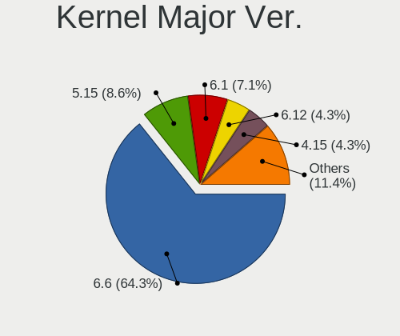
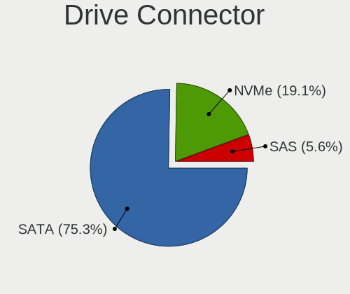
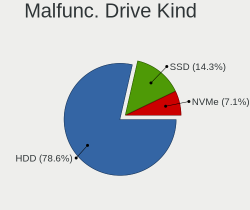
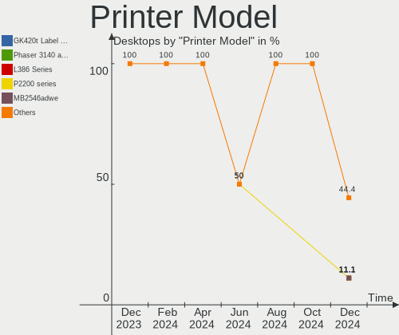

ROSA Hardware Trends (Desktops)
-------------------------------

A project to identify most popular hardware characteristics and track their change
over time based on data collected by ROSA users at https://Linux-Hardware.org.

Anyone can contribute to this report by the [hw-probe](https://github.com/linuxhw/hw-probe) tool:

    sudo -E hw-probe -all -upload

Full-feature report is available here: https://linux-hardware.org/?view=trends

Period: Dec, 2021.

Contents
--------

* [ System ](#system)
  - [ OS                       ](#os)
  - [ OS Family                ](#os-family)
  - [ Kernel                   ](#kernel)
  - [ Kernel Family            ](#kernel-family)
  - [ Kernel Major Ver.        ](#kernel-major-ver)
  - [ Arch                     ](#arch)
  - [ DE                       ](#de)
  - [ Display Server           ](#display-server)
  - [ Display Manager          ](#display-manager)
  - [ OS Lang                  ](#os-lang)
  - [ Boot Mode                ](#boot-mode)
  - [ Filesystem               ](#filesystem)
  - [ Part. scheme             ](#part-scheme)
  - [ Dual Boot with Linux/BSD ](#dual-boot-with-linuxbsd)
  - [ Dual Boot (Win)          ](#dual-boot-win)

* [ Board ](#board)
  - [ Vendor                   ](#vendor)
  - [ Model                    ](#model)
  - [ Model Family             ](#model-family)
  - [ MFG Year                 ](#mfg-year)
  - [ Form Factor              ](#form-factor)
  - [ Secure Boot              ](#secure-boot)
  - [ Coreboot                 ](#coreboot)
  - [ RAM Size                 ](#ram-size)
  - [ RAM Used                 ](#ram-used)
  - [ Total Drives             ](#total-drives)
  - [ Has CD-ROM               ](#has-cd-rom)
  - [ Has Ethernet             ](#has-ethernet)
  - [ Has WiFi                 ](#has-wifi)
  - [ Has Bluetooth            ](#has-bluetooth)

* [ Location ](#location)
  - [ Country                  ](#country)
  - [ City                     ](#city)

* [ Drives ](#drives)
  - [ Drive Vendor             ](#drive-vendor)
  - [ Drive Model              ](#drive-model)
  - [ HDD Vendor               ](#hdd-vendor)
  - [ SSD Vendor               ](#ssd-vendor)
  - [ Drive Kind               ](#drive-kind)
  - [ Drive Connector          ](#drive-connector)
  - [ Drive Size               ](#drive-size)
  - [ Space Total              ](#space-total)
  - [ Space Used               ](#space-used)
  - [ Malfunc. Drives          ](#malfunc-drives)
  - [ Malfunc. Drive Vendor    ](#malfunc-drive-vendor)
  - [ Malfunc. HDD Vendor      ](#malfunc-hdd-vendor)
  - [ Malfunc. Drive Kind      ](#malfunc-drive-kind)
  - [ Failed Drives            ](#failed-drives)
  - [ Failed Drive Vendor      ](#failed-drive-vendor)
  - [ Drive Status             ](#drive-status)

* [ Storage controller ](#storage-controller)
  - [ Storage Vendor           ](#storage-vendor)
  - [ Storage Model            ](#storage-model)
  - [ Storage Kind             ](#storage-kind)

* [ Processor ](#processor)
  - [ CPU Vendor               ](#cpu-vendor)
  - [ CPU Model                ](#cpu-model)
  - [ CPU Model Family         ](#cpu-model-family)
  - [ CPU Cores                ](#cpu-cores)
  - [ CPU Sockets              ](#cpu-sockets)
  - [ CPU Threads              ](#cpu-threads)
  - [ CPU Op-Modes             ](#cpu-op-modes)
  - [ CPU Microcode            ](#cpu-microcode)
  - [ CPU Microarch            ](#cpu-microarch)

* [ Graphics ](#graphics)
  - [ GPU Vendor               ](#gpu-vendor)
  - [ GPU Model                ](#gpu-model)
  - [ GPU Combo                ](#gpu-combo)
  - [ GPU Driver               ](#gpu-driver)
  - [ GPU Memory               ](#gpu-memory)

* [ Monitor ](#monitor)
  - [ Monitor Vendor           ](#monitor-vendor)
  - [ Monitor Model            ](#monitor-model)
  - [ Monitor Resolution       ](#monitor-resolution)
  - [ Monitor Diagonal         ](#monitor-diagonal)
  - [ Monitor Width            ](#monitor-width)
  - [ Aspect Ratio             ](#aspect-ratio)
  - [ Monitor Area             ](#monitor-area)
  - [ Pixel Density            ](#pixel-density)
  - [ Multiple Monitors        ](#multiple-monitors)

* [ Network ](#network)
  - [ Net Controller Vendor    ](#net-controller-vendor)
  - [ Net Controller Model     ](#net-controller-model)
  - [ Wireless Vendor          ](#wireless-vendor)
  - [ Wireless Model           ](#wireless-model)
  - [ Ethernet Vendor          ](#ethernet-vendor)
  - [ Ethernet Model           ](#ethernet-model)
  - [ Net Controller Kind      ](#net-controller-kind)
  - [ Used Controller          ](#used-controller)
  - [ NICs                     ](#nics)
  - [ IPv6                     ](#ipv6)

* [ Bluetooth ](#bluetooth)
  - [ Bluetooth Vendor         ](#bluetooth-vendor)
  - [ Bluetooth Model          ](#bluetooth-model)

* [ Sound ](#sound)
  - [ Sound Vendor             ](#sound-vendor)
  - [ Sound Model              ](#sound-model)

* [ Memory ](#memory)
  - [ Memory Vendor            ](#memory-vendor)
  - [ Memory Model             ](#memory-model)
  - [ Memory Kind              ](#memory-kind)
  - [ Memory Form Factor       ](#memory-form-factor)
  - [ Memory Size              ](#memory-size)
  - [ Memory Speed             ](#memory-speed)

* [ Printers & scanners ](#printers--scanners)
  - [ Printer Vendor           ](#printer-vendor)
  - [ Printer Model            ](#printer-model)
  - [ Scanner Vendor           ](#scanner-vendor)
  - [ Scanner Model            ](#scanner-model)

* [ Camera ](#camera)
  - [ Camera Vendor            ](#camera-vendor)
  - [ Camera Model             ](#camera-model)

* [ Security ](#security)
  - [ Fingerprint Vendor       ](#fingerprint-vendor)
  - [ Fingerprint Model        ](#fingerprint-model)
  - [ Chipcard Vendor          ](#chipcard-vendor)
  - [ Chipcard Model           ](#chipcard-model)

* [ Unsupported ](#unsupported)
  - [ Unsupported Devices      ](#unsupported-devices)
  - [ Unsupported Device Types ](#unsupported-device-types)

System
------

OS
--

Installed operating systems

| Name       | Desktops | Percent |
|------------|----------|---------|
| ROSA 12.1  | 39       | 54.17%  |
| ROSA R11.1 | 24       | 33.33%  |
| ROSA 12    | 6        | 8.33%   |
| ROSA R11   | 2        | 2.78%   |
| ROSA R8.1  | 1        | 1.39%   |

OS Family
---------

OS without a version

| Name | Desktops | Percent |
|------|----------|---------|
| ROSA | 72       | 100%    |

Kernel
------

Version of the Linux kernel

| Version                             | Desktops | Percent |
|-------------------------------------|----------|---------|
| 5.10.74-generic-2rosa2021.1-x86_64  | 40       | 55.56%  |
| 5.4.83-generic-2rosa-x86_64         | 10       | 13.89%  |
| 5.10.71-generic-1rosa2021.1-x86_64  | 5        | 6.94%   |
| 4.15.0-desktop-122.124.1rosa-x86_64 | 5        | 6.94%   |
| 5.4.83-generic-2rosa-i586           | 3        | 4.17%   |
| 4.15.0-desktop-45.1rosa-x86_64      | 3        | 4.17%   |
| 5.4.32-generic-2rosa-x86_64         | 2        | 2.78%   |
| 4.9.155-nrj-desktop-1rosa-x86_64    | 2        | 2.78%   |
| 5.5.19-generic-1rosa-x86_64         | 1        | 1.39%   |
| 5.4.32-generic-2rosa-i586           | 1        | 1.39%   |

Kernel Family
-------------

Linux kernel without a distro release

| Version | Desktops | Percent |
|---------|----------|---------|
| 5.10.74 | 40       | 55.56%  |
| 5.4.83  | 13       | 18.06%  |
| 4.15.0  | 8        | 11.11%  |
| 5.10.71 | 5        | 6.94%   |
| 5.4.32  | 3        | 4.17%   |
| 4.9.155 | 2        | 2.78%   |
| 5.5.19  | 1        | 1.39%   |

Kernel Major Ver.
-----------------

Linux kernel major version

| Version | Desktops | Percent |
|---------|----------|---------|
| 5.10    | 45       | 62.5%   |
| 5.4     | 16       | 22.22%  |
| 4.15    | 8        | 11.11%  |
| 4.9     | 2        | 2.78%   |
| 5.5     | 1        | 1.39%   |

Arch
----

OS architecture (x86_64, i586, etc.)

| Name   | Desktops | Percent |
|--------|----------|---------|
| x86_64 | 68       | 94.44%  |
| i686   | 4        | 5.56%   |

DE
--

Desktop Environment

| Name  | Desktops | Percent |
|-------|----------|---------|
| KDE5  | 49       | 68.06%  |
| KDE4  | 16       | 22.22%  |
| GNOME | 4        | 5.56%   |
| LXQt  | 2        | 2.78%   |
| XFCE  | 1        | 1.39%   |

Display Server
--------------

X11 or Wayland

| Name    | Desktops | Percent |
|---------|----------|---------|
| Wayland | 37       | 51.39%  |
| X11     | 35       | 48.61%  |

Display Manager
---------------

SDDM, LightDM, etc.

| Name    | Desktops | Percent |
|---------|----------|---------|
| SDDM    | 28       | 38.89%  |
| GDM     | 26       | 36.11%  |
| KDM     | 16       | 22.22%  |
| LightDM | 2        | 2.78%   |

OS Lang
-------

Language

| Lang    | Desktops | Percent |
|---------|----------|---------|
| ru_RU   | 61       | 84.72%  |
| ru_UA   | 2        | 2.78%   |
| en_GB   | 2        | 2.78%   |
| Unknown | 2        | 2.78%   |
| pt_BR   | 1        | 1.39%   |
| pl_PL   | 1        | 1.39%   |
| es_VE   | 1        | 1.39%   |
| en_US   | 1        | 1.39%   |
| cs_CZ   | 1        | 1.39%   |

Boot Mode
---------

EFI or BIOS

| Mode | Desktops | Percent |
|------|----------|---------|
| BIOS | 49       | 68.06%  |
| EFI  | 23       | 31.94%  |

Filesystem
----------

Type of filesystem

| Type  | Desktops | Percent |
|-------|----------|---------|
| Ext4  | 66       | 91.67%  |
| Btrfs | 4        | 5.56%   |
| Ext3  | 1        | 1.39%   |
| Ext2  | 1        | 1.39%   |

Part. scheme
------------

Scheme of partitioning

| Type | Desktops | Percent |
|------|----------|---------|
| MBR  | 36       | 50%     |
| GPT  | 36       | 50%     |

Dual Boot with Linux/BSD
------------------------

Hosting more than one Linux/BSD

| Dual boot | Desktops | Percent |
|-----------|----------|---------|
| No        | 55       | 76.39%  |
| Yes       | 17       | 23.61%  |

Dual Boot (Win)
---------------

Hosting Linux and Windows

| Dual boot | Desktops | Percent |
|-----------|----------|---------|
| Yes       | 42       | 58.33%  |
| No        | 30       | 41.67%  |

Board
-----

Vendor
------

Motherboard manufacturer

| Name                | Desktops | Percent |
|---------------------|----------|---------|
| ASUSTek Computer    | 22       | 30.56%  |
| MSI                 | 12       | 16.67%  |
| Gigabyte Technology | 11       | 15.28%  |
| ASRock              | 10       | 13.89%  |
| Huanan              | 2        | 2.78%   |
| Hewlett-Packard     | 2        | 2.78%   |
| ECS                 | 2        | 2.78%   |
| Acer                | 2        | 2.78%   |
| QIYIDA              | 1        | 1.39%   |
| Pegatron            | 1        | 1.39%   |
| Lenovo              | 1        | 1.39%   |
| EPoX Computer       | 1        | 1.39%   |
| eMachines           | 1        | 1.39%   |
| Dell                | 1        | 1.39%   |
| Biostar             | 1        | 1.39%   |
| ABIT                | 1        | 1.39%   |
| Unknown             | 1        | 1.39%   |

Model
-----

Motherboard model

| Name                                | Desktops | Percent |
|-------------------------------------|----------|---------|
| ASUS All Series                     | 5        | 6.94%   |
| ASUS PRIME A320M-K                  | 2        | 2.78%   |
| QIYIDA X99-H9 V2.0                  | 1        | 1.39%   |
| Pegatron H110-P1                    | 1        | 1.39%   |
| MSI OPTIMUS                         | 1        | 1.39%   |
| MSI MS-7D18                         | 1        | 1.39%   |
| MSI MS-7C51                         | 1        | 1.39%   |
| MSI MS-7B38                         | 1        | 1.39%   |
| MSI MS-7B36                         | 1        | 1.39%   |
| MSI MS-7A33                         | 1        | 1.39%   |
| MSI MS-7A15                         | 1        | 1.39%   |
| MSI MS-7808                         | 1        | 1.39%   |
| MSI MS-7693                         | 1        | 1.39%   |
| MSI MS-7583                         | 1        | 1.39%   |
| MSI MS-7238                         | 1        | 1.39%   |
| MSI Compaq dx7400 Microtower        | 1        | 1.39%   |
| Lenovo ThinkStation P340 30DH00H6RU | 1        | 1.39%   |
| Huanan X99-F8                       | 1        | 1.39%   |
| Huanan X79 V2.3 249PC               | 1        | 1.39%   |
| HP Z230 Tower Workstation           | 1        | 1.39%   |
| HP 290 G2 MT Business PC            | 1        | 1.39%   |
| Gigabyte Z390 UD V2                 | 1        | 1.39%   |
| Gigabyte P67A-D3-B3                 | 1        | 1.39%   |
| Gigabyte N3050ND3H                  | 1        | 1.39%   |
| Gigabyte M61SME-S2                  | 1        | 1.39%   |
| Gigabyte H77N-WIFI                  | 1        | 1.39%   |
| Gigabyte H61M-S1                    | 1        | 1.39%   |
| Gigabyte GA-MA78LM-S2               | 1        | 1.39%   |
| Gigabyte G41MT-D3                   | 1        | 1.39%   |
| Gigabyte F2A68HM-DS2                | 1        | 1.39%   |
| Gigabyte B450M S2H                  | 1        | 1.39%   |
| Gigabyte B250M-DS3H                 | 1        | 1.39%   |
| EPoX i915PL DDR : 5ELA3I            | 1        | 1.39%   |
| eMachines ET1850                    | 1        | 1.39%   |
| ECS Mars E222                       | 1        | 1.39%   |
| ECS GF8100VM-M5                     | 1        | 1.39%   |
| Dell OptiPlex GX620                 | 1        | 1.39%   |
| Biostar N68S3+                      | 1        | 1.39%   |
| ASUS SABERTOOTH 990FX R2.0          | 1        | 1.39%   |
| ASUS PRIME X470-PRO                 | 1        | 1.39%   |
| ASUS PRIME H310I-PLUS R2.0          | 1        | 1.39%   |
| ASUS PRIME B250-PLUS                | 1        | 1.39%   |
| ASUS PRIME A320M-A                  | 1        | 1.39%   |
| ASUS P8H61-M LX2 R2.0               | 1        | 1.39%   |
| ASUS P7H55-M SI                     | 1        | 1.39%   |
| ASUS P5LD2                          | 1        | 1.39%   |
| ASUS P5KPL-AM SE                    | 1        | 1.39%   |
| ASUS P5G41T-M LX2/GB                | 1        | 1.39%   |
| ASUS M5A97 PRO                      | 1        | 1.39%   |
| ASUS M4N68T V2                      | 1        | 1.39%   |
| ASUS M4A88T-M                       | 1        | 1.39%   |
| ASUS H110M-R                        | 1        | 1.39%   |
| ASUS B150M-C                        | 1        | 1.39%   |
| ASRock N68C-S                       | 1        | 1.39%   |
| ASRock N68C-GS UCC                  | 1        | 1.39%   |
| ASRock N68-VS3 UCC                  | 1        | 1.39%   |
| ASRock N68-GS3 UCC                  | 1        | 1.39%   |
| ASRock J5040-ITX                    | 1        | 1.39%   |
| ASRock H55M Pro                     | 1        | 1.39%   |
| ASRock G41C-GS                      | 1        | 1.39%   |

Model Family
------------

Motherboard model prefix

| Name                     | Desktops | Percent |
|--------------------------|----------|---------|
| ASUS PRIME               | 6        | 8.33%   |
| ASUS All                 | 5        | 6.94%   |
| Acer Aspire              | 2        | 2.78%   |
| QIYIDA X99-H9            | 1        | 1.39%   |
| Pegatron H110-P1         | 1        | 1.39%   |
| MSI OPTIMUS              | 1        | 1.39%   |
| MSI MS-7D18              | 1        | 1.39%   |
| MSI MS-7C51              | 1        | 1.39%   |
| MSI MS-7B38              | 1        | 1.39%   |
| MSI MS-7B36              | 1        | 1.39%   |
| MSI MS-7A33              | 1        | 1.39%   |
| MSI MS-7A15              | 1        | 1.39%   |
| MSI MS-7808              | 1        | 1.39%   |
| MSI MS-7693              | 1        | 1.39%   |
| MSI MS-7583              | 1        | 1.39%   |
| MSI MS-7238              | 1        | 1.39%   |
| MSI Compaq               | 1        | 1.39%   |
| Lenovo ThinkStation      | 1        | 1.39%   |
| Huanan X99-F8            | 1        | 1.39%   |
| Huanan X79               | 1        | 1.39%   |
| HP Z230                  | 1        | 1.39%   |
| HP 290                   | 1        | 1.39%   |
| Gigabyte Z390            | 1        | 1.39%   |
| Gigabyte P67A-D3-B3      | 1        | 1.39%   |
| Gigabyte N3050ND3H       | 1        | 1.39%   |
| Gigabyte M61SME-S2       | 1        | 1.39%   |
| Gigabyte H77N-WIFI       | 1        | 1.39%   |
| Gigabyte H61M-S1         | 1        | 1.39%   |
| Gigabyte GA-MA78LM-S2    | 1        | 1.39%   |
| Gigabyte G41MT-D3        | 1        | 1.39%   |
| Gigabyte F2A68HM-DS2     | 1        | 1.39%   |
| Gigabyte B450M           | 1        | 1.39%   |
| Gigabyte B250M-DS3H      | 1        | 1.39%   |
| EPoX i915PL              | 1        | 1.39%   |
| eMachines ET1850         | 1        | 1.39%   |
| ECS Mars                 | 1        | 1.39%   |
| ECS GF8100VM-M5          | 1        | 1.39%   |
| Dell OptiPlex            | 1        | 1.39%   |
| Biostar N68S3+           | 1        | 1.39%   |
| ASUS SABERTOOTH          | 1        | 1.39%   |
| ASUS P8H61-M             | 1        | 1.39%   |
| ASUS P7H55-M             | 1        | 1.39%   |
| ASUS P5LD2               | 1        | 1.39%   |
| ASUS P5KPL-AM            | 1        | 1.39%   |
| ASUS P5G41T-M            | 1        | 1.39%   |
| ASUS M5A97               | 1        | 1.39%   |
| ASUS M4N68T              | 1        | 1.39%   |
| ASUS M4A88T-M            | 1        | 1.39%   |
| ASUS H110M-R             | 1        | 1.39%   |
| ASUS B150M-C             | 1        | 1.39%   |
| ASRock N68C-S            | 1        | 1.39%   |
| ASRock N68C-GS           | 1        | 1.39%   |
| ASRock N68-VS3           | 1        | 1.39%   |
| ASRock N68-GS3           | 1        | 1.39%   |
| ASRock J5040-ITX         | 1        | 1.39%   |
| ASRock H55M              | 1        | 1.39%   |
| ASRock G41C-GS           | 1        | 1.39%   |
| ASRock G31M-GS           | 1        | 1.39%   |
| ASRock CORP              | 1        | 1.39%   |
| ASRock ALiveXFire-eSATA2 | 1        | 1.39%   |

MFG Year
--------

Motherboard manufacture year

| Year | Desktops | Percent |
|------|----------|---------|
| 2018 | 8        | 11.11%  |
| 2010 | 8        | 11.11%  |
| 2020 | 7        | 9.72%   |
| 2016 | 7        | 9.72%   |
| 2019 | 5        | 6.94%   |
| 2011 | 5        | 6.94%   |
| 2009 | 5        | 6.94%   |
| 2021 | 4        | 5.56%   |
| 2013 | 4        | 5.56%   |
| 2012 | 4        | 5.56%   |
| 2015 | 3        | 4.17%   |
| 2007 | 3        | 4.17%   |
| 2017 | 2        | 2.78%   |
| 2014 | 2        | 2.78%   |
| 2006 | 2        | 2.78%   |
| 2005 | 2        | 2.78%   |
| 2008 | 1        | 1.39%   |

Form Factor
-----------

Physical design of the computer

| Name    | Desktops | Percent |
|---------|----------|---------|
| Desktop | 72       | 100%    |

Secure Boot
-----------

Enabled or disabled

| State    | Desktops | Percent |
|----------|----------|---------|
| Disabled | 72       | 100%    |

Coreboot
--------

Have coreboot on board

| Used | Desktops | Percent |
|------|----------|---------|
| No   | 72       | 100%    |

RAM Size
--------

Total RAM memory

| Size in GB | Desktops | Percent |
|------------|----------|---------|
| 3.01-4.0   | 20       | 27.78%  |
| 16.01-24.0 | 16       | 22.22%  |
| 8.01-16.0  | 14       | 19.44%  |
| 4.01-8.0   | 13       | 18.06%  |
| 32.01-64.0 | 4        | 5.56%   |
| 2.01-3.0   | 3        | 4.17%   |
| 1.01-2.0   | 1        | 1.39%   |
| 0.51-1.0   | 1        | 1.39%   |

RAM Used
--------

Used RAM memory

| Used GB  | Desktops | Percent |
|----------|----------|---------|
| 1.01-2.0 | 32       | 44.44%  |
| 0.51-1.0 | 20       | 27.78%  |
| 2.01-3.0 | 10       | 13.89%  |
| 3.01-4.0 | 8        | 11.11%  |
| 4.01-8.0 | 2        | 2.78%   |

Total Drives
------------

Number of drives on board

| Drives | Desktops | Percent |
|--------|----------|---------|
| 1      | 33       | 45.83%  |
| 2      | 20       | 27.78%  |
| 3      | 12       | 16.67%  |
| 4      | 6        | 8.33%   |
| 6      | 1        | 1.39%   |

Has CD-ROM
----------

Has CD-ROM on board

| Presented | Desktops | Percent |
|-----------|----------|---------|
| No        | 38       | 52.78%  |
| Yes       | 34       | 47.22%  |

Has Ethernet
------------

Has Ethernet on board

| Presented | Desktops | Percent |
|-----------|----------|---------|
| Yes       | 72       | 100%    |

Has WiFi
--------

Has WiFi module

| Presented | Desktops | Percent |
|-----------|----------|---------|
| No        | 56       | 77.78%  |
| Yes       | 16       | 22.22%  |

Has Bluetooth
-------------

Has Bluetooth module

| Presented | Desktops | Percent |
|-----------|----------|---------|
| No        | 63       | 87.5%   |
| Yes       | 9        | 12.5%   |

Location
--------

Country
-------

Geographic location (country)

| Country    | Desktops | Percent |
|------------|----------|---------|
| Russia     | 52       | 72.22%  |
| Ukraine    | 5        | 6.94%   |
| UK         | 3        | 4.17%   |
| Belarus    | 2        | 2.78%   |
| Venezuela  | 1        | 1.39%   |
| Poland     | 1        | 1.39%   |
| Moldova    | 1        | 1.39%   |
| Latvia     | 1        | 1.39%   |
| Kazakhstan | 1        | 1.39%   |
| Germany    | 1        | 1.39%   |
| Estonia    | 1        | 1.39%   |
| Czechia    | 1        | 1.39%   |
| Bulgaria   | 1        | 1.39%   |
| Brazil     | 1        | 1.39%   |

City
----

Geographic location (city)

| City               | Desktops | Percent |
|--------------------|----------|---------|
| Moscow             | 7        | 9.72%   |
| Novosibirsk        | 4        | 5.56%   |
| Kazan?ˆ™           | 3        | 4.17%   |
| Tyumen             | 2        | 2.78%   |
| St Petersburg      | 2        | 2.78%   |
| Rostov-on-Don      | 2        | 2.78%   |
| Manchester         | 2        | 2.78%   |
| Cherepovets        | 2        | 2.78%   |
| Voronezh           | 1        | 1.39%   |
| Ulyanovsk          | 1        | 1.39%   |
| Turnov             | 1        | 1.39%   |
| Tula               | 1        | 1.39%   |
| Tomsk              | 1        | 1.39%   |
| Tallinn            | 1        | 1.39%   |
| Stavropol          | 1        | 1.39%   |
| Starotitarovskaya  | 1        | 1.39%   |
| Solikamsk          | 1        | 1.39%   |
| Smolenshchina      | 1        | 1.39%   |
| Simferopol         | 1        | 1.39%   |
| Severodvinsk       | 1        | 1.39%   |
| San Juan de Col??n | 1        | 1.39%   |
| Samara             | 1        | 1.39%   |
| Ryazan             | 1        | 1.39%   |
| Riga               | 1        | 1.39%   |
| Pskov              | 1        | 1.39%   |
| Pochep             | 1        | 1.39%   |
| Pernik             | 1        | 1.39%   |
| Pavlodar           | 1        | 1.39%   |
| Omsk               | 1        | 1.39%   |
| Nizhny Tagil       | 1        | 1.39%   |
| Nal'chik           | 1        | 1.39%   |
| Minsk              | 1        | 1.39%   |
| Lyubertsy          | 1        | 1.39%   |
| Lipetsk            | 1        | 1.39%   |
| Kyiv               | 1        | 1.39%   |
| Kursk              | 1        | 1.39%   |
| Kurgan             | 1        | 1.39%   |
| Kudymkar           | 1        | 1.39%   |
| Krolevets          | 1        | 1.39%   |
| Krasnodar          | 1        | 1.39%   |
| Kostroma           | 1        | 1.39%   |
| Kopeysk            | 1        | 1.39%   |
| Kherson            | 1        | 1.39%   |
| Kassel             | 1        | 1.39%   |
| Irkutsk            | 1        | 1.39%   |
| Donetsk            | 1        | 1.39%   |
| Chisinau           | 1        | 1.39%   |
| Cheboksary         | 1        | 1.39%   |
| Catford            | 1        | 1.39%   |
| Bras?­lia          | 1        | 1.39%   |
| Bobrov             | 1        | 1.39%   |
| Blagoveshchensk    | 1        | 1.39%   |
| Belgorod           | 1        | 1.39%   |
| B?™dzin            | 1        | 1.39%   |
| Babruysk           | 1        | 1.39%   |
| Arkhangelsk        | 1        | 1.39%   |

Drives
------

Drive Vendor
------------

Hard drive vendors

| Vendor              | Desktops | Drives | Percent |
|---------------------|----------|--------|---------|
| WDC                 | 30       | 33     | 22.39%  |
| Seagate             | 24       | 27     | 17.91%  |
| Samsung Electronics | 12       | 12     | 8.96%   |
| Hitachi             | 9        | 9      | 6.72%   |
| Toshiba             | 7        | 8      | 5.22%   |
| Apacer              | 7        | 7      | 5.22%   |
| China               | 5        | 5      | 3.73%   |
| Kingston            | 4        | 4      | 2.99%   |
| Crucial             | 4        | 4      | 2.99%   |
| SPCC                | 3        | 3      | 2.24%   |
| OCZ                 | 3        | 3      | 2.24%   |
| Transcend           | 2        | 2      | 1.49%   |
| SanDisk             | 2        | 2      | 1.49%   |
| Patriot             | 2        | 2      | 1.49%   |
| MAXTOR              | 2        | 2      | 1.49%   |
| A-DATA Technology   | 2        | 2      | 1.49%   |
| Vaseky              | 1        | 1      | 0.75%   |
| TF CARD             | 1        | 1      | 0.75%   |
| SK Hynix            | 1        | 1      | 0.75%   |
| Silicon Motion      | 1        | 1      | 0.75%   |
| Phison              | 1        | 1      | 0.75%   |
| Netac               | 1        | 1      | 0.75%   |
| Micron Technology   | 1        | 1      | 0.75%   |
| KingSpec            | 1        | 1      | 0.75%   |
| KingDian            | 1        | 1      | 0.75%   |
| JMicron             | 1        | 1      | 0.75%   |
| Intel               | 1        | 1      | 0.75%   |
| HGST                | 1        | 1      | 0.75%   |
| GOODRAM             | 1        | 1      | 0.75%   |
| FOXLINE             | 1        | 1      | 0.75%   |
| e2e4                | 1        | 1      | 0.75%   |
| ASMT                | 1        | 2      | 0.75%   |

Drive Model
-----------

Hard drive models

| Model                                  | Desktops | Percent |
|----------------------------------------|----------|---------|
| WDC WDS240G2G0A-00JH30 240GB SSD       | 3        | 2.17%   |
| Seagate ST2000DM008-2FR102 2TB         | 3        | 2.17%   |
| Kingston SA400S37240G 240GB SSD        | 3        | 2.17%   |
| Apacer AS350 128GB SSD                 | 3        | 2.17%   |
| WDC WD10EADS-65M2B0 1TB                | 2        | 1.45%   |
| Toshiba DT01ACA100 1TB                 | 2        | 1.45%   |
| Seagate ST500DM005 HD502HJ 500GB       | 2        | 1.45%   |
| Seagate ST1000DM010-2EP102 1TB         | 2        | 1.45%   |
| Seagate ST1000DM003-1CH162 1TB         | 2        | 1.45%   |
| WDC WDS500G2B0A-00SM50 500GB SSD       | 1        | 0.72%   |
| WDC WDS240G2G0B-00EPW0 240GB SSD       | 1        | 0.72%   |
| WDC WDS100T2B0A-00SM50 1TB SSD         | 1        | 0.72%   |
| WDC WD800JD-60MSA1 80GB                | 1        | 0.72%   |
| WDC WD5003AZEX-00MK2A0 500GB           | 1        | 0.72%   |
| WDC WD5000LPVX-00V0TT0 500GB           | 1        | 0.72%   |
| WDC WD5000AAKX-001CA0 500GB            | 1        | 0.72%   |
| WDC WD5000AADS-00S9B0 500GB            | 1        | 0.72%   |
| WDC WD5000AACS-00G8B1 500GB            | 1        | 0.72%   |
| WDC WD40PURZ-85TTDY0 4TB               | 1        | 0.72%   |
| WDC WD40PURZ-85AKKY0 4TB               | 1        | 0.72%   |
| WDC WD40EZRZ-22GXCB0 4TB               | 1        | 0.72%   |
| WDC WD3200AAKS-00YGA0 320GB            | 1        | 0.72%   |
| WDC WD30EZRX-00DC0B0 3TB               | 1        | 0.72%   |
| WDC WD2500JS-63MHB5 250GB              | 1        | 0.72%   |
| WDC WD2500JS-40MVB1 250GB              | 1        | 0.72%   |
| WDC WD20PURZ-85GU6Y0 2TB               | 1        | 0.72%   |
| WDC WD20EZRZ-00Z5HB0 2TB               | 1        | 0.72%   |
| WDC WD20EARS-00MVWB0 2TB               | 1        | 0.72%   |
| WDC WD1600YS-01SHB0 165GB              | 1        | 0.72%   |
| WDC WD1600AAJB-00PVA0 160GB            | 1        | 0.72%   |
| WDC WD10SPZX-21Z10T0 1TB               | 1        | 0.72%   |
| WDC WD10JPVX-60JC3T0 1TB               | 1        | 0.72%   |
| WDC WD10EZEX-75WN4A0 1TB               | 1        | 0.72%   |
| WDC WD10EZEX-08WN4A0 1TB               | 1        | 0.72%   |
| WDC WD10EZEX-00BN5A0 1TB               | 1        | 0.72%   |
| WDC WD1003FZEX-00K3CA0 1TB             | 1        | 0.72%   |
| WDC WD1002FAEX-00Y9A0 1TB              | 1        | 0.72%   |
| Vaseky V800/120G 120GB SSD             | 1        | 0.72%   |
| Transcend TS64GSSD370S 64GB            | 1        | 0.72%   |
| Transcend TS128GSSD370S 128GB          | 1        | 0.72%   |
| Toshiba TR200 480GB SSD                | 1        | 0.72%   |
| Toshiba TL100 240GB SSD                | 1        | 0.72%   |
| Toshiba HDWD120 2TB                    | 1        | 0.72%   |
| Toshiba HDWD110 1TB                    | 1        | 0.72%   |
| Toshiba DT01ACA050 500GB               | 1        | 0.72%   |
| TF CARD storage 8GB                    | 1        | 0.72%   |
| SPCC SSD110 120GB                      | 1        | 0.72%   |
| SPCC Solid State Disk 56GB             | 1        | 0.72%   |
| SPCC Solid State Disk 240GB            | 1        | 0.72%   |
| SK Hynix SKHynix_HFS512GDE9X081N 512GB | 1        | 0.72%   |
| Silicon Motion NE-128 128GB            | 1        | 0.72%   |
| Seagate ST9320423AS 320GB              | 1        | 0.72%   |
| Seagate ST4000DM004-2CV104 4TB         | 1        | 0.72%   |
| Seagate ST3500418AS 500GB              | 1        | 0.72%   |
| Seagate ST3500413AS 500GB              | 1        | 0.72%   |
| Seagate ST340014A 40GB                 | 1        | 0.72%   |
| Seagate ST3200822AS 200GB              | 1        | 0.72%   |
| Seagate ST320014A 20GB                 | 1        | 0.72%   |
| Seagate ST3160815AS 160GB              | 1        | 0.72%   |
| Seagate ST3160811AS 160GB              | 1        | 0.72%   |

HDD Vendor
----------

Hard disk drive vendors

| Vendor              | Desktops | Drives | Percent |
|---------------------|----------|--------|---------|
| WDC                 | 26       | 27     | 36.11%  |
| Seagate             | 24       | 27     | 33.33%  |
| Hitachi             | 9        | 9      | 12.5%   |
| Toshiba             | 5        | 6      | 6.94%   |
| Samsung Electronics | 5        | 5      | 6.94%   |
| MAXTOR              | 2        | 2      | 2.78%   |
| HGST                | 1        | 1      | 1.39%   |

SSD Vendor
----------

Solid state drive vendors

| Vendor              | Desktops | Drives | Percent |
|---------------------|----------|--------|---------|
| Apacer              | 7        | 7      | 12.07%  |
| WDC                 | 6        | 6      | 10.34%  |
| Samsung Electronics | 5        | 5      | 8.62%   |
| China               | 5        | 5      | 8.62%   |
| Kingston            | 4        | 4      | 6.9%    |
| Crucial             | 4        | 4      | 6.9%    |
| SPCC                | 3        | 3      | 5.17%   |
| OCZ                 | 3        | 3      | 5.17%   |
| Transcend           | 2        | 2      | 3.45%   |
| Toshiba             | 2        | 2      | 3.45%   |
| SanDisk             | 2        | 2      | 3.45%   |
| Patriot             | 2        | 2      | 3.45%   |
| A-DATA Technology   | 2        | 2      | 3.45%   |
| Vaseky              | 1        | 1      | 1.72%   |
| Netac               | 1        | 1      | 1.72%   |
| Micron Technology   | 1        | 1      | 1.72%   |
| KingSpec            | 1        | 1      | 1.72%   |
| KingDian            | 1        | 1      | 1.72%   |
| JMicron             | 1        | 1      | 1.72%   |
| Intel               | 1        | 1      | 1.72%   |
| GOODRAM             | 1        | 1      | 1.72%   |
| FOXLINE             | 1        | 1      | 1.72%   |
| e2e4                | 1        | 1      | 1.72%   |
| ASMT                | 1        | 2      | 1.72%   |

Drive Kind
----------

HDD or SSD

| Kind    | Desktops | Drives | Percent |
|---------|----------|--------|---------|
| HDD     | 58       | 77     | 54.72%  |
| SSD     | 42       | 59     | 39.62%  |
| NVMe    | 5        | 5      | 4.72%   |
| Unknown | 1        | 1      | 0.94%   |

Drive Connector
---------------

SATA, SAS, NVMe, etc.

| Type | Desktops | Drives | Percent |
|------|----------|--------|---------|
| SATA | 73       | 133    | 90.12%  |
| NVMe | 5        | 5      | 6.17%   |
| SAS  | 3        | 4      | 3.7%    |

Drive Size
----------

Size of hard drive

| Size in TB | Desktops | Drives | Percent |
|------------|----------|--------|---------|
| 0.01-0.5   | 63       | 96     | 64.95%  |
| 0.51-1.0   | 19       | 22     | 19.59%  |
| 1.01-2.0   | 8        | 10     | 8.25%   |
| 3.01-4.0   | 4        | 5      | 4.12%   |
| 2.01-3.0   | 3        | 3      | 3.09%   |

Space Total
-----------

Amount of disk space available on the file system

| Size in GB     | Desktops | Percent |
|----------------|----------|---------|
| 101-250        | 27       | 37.5%   |
| 251-500        | 9        | 12.5%   |
| 21-50          | 6        | 8.33%   |
| 1-20           | 6        | 8.33%   |
| 51-100         | 6        | 8.33%   |
| More than 3000 | 5        | 6.94%   |
| 501-1000       | 5        | 6.94%   |
| 1001-2000      | 4        | 5.56%   |
| 2001-3000      | 3        | 4.17%   |
| Unknown        | 1        | 1.39%   |

Space Used
----------

Amount of used disk space

| Used GB        | Desktops | Percent |
|----------------|----------|---------|
| 1-20           | 36       | 50%     |
| 21-50          | 15       | 20.83%  |
| 51-100         | 6        | 8.33%   |
| 101-250        | 5        | 6.94%   |
| 251-500        | 3        | 4.17%   |
| More than 3000 | 2        | 2.78%   |
| 1001-2000      | 2        | 2.78%   |
| 2001-3000      | 1        | 1.39%   |
| 501-1000       | 1        | 1.39%   |
| Unknown        | 1        | 1.39%   |

Malfunc. Drives
---------------

Drive models with a malfunction

| Model                                               | Desktops | Drives | Percent |
|-----------------------------------------------------|----------|--------|---------|
| WDC WD10EADS-65M2B0 1TB                             | 2        | 2      | 5.71%   |
| WDC WD800JD-60MSA1 80GB                             | 1        | 1      | 2.86%   |
| WDC WD5000LPVX-00V0TT0 500GB                        | 1        | 1      | 2.86%   |
| WDC WD5000AAKX-001CA0 500GB                         | 1        | 1      | 2.86%   |
| WDC WD5000AACS-00G8B1 500GB                         | 1        | 1      | 2.86%   |
| WDC WD2500JS-63MHB5 250GB                           | 1        | 1      | 2.86%   |
| WDC WD20EARS-00MVWB0 2TB                            | 1        | 1      | 2.86%   |
| WDC WD1600YS-01SHB0 165GB                           | 1        | 1      | 2.86%   |
| WDC WD1600AAJB-00PVA0 160GB                         | 1        | 1      | 2.86%   |
| WDC WD10JPVX-60JC3T0 1TB                            | 1        | 1      | 2.86%   |
| Toshiba DT01ACA100 1TB                              | 1        | 1      | 2.86%   |
| Toshiba DT01ACA050 500GB                            | 1        | 2      | 2.86%   |
| SPCC SSD110 120GB                                   | 1        | 1      | 2.86%   |
| SPCC Solid State Disk 56GB                          | 1        | 1      | 2.86%   |
| Seagate ST9320423AS 320GB                           | 1        | 1      | 2.86%   |
| Seagate ST500DM005 HD502HJ 500GB                    | 1        | 1      | 2.86%   |
| Seagate ST340014A 40GB                              | 1        | 1      | 2.86%   |
| Seagate ST3000VX010-2E3166 3TB                      | 1        | 1      | 2.86%   |
| Seagate ST3000DM001-1CH166 3TB                      | 1        | 1      | 2.86%   |
| Seagate ST1000DM003-1CH162 1TB                      | 1        | 1      | 2.86%   |
| Samsung Electronics SP2504C 250GB                   | 1        | 1      | 2.86%   |
| Samsung Electronics HD322GJ 320GB                   | 1        | 1      | 2.86%   |
| OCZ VERTEX3 240GB SSD                               | 1        | 1      | 2.86%   |
| OCZ VERTEX3 120GB SSD                               | 1        | 1      | 2.86%   |
| Micron Technology MTFDDAK256MAY-1AH12ABHA 256GB SSD | 1        | 1      | 2.86%   |
| MAXTOR STM3250310AS 250GB                           | 1        | 1      | 2.86%   |
| Hitachi HTS547575A9E384 752GB                       | 1        | 1      | 2.86%   |
| Hitachi HTS543216L9SA00 160GB                       | 1        | 1      | 2.86%   |
| Hitachi HDS721616PLA380 160GB                       | 1        | 1      | 2.86%   |
| Hitachi HDS721050CLA660 500GB                       | 1        | 1      | 2.86%   |
| Hitachi HDS721032CLA362 320GB                       | 1        | 1      | 2.86%   |
| Hitachi HDP725050GLA360 500GB                       | 1        | 1      | 2.86%   |
| HGST HTS545050A7E380 500GB                          | 1        | 1      | 2.86%   |
| ASMT USB3.0 480GB                                   | 1        | 2      | 2.86%   |

Malfunc. Drive Vendor
---------------------

Vendors of faulty drives

| Vendor              | Desktops | Drives | Percent |
|---------------------|----------|--------|---------|
| WDC                 | 11       | 11     | 31.43%  |
| Seagate             | 6        | 6      | 17.14%  |
| Hitachi             | 6        | 6      | 17.14%  |
| Toshiba             | 2        | 3      | 5.71%   |
| SPCC                | 2        | 2      | 5.71%   |
| Samsung Electronics | 2        | 2      | 5.71%   |
| OCZ                 | 2        | 2      | 5.71%   |
| Micron Technology   | 1        | 1      | 2.86%   |
| MAXTOR              | 1        | 1      | 2.86%   |
| HGST                | 1        | 1      | 2.86%   |
| ASMT                | 1        | 2      | 2.86%   |

Malfunc. HDD Vendor
-------------------

Vendors of faulty HDD drives

| Vendor              | Desktops | Drives | Percent |
|---------------------|----------|--------|---------|
| WDC                 | 11       | 11     | 37.93%  |
| Seagate             | 6        | 6      | 20.69%  |
| Hitachi             | 6        | 6      | 20.69%  |
| Toshiba             | 2        | 3      | 6.9%    |
| Samsung Electronics | 2        | 2      | 6.9%    |
| MAXTOR              | 1        | 1      | 3.45%   |
| HGST                | 1        | 1      | 3.45%   |

Malfunc. Drive Kind
-------------------

Kinds of faulty drives

| Kind | Desktops | Drives | Percent |
|------|----------|--------|---------|
| HDD  | 24       | 30     | 80%     |
| SSD  | 6        | 7      | 20%     |

Failed Drives
-------------

Failed drive models

Zero info for selected period =(

Failed Drive Vendor
-------------------

Failed drive vendors

Zero info for selected period =(

Drive Status
------------

Number of failed and malfunc. drives

| Status   | Desktops | Drives | Percent |
|----------|----------|--------|---------|
| Works    | 60       | 101    | 65.93%  |
| Malfunc  | 27       | 37     | 29.67%  |
| Detected | 4        | 4      | 4.4%    |

Storage controller
------------------

Storage Vendor
--------------

Storage controller vendors

| Vendor              | Desktops | Percent |
|---------------------|----------|---------|
| Intel               | 45       | 52.33%  |
| AMD                 | 17       | 19.77%  |
| Nvidia              | 10       | 11.63%  |
| JMicron Technology  | 5        | 5.81%   |
| ASMedia Technology  | 4        | 4.65%   |
| Samsung Electronics | 2        | 2.33%   |
| SK Hynix            | 1        | 1.16%   |
| Silicon Motion      | 1        | 1.16%   |
| Phison Electronics  | 1        | 1.16%   |

Storage Model
-------------

Storage controller models

| Model                                                                                   | Desktops | Percent |
|-----------------------------------------------------------------------------------------|----------|---------|
| AMD FCH SATA Controller [AHCI mode]                                                     | 10       | 8.2%    |
| Nvidia MCP61 SATA Controller                                                            | 8        | 6.56%   |
| Nvidia MCP61 IDE                                                                        | 8        | 6.56%   |
| Intel NM10/ICH7 Family SATA Controller [IDE mode]                                       | 8        | 6.56%   |
| Intel 82801G (ICH7 Family) IDE Controller                                               | 7        | 5.74%   |
| Intel 8 Series/C220 Series Chipset Family 6-port SATA Controller 1 [AHCI mode]          | 5        | 4.1%    |
| AMD FCH SATA Controller D                                                               | 5        | 4.1%    |
| Intel Q170/Q150/B150/H170/H110/Z170/CM236 Chipset SATA Controller [AHCI Mode]           | 4        | 3.28%   |
| Intel Cannon Lake PCH SATA AHCI Controller                                              | 4        | 3.28%   |
| ASMedia ASM1062 Serial ATA Controller                                                   | 4        | 3.28%   |
| Intel 200 Series PCH SATA controller [AHCI mode]                                        | 3        | 2.46%   |
| AMD SB7x0/SB8x0/SB9x0 SATA Controller [AHCI mode]                                       | 3        | 2.46%   |
| Samsung NVMe SSD Controller SM981/PM981/PM983                                           | 2        | 1.64%   |
| JMicron JMB363 SATA/IDE Controller                                                      | 2        | 1.64%   |
| Intel 7 Series/C210 Series Chipset Family 6-port SATA Controller [AHCI mode]            | 2        | 1.64%   |
| Intel 6 Series/C200 Series Chipset Family Desktop SATA Controller (IDE mode, ports 4-5) | 2        | 1.64%   |
| Intel 6 Series/C200 Series Chipset Family Desktop SATA Controller (IDE mode, ports 0-3) | 2        | 1.64%   |
| Intel 6 Series/C200 Series Chipset Family 6 port Desktop SATA AHCI Controller           | 2        | 1.64%   |
| Intel 5 Series/3400 Series Chipset 6 port SATA AHCI Controller                          | 2        | 1.64%   |
| AMD SB7x0/SB8x0/SB9x0 SATA Controller [IDE mode]                                        | 2        | 1.64%   |
| AMD SB7x0/SB8x0/SB9x0 IDE Controller                                                    | 2        | 1.64%   |
| AMD 400 Series Chipset SATA Controller                                                  | 2        | 1.64%   |
| SK Hynix Gold P31 SSD                                                                   | 1        | 0.82%   |
| Silicon Motion SM2263EN/SM2263XT SSD Controller                                         | 1        | 0.82%   |
| Phison E12 NVMe Controller                                                              | 1        | 0.82%   |
| Nvidia MCP78S [GeForce 8200] SATA Controller (non-AHCI mode)                            | 1        | 0.82%   |
| Nvidia MCP78S [GeForce 8200] IDE                                                        | 1        | 0.82%   |
| Nvidia MCP65 SATA Controller                                                            | 1        | 0.82%   |
| Nvidia MCP65 IDE                                                                        | 1        | 0.82%   |
| JMicron JMB368 IDE controller                                                           | 1        | 0.82%   |
| JMicron JMB362 SATA Controller                                                          | 1        | 0.82%   |
| JMicron JMB361 AHCI/IDE                                                                 | 1        | 0.82%   |
| Intel SATA Controller [RAID mode]                                                       | 1        | 0.82%   |
| Intel Comet Lake SATA AHCI Controller                                                   | 1        | 0.82%   |
| Intel Celeron/Pentium Silver Processor SATA Controller                                  | 1        | 0.82%   |
| Intel C610/X99 series chipset sSATA Controller [AHCI mode]                              | 1        | 0.82%   |
| Intel C600/X79 series chipset 6-Port SATA AHCI Controller                               | 1        | 0.82%   |
| Intel Atom/Celeron/Pentium Processor x5-E8000/J3xxx/N3xxx Series SATA Controller        | 1        | 0.82%   |
| Intel 82801IB (ICH9) 2 port SATA Controller [IDE mode]                                  | 1        | 0.82%   |
| Intel 82801I (ICH9 Family) 2 port SATA Controller [IDE mode]                            | 1        | 0.82%   |
| Intel 82801HR/HO/HH (ICH8R/DO/DH) 6 port SATA Controller [AHCI mode]                    | 1        | 0.82%   |
| Intel 82801FB/FW (ICH6/ICH6W) SATA Controller                                           | 1        | 0.82%   |
| Intel 82801FB/FBM/FR/FW/FRW (ICH6 Family) IDE Controller                                | 1        | 0.82%   |
| Intel 8 Series/C220 Series Chipset Family 4-port SATA Controller 1 [IDE mode]           | 1        | 0.82%   |
| Intel 8 Series/C220 Series Chipset Family 2-port SATA Controller 2 [IDE mode]           | 1        | 0.82%   |
| Intel 7 Series Chipset Family 4-port SATA Controller [IDE mode]                         | 1        | 0.82%   |
| Intel 7 Series Chipset Family 2-port SATA Controller [IDE mode]                         | 1        | 0.82%   |
| Intel 500 Series Chipset Family SATA AHCI Controller                                    | 1        | 0.82%   |
| Intel 5 Series/3400 Series Chipset 4 port SATA IDE Controller                           | 1        | 0.82%   |
| Intel 5 Series/3400 Series Chipset 2 port SATA IDE Controller                           | 1        | 0.82%   |
| AMD X370 Series Chipset SATA Controller                                                 | 1        | 0.82%   |
| AMD SB600 Non-Raid-5 SATA                                                               | 1        | 0.82%   |
| AMD SB600 IDE                                                                           | 1        | 0.82%   |
| AMD FCH SATA Controller [IDE mode]                                                      | 1        | 0.82%   |
| AMD 300 Series Chipset SATA Controller                                                  | 1        | 0.82%   |

Storage Kind
------------

Kind of storage controller (IDE, SATA, NVMe, SAS, ...)

| Kind | Desktops | Percent |
|------|----------|---------|
| SATA | 46       | 55.42%  |
| IDE  | 31       | 37.35%  |
| NVMe | 5        | 6.02%   |
| RAID | 1        | 1.2%    |

Processor
---------

CPU Vendor
----------

Processor vendors

| Vendor | Desktops | Percent |
|--------|----------|---------|
| Intel  | 45       | 62.5%   |
| AMD    | 27       | 37.5%   |

CPU Model
---------

Processor models

| Model                                         | Desktops | Percent |
|-----------------------------------------------|----------|---------|
| AMD Athlon II X2 240 Processor                | 4        | 5.56%   |
| Intel Pentium 4 CPU 3.00GHz                   | 2        | 2.78%   |
| Intel Core i5-8400 CPU @ 2.80GHz              | 2        | 2.78%   |
| Intel Core i5-2500 CPU @ 3.30GHz              | 2        | 2.78%   |
| Intel Core i3-8100 CPU @ 3.60GHz              | 2        | 2.78%   |
| Intel Core 2 Duo CPU E7400 @ 2.80GHz          | 2        | 2.78%   |
| AMD Ryzen 5 2600 Six-Core Processor           | 2        | 2.78%   |
| AMD Ryzen 5 2400G with Radeon Vega Graphics   | 2        | 2.78%   |
| AMD Ryzen 3 2200G with Radeon Vega Graphics   | 2        | 2.78%   |
| AMD FX-8350 Eight-Core Processor              | 2        | 2.78%   |
| AMD Athlon 200GE with Radeon Vega Graphics    | 2        | 2.78%   |
| Intel Xeon CPU L5410 @ 2.33GHz                | 1        | 1.39%   |
| Intel Xeon CPU E5450 @ 3.00GHz                | 1        | 1.39%   |
| Intel Xeon CPU E5-2689 0 @ 2.60GHz            | 1        | 1.39%   |
| Intel Xeon CPU E5-2678 v3 @ 2.50GHz           | 1        | 1.39%   |
| Intel Xeon CPU E5-2630 v3 @ 2.40GHz           | 1        | 1.39%   |
| Intel Pentium Silver J5040 CPU @ 2.00GHz      | 1        | 1.39%   |
| Intel Pentium Gold G5420 CPU @ 3.80GHz        | 1        | 1.39%   |
| Intel Pentium Dual-Core CPU E5800 @ 3.20GHz   | 1        | 1.39%   |
| Intel Pentium Dual-Core CPU E5200 @ 2.50GHz   | 1        | 1.39%   |
| Intel Pentium Dual CPU E2160 @ 1.80GHz        | 1        | 1.39%   |
| Intel Pentium CPU G860 @ 3.00GHz              | 1        | 1.39%   |
| Intel Pentium CPU G4400 @ 3.30GHz             | 1        | 1.39%   |
| Intel Pentium 4 CPU 2.66GHz                   | 1        | 1.39%   |
| Intel Core i9-10900K CPU @ 3.70GHz            | 1        | 1.39%   |
| Intel Core i7-4770K CPU @ 3.50GHz             | 1        | 1.39%   |
| Intel Core i7-3770K CPU @ 3.50GHz             | 1        | 1.39%   |
| Intel Core i5-7600 CPU @ 3.50GHz              | 1        | 1.39%   |
| Intel Core i5-6400 CPU @ 2.70GHz              | 1        | 1.39%   |
| Intel Core i5-4590 CPU @ 3.30GHz              | 1        | 1.39%   |
| Intel Core i5-4460 CPU @ 3.20GHz              | 1        | 1.39%   |
| Intel Core i5-4440 CPU @ 3.10GHz              | 1        | 1.39%   |
| Intel Core i5-3550 CPU @ 3.30GHz              | 1        | 1.39%   |
| Intel Core i5-10400 CPU @ 2.90GHz             | 1        | 1.39%   |
| Intel Core i5 CPU 650 @ 3.20GHz               | 1        | 1.39%   |
| Intel Core i3-7100 CPU @ 3.90GHz              | 1        | 1.39%   |
| Intel Core i3-6100 CPU @ 3.70GHz              | 1        | 1.39%   |
| Intel Core i3-4130 CPU @ 3.40GHz              | 1        | 1.39%   |
| Intel Core i3-3220 CPU @ 3.30GHz              | 1        | 1.39%   |
| Intel Core i3-2350M CPU @ 2.30GHz             | 1        | 1.39%   |
| Intel Core i3 CPU 540 @ 3.07GHz               | 1        | 1.39%   |
| Intel Core i3 CPU 530 @ 2.93GHz               | 1        | 1.39%   |
| Intel Core 2 Quad CPU Q9400 @ 2.66GHz         | 1        | 1.39%   |
| Intel Celeron CPU N3050 @ 1.60GHz             | 1        | 1.39%   |
| Intel Celeron CPU G3900 @ 2.80GHz             | 1        | 1.39%   |
| Intel Celeron CPU G1840 @ 2.80GHz             | 1        | 1.39%   |
| AMD Sempron 145 Processor                     | 1        | 1.39%   |
| AMD Ryzen 7 1700 Eight-Core Processor         | 1        | 1.39%   |
| AMD Processor model unknown                   | 1        | 1.39%   |
| AMD Phenom 9650 Quad-Core Processor           | 1        | 1.39%   |
| AMD FX-8320 Eight-Core Processor              | 1        | 1.39%   |
| AMD Athlon II X2 245 Processor                | 1        | 1.39%   |
| AMD Athlon II X2 220 Processor                | 1        | 1.39%   |
| AMD Athlon II X2 215 Processor                | 1        | 1.39%   |
| AMD Athlon 64 X2 Dual Core Processor 4800+    | 1        | 1.39%   |
| AMD Athlon 64 X2 Dual Core Processor 4200+    | 1        | 1.39%   |
| AMD Athlon 64 X2 Dual Core Processor 4000+    | 1        | 1.39%   |
| AMD Athlon 5350 APU with Radeon R3            | 1        | 1.39%   |
| AMD A8-7680 Radeon R7, 10 Compute Cores 4C+6G | 1        | 1.39%   |

CPU Model Family
----------------

Processor model prefix

| Model                   | Desktops | Percent |
|-------------------------|----------|---------|
| Intel Core i5           | 12       | 16.67%  |
| Intel Core i3           | 9        | 12.5%   |
| AMD Athlon II X2        | 7        | 9.72%   |
| Intel Xeon              | 5        | 6.94%   |
| AMD Ryzen 5             | 4        | 5.56%   |
| Intel Pentium 4         | 3        | 4.17%   |
| Intel Celeron           | 3        | 4.17%   |
| AMD FX                  | 3        | 4.17%   |
| AMD Athlon 64 X2        | 3        | 4.17%   |
| AMD Athlon              | 3        | 4.17%   |
| Intel Pentium Dual-Core | 2        | 2.78%   |
| Intel Pentium           | 2        | 2.78%   |
| Intel Core i7           | 2        | 2.78%   |
| Intel Core 2 Duo        | 2        | 2.78%   |
| AMD Ryzen 3             | 2        | 2.78%   |
| Other                   | 1        | 1.39%   |
| Intel Pentium Silver    | 1        | 1.39%   |
| Intel Pentium Gold      | 1        | 1.39%   |
| Intel Pentium Dual      | 1        | 1.39%   |
| Intel Core i9           | 1        | 1.39%   |
| Intel Core 2 Quad       | 1        | 1.39%   |
| AMD Sempron             | 1        | 1.39%   |
| AMD Ryzen 7             | 1        | 1.39%   |
| AMD Phenom              | 1        | 1.39%   |
| AMD A8                  | 1        | 1.39%   |

CPU Cores
---------

Number of processor cores

| Number | Desktops | Percent |
|--------|----------|---------|
| 2      | 33       | 45.83%  |
| 4      | 25       | 34.72%  |
| 6      | 5        | 6.94%   |
| 1      | 4        | 5.56%   |
| 8      | 3        | 4.17%   |
| 12     | 1        | 1.39%   |
| 10     | 1        | 1.39%   |

CPU Sockets
-----------

Number of sockets

| Number | Desktops | Percent |
|--------|----------|---------|
| 1      | 72       | 100%    |

CPU Threads
-----------

Threads per core (Hyper-Threading)

| Number | Desktops | Percent |
|--------|----------|---------|
| 1      | 44       | 61.11%  |
| 2      | 28       | 38.89%  |

CPU Op-Modes
------------

CPU Operation Modes (32-bit, 64-bit)

| Op mode        | Desktops | Percent |
|----------------|----------|---------|
| 32-bit, 64-bit | 72       | 100%    |

CPU Microcode
-------------

Microcode number

| Number     | Desktops | Percent |
|------------|----------|---------|
| 0x306c3    | 6        | 8.33%   |
| 0x1067a    | 6        | 8.33%   |
| Unknown    | 6        | 8.33%   |
| 0x010000c8 | 5        | 6.94%   |
| 0x506e3    | 4        | 5.56%   |
| 0x206a7    | 4        | 5.56%   |
| 0x906ea    | 3        | 4.17%   |
| 0x306a9    | 3        | 4.17%   |
| 0x08101016 | 3        | 4.17%   |
| 0x0810100b | 3        | 4.17%   |
| 0x06000852 | 3        | 4.17%   |
| 0x906eb    | 2        | 2.78%   |
| 0x906e9    | 2        | 2.78%   |
| 0x306f2    | 2        | 2.78%   |
| 0x20652    | 2        | 2.78%   |
| 0x0800820d | 2        | 2.78%   |
| 0x010000c7 | 2        | 2.78%   |
| 0xf4a      | 1        | 1.39%   |
| 0xf49      | 1        | 1.39%   |
| 0xf43      | 1        | 1.39%   |
| 0xa0653    | 1        | 1.39%   |
| 0x706a8    | 1        | 1.39%   |
| 0x6fd      | 1        | 1.39%   |
| 0x406c3    | 1        | 1.39%   |
| 0x206d7    | 1        | 1.39%   |
| 0x20655    | 1        | 1.39%   |
| 0x10676    | 1        | 1.39%   |
| 0x08001138 | 1        | 1.39%   |
| 0x0700010f | 1        | 1.39%   |
| 0x0600611a | 1        | 1.39%   |
| 0x01000095 | 1        | 1.39%   |

CPU Microarch
-------------

Microarchitecture

| Name          | Desktops | Percent |
|---------------|----------|---------|
| K10           | 9        | 12.5%   |
| Haswell       | 8        | 11.11%  |
| Zen           | 7        | 9.72%   |
| Penryn        | 7        | 9.72%   |
| KabyLake      | 7        | 9.72%   |
| SandyBridge   | 5        | 6.94%   |
| Skylake       | 4        | 5.56%   |
| K8 Hammer     | 4        | 5.56%   |
| Westmere      | 3        | 4.17%   |
| Piledriver    | 3        | 4.17%   |
| NetBurst      | 3        | 4.17%   |
| IvyBridge     | 3        | 4.17%   |
| Zen+          | 2        | 2.78%   |
| CometLake     | 2        | 2.78%   |
| Silvermont    | 1        | 1.39%   |
| Jaguar        | 1        | 1.39%   |
| Goldmont plus | 1        | 1.39%   |
| Excavator     | 1        | 1.39%   |
| Core          | 1        | 1.39%   |

Graphics
--------

GPU Vendor
----------

Vendors of graphics cards

| Vendor | Desktops | Percent |
|--------|----------|---------|
| Nvidia | 39       | 51.32%  |
| AMD    | 21       | 27.63%  |
| Intel  | 16       | 21.05%  |

GPU Model
---------

Graphics card models

| Model                                                                                    | Desktops | Percent |
|------------------------------------------------------------------------------------------|----------|---------|
| AMD Raven Ridge [Radeon Vega Series / Radeon Vega Mobile Series]                         | 5        | 6.49%   |
| Nvidia GP107 [GeForce GTX 1050 Ti]                                                       | 4        | 5.19%   |
| Nvidia GM107 [GeForce GTX 750 Ti]                                                        | 3        | 3.9%    |
| Nvidia GK107 [GeForce GTX 650]                                                           | 3        | 3.9%    |
| AMD Ellesmere [Radeon RX 470/480/570/570X/580/580X/590]                                  | 3        | 3.9%    |
| Nvidia TU117 [GeForce GTX 1650]                                                          | 2        | 2.6%    |
| Nvidia TU116 [GeForce GTX 1660]                                                          | 2        | 2.6%    |
| Nvidia GK208B [GeForce GT 710]                                                           | 2        | 2.6%    |
| Nvidia G92 [GeForce 9800 GT]                                                             | 2        | 2.6%    |
| Nvidia G84 [GeForce 8600 GT]                                                             | 2        | 2.6%    |
| Nvidia G72 [GeForce 7200 GS / 7300 SE]                                                   | 2        | 2.6%    |
| Intel HD Graphics 530                                                                    | 2        | 2.6%    |
| Intel 82G33/G31 Express Integrated Graphics Controller                                   | 2        | 2.6%    |
| Intel 2nd Generation Core Processor Family Integrated Graphics Controller                | 2        | 2.6%    |
| AMD RV730 PRO [Radeon HD 4650]                                                           | 2        | 2.6%    |
| Nvidia NV44 [GeForce 6200 SE TurboCache]                                                 | 1        | 1.3%    |
| Nvidia NV43 [GeForce 6600]                                                               | 1        | 1.3%    |
| Nvidia GT216 [GeForce GT 220]                                                            | 1        | 1.3%    |
| Nvidia GP108 [GeForce GT 1030]                                                           | 1        | 1.3%    |
| Nvidia GP107GL [Quadro P620]                                                             | 1        | 1.3%    |
| Nvidia GP106 [GeForce GTX 1060 6GB]                                                      | 1        | 1.3%    |
| Nvidia GP106 [GeForce GTX 1060 3GB]                                                      | 1        | 1.3%    |
| Nvidia GM206 [GeForce GTX 960]                                                           | 1        | 1.3%    |
| Nvidia GM107 [GeForce GTX 750]                                                           | 1        | 1.3%    |
| Nvidia GK208B [GeForce GT 730]                                                           | 1        | 1.3%    |
| Nvidia GK107GL [Quadro K2000]                                                            | 1        | 1.3%    |
| Nvidia GK104 [GeForce GTX 760]                                                           | 1        | 1.3%    |
| Nvidia GF119 [GeForce GT 520]                                                            | 1        | 1.3%    |
| Nvidia GF116 [GeForce GTX 550 Ti]                                                        | 1        | 1.3%    |
| Nvidia GF108 [GeForce GT 620]                                                            | 1        | 1.3%    |
| Nvidia GF108 [GeForce GT 430]                                                            | 1        | 1.3%    |
| Nvidia C61 [GeForce 7025 / nForce 630a]                                                  | 1        | 1.3%    |
| Intel Xeon E3-1200 v3/4th Gen Core Processor Integrated Graphics Controller              | 1        | 1.3%    |
| Intel HD Graphics 510                                                                    | 1        | 1.3%    |
| Intel GeminiLake [UHD Graphics 605]                                                      | 1        | 1.3%    |
| Intel Core Processor Integrated Graphics Controller                                      | 1        | 1.3%    |
| Intel CometLake-S GT2 [UHD Graphics 630]                                                 | 1        | 1.3%    |
| Intel CoffeeLake-S GT2 [UHD Graphics 630]                                                | 1        | 1.3%    |
| Intel CoffeeLake-S GT1 [UHD Graphics 610]                                                | 1        | 1.3%    |
| Intel Atom/Celeron/Pentium Processor x5-E8000/J3xxx/N3xxx Integrated Graphics Controller | 1        | 1.3%    |
| Intel 82945G/GZ Integrated Graphics Controller                                           | 1        | 1.3%    |
| Intel 4th Generation Core Processor Family Integrated Graphics Controller                | 1        | 1.3%    |
| AMD Wani [Radeon R5/R6/R7 Graphics]                                                      | 1        | 1.3%    |
| AMD Turks XT [Radeon HD 6670/7670]                                                       | 1        | 1.3%    |
| AMD RV770 [Radeon HD 4850]                                                               | 1        | 1.3%    |
| AMD RV730 XT [Radeon HD 4670]                                                            | 1        | 1.3%    |
| AMD RV610 [Radeon HD 2400 PRO]                                                           | 1        | 1.3%    |
| AMD Redwood XT [Radeon HD 5670/5690/5730]                                                | 1        | 1.3%    |
| AMD R423 [Radeon X800 GT] (Secondary)                                                    | 1        | 1.3%    |
| AMD R423 [Radeon X800 GT/SE]                                                             | 1        | 1.3%    |
| AMD Lexa PRO [Radeon 540/540X/550/550X / RX 540X/550/550X]                               | 1        | 1.3%    |
| AMD Kabini [Radeon HD 8400 / R3 Series]                                                  | 1        | 1.3%    |
| AMD Cedar [Radeon HD 5000/6000/7350/8350 Series]                                         | 1        | 1.3%    |
| AMD Barts PRO [Radeon HD 6850]                                                           | 1        | 1.3%    |

GPU Combo
---------

Combinations of graphics cards

| Name           | Desktops | Percent |
|----------------|----------|---------|
| 1 x Nvidia     | 37       | 51.39%  |
| 1 x AMD        | 19       | 26.39%  |
| 1 x Intel      | 13       | 18.06%  |
| 2 x AMD        | 1        | 1.39%   |
| Intel + Nvidia | 1        | 1.39%   |
| AMD + Nvidia   | 1        | 1.39%   |

GPU Driver
----------

Free vs proprietary

| Driver      | Desktops | Percent |
|-------------|----------|---------|
| Free        | 63       | 87.5%   |
| Proprietary | 8        | 11.11%  |
| Unknown     | 1        | 1.39%   |

GPU Memory
----------

Total video memory

| Size in GB | Desktops | Percent |
|------------|----------|---------|
| 0.51-1.0   | 18       | 25%     |
| 0.01-0.5   | 15       | 20.83%  |
| Unknown    | 15       | 20.83%  |
| 1.01-2.0   | 10       | 13.89%  |
| 3.01-4.0   | 9        | 12.5%   |
| 5.01-6.0   | 3        | 4.17%   |
| 7.01-8.0   | 1        | 1.39%   |
| 2.01-3.0   | 1        | 1.39%   |

Monitor
-------

Monitor Vendor
--------------

Monitor vendors

| Vendor                  | Desktops | Percent |
|-------------------------|----------|---------|
| Samsung Electronics     | 15       | 21.43%  |
| Goldstar                | 11       | 15.71%  |
| Philips                 | 7        | 10%     |
| BenQ                    | 7        | 10%     |
| Hewlett-Packard         | 5        | 7.14%   |
| Acer                    | 5        | 7.14%   |
| ViewSonic               | 3        | 4.29%   |
| Dell                    | 3        | 4.29%   |
| AOC                     | 3        | 4.29%   |
| Ancor Communications    | 3        | 4.29%   |
| Sony                    | 2        | 2.86%   |
| ASUSTek Computer        | 2        | 2.86%   |
| SKY                     | 1        | 1.43%   |
| NEC Computers           | 1        | 1.43%   |
| Haier                   | 1        | 1.43%   |
| Chi Mei Optoelectronics | 1        | 1.43%   |

Monitor Model
-------------

Monitor models

| Model                                                                  | Desktops | Percent |
|------------------------------------------------------------------------|----------|---------|
| Samsung Electronics SyncMaster SAM011F 1280x1024 376x301mm 19.0-inch   | 2        | 2.82%   |
| Samsung Electronics S22B300 SAM08AC 1680x1050 480x270mm 21.7-inch      | 2        | 2.82%   |
| Philips PHL 237E7 PHLC101 1920x1080 509x286mm 23.0-inch                | 2        | 2.82%   |
| Goldstar FULL HD GSM5B55 1920x1080 480x270mm 21.7-inch                 | 2        | 2.82%   |
| BenQ GW2270 BNQ78DB 1920x1080 476x268mm 21.5-inch                      | 2        | 2.82%   |
| ViewSonic VG730m VSC951E 1280x1024 338x270mm 17.0-inch                 | 1        | 1.41%   |
| ViewSonic VA2231 Series VSCBB25 1920x1080 477x268mm 21.5-inch          | 1        | 1.41%   |
| ViewSonic Q19wb VSCB71E 1440x900 410x257mm 19.1-inch                   | 1        | 1.41%   |
| Sony TV SNYEE01 1920x1080 1600x900mm 72.3-inch                         | 1        | 1.41%   |
| Sony SDM-HS74 SNY2F70 1280x1024 338x270mm 17.0-inch                    | 1        | 1.41%   |
| SKY TV-monitor SKY0401 1920x1080 885x498mm 40.0-inch                   | 1        | 1.41%   |
| Samsung Electronics SyncMaster SAM0598 1360x768 410x230mm 18.5-inch    | 1        | 1.41%   |
| Samsung Electronics SyncMaster SAM03E3 1680x1050 433x271mm 20.1-inch   | 1        | 1.41%   |
| Samsung Electronics SyncMaster SAM036F 1440x900 428x255mm 19.6-inch    | 1        | 1.41%   |
| Samsung Electronics SyncMaster SAM02AD 1440x900 410x257mm 19.1-inch    | 1        | 1.41%   |
| Samsung Electronics SyncMaster SAM022B 1280x1024 338x270mm 17.0-inch   | 1        | 1.41%   |
| Samsung Electronics SyncMaster SAM01B7 1280x1024 338x270mm 17.0-inch   | 1        | 1.41%   |
| Samsung Electronics SyncMaster SAM0161 1280x1024 338x270mm 17.0-inch   | 1        | 1.41%   |
| Samsung Electronics SyncMaster SAM011E 1280x1024 338x270mm 17.0-inch   | 1        | 1.41%   |
| Samsung Electronics S27F358 SAM0D72 1920x1080 598x336mm 27.0-inch      | 1        | 1.41%   |
| Samsung Electronics S24D390 SAM0B65 1920x1080 520x290mm 23.4-inch      | 1        | 1.41%   |
| Samsung Electronics S23B370 SAM089B 1920x1080 510x290mm 23.1-inch      | 1        | 1.41%   |
| Samsung Electronics C27F390 SAM0D32 1920x1080 600x340mm 27.2-inch      | 1        | 1.41%   |
| Philips PHL 322E1 PHLC20F 1920x1080 698x393mm 31.5-inch                | 1        | 1.41%   |
| Philips PHL 223V5 PHLC0CF 1920x1080 480x270mm 21.7-inch                | 1        | 1.41%   |
| Philips 220SW PHL086F 1680x1050 474x296mm 22.0-inch                    | 1        | 1.41%   |
| Philips 200WB PHL0842 1680x1050 433x271mm 20.1-inch                    | 1        | 1.41%   |
| Philips 190S PHL083F 1280x1024 376x301mm 19.0-inch                     | 1        | 1.41%   |
| NEC Computers E224Wi NEC694F 1920x1080 476x267mm 21.5-inch             | 1        | 1.41%   |
| Hewlett-Packard V27i HPN36B1 1920x1080 600x340mm 27.2-inch             | 1        | 1.41%   |
| Hewlett-Packard E231 HWP3064 1920x1080 510x287mm 23.0-inch             | 1        | 1.41%   |
| Hewlett-Packard 27es HWP3326 1920x1080 598x336mm 27.0-inch             | 1        | 1.41%   |
| Hewlett-Packard 27es HWP3325 1920x1080 600x340mm 27.2-inch             | 1        | 1.41%   |
| Hewlett-Packard 2311gt HWP2981 1920x1080 510x287mm 23.0-inch           | 1        | 1.41%   |
| Haier LED39C800F HAI17FC 1920x1080 1150x650mm 52.0-inch                | 1        | 1.41%   |
| Goldstar MP59G GSM5B34 1920x1080 480x270mm 21.7-inch                   | 1        | 1.41%   |
| Goldstar LG FULL HD GSM5AB9 1680x1050 480x270mm 21.7-inch              | 1        | 1.41%   |
| Goldstar L1942 GSM4B86 1280x1024 376x301mm 19.0-inch                   | 1        | 1.41%   |
| Goldstar L1750SQ GSM43E8 1280x1024 338x270mm 17.0-inch                 | 1        | 1.41%   |
| Goldstar IPS234 GSM58DA 1920x1080 510x290mm 23.1-inch                  | 1        | 1.41%   |
| Goldstar IPS FULLHD GSM5AB8 1920x1080 480x270mm 21.7-inch              | 1        | 1.41%   |
| Goldstar IPS FULLHD GSM5AB6 1920x1080 480x270mm 21.7-inch              | 1        | 1.41%   |
| Goldstar HD GSM5ACB 1366x768 410x230mm 18.5-inch                       | 1        | 1.41%   |
| Goldstar E1941 GSM4BF0 1024x768 410x230mm 18.5-inch                    | 1        | 1.41%   |
| Dell U2312HM DEL4072 1920x1080 510x290mm 23.1-inch                     | 1        | 1.41%   |
| Dell S3422DW DELD104 3440x1440 797x334mm 34.0-inch                     | 1        | 1.41%   |
| Dell E2216H DELF068 1920x1080 476x268mm 21.5-inch                      | 1        | 1.41%   |
| Chi Mei Optoelectronics CMC 22 W CMO2228 1680x1050 473x296mm 22.0-inch | 1        | 1.41%   |
| BenQ ZOWIE XL LCD BNQ7F3F 1920x1080 530x300mm 24.0-inch                | 1        | 1.41%   |
| BenQ GW2480 BNQ78E7 1920x1080 527x296mm 23.8-inch                      | 1        | 1.41%   |
| BenQ G2420HDB BNQ7842 1920x1080 477x268mm 21.5-inch                    | 1        | 1.41%   |
| BenQ G2320HDBL BNQ78B2 1920x1080 510x287mm 23.0-inch                   | 1        | 1.41%   |
| BenQ G2025HDA BNQ7868 1600x900 443x249mm 20.0-inch                     | 1        | 1.41%   |
| ASUSTek Computer VP278 AUS27AE 1920x1080 598x336mm 27.0-inch           | 1        | 1.41%   |
| ASUSTek Computer VP249 AUS24AA 1920x1080 530x300mm 24.0-inch           | 1        | 1.41%   |
| AOC 919W AOC1919 1440x900 410x256mm 19.0-inch                          | 1        | 1.41%   |
| AOC 27G2G4 AOC2702 1920x1080 598x336mm 27.0-inch                       | 1        | 1.41%   |
| AOC 2757M AOC2757 1920x1080 598x336mm 27.0-inch                        | 1        | 1.41%   |
| Ancor Communications VW195 ACI19AB 1440x900 410x260mm 19.1-inch        | 1        | 1.41%   |
| Ancor Communications VS278 ACI27A1 1920x1080 598x336mm 27.0-inch       | 1        | 1.41%   |

Monitor Resolution
------------------

Monitor screen resolution

| Resolution         | Desktops | Percent |
|--------------------|----------|---------|
| 1920x1080 (FHD)    | 40       | 57.14%  |
| 1280x1024 (SXGA)   | 12       | 17.14%  |
| 1680x1050 (WSXGA+) | 6        | 8.57%   |
| 1440x900 (WXGA+)   | 4        | 5.71%   |
| 3840x2160 (4K)     | 3        | 4.29%   |
| 1366x768 (WXGA)    | 2        | 2.86%   |
| 3440x1440          | 1        | 1.43%   |
| 1600x900 (HD+)     | 1        | 1.43%   |
| 1360x768           | 1        | 1.43%   |

Monitor Diagonal
----------------

Diagonal size in inches

| Inches | Desktops | Percent |
|--------|----------|---------|
| 21     | 16       | 22.54%  |
| 23     | 11       | 15.49%  |
| 27     | 9        | 12.68%  |
| 17     | 9        | 12.68%  |
| 19     | 8        | 11.27%  |
| 24     | 4        | 5.63%   |
| 22     | 3        | 4.23%   |
| 20     | 3        | 4.23%   |
| 18     | 3        | 4.23%   |
| 72     | 1        | 1.41%   |
| 52     | 1        | 1.41%   |
| 40     | 1        | 1.41%   |
| 34     | 1        | 1.41%   |
| 31     | 1        | 1.41%   |

Monitor Width
-------------

Physical width

| Width in mm | Desktops | Percent |
|-------------|----------|---------|
| 401-500     | 29       | 40.85%  |
| 501-600     | 24       | 33.8%   |
| 301-350     | 9        | 12.68%  |
| 351-400     | 4        | 5.63%   |
| 801-900     | 1        | 1.41%   |
| 701-800     | 1        | 1.41%   |
| 601-700     | 1        | 1.41%   |
| 1501-2000   | 1        | 1.41%   |
| 1001-1500   | 1        | 1.41%   |

Aspect Ratio
------------

Proportional relationship between the width and the height

| Ratio | Desktops | Percent |
|-------|----------|---------|
| 16/9  | 47       | 68.12%  |
| 5/4   | 12       | 17.39%  |
| 16/10 | 7        | 10.14%  |
| 4/3   | 1        | 1.45%   |
| 3/2   | 1        | 1.45%   |
| 21/9  | 1        | 1.45%   |

Monitor Area
------------

Area in inch²

| Area in inch² | Desktops | Percent |
|----------------|----------|---------|
| 201-250        | 33       | 46.48%  |
| 151-200        | 12       | 16.9%   |
| 141-150        | 12       | 16.9%   |
| 301-350        | 9        | 12.68%  |
| More than 1000 | 2        | 2.82%   |
| 351-500        | 2        | 2.82%   |
| 501-1000       | 1        | 1.41%   |

Pixel Density
-------------

Pixels per inch

| Density | Desktops | Percent |
|---------|----------|---------|
| 51-100  | 51       | 73.91%  |
| 101-120 | 16       | 23.19%  |
| 1-50    | 2        | 2.9%    |

Multiple Monitors
-----------------

Total monitors connected

| Total | Desktops | Percent |
|-------|----------|---------|
| 1     | 67       | 93.06%  |
| 2     | 4        | 5.56%   |
| 0     | 1        | 1.39%   |

Network
-------

Net Controller Vendor
---------------------

Controller vendors

| Vendor                   | Desktops | Percent |
|--------------------------|----------|---------|
| Realtek Semiconductor    | 56       | 62.92%  |
| Nvidia                   | 7        | 7.87%   |
| Intel                    | 5        | 5.62%   |
| Huawei Technologies      | 5        | 5.62%   |
| TP-Link                  | 3        | 3.37%   |
| Broadcom                 | 3        | 3.37%   |
| Qualcomm Atheros         | 2        | 2.25%   |
| Marvell Technology Group | 2        | 2.25%   |
| VIA Technologies         | 1        | 1.12%   |
| Ralink Technology        | 1        | 1.12%   |
| Ralink                   | 1        | 1.12%   |
| Microsoft                | 1        | 1.12%   |
| GCT Semiconductor        | 1        | 1.12%   |
| D-Link                   | 1        | 1.12%   |

Net Controller Model
--------------------

Controller models

| Model                                                             | Desktops | Percent |
|-------------------------------------------------------------------|----------|---------|
| Realtek RTL8111/8168/8411 PCI Express Gigabit Ethernet Controller | 51       | 52.04%  |
| Nvidia MCP61 Ethernet                                             | 6        | 6.12%   |
| Realtek RTL8188EUS 802.11n Wireless Network Adapter               | 3        | 3.06%   |
| Realtek RTL810xE PCI Express Fast Ethernet controller             | 2        | 2.04%   |
| Realtek RTL-8100/8101L/8139 PCI Fast Ethernet Adapter             | 2        | 2.04%   |
| Huawei ELE-AL00                                                   | 2        | 2.04%   |
| Huawei E353/E3131                                                 | 2        | 2.04%   |
| Broadcom BCM4352 802.11ac Wireless Network Adapter                | 2        | 2.04%   |
| VIA VT6105/VT6106S [Rhine-III]                                    | 1        | 1.02%   |
| TP-Link TL-WN823N v2/v3 [Realtek RTL8192EU]                       | 1        | 1.02%   |
| TP-Link TL-WN722N v2/v3 [Realtek RTL8188EUS]                      | 1        | 1.02%   |
| TP-Link Archer T2U PLUS [RTL8821AU]                               | 1        | 1.02%   |
| Realtek RTL8811AU 802.11a/b/g/n/ac WLAN Adapter                   | 1        | 1.02%   |
| Realtek RTL8723BE PCIe Wireless Network Adapter                   | 1        | 1.02%   |
| Realtek RTL8192EE PCIe Wireless Network Adapter                   | 1        | 1.02%   |
| Realtek RTL8169 PCI Gigabit Ethernet Controller                   | 1        | 1.02%   |
| Realtek RTL8125 2.5GbE Controller                                 | 1        | 1.02%   |
| Realtek 802.11ac NIC                                              | 1        | 1.02%   |
| Ralink RT2870/RT3070 Wireless Adapter                             | 1        | 1.02%   |
| Ralink RT2500 Wireless 802.11bg                                   | 1        | 1.02%   |
| Qualcomm Atheros AR9485 Wireless Network Adapter                  | 1        | 1.02%   |
| Qualcomm Atheros AR8151 v2.0 Gigabit Ethernet                     | 1        | 1.02%   |
| Nvidia MCP77 Ethernet                                             | 1        | 1.02%   |
| Microsoft XBOX ACC                                                | 1        | 1.02%   |
| Marvell Group 88E8056 PCI-E Gigabit Ethernet Controller           | 1        | 1.02%   |
| Marvell Group 88E8053 PCI-E Gigabit Ethernet Controller           | 1        | 1.02%   |
| Intel I211 Gigabit Network Connection                             | 1        | 1.02%   |
| Intel I210 Gigabit Network Connection                             | 1        | 1.02%   |
| Intel Ethernet Connection I217-V                                  | 1        | 1.02%   |
| Intel Ethernet Connection I217-LM                                 | 1        | 1.02%   |
| Intel Ethernet Connection (11) I219-LM                            | 1        | 1.02%   |
| Intel Centrino Wireless-N 2230                                    | 1        | 1.02%   |
| Huawei Modem/Networkcard                                          | 1        | 1.02%   |
| GCT LU150 LTE Modem [Yota LU150]                                  | 1        | 1.02%   |
| D-Link DWA-125 Wireless N 150 Adapter(rev.A3) [Ralink RT5370]     | 1        | 1.02%   |
| Broadcom NetXtreme BCM5751 Gigabit Ethernet PCI Express           | 1        | 1.02%   |

Wireless Vendor
---------------

Wireless vendors

| Vendor                | Desktops | Percent |
|-----------------------|----------|---------|
| Realtek Semiconductor | 7        | 38.89%  |
| TP-Link               | 3        | 16.67%  |
| Broadcom              | 2        | 11.11%  |
| Ralink Technology     | 1        | 5.56%   |
| Ralink                | 1        | 5.56%   |
| Qualcomm Atheros      | 1        | 5.56%   |
| Microsoft             | 1        | 5.56%   |
| Intel                 | 1        | 5.56%   |
| D-Link                | 1        | 5.56%   |

Wireless Model
--------------

Wireless models

| Model                                                         | Desktops | Percent |
|---------------------------------------------------------------|----------|---------|
| Realtek RTL8188EUS 802.11n Wireless Network Adapter           | 3        | 16.67%  |
| Broadcom BCM4352 802.11ac Wireless Network Adapter            | 2        | 11.11%  |
| TP-Link TL-WN823N v2/v3 [Realtek RTL8192EU]                   | 1        | 5.56%   |
| TP-Link TL-WN722N v2/v3 [Realtek RTL8188EUS]                  | 1        | 5.56%   |
| TP-Link Archer T2U PLUS [RTL8821AU]                           | 1        | 5.56%   |
| Realtek RTL8811AU 802.11a/b/g/n/ac WLAN Adapter               | 1        | 5.56%   |
| Realtek RTL8723BE PCIe Wireless Network Adapter               | 1        | 5.56%   |
| Realtek RTL8192EE PCIe Wireless Network Adapter               | 1        | 5.56%   |
| Realtek 802.11ac NIC                                          | 1        | 5.56%   |
| Ralink RT2870/RT3070 Wireless Adapter                         | 1        | 5.56%   |
| Ralink RT2500 Wireless 802.11bg                               | 1        | 5.56%   |
| Qualcomm Atheros AR9485 Wireless Network Adapter              | 1        | 5.56%   |
| Microsoft XBOX ACC                                            | 1        | 5.56%   |
| Intel Centrino Wireless-N 2230                                | 1        | 5.56%   |
| D-Link DWA-125 Wireless N 150 Adapter(rev.A3) [Ralink RT5370] | 1        | 5.56%   |

Ethernet Vendor
---------------

Ethernet vendors

| Vendor                   | Desktops | Percent |
|--------------------------|----------|---------|
| Realtek Semiconductor    | 56       | 72.73%  |
| Nvidia                   | 7        | 9.09%   |
| Intel                    | 4        | 5.19%   |
| Huawei Technologies      | 4        | 5.19%   |
| Marvell Technology Group | 2        | 2.6%    |
| VIA Technologies         | 1        | 1.3%    |
| Qualcomm Atheros         | 1        | 1.3%    |
| GCT Semiconductor        | 1        | 1.3%    |
| Broadcom                 | 1        | 1.3%    |

Ethernet Model
--------------

Ethernet models

| Model                                                             | Desktops | Percent |
|-------------------------------------------------------------------|----------|---------|
| Realtek RTL8111/8168/8411 PCI Express Gigabit Ethernet Controller | 51       | 64.56%  |
| Nvidia MCP61 Ethernet                                             | 6        | 7.59%   |
| Realtek RTL810xE PCI Express Fast Ethernet controller             | 2        | 2.53%   |
| Realtek RTL-8100/8101L/8139 PCI Fast Ethernet Adapter             | 2        | 2.53%   |
| Huawei ELE-AL00                                                   | 2        | 2.53%   |
| Huawei E353/E3131                                                 | 2        | 2.53%   |
| VIA VT6105/VT6106S [Rhine-III]                                    | 1        | 1.27%   |
| Realtek RTL8169 PCI Gigabit Ethernet Controller                   | 1        | 1.27%   |
| Realtek RTL8125 2.5GbE Controller                                 | 1        | 1.27%   |
| Qualcomm Atheros AR8151 v2.0 Gigabit Ethernet                     | 1        | 1.27%   |
| Nvidia MCP77 Ethernet                                             | 1        | 1.27%   |
| Marvell Group 88E8056 PCI-E Gigabit Ethernet Controller           | 1        | 1.27%   |
| Marvell Group 88E8053 PCI-E Gigabit Ethernet Controller           | 1        | 1.27%   |
| Intel I211 Gigabit Network Connection                             | 1        | 1.27%   |
| Intel I210 Gigabit Network Connection                             | 1        | 1.27%   |
| Intel Ethernet Connection I217-V                                  | 1        | 1.27%   |
| Intel Ethernet Connection I217-LM                                 | 1        | 1.27%   |
| Intel Ethernet Connection (11) I219-LM                            | 1        | 1.27%   |
| GCT LU150 LTE Modem [Yota LU150]                                  | 1        | 1.27%   |
| Broadcom NetXtreme BCM5751 Gigabit Ethernet PCI Express           | 1        | 1.27%   |

Net Controller Kind
-------------------

Ethernet, WiFi or modem

| Kind     | Desktops | Percent |
|----------|----------|---------|
| Ethernet | 72       | 80.9%   |
| WiFi     | 16       | 17.98%  |
| Modem    | 1        | 1.12%   |

Used Controller
---------------

Currently used network controller

| Kind     | Desktops | Percent |
|----------|----------|---------|
| Ethernet | 58       | 85.29%  |
| WiFi     | 10       | 14.71%  |

NICs
----

Total network controllers on board

| Total | Desktops | Percent |
|-------|----------|---------|
| 1     | 60       | 83.33%  |
| 2     | 9        | 12.5%   |
| 3     | 2        | 2.78%   |
| 0     | 1        | 1.39%   |

IPv6
----

IPv6 vs IPv4

| Used | Desktops | Percent |
|------|----------|---------|
| No   | 72       | 100%    |

Bluetooth
---------

Bluetooth Vendor
----------------

Controller vendors

| Vendor                  | Desktops | Percent |
|-------------------------|----------|---------|
| Cambridge Silicon Radio | 4        | 44.44%  |
| ASUSTek Computer        | 2        | 22.22%  |
| Realtek Semiconductor   | 1        | 11.11%  |
| Intel                   | 1        | 11.11%  |
| Broadcom                | 1        | 11.11%  |

Bluetooth Model
---------------

Controller models

| Model                                               | Desktops | Percent |
|-----------------------------------------------------|----------|---------|
| Cambridge Silicon Radio Bluetooth Dongle (HCI mode) | 4        | 44.44%  |
| Realtek Bluetooth Radio                             | 1        | 11.11%  |
| Intel Centrino Bluetooth Wireless Transceiver       | 1        | 11.11%  |
| Broadcom Bluetooth 2.0+eDR dongle                   | 1        | 11.11%  |
| ASUS BCM20702A0                                     | 1        | 11.11%  |
| ASUS ASUS USB-BT500                                 | 1        | 11.11%  |

Sound
-----

Sound Vendor
------------

Sound card vendors

| Vendor              | Desktops | Percent |
|---------------------|----------|---------|
| Intel               | 44       | 37.61%  |
| Nvidia              | 38       | 32.48%  |
| AMD                 | 27       | 23.08%  |
| C-Media Electronics | 2        | 1.71%   |
| Unknown             | 1        | 0.85%   |
| Razer USA           | 1        | 0.85%   |
| Logitech            | 1        | 0.85%   |
| JMTek               | 1        | 0.85%   |
| Creative Labs       | 1        | 0.85%   |
| ASUSTek Computer    | 1        | 0.85%   |

Sound Model
-----------

Sound card models

| Model                                                                                             | Desktops | Percent |
|---------------------------------------------------------------------------------------------------|----------|---------|
| Nvidia MCP61 High Definition Audio                                                                | 8        | 6.15%   |
| Intel 8 Series/C220 Series Chipset High Definition Audio Controller                               | 7        | 5.38%   |
| Intel NM10/ICH7 Family High Definition Audio Controller                                           | 6        | 4.62%   |
| AMD SBx00 Azalia (Intel HDA)                                                                      | 6        | 4.62%   |
| AMD Family 17h (Models 10h-1fh) HD Audio Controller                                               | 6        | 4.62%   |
| Nvidia GP107GL High Definition Audio Controller                                                   | 5        | 3.85%   |
| AMD Raven/Raven2/Fenghuang HDMI/DP Audio Controller                                               | 5        | 3.85%   |
| Nvidia GM107 High Definition Audio Controller [GeForce 940MX]                                     | 4        | 3.08%   |
| Nvidia GK107 HDMI Audio Controller                                                                | 4        | 3.08%   |
| Intel Cannon Lake PCH cAVS                                                                        | 4        | 3.08%   |
| Intel 6 Series/C200 Series Chipset Family High Definition Audio Controller                        | 4        | 3.08%   |
| Intel 100 Series/C230 Series Chipset Family HD Audio Controller                                   | 4        | 3.08%   |
| Nvidia GK208 HDMI/DP Audio Controller                                                             | 3        | 2.31%   |
| Intel 7 Series/C216 Chipset Family High Definition Audio Controller                               | 3        | 2.31%   |
| Intel 5 Series/3400 Series Chipset High Definition Audio                                          | 3        | 2.31%   |
| Intel 200 Series PCH HD Audio                                                                     | 3        | 2.31%   |
| AMD RV710/730 HDMI Audio [Radeon HD 4000 series]                                                  | 3        | 2.31%   |
| AMD Family 17h (Models 00h-0fh) HD Audio Controller                                               | 3        | 2.31%   |
| AMD Ellesmere HDMI Audio [Radeon RX 470/480 / 570/580/590]                                        | 3        | 2.31%   |
| Nvidia TU116 High Definition Audio Controller                                                     | 2        | 1.54%   |
| Nvidia TU107 GeForce GTX 1650 High Definition Audio Controller                                    | 2        | 1.54%   |
| Nvidia GP106 High Definition Audio Controller                                                     | 2        | 1.54%   |
| Nvidia GF108 High Definition Audio Controller                                                     | 2        | 1.54%   |
| AMD Kabini HDMI/DP Audio                                                                          | 2        | 1.54%   |
| AMD FCH Azalia Controller                                                                         | 2        | 1.54%   |
| Unknown USB PnP Audio Device                                                                      | 1        | 0.77%   |
| Razer USA Kraken 7.1 V2                                                                           | 1        | 0.77%   |
| Nvidia MCP72XE/MCP72P/MCP78U/MCP78S High Definition Audio                                         | 1        | 0.77%   |
| Nvidia MCP65 High Definition Audio                                                                | 1        | 0.77%   |
| Nvidia GT216 HDMI Audio Controller                                                                | 1        | 0.77%   |
| Nvidia GP108 High Definition Audio Controller                                                     | 1        | 0.77%   |
| Nvidia GM206 High Definition Audio Controller                                                     | 1        | 0.77%   |
| Nvidia GK104 HDMI Audio Controller                                                                | 1        | 0.77%   |
| Nvidia GF119 HDMI Audio Controller                                                                | 1        | 0.77%   |
| Nvidia GF116 High Definition Audio Controller                                                     | 1        | 0.77%   |
| Logitech Zone Wired                                                                               | 1        | 0.77%   |
| JMTek USB PnP Audio Device                                                                        | 1        | 0.77%   |
| Intel Xeon E3-1200 v3/4th Gen Core Processor HD Audio Controller                                  | 1        | 0.77%   |
| Intel Comet Lake PCH cAVS                                                                         | 1        | 0.77%   |
| Intel Celeron/Pentium Silver Processor High Definition Audio                                      | 1        | 0.77%   |
| Intel C610/X99 series chipset HD Audio Controller                                                 | 1        | 0.77%   |
| Intel C600/X79 series chipset High Definition Audio Controller                                    | 1        | 0.77%   |
| Intel Audio device                                                                                | 1        | 0.77%   |
| Intel Atom/Celeron/Pentium Processor x5-E8000/J3xxx/N3xxx Series High Definition Audio Controller | 1        | 0.77%   |
| Intel 82801I (ICH9 Family) HD Audio Controller                                                    | 1        | 0.77%   |
| Intel 82801H (ICH8 Family) HD Audio Controller                                                    | 1        | 0.77%   |
| Intel 82801G (ICH7 Family) AC'97 Audio Controller                                                 | 1        | 0.77%   |
| Intel 82801FB/FBM/FR/FW/FRW (ICH6 Family) AC'97 Audio Controller                                  | 1        | 0.77%   |
| Creative Labs Sound Core3D [Sound Blaster Recon3D / Z-Series]                                     | 1        | 0.77%   |
| C-Media Electronics Thronmax MDrill Zero Plus                                                     | 1        | 0.77%   |
| C-Media Electronics CMI8738/CMI8768 PCI Audio                                                     | 1        | 0.77%   |
| ASUSTek Computer Xonar U3 sound card                                                              | 1        | 0.77%   |
| AMD Turks HDMI Audio [Radeon HD 6500/6600 / 6700M Series]                                         | 1        | 0.77%   |
| AMD RV770 HDMI Audio [Radeon HD 4850/4870]                                                        | 1        | 0.77%   |
| AMD RV610 HDMI Audio [Radeon HD 2350 PRO / 2400 PRO/XT / HD 3410]                                 | 1        | 0.77%   |
| AMD Redwood HDMI Audio [Radeon HD 5000 Series]                                                    | 1        | 0.77%   |
| AMD Cedar HDMI Audio [Radeon HD 5400/6300/7300 Series]                                            | 1        | 0.77%   |
| AMD Barts HDMI Audio [Radeon HD 6790/6850/6870 / 7720 OEM]                                        | 1        | 0.77%   |
| AMD Baffin HDMI/DP Audio [Radeon RX 550 640SP / RX 560/560X]                                      | 1        | 0.77%   |

Memory
------

Memory Vendor
-------------

Memory module vendors

| Vendor              | Desktops | Percent |
|---------------------|----------|---------|
| Unknown             | 29       | 36.25%  |
| Kingston            | 15       | 18.75%  |
| Samsung Electronics | 6        | 7.5%    |
| Crucial             | 6        | 7.5%    |
| AMD                 | 6        | 7.5%    |
| Patriot             | 4        | 5%      |
| Micron Technology   | 3        | 3.75%   |
| SK Hynix            | 2        | 2.5%    |
| atermiter           | 2        | 2.5%    |
| TOP MEDIA           | 1        | 1.25%   |
| Reboto              | 1        | 1.25%   |
| GOODRAM             | 1        | 1.25%   |
| G.Skill             | 1        | 1.25%   |
| Corsair             | 1        | 1.25%   |
| Aeneon              | 1        | 1.25%   |
| Unknown             | 1        | 1.25%   |

Memory Model
------------

Memory module models

| Model                                                      | Desktops | Percent |
|------------------------------------------------------------|----------|---------|
| Unknown RAM Module 2GB DIMM SDRAM                          | 4        | 4.65%   |
| Unknown RAM Module 2048MB DIMM 400MT/s                     | 3        | 3.49%   |
| Unknown RAM Module 2GB DIMM                                | 2        | 2.33%   |
| Unknown RAM Module 2048MB DIMM DDR2 800MT/s                | 2        | 2.33%   |
| Unknown RAM Module 2048MB DIMM 1333MT/s                    | 2        | 2.33%   |
| Patriot RAM PSD34G13332 4GB DIMM DDR3 1333MT/s             | 2        | 2.33%   |
| Kingston RAM KHX2666C16/8G 8GB DIMM DDR4 3200MT/s          | 2        | 2.33%   |
| Unknown RAM Module 8GB DIMM DDR3 1600MT/s                  | 1        | 1.16%   |
| Unknown RAM Module 512MB DIMM SDRAM                        | 1        | 1.16%   |
| Unknown RAM Module 4GB DIMM DDR3 1333MT/s                  | 1        | 1.16%   |
| Unknown RAM Module 4096MB DIMM 1333MT/s                    | 1        | 1.16%   |
| Unknown RAM Module 4096MB DIMM                             | 1        | 1.16%   |
| Unknown RAM Module 2GB DIMM DDR3 667MT/s                   | 1        | 1.16%   |
| Unknown RAM Module 2GB DIMM DDR2 400MT/s                   | 1        | 1.16%   |
| Unknown RAM Module 2GB DIMM DDR2 333MT/s                   | 1        | 1.16%   |
| Unknown RAM Module 2GB DIMM DDR 1333MT/s                   | 1        | 1.16%   |
| Unknown RAM Module 2GB DIMM 400MT/s                        | 1        | 1.16%   |
| Unknown RAM Module 2048MB DIMM SDRAM 1333MT/s              | 1        | 1.16%   |
| Unknown RAM Module 2048MB DIMM SDRAM                       | 1        | 1.16%   |
| Unknown RAM Module 2048MB DIMM DDR 1333MT/s                | 1        | 1.16%   |
| Unknown RAM Module 2048MB DIMM 800MT/s                     | 1        | 1.16%   |
| Unknown RAM Module 1GB DIMM SDRAM                          | 1        | 1.16%   |
| Unknown RAM Module 1GB DIMM                                | 1        | 1.16%   |
| Unknown RAM Module 1024MB DIMM DDR2 266MT/s                | 1        | 1.16%   |
| Unknown RAM Module 1024MB DIMM 400MT/s                     | 1        | 1.16%   |
| Unknown RAM 3000 C16 Series 8192MB DIMM DDR4 2133MT/s      | 1        | 1.16%   |
| TOP MEDIA RAM D4U8G1Rx8 8GB DIMM DDR4 2400MT/s             | 1        | 1.16%   |
| SK Hynix RAM Module 8GB DIMM DDR3 1600MT/s                 | 1        | 1.16%   |
| SK Hynix RAM HMT41GU6BFR8C-PB 8GB DIMM DDR3 1600MT/s       | 1        | 1.16%   |
| Samsung RAM Module 4GB DIMM DDR3 1600MT/s                  | 1        | 1.16%   |
| Samsung RAM M378B5273CH0-CH9 4096MB DIMM DDR3 1867MT/s     | 1        | 1.16%   |
| Samsung RAM M378B5173EB0 4096MB DIMM DDR3 1600MT/s         | 1        | 1.16%   |
| Samsung RAM M378A2K43EB1-CWE 16GB DIMM DDR4 3200MT/s       | 1        | 1.16%   |
| Samsung RAM M378A1K43CB2-CTD 8GB DIMM DDR4 3200MT/s        | 1        | 1.16%   |
| Samsung RAM M378A1K43CB2-CRC 8GB DIMM DDR4 3500MT/s        | 1        | 1.16%   |
| Reboto RAM 4gb 1600 4GB DIMM DDR3 800MT/s                  | 1        | 1.16%   |
| Patriot RAM PSD48G266681 8192MB DIMM DDR4 2934MT/s         | 1        | 1.16%   |
| Patriot RAM PSD44G240081 4096MB DIMM DDR4 2400MT/s         | 1        | 1.16%   |
| Micron RAM Module 4GB DIMM DDR4 2666MT/s                   | 1        | 1.16%   |
| Micron RAM 16JTF25664AZ-1G4G1 2048MB DIMM 1400MT/s         | 1        | 1.16%   |
| Micron RAM 16ATF2G64AZ-2G1B1 16GB DIMM DDR4 2133MT/s       | 1        | 1.16%   |
| Kingston RAM Module 2048MB DIMM DDR3 800MT/s               | 1        | 1.16%   |
| Kingston RAM KHX1866C10D3/8G 8GB DIMM DDR3 1867MT/s        | 1        | 1.16%   |
| Kingston RAM KHX1600C9D3/4GX 4GB DIMM DDR3 2400MT/s        | 1        | 1.16%   |
| Kingston RAM KHX1600C10D3/8G 4GB DIMM DDR3 1867MT/s        | 1        | 1.16%   |
| Kingston RAM KF3200C16D4/8GX 8GB DIMM DDR4 3200MT/s        | 1        | 1.16%   |
| Kingston RAM 99U5704-001.A00G 4GB SODIMM DDR4 2400MT/s     | 1        | 1.16%   |
| Kingston RAM 99U5584-003.A00LF 4GB DIMM DDR3 1600MT/s      | 1        | 1.16%   |
| Kingston RAM 99U5469-045.A00LF 4GB DIMM DDR3 1600MT/s      | 1        | 1.16%   |
| Kingston RAM 99U5428-101.A00LF 8192MB SODIMM DDR3 1600MT/s | 1        | 1.16%   |
| Kingston RAM 99U5403-455.A00LF 8192MB DIMM DDR3 1333MT/s   | 1        | 1.16%   |
| Kingston RAM 9905713-035.A00G 8GB DIMM DDR4 2667MT/s       | 1        | 1.16%   |
| Kingston RAM 9905678-173.A00G 8192MB DIMM DDR4 2400MT/s    | 1        | 1.16%   |
| Kingston RAM 9905678-012.A00G 8192MB DIMM DDR4 2400MT/s    | 1        | 1.16%   |
| Kingston RAM 9905584-027.A00LF 4096MB DIMM DDR3 1600MT/s   | 1        | 1.16%   |
| Kingston RAM 9905584-015.A00LF 4096MB DIMM DDR3 1600MT/s   | 1        | 1.16%   |
| GOODRAM RAM GR1333D364L9/8G 8GB DIMM DDR3 1333MT/s         | 1        | 1.16%   |
| G.Skill RAM F4-3200C16-8GTZR 8GB DIMM DDR4 3200MT/s        | 1        | 1.16%   |
| Crucial RAM CT8G4DFS824A.C8FHD1 8GB DIMM DDR4 2667MT/s     | 1        | 1.16%   |
| Crucial RAM CT8G4DFS824A.C8FE 8GB DIMM DDR4 3000MT/s       | 1        | 1.16%   |

Memory Kind
-----------

Memory module kinds

| Kind    | Desktops | Percent |
|---------|----------|---------|
| DDR4    | 24       | 33.33%  |
| DDR3    | 22       | 30.56%  |
| Unknown | 12       | 16.67%  |
| SDRAM   | 7        | 9.72%   |
| DDR2    | 5        | 6.94%   |
| DDR     | 2        | 2.78%   |

Memory Form Factor
------------------

Physical design of the memory module

| Name   | Desktops | Percent |
|--------|----------|---------|
| DIMM   | 70       | 97.22%  |
| SODIMM | 2        | 2.78%   |

Memory Size
-----------

Memory module size

| Size  | Desktops | Percent |
|-------|----------|---------|
| 8192  | 27       | 34.62%  |
| 2048  | 23       | 29.49%  |
| 4096  | 17       | 21.79%  |
| 1024  | 5        | 6.41%   |
| 16384 | 3        | 3.85%   |
| 512   | 2        | 2.56%   |
| 32768 | 1        | 1.28%   |

Memory Speed
------------

Memory module speed

| Speed   | Desktops | Percent |
|---------|----------|---------|
| 1600    | 12       | 15.38%  |
| 1333    | 10       | 12.82%  |
| Unknown | 9        | 11.54%  |
| 3200    | 7        | 8.97%   |
| 2400    | 7        | 8.97%   |
| 400     | 6        | 7.69%   |
| 2667    | 5        | 6.41%   |
| 800     | 5        | 6.41%   |
| 2133    | 3        | 3.85%   |
| 3000    | 2        | 2.56%   |
| 1867    | 2        | 2.56%   |
| 3600    | 1        | 1.28%   |
| 3500    | 1        | 1.28%   |
| 2934    | 1        | 1.28%   |
| 2800    | 1        | 1.28%   |
| 2666    | 1        | 1.28%   |
| 1400    | 1        | 1.28%   |
| 667     | 1        | 1.28%   |
| 533     | 1        | 1.28%   |
| 333     | 1        | 1.28%   |
| 266     | 1        | 1.28%   |

Printers & scanners
-------------------

Printer Vendor
--------------

Printer device vendors

| Vendor          | Desktops | Percent |
|-----------------|----------|---------|
| Seiko Epson     | 1        | 33.33%  |
| Hewlett-Packard | 1        | 33.33%  |
| Canon           | 1        | 33.33%  |

Printer Model
-------------

Printer device models

| Model                   | Desktops | Percent |
|-------------------------|----------|---------|
| Seiko Epson L132 Series | 1        | 33.33%  |
| HP DeskJet 2130 series  | 1        | 33.33%  |
| Canon TS5100 series     | 1        | 33.33%  |

Scanner Vendor
--------------

Scanner device vendors

| Vendor | Desktops | Percent |
|--------|----------|---------|
| Canon  | 1        | 100%    |

Scanner Model
-------------

Scanner device models

| Model                  | Desktops | Percent |
|------------------------|----------|---------|
| Canon CanoScan LIDE 25 | 1        | 100%    |

Camera
------

Camera Vendor
-------------

Camera device vendors

| Vendor                      | Desktops | Percent |
|-----------------------------|----------|---------|
| Logitech                    | 8        | 44.44%  |
| Microdia                    | 2        | 11.11%  |
| Z-Star Microelectronics     | 1        | 5.56%   |
| KYE Systems (Mouse Systems) | 1        | 5.56%   |
| Hewlett-Packard             | 1        | 5.56%   |
| Genesys Logic               | 1        | 5.56%   |
| GEMBIRD                     | 1        | 5.56%   |
| Cubeternet                  | 1        | 5.56%   |
| Arkmicro Technologies       | 1        | 5.56%   |
| A4Tech                      | 1        | 5.56%   |

Camera Model
------------

Camera device models

| Model                                     | Desktops | Percent |
|-------------------------------------------|----------|---------|
| Logitech Webcam C270                      | 3        | 16.67%  |
| Logitech Logitech Webcam C160             | 2        | 11.11%  |
| Z-Star Venus USB2.0 Camera                | 1        | 5.56%   |
| Microdia USB 2.0 Camera                   | 1        | 5.56%   |
| Microdia Camera                           | 1        | 5.56%   |
| Logitech Webcam C310                      | 1        | 5.56%   |
| Logitech HD Pro Webcam C920               | 1        | 5.56%   |
| Logitech C922 Pro Stream Webcam           | 1        | 5.56%   |
| KYE Systems (Mouse Systems) Genius Webcam | 1        | 5.56%   |
| HP Webcam HD 4310                         | 1        | 5.56%   |
| Genesys Logic Camera                      | 1        | 5.56%   |
| GEMBIRD USB2.0 PC CAMERA                  | 1        | 5.56%   |
| Cubeternet GL-UPC822 UVC WebCam           | 1        | 5.56%   |
| Arkmicro Acme CA04                        | 1        | 5.56%   |
| A4Tech HD 720P PC Camera                  | 1        | 5.56%   |

Security
--------

Fingerprint Vendor
------------------

Fingerprint sensor vendors

Zero info for selected period =(

Fingerprint Model
-----------------

Fingerprint sensor models

Zero info for selected period =(

Chipcard Vendor
---------------

Chipcard module vendors

| Vendor  | Desktops | Percent |
|---------|----------|---------|
| OmniKey | 1        | 100%    |

Chipcard Model
--------------

Chipcard module models

| Model                | Desktops | Percent |
|----------------------|----------|---------|
| OmniKey CardMan 1021 | 1        | 100%    |

Unsupported
-----------

Unsupported Devices
-------------------

Total unsupported devices on board

| Total | Desktops | Percent |
|-------|----------|---------|
| 0     | 65       | 90.28%  |
| 1     | 7        | 9.72%   |

Unsupported Device Types
------------------------

Types of unsupported devices

| Type                  | Desktops | Percent |
|-----------------------|----------|---------|
| Net/wireless          | 2        | 28.57%  |
| Graphics card         | 2        | 28.57%  |
| Unassigned class      | 1        | 14.29%  |
| Multimedia controller | 1        | 14.29%  |
| Chipcard              | 1        | 14.29%  |

