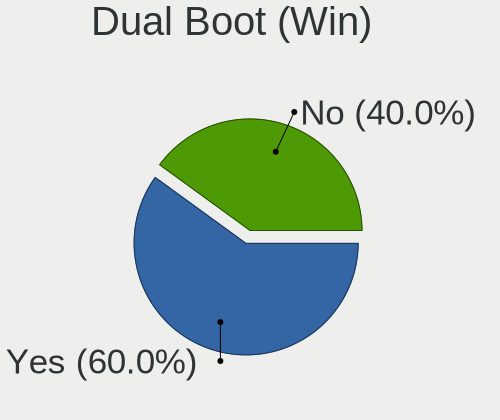
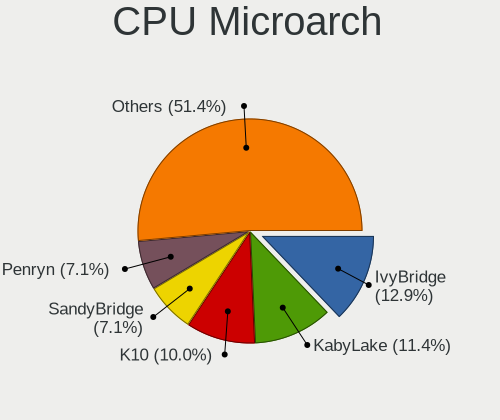
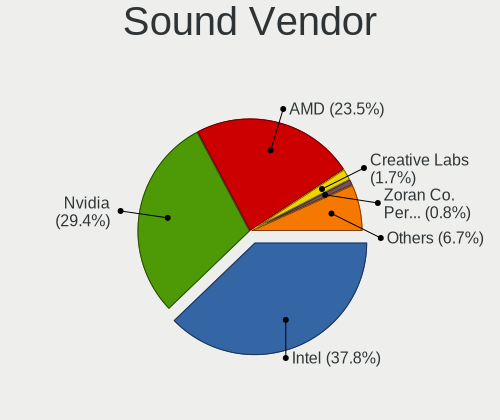

ROSA Hardware Trends (Desktop)
------------------------------

A project to identify most popular hardware characteristics and track their change
over time based on data collected by ROSA users at https://Linux-Hardware.org.

Anyone can contribute to the study by uploading probes of their computers by
the [hw-probe](https://github.com/linuxhw/hw-probe) tool:

    sudo -E hw-probe -all -upload

Full-feature report is available here: https://linux-hardware.org/?view=trends&formfactor=desktop

Period: Apr, 2021.

Contents
--------

- [ OS                       ](#os)
- [ OS Family                ](#os-family)
- [ Kernel                   ](#kernel)
- [ Kernel Family            ](#kernel-family)
- [ Kernel Major Ver.        ](#kernel-major-ver)
- [ Arch                     ](#arch)
- [ DE                       ](#de)
- [ Display Server           ](#display-server)
- [ Display Manager          ](#display-manager)
- [ OS Lang                  ](#os-lang)
- [ Boot Mode                ](#boot-mode)
- [ Filesystem               ](#filesystem)
- [ Part. scheme             ](#part-scheme)
- [ Dual Boot with Linux/BSD ](#dual-boot-with-linux/bsd)
- [ Dual Boot (Win)          ](#dual-boot-win)
- [ Country                  ](#country)
- [ City                     ](#city)
- [ Vendor                   ](#vendor)
- [ Model                    ](#model)
- [ Model Family             ](#model-family)
- [ MFG Year                 ](#mfg-year)
- [ Form Factor              ](#form-factor)
- [ Secure Boot              ](#secure-boot)
- [ Coreboot                 ](#coreboot)
- [ RAM Size                 ](#ram-size)
- [ RAM Used                 ](#ram-used)
- [ Has CD-ROM               ](#has-cd-rom)
- [ Total Drives             ](#total-drives)
- [ Has Ethernet             ](#has-ethernet)
- [ Has WiFi                 ](#has-wifi)
- [ Has Bluetooth            ](#has-bluetooth)
- [ Drive Vendor             ](#drive-vendor)
- [ Drive Model              ](#drive-model)
- [ HDD Vendor               ](#hdd-vendor)
- [ SSD Vendor               ](#ssd-vendor)
- [ Drive Kind               ](#drive-kind)
- [ Drive Connector          ](#drive-connector)
- [ Drive Size               ](#drive-size)
- [ Space Total              ](#space-total)
- [ Space Used               ](#space-used)
- [ Malfunc. Drives          ](#malfunc-drives)
- [ Malfunc. Drive Vendor    ](#malfunc-drive-vendor)
- [ Malfunc. HDD Vendor      ](#malfunc-hdd-vendor)
- [ Malfunc. Drive Kind      ](#malfunc-drive-kind)
- [ Failed Drives            ](#failed-drives)
- [ Failed Drive Vendor      ](#failed-drive-vendor)
- [ Drive Status             ](#drive-status)
- [ Storage Vendor           ](#storage-vendor)
- [ Storage Model            ](#storage-model)
- [ Storage Kind             ](#storage-kind)
- [ CPU Vendor               ](#cpu-vendor)
- [ CPU Model                ](#cpu-model)
- [ CPU Model Family         ](#cpu-model-family)
- [ CPU Cores                ](#cpu-cores)
- [ CPU Sockets              ](#cpu-sockets)
- [ CPU Threads              ](#cpu-threads)
- [ CPU Op-Modes             ](#cpu-op-modes)
- [ CPU Microcode            ](#cpu-microcode)
- [ CPU Microarch            ](#cpu-microarch)
- [ GPU Vendor               ](#gpu-vendor)
- [ GPU Model                ](#gpu-model)
- [ GPU Combo                ](#gpu-combo)
- [ GPU Driver               ](#gpu-driver)
- [ GPU Memory               ](#gpu-memory)
- [ Monitor Vendor           ](#monitor-vendor)
- [ Monitor Model            ](#monitor-model)
- [ Monitor Resolution       ](#monitor-resolution)
- [ Monitor Diagonal         ](#monitor-diagonal)
- [ Monitor Width            ](#monitor-width)
- [ Aspect Ratio             ](#aspect-ratio)
- [ Monitor Area             ](#monitor-area)
- [ Pixel Density            ](#pixel-density)
- [ Multiple Monitors        ](#multiple-monitors)
- [ Net Controller Vendor    ](#net-controller-vendor)
- [ Net Controller Model     ](#net-controller-model)
- [ Wireless Vendor          ](#wireless-vendor)
- [ Wireless Model           ](#wireless-model)
- [ Ethernet Vendor          ](#ethernet-vendor)
- [ Ethernet Model           ](#ethernet-model)
- [ Net Controller Kind      ](#net-controller-kind)
- [ Used Controller          ](#used-controller)
- [ NICs                     ](#nics)
- [ IPv6                     ](#ipv6)
- [ Memory Vendor            ](#memory-vendor)
- [ Memory Model             ](#memory-model)
- [ Memory Kind              ](#memory-kind)
- [ Memory Form Factor       ](#memory-form-factor)
- [ Memory Size              ](#memory-size)
- [ Memory Speed             ](#memory-speed)
- [ Sound Vendor             ](#sound-vendor)
- [ Sound Model              ](#sound-model)
- [ Camera Vendor            ](#camera-vendor)
- [ Camera Model             ](#camera-model)
- [ Fingerprint Vendor       ](#fingerprint-vendor)
- [ Fingerprint Model        ](#fingerprint-model)
- [ Chipcard Vendor          ](#chipcard-vendor)
- [ Chipcard Model           ](#chipcard-model)
- [ Printer Vendor           ](#printer-vendor)
- [ Printer Model            ](#printer-model)
- [ Scanner Vendor           ](#scanner-vendor)
- [ Scanner Model            ](#scanner-model)
- [ Bluetooth Vendor         ](#bluetooth-vendor)
- [ Bluetooth Model          ](#bluetooth-model)
- [ Unsupported Devices      ](#unsupported-devices)
- [ Unsupported Device Types ](#unsupported-device-types)

OS
--

Installed operating systems

| Name         | Desktops | Percent |
|--------------|----------|---------|
| ROSA R11.1   | 84       | 75.68%  |
| ROSA R11     | 13       | 11.71%  |
| ROSA R12     | 10       | 9.01%   |
| ROSA R9      | 1        | 0.9%    |
| ROSA R8.1    | 1        | 0.9%    |
| ROSA R10     | 1        | 0.9%    |
| ROSA 2019.05 | 1        | 0.9%    |

OS Family
---------

OS without a version

| Name | Desktops | Percent |
|------|----------|---------|
| ROSA | 111      | 100%    |

Kernel
------

Version of the Linux kernel

| Version                             | Desktops | Percent |
|-------------------------------------|----------|---------|
| 5.4.32-generic-2rosa-x86_64         | 31       | 27.93%  |
| 5.4.83-generic-2rosa-x86_64         | 14       | 12.61%  |
| 4.15.0-desktop-122.124.1rosa-x86_64 | 14       | 12.61%  |
| 4.15.0-desktop-45.1rosa-x86_64      | 11       | 9.91%   |
| 5.4.32-generic-2rosa-i586           | 6        | 5.41%   |
| 4.15.0-desktop-45.1rosa-i586        | 6        | 5.41%   |
| 5.4.83-generic-2rosa-i586           | 4        | 3.6%    |
| 4.15.0-desktop-122.124.1rosa-i586   | 3        | 2.7%    |
| 5.4.83-generic-2rosa2019.1-x86_64   | 2        | 1.8%    |
| 5.10.32-generic-2rosa2019.1-x86_64  | 2        | 1.8%    |
| 5.10.28-generic-1rosa2019.1-x86_64  | 2        | 1.8%    |
| 5.10.25-generic-1rosa2019.1-x86_64  | 2        | 1.8%    |
| 5.7.0-rc7                           | 1        | 0.9%    |
| 5.5.19-generic-1rosa-x86_64         | 1        | 0.9%    |
| 5.4.72-generic-1rosa-x86_64         | 1        | 0.9%    |
| 5.4.60-nickel-4rosa2019.05-x86_64   | 1        | 0.9%    |
| 5.11.0-desktop-11.12.1rosa-x86_64   | 1        | 0.9%    |
| 5.10.33-generic-3rosa2019.1-x86_64  | 1        | 0.9%    |
| 5.10.18-generic-1rosa2019.1-x86_64  | 1        | 0.9%    |
| 4.9.9-nrj-desktop-1rosa-i586        | 1        | 0.9%    |
| 4.9.60-nrj-desktop-1rosa-x86_64     | 1        | 0.9%    |
| 4.9.20-nrj-desktop-1rosa-x86_64     | 1        | 0.9%    |
| 4.9.155-nrj-desktop-1rosa-x86_64    | 1        | 0.9%    |
| 4.9.155-nrj-desktop-1rosa-i586      | 1        | 0.9%    |
| 4.9.124-nrj-desktop-1rosa-i586      | 1        | 0.9%    |
| 4.15.0-desktop-68.5rosa-i586        | 1        | 0.9%    |

Kernel Family
-------------

Linux kernel without a distro release

| Version | Desktops | Percent |
|---------|----------|---------|
| 5.4.32  | 37       | 33.33%  |
| 4.15.0  | 35       | 31.53%  |
| 5.4.83  | 20       | 18.02%  |
| 5.10.32 | 2        | 1.8%    |
| 5.10.28 | 2        | 1.8%    |
| 5.10.25 | 2        | 1.8%    |
| 4.9.155 | 2        | 1.8%    |
| 5.7.0   | 1        | 0.9%    |
| 5.5.19  | 1        | 0.9%    |
| 5.4.72  | 1        | 0.9%    |
| 5.4.60  | 1        | 0.9%    |
| 5.11.0  | 1        | 0.9%    |
| 5.10.33 | 1        | 0.9%    |
| 5.10.18 | 1        | 0.9%    |
| 4.9.9   | 1        | 0.9%    |
| 4.9.60  | 1        | 0.9%    |
| 4.9.20  | 1        | 0.9%    |
| 4.9.124 | 1        | 0.9%    |

Kernel Major Ver.
-----------------

Linux kernel major version

| Version | Desktops | Percent |
|---------|----------|---------|
| 5.4     | 59       | 53.15%  |
| 4.15    | 35       | 31.53%  |
| 5.10    | 8        | 7.21%   |
| 4.9     | 6        | 5.41%   |
| 5.7     | 1        | 0.9%    |
| 5.5     | 1        | 0.9%    |
| 5.11    | 1        | 0.9%    |

Arch
----

OS architecture (x86_64, i586, etc.)

| Name   | Desktops | Percent |
|--------|----------|---------|
| x86_64 | 88       | 79.28%  |
| i686   | 23       | 20.72%  |

DE
--

Desktop Environment

| Name    | Desktops | Percent |
|---------|----------|---------|
| KDE4    | 64       | 57.66%  |
| KDE5    | 32       | 28.83%  |
| LXQt    | 7        | 6.31%   |
| GNOME   | 4        | 3.6%    |
| XFCE    | 2        | 1.8%    |
| LXDE    | 1        | 0.9%    |
| Unknown | 1        | 0.9%    |

Display Server
--------------

X11 or Wayland

| Name    | Desktops | Percent |
|---------|----------|---------|
| X11     | 108      | 97.3%   |
| Wayland | 3        | 2.7%    |

Display Manager
---------------

SDDM, LightDM, etc.

| Name | Desktops | Percent |
|------|----------|---------|
| KDM  | 66       | 59.46%  |
| SDDM | 39       | 35.14%  |
| GDM  | 4        | 3.6%    |
| TDM  | 2        | 1.8%    |

OS Lang
-------

Language

| Lang    | Desktops | Percent |
|---------|----------|---------|
| ru_RU   | 84       | 75.68%  |
| Unknown | 16       | 14.41%  |
| fr_FR   | 3        | 2.7%    |
| pt_BR   | 2        | 1.8%    |
| es_ES   | 2        | 1.8%    |
| pl_PL   | 1        | 0.9%    |
| es_UY   | 1        | 0.9%    |
| en_US   | 1        | 0.9%    |
| de_DE   | 1        | 0.9%    |

Boot Mode
---------

EFI or BIOS

| Mode | Desktops | Percent |
|------|----------|---------|
| BIOS | 80       | 72.07%  |
| EFI  | 31       | 27.93%  |

Filesystem
----------

Type of filesystem

| Type  | Desktops | Percent |
|-------|----------|---------|
| Ext4  | 107      | 96.4%   |
| Btrfs | 4        | 3.6%    |

Part. scheme
------------

Scheme of partitioning

| Type    | Desktops | Percent |
|---------|----------|---------|
| MBR     | 69       | 62.16%  |
| GPT     | 41       | 36.94%  |
| Unknown | 1        | 0.9%    |

Dual Boot with Linux/BSD
------------------------

Hosting more than one Linux/BSD

| Dual boot | Desktops | Percent |
|-----------|----------|---------|
| No        | 70       | 63.06%  |
| Yes       | 41       | 36.94%  |

Dual Boot (Win)
---------------

Hosting Linux and Windows

| Dual boot | Desktops | Percent |
|-----------|----------|---------|
| Yes       | 62       | 55.86%  |
| No        | 49       | 44.14%  |

Country
-------

Geographic location (country)

| Country    | Desktops | Percent |
|------------|----------|---------|
| Russia     | 93       | 83.78%  |
| Ukraine    | 3        | 2.7%    |
| France     | 3        | 2.7%    |
| Poland     | 2        | 1.8%    |
| Brazil     | 2        | 1.8%    |
| Uruguay    | 1        | 0.9%    |
| Slovakia   | 1        | 0.9%    |
| Serbia     | 1        | 0.9%    |
| Mexico     | 1        | 0.9%    |
| Kazakhstan | 1        | 0.9%    |
| Germany    | 1        | 0.9%    |
| Belarus    | 1        | 0.9%    |
| Argentina  | 1        | 0.9%    |

City
----

Geographic location (city)

| City              | Desktops | Percent |
|-------------------|----------|---------|
| Moscow            | 12       | 10.81%  |
| St Petersburg     | 8        | 7.21%   |
| Rostov-on-Don     | 6        | 5.41%   |
| Novosibirsk       | 5        | 4.5%    |
| Yekaterinburg     | 4        | 3.6%    |
| Nizhniy Novgorod  | 3        | 2.7%    |
| Kursk             | 3        | 2.7%    |
| Krasnoyarsk       | 3        | 2.7%    |
| Volgograd         | 2        | 1.8%    |
| Sochi             | 2        | 1.8%    |
| Lipetsk           | 2        | 1.8%    |
| Krasnodar         | 2        | 1.8%    |
| Elektrostal       | 2        | 1.8%    |
| Zvenigorod        | 1        | 0.9%    |
| Yoshkar-Ola       | 1        | 0.9%    |
| Yakutsk           | 1        | 0.9%    |
| Warsaw            | 1        | 0.9%    |
| Vologda           | 1        | 0.9%    |
| Vladivostok       | 1        | 0.9%    |
| Ukhta             | 1        | 0.9%    |
| Tver              | 1        | 0.9%    |
| Tula              | 1        | 0.9%    |
| Tomsk             | 1        | 0.9%    |
| Tambov            | 1        | 0.9%    |
| Stary Oskol       | 1        | 0.9%    |
| Srednyaya Akhtuba | 1        | 0.9%    |
| Shadrinsk         | 1        | 0.9%    |
| Seversk           | 1        | 0.9%    |
| Saransk           | 1        | 0.9%    |
| Sarai             | 1        | 0.9%    |
| Santos Lugares    | 1        | 0.9%    |
| Pyatigorsk        | 1        | 0.9%    |
| Pszczyna          | 1        | 0.9%    |
| Penza             | 1        | 0.9%    |
| Paris             | 1        | 0.9%    |
| Ozersk            | 1        | 0.9%    |
| Omsk              | 1        | 0.9%    |
| Odessa            | 1        | 0.9%    |
| Oaxaca City       | 1        | 0.9%    |
| Nur-Sultan        | 1        | 0.9%    |
| Nowka             | 1        | 0.9%    |
| Niš              | 1        | 0.9%    |
| Nizhny Tagil      | 1        | 0.9%    |
| Murino            | 1        | 0.9%    |
| Montevideo        | 1        | 0.9%    |
| Lytkarino         | 1        | 0.9%    |
| Linevo            | 1        | 0.9%    |
| Leningradskaya    | 1        | 0.9%    |
| Kyiv              | 1        | 0.9%    |
| Krasnogorsk       | 1        | 0.9%    |
| Kopeysk           | 1        | 0.9%    |
| Kirov             | 1        | 0.9%    |
| Khabarovsk        | 1        | 0.9%    |
| Ket               | 1        | 0.9%    |
| Kemerovo          | 1        | 0.9%    |
| Kaluga            | 1        | 0.9%    |
| Ivanovo           | 1        | 0.9%    |
| Istres            | 1        | 0.9%    |
| Guaratingueta     | 1        | 0.9%    |
| Ferzikovo         | 1        | 0.9%    |

Vendor
------

Motherboard manufacturer

| Name                | Desktops | Percent |
|---------------------|----------|---------|
| ASUSTek Computer    | 45       | 40.54%  |
| Gigabyte Technology | 19       | 17.12%  |
| MSI                 | 14       | 12.61%  |
| ASRock              | 11       | 9.91%   |
| Lenovo              | 3        | 2.7%    |
| Foxconn             | 3        | 2.7%    |
| Pegatron            | 2        | 1.8%    |
| Intel               | 2        | 1.8%    |
| Hewlett-Packard     | 2        | 1.8%    |
| Dell                | 2        | 1.8%    |
| Biostar             | 2        | 1.8%    |
| Unknown             | 2        | 1.8%    |
| Huanan              | 1        | 0.9%    |
| ECS                 | 1        | 0.9%    |
| AmericanMegatrends  | 1        | 0.9%    |
| Acer                | 1        | 0.9%    |

Model
-----

Motherboard model

| Name                                    | Desktops | Percent |
|-----------------------------------------|----------|---------|
| ASUS PRIME A320M-K                      | 3        | 2.7%    |
| ASUS P8B75-V                            | 2        | 1.8%    |
| ASUS P5QPL-AM                           | 2        | 1.8%    |
| ASUS M5A78L-M LX3                       | 2        | 1.8%    |
| ASRock G41M-VS3                         | 2        | 1.8%    |
| Unknown                                 | 2        | 1.8%    |
| Pegatron SAISHIAT2                      | 1        | 0.9%    |
| Pegatron KA842AA-AKD a6310.pl           | 1        | 0.9%    |
| MSI MS-7C51                             | 1        | 0.9%    |
| MSI MS-7B93                             | 1        | 0.9%    |
| MSI MS-7B24                             | 1        | 0.9%    |
| MSI MS-7A74                             | 1        | 0.9%    |
| MSI MS-7971                             | 1        | 0.9%    |
| MSI MS-7836                             | 1        | 0.9%    |
| MSI MS-7817                             | 1        | 0.9%    |
| MSI MS-7788                             | 1        | 0.9%    |
| MSI MS-7758                             | 1        | 0.9%    |
| MSI MS-7680                             | 1        | 0.9%    |
| MSI MS-7623                             | 1        | 0.9%    |
| MSI MS-7583                             | 1        | 0.9%    |
| MSI MS-7309                             | 1        | 0.9%    |
| MSI Cubi N 8GL (MS-B171)                | 1        | 0.9%    |
| Lenovo ThinkCentre M720t 10SRS76500     | 1        | 0.9%    |
| Lenovo ThinkCentre E73 10AS005VFR       | 1        | 0.9%    |
| Lenovo IdeaCentre 510S-07ICK 90LX003WRS | 1        | 0.9%    |
| Intel Koloe G41 + ICH6 Series V1.0      | 1        | 0.9%    |
| Intel H61M-S1                           | 1        | 0.9%    |
| Huanan X99-F8                           | 1        | 0.9%    |
| HP Compaq Pro 6305 SFF                  | 1        | 0.9%    |
| HP Compaq 8200 Elite SFF PC             | 1        | 0.9%    |
| Gigabyte Z390 AORUS ELITE               | 1        | 0.9%    |
| Gigabyte PH67A-D3-B3                    | 1        | 0.9%    |
| Gigabyte P41-ES3G                       | 1        | 0.9%    |
| Gigabyte P31-DS3L                       | 1        | 0.9%    |
| Gigabyte H81M-S1                        | 1        | 0.9%    |
| Gigabyte H61M-D2-B3                     | 1        | 0.9%    |
| Gigabyte GA-MA770-UD3                   | 1        | 0.9%    |
| Gigabyte GA-MA74GM-S2                   | 1        | 0.9%    |
| Gigabyte GA-A75-UD4H                    | 1        | 0.9%    |
| Gigabyte GA-8SIMLH                      | 1        | 0.9%    |
| Gigabyte GA-770T-USB3                   | 1        | 0.9%    |
| Gigabyte G41MT-S2                       | 1        | 0.9%    |
| Gigabyte G31M-S2L                       | 1        | 0.9%    |
| Gigabyte F2A88XM-D3H                    | 1        | 0.9%    |
| Gigabyte EP43T-USB3                     | 1        | 0.9%    |
| Gigabyte EP43-S3L                       | 1        | 0.9%    |
| Gigabyte AB350M-DS3H                    | 1        | 0.9%    |
| Gigabyte A320M-S2H V2                   | 1        | 0.9%    |
| Gigabyte 945GCM-S2L                     | 1        | 0.9%    |
| Foxconn G41MX/G41MX-K 2.0 1.0           | 1        | 0.9%    |
| Foxconn 500B Microtower                 | 1        | 0.9%    |
| Foxconn 45GM/45CM/45CM-S                | 1        | 0.9%    |
| ECS G31T-M7                             | 1        | 0.9%    |
| Dell Precision WorkStation T3500        | 1        | 0.9%    |
| Dell OptiPlex 3010                      | 1        | 0.9%    |
| Biostar H81MHV3                         | 1        | 0.9%    |
| Biostar H61MLC                          | 1        | 0.9%    |
| ASUS TUF GAMING B450M-PRO S             | 1        | 0.9%    |
| ASUS TUF B450M-PLUS GAMING              | 1        | 0.9%    |
| ASUS TUF B360M-E GAMING                 | 1        | 0.9%    |

Model Family
------------

Motherboard model prefix

| Name                  | Desktops | Percent |
|-----------------------|----------|---------|
| ASUS PRIME            | 8        | 7.21%   |
| ASUS P8H61-M          | 5        | 4.5%    |
| ASUS M5A78L-M         | 4        | 3.6%    |
| ASUS TUF              | 3        | 2.7%    |
| ASUS P5KPL-AM         | 3        | 2.7%    |
| Lenovo ThinkCentre    | 2        | 1.8%    |
| HP Compaq             | 2        | 1.8%    |
| ASUS P8B75-V          | 2        | 1.8%    |
| ASUS P5QPL-AM         | 2        | 1.8%    |
| ASRock G41M-VS3       | 2        | 1.8%    |
| Unknown               | 2        | 1.8%    |
| Pegatron SAISHIAT2    | 1        | 0.9%    |
| Pegatron KA842AA-AKD  | 1        | 0.9%    |
| MSI MS-7C51           | 1        | 0.9%    |
| MSI MS-7B93           | 1        | 0.9%    |
| MSI MS-7B24           | 1        | 0.9%    |
| MSI MS-7A74           | 1        | 0.9%    |
| MSI MS-7971           | 1        | 0.9%    |
| MSI MS-7836           | 1        | 0.9%    |
| MSI MS-7817           | 1        | 0.9%    |
| MSI MS-7788           | 1        | 0.9%    |
| MSI MS-7758           | 1        | 0.9%    |
| MSI MS-7680           | 1        | 0.9%    |
| MSI MS-7623           | 1        | 0.9%    |
| MSI MS-7583           | 1        | 0.9%    |
| MSI MS-7309           | 1        | 0.9%    |
| MSI Cubi              | 1        | 0.9%    |
| Lenovo IdeaCentre     | 1        | 0.9%    |
| Intel Koloe           | 1        | 0.9%    |
| Intel H61M-S1         | 1        | 0.9%    |
| Huanan X99-F8         | 1        | 0.9%    |
| Gigabyte Z390         | 1        | 0.9%    |
| Gigabyte PH67A-D3-B3  | 1        | 0.9%    |
| Gigabyte P41-ES3G     | 1        | 0.9%    |
| Gigabyte P31-DS3L     | 1        | 0.9%    |
| Gigabyte H81M-S1      | 1        | 0.9%    |
| Gigabyte H61M-D2-B3   | 1        | 0.9%    |
| Gigabyte GA-MA770-UD3 | 1        | 0.9%    |
| Gigabyte GA-MA74GM-S2 | 1        | 0.9%    |
| Gigabyte GA-A75-UD4H  | 1        | 0.9%    |
| Gigabyte GA-8SIMLH    | 1        | 0.9%    |
| Gigabyte GA-770T-USB3 | 1        | 0.9%    |
| Gigabyte G41MT-S2     | 1        | 0.9%    |
| Gigabyte G31M-S2L     | 1        | 0.9%    |
| Gigabyte F2A88XM-D3H  | 1        | 0.9%    |
| Gigabyte EP43T-USB3   | 1        | 0.9%    |
| Gigabyte EP43-S3L     | 1        | 0.9%    |
| Gigabyte AB350M-DS3H  | 1        | 0.9%    |
| Gigabyte A320M-S2H    | 1        | 0.9%    |
| Gigabyte 945GCM-S2L   | 1        | 0.9%    |
| Foxconn G41MX         | 1        | 0.9%    |
| Foxconn 500B          | 1        | 0.9%    |
| Foxconn 45GM          | 1        | 0.9%    |
| ECS G31T-M7           | 1        | 0.9%    |
| Dell Precision        | 1        | 0.9%    |
| Dell OptiPlex         | 1        | 0.9%    |
| Biostar H81MHV3       | 1        | 0.9%    |
| Biostar H61MLC        | 1        | 0.9%    |
| ASUS Pro              | 1        | 0.9%    |
| ASUS P8H61-MX         | 1        | 0.9%    |

MFG Year
--------

Motherboard manufacture year

| Year | Desktops | Percent |
|------|----------|---------|
| 2010 | 14       | 12.61%  |
| 2009 | 14       | 12.61%  |
| 2019 | 11       | 9.91%   |
| 2012 | 11       | 9.91%   |
| 2013 | 9        | 8.11%   |
| 2011 | 9        | 8.11%   |
| 2020 | 8        | 7.21%   |
| 2018 | 8        | 7.21%   |
| 2016 | 6        | 5.41%   |
| 2007 | 5        | 4.5%    |
| 2014 | 4        | 3.6%    |
| 2017 | 3        | 2.7%    |
| 2015 | 3        | 2.7%    |
| 2008 | 2        | 1.8%    |
| 2005 | 2        | 1.8%    |
| 2004 | 2        | 1.8%    |

Form Factor
-----------

Physical design of the computer

| Name    | Desktops | Percent |
|---------|----------|---------|
| Desktop | 111      | 100%    |

Secure Boot
-----------

Enabled or disabled

| State    | Desktops | Percent |
|----------|----------|---------|
| Disabled | 111      | 100%    |

Coreboot
--------

Have coreboot on board

| Used | Desktops | Percent |
|------|----------|---------|
| No   | 111      | 100%    |

RAM Size
--------

Total RAM memory

| Size in GB | Desktops | Percent |
|------------|----------|---------|
| 3.01-4.0   | 31       | 27.93%  |
| 8.01-16.0  | 26       | 23.42%  |
| 4.01-8.0   | 17       | 15.32%  |
| 16.01-24.0 | 16       | 14.41%  |
| 1.01-2.0   | 8        | 7.21%   |
| 32.01-64.0 | 6        | 5.41%   |
| 2.01-3.0   | 5        | 4.5%    |
| 24.01-32.0 | 1        | 0.9%    |
| 0.51-1.0   | 1        | 0.9%    |

RAM Used
--------

Used RAM memory

| Used GB  | Desktops | Percent |
|----------|----------|---------|
| 1.01-2.0 | 48       | 43.24%  |
| 0.51-1.0 | 40       | 36.04%  |
| 2.01-3.0 | 17       | 15.32%  |
| 4.01-8.0 | 2        | 1.8%    |
| 3.01-4.0 | 2        | 1.8%    |
| 0.01-0.5 | 2        | 1.8%    |

Has CD-ROM
----------

Has CD-ROM on board

| Presented | Desktops | Percent |
|-----------|----------|---------|
| Yes       | 67       | 60.36%  |
| No        | 44       | 39.64%  |

Total Drives
------------

Number of drives on board

| Drives | Desktops | Percent |
|--------|----------|---------|
| 1      | 53       | 47.75%  |
| 2      | 32       | 28.83%  |
| 3      | 15       | 13.51%  |
| 4      | 6        | 5.41%   |
| 6      | 2        | 1.8%    |
| 5      | 2        | 1.8%    |
| 0      | 1        | 0.9%    |

Has Ethernet
------------

Has Ethernet on board

| Presented | Desktops | Percent |
|-----------|----------|---------|
| Yes       | 109      | 98.2%   |
| No        | 2        | 1.8%    |

Has WiFi
--------

Has WiFi module

| Presented | Desktops | Percent |
|-----------|----------|---------|
| No        | 80       | 72.07%  |
| Yes       | 31       | 27.93%  |

Has Bluetooth
-------------

Has Bluetooth module

| Presented | Desktops | Percent |
|-----------|----------|---------|
| No        | 102      | 91.89%  |
| Yes       | 9        | 8.11%   |

Drive Vendor
------------

Hard drive vendors

| Vendor              | Desktops | Drives | Percent |
|---------------------|----------|--------|---------|
| WDC                 | 54       | 67     | 30%     |
| Seagate             | 40       | 49     | 22.22%  |
| Samsung Electronics | 12       | 17     | 6.67%   |
| Hitachi             | 12       | 13     | 6.67%   |
| Toshiba             | 11       | 11     | 6.11%   |
| Kingston            | 8        | 8      | 4.44%   |
| Apacer              | 5        | 5      | 2.78%   |
| A-DATA Technology   | 5        | 6      | 2.78%   |
| China               | 4        | 4      | 2.22%   |
| Transcend           | 3        | 3      | 1.67%   |
| SPCC                | 3        | 3      | 1.67%   |
| HGST                | 3        | 3      | 1.67%   |
| Silicon Motion      | 2        | 2      | 1.11%   |
| HUAWEI              | 2        | 2      | 1.11%   |
| XrayDisk            | 1        | 1      | 0.56%   |
| USB 3.0             | 1        | 1      | 0.56%   |
| Unknown             | 1        | 1      | 0.56%   |
| Union Memory        | 1        | 1      | 0.56%   |
| Smartbuy            | 1        | 1      | 0.56%   |
| SanDisk             | 1        | 1      | 0.56%   |
| Patriot             | 1        | 1      | 0.56%   |
| OCZ                 | 1        | 1      | 0.56%   |
| Maxtor              | 1        | 1      | 0.56%   |
| LDLC                | 1        | 1      | 0.56%   |
| KingSpec            | 1        | 1      | 0.56%   |
| KingDian            | 1        | 1      | 0.56%   |
| GLOWAY              | 1        | 1      | 0.56%   |
| FOXLINE             | 1        | 1      | 0.56%   |
| Crucial             | 1        | 1      | 0.56%   |
| AMD                 | 1        | 1      | 0.56%   |

Drive Model
-----------

Hard drive models

| Model                            | Desktops | Percent |
|----------------------------------|----------|---------|
| WDC WD10EZEX-08WN4A0 1TB         | 6        | 2.94%   |
| Seagate ST500DM002-1BD142 500GB  | 6        | 2.94%   |
| Kingston SA400S37120G 120GB SSD  | 4        | 1.96%   |
| Toshiba DT01ACA100 1TB           | 3        | 1.47%   |
| Seagate ST1000DM003-1CH162 1TB   | 3        | 1.47%   |
| WDC WDS500G2B0A-00SM50 500GB SSD | 2        | 0.98%   |
| WDC WDS480G2G0A-00JH30 480GB SSD | 2        | 0.98%   |
| WDC WDS240G2G0B-00EPW0 240GB SSD | 2        | 0.98%   |
| WDC WDS240G2G0A-00JH30 240GB SSD | 2        | 0.98%   |
| WDC WD5000AAKX-001CA0 500GB      | 2        | 0.98%   |
| WDC WD5000AADS-00S9B0 500GB      | 2        | 0.98%   |
| WDC WD10EADS-00M2B0 1TB          | 2        | 0.98%   |
| Toshiba DT01ACA050 500GB         | 2        | 0.98%   |
| Seagate ST500DM005 HD502HJ 500GB | 2        | 0.98%   |
| Seagate ST3250318AS 250GB        | 2        | 0.98%   |
| Seagate ST3250312AS 250GB        | 2        | 0.98%   |
| Seagate ST3250310AS 250GB        | 2        | 0.98%   |
| Seagate ST1000DM003-9YN162 1TB   | 2        | 0.98%   |
| Seagate ST1000DM003-1ER162 1TB   | 2        | 0.98%   |
| Samsung SSD 850 EVO 250GB        | 2        | 0.98%   |
| Samsung HD502HI 500GB            | 2        | 0.98%   |
| Kingston SA400S37240G 240GB SSD  | 2        | 0.98%   |
| Hitachi HTS545032B9A300 320GB    | 2        | 0.98%   |
| Hitachi HDS721616PLA380 164GB    | 2        | 0.98%   |
| Apacer AS350 240GB SSD           | 2        | 0.98%   |
| A-DATA SU650 240GB SSD           | 2        | 0.98%   |
| XrayDisk SSD 128GB               | 1        | 0.49%   |
| WDC WD800JD-55MSA1 80GB          | 1        | 0.49%   |
| WDC WD800BB-60JKA0 80GB          | 1        | 0.49%   |
| WDC WD800BB-00FRA0 80GB          | 1        | 0.49%   |
| WDC WD7500AAKS-00RBA0 752GB      | 1        | 0.49%   |
| WDC WD5003AZEX-00K1GA0 500GB     | 1        | 0.49%   |
| WDC WD5001AALS-00L3B2 500GB      | 1        | 0.49%   |
| WDC WD5000LPCX-24C6HT0 500GB     | 1        | 0.49%   |
| WDC WD5000LPCX-22VHAT1 500GB     | 1        | 0.49%   |
| WDC WD5000BEKT-75KA9T0 500GB     | 1        | 0.49%   |
| WDC WD5000AZLX-22JKKA0 500GB     | 1        | 0.49%   |
| WDC WD5000AZLX-08K2TA0 500GB     | 1        | 0.49%   |
| WDC WD5000AAKX-22ERMA0 500GB     | 1        | 0.49%   |
| WDC WD5000AAKX-00ERMA0 500GB     | 1        | 0.49%   |
| WDC WD5000AAKX-003CA0 500GB      | 1        | 0.49%   |
| WDC WD5000AAKS-00V6A0 500GB      | 1        | 0.49%   |
| WDC WD5000AAKS-00V1A0 500GB      | 1        | 0.49%   |
| WDC WD5000AAKS-00A7B2 500GB      | 1        | 0.49%   |
| WDC WD400ABJS-23TEA0 40GB        | 1        | 0.49%   |
| WDC WD4003FRYZ-01F0DB0 4TB       | 1        | 0.49%   |
| WDC WD4000AAKS-00YGA0 400GB      | 1        | 0.49%   |
| WDC WD3200BPVT-22JJ5T0 320GB     | 1        | 0.49%   |
| WDC WD3200AAJS-22B4A0 320GB      | 1        | 0.49%   |
| WDC WD3200AAJB-00J3A0 320GB      | 1        | 0.49%   |
| WDC WD3003FZEX-00Z4SA0 3TB       | 1        | 0.49%   |
| WDC WD2500BEVS-22UST0 250GB      | 1        | 0.49%   |
| WDC WD2500AAKS-00VSA0 250GB      | 1        | 0.49%   |
| WDC WD20EZRZ-22Z5HB0 2TB         | 1        | 0.49%   |
| WDC WD20EZRZ-00Z5HB0 2TB         | 1        | 0.49%   |
| WDC WD20EARX-00PASB0 2TB         | 1        | 0.49%   |
| WDC WD2003FYYS-02W0B0 2TB        | 1        | 0.49%   |
| WDC WD1600JB-00REA0 160GB        | 1        | 0.49%   |
| WDC WD1600BEVT-08A23T1 160GB     | 1        | 0.49%   |
| WDC WD1600AAJS-75PSA0 160GB      | 1        | 0.49%   |

HDD Vendor
----------

Hard disk drive vendors

| Vendor              | Desktops | Drives | Percent |
|---------------------|----------|--------|---------|
| WDC                 | 51       | 58     | 40.8%   |
| Seagate             | 40       | 49     | 32%     |
| Hitachi             | 12       | 13     | 9.6%    |
| Toshiba             | 10       | 10     | 8%      |
| Samsung Electronics | 8        | 11     | 6.4%    |
| HGST                | 3        | 3      | 2.4%    |
| Maxtor              | 1        | 1      | 0.8%    |

SSD Vendor
----------

Solid state drive vendors

| Vendor              | Desktops | Drives | Percent |
|---------------------|----------|--------|---------|
| WDC                 | 8        | 8      | 15.69%  |
| Kingston            | 8        | 8      | 15.69%  |
| Apacer              | 5        | 5      | 9.8%    |
| A-DATA Technology   | 5        | 6      | 9.8%    |
| Samsung Electronics | 4        | 5      | 7.84%   |
| China               | 4        | 4      | 7.84%   |
| SPCC                | 3        | 3      | 5.88%   |
| Transcend           | 2        | 2      | 3.92%   |
| XrayDisk            | 1        | 1      | 1.96%   |
| Toshiba             | 1        | 1      | 1.96%   |
| Smartbuy            | 1        | 1      | 1.96%   |
| SanDisk             | 1        | 1      | 1.96%   |
| OCZ                 | 1        | 1      | 1.96%   |
| LDLC                | 1        | 1      | 1.96%   |
| KingSpec            | 1        | 1      | 1.96%   |
| KingDian            | 1        | 1      | 1.96%   |
| GLOWAY              | 1        | 1      | 1.96%   |
| FOXLINE             | 1        | 1      | 1.96%   |
| Crucial             | 1        | 1      | 1.96%   |
| AMD                 | 1        | 1      | 1.96%   |

Drive Kind
----------

HDD or SSD

| Kind    | Desktops | Drives | Percent |
|---------|----------|--------|---------|
| HDD     | 97       | 145    | 64.24%  |
| SSD     | 43       | 53     | 28.48%  |
| NVMe    | 7        | 7      | 4.64%   |
| Unknown | 4        | 4      | 2.65%   |

Drive Connector
---------------

SATA, SAS, NVMe, etc.

| Type | Desktops | Drives | Percent |
|------|----------|--------|---------|
| SATA | 109      | 197    | 90.08%  |
| NVMe | 7        | 7      | 5.79%   |
| SAS  | 5        | 5      | 4.13%   |

Drive Size
----------

Size of hard drive

| Size in TB | Desktops | Drives | Percent |
|------------|----------|--------|---------|
| 0.01-0.5   | 100      | 136    | 66.23%  |
| 0.51-1.0   | 37       | 46     | 24.5%   |
| 1.01-2.0   | 6        | 7      | 3.97%   |
| 3.01-4.0   | 3        | 3      | 1.99%   |
| 2.01-3.0   | 3        | 4      | 1.99%   |
| 4.01-10.0  | 2        | 2      | 1.32%   |

Space Total
-----------

Amount of disk space available on the file system

| Size in GB     | Desktops | Percent |
|----------------|----------|---------|
| 101-250        | 32       | 28.83%  |
| 251-500        | 22       | 19.82%  |
| 501-1000       | 16       | 14.41%  |
| 1-20           | 12       | 10.81%  |
| 51-100         | 12       | 10.81%  |
| 21-50          | 7        | 6.31%   |
| 1001-2000      | 6        | 5.41%   |
| More than 3000 | 2        | 1.8%    |
| 2001-3000      | 1        | 0.9%    |
| Unknown        | 1        | 0.9%    |

Space Used
----------

Amount of used disk space

| Used GB        | Desktops | Percent |
|----------------|----------|---------|
| 1-20           | 75       | 67.57%  |
| 51-100         | 8        | 7.21%   |
| 21-50          | 7        | 6.31%   |
| 101-250        | 7        | 6.31%   |
| 251-500        | 5        | 4.5%    |
| 501-1000       | 5        | 4.5%    |
| 1001-2000      | 2        | 1.8%    |
| More than 3000 | 1        | 0.9%    |
| Unknown        | 1        | 0.9%    |

Malfunc. Drives
---------------

Drive models with a malfunction

| Model                                       | Desktops | Drives | Percent |
|---------------------------------------------|----------|--------|---------|
| Seagate ST500DM002-1BD142 500GB             | 3        | 3      | 4.69%   |
| Seagate ST3250310AS 250GB                   | 2        | 2      | 3.13%   |
| Seagate ST1000DM003-1CH162 1TB              | 2        | 2      | 3.13%   |
| Samsung Electronics HD502HI 500GB           | 2        | 3      | 3.13%   |
| WDC WDS480G2G0A-00JH30 480GB SSD            | 1        | 1      | 1.56%   |
| WDC WDS240G2G0A-00JH30 240GB SSD            | 1        | 1      | 1.56%   |
| WDC WD800BB-00FRA0 80GB                     | 1        | 1      | 1.56%   |
| WDC WD7500AAKS-00RBA0 752GB                 | 1        | 1      | 1.56%   |
| WDC WD5001AALS-00L3B2 500GB                 | 1        | 1      | 1.56%   |
| WDC WD5000BEKT-75KA9T0 500GB                | 1        | 1      | 1.56%   |
| WDC WD5000AAKX-00ERMA0 500GB                | 1        | 1      | 1.56%   |
| WDC WD5000AAKX-003CA0 500GB                 | 1        | 1      | 1.56%   |
| WDC WD5000AAKS-00V6A0 500GB                 | 1        | 1      | 1.56%   |
| WDC WD5000AAKS-00V1A0 500GB                 | 1        | 1      | 1.56%   |
| WDC WD5000AAKS-00A7B2 500GB                 | 1        | 1      | 1.56%   |
| WDC WD5000AADS-00S9B0 500GB                 | 1        | 1      | 1.56%   |
| WDC WD3200AAJS-22B4A0 320GB                 | 1        | 1      | 1.56%   |
| WDC WD3200AAJB-00J3A0 320GB                 | 1        | 1      | 1.56%   |
| WDC WD2500AAKS-00VSA0 250GB                 | 1        | 1      | 1.56%   |
| WDC WD2003FYYS-02W0B0 2TB                   | 1        | 1      | 1.56%   |
| WDC WD1600AAJS-00YZCA0 160GB                | 1        | 1      | 1.56%   |
| WDC WD10PURX-64E5EY0 1TB                    | 1        | 1      | 1.56%   |
| WDC WD10EZEX-21WN4A0 1TB                    | 1        | 1      | 1.56%   |
| WDC WD10EZEX-00RKKA0 1TB                    | 1        | 1      | 1.56%   |
| WDC WD10EARS-00Y5B1 1TB                     | 1        | 1      | 1.56%   |
| WDC WD10EADS-00M2B0 1TB                     | 1        | 1      | 1.56%   |
| WDC WD1003FZEX-00MK2A0 1TB                  | 1        | 1      | 1.56%   |
| Toshiba MK5065GSXN 500GB                    | 1        | 1      | 1.56%   |
| SPCC SSD162 120GB                           | 1        | 1      | 1.56%   |
| Silicon Motion 256GB                        | 1        | 1      | 1.56%   |
| Seagate ST9160314AS 160GB                   | 1        | 1      | 1.56%   |
| Seagate ST9120822AS 120GB                   | 1        | 1      | 1.56%   |
| Seagate ST500DM005 HD502HJ 500GB            | 1        | 1      | 1.56%   |
| Seagate ST380011A 80GB                      | 1        | 1      | 1.56%   |
| Seagate ST3750640NS 752GB                   | 1        | 2      | 1.56%   |
| Seagate ST3400620AS 400GB                   | 1        | 1      | 1.56%   |
| Seagate ST3250318AS 250GB                   | 1        | 1      | 1.56%   |
| Seagate ST3160827AS 160GB                   | 1        | 1      | 1.56%   |
| Seagate ST3160318AS 160GB                   | 1        | 1      | 1.56%   |
| Seagate ST3120213A 118GB                    | 1        | 1      | 1.56%   |
| Seagate ST31000528AS 1TB                    | 1        | 1      | 1.56%   |
| Seagate ST31000524AS 1TB                    | 1        | 1      | 1.56%   |
| Seagate ST1000LM024 HN-M101MBB 1TB          | 1        | 1      | 1.56%   |
| Seagate ST1000DM003-9YN162 1TB              | 1        | 1      | 1.56%   |
| Samsung Electronics SSD PM810 2.5 7mm 256GB | 1        | 1      | 1.56%   |
| Samsung Electronics SP0411C 40GB            | 1        | 2      | 1.56%   |
| Samsung Electronics HM160HI 160GB           | 1        | 1      | 1.56%   |
| Samsung Electronics HD502IJ 500GB           | 1        | 1      | 1.56%   |
| Samsung Electronics HD160JJ 160GB           | 1        | 1      | 1.56%   |
| OCZ VECTOR150 240GB SSD                     | 1        | 1      | 1.56%   |
| Maxtor 4R060J0 64GB                         | 1        | 1      | 1.56%   |
| Kingston SHFS37A120G 120GB SSD              | 1        | 1      | 1.56%   |
| Hitachi HTS547550A9E384 500GB               | 1        | 1      | 1.56%   |
| Hitachi HTS545032B9A300 320GB               | 1        | 1      | 1.56%   |
| Hitachi HTS541680J9SA00 80GB                | 1        | 1      | 1.56%   |
| Hitachi HTS541612J9SA00 120GB               | 1        | 1      | 1.56%   |
| Hitachi HDS721616PLA380 164GB               | 1        | 1      | 1.56%   |
| Hitachi HDS721050CLA660 500GB               | 1        | 1      | 1.56%   |
| Hitachi HDP725025GLA380 250GB               | 1        | 1      | 1.56%   |

Malfunc. Drive Vendor
---------------------

Vendors of faulty drives

| Vendor              | Desktops | Drives | Percent |
|---------------------|----------|--------|---------|
| WDC                 | 22       | 23     | 35.48%  |
| Seagate             | 21       | 22     | 33.87%  |
| Hitachi             | 7        | 7      | 11.29%  |
| Samsung Electronics | 6        | 9      | 9.68%   |
| Toshiba             | 1        | 1      | 1.61%   |
| SPCC                | 1        | 1      | 1.61%   |
| Silicon Motion      | 1        | 1      | 1.61%   |
| OCZ                 | 1        | 1      | 1.61%   |
| Maxtor              | 1        | 1      | 1.61%   |
| Kingston            | 1        | 1      | 1.61%   |

Malfunc. HDD Vendor
-------------------

Vendors of faulty HDD drives

| Vendor              | Desktops | Drives | Percent |
|---------------------|----------|--------|---------|
| Seagate             | 21       | 22     | 38.18%  |
| WDC                 | 20       | 21     | 36.36%  |
| Hitachi             | 7        | 7      | 12.73%  |
| Samsung Electronics | 5        | 8      | 9.09%   |
| Toshiba             | 1        | 1      | 1.82%   |
| Maxtor              | 1        | 1      | 1.82%   |

Malfunc. Drive Kind
-------------------

Kinds of faulty drives

| Kind | Desktops | Drives | Percent |
|------|----------|--------|---------|
| HDD  | 51       | 60     | 87.93%  |
| SSD  | 6        | 6      | 10.34%  |
| NVMe | 1        | 1      | 1.72%   |

Failed Drives
-------------

Failed drive models

| Model                       | Desktops | Drives | Percent |
|-----------------------------|----------|--------|---------|
| WDC WD1600JB-00REA0 160GB   | 1        | 1      | 50%     |
| Hitachi HDS721010DLE630 1TB | 1        | 1      | 50%     |

Failed Drive Vendor
-------------------

Failed drive vendors

| Vendor  | Desktops | Drives | Percent |
|---------|----------|--------|---------|
| WDC     | 1        | 1      | 50%     |
| Hitachi | 1        | 1      | 50%     |

Drive Status
------------

Number of failed and malfunc. drives

| Status   | Desktops | Drives | Percent |
|----------|----------|--------|---------|
| Works    | 81       | 135    | 57.04%  |
| Malfunc  | 54       | 67     | 38.03%  |
| Detected | 5        | 5      | 3.52%   |
| Failed   | 2        | 2      | 1.41%   |

Storage Vendor
--------------

Storage controller vendors

| Vendor                           | Desktops | Percent |
|----------------------------------|----------|---------|
| Intel                            | 77       | 58.33%  |
| AMD                              | 29       | 21.97%  |
| JMicron Technology               | 5        | 3.79%   |
| Silicon Motion                   | 4        | 3.03%   |
| Nvidia                           | 4        | 3.03%   |
| Marvell Technology Group         | 3        | 2.27%   |
| ASMedia Technology               | 3        | 2.27%   |
| Silicon Image                    | 2        | 1.52%   |
| Union Memory (Shenzhen)          | 1        | 0.76%   |
| Silicon Integrated Systems [SiS] | 1        | 0.76%   |
| Sandisk                          | 1        | 0.76%   |
| Samsung Electronics              | 1        | 0.76%   |
| Promise Technology               | 1        | 0.76%   |

Storage Model
-------------

Storage controller models

| Model                                                                                   | Desktops | Percent |
|-----------------------------------------------------------------------------------------|----------|---------|
| Intel NM10/ICH7 Family SATA Controller [IDE mode]                                       | 20       | 10.2%   |
| Intel 82801G (ICH7 Family) IDE Controller                                               | 17       | 8.67%   |
| AMD FCH SATA Controller [AHCI mode]                                                     | 15       | 7.65%   |
| AMD SB7x0/SB8x0/SB9x0 IDE Controller                                                    | 11       | 5.61%   |
| AMD SB7x0/SB8x0/SB9x0 SATA Controller [IDE mode]                                        | 10       | 5.1%    |
| Intel 6 Series/C200 Series Chipset Family Desktop SATA Controller (IDE mode, ports 4-5) | 8        | 4.08%   |
| Intel 6 Series/C200 Series Chipset Family Desktop SATA Controller (IDE mode, ports 0-3) | 8        | 4.08%   |
| Intel 6 Series/C200 Series Chipset Family 6 port Desktop SATA AHCI Controller           | 7        | 3.57%   |
| Intel 200 Series PCH SATA controller [AHCI mode]                                        | 6        | 3.06%   |
| AMD FCH SATA Controller D                                                               | 5        | 2.55%   |
| Intel SATA Controller [RAID mode]                                                       | 4        | 2.04%   |
| Intel Cannon Lake PCH SATA AHCI Controller                                              | 4        | 2.04%   |
| Intel 82801JI (ICH10 Family) 4 port SATA IDE Controller #1                              | 4        | 2.04%   |
| Intel 82801JI (ICH10 Family) 2 port SATA IDE Controller #2                              | 4        | 2.04%   |
| Intel 8 Series/C220 Series Chipset Family 6-port SATA Controller 1 [AHCI mode]          | 4        | 2.04%   |
| Silicon Motion SM2263EN/SM2263XT SSD Controller                                         | 3        | 1.53%   |
| JMicron JMB368 IDE controller                                                           | 3        | 1.53%   |
| Intel 7 Series/C210 Series Chipset Family 6-port SATA Controller [AHCI mode]            | 3        | 1.53%   |
| ASMedia ASM1062 Serial ATA Controller                                                   | 3        | 1.53%   |
| AMD SB7x0/SB8x0/SB9x0 SATA Controller [AHCI mode]                                       | 3        | 1.53%   |
| AMD 400 Series Chipset SATA Controller                                                  | 3        | 1.53%   |
| Marvell Group 88SE6111/6121 SATA II / PATA Controller                                   | 2        | 1.02%   |
| JMicron JMB363 SATA/IDE Controller                                                      | 2        | 1.02%   |
| Intel Q170/Q150/B150/H170/H110/Z170/CM236 Chipset SATA Controller [AHCI Mode]           | 2        | 1.02%   |
| Intel 82801IB (ICH9) 2 port SATA Controller [IDE mode]                                  | 2        | 1.02%   |
| Intel 82801I (ICH9 Family) 2 port SATA Controller [IDE mode]                            | 2        | 1.02%   |
| Intel 82801EB (ICH5) SATA Controller                                                    | 2        | 1.02%   |
| Intel 7 Series/C210 Series Chipset Family 4-port SATA Controller [IDE mode]             | 2        | 1.02%   |
| Intel 7 Series/C210 Series Chipset Family 2-port SATA Controller [IDE mode]             | 2        | 1.02%   |
| Intel 7 Series Chipset Family 6-port SATA Controller [AHCI mode]                        | 2        | 1.02%   |
| AMD X370 Series Chipset SATA Controller                                                 | 2        | 1.02%   |
| Union Memory (Shenzhen) Non-Volatile memory controller                                  | 1        | 0.51%   |
| Silicon Motion SM2262/SM2262EN SSD Controller                                           | 1        | 0.51%   |
| Silicon Integrated Systems [SiS] 5513 IDE Controller                                    | 1        | 0.51%   |
| Silicon Image SiI 3132 Serial ATA Raid II Controller                                    | 1        | 0.51%   |
| Silicon Image SiI 3114 [SATALink/SATARaid] Serial ATA Controller                        | 1        | 0.51%   |
| Sandisk WD Black SN750 / PC SN730 NVMe SSD                                              | 1        | 0.51%   |
| Samsung NVMe SSD Controller SM981/PM981/PM983                                           | 1        | 0.51%   |
| Promise PDC20378 (FastTrak 378/SATA 378)                                                | 1        | 0.51%   |
| Nvidia MCP78S [GeForce 8200] IDE                                                        | 1        | 0.51%   |
| Nvidia MCP78S [GeForce 8200] AHCI Controller                                            | 1        | 0.51%   |
| Nvidia MCP61 SATA Controller                                                            | 1        | 0.51%   |
| Nvidia MCP61 IDE                                                                        | 1        | 0.51%   |
| Nvidia MCP55 SATA Controller                                                            | 1        | 0.51%   |
| Nvidia MCP55 IDE                                                                        | 1        | 0.51%   |
| Nvidia CK804 Serial ATA Controller                                                      | 1        | 0.51%   |
| Nvidia CK804 IDE                                                                        | 1        | 0.51%   |
| Marvell Group 88SE6101/6102 single-port PATA133 interface                               | 1        | 0.51%   |
| Intel Celeron/Pentium Silver Processor SATA Controller                                  | 1        | 0.51%   |
| Intel C610/X99 series chipset 6-Port SATA Controller [AHCI mode]                        | 1        | 0.51%   |
| Intel 82801JI (ICH10 Family) SATA AHCI Controller                                       | 1        | 0.51%   |
| Intel 82801JD/DO (ICH10 Family) SATA AHCI Controller                                    | 1        | 0.51%   |
| Intel 82801FB/FW (ICH6/ICH6W) SATA Controller                                           | 1        | 0.51%   |
| Intel 82801FB/FBM/FR/FW/FRW (ICH6 Family) IDE Controller                                | 1        | 0.51%   |
| Intel 82801EB/ER (ICH5/ICH5R) IDE Controller                                            | 1        | 0.51%   |
| Intel 8 Series/C220 Series Chipset Family 4-port SATA Controller 1 [IDE mode]           | 1        | 0.51%   |
| Intel 8 Series/C220 Series Chipset Family 2-port SATA Controller 2 [IDE mode]           | 1        | 0.51%   |
| Intel 5 Series/3400 Series Chipset 4 port SATA IDE Controller                           | 1        | 0.51%   |
| Intel 5 Series/3400 Series Chipset 2 port SATA IDE Controller                           | 1        | 0.51%   |
| AMD FCH SATA Controller [IDE mode]                                                      | 1        | 0.51%   |

Storage Kind
------------

Kind of storage controller (IDE, SATA, NVMe, SAS, ...)

| Kind | Desktops | Percent |
|------|----------|---------|
| SATA | 62       | 45.93%  |
| IDE  | 59       | 43.7%   |
| RAID | 7        | 5.19%   |
| NVMe | 7        | 5.19%   |

CPU Vendor
----------

Processor vendors

| Vendor | Desktops | Percent |
|--------|----------|---------|
| Intel  | 78       | 70.27%  |
| AMD    | 33       | 29.73%  |

CPU Model
---------

Processor models

| Model                                         | Desktops | Percent |
|-----------------------------------------------|----------|---------|
| Intel Core i3-2100 CPU @ 3.10GHz              | 4        | 3.6%    |
| Intel Core 2 Duo CPU E8400 @ 3.00GHz          | 4        | 3.6%    |
| Intel Pentium Dual-Core CPU E5700 @ 3.00GHz   | 3        | 2.7%    |
| Intel Core i5-9400F CPU @ 2.90GHz             | 2        | 1.8%    |
| Intel Core i5-3470 CPU @ 3.20GHz              | 2        | 1.8%    |
| Intel Core i3-3220 CPU @ 3.30GHz              | 2        | 1.8%    |
| Intel Core 2 Quad CPU Q6600 @ 2.40GHz         | 2        | 1.8%    |
| Intel Core 2 Duo CPU E7500 @ 2.93GHz          | 2        | 1.8%    |
| Intel Core 2 Duo CPU E4600 @ 2.40GHz          | 2        | 1.8%    |
| Intel Celeron CPU 847 @ 1.10GHz               | 2        | 1.8%    |
| AMD Phenom II X6 1055T Processor              | 2        | 1.8%    |
| AMD Athlon II X2 250 Processor                | 2        | 1.8%    |
| AMD A8-9600 RADEON R7, 10 COMPUTE CORES 4C+6G | 2        | 1.8%    |
| Intel Xeon CPU X3220 @ 2.40GHz                | 1        | 0.9%    |
| Intel Xeon CPU W3520 @ 2.67GHz                | 1        | 0.9%    |
| Intel Xeon CPU E5472 @ 3.00GHz                | 1        | 0.9%    |
| Intel Xeon CPU E5462 @ 2.80GHz                | 1        | 0.9%    |
| Intel Xeon CPU E5450 @ 3.00GHz                | 1        | 0.9%    |
| Intel Xeon CPU E5440 @ 2.83GHz                | 1        | 0.9%    |
| Intel Xeon CPU E5430 @ 2.66GHz                | 1        | 0.9%    |
| Intel Xeon CPU E5-2689 0 @ 2.60GHz            | 1        | 0.9%    |
| Intel Xeon CPU E5-2678 v3 @ 2.50GHz           | 1        | 0.9%    |
| Intel Xeon CPU E3-1230 v3 @ 3.30GHz           | 1        | 0.9%    |
| Intel Pentium Gold G5420 CPU @ 3.80GHz        | 1        | 0.9%    |
| Intel Pentium Dual-Core CPU E6700 @ 3.20GHz   | 1        | 0.9%    |
| Intel Pentium Dual-Core CPU E5400 @ 2.70GHz   | 1        | 0.9%    |
| Intel Pentium Dual-Core CPU E5300 @ 2.60GHz   | 1        | 0.9%    |
| Intel Pentium Dual CPU E2180 @ 2.00GHz        | 1        | 0.9%    |
| Intel Pentium Dual CPU E2140 @ 1.60GHz        | 1        | 0.9%    |
| Intel Pentium CPU G860 @ 3.00GHz              | 1        | 0.9%    |
| Intel Pentium CPU G630 @ 2.70GHz              | 1        | 0.9%    |
| Intel Pentium CPU G4600 @ 3.60GHz             | 1        | 0.9%    |
| Intel Pentium CPU G3240 @ 3.10GHz             | 1        | 0.9%    |
| Intel Pentium CPU G3220 @ 3.00GHz             | 1        | 0.9%    |
| Intel Pentium CPU G2030 @ 3.00GHz             | 1        | 0.9%    |
| Intel Pentium CPU G2020 @ 2.90GHz             | 1        | 0.9%    |
| Intel Pentium 4 CPU 3.20GHz                   | 1        | 0.9%    |
| Intel Pentium 4 CPU 3.00GHz                   | 1        | 0.9%    |
| Intel Pentium 4 CPU 2.80GHz                   | 1        | 0.9%    |
| Intel Pentium 4 CPU 2.40GHz                   | 1        | 0.9%    |
| Intel Core i7-9700 CPU @ 3.00GHz              | 1        | 0.9%    |
| Intel Core i7-7700K CPU @ 4.20GHz             | 1        | 0.9%    |
| Intel Core i7-4770S CPU @ 3.10GHz             | 1        | 0.9%    |
| Intel Core i7-4770K CPU @ 3.50GHz             | 1        | 0.9%    |
| Intel Core i7-3770 CPU @ 3.40GHz              | 1        | 0.9%    |
| Intel Core i7-2600 CPU @ 3.40GHz              | 1        | 0.9%    |
| Intel Core i5-9600K CPU @ 3.70GHz             | 1        | 0.9%    |
| Intel Core i5-8400 CPU @ 2.80GHz              | 1        | 0.9%    |
| Intel Core i5-7400 CPU @ 3.00GHz              | 1        | 0.9%    |
| Intel Core i5-6600K CPU @ 3.50GHz             | 1        | 0.9%    |
| Intel Core i5-3570 CPU @ 3.40GHz              | 1        | 0.9%    |
| Intel Core i5-3450 CPU @ 3.10GHz              | 1        | 0.9%    |
| Intel Core i5-3330 CPU @ 3.00GHz              | 1        | 0.9%    |
| Intel Core i5 CPU 660 @ 3.33GHz               | 1        | 0.9%    |
| Intel Core i3-9100F CPU @ 3.60GHz             | 1        | 0.9%    |
| Intel Core i3-9100 CPU @ 3.60GHz              | 1        | 0.9%    |
| Intel Core i3-8100 CPU @ 3.60GHz              | 1        | 0.9%    |
| Intel Core i3-3240 CPU @ 3.40GHz              | 1        | 0.9%    |
| Intel Core 2 Quad CPU Q9650 @ 3.00GHz         | 1        | 0.9%    |
| Intel Core 2 Quad CPU Q8400 @ 2.66GHz         | 1        | 0.9%    |

CPU Model Family
----------------

Processor model prefix

| Model                   | Desktops | Percent |
|-------------------------|----------|---------|
| Intel Core i5           | 12       | 10.81%  |
| Intel Xeon              | 10       | 9.01%   |
| Intel Core i3           | 10       | 9.01%   |
| Intel Core 2 Duo        | 8        | 7.21%   |
| Intel Pentium           | 7        | 6.31%   |
| Intel Pentium Dual-Core | 6        | 5.41%   |
| Intel Core i7           | 6        | 5.41%   |
| Intel Core 2 Quad       | 6        | 5.41%   |
| Intel Celeron           | 6        | 5.41%   |
| AMD FX                  | 5        | 4.5%    |
| AMD Athlon II X2        | 5        | 4.5%    |
| Intel Pentium 4         | 4        | 3.6%    |
| AMD Ryzen 7             | 3        | 2.7%    |
| AMD Ryzen 5             | 3        | 2.7%    |
| AMD A8                  | 3        | 2.7%    |
| Intel Pentium Dual      | 2        | 1.8%    |
| AMD Phenom II X6        | 2        | 1.8%    |
| AMD Athlon 64 X2        | 2        | 1.8%    |
| AMD Athlon              | 2        | 1.8%    |
| Intel Pentium Gold      | 1        | 0.9%    |
| AMD Ryzen 9             | 1        | 0.9%    |
| AMD Ryzen 3 PRO         | 1        | 0.9%    |
| AMD Ryzen 3             | 1        | 0.9%    |
| AMD Phenom              | 1        | 0.9%    |
| AMD Athlon Dual Core    | 1        | 0.9%    |
| AMD Athlon 64           | 1        | 0.9%    |
| AMD A4                  | 1        | 0.9%    |
| AMD A10                 | 1        | 0.9%    |

CPU Cores
---------

Number of processor cores

| Number | Desktops | Percent |
|--------|----------|---------|
| 2      | 51       | 45.95%  |
| 4      | 35       | 31.53%  |
| 6      | 10       | 9.01%   |
| 1      | 6        | 5.41%   |
| 8      | 5        | 4.5%    |
| 12     | 2        | 1.8%    |
| 3      | 2        | 1.8%    |

CPU Sockets
-----------

Number of sockets

| Number | Desktops | Percent |
|--------|----------|---------|
| 1      | 111      | 100%    |

CPU Threads
-----------

Threads per core (Hyper-Threading)

| Number | Desktops | Percent |
|--------|----------|---------|
| 1      | 76       | 68.47%  |
| 2      | 35       | 31.53%  |

CPU Op-Modes
------------

CPU Operation Modes (32-bit, 64-bit)

| Op mode        | Desktops | Percent |
|----------------|----------|---------|
| 32-bit, 64-bit | 108      | 97.3%   |
| 32-bit         | 3        | 2.7%    |

CPU Microcode
-------------

Microcode number

| Number     | Desktops | Percent |
|------------|----------|---------|
| 0x1067a    | 15       | 13.51%  |
| 0x306a9    | 11       | 9.91%   |
| 0x206a7    | 10       | 9.01%   |
| 0x10676    | 6        | 5.41%   |
| Unknown    | 6        | 5.41%   |
| 0x906ea    | 5        | 4.5%    |
| 0x306c3    | 5        | 4.5%    |
| 0x906e9    | 4        | 3.6%    |
| 0x6fd      | 4        | 3.6%    |
| 0x010000c8 | 4        | 3.6%    |
| 0x6fb      | 3        | 2.7%    |
| 0xf29      | 2        | 1.8%    |
| 0x906ed    | 2        | 1.8%    |
| 0x906eb    | 2        | 1.8%    |
| 0x08701021 | 2        | 1.8%    |
| 0x08001137 | 2        | 1.8%    |
| 0x0600611a | 2        | 1.8%    |
| 0x06000852 | 2        | 1.8%    |
| 0x010000dc | 2        | 1.8%    |
| 0xf49      | 1        | 0.9%    |
| 0xf34      | 1        | 0.9%    |
| 0x706a1    | 1        | 0.9%    |
| 0x506e3    | 1        | 0.9%    |
| 0x306f2    | 1        | 0.9%    |
| 0x206d6    | 1        | 0.9%    |
| 0x20652    | 1        | 0.9%    |
| 0x106a5    | 1        | 0.9%    |
| 0x10677    | 1        | 0.9%    |
| 0x08701013 | 1        | 0.9%    |
| 0x08108109 | 1        | 0.9%    |
| 0x08101016 | 1        | 0.9%    |
| 0x0800820d | 1        | 0.9%    |
| 0x08001138 | 1        | 0.9%    |
| 0x08001129 | 1        | 0.9%    |
| 0x0700010f | 1        | 0.9%    |
| 0x06003106 | 1        | 0.9%    |
| 0x0600111f | 1        | 0.9%    |
| 0x0600084f | 1        | 0.9%    |
| 0x0600063e | 1        | 0.9%    |
| 0x010000c7 | 1        | 0.9%    |
| 0x01000095 | 1        | 0.9%    |

CPU Microarch
-------------

Microarchitecture

| Name          | Desktops | Percent |
|---------------|----------|---------|
| Penryn        | 22       | 19.82%  |
| KabyLake      | 13       | 11.71%  |
| SandyBridge   | 11       | 9.91%   |
| IvyBridge     | 11       | 9.91%   |
| K10           | 8        | 7.21%   |
| Core          | 7        | 6.31%   |
| Haswell       | 6        | 5.41%   |
| Zen           | 5        | 4.5%    |
| Piledriver    | 4        | 3.6%    |
| NetBurst      | 4        | 3.6%    |
| K8 Hammer     | 4        | 3.6%    |
| Zen 2         | 3        | 2.7%    |
| Zen+          | 2        | 1.8%    |
| Excavator     | 2        | 1.8%    |
| Bulldozer     | 2        | 1.8%    |
| Westmere      | 1        | 0.9%    |
| Steamroller   | 1        | 0.9%    |
| Skylake       | 1        | 0.9%    |
| Nehalem       | 1        | 0.9%    |
| K10 Llano     | 1        | 0.9%    |
| Jaguar        | 1        | 0.9%    |
| Goldmont plus | 1        | 0.9%    |

GPU Vendor
----------

Vendors of graphics cards

| Vendor | Desktops | Percent |
|--------|----------|---------|
| Nvidia | 50       | 43.48%  |
| AMD    | 38       | 33.04%  |
| Intel  | 27       | 23.48%  |

GPU Model
---------

Graphics card models

| Model                                                                       | Desktops | Percent |
|-----------------------------------------------------------------------------|----------|---------|
| Nvidia G94 [GeForce 9600 GT]                                                | 6        | 5.04%   |
| Intel 2nd Generation Core Processor Family Integrated Graphics Controller   | 6        | 5.04%   |
| Intel Xeon E3-1200 v2/3rd Gen Core processor Graphics Controller            | 5        | 4.2%    |
| Nvidia GP107 [GeForce GTX 1050 Ti]                                          | 4        | 3.36%   |
| Nvidia GK208B [GeForce GT 710]                                              | 4        | 3.36%   |
| Intel 4 Series Chipset Integrated Graphics Controller                       | 4        | 3.36%   |
| AMD Ellesmere [Radeon RX 470/480/570/570X/580/580X/590]                     | 4        | 3.36%   |
| Intel Xeon E3-1200 v3/4th Gen Core Processor Integrated Graphics Controller | 3        | 2.52%   |
| Intel CoffeeLake-S GT2 [UHD Graphics 630]                                   | 3        | 2.52%   |
| AMD Navi 10 [Radeon RX 5600 OEM/5600 XT / 5700/5700 XT]                     | 3        | 2.52%   |
| Nvidia GT218 [GeForce 210]                                                  | 2        | 1.68%   |
| Nvidia GT216 [GeForce GT 220]                                               | 2        | 1.68%   |
| Nvidia GP108 [GeForce GT 1030]                                              | 2        | 1.68%   |
| Nvidia GF108 [GeForce GT 440]                                               | 2        | 1.68%   |
| Nvidia GF108 [GeForce GT 430]                                               | 2        | 1.68%   |
| Nvidia G86 [GeForce 8500 GT]                                                | 2        | 1.68%   |
| AMD RS780L [Radeon 3000]                                                    | 2        | 1.68%   |
| AMD Lexa PRO [Radeon 540/540X/550/550X / RX 540X/550/550X]                  | 2        | 1.68%   |
| AMD Cedar [Radeon HD 5000/6000/7350/8350 Series]                            | 2        | 1.68%   |
| Nvidia TU117 [GeForce GTX 1650]                                             | 1        | 0.84%   |
| Nvidia TU116 [GeForce GTX 1660 SUPER]                                       | 1        | 0.84%   |
| Nvidia NV36 [GeForce FX 5700LE]                                             | 1        | 0.84%   |
| Nvidia GT200 [GeForce GTX 280]                                              | 1        | 0.84%   |
| Nvidia GP107 [GeForce GTX 1050]                                             | 1        | 0.84%   |
| Nvidia GP104 [GeForce GTX 1070]                                             | 1        | 0.84%   |
| Nvidia GP102 [GeForce GTX 1080 Ti]                                          | 1        | 0.84%   |
| Nvidia GM204 [GeForce GTX 970]                                              | 1        | 0.84%   |
| Nvidia GM107 [GeForce GTX 750]                                              | 1        | 0.84%   |
| Nvidia GM107 [GeForce GTX 750 Ti]                                           | 1        | 0.84%   |
| Nvidia GK208 [GeForce GT 630 Rev. 2]                                        | 1        | 0.84%   |
| Nvidia GK107 [GeForce GT 640]                                               | 1        | 0.84%   |
| Nvidia GK106 [GeForce GTX 660]                                              | 1        | 0.84%   |
| Nvidia GF119 [GeForce GT 705]                                               | 1        | 0.84%   |
| Nvidia GF119 [GeForce GT 610]                                               | 1        | 0.84%   |
| Nvidia GF119 [GeForce GT 520]                                               | 1        | 0.84%   |
| Nvidia GF116 [GeForce GTX 550 Ti]                                           | 1        | 0.84%   |
| Nvidia GF116 [GeForce GTS 450 Rev. 2]                                       | 1        | 0.84%   |
| Nvidia GF110 [GeForce GTX 570 Rev. 2]                                       | 1        | 0.84%   |
| Nvidia GF108 [GeForce GT 730]                                               | 1        | 0.84%   |
| Nvidia GF108 [GeForce GT 630]                                               | 1        | 0.84%   |
| Nvidia GF106 [GeForce GTS 450]                                              | 1        | 0.84%   |
| Nvidia GF100 [GeForce GTX 465]                                              | 1        | 0.84%   |
| Nvidia G96C [GeForce 9400 GT]                                               | 1        | 0.84%   |
| Nvidia G84 [GeForce 8600 GT]                                                | 1        | 0.84%   |
| Intel HD Graphics 630                                                       | 1        | 0.84%   |
| Intel HD Graphics 530                                                       | 1        | 0.84%   |
| Intel GeminiLake [UHD Graphics 600]                                         | 1        | 0.84%   |
| Intel CoffeeLake-S GT1 [UHD Graphics 610]                                   | 1        | 0.84%   |
| Intel 82G33/G31 Express Integrated Graphics Controller                      | 1        | 0.84%   |
| Intel 82945G/GZ Integrated Graphics Controller                              | 1        | 0.84%   |
| AMD Wani [Radeon R5/R6/R7 Graphics]                                         | 1        | 0.84%   |
| AMD Turks [Radeon HD 7600 Series]                                           | 1        | 0.84%   |
| AMD Turks XT [Radeon HD 6670/7670]                                          | 1        | 0.84%   |
| AMD Turks PRO [Radeon HD 6570/7570/8550 / R5 230]                           | 1        | 0.84%   |
| AMD RV730 XT [Radeon HD 4670]                                               | 1        | 0.84%   |
| AMD RV610 [Radeon HD 2400 PRO]                                              | 1        | 0.84%   |
| AMD RV410 [Radeon X700 PRO] (Secondary)                                     | 1        | 0.84%   |
| AMD RV410 [Radeon X700 PRO]                                                 | 1        | 0.84%   |
| AMD RV380 [Radeon X550/X600] (Secondary)                                    | 1        | 0.84%   |
| AMD RV380 [Radeon X550/X600]                                                | 1        | 0.84%   |

GPU Combo
---------

Combinations of graphics cards

| Name           | Desktops | Percent |
|----------------|----------|---------|
| 1 x Nvidia     | 47       | 42.34%  |
| 1 x AMD        | 34       | 30.63%  |
| 1 x Intel      | 24       | 21.62%  |
| 2 x AMD        | 3        | 2.7%    |
| 2 x Nvidia     | 1        | 0.9%    |
| Intel + Nvidia | 1        | 0.9%    |
| AMD + Nvidia   | 1        | 0.9%    |

GPU Driver
----------

Free vs proprietary

| Driver      | Desktops | Percent |
|-------------|----------|---------|
| Free        | 91       | 81.98%  |
| Proprietary | 13       | 11.71%  |
| Unknown     | 7        | 6.31%   |

GPU Memory
----------

Total video memory

| Size in GB | Desktops | Percent |
|------------|----------|---------|
| Unknown    | 27       | 24.32%  |
| 0.51-1.0   | 26       | 23.42%  |
| 0.01-0.5   | 21       | 18.92%  |
| 1.01-2.0   | 18       | 16.22%  |
| 3.01-4.0   | 12       | 10.81%  |
| 7.01-8.0   | 5        | 4.5%    |
| 5.01-6.0   | 1        | 0.9%    |
| 8.01-16.0  | 1        | 0.9%    |

Monitor Vendor
--------------

Monitor vendors

| Vendor               | Desktops | Percent |
|----------------------|----------|---------|
| Samsung Electronics  | 26       | 25.74%  |
| Goldstar             | 15       | 14.85%  |
| Acer                 | 13       | 12.87%  |
| ViewSonic            | 8        | 7.92%   |
| Philips              | 7        | 6.93%   |
| Dell                 | 7        | 6.93%   |
| BenQ                 | 6        | 5.94%   |
| Sony                 | 2        | 1.98%   |
| NEC Computers        | 2        | 1.98%   |
| AOC                  | 2        | 1.98%   |
| RTD                  | 1        | 0.99%   |
| RoverScan            | 1        | 0.99%   |
| Positivo             | 1        | 0.99%   |
| Plain Tree Systems   | 1        | 0.99%   |
| Lenovo               | 1        | 0.99%   |
| Iiyama               | 1        | 0.99%   |
| Hewlett-Packard      | 1        | 0.99%   |
| Fujitsu Siemens      | 1        | 0.99%   |
| Eizo                 | 1        | 0.99%   |
| Belinea              | 1        | 0.99%   |
| AVX                  | 1        | 0.99%   |
| ASUSTek Computer     | 1        | 0.99%   |
| Ancor Communications | 1        | 0.99%   |

Monitor Model
-------------

Monitor models

| Model                                                                 | Desktops | Percent |
|-----------------------------------------------------------------------|----------|---------|
| ViewSonic VX2253 Series VSC0A28 1920x1080 476x268mm 21.5-inch         | 2        | 1.98%   |
| Samsung Electronics SyncMaster SAM036E 1280x1024 376x301mm 19.0-inch  | 2        | 1.98%   |
| NEC Computers LCD1990SXi NEC66AC 1280x1024 376x301mm 19.0-inch        | 2        | 1.98%   |
| Goldstar FULL HD GSM5B55 1920x1080 480x270mm 21.7-inch                | 2        | 1.98%   |
| ViewSonic VA916g SERIES VSC5E27 1280x1024 376x301mm 19.0-inch         | 1        | 0.99%   |
| ViewSonic VA903-3Series VSC701E 1280x1024 376x301mm 19.0-inch         | 1        | 0.99%   |
| ViewSonic VA2248 SERIES VSC0E28 1920x1080 477x268mm 21.5-inch         | 1        | 0.99%   |
| ViewSonic VA2231 Series VSC5C26 1920x1080 477x268mm 21.5-inch         | 1        | 0.99%   |
| ViewSonic VA1716wSERIES VSCF81F 1440x900 367x230mm 17.1-inch          | 1        | 0.99%   |
| ViewSonic VA1616wSERIES VSC0021 1366x768 348x197mm 15.7-inch          | 1        | 0.99%   |
| Sony TV SNYC901 1920x1080 1600x900mm 72.3-inch                        | 1        | 0.99%   |
| Sony TV SNY7A02 1360x768 576x324mm 26.0-inch                          | 1        | 0.99%   |
| Samsung Electronics U32J59x SAM0F52 3840x2160 697x392mm 31.5-inch     | 1        | 0.99%   |
| Samsung Electronics U28E590 SAM0C4D 3840x2160 607x345mm 27.5-inch     | 1        | 0.99%   |
| Samsung Electronics SyncMaster SAM1156 1280x1024 312x234mm 15.4-inch  | 1        | 0.99%   |
| Samsung Electronics SyncMaster SAM0572 1280x1024 376x301mm 19.0-inch  | 1        | 0.99%   |
| Samsung Electronics SyncMaster SAM0499 1600x900 443x249mm 20.0-inch   | 1        | 0.99%   |
| Samsung Electronics SyncMaster SAM0370 1680x1050 459x296mm 21.5-inch  | 1        | 0.99%   |
| Samsung Electronics SyncMaster SAM036F 1440x900 428x255mm 19.6-inch   | 1        | 0.99%   |
| Samsung Electronics SyncMaster SAM0285 1440x900 410x257mm 19.1-inch   | 1        | 0.99%   |
| Samsung Electronics SyncMaster SAM027D 1680x1050 433x271mm 20.1-inch  | 1        | 0.99%   |
| Samsung Electronics SyncMaster SAM0247 1280x1024 376x301mm 19.0-inch  | 1        | 0.99%   |
| Samsung Electronics SyncMaster SAM01E1 1280x1024 376x301mm 19.0-inch  | 1        | 0.99%   |
| Samsung Electronics SyncMaster SAM01AD 1600x1200 410x310mm 20.2-inch  | 1        | 0.99%   |
| Samsung Electronics SyncMaster SAM0168 1280x1024 338x270mm 17.0-inch  | 1        | 0.99%   |
| Samsung Electronics SyncMaster SAM011D 1024x768 304x228mm 15.0-inch   | 1        | 0.99%   |
| Samsung Electronics SMT22A300 SAM087B 1920x1080 477x268mm 21.5-inch   | 1        | 0.99%   |
| Samsung Electronics S24F350 SAM0D20 1920x1080 521x293mm 23.5-inch     | 1        | 0.99%   |
| Samsung Electronics LCD Monitor SAM07D0 1920x1080 700x390mm 31.5-inch | 1        | 0.99%   |
| Samsung Electronics LCD Monitor SAM0658 1920x1080 886x498mm 40.0-inch | 1        | 0.99%   |
| Samsung Electronics LCD Monitor SAM0518 1920x1080                     | 1        | 0.99%   |
| Samsung Electronics LCD Monitor SAM02A4 1360x768                      | 1        | 0.99%   |
| Samsung Electronics LCD Monitor SAM02A2 1360x768 885x498mm 40.0-inch  | 1        | 0.99%   |
| Samsung Electronics C27JG5x SAM0F58 2560x1440 597x336mm 27.0-inch     | 1        | 0.99%   |
| Samsung Electronics C27F390 SAM0D32 1920x1080 600x340mm 27.2-inch     | 1        | 0.99%   |
| Samsung Electronics C24F390 SAM0D2C 1920x1080 520x290mm 23.4-inch     | 1        | 0.99%   |
| RTD LR761 RTD2023 1280x1024 307x230mm 15.1-inch                       | 1        | 0.99%   |
| RoverScan JM555 Slim DVM5552 1024x768 304x228mm 15.0-inch             | 1        | 0.99%   |
| Positivo FIT85X NON1801 1360x768 344x194mm 15.5-inch                  | 1        | 0.99%   |
| Plain Tree Systems LCD Monitor PTS05DD 1024x768 300x230mm 14.9-inch   | 1        | 0.99%   |
| Philips PHL 276E9Q PHLC17B 1920x1080 598x336mm 27.0-inch              | 1        | 0.99%   |
| Philips PHL 273V7 PHLC156 1920x1080 598x336mm 27.0-inch               | 1        | 0.99%   |
| Philips PHL 243V7 PHLC155 1920x1080 530x300mm 24.0-inch               | 1        | 0.99%   |
| Philips PHL 237E7 PHLC101 1920x1080 509x286mm 23.0-inch               | 1        | 0.99%   |
| Philips PHL 224E5 PHLC0C6 1920x1080 480x270mm 21.7-inch               | 1        | 0.99%   |
| Philips 222EL PHLC052 1920x1080 476x268mm 21.5-inch                   | 1        | 0.99%   |
| Philips 196VL PHLC07F 1366x768 409x230mm 18.5-inch                    | 1        | 0.99%   |
| Lenovo LEN T24i-10 LEN61CE 1920x1080 527x296mm 23.8-inch              | 1        | 0.99%   |
| Iiyama PL2288H IVM5633 1920x1080 480x270mm 21.7-inch                  | 1        | 0.99%   |
| Hewlett-Packard LE1901w HWP2842 1440x900 410x256mm 19.0-inch          | 1        | 0.99%   |
| Goldstar W2246 GSM5783 1920x1080 477x268mm 21.5-inch                  | 1        | 0.99%   |
| Goldstar W2043 GSM4E9D 1600x900 443x249mm 20.0-inch                   | 1        | 0.99%   |
| Goldstar W2042 GSM4E7E 1680x1050 434x270mm 20.1-inch                  | 1        | 0.99%   |
| Goldstar W1946 GSM4BCD 1360x768 406x229mm 18.4-inch                   | 1        | 0.99%   |
| Goldstar W1943 GSM4BAD 1024x768 410x230mm 18.5-inch                   | 1        | 0.99%   |
| Goldstar ULTRAWIDE GSM76FA 2560x1080 798x334mm 34.1-inch              | 1        | 0.99%   |
| Goldstar ULTRAGEAR GSM5BB1 1920x1080 527x296mm 23.8-inch              | 1        | 0.99%   |
| Goldstar LG ULTRAWIDE GSM59F1 1920x1080 580x240mm 24.7-inch           | 1        | 0.99%   |
| Goldstar L1942 GSM4B85 1280x1024 376x301mm 19.0-inch                  | 1        | 0.99%   |
| Goldstar L1732S GSM4413 1280x1024 340x270mm 17.1-inch                 | 1        | 0.99%   |

Monitor Resolution
------------------

Monitor screen resolution

| Resolution         | Desktops | Percent |
|--------------------|----------|---------|
| 1920x1080 (FHD)    | 37       | 36.63%  |
| 1280x1024 (SXGA)   | 20       | 19.8%   |
| 1360x768           | 7        | 6.93%   |
| 1440x900 (WXGA+)   | 6        | 5.94%   |
| 1366x768 (WXGA)    | 6        | 5.94%   |
| 1680x1050 (WSXGA+) | 5        | 4.95%   |
| 3840x2160 (4K)     | 4        | 3.96%   |
| 2560x1440 (QHD)    | 4        | 3.96%   |
| 1600x900 (HD+)     | 3        | 2.97%   |
| 1024x768 (XGA)     | 3        | 2.97%   |
| 2560x1080          | 2        | 1.98%   |
| 1600x1200          | 2        | 1.98%   |
| 1920x1200 (WUXGA)  | 1        | 0.99%   |
| 1280x720 (HD)      | 1        | 0.99%   |

Monitor Diagonal
----------------

Diagonal size in inches

| Inches  | Desktops | Percent |
|---------|----------|---------|
| 21      | 16       | 15.84%  |
| 19      | 16       | 15.84%  |
| 27      | 10       | 9.9%    |
| 23      | 9        | 8.91%   |
| 18      | 9        | 8.91%   |
| 20      | 8        | 7.92%   |
| 17      | 7        | 6.93%   |
| 24      | 6        | 5.94%   |
| 15      | 6        | 5.94%   |
| 31      | 3        | 2.97%   |
| 40      | 2        | 1.98%   |
| 34      | 2        | 1.98%   |
| Unknown | 2        | 1.98%   |
| 72      | 1        | 0.99%   |
| 26      | 1        | 0.99%   |
| 25      | 1        | 0.99%   |
| 22      | 1        | 0.99%   |
| 16      | 1        | 0.99%   |

Monitor Width
-------------

Physical width

| Width in mm | Desktops | Percent |
|-------------|----------|---------|
| 401-500     | 36       | 36%     |
| 501-600     | 26       | 26%     |
| 351-400     | 14       | 14%     |
| 301-350     | 13       | 13%     |
| 601-700     | 4        | 4%      |
| 801-900     | 2        | 2%      |
| 701-800     | 2        | 2%      |
| Unknown     | 2        | 2%      |
| 1501-2000   | 1        | 1%      |

Aspect Ratio
------------

Proportional relationship between the width and the height

| Ratio | Desktops | Percent |
|-------|----------|---------|
| 16/9  | 63       | 62.38%  |
| 5/4   | 18       | 17.82%  |
| 16/10 | 10       | 9.9%    |
| 4/3   | 6        | 5.94%   |
| 6/5   | 2        | 1.98%   |
| 21/9  | 2        | 1.98%   |

Monitor Area
------------

Area in inch²

| Area in inch² | Desktops | Percent |
|----------------|----------|---------|
| 151-200        | 30       | 29.7%   |
| 201-250        | 27       | 26.73%  |
| 141-150        | 13       | 12.87%  |
| 301-350        | 10       | 9.9%    |
| 351-500        | 5        | 4.95%   |
| 101-110        | 5        | 4.95%   |
| 251-300        | 3        | 2.97%   |
| 131-140        | 2        | 1.98%   |
| 501-1000       | 2        | 1.98%   |
| Unknown        | 2        | 1.98%   |
| More than 1000 | 1        | 0.99%   |
| 111-120        | 1        | 0.99%   |

Pixel Density
-------------

Pixels per inch

| Density | Desktops | Percent |
|---------|----------|---------|
| 51-100  | 70       | 71.43%  |
| 101-120 | 21       | 21.43%  |
| 1-50    | 3        | 3.06%   |
| 121-160 | 2        | 2.04%   |
| Unknown | 2        | 2.04%   |

Multiple Monitors
-----------------

Total monitors connected

| Total | Desktops | Percent |
|-------|----------|---------|
| 1     | 107      | 96.4%   |
| 2     | 2        | 1.8%    |
| 0     | 2        | 1.8%    |

Net Controller Vendor
---------------------

Controller vendors

| Vendor                     | Desktops | Percent |
|----------------------------|----------|---------|
| Realtek Semiconductor      | 79       | 52.67%  |
| Qualcomm Atheros           | 19       | 12.67%  |
| Intel                      | 15       | 10%     |
| Ralink Technology          | 8        | 5.33%   |
| Huawei Technologies        | 5        | 3.33%   |
| Samsung Electronics        | 3        | 2%      |
| Nvidia                     | 3        | 2%      |
| TP-Link                    | 2        | 1.33%   |
| MediaTek                   | 2        | 1.33%   |
| Marvell Technology Group   | 2        | 1.33%   |
| D-Link System              | 2        | 1.33%   |
| Broadcom                   | 2        | 1.33%   |
| 3Com                       | 2        | 1.33%   |
| ZTE WCDMA Technologies MSM | 1        | 0.67%   |
| Ralink                     | 1        | 0.67%   |
| Qualcomm                   | 1        | 0.67%   |
| Digitech Systems           | 1        | 0.67%   |
| D-Link                     | 1        | 0.67%   |
| Broadcom Limited           | 1        | 0.67%   |

Net Controller Model
--------------------

Controller models

| Model                                                                                         | Desktops | Percent |
|-----------------------------------------------------------------------------------------------|----------|---------|
| Realtek RTL8111/8168/8411 PCI Express Gigabit Ethernet Controller                             | 62       | 38.75%  |
| Realtek RTL810xE PCI Express Fast Ethernet controller                                         | 7        | 4.38%   |
| Ralink MT7601U Wireless Adapter                                                               | 7        | 4.38%   |
| Qualcomm Atheros AR8121/AR8113/AR8114 Gigabit or Fast Ethernet                                | 7        | 4.38%   |
| Realtek RTL-8100/8101L/8139 PCI Fast Ethernet Adapter                                         | 5        | 3.13%   |
| Intel Ethernet Connection (7) I219-V                                                          | 4        | 2.5%    |
| Samsung Galaxy series, misc. (tethering mode)                                                 | 3        | 1.88%   |
| Realtek RTL8192EU 802.11b/g/n WLAN Adapter                                                    | 3        | 1.88%   |
| Qualcomm Atheros AR8152 v2.0 Fast Ethernet                                                    | 3        | 1.88%   |
| TP-Link TL-WN722N v2                                                                          | 2        | 1.25%   |
| Realtek RTL8192CU 802.11n WLAN Adapter                                                        | 2        | 1.25%   |
| Realtek RTL8188EUS 802.11n Wireless Network Adapter                                           | 2        | 1.25%   |
| Qualcomm Atheros QCA8171 Gigabit Ethernet                                                     | 2        | 1.25%   |
| Qualcomm Atheros AR8131 Gigabit Ethernet                                                      | 2        | 1.25%   |
| MediaTek GS100                                                                                | 2        | 1.25%   |
| Marvell Group 88E8056 PCI-E Gigabit Ethernet Controller                                       | 2        | 1.25%   |
| Intel Wi-Fi 6 AX200                                                                           | 2        | 1.25%   |
| Intel I211 Gigabit Network Connection                                                         | 2        | 1.25%   |
| Intel Ethernet Connection (2) I219-V                                                          | 2        | 1.25%   |
| Intel Dual Band Wireless-AC 3168NGW [Stone Peak]                                              | 2        | 1.25%   |
| Huawei Modem/Networkcard                                                                      | 2        | 1.25%   |
| 3Com 3c905C-TX/TX-M [Tornado]                                                                 | 2        | 1.25%   |
| ZTE WCDMA MSM ZXIC Mobile Boardband                                                           | 1        | 0.63%   |
| Realtek RTL8188CE 802.11b/g/n WiFi Adapter                                                    | 1        | 0.63%   |
| Realtek RTL8125 2.5GbE Controller                                                             | 1        | 0.63%   |
| Realtek RTL-8185 IEEE 802.11a/b/g Wireless LAN Controller                                     | 1        | 0.63%   |
| Realtek Realtek 8812AU/8821AU 802.11ac WLAN Adapter [USB Wireless Dual-Band Adapter 2.4/5Ghz] | 1        | 0.63%   |
| Ralink RT5372 Wireless Adapter                                                                | 1        | 0.63%   |
| Ralink RT2561/RT61 rev B 802.11g                                                              | 1        | 0.63%   |
| Qualcomm Redmi Note 7                                                                         | 1        | 0.63%   |
| Qualcomm Atheros Attansic L2 Fast Ethernet                                                    | 1        | 0.63%   |
| Qualcomm Atheros Attansic L1 Gigabit Ethernet                                                 | 1        | 0.63%   |
| Qualcomm Atheros AR9462 Wireless Network Adapter                                              | 1        | 0.63%   |
| Qualcomm Atheros AR93xx Wireless Network Adapter                                              | 1        | 0.63%   |
| Qualcomm Atheros AR8151 v1.0 Gigabit Ethernet                                                 | 1        | 0.63%   |
| Nvidia MCP77 Ethernet                                                                         | 1        | 0.63%   |
| Nvidia MCP61 Ethernet                                                                         | 1        | 0.63%   |
| Nvidia CK804 Ethernet Controller                                                              | 1        | 0.63%   |
| Marvell Group 88E8001 Gigabit Ethernet Controller                                             | 1        | 0.63%   |
| Intel Wireless 8260                                                                           | 1        | 0.63%   |
| Intel Wireless 7260                                                                           | 1        | 0.63%   |
| Intel 82579LM Gigabit Network Connection (Lewisville)                                         | 1        | 0.63%   |
| Intel 82567LM-3 Gigabit Network Connection                                                    | 1        | 0.63%   |
| Intel 82557/8/9/0/1 Ethernet Pro 100                                                          | 1        | 0.63%   |
| Intel 82547EI Gigabit Ethernet Controller                                                     | 1        | 0.63%   |
| Huawei MAR-LX1M                                                                               | 1        | 0.63%   |
| Huawei E353/E3131                                                                             | 1        | 0.63%   |
| Huawei Broadband stick                                                                        | 1        | 0.63%   |
| Digitech Systems LTE-D402                                                                     | 1        | 0.63%   |
| D-Link Wireless N Nano USB Adapter                                                            | 1        | 0.63%   |
| D-Link System RTL8139 Ethernet                                                                | 1        | 0.63%   |
| D-Link System DWA-125 Wireless N 150 Adapter(rev.A2) [Ralink RT3070]                          | 1        | 0.63%   |
| Broadcom NetXtreme BCM5761 Gigabit Ethernet PCIe                                              | 1        | 0.63%   |
| Broadcom Limited NetXtreme BCM5761 Gigabit Ethernet PCIe                                      | 1        | 0.63%   |
| Broadcom BCM4352 802.11ac Wireless Network Adapter                                            | 1        | 0.63%   |

Wireless Vendor
---------------

Wireless vendors

| Vendor                | Desktops | Percent |
|-----------------------|----------|---------|
| Realtek Semiconductor | 10       | 31.25%  |
| Ralink Technology     | 8        | 25%     |
| Intel                 | 6        | 18.75%  |
| TP-Link               | 2        | 6.25%   |
| Qualcomm Atheros      | 2        | 6.25%   |
| Ralink                | 1        | 3.13%   |
| D-Link System         | 1        | 3.13%   |
| D-Link                | 1        | 3.13%   |
| Broadcom              | 1        | 3.13%   |

Wireless Model
--------------

Wireless models

| Model                                                                                         | Desktops | Percent |
|-----------------------------------------------------------------------------------------------|----------|---------|
| Ralink MT7601U Wireless Adapter                                                               | 7        | 21.88%  |
| Realtek RTL8192EU 802.11b/g/n WLAN Adapter                                                    | 3        | 9.38%   |
| TP-Link TL-WN722N v2                                                                          | 2        | 6.25%   |
| Realtek RTL8192CU 802.11n WLAN Adapter                                                        | 2        | 6.25%   |
| Realtek RTL8188EUS 802.11n Wireless Network Adapter                                           | 2        | 6.25%   |
| Intel Wi-Fi 6 AX200                                                                           | 2        | 6.25%   |
| Intel Dual Band Wireless-AC 3168NGW [Stone Peak]                                              | 2        | 6.25%   |
| Realtek RTL8188CE 802.11b/g/n WiFi Adapter                                                    | 1        | 3.13%   |
| Realtek RTL-8185 IEEE 802.11a/b/g Wireless LAN Controller                                     | 1        | 3.13%   |
| Realtek Realtek 8812AU/8821AU 802.11ac WLAN Adapter [USB Wireless Dual-Band Adapter 2.4/5Ghz] | 1        | 3.13%   |
| Ralink RT5372 Wireless Adapter                                                                | 1        | 3.13%   |
| Ralink RT2561/RT61 rev B 802.11g                                                              | 1        | 3.13%   |
| Qualcomm Atheros AR9462 Wireless Network Adapter                                              | 1        | 3.13%   |
| Qualcomm Atheros AR93xx Wireless Network Adapter                                              | 1        | 3.13%   |
| Intel Wireless 8260                                                                           | 1        | 3.13%   |
| Intel Wireless 7260                                                                           | 1        | 3.13%   |
| D-Link Wireless N Nano USB Adapter                                                            | 1        | 3.13%   |
| D-Link System DWA-125 Wireless N 150 Adapter(rev.A2) [Ralink RT3070]                          | 1        | 3.13%   |
| Broadcom BCM4352 802.11ac Wireless Network Adapter                                            | 1        | 3.13%   |

Ethernet Vendor
---------------

Ethernet vendors

| Vendor                     | Desktops | Percent |
|----------------------------|----------|---------|
| Realtek Semiconductor      | 74       | 60.66%  |
| Qualcomm Atheros           | 17       | 13.93%  |
| Intel                      | 11       | 9.02%   |
| Samsung Electronics        | 3        | 2.46%   |
| Nvidia                     | 3        | 2.46%   |
| MediaTek                   | 2        | 1.64%   |
| Marvell Technology Group   | 2        | 1.64%   |
| Huawei Technologies        | 2        | 1.64%   |
| 3Com                       | 2        | 1.64%   |
| ZTE WCDMA Technologies MSM | 1        | 0.82%   |
| Qualcomm                   | 1        | 0.82%   |
| Digitech Systems           | 1        | 0.82%   |
| D-Link System              | 1        | 0.82%   |
| Broadcom Limited           | 1        | 0.82%   |
| Broadcom                   | 1        | 0.82%   |

Ethernet Model
--------------

Ethernet models

| Model                                                             | Desktops | Percent |
|-------------------------------------------------------------------|----------|---------|
| Realtek RTL8111/8168/8411 PCI Express Gigabit Ethernet Controller | 62       | 49.6%   |
| Realtek RTL810xE PCI Express Fast Ethernet controller             | 7        | 5.6%    |
| Qualcomm Atheros AR8121/AR8113/AR8114 Gigabit or Fast Ethernet    | 7        | 5.6%    |
| Realtek RTL-8100/8101L/8139 PCI Fast Ethernet Adapter             | 5        | 4%      |
| Intel Ethernet Connection (7) I219-V                              | 4        | 3.2%    |
| Samsung Galaxy series, misc. (tethering mode)                     | 3        | 2.4%    |
| Qualcomm Atheros AR8152 v2.0 Fast Ethernet                        | 3        | 2.4%    |
| Qualcomm Atheros QCA8171 Gigabit Ethernet                         | 2        | 1.6%    |
| Qualcomm Atheros AR8131 Gigabit Ethernet                          | 2        | 1.6%    |
| MediaTek GS100                                                    | 2        | 1.6%    |
| Marvell Group 88E8056 PCI-E Gigabit Ethernet Controller           | 2        | 1.6%    |
| Intel I211 Gigabit Network Connection                             | 2        | 1.6%    |
| Intel Ethernet Connection (2) I219-V                              | 2        | 1.6%    |
| 3Com 3c905C-TX/TX-M [Tornado]                                     | 2        | 1.6%    |
| ZTE WCDMA MSM ZXIC Mobile Boardband                               | 1        | 0.8%    |
| Realtek RTL8125 2.5GbE Controller                                 | 1        | 0.8%    |
| Qualcomm Redmi Note 7                                             | 1        | 0.8%    |
| Qualcomm Atheros Attansic L2 Fast Ethernet                        | 1        | 0.8%    |
| Qualcomm Atheros Attansic L1 Gigabit Ethernet                     | 1        | 0.8%    |
| Qualcomm Atheros AR8151 v1.0 Gigabit Ethernet                     | 1        | 0.8%    |
| Nvidia MCP77 Ethernet                                             | 1        | 0.8%    |
| Nvidia MCP61 Ethernet                                             | 1        | 0.8%    |
| Nvidia CK804 Ethernet Controller                                  | 1        | 0.8%    |
| Marvell Group 88E8001 Gigabit Ethernet Controller                 | 1        | 0.8%    |
| Intel 82579LM Gigabit Network Connection (Lewisville)             | 1        | 0.8%    |
| Intel 82567LM-3 Gigabit Network Connection                        | 1        | 0.8%    |
| Intel 82557/8/9/0/1 Ethernet Pro 100                              | 1        | 0.8%    |
| Intel 82547EI Gigabit Ethernet Controller                         | 1        | 0.8%    |
| Huawei MAR-LX1M                                                   | 1        | 0.8%    |
| Huawei E353/E3131                                                 | 1        | 0.8%    |
| Digitech Systems LTE-D402                                         | 1        | 0.8%    |
| D-Link System RTL8139 Ethernet                                    | 1        | 0.8%    |
| Broadcom NetXtreme BCM5761 Gigabit Ethernet PCIe                  | 1        | 0.8%    |
| Broadcom Limited NetXtreme BCM5761 Gigabit Ethernet PCIe          | 1        | 0.8%    |

Net Controller Kind
-------------------

Ethernet, WiFi or modem

| Kind     | Desktops | Percent |
|----------|----------|---------|
| Ethernet | 109      | 76.22%  |
| WiFi     | 31       | 21.68%  |
| Modem    | 3        | 2.1%    |

Used Controller
---------------

Currently used network controller

| Kind     | Desktops | Percent |
|----------|----------|---------|
| Ethernet | 82       | 78.1%   |
| WiFi     | 23       | 21.9%   |

NICs
----

Total network controllers on board

| Total | Desktops | Percent |
|-------|----------|---------|
| 1     | 91       | 81.98%  |
| 2     | 17       | 15.32%  |
| 0     | 2        | 1.8%    |
| 3     | 1        | 0.9%    |

IPv6
----

IPv6 vs IPv4

| Used | Desktops | Percent |
|------|----------|---------|
| No   | 108      | 97.3%   |
| Yes  | 3        | 2.7%    |

Memory Vendor
-------------

Memory module vendors

| Vendor              | Desktops | Percent |
|---------------------|----------|---------|
| Unknown             | 55       | 45.83%  |
| Kingston            | 21       | 17.5%   |
| Samsung Electronics | 8        | 6.67%   |
| Crucial             | 8        | 6.67%   |
| Corsair             | 5        | 4.17%   |
| SK Hynix            | 4        | 3.33%   |
| AMD                 | 4        | 3.33%   |
| Silicon Power       | 2        | 1.67%   |
| Patriot             | 2        | 1.67%   |
| A-DATA Technology   | 2        | 1.67%   |
| Unknown (09DF)      | 1        | 0.83%   |
| Team                | 1        | 0.83%   |
| S                   | 1        | 0.83%   |
| Reboto              | 1        | 0.83%   |
| Ramaxel Technology  | 1        | 0.83%   |
| Qumo                | 1        | 0.83%   |
| GOODRAM             | 1        | 0.83%   |
| G.Skill             | 1        | 0.83%   |
| Foxline             | 1        | 0.83%   |

Memory Model
------------

Memory module models

| Model                                                   | Desktops | Percent |
|---------------------------------------------------------|----------|---------|
| Unknown RAM Module 2048MB DIMM DDR2 800MT/s             | 9        | 6.25%   |
| Unknown RAM Module 2048MB DIMM 800MT/s                  | 7        | 4.86%   |
| Unknown RAM Module 2048MB DIMM SDRAM                    | 6        | 4.17%   |
| Unknown RAM Module 1024MB DIMM DDR2 667MT/s             | 4        | 2.78%   |
| Unknown RAM Module 4096MB DIMM DDR3 1600MT/s            | 3        | 2.08%   |
| Unknown RAM Module 4096MB DIMM 1600MT/s                 | 3        | 2.08%   |
| Unknown RAM Module 1024MB DIMM DDR2 800MT/s             | 3        | 2.08%   |
| Unknown RAM Module 4096MB DIMM 400MT/s                  | 2        | 1.39%   |
| Unknown RAM Module 4096MB DIMM 1333MT/s                 | 2        | 1.39%   |
| Unknown RAM Module 2048MB DIMM 400MT/s                  | 2        | 1.39%   |
| Unknown RAM Module 2048MB DIMM 1333MT/s                 | 2        | 1.39%   |
| Unknown RAM Module 1024MB DIMM SDRAM                    | 2        | 1.39%   |
| Samsung RAM M378A1K43DB2-CTD 8192MB DIMM DDR4 4333MT/s  | 2        | 1.39%   |
| Kingston RAM KHX2666C16/8G 8GB DIMM DDR4 3200MT/s       | 2        | 1.39%   |
| Crucial RAM CT4G4DFS824A.M8FG 4096MB DIMM DDR4 2400MT/s | 2        | 1.39%   |
| Unknown RAM Module 8192MB DIMM DDR4 2667MT/s            | 1        | 0.69%   |
| Unknown RAM Module 8192MB DIMM DDR3 1600MT/s            | 1        | 0.69%   |
| Unknown RAM Module 8192MB DIMM DDR3 1333MT/s            | 1        | 0.69%   |
| Unknown RAM Module 8192MB DIMM 667MT/s                  | 1        | 0.69%   |
| Unknown RAM Module 512MB DIMM SDRAM                     | 1        | 0.69%   |
| Unknown RAM Module 512MB DIMM DDR2                      | 1        | 0.69%   |
| Unknown RAM Module 512MB DIMM DDR                       | 1        | 0.69%   |
| Unknown RAM Module 512MB DIMM 333MT/s                   | 1        | 0.69%   |
| Unknown RAM Module 512MB DIMM                           | 1        | 0.69%   |
| Unknown RAM Module 4096MB SODIMM DDR3 1333MT/s          | 1        | 0.69%   |
| Unknown RAM Module 4096MB DIMM SDRAM 1066MT/s           | 1        | 0.69%   |
| Unknown RAM Module 4096MB DIMM DDR3 1067MT/s            | 1        | 0.69%   |
| Unknown RAM Module 4096MB DIMM 800MT/s                  | 1        | 0.69%   |
| Unknown RAM Module 256MB DIMM SDRAM                     | 1        | 0.69%   |
| Unknown RAM Module 256MB DIMM DDR2 667MT/s              | 1        | 0.69%   |
| Unknown RAM Module 2048MB DIMM DDR3 667MT/s             | 1        | 0.69%   |
| Unknown RAM Module 2048MB DIMM DDR3 1600MT/s            | 1        | 0.69%   |
| Unknown RAM Module 2048MB DIMM DDR3 1067MT/s            | 1        | 0.69%   |
| Unknown RAM Module 2048MB DIMM DDR2 667MT/s             | 1        | 0.69%   |
| Unknown RAM Module 2048MB DIMM DDR 800MT/s              | 1        | 0.69%   |
| Unknown RAM Module 2048MB DIMM 667MT/s                  | 1        | 0.69%   |
| Unknown RAM Module 2048MB DIMM 1600MT/s                 | 1        | 0.69%   |
| Unknown RAM Module 1024MB DIMM DDR 800MT/s              | 1        | 0.69%   |
| Unknown RAM Module 1024MB DIMM DDR                      | 1        | 0.69%   |
| Unknown RAM Module 1024MB DIMM 333MT/s                  | 1        | 0.69%   |
| Unknown RAM Module 1024MB DIMM                          | 1        | 0.69%   |
| Unknown (09DF) RAM Module 8192MB DIMM DDR4 2400MT/s     | 1        | 0.69%   |
| Team RAM Elite-1333 2GB DIMM 1333MT/s                   | 1        | 0.69%   |
| SK Hynix RAM HYMP125U64CP8-S6 2048MB DIMM DDR2 1600MT/s | 1        | 0.69%   |
| SK Hynix RAM HMT351U6CFR8C-H9 4096MB DIMM DDR3 1600MT/s | 1        | 0.69%   |
| SK Hynix RAM HMT325U6CFR8C-H9 2048MB DIMM DDR3 1600MT/s | 1        | 0.69%   |
| SK Hynix RAM HMT325U6BFR8C-H9 2048MB DIMM DDR3 1333MT/s | 1        | 0.69%   |
| SK Hynix RAM DMT451E6AFR8C-PB 4096MB DIMM DDR3 1600MT/s | 1        | 0.69%   |
| Silicon Power RAM DBLT4GN568S 4096MB DIMM DDR3 1333MT/s | 1        | 0.69%   |
| Silicon Power RAM DBLT2GNC88S 2048MB DIMM DDR3 1333MT/s | 1        | 0.69%   |
| Samsung RAM Module 2048MB DIMM DDR3 1067MT/s            | 1        | 0.69%   |
| Samsung RAM M393B1K70CH0 8192MB DIMM DDR3 1866MT/s      | 1        | 0.69%   |
| Samsung RAM M391B5673FH0-CH9 2048MB DIMM DDR3 1333MT/s  | 1        | 0.69%   |
| Samsung RAM M391B5673EH1-CH9 2048MB DIMM DDR3 1333MT/s  | 1        | 0.69%   |
| Samsung RAM M391B5273DH0-YH9 4GB DIMM DDR3 1333MT/s     | 1        | 0.69%   |
| Samsung RAM M378B5773DH0-CH9 2048MB DIMM DDR3 1333MT/s  | 1        | 0.69%   |
| Samsung RAM M378A1K43CB2-CTD 8GB DIMM DDR4 3200MT/s     | 1        | 0.69%   |
| Samsung RAM M3 78T5663QZ3-CF7 2048MB DIMM DDR2 1639MT/s | 1        | 0.69%   |
| S RAM Module 8192MB DIMM DDR3 1600MT/s                  | 1        | 0.69%   |
| Reboto RAM 4gb 1600 4096MB DIMM DDR3 800MT/s            | 1        | 0.69%   |

Memory Kind
-----------

Memory module kinds

| Kind    | Desktops | Percent |
|---------|----------|---------|
| DDR3    | 32       | 29.36%  |
| DDR4    | 27       | 24.77%  |
| Unknown | 22       | 20.18%  |
| DDR2    | 15       | 13.76%  |
| SDRAM   | 10       | 9.17%   |
| DDR     | 3        | 2.75%   |

Memory Form Factor
------------------

Physical design of the memory module

| Name   | Desktops | Percent |
|--------|----------|---------|
| DIMM   | 105      | 98.13%  |
| SODIMM | 2        | 1.87%   |

Memory Size
-----------

Memory module size

| Size  | Desktops | Percent |
|-------|----------|---------|
| 2048  | 40       | 31.75%  |
| 4096  | 33       | 26.19%  |
| 8192  | 29       | 23.02%  |
| 1024  | 13       | 10.32%  |
| 512   | 5        | 3.97%   |
| 16384 | 4        | 3.17%   |
| 256   | 2        | 1.59%   |

Memory Speed
------------

Memory module speed

| Speed   | Desktops | Percent |
|---------|----------|---------|
| 800     | 21       | 17.5%   |
| 1600    | 20       | 16.67%  |
| 1333    | 17       | 14.17%  |
| Unknown | 11       | 9.17%   |
| 2400    | 10       | 8.33%   |
| 667     | 7        | 5.83%   |
| 2667    | 5        | 4.17%   |
| 3200    | 4        | 3.33%   |
| 2133    | 3        | 2.5%    |
| 1067    | 3        | 2.5%    |
| 400     | 3        | 2.5%    |
| 4333    | 2        | 1.67%   |
| 2666    | 2        | 1.67%   |
| 1066    | 2        | 1.67%   |
| 3533    | 1        | 0.83%   |
| 3466    | 1        | 0.83%   |
| 2933    | 1        | 0.83%   |
| 2800    | 1        | 0.83%   |
| 2733    | 1        | 0.83%   |
| 1867    | 1        | 0.83%   |
| 1866    | 1        | 0.83%   |
| 1639    | 1        | 0.83%   |
| 1332    | 1        | 0.83%   |
| 333     | 1        | 0.83%   |

Sound Vendor
------------

Sound card vendors

| Vendor                           | Desktops | Percent |
|----------------------------------|----------|---------|
| Intel                            | 75       | 44.64%  |
| AMD                              | 43       | 25.6%   |
| Nvidia                           | 40       | 23.81%  |
| Creative Labs                    | 4        | 2.38%   |
| C-Media Electronics              | 2        | 1.19%   |
| Silicon Integrated Systems [SiS] | 1        | 0.6%    |
| Generalplus Technology           | 1        | 0.6%    |
| Creative Technology              | 1        | 0.6%    |
| Cambridge Audio                  | 1        | 0.6%    |

Sound Model
-----------

Sound card models

| Model                                                                      | Desktops | Percent |
|----------------------------------------------------------------------------|----------|---------|
| Intel NM10/ICH7 Family High Definition Audio Controller                    | 19       | 10%     |
| Intel 6 Series/C200 Series Chipset Family High Definition Audio Controller | 14       | 7.37%   |
| AMD SBx00 Azalia (Intel HDA)                                               | 13       | 6.84%   |
| Intel 7 Series/C216 Chipset Family High Definition Audio Controller        | 7        | 3.68%   |
| Intel 200 Series PCH HD Audio                                              | 7        | 3.68%   |
| Nvidia GF108 High Definition Audio Controller                              | 6        | 3.16%   |
| Intel 82801JI (ICH10 Family) HD Audio Controller                           | 6        | 3.16%   |
| Nvidia GP107GL High Definition Audio Controller                            | 5        | 2.63%   |
| Nvidia GK208 HDMI/DP Audio Controller                                      | 5        | 2.63%   |
| Intel Cannon Lake PCH cAVS                                                 | 5        | 2.63%   |
| Intel 8 Series/C220 Series Chipset High Definition Audio Controller        | 5        | 2.63%   |
| AMD Family 17h (Models 00h-0fh) HD Audio Controller                        | 5        | 2.63%   |
| AMD Ellesmere HDMI Audio [Radeon RX 470/480 / 570/580/590]                 | 5        | 2.63%   |
| AMD FCH Azalia Controller                                                  | 4        | 2.11%   |
| Nvidia GF119 HDMI Audio Controller                                         | 3        | 1.58%   |
| Intel 82801I (ICH9 Family) HD Audio Controller                             | 3        | 1.58%   |
| AMD Turks HDMI Audio [Radeon HD 6500/6600 / 6700M Series]                  | 3        | 1.58%   |
| AMD Starship/Matisse HD Audio Controller                                   | 3        | 1.58%   |
| AMD Navi 10 HDMI Audio                                                     | 3        | 1.58%   |
| AMD Baffin HDMI/DP Audio [Radeon RX 550 640SP / RX 560/560X]               | 3        | 1.58%   |
| Nvidia High Definition Audio Controller                                    | 2        | 1.05%   |
| Nvidia GT216 HDMI Audio Controller                                         | 2        | 1.05%   |
| Nvidia GP108 High Definition Audio Controller                              | 2        | 1.05%   |
| Nvidia GM107 High Definition Audio Controller [GeForce 940MX]              | 2        | 1.05%   |
| Nvidia GF116 High Definition Audio Controller                              | 2        | 1.05%   |
| Intel Xeon E3-1200 v3/4th Gen Core Processor HD Audio Controller           | 2        | 1.05%   |
| Intel 82801EB/ER (ICH5/ICH5R) AC'97 Audio Controller                       | 2        | 1.05%   |
| Intel 100 Series/C230 Series Chipset Family HD Audio Controller            | 2        | 1.05%   |
| Creative Labs EMU20k2 [Sound Blaster X-Fi Titanium Series]                 | 2        | 1.05%   |
| AMD Raven/Raven2/Fenghuang HDMI/DP Audio Controller                        | 2        | 1.05%   |
| AMD Oland/Hainan/Cape Verde/Pitcairn HDMI Audio [Radeon HD 7000 Series]    | 2        | 1.05%   |
| AMD Kabini HDMI/DP Audio                                                   | 2        | 1.05%   |
| AMD Juniper HDMI Audio [Radeon HD 5700 Series]                             | 2        | 1.05%   |
| AMD Family 17h (Models 10h-1fh) HD Audio Controller                        | 2        | 1.05%   |
| AMD Family 15h (Models 60h-6fh) Audio Controller                           | 2        | 1.05%   |
| AMD Cedar HDMI Audio [Radeon HD 5400/6300/7300 Series]                     | 2        | 1.05%   |
| Silicon Integrated Systems [SiS] SiS7012 AC'97 Sound Controller            | 1        | 0.53%   |
| Nvidia TU116 High Definition Audio Controller                              | 1        | 0.53%   |
| Nvidia TU107 GeForce GTX 1650 High Definition Audio Controller             | 1        | 0.53%   |
| Nvidia MCP72XE/MCP72P/MCP78U/MCP78S High Definition Audio                  | 1        | 0.53%   |
| Nvidia MCP61 High Definition Audio                                         | 1        | 0.53%   |
| Nvidia MCP55 High Definition Audio                                         | 1        | 0.53%   |
| Nvidia GP104 High Definition Audio Controller                              | 1        | 0.53%   |
| Nvidia GP102 HDMI Audio Controller                                         | 1        | 0.53%   |
| Nvidia GM204 High Definition Audio Controller                              | 1        | 0.53%   |
| Nvidia GK107 HDMI Audio Controller                                         | 1        | 0.53%   |
| Nvidia GK106 HDMI Audio Controller                                         | 1        | 0.53%   |
| Nvidia GF110 High Definition Audio Controller                              | 1        | 0.53%   |
| Nvidia GF106 High Definition Audio Controller                              | 1        | 0.53%   |
| Nvidia GF100 High Definition Audio Controller                              | 1        | 0.53%   |
| Nvidia CK804 AC'97 Audio Controller                                        | 1        | 0.53%   |
| Intel Celeron/Pentium Silver Processor High Definition Audio               | 1        | 0.53%   |
| Intel C610/X99 series chipset HD Audio Controller                          | 1        | 0.53%   |
| Intel 82801JD/DO (ICH10 Family) HD Audio Controller                        | 1        | 0.53%   |
| Intel 82801FB/FBM/FR/FW/FRW (ICH6 Family) High Definition Audio Controller | 1        | 0.53%   |
| Intel 5 Series/3400 Series Chipset High Definition Audio                   | 1        | 0.53%   |
| Generalplus Technology USB Audio Device                                    | 1        | 0.53%   |
| Creative Technology SB X-Fi Surround 5.1 Pro                               | 1        | 0.53%   |
| Creative Labs EMU10k2/CA0100/CA0102/CA10200 [Sound Blaster Audigy Series]  | 1        | 0.53%   |
| Creative Labs CA0106/CA0111 [SB Live!/Audigy/X-Fi Series]                  | 1        | 0.53%   |

Camera Vendor
-------------

Camera device vendors

| Vendor                      | Desktops | Percent |
|-----------------------------|----------|---------|
| Logitech                    | 7        | 29.17%  |
| Microdia                    | 3        | 12.5%   |
| KYE Systems (Mouse Systems) | 3        | 12.5%   |
| Aveo Technology             | 2        | 8.33%   |
| A4Tech                      | 2        | 8.33%   |
| Z-Star Microelectronics     | 1        | 4.17%   |
| Unknown                     | 1        | 4.17%   |
| Pixart Imaging              | 1        | 4.17%   |
| Microsoft                   | 1        | 4.17%   |
| Hewlett-Packard             | 1        | 4.17%   |
| Genesys Logic               | 1        | 4.17%   |
| Arkmicro Technologies       | 1        | 4.17%   |

Camera Model
------------

Camera device models

| Model                                          | Desktops | Percent |
|------------------------------------------------|----------|---------|
| Logitech Webcam C270                           | 3        | 12.5%   |
| Microdia Integrated Camera                     | 2        | 8.33%   |
| Aveo Camera                                    | 2        | 8.33%   |
| A4Tech FHD 1080P PC Camera                     | 2        | 8.33%   |
| Z-Star Venus USB2.0 Camera                     | 1        | 4.17%   |
| Pixart Imaging GE 1.3 MP MiniCam Pro           | 1        | 4.17%   |
| Microsoft LifeCam VX-2000                      | 1        | 4.17%   |
| Microdia Camera                                | 1        | 4.17%   |
| Logitech Webcam C250                           | 1        | 4.17%   |
| Logitech Webcam C170                           | 1        | 4.17%   |
| Logitech Quickcam 3000 For Business            | 1        | 4.17%   |
| Logitech Logitech Webcam C100                  | 1        | 4.17%   |
| KYE Systems (Mouse Systems) Genius Webcam      | 1        | 4.17%   |
| KYE Systems (Mouse Systems) Genius iSlim 330   | 1        | 4.17%   |
| KYE Systems (Mouse Systems) Genius FaceCam 312 | 1        | 4.17%   |
| HP Webcam HD 4310                              | 1        | 4.17%   |
| Genesys Logic Camera                           | 1        | 4.17%   |
| Arkmicro USB2.0 PC CAMERA                      | 1        | 4.17%   |
| Unknown                                        | 1        | 4.17%   |

Fingerprint Vendor
------------------

Fingerprint sensor vendors

Zero info for selected period =(

Fingerprint Model
-----------------

Fingerprint sensor models

Zero info for selected period =(

Chipcard Vendor
---------------

Chipcard module vendors

| Vendor | Desktops | Percent |
|--------|----------|---------|
| Aktiv  | 1        | 100%    |

Chipcard Model
--------------

Chipcard module models

| Model              | Desktops | Percent |
|--------------------|----------|---------|
| Aktiv Rutoken lite | 1        | 100%    |

Printer Vendor
--------------

Printer device vendors

| Vendor              | Desktops | Percent |
|---------------------|----------|---------|
| Brother Industries  | 6        | 46.15%  |
| Canon               | 3        | 23.08%  |
| Samsung Electronics | 2        | 15.38%  |
| Seiko Epson         | 1        | 7.69%   |
| Pantum              | 1        | 7.69%   |

Printer Model
-------------

Printer device models

| Model                            | Desktops | Percent |
|----------------------------------|----------|---------|
| Seiko Epson L110 Series          | 1        | 7.69%   |
| Samsung ML-1865                  | 1        | 7.69%   |
| Samsung ML-1660 Series           | 1        | 7.69%   |
| Pantum M6500 series              | 1        | 7.69%   |
| Canon PIXMA MP210                | 1        | 7.69%   |
| Canon MG2400 series              | 1        | 7.69%   |
| Canon LiDE 300                   | 1        | 7.69%   |
| Brother DCP-T500W                | 1        | 7.69%   |
| Brother DCP-L8410CDW series      | 1        | 7.69%   |
| Brother DCP-L2500D               | 1        | 7.69%   |
| Brother DCP-7057 scanner/printer | 1        | 7.69%   |
| Brother DCP-7040                 | 1        | 7.69%   |
| Brother DCP-7010                 | 1        | 7.69%   |

Scanner Vendor
--------------

Scanner device vendors

| Vendor             | Desktops | Percent |
|--------------------|----------|---------|
| Canon              | 3        | 75%     |
| Ultima Electronics | 1        | 25%     |

Scanner Model
-------------

Scanner device models

| Model                   | Desktops | Percent |
|-------------------------|----------|---------|
| Ultima Artec E+ 48U     | 1        | 25%     |
| Canon CanoScan LiDE 120 | 1        | 25%     |
| Canon CanoScan LiDE 110 | 1        | 25%     |
| Canon CanoScan          | 1        | 25%     |

Bluetooth Vendor
----------------

Controller vendors

| Vendor                  | Desktops | Percent |
|-------------------------|----------|---------|
| Intel                   | 4        | 44.44%  |
| Cambridge Silicon Radio | 4        | 44.44%  |
| Foxconn / Hon Hai       | 1        | 11.11%  |

Bluetooth Model
---------------

Controller models

| Model                                               | Desktops | Percent |
|-----------------------------------------------------|----------|---------|
| Cambridge Silicon Radio Bluetooth Dongle (HCI mode) | 4        | 44.44%  |
| Intel Wireless-AC 3168 Bluetooth                    | 2        | 22.22%  |
| Intel Bluetooth Device                              | 2        | 22.22%  |
| Foxconn / Hon Hai Bluetooth Device                  | 1        | 11.11%  |

Unsupported Devices
-------------------

Total unsupported devices on board

| Total | Desktops | Percent |
|-------|----------|---------|
| 0     | 97       | 87.39%  |
| 1     | 10       | 9.01%   |
| 2     | 4        | 3.6%    |

Unsupported Device Types
------------------------

Types of unsupported devices

| Type             | Desktops | Percent |
|------------------|----------|---------|
| Graphics card    | 11       | 73.33%  |
| Net/wireless     | 2        | 13.33%  |
| Unassigned class | 1        | 6.67%   |
| Chipcard         | 1        | 6.67%   |

